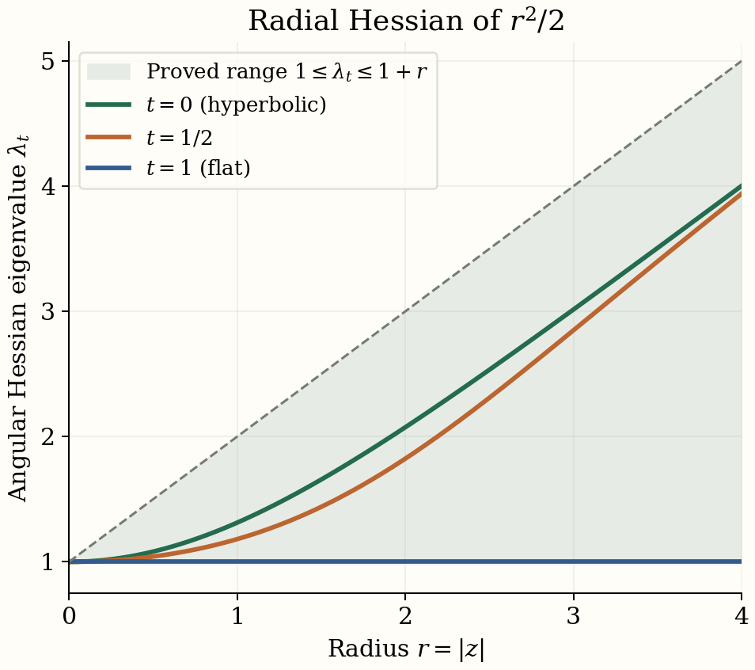

# Descent and the K-theory of crossed products

*Self-checked by the writing AI, GPT-6.1 Sol (OpenAI). Original text: public domain (CC0); linked proofs retain their stated licences.*

Descent turns an equivariant Fredholm operator into an operator between crossed products. The module, its compact operators and its tensor products all have convolution descriptions. Establishing those descriptions lets us prove that descent preserves the Kasparov product. For a real action, two successive Thom classes can then be compared through Takai duality; rescaling the action reduces their product to a scalar oscillator. We also distinguish amenability from K-amenability through the coefficient quotient and free-product constructions. The geometric part constructs radial and Dirac classes on Hadamard spaces, proves their inverse through metric deformation, and develops the vertical Dirac product and normal-subgroup bundles needed for connected groups.

Groups are second countable and locally compact, algebras are separable, and modules are countably generated. Actions preserve grading. Inner products are linear in the second variable, and Haar measures are left Haar measures. Write \(\rtimes\) for the full crossed product, \(\rtimes_r\) for the reduced one, and
\[
q_A:A\rtimes G\longrightarrow A\rtimes_rG
\tag{1.1}
\]
for the canonical quotient. The equivariant product and its associativity are Theorem 2.6 of *Equivariant KK-theory and the Green–Julg theorem*. We use the full universal construction and ideal exactness in *C\*-dynamical systems and full crossed products*, Theorem 2.3 and Section 3; the regular norm is Proposition 2.2 of *Reduced crossed products and Fell’s absorption principle*. Those are different completions of the same convolution algebra.

## 1. Crossing a Hilbert module

Let \(E\) be a Hilbert \(B\)-module with action \(U\) covering \(\beta\). For \(\xi,\eta\in C_c(G,E)\) and \(b\in C_c(G,B)\), define
\[
\begin{gathered}
(\xi b)(t)=\int_G\xi(s)\beta_s(b(s^{-1}t))\,ds,\\
\langle\xi,\eta\rangle(t)\\
=\int_G\beta_{s^{-1}}(\langle\xi(s),\eta(st)\rangle_B)\,ds.
\end{gathered}
\tag{1.2}
\]
The action on \(E\) does not appear explicitly in its inner product. It will enter the left convolution representation.

**Lemma 1.1 (the linking-algebra construction).** Completing (1.2) in either crossed-product norm gives a Hilbert \(B\rtimes_{(r)}G\)-module \(E\rtimes_{(r)}G\), and
\[
\mathcal K(E\rtimes_{(r)}G)
 \cong\mathcal K(E)\rtimes_{(r)}G.
\tag{1.3}
\]
For \(T\in\mathcal L(E)\), the formula
\[
(\widetilde T\xi)(t)=T\xi(t)
\tag{1.4}
\]
defines an adjointable operator, with adjoint \(\widetilde{T^*}\) and norm at most \(\|T\|\).

**Proof.** Form the linking algebra
\[
L=\mathcal K(E\oplus B)
 =\begin{pmatrix}\mathcal K(E)&E\\E^*&B\end{pmatrix}.
\tag{1.5}
\]
Its action has diagonal parts conjugation by \(U_g\) and \(\beta_g\), and sends an upper-right vector to \(U_g\xi\). Rank-one approximation proves norm continuity of this action. Let \(p,q\in M(L)\) be its two invariant corner projections. The upper-right corner of \(L\rtimes_{(r)}G\) contains \(C_c(G,E)\). Its right multiplication is the first formula in (1.2). Multiplying the adjoint of an upper-right function by another one gives the second formula: the modular factor in convolution involution cancels the factor in Haar inversion. Thus positivity of the inner product, the Gram-matrix inequalities and completion all follow from the C\*-algebra corner.

The lower-right corner is \(B\rtimes_{(r)}G\). For the full norm, extend a nondegenerate representation of the corner by induction with \(Lq\); the action on that induced space gives a covariant linking representation. Conversely restriction to the corner bounds its norm by the full corner norm. For the reduced norm, the regular linking representation compresses to the regular corner representation; inducing a faithful corner representation gives the reverse norm inequality. This is also seen by tensoring the regular modules with a faithful corner representation, as in the regular-module proof cited above. Hence neither corner acquires a different norm.

The projection \(q\) is full in \(L\): products of its off-diagonal corners span the rank-one operators on \(E\). It remains full after crossing. Indeed the span of \(LqL\) is dense in \(L\); coefficient approximation and a compactly supported group approximate identity therefore put every compactly supported \(L\)-function in the closed ideal generated by \(q\). This argument works in both norms, which are bounded by the group \(L^1\)-norm. Consequently
\[
\begin{gathered}
R=L\rtimes_{(r)}G,\\
\overline{pRqRp}=pRp.
\end{gathered}
\tag{1.6}
\]
The left side is exactly the compact operators on the upper-right corner, and the right side is \(\mathcal K(E)\rtimes_{(r)}G\). This proves (1.3).

The multiplier \(\operatorname{diag}(T,0)\) of \(L\) extends to a multiplier of its crossed product, since the coefficient inclusion is nondegenerate. Its action on the upper-right corner is (1.4). The multiplier extension is contractive and preserves adjoints, giving the last assertions. Separability of \(L\) and second countability of \(G\) make the corner module separable in norm; a countable dense set generates it as a module. \(\square\)

We will use the rectangular version of (1.3). If \(X,Y\) are equivariant Hilbert \(B\)-modules and \(k:G\to\mathcal K(Y,X)\) is continuous with compact support, then
\[
(K_k\eta)(t)=\int_G k(s)U_s^Y\eta(s^{-1}t)\,ds
\tag{1.7}
\]
is compact from \(Y\rtimes_{(r)}G\) to \(X\rtimes_{(r)}G\). Apply Lemma 1.1 to \(X\oplus Y\oplus B\) and take the indicated off-diagonal compact corner. The same argument gives \(\|K_k\|\leq\int\|k(s)\|ds\). Thus continuous compact-operator coefficients, rather than individual group multipliers, produce the descended compact operators.

## 2. Descent of cycles

Let \((E,\phi,F)\) be a Kasparov G-cycle from \(A\) to \(B\). On its crossed module put
\[
\begin{gathered}
(\pi(a)\xi)(t)=\phi(a)\xi(t),\\
(V_s\xi)(t)=U_s\xi(s^{-1}t),\\
(\widetilde\phi(f)\xi)(t)\\
=\int_G\phi(f(s))U_s\xi(s^{-1}t)\,ds.
\end{gathered}
\tag{2.1}
\]
Substitution in (1.2) shows that \(V_s\) is a right-module unitary and that \(V_s\pi(a)V_s^*=\pi(\alpha_s(a))\). The vector norm continuity follows first for compact sections and then by density. The full universal property gives the representation of \(A\rtimes G\).

**Lemma 2.1 (the reduced left representation).** On \(E\rtimes_rG\), the last formula in (2.1) is bounded by \(\|f\|_{A\rtimes_rG}\). It therefore factors through \(A\rtimes_rG\).

**Proof.** Use a faithful representation of the linking algebra in (1.5) and its regular representation on \(L^2(G,H_L)\). The \(p\)-corner represents the adjointable operators on \(E\rtimes_rG\) faithfully: a faithful representation of the \(q\)-corner induces this representation, and \(q\) is full by (1.6). On the \(p\)-space, the coefficient action of \(a\) at \(t\) is
\(\rho(\phi(\alpha_{t^{-1}}(a)))\), and the group acts by left translation. This is the regular covariant representation of \(A\) associated with \(\rho\phi\). A possibly degenerate coefficient representation can be restricted to its essential subspace; its complement contributes zero. The regular-norm contraction for arbitrary coefficient representations now gives the assertion. Faithfulness of the induced linking representation transfers that bound to the module operator. \(\square\)

**Theorem 2.2 (descent).** The formulas above define homomorphisms
\[
\begin{gathered}
j_G:KK^G(A,B)\\
\longrightarrow KK(A\rtimes G,B\rtimes G),\\
j_{G,r}:KK^G(A,B)\\
\longrightarrow KK(A\rtimes_rG,B\rtimes_rG),\\
j_{G,(r)}[E,\phi,F]\\
=[E\rtimes_{(r)}G,\widetilde\phi,\widetilde F].
\end{gathered}
\tag{2.2}
\]
They are natural in both coefficient algebras and preserve the two degrees.

**Proof.** Lemma 1.1 gives the operator, and Lemma 2.1 gives the reduced representation. Normalize \(F\) to be self-adjoint and contractive, using the equivariant normalization from the preceding lesson. For homogeneous \(f(s)\), the commutator in the convolution core has compact coefficient
\[
\begin{gathered}
k_f(s)=[F,\phi(f(s))]_{\rm gr}\\
 +(-1)^{|f|}\phi(f(s))(F-s\cdot F).
\end{gathered}
\tag{2.3}
\]
The first summand is compact by the ordinary cycle condition. The second is compact by the equivariance condition on both sides of the source, obtained by taking adjoints. Both are norm continuous and compactly supported. Equation (1.7) proves that the descended commutator is compact. The square defect has coefficient
\[
k'_f(s)=(F^2-1)\phi(f(s)),
\tag{2.4}
\]
and is compact for the same reason. Before normalization the adjoint defect is treated identically. Density of \(C_c(G,A)\), continuity of the representation and closedness of the compact ideal extend these checks to the entire source crossed product.

For a homotopy use coefficient \(C([0,1],B)\), with trivial action on the interval. Crossing identifies this algebra with \(C([0,1],B\rtimes_{(r)}G)\). In the full case this follows from commuting covariant representations and nuclearity of the interval function algebra; a finite partition of unity proves equality of the tensor norms. In the reduced case it follows directly from the regular representation and the supremum over interval fibres. Compact-support partitions also prove surjectivity. The descended evaluation modules are the endpoint modules: tensor with evaluation and use the core section map. Thus descent preserves homotopies. Direct sums and degenerate cycles are preserved by the displayed formulas, so (2.2) gives group homomorphisms.

Equivariant coefficient tensoring has the core map
\[
\begin{gathered}
(\xi\otimes b)(t)\\
=\int_G\xi(s)\otimes\gamma_s(b(s^{-1}t))\,ds.
\end{gathered}
\tag{2.5}
\]
with the coefficient homomorphism understood in the balancing relation. The inner-product calculation in (1.2) makes this an isometry, and group approximate identities give dense range. It identifies coefficient change before and after crossing. Pullback of the left representation is immediate from (2.1). These observations give both naturalities. The group acts trivially on the finite auxiliary Clifford algebra; tensoring it through the convolution formulas gives the odd-degree construction. \(\square\)

For an equivariant homomorphism \(v:A\to B\), its cycle is \((B,v,0)\). Equations (1.2) and (2.1) identify its descended cycle with \((B\rtimes_{(r)}G,v\rtimes_{(r)}G,0)\). In particular,
\[
\begin{gathered}
j_{G,(r)}[v]=[v\rtimes_{(r)}G],\\
j_{G,(r)}(1_A)=1_{A\rtimes_{(r)}G}.
\end{gathered}
\tag{2.6}
\]

## 3. Tensor products and positivity under descent

**Lemma 3.1 (the crossed tensor unitary).** For equivariant correspondences \(E_1:A\to B\) and \(E_2:B\to C\), the map
\[
\begin{gathered}
D=B\rtimes_{(r)}G,\\
X_i=E_i\rtimes_{(r)}G,\\
Y=(E_1\widehat\otimes_BE_2)\rtimes_{(r)}G,\\
W:X_1\widehat\otimes_DX_2\longrightarrow Y,\\
W(\xi\widehat\otimes\eta)(t)\\
=\int_G\xi(s)\widehat\otimes U_s^2\eta(s^{-1}t)\,ds.
\end{gathered}
\tag{3.1}
\]
extends to an even unitary intertwining the left convolution representations.

**Proof.** Substitute the right convolution (1.2) into the left side's balancing relation. Set the second group variable equal to \(sr\); covariance of \(U_s^2\) moves \(\beta_s\) from the coefficient to its represented action. This gives the same integral on either side of the balancing relation. To check the inner product, expand both integrals on the right of (3.1) and use
\[
\langle x\widehat\otimes u,y\widehat\otimes v\rangle
 =\langle u,\phi_2(\langle x,y\rangle_B)v\rangle_C.
\tag{3.2}
\]
Changing the inner integration variables by left translations and applying covariance of \(U^2\) gives
\(\langle\eta,\widetilde\phi_2(\langle\xi,\xi'\rangle)\eta'\rangle\).
This is precisely the interior-tensor inner product. Compact supports justify Fubini; no right-translation change is being made without its modular factor. Equality of these algebraic inner products proves isometry in either completion.

For dense range, choose an integral-one function \(h\) supported near the identity and take \(\xi(s)=h(s)x\). The integral then approaches \(t\mapsto x\widehat\otimes\eta(t)\), uniformly on a common compact support, since \(U_s^2\eta(s^{-1}t)\to\eta(t)\) uniformly there. Such simple tensor sections are dense in \(C_c(G,E_1\widehat\otimes_BE_2)\), by finite partitions and tensor density. Uniform approximation with common compact support implies module-norm approximation: (1.2) gives \(\|\zeta\|\leq\int\|\zeta(t)\|dt\). Thus the isometry is onto. Substitution of (2.1) proves its left intertwining assertion. \(\square\)

We need the following elementary consequence of the connection condition. Put \(E=E_1\widehat\otimes_BE_2\) and
\[
I_1=\mathcal K(E_1)\widehat\otimes1\subset\mathcal L(E).
\tag{3.3}
\]
If \(F\) is an \(F_2\)-connection, then \([F,k]_{\rm gr}\) is compact for every homogeneous \(k\in I_1\). For a rank-one operator write \(k=T_xT_y^*\); the two connection errors are compact, and the two remaining \(F_2\)-terms cancel with the graded signs. Finite-rank approximation proves the assertion. If \(D\) is a zero connection, meaning \(DT_x\) and \(T_x^*D\) are compact, then \(DI_1,I_1D\subset\mathcal K(E)\).

**Theorem 3.2 (product compatibility).** For \(x\in KK^G(A,B)\) and \(y\in KK^G(B,C)\),
\[
\begin{gathered}
j_{G,(r)}(x\widehat\otimes_By)\\
=j_{G,(r)}(x)\widehat\otimes_{B\rtimes_{(r)}G}j_{G,(r)}(y).
\end{gathered}
\tag{3.4}
\]

**Proof.** Choose self-adjoint operators \(F_1,F_2\) and an equivariant product operator \(F\) supplied by the preceding lesson. On \(E\) put \(S=F_1\widehat\otimes1\). Under \(W\), the first descended operator tensored with one is exactly \(\widetilde S\); this follows by putting \(F_1\xi(s)\) into (3.1).

For a homogeneous creation section \(\xi\in C_c(G,E_1)\), the error between the proposed product operator and the descended second operator has coefficient
\[
\begin{gathered}
d_\xi(s)=FT_{\xi(s)}
       -(-1)^{|\xi|}T_{\xi(s)}F_2\\
\hspace{10mm}
 +(-1)^{|\xi|}T_{\xi(s)}(F_2-s\cdot F_2).
\end{gathered}
\tag{3.5}
\]
The first line is compact by the connection property. For the second line approximate each vector by finite sums \(xb\); then \(T_{xb}=T_x\phi_2(b)\), and the localized equivariance defect makes this product compact. The approximation can be uniform on the compact range of \(\xi\). Norm continuity follows from that of the operator orbits and creation maps. Equation (1.7), applied to rectangular compact corners, makes the descended creation error compact. Taking adjoints proves the adjoint creation error. Therefore \(\widetilde F\) is a \(\widetilde F_2\)-connection.

For positivity put \(T=[S,F]_{\rm gr}=SF+FS\). The original product condition is
\[
\phi(a)T\phi(a)^*\geq0
       \pmod{\mathcal K(E)}.
\tag{3.6}
\]
We explain why it survives crossing, including reduced crossing. First,
\[
\begin{gathered}
{}[T,\phi(a)]\in\mathcal K(E),\\
(g\cdot T-T)\phi(a)\in\mathcal K(E),\\
\phi(a)(g\cdot T-T)\in\mathcal K(E).
\end{gathered}
\tag{3.7}
\]
For the first assertion expand the commutator with \(SF+FS\). Terms containing \([F,\phi(a)]_{\rm gr}\) are compact. The remaining terms are the graded commutator of \(F\) with \([S,\phi(a)]_{\rm gr}\in I_1\), hence compact by (3.3). For the second assertion, \(g\cdot F\) is again an \(F_2\)-connection: it is a \(g\cdot F_2\)-connection, and \(g\cdot F_2-F_2\) is B-locally compact. Thus \(g\cdot F-F\) is a zero connection. Also \((g\cdot S-S)\phi(a)\in I_1\). Expand
\[
\begin{gathered}
g\cdot T-T\\
=[g\cdot S-S,F]_{\rm gr}\\
  +[g\cdot S,g\cdot F-F]_{\rm gr}.
\end{gathered}
\tag{3.8}
\]
After source multiplication, the first term is compact by the connection commutator rule. In the second term the localized defect of \(F\) is compact, while the terms produced by moving a source function past \(S\) are a zero connection times \(I_1\). These are compact by (3.3). Adjoints prove the other localization.

Let \(D\subset\mathcal L(E)\) be the invariant C\*-algebra generated by \(\mathcal K(E)\), \(\phi(A)\) and all translates of \(T\). Its action is norm continuous; \(S,F\), and hence \(T\), are G-continuous. It is separable. In \(D/\mathcal K(E)\), let \(I\) be the ideal generated by the image of \(\phi(A)\). Equation (3.7) says that \(T\) acts on \(I\) as an invariant central multiplier. Equation (3.6) says this multiplier is positive. To see the latter assertion on the whole ideal, an approximate identity of \(A\) acts nondegenerately on \(I\): its products approximate every generator \(\phi(a)\) times a polynomial in translates of \(T\). Compressing the multiplier by those approximate-identity elements is positive by (3.6); the strict limit is positive.

It follows that for \(f\in C_c(G,A)\), its image in the **full** crossed product satisfies
\(\widetilde\phi(f)\widetilde T\widetilde\phi(f)^*\geq0\)
modulo \(\mathcal K(E)\rtimes G\). Indeed the invariant positive multiplier of \(I\) remains positive after full crossing; full ideal exactness identifies the kernel of the quotient with that compact crossed ideal. A positive element of the quotient has a positive lift, by lifting its positive square root and multiplying it by its adjoint. Represent this full operator-algebra crossed product on either of the two crossed modules. Its compact ideal maps into compact operators by (1.3). A positive lift remains positive in either representation. This proves descended positivity in both completions. It does not require exactness of reduced crossing.

Now \([\widetilde S,\widetilde F]_{\rm gr}=\widetilde T\). The connection check (3.5), the positivity check just proved, and the non-equivariant product characterization give (3.4). Density extends positivity from compact functions to every source element. Auxiliary Clifford factors use the same calculation and signed tensor unitary, so the result includes all degrees. \(\square\)

One useful relation between the two versions is
\[
\begin{gathered}
{}[q_A]\widehat\otimes_{A\rtimes_rG}j_{G,r}(x)\\
 =j_G(x)\widehat\otimes_{B\rtimes G}[q_B].
\end{gathered}
\tag{3.9}
\]
Both sides have the same module: the full crossed module tensored over \(B\rtimes G\) with \(B\rtimes_rG\). Its core inner product is obtained by applying \(q_B\) to (1.2), giving the reduced completion, and the left convolution operator and pointwise \(F\) agree. Equation (3.9) is a compatibility square, not an assertion that \(q_A\) is always invertible.

## 4. The real Thom operator

Let \(\alpha\) be a point-norm continuous action of \(\mathbb R\) on \(A\), and set \(B_\alpha=A\rtimes_\alpha\mathbb R\). We use the positive Fourier transform
\[
\widehat h(\xi)=\int_{\mathbb R}e^{it\xi}h(t)\,dt.
\tag{4.1}
\]
The canonical group representation \(u_t\in M(B_\alpha)\) has self-adjoint generator \(P_\alpha\), so that \(u_t=e^{itP_\alpha}\). More precisely, the nondegenerate map \(C^*(\mathbb R)=C_0(\mathbb R)\to M(B_\alpha)\) supplies its continuous functional calculus. A continuous real function with limits \(-1,+1\) at the two ends supplies a bounded multiplier \(h(P_\alpha)\).

**Proposition 4.1 (the Thom cycle).** For any such function \(h\), the odd cycle
\[
\begin{gathered}
t_\alpha=[B_\alpha,i_A,h(P_\alpha)]\\
 \in KK^1(A,B_\alpha).
\end{gathered}
\tag{4.2}
\]
is well-defined and independent of \(h\). In (4.2) an ungraded odd cycle is understood as the right \(C_1\)-cycle of this course. The same construction works for graded \(A\), with the extra odd Clifford generator.

**Proof.** Choose
\[
\begin{gathered}
\chi(\xi)=\frac2\pi\int_0^1\frac{\sin(t\xi)}t\,dt,\\
\chi(P_\alpha)
 =\frac1{i\pi}\operatorname{pv}
          \int_{-1}^1\frac{u_t}{t}\,dt.
\end{gathered}
\tag{4.3}
\]
The first formula is bounded, continuous and real, and has the required limits by the sine-integral limit. That limit can be verified by inserting \(e^{-\varepsilon t}\) into the integral on \((0,\infty)\), differentiating in \(\xi\), and integrating \(\varepsilon/(\varepsilon^2+\xi^2)\); integration by parts bounds the discarded tail uniformly away from zero. The second formula is its group functional calculus, obtained first on truncated integrals and then in any spectral representation. Thus no principal-value integral is being assumed to converge in multiplier norm.

For an element \(a\) differentiable in norm under the action,
\[
\begin{gathered}
{}[\chi(P_\alpha),i_A(a)]\\
 =\frac1{i\pi}\int_{-1}^1
       i_A\left(\frac{\alpha_t(a)-a}{t}\right)u_t\,dt.
\end{gathered}
\tag{4.4}
\]
The coefficient extends continuously at zero and has integrable norm. Its integral belongs to \(B_\alpha\). To justify (4.4), use the truncated integrals, commute \(a\) before integration and take their norm-convergent coefficient integrals; the spectral convergence gives the same weak operator limit. Smooth elements are norm dense: convolve \(a\) with smooth compactly supported scalar approximate identities in the action parameter. Boundedness of \(\chi(P_\alpha)\) extends compactness of the commutator to every \(a\).

Since \(\chi^2-1\in C_0(\mathbb R)\), the product
\((\chi(P_\alpha)^2-1)i_A(a)\) belongs to \(B_\alpha\). Here the needed coefficient-times-group-functional-calculus assertion is Proposition 2.2 of *C\*-dynamical systems and full crossed products*. On the standard module \(B_\alpha\), this algebra is precisely its compact operators. Self-adjointness is immediate. For another \(h\), \(h-\chi\in C_0(\mathbb R)\), so the two operators differ by an A-locally compact multiplier. Their straight interpolation has the required end limits and compact cycle defects, proving independence. In the graded construction the right generator anticommutes with every odd source element; (4.4) is then the graded commutator calculation with the same coefficient estimate. \(\square\)

**Proposition 4.2 (naturality and inactive factors).** For an equivariant homomorphism \(v:(A,\alpha)\to(D,\delta)\),
\[
t_\alpha\widehat\otimes_{B_\alpha}[v\rtimes\mathbb R]
 =[v]\widehat\otimes_Dt_\delta.
\tag{4.5}
\]
For every separable graded algebra \(C\) with trivial action,
\[
t_{\alpha\otimes1_C}=t_\alpha\boxtimes1_C.
\tag{4.6}
\]

**Proof.** If \(v\) is nondegenerate, its strict crossed-product extension sends the canonical group functional calculus to the canonical group functional calculus, so the tensor unitary identifies the cycles. If \(v\) is degenerate, its coefficient tensor module is the closed submodule generated by the image of \(B_\alpha\); the group functional calculus preserves that submodule. The restricted operator is the same one, and Proposition 5.1 of *Connections and the existence of the Kasparov product* identifies that essential cycle with the original representation by its module homotopy. No orthogonal complement to an arbitrary essential submodule is required. Equivalently this follows from the compact-left correspondence product and the common core integrals (4.3)–(4.4), without extending a degenerate map to a unital multiplier map.

For (4.6), use
\((A\widehat\otimes C)\rtimes\mathbb R
 \cong (A\rtimes\mathbb R)\widehat\otimes C\).
The spatial identity is proved by the regular representation, precisely Exercise 4 of *Reduced crossed products and Fell’s absorption principle*; the real group is amenable, so the full norm is the same by Theorem 4.2 and the abelian-amenability proposition of *Amenability and the equality of full and reduced crossed products*. Under this identity the group functional calculus is \(h(P_\alpha)\widehat\otimes1\). This identifies the cycle and proves (4.6), with no nuclearity assumption on \(C\). Associativity and the signed interchange law now give compatibility with external products by arbitrary KK-classes. \(\square\)

## 5. The scalar pair and the double-dual convention

Our dual action is positive:
\[
\widehat\alpha_s(f)(t)=e^{ist}f(t).
\tag{5.1}
\]
Takai duality, Theorem 8.3 and Proposition 8.4 of *Takai duality*, gives a natural isomorphism
\[
\begin{gathered}
\Theta_\alpha:B_\alpha\rtimes_{\widehat\alpha}\mathbb R\\
 \cong A\otimes\mathcal K(L^2(\mathbb R)).
\end{gathered}
\tag{5.2}
\]
It takes the double dual action to
\(\alpha\otimes\operatorname{Ad}\lambda\).
Write \(m_\alpha\) for the ordinary Morita class from the left side of (5.2) to \(A\).

The sign in the inverse Thom class must include the odd-product convention. Define
\[
\begin{gathered}
d_\alpha=-t_{\widehat\alpha}
 \widehat\otimes_{B_\alpha\rtimes\mathbb R}m_\alpha\\
 \in KK^1(B_\alpha,A).
\end{gathered}
\tag{5.3}
\]
The negative sign uses both our positive dual action and our right-Clifford product order. Calling the inverse class a dual Thom class is harmless once (5.3) is fixed; suppressing the sign while retaining these two conventions would give the wrong identity.

**Lemma 5.1 (scalar normalization).** For the trivial action on \(\mathbb C\), \(t_0\) is the positive frequency class in \(KK^1(\mathbb C,C_0(\mathbb R))\), and \(d_0\) is the odd differentiation cycle on the frequency line with operator
\[
\begin{gathered}
-P(1+P^2)^{-1/2},\\
P=-i\frac{d}{d\xi}.
\end{gathered}
\tag{5.4}
\]
They satisfy \(t_0d_0=1\) and \(d_0t_0=1\).

**Proof.** The standard odd position operator \(\xi/\sqrt{1+\xi^2}\) is (4.2). The cone calculation in Proposition 7.1 of *Bott periodicity in KK: the Bott and Dirac elements* identifies its K-class with the Cayley loop
\[
u(\xi)=\frac{\xi-i}{\xi+i},
\tag{5.5}
\]
of positive winding. In frequency coordinates, (5.1) acts by \(f(\xi)\mapsto f(\xi+s)\). Its covariant translation representation on \(L^2(\mathbb R_\xi)\) is \(v_s\eta(\xi)=\eta(\xi+s)\), with generator \(-i\partial_\xi=P\). Hence the raw dual Thom cycle after (5.2) has operator \(+P(1+P^2)^{-1/2}\). Formula (5.3) changes this to (5.4).

The odd-odd product matrices are those of Proposition 8.1 of *Connections and the existence of the Kasparov product*: the first operator multiplies \(\sigma_1\), and the second multiplies \(-\sigma_2\), with grading \(\sigma_3\). The unbounded product for \(t_0d_0\) is therefore
\[
\begin{gathered}
Q=\xi\sigma_1+P\sigma_2\\
 =\begin{pmatrix}0&\xi-\partial_\xi\\
                  \xi+\partial_\xi&0\end{pmatrix},\\
\operatorname{Dom}Q
 =\{\eta:\xi\eta,\ \partial_\xi\eta\in L^2\}.
\end{gathered}
\tag{5.6}
\]
The bounded-transform product criterion applies. Smooth compactly supported creation vectors have bounded differentiation errors and preserve the displayed graph domain; the first-operator positivity form is bounded below by \(-\|\eta\|^2\), because the differentiated coordinate contributes only a bounded Pauli matrix. The oscillator domain, compact graph inclusion and kernel are the complete earlier local calculation in *Bott periodicity in KK: the Bott and Dirac elements*, Lemma 4.0. The even kernel of (5.6) is the Gaussian and its odd kernel is zero. Its class is thus \(+1\). Replacing (5.4) by the raw \(+P\) reverses that index.

For the reverse identity, Theorem 7.3 of the Bott lesson gives the inverse cone and coisometry pair with its actual Clifford-transfer matrices. Its right odd differentiation cycle is exactly (5.4), and Proposition 7.1 gives (5.5). Transporting its two evaluation tensor unitaries through the fixed \(C_2\)-matrix correspondence gives \(d_0t_0=1\). Thus this uses the proved reverse-product homotopy, rather than inferring a left inverse from the scalar index. \(\square\)

We also need compatibility with an equivariant Morita correspondence. This is a property of the cycles, not a consequence of a nonequivariant homotopy of actions.

**Lemma 5.2 (Thom classes and Morita correspondences).** Let \(X\) be an equivariant graded imprimitivity correspondence from \((D,\delta)\) to \((A,\alpha)\), and let \(X\rtimes\mathbb R\) be its crossed correspondence. Then
\[
t_\delta\widehat\otimes[X\rtimes\mathbb R]
 =[X]\widehat\otimes t_\alpha.
\tag{5.7}
\]

**Proof.** The two coefficient algebras are invariant full corners in the linking algebra of \(X\). Lemma 1.1 crosses those corners to full corners, so the crossed off-diagonal module is again an imprimitivity correspondence. On that off-diagonal module take the linking group's multiplier \(\chi(P_L)\). The product on the left of (5.7) is this operator: tensoring a cycle with a compact-left correspondence keeps its operator, by the product characterization. For the right side it is a connection for the A-corner Thom operator. A creation by \(x\in X\) is the off-diagonal coefficient multiplier; its connection error is the corresponding corner of \([\chi(P_L),i_L(x)]\). Equation (4.4) and smooth approximation in the linking action make that error compact. Its adjoint corner gives the adjoint error. The first product operator is zero, so the positivity condition is zero. The localized square and adjoint defects are those of the linking Thom cycle. The product characterization consequently gives the same cycle on both sides. This proof includes both tensor unitary identifications and proves (5.7). \(\square\)

For the Takai Morita module \(X_\alpha=L^2(\mathbb R)\otimes A\), the action is
\[
(U_t\zeta)(x)=\alpha_t(\zeta(x-t)).
\tag{5.8}
\]
It implements the equivalence between the double dual action and \(\alpha\). Its crossed Morita class agrees with the next Takai Morita class:
\[
[X_\alpha\rtimes\mathbb R]=m_{\widehat\alpha}.
\tag{5.9}
\]
Here is a direct check of the convention. On \(L^2(\mathbb R_x)\otimes B_\alpha\), the crossed module has coefficient action \(a\otimes k\mapsto i_A(a)\otimes k\) and group action \(u_t\otimes\lambda_t\). The first Takai generators therefore act as multiplication by \(\alpha_x(a)\), right translation by the first group parameter, and multiplication by \(e^{-isx}\). The third group acts by \(u_t\lambda_t\). Conjugate by the right-module unitary
\(Z\zeta(x)=u_x^*\zeta(x)\), then apply the positive Fourier transform in \(x\), followed by frequency inversion. The four generators become, respectively,
\[
\begin{gathered}
i_A(a),\qquad e^{irs}u_s,\\
\eta(r)\longmapsto\eta(r+s),\qquad e^{-itr}.
\end{gathered}
\tag{5.10}
\]
These are exactly the final Takai multiplier formulas for the action \(\widehat\alpha\). The transforms are unitary on the coefficient Hilbert modules by the Euclidean Fourier proof in *Bott periodicity in KK: the Bott and Dirac elements*, Lemma 0.0a, and tensor density; \(Z\) is a unitary because its values are unitary multipliers. Equality on the dense integrated core proves (5.9). The check is needed because the double dual action contains the regular compact action, rather than being literally \(\alpha\otimes1\).

## 6. The Fack–Skandalis argument

**Theorem 6.1 (Connes–Thom in KK).** The classes (4.2) and (5.3) are inverse degree-one KK-equivalences:
\[
\begin{gathered}
t_\alpha\widehat\otimes_{B_\alpha}d_\alpha=1_A,\\
d_\alpha\widehat\otimes_At_\alpha=1_{B_\alpha}.
\end{gathered}
\tag{6.1}
\]
The covariant Thom family is uniquely determined by scalar normalization, equivariant naturality and compatibility with inactive tensor factors. The inverse family is uniquely determined by the corresponding inverse normalization and the reversed naturality squares.

**Proof.** Put \(D=C([0,1],A)\) and define an action
\[
(\rho_tf)(s)=\alpha_{st}(f(s)).
\tag{6.2}
\]
It is point-norm continuous. To check this uniformly in \(s\), approximate the compact range of \(f\) by finitely many coefficients and use uniform continuity of their action orbits on compact parameter intervals. Evaluation \(e_s:D\to A\) is equivariant for \(\rho\) and \(\alpha^{(s)}_t=\alpha_{st}\). Write \(\overline e_s\) and \(\overline{\overline e}_s\) for the induced single and double crossed maps. The natural Takai isomorphism sends the latter to \(e_s\otimes1_{\mathcal K}\); this follows directly from the coefficient kernel formula (8.19) of the Takai lesson.

Define
\[
v_\alpha=t_\alpha\widehat\otimes t_{\widehat\alpha}
                         \widehat\otimes m_\alpha
 \in KK(A,A).
\tag{6.3}
\]
Naturality (4.5), associativity and the naturality of the stability Morita module give
\[
\begin{gathered}
{}[e_s]\widehat\otimes v_{\alpha^{(s)}}
 =v_\rho\widehat\otimes[e_s],\\
\text{in }KK(D,A).
\end{gathered}
\tag{6.4}
\]
Only the double crossed evaluation was identified with \(e_s\otimes1\). No claim about a crossed nonequivariant inverse to \(e_s\) is being used. All \(e_s\) have the same ordinary KK-class. The constant-function homomorphism \(c:A\to D\) is an ordinary homotopy inverse to each evaluation. Multiplying (6.4) by \([c]\) therefore proves that \(v_{\alpha^{(s)}}\) is independent of \(s\).

At zero the action is trivial. Equations (4.6) and Lemma 5.1 give
\(v_{\alpha^{(0)}}=-1_A\), with precisely the raw-dual sign in (5.3). Hence \(v_\alpha=-1_A\), and the first identity in (6.1) follows.

Apply that same result to \(\widehat\alpha\). It gives
\[
-t_{\widehat\alpha}\widehat\otimes t_{\widehat{\widehat\alpha}}
                \widehat\otimes m_{\widehat\alpha}=1_{B_\alpha}.
\tag{6.5}
\]
Lemma 5.2, for the equivariant module (5.8), and identity (5.9) give
\[
m_\alpha\widehat\otimes t_\alpha
 =t_{\widehat{\widehat\alpha}}
                  \widehat\otimes m_{\widehat\alpha}.
\tag{6.6}
\]
Substitution of (5.3) into the second product in (6.1), followed by (6.6) and (6.5), proves that identity. This establishes both inverses before any cancellation is attempted.

For uniqueness, the already proved equivalences and the naturality square
\[
[e_s]\widehat\otimes t_{\alpha^{(s)}}
 =t_\rho\widehat\otimes[\overline e_s]
\tag{6.7}
\]
show that every \([\overline e_s]\) is a KK-equivalence: the other three arrows in this square are invertible. Let \(t'_\alpha\) be another family satisfying the stated axioms. Its trivial-action value is fixed by scalar normalization and inactive factors. Its naturality at zero determines
\[
t'_\rho=[e_0]\widehat\otimes t'_0
                       \widehat\otimes[\overline e_0]^{-1}.
\tag{6.8}
\]
Naturality at one then determines
\(t'_\alpha=[c]\widehat\otimes t'_\rho\widehat\otimes[\overline e_1]\).
Every class on the right of (6.8) is already fixed, so the family is unique. The reversed square gives the same argument for a contravariant family with the scalar inverse normalization. In particular uniqueness does not assume invertibility of a proposed second family. \(\square\)

This is the rescaling argument of Fack and Skandalis. The positive dual action and Clifford order in this course account for the explicit raw-dual sign above. Other compatible conventions absorb it into the name of the dual Thom class.

**Proposition 6.2 (comparison with the Wiener–Hopf normalization).** For trivially graded \(A\), right multiplication by \(t_\alpha\) on \(K_i(A)\) agrees with the suspension-compatible family in *The Connes–Thom isomorphism II: surjectivity, naturality and consequences*, equation (11.26):
\[
\begin{gathered}
x\widehat\otimes_At_\alpha=\Gamma_\alpha^i(x)\\
 =(-1)^{i+1}(\partial_{i+1}^\alpha)^{-1}(x),\\
\Gamma_{\mathrm{triv}}^0=\beta_A,\qquad
\Gamma_{\mathrm{triv}}^1=-\theta_A.
\end{gathered}
\tag{6.9}
\]
Here \(\partial\) is the fixed kernel-minus-cokernel or positive-exponential Wiener–Hopf boundary, and \(\beta,\theta\) are the ordinary positive Bott maps of that lesson.

**Proof.** At the trivial action, degree zero is the Cayley normalization (5.5). For degree one the right-Clifford order gives minus the ordinary two-coordinate position class, as computed in Proposition 7.2 of *Thom isomorphisms and K-orientations in KK*. Thus its map is \(-\theta_A\). The two values are exactly (11.23)–(11.26) in the Wiener–Hopf lesson; its proof includes the parity-one suspension sign, not only the scalar degree-zero index. Both families are natural for equivariant homomorphisms. Apply them to the family (6.2). The coefficient evaluation is a K-isomorphism, and (6.7) proves its crossed evaluation is a K-isomorphism. The two naturality squares therefore transport equality at zero to equality at one. This proves (6.9) without assuming an equivariant contraction of the action. \(\square\)

**Corollary 6.3 (simply connected solvable groups).** If a simply connected solvable Lie group \(G\) of dimension \(n\) acts on \(A\), then \(A\rtimes G\) is KK-equivalent to \(A\) in degree \(n\bmod2\).

**Proof.** Its Lie algebra has a nonzero functional annihilating its commutator unless it is zero. The associated left-invariant one-form is closed. Integrating it on the simply connected group gives a homomorphism \(p:G\to\mathbb R\); choosing \(X\) with \(dp(X)=1\) supplies the section \(t\mapsto\exp(tX)\). Thus \(G=N\rtimes\mathbb R\). The kernel is a closed connected simply connected solvable group of dimension one less: \(G\cong N\times\mathbb R\) as a manifold, which proves the connectedness and fundamental-group assertions. Iterate. These steps and the Haar-normalized semidirect crossed-product isomorphism are proved explicitly in Proposition 11.4 and equations (11.32)–(11.33) of the Wiener–Hopf lesson. Apply Theorem 6.1 at each real factor, and compose its inverse pairs by associativity. Each factor contributes degree one, proving the stated parity. Choices of chain and real orientations specify the equivalence. \(\square\)

## 7. The equivariant Toeplitz cycle

Let \(\theta\) be an automorphism of a trivially graded \(A\). On \(E=\ell^2(\mathbb Z)\otimes A\), define
\[
\begin{gathered}
(\phi(a)\xi)_n=a\xi_n,\\
(U_k\xi)_n=\theta^k(\xi_{n-k}),\\
F\xi_n=\begin{cases}\xi_n,&n\geq0,\\-\xi_n,&n<0.\end{cases}
\end{gathered}
\tag{7.1}
\]
The coefficient action is \(\theta^k\). Regard \(F\) as an odd cycle by adjoining the right \(C_1\)-factor.

**Proposition 7.1 (descent of the Toeplitz boundary).** Formula (7.1) defines
\(\varepsilon_\theta\in KK^1_{\mathbb Z}(A,A)\).
Let
\[
d_{\rm old}\in KK^1(A\rtimes_\theta\mathbb Z,A)
\tag{7.2}
\]
be the raw Toeplitz extension class. Its coefficient extension through the inclusion \(\iota:A\to A\rtimes\mathbb Z\) is the full descent of \(\varepsilon_\theta\), as the precise identity (7.5) states.

**Proof.** The \(U_k\) are semilinear isometries and satisfy covariance with the constant left coefficients. The first three cycle defects are zero. Conjugating \(F\) by \(U_k\) moves its dividing index from zero to \(k\), so its equivariance defect is supported on finitely many indices. After multiplication by \(a\), its matrix entries belong to \(A\), and it is compact. This proves the equivariant cycle assertion.

Its descended module is \(\ell^2(\mathbb Z)\otimes(A\rtimes\mathbb Z)\), with coefficients acting constantly and group generator acting by \(S\otimes u\). The unitary
\[
(Z\xi)_n=u^{-n}\xi_n
\tag{7.3}
\]
changes the left representation to
\[
\begin{gathered}
(\rho(a)\xi)_n=\theta^{-n}(a)\xi_n,\\
\rho(u)=S.
\end{gathered}
\tag{7.4}
\]
It keeps \(F\) fixed. Thus the descended cycle is the coefficient extension, through \(A\to A\rtimes\mathbb Z\), of the A-valued bilateral Toeplitz cycle \((\ell^2(\mathbb Z)\otimes A,\rho,F)\). Compression to \(n\geq0\) is the Fock completely positive section of the generalized Toeplitz extension. Lemma 6.1 and the global boundary calculation following Theorem 7.1 of *Exact sequences in KK and the universal coefficient theorem* prove that this A-valued cycle is \(d_{\rm old}\). Consequently the precise descent identity is
\[
\begin{gathered}
j_{\mathbb Z}(\varepsilon_\theta)
 =d_{\rm old}\widehat\otimes_A[\iota],\\
\iota:A\longrightarrow A\rtimes\mathbb Z.
\end{gathered}
\tag{7.5}
\]
All the matrix entries and tensor modules in (7.3)–(7.4) give this identity directly. Descent itself has target \(A\rtimes\mathbb Z\); obtaining the A-valued boundary uses the explicit Toeplitz cycle, not an unprovided inverse to \(\iota\). \(\square\)

**Theorem 7.2 (Pimsner–Voiculescu in KK).** Put
\[
d=d_{\rm old}\widehat\otimes_A(-[\theta^{-1}]).
\tag{7.6}
\]
For every separable graded \(D\), the two cyclic sequences
\[
\begin{gathered}
KK^k(D,A)\xrightarrow{1-\theta_*}KK^k(D,A)\\
 \xrightarrow{\iota_*}KK^k(D,A\rtimes\mathbb Z)\\
 \xrightarrow{d_*}KK^{k+1}(D,A),\\[2mm]
KK^k(A\rtimes\mathbb Z,D)\xrightarrow{\iota^*}KK^k(A,D)\\
 \xrightarrow{1-\theta^*}KK^k(A,D)\\
 \xrightarrow{d^*}KK^{k+1}(A\rtimes\mathbb Z,D).
\end{gathered}
\tag{7.7}
\]
are exact. In particular \(D=\mathbb C\) gives the K-theory PV sequence. Full and reduced crossed products coincide here.

**Proof.** The complete Toeplitz extension proof is Theorem 7.1 of *Exact sequences in KK and the universal coefficient theorem*, using its Lemma 6.1, Theorem 6.2 and semisplit exactness Theorem 4.2. To identify the arrows, its two Fock representations send the first ideal corner \(a e_{00}\) to \(a e_{00}\) and \(\theta^{-1}(a)e_{11}\), respectively. Their quasihomomorphism therefore gives the ideal arrow \(1-[\theta^{-1}]\). The middle-algebra equivalence is the coefficient inclusion, whose composite with the quotient is the actual \(\iota\). Changing the ideal identification by \(-[\theta]\) gives
\[
(1-[\theta^{-1}])(-[\theta])=1-[\theta]
\tag{7.8}
\]
and changes the boundary to (7.6). This is the same change in the reversed-variable sequence. The exact internal theorem supplies both variables and every degree, while Proposition 7.1 identifies the equivariant convolution cycle producing its Toeplitz operator. Abelian amenability supplies equality of completions. \(\square\)

The real-action route reaches the same sequence. The mapping torus
\[
\begin{gathered}
M_\theta\subset C([0,1],A),\\
f\in M_\theta\ \Longleftrightarrow\ 
f(1)=\theta^{-1}(f(0)).
\end{gathered}
\tag{7.9}
\]
has the semisplit endpoint extension with kernel \(SA\). Its boundary is endpoint one minus endpoint zero, hence \(\theta_*^{-1}-1\) in the positive suspension coordinates. Green imprimitivity and Theorem 6.1 identify \(M_\theta\rtimes\mathbb R\) with \(A\rtimes\mathbb Z\) up to Morita equivalence and change parity. The endpoint calculation and the Fourier-window identification of the inclusion arrow are proved in the PV application of the Wiener–Hopf lesson, equations (11.37)–(11.38), with the exact Fourier-window provider identified there. Thus the mapping-torus and Toeplitz presentations have the same coefficient and inclusion arrows once (7.6) fixes the boundary normalization.

## 8. K-amenability and the quotient class

A unitary representation \(V\) is **weakly contained in the regular representation** when its integrated representation of \(C^*(G)\) factors through \(C_r^*(G)\). A group is **K-amenable** if \(1_{\mathbb C}\in KK^G(\mathbb C,\mathbb C)\) has an even cycle \((H,V,F)\) for which the group representation on both graded Hilbert spaces is weakly contained in the regular one. The coefficient representation is the scalar identity. The operator need only be equivariant modulo compact operators, as in the general cycle definition.

**Lemma 8.1 (weak containment in a covariant pair).** Suppose \(V\prec\lambda\), and \((\pi,U)\) is any Hilbert-space covariant representation of \((A,G)\). Then the integrated pair
\[
(1_H\otimes\pi,\ V\otimes U)
\tag{8.1}
\]
is bounded by the reduced crossed-product norm.

**Proof.** Let \(D\) be \(C_r^*(G)\), with its unit adjoined if necessary. Its regular representation is faithful, and the factor representation \(V\) extends to \(D\). For a finite tuple \(h_1,\ldots,h_n\in H\), the positive functional
\[
\omega((b_{ij}))=
 \sum_{i,j}\langle h_i,V(b_{ij})h_j\rangle
\tag{8.2}
\]
on \(M_n(D)\) is a weak-* limit of sums of vector functionals in the faithful amplified regular representation, with the same limiting norm. Here is the finite-test justification. The convex set of vector states in a faithful unital representation has every state in its weak-* closure: a separating self-adjoint element would have a larger state value than its maximum spectral value in that faithful representation. Hahn–Banach separation therefore excludes separation. Apply this to the matrix algebra and multiply by \(\|\omega\|\). Finite sums of vector states are single vector states in an amplification. Including the matrix units tensored with the unit among the tests also gives convergence of all the Gram entries \(\langle h_i,h_j\rangle\).

For \(f\in C_c(G,A)\) and \(z=\sum_i h_i\otimes v_i\), expand the squared norm of its integrated operator applied to \(z\). It is a finite sum of expressions
\[
\int_G c_{ij}(g)\langle h_i,V_g h_j\rangle\,dg,
\tag{8.3}
\]
where each scalar \(c_{ij}\) is continuous and compactly supported. Indeed expanding the two original integrals and setting their second variable equal to \(sg\) gives such a coefficient, with support in \((\operatorname{supp}f)^{-1}\operatorname{supp}f\). Strong continuity, compact supports and Fubini justify continuity and this change of variables. Thus (8.3) tests an actual element of \(C_r^*(G)\), not an individual multiplier at a point. Approximate the matrix functional (8.2) on these finitely many tests and on its Gram entries. The resulting expressions are squared norms for \(\lambda\otimes U\) on corresponding finite tensor vectors, whose squared norms converge to \(\|z\|^2\).

Fell absorption identifies \((1\otimes\pi,\lambda\otimes U)\) with a regular covariant representation of \(A\), by Theorem 2.3 of the reduced-crossed-product lesson. Therefore every approximating squared norm is at most \(\|f\|_r^2\) times its input squared norm. Passing to the limit gives the same bound for \(z\). Finite tensor vectors are dense, proving the assertion. \(\square\)

**Theorem 8.2 (the K-amenable quotient is invertible).** If \(G\) is K-amenable, then for every separable graded G-algebra \(A\),
\[
[q_A]\in KK(A\rtimes G,A\rtimes_rG)
\tag{8.4}
\]
is a KK-equivalence. Consequently the canonical full-to-reduced map induces isomorphisms of K-theory in both degrees.

**Proof.** Choose the weakly regular cycle representing the equivariant unit. Dilate it by \(A\). Its full descended module identifies with
\[
H\widehat\otimes(A\rtimes G),
\tag{8.5}
\]
and its operator is \(F\widehat\otimes1\). The left convolution representation is the integrated pair with coefficient action \(1\otimes i_A\) and group action \(V_g\otimes u_g\). To prove that it factors through \(A\rtimes_rG\), tensor the coefficient module with a faithful representation of \(A\rtimes G\). The resulting Hilbert-space covariant representation is bounded by the reduced norm by Lemma 8.1. Faithfulness of the tensor representation on adjointable module operators, proved in the regular-module construction, transfers that bound back to (8.5).

Thus the same cycle, with its factored left action, defines
\[
z_A\in KK(A\rtimes_rG,A\rtimes G).
\tag{8.6}
\]
Its cycle conditions hold because they were already checked for every element of the full source; the quotient is onto. Pulling its left action back through \(q_A\) recovers full descent of the dilated unit. Theorem 3.2 and (2.6) therefore give
\[
[q_A]\widehat\otimes z_A=1_{A\rtimes G}.
\tag{8.7}
\]
Extending its right coefficient through \(q_A\) gives the reduced descended cycle, with exactly the same operator and the reduced convolution representation. Descent of the dilated equivariant unit is again the identity, so
\[
z_A\widehat\otimes[q_A]=1_{A\rtimes_rG}.
\tag{8.8}
\]
These are both inverse identities. Multiplication by them gives the K-isomorphisms. \(\square\)

Amenable groups are K-amenable. Their trivial representation is weakly regular: the Reiter unit vectors give regular coefficient states tending to the trivial character on every compactly supported group integral, which bounds that character by the reduced norm. The unit cycle is the finite-dimensional even scalar module with operator zero. For an amenable group, the stronger conclusion that \(q_A\) is an actual isomorphism is Theorem 4.2 of the amenability lesson. K-amenability asks only for the two inverse KK-classes, and allows the actual norms to differ.

**Proposition 8.3 (a converse and two permanence properties).** For a countable discrete group, K-amenability is equivalent to invertibility of \(C^*(G)\to C_r^*(G)\) in KK. Every subgroup of a countable discrete K-amenable group is K-amenable. The product of two second-countable locally compact K-amenable groups is K-amenable.

**Proof.** The forward implication is Theorem 8.2 with scalar coefficients. Conversely, let \(z\) be an inverse to the group quotient class and let \(\epsilon:C^*(G)\to\mathbb C\) be the trivial character. The class \(z\widehat\otimes[\epsilon]\) is represented by a cycle from the unital algebra \(C_r^*(G)\) to \(\mathbb C\). Normalize its operator and restrict to its unital essential Hilbert-space summand. The discarded cross terms are compact, since they are commutators with the source unit projection. Its representation sends each regular group unitary to a unitary on that summand, giving a weakly regular representation of \(G\); the ordinary cycle defects on those unitaries are the equivariance defects of a scalar G-cycle. Pullback through the full-to-reduced quotient represents \([\epsilon]\). The dual Green–Julg isomorphism, Theorem 5.1 of the preceding lesson, identifies \([\epsilon]\) with the equivariant scalar unit. Thus this is the required weakly regular unit representative. Discreteness supplies actual group unitaries in the unital reduced algebra.

For a subgroup \(H\subset G\), restrict such a unit cycle. Restriction preserves its unit class by the equivariant product functoriality. The regular representation of \(G\) restricted to \(H\) is a direct sum of regular H-representations: decompose \(G\) into right cosets \(Hr\), each acted on by left H-translation. For a finite H-group-algebra element its regular norm on \(G\) therefore equals its regular norm on \(H\). Weak containment of the original cycle representation bounds its restricted norm by this number. The restricted representations are weakly regular, proving the subgroup assertion.

For the product group, use the two unit cycles with the other group acting trivially and form their equivariant external product. The product theorem gives a cycle on the tensor product of their Hilbert spaces; its class is the unit by the signed interchange law. Its group representation is the tensor product of the two original representations. These factor through their reduced group algebras, and their spatial tensor representation factors through
\[
\begin{gathered}
C_r^*(G_1\times G_2)\\
 \cong C_r^*(G_1)\otimes_{\min}C_r^*(G_2).
\end{gathered}
\tag{8.9}
\]
The isomorphism follows by identifying the regular Hilbert space with \(L^2(G_1)\otimes L^2(G_2)\) and taking the closure of product convolution functions; compact-support tensor partitions give density. Hence the tensor representation is weakly regular, proving K-amenability of the product. \(\square\)

**Proposition 8.4 (the Kazhdan projection obstruction).** An infinite countable discrete group with property \(T\) is not K-amenable. Compact groups are both K-amenable and groups with property \(T\), so the infinitude qualification cannot be omitted in the discrete assertion.

**Proof.** For a discrete property \(T\) group choose a finite Kazhdan set \(S\) and a number \(\epsilon>0\): a unit vector moved by less than \(\epsilon\) by every member of \(S\) forces a nonzero invariant vector. Apply this condition to the orthogonal complement of the invariant vectors in any unitary representation. Every vector \(\xi\) in that complement satisfies
\[
\sum_{s\in S}\|(1-U_s)\xi\|^2
 \geq\epsilon^2\|\xi\|^2.
\tag{8.10}
\]
Indeed, violation for a unit vector would make each summand's norm less than \(\epsilon\), contradicting the absence of invariants. In the unital full group algebra put
\[
\begin{gathered}
h=\frac1{|S|}\sum_{s\in S}(1-u_s)^*(1-u_s),\\
\delta=\frac{\epsilon^2}{|S|}.
\end{gathered}
\tag{8.11}
\]
The kernel of the represented \(h\) is the invariant subspace, and its spectrum on the orthogonal complement lies in \([\delta,4]\). This holds in the universal representation, hence the full algebra's spectrum lies in \(\{0\}\cup[\delta,4]\). A continuous function equal to one at zero and zero on \([\delta,4]\) consequently defines a projection \(p=f(h)\). It is the invariant-subspace projection in every representation. The trivial character satisfies \(\epsilon_G(p)=1\), so
\[
(\epsilon_G)_*[p]=1\in K_0(\mathbb C).
\tag{8.12}
\]
In particular \([p]\ne0\). For infinite \(G\), its regular representation has no nonzero invariant square-summable function: an invariant function is constant. Thus \(q(p)=0\). The quotient is not injective on \(K_0\), whereas Theorem 8.2 makes it a K-isomorphism for a K-amenable group. This proves the obstruction.

For a compact group, normalized Haar averaging is the orthogonal projection onto invariant vectors. If a unit vector is uniformly moved by less than one on the whole compact group, its average is within distance less than one of that vector and is nonzero. This is a compact Kazhdan set and proves property \(T\). Haar averaging also gives amenability, which gives K-amenability as above. \(\square\)

## 9. The tree homotopy and free groups

We prove the tree mechanism explicitly. Let a countable discrete group act without inversions on a countable tree \(T\). Let \(V(T)\) be its vertices and let \(\ell^2(E(T))^-\) have one unit vector per geometric edge, with reversal of orientation multiplying that vector by \(-1\). Choose a root \(o\), and write \(p(v)\) for the neighbor of \(v\ne o\) on its path to the root. Define
\[
\begin{gathered}
L\delta_o=0,\\
L\delta_v=\delta_{(p(v),v)}\quad(v\ne o).
\end{gathered}
\tag{9.1}
\]
It is a coisometry from vertex space to oriented-edge space, with kernel \(\mathbb C\delta_o\). Its failure to intertwine the two permutation actions is supported on the finite path from \(o\) to \(go\): changing the root reverses the outgoing orientation only on that path. Hence the even Fredholm cycle built from \(L,L^*\) is equivariant modulo finite rank.

**Lemma 9.1 (the deformed vertex representation).** There is a norm-continuous, for each fixed \(g\), family of unitary vertex representations \(\pi_t(g)\), \(0\leq t\leq1\), such that \(\pi_0\) is the original vertex permutation representation, \(\pi_1\) fixes the root line and acts on its complement as the oriented-edge representation through \(L\), and \(\pi_t(g)-\pi_0(g)\) is finite rank.

**Proof.** For \(0\leq t<1\), give the algebraic vertex span the inner product
\[
\langle\delta_v,\delta_w\rangle_t=t^{d(v,w)}.
\tag{9.2}
\]
Its positivity and definiteness have an explicit orthonormalization. The root vector has norm one, and
\[
e_v^{(t)}=
 \frac{\delta_v-t\delta_{p(v)}}{\sqrt{1-t^2}}
 \quad(v\ne o)
\tag{9.3}
\]
is an orthonormal family with it. To check orthogonality, if two rooted paths branch, their distances in the four expanded inner products differ by exactly the two parent steps, and the terms cancel. If one vertex lies on the other's path, expansion in (9.3) gives the same cancellation. The norm calculation is \((1-2t^2+t^2)/(1-t^2)=1\). Each \(\delta_v\) is a finite linear combination of the root and the vectors (9.3) on its path; thus the family spans the algebraic space and proves positivity, without a bounded-valence assumption.

Let \(J_t\) take that orthonormal family to the usual vertex basis. Its explicit value on the original vectors is
\[
\begin{gathered}
J_t\delta_v=t^{d(o,v)}\delta_o\\
 +\sqrt{1-t^2}
   \sum_{w\in(o,v]}t^{d(w,v)}\delta_w.
\end{gathered}
\tag{9.4}
\]
The original group permutation preserves (9.2). Conjugate it by \(J_t\) to obtain the unitary representation \(\pi_t\) on the fixed usual vertex Hilbert space.

There are only two formulas for its action on \(\delta_v\), \(v\ne o\). If \(g(p(v),v)\) points away from the root, then
\(\pi_t(g)\delta_v=\delta_{gv}\). If it points towards the root, its child is \(gp(v)\), and (9.3) gives
\[
\pi_t(g)\delta_v
 =\sqrt{1-t^2}J_t\delta_{gv}-t\delta_{gp(v)}.
\tag{9.5}
\]
The root column is \(\pi_t(g)\delta_o=J_t\delta_{go}\). The exceptional edges lie on the finite path between \(o\) and \(go\). Formulas (9.4)–(9.5) consequently change only finitely many columns of \(\pi_0(g)\), and their changed vectors belong to a fixed finite-dimensional path space. Their coefficients are continuous up to \(t=1\). They therefore converge in operator norm for each \(g\).

At one, the root column becomes \(\delta_o\), and the other columns are exactly the signed edge permutations: (9.5) contributes the reversed-edge minus sign. Thus
\(\pi_1=1_{\mathbb C}\oplus L^*\pi_E L\)
on the root and its orthogonal complement. The norm limit is unitary, and the group multiplication law passes to the limit. This proves all assertions. \(\square\)

**Theorem 9.2 (amenable stabilizers on a tree).** If every vertex stabilizer in the action above is amenable, then \(G\) is K-amenable. In particular every free group on a finite or countable set of generators is K-amenable, and a free product of countable amenable discrete groups is K-amenable.

**Proof.** Keep the edge representation and \(L\) fixed, and vary the vertex representation by Lemma 9.1. The resulting even cycles form a homotopy over \(C([0,1])\). For each group element the operator commutator is finite rank with continuous coefficients; the square defect is the fixed root projection. The representations are strongly continuous on interval sections by their pointwise operator-norm continuity and finite-vector approximation. At one, the edge part of the cycle is degenerate, since \(L\) intertwines it unitarily, while its root line is the trivial even scalar cycle. Hence the original tree cycle represents \(1\in KK^G(\mathbb C,\mathbb C)\).

Its two permutation representations are weakly regular. Here is the required stabilizer argument for discrete groups. For an amenable subgroup \(H\), choose Reiter unit vectors \(\xi_i\in\ell^2(H)\) and representatives \(c(x)\in G\) for \(x\in G/H\). The maps
\[
\begin{gathered}
J_i:\ell^2(G/H)\longrightarrow\ell^2(G),\\
J_i\delta_x=\lambda_{c(x)}\xi_i.
\end{gathered}
\tag{9.6}
\]
are isometries, since different cosets have disjoint support. For finitely many \(g,x\), write \(gc(x)=c(gx)h(g,x)\). Then
\[
\begin{gathered}
\|\lambda_gJ_i\delta_x-J_i\delta_{gx}\|\\
 =\|\lambda_{h(g,x)}\xi_i-\xi_i\|\longrightarrow0.
\end{gathered}
\tag{9.7}
\]
Compress a finite group-algebra element through these isometries and test finite vertex vectors. Equation (9.7) bounds its quasi-regular norm by its regular norm. Thus \(\ell^2(G/H)\prec\lambda_G\). Vertex orbits are of this form.

An edge stabilizer is contained in a vertex stabilizer because there are no inversions. A subgroup of a discrete amenable group is amenable: choose representatives for its right cosets, extend a bounded function on the subgroup by its subgroup coordinate on each right coset, and apply the ambient invariant mean. This extension intertwines left subgroup translations, so the resulting functional is an invariant mean. The Reiter equivalence in the amenability lesson supplies its unit vectors. Therefore edge orbit representations are weakly regular as well. Direct sums preserve weak containment by the defining norm inequality. The original tree cycle is consequently a weakly regular representative of the unit, proving K-amenability.

A free group's Cayley tree has trivial vertex and edge stabilizers, so both Hilbert spaces are sums of regular representations; no stabilizer reduction is needed. The Bass–Serre tree of a free product has its factor groups as vertex stabilizers and trivial edge stabilizers. Reduced-word normal forms show that it is connected and has no cycles: a non-backtracking path would otherwise give a nonempty reduced word equal to the identity. The factors preserve the vertex types, so there are no inversions. This verifies every hypothesis in the stated free-product case. \(\square\)

For example, the canonical map \(C^*(F_2)\to C_r^*(F_2)\) is a KK-equivalence by Theorems 8.2 and 9.2, although it is not an isomorphism. The regular tree norm of the sum of the four standard generators is \(2\sqrt3\), while its full norm is \(4\); the calculation is supplied in *Reduced crossed products and Fell’s absorption principle*, Section “Two examples and the failure of full injectivity”. The two inverse KK-classes retain the K-theory information lost by that norm quotient.

The preceding homotopy proves that the tree Fredholm cycle is the equivariant unit without any assumption on stabilizers. Amenability was used only to make its two permutation representations weakly regular. For a free product we can replace the vertex lines by Fredholm cycles of the factors. The following two lemmas make that replacement precise.

**Lemma 9.3 (induction and reduced words).** Induction from a subgroup of a countable discrete group preserves weak containment in the regular representation. For a free product \(G=*_{i\in I}G_i\), with \(I\) finite or countable, choose the representative \(r_i(v)\) of \(v\in G/G_i\) whose reduced word does not end in \(G_i\). For each fixed \(g\in G\), the cocycle
\[
h_i(g,v)=r_i(gv)^{-1}g r_i(v)\in G_i
\tag{9.8}
\]
is different from the identity for only finitely many pairs \((i,v)\).

**Proof.** In the induced representation, the fibre at \(v\in G/H\) is a copy of the H-representation space, and \(g\) carries that fibre to \(gv\) by the unitary represented by \(r(gv)^{-1}gr(v)\). For a finite group-algebra sum and finitely many input cosets, only finitely many output cosets occur. Its resulting rectangular matrix has entries in \(\mathbb C[H]\). If \(\rho\prec\lambda_H\), the matrix represented by \(\rho\) has norm at most the same matrix represented by \(\lambda_H\): this is the matrix norm inequality for the factoring star representation of \(C_r^*(H)\). The latter is the corresponding compression of the induced regular representation. The unitary
\[
\delta_v\otimes\delta_h\longmapsto\delta_{r(v)h}
\tag{9.9}
\]
identifies that representation with \(\lambda_G\). Finite-coset vectors are dense. Applying the matrix bound to each such vector gives the full reduced norm inequality, proving the first assertion.

Write \(g=a_1\cdots a_m\) in reduced form. In reducing \(g r_i(v)\), if any syllable of \(r_i(v)\) survives, the last syllable still has type different from \(i\). This remains true when its first surviving syllable merges with the last remaining syllable of \(g\). There is then no final \(G_i\)-syllable to remove, so (9.8) is the identity. Otherwise \(r_i(v)\) has been completely cancelled: it is the inverse of a suffix of the fixed word \(g\), including the empty suffix. The remaining prefix of \(g\), if nonempty, has just one last syllable type. Only that type can give a nontrivial \(h_i(g,v)\). There are finitely many suffixes and at most one exceptional pair per suffix. This proves the assertion also for countably many factors. \(\square\)

**Lemma 9.4 (a coisometric unit homotopy).** Let \(H\) be countable discrete and let a scalar even H-cycle represent the equivariant unit. After adding a degenerate cycle, it can be joined to the scalar unit plus a degenerate cycle by a homotopy whose off-diagonal operator is a coisometry with a one-dimensional kernel. Its kernel line has a continuous unit vector. If the original representations are weakly regular, those of the initial cycle after this replacement are weakly regular as well.

**Proof.** Equality with the unit in \(KK^H(\mathbb C,\mathbb C)\) means there is a homotopy to the scalar unit cycle. Make its scalar representation essential: its source unit is an adjointable projection, its commutator with the operator is compact, and compression discards a cycle with zero source representation. Normalize to a self-adjoint odd operator. On the even and odd modules its off-diagonal part \(T\) satisfies
\[
\begin{gathered}
T^*T-1\in\mathcal K(E^+),\\
TT^*-1\in\mathcal K(E^-).
\end{gathered}
\tag{9.10}
\]
These assertions hold over \(C([0,1])\). Add the degenerate pair with identical representations on
\(\ell^2(H)\otimes\ell^2(\mathbb N)\otimes C([0,1])\) and off-diagonal operator the identity. Hilbert-module stabilization, Theorem 6.2 of *Graded C\*-algebras, Clifford algebras and graded Hilbert modules*, applied to each parity makes both modules standard. The group actions are transferred by these module unitaries. At the initial endpoint the added representations are regular, so weak containment is preserved. At the final endpoint \(T_1\) is a coisometry with the scalar invariant line as kernel, and is an intertwining unitary on its complement.

We construct a compact perturbation of the whole family fixing that final endpoint. Write the standard modules as \(C([0,1],\mathcal H)\), and put \(K=T^*T-1\). Choose a constant finite-dimensional projection \(P\) in the source which contains the kernel of \(T_1\) and is sufficiently large that
\[
\|(1-P)K(1-P)\|<\tfrac12.
\tag{9.11}
\]
The choice is possible because compact module operators here are norm-continuous compact-operator fields; a common finite-dimensional approximation works on the compact interval. Put \(T_0=T|_{(1-P)E^+}\). It is bounded below, so its polar part
\[
U_0=T_0(T_0^*T_0)^{-1/2}
\tag{9.12}
\]
is an adjointable unitary onto its closed range. The complementary projection \(R=1-U_0U_0^*\) is compact: modulo compact operators, (9.10) makes the polar part unitary and the finite projection \(P\) disappears. A compact projection defines a finite-dimensional vector bundle on the interval. To see this directly, approximate it by a fixed finite-coordinate projection \(Q\) with \(RQR\) invertible on its range; the map \(QR(RQR)^{-1/2}\) embeds its range in that fixed finite-dimensional space. Local frames extend across the interval by polar identification of sufficiently close projections. Thus the bundle is trivial and its rank is constant.

At parameter one, \(R_1=T_1(P\mathcal H)\) has dimension \(\operatorname{rank}P-1\), since \(P\) contains the one-dimensional kernel and \(T_1\) is isometric on its complement. Choose a constant orthonormal basis of \(P\mathcal H\) starting with its kernel vector \(\Omega\), and choose continuous orthonormal frames of \(R\) whose final values are the images under \(T_1\) of the other basis vectors. Define \(V:P E^+\to R E^-\) to kill \(\Omega\) and send those other vectors to the chosen frame. Then
\[
\widetilde T=U_0\oplus V
\tag{9.13}
\]
is a coisometry with kernel \(C([0,1])\Omega\). The difference \(\widetilde T-T\) is compact: the finite source column is compact, and on its complement polar normalization changes \(T_0\) by a compact operator, by functional calculus applied to (9.10). At one the polar normalization and finite block equal \(T_1\), so \(\widetilde T_1=T_1\). A compact perturbation preserves all cycle conditions and its equivariant homotopy class. No representation was changed in this perturbation. This proves every assertion. \(\square\)

**Theorem 9.5 (free-product permanence).** A free product of finitely or countably many countable discrete K-amenable groups is K-amenable.

**Proof.** Use the tree with central vertices \(G\), factor vertices \(\coprod_iG/G_i\), and edges \((g,i)\) joining \(g\) to \(gG_i\). It is connected because one can remove syllables of a reduced word along a path. A nonbacktracking closed path would give a nonempty reduced word equal to the identity, so there are no such paths; hence it is a tree. Its central stabilizers and edge stabilizers are trivial, and factor vertex stabilizers are conjugates of \(G_i\). Root it at the central vertex \(e\), and use its coisometry \(L\) from (9.1).

For each \(G_i\), choose a weakly regular unit cycle and its coisometric homotopy from Lemma 9.4. Write its off-diagonal operator as \(T_i\), its two representations as \(\rho_i^+,\rho_i^-\), and its kernel unit vector as \(\Omega_i\). For the trivial central stabilizer use \(T_c:\mathbb C\to0\), \(\Omega_c=1\). Make the Hilbert-space sums
\[
\begin{gathered}
\mathscr H^+=\bigoplus_{v\in V(T)} H_v^+,\\
\mathscr H_0^-=\bigoplus_{v\in V(T)}H_v^-,\\
\mathscr H^-=\mathscr H_0^-
 \oplus\ell^2(E(T))^-.
\end{gathered}
\tag{9.14}
\]
Their representations are the induced factor representations, the central regular representation, and the edge regular representations. Representatives at factor vertices are those of Lemma 9.3; central representatives are the vertex group elements themselves. Thus for a fixed \(g\), only finitely many vertex blocks have a nontrivial stabilizer cocycle.

Let \(Q\) be the block diagonal coisometry with entries \(T_v\), and define \(C:\mathscr H^+\to\ell^2(V(T))\) by
\[
(C\xi)_v=\langle\Omega_v,\xi_v\rangle.
\tag{9.15}
\]
Its adjoint inserts the kernel unit vectors. Put
\[
\mathscr T\xi=(Q\xi,LC\xi).
\tag{9.16}
\]
The kernel and range decompositions give
\[
\begin{gathered}
Q^*Q=1-C^*C,\\
QC^*=0,\quad CC^*=1,\\
\mathscr T\mathscr T^*=1,\\
\mathscr T^*\mathscr T=1-C^*p_oC.
\end{gathered}
\tag{9.17}
\]
Here \(p_o\) is the one-dimensional root projection. Thus \(\mathscr T\) is Fredholm with one-dimensional kernel, and its self-adjoint off-diagonal matrix has compact square defect.

Its equivariance error is compact. For \(Q\), all blocks except the finitely many exceptional vertices intertwine exactly. At an exceptional vertex the error is a factor-cycle commutator \(T_i\rho_i^+(h)-\rho_i^-(h)T_i\), which is compact. For \(C\), the error against the vertex permutation action is zero off those same vertices and is a rank-one row at each of them. Finally \(L\) has the finite-path error established after (9.1). Expanding the commutator of (9.16) into these three errors proves compactness. This yields a scalar G-cycle.

The construction applies to the entire factor homotopies over \(C([0,1])\). The direct-sum operators are adjointable and uniformly bounded: \(Q\) and \(C\) have norm at most one and (9.17) gives the same for \(\mathscr T\). Finite-support sections and their uniform approximation establish continuity on the sums. For each fixed group element the commutator is still a finite sum of compact module blocks. Thus it is an actual Kasparov homotopy, including when the set of factors is infinite; no uniform bound on the individual factors' finite-dimensional perturbations is required.

At the final endpoint, each factor cycle splits into its trivial kernel line and a degenerate intertwining unitary. The induced degenerate parts cancel as degenerate G-cycles. On the remaining vertex and edge spaces, (9.16) is exactly the tree operator \(L\). Its class is the equivariant unit by Lemma 9.1 and the first paragraph of the proof of Theorem 9.2. Therefore the initial cycle also represents that unit.

At the initial endpoint, all induced factor representations are weakly regular by Lemma 9.3; the central and edge representations are sums of regular representations. Direct sums preserve the reduced norm inequality. Both representations of the initial G-cycle are consequently weakly regular. It is the required K-amenable unit representative. \(\square\)

Together with Theorem 8.2, this proves equality of full and reduced crossed-product K-theory for any action of these free products, with arbitrary separable graded coefficients. The operator (9.16) shows why the Fredholm information of each factor suffices: the tree pairs all vertex kernel lines with edges except the single line at its root.

## 10. The radial Clifford cycle

The geometric construction starts with a complete simply connected Riemannian manifold \(X\) of nonpositive sectional curvature. A continuous group of isometries acts on its graded Clifford algebra
\[
P_X=C_0(X,\operatorname{Cl}(T^*X)).
\tag{10.1}
\]
We use positive Clifford generators. The distance from a chosen point gives an odd multiplier of this algebra. The estimate below controls both its dependence on the point and its equivariance error.

**Lemma 10.1 (logarithms and radial decay).** For each \(x\in X\), the exponential map \(\exp_x:T_xX\to X\) is a diffeomorphism and its inverse \(\log_x\) is distance decreasing. In particular
\[
\|\log_xu-\log_xv\|\leq d(u,v).
\tag{10.2}
\]
Let \(\zeta_u\) be the metric dual of
\(-\log_xu/\sqrt{1+d(x,u)^2}\), as a covector at \(x\). If \(c=d(u,v)\), then
\[
\begin{gathered}
\|\zeta_u(x)-\zeta_v(x)\|\\
\leq\frac{c}{\sqrt{1+(d(x,u)-c)_+^2}}\leq c,
\end{gathered}
\tag{10.3}
\]
where \(a_+=\max(a,0)\). Metric balls in \(X\) are compact, so the first bound tends to zero as \(x\) leaves compact subsets.

**Proof.** We give the global geometric details. A Jacobi field \(J\) perpendicular to a radial geodesic, with \(J(0)=0\), satisfies
\[
\begin{gathered}
J''+R(J,\dot\gamma)\dot\gamma=0,\\
(\|J\|)''\geq0\quad\text{where }J\ne0.
\end{gathered}
\tag{10.4}
\]
For the inequality, differentiate its norm twice. The resulting numerator is the sum of \(\|J'\|^2-|\langle J',J/\|J\|\rangle|^2\) and \(-\langle R(J,\dot\gamma)\dot\gamma,J\rangle\), both nonnegative. The initial right derivative of the norm is \(\|J'(0)\|\). Convexity gives \(\|J(t)\|\geq t\|J'(0)\|\), so a nonzero such field has no later zero. Radial variation preserves radial lengths. Gauss' lemma makes radial and perpendicular variations orthogonal; it follows from differentiating the radial constant-speed energy and the Jacobi initial conditions. Consequently \(d\exp_x\) is invertible everywhere and increases lengths of tangent vectors.

Completeness makes all radial geodesics exist for all times. Indeed, a finite-length geodesic approaching a finite endpoint of its time interval is Cauchy; its limit lies in a coordinate ball where the geodesic equation and its constant speed give continuation. Hence \(\exp_x\) is defined on all of \(T_xX\). Every local inverse branch is length decreasing. A lift of a finite smooth path through such branches cannot stop: its length is bounded by the path length, so it is Cauchy in the complete Euclidean domain, and the inverse-function theorem continues it at its limit. Paths therefore lift globally. A small coordinate ball has disjoint inverse sheets, obtained by lifting its radial coordinate paths; uniqueness of local lifts proves this is a covering. Since \(X\) is simply connected and \(T_xX\) is connected, it has one sheet. Thus \(\exp_x\) is a diffeomorphism.

Lifting paths and taking their length infimum proves (10.2). A radial geodesic has length \(\|\log_xu\|\), and the inverse length inequality proves no path to \(u\) is shorter. The closed ball of radius \(R\) about \(x\) is therefore the image under \(\exp_x\) of the closed Euclidean ball of radius \(R\), and is compact.

Finally the derivative of \(\Phi(z)=z/\sqrt{1+\|z\|^2}\) has norm at most \((1+\|z\|^2)^{-1/2}\): its eigenvalues in the radial and perpendicular directions are \((1+\|z\|^2)^{-3/2}\) and \((1+\|z\|^2)^{-1/2}\). Put \(a=\log_xu\), \(b=\log_xv\). Equation (10.2) gives \(\|a-b\|\leq c\), and every point of their straight segment has norm at least \((\|a\|-c)_+\). Integrating this derivative along the segment gives (10.3). Metric duality preserves the norm, completing the proof. \(\square\)

**Proposition 10.2 (the equivariant radial class).** If \(G\) acts continuously and isometrically on \(X\), left Clifford multiplication by \(\zeta_u\) on the standard \(P_X\)-module defines
\[
b_X\in KK^G(\mathbb C,P_X).
\tag{10.5}
\]
The class is independent of \(u\). On Euclidean space its vector is the outward Bott vector, and restriction to a compact linear isometry group gives the Clifford Bott class of *Thom isomorphisms and K-orientations in KK*.

**Proof.** The squared distance from \(u\) is smooth, including at \(u\), in the global exponential coordinates. The first-variation formula gives
\(\zeta_u=d\sqrt{1+d(u,\cdot)^2}\). Thus it is a smooth covector of norm at most one. Its Clifford multiplier \(F_u\) is odd and self-adjoint, with
\[
1-F_u^2=\frac1{1+d(u,x)^2}\,1.
\tag{10.6}
\]
This belongs to \(P_X\) by compactness of balls. Compact operators on the standard right module are precisely left multiplications by \(P_X\), so the square defect is compact. The scalar commutator and adjoint defect are zero.

An isometry carries \(\zeta_u\) to \(\zeta_{gu}\). Equation (10.3) makes their difference a section vanishing at infinity, hence the equivariance error is compact. Its uniform bound by \(d(u,gu)\) proves norm continuity at the group identity and, by translation, everywhere. The tangent lift of the action is continuous: in exponential coordinates, its derivative is determined by \(g\exp_x(v)=\exp_{gx}(d g_x v)\), so joint continuity of the action and of the local logarithms gives joint continuity on bounded tangent sets. Check compactly supported Clifford sections on compact coordinate sets and then approximate an arbitrary section. This proves point-norm continuity of the Clifford-bundle action on \(P_X\). These are all the equivariant cycle conditions.

Two choices of point have compact multiplier difference by the same estimate. The straight operator path between their multipliers has compact square defects by expansion, since that difference belongs to \(P_X\), and retains norm-continuous equivariance. It gives a Kasparov homotopy. Alternatively a point path gives a uniformly controlled cycle over the interval by (10.3), with compactness uniform on the path's compact image. In Euclidean coordinates \(\zeta_0(x)=x/\sqrt{1+\|x\|^2}\), which is exactly the outward Clifford position operator. The stated compact restriction is therefore the already proved Clifford Bott cycle, with its same grading and sign. \(\square\)

The second class differentiates forms. Using forms avoids any assumption that \(X\) itself has a spin or spin\(^{c}\) structure.

**Proposition 10.3 (the Clifford Dirac class).** On a manifold as in Lemma 10.1, let
\[
\begin{gathered}
\mathcal H_X=\\
L^2(X,\Lambda^*T^*X\otimes\mathbb C),\\
D_X=d+d^*,\\
c_+(v)=\varepsilon(v)+\iota(v).
\end{gathered}
\tag{10.7}
\]
The form-degree grading, the multiplication representation of \(P_X\) by \(c_+\), and the self-adjoint closure of \(D_X\) give
\[
d_X\in KK^G(P_X,\mathbb C).
\tag{10.8}
\]
The isometric action makes its bounded transform exactly invariant.

**Proof.** In an orthonormal frame the derivative part of \(D_X\) is
\(\sum_j(\varepsilon_j-\iota_j)\nabla_j\). The exterior relations show that its principal symbol squares to the cotangent norm squared. They also give
\(\{\varepsilon_j-\iota_j,\varepsilon_k+\iota_k\}=0\).
Consequently the graded commutator with any smooth compactly supported Clifford section is a bounded multiplication operator: derivative terms on the input cancel, leaving derivatives of that section and the bounded connection coefficients on its compact support. Multiplication by the section preserves the closure domain. To see the latter assertion without assuming a global Sobolev estimate, a vector in the maximal domain is locally \(H^1\) by ellipticity; after compactly supported multiplication it is \(H^1\) with compact support, and smooth local approximation is approximation in the graph norm.

Here are the completeness and compactness checks. Put \(r(x)=\sqrt{1+d(u,x)^2}\). It is smooth, proper and has gradient of norm at most one. The cutoffs \(\chi_R=\chi(r/R)\), with a fixed smooth compactly supported \(\chi\) equal to one near zero, satisfy
\(\|[D_X,\chi_R]\|\leq C/R\).
For a deficiency vector \(D_X^*w=\pm iw\), local elliptic regularity and graph approximation on the cutoff support justify the formal-adjoint identity. Its imaginary part gives
\[
2\|\chi_Rw\|^2
\leq \frac{C'}R\|w\|\,\|\chi_Rw\|.
\tag{10.9}
\]
Thus both deficiency spaces vanish. This proves essential self-adjointness on compactly supported smooth forms.

For a smooth compactly supported function \(f\), the local elliptic estimate bounds \(f(D_X\pm i)^{-1}\) into \(H^1\) on a fixed compact set. The inclusion of that space into \(L^2\) is compact. These analytic facts are the chart parametrix and Sobolev-compactness proofs in Corollary 4.2 of *Fredholm modules and analytic K-homology*; their estimates are local and apply here on a slightly larger relatively compact coordinate cover. Multiplying also by a bounded Clifford coefficient proves localized resolvent compactness for smooth compactly supported sections. Density gives it for all \(P_X\).

The bounded-transform theorem, Lemma 0.1 of *Thom isomorphisms and K-orientations in KK*, now applies to this dense graded algebra. It gives compact graded commutators and square defects. Countable coordinate covers make the Hilbert space separable. Finally pullback of forms by an isometry commutes with \(d\), its adjoint and the closure, so it commutes with the bounded transform. Its unitary action is strongly continuous, first on smooth compactly supported forms, using the continuous tangent lift established above, and then by density. The representation is covariant for the Clifford action. These observations verify all the equivariant conditions and prove (10.8). \(\square\)

On Euclidean space both orders of multiplication can be proved with the affine action retained. We give this calculation because it is the fibre calculation needed in the more general construction. In the following theorem the action may factor through any continuous homomorphism into the Euclidean isometry group; no properness or compactness of \(G\) is assumed.

**Theorem 10.4 (the Euclidean proper-space inverse).** For \(X=\mathbb R^n\), with a continuous isometric \(G\)-action,
\[
\begin{gathered}
d_X\widehat\otimes_{\mathbb C}b_X=1_{P_X}\\
\text{in }KK^G(P_X,P_X).
\end{gathered}
\tag{10.10}
\]

**Proof.** Identify each tangent Clifford algebra with \(C_n=\operatorname{Cl}(\mathbb R^n)\). Let \(y\) be the differential variable and \(x\) the coefficient variable. The product module is
\[
\mathcal E=L^2(\mathbb R^n_y,\Lambda^*\mathbb C^n)
\widehat\otimes P_X.
\tag{10.11}
\]
The source acts by \(a(y)\), using \(c_+=\varepsilon+\iota\); the right coefficient acts in the \(x\)-variable. Both variables transform by the given affine isometry. Write \(\Gamma\) for form parity and \(l_j\) for left multiplication by the \(j\)-th Clifford generator on the coefficient algebra. On the smooth core put
\[
\begin{gathered}
A_j=\varepsilon_j-\iota_j,\\
D=\sum_j A_j\partial_{y_j},\\
\begin{aligned}
Q_t&=D+\Gamma\otimes\\
&\quad\sum_j l_j(x_j-t y_j),
\end{aligned}\\
0\leq t\leq1.
\end{gathered}
\tag{10.12}
\]
Here \(\Gamma\) is required by the graded tensor rule. Omitting it changes the square and the inverse calculation. Direct differentiation gives
\[
\begin{gathered}
\begin{aligned}
Q_t^2&=-\Delta_y+|x-t y|^2\\
&\quad+t\sum_j B_j,
\end{aligned}\\
B_j=\Gamma A_j\otimes l_j,\\
B_j^*=B_j,\quad B_j^2=1,\\
[B_j,B_k]=0.
\end{gathered}
\tag{10.13}
\]
The two sign changes in exchanging \(A_j,A_k\) and \(l_j,l_k\) give the last equality. In particular the norm of the last sum is at most \(n\).

We verify that (10.12) is an actual homotopy of cycles. For fixed \(x,t\), it is essentially self-adjoint on compactly supported smooth forms with coefficient \(C_n\). The deficiency-vector cutoff proof just used applies to this formally symmetric first-order operator as well: its potential is smooth and locally bounded, and its commutator with a scalar cutoff is still bounded by \(C/R\). Formula (10.13) shows that its graph norm controls the first derivatives and multiplication by \(x-t y\). For \(t>0\) the domain is the weighted first Sobolev domain; cutoff and mollifier approximation proves equality with that domain. At \(t=0\) it is the ordinary first Sobolev domain. These statements also follow directly by closing the quadratic-form identity in (10.13).

The inverse resolvents vary strongly and adjoint-strongly with \((x,t)\). Indeed they have norm at most one. Approximate a test vector by \((Q_{t_0}\pm i)u\) with \(u\) on the smooth compactly supported core at \(x_0\); on this core the coefficients converge as \((x,t)\to(x_0,t_0)\). Applying the uniformly bounded inverse resolvents proves the assertion. A bounded strongly continuous field and its adjoint act adjointably on the continuous section module. The resolvent identities, and local approximation by finitely many such core sections, show that their ranges are dense there. Thus these are the inverse resolvents of a self-adjoint regular operator over \(P_X\otimes C([0,1])\), rather than just separately defined operators at each parameter.

For compactness set \(R_t=(1+Q_t^2)^{-1/2}\). Equation (10.13) gives the uniform bounds
\[
\begin{gathered}
\|\nabla_yR_t\|\leq\sqrt{n+1},\\
\||x-t y|R_t\|\leq\sqrt{n+1}.
\end{gathered}
\tag{10.14}
\]
If \(a(y)\) has support in \(|y|\leq R\), its localized resolvent maps the unit ball into \(H^1\) on a fixed compact set. Rellich's compactness makes this a collectively compact family on bounded \(x\)-sets. Strong continuity of it and its adjoint then implies norm continuity: approximate its ranges uniformly by a finite-dimensional projection, and use adjoint-strong continuity on that finite-dimensional range. Moreover, for \(|x|>R\),
\[
\|a(y)R_t\|
\leq\frac{\|a\|\sqrt{n+1}}{|x|-R}.
\tag{10.15}
\]
Indeed \(|x-t y|\geq|x|-R\) on its support and \(t\leq1\). It follows that \(a(y)R_t\) is a compact endomorphism of the parameter module. The graded commutators of \(Q_t\) with smooth compactly supported Clifford source sections are bounded, uniformly in \(x,t\); the potential anticommutes with the odd source Clifford generators and commutes with scalar functions. The bounded-transform theorem therefore gives a cycle over the interval.

It is equivariant. If \(g\) acts by \(z\mapsto R_gz+v_g\), its action changes the vector \(x-t y\) by the additional constant \((1-t)v_g\). The derivative and linear Clifford actions intertwine exactly. Hence the transformed \(Q_t\) differs from \(Q_t\) by a bounded odd multiplier of norm at most \(|v_g|\). The resolvent identity for a bounded difference \(C\), with the two inverse resolvents at \(\pm i\sqrt{1+s^2}\), bounds the difference of bounded transforms by \(|C|\): integrate their differences, each bounded by \(|C|/(1+s^2)\), with the bounded-transform coefficient. After multiplying by a source section this difference is compact by the same resolvent identity and localized resolvent compactness; the integrable bound justifies the norm integral. The estimate also proves norm-continuous equivariance at the identity, uniformly in \(t\). Thus the homotopy is in equivariant KK.

At \(t=0\), \(Q_0\) represents the product on the left of (10.10). Use the complete unbounded criterion in *Thom isomorphisms and K-orientations in KK*, Theorem 0.5, with the equivariant product of Theorem 2.6 of *Equivariant KK-theory and the Green–Julg theorem*. For a homogeneous smooth compactly supported vector \(\xi\) in the first Hilbert space, the connection error against the second position operator is the bounded creation operator \(T_{D\xi}\); its adjoint is the adjoint creation operator. Their domain conditions hold on the stated Sobolev cores and extend by closure. The first operator \(D\otimes1\) has domain containing \(\operatorname{Dom}Q_0\), since \(Q_0^2=-\Delta_y+|x|^2\). Its anticommutator form with \(Q_0\) is \(2\|D u\|^2\geq0\). Lemmas 0.2 and 0.4 of the Thom lesson supply the connection and integrated positivity estimates. In its bounded alignment proof, Lemma 0.3, choose the equivariant technical partition and essential replacement supplied by Theorem 2.6 of the equivariant lesson. The convex comparison and scalar functional calculus preserve localized equivariance defects, so the resulting normalization path is an equivariant homotopy. This identifies the equivariant product.

At \(t=1\), put \(z=y-x\). The scalar oscillator \(-\Delta_z+|z|^2\) has lowest eigenvalue \(n\), with normalized Gaussian
\(g(z)=\pi^{-n/4}e^{-|z|^2/2}\), and a gap of at least two off that line. Here is the needed gap argument. In one dimension \(A=\partial_z+z\) has kernel the Gaussian and is onto, as proved in Lemma 4.0 of *Bott periodicity in KK: the Bott and Dirac elements*. Since \(AA^*=-\partial_z^2+z^2+1\geq2\), the polar decomposition gives \(A^*A\geq2\) on its kernel complement. Tensor the one-dimensional inequalities and use the commuting factor projections. This proves the asserted \(n\)-dimensional gap. The weighted-domain compactness is proved in Lemma 4.0 of that same earlier Bott lesson; tensoring with the finite-dimensional Clifford algebra preserves it.

Consequently (10.13) has kernel the Gaussian times the simultaneous \(-1\) eigenspace of the \(B_j\)'s, and \(Q_1^2\geq2\) on its complement. Let
\[
\begin{gathered}
\Pi=\prod_{j=1}^n\frac{1-B_j}{2},\\
e=2^{n/2}\Pi(1\otimes1),\\
\langle e,e\rangle_{C_n}=1,\\
c_+(e_j)e=e\,e_j.
\end{gathered}
\tag{10.16}
\]
We check all three module assertions implicit here. Nonempty products of distinct \(B_j\)'s take the vacuum form to a positive-degree form; hence the vacuum coefficient of \(\Pi\) is \(2^{-n}\), proving the norm identity. Each \(c_+(e_j)\) commutes with every \(B_k\), and \(B_j(1\otimes1)=-e_j\otimes e_j\). Multiplication by \(\Pi\) therefore proves the displayed intertwining identity. The vectors obtained by applying ordered products of the \(c_+(e_j)\)'s to the vacuum span the form space; their projections are \(e\) times the corresponding Clifford products. Thus \(e C_n\) is exactly the range of \(\Pi\), not merely a line inside it. Each summand of \(e\) has equal form and Clifford parity, so \(e\) is even. The sum \(\sum B_j\), its lowest spectral projection \(\Pi\), and the vacuum are orthogonally invariant; therefore this frame is compatible with every \(R_g\in O(n)\).

Finally change the source representation, while retaining \(Q_1\), to
\[
\begin{gathered}
z_s=x+s(y-x),\\
\phi_s(a)=c_+(a(z_s)),\\
0\leq s\leq1.
\end{gathered}
\tag{10.17}
\]
This is a strictly continuous family of representations: truncate the \(L^2\) variable and the compact coefficient support and use uniform continuity there. Its graded commutators with \(Q_1\) are bounded by the compactly supported derivatives of \(a\). Its compactness checks are also uniform. For bounded \(x\), the oscillator resolvent is compact on the whole differential Hilbert space. For \(|x|>R\), support of \(a(x+s z)\) implies \(|z|\geq|x|-R\), so (10.14), now with \(t=1\), gives decay as in (10.15). Strong continuity on a compact operator makes the localized field norm continuous. Since affine isometries preserve \(x+s(y-x)\), this source homotopy is exactly equivariant.

At \(s=0\), the source is \(a(x)\). Its Clifford action preserves the kernel and anticommutes gradedly with \(Q_1\). The isometry
\(k(x)\mapsto g(y-x)e,k(x)\)
identifies the kernel with the standard \(P_X\)-module, is even, intertwines the source action by (10.16), and is equivariant. On the orthogonal complement replace the bounded transform by \(\operatorname{sign}Q_1\). The gap makes this well-defined; its difference from the bounded transform is compact after source multiplication, by the compact oscillator resolvent and the \(C_0\) source coefficient in \(x\). This is the compact-perturbation homotopy. The complement is now degenerate, since the operator squares to one, gradedly commutes with the source and is invariant. The kernel summand is precisely the zero-operator standard-module cycle of \(1_{P_X}\). Together with the two homotopies this proves (10.10). \(\square\)

**Theorem 10.5 (the Euclidean gamma identity).** For the same Euclidean action,
\[
\begin{gathered}
b_X\widehat\otimes_{P_X}d_X=1_{\mathbb C}\\
\text{in }KK^G(\mathbb C,\mathbb C).
\end{gathered}
\tag{10.18}
\]
Thus \(b_X,d_X\) are an equivariant KK-equivalence for every continuous isometric action on Euclidean space.

**Proof.** On the tensor module, now \(L^2(\mathbb R^n,\Lambda^*\mathbb C^n)\), the candidate unbounded product is
\[
\begin{gathered}
W=D+\sum_j y_j(\varepsilon_j+\iota_j),\\
W^2=-\Delta+|y|^2+2N-n,\\
N=\sum_j\varepsilon_j\iota_j.
\end{gathered}
\tag{10.19}
\]
Its weighted first Sobolev domain, compact resolvent, even Gaussian kernel and gap on the complement are the oscillator calculation in Theorem 3.1 of *Thom isomorphisms and K-orientations in KK*, using the complete earlier local proof in *Bott periodicity in KK: the Bott and Dirac elements*, Lemma 4.0. The exact graded connection is
\(W M_b-(-1)^{|b|}M_bD=[D,M_b]_{\mathrm{gr}}+c_+(y)M_b\)
for smooth compactly supported Clifford sections \(b\); it and its adjoint are bounded, with the required domain inclusions. The first position operator has domain containing the weighted domain of \(W\), and its anticommutator form with \(W\) is
\[
\begin{gathered}
2\|\,|y|u\|^2\\
+\langle u,(2N-n)u\rangle\\
\geq-n\|u\|^2.
\end{gathered}
\tag{10.20}
\]
These are precisely the product-criterion checks, so they also identify the equivariant product when its group action and defects have been verified.

Write that action as \(g y=R_g y+v_g\). The identity
\(v_{gh}=v_g+R_gv_h\) shows that
\[
\begin{gathered}
g\cdot_t y=R_g y+t v_g,\\
0\leq t\leq1.
\end{gathered}
\tag{10.21}
\]
is an action for every \(t\). It defines a strongly continuous unitary action on the Hilbert \(C([0,1])\)-module of continuous form-valued sections. Keep the bounded transform of \(W\) constant. The linear part intertwines \(W\) exactly, and the translation changes it by the bounded Clifford multiplier \(t c_+(v_g)\). The resolvent identity used in Theorem 10.4 proves compactness of its bounded-transform difference and bounds its norm by \(t|v_g|\). This compact difference varies in norm with \(t\), since the bounded perturbation varies in norm. Multiplying it by the strongly continuous unitary action preserves norm continuity of the compact field. Thus the equivariance error is compact over the interval and is norm continuous in \(g\), uniformly over \(t\). The square defect is the constant compact oscillator resolvent, the scalar commutator is zero, and the adjoint defect is zero. We have an actual equivariant Kasparov homotopy.

At \(t=1\), its class is the product already identified by the connection and positivity checks. At \(t=0\), the action is linear. The oscillator is invariant; its Gaussian kernel consists of scalar degree-zero forms, which every \(R_g\in O(n)\) fixes. On the orthogonal complement, replace the bounded transform by its sign. The spectral gap makes the replacement a compact perturbation, and the resulting complement is degenerate and invariant. The remaining one-dimensional even zero-operator cycle is the trivial \(G\)-representation, hence the equivariant unit. The homotopy proves (10.18). \(\square\)

In particular this proof applies to the Euclidean motion group \(\mathbb R^n\rtimes H\), where \(H\subset O(n)\) is compact, and to its continuous isometric representations. The homotopy scales the translation cocycle; it does not discard the \(G\)-action by computing only an ordinary Fredholm index. For a general nonpositively curved space there is no affine scaling (10.21). Its proper-space inverse and the bundle construction for connected groups require the geometric argument that follows from local duality, rather than an extension of that scaling formula.

## 11. Cycles with a retained base point

Restriction to a maximal compact subgroup is best expressed by cycles that retain the homogeneous-space variable. We develop that passage for any closed compact subgroup \(H\) of \(G\).

Put \(Z=G/H\), \(B_Z=C_0(Z)\otimes B\), with the diagonal \(G\)-action. An **equivariant cycle over \(Z\)** consists of a \(G\)-Hilbert \(B_Z\)-module \(E\), a graded equivariant representation \(\phi:A\to\mathcal L(E)\), and an odd adjointable operator \(F\) with norm-continuous group orbit. The compact-defect conditions are imposed after multiplication by \(f\phi(a)\), for \(f\in C_0(Z)\), \(a\in A\). Here \(f\) acts by the central coefficient multiplier; it commutes with every adjointable operator. Equivalently, the represented source is \(C_0(Z)\otimes A\), with that prescribed action of its first factor. Homotopies retain this coefficient and source linearity. Write the resulting group as
\[
RKK^G(Z;A,B).
\tag{11.1}
\]
The product is the equivariant Kasparov product over \(B_Z\). Its tensor-module balancing makes the two \(C_0(Z)\)-actions coincide. The product construction in the equivariant lesson, Theorems 2.5--2.6, consequently retains this linearity and gives an associative product over \(Z\).

**Theorem 11.1 (homogeneous-space fibre evaluation).** For closed compact \(H\subset G\), evaluation at \(eH\) and induction give inverse natural isomorphisms
\[
\begin{gathered}
RKK^G(G/H;A,B)\\
\cong KK^H(A|_H,B|_H).
\end{gathered}
\tag{11.2}
\]
They preserve products and identity classes. No compactness of \(G/H\) is required.

**Proof.** Evaluate the coefficient at \(eH\). Tensoring \(E\) with \(B\) through that evaluation gives the fibre \(E_e\). The subgroup \(H\) acts on it, and \(\phi,F\) descend to \(\phi_e,F_e\). They are well-defined because all adjointable module operators commute with the coefficient's central \(C_0(Z)\)-action and hence preserve the fibre quotient. Take \(f=1\) near \(eH\), with compact support, to see that every evaluated defect is compact after \(\phi_e(a)\). Evaluation sends a rank-one module operator to the same rank-one expression on evaluated vectors, so it sends compacts to compacts. The same observation applies to the equivariance error for each \(h\in H\). Norm continuity of the operator orbit and continuity of the module action pass to the fibre. This defines the map to the right side of (11.2), including on homotopies.

For its inverse start with an \(H\)-cycle \((V,\rho,T)\). Normalize \(T\) to be odd and self-adjoint. Haar averaging over compact \(H\), as in Lemma 1.1 and Proposition 1.2 of *Equivariant KK-theory and the Green–Julg theorem*, makes it invariant and changes it only by two-sided locally compact operators. This is a cycle homotopy. Form the induced module of continuous functions \(\xi:G\to V\) satisfying
\[
\begin{gathered}
\xi(gh)=U_h^{-1}\xi(g),\\
gH\longmapsto\|\xi(g)\|\\
\text{vanishes at infinity}.
\end{gathered}
\tag{11.3}
\]
To write it as a module over \(B_Z\), rather than as an abstract induced coefficient module, use
\[
\begin{gathered}
(\xi b)(g)=\xi(g)\beta_{g^{-1}}(b(gH)),\\
\langle\xi,\eta\rangle(gH)
=\beta_g(\langle\xi(g),\eta(g)\rangle_B),\\
(\phi(a)\xi)(g)=\rho(\alpha_{g^{-1}}a)\xi(g).
\end{gathered}
\tag{11.4}
\]
The covariance in (11.3) makes both coefficient formulas independent of the representative \(g\). Positivity and completion use the supremum norm of the coefficient inner product. The group acts by left translation, \((U_k\xi)(g)=\xi(k^{-1}g)\). The formulas show explicitly that this action covers the diagonal coefficient action and makes the source representation covariant.

Act pointwise by \(T\). It is an adjointable invariant operator because \(T\) is \(H\)-invariant. After multiplication by \(f(gH)\rho(\alpha_{g^{-1}}a)\), its defects are continuous compact fields that vanish at infinity. On a compact set of representatives, continuity follows from norm continuity of \(g\mapsto\alpha_{g^{-1}}a\); outside the quotient support the factor \(f\) gives the required uniform tail. These fields are compact endomorphisms of the induced module. For precision, approximate a compact field on a compact representative set by finitely many rank-one fields, using continuity and a partition of unity, and extend the approximants with the covariance in (11.3). Local finite approximation of its vectors by induced sections gives the rank-one module operators. Cutoffs remove the vanishing tail. This is also the compact-field calculation in Lemma 7.1 and Theorem 7.5 of the equivariant lesson. Countable generation follows from its countable dense section construction. The pointwise invariant operator therefore defines a cycle over \(Z\).

Its fibre at \(eH\) is \(V\). The evaluation range is dense: for \(v\in V\), average a small compactly supported continuous bump on \(G\) times \(v\) over \(H\), using the continuous \(H\)-action. At \(e\), such vectors approximate \(v\) as the bumps concentrate near the identity coset. Alternatively the dense section construction just cited proves this assertion. The fibre inner product in (11.4) is exactly the original one. Thus this composite recovers the averaged original cycle.

Conversely, a module \(E\) over \(Z\) has the canonical map
\[
\xi\longmapsto\bigl[g\longmapsto (U_{g^{-1}}\xi)_e\bigr]
\tag{11.5}
\]
into the induced module of its fibre. The expression is norm continuous in \(g\) by continuity of the module action and contractivity of evaluation. It has the covariance (11.3). Its coefficient inner product is the original inner product, by covariance and evaluation, so it is an isometry and its norm vanishes at infinity on \(Z\).

This isometry is onto. Its range is a closed \(C_0(Z)\)-submodule and is dense in each fibre, since a Hilbert module fibre is the completion of evaluated module vectors and \(U_g\) identifies the other fibres with the identity fibre. A continuous section with compact quotient support can therefore be approximated locally by vectors in the range. Finite partitions of unity on its compact support combine those approximations in the module norm. Approximation by quotient cutoffs handles every vanishing section. Hence the closed range is the entire induced module. This argument uses no continuous local section of the quotient map \(G\to G/H\).

Under this unitary the field of the original operator is \(g\mapsto(g^{-1}\cdot F)_e\). Replace it by the induced Haar average of \(F_e\). Their difference is two-sided locally compact for the source over \(Z\). At each \(g\), equivariance of \(F\) makes its difference from \(F_e\) compact after multiplication by the corresponding \(A\)-element; evaluation of a compactly supported source cutoff verifies this statement in the fibre. The Haar average adds a norm integral of the same localized compact errors for \(h\in H\). On a compact quotient set use compact representatives in \(G\); continuity of the operator orbit, of the source action and of this integral makes the resulting field a continuous compact field there. Multiplication by \(f\) gives decay at infinity. The compact-field calculation following (11.4) now proves localized compactness on the whole induced module. Both operators have continuous group orbits and valid cycle defects. Their straight compact-perturbation path is a homotopy over \(Z\), so the other composite is the identity on classes.

Naturality is immediate from the fibre tensor maps. The fibre of a balanced tensor product has the unitary
\[
(E\widehat\otimes_{B_Z}E')_e
\cong E_e\widehat\otimes_B E'_e:
\tag{11.6}
\]
on elementary vectors it is evaluation of both factors, and their inner products agree by the balancing formula. The range is dense by the fibre quotient construction. Evaluating a product's connection errors gives compact creation errors; evaluating its positive source sandwiches gives positive sandwiches modulo compacts. Choose a cutoff \(f=1\) near \(eH\) for those source checks. The equivariant product characterization therefore identifies the evaluated product with the fibre product. Conversely induction preserves products by Theorem 7.5 of the equivariant lesson, with the diagonal coefficient identification (11.4). The zero-operator cycle of the standard coefficient module evaluates and induces to the same standard module. This proves the claims about products and units and completes (11.2). \(\square\)

There is an immediate distinction between (11.2) and compact induction in ordinary equivariant KK. The \(C_0(G/H)\)-variable is retained in both source and coefficient here. Removing it would remove the source localization used in the proof and would assert a different adjunction. For the connected-group theorem, the proper-space inverse is first a statement with precisely this retained variable.

We next retain the base point in the geometric construction. This lets us deform a family of operators in tangent coordinates while keeping its coefficient algebra fixed.

**Lemma 11.2 (radial metric estimates).** Let \(X\) be a complete simply connected nonpositively curved manifold of dimension \(n\).

1. For \(0\leq s\leq1\), the map
\(\rho_s^u(y)=\exp_u(s\log_u y)\) is \(s\)-Lipschitz. Changing the first endpoint gives
\[
\begin{gathered}
d(\rho_s^u(y),\rho_s^v(y))\\
\leq(1-s)d(u,v).
\end{gathered}
\tag{11.7}
\]
2. Suppose the sectional curvatures lie in \([-\kappa^2,0]\), with one constant \(\kappa\). On \(T_xX\) pull back the metric by \(\exp_x\), calling it \(h_x\), and let \(g_x\) be the flat metric. The complete metrics
\[
\begin{gathered}
h_{x,t}=(1-t)h_x+t g_x,\\
0\leq t\leq1.
\end{gathered}
\tag{11.8}
\]
have radial coordinate \(r=|z|_{g_x}\). For \(\varphi(z)=r^2/2\), their Hessians satisfy the quadratic-form bounds
\[
\begin{gathered}
h_{x,t}\leq\operatorname{Hess}_{h_{x,t}}\varphi\\
\leq(1+\kappa r)h_{x,t}.
\end{gathered}
\tag{11.9}
\]
The covector \(d\varphi\) has norm \(r\) for every \(t\).
3. Suppose also that the covariant derivative of the curvature tensor is uniformly bounded. Identify the form Hilbert space for \(h_{x,t}\) with the flat one by the positive cotangent isometry and the positive volume-density unitary. Denote its de Rham operator on that fixed space by \(\mathscr D_{x,t}\). Let \(U_{x,z}:T^*_{\exp_xz}X\to T_x^*X\) be the orthogonal polar part of \(d\exp_x^*\). For \(a\in C_c^\infty(X,\operatorname{Cl}(T^*X))\), represent
\[
\begin{gathered}
y_s=\exp_x(sz),\\
\Phi_s(a)(x,z)\\
=c_+\!\left(U_{x,sz}a(y_s)\right).
\end{gathered}
\tag{11.10}
\]
Here \(U\) is extended to the Clifford algebras. There are constants \(C\), independent of \(a,x,t,s\), and \(C_a\), depending on the norm and first covariant derivative of \(a\), such that
\[
\begin{gathered}
\|[\mathscr D_{x,t},\Phi_s(a)]_{\mathrm{gr}}(z)\|\\
\leq C_a e^{Cr}.
\end{gathered}
\tag{11.11}
\]
The commutator is a multiplication operator. All these constructions commute with isometries.

**Proof.** A perpendicular Jacobi field along a radial geodesic has convex norm by (10.4). Therefore \(\|J(s)\|\leq s\|J(1)\|\). Radial variation also contracts by \(s\), and Gauss' lemma makes the two variations orthogonal. This bounds \(d\rho_s^u\) by \(s\); taking lengths proves its global Lipschitz bound. Reversing the unique geodesic gives \(\rho_s^u(y)=\rho_{1-s}^y(u)\), which proves (11.7).

For the Hessian bound, parallel-transport a perpendicular frame along a unit-speed radial geodesic. Its Jacobi matrix satisfies \(J(0)=0\), \(J'(0)=1\) and \(J''+RJ=0\). It is invertible away from zero by Lemma 10.1. The Wronskian \(J^*J'-J'^*J\) has zero derivative and is zero initially. Hence \(S=J'J^{-1}\) is symmetric and satisfies
\[
S'+S^2+R=0.
\tag{11.12}
\]
Convexity of each Jacobi norm, with value zero at the origin, gives \(r\langle S w,w\rangle\geq\|w\|^2\). For the upper bound let \(\lambda(r)\) be the largest eigenvalue of \(S(r)\). Its upper right derivative is at most \(\kappa^2-\lambda(r)^2\): apply (11.12) to a maximizing unit eigenvector, using \(-R\leq\kappa^2\). This eigenvalue derivative assertion follows also by expanding the Rayleigh quotient of the smooth matrix at \(r+\epsilon\) and taking its maximum on the top eigenspace.

For \(\kappa'>\kappa\), the function \(\kappa'\coth(\kappa'r)\) solves the same scalar equation with \(\kappa'^2\). Near zero it is larger than \(\lambda(r)\). Indeed the Jacobi equation gives \(S=r^{-1}1-rR(0)/3+O(r^2)\), whereas the scalar function is \(r^{-1}+\kappa'^2r/3+O(r^3)\). At a first contact its derivative is strictly larger than the possible upper right derivative of \(\lambda\), so crossing is impossible. Let \(\kappa'\) decrease to \(\kappa\). The limit for \(\kappa=0\) is \(1/r\). We have proved
\[
r^{-1}1\leq S(r)
\leq\kappa\coth(\kappa r)\,1.
\tag{11.13}
\]
In particular \(rS\leq(1+\kappa r)1\), since \(s\coth s\leq1+s\).

Gauss' lemma writes the pulled-back metric in polar coordinates as \(dr^2+r^2k_x(r)\), without a radial-angular cross term. Its radial Hessian of \(\varphi\) is one. In angular directions the Hessian is the metric plus the quadratic form \((r^3/2)\partial_r k_x\). Thus (11.13) says
\[
0\leq\frac r2\partial_r k_x\leq\kappa r\,k_x.
\tag{11.14}
\]
For \(k_{x,t}=(1-t)k_x+t k_{\mathrm{flat}}\), its derivative is \((1-t)\partial_r k_x\), so the same inequality holds with \(k_{x,t}\). This proves (11.9), including at zero by smoothness. All the metrics have unit radial direction and no radial-angular cross term, proving \(|d\varphi|=r\). Moreover \(h_x\geq g_x\) by Lemma 10.1, so every \(h_{x,t}\geq g_x\). A Cauchy sequence for it is Euclidean Cauchy and lies eventually in a compact coordinate set, where the metrics are equivalent. This proves completeness.

We supply the growth estimate needed in part 3. Uniform bounds on curvature and its first derivative give, for radial Jacobi fields and their first variations,
\[
\begin{gathered}
\|d\exp_x(z)\|\\
+\|\nabla_zd\exp_x(z)\|\\
\leq C_0e^{C_0r}.
\end{gathered}
\tag{11.15}
\]
To verify it, turn the Jacobi equation into the first-order system for \((J,J')\). On unit-speed segments its coefficient norm is uniformly bounded; integrating the inequality for the sum of these two norms gives an exponential bound. For the differentiated equation put \(V\) for the variation field and \(K=\nabla_VJ\). Commuting the two covariant derivatives gives \(K''+R(K,\dot\gamma)\dot\gamma\) equal to a sum of six curvature terms: \((\nabla_{\dot\gamma}R)(V,\dot\gamma)J\), \(R(V',\dot\gamma)J\), \(2R(V,\dot\gamma)J'\), \((\nabla_VR)(J,\dot\gamma)\dot\gamma\), \(R(J,V')\dot\gamma\), and \(R(J,\dot\gamma)V'\), with minus signs. Each is bounded by a fixed constant times \((\|V\|+\|V'\|)(\|J\|+\|J'\|)\). The first Jacobi bounds and integration of this inhomogeneous system give another exponential bound. Radial length variation adds the same bounds for \(J'\). For \(r\geq1\), passing between length and initial-vector parameters adds only polynomial factors, absorbed by enlarging \(C_0\). On \(r\leq1\), the integral Jacobi equation and its differentiated equation give uniform bounds directly. This proves (11.15).

In a radial parallel frame write \(h_x=(d\exp_x)^*d\exp_x\). It is at least one, and its coefficients and first derivatives have exponential bounds by (11.15). The same is true of \(h_{x,t}\), uniformly in \(t\). Its inverse is bounded by one. Derivatives of its inverse square root are controlled by differentiating
\[
\begin{gathered}
\begin{aligned}
A^{-1/2}&=\frac1\pi\int_0^\infty\\
&\quad\lambda^{-1/2}(A+\lambda)^{-1}\,d\lambda,
\end{aligned}\\
A\geq1.
\end{gathered}
\tag{11.16}
\]
The derivative integrand has two inverse factors, and its norm integral is bounded by a constant times the norm of the derivative of \(A\). Square roots, exterior powers and the volume-density change consequently have exponential first-derivative bounds as well.

The principal coefficients of \(\mathscr D_{x,t}\) have norm at most one; its zeroth-order coefficients, expressed in this fixed frame, have exponential bounds. The polar map is \(U_{x,z}=h_x^{-1/2}d\exp_x^*\). Its first derivative has the same growth bound. The pullback of \(a\), including the factor \(s\leq1\), therefore has norm at most \(\|a\|\) and first derivative at most \(C_a e^{Cr}\). The principal Clifford derivative operators anticommute with all odd \(c_+\)-generators, so the derivative terms on the input cancel in the graded commutator. The remaining multiplication coefficients are bounded as in (11.11). The frame calculation describes intrinsic operators, so overlaps give the same assertion. Exponentials, positive polar maps, volume densities and radial metric interpolation are natural under isometries. This proves every part of the lemma. \(\square\)

*Figure 1.* In exponential coordinates on the hyperbolic plane of curvature \(-1\), interpolate its metric with the flat metric as in (11.8). The curves show the angular Hessian eigenvalue of \(r^2/2\) for \(t=0,1/2,1\). The endpoint values are \(\lambda_0=r\coth r\) and \(\lambda_1=1\), with value one at \(r=0\). The shaded region is the proved bound \(1\leq\lambda_t\leq1+r\) from Lemma 11.2 and (11.9). Metric interpolation does not make these eigenvalues interpolate linearly. The plotted model illustrates the estimate; the proof applies to the full stated manifold class.

For the next result only the curvature bound in part 2 is required. Write \(p:X\to\{\mathrm{point}\}\). Pullback \(p^*\) on equivariant KK adds the base coefficient and source action as in (11.1).

**Theorem 11.3 (the retained-base Dirac identity).** Suppose \(X\) has sectional curvature in \([-\kappa^2,0]\). The standard module \(C_0(X_x)\otimes P_X\), with the radial covector in the \(y\)-variable centred at \(x\), defines
\[
\Theta_X\in RKK^G(X;\mathbb C,P_X).
\tag{11.17}
\]
It satisfies
\[
\begin{gathered}
\Theta_X=p^*(b_X),\\
\Theta_X\widehat\otimes_{P_X}d_X=1_X,\\
p^*(b_X\widehat\otimes_{P_X}d_X)=1_X.
\end{gathered}
\tag{11.18}
\]
Here \(1_X\) is the zero-operator standard \(C_0(X)\)-module class over \(X\).

**Proof.** The odd covector is
\(-\log_yx/\sqrt{1+d(x,y)^2}\). Its square defect, after multiplication by \(f(x)\in C_0(X)\), is \(f(x)/(1+d(x,y)^2)\). This vanishes at infinity on \(X\times X\): first cut off \(x\), and then use proper metric balls for the uniformly bounded set of centres. The scalar commutator is zero and the diagonal group action preserves the vector exactly. This proves the cycle assertion. Lemma 10.1 makes the difference from the vector centred at a fixed \(u\) vanish in \(y\), uniformly for \(x\) in a compact set. Multiplication by \(f(x)\), followed by approximation of \(f\) by compactly supported functions, makes that difference compact on the standard module. The straight compact-perturbation path gives \(\Theta_X=p^*(b_X)\).

The product module is the continuous field over \(x\) of \(L^2\)-forms in \(y\). On it set
\[
\begin{gathered}
W_x=D_y+c_+(d_y\varphi_x),\\
\varphi_x(y)=\tfrac12d(x,y)^2.
\end{gathered}
\tag{11.19}
\]
In an orthonormal frame diagonalizing the Hessian, its square is
\[
\begin{gathered}
W_x^2=D_y^2+r^2+B_x,\\
B_x=\sum_j\lambda_j(2\varepsilon_j\iota_j-1),\\
1\leq\lambda_j\leq1+\kappa r,\\
r=d(x,y).
\end{gathered}
\tag{11.20}
\]
Differentiate the covector and use the exterior relations to obtain this formula; derivative terms on the input cancel. The bound on its last term gives, on the compactly supported smooth core,
\[
\begin{gathered}
\|D_yv\|^2+\tfrac12\|rv\|^2\\
\leq\|W_xv\|^2+C\|v\|^2,\\
C=n+\tfrac12n^2\kappa^2.
\end{gathered}
\tag{11.21}
\]
The same estimate applies to the radial metrics of Lemma 11.2. Essential self-adjointness follows from the deficiency-vector cutoff proof of Proposition 10.3: the position potential commutes with the cutoffs, so their operator commutator is still bounded by \(C'/R\). Closing (11.21), and then using cutoffs and smooth local approximation in the reverse direction, identifies the domain with \(\operatorname{Dom}D_y\cap\operatorname{Dom}r\).

These facts prove the product criterion. For a smooth compactly supported creation section on \(X_x\times X_y\), the connection error is the graded Dirac commutator plus position multiplication on that section; both are bounded, and its two Sobolev domain conditions hold. The first position operator's domain contains the displayed weighted domain. Its anticommutator form with \(W_x\) is bounded below by
\(2r^2-n(1+\kappa r)\geq-n-n^2\kappa^2/8\).
This bound is uniform in \(x\). The bounded-transform and unbounded product proofs in Theorems 2.2 and 5.4 of the unbounded-module lesson, with the equivariant product characterization in Theorem 2.6 of the equivariant lesson, therefore identify \(W_x\) with the claimed product.

We verify compactness and the homotopy to its unit representative. Use \(\exp_x\) to replace \(y\) by \(z\in T_xX\). The positive metric and volume-density unitaries identify the module with the continuous field of flat form Hilbert spaces on \(T_xX\). Under these identifications (11.19) is
\(\mathscr D_{x,0}+c_+(z)\): Gauss' lemma makes the radial covector \(z\,dz\) unchanged by the positive cotangent isometry. Deform it to
\[
W_{x,t}=\mathscr D_{x,t}+c_+(z).
\tag{11.22}
\]
The metric Hessian calculation (11.9) proves (11.20)--(11.21) throughout this family. Its first-order speed is at most one, so the same radial cutoffs prove self-adjointness.

The inverse resolvents are strongly and adjoint-strongly continuous in \(x,t\). On a compact \(x\)-set use local orthonormal tangent frames and the common compactly supported smooth coordinate core; coefficients converge there, and inverse resolvent norms are at most one. Approximation by their core ranges proves continuity and a dense range on the parameter section module, exactly as in Theorem 10.4. Thus the family is self-adjoint and regular on that module.

Its inverse square-root resolvents are uniformly compact on compact \(x\)-sets. On \(|z|\leq R\), the local elliptic estimates give uniform first Sobolev bounds over such a parameter set, and Rellich gives compactness. Outside that ball, (11.21) bounds the resolvent tail by \(C''/R\). Finite-rank approximation followed by strong and adjoint-strong continuity makes the compact fields norm continuous. Multiplication by \(f(x)\in C_0(X)\) supplies the coefficient's vanishing tail. This proves compactness of every localized square defect. The source commutator is zero throughout, since the source acts in \(x\). Isometries preserve the radial metrics and all the unitaries used, so the operator family is exactly invariant. It is therefore an equivariant homotopy over the retained base, not just a collection of pointwise index calculations.

At \(t=1\) it is the flat de Rham oscillator. Its one-dimensional even Gaussian kernel and complementary gap are Theorem 3.1 of the Thom lesson, with the internal oscillator domain proof specified there. The normalized Gaussian zero-form on \(T_xX\) is independent of an orthonormal frame and is preserved by the differential of every isometry. Its line bundle is consequently the standard equivariant \(C_0(X)\)-module. On the complement replace the bounded transform by its sign. The difference is compact after \(f(x)\), by the compact resolvent; the complement then has zero defects and is degenerate. The Gaussian summand is \(1_X\). This proves the second identity in (11.18); its first identity and product naturality prove the third. \(\square\)

**Theorem 11.4 (the curved proper-space inverse).** Suppose \(X\) is as in Lemma 11.2, with uniformly bounded curvature tensor and first covariant derivative of curvature. For every continuous isometric \(G\)-action,
\[
\begin{gathered}
d_X\widehat\otimes_{\mathbb C}b_X=1_{P_X}\\
\text{in }KK^G(P_X,P_X).
\end{gathered}
\tag{11.23}
\]
In particular the hypotheses hold on a homogeneous Hadamard manifold: isometries identify the curvature tensors and their covariant derivatives at all points.

**Proof.** We retain both the source and coefficient Clifford actions. Let \(y\) be the differential variable, \(x\) the coefficient variable and \(u\) a fixed point. The product module is
\(\mathcal H_X\widehat\otimes P_X\), with source \(a(y)\). On its smooth core set
\[
\begin{gathered}
v_s(x,y)=-\log_x(\rho_s^u(y)),\\
Q_s=D_y+\Gamma\otimes l_x(v_s),\\
0\leq s\leq1.
\end{gathered}
\tag{11.24}
\]
Metric duality is understood in the coefficient Clifford multiplication \(l_x\). The form parity \(\Gamma\) implements the graded tensor action, as in (10.12).

The differential of \(\log_x\) has norm at most one, and that of \(\rho_s^u\) has norm at most \(s\). Hence differentiation in \(y\), with the exterior Clifford relations, gives
\[
\begin{gathered}
Q_s^2=D_y^2+|v_s|^2+E_s,\\
\|E_s\|\leq n.
\end{gathered}
\tag{11.25}
\]
The adjoint error is zero. The position term gradedly commutes with every source Clifford section, so \([Q_s,a(y)]_{\mathrm{gr}}=[D_y,a(y)]_{\mathrm{gr}}\), bounded for smooth compactly supported \(a\).

These operators are self-adjoint and regular on the interval module. Essential self-adjointness at each coefficient point follows from the cutoff deficiency-vector proof of Proposition 10.3; the position term commutes with its scalar cutoffs. Strong and adjoint-strong continuity of inverse resolvents follows on the common compactly supported smooth \(y\)-core, in a local coefficient Clifford frame. The norm bound of one on those inverse resolvents and approximation by their core ranges give a dense range on continuous parameter sections, so they are inverse resolvents of a regular operator on that module, as in Theorem 10.4.

The estimates in (11.25) verify module compactness as well. For \(a\) supported in a compact \(K\subset X\), the set of all \(\rho_s^u(K)\) is compact. Let \(R_K=\sup_{y\in K}d(u,y)\). On this support \(|v_s|\geq d(x,u)-R_K\), uniformly in \(s\). Thus
\[
\begin{gathered}
R_s=(1+Q_s^2)^{-1/2},\\
\|a(y)R_s\|\\
\leq\frac{\|a\|\sqrt{n+1}}{d(x,u)-R_K},\\
d(x,u)>R_K.
\end{gathered}
\tag{11.26}
\]
For \(x\) in a compact set, (11.25) controls the Dirac graph norm, and the local elliptic estimates on the fixed support of \(a\) give uniform first Sobolev bounds. Rellich gives collective compactness. Strong and adjoint-strong continuity then give norm-continuous compact fields; (11.26) gives their vanishing coefficient tail. These are compact module endomorphisms. The bounded-transform theorem proves all the cycle defects over the interval.

The homotopy is equivariant. Changing \(u\) to \(gu\) changes \(\rho_s^u(y)\) by at most \((1-s)d(u,gu)\), by (11.7), and taking \(\log_x\) does not increase that bound. Therefore the transformed \(Q_s\) differs from it by a bounded multiplier of norm at most \((1-s)d(u,gu)\). The resolvent identity from Theorem 10.4 proves compactness of the localized bounded-transform difference, with a norm bound tending to zero as \(g\to e\), uniformly in \(s\). At \(s=1\) the operator is exactly invariant.

At \(s=0\), (11.24) represents \(d_X\widehat\otimes b_X\). The position is independent of \(y\). For a compactly supported smooth creation vector \(\xi\) in \(\mathcal H_X\), the connection error against the coefficient position operator is \(T_{D_y\xi}\), with its adjoint creation error. Both domain conditions follow from the compactly supported Sobolev core. Formula (11.25) at zero, with \(E_0=0\), gives \(\operatorname{Dom}Q_0\subset\operatorname{Dom}(D_y\otimes1)\); its anticommutator form with that operator is nonnegative. The unbounded criterion and the equivariant product characterization identify the product.

It remains to identify the invariant endpoint without losing control of the source. Put \(z=\log_xy\), identify the form spaces by the positive polar and volume-density unitaries, and write the endpoint on the tangent-space module as
\[
\begin{gathered}
\mathscr D_{x,0}-\Gamma\otimes l_x(z),\\
\phi(a)=\Phi_1(a).
\end{gathered}
\tag{11.27}
\]
This change of module is unitary: the change-of-variable inner products agree, and compactly supported smooth sections have dense image. On compact \(x\)-sets it is strongly continuous in local tangent frames. It is natural under isometries. The underlying Hilbert \(P_X\)-module is the continuous field of
\(L^2(T_xX,\Lambda^*T_x^*X)\widehat\otimes\operatorname{Cl}(T_x^*X)\).
There is no choice of a global orthonormal frame.

Choose \(L\) with \(2L>C\), for the growth exponent \(C\) in (11.11), and put
\[
w(r)=e^{-L(\sqrt{1+r^2}-1)}.
\tag{11.28}
\]
It is smooth, positive, at most one, and depends only on distance from the diagonal. We use four homotopies on this fixed tangent-space module.

First replace \(\mathscr D_{x,0}\) by \(w\mathscr D_{x,0}w\), using \(w_\ell=(1-\ell)+\ell w\). Keep \(\Phi_1(a)\) as source. The commutator is \(w_\ell^2[\mathscr D_{x,0},\Phi_1(a)]_{\mathrm{gr}}\). Before the coordinate unitary it is the original bounded commutator \([D_y,a(y)]_{\mathrm{gr}}\), so it is uniformly bounded here.

Second keep \(w\) fixed and replace \(\mathscr D_{x,0}\) by \(\mathscr D_{x,t}\), using (11.8). Lemma 11.2 gives
\[
\begin{gathered}
\|[w\mathscr D_{x,t}w,\Phi_1(a)]_{\mathrm{gr}}(z)\|\\
\leq C_a w(r)^2e^{Cr}.
\end{gathered}
\tag{11.29}
\]
The right side is uniformly bounded by the choice of \(L\). In fact the maximum of \(Cr-2L(\sqrt{1+r^2}-1)\) on \(r\geq0\) is \(2L-\sqrt{4L^2-C^2}\), by differentiation; its tail tends to minus infinity. This is why the radial weight precedes the metric deformation.

Third, with the metric now flat, change the source from \(\Phi_1(a)\) to \(\Phi_0(a)=c_+(a(x))\), using \(\Phi_s(a)\) in (11.10). Its commutators satisfy the same bound (11.29), uniformly in \(s\). These are representations, since each orthogonal polar map induces a graded Clifford isomorphism. They are strongly and adjoint-strongly continuous on parameter sections: restrict \(x,z\) to compact sets, use continuity there, and approximate a module vector by such sections.

Fourth, with this constant-in-\(z\) source, replace \(w\mathscr D_{x,1}w\) by the unweighted flat Dirac operator. Use \(w_\ell\) in the reverse direction. The graded source commutator is now exactly zero. Every operator in these four homotopies includes the unchanged position term \(-\Gamma\otimes l_x(z)\).

We check together the analytic conditions for those homotopies. Write \(S=w'\mathscr D_{x,t}w'\), where \(w'\) is either \(w\) or one of the \(w_\ell\)'s. Since \(\mathscr D_{x,t}\) is odd, all its zeroth-order terms anticommute with the parity in the second position term. Only derivatives of \(z\) remain in the mixed square. The principal coefficients of \(\mathscr D_{x,t}\) have norm at most one, and \(0<w'\leq1\). Hence
\[
\begin{gathered}
(S-\Gamma\otimes l_x(z))^2\\
=S^2+r^2+E,\\
\|E\|\leq n.
\end{gathered}
\tag{11.30}
\]
Their first-order speeds are at most one, so radial cutoffs give essential self-adjointness. The common smooth local cores and inverse resolvent continuity give regularity on the parameter module. The weight may tend to zero at infinity; it is bounded below on every fixed \(z\)-ball, uniformly in the homotopy parameters. Local elliptic estimates there therefore still apply. Formula (11.30) controls the position tail by \(C'/R\). Thus the inverse square-root resolvents are uniformly compact on compact \(x\)-sets by the same local Rellich and tail argument used in Theorem 11.3.

For the nonconstant source, let \(K\) support \(a\). Support of \(\Phi_s(a)(x,z)\) implies
\[
\begin{gathered}
d(x,K)\\
\leq d(x,\exp_x(sz))\\
=s r\leq r.
\end{gathered}
\tag{11.31}
\]
For \(\Phi_1(a)\) this is the same estimate with \(s=1\). Consequently the localized resolvent norm is at most
\(\|a\|\sqrt{n+1}/d(x,K)\) outside \(K\). Distance from a compact set tends to infinity with \(x\), by proper metric balls. The localized compact fields therefore vanish at infinity in the coefficient variable. For the constant source \(a(x)\), its own \(C_0(X)\)-tail supplies that condition. Their norm continuity follows from the uniform compact-field estimate and strong and adjoint-strong continuity, including during the source homotopy. The uniform bounded commutators proved above now allow the bounded-transform theorem on each parameter module. All metrics, polar maps, weights, source maps and position operators are natural under the diagonal isometric action, so these homotopies are exactly equivariant.

At the final endpoint we have the flat operator
\[
\begin{gathered}
D_{T_xX}-\Gamma\otimes l_x(z),\\
\text{source }c_+(a(x)).
\end{gathered}
\tag{11.32}
\]
The Clifford calculation (10.13)--(10.16), with \(z=y-x\) replaced by this tangent coordinate, identifies its kernel with the even module
\[
\begin{gathered}
g(z)e_x\operatorname{Cl}(T_x^*X),\\
g(z)=\pi^{-n/4}e^{-|z|^2/2}.
\end{gathered}
\tag{11.33}
\]
Its complement has a gap. The frame \(e_x\) in (10.16) is invariant under changes of orthonormal frame, is even, and intertwines \(c_+(a(x))\) with left coefficient multiplication by \(a(x)\). Thus these local kernel descriptions glue to an even equivariant unitary from the standard \(P_X\)-module. On the complement the sign replacement is compact after the \(C_0(X)\) source and is invariant; the source gradedly commutes with it, so the complement is degenerate. The kernel is the zero-operator cycle of \(1_{P_X}\). This proves (11.23). \(\square\)

**Corollary 11.5 (the gamma idempotent).** Under the hypotheses of Theorem 11.4 put
\[
\begin{gathered}
\gamma_X=b_X\widehat\otimes_{P_X}d_X\\
\in KK^G(\mathbb C,\mathbb C).
\end{gathered}
\tag{11.34}
\]
Then \(\gamma_X^2=\gamma_X\), and its pullback over \(X\) is \(1_X\). Its restriction to every compact subgroup is the unit.

**Proof.** The inverse in (11.23) and associativity give
\((b_Xd_X)(b_Xd_X)=b_X(d_Xb_X)d_X=b_Xd_X\).
The retained-base statement is (11.18).

Let \(K\subset G\) be compact. It fixes a point of \(X\). Indeed, for any \(u\), the function
\[
F(y)=\tfrac12\int_K d(y,ku)^2\,dk
\tag{11.35}
\]
is smooth and has Hessian at least the metric, by (11.9) with a fixed centre and \(t=0\). Differentiation under the integral is valid on each compact \(y\)-set, since the centres form a compact orbit. The function is proper: if \(M=\sup_k d(u,ku)\), then \(F(y)\geq(d(y,u)-M)^2/2\) for \(d(y,u)\geq M\). It attains a minimum. Along any nonconstant geodesic its second derivative is positive, so the minimum is unique. Haar invariance makes \(F\) \(K\)-invariant; uniqueness makes its minimizer a fixed point \(v\).

Restrict (11.18) to \(K\) and evaluate the retained-base cycle at \(v\). This is an equivariant coefficient evaluation because \(v\) is fixed. The fibre of \(p^*(\gamma_X)\) is exactly the restricted \(\gamma_X\), while the fibre of \(1_X\) is the even trivial one-dimensional \(K\)-cycle. This proves the compact restriction assertion. \(\square\)

The curvature bounds used here hold for the homogeneous nonpositively curved spaces in the connected-group construction. They are analytic hypotheses of the proofs just given, rather than an assertion that an arbitrary \(G/H\) has nonpositive curvature. The remaining bundle construction is needed for the other connected homogeneous spaces.

## 12. Dirac classes on homogeneous bundles

The curved-space calculation does not cover an arbitrary connected homogeneous space. A quotient by a Euclidean normal subgroup gives a bundle whose fibre and base have different Dirac operators. We now prove their product formula, including the geometric operator that occurs in the inverse.

Let \(G\) be a second-countable Lie group, \(L\subset G\) closed, and \(H\subset L\) compact. Put
\[
\begin{gathered}
X=G/H,\quad Z=G/L,\\
Y=L/H,\quad q:X\longrightarrow Z,\\
V=\ker dq.
\end{gathered}
\tag{12.1}
\]
Assume that \(Y\) has an \(L\)-invariant Riemannian metric and \(Z\) a \(G\)-invariant Riemannian metric. The action on \(Z\) may have a noncompact kernel; \(L\) need not be compact.

**Lemma 12.1 (the bundle metric and Clifford splitting).** There is a \(G\)-invariant metric on \(X\) for which \(q\) is a Riemannian submersion and the fibre metric is the transported metric on \(Y\). All three metrics are complete, with bounded curvature tensors and bounded covariant derivatives of every fixed order. Writing
\[
A=\Gamma_0(X,\operatorname{Cl}(V^*)),
\tag{12.2}
\]
the orthogonal splitting gives a graded isomorphism
\[
\begin{gathered}
P_X\cong A\widehat\otimes_{C_0(Z)}P_Z,\\
P_Z=\Gamma_0(Z,\operatorname{Cl}(T^*Z)).
\end{gathered}
\tag{12.3}
\]

**Proof.** At \(eH\), average an auxiliary inner product on \(\mathfrak g/\mathfrak h\) over \(H\). The orthogonal complement to \(\mathfrak l/\mathfrak h\) is \(H\)-invariant and maps isomorphically to \(\mathfrak g/\mathfrak l\). Use the given fibre metric on the vertical subspace, the base metric on this complement, and make the two orthogonal. The positive form is \(H\)-invariant, so left translation defines the required metric.

To prove completeness of a homogeneous Riemannian manifold, choose a relatively compact coordinate neighbourhood of one point. The geodesic ordinary differential equation has a common positive existence time for unit initial vectors over a smaller closed neighbourhood, by compactness of that set of initial data. An isometry moves any initial point to the fixed point and preserves speed. The same time therefore works everywhere. Restarting extends every unit-speed geodesic indefinitely; Hopf–Rinow gives metric completeness and compact closed balls. This applies separately to \(X,Y,Z\). Isometries preserve curvature and its covariant derivatives; their norms are constant by transitivity.

The orthogonal decomposition \(T^*X=V^*\oplus q^*T^*Z\) gives the graded Clifford isomorphism: odd generators from the two summands anticommute. Local orthonormal frames prove its continuity and inverse formula. Taking sections vanishing at infinity gives (12.3). The base acts on \(A\) through \(f\circ q\). This multiplier action is nondegenerate even when \(q\) is not proper: the image of the support of a compactly supported section is compact. \(\square\)

**Proposition 12.2 (the vertical Dirac cycle).** Integration of vertical forms gives a countably generated Hilbert \(C_0(Z)\)-module \(\mathcal E_V\). Its vertical de Rham operator \(D_V\), with positive Clifford source action, defines
\[
d_V\in KK^G(A,C_0(Z)).
\tag{12.4}
\]
It is exactly the induced class of \(d_Y\).

**Proof.** For smooth compactly supported vertical forms use the right action \(f(q(x))\) and inner product
\[
\begin{gathered}
\begin{aligned}
\langle\xi,\eta\rangle(z)&=\int_{q^{-1}(z)}\\
&\quad\langle\xi(x),\eta(x)\rangle\,dx.
\end{aligned}
\end{gathered}
\tag{12.5}
\]
Local smooth sections of \(G\to G/L\) trivialize the bundle by isometries with fibre \(Y\). They prove continuity of this inner product; its support lies in the compact image of the supports of \(\xi,\eta\). Completion gives \(\mathcal E_V\). A countable base cover, scalar cutoffs and local sections with values in a countable dense subspace of \(L^2(Y,\Lambda^*T^*Y)\) give a countable dense set, hence countable generation.

In these trivializations \(D_V\) is \(D_Y\). Completeness and the cutoff proof of Proposition 10.3 prove essential self-adjointness on each fibre. Its inverse resolvents, bounded by one, commute with transition isometries. They act adjointably on the section module. Their ranges are dense by finite local approximation of a compactly supported section by fibre resolvent-range vectors. The resolvent identities thus define a self-adjoint regular \(D_V\).

For a smooth compactly supported section of \(\operatorname{Cl}(V^*)\), the graded commutator is its vertical covariant derivative, hence bounded. A localized inverse square-root resolvent has a first Sobolev bound on its compact fibre support. Local elliptic regularity and Rellich compactness, proved in Corollary 4.2 of the Fredholm-module lesson, make it compact on each fibre. In a local isometric trivialization the resolvent is fixed and the source multiplication varies in norm, with common compact support. The resulting compact field is norm continuous and has compact base support. A partition of unity and local finite-rank approximation therefore place it in \(\mathcal K(\mathcal E_V)\). Approximation extends this compactness to every source section.

The operator and inner product are \(G\)-invariant, so the bounded transform is an equivariant cycle. Identifying an induced section with its vertical form field gives
\[
\begin{gathered}
\operatorname{Ind}_L^G P_Y=A,\\
\operatorname{Ind}_L^G\mathbb C=C_0(Z),\\
\operatorname{Ind}_L^G\mathcal H_Y=\mathcal E_V.
\end{gathered}
\tag{12.6}
\]
Since \(F_{D_Y}\) is \(L\)-invariant, neither averaging in Theorem 7.5 of the equivariant lesson changes its induced field. This field is \(F_{D_V}\), proving the class identification. \(\square\)

Tensor (12.4) over the retained base with the standard \(P_Z\)-module. Denote the resulting class by
\[
d'_V\in KK^G(P_X,P_Z).
\tag{12.7}
\]
Its module is \(\mathcal E_V\widehat\otimes_{C_0(Z)}P_Z\), its operator is \(D_V\widehat\otimes1\), and (12.3) specifies the source, including the graded horizontal Clifford action.

**Theorem 12.3 (the total de Rham product).** For the metric of Lemma 12.1,
\[
\begin{gathered}
d_X=d'_V\widehat\otimes_{P_Z}d_Z\\
\text{in }KK^G(P_X,\mathbb C).
\end{gathered}
\tag{12.8}
\]

**Proof.** Wedge vertical forms with horizontal lifts of base forms. Orthogonality and the submersion volume formula give a graded unitary
\[
\begin{gathered}
\mathcal E_V\widehat\otimes_{C_0(Z)}\mathcal H_Z
\cong\mathcal H_X,\\
\xi\widehat\otimes\omega
\longmapsto \xi\wedge q^*\omega.
\end{gathered}
\tag{12.9}
\]
In a bundle chart the total volume is fibre volume times base volume; Fubini proves the isometry. Smooth forms supported in such charts prove density and surjectivity. This is precisely the tensor module for (12.7) and \(d_Z\). It intertwines the positive Clifford actions: vertical generators act on the first factor and horizontal generators with its parity.

Let \(S\) be the transported vertical operator on \(\mathcal H_X\). Both \(S\) and \(D_X\) are self-adjoint: use the fibrewise direct integral for \(S\), and completeness with the deficiency-vector cutoff proof for \(D_X\). We verify the unbounded product criterion.

Choose vertical orthonormal fields \(v_i\) and horizontal lifts \(h_a\) of base orthonormal fields. For the connection preserving the vertical-horizontal splitting, the total operator is
\[
\begin{gathered}
\begin{aligned}
D_X&=S+C_0\\
&\quad+\sum_a c_-(h_a^*)\nabla^\oplus_{h_a}.
\end{aligned}
\end{gathered}
\tag{12.10}
\]
To see this, write \(D_X=\sum_j c_-(e_j^*)\nabla_{e_j}\) in the Levi-Civita connection. Its difference from the splitting connection is a tensor, so it adds only multiplication. Replacing the vertical part by the fibre Levi-Civita connection adds another multiplication term. These terms comprise the second fundamental form, horizontal curvature and mean-curvature trace. They are invariant tensors, hence have bounded norms. Thus \(C_0\) is bounded odd multiplication.

In the anticommutator of \(S\) with the horizontal sum, the second-order symbols cancel because vertical and horizontal negative Clifford generators anticommute. Its remaining derivative terms are vertical: each \(h_a\) is projectable, so \([v_i,h_a]\) is vertical; a lifted base Clifford generator has zero vertical covariant derivative for the splitting connection. Derivatives of the vertical frame and connection coefficients also multiply only vertical derivatives. The anticommutator with \(C_0\) differentiates only vertically. We obtain on the smooth compactly supported core
\[
\begin{gathered}
SD_X+D_XS=2S^2+R,\\
R=\sum_i B_i\nabla^V_{v_i}+B_0.
\end{gathered}
\tag{12.11}
\]
The coefficients have bounded intrinsic norms: the principal vertical symbol and the remainder tensors are \(G\)-invariant and can be bounded at one point. Local frames give the expression without a global frame assumption.

Squaring a de Rham operator gives the connection Laplacian plus curvature multiplication. Indeed, at a normal orthonormal frame the equal-index terms give the Laplacian; pairing the unequal-index terms exchanges covariant derivatives and gives curvature. Integration by parts therefore proves
\[
\begin{gathered}
\|\nabla u\|^2\leq\|D_Xu\|^2+C\|u\|^2,\\
\|\nabla^V u\|^2\leq\|Su\|^2+C'\|u\|^2.
\end{gathered}
\tag{12.12}
\]
For the second inequality apply the fibre calculation and integrate over \(Z\); the base-form factor is constant in the fibre. Curvature is uniformly bounded. The splitting and fibre connections differ from the total connection by bounded tensors. Thus the first estimate bounds \(S\) in the graph norm of \(D_X\). Closing its core proves \(\operatorname{Dom}D_X\subset\operatorname{Dom}S\).

Cauchy–Schwarz, (12.11) and the fibre estimate give
\[
\begin{gathered}
\begin{aligned}
|\langle u,Ru\rangle|&\leq C''\|u\|\\
&\quad\cdot(\|Su\|+\|u\|),
\end{aligned}\\
2\operatorname{Re}\langle D_Xu,Su\rangle
\geq-c\|u\|^2.
\end{gathered}
\tag{12.13}
\]
For the last inequality absorb the mixed term into \(2\|Su\|^2\), using \(ab\leq\epsilon a^2+b^2/(4\epsilon)\). All constants are global. Graph approximation for \(D_X\), which also controls \(S\), extends the inequality to its full domain.

Take a homogeneous smooth compactly supported vertical section with horizontal Clifford coefficient, \(\xi\). Its creation operator \(T_\xi:\mathcal H_Z\to\mathcal H_X\) satisfies
\[
\begin{gathered}
D_XT_\xi-(-1)^{|\xi|}T_\xi D_Z\\
\text{is bounded}.
\end{gathered}
\tag{12.14}
\]
In a chart, derivatives of the input cancel: the horizontal symbols agree by the horizontal isometry and the graded tensor rule. The remaining terms differentiate \(\xi\) vertically or horizontally, differentiate its Clifford coefficient, or apply the multiplication correction in (12.10). They are supported in its compact support. Fibre integration bounds their creation norms uniformly over the compact base image. Their adjoints obey the same bound.

The core formula and closure give \(T_\xi\operatorname{Dom}D_Z\subset\operatorname{Dom}D_X\). Its weak adjoint gives \(T_\xi^*\operatorname{Dom}D_X\subset\operatorname{Dom}D_Z\): pairing the core formula with a total-domain vector gives the defining bounded functional for the adjoint domain of \(D_Z\). These creation sections are dense in the first module by local smooth approximation.

The total cycle has locally compact resolvent by the local elliptic and Rellich proof of Proposition 10.3, and bounded commutators on smooth compactly supported Clifford sections. We have verified every hypothesis of Theorem 0.5 of the Thom lesson: connection, both creation domains, tensor domain inclusion and the global lower form bound. Its bounded alignment and normalization are equivariant by the partition and essential-replacement argument just explained after (10.15). The equivariant product characterization, Theorem 2.6 of the equivariant lesson, gives (12.8). \(\square\)

**Corollary 12.4 (building the proper-space inverse through a bundle).** Suppose
\[
\begin{gathered}
b_Y\in KK^L(\mathbb C,P_Y),\\
b_Z\in KK^G(\mathbb C,P_Z),\\
d_Yb_Y=1_{P_Y},\\
d_Zb_Z=1_{P_Z}.
\end{gathered}
\tag{12.15}
\]
Induce \(b_Y\) to the retained base \(Z\), then tensor over \(C_0(Z)\) with \(P_Z\), obtaining \(b'_Y\in KK^G(P_Z,P_X)\). Define
\[
b_X=b_Zb'_Y\in KK^G(\mathbb C,P_X).
\tag{12.16}
\]
Then \(d_Xb_X=1_{P_X}\). If also \(b_Yd_Y=1_{\mathbb C}\), then
\[
\begin{gathered}
\gamma_X=b_Xd_X=b_Zd_Z=\gamma_Z\\
\text{in }KK^G(\mathbb C,\mathbb C).
\end{gathered}
\tag{12.17}
\]
In that case \(p_Z^*(\gamma_Z)=1_Z\) implies \(p_X^*(\gamma_X)=1_X\).

**Proof.** General induction preserves products and units by Theorem 7.5 of the equivariant lesson. The construction also preserves \(C_0(Z)\)-linearity: conjugation by a group element carries a base-linear operator to a base-linear operator, and the averaging integrals retain this property. The tensor unitary and connection proof retain the base multiplier action. Thus product compatibility holds in the retained-base category here.

Proposition 12.2 identifies the induced \(d_Y\) with the actual \(d_V\). Balanced tensoring with the standard \(P_Z\)-module gives
\[
\begin{gathered}
d'_Vb'_Y=1_{P_X},\\
\begin{aligned}
b'_Yd'_V&=\operatorname{Ind}_L^G(b_Yd_Y)\\
&\quad\widehat\otimes_{C_0(Z)}1_{P_Z}.
\end{aligned}
\end{gathered}
\tag{12.18}
\]
Theorem 12.3 supplies the total operator, so associativity gives
\[
\begin{gathered}
d_Xb_X=d'_Vd_Zb_Zb'_Y\\
=d'_Vb'_Y=1_{P_X}.
\end{gathered}
\tag{12.19}
\]
If the fibre gamma is the unit, the second identity in (12.18) is \(1_{P_Z}\); this gives (12.17). Pull the retained-base unit on \(Z\) back along \(q\). This is permitted even for nonproper \(q\), because its coefficient multiplier map is nondegenerate by the compact-support argument in Lemma 12.1. The result is the unit over \(X\). \(\square\)

A Euclidean fibre with an isometric \(L\)-action satisfies both inverse identities by Theorems 10.4–10.5. Its bundle inverse therefore uses the actual total de Rham operator, and its gamma is the base gamma. The following splitting argument establishes this fibre description at a vector-group layer.

**Lemma 12.5 (a compact quotient of a vector-group extension).** Let \(F\cong\mathbb R^m\) be a closed normal vector subgroup of a Lie group \(L\), and suppose \(C=L/F\) is compact. Then \(L=F\rtimes K\) for a compact subgroup \(K\cong C\). Every compact subgroup of \(L\) is conjugate by an element of \(F\) into \(K\).

**Proof.** Conjugation on the abelian \(F\) factors through a continuous representation \(\theta:C\to\operatorname{GL}(F)\). Average an inner product over \(C\), so this representation is orthogonal.

The quotient map \(L\to C\) has smooth local sections. Indeed, a complement to the Lie algebra of \(F\), followed by exponentiation near the identity and translation, gives them by the inverse-function theorem. It has a global continuous section \(\sigma\): its fibres are affine \(F\)-torsors, so local sections can be combined by a partition of unity on \(C\). To make this combination explicit, in one local trivialization subtract a reference section from each section appearing in the partition, form the weighted sum in \(F\), and add the reference section back. A different reference translates every difference by the same vector and gives the same answer because the weights sum to one. This constructs the section independently of the trivialization. Translate it by a fixed element of \(F\) so that \(\sigma(e)=e\).

Use left \(F\)-coordinates to define the continuous cocycle
\[
\sigma(a)\sigma(b)=c(a,b)\sigma(ab).
\tag{12.20}
\]
Associativity gives
\[
\begin{gathered}
c(a,b)+c(ab,k)\\
=\theta_a c(b,k)+c(a,bk).
\end{gathered}
\tag{12.21}
\]
Put \(f(a)=\int_C c(a,k)\,dk\), with normalized Haar measure. Its continuity follows from uniform continuity of \(c\) on the compact product. Integrating (12.21) gives
\[
\begin{aligned}
c(a,b)&=f(a)+\theta_a f(b)\\
&\quad-f(ab).
\end{aligned}
\tag{12.22}
\]
Here left invariance changes \(bk\) to \(k\). Consequently
\(\sigma'(a)=(-f(a))\sigma(a)\) is a homomorphism. It is continuous, projects to \(a\), and has \(\sigma'(e)=e\). Its compact image \(K\) is isomorphic to \(C\). Every element of \(L\) has a unique expression \(v\sigma'(a)\); (12.20) now has zero cocycle. This proves the asserted semidirect product, including its topology.

In these coordinates \(L\) acts on \(F\) by the Euclidean motions \(w\mapsto v+\theta_a w\). If \(D\subset L\) is compact, average the orbit of zero over \(D\). Affine maps commute with this finite integral and Haar invariance makes its average \(w_0\) fixed. Conjugating \(D\) by translation through \(-w_0\) places it in the stabilizer of zero, which is \(K\). \(\square\)

**Proposition 12.6 (compact and Euclidean normal layers).** Let \(G\) be a Lie group with maximal compact subgroup \(H\).

1. If \(F\subset G\) is compact and normal, then \(F\subset H\), \(H/F\) is maximal compact in \(G/F\), and
\[
\begin{gathered}
G/H\cong\bar G/\bar H,\\
\bar G=G/F,\\
\bar H=H/F.
\end{gathered}
\tag{12.23}
\]
The Dirac and dual classes transported through this isomorphism are the inflations of the quotient classes.
2. If \(F\cong\mathbb R^m\) is closed and normal, then \(\bar H\), the image of \(H\) in \(\bar G=G/F\), is maximal compact. The bundle
\[
\begin{gathered}
G/H\longrightarrow\bar G/\bar H\\
\text{has fibre }FH/H\cong F.
\end{gathered}
\tag{12.24}
\]
Its fibre action is isometric for a Euclidean metric. If the quotient has a proper-space inverse and retained-base gamma unit, then so does \(G/H\), with
\[
\gamma_{G/H}=\operatorname{Inf}_{\bar G}^G
(\gamma_{\bar G/\bar H}).
\tag{12.25}
\]

**Proof.** In part 1, \(FH\) is a compact subgroup because \(F\) is normal. Maximality of \(H\) gives \(FH=H\), hence \(F\subset H\). If a compact subgroup of \(G/F\) contains \(H/F\), its inverse image is compact: a quotient by a compact group is proper. For the latter assertion, cover a compact quotient set by finitely many images of relatively compact open subsets of \(G\); their compact closures give a compact set of representatives, whose product with \(F\) contains the whole inverse image. The inverse image subgroup contains \(H\), so equals it. Thus \(H/F\) is maximal. The coset identification in (12.23) is a smooth equivariant diffeomorphism; the quotient action and its lifted metric identify the form modules, Clifford actions and de Rham operators. Inflation therefore gives the stated classes.

For part 2, \(F\cap H\) is trivial, since a vector group has no nontrivial compact subgroup: multiples of a nonzero vector are unbounded. The product \(FH\) is closed, being the inverse image of the compact subgroup \(\bar H\). Let \(C\subset\bar G\) be compact and contain \(\bar H\). Its inverse image \(L\) is a closed Lie subgroup with normal vector group \(F\). Lemma 12.5 gives \(L=F\rtimes K\). Its final assertion supplies an \(F\)-conjugate of \(K\) containing \(H\). Maximality in \(G\) makes that conjugate equal to \(H\), and projection gives \(C=\bar H\). This proves maximality.

In \(FH\), multiplication identifies \(F\rtimes H\) with the group itself; its action on \(F\cong FH/H\) is
\[
(v,h)\cdot w=v+\operatorname{Ad}(h)w.
\tag{12.26}
\]
Choose an \(H\)-invariant inner product on \(F\) by compact averaging. Formula (12.26) is then an isometric Euclidean action. The base metric is the invariant quotient metric; its inflated \(G\)-action has the same geometry. Lemma 12.1 and Corollary 12.4 construct the total inverse with its actual de Rham operator. The fibre gamma is one by Theorem 10.5, so (12.17) gives (12.25), and pullback of the quotient retained-base unit gives the total retained-base unit. \(\square\)

**Example 12.7 (the Heisenberg bundle).** Give \(\mathbb R^3\) the group law
\[
\begin{gathered}
(x,y,z)(x',y',z')\\
=(x+x',\,y+y',\\
z+z'+\tfrac12(xy'-yx')).
\end{gathered}
\tag{12.27}
\]
Its central subgroup \(F=\{(0,0,z)\}\) is a vector group, and the quotient is the translation group \(\mathbb R^2\). The only compact subgroup is trivial: the \(n\)-th power of \((x,y,z)\) is \((nx,ny,nz)\), so every nonidentity element has unbounded powers.

The left-invariant fields
\[
\begin{gathered}
U=\partial_x-\tfrac y2\partial_z,\\
W=\partial_y+\tfrac x2\partial_z,\\
T=\partial_z,\qquad [U,W]=T
\end{gathered}
\tag{12.28}
\]
give an orthonormal metric for which projection to \((x,y)\) is a Riemannian submersion with Euclidean fibre and base. This metric is not nonpositively curved. The Koszul formula gives
\[
\begin{gathered}
\nabla_UW=\tfrac12T,\\
\nabla_WU=-\tfrac12T,\\
\nabla_UT=\nabla_TU=-\tfrac12W,\\
\nabla_WT=\nabla_TW=\tfrac12U,
\end{gathered}
\tag{12.29}
\]
and zero diagonal derivatives. These follow by inserting the single nonzero bracket in the Koszul identity for invariant fields. With the convention
\(R(A,B)C=\nabla_A\nabla_BC-\nabla_B\nabla_AC-\nabla_{[A,B]}C\), they give
\[
\begin{gathered}
K(U,W)=-\tfrac34,\\
K(U,T)=K(W,T)=\tfrac14.
\end{gathered}
\tag{12.30}
\]
For example \(R(U,W)W=-\tfrac14U-\tfrac12U\), while \(R(U,T)T=\tfrac14U\); exchanging \(U,W\) gives the third plane.

Nevertheless Theorems 10.4–10.5 give both inverses on the quotient and on the Euclidean fibre. Proposition 12.6 constructs \(b_G\) with
\[
\begin{gathered}
d_Gb_G=1_{P_G},\\
b_Gd_G=1_{\mathbb C}.
\end{gathered}
\tag{12.31}
\]
The first equality is in \(KK^G(P_G,P_G)\), the second in \(KK^G(\mathbb C,\mathbb C)\). The operator \(d_G\) is the total de Rham operator for the metric just computed, by Theorem 12.3. Thus the bundle argument applies to a concrete connected group outside the nonpositive-curvature hypothesis for that metric.

**Lemma 12.8 (connected abelian Lie groups).** A connected abelian Lie group of dimension \(d\) is isomorphic to \(\mathbb R^{d-q}\times\mathbb T^q\) for some \(q\). Its torus factor is its unique maximal compact subgroup, hence is characteristic.

**Proof.** Its exponential map is a homomorphism from its abelian Lie algebra \(\mathbb R^d\). It is locally a diffeomorphism and its image is an open subgroup. Connectedness makes that image the whole group. Its kernel \(\Lambda\) is discrete, so the group is \(\mathbb R^d/\Lambda\).

We recall the lattice argument rather than assume that a discrete subgroup has a chosen basis. Let \(W\) be the real span of \(\Lambda\), of dimension \(q\), and choose real-linearly independent \(\lambda_1,\ldots,\lambda_q\in\Lambda\). The lattice \(\Lambda_0=\sum\mathbb Z\lambda_i\) has a compact fundamental parallelepiped in \(W\). Every class of \(\Lambda/\Lambda_0\) has a representative in it, and there are only finitely many such representatives. Indeed a discrete subgroup is closed: an accumulation point would give nonzero differences converging to zero, contrary to discreteness at zero. A closed discrete subset of a compact set is finite.

Thus \(\Lambda/\Lambda_0\) is finite; for its exponent \(N\) we have \(\Lambda\subset N^{-1}\Lambda_0\). A subgroup of \(\mathbb Z^q\) has a free basis, as follows by induction on \(q\). Its first-coordinate image is either zero, reducing to \(q-1\), or \(m\mathbb Z\). In the latter case choose one element with first coordinate \(m>0\); subtract its integer multiples to leave the kernel of that coordinate projection, and apply induction to that kernel. The resulting basis is real-linearly independent by its triangular coordinate form. Applied to \(\Lambda\subset N^{-1}\Lambda_0\), it has \(q\) members because \(\Lambda\) spans \(W\). A real linear change of coordinates therefore identifies \(W/\Lambda\) with \(\mathbb T^q\). A complement of \(W\) gives the displayed product with \(\mathbb R^{d-q}\).

Every compact subgroup has zero image in the vector factor, since a nonzero additive vector has unbounded multiples. Thus it lies in the torus factor. This proves uniqueness and characteristicity. \(\square\)

**Proposition 12.9 (the Lie normal series).** A connected Lie group \(G\) has a finite series of closed normal subgroups
\[
\begin{gathered}
\{e\}=N_0\subset N_1\subset\cdots\subset N_r\\
\subset G
\end{gathered}
\tag{12.32}
\]
whose nontrivial successive quotients are compact or vector groups, and for which \(G/N_r\) has semisimple Lie algebra.

**Proof.** The solvable radical \(\mathfrak r\) of a finite-dimensional real Lie algebra is its largest solvable ideal. It exists: the sum of two solvable ideals is solvable, because its quotient by one is a quotient of the other, and an extension of solvable algebras is solvable. Finite dimension makes the sum of all solvable ideals a finite sum. It is characteristic, since every automorphism permutes these ideals.

If \(\mathfrak r\ne0\), let \(\mathfrak a\) be its last nonzero derived term. It is a nonzero abelian ideal and is preserved by every automorphism. The connected analytic subgroup generated by \(\exp(\mathfrak a)\) is abelian: commuting Lie-algebra vectors have commuting exponentials, and these exponentials generate it. Its closure \(A\) is abelian, since the commutator map is continuous. It is connected, closed and normal in \(G\). The closed subgroup theorem makes \(A\) a Lie subgroup. Its Lie algebra contains \(\mathfrak a\), so its dimension is positive. Normality follows either from invariance of \(\mathfrak a\) under every \(\operatorname{Ad}(g)\), or from conjugating its generating exponentials and taking closures.

By Lemma 12.8, \(A\) has a characteristic maximal torus \(T\). If \(T\) is nontrivial, take the first layer to be \(T\); otherwise take it to be \(A\), now a nonzero vector group. This layer is closed and normal in \(G\), has positive dimension, and is of the required kind. The quotient is a connected Lie group of strictly smaller dimension. Repeat the construction there. When the radical is zero its Lie algebra is semisimple and the procedure stops. Pulling all layers back to \(G\) gives closed normal subgroups and the stated successive quotients. Strict dimension decrease makes the series finite. \(\square\)

We now treat the semisimple quotient, including covering groups with infinite centre. The Lie algebra supplies a nonpositively curved base. A vector fibre accounts for the part of its compact-type isotropy which fails to be compact in the covering group.

**Lemma 12.10 (Cartan data).** A finite-dimensional real semisimple Lie algebra \(\mathfrak g\), with Killing form \(B\), has an involutive automorphism \(\theta\) for which
\[
\begin{gathered}
\langle X,Y\rangle_\theta=-B(X,\theta Y),\\
\langle X,X\rangle_\theta>0\quad(X\ne0).
\end{gathered}
\tag{12.33}
\]
Its eigenspaces \(\mathfrak k,\mathfrak p\), of signs \(+,-\), satisfy
\[
\begin{gathered}
\mathfrak g=\mathfrak k\oplus\mathfrak p,\\
[\mathfrak k,\mathfrak k]\subset\mathfrak k,\qquad
[\mathfrak k,\mathfrak p]\subset\mathfrak p,\\
[\mathfrak p,\mathfrak p]\subset\mathfrak k.
\end{gathered}
\tag{12.34}
\]

**Proof.** We first construct a compact conjugation on the complexification \(\mathfrak l=\mathfrak g\otimes_{\mathbb R}\mathbb C\). Its Killing form is the complexification of \(B\), hence is nondegenerate; [The Killing form and Cartan's criteria, Theorem 3.3](supporting/RT-LIE/RT-LIE-03.html#RTLIE03-T33) makes \(\mathfrak l\) semisimple. The exact root-theoretic inputs are [The root space decomposition of a semisimple Lie algebra, Theorems 2.1, 4.1 and 5.1 and Proposition 3.2](supporting/RT-LIE/RT-LIE-07.html#RTLIE07-T21), [Root systems and their Weyl groups, Lemma 4.1](supporting/RT-LIE/RT-LIE-08.html#RTLIE08-L41), and [The isomorphism theorem and Serre's theorem, Proposition 1.1 and Theorem 6.1](supporting/RT-LIE/RT-LIE-11.html#RTLIE11-P11). They prove the root decomposition, opposite-root pairings and one-dimensional root spaces, the positive real coroot span, conjugacy of every root to a simple root, and the presentation by normalized generators \(h_i,e_i,f_i\). We use these proved inputs to construct the real form, rather than assume one exists.

All Cartan integers in that presentation are real. On its generators prescribe the antilinear map
\[
\kappa h_i=-h_i,\qquad \kappa e_i=-f_i,\qquad
\kappa f_i=-e_i.
\]
It preserves the presentation: the Cartan relations exchange the positive and negative relations; \([e_i,f_j]=\delta_{ij}h_i\) becomes \([f_i,e_j]=-\delta_{ij}h_i\); each positive Serre relation becomes its negative counterpart, multiplied by a sign. Thus it descends to an antilinear Lie automorphism. Its square fixes every generator, so \(\kappa^2=1\). Its fixed real algebra \(\mathfrak u\) is a real form: every \(Z\in\mathfrak l\) is uniquely the sum of \((Z+\kappa Z)/2\) and \(i(Z-\kappa Z)/(2i)\), with both displayed real components in \(\mathfrak u\).

Let \(\mathfrak h_{\mathbb R}\) be the real span of the coroots. The root lesson proves that the Killing form is positive there. Hence it is negative on \(i\mathfrak h_{\mathbb R}\), the fixed part of the Cartan subalgebra. For a simple root, put \(c_i=B(e_i,f_i)\). Bracket invariance gives \(2c_i=B(h_i,h_i)>0\). Its fixed root plane has basis \(e_i-f_i,i(e_i+f_i)\); the two vectors are perpendicular and each has square \(-2c_i\). Thus the Killing form is negative definite on that plane.

This proves the same assertion for every root plane, with no unproved sign choice for nonsimple root vectors. Indeed set \(w_i=\exp(\frac\pi2\operatorname{ad}(e_i-f_i))\). The exponential of a derivation is an automorphism: differentiating \(e^{tD}[X,Y]-[e^{tD}X,e^{tD}Y]\) gives the homogeneous differential equation with zero initial value. Since \(e_i-f_i\) is fixed by \(\kappa\), \(w_i\) commutes with \(\kappa\). It preserves the Killing form. On the plane spanned by \(h_i,e_i+f_i\), the operator \(\operatorname{ad}(e_i-f_i)\) sends these basis vectors to \(-2(e_i+f_i),2h_i\), respectively; its exponential at \(\pi/2\) is minus the identity. It fixes \(\ker\alpha_i\) in the Cartan subalgebra. Consequently \(w_i\) acts there as the simple reflection and carries each root space to its reflected root space. Products of these maps carry a simple fixed root plane onto the fixed plane for any prescribed root, by the Weyl-group lemma. The root decomposition and its opposite-root pairing make the Cartan part and the distinct unordered root planes mutually orthogonal. They exhaust \(\mathfrak u\), so \(B|_{\mathfrak u}\) is negative definite.

It follows that \(H(Z,W)=-B(Z,\kappa W)\) is a positive definite Hermitian form on \(\mathfrak l\). For any complex Lie automorphism \(a\), Killing-form invariance gives
\[
a^*=\kappa a^{-1}\kappa
\quad\text{with respect to }H.
\]
Let \(\sigma\) be conjugation for the given real form \(\mathfrak g\), and put \(q=\sigma\kappa\). The equality \(\sigma^2=1\) gives \(\kappa q\kappa=q^{-1}\); therefore \(q^*=q\). For completeness, a self-adjoint map has an orthogonal eigenbasis: maximize its real Rayleigh quotient on the unit sphere, differentiate in the real and imaginary directions to obtain an eigenvector, and induct on its invariant orthogonal complement. Thus the eigenvalues of \(q\) are real, and they are nonzero because \(q\) is invertible. If \(Z,W\) have eigenvalues \(\lambda,\mu\), bracket preservation puts \([Z,W]\) in the \(\lambda\mu\)-eigenspace (or makes it zero). Thus the spectral map \(|q|^t\), for every real \(t\), is a Lie automorphism, because \(|\lambda\mu|^t=|\lambda|^t|\mu|^t\).

Conjugation \(\kappa\) carries the \(\lambda\)-eigenspace to the \(\lambda^{-1}\)-eigenspace. Hence \(\kappa|q|\kappa=|q|^{-1}\), while the sign automorphism \(\tau=q|q|^{-1}\) commutes with \(\kappa\) and satisfies \(\tau^2=1\). With \(S=|q|^{-1/2}\), a direct multiplication gives
\[
S\sigma S^{-1}=\tau\kappa.
\]
Decompose \(\mathfrak u=\mathfrak u_+\oplus\mathfrak u_-\) under \(\tau\). Its eigenspaces are \(B\)-orthogonal, since \(\tau\) preserves \(B\). The fixed real form of \(\tau\kappa\) is \(\mathfrak u_+\oplus i\mathfrak u_-\). On it \(\kappa\) is a real involutive automorphism, and, for \(U\in\mathfrak u_+,V\in\mathfrak u_-\),
\[
-B(U+iV,\kappa(U+iV))=-B(U,U)-B(V,V)>0
\]
unless both vectors vanish. Transport \(\kappa\) back by \(S\) to obtain \(\theta=S^{-1}\kappa S\) on \(\mathfrak g\). Automorphisms preserve \(B\), so this proves (12.33). Finally \(\theta[X,Y]=[\theta X,\theta Y]\) gives every bracket inclusion in (12.34). The spectral construction was on the whole complexification; it also covers real conjugations which permute its simple ideals. \(\square\)

The compact-form and spectral-conjugation arguments are developed from the freely available [Etingof notes, Proposition 41.1 and Section 41.3](https://ocw.mit.edu/courses/18-755-lie-groups-and-lie-algebras-ii-spring-2024/mit18_755_s24_lec15.pdf), printed pp. 218, 220–221. Those source notes retain MIT's authorship and [CC BY-NC-SA 4.0 terms](https://creativecommons.org/licenses/by-nc-sa/4.0/). The proof needed here is the preceding argument and its exact programme inputs.

**Proposition 12.11 (the adjoint symmetric space).** Let \(\mathfrak g\) be as in Lemma 12.10 and put \(A=\operatorname{Aut}_{\mathbb R}(\mathfrak g)^0\). There is a connected compact subgroup \(K\subset A\), with Lie algebra \(\operatorname{ad}\mathfrak k\), such that
\[
\begin{gathered}
\mathfrak p\longrightarrow A/K,\\
X\longmapsto e^{\operatorname{ad}X}K
\end{gathered}
\tag{12.35}
\]
is a diffeomorphism. The \(A\)-invariant metric with value \(B|_{\mathfrak p}\) at the base point is complete, has nonpositive sectional curvature, and has parallel curvature tensor.

**Proof.** The defining equations for automorphisms are closed matrix equations in \(\operatorname{GL}(\mathfrak g)\). Its identity component is closed there. The local matrix closed-subgroup proof, [Finite Lie-algebra tools, Theorem RTF-005](supporting/RT-LIE/RT-LIE-foundations.html#RTF-005), makes \(A\) a matrix Lie group; differentiating bracket preservation identifies its Lie algebra with \(\operatorname{Der}(\mathfrak g)\). Theorem 5.1 of [The Killing form and Cartan's criteria](supporting/RT-LIE/RT-LIE-03.html#RTLIE03-T51) identifies that algebra with \(\operatorname{ad}\mathfrak g\).

Use (12.33) as the matrix inner product. Invariance of \(B\) gives, for \(a\in A\),
\[
a^*=\theta a^{-1}\theta.
\tag{12.36}
\]
Thus \(A\) is closed under adjoints: conjugation by \(\theta\) preserves the identity component. Let \(K=A\cap O(\langle\, ,\,\rangle_\theta)\). Since \(A\) is closed in \(\operatorname{GL}(\mathfrak g)\) and every orthogonal matrix is invertible, \(K\) is a closed subset of the compact orthogonal group, hence compact.

We prove the required polar decomposition. If \(b\) is a positive self-adjoint Lie automorphism, its eigenvalues \(\lambda\) are positive. Its eigenspaces obey \([\mathfrak g_\lambda,\mathfrak g_\mu]\subset\mathfrak g_{\lambda\mu}\), so the spectral power \(b^t\) preserves brackets for every real \(t\). The path \(t\mapsto b^t\) starts at the identity. Thus \(b^t\in A\), and differentiating bracket preservation at zero shows that \(D=\log b\) is a derivation. It is self-adjoint. The inner-derivation theorem writes it uniquely as \(\operatorname{ad}X\). Differentiating (12.36) gives \((\operatorname{ad}X)^*=-\operatorname{ad}(\theta X)\); faithfulness of \(\operatorname{ad}\) then gives \(\theta X=-X\). Hence \(X\in\mathfrak p\). Conversely \(X\in\mathfrak p\) makes \(\operatorname{ad}X\) self-adjoint, so \(e^{\operatorname{ad}X}\) is positive and lies in \(A\).

For \(a\in A\), take \(b=aa^*\). The preceding power argument gives \(P=b^{1/2}\in A\). Set \(k=P^{-1}a\). Then \(kk^*=1\), so \(k\in K\), and \(a=Pk=e^{\operatorname{ad}X}k\) for a unique \(X\in\mathfrak p\). Uniqueness follows from \(aa^*=P^2\), the unique positive square root, the unique self-adjoint logarithm and injectivity of \(\operatorname{ad}\). Square root and logarithm depend smoothly on positive definite matrices: locally expand their scalar analytic functions in convergent power series after a positive scalar rescaling, and patch by uniqueness. Thus \(a\mapsto(X,k)\) is smooth, as is its inverse. The resulting diffeomorphism \(\mathfrak p\times K\to A\) makes \(K\) connected, because \(A\) is connected and \(\mathfrak p\) is connected. Right quotient by \(K\) gives (12.35). Its tangent skew-adjoint part is exactly \(\operatorname{ad}\mathfrak k\), since
\((\operatorname{ad}X)^*=-\operatorname{ad}(\theta X)\).

Equation (12.36) says that every element of \(K\) commutes with \(\theta\). It preserves \(B\), so it preserves the positive form \(B|_{\mathfrak p}\). The associated tangent bundle \(A\times_K\mathfrak p\) therefore has the stated invariant metric. On the principal bundle \(A\to A/K\), identify its Lie algebra with \(\mathfrak g\) and write its Maurer–Cartan form as \(\alpha+\beta\), with values in \(\mathfrak k,\mathfrak p\). The canonical connection is \(\alpha\), by [Invariant connections on homogeneous bundles, Theorem 3.1 and Section 5](https://kokunoyumeto.github.io/open-math-courses-public/courses/DG-FND/invariant-connections-on-homogeneous-bundles.html). It is metric compatible because the isotropy acts orthogonally. The \(\mathfrak p\)-part of the Maurer–Cartan equation is
\[
d\beta+[\alpha,\beta]=0,
\tag{12.37}
\]
since \([\mathfrak p,\mathfrak p]\subset\mathfrak k\). This is zero torsion for the associated tangent connection. It is consequently the Levi-Civita connection.

The curvature formula of Proposition 4.1 in that lesson, applied to the isotropy representation on \(\mathfrak p\), gives at the base point
\[
R(X,Y)Z=-[[X,Y],Z].
\tag{12.38}
\]
For \(X,Y\in\mathfrak p\), invariance of \(B\) now gives
\[
\begin{aligned}
&\langle R(X,Y)Y,X\rangle\\
&\quad=B([X,Y],[X,Y])\leq0.
\end{aligned}
\tag{12.39}
\]
The inequality holds because \([X,Y]\in\mathfrak k\) and \(B\) is negative definite there. Division by the positive squared area of an independent pair proves nonpositive sectional curvature.

The curve \(e^{t\operatorname{ad}X}K\), \(X\in\mathfrak p\), has horizontal lift \(e^{t\operatorname{ad}X}\) and constant \(\beta\)-velocity \(X\). It is a geodesic for every real \(t\). Translation supplies a geodesic with every initial condition, so [Completeness and the Hopf–Rinow theorem, Theorem 3.1](https://kokunoyumeto.github.io/open-math-courses-public/courses/DG-FND/completeness-and-the-hopf-rinow-theorem.html) makes the metric complete. In a moving frame given by a horizontal lift, the invariant curvature (12.38) has constant components. Those frames are parallel for the canonical connection; hence \(\nabla R=0\). Finally (12.35) makes the space simply connected. It is a Hadamard manifold, and homogeneity bounds its curvature tensor uniformly. Theorems 11.3–11.4 apply. For \(\mathfrak p=0\) the space is a point and the same conclusions hold with zero curvature. \(\square\)

The subgroup lying over \(K\) in a covering group can be noncompact. The next lemma identifies exactly the extra fibre.

**Lemma 12.12 (groups with a compact-type Lie algebra).** Suppose \(E\) is a connected Lie group whose Lie algebra \(\mathfrak e\) has a positive definite inner product invariant under its adjoint operators. Then \(E\) has a unique maximal compact subgroup \(H\). This subgroup is normal, every compact subgroup of \(E\) lies in it, and \(E/H\) is a vector group.

**Proof.** Write \(\mathfrak c\) for the centre and \(\mathfrak s=[\mathfrak e,\mathfrak e]\). Invariance of the inner product shows
\[
\mathfrak s^\perp=\mathfrak c.
\tag{12.40}
\]
Indeed \(Z\) is perpendicular to every \([X,Y]\) precisely when \([Z,X]\) is perpendicular to every \(Y\). Thus \(\mathfrak e=\mathfrak c\oplus\mathfrak s\) is a direct sum of commuting ideals. The centre of \(\mathfrak s\) is zero: an element central in \(\mathfrak s\) also commutes with \(\mathfrak c\), so lies in their zero intersection. Its adjoint operators are skew-adjoint, whence its Killing form satisfies
\[
B_{\mathfrak s}(X,X)
=-\|\operatorname{ad}_{\mathfrak s}X\|_{\rm HS}^2.
\tag{12.41}
\]
This is strictly negative for \(X\ne0\). Theorem 3.3 of the Killing-form lesson makes \(\mathfrak s\) semisimple.

Here is the group-level splitting, including the possible central identifications in \(E\). Give the universal covering manifold \(\widetilde E\) its covering-group structure: represent its points by paths from the identity, and multiply two path classes by pointwise multiplication. Homotopies make this well defined. Covering charts transport the multiplication and inverse smoothly, and give Lie algebra \(\mathfrak e\). Let
\(\omega=\operatorname{pr}_{\mathfrak c}\theta_{\widetilde E}\). Its exterior derivative is zero because projection kills all brackets. Integration from the identity is independent of path: the change under a fixed-endpoint homotopy is the integral of \(d\omega=0\), as follows by Stokes on its parameter square. Thus it defines
\[
\begin{gathered}
f:\widetilde E\longrightarrow\mathfrak c,\\
f(ab)=f(a)+f(b),\\
f(e^Z)=Z\quad(Z\in\mathfrak c).
\end{gathered}
\tag{12.42}
\]
Left invariance proves the addition formula by following a path to \(a\) and its translate of a path to \(b\). The central exponential is a homomorphism; its image is central because \(\widetilde E\) is connected and is generated by exponential neighbourhoods. Consequently
\[
\begin{gathered}
\ker f\times\mathfrak c\longrightarrow\widetilde E,\\
(s,Z)\longmapsto s e^Z
\end{gathered}
\tag{12.43}
\]
is a Lie group isomorphism, with inverse \(a\mapsto(a e^{-f(a)},f(a))\). Put \(S=\ker f\). The product and connectedness of \(\widetilde E\) make \(S\) connected; its fundamental group is zero because the vector factor is contractible. Its Lie algebra is \(\mathfrak s\).

If \(\mathfrak s=0\), \(S\) is the trivial connected group. Otherwise give \(S\) the bi-invariant metric \(-B_{\mathfrak s}\). On left-invariant fields the Koszul formula and bracket invariance give
\[
\begin{gathered}
\nabla_XY=\tfrac12[X,Y],\\
R(X,Y)Z=-\tfrac14[[X,Y],Z],\\
\operatorname{Ric}(X,X)=\tfrac14|X|^2.
\end{gathered}
\tag{12.44}
\]
For the last identity, the curvature trace is
\(\tfrac14\sum_i|[X,e_i]|^2=-\tfrac14B_{\mathfrak s}(X,X)\).
All geodesics are translates of one-parameter subgroups by the first formula, so the metric is complete. A nonzero semisimple algebra has dimension at least three. The positive Ricci bound therefore makes \(S\) compact by [Comparison theorems, cut loci, and curvature and topology, Theorem 4.2](https://kokunoyumeto.github.io/open-math-courses-public/courses/DG-FND/comparison-theorems-cut-loci-and-curvature-and-topology.html). This uses that lesson's full Bonnet–Myers proof, including completeness; it makes no assertion that every sectional curvature of \(S\) is positive.

The image \(S_E\) of \(S\) in \(E\) is compact, closed and normal, by (12.43). The quotient \(E/S_E\) is connected with abelian Lie algebra, hence abelian: commuting exponentials generate it. Lemma 12.8 identifies it with a vector group times a torus. Let \(H\) be the inverse image of its unique maximal torus. It is compact. To check the topological point, a quotient by a compact kernel is proper: near any quotient point choose a relatively compact set of representatives by a local section; its compact closure times the compact kernel covers the inverse image of a smaller neighbourhood. A finite such cover of a compact set puts its inverse image in a compact set, and that inverse image is closed. Thus the inverse image of the torus is compact.

Every compact subgroup of \(E\) has compact image in \(E/S_E\), so lies in \(H\) by Lemma 12.8. The torus is characteristic and the quotient abelian, so \(H\) is normal. This proves all assertions, including \(E/H\cong\mathbb R^b\). \(\square\)

**Theorem 12.13 (semisimple groups, including infinite centres).** Let \(G\) be a connected Lie group with semisimple Lie algebra. It has a maximal compact subgroup \(H\), every compact subgroup is conjugate into \(H\), and all maximal compact subgroups are conjugate. For \(X=G/H\) there is an invariant complete metric and classes
\[
\begin{gathered}
b_G\in KK^G(\mathbb C,P_X),\\
d_G\in KK^G(P_X,\mathbb C),\\
d_G b_G=1_{P_X},\\
\gamma_G=b_G d_G.
\end{gathered}
\tag{12.45}
\]
Here \(d_G\) is the metric's Clifford de Rham class. The class \(\gamma_G\) is idempotent, restricts to the unit on every compact subgroup, and satisfies \(p_X^*\gamma_G=1_X\) in the retained-base theory.

**Proof.** Let \(A\) be the adjoint group of Proposition 12.11. The homomorphism \(\pi=\operatorname{Ad}:G\to A\) is onto: its derivative is an isomorphism onto \(\operatorname{ad}\mathfrak g=\operatorname{Lie}A\), so its image contains an identity neighbourhood; an open subgroup of the connected \(A\) is all of \(A\). Its kernel is the discrete centre. The inverse-function theorem and translations give disjoint local sheets, so \(\pi\) is a covering homomorphism.

Set \(E=\pi^{-1}K\). This is closed and connected. To see connectedness directly, use the left polar factor \(X(g)\in\mathfrak p\) of \(\pi(g)\). The maps
\[
\begin{gathered}
r_t(g)=e^{-tX(g)}g,\\
0\leq t\leq1,
\end{gathered}
\tag{12.46}
\]
are continuous, fix \(E\), and at \(t=1\) have image \(E\). Indeed their projections are
\(e^{(1-t)\operatorname{ad}X(g)}k(g)\). Thus \(E\) is the continuous image of the connected \(G\). Its Lie algebra is \(\mathfrak k\), of compact type by (12.33) and bracket invariance. Lemma 12.12 gives a compact normal subgroup \(H\subset E\) with \(E/H\cong\mathbb R^b\).

If \(D\subset G\) is compact, its image in \(A\) fixes a point of \(A/K\) by the compact fixed-point argument in Corollary 11.5. Write that point as \(aK\) and lift \(a\) to \(g\in G\). Then \(g^{-1}Dg\subset E\), and Lemma 12.12 puts it in \(H\). This also proves maximality and conjugacy. For completeness, if a compact Lie subgroup \(C\) contains \(H\), its conjugate into \(H\) forces \(\dim C=\dim H\). Inclusion then identifies their identity components, and containment of that conjugate in \(H\) bounds the number of components of \(C\) by the finite number for \(H\). Inclusion in the other direction gives the reverse bound, so \(C=H\). Any maximal compact subgroup, after conjugation into \(H\), must equal \(H\).

The bundle used for the classes is
\[
\begin{gathered}
G/H\longrightarrow G/E\cong A/K,\\
\text{fibre }E/H\cong\mathbb R^b.
\end{gathered}
\tag{12.47}
\]
The fibre action of \(E\) is translation on its vector quotient, so the Euclidean metric is invariant and Theorems 10.4–10.5 give both fibre inverse identities. Give the base the metric of Proposition 12.11, with its classes inflated along \(\pi\). It has the proper-space inverse and retained-base unit by Theorems 11.3–11.4. Use the horizontal complement \(\mathfrak p\) in Lemma 12.1; it is invariant under \(\operatorname{Ad}E\), whose image is \(K\). This gives the complete invariant submersion metric on \(X\). Corollary 12.4 constructs \(b_G\), and Theorem 12.3 identifies its Dirac factor with the actual total de Rham class. These results prove (12.45) and give
\[
\begin{gathered}
\gamma_G=\pi^*(\gamma_{A/K}),\\
p_X^*\gamma_G=1_X.
\end{gathered}
\tag{12.48}
\]
The first pullback is inflation of equivariant cycles. The second follows by pulling the base identity along (12.47); this coefficient pullback is permitted even when the bundle map is nonproper.

Associativity and \(d_Gb_G=1_{P_X}\) give \(\gamma_G^2=\gamma_G\). Every compact \(D\) fixes a coset in \(X\), by the conjugacy already proved. Restrict \(p_X^*\gamma_G=1_X\) to \(D\), then evaluate at this fixed point. Evaluation carries the constant pullback of \(\gamma_G|_D\) to that same class and carries the retained-base unit to \(1_{\mathbb C}\). Hence \(\gamma_G|_D=1_{\mathbb C}\). No finiteness of the centre of \(G\) has been assumed. \(\square\)

**Corollary 12.14 (Dirac and dual Dirac classes for connected Lie groups).** Every connected Lie group \(G\) has a maximal compact subgroup \(H\), unique up to conjugacy, into which every compact subgroup is conjugate. There are a complete invariant metric on \(X=G/H\) and classes satisfying (12.45), with \(d_G\) the total Clifford de Rham class, \(\gamma_G^2=\gamma_G\), \(p_X^*\gamma_G=1_X\), and \(\gamma_G|_D=1_{\mathbb C}\) for every compact subgroup \(D\). Along the normal series of Proposition 12.9, its gamma is the inflation of the gamma for the semisimple terminal quotient.

**Proof.** Start at the semisimple quotient, where Theorem 12.13 supplies the assertion, and reverse the finite series. Suppose the assertion has been established for \(\overline G=G/F\), with maximal compact \(\overline H\).

If \(F\) is compact, let \(H\) be its inverse image. It is compact by the compact-kernel properness argument of Lemma 12.12. If a compact group contains \(H\), its image contains \(\overline H\) and therefore equals \(\overline H\); it is consequently contained in \(H\). Any compact subgroup of \(G\), after lifting a conjugator from \(\overline G\), lies in \(H\). This proves maximality, the compact-subgroup assertion, and conjugacy of maximal compact subgroups. The quotient \(G/H\) is \(\overline G/\overline H\). Inflate its metric, cycles and identities. This is precisely the compact case of Proposition 12.6.

If \(F\) is a vector group, its inverse image \(L\) of \(\overline H\) is the vector extension of Lemma 12.5. Choose its compact complement \(H\). It is maximal in \(G\): for a compact \(C\supset H\), maximality of \(\overline H\) gives \(C\subset L\) and image \(\overline H\). The kernel \(C\cap F\) is trivial because a vector group has no nontrivial compact subgroup. Since \(H\to\overline H\) is already an isomorphism, each element of \(C\) is the unique lift in \(C\) of an element of \(\overline H\), namely its lift in \(H\); hence \(C=H\). For any compact \(D\), first conjugate its quotient image into \(\overline H\), lifting the conjugator, and then apply the last assertion of Lemma 12.5 within \(L\). This conjugates \(D\) into \(H\), and also proves conjugacy of maximal compact subgroups.

Now \(G/L\cong\overline G/\overline H\), and \(L/H\cong F\) has the isometric affine action of Lemma 12.5. Its two Euclidean inverse identities allow Corollary 12.4 to construct \(b_G\), the invariant metric, and the proper-space inverse. Theorem 12.3 identifies the product Dirac with the total de Rham operator. Gamma and the retained-base identity are the inflated base gamma and its pullback. These constructions preserve the assertions at every layer.

After finitely many layers they apply to \(G\). Idempotence again follows by associativity; compact normalization follows by evaluation at a fixed coset. The construction records the gamma equality at each quotient, hence its terminal inflation. If \(H'\) is any other maximal compact subgroup, the compact-subgroup assertion conjugates it into \(H\), and maximality makes the containment equality. Transferring the constructed metric and classes through this equivariant homogeneous-space isomorphism gives the assertion for \(H'\) as well. \(\square\)

**Example 12.15 (the two fibres over the hyperbolic plane).** In \(\mathfrak{sl}_2(\mathbb R)\) put
\[
\begin{gathered}
h=\begin{pmatrix}1&0\\0&-1\end{pmatrix},\\
u=\begin{pmatrix}0&1\\1&0\end{pmatrix},\\
v=\begin{pmatrix}0&1\\-1&0\end{pmatrix}.
\end{gathered}
\tag{12.49}
\]
The Cartan involution is \(\theta Z=-Z^{\mathsf T}\). Thus \(\mathfrak p=\operatorname{span}(h,u)\), \(\mathfrak k=\mathbb Rv\). The Killing form is \(B(Z,W)=4\operatorname{tr}(ZW)\), so \(h,u\) have squared length \(8\), while \(B(v,v)=-8\). Since \([h,u]=2v\), formula (12.39) gives
\[
\begin{aligned}
K(h,u)&=\frac{B(2v,2v)}{64}\\
&=-\tfrac12.
\end{aligned}
\tag{12.50}
\]
The adjoint space is the hyperbolic plane with this curvature normalization.

For \(G=SL_2(\mathbb R)\), \(E=H=SO(2)\), so (12.47) has point fibre. For its universal covering group \(\widetilde G\), the subgroup \(E\) is the connected cover of the circle isotropy and is simply connected by the retraction (12.46). Hence \(E\cong\mathbb R\), \(H=\{e\}\), and the fibre in (12.47) is \(\mathbb R\). Theorem 12.13 applies to both groups. In the second case its Dirac cycle is the total de Rham operator on the three-dimensional homogeneous bundle \(\widetilde G\to A/K\); Corollary 12.4 identifies its gamma with the inflated base gamma. The compact subgroup of the adjoint group has therefore produced different fibres in the two groups, without any finite-centre assumption.

**Lemma 12.16 (compact subgroups give proper quotient maps).** If \(F\) is a compact subgroup of a locally compact Hausdorff group \(G\), then the right-coset quotient \(q:G\to G/F\) is proper.

**Proof.** Choose an identity neighbourhood \(V\subset G\) with compact closure. The quotient is Hausdorff: if \(gF\ne hF\), closedness of \(F\) and continuity of \((a,b)\mapsto a^{-1}b\) give neighbourhoods \(U_g,U_h\) with \(U_g^{-1}U_h\cap F=\varnothing\). Their quotient images are disjoint. The quotient map is open, because the saturation of an open \(U\subset G\) is \(UF\), an open union of translates. Thus \(q(V)\) is an open neighbourhood of the identity coset and
\[
q^{-1}(q(V))=VF\subset\overline V F.
\tag{12.51}
\]
The last set is compact, being a continuous image of the compact product. If \(C\subset G/F\) is compact, cover it by finitely many translates \(g_i q(V)\), \(g_i\in G\). Its inverse image is contained in the compact union \(\bigcup_i g_i\overline V F\). It is closed because \(C\) is closed and \(q\) is continuous. It is therefore compact. No local section, differentiable structure or finite dimension of \(F\) has been used. \(\square\)

**Proposition 12.17 (inflating the Lie construction).** Let \(G\) be connected, second countable and locally compact. Suppose it has a compact normal subgroup \(F\) for which \(\overline G=G/F\) is a Lie group. Then all conclusions of Corollary 12.14 hold for \(G\), with \(G/H\) a smooth manifold on which the action factors through \(\overline G\). Its gamma is the inflation of the constructed gamma for \(\overline G\).

**Proof.** Let \(\overline H\) be the maximal compact subgroup constructed for the connected \(\overline G\), and put \(H=q^{-1}\overline H\). Lemma 12.16 makes \(H\) compact. If a compact \(C\) contains \(H\), its quotient image contains \(\overline H\); maximality gives \(q(C)=\overline H\), so \(C\subset H\) and \(C=H\). If \(D\) is any compact subgroup of \(G\), its image is compact in \(\overline G\). Conjugate that image into \(\overline H\) and lift the conjugator. The resulting conjugate of \(D\) lies in \(H\). Any maximal compact subgroup is therefore conjugate to \(H\).

The induced map
\[
G/H\longrightarrow\overline G/\overline H
\tag{12.52}
\]
is a bijection: \(q(g)\overline H=q(g')\overline H\) exactly when \(g^{-1}g'\in H\). Both quotient maps are open, so the induced bijection and its inverse are continuous. Transfer the smooth manifold and complete invariant metric from \(\overline G/\overline H\) through this homeomorphism.

The resulting \(G\)-action is proper. Here is a direct check of the homogeneous-space fact. If \(C\subset X\times X\) is compact, let \(C_1,C_2\) be its two compact projections. Apply Lemma 12.16 to the compact \(\overline H\), which need not be normal: their full inverse images \(L_1,L_2\) in \(\overline G\) are compact. If \(x\in C_2\) and \(\overline g x\in C_1\), choose representatives \(a\in L_2,b\in L_1\). The coset equality gives \(\overline g\in L_1\overline H L_2^{-1}\), a compact set. The inverse image of \(C\) under \((\overline g,x)\mapsto(\overline g x,x)\) is therefore a closed subset of a compact product. Thus the \(\overline G\)-action is proper. The map \(q\times1_X:G\times X\to\overline G\times X\) is proper by Lemma 12.16: the inverse image of a compact set is a closed subset of the product of the inverse images of its two compact projections. Its composition with the proper action map for \(\overline G\) is the action map for \(G\). This proves properness even when \(F\) is an infinite-dimensional compact group.

Inflate the cycles \(\overline b,\overline d\) by composing their group actions with \(q\). Their algebras and operators do not change. All norm continuity, compact defects and homotopies remain valid after composition with a continuous homomorphism. The equivariant product is preserved: the connection and positivity conditions for a representing product are unchanged, and its equivariance condition is simply pulled back along \(q\); uniqueness of the product gives the equality of classes. Thus
\[
\begin{gathered}
b_G=q^*\overline b,\qquad d_G=q^*\overline d,\\
d_Gb_G=1_{P_X},\\
\gamma_G=q^*\gamma_{\overline G}.
\end{gathered}
\tag{12.53}
\]
The Dirac operator is the same geometric de Rham operator on the identified manifold, now viewed equivariantly for \(G\). The retained-base identity also inflates, so \(p_X^*\gamma_G=1_X\). Idempotence follows by associativity. Every compact subgroup fixes a coset by the conjugacy already proved, and fixed-point evaluation again gives its unit normalization. \(\square\)

**Example 12.18 (an infinite compact kernel).** Let
\[
G=\left(\prod_{j=1}^{\infty}\mathbb T\right)\times\mathbb R.
\tag{12.54}
\]
The product topology is locally compact and second countable: its first factor is compact metrizable, and finite-coordinate arcs from countable circle bases give a countable product base. Coordinatewise circle paths, together with the real-coordinate path, give continuous paths from the identity to every point. Thus \(G\) is connected.

It is not a Lie group. To see this without a dimension theorem, a Lie group has an identity neighbourhood containing no nontrivial subgroup. Choose an exponential chart on a Lie-algebra ball of radius \(r\), and take its subball of radius \(r/3\). If a subgroup were contained in that smaller chart and had a nonidentity element \(e^Z\), choose an integer \(n\) with \(r/3\leq n|Z|<2r/3\). The power \(e^{nZ}\) is in the subgroup and the large chart, but uniqueness of its logarithm puts it outside the smaller chart, a contradiction. In (12.54), every identity neighbourhood contains a nontrivial tail subgroup: set the finitely many constrained circle coordinates and the real coordinate equal to their identities, and leave all later circle coordinates free. This contradicts the Lie-group neighbourhood property.

Its first factor \(F\) is compact and normal, \(G/F\cong\mathbb R\), and \(H=F\) is the unique maximal compact subgroup. Indeed a compact subgroup has zero projection to the additive real group. The space \(G/H\) is the real line with the translation action of the second factor. The Euclidean construction of Theorems 10.4–10.5 gives
\[
\begin{gathered}
d_Gb_G=1_{P_{\mathbb R}},\\
b_Gd_G=1_{\mathbb C}.
\end{gathered}
\tag{12.55}
\]
This is a non-Lie example of Proposition 12.17 with \(\gamma_G=1\), obtained from explicit cycles and a specified compact kernel.

Proposition 12.17 isolates the structural input for the full connected locally compact scope: existence of such a compact normal \(F\). We prove that input next, then use the resulting geometric construction for the crossed-product and restriction comparisons.

The general compact-normal reduction starts with small subgroups and escape estimates. A topological group has **no small subgroups**, abbreviated NSS, if some identity neighbourhood contains no nontrivial subgroup. The infinite torus in Example 12.18 fails this condition. The next three results supply the metric step of that reduction. Their convolution argument follows [Tao, Section 1.5, Proposition 1.5.9]; we include the regularized starting bound and its uniform iteration.

**Lemma 12.19 (uniform power escape).** Let \(G\) be locally compact and NSS. Choose a symmetric precompact identity neighbourhood \(W\) whose closure is contained in an NSS neighbourhood. For every identity neighbourhood \(V\) there is an integer \(m\) such that
\[
\begin{gathered}
g,g^2,\ldots,g^m\in W\\
\Longrightarrow\quad g\in V.
\end{gathered}
\tag{12.56}
\]
For a symmetric open neighbourhood \(U\) with the same closure property, let \(n_U(g)\) be the supremum of the nonnegative integers \(n\) for which \(g,g^2,\ldots,g^n\) all belong to \(U\). The supremum may be infinite. Define
\[
e_U(g)=\frac1{n_U(g)+1},
\tag{12.57}
\]
with \(1/\infty=0\). Then \(e_U(g)=0\) exactly when \(g=1\). Any two such escape functions are comparable by positive constants on all of \(G\). Each is symmetric and upper semicontinuous.

**Proof.** Suppose (12.56) fails. In the compact closure of \(W\), a subnet of the corresponding elements converges to \(g_\infty\notin V\). For every fixed \(j\geq1\), continuity gives \(g_\infty^j\in\overline W\). The closure of these positive powers is a compact subgroup. To verify the inverse assertion, cover their compact closure by finitely many sets so small that the quotient of two elements of the same set lies in a prescribed identity neighbourhood. Two distinct positive powers belong to one of these sets, so a positive power is arbitrarily close to the identity. Taking its preceding power shows that \(g_\infty^{-1}\) is in the positive-power closure as well. This argument also covers a finite cyclic orbit. Multiplication is continuous, so the closure contains all integer powers and is their compact group closure. It lies in \(\overline W\), contradicting the NSS hypothesis unless \(g_\infty=1\). That contradicts \(g_\infty\notin V\), proving (12.56).

The same argument shows that infinitely many initial powers cannot stay in \(U\) for \(g\ne1\). To compare \(e_U\) and \(e_W\), take \(m\) as in (12.56) with \(V=U\). If the first \(N\) powers of \(g\) lie in \(W\), then for each \(k\leq\lfloor N/m\rfloor\), the first \(m\) powers of \(g^k\) lie in \(W\). Hence \(g^k\in U\), and
\[
e_U(g)\leq m\,e_W(g).
\tag{12.58}
\]
The inequality also holds when \(N<m\), since \(e_U\leq1\); the identity has both sides zero. Interchanging \(U,W\) gives the other comparison. Symmetry follows from symmetry of \(U\). Finally a strict sublevel of \(e_U\) requires only finitely many conditions \(g^j\in U\), each open; this proves upper semicontinuity. \(\square\)

**Proposition 12.20 (a uniform triangle bound for escape).** For a sufficiently small symmetric precompact identity neighbourhood \(U\) in an NSS locally compact group, there is a finite \(C\), independent of the word length, such that
\[
\begin{gathered}
e_U(g_1\cdots g_n)\\
\leq C\sum_{i=1}^n e_U(g_i).
\end{gathered}
\tag{12.59}
\]

**Proof.** Choose \(U\) with \(\overline U^8\) contained in an NSS neighbourhood. Write \(e=e_U\). Fix \(0<\varepsilon\leq1\), and initially suppose that
\[
\begin{gathered}
e(g_1\cdots g_n)\\
\leq M\sum_{i=1}^n(e(g_i)+\varepsilon)
\end{gathered}
\tag{12.60}
\]
holds for all nonempty words. It holds with \(M=1/\varepsilon\), since \(e\leq1\). This gives a finite starting bound without assuming the desired triangle inequality.

Define \(\delta_\varepsilon(g)\) to be the infimum of the costs \(\sum_i(e(g_i)+\varepsilon)\) over all words with product \(g\), also permitting the empty word of cost zero at \(1\). It is symmetric and subadditive by reversing and concatenating words, and
\[
\begin{gathered}
e(g)\leq M\delta_\varepsilon(g),\\
\delta_\varepsilon(g)\leq e(g)+\varepsilon.
\end{gathered}
\tag{12.61}
\]
The right invariant distance \(\delta_\varepsilon(xy^{-1})\) therefore makes distance to any set Lipschitz under left translations, with displacement bounded by \(\delta_\varepsilon(g)\). Put
\[
\begin{gathered}
d_\varepsilon(x,U)=
       \inf_{u\in U}\delta_\varepsilon(xu^{-1}),\\
\psi(x)=(1-2M d_\varepsilon(x,U))_+.
\end{gathered}
\tag{12.62}
\]
It equals one on \(U\), takes values in \([0,1]\), and is supported in \(\overline U^2\). Indeed a distance less than \(1/(2M)\), together with (12.61), gives \(e(xu^{-1})<1/2\) for some \(u\in U\); hence \(xu^{-1}\in U\). Its left-translation defect obeys
\[
\begin{gathered}
\|\partial_g\psi\|_\infty\\
\leq2M(e(g)+\varepsilon),
\end{gathered}
\tag{12.63}
\]
where \(\partial_g f(x)=f(g^{-1}x)-f(x)\).

No continuity of the regularized word distance is required. The function in (12.62) is Borel measurable: for each positive \(a\), the set where its distance to \(U\) is less than \(a\) is a union of left translates \(bU\), hence open, as \(b\) ranges over the appropriate word-cost ball. This remains true if that ball contains only the identity.

Choose an integer \(L\), to be fixed below, and a symmetric open \(U_1\) with \(U_1^L\subset U\). Let \(j(x)\) be the least nonnegative integer with \(x\in U_1^{j(x)}U\), or infinity if no such integer exists. Set
\[
\eta(x)=(1-j(x)/L)_+.
\tag{12.64}
\]
It is Borel measurable, equals one on \(U\), and is supported in \(\overline U^2\). Left multiplication by an element of \(U_1\) changes the smallest admissible \(j\) by at most one, in either direction; therefore \(\|\partial_k\eta\|_\infty\leq1/L\) for \(k\in U_1\).

Let \(\mu\) be left Haar measure and \(\phi=\psi*\eta\). The convolution is continuous: \(\psi\in L^1(G)\), left translations are continuous in that norm, and \(\eta\) is bounded. These are the full translation and convolution arguments in Theorem 14.2(6)–(7) of [*Haar measure on locally compact groups*](https://kokunoyumeto.github.io/open-math-courses-public/courses/harmonic-analysis-on-locally-compact-groups/reader/haar-measure-on-locally-compact-groups.html). It is supported in \(\overline U^4\), has supremum at most \(\mu(\overline U^2)\), and satisfies \(\phi(1)\geq\mu(U)>0\), since \(U\) is symmetric and both factors equal one there. Put \(a_\phi(g)=\|\partial_g\phi\|_\infty\). Its triangle inequality follows from the left-translation representation.

There is a constant \(A\), depending only on \(U\), with
\[
e(g)\leq A\,a_\phi(g).
\tag{12.65}
\]
Here is the uniformity check. If \(j\,a_\phi(g)<\phi(1)\), then \(\phi(g^{-j})>0\), so \(g^j\in\overline U^4\). Choose a symmetric precompact open \(W\) containing \(\overline U^8\), with closure still in the NSS neighbourhood. Taking \(j\) up to \(\lfloor\phi(1)/(2a_\phi(g))\rfloor\) gives \(e_W(g)\leq2a_\phi(g)/\mu(U)\). If that integer is zero, the same bound follows from \(e_W\leq1\). If \(a_\phi(g)=0\), all positive powers stay in a compact NSS set, so \(g=1\). Lemma 12.19 compares \(e\) with \(e_W\). This proves (12.65) with \(A\) independent of \(M,\varepsilon,L\).

Choose a symmetric open \(U_2\subset U\cap U_1\) such that \(y^{-1}U_2y\subset U_1\) for every \(y\in\overline U^3\). Compactness of that set and continuity of conjugation give such a neighbourhood. Haar substitution gives the exact mixed-difference formula
\[
\begin{aligned}
&\partial_k\partial_h\phi(x)\\
&=\int_G(\partial_h\psi)(y)\\
&\quad\cdot(\partial_{y^{-1}ky}\eta)(y^{-1}x)\,d\mu(y).
\end{aligned}
\tag{12.66}
\]
For \(h\in U\), its first factor is supported in \(\overline U^3\). Thus, for \(k\in U_2\), its norm is at most \(B M(e(h)+\varepsilon)/L\), where \(B=2\mu(\overline U^3)\).

Use
\(\partial_{g^m}=m\partial_g+
\sum_{j=0}^{m-1}\partial_{g^j}\partial_g\).
If the first \(m\) powers lie in \(U_2\), the mixed terms satisfy that last bound with \(h=g\), \(k=g^j\). Division by \(m\) gives
\[
\begin{gathered}
a_\phi(g)\leq D e_{U_2}(g)\\
+(BM/L)(e(g)+\varepsilon),
\end{gathered}
\tag{12.67}
\]
with \(D=4\mu(\overline U^2)\): take the largest \(m\) of trapped powers and use \(1/m\leq2/(m+1)\). Outside \(U_2\) the supremum bound for \(\phi\) gives the same inequality; at the identity it is immediate. Lemma 12.19 gives \(e_{U_2}\leq C_2e\), where \(C_2\) depends on the fixed \(U_2\), not on \(M,\varepsilon\).

Combine (12.65), the genuine triangle inequality for \(a_\phi\), and (12.67). Bound (12.60) improves to the same bound with
\[
\begin{gathered}
M'=\alpha M+\beta,\\
\alpha=AB/L,\\
\beta\geq\max(1,ADC_2).
\end{gathered}
\tag{12.68}
\]
Choose \(L\) so that \(\alpha\leq1/2\), then choose \(U_1,U_2\) as above. This order matters: \(A,B,D\) were fixed before \(L\), while \(C_2\), and hence \(\beta\), are now fixed independently of \(M,\varepsilon\). Iterate from \(M_0=1/\varepsilon\). The numbers \(M_j=\alpha^jM_0+\beta(1-\alpha^j)/(1-\alpha)\) eventually are at most \(1+\beta/(1-\alpha)\), a bound independent of \(\varepsilon\). For each fixed word let \(\varepsilon\) tend to zero in this uniform bound. The result is (12.59). \(\square\)

**Corollary 12.21 (a compatible metric with power escape).** An NSS locally compact group admits a compatible left invariant metric \(d\), and a fixed identity neighbourhood \(V\), such that
\[
\begin{gathered}
g,g^2,\ldots,g^n\in V\\
\Longrightarrow\quad d(1,g)\leq1/(n+1).
\end{gathered}
\tag{12.69}
\]

**Proof.** Take the infimum \(\delta(g)\) of \(\sum_i e_U(g_i)\) over words with product \(g\). Proposition 12.20 gives \(e_U/C\leq\delta\leq e_U\). It is symmetric and subadditive, and Lemma 12.19 makes it zero exactly at \(1\). Thus \(d(g,h)=\delta(g^{-1}h)\) is a left invariant metric. As \(g\to1\), any fixed finite number of its powers lies in \(U\), so \(e_U(g)\to0\). Conversely, Lemma 12.19 puts \(g\) in any prescribed identity neighbourhood when \(e_U(g)\) is sufficiently small. These two implications and the comparison prove compatibility. Let \(V\) be the \(\delta\)-ball of radius \(1/(2C)\). Its elements have \(e_U<1/2\), hence belong to \(U\). If the first \(n\) powers lie in \(V\), (12.57) gives \(e_U(g)\leq1/(n+1)\), and \(\delta\leq e_U\) proves (12.69). \(\square\)

The next result turns the escape bound into quantitative control of powers and commutators. The convolution mechanism is Gleason's; compare [Tao, Section 1.5, Theorem 1.5.5]. We retain the metric just constructed, so its topology and its finite starting bound have already been checked.

**Theorem 12.22 (power growth and the commutator estimate).** Write \(\|g\|=d(1,g)=\delta(g)\) for the metric in Corollary 12.21. There are \(r,c,K>0\) such that, for every positive integer \(n\),
\[
\begin{gathered}
n\|g\|\leq r\\
\Longrightarrow\quad cn\|g\|\leq\|g^n\|\\
\leq n\|g\|.
\end{gathered}
\tag{12.70}
\]
With the convention \([g,h]=g^{-1}h^{-1}gh\), one also has
\[
\begin{gathered}
\|[g,h]\|\leq K\|g\|\|h\|,\\
\|g\|,\|h\|\leq r.
\end{gathered}
\tag{12.71}
\]
The metric is complete, and sufficiently small closed metric balls are compact.

**Proof.** Let \(V\) be the neighbourhood in (12.69). Choose \(0<r\leq1\) with the ball of radius \(2r\) contained in \(V\), and choose a symmetric precompact open \(W\) contained in the ball of radius \(r\). Shrink it so that its closure is in the fixed NSS neighbourhood. By Lemma 12.19 and the comparison in Corollary 12.21, there is \(C_W\geq1\) with \(e_W\leq C_W\delta\) on all of \(G\).

Suppose \(n\|g\|\leq r\), and set \(m=n_W(g^n)\). If \(1\leq m<\infty\), every power \(g^j\), \(1\leq j\leq nm\), belongs to \(V\): write \(j=nq+s\), \(0\leq s<n\), and use \((g^n)^q\in W\) and \(\|g^s\|\leq s\|g\|\leq r\). Formula (12.69) therefore gives
\[
\begin{gathered}
\|g\|\leq\frac1{nm+1}\\
\leq\frac{2e_W(g^n)}n\\
\leq\frac{2C_W}n\|g^n\|.
\end{gathered}
\tag{12.72}
\]
For \(m=0\), \(e_W(g^n)=1\leq C_W\|g^n\|\); since \(n\|g\|\leq1\), this implies the same lower bound with \(c=1/(2C_W)\). For \(m=\infty\), the argument traps arbitrarily many powers of \(g\) in \(V\), so (12.69) gives \(g=1\). The upper bound in (12.70) is the triangle inequality.

Choose \(\varepsilon>0\) so small that the closed ball of radius \(8\varepsilon\) is compact and contained in \(V\). Such a ball exists because the metric is compatible and \(G\) has a compact identity neighbourhood. Put
\(\psi(x)=(1-\|x\|/\varepsilon)_+\) and \(\phi=\psi*\psi\).
The norm triangle inequality gives \(\|\partial_g\psi\|_\infty\leq\|g\|/\varepsilon\), without any right invariance assumption. The function \(\phi\) is continuous, supported in the closed ball of radius \(2\varepsilon\), and \(\phi(1)>0\): on the ball of radius \(\varepsilon/2\), both \(\psi(y)\) and \(\psi(y^{-1})\) are at least \(1/2\).

For \(\|g\|\leq\varepsilon\) and \(\|y\|\leq2\varepsilon\), take \(N=\lfloor\varepsilon/\|g\|\rfloor\) when \(g\ne1\). The first \(N\) powers of \(y^{-1}gy\) have norm at most \(5\varepsilon\), since
\(\|(y^{-1}gy)^j\|\leq2\|y\|+j\|g\|\).
Formula (12.69) gives
\[
\|y^{-1}gy\|\leq\frac1{N+1}
\leq\frac{\|g\|}{\varepsilon}.
\tag{12.73}
\]
The identity case is immediate. Apply (12.66) with both factors equal to \(\psi\). For \(\|h\|\leq\varepsilon\), the first difference is supported in the closed ball of radius \(2\varepsilon\). Its supremum is at most \(\|h\|/\varepsilon\); (12.73) bounds the second difference by \(\|g\|/\varepsilon^2\). Thus a fixed finite \(K_0\) satisfies
\[
\begin{gathered}
\|\partial_g\partial_h\phi\|_\infty
\leq K_0\|g\|\|h\|,\\
\|g\|,\|h\|\leq\varepsilon.
\end{gathered}
\tag{12.74}
\]

Let \(a(g)=\|\partial_g\phi\|_\infty\). There is a fixed \(D\) with \(a(g)\leq D\|g\|\), by \(\partial_g\phi=(\partial_g\psi)*\psi\). In the other direction, if \(a(g)>0\), take \(N=\lfloor\phi(1)/(2a(g))\rfloor\). For \(1\leq j\leq N\), the triangle inequality gives \(\phi(g^{-j})>0\), so \(g^j\) is in the support of \(\phi\), and hence in \(V\). If \(N\geq1\), (12.69) yields \(\|g\|\leq1/(N+1)\leq2a(g)/\phi(1)\). If \(N=0\), the same inequality follows from \(\delta\leq e_U\leq1\). If \(a(g)=0\), all its powers are trapped in \(V\), again giving \(g=1\). Consequently
\[
\begin{gathered}
\|g\|\leq\frac{2}{\phi(1)}a(g),\\
a(g)\leq D\|g\|.
\end{gathered}
\tag{12.75}
\]

Write \(L_gf(x)=f(g^{-1}x)\). These operators are isometries for the supremum norm and satisfy \(L_gL_h=L_{gh}\). Therefore
\[
\begin{gathered}
a([g,h])\\
=\|L_gL_h\phi-L_hL_g\phi\|_\infty\\
=\|\partial_g\partial_h\phi
       -\partial_h\partial_g\phi\|_\infty.
\end{gathered}
\tag{12.76}
\]
Indeed, apply \(L_{(hg)^{-1}}\) to the first difference; \((hg)^{-1}gh=[g,h]\). Equations (12.74)–(12.75) prove (12.71), after decreasing \(r\) to at most \(\varepsilon\).

Finally, a Cauchy sequence has a tail in a translate of one of the compact closed balls chosen above. That tail has a convergent subsequence, and the Cauchy property makes the whole sequence converge. This proves completeness. No assertion that every closed ball of this bounded metric is compact is needed. \(\square\)

**Lemma 12.23 (uniform estimates for power maps).** There are \(\rho,Q,a,b>0\) such that, whenever \(n\geq1\) and \(\|g\|,\|h\|\leq\rho/n\),
\[
\begin{gathered}
d(g^nh^n,(gh)^n)\\
\leq Qn^2\|g\|\|h\|,\\
an\,d(g,h)\leq d(g^n,h^n)\\
\leq bn\,d(g,h).
\end{gathered}
\tag{12.77}
\]
In particular, sufficiently small \(n\)-th roots are unique.

**Proof.** From \(z^{-1}vz=v[v,z]\) and (12.71),
\[
\|z^{-1}vz\|\leq(1+K\|z\|)\|v\|
\tag{12.78}
\]
when \(v,z\) are in the stated small ball. Applying the same argument with \(z^{-1}\) gives the reverse comparison after shrinking that ball. In particular, right translation by an element of this ball changes small distances by a factor between \(1/2\) and \(2\). All constants here are fixed before \(n\) is chosen.

Compare the successive elements
\[
\begin{gathered}
A_i=(gh)^i g^{n-i}h^{n-i},\\
0\leq i\leq n.
\end{gathered}
\tag{12.79}
\]
Put \(m=n-i-1\). Remove their common left factor \((gh)^ig\). The remaining pair is \(g^mh\,h^m\) and \(hg^m\,h^m\). The right-translation bound and (12.71) give
\(d(A_i,A_{i+1})\leq2K m\|g\|\|h\|\).
The relevant powers have norm at most \(\rho\), and the differences at most \(2\rho\); choose \(\rho\) small enough that (12.78) applies throughout. Summation proves the first bound in (12.77), for instance with \(Q=2K\).

For the second bound write \(g=hk\), so \(\|k\|=d(g,h)\leq2\rho/n\). Apply the first bound to \(h,k\), using a correspondingly smaller final \(\rho\). It gives
\[
d(g^n,h^nk^n)\leq Q\rho\,n\|k\|.
\tag{12.80}
\]
Left invariance identifies \(d(h^nk^n,h^n)\) with \(\|k^n\|\). Equation (12.70) bounds it between \(cn\|k\|\) and \(n\|k\|\). Choose \(\rho\) so that \(2\rho\leq r\) and \(Q\rho\leq c/2\). The triangle inequality and its reverse then give the second assertion with \(a=c/2\), \(b=2\). If \(g^n=h^n\), its lower bound gives \(g=h\). \(\square\)

Let \(\mathcal L(G)\) denote the continuous homomorphisms \(\alpha:\mathbb R\to G\), with the topology of uniform convergence on compact intervals. Its elements are the **one-parameter subgroups**. Scalar multiplication will be time rescaling. Addition requires a limit, because pointwise products need not be homomorphisms. The following construction is the metric version of the Trotter formula; compare [Tao, Section 1.3, Lemmas 1.3.26–1.3.28].

**Lemma 12.24 (uniform speed and compactness of one-parameter subgroups).** There are \(s_0,C_0>0\) such that, if \(\alpha\in\mathcal L(G)\) and
\(\sup_{|t|\leq T}\|\alpha(t)\|\leq s\leq s_0\), then
\[
\begin{gathered}
\|\alpha(t)\|\leq C_0s\,|t|/T,\\
|t|\leq T.
\end{gathered}
\tag{12.81}
\]
Every one-parameter subgroup is locally Lipschitz. The space \(\mathcal L(G)\) is locally compact.

**Proof.** Rescale to \(T=1\), and take \(s_0<\min(r/2,cr/2)\), where \(c,r\) are from (12.70). For \(0<|t|\leq1/2\), put \(m=\lfloor1/|t|\rfloor\), \(u=\alpha(t)\). All the first \(m\) powers have norm at most \(s\). We claim \(m\|u\|\leq r\). Otherwise \(j=\lfloor r/\|u\|\rfloor\) satisfies \(1\leq j\leq m\), \(j\|u\|\leq r\), and \(j\|u\|\geq r-s\geq r/2\). Equation (12.70) would give \(\|u^j\|\geq cr/2>s\), a contradiction. Thus (12.70) applies at \(m\), and \(cm\|u\|\leq\|u^m\|\leq s\). Since \(m\geq1/(2|t|)\), this proves (12.81) with \(C_0=\max(2,2/c)\). For \(1/2\leq|t|\leq1\), the bound \(\|\alpha(t)\|\leq s\) suffices. Left invariance and the homomorphism property turn the bound into a Lipschitz estimate for differences of times.

Continuity at zero puts any given \(\alpha\) in such a small ball on a sufficiently short interval; this proves local Lipschitz continuity. Choose \(s_0\) still smaller so that its closed metric ball is compact. Let \(\mathcal B\) be the set of paths satisfying
\[
\sup_{|t|\leq1}\|\alpha(t)\|\leq s_0.
\tag{12.82}
\]
It is compact. Indeed, (12.81) gives equicontinuity, and all values on \([-1,1]\) lie in a fixed compact set. Arzelà–Ascoli gives a uniformly convergent subsequence there from every sequence in \(\mathcal B\). Its limit is continuous and satisfies the homomorphism identity whenever \(t,u,t+u\) are in that interval. It extends uniquely to \(\mathbb R\): for a sufficiently large positive integer \(m\), set \(\alpha(t)=\alpha(t/m)^m\). Independence of \(m\) follows by comparison with a common multiple and the local homomorphism identity. The same construction shows convergence on every compact interval. The supremum metric on \([-1,1]\) generates this compact-open topology, since the homomorphism identity expresses values on any larger interval as fixed powers of values on \([-1,1]\). Thus sequential compactness is compactness, and \(\mathcal B\) contains a neighbourhood of the zero path.

For a neighbourhood of any \(\alpha_0\), choose \(T\) such that \(\sup_{|t|\leq T}\|\alpha_0(t)\|<s_0/2\). Paths at distance at most \(s_0/2\) from \(\alpha_0\) on that interval lie in the compact set obtained from \(\mathcal B\) by time rescaling. Their closed subset is compact and contains a neighbourhood of \(\alpha_0\). This proves local compactness. \(\square\)

**Theorem 12.25 (the finite-dimensional space of one-parameter subgroups).** The operations
\[
\begin{gathered}
(a\alpha)(t)=\alpha(at),\\
(\alpha+\beta)(t)\\
=\lim_{n\to\infty}
       \bigl(\alpha(t/n)\beta(t/n)\bigr)^n
\end{gathered}
\tag{12.83}
\]
make \(\mathcal L(G)\) a finite-dimensional real topological vector space. The limit is uniform on every compact interval. A compatible norm is
\[
p(\alpha)=\sup_{t\ne0}
               \frac{\|\alpha(t)\|}{|t|}.
\tag{12.84}
\]

**Proof.** First construct the sum on a small time interval. By Lemma 12.24, choose \(L_\alpha,L_\beta\) so that \(\|\alpha(t)\|\leq L_\alpha|t|\) and \(\|\beta(t)\|\leq L_\beta|t|\) there. Put
\(w_n(t)=\alpha(t/n)\beta(t/n)\).
Choose \(T>0\) with \((L_\alpha+L_\beta)T\) smaller than the power-map radius \(\rho\) in Lemma 12.23. Its first estimate, applied to the two factors at time \(t/(nm)\), gives
\[
\begin{gathered}
d(w_n(t),w_{nm}(t)^m)\\
\leq QL_\alpha L_\beta\,t^2/n^2.
\end{gathered}
\tag{12.85}
\]
Both arguments have norm at most \((L_\alpha+L_\beta)|t|/n\). The upper power-map estimate, applied at exponent \(n\), therefore gives
\[
\begin{gathered}
d(w_n(t)^n,w_{nm}(t)^{nm})\\
\leq bQL_\alpha L_\beta\,t^2/n,\\
|t|\leq T.
\end{gathered}
\tag{12.86}
\]
Compare any two indices \(n,k\) through the common multiple \(nk\). The resulting bound is a constant times \(t^2(1/n+1/k)\). Completeness of \(G\) proves uniform convergence on \([-T,T]\), to a continuous path \(\gamma\). Passing \(m\to\infty\) in (12.86) also gives its error estimate at each \(n\).

For any positive integer \(a\) with \(|at|\leq T\), compute the limit along indices divisible by \(a\):
\(\gamma(at)=\lim_n w_n(t)^{an}=\gamma(t)^a\).
Moreover, \(w_n(-t)^{-n}=(\beta(t/n)\alpha(t/n))^n\), which is conjugate to \(w_n(t)^n\) by a factor tending to the identity. Hence \(\gamma(-t)=\gamma(t)^{-1}\). Integer-power identities give
\(\gamma(t+u)=\gamma(t)\gamma(u)\) first for rational subdivisions of \([-T,T]\); continuity gives the identity for all \(t,u,t+u\) in the interval. The extension described in Lemma 12.24 is therefore an element of \(\mathcal L(G)\).

The formula in (12.83) holds on every larger interval as well. To check the full sequence, rather than only divisible indices, fix a positive integer \(q\) with \(|t|/q\leq T\), and write \(n=qm+j\), \(0\leq j<q\). The two times \(t/n\) and \(t/(qm)\) differ by \(O(n^{-2})\). The Lipschitz bounds and the local right-translation estimate (12.78) give
\(d(w_n(t),w_m(t/q))=O(n^{-2})\).
Both elements are small enough for the upper power-map estimate at exponent \(m\), so their \(m\)-th powers differ by \(O(n^{-1})\). Finally
\(w_n(t)^n=(w_n(t)^m)^q w_n(t)^j\);
the last factor tends to the identity. This proves convergence to \(\gamma(t/q)^q\), uniformly for \(t\) in each fixed compact interval.

The same estimates, with \(n=1\) in the local error bound, give
\[
\begin{gathered}
d((\alpha+\beta)(t),\alpha(t)\beta(t))\\
\leq bQL_\alpha L_\beta\,t^2
\qquad(|t|\leq T).
\end{gathered}
\tag{12.87}
\]
They also prove all vector-space laws. Here are the details of the two laws that require care. Interchanging \(\alpha,\beta\) conjugates \(w_n(t)^n\) by a factor tending to the identity, so the sum is commutative. For associativity, apply (12.87) at \(t/n\). Replacing \((\alpha+\beta)(t/n)\) by \(\alpha(t/n)\beta(t/n)\) costs \(O(t^2/n^2)\). Right multiplication by \(\eta(t/n)\) changes that error by a fixed factor, and raising to the \(n\)-th power changes it by at most \(bn\). Thus both \(((\alpha+\beta)+\eta)(t)\) and \((\alpha+(\beta+\eta))(t)\) are within \(O(t^2/n)\) of
\(\bigl(\alpha(t/n)\beta(t/n)\eta(t/n)\bigr)^n\).
Letting \(n\to\infty\) proves associativity on a small interval and hence everywhere by the homomorphism identity.

The zero path is an additive identity, and \((-\alpha)(t)=\alpha(-t)\) is an additive inverse. Time rescaling immediately gives
\(a(\alpha+\beta)=a\alpha+a\beta\), since (12.83) has been proved at every real time. The identity \((a+b)\alpha=a\alpha+b\alpha\) follows directly from the commuting values of the same one-parameter subgroup. The remaining scalar identities follow from multiplication of real numbers.

The operations are jointly continuous. For scalar multiplication this is uniform continuity on compact time intervals and the definition of the compact-open topology. For addition, take neighbourhoods of \(\alpha_0,\beta_0\) whose paths remain in the small ball of Lemma 12.24 on a common interval. Their Lipschitz constants are uniformly bounded by (12.81). Consequently (12.86) gives uniform convergence of the continuous approximating operations on those neighbourhoods. This proves continuity on the common interval; the homomorphism extension by fixed powers proves it on each compact interval.

It remains to prove finite dimension, rather than assume it. The local Lipschitz bound extends to a global bound \(\|\alpha(t)\|\leq L|t|\), by subdividing \(t\) and using the triangle inequality. Thus (12.84) is finite. It vanishes only for the zero path, satisfies \(p(a\alpha)=|a|p(\alpha)\), and satisfies the triangle inequality: the approximants in (12.83) have norm at most \((p(\alpha)+p(\beta))|t|\). Passing to the limit and then taking the supremum proves that assertion. Therefore \(p\) is a norm.

If \(p(\alpha)\to0\), the paths converge uniformly to the identity on every compact interval. Conversely, if \(\sup_{|t|\leq1}\|\alpha(t)\|\leq s\leq s_0\), Lemma 12.24 and subdivision give \(p(\alpha)\leq C_0s\). These implications, together with continuity of the vector-space operations, show that the norm topology is exactly the compact-open topology.

A locally compact normed space must be finite-dimensional. For completeness, a finite-dimensional subspace is closed: an injective linear map from \(\mathbb R^d\) has a positive minimum norm on the Euclidean unit sphere, so Cauchy vectors in its image have Cauchy coordinates. If the whole space were infinite-dimensional, start with such a proper closed subspace \(E\), choose \(y\notin E\), and put \(r_E=\operatorname{dist}(y,E)>0\). Choose \(z\in E\) with \(\|y-z\|<2r_E\). The unit vector \((y-z)/\|y-z\|\) has distance greater than \(1/2\) from \(E\). Iterating with the spans of earlier choices gives a sequence of unit vectors separated by more than \(1/2\). Local compactness would make the closed unit ball compact: a sufficiently small closed ball lies in a compact neighbourhood, and rescaling gives the unit ball. The separated sequence contradicts compactness. Apply this argument to \(p\) and Lemma 12.24 to finish the proof. \(\square\)

**Proposition 12.26 (exponential coordinates fill a neighbourhood).** The map
\(\exp:\mathcal L(G)\to G\), \(\exp(\alpha)=\alpha(1)\), restricts to a homeomorphism of an open neighbourhood of zero onto an open identity neighbourhood. On a sufficiently small norm ball it satisfies
\[
\begin{gathered}
a\,p(\alpha-\beta)\\
\leq d(\exp\alpha,\exp\beta)\\
\leq b\,p(\alpha-\beta).
\end{gathered}
\tag{12.88}
\]
In these coordinates, the local product \(*\) satisfies, for a fixed \(C\),
\[
\begin{gathered}
p(x*y-x-y)\\
\leq C p(x)p(y).
\end{gathered}
\tag{12.89}
\]

**Proof.** First note the useful identity
\[
p(\alpha)=\lim_{n\to\infty}
                     n\|\alpha(1/n)\|.
\tag{12.90}
\]
The terms are at most \(p(\alpha)\). For fixed \(t>0\), write \(t=m/n+s\), \(0\leq s<1/n\). Subadditivity and (12.84) give
\(\|\alpha(t)\|\leq m\|\alpha(1/n)\|+p(\alpha)/n\).
After division by \(t\), this bounds \(\|\alpha(t)\|/t\) by \(n\|\alpha(1/n)\|+p(\alpha)/(nt)\). Take the lower limit and then the supremum over \(t>0\); symmetry handles negative times. This proves (12.90).

Apply (12.87) to \(-\beta,\alpha\) at time \(1/n\). It shows that
\[
\begin{gathered}
n\|(\alpha-\beta)(1/n)\|\\
-n\,d(\alpha(1/n),\beta(1/n))\\
\longrightarrow0.
\end{gathered}
\tag{12.91}
\]
For \(p(\alpha),p(\beta)\leq\rho\), the second estimate in (12.77) applies to their values at \(1/n\). Let \(n\to\infty\) and use (12.90)–(12.91). This gives (12.88), including injectivity and continuity of the inverse on the image.

We prove that this image contains a neighbourhood, using Hirschfeld's nearest-point argument as presented in [Tao, Proposition 1.3.30]. Choose a small closed norm ball \(\mathcal K\) on which (12.88) holds. It is compact by finite dimension. Suppose \(\exp\mathcal K\) is not a neighbourhood. There are \(g_j\notin\exp\mathcal K\) with \(g_j\to1\). Choose \(h_j\in\exp\mathcal K\) minimizing \(d(g_j,h_j)\), and put \(k_j=h_j^{-1}g_j\). Then
\(\|k_j\|=d(g_j,h_j)\leq\|g_j\|\), and \(\|h_j\|\leq2\|g_j\|\).
Write \(h_j=\exp\alpha_j\), \(\alpha_j\in\mathcal K\). Equation (12.88) implies \(p(\alpha_j)\to0\). Also \(k_j\ne1\).

Fix \(0<\varepsilon<\rho\) so small that its closed metric ball is compact and (12.70) applies. Put \(N_j=\lfloor\varepsilon/\|k_j\|\rfloor\), and define on \([-1,1]\)
\[
f_j(t)=k_j^{\lfloor N_jt\rfloor}.
\tag{12.92}
\]
For sufficiently large \(j\), all these values lie in a fixed compact ball. Their distance at two times is at most
\(\varepsilon|t-u|+2\|k_j\|\).
Extract convergent values at a countable dense set of times; finite meshes and that bound make the subsequence uniformly convergent, to a continuous path \(f\). This argument does not apply Arzelà–Ascoli directly to discontinuous step functions. The rounding error in the homomorphism identity is at most one power of \(k_j\), so \(f\) is a local homomorphism and extends to \(f\in\mathcal L(G)\). The bound gives \(p(f)\leq\varepsilon\). At time one, \(k_j^{N_j}\to\exp f\).

Both \(k_j\) and \(\exp(f/N_j)\) have norm at most \(\varepsilon/N_j\). The lower power-map bound in (12.77) gives
\[
\begin{gathered}
d(k_j,\exp(f/N_j))\\
\leq\frac{d(k_j^{N_j},\exp f)}{aN_j}
=o(N_j^{-1}).
\end{gathered}
\tag{12.93}
\]
Write \(\ell_j=\exp(\alpha_j+f/N_j)\). Equation (12.87), now with the two paths \(\alpha_j,f/N_j\) at time one, gives
\[
\begin{gathered}
d(\ell_j,h_j\exp(f/N_j))\\
\leq C p(\alpha_j)p(f)/N_j\\
=o(N_j^{-1}).
\end{gathered}
\tag{12.93a}
\]
For large \(j\), \(\alpha_j+f/N_j\) lies in \(\mathcal K\). Its exponential is therefore within \(o(N_j^{-1})\) of \(g_j\), whereas the minimizing distance \(\|k_j\|\) is at least \(\varepsilon/(2N_j)\). This contradicts the choice of \(h_j\).

Thus \(\exp\mathcal K\) contains an open identity neighbourhood \(O\). The inverse in (12.88) is continuous there. Take a smaller open norm ball contained in \(\exp^{-1}(O)\) and in the interior of \(\mathcal K\). Its image is open in \(O\), hence in \(G\), and gives the asserted chart. Finally (12.87) at time one bounds \(d(\exp(x+y),\exp x\exp y)\) by a constant times \(p(x)p(y)\). The inverse Lipschitz bound in (12.88) gives (12.89), after shrinking the chart so that both products stay in it. \(\square\)

**Theorem 12.27 (a locally compact NSS group is Lie).** A second-countable locally compact group with no small subgroups has a compatible finite-dimensional real analytic Lie group structure.

**Proof.** Put \(E=\mathcal L(G)\). Proposition 12.26 has supplied actual local coordinates; we now prove their analytic regularity. The argument is the adjoint and convolution-free part of the Baker–Campbell–Hausdorff method; compare [Tao, Theorem 1.2.24 and Lemma 1.2.28]. Distinguish the group exponential \(\exp:E\to G\) from the ordinary matrix exponential \(e^A\).

Conjugation defines \(\operatorname{Ad}_g:E\to E\) by
\((\operatorname{Ad}_g\alpha)(t)=g\alpha(t)g^{-1}\).
It preserves time rescaling and the limit (12.83), so it is linear. It is continuous in \(g,\alpha\) in the compact-open topology: conjugation is uniformly continuous on the compact sets of values of a convergent family of paths. In finite dimension this gives a continuous homomorphism \(\operatorname{Ad}:G\to\operatorname{GL}(E)\). For each \(x\in E\), its restriction to \(t\mapsto\exp(tx)\) is a continuous matrix one-parameter subgroup, hence
\[
\operatorname{Ad}_{\exp(tx)}=e^{tB_x}
\tag{12.94}
\]
for a unique linear operator \(B_x\) on \(E\).

Here the elementary matrix assertion needs no smoothness of \(G\). Near the identity the matrix logarithm is its convergent power series. Logarithms of sufficiently small commuting matrices add under multiplication, as follows from the exponential and logarithm series. Applying this to the commuting values of the matrix one-parameter subgroup gives a continuous local additive function of \(t\); rational subdivision makes it \(tB_x\). The homomorphism identity extends the formula to every time.

The assignment \(x\mapsto B_x\) is linear. Time rescaling gives \(B_{ax}=aB_x\). Applying \(\operatorname{Ad}\) to (12.83) gives
\[
\begin{gathered}
e^{tB_{x+y}}\\
=\lim_n(e^{tB_x/n}e^{tB_y/n})^n\\
=e^{t(B_x+B_y)}.
\end{gathered}
\tag{12.95}
\]
For the last equality, Taylor expansion makes one factor
\(I+t(B_x+B_y)/n+O(n^{-2})\); telescoping its \(n\)-th power against \((e^{t(B_x+B_y)/n})^n\) bounds the error by \(O(n^{-1})\). Uniqueness of the generator proves additivity. Since \(E\) is finite-dimensional, this linear assignment is continuous. In particular \(B_x\) depends analytically on \(x\).

We next compute the derivative of left multiplication, rather than assume it. Define
\[
T_x=\int_0^1 e^{-sB_x}\,ds.
\tag{12.96}
\]
It is invertible for \(x\) sufficiently small, since \(T_0=I\). For small \(x,z\) we claim
\[
\begin{gathered}
(-x)*(x+z)\\
=T_xz+O(p(z)^2),
\end{gathered}
\tag{12.97}
\]
uniformly in \(x\) in a smaller chart. To prove it, put \(A=\exp(x/n)\), \(D=\exp(z/n)\). The Trotter formula and the exact algebraic identity
\[
\begin{gathered}
A^{-n}(AD)^n\\
=(A^{-(n-1)}DA^{n-1})\cdots\\
\quad\cdot(A^{-1}DA)D
\end{gathered}
\tag{12.98}
\]
express its left side as the limit of products of
\(\exp(e^{-jB_x/n}z/n)\), in the order \(j=n-1,\ldots,0\).
Each vector has norm at most \(C p(z)/n\). Every partial product has group norm at most \(C p(z)\), by the metric triangle inequality, so its logarithm remains in the chart and also has norm at most \(C' p(z)\), by (12.88). At each multiplication (12.89) therefore bounds the error from vector addition by \(C''p(z)^2/n\). The sum of these errors is \(O(p(z)^2)\), uniformly in \(n\). The sums of vectors converge to the Riemann integral in (12.96). This proves (12.97).

For a small \(v\), write \(x*v=x+z\). Left invariance and (12.88) give \(p(z)\leq a^{-1}\|\exp v\|\leq a^{-1}p(v)\). Substituting in (12.97) and multiplying by the bounded inverse of \(T_x\) gives
\[
\begin{gathered}
x*v\\
=x+T_x^{-1}v+O(p(v)^2).
\end{gathered}
\tag{12.99}
\]
The constants are uniform in \(x\) in the smaller chart.

Let \(q(t)=x*(ty)\), with \(x,y\) small enough that the path remains in that chart for \(0\leq t\leq1\). Radial homogeneity gives
\(q(t+h)=q(t)*(hy)\).
Formula (12.99) proves that \(q'(t)=T_{q(t)}^{-1}y\). There is an explicit analytic expression for this derivative. For a matrix \(M\) near \(I\), define
\[
\begin{gathered}
\mathcal F(M)^{-1}\\
=\int_0^1 e^{-s\log M}\,ds.
\end{gathered}
\tag{12.100}
\]
The logarithm series, exponential series and inversion near \(I\) show that \(\mathcal F\) is analytic, including at \(M=I\). No inverse of the possibly singular matrix \(M-I\) is being used. Equation (12.94) and the representation identity give
\[
e^{B_{q(t)}}=e^{B_x}e^{tB_y}.
\tag{12.101}
\]
All generators are small, so the principal logarithm of \(e^{B_{q(t)}}\) is \(B_{q(t)}\). Hence the fundamental theorem of calculus gives the exact local multiplication formula
\[
\begin{gathered}
x*y\\
=x+\int_0^1
       \mathcal F(e^{B_x}e^{tB_y})y\,dt.
\end{gathered}
\tag{12.102}
\]
It is analytic in \(x,y\): on a smaller complex neighbourhood the convergent matrix series converge uniformly for \(t\in[0,1]\), and their termwise integrals are an absolutely convergent power series. Inversion in these coordinates is \(x\mapsto-x\).

Translate a small exponential chart by every \(g\in G\). On an overlap of charts based at \(g,h\), the transition is the just-proved local product by the fixed element \(g^{-1}h\). Choose the chart small enough that this element, which belongs to the product of two such identity neighbourhoods, is in the analytic product domain. Thus the transitions are analytic. Multiplication near arbitrary \(g,h\) is expressed by
\[
\begin{gathered}
(g\exp x)(h\exp y)\\
=gh\,\exp(\operatorname{Ad}_{h^{-1}}x)\exp y,
\end{gathered}
\tag{12.103}
\]
and conjugation acts linearly on \(E\), so multiplication is analytic everywhere. Likewise
\((g\exp x)^{-1}=g^{-1}\exp(-\operatorname{Ad}_g x)\).
The translated charts give a manifold with the original topology; second countability is inherited from \(G\). They give the required analytic Lie group structure. \(\square\)

The NSS-to-Lie step is now proved, including finite dimension, local exponential surjectivity and analytic multiplication. A general connected locally compact group may have small subgroups. We remove them by combining compact-group representations with two trapping arguments. The latter are Yamabe's reduction; compare [Tao, Section 1.5, Propositions 1.5.12–1.5.14].

**Lemma 12.28 (arbitrarily small kernels in a compact group).** If \(K\) is compact and \(V\) is an identity neighbourhood in \(K\), there is a compact normal \(N\subset V\) such that \(K/N\) is a compact Lie group.

**Proof.** Finite-dimensional unitary representations separate points of every compact Hausdorff group, by Theorem 4.1(2) of [*Matrix coefficients and the Peter–Weyl theorem*](https://kokunoyumeto.github.io/open-math-courses-public/courses/representations-of-compact-groups/reader/courses/representations-of-compact-groups/matrix-coefficients-and-the-peter-weyl-theorem.html). Its proof uses continuous convolution eigenspaces and the full compact spectral argument; it applies to compact groups that are not Lie. For each \(x\in K\setminus V\), choose such a representation whose kernel misses \(x\). The complements of these kernels cover the compact set \(K\setminus V\). A finite subcover gives a direct sum \(\rho:K\to U(d)\) with kernel \(N\subset V\). The kernel is closed and normal, hence compact. The quotient is homeomorphic to the compact closed matrix subgroup \(\rho(K)\). The closed-subgroup theorem, proved in *Invariant connections on homogeneous bundles*, Theorem 1.1, makes it a Lie group. If \(K\setminus V\) is empty, take \(N=K\) and the trivial quotient. \(\square\)

For a symmetric identity neighbourhood \(V\) in a group, let \(\mathcal Q(V)\) be the union of all subgroups contained in \(V\). Equivalently, it consists of the elements whose entire cyclic subgroup is contained in \(V\). It is symmetric and contains the identity. It need not itself be a subgroup, or a closed set.

**Proposition 12.29 (finite trapping).** Let \(U\) be a symmetric precompact open identity neighbourhood in a locally compact group, and let \(m\geq1\) be an integer. There is a symmetric open identity neighbourhood \(V\subset U\) such that, for every symmetric \(Q\subset\mathcal Q(V)\) containing the identity and every \(n\geq1\),
\[
\begin{gathered}
Q^n\subset U\\
\Longrightarrow\quad Q^{mn}\subset U^8.
\end{gathered}
\tag{12.104}
\]

**Proof.** Fix an integer \(M\), to be chosen in terms of \(m,U\). Choose \(V\) so small that the symmetric set
\[
S=\bigcup_{y\in\overline U^4}y^{-1}Vy
\tag{12.105}
\]
satisfies \(S^M\subset U\). Uniform continuity of conjugation on the compact set of \(y\)'s, followed by continuity of multiplication, gives this choice.

Let \(j_Q(x)\) be the least nonnegative integer \(j\) such that \(x\in Q^jU\), or infinity if there is none. Define \(j_S\) in the same way with \(S\), and put
\[
\begin{gathered}
\psi(x)=(1-j_Q(x)/n)_+,\\
\eta(x)=(1-j_S(x)/M)_+.
\end{gathered}
\tag{12.106}
\]
Each is Borel measurable, since its level conditions use open sets \(Q^jU\) or \(S^jU\), which are unions of translates of \(U\). They take values in \([0,1]\), equal one on \(U\), and are supported in \(\overline U^2\), using \(Q^n\subset U\) and \(S^M\subset U\). Symmetry of the generator sets gives \(\|\partial_q\psi\|_\infty\leq1/n\) for \(q\in Q\), and \(\|\partial_s\eta\|_\infty\leq1/M\) for \(s\in S\), by changing the least index by at most one.

Put \(\phi=\psi*\eta\), and \(a(g)=\|\partial_g\phi\|_\infty\). The same Haar argument as in Proposition 12.20 gives continuity, support in \(\overline U^4\), and \(\phi(1)\geq\mu(U)>0\). If \(a(g)<\mu(U)\), then \(\phi(g^{-1})>0\), so \(g\in\overline U^4\subset U^8\). The last inclusion follows from \(\overline U\subset U^2\), valid for a symmetric open identity neighbourhood: for \(x\in\overline U\), some translate \(xW\), with \(W\subset U\), meets \(U\).

For \(q\in Q\), all powers \(q^j\) lie in \(V\), even when \(j>n\). Move the difference of \(\phi\) to its second convolution factor, as in (12.66). Conjugating \(q^n\) by a point of \(\operatorname{supp}\psi\) gives an element of \(S\); hence
\(\|\partial_{q^n}\phi\|_\infty\leq\mu(\overline U^2)/M\).
For \(0\leq j<n\), the mixed-difference formula gives
\[
\|\partial_{q^j}\partial_q\phi\|_\infty
\leq\frac{\mu(\overline U^3)}{Mn}.
\tag{12.107}
\]
Here the first factor is supported in \(\overline U^3\), has supremum at most \(1/n\), and the second conjugated difference has supremum at most \(1/M\). The estimates use \(q\in Q\); they are not asserted for an arbitrary element of \(\mathcal Q(V)\) outside that chosen generator set.

Apply the telescoping identity preceding (12.67) and divide by \(n\). A fixed \(C_U=\mu(\overline U^2)+\mu(\overline U^3)\) gives
\[
a(q)\leq C_U/(Mn).
\tag{12.108}
\]
Subadditivity of \(a\) bounds it by \(mC_U/M\) on \(Q^{mn}\). Choose \(M>mC_U/\mu(U)\). The support criterion above proves (12.104). Every constant and the final \(V\) depend only on \(m,U\), not on \(Q,n\). \(\square\)

**Theorem 12.30 (small subgroups generate a small subgroup).** For every identity neighbourhood \(U\) in a second-countable locally compact group, there is an identity neighbourhood \(V\) such that the subgroup generated by \(\mathcal Q(V)\) is contained in \(U\).

**Proof.** Shrink \(U\) to a symmetric precompact open neighbourhood; proving the assertion for it suffices. Fix a compatible metric on \(G\). Such a metric requires no NSS assumption. One direct construction takes a countable family of continuous functions \(f_j:G\to[0,1]\) separating points and detecting the topology, and sets \(d_0(x,y)=\sum_j2^{-j}|f_j(x)-f_j(y)|\). Obtain the family by choosing bumps equal to one on smaller relatively compact basic neighbourhoods and zero outside larger ones; regularity of a locally compact Hausdorff space supplies them. Each neighbourhood of a point contains the region \(f_j>1/2\) for some such bump equal to one at that point. This proves compatibility, while the uniformly summable tails give continuity of \(d_0\). Use the equivalent metric \(d_0(x,y)+d_0(x^{-1},y^{-1})\), so that inversion is an isometry.

Choose symmetric identity neighbourhoods \(V_i\) tending to the identity, and put \(Q_i=\mathcal Q(V_i)\). Suppose none generates a subgroup contained in \(U\). Let \(n_i+1\) be the least positive integer with \(Q_i^{n_i+1}\not\subset U\). Then \(Q_i^{n_i}\subset U\), and \(n_i\to\infty\), since each fixed finite power of \(V_i\) eventually lies in \(U\).

Set \(E_i=\overline{Q_i^{n_i}}\), a nonempty compact subset of \(\overline U\). Pass to a subsequence converging in Hausdorff distance to a nonempty compact \(E\). The compactness fact here has a short proof. Finite \(\varepsilon\)-nets of a compact metric space give finite \(2\varepsilon\)-nets of its nonempty compact subsets by taking all nonempty subsets of the finite net. The resulting space is totally bounded. For a Hausdorff-Cauchy sequence of nonempty compact sets \(K_j\), let \(K\) be the intersection of the closures of their tail unions. These are nested nonempty compact sets, so \(K\) is nonempty and compact. Given a Cauchy bound \(\varepsilon\), a point of \(K_j\) can be approximated within \(\varepsilon\) by points of every later \(K_l\); compactness gives a subsequential limit in \(K\). Conversely, each point of \(K\) is a limit of points chosen from sets with arbitrarily large indices, hence is within \(\varepsilon\) of each sufficiently late \(K_j\). This proves Hausdorff convergence and completeness. Total boundedness and completeness prove the required compactness.

The set \(E\) is symmetric and contains the identity. For each fixed integer \(m\), Proposition 12.29 gives \(Q_i^{mn_i}\subset U^8\) for all sufficiently large \(i\). Continuity of multiplication on compact sets gives \(E^m\subset\overline U^8\). Consequently
\[
H=\overline{\langle E\rangle}\subset\overline U^8
\tag{12.109}
\]
is a compact subgroup. The closure is essential; the subgroup generated by a compact set need not be closed.

By Lemma 12.28, choose a compact normal \(N\) in \(H\), contained in \(H\cap U\), with compact Lie quotient \(L=H/N\). Let \(\pi:H\to L\) be the projection. Choose a symmetric open NSS neighbourhood \(W\) in \(L\) whose closure is still in an NSS neighbourhood, and a smaller symmetric open \(B\) with
\[
\begin{gathered}
\overline B^8\subset W,\\
\pi^{-1}(\overline B)\subset U.
\end{gathered}
\tag{12.110}
\]
The second choice is possible because \(N\subset U\): the compact image of \(H\setminus U\) under \(\pi\) misses the identity. Lemma 12.19 gives a fixed \(k\) such that, for every \(h\in H\) with \(\pi(h)\notin B\), some power \(\pi(h)^j\), \(1\leq j\leq k\), is outside \(W\).

Put \(A=\pi^{-1}(B)\). Its closure is compact and contained in \(U\). Let \(A_\varepsilon\) be its open \(\varepsilon\)-neighbourhood in the ambient metric. It is symmetric because \(A\) is symmetric and inversion is an isometry. For sufficiently small \(\varepsilon>0\), it is precompact and contained in \(U\). The compact sets \((\overline A)^8\) and \(H\setminus\pi^{-1}(W)\) are disjoint by (12.110), so their distance is some \(D>0\). If the second set is empty, set \(D=1\); the power-escape conclusion below will directly contradict its emptiness. Choose \(\varepsilon\) so small that \(A_\varepsilon^8\) is within distance \(D/3\) of \((\overline A)^8\). This follows from uniform continuity of the eightfold product near a compact set.

Let \(n'_i\) be the least positive integer with \(Q_i^{n'_i}\not\subset A_\varepsilon\). It exists because \(A_\varepsilon\subset U\), and
\[
n'_i\leq n_i+1,\qquad n'_i\to\infty.
\tag{12.111}
\]
Apply finite trapping to the symmetric precompact open set \(A_\varepsilon\). Use exponent \(n'_i-1\) and integer multiplier \(2k\). Since \(n'_i\geq2\) for large \(i\), \(2k(n'_i-1)\geq kn'_i\), and hence
\[
Q_i^{kn'_i}\subset A_\varepsilon^8
\tag{12.112}
\]
for all sufficiently large \(i\).

Choose \(g_i\in Q_i^{n'_i}\setminus A_\varepsilon\). Since \(n'_i\leq2n_i\) eventually, the Hausdorff convergence of \(E_i\) implies that \(g_i\) has distance tending to zero from \(H\): indeed \(E_i^2\) converges to \(E^2\subset H\). Choose \(h_i\in H\) that close to \(g_i\). For large \(i\), \(h_i\notin A\), since otherwise \(g_i\in A_\varepsilon\). Thus some \(j_i\leq k\) satisfies \(h_i^{j_i}\in H\setminus\pi^{-1}(W)\). But \(g_i^{j_i}\) is in \(Q_i^{kn'_i}\), hence in \(A_\varepsilon^8\). Their distance tends to zero, by continuity of each of the finitely many power maps near the compact group \(H\). This contradicts the distance \(D\) between the two compact sets. If the second set is empty, the existence of such a \(j_i\) itself is the contradiction. The assumed failure is impossible, proving the theorem. \(\square\)

**Theorem 12.31 (compact-normal Lie quotients for connected groups).** Let \(G\) be connected, second countable and locally compact. Every identity neighbourhood contains a compact normal subgroup \(F\) for which \(G/F\) is a finite-dimensional Lie group.

**Proof.** Choose a precompact open identity neighbourhood \(S\) whose closure lies in the prescribed neighbourhood. By Theorem 12.30, choose a symmetric open \(V\subset S\) with \(\langle\mathcal Q(V)\rangle\subset S\). Its closure \(K\) is a compact subgroup contained in \(\overline S\). Lemma 12.28 supplies a compact normal \(F\) in \(K\), contained in \(V\cap K\), such that \(K/F\) is Lie. Let \(\pi_K:K\to K/F\) be its projection, and choose an NSS neighbourhood \(W\) in that quotient.

There is a symmetric open identity neighbourhood \(T\) in \(G\) such that
\[
\begin{gathered}
TFT\subset V,\\
(TFT)\cap K\subset\pi_K^{-1}(W).
\end{gathered}
\tag{12.113}
\]
To see this, first choose an ambient open set containing the compact set \(F\), lying in \(V\), whose intersection with \(K\) lies in \(\pi_K^{-1}(W)\). Compactness of \(F\) and continuity of multiplication then give \(T\).

For \(t\in T\), the conjugate \(t^{-1}Ft\) is a subgroup contained in \(V\), hence contained in \(\mathcal Q(V)\) and therefore in \(K\). Its image under \(\pi_K\) is a subgroup contained in \(W\), so it is trivial. Thus \(t^{-1}Ft\subset F\). Applying this to \(t^{-1}\), since \(T\) is symmetric, gives equality. It follows that \(F\) is normal in the open subgroup \(G_0\) generated by \(T\) and \(F\).

The quotient \(G_0/F\) is NSS. Indeed, \(TFT\) is saturated under \(F\), since \(F\) is now normal in \(G_0\). Any subgroup in its quotient image has full preimage a subgroup contained in \(TFT\), hence in \(V\), hence in \(K\). Its image in \(K/F\) lies in \(W\), so that preimage is contained in \(F\). The original subgroup is therefore trivial. The quotient is second countable and locally compact, and Theorem 12.27 makes it Lie. Finally an open subgroup of a connected group is the whole group: its cosets are open, so the subgroup and its complement are both open. Thus \(G_0=G\), and \(F\) has all the required properties. \(\square\)

**Corollary 12.32 (the connected locally compact Dirac construction).** Every connected second-countable locally compact \(G\) has a maximal compact subgroup \(H\) and a finite-dimensional proper homogeneous space \(X=G/H\) with the Clifford Dirac and dual classes constructed above. They satisfy \(d_Xb_X=1_{P_X}\), \(p_X^*(b_Xd_X)=1_X\), and \(\gamma_G=b_Xd_X\) is an idempotent whose restriction to every compact subgroup is the unit.

**Proof.** Choose \(F\) by Theorem 12.31. The connected Lie quotient has the construction in Corollary 12.14. Proposition 12.17 proves the maximal compact preimage, identifies its homogeneous space with that of the quotient, and inflates the actual Clifford cycles and all stated products. No smoothness or finiteness assumption on the compact kernel is used. \(\square\)

## 13. The Clifford fibre and crossed products

Let \(H\) be a compact subgroup of \(G\), and suppose \(X=G/H\) has a \(G\)-invariant smooth Riemannian structure. This includes the spaces constructed in Corollary 12.14 and Proposition 12.17. The action is proper; in the latter proposition its compact kernel may have infinite dimension. Put
\[
\begin{gathered}
V=T_{eH}^*X,\\
C_V=\operatorname{Cl}(V),\\
P_X=\Gamma_0(\operatorname{Cl}(T^*X)),\\
R_A=P_X\widehat\otimes A,\\
D_A=C_V\widehat\otimes A|_H,\\
Q_A=D_A\rtimes H.
\end{gathered}
\tag{13.1}
\]
The finite-dimensional graded algebra \(C_V\) has the positive Clifford convention of Section 10. Its \(H\)-action is induced by the orthogonal cotangent action at \(eH\). Choosing an orthonormal basis identifies it with \(C_n\), \(n=\dim X\), but does not remove this action. The action on \(D_A\) is diagonal.

**Proposition 13.1 (the induced Clifford algebra and its Green module).** There is a graded equivariant isomorphism
\[
R_A\cong\operatorname{Ind}_H^G(D_A).
\tag{13.2}
\]
Both full and reduced crossed products of \(R_A\) are Morita equivalent to \(Q_A\). In fact the canonical quotient
\[
q_{R_A}:R_A\rtimes G\longrightarrow R_A\rtimes_rG
\tag{13.3}
\]
is an isomorphism, and the same Green module implements the two equivalences. This conclusion does not require amenability of \(G\).

**Proof.** Write \(\tau_g:C_V\to\operatorname{Cl}(T_{gH}^*X)\) for the cotangent lift, and let \(\alpha\) be the action on \(A\). The associated bundle description follows directly from transitivity: its map is
\[
[g,c]\longmapsto\tau_g(c).
\tag{13.4}
\]
Changing \(g\) to \(gh\) replaces \(c\) by \(\tau_h^{-1}c\), precisely the associated-bundle relation. The quotient map \(G\to X\) is open, so a continuous map on \(G\) constant on right cosets descends continuously to \(X\). We use that fact below; no local section of \(G\to X\) is needed.

For a section \(s\) of \(\operatorname{Cl}(T^*X)\widehat\otimes A\), define
\[
(\mathcal Js)(g)
 =(\tau_g^{-1}\widehat\otimes\alpha_{g^{-1}})s(gH).
\tag{13.5}
\]
It is continuous, satisfies \((\mathcal Js)(gh)=\beta_h^{-1}(\mathcal Js)(g)\), and its norm vanishes on \(G/H\) at infinity; here \(\beta\) is the diagonal \(H\)-action on \(D_A\). Conversely an induced function \(f\) defines
\[
s(gH)=(\tau_g\widehat\otimes\alpha_g)f(g).
\tag{13.6}
\]
Covariance makes this independent of \(g\). Before descent its right side is a continuous map into the Clifford coefficient bundle, by continuity of the two actions and of \(f\). The quotient observation proves continuity of the resulting section. Fibrewise isometry proves equality of norms. These maps preserve grading, products and adjoints and are inverse. Replacing \(s\) by \(k\cdot s\) replaces \(\mathcal Js(g)\) by \(\mathcal Js(k^{-1}g)\). This proves (13.2). The identification of the section algebra with \(P_X\widehat\otimes A\) follows in each finite-dimensional Clifford chart from finite sums of coefficient tensors and a partition of unity.

For precision, the Green module used here is the full proof in [*Induced algebras and Green's imprimitivity theorem*, Proposition 7.3, Theorem 7.4 and equations (7.59)–(7.65)](https://kokunoyumeto.github.io/open-math-courses-public/courses/KT-CP/KT-CP-07.html). That existing programme lesson proves positivity, fullness, bounded actions and both crossed-product completions for an arbitrary closed subgroup and arbitrary coefficient action. Apply it to \(D_A,\beta\). Its unrescaled dense module is \(C_c(G,D_A)\), with right inner product
\[
\begin{gathered}
\langle\xi,\eta\rangle(h)\\
 =\int_G \xi(r)^*\beta_h(\eta(rh))\,d\nu_G(r),\\
d\nu_G(r)=\Delta_G(r)^{-1}\,dr .
\end{gathered}
\tag{13.7}
\]
Here \(H\) has Haar mass one; \(\Delta_H=1\) and \(\Delta_G|_H=1\), because a continuous homomorphism from a compact group to \(\mathbb R_{>0}\) has trivial image. Formula (13.7) is exactly the provider's (7.10), with these modular functions specialized. Its left action identifies \(R_A\rtimes G\) with the compact endomorphisms of the completed module \(W_A\).

The provider's proof also applies to graded coefficients. Give \(C_c(G,D_A)\) its pointwise coefficient grading. Every action and inner-product formula respects this grading; the positivity and norm proofs apply to the underlying algebras without a parity restriction on the vectors. Its inverse tensor maps are the homogeneous inner-product maps of (7.49), so the imprimitivity is graded. Second countability of \(G\) and separability of \(D_A\) give countable generation: choose countably many compact supports exhausting \(G\), scalar continuous approximants on each support, and a countable dense coefficient set. Uniform approximation on a fixed support implies approximation in the norm of (13.7), by its compact integration bounds. Their \(Q_A\)-linear span is dense.

The reduced proof forms the quotient of this module by the inner-product ideal
\[
\begin{gathered}
q_{D_A}:D_A\rtimes H\longrightarrow D_A\rtimes_rH,\\
I=\ker q_{D_A}.
\end{gathered}
\tag{13.8}
\]
Compact \(H\) is amenable, so Theorem 4.2 of *Amenability and the equality of full and reduced crossed products* gives \(I=0\). Thus the quotient module is \(W_A\) itself, with the same left convolution action. The full and reduced identifications with \(\mathcal K_{Q_A}(W_A)\) therefore identify their canonical quotient with the identity. This proves (13.3), as well as both Morita equivalences.

Let \(w_A\in KK(R_A\rtimes G,Q_A)\) be the zero-operator cycle of \(W_A\). The left action is compact, so it satisfies the cycle conditions. The conjugate imprimitivity module represents \(w_A^{-1}\). The two inverse inner-product unitaries identify their tensor products with the standard coefficient modules; equivalently they are the zero-operator instances of the product calculation in Proposition 5.1 of *Connections and the existence of the Kasparov product*. Consequently
\[
\begin{gathered}
w_Aw_A^{-1}=1_{R_A\rtimes G},\\
w_A^{-1}w_A=1_{Q_A}.
\end{gathered}
\tag{13.9}
\]
The identical construction defines \(w_{A,r}\) for the reduced algebra, and
\[
[q_{R_A}]w_{A,r}=w_A.
\tag{13.10}
\]
This records the compatibility needed for descent. \(\square\)

**Theorem 13.2 (the descended gamma summand).** Suppose the geometric construction gives
\[
\begin{gathered}
b\in KK^G(\mathbb C,P_X),\\
d\in KK^G(P_X,\mathbb C),\\
db=1_{P_X},\qquad \gamma=bd.
\end{gathered}
\tag{13.11}
\]
For either crossed-product completion there are even classes
\[
\begin{gathered}
x_{A,(r)}\in KK(A\rtimes_{(r)}G,Q_A),\\
y_{A,(r)}\in KK(Q_A,A\rtimes_{(r)}G)
\end{gathered}
\tag{13.12}
\]
with
\[
\begin{gathered}
y_{A,(r)}x_{A,(r)}=1_{Q_A},\\
x_{A,(r)}y_{A,(r)}
 =j_{G,(r)}(\gamma\widehat\otimes1_A).
\end{gathered}
\tag{13.13}
\]
If \(\gamma=1\), these are KK-equivalences. In that case the quotient \(q_A\) is also a KK-equivalence, for every separable graded \(G\)-algebra \(A\).

**Proof.** Keep the tensor order in (13.1), and put
\[
\begin{gathered}
b_A=b\widehat\otimes1_A,\\
d_A=d\widehat\otimes1_A,\\
x_{A,(r)}=j_{G,(r)}(b_A)w_{A,(r)},\\
y_{A,(r)}=w_{A,(r)}^{-1}j_{G,(r)}(d_A).
\end{gathered}
\tag{13.14}
\]
Here \(b_A\in KK^G(A,R_A)\) and \(d_A\in KK^G(R_A,A)\). All four factors are even. The signed interchange law therefore gives \(d_Ab_A=1_{R_A}\) and \(b_Ad_A=\gamma\widehat\otimes1_A\). Product-compatible descent, Theorem 3.2, and (13.9) give both identities (13.13).

Here are the two induced maps on each variance. For every separable graded \(B\), they are
\[
\begin{gathered}
KK(B,A\rtimes_{(r)}G)\\
\longrightarrow KK(B,Q_A),\\
z\longmapsto zx_{A,(r)},\\
KK(A\rtimes_{(r)}G,B)\\
\longrightarrow KK(Q_A,B),\\
z\longmapsto y_{A,(r)}z.
\end{gathered}
\tag{13.15}
\]
Their right inverses are multiplication by \(y_{A,(r)}\) and by \(x_{A,(r)}\), respectively. Their kernels are the complementary idempotent summands:
\[
\begin{gathered}
\{z\mid z\,j_{G,(r)}(\gamma\widehat\otimes1_A)=0\},\\
\{z\mid j_{G,(r)}(\gamma\widehat\otimes1_A)z=0\}.
\end{gathered}
\tag{13.16}
\]
For example, \(zx=0\) implies \(zxy=0\), while \(zxy=0\) implies \(zx=zxyx=0\), using \(yx=1\). Also \(z=zxy+z(1-xy)\) splits the group into the two summands. The other variance has the same calculation on the left. This fixes the direction of multiplication in the contravariant map.

Finally the quotient compatibility (3.9) for \(b_A\), followed by (13.10), gives
\[
[q_A]x_{A,r}=x_A.
\tag{13.17}
\]
If \(\gamma=1\), both \(x_A\) and \(x_{A,r}\) are invertible by (13.13). Hence \([q_A]=x_Ax_{A,r}^{-1}\), with inverse \(x_{A,r}y_A\). This proves the last assertion with both inverse classes, without identifying the full and reduced norms of \(A\rtimes G\). \(\square\)

**Corollary 13.3 (solvable and Euclidean motion groups).** The conclusion \(\gamma=1\) holds for the construction above when \(G\) is a connected solvable Lie group. It also holds for \(G=\mathbb R^n\rtimes H\), \(H\subset O(n)\) compact, using its natural action on \(\mathbb R^n\). In each case (13.14) gives coefficient KK-equivalences with \(Q_A\), and the full-to-reduced quotient is a KK-equivalence.

**Proof.** For a solvable Lie algebra, the closed normal series of Proposition 12.9 ends with the zero Lie algebra: every nonzero solvable quotient still has a nonzero radical and hence a positive-dimensional compact or vector layer. A connected Lie group with zero Lie algebra is the point group. Its gamma is the unit. Corollary 12.14 constructs the gamma of \(G\) by inflating this terminal unit through the finite compact and vector layers, so it is the unit as well.

For the motion group, the origin stabilizer is \(H\), and the quotient is \(\mathbb R^n\) with its Euclidean metric. Theorem 10.5 proves \(bd=1\) for that affine action, and Theorem 10.4 proves \(db=1\). Apply Theorem 13.2. This argument proves the assertion even when \(H\) is disconnected. \(\square\)

For instance the three-dimensional Heisenberg group of Example 12.7 has \(H=\{e\}\), so \(Q_A=C_3\widehat\otimes A\) with its restricted trivial-subgroup action. Its two descended classes give
\[
A\rtimes_{(r)}G\simeq_{KK} C_3\widehat\otimes A.
\tag{13.18}
\]
The graded Clifford factor retains the odd dimension; it cannot be erased when passing to K-groups. For a general connected group, Theorem 13.2 describes the descended gamma summand. Amenability makes this summand the whole group in the Lie case, as we now prove.

**Lemma 13.4 (amenability and irreducible real linear actions).** Let \(L\) be a connected amenable locally compact group, and let
\[
\rho:L\longrightarrow\operatorname{SL}(V)
\tag{13.19}
\]
be a continuous irreducible representation on a nonzero finite-dimensional real vector space. Then \(\rho(L)\) is relatively compact. Every continuous action of an amenable locally compact group on a nonempty compact Hausdorff space has an invariant Radon probability measure. Every locally compact quotient of an amenable group is amenable.

**Proof.** Use the invariant-mean equivalence proved in *Amenability and the equality of full and reduced crossed products*, the sections on means and the Reiter implication. Let \(m\) be a left invariant mean on the bounded left uniformly continuous functions on \(L\). For a compact \(L\)-space \(Y\), choose \(y_0\in Y\) and set
\[
\begin{gathered}
I(f)=m(g\longmapsto f(gy_0)),\\
f\in C(Y).
\end{gathered}
\tag{13.20}
\]
The function inside the mean is left uniformly continuous. Indeed joint continuity of the action on compact \(Y\) implies
\[
\begin{gathered}
\sup_{y\in Y}|f(s^{-1}y)-f(y)|\longrightarrow0\\
(s\longrightarrow e).
\end{gathered}
\tag{13.21}
\]
To see this uniform assertion, cover \(Y\) by finitely many neighbourhoods on which continuity at \((e,y)\) bounds the displayed difference, and intersect their identity neighbourhoods. Restriction to the orbit gives the required supremum bound on \(L\). Thus \(I\) is positive and \(I(1)=1\). Left invariance of \(m\) makes \(I\) invariant under the action on \(C(Y)\). Theorem 2.2 of [*Haar measure on locally compact groups*](https://kokunoyumeto.github.io/open-math-courses-public/courses/harmonic-analysis-on-locally-compact-groups/reader/haar-measure-on-locally-compact-groups.html) gives a unique Radon probability representing \(I\); uniqueness makes that probability invariant.

Apply this to the compact real projective space \(\mathbb P(V)\), and call the measure \(\mu\). We first prove
\[
\begin{gathered}
\mu(\mathbb P(W))=0\\
(0\ne W\subsetneq V).
\end{gathered}
\tag{13.22}
\]
Otherwise choose the least dimension \(d<\dim V\) of a subspace of positive projective mass. Distinct \(d\)-dimensional subspaces intersect in a smaller-dimensional subspace, whose projective mass is zero by minimality. Their projective sets are therefore pairwise disjoint modulo null sets. Let \(a>0\) be the supremum of their masses. Only finitely many such subspaces can have mass exceeding \(a/2\): any finite collection has total mass at most one. That finite nonempty collection contains a subspace of largest mass, and the definition of the supremum shows that this mass is \(a\).

The nonempty set of \(d\)-dimensional subspaces of mass \(a\) is finite. Invariance of \(\mu\) makes \(\rho(L)\) permute it. For each member \(W\), the map \(g\mapsto\rho(g)W\) is continuous into the real Grassmannian and has values in this finite set. Connectedness makes it constant, hence \(W\) is invariant. This contradicts irreducibility and proves (13.22). If \(\dim V=1\), (13.19) is already the trivial representation; assume henceforth that \(\dim V\ge2\).

Fix a Euclidean norm on \(V\). Suppose there is no uniform bound on \(\|T\|\|T^{-1}\|\), \(T\in\rho(L)\). Choose \(T_i\) with this product tending to infinity. A subsequence of
\[
S_i=\frac{T_i}{\|T_i\|}
\tag{13.23}
\]
converges in the finite-dimensional unit sphere of endomorphisms to an operator \(S\) of norm one. It is singular: its least singular value is the limit of
\[
\frac{1}{\|T_i\|\|T_i^{-1}\|},
\tag{13.24}
\]
which is zero. For every line outside \(\mathbb P(\ker S)\), the projective images \(S_i[v]\) converge to \(S[v]\). The exceptional set has \(\mu\)-measure zero by (13.22). Dominated convergence, applied to each continuous function on \(\mathbb P(V)\), shows that the invariant probability \((T_i)_*\mu=\mu\) is the pushforward of \(\mu\) under this almost everywhere defined limit. That pushforward is concentrated on \(\mathbb P(\operatorname{im}S)\). Its mass is therefore one there, contradicting (13.22), since \(S\) is nonzero and singular.

We have proved \(\|T\|\|T^{-1}\|\le C\). Let \(M\) and \(m_0\) be the largest and smallest singular values of \(T\), and put \(k=\dim V\). All its singular values lie between \(M/C\) and \(Cm_0\). Their product is one, by (13.19). Hence
\[
\begin{gathered}
1\ge(M/C)^k,\\
1\le(Cm_0)^k,
\end{gathered}
\tag{13.25}
\]
so \(M\le C\) and \(m_0\ge C^{-1}\). The matrices and their inverses are bounded. Every sequence therefore has an invertible convergent subsequence, and the closure in \(\operatorname{SL}(V)\) is compact. This proves the first assertion. This proves the connected real irreducible projective-measure assertion needed here. [Cornulier 2004, Lemma 3.6 and Corollary 3.7] compare it with the more general linear-group statement; the lemma there refers out for its proof, so the preceding argument supplies our exact assertion.

Finally, let \(q:L\to\overline L\) be a surjective continuous quotient homomorphism. If \(f\) is bounded and left uniformly continuous on \(\overline L\), then \(f\circ q\) has the same properties on \(L\), by continuity of \(q\). The formula \(\overline m(f)=m(f\circ q)\) is positive, normalized and invariant: translate by any lift of the chosen element of \(\overline L\). The mean-to-Reiter implication in the cited amenability lesson proves amenability of \(\overline L\). \(\square\)

**Theorem 13.5 (the amenable gamma identity).** Let \(G\) be connected, second countable, locally compact and amenable. The gamma constructed in Corollary 12.32 is the unit. Thus the two coefficient crossed products are KK-equivalent to \(Q_A\), through (13.14), for every separable graded \(G\)-algebra \(A\).

**Proof.** First suppose \(G\) is Lie. Its finite normal series from Proposition 12.9 ends in a connected Lie group \(S\) with semisimple Lie algebra \(\mathfrak s\). Quotient amenability in Lemma 13.4 makes \(S\) amenable. If \(\mathfrak s=0\), \(S\) is the point group and its gamma is the unit. Otherwise split
\[
\begin{gathered}
\mathfrak s\\
=\mathfrak s_1\oplus\cdots\oplus\mathfrak s_\ell
\end{gathered}
\tag{13.26}
\]
into real simple ideals, using Theorem 4.1 of *The Killing form and Cartan's criteria*. The connected group preserves each ideal: conjugation permutes the finite simple-ideal set continuously, so the permutation is constant. Its adjoint action on \(\mathfrak s_j\) is irreducible. An invariant real subspace is preserved by every infinitesimal adjoint map, hence is an ideal in \(\mathfrak s_j\), and simplicity leaves only zero and the whole space.

This action has determinant one. The trace of \(\operatorname{ad}Z\) is zero on a simple ideal, because that ideal is perfect and the trace of a commutator of endomorphisms is zero. Thus its determinant on each exponential is one. The exponentials near the identity generate the connected group, so the determinant is one on all of \(S\). Lemma 13.4 therefore makes each simple adjoint image relatively compact.

As proved in Proposition 12.11 and Theorem 12.13, the adjoint image of \(S\) is the closed connected matrix group
\[
\mathcal A=\operatorname{Aut}_{\mathbb R}(\mathfrak s)^0.
\tag{13.27}
\]
It acts block diagonally in (13.26). The bounds on each block and inverse make \(\mathcal A\) relatively compact; its closedness makes it compact. Proposition 12.11 gives \(\mathcal A/K\cong\mathfrak p\). This quotient is compact, while a nonzero real vector space is not compact, so \(\mathfrak p=0\) and \(K=\mathcal A\).

In the semisimple construction of Theorem 12.13 the base is consequently a point, and the preimage \(E\) of \(K\) is all of \(S\). Lemma 12.12 makes \(S/H\) a vector group. Its action factors through translations on that vector quotient, so Theorem 10.5 gives gamma equal to the unit. Equivalently the terminal gamma is the inflation of the unit for the point base in (12.48). Corollary 12.14 inflates this unit through every compact and vector layer of \(G\). Thus \(\gamma_G=1\).

For a general connected locally compact \(G\), choose \(F\) by Theorem 12.31. The Lie quotient \(\overline G=G/F\) is connected and amenable by Lemma 13.4. The Lie case gives \(\gamma_{\overline G}=1\), and Proposition 12.17 gives
\[
\gamma_G=q^*(\gamma_{\overline G})=1.
\tag{13.28}
\]
Theorem 13.2 now proves the two KK-equivalences, with the stated coefficient and Clifford actions. \(\square\)

The preceding theorem concerns the gamma constructed for the ambient amenable group. Section 14 proves compatibility with connected subgroups and the unit identity on every closed amenable subgroup, including disconnected ones. The latter passage uses a finite-component linear envelope; compact-subgroup normalization alone would not establish it.

## 14. Restriction and the gamma projection

The unit \(p_X^*\gamma=1_X\) already determines the kernel of restriction. It does not, by itself, give a lift of every \(H\)-equivariant class. We distinguish those two assertions by constructing the relevant tensor functor, as in the duality formalism of [Emerson–Meyer 2010, Section 4.1]. Write \(P=P_X\) throughout this section.

**Lemma 14.1 (tensoring a retained-base cycle).** For a \(G\)-equivariant Clifford bundle algebra \(P\) over \(X\), balanced tensoring over \(C_0(X)\) and then forgetting the base gives a product-preserving map
\[
\begin{gathered}
T_{P}:RKK^G(X;A,B)\\
\longrightarrow KK^G(P\widehat\otimes A,
                         P\widehat\otimes B).
\end{gathered}
\tag{14.1}
\]
It sends the retained-base unit to \(1_{P}\), and
\[
T_{P}(p_X^*z)=1_{P}\widehat\otimes z.
\tag{14.2}
\]

**Proof.** If \(E\) is the module of a cycle over \(X\), form
\[
M=P\widehat\otimes_{C_0(X)}E.
\tag{14.3}
\]
Its coefficient algebra is \(P\widehat\otimes B\). Represent \(P\widehat\otimes A\) by left multiplication on its first factor and the original representation on its second, with the graded tensor sign. The operator is \(1\widehat\otimes F\). This is adjointable, odd and has the original norm-continuous operator orbit.

Every required defect, after multiplication by \(p\widehat\otimes a\), is compact. To check this precisely, first take \(p\) supported in a finite collection of Clifford charts and choose \(f\in C_c(X)\) equal to one on its support. The original defects multiplied by \(f\phi(a)\) are compact on \(E\), hence are norm limits of rank-one operators. Multiplication by \(p\) in the other factor makes their balanced extensions compact on \(M\). Indeed write \(p\) as a norm limit of sums \(uv^*\), with \(u,v\in P\); a tensor \(uv^*\) times \(\theta_{\xi,\eta}\) is a rank-one expression on the balanced module, with the graded sign prescribed by its inner product. Partitions of unity reduce the chart calculation to finitely many such expressions. The bound by \(\|p\|\) times the original defect norm then extends the result to arbitrary \(p\in P\) by compact-support approximation. This checks the square, adjoint, graded commutator and equivariance defects. Left Clifford multiplication gradedly commutes with \(1\widehat\otimes F\), so it creates no additional commutator.

The same construction on an interval cycle respects evaluation at its endpoints. Balancing associatively identifies the tensor modules for a product of two retained-base cycles with the balanced extension of their original product module. Connection errors extend to compact errors after source multiplication by \(p\), by the rank-one calculation just given. The positivity form is preserved under this tensor extension and source localization. The product characterization of Theorem 2.6 of *Equivariant KK-theory and the Green–Julg theorem* therefore identifies the resulting product with \(T_{P}\) of the original product. Thus the construction is well defined and preserves products. For the unit its module is \(P\) with operator zero. For a constant pullback its module is \(P\widehat\otimes E_z\) with the external-product action and operator. These identifications prove both remaining assertions. \(\square\)

**Proposition 14.2 (the exact restriction kernel).** Suppose \(X=G/H\), \(H\) is compact, and \(b,d,\gamma\) satisfy (13.11) and \(p_X^*\gamma=1_X\). For separable graded \(A,B\), define
\[
\begin{gathered}
\Psi(u)=b_A\,T_{P}(u)\,d_B,\\
u\in RKK^G(X;A,B).
\end{gathered}
\tag{14.4}
\]
Then \(\Psi(p_X^*z)=\gamma_Az=z\gamma_B\), where \(\gamma_A=\gamma\widehat\otimes1_A\). In particular,
\[
\begin{gathered}
\ker(\operatorname{Res}_H^G)\\
=(1-\gamma_A)\,KK^G(A,B)\\
=\{z\mid\gamma_Az=0\}.
\end{gathered}
\tag{14.5}
\]
Here the elements \(z\) in the last set belong to \(KK^G(A,B)\). Restriction identifies the \(\gamma\)-summand with its image in \(KK^H(A|_H,B|_H)\). On that image its inverse is (14.4), after the induction isomorphism of Theorem 11.1.

**Proof.** The tensor order of \(b_A,d_A\) is that of (13.14). The external-product interchange law for the even class \(d\) gives
\[
d_Az=(1_{P}\widehat\otimes z)d_B.
\tag{14.6}
\]
Together with (14.2), this yields
\[
\Psi(p_X^*z)=b_Ad_Az=\gamma_Az.
\tag{14.7}
\]
The same interchange law with the even scalar class \(\gamma\) gives \(\gamma_Az=z\gamma_B\). Also
\[
\gamma_Ab_A=b_A,\qquad d_B\gamma_B=d_B,
\tag{14.8}
\]
by \(db=1_{P}\). Hence every value of \(\Psi\) lies in the \(\gamma\)-summand.

If \(p_X^*z=0\), (14.7) gives \(\gamma_Az=0\). Conversely, if \(\gamma_Az=0\), then
\[
p_X^*z=p_X^*(\gamma_Az)=0,
\tag{14.9}
\]
because \(p_X^*\gamma_A\) is the unit over \(X\) with coefficient \(A\). Since \(\gamma_A\) is idempotent, its kernel is exactly the image of \(1-\gamma_A\): an element of that image is annihilated, and an annihilated element satisfies \(z=(1-\gamma_A)z\). This proves the asserted kernel for \(p_X^*\).

Evaluation at \(eH\) carries \(p_X^*z\) to \(\operatorname{Res}_H^G z\). Theorem 11.1 makes that evaluation an isomorphism, so the two maps have the same kernel. Finally each class \(z\) has the same restriction as \(\gamma_Az\), by (14.9) applied to its complementary summand. On the \(\gamma\)-summand, (14.7) recovers \(z\) itself. This proves the last assertion without claiming that the image is all of \(KK^H\). \(\square\)

**Lemma 14.3 (the local-duality criterion for surjectivity).** In the setting of Proposition 14.2, suppose there is an even class
\[
\Theta\in RKK^G(X;\mathbb C,P)
\tag{14.10}
\]
such that
\[
\Theta\,p_X^*d=1_X
\tag{14.11}
\]
and, for every retained-base coefficient class \(u\),
\[
\begin{gathered}
\Theta_A\,p_X^*T_{P}(u)\\
=u\,\Theta_B.
\end{gathered}
\tag{14.12}
\]
Here \(\Theta_A=\Theta\widehat\otimes1_A\). Then restriction is split surjective, with splitting (14.4), and its kernel is (14.5).

**Proof.** Since \(db=1_{P}\), associativity and (14.11) give
\[
\begin{aligned}
\Theta&=\Theta\,p_X^*(db)\\
      &=(\Theta\,p_X^*d)\,p_X^*b\\
      &=p_X^*b.
\end{aligned}
\tag{14.13}
\]
Consequently (14.12) gives, for every \(u\),
\[
\begin{gathered}
p_X^*\Psi(u)\\
=\Theta_A\,p_X^*T_{P}(u)\,p_X^*d_B\\
=u\,\Theta_B\,p_X^*d_B\\
=u.
\end{gathered}
\tag{14.14}
\]
The first equality uses (14.4) and (14.13), and the last uses (14.11) with coefficient \(B\). Thus \(\Psi\) is a right inverse to \(p_X^*\). Compose with the inverse fibre-evaluation isomorphism (11.2) to obtain a splitting of restriction. Proposition 14.2 already proves its exact kernel. \(\square\)

We now prove coefficient naturality on the Hadamard base. The radial class can be supported near the diagonal without changing its class. On that support the two projections to \(X\) are equivariantly homotopic. Tensoring a coefficient cycle along that homotopy, and then taking the already established Kasparov product, gives the comparison. This uses an actual homotopy of classes; a guessed sum of two bounded cycle operators would not supply the required product connection.

For this argument we also use \(KK_X^G(C,D)\) when \(C,D\) are \(G\)-algebras with specified central \(C_0(X)\)-actions: cycles have a \(C_0(X)\)-linear source representation. Thus \(RKK^G(X;A,B)\) is the case \(C=C_0(X)\widehat\otimes A\), \(D=C_0(X)\widehat\otimes B\). Products are the same interior tensor products and equivariant product characterization already proved. All adjointable operators on the modules below commute with the central \(C_0(X)\)-action of their right coefficient algebra, so this notation adds no new product theorem.

**Lemma 14.4 (localizing the retained radial class).** Let \(X\) be a finite-dimensional complete simply connected manifold of nonpositive sectional curvature, with a continuous isometric \(G\)-action. Set
\[
\begin{gathered}
D=C_0(X_x)\widehat\otimes P_X,\\
U_\rho=\{(x,y)\mid d(x,y)<\rho\},\\
I_\rho=C_0(U_\rho,\operatorname{Cl}(T_y^*X)),\\
\rho>0.
\end{gathered}
\tag{14.15}
\]
The inclusion \(i:I_\rho\to D\), by extension by zero, is equivariant and linear over \(X_x\). There is an even class
\[
\vartheta_\rho\in KK_X^G(C_0(X),I_\rho)
\tag{14.16}
\]
whose coefficient extension satisfies
\[
\vartheta_\rho[i]=\Theta_X.
\tag{14.17}
\]
Here \(\Theta_X\) is the radial cycle in (11.17); the cycle and (14.17) require no curvature bound beyond nonpositive curvature.

**Proof.** Put \(r=d(x,y)\), and let \(v(x,y)\) be the metric dual at \(y\) of \(-\log_yx\). Its norm is \(r\), it is continuous including on the diagonal, and it is equivariant under every isometry. On the standard \(I_\rho\)-module take the source action \(f\mapsto f(x)\) and
\[
\begin{gathered}
q_0=1-r/\rho,\\
F_0=\frac{c(v)}{\sqrt{q_0^2+r^2}}.
\end{gathered}
\tag{14.18}
\]
The denominator never vanishes: at \(r=0\) it equals one. This is an odd self-adjoint multiplier of norm at most one. Its square defect is
\[
1-F_0^2=\frac{q_0^2}{q_0^2+r^2}.
\tag{14.19}
\]
After multiplication by \(f(x)\in C_0(X)\), this is in \(I_\rho\). It tends to zero at the boundary \(r=\rho\); cutting off \(x\) leaves a bounded set of centres and a bounded range of \(r\), whose \(y\)-coordinates lie in a compact metric ball by Lemma 10.1. These two observations prove vanishing at infinity on \(U_\rho\). Compact endomorphisms of the standard module are exactly \(I_\rho\). The scalar commutator is zero and the operator is invariant, so all other defects vanish. This proves (14.16). Separability of the ideal makes its standard module countably generated.

To prove the coefficient-extension identity, use one module over the whole interval. Define the open set
\[
\begin{gathered}
\Omega=\{(t,x,y)\mid q_t(r)>0\},\\
q_t(r)=1-(1-t)r/\rho,\\
0\leq t\leq1.
\end{gathered}
\tag{14.20}
\]
Its fibre at zero is \(U_\rho\), and its fibre at one is all of \(X\times X\). Let \(J\) be the ideal of sections of the \(y\)-Clifford bundle vanishing at infinity on \(\Omega\), regarded as a Hilbert module over \(C([0,1])\widehat\otimes D\). Its operator is
\[
F_t=\frac{c(v)}{\sqrt{q_t(r)^2+r^2}}.
\tag{14.21}
\]
This formula gives an adjointable odd self-adjoint multiplier of \(J\). Its coefficients are continuous on \(\Omega\), its norm is at most one, and it commutes with the right coefficient action. It is exactly invariant under the diagonal action. On \(\Omega\) we have \(0<q_t\leq1\), hence
\[
0\leq1-F_t^2
\leq\frac1{1+r^2}.
\tag{14.22}
\]
The defect multiplied by \(f(x)\) vanishes both at infinity and at the boundary of \(\Omega\). For infinity, first cut off \(x\) and then use (14.22) to cut off \(r\); the remaining \(y\)-set is compact. At a finite boundary point \(q_t=0\), its distance \(r\) is positive, so the quotient in (14.19), with \(q_t\) in place of \(q_0\), tends to zero. Thus the localized defect belongs to \(J=\mathcal K(J)\). No operator-norm continuity of an arbitrary infinite-dimensional coefficient field has been assumed; continuity here is that of a bounded multiplier on this actual section module.

The source acts through \(f(x)\) throughout. Evaluation of \(J\) at zero gives \(I_\rho\) with its coefficient action extended by \(i\); evaluation at one gives \(D\), with operator \(c(v)/\sqrt{1+r^2}\). To verify these fibre identifications, restrict compactly supported sections on \(\Omega\) and extend a section on a fibre to a neighbourhood of that fibre using bundle charts and a cutoff. Such sections are dense in each fibre ideal. The resulting cycle is consequently a homotopy from \(\vartheta_\rho[i]\) to the radial cycle \(\Theta_X\), proving (14.17). \(\square\)

**Theorem 14.5 (Hadamard coefficient naturality).** In the setting of Lemma 14.4, for every \(u\in RKK^G(X;A,B)\),
\[
\begin{gathered}
(\Theta_X)_A\,p_X^*T_{P_X}(u)\\
=u\,(\Theta_X)_B.
\end{gathered}
\tag{14.23}
\]

**Proof.** Work first on \(U=U_\rho\). Its two projections are homotopic by
\[
\begin{gathered}
\tau_s(x,y)\\
=\exp_x((1-s)\log_xy),\\
\tau_0(x,y)=y,\\
\tau_1(x,y)=x.
\end{gathered}
\tag{14.24}
\]
The map \(\tau:U\times[0,1]\to X\) is continuous and equivariant, because isometries carry the unique geodesic with its affine parametrization to the corresponding geodesic. Pull the cycle \(u\) back along this map.

Here is the precise pullback construction, including its compactness check. First replace \(u\) by a cycle with essential source representation, using Proposition 5.1 of *Connections and the existence of the Kasparov product* and its equivariant version in Theorem 2.6 of the equivariant lesson. The replacement stays linear over \(X\): the interval construction uses the original central action, and every resulting adjointable coefficient-module operator commutes with it. If \(E\) is its \(C_0(X)\widehat\otimes B\)-module and \(F\) its \(C_0(X)\)-linear operator, form
\[
C_0(U\times[0,1])
 \widehat\otimes_{C_0(X),\,\tau} E.
\tag{14.25}
\]
The source acts by \(a\) in the original representation, and the operator is \(1\widehat\otimes F\). A continuous map induces a nondegenerate homomorphism \(C_0(X)\to M(C_0(U\times[0,1]))\), even when it is not proper: on each compact subset its image in \(X\) is compact, and a compactly supported function equal to one there proves nondegeneracy. For a compactly supported multiplier \(k\) on \(U\times[0,1]\), choose such a function \(f\) on a neighbourhood of \(\tau(\operatorname{supp}k)\). Each defect of the pulled-back cycle, after multiplication by \(ka\), is the balanced extension of the original defect multiplied by \(f\phi(a)\), with the additional factor \(k\). Approximate that original compact operator by rank-one operators and \(k\) by finite sums of products. The balanced extensions are then rank-one operators on (14.25). Norm approximation proves compactness. It proves the commutator and equivariance assertions as well. Exact equivariance of \(\tau\) bounds the pulled-back operator-orbit differences by those of \(F\). The pullback is therefore an actual interval cycle, not a pointwise notation for an unproved homotopy.

Tensor (14.25) with the Clifford bundle over \(U\) as in Lemma 14.1. This gives a homotopy
\[
\begin{gathered}
\alpha_s=T_{I_\rho}(\tau_s^*u)\\
\in KK_X^G(I_\rho\widehat\otimes A,
                    I_\rho\widehat\otimes B),
\end{gathered}
\tag{14.26}
\]
where the retained \(X\)-coordinate is \(x\). For any coefficient algebra \(A\), write \(i_A=i\widehat\otimes1_A\). Put \(\alpha=p_X^*T_{P_X}(u)\), a class from \(D\widehat\otimes A\) to \(D\widehat\otimes B\). At the \(y\)-endpoint the balanced module descriptions give
\[
[i_A]\alpha=\alpha_0[i_B].
\tag{14.27}
\]
Indeed, restricting the source representation on \(D\widehat\otimes_{C_0(X_y)}E\) to the ideal \(I_\rho\widehat\otimes A\) replaces it by its essential submodule \(I_\rho\widehat\otimes_{C_0(X_y)}E\), since the source representation of \(u\) was made essential. The operator \(1\widehat\otimes F\) commutes with the central functions on \(X\times X\) and therefore preserves this ideal submodule. Extending its coefficients through \(i_B\) gives the same module and operator as the right side. The essential-module replacement and the homomorphism-product identity are Proposition 5.1 and Theorem 5.2 of *Connections and the existence of the Kasparov product*: they require no orthogonal complement of the ideal submodule. This proves (14.27), including when an inclusion is degenerate as a homomorphism into \(D\).

At the \(x\)-endpoint, the even exterior-product interchange law over the retained base gives
\[
(\vartheta_\rho)_A\alpha_1
 =u\,(\vartheta_\rho)_B.
\tag{14.28}
\]
For completeness, both sides are the balanced exterior product of \(\vartheta_\rho\) and \(u\) over \(C_0(X_x)\). On their tensor modules, moving the even class \(\vartheta_\rho\) past \(u\) uses the graded tensor flip and creates no sign. Associativity and exterior-product symmetry are Theorems 4.1 and 5.3 of *Homotopy, associativity, the index pairing and KK-equivalence*, with the equivariant product characterization in Theorem 2.6 of the equivariant lesson. Balancing is legitimate because each operator and representation commutes with the same central \(C_0(X_x)\)-action. The coefficient module at this endpoint is precisely \(I_\rho\widehat\otimes_{C_0(X_x)}E\), so no identification of the \(x\)- and \(y\)-fibres of \(E\) is being assumed.

Multiply (14.27) by \((\vartheta_\rho)_A\), use the actual homotopy (14.26), and then (14.28). Associativity and (14.17) give
\[
\begin{gathered}
(\Theta_X)_A\alpha\\
=(\vartheta_\rho)_A\alpha_0[i_B]\\
=(\vartheta_\rho)_A\alpha_1[i_B]\\
=u\,(\Theta_X)_B.
\end{gathered}
\tag{14.29}
\]
This is (14.23). The proof uses the existing equivariant Kasparov product at every multiplication; in particular it does not claim that the elementary expression \(F_{\Theta}+\sqrt{1-F_{\Theta}^2}\,F_E\) is a product connection. \(\square\)

**Corollary 14.6 (restriction for a homogeneous Hadamard space).** Suppose \(X=G/H\), \(H\) is compact, and \(X\) has a complete simply connected \(G\)-invariant metric of nonpositive sectional curvature whose curvature tensor and first covariant derivative are uniformly bounded. Then restriction
\[
\begin{gathered}
KK^G(A,B)\\
\longrightarrow KK^H(A|_H,B|_H).
\end{gathered}
\tag{14.30}
\]
is split surjective. Its kernel is (14.5), and the splitting is (14.4) with the radial \(b_X\) and Clifford Dirac \(d_X\). In particular it is an isomorphism for every Euclidean motion action with compact stabilizer and homogeneous space the full Euclidean space.

**Proof.** Theorems 11.3 and 11.4 give (14.11), \(db=1_{P_X}\) and the stated gamma. Theorem 14.5 gives (14.12). Lemma 14.3 and Proposition 14.2 give the splitting and its kernel, using Theorem 11.1 to identify the target. For the Euclidean case the metric is flat and all curvature derivatives vanish; Theorem 10.5 gives \(\gamma=1\), so the kernel is zero. \(\square\)

The symmetric adjoint space in Proposition 12.11 satisfies these hypotheses, with parallel curvature. The total homogeneous bundle need not be Hadamard: Example 12.7 has positive sectional planes. We next extend the local-cycle argument through its affine Euclidean fibres. The horizontal transport used below need not preserve fibre lengths; assuming that it does would lose the vector normal layers.

**Lemma 14.7 (radial coordinates through an affine bundle).** Suppose \(Z=G/L\) already has a smooth equivariant family of global coordinates
\[
e_z:T_zZ\longrightarrow Z
\tag{14.31}
\]
with \(e_z(0)=z\), derivative the identity at zero, and each \(e_z\) a diffeomorphism. Suppose also that a smooth equivariant covector \(v_Z(z,z')\) at \(z'\) represents \(p_Z^*b_Z\) by \(c(v_Z)/\sqrt{1+|v_Z|^2}\), vanishes exactly when \(z=z'\), and obeys the following properness condition: for compact \(K\subset Z\) and finite \(R\), the pairs with \(z\in K\), \(|v_Z(z,z')|\leq R\) form a compact set.

Let \(X=G/H\to Z\) be a bundle with Euclidean affine fibres and \(G\) acting by fibrewise affine isometries. Suppose its invariant horizontal distribution has affine transport along every smooth base path, defined for the entire path. Use the metric and Clifford splitting of Lemma 12.1, and define \(b_X=b_Zb'_Y\) as in Corollary 12.4, with the Euclidean radial class on the fibre. Then \(X\) has such a family \(e_x\) and covector \(v_X\); its multiplier represents \(p_X^*b_X\) and satisfies coefficient naturality (14.12).

**Proof.** For \(x\in X\), put \(z=q(x)\). Write a vector of \(T_xX\) as \((a,t)\) under its horizontal and vertical splitting, with \(a\in T_zZ\) and \(t\) a vector of the affine fibre at \(x\). Let \(T_{z,a}\) be horizontal transport along \(s\mapsto e_z(sa)\), from the fibre over \(z\) to that over \(e_z(a)\). Define
\[
e_x(a,t)=T_{z,a}(x+t).
\tag{14.32}
\]
Affine transport is an affine diffeomorphism: reversing the path gives its inverse. Thus (14.32) is a diffeomorphism, with inverse obtained first from \(a=e_z^{-1}(q(y))\) and then by inverse transport in the fibre. Smooth dependence on the initial point and parameters follows from the smooth transport equation. Its derivative at zero is the horizontal lift plus the vertical identity. Invariance of the horizontal distribution makes (14.32) equivariant under \(G\).

For \(z'=q(y)\), let \(\sigma_x(z')=T_{z,a}(x)\), where \(a=e_z^{-1}(z')\). Subtract points in the affine fibre to define the vertical covector \(s_V(x,y)\), the metric dual of \(y-\sigma_x(z')\). Lift \(v_Z(z,z')\) horizontally at \(y\) and set
\[
\begin{gathered}
v_X=s_Z+s_V,\\
r_X^2\\
=|v_Z(z,z')|^2+|s_V(x,y)|^2.
\end{gathered}
\tag{14.33}
\]
The two covectors are orthogonal. They are equivariant, and their sum vanishes exactly on the diagonal. To check properness, fix a compact set of \(x\)'s and a bound on \(r_X\). Base properness restricts \((z,z')\) to a compact set. The coordinates \(a\), the transported origins \(\sigma_x(z')\), and the linear maps of transport and their inverses then vary in compact parameter sets. A bound on the fibre displacement consequently gives a bounded set of vertical input vectors in (14.32). Finite bundle charts over the compact parameter set show that these pairs \((x,y)\) form a compact set. No assertion that transport is orthogonal was needed.

We verify that this is the class defined in (12.16). Pull \(p_Z^*b_Z\) back in its retained coordinate along \(q\). Its standard module is \(C_0(X_x)\widehat\otimes P_Z\), with first operator
\[
F_Z=\frac{c(v_Z(q(x),z'))}{\sqrt{1+|v_Z(q(x),z')|^2}}.
\tag{14.34}
\]
In the same retained coordinate, \(p_X^*b'_Y\) has a representative on \(C_0(X_x)\widehat\otimes P_X\) with operator
\[
F_V=\frac{c(s_V(x,y))}{\sqrt{1+|s_V(x,y)|^2}}.
\tag{14.35}
\]
Here the source \(P_Z\) acts through the horizontal Clifford factor. We justify this representative rather than assuming a choice of invariant origin in every fibre.

The standard fibre module of the radial class is \(P_Y\); its induced module is the standard algebra of vertical Clifford sections. After the base Clifford tensor it is \(P_X\). The induction proof in Theorem 7.5 of the equivariant lesson uses the actual two averages (7.14) and (7.15). For this radial input these are integral-one averages of Clifford multiplier vectors centred at translated fibre origins. On a compact set of base representatives all those origins range in a compact set: the first average has compact integration support by Lemma 7.4, and the second uses a fixed compact subset of \(G\). The origins \(\sigma_x(z')\) also stay bounded when \(x,z'\) range in compact sets. The Euclidean estimate (10.3) therefore shows that the averaged operator and (14.35) differ by a multiplier tending uniformly to zero at fibre infinity over such parameter sets. Multiplication by a compactly supported source section in \(C_0(X_x)\widehat\otimes P_Z\) makes their difference compact on the standard module. Approximation gives the same assertion for every source section, on both sides.

The induced operator has a norm-continuous \(G\)-orbit by that theorem. Operator (14.35) is exactly invariant under the diagonal action, since the chosen origins are transported from \(x\) equivariantly. Both are valid cycles: the latter's square defect is compact after the source localizes \(x,z'\) and the Euclidean fibre tail, and its graded horizontal source commutator is zero. Their straight locally compact perturbation path proves the asserted representative identity.

Under the standard tensor-module identification for this product put \(S_Z=c(s_Z)\), \(S_V=c(s_V)\). Their Clifford actions anticommute and their squares are the corresponding scalar squared lengths. The operator
\[
F_X=\frac{S_Z+S_V}{\sqrt{1+r_X^2}}
\tag{14.36}
\]
is a product operator. Its square defect is \(1/(1+r_X^2)\), compact after \(f(x)\), by the properness proved above. It is self-adjoint, odd and invariant, with scalar source commutator zero.

Here the connection condition can be checked directly. A creation section \(\xi(x,z')\) of the first standard module acts on the second module by its horizontal Clifford multiplier. First take it compactly supported in \((x,z')\). The connection error has two terms: multiplication by
\[
\frac{S_Z\xi}{\sqrt{1+r_X^2}}
\tag{14.37}
\]
and, with its graded sign, multiplication by
\[
\begin{gathered}
\frac{\xi S_V}{\sqrt{1+r_X^2}}\\
-\frac{\xi S_V}{\sqrt{1+|s_V|^2}}.
\end{gathered}
\tag{14.38}
\]
On the support of \(\xi\), \(|s_Z|\) is bounded. Each displayed multiplier tends to zero uniformly as \(|s_V|\to\infty\), and has compact \((x,z')\)-support. Hence it lies in the coefficient algebra and gives a compact operator on the standard module. Adjoints prove the other creation condition, and norm approximation proves both for arbitrary \(\xi\). Positivity is exact: the anticommutator of the transported first operator with \(F_X\) is
\[
\frac{2|s_Z|^2}
 {\sqrt{1+|s_Z|^2}\sqrt{1+r_X^2}}\geq0.
\tag{14.39}
\]
The equivariant product characterization now proves that (14.36) represents \(p_X^*(b_Zb'_Y)\). This comparison uses the actual induced fibre class and the Clifford product, not only a fibrewise scalar index.

Finally the proof of Lemma 14.4 applies with \(r_X,v_X\) in place of distance and the logarithm vector. Its only compactness inputs were diagonal vanishing and the compact sets of bounded radius over compact sets of centres, both just established. Use the same interval ideal and operators (14.20)--(14.22). On its fixed initial neighbourhood, replace (14.24) by
\[
\begin{gathered}
\tau_s(x,y)\\
=e_x((1-s)e_x^{-1}(y)).
\end{gathered}
\tag{14.40}
\]
This is a continuous equivariant homotopy from \(y\) to \(x\). It need not preserve that neighbourhood: the pullback cycle is defined on the fixed neighbourhood and only requires a continuous map into \(X\). The module, compactness, ideal-inclusion, even interchange and product steps (14.25)--(14.29) apply verbatim to this map. They prove (14.12). \(\square\)

**Theorem 14.8 (restriction for connected locally compact groups).** For every connected second-countable locally compact group \(G\), the actual \(b_X,d_X\) constructed in Section 12 for \(X=G/H\) give a split-surjective restriction map (14.30), with kernel (14.5) and splitting (14.4).

**Proof.** The adjoint symmetric base has the coordinates \(\exp_z\), the logarithm covector and coefficient naturality of Theorem 14.5. We check the affine-transport hypothesis at each bundle step of Section 12.

For a vector normal layer, the fibre is \(F\), with \(L=FH\) acting by Euclidean motions, as proved in Proposition 12.6. Write \(\mathfrak g=\mathfrak m\oplus\mathfrak f\oplus\mathfrak h\), using an \(H\)-invariant complement \(\mathfrak m\), and use its horizontal distribution from Lemma 12.1. In a local base section \(a(t)\) a fibre point is \(a(t)\exp(u(t))H\). Let \(\omega=a^{-1}a'\). Since \(\mathfrak f\) is an abelian ideal,
\[
\operatorname{Ad}_{\exp(-u)}\omega
 =\omega-[u,\omega].
\tag{14.41}
\]
There are no higher terms: \([u,\omega]\in\mathfrak f\) and its bracket with \(u\) is zero. The vertical component of the left logarithmic derivative of this lifted path is therefore zero precisely when
\[
u'=[u,\omega]-\operatorname{pr}_{\mathfrak f}\omega.
\tag{14.42}
\]
The projection uses the displayed splitting; the \(\mathfrak h\)-component does not affect the tangent space of \(G/H\). Equation (14.42) is affine linear in \(u\), with smooth coefficients along the base path. Its fundamental linear solution is invertible, and the inhomogeneous integral gives a translation. On a finite time interval the coefficients are bounded in each base chart, so the elementary linear ODE estimate bounds its solution and gives continuation for every initial \(u\). A finite chart subdivision proves complete affine transport along the whole path. This transport need not be an isometry; that was not a hypothesis of Lemma 14.7.

For the semisimple covering fibre in Theorem 12.13, \(L=E\), \(E/H\) is the vector quotient of Lemma 12.12. Use the horizontal lift of the Cartan subspace \(\mathfrak p\). It is invariant under \(\operatorname{Ad}E\), whose image is \(K\), so it defines a principal \(E\)-connection. The action of \(E\) on its vector quotient is by translations. Its induced fibre transport is consequently affine, and its local equation is a translation ODE; it is defined along every finite smooth base path. This is a permitted invariant horizontal complement in Lemma 12.1 and is the one used for this bundle. It still has the metric, completeness and total de Rham product already proved there.

Apply Lemma 14.7 first to that covering fibre and then to each vector normal layer in the reverse finite normal series. A compact normal layer identifies the homogeneous space with that of its quotient, by Proposition 12.6, and simply inflates the coordinate family and all its cycles. Thus at every stage the resulting multiplier is the actual \(p_X^*b_X\), and it satisfies (14.12). Corollary 12.14 already supplies \(d_Xb_X=1_{P_X}\) and \(p_X^*(b_Xd_X)=1_X\); in particular \(\Theta_X=p_X^*b_X\) satisfies (14.11). Lemma 14.3 and Proposition 14.2 now give the asserted splitting and exact kernel.

For a general connected locally compact \(G\), Theorem 12.31 supplies a compact normal \(F\) with Lie quotient. Proposition 12.17 identifies \(G/H\) with the Lie quotient's homogeneous space and inflates the actual cycles and products. The coordinate family and the interval homotopies are equivariant for the quotient and hence for \(G\). Theorem 11.1 applies to the compact preimage \(H\), even if it is infinite or not Lie. The same formal proof gives the splitting and kernel. \(\square\)

For an ambient amenable group, Theorem 13.5 gives \(\gamma=1\), so restriction is an isomorphism. We next compare the gamma classes of different groups. The geometric input is an equivariant averaging construction, a version of the universal property of the maximal-compact homogeneous space. The invariant averaging and barycentre construction in Lemma 14.9 below proves the required mapping property, and Proposition 14.10 proves its action on the actual Clifford cycles.

**Lemma 14.9 (averaging into the homogeneous space).** Let \(L\) be connected, second countable and locally compact, and let \(Z=L/K\) have the coordinate and affine-bundle construction of Sections 12 and 14. Every second-countable locally compact proper \(L\)-space \(Y\) admits a continuous equivariant map \(Y\to Z\).

**Proof.** We first construct a continuous function \(c:Y\to[0,\infty)\) such that
\[
\int_L c(l^{-1}y)\,dl=1.
\tag{14.43}
\]
Its support along each orbit is compact in the group variable, uniformly when \(y\) ranges over a compact subset of \(Y\).

Here are the topological details. Properness makes the orbit relation closed and the quotient \(Y/L\) Hausdorff. Indeed, convergent pairs of orbit-related points lie in a compact subset of \(Y\times Y\); properness bounds their relating group elements, and a convergent subnet retains the relation. If two orbits could not be separated, the open quotient map and relatively compact neighbourhoods would produce just such a convergent pair between them. Images of relatively compact neighbourhoods give local compactness of the quotient. Images of a countable base give a countable base there. Thus the quotient is metrizable and paracompact, and admits locally finite partitions of unity.

Choose nonnegative functions \(f_j\in C_c(Y)\) whose positive sets meet every orbit. Their quotient images form an open cover \(V_j\) of \(Y/L\). Refine it and take a locally finite partition \(\psi_j\) with \(\operatorname{supp}\psi_j\subset V_j\), repeating an \(f_j\) when needed. Put
\[
\begin{gathered}
h_j(y)=\int_L f_j(l^{-1}y)\,dl,\\
c(y)=\sum_j
 \frac{\psi_j(Ly)f_j(y)}{h_j(y)}.
\end{gathered}
\tag{14.44}
\]
Each quotient is used where \(h_j>0\), and extended by zero off \(V_j\). The closed support condition on \(\psi_j\) makes this extension continuous. For compact sets of \(y\)'s, properness puts the group elements meeting a fixed \(\operatorname{supp}f_j\) in a compact transporter set. Hence the integrals defining \(h_j\) are finite and continuous; they are invariant and positive on the indicated orbit set. Local finiteness proves continuity of \(c\), and only finitely many \(j\)'s are relevant over a compact set of \(y\)'s. Their compact transporter sets give the claimed uniform support. Integrating (14.44) gives (14.43).

Suppose first that the target is the adjoint Hadamard base. Fix \(z_0\) there and push the probability \(c(l^{-1}y)\,dl\) forward by \(l\mapsto lz_0\). Denote the resulting probability by \(\nu_y\). It has compact support; locally in \(y\) these supports lie in one compact set. It varies continuously against continuous functions on that set. Left invariance of Haar measure gives \(\nu_{ay}=a_*\nu_y\).

Take the minimizer of
\[
z\longmapsto\int d(z,w)^2\,d\nu_y(w).
\tag{14.45}
\]
It exists: if the support lies in the ball of radius \(R\) about \(z_0\), this function is at least \((d(z,z_0)-R)^2\), and metric balls are compact. It is unique because the Hadamard squared-distance Hessian is at least twice the metric, as in Lemma 11.2. The minimizer depends continuously on \(y\). For a convergent sequence of parameters, the support and the minimizing points stay in compact sets; uniform convergence of (14.45) on those sets makes every limiting minimizer the unique minimizer at the limiting parameter. Its construction commutes with isometries, so it gives an equivariant map into the base. A point base needs no averaging.

Now consider one of the affine vector bundles \(X\to Z_0\) used to build \(Z\), and suppose the map \(z(y)\) to \(Z_0\) has already been constructed. Fix \(x_0\) above a base point. For each \(l,y\), transport \(lx_0\) to the fibre above \(z(y)\) along the path
\[
s\longmapsto e_{lz_0}
 \big(s\,e_{lz_0}^{-1}(z(y))\big).
\tag{14.46}
\]
The coordinates \(e_z\) are those of Lemma 14.7, or the exponential coordinates at the initial base. They and the complete affine transport in Theorem 14.8 are equivariant. Average the transported points with weights \(c(l^{-1}y)\,dl\) in that affine fibre. This integral is independent of the chosen origin: translating an origin subtracts the same vector from every integrand, and the weights have total mass one. It is continuous in local bundle coordinates because the relevant \(l\)'s and parameters range over compact sets and the transport is continuous. Affine transport, equivariance of the path and left Haar substitution make the average equivariant.

Apply this step to the semisimple covering fibre and every vector normal layer. Compact layers merely identify the homogeneous space with that of the quotient. In the locally compact case the compact-normal Lie reduction changes neither these coordinates nor their equivariance. This constructs the required map into the entire \(L/K\). \(\square\)

**Proposition 14.10 (the gamma unit on proper coefficients).** For connected \(L\), let \(\gamma_L\) be the class constructed above. If \(Y\) is a second-countable locally compact proper \(L\)-space, then
\[
p_Y^*\gamma_L=1_Y.
\tag{14.47}
\]
Consequently, for any separable \(L\)-algebra \(D\) with a nondegenerate central equivariant action of \(C_0(Y)\),
\[
\begin{gathered}
\gamma_L\widehat\otimes1_D=1_D\\
\text{in }KK^L(D,D).
\end{gathered}
\tag{14.48}
\]

**Proof.** Lemma 14.9 gives \(f:Y\to L/K\). Pull back the retained-base identity of Corollary 12.32 along \(f\).

This pullback does not require \(f\) to be proper. Extend a retained-base module through the nondegenerate homomorphism \(C_0(L/K)\to M(C_0(Y))\), \(a\mapsto a\circ f\). For a compactly supported function on \(Y\), choose a compactly supported function on \(L/K\) equal to one on the image of its support. The localized compact-defect and equivariance conditions upstairs then imply those downstairs. Tensoring rank-one operators gives rank-one operators; approximation and this localization prove all compactness assertions. The same construction over an interval preserves homotopies, units and products. Constant pullbacks commute with it, proving (14.47).

For (14.48), tensor a retained-base scalar cycle over \(C_0(Y)\) with \(D\). Its source \(D\) acts on the second factor, exactly as in Lemma 14.1. On an element \(a=hd\), \(h\in C_c(Y)\), a localized rank-one defect tensored with multiplication by \(d\) is compact: approximate \(d\) by finite sums \(d_1d_2^*\), and write the extended operator as a rank-one operator with vectors \(\xi\otimes d_1,\eta\otimes d_2\). Such \(hd\)'s are dense by nondegeneracy. This proves the compact defects and the product comparison without assuming that \(D\) is a Clifford algebra. The unit gives the standard \(D\)-module. Applying this construction to (14.47) proves (14.48). \(\square\)

**Theorem 14.11 (compatibility with connected subgroups).** If \(L\) is a closed connected subgroup of a connected second-countable locally compact \(G\), then
\[
\operatorname{Res}^G_L(\gamma_G)=\gamma_L.
\tag{14.49}
\]

**Proof.** Put \(a=\operatorname{Res}^G_L\gamma_G\). The proper \(G\)-space \(X_G=G/H\) is proper also for closed \(L\): restriction of the action's proper map to the closed subset \(L\times X_G\) remains proper. Thus Proposition 14.10 gives \(\gamma_L1_{P_{X_G}}=1_{P_{X_G}}\). Restrict the actual \(b_G,d_G\) and multiply this equality by them. Associativity yields
\[
\gamma_L a=a.
\tag{14.50}
\]
On the other hand, \(a\) restricts to one on a maximal compact subgroup \(K\) of \(L\), by the compact-subgroup normalization of Corollary 12.32. The exact kernel in Proposition 14.2, now for \(L\), implies \(\gamma_L(1-a)=0\). Hence \(\gamma_La=\gamma_L\). Combining with (14.50) proves (14.49). \(\square\)

The same argument proves independence from the choices in the construction. Compare two constructed gamma classes for the same group. Each acts as the unit on the other's proper Clifford algebra, by Proposition 14.10; multiplying by its dual and Dirac classes makes their scalar product equal to that other gamma. The scalar ring \(KK^L(\mathbb C,\mathbb C)\) is commutative for these even classes by the exterior-product interchange law. The two classes are therefore equal.

To handle disconnected amenable subgroups we need a finite-component envelope of their linear image. The polynomial partition below develops the continuous-root and cylindrical-decomposition method of the freely accessible [Coste 2002, Section 2.3.2], with all subset products and matrix minors in place of selected projection coefficients. It supplies the needed finiteness without assuming that an irreducible disconnected amenable group has compact projective image.

**Lemma 14.12 (finite polynomial partitions).** Given finitely many real polynomials in \(n\) variables, \(\mathbb R^n\) has a finite partition into connected sets on each of which every polynomial has constant sign. In particular, every semialgebraic set has finitely many connected components. A real algebraic subgroup of \(\operatorname{GL}_d(\mathbb R)\) is a Lie group with finitely many components.

**Proof.** We first prove the complex factorization fact used in the root argument. A nonconstant complex polynomial \(P\) has \(|P(z)|\to\infty\) as \(|z|\to\infty\), by domination of its leading term, so its modulus attains a global minimum at some \(z_0\). If \(P(z_0)=a_0\ne0\), write \(P(z_0+w)=a_0+a_kw^k+O(|w|^{k+1})\), where \(k\ge1\) is the first nonzero nonconstant coefficient. Choose a unit complex number \(v\) with \(a_kv^k/a_0=-c<0\); writing a unit number as \(e^{i\varphi}\) gives such a \(k\)-th root explicitly. For sufficiently small positive \(r\), \(P(z_0+rv)/a_0=1-cr^k+O(r^{k+1})\) has modulus less than one, contradicting minimality. Hence \(P\) has a root. Polynomial division and induction factor it completely, with multiplicities. This proves the factorization input inside the lesson.

For a polynomial \(P(t)\) of degree \(d\geq1\), the number of distinct complex roots is \(d-\deg\gcd(P,P')\). The latter degree can be read from a matrix with polynomial coefficient entries. More generally, for degrees \(d,e\), use the map
\[
\begin{gathered}
\mathbb R[t]_{<e}\oplus\mathbb R[t]_{<d}
\\ \longrightarrow\mathbb R[t]_{<d+e},\\
(a,b)\longmapsto aP+bQ.
\end{gathered}
\tag{14.51}
\]
If \(P=RP_0,Q=RQ_0\), with \(P_0,Q_0\) coprime and \(\deg R=k\), Bézout gives every kernel pair as \((hQ_0,-hP_0)\), \(\deg h<k\). Its kernel therefore has dimension \(k\). The rank of its coefficient matrix determines \(k\), and the vanishing or nonvanishing of its finitely many minors determines that rank. Apply this with \(Q=P'\), including \(d=1,e=0\).

Induct on the number of variables. In one variable the finitely many roots cut the line into points and intervals with constant signs. For the induction step write the input polynomials as \(P_i(x,t)\). Form every nonempty subset product \(F_J=\prod_{i\in J}P_i\). In the \(x\)-variables take the finite family consisting of every coefficient of the inputs and, for every \(F_J\) and every possible truncated degree, every minor of the matrix (14.51) for that truncation and its derivative. This is a finite family of polynomials. By induction partition the \(x\)-space into connected sets \(C\) on which their signs are constant.

On a fixed \(C\), the set of inputs identically zero as polynomials in \(t\) is fixed, as are the degrees of all other inputs. Their product \(F\) consequently has fixed degree and nonzero leading coefficient. If it is nonconstant, the rank just calculated shows that the number of distinct complex roots is constant on \(C\).

Its distinct real roots can therefore be ordered as continuous functions on \(C\), with constant number. Here is why repeated roots cause no difficulty. Near a parameter value, all roots stay bounded by the bound obtained from the leading coefficient and the other coefficients. Given a convergent parameter sequence, factor its polynomials and extract convergent roots, counted with multiplicity. The limiting product is the polynomial at the limiting parameter, so every root cluster has exactly its prescribed limiting multiplicity. Each distinct limiting root must receive a cluster. Constancy of the number of distinct roots forces exactly one distinct root in each cluster. A real cluster cannot acquire a nonreal root, since its conjugate would be a second distinct root in the same cluster. Thus the distinct real roots remain real and vary continuously locally. Ordering them gives global continuous functions; their number, being locally constant, is constant on connected \(C\).

Use the graphs of those roots and the bands between them, including the two unbounded bands. Graphs are homeomorphic to \(C\); each band is homeomorphic to \(C\times(0,1)\), by linear interpolation for bounded endpoints and an elementary increasing fractional transformation for an infinite endpoint. They are connected. An input polynomial is nonzero throughout each band unless it was identically zero on \(C\); continuity gives its constant sign there. On each graph, whether it vanishes is locally constant. Indeed apply the same root-cluster argument to that individual input, whose distinct-root count is fixed by the minors for its singleton subset product. Its roots cannot enter or leave a master root cluster. A nonzero value on the graph then has constant sign by connectedness. Inputs constant in \(t\) already have constant coefficient signs. The case of a constant or empty master product needs only the band \(C\times\mathbb R\).

This gives a finite connected sign partition in dimension \(n\). A Boolean combination of the signs is a union of some of its finitely many pieces; every connected component contains a piece, so there are only finitely many components. Embed \(\operatorname{GL}_d\) in an affine space by adjoining \(u\) with \(u\det T=1\). A finitely defined algebraic subgroup is semialgebraic there, hence has finitely many components, and the closed-subgroup theorem makes it Lie. \(\square\)

**Proposition 14.13 (a finite-component linear envelope).** Let \(\rho:J\to\operatorname{GL}(V)\) be a continuous finite-dimensional real representation of an amenable locally compact group. Its real Zariski closure \(E\) is a Lie group with finitely many components. The semisimple quotient of its Lie algebra is of compact type.

**Proof.** Real Zariski closure means the common zero set, inside \(\operatorname{GL}(V)\), of all real polynomial equations satisfied by \(\rho(J)\), allowing powers of the determinant as denominators. This is finitely defined: the coordinate ring \(\mathbb R[T_{ij},(\det T)^{-1}]\) is Noetherian by [*Noetherian and Artinian rings*](https://kokunoyumeto.github.io/open-math-courses-public/courses/AG-CA/AG-CA-03.html), Theorem 2.1.

The closure is a subgroup. Translation by each element of \(\rho(J)\) preserves it. For a fixed point of the closure, the condition that its product with a variable matrix belongs to the closure is again a closed polynomial condition, so it holds throughout the closure because it holds on \(\rho(J)\). Inversion is regular on \(\operatorname{GL}(V)\) and gives the inverse condition in the same way. Lemma 14.12 now gives the Lie and finite-component assertions.

Let \(E_0\) be its ordinary identity component and \(J_0=\rho^{-1}(E_0)\). It is normal, open and of finite index in \(J\). It is amenable. In fact extend a function in \(\mathrm{LUC}(J_0)\) by zero on the other cosets. This remains in \(\mathrm{LUC}(J)\), since near the identity the translating elements belong to \(J_0\). The invariant mean gives equal mass to every coset, hence mass \(1/[J:J_0]\) to \(J_0\). Multiplying its value on the zero extension by \([J:J_0]\) gives an invariant normalized mean on \(\mathrm{LUC}(J_0)\).

The Zariski closure \(T\) of \(\rho(J_0)\) contains \(E_0\). Indeed the finitely many cosets of \(J_0\) show that \(E\) is a finite union of cosets of \(T\). Thus \(T\) is an ordinary closed subgroup of finite index in \(E\), hence open: its complement is a finite union of closed cosets. It contains \(E_0\).

Take a composition flag for the \(E_0\)-representation on \(V\); it is obtained by choosing a nonzero invariant subspace of least dimension and repeating on the quotient. Every successive quotient \(W\) is also irreducible under \(J_0\), because stabilizing a subspace is a polynomial condition and \(T\) contains \(E_0\). Amenability gives a \(J_0\)-invariant probability on \(\mathbb P(W)\), by the mean and Riesz argument in Lemma 13.4.

No proper projective subspace has positive measure. Otherwise choose a least positive dimension and then a subspace of that dimension with largest positive mass. Distinct such subspaces have null intersection, so a maximizing subspace exists and its orbit is finite, by the same counting argument as in Lemma 13.4. The stabilizer of this finite family is Zariski closed: the condition of sending one subspace into another is given by vanishing matrix minors, and take a finite union over permutations. It contains \(J_0\), hence \(E_0\). Connectedness of \(E_0\) makes its action on this finite family trivial. One of these proper subspaces is then \(J_0\)-invariant, contrary to irreducibility.

The singular-limit argument (13.23)–(13.24) consequently bounds the condition numbers of the image on \(W\). Normalize each matrix by \(|\det T|^{-1/\dim W}\). This is a homomorphism, and its image has bounded norm and inverse norm, so its closure is compact. Haar averaging gives an inner product \(Q_W\) for which every original matrix is a similarity:
\[
\begin{gathered}
T^*Q_WT=\lambda_TQ_W,\\
\lambda_T>0.
\end{gathered}
\tag{14.52}
\]
Eliminate the scalar by cross-multiplying pairs of entries. The resulting condition is polynomial, so it holds for \(E_0\) as well. For an invertible real matrix, positivity of \(Q_W\) then makes the scalar positive.

Thus the Lie algebra \(\mathfrak e\) is contained in a block upper triangular algebra whose diagonal blocks have the form \(\mathbb RI+\mathfrak{so}(Q_W)\). The strictly upper triangular part is a nilpotent ideal. Its intersection with \(\mathfrak e\) lies in the solvable radical. The diagonal image has a positive invariant inner product, inherited from the Euclidean scalar terms and \(-\operatorname{tr}(XY)\) on skew-adjoint terms.

For completeness, a finite-dimensional Lie algebra with a positive invariant inner product splits as its centre plus its derived algebra: invariance gives \([\mathfrak a,\mathfrak a]^\perp=\mathfrak z(\mathfrak a)\). On the centre's orthogonal complement the Killing form is negative definite, since each adjoint map is skew-adjoint and \(\operatorname{tr}(\operatorname{ad}X)^2=-\|\operatorname{ad}X\|_{\mathrm{HS}}^2\), vanishing only for a central \(X\). The Killing criterion from *The Killing form and Cartan's criteria*, Theorem 3.3, makes that complement semisimple of compact type. Quotienting the diagonal image by its radical therefore gives compact type. A nilpotent kernel does not change the semisimple quotient: the inverse image of a solvable ideal under a map with solvable kernel is solvable. This proves the assertion for \(\mathfrak e\). \(\square\)

**Proposition 14.14 (finite-component groups of compact semisimple type).** Let \(E\) be a Lie group with finitely many components, and suppose its Lie algebra modulo its solvable radical is of compact type. It has a maximal compact subgroup \(K\), and its homogeneous Clifford construction has
\[
\begin{gathered}
d_Eb_E=1_{P_{E/K}},\\
b_Ed_E=1_{\mathbb C}
\quad\text{in }KK^E.
\end{gathered}
\tag{14.53}
\]
In particular \(E\) is amenable.

**Proof.** Existence and characteristic invariance of the radical, and its semisimple quotient, are Proposition 4.1 and the solvable-extension argument of Proposition 1.1 in *Nilpotent and solvable Lie algebras: Engel's and Lie's theorems*. If the radical is nonzero, its last nonzero derived ideal is abelian and characteristic in the radical, hence invariant under every automorphism of the whole Lie algebra. Its analytic subgroup in \(E_0\) is consequently normal in all of \(E\). Its closure is connected, abelian and normal. The closure is abelian by continuity of commutators. Lemma 12.8 supplies its characteristic compact torus. Quotient by that torus first; the remaining closed abelian normal subgroup is a vector group. Quotient by it next.

Repeat. Each nontrivial layer decreases dimension, and all quotient groups still have finitely many components. Every chosen layer has solvable Lie algebra, so the terminal semisimple Lie algebra is the original semisimple quotient and remains of compact type. If the radical was zero initially, start at this terminal step. Lemma 12.12 makes the identity component of the terminal group compact. The whole terminal group is compact, being a finite union of its cosets.

Start there with \(K=E\), the point homogeneous space, and both identity cycles. Reverse the finite compact/vector normal series. At a compact layer the preimage of the quotient's maximal compact subgroup is compact, maximal, and contains every compact subgroup up to conjugacy, by the proper-quotient argument of Proposition 12.6. At a vector layer, take the preimage of that maximal compact subgroup and use Lemma 12.5. Its compact complement is maximal; every compact subgroup can first be conjugated into the quotient's chosen compact subgroup and then into that complement. This proves existence and conjugacy at every step, without assuming the group connected.

The homogeneous metrics and vertical products of Lemma 12.1 and Corollary 12.4 apply to these Lie groups as stated. Their compact isotropy may be disconnected. Each vector fibre is an affine Euclidean motion space, for which Theorems 10.4–10.5 prove both inverse identities for every acting group. Its gamma is one. Compact layers inflate identity classes. Induction therefore gives (14.53) with the actual Clifford cycles and total de Rham operators. The same finite series proves amenability: compact and vector groups are amenable, and closed normal extensions preserve amenability by the proved extension proposition in *Amenable groups and full versus reduced crossed products*. \(\square\)

**Theorem 14.15 (restriction to every amenable subgroup).** If \(G\) is connected, second countable and locally compact, and \(J\subset G\) is a closed amenable subgroup, then
\[
\operatorname{Res}^G_J\gamma_G=1_{\mathbb C}.
\tag{14.54}
\]
There is no connectedness or finite-component assumption on \(J\).

**Proof.** The compact-normal reduction and finite normal-layer construction express \(\gamma_G\) as the inflation of the gamma on a connected semisimple Lie quotient. The covering construction of Theorem 12.13 further expresses that class as the inflation of the gamma on its real adjoint group
\(A=\operatorname{Aut}(\mathfrak s)_0\). If the semisimple algebra is zero the class is already one. These inflation identities are (12.17), (12.25), Proposition 12.17 and Corollary 12.14; they are identities of actual equivariant products. Write \(r:G\to A\) for the resulting continuous homomorphism.

Apply Proposition 14.13 to \(r|_J\), acting on \(\mathfrak s\). Its real algebraic closure lies in \(\operatorname{Aut}(\mathfrak s)\), because bracket preservation is polynomial. Let \(E\) be its intersection with \(A\). This is closed and is a union of ordinary components of that algebraic closure, hence has finitely many components and contains \(r(J)\). Its Lie algebra is the same as that of the closure, so Proposition 14.14 supplies \(K_E,b_E,d_E\) satisfying (14.53).

Every compact subgroup of \(A\) is conjugate into its chosen maximal compact subgroup \(K_A\). After conjugating \(E\), arrange \(K_E\subset K_A\). There is then an \(E\)-equivariant map
\[
\begin{gathered}
E/K_E\longrightarrow A/K_A,\\
eK_E\longmapsto eK_A.
\end{gathered}
\tag{14.55}
\]
Restrict the retained-base identity \(p_{A/K_A}^*\gamma_A=1\) to \(E\) and pull it back along this map. The pullback and coefficient-tensor arguments in Proposition 14.10 give
\[
(\operatorname{Res}^A_E\gamma_A)
 \widehat\otimes1_{P_{E/K_E}}
=1_{P_{E/K_E}}.
\tag{14.56}
\]
Multiplying by \(b_E\) and \(d_E\), whose product is one, proves \(\operatorname{Res}^A_E\gamma_A=1\).

Conjugation causes no ambiguity here. Pulling an \(A\)-cycle back along an inner automorphism is unitarily equivalent to the original cycle by its group-action operator; the operator changes by a compact perturbation after source localization, giving the same class. Finally compose the unit identity with the continuous homomorphism \(r|_J:J\to E\). Inflation preserves the unit and equivariant products, as checked in Proposition 12.17. Since \(\gamma_G=r^*\gamma_A\), this proves (14.54). \(\square\)

The finite-component step cannot be replaced by a disconnected irreducible compactness assertion. For example, the group generated by
\[
\begin{gathered}
\begin{pmatrix}e^t&0\\0&e^{-t}\end{pmatrix}
\quad(t\in\mathbb R),\\
\begin{pmatrix}0&1\\1&0\end{pmatrix}
\end{gathered}
\tag{14.57}
\]
is \(\mathbb R\rtimes\{\pm1\}\), hence amenable. Its action on \(\mathbb R^2\) is irreducible: the diagonal group preserves only the two coordinate lines, and the second matrix exchanges them. Its projective image is unbounded. Its identity component is reducible, exactly the situation accommodated by the composition flag and finite-component argument above.

## 15. Exercises

**Exercise 15.1 (basic).** Show directly, allowing a nonunital target and a degenerate equivariant homomorphism, that \(j_{G,(r)}[v]=[v\rtimes_{(r)}G]\).

**Exercise 15.2 (intermediate).** Verify all cycle defects for descent from compactly supported coefficient functions. Explain where the localized equivariance defect is needed.

**Exercise 15.3 (intermediate).** Carry out the rescaled-action calculation proving \(t_\alpha\widehat\otimes d_\alpha=1_A\). Determine the corresponding product with the raw dual class in the positive dual convention (5.1).

**Exercise 15.4 (advanced).** For an amenable group, identify full and reduced descent through the canonical crossed-product isomorphisms, at the level of modules, representations and operators.

## 16. Complete solutions

**Solution to 15.1.** The cycle of \(v:A\to B\) has module \(B\) in even degree, left multiplication by \(v(a)\), and operator zero. Its three ordinary defects lie in \(B\), the compact operators on that standard module, and its equivariance defect is zero. In (1.2) its crossed module is the standard \(B\rtimes_{(r)}G\)-module: both right multiplication and inner product are the crossed algebra's multiplication and \(\xi^*\eta\). Formula (2.1) is precisely the crossed homomorphism on the dense core. The operator stays zero. Neither a unit of \(B\) nor a nondegenerate multiplier extension of \(v\) has been used. Completion gives the claimed identity.

**Solution to 15.2.** The adjoint of the pointwise operator is pointwise \(F^*\) by Lemma 1.1. Its square and adjoint defects, after left multiplication by \(f\), have coefficients \((F^2-1)\phi(f(s))\) and \((F-F^*)\phi(f(s))\); each is a continuous compact-valued function with the support of \(f\). For the graded commutator, move \(F\) past \(\phi(f(s))\) and then past \(U_s\). This gives (2.3). The second term is compact precisely because \(\phi(f(s))(F-s\cdot F)\) is a localized equivariance defect. It need not be compact before multiplication by the source. The integral-operator assertion (1.7) makes all three descended defects compact. Density of the core and the closed compact ideal finish the check. For non-normalized \(F\), the same calculation includes its adjoint defect; equivariant normalization supplies the self-adjoint version used in the product proof.

**Solution to 15.3.** Let \(D,\rho,e_s\) be (6.2), and use naturality first for \(e_s\) and then for its crossed map. Takai sends the double crossed map to \(e_s\otimes1\). In the ordinary KK category, associativity therefore gives (6.4) for \(v\) in (6.3). Since the maps \(e_s\) are homotopic, their right-hand products with \(v_\rho\) have the same class. Multiply on the left by the constant-function map \([c]\), for which \([c][e_s]=1\). This shows \(v_{\alpha^{(s)}}\) is independent of \(s\). At zero, inactive tensor compatibility reduces the product to \(1_A\) times the scalar pair. In our right-Clifford order, the raw dual operator is \(+P\), and its product with the positive position class has odd Gaussian kernel, hence class \(-1\). Thus \(v_\alpha=-1_A\). The inverse-normalized dual class is \(d_\alpha=-t_{\widehat\alpha}m_\alpha\), so \(t_\alpha d_\alpha=1_A\). Repeating the argument for the dual action, with the equivariant Morita and Fourier unitaries (5.7)–(5.10), proves the other inverse. The calculation crosses only equivariant evaluations; \(c\) is used afterwards in ordinary KK.

**Solution to 15.4.** Amenability gives that each \(q_D\) is an actual isomorphism by the Reiter compression proof in the amenability lesson. Consequently the two norms of the algebra-valued inner product (1.2) agree. The identity on \(C_c(G,E)\) extends to a unitary of full and reduced crossed modules, with right coefficients identified by \(q_B\). The source is identified by \(q_A\); its core convolution formula (2.1) is identical. The pointwise operator (1.4) is also identical, so the represented cycles and homotopies coincide. In KK notation this is (3.9), now with both vertical quotient classes represented by genuine isomorphisms. It proves equality of the two descent procedures through those identifications for every cycle and every degree.

## References

[Blackadar, free corrected edition] B. Blackadar, [*K-Theory for Operator Algebras*, author-posted corrected second edition](https://www.bruceblackadar.com/Mathematics/book6.pdf). The [author identifies this freely downloadable version](https://www.bruceblackadar.com/mathpubs.html) as a slightly corrected second edition. The source retains its author copyright and the usage terms stated on that page. Sections 19.3 and 20.6–20.9, printed pp. 190–193 and 210–216, for the free source comparison on the real Thom element, descent, connected groups and K-amenability. The actual cycle and inverse proofs used by this lesson are supplied above or in exact preceding programme lessons; the source's statements and references are not substitutes for those proofs.

[Fack–Skandalis 1981, free author copy] T. Fack and G. Skandalis, [“Connes' analogue of the Thom isomorphism for the Kasparov groups”](https://webusers.imj-prg.fr/~georges.skandalis/Publications/Publi1.pdf), freely readable copy on the coauthor's university page, printed pp. 7–14. Real Thom cycles, rescaling and uniqueness.

[Green imprimitivity, programme proof] [*Induced algebras and Green's imprimitivity theorem*](https://kokunoyumeto.github.io/open-math-courses-public/courses/KT-CP/KT-CP-07.html), Proposition 7.3, Theorem 7.4 and equations (7.59)–(7.65), supply the full untwisted proof and reduced comparison used here.

[Cornulier 2004] Y. de Cornulier, [*Invariant probabilities on projective spaces*](https://www.normalesup.org/~cornulier/invmean.pdf), author-posted manuscript, April 5, 2004. The exact connected projective-measure and finite-component assertions needed here are proved in Lemma 13.4 and Propositions 14.13–14.14.

[Coste 2002] M. Coste, [*An introduction to semialgebraic geometry*](https://blogs.mat.ucm.es/jesusr/wp-content/uploads/sites/52/2020/03/SAG.pdf), October 2002 lecture notes, freely readable university-hosted copy. Section 2.3.2, Propositions 2.16 and 2.18, Theorems 2.19–2.20, and Section 2.3.4, Theorem 2.23, printed pp. 33–40, develop root continuity, cylindrical decomposition and component finiteness. Lemma 14.12 above proves the needed finite sign-partition assertion, including its polynomial-factorization input.

[Emerson–Meyer 2010] H. Emerson and R. Meyer, [“Dualities in equivariant Kasparov theory”](https://nyjm.albany.edu/j/2010/16-12v.pdf), freely readable *New York Journal of Mathematics* article, 16, 245–313. Sections 4.1 and 7 give the tensor-duality and geometric comparison. Lemmas 14.3–14.7 and Theorem 14.8 above supply the particular coefficient and Clifford identities used here.

[Tao, free author manuscript and notes] T. Tao, [*Hilbert's fifth problem and related topics*, author-posted manuscript](https://terrytao.wordpress.com/wp-content/uploads/2012/03/hilbert-book.pdf), and [“Building metrics on groups and the Gleason–Yamabe theorem”](https://terrytao.wordpress.com/2011/10/04/254a-notes-4-building-metrics-on-groups-and-the-gleason-yamabe-theorem/). These sources discuss the convolution, escape-norm, exponential and trapping constructions. Lemmas 12.19–12.30, Theorem 12.31 and Corollary 12.32 above provide the actual programme proofs, including the uniform regularized bootstrap which the source manuscript only sketches. The author's blog retains its [stated copyright and reuse terms](https://terrytao.wordpress.com/about/); no Creative Commons licence is asserted for the manuscript.

[Julg 2014] P. Julg, [“A new look at the Julg–Valette homotopy for groups acting on trees”](https://arxiv.org/pdf/1310.6941v2), freely readable arXiv version 2, 11 February 2014. The actual interval module, endpoint representation and compact defects required here are proved in Section 9 above.

[Etingof 2024] P. Etingof, *Lie Groups and Lie Algebras*, MIT OpenCourseWare [lecture 15](https://ocw.mit.edu/courses/18-755-lie-groups-and-lie-algebras-ii-spring-2024/mit18_755_s24_lec15.pdf) and [lecture 17](https://ocw.mit.edu/courses/18-755-lie-groups-and-lie-algebras-ii-spring-2024/mit18_755_s24_lec17.pdf), Spring 2024. Proposition 41.1, Section 41.3 and Theorem 43.7, printed pp. 218, 220–221 and 232–233, give the free source comparison for compact conjugation and polar decomposition. The source notes retain MIT's authorship and [CC BY-NC-SA 4.0 terms](https://creativecommons.org/licenses/by-nc-sa/4.0/). Lemma 12.10 and Proposition 12.11 above contain the needed proofs, bound to the preceding programme root, Killing-form and connection results.
