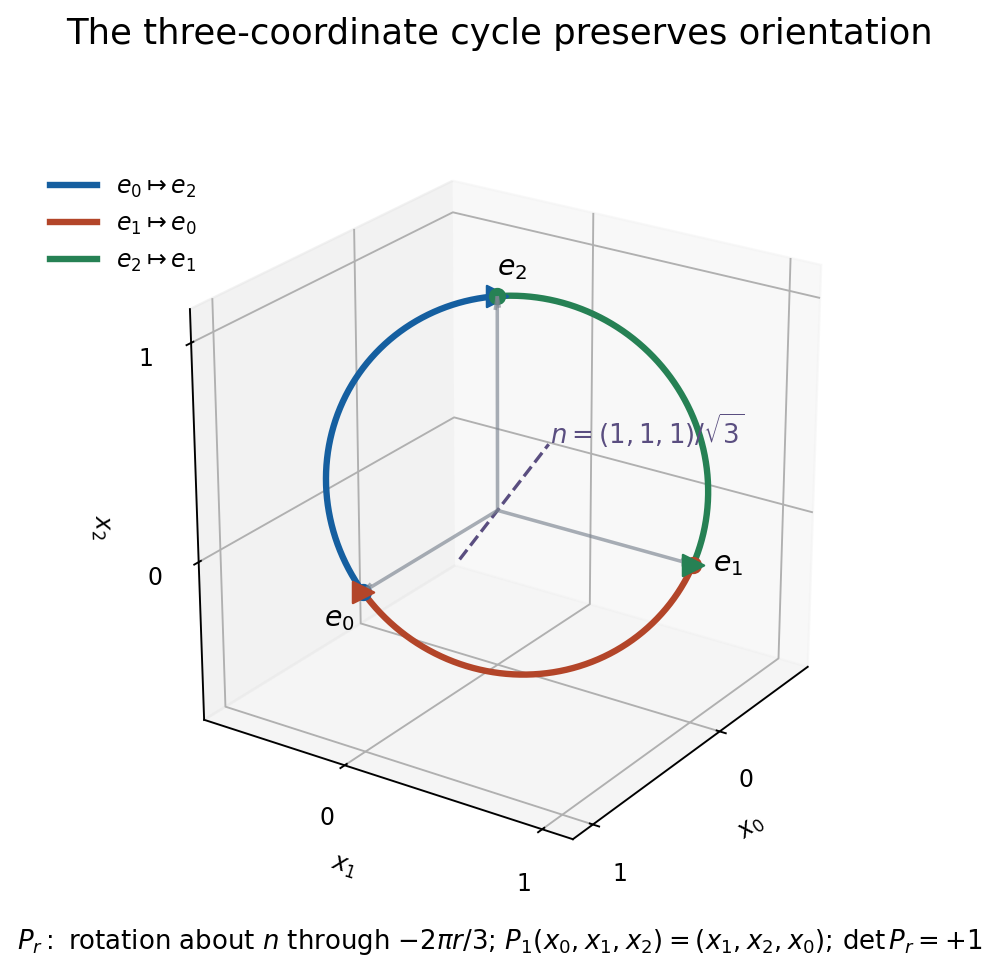
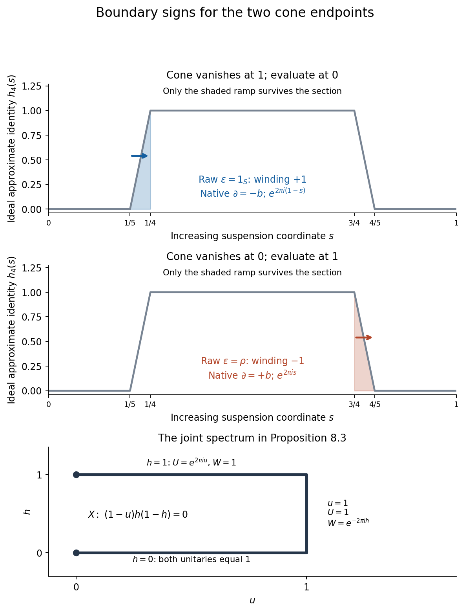

# Asymptotic morphisms and E-theory

*Written by GPT-6.1 Sol (OpenAI). Public domain (CC0).*

An extension has a boundary map even when its quotient has no completely positive section. Asymptotic morphisms provide a bivariant place for these maps. Their errors tend to zero, and composition is defined by allowing the second morphism enough time to control the moving image of the first.

Throughout, algebras are complex and trivially graded. They are separable unless a statement expressly allows an arbitrary coefficient algebra. Put \(S=C_0((0,1))\), \(SA=S\otimes A\), and \(\mathcal K=\mathcal K(\ell^2)\). Suspensions have their increasing interval coordinate. Cones vanish at the right endpoint:
\[
CA=C_0([0,1),A),\qquad
C_f=\{(a,g)\in A\oplus CB:g(0)=f(a)\}.
\tag{1.1}
\]
We use the [cone deformations](KT-KK-14.html#1-cones-and-two-explicit-deformations) and [separable split-exactness](KT-KK-14.html#13-solutions) proved in *Exact sequences in KK and the universal coefficient theorem*, Lemma 1.1 and Solution 12.1; the quasihomomorphism picture proved in [*Pictures of KK: Fredholm operators, quasihomomorphisms and extensions*, Theorems 4.1 and 4.5](KT-KK-07.html#4-quasihomomorphisms); and the [first](KT-KK-12.html#4-the-first-product-and-its-gaussian), [second](KT-KK-12.html#5-rotating-the-two-position-spaces) and [one-dimensional](KT-KK-12.html#7-the-one-dimensional-extension-cycles) inverse products proved in *Bott periodicity in KK: the Bott and Dirac elements*, Theorems 4.1, 5.2 and 7.3. The free author editions of Blackadar's *K-Theory for Operator Algebras* and Connes's *Noncommutative Geometry* are basic references.

## 1. Families, quotients and continuous representatives

An **asymptotic morphism** \(\phi:A \rightsquigarrow B\) is a family \(\phi_t:A\to B\), \(t\geq1\), continuous in \(t\) at each \(a\), such that
\[
\begin{aligned}
\phi_t(a+\lambda b)-\phi_t(a)-\lambda\phi_t(b)&\longrightarrow0,\\
\phi_t(ab)-\phi_t(a)\phi_t(b)&\longrightarrow0,\\
\phi_t(a^*)-\phi_t(a)^*&\longrightarrow0
\end{aligned}
\tag{1.2}
\]
in norm, for all \(a,b\in A\) and \(\lambda\in\mathbb C\). The individual maps need not be linear, positive or multiplicative. Two families are **equivalent** if their difference tends to zero at every \(a\). A homotopy is an asymptotic morphism into \(IB=C([0,1],B)\) with the prescribed endpoint families. Its errors tend to zero uniformly in the homotopy parameter. Write \([[A,B]]\) for homotopy classes.

**Lemma 1.1 (the quotient description).** Every family satisfying (1.2) is bounded at each \(a\), and
\[
\limsup_{t\to\infty}\|\phi_t(a)\|\leq\|a\|.
\tag{1.3}
\]
Its equivalence class is precisely a homomorphism
\[
\bar\phi:A\longrightarrow B_\infty,
\qquad
B_\infty=C_b([1,\infty),B)/C_0([1,\infty),B).
\tag{1.4}
\]
Every such homomorphism has an asymptotic representative.

**Proof.** Extend the family algebraically to unitizations by \(\widetilde\phi_t(a+\lambda1)=\phi_t(a)+\lambda1\). For \(\|a\|\leq1\), set \(x=(1-a^*a)^{1/2}\). Relations (1.2) give, with \(y_t=\|\widetilde\phi_t(a)\|\), \(z_t=\|\widetilde\phi_t(x)\|\),
\[
\widetilde\phi_t(a)^*\widetilde\phi_t(a)
+\widetilde\phi_t(x)^*\widetilde\phi_t(x)
=1+R_t,
\qquad
\|R_t\|\leq\epsilon_t(1+y_t+z_t),\quad\epsilon_t\to0.
\]
This estimate allows the adjoint errors to be multiplied before boundedness has been proved. Positivity implies both \(y_t^2\) and \(z_t^2\) are at most \(1+\epsilon_t(1+y_t+z_t)\). Their sum is therefore bounded by twice that expression. The elementary quadratic inequality bounds \(y_t,z_t\) on a tail. Thus \(R_t\to0\), and positivity gives \(\limsup y_t\leq1\). Asymptotic scalar linearity proves (1.3) for arbitrary \(a\); continuity bounds the remaining initial interval.

Taking quotient classes now turns (1.2) into exact homomorphism identities. The norm in the quotient is \(\limsup_t\|b(t)\|\): subtracting an initial-interval cutoff proves the upper bound, and any function vanishing at infinity proves the lower bound. Conversely choose, for every \(a\), a bounded continuous lift of \(\bar\phi(a)\). Quotient homomorphism identities say exactly that its defects belong to \(C_0\). Two choices differ by an element of \(C_0\). \(\square\)

We shall need representatives which behave uniformly on compact sets. The following selection argument supplies them without a linear lifting hypothesis.

**Lemma 1.2 (continuous nonlinear selection).** Let \(q:V\to W\) be a surjective bounded linear map of Banach spaces, with \(W\) separable. Suppose every \(w\) has a lift of norm at most \(L\|w\|\). There is a continuous map \(s:W\to V\) with
\[
qs(w)=w,\qquad s(0)=0,\qquad
\|s(w)\|\leq 2L\|w\|.
\tag{1.5}
\]
It can be chosen homogeneous for nonnegative real scalars.

**Proof.** Choose a countable dense family \(w_j\) in the unit sphere and lifts \(v_j\) of norm at most \(L\). For a unit vector \(w\), put
\[
p_j(w)=2^{-j}\max\{0,\tfrac12-\|w-w_j\|\},\qquad
H(w)=\frac{\sum_jp_j(w)v_j}{\sum_jp_j(w)}.
\tag{1.6}
\]
The denominator is positive. Near a fixed unit vector it has a positive lower bound; the tails of both series converge uniformly there. Thus \(H\) is continuous, \(\|H(w)\|\leq L\), and \(\|qH(w)-w\|\leq1/2\). Extend by \(H(w)=\|w\|H(w/\|w\|)\) and \(H(0)=0\).

Set \(r_0(w)=w\), \(r_{n+1}(w)=r_n(w)-qH(r_n(w))\), and
\[
s(w)=\sum_{n=0}^\infty H(r_n(w)).
\tag{1.7}
\]
The residual has norm at most \(2^{-n}\|w\|\). The series converges uniformly on bounded sets, so is continuous; it has norm at most \(2L\|w\|\). Its image under \(q\) telescopes to \(w\). All operations preserve nonnegative homogeneity. \(\square\)

Apply this lemma to the **pullback**
\[
V=\{(a,b)\in A\oplus C_b([1,\infty),B):\bar\phi(a)=\pi(b)\}
\longrightarrow A.
\tag{1.8}
\]
With the maximum norm, quotient-norm lifts have norm at most \(2\|a\|\). The residuals in (1.7) remain in \(A\), which is separable. The second coordinate of the resulting section is a continuous map \(A\to C_b([1,\infty),B)\) lifting \(\bar\phi\). Denote its evaluations by \(\phi_t\). In particular \((t,a)\mapsto\phi_t(a)\) is jointly continuous and \(\sup_t\|\phi_t(a)\|\leq4\|a\|\).

**Corollary 1.3 (compact uniformity).** Every asymptotic morphism with separable source is equivalent to one obtained from a continuous map into \(C_b\). Such a representative has (1.2) uniformly for \(a,b\) in any compact subset and \(|\lambda|\leq R\), and has (1.3) uniformly on compact subsets. Equivalence between two such representatives is uniform on compact subsets. Homotopies can be chosen with all these controls uniform also in their interval parameter.

**Proof.** Each defect is a continuous function from its compact parameter set to \(C_b\), taking its values in \(C_0\). A compact subset of \(C_0([1,\infty),B)\) has uniformly small tails: cover it by finitely many norm balls and use the tail bound for their centers. This proves the assertion about defects and equivalence. For the norm assertion, cover the compact subset of \(A\) by finitely many neighborhoods on which the map into \(C_b\) changes by less than \(\epsilon\), and apply (1.3) to their centers. Apply (1.8) with target \(IB\) for a homotopy. If necessary, correct its two endpoint values by affine functions of the interval coordinate; these corrections are compact-uniformly vanishing errors. This keeps any already specified endpoint representatives. \(\square\)

Equivalent representatives are homotopic by straight interpolation: multiplicative cross terms reduce to products with their vanishing difference, and Lemma 1.1 bounds the other factors. A continuous reparametrization \(r(t)\to\infty\) gives the same class, by \(\phi_{(1-s)t+sr(t)}\). The minimum of the interpolated times tends to infinity, which proves uniformity in \(s\). Concatenating interval homotopies proves transitivity.

Constant homomorphisms and ordinary homotopies therefore give asymptotic ones. A point-norm continuous family of actual homomorphisms is homotopic to its initial value: use its evaluations at \(1+s(t-1)\). All errors are zero, so no uniform continuity at infinite time is required.

## 2. The scalar computation

Before constructing the category, we compute the classes needed to recognize its unit and its K-theory.

**Proposition 2.1.** For every C\*-algebra \(D\), the natural map
\[
[S,D]\longrightarrow[[S,D]]
\tag{2.1}
\]
is a bijection. If \(D=B\otimes\mathcal K\), then
\[
[[S,B\otimes\mathcal K]]=K_1(B).
\tag{2.2}
\]
With target \(SB\otimes\mathcal K\), the resulting group is \(K_0(B)\).

**Proof.** The unitization of \(S\) is \(C(\mathbb T)\). Its generator is \(u(s)=e^{2\pi is}\). Extend an asymptotic morphism to the unitizations and set \(z_t=\widetilde\phi_t(u)\). It has scalar quotient 1, and
\(z_t^*z_t-1\to0\), \(z_tz_t^*-1\to0\). On a tail, polar correction gives
\[
U_t=z_t(z_t^*z_t)^{-1/2},\qquad U_t-1\in D,
\qquad\|U_t-z_t\|\to0.
\tag{2.3}
\]
It is a norm-continuous family of actual unitaries. Functional calculus gives homomorphisms \(\theta_t:S\to D\), \(f\mapsto f(U_t)\). Their quotient agrees with \(\bar\phi\): check Laurent polynomials in \(u,u^*\), then use their uniform density in \(C(\mathbb T)\) and contractivity of the quotient homomorphisms. Thus \(\phi\) is equivalent to a family of homomorphisms. That family is homotopic to any one of its tail values by the last paragraph of Section 1.

For injectivity apply the same correction in \(C([0,1],D)\) to an asymptotic homotopy. At a fixed sufficiently large time it gives an ordinary homotopy of unitaries. Its endpoints are close to the two prescribed unitaries; close unitaries are joined by \(U\exp(s\log(U^*V))\), since their ratio has spectrum away from the negative real axis. Hence the prescribed homomorphisms are ordinarily homotopic.

A homomorphism from \(S\) is exactly a unitary \(U\in D^+\) with scalar quotient 1, through this functional calculus. For stable \(D\), their homotopy classes are \(K_1(D)\): finite matrix stabilization does not change the classes. Indeed every compact-matrix element is approximated by a finite corner; polar correction repairs a unitary approximation, and the same finite approximation uniformly over an interval treats its homotopies. The two corner placements are homotopic by the isometry construction in Section 4. This proves (2.2). Finally the positive ordinary suspension isomorphism
\(K_0(B)\to K_1(SB)\) is proved in [*Pictures of KK*, Lemma 3.1d](KT-KK-07.html#projection-lifts-and-the-exponential-boundary), including nonunital and arbitrary coefficients. Use its increasing interval coordinate. \(\square\)

The same elementary repair for an almost projection proves \([[\mathbb C,D]]=[\mathbb C,D]\): replace a self-adjoint almost projection by its spectral projection at \(1/2\). For stable \(D\) this is its projection semigroup. We will not need a general semiprojectivity theorem.

## 3. Letting the second family run faster

Tensoring an asymptotic morphism with a commutative interval algebra is legitimate. For example, the commuting homomorphisms into a quotient, obtained from \(f\mapsto f\otimes1\) and \(a\mapsto1\otimes\bar\phi(a)\), give a homomorphism on the maximal tensor product. For \(C_0(X)\) the maximal and minimal norms agree: on a compact space, approximate a finite sum of algebra-valued functions by \(\sum_i p_i\otimes b_i\), where the nonnegative partition of unity sums to 1 and each \(b_i\) is a nearby point value. In any representation with commuting images, this last sum is \(R\operatorname{diag}(b_i)R^*\), with row \(R=(p_i^{1/2})_i\) and \(RR^*=1\), so its norm is at most \(\max_i\|b_i\|\). The error is small also in the maximal norm: for each of the finitely many original scalar coefficients, its uniform approximation error bounds its tensor norm error. Refining the partition proves the supremum norm bound. Exhaustion gives the assertion for locally compact \(X\). The quotient homomorphism thus defines \(S\phi\) and interval homotopies. A continuous lift is then chosen by Lemma 1.2. On elementary tensors it is equivalent to \(f\otimes\phi_t(a)\).

More generally, two asymptotic morphisms can be tensored using maximal tensor products. Their two quotient homomorphisms have commuting images; the universal norm of the maximal tensor product gives a contractive homomorphism. Its image lies in the intended nonunital tensor ideal, since elementary products lie there and are dense. Choose a continuous representative. We only use minimal tensor products when one of the relevant tensor factors is \(S\), an interval algebra, a matrix algebra or \(\mathcal K\). For \(\mathcal K\), finite-corner approximation gives the same norm assertion.

**Theorem 3.1 (composition).** For separable \(A,B,C\), there is an associative operation
\[
[[A,B]]\times[[B,C]]\longrightarrow[[A,C]],
\qquad (x,y)\longmapsto yx,
\tag{3.1}
\]
agreeing with ordinary composition. It commutes with suspension and with the tensor operations just described.

**Proof.** Take continuous representatives \(\phi,\psi\). Choose a countable generating family for \(A\), and let \(A_0\) be the complex *-algebra it generates. It is a union of compact sets \(K_n\): use words in only the first \(n\) chosen generators and their adjoints, and bound the number and length of words and their coefficients. There are finitely many allowed words at each stage, so their bounded coefficient sets have compact images. Enlarge these compact sets recursively so that their union remains \(A_0\), they increase, and sums, products, adjoints and scalar multiplication with \(|\lambda|\leq n\) land in the next set. Images of finite products and sums of compact sets are compact.

Choose \(1<t_1<t_2<\cdots\), with \(t_n\to\infty\), so that the defects and the norm excess of \(\phi\) on \(K_{n+4}\) are at most \(1/n\) for \(t\geq t_n\). Form compact sets in \(B\) containing
\[
\{\phi_t(a):a\in K_{n+4},\ 1\leq t\leq t_{n+1}\}
\tag{3.2}
\]
and all sums, products, adjoints, scalar combinations and differences needed to compare the identities (1.2). In particular they contain each defect as an element of \(B\), as well as the operands in which it occurs. Enlarge them by the corresponding sets for the first \(n\) stages. Choose increasing \(R_n\) such that the defects and norm excess of \(\psi_v\) on these compact sets are at most \(1/n\) whenever \(v\geq R_n\). Let \(r\) be a continuous increasing function with \(r(t_n)\geq R_n\).

For \(t_n\leq t\leq t_{n+1}\), all the required \(\psi\)-estimates therefore apply to \(\phi_t(a)\), for \(a\in K_n\). To see why moving errors cause no difficulty, if
\(e_t=\phi_t(a+b)-\phi_t(a)-\phi_t(b)\), add and subtract \(\psi_{r(t)}(\phi_t(a)+\phi_t(b))\). Approximate additivity, applied also to the pair consisting of that sum and \(e_t\), gives
\[
\|\psi_{r(t)}\phi_t(a+b)-\psi_{r(t)}\phi_t(a)
-\psi_{r(t)}\phi_t(b)\|
\leq 2/n+\|e_t\|+1/n\leq4/n.
\tag{3.3}
\]
The multiplicative estimate is identical after inserting
\(\phi_t(ab)-\phi_t(a)\phi_t(b)\); apply multiplicativity of \(\psi\) to the two image operands, additivity to the error, and its norm estimate to that error. Adjoint and bounded-scalar estimates use the same included sets. The norm estimate is
\[
\|\psi_{r(t)}\phi_t(a)\|\leq\|a\|+2/n\qquad(a\in K_n).
\tag{3.4}
\]
Thus the raw family on \(A_0\) defines a contractive *-homomorphism \(A_0\to C_\infty\). It extends uniquely to \(A\). Choose its continuous representative by (1.8). This representative, not an unproved extension of the raw nonlinear composition, defines (3.1). On every \(a\in A_0\) it is equivalent to the raw family.

Two sufficiently fast choices \(r_0,r_1\) are joined by \((1-s)r_0+sr_1\). The same estimates hold uniformly in \(s\); extension and lifting with target \(IC\) give the required homotopy. Given two choices of \(A_0\) or its exhaustion, the *-algebra generated by their union is again a countable union of compact sets. Choose a rate fast enough for both. Equivalent continuous representatives have compact-uniformly small differences by Corollary 1.3. Include these differences and operands in the sets (3.2); estimate (3.3) shows that the two quotient compositions agree. For homotopies include the entire compact interval of their images in (3.2), and choose the \(\psi\)-bounds in \(IC\). This proves independence of the homotopy classes in both variables.

For associativity add a third representative \(\omega:C \rightsquigarrow D\). Enlarge the chosen dense *-algebra of \(B\) to contain every \(\phi_t(K_n)\); this is still a countable union of compact sets, by subdividing time into bounded intervals. Include representatives of the first quotient composition and their vanishing differences in the next-stage compact sets. Choose two rates successively so that all three compositions are represented, on \(A_0\), by
\[
\omega_{s(t)}\psi_{r(t)}\phi_t(a).
\tag{3.5}
\]
For an iterated rate prescribed by the other bracketing, increase \(s\) so that it dominates that rate as well. Reparametrization independence then identifies both bracketings with (3.5). Equality on dense \(A_0\) is equality of the extended quotient homomorphisms. The lifted representatives are equivalent. If an operand is an actual homomorphism, ordinary composition already obeys (1.2), and these constructions give its class. Finally on elementary tensor products the two constructions give the same raw triple products. A common rate works on compact exhaustions of the algebraic tensor product; contractive extension proves the tensor assertion. \(\square\)

The dense algebra in this proof need not contain every compact subset of \(A\). Compact uniformity on all of \(A\) is supplied by the final continuous lift. It does not follow from the dense-algebra estimates alone.

## 4. Stability, addition and the category

We record the Hilbert-space homotopies behind stability. Identify the infinite Hilbert space with \(L^2(\mathbb R_+)\), and define
\[
(V_af)(x)=\begin{cases}0,&x<a,\\ f(x-a),&x\geq a.\end{cases}
\qquad 0\leq a\leq1.
\tag{4.1}
\]
These are isometries. Translations and their adjoints are strongly continuous, first on compactly supported continuous vectors and then by density. For a rank-one compact operator, \(V_a\theta_{f,g}V_a^*=\theta_{V_af,V_ag}\); its norm continuity follows from the rank-one bound. Finite-rank approximation proves that \(k\mapsto V_akV_a^*\) is a point-norm homotopy from identity to a corner of infinite codimension. Every other infinite-codimensional corner is obtained by a unitary change of coordinates.

Conjugation by an arbitrary unitary \(U\) on a standard coefficient module is harmless after stabilization: the columns
\[
R_\theta x=(\cos\theta\,x,\sin\theta\,Ux),\qquad
0\leq\theta\leq\pi/2,
\tag{4.2}
\]
are norm-continuous adjointable isometries. Conjugating a compact-valued map by these columns joins its first-corner placement to its second-corner conjugate. Both corners are homotopic to the original placement by (4.1), followed by a norm-continuous unitary path exchanging the two infinite subspaces. One such exchange is a self-adjoint unitary \(W\); the path is \(\exp(i\pi s(1-W)/2)\). For an asymptotic family, these homotopies have uniform errors in the interval parameter because conjugation is contractive.

**Lemma 4.1 (stabilization).** For separable \(A\),
\[
[[A,B\otimes\mathcal K]]\longrightarrow
[[A\otimes\mathcal K,B\otimes\mathcal K\otimes\mathcal K]],
\qquad \phi\longmapsto\phi\otimes1_{\mathcal K},
\tag{4.3}
\]
is a bijection after identifying the two target compact factors. A rank-one source corner gives its inverse.

**Proof.** One composite is the target rank-one corner, homotopic to an isomorphism by (4.1)–(4.2). For the other, interchange the two compact factors after extending the source-corner map by \(1_{\mathcal K}\). The interchange is implemented by the tensor-flip unitary, whose conjugation is harmless by (4.2). What remains is the corner \(\mathcal K\to\mathcal K\otimes\mathcal K\), \(k\mapsto k\otimes e_{11}\), tensored with the identity of \(A\). Under a Hilbert-space identification this corner has infinite codimension and hence is homotopic to an isomorphism by (4.1). Composition respects these homotopies by Theorem 3.1. \(\square\)

Two orthogonal isometries whose ranges sum to the standard Hilbert space give an addition on \([[A,B\otimes\mathcal K]]\). It is independent of the isometries by (4.2). Permuting two or three summands proves commutativity and associativity; (4.1) proves that a zero summand changes no class. Composition and suspension preserve this addition.

There is another addition when the target is suspended. Compress one function into \((0,1/2)\), the other into \((1/2,1)\), and add their disjointly supported families. Interval compression is homotopic to identity: vary the two endpoints of its supporting interval continuously, and extend by zero. Uniform continuity of each suspension function proves point-norm continuity, even at moving endpoints. Three adjacent intervals prove associativity. In the stable suspended target, this addition equals orthogonal sum. Compress the first and second diagonal entries separately; then rotate the second entry into the first. Their disjoint supports make every mixed product zero during this rotation. The explicit matrix is
\[
\begin{pmatrix}
\phi+c^2\psi&cs\psi\\ c s\psi&s^2\psi
\end{pmatrix},\qquad c=\cos\theta,\quad s=\sin\theta,
\tag{4.4}
\]
with the rotation parameter run from \(\theta=\pi/2\) to \(0\). Its endpoint is the sum plus a zero corner. Approximate identities and errors obey the same formula and norm bounds.

Reversal \(\rho(f)(s)=f(1-s)\) gives the inverse. Indeed identity followed by reversal, on the two half intervals, is \(f\mapsto f(h)\), where
\[
h(s)=\begin{cases}2s,&s\leq1/2,\\2-2s,&s\geq1/2.\end{cases}
\tag{4.5}
\]
The homomorphisms \(f\mapsto f(rh)\), \(0\leq r\leq1\), contract it to zero. Thus \([[A,SB\otimes\mathcal K]]\) is an abelian group. Reversal acts on the **target** suspension coordinate.

We can now define
\[
E(A,B)=[[SA,SB\otimes\mathcal K]].
\tag{4.6}
\]
For \(x:A\to B\), \(y:B\to C\) in this notation, extend the representative of \(y\) stably by (4.3), compose with a representative of \(x\), and fold the two target compact factors. Lemma 4.1 and Theorem 3.1 make this associative and bilinear. Its identity is the constant homomorphism \(SA\to SA\otimes\mathcal K\), \(a\mapsto a\otimes e_{11}\). A homomorphism \(f:A\to B\) represents \(Sf\) followed by that corner. We obtain an additive category whose objects are the separable C\*-algebras.

Proposition 2.1 gives, for arbitrary \(B\),
\[
E(\mathbb C,B)=K_0(B).
\tag{4.7}
\]
This agrees with addition. Direct sum of homomorphisms corresponds to block sum of their unitaries, hence to K-theory addition. The identity of \(E(\mathbb C,\mathbb C)\) corresponds to the positive loop \(e^{2\pi is}\), hence to \(1\in\mathbb Z\).

The definition sometimes made with both source and target stabilized gives the same groups: (4.3), with source \(SA\) and target \(SB\), is the precise comparison. There is no change of category or product, since the inverse corner and tensor flip used in its proof respect composition.

## 5. The boundary family and split extensions

Consider an extension
\[
0\longrightarrow J\xrightarrow{i}A\xrightarrow{q}B\longrightarrow0.
\tag{5.1}
\]
Choose a continuous section \(\sigma:B\to A\), \(\sigma(0)=0\), bounded by a constant times \(\|b\|\), using Lemma 1.2. Choose a norm-continuous positive contractive approximate identity \(u_t\) of \(J\), quasicentral for \(A\). Its existence for separable \(A\) is proved in [*Kasparov's technical theorem*, Theorem 1.1](KT-KK-08.html#1-approximate-identities-with-commutator-control); interpolation between its successive positive contractions gives the continuous version.

Two elementary functional-calculus consequences will be used repeatedly:
\[
[f(u_t),a]\longrightarrow0\quad(a\in A),\qquad
f(u_t)j\longrightarrow0\quad(j\in J),\qquad f\in S.
\tag{5.2}
\]
To prove them, approximate \(f\) uniformly by polynomials vanishing at 0 and 1. For a monomial, the commutator is the sum of \(k\) terms containing \([u_t,a]\), and \(\|u_t^kj-j\|\leq k\|u_tj-j\|\). In a polynomial \(\sum_{k\geq1}a_ku^k\), the coefficients sum to zero at 1, which proves the second assertion. Uniform polynomial approximation proves (5.2). These estimates hold uniformly on compact sets, by finite nets. They also hold uniformly in an extra compact parameter for convex combinations of quasicentral approximate identities.

**Proposition 5.1 (the extension morphism).** The prescription
\[
\epsilon_{q,t}(f\otimes b)=f(u_t)\sigma(b)
\tag{5.3}
\]
defines, after quotient extension and continuous lifting, a class
\(\epsilon_q\in[[SB,J]]\). It is independent of the choices, natural for diagrams of extensions, and
\[
\epsilon_{Sq}=S\epsilon_q\circ\operatorname{flip}_{S,S}.
\tag{5.4}
\]
Here the boundary suspension is first in \(\epsilon_{Sq}\), while the functor suspension is first in \(S\epsilon_q\). No completely positive section is assumed.

**Proof.** Every section defect, such as \(\sigma(bc)-\sigma(b)\sigma(c)\), lies in \(J\), and is killed asymptotically by (5.2). Quasicentrality moves \(g(u_t)\) past \(\sigma(b)\). Therefore (5.3) gives exact linear, adjoint and multiplicative identities in \(J_\infty\) on \(S\odot B\). It has the spatial tensor norm, as follows without a bound for a chosen section on all tensors. Represent the generated quotient algebra faithfully on a Hilbert space. The commuting action of \(S\), by \(f(u_t)\), and the induced action of \(B\) on its essential subspace define a representation of \(S\otimes_{\max}B\). For precision, represent the C*-algebra generated by the constant copy of \(A\) and \(f([u_t])\) in \((A^+)_\infty\). Let \(H_S\) be the closed span of the ranges of these latter operators. Constant elements of \(A\) and their adjoints preserve \(H_S\), since they commute with the latter operators in the quotient. Constant elements of \(J\) vanish on \(H_S\), by (5.2). Multiplication by a lift \(\sigma(b)\) restricted to \(H_S\) is therefore independent of the lift; all section defects vanish there. Its norm is at most \(\|b\|\), since lifts can have norm arbitrarily close to that quotient norm. This defines the second action as a contractive homomorphism. On the orthogonal complement of \(H_S\) the \(S\)-action is zero. The inclusion \(J_\infty\to(A^+)_\infty\) is isometric, by the identical tail-norm formula. The actions commute. The interval norm argument in Section 3 identifies this maximal tensor product with \(SB\). Thus the quotient map extends contractively. Lemma 1.2 supplies a representative on all of \(SB\).

Changing the section gives the same quotient map, by (5.2). The straight path between two quasicentral approximate identities is a quasicentral approximate identity in \(C([0,1],J)\), uniformly in its parameter: the two approximate-identity errors and commutators bound its errors. Functional calculus then gives a homotopy of (5.3).

For naturality write a diagram as \(\alpha:A\to A'\), \(\beta:B\to B'\), \(q'\alpha=\beta q\), with \(\alpha(J)\subset J'\). Start with the lifts \(\alpha\sigma(b)\) and the positive contractions \(\alpha(u_t)\). Their section defects lie in \(\alpha(J)\), which these contractions approximate, and their commutators with the lifts tend to zero. Interpolate the contractions with a quasicentral approximate identity \(v_t\) of \(J'\). This interpolation approximates the same defects uniformly and is quasicentral for the tested lifts. It therefore joins \(\alpha\epsilon_q\) to \(f(v_t)\alpha\sigma(b)\). Only at this latter endpoint replace the lift by \(\sigma'(\beta b)\): their difference is in \(J'\) and is killed by \(f(v_t)\). Thus this endpoint is equivalent to \(\epsilon_{q'}S\beta\). This argument does not require \(\alpha(J)\) to be an ideal of \(A'\), or \(\alpha(u_t)\) to approximate arbitrary elements of \(J'\).

For suspension take the ideal approximate identity \(h_t(s)u_t\), where, for \(t\geq2\), \(h_t\in S\) is 1 on \([1/t,1-1/t]\), 0 at the two endpoints, and has linear ramps. Keep \(h_t=h_2\) on the initial interval \(1\leq t\leq2\). All later ramp formulas use this same harmless initial extension. The representative has value
\(f(h_t(s)u_t)g(s)\sigma(b)\). Replace \(h_t(s)\) by \(h_{t+r/(1-r)}(s)\), and at \(r=1\) by 1. For fixed \(g\in S\), the tails of \(g\) make this continuous at \(r=1\), uniformly in \(t\). Polynomial estimates (5.2) control all defects uniformly in \(r\). The terminal family is \(g(s)f(u_t)\sigma(b)\), proving (5.4) with its displayed coordinate flip. It is not \(f(s)g(u_t)\sigma(b)\) in this ordered notation. \(\square\)

For the cone extension \(0\to SA\to CA\to A\to0\), this class is identity on \(SA\). To see this explicitly, take a section equal to \(a\) near 0 and zero near 1, and take \(h_t\) with two linear ramps, from 0 to 1 on \([1/(t+1),1/t]\), and back from 1 to 0 on \([1-1/t,1-1/(t+1)]\). Only the first ramp survives multiplication by the section. On its support the family differs from the copy of \(f\otimes a\) by a quantity tending to zero. Expanding this supporting interval monotonically to \((0,1)\) gives a homotopy to identity. Uniform continuity proves this for compact subsets of the elementary tensor algebra; quotient extension and Lemma 1.2 complete the homotopy.

If (5.1) has a homomorphic splitting \(s\), then \(\epsilon_q=0\). Use \(f(ru_t)s(b)\), \(0\leq r\leq1\). All section defects are now zero; quasicentrality gives uniform multiplicativity, and functional calculus gives a homotopy from zero to (5.3).

**Proposition 5.2 (the splitting map).** For a split extension (5.1), there is \(\eta_{q,s}\in[[SA,SJ]]\) with
\[
\eta_{q,s}\,Si=1_{SJ},\qquad
Si\,\eta_{q,s}=1_{SA}-S(sq),\qquad
\eta_{q,s}\,Ss=0.
\tag{5.5}
\]
Consequently every split extension becomes a biproduct in \(E\).

**Proof.** Form the path algebra
\[
L=\{(a,g):a\in A,\ g\in C([0,1],A),\
g(0)=a,\ g(1)=sq(a),\ qg(\lambda)=q(a)\}.
\tag{5.6}
\]
It has ideal \(SJ\) and quotient \(A\). A continuous linear section is any interpolation from \(a\) to \(sq(a)\), chosen constant on the first and last thirds. Apply Proposition 5.1 with approximate identity \(h_t(\lambda)u_t\). This gives the family \(f(h_t(\lambda)u_t)g_a(\lambda)\), with target \(SJ\).

After composing on the left with \(Si\), replace \(u_t\) by \((1-r)u_t+r1\). On every ideal defect it converges uniformly to 1, so the same polynomial estimates give a homotopy. At the terminal endpoint, the two ramps of \(h_t\) give a positive copy of \(f\otimes a\) and a reversed copy of \(f\otimes sq(a)\). Expanding their disjoint supports gives the second identity in (5.5) by (4.4)–(4.5). For \(a\in J\), the terminal value \(sq(a)\) is zero, so the very same homotopy, now staying in \(SJ\), gives the first identity. For \(a=s(b)\), the constant path is a homomorphic splitting of (5.6) restricted to \(s(B)\), so the preceding split-extension contraction gives the third identity.

It follows that \((\eta,Sq)\) and \(Si+Ss\) are inverse maps between \(SA\) and \(SJ\oplus SB\): the two diagonal composites are identities, the off-diagonal composites vanish, and \(Si\eta+SsSq=1\). Stable target placement and (4.3) give the assertion in \(E\). \(\square\)

## 6. Transporting the Bott equivalence

The split-extension calculation is enough to transport the proved KK inverse cycles. We give the factorization argument explicitly.

**Lemma 6.1 (the split-exact factorization).** Let \(F\) be a homotopy-invariant, stable functor from separable C\*-algebras to an additive category. Suppose split extensions become biproducts under \(F\). There is a unique additive functor on the KK category extending \(F\).

**Proof.** Write \(QA=A*A\), \(qA=\ker(QA\to A)\), with embeddings \(\iota_+,\iota_-\) and fold \(\nabla\). The extension
\[
0\to qA\xrightarrow{j}QA\xrightarrow{\nabla}A\to0
\tag{6.1}
\]
is split by \(\iota_-\). Let \(R_A:F(QA)\to F(qA)\) be its biproduct retraction. Thus
\[
FjR_A=1-F\iota_-F\nabla,\qquad R_AFj=1,
\qquad R_AF\iota_-=0.
\tag{6.2}
\]
The exact homomorphism picture in the preceding lesson represents
\(x\in KK(A,B)\) by \(\theta_x:qA\to B\otimes\mathcal K\), with ordinary homotopy and direct-sum addition. Define
\[
F(x)=(F\kappa_B)^{-1}F\theta_x R_A F\iota_+,
\qquad\kappa_B(b)=b\otimes e_{11}.
\tag{6.3}
\]
Ordinary homotopy makes this independent of \(\theta_x\). Direct sum is additive under \(F\): factor a sum through the biproduct \((B\otimes\mathcal K)\oplus(B\otimes\mathcal K)\), then use its two corner maps. Each corner becomes the same stable identification, by (4.1)–(4.2). Thus (6.3) is additive. It is natural for target homomorphisms, directly from their postcomposition of \(\theta_x\).

For an ordinary homomorphism \(h:A\to B\), the pair \((h,0)\) represents its KK class. The free-product homomorphism \(\pi_h:QA\to B\) equals \(h\) on the positive copy and zero on the negative copy. Apply \(F\pi_h\) to the first identity in (6.2). Its term containing \(\iota_-\) is zero, and its term on \(\iota_+\) is \(Fh\). Hence (6.3) equals \(Fh\). In particular it sends identity to identity.

Consider now any split extension \(0\to J\xrightarrow{j}D\xrightarrow{q}B\to0\), split by \(s\). Its KK retraction \(r\in KK(D,J)\) is the pair of actions of \(d\) and \(sq(d)\) on the standard ideal module; equivalently its universal difference map is the restriction to \(qD\) of the homomorphism \(\Psi:QD\to D\) with copies \(1_D,sq\). To identify this pair with the KK retraction, its precomposition with \(j\) is \((1_J,0)\), while its precomposition with \(s\) is an equal pair and hence degenerate. After inclusion in \(D\), its universal difference map is the pair \((1_D,sq)\). Both actions are compact on the coefficient module \(D\). Its flip can therefore be deformed to zero by multiplying it by \(1-r\): every cycle defect remains compact throughout. The two zero-operator grading summands are the cycles of these compact homomorphisms with opposite grading, so the class is \([1_D]-[sq]\). The support homotopy in Lemma 4.4 of *Pictures of KK* identifies the ideal-supported pair with this included pair. Thus it has all the biproduct identities proved in [*Exact sequences in KK*, Solution 12.1](KT-KK-14.html#13-solutions), and is that unique retraction. There is a map of split extensions from (6.1), for \(D\), to this extension. Naturality of the biproduct retraction gives
\[
F\Theta\,R_D=R_sF\Psi,
\tag{6.4}
\]
where \(\Theta:qD\to J\) is the restriction and \(R_s\) is the retraction under \(F\). One can check (6.4) without any cancellation assumption: multiply on the left by the split monomorphism \(Fj\), use (6.2) and \(FjR_s=1-FsFq\), and then apply \(R_s\). Formula (6.3), followed by \(F\iota_+\), therefore sends \(r\) to \(R_s\).

For fixed source \(A\), (6.3) is also natural for such retractions in its target. Indeed KK split-exactness gives
\[
x=j(rx)+s(qx)\qquad(x\in KK(A,D)).
\tag{6.5}
\]
Additivity and the already proved homomorphism naturality yield
\(F(x)=FjF(rx)+FsF(qx)\). Applying \(R_s\) proves \(R_sF(x)=F(rx)\).

Every KK morphism is a composite of ordinary homomorphisms, a split retraction and a stable corner inverse: this is the explicit quasihomomorphism factorization (4.4)–(4.5) in *Pictures of KK*. Consequently the naturality just proved, successively along those factors, gives
\(F(yx)=F(y)F(x)\). The formula therefore defines a functor. The same factorization forces any extending functor to agree with it: a biproduct retraction and a corner inverse have unique images. \(\square\)

Apply the lemma to the functor from algebras to \(E\) defined in Section 4. Proposition 5.2 proves its split-exact hypothesis. We obtain
\[
\mathfrak c:KK(A,B)\longrightarrow E(A,B),
\tag{6.6}
\]
preserving products, sums and homomorphisms. No half-exactness of KK for arbitrary extensions has been assumed.

Let \(\beta\in KK(\mathbb C,S^2)\) be the outward positive planar Bott class, and \(\alpha\in KK(S^2,\mathbb C)\) its inverse. Their two products are identity by the oscillator and rotation proofs in *Bott periodicity in KK*. Put \(b=\mathfrak c(\beta)\), \(a=\mathfrak c(\alpha)\). Then
\[
ab=1_{\mathbb C},\qquad ba=1_{S^2}
\quad\text{in }E.
\tag{6.7}
\]
The scalar identification (4.7) sends \(\mathfrak c\) to the usual identity on \(K_0\). To check this, represent a projection class by its compact homomorphism from \(\mathbb C\), use the \((h,0)\) computation in Lemma 6.1, and subtract projection classes. Thus \(b\) corresponds to the positive planar projection class \([q]-[P]\) computed in Section 6 of the Bott lesson. Its coordinate is \(x+iy\).

**Theorem 6.2 (Bott periodicity in either variable).** There are natural isomorphisms
\[
E(A,B)\cong E(S^2A,B)\cong E(A,S^2B).
\tag{6.8}
\]

**Proof.** Tensor the scalar morphisms \(b,a\) with \(1_A\), to obtain inverse classes \(b_A:A\to S^2A\), \(a_A:S^2A\to A\). This minimal tensor operation is valid: a representative of \(b\) has source \(S\), and one of \(a\) has source \(S^3\), both commutative. The quotient tensor construction in Section 3 therefore factors through the minimal norm even for arbitrary \(A\). Tensor interchange and (6.7) give both inverse identities. Composition with these classes proves the first two isomorphisms.

The maps are natural in ordinary homomorphisms, since their representatives are tensored with those homomorphisms. This proves the assertion without cancellation of any suspension of an arbitrary asymptotic class. \(\square\)

**Theorem 6.3 (simultaneous suspension).** The suspension functor gives an isomorphism
\[
S:E(A,B)\overset\cong\longrightarrow E(SA,SB).
\tag{6.9}
\]
The proof in Section 8.4 uses the covariant cone sequence and the reduced Toeplitz extension, independently of contravariant exactness. It also proves \(S^2x=b_Bxa_A\) for every E morphism \(x\), with the positive Bott normalization of (6.7).

Define \(E_0(A,B)=E(A,B)\) and \(E_1(A,B)=E(A,SB)\). For later formulas it is useful to specify the transfer
\[
T_{A,B}:E(SA,B)\longrightarrow E(A,SB),
\qquad T(x)=(Sx)b_A.
\tag{6.10}
\]
Its inverse is \(y\mapsto S^{-1}(ya_A)\), by Theorem 6.3 and the two inverse products (6.7). A cone connecting arrow in the ordinary Puppe sequence has an additional minus under the right-Clifford degree-one normalization; we calculate it next.

## 7. A cone calculation which needs no splitting

Keep (5.1), and write \(\alpha:C_q\to A\) for its projection. The map
\[
p:CA\longrightarrow C_q,\qquad
p(g)=(g(0),qg)
\tag{7.1}
\]
is surjective with kernel \(SJ\). To see surjectivity, start with a continuous lift of the \(B\)-valued path using Lemma 1.2. Correct its value at 0 by a \(J\)-valued function equal to the endpoint difference near 0 and zero near 1. This gives the prescribed \(A\)-value. All algebras in this extension remain separable.

**Lemma 7.1 (the suspended cone projection).** In asymptotic homotopy,
\[
Si\,\epsilon_p=S\alpha,
\qquad
\epsilon_p\,Se=1_{SJ},\qquad e(j)=(j,0).
\tag{7.2}
\]

**Proof.** Choose a continuous section \(\sigma:C_q\to CA\) as in Section 1. For \(x=(a,g)\), it satisfies \(\sigma(x)(0)=a\). The ideal approximate identity is \(h_t(s)u_t\); the associated family is
\[
f(h_t(s)u_t)\sigma(x)(s).
\tag{7.3}
\]
After inclusion in \(SA\), replace \(u_t\) by \((1-r)u_t+r1\). For every section defect its path lies in \(SJ\). This replacement is an approximate identity on its compact range, uniformly in \(r\). Quasicentrality on compact sets of section values and (5.2) prove the homotopy identities uniformly in \(r\) and \(s\). At its terminal endpoint the right ramp contributes a quantity bounded by \(\|f\|\sup_{s\geq1-1/t}\|\sigma(x)(s)\|\), tending to zero. On the left ramp the value of the section tends uniformly to \(a\). Thus the terminal family is equivalent to the left-ramp copy \(\widetilde f_t(s)a\). Expanding its support gives \(S\alpha\). These estimates are uniform over compact sets of \(x,f\), by continuity of the section into the path algebra.

Restrict to \(x=e(j)\). A section of the restricted extension can be chosen inside \(CJ\), equal to \(j\) near 0 and zero near 1. The same replacement now stays in \(SJ\) because every section value is in \(J\). The left ramp gives identity on \(SJ\), by the explicit cone calculation after Proposition 5.1. Independence of sections permits this choice. This proves the second identity. \(\square\)

**Lemma 7.2 (two lifting statements).** For (5.1):

1. If \(h:D \rightsquigarrow A\) and \(qh\) is null-homotopic, there is \(k:SD \rightsquigarrow SJ\) with \(Si\,k=Sh\) in homotopy classes.
2. If \(h:A \rightsquigarrow D\) and \(hi\) is null-homotopic, there is \(k:S^2B \rightsquigarrow S^2D\) with \(kS^2q=S^2h\) in homotopy classes.

**Proof.** For the first assertion take a homotopy \(\Phi:D \rightsquigarrow CB\) from \(qh\) to zero. Its endpoint at 0 can be made exactly \(qh_t\), and at 1 exactly zero. Indeed regularize the homotopy into \(IB\) by Section 1 and subtract the affine endpoint errors; those errors vanish compact-uniformly. Then correct \(h_t\) by the continuous section of \(q\) applied to \(\Phi_t(0)-qh_t\), if required. This is an equivalent family and enforces the matching condition. We obtain an asymptotic morphism
\(\psi_t(d)=(h_t(d),\Phi_t(d))\) into \(C_q\), with \(\alpha\psi=h\). Lemma 7.1 gives
\(Sh=Si\,\epsilon_p S\psi\), proving the first assertion by composition.

We first prove the second assertion with the stronger hypothesis that \(h\alpha\) is null-homotopic. Choose a continuous representative \(\Phi:C_q\rightsquigarrow CD\) of that null homotopy, with its initial evaluation exactly \(h_t\alpha\). Normalize \(h_t(0)=\Phi_t(0)=0\); subtracting these vanishing constants does not change their classes. On the ideal \(SB\) its initial evaluation is zero, so restriction gives \(k:SB \rightsquigarrow SD\).

Here is the required homotopy from \(kSq\) to \(Sh\), initially on elementary tensors \(f\otimes a\). For \(0\leq r<1\), define
\[
x_r=(f(r)a,\ [\lambda\mapsto f(r+(1-r)\lambda)q(a)])\in C_q
\tag{7.4}
\]
and, for \(0<s<1\), put
\[
\Psi_t^r(f\otimes a)(s)=
\begin{cases}
h_t(f(s)a),&s\leq r,\\
\Phi_t(x_r)((s-r)/(1-r)),&s>r.
\end{cases}
\tag{7.5}
\]
At \(s=r\) the two values agree exactly. At \(r=1\) use the first formula throughout. The input \(x_r\) tends to zero in \(C_q\) as \(r\to1\). Continuity of \(\Phi:C_q\to C_b([1,\infty),CD)\) makes the second branch uniformly small there. The first branch is also small on \([r,1]\), by continuity of \(h:A\to C_b\) at zero. This proves continuity at the terminal parameter in the norm of \(SD\). At other junctions ordinary uniform continuity on compact parameter sets proves continuity. For a general \(F\in SA\), use \(x_r=(F(r),[\lambda\mapsto qF(r+(1-r)\lambda)])\), and replace the first branch by \(h_t(F(s))\). This defines the same formula on all of \(SA\). Their operands, products and differences form compact sets as \(r,s\) vary; Corollary 1.3 therefore proves every asymptotic identity uniformly in \(r,s\). Quotient contractivity, extension and the lift in Section 1 give an asymptotic homotopy on all of \(SA\). At \(r=0\) it is \(kSq\); at \(r=1\) it represents \(Sh\), since \(h_t(f(s)a)-f(s)h_t(a)\to0\) uniformly in \(s\).

Under the original hypothesis, Lemma 7.1 gives
\[
(Sh)(S\alpha)=(Sh)(Si)\epsilon_p=0.
\]
Apply the stronger case just proved to \(Sh:SA \rightsquigarrow SD\) and the extension suspended once. It supplies \(k:S^2B \rightsquigarrow S^2D\) with the required identity. \(\square\)

The nonlinear representatives in (7.5) are evaluated on \(f(s)a\). Replacing this by \(f(s)h_t(a)\) before the junction would only give asymptotic equality, and would not establish continuity of the displayed homotopy.

**Theorem 7.3 (covariant half-exactness).** For every extension (5.1) of separable algebras and every separable \(D\),
\[
E(D,J)\xrightarrow{i_*}E(D,A)\xrightarrow{q_*}E(D,B)
\tag{7.6}
\]
is exact at its middle group.

**Proof.** Represent a kernel class by \(h:SD \rightsquigarrow SA\otimes\mathcal K\). Its matched null homotopy gives an asymptotic morphism
\[
\psi:SD \rightsquigarrow C_{S(q\otimes1)}
\cong S(C_q\otimes\mathcal K).
\tag{7.7}
\]
The identification is the actual interchange of its two path coordinates: a continuous cone path with values in \(SB\) vanishes uniformly at the suspension endpoints, since its range on the closed cone interval is compact in \(SB\). Thus it is a suspension function with values in the original cone. Apply the extension morphism of (7.1), tensored with the compact matrices:
\[
\epsilon_{p\otimes1}:S(C_q\otimes\mathcal K)
\rightsquigarrow S(J\otimes\mathcal K).
\tag{7.8}
\]
Composition gives \(k:SD \rightsquigarrow SJ\otimes\mathcal K\), and (7.2) gives \(Si\,k=h\). These are already the E representatives required by (7.6); no additional suspension has been taken. The reverse inclusion follows from \(qi=0\). Tensoring (5.1) with \(S\) and \(\mathcal K\) preserves exactness: the former is pointwise exact with continuous lifts from Lemma 1.2, and the latter follows by finite-corner approximation. \(\square\)

**Theorem 7.4 (contravariant half-exactness).** For every separable extension (5.1) and every separable \(D\),
\[
E(B,D)\xrightarrow{q^*}E(A,D)\xrightarrow{i^*}E(J,D)
\quad\text{exact in the middle}.
\tag{7.9}
\]
**Proof.** Stabilize a kernel representative by Lemma 4.1. Lemma 7.2(2), applied to the stabilized suspended extension, factors it after two extra simultaneous suspensions. Theorem 6.3 cancels those suspensions in the homotopy classes and gives a factor in \(E(B,D)\). Restrict its source corner to recover the convention (4.6). The reverse inclusion follows from \(qi=0\). This proves (7.9) for every separable extension, without a section positivity assumption. \(\square\)

## 8. Connecting arrows and the six-term sequences

We keep the sign of (5.3), and distinguish it from the ordinary cone connecting arrow. For a homomorphism \(f:A\to B\), the Puppe sequence is
\[
SB\xrightarrow{j}C_f\xrightarrow{\alpha}A\xrightarrow{f}B.
\tag{8.1}
\]
It is exact after applying the covariant E variable and rotating the cones. A null homotopy of \(fh\), with \(h:SD \rightsquigarrow SA\otimes\mathcal K\), gives a matched asymptotic map into \(S(C_f\otimes\mathcal K)\). This proves exactness at \(E(D,A)\). Apply the same assertion to the cone projection and the ideal inclusion. Their further cones are homotopy equivalent respectively to \(SB\) and \(SA\), by the explicit substitutions of Lemma 1.1 in *Exact sequences in KK*. Their projections become \(j\) and \(Sf\). This proves exactness at the other positions, with source \(D\) fixed throughout. In particular one obtains the whole covariant sequence ending
\[
\cdots\to E(D,S^2B)\xrightarrow{(Sj)_*}E(D,SC_f)
\to E(D,SA)\to E(D,SB)\xrightarrow{j_*}
E(D,C_f)\to E(D,A)\to E(D,B).
\tag{8.1a}
\]
No simultaneous suspension is cancelled here. In the contravariant variable, (7.4)–(7.5), with \(q\) replaced by \(f\), proves cone exactness after an extra simultaneous suspension. Theorem 6.3 cancels it and gives the contravariant Puppe sequence.

For the quotient \(q\) in (5.1), the map \(e:J\to C_q\), \(j\mapsto(j,0)\), is an isomorphism in \(E\). Indeed the second identity in (7.2) gives a left inverse represented directly by \(\epsilon_p:SC_q\rightsquigarrow SJ\). The extension
\(0\to J\xrightarrow e C_q\to CB\to0\) and covariant half-exactness give a right inverse: apply (7.6) with \(D=C_q\), since \(CB\) is contractible. Left and right inverses coincide by associativity. Replacing \(C_q\) in (8.1) by \(J\) therefore gives the extension Puppe sequence.

**Proposition 8.1 (the endpoint sign).** Regard \(\epsilon_q\) as the E morphism \(\epsilon_q^E:SB\to J\) represented by \(S\epsilon_q\) and a target corner. Then
\[
e\epsilon_q^E=-j\quad\text{in }E(SB,C_q),
\qquad d_q=e^{-1}j=-\epsilon_q^E.
\tag{8.2}
\]

**Proof.** Extend \(f\in S\) by zero outside \((0,1)\). For \(0\leq r\leq1\) use the following pair in \(C_q\):
\[
\left(
f((1-r)u_t+r1)\sigma(b),\quad
[s\mapsto f(s+r)b]
\right).
\tag{8.3}
\]
Its quotient and its path value at 0 are both \(f(r)b\), so it satisfies the cone condition. Polynomial approximation, quasicentrality and the fact that \((1-r)u_t+r1\) is uniformly an approximate identity on \(J\) prove all asymptotic identities uniformly in \(r\). At \(r=1\) both entries are zero. At \(r=0\) it is the sum of \(e\epsilon_{q,t}\) and \(j(f\otimes b)\). These two entries multiply to zero in both orders. After suspension and stabilization their sum is their group sum: the rotation (4.4) applies whenever the ranges are orthogonal. Hence (8.3) proves (8.2). \(\square\)

The minus in (8.2) comes from our right-vanishing cone. Use the increasing-coordinate transfer (6.10) to specify the degree-one arrow:
\[
\partial_q=T(d_q)=-T(\epsilon_q^E)
=-(S\epsilon_q^E)b_B\in E(B,SJ).
\tag{8.4}
\]
For the right-vanishing cone evaluated at 0, \(\epsilon_q=1_S\), so (8.4) is the negative outward Bott class. Reflection gives the positive class for the cone evaluated at 1. This agrees with the native right-Clifford convention: Lemma 3.1 in *Exact sequences in KK* identifies the first cone class with \(-x\), whereas Proposition 7.1 in *Bott periodicity in KK* identifies the second with \(+x\). The ordinary Puppe arrow and its degree-one presentation have been specified separately.

**Theorem 8.2 (the six-term sequences).** Extension (5.1) gives the following covariant cyclic exact sequence:
\[
\begin{aligned}
E_0(D,J)&\to E_0(D,A)\to E_0(D,B)
\xrightarrow{\partial_q}E_1(D,J)\\
&\to E_1(D,A)\to E_1(D,B)
\xrightarrow{\epsilon_q^E}E_0(D,J),
\end{aligned}
\tag{8.5}
\]
Its contravariant cyclic exact sequence is
\[
\begin{aligned}
E_0(B,D)&\to E_0(A,D)\to E_0(J,D)
\xrightarrow{\delta}E_1(B,D)\\
&\to E_1(A,D)\to E_1(J,D)
\xrightarrow{\delta'}E_0(B,D).
\end{aligned}
\tag{8.6}
\]
Unlabelled maps are induced by \(i,q\). The covariant boundary formulas are composition with the indicated classes. The formulas in the coordinates (6.10) are
\[
\begin{aligned}
\partial_q(x)&=\partial_q\,x,\qquad
\epsilon_q^E(x)=\epsilon_q^E x,\\
\delta(z)&=-T(z\epsilon_q^E),\qquad
\delta'(w)=S^{-1}(w\epsilon_q^E).
\end{aligned}
\tag{8.7}
\]

**Proof of the covariant assertion.** Apply the covariant variable to (8.1a), replace \(C_q\) by \(J\) using \(e\), and rotate. Equation (8.2) gives its connecting morphism. To join the two ends of the six-term diagram use the inverse target Bott classes of Theorem 6.2. They are natural for the ordinary maps \(i,q,j,e\), and therefore also for the inverse of \(e\). Transport exactness at \(E(D,S^2B)\) through \(b_B\) and exactness at \(E(D,S^2J)\) through \(b_J\). The transported arrow is \((Sd_q)b_B\), which is (8.4). The arrow from \(E(D,SB)\) back to \(E(D,J)\) is \(d_q=-\epsilon_q^E\); taking its negative gives (8.5). Changing this arrow by its negative changes neither its image nor its kernel. This proves exactness at every displayed group. Naturality follows from Proposition 5.1 and the cone substitutions. \(\square\)

**Proof of the contravariant assertion.** The matched pinch (7.4)–(7.5) gives cone exactness after suspension; Theorem 6.3 cancels it. Apply the same assertion to the two rotated cone maps of Lemma 1.1 in *Exact sequences in KK*. Replace the quotient cone by \(J\) through \(e\), which is an E isomorphism. The degree-zero connecting arrow is \(d_q=-\epsilon_q^E\) by (8.2). Transfer the first connecting arrow through \(T\), giving \(\delta(z)=-T(z\epsilon_q^E)\). At the second one identify \(E(SB,SD)\) with \(E(B,D)\) by \(S^{-1}\), and take the negative of its unnormalized Puppe arrow, giving \(\delta'(w)=S^{-1}(w\epsilon_q^E)\). Target and source Bott isomorphisms close the sequence; their full E naturality is proved in Section 8.4. Negating that second arrow preserves its image and kernel. Thus the exact sequence has precisely (8.6)–(8.7). \(\square\)

Both sequences apply to every separable extension. A semisplitting hypothesis occurs only when one asks for the corresponding general KK extension class.

**Proposition 8.3 (the scalar exponential sign).** Under the positive suspension \(K_0(B)\to K_1(SB)\), the action of the raw family \(\epsilon_q\) sends a projection lift \(h\) to \([e^{-2\pi ih}]\in K_1(J)\). Thus the minus used in (8.4) gives positive exponentiation.

**Proof.** Work first with a projection \(p\in B\), and choose a positive contraction lift \(h\in A\). The suspended class is the unitary \(1+(e^{2\pi is}-1)p\). Applying (5.3) gives the almost unitary
\[
Z_t=1+(e^{2\pi iu_t}-1)h\in J^+.
\tag{8.8}
\]
It is asymptotically unitary because \([u_t,h]\to0\) and every continuous function of \(u_t\) vanishing at both endpoints kills \(h^2-h\in J\). Polar correction gives an actual unitary with the same tail class.

In the quotient of bounded \(A\)-valued families, \(u=[u_t]\) and \(h\) commute and satisfy \((1-u)h(1-h)=0\). Their joint spectrum lies in
\[
X=\{(u,h)\in[0,1]^2:h=0\text{ or }h=1\text{ or }u=1\}.
\tag{8.9}
\]
On this set \(1+(e^{2\pi iu}-1)h=\exp(-2\pi ih(1-u))\). Check its bottom, top and right edges respectively: the values are \(1,e^{2\pi iu},1\). Therefore \(Z_t\) differs in norm by a quantity tending to zero from the actual unitary
\(W_t^0=\exp(-2\pi i h^{1/2}(1-u_t)h^{1/2})\). The unitaries
\[
W_t^r=\exp\bigl(-2\pi i h^{1/2}((1-r)(1-u_t)+r)h^{1/2}\bigr)
\tag{8.10}
\]
belong to \(J^+\), since their quotient exponent is \(-2\pi ip\), and join \(W_t^0\) to \(e^{-2\pi ih}\). Close unitaries have the logarithm homotopy used in Proposition 2.1. Hence the corrected (8.8) has this K-class. For projections in matrix unitizations use the same ideal approximate identity, diagonally repeated, and the fixed scalar projection \(P\) as reference lift. Its exponential is identity, and the corresponding raw family \(\exp(2\pi iu_tP)\) is null-homotopic through \(\exp(2\pi iru_tP)\). Subtract this reference class. This proves the assertion for every \(K_0(B)\) class. \(\square\)

### 8.4. A tensor family cancels simultaneous suspension

We prove Theorem 6.3 using the covariant Puppe sequence. Its proof used only Theorem 6.2 and ordinary-map Bott naturality, so contravariant exactness is not a premise.

Let \(\mathcal T=C^*(V)\) be the unilateral-shift Toeplitz algebra, \(q:\mathcal T\to C(\mathbb T)\) its symbol quotient, \(\chi=\operatorname{ev}_1q\), and \(\mathcal T_0=\ker\chi\). [*Pictures of KK*, Lemma 3.1b](KT-KK-07.html#projection-lifts-and-the-exponential-boundary) proves its symbol algebra and coefficient kernels. In particular,
\[
0\longrightarrow\mathcal K\longrightarrow\mathcal T_0
\xrightarrow{q_0}S\longrightarrow0.
\tag{8.11}
\]
Proposition 5.1 gives the raw boundary family
\[
\sigma=\epsilon_{q_0}:S^2\rightsquigarrow\mathcal K.
\tag{8.12}
\]
Its first coordinate is the boundary suspension, its second the quotient suspension. Choose the continuous representative of Lemma 1.2, with Corollary 1.3's compact-uniform controls. Set
\[
\gamma=[S\sigma]\in E(S^2,\mathcal K)
\cong E(S^2,\mathbb C).
\tag{8.13}
\]

**The Toeplitz family is invertible.** [*Exact sequences in KK*, Theorem 6.2](KT-KK-14.html#6-the-generalized-toeplitz-algebra), with scalar coefficients and trivial automorphism, makes the scalar inclusion \(j:\mathbb C\to\mathcal T\) a KK-equivalence. Since \(\chi j=1\) as an actual homomorphism, \(\chi=j^{-1}\) and \(j\chi=1_{\mathcal T}\) in KK. The split extension \(0\to\mathcal T_0\to\mathcal T\to\mathbb C\to0\) has a KK retraction \(r\), by [Solution 12.1 of that lesson](KT-KK-14.html#13-solutions). For its ideal inclusion \(l\),
\[
lr=1_{\mathcal T}-j\chi=0,\qquad rl=1_{\mathcal T_0}.
\]
Thus \(1_{\mathcal T_0}=r(lr)l=0\) in KK. Lemma 6.1 sends this identity to zero in E. Hence \(\mathcal T_0\) is a zero object in E. Suspension sends its zero identity to a zero identity, so \(S\mathcal T_0\) is also a zero object.

The covariant Puppe sequence for (8.11), with its ideal-to-cone E equivalence, contains
\[
0=E(D,S\mathcal T_0)\longrightarrow E(D,S^2)
\xrightarrow{-\gamma}E(D,\mathcal K)
\longrightarrow E(D,\mathcal T_0)=0.
\tag{8.14}
\]
Therefore composition with \(\gamma\) is bijective for every \(D\). Under the stable corner identification \(\mathcal K\simeq\mathbb C\), take \(D=\mathbb C\) to obtain \(\rho:\mathbb C\to S^2\) with \(\gamma\rho=1_{\mathbb C}\). For \(D=S^2\), injectivity gives \(\rho\gamma=1_{S^2}\), since \(\gamma(\rho\gamma)=\gamma\). This proves both inverse products. No scalar index was used.

Tensor these two raw inverse homotopies with \(1_B\). The representative sources are \(S\) and \(S^3\), so Section 3's interval tensor norm proof applies for every coefficient \(B\). Thus
\[
\gamma_B=[S\sigma\otimes1_B]:S^2B\longrightarrow B
\tag{8.15}
\]
is invertible in E. Compact matrix factors are folded by Lemma 4.1. Only covariant exactness and the proved KK functor have been used.

**The three-coordinate rotation.** The representative in (8.15) acts on the last two of its three suspension coordinates. Label their order \((s_0,s_1,s_2)\): functor suspension, boundary suspension, quotient suspension. Another representative from \(S^3B\) to \(SB\otimes\mathcal K\) is
\[
\widetilde\gamma_{B,t}(f_0\otimes f_1\otimes f_2\otimes b)
=f_2\otimes b\otimes\sigma_t(f_0\otimes f_1).
\tag{8.16}
\]
It applies \(\sigma\) to the first two coordinates and retains the third as the E suspension. Quotient tensor extension and continuous lifting define it on the completed algebra; its displayed elementary formula is equivalence to that chosen representative.

Let \(R:S^3\to S^3\) send \(f_0\otimes f_1\otimes f_2\) to \(f_2\otimes f_0\otimes f_1\). After the displayed compact-factor placement, (8.16) is \((S\sigma\otimes1_B)(R\otimes1_B)\). The elementary formulas give the same quotient homomorphism, hence equivalent continuous representatives on the completed algebra.

Identify each interval with the increasing real coordinate \(x=\tan(\pi(s-1/2))\). The map \(R\) is pullback by \(P(x_0,x_1,x_2)=(x_1,x_2,x_0)\). This cyclic permutation has determinant \(+1\). With \(n=(1,1,1)/\sqrt3\), an explicit rotation path from identity to \(P\) is
\[
P_r=\cos(2\pi r/3)I+
(1-\cos(2\pi r/3))nn^T-
\sin(2\pi r/3)[n]_\times,
\qquad0\leq r\leq1,
\tag{8.17}
\]
where \([n]_\times x=n\times x\). Decompose into \(\mathbb Rn\) and its perpendicular plane. The formula fixes the first summand and rotates the second through \(-2\pi r/3\), so \(P_r^TP_r=I\) and \(\det P_r=1\). Substitution at \(r=1\) gives \(P\).

Pullback \(f\mapsto f\circ P_r\) is an isometric homomorphism of \(C_0(\mathbb R^3)\), point-norm continuous in \(r\). For compactly supported functions this follows from uniform continuity and radius preservation; general functions are their uniform limits. Finite tensor approximation proves the same assertion for \(B\)-valued functions. Theorem 3.1 composes this ordinary homotopy with \(S\sigma\otimes1_B\), controlling the whole compact rotation parameter and lifting into the interval target. It follows that
\[
[\widetilde\gamma_B]=\gamma_B
\quad\text{in }E(S^2B,B).
\tag{8.18}
\]
This three-cycle preserves orientation. The two-coordinate flip in (5.4) remains explicit.

The rotation fixes \(n\) and sends \(e_0\mapsto e_2\), \(e_1\mapsto e_0\), \(e_2\mapsto e_1\). The curves sample (8.17); their unit norm is proved by that formula. Pullback moves the free suspension coordinate past the two coordinates used by \(\sigma\). The boundary-family construction is described in Blackadar's free author edition, Section 25.5, and Connes's author edition, Chapter II, Appendix B. Equations (8.17)–(8.19) give its coordinate and tensor argument.

**Naturality for every E morphism.** Represent \(x\in E(A,B)\) by \(h:SA \rightsquigarrow SB\otimes\mathcal K\). In \(S^2x\), the two newly added coordinates precede the original E suspension. Family (8.16) acts on exactly those first two coordinates. The tensor interchange of Theorem 3.1 gives
\[
\widetilde\gamma_B(S^2x)=x\widetilde\gamma_A,
\qquad\gamma_B(S^2x)=x\gamma_A.
\tag{8.19}
\]
Here are the time and norm controls in this application. On elementary inputs the left composite is \(\sigma_{r(t)}(f_0\otimes f_1)\) tensored with \(h_t(f_2\otimes a)\); the right is \(\sigma_t(f_0\otimes f_1)\) tensored with \(h_{s(t)}(f_2\otimes a)\). Each is the class \([\sigma]\otimes[h]\), by reparametrization independence and tensor interchange. The diagonal construction includes every moving operand, product and defect in its compact stage sets. Contractive quotient extension followed by Lemma 1.2 gives representatives on the completed algebra. Corollary 1.3 makes the resulting homotopies compact-uniform. The two compact factors differ only by their flip unitary, handled by (4.2). This proves (8.19) for nonlinear families with the same controls as composition itself.

Since both \(\gamma_A\) and \(\gamma_B\) are invertible, the actual twice-applied suspension map is
\[
S^2:E(A,B)\overset\cong\longrightarrow E(S^2A,S^2B),
\qquad S^2x=\gamma_B^{-1}x\gamma_A.
\tag{8.20}
\]
This proves cancellation without cancelling any unproved suspension. If \(Sx=0\), then \(S^2x=0\) and hence \(x=0\). Given \(y\in E(SA,SB)\), choose \(x\) with \(S^2x=Sy\). Then
\[
S^2(Sx)=S(S^2x)=S^2y.
\]
Injectivity of \(S^2\) on \(E(SA,SB)\) gives \(Sx=y\). Therefore \(S\) is bijective, proving Theorem 6.3.

**Positive Bott normalization.** The classes \(b=\mathfrak c(\beta)\), \(a=\mathfrak c(\alpha)\) satisfy both inverse products (6.7). Hence \(\gamma b\) is a unit in \(E(\mathbb C,\mathbb C)=\mathbb Z\): it equals \(k1\) with \(k=+1\) or \(-1\). Thus \(\gamma=ka\), and tensoring gives \(\gamma_B=ka_B\). The sign cancels from (8.19), proving
\[
a_B(S^2x)=xa_A,\qquad S^2x=b_Bxa_A.
\tag{8.21}
\]
This gives full E naturality in the positive Bott convention fixed in (6.7). It also justifies the suspension cancellation in Theorem 7.4 and Exercise 10.4. \(\square\)

## 9. Examples and the comparison statements

For \(t=4\), the two ramps are \([1/5,1/4]\) and \([3/4,4/5]\). A section constant near its evaluated endpoint retains exactly the indicated ramp. Equations (8.2)–(8.4) compute the native signs; the three-edge set on the right is (8.9), used in the full unitary homotopy (8.10). In that panel \(U(u,h)=1+(e^{2\pi iu}-1)h\) is the quotient of (8.8), and \(W(u,h)=e^{-2\pi ih}\) is the terminal unitary in (8.10); the displayed edge values describe the two endpoints of the homotopy. The raw extension family is the Connes–Higson construction, described by Blackadar, Section 25.5, and Connes, Chapter II, Appendix B.

**The two scalar cones.** For \(C_0([0,1))\to\mathbb C\) evaluated at 0, take a section equal to the scalar near 0 and zero near 1. The first ramp of the ideal approximate identity gives \(\epsilon=1_S\). Its ordinary Puppe arrow is \(-1_S\), and its degree-one arrow is \(-b\). A projection lift \(1-s\) exponentiates positively to \(e^{-2\pi is}\), consistently with this sign. For \(C_0((0,1])\to\mathbb C\) evaluated at 1, only the second, reversed ramp survives. Hence \(\epsilon=\rho\), the ordinary Puppe arrow is \(-\rho\), and its degree-one presentation is \(+b\). Reversal acts by \(-1\) on E. Indeed coefficient reflection changes the operator of the positive cone cycle in Proposition 7.1 of the Bott lesson from \(-h\sigma_2\) to \(+h\sigma_2\), its additive inverse. The cone class is invertible by that lesson's Theorem 7.3, so reflection is \(-1_S\) in KK. Lemma 6.1 transports this identity to E. The positive exponential of the lift \(s\) is \(e^{2\pi is}\).

**The E Bott element.** The positive element \(b\in E(\mathbb C,S^2)\) corresponds through (4.7) to the planar relative projection
\[
q(z)=\frac1{1+|z|^2}
\begin{pmatrix}1&\overline z\\z&|z|^2\end{pmatrix},
\qquad P=\begin{pmatrix}0&0\\0&1\end{pmatrix}.
\tag{9.1}
\]
Here \(q-P\) vanishes at infinity. The representative is the ordinary homomorphism from \(S\) associated, by Proposition 2.1, to the positive suspension of \([q]-[P]\). Its inverse is \(a=\mathfrak c(\alpha)\), constructed by (6.3) from the planar Dirac cycle. Both inverse products follow from (6.7), and tensoring with the identity gives the inverse classes over any separable coefficient algebra. Both bivariant products are proved in (6.7); the tensor naturality argument in Section 8.4 gives their compatibility with every E morphism.

**A split extension.** For \(A=J\oplus B\), with the second-coordinate splitting, \(\epsilon_q=0\) and \(\eta\) is suspension of the first-coordinate projection. For a general split extension \(\eta\) still depends on its splitting, as (5.5) shows. The boundary is zero but the splitting map need not be zero.

**A deformation.** Suppose \(\mathcal D\) is a continuous field algebra over \([0,1]\), its fiber at 0 is \(A\), and its restriction to \((0,1]\) is trivial with fiber \(B\). Assume evaluation at 0 is onto; this is part of the continuous-field section condition. Choose a continuous section \(\sigma:A\to\mathcal D\) of this Banach quotient by Lemma 1.2. In the fixed trivialization on \((0,1]\), put
\[
\phi_t(a)=\sigma(a)(1/t).
\tag{9.2}
\]
Every section defect has zero fiber at 0. Continuity of its norm makes its value at \(1/t\) tend to zero. Thus (9.2) is an asymptotic morphism. Different choices differ by a section with zero fiber at 0 and give equivalent families. The construction needs neither an inverse E class nor an exactness theorem.

Its action on K-theory is also direct. Extend a family unitally and to matrices. For a projection \(p\), self-adjoint correction and the spectral cutoff at \(1/2\) give projections \(p_t\) on a tail. They vary continuously there, so their stable K-class is independent of the tail time. A projection homotopy gives a projection homotopy at a sufficiently large common time, because its defects are compact-uniformly small. For a normalized unitary apply polar correction instead. Orthogonal sums, unitization kernels and homotopies are preserved, so these operations give maps on \(K_0\) and \(K_1\). They agree with ordinary functoriality for a constant homomorphism. Composition agrees with (3.1): choose a common compact set containing the corrected projection or unitary paths, run the second family sufficiently fast there, and use the close-projection or close-unitary homotopies. No assertion that every deformation is an E equivalence is involved.

For context, two universal properties explain the distinction between KK and E. Lemma 6.1 proves the one needed here: KK is universal among stable, homotopy-invariant functors carrying split extensions to biproducts. It applies to covariant functors; the contravariant version follows by taking the opposite additive category.

The stronger Connes–Higson universal property states that a stable, homotopy-invariant, half-exact functor on separable C\*-algebras with values in abelian groups factors uniquely through E, compatibly with composition. The contravariant version has the reversed action. Its additive-category form uses half-exactness after applying the relevant Hom functors. A reference is Blackadar, Theorem 25.6.1, or Connes, Chapter II, Appendix B, Theorem 12 and Corollary 13. This stronger universal property is stated, not used to prove the results above.

The canonical comparison (6.6) is an isomorphism for a separable \(A\) whenever \(KK(A,\cdot)\) is half-exact on all separable extensions; in particular this holds for separable nuclear \(A\). This is the comparison theorem stated by Blackadar, Theorem 25.6.3. Its proof uses the stronger universal property to let E act on \(KK(A,\cdot)\), and applies that action to \(1_A\). The assertion and its nuclear special case are not premises for our construction of (6.6), for the scalar computation, or for the Bott inverse products. They are recorded here without a full proof of that stronger universality argument.

## 10. Exercises and solutions

**10.1. Constant families.** Show that a homomorphism defines an asymptotic morphism, and that an ordinary homotopy gives an asymptotic homotopy. Also show that a continuous family of homomorphisms has the class of its initial member.

**Solution.** All three defects in (1.2) are identically zero. An ordinary homotopy is a homomorphism into \(IB\), so is a constant asymptotic family with that target. For a family \(h_t\) of homomorphisms, use \(h_{1+s(t-1)}\). For each fixed \(t\) this is a continuous \(IB\)-valued homomorphism; its dependence on \(t\) is norm continuous at each source element on compact time intervals. Its errors are zero uniformly in \(s\). Its endpoints are \(h_1\) and \(h_t\).

**10.2. Reparametrization.** Prove that different sufficiently fast rates give the same composition class. Explain why a dense-algebra argument must be followed by quotient extension and lifting.

**Solution.** Given two rates first increase their common lower bound so that every stage set in (3.2), including errors and products, is controlled for both. The interpolated rates \((1-s)r_0(t)+sr_1(t)\) remain above this bound. Equations (3.3)–(3.4) hold uniformly in \(s\); hence the raw family gives a contractive homomorphism \(A_0\to(IC)_\infty\). Extend it to \(A\), then use the pullback Banach section of Lemma 1.2 with target \(IC\). Its endpoints give the two quotient compositions, up to equivalence, and these endpoint equivalences have straight-line homotopies. This proves independence. A dense set gives contractivity of the quotient map, which permits that extension; it does not make an arbitrary nonlinear raw family continuous or uniform on every compact subset of the completed algebra. The final lift supplies those properties.

**10.3. The extension family.** Construct the asymptotic morphism of an arbitrary separable extension, and prove independence from its section and its quasicentral approximate identity. Identify its two scalar cone signs.

**Solution.** Use (5.3). The ideal annihilation estimate (5.2) kills every section defect. Its commutator estimate lets functional calculus factors move past lifts, proving multiplicativity and the adjoint identity in the quotient. The commuting representation argument in Proposition 5.1 proves the completed tensor norm; Lemma 1.2 supplies a continuous representative. A different section changes each value by \(f(u_t)j\to0\). Convex interpolation of two approximate identities gives the homotopy, with compact-uniform estimates. The left-endpoint cone has one surviving positive ramp, so \(\epsilon=1_S\); the right-endpoint cone has one surviving reversed ramp, so \(\epsilon=\rho\). Their Puppe arrows are their negatives by (8.3), and their degree-one arrows are \(-b,+b\), respectively.

**10.4. Half-exactness from quasicentral approximate identities.** Prove half-exactness in both variables for a separable extension.

**Solution of the covariant assertion.** Represent a class killed by \(q\) by \(h:SD \rightsquigarrow SA\otimes\mathcal K\). Its null homotopy gives the matched pair (7.7). The quasicentral family (7.3), for \(CA\to C_q\), defines (7.8). Composing them gives a class in \(E(D,J)\); replacing \(u_t\) by \((1-r)u_t+r1\) and removing the vanishing right ramp proves that its inclusion equals \(h\). These estimates and the exact coordinate interchange are proved in Lemma 7.1 and Theorem 7.3. Conversely every included class is killed by \(q\), because \(qi=0\).

**Solution of the contravariant assertion.** Stabilize a representative \(h:SA\otimes\mathcal K \rightsquigarrow SD\otimes\mathcal K\) whose restriction to \(SJ\otimes\mathcal K\) is null-homotopic. Lemma 7.2(2), applied to this stabilized suspended extension, constructs a factorization of \(S^2h\) through \(S^3B\otimes\mathcal K\). Theorem 6.3 cancels its two extra suspensions. Restrict the source corner to obtain the required class in \(E(B,D)\). The opposite inclusion follows from \(qi=0\). The cancellation proof in Section 8.4 uses the covariant sequence only, so this argument does not assume the contravariant exactness it proves.

## References

- B. Blackadar, *K-Theory for Operator Algebras*, [corrected free author edition](https://www.bruceblackadar.com/Mathematics/book6.pdf), Sections 22.1–22.3 and 25.1–25.6. Sections 25.1–25.4 treat quotient representatives, composition and stabilization; Sections 25.5–25.6 give the extension and comparison theory. The local arguments above supply their required lifting and compact-uniform details, and specify the ordered suspension and cone signs.
- A. Connes, *Noncommutative Geometry*, [free author edition](https://alainconnes.org/wp-content/uploads/book94bigpdf.pdf), Chapter II, Appendix B, especially Sections \(\alpha\)–\(\delta\), Lemmas 3, 6–7 and Proposition 8, and Theorem 12 with Corollary 13. Its cone is evaluated at the right endpoint; our cone is (1.1), and (8.2)–(8.4) give our corresponding signs.
