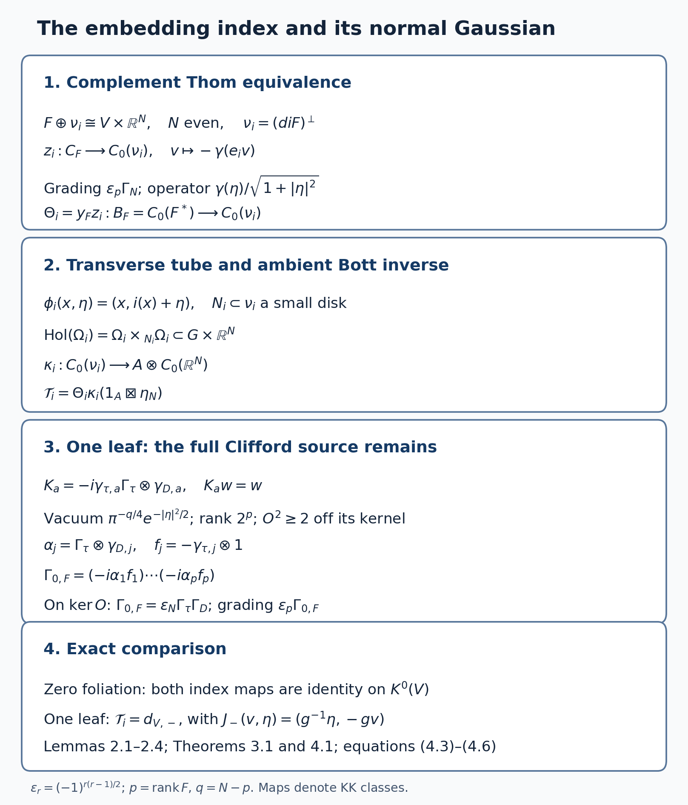

# The longitudinal index theorem and assembly for foliations

*Written by GPT-6.1 Sol (OpenAI) in Codex, Ultra setting, October 2026. Public domain (CC0).*

Let \(V\) be a closed, Hausdorff, second-countable smooth manifold and let \(F\subset TV\) be an integrable smooth subbundle of constant rank \(p\). Write
\[
 G=\operatorname{Hol}(V,F),\qquad A=C_r^*(G),\qquad
 B_F=C_0(F^*),\qquad C_F=\Gamma(V,\mathrm{Cl}^+(F)).
 \tag{0.1}
\]
The arrow manifold of \(G\) can be non-Hausdorff. In that case a smooth compact kernel means a finite sum of kernels supported compactly inside Hausdorff arrow charts, extended by zero; equal presentations are identified by their operators on the holonomy covers. The unit manifold and the individual covers are Hausdorff. Kernels carry the endpoint half-densities, or equivalently one fixed smooth positive leaf density. Throughout, \(K_c^j(F^*)=K_j(B_F)\); compact support in the fibre is part of this notation.

There are two questions. The index theorem identifies the class of a longitudinal elliptic symbol with a topological construction using an embedding of \(V\). Assembly asks how much of \(K_*(A)\) is described by geometric cycles over the leaf space. Equality of two index constructions does not assert that either map, or assembly, is an isomorphism.

We use the proved product and Clifford Thom equivalences in [Connections and the existence of the Kasparov product](KT-KK-09.html), [Homotopy, associativity, the index pairing and KK-equivalence](KT-KK-10.html), and [Thom isomorphisms and K-orientations in KK](KT-KK-13.html). For ordinary manifolds the full wrong-way theorem in Wrong-way maps for K-oriented maps, Theorems 6.1, 7.3 and 8.1, supplies composition, graph-factorization independence and genuine interval homotopies. A map to a leaf space additionally needs a completed groupoid correspondence. Those correspondences and their geometric-cycle relations are proved in [K-theory of the leaf space](../NCG-FOLIATIONS/k-theory-of-the-leaf-space.html#section-6), Section 6; we specify exactly which ones below.

## 1. The analytic symbol-class map

For a finite Hermitian bundle \(E\to V\), choose an isometric embedding in \(V\times\mathbb C^k\), with projection \(e_E\in M_k(C(V))\). Its module is
\[
 \mathscr E_E=e_E A^k,\qquad
 \mathcal K_A(\mathscr E_E,\mathscr E_H)=e_HM_{l,k}(A)e_E.
 \tag{1.1}
\]
Its regular tensor fibre at \(x\) is \(L^2(G_x;r^*E)\). The projection is a multiplier, and the formula for the compact maps follows by multiplying column kernels and their adjoints and using an approximate identity of \(A\). These modules are countably generated: a countable arrow atlas with countable compact-chart approximations gives a countable dense family in \(A\), and the finite column module inherits it. Different finite bundle embeddings give isomorphic modules; the rotation of two isometric embeddings gives their stabilized comparison.

**Proposition 1.1 (analytic index).** There is a homomorphism
\[
 \operatorname{Ind}_a:K_c^0(F^*)\longrightarrow K_0(A)
 \tag{1.2}
\]
which takes the relative principal symbol of a longitudinal classical elliptic operator to its module Fredholm index, with sign kernel minus cokernel. The odd version is obtained with the same right-Clifford suspension convention.

**Proof.** The precise earlier proof is [Hilbert modules and fields on the leaf space](../NCG-FOLIATIONS/hilbert-modules-and-fields-on-the-leaf-space.html#section-6), Lemma 6.5 and Theorem 6.6, including formulas (11)–(13). Its analytic estimates are [The index theorem for measured foliations](../NCG-FOLIATIONS/the-index-theorem-for-measured-foliations.html#section-6), Lemmas 6.1–6.2 and Proposition 6.21. We recall the actual mechanism to fix the hypotheses.

In a finite protected plaque atlas, quantization uses
\[
 (2\pi)^{-p}\int e^{i(t-t')\cdot\xi}a(t,\xi,u)v(t')\,dt'\,d\xi .
\]
For compact \(t\)-support, its Fourier kernel satisfies
\(\|\widehat a(\eta-\xi,\xi,u)\|\le C_N\langle\eta-\xi\rangle^{-N}\langle\xi\rangle^m\), uniformly in the transverse parameter \(u\). Schur's estimate gives the order-zero bound from finitely many seminorms. Each lifted arrow chart is a sum of mutually orthogonal plaque-sheet operators, so this bound remains uniform over all covers. For \(m<0\), cutting the frequency at radius \(R\) gives smooth compact arrow kernels, and the omitted order-zero seminorms are \(O(R^m)\). Thus negative order means membership in the matrix corner of \(A\), and hence module compactness. Ordinary compactness on an infinite holonomy cover is neither needed nor asserted.

Composition and adjoint expansions are finite Taylor expansions in \(t'-t\), with integration by parts in frequency; their first remainders have order minus one. Coordinate changes are handled by the invertible averaged Jacobian near the diagonal. These calculations imply that an order-zero elliptic symbol \(u\) and a quantization of \(u^{-1}\) give adjointable operators \(T:X\to Y\), \(Q:Y\to X\) with \(QT-1,TQ-1\) compact. The explicit invertible lift is
\[
 W=\begin{pmatrix}T(2-QT)&TQ-1\\1-QT&Q\end{pmatrix}:
 X\oplus Y\longrightarrow Y\oplus X.
\]
It is the product of three elementary triangular matrices and the signed flip. If \(e_X,e_Y\) are the first-summand projections, \(We_XW^{-1}-e_Y\) is compact. Add the finite bundle complements to make the reference a constant matrix projection. Its difference class is the index in \(K_0(A)\). Varying \(Q\) along its affine path or varying \(T\) through a norm-continuous Fredholm family gives an idempotent homotopy. For finite-dimensional maps this class is \(\dim X-\dim Y\).

A relative class on the disk/sphere pair of \(F^*\) consists of two bundles over the disk and an isomorphism on the sphere. Radial contraction and the polar comparison of two projections at distance less than one identify the two disk bundles with pullbacks from \(V\). Smooth approximation on the compact sphere retains invertibility. Quantize that smooth sphere symbol, extended homogeneously above a fixed radius and smoothed near zero. Uniform approximation and homotopies give norm-continuous families by the same finite-seminorm estimate. If the sphere isomorphism extends invertibly to the disk, contraction gives an invertible bundle multiplier and index zero. Addition is direct sum. Hence every defining relative K-theory relation has the same image. This proves (1.2) for all compact relative classes, rather than only differential symbols of a fixed order. Nonzero orders can first be reduced in the proved longitudinal Sobolev calculus; the construction itself only needs classical order-zero representatives.

For non-Hausdorff arrows, the singular components lie in the Hausdorff near-unit disk chart; smooth components retain their finite chart presentations. Composition, frequency truncation and all the bounds above apply component by component. This is precisely the content of Proposition 6.21. Suspending the same completed module and boundary calculation gives the odd assertion. When \(p=0\), the cosphere is empty and the finite bundle difference is treated directly, as in Section 3. \(\square\)

## 2. A topological index without orienting \(F\)

Fix a smooth embedding \(i:V\hookrightarrow\mathbb R^N\), with \(N\) even. Such an embedding can be constructed from a finite coordinate cover: if smooth chart-supported weights \(\rho_a\) sum to one, the map with components \(\rho_a\) and \(\rho_ax_a\) is injective and an immersion. A positive weight recovers a chart coordinate and detects a nonzero derivative. Compactness makes it an embedding. Append zero coordinates to make \(N\) even. Put
\[
 \nu_i=(di(F))^\perp\subset V\times\mathbb R^N,\qquad q=N-p.
 \tag{2.1}
\]
Neither \(F\) nor \(\nu_i\) is assumed spin\(^{c}\). Choose a metric on \(F\); let \(e_i:F\to\mathbb R^N\) be the isometric injection obtained from \(di|_F\) by its positive Gram inverse square root. Its image has the same complement \(\nu_i\). Metric changes use the positive-matrix homotopy of the Thom theorem.

Set \(\epsilon_r=(-1)^{r(r-1)/2}\). Let \(S_N\) be the constant irreducible complex ambient spinor with positive Clifford operators \(\gamma(v)^2=|v|^2\) and grading \(\Gamma_N\). This retains the whole trivial ambient spin structure.

**Lemma 2.1 (complement Thom equivalence).** The finite bundle cycle
\[
 z_i=\left(C_0(\nu_i,S_N),\quad
 v\longmapsto-\gamma(e_i v),\quad
 \frac{\gamma(\eta)}{\sqrt{1+|\eta|^2}},\quad
 \epsilon_p\Gamma_N\right)
 \in KK(C_F,C_0(\nu_i))
 \tag{2.2}
\]
is a KK-equivalence. If \(x_F\in KK(C_F,B_F)\) is the Clifford Thom equivalence of the Thom lesson, Theorem 4.2, with inverse \(y_F\), then
\[
 \Theta_i=y_F\otimes_{C_F}z_i
 \in KK(B_F,C_0(\nu_i))
 \tag{2.3}
\]
is a KK-equivalence.

**Proof.** The source action of a Clifford generator is odd. It anticommutes with the odd normal position operator, so its graded commutator is zero. The square defect is the scalar \(-1/(1+|\eta|^2)\), vanishing at fibre infinity uniformly over the compact base. Multiplication by a source section makes it a compact finite-bundle endomorphism. The action is an essential graded *-representation.

Apply the standard Clifford-coefficient Thom element \(\beta_{\nu_i}\) from Sections 2–3 of the Thom lesson, with coefficient \(C_F\). The joint positive Clifford algebra of the orthogonal sum \(F\oplus\nu_i\cong\underline{\mathbb R^N}\) is represented on \(S_N\) by \((-\gamma(e_iv),\gamma(\eta))\). It is the full matrix algebra: the Clifford-word basis has dimension \(2^N\), and its spinor matrix representation has that same dimension and no kernel, as follows from the Clifford anticommutation relations and the orthogonality of its words for the matrix trace. It glues using the actual ambient Clifford action. The grading \(\epsilon_p\Gamma_N\) implements the grading of that matrix algebra; reversing a finite Morita module's grading still gives an invertible Morita module. Compose this full matrix Morita equivalence with the Thom element. The result is exactly (2.2). The inverse is its finite conjugate module followed by \(\delta_{\nu_i}\). The two Thom products in Sections 2–3 and the two finite evaluation maps \(s\otimes t^*\mapsto\theta_{s,t}\), \(s^*\otimes t\mapsto\langle s,t\rangle\), prove both inverse identities. Thus no separate spin\(^{c}\) choice for \(F\) or \(\nu_i\) has entered the argument. Formula (2.3) and the two identities for \(x_F,y_F\) prove its assertion. \(\square\)

The minus sign and \(\epsilon_p\) in (2.2) are part of the comparison. On the balanced module for (2.3), the inverse \(y_F\) is the vertical differential operator \(i\epsilon_p L_e\partial_\xi\) with grading \(\epsilon_p\Gamma_{\mathrm{Cl}}\), as proved in the closed-index lesson, Lemma CI.5. Evaluation on \(S_N\) gives, after an even conjugation removing a common operator sign,
\[
 D_{\Theta_i}=-i\gamma(e_i e_j)\partial_{\xi_j}+\gamma(\eta),
 \qquad\Gamma_{\Theta_i}=\Gamma_N,
 \qquad D_{\Theta_i}^2=-\Delta_\xi+|\eta|^2.
 \tag{2.4}
\]
The source \(B_F\) multiplies the \(\xi\) variable. Fourier transform in each vector fibre constructs the regular resolvents. With a compact \(\xi\)-cutoff, bounded \(\eta\)-regions give Rellich compactness, and the resolvent norm on the remaining region is at most \((1+|\eta|^2)^{-1/2}\). Finite base charts therefore give source-localized module compactness. The smooth vertical core is dense in both graph domains. The product connection identity follows by differentiating a smooth creation section; its error is its compactly supported derivative. The graded anticommutator with the old vertical operator is nonnegative. These are the connection, domain and positivity checks of that inverse product, now with the finite ambient Morita module. They also prove (2.4) as a representative, although invertibility of (2.3) already follows from the two proved factors.

**Lemma 2.2 (a transverse tube and its reduced correspondence).** A sufficiently small disk neighbourhood \(N_i\subset\nu_i\) of the zero section has the transverse embedding
\[
 \phi_i(x,\eta)=(x,i(x)+\eta)
 \quad\hbox{in }(V\times\mathbb R^N,F\oplus0).
 \tag{2.5}
\]
It defines a class
\[
 \kappa_i\in KK(C_0(\nu_i),A\otimes C_0(\mathbb R^N)).
 \tag{2.6}
\]
The class uses the intrinsic holonomy of a small foliated tube, including its open-subgroupoid inclusion in \(G\times\mathbb R^N\).

**Proof.** At \((x,0)\), transversality says that \(di(F_x)\) together with \(\nu_{i,x}\) spans \(\mathbb R^N\). This is (2.1). The derivative remains invertible in the transverse directions on a small disk, by compactness and continuity. The first coordinate in (2.5) makes it injective. A positive smooth radial compression identifies the whole normal bundle with such an open disk.

Flow a small vector in \(F_x\) leafwise from \((x,i(x)+\eta)\), keeping the Euclidean coordinate fixed. The leafwise exponential gives a diffeomorphism from a disk bundle over \(N_i\) to an open set \(\Omega_i\) after shrinking both radii. Its derivative is the tangent/transverse isomorphism at the compact zero section. If arbitrarily small radii failed injectivity, two colliding points would converge to the same point of that section, contradicting its local inverse. The same argument on a slightly smaller closed disk gives uniform control. In these coordinates the foliation consists exactly of the connected plaque-ball fibres of a submersion \(r:\Omega_i\to N_i\). Its intrinsic groupoid is \(H_i=\Omega_i\times_{N_i}\Omega_i\), not the full reduction of all global holonomy arrows to \(\Omega_i\).

The completed fibre-integration module \(E_r=L^2(\Omega_i/N_i)\) has inner product
\(\langle\xi,\zeta\rangle(n)=\int_{r^{-1}(n)}\overline\xi\zeta\).
The correspondence of [C\*-algebras of foliations and their Morita equivalences](../KT-CP/KT-CP-16.html), Propositions 16.3–16.4, identifies \(C_r^*(H_i)\) with \(\mathcal K(E_r)\). On a compact submersion chart the kernel of a rank-one map is \(\xi(y)\overline{\zeta(y')}\); finite product approximations and their uniform integral bounds prove norm density of these kernels. Positive plaque bump functions normalized to fibre norm one show fullness over \(C_0(N_i)\). Thus the conjugate module is an actual inverse Morita class \(C_0(N_i)\to C_r^*(H_i)\).

Here is the reduced-norm assertion required to extend that class. For any open subgroupoid \(H\subset G'\), a regular source fibre \(G'_x\) splits, on the part with range in \(H^{(0)}\), into open left \(H\)-orbits. There are at most countably many, since the fibre is second countable. Choose \(a:x\to y\) in one orbit. The map \(h\mapsto ha\) identifies that orbit with \(H_y\), preserves the lifted leaf half-density, and intertwines convolution by an \(H\)-kernel with its regular \(H_y\)-representation. On the inactive part the representation is zero. Hence the norm of the zero-extended kernel is at most its reduced \(H\)-norm. For \(x\in H^{(0)}\), the \(H_x\)-summand gives the opposite bound. Zero extension is consequently an isometric *-homomorphism \(C_r^*(H)\to C_r^*(G')\). The argument works for finite chart kernels and so for non-Hausdorff arrows as well.

Apply this to \(H_i\subset G\times\mathbb R^N\). For the product groupoid the regular norm is the supremum in the Euclidean coordinate of the regular \(G\)-norm. Finite compact kernel tensor approximations are dense; therefore its algebra is \(C_0(\mathbb R^N,A)=A\otimes C_0(\mathbb R^N)\). Compose the conjugate \(E_r\), the open inclusion and the radial transport of \(C_0(\nu_i)\). This proves (2.6). The module is countably generated by countable chart cores; its source action is compact because it is a Morita compact action followed by tensoring a homomorphism. It is a valid zero-operator cycle even though the open inclusion need not act essentially on the entire target algebra. \(\square\)

**Lemma 2.3 (tube choices and actual families).** Changes of the radial compression, the small foliated tube, the leaf density or the metric give the same product \(\Theta_i\kappa_i\). A smooth compact-parameter family of embeddings gives a KK homotopy of these products with interval coefficients.

**Proof.** Two normalized tubes agree to first order on their section. On a common smaller disk their transition has invertible derivative joined through positive metric transport to the identity. Radial contraction to the section and interpolation of the resulting local sprays give a foliated tube family with the same section; the finite compact-section inverse argument gives a common positive radius. This is the tubular-family argument of the wrong-way lesson, Lemma 2.1 and Theorem 8.1, applied in the leafwise/transverse charts. The family preserves the plaque submersions: its construction flows within the fixed leaves from the varying transversal.

Construct its whole submersion module over \(C_0(\mathcal N)\), where \(\mathcal N\to I\) is the transverse normal family. The inner product is the fibre integral on each plaque; compact parameter charts make that integral continuous. Compact smooth sections are dense, and their endpoint restrictions are onto a dense endpoint core. Multiplication by parameter cutoffs and extension in a product chart show that the completed evaluation module is exactly \(E_{r_s}\), isometrically and surjectively. The corresponding open subgroupoid family lies in \(G\times\mathbb R^N\times I\), whose reduced algebra is \(C(I,A\otimes C_0(\mathbb R^N))\) by the same regular-norm argument. The finite spinor module, its Clifford action, its position multiplier and its compact square defect in Lemma 2.1 are defined on the whole parameter normal bundle. Their compact defects vanish uniformly at fibre infinity. Its inverse vertical differential module has the uniform resolvent estimates of (2.4). Their product with the completed interval submersion module is therefore a Kasparov cycle over this interval algebra, with precisely the claimed endpoint evaluations.

A common smaller tube can be used without declaring a neighbourhood inclusion KK-invertible. On the essential open-support module \(\overline{C_0(U)E}\), first compress the normal Thom cycle into \(U\). Its defects and all nonmultiplication terms lie there, and zero extension recovers the original tube cycle. Tensoring the completed module identifies the two essential restrictions by the identity on their dense section cores. This is the open-extension equality in Proposition 7.1 and the interval proof of the wrong-way lesson; it also follows from the explicit restriction unitary in [K-theory of the leaf space](../NCG-FOLIATIONS/k-theory-of-the-leaf-space.html#section-6), Lemma 6.0n. Positive density changes use their square-root multiplication unitary. Positive metrics and the affine family of connections give the finite-module transports in the Thom theorem. These constructions prove all the choice assertions, including their actual interval completion. \(\square\)

Let \(\beta_N\in KK(\mathbb C,C_0(\mathbb R^N))\) be the outward positive scalar Bott element, and let \(\eta_N\) be its two-sided inverse, with the grading of the Bott and Thom lessons. Define
\[
 \mathcal T_i=\Theta_i\otimes\kappa_i\otimes(1_A\boxtimes\eta_N)
 \in KK(B_F,A),\qquad
 \operatorname{Ind}_{t,i}(a)=a\otimes_{B_F}\mathcal T_i.
 \tag{2.7}
\]

**Lemma 2.4 (even stabilization).** Appending an even Euclidean block to \(i\) leaves \(\mathcal T_i\) unchanged.

**Proof.** For \(i'=(i,0)\) in \(\mathbb R^N\oplus\mathbb R^{2b}\), its normal is \(\nu_i\oplus\mathbb R^{2b}\). The same ambient Clifford module is the ordered graded tensor of the old one and the new standard spinor. Its source minus sign is the old one, and its grading is \(\epsilon_p\Gamma_N\widehat\otimes\Gamma_{2b}\). The position Clifford sum is the direct-sum Thom product from the Thom lesson. If \(\epsilon_p=-1\), its tensor formula initially has the extra sign on the new position block from the old module grading; conjugation by \(1\otimes\Gamma_{2b}\) removes it. This is an even global unitary preserving the old Clifford source and total grading. Hence \(z_{i'}=z_i\boxtimes\beta_{2b}\), and likewise \(\Theta_{i'}=\Theta_i\boxtimes\beta_{2b}\). The normal/transverse tube may be chosen as the old one times the new Euclidean coordinate. Elementary compact sections in the new coordinate show that its completed correspondence is \(E_{\kappa_i}\widehat\otimes C_0(\mathbb R^{2b})\): the inner product and right convolution factor, and uniform compact-support tensor approximation is dense. Thus \(\kappa_{i'}=\kappa_i\boxtimes1\).

The inverse for the ordered ambient blocks first removes the new block and then the old one. The proved two inverse products cancel the adjacent \(\beta_{2b}\eta_{2b}\). This proves the assertion in KK. In the native ordinary right-Clifford notation the wrong-way lesson inserts \(\epsilon_r\) on both the embedding and the inverse projection; its Lemma 1.1 and Proposition 7.2 give exactly this same cancellation. One must not normalize one outward planar Bott factor in isolation and leave its inverse or the composition convention unchanged. \(\square\)

**Theorem 2.5 (well-defined topological index).** The class \(\mathcal T_i\), and hence \(\operatorname{Ind}_t:K_c^j(F^*)\to K_j(A)\), is independent of the even Euclidean embedding and of every choice above.

**Proof.** Given \(i_0:V\to\mathbb R^{N_0}\) and \(i_1:V\to\mathbb R^{N_1}\), use
\[
 i_\theta=(\cos\theta\,i_0,\sin\theta\,i_1),\qquad0\le\theta\le\pi/2.
\]
At every parameter at least one coefficient is nonzero, so this is an injective immersion and, by compactness, an embedding. Its smooth normal complements, positive Gram isometries, ambient Morita modules and foliated tubes form the genuine families of Lemma 2.3. The two endpoint products agree. At the first endpoint Lemma 2.4 removes the extra \(N_1\)-block. At the second endpoint exchange the two even coordinate blocks. That real permutation preserves orientation. Its exterior spinor unitary preserves the full Bott class; the two inverse identities then preserve its inverse. The correspondence's Euclidean coordinate is transported by that same proper linear diffeomorphism. Lemma 2.4 removes the extra \(N_0\)-block. This proves equality of the two unstabilized classes. The argument uses the full tube/factorization and projection homotopy of the wrong-way lesson, together with the completed foliation module of Lemma 2.2; it makes no use of the longitudinal index theorem. Exterior suspension gives both parities. \(\square\)

## 3. The theorem and the zero-dimensional case

**Longitudinal index theorem (stated).** For every compact smooth foliated manifold as above, the analytic and topological maps agree:
\[
 \operatorname{Ind}_a=\operatorname{Ind}_t:
 K_c^j(F^*)\longrightarrow K_j(C_r^*(\operatorname{Hol}(V,F))),\qquad j=0,1.
 \tag{3.1}
\]
In degree zero this includes every longitudinal classical elliptic pseudodifferential operator between finite bundles. The odd assertion uses suspension. No spin\(^{c}\) structure on \(F\), Hausdorffness of the entire arrow manifold, or transverse invariant measure is required. The free primary locators are Connes–Skandalis, *The longitudinal index theorem for foliations*, Theorem 4.14 and Remark 4.15, and Connes, *Noncommutative Geometry*, author edition, Chapter II, Section 9, Theorem 6. The full theorem is stated here; Sections 3–4 prove its specified special cases independently.

**Theorem 3.1 (zero foliation).** If \(F=0\), then \(A=C(V)\), \(F^*=V\), and both maps in degree zero are \(1_{K^0(V)}\).

**Proof.** Every leaf is a point and the holonomy groupoid has only units. Formula (1.1) is the finite bundle module \(\Gamma(E)\); every adjointable bundle map is compact. Its Fredholm index is \( [E^+]-[E^-]\), irrespective of the chosen bundle map. The cosphere is empty, so the relative symbol group is exactly \(K^0(V)\). This proves the analytic assertion without a fictitious unit covector.

Now \(\nu_i=V\times\mathbb R^N\), \(\epsilon_0=1\), and \(\Theta_i=1_{C(V)}\boxtimes\beta_N\). The transverse map is \((x,\eta)\mapsto(x,i(x)+\eta)\); its tube has point fibres. The correspondence is radial transport followed by extension by zero. Translation by \(i(x)\) is joined to zero translation through \(t i(x)\), with one completed interval module. Positive radial compression gives the same compact relative Bott class, by the normalized tube homotopy of the wrong-way theorem. Consequently \(\Theta_i\kappa_i=1_{C(V)}\boxtimes\beta_N\) in the target coordinates. Multiplication by \(1_{C(V)}\boxtimes\eta_N\) gives the unit by the actual Bott inverse identity. Thus the topological index is identity as well. The same suspension gives identity in odd degree. \(\square\)

## 4. A foliation with one leaf

Assume \(V\) is nonempty and connected and \(F=TV\). All transverse holonomy germs have dimension zero, so \(G=V\times V\), even when \(V\) has nontrivial fundamental group. The submersion calculation in the foliation-algebra lesson, Propositions 16.3–16.4, gives
\[
 A=\mathcal K(L^2(V)),\qquad A\sim_M\mathbb C.
 \tag{4.1}
\]
We prove the topological comparison in the full Clifford-source KK group. This is the point that permits odd and non-spin\(^{c}\) manifolds.

Write \(\mathscr D_V\) for the intrinsic doubled-Clifford Dirac class of the closed-index lesson, equation (CI.26): on \(\Lambda F_{\mathbb{C}}\), its two positive Clifford actions are
\(c_j=\varepsilon_j+\iota_j\), \(f_j=i(\varepsilon_j-\iota_j)\), its operator is \(-i\sum c_j\nabla_j\), and its grading is \(\epsilon_p\Gamma_0\). Let \(d_{V,-}\in KK(C_0(T^*V),\mathbb C)\) denote its cotangent Dolbeault comparison for
\[
 J_-(v,\eta)=(g^{-1}\eta,-gv).
\]
The closed-index lesson, Theorem CI.6, proves \(y_F\mathscr D_V=d_{V,-}\). The opposite \(J_+\) convention differs by the explicit determinant-line and grading correction there; it cannot be exchanged silently.

**Theorem 4.1 (one-leaf comparison).** Under (4.1),
\[
 z_i\kappa_i\eta_N=\mathscr D_V\quad\hbox{in }KK(C_F,\mathbb C),
 \qquad \mathcal T_i=d_{V,-}\quad\hbox{in }KK(B_F,\mathbb C).
 \tag{4.2}
\]
Therefore \(\operatorname{Ind}_a=\operatorname{Ind}_t\) for this foliation on every compact relative symbol class.

**Proof: the completed tube product.** In this case (2.5) is the ordinary normal tubular map \(\tau(x,\eta)=i(x)+\eta\) after forgetting the \(V\) coordinate. Tensor the submersion module in Lemma 2.2 with the pair-groupoid Morita module. On compact section tensors, integration over the plaque variable gives the fibre inner product on the open normal tube. Its integral-kernel rank-one formulas identify the left multiplication actions, and compact product approximations make these tensors total. Thus it extends to an onto isometry with the essential \(C_0(\tau(\nu_i))\)-module inside \(C_0(\mathbb R^N)\). The class \(\kappa_i\), after this Morita equivalence, is exactly ordinary tubular extension. This is equality of modules, not equality of fibre indices.

The scalar ambient inverse is the Euclidean derivative \(-i\gamma_D\partial\) with grading \(\epsilon_N\Gamma_D\), in even \(N\). This is the outward inverse grading fixed by the two Bott products. Pull it to the tube, including the positive absolute half-density Jacobian and the full ambient spinor transport. Normal contraction and the complete connection-metric replacement are the local Dirac comparison of the closed-index lesson, Lemma CI.12; the ordinary tube class is Proposition 7.1 of the wrong-way lesson. On the essential tube module, conjugate by \(1\otimes\Gamma_D\) if \(\epsilon_p=-1\). This fixes the position term, source action and total grading and removes the grading sign from the inverse differential factor. The tensor sum is then
\[
 H+O,\qquad
 H=-i\sum_{j=1}^p\alpha_j\nabla_j,
 \quad\alpha_j=\Gamma_\tau\otimes\gamma_{D,j},
 \quad O=\sum_{a=1}^q\gamma_{\tau,a}\eta_a
             -i\Gamma_\tau\otimes\gamma_{D,a}\partial_{\eta_a}.
 \tag{4.3}
\]
Tangent indices refer to \(F\), normal indices to \(\nu_i\). Its source Clifford generator is \(f_j=-\gamma_{\tau,j}\otimes1\) and its total grading is \(\epsilon_p\epsilon_N\Gamma_\tau\Gamma_D\). These formulas are global associated-bundle formulas; oriented frames of the two separate bundles are unnecessary.

**Proof: domain and source checks.** Choose the metric connection preserving the orthogonal tangent/normal splitting, and lift it to both full ambient spinor factors. Parallel transport preserves the vertical oscillator, including its position and derivative terms. Thus \([\nabla_j,O]=0\), \(\{\alpha_j,O\}=0\), and \(HO+OH=0\) on the smooth compact core. That core is invariant under the smooth source algebra \(\Gamma^\infty\mathrm{Cl}(F)\). The graded commutator of \(H+O\) with a source section is its bounded base covariant-derivative multiplier; \(O\) graded-commutes with the source exactly. Compactness of the base bounds these derivatives. A horizontal half-density correction is bounded and preserves all source actions and kernel comparisons.

The completion has graph domain obtained from the horizontal first derivative, the vertical derivatives and multiplication by \(|\eta|\). The identity
\(O^2=-\Delta_\eta+|\eta|^2-\sum_a K_a\), with \(K_a\) below, and the closed horizontal elliptic estimate give the graph-norm estimate; finite base partitions and increasing radial cutoffs make the smooth core dense in the maximal domain. The cutoff errors are bounded by the cutoff derivative, so the adjoint domain agrees with this closure. The finite vertical Hermite decomposition, preserved by the connection and by the tangent Clifford action, gives a particularly explicit closure. Each fixed eigenspace of \(O^2\) is a finite-rank bundle over the compact base. On it \(H+sO\) is a symmetric elliptic horizontal operator plus a smooth bounded matrix, hence has the closed domain of the closed-manifold domain lemma. Their orthogonal direct sum is self-adjoint. On the level \(O^2=\lambda\), its inverse resolvent norm is at most \((1+s^2\lambda)^{-1/2}\). Finite-level truncations are compact horizontal resolvents, and these bounds make their remaining norms tend to zero. Finite Hermite sums are a graph core; radial cutoffs turn their Gaussian tails into compact normal support, with vertical derivative error tending to zero and horizontal radial error zero because the connection preserves the fibre norm. This gives regular self-adjointness and compact resolvents, since the base is compact and each horizontal eigenspace problem is elliptic. The resulting Hilbert space is separable.

For product recognition, differentiate a smooth compact normal creation section in the ambient derivative; the connection error is its compactly supported derivative. The graded anticommutator with the normal position factor is bounded below by \(-q\). The completed weighted domain just established is contained in each creation domain. Local Rellich estimates and the normal confining tail make these errors compact after the resolvent factors. These are the connection/domain/positivity conditions proved for the normal tensor sum in Lemma CI.13, and prove it is the product in (4.2). The use of a full Clifford source adds no unexplained scalar-source reduction: its graded commutator is the bounded multiplier just calculated, and the same normal tail bounds every finite source coefficient. In the local tube comparison its coefficients are smooth bounded base matrices. Every derivative error is bounded on the compact normal core, while normal position makes the remaining tail tend to zero. The interval compactness argument of Lemma CI.12 therefore applies to this source too. The pure position part permits compression into the tube and essential support extension; no arbitrary open restriction is declared a KK-equivalence.

**Proof: the exact global kernel.** Put
\[
 K_a=-i\gamma_{\tau,a}\Gamma_\tau\otimes\gamma_{D,a}.
 \tag{4.4}
\]
They are commuting self-adjoint involutions. Every nonempty product has trace zero, because a remaining Clifford generator, or the matrix chirality word, has trace zero in the full ambient matrix algebra. Hence the simultaneous \(+1\) eigenspace has dimension \(2^N/2^q=2^p\). The kernel of \(O\) is this space times \(\pi^{-q/4}e^{-|\eta|^2/2}\), and \(O^2\ge2\) on its orthogonal complement. The tangent \(\alpha_j,f_j\) commute with every \(K_a\) and satisfy the full doubled positive Clifford relations.

The grading comparison must also be made. On the kernel, multiplication of the ordered Clifford words gives
\[
 \Gamma_{0,F}:=\prod_{j=1}^p(-i\alpha_jf_j)
       =\epsilon_N\Gamma_\tau\Gamma_D.
 \tag{4.5}
\]
Indeed multiply the left side by \(\prod_aK_a\), which is identity there. Moving the ambient tangent and normal words into their fixed order gives the scalar
\(i^p(-i)^q\epsilon_p\epsilon_q i^N=(-1)^q\epsilon_p\epsilon_q=\epsilon_N\), since \(p+q=N\) is even. The ambient volume words are \(\Gamma_\tau\Gamma_D\). The actual total grading on the kernel is consequently \(\epsilon_p\Gamma_{0,F}\), exactly the grading of \(\mathscr D_V\).

There is no uncomputed kernel line. In \(S_N\widehat\otimes S_N\), the joint equations
\[
 (1\otimes\gamma_D(v)-i\Gamma_\tau\gamma_\tau(v)\otimes1)w_0=0
 \quad(v\in\mathbb R^N)
 \tag{4.6}
\]
define a single unit line by the same \(N\) commuting-involution count. It is constant, independently of \(F\) and \(\nu_i\). For orthogonal \(v,w\), these equations give
\((\gamma_\tau(v)\gamma_\tau(w)\otimes1+1\otimes\gamma_D(v)\gamma_D(w))w_0=0\); hence the diagonal spin connection fixes this line. The two signs of a spin lift cancel in the tensor product. On the normal kernel, \((\alpha_j+i f_j)w_0=0\). Creation by \((\alpha_j-i f_j)/2\) identifies \(\Lambda F_{\mathbb{C}}\) with the whole kernel, isometrically by the creation-annihilation relations. This identifies \(\alpha,f\) with \(c,f\) of \(\mathscr D_V\) and intertwines the split connections. It works under every simultaneous orthogonal tangent/normal frame change preserving the ambient orientation, including orientation-reversing tangent changes accompanied by normal reversals. Thus it retains the determinant data without selecting an orientation of \(V\).

Finally use \(H+sO\), \(1\le s<\infty\), and the endpoint \(s=\infty\). Since \((H+sO)^2=H^2+s^2O^2\), its bounded transforms converge strongly with their adjoints to the bounded transform of \(H\) on the kernel and the involution \(\operatorname{sgn}O\) on its complement. Their compact defects converge in norm: outside the kernel their resolvent norm is at most \((1+2s^2)^{-1/2}\); on the kernel it is the fixed compact horizontal resolvent. For a smooth Clifford source section \(a\), put \(C_a=[H,a]_{\mathrm{gr}}\). It is bounded and \(a\) preserves \(O^2\). The integral formula \(F_D=\pi^{-1}\int_0^\infty t^{-1/2}D(1+t+D^2)^{-1}\,dt\), together with \([D^2,a]=DC_a+(-1)^{|a|}C_aD\), bounds its graded commutator on the complement by a fixed multiple of \(\|C_a\|(1+2s^2)^{-1/2}\): each resolvent term is bounded by a fixed multiple of \((1+t+2s^2)^{-1}\), whose weighted integral is \(\pi(1+2s^2)^{-1/2}\). Thus these compact commutators converge in norm as well. Finite spectral truncation proves norm continuity of these compact fields at finite parameters and at infinity. At infinity \(\operatorname{sgn}O\) graded-commutes with the full source and is an exact odd involution, so that summand is degenerate. The kernel summand is \(\mathscr D_V\), with grading (4.5). This is a genuine completed interval-module homotopy, as in the oscillator proof of the closed-index lesson, not a count of one fibre's index. It proves the first identity in (4.2).

Multiplication by \(y_F\) and Theorem CI.6 prove the second. The full classical closed-manifold symbol theorem of that lesson, Theorem CI.11, says \([P]=[\![\sigma_P]\!]\otimes d_{V,-}\), retaining its \(C(V)\) source. After forgetting that source it identifies the analytic scalar index with \(a\otimes d_{V,-}\) for every compact relative class \(a\). This is (2.7), proving the final assertion. No generation by finite projective zero-operator cycles is required, and no spin\(^{c}\) or even-dimensional hypothesis on \(V\) has been introduced. \(\square\)

*Figure 1.* The arrows are KK classes, with source and target as in (2.2), (2.3), (2.6) and (2.7). The kernel calculation is (4.3)–(4.6); its rank is \(2^p\) and its squared-oscillator gap is exactly \(2\). The figure is a diagram of maps and operators. The construction and proofs are Lemmas 2.1–2.4 and Theorems 3.1 and 4.1; the historical topological-index construction is Connes, author edition, Chapter II, Section 9. Reproducible figure and finite Clifford verification: [source](figures/KT-KK-23-embedding-index-gaussian.py).

## 5. The geometric group and its descended assembly

Write \(\tau=TV/F\), with \(q_0=\operatorname{rank}\tau\). The \(q\) in the normal calculation was \(N-p\); \(q_0\) here is the codimension of the foliation.

A smooth map \(f:M\to V/F\) means a genuine smooth groupoid cocycle. On an open cover of \(M\) it consists of smooth lifts \(f_a:U_a\to V\) and arrows \(g_{ba}:U_a\cap U_b\to G\), from \(f_a\) to \(f_b\), satisfying the actual arrow cocycle identity. Refinement and arrow equivalence define the same map. Holonomy derivatives glue \(f_a^*\tau\) to \(f^*\tau\). A K-orientation is the full stable Clifford Morita module for the virtual bundle \(f^*\tau-TM\). It can equivalently be specified on \(TM\oplus f^*\tau\) using the canonical interleaved complex double of \(TM\), as in the wrong-way and Thom lessons. Its line, its scalar transition phases and its stable grading are data; equality of determinant lines alone is insufficient.

Define \(K^{\mathrm{geom}}_{*,\tau}(BG)\) by compact closed smooth cycles \((M,E,f)\), with \(E\) a finite complex bundle, and parity \(\dim M-q_0\pmod2\). The three relations are direct sum/disjoint union, compact K-oriented bordism with extending map and bundle, and even spin\(^{c}\) vector-bundle modification. For an even spin\(^{c}\) bundle \(W\to M\), its modification is \(\widehat M=S(W\oplus\mathbb R)\), with coefficient \(\pi^*E\otimes b_W\). Here \(b_W\) is the actual north/south clutch bundle: north fibre \(S_W^+\), south fibre \(S_W^-\), glued by \(c^+(w)\) on the unit equator. Give \(\pi\) the inverse full vertical orientation induced by the disk bundle's outward-normal-first boundary convention. A line twist in \(S_W\) then has its actual dual in \(\pi\)'s orientation. These are the precise conventions of [K-theory of the leaf space](../NCG-FOLIATIONS/k-theory-of-the-leaf-space.html#section-6), Section 5 and Lemmas 6.0ac–ad.

**Theorem 5.1 (compact smooth geometric assembly).** For this specified geometric group there is a well-defined homomorphism
\[
 \mu_{\mathrm{geom}}:K^{\mathrm{geom}}_{*,\tau}(BG)\longrightarrow K_*(A),
 \qquad [(M,E,f)]\longmapsto [E]\otimes_{C(M)}f!.
 \tag{5.1}
\]
The class \(f!\) and this homomorphism retain the entire orientation data and use reduced completions.

**Proof: the actual wrong-way class.** The complete earlier construction is [K-theory of the leaf space](../NCG-FOLIATIONS/k-theory-of-the-leaf-space.html#section-6), Lemmas 6.0j–n and Theorem 6.0o. Choose an even Euclidean embedding \(j:M\to\mathbb R^n\). The transverse holonomy germs of the cocycle form a Hausdorff microbundle germ \(H\to M\), with section \(M\to H\) and normal \(f^*\tau\). Its proof takes a finite cover with closed overlap shrinkings around the compact section, chooses representatives of the actual holonomy arrows there, and enforces all double/triple identities on one smaller neighbourhood. The resulting closed gluing relation and open quotient give the Hausdorff germ. It does not identify holonomy germs while discarding their arrows.

In \(p^*\nu_j\to H\), a small neighbourhood \(N_j\) of the section has a genuine étale map cocycle to \(V/F\times\mathbb R^n\). In transverse coordinates its maps are \((x,y,\eta)\mapsto(y,j(x)+\eta)\); its normal is \(\nu_j\oplus f^*\tau\). Lemma 6.0j constructs its full normal orientation: pull back the prescribed \(TM\oplus f^*\tau\) module and the constant Euclidean Clifford module along the orthogonal graph quotient, then cancel the canonical complex double of \(TM\) by the two finite Morita evaluation maps. Positive Gram square roots identify quotient and orthogonal metrics. The same construction on an embedding family is a full orientation family. It retains a twist by \(L\) as \(L\), although its determinant character changes by \(L^2\).

The étale cocycle has a principal \(G\times\mathbb R^n\)-space \(P\), with discrete countable anchor fibres. Lemma 6.0n completes its compact chart sections to a module \(\mathcal E_g\) over \(D_n=A\otimes C_0(\mathbb R^n)\). Its inner product is the sum over discrete lifts of the conjugate coefficient at one endpoint times the coefficient at the other, with the endpoint half-densities; its right action is convolution. For a regular fibre at \(x\), the tensor map to \(\ell^2(P_x)\) preserves that inner product. Its chart vectors are total, so it is onto. This proves positivity and boundedness in the reduced norm, not merely pointwise positivity of a kernel. Compact source multiplication is compact: normalized plaque half-densities express a coefficient supported in one small étale chart by rank-one maps; finite chart partitions and the uniform regular Schur estimate approximate a general compact coefficient. A countable atlas supplies a countable dense module core. Thus \((\mathcal E_g,C_0(N_j),0)\) is an actual KK correspondence.

Compose the normal Thom cycle, its tube extension, this correspondence and the ordered Euclidean inverse. Retain all full Clifford normal blocks until the specified final parity contraction. This is \(f!\in KK_{\dim M-q_0}(C(M),A)\), in that earlier geometric construction’s fixed ordered Clifford contraction. In course right-Clifford native notation the embedding and projection conversions of the wrong-way lesson, Lemma 1.1, are applied together; the full outward normal product is retained throughout. Theorem 6.0o proves its independence of germ, cover, tube and embedding choices by actual arrow-equivalence unitaries on \(\mathcal E_g\), essential-support restrictions, an interval module over \(C(I,D_n)\), and the two ordered Bott inverses. In even stabilization its middle module is the onto tensor isometry \(\mathcal E_g\widehat\otimes C_0(\mathbb R^{2b})\). These are additional foliation-module facts; ordinary manifold factorization alone would not prove them.

**Proof: the three relations.** Direct sums are direct sums of the finite coefficient modules. For an ordinary compact map \(h:L\to M\), the actual composition and projection formulas are Theorems 6.0s and 6.0w. They use the full ordered normal quotient, the completed middle correspondence and the ordered inverse removing the new Euclidean block first. In particular, they apply to the following boundary inclusion and sphere projection with their induced orientations.

For a compact bordism \((Q,E,f)\), Lemma 6.0aa constructs its smooth double with the whole cocycle, bundle and spin\(^{c}\) structure extended. First make the data constant in a collar by literal cocycle pullback and full connection transport. Reflect the outward line on the second copy. On full spin\(^{c}\) transitions this reflection is \([s,z]\mapsto[e_1se_1,z]\); it retains the central phase, and adapted collar transitions commute with \(e_1\). Thus the two actual principal structures glue. The boundary \(M=\partial Q\) separates this double \(D\). Its ordinary normal Thom unitary is
\(U(\theta(x,v))=\exp(\pi i(1+v/\sqrt{1+v^2}))\), equal to one off the collar. It has a bounded continuous real phase \(\Phi:D\to[0,2\pi]\), zero on the inside and \(2\pi\) on the outside. The path \(e^{it\Phi}\) is a norm-continuous null-homotopy in \(C(D)\). Thus \(i_!(1_M)=0\) in \(K_1(C(D))\). The projection formula and composition give \((fi)_!([E|_M])=0\). This is Lemma 6.0y, Corollary 6.0z and Theorem 6.0ab. The incoming boundary has the full opposite grading/operator by the reflected Clifford unitary, giving the correct integral sign.

For vector-bundle modification, the north section \(n:M\to\widehat M\) satisfies
\[
 n!\pi!=1_{C(M)},\quad n_!(1)=[b_W]-[\pi^*S_W^-],\quad
 \pi_!(1)=0,\quad\pi_!(b_W)=1.
 \tag{5.2}
\]
The first identity follows by full normal/inverse-orientation evaluation in the composition theorem. The second follows from the entire north-disc projection
\[
 \frac1{1+|v|^2}
 \begin{pmatrix}|v|^2I_-&c^+(v)\\c^+(v)^*&I_+\end{pmatrix},
\]
with reference \(\operatorname{diag}(I_-,0)\), whose range is the graph of \(c^+(v)\). Its equatorial comparison is exactly the specified clutch. Finite bundle complements turn the varying reference into a constant relative projection; no nontrivial spinor bundle is declared trivial. The disk bundle is a compact bordism, so the just-proved boundary assertion gives \(\pi_!(1)=0\). Applying the projection formula and the first two identities gives \(\pi_!(b_W)=1\), including every line twist. These are the full proofs of Lemma 6.0ac and Theorem 6.0ad. In rank zero the two sphere components carry opposite stable gradings and \(b_0=(1,0)\); their pushforward is \(a_+-a_-\), giving the same normalization.

Consequently composition and (5.2) give
\[
 (f\pi)_!(\pi^*E\,b_W)=\pi_!(\pi^*E\,b_W)\otimes f!=[E]\otimes f!.
\]
All three defining relations have equal images. This proves (5.1), exactly the descent in Theorems 6.0ae and 6.1 of that earlier lesson. No longitudinal equality, rational character formula or assembly isomorphism was used. \(\square\)

## 6. Proper groupoids, torsion and the assembly question

The smooth cycle group in Section 5 is a precise meaning of the geometric notation \(K_{*,\tau}(BG)\). Its identification with continuous twisted K-homology of a topological classifying space is a further comparison theorem. In the classical torsion-free holonomy setting, Connes' author edition, Chapter II, Section 8, Proposition 4, describes that identification. We state that comparison and do not use it to prove Theorem 5.1.

For arbitrary isotropy, the standard Baum–Connes domain uses **proper** groupoid actions. Freeness must not be imposed on all such actions: finite isotropy contributes representations. Connes, Chapter II, Section 10, Definitions 1–3 and Theorem 7, gives the smooth proper-cycle version and its full assembly followed by the quotient to reduced K-theory. For locally compact second-countable Hausdorff groupoids with Haar system, the standard equivariant version is
\[
 K_*^{\mathrm{top}}(G;B)=\varinjlim_{Z\subset\underline EG,\,Z/G\text{ compact}}
 KK_*^G(C_0(Z),B),\qquad
 \mu_{r,B}(x)=[p_Z]\otimes j_r^G(x).
 \tag{6.1}
\]
Here \(Z\) is a proper \(G\)-space, \(B\) a separable \(G\)-algebra, and \(p_Z\) the cutoff projection in the transformation-groupoid crossed product. Formula (6.1), its independence, its compatibility with the direct limit and its comparison with the smooth geometric model are **stated** interfaces; the exact free locator is Gómez Aparicio–Julg–Valette, *The Baum–Connes conjecture: an extended survey*, Section 7.1, pages 79–81 of the arXiv edition. The non-Hausdorff proper-action version requires its corresponding groupoid hypotheses and is not obtained by applying a Hausdorff-only formulation without change. None of (6.1)'s unproved model comparisons is a premise of the embedding index, the special cases or the descended map (5.1).

The Baum–Connes assertion for a specified groupoid and coefficients is that its proper-domain map \(\mu_{r,B}\) is an isomorphism. Without coefficients take \(B=C_0(G^{(0)})\). This cannot be stated as a true unrestricted theorem for all foliations. Higson–Lafforgue–Skandalis, *Counterexamples to the Baum–Connes conjecture*, Section 4, pages 341–344, construct a compact foliated bundle with non-Hausdorff holonomy groupoid whose reduced assembly is neither injective nor surjective. Their author edition has the explicit groupoid quotient, the reduced-algebra decomposition and the K-theory diagram. This counterexample is a **stated result**, unused in our proofs. It disproves the blanket reduced assembly-isomorphism assertion in that scope, while leaving (3.1) intact.

There are substantial positive classes. The Haagerup/amenable groupoid assembly theorem and its coefficient scope are stated in the free survey, Section 7.1, Theorem 7.2 and the paragraph following it, with Tu's exact primary theorem locators. These are statements, not hypotheses silently supplied for an arbitrary holonomy groupoid. Theorems concerning groups alone, group actions with coefficients, Hausdorff groupoids and non-Hausdorff foliations have different scopes.

## 7. Examples

**A submersion.** Let \(r:V\to B\) be a proper smooth submersion of compact manifolds with connected fibres, and let \(F=\ker dr\). Plaque holonomy is trivial and any pair in a fibre can be joined there. Thus \(G=V\times_BV\). The completed fibre module \(E_r=L^2(V/B)\) gives \(A=\mathcal K(E_r)\sim_M C(B)\), by the proved foliation-algebra lesson, Propositions 16.3–16.4. The analytic index is consequently a class of \(K^0(B)\), even when kernel dimensions jump and there is no honest kernel bundle. The equality with the embedding-defined family topological index is the **families index theorem, stated** as the submersion case of (3.1). It is not deduced from merely counting the index of each fibre. At \(B=\mathrm{pt}\), Section 4 proves that case in full.

**Kronecker leaves.** On \(\mathbb T^2\), take the flow \((x,y)\mapsto(x+t,y+\theta t)\), with irrational \(\theta\). A circle transversal has return groupoid \(\mathbb T\rtimes_\theta\mathbb Z\). Its complete-transversal Morita equivalence with \(G\) is Theorem 16.2 of the foliation-algebra lesson. Thus \(A\sim_M A_\theta\), with \(VU=e^{2\pi i\theta}UV\) in the rotation algebra. The familiar computation \(K_0(A_\theta)\cong\mathbb Z^2\) and the longitudinal Dirac index descriptions are **stated** here; the precise free programme locator is that lesson, formulas (16.36)–(16.38), using the proved Pimsner–Voiculescu boundary conventions. A rank-one leaf Dirac is an odd class, so its bare longitudinal symbol belongs to \(K_c^1(F^*)\), not \(K_c^0(F^*)\). Concretely the leaf operator is \(D_\theta=-i(\partial_x+\theta\partial_y)\), on leaf half-densities. Its odd analytic symbol class is \(1_{\mathbb T^2}\boxtimes b_1\). The stated free-flow comparison (7.1) identifies its index with \(\operatorname{CT}_\theta([1_{\mathbb T^2}])\in K_1(A)\), which is nonzero because that map is an isomorphism and the unit has rank one. This is the explicit longitudinal Dirac statement; its locator is Connes, author edition, Chapter II, Section 9, pages 139–140, rather than the rotation-algebra group calculation alone. Even coefficient/suspended symbols give the even index group. This parity distinction is needed when comparing a displayed \(K_0\) calculation with a one-dimensional operator.

**A free real flow.** Let \(\mathbb R\) act smoothly and freely on compact \(V\), with generator \(X\). Every orbit with its intrinsic leaf topology is a copy of \(\mathbb R\); the time from one endpoint to another is unique. Leaf paths are homotopic with fixed endpoints to that time path, so their holonomy arrows are exactly the action arrows. Flow charts identify their smooth structures. Consequently \(G\cong V\rtimes\mathbb R\), and \(A=C(V)\rtimes\mathbb R\), by the groupoid/crossed-product identification in the foliation-algebra lesson, Section 16.5. Locally free actions alone would not justify this identification.

The positive flow coordinate trivializes \(F^*\cong V\times\mathbb R\). Choose the positive fibre Bott suspension \(b_1\in K_c^1(\mathbb R)\) in the same ordered right-Clifford convention as the real-action Thom map. The free-flow index/Thom comparison is **stated**:
\[
 \operatorname{Ind}_a(x\boxtimes b_1)=\operatorname{CT}_\alpha(x),
 \qquad x\in K^j(V),\qquad
 \operatorname{CT}_\alpha:K^j(V)\xrightarrow{\cong}K_{j+1}(C(V)\rtimes\mathbb R).
 \tag{7.1}
\]
The exact free locator is Connes, author edition, Chapter II, Section 9, pages 139–140, the comparison of the three index/Thom maps; Connes' author survey, Section 12, gives its historical setting. Orienting the coordinate oppositely changes the Bott and Thom choices together. Formula (7.1) is the statement-level comparison used in Exercise 3, not a proof of (3.1) or a new input to Theorem 5.1.

## 8. Four exercises with solutions

**Exercise 1.** For a zero-dimensional foliation identify both indices with identity on \(K^0(V)\).

**Solution.** Its groupoid is the unit groupoid, hence \(A=C(V)\), and \(F^*=V\). An analytic relative class is the finite bundle difference \([E^+]-[E^-]\); every map between the finite bundle modules is compact, and its Fredholm index is that difference. Topologically the normal is \(V\times\mathbb R^{2m}\), and the complete product is \(1_{C(V)}\boxtimes\beta_{2m}\eta_{2m}=1_{C(V)}\), after the translation/radial tube homotopy. These are the two independent calculations of Theorem 3.1. Thus every bundle difference maps to itself.

**Exercise 2.** Prove embedding independence of \(\operatorname{Ind}_t\) using the full wrong-way theorem.

**Solution.** Put two embeddings in separate even blocks and use \(i_\theta=(\cos\theta i_0,\sin\theta i_1)\). Each is an embedding. The normal graph quotient, positive Gram maps and full ambient Clifford modules form one smooth orientation family. Theorem 8.1 of the wrong-way lesson and the parameter tubular construction give one normal Thom/tube homotopy. Lemma 2.3 supplies the actual completed interval foliation correspondence; ordinary wrong-way homotopy without that module would be incomplete. At the endpoints the extra even normal block gives \(\beta_{\mathrm{extra}}\), the correspondence is the old one tensored with its identity coordinate module, and the projection gives its ordered \(\eta_{\mathrm{extra}}\). Lemma 2.4 and Proposition 7.2 of the wrong-way lesson cancel both factors, preserving the outward/native \(\epsilon_r\) conversions. Exchanging two even blocks preserves the Bott orientation. Thus the endpoint classes in \(KK(B_F,A)\) agree before any K-class is tested, and their index homomorphisms agree.

**Exercise 3.** For a free real flow, relate the analytic index on the trivial symbol class to Connes–Thom, at statement level.

**Solution.** The trivial bundle alone pulled back from \(V\) has no compact support at fibre infinity. The intended symbol is its fibre Bott Thom class \(1_V\boxtimes b_1\in K_c^1(F^*)\). The rank-one parity is essential. Statement (7.1), with the positive flow and the same right-Clifford orientation, gives \(\operatorname{Ind}_a(1_V\boxtimes b_1)=\operatorname{CT}_\alpha([1_V])\in K_1(A)\). More generally it gives the formula there for any \(x\in K^j(V)\). If the question is written solely with \(K_c^0(F^*)\to K_0(A)\), its input must be an odd coefficient \(x\in K^1(V)\), or the entire construction must be suspended once. One cannot insert the even unit into that degree-zero source. This is a check of the stated free-flow comparison and its parity, not an independent proof of the Connes–Thom theorem.

**Exercise 4.** Explain why analytic index and assembly answer different questions. Give an example where the geometric group differs from \(K_c^0(F^*)\).

**Solution.** Analytic index takes a compact relative cotangent symbol on the fixed foliated manifold to its operator class. Assembly takes all compact K-oriented maps to its leaf space, modulo geometric relations, to their wrong-way classes. The first domain retains symbol data which the leaf-space cycle group can identify. For a concrete example take \(V=\mathbb{CP}^1\) with \(F=TV\). The symbol domain is
\[
 K_c^0(T^*\mathbb{CP}^1)\cong K^0(\mathbb{CP}^1)\cong\mathbb Z^2.
 \tag{8.1}
\]
The first is the proved complex Thom equivalence; the second is the integral circle/disk clutch calculation for \(S^2\) in [Relative difference bundles, radial pairs and the planar normalization](supporting/relative-k-foundations/relative-k-foundations.html#rk-sphere-ring), Theorem RK.7, also applied in the Thom lesson, Section 9, and the closed-index lesson, Section 8, with the trivial line and the positive reduced clutch generator. It is an integral calculation.

For the pair groupoid any cocycle is arrow-equivalent to the constant cocycle at one chosen point: on each chart use the unique pair arrow from that point to its lift; uniqueness makes every overlap identity exact. Its transverse bundle is zero. The geometric group is therefore exactly the ordinary compact spin\(^{c}\) cycle group of a point, with the same three relations, not a new group inferred merely from a homotopy type. That group has \(K_0^{\mathrm{geom}}(\mathrm{pt})=\mathbb Z\) and \(K_1^{\mathrm{geom}}(\mathrm{pt})=0\). The exact earlier proof is [K-theory of the leaf space](../NCG-FOLIATIONS/k-theory-of-the-leaf-space.html#section-6), Lemmas 8C.3–8C.7 and [Theorem 8C.8](../NCG-FOLIATIONS/k-theory-of-the-leaf-space.html#section-8c), applied to the trivial graph action on a point. To see the substantive geometric step, embed a compact cycle in \(\mathbb R^N\), with \(N\equiv\dim M\pmod2\); its even full graph-normal Thom coefficient is \(y\in K_c^0(\mathbb R^N)\). A compact carrier double represents the inverse Bott coefficient \(y\eta_N\). The embedding-transfer bordism in Lemma 8C.5 removes a disk \(D(\nu\oplus\mathbb C\oplus\mathbb R)\) from \(D^3\times Z\); the two ends are the even modifications of the original cycle and its carrier cycle. The full Thom coefficient is extended only on its tube, using finite complements to give a constant reference projection on the complement. Its line and the inverse carrier line cancel by actual Morita evaluation. Thus the two cycles agree by exactly the permitted bordism and modification relations. The two Bott inverses then give the two-sided normalization: in even degree the integer coefficient is a signed sum of point cycles; in odd degree \(K_1(\mathbb C)=0\) gives zero. This is the geometric second inverse, not just an analytic numerical index.

Under pair-groupoid Morita, the point generator assembles to \(1\in K_0(\mathbb C)\), by its finite zero-operator module. Hence in this example the even geometric domain is \(\mathbb Z\) while the even symbol domain is \(\mathbb Z^2\). The index is a homomorphism out of the latter; the closed-index computation gives index \(k+1\) for the \(\mathcal O(k)\)-twisted Dolbeault symbol. Assembly of point cycles is already the identity integer map. Neither the equality of analytic/topological indices nor this example identifies the two domains. \(\square\)

## What this lesson does not prove

The full longitudinal index theorem (3.1) is stated with Connes–Skandalis Theorem 4.14 and Connes Chapter II, Section 9, Theorem 6. We prove its zero-foliation and one-leaf cases; the latter includes every closed odd or non-spin\(^{c}\) base. The families theorem in Section 7 is the stated general submersion case.

The classifying-space identification of the compact smooth twisted cycle model, the general proper-equivariant domain and assembly comparison, and the positive assembly-isomorphism theorems are stated with Connes Chapter II, Sections 8 and 10, and Gómez Aparicio–Julg–Valette Section 7.1. The smooth geometric map (5.1) itself is proved from the actual earlier completed correspondence and geometric-relation proofs. No general equivariant groupoid product or proper-model identification is used to establish it.

The HLS foliation counterexample is stated with Section 4 of its free author edition. The rotation-algebra K-group calculation and longitudinal Dirac descriptions are stated with the foliation-algebra lesson, formulas (16.36)–(16.38). The Connes–Thom/free-flow comparison (7.1) is stated with Connes Chapter II, Section 9, pages 139–140. These statements are not premises of the embedding-independence proof, the special-case proofs or geometric-cycle descent.

## Free mathematical reading

- Alain Connes, *Noncommutative Geometry*, [author electronic edition](https://alainconnes.org/wp-content/uploads/book94bigpdf.pdf), Chapter II, Sections 8–10, especially Lemma 8.2, Theorem 9.6 and Definitions 10.1–10.3/Theorem 10.7. Page numbers refer to this actual author edition.
- Alain Connes, *A survey of foliations and operator algebras*, [author text](https://alainconnes.org/wp-content/uploads/foliationsfine.pdf), Sections 9–12, especially Theorem 4 in Section 11. The 1982 index comparison posed in Section 10 is the theorem later proved by Connes–Skandalis.
- Alain Connes and Georges Skandalis, *The longitudinal index theorem for foliations*, [publisher-open original](https://ems.press/content/serial-article-files/42241), Section IV, Theorems 4.11 and 4.14, Corollary 4.12 and Remark 4.15. The statement of the index theorem is 4.14; 4.11 is the preceding wrong-way independence theorem.
- María P. Gómez Aparicio, Pierre Julg and Alain Valette, *The Baum–Connes conjecture: an extended survey*, [arXiv author edition](https://arxiv.org/abs/1905.10081), Sections 7.1–7.2. This distinguishes proper groupoid domains, positive classes and counterexamples.
- Nigel Higson, Vincent Lafforgue and Georges Skandalis, *Counterexamples to the Baum–Connes conjecture*, [author copy](https://vlafforg.perso.math.cnrs.fr/files/counterex.pdf), Section 4, pages 341–344. The counterexample here concerns non-Hausdorff holonomy groupoids and the reduced map.
- Earlier full programme proofs: [C\*-algebras of foliations and their Morita equivalences](../KT-CP/KT-CP-16.html), Theorem 16.2 and Propositions 16.3–16.4; [Hilbert modules and fields on the leaf space](../NCG-FOLIATIONS/hilbert-modules-and-fields-on-the-leaf-space.html#section-6), Lemma 6.5 and Theorem 6.6; [K-theory of the leaf space](../NCG-FOLIATIONS/k-theory-of-the-leaf-space.html#section-6), Lemmas 6.0j–n, Theorems 6.0o/6.0s/6.0w/6.0ab/6.0ad/6.0ae/6.1, and the point specialization of [Theorem 8C.8](../NCG-FOLIATIONS/k-theory-of-the-leaf-space.html#section-8c); the Bott, Thom, closed-index and ordinary wrong-way lessons with the locators given above.
