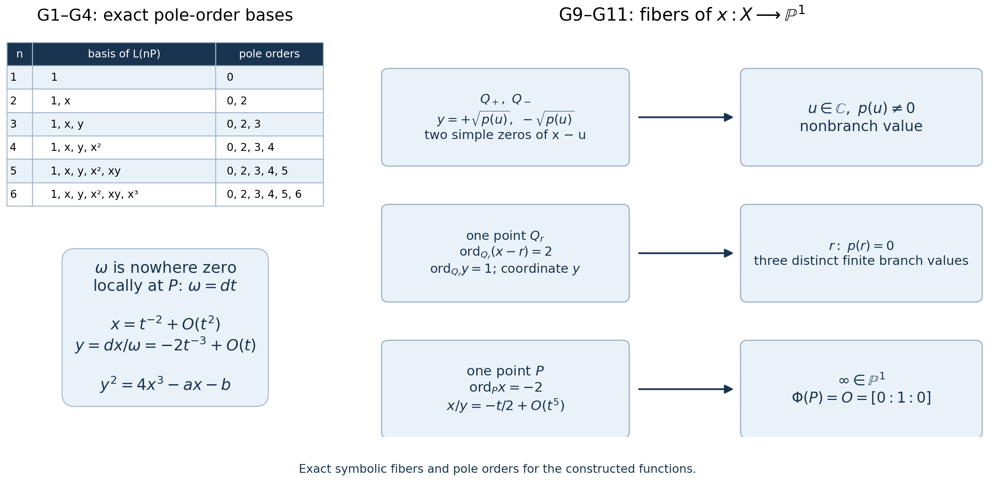

# Complex tori, elliptic curves and the moduli interpretation of modular curves

The upper half-plane can describe either a lattice shape or an elliptic curve. A congruence subgroup records a point, a cyclic subgroup, or an ordered torsion basis on that curve. This interpretation also explains why Hecke operators count isogenies.

We use the surjectivity of \(j\) proved in The valence formula and the ring of modular forms of level one, Theorem 3.1, and the lifting result of Congruence subgroups, cusps and elliptic points, Lemma 1.1. Elementary complex analysis supplies Liouville's theorem, normally convergent series, the residue theorem and local holomorphic inverses. Section 3.1 also uses the compact-curve Riemann–Roch and genus-comparison proofs of Dimension formulas for congruence subgroups, Appendix A, with the remaining analytic foundations specified there. The cubic-to-lattice proof and the moduli arguments are given below.

A lattice is \(\Lambda=\mathbb Z\omega_1+\mathbb Z\omega_2\subset\mathbb C\), where \(\omega_1,\omega_2\) are linearly independent over \(\mathbb R\). Choose their order so that \(\operatorname{Im}(\omega_2/\omega_1)>0\). We write
\[
 \Lambda_\tau=\mathbb Z+\mathbb Z\tau,\qquad
 E_\tau=\mathbb C/\Lambda_\tau,\qquad \tau\in\mathfrak H.
 \tag{0.1}
\]
An elliptic curve in this lesson is a nonsingular projective Weierstrass cubic over \(\mathbb C\), with its point \(O\) at infinity. Isomorphisms preserve \(O\). Our coordinate convention is
\[
 E_{a,b}:\quad y^2=4x^3-ax-b,\qquad a^3-27b^2\ne0.
 \tag{0.2}
\]
The familiar equation \(Y^2=x^3+Ax+B\) is obtained by \(Y=y/2\), \(A=-a/4\), \(B=-b/4\).

## 1. Holomorphic maps between tori

The quotient \(\mathbb C/\Lambda\) has holomorphic charts obtained from sufficiently small disks in \(\mathbb C\), since different lattice translates of such a disk are disjoint. Addition descends from addition on \(\mathbb C\). The differential \(dz\) descends too, because the transition maps are translations.

**Theorem 1.1.** Every holomorphic map
\[
 h:\mathbb C/\Lambda\longrightarrow\mathbb C/\Lambda'
\]
has the form
\[
 h(z+\Lambda)=\alpha z+\beta+\Lambda',
 \qquad \alpha\Lambda\subseteq\Lambda'.
 \tag{1.1}
\]
If \(h(0)=0\), one may take \(\beta=0\). It is an isomorphism precisely when \(\alpha\ne0\) and \(\alpha\Lambda=\Lambda'\).

**Proof.**
Let \(\pi,\pi'\) be the quotient maps, and pull back the differential \(dw\) on the target:
\[
 (h\pi)^*dw=A(z)\,dz.
\]
Here \(A\) is an entire function and is \(\Lambda\)-periodic. On a closed fundamental parallelogram it is bounded; translating that parallelogram bounds it everywhere. Liouville's theorem gives \(A(z)=\alpha\).

Choose a representative \(\beta\) of \(h(0)\), and put \(H(z)=\alpha z+\beta\). The maps \(\pi'H\) and \(h\pi\) have the same derivative in every quotient chart. Their difference, using the target's additive group, is consequently locally constant. It is zero at \(z=0\); connectedness of \(\mathbb C\) makes it zero everywhere. Thus (1.1) holds. Replacing \(z\) by \(z+\lambda\) proves \(\alpha\lambda\in\Lambda'\) for every \(\lambda\in\Lambda\).

Conversely that inclusion makes (1.1) well-defined and holomorphic. If \(\alpha\ne0\), its kernel after translating the target origin is
\[
 \alpha^{-1}\Lambda'/\Lambda.
\]
Surjectivity follows by representing a target point by \(w\) and choosing \(z=(w-\beta)/\alpha\). Bijectivity therefore means \(\alpha^{-1}\Lambda'=\Lambda\). The inverse then descends from an affine holomorphic map. Finally, if \(h(0)=0\), its representative \(\beta\) lies in \(\Lambda'\) and can be removed. \(\square\)

A nonconstant map fixing zero is a group homomorphism, called an *isogeny*. Its degree is
\[
 \deg h=[\Lambda':\alpha\Lambda].
 \tag{1.2}
\]
This index is finite: representatives can be chosen in a bounded fundamental parallelogram for \(\alpha\Lambda\), which contains finitely many points of the discrete lattice \(\Lambda'\). Every fiber has this number of points, and the nonzero derivative \(\alpha\) shows that no branching occurs.

Two tori are thus isomorphic exactly when their lattices are *homothetic*, meaning \(\Lambda'=\alpha\Lambda\) for \(\alpha\in\mathbb C^\times\). Dividing an oriented basis by \(\omega_1\) produces (0.1). Changing the oriented basis gives
\[
 \tau'=\gamma\tau=\frac{a\tau+b}{c\tau+d},
 \qquad
 \Lambda_{\gamma\tau}=(c\tau+d)^{-1}\Lambda_\tau,
 \quad \gamma=\begin{pmatrix}a&b\\c&d\end{pmatrix}\in\mathrm{SL}_2(\mathbb Z).
 \tag{1.3}
\]
For completeness, any homothety between two normalized lattices has this form. Write an oriented basis of \(\Lambda_{\tau'}\) as
\[
 \tau'=\alpha(a\tau+b),\qquad 1=\alpha(c\tau+d).
\]
The integral change of basis has determinant \(1\), since both bases have the same positive orientation and the homothety preserves orientation. Eliminating \(\alpha\) gives (1.3). Hence \(\mathrm{SL}_2(\mathbb Z)\backslash\mathfrak H\) classifies complex tori.

## 2. Constructing the cubic from a lattice

Define
\[
 \wp_\Lambda(z)=\frac1{z^2}
  +\sum_{\lambda\in\Lambda\setminus\{0\}}
       \left(\frac1{(z-\lambda)^2}-\frac1{\lambda^2}\right).
 \tag{2.1}
\]
The subtraction is essential. A sum of \(|\lambda|^{-r}\) converges for \(r>2\): in lattice coordinates the number of points with
\(\max(|m|,|n|)=j\) is \(O(j)\), and
\(|m\omega_1+n\omega_2|\ge c\max(|m|,|n|)\) for a fixed \(c>0\).
For \(|z|\le R\) and \(|\lambda|>2R\), a summand in (2.1) has absolute value at most \(10R|\lambda|^{-3}\). Its tails therefore converge normally on compact sets away from the lattice. At every lattice point \(\wp\) has a double pole with principal part \((z-\lambda)^{-2}\).

Pairing \(\lambda\) with \(-\lambda\) shows that \(\wp\) is even. Termwise differentiation, justified by normal convergence, gives the absolutely normally convergent expression
\[
 \wp_\Lambda'(z)=-2\sum_{\lambda\in\Lambda}(z-\lambda)^{-3}.
 \tag{2.2}
\]
Reindexing this sum makes \(\wp'\) periodic. Thus
\(\wp(z+\omega_j)-\wp(z)\) is constant. Evaluate at
\(z=-\omega_j/2\), which is not a lattice point for either basis vector. Evenness makes the constant zero. Both basis periods, and therefore every lattice period, fix \(\wp\).

For \(r\ge4\) even, put
\[
 G_r(\Lambda)=\sum_{\lambda\in\Lambda\setminus\{0\}}\lambda^{-r},
 \qquad g_2(\Lambda)=60G_4(\Lambda),\quad
 g_3(\Lambda)=140G_6(\Lambda).
 \tag{2.3}
\]
Expanding the summands of (2.1) by the geometric series, absolutely on any disk smaller than the shortest lattice length, gives
\[
 \wp(z)=z^{-2}+
   \sum_{n\ge1}(2n+1)G_{2n+2}(\Lambda)z^{2n}
 =z^{-2}+3G_4z^2+5G_6z^4+O(z^6).
 \tag{2.4}
\]
Odd powers cancel. The summation interchange is justified, for \(|z|\le r<\min_{\lambda\ne0}|\lambda|\), by summing
\((m+1)r^m|\lambda|^{-m-2}\); its tail is bounded by a constant times \(|\lambda|^{-3}\).

**Theorem 2.1 (Weierstrass equation).**
\[
 \wp'(z)^2=4\wp(z)^3-g_2\wp(z)-g_3,
 \qquad
 D(\Lambda):=g_2^3-27g_3^2\ne0.
 \tag{2.5}
\]

**Proof of the equation.**
At zero, (2.4) gives
\[
 \wp'^2=4z^{-6}-24G_4z^{-2}-80G_6+O(z^2),
\]
\[
 4\wp^3=4z^{-6}+36G_4z^{-2}+60G_6+O(z^2).
\]
Consequently \(\wp'^2-4\wp^3+60G_4\wp+140G_6\) is holomorphic at zero, with value zero. Periodicity removes its possible poles at all other lattice points. It is entire and periodic, hence bounded and constant; its value at zero makes it identically zero. \(\square\)

We prove the discriminant assertion rather than assume that the resulting cubic is nonsingular.

**Lemma 2.2 (elliptic divisors).** A nonzero meromorphic \(\Lambda\)-periodic function has equally many zeros and poles on \(\mathbb C/\Lambda\), counted with multiplicity. Moreover, their sums differ by an element of \(\Lambda\).

**Proof.**
Translate a fundamental parallelogram so that its boundary contains no zero or pole. For a function \(u\), opposite-edge integrals of \(u'/u\) cancel, so the argument principle gives equality of the two counts.

The residue theorem applied to \(z u'/u\) gives the sum of zeros minus the sum of poles. Write \(B_1,B_2\) for the two edges starting at the chosen lower-left vertex and ending after translation by \(\omega_1,\omega_2\). Comparing the opposite edges yields
\[
 \frac1{2\pi i}\int_{\partial B}z\frac{u'}u\,dz
 =\frac{\omega_1}{2\pi i}\int_{B_2}\frac{u'}u\,dz
  -\frac{\omega_2}{2\pi i}\int_{B_1}\frac{u'}u\,dz.
 \tag{2.6}
\]
Each edge integral is \(2\pi i\) times an integer: the endpoint values of \(u\) coincide, and the integral measures the winding of their nonzero image path. The right side belongs to \(\Lambda\). Changing representatives of zeros and poles changes their sum only by lattice elements. \(\square\)

**Proof that \(D(\Lambda)\ne0\).**
The three nonzero points of order two are
\(\omega_1/2,\omega_2/2,(\omega_1+\omega_2)/2\).
Periodicity and oddness of \(\wp'\) make it vanish at all three. Its only pole on the torus is a triple pole at zero. Lemma 2.2 implies that these are all its zeros and that each is simple.

Write \(e_1,e_2,e_3\) for the corresponding values of \(\wp\).
They are distinct: if two were equal to \(e\), the function \(\wp-e\), whose sole pole has order two, would have zeros of order at least two at two distinct points. That contradicts Lemma 2.2. Equation (2.5) shows that the \(e_j\) are the three distinct roots of
\(4X^3-g_2X-g_3\). A repeated root of this polynomial occurs exactly when \(g_2^3=27g_3^2\), as follows either by eliminating \(X\) between it and \(12X^2-g_2\), or by factoring a cubic with a double root. Thus \(D(\Lambda)\ne0\). \(\square\)

**Theorem 2.3 (the parametrization and group law).** The map
\[
 \Phi_\Lambda:\mathbb C/\Lambda\longrightarrow E_\Lambda,
 \qquad
 z\longmapsto(\wp_\Lambda(z),\wp_\Lambda'(z)),\quad
 0\longmapsto O,
 \tag{2.7}
\]
is a biholomorphic isomorphism and identifies addition on the torus with the chord-and-tangent group law of the cubic.

**Proof.**
For any \(x\in\mathbb C\), \(\wp-x\) has two zeros counted with multiplicity. Since \(\wp\) is even, these are \(z,-z\), unless they coincide at a point of order two. At a nonbranch value the derivatives have opposite nonzero values, which give the two possible \(y\)-coordinates in (2.5). At a branch value there is one double zero and \(y=0\). Thus (2.7) is bijective on affine points.

It is holomorphic there. If \(\wp'(z)\ne0\), the \(x\)-coordinate is locally invertible. At a zero of \(\wp'\), its simplicity gives \(\wp''(z)\ne0\), so the \(y\)-coordinate is locally invertible. At infinity use the projective chart \(Y\ne0\):
\[
 X/Y=\wp/\wp'=-z/2+O(z^5),\qquad
 Z/Y=1/\wp'=-z^3/2+O(z^7).
 \tag{2.8}
\]
This proves a holomorphic extension to \(O=[0:1:0]\), with a local inverse from \(X/Y\). The projective equation
\(Y^2Z=4X^3-g_2XZ^2-g_3Z^3\) is smooth at \(O\), since its derivative with respect to \(Z\) is nonzero there. Hence the bijection and all its local inverses are holomorphic.

For the group statement, an affine nonvertical line \(y=mx+b\) cuts out the zeros of
\(\wp'-m\wp-b\). This elliptic function has a triple pole at zero. If its three intersection parameters, with multiplicities, are \(u,v,w\), Lemma 2.2 gives \(u+v+w=0\) on the torus. Reflection in the \(x\)-axis corresponds to \(z\mapsto-z\). Therefore reflecting the third intersection point gives the parameter \(u+v\), exactly the chord rule.

A tangent contributes a repeated zero, so the same argument includes coincident points. For a vertical line, \(\wp-x\) gives the two parameters \(u,-u\), and its third projective intersection is \(O\). The tangent at \(O\) is the line at infinity with triple intersection there. These cases also give the torus addition rule, including its identity and inverses. In particular, associativity follows from addition on the torus. \(\square\)

## 3. Every complex elliptic curve comes from a lattice

### 3.1. A cubic from an analytic genus-one surface

The lattice construction starts with a quotient of \(\mathbb C\). We now construct the same kind of cubic directly from an arbitrary pointed compact Riemann surface of genus one. The precise prerequisites are Dimension formulas for congruence subgroups, Appendix A.4–A.6: duality, the Riemann–Roch formula (R16), the canonical degree (R17), the degree-zero divisor identity and the compact maximum argument; and Appendix A.7: equality of the analytic and topological genera. Its boundary-integration formula (R1), in A.1, gives the residue identity used below. A.1 constructs the smooth Hilbert/Sobolev completions and weak-test maps. The real-calculus, continuous-integral existence, coordinate change-of-variables and Stokes prerequisites stated there remain required. The elementary complex-analytic inputs are the Cauchy, Taylor, identity and local-inverse results of The upper half-plane and the modular group, Lemma 0.2 and its consequences, and the Laurent expansions of Modular forms, lattice functions and Eisenstein series, Lemma 0.1.

**Theorem 3.0 (the analytic genus-one cubic).** Let \(X\) be a compact connected Riemann surface without boundary of topological genus one, let \(P\in X\), and choose a nonzero holomorphic differential \(\omega\) on \(X\). There are meromorphic functions \(x,y:X\to\mathbb P^1(\mathbb C)\), holomorphic on \(X\setminus\{P\}\), and numbers \(a,b\in\mathbb C\) with \(a^3-27b^2\ne0\), such that the projective cubic defined by the following equation and the displayed map satisfy
\[
\begin{gathered}
C_{a,b}\subset\mathbb P^2(\mathbb C),\\
Y^2Z\\
=4X_0^3-aX_0Z^2-bZ^3,\\
\Phi:X\longrightarrow C_{a,b},\\
\Phi(Q)=[x(Q):y(Q):1],\\
Q\ne P,\\
\Phi(P)=O=[0:1:0].
\end{gathered}
\tag{G0}
\]
is a pointed biholomorphism. The cubic is nonsingular, \(y=dx/\omega\), and \(\Phi^*(dx/y)=\omega\). The symbol \(X_0\) denotes the projective coordinate, rather than the surface. No algebraic model or period lattice for the given \(X\) is assumed.

**Proof.**

#### Pole-order spaces and a nowhere vanishing differential

For an integer \(n\ge0\), let
\[
L(nP)=\left\{f:
\begin{gathered}
f\text{ meromorphic on }X,\\
f\text{ has no pole off }P,\\
\operatorname{ord}_P f\ge-n
\end{gathered}\right\}.
\]
It includes zero. This is exactly \(H^0(X,\mathcal O(nP))\): the local frame at \(P\) is \(t^{-n}\), so a section is a meromorphic function with the stated pole bound. The meromorphic section \(1\) has zero order \(n\) in that local frame, hence \(\deg\mathcal O(nP)=n\) by Dimension formulas for congruence subgroups, Appendix A.6.

The genus bridge gives \(h^0(K)=1\) and \(\deg K=0\), where \(K\) is the differential bundle. The zero orders of the chosen nonzero holomorphic differential \(\omega\) are nonnegative and sum to \(\deg K=0\), so it vanishes nowhere. For \(n\ge1\), \(K(-nP)\) has degree \(-n\) and has no nonzero holomorphic section. Thus (R16) gives
\[
\begin{gathered}
\dim L(nP)=n\quad(n\ge1),\\
L(0)=L(P)=\mathbb C.
\end{gathered}
\tag{G1}
\]
The last assertion uses compactness and the local maximum argument for holomorphic functions, as proved in that appendix, A.6.

In a coordinate disk around \(P\), integrate the convergent power series for \(\omega\), with primitive zero at \(P\). Its derivative is nonzero; the earlier local inverse result makes that primitive a coordinate \(t\), with
\(t(P)=0\) and \(\omega=dt\). No period or global primitive is asserted.

We will use the total-residue identity for a meromorphic one-form on \(X\). Here is its precise reduction to the earlier foundation. Delete disjoint small coordinate disks about its finitely many poles. The form is closed on the remaining surface, since locally it is a holomorphic coefficient times \(dz\). Applying (R1) gives a zero sum of the negatively oriented small-circle integrals. The Laurent expansions give each positively oriented integral as \(2\pi i\) times its residue. Therefore the sum of the residues is zero. Finiteness of the pole set follows from isolated poles and compactness. This proves the residue identity from (R1) for the forms used below.

#### Normalize the pole-two and pole-three coordinates

Choose \(x\in L(2P)\setminus L(P)\). It has a double pole at \(P\). Scale it to have leading coefficient one in the coordinate \(t\), and subtract its constant Laurent coefficient. Initially write
\[
\begin{gathered}
x=t^{-2}+c_{-1}t^{-1}+c_1t\\
{}+c_2t^2+c_3t^3+c_4t^4+\cdots.
\end{gathered}
\]
The differential \(x\omega\) has its only possible pole at \(P\). Its total residue is therefore \(c_{-1}=0\). Now \(x^2\omega\) also has only that pole; its residue is \(2c_1\), so \(c_1=0\). Consequently
\[
\begin{gathered}
x=t^{-2}+c_2t^2+c_3t^3\\
{}+c_4t^4+O(t^5).
\end{gathered}
\tag{G2}
\]
These normalizations determine \(x\) uniquely for the chosen \(\omega\): two such choices in the two-dimensional space \(L(2P)\) differ by a scalar and a constant, both fixed by the prescribed leading and constant coefficients.

Define the globally meromorphic function
\[
y=\frac{dx}{\omega}.
\]
This quotient is well-defined because \(\omega\) has no zeros. It is holomorphic away from \(P\), and near \(P\)
\[
\begin{gathered}
y=-2t^{-3}+2c_2t+3c_3t^2\\
{}+4c_4t^3+O(t^4).
\end{gathered}
\tag{G3}
\]
Thus its only pole has order three. This also constructs the pole-three coordinate without choosing an unrelated section of \(L(3P)\).

The functions
\[
1,\ x,\ y,\ x^2,\ xy,\ x^3
\tag{G4}
\]
have distinct pole orders \(0,2,3,4,5,6\). Comparing the most singular term proves their linear independence. Together with (G1), their successive initial segments are bases of \(L(nP)\) for \(1\le n\le6\). In particular (G4) is a basis of \(L(6P)\), while \(y^2\) is another element of that six-dimensional space.

#### Derive the normalized cubic relation

Rather than hide changes of coordinates in a general cubic relation, compute its pole terms from (G2)–(G3):
\[
\begin{gathered}
y^2-4x^3\\
=-20c_2t^{-2}-24c_3t^{-1}\\
{}-28c_4+O(t).
\end{gathered}
\tag{G5}
\]
The order-six leading terms cancel. There are no order-five, order-four or order-three terms, because the order-minus-one and the order-zero terms of \(x\), and its order-one term, were explicitly removed or proved zero.

Put \(a=20c_2\). Then \(y^2-4x^3+ax\) lies in \(L(P)=\mathbb C\). Its Laurent series therefore has no \(t^{-1}\) term and is constant. It follows that \(c_3=0\), and its constant value is \(-28c_4\). With \(b=28c_4\), we obtain
\[
y^2=4x^3-ax-b.\tag{G6}
\]
In particular the coefficient \(4\), the signs, and the scaling of \(y\) are determined by \(y=dx/\omega\); they are not inferred from a reference using \(y/2\).

Replacing \(\omega\) by \(s\omega\), for \(s\in\mathbb C^\times\), changes the normalized coordinates and coefficients to
\[
\begin{gathered}
x\longmapsto s^{-2}x,\quad y\longmapsto s^{-3}y,\\
a\longmapsto s^{-4}a,\quad b\longmapsto s^{-6}b.
\end{gathered}
\tag{G7}
\]
This follows by using \(t'=st\), the uniqueness of the normalized pole-two function, and the defining derivative quotient. They agree with the lattice scalings in (3.1) below.

#### Prove the discriminant is nonzero

Write \(p(u)=4u^3-au-b\). Suppose it has a repeated root \(r\). It then factors as
\[
p(u)=4(u-r)^2(u-s),
\]
where \(s=r\) is allowed. The meromorphic function
\[
v=\frac{y}{x-r}
\]
has a simple pole at \(P\), by the exact orders in (G2)–(G3). It has no pole elsewhere. Indeed, if \(x(Q)\ne r\), its denominator is nonzero. If \(x-r\) has zero order \(m\ge1\) at \(Q\), equation (G6) gives \(\operatorname{ord}_Q y=m\) when \(s\ne r\), or \(\operatorname{ord}_Q y=3m/2\) when \(s=r\). In either case \(y/(x-r)\) is holomorphic at \(Q\). Hence \(v\in L(P)\) but has a pole, contradicting (G1). Thus \(p\) has no repeated root.

The elementary root and discriminant facts used in that paragraph can be checked without an algebraic-geometry theorem. A nonconstant complex polynomial has a root: if it had none, its reciprocal would be entire and bounded, both on a large disk by compactness and outside it by its leading term. Liouville's theorem, obtained from Cauchy's coefficient estimates, would make the reciprocal constant. Polynomial division then gives the full factorization. For the present cubic a repeated root satisfies
\(a=12r^2\), \(b=-8r^3\), so \(a^3=27b^2\). Conversely, if that equality holds, either \(a=b=0\) and \(r=0\), or \(a\ne0\) and \(r=-3b/(2a)\) satisfies \(p(r)=p'(r)=0\). Therefore
\[
a^3-27b^2\ne0.\tag{G8}
\]

The projective cubic \(C\) in (G0) has just one point with \(Z=0\), namely \(O=[0:1:0]\). On the affine part a singularity would require both \(y=0\) and \(p'(x)=0\), hence a repeated root, which was excluded. At \(O\), the partial derivative with respect to \(Z\) of
\(Y^2Z-4X_0^3+aX_0Z^2+bZ^3\) is \(1\) in the chart \(Y=1\). Thus the projective cubic is nonsingular in the algebraic gradient sense. Its actual local analytic charts are also proved next, so no multivariable implicit-function theorem is concealed in this assertion.

#### Define the map and prove every fiber statement

Away from \(P\), define
\[
\begin{gathered}
\Phi(Q)=[x(Q):y(Q):1],\\
\Phi(P)=O.
\end{gathered}
\tag{G9}
\]
Equation (G6) makes its image lie on \(C\). In the projective chart \(Y\ne0\), put \(u=X_0/Y\), \(w=Z/Y\). At \(P\),
\[
\begin{gathered}
u\circ\Phi=x/y=-t/2+O(t^5),\\
w\circ\Phi=1/y=-t^3/2+O(t^7).
\end{gathered}
\tag{G10}
\]
These are holomorphic at \(P\), and the first has nonzero derivative. Hence (G9) is a holomorphic extension. That first derivative supplies the local inverse at infinity; its full target chart is verified in [the final part of the proof](#genus-one-local-inverses).

To verify that it identifies the whole cubic, and not just a component or an unspecified normalization, fix any \(u_0\in\mathbb C\). The meromorphic function \(x-u_0\) has exactly one pole, of order two. The degree-zero divisor identity proved in lesson 06, A.6 therefore says that it has exactly two zeros counted with multiplicity.

If \(p(u_0)\ne0\), then \(y\ne0\) at each such zero, by (G6). Since \(dx=y\omega\) and \(\omega\ne0\), the zero of \(x-u_0\) is simple. There are consequently two distinct points \(Q_1,Q_2\) above \(u_0\). The one-form \(\omega/(x-u_0)\) is holomorphic at \(P\) and has only simple poles at \(Q_1,Q_2\), with residues \(1/y(Q_1)\) and \(1/y(Q_2)\). Their sum is zero. Thus
\[
y(Q_2)=-y(Q_1),
\]
and the two points map separately to the two affine cubic points with first coordinate \(u_0\). This proves both coverage and injectivity at every nonbranch affine fiber.

If \(p(u_0)=0\), its root is simple by (G8). At every point in the fiber we have \(y=0\), so \(dx=0\) and the zero order of \(x-u_0\) is at least two. The total order is two, so the fiber has exactly one point \(Q\), with
\[
\begin{gathered}
\operatorname{ord}_Q(x-u_0)=2,\\
\operatorname{ord}_Q y=1.
\end{gathered}
\tag{G11}
\]
The second assertion follows by substituting the simple-root expansion of \(p\) into (G6). It maps to the unique affine cubic point \((u_0,0)\). Finally only \(P\) maps to infinity, and the projective cubic has only the point \(O\) there. Thus \(\Phi\) is bijective on the entire projective cubic.

#### Prove the local analytic inverses

At an affine cubic point with \(y_0\ne0\), its local curve is the graph
\[
y=y_0\sqrt{p(x)/y_0^2},
\]
where the square root is the convergent binomial power series near \(1\), chosen to have value \(1\). A nearby solution with \(y\) close to \(y_0\) must be this branch. Thus \(x\) is a local coordinate on \(C\). It is also a local coordinate on \(X\), because \(dx=y\omega\ne0\). In these coordinates \(\Phi\) is the identity and its inverse is holomorphic.

At an affine point \((r,0)\), the derivative \(p'(r)\) is nonzero. The earlier one-variable holomorphic inverse theorem gives a local inverse \(\kappa\) to \(p\) near \(r\), with \(\kappa(0)=r\). The local cubic is
\[
x=\kappa(y^2),
\]
so \(y\) is its coordinate. By (G11), \(y\) has a simple zero on \(X\) at the corresponding point, and is its local coordinate as well. Again the map is the identity in these local coordinates.

For completeness, the projective chart near \(O\) can be verified without importing a multivariable implicit-function theorem. Its equation is
\[
w=4u^3-auw^2-bw^3.\tag{G12}
\]
The function \(u(t)=x/y\) in (G10) has a one-variable local inverse. It supplies a holomorphic solution \(w=w(u)\) of (G12) for all sufficiently small \(u\), with \(w(0)=0\). If two small solutions \(w_1,w_2\) have the same \(u\), subtracting their equations gives
\[
\begin{gathered}
B=1+au(w_1+w_2)\\
{}+b(w_1^2+w_1w_2+w_2^2),\\
(w_1-w_2)B=0.
\end{gathered}
\]
Choose the neighborhood so that the absolute value of the terms of \(B\) after \(1\) is less than \(1/2\). The factor \(B\) cannot vanish, so \(w_1=w_2\). Therefore every sufficiently nearby cubic point lies on the graph already supplied by \(\Phi\). Its local coordinate is \(u\), and (G10) gives a holomorphic local inverse from that coordinate. This proves the required local chart at infinity directly.

All local inverses agree because the global map is bijective. They give a global pointed biholomorphism, proving (G0).

The differential \(dx/y\) extends over the whole cubic. At a branch point its expression in the coordinate \(y\) is \(2\kappa'(y^2)\,dy\), with nonzero coefficient at \(y=0\). At infinity, (G12) gives \(w=u^3h(u)\), where
\[
 h(u)=\frac{4}{1+au w(u)+b w(u)^2},\qquad h(0)=4.
\]
This is a holomorphic nonvanishing function on a sufficiently small disk. Since \(x=u/w\), \(y=1/w\), we have
\[
\begin{gathered}
\frac{dx}{y}\\
=\left(1-u\frac{w'(u)}{w(u)}\right)du\\
=\left(-2-u\frac{h'(u)}{h(u)}\right)du.
\end{gathered}
\tag{G13}
\]
It therefore extends holomorphically and does not vanish at infinity either. On \(X\setminus\{P\}\), away from the zeros of \(y\), the identity \(dx=y\omega\) gives \(\Phi^*(dx/y)=\omega\). Both sides now extend holomorphically everywhere, so the identity theorem gives the asserted equality on all of \(X\). \(\square\)

Figure 3.1. The spaces and bases are (G1)–(G4). Each regular finite value of \(x:X\to\mathbb P^1(\mathbb C)\) has two distinct preimages with opposite nonzero \(y\)-coordinates. Each of the three distinct roots of \(p(u)=4u^3-au-b\) has one preimage of multiplicity two, and infinity has the double pole \(P\). These are fiber multiplicities of \(x\); the cubic itself is smooth. The exact local orders and coordinates are (G10)–(G11), and the full local inverse argument is in [the final part of the proof](#genus-one-local-inverses).

### 3.2. From a cubic to a lattice

Homothety gives
\[
 g_2(c\Lambda)=c^{-4}g_2(\Lambda),\qquad
 g_3(c\Lambda)=c^{-6}g_3(\Lambda),\qquad
 \wp_{c\Lambda}(cz)=c^{-2}\wp_\Lambda(z).
 \tag{3.1}
\]
These identities follow by reindexing absolutely convergent series; differentiation also gives \(\wp'_{c\Lambda}(cz)=c^{-3}\wp'_\Lambda(z)\). Thus a homothety gives an algebraic isomorphism of the corresponding cubics, including their marked points. Define
\[
 j(\Lambda)=1728\,\frac{g_2(\Lambda)^3}{D(\Lambda)}.
 \tag{3.2}
\]
The normalizations from the Eisenstein expansions in the earlier course give
\[
 g_2(\Lambda_\tau)=\frac{4\pi^4}{3}E_4(\tau),\qquad
 g_3(\Lambda_\tau)=\frac{8\pi^6}{27}E_6(\tau),
\]
\[
 D(\Lambda_\tau)=(2\pi)^{12}\Delta(\tau),\qquad
 j(\Lambda_\tau)=\frac{E_4(\tau)^3}{\Delta(\tau)}.
 \tag{3.3}
\]
Indeed \(G_4=2\zeta(4)E_4\), \(G_6=2\zeta(6)E_6\), and
\(E_4^3-E_6^2=1728\Delta\). Thus (3.2) is exactly the previously proved modular \(j\), with the positive sign.

**Theorem 3.1 (uniformization).** Every curve (0.2) is \(E_\Lambda\) for a suitable lattice \(\Lambda\). Its isomorphism class determines \(\Lambda\) up to homothety. Accordingly,
\[
 \{\text{complex elliptic curves}\}/\cong
 \ \longleftrightarrow\
 \{\text{lattices}\}/\text{homothety}
 \ \longleftrightarrow\
 \mathrm{SL}_2(\mathbb Z)\backslash\mathfrak H
 \ \xrightarrow{\ j\ }\mathbb C
 \tag{3.4}
\]
are bijections.

**Proof.**
Given \(a,b\), choose \(\tau\) with
\[
 j(\Lambda_\tau)=1728\,\frac{a^3}{a^3-27b^2},
\]
using the already proved surjectivity of the modular \(j\).
First suppose \(a,b\ne0\). Write \(g_2,g_3\) for the invariants of \(\Lambda_\tau\). The chosen \(j\) is neither \(0\) nor \(1728\), so \(g_2,g_3\ne0\), and cross-multiplication gives
\[
 \frac{g_3^2}{g_2^3}=\frac{b^2}{a^3}.
\]
Choose \(c\) with \(c^4=g_2/a\). Then \(g_2(c\Lambda_\tau)=a\), and the last equality makes \(g_3(c\Lambda_\tau)=b\) or \(-b\). Replacing \(c\) by \(ic\) preserves its fourth power and reverses \(c^{-6}\). This supplies the desired sign.

If \(a=0\), then \(b\ne0\), \(j=0\), and \(g_2=0\). Nonvanishing of \(D\) gives \(g_3\ne0\); choose \(c^6=g_3/b\). If \(b=0\), use \(j=1728\), \(g_3=0\), and \(c^4=g_2/a\). In every case the resulting lattice has precisely the coefficients \(a,b\), not just an unspecified curve with the same \(j\). Theorem 2.3 uniformizes it.

An isomorphism of elliptic curves, composed with their parametrizations, is a holomorphic isomorphism of tori fixing zero. Theorem 1.1 therefore makes their lattices homothetic. Conversely, (3.1) gives the algebraic pointed isomorphism
\((x,y)\mapsto(c^{-2}x,c^{-3}y)\) between \(E_\Lambda\) and \(E_{c\Lambda}\).
Theorem 1.1 and (1.3) prove the first two bijections; the earlier coordinate theorem for \(j\) proves the last. \(\square\)

#### Analytic genus-one uniformization

**Corollary 3.1a (analytic genus-one uniformization).** For every \((X,P)\) in Theorem 3.0 there is a lattice \(\Lambda\subset\mathbb C\) and a pointed biholomorphism
\[
 U:(X,P)\longrightarrow(\mathbb C/\Lambda,0).
 \tag{3.4b}
\]
The lattice is unique up to homothety.

**Proof.** Theorem 3.0 gives \(\Phi:X\to C_{a,b}\) with \(\Phi(P)=O\). Theorem 3.1 chooses \(\Lambda\) with \(g_2(\Lambda)=a\) and \(g_3(\Lambda)=b\). Theorem 2.3 gives the pointed biholomorphism \(\Phi_\Lambda:\mathbb C/\Lambda\to C_{a,b}\). Thus \(U=\Phi_\Lambda^{-1}\circ\Phi\) has the asserted source, target and holomorphic inverse. Two such maps give a pointed biholomorphism between their target tori; Theorem 1.1 makes their lattices homothetic. This proves the corollary with the same Riemann–Roch foundations as Theorem 3.0. \(\square\)

The torus isogenies induce algebraic maps between the displayed cubics. The following function-field argument proves this assertion directly.

**Proposition 3.2 (the elliptic function field).** Every meromorphic function on \(\mathbb C/\Lambda\) has a unique expression
\[
\begin{aligned}
h(z)&=R(\wp_\Lambda(z))\\
&\quad+\wp'_\Lambda(z)S(\wp_\Lambda(z)),\\
&\qquad R,S\in\mathbb C(t).
\end{aligned}
\tag{3.4a}
\]
Consequently the isogenies in Theorem 1.1 induce algebraic maps between the corresponding Weierstrass cubics.

**Proof.** Split \(h\) into its even and odd parts under \(z\mapsto-z\). An even meromorphic function has the same value on the two points in each fiber of \(\wp\), by Theorem 2.3. It therefore defines a meromorphic function of \(x=\wp(z)\) away from the branch values. At a nonzero point of order two, a local coordinate \(t\) changes sign under negation. The even Laurent expansion uses only powers of \(t^2\), while \(\wp(z)-e_j\) is \(t^2\) times a nonvanishing even holomorphic function. Taking its local square root shows that the expansion is meromorphic in \(x-e_j\). At zero, \(\wp^{-1}\) likewise is a local coordinate proportional to \(z^2\), and the even expansion is meromorphic in \(1/x\). Thus the descended function is meromorphic on the whole sphere.

A meromorphic function on the sphere is rational: it has finitely many poles by compactness; subtract the finite principal parts at its finite poles and the polynomial principal part at infinity. The remaining function is entire and bounded and therefore constant by Liouville's theorem. This proves that the even part is \(R(\wp)\). The odd part divided by the odd meromorphic function \(\wp'\) is even, hence is \(S(\wp)\). This proves existence in (3.4a). Uniqueness follows by applying negation to an expression equal to zero: subtraction gives \(2\wp'S(\wp)=0\), so \(S=0\), and then \(R=0\), since \(\wp\) is surjective.

If \(\alpha\Lambda\subseteq\Lambda'\), the functions \(\wp_{\Lambda'}(\alpha z)\) and \(\wp'_{\Lambda'}(\alpha z)\) are meromorphic and \(\Lambda\)-periodic. Apply (3.4a) to express both as rational functions of \(x=\wp_\Lambda(z)\) and \(y=\wp'_\Lambda(z)\). They give the rational coordinate functions of the isogeny. The analytic map has a value at every point. To show that its rational coordinates extend algebraically, we prove the required local-ring assertion on the source cubic. Put \(P(x)=4x^3-g_2x-g_3\), so \(y^2=P(x)\), with distinct roots. At a finite point \((a,b)\) with \(b\ne0\), its local ring has maximal ideal generated by \(x-a\): the identity
\((y-b)(y+b)=(x-a)P_a(x)\), with \(y+b\) a unit, expresses \(y-b\) as a multiple of \(x-a\). At \((a,0)\), the identity \(y^2=(x-a)P_a(x)\), with \(P_a(a)=P'(a)\ne0\), instead makes the maximal ideal generated by \(y\). At infinity, use the chart \(Y\ne0\), \(u=X/Y,v=Z/Y\). The cubic equation is
\[
 v(1+g_2uv+g_3v^2)=4u^3.
\]
The factor in parentheses is a unit at \((0,0)\), so the maximal ideal is generated by \(u\). Each named generator is also an analytic coordinate in the uniformization already proved. At a nonbranch point, \(x'(z)=y(z)=b\ne0\). At a branch point, \(y'(z)=P'(a)/2\ne0\). At infinity, the Laurent expansions give \(u=\wp/\wp'=-z/2+O(z^5)\). The local inverse theorem from lesson 01 applies in each case.

In any of these local rings, let \(t\) be its named generator. A nonzero ring element of positive analytic order lies in the maximal ideal, so it is \(t\) times another ring element. Repeating decreases its finite analytic order by one each time. Thus it is \(t^r\) times a unit. A rational function is a quotient of two such elements; if its analytic order is nonnegative, cancelling these powers expresses it as an element of the local ring. This proves the cancellation assertion algebraically. The rational functions here embed in meromorphic functions by the uniqueness in (3.4a), so a nonzero element cannot vanish identically in the analytic coordinate.

At a source point choose the projective target chart containing its analytic image. The two coordinate ratios are rational functions with no analytic pole there, and therefore belong to the source local ring by the assertion just proved. Their denominators are units on a Zariski neighborhood of that point, so they define a regular map into that chart. These maps agree on overlaps because their rational functions agree. Hence the isogeny extends everywhere as an algebraic map. Its group law is the torus law by Theorem 2.3. \(\square\)

The invariant differential in the convention (0.2) is
\[
 \omega_E=dx/y,\qquad \Phi_\Lambda^*\omega_E=dz.
 \tag{3.5}
\]
The equality follows away from \(y=0\) by differentiation and extends over the whole curve by (2.8) and the local branch coordinates. Thus it is a nonzero holomorphic differential without zeros. Every holomorphic differential on the torus is \(A(z)\,dz\) with \(A\) entire and periodic, hence is a constant multiple of \(dz\). Translation fixes \(dz\), so (3.5) is invariant.

A curve with a chosen nonzero invariant differential is consequently classified by an actual lattice: if its pullback under a uniformization is \(c\,dz\), replace the lattice by \(c\Lambda\). A differential-preserving torus isomorphism has multiplier one, by Theorem 1.1, and therefore cannot change this lattice. Equivalently, it is the set of integrals of the differential along closed curves. A closed curve lifts locally through quotient charts to a path whose endpoints differ by a lattice element; integrating \(dz\) gives that element, and the segments joining \(0\) to the two basis periods realize all lattice elements.

## 4. Torsion markings and the congruence groups

For \(N\ge1\),
\[
 E_\Lambda[N]=(N^{-1}\Lambda)/\Lambda
       \cong(\mathbb Z/N\mathbb Z)^2.
 \tag{4.1}
\]
A point \((r\omega_1+s\omega_2)/N\) has exact order \(N\) precisely when
\(\gcd(r,s,N)=1\). Its order is \(N/\gcd(r,s,N)\), by checking the divisibility of both coordinates prime by prime.

We use the following explicit analytic convention for the Weil pairing:
\[
 e_N\!\left(\frac{r\omega_1+s\omega_2}{N},
            \frac{r'\omega_1+s'\omega_2}{N}\right)
   =\exp\!\left(\frac{2\pi i(rs'-sr')}{N}\right).
 \tag{4.2}
\]
The basis is positively oriented. Formula (4.2) is unchanged by adding lattice elements to either representative, by an oriented integral change of basis, or by homothety. It is therefore intrinsic to the complex elliptic curve. It is bilinear and alternating. It is nondegenerate because pairing with \(\omega_1/N,\omega_2/N\) detects both coordinates. This fixes the positive determinant convention used in Galbraith, *The Weil pairing on elliptic curves over C*, §3; a convention replacing the pairing by its inverse reverses the specified root of unity.

Write \(\zeta_N=e^{2\pi i/N}\). In (0.1) the canonical point and ordered basis are
\[
 P_\tau=1/N+\Lambda_\tau,\qquad
 Q_\tau=\tau/N+\Lambda_\tau,\qquad
 e_N(P_\tau,Q_\tau)=\zeta_N.
 \tag{4.3}
\]
For \(N=1\) these markings are trivial.

Let \(\mathcal E_1(N)\) be the isomorphism classes of pairs \((E,P)\) with \(P\) of exact order \(N\), and let \(\mathcal E_0(N)\) be the isomorphism classes of pairs \((E,C)\) with \(C\) cyclic of order \(N\). Let \(\mathcal E(N)\) be the isomorphism classes of curves with an ordered basis \((P,Q)\) of \(E[N]\) satisfying \(e_N(P,Q)=\zeta_N\).

**Theorem 4.1 (the moduli bijections).** The following maps are bijective:
\[
 \begin{aligned}
 Y_1(N)=\Gamma_1(N)\backslash\mathfrak H
    &\longrightarrow\mathcal E_1(N),\\
 [\tau]&\longmapsto[E_\tau,P_\tau],\\
 Y_0(N)=\Gamma_0(N)\backslash\mathfrak H
    &\longrightarrow\mathcal E_0(N),\\
 [\tau]&\longmapsto[E_\tau,\langle P_\tau\rangle],\\
 Y(N)=\Gamma(N)\backslash\mathfrak H
    &\longrightarrow\mathcal E(N),\\
 [\tau]&\longmapsto[E_\tau,(P_\tau,Q_\tau)].
 \end{aligned}
 \tag{4.4}
\]

An isomorphism on the right is a pointed elliptic-curve isomorphism preserving the indicated markings.

**Proof: existence of presentations.**
Uniformization reduces everything to a lattice. A primitive vector of \((\mathbb Z/N\mathbb Z)^2\) can be completed to a determinant-one matrix: choose a Bezout combination of its coordinates. Lemma 1.1 of the congruence-group lesson lifts that matrix to \(\mathrm{SL}_2(\mathbb Z)\). Its first column gives a primitive integral vector representing \(NP\), and the two columns give a positively oriented lattice basis \(\omega'_1,\omega'_2\) with
\(P=\omega'_1/N\) modulo \(\Lambda\).
Dividing by \(\omega'_1\) produces (4.3). This proves surjectivity for the point marking and, after choosing a generator of \(C\), for the cyclic marking.

For an ordered torsion basis, write its coordinate columns relative to \(\omega_1,\omega_2\). Condition (4.2) says precisely that their determinant is \(1\) modulo \(N\). Lift this matrix to \(\mathrm{SL}_2(\mathbb Z)\) again. Its columns produce an oriented lattice basis representing \(NP,NQ\), so normalization gives both canonical markings. This includes composite \(N\); no field assumption on \(\mathbb Z/N\mathbb Z\) is used.

**Proof: equivalence of presentations.**
By Theorem 1.1, an isomorphism between normalized tori is multiplication by \(\alpha=(c\tau+d)^{-1}\), with \(\tau'=\gamma\tau\) as in (1.3). Expressing its images in the target basis gives
\[
 \alpha=a-c\tau',\qquad \alpha\tau=-b+d\tau',
\]
\[
 \alpha P_\tau=aP_{\tau'}-cQ_{\tau'},\qquad
 \alpha Q_\tau=-bP_{\tau'}+dQ_{\tau'}.
 \tag{4.5}
\]
It preserves \(P\) exactly when \(a\equiv1,c\equiv0\pmod N\), which by the determinant also forces \(d\equiv1\). These are exactly the conditions for \(\Gamma_1(N)\).

It preserves the cyclic subgroup generated by \(P\) exactly when \(c\equiv0\) and \(a\) is a unit modulo \(N\). The latter follows from determinant one when \(c\equiv0\), so the group is \(\Gamma_0(N)\). It preserves the full ordered basis exactly when \(a,d\equiv1\), \(b,c\equiv0\), namely \(\Gamma(N)\). Thus the maps descend to the stated quotients and are injective. Together with the first part this proves (4.4). \(\square\)

These are moduli sets of smooth curves; adding cusps gives the compact curves of the earlier course. The isomorphisms \((E,P)\cong(E,-P)\) and
\((E,(P,Q))\cong(E,(-P,-Q))\) are allowed, since negation acts on the curve too. They are already accounted for by the quotient, whose action on \(\mathfrak H\) factors through the projective group. An automorphism preserving a given marking is the corresponding stabilizer; the proof does not assume its absence.

If the Weil pairing value is left unspecified, the determinant of an ordered torsion basis can be any unit \(u\) modulo \(N\). Its value is \(\zeta_N^u\), and isomorphisms preserve it. For each \(u\), replacing \(Q\) by \(u^{-1}Q\) reduces the moduli problem to (4.4). There are therefore \(\varphi(N)\) disjoint copies of \(Y(N)\), rather than one connected component.

## 5. Hecke correspondences and invariant differentials

Let \(p\) be prime. A subgroup \(D\subset\mathbb C/\Lambda\) of order \(p\) is the image of a lattice \(\Lambda'\supset\Lambda\) with
\([\Lambda':\Lambda]=p\). The quotient map is
\[
 q_D:E_\Lambda\longrightarrow E_\Lambda/D=E_{\Lambda'},
 \qquad z+\Lambda\longmapsto z+\Lambda'.
 \tag{5.1}
\]
It is an isogeny of degree \(p\), by (1.2). Its differential is the identity, so \(q_D^*dz=dz\).

If \(p\nmid N\) and \(C\) has order \(N\), its intersection with \(D\) is trivial. Therefore \(q_D(C)\) is again cyclic of order \(N\). The geometric correspondence sends
\[
 (E,C)\longmapsto\sum_{\substack{D\subset E\\|D|=p}}
       (E/D,q_D(C)).
 \tag{5.2}
\]
Each subgroup is counted once. If \(\omega\ne0\) is invariant, there is a unique invariant differential \(\omega_D\) on \(E/D\) satisfying \(q_D^*\omega_D=\omega\); this follows directly from their one-dimensional differential spaces and the nonzero multiplier of the isogeny.

For an integer \(k\), a weight-\(k\) modular form can be expressed as a function on marked elliptic curves with a differential:
\[
 F(E,C,\lambda\omega)=\lambda^{-k}F(E,C,\omega).
 \tag{5.3}
\]
Omit \(C\) at level one. Such a function is invariant under isomorphisms of its data; it must vary holomorphically when the data are parametrized by \(\tau\), and it must satisfy the usual holomorphy condition in every cusp coordinate. These analytic requirements are part of the definition, not consequences of the weight law alone.

Here is the dictionary. A differential identifies \((E,\omega)\) with
\((\mathbb C/\Lambda,dz)\) for an actual lattice, by Section 3. Scaling \(\omega\) scales the lattice, so (5.3) is precisely
\(F(c\Lambda,cC)=c^{-k}F(\Lambda,C)\).
For the canonical cyclic marking, put
\[
 f(\tau)=F(E_\tau,\langle P_\tau\rangle,dz).
 \tag{5.4}
\]
Using (4.5) for \(\gamma\in\Gamma_0(N)\), and
\(\alpha^*dw=\alpha\,dz\), gives
\(f(\gamma\tau)=(c\tau+d)^kf(\tau)\).
Conversely that transformation law makes the function defined from (5.4) independent of any presentation, since Theorem 4.1 describes all changes of presentation. The identical argument works for point and full-basis markings with their respective groups. Holomorphy and cusp conditions translate to those in the earlier analytic definition of modular forms.

**Theorem 5.1 (the normalized correspondence).** On level-one forms, and on forms for \(\Gamma_0(N)\) with \(p\nmid N\), the earlier normalized Hecke operator is
\[
 (T_pF)(E,C,\omega)
   =\frac1p\sum_{\substack{D\subset E\\|D|=p}}
                    F(E/D,q_D(C),\omega_D).
 \tag{5.5}
\]
In canonical coordinates it gives
\[
 T_pf(\tau)=p^{k-1}f(p\tau)
             +\frac1p\sum_{b=0}^{p-1}f((\tau+b)/p).
 \tag{5.6}
\]

**Proof.**
The \(p\)-torsion is the two-dimensional vector space
\(p^{-1}\Lambda_\tau/\Lambda_\tau\). Its lines are
\[
 D_\infty=\langle1/p\rangle,\qquad
 D_b=\langle(\tau+b)/p\rangle\quad(0\le b<p).
 \tag{5.7}
\]
For \(D_\infty\), the quotient lattice is
\(\mathbb Z/p+\mathbb Z\tau=p^{-1}\Lambda_{p\tau}\).
Multiplication by \(p\) identifies this quotient with \(E_{p\tau}\). It pulls the target differential back to \(p\,dz\), so the differential \(dz\) on the quotient corresponds to \(dz/p\) on \(E_{p\tau}\). By (5.3) its value is \(p^kf(p\tau)\). The image cyclic marking is generated by \(p/N\) in \(E_{p\tau}\), which generates the same subgroup as \(1/N\) because \(p\) is invertible modulo \(N\).

For \(D_b\), the quotient lattice is exactly
\(\Lambda_{(\tau+b)/p}\): it contains \(\tau=p((\tau+b)/p)-b\). Its differential and cyclic marking are already the canonical ones, so its value is \(f((\tau+b)/p)\). Summing these values and dividing by \(p\) proves (5.6), the formula in the earlier Hecke lessons.

To check the sublattice description independently, associate to \(\Lambda'\) the lattice \(M=p\Lambda'\subset\Lambda\). Since every element of \(\Lambda'/\Lambda\) is killed by \(p\), this is indeed a sublattice, and its index in \(\Lambda\) is \(p\). Conversely an index-\(p\) sublattice contains \(p\Lambda\), so \(\Lambda'=p^{-1}M\) is the inverse construction. Homogeneity gives
\[
 \frac1pF(\Lambda',C')=p^{k-1}F(p\Lambda',pC').
 \tag{5.8}
\]
Thus the quotient average equals \(p^{k-1}\) times the sum over index-\(p\) sublattices, with the transported level marking. This is exactly the normalization of the lattice operator in Hecke operators of level one, equations (1.1)–(1.3). \(\square\)

For a point marking, the first quotient term retains the point \(p/N\), rather than replacing it by \(1/N\). That change of generator is a diamond operator, as in the \(\Gamma_1(N)\) Hecke theory. For a cyclic marking it has no effect. At a prime dividing the level, injectivity on \(C\) fails for some subgroups; (5.2) and (5.5) have deliberately assumed \(p\nmid N\).

### 5.1. All finite kernels

**Corollary 5.2 (all indices prime to the level).** Let \(n\ge1\) and \(\gcd(n,N)=1\). On level-one forms, with the marking omitted, and on forms for \(\Gamma_0(N)\),
\[
\begin{aligned}
 (T_nF)(E,C,\omega)
 &=\frac1n\sum_{\substack{D\subset E\\|D|=n}}
                F(E/D,q_D(C),\omega_D),\\
 q_D^*\omega_D&=\omega.
\end{aligned}
 \tag{5.9}
\]
Every actual subgroup of order \(n\) occurs once, including noncyclic subgroups. Subgroups with isomorphic quotient curves remain separate terms.

**Proof.** Use the differential to present \((E,\omega)\) as \((\mathbb C/\Lambda,dz)\). The inverse image of \(D\) in \(\mathbb C\) is a lattice \(\Lambda'\supset\Lambda\) of index \(n\). To see that it is a lattice, it is a union of \(n\) translates of \(\Lambda\), so it is discrete and contains a real basis. Conversely such a superlattice gives the subgroup \(D=\Lambda'/\Lambda\). The quotient map is induced by the identity of \(\mathbb C\), so its transported differential is \(dz\), uniquely. Since the order of \(D\cap C\) divides both \(n\) and \(N\), this intersection is trivial and \(q_D(C)\) remains cyclic of order \(N\).

The finite group \(\Lambda'/\Lambda\) is killed by its order \(n\). Hence \(M=n\Lambda'\subset\Lambda\), and
\[
 [\Lambda:M]
 =\frac{[\Lambda':n\Lambda']}{[\Lambda':\Lambda]}
 =\frac{n^2}{n}=n.
 \tag{5.10}
\]
Conversely, an index-\(n\) sublattice \(M\) contains \(n\Lambda\), by the same finite-group argument. Then \(\Lambda'=n^{-1}M\) contains \(\Lambda\) and has index \(n\) over it. These constructions are inverse. Scaling the target lattice and its image marking gives, with \(C'=q_D(C)\),
\[
 \frac1nF(\Lambda',C')
       =n^{k-1}F(n\Lambda',nC').
 \tag{5.11}
\]
This includes the differential scaling specified by (5.3).

For \(\Lambda=\Lambda_\tau\), every index-\(n\) sublattice has a unique basis
\[
 M=\langle d,a\tau+b\rangle,\qquad
 ad=n,\quad a,d>0,\quad0\le b<d.
 \tag{5.12}
\]
Indeed its projection to the \(\tau\)-coordinate is \(a\mathbb Z\), and its intersection with the integer axis is \(d\mathbb Z\). Choose an element with \(\tau\)-coordinate \(a\) and reduce its integer coordinate to \(b\) modulo \(d\). Subtracting its multiples from any element of \(M\) leaves a multiple of \(d\). Thus these two vectors generate \(M\); their determinant is \(ad=n\), and the projection, intersection and reduced coordinate prove uniqueness.

Put \(w=(a\tau+b)/d\). Then \(M=d\Lambda_w\) and \(\Lambda'=a^{-1}\Lambda_w\). Multiplication by \(a\) identifies the quotient with \(E_w\), carries its differential \(dz\) to \(dz/a\), and carries its image marking to \(\langle a/N\rangle\). Since \(a\) divides \(n\), it is prime to \(N\); this is precisely the canonical cyclic subgroup \(\langle1/N\rangle\). The corresponding value before averaging is therefore \(a^kf(w)\). Formula (5.9) becomes
\[
\begin{aligned}
 T_nf(\tau)
 &=\frac1n\sum_{ad=n}a^k\sum_{b=0}^{d-1}
                      f\!\left(\frac{a\tau+b}{d}\right)\\
 &=n^{k-1}\sum_{ad=n}d^{-k}\sum_{b=0}^{d-1}
                      f\!\left(\frac{a\tau+b}{d}\right).
\end{aligned}
 \tag{5.13}
\]
The factors agree because \(n=ad\). At level one this is exactly the full-index lattice formula (1.3) of the Hecke lesson.

For the level comparison, write \(f=\sum_{r\ge0}c_rq^r\). In (5.13) the finite \(b\)-sum is zero unless \(d\mid r\), when it equals \(d\). A term contributing to \(q^m\) consequently has \(r=d\ell\) and \(a\ell=m\); its factor is \(a^k d/n=a^{k-1}\). Thus
\[
 c_m(T_nf)=\sum_{a\mid\gcd(m,n)}a^{k-1}c_{mn/a^2},
 \qquad \gcd(0,n)=n.
 \tag{5.14}
\]
The Fourier expansions converge absolutely at positive height, justifying these finite regroupings. Formula (5.14), including its constant term, is Theorem 3.1 of the \(\Gamma_0/\Gamma_1\) Hecke lesson with trivial character and \(n\) prime to \(N\). The expression (5.13) and that already defined operator therefore agree near infinity and, by holomorphy and the identity theorem, throughout \(\mathfrak H\). This also supplies modularity and holomorphy at every cusp from that theorem. At level one they follow from the Hecke lesson's Lemma 1.1. ∎

For a point marking the same normalization carries the image point to \(a/N\). That point retains the diamond action; identifying its cyclic span with \(\langle1/N\rangle\) does not identify the points. The coprimality assumption in (5.9) also ensures that the image level marking keeps its order.

### 5.2. The noncyclic kernel at a prime square

Let \(p\nmid N\). Among order-\(p^2\) subgroups, one is
\(E[p]=p^{-1}\Lambda/\Lambda\). Its quotient lattice is \(p^{-1}\Lambda\). Multiplication by \(p\) identifies the quotient with \(E\), carries the quotient differential to \(\omega/p\), and carries the image cyclic subgroup to \(pC=C\). Its term in (5.9) is therefore
\[
 \frac1{p^2}F(E,C,\omega/p)=p^{k-2}F(E,C,\omega).
 \tag{5.15}
\]
Every other subgroup of order \(p^2\) is cyclic: if it contains an element of order \(p^2\), that element generates it; otherwise every element is killed by \(p\), so the subgroup is contained in \(E[p]\) and must equal it. Thus a sum restricted to cyclic kernels would omit exactly \(p^{k-2}I\).

There are \(1+p+p^2\) order-\(p^2\) kernels, from (5.12) with \((a,d)=(p^2,1),(p,p),(1,p^2)\); the numbers of reduced choices of \(b\) are \(1,p,p^2\). Exactly one is noncyclic, so there are \(p^2+p\) cyclic kernels. Each remains an actual subgroup regardless of target isomorphisms.

A pair of successive order-\(p\) quotients determines a kernel \(K\) of order \(p^2\) and an intermediate subgroup \(D\subset K\) of order \(p\). Conversely \(K\) and \(D\) determine the pair, using the order-\(p\) subgroup \(K/D\) of \(E/D\). The final quotient differential is independent of \(D\): its pullback to \(E\) is \(\omega\), which characterizes it uniquely. The image cyclic marking is also the same for every intermediate choice.

A cyclic \(K\) has one subgroup of order \(p\). For \(K=E[p]\), the choices are the \(p+1\) lines in the two-dimensional \(\mathbb F_p\)-space. Each chain has averaging factor \(1/p^2\). Compared with the once-per-kernel average for \(T_{p^2}\), the composite \(T_p^2\) therefore has \(p\) extra copies of (5.15), giving
\[
 T_p^2=T_{p^2}+p^{k-1}I.
 \tag{5.16}
\]
This is the good-prime relation at full level and with a cyclic level marking. For a point marking the scalar comparison retains the diamond \([p]\), as in the earlier Hecke theory.

As a numerical normalization check, take \(k=4\) and \(E_4\) at level one. The ring lesson's Theorem 2.2 gives \(M_4=\mathbb C E_4\), and \(E_4\) has constant term one. Since \(T_n\) preserves \(M_4\), its constant coefficient in (5.14) determines the eigenvalue:
\[
\begin{aligned}
 T_2E_4&=(1+2^3)E_4=9E_4,\\
 T_4E_4&=(1+2^3+4^3)E_4=73E_4.
\end{aligned}
 \tag{5.17}
\]
Hence \(9^2=73+8\), agreeing with (5.16). The unique noncyclic kernel contributes \(2^{4-2}E_4=4E_4\), so the six cyclic kernels together contribute \((73-4)E_4=69E_4\). The two extra copies in the composite account for \(2\cdot4E_4=8E_4\).

## 6. Two explicit families of examples

For the square lattice \(\Lambda_i=\mathbb Z[i]\), multiplication by \(i\) permutes the nonzero lattice points. Hence
\[
 G_6(\Lambda_i)=i^{-6}G_6(\Lambda_i)=-G_6(\Lambda_i),
\]
so \(g_3=0\). Nonvanishing of \(D\) forces \(g_2\ne0\), and \(j=1728\).
Choose \(c^4=g_2(\Lambda_i)/4\). The lattice \(c\Lambda_i\) has invariants \(g_2=4,g_3=0\), and
\[
 z\longmapsto\bigl(\wp_{c\Lambda_i}(z),
                      \wp'_{c\Lambda_i}(z)/2\bigr)
\]
identifies its torus with \(Y^2=x^3-x\). Scaling the torus identifies it with \(\mathbb C/\mathbb Z[i]\). The curve's formula
\(j=1728\,4A^3/(4A^3+27B^2)\), with \(A=-1,B=0\), also gives \(1728\).

Let \(\rho=e^{2\pi i/3}\). Multiplication by \(\rho\) preserves
\(\Lambda_\rho=\mathbb Z+\mathbb Z\rho\), since \(\rho^2=-1-\rho\). Now
\[
 G_4(\Lambda_\rho)=\rho^{-4}G_4(\Lambda_\rho)
                 =\rho^2G_4(\Lambda_\rho),
\]
so \(g_2=0\). Therefore \(g_3\ne0\) and \(j=0\).
Choose \(c^6=g_3(\Lambda_\rho)/4\). The corresponding parametrization with \(Y=\wp'/2\) gives \(Y^2=x^3-1\). It is isomorphic to
\(\mathbb C/\mathbb Z[\rho]\), and the short Weierstrass formula with \(A=0,B=-1\) gives \(j=0\). The choices of fourth or sixth roots change the homothety, not the isomorphism class.

For the second example, (5.7) lists all \(p+1\) subgroups, not just some of them. A nonzero vector \((r,s)\) over \(\mathbb F_p\) either has \(s=0\), giving \(D_\infty\), or can be scaled to \((b,1)\), giving \(D_b\). Distinct values of \(b\) give distinct lines. The associated index-\(p\) sublattices are
\[
 M_\infty=\mathbb Z+\mathbb Zp\tau,\qquad
 M_b=\mathbb Zp+\mathbb Z(\tau+b).
 \tag{6.1}
\]
In coordinates relative to \((1,\tau)\), the first has determinant \(p\), as does each of the other lattices. The quotient-to-sublattice bijection in the proof of Theorem 5.1 proves completeness and uniqueness.

For example, at \(p=3\) the four subgroups have generators
\(1/3,\tau/3,(\tau+1)/3,(\tau+2)/3\), and their four sublattices are
\[
 \langle1,3\tau\rangle,\quad
 \langle3,\tau\rangle,\quad
 \langle3,\tau+1\rangle,\quad
 \langle3,\tau+2\rangle.
\]
At the square lattice the first two quotients happen to be isomorphic: the parameters \(3i\) and \(i/3\) differ by \(\tau\mapsto-1/\tau\).
They are still different subgroups and both contribute to the correspondence. Counting only distinct target isomorphism classes would lose this multiplicity.

## 7. Exercises

1. **Easy.** Show that \(j(\mathbb C/\mathbb Z[i])=1728\).
2. **Medium.** Compute the Laurent expansion of \(\wp_\Lambda\) through \(z^4\), and deduce the constants \(g_2,g_3\) in its differential equation.
3. **Medium.** Prove the bijection
   \(\Gamma_1(N)\backslash\mathfrak H\leftrightarrow\{(E,P):\operatorname{ord}P=N\}/\cong\).
4. **Medium.** Prove the analogous bijection for \(\Gamma_0(N)\) and cyclic subgroups of order \(N\).
5. **Hard.** Show that the normalized \(T_p\) on modular forms is the correspondence on pairs \((E,\omega)\), keeping track of the differential and every factor of \(p\).

6. **Medium.** For \(E_\tau=\mathbb C/\Lambda_\tau\), list all actual subgroups of order four, identify the noncyclic one, and compute its contribution to \(T_4\) for weight \(k\). Use intermediate subgroups to deduce \(T_2^2=T_4+2^{k-1}I\). At cyclic level \(N\), assume \(N\) odd and retain the transported marking and differential.

## 8. Complete solutions

### Solution 1
Reindex the absolutely convergent \(G_6\) sum by multiplication by \(i\):
\[
 G_6(\mathbb Z[i])=\sum_{\lambda\ne0}(i\lambda)^{-6}
                 =-G_6(\mathbb Z[i]).
\]
It vanishes. Thus \(g_3=0\); Theorem 2.1 makes \(g_2^3=D\ne0\). Substituting in (3.2) gives \(j=1728\). This uses the geometric lattice discriminant; no normalization of \(\Delta\) changes the ratio.

### Solution 2
For \(|z|<|\lambda|\),
\[
 (z-\lambda)^{-2}-\lambda^{-2}
    =\sum_{m\ge1}(m+1)\lambda^{-m-2}z^m.
\]
On a smaller disk the double series converges absolutely, by the bound used for (2.4), so it can be summed over \(\lambda\). Odd \(m\) cancel between \(\lambda\) and \(-\lambda\). The \(m=2,4\) terms give
\(\wp=z^{-2}+3G_4z^2+5G_6z^4+O(z^6)\).
Differentiation gives
\(\wp'=-2z^{-3}+6G_4z+20G_6z^3+O(z^5)\).
Subtracting \(4\wp^3\) from \(\wp'^2\) yields
\[
 \wp'^2-4\wp^3=-60G_4z^{-2}-140G_6+O(z^2).
\]
A relation \(\wp'^2=4\wp^3-a\wp-b\) must therefore have \(a=60G_4\), \(b=140G_6\). With these choices its difference is an entire periodic function with value zero at zero, hence identically zero. This proves the relation as well as computing its constants.

### Solution 3
Uniformize \(E\) by \(\mathbb C/\Lambda\). In an oriented basis write \(P=(r\omega_1+s\omega_2)/N\) modulo \(\Lambda\). Exact order \(N\) means that \((r,s)\) is primitive modulo \(N\). Choose \(r',s'\) with \(rs'-sr'=1\pmod N\), and lift the resulting determinant-one matrix to \(\mathrm{SL}_2(\mathbb Z)\) by the owned congruence lifting lemma. Its first column defines an actual lattice basis vector \(\omega'_1\) representing \(NP\); its second completes an oriented basis. With
\(\tau=\omega'_2/\omega'_1\), multiplication by \(1/\omega'_1\) sends \(P\) to \(1/N\). Thus every marked curve has a canonical presentation.

If two canonical presentations are isomorphic, Theorem 1.1 and oriented basis change give \(\tau'=\gamma\tau\) and multiplier \((c\tau+d)^{-1}\). Formula (4.5) says that \(1/N\) maps to
\((a-c\tau')/N\). Equality to \(1/N\) modulo \(\Lambda_{\tau'}\) is equivalent to
\(a-1\equiv0,c\equiv0\pmod N\), since \(1,\tau'\) are a real basis and an integral lattice basis. The determinant then gives \(d\equiv1\).
Consequently \(\gamma\in\Gamma_1(N)\). Conversely these congruences make the homothety preserve the marking. The canonical map is therefore well-defined, surjective and injective on the stated quotient.

### Solution 4
Choose a generator \(P\) of the given cyclic subgroup \(C\); it has exact order \(N\). The primitive-vector lifting construction in Solution 3 gives a normalized presentation with \(C=\langle1/N\rangle\).
For two such presentations, a homothety is again described by \(\gamma\) and sends the generator to
\(aP_{\tau'}-cQ_{\tau'}\). It generates the target subgroup precisely when
\(c\equiv0\pmod N\) and \(a\) is a unit modulo \(N\). Indeed membership in that subgroup forces the second coordinate to vanish, and exact order forces the first coordinate to be a unit. Conversely those conditions send one cyclic subgroup onto the other. Determinant one makes \(a\) a unit automatically when \(c\equiv0\); hence the group is exactly \(\Gamma_0(N)\).

Changing the chosen generator of \(C\) introduces no additional moduli points. It changes the primitive first column by multiplication by a unit modulo \(N\), and the preceding criterion puts precisely these choices in one \(\Gamma_0(N)\) orbit. This proves the cyclic-subgroup bijection for every positive integer \(N\), including composite levels.

### Solution 5
Represent \((E,\omega)\) as \((\mathbb C/\Lambda,dz)\). An order-\(p\) subgroup determines a superlattice \(\Lambda'\), with quotient differential \(dz\), because the quotient is induced by the identity on \(\mathbb C\). Thus the normalized correspondence is
\[
 \frac1p\sum_{[\Lambda':\Lambda]=p}F(\Lambda').
\]
Put \(M=p\Lambda'\). Multiplication by \(p\) has index \(p^2\) on a lattice, so \(M\) has index \(p^2/p=p\) in \(\Lambda\). It is contained there because the quotient \(\Lambda'/\Lambda\) is killed by \(p\). Conversely every index-\(p\) sublattice contains \(p\Lambda\), producing the inverse superlattice \(p^{-1}M\). Weight homogeneity gives
\[
 F(\Lambda')=F(p^{-1}M)=p^kF(M).
\]
The average is therefore \(p^{k-1}\sum_{[\Lambda:M]=p}F(M)\), exactly the normalized lattice Hecke sum.

For \(\Lambda=\Lambda_\tau\), the complete list (6.1) gives
\[
 F(M_\infty)=f(p\tau),\qquad
 F(M_b)=p^{-k}f((\tau+b)/p).
\]
Multiplying by \(p^{k-1}\) yields (5.6).
One can check the delicate first term directly: the quotient by
\(\langle1/p\rangle\) is \(p^{-1}\Lambda_{p\tau}\); its identification with \(E_{p\tau}\) carries its differential to \(dz/p\), so its contribution before averaging is \(p^kf(p\tau)\). This verifies the differential factor independently. Both descriptions give the same operator.

### Solution 6

The sublattice parameters (5.12) for \(n=4\) are \((a,d)=(4,1),(2,2),(1,4)\). Dividing each sublattice by four gives its quotient superlattice. For \((4,1)\) we obtain the cyclic subgroup \(\langle1/4\rangle\). For \((2,2)\), the two choices \(b=0,1\) give respectively \(E[2]=\langle1/2,\tau/2\rangle\) and \(\langle(1+2\tau)/4\rangle\). In the latter case the displayed element has order four and its double is \(1/2\) modulo \(\Lambda_\tau\), so it generates the whole kernel. For \((1,4)\) the four choices give \(\langle(\tau+b)/4\rangle\), \(0\le b<4\). Thus the complete list is
\[
\begin{aligned}
 &\langle1/4\rangle,\quad
   \langle(1+2\tau)/4\rangle,\\
 &\langle\tau/4\rangle,\quad
   \langle(\tau+1)/4\rangle,\\
 &\langle(\tau+2)/4\rangle,\quad
   \langle(\tau+3)/4\rangle,\\
 &E[2]=\langle1/2,\tau/2\rangle.
\end{aligned}
 \tag{8.1}
\]
The six displayed cyclic generators have exact order four by their integral coordinates modulo four. Distinct sublattice parameters give distinct superlattices and hence distinct subgroups. This proves both completeness and distinctness. Only \(E[2]\) is noncyclic, since its nonzero elements all have order two.

For this kernel the quotient is \(\mathbb C/(\Lambda_\tau/2)\). The isomorphism to \(E_\tau\) given by multiplication by two carries its differential to \(\omega/2\). With \(N\) odd it also carries the image cyclic marking to \(2C=C\). Weight homogeneity and the average \(1/4\) give the contribution \(2^k/4=2^{k-2}\) times \(F(E,C,\omega)\).

For each cyclic order-four kernel there is a unique intermediate subgroup of order two. For \(E[2]\) there are three, namely \(\langle1/2\rangle\), \(\langle\tau/2\rangle\), \(\langle(1+\tau)/2\rangle\). The two-step quotient count consequently contains \(6+3=9\) chains, while \(T_4\) counts seven final kernels once each. Both use the factor \(1/4\), and final differentials and image markings agree. The two additional occurrences of \(E[2]\) contribute \(2\cdot2^{k-2}=2^{k-1}\), proving the required identity. Counting isomorphic targets only once would invalidate both counts.

## 9. What this lesson does not prove

The analytic inputs used without reproving them are the modular coordinate theorem for \(j\), The valence formula and the ring of modular forms of level one, Theorem 3.1; reduction surjectivity for every \(N\), Congruence subgroups, cusps and elliptic points, Lemma 1.1; and the Eisenstein normalizations in Modular forms, lattice functions and Eisenstein series, Theorem 4.2, together with the discriminant identity of the level-one lesson, Theorem 2.1. The comparison to the earlier Hecke operator uses Hecke operators of level one, equations (1.1)–(1.3) and (1.8), Lemma 1.1 and Theorem 1.2, and Hecke operators for Gamma0 and Gamma1, Theorems 2.3 and 3.1. The numerical weight-four check uses the ring lesson, Theorem 2.2, for \(M_4=\mathbb C E_4\).

Formula (4.2) defines and proves the analytic Weil pairing needed for the moduli proof. The orientation of the lattice basis fixes its sign, and Theorem 4.1 uses precisely that pairing and the specified primitive root. Comparison with a divisor-and-function pairing over arbitrary fields remains a separate proof task; the analytic argument does not assert that comparison. Galbraith's freely distributed note, §§3–5, provides an independent check of the analytic convention.

Theorem 3.0 constructs Weierstrass coordinates and a pointed biholomorphism for every compact connected analytic genus-one surface, using the arbitrary-line-bundle Riemann–Roch, divisor-degree and genus-comparison proofs of Dimension formulas for congruence subgroups, Appendix A. Its real-calculus, continuous-integral existence, coordinate change-of-variables and Stokes prerequisites remain inherited requirements; A.1 supplies the smooth completions and weak-test maps. Theorem 3.1 and Corollary 3.1a then give analytic uniformization; the original lattice-series construction in Theorems 2.1–2.3 remains a separate explicit route for tori. Proposition 3.2 proves algebraicity of torus isogenies between the displayed cubics. For a separately given smooth genus-one algebraic curve with a point, the analytic meromorphic functions constructed in Theorem 3.0 still have to be identified with rational functions on that algebraic curve, and its biholomorphism with an algebraic isomorphism. The analytic construction does not supply that comparison or GAGA. Weierstrass constructions over arbitrary fields, reduction, Tate modules and algebraic modular-curve models over \(\mathbb Q\) also require additional proofs. These extensions are retained as arithmetic proof tasks, rather than used as prerequisites for the analytic moduli bijections. In particular those bijections classify marked complex curves; they do not prove a universal-family theorem on every coarse quotient. The original freely accessible Deligne–Rapoport paper, Chapters II–IV and VII, formulates the algebraic family and cusp questions.

## References

- **Teleman 2003.** C. Teleman, *Riemann Surfaces*, freely distributed lecture notes, Lectures 8–11: Theorem 8.5, Theorem 9.11, Lemma 10.3, Theorem 10.4 and the period discussion in Lecture 11. [Author's notes](https://math.berkeley.edu/~teleman/math/Riemann.pdf). The proof here obtains the converse from the already established modular \(j\).
- **Voight 2021.** J. Voight, *Quaternion Algebras*, §35.3 and §40.1.11. [Author's open-access book page](https://jvoight.github.io/quat.html).
- **Deligne–Rapoport 1973.** P. Deligne and M. Rapoport, *Les schémas de modules de courbes elliptiques*, original paper, Chapters II–IV and VII. [Author's freely accessible article](https://publications.ias.edu/sites/default/files/Number22.pdf). This locates the arithmetic extensions, whose proofs are still required in the programme.
- **Rubin 1999.** K. Rubin, *Elliptic Curves with Complex Multiplication and the Conjecture of Birch and Swinnerton-Dyer*, Arizona Winter School lecture notes, §2, especially Theorem 2.3 and Proposition 2.6. [Free course notes](https://swc-math.github.io/aws/1999/99RubinCM.pdf). Its short Weierstrass coordinates use \(\wp'/2\); our positive \(j\) normalization is derived in (3.3).
- **Galbraith 2011.** S. D. Galbraith, *The Weil pairing on elliptic curves over C*, §§3–5, for the explicit analytic sign convention and the location of its algebraic comparison. [Author's note](https://www.math.auckland.ac.nz/~sgal018/pair-over-C.pdf).
