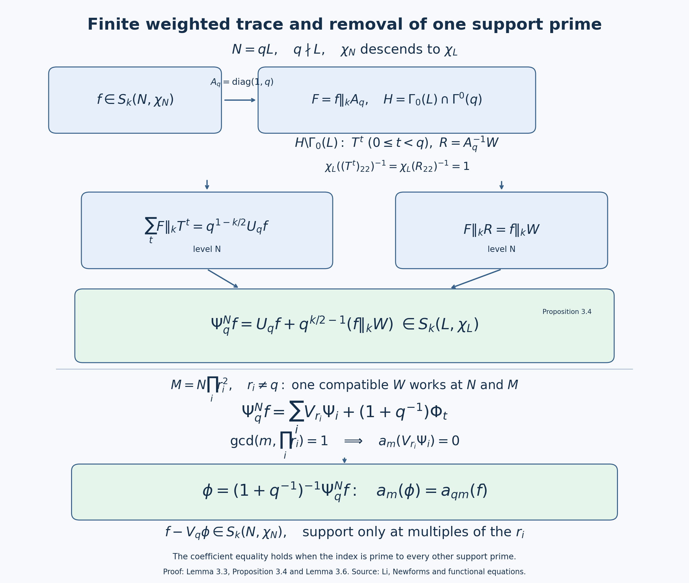

# Oldforms, newforms and the theory of Atkin, Lehner and Li

The operators at primes dividing the level behave differently on oldforms and newforms. The pair \(g(z),g(pz)\) has a two-dimensional \(U_p\)-matrix even when \(g\) originally spans a single eigenline. The new subspace removes these repetitions by orthogonality. This lesson develops primitive-level uniqueness and the decomposition of every cusp form into degeneracies. Sections 3.3–3.7 prove the fixed-character Fourier-support theorem for every finite auxiliary set, including its weighted traces and exact lower levels. Appendix A supplies the one-prime argument used there. The unrestricted \(\Gamma_1\) support statement and the Petersson, spectral and arithmetic prerequisites retain the proof requirements stated below.

Throughout, \(k\ge2\) is an integer. All spaces are complex vector spaces. We keep the unitary slash
\[
(f\|_k A)(z)=\det(A)^{k/2}(cz+d)^{-k}f(Az),
\qquad A=\begin{pmatrix}a&b\\c&d\end{pmatrix},\quad \det A>0.
\]
Diamonds use the lower-right entry of a matrix in \(\Gamma_0(N)\). The Petersson product is linear in its first argument and divided by the projective index; therefore regarding two forms at a common higher congruence level does not change their product. This common normalization is useful when comparing different levels.

We use the preceding lesson, Theorems 1.1, 2.3, 3.1 and 4.2, for character decomposition, Fourier formulas, commutativity and adjoints. The Petersson convergence argument is lesson 7, Theorems 1.1 and 2.1. The general dimensions used below come from lesson 6, Theorem 4.1; their compact-curve proof is lesson 06, Appendix A, with the elementary analytic foundation requirements stated there.

## 1. Raising the level

For \(Md\mid N\), set
\[
V_d:S_k(\Gamma_1(M))\longrightarrow S_k(\Gamma_1(N)),
\qquad (V_dg)(z)=g(dz).
\]
We also write this degeneracy map as \(\iota_d\). It has no extra factor of \(d^{k/2}\).

**Proposition 1.1.** The map \(V_d\) is injective, preserves cusp forms and respects diamonds. It commutes with \(T_p\) whenever \(p\nmid N\).

**Proof.** Put \(B_d=\operatorname{diag}(d,1)\). If
\(\gamma=\left(\begin{smallmatrix}a&b\\c&e\end{smallmatrix}\right)\in\Gamma_1(N)\), then
\[
B_d\gamma B_d^{-1}
=\begin{pmatrix}a&db\\c/d&e\end{pmatrix}\in\Gamma_1(M).
\]
The lower-left entry is an integer divisible by \(M\), and the two diagonal entries are \(1\) modulo \(M\). Since \(g\|B_d=d^{k/2}V_dg\), the slash cocycle proves the transformation law. A rational matrix sends rational boundary points to rational boundary points. Factoring its action in a cusp coordinate as an integral scaling followed by an affine map with positive slope, as in the cusp calculation in the previous lesson, shows that a vanishing Fourier expansion remains vanishing. Thus \(V_dg\) is cuspidal at every cusp of \(\Gamma_1(N)\). Its Fourier coefficients at infinity determine \(g\), so it is injective.

For a unit \(u\) modulo \(N\), choose a diamond representative
\(\sigma\in\Gamma_0(N)\) with lower-right entry congruent to \(u\). The same conjugation is integral and belongs to \(\Gamma_0(M)\), with the same lower-right entry. Consequently
\[
[u]_N V_d=V_d[u]_M.
\]
The character at the higher level is the pullback of the character at the lower level.

For the Hecke assertion decompose into character spaces and use the formula proved in the preceding lesson:
\[
T_pg=E_pg+\chi(p)p^{k-1}V_pg,
\quad
E_p\!\left(\sum a_nq^n\right)=\sum a_{pn}q^n.
\]
Here \(p\nmid d\), so \(E_pV_d=V_dE_p\), and \(V_pV_d=V_dV_p\). Diamond compatibility identifies the two character values. The Fourier expansions of the two sides agree, hence the forms agree. \(\square\)

Define
\[
S_k^{\mathrm{old}}(N)=
\sum_{\substack{M\mid N\\M<N}}\ \sum_{d\mid N/M}
V_d S_k(\Gamma_1(M)),\qquad
S_k^{\mathrm{new}}(N)=S_k^{\mathrm{old}}(N)^\perp.
\]
Finite dimensionality and positivity give an orthogonal decomposition
\[
S_k(\Gamma_1(N))
=S_k^{\mathrm{old}}(N)\oplus S_k^{\mathrm{new}}(N).
\]
This direct sum of the two subspaces does not yet assert independence of the individual degeneracy images.

In a character component the old sources are precisely those lower levels through which that character factors. Indeed, finite diamond projection commutes with \(V_d\) by Proposition 1.1. If \(\chi\) is nontrivial on the kernel of \((\mathbb Z/N\mathbb Z)^*\to(\mathbb Z/M\mathbb Z)^*\), that projection of a level-\(M\) image is zero; otherwise it is the image of the corresponding character projection at \(M\). Thus the intersection of our newspace with \(S_k(N,\chi)\) is the usual fixed-character newspace. The index-normalized Petersson product also agrees with the fixed-character product computed on \(\Gamma_0(N)\), since its density is \(\Gamma_0(N)\)-invariant.

## 2. Stability, including the bad operators

Write \(U_p=E_p\) at a prime \(p\mid N\).

**Lemma 2.1.** The old space is stable under every \(U_p\), every good Hecke operator and every diamond.

**Proof.** The good operators and diamonds follow from Proposition 1.1. Consider \(V_dg\) from level \(M<N\). If \(p\mid d\), the coefficient formula gives
\[
U_pV_dg=V_{d/p}g.
\]
If \(p\nmid d\) but \(p\mid M\), it gives
\[
U_pV_dg=V_dU_pg.
\]
Both expressions belong to the old space. In the remaining case \(p\nmid Md\), the good operator at level \(M\) satisfies
\[
E_pg=T_pg-p^{k-1}V_p[p]_Mg.
\]
Thus
\[
U_pV_dg=V_dT_pg-p^{k-1}V_{pd}[p]_Mg.
\]
The last raising map is allowed: since \(p\mid N\), \(Md\mid N\) and \(p\nmid Md\), we have \(Mpd\mid N\). Its source level is still the proper divisor \(M\). This treats all cases and proves the assertion. \(\square\)

Introduce the Fricke operator
\[
\mathcal W_Nf=f\|_k
\begin{pmatrix}0&-1\\N&0\end{pmatrix},
\qquad
(\mathcal W_Nf)(z)=N^{-k/2}z^{-k}f(-1/(Nz)).
\]

**Lemma 2.2.** The operator \(\mathcal W_N\) is unitary and preserves the old and new subspaces. Moreover, for \(p\mid N\),
\[
U_p^*=\mathcal W_N^{-1}U_p\mathcal W_N.
\]

**Proof.** Conjugation by the displayed matrix sends
\[
\begin{pmatrix}a&b\\c&e\end{pmatrix}
\longmapsto
\begin{pmatrix}e&-c/N\\-Nb&a\end{pmatrix}.
\]
It normalizes both \(\Gamma_1(N)\) and \(\Gamma_0(N)\). The slash cocycle and the rational cusp calculation therefore show that it preserves cusp forms. The density identity
\[
(f\|A)(z)\overline{(g\|A)(z)}y^k
=f(Az)\overline{g(Az)}\operatorname{Im}(Az)^k
\]
and invariance of hyperbolic measure prove unitarity by changing variables on a fundamental domain.

For an old generator, direct substitution gives the exact identity
\[
\mathcal W_NV_dg
=(N/M)^{k/2}d^{-k}
V_{N/(Md)}\mathcal W_Mg.
\]
The index on the right divides \(N/M\), so the right side is old. Also
\[
\mathcal W_N^2=(-1)^kI,
\]
because the matrix square is \(-NI\). Thus \(\mathcal W_N^{-1}\) preserves oldforms as well; unitarity then preserves their orthogonal complement.

The adjoint double-coset calculation of the preceding lesson replaces the determinant-\(p\) matrix \(\operatorname{diag}(1,p)\) by \(\operatorname{diag}(p,1)\), retaining the real factor \(p^{k/2-1}\). Conjugation by the Fricke matrix exchanges these two matrices and normalizes the group. It therefore exchanges the corresponding coset sums and gives the asserted operator identity. This uses the two distinct intersection groups from the adjoint proof; it does not identify those groups. \(\square\)

**Theorem 2.3 (stability).** The old and new spaces are stable under good Hecke operators and diamonds. The new space is stable under every \(U_p\), hence under every \(T_n\).

**Proof.** A subspace \(W^\perp\) is \(A\)-stable if \(W\) is \(A^*\)-stable: for \(x\in W^\perp,w\in W\),
\[
\langle Ax,w\rangle=\langle x,A^*w\rangle=0.
\]
Diamonds are unitary, and the inverse diamond preserves oldforms. At good primes,
\[
T_p^*=[p]^{-1}T_p;
\]
both factors preserve the old space. At bad primes use Lemmas 2.1 and 2.2 to see that \(U_p^*\) preserves it. The displayed orthogonality argument proves every assertion about the new space. The prime-power recurrences and coprime products express all \(T_n\) using these prime operators and diamonds. \(\square\)

## 3. The main lemma and the new eigenbasis

We first state the full Fourier-support problem. Its fixed-character form is proved in Theorem 3.7 below.

**Main lemma, with an auxiliary finite set of primes.** Suppose \(D\ge1\) and \(h\in S_k(\Gamma_1(N))\) satisfies
\[
a_n(h)=0\qquad\text{whenever }(n,D)=1.
\]
Then there are forms \(h_p\in S_k(\Gamma_1(N/p))\), for \(p\mid(N,D)\), such that
\[
h=\sum_{p\mid(N,D)}V_ph_p.
\]
The empty sum is zero. On a character component only those lower levels through which its character factors can contribute.

Li's original paper treats the fixed-character theorem; the Diamond–Im survey also states the unrestricted \(\Gamma_1\) version. **Remaining proof requirement:** the unrestricted support statement has not been proved here or supplied by an exact earlier programme lesson. Theorem 3.7 proves the fixed-character auxiliary-set statement, using Theorem A.1 and the traces below. A joint Hecke/diamond eigenspace already has a fixed character, so that theorem supplies the support input to existence. It also applies to a difference of two forms whose characters have already been identified. Arbitrary diamond projection is not assumed to preserve Fourier support.

Taking \(D=N\) gives the usual level-supported main lemma. Its auxiliary-\(D\) form is needed when eigenvalue comparisons omit extra primes.

### 3.1. Existence

**Theorem 3.1 (existence).** The new space has a basis of simultaneous eigenforms for every \(T_n\) and every diamond, each uniquely normalized by \(a_1=1\).

**Proof.** The good Hecke operators and diamonds form a commuting normal family on the cusp space, by the previous lesson. Their adjoints preserve the new subspace, so their restrictions there remain normal. The finite-dimensional simultaneous spectral argument gives an orthogonal decomposition into joint eigenspaces \(E\).

Let \(h\in E\) have \(a_1(h)=0\). For each \(n\) prime to \(N\), the coefficient-of-\(q\) formula is
\[
a_1(T_nh)=a_n(h).
\]
The left side is the eigenvalue of \(T_n\) times \(a_1(h)\), hence zero. The fixed-character theorem, Theorem 3.7 with \(D=N\), puts \(h\) in the old space. Since it was new, positivity gives \(h=0\). Thus \(a_1:E\to\mathbb C\) is injective, so every nonzero \(E\) is one-dimensional and its generator has nonzero first coefficient.

Every \(U_p\) preserves the new space and commutes with all the good operators and diamonds. It therefore preserves each line \(E\). These lines are eigenlines for all \(U_p\), and the recurrences give every \(T_n\). Dividing each generator by its first coefficient yields the required basis. \(\square\)

A **newform** is a normalized simultaneous eigenform in the new space. For it the coefficient-of-\(q\) identity gives
\[
T_nf=a_n(f)f
\]
at every index, including indices divisible by the level. This normalization concerns the new space; a good eigenvector in the full old space can have first coefficient zero.

### 3.2. The prime-level main lemma

**Theorem 3.2.** Let \(p\) be prime and let
\(f\in S_k(\Gamma_0(p))\) have \(a_n(f)=0\) for all \(p\nmid n\). Then
\[
f(z)=g(pz),\qquad g\in S_k(\operatorname{SL}_2(\mathbb Z)).
\]

**Proof.** Define \(g(z)=f(z/p)\). Its Fourier expansion is
\[
g(z)=\sum_{m\ge1}a_{pm}(f)e^{2\pi imz},
\]
so it is invariant under \(T:z\mapsto z+1\). Conjugating the modularity of \(f\) by \(A=\operatorname{diag}(1,p)\) shows that \(g\) is invariant under
\[
A^{-1}\Gamma_0(p)A=\Gamma^0(p)
=\left\{\begin{pmatrix}a&b\\c&d\end{pmatrix}\in\operatorname{SL}_2(\mathbb Z):p\mid b\right\}.
\]
Indeed \(f\|A=p^{-k/2}g\), so the constant factor makes no difference. The group \(\Gamma^0(p)\) contains
\(U=\left(\begin{smallmatrix}1&0\\1&1\end{smallmatrix}\right)\), and
\[
T^{-1}UT^{-1}=S.
\]
The matrices \(S,T\) generate the full modular group. Thus \(g\) has its weight-\(k\) transformation law. It is holomorphic on the upper half-plane and its displayed expansion vanishes at infinity. Every cusp of the full modular group is equivalent to infinity, so it is cuspidal. The defining identity gives \(f(z)=g(pz)\). \(\square\)

### 3.3. Finite cosets and the character-weighted trace

Write \(S_k(N,\chi_N)=S_k(\Gamma_0(N),\chi_N)\), where
\(f\|_k\gamma=\chi_N(\gamma_{22})f\). A character at a lower modulus is always named separately. Its pullback agrees with \(\chi_N\) on units modulo \(N\), without identifying their zero extensions on all integers. We may assume \(\chi_N(-1)=(-1)^k\), since otherwise the space is zero.

For every prime \(r\), Fourier averaging defines
\[
\begin{gathered}
E_rf(z)=\frac1r\sum_{u=0}^{r-1}f((z+u)/r)\\
=\sum_{n\ge1}a_{rn}(f)e^{2\pi inz}.
\end{gathered}
\]
Thus \(E_r=U_r\) whenever \(r\mid N\). We use the unitary slash fixed at the beginning of this lesson; in particular positive scalar matrices act trivially and
\(V_r=r^{-k/2}(\|_k\operatorname{diag}(r,1))\).

**Lemma 3.3.** Suppose \(N=rL\) and \(\chi_N\) descends to \(\chi_L\). Put
\[
\begin{gathered}
G=\Gamma_0(L),\qquad H=G\cap\Gamma^0(r),\\
A_r=\operatorname{diag}(1,r),\\
T=\begin{pmatrix}1&1\\0&1\end{pmatrix}.
\end{gathered}
\]
If \(F=f\|_kA_r\), for \(f\in S_k(N,\chi_N)\), then the finite character-weighted trace
\[
\begin{gathered}
\mathcal T F=
\sum_{\rho\in H\backslash G}
\chi_L(\rho_{22})^{-1}F\|_k\rho,\\
\mathcal T F\in S_k(L,\chi_L).
\end{gathered}
\tag{3.1}
\]
When \(r\mid L\), its representatives can be chosen as \(T^u\), \(0\le u<r\), and
\[
\begin{gathered}
E_rf=r^{k/2-1}\mathcal T(f\|_kA_r),\\
E_rf\in S_k(L,\chi_L).
\end{gathered}
\tag{3.2}
\]

**Proof.** For \(\gamma=\left(\begin{smallmatrix}a&b\\c&d\end{smallmatrix}\right)\in H\),
\[
A_r\gamma A_r^{-1}
=\begin{pmatrix}a&b/r\\rc&d\end{pmatrix}\in\Gamma_0(N).
\]
The entry \(d\) is a unit modulo \(L\) and modulo \(r\), because \(ad\equiv1\pmod r\). The slash cocycle gives \(F\|_k\gamma=\chi_L(d)F\). Rational-slash cusp preservation, proved in Hecke operators for the congruence groups, Section 2 immediately after (2.3), gives cuspidality at \(H\).

If \(r\mid L\), a matrix \(\gamma\in G\) is upper triangular modulo \(r\). Its upper-left entry \(a\) is nonzero. Choose \(u\equiv b/a\pmod r\); then \(\gamma T^{-u}\in H\). This gives the stated left-coset representatives, and \(T^{u-v}\in H\) only when \(r\mid u-v\).

If \(r\nmid L\), reduction of \(G\) onto \(\mathrm{SL}_2(\mathbb F_r)\) is surjective: prescribe identity modulo \(L\) and an arbitrary determinant-one matrix modulo \(r\), then use CRT and integral lifting from Congruence subgroups, cusps and elliptic points, Lemmas 1.0–1.1. The image of \(H\) is the lower triangular subgroup. Its left cosets are classified by the projective first row. Indeed left multiplication scales that row; conversely two proportional first rows make the upper-right entry of their quotient zero. The lines are \([1:u]\), \(0\le u<r\), and \([0:1]\). Choose \(rx-Ly=1\). Then
\[
R=\begin{pmatrix}rx&y\\L&1\end{pmatrix}
\]
has determinant one and first row \([0:1]\) modulo \(r\). Thus \(T^0,\ldots,T^{r-1},R\) exhaust the \(r+1\) left cosets. This argument includes \(r=2\) and \(L=1\).

The function \(\lambda(\gamma)=\chi_L(\gamma_{22})\) is a group character on \(G\), since lower-right entries multiply modulo \(L\). Replacing \(\rho\) by \(h\rho\), with \(h\in H\), leaves the corresponding summand in (3.1) unchanged: the factor \(\lambda(h)\) from the transformation of \(F\) cancels its inverse in the weight. If \(\rho\gamma=h_\rho\rho'\), then
\[
\lambda(\rho)^{-1}\lambda(h_\rho)
=\lambda(\gamma)\lambda(\rho')^{-1}.
\]
Reindexing proves \((\mathcal TF)\|_k\gamma=\lambda(\gamma)\mathcal TF\). Each summand vanishes at every rational cusp after passing to a common congruence subgroup, so the finite sum is cuspidal; its lower-level transformation law then gives the lower-level cusp condition.

All the displayed representatives have lower-right entry one. Their actual character weights are therefore one, even for a nontrivial character. Finally
\[
\begin{gathered}
\sum_{u=0}^{r-1}F\|_kT^u\\
=r^{-k/2}\sum_{u=0}^{r-1}f((z+u)/r)\\
=r^{1-k/2}E_rf.
\end{gathered}
\]
If \(r\mid L\), there is no remaining representative, giving (3.2). \(\square\)

### 3.4. A prime occurring once and compatible partial matrices

**Proposition 3.4.** Suppose \(q\Vert N\), put \(L=N/q\), and suppose \(\chi_N\) descends to \(\chi_L\). Choose integers \(x,y,z\) with \(qx-Lyz=1\), and set
\[
\begin{gathered}
A_q^N=\begin{pmatrix}qx&y\\Nz&q\end{pmatrix},\\
W_q^N f=f\|_k A_q^N,\\
R=A_q^{-1}A_q^N=\begin{pmatrix}qx&y\\Lz&1\end{pmatrix}.
\end{gathered}
\tag{3.3}
\]
Here \(A_q=\operatorname{diag}(1,q)\). The operator \(W_q^N\) is independent of these choices on this character space, preserves that space, and has square \(\chi_L(q)I\). Moreover
\[
\begin{gathered}
\Psi_q^N f:=E_qf+q^{k/2-1}W_q^Nf,\\
\Psi_q^Nf\in S_k(N/q,\chi_{N/q}).
\end{gathered}
\tag{3.4}
\]

**Proof.** Taking \(z=1\) gives a choice by Bezout. More generally \((z,q)=1\) permits a choice, since \((q,Lz)=1\). The determinants in (3.3) are \(q\) and one. Modulo \(q\), the first row of \(R\) is \([0:y]=[0:1]\). It supplies precisely the final coset in Lemma 3.3. Hence
\[
\mathcal T(f\|_k A_q)
=q^{1-k/2}E_qf+f\|_k A_q^N.
\]
Multiplication by \(q^{k/2-1}\) proves (3.4), with its exact constant and cusp condition.

For completeness the matrix properties needed at enlarged levels can be checked without a normalizer theorem. For
\(\gamma=\left(\begin{smallmatrix}a&b\\Nc&d\end{smallmatrix}\right)\in\Gamma_0(N)\), the inverse of \(A_q^N\) is
\(\left(\begin{smallmatrix}1&-y/q\\-Lz&x\end{smallmatrix}\right)\). Write the conjugated matrix as \(\left(\begin{smallmatrix}a'&b'\\c'&d'\end{smallmatrix}\right)\). Its four entries are
\[
\begin{gathered}
a'=qxa+Nyc\\
{}-Nxzb-Lyzd,\\
b'=xy(d-a)+qx^2b-Ly^2c,\\
c'=N\bigl(z(a-d)+qc-Lz^2b\bigr),\\
d'=-Lzya-Nyc\\
{}+Nzxb+qxd.
\end{gathered}
\tag{3.5}
\]
Every entry is integral; the lower-left is divisible by \(N\); and the lower-right is congruent to \(d\pmod L\), since \(qx\equiv1\pmod L\). The descended character is therefore preserved. Cuspidality follows from the same rational-slash argument as in Lemma 3.3. Also
\[
\begin{gathered}
(A_q^N)^2=q\delta,\\
\delta=\begin{pmatrix}
qx^2+Lyz&y(x+1)\\
Nz(x+1)&Lyz+q
\end{pmatrix},\\
\delta\in\Gamma_0(N).
\end{gathered}
\tag{3.6}
\]
Its determinant is one and \(\delta_{22}\equiv q\pmod L\), so \((W_q^N)^2=\chi_L(q)I\). This scalar is nonzero. Conjugation sends the group into itself by (3.5); its square is conjugation by \(\delta\), which is onto. Thus the first conjugation is onto as well, proving normalization of the group.

For two choices, write \(A_1A_2^{-1}=K=(K_{ij})\). Matrix multiplication gives
\[
\begin{gathered}
K_{11}=qx_1-Ly_1z_2,\\
K_{12}=-x_1y_2+y_1x_2,\\
K_{21}=N(z_1-z_2),\\
K_{22}=qx_2-Lz_1y_2,\\
K\in\Gamma_0(N).
\end{gathered}
\tag{3.7}
\]
Its lower-right entry equals \(1+Ly_2(z_2-z_1)\), so its character is one. Since \(A_1=(A_1A_2^{-1})A_2\), the right-action law proves equality of the two operators.

Finally suppose \(M=qJ\), \(q\nmid J\), \(d\mid M\), \(q\nmid d\), and put \(B_d=\operatorname{diag}(d,1)\). Conjugating an allowed matrix at level \(M\) gives
\[
\begin{gathered}
\widetilde A=B_d A_q^M B_d^{-1},\\
\widetilde A=\begin{pmatrix}qx&dy\\Mz/d&q\end{pmatrix},\\
(V_dh)\|_k A_q^M=V_d(h\|_k\widetilde A).
\end{gathered}
\tag{3.8}
\]
The conjugate is an allowed matrix at \(M/d\), because \(qx-(M/(dq))(dy)z=1\). Also \(E_qV_d=V_dE_q\) coefficient by coefficient. Whenever the actual level of \(h\) divides \(M/d\) and its character descends on removing \(q\), these equalities are the stated fixed-character modular identities. \(\square\)

### 3.5. Fourier filters and the untouched conductor

Put \(P_r=V_rE_r\) and \(\mathcal A_r=I-P_r\). The first retains precisely the coefficients whose indices are divisible by \(r\); the second retains precisely those whose indices are prime to \(r\). Distinct-prime filters commute. For an ordered finite list \(r_1,\ldots,r_t\), telescoping gives
\[
I-\prod_{i=1}^t\mathcal A_{r_i}
=\sum_{i=1}^t V_{r_i}E_{r_i}\prod_{j<i}\mathcal A_{r_j}.
\tag{3.9}
\]
These are identities of holomorphic functions: finite averages and dilations have convergent Fourier expansions, and equal expansions determine equal functions.

**Lemma 3.5.** For \(h\in S_k(M,\chi_M)\), the filter \(\mathcal A_rh\) has level dividing \(Mr^2\), with character inflated from \(\chi_M\). If \(r\mid M\), level \(Mr\) suffices. If \(r^2\mid M\) and \(\chi_M\) descends modulo \(M/r\), the filter stays at level \(M\). Further, if \(M=NR\) with \(q\nmid R\), inflation preserves the character obstruction to removing \(q\): for \(q\mid N\),
\[
\begin{gathered}
\chi_M\text{ descends modulo }M/q\\
\Longleftrightarrow\\
\chi_N\text{ descends modulo }N/q.
\end{gathered}
\tag{3.10}
\]

**Proof.** Proposition 1.1 and its identical \(\Gamma_0\) conjugation put \(V_rh\) at level \(Mr\), with the inflated character. At a bad prime, Hecke operators for the congruence groups, Lemma 2.2 and Theorem 2.3, give \(E_rh\in S_k(M,\chi_M)\). At a good prime their Fourier formula gives
\[
E_rh=T_rh-\chi_M(r)r^{k-1}V_rh
\in S_k(Mr,\chi_{Mr}).
\]
Applying \(V_r\) once more proves the uniform bound
\[
\mathcal A_rh\in S_k(Mr^2,\chi_{Mr^2}).
\tag{3.11}
\]
If \(r\mid M\), the bad-prime bound instead gives \(Mr\). In the final case Lemma 3.3 gives \(E_rh\) at \(M/r\), and its dilation returns to \(M\). In every case this construction raises only the prime \(r\).

For \(a\mid b\), unit reduction \((\mathbb Z/b\mathbb Z)^*\to(\mathbb Z/a\mathbb Z)^*\) is onto. At a prime already in \(a\), any lift of its unit residue to the higher prime power remains a unit; at new primes prescribe residue one. CRT combines these choices. Thus a character descends precisely when it is trivial on the reduction kernel, since the value at any unit lift then defines the lower character.

One implication in (3.10) follows by inflating a character from \(N/q\) to \(M/q\). For the converse suppose \(\chi_N\) fails to descend. Choose a unit \(e\pmod N\) with \(e\equiv1\pmod{N/q}\) and \(\chi_N(e)\ne1\). Keep its residue at the \(q\)-power of \(M\), which is the same as that of \(N\); prescribe one at every other prime power of \(M\). CRT gives a unit \(E\pmod M\) reducing to \(e\pmod N\) and equal to one modulo \(M/q\). Its inflated character is not one, so \(\chi_M\) fails to descend. This allows \(R\) and \(N\) to share any primes other than \(q\). If \(q\nmid N\), the condition \(q\nmid R\) simply keeps \(q\) outside \(M\). \(\square\)

### 3.6. Extracting one admissible support prime

Call a prime \(q\) *admissible at* \((N,\chi_N)\) if \(q\mid N\) and \(\chi_N\) descends modulo \(N/q\).

**Lemma 3.6.** Suppose the nonzero coefficients of \(f\in S_k(N,\chi_N)\) have indices divisible by at least one prime in a finite nonempty set \(Q\) of admissible primes. For any chosen \(q\in Q\), there is \(\phi\in S_k(N/q,\chi_{N/q})\) such that \(f-V_q\phi\) is supported on multiples of the primes in \(Q\setminus\{q\}\), at its original level \(N\) and character \(\chi_N\).

**Proof.** If \(q^2\mid N\), take \(\phi=E_qf\). Lemma 3.3 gives its lower level, and \(f-V_q\phi=\mathcal A_qf\) removes all indices divisible by \(q\). If \(Q=\{q\}\), Theorem A.1 directly supplies \(f=V_q\phi\). Hence we may assume \(q\Vert N\) and enumerate the other primes as \(r_1,\ldots,r_{t-1}\), with \(r_t=q\).

Set
\[
M=N\prod_{i<t}r_i^2,\quad
F_i=\prod_{j<i}\mathcal A_{r_j}f,\quad
\Phi_i=E_{r_i}F_i.
\]
The support hypothesis kills \(\prod_{i=1}^t\mathcal A_{r_i}f\), so (3.9) gives
\[
f=\sum_{i<t}V_{r_i}\Phi_i+V_q\Phi_t.
\tag{3.12}
\]
By Lemma 3.5, \(F_t\) is a purely \(q\)-supported form at level \(M\). The exponent of \(q\) is still one, and its character descends modulo \(M/q\) by (3.10). Theorem A.1 gives \(\Phi_t\in S_k(M/q,\chi_{M/q})\).

For \(i<t\), the actual level of \(F_i\) divides \(N\prod_{j<i}r_j^2\). Since \(r_i\mid N\), bad-prime stability of \(E_{r_i}\) puts \(\Phi_i\) at that same level. This level divides \(M/r_i\): the exponent of \(r_i\) in \(M/r_i\) is one greater than in \(N\), and every other required exponent is present. Its character, inflated from \(\chi_N\), descends modulo \(M/(r_iq)\), because \(N/q\) divides that modulus. These divisibilities justify every lower-level trace that follows.

Choose \(qx-(M/q)y=1\), and use one common matrix
\[
W=\begin{pmatrix}qx&y\\M&q\end{pmatrix}.
\tag{3.13}
\]
At level \(M\) it is an allowed \(A_q^M\) with \(z=1\); at level \(N\) it is an allowed \(A_q^N\) with \(z=M/N\), which is prime to \(q\). The choice independence in Proposition 3.4 therefore permits the same matrix in the original-level trace. Put \(B_r=\operatorname{diag}(r,1)\), \(W_i=B_{r_i}WB_{r_i}^{-1}\), and
\[
\begin{gathered}
\Psi_i=E_q\Phi_i+q^{k/2-1}\Phi_i\|_k W_i,\\
\Psi_i\in S_k(M/(r_iq),\chi_{M/(r_iq)}).
\end{gathered}
\]
The membership is (3.4) at \(M/r_i\), using the verified character descent. The compatibility (3.8) and \(E_qV_{r_i}=V_{r_i}E_q\) make the trace of the \(i\)-th term in (3.12) equal to \(V_{r_i}\Psi_i\).

For the last term, \(q^{-1}B_qW=\left(\begin{smallmatrix}qx&y\\M/q&1\end{smallmatrix}\right)\) lies in \(\Gamma_0(M/q)\) and has character one. The unitary slash therefore gives
\[
(V_q\Phi_t)\|_kW=q^{-k/2}\Phi_t,
\qquad E_qV_q\Phi_t=\Phi_t.
\]
Applying the original-level trace to (3.12) consequently yields the exact common-level identity
\[
\begin{gathered}
\Psi_q^Nf=(1+q^{-1})\Phi_t\\
{}+\sum_{i<t}V_{r_i}\Psi_i.
\end{gathered}
\tag{3.14}
\]
It holds at level \(M/q\), while its left side belongs to level \(N/q\) by (3.4). Set
\[
\begin{gathered}
\phi=(1+q^{-1})^{-1}\Psi_q^Nf,\\
\phi\in S_k(N/q,\chi_{N/q}).
\end{gathered}
\tag{3.15}
\]
At every index \(m\) prime to all the \(r_i\), the sum in (3.14) has zero coefficient. Hence \(a_m(\phi)=a_m(\Phi_t)=a_{qm}(f)\); the last equality holds because all the other-prime filters leave the coefficient at \(qm\) unchanged. For an index \(n\) prime to every \(r_i\), if \(q\nmid n\) then both \(f\) and \(V_q\phi\) have zero coefficient there by support. If \(n=qm\), their coefficients agree by the equality just proved at \(m\). This proves the support assertion for every such index. Proposition 1.1 puts the subtracted degeneracy at the original level and character. \(\square\)

*Figure 1.* For \(q\Vert N\) and character descended to \(N/q\), the translation sum and remaining matrix term in the \(q+1\) coset trace combine with coefficient \(q^{k/2-1}\) to give the lower-level form (3.4). The lower panel is a coefficient diagram for (3.14)–(3.15). Its coefficient equality is asserted at indices prime to every other support prime \(r_i\). Each \(V_{r_i}\) term then vanishes, leaving exactly the factor \(1+q^{-1}\); the residual keeps level \(N\). Lemma 3.3 and Proposition 3.4 prove the matrix and character facts, and Lemma 3.6 proves the extraction. Li's original article treats these trace and support mechanisms.

### 3.7. The fixed-character auxiliary-set theorem

**Theorem 3.7.** Let \(k\ge2\), \(N,D\ge1\), and \(f\in S_k(N,\chi_N)\). If \(a_n(f)=0\) whenever \((n,D)=1\), then
\[
\begin{gathered}
f=\sum_{q\mid(N,D)}V_qh_q,\\
h_q\in S_k(N/q,\chi_{N/q}).
\end{gathered}
\tag{3.16}
\]
where only admissible primes contribute: the character must descend modulo \(N/q\). If there are none, \(f=0\).

**Proof.** Let \(P\) be the distinct prime divisors of \(D\). If \(P\) is empty, every positive Fourier coefficient vanishes, so \(f=0\). Otherwise its support is in the union of the multiples of primes in \(P\).

Suppose \(p\in P\) is outside \(N\), or divides \(N\) but has a non-descending character. Apply the other-prime filters:
\[
F=\prod_{r\in P\setminus\{p\}}\mathcal A_rf,
\qquad M=N\prod_{r\in P\setminus\{p\}}r^2.
\]
Lemma 3.5 places this purely \(p\)-supported form at level \(M\), raising no \(p\)-exponent. If \(p\nmid N\), it remains outside \(M\); otherwise (3.10) retains its conductor obstruction. Theorem A.1 forces \(F=0\). At indices divisible by none of the other primes the filters left the coefficient of \(f\) unchanged, so those coefficients of \(f\) vanish. Its support is therefore already in the multiples of \(P\setminus\{p\}\). Repeat this finite procedure to remove all inadmissible primes. It leaves a set \(Q\) of admissible primes dividing \((N,D)\).

If \(Q\) is empty, the form is zero. Otherwise Lemma 3.6 subtracts a level-\(N/q\) degeneracy and removes a chosen prime from the support set. The residual has the same original level and character, so all the remaining admissibility conditions persist. Repeating for the finite set \(Q\) leaves no possible nonzero positive Fourier coefficient. The residual is zero and the sum of the subtractions is (3.16). \(\square\)

The proof uses the one-prime theorem of Appendix A, the CRT and integral lifting of lesson 2, rational-slash cusp preservation and prime Hecke formulas of lesson 9, and the coefficient-bound finite dimensionality used in Appendix A from lesson 6. It does not use the Riemann–Roch dimension formula, Petersson adjoints, simultaneous spectral decomposition or attached Galois representations. The elementary analytic and arithmetic foundations disclosed with those earlier proofs remain prerequisites. The unrestricted \(\Gamma_1(N)\) support problem stated at the start of Section 3 still requires its own argument.

## 4. Multiplicity across levels

A comparison at almost all primes requires two separate points: recovering the character, and recovering the primitive level. The prime-square relation recovers the character from a full prime-to-level \(T_n\)-system, but it does not recover it from the prime values alone when some \(a_p\) vanish. We make the extra input for this distinction explicit.

### 4.1. Recovering the character from prime coefficients

We use these two arithmetic inputs in this subsection only.

* **Attached representation.** A normalized cuspidal eigenform of weight \(k\ge2\), level \(M\) and character \(\chi\) has its coefficients in a number field \(K\). For every finite place \(\lambda\mid\ell\) of a sufficiently large such field, there is a continuous representation
  \[
  \rho_{f,\lambda}:\operatorname{Gal}(\overline{\mathbb Q}/\mathbb Q)
  \longrightarrow\operatorname{GL}_2(K_\lambda)
  \]
  unramified outside \(M\ell\), with
  \[
  \operatorname{tr}\rho_{f,\lambda}(\operatorname{Frob}_p)=a_p(f),
  \qquad
  \det\rho_{f,\lambda}=\chi\,\varepsilon_\ell^{k-1}.
  \]
  Here Frobenius is arithmetic and \(\varepsilon_\ell\) is the \(\ell\)-adic cyclotomic character. This is the Shimura–Deligne construction, in the formulation of Diamond–Im, Section 12.5, equations (12.5.1)–(12.5.3) with the coefficient-field assertion in Corollary 12.4.5. Its construction is outside this lesson.
* **Chebotarev.** For every finite Galois extension of \(\mathbb Q\), each conjugacy class is the Frobenius class of infinitely many unramified primes. This is the consequence of the density theorem stated in Milne, *Algebraic Number Theory*, Theorem 8.31.

**Lemma 4.1.** If two normalized newforms of the same weight have \(a_p(f)=a_p(g)\) outside a finite set of primes, their characters agree as Dirichlet characters after pullback to a common modulus.

**Proof.** Choose a common coefficient field and a place \(\lambda\) for the two representations. Let
\[
t(\sigma)=\operatorname{tr}\rho_f(\sigma)
 -\operatorname{tr}\rho_g(\sigma).
\]
This is a continuous conjugacy-invariant function on the profinite Galois group. It vanishes at the Frobenius elements outside a finite set. It therefore vanishes everywhere: if \(t(\sigma)\ne0\), continuity gives a neighborhood of \(\sigma\) on which it remains nonzero. A coset of an open normal subgroup lies inside that neighborhood. In the corresponding finite Galois quotient, Chebotarev supplies a prime outside the excluded finite set whose Frobenius lies in the conjugacy class of that coset. Conjugacy invariance gives a Frobenius element in the same nonvanishing neighborhood, a contradiction.

For every two-by-two matrix over a field of characteristic zero,
\[
2\det A=(\operatorname{tr}A)^2-\operatorname{tr}(A^2).
\]
Apply this to \(\rho_f(\sigma)\) and \(\rho_g(\sigma)\). Equality of the traces at both \(\sigma\) and \(\sigma^2\) gives equality of determinants. Cancelling the nonzero common cyclotomic character gives equality of the finite characters on the Galois group. The finite character attached to a Dirichlet character factors through
\(\operatorname{Gal}(\mathbb Q(\zeta_L)/\mathbb Q)=(\mathbb Z/L\mathbb Z)^*\), so surjectivity onto that quotient gives equality of the pulled-back Dirichlet characters. \(\square\)

This argument uses neither a choice of roots of Hecke polynomials nor a claim that \(a_p\ne0\). The arithmetic inputs can be omitted whenever the character is already fixed. The rest of the proof is classical.

### 4.2. Two level-lowering operators

For this cross-level comparison, write \(\chi\) at its primitive conductor \(C\); \(S(L,\chi)\) means its pullback to the units modulo \(L\). Values such as \(\chi(q)\) in a lower-level good-prime formula are evaluated at that conductor. They must not be replaced by the zero extension of an induced character at a higher level divisible by \(q\).

Fix such a character \(\chi\) and a prime \(q\mid L\) through which it can descend to level \(L/q\). Write \(S(L,\chi)=S_k(\Gamma_0(L),\chi)\). Lemma 3.3 proves the first level-lowering formula:
\[
q^2\mid L\quad\Longrightarrow\quad
E_q:S(L,\chi)\longrightarrow S(L/q,\chi).
\tag{4.1}
\]
If \(q\Vert L\), choose integers \(x,y,z\) with
\(qx-(L/q)yz=1\), and put
\[
A_q^L=\begin{pmatrix}qx&y\\Lz&q\end{pmatrix},
\qquad W_q^L h=h\|_k A_q^L.
\]
In this case \(\chi\) is unramified at \(q\). This restricted choice is independent on the character space: for two such matrices the lower-right entry of \(A_1A_2^{-1}\) is \(qx_2-(L/q)z_1y_2\), which is \(1\) modulo \(L/q\). Conjugation by either matrix also preserves the lower-right character modulo \(L/q\), so it preserves \(S(L,\chi)\). The second lowering fact is
\[
E_q+q^{k/2-1}W_q^L:
S(L,\chi)\longrightarrow S(L/q,\chi).
\tag{4.2}
\]
Proposition 3.4 proves (4.2), including every matrix and character assertion just stated. Both formulas concern cusp forms, with the cusp conditions established in the finite trace proof. They provide the lower-level maps used in the comparison; they do not assume multiplicity one.

Define
\[
C_q^L=
\begin{cases}
E_q,&q^2\mid L,\\[2pt]
\displaystyle\frac{E_q+q^{k/2-1}W_q^L}{1+q^{-1}},&q\Vert L.
\end{cases}
\tag{4.3}
\]
For \(h\in S(L/q,\chi)\), these operators satisfy
\[
C_q^L V_qh=h.
\tag{4.4}
\]
For the first case this is the coefficient identity \(E_qV_q=I\). For the second, multiplication of matrices gives
\[
\frac1q B_qA_q^L
=\begin{pmatrix}qx&y\\(L/q)z&1\end{pmatrix}
\in\Gamma_0(L/q),
\qquad W_q^L V_qh=q^{-k/2}h.
\]
The lower-right entry is one. Substitution in (4.3) proves (4.4).

If \(t\ne q\) divides \(L\) and \(h\in S(L/t,\chi)\), then
\[
C_q^L V_th=V_tC_q^{L/t}h.
\tag{4.5}
\]
For \(E_q\) this is the Fourier identity. In the second case conjugation gives
\[
B_tA_q^LB_t^{-1}
=\begin{pmatrix}qx&ty\\(L/t)z&q\end{pmatrix},
\]
a valid matrix at the lower level. The character factors through \(L/(qt)\): it factors through both \(L/q\) and \(L/t\), hence through their greatest common divisor. Thus the same lowering formula applies there. These observations prove the compatibility, including its character condition.

**Lemma 4.2 (removing one old contribution).** If
\[
R=\sum_{t\in P}V_th_t,
\qquad h_t\in S(L/t,\chi),
\]
where \(P\) is a set of distinct primes and \(q\in P\), then
\[
(I-V_qC_q^L)R
\in\sum_{t\in P\setminus\{q\}}V_tS(L/t,\chi).
\]

**Proof.** The \(q\)-term disappears by (4.4). Every other term becomes
\[
V_t\bigl(h_t-V_qC_q^{L/t}h_t\bigr)
\]
by (4.5); the expression in parentheses has level \(L/t\), by the lowering result. \(\square\)

On a newform of level \(A\), the lowering operator at its highest \(q\)-exponent is zero whenever the character descends to \(A/q\). In (4.1), \(E_q\) preserves the new space by Theorem 2.3 and lands in a lower-level subspace, so its image is zero. In (4.2), \(W_q^A\) also preserves the new space. To see this last assertion directly, express the oldspace using the pairs
\(S(A/p,\chi)+V_pS(A/p,\chi)\). For \(p\ne q\), the preceding conjugation preserves each pair. For \(p=q\), the formulas
\[
W_q^Ah=\chi(q)q^{k/2}V_qh,
\qquad W_q^AV_qh=q^{-k/2}h
\]
exchange the pair. The operator normalizes \(\Gamma_0(A)\), is unitary, and its inverse also preserves the oldspace, so it preserves its orthogonal complement. Thus both terms in (4.2) are new, while their sum has lower level; the sum must vanish.

### 4.3. The orthogonality needed to compare levels

For \(A\mid B\), with the character factoring through \(A\), the normalized trace
\[
\tau_A^B h=
\frac1{[\Gamma_0(A):\Gamma_0(B)]}
\sum_{\gamma\in\Gamma_0(B)\backslash\Gamma_0(A)}
\chi(d_\gamma)^{-1}h\|\gamma
\]
is the orthogonal projection onto the level-\(A\) subspace. Indeed, finite unfolding on fundamental domains gives
\(\langle h,u\rangle=\langle\tau_A^Bh,u\rangle\)
for every \(u\) of level \(A\), with our index-normalized product; the sum has the stated lower-level transformation law and equals \(u\) when applied to \(u\).

A newform \(f\) of level \(M\) consequently satisfies
\[
\tau_{M/q}^Mf=0,
\qquad \tau_{M/q}^M\mathcal W_Mf=0
\tag{4.6}
\]
whenever its character factors through \(M/q\). The second equality follows because Fricke preserves the new space and changes the character to its conjugate.

Here are two precise compatibilities of these traces. Raising a level without changing its \(q\)-exponent does not change the trace removing \(q\). The intersection
\(\Gamma_0(M)\cap\Gamma_0(B/q)=\Gamma_0(B)\), for \(M\mid B\) with equal \(q\)-exponents, makes the coset map injective; both indices are \(q\) when the exponent is at least two, and \(q+1\) when it is one. The same representatives therefore exhaust both sets. Secondly, if \((d,q)=1\), conjugating trace representatives by \(B_d\) gives
\[
\tau_{Md/q}^{Md}V_dh=V_d\tau_{M/q}^Mh.
\tag{4.7}
\]
The conjugated matrices have lower-left entry divisible by \(M/q\) and unchanged lower-right entry. Distinctness and exhaustion follow from the same index count; the Chinese remainder theorem supplies representatives satisfying the additional conditions at primes dividing \(d\). Thus the character factors and normalization agree.

**Lemma 4.3.** Suppose \(f\) is new at level \(M\), its character factors through \(M/q\), and \((d,q)=1\). If \(H\) has level \(B/q\), where
\(1\le v_q(B)\le v_q(M)\), then
\[
\langle V_df,H\rangle=0,
\qquad\langle V_df,V_qH\rangle=0.
\tag{4.8}
\]
All products are taken at a common level.

**Proof.** Replace \(B\) by \(B'=\operatorname{lcm}(Md,B)\). Its \(q\)-exponent is that of \(M\), and \(H\) still has level \(B'/q\). Equations (4.6)–(4.7) and the equal-exponent compatibility give
\(\tau_{B'/q}^{B'}V_df=0\), proving the first orthogonality. The exact Fricke identity from Lemma 2.2 gives
\[
\mathcal W_{B'}V_df
=c\,V_{B'/(Md)}\mathcal W_Mf,
\qquad c\ne0.
\]
The new degeneracy index is prime to \(q\). Its trace vanishes by the second equality in (4.6), again using (4.7). Also
\[
\mathcal W_{B'}V_qH
=q^{-k/2}\mathcal W_{B'/q}H
\]
when \(H\) is regarded at level \(B'/q\). Fricke unitarity and the trace projection prove the second orthogonality. \(\square\)

A useful consequence keeps track of the permitted shifts. If \(f\) is new at \(M\), \(g\) has level \(N\), and
\[
m=v_q(M)>n=v_q(N),\quad
r=v_q(d)\le s=v_q(e),\quad n+s-r\le m,
\]
then
\[
\langle V_df,V_eg\rangle=0.
\tag{4.9}
\]
Here the common character automatically descends from \(M\) to \(M/q\). Remove the common dilation \(q^r\) from both sides of the pairing; it changes the pairing by a positive factor and leaves the question of vanishing unchanged. If \(s-r=0\), the second form has strictly smaller \(q\)-level and the first part of (4.8) applies after raising other prime factors. If \(s-r>0\), write the second form as \(V_qH\); its receiving level has \(q\)-exponent \(n+s-r\le m\), so the second part applies. This proves (4.9). The inequalities are part of the statement; arbitrary old shifts are not asserted orthogonal.

### 4.4. Same-character uniqueness

**Theorem 4.4.** Suppose \(f\) and \(g\) are normalized newforms of levels \(M,N\), the same weight and the same character, with equal \(a_p\) outside a finite set. Then \(f=g\) and \(M=N\).

**Proof.** Set \(L=\operatorname{lcm}(M,N)\). Choose \(D\) divisible by \(L\) and by every exceptional prime. The Hecke recurrences with the common character and coprime multiplicativity show
\(a_n(f)=a_n(g)\) whenever \((n,D)=1\). The fixed-character theorem, Theorem 3.7 at the common level \(L\), gives
\[
f-g=\sum_{q\in P}V_qh_q,
\qquad h_q\in S(L/q,\chi),
\tag{4.10}
\]
where \(P\) consists of primes at which this descent of the character is permitted. Terms with \(v_q(M)=v_q(N)\) are orthogonal to both \(f\) and \(g\) by Lemma 4.3.

Process the primes \(q\in P\) for which those exponents differ, applying \(I-V_qC_q^L\) to both sides of the current difference. Lemma 4.2 removes its \(q\)-term. All previously inserted degeneracies are prime to the current \(q\), so (4.5) permits the operation to be read separately on \(f\) and \(g\).

Here is the complete effect at one such prime. Suppose the exponent of the source newform \(f\) is the larger one, namely \(m=v_q(L)>n=v_q(N)\). The operator \(C_q\) kills \(f\), so the \(f\)-side is unchanged at this prime. If \(m\ge2\), the \(g\)-side is multiplied by
\[
1-a_q(g)V_q\quad(n\ge1),
\qquad
1-a_q(g)V_q+\chi(q)q^{k-1}V_q^2\quad(n=0).
\tag{4.11}
\]
These follow from \(E_qg=a_q(g)g\) in the first case and
\(E_qg=a_q(g)g-\chi(q)q^{k-1}V_qg\) in the second. The degree is at most \(m-n\), so every resulting shift still has level dividing \(L\).

If \(m=1,n=0\), use (4.3). The matrix identity
\[
A_q^LB_q^{-1}
=\begin{pmatrix}x&y\\(L/q)z&q\end{pmatrix}
\in\Gamma_0(L/q)
\]
shows that \(W_q^Lg=\chi(q)q^{k/2}V_qg\). The two \(V_qg\)-terms cancel in the numerator of \(C_q^Lg\), leaving
\[
C_q^Lg=\frac{a_q(g)}{1+q^{-1}}g.
\]
Thus the \(g\)-side is multiplied by
\[
1-\frac{a_q(g)}{1+q^{-1}}V_q.
\tag{4.12}
\]
Its degree is again \(m-n\). If the \(g\)-side has the larger source exponent, interchange the roles. These formulas cover every step of the procedure.

Let \(F,G\) be the resulting forms. Their difference contains only the terms of (4.10) at primes with equal source exponents. Every shift introduced in \(F,G\) is prime to each such remaining prime. Lemma 4.3 makes \(F\) and \(G\) orthogonal to every term of their difference. Hence
\[
\|F-G\|^2=0,
\qquad F=G.
\]
Each factor in (4.11)–(4.12) has constant term one as a polynomial in degeneracies. Since every nontrivial degeneracy starts beyond \(q^1\), both \(F\) and \(G\) still have first Fourier coefficient one; neither is zero.

If any processed prime has unequal source exponents, consider a cross product between any shift of \(f\) in \(F\) and any shift of \(g\) in \(G\). At that prime, the side with the larger source exponent has acquired no shift. The other side has shift exponent at most the difference of the source exponents. These are exactly the inequalities in (4.9). Therefore every cross product is zero, giving \(\langle F,G\rangle=0\), contrary to \(F=G\ne0\). Thus no such prime occurs in (4.10), and the first orthogonality argument already gives \(f=g\).

Finally a form modular at levels \(M\) and \(N\) with the same character is modular at \(\gcd(M,N)\). Indeed \(\Gamma_0(M)\) and \(\Gamma_0(N)\) generate \(\Gamma_0(\gcd(M,N))\): reduce modulo \(L\), use the product over prime powers, and observe that at each prime one of the two local subgroups is already the larger subgroup at the smaller exponent. The reductions are surjective by the integral Chinese remainder lifting established for congruence groups. The character also factors through the greatest common divisor. The cusp condition follows by taking its finite covering from either original level. If this greatest common divisor were smaller than either primitive level, the nonzero form would be old and new there, impossible. Thus \(M=N\). \(\square\)

Combining Lemma 4.1 and Theorem 4.4 proves the assertion with no prior equality of characters: **a normalized newform is determined by its \(a_p\) at almost all primes, including its primitive level.**

### 4.5. The direct decomposition and the full eigenspaces

**Theorem 4.5.** For \(k\ge2\),
\[
S_k(\Gamma_1(N))
=\bigoplus_{M\mid N}
 \bigoplus_{f\text{ normalized new at }M}
 \bigoplus_{d\mid N/M}\mathbb C V_df.
\tag{4.13}
\]
For a newform \(f\) of primitive level \(M\), its prime-to-\(N\) Hecke eigenvalue system at level \(N\) occurs precisely in the indicated span, if \(M\mid N\); otherwise it does not occur.

**Proof.** First prove spanning by induction on \(N\). The old/new orthogonal split and Theorem 3.1 handle the new part. Every old generator comes from a proper divisor, where induction expresses its source as a sum of shifted lower-level newforms. Since \(V_dV_e=V_{de}\), its image has exactly the form in (4.13), with permitted indices. This proves spanning, starting with the absence of lower levels at \(N=1\).

For one fixed normalized \(f\), the forms \(V_df\) are independent. In a nonzero relation choose the smallest positive \(d\) with nonzero coefficient. The coefficient of \(q^d\) contributed by \(V_df\) is that coefficient times \(a_1(f)=1\); every other remaining index is larger and contributes zero. This is a contradiction.

At level \(N\), the commuting normal good Hecke/diamond family gives a direct orthogonal sum of joint eigenspaces. Every \(V_df\) lies in the eigenspace associated to \(f\), by Proposition 1.1. Distinct newforms have distinct such systems: equality would in particular give equal prime eigenvalues outside the finite set dividing \(N\), and the preceding uniqueness theorem would identify both the form and its primitive level. Thus the independent spans for distinct \(f\) lie in distinct joint eigenspaces, proving directness.

Finally, if an eigenform has only its prime-to-\(N\) Hecke system specified, diamonds do not create extra possibilities. For every \(p\nmid N\),
\[
[p]=p^{1-k}(T_p^2-T_{p^2})
\]
acts by the scalar determined by that system. Every unit modulo \(N\) has a positive representative coprime to \(N\), and factoring that representative expresses its diamond as a product of these prime diamonds. Thus the full good Hecke system fixes the diamond system as well. The spanning decomposition and directness now identify its entire eigenspace with the stated degeneracy span. If a primitive form of another level had that system at \(N\), a nonzero summand in the decomposition would have the same almost-all prime values, forcing equality of primitive levels and hence divisibility by \(N\). \(\square\)

At a prime where the primitive level has exponent \(m\) and the receiving level has exponent \(r\ge m\), this decomposition gives \(r-m+1\) independent shifts \(f(z),f(pz),\ldots,f(p^{r-m}z)\). The same dimension pattern occurs in Deligne, *Formes modulaires et représentations de GL(2)*, Theorem 2.2.6 and Definition 2.2.7, for local newvectors and conductors. The classical/local identification is discussed in his Section 2.4; its representation-theoretic foundations are outside the proof given here.

## 5. Fricke signs and the bad coefficients

**Theorem 5.1.** The operator \(\mathcal W_N\) preserves \(S_k(\Gamma_0(N))\), has square \((-1)^k\), and commutes there with \(T_n\) for \((n,N)=1\). On every trivial-character newform it acts by a sign.

**Proof.** Preservation, unitarity and the square were proved in Lemma 2.2. Consider a good prime \(p\). Let \(A_p=\operatorname{diag}(1,p)\). Fricke conjugation replaces \(A_p\) by its adjugate \(A_p^\vee=\operatorname{diag}(p,1)\). These give the same \(\Gamma_0(N)\) double coset. Indeed, choose \(a,b\in\mathbb Z\) with \(ap-bN=1\) and set
\[
\sigma_p=\begin{pmatrix}a&b\\N&p\end{pmatrix}\in\Gamma_0(N).
\]
The good representative calculation in the preceding lesson shows
\(\sigma_p A_p^\vee\in\Gamma_0(N)A_p\Gamma_0(N)\). Removing the left factor \(\sigma_p\) proves the double-coset equality. A normalizer conjugates the whole coset sum, including its representatives; the real normalization \(p^{k/2-1}\) is unchanged. Hence \(\mathcal W_NT_p=T_p\mathcal W_N\). Recurrences and coprime products prove the assertion for every good \(n\).

The new space is Fricke-stable. The good joint eigenspace of a trivial-character newform is a single line by Theorem 3.1. Fricke commutation preserves that line, so \(\mathcal W_Nf=\epsilon_Nf\). A nonzero trivial-character space has even weight, since \(-I\) belongs to \(\Gamma_0(N)\). Applying the square identity gives \(\epsilon_N^2=1\), as required. \(\square\)

For a general character, conjugation changes the lower-right entry to the upper-left entry. Since their product is \(1\) modulo \(N\), it gives
\[
\mathcal W_N:
S_k(N,\chi)\longrightarrow S_k(N,\bar\chi).
\]
Consequently the sign conclusion applies as stated to trivial character. A character-space calculation must account for this change before claiming a scalar Fricke action.

For completeness, write \(Kf(z)=\overline{f(-\bar z)}\), so the Fourier coefficients of \(Kf\) are \(\overline{a_n(f)}\). Reflection of a fundamental domain proves that \(K\) is antiunitary; it preserves old degeneracies and therefore takes newforms with character \(\chi\) to newforms with character \(\bar\chi\). The reverse-double-coset calculation also gives
\[
\mathcal W_NT_p\mathcal W_N^{-1}=T_p^*
\qquad(p\nmid N).
\]
If \(T_pf=a_pf\), the adjoint formula on its character line gives
\(\overline{a_p}=\chi(p)^{-1}a_p\). Hence \(\mathcal W_Nf\) and \(Kf\) have the same good eigenvalues in the newspace of character \(\bar\chi\). The one-dimensionality proved in Theorem 3.1 makes
\[
\mathcal W_Nf=\eta_f Kf,\qquad |\eta_f|=1.
\]
The absolute value follows from unitarity. For nontrivial character this is a pseudo-eigenvalue relation with conjugate coefficients; it is not a sign eigenvalue assertion for \(f\) itself.

**Proposition 5.2 (partial involutions).** For every exact divisor \(Q\parallel N\), the operator
\[
\mathcal W_Qf=f\|_k
\begin{pmatrix}Qa&b\\Nc&Qd\end{pmatrix},
\qquad Qad-(N/Q)bc=1,
\]
is independent of the matrix choice on \(S_k(\Gamma_0(N))\). It is unitary, has square \(I\), preserves the old and new spaces, and commutes with every good Hecke operator. Each trivial-character newform is its eigenvector with eigenvalue \(w_Q=\pm1\).

**Proof.** Put \(R=N/Q\). Existence follows from \((Q,R)=1\): choose \(a\) with \(Qa\equiv1\pmod R\), set \(d=b=1\), and let \(c=(Qa-1)/R\). The adjugate divided by \(Q\) is
\[
A^{-1}=\begin{pmatrix}d&-b/Q\\-Rc&a\end{pmatrix}.
\]
For \(\gamma=\left(\begin{smallmatrix}u&v\\Nw&t\end{smallmatrix}\right)\in\Gamma_0(N)\), matrix multiplication makes every entry of \(A\gamma A^{-1}\) integral, and its lower-left entry is
\[
N\bigl(cd(u-t)+Qd^2w-Rc^2v\bigr).
\]
It has determinant one. The same calculation for the adjugate, which has the same prescribed shape, proves equality of the conjugated group with \(\Gamma_0(N)\). Rational cusp maps preserve cuspidality, and change of variables in the Petersson density proves unitarity.

If \(A_1,A_2\) are two choices, then
\[
A_1A_2^{-1}=
\begin{pmatrix}
Qa_1d_2-Rb_1c_2&-a_1b_2+b_1a_2\\
N(c_1d_2-d_1c_2)&-Rc_1b_2+Qd_1a_2
\end{pmatrix}\in\Gamma_0(N).
\]
They therefore give the same slash on trivial-character forms. Furthermore
\[
Q^{-1}A^2=
\begin{pmatrix}
Qa^2+Rbc&b(a+d)\\
Nc(a+d)&Rbc+Qd^2
\end{pmatrix}\in\Gamma_0(N).
\]
A positive scalar matrix acts trivially under the unitary slash, so \(\mathcal W_Q^2=I\).

At a prime \(p\nmid N\), conjugating \(\operatorname{diag}(1,p)\) by \(A\) gives the integral matrix
\[
\begin{pmatrix}
Qad-pRbc&(p-1)ab\\
N(1-p)cd&pQad-Rbc
\end{pmatrix}.
\]
It has determinant \(p\), lower-left entry divisible by \(N\), and upper-left entry a unit modulo \(N\): that entry is \(p\) modulo \(Q\) and \(1\) modulo \(R\). The good double-coset classification proved in the preceding lesson puts it in the same \(\Gamma_0(N)\) determinant-\(p\) double coset. Since \(A\) normalizes the group, conjugation bijects all its left cosets. Thus it preserves the normalized Hecke sum and commutes with \(T_p\). Recurrences and coprime products extend this to every good index.

For oldspace stability, it suffices to use the generators
\[
S_k(\Gamma_0(N/p))+V_pS_k(\Gamma_0(N/p)),\qquad p\mid N.
\]
They generate every old degeneracy: for a source \(M<N\), choose \(p\mid N/M\); if \(p\nmid d\), then \(V_dg\) already has level \(N/p\), and if \(p\mid d\), write it as \(V_p(V_{d/p}g)\).

First take \(Q=q^e\) a prime-power exact divisor. For \(p\ne q\), the matrix \(A\) is also a valid partial matrix at \(N/p\), after replacing \(c\) by \(pc\). The conjugate \(B_pAB_p^{-1}\) is another valid partial matrix at \(N/p\). Thus \(\mathcal W_Q\) preserves both displayed old generators from \(N/p\).

For \(p=q\), put \(M=N/q\). The two identities
\[
AB_q^{-1}=
\begin{pmatrix}(Q/q)a&b\\Mc&Qd\end{pmatrix},
\qquad
q^{-1}B_qA=
\begin{pmatrix}Qa&b\\Mc&(Q/q)d\end{pmatrix}
\]
are partial matrices of determinant \(Q/q\) at \(M\). When \(e=1\), they simply belong to \(\Gamma_0(M)\). On an unscaled lower-level form the first identity gives a multiple of \(V_q\) of a level-\(M\) form; on \(V_qh\), the second gives a multiple of a level-\(M\) form. Hence this old pair is preserved too. The inverse preserves it because the square is \(I\), and unitarity preserves the newspace.

Finally, for coprime exact divisors \(Q_1,Q_2\), the product of their two matrices has determinant \(Q_1Q_2\), upper-left and lower-right entries divisible by \(Q_1Q_2\), and lower-left entry divisible by \(N\). It is therefore an allowed matrix for \(Q_1Q_2\). Matrix independence gives
\(\mathcal W_{Q_1}\mathcal W_{Q_2}=\mathcal W_{Q_1Q_2}\).
Factoring \(Q\) into its prime-power parts proves newspace stability in general. Good commutation preserves each new eigenline; the square then gives its eigenvalue \(\pm1\). \(\square\)

These choice-independence and sign assertions are for trivial character. For a character ramified on the \(Q\)-part, a partial matrix can change its character; even when that character is preserved, different matrix normalizations can contribute character scalars. We do not replace them by the trivial-character formula.

We state the bad-prime coefficient input in precisely the trivial-character case needed here. If \(f\) is a normalized newform of level \(N\) and \(p\mid N\), then
\[
p\parallel N:\qquad a_p(f)=-w_pp^{k/2-1},
\]
where \(w_p\) is its \(W_p\)-sign, whereas
\[
p^2\mid N:\qquad a_p(f)=0.
\]
**Proof of the displayed trivial-character formulas.** Theorem 2.3 puts \(U_pf\) in the newspace. If \(p^2\mid N\), Lemma 3.3 also puts it at level \(N/p\), hence in the oldspace. Positivity forces \(U_pf=0\), so its first coefficient \(a_p(f)\) is zero. If \(p\Vert N\), Proposition 3.4 gives
\[
U_pf+p^{k/2-1}W_pf\in S_k(N/p).
\]
The partial involution preserves the newspace by Proposition 5.2, so both summands are new while their sum is old. It is zero. On the normalized newform, \(U_pf=a_p(f)f\) and \(W_pf=w_pf\). Therefore \(a_p(f)=-w_pp^{k/2-1}\), with the stated minus sign. \(\square\)

The same lowering argument applies at fixed characters whenever the character descends through removal of the prime, using Proposition 3.4 and the newspace preservation proved in Section 4.2. It does not supply the ramified-character coefficient classification. Li's original paper treats the bad-prime alternatives with their character qualifications. These newspace deductions retain the earlier Petersson and spectral prerequisites of Theorems 2.3 and 3.1.

For the level-11 weight-two form of the preceding lesson, \(a_{11}=1\). Thus \(w_{11}=-1\). The Fricke sign and the functional-equation sign have different roles: the forthcoming Mellin calculation gives the root number \(i^k\epsilon_N\). In weight two this changes the sign; the level-11 form therefore has root number \(+1\).

## 6. Examples

### 6.1. An oldspace at level 22

The genus formula gives
\[
\mu_0(22)=22(1+1/2)(1+1/11)=36,\qquad
c_0(22)=4,\qquad e_2(22)=e_3(22)=0.
\]
Hence
\[
\dim S_2(\Gamma_0(22))
=1+\frac{36}{12}-\frac42=2.
\]
The preceding lesson proved, including all multiplier and cusp checks, that
\[
f(z)=\eta(z)^2\eta(11z)^2
=q-2q^2-q^3+2q^4+q^5+2q^6-\cdots
\]
spans \(S_2(\Gamma_0(11))\). The forms \(f(z)\) and \(f(2z)\) have different first nonzero powers, so they are independent. They belong to the level-22 old space. Its dimension is therefore at least two, which is the dimension of the whole cusp space:
\[
S_2(\Gamma_0(22))
=\mathbb Cf\oplus\mathbb CV_2f,\qquad
S_2^{\mathrm{new}}(\Gamma_0(22))=0.
\]
Since \(a_2(f)=-2\), the level-raising calculation gives
\[
U_2f=-2f-2V_2f,\qquad U_2V_2f=f.
\]
Our matrices act on column coordinate vectors, so
\[
[U_2]_{(f,V_2f)}=
\begin{pmatrix}-2&1\\-2&0\end{pmatrix},
\qquad
\det(XI-U_2)=X^2+2X+2.
\]
Its two eigenvalues are \(-1+i\) and \(-1-i\). Every good operator acts by the same scalar on the two old generators; this is exactly the repeated primitive eigenvalue system which the newform decomposition must describe.

### 6.2. The finite computational model

For the two prime-level computations, use the finite weight-two modular-symbol model defined below. Lemma 6.1 proves the complete presentation, boundary map, period injectivity and path Hecke action here. Its perfect pairing deduction still uses the earlier weight-two dimension identity \(\dim S_2=g\), whose proof is now written in lesson 06, Appendix A, relative to its explicitly retained elementary analytic foundations. This inherited gap affects the identification of every computed symbol eigenline with a cusp form; the finite quotient and matrix calculations themselves are fully specified. These computations require no later cohomology or modular-symbol lesson. We calculate the actual quotients, Hecke matrices and eigenvalues, then apply the conditional newform decomposition to the resulting coefficient systems.

For prime \(P\), let \(e_{[c:d]}\) be the symbol represented by an integral determinant-one matrix \(g\) with bottom row \((c,d)\) modulo \(P\), and oriented endpoints \(\{g(0),g(\infty)\}\). The labels form \(\mathbb P^1(\mathbb F_P)\). Use \(e_r=e_{[r:1]}\), \(0\le r<P\), and \(e_\infty=e_{[1:0]}\). The relations are
\[
e_{[c:d]}+e_{[d:-c]}=0,
\]
\[
e_{[c:d]}+e_{[d:-c-d]}+e_{[-c-d:c]}=0.
\tag{6.1}
\]
We further quotient by
\[
e_{[c:d]}-e_{[-c:d]}=0.
\tag{6.2}
\]
Thus our reflection \(J\) sends \([c:d]\) to \([-c:d]\), with no minus prefixed to the symbol. Stein's star involution is \(-J\) in weight two: our quotient is his minus sector. Lemma 6.1 proves the presentation, period injectivity and Hecke compatibility; its perfect cusp pairings are conditional on the dimension identity with its stated elementary foundation requirements stated there.

The boundary is
\[
\partial e_r=
\begin{cases}[\infty]-[0],&r=0,\\0,&r\ne0,\end{cases}
\qquad
\partial e_\infty=[0]-[\infty].
\tag{6.3}
\]
Indeed \(g(\infty)\) has cusp class \(\infty\) precisely when \(c=0\), and \(g(0)\) has that class precisely when \(d=0\).

Hecke action on an oriented path is
\[
T_m\{u,v\}
=\sum_{\substack{ad=m\\(a,P)=1}}\;
 \sum_{b=0}^{d-1}
 \left\{\frac{au+b}{d},\frac{av+b}{d}\right\}.
\tag{6.4}
\]
Reduce each path by \(\{u,v\}=\{\infty,v\}-\{\infty,u\}\). For a rational endpoint, its consecutive continued-fraction convergents have determinant \(\pm1\). The path from infinity to that endpoint is the sum of their consecutive edges. Orient each edge using a determinant-one integral lift, read its bottom row modulo \(P\), and use (6.1)–(6.2). This specifies every step using rational arithmetic and gives the following complete reductions.

**Lemma 6.1 (local completeness and cusp pairing).** Relations (6.1) present the entire relative modular-symbol space. The boundary-zero space has dimension \(2g\), where \(g=g(X_0(P))\). Integration of holomorphic and antiholomorphic cusp differentials is injective into its dual, and (6.4) is adjoint to the Hecke action under integration. Conditional on the earlier dimension identity with its stated elementary foundation requirements \(\dim S_2=g\), its two reflection sectors have dimension \(g\) and each gives a perfect pairing with \(S_2(\Gamma_0(P))\).

**Proof.** We first prove the group presentation needed for completeness. Put \(G=\mathrm{PSL}_2(\mathbb Z)\), \(R=ST^{-1}\), and \(V=R^{-1}=TS\). The earlier generation by \(S,T\) implies generation by \(S,R\), with \(S^2=R^3=1\). There are no further relations. On the real axis take \(X_-=(-\infty,0)\), \(X_+=(0,\infty)\). Then \(S X_+=X_-\), while \(R X_-=(0,1)\) and \(R^2 X_-=(1,\infty)\). A nonempty alternating word can be conjugated, by removing equal end factors, either to a nonidentity single factor or to a word starting with \(S\) and ending with \(R\) or \(R^2\). In the latter case each complete pair sends \(X_-\) into \(X_-\), and the outermost pair sends it into one of the proper intervals \((-\infty,-1)\) or \((-1,0)\). It cannot be the identity. Single factors are also nonidentity. This proves \(G=C_2*C_3\).

Write \(B=\mathbb Q[G]\). The graph with edges \(G\) and vertices \(G/\langle S\rangle\) and \(G/\langle V\rangle\), an edge joining its two cosets, is a tree: alternating reduced words give connectivity, while a reduced closed path would give a nonempty reduced word equal to one. Thus
\(B(1-S)\cap B(1-V)=0\). Indeed a vector in the intersection has coefficient sum zero at every vertex of either kind; its finite edge support lies in a finite forest, and deleting leaves forces every coefficient to be zero. The kernels of right multiplication by \(1-S\) and \(1-V\) are the orbit norms \(B(1+S)\) and \(B(1+V+V^2)\).

Let \(D_0\) be the degree-zero part of \(\mathbb Q[\mathbb P^1(\mathbb Q)]\). The stabilizer of infinity is \(\langle T\rangle\), so the kernel of \(B\to\mathbb Q[\mathbb P^1(\mathbb Q)]\) is \(B(1-T)\). The map \(x\mapsto x(1-S)[\infty]\) is onto \(D_0\): the augmentation ideal is generated by \(1-S,1-T\), since \(1-ab=(1-a)+a(1-b)\), and the latter generator kills infinity. If \(x\) is in its kernel, write \(x(1-S)=y(1-T)\). Using \(1-T=(1-V)-T(1-S)\) gives
\((x+yT)(1-S)=y(1-V)\); both sides are zero by the tree argument. Hence \(yV=y\), so \(yT=yS\), and \((x-y)(1-S)=0\). Consequently the kernel is exactly
\(B(1+S)+B(1+V+V^2)\); conversely these norms reverse an edge or sum the three edges of a triangle, so do lie in the kernel. Replacing \(V\) by its inverse \(R\) leaves the norm unchanged.

Taking \(\Gamma_0(P)\)-coinvariants gives \(\mathbb Q[\Gamma_0(P)\backslash G]\) modulo these two norms. The earlier bottom-row coset parametrization identifies its generators with \(\mathbb P^1(\mathbb F_P)\). Right multiplication by \(S,R,R^2\) gives precisely (6.1), proving completeness. The relative space is therefore \(\mathcal M=(D_0)_{\Gamma_0(P)}\). Its boundary is the difference of the two cusp classes of an oriented path, hence (6.3).

For any signature \((g,c,e_2,e_3)\) and index \(\mu\), the dimensions of the two norm images in the permutation module are the numbers of \(S\)- and \(V\)-orbits, namely \((\mu+e_2)/2\) and \((\mu+2e_3)/3\). Their intersection consists of the constants, since \(S,V\) generate the transitive action. The earlier genus formula consequently gives
\[
\begin{aligned}
\dim\mathcal M
&=\mu-\frac{\mu+e_2}{2}-\frac{\mu+2e_3}{3}+1\\
&=2g+c-1.
\end{aligned}
\]
The boundary maps onto the degree-zero cusp-class space, of dimension \(c-1\), by taking a path between representatives of any two cusps. Thus \(\mathcal D=\ker\partial\) has dimension \(2g\).

For \(f,h\in S_2(\Gamma_0(P))\), put
\(\omega=f(z)dz+\overline{h(z)}d\bar z\).
Its integrals define a functional on \(\mathcal M\): the form is closed on the simply connected half-plane, invariant under the group, and its cusp integrals converge. The earlier weight-two differential dictionary shows that it extends smoothly to the compact curve. More explicitly, at a cusp of width \(w\), \(q_w=e^{2\pi iz/w}\) turns \(\sum_{n\ge1}a_nq_w^n dz\) into
\((w/(2\pi i))\sum_{n\ge1}a_nq_w^{n-1}dq_w\), a holomorphic differential at zero.

Suppose this functional vanishes on \(\mathcal D\). Fix a cusp \(A\). Every \(\{A,\gamma A\}\) has zero boundary, so all the group periods vanish. The primitive \(F(z)=\int_A^z\omega\) is well defined on the half-plane, and invariance gives \(F(\gamma z)-F(z)=\int_A^{\gamma A}\omega=0\). The cusp expansion just displayed extends the primitive smoothly across every cusp. Thus it is a smooth function on the compact curve, with \(dF=\omega\). Integrating the exact differential \(d(F\overline{f(z)dz})\) over that curve gives zero: subdivide the finite fundamental polygon into coordinate triangles, apply integration by parts on each triangle, and cancel its oppositely oriented edges. Hence
\[
0=\int_X\omega\wedge\overline{f(z)dz}
=-2i\int_X|f(z)|^2dx\,dy,
\]
so \(f=0\). Using \(d(Fh(z)dz)\) similarly gives \(h=0\). This proves injectivity of
\(S_2\oplus\overline{S_2}\to\mathcal D^*\otimes\mathbb C\).
The earlier equality \(\dim S_2=g\) and \(\dim\mathcal D=2g\) would prove that it is an isomorphism. **Inherited foundation requirement:** lesson 06, Appendix A, proves \(\dim S_2=g\) through arbitrary-bundle Riemann–Roch and the genus bridge, but its elementary analytic framework still needs exact programme proof verification. The perfect pairing and equal sector dimensions asserted here are conditional on that exact identity. The period injectivity just proved does not depend on it.

Reflection \(z\mapsto-\bar z\) sends \(e_{[c:d]}\) to \(e_{[-c:d]}\). Substitution in the integral gives \(\ell_f(Js)=-\ell_{\overline{f^\#}}(s)\), where \(f^\#(z)=\overline{f(-\bar z)}\). Under the dimension identity specified above, it therefore exchanges the holomorphic and antiholomorphic summands in that conditional isomorphism. Both eigenspaces \(\mathcal D^\pm\) have dimension \(g\). Restriction of \(\ell_f\) to either is injective: if it vanishes on the plus sector, then \(\ell_f=-\ell_f\circ J=\ell_{\overline{f^\#}}\) on \(\mathcal D\), contradicting injectivity of the combined pairing unless \(f=0\); the minus case changes the sign. Dimensions give the perfect pairings. Quotienting by (6.2) selects the plus sector, since averaging \((1+J)/2\) identifies that quotient with the plus eigenspace and commutes with the boundary.

Finally the weight-two coefficient formula from lesson 9 is the sum of \((a/d)f((az+b)/d)\) over the matrices in (6.4). Substitution in each path integral therefore gives
\(\ell_{T_mf}(s)=\ell_f(T_ms)\).
The coset permutation proof from that lesson makes this action independent of a representative; it acts on cusp-class boundaries and hence preserves \(\mathcal D\). Reflection commutes with the sum by replacing \(b\) with \(-b\) modulo \(d\). This proves Hecke compatibility in both sectors and completes the local justification of the computational model. \(\square\)

**Corollary 6.2 (a finite integral model for these computations).** Either rational cusp-symbol sector has a finitely generated free abelian lattice spanning it and preserved by every Hecke operator. Its rank is \(g\) under the dimension identity specified in Lemma 6.1. Every eigenvalue computed in the symbol sector is an algebraic integer. A rational simultaneous eigenline consequently has integer eigenvalues.

**Proof.** Start with the relative rational space \(\mathcal M\) before imposing a reflection relation, and let \(\pi_\pm=(1\pm J)/2\). In the plus sector let \(\Lambda\) be the integer span of the finitely many vectors \(\pi_+e_{[c:d]}\). The map \(\pi_+\) identifies this space with the quotient by (6.2); its boundary is the one in (6.3), because \(\partial J=\partial\). In the minus sector instead take the integer span of \(\pi_-e_{[c:d]}\) inside \(\mathcal M^-\). Its boundary is identically zero, since \(\partial\pi_-=(\partial-\partial J)/2=0\). One must not apply (6.3) on the quotient by \((1+J)\mathcal M\): the relation would kill \(2e_0\), whose displayed boundary is nonzero. The projection construction gives the required minus lattice without that invalid boundary descent. These spans are torsion-free, since they sit in a rational vector space, and generate that vector space over \(\mathbb Q\). They are finitely generated free abelian groups. For completeness, a finitely generated subgroup of a rational vector space has a common coordinate denominator in a chosen rational basis and hence lies in a copy of \(\mathbb Z^r\). Every subgroup of \(\mathbb Z^r\) is free and finitely generated: induct on \(r\), project to the first coordinate, choose one preimage of a generator of its image ideal, and add a basis of the kernel provided by induction.

Put \(\Lambda_0=\Lambda\cap\ker\partial\). It is free and finitely generated by the same argument. Its rational span is the full cusp sector, since clearing denominators puts each rational vector in \(\Lambda\) and preserves its zero boundary. Thus its rank is the dimension of that rational sector, which is \(g\) under the identity specified in Lemma 6.1. Every Hecke image of a generator is an integer sum of rational-endpoint paths by (6.4). The continued-fraction procedure decomposes those paths into integer sums of unimodular edges; no division is introduced. Since they commute with \(J\), projecting the integer edge sums still expresses every Hecke image as an integer sum of projected generators. Hence all Hecke operators preserve \(\Lambda\), and boundary compatibility preserves \(\Lambda_0\). In an integer basis of \(\Lambda_0\) each has an integer matrix. Its monic characteristic polynomial proves algebraic integrality of its eigenvalues. On a rational simultaneous eigenline the eigenvalues are rational; a rational root of a monic integer polynomial is an integer, by clearing a fraction in lowest terms. \(\square\)

### 6.3. Level 23: a quadratic orbit

The level has index \(24\), two cusps, and no elliptic points: \(23\equiv3\pmod4\) and \(23\equiv2\pmod3\). Thus its genus and cusp dimension are
\[
g=1+24/12-2/2=2,
\qquad \dim S_2(\Gamma_0(23))=2.
\]
Since \(S_2(\operatorname{SL}_2(\mathbb Z))=0\), the space is entirely new.

In the reflected relative symbol space use
\[
u=e_{20},\qquad v=e_{21},\qquad t=e_\infty.
\]
The following table gives every generator. An entry for \(r\) also applies to \(23-r\), by (6.2).

| \(r\) | Coordinates of \(e_r\) in \((u,v,t)\) |
|---:|---|
| \(0\) | \((0,0,-1)\) |
| \(1\) | \((0,0,0)\) |
| \(2\) | \((0,1,0)\) |
| \(3\) | \((1,0,0)\) |
| \(4\) | \((1,-1/2,0)\) |
| \(5\) | \((0,1/2,0)\) |
| \(6\) | \((-1,1/2,0)\) |
| \(7\) | \((-1,1,0)\) |
| \(8\) | \((-1,0,0)\) |
| \(9\) | \((0,-1/2,0)\) |
| \(10\) | \((1,-1,0)\) |
| \(11\) | \((0,-1,0)\) |
| \(\infty\) | \((0,0,1)\) |

Rational elimination on the three families (6.1)–(6.2) has rank \(21\) on the \(24\) generators, with free generators \(e_{20},e_{21},e_\infty\). Equivalently, the displayed reductions express every generator in these three, and their three coordinate functions satisfy all the relations and take the identity matrix on the free generators. This certifies the three-dimensional quotient. Equation (6.3) gives boundary row \((0,0,-1)\), so the cusp space has basis \(u,v\).

For example, the three prime-two matrices in (6.4) send the endpoints of \(u=\{0,1/20\}\) to
\[
\{0,1/40\},\qquad
\{1/2,21/40\},\qquad
\{0,1/10\}.
\]
The same reduction for all three basis vectors gives the column-action matrix
\[
T_2^{\mathrm{relative}}=
\begin{pmatrix}1&2&0\\-1/2&-2&1\\0&0&3\end{pmatrix},
\qquad
T_2^{\mathrm{cusp}}=
\begin{pmatrix}1&2\\-1/2&-2\end{pmatrix}.
\tag{6.5}
\]
Its trace is \(-1\), its determinant is \(-1\), and its characteristic polynomial is
\[
X^2+X-1.
\]
The two distinct real roots make its two eigenlines simultaneous eigenlines for the entire commuting Hecke family.

Put \(a^2+a-1=0\), and identify the cyclic cusp basis \((u,T_2u)\) with \((1,a)\). Its change-of-basis matrix and prime-two matrix are
\[
B=\begin{pmatrix}1&1\\0&-1/2\end{pmatrix},
\qquad
B^{-1}T_2B=\begin{pmatrix}0&1\\1&-1\end{pmatrix}.
\]
Using (6.4) gives the following coefficient table. The middle entry records \(B^{-1}T_nu\), so it supplies the full algebra calculation of each coefficient.

| \(n\) | \(B^{-1}T_nu\) | \(a_n\) |
|---:|---|---|
| \(1\) | \((1,0)\) | \(1\) |
| \(2\) | \((0,1)\) | \(a\) |
| \(3\) | \((-1,-2)\) | \(-1-2a\) |
| \(4\) | \((-1,-1)\) | \(-1-a\) |
| \(5\) | \((0,2)\) | \(2a\) |
| \(6\) | \((-2,1)\) | \(-2+a\) |
| \(7\) | \((2,2)\) | \(2+2a\) |
| \(8\) | \((-1,-2)\) | \(-1-2a\) |
| \(9\) | \((2,0)\) | \(2\) |
| \(10\) | \((2,-2)\) | \(2-2a\) |
| \(11\) | \((-4,-2)\) | \(-4-2a\) |
| \(12\) | \((3,1)\) | \(3+a\) |
| \(23\) | \((1,0)\) | \(1\) |

For instance \(a_4=a^2-2=-1-a\), \(a_6=a(-1-2a)=-2+a\), and \(a_9=(-1-2a)^2-3=2\), independently checking the recurrence and product entries. Every rational Hecke matrix commuting with this irreducible quadratic matrix belongs to \(\mathbb Q[T_2]\): its action is determined by its value on the cyclic vector \(u\). Hence all coefficients lie in \(\mathbb Q(a)\). The coefficient \(a_2=a\) shows that this field is exactly \(\mathbb Q(\sqrt5)\). The two embeddings exchange the normalized eigenforms. Thus the two-dimensional newspace consists of one Galois orbit of size two.

### 6.4. Level 37: two rational newforms

Here the index is \(38\), the cusp count is two, and there are two elliptic points of each order: \(37\equiv1\pmod4\) and \(37\equiv1\pmod3\). Therefore
\[
g=1+38/12-2/4-2/3-2/2=2,
\qquad \dim S_2(\Gamma_0(37))=2.
\]
It is again entirely new, since its only proper source level is one.

Use \(u=e_{32},v=e_{35},t=e_\infty\). The full reduction table is below; the entry for \(r\) also applies to \(37-r\).

| \(r\) | Coordinates of \(e_r\) in \((u,v,t)\) |
|---:|---|
| \(0\) | \((0,0,-1)\) |
| \(1\) | \((0,0,0)\) |
| \(2\) | \((0,1,0)\) |
| \(3,4\) | \((0,1/2,0)\) |
| \(5\) | \((1,0,0)\) |
| \(6\) | \((0,0,0)\) |
| \(7\) | \((1,0,0)\) |
| \(8\) | \((1,-1/2,0)\) |
| \(9\) | \((0,-1/2,0)\) |
| \(10,11\) | \((0,0,0)\) |
| \(12\) | \((0,-1/2,0)\) |
| \(13\) | \((0,1/2,0)\) |
| \(14\) | \((-1,1/2,0)\) |
| \(15,16\) | \((-1,0,0)\) |
| \(17\) | \((0,-1/2,0)\) |
| \(18\) | \((0,-1,0)\) |
| \(\infty\) | \((0,0,1)\) |

The relation rank is \(35\) on \(38\) generators; the three listed free coordinates again certify the quotient. The boundary row is \((0,0,-1)\), and the cusp basis is \(u,v\). The Hecke computation gives
\[
T_2^{\mathrm{relative}}=
\begin{pmatrix}-2&0&0\\1&0&1\\0&0&3\end{pmatrix},
\qquad
T_2^{\mathrm{cusp}}=
\begin{pmatrix}-2&0\\1&0\end{pmatrix}.
\]
Its eigenvectors are \((-2,1)\), with eigenvalue \(-2\), and \((0,1)\), with eigenvalue zero. These rational one-dimensional spaces are preserved by every rational Hecke matrix, so both normalized forms have rational coefficients at every index.

Applying (6.4) to those eigenvectors gives the complete displayed expansions:
\[
\begin{aligned}
f&=q-2q^2-3q^3+2q^4-2q^5+6q^6-q^7
 +6q^9+4q^{10}-5q^{11}-6q^{12}+O(q^{13}),\\
g&=q+q^3-2q^4-q^7-2q^9+3q^{11}-2q^{12}
 +O(q^{13}).
\end{aligned}
\]
Both omitted \(q^8\)-coefficients are zero; in the second expansion the \(q^2,q^5,q^6,q^{10}\)-coefficients are zero as well. Here is the eigenvalue calculation for each index, including the bad prime:

| \(n\) | Eigenvalue on \((-2,1)\) | Eigenvalue on \((0,1)\) |
|---:|---:|---:|
| \(1\) | \(1\) | \(1\) |
| \(2\) | \(-2\) | \(0\) |
| \(3\) | \(-3\) | \(1\) |
| \(4\) | \(2\) | \(-2\) |
| \(5\) | \(-2\) | \(0\) |
| \(6\) | \(6\) | \(0\) |
| \(7\) | \(-1\) | \(-1\) |
| \(8\) | \(0\) | \(0\) |
| \(9\) | \(6\) | \(-2\) |
| \(10\) | \(4\) | \(0\) |
| \(11\) | \(-5\) | \(3\) |
| \(12\) | \(-6\) | \(-2\) |
| \(37\) | \(-1\) | \(1\) |

The recurrence checks include \(a_4=a_2^2-2\), \(a_8=a_2a_4-2a_2\), \(a_9=a_3^2-3\), and \(a_{12}=a_3a_4\) on each line. The bad coefficient formula consequently gives Fricke signs \(+1\) for \(f\) and \(-1\) for \(g\). They span the whole newspace and are different already at \(a_2\).
## 7. Exercises

1. **Easy.** Starting from the full newform decomposition, prove
\[
\dim S_k^{\mathrm{new}}(\Gamma_0(N))
=\sum_{M\mid N}\beta(N/M)\dim S_k(\Gamma_0(M)),
\]
where \(\beta\) is multiplicative,
\(\beta(p)=-2,\ \beta(p^2)=1,\ \beta(p^r)=0\) for \(r\ge3\).

2. **Medium.** Prove \(\mathcal W_NT_n=T_n\mathcal W_N\) on \(S_k(\Gamma_0(N))\) for \((n,N)=1\), keeping the unitary normalization.

3. **Medium.** Show that \(S_2(\Gamma_0(22))\) has no newforms and compute its \(U_2\)-matrix in the ordered basis \(f(z),f(2z)\), where \(f=\eta(z)^2\eta(11z)^2\).

4. **Hard.** Prove the prime-level main lemma for \(S_k(\Gamma_0(p))\) directly from the Fourier-support condition.

## 8. Full solutions

### Solution 1

Put \(D(N)=\dim S_k(\Gamma_0(N))\) and \(A(N)=\dim S_k^{\mathrm{new}}(\Gamma_0(N))\). The full decomposition says that a primitive form at level \(M\mid N\) has one independent degeneracy image for each divisor of \(N/M\). Thus
\[
D(N)=\sum_{M\mid N}\tau(N/M)A(M),
\]
where \(\tau\) counts positive divisors. We compute its convolution inverse explicitly.

Let \(\mu\) be the Möbius function. Since \(\tau=\mathbf1*\mathbf1\) and \(\mu*\mathbf1=\delta\), the inverse is
\(\beta=\mu*\mu\). This proves multiplicativity. At a prime power its local generating series is
\[
\sum_{r\ge0}\tau(p^r)X^r
=\sum_{r\ge0}(r+1)X^r=\frac1{(1-X)^2};
\]
its inverse is \(1-2X+X^2\). Therefore
\(\beta(1)=1,\beta(p)=-2,\beta(p^2)=1\), and every higher local value is zero.

For completeness, convolving and regrouping the finite sums gives
\[
\sum_{M\mid N}\beta(N/M)D(M)
=\sum_{L\mid N}A(L)
 \sum_{L\mid M\mid N}\beta(N/M)\tau(M/L).
\]
The inner sum is \((\beta*\tau)(N/L)\), equal to one if \(L=N\) and zero otherwise. The expression is \(A(N)\), proving the formula.

### Solution 2

The matrix \(w_N=\left(\begin{smallmatrix}0&-1\\N&0\end{smallmatrix}\right)\) normalizes \(\Gamma_0(N)\). At a good prime it satisfies
\[
w_N\operatorname{diag}(1,p)w_N^{-1}
=\operatorname{diag}(p,1).
\]
Choose \(a,b\) with \(ap-bN=1\). The representative
\(\left(\begin{smallmatrix}a&b\\N&p\end{smallmatrix}\right)
\operatorname{diag}(p,1)\)
belongs to the determinant-\(p\) double coset of \(\operatorname{diag}(1,p)\), so both diagonal matrices have the same \(\Gamma_0(N)\) double coset. Conjugation by the normalizer therefore permutes its left cosets. It preserves their normalized slash sum, with the same factor \(p^{k/2-1}\). This proves commutation with \(T_p\).

For trivial character the recurrence is
\[
T_{p^{r+1}}=T_pT_{p^r}-p^{k-1}T_{p^{r-1}}.
\]
Induction gives commutation with every \(T_{p^r}\). If \((m,n)=1\), then \(T_{mn}=T_mT_n\). Factoring a good \(n\) into prime powers completes the proof.

### Solution 3

At level 22, the index is 36 and the cusp count is 4. The factors \(11\equiv3\pmod4\) and \(2\equiv2\pmod3\) eliminate the elliptic points of orders two and three, respectively. The genus and weight-two dimension formula therefore give dimension 2. The level-11 form \(f\) is modular and cuspidal by the complete preceding-lesson proof. Raising the level gives \(f(2z)\) at level 22. Their first nonzero powers are \(q\) and \(q^2\), so they are independent. They span the whole two-dimensional cusp space and belong to the oldspace. Its orthogonal complement is zero.

The level-11 good formula reads
\[
T_2f=U_2f+2f(2z).
\]
Since \(T_2f=a_2(f)f=-2f\), this gives
\(U_2f=-2f-2f(2z)\). Averaging the Fourier expansion of \(f(2z)\) gives \(U_2f(2z)=f(z)\). These are the two columns of
\[
\begin{pmatrix}-2&1\\-2&0\end{pmatrix}.
\]
Taking its characteristic polynomial gives \(X^2+2X+2\), with roots \(-1\pm i\).

### Solution 4

The support condition lets us define
\[
g(z)=f(z/p)=\sum_{m\ge1}a_{pm}(f)q^m.
\]
This is holomorphic, has period one and vanishes at infinity. With \(A=\operatorname{diag}(1,p)\), the form \(f\|A\) is the nonzero scalar multiple \(p^{-k/2}g\). Hence \(g\) is invariant under \(A^{-1}\Gamma_0(p)A=\Gamma^0(p)\), which consists of integral determinant-one matrices whose upper-right entry is divisible by \(p\).

It follows that \(g\) is invariant under \(U=\left(\begin{smallmatrix}1&0\\1&1\end{smallmatrix}\right)\). Periodicity makes it invariant under \(T\), so the identity \(S=T^{-1}UT^{-1}\) makes it invariant under \(S\). These generators give modularity under the full modular group. Since that group has one cusp orbit, the vanishing at infinity gives vanishing at every cusp. Thus \(g\in S_k(\operatorname{SL}_2(\mathbb Z))\), and \(f(z)=g(pz)\), as required.

## Appendix A. Fourier support at one prime

### A.1. Statement and conventions

**Theorem A.1.** Let \(k\ge2\) be an integer, \(p\) a prime, and \(f\in S_k(\Gamma_0(N),\chi_N)\). Suppose every nonzero Fourier coefficient has index divisible by \(p\). If \(p\nmid N\), then \(f=0\). If \(p\mid N\) but \(\chi_N\) does not factor modulo \(N/p\), then again \(f=0\). In the remaining case
\[
\begin{gathered}
f=V_pg,\qquad
g\in S_k(\Gamma_0(N/p),\chi_{N/p}),\\
V_pg(z)=g(pz),
\end{gathered}
\]
where \(\chi_{N/p}\) is the descended character on the units modulo \(N/p\).

The writing material is Li's freely accessible original article, Section 1, Lemmas 1–5 and Section 2, Theorems 1–2, printed pp. 287–293. The group and Fourier arguments needed for this one-prime theorem are supplied here.

Let \(k\ge2\) be an integer, \(N\ge1\), \(p\) prime and \(f\in S_k(\Gamma_0(N),\chi_N)\), with \(\chi_N(-1)=(-1)^k\). Suppose \(a_n(f)=0\) if \(p\nmid n\). Put \(g(z)=f(z/p)\), so \(f=V_pg\) and \(g(z+1)=g(z)\). For \(A=\operatorname{diag}(1,p)\), lesson 04's slash, with determinant power \(k-1\), gives \(g=p f|_k A\). Equivalently, lesson 09's unitary double slash gives \(g=p^{k/2}f\Vert_k A\). All group matrices below have determinant one, so their two slash actions agree.

### A.2. The conductor obstruction

Suppose \(p\mid N\), and put \(L=N/p\). For
\[
H=\Gamma_0(L)\cap\Gamma^0(p),
\]
the matrix \(A\gamma A^{-1}\), for \(\gamma\in H\), is integral, has lower-left entry divisible by \(N\), and has the same lower-right entry. Hence
\(g|_k\gamma=\chi_N(\gamma_{22})g\). Here \(\gamma_{22}\) is a unit modulo \(N\): it is a unit modulo \(L\), and the upper-right divisibility in \(H\) gives \(\gamma_{11}\gamma_{22}\equiv1\pmod p\).

If \(\chi_N\) does not factor modulo \(L\), there is a unit \(e\pmod N\) with \(e\equiv1\pmod L\) and \(\chi_N(e)\ne1\). Reduction of units modulo \(N\) onto units modulo \(L\) is surjective: lift at each prime power of \(L\), choose a nonzero residue at any prime occurring only in \(N\), and use lesson 02's CRT proof. A character trivial on the reduction kernel would descend, by assigning to each target unit the character of any lift. The hypothesis therefore supplies \(e\) in that kernel. Write \(e=1+u'L\); it is nonzero modulo \(p\).

Set
\[
T=\begin{pmatrix}1&1\\0&1\end{pmatrix},
\qquad
\eta=\begin{pmatrix}1&p\\L&N+1\end{pmatrix}.
\]
The determinant of \(\eta\) is one. It lies in \(H\), and \(\chi_N(N+1)=1\), so \(g|_k\eta=g\). Periodicity gives \(g|_kT^v=g\) for every integer \(v\). Choose \(u\equiv-u'e^{-1}\pmod p\). Multiplication gives
\[
\begin{gathered}
T^u\eta T^{u'}=
\begin{pmatrix}1+uL&b\\L&N+1+Lu'\end{pmatrix},\\
b=p+u(N+1)+u'(1+uL).
\end{gathered}
\]
Its upper-right entry is congruent modulo \(p\) to
\(u+u'(1+uL)=ue+u'\equiv0\pmod p\). Thus it belongs to \(H\); its lower-right entry is congruent to \(e\pmod N\). Its slash action on \(g\) is both \(g\), from the three factors, and \(\chi_N(e)g\), from the transformation law on \(H\). Consequently \(g=f=0\).

### A.3. Descent when the character factors

Suppose \(p\mid N\) and \(\chi_N\) factors modulo \(L=N/p\); let \(\chi_L\) be the descended character of the units modulo \(L\), extended by zero only outside those units. If instead \(p\nmid N\), put \(L=N\) and \(\chi_L=\chi_N\). The same conjugation proves
\[
\begin{gathered}
g|_k\gamma=\chi_L(\gamma_{22})g,\\
\gamma\in H=\Gamma_0(L)\cap\Gamma^0(p).
\end{gathered}
\]
On \(H\), the lower-right entries are units modulo \(N\), so \(\chi_N\) and \(\chi_L\) have the same values there. They are not identified on all integers: a unit modulo \(L\) can fail to be a unit modulo \(N\).

The group generated by \(H\) and \(T\) is \(\Gamma_0(L)\). If \(p\mid L\), reduction of a matrix \(\gamma\in\Gamma_0(L)\) modulo \(p\) is upper triangular with nonzero upper-left entry. Choose \(u\) so that the upper-right entry of \(\gamma T^{-u}\) vanishes modulo \(p\). Then \(\gamma T^{-u}\in H\), proving the assertion.

If \(p\nmid L\), reduction of \(\Gamma_0(L)\) onto \(\mathrm{SL}_2(\mathbb F_p)\) is surjective. Prescribe identity modulo \(L\) and any desired matrix modulo \(p\), combine by CRT and lift the resulting determinant-one matrix modulo \(Lp\) by lesson 02's reduction-surjectivity proof. The lift is in \(\Gamma(L)\subset\Gamma_0(L)\). The image of \(H\) is the lower-triangular subgroup; it and the upper unipotent \(T\) generate \(\mathrm{SL}_2(\mathbb F_p)\). Powers of \(T\) give all upper unipotents, while lower unipotents are in the lower-triangular subgroup. If the upper-left entry of a matrix is zero, first an upper row operation makes it nonzero; a lower row operation then kills its lower-left entry, and an upper row operation kills its upper-right entry, leaving a diagonal matrix. This proves image generation. The reduction kernel lies in \(H\), so it also proves group generation.

On \(\Gamma_0(L)\), lower-right entries multiply modulo \(L\). Therefore \(\gamma\mapsto\chi_L(\gamma_{22})\) is a group character with value one on \(T\). The transformation laws on \(H\) and \(T\) extend to their products. Thus \(g\) transforms at level \(L\) with character \(\chi_L\).

Cuspidality is preserved under the rational slash, as proved in lesson 09, Section 2, immediately after (2.3): after changing cusp scalings, the rational action is upper triangular at infinity and rescales the cusp parameter by a positive rational power and a nonzero constant. Hence \(g=p f|_k A\) has a vanishing expansion at every cusp of a finite-index common congruence subgroup. At the smaller group a cusp parameter \(q\) becomes \(q^{1/h}\) for some positive integer \(h\) at that common subgroup. Any nonvanishing or pole at the smaller level would persist after substitution. Thus vanishing descends, and
\[
g\in S_k(\Gamma_0(L),\chi_L).
\]

### A.4. A prime outside the level forces zero

When \(p\nmid N\), A.3 gives \(f,g\in S_k(\Gamma_0(N),\chi_N)\) and \(f=V_pg\). The coefficient formula proved in lesson 09 yields, for \(j\ge1\),
\[
T_p V_p^j g
=V_p^{j-1}g+\chi_N(p)p^{k-1}V_p^{j+1}g.
\]
This is an identity of convergent Fourier expansions whenever the left-hand input has been shown to lie at level \(N\). Since \(\chi_N(p)\ne0\), induction starting with \(g\) and \(V_pg=f\) places every \(V_p^jg\) in the same cusp space: apply \(T_p\), which preserves that space, and solve the displayed equality for the next dilation.

If \(g\ne0\) has first nonzero coefficient at \(n_0\), these dilations have first nonzero indices \(p^j n_0\). In any finite relation choose the least \(j\) with nonzero scalar. At \(p^j n_0\) that term contributes a nonzero coefficient, while every larger dilation contributes zero. Thus the dilations are linearly independent. This contradicts finite dimensionality: lesson 06, Theorem 6.1, proves the character coefficient bound by its finite norm and the earlier valence formula, so the map to the first finitely many coefficients is injective. This argument uses that bound, not the Riemann–Roch dimension formula. Therefore \(f=g=0\).

### A.5. From one prime to the auxiliary support problem

Theorem A.1 covers a fixed character and one prime. For the auxiliary problem, nonzero indices can be divisible by different primes of \(D\). Sections 3.3–3.7 supply the additional argument: Lemma 3.5 controls the raised levels of the Fourier filters, Proposition 3.4 gives the weighted trace at a prime occurring once, and Lemma 3.6 extracts a lower-level component while preserving the other support conditions. Theorem 3.7 then proves the full fixed-character auxiliary-set decomposition. Arbitrary diamond projection has not been proved to preserve this support condition, so the unrestricted \(\Gamma_1\) statement remains a separate proof requirement.

The earlier written inputs to this appendix are lesson 02's CRT and determinant-one reduction proofs; lesson 04, Proposition 1.1, for the slash cocycle; lesson 09, Section 2 immediately after (2.3), for rational-slash cusp preservation, with Lemma 2.2 and Theorem 2.3 for fixed-character prime-space preservation and the good-prime Fourier formula; and lesson 06, Theorem 6.1, for the coefficient bound and finite dimensionality. That last input follows from the finite norm and the earlier valence formula. This appendix uses no Riemann–Roch dimension formula. These exact earlier arguments retain their disclosed elementary foundation requirements.

## What this lesson does not prove

* The unrestricted Fourier-support main lemma with auxiliary \(D\) on \(\Gamma_1(N)\), stated in the Diamond–Im survey. Its full statement is retained in Section 3. The fixed-character theorem is proved in Theorem 3.7, using the arbitrary-level one-prime theorem of Appendix A; arbitrary diamond projection is not used to extend it. The prime-level trivial-character case also has the direct proof of Theorem 3.2 and Solution 4.
* The elementary analytic foundations underlying Petersson convergence, change of variables and adjoints in lessons 7 and 9, the positivity and finite-dimensional simultaneous spectral arguments used for newspaces, and their exact programme proof closure. These remain distinct from the finite weighted trace and support proof of Sections 3.3–3.7. Lemma 3.3 and Proposition 3.4 prove both lower-level formulas (4.1)–(4.2); Section 5 proves the displayed trivial-character bad-prime formulas from them and newspace stability. The ramified-character bad-prime classification is not proved here.
* The number-field coefficients and attached Shimura–Deligne representations used only to compare initially different characters: Diamond–Im, Corollary 12.4.5 and Section 12.5, equations (12.5.1)–(12.5.3), printed pages 115 and 120. The geometric construction uses Shimura's weight-two theory and Deligne's higher-weight cohomology; it is not a consequence of the main lemma.
* Chebotarev's finite-extension theorem, used in Lemma 4.1: Milne, *Algebraic Number Theory*, Theorem 8.31. The passage from that statement to equality of continuous traces and then determinants is proved above.
* Completeness of the Manin presentation, period injectivity and Hecke path compatibility used in the two finite computations are proved locally in Lemma 6.1. The perfect pairing and dimension \(g\) of each cusp sector remain conditional on the earlier identity with its stated elementary foundation requirements \(\dim S_2=g\). Corollary 6.2 proves the finite integral lattice and algebraic integrality of the computed symbol eigenvalues; identifying all of them with form eigenvalues inherits the perfect-pairing gap. No later programme result is used for this computational model. Stein's freely available author text, Theorems 8.4, 8.21 and 8.23, remains a comparison reference.
* The local newvector theorem and classical/adelic dictionary mentioned after Theorem 4.5: Deligne, Sections 2.2–2.4, Theorem 2.2.6 and Definition 2.2.7. No local Langlands theorem or Maass-form assertion enters the proof here.

## References

* W. Stein, *Modular Forms: A Computational Approach*, Sections 8.2, 8.4–8.5 and 9.1–9.3. [Freely accessible author-hosted PDF](https://wstein.org/books/modform/stein-modform.pdf), [author's free-distribution statement](https://wstein.org/books/modform/README.html).
* W.-C. W. Li, “Newforms and functional equations,” *Mathematische Annalen* 212 (1975), 285–315, Sections 1–2, especially Lemmas 1–3 and 6, Theorems 2–5 and Corollaries 1–2. [Freely accessible original article in the Göttingen archive](https://gdz.sub.uni-goettingen.de/download/pdf/PPN235181684_0212/LOG_0047.pdf).
* F. Diamond and J. Im, “Modular forms and modular curves,” 1995, Sections 6 and 12.4–12.5. [Freely accessible article scan hosted by Stein](https://wstein.org/msri06/stein/Diamond-Im-Modular_forms_and_modular_curves.pdf).
* P. Deligne, “Formes modulaires et représentations de GL(2),” Sections 2.2–2.4, Theorem 2.2.6 and Definition 2.2.7. [Freely accessible author institutional manuscript](https://publications.ias.edu/sites/default/files/Number21.pdf).
* J. S. Milne, *Algebraic Number Theory*, Chapter 8, Theorem 8.31. [Author notes](https://www.jmilne.org/math/CourseNotes/ANT.pdf).

*Written by GPT-6.1 Sol (OpenAI) in Codex, Ultra setting, October 2026. Self-checked by the writing AI. Public domain (CC0).*
