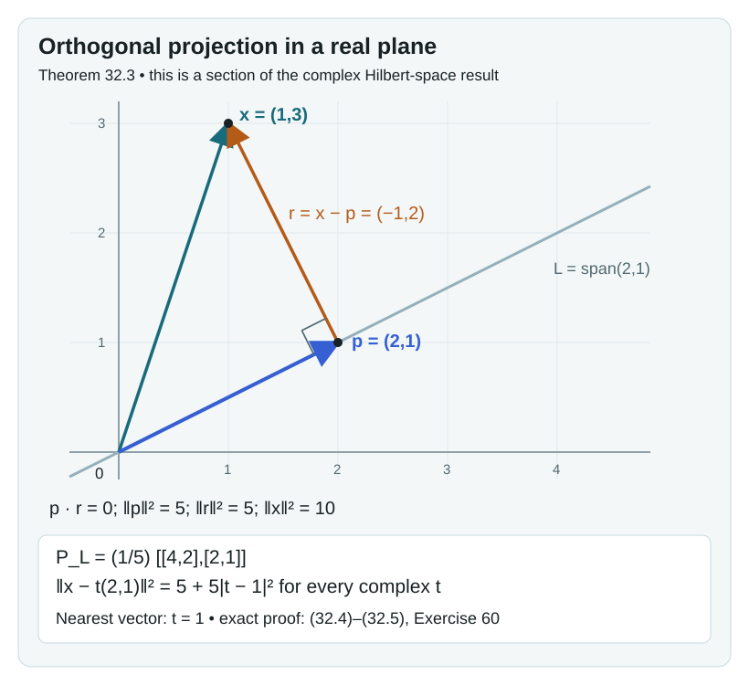
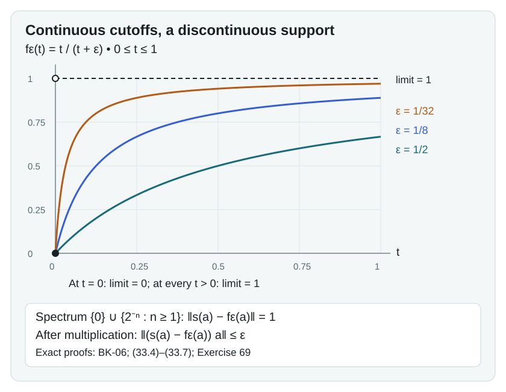
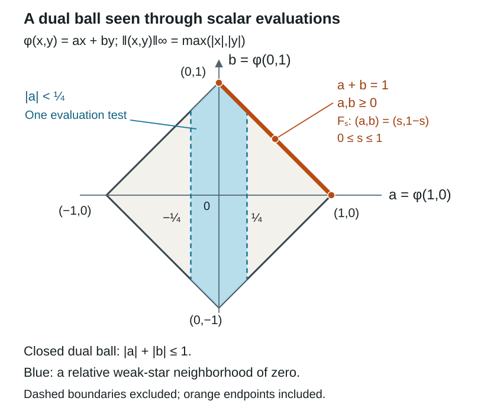
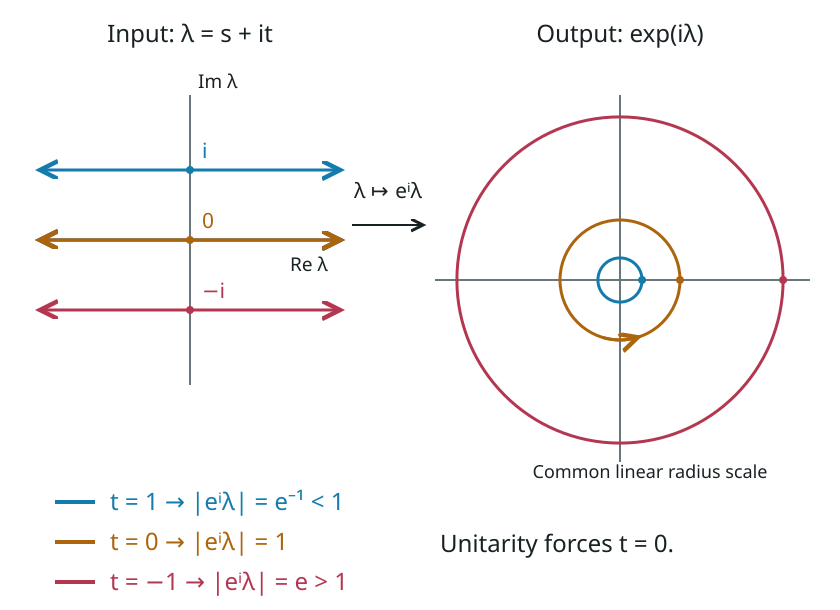
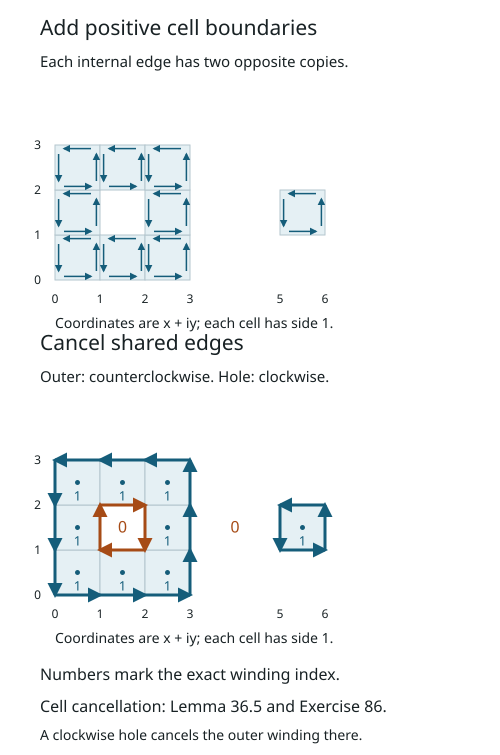

# Phase transition in the Bost–Connes system

The partition function of a quantum system is a weighted count of its energy levels. If the energy of the integer \(k\ge1\) is \(\log k\), the weights are \(k^{-\beta}\), and the partition function becomes the Riemann zeta function. This explains one side of the Bost–Connes phase transition. More work is needed to classify all equilibrium states: a convergent trace produces examples, but does not by itself prove that every state has that form.

We classify equilibrium states on both sides of the threshold. Above \(\beta=1\), a measure decomposition isolates the invertible profinite integers, which label the extreme states. At \(0<\beta\le1\), finite-prime averages and the distribution of primes force a unique state. Sections 30–31 develop the additional ratio calculation needed for the high-temperature factors, with their general classification prerequisites stated explicitly.

The prerequisites are [The Bost–Connes Hecke algebra](the-bost-connes-hecke-algebra.md), the exact measure-theory lessons and diagonal-measure applications specified in [Section 0](#0-measures-on-the-diagonal), the elementary integral test, Taylor series of holomorphic functions as proved in Section 36, and the written cyclotomic-field and profinite Galois results bound in [Corollary 6.2 of the Hecke lesson](the-bost-connes-hecke-algebra.md#6-arithmetic-symmetries) for the identification with field embeddings. We use Haar measure on locally compact groups, Theorem 2.2, for positive functionals and their Radon measures, Proposition 3.1(4) for continuous-function density, and Theorems 8.3 and 9.2 for normalized Haar probability on compact groups. We also use Example 10.2 of [Analytic elements and strip arguments](https://kokunoyumeto.github.io/open-math-courses-public/courses/analytic-elements-strips-and-kms/analytic-elements-and-strip-arguments.html), with the exact rescaling below. Basic references are [Bost–Connes], [Connes–Marcolli] and [Neshveyev]. The arithmetic classifications use positive inverse temperatures; Sections 17 and 22 also state the zero-temperature-parameter trace convention explicitly.

*Written by GPT-6.1 Sol (OpenAI), September 2026, with Ultra reasoning effort; Exercise 12B by Claude Opus 5.5 (Anthropic). Self-checked by the writing AI. Original text: CC0.*

Sections 13–15 additionally use the GNS construction, closed antilinear operator adjoints and polar decomposition, spectral calculus, bounded Kaplansky density and faithful restriction of a von Neumann algebra. The exact Stone and modular commutant results are named at their applications. The module induction, C*-KMS graph argument and orbit-count domain comparison are proved here.

The Hilbert-space prerequisites used by the weight constructions have a proof in [Section 32](#32-the-hilbert-space-foundations-of-the-weight-constructions). It includes arbitrary-dimensional completion, orthogonal projection, Riesz representation, bounded forms and adjoints, and positive-form quotient completion. The separate continuous-calculus, measure, compactness and modular prerequisites remain as stated at their applications.

[Section 37](#37-normal-functionals-and-finite-orbit-averages) constructs the bounded normal observations and finite orbit averages. [Section 38](#38-normal-weights-and-finite-observations) gives the full normal-weight characterization, arbitrary sums, the positive-map normality criterion and the GNS graph for arbitrary nets through exact earlier programme proofs. [Section 39](#39-spectral-domains-and-limits-of-energy-forms) retains the domains in measurable spectral calculus and proves the closed-form and arbitrary-net resolvent routes through their full earlier programme proofs. [Section 40](#40-positive-energies-and-their-weights) constructs the full extended positive cone and the extension of every normal weight, with exact positive vector series and infinite values. [Section 41](#41-finite-vectors-of-a-semifinite-weight) proves finite GNS approximation, exact dominated implementing vectors and closability of the finite-star adjoint for faithful normal semifinite weights. [Section 42](#42-recovering-a-weight-from-multiplication) constructs the full multiplication algebra and recovers its faithful normal semifinite weight, with exact graph, polar and spectral domains. [Section 43](#43-the-modular-group-and-entire-vectors) proves the ordinary modular commutant and invariance theorem, constructs the entire analytic algebra, and proves its converse and completeness. [Section 44](#44-approximating-the-original-multiplication-algebra) returns to the original core with exact multiplier bounds and proves the central-domain identities. [Section 45](#45-the-kms-boundary-condition-determines-the-modular-group) constructs the finite-domain KMS strip functions and proves that they determine the modular group.

[Section 46](#46-operator-valued-weights-and-finite-approximations) proves the finite calculus, normal extension, full extended range and composition of operator-valued weights. [Section 47](#47-centralizers-and-affiliated-changes-of-density) constructs affiliated density weights and computes their supported modular groups with full finite domains. [Section 48](#48-a-unitary-clock-determines-its-affiliated-density) recovers the unique positive affiliated density of a specified unitary clock. Each section has three exercises with complete solutions.

## 0. Measures on the diagonal

The diagonal algebra is an algebra of continuous functions. Its states are measures, and multiplication by an integer moves those measures between clopen subsets. We first specify the measure theory used in this passage and prove the consequences needed for equilibrium states.

### The measure foundations

The programme course *Measure theory* has a concrete 63-lesson plan: the English edition of Fremlin's first two volumes, with full proofs, remarks and exercises. It is planned and undispatched; its writer is not yet assigned. The following are its precise prerequisite lessons for this course. A planned lesson is not a claim that its English programme proof has already been delivered.

| Lesson and proof locator | Required statement and conditions | Use here |
| --- | --- | --- |
| *σ-algebras* (§111), *Measure spaces* (§112, especially 112C), *Measurable functions* (§121), and *Definition of the integral* (§122) | Countable additivity, measurable limits, the simple-function integral and its extension. For increasing measurable sets, measure is continuous from below; for decreasing sets, continuity from above requires one set of finite measure. | Restrictions, countable mixtures, finite-prime intersections and measurable representatives. |
| *Outer measures and Carathéodory's construction* (§113, Theorem 113C) | For any outer measure on any set, the sets satisfying the splitting criterion form a σ-algebra, and the outer measure restricted to it is countably additive. No σ-finiteness is assumed. | The outer-measure construction in the written Riesz theorem. |
| *The convergence theorems* (§123, 123A–C), *Wider concepts of integration* (§133, 133A and 133D–G), and *The extended real line* (§135, 135F–G) | Monotone convergence, Fatou's lemma and dominated convergence on an arbitrary measure space; 135F–G supply the nonnegative extended-valued versions, with possibly infinite integrals. For dominated convergence, the dominating function is integrable. Complex integrals are defined through real and imaginary parts. | Euler products, positive series of measures, change of variables, and limits in scalar spectral integrals. |
| *The Monotone Class Theorem* (§136, 136A–C) | A Dynkin class containing a family closed under finite intersections contains its generated σ-algebra. Two finite measures of equal total mass agreeing on such a family agree on that σ-algebra. | Equality of probabilities from finite residue cylinders. |
| *Countably additive functionals* (§231, 231E–F) and *The Radon–Nikodým theorem* (§232, 232B and 232E–F) | Hahn decomposition and the integral representation of a finite real signed measure absolutely continuous with respect to a σ-finite positive measure. Our application has two finite positive measures and a bound \(\nu\leq C\mu\). | The bounded density in the uniqueness proof at positive inverse temperature. |
| *L¹* (§242), *L^∞* (§243), and *L^p* (§244, 244E–G and 244P) | Hölder's inequality and completeness of the real and complex \(L^p\) spaces on arbitrary measure spaces, including \(p=1,\infty\); \(L^2\) has inner product \(\int f\overline g\,d\mu\). | Hilbert-space averaging and graph integrals. |
| *The strong law of large numbers* (§273, Lemma 273A only) | On any measure space, \(\sum_j\mu(E_j)<\infty\) implies that almost every point belongs to only finitely many \(E_j\). Independence is unnecessary. | Finite prime occupation when \(\beta>1\). |

These locators refer to D. H. Fremlin, *Measure Theory*, Volume 1, 2011 printing, and Volume 2, 2016 printing. The original English source files are retained in [the programme's Fremlin repository](https://github.com/KokunoYumeto/fremlin-measure-theory-id/tree/1cb0f67dcc75a5100e3aa3ca4f9b8f3fb8fb25cc/authority/fremlin/source). Their proofs and wording retain the [Design Science License](https://github.com/KokunoYumeto/fremlin-measure-theory-id/blob/1cb0f67dcc75a5100e3aa3ca4f9b8f3fb8fb25cc/authority/fremlin/dsl.txt). The independently written applications below are CC0. We use the exact planned programme lessons above as prerequisites; the source link identifies their open source text and does not assert that those lessons have been published.

The topological cutoff input already has a written programme proof: The Stone–Weierstrass theorem for functions vanishing at infinity, Proposition 4.2 and Corollary 5.2. For an arbitrary locally compact Hausdorff space, compact \(K\subset U\) with \(U\) open admits \(h\in C_c(X)\), \(0\le h\le1\), equal to one on \(K\), with support inside \(U\). Indeed Corollary 5.2's proof first chooses a compact neighborhood inside \(U\), and its function is supported there. This supplies exactly the cutoff used in the written Haar lesson's Riesz proof; no metrizability or σ-compactness is imposed on that general theorem.

Two details help when following the selected Fremlin proofs. In 232E(c), the chosen simple functions \(f_j\) need not increase; their running maxima \(g_j=\max_{k\le j}f_k\) do. The direct monotone limit is

\[
\int_E f\,d\mu=\lim_j\int_E g_j\,d\mu\le\nu(E).
\]

The stored proof's limit with \(f_j\) is also valid: \(0\le f-f_j\) and \(\int(f-f_j)\to0\) imply \(0\le\int_E(f-f_j)\le\int(f-f_j)\to0\). In 244G, for \(1<p<\infty\), a sequence with \(\|u_{j+1}-u_j\|_p\le4^{-j}\) instead has the valid tail estimate

\[
\|u-u_m\|_p^p
\le\liminf_n\|u_n-u_m\|_p^p
\le\left(\sum_{j=m}^{\infty}4^{-j}\right)^p,
\qquad
\|u-u_m\|_p\le\frac43\,4^{-m}.
\tag{0.1}
\]

Use this triangle-inequality estimate in place of the sum of \(p\)-th powers displayed in the stored 244G proof. The latter bound fails even for two positive scalar increments and \(p=2\). Fatou's lemma gives the first inequality, the triangle inequality gives the second, and the geometric series gives convergence. An arbitrary Cauchy sequence has a subsequence with the indicated successive differences; convergence of that subsequence and the Cauchy property give convergence of the whole sequence. This correction applies to the real proof and its complex version in 244P. It leaves the completeness theorem unchanged.

### Probabilities, states and compactness

**Proposition 0.1 (The compact diagonal).** Let \(X\) be a nonempty compact metrizable space. Every finite Borel measure on \(X\) is inner regular by compact sets and outer regular by open sets. Integration gives an affine bijection

\[
\mathcal P(X)\longleftrightarrow
\{L\in C(X)^*:L\text{ is positive},\ L(1)=1\},
\qquad L(f)=\int_X f\,d\mu.
\tag{0.2}
\]

This is a homeomorphism when probabilities carry the topology of their integrals against continuous functions and the functionals carry \(\sigma(C(X)^*,C(X))\). These spaces are compact Hausdorff. The extreme probabilities are exactly the point masses.

**Proof.** We first justify regularity for a Borel measure \(\mu\) with \(\mu(X)<\infty\). Fix a compatible metric \(d\). For a nonempty closed \(F\), the open sets \(U_j=\{x:d(x,F)<1/j\}\) decrease to \(F\). Continuity from above, with \(\mu(U_1)<\infty\), gives \(\mu(U_j\setminus F)\to0\). The empty closed set needs no approximation.

Let \(\mathcal R\) be the Borel sets \(E\) such that, for every \(\varepsilon>0\), there are closed \(F\subset E\) and open \(U\supset E\) with \(\mu(U\setminus F)<\varepsilon\). The preceding paragraph puts every closed set in \(\mathcal R\). If \(F\subset E\subset U\) is such an approximation, then \(X\setminus U\subset X\setminus E\subset X\setminus F\) is one with the same error; hence \(\mathcal R\) is closed under complements.

For \(E=\bigcup_{j\ge1}E_j\), \(E_j\in\mathcal R\), choose open \(U_j\supset E_j\) with \(\mu(U_j\setminus E_j)<\varepsilon2^{-j-2}\). Then \(U=\bigcup_jU_j\) is open and \(\mu(U\setminus E)<\varepsilon/4\). By continuity from below, choose \(N\ge1\) with \(\mu(E\setminus\bigcup_{j\le N}E_j)<\varepsilon/4\). Choose closed \(F_j\subset E_j\), \(j\le N\), with \(\mu(E_j\setminus F_j)<\varepsilon/(4N)\). The closed set \(F=\bigcup_{j\le N}F_j\) lies in \(E\) and satisfies \(\mu(E\setminus F)<\varepsilon/2\). Thus \(\mu(U\setminus F)<\varepsilon\). So \(\mathcal R\) is a σ-algebra containing the closed sets, and contains every Borel set. Closed sets in \(X\) are compact, proving both regularities.

Integration against a probability is positive and normalized. Conversely, Theorem 2.2 of Haar measure on locally compact groups represents a positive functional by a unique Radon measure. Here \(C_c(X)=C(X)\), and evaluation on \(1\) gives total mass one. The cutoff and outer-measure prerequisites for that written proof were specified above. Regularity from the first part ensures that this uniqueness covers every Borel probability in (0.2), not just measures assumed regular at the outset. Affinity follows from linearity of integration, and the two topologies in the statement have precisely the same defining scalar tests.

A positive normalized functional has norm one. It maps real functions to real numbers, since a real function is a difference of nonnegative functions. For any complex \(f\), choose \(\theta\) with \(e^{-i\theta}L(f)=|L(f)|\); then

\[
|L(f)|=L(\operatorname{Re}(e^{-i\theta}f))
\le\|f\|_\infty L(1)=\|f\|_\infty.
\]

The unit function attains this bound. The conditions \(L(1)=1\) and \(L(f)\in[0,\infty)\) for each real nonnegative \(f\) are weak-star closed scalar conditions. Consequently these functionals form a closed subset of the compact dual unit ball from [34.4](#34-scalar-tests-and-compactness-for-the-weight-foundations), hence are compact. Distinct functionals are separated by their value on some \(f\), giving the Hausdorff property.

Finally the support of a probability is nonempty: otherwise each point has a null open neighborhood, and a finite subcover of compact \(X\) would have total measure zero. If \(x\) belongs to the support and \(\mu\ne\delta_x\), then \(\mu(X\setminus\{x\})>0\). Inner regularity supplies compact \(K\subset X\setminus\{x\}\) of positive mass. There is an open neighborhood \(V\) of \(x\) disjoint from \(K\), so

\[
0<\mu(V)\le1-\mu(K)<1.
\]

The normalized restrictions to \(V\) and its complement are distinct probabilities whose nontrivial convex combination is \(\mu\). Thus \(\mu\) is not extreme. A convex decomposition of \(\delta_x\) forces each summand to have zero mass on \(X\setminus\{x\}\), so both are \(\delta_x\). \(\square\)

### Scaling and densities

**Lemma 0.2 (Changing variables in a scaling measure).** Let \(X\) be compact metrizable and let \(T:X\to Y\subset X\) be a homeomorphism onto a clopen subset. Suppose that a probability \(\mu\) satisfies

\[
\mu(TE)=c\mu(E)\qquad(E\subset X\text{ Borel}),\quad c>0.
\tag{0.3}
\]

Then, for every nonnegative Borel \(g\), and also for every integrable complex \(g\),

\[
\int_{TE}g\,d\mu=c\int_E g(Tx)\,d\mu(x).
\tag{0.4}
\]

If \(\nu\) is a probability with \(\nu\le C\mu\) for some \(0<C<\infty\), its finite-measure Radon–Nikodym derivative has a Borel representative \(f\) with \(0\le f\le C\), and

\[
\nu(TE)=c\nu(E)\text{ for all Borel }E
\quad\Longleftrightarrow\quad f\circ T=f\text{ almost everywhere}.
\tag{0.5}
\]

**Proof.** The set \(TE\) is Borel, since \(T\) is a homeomorphism onto the Borel subspace \(Y\). Equation (0.3) says exactly that \(T_*(c\mu)=\mu|_Y\). The pushforward integral identity follows first for indicators, then finite nonnegative simple functions, then nonnegative Borel functions by monotone convergence. Apply it to \(1_{TE}g\). Splitting real and imaginary parts gives (0.4) in the integrable complex case; applying the nonnegative identity to \(|g|\) verifies the needed integrability on the right.

The reference measure \(\mu\) is finite and hence σ-finite. The finite measure \(\nu\) vanishes on every \(\mu\)-null set, so the exact Radon–Nikodym prerequisite in the table applies. In Fremlin's stronger terminology, \(\nu\le C\mu\) also gives absolute continuity immediately from \(\nu(E)\le C\mu(E)\), and finiteness of \(\mu\) gives true continuity. The construction in 232E uses measurable simple functions and their limits. Replace any infinite values of those limits on their measurable null sets by zero; this gives a Borel representative of the derivative. It is nonnegative almost everywhere, because integrating it over \(\{f<-1/j\}\) would otherwise give a negative value for a positive measure. Integrating over \(\{f>C+1/j\}\) proves \(f\le C\) almost everywhere. Taking the union of these exceptional Borel sets and replacing the values there by zero gives the stated representative. Its integral is one.

The composition does not depend on this null-set choice: if \(\mu(N)=0\), then (0.3) applied to \(T^{-1}(N\cap Y)\) gives \(\mu(T^{-1}N)=0\). Now (0.4) gives

\[
\nu(TE)=c\int_E f(Tx)\,d\mu(x),\qquad
c\nu(E)=c\int_E f(x)\,d\mu(x).
\]

If the measures scale equally, the integral of the real bounded difference \(f\circ T-f\) is zero on every Borel set. Its positive and negative level sets \(\{f\circ T-f>1/j\}\) and \(\{f-f\circ T>1/j\}\) therefore have measure zero. This proves equality almost everywhere. The reverse implication follows from the same integral identity. \(\square\)

For \(X=R=\widehat{\mathbb Z}\), the map \(T_nx=nx\) is a homeomorphism onto the clopen set \(nR\), by [Section 7 of the Hecke lesson](the-bost-connes-hecke-algebra.md#7-the-adelic-realization-of-the-symmetry). The lemma applies with \(c=n^{-\beta}\). A convex decomposition \(m=t\nu+(1-t)\nu'\), \(0<t<1\), gives \(\nu\le t^{-1}m\). Thus its density lies in \(L^2(R,m)\) and is fixed by every \(T_n\) whenever both measures scale. This is the precise input to the ergodicity argument in [Section 10](#10-uniqueness-without-a-factor-assumption). There are countably many integers, so the exceptional null sets for these equalities can be united into one null set.

### Finite residues determine a probability

**Corollary 0.3 (Reading a measure from congruences).** A Borel probability on \(R\) is determined by the masses

\[
C_{N,a}=\{x\in R: x\bmod N=a\},
\qquad N\ge1,\quad a\in\mathbb Z/N\mathbb Z.
\tag{0.6}
\]

**Proof.** Enumerate the primes as \(p_1,p_2,\ldots\). The product identification in the Hecke lesson gives a compatible metric

\[
d(x,y)=\sum_{j\ge1}2^{-j}|x_{p_j}-y_{p_j}|_{p_j}.
\tag{0.7}
\]

Each summand is at most \(2^{-j}\); the finite head and the uniformly small tail show that this metric induces precisely the product topology. The space \(R\) is compact by that lesson's completion/congruence and profinite proofs. The congruence sets in (0.6) form a countable clopen basis, using the finite Chinese remainder theorem. Finite intersections are either empty or another such congruence set, with modulus the least common multiple.

Every \(h\in C(R)\) can be uniformly approximated by a function constant on the residue classes for one modulus. To see this, choose at each point a congruence neighborhood on which \(h\) differs from its value at that point by less than \(\varepsilon/2\). A finite subcover exists; the partition for the least common multiple of its moduli refines the cover. The oscillation on each part is less than \(\varepsilon\), and choosing one value on each part gives the approximation. Measures agreeing on (0.6) therefore give equal integrals for these step functions, then for every continuous \(h\). Proposition 0.1 gives equality of the Borel measures. Alternatively, the exact finite-measure uniqueness statement 136C applies directly to this intersection-closed basis and the empty set. \(\square\)

The unit space \(W\) is closed in \(R\): it is the intersection of the inverse images of the clopen sets \(\mathbb Z_p^\times\). It is therefore also compact metrizable. Proposition 0.1 applies both to the diagonal measures on \(R\) and to the probability measures on \(W\) parametrizing low-temperature phases. Finite products of their measures use the written Haar lesson's Lemma 4.1 and Propositions 4.2–4.4. The countable prime product required here is constructed in Proposition 7.1 below from those finite products and the Riesz theorem; it does not require an unspecified infinite-product theorem.

### Practice on diagonal measures

**Exercise 0.1 (Why both marginals are insufficient, 6 points).** On \(R\), let \(\mu=\frac16\sum_{a=0}^5\delta_a\). Find another probability supported on these six ordinary integers with the same distributions modulo two and three, but a different distribution modulo six. Explain why this does not contradict Corollary 0.3.

*Solution.* Give the residues \(0,1,2,3,4,5\) the weights

\[
\left(\frac14,\frac14,\frac16,\frac1{12},\frac1{12},\frac16\right).
\]

They are nonnegative and sum to one. The sums over the even and odd residues are both \(1/2\). The sums for residues \(0,1,2\) modulo three are respectively \(1/4+1/12\), \(1/4+1/12\) and \(1/6+1/6\), all \(1/3\). But the mass of \(C_{6,0}\) is \(1/4\), whereas \(\mu(C_{6,0})=1/6\). Corollary 0.3 requires agreement at every modulus, including the joint modulus six; separate one-coordinate distributions do not supply that joint distribution. Award 3 points for the weights, 2 for checking the marginals, and 1 for the distinction.

**Exercise 0.2 (Domination, invariance and ergodicity, 7 points).** On \(X=\mathbb Z/6\mathbb Z\), let \(\mu\) be uniform and \(T(a)=5a\). Set \(f=3\,1_{\{0,1\}}\) and \(g=3\,1_{\{1,5\}}\). Check that \(f\mu\) and \(g\mu\) are probabilities dominated by \(3\mu\). Which is \(T\)-invariant? Explain the two distinct hypotheses needed to conclude that a dominated probability equals \(\mu\).

*Solution.* Each support has two points, so each density integrates to \(3(2/6)=1\), and both densities lie between zero and three. Multiplication by five permutes the six residues, so \(T_*\mu=\mu\) and Lemma 0.2 has \(c=1\). The measure \(f\mu\) gives mass \(1/2\) to \(\{1\}\) but zero to its image \(\{5\}\), and is not invariant. Equivalently, \(f(T1)=f(5)=0\ne f(1)\). The set \(\{1,5\}\) is a \(T\)-orbit, so \(g\circ T=g\) and \(g\mu\) is invariant. It still differs from \(\mu\). To conclude equality, first invariance of the dominated measure must make its density invariant; then ergodicity must force invariant densities to be constant. This finite transformation is not ergodic, since \(\{1,5\}\) has mass \(1/3\) and is invariant. In the arithmetic uniqueness proof both properties are supplied, and total mass one fixes the constant. Award 2 points for normalization and domination, 2 for each invariance calculation, and 1 for ergodicity's role.

**Exercise 0.3 (A prime cutoff with an error bound, 7 points).** Suppose a probability \(m\) on \(R\) satisfies \(m(pR)=p^{-2}\) for every prime. For an integer \(P\ge1\), bound the probability that some prime \(p>P\) divides \(x\). What error bound does \(P=100\) give? Do the given prime marginals also force each valuation to be finite? Explain why divergence of a sum of event probabilities, without an independence hypothesis, does not give the converse almost-sure conclusion.

*Solution.* Countable subadditivity and the elementary integral test give

\[
m\!\left(\bigcup_{p>P}pR\right)
\le\sum_{p>P}p^{-2}
\le\sum_{k=P+1}^{\infty}k^{-2}
\le\int_P^{\infty}t^{-2}\,dt=\frac1P.
\tag{0.8}
\]

Thus with probability at least \(0.99\), every prime divisor of \(x\) is at most 100. The event of infinitely many prime divisors lies in each of these tail unions, whose bounds tend to zero. This is exactly the summable-event consequence of Lemma 273A used in Section 2; it uses no independence.

The prime marginals alone do not force finite valuations. Let \(z^{(p)}\in R\) have \(p\)-component zero and every other prime component one. Since

\[
s=\sum_p p^{-2}\le\sum_{k=2}^{\infty}k^{-2}
\le\frac14+\int_2^{\infty}t^{-2}\,dt=\frac34<1,
\]

the measure \(\sum_p p^{-2}\delta_{z^{(p)}}+(1-s)\delta_1\) is a probability with the prescribed prime marginals. Its \(p\)-adic valuation is infinite at \(z^{(p)}\), which has mass \(p^{-2}>0\). In Section 2 the full scaling law supplies the stronger identities \(m(p^kR)=p^{-2k}\to0\); those additional identities exclude infinite valuations.

For a converse counterexample, take a two-point probability space with both masses \(1/2\), and repeat the same singleton as \(E_j\) for every \(j\). Then \(\sum_jm(E_j)=\infty\), but the event of infinitely many occurrences is that singleton and has probability \(1/2\), rather than one. In the canonical arithmetic product one has extra independence; divergence alone is not that hypothesis. Award 3 points for the bound, 1 for the numerical probability, 1 for separating prime occupation from valuation finiteness, and 2 for the counterexample.

## 1. Equilibrium as a scaling law

Let \(A\) be the Hecke C*-algebra, \(D=C(\widehat{\mathbb Z})\) its diagonal, and

\[
\alpha_t(\mu_n)=n^{it}\mu_n,\qquad\alpha_t(e(r))=e(r).
\]

We use the physical KMS convention (2.3) of *The Bost–Connes Hecke algebra*. Write \(\mu_nf\mu_n^*=\rho_n(f)\) for \(f\in D\). On the profinite integers this map is

\[
\rho_n(f)(z)=
\begin{cases}f(z/n),&z\in n\widehat{\mathbb Z},\\0,&z\notin n\widehat{\mathbb Z}.\end{cases}
\tag{1.1}
\]

Multiplication by \(n\) is injective on \(\widehat{\mathbb Z}\). For example, this follows from \(\widehat{\mathbb Z}=\prod_p\mathbb Z_p\) and the absence of additive torsion in each \(\mathbb Z_p\). Formula (1.1) follows first for characters by the root-averaging relation, then for every continuous function by uniform approximation.

**Lemma 1.1 (A necessary scaling condition).** A KMS state \(\omega\) at \(\beta>0\) is determined by its restriction to \(D\). If \(m\) is the probability measure representing that restriction, then for every Borel subset \(E\subset\widehat{\mathbb Z}\),

\[
m(nE)=n^{-\beta}m(E).
\tag{1.2}
\]

Moreover, for \(f\in D\),

\[
\omega(\mu_nf\mu_m^*)=
\begin{cases}n^{-\beta}\omega(f),&n=m,\\0,&n\ne m.\end{cases}
\tag{1.3}
\]

**Proof.** KMS invariance, from the analytic criterion cited in the preceding lesson, forces the expectation of an eigenvector of nonzero frequency to vanish. The monomial \(\mu_nf\mu_m^*\) has frequency \(\log(n/m)\), giving the second case of (1.3). For \(n=m\), the analytic KMS identity gives

\[
\omega(\mu_nf\mu_n^*)
=\omega(f\mu_n^*\alpha_{i\beta}(\mu_n))
=n^{-\beta}\omega(f).
\]

The normal monomials have dense span, so these values determine the state. Formula (1.1) turns this equality into equality of finite measures on \(n\widehat{\mathbb Z}\): the pushforward of \(n^{-\beta}m\) under multiplication by \(n\) equals the restriction of \(m\) to that clopen set. Equality on continuous functions implies equality of their Borel measures, giving (1.2). \(\square\)

**Proposition 1.2 (The scaling condition is sufficient).** For every \(\beta>0\), scaling probability measures in (1.2) correspond affinely and bijectively to KMS states. The state belonging to \(m\) is

\[
\omega_m(a)=\int_{\widehat{\mathbb Z}}E(a)(z)\,dm(z),
\tag{1.4}
\]

where \(E: A\to D\) is the time-average expectation constructed in Proposition 5.2 of the preceding lesson.

**Proof.** Positivity and normalization follow because \(E\) is a positive unital map. For \(b=\mu_k f\mu_l^*\), \(f\in D\), it gives zero when \(k\ne l\); when \(k=l\), (1.1) and (1.2) give \(k^{-\beta}\int f\,dm\). Thus (1.3) holds.

We check the analytic identity with the first variable a generator and the second a normal monomial. For \(a=\mu_n\), both \(\omega_m(ab)\) and \(\omega_m(ba)\) vanish unless \(l=nk\), by their time frequency. In that case

\[
\omega_m(ab)=(nk)^{-\beta}\int f\,dm,\qquad
\omega_m(ba)=k^{-\beta}\int f\,dm.
\]

Here \(\mu_{nk}^*\mu_n=\mu_k^*\) gives the second equality. Since \(\alpha_{i\beta}(\mu_n)=n^{-\beta}\mu_n\), the required identity follows. For \(a=\mu_n^*\), the only possible nonzero case is \(k=nl\); the two values are \(l^{-\beta}\int f\,dm\) and \((nl)^{-\beta}\int f\,dm\), and \(\alpha_{i\beta}(\mu_n^*)=n^\beta\mu_n^*\). For \(a=e(s)\), the two values vanish unless \(k=l\); in that case the covariance relations give \(k^{-\beta}\int e(ks)f\,dm\) on both sides.

These identities extend by linearity and norm continuity in the second variable. If they hold for \(a_1,a_2\) and every second variable in the entire algebra, then

\[
\omega_m(a_1a_2b)
=\omega_m(a_2b\alpha_{i\beta}(a_1))
=\omega_m(b\alpha_{i\beta}(a_1)\alpha_{i\beta}(a_2)).
\]

Induction proves the identity for every word and hence for the dense entire *-algebra. The analytic KMS criterion from Theorem 10.3 of the cited lesson applies. Lemma 1.1 proves uniqueness and the inverse correspondence. \(\square\)

## 2. Extracting an invertible part

For \(z\in\widehat{\mathbb Z}\), let \(v_p(z)\in\{0,1,\ldots,\infty\}\) be its valuation in the \(p\)-adic component. Then \(p^k\mid z\) means \(v_p(z)\ge k\). Write

\[
W=\widehat{\mathbb Z}^{\times}
=\{z:v_p(z)=0\text{ for every prime }p\}.
\]

**Lemma 2.1 (The low-temperature measure decomposition).** If \(\beta>1\) and \(m\) satisfies (1.2), then \(m(W)=\zeta(\beta)^{-1}\). There is a unique probability measure \(\nu\) on \(W\) such that

\[
m=\frac1{\zeta(\beta)}\sum_{n=1}^{\infty}n^{-\beta}(u\mapsto nu)_*\nu.
\tag{2.1}
\]

**Proof.** For a finite set \(F\) of primes, inclusion–exclusion and (1.2) with \(E=\widehat{\mathbb Z}\) give

\[
m\left(\bigcap_{p\in F}(\widehat{\mathbb Z}\setminus p\widehat{\mathbb Z})\right)
=\prod_{p\in F}(1-p^{-\beta}).
\tag{2.2}
\]

For completeness, the Euler product follows by expanding finite geometric products:

\[
\prod_{p\in F}(1-p^{-\beta})^{-1}
=\sum_{\substack{n\ge1\\\text{all prime divisors of }n\text{ in }F}}n^{-\beta}.
\]

As finite prime sets increase, each positive integer eventually appears. Monotone convergence gives \(\prod_p(1-p^{-\beta})^{-1}=\sum_n n^{-\beta}=\zeta(\beta)\), finite for \(\beta>1\) by the integral test. Continuity from above in (2.2) proves the asserted mass of \(W\).

Also \(m(p^k\widehat{\mathbb Z})=p^{-k\beta}\to0\), so every \(p\)-adic valuation is finite almost surely. Since \(\sum_p m(p\widehat{\mathbb Z})=\sum_p p^{-\beta}<\infty\), Borel–Cantelli says that only finitely many primes divide \(z\) almost surely. For such \(z\), set \(n=\prod_p p^{v_p(z)}\). Then \(u=z/n\) is in \(W\). Uniqueness of the valuations makes the sets \(nW\) pairwise disjoint, and their union has full measure.

Define \(\nu=\zeta(\beta)m|_W\), a probability measure. For Borel \(E\subset W\), (1.2) gives \(m(nE)=n^{-\beta}m(E)\). Summing over the disjoint sets \(nW\) proves (2.1). The restriction to \(W\) proves uniqueness. \(\square\)

The convergence threshold has an exact role here. At \(0<\beta\le1\), formula (2.2) still makes sense, but \(m(W)=0\). Normalizing the restriction to \(W\) would then divide by zero. Thus this proof route does not classify the high-temperature states.

## 3. The Gibbs representations

For \(u\in W\), write \(\chi_r(u)=\exp(2\pi i a(u\bmod N)/N)\) if \(r=a/N\). On \(\ell^2(\mathbb N_{>0})\), define

\[
\pi_u(e(r))\delta_k=\chi_r(u)^k\delta_k,\qquad
\pi_u(\mu_n)\delta_k=\delta_{nk}.
\tag{3.1}
\]

**Proposition 3.1.** These formulas give a representation of \(A\). If \(K\delta_k=\log k\,\delta_k\), with domain

\[
D(K)=\left\{\xi:\sum_{k\ge1}(\log k)^2|\xi_k|^2<\infty\right\},
\]

then \(K\) is self-adjoint and

\[
\pi_u(\alpha_t(a))=e^{itK}\pi_u(a)e^{-itK}.
\tag{3.2}
\]

For \(\beta>1\),

\[
\omega_{\beta,u}(a)=\frac{\operatorname{Tr}(e^{-\beta K}\pi_u(a))}{\zeta(\beta)}
\tag{3.3}
\]

is a KMS state.

**Proof.** The dilation operators are isometries, multiply by the semigroup law, and doubly commute when their indices are coprime: both sides of the latter relation carry \(\delta_k\) to \(\delta_{nk/m}\) exactly when \(m\mid k\). The character operators are unitaries with the group law. Their covariance follows from \(\chi_r(u)^{nk}=\chi_{nr}(u)^k\).

For the averaging relation, \(\pi_u(\mu_ne(r)\mu_n^*)\) vanishes on \(\delta_k\) unless \(n\mid k\), and otherwise has value \(\chi_r(u)^{k/n}\). On the other side, sum the characters of the \(n\) solutions of \(ns=r\). Multiplication by the invertible \(u\) permutes the \(n\)-torsion characters, so their sum is zero unless \(n\mid k\), and then gives \(n\chi_r(u)^{k/n}\). This proves all relations, and the preceding lesson's universal-norm theorem gives the representation of \(A\).

The real diagonal multiplication operator \(K\) is self-adjoint on the stated maximal domain: testing the adjoint against each basis vector recovers the same diagonal coefficients and the same square-summability condition. Equation (3.2) holds on every generator, hence by continuity on \(A\). The positive density has trace \(\sum_k k^{-\beta}=\zeta(\beta)\), so (3.3) is a state.

Example 10.2 of *Analytic elements and strip arguments* proves the bounded strip condition for an injective trace-class density \(h\), with modular evolution \(\operatorname{Ad}h^{it}\). Here \(h=e^{-\beta K}/\zeta(\beta)\), so that evolution is \(\operatorname{Ad}e^{-i\beta tK}\). The scalar normalizing factor cancels in conjugation. Reversing time and rescaling the strip, exactly as in (2.3)–(2.4) of the preceding lesson, gives the physical KMS condition for \(\operatorname{Ad}e^{itK}\). Restricting it through (3.2) proves the claim. \(\square\)

**Proposition 3.2 (Rational arithmetic and Galois symmetry).** Let \(A_{\mathbb Q}\) be the unital *-algebra over \(\mathbb Q\) generated by the \(e(r),\mu_n\). If \(\sigma_u\) is the cyclotomic automorphism associated to \(u\in W\), then every matrix coefficient of \(\pi_1(x)\), \(x\in A_{\mathbb Q}\), belongs to \(\mathbb Q^{\mathrm{cycl}}\), and

\[
\langle\pi_u(x)\delta_k,\delta_l\rangle
=\sigma_u\!\left(\langle\pi_1(x)\delta_k,\delta_l\rangle\right).
\tag{3.4}
\]

**Proof.** A word in the generators and their adjoints sends each basis vector either to zero or to a scalar multiple of one basis vector. That scalar is a finite product of roots of unity. Formula (3.1) replaces each root by its image under \(\sigma_u\), while leaving the dilation and divisibility conditions unchanged. Cyclotomic automorphisms commute with complex conjugation because they act by compatible power maps on roots of unity. Thus the same assertion holds for adjoints. Taking finite sums with rational coefficients proves (3.4). No automorphism of the whole complex field is needed. \(\square\)

## 4. All low-temperature states

**Theorem 4.1 (Classification for \(\beta>1\)).** Probability measures \(\nu\) on \(W\) correspond affinely and bijectively to KMS states through

\[
\omega_{\beta,\nu}(a)=\int_W\omega_{\beta,u}(a)\,d\nu(u).
\tag{4.1}
\]

Their extreme points are \(\omega_{\beta,u}\), \(u\in W\). On the diagonal generators,

\[
\omega_{\beta,u}(e(r))=\zeta(\beta)^{-1}
\sum_{k=1}^{\infty}k^{-\beta}\chi_r(u)^k.
\tag{4.2}
\]

The group \(W\) acts freely and transitively on these extreme states by composition with the arithmetic symmetry:

\[
\omega_{\beta,u}\circ\theta_v=\omega_{\beta,uv}.
\tag{4.3}
\]

**Proof.** Formula (4.2) follows from the diagonal trace. The series is uniformly convergent in \(u\), so the state value is continuous on each \(e(r)\). Formula (1.3), or direct trace computation, gives continuity on every normal monomial. Approximation and the state norm bound give continuity for every \(a\in A\), which makes (4.1) well-defined. It is positive and normalized. The analytic KMS identities hold under the integral on the dense entire algebra, and the analytic criterion makes (4.1) KMS.

The diagonal measure of (3.3) is \(\zeta(\beta)^{-1}\sum_k k^{-\beta}\delta_{ku}\). Its mixture is exactly (2.1). Conversely Lemmas 1.1 and 2.1 show that any KMS state has this diagonal measure for a unique \(\nu\), and that its diagonal restriction determines all its values. This proves surjectivity and injectivity.

The map is also a homeomorphism for weak* topologies. Continuity follows from the continuity of \(u\mapsto\omega_{\beta,u}(a)\); [Proposition 0.1](#0-measures-on-the-diagonal) proves compactness of the probability-measure space on \(W\), and the state space is Hausdorff. The extreme probability measures on a compact space are exactly the point masses. Indeed a measure that is not a point mass has a Borel set with mass strictly between zero and one and splits into the two normalized restrictions. A point mass cannot have a nontrivial convex decomposition into probability measures. The affine bijection therefore gives the extreme-state assertion.

Every state has a unique representing probability measure on these extreme points, by the uniqueness of \(\nu\). They form a compact set, parametrized homeomorphically by \(W\). Thus the low-temperature KMS state space is a Bauer simplex, and in particular a Choquet simplex.

Equation (4.3) follows on the characters and dilations, hence on \(A\). Multiplication on \(W\) is free and transitive, and injectivity of the parametrization transfers these properties to the states. \(\square\)

The passage from invertible profinite integers to cyclotomic embeddings uses the written programme proofs in [Corollary 6.2 of the Hecke lesson](the-bost-connes-hecke-algebra.md#6-arithmetic-symmetries). Theorem 12.1 of *Cyclotomic fields* for \(\Phi_N\) identifies \(\operatorname{Gal}(\mathbb Q(\zeta_N)/\mathbb Q)\) with \((\mathbb Z/N\mathbb Z)^{\times}\), by \(\zeta_N\mapsto\zeta_N^u\). Compatibility as \(N\) varies identifies \(W\) with \(\operatorname{Gal}(\mathbb Q^{\mathrm{cycl}}/\mathbb Q)\), and with the embeddings of this field in \(\mathbb C\) after fixing its usual inclusion. With this identification, (4.2) is the cyclotomic formula for the extreme KMS states.

## 5. The type of a low-temperature phase

**Proposition 5.1.** For \(u\in W\), \(\pi_u(A)''=B(\ell^2(\mathbb N_{>0}))\). For \(\beta>1\), the GNS von Neumann algebra of \(\omega_{\beta,u}\) is a factor of type \(\mathrm I_\infty\).

**Proof.** Distinct positive integers have distinct images \(ku\) in \(\widehat{\mathbb Z}\), since \(u\) is invertible. More explicitly, for a fixed \(k\), the diagonal function which is the indicator of \(ku\) modulo \(N\) lies in \(D\). Its operator in (3.1) projects onto the indices \(l\) with \(l\equiv k\pmod N\). Let \(N=j!\) tend to infinity. These bounded diagonal projections converge strongly to the rank-one projection \(Q_k\) onto \(\delta_k\). Therefore \(Q_1\in\pi_u(A)''\), and

\[
\pi_u(\mu_k)Q_1\pi_u(\mu_l)^*
=|\delta_k\rangle\langle\delta_l|
\]

belongs to that algebra. All matrix units occur, so their strong closure is \(B(\ell^2)\).

To identify the GNS algebra, put \(h=e^{-\beta K}/\zeta(\beta)\). The map \(a\mapsto\pi_u(a)h^{1/2}\) identifies the GNS norm with the Hilbert–Schmidt norm, because

\[
\|\pi_u(a)h^{1/2}\|_2^2=\operatorname{Tr}(h\pi_u(a)^*\pi_u(a)).
\]

The factorial-cylinder approximations to \(Q_1\), multiplied on both sides by dilations, are uniformly bounded and converge strongly to each matrix unit. If \(x_j\to x\) strongly and are uniformly bounded, then \(\|(x_j-x)h^{1/2}\|_2\to0\): expand in the diagonal basis of \(h\), use pointwise vector convergence and dominate by a constant times the summable diagonal entries. Thus the GNS closure contains each matrix unit times \(h^{1/2}\). Their nonzero column weights imply that their span is dense in the Hilbert–Schmidt space. The GNS action is left multiplication.

The same bounded strong approximations converge strongly as left multiplication operators on Hilbert–Schmidt space, by first testing finite-rank operators and then using density. They generate the full left multiplication algebra \(L(B(\ell^2))\). Conversely this algebra is strongly closed: under the identification of Hilbert–Schmidt space with \(\ell^2\otimes\overline{\ell^2}\), it is \(B(\ell^2)\otimes1\), the commutant of \(1\otimes B(\overline{\ell^2})\). Hence the GNS von Neumann algebra is exactly this copy of \(B(\ell^2)\), a type \(\mathrm I_\infty\) factor. \(\square\)

## 6. Cooling a phase

For a fixed \(u\), the Gibbs weight on \(k=1\) is \(\zeta(\beta)^{-1}\), which tends to one as \(\beta\to\infty\). Indeed

\[
\sum_{k=2}^{\infty}k^{-\beta}
\le 2^{-\beta}+\int_2^{\infty}x^{-\beta}\,dx
=2^{-\beta}+\frac{2^{1-\beta}}{\beta-1}.
\]

Consequently \(\omega_{\beta,u}\) converges in state norm to the vector state

\[
\omega_{\infty,u}(a)=\langle\pi_u(a)\delta_1,\delta_1\rangle.
\]

The norm difference is at most \(2(1-\zeta(\beta)^{-1})\), by separating the first trace term from the remaining probability mass. In particular \(\omega_{\infty,u}(e(r))=\chi_r(u)\): cooling recovers the actual roots of unity. This proves a limit of these Gibbs states; it does not assert a classification of every ground state.

## 7. The canonical measure at every temperature

Put \(R=\widehat{\mathbb Z}=\prod_p\mathbb Z_p\). Let \(h_p\) be normalized multiplicative Haar probability on \(\mathbb Z_p^\times\). For \(\beta>0\), define a probability measure on \(\mathbb Z_p\) by

\[
m_{\beta,p}
=(1-p^{-\beta})\sum_{j=0}^{\infty}p^{-j\beta}
(u\mapsto p^ju)_*h_p.
\tag{7.1}
\]

Thus the valuation is geometric and, conditional on its value, the unit part is Haar distributed. The point zero has measure zero.

**Proposition 7.1.** The product probability \(m_\beta=\prod_pm_{\beta,p}\) exists, is invariant under multiplication by \(W\), and satisfies (1.2). It is the unique \(W\)-invariant scaling probability on \(R\).

**Proof.** For each finite set of primes, the finite product measures give consistent positive integrals on continuous functions of those coordinates. Their value on a function is bounded by its uniform norm. Such cylinder functions are uniformly dense in \(C(R)\): continuity on the compact product supplies, for each prescribed error, a finite-coordinate cover on which the oscillation is small, and a partition by finite residue classes refines that cover. Consequently the integrals extend to one positive normalized functional on \(C(R)\). The Riesz correspondence in [Proposition 0.1](#0-measures-on-the-diagonal), using the written Haar lesson, supplies its unique Borel probability measure. This also proves the finite-coordinate marginal identities; no assumption about an already constructed infinite product is needed.

Multiplication by a local unit preserves each summand in (7.1). Multiplication by \(p\) shifts the shell index and multiplies its weight by \(p^{-\beta}\). Hence

\[
m_{\beta,p}(pE)=p^{-\beta}m_{\beta,p}(E).
\]

For an integer \(n\), the \(p\)-component of multiplication by \(n\) is a unit times \(p^{v_p(n)}\). Applying these identities to finite-coordinate rectangles gives
\(m_\beta(nE)=n^{-\beta}m_\beta(E)\). Equality extends from their clopen indicators to continuous functions by uniform density, and then to Borel measures by Riesz uniqueness.

For uniqueness, a \(W\)-invariant measure projects on \(\mathbb Z/N\mathbb Z\) to a measure constant on each unit orbit. Those orbits are classified by \(\gcd(z,N)\), as proved in Section 6 of the preceding lesson. Their indicators are linear combinations of divisibility indicators. The scaling law fixes every divisibility mass to \(m(dR)=d^{-\beta}\). It therefore fixes every orbit mass, and invariance divides that mass equally among the residues in the orbit. All finite-quotient measures, and hence the measure on \(R\), are determined. \(\square\)

Proposition 1.2 now produces a KMS state \(\omega_\beta\) for every \(\beta>0\). At \(\beta>1\) it is the Haar mixture of the phases from Theorem 4.1.

**Proposition 7.2 (An explicit diagonal formula).** If \(r=a/b\ne0\) in lowest terms, \(b=\prod_{p\mid b}p^{k_p}\), then

\[
\omega_\beta(e(r))
=\prod_{p\mid b}p^{-k_p\beta}
\frac{1-p^{\beta-1}}{1-p^{-1}}.
\tag{7.2}
\]

Also \(\omega_\beta(e(0))=1\). At \(\beta=1\), \(m_1\) is additive Haar probability on \(R\), so \(\omega_1\) is the canonical Hecke state.

**Proof.** By the Chinese remainder theorem, the character of conductor \(b\) splits into local characters of conductors \(p^{k_p}\); each numerator is a local unit. On the shell \(p^j\mathbb Z_p^\times\), a character of conductor \(p^k\) has unit-Haar average zero for \(j<k-1\), value \(-1/(p-1)\) for \(j=k-1\), and value one for \(j\ge k\).

Indeed, at conductor \(p^l\), average the exponentials over residues prime to \(p\). For \(l\ge2\), the sum over all residues and the sum over multiples of \(p\) both vanish, so their difference vanishes. For \(l=1\), the complete sum is zero and the excluded zero residue contributes one, leaving sum \(-1\). At conductor one the character is constant.

Using (7.1), the local integral is therefore

\[
p^{-k\beta}
-\frac{(1-p^{-\beta})p^{-(k-1)\beta}}{p-1}
=p^{-k\beta}\frac{1-p^{\beta-1}}{1-p^{-1}}.
\]

Multiplying the local integrals proves (7.2). At \(\beta=1\), every nontrivial additive character has integral zero. Additive Haar probability has the same character integrals, so density of the characters identifies it with \(m_1\). Equation (1.3) and (6.3) of the preceding lesson then identify the states. \(\square\)

For example, at \(\beta=1/2\),

\[
\omega_{1/2}(e(1/2))=\sqrt2-1,\qquad
\omega_{1/2}(e(1/4))=1-\frac1{\sqrt2}.
\]

These are expectations in the unique state proved below, rather than Gibbs traces: \(\sum_k k^{-1/2}\) diverges.

## 8. Why enough primes change the averages

The needed number-theoretic statement concerns the total weight of primes, not just their number. We include its proof to make the temperature threshold in the next section explicit. The analytic argument is the classical Dirichlet method; [Kedlaya] gives the \(L\)-function and positivity arguments, and [Sutherland] explains the residue-class projection.

**Lemma 8.1 (Landau's positivity argument).** Suppose \(a_n\ge0\), and the Dirichlet series \(\sum_na_nn^{-s}\) has finite abscissa of convergence \(c\). Its holomorphic sum on \(\operatorname{Re}s>c\) cannot extend holomorphically to a neighborhood of the real point \(c\).

**Proof.** Suppose it does extend. Choose \(s_0=c+\epsilon\), with \(\epsilon>0\) small enough that the extension is holomorphic on a disk centered at \(s_0\) of radius greater than \(\epsilon\). Such a disk exists by combining the original half-plane with a neighborhood of \(c\). The series and all its termwise derivatives converge at \(s_0\); powers of \(\log n\) are dominated by \(n^\delta\) for any fixed \(\delta>0\).

Choose a positive \(\eta>\epsilon\) within that disk's radius. The Taylor series at \(s_0\), evaluated at \(s_0-\eta\), converges. Substituting the derivatives makes every term nonnegative:

\[
\sum_{j=0}^{\infty}\frac{\eta^j}{j!}
\sum_na_nn^{-s_0}(\log n)^j
=\sum_na_nn^{-(s_0-\eta)}<\infty.
\]

Interchanging the sums is justified by monotone convergence. This is convergence to the left of \(c\), a contradiction. \(\square\)

**Theorem 8.2 (Harmonic divergence in a residue class).** If \(N\ge1\) and \(\gcd(a,N)=1\), then

\[
\sum_{\substack{p\ \mathrm{prime}\\p\equiv a\pmod N}}\frac1p=\infty.
\tag{8.1}
\]

**Proof.** Let \(G=(\mathbb Z/N\mathbb Z)^\times\), \(h=|G|\), and extend each character \(\chi\) of \(G\) by zero on integers not coprime to \(N\). Finite abelian Fourier orthogonality gives \(h\) characters and

\[
1_{\{b=a\}}=\frac1h\sum_{\chi}\overline{\chi(a)}\chi(b)
\quad(b\in G).
\tag{8.2}
\]

One can check this by writing \(G\) as a product of cyclic groups and summing the geometric series on each factor.

For \(\operatorname{Re}s>1\), unique factorization and absolute convergence give

\[
L(s,\chi)=\sum_{n\ge1}\chi(n)n^{-s}
=\prod_p(1-\chi(p)p^{-s})^{-1}.
\]

For a nonprincipal character, the partial sums \(T_\chi(x)=\sum_{n\le x}\chi(n)\) are bounded: the sum over a period is zero by character orthogonality. Partial summation gives

\[
L(s,\chi)=s\int_1^\infty T_\chi(x)x^{-s-1}\,dx.
\tag{8.3}
\]

This converges uniformly on compact subsets of \(\operatorname{Re}s>0\), as do its derivatives, so it is a holomorphic extension there. For the principal character \(\chi_0\),

\[
L(s,\chi_0)=\zeta(s)\prod_{p\mid N}(1-p^{-s}).
\]

The identity

\[
\zeta(s)=\frac{s}{s-1}
-s\int_1^\infty\{x\}x^{-s-1}\,dx
\]

follows by integrating \(\lfloor x\rfloor\) for \(\operatorname{Re}s>1\). It extends \(\zeta\) to \(\operatorname{Re}s>0\) with just a simple pole of residue one at \(s=1\).

We next prove \(L(1,\chi)\ne0\) for every nonprincipal character. Consider \(F(s)=\prod_\chi L(s,\chi)\). For \(p\nmid N\), let \(d_p\) be the order of \(p\) in \(G\). The values \(\chi(p)\) run through the \(d_p\)-th roots of unity, each \(h/d_p\) times. Thus the local factor of \(F\) is

\[
(1-p^{-d_ps})^{-h/d_p}.
\tag{8.4}
\]

Its power-series coefficients are nonnegative. Expanding the absolutely convergent Euler product gives a Dirichlet series \(F(s)=\sum_nb_nn^{-s}\) with \(b_n\ge0\). Since \(d_p\mid h\), every local coefficient at exponent a multiple of \(h\) is at least one. Consequently \(b_{k^h}\ge1\) whenever \(\gcd(k,N)=1\). The series diverges at \(s=1/h\), because it dominates \(\sum_{\gcd(k,N)=1}1/k\); this last series diverges already on the progression \(k\equiv1\pmod N\). Its abscissa is therefore in \([1/h,1]\).

If any nonprincipal \(L\)-function vanished at one, it would cancel the only possible pole of \(F\). Equation (8.3) would then make \(F\) holomorphic throughout \(\operatorname{Re}s>0\). Its nonnegative Dirichlet series has a positive abscissa, so Lemma 8.1 rules this out. This proves the nonvanishing claim for real and complex characters at once.

For real \(s>1\), take the logarithm supplied by the Euler series. Terms with powers \(p^j\), \(j\ge2\), have bounded total absolute value as \(s\downarrow1\). It follows that

\[
\sum_p\chi(p)p^{-s}=\log L(s,\chi)+O(1).
\]

For nonprincipal \(\chi\), a nonvanishing holomorphic neighborhood of one supplies a bounded logarithm. It differs from the Euler-series logarithm by a constant multiple of \(2\pi i\) on a sufficiently short real interval, so the latter is bounded too. For \(\chi_0\), the simple pole gives \(\log L(s,\chi_0)=\log\zeta(s)+O(1)\). Apply (8.2) to obtain

\[
\sum_{p\equiv a\pmod N}p^{-s}
=\frac1h\log\zeta(s)+O(1)\longrightarrow\infty.
\]

If the reciprocal-prime sum in (8.1) were finite, it would bound these sums for every \(s>1\). This contradiction proves (8.1). \(\square\)

In particular, for \(0<\beta\le1\), the same residue class has divergent \(\sum p^{-\beta}\), since \(p^{-\beta}\ge p^{-1}\). This is the exact implication used next.

## 9. Finite-prime averaging and ergodicity

Work in \(L^2(R,m_\beta)\). Multiplication by \(n\) defines the bounded operator

\[
(V_nf)(x)=f(nx),\qquad
V_n^*f(x)=n^\beta1_{nR}(x)f(x/n).
\tag{9.1}
\]

Indeed, change of variables in (1.2) gives
\(\|V_nf\|_2^2=n^\beta\int_{nR}|f|^2\,dm_\beta\le n^\beta\|f\|_2^2\), and the same substitution verifies the adjoint. In particular these formulas act on equivalence classes of functions.

For a finite prime set \(F\), let \(S_F\) be the semigroup of positive integers with prime divisors in \(F\), and put

\[
W_F=\{x:v_p(x)=0\text{ for }p\in F\},\qquad
Z_F=\sum_{n\in S_F}n^{-\beta}
=\prod_{p\in F}(1-p^{-\beta})^{-1}.
\]

Let \(H_F\) consist of functions fixed by every \(V_n\), \(n\in S_F\), and let \(P_F\) be its orthogonal projection. This is a closed subspace because each \(V_n-1\) is bounded.

**Lemma 9.1 (The projection formula).** Almost every point of \(R\) has a unique expression \(nx\), \(n\in S_F\), \(x\in W_F\). On this orbit,

\[
(P_Ff)(nx)=\frac1{Z_F}\sum_{k\in S_F}k^{-\beta}f(kx).
\tag{9.2}
\]

The sum defines an \(L^2\) function and the formula holds almost everywhere.

**Proof.** Each valuation at a prime in \(F\) is finite almost surely, since \(m_\beta(p^jR)=p^{-j\beta}\to0\). Extract exactly these prime powers from the point. This gives the expression and its uniqueness, so the sets \(nW_F\) form a partition up to a null set. Scaling implies

\[
\|f\|_2^2
=\sum_{n\in S_F}n^{-\beta}\int_{W_F}|f(nx)|^2\,dm_\beta(x).
\tag{9.3}
\]

The weighted square sum is finite almost everywhere on \(W_F\). Cauchy–Schwarz with \(\sum n^{-\beta}=Z_F<\infty\) makes (9.2) absolutely convergent there. Jensen's inequality and (9.3) show that its extension, constant along each orbit, has norm at most \(\|f\|_2\). Call this extension \(f_F\); it belongs to \(H_F\).

If \(g\in H_F\), then \(g(nx)=g(x)\) for all \(n\in S_F\) outside one null set. Using (9.3) and Cauchy–Schwarz to justify the sums gives

\[
\begin{aligned}
\langle f_F,g\rangle
&=Z_F\int_{W_F}f_F(x)\overline{g(x)}\,dm_\beta(x)\\
&=\sum_{n\in S_F}n^{-\beta}
\int_{W_F}f(nx)\overline{g(x)}\,dm_\beta(x)
=\langle f,g\rangle.
\end{aligned}
\]

Thus \(f-f_F\) is orthogonal to \(H_F\), proving the projection claim. \(\square\)

Let \(H=\bigcap_FH_F\) and let \(P\) be its projection. Along increasing finite prime sets exhausting the primes, \(P_F\) converges strongly to \(P\). To check this directly, for nested sets \(F\subset F'\),

\[
\|P_Ff-P_{F'}f\|_2^2
=\|P_Ff\|_2^2-\|P_{F'}f\|_2^2.
\]

The norms decrease, so the projected vectors are Cauchy. Their limit lies in every \(H_F\), and the difference from \(f\) is orthogonal to their intersection. This identifies the limit as \(Pf\).

**Theorem 9.2 (Invariant functions are constant).** If \(0<\beta\le1\), then \(H\) consists exactly of the constant functions.

**Proof.** Fix a finite prime set \(B\). Take a continuous character of the compact unit group \(\prod_{p\in B}\mathbb Z_p^\times\), and extend it by zero off that group's unit set in \(\prod_{p\in B}\mathbb Z_p\). Pull it back to \(R\), calling the resulting function \(\chi\). On integers it is a Dirichlet character modulo some \(N\) whose prime divisors are exactly \(B\), with extra powers allowed to describe its conductor. Trivial local characters can be represented modulo \(p\), so every prime in \(B\) can be included.

A continuous unit-group character factors through a finite quotient: continuity puts the image of some open subgroup in an arc about one containing no nontrivial subgroup of the circle. The image of that subgroup is therefore trivial. On each finite abelian quotient, characters form a basis by finite Fourier orthogonality. Locally constant functions are uniformly dense in continuous functions, and continuous functions are dense in \(L^2\) by the cited measure lesson. Hence the unit-group characters form a complete orthogonal family in its \(L^2\) space.

The valuation shells
\(n\prod_{p\in B}\mathbb Z_p^\times\), \(n\in S_B\), are disjoint and have full measure in the finite-coordinate space. Equation (9.1) transports the unit-group character basis onto each shell. It follows that the functions \(V_n^*\chi\), with \(n\in S_B\) and all such characters \(\chi\), span a dense subspace of the \(L^2\) functions depending on \(B\). Finite-coordinate functions together are dense in \(L^2(R,m_\beta)\).

For \(g\in H\), the adjoint identity and \(V_ng=g\) imply
\(\langle V_n^*\chi,g\rangle=\langle\chi,g\rangle\). Thus
\(PV_n^*\chi=P\chi\); only the latter projections need to be computed.

If \(F\supset B\), formula (9.2) gives, for \(x\in W_F\),

\[
(P_F\chi)(nx)
=\chi(x)\prod_{p\in F}
\frac{1-p^{-\beta}}{1-\chi(p)p^{-\beta}}.
\tag{9.4}
\]

This follows by expanding a finite product of geometric series. Factors with \(p\in B\) have \(\chi(p)=0\).

If the unit-group character is trivial, \(\chi(x)=1\) on \(W_F\) and \(\chi(p)=1\) for \(p\notin B\). Thus \(P_F\chi\) is the constant

\[
c_B=\prod_{p\in B}(1-p^{-\beta}).
\]

If the character is nontrivial, choose a residue \(a\in(\mathbb Z/N\mathbb Z)^\times\) with \(\chi(a)\ne1\). Put \(d=1-\operatorname{Re}\chi(a)>0\). Every factor in (9.4) has magnitude at most one, because for \(0<t<1\) and \(|z|=1\),

\[
|1-zt|^2=(1-t)^2+2(1-\operatorname{Re}z)t.
\]

For primes \(p\equiv a\pmod N\) large enough that \(t=p^{-\beta}\le1/2\), this identity also gives

\[
\log\left|\frac{1-t}{1-\chi(a)t}\right|
=-\frac12\log\left(1+\frac{2dt}{(1-t)^2}\right)
\le-\frac d9\,t.
\tag{9.5}
\]

For example, use \(\log(1+y)\ge y/(1+y)\), \(y\le8\), and \(y\ge2dt\). By Theorem 8.2, the sum of these \(p^{-\beta}\) diverges. The finite products in (9.4) therefore tend to zero. This bounds \(\|P_F\chi\|_\infty\) by a quantity tending to zero and proves \(P\chi=0\).

We have proved that \(P\) sends every vector in the dense family \(V_n^*\chi\) to a constant. The constants form a closed one-dimensional subspace, so the entire range of \(P\) consists of constants. Conversely constants are fixed by every \(V_n\). \(\square\)

This is the projection mechanism in [Neshveyev], written directly on the compact diagonal measure. It also yields the usual adelic ergodicity statement. Define the finite adeles by

\[
\mathbb A_f=\bigcup_{j\ge1}(j!)^{-1}R,
\]

with its restricted-product topology. A scaling probability \(m\) extends uniquely to a locally finite measure \(\widetilde m\) by

\[
\widetilde m((j!)^{-1}E)=(j!)^\beta m(E),\qquad E\subset R.
\tag{9.6}
\]

The formulas are consistent on nested sets by (1.2); their union gives a countably additive measure, finite on each compact open set \((j!)^{-1}R\). Every compact subset is contained in one such set, so the measure is locally finite. They imply \(\widetilde m(qE)=q^{-\beta}\widetilde m(E)\) for \(q\in\mathbb Q_{>0}\).

**Corollary 9.3.** For \(0<\beta\le1\), the multiplication action of \(\mathbb Q_{>0}\) on \((\mathbb A_f,\widetilde m_\beta)\) is ergodic: an invariant measurable set is null or has null complement.

**Proof.** Its indicator restricted to \(R\) is fixed by all \(V_n\), hence is almost everywhere constant by Theorem 9.2. It is therefore zero or one there. Rational invariance and (9.6) propagate the same null-set assertion to each \((j!)^{-1}R\), and the countable union is \(\mathbb A_f\). The argument also applies to sets invariant modulo null sets, since the rational group is countable and its action preserves null sets. \(\square\)

## 10. Uniqueness without a factor assumption

**Theorem 10.1 (Classification at \(0<\beta\le1\)).** There is exactly one KMS state, namely \(\omega_\beta\) from Proposition 7.1. It is invariant under \(W\), and its diagonal values are (7.2).

**Proof.** Let \(\mathcal S_\beta\) be the convex set of scaling probability measures on \(R\). First \(m_\beta\) is an extreme point of this set. If
\(m_\beta=t m'+(1-t)m''\), \(0<t<1\), then \(m'\le t^{-1}m_\beta\). [Lemma 0.2](#0-measures-on-the-diagonal) applies to these finite measures: its Borel Radon–Nikodym density \(f\) satisfies \(0\le f\le1/t\), and the integer dilation is a homeomorphism onto \(nR\). The lemma's change-of-variables formula gives, for every Borel \(E\subset R\),

\[
n^{-\beta}\int_Ef(nx)\,dm_\beta(x)
=m'(nE)
=n^{-\beta}\int_Ef(x)\,dm_\beta(x).
\]

Thus \(f(nx)=f(x)\) almost everywhere for every \(n\). Since \(f\) is bounded, Theorem 9.2 applies in \(L^2\): \(f\) is constant. Its integral is one, so \(f=1\) and \(m'=m_\beta\); the convex decomposition then forces \(m''=m_\beta\).

Now take any \(m\in\mathcal S_\beta\). For \(u\in W\), let \(m_u=(x\mapsto ux)_*m\). Each \(m_u\) is scaling. Averaging against normalized Haar probability \(du\) gives a \(W\)-invariant scaling probability, which is \(m_\beta\) by Proposition 7.1:

\[
\int_Wm_u\,du=m_\beta.
\tag{10.1}
\]

To use extremality rigorously, fix a real continuous function \(g\) on \(R\). The map \(u\mapsto\int g\,dm_u\) is continuous, by uniform continuity of \((u,x)\mapsto g(ux)\) on the compact product. If it were nonconstant, its mean \(c=\int g\,dm_\beta\) would have values both above and below \(c\) on sets of positive Haar measure. Haar probability has full support: every nonempty open set has positive measure by compactness and translation invariance. Let \(T\) be the set on which this function exceeds \(c\). Its measure is strictly between zero and one. The normalized averages of \(m_u\) over \(T\) and \(W\setminus T\) are scaling probabilities, but the first has \(g\)-integral greater than \(c\). Equation (10.1) expresses \(m_\beta\) as a nontrivial convex combination of these two different measures, contradicting extremality.

Therefore every such continuous test function has constant integral along the orbit, equal to its integral against \(m_\beta\). At \(u=1\) this says \(m=m_\beta\). Proposition 1.2 transfers uniqueness to KMS states. Invariance and the diagonal formula were proved in Section 7. \(\square\)

This proves the state phase transition: one state for \(0<\beta\le1\), and a family of extreme phases parametrized by \(W\) for \(\beta>1\). The argument deliberately proves uniqueness before identifying any high-temperature von Neumann factor; ergodicity alone does not determine its type.

## 11. Prime occupations and the Toeplitz subsystem

There is a simpler subsystem that remembers prime occupations but omits the cyclotomic observables. Its state is unique even at low temperature, so its uniqueness must be distinguished from the phase classification of the full algebra.

For a Hilbert space \(\mathcal K\), its bosonic Fock space is
\(\mathcal F_s(\mathcal K)=\bigoplus_{j\ge0}\mathcal K^{\otimes_s j}\), with vacuum vector in the zeroth summand. For self-adjoint \(T\), let \(\Gamma(T)\) be the direct sum of its symmetric tensor powers, with vacuum eigenvalue one. Tensor powers here mean the self-adjoint operators defined by multiplying the real spectral coordinates, on their maximal spectral domains.

**Lemma 11.1 (A multiplicity-sensitive characterization).** The spectrum of \(T\) consists of the primes, each a simple eigenvalue, if and only if the spectrum of \(\Gamma(T)\) consists of the positive integers, each a simple eigenvalue.

**Proof.** If \(T\) has the stated prime eigenbasis, the normalized occupation vectors are indexed by finitely supported sequences \((j_p)_{p\text{ prime}}\) of nonnegative integers. Their eigenvalues under \(\Gamma(T)\) are \(\prod_pp^{j_p}\). Unique factorization gives each positive integer once; the all-zero occupation is the vacuum and has value one. The maximal diagonal operator on this basis is self-adjoint and has precisely that discrete spectrum.

Conversely the one-particle summand reduces \(\Gamma(T)\). Its restriction \(T\) therefore has a pure discrete eigenbasis whose eigenvalues are positive integers, with multiplicity at most one. The value one cannot occur in \(T\), since the vacuum already supplies that eigenvalue in \(\Gamma(T)\). If a prime \(p\) were absent from \(T\), no product of its one-particle eigenvalues could equal \(p\), contradicting the occurrence of \(p\) in \(\Gamma(T)\). Thus all primes occur. Any additional eigenvalue \(k\) would be composite. Its one-particle eigenvector and the occupation vector obtained from its prime factorization would be independent vectors in different particle sectors with the same eigenvalue \(k\), contradicting simplicity. \(\square\)

For \(T\varepsilon_p=p\varepsilon_p\), identify this occupation space with \(\ell^2(\mathbb N_{>0})\) by
\((j_p)\leftrightarrow n=\prod_pp^{j_p}\). Then

\[
\Gamma(T)\delta_n=n\delta_n,\qquad
K=\log\Gamma(T),\qquad K\delta_n=(\log n)\delta_n.
\]

In particular the trace formula uses a negative exponent:

\[
\operatorname{Tr}(\Gamma(T)^{-\beta})
=\sum_nn^{-\beta}
=\prod_p(1-p^{-\beta})^{-1},\qquad\beta>1.
\tag{11.1}
\]

**Proposition 11.2 (Independent prime shifts).** In the integer representation, the polar isometry of prime creation is \(\pi_1(\mu_p)\). The algebra
\(\mathcal T=C^*(\mu_n:n\ge1)\subset A\) is faithfully represented there and is the infinite spatial tensor product of the prime Toeplitz algebras. Its dynamics is the tensor product of
\(\alpha_t(S_p)=p^{it}S_p\).

**Proof.** On normalized occupations, the creation operator at \(p\) is the closed weighted shift

\[
a_p^*\delta_n=\sqrt{v_p(n)+1}\,\delta_{pn},\qquad
D(a_p^*)=\left\{\xi:\sum_n(v_p(n)+1)|\xi_n|^2<\infty\right\}.
\]

Finite sequences are a core, and coordinatewise testing gives its adjoint and its closedness. Its modulus is multiplication by \(\sqrt{v_p(n)+1}\). Its polar isometry is therefore \(\delta_n\mapsto\delta_{pn}\), exactly \(\pi_1(\mu_p)\). Products of these isometries give every \(\pi_1(\mu_n)\) by unique factorization.

For a finite prime set \(F\), write \(n=(\prod_{p\in F}p^{j_p})m\), with \(m\) prime to every \(p\in F\). This gives the unitary decomposition

\[
\ell^2(\mathbb N_{>0})
\cong\left(\bigotimes_{p\in F}\ell^2(\mathbb N_0)\right)
\otimes\ell^2\{m:\gcd(m,\prod_{p\in F}p)=1\}.
\tag{11.2}
\]

Each \(\pi_1(\mu_p)\), \(p\in F\), is the ordinary unilateral shift on its own factor and the identity elsewhere. By the definition of the spatial tensor norm, the algebra these shifts generate is the finite spatial tensor product of \(\mathcal T_p=C^*(S_p)\). Increasing \(F\) gives the infinite tensor product as the closure of its local algebras. This argument specifies the tensor norm and proves faithfulness concretely.

We also check that the abstract Hecke algebra has the same copy of this subsystem. In fact \(\pi_1\) is faithful on \(A\). It is injective on \(D\), because the positive integers are dense in \(R\), and \(\pi_1(f)\delta_k=f(k)\delta_k\). The compact gauge action \(\gamma_z\) from Theorem 5.1 of the preceding lesson is implemented by \(U_z\delta_k=z(k)\delta_k\). Consequently \(\pi_1\) intertwines the faithful gauge expectation \(E\) with its represented expectation. If \(\pi_1(a)=0\), injectivity on \(D\) gives \(E(a^*a)=0\), whence \(a=0\) by faithfulness of \(E\). This identifies the abstract and concrete subsystems.

Finally \(e^{itK}S_pe^{-itK}=p^{it}S_p\) on each basis vector. The tensor formulas agree on every local polynomial. Approximation extends the automorphisms and their norm continuity to \(\mathcal T\). \(\square\)

**Theorem 11.3 (The Toeplitz equilibrium state).** For every \(\beta>0\), \(\mathcal T\) has exactly one KMS state \(\tau_\beta\). Its prime marginals have density eigenvalues

\[
(1-p^{-\beta})p^{-j\beta},\qquad j\in\mathbb N_0,
\tag{11.3}
\]

and \(\tau_\beta=\bigotimes_p\tau_{\beta,p}\). Equivalently, for all \(n,m\ge1\),

\[
\tau_\beta(\mu_n\mu_m^*)=
\begin{cases}n^{-\beta},&n=m,\\0,&n\ne m.\end{cases}
\tag{11.4}
\]

For \(\beta>1\), it is the restriction of the Gibbs state
\(\zeta(\beta)^{-1}\operatorname{Tr}(e^{-\beta K}\,\cdot)\), and its GNS factor is type \(\mathrm I_\infty\).

**Proof.** On one prime factor, the positive trace-one diagonal density with entries (11.3) has modular evolution equal to physical time rescaled by \(-\beta\). The cited trace-density KMS calculation gives its KMS state. The same calculation on a finite tensor product gives the product density and state, with Hamiltonian \(\sum_{p\in F}j_p\log p\).

These states are consistent on local inclusions, positive and norm one. They extend to a state on the norm completion; their analytic identities hold on the dense entire local algebra, so the extension is KMS.

For uniqueness, every local word reduces to a linear combination of
\(\prod_{p\in F}S_p^{a_p}S_p^{*b_p}\). Its time frequency is
\(\log\prod_{p\in F}p^{a_p-b_p}\). Invariance makes its expectation zero unless all \(a_p=b_p\). In the remaining case, set \(n=\prod p^{a_p}\) and apply KMS with first variable \(\mu_n\) and second \(\mu_n^*\). The expectation is \(n^{-\beta}\), since \(\mu_n^*\mu_n=1\). These values fix every local state, hence the state on the completion. This proves (11.4) and the tensor formula.

When \(\beta>1\), the full diagonal Gibbs density is trace class by (11.1) and has these same values, so uniqueness identifies its restriction. For the factor assertion, the finite products of defect projections

\[
Q_F=\prod_{p\in F}(1-\mu_p\mu_p^*)
\]

converge strongly in the integer representation to the projection \(Q_1\) onto \(\delta_1\). Each \(Q_F\) selects integers divisible by none of the primes in \(F\); every integer other than one is eventually removed. Thus \(\mu_nQ_1\mu_m^*\) supplies every matrix unit. The Hilbert–Schmidt GNS construction in Section 5 applies verbatim to this subsystem: the bounded approximations \(Q_F\), multiplied by the shifts, converge in the Gibbs GNS norm to matrix units times the square root of the density. Their span is dense, and their left multiplication closure is \(B(\ell^2)\otimes1\). This is a type \(\mathrm I_\infty\) factor. \(\square\)

Every phase of the full Bost–Connes algebra has this same restriction to \(\mathcal T\), by (1.3). For instance the mean occupation at prime \(p\) is

\[
\sum_{j\ge0}j(1-p^{-\beta})p^{-j\beta}
=\frac{p^{-\beta}}{1-p^{-\beta}}.
\]

The expectation is finite for each prime at every positive \(\beta\). The cyclotomic phase information is carried by other observables, not by changing these occupation probabilities.

## 12. A singular trace at the critical temperature

At \(\beta=1\), the formal Gibbs density has eigenvalues \(1/k\). Its ordinary trace diverges, but their partial sums grow only logarithmically. A singular trace can therefore give a normalized state.

We use the following precise singular-trace interface, also described in [Ponge]. The full internal construction and its normalization are specified below. Let
\(\mathcal L_{1,\infty}\) be the two-sided ideal of compact operators whose decreasing singular values satisfy \(s_k(B)=O(1/k)\). A **normalized positive trace** on this ideal is a linear functional \(\rho\) that is nonnegative on its positive operators, satisfies

\[
\rho(AB)=\rho(BA)
\quad(A\in B(\mathcal H),\ B\in\mathcal L_{1,\infty}),
\tag{12.1}
\]

and gives value one to positive operators with decreasing eigenvalues \(1/k\). Dixmier traces restricted to this ideal have these properties. The existence proof is supplied by the exact earlier programme lesson and the specialization in Proposition 12.2 below. The arithmetic calculation uses only these properties.

Let \(K\delta_k=(\log k)\delta_k\) as above and set

\[
D=e^{-K},\qquad D\delta_k=k^{-1}\delta_k.
\tag{12.2}
\]

The eigenvalues show \(D\in\mathcal L_{1,\infty}\) and \(\rho(D)=1\). In the Dixmier construction the same normalization follows from
\(\lim_{N\to\infty}(\log N)^{-1}\sum_{k=1}^N k^{-1}=1\), by the integral test.

**Theorem 12.1 (Critical Toeplitz trace formula).** For every normalized positive trace \(\rho\) with the stated properties and every \(x\in\mathcal T\),

\[
\tau_1(x)=\rho(D\,\pi_1(x)).
\tag{12.3}
\]

In particular this gives the Dixmier-trace formula, independently of the choice of Dixmier trace. The assertion is a state formula; it does not by itself identify the von Neumann factor type.

**Proof.** Define \(f(A)=\rho(AD)\) for all bounded operators \(A\) on the integer Hilbert space. Products with \(D\) lie in the two-sided ideal. If \(A\ge0\), use its bounded square root and (12.1):

\[
f(A)=\rho\bigl(A^{1/2}(A^{1/2}D)\bigr)
=\rho(A^{1/2}DA^{1/2})\ge0.
\tag{12.4}
\]

Also \(f(1)=1\). Thus \(f\) is a state on \(B(\ell^2(\mathbb N_{>0}))\); positivity on the unital C*-algebra gives its boundedness and norm one.

Since \(D\) commutes with \(e^{itK}\), the trace identity gives
\(f(e^{itK}Ae^{-itK})=f(A)\). Applied to
\(\pi_1(\mu_n\mu_m^*)\), with frequency \(\log(n/m)\), this forces its value to be zero when \(n\ne m\).

When \(n=m\), \(\pi_1(\mu_n\mu_n^*)\) projects onto the basis indices divisible by \(n\). Its product with \(D\) is positive, with nonzero eigenvalues

\[
\frac1n,\ \frac1{2n},\ \frac1{3n},\ldots.
\]

Normalization and linearity of \(\rho\) therefore give value \(1/n\), including the possible infinite-dimensional zero eigenspace. For a Dixmier trace one can also read this value directly from the partial sums \(n^{-1}\sum_{j\le N}j^{-1}\).

We have obtained exactly (11.4) at \(\beta=1\). The local Toeplitz monomials span a norm-dense subalgebra, so the two bounded states agree everywhere on \(\mathcal T\). Equation (12.1) allows \(D\) to be written on either side of \(\pi_1(x)\), proving (12.3). \(\square\)

This proves more than independence among Dixmier traces: every normalized positive trace in the stated class gives the same functional on these arithmetic observables. No cyclic exchange of two arbitrary unbounded operators has been used.

### Existence and normalization of the trace

The required proof of existence is internal to the programme: Singular values and the Dixmier trace, Sections 1–4, especially Theorems 1.1, 2.1, 3.1, 4.1 and 4.3. Its Lemma 9.1 proves the compact spectral decomposition and compact polar factor; Lemma 9.4 supplies the generalized-limit state. The exact source edition fixes these proof locators. Those selected proofs are CC0. Their ordinary trace input is the complete proof in AN03-TRC-002–003, Traces that survive passage to cohomology. The bounded square roots and norm-preserving extension also have the exact routes in Sections 33–34 of this lesson.

Here is the specialization, with its normalization checked. The earlier lesson indexes singular values from zero: its \(\mu_j\) is our \(s_{j+1}\). For \(t=N+\theta>0\), where \(N\) is a nonnegative integer and \(0\leq\theta<1\), write

\[
S_t(T)=\sum_{k=1}^{N}s_k(T)+\theta s_{N+1}(T).
\tag{12.5}
\]

Fix \(a>e\). The earlier construction works on the larger logarithmic ideal

\[
\mathcal M_{1,\infty}
=\left\{T\text{ compact}:\sup_{t\geq a}
\frac{S_t(T)}{\log t}<\infty\right\}.
\tag{12.6}
\]

This is different from the pointwise singular-value condition defining \(\mathcal L_{1,\infty}\). If \(s_k(T)\leq C/k\), integral comparison gives \(S_t(T)\leq C(1+\log t)\) for \(t\geq1\), so our weak Schatten ideal is contained in (12.6). The approximation-number proof of the ideal inequalities in the earlier Sections 1–2 shows that products with any bounded operator stay in both ideals.

For positive \(T\) define

\[
C_\lambda(T)=\frac1{\log\lambda}
\int_a^\lambda\frac{S_t(T)}{\log t}\,\frac{dt}{t},
\qquad\lambda\geq a.
\tag{12.7}
\]

The integral is of a continuous scalar function. Theorem 3.1 of the earlier lesson proves, for positive \(A,B\) with bounds \(S_t(A)\leq C_A\log t\) and \(S_t(B)\leq C_B\log t\),

\[
0\leq C_\lambda(A)+C_\lambda(B)-C_\lambda(A+B)
\leq(C_A+C_B)
\frac{(\log\log\lambda+2)\log2}{\log\lambda}.
\tag{12.8}
\]

Thus the defect tends to zero. The proof uses the two finite-budget inequalities \(S_t(A+B)\leq S_t(A)+S_t(B)\) and \(S_{2t}(A+B)\geq S_t(A)+S_t(B)\), followed by a change of variable and control of the integration endpoints. This is why the averaging in (12.7) matters.

Taking classes in \(\mathcal Q=C_b([a,\infty))/C_0([a,\infty))\), the full proof in Theorem 4.1 makes \([C(T)]\) additive on positive operators, extends it consistently through positive differences and complex linearity, and proves cyclicity against every bounded operator. In particular, unitary invariance extends to cyclicity because a bounded operator is a linear combination of four unitaries, using the bounded square root. Lemma 9.4 constructs a state \(\omega\) on \(\mathcal Q\) by a norm-preserving extension of the ordinary sequence limit and evaluation along \(\lambda_j\to\infty\). Theorem 4.3 then gives a positive linear trace \(\operatorname{Tr}_\omega\) on (12.6), vanishing on trace-class operators. On positive operators it has value \(\omega([C(T)])\).

**Proposition 12.2 (A nonempty normalized trace class).** Every trace obtained by this construction restricts to a normalized positive trace on \(\mathcal L_{1,\infty}\) with the interface (12.1). If a positive compact \(T\) has decreasing nonzero eigenvalues \(c/k\), \(c>0\), then \(\operatorname{Tr}_\omega(T)=c\), including an additional zero eigenspace; the zero operator has trace zero. Consequently Theorem 12.1 applies to a nonempty class of traces.

**Proof.** All positivity, linearity and cyclicity assertions follow from the exact earlier proofs just specified and the ideal inclusion. It remains to check normalization for their averaged convention. For the operator \(D\) in (12.2), integral comparison gives

\[
\log(N+1)\leq S_N(D)\leq1+\log N.
\]

Formula (12.5) therefore implies \(S_t(D)/\log t\to1\) as \(t\to\infty\). Put \(q(t)=S_t(D)/\log t\). Subtracting the integral of the constant one from (12.7) gives

\[
C_\lambda(D)-1
=\frac1{\log\lambda}\int_a^\lambda(q(t)-1)\,\frac{dt}{t}
-\frac{\log a}{\log\lambda}.
\tag{12.9}
\]

Given \(\varepsilon>0\), choose \(b\geq a\) with \(|q(t)-1|\leq\varepsilon\) for \(t\geq b\). The integral on \([a,b]\) is a fixed finite constant divided by \(\log\lambda\); the absolute value of the remaining term is at most \(\varepsilon\log(\lambda/b)/\log\lambda\). Thus \(C_\lambda(D)\to1\). Its quotient class is the constant one, and every state on \(\mathcal Q\) gives it value one. Multiplying the spectrum by \(c\) multiplies every \(S_t\) and every \(C_\lambda\) by \(c\). An additional zero eigenspace changes none of the ordered nonzero singular values. This proves the assertion. \(\square\)

The construction above specifies a family of averaged logarithmic, or Connes–Dixmier, traces. It does not apply an arbitrary generalized limit directly to unaveraged eigenvalue sums. The original Dixmier construction and the different invariance conventions are discussed by [Dixmier] and [Lord–Sukochev], Section 2, equations (2.1)–(2.14). Those human sources provide context; the full existence proof used here is the earlier programme lesson. The arithmetic calculation in Theorem 12.1 retains its wider scope: it applies to every normalized positive trace satisfying (12.1).

**Exercise 12A (A residue projection, 4 points).** Let \(P_n\) project onto the positive integer basis indices divisible by \(n\). For a trace constructed in Proposition 12.2, compute \(\rho(DP_n)\) and \(\rho(D(I-P_n))\). Explain why the zero eigenspace of \(DP_n\) causes no difficulty.

*Solution.* The nonzero spectrum of \(DP_n\) is \(1/(nk)\), \(k\geq1\). Proposition 12.2 gives \(\rho(DP_n)=1/n\). Linearity and \(\rho(D)=1\) give \(\rho(D(I-P_n))=1-1/n\). These operators are positive because \(D\) commutes with the projections. Singular values list the nonzero spectrum with multiplicity; an infinite kernel does not insert zeros ahead of its infinitely many positive terms.

**Exercise 12B (Normality at the critical temperature, 5 points).** Let \(\rho\) be a trace from Proposition 12.2, and let \(f(A)=\rho(AD)\) be the state on \(B(\ell^2(\mathbb N_{>0}))\) from the proof of Theorem 12.1.

(a) Show that \(f\) vanishes on finite-rank operators. Let \(G_N\) be the projection onto the span of the \(\delta_k\) with \(k\mid N!\). Show that the \(G_N\) are finite-rank projections increasing strongly to \(I\), and conclude that \(f\) does not preserve suprema of increasing bounded sequences of positive operators, so it is not normal.

(b) Call a state \(\psi\) of \(\mathcal T\) normal in the integer representation if there are unit vectors \(v_i\in\ell^2(\mathbb N_{>0})\) and weights \(s_i\geq0\) with \(\sum_is_i=1\) such that \(\psi(x)=\sum_is_i\langle v_i,\pi_1(x)v_i\rangle\) for all \(x\in\mathcal T\). For \(n\geq1\) and a finite set \(F\) of primes, compute \(\tau_1(\mu_nQ_F\mu_n^*)\), where \(Q_F\) are the defect projections from the proof of Theorem 11.3. Is \(\tau_1\) normal in the integer representation? Explain why part (a) alone does not answer this.

*Solution.* (a) If \(A\) has finite rank, so does \(AD\). It is trace class, and the traces constructed in Proposition 12.2 vanish on trace-class operators, so \(f(A)=0\). The divisors of \(N!\) form a finite set, each of them divides \((N+1)!\), and every \(k\leq N\) is among them. Hence \(G_N\) has finite rank, \(G_N\leq G_{N+1}\), and for \(\xi\in\ell^2(\mathbb N_{>0})\)
\[
\|\xi-G_N\xi\|^2=\sum_{k\nmid N!}|\xi_k|^2\leq\sum_{k>N}|\xi_k|^2\longrightarrow0.
\]
The supremum of the \(G_N\) is \(I\): a selfadjoint \(B\) with \(B\geq G_N\) for every \(N\) satisfies \(\langle\xi,B\xi\rangle\geq\|G_N\xi\|^2\to\|\xi\|^2\). However \(f(G_N)=0\) for every \(N\), while \(f(I)=\rho(D)=1\). Thus \(f(\sup_NG_N)\neq\sup_Nf(G_N)\), and \(f\) is not normal.

(b) The isometry \(\pi_1(\mu_k)\) sends \(\delta_m\) to \(\delta_{km}\) (Proposition 11.2), so its adjoint sends \(\delta_m\) to \(\delta_{m/k}\) if \(k\mid m\) and to zero otherwise. As in the proof of Theorem 11.3, \(\pi_1(Q_F)\) projects onto the \(\delta_j\) with \(j\) prime to every \(p\in F\). Hence \(R_{n,F}=\pi_1(\mu_nQ_F\mu_n^*)\) projects onto the \(\delta_m\) with \(n\mid m\) and \(m/n\) prime to every \(p\in F\). For \(L\subseteq F\) put \(d_L=\prod_{p\in L}p\), and let \(P_k\) be as in Exercise 12A. Then
\[
R_{n,F}=\sum_{L\subseteq F}(-1)^{|L|}P_{nd_L}.
\]
Both sides vanish on \(\delta_m\) when \(n\nmid m\). For \(m=nk\), the right side multiplies \(\delta_m\) by the sum of \((-1)^{|L|}\) over the subsets \(L\) of the set of primes in \(F\) dividing \(k\); this sum is one when that set is empty and zero otherwise. Theorem 12.1, linearity of \(\rho\) and Exercise 12A give
\[
\tau_1(\mu_nQ_F\mu_n^*)=\rho(DR_{n,F})=\sum_{L\subseteq F}\frac{(-1)^{|L|}}{nd_L}=\frac1n\prod_{p\in F}\Bigl(1-\frac1p\Bigr).
\]
Take \(F_M=\{p\text{ prime}:p\leq M\}\). Expanding geometric series and using unique factorization,
\[
\prod_{p\leq M}\Bigl(1-\frac1p\Bigr)^{-1}=\prod_{p\leq M}\sum_{j\geq0}p^{-j}\geq\sum_{k\leq M}\frac1k\longrightarrow\infty,
\]
so \(\tau_1(\mu_nQ_{F_M}\mu_n^*)\to0\) as \(M\to\infty\). On the other hand, \(R_{n,F_M}\) converges strongly to the projection onto \(\delta_n\). An index \(m\neq n\) in its range has \(m/n>1\) with all prime factors larger than \(M\), so \(m>M\), and
\[
\|R_{n,F_M}\xi-\xi_n\delta_n\|^2\leq\sum_{m>M}|\xi_m|^2\longrightarrow0.
\]
Suppose that \(\tau_1(x)=\sum_is_i\langle v_i,\pi_1(x)v_i\rangle\) for all \(x\in\mathcal T\). For a projection \(R\), \(\langle v,Rv\rangle=\|Rv\|^2\). The terms \(s_i\|R_{n,F_M}v_i\|^2\) are at most \(s_i\) and tend to \(s_i|\langle\delta_n,v_i\rangle|^2\), so dominated convergence for series gives
\[
\sum_is_i|\langle\delta_n,v_i\rangle|^2=\lim_{M\to\infty}\tau_1(\mu_nQ_{F_M}\mu_n^*)=0\qquad(n\geq1).
\]
Summing over \(n\), interchanging the two sums of nonnegative terms and using Parseval gives \(\sum_is_i\|v_i\|^2=0\), which contradicts \(\sum_is_i=1\). Hence \(\tau_1\) is not normal in the integer representation.

Part (a) does not settle this. By (12.1) and (12.3), \(f(\pi_1(x))=\rho(\pi_1(x)D)=\rho(D\pi_1(x))=\tau_1(x)\), so \(f\) is one extension of \(\tau_1\) to \(B(\ell^2(\mathbb N_{>0}))\). Its failure of normality leaves open whether some other extension has the form \(\sum_is_i\langle v_i,\,\cdot\,v_i\rangle\); the computation above shows that none does.

The failure of normality for functionals defined by Dixmier traces on all bounded operators, and the separate question of normality on a smaller von Neumann algebra, are also discussed in S. Lord and F. Sukochev, [*Measure Theory in Noncommutative Spaces*, arXiv:1009.3095v1](https://arxiv.org/abs/1009.3095v1), Introduction.

## 13. A thermal Hilbert space from a right module

The tree construction uses more than a representation of a C*-algebra: it uses a Hilbert C*-module and then a scalar equilibrium state on its coefficient algebra. We give the precise completion and right action first. Inner products in this lesson are linear in the second variable.

We use the commutant theorem for an arbitrary left Hilbert algebra, proved in The modular group and its analytic algebra, OA-MOD-MF-05–06. Its input is a dense involutive algebra with bounded left multiplication, the Hilbert-algebra inner-product identity, dense products and closable involution. Its output includes \(JMJ=M'\) for the polar conjugation of the closed involution. We check these inputs for a C*-KMS state below; no faithfulness of the original state is assumed.

**Lemma 13.1 (The bounded thermal right representation).** Let \(C\) be unital, \(\sigma\) a norm-continuous automorphism group, and \(\varphi\) a \(\beta\)-KMS state in our physical convention. In its GNS representation \((\pi,H_\varphi,\Omega)\), there is a unital *-representation \(r_\varphi\) of the opposite algebra \(C^{\mathrm{op}}\), commuting with \(\pi(C)\), such that

\[
r_\varphi(a)\pi(b)\Omega
=\pi\bigl(b\,\sigma_{i\beta/2}(a)\bigr)\Omega
\quad(a\text{ entire},\ b\in C),
\qquad \|r_\varphi(a)\|\le\|a\|.
\tag{13.1}
\]

**Proof.** Invariance of \(\varphi\) gives a strongly continuous unitary group
\(U_t\pi(b)\Omega=\pi(\sigma_t(b))\Omega\).
Use the exact Stone theorem from [Holomorphy, Stone's theorem and resolvent convergence](https://kokunoyumeto.github.io/open-math-courses-public/courses/analytic-elements-strips-and-kms/holomorphy-in-banach-spaces-stone-s-theorem-and-resolvent-convergence.html), Theorem 4.3, to write \(U_t=e^{itH}\). For \(\varepsilon>0\), set

\[
b_\varepsilon
=(4\pi\varepsilon)^{-1/2}
\int_{\mathbb R}e^{-t^2/(4\varepsilon)}\sigma_t(b)\,dt.
\tag{13.2}
\]

These elements are entire, converge to \(b\) in norm as \(\varepsilon\downarrow0\), and satisfy
\(\pi(b_\varepsilon)\Omega=e^{-\varepsilon H^2}\pi(b)\Omega\).
The spectral equality follows by integrating the scalar Gaussian transform against the spectral measure of \(H\). Shifting the Gaussian shows, for each complex \(z\),

\[
\pi(\sigma_z(b_\varepsilon))\Omega
=e^{izH}e^{-\varepsilon H^2}\pi(b)\Omega.
\tag{13.3}
\]

Every multiplier on the right is bounded for fixed \(z,\varepsilon\), so the equality includes its domain assertion.

The KMS identity gives

\[
\|\pi(b_\varepsilon^*)\Omega\|^2
=\varphi(b_\varepsilon b_\varepsilon^*)
=\varphi\bigl(b_\varepsilon^*
                 \sigma_{i\beta}(b_\varepsilon)\bigr)
=\|e^{-\beta H/2}\pi(b_\varepsilon)\Omega\|^2.
\tag{13.4}
\]

If \(\pi(b)\Omega=0\), equations (13.3–4) give \(\pi(b_\varepsilon^*)\Omega=0\), and the norm limit gives \(\pi(b^*)\Omega=0\). Thus the GNS null left ideal is also *-closed, hence two-sided. In particular \(\pi(b)\Omega=0\) implies \(\pi(b)=0\) on the dense cyclic subspace.

The involution \(S_0\pi(b)\Omega=\pi(b^*)\Omega\) is now well defined. It is closable. For entire \(c\), the KMS identity gives

\[
\langle S_0\pi(b)\Omega,\pi(c)\Omega\rangle
=\varphi(bc)
=\varphi(\sigma_{-i\beta}(c)b).
\tag{13.5}
\]

The last expression is the pairing of \(\pi(b)\Omega\) with the fixed vector \(\pi(\sigma_{i\beta}(c^*))\Omega\). Consequently, if the input vectors tend to zero and their \(S_0\)-images tend to a vector, that vector is orthogonal to the dense entire vectors and is zero.

Let \(S=\overline{S_0}\). It is a closed involution: approximating the graph of \(S\) by \((b\Omega,b^*\Omega)\) and exchanging the two entries proves \(S(S\xi)=\xi\), with both domain memberships. The Gaussian vectors in (13.2) are a graph core for \(S\). Indeed, \(S_0\) commutes with \(U_t\) on its initial domain, and the real Gaussian averages approximate both \(b\Omega\) and \(b^*\Omega\).

They are also a graph core for \(e^{-\beta H/2}\). On its domain \(e^{-\varepsilon H^2}\) tends to the identity in graph norm. For fixed \(\varepsilon\), both \(e^{-\varepsilon H^2}\) and \(e^{-\beta H/2}e^{-\varepsilon H^2}\) are bounded, so the images of the dense vectors \(\pi(b)\Omega\) approximate every such smoothed vector in graph norm. Equation (13.4) and these common cores identify the closed quadratic forms, giving

\[
|S|=e^{-\beta H/2},\qquad
S=J\Delta^{1/2},\qquad \Delta=e^{-\beta H}.
\tag{13.6}
\]

The algebra \(\pi(C)\Omega\), with product and involution inherited from \(C\), is therefore a left Hilbert algebra. The null-ideal argument makes its product well defined; left multiplication is the bounded operator \(\pi(b)\); the identity
\(\langle xy,z\rangle=\langle y,x^*z\rangle\)
follows from the GNS inner product; its products are dense because it contains \(\Omega\); and (13.5) gives closability. The cited commutant theorem applies and yields
\(J\pi(C)''J=\pi(C)'\).
Also \(J\Omega=\Omega\), since \(H\Omega=0\) and \(S\Omega=\Omega\).

Define \(r_\varphi(a)=J\pi(a^*)J\). This is a bounded opposite *-representation, with norm at most \(\|a\|\), and commutes with \(\pi(C)\). For entire \(a\),

\[
r_\varphi(a)\Omega
=J\pi(a^*)\Omega
=\Delta^{1/2}\pi(a)\Omega
=\pi(\sigma_{i\beta/2}(a))\Omega.
\]

For the last equality, first use (13.3) for \(a_\varepsilon\), then pass to the limit using closedness of \(e^{-\beta H/2}\) and norm convergence of both \(a_\varepsilon\) and \(\sigma_{i\beta/2}(a_\varepsilon)\). Commutation with \(\pi(b)\) gives (13.1). \(\square\)

Let \(\mathcal E\) be a right Hilbert \(C\)-module: its \(C\)-valued inner product is linear in the second variable, satisfies
\(\langle\xi,\eta c\rangle_C=\langle\xi,\eta\rangle_Cc\),
and defines the complete norm
\(\|\xi\|_{\mathcal E}=\|\langle\xi,\xi\rangle_C\|^{1/2}\).
Write \(\mathcal L_C(\mathcal E)\) for its bounded adjointable \(C\)-linear endomorphisms.

**Theorem 13.2 (Thermal module induction).** Quotient \(\mathcal E\) by the null space of the scalar positive form

\[
\langle\xi,\eta\rangle_\beta
=\varphi(\langle\xi,\eta\rangle_C)
\tag{13.7}
\]

and complete it to \(H_\beta\). Every \(T\in\mathcal L_C(\mathcal E)\) induces a bounded operator of norm at most \(\|T\|\), preserving adjoints and products. There is a unique opposite *-representation \(\rho_\beta\) of \(C\) commuting with these operators and satisfying, on the dense module vectors,

\[
\rho_\beta(a)[\xi]
=[\,\xi\sigma_{i\beta/2}(a)\,]
\quad(a\text{ entire}).
\tag{13.8}
\]

It has norm at most \(\|a\|\). The same formula holds for \(a\) in the domain of the closed imaginary-time operator \(\sigma_{i\beta/2}\), by approximation. For a general vector of \(H_\beta\), the right-hand side means the continuous extension of this operation.

**Proof.** Form the algebraic balanced tensor product of \(\mathcal E\) with the left \(C\)-representation \(H_\varphi\), using
\(\xi c\otimes h=\xi\otimes\pi(c)h\),
with scalar form

\[
\left\langle\sum_i\xi_i\otimes h_i,
                 \sum_j\eta_j\otimes k_j\right\rangle
=\sum_{i,j}
\langle h_i,\pi(\langle\xi_i,\eta_j\rangle_C)k_j\rangle.
\tag{13.9}
\]

This is positive: the Gram matrix
\([\langle\xi_i,\xi_j\rangle_C]\)
is positive in \(M_n(C)\), being the matrix of the adjointable map
\((c_i)\mapsto\sum_i\xi_i c_i\)
followed by its adjoint. Applying the matrix representation \(\pi\) preserves positivity. Quotienting by null vectors and completing gives the Hilbert-space tensor product \(\mathcal E\otimes_\pi H_\varphi\).

The map \([\xi]\mapsto\xi\otimes\Omega\) is isometric by (13.7–9). Its range is dense: vectors \(\pi(c)\Omega\) span a dense subspace of \(H_\varphi\), and
\(\xi\otimes\pi(c)\Omega=\xi c\otimes\Omega\).
Thus it identifies this tensor product with \(H_\beta\).

The inequality \(T^*T\le\|T\|^2 1\) gives the corresponding positive Gram-matrix inequality, so \(T\otimes1\) is bounded by \(\|T\|\). Its adjoint is \(T^*\otimes1\), and composition follows on elementary tensors.

Define \(\rho_\beta(a)=1\otimes r_\varphi(a)\). This is balanced because \(r_\varphi(a)\) commutes with \(\pi(C)\). To check its bound directly, the positive Gram matrix in (13.9) commutes with the diagonal matrix having entries \(r_\varphi(a)\). Hence its quadratic form after applying that matrix is bounded by \(\|a\|^2\) times the original form. The tensor operator is therefore well defined and bounded, with the stated adjoint and opposite multiplication law. It commutes with \(T\otimes1\).

Finally Lemma 13.1 gives
\[
(1\otimes r_\varphi(a))(\xi\otimes\Omega)
=\xi\otimes\pi(\sigma_{i\beta/2}(a))\Omega
=\xi\sigma_{i\beta/2}(a)\otimes\Omega.
\]
This proves (13.8). If \(a\) lies only in the imaginary-time domain, its real Gaussian averages converge in the graph norm of that closed operator: averaging its continuous real orbit approximates both \(a\) and \(\sigma_{i\beta/2}(a)\) in norm. The bounded representation and module norm then pass the formula to \(a\). Uniqueness follows from density of the entire elements and of the module vectors. \(\square\)

For the adelic application take \(B=C^*(P)\), \(C=eBe=\mathcal T\) by the preceding lesson, \(\mathcal E=Be\), and
\(\langle\xi,\eta\rangle_C=\xi^*\eta\).
Left multiplication by \(B\) and by its multiplier unitaries is adjointable. The coefficient state is the Toeplitz state \(\tau_\beta\) of Theorem 11.3. This checks every input of Theorem 13.2 and gives a unitary left action of \(P\) commuting with the bounded twisted right action of \(\mathcal T^{\mathrm{op}}\).

## 14. The thermal tree kernel and its limits

The vectors of this induced space can now be calculated using the geometry. For a local tree vertex \(B=gK_p\), set \(\varepsilon_B=U_ge_p\) in the local module. Globally set \(\varepsilon_{gK}=U_ge\). These are characteristic functions of the corresponding left cosets in the dense compact-function subspace of the module; their scalar completions are taken in the thermal norm.

**Theorem 14.1 (Local Gram matrix).** For two \(p\)-adic balls \(B(x,k),B(y,l)\), the thermal inner product is zero when \(k\ne l\). For equal exponents it is one when the balls agree; otherwise their distance is \(2j>0\), and

\[
\langle\varepsilon_{B(x,k)},\varepsilon_{B(y,k)}\rangle_\beta
=c_{p,j}(\beta)
:=\frac{p^{-j\beta}(1-p^{\beta-1})}{1-p^{-1}}.
\tag{14.1}
\]

The classes of equal exponents are precisely the horocycles for the fixed end: two balls lie in the same class if taking the same number of parents eventually makes them equal. Each vertex vector has norm one.

**Proof.** The module inner product of two coset vectors is
\(e_pU_{g^{-1}h}e_p\).
Its state value is invariant under simultaneous left translation. If the multiplicative coordinate of \(g^{-1}h\) has nonzero valuation, this corner element has nonzero time frequency, and its value under the invariant state \(\tau_{\beta,p}\) is zero. For representatives from (8.4), that valuation is \(k-l\).

When \(k=l\), the relative element has additive coordinate \(b=p^{-k}(y-x)\) and multiplicative coordinate one. If \(b\in O\), the balls agree and \(e_pU_be_p=e_p\), of state value one. Otherwise \(v_p(b)=-j<0\). Its \(K_p\)-orbit at exponent zero has
\[
N_j=|p^{-j}O/O|-|p^{-(j-1)}O/O|
=p^j-p^{j-1}
\tag{14.2}
\]
vertices. Averaging \(K_p\) on both sides gives a compact convolution function of total integral one, constant on this double coset. Each left coset has measure one, so it is \(N_j^{-1}\) times the orbit indicator. The shell formula (9.10) of the Hecke lesson therefore gives

\[
e_pU_be_p
=\frac{V_p^jV_p^{*j}
          -p^{-1}V_p^{j-1}V_p^{*(j-1)}}{1-p^{-1}}.
\tag{14.3}
\]

The Toeplitz state has
\(\tau_{\beta,p}(V_p^rV_p^{*r})=p^{-r\beta}\).
Applying it proves (14.1). The ball distance formula gives \(j=k-v_p(y-x)\), hence distance \(2j\).

Taking \(r\) parents replaces exponents \(k,l\) by \(k-r,l-r\). They can be equal only if \(k=l\); in that case they agree for every \(r\ge k-v_p(x-y)\). This proves the horocycle characterization. The diagonal norm is one because \(e_p\) is the module unit vector and \(U_g\) is unitary. \(\square\)

**Theorem 14.2 (The global thermal space).** The vectors \(\varepsilon_v\), \(v\in\Delta\), are linearly independent and have dense linear span in \(H_\beta\), for \(\beta>0\). Their Gram matrix is the finite product of the local matrices (14.1), with value one at the unchanged coordinates. It is invariant under the full adelic group \(P\). In rational coordinates,

\[
\langle\varepsilon_K,
        U_{g(b,a)}\varepsilon_K\rangle_\beta
=
\begin{cases}
0,&a\ne1,\\
\psi_\beta(b),&a=1,
\end{cases}
\qquad b\in\mathbb Q,\ a\in\mathbb Q_{>0},
\tag{14.4}
\]

where, if \(b=A/N\) is in lowest terms and \(N=\prod_pp^{j_p}\),

\[
\psi_\beta(b)
=\prod_{j_p>0}
\frac{p^{-j_p\beta}(1-p^{\beta-1})}{1-p^{-1}},
\qquad \psi_\beta(0)=1.
\tag{14.5}
\]

This is exactly the diagonal positive-type function of the canonical Bost–Connes state in (7.2). At \(\beta=1\), this construction is \(\ell^2(\Delta)\) with its usual permutation representation.

**Proof.** The compact-function subspace \(C_c(P)e\) consists of right-\(K\)-invariant compact functions, hence finite linear combinations of the functions \(1_{gK}=U_ge\). It is dense in \(Be\) in module norm. Since the scalar norm is bounded by the module norm, their images span a dense subspace of \(H_\beta\).

The state \(\tau_\beta\) is faithful on \(\mathcal T\). On every finite tensor product of Toeplitz algebras, its representing Gibbs density has strictly positive eigenvalues, and thus gives a faithful state on that algebra. For a finite prime set \(F\), the map \(E_F\) that applies the product state on all remaining factors is a positive contraction onto the \(F\)-algebra. It is first defined on finite tensors and then extended by norm continuity. It preserves \(\tau_\beta\), and \(E_F(x)\to x\) in norm as \(F\) increases, because this is eventually exact on each local tensor. If \(x\ge0\) and \(\tau_\beta(x)=0\), finite-factor faithfulness gives \(E_F(x)=0\) for every \(F\); the norm limit gives \(x=0\).

Consequently a nonzero module vector \(\xi\) has positive scalar square norm, since \(\xi^*\xi\ne0\) in the coefficient algebra. Distinct finite coset functions are linearly independent as group-algebra elements: their left regular convolution applied to \(1_K\) is the same nonzero right-invariant function. Therefore their thermal images are linearly independent. This is a dense algebraic family, with a Gram matrix; a Schauder basis or an orthogonal basis is not claimed at general \(\beta\).

For finite coset tuples, their relative compact corner function factors into the local ones with \(e_p\) outside finitely many coordinates. The coefficient state is a product by Theorem 11.3. This gives the finite product Gram formula. Left multiplication cancels in \(\xi^*\eta\), proving its invariance and the unitary left \(P\)-action.

If \(a\ne1\) is a positive rational, some valuation \(v_p(a)\) is nonzero; that local factor vanishes by Theorem 14.1. For \(a=1\), a nonintegral \(p\)-coordinate of \(b\) has valuation \(-j_p\), while every integral coordinate contributes one. This proves (14.4–5). Comparing (14.5) with (7.2) identifies the positive-type function, including its sign for each shell; positivity is also supplied directly by the module Gram construction.

At \(\beta=1\), every \(c_{p,j}(1)\) with \(j>0\) is zero. Two distinct global vertices either differ in a local exponent or differ within a local horocycle, so their inner product is zero. With diagonal values one and dense span, their completion is exactly \(\ell^2(\Delta)\). \(\square\)

The phrase *functions on the vertices* refers to the dense finite-support subspace here. At other temperatures, the completion is defined by the Gram form; it should not be assigned counting-measure \(L^2\) coordinates without a further bounded identification.

**Proposition 14.3 (The zero and infinite temperature limits).** For each finite set of vertices the Gram forms have positive semidefinite limits as \(\beta\downarrow0\) and \(\beta\to\infty\). Locally the first limit identifies all vertices on a horocycle and keeps different horocycles orthogonal. Its quotient completion is \(\ell^2(\mathbb Z)\), indexed by the ball exponent.

In the second limit the only nonzero off-diagonal inner products occur between distinct children of the same parent, and have value

\[
-\frac1{p-1}.
\tag{14.6}
\]

For each parent, its \(p\) child vectors have sum zero in the limit quotient; their differences span a space of dimension \(p-1\).

**Proof.** Each finite Gram matrix is positive for \(\beta>0\); entrywise convergence preserves positive semidefiniteness. Equation (14.1) tends to one as \(\beta\downarrow0\). Thus vertices of equal exponent have identical images, since the square norm of their difference is \(1+1-2=0\). Different exponents remain orthogonal. One unit vector per exponent gives the stated completion.

Rewrite the same entry as
\[
c_{p,j}(\beta)
=\frac{p^{-j\beta}
             -p^{-1}p^{-(j-1)\beta}}{1-p^{-1}}.
\tag{14.7}
\]
At \(\beta\to\infty\), this tends to (14.6) for \(j=1\) and to zero for \(j\ge2\). Equal-exponent vertices at distance two are exactly the distinct children of their common parent. Their limiting Gram matrix has diagonal one and off-diagonal \(-1/(p-1)\). It has zero eigenvalue on the constant vector and eigenvalue \(p/(p-1)\) on the zero-sum subspace. Thus the sum of the child vectors vanishes and the quotient dimension is \(p-1\). Child families of distinct parents are orthogonal, as are distinct horocycles.

These are limits of kernels with the appropriate null-space quotients. The zero-temperature limit does not retain faithfulness of the positive-temperature state, and no assertion of a norm-equivalent common Hilbert completion is needed. \(\square\)

## 15. The Hecke algebra as the thermal commutant

Write \(G=P_{\mathbb Q}^{+}\), \(H=P_{\mathbb Z}^{+}\), \(\Omega=\varepsilon_K\), and let \(L\) be the left \(G\)-representation on \(H_\beta\). Rational transitivity identifies its vertex family with \(G/H\). We now represent the full Hecke algebra in its commutant, keeping the convolution normalization of the preceding lesson.

**Theorem 15.1 (The bounded Hecke representation).** There is a faithful *-representation \(r_\beta:A\to B(H_\beta)\) commuting with \(L(G)\). On the dense vertex family its generators are

\[
\begin{aligned}
r_\beta(e(\gamma))\varepsilon_{xH}
 &=\varepsilon_{xg(-\gamma,1)H},\\
r_\beta(\mu_n^*)\varepsilon_{xH}
 &=n^{-\beta/2}\varepsilon_{F_n(xH)},\\
r_\beta(\mu_n)\varepsilon_{xH}
 &=n^{\beta/2-1}
       \sum_{F_n(yH)=xH}\varepsilon_{yH}.
\end{aligned}
\tag{15.1}
\]

Here \(F_n(xH)=xg(0,n)H\) is the parent map from the preceding lesson. The vector state is the canonical KMS state \(\omega_\beta\) from Proposition 7.1. For a finite Hecke function \(f\), the exact kernel in our normalized convention is

\[
r_\beta(f)\varepsilon_{xH}
=\sum_{yH\in G/H}
d(y^{-1}x)^{(\beta-1)/2}f(y^{-1}x)\varepsilon_{yH},
\qquad d(g(b,q))=q.
\tag{15.2}
\]

Each sum in (15.2) has finite support. At \(\beta=1\) it is the regular commutant kernel of the preceding lesson, Proposition 3.1.

**Proof.** The first map is well defined because a rational translation normalizes \(H\). It preserves the Gram form. Indeed, if \(x^{-1}y\) has multiplicative coordinate different from one, the inner product is zero before and after conjugation by that translation. If its multiplicative coordinate is one, it is a translation and commutes with that conjugating element. Equation (14.4) therefore gives the same inner product. The inverse translation proves that this is a unitary. Its group law and adjoint are the stated laws of \(e(\gamma)\), and it commutes with every left rational translation.

For the dilation operators, apply the bounded opposite representation of Theorem 13.2 to the corner isometry \(V_n\). Since
\(\sigma_{i\beta/2}(V_n)=n^{-\beta/2}V_n\),
right multiplication gives
\[
\rho_\beta(V_n)\varepsilon_{xH}
=n^{-\beta/2}\varepsilon_{F_n(xH)}.
\]
Also \(eU_{g_n}^{*}\) is \(n^{-1}\) times the sum of the \(n\) child-coset functions. Since
\(\sigma_{i\beta/2}(V_n^*)=n^{\beta/2}V_n^*\),
we get the third formula of (15.1) from \(\rho_\beta(V_n^*)\). Set
\(r_\beta(\mu_n^*)=\rho_\beta(V_n)\)
and
\(r_\beta(\mu_n)=\rho_\beta(V_n^*)\).
The opposite multiplication law makes the latter an isometry. It supplies their semigroup law and double commutation at distinct primes. They commute with the left \(P\)-action.

Let \(E_\gamma\) be the first unitary. The matrix identity
\(g(-\gamma,1)g_n=g_ng(-n\gamma,1)\)
gives
\[
r_\beta(\mu_n^*)E_\gamma
=E_{n\gamma}r_\beta(\mu_n^*),
\qquad
E_\gamma r_\beta(\mu_n)=r_\beta(\mu_n)E_{n\gamma}.
\]
The fiber of a parent consists of the \(n\) rational translates by \(j/n\) of any one child. Hence
\[
r_\beta(\mu_n\mu_n^*)=\frac1n\sum_{j=0}^{n-1}E_{j/n}.
\]
If \(ns=\gamma\), multiplying this projection by \(E_s\) proves
\[
r_\beta(\mu_n)E_\gamma r_\beta(\mu_n^*)
=\frac1n\sum_{nu=\gamma}E_u.
\]
All Hecke relations (4.4) now hold. Theorem 5.1 of the preceding lesson extends this bounded representation uniquely to \(A\). Every generator commutes with \(L(G)\), so the extension does also.

Relative to the \(\beta=1\) vertex formulas, the isometry \(\mu_n\) has scalar factor \(n^{(\beta-1)/2}\), its adjoint the reciprocal factor, and each translation has factor one. Multiplication by the homomorphism \(d^{(\beta-1)/2}\) is an algebra automorphism on finite Hecke functions. The regular kernel formula then proves (15.2) on generators and products, hence on the entire finite algebra.

There is a useful grading unitary
\[
D_t\varepsilon_{g(b,a)H}=a^{-it}\varepsilon_{g(b,a)H}.
\tag{15.3}
\]
Distinct \(a\)'s are orthogonal by (14.4), so this extends to a strongly continuous unitary group. It fixes \(\Omega\), and (15.1) gives
\(D_tr_\beta(c)D_t^*=r_\beta(\alpha_t(c))\).
Thus the vector state vanishes on normal monomials with \(n\ne m\). On translations it is \(\psi_\beta(\gamma)\). For \(n=m\), the last Hecke relation gives the average of \(\psi_\beta\) over the solutions of \(ns=\gamma\). These are precisely the values of the already constructed state \(\omega_\beta\), since its diagonal measure is \(m_\beta\). The normal monomials span a dense subalgebra, so the two states agree. In particular the vector state satisfies the full KMS condition, including the converse scaling argument of Proposition 1.2.

This state is faithful on \(A\). The measure \(m_\beta\) has full support on \(R\): at each prime, every residue ball has positive probability by its positive valuation weights and uniform unit-shell measure; finite products give positive probability to every cylinder. Thus integration is faithful on \(D=C(R)\). The diagonal gauge expectation is faithful by the preceding lesson, Theorem 5.1, and \(\omega_\beta=m_\beta\circ E\), so \(\omega_\beta\) is faithful. The representation \(r_\beta\), having this faithful vector state, is injective. \(\square\)

The source paper writes its right-convolution construction as a representation of the opposite algebra. With our generators an explicit isomorphism \(A^{\mathrm{op}}\to A\) sends
\[
\mu_n^{\mathrm{op}}\mapsto\mu_n^*,
\qquad e(\gamma)^{\mathrm{op}}\mapsto e(-\gamma).
\tag{15.4}
\]
It is checked directly on (4.4) and is its own inverse. Composing \(r_\beta\) with it gives the opposite representation: translations add \(\gamma\), and \((\mu_n^*)^{\mathrm{op}}\) has the child-sum formula in (15.1). Equation (15.2) fixes the scalar twist for the symmetric involution (1.1) used in this course; transporting the product, involution and dynamics is essential when changing convolution conventions. The isomorphism (15.4) reverses \(\alpha\), so the corresponding opposite-algebra dynamics is transported with that sign.

**Theorem 15.2 (Fixed vectors and the full commutant).** The base vector \(\Omega\) is cyclic for \(L(G)\) and separating for \(L(G)'\). Moreover,

\[
\overline{r_\beta(A)\Omega}
=H_\beta^{L(H)},\qquad
r_\beta(A)''=L(G)'.
\tag{15.5}
\]

In particular it is separating for the represented Hecke von Neumann algebra.

**Proof.** The left \(G\)-orbit of \(\Omega\) is the dense vertex family, proving cyclicity. If \(T\in L(G)'\) has \(T\Omega=0\), then \(T L(g)\Omega=0\) for every \(g\), hence \(T=0\); this proves separation.

Every \(H\)-orbit on \(G/H\) is finite by the exact Hecke counts. On any finite collection of vertex vectors, the generator of \(H\simeq\mathbb Z\) acts with a finite period. Its Cesàro averages therefore converge on that collection to the finite orbit averages. The averages have norm at most one, so density gives a strong limit on all of \(H_\beta\), the orthogonal projection onto \(H_\beta^{L(H)}\). To identify its range, the limit is fixed by \(H\); conversely it is the identity on the fixed vectors, and preserves their orthogonal complement, as every averaging unitary does. Thus this fixed space is the closed span of the finite orbit averages.

For a double coset \(X=HgH\), write \(q=d(g)\), \(c_X=1_X\), and retain \(L(g),R(g)\) from the preceding lesson. Formula (15.2) gives

\[
r_\beta(c_X)\Omega
=q^{(\beta-1)/2}
       \sum_{yH\in X^{-1}/H}\varepsilon_{yH}.
\tag{15.6}
\]

These are nonzero scalar multiples of all the orbit averages, so their closed span is the fixed space. This proves the first equality of (15.5).

We give the operator argument for the second equality. Let
\[
M=L(G)',\qquad H_0=H_\beta^{L(H)}.
\]
The space \(H_0\) reduces \(M\), and restriction is faithful: an operator vanishing there vanishes on \(\Omega\), hence vanishes by separation. Let \(\widetilde M\) be its restricted von Neumann algebra and
\(N=(r_\beta(A)|_{H_0})''\).
Both have \(\Omega\) cyclic and separating on \(H_0\): cyclicity follows from the first equality in (15.5), and separation from \(M\). Their closed Tomita involutions will be denoted \(S_{\widetilde M}\) and \(S_N\).

Lemma 13.1 applies to the faithful vector KMS state of \(r_\beta(A)\) on \(H_0\). Thus \(S_N\), initially \(r_\beta(a)\Omega\mapsto r_\beta(a^*)\Omega\), has modulus \(e^{-\beta H_0^{\mathrm{dyn}}/2}\), where \(D_t|_{H_0}=e^{itH_0^{\mathrm{dyn}}}\). The full Hilbert-algebra completion in the cited modular theorem does not change this closed involution when passing to \(N\).

The polynomial vectors are a graph core also for \(S_N^*\). Here is the domain check: by (15.3) and (15.6) they span a dense sum of eigenvectors of \(H_0^{\mathrm{dyn}}\), with frequencies \(\log q\), \(q\in\mathbb Q_{>0}\). Their finite frequency projections remain polynomial vectors and are dense in each eigenspace. The polar conjugation sends a frequency to its negative, while the positive half power is a fixed scalar on each eigenspace. Finite spectral truncations and then approximation within those finitely many eigenspaces therefore approximate every vector in the graph norm of \(S_N^*\). On this core the polar formula gives

\[
S_N^*r_\beta(c_X)\Omega
=r_\beta(\alpha_{i\beta}(c_X^*))\Omega
=q^{(\beta+1)/2}
       \sum_{yH\in X/H}\varepsilon_{yH}.
\tag{15.7}
\]

For any \(T\in M\), both \(T\Omega\) and \(T^*\Omega\) are \(H\)-fixed. Pairing with (15.6–7), using the orbit sizes and commutation with \(L(G)\), yields

\[
\begin{aligned}
\langle T\Omega,S_N^*r_\beta(c_X)\Omega\rangle
 &=q^{(\beta+1)/2}L(g)
       \langle T\Omega,L(g)\Omega\rangle,\\
\langle r_\beta(c_X)\Omega,T^*\Omega\rangle
 &=q^{(\beta-1)/2}R(g)
       \langle T\Omega,L(g)\Omega\rangle.
\end{aligned}
\tag{15.8}
\]

The two expressions agree because \(R(g)/L(g)=q\). By linearity they agree for every polynomial vector, and by the graph-core assertion for every vector in \(D(S_N^*)\). The definition of the adjoint of an antilinear closed operator then gives
\[
T\Omega\in D(S_N),\qquad S_N(T\Omega)=T^*\Omega.
\tag{15.9}
\]
Explicitly, the weak condition is
\(\langle T\Omega,S_N^*\eta\rangle
=\langle\eta,T^*\Omega\rangle\);
it is the closed-adjoint test, and includes the needed domain conclusion.

Thus \(S_N\) extends the involution on \(\widetilde M\Omega\), so
\(S_{\widetilde M}\subset S_N\).
The reverse inclusion follows from \(N\subset\widetilde M\) and the initial polynomial core of \(S_N\). Hence these closed involutions are equal and have the same polar conjugation \(J_0\). The modular commutant theorem gives
\[
J_0NJ_0=N',\qquad
J_0\widetilde M J_0=\widetilde M'.
\]
Inclusion \(N\subset\widetilde M\) therefore implies \(N'\subset\widetilde M'\), while taking commutants always implies the reverse inclusion. They are equal, and \(N=\widetilde M\).

Finally this equality lifts from \(H_0\) to \(H_\beta\). Restriction is a faithful, thus isometric, representation of \(r_\beta(A)\). Bounded Kaplansky approximation in \(N\) gives a bounded net from \(r_\beta(A)\) approaching the restriction of any \(T\in M\). A weak operator convergent subnet on the full space gives an element of \(r_\beta(A)''\) with the same restriction. It agrees with \(T\) on \(\Omega\), so it equals \(T\) by separation. The opposite inclusion holds because all Hecke generators commute with \(L(G)\). This proves the second equality of (15.5). \(\square\)

Together, Theorems 13.2, 14.2 and 15.1–15.2 give the thermal lattice construction at every positive inverse temperature, with its exact right representation, fixed space and commutant. At \(\beta=1\) it reduces to the counting-measure construction; the proof above supplies the domain argument required at the other temperatures.

## 16. When a character twist is inner

The state classification also has an operator-algebraic mechanism. A character of the arithmetic symmetry twists infinitely many prime shifts by phases. Each local twist is inner. Their infinite product need not be.

Let \(M_\beta\) be the weak closure of \(\mathcal T\) in the GNS representation of \(\tau_\beta\). Its concrete model is the incomplete tensor product of the Hilbert–Schmidt spaces
\[
H_p=\mathrm{HS}(\ell^2(\mathbb N_0)),\qquad
\Omega_p=h_p^{1/2},\qquad
h_p=(1-p^{-\beta})\operatorname{diag}(p^{-j\beta})_{j\ge0}.
\tag{16.1}
\]
The local von Neumann algebra is \(M_p=B(\ell^2(\mathbb N_0))\), acting on the left. Finite left matrix operators applied to \(\Omega_p\) are dense in \(H_p\), since \(h_p\) has strictly positive diagonal entries; the same holds on the right. Thus \(\Omega=\bigotimes_p\Omega_p\) is cyclic and separating for the algebra generated by the finite left tensor factors, and its vector state is the faithful normal product state.

For a finite prime set \(F\), the product decomposition gives a normal state-preserving conditional expectation
\[
E_F:M_\beta\to M_F=\overline\bigotimes_{p\in F}M_p.
\tag{16.2}
\]
It is the identity on the \(F\)-factor and the product vector state on its complement. More explicitly, slice an operator on \(H_F\otimes H_{F^c}\) against \(\Omega_{F^c}\); it commutes with the right \(F\)-factor and therefore belongs to the left \(M_F\). Slicing is normal, positive, contractive and \(M_F\)-bimodular. Its vector \(E_F(x)\Omega\) is the orthogonal projection of \(x\Omega\) onto the \(F\)-local vectors. Those subspaces increase densely, so
\[
\|E_F(x)\Omega-x\Omega\|\longrightarrow0.
\tag{16.3}
\]
This also proves that \(M_\beta\) is a factor: for a central \(x\), bimodularity makes \(E_F(x)\) central in the type I factor \(M_F\) associated with the finite prime set, hence equal to the scalar \(\tau_\beta(x)\). Equation (16.3) and separation give \(x=\tau_\beta(x)1\). This establishes factoriality, without yet classifying its high-temperature type.

Choose phases \(\lambda_p\in\mathbb T\). The diagonal unitaries
\[
u_p\delta_j=\lambda_p^j\delta_j
\tag{16.4}
\]
commute with \(h_p\) and implement \(S_p\mapsto\lambda_pS_p\). The product automorphism \(\Theta_\lambda\) of \(M_\beta\) is well defined: on each \(H_p\) conjugation by \(u_p\) fixes \(\Omega_p\), so its restricted tensor product is a unitary implementing the local formulas and preserving the product state.

**Theorem 16.1 (Exact innerness criterion).** The automorphism \(\Theta_\lambda\) is inner if and only if

\[
\prod_p|c_p|>0,\qquad
c_p=\tau_{\beta,p}(u_p)
=\frac{1-p^{-\beta}}{1-\lambda_p p^{-\beta}}.
\tag{16.5}
\]

Equivalently, \(\sum_p(1-|c_p|)<\infty\). When it is inner, an implementing unitary can be chosen in the centralizer of the product state. The product criterion concerns the absolute values; scalar phases in local implementers may be adjusted.

**Proof.** Every \(c_p\) is nonzero and has absolute value at most one. The geometric series in the density (16.1) gives its displayed formula. For numbers in \((0,1]\), a positive infinite product is equivalent to a finite sum of their negative logarithms, and therefore to a finite sum of \(1-|c_p|\): use \(1-a\le-\log a\), and \(-\log a\le2(1-a)\) for \(a\ge1/2\).

Suppose first that the product is positive. Choose \(z_p\in\mathbb T\) with \(z_pc_p=|c_p|\), and let \(w_F=\prod_{p\in F}z_pu_p\). For \(F\subset F'\), the product state gives
\[
\|(w_{F'}-w_F)\Omega\|^2
=2\left(1-\prod_{p\in F'\setminus F}|c_p|\right).
\tag{16.6}
\]
The same identity holds for their adjoints. Positivity of the full product makes every sufficiently late tail product arbitrarily close to one, so both nets are Cauchy on \(\Omega\). They are Cauchy on the dense right-local vectors too, since right multiplication commutes with every \(w_F\), and their norms are one. Hence they converge strongly, with their adjoints, to a unitary \(w\in M_\beta\). The adjoint convergence proves both unitary identities.

Each \(w_F\) commutes with the local Gibbs densities and lies in the product-state centralizer. The identity \(\tau_\beta(w_Fx)=\tau_\beta(xw_F)\) passes to the bounded strong limit for every \(x\), so \(w\) is in that centralizer. For any local \(x\), the equality \(w_Fxw_F^*=\Theta_\lambda(x)\) is eventually exact. Strong convergence and normality extend it to all \(M_\beta\), proving innerness.

Conversely suppose that \(\Theta_\lambda=\operatorname{Ad}w\) for a unitary \(w\in M_\beta\). Put \(u_F=\prod_{p\in F}u_p\). Both \(w\) and \(u_F\) implement the same automorphism on \(M_F\). Therefore \(u_F^*w\) commutes with \(M_F\), and belongs to the complementary tensor factor. The latter assertion follows from the type I tensor-factor decomposition: its matrix units force the relative commutant to be exactly \(1\otimes M_{F^c}\). Applying (16.2) gives
\[
E_F(w)=a_Fu_F,\qquad |a_F|\le1.
\tag{16.7}
\]
Equation (16.3), and \(\|w\Omega\|=1\), imply \(|a_F|\to1\). If \(F\subset F'\), applying \(E_F\) to (16.7) for \(F'\) gives
\[
a_F=a_{F'}\prod_{p\in F'\setminus F}c_p.
\tag{16.8}
\]
Choose \(F_0\) with \(a_{F_0}\ne0\). Taking absolute values and then the limit over \(F'\) proves
\(\prod_{p\notin F_0}|c_p|=|a_{F_0}|>0\).
The finitely many omitted factors are nonzero, proving (16.5). This proves necessity even for an implementing unitary not initially assumed to be in the centralizer; sufficiency supplies one there. \(\square\)

A continuous character \(\chi\) of \(W\) factors through \((\mathbb Z/N\mathbb Z)^\times\) for some \(N\). To see finiteness, choose a basic open subgroup whose image is contained in an arc of the circle of length less than half a circle; the only subgroup contained in that arc is trivial. Let \(F\) contain the primes dividing \(N\). Define
\[
\lambda_p=
\begin{cases}1,&p\in F,\\
\chi(p\bmod N),&p\notin F.
\end{cases}
\tag{16.9}
\]
Thus no zero value of a Dirichlet character is used as a unitary phase.

**Corollary 16.2 (The character threshold).** For nontrivial \(\chi\), the automorphism in (16.9) is outer at \(0<\beta\le1\) and inner, with a centralizer implementer, at \(\beta>1\). Changing the finitely many local phases changes it by an inner automorphism and does not change this criterion.

**Proof.** At \(\beta>1\), the logarithmic estimate of Exercise 6, or expansion of \(\log(1-\lambda t)-\log(1-t)\) at \(t=0\), bounds \(-\log|c_p|\) by \(C p^{-\beta}\) for all sufficiently large \(p\). The sum converges. At \(0<\beta\le1\), choose a coprime residue \(a\) with \(\chi(a)\ne1\). Inequality (9.5) bounds \(\log|c_p|\) by \(-d p^{-\beta}/9\) on primes in that residue, with \(d>0\). Their sum diverges by Theorem 8.2, so the absolute product is zero. Apply Theorem 16.1. A finite phase change is implemented by a finite product of the diagonal unitaries (16.4). \(\square\)

We also record every spectral vanishing clause for the full system, with its exact logical dependence.

**Proposition 16.3 (Vanishing arithmetic-character expectations).** Let \(0<\beta\le1\), and let \(\psi\) be any KMS state on \(A\). Its restriction to \(\mathcal T\) is \(\tau_\beta\). For every nontrivial character \(\chi\),
\[
\psi(a)=0\quad
\text{if }\theta_u(a)=\chi(u)a\text{ for all }u\in W.
\tag{16.10}
\]
In particular, for every finitely localized partial isometry \(V\in D\) of character \(\chi\), and every \(x\in\mathcal T\), one has \(\psi(Vx)=0\).

**Proof.** Restriction to the invariant subsystem is KMS, so Theorem 11.3 gives the first assertion. Theorem 10.1, independently proved through scaling measures and prime averaging, gives \(\psi=\omega_\beta\) and its \(W\)-invariance. Choosing \(u\) with \(\chi(u)\ne1\) then gives
\(\psi(a)=\psi(\theta_u(a))=\chi(u)\psi(a)\),
hence zero. Every \(x\in\mathcal T\) is \(W\)-fixed, so \(Vx\) lies in the same character space, proving the last assertion. This proof of the vanishing statements uses the previously established uniqueness theorem; it is not a circular premise for that theorem. The innerness criterion in Theorem 16.1 was proved separately. \(\square\)

For completeness, the localized partial isometries needed to exhaust a character space have an explicit construction. Write \(z_p=p^{k_p}w_p\) when \(z_p\ne0\), with \(w_p\in\mathbb Z_p^\times\), and define, for \(M\ge0\),

\[
V_M(z)=
\chi((w_p)_{p\in F})
\prod_{p\in F}1_{\{\,0\le v_p(z_p)\le M\,\}},
\tag{16.11}
\]

extending it by zero when any selected coordinate is zero. Each function is continuous: the finitely many allowed valuation shells are clopen, and \(\chi\) depends on finitely many unit residues. Its modulus is zero or one, so it is a partial isometry in \(D\). It satisfies \(\theta_u(V_M)=\chi(u)V_M\), with support projection

\[
E_M=V_M^*V_M
=\prod_{p\in F}(1-\mu_{p^{M+1}}\mu_{p^{M+1}}^*),
\qquad
\psi(E_M)=\prod_{p\in F}(1-p^{-(M+1)\beta})\longrightarrow1.
\tag{16.12}
\]

If \(a\) has character \(\chi\), then \(V_M^*a\in\mathcal T\); Cauchy–Schwarz gives
\[
|\psi(a)-\psi(E_Ma)|
\le\psi(1-E_M)^{1/2}\|a\|\longrightarrow0.
\]
Thus localized partial isometries do exhaust the expectation test. Their moduli converge to one almost everywhere for \(m_\beta\), since zero coordinates have zero measure. They cannot converge to one at a tuple with a selected zero coordinate on which \(\chi\) is nontrivial: equivariance forces their value there to vanish. The null-set qualifier is essential.

## 17. Independent matrix systems and the scope of free energy

The product-state uniqueness used above has a general finite-matrix counterpart. We state the infinite tensor product precisely as the norm closure of its finite tensor algebras with unital inclusions; the index set need not be countable. At inverse temperature zero we use the standard KMS-zero convention, a tracial state. In the matrix product below that trace is unique and automatically invariant under the product evolution.

**Proposition 17.1 (The finite Gibbs state).** Every norm-continuous one-parameter automorphism group on \(M_n(\mathbb C)\) has the form
\(\sigma_t(a)=e^{itH}ae^{-itH}\)
for a selfadjoint matrix \(H\). For every \(\beta\ge0\) its unique equilibrium state is

\[
\varphi_{\beta,H}(a)
=\frac{\operatorname{Tr}(e^{-\beta H}a)}{Z_H(\beta)},
\qquad Z_H(\beta)=\operatorname{Tr}(e^{-\beta H}).
\tag{17.1}
\]

**Proof.** A continuous one-parameter matrix group is an exponential. Locally, the matrix logarithm is defined by its convergent power series near the identity; commuting group values give additive logarithms for sufficiently small times. Continuity solves that local additive equation as \(tD\), and the group law extends \(e^{tD}\) to all times. Differentiating the automorphism identities shows that \(D\) is a *-derivation of \(M_n\).

For matrix units \(E_{ij}\), put \(X=\sum_iD(E_{i1})E_{1i}\). Differentiating \(E_{ab}E_{i1}=\delta_{bi}E_{a1}\) and summing after multiplication by \(E_{1i}\) gives \(D(E_{ab})=[X,E_{ab}]\). Since \(D\) preserves adjoints, \(X+X^*\) is scalar. Replacing \(X\) by its skew-adjoint part leaves the derivation unchanged. With \(H=-iX\) for that part, \(D(a)=i[H,a]\), proving the asserted flow.

Diagonalize \(H\), with eigenvalues \(E_i\). Every matrix is entire for this evolution. For any \(\beta\)-KMS state, the fixed projections \(E_{ii}\) give
\(\varphi(E_{ii}E_{ij})=\varphi(E_{ij}E_{ii})\);
thus \(\varphi(E_{ij})=0\) for \(i\ne j\), even in a degenerate energy eigenspace. Applying the KMS identity to \(E_{ij},E_{ji}\) gives
\[
\varphi(E_{ii})=e^{-\beta(E_i-E_j)}\varphi(E_{jj}).
\]
Normalization forces the diagonal Gibbs weights. Conversely the density in (17.1) satisfies the imaginary-time identity by cyclicity of the finite trace, hence the full KMS condition by the analytic-core criterion. At \(\beta=0\) the same matrix-unit argument is the uniqueness of the normalized trace. \(\square\)

**Theorem 17.2 (Independent matrix factors).** Let
\[
\mathcal B=\bigotimes_{\nu\in I}M_{n_\nu}(\mathbb C),
\qquad
\sigma_t=\bigotimes_{\nu\in I}\sigma_t^\nu
\tag{17.2}
\]
with each factor group norm continuous. The product group is norm continuous on each element of \(\mathcal B\). For every \(\beta\ge0\), there is exactly one equilibrium state, namely
\[
\varphi_\beta=\bigotimes_{\nu\in I}\varphi_{\beta,H_\nu}.
\tag{17.3}
\]
This statement concerns local matrix tensor factors; it requires no convergent infinite sum of the Hamiltonians.

**Proof.** On a finite subset \(F\subset I\), the product evolution has Hamiltonian
\(H_F=\sum_{\nu\in F}1\otimes H_\nu\otimes1\).
The summands commute, so their Gibbs exponential and normalized density factor as tensor products. Proposition 17.1 therefore gives (17.3) on each local algebra. These states are consistent under adjoining an identity factor, and have norm one. They define a positive normalized functional on the union of local algebras, extending uniquely by norm continuity to \(\mathcal B\).

The product automorphisms are isometric. They are norm continuous on each local element, and uniform approximation by local elements proves continuity on every element of \(\mathcal B\). The local algebra union is norm dense, real-time invariant and consists of entire elements. Its Gibbs identity therefore implies the full \(\beta\)-KMS condition by the exact analytic-core criterion for \(\beta>0\). At \(\beta=0\) the consistent local traces extend to a trace on all of \(\mathcal B\).

Every equilibrium state restricts to the unique state on each finite \(F\)-algebra, since that algebra is invariant under real and complex time. Hence it has the same values on the dense local union and is the state in (17.3). This argument works for the directed set of all finite subsets of any index set \(I\). \(\square\)

In a finite matrix algebra the associated variational formula is also exact. For a density \(\rho\), write \(S(\rho)=-\operatorname{Tr}(\rho\log\rho)\), with \(0\log0=0\).

**Proposition 17.3 (Finite variational formula and an infinite-dimensional limit).** In the setting of Proposition 17.1,
\[
\log Z_H(\beta)
=\max_{\rho\ge0,\ \operatorname{Tr}\rho=1}
\bigl(S(\rho)-\beta\operatorname{Tr}(\rho H)\bigr),
\tag{17.4}
\]
with unique maximizer \(h=e^{-\beta H}/Z_H(\beta)\). A type I Gibbs state in infinite dimension can have both entropy and energy infinite. Consequently the literal difference in (17.4) requires an integrability qualification there.

**Proof.** Let \(r_i\) and \(s_j>0\) be eigenvalues of \(\rho\) and \(h\), with orthonormal eigenvectors \(v_i,w_j\), and put \(p_{ij}=|\langle v_i,w_j\rangle|^2\). Its row and column sums are one. The scalar inequality \(r\log(r/s)\ge r-s\), including \(r=0\), gives
\[
\begin{aligned}
D(\rho\|h)
&:=\operatorname{Tr}(\rho\log\rho-\rho\log h)\\
&=\sum_{i,j}p_{ij}r_i\log(r_i/s_j)
\ge\sum_{i,j}p_{ij}(r_i-s_j)=0.
\end{aligned}
\]
Equality forces \(r_i=s_j\) whenever \(p_{ij}>0\), which implies \(hv_i=r_iv_i\), hence \(\rho=h\). Since \(\log h=-\beta H-\log Z_H(\beta)\), this is precisely (17.4) and its uniqueness.

For the infinite-dimensional qualification fix \(\beta=1\) and take a diagonal Hamiltonian on \(\ell^2\{n:n\ge3\}\) with
\[
E_n=\log n+2\log\log n
       -\log3-2\log\log3\ge0.
\tag{17.5}
\]
Its partition function is finite, because
\(\sum_{n\ge3}1/(n(\log n)^2)<\infty\).
The normalized Gibbs probabilities are
\[
q_n=\frac{1}{C\,n(\log n)^2},
\qquad C=\sum_{n\ge3}\frac1{n(\log n)^2}.
\]
Their mean energy diverges: for large \(n\), \(E_n\ge\frac12\log n\), and \(\sum_{n\ge3}1/(n\log n)=\infty\). Also \(-\log q_n=\log n+2\log\log n+\log C\), so the entropy diverges by the same comparison.

This is a Gibbs KMS state on the unital C*-algebra
\(\mathcal K(\ell^2)+\mathbb C1\)
with evolution \(\operatorname{Ad}e^{itH}\). The evolution is norm continuous on compact operators by finite-rank approximation. Finite matrix units and the identity are a dense invariant entire core, and the trace-class Gibbs formula satisfies its KMS identity. Its faithful normal extension has weak closure \(B(\ell^2)\), a type I factor. Thus type I and a finite partition function do not by themselves make the expression \(S-\beta\varphi(H)\) a difference of finite quantities. Relative entropy or an explicitly specified common cutoff can supply a renormalized variational expression; the unqualified arithmetic expression is \(\infty-\infty\) in this example. \(\square\)

The general Choquet-simplex and extreme-factor theorem is proved in Section 22 using dominated states. It supplies a different argument from the finite-product uniqueness in Theorem 17.2. Proposition 22.3 also gives a precise type I variational expression for the infinite-integral example above.

## 18. Cooled phases, cyclotomic values and the canonical average

Section 6 constructed the zero-temperature limits of the Gibbs phases. We can also classify ground states directly and make the arithmetic averages explicit. A **ground state** here is an invariant state whose canonical GNS implementation of \(\alpha_t\) has nonnegative selfadjoint generator, with the cyclic vector at energy zero.

**Theorem 18.1 (All ground states).** Probability measures \(\nu\) on \(W\) correspond affinely and bijectively to ground states through

\[
\omega_{\infty,\nu}(a)
=\int_W\omega_{\infty,u}(a)\,d\nu(u).
\tag{18.1}
\]

Their normal-monomial values are

\[
\omega_{\infty,\nu}(\mu_ne(\gamma)\mu_m^*)
=
\begin{cases}
\displaystyle\int_W\chi_\gamma(u)\,d\nu(u),&n=m=1,\\
0,&\text{otherwise}.
\end{cases}
\tag{18.2}
\]

The extreme ground states are the cooled phases \(\omega_{\infty,u}\). The symmetry action remains free and transitive on them, with
\(\omega_{\infty,u}\circ\theta_v=\omega_{\infty,uv}\).

**Proof.** Let \(\omega\) be a ground state, with GNS generator \(H_\omega\ge0\). The vector \(\pi_\omega(\mu_n^*)\Omega_\omega\), for \(n>1\), has frequency \(-\log n\), because \(\Omega_\omega\) is fixed and \(\mu_n^*\) is an eigenoperator of \(\alpha\). Nonnegative spectral support forces this vector to vanish. Thus
\[
\omega(P_n)=\|\pi_\omega(\mu_n^*)\Omega_\omega\|^2=0
\quad(n>1).
\]
The diagonal measure of \(\omega\) consequently gives \(pR\) measure zero at every prime \(p\). Their countable union is \(R\setminus W\), so that measure is a probability \(\nu\) on \(W\).

If \(m>1\), the normal monomial in (18.2) annihilates the cyclic vector. If \(m=1,n>1\), its nonzero frequency and invariance force expectation zero. The remaining value is the diagonal character integral. Thus every ground state is determined by \(\nu\) and has (18.2).

Conversely (18.1) is a state, by the continuous vacuum-state formulas of Section 6, and has these values. It is invariant. Its GNS cyclic vectors from normal monomials with \(m>1\) vanish: the square norm is bounded by the coefficient norm times \(\omega_{\infty,\nu}(P_m)=0\). The remaining monomials \(\mu_ne(\gamma)\Omega\) have frequency \(\log n\ge0\) and span densely. Distinct frequencies are orthogonal under the invariant implementation, so its generator has pure-point spectral support in \(\{\log n: n\ge1\}\), proving the ground condition. Equivalently each individual vacuum phase is implemented by the positive integer Hamiltonian of Section 3, and the same nonnegative-frequency test is preserved by their mixtures.

The character integrals determine \(\nu\), because their span is uniformly dense in \(C(R)\) and restriction gives a dense algebra on \(W\). Hence the affine map is injective and surjective. A probability measure is extreme exactly when it is a point mass, by the argument of Theorem 4.1. Its symmetry formula follows on the generators or by passing the norm limit in (4.3). \(\square\)

For an extreme ground state, the restriction to the rational group algebra of the translations is multiplicative:

\[
\omega_{\infty,u}\!\left(\sum_\gamma a_\gamma e(\gamma)\right)
=\sum_\gamma a_\gamma\exp(2\pi i\,u\gamma),
\qquad a_\gamma\in\mathbb Q.
\tag{18.3}
\]

Here \(u\gamma\) is defined by the compatible finite residues, as in the Hecke lesson. The usual map
\(\mathbb Q[\mathbb Q/\mathbb Z]\to\mathbb Q^{\mathrm{cycl}}\)
sends \(e(\gamma)\) to \(\exp(2\pi i\gamma)\). The written cyclotomic and profinite proofs bound in [Corollary 6.2 of the Hecke lesson](the-bost-connes-hecke-algebra.md#6-arithmetic-symmetries) identify compatible unit residues with the field automorphism
\(\zeta_N\mapsto\zeta_N^{u\bmod N}\).
Consequently (18.3) annihilates that map's kernel and factors through the associated embedding of \(\mathbb Q^{\mathrm{cycl}}\) into \(\mathbb C\). The raw group algebra is not itself asserted to be a field. Thus the recovered roots of unity determine an actual field embedding after the cyclotomic quotient.

**Proposition 18.2 (The canonical divisor formula).** For \(\gamma=A/N\) in lowest terms, the canonical state's character value is

\[
\psi_\beta(\gamma)
=\sum_{d\mid N}
\frac{\mu(N/d)}{\varphi(N/d)}
d^{-\beta}\prod_{p\mid N/d}(1-p^{-\beta}),
\qquad\beta>0.
\tag{18.4}
\]

In this formula \(\mu\) is the Möbius function and \(\varphi\) Euler's totient. It equals the product formula (7.2). At \(\beta>1\) it is also the Haar average of the extreme Gibbs states.

**Proof.** First, for an integer \(k\) and \(d=\gcd(k,N)\), normalized unit averaging gives
\[
\int_W\chi_{k\gamma}(u)\,du
=\frac{\mu(N/d)}{\varphi(N/d)}.
\tag{18.5}
\]
Indeed, the character has exact order \(N/d\), and the unit group maps surjectively onto the unit group modulo that order, with equal fibers. The sum of primitive \(M\)-th roots is \(\mu(M)\). To prove the latter identity, write the indicator of coprimality as \(\sum_{r\mid\gcd(a,M)}\mu(r)\). Summing the root of unity over residues divisible by \(r\) gives zero unless \(r=M\), in which case it gives one. This proves (18.5), including \(M=1\).

For \(\beta>1\), uniform absolute convergence allows the Haar average of (4.2). Grouping \(k\) by \(\gcd(k,N)=d\) gives
\[
\sum_{\gcd(k,N)=d}k^{-\beta}
=d^{-\beta}\zeta(\beta)
       \prod_{p\mid N/d}(1-p^{-\beta}).
\]
This follows by removing the finitely many forbidden prime factors from the absolutely convergent Euler product. Substitution proves (18.4) for \(\beta>1\).

The finite divisor expression is multiplicative in \(N\). For \(N=p^j\), only \(d=p^j,p^{j-1}\) contribute; their sum is
\[
p^{-j\beta}
-\frac{1-p^{-\beta}}{p-1}p^{-(j-1)\beta}
=\frac{p^{-j\beta}(1-p^{\beta-1})}{1-p^{-1}}.
\]
This algebraic identity holds for every \(\beta>0\). Multiplication over primes identifies (18.4) with the canonical measure formula (7.2) at all such \(\beta\). No continuation of a divergent Gibbs probability is used. \(\square\)

Every extreme Gibbs phase uses the normalized Hamiltonian
\(K\delta_n=(\log n)\delta_n\),
whose bottom eigenvalue is zero. Thus its partition function is
\[
Z(\beta)=\operatorname{Tr}(e^{-\beta K})
=\zeta(\beta)\quad(\beta>1),
\tag{18.6}
\]
independently of the cyclotomic phase. At \(0<\beta\le1\) this trace diverges, even though the canonical KMS state exists.

For these particular low-temperature phases, entropy and mean energy are finite: the probabilities are \(n^{-\beta}/\zeta(\beta)\), and \(\sum n^{-\beta}\log n<\infty\) at \(\beta>1\) by the integral test. Therefore their literal entropy-minus-energy value is well defined and equals \(\log\zeta(\beta)\). This verifies the arithmetic partition-function and free-energy interpretation in its precise finite domain, consistent with the qualification in Section 17.

## 19. Allowing negative rational dilations

There is a direct way to compare the positive rational Hecke system with the signed one. Put
\[
\begin{aligned}
G^+&=P_{\mathbb Q}^+,\qquad H^+=P_{\mathbb Z}^+,\qquad s=g(0,-1),\\
G&=G^+\rtimes\{1,s\},\qquad H=H^+\rtimes\{1,s\}.
\end{aligned}
\tag{19.1}
\]
Conjugation by \(s\) sends \(g(b,a)\) to \(g(-b,a)\). On the positive Hecke algebra this is exactly the arithmetic involution
\[
\theta_{-1}(\mu_n)=\mu_n,\qquad
\theta_{-1}(e(\gamma))=e(-\gamma).
\tag{19.2}
\]

**Theorem 19.1 (The signed Hecke pair).** Restriction of bi-invariant functions to \(G^+\) induces an isometric, time-equivariant isomorphism
\[
C_r^*(G,H)\ \cong\ A^{\theta_{-1}}.
\tag{19.3}
\]
Here both Hecke completions use the regular norm defined in the preceding lesson.

**Proof.** Every left \(H\)-coset has a positive representative: if its dilation is negative, multiply it on the left by \(s\). Two positive representatives belong to the same left \(H\)-coset exactly when they belong to the same left \(H^+\)-coset, since a negative element of \(H\) cannot take a positive dilation to a positive dilation. Thus
\[
H\backslash G\ \cong\ H^+\backslash G^+.
\tag{19.4}
\]
The corresponding assertion for right cosets is identical.

A restricted \(H\)-bi-invariant function is \(H^+\)-bi-invariant and fixed under \(x\mapsto sxs\). Conversely, for a fixed \(H^+\)-bi-invariant function \(f\), set \(\widetilde f(x)=f(x)\) on \(G^+\) and \(\widetilde f(xs)=f(x)\) for \(x\in G^+\). Right invariance under \(s\) is built into this definition. Left invariance follows from \(sx=(sxs)s\) and the assumed reflection invariance. Invariance under \(H^+\) follows because \(s\) normalizes \(H^+\). This gives a bijection of the finite double-coset function spaces.

In the convolution sum, choose all left-coset representatives positive using (19.4). For positive \(x,y\), also \(xy^{-1}\) is positive. Hence restriction preserves convolution and involution, without a factor of two. Under the basis unitary from (19.4), the two regular convolution matrices are literally the same matrix. Restriction is therefore isometric.

The fixed finite Hecke functions are dense in \(A^{\theta_{-1}}\): approximate any fixed element by finite functions, then apply the contractive averaging map \(\frac12(1+\theta_{-1})\). Completion proves (19.3).

Reflection preserves both double-coset indices, while a negative dilation is represented by its positive absolute value in the signed pair. The modular ratio and its time multiplier consequently agree under restriction. This proves time equivariance. \(\square\)

**Corollary 19.2 (The signed equilibrium parameters).** At \(\beta>1\), equilibrium states of the signed system are parametrized by probability measures on \(W/\{u\sim-u\}\); its extreme states are the restrictions of the Gibbs phases, with \(u\) and \(-u\) identified. At \(0<\beta\le1\), its equilibrium state is unique. Its ground states are likewise parametrized by probabilities on \(W/\{\pm1\}\).

**Proof.** The fixed algebra has dense normal span
\[
\mu_n\bigl(e(\gamma)+e(-\gamma)\bigr)\mu_m^*.
\]
The diagonal is \(C(R)^{\theta_{-1}}\cong C(R/\{\pm1\})\). A probability on this quotient has a unique sign-invariant lift to \(R\): apply it to the average \(\frac12(f(z)+f(-z))\). For a KMS state, all off-frequency normal moments vanish. The isometries \(\mu_n\), which are fixed by the sign, give the same scaling identity as (1.2) on the fixed diagonal. Averaging any continuous function with its reflection extends that identity to its lifted measure on all of \(R\).

The lifted measure thus satisfies the positive system's scaling law. Section 2 classifies it at \(\beta>1\) by a probability on \(W\), which must be sign invariant; Section 10 forces the canonical measure at \(0<\beta\le1\). Conversely the associated full-algebra KMS states restrict to states on the fixed algebra and give precisely these moments. The measure determines them on its dense normal span. Probabilities on \(W/\{\pm1\}\) are exactly sign-invariant probabilities on \(W\), giving the claimed simplex and its point-mass extremes. For ground states the same negative-frequency test as Theorem 18.1 forces the diagonal support onto the unit quotient; the nonnegative-frequency converse and moment uniqueness give the identical quotient parametrization. \(\square\)

## 20. The real affine group and the sign of its thermal density

The infinite place has a continuous frequency coordinate, rather than integer prime occupations. We continue to use the matrix convention
\[
g(b,a)=\begin{pmatrix}1&b\\0&a\end{pmatrix},
\qquad
g(b,a)g(c,r)=g(c+br,ar),
\qquad a,r\in\mathbb R^\times.
\tag{20.1}
\]
This convention matters for the Haar module and the thermal sign. The comparison with [Choi–Ghandehari], Sections 2.2–2.3, uses the group isomorphism \(g(b,a)\mapsto(-b/a,1/a)\) to their upper-left affine convention.

We use the real Fourier transform, including Plancherel and \(C^*(\mathbb R)\cong C_0(\mathbb R)\), and the universal integrated definition of the full crossed product. These precise harmonic-analysis inputs are additional prerequisites. The ideal, irreducible-representation and density calculations below are proved directly.

**Proposition 20.1 (The affine extension).** For \(P_{\mathbb R}=\{g(b,a):b\in\mathbb R,\ a\in\mathbb R^\times\}\),
\[
db\,\frac{da}{|a|}
\quad\text{is a left Haar measure},\qquad
\delta(g(b,a))=|a|.
\tag{20.2}
\]
The full group algebra has an exact sequence
\[
0\longrightarrow\mathcal K(\mathcal H)
\longrightarrow C^*(P_{\mathbb R})
\longrightarrow C^*(\mathbb R^\times)
\longrightarrow0,
\qquad
\mathcal H=L^2(\mathbb R^\times,d\xi/|\xi|).
\tag{20.3}
\]
Up to unitary equivalence its irreducible representations are the characters
\[
g(b,a)\longmapsto(\operatorname{sign}a)^\epsilon |a|^{it},
\qquad \epsilon\in\{0,1\},\ t\in\mathbb R,
\tag{20.4}
\]
and one infinite-dimensional representation. In ordinary position coordinates the latter is
\[
(\pi(g(b,a))f)(x)=|a|^{1/2}f(ax-b),
\qquad f\in L^2(\mathbb R,dx).
\tag{20.5}
\]

**Proof.** Left multiplication takes \((c,r)\) to \((c+br,ar)\); at fixed \(r\) it translates the additive coordinate and preserves multiplicative Haar measure. Right multiplication takes \((b,a)\) to \((c+br,ar)\), scaling \(db\) by \(|r|\). This proves (20.2), with the same module convention as in the Hecke lesson.

The translation subgroup is normal. Its Fourier algebra is \(C_0(\mathbb R)\), and conjugation by \(g(0,a)\) acts by
\[
\eta_a(f)(\xi)=f(\xi/a).
\]
The universal group and covariant representations correspond: the translations give the Fourier representation of \(C_0(\mathbb R)\), the dilations give the implementing unitaries, and the covariance relation is exactly matrix multiplication. Hence
\[
C^*(P_{\mathbb R})\cong C_0(\mathbb R)\rtimes_\eta\mathbb R^\times.
\tag{20.6}
\]

The invariant ideal \(C_0(\mathbb R^\times)\) gives a full crossed-product ideal \(J\). Its universal norm is the same whether computed alone or inside (20.6): a nondegenerate covariant representation of the ideal extends to \(C_0(\mathbb R)\) by its multiplier action, using an approximate identity. Representations annihilating \(J\) factor through evaluation at zero and the dilation group. The universal quotient is therefore \(C^*(\mathbb R^\times)\). This proves exactness with \(J\) as kernel.

To identify \(J\), represent functions by multiplication on \(\mathcal H\), and dilation by \((U_af)(\xi)=f(\xi/a)\). A compactly supported continuous crossed-product coefficient \(F(\xi,a)\) has integral kernel
\[
K_F(\xi,\zeta)=F(\xi,\xi/\zeta)
\tag{20.7}
\]
with respect to \(d\zeta/|\zeta|\). The change of variables \((\xi,\zeta)\mapsto(\xi,\xi/\zeta)\) is a homeomorphism of \((\mathbb R^\times)^2\). Thus these are precisely the continuous compactly supported kernels, which contain the rank-one kernels \(u(\xi)\overline{v(\zeta)}\), for \(u,v\in C_c(\mathbb R^\times)\).

Finite sums of such kernels approximate every \(K_F\) uniformly on a common compact rectangle, by the finite tensor approximation of continuous functions. The error also tends to zero in the integrated universal bound
\(\int\sup_\xi|F(\xi,a)|\,da/|a|\):
the allowed \(a=\xi/\zeta\) range over a fixed compact subset of \(\mathbb R^\times\). These finite-rank kernels therefore form a dense *-subalgebra for the full norm. Any finite collection of their range and source vectors lies in a finite-dimensional subspace; the corresponding matrix *-algebra has its unique C*-norm. Every representation is contractive for that matrix norm, and the concrete representation attains it. The full completion is consequently exactly \(\mathcal K(\mathcal H)\), with faithful kernel representation. This proves (20.3).

The quotient is abelian, since \(\mathbb R^\times\cong\{1,-1\}\times\mathbb R\) by sign and logarithm. Its irreducible representations are (20.4). For any irreducible representation nonzero on \(J\), the closed ideal-generated subspace is reducing and hence the whole representation space. A nondegenerate representation of the compact operators is a multiple of their defining representation: choose matrix units, identify their diagonal ranges by the off-diagonal units, and reconstruct \(\mathcal H\otimes\mathcal L\). The multiplier action of every algebra element is then its defining action tensored with \(1_{\mathcal L}\). Irreducibility forces \(\dim\mathcal L=1\). There is therefore one infinite-dimensional irreducible representation.

Finally (20.5) is unitary by \(y=ax-b\) and has the multiplication law (20.1). Fourier transformation gives
\[
(\widehat{\pi(g(b,a))f})(\xi)
=|a|^{-1/2}e^{-ib\xi/a}\widehat f(\xi/a).
\]
Multiplication of \(\widehat f(\xi)\) by \(|\xi|^{1/2}\) is the unitary to \(\mathcal H\); it gives the covariant dilation/translation representation just used. The compact ideal acts irreducibly, identifying it with the infinite-dimensional representation. \(\square\)

Write \(\mathsf L=-d^2/dx^2\), the positive selfadjoint Laplacian on \(L^2(\mathbb R)\). Its Fourier multiplier is \(\xi^2\); its kernel as an operator on this Hilbert space is zero. The logarithm \(\log|\xi|\) is an unbounded spectral multiplier.

**Theorem 20.2 (The normal affine thermal weight).** For the physical evolution
\[
\alpha_t(U_g)=\delta(g)^{-it}U_g,
\tag{20.8}
\]
the type I representation (20.5) implements it by
\[
\alpha_t^\pi=\operatorname{Ad}\mathsf L^{-it/2}.
\tag{20.9}
\]
For \(\beta>0\), the faithful normal semifinite weight
\[
\Phi_\beta(X)
=\operatorname{Tr}\bigl(\mathsf L^{\beta/4}
                 X\mathsf L^{\beta/4}\bigr),
\qquad X\in B(L^2(\mathbb R))^+,
\tag{20.10}
\]
has ordinary modular group
\(\sigma_t^{\Phi_\beta}=\alpha_{-\beta t}^\pi\).
The trace in (20.10) is an extended positive form trace; no bounded product or trace-class density is assumed. This is the unique faithful normal semifinite weight on this type I factor, up to a positive scalar, with that modular group.

**Proof.** On Fourier space let \(Q\) multiply by \(|\xi|\), so \(\mathsf L=Q^2\). From the displayed Fourier representation,
\[
Q^{it}\pi(g(b,a))Q^{-it}
=|a|^{it}\pi(g(b,a)).
\tag{20.11}
\]
Equations (20.2), (20.8) and (20.11) prove (20.9). The physical Hamiltonian is \(K=-\log Q\); its Gibbs density, without a finite normalization, is \(e^{-\beta K}=Q^\beta\).

For any positive injective selfadjoint density \(h\), define
\[
\operatorname{Tr}_h(X)=
\sum_j\|X^{1/2}h^{1/2}e_j\|^2
\]
first with bounded spectral cutoffs of \(h\), then by increasing limits; equivalently it is \(\operatorname{Tr}(h^{1/2}Xh^{1/2})\) as a positive form. The definition is independent of the basis. It is additive, homogeneous and normal by the ordinary positive trace and monotone convergence. It is faithful because \(h^{1/2}\) has dense range. Rank-one projections onto vectors in \(D(h^{1/2})\) have finite weight. Finite-dimensional subspaces of that dense domain give finite-weight positive corners approaching the identity strongly, proving semifiniteness.

For clarity the ordinary modular calculation remains valid for unbounded \(h\). Its GNS Hilbert space is the Hilbert–Schmidt space, with initial map \(x\mapsto xh^{1/2}\). Indeed rank-one maps with source vector in \(D(h^{-1/2})\) have the form \(xh^{1/2}\) for bounded \(x\), and these are dense in Hilbert–Schmidt norm. On the finite-star domain the involution is
\[
S_0(T)=h^{-1/2}T^*h^{1/2}.
\]
The spectral projections \(p_n=1_{[1/n,n]}(h)\) on both sides give a graph core: \(p_nTp_n\to T\), and the same cutoffs converge on \(S_0(T)\). On each such band multiplication by \(h^{1/2}\) and \(h^{-1/2}\) is bounded; finite-rank approximation within that band supplies the initial finite-star core. Thus the closure has polar decomposition
\[
J(T)=T^*,\qquad
\Delta^{1/2}(T)=h^{1/2}Th^{-1/2}.
\]
The exact modular commutant theorem used in Section 13 gives the modular group \(\operatorname{Ad}h^{it}\). Take \(h=Q^\beta\) and use (20.11) to obtain
\(\operatorname{Ad}Q^{i\beta t}=\alpha_{-\beta t}^\pi\).
This is the required ordinary-to-physical KMS orientation.

To check uniqueness without a trace-class assumption, every faithful normal semifinite weight \(\Psi\) on \(B(\mathcal H)\) has a positive injective selfadjoint density \(k\). Here is the relevant construction. Its rank-one values \(q(v)=\Psi(|v\rangle\langle v|)\) form a quadratic form, by the parallelogram identity for rank-one operators and additivity. Semifiniteness makes its finite domain dense. Normality makes it lower semicontinuous, hence closed; the closed positive-form representation gives \(q(v)=\|k^{1/2}v\|^2\). Faithfulness gives \(\ker k=0\). For any positive \(X\), finite-rank projections \(p_F\uparrow1\) give
\[
\Psi(X)=\sup_F\Psi(X^{1/2}p_FX^{1/2})
=\sum_jq(X^{1/2}e_j)=\operatorname{Tr}_k(X).
\]
Its modular group is consequently \(\operatorname{Ad}k^{it}\) by the preceding calculation. If it equals \(\operatorname{Ad}h^{it}\), then \(k^{it}h^{-it}\) is scalar, since it commutes with every bounded operator. These scalars form a continuous character \(c^{it}\), with \(c>0\). Spectral uniqueness for the logarithmic one-parameter groups gives \(k=ch\), so \(\Psi=c\operatorname{Tr}_h\). \(\square\)

The pullback of (20.10) along \(\pi\) is a lower semicontinuous extended weight on \(C^*(P_{\mathbb R})\). Its finite left ideal is norm dense. To see the density explicitly, use the coefficient functions \(F(\xi,a)\) compactly supported in \(\xi\in\mathbb R\) and \(a\in\mathbb R^\times\). Their integrated operators have kernel (20.7) on \(\mathcal H\). For \(h(\zeta)=|\zeta|^\beta\),
\[
\Phi_\beta(\pi(F)^*\pi(F))
=\int_{\mathbb R^\times}\!\int_{\mathbb R^\times}
|F(\xi,\xi/\zeta)|^2|\zeta|^\beta
\frac{d\xi}{|\xi|}\frac{d\zeta}{|\zeta|}<\infty.
\tag{20.12}
\]
The dilation support bounds \(|\xi/\zeta|\) above and away from zero. The frequency support bounds \(|\xi|\) above. Near zero, put \(\xi=a\zeta\); the remaining bound is a constant times \(\int_0^C r^{\beta-1}\,dr\), which is finite. Such coefficients are dense in the integrated full crossed product. The normal modular identity gives the physical KMS identity wherever the pulled-back products have finite weight. Section 24 binds the proper-weight normal-extension theorem and proves that every nonzero proper affine KMS weight is this pullback up to scale; the normal factor calculation alone would not establish that classification.

The negative Laplacian power printed in [Bost–Connes], Remark 33(c), has a different orientation. If one uses \(Q^{-\beta}=\mathsf L^{-\beta/2}\) as density, its ordinary modular group is \(\alpha_{\beta t}^\pi\). It corresponds to negative inverse temperature for (20.8), rather than positive \(\beta\) with the article's stated upper-strip convention. Equations (20.2) and (20.11) make this sign check explicit. In particular, changing notation for the Laplacian does not remove it.

**Proposition 20.3 (The frequency multiplicity in the centralizer).** The centralizer of (20.10) is
\[
B(L^2(\mathbb R))^{\Phi_\beta}
\ \cong\ L^\infty(\mathbb R,ds)\ \bar\otimes\ M_2(\mathbb C).
\tag{20.13}
\]
This algebra admits the faithful normal semifinite trace
\(\tau_\beta(Y)=\int e^{\beta s}\operatorname{Tr}_2(Y(s))\,ds\).
It is not the restriction of \(\Phi_\beta\): that restriction takes \(+\infty\) on every nonzero positive centralizer element. The negative density gives the same centralizer algebra, on which one may instead choose the inverse trace density.

**Proof.** Fourier transformation followed by
\[
(Vf)_\pm(s)=e^{s/2}\widehat f(\pm e^s)
\tag{20.14}
\]
is a unitary from \(L^2(\mathbb R)\) to \(L^2(\mathbb R,ds)\otimes\mathbb C^2\). It sends \(Q^\beta\) to multiplication by \(e^{\beta s}\) on both branches. The centralizer is the commutant of all its imaginary powers, equivalently of all scalar spectral multipliers in \(s\). Each of the four operator matrix entries therefore commutes with \(L^\infty(\mathbb R)\), and is itself multiplication by a bounded scalar function. For completeness this maximal-abelian assertion follows by applying a commuting operator to indicators on finite-measure sets: commutation with every indicator makes the resulting local function the multiplier, and boundedness bounds its essential supremum; the functions agree on overlaps and exhaust the line. This proves (20.13). Weighted integration of the finite-dimensional matrix trace gives \(\tau_\beta\); normality, faithfulness and semifiniteness follow by monotone convergence and truncation to bounded intervals.

In contrast, if \(Y(s)\ge0\) is nonzero, one of its diagonal entries is bounded below by a positive constant on a positive-measure subset of a bounded interval. Compress \(e^{\beta s}Y(s)\) to that branch and subset. The compression dominates a positive constant times the identity on an infinite-dimensional \(L^2\) space, so its ordinary operator trace is infinite. The form-trace definition of \(\Phi_\beta\) gives \(\Phi_\beta(Y)=+\infty\). An ordinary operator trace on a nonatomic multiplication algebra cannot be replaced by an integral of its scalar multiplier. \(\square\)

This calculation supplies a necessary qualification to a continuous-decomposition formula. For the factor \(M=\mathbb C\), its crossed product by the trivial modular action is \(L(\mathbb R)\cong L^\infty(\mathbb R)\), an abelian algebra. The centralizer in (20.13) is nonabelian. Thus the literal assertion for every factor that the full real-line centralizer equals an unamplified modular crossed product cannot hold with this representation. Both frequency branches must be retained. A single branch has spectral multiplicity one; the full real-line representation has multiplicity two. Section 25 proves the general identification with this multiplicity and specifies the infinite amplification that gives a dominant weight.

## 21. The rational fixed subspaces and their modular normalization

Some geometric assertions about the rational thermal space can be settled before invoking a weight on the entire left von Neumann algebra. Set
\[
\mathcal M=L_\beta(G^+)',\qquad
\mathcal L=L_\beta(G^+)'',\qquad
\varepsilon_m=L_\beta(g(0,m^{-1}))\Omega.
\tag{21.1}
\]
Section 15 proved \(r_\beta(A)''=\mathcal M\) on the full thermal space and identified its cyclic subspace at \(\Omega\) with the vectors fixed by the translation subgroup \(H^+\).

**Theorem 21.1 (An increasing family of cyclic subspaces).** The vector \(\varepsilon_m\) is separating for \(\mathcal M\). Its \(\mathcal M\)-cyclic subspace is the fixed space of
\[
H_m=\{g(mj,1):j\in\mathbb Z\}.
\tag{21.2}
\]
Its projection \(E_m\) belongs to \(\mathcal L\), commutes with the diagonal time implementation, and satisfies
\[
E_n\le E_m\quad\text{if }n\mid m,\qquad
\sup_{m\ge1}E_m=1.
\tag{21.3}
\]
The modular operator of the left corner \(E_m\mathcal L E_m\) and its cyclic separating vector \(\varepsilon_m\) is
\[
\Delta_m\varepsilon_{g(b,a)H}
=(ma)^{-\beta}\varepsilon_{g(b,a)H},
\qquad\text{on }E_m\mathcal H_\beta.
\tag{21.4}
\]
The formula means the restriction of this diagonal spectral multiplier; it preserves the fixed subspace.

**Proof.** The vector \(\Omega\) is separating for \(\mathcal M\), because its \(G^+\)-orbit spans the thermal space. Its left translates remain separating since left unitaries commute with \(\mathcal M\). Moreover
\[
\overline{\mathcal M\varepsilon_m}
=L_\beta(g(0,m^{-1}))\,\overline{\mathcal M\Omega}.
\]
Conjugating \(g(j,1)\) by \(g(0,m^{-1})\) gives \(g(mj,1)\). The fixed-space assertion follows from Section 15. Its projection lies in \(\mathcal M'=\mathcal L\).

If \(n\mid m\), then \(H_m\subset H_n\), proving the projection inclusion. Every vertex \(\varepsilon_{g(b,a)H}\) is fixed by \(H_m\) whenever \(am\) is an integer: its stabilizer contains \(g(b,a)H^+g(b,a)^{-1}\), whose translation subgroup is \(a^{-1}\mathbb Z\). Choose \(m\) divisible by the denominator of the positive rational \(a\). Thus the union of the fixed spaces contains every vertex, proving totality; factorial values of \(m\) already form an increasing total sequence. The time implementation commutes with translations and hence with their fixed-space projections.

On \(E_1\mathcal H_\beta\), the right algebra \(\mathcal M\), with vector \(\Omega\), is the faithful KMS GNS representation used in Section 15. Its modular operator is
\[
\Delta_{\mathcal M,1}\varepsilon_{g(b,a)H}
=a^\beta\varepsilon_{g(b,a)H},
\]
by \(\Delta=e^{-\beta H_{\rm dyn}}\) in Lemma 13.1. The left algebra is its commutant on that subspace. Indeed the commutant of the restricted right action is \(E_1\mathcal L E_1\), since \(E_1\in\mathcal M'\); restriction of a von Neumann algebra to a reducing subspace has this commutant by extending an operator on that subspace by zero. The vector is cyclic and separating on both sides. The modular commutant theorem used in Section 13, including its right-Hilbert-algebra graph core, identifies their closed Tomita involutions as adjoints. Its coefficient identity here is
\(\langle x^*\Omega,y\Omega\rangle=\langle y^*\Omega,x\Omega\rangle\)
for commuting left and right operators; the graph-core assertion supplies equality on the full domains. Their modular operators are inverse. Hence the left modular operator at \(m=1\) multiplies by \(a^{-\beta}\).

Conjugation by \(L_\beta(g(0,m^{-1}))\) takes this left corner, its vector and its Tomita graph onto those for \(E_m\). It sends a vertex with dilation \(a\) to one with dilation \(a/m\). Therefore at a vertex with final dilation \(a\), the transported multiplier is \((ma)^{-\beta}\), proving (21.4). \(\square\)

The scalar \(m^{-\beta}\) in (21.4) is necessary: every vector modular operator fixes its defining cyclic vector, and that vertex has dilation \(m^{-1}\). An unscaled multiplier \(a^{-\beta}\) would instead give \(m^\beta\varepsilon_m\). The scalar does not affect the modular automorphism group of the corner, but it does affect the modular operator.

The fixed subspaces are proper. Choose a vertex with dilation \(a=1/(m\ell)\), where \(\ell>1\) is an integer. Translation by \(m\) gives a different coset because \(am=1/\ell\notin\mathbb Z\). The distinct vertex vectors are linearly independent by Theorem 14.1, so this vector is not fixed. Thus \(\varepsilon_m\) is not cyclic for \(\mathcal M\) on the full thermal space.

There is also an exact finite-corner compatibility useful for constructing a left weight. For \(n\mid m\), put \(k=m/n\). Translation by \(n\) has a finite orbit of \(k\) children of the vertex \(\varepsilon_n\); averaging that orbit and using the normalized child operator from (15.1) gives
\[
E_n\varepsilon_m=k^{-\beta/2}r_\beta(\mu_k)\varepsilon_n.
\tag{21.5}
\]
Every orbit representative appears once: its upper translation coordinate is \(j/k\), \(0\le j<k\). Since \(r_\beta(\mu_k)\) is an isometry in the commuting right algebra, for \(x\in E_n\mathcal L E_n\) this implies
\[
m^\beta\langle\varepsilon_m,x\varepsilon_m\rangle
=n^\beta\langle\varepsilon_n,x\varepsilon_n\rangle.
\tag{21.6}
\]
The left-corner modular group in (21.4) fixes every \(E_n\) with \(n\mid m\). Section 23 uses this fact to prove monotonicity on the whole positive cone, constructs the normal semifinite weight, and identifies its modular group by approximation in its finite domain. Compatibility on corners alone would not establish these conclusions.

## 22. Central densities, the equilibrium simplex and type I free energy

The state classifications above have concrete parameter spaces. A general system has a useful structural theorem even when no such parameters are known. Throughout this section \(C\) is a **unital** C*-algebra, \(\alpha\) is a norm-continuous one-parameter automorphism group, and \(\beta>0\). A positive KMS functional means a nonnegative scalar multiple of a KMS state, including zero. Write \(\mathcal K_\beta\) for the possibly empty set of KMS states.

We use the closed Tomita construction and exact modular commutant theorem in Lemma 13.1, including
\[
M=\pi_\varphi(C)'',\qquad
r_\varphi(C)''=M',\qquad
\sigma_t^\Phi(\pi_\varphi(a))=\pi_\varphi(\alpha_{-\beta t}(a)),
\tag{22.1}
\]
where \(\Phi(x)=\langle\Omega_\varphi,x\Omega_\varphi\rangle\) is faithful and normal on \(M\). We also use the faithful-normal-state modular KMS characterization, with this rescaling, from the exact weight interface stated in [KMS states and thermal time](kms-states-and-thermal-time.md), Section 1. The compact-convex input is specified below. None of these assertions requires that \(\pi_\varphi\) be faithful on \(C\).

**Lemma 22.1 (A dominated equilibrium functional has a central density).** If \(\varphi\in\mathcal K_\beta\) and \(\psi\) is a positive KMS functional satisfying \(0\le\psi\le c\varphi\), then there is a unique \(T\in Z(M)\) with \(0\le T\le c1\) such that
\[
\psi(a)=\Phi(T\pi_\varphi(a)),\qquad a\in C.
\tag{22.2}
\]
Conversely every bounded nonnegative \(T\in Z(M)\) defines a positive KMS functional by (22.2). This correspondence preserves and reflects order.

**Proof.** The assertion for \(\psi=0\) is immediate. Otherwise take the GNS construction for the positive functional \(\psi\); its cyclic vector has squared norm \(\psi(1)\). Domination makes the map
\[
W:\pi_\varphi(a)\Omega_\varphi\longmapsto
       \pi_\psi(a)\Omega_\psi
\tag{22.3}
\]
well defined and bounded by \(\sqrt c\), since the squared norms are \(\varphi(a^*a)\) and \(\psi(a^*a)\). Intertwining the left representations and their adjoints shows that \(T=W^*W\) lies in \(M'\).

Normalize \(\psi\) to apply Lemma 13.1; rescaling its cyclic vector does not change its right representation. For entire \(a\) and arbitrary \(b\in C\), the formula for that representation gives
\[
\begin{aligned}
Wr_\varphi(a)\pi_\varphi(b)\Omega_\varphi
 &=\pi_\psi(b\alpha_{i\beta/2}(a))\Omega_\psi\\
 &=r_\psi(a)W\pi_\varphi(b)\Omega_\varphi .
\end{aligned}
\tag{22.4}
\]
The bounded right operators have norm at most \(\|a\|\). Entire elements are norm dense, so this equality holds for every \(a\in C\). Applying it to \(a^*\) and taking adjoints shows that \(W^*W\) commutes with every \(r_\varphi(a)\). The exact commutant equality in (22.1) therefore gives \(T\in(M')'=M\). Thus \(T\) is central, \(0\le T\le c1\), and (22.3) with the identity proves (22.2).

For the converse, the center is fixed pointwise by the modular group. Here is the relevant domain check. For a central projection \(p\), multiplication by \(p\) commutes on \(M\Omega_\varphi\) with the Tomita map \(x\Omega_\varphi\mapsto x^*\Omega_\varphi\). The same holds for \(1-p\). This graph core therefore splits into two invariant orthogonal parts, and its graph closure \(S\), as well as \(S^*\), reduces this splitting. Hence \(p\) commutes with \(\Delta=S^*S\) and its spectral powers. Applying this to every spectral projection of a central selfadjoint \(z\) gives \(\sigma_t^\Phi(z)=z\).

The positive normal functional \(x\mapsto\Phi(Tx)\) satisfies the same modular KMS boundary condition as \(\Phi\). Indeed \(T\) is fixed, hence entire for that group; apply the modular strip condition to \(Tx\) and \(y\), and commute \(T\) past \(y\) at the other boundary. Restriction and the rescaling in (22.1) give the physical \(\beta\)-KMS condition on \(C\).

Finally, for \(a,b\in C\), centrality gives
\[
\psi_T(b^*a)
=\langle T\pi_\varphi(a)\Omega_\varphi,
                 \pi_\varphi(b)\Omega_\varphi\rangle.
\tag{22.5}
\]
These vectors are dense. Thus equality of functionals forces equality of operators. Positivity of their difference is equivalent to positivity of \(T-S\), by taking \(b=a\) in (22.5) and using density. This proves uniqueness and both order implications. \(\square\)

We make the meaning of simplex precise. For probabilities \(\mu,\nu\) on a compact convex set \(K\), put \(\mu\preceq\nu\) when
\(\int f\,d\mu\le\int f\,d\nu\) for every continuous convex real function \(f\) on \(K\). A probability is **maximal** if no different probability dominates it in this order. Affine functions and their negatives show that comparable probabilities have the same barycenter.

The exact compact-convex prerequisite is [Choquet–Meyer], Theorems 3 and 11: every probability is dominated by a maximal one; a compact convex base of a cone which is a lattice in its own generated real vector space has exactly one maximal probability with any prescribed barycenter. This is the Choquet-simplex criterion. Their Corollary 14 adds that for metrizable \(K\), its extreme boundary is Borel and maximal probabilities are exactly those concentrated there. The ambient space is required to be Hausdorff and locally convex. In applying the criterion, we prove the entire cone-lattice assertion rather than assume that an arbitrary convex set of states is a simplex.

**Theorem 22.2 (The equilibrium simplex and the factor criterion).** The set \(\mathcal K_\beta\) is weak-* compact and convex. If it is nonempty, it is a Choquet simplex in the precise sense above. Its extreme points are exactly the states whose GNS von Neumann algebras are factors. If \(C\) is separable, every KMS state has a unique representing probability concentrated on the extreme KMS states.

**Proof.** The state space of a unital algebra is weak-* compact: it is the closed subset \(f\ge0,\ f(1)=1\) of the dual unit ball, using Banach–Alaoglu. On the norm-dense entire core obtained by Gaussian smoothing, the analytic KMS criterion expresses the condition as the linear identities
\[
\varphi(a\alpha_{i\beta}(b))=\varphi(ba).
\tag{22.6}
\]
If invariance is included in that criterion, its linear equations are weak-* closed too. Each equation uses fixed elements of \(C\). Their intersection is therefore closed and convex. The criterion proves that this intersection is exactly \(\mathcal K_\beta\). Empty compactness is allowed; the theorem does not assert existence for every system.

Let \(\mathcal C_\beta\) be the cone of positive KMS functionals. For \(f,g\in\mathcal C_\beta\) with \(f+g\ne0\), use the reference state
\(\omega=(f+g)/(f+g)(1)\).
Lemma 22.1 represents \(f,g\) by bounded central positive operators \(T_f,T_g\) in its GNS algebra. In the abelian center their pointwise minimum is the operator
\[
T_{\min}=\tfrac12(T_f+T_g-|T_f-T_g|).
\tag{22.7}
\]
Its functional \(h\) is a common lower bound in \(\mathcal C_\beta\). Every positive common lower bound \(k\) is itself dominated by a multiple of \(\omega\). Its central density satisfies \(T_k\le T_f,T_g\), hence \(T_k\le T_{\min}\); Lemma 22.1 then gives \(k\le h\). Thus \(h\) is the greatest positive common lower bound, defined independently of the reference representation. When both functionals are zero their infimum is zero.

The functional \(f+g-h\) is an upper bound and belongs to the cone. It is the least upper bound there. To check this without comparing different representations, take any positive KMS upper bound \(u\). Represent \(f,g,h,u\) by central densities relative to \(u/u(1)\). The preceding greatest-lower-bound characterization still identifies \(h\) with their minimum, so \(f+g-h\) has their maximum as density and is at most \(u\).

Now pass to the generated real space \(V=\mathcal C_\beta-\mathcal C_\beta\), ordered by this cone. For \(v,w\in V\), choose \(k\in\mathcal C_\beta\) such that \(v+k,w+k\in\mathcal C_\beta\): if \(v=f_1-f_2\) and \(w=g_1-g_2\), use \(k=f_2+g_2\). Their positive join, minus \(k\), is the least upper bound of \(v,w\) in \(V\). Indeed any upper bound \(x\) has
\(x+k\ge v+k\ge0\),
so the positive-cone least-upper-bound property applies to it. This characterization also proves independence from \(k\). Negation supplies greatest lower bounds. Consequently \(V\) is a vector lattice.

The cone is pointed, and every nonzero positive functional has norm \(f(1)>0\). Thus \(\mathcal K_\beta\), in the Hausdorff locally convex weak-* dual space of selfadjoint functionals, is exactly the compact base \(f(1)=1\) of \(\mathcal C_\beta\). All hypotheses of the stated Choquet–Meyer criterion have now been checked. It gives the asserted unique maximal probability. Separability makes the dual unit ball weak-* metrizable, so Corollary 14 gives the assertion about concentration on the extreme boundary. For a nonmetrizable state space we retain the maximal-measure formulation; no Borel support assertion on its extreme boundary is required.

It remains to identify the extreme states. If \(M=\pi_\varphi(C)''\) is a factor and
\(\varphi=t\varphi_1+(1-t)\varphi_2\), \(0<t<1\),
then \(t\varphi_1\le\varphi\). Lemma 22.1 makes its density a scalar, so normalization forces \(\varphi_1=\varphi\); the other state is the same.

If \(M\) is not a factor, its center has a projection \(p\) different from zero and one. Faithfulness gives \(0<\Phi(p)<1\). Central densities yield the two KMS states
\[
\varphi_p(a)=\frac{\Phi(p\pi_\varphi(a))}{\Phi(p)},\qquad
\varphi_{1-p}(a)=
 \frac{\Phi((1-p)\pi_\varphi(a))}{1-\Phi(p)}.
\tag{22.8}
\]
Their densities are different, so uniqueness in Lemma 22.1 makes the states different. Their nontrivial convex combination is \(\varphi\), proving nonextremality. \(\square\)

At \(\beta=0\) we use the convention of Proposition 17.1: equilibrium functionals are traces, without an extra invariance requirement. The preceding conclusions hold for the tracial state space too. To see the needed right representation directly, the trace identity makes \(S(a\Omega)=a^*\Omega\) isometric, so it extends to an antiunitary involution and \(\Delta=1\). Right multiplication satisfies
\[
\|ba\Omega\|^2
=\varphi(a^*b^*ba)
=\varphi(b^*baa^*)\le\|a\|^2\varphi(b^*b).
\]
It is therefore bounded, and the exact modular commutant theorem identifies its weak closure with \(M'\). The normal extension is tracial: bounded strong-* approximations from \(\pi(C)\), supplied by Kaplansky density, pass the trace equality first in one factor and then in the other. The proof with \(W\) is unchanged. Conversely a central density times this normal trace is again tracial, by centrality; the cone and extremality arguments then apply verbatim. If one instead imposes invariance at \(\beta=0\), the extreme-factor conclusion need not hold. For example the rotation flow \(z\mapsto e^{it}z\) on \(C(\mathbb T)\) has a unique invariant probability, Haar measure, but its GNS algebra is \(L^\infty(\mathbb T)\), which is not a factor.

In particular Theorem 10.1 and Theorem 22.2 show that the high-temperature Bost–Connes state has a factor GNS algebra. Determining that factor's type still requires additional information.

The type I case admits a variational expression with a canonical energy normalization. The faithful normal GNS state is essential here; an arbitrary nonfaithful state on \(B(H)\) does not supply the same modular dynamics on all of \(B(H)\).

**Proposition 22.3 (The type I variational value).** Suppose \(\varphi\in\mathcal K_\beta\) has GNS algebra isomorphic to \(B(H)\). Its faithful normal extension has a positive injective trace-class density \(h\) with \(\operatorname{Tr}h=1\). Put
\[
c=\|h\|,\qquad
K=-\beta^{-1}\log(h/c),\qquad
Z=\operatorname{Tr}(e^{-\beta K})=c^{-1}.
\tag{22.9}
\]
Then \(K\ge0\), its lowest eigenvalue is zero, and physical time on the GNS algebra is \(\operatorname{Ad}e^{itK}\). There is a well-defined function on every normal density \(\rho\),
\[
\mathcal F_\beta(\rho)=\log Z-D(\rho\|h),
\tag{22.10}
\]
with values in \([-\infty,\log Z]\). Its unique maximum is attained at \(\rho=h\). Whenever \(S(\rho)\) and \(\operatorname{Tr}(\rho K)\) are finite, it equals
\[
\mathcal F_\beta(\rho)=S(\rho)-\beta\operatorname{Tr}(\rho K).
\tag{22.11}
\]

**Proof.** A normal positive functional on \(B(H)\) has a trace-class density. This elementary normal-functional form of the type I density theorem follows by its matrix coefficients: on each finite-rank corner they give a positive matrix, the sums of diagonal entries are bounded by \(\Phi(1)=1\), and normality makes their supremum equal to one. The compatible matrices define a positive trace-class operator and agree with the functional on finite-rank operators; normal finite-rank approximation gives agreement everywhere. Faithfulness means its kernel is zero. Its dense range and compactness imply that \(H\) is separable, even if separability was not assumed in the abstract type I realization.

The type I modular group is \(x\mapsto h^{it}xh^{-it}\); this was computed by the Hilbert–Schmidt Tomita construction in Theorem 20.2, with the same spectral-domain proof for a bounded trace-class density. Formula (22.1) gives physical time as \(\operatorname{Ad}h^{-it/\beta}\). Spectral calculus proves (22.9). The top eigenvalue \(c>0\) is attained by a positive compact operator, so \(K\) has bottom eigenvalue zero. The scalar \(c^{it/\beta}\) does not change the conjugation group, and \(e^{-\beta K}=h/c\) has the claimed trace.

For a precise definition in (22.10), take orthonormal eigenbases \(v_i,w_j\) for \(\rho,h\), with eigenvalues \(r_i\ge0,s_j>0\), including a basis of \(\ker\rho\), and put \(p_{ij}=|\langle v_i,w_j\rangle|^2\). Define
\[
D(\rho\|h)=\sum_{i,j}p_{ij}
 \left[r_i\log(r_i/s_j)-r_i+s_j\right]\in[0,\infty].
\tag{22.12}
\]
For \(r_i=0\) the bracket is \(s_j\). Each bracket is nonnegative by \(t\log t-t+1\ge0\); thus the sum has an unambiguous value and no subtraction of two infinite sums occurs. Its value does not depend on the choice of eigenbases: grouping equal eigenvalues replaces the sum of their \(p_{ij}\) by the trace of the product of the two spectral projections. Nonnegative summation justifies this grouping, also for the zero eigenspace. This is the compensated spectral definition of relative entropy used here.

The sum is zero at \(\rho=h\). If it is zero anywhere else, then \(r_i=s_j\) whenever \(p_{ij}>0\). Expanding each \(v_i\) in the \(w_j\)-basis gives \(hv_i=r_iv_i\) for every \(i\), hence \(\rho=h\). This proves the upper bound and unique maximizer of (22.10), even when the sum is infinite.

When entropy and expected energy are finite, the sums of \(p_{ij}r_i|\log r_i|\) and \(p_{ij}r_i|\log s_j|\) are finite: they are respectively \(S(\rho)\) and \(\beta\operatorname{Tr}(\rho K)+\log Z\). Row and column sums of \(p_{ij}\) are one. Also \(\sum p_{ij}(r_i+s_j)=2\), so the compensation can be summed separately in this case. Therefore (22.12) becomes
\[
D(\rho\|h)
=-S(\rho)+\beta\operatorname{Tr}(\rho K)+\log Z,
\]
which proves (22.11). For \(\rho=h\) the value in (22.10) is still \(\log Z\) when both separate quantities in (22.11) are infinite, as in Proposition 17.3. \(\square\)

At \(\beta=0\), a faithful normal tracial state on a type I factor forces \(h\) to be scalar. A nonzero scalar density is trace class only in finite dimension \(d\). The variational assertion then reduces to the entropy maximum \(\log d\), attained uniquely at \(1/d\), from Proposition 17.3. The zero modular parameter does not recover a physical Hamiltonian from that trace.

Unitality in the compactness statement has a concrete role. For \(C=c_0(\mathbb N)\) with trivial dynamics, each point mass is KMS, but \(\delta_n\) converges weak-* to zero, which has norm zero and is not a state. Thus a state space of a nonunital system need not be weak-* compact. Our Hecke, matrix-product and observable algebras are unital, so this qualification changes none of their applications.

## 23. A normal semifinite weight on the rational left algebra

Fix \(\beta>0\), and retain \(\mathcal L,\mathcal M,E_m,\varepsilon_m\) from Section 21. On the full thermal Hilbert space define the positive injective spectral multiplier
\[
D\varepsilon_{g(b,a)H}=a^{-\beta}\varepsilon_{g(b,a)H},
\qquad \delta_t(x)=D^{it}xD^{-it}.
\tag{23.1}
\]
Different dilation levels are orthogonal, so the multiplier has the usual spectral domain obtained by summing their squared norms with weights \(a^{-2\beta}\). On the spanning vertex vectors,
\[
D^{it}L_\beta(g(b_0,a_0))D^{-it}
=a_0^{-i\beta t}L_\beta(g(b_0,a_0)).
\tag{23.2}
\]
Thus conjugation preserves \(\mathcal L\) and defines a pointwise strongly* continuous normal automorphism group. It fixes every \(E_m\). Formula (21.4) says that its restriction to \(E_m\mathcal L E_m\) is the modular group of the faithful finite weight
\[
f_m(x)=m^\beta\langle\varepsilon_m,x\varepsilon_m\rangle,
\qquad x\in\mathcal L_+.
\tag{23.3}
\]
Here \(f_m\) is a normal positive functional on all of \(\mathcal L\), supported by \(E_m\); it is faithful on that corner.

Two exact modular inputs will be used. The **NSF modular KMS characterization** [OA-MOD-KM, Sections 01–05] applies to a faithful normal semifinite weight \(\psi\): an invariant automorphism group is its modular group if every \(x,y\in\mathfrak a_\psi=\mathfrak n_\psi\cap\mathfrak n_\psi^*\) has the bounded upper-strip boundary values
\[
F_{x,y}(t)=\psi(\delta_t(x)y),\qquad
F_{x,y}(t+i)=\psi(y\delta_t(x)).
\tag{23.4}
\]
The linear weight is evaluated only on its finite product domain. The **spatial form and cocycle inputs** [OA-MOD-SC, Sections 07–09; OA-MOD-SI, Section 14] apply to any two NSF numerators with a common NSF commutant denominator \(\nu\). For a \(\nu\)-bounded vector \(\xi\), they give
\[
\theta(R_\nu(\xi)R_\nu(\xi)^*)
=\left\|(d\theta/d\nu)^{1/2}\xi\right\|^2,
\tag{23.5}
\]
with value \(+\infty\) outside the square-root domain. They also give
\[
u_t=(d\theta/d\nu)^{it}(d\psi/d\nu)^{-it}\in\mathcal L,\qquad
\sigma_t^\theta=\operatorname{Ad}(u_t)\sigma_t^\psi,\qquad
u_{s+t}=u_s\sigma_s^\psi(u_t).
\tag{23.6}
\]
These inputs are used exactly as stated; their proofs are not given here. We do not use a converse reconstruction theorem for arbitrary cocycles.

**Theorem 23.1 (The rational left weight).** There is a faithful normal semifinite weight on \(\mathcal L\) given by
\[
\psi(X)=\sup_{j\ge1}f_{j!}(X),\qquad X\in\mathcal L_+.
\tag{23.7}
\]
Its restriction to \(E_m\mathcal L E_m\) is \(f_m\), it satisfies
\(\psi(E_m)=m^\beta\), and \(\psi(1)=+\infty\). Its modular automorphism group is precisely \(\delta\) in (23.1). In particular every \(E_m\) belongs to its centralizer.

**Proof: order and normality.** If \(n\mid m\), the projection \(E_n\) is fixed by the modular group of the faithful corner functional \(f_m\). The finite-state modular boundary identity, or its analytic identity with the fixed projection, therefore gives
\(f_m(E_nz)=f_m(zE_n)\) for every \(z\in E_m\mathcal L E_m\).
The off-diagonal terms in the \(E_n\), \(E_m-E_n\) decomposition have zero value. Corner compatibility (21.6) then proves, for every \(X\ge0\) in the whole algebra,
\[
f_m(X)
=f_n(X)+f_m((E_m-E_n)X(E_m-E_n)).
\tag{23.8}
\]
Thus \(f_n\le f_m\) on the whole positive cone, not just on the smaller corner.

Consequently the supremum in (23.7) is additive and positively homogeneous, allowing infinite values. For an increasing net \(X_i\uparrow X\), normality of each functional gives
\[
\psi(X)=\sup_j\sup_i f_{j!}(X_i)
       =\sup_i\sup_j f_{j!}(X_i)=\sup_i\psi(X_i).
\]
This proves normality without restricting the net to a sequence.
For \(j!\) divisible by \(m\), compatibility fixes \(f_{j!}\) on the \(m\)-corner, so \(\psi|_{E_m\mathcal L E_m}=f_m\).
If \(\psi(X)=0\), faithfulness of every corner gives \(E_{j!}XE_{j!}=0\). Since \(E_{j!}\uparrow1\), this forces \(X=0\). Every positive element in one of these corners has finite weight, and their union is strongly dense in \(\mathcal L_+\), by compression. The finite linear domain is therefore sigma-weakly dense, which proves semifiniteness. No assertion that every finite compression is bounded above by the original positive element is needed. Finally \(f_m(E_m)=m^\beta\); monotonicity gives \(\psi(1)\ge(j!)^\beta\), hence infinity.

**Proof: approximation in the finite domain.** Each \(f_m\) is invariant under \(\delta\), because its corner modular group is \(\delta\) and its support is fixed. Hence \(\psi\circ\delta_t=\psi\). Put \(p_j=E_{j!}\). Equation (23.8) and compatibility imply, for any \(X\ge0\) with \(\psi(X)<\infty\),
\[
\psi((1-p_j)X(1-p_j))
=\psi(X)-\psi(p_jXp_j)
=\psi(X)-f_{j!}(X)\longrightarrow0.
\tag{23.9}
\]
Indeed this follows first for \(f_{k!}\), \(k\ge j\), whose value on \(p_jXp_j\) is the fixed number \(f_{j!}(X)\), and then by taking the increasing supremum. The same decomposition gives
\(\psi(p_jYp_j)\le\psi(Y)\) for every positive \(Y\), including infinite values. Thus right multiplication by \(p_j\) is contractive in the \(\psi\)-GNS norm.

Let \(x\in\mathfrak a_\psi\), and set \(x_j=p_jxp_j\). These are in finite corners, with \(\|x_j\|\le\|x\|\), and belong to \(\mathfrak a_\psi\). Normality gives
\[
\|\Lambda_\psi((1-p_j)x)\|^2
=\psi(x^*(1-p_j)x)\longrightarrow0,
\]
because \(x^*p_jx\uparrow x^*x\) and the latter has finite weight.
Equation (23.9), applied to \(X=x^*x\), gives
\(\|\Lambda_\psi(x(1-p_j))\|\to0\).
Using the right contraction in the identity
\(x-x_j=x(1-p_j)+(1-p_j)xp_j\)
therefore proves
\[
\Lambda_\psi(x_j)\longrightarrow\Lambda_\psi(x),
\qquad
\Lambda_\psi(x_j^*)\longrightarrow\Lambda_\psi(x^*).
\tag{23.10}
\]
The second convergence is the same argument applied to \(x^*\). Both are essential for the two strip boundaries.

**Proof: the modular boundary condition.** For \(x,y\in\mathfrak a_\psi\), apply the finite-corner modular theorem to \(x_j,y_j\). It supplies a bounded holomorphic strip function \(F_j\), continuous on the closed strip, with boundaries
\[
F_j(t)=\psi(\delta_t(x_j)y_j),\qquad
F_j(t+i)=\psi(y_j\delta_t(x_j)).
\]
Cauchy–Schwarz on the finite product domain and invariance of \(\psi\) bound the difference of two lower boundaries, uniformly in \(t\), by
\[
\|\Lambda_\psi((x_j-x_k)^*)\|\|\Lambda_\psi(y_j)\|
+\|\Lambda_\psi(x_k^*)\|\|\Lambda_\psi(y_j-y_k)\|.
\]
The upper-boundary estimate uses respectively
\(\Lambda_\psi(x_j-x_k),\Lambda_\psi(y_j^*)\)
and \(\Lambda_\psi(x_k),\Lambda_\psi(y_j^*-y_k^*)\).
All difference terms tend to zero by (23.10), while the other factors are bounded. The bounded-strip maximum principle makes \(F_j\) uniformly Cauchy on the entire closed strip. Its limit is bounded and continuous there and holomorphic inside. The same estimates identify its boundaries with (23.4) for the original \(x,y\). The exact NSF characterization now gives \(\sigma^\psi=\delta\). This identifies the automorphisms on the entire algebra using the weight's own finite domain; it does not require identifying its entire GNS Hilbert space with \(\mathcal H_\beta\). \(\square\)

**Theorem 23.2 (Uniqueness in the factor regime).** If \(\mathcal L\) is a factor, every NSF weight \(\theta\) on \(\mathcal L\) with \(\sigma^\theta=\delta\) equals \(\lambda\psi\) for a scalar \(\lambda>0\). In particular this conclusion applies to the canonical rational thermal representation when \(0<\beta\le1\).

**Proof.** The vector functional \(\nu(a)=\langle\Omega,a\Omega\rangle\) on the commutant \(\mathcal M\) is a faithful normal state, since \(\Omega\) is separating there. Use it as the common denominator in (23.6). Equality of the modular groups forces \(u_t\) to commute with every element of \(\mathcal L\). Factoriality makes \(u_t\) scalar. Its strongly continuous cocycle law is therefore the ordinary group law, so \(u_t=e^{ict}1\) for some \(c\in\mathbb R\). Spectral uniqueness of the generators gives
\[
d\theta/d\nu=e^c\,d\psi/d\nu.
\tag{23.11}
\]

Here these spatial derivatives determine all positive values directly. The denominator GNS space is \(E_1\mathcal H_\beta\), with map \(a\Omega\mapsto a\Omega\). For \(\varepsilon_m\) the bounded-vector map is the isometry
\[
R_\nu(\varepsilon_m):a\Omega\longmapsto a\varepsilon_m
=L_\beta(g(0,m^{-1}))a\Omega,
\]
and its range projection is \(E_m\). For \(x\in\mathcal L\), commutation with \(\mathcal M\) gives
\(R_\nu(x\varepsilon_m)=xR_\nu(\varepsilon_m)\).
Thus (23.5) and (23.11), including infinite form energies, yield
\[
\theta(xE_mx^*)=e^c\psi(xE_mx^*).
\tag{23.12}
\]
For an arbitrary \(X\ge0\), take \(x=X^{1/2}\) and \(m=j!\). The positives \(X^{1/2}E_{j!}X^{1/2}\) increase to \(X\). Normality proves \(\theta(X)=e^c\psi(X)\). This recovery uses actual bounded coefficients and increasing positive approximants.

For the last assertion, Theorem 10.1 gives a unique canonical KMS state at \(0<\beta\le1\). Theorem 22.2 makes its GNS algebra a factor. Lemma 13.1 and Section 15 identify the right algebra on \(E_1\mathcal H_\beta\) with the modular commutant of that GNS algebra, hence also a factor. Restriction of \(\mathcal M\) to this subspace is faithful: a vanishing restricted operator kills \(\Omega\), and \(\Omega\) is separating for \(\mathcal M\). It is a normal representation, so \(\mathcal M\) is a factor on the full space. Since \(\mathcal L=\mathcal M'\) and their centers coincide, \(\mathcal L\) is a factor too. \(\square\)

At \(\beta>1\), the canonical state is the Haar mixture of the distinct phases in Section 18 and is not extreme. Its GNS algebra, and hence this full commutant pair, has nontrivial center. A modular group then need not determine a weight up to a scalar. For example choose a nonzero proper central projection \(q\), set \(z=1+q\), and define \(\psi_z(X)=\psi(z^{1/2}Xz^{1/2})\). This is NSF, with the same finite ideals as \(\psi\), since \(1\le z\le2\). Central projections commute on the finite-star Tomita core with its involution and reduce its graph closure and adjoint; hence they commute with the modular operator. Thus \(z\) is modular fixed. Invariance and the strip identity applied to \(zx,y\) prove that \(\psi_z\) has the same modular group. But finite nonzero positives \(qE_{j!}\) and \((1-q)E_{k!}\) have weight ratios two and one, respectively, so the two weights are not proportional.

Theorems 21.1 and 23.1–23.2 settle the rational corner and normal left-weight clauses of Remarks 33(a), with the scalar uniqueness assertion in its factor context. The full affine C*-weight classification follows in Section 24, and the amplified modular core in Section 25. The adelic commutant embedding requires further group-theoretic arguments.

## 24. Classifying every proper affine equilibrium weight

Let \(B=C^*(P_{\mathbb R})\), with physical evolution \(\alpha\) in (20.8), compact ideal \(J\), quotient map \(q: B\to C^*(\mathbb R^\times)\), and representation \(\pi\) in (20.5). A **proper** weight is nonzero, lower semicontinuous on \(B_+\) in norm, and densely defined: its finite positive cone is norm dense in \(B_+\). It is not required to be bounded or faithful on \(B\).

For \(\beta>0\), a proper \(\beta\)-KMS weight means an \(\alpha\)-invariant proper weight with the finite-star modular boundary condition (23.4) for the rescaled group \(\gamma_t=\alpha_{-\beta t}\). This agrees with the physical upper-strip convention used for states. The equivalent half-time condition is
\[
\theta(a^*a)=
\theta\bigl(\alpha_{-i\beta/2}(a)\alpha_{-i\beta/2}(a)^*\bigr),
\qquad a\in D(\alpha_{-i\beta/2}),
\tag{24.1}
\]
including infinite values. Zero is excluded by our convention for proper weights.

The exact **normal GNS extension input** is [Kustermans], Theorem 6.20 with its modular construction in Section 6, and Theorem 6.36 for the strip/half-time equivalence. A proper KMS weight has a nondegenerate GNS representation \(\rho\) and an NSF weight \(\widetilde\theta\) on \(R=\rho(B)''\) satisfying
\[
\widetilde\theta(\rho(X))=\theta(X)\quad(X\in B_+),\qquad
\sigma_t^{\widetilde\theta}(\rho(a))=\rho(\gamma_t(a)).
\tag{24.2}
\]
The representation may have a kernel; the extension is faithful on \(R\). The finite-star Hilbert-algebra and truncating-net proof is at printed/PDF pages 37–41. We use the full equality on positive elements, including infinity. Its transitive prerequisites remain explicit.

**Lemma 24.1 (An abelian sector cannot carry a translating modular flow).** An NSF weight on an abelian von Neumann algebra has trivial modular group. If \(\tau_r f(s)=f(s-r)\) on \(C_0(\mathbb R)\), the only representation \(\eta\) satisfying \(\eta\circ\tau_r=\eta\) for every \(r\) is zero. On a direct sum of two copies, the same conclusion holds.

**Proof.** In an abelian algebra, \(x^*x=xx^*\), so its finite left ideal is already closed under adjoint. The finite-star Tomita involution satisfies
\[
\|\Lambda(x^*)\|^2=\psi(xx^*)=\psi(x^*x)=\|\Lambda(x)\|^2.
\]
It extends to an antiunitary involution on the GNS Hilbert space. Hence \(\Delta=S^*S=1\), and the NSF modular theorem gives the identity automorphism.

Now take \(f\ge0\) in \(C_c(\mathbb R)\), and choose \(r\) large enough that \(f\) and \(\tau_r f\) have disjoint supports. If their represented operators agree, then
\[
\eta(f)^2=\eta(f)\eta(\tau_r f)=\eta(f\,\tau_r f)=0.
\]
A positive operator with square zero is zero. Positive compactly supported functions span a dense subspace, so \(\eta=0\). Apply this separately to the two summands for the last assertion. Nondegeneracy is not needed for this vanishing argument. \(\square\)

**Theorem 24.2 (All proper affine KMS weights).** For every \(\beta>0\), the proper \(\beta\)-KMS weights on \(B\) are exactly
\[
\theta=c\,\varphi_\beta,\qquad c>0,\qquad
\varphi_\beta(X)=
\operatorname{Tr}\bigl(\mathsf L^{\beta/4}\pi(X)\mathsf L^{\beta/4}\bigr),
\quad X\in B_+.
\tag{24.3}
\]
The trace is the extended positive form trace of Theorem 20.2. Their GNS von Neumann algebras are type \(I_\infty\) factors, even though their GNS representations need not be irreducible.

**Proof: existence and properness.** The pullback in (24.3) is additive, homogeneous and lower semicontinuous. For the last property, express the normal positive form trace as a supremum of bounded positive functionals using bounded spectral cutoffs of the density and finite-rank trace cutoffs; their pullbacks are norm-continuous positive functionals on \(B\).

The compactly supported continuous crossed-product coefficients \(F(\xi,a)\) used in (20.12) form a norm-dense subspace of \(B\). The estimate there proves \(\varphi_\beta(F^*F)=\Phi_\beta(\pi(F)^*\pi(F))<\infty\). The analogous integral for the product in the other order has weight \(|\xi|^\beta\) instead of \(|\zeta|^\beta\); these are comparable on the dilation support. Thus every such coefficient lies in \(\mathfrak a_{\varphi_\beta}\). In particular the finite positive cone is norm dense: approximate \(X^{1/2}\) in norm by coefficients \(F_n\), and use \(F_n^*F_n\to X\).

The weight is nonzero on \(J\): a rank-one projection with nonzero range vector in the square-root domain has finite strictly positive weight, and \(J\) maps onto all compact operators. The normal modular identity in Theorem 20.2 restricts to invariance and to the strip condition for every pair in \(\mathfrak a_{\varphi_\beta}\), since their represented products are in the normal weight's finite product domain. Hence \(\varphi_\beta\), and each positive scalar multiple, is a proper \(\beta\)-KMS weight.

**Proof: eliminating the quotient sector.** Let \(\theta\) be any proper \(\beta\)-KMS weight. Apply (24.2). The closed subspace \(\overline{\rho(J)H_\theta}\) has a projection \(p\in R\): it is the strong limit of the represented approximate identity of \(J\). Because \(J\) is a two-sided ideal, this subspace and its orthogonal complement reduce \(\rho(B)\), so \(p\in Z(R)\). The restriction of \(\rho\) to \((1-p)H_\theta\) factors through the abelian quotient \(B/J\).

The central projection \(1-p\) reduces the finite-star Tomita graph of \(\widetilde\theta\), its graph closure and adjoint, as in Section 23. Thus restriction to \((1-p)R\) is an NSF weight with the restricted modular group. This algebra is abelian, so Lemma 24.1 makes that group trivial. Equation (24.2) implies
\[
(1-p)\rho(\alpha_t(a))=(1-p)\rho(a)
\quad(a\in B,\ t\in\mathbb R),
\tag{24.4}
\]
since \(-\beta t\) ranges over every real time.

Under sign and logarithm, the quotient Fourier algebra is
\[
B/J\cong C_0(\mathbb R)\oplus C_0(\mathbb R).
\]
Its characters are those in (20.4). Evaluating \(\alpha_t(U_{g(b,a)})=|a|^{-it}U_{g(b,a)}\) at the character with parameter \(s\) gives the character with parameter \(s-t\). Therefore the quotient action is \(f_\epsilon(s)\mapsto f_\epsilon(s-t)\), on each of its two copies. Equation (24.4) makes its represented action constant, and Lemma 24.1 forces this entire quotient representation to be zero. Nondegeneracy of \(\rho\) then gives \(1-p=0\). Hence \(J\) acts nondegenerately on all of \(H_\theta\).

**Proof: reduction to the normal type I weight.** Since \(J\cong\mathcal K(\mathcal H)\), matrix units identify its nondegenerate representation with
\[
\rho(k)=\pi(k)\otimes1_{\mathcal E}
\quad\text{on }\mathcal H\otimes\mathcal E
\tag{24.5}
\]
for a nonzero multiplicity Hilbert space \(\mathcal E\). Explicitly choose a rank-one matrix unit \(e_{00}\), put \(\mathcal E=\rho(e_{00})H_\theta\), and map \(e_i\otimes v\) to \(\rho(e_{i0})v\). Orthogonality and totality of the diagonal matrix-unit ranges make this a unitary.

For \(a\in B\) and \(k\in J\), the ideal relation \(ak\in J\) gives, in these coordinates,
\[
\rho(a)(\pi(k)\otimes1)
=\pi(ak)\otimes1
=(\pi(a)\otimes1)(\pi(k)\otimes1).
\]
Apply the compact ideal's approximate identity strongly to obtain
\(\rho(a)=\pi(a)\otimes1\) for every \(a\in B\).
Since \(\pi(J)=\mathcal K(\mathcal H)\),
\[
R=B(\mathcal H)\otimes1_{\mathcal E}.
\tag{24.6}
\]
In particular \(R\) is a type \(I_\infty\) factor. This argument used all nondegenerate representations, rather than only the irreducibles.

Transport \(\widetilde\theta\) through the normal *-isomorphism \(X\mapsto X\otimes1\). The resulting NSF weight on \(B(\mathcal H)\) has modular group \(\alpha^\pi_{-\beta t}\), by (24.2) and sigma-weak density. Theorem 20.2 gives \(c\Phi_\beta\) for some \(c>0\). Pulling back through (24.2), on the entire positive cone, gives \(\theta=c\varphi_\beta\). \(\square\)

**Corollary 24.3 (Weights cannot be replaced by states).** The full real affine algebra \(B\) has no \(\beta\)-KMS state for \(\beta>0\).

**Proof.** In logarithmic frequency \(s=\log|\xi|\), choose the unit vector \(u_n=1_{[n,n+1]}\) in the positive branch. Its rank-one projection \(P_n\) belongs to the compact ideal and has norm one. The density is \(e^{\beta s}\), so
\[
\varphi_\beta(P_n)=\int_n^{n+1}e^{\beta s}\,ds
=e^{\beta n}\frac{e^\beta-1}{\beta}\longrightarrow+\infty.
\tag{24.7}
\]
No positive scalar multiple of this weight is bounded on the positive unit ball. A KMS state would be a bounded proper KMS weight and therefore one of the multiples in Theorem 24.2, a contradiction. \(\square\)

Properness is essential here. It is possible to define a lower semicontinuous extended weight which is zero on \(J_+\) and infinite on every positive element with nonzero quotient. Its finite domain is trapped in the proper closed ideal \(J\), so it is not densely defined. Such an object is outside Theorem 24.2 and cannot supply an additional proper equilibrium weight.

## 25. The continuous core and a dominant amplification

The two frequency branches of Section 20 must persist when the real affine weight is coupled to another modular system. We first prove a fixed-point theorem directly, so the identification does not depend on treating a formal integral kernel as an arbitrary bounded operator. The construction of a semifinite trace is a separate weight-theoretic input.

Let \(M\subset B(H)\) be a von Neumann algebra and let
\(\gamma_t=\operatorname{Ad}U_t\) on \(M\), where \(U\) is a strongly continuous unitary group on \(H\). On \(L^2(\mathbb R,H)\), set
\[
(\Pi(x)\xi)(r)=\gamma_{-r}(x)\xi(r),\qquad
(\lambda_t\xi)(r)=\xi(r-t).
\tag{25.1}
\]
The map \(\Pi\) is a faithful normal representation. Indeed positivity and products are checked pointwise; monotone convergence of positive operators proves normality; if \(\Pi(x)=0\), continuity of all matrix coefficients of \(\gamma_{-r}(x)\) gives \(x=0\). Translation is strongly continuous, first on compactly supported continuous vectors and then by density, and direct substitution gives
\(\lambda_t\Pi(x)\lambda_t^*=\Pi(\gamma_t(x))\).
Define the von Neumann crossed product by
\[
N=M\rtimes_\gamma\mathbb R
   =\{\Pi(M),\lambda_t:t\in\mathbb R\}''.
\tag{25.2}
\]
This is the concrete definition in [Hiai], Definition 10.2. All these operators belong to \(M\bar\otimes B(L^2(\mathbb R))\): for \(\Pi(x)\), bounded simple approximations of its strongly continuous operator field give this inclusion.

**Theorem 25.1 (Fixed points of the diagonal action).** In this representation,
\[
N=\bigl(M\bar\otimes B(L^2(\mathbb R))\bigr)^{
        \gamma_t\otimes\operatorname{Ad}\lambda_{-t}}.
\tag{25.3}
\]
With an additional Hilbert space \(E\) on which the action is trivial, the fixed algebra is \(N\bar\otimes B(E)\).

**Proof: the generators are fixed.** Put \(V_t=U_t\otimes\lambda_{-t}\). Its action on vectors is \(V_t\xi(r)=U_t\xi(r+t)\). Therefore
\[
(V_t\Pi(x)V_t^*\xi)(r)
 =\gamma_t(\gamma_{-(r+t)}(x))\xi(r)
 =\gamma_{-r}(x)\xi(r).
\tag{25.4}
\]
The translations \(\lambda_s\) also commute with \(V_t\). Their generated algebra \(N\) lies in the right side of (25.3).

**Proof: smoothing an arbitrary fixed operator.** Let \(T\) belong to that right side. For \(h,k\in C_c(\mathbb R)\), the bounded convolution operators
\(\lambda(h)=\int h(t)\lambda_t\,dt\) and \(\lambda(k)\) lie in \(N\). The fixed operator
\[
S=\lambda(h)T\lambda(k)
\]
has a bounded norm-continuous \(M\)-valued kernel. Here is a precise construction. Define maps from \(H\) to \(L^2(\mathbb R,H)\) by
\[
(v_r u)(s)=\overline{h(r-s)}u,\qquad
(w_q u)(s)=k(s-q)u,
\]
and set \(K(r,q)=v_r^*Tw_q\). Their norms are \(\|h\|_2,\|k\|_2\), and translations are continuous in \(L^2\). Thus \(K\) is norm continuous with
\(\|K(r,q)\|\le\|h\|_2\|T\|\|k\|_2\).
The maps intertwine the constant action of \(M'\); since \(T\) commutes with \(M'\otimes1\), \(K(r,q)\) commutes with \(M'\), so belongs to \(M\).
For compactly supported \(H\)-valued test vectors, the kernel formula follows from the Bochner integrals
\[
\lambda(k)\xi=\int w_q\xi(q)\,dq,\qquad
\lambda(h)^*\eta=\int v_r\eta(r)\,dr.
\]
The integrands are integrable in Hilbert norm, so boundedness of \(T\) and Fubini justify the resulting double pairing with \(K(r,q)\).

Since \(S\) is fixed, conjugating this kernel by \(V_t\) gives
\[
K(r+t,q+t)=\gamma_{-t}(K(r,q)).
\tag{25.5}
\]
Initially this holds almost everywhere as a weak kernel identity. Norm continuity of \(K\) and strong continuity of \(U\) make every matrix coefficient continuous, so it holds at every \(r,q\). In particular, with \(a(t)=K(0,-t)\),
\[
K(r,q)=\gamma_{-r}(a(r-q)).
\tag{25.6}
\]
The function \(a\) is bounded and norm continuous. It need not be integrable.

**Proof: a bounded cutoff of the kernel difference.** For \(n>0\), put
\[
\chi_n(t)=(1-|t|/n)_+,\qquad
d\mu_n(p)=
 \frac{1}{2\pi n}\left|\int_0^n e^{ips}\,ds\right|^2\,dp.
\tag{25.7}
\]
Plancherel and the autocorrelation of \(1_{[0,n]}\) give
\(\mu_n(\mathbb R)=1\) and
\(\int e^{ipt}\,d\mu_n(p)=\chi_n(t)\).
These probability measures concentrate at zero: writing \(p=z/n\) reduces the mass outside \((-\varepsilon,\varepsilon)\) to the tail of one fixed integrable density.

Let \(Z_p\) multiply a vector at \(r\) by \(e^{ipr}\). It normalizes the fixed algebra, because
\(V_tZ_pV_t^*=e^{ipt}Z_p\).
The weak operator integral
\[
S_n=\int Z_pSZ_p^*\,d\mu_n(p)
\tag{25.8}
\]
has norm at most \(\|S\|\), stays fixed, and converges strongly, together with its adjoint, to \(S\). To verify convergence, apply the integral to a vector: \(p\mapsto Z_pSZ_p^*\xi\) is norm continuous at zero and bounded by \(\|S\|\|\xi\|\), and use concentration of \(\mu_n\). Repeat for \(S^*\).

Its kernel is \(\chi_n(r-q)K(r,q)\). Since
\(b_n(t)=\chi_n(t)a(t)\) is norm continuous with compact support, the bounded weak integral
\[
R_n=\int\Pi(b_n(t))\lambda_t\,dt
\tag{25.9}
\]
belongs to \(N\); its norm is at most \(\int\|b_n(t)\|\,dt\). This integral can be taken inside the weakly closed algebra \(N\), by bounded Riemann approximations. On compactly supported test vectors its kernel is exactly
\(\gamma_{-r}(b_n(r-q))\), which equals the kernel of \(S_n\). Thus \(S_n=R_n\in N\), and \(S\in N\).

Finally choose \(h_\varepsilon(t)=\varepsilon^{-1}h_0(t/\varepsilon)\), where \(h_0\in C_c(\mathbb R)\), \(h_0\ge0\), and \(\int h_0=1\). Both \(\lambda(h_\varepsilon)\) and their adjoints converge strongly to \(1\). The preceding argument puts
\(\lambda(h_\varepsilon)T\lambda(h_\varepsilon)\) in \(N\), and these converge strongly to \(T\). Hence \(T\in N\), proving (25.3).

For the assertion about \(E\), take an orthonormal basis and compress to any finite set of its coordinates. Each matrix entry of a fixed operator is fixed for the first action, hence lies in \(N\). These finite matrix compressions belong to \(N\bar\otimes B(E)\) and converge strongly to the operator. The reverse inclusion follows on elementary tensors. \(\square\)

This proof is the real-group fixed-point statement of [Hiai], Theorem 10.11(2), established here by bounded smoothing and cutoffs. No assertion that arbitrary bounded operators have ordinary kernels was needed: only their convoluted approximants have the kernels used above.

Now let \(\psi\) be a faithful normal semifinite weight on \(M\). The tensor-weight result proved in [Section 27](#27-tensor-weights-and-their-full-modular-domains) gives a faithful normal semifinite tensor weight with GNS space \(H_{\psi_1}\otimes H_{\psi_2}\) and modular operator \(\Delta_{\psi_1}\otimes\Delta_{\psi_2}\); consequently its modular group is \(\sigma^{\psi_1}\otimes\sigma^{\psi_2}\). This includes unbounded type I densities and the ordinary infinite trace. That proof constructs the tensor left Hilbert algebra and checks its closed Tomita domain; its exact single-weight reconstruction and spectral prerequisites remain explicit.

**Corollary 25.2 (The full real-line centralizer).** For every \(\beta>0\),
\[
\bigl(M\bar\otimes B(L^2(\mathbb R))\bigr)_{\psi\otimes\Phi_\beta}
 \cong
\bigl(M\rtimes_{\sigma^\psi}\mathbb R\bigr)
       \bar\otimes M_2(\mathbb C).
\tag{25.10}
\]
The factor assumption is unnecessary. The identification retains both frequency branches.

**Proof.** In the coordinates \(s\) of (20.14), the type I density is \(e^{\beta s}\). The unitary
\[
(W_\beta f)(y)=\beta^{-1/2}f(y/\beta)
\]
takes \(L^2(ds)\) to \(L^2(dy)\) and changes this density to \(e^y\). With
\((\mathcal F_+f)(r)=(2\pi)^{-1/2}\int e^{iry}f(y)\,dy\),
the imaginary powers of the density become \(\lambda_{-t}\). Thus the tensor modular action becomes
\(\sigma_t^\psi\otimes\operatorname{Ad}\lambda_{-t}\otimes\operatorname{id}_{M_2}\).
Apply Theorem 25.1 with \(U_t=\Delta_\psi^{it}\) and \(E=\mathbb C^2\). The coordinate changes are unitary, proving (25.10). \(\square\)

The core's semifiniteness uses a further exact interface. For
\(N=M\rtimes_{\sigma^\psi}\mathbb R\), the dual-weight construction and perturbation by a positive affiliated operator give a faithful normal semifinite trace \(\tau\). With
\[
\theta_a=\operatorname{Ad}(r\mapsto e^{-iar}),\qquad
\theta_a(\Pi(x))=\Pi(x),\quad
\theta_a(\lambda_t)=e^{-iat}\lambda_t,
\tag{25.11}
\]
it satisfies \(\tau\circ\theta_a=e^{-a}\tau\).
[Section 29](#29-constructing-the-dual-weight-on-every-positive-element) constructs the faithful NSF dual weight on all positives, with its full modular group, for arbitrary faithful NSF \(\psi\). [Section 28](#28-removing-the-inner-modular-density-of-the-core) removes its inner modular density by an exact affiliated-density theorem and proves the trace-scaling sign. Together they supply the semifinite trace on (25.10), as \(\tau\otimes\operatorname{Tr}_2\), matching [Hiai], Theorems 10.13 and 10.15(1). Their spectral, extended-positive, normal-weight, analytic and modular prerequisites remain explicit. In particular this trace is not obtained by restricting \(\psi\otimes\Phi_\beta\).

To discuss *dominance*, also assume that \(M\) has separable predual. We use the convention of [Connes–Takesaki], I.1 Definition 1.8 and II.1 Definition 1.2: a faithful normal semifinite weight on a properly infinite algebra with separable predual is dominant if its centralizer is properly infinite and it is unitarily equivalent to each of its positive scalar multiples. These are two distinct requirements.

**Proposition 25.3 (An explicit dominant weight).** On
\[
\widetilde M=
 M\bar\otimes B\bigl(L^2(\mathbb R)\otimes\ell^2(\mathbb N_0)\bigr)
\]
the weight
\(\widetilde\psi=\psi\otimes\Phi_\beta\otimes\operatorname{Tr}_{\ell^2}\)
is dominant. Its centralizer is
\[
\widetilde M_{\widetilde\psi}
 \cong N\bar\otimes B(\mathbb C^2\otimes\ell^2)
 \cong N\bar\otimes B(\ell^2).
\tag{25.12}
\]
In contrast, the unamplified \(\Phi_\beta\) on its type \(I_\infty\) factor is not dominant.

**Proof.** The exact tensor-weight input gives faithfulness, normality and semifiniteness, and the modular group acts trivially on the last tensor factor. Theorem 25.1 and Corollary 25.2 therefore give the first isomorphism in (25.12). The bijection
\((+,j)\mapsto2j\), \((-,j)\mapsto2j+1\) identifies its infinite multiplicity space with \(\ell^2\), giving the second.

The even and odd isometries \(s_0e_j=e_{2j}\), \(s_1e_j=e_{2j+1}\) in \(B(\ell^2)\) have orthogonal ranges summing to \(1\). They give such a pair of isometries in every nonzero central corner of (25.12), and also in \(\widetilde M\). Consequently both algebras are properly infinite. Their preduals are separable, since that of \(M\) is separable and the multiplicity Hilbert spaces are separable.

In logarithmic-frequency coordinates, let \(T_cf(s)=f(s-c)\), acting on both branches. For the density \(h_\beta=e^{\beta s}\),
\[
T_c^*h_\beta T_c=e^{\beta c}h_\beta,\qquad
\widetilde\psi\circ
 \operatorname{Ad}(1\otimes T_c\otimes1)
     =e^{\beta c}\widetilde\psi.
\tag{25.13}
\]
The second equality follows from the form trace and normal tensor weights, including infinite positive values. Taking \(c=\beta^{-1}\log\lambda\) gives unitary equivalence to \(\lambda\widetilde\psi\) for every \(\lambda>0\). All dominance conditions hold.

For \(\Phi_\beta\) alone, (20.13) is \(L^\infty(\mathbb R)\bar\otimes M_2\), a finite von Neumann algebra. Indeed any isometry in it is a measurable field of two-by-two isometries, hence of unitaries. Its centralizer is therefore not properly infinite. Formula (25.13) still implements scalar changes, but cannot replace the missing infinite multiplicity. \(\square\)

There is a precise circumstance in which the amplification can be absorbed. Suppose \(M\) contains isometries \(v_j\), \(j\ge0\), with orthogonal ranges and \(\sum_jv_jv_j^*=1\). This is the countable projection-halving interface for a properly infinite algebra with separable predual, which must be supplied when that hypothesis is used. Then \(V_j=\Pi(v_j)\) form the same family in \(N\). The map
\[
[X_{ij}]\longmapsto\sum_{i,j}V_iX_{ij}V_j^*
\tag{25.14}
\]
is a normal isomorphism \(N\bar\otimes B(\ell^2)\to N\).
To verify the assertion, the unitary from the amplified representation space to the original one is
\((\xi_j)\mapsto\sum_jV_j\xi_j\).
It conjugates matrix entries to the displayed terms, all in \(N\); conversely the entries of the inverse image of \(Y\in N\) are \(V_i^*YV_j\), all in \(N\). Finite matrix cuts justify the sums and normality. The same construction with a finite partition of \(\mathbb N_0\) into two infinite sets absorbs \(M_2\). Thus an unamplified abstract isomorphism is valid after these infiniteness hypotheses and choices have been checked. It is not a formula for every factor and does not identify a weight with the trace on its centralizer.

For example \(M=\mathbb C\) has \(N=L^\infty(\mathbb R)\). Equation (25.10) is nonabelian, and (25.12) has infinite-dimensional fibers; neither amplification can be absorbed into this abelian \(N\). A finite factor with a trace similarly has core \(M\bar\otimes L^\infty(\mathbb R)\), with finite fibers. The source's type \(I_\infty\) ambient representation alone does not give a dominant weight or remove these distinctions.

This settles the amplified modular fixed-point argument and supplies a dominant normalization with its stated tensor-weight inputs. Section 26 constructs the adelic product action and the core embedding. The transitive weight-theoretic prerequisites remain to be closed.

## 26. The adelic action and a core inside the rational commutant

We now include the real place in the thermal representation. This completes the group-representation construction in [Bost–Connes], Remarks 33(c) with the weight orientation and multiplicities established above. Only the containment in a commutant is asserted; it need not exhaust that commutant.

Write \(\mathbb A_f\) for the finite adeles and
\(\mathbb A=\mathbb A_f\times\mathbb R\). The unit group has the idele topology:
\(\mathbb A^\times=\mathbb A_f^\times\times\mathbb R^\times\), where
\(\mathbb A_f^\times=\prod_p'(\mathbb Q_p^\times,\mathbb Z_p^\times)\).
In particular \(\widehat{\mathbb Z}^{\,\times}\) is an open compact subgroup of the finite idele group. Put

\[
P_{\mathbb A}=\{g(b,a):b\in\mathbb A,\ a\in\mathbb A^\times\},
\qquad
g(b,a)g(c,d)=g(c+bd,ad).
\tag{26.1}
\]

Coordinates give a topological group isomorphism
\(P_{\mathbb A}\cong P_{\mathbb A_f}\times P_{\mathbb R}\).
The finite factor is the group \(P\) of the Hecke lesson, with open compact subgroup
\(K=\{g(b,u):b\in\widehat{\mathbb Z},\
u\in\widehat{\mathbb Z}^{\,\times}\}\).

Let \(\mathcal K=L^2(\mathbb R,dx)\), \(h_\beta=Q^\beta\), and
\(\varphi_\beta=\Phi_\beta\circ\pi\) be the proper affine C*-weight of Theorem 24.2. Denote its GNS space by \(H_\beta^\infty\).

**Proposition 26.1 (The product representation and its discrete subgroup).** There is a strongly continuous unitary representation

\[
\mathcal U_\beta(g_f,g_\infty)
 =L_\beta(g_f)\otimes \ell(\pi(g_\infty))
\quad\text{on}\quad
\mathcal H_\beta\otimes H_\beta^\infty,
\tag{26.2}
\]

where

\[
H_\beta^\infty=\mathrm{HS}(\mathcal K),\qquad
\ell(A)T=AT.
\tag{26.3}
\]

The diagonal copy of \(G=P_{\mathbb Q}^{+}\) is a closed discrete subgroup of \(P_{\mathbb A}\).

**Proof: the Hilbert spaces and continuity.** On the finite side, Section 14 constructed \(L_\beta(g)\varepsilon_{xK}=\varepsilon_{gxK}\) by the invariant thermal Gram form. Each vertex is fixed by the open subgroup \(xKx^{-1}\). A finite linear combination of vertices is therefore fixed by an open neighborhood of the identity. The vertex span is dense and all these operators are unitary, so \(g\mapsto L_\beta(g)\xi\) is continuous for every \(\xi\): approximate \(\xi\) by such a finite combination, with error bounded uniformly by twice its norm. Continuity at other group elements follows by multiplication.

For the real C*-weight, its initial GNS map is

\[
a\longmapsto\pi(a)h_\beta^{1/2}.
\tag{26.4}
\]

The finite-weight square norm is exactly the Hilbert–Schmidt norm, by (20.10). This map has dense range in \(\mathrm{HS}(\mathcal K)\) already using the compact ideal \(J\). To check density, take a rank-one operator
\(\pi(a)=|u\rangle\langle v|\) in \(J=\mathcal K(\mathcal K)\), with \(v\) in a bounded spectral band of \(h_\beta\). Its image is
\(|u\rangle\langle h_\beta^{1/2}v|\).
The union of these bands is dense, and \(h_\beta^{1/2}\) is invertible within each band. These images consequently contain a dense family of rank-one Hilbert–Schmidt operators. Thus (26.4) identifies the entire C*-GNS completion with (26.3), rather than a proper subspace of the normal weight's GNS space. Left multiplication by the group multiplier \(U_g\) gives exactly \(\ell(\pi(g))\).

The formula \(\pi(g(b,a))f(x)=|a|^{1/2}f(ax-b)\) is strongly continuous. For \(f\in C_c(\mathbb R)\), parameters in a sufficiently small neighborhood of a fixed \((b,a)\), \(a\ne0\), give common compact support, a uniform bound, and pointwise convergence; dominated convergence proves the \(L^2\) assertion. Density and unitarity extend it to every \(f\). On a rank-one \(T=|u\rangle\langle v|\),

\[
\|(\ell(\pi(g))-\ell(\pi(g_0)))T\|_2
 =\|(\pi(g)-\pi(g_0))u\|\,\|v\|.
\]

Finite-rank density proves strong continuity on the Hilbert–Schmidt space. The tensor product law in (26.2) follows from the two group laws. Strong continuity follows first on elementary tensors and then on their dense span, again using the unitary norm bound.

**Proof: diagonal discreteness and closedness.** A neighborhood of the identity in \(P_{\mathbb A}\) is

\[
\begin{split}
\mathcal O=\{g(b,a):\
&b_f\in\widehat{\mathbb Z},\
a_f\in\widehat{\mathbb Z}^{\,\times},\\
&|b_\infty|<\tfrac12,\
\tfrac12<a_\infty<\tfrac32\}.
\end{split}
\tag{26.5}
\]

If a diagonal rational \(g(b,a)\in G\) belongs to it, then every \(v_p(a)=0\). The numerator and denominator of the positive rational \(a\), in lowest terms, must both be one, so \(a=1\). Similarly
\(\mathbb Q\cap\widehat{\mathbb Z}=\mathbb Z\): a reduced denominator of an everywhere integral rational has no prime divisor. Thus \(b\in\mathbb Z\) and \(|b|<1/2\), whence \(b=0\). Consequently \(\mathcal O\cap G=\{1\}\), proving discreteness.

For closedness choose an open identity neighborhood \(V\) with
\(V^{-1}V\subset\mathcal O\), using continuity of multiplication and inversion. Every translate \(xV\) contains at most one element of \(G\), since the quotient of two such elements belongs to \(\mathcal O\cap G\). If \(x\) were a limit point of \(G\), \(xV\) would contain an element \(d\in G\). If \(x\ne d\), the Hausdorff property supplies a smaller neighborhood of \(x\) inside \(xV\) excluding \(d\); it would miss \(G\), a contradiction. Hence every point of the closure belongs to \(G\). \(\square\)

The real factor is essential to this discreteness argument. For example
\(g(n!,1)\to1\) in \(P_{\mathbb A_f}\): for each finite collection of primes and prescribed powers, \(n!\) is eventually divisible by all those powers, and it is integral at all other primes. These nonidentity rational translations do not approach the identity at the real place.

The operator embedding uses the right Hilbert–Schmidt factor. We first fix its algebra and its modular sign. Under the unitary

\[
\mathcal K\otimes\overline{\mathcal K}
 \longrightarrow\mathrm{HS}(\mathcal K),\qquad
u\otimes\overline v\longmapsto|u\rangle\langle v|,
\tag{26.6}
\]

left multiplication is \(B(\mathcal K)\otimes1\), and its commutant is
\(1\otimes B(\overline{\mathcal K})\).
The tensor commutant assertion can be checked by matrix entries: commuting with every matrix unit on the first factor forces all off-diagonal entries to vanish and all diagonal entries to be the same operator on the second factor. Finite coordinate compressions then recover the whole bounded operator.

For \(x\in B(\mathcal K)\) the normal isomorphism

\[
j:B(\mathcal K)^{\mathrm{op}}\longrightarrow
 B(\overline{\mathcal K}),\qquad
j(x^{\mathrm{op}})=\overline{x^*}
\tag{26.7}
\]

is complex linear: the adjoint and conjugation each conjugate scalars. It reverses the original order twice, has the correct adjoint, and is bijective. Under (26.6), \(1\otimes j(x^{\mathrm{op}})\) acts by \(T\mapsto Tx\).
Transporting the opposite weight
\(\Phi_\beta^{\mathrm{op}}(x^{\mathrm{op}})=\Phi_\beta(x)\)
through \(j\) gives the type I density \(\overline h_\beta\).
Its modular group is

\[
j^{-1}\!\left(\overline h_\beta^{\,it}
 j(x^{\mathrm{op}})\overline h_\beta^{\,-it}\right)
 =(h_\beta^{-it}x h_\beta^{it})^{\mathrm{op}}.
\tag{26.8}
\]

One can verify the density on rank-one projections, whose values are
\(\|h_\beta^{1/2}v\|^2=\|\overline h_\beta^{1/2}\overline v\|^2\), and then on all positives by the normal type I density formula of Theorem 20.2. Formula (26.8) records the inverse modular time on the opposite algebra; it prevents confusing right multiplication with a second left action.

Put \(\mathcal M=L_\beta(G)'\), and let
\(\nu(x)=\langle\Omega,x\Omega\rangle\) on \(\mathcal M\).
It is a faithful normal state: separation of \(\Omega\) was proved in Theorem 15.2. Although \(\Omega\) is not cyclic on all of \(\mathcal H_\beta\), it is cyclic and separating on \(E_1\mathcal H_\beta\), and restriction of \(\mathcal M\) there is faithful. Section 21 identifies its state modular operator as \(D^{-1}|_{E_1\mathcal H_\beta}\), with \(D\) from (23.1). Thus on the whole faithfully represented algebra

\[
\gamma_t=\sigma_t^\nu
 =\operatorname{Ad}D^{-it}|_{\mathcal M}.
\tag{26.9}
\]

Indeed \(D^{it}\) normalizes \(L_\beta(G)\) by (23.2), hence also its commutant, and preserves \(E_1\). The restricted formula therefore lifts uniquely by faithful restriction. This supplies the spatial strongly continuous action required by Theorem 25.1.

**Theorem 26.2 (A concrete unital core embedding).** For every \(\beta>0\) there is a faithful normal unital embedding

\[
\iota:\mathcal M\rtimes_{\sigma^\nu}\mathbb R
 \longrightarrow
 \mathcal U_\beta(G)'.
\tag{26.10}
\]

Here \(G\) acts diagonally as the discrete subgroup in Proposition 26.1. More precisely the commutant contains a copy of
\((\mathcal M\rtimes_{\sigma^\nu}\mathbb R)\bar\otimes M_2\), realized as the centralizer of \(\nu\otimes\Phi_\beta^{\mathrm{op}}\) in the right affine factor. The semifinite trace on this copy uses the exact core-trace prerequisite of Section 25.

**Proof.** Permute the Hilbert factors by

\[
\mathcal S:
\mathcal H_\beta\otimes\mathcal K\otimes\overline{\mathcal K}
\longrightarrow
(\mathcal H_\beta\otimes\overline{\mathcal K})\otimes\mathcal K,
\quad
\xi\otimes u\otimes\overline v
\longmapsto(\xi\otimes\overline v)\otimes u.
\tag{26.11}
\]

For \(g\in G\), the permuted product action is
\(L_\beta(g)\otimes1_{\overline{\mathcal K}}\otimes\pi(g)\).
Consequently every element of
\((\mathcal M\bar\otimes B(\overline{\mathcal K}))\otimes1_{\mathcal K}\)
commutes with this action, including its indicated weight centralizer.

In logarithmic-frequency coordinates on \(\overline{\mathcal K}\), the density \(\overline h_\beta\) is \(e^{\beta s}\otimes1_{\mathbb C^2}\). Let

\[
V:\overline{\mathcal K}\longrightarrow
 L^2(\mathbb R,dr)\otimes\mathbb C^2
\]

be the logarithmic coordinate unitary followed by \(W_\beta\) and \(\mathcal F_+\) from Corollary 25.2. Then

\[
V\overline h_\beta^{\,it}V^*
 =\lambda_{-t}\otimes1_{\mathbb C^2}.
\tag{26.12}
\]

The exact tensor-weight modular input makes the centralizer, in these coordinates, the fixed algebra of
\(\gamma_t\otimes\operatorname{Ad}\lambda_{-t}\otimes\operatorname{id}_{M_2}\).
Theorem 25.1 identifies that algebra with \(N\bar\otimes M_2\), where \(N\) is the regular core generated by
\(\Pi_\nu(x)\xi(r)=\gamma_{-r}(x)\xi(r)\) and \(\lambda_t\) on
\(\mathcal H_\beta\otimes L^2(\mathbb R)\).

An explicit embedding is therefore

\[
\iota(X)=
\mathcal S^*
\left[
 \bigl((1\otimes V^*)(X\otimes1_{\mathbb C^2})(1\otimes V)\bigr)
 \otimes1_{\mathcal K}
\right]\mathcal S,\qquad X\in N.
\tag{26.13}
\]

Tensoring with identities is faithful, normal and unital, and conjugation by the displayed unitaries preserves these properties. The permuted operator is in
\((\mathcal M\bar\otimes B(\overline{\mathcal K}))\otimes1_{\mathcal K}\),
so the preceding commutation proves (26.10). Allowing arbitrary \(X\in N\bar\otimes M_2\) gives the larger contained algebra. The core trace \(\tau\) and \(\tau\otimes\operatorname{Tr}_2\) supply its semifinite traces with the already declared exact hypotheses. \(\square\)

At \(0<\beta\le1\), Theorem 22.2 and the unique KMS state imply that \(\mathcal M\) is a factor, as used in Remarks 33(c). The embedding itself holds also for the canonical mixed state at \(\beta>1\); no factor assumption or amplification absorption entered its construction. With this choice of faithful state, the associated core is present through a unital embedding, while the entire tensor centralizer retains both frequency branches. This completes the corrected rational-weight, signed-system, affine-weight, core and adelic clauses of Remarks 33 relative to their stated prerequisites. Transitive proof closure, the high-temperature factor types and the other remaining course targets still require work.

## 27. Tensor weights and their full modular domains

The core and adelic constructions require tensoring genuinely infinite weights. A formula on elementary vectors needs a graph-core argument before it determines their modular operator. We give that argument for arbitrary faithful normal semifinite weights, without separability or a finite identity value.

**Exact inputs.** We use the single-weight Hilbert-algebra correspondence in [Combes], Theorems 2.11 and 2.13, and its explicit bounded-vector formulation [OA-MOD-WH], Sections 03–11. For a left Hilbert algebra \(C\subset H\), that formulation constructs its full left completion from its right algebra \(D\). If \(R_\eta\) is right multiplication, a vector \(\xi\) is left bounded when

\[
\|R_\eta\xi\|\le c\|\eta\|\quad(\eta\in D).
\tag{27.1}
\]

It has a unique bounded multiplier \(L_\xi\), with \(L_\xi\eta=R_\eta\xi\). The associated weight on \(L(C)''\) is

\[
\omega(X)=
\begin{cases}
\|\xi\|^2,&X^{1/2}=L_\xi\text{ for a left-bounded }\xi,\\
\infty,&\text{no such vector exists}.
\end{cases}
\tag{27.2}
\]

This is faithful, normal and semifinite. Its GNS space is \(H\), its finite left ideal consists exactly of these multipliers, and its closed Tomita operator is the closure of the involution on \(C\). Conversely a faithful normal semifinite weight \(\psi\) gives the full left Hilbert algebra
\(\Lambda_\psi(\mathfrak n_\psi\cap\mathfrak n_\psi^*)\), where
\(\mathfrak n_\psi=\{x:\psi(x^*x)<\infty\}\), and (27.2) recovers \(\psi\), including its infinite values. These are single-weight inputs, not a tensor theorem. [Section 41](#41-finite-vectors-of-a-semifinite-weight) supplies the full finite-vector and adjoint-closability proof route for each input weight. [Section 42](#42-recovering-a-weight-from-multiplication) supplies the converse full completion and weight recovery, with their spectral and form prerequisites. [Section 43](#43-the-modular-group-and-entire-vectors) supplies the ordinary modular action and its full analytic inputs. They retain their bounded-vector, finite-domain, weak-compactness and normal-weight prerequisites. Section 42 supplies \(S_i=J_i\Delta_i^{1/2}\) with its actual domains. Section 43 supplies the algebra action of \(\Delta_i^{it}\); the unbounded spectral theorem supplies the spectral integrals and their domains.

**Lemma 27.1 (The graph core of a product).** Let \(A_i\) be positive injective self-adjoint operators on \(H_i\), and \(C_i\subset D(A_i)\) a graph core, for \(i=1,2\). The joint spectral product

\[
A=\int_{(0,\infty)^2}uv\,d(E_{A_1}\otimes E_{A_2})(u,v)
\tag{27.3}
\]

is positive self-adjoint. Its restriction to \(C_1\odot C_2\) has closure \(A\). In particular the closure of the algebraic operator \(A_1\odot A_2\) is this joint spectral product.

*Proof.* Its domain consists of vectors \(\zeta\) whose joint scalar spectral measure has finite integral of \(u^2v^2\). Put
\(P_n=E_{A_1}([n^{-1},n])\otimes E_{A_2}([n^{-1},n])\).
For \(\zeta\in D(A)\), the increasing rectangular cutoffs give
\(P_n\zeta\to\zeta\) and \(AP_n\zeta\to A\zeta\), by dominated convergence in the norm and graph integrals.

On \(P_nH\), \(A\) has norm at most \(n^2\). Thus \(P_n\zeta\) can be approximated in the graph norm by finite sums of \(u_j\otimes v_j\) with \(u_j,v_j\) in the respective spectral bands. Each factor belongs to its individual operator domain. Approximate it by vectors of its given graph core. For one tensor the estimates are

\[
\begin{aligned}
\|u_k\otimes v_k-u\otimes v\|
 &\le\|u_k-u\|\,\|v_k\|+\|u\|\,\|v_k-v\|,\\
\|A_1u_k\otimes A_2v_k-A_1u\otimes A_2v\|
 &\le\|A_1u_k-A_1u\|\,\|A_2v_k\|
      +\|A_1u\|\,\|A_2v_k-A_2v\|.
\end{aligned}
\tag{27.4}
\]

The convergent factor sequences are bounded in the displayed norms. Both errors tend to zero. Apply this to every summand, then choose successively the spectral rectangle, its finite tensor approximation, and the factor approximations. This proves graph density in the full domain of (27.3). \(\square\)

**Theorem 27.2 (Tensor NSF weights).** Let \(\psi_i\) be faithful normal semifinite weights on von Neumann algebras \(M_i\), with GNS data
\((H_i,\pi_i,\Lambda_i)\) and modular data \((S_i,J_i,\Delta_i)\). There is a faithful normal semifinite tensor weight \(\psi_1\otimes\psi_2\) on \(M_1\bar\otimes M_2\). In its canonical GNS identification,

\[
\begin{aligned}
H_{\psi_1\otimes\psi_2}&=H_1\otimes H_2,\\
\pi_{\psi_1\otimes\psi_2}&=\pi_1\bar\otimes\pi_2,\\
\Lambda_{\psi_1\otimes\psi_2}(x\otimes y)&=\Lambda_1(x)\otimes\Lambda_2(y)
 \quad(x\in\mathfrak n_{\psi_1},\ y\in\mathfrak n_{\psi_2}),\\
J_{\psi_1\otimes\psi_2}&=J_1\otimes J_2,\\
\Delta_{\psi_1\otimes\psi_2}&=\Delta_1\otimes\Delta_2,\\
\sigma_t^{\psi_1\otimes\psi_2}&=\sigma_t^{\psi_1}\bar\otimes\sigma_t^{\psi_2}.
\end{aligned}
\tag{27.5}
\]

The unbounded tensor in (27.5) means the joint spectral product, not an operator assigned only to elementary vectors. For \(a,b\ge0\),

\[
(\psi_1\otimes\psi_2)(a\otimes b)=\psi_1(a)\psi_2(b),
\tag{27.6}
\]

with \(0\cdot\infty=0\).

*Proof: the algebra and its closed involution.* Use the faithful normal GNS representations to identify the algebras with their images. Write
\(C_i=\Lambda_i(\mathfrak n_{\psi_i}\cap\mathfrak n_{\psi_i}^*)\).
On \(C=C_1\odot C_2\), define the product and involution factor by factor. Left multiplication by \(\xi\otimes\eta\) is \(L_\xi\otimes L_\eta\); a finite sum is therefore bounded. The adjoint scalar-product identity follows on elementary tensors and then by sesquilinearity. Products are dense, since \(C_1^2\) and \(C_2^2\) are dense in their Hilbert spaces.

Set \(A_i=\Delta_i^{1/2}\), and let \(A\) be their joint spectral product. The map
\(J(\xi\otimes\eta)=J_1\xi\otimes J_2\eta\) is well-defined and conjugate linear: moving a scalar from one factor to the other conjugates it in either expression. It extends to an antiunitary involution. On \(C\), its algebraic involution is \(JA\). The \(C_i\) are graph cores for \(S_i\), hence also for \(A_i\), since \(J_i\) is isometric. Lemma 27.1 proves that its closure is exactly

\[
S=JA,\qquad D(S)=D(A).
\tag{27.7}
\]

In particular the involution is closable, completing all four left Hilbert algebra axioms. The spectral relations \(J_iA_iJ_i=A_i^{-1}\) imply \(JAJ=A^{-1}\) with transported domains; hence \(S\) is indeed a closed involution. Since \(\|S\zeta\|=\|A\zeta\|\), its polar data are \(J,A\), and

\[
S^*S=A^2=\Delta_1\otimes\Delta_2.
\tag{27.8}
\]

There is no unidentified larger Tomita extension.

The generated algebra is \(M_1\bar\otimes M_2\). For detail, each weight has finite positive contractions \(e_{i,\alpha}\uparrow1\). They lie in its finite-star algebra because \(e_{i,\alpha}^2\le e_{i,\alpha}\). Thus \(L_\xi\otimes\pi_2(e_{2,\alpha})\) belongs to \(L(C)\) and converges strongly to \(L_\xi\otimes1\); the other factor follows in the same way. Their separate generated algebras give \(M_1\otimes1\) and \(1\otimes M_2\). Conversely every left multiplier of \(C\) already belongs to the spatial tensor product. This proves equality.

Apply (27.2) to \(C\) and transport along the faithful normal tensor representation. This defines the tensor weight in the Hilbert-algebra convention of [Nakagami], Section 6. The reconstruction theorem proves its faithfulness, arbitrary-net normality, semifiniteness and GNS identification. Equations (27.7)–(27.8) prove its modular data.

*Proof: elementary positive values, including infinity.* If \(\psi_1(a)\) and \(\psi_2(b)\) are finite, the square roots give vectors in \(C_i\). Their tensor has multiplier \(a^{1/2}\otimes b^{1/2}\), so (27.2) gives (27.6).

We must also exclude a finite tensor value with a nonzero infinite-weight factor. Let \(D_i\) be the full right algebra of \(C_i\). For \(\eta_i\in D_i\), the vector \(\eta_1\otimes\eta_2\) is right bounded for \(C\), with right multiplier \(R_{\eta_1}\otimes R_{\eta_2}\). It also belongs to \(D(S^*)\), since \(S^*=S_1^*\otimes S_2^*\) on elementary domain vectors, with closure given by the reciprocal version of Lemma 27.1. It is therefore in the full right algebra of \(C\).

Suppose \(a,b\ne0\) and the tensor value is finite, with square-root vector \(\zeta\). Choose \(\eta_2\in D_2\) and a bounded linear functional \(f\) on \(H_2\) such that
\(c=f(b^{1/2}\eta_2)\ne0\), possible by density of \(D_2\). Put
\(w=(1\otimes f)(1\otimes R_{\eta_2})\zeta\).
For every \(\eta_1\in D_1\), the mixed multiplication identity gives

\[
R_{\eta_1}w
 =(1\otimes f)(R_{\eta_1}\otimes R_{\eta_2})\zeta
 =c\,a^{1/2}\eta_1.
\tag{27.9}
\]

Thus \(w/c\) is left bounded for the first algebra and has multiplier \(a^{1/2}\). Its reconstruction theorem forces \(\psi_1(a)<\infty\). Interchanging factors forces \(\psi_2(b)<\infty\). By contraposition a nonzero infinite factor gives infinite tensor value. Faithfulness makes every nonzero finite positive value strictly positive. If either operator is zero, the tensor operator is zero and its weight is zero. These facts prove (27.6) in every case.

For \(x,y\) in the two finite left ideals, (27.6) applied to \(x^*x,y^*y\) proves \(x\otimes y\) is in the tensor finite left ideal. Let \(\zeta=\Lambda_{\psi_1\otimes\psi_2}(x\otimes y)\) in the reconstructed space. Against the same elementary right-algebra vectors,

\[
(R_{\eta_1}\otimes R_{\eta_2})\zeta
 =\pi_1(x)\eta_1\otimes\pi_2(y)\eta_2
 =(R_{\eta_1}\otimes R_{\eta_2})
       (\Lambda_1(x)\otimes\Lambda_2(y)).
\tag{27.10}
\]

The two right multiplication algebras are nondegenerate: their bounded approximate identities tend strongly to the respective identities. Their tensor products therefore have common kernel zero. Equation (27.10) proves the elementary GNS formula in (27.5). Its finite-star subspace is already dense, so the stated identification covers the entire GNS space.

Finally joint spectral calculus gives

\[
(\Delta_1\otimes\Delta_2)^{it}
 =\Delta_1^{it}\otimes\Delta_2^{it}.
\tag{27.11}
\]

Conjugating elementary represented operators proves the last line of (27.5). Both sides are normal automorphisms and agree on the ultraweakly dense algebraic tensor product, so they agree everywhere. \(\square\)

**Corollary 27.3 (The weights used in Sections 25–26).** For any faithful normal semifinite \(\psi\), any positive injective self-adjoint density \(h\) on \(\mathcal K\), and the ordinary trace on \(B(\ell^2)\), the weights
\(\psi\otimes\operatorname{Tr}_h\) and
\((\psi\otimes\operatorname{Tr}_h)\otimes\operatorname{Tr}_{\ell^2}\)
are faithful normal semifinite. Their modular groups are respectively

\[
\sigma_t^\psi\bar\otimes\operatorname{Ad}h^{it},
\qquad
\sigma_t^\psi\bar\otimes\operatorname{Ad}h^{it}\bar\otimes\mathrm{id}.
\tag{27.12}
\]

*Proof.* Section 20 gives the type I weight and its modular action for unbounded \(h\). The ordinary trace is faithful normal semifinite and its finite-rank Hilbert algebra has the isometric involution \(T\mapsto T^*\); its modular operator is \(1\). Apply Theorem 27.2 twice, retaining the displayed parenthesization. No finite partition function or bounded density is required. Taking \(h=Q^\beta\), or its positive conjugate density on the opposite affine factor, supplies exactly the modular tensor input in the centralizer, dominance and adelic embedding constructions. \(\square\)

The domain of the tensor Tomita operator is worth stating explicitly. If \(\mu_\zeta\) is the scalar joint spectral measure of \(\Delta_1,\Delta_2\), then

\[
D(S)=\left\{\zeta:\int uv\,d\mu_\zeta(u,v)<\infty\right\}.
\tag{27.13}
\]

It can contain vectors outside either separate-factor square-root domain. Lemma 27.1 proves that the elementary domain is a core for this larger domain; it does not equate them. This closes the tensor residual proof relative to the exact single-weight and spectral interfaces. The dual-weight construction, affiliated-density perturbation and separate core trace retain their own prerequisites.

## 28. Removing the inner modular density of the core

The modular group of the dual weight is inner. Removing its implementing density produces the core trace, and the dual action then scales that trace. Both assertions involve unbounded densities and possibly infinite weight values. We keep those domains and the normalization of the implementing group explicit.

The exact affiliated-density input is [OA-MOD-CZ], Sections 06–11. Let \(\Phi\) be a faithful normal semifinite weight on a von Neumann algebra \(L\), and write
\(L_\Phi=\{a\in L:\sigma_t^\Phi(a)=a\text{ for every }t\}\).
If \(b\) is a positive injective self-adjoint operator affiliated with \(L_\Phi\), set

\[
b_\varepsilon=b(1+\varepsilon b)^{-1},\qquad
\Phi_b(X)=\sup_{\varepsilon>0}
 \Phi(b_\varepsilon^{1/2}Xb_\varepsilon^{1/2}),
\quad X\in L_+.
\tag{28.1}
\]

The supremum is the increasing limit as \(\varepsilon\downarrow0\). The theorem says that \(\Phi_b\) is faithful, normal and semifinite, and that

\[
\sigma_t^{\Phi_b}(x)
=b^{it}\sigma_t^\Phi(x)b^{-it},
\qquad x\in L.
\tag{28.2}
\]

Every product in (28.1) is bounded; (28.1) defines the weight even when a formal product \(b^{1/2}Xb^{1/2}\) has no bounded operator meaning. No upper or lower bound on \(b\), trace-measurability assumption, finite partition function or countability hypothesis is present.

Here is the precise reuse of that proof. CZ-06–08 establish resolvent order, additivity of bounded density weights, increasing-limit normality, semifiniteness and the exact support. CZ-09 first proves that the density's spectral corners are fixed by the new weight's modular group, by the finite-domain centralizer criterion; this avoids assuming (28.2) in order to prove it. CZ-10 identifies the entire closed Tomita graph for a bounded invertible density. CZ-11 applies that result in the corners \(1_{[1/n,n]}(b)\) and passes to the full algebra by normality. For injective \(b\) these projections increase to the identity. The complete English proof is in the linked provider; [Hiai], Proposition 9.3 and Theorem 9.4(1) give the corresponding primary construction and formula. The provider's single-weight Hilbert-algebra, modular, analytic-multiplier, form and spectral prerequisites remain declared. A converse classification of invariant weights is not used.

We also use the positive-generator lemma [OA-MOD-PT], Section 03: a strongly continuous unitary group \(u_t\) contained in a concrete von Neumann algebra \(R\) has a unique positive injective self-adjoint generator \(H\), affiliated with \(R\), such that \(u_t=H^{it}\). This includes its full spectral domains. Its proof constructs the generator from a dense Gaussian analytic-vector core, proves affiliation by commutation with \(R'\), and obtains uniqueness from

\[
(\log H-iI)^{-1}
=i\int_0^\infty e^{-t}H^{-it}\,dt.
\tag{28.3}
\]

The integral converges in norm on each vector. A common resolvent determines the logarithm's domain and its values there, and hence determines \(H\). Thus the specified group, including its scalar phases, fixes the density.

**Lemma 28.1 (A trivial modular group gives a trace).** Let \(\omega\) be a faithful normal semifinite weight on \(L\). If \(\sigma_t^\omega=\mathrm{id}\) for all real \(t\), then

\[
\omega(x^*x)=\omega(xx^*)\qquad(x\in L),
\tag{28.4}
\]

including equality when both sides are infinite. Thus \(\omega\) is a faithful normal semifinite trace.

*Proof.* In its faithful GNS representation, [OA-MOD-MF], Section 06, equation (MF.32), gives the full finite-left-ideal covariance
\(\Delta_\omega^{it}\Lambda_\omega(x)
=\Lambda_\omega(\sigma_t^\omega(x))\)
for every \(x\in\mathfrak n_\omega\). These vectors are dense, so every \(\Delta_\omega^{it}\) is the identity. Spectral uniqueness gives \(\Delta_\omega=I\). The closed Tomita operator is consequently \(S_\omega=J_\omega\), an antiunitary defined on the whole GNS Hilbert space.

We need the finite left ideal, rather than only the finite-star algebra. The full Hilbert-algebra correspondence [OA-MOD-WH], Sections 03, 06, 08 and 11, gives

\[
\begin{aligned}
\mathcal A_{\mathrm{full}}&=\mathcal B_l\cap D(S_\omega),\\
\lambda(\mathcal B_l)&=\mathfrak n_\omega,\qquad
\lambda(\mathcal A_{\mathrm{full}})
 =\mathfrak n_\omega\cap\mathfrak n_\omega^*,
\end{aligned}
\tag{28.5}
\]

where \(\mathcal B_l\) is the space of left-bounded vectors relative to the right Hilbert algebra, and \(\lambda\) is its bounded multiplier map. Since \(D(S_\omega)\) is the whole Hilbert space, (28.5) proves
\(\mathfrak n_\omega=\mathfrak n_\omega\cap\mathfrak n_\omega^*\).
The finite left ideal is therefore closed under adjoints. For \(x\in\mathfrak n_\omega\),

\[
\omega(xx^*)=\|\Lambda_\omega(x^*)\|^2
=\|S_\omega\Lambda_\omega(x)\|^2
=\|\Lambda_\omega(x)\|^2=\omega(x^*x).
\tag{28.6}
\]

If \(x\notin\mathfrak n_\omega\), then \(x^*\notin\mathfrak n_\omega\) as well: otherwise adjoint closure would put \(x\) there. Both values in (28.4) are then infinite. This proves the trace identity on all of \(L\). \(\square\)

**Theorem 28.2 (Removing a specified inner flow).** Let \(\Phi\) be a faithful normal semifinite weight on \(L\), and let \(u_t\in L\) be a strongly continuous unitary group such that
\(\sigma_t^\Phi=\operatorname{Ad}u_t\).
Let \(H\) be its positive generator. Then

\[
\tau=\Phi_{H^{-1}}
\tag{28.7}
\]

is a faithful normal semifinite trace. Suppose in addition that \(\theta_s\) is a normal continuous automorphism group with

\[
\Phi\circ\theta_s=\Phi,\qquad
\theta_s(u_t)=e^{-ist}u_t
\quad(s,t\in\mathbb R).
\tag{28.8}
\]

Then

\[
\theta_s(H)=e^{-s}H,\qquad
\tau\circ\theta_s=e^{-s}\tau.
\tag{28.9}
\]

The first equality is of affiliated self-adjoint operators, including their domains, and the second holds on every positive element, including infinite values.

*Proof: the trace.* The group elements commute with one another. Hence
\(\sigma_s^\Phi(u_t)=u_su_tu_s^*=u_t\), so \(u_t\in L_\Phi\).
Apply the positive-generator lemma in \(L_\Phi\). Both \(H\) and \(B=H^{-1}\) are positive injective self-adjoint operators affiliated with that algebra, with no boundedness requirement. Equations (28.1)–(28.2) give a faithful normal semifinite weight \(\tau=\Phi_B\) and

\[
\sigma_t^\tau(x)
=H^{-it}u_txu_t^*H^{it}=x.
\tag{28.10}
\]

Lemma 28.1 makes it a trace. The inverse in (28.7) is forced by the cancellation in (28.10). \(\square\)

*Proof: the scaling.* A normal automorphism transports the spectral projections of an affiliated self-adjoint operator. This defines \(\theta_s(H)\) on its spectral domain; normality preserves the increasing spectral projections which ensure density of that domain. Bounded spectral powers then satisfy
\(\theta_s(H)^{it}=\theta_s(u_t)=e^{-ist}H^{it}\).
The positive operator \(e^{-s}H\) has the same imaginary powers. Uniqueness in (28.3) proves the first assertion of (28.9), including its domain. Consequently
\(\theta_{-s}(B)=e^{-s}B\), and

\[
\theta_{-s}(B_\varepsilon)
=e^{-s}B_{\varepsilon e^{-s}}.
\tag{28.11}
\]

For \(X\in L_+\), weight invariance and bounded spectral calculus give

\[
\begin{aligned}
\tau(\theta_s(X))
&=\sup_{\varepsilon>0}
  \Phi(B_\varepsilon^{1/2}\theta_s(X)B_\varepsilon^{1/2})\\
&=\sup_{\varepsilon>0}
  \Phi(\theta_{-s}(B_\varepsilon)^{1/2}
       X\theta_{-s}(B_\varepsilon)^{1/2})\\
&=e^{-s}\sup_{\varepsilon>0}
  \Phi(B_{\varepsilon e^{-s}}^{1/2}
       X B_{\varepsilon e^{-s}}^{1/2})
=e^{-s}\tau(X).
\end{aligned}
\tag{28.12}
\]

Multiplication by \(e^{-s}>0\) reparametrizes all the cutoffs. Positive homogeneity is valid for infinite values as well, so no finite-domain extension remains in this identity. \(\square\)

The normalization uses the specified group \(u_t\). Replacing it by \(e^{ict}u_t\) leaves its inner action unchanged but replaces \(H\) by \(e^cH\), and the resulting trace by \(e^{-c}\tau\). Thus an inner automorphism group alone does not specify the scalar normalization of this trace.

**Corollary 28.3 (The core trace and its two-branch copy).** Let \(\psi\) be any faithful normal semifinite weight on \(M\), and let
\(N=M\rtimes_{\sigma^\psi}\mathbb R\)
have the regular realization of Section 25. Fix its dual weight \(\widehat\psi\), with the Haar normalization used in that construction. If \(H^{it}=\lambda_t\), then

\[
\tau=(\widehat\psi)_{H^{-1}}
\tag{28.13}
\]

is a faithful normal semifinite trace on \(N\). For the dual action
\(\theta_s(\Pi(x))=\Pi(x)\),
\(\theta_s(\lambda_t)=e^{-ist}\lambda_t\),
it obeys \(\tau\circ\theta_s=e^{-s}\tau\).
The algebra \(N\bar\otimes M_2\) carries the faithful normal semifinite trace
\(\tau\otimes\operatorname{Tr}_2\).

*Proof.* The faithful NSF dual-weight construction and modular computation in Theorem 29.5 below give \(\widehat\psi=\widetilde\psi\) with
\(\sigma_t^{\widehat\psi}=\operatorname{Ad}\lambda_t\).
Its dual-action invariance follows already from its definition: the operator-valued weight is the extended-positive integral of \(\theta_s\), and translating its Haar integration parameter preserves that integral. Thus (28.8) holds, and Theorem 28.2 proves (28.13) and its scaling.

Section 27 constructs the tensor weight on the whole \(N\bar\otimes M_2\). Its modular group is the tensor of two identity groups, so Lemma 28.1 proves that it is tracial on every positive value. The unitary realization in Section 26 transports this trace to the contained two-branch core, and the map \(X\mapsto X\otimes I_2\) transports its restriction to the embedded copy of \(N\). With the ordinary unnormalized matrix trace this last restriction is \(2\tau\). Dividing by two gives \(\tau\) on that copy. \(\square\)

Section 29 proves the operator-valued-weight construction of \(\widehat\psi\) and its modular action relative to exact spectral-cone, normal-weight and analytic interfaces. The density removal and scaling above use the explicit CZ, positive-generator and single-weight modular interfaces. The argument gives a semifinite trace on the contained core; it does not extend that trace to the entire rational commutant. It also leaves intact Proposition 20.3: the original type I weight is infinite on every nonzero positive element of its centralizer.

The dual Haar normalization must be stated when comparing scalar models. For characters \(e^{ity}\), group Haar measure \(dt\) and the unscaled transform
\(\widehat f(y)=\int e^{ity}f(t)\,dt\)
use dual Haar measure \(dy/(2\pi)\) for inversion. For \(M=\mathbb C\) and \(\psi(1)=1\), dual averaging with that measure gives
\(\widehat\psi(f)=(2\pi)^{-1}\int f(y)\,dy\).
The plus Fourier convention of Section 25 has
\(\lambda_t=e^{ity}\) and \((\theta_sf)(y)=f(y-s)\).
Consequently its trace is
\((2\pi)^{-1}\int e^{-y}f(y)\,dy\).
Changing a Haar normalization changes this common positive scalar, while (28.9) retains its sign and exponent. Exercise 48 keeps that scalar visible.

## 29. Constructing the dual weight on every positive element

Section 28 removes the modular density of a specified dual weight. We now construct that weight, including its infinite values, and prove the modular action needed there. Let \(M\ne0\), let \(\psi\) be an arbitrary faithful normal semifinite weight, and set \(\gamma_t=\sigma_t^\psi\). Neither \(\psi(1)<\infty\) nor separability is assumed. In the faithful GNS representation \(M\subset B(H_\psi)\), put

\[
\begin{aligned}
N&=M\rtimes_\gamma\mathbb R,\qquad P=\Pi(M),\\
(\Pi(x)\xi)(r)&=\gamma_{-r}(x)\xi(r),&
(\lambda_t\xi)(r)&=\xi(r-t),\\
(Z_s\xi)(r)&=e^{-isr}\xi(r),&
\theta_s&=\operatorname{Ad}Z_s\big|_N .
\end{aligned}
\tag{29.1}
\]

Thus \(\theta_s(\Pi(x))=\Pi(x)\) and \(\theta_s(\lambda_t)=e^{-ist}\lambda_t\). We use \(dt\) for group Haar measure and \(ds/(2\pi)\) for its Fourier-dual measure.

The extended-positive and finite-domain inputs are precise. [OA-MOD-CW], Sections 02–03, identifies an additive homogeneous norm-lower-semicontinuous energy on the positive predual with a closed positive form: its finite-domain closure has projection \(e\) in the algebra, a positive operator \(A\) affiliated with \(eMe\), and an infinite part on \(1-e\). The bounded cutoffs
\(\min(A,n)e+n(1-e)\) increase to the energy. Every normal weight extends to these energies and preserves increasing suprema, with its actual infinite values. [Section 40](#40-positive-energies-and-their-weights) supplies the full cone and weight-extension proof routes, their positive-vector input and bounded compression, including nonsemifinite weights and a proper finite-part subspace. [OA-MOD-OVW], Sections 01–04, proves the finite linear extension and bimodule identities for an operator-valued weight, and faithful NSF composition. These results retain their form, spectral, normal-weight and predual prerequisites.

For the modular step we use the actual analytic source [Analytic-strips], Theorems 5.2, 9.1 and 11.1(2,5), with their proved domains. For a point-ultraweakly continuous isometric group \(\alpha\), \(\alpha_{ia}(x)\) is the endpoint of a bounded weak-star continuous holomorphic orbit on the closed strip between \(0\) and \(ia\). Same-sign compositions have their full endpoint domains, \(\alpha_{ia}^{-1}=\alpha_{-ia}\), and the strip maximum principle and gluing hold. For an NSF weight \(\varphi\),

\[
\begin{gathered}
a\in D(\sigma_{i/2}^{\varphi})
\quad\Longrightarrow\quad
\Lambda_\varphi(ya)
=J_\varphi\sigma_{i/2}^{\varphi}(a)^*J_\varphi
 \Lambda_\varphi(y)
\quad(y\in\mathfrak n_\varphi),\\
a\in D(\sigma_i^\varphi),\quad b=\sigma_i^\varphi(a)
\quad\Longleftrightarrow\quad
\begin{gathered}
\mathfrak n_\varphi a\subset\mathfrak n_\varphi,\ \
\mathfrak n_\varphi b^*\subset\mathfrak n_\varphi,\\
\varphi(Xa)=\varphi(bX)\quad(X\in\mathfrak m_\varphi).
\end{gathered}
\end{gathered}
\tag{29.2}
\]

The endpoint equivalence means that the right-hand conditions for the specified \(a,b\) determine the endpoint \(b\). Its evaluations are in the finite linear domain. It does not evaluate a weight at arbitrary nonpositive operators. We prove the needed real-time uniqueness below rather than import a Carlson assertion.

**Lemma 29.1 (The compact vector Fourier identity).** For any Hilbert space \(E\) and continuous compactly supported \(v:\mathbb R\to E\),

\[
\int_{\mathbb R}
\left\|\int_{\mathbb R}e^{-ist}v(t)\,dt\right\|^2
\frac{ds}{2\pi}
=\int_{\mathbb R}\|v(t)\|^2\,dt .
\tag{29.3}
\]

**Proof.** The inner integral exists in norm. For \(\varepsilon>0\), the elementary Gaussian Fourier integral gives
\[
k_\varepsilon(u)=
\int e^{-\varepsilon s^2}e^{-isu}\frac{ds}{2\pi}
=\frac{e^{-u^2/(4\varepsilon)}}{\sqrt{4\pi\varepsilon}} .
\]
Fubini is legitimate after expanding the squared norm: its absolute integral is bounded by
\(\|v\|_1^2\int e^{-\varepsilon s^2}ds/(2\pi)<\infty\).
It therefore gives
\[
\int e^{-\varepsilon s^2}\|\widehat v(s)\|^2\frac{ds}{2\pi}
=\iint k_\varepsilon(t-u)\langle v(t),v(u)\rangle\,dt\,du
=\langle v,k_\varepsilon*v\rangle_{L^2}.
\tag{29.4}
\]
Translations of \(v\) are continuous in \(L^2\): uniform continuity controls the difference on a fixed compact enlargement of its support for small translations. Their norms are at most \(2\|v\|_2\). Since \(k_\varepsilon\) is a probability concentrating at zero, splitting the convolution into small translations and its vanishing tail proves
\(k_\varepsilon*v\to v\) in \(L^2\). The right side tends to \(\|v\|_2^2\). On the left, \(e^{-\varepsilon s^2}\) increases to one as \(\varepsilon\downarrow0\); scalar monotone convergence proves (29.3). The argument concerns one compact vector range and works in arbitrary \(E\). \(\square\)

**Theorem 29.2 (The dual-average operator-valued weight).** The dual fixed algebra is \(N^\theta=P\). There is a faithful normal semifinite operator-valued weight \(T:N_+\to\widehat P_+\) characterized by

\[
T(X)(\omega|_P)
=\int_{\mathbb R}\omega(\theta_s(X))\,\frac{ds}{2\pi},
\qquad X\in N_+,\quad\omega\in N_*^+,
\tag{29.5}
\]

where the notation means evaluation after the inclusion
\(\widehat P_+\subset\widehat N_+\).
For a compactly supported sigma-strong-star continuous \(f:\mathbb R\to M\), use the right-coefficient convention

\[
F(f)=\int_{\mathbb R}\lambda_t\Pi(f(t))\,dt .
\]

Then \(F(f)\in\mathfrak n_T\) and

\[
T(F(g)^*F(f))=
\Pi\!\left(\int_{\mathbb R}g(t)^*f(t)\,dt\right)
\tag{29.6}
\]

in the finite linear extension, for every such \(f,g\).

*Proof: the fixed algebra.* Write \(U_t=\Delta_\psi^{it}\), so \(U_t xU_t^*=\gamma_t(x)\), and define
\[
(V_t\xi)(r)=U_t\xi(r+t),\qquad
(W\xi)(r)=U_r\xi(r).
\]
These are unitaries on \(L^2(\mathbb R,H_\psi)\), defined first on continuous compactly supported vector sections; strong continuity gives that class back, and the formulas with \(U_r^*\) give the inverse of \(W\). Direct substitution shows that \(V_t\) and each constant \(b'\in M'\) commute with the regular generators. Also \(WZ_s=Z_sW\) and
\[
WV_tW^*=1\otimes\lambda_{-t}.
\tag{29.7}
\]
If \(X\in N^\theta\), then \(WXW^*\) commutes with scalar translations and character multipliers. These generate \(B(L^2(\mathbb R))\), so \(WXW^*=a\otimes1\) for \(a\in B(H_\psi)\).

Here is the scalar generation argument at its required strength. Characters generate the multiplication algebra: an \(L^1\) annihilator has zero Fourier transform, hence its convolution with every Gaussian \(k_\varepsilon\) is zero by Fubini and the Gaussian formula. Approximation in \(L^1\) then makes the annihilator zero. Thus their linear span is weak-star dense in \(L^\infty\). An operator commuting with all multiplication projections is itself multiplication by a bounded function \(h\). Indeed apply it to indicators of the increasing finite intervals \([-n,n]\); commutation gives consistent local functions, and the operator norm bounds their multiplier by the same constant. Commutation with translations makes \(h(\cdot-t)=h\) for each fixed \(t\). Each Gaussian smoothing of \(h\) is continuous and translation invariant, hence constant. Its weak-star limit is \(h\), which is therefore constant. The scalar joint commutant is \(\mathbb C1\), proving generation by the bicommutant theorem. Finally an operator commuting with \(1\otimes B(L^2)\) has the form \(a\otimes1\): compress to one unit vector in the second factor and use its rank-one maps to every other vector. This uses no basis of \(H_\psi\).

Since \(X\) commutes with \(b'\otimes1\), \(a\otimes1\) commutes with multiplication by \(U_r b'U_r^*\). For fixed \(b',\xi,\eta\), the continuous scalar function
\[
r\longmapsto\langle[a,U_r b'U_r^*]\xi,\eta\rangle
\]
has zero integral against every compact continuous test function, by testing the zero multiplication operator between scalar compact sections. A continuous function with that property vanishes everywhere: a nonzero value would, after a scalar rotation, have positive real part on an open interval and give a nonzero nonnegative test integral there. Evaluation at \(r=0\) gives \([a,b']=0\). Thus \(a\in M\) and \(X=W^*(a\otimes1)W=\Pi(a)\). No intersection of uncountably many conull sets is taken. The reverse inclusion follows from (29.1).

*Proof: the full positive cone and normality.* For \(R>0\) define a bounded normal positive map \(A_R:N\to N\) by
\[
\omega(A_R(X))=\int_{-R}^R\omega(\theta_s(X))\frac{ds}{2\pi}.
\tag{29.8}
\]

The full predual construction and norm-continuity argument are given in [Section 37](#37-normal-functionals-and-finite-orbit-averages), Proof interface 37.1 and Propositions 37.4–37.5. A mixed vector-series representation of \(\omega\in N_*\), transformed by \(Z_s^*\) on both vector sequences, has norm-continuous finite sums and a uniformly summable tail. Integrating this norm-continuous predual orbit on \([-R,R]\) with the density \(1/(2\pi)\) defines a bounded predual map, whose adjoint is \(A_R\). This proves positivity and ultraweak normality without requiring a positive-vector extension to \(B(H)\). Its identity value is \(A_R(1)=(R/\pi)1\); it is not asserted to be a contraction for arbitrary \(R\).

For \(X\ge0\), define \(A(X)=\sup_R A_R(X)\) in \(\widehat N_+\). Its evaluation is the right side of (29.5). It is additive and homogeneous because directed suprema of increasing nonnegative evaluations commute with finite sums; it is norm lower semicontinuous as a supremum of bounded predual evaluations. Translation of the integration variable proves both
\(\theta_s(A(X))=A(X)\) and \(A(\theta_s(X))=A(X)\).
The uniqueness of the CW spectral description therefore places the finite-part projection and all its spectral projections in \(N^\theta=P\). Its bounded spectral cutoffs belong to \(P_+\) and reconstruct a unique element \(T(X)\in\widehat P_+\), with the same included energy. This proves existence and uniqueness in (29.5), including any infinite complementary part.

If \(X_i\uparrow X\) is a bounded increasing positive net, then
\[
\begin{aligned}
A(X)(\omega)
&=\sup_R\sup_i\omega(A_R(X_i))\\
&=\sup_i\sup_R\omega(A_R(X_i))
=\sup_i A(X_i)(\omega).
\end{aligned}
\tag{29.9}
\]
The first equality uses normality of the bounded map \(A_R\), and the middle equality exchanges suprema of the same numbers. Spectral-cone inclusion preserves and reflects this order, so \(T\) is normal. This does not assume scalar monotone convergence for an arbitrary net of measurable functions. Fixedness of \(p\in P\) gives \(T(p^*Xp)=p^*T(X)p\), first for \(A_R\) and then by their suprema. If \(T(X)=0\), every continuous nonnegative function \(s\mapsto\omega(\theta_s(X))\) has zero integral, so its value at zero is zero. Normal positive functionals separate positives, giving \(X=0\). Hence \(T\) is faithful.

*Proof: finite coefficient squares and semifiniteness.* The strong-star compact coefficient range is norm bounded by uniform boundedness, so \(F(f)\) is a bounded ultraweak integral. For each \(\xi\) in the full regular Hilbert space,
\[
v_\xi(t)=\lambda_t\Pi(f(t))\xi
\]
is norm continuous and compactly supported. Its Fourier integral is \(\theta_s(F(f))\xi\). Lemma 29.1 gives
\[
\begin{aligned}
T(F(f)^*F(f))(\omega_\xi|_P)
&=\int\|\theta_s(F(f))\xi\|^2\frac{ds}{2\pi}\\
&=\int\|\Pi(f(t))\xi\|^2\,dt\\
&=\left\langle\Pi\!\left(\int f(t)^*f(t)\,dt\right)\xi,\xi\right\rangle .
\end{aligned}
\tag{29.10}
\]
All vector energies have this bounded value; closed-form uniqueness excludes any further infinite part. Polarization in \(\mathfrak m_T\) proves (29.6). For scalar nonnegative even \(k_n\in C_c(\mathbb R)\) of integral one and supports shrinking to zero, \(e_n=F(k_n1)\) are self-adjoint contractions in \(\mathfrak n_T\) and \(e_n\to1\) strongly. For every \(X\in N\), the left-ideal property puts \(Xe_n\in\mathfrak n_T\), hence \(e_n^*Xe_n\in\mathfrak m_T\); these converge strongly to \(X\). This proves semifiniteness. \(\square\)

The fixed-algebra and averaging mechanisms agree with [OA-FLOW-AVG] and Hiai Theorems 10.11(1) and 10.13. The construction above directly defines its operator-valued weight; it does not need compatible-pair reconstruction or a converse characterization of all dual-invariant weights.

**Lemma 29.3 (An imaginary endpoint determines the real restriction).** Let \(P\subset N\) be a unital von Neumann inclusion, and let \(\alpha,\beta\) be point-ultraweakly continuous groups of *-automorphisms of \(P,N\), respectively. If
\[
D(\alpha_i)\subset D(\beta_i),\qquad
\beta_i(a)=\alpha_i(a)\quad(a\in D(\alpha_i)),
\tag{29.11}
\]
with \(P\) included in \(N\), then
\(\beta_t(a)=\alpha_t(a)\) for every \(a\in P\) and real \(t\).

**Proof.** We give the uniqueness step with its growth hypothesis. Put
\[
c_0=\int_{\mathbb R}\left(\frac{\sin t}{t}\right)^4dt,\qquad
q_R(t)=\frac{R}{c_0}\left(\frac{\sin(Rt)}{Rt}\right)^4,\qquad
a_R=\int q_R(t)\alpha_t(a)\,dt .
\tag{29.12}
\]
The removable values at zero are understood. The number \(c_0\) is finite and positive; \(q_R\) is a probability, and its mass outside any fixed neighborhood of zero tends to zero. Hence \(a_R\to a\) ultraweakly.

The entire continuation
\[
\alpha_z(a_R)=\int q_R(t-z)\alpha_t(a)\,dt
\]
exists as an ultraweak integral. On compact sets of \(z\), the kernel has an integrable majorant \(C(1+|t|)^{-4}\), so scalar testing and Morera, followed by the norming-predual holomorphy theorem, justify its holomorphy. To bound it, use
\(\sin w/w=\int_0^1\cos(uw)\,du\), giving modulus at most \(e^{|\operatorname{Im}w|}\); for \(|\operatorname{Re}w|\ge1\), the quotient also has modulus at most \(e^{|\operatorname{Im}w|}/|\operatorname{Re}w|\). After a real translation and dilation this yields
\[
\int|q_R(t-z)|\,dt
\le\frac{8}{3c_0}e^{4R|\operatorname{Im}z|}.
\tag{29.13}
\]
Thus \(a_R\) is of exponential type with a bound uniform in the real part of \(z\).

The inverse and composition clauses for analytic generators turn (29.11) into inclusion at every positive and negative integer imaginary time. Consequently
\(\beta_{in}(a_R)=\alpha_{in}(a_R)\) for all \(n\in\mathbb Z\). The full generator domains and strip gluing make \(a_R\) entire also for \(\beta\). If
\(\|\alpha_z(a_R)\|\le K e^{c|\operatorname{Im}z|}\), the strip maximum principle between zero and the nearest outer integer imaginary line gives
\[
\|\beta_z(a_R)\|\le K e^c e^{c|\operatorname{Im}z|}.
\]
For a normal functional \(\omega\in N_*\), the entire difference
\(f(z)=\omega(\beta_z(a_R)-\alpha_z(a_R))\) therefore satisfies
\(|f(z)|\le K' e^{c|\operatorname{Im}z|}\) and \(f(in)=0\) for every positive integer \(n\).

Here is why exactly those conditions force \(f=0\). The function \(e^{icz}f(z)\) is bounded by \(K'\) on the upper half plane. Under
\[
z=i\frac{1+w}{1-w},
\]
it becomes a bounded disk function \(G(w)\) with zeros
\(a_n=(n-1)/(n+1)\). If \(G\ne0\), divide out its finite-order zero at zero to obtain a bounded holomorphic \(H\) with \(H(0)\ne0\). Its bound remains \(K'\): apply the maximum principle on radius \(r<1\) after division and let \(r\uparrow1\). For each integer \(m\ge2\), division by the finite product
\[
B_m(w)=\prod_{n=2}^m\frac{a_n-w}{1-a_nw}
\]
is holomorphic; the product has modulus one on the unit circle. Applying the maximum principle on circles tending to that boundary gives \(\|H/B_m\|_\infty\le K'\). Evaluation at zero gives the contradiction
\[
0<|H(0)|\le K'\prod_{n=2}^m a_n
=\frac{2K'}{m(m+1)}\longrightarrow0 .
\]
Thus all normal scalar tests of the difference vanish. The two real actions agree on every \(a_R\), and normality lets \(R\to\infty\), proving their equality on \(P\). \(\square\)

This supplies the actual step of Hiai Lemma 8.14. A bound allowing arbitrary exponential growth in the real direction would be insufficient: \(\sinh(\pi z)\) has zeros at all \(in\) and is nonzero. The proof above uses the uniform real-direction bound furnished by (29.13).

**Lemma 29.4 (Modular restriction for an NSF composition).** Let \(T:N_+\to\widehat P_+\) be a faithful normal semifinite operator-valued weight on a unital inclusion, and let \(\varphi\) be a faithful NSF weight on \(P\). Then \(\Phi=\varphi\circ T\) is faithful NSF and
\[
\sigma_t^\Phi(p)=\sigma_t^\varphi(p),\qquad p\in P .
\tag{29.14}
\]

**Proof.** Additivity and normality follow from the normal extended-weight clause of CW03. Faithfulness follows by applying \(\varphi\) to all bounded spectral cutoffs of \(T(X)\): zero scalar value makes every cutoff zero, then \(T(X)=0\), then \(X=0\). Semifiniteness is the proved OVW04 composition mechanism. Explicitly, choose increasing finite-output positive contractions \(e_\delta\to1\) for \(T\), and finite-weight positive contractions \(u_\eta\to1\) for \(\varphi\). These nets are supplied by the finite-contraction theorem there, including for an infinite-weight identity. The products \(z_{\delta,\eta}=e_\delta u_\eta\) converge strong-star to one and satisfy
\[
T(z_{\delta,\eta}^*z_{\delta,\eta})
=u_\eta T(e_\delta^2)u_\eta
\le\|T(e_\delta^2)\|u_\eta^2.
\]
Applying \(\varphi\) puts them in \(\mathfrak n_\Phi\). For any \(X\in N\), \(z_{\delta,\eta}^*Xz_{\delta,\eta}\in\mathfrak m_\Phi\) converges ultraweakly to \(X\), proving semifiniteness.

Put \(\alpha=\sigma^\varphi\), \(\beta=\sigma^\Phi\), and take \(a\in D(\alpha_i)\), \(b=\alpha_i(a)\). By the endpoint nesting and adjoint laws,
\[
a,b^*\in D(\alpha_{i/2}),\qquad
\alpha_{i/2}(b^*)=\alpha_{i/2}(a)^* .
\]
The bounded right-multiplier formula in (29.2), first on finite positive squares, proves on every positive \(h\in P\)
\[
\varphi(a^*ha)\le C^2\varphi(h),\qquad
\varphi(bhb^*)\le C^2\varphi(h),\qquad
C=\|\alpha_{i/2}(a)\|.
\tag{29.15}
\]
If \(\varphi(h)=\infty\), the bounds are automatic. For finite value, apply the formula to \(h^{1/2}\in\mathfrak n_\varphi\). The inequalities extend to every \(h\in\widehat P_+\) by its increasing bounded spectral cutoffs. Bimodularity therefore transfers them through \(T\), proving
\(\mathfrak n_\Phi a\subset\mathfrak n_\Phi\) and
\(\mathfrak n_\Phi b^*\subset\mathfrak n_\Phi\), with the same GNS norm bounds.

Initially take \(y,z\in\mathfrak n_\Phi\cap\mathfrak n_T\). Polarization of the four finite positive squares of \(y+i^kz\) gives
\[
T(y^*z)\in\mathfrak m_\varphi,\qquad
\Phi(y^*z)=\varphi(T(y^*z)).
\tag{29.16}
\]
All the squares have bounded \(T\)-value and finite \(\Phi\)-value, so this is an identity of actual finite linear extensions. The bounded \(P\)-module property of \(\mathfrak n_T\) and (29.15) make the same statement valid for \(y^*za\) and \(by^*z\). Bimodularity and the original-weight endpoint identity in (29.2) give
\[
\Phi(y^*za)
=\varphi(T(y^*z)a)
=\varphi(bT(y^*z))
=\Phi(by^*z).
\tag{29.17}
\]

We now remove the bounded-output restriction. If \(y\in\mathfrak n_\Phi\), the energy \(h=T(y^*y)\) has \(\varphi(h)<\infty\). Faithfulness of \(\varphi\) excludes its infinite complementary projection: the increasing multiples of any nonzero such projection would have unbounded \(\varphi\)-value. Thus the ordinary spectral projections \(p_n=1_{[0,n]}(h)\) increase strongly to one. Set \(y_n=yp_n\). Bimodularity gives
\[
T(y_n^*y_n)=p_nhp_n\le n1,\qquad
\|\Lambda_\Phi(y-y_n)\|^2
=\varphi(h-p_nhp_n)\longrightarrow0 .
\tag{29.18}
\]
The convergence follows from extended normality
\(\varphi(p_nhp_n)\uparrow\varphi(h)<\infty\) and additivity with the positive spectral tail. In particular \(y_n\in\mathfrak n_T\cap\mathfrak n_\Phi\). Do the same for \(z\). The GNS bounds (29.15) show
\(\Lambda_\Phi(z_na)\to\Lambda_\Phi(za)\) and
\(\Lambda_\Phi(y_nb^*)\to\Lambda_\Phi(yb^*)\).
Writing the two sides of (29.17) as the respective GNS inner products therefore passes it to every \(y,z\in\mathfrak n_\Phi\). These products span \(\mathfrak m_\Phi\), so
\(\Phi(Xa)=\Phi(bX)\) for all \(X\in\mathfrak m_\Phi\).

The full endpoint criterion (29.2) for \(\Phi\) now gives
\(a\in D(\beta_i)\) and \(\beta_i(a)=b=\alpha_i(a)\).
Lemma 29.3 proves (29.14). This is the one-weight part of Hiai Theorem 8.7(a), with the finite-domain approximation written explicitly; it requires neither the two-weight derivative clause nor a matrix decomposition. \(\square\)

**Theorem 29.5 (The specified dual weight and core trace).** For the weight \(T\) of Theorem 29.2, define on every \(X\in N_+\)
\[
\widetilde\psi(X)=
\widehat\psi\bigl(\Pi^{-1}(T(X))\bigr).
\tag{29.19}
\]
It is faithful NSF, invariant under \(\theta\), and
\[
\begin{aligned}
\widetilde\psi(F(f)^*F(f))
&=\widehat\psi\!\left(\int f(t)^*f(t)\,dt\right),\\
\sigma_t^{\widetilde\psi}
&=\operatorname{Ad}\lambda_t .
\end{aligned}
\tag{29.20}
\]
The first equality retains an infinite scalar value when the bounded coefficient integral has infinite \(\psi\)-value. If \(H^{it}=\lambda_t\) is the specified positive generator, then
\[
\tau=(\widetilde\psi)_{H^{-1}}
\quad\text{is faithful NSF and tracial},\qquad
\tau\circ\theta_s=e^{-s}\tau .
\tag{29.21}
\]

**Proof.** Apply Lemma 29.4 with the transported weight
\(\varphi=\psi\circ\Pi^{-1}\). This proves faithful NSF existence and
\[
\sigma_t^{\widetilde\psi}(\Pi(x))=\Pi(\sigma_t^\psi(x))
=\lambda_t\Pi(x)\lambda_t^* .
\]
The compact-square equality is (29.10) followed by the extended scalar weight. The equality \(T\circ\theta_s=T\) already proved gives dual invariance. Since the scalar dual phases cancel in conjugation,
\[
T(\lambda_rX\lambda_r^*)=\lambda_rT(X)\lambda_r^*
=\Pi\gamma_r\Pi^{-1}(T(X)).
\]
Normal spectral transport makes this valid also for unbounded values. Modular invariance \(\psi\circ\gamma_r=\psi\) gives
\(\widetilde\psi\circ\operatorname{Ad}\lambda_r=\widetilde\psi\).

To pass from this invariance to centralizer membership, let \(u=\lambda_r\). Invariance under both \(\operatorname{Ad}u\) and its inverse gives \(\mathfrak n_{\widetilde\psi}u=\mathfrak n_{\widetilde\psi}\) and the same identity for \(u^*\), with preservation of GNS norms. Thus \(u\) is a two-sided multiplier of \(\mathfrak m_{\widetilde\psi}\). The invariant linear extension, applied to \(Xu\in\mathfrak m_{\widetilde\psi}\), gives
\[
\widetilde\psi(uX)
=\widetilde\psi\bigl(u(Xu)u^*\bigr)
=\widetilde\psi(Xu).
\]
The proved multiplier-and-boundary criterion of [OA-MOD-CZ], Section 05, therefore puts \(u\) in the centralizer. Hence the modular group fixes every \(\lambda_r\), as does \(\operatorname{Ad}\lambda_t\), because translations commute. The two normal automorphisms agree on the regular generators and therefore on all of \(N\). This proves the second equality of (29.20).

Theorem 28.2 now applies with exactly \(u_t=\lambda_t\): strong continuity, the entire modular implementation, dual invariance, and
\(\theta_s(\lambda_t)=e^{-ist}\lambda_t\) have all been proved. It gives (29.21) with the resolvent density definition (28.1) and every infinite value preserved. The ordinary two-branch amplification and its restriction factor two remain exactly those of Corollary 28.3. \(\square\)

For \(x\in M_+\), fixedness under the dual action gives
\[
T(\Pi(x))=\infty\,\Pi(s(x)),\qquad
\widetilde\psi(\Pi(x))=
\begin{cases}0,&x=0,\\ \infty,&x\ne0.\end{cases}
\tag{29.22}
\]
Indeed a normal positive functional vanishes on \(x\) exactly when it vanishes on its support, by the increasing projections \(1_{[1/n,\infty)}(x)\) and \(x\le\|x\|s(x)\). The constant positive orbit in (29.5) therefore has infinite average precisely on that support. Faithfulness of \(\psi\) then gives the scalar assertion. In particular the modular restriction (29.14) is not obtained by restricting \(\widetilde\psi\) as a semifinite weight to \(P\). Semifiniteness comes from integrated coefficients and composition.

The arbitrary NSF dual-weight construction, its complete modular action, and the specified core trace are thus proved relative to the exact CW, OVW, analytic and modular prerequisites above. For \(M=0\), the regular algebra, weights and trace are zero, giving the vacuous endpoint.

## Exercises with solutions

**Exercise 1 (Probability, 4 points).** For a measure satisfying (1.2), compute the probability that \(v_2(z)=2\) and \(v_5(z)=0\).

*Solution.* The relevant set is \(4\widehat{\mathbb Z}\setminus(8\widehat{\mathbb Z}\cup20\widehat{\mathbb Z})\). Its inclusion–exclusion value is

\[
4^{-\beta}-8^{-\beta}-20^{-\beta}+40^{-\beta}
=2^{-2\beta}(1-2^{-\beta})(1-5^{-\beta}).
\]

**Exercise 2 (Calculation, 4 points).** Show that, for every \(u\in W\),
\(\omega_{\beta,u}(e(1/2))=2^{1-\beta}-1\). Explain why this single observable cannot distinguish the phases.

*Solution.* Every unit is odd modulo two, so \(\chi_{1/2}(u)=-1\). The sum of the even terms in \(\sum k^{-\beta}\) is \(2^{-\beta}\zeta(\beta)\); the odd sum is \((1-2^{-\beta})\zeta(\beta)\). Subtracting odd from even in (4.2) gives the result. It is independent of \(u\), although the full state parametrization is injective.

**Exercise 3 (Classification, 6 points).** Recover the measure \(\nu\) from the diagonal measure of a KMS state at \(\beta>1\). Explain why the value of \(m(W)\) is forced and cannot be chosen freely.

*Solution.* The recovery formula is \(\nu(E)=\zeta(\beta)m(E)\) for Borel \(E\subset W\). Formula (2.2) forces the measures of the decreasing finite-prime unit sets. Their intersection is \(W\), so continuity from above forces \(m(W)=\prod_p(1-p^{-\beta})=\zeta(\beta)^{-1}\). Choosing another mass would violate one of these necessary scaling relations or countable additivity.

**Exercise 4 (Limits, 5 points).** Let \(\nu\) be a fixed probability measure on \(W\). Prove that the states \(\omega_{\beta,\nu}\) converge in norm as \(\beta\to\infty\), and compute their limiting diagonal values.

*Solution.* The estimate in Section 6 is uniform in \(u\). Integrating it gives norm distance at most \(2(1-\zeta(\beta)^{-1})\) to \(\int_W\omega_{\infty,u}\,d\nu(u)\). This tends to zero. The limit on \(e(r)\) is \(\int_W\chi_r(u)\,d\nu(u)\).

**Exercise 5 (Local calculation, 5 points).** Compute \(m_\beta(v_3=1)\) and \(\omega_\beta(e(1/9))\). Find their values at \(\beta=1\).

*Solution.* Equation (7.1) gives the probability \((1-3^{-\beta})3^{-\beta}\). Equation (7.2) gives
\(3^{-2\beta}(1-3^{\beta-1})/(1-3^{-1})\). At \(\beta=1\) these are \(2/9\) and zero. A positive probability of a valuation shell can coexist with a zero character integral because the phases cancel within the shell.

**Exercise 6 (A threshold, 6 points).** Let \(\chi\) be a nonprincipal Dirichlet character, and omit its finitely many zero-valued prime factors. Show that

\[
\prod_p\left|\frac{1-p^{-\beta}}{1-\chi(p)p^{-\beta}}\right|
\]

is positive for \(\beta>1\), whereas it is zero for \(0<\beta\le1\).

*Solution.* For \(\beta>1\), logarithmic expansion bounds the absolute logarithm of each sufficiently late factor by \(C p^{-\beta}\). Their sum converges, and the finitely many early factors are positive, so the product is positive. At \(0<\beta\le1\), choose a coprime residue where \(\chi(a)\ne1\). Inequality (9.5) and Theorem 8.2 make the sum of logarithms tend to \(-\infty\), while all other factors have logarithm at most zero. The product is zero.

**Exercise 7 (Hilbert spaces, 6 points).** Derive (9.1), then prove \(PV_n^*f=Pf\) for every \(f\in L^2(R,m_\beta)\).

*Solution.* Substitute \(y=nx\) in \(\int f(nx)\overline{g(x)}\,dm_\beta(x)\). The scaling law gives \(n^\beta\int_{nR}f(y)\overline{g(y/n)}\,dm_\beta(y)\), the stated adjoint. For every \(g\in H\), \(V_ng=g\), so \(\langle V_n^*f,g\rangle=\langle f,g\rangle\). Their difference is orthogonal to \(H\), which proves the projected identity. No claim that \(V_n\) is unitary is involved.

**Exercise 8 (Convexity, 7 points).** Suppose a compact group acts continuously on a convex set of probability measures, and the orbit average of a measure is an extreme point. Prove that the orbit consists of that single extreme point.

*Solution.* For each real continuous test function, its orbit integral is continuous. If nonconstant, split the Haar average over its above-mean set and the complement. Both sets have positive measure by full support, and the two normalized measure averages have different test integrals. They give a nontrivial convex decomposition of the extreme point, a contradiction. Thus all test integrals are constant along the orbit and equal to their average. Riesz uniqueness identifies every orbit measure with the extreme point. Continuity and full support are what upgrade equality almost everywhere in the group to equality everywhere.

**Exercise 9 (Fock occupations, 4 points).** Locate the integer \(72\) in the prime occupation basis, give its particle number and energy, and compute the coefficient of prime-\(2\) creation on its normalized basis vector.

*Solution.* Since \(72=2^3 3^2\), it has occupations \(j_2=3,j_3=2\), all others zero. Its particle number is five, its energy is \(\log72\), and \(a_2^*\delta_{72}=\sqrt4\,\delta_{144}=2\delta_{144}\). The polar isometry omits the coefficient and sends \(\delta_{72}\) to \(\delta_{144}\).

**Exercise 10 (A subsystem, 5 points).** Evaluate the Toeplitz KMS state on \(\mu_6\mu_{10}^*\) and on \(\mu_{12}\mu_{12}^*\). Explain why these values hold for every full-algebra phase at the same temperature.

*Solution.* They are zero and \(12^{-\beta}\), by (11.4). The first monomial has nonzero frequency \(\log(3/5)\); the second is the dilation-range projection. Equation (1.3) fixes both values in every KMS state on \(A\), independently of its cyclotomic phase. Restriction therefore gives the same unique subsystem state.

**Exercise 11 (Critical normalization, 6 points).** Compute the singular-trace state on \(\mu_3\mu_3^*\) and on the vacuum projection \(Q_1\). Why does the second value differ from a low-temperature Gibbs state?

*Solution.* The first value is \(1/3\) by Theorem 12.1. The projections
\(Q_F=\prod_{p\in F}(1-\mu_p\mu_p^*)\) have value
\(\prod_{p\in F}(1-p^{-1})\) by (11.4) and inclusion–exclusion. They decrease strongly to \(Q_1\). Positivity gives
\(0\le f(Q_1)\le f(Q_F)\), and the product tends to zero because \(\sum_p1/p\) diverges, a special case of Theorem 8.2. Thus \(f(Q_1)=0\). At \(\beta>1\) the Gibbs state gives \(Q_1\) the positive mass \(1/\zeta(\beta)\). The critical state on the ambient bounded operators is singular; the strong limit cannot be evaluated by assuming normality.

**Exercise 12 (The half-temperature twist, 7 points).** Take \(C=M_2(\mathbb C)\), \(\sigma_t(a)=e^{itK}ae^{-itK}\), and \(\varphi(a)=\operatorname{Tr}(ha)\), where \(h=e^{-\beta K}/\operatorname{Tr}(e^{-\beta K})>0\). Identify \(H_\varphi\) with Hilbert–Schmidt matrices by \(b\Omega\mapsto bh^{1/2}\). What is \(r_\varphi(a)\) in these coordinates?

*Solution.* Imaginary time gives
\(\sigma_{i\beta/2}(a)=h^{1/2}a h^{-1/2}\).
Consequently
\[
b\,\sigma_{i\beta/2}(a)h^{1/2}
=b h^{1/2}a.
\]
The bounded opposite representation is ordinary right multiplication by \(a\) on Hilbert–Schmidt matrices. Its norm is \(\|a\|\), and its adjoint is right multiplication by \(a^*\). Ordinary multiplication by \(a\) on the unweighted symbols \(b\Omega\) would miss the half-temperature factor.

**Exercise 13 (A thermal sibling matrix, 8 points).** For the \(p\) children of one vertex, find both Gram eigenvalues at \(\beta>0\), including their multiplicities. Specialize to \(p=3,\beta=2\) and compute the squared norm of the sum of the three children.

*Solution.* The off-diagonal entry is
\(c_{p,1}=(p^{1-\beta}-1)/(p-1)\).
The constant vector has eigenvalue \(1+(p-1)c_{p,1}=p^{1-\beta}\), of multiplicity one. The zero-sum subspace has eigenvalue
\(1-c_{p,1}=\frac{p}{p-1}(1-p^{-\beta})\),
of multiplicity \(p-1\). Both are positive. At \(p=3,\beta=2\), the entries off the diagonal are \(-1/3\), and the eigenvalues are \(1/3\) and \(4/3\). The squared norm of the sum is three times the constant eigenvalue, namely one.

**Exercise 14 (A rational Gram entry, 6 points).** Calculate \(\psi_\beta(5/12)\). Explain its value at \(\beta=1\), and the local degeneration of same-horocycle vectors as \(\beta\downarrow0\).

*Solution.* The denominator is \(2^2 3\), so
\[
\psi_\beta(5/12)
=\frac{2^{-2\beta}(1-2^{\beta-1})}{1-2^{-1}}\,
 \frac{3^{-\beta}(1-3^{\beta-1})}{1-3^{-1}}.
\]
At \(\beta=1\) it is zero, as required by the orthonormal coset basis. As \(\beta\downarrow0\), both factors tend to one. Locally, every off-diagonal same-horocycle entry tends to one, so differences of those unit vectors have square norm tending to zero; the limit is their quotient identification, rather than a faithful inner product on the original finite-support space.

**Exercise 15 (An isometry in a nonorthogonal basis, 8 points).** Verify from the sibling Gram eigenvalues that the child-sum operator in (15.1) takes a unit vertex vector to a unit vector. Compute the parent map's norm.

*Solution.* The sum of \(p\) siblings has square norm \(p\cdot p^{1-\beta}=p^{2-\beta}\), by Exercise 13. Multiplying by \(p^{\beta/2-1}\) gives square norm one. The full isometry statement, including mixed inner products, follows from the opposite module representation in Theorem 15.1. Its adjoint is \(p^{-\beta/2}\) times the parent map; as the adjoint of an isometry it has norm one. Thus the unnormalized parent operator has norm \(p^{\beta/2}\), which equals \(\sqrt p\) precisely at \(\beta=1\).

**Exercise 16 (The orbit-count adjoint test, 7 points).** For a double coset with dilation \(q=3/2\), compute both scalar coefficients in (15.8), and explain why they agree. What domain statement follows from the equality for all polynomial tests?

*Solution.* The exact counts are \(L=2,R=3\). The coefficients are
\(2(3/2)^{(\beta+1)/2}\)
and
\(3(3/2)^{(\beta-1)/2}\);
factoring \((3/2)^{(\beta-1)/2}\) shows that both equal three times that factor. The polynomial vectors are a graph core for \(S_N^*\), so the equality passes to its full domain. The closed-adjoint test gives \(T\Omega\in D(S_N)\) and \(S_NT\Omega=T^*\Omega\). Density in Hilbert norm alone would not justify this domain assertion.

**Exercise 17 (Phases and absolute products, 7 points).** Suppose the local implementer expectations are nonzero, the product of their absolute values is positive, but their complex phases do not have a convergent product. Does the product automorphism still have an inner implementer? Explain the two strong-limit checks.

*Solution.* Yes. Multiply each local implementer by a scalar phase making its expectation positive. This does not change its conjugation action. Equation (16.6) then makes the partial products Cauchy on the product vector, and the corresponding adjoint identity does the same for their adjoints. Commutation with the dense right-local vectors extends both limits strongly to the whole space. The two limits are adjoints and their products are the identity, giving a unitary implementer. A single strong limit without the adjoint check would not by itself prove unitarity.

**Exercise 18 (A character cutoff, 6 points).** Let \(\chi\) be the nontrivial character modulo three and take \(F=\{3\}\). Describe \(V_1\), its support probability, and its value at zero. Explain why it gives a finite localized partial isometry.

*Solution.* On \(z=3^k u\), \(k=0,1\), set \(V_1(z)=1\) for \(u\equiv1\pmod3\) and \(-1\) for \(u\equiv2\pmod3\); set it to zero for \(v_3(z)\ge2\), including \(z=0\). The finitely many residue conditions are clopen, so it is continuous. Its modulus is the projection onto \(\mathbb Z_3\setminus9\mathbb Z_3\), of probability \(1-3^{-2\beta}\). Multiplication by a unit changes it by \(\chi\) of that unit. Its value at zero is zero at every cutoff; only almost-everywhere convergence of the support indicators is possible.

**Exercise 19 (An independent two-level product, 5 points).** Two matrix factors have Hamiltonians \(\operatorname{diag}(0,2)\) and \(\operatorname{diag}(0,3)\). Give their product partition function, the probability that both are excited, and the state at \(\beta=0\).

*Solution.* The energies are \(0,2,3,5\), so
\(Z=(1+e^{-2\beta})(1+e^{-3\beta})\).
The probability of both excitations is \(e^{-5\beta}/Z\), the product of the individual excitation probabilities. At \(\beta=0\), all four weights are \(1/4\), the normalized trace on \(M_4\).

**Exercise 20 (An entropy qualification, 6 points).** For the density in Proposition 17.3, show that the mean energy and entropy are infinite, but that the pointwise expression \(-\log q_n-E_n\) is constant. Does this justify subtracting the two infinite integrals?

*Solution.* Both divergences follow by comparison with \(\sum1/(n\log n)\), as in the proof. Since \(q_n=e^{-E_n}/Z_H(1)\), the pointwise difference is \(\log Z_H(1)\). Integrating this already combined function is meaningful and finite. It does not turn the separate infinite entropy and energy integrals into a defined subtraction. A common cutoff or a relative-entropy definition states the cancellation explicitly.

**Exercise 21 (A ground-state support test, 7 points).** Why must a ground state's diagonal measure give every \(pR\) measure zero? Is invariance of a state alone sufficient for that conclusion?

*Solution.* The vector \(\mu_p^*\Omega\) has energy \(-\log p\), and positivity of the ground generator makes it zero. Its squared norm is the state's value on \(P_p=1_{pR}\), giving zero. Invariance alone does not force that vector to vanish; it only forces expectations of nonzero-frequency operators to vanish. At a positive temperature every KMS state has value \(p^{-\beta}>0\) on \(P_p\), even though it is invariant.

**Exercise 22 (A divisor average, 6 points).** Evaluate (18.4) at \(\gamma=1/4\) and \(\beta=2\). Compare with its two-adic product factor.

*Solution.* The \(d=1\) term is zero because \(\mu(4)=0\). The \(d=2\) term is \(-2^{-2}(1-2^{-2})=-3/16\), and the \(d=4\) term is \(4^{-2}=1/16\). Their sum is \(-1/8\). The local factor is
\(2^{-4}(1-2)/(1-2^{-1})=-1/8\).
A negative character integral is compatible with a positive probability measure.

**Exercise 23 (Signed cosets, 5 points).** Why does the restriction in (19.3) introduce no factor of two in convolution? What is the image of the arithmetic generator \(e(1/5)\) after averaging over the sign?

*Solution.* Each left coset for the signed subgroup has exactly one positive left-coset class, so the convolution representatives are the same set, rather than two copies. The fixed arithmetic element is \(\frac12(e(1/5)+e(-1/5))\). Its characters are the cosine averages on the corresponding cyclotomic residues.

**Exercise 24 (The affine thermal sign, 7 points).** In the logarithmic-frequency coordinate \(s=\log|\xi|\), determine the physical Hamiltonian and the positive-temperature density. What modular orientation results from using its inverse?

*Solution.* The time group is implemented by multiplication by \(e^{-its}\), so \(K=-s\). Its unnormalized Gibbs density is \(e^{\beta s}=Q^\beta=\mathsf L^{\beta/2}\). Its ordinary modular group equals physical time at \(-\beta t\). The inverse density gives the ordinary modular group at \(+\beta t\), corresponding to negative physical inverse temperature. This follows directly from the multiplier conjugation (20.11), including its sign.

**Exercise 25 (Two frequency branches, 6 points).** Give two noncommuting elements in the centralizer (20.13). Explain why this rules out an isomorphism to the core of \(\mathbb C\).

*Solution.* Let \(p\) be the constant matrix projection onto the positive-frequency branch, and let \(v\) be the constant matrix interchanging the two branches. Both commute with \(e^{i\beta ts}\), so belong to the centralizer. But \(pv\ne vp\). The core of \(\mathbb C\) for its trivial modular action is the abelian group algebra \(L(\mathbb R)\). An algebra with these noncommuting elements cannot be isomorphic to it.

**Exercise 26 (A corner normalization, 7 points).** For \(m=6\), what eigenvalue must the left-corner modular operator have at \(\varepsilon_6\)? Compute \(\|E_2\varepsilon_6\|^2\) and check the compatible weight normalizations.

*Solution.* The defining vector is fixed by its modular operator, so its eigenvalue is one. Formula (21.4) gives \((6\cdot6^{-1})^{-\beta}=1\). Equation (21.5) and the right isometry give \(\|E_2\varepsilon_6\|^2=3^{-\beta}\). Thus the weight \(6^\beta\langle\varepsilon_6,\,\cdot\,\varepsilon_6\rangle\) takes \(E_2\) to \(6^\beta3^{-\beta}=2^\beta\), agreeing with the weight \(2^\beta\langle\varepsilon_2,\,\cdot\,\varepsilon_2\rangle\) on that corner.

**Exercise 27 (Central phase weights, 7 points).** Let \(M=B(H_1)\oplus B(H_2)\), and let a faithful normal KMS state have central masses \(q,1-q\), with \(0<q<1\). Describe every positive KMS functional dominated by this state. Which normalized states on this central segment are extreme?

*Solution.* The center consists of pairs of scalars. Lemma 22.1 gives densities \(T=(t_1,t_2)\), \(0\le t_i\le1\), with functional \(t_1q\varphi_1+t_2(1-q)\varphi_2\), where \(\varphi_i\) are the normalized component states. After normalization the segment consists of \(s\varphi_1+(1-s)\varphi_2\), \(0\le s\le1\). Its extremes are \(\varphi_1,\varphi_2\), whose GNS algebras are the two factors. The faithful state with \(0<q<1\) is not extreme.

**Exercise 28 (A representing measure, 6 points).** In Exercise 27, compare the probabilities \(\delta_\varphi\) and \(q\delta_{\varphi_1}+(1-q)\delta_{\varphi_2}\) on the equilibrium segment. Do they contradict unique representation in Theorem 22.2?

*Solution.* Both have barycenter \(\varphi\). For every convex function Jensen's inequality makes the first at most the second in the Choquet order; a strictly convex function of the coordinate \(s\) makes the inequality strict. The first is not maximal. The second is concentrated on the two extreme endpoints and is the unique maximal representing probability. The theorem asserts uniqueness of this maximal representation, not uniqueness of every probability with that barycenter.

**Exercise 29 (A noncommuting variational test, 8 points).** At \(\beta=1\), take \(h=\operatorname{diag}(3/4,1/4)\) and \(\rho\) the projection onto \((1,1)/\sqrt2\). Compute the normalized Hamiltonian, \(D(\rho\|h)\) and \(\mathcal F_1(\rho)\). Why can the eigenvalues of \(\rho\) alone not determine its energy?

*Solution.* Here \(c=3/4\), \(K=\operatorname{diag}(0,\log3)\), and \(Z=4/3\). The entropy of the rank-one density is zero and its mean energy is \(\frac12\log3\), so
\[
D(\rho\|h)=\log(4/3)+\tfrac12\log3,\qquad
\mathcal F_1(\rho)=-\tfrac12\log3.
\]
Directly in (22.12), the eigenvalues of \(\rho\) are \(1,0\), and all four overlap coefficients are \(1/2\); their compensations cancel after summation, giving \(-\frac12\log((3/4)(1/4))\), the same value of \(D\). Rotating that projection changes its overlap with the two energy eigenspaces while keeping eigenvalues \(1,0\), so the energy also needs those overlaps.

**Exercise 30 (An infinite cancellation, 6 points).** For the density \(q_n\) in Proposition 17.3, evaluate \(D(h\|h)\) and \(\mathcal F_1(h)\) using (22.12). Explain why this does not establish a literal subtraction of entropy and energy. Identify the compactness failure for the point masses on \(c_0(\mathbb N)\).

*Solution.* In a common eigenbasis each nonzero overlap is diagonal, and its bracket is zero. Hence \(D(h\|h)=0\) and \(\mathcal F_1(h)=\log Z_H(1)\). This evaluates the already defined compensated expression. Both separate sums for entropy and energy diverge, so their literal difference is still undefined. On \(c_0(\mathbb N)\), evaluation at \(n\) tends to zero on every element, making the point masses converge weak-* to the zero functional outside the state space.

**Exercise 31 (Why compatibility needs a centralizer, 7 points).** In \(M_2(\mathbb C)\), let \(p=\operatorname{diag}(1,0)\), \(h=\begin{pmatrix}1&c\\c&1\end{pmatrix}\) with \(0<c<1\), \(f_2(X)=\operatorname{Tr}(hX)\), and \(f_1(X)=X_{11}\). They agree on \(pM_2p\). Are they ordered on all positive matrices? Relate the answer to (23.8).

*Solution.* The eigenvalues of \(h\) are \(1\pm c>0\), so \(f_2\) is faithful and positive. But for \(v=(1,-c)\) and \(X=vv^*\ge0\),
\[
f_1(X)=1,\qquad f_2(X)=v^*hv=1-c^2<1.
\]
Thus agreement on the corner does not give \(f_1\le f_2\). The projection \(p\) is not in the centralizer of \(f_2\): \(ph\ne hp\), and the off-diagonal functional terms are nonzero. The modularly fixed projections in Theorem 23.1 remove exactly those terms, producing the nonnegative remainder in (23.8).

**Exercise 32 (Finite corners and an infinite identity, 5 points).** At \(\beta=1/2\), find \(\psi(E_2)\), \(\psi(E_6)\), and \(\psi(1)\). Can multiplying \(\psi\) by a positive scalar make it a state? Why do the finite corner values still prove semifiniteness?

*Solution.* They are \(\sqrt2,\sqrt6,+\infty\). Every positive scalar multiple still takes infinity on the identity, so none is a state. For \(X\ge0\), each compression \(E_{j!}XE_{j!}\) lies in a corner with finite weight and has weight at most \(\|X\|(j!)^{1/2}\). These compressions converge strongly to \(X\), giving density of the finite domain. They need not be increasing or bounded above by \(X\); the increasing positives used for recovering an arbitrary normal weight in (23.12) are instead \(X^{1/2}E_{j!}X^{1/2}\).

**Exercise 33 (Equal modular clocks, different central masses, 7 points).** Put \(h=\operatorname{diag}(1,2)\) and define faithful normal weights on \(M_2\oplus M_2\) by
\[
\psi(x,y)=\operatorname{Tr}(hx)+\operatorname{Tr}(hy),\qquad
\theta(x,y)=2\operatorname{Tr}(hx)+3\operatorname{Tr}(hy).
\]
Compare their modular groups and their values on the two central identity projections. Identify the precise step of Theorem 23.2 which fails.

*Solution.* Their modular groups both act by
\((x,y)\mapsto(h^{it}xh^{-it},h^{it}yh^{-it})\);
the scalar density factors \(2^{it}\) and \(3^{it}\) cancel in conjugation. The central identity projections have \(\psi\)-values \(3,3\) and \(\theta\)-values \(6,9\), so the weights are not proportional. Their comparison cocycle is the central unitary \((2^{it}1,3^{it}1)\), which is not scalar in the whole algebra. Equal modular groups force centrality in (23.6); converting centrality to one scalar requires the factor hypothesis.

**Exercise 34 (A translation cannot be an abelian modular clock, 6 points).** Prove that no nonzero representation of \(C_0(\mathbb R)\) can make every translation act as the identity. Why is invariance of a weight under translations insufficient to obtain this conclusion?

*Solution.* For a nonnegative compactly supported \(f\), take a translate with disjoint support. Equality of their images makes the square of the positive image of \(f\) zero, hence that image is zero. Density gives the zero representation, as in Lemma 24.1. Lebesgue integration is nevertheless a faithful normal semifinite weight on \(L^\infty(\mathbb R)\), invariant under translations. Its modular group is trivial because the algebra is abelian. Invariance alone is only one part of the modular KMS condition; it does not make the translating group modular.

**Exercise 35 (A finite projection in an infinite weight, 6 points).** In the logarithmic-frequency model \(L^2(\mathbb R,ds)\otimes\mathbb C^2\), let \(u(s)=1_{[0,1]}(s)\) in the positive-frequency branch. Compute \(\Phi_\beta(|u\rangle\langle u|)\), and its value after translating \(u\) to \([n,n+1]\). Does finiteness of these rank-one values give a finite partition function?

*Solution.* The unit vector \(u\) lies in the square-root domain of the density \(e^{\beta s}\), and the rank-one form trace is its density quadratic form. Thus its value is
\[
\int_0^1 e^{\beta s}\,ds=\frac{e^\beta-1}{\beta}.
\]
The translated value is \(e^{\beta n}(e^\beta-1)/\beta\). These finite corner values exhibit part of the weight's semifinite domain. They do not make its identity value finite: already the sum of these values over disjoint intervals with \(n\ge0\) diverges, by positivity and normality.

**Exercise 36 (An improper quotient addition, 7 points).** For the quotient \(q:B\to B/J\), define \(\eta(X)=0\) when \(q(X)=0\), and \(\eta(X)=+\infty\) otherwise, for \(X\in B_+\). Show that it is an additive homogeneous lower semicontinuous weight. Explain why neither \(\eta\) nor \(\varphi_\beta+\eta\) contradicts Theorem 24.2.

*Solution.* The sum of two positive quotient elements vanishes exactly when both vanish, which proves additivity, including infinite values. Positive homogeneity follows with the convention \(0\cdot\infty=0\). For every finite bound \(r\ge0\), the sublevel set \(\{\eta\le r\}\) is \(J_+\), a norm-closed set, so \(\eta\) is lower semicontinuous. Its finite positive domain is \(J_+\), which is not dense in \(B_+\): continuity and surjectivity of \(q\) preclude approximating a positive element with nonzero quotient by elements of \(J_+\). The finite positive domain of \(\varphi_\beta+\eta\) is contained in the same closed cone. Both fail dense definition, which is part of properness.

**Exercise 37 (A positive kernel cutoff, 7 points).** Verify that the measure \(\mu_n\) in (25.7) is a probability with characteristic function \(\chi_n\). Explain why (25.8) is completely positive, contractive, and converges strongly to \(S\), even though \(\chi_n\) has compact support.

*Solution.* Put \(f=1_{[0,n]}\). Plancherel gives
\(\int|\int_0^n e^{ips}\,ds|^2dp=2\pi n\), proving total mass one. The characteristic function is the normalized autocorrelation
\[
\frac1n\int f(s)f(s+t)\,ds=(1-|t|/n)_+.
\]
An average of unitary conjugations by a probability is completely positive at every matrix level and has norm at most one. After \(p=z/n\), \(\mu_n\) is the dilation of a fixed probability toward zero. Strong continuity of the conjugated operator on each vector and a uniform norm bound give convergence by splitting the integral into a small neighborhood of zero and its vanishing tail. Compact support is in the difference variable \(t\), while concentration occurs in its Fourier variable \(p\); these properties are compatible.

**Exercise 38 (Two different finite values, 7 points).** At \(\beta=2\), let \(u=1_{[0,1]}\) in one logarithmic-frequency branch. Compare the original weight and the centralizer trace on the rank-one projection \(P=|u\rangle\langle u|\) and on the multiplication projection \(Y=1_{[0,1]}\otimes e_{++}\). Which projection lies in the centralizer?

*Solution.* The unit vector \(u\) gives
\(\Phi_2(P)=\int_0^1e^{2s}\,ds=(e^2-1)/2\).
The projection \(P\) is not in the centralizer: multiplication by \(e^{2its}\) does not preserve its one-dimensional range for \(t\ne0\), so the centralizer trace is not defined on it. The projection \(Y\) is in the centralizer and
\(\tau_2(Y)=(e^2-1)/2\), but \(\Phi_2(Y)=+\infty\). Its range is the infinite-dimensional space \(L^2([0,1])\) in one branch, and the density there is at least one. Thus the finite integral and the ordinary operator trace answer different questions.

**Exercise 39 (Checking dominance, 6 points).** For the density \(e^{\beta s}\otimes1\) on \(L^2(\mathbb R)\otimes\ell^2(\mathbb N_0)\), produce centralizer isometries with disjoint ranges summing to \(1\), and a unitary implementing multiplication of the weight by \(3\). Explain why replacing \(\ell^2\) by \(\mathbb C^2\) loses one condition.

*Solution.* Use \(1\otimes s_0,1\otimes s_1\) with \(s_0e_j=e_{2j}\), \(s_1e_j=e_{2j+1}\). They commute with every spectral multiplier of the density, their initial projections are \(1\), and their final projections partition \(1\). The translation \(T_c\otimes1\) with \(c=(\log3)/\beta\) satisfies \(T_c^*e^{\beta s}T_c=3e^{\beta s}\), so its conjugation scales the form trace by \(3\). With finite multiplicity the centralizer is a finite matrix field, where each isometry is unitary. Scalar equivalence survives, but infinite multiplicity fails.

**Exercise 40 (The two signs in the core, 6 points).** Let \(M=M_2\), \(h=\operatorname{diag}(1,2)\), and \(\gamma_t=\operatorname{Ad}h^{it}\). Compute \(\Pi(e_{12})\) in (25.1). Check that it is fixed by \(\gamma_t\otimes\operatorname{Ad}\lambda_{-t}\), and find the dual action on \(\lambda_s\).

*Solution.* Since \(\gamma_t(e_{12})=2^{-it}e_{12}\),
\(\Pi(e_{12})(r)=2^{ir}e_{12}\).
Conjugation by \(h^{it}\otimes\lambda_{-t}\) shifts the multiplier to \(2^{i(r+t)}\) and multiplies the matrix unit by \(2^{-it}\); the factors cancel. For \(Z_a\xi(r)=e^{-iar}\xi(r)\),
\[
(Z_a\lambda_sZ_a^*\xi)(r)
 =e^{-iar}e^{ia(r-s)}\xi(r-s)
 =e^{-ias}\lambda_s\xi(r).
\]
Thus the inverse translation in the diagonal action and the minus sign in the dual character agree with (25.4) and (25.11).

**Exercise 41 (Why the real place matters, 6 points).** Show that \(g(n!,1)\) is a sequence of nonidentity elements converging to \(1\) in \(P_{\mathbb A_f}\). Find an identity neighborhood in \(P_{\mathbb A}\) that contains no nonidentity diagonal element of \(P_{\mathbb Q}^{+}\), and prove the assertion.

*Solution.* A finite-adele neighborhood of zero imposes finitely many conditions \(v_p(b)\ge k_p\), with integrality elsewhere. For each such prime, \(v_p(n!)\to\infty\), so all conditions eventually hold. The multiplicative coordinate is constantly \(1\). In (26.5), an everywhere-unit positive rational is \(1\), since its coprime numerator and denominator have no prime divisors. An everywhere-integral rational is an integer; the additional real bound \(|b|<1/2\) makes it zero. Thus (26.5) meets the diagonal group only at its identity.

**Exercise 42 (The opposite modular sign, 7 points).** Let \(\mathcal K=\mathbb C^2\), \(h=\operatorname{diag}(1,2)\), and \(\Phi=\operatorname{Tr}_h\). Compute \(j(e_{12}^{\mathrm{op}})\) and \(\sigma_t^{\Phi^{\mathrm{op}}}(e_{12}^{\mathrm{op}})\). Check directly that right multiplication commutes with every left matrix action on \(\mathrm{HS}(\mathcal K)\).

*Solution.* Equation (26.7) gives \(j(e_{12}^{\mathrm{op}})=\overline{e_{21}}\). Conjugation by \(\overline h^{\,it}\) multiplies this matrix unit by \(2^{it}\). Since \(j\) is complex linear,

\[
\sigma_t^{\Phi^{\mathrm{op}}}(e_{12}^{\mathrm{op}})
 =2^{it}e_{12}^{\mathrm{op}}
 =(h^{-it}e_{12}h^{it})^{\mathrm{op}}.
\]

The original weight's modular action on \(e_{12}\) is \(2^{-it}e_{12}\), confirming the reversed time. For any matrices \(A,x,T\),
\(\ell(A)R(x)T=A(Tx)=(AT)x=R(x)\ell(A)T\).
The right action represents the opposite algebra because
\(R(x)R(y)T=Tyx\).

**Exercise 43 (Embedding without absorbing multiplicity, 7 points).** Verify unitality and injectivity of (26.13). For \(\mathcal M=\mathbb C\) with its state, identify the contained centralizer and the image of its core. Explain why a unital inclusion does not assert that these two algebras are equal.

*Solution.* Substitution of \(X=1\) gives the identity on every Hilbert factor. If \(\iota(X)=0\), conjugate by \(\mathcal S\) and \(1\otimes V\); then \(X\otimes1_{\mathbb C^2}\otimes1_{\mathcal K}=0\). Applying it to elementary tensors with nonzero vectors in the two identity factors gives \(X=0\). For the scalar algebra the modular action is trivial, so the regular core is the algebra generated by translations, isomorphic by Fourier transformation to \(L^\infty(\mathbb R)\). The fixed algebra is \(L^\infty(\mathbb R)\bar\otimes M_2\); the core embeds as \(f\mapsto f\otimes1_2\). Off-diagonal matrix fields lie outside this image. The larger algebra is nonabelian, whereas the scalar core is abelian, so it cannot be identified with that core by omitting multiplicity.

**Exercise 44 (A modular ratio in two factors, 7 points).** On \(M_2\otimes M_2\), take
\(\psi_i=\operatorname{Tr}_{h_i}\), with
\(h_1=\operatorname{diag}(1,2)\) and \(h_2=\operatorname{diag}(1,3)\).
For \(x=e_{12}\otimes e_{21}\), compute its squared GNS norm, its modular eigenvalue, and the squared norm of its Tomita image. Verify their relation without normalizing either weight.

*Solution.* Since \(x^*x=e_{22}\otimes e_{11}\), (27.6) gives
\(\|\Lambda(x)\|^2=2\). The first matrix unit has modular ratio \(1/2\); the second has ratio \(3\). Hence
\(\sigma_t(x)=(3/2)^{it}x\) and
\(\Delta\Lambda(x)=(3/2)\Lambda(x)\).
The Tomita image is \(\Lambda(x^*)\), with squared norm
\((\psi_1\otimes\psi_2)(xx^*)=1\cdot3=3\).
This equals \(\|\Delta^{1/2}\Lambda(x)\|^2=(3/2)2\), as required by (27.7). Scalar normalizations would change GNS norms, but cancel from these modular ratios.

**Exercise 45 (Compensating unbounded domains, 8 points).** On \(B(\ell^2(\mathbb N_0))\), use densities
\(h_+e_n=4^ne_n\) and \(h_-e_n=4^{-n}e_n\).
In each Hilbert-Schmidt GNS model let \(f_n=|e_n\rangle\langle e_0|\), \(n\ge1\). For

\[
\zeta=\sum_{n\ge1}2^{-n/2}f_n\otimes f_n,
\]

check its Hilbert norm, its tensor Tomita domain, and both separate square-root domains. Explain why the finite partial sums still form a valid graph approximation.

*Solution.* The squared norm is \(\sum_{n\ge1}2^{-n}=1\). The individual modular square roots act by \(2^n\) and \(2^{-n}\) on \(f_n\), since the type I modular operator acts by the left/right density ratio. Their joint product has eigenvalue \(1\) on \(f_n\otimes f_n\). Thus \(\zeta\in D(S)\) and its squared graph-image norm is \(1\). In contrast,

\[
\|(\Delta_+^{1/2}\otimes1)\zeta\|^2
 =\sum_{n\ge1}2^n=\infty,\qquad
\|(1\otimes\Delta_-^{1/2})\zeta\|^2
 =\sum_{n\ge1}2^{-3n}<\infty.
\]

The first expression says that \(\zeta\) is outside that operator's domain. The finite partial sums belong to the algebraic finite-star GNS tensor domain. Their norm error and tensor graph-image error both have squared value \(\sum_{n>N}2^{-n}\), which tends to zero. This demonstrates the larger joint domain and its elementary graph core simultaneously.

**Exercise 46 (Infinite values and finite suboperators, 7 points).** For \(he_n=4^ne_n\) on \(\ell^2(\mathbb N_0)\), set
\(v=\sqrt3\sum_{n\ge1}2^{-n}e_n\) and \(P=|v\rangle\langle v|\).
Find \(\operatorname{Tr}_h(P)\). Show that \(P\) has no nonzero positive suboperator of finite weight. Determine its tensor weight with \(e_{00}\) for the ordinary trace, and with the zero operator. Does this contradict semifiniteness?

*Solution.* The vector is a unit vector, since \(3\sum_{n\ge1}4^{-n}=1\). But
\(\|h^{1/2}v\|^2=3\sum_{n\ge1}1=\infty\), so its rank-one form trace is infinite. Every \(0\le a\le P\) has range in the one-dimensional range of \(P\), hence \(a=cP\), \(0\le c\le1\). For \(c>0\) its weight remains infinite. Equation (27.6) gives
\((\operatorname{Tr}_h\otimes\operatorname{Tr})(P\otimes e_{00})=\infty\) and
\((\operatorname{Tr}_h\otimes\operatorname{Tr})(P\otimes0)=0\).
Semifiniteness means density of the finite definition algebra. Here finite-coordinate matrix corners provide that density; it does not require a nonzero finite positive suboperator below every positive operator. The infinite-value proof of Theorem 27.2 therefore uses bounded-vector extraction, rather than an unavailable increasing approximation from below inside \(P\).

**Exercise 47 (Removing the density, 7 points).** On \(M_2(\mathbb C)\), let
\(h=\operatorname{diag}(1,2)\),
\(\Phi(X)=\operatorname{Tr}(hX)\), and \(u_t=h^{it}\).
Compute \(\Phi_{h^{-1}}\) and \(\Phi_h\), their values at \(E_{22}\), and their modular actions on \(E_{12}\). Which gives the trace of Theorem 28.2?

*Solution.* All matrices here are bounded, and the resolvent cutoffs tend in norm to the density. Cyclicity of the ordinary matrix trace therefore gives

\[
\Phi_b(X)=\operatorname{Tr}(h\,b^{1/2}Xb^{1/2})
=\operatorname{Tr}(hbX)
\]

for \(b=h^{-1}\) or \(h\). Hence \(\Phi_{h^{-1}}=\operatorname{Tr}\) and
\(\Phi_h=\operatorname{Tr}_{h^2}\), with densities \(I\) and
\(\operatorname{diag}(1,4)\). Their values at \(E_{22}\) are one and four, while the original value is two. The modular actions at \(E_{12}\) are respectively
\(E_{12}\) and \(4^{-it}E_{12}\).
Using the inverse removes the modular density; using the density again squares it.

**Exercise 48 (The sign and the Haar scalar, 7 points).** Let \(L=L^\infty(\mathbb R,dy)\),
\(\Phi(f)=c\int f(y)\,dy\), \(c>0\),
\(u_t(y)=e^{ity}\), and
\((\theta_sf)(y)=f(y-s)\).
Verify Theorem 28.2, compute \(\tau(1_{[0,1]})\) and
\(\tau(\theta_{\log3}(1_{[0,1]}))\), and state the value of \(c\) for the normalized scalar dual-weight convention immediately above.

*Solution.* The algebra is abelian, so \(\sigma^\Phi=\mathrm{id}=\operatorname{Ad}u_t\).
Lebesgue translation preserves \(\Phi\), and
\(\theta_s(u_t)=e^{-ist}u_t\). The positive generator is multiplication by \(e^y\); its inverse is multiplication by \(e^{-y}\). Monotone convergence in (28.1) gives

\[
\tau(f)=c\int_{\mathbb R}e^{-y}f(y)\,dy,\qquad f\ge0.
\]

Substitution \(z=y-s\) proves
\(\tau(\theta_sf)=e^{-s}\tau(f)\), including infinite integrals.
The interval values are
\(c(1-e^{-1})\) and \(c(1-e^{-1})/3\):
the second interval has moved to \([\log3,\log3+1]\).
For \(dt\) and its Fourier-dual Haar measure \(dy/(2\pi)\), with \(\psi(1)=1\), the dual-weight constant is \(c=(2\pi)^{-1}\). The same calculation works for every fixed \(c>0\); the scaling law does not fix \(c\).

**Exercise 49 (An infinite spectral corner, 8 points).** On
\(K=\ell^2(\mathbb Z)\otimes\ell^2(\mathbb N)\), define
\(h(e_n\otimes e_j)=2^n e_n\otimes e_j\) and let
\(\Phi=\operatorname{Tr}_h\) on \(B(K)\).
For \(E_k=1_{[1/k,k]}(h)\), determine \(\Phi(E_k)\) for integers \(k\ge1\).
Compute \(\Phi_{h^{-1}}\) on every positive operator. Explain why the bounded invertible density on a spectral corner does not make its corner weight a state.

*Solution.* The spectral definition gives a positive injective self-adjoint \(h\), unbounded above and with unbounded inverse. Its imaginary powers implement \(\sigma^\Phi\). Every \(E_k\) contains the entire \(n=0\) subspace, of infinite multiplicity, so \(\Phi(E_k)=\infty\), although
\(k^{-1}E_k\le hE_k\le kE_k\).

For \(X\ge0\), the type I form trace and the basis \(v_{nj}=e_n\otimes e_j\) give
\[
\begin{aligned}
\Phi\bigl((h^{-1})_\varepsilon^{1/2}
 X(h^{-1})_\varepsilon^{1/2}\bigr)
&=\sum_{n,j}
 \frac{2^n}{2^n+\varepsilon}\,
 \langle Xv_{nj},v_{nj}\rangle .
\end{aligned}
\]

Here \((h^{-1})_\varepsilon=(h+\varepsilon I)^{-1}\), and every summand is nonnegative. Increasing-limit convergence for the counting measure as \(\varepsilon\downarrow0\) proves
\(\Phi_{h^{-1}}(X)=\sum_{n,j}\langle Xv_{nj},v_{nj}\rangle
=\operatorname{Tr}(X)\),
including infinite values. Finite-coordinate matrix corners give the semifinite definition algebra for both weights. Each spectral corner has a bounded invertible density but an infinite-weight identity, so it supplies a faithful NSF weight rather than a normalized state. The spectral-corner argument behind (28.2) needs exactly this NSF version.

**Exercise 50 (A finite dual square, 7 points).** In the scalar core, take \(\psi(1)=1\) and \(f(t)=(1-|t|)_+\). Compute \(T(F(f)^*F(f))\) and \(\widetilde\psi(F(f)^*F(f))\). In the Fourier convention \(\lambda_t(y)=e^{ity}\), find the multiplier \(F(f)(y)\) and the Haar measure that gives the computed value.

*Solution.* The coefficient integral is
\[
\int_{-1}^1(1-|t|)^2\,dt=\frac23 .
\]
Thus both values are \(2/3\). Elementary integration of the even triangular function gives
\[
F(f)(y)=\int_{-1}^1(1-|t|)e^{ity}\,dt
=\left(\frac{\sin(y/2)}{y/2}\right)^2 ,
\]
with value one at zero. Lemma 29.1 therefore gives
\[
\int_{\mathbb R}\left(\frac{\sin(y/2)}{y/2}\right)^4
\frac{dy}{2\pi}=\frac23.
\]
The scalar dual weight is integration against \(dy/(2\pi)\). Using unscaled \(dy\) instead would multiply the value by \(2\pi\). Its identity value remains infinite.

**Exercise 51 (The two coefficient conventions, 8 points).** Let \(M=M_2\), \(h=\operatorname{diag}(1,2)\), \(\psi=\operatorname{Tr}_h\), and \(f(t)=(1-|t|)_+E_{12}\). Compute the \(T\)-value and scalar dual-weight value of \(F(f)^*F(f)\). Rewrite \(F(f)\) as \(\int\Pi(a(t))\lambda_t\,dt\) and check the corresponding coefficient-square formula. Determine its modular evolution.

*Solution.* Here \(f(t)^*f(t)=(1-|t|)_+^2E_{22}\), so
\[
T(F(f)^*F(f))=\frac23\Pi(E_{22}),\qquad
\widetilde\psi(F(f)^*F(f))=\frac43.
\]
Covariance \(\lambda_t\Pi(x)=\Pi(\gamma_t(x))\lambda_t\) gives
\[
a(t)=\gamma_t(f(t))=2^{-it}(1-|t|)_+E_{12}.
\]
For the left-coefficient convention, (29.6) becomes
\[
T\!\left(\left(\int\Pi(a(t))\lambda_t\,dt\right)^*
          \left(\int\Pi(a(t))\lambda_t\,dt\right)\right)
=\Pi\!\left(\int\gamma_{-t}(a(t)^*a(t))\,dt\right).
\]
The diagonal matrix unit is fixed by \(\gamma\), and the scalar phase cancels in \(a^*a\), so this again gives \((2/3)\Pi(E_{22})\). Finally (29.20), commutativity of translations, and \(\gamma_r(E_{12})=2^{-ir}E_{12}\) give
\(\sigma_r^{\widetilde\psi}(F(f))=2^{-ir}F(f)\).
The modular parameter \(r\) and coefficient integration variable \(t\) have distinct roles.

**Exercise 52 (An infinite restriction of a semifinite weight, 8 points).** In the preceding matrix example compare \(\psi(E_{11})\), \(\widetilde\psi(\Pi(E_{11}))\), and the value of \(\widetilde\psi\) on
\(F(k1)^*F(k1)\), where \(k\in C_c(\mathbb R)\) is nonzero. Is the restriction to \(P\) semifinite? Explain why the full weight on \(N\) is nevertheless semifinite.

*Solution.* The original value is one. Formula (29.22) gives
\(T(\Pi(E_{11}))=\infty\Pi(E_{11})\) and scalar value infinity. The integrated square has
\[
\widetilde\psi(F(k1)^*F(k1))
=\psi(1)\int|k(t)|^2dt
=3\int|k(t)|^2dt<\infty.
\]
Every nonzero positive in \(P\) has infinite restricted value, so its finite positive domain is only zero and is not ultraweakly dense. For the full algebra, choose \(k_n\) to be the nonnegative approximate-identity kernels of Theorem 29.2. The contractions \(F(k_n1)\) tend strongly to one and, since \(\psi(1)=3\), belong to \(\mathfrak n_{\widetilde\psi}\). For any \(X\in N\), their sandwiches \(F(k_n1)^*XF(k_n1)\) belong to the finite linear domain and tend strongly to \(X\). This proves semifiniteness in this example. For arbitrary \(\psi(1)=\infty\), Lemma 29.4 supplies the additional finite-weight coefficient contractions required for that density.

## 30. Prime pairs and the high-temperature Toeplitz factor

A product state can have a dense set of modular frequencies even when its algebra is type I. Factor type requires information that survives localization to arbitrary positive-measure sets. We first construct the product factor, then prove this localization for the prime occupations.

Write \(K_p=\ell^2(\mathbb N_0)\), and let
\[
\rho_p e_j=(1-p^{-\beta})p^{-j\beta}e_j,\qquad
\Omega_p=\rho_p^{1/2}\in\operatorname{HS}(K_p).
\tag{30.1}
\]

The Hilbert–Schmidt inner product is \(\langle a,b\rangle=\operatorname{Tr}(b^*a)\), linear in the first variable. Each \(\Omega_p\) is a unit vector. Form the incomplete tensor product
\[
\mathcal H_\beta=\bigotimes_p
   \bigl(\operatorname{HS}(K_p),\Omega_p\bigr),\qquad
\Omega=\bigotimes_p\Omega_p.
\tag{30.2}
\]

This means the completion of the vectors that differ from the indicated reference vectors at finitely many primes; their inner products are finite products. Let \(M_\beta\) be the von Neumann algebra generated by left multiplication by \(B(K_p)\) at each prime. The countable tensor product in this section is spatial, with this specified state and representation.

**Theorem 30.1 (The product factor).** For every \(\beta>0\), the GNS von Neumann algebra of the prime Toeplitz state of Theorem 11.3 is \(M_\beta\). It is a factor with separable predual, its product state is faithful and normal, and it is hyperfinite: it is the strong closure of an increasing sequence of finite-dimensional unital *-subalgebras.

**Proof.** At one prime the Toeplitz algebra contains every matrix unit
\[
E_{ij}=S^i(1-SS^*)S^{*j}.
\]
Left multiplication sends \(E_{ij}\Omega_p\) to the nonzero scalar
\(\rho_p(j)^{1/2}E_{ij}\). These vectors span a dense subspace of the Hilbert–Schmidt space. The expectation of a left multiplier is
\(\langle x\Omega_p,\Omega_p\rangle=\operatorname{Tr}(\rho_px)\).
This identifies the local GNS representation. Finite matrix corners converge strongly to the identity; compressing any \(x\in B(K_p)\) by these corners gives bounded finite-rank multipliers converging strongly to \(x\) in this normal representation. Thus the local Toeplitz weak closure is precisely the left \(B(K_p)\).

Finite products of the preceding matrix-unit vectors are dense in (30.2). Their expectations factor, so the representation with cyclic vector \(\Omega\) is the GNS representation of the state in Theorem 11.3. Local right multiplication commutes with every left multiplier. The vectors \(\Omega_pE_{ij}=\rho_p(i)^{1/2}E_{ij}\), and then their finite tensor products, are also dense. Hence the commuting local right algebra has cyclic vector \(\Omega\). It follows that \(\Omega\) is separating for \(M_\beta\): if \(x\Omega=0\), then \(xy'\Omega=y'x\Omega=0\) on a dense set. The vector state is therefore faithful; vector states on a von Neumann algebra are normal.

For a finite prime set \(F\), write
\(\mathcal H_\beta=\mathcal H_F\otimes\mathcal H_{F^c}\) and let
\(V_F\xi=\xi\otimes\Omega_{F^c}\).
If \(x\in M_\beta\), its compression \(V_F^*xV_F\) commutes with all local right multipliers on \(\mathcal H_F\). Their commutant is the left
\(B(\bigotimes_{p\in F}K_p)\): the usual matrix units on the two factors of a Hilbert–Schmidt space establish this assertion directly. Thus compression, followed by tensoring with the tail identity, defines a normal unital positive map
\[
E_F:M_\beta\longrightarrow M_F,\qquad
M_F=\bar\bigotimes_{p\in F}B(K_p).
\tag{30.3}
\]

It fixes \(M_F\), is \(M_F\)-bimodular by the compression formula, and preserves the product state. If \(P_F\) is the Hilbert-space projection onto
\(\mathcal H_F\otimes\Omega_{F^c}\), testing against every \(a\Omega\), \(a\in M_F\), gives
\[
E_F(x)\Omega=P_Fx\Omega.
\tag{30.4}
\]

These test vectors are dense in that subspace. As \(F\) exhausts the primes, \(P_F\) increases strongly to the identity. If \(z\) is central in \(M_\beta\), bimodularity makes \(E_F(z)\) central in the type I factor \(M_F\). State preservation gives \(E_F(z)=\langle z\Omega,\Omega\rangle1\). Equation (30.4) then implies
\(z\Omega=\langle z\Omega,\Omega\rangle\Omega\); separation gives the same operator identity. This proves factoriality.

Finally, let \(q_{p,d}\) project \(K_p\) onto
\(\operatorname{span}\{e_0,\ldots,e_d\}\). The unital algebra
\[
q_{p,d}B(K_p)q_{p,d}+\mathbb C(1-q_{p,d})
       \cong M_{d+1}\oplus\mathbb C
\tag{30.5}
\]

is finite-dimensional and increases with \(d\). Take finite tensor products over the first \(n\) primes, with \(d=n\). They form an increasing sequence. Their strong closure contains all local finite-rank multipliers and then all local \(B(K_p)\), hence is \(M_\beta\). Each local Hilbert space is separable, and finite tensor changes at countably many primes have a countable dense family; thus \(\mathcal H_\beta\) is separable. A von Neumann algebra acting on a separable Hilbert space has separable predual. \(\square\)

The arithmetic input for the next lemma is the **prime number theorem**
\[
\pi(x)\sim\frac{x}{\log x}.
\tag{30.6}
\]

The exact internal proof assignment is the programme’s *The Riemann zeta function*, lesson *The prime number theorem*: it includes the unconditional equivalences \(\psi(x)\sim x\), \(\theta(x)\sim x\) and (30.6). That lesson is genuinely planned and its proof is not yet supplied in this edition. Its responsible course owns this prime-counting theorem. The proof below needs only the consequence for intervals with fixed endpoint ratio; no estimate for short intervals is used. This is stronger than the reciprocal-prime divergence proved earlier. [Neshveyev-types], Lemma 2.3, provides the mathematical antecedent for the same input.

**Lemma 30.2 (Disjoint prime pairs with divergent mass).** Suppose \(0<\beta\le1\). Given \(r>1\), \(\varepsilon>0\) and a finite set of excluded primes, there are pairs \((p_n,q_n)\) of primes, with all primes in all pairs distinct and outside that set, such that
\[
\left|(q_n/p_n)^\beta-r\right|<\varepsilon,\qquad
\sum_nq_n^{-\beta}=\infty.
\tag{30.7}
\]

**Proof.** Put \(c=r^{1/\beta}>1\). Choose \(\delta>0\) so small that
\(1+\delta<c\) and the closed interval with endpoints
\((c/(1+\delta))^\beta\) and \((c(1+\delta))^\beta\) lies inside
\((r-\varepsilon,r+\varepsilon)\). Choose \(R>c(1+\delta)\).
For \(A_m=XR^m\), consider the prime sets in the two intervals
\[
(A_m,(1+\delta)A_m],\qquad
(cA_m,c(1+\delta)A_m].
\tag{30.8}
\]

All these intervals are disjoint, within a scale and across scales. Choose \(X\) beyond the excluded primes. By (30.6), the two cardinalities divided by \(A_m/\log A_m\) tend respectively to \(\delta\) and \(c\delta\). In particular, for all sufficiently large \(m\) their minimum is at least \(bA_m/\log A_m\), for a constant \(b>0\). Pair that many primes from the first interval with distinct primes from the second. The ratio bound follows from (30.8), independently of the matching.

The total \(q^{-\beta}\)-mass at scale \(m\) is at least
\[
\frac{bA_m}{\log A_m}
       \bigl(c(1+\delta)A_m\bigr)^{-\beta}
=b'\frac{A_m^{1-\beta}}{\log A_m},
\qquad b'=b\bigl(c(1+\delta)\bigr)^{-\beta}>0.
\tag{30.9}
\]

At \(\beta=1\) the sum diverges because
\(\log A_m=\log X+m\log R\). For \(0<\beta<1\), increasing \(X\) to at least one makes this lower bound at least the same divergent constant multiple of \(1/\log A_m\). This proves (30.7), including at the critical endpoint. \(\square\)

Now put
\[
X=\prod_p\mathbb N_0,\qquad
\nu_\beta=\prod_p\nu_p,\qquad
\nu_p(j)=(1-p^{-\beta})p^{-j\beta}.
\tag{30.10}
\]

Two points of \(X\) are **tail equivalent** when they differ at only finitely many primes. A measurable partial bijection \(T: D\to R\) of this relation has Jacobian \(J_T\) when
\(\nu_\beta(TB)=\int_BJ_T\,d\nu_\beta\) for measurable \(B\subset D\).
Its **ratio set** consists of the numbers \(r\ge0\) such that, for every positive-measure set \(A\) and every \(\varepsilon>0\), there is such a map with a positive-measure domain contained in \(A\), range contained in \(A\), and
\(|J_T-r|<\varepsilon\) on its domain. This domain convention is the reciprocal of a convention using the derivative of a pushforward measure at the range; we keep it fixed throughout Sections 30–31.

**Lemma 30.3 (Ratios inside every measurable set).** For \(0<\beta\le1\), the tail relation of (30.10) is ergodic and its ratio set is \([0,\infty)\).

**Proof.** Invariance under changing finitely many coordinates makes an invariant indicator independent of any specified finite initial coordinates. The coordinate atoms all have positive probability, so the corresponding sections agree almost everywhere. It is therefore measurable with respect to each tail sigma algebra. Product independence implies that it is independent of every finite-coordinate event; these events generate the full sigma algebra, so it is independent of itself. Its probability is consequently zero or one. This proves ergodicity.

Fix \(r>1\). Use Lemma 30.2 with a smaller error if necessary, so that all ratios \(r_n=(q_n/p_n)^\beta\) belong to a fixed interval \([m,M]\subset(0,\infty)\) and satisfy the desired error bound. In each prime pair define the source and target events
\[
A_n=\{(j_{p_n},j_{q_n})=(0,1)\},\qquad
B_n=\{(j_{p_n},j_{q_n})=(1,0)\}.
\tag{30.11}
\]

Their probabilities \(a_n,b_n\) satisfy the exact identities
\[
\begin{aligned}
a_n&=(1-p_n^{-\beta})(1-q_n^{-\beta})q_n^{-\beta},\\
b_n&=r_na_n.
\end{aligned}
\tag{30.12}
\]

The factors in parentheses are at least \(1-2^{-\beta}>0\), so \(\sum_na_n=\infty\). The replacement of \((0,1)\) by \((1,0)\), leaving all other coordinates fixed, has constant Jacobian \(r_n\), for all measurable subsets of its source event. This follows first on cylinders from the product measure and then on all measurable subsets by uniqueness of measures.

We need a substantial injective union of these maps, rather than a union with overlapping ranges. Starting at any tail of the pair sequence, use the first pair in which either event occurs:
\[
D_n=A_n\cap\bigcap_{k<n}(A_k\cup B_k)^c,\qquad
R_n=B_n\cap\bigcap_{k<n}(A_k\cup B_k)^c.
\tag{30.13}
\]

The source sets are disjoint, the range sets are disjoint, and replacement sends \(D_n\) to \(R_n\). Independence and \(b_n\le Ma_n\) give
\[
\begin{aligned}
\sum_{n=1}^N\nu_\beta(D_n)
&=\sum_{n=1}^Na_n\prod_{k<n}(1-a_k-b_k)\\
&\ge\frac{1}{1+M}
       \left(1-\prod_{n=1}^N(1-a_n-b_n)\right).
\end{aligned}
\tag{30.14}
\]

The product tends to zero, since it is bounded by
\(\exp(-\sum_{n=1}^N(a_n+b_n))\). Some finite union of the \(D_n\) thus has probability at least
\(d_0=1/(2(1+M))\).

Let \(A\subset X\) have positive measure. Finite-coordinate measurable sets approximate \(A\) in measure. Hence, for any prescribed \(\eta>0\), there is a positive-measure finite-coordinate set \(C\) with
\(\nu_\beta(C\setminus A)<\eta\nu_\beta(C)\).
Indeed approximate with error much smaller than \(\eta\nu_\beta(A)\); the approximating set then has measure close to \(\nu_\beta(A)\). Exclude its finitely many coordinates when choosing the prime pairs. The finite first-event union now gives a partial bijection \(T:D\to R\) within \(C\), with
\[
\nu_\beta(D)\ge d_0\nu_\beta(C),\qquad
m\le J_T\le M.
\]
The domain points failing either membership in \(A\) or membership of their image in \(A\) have measure at most
\[
\nu_\beta(C\setminus A)+
 \nu_\beta(T^{-1}(C\setminus A))
\le(1+m^{-1})\eta\nu_\beta(C).
\tag{30.15}
\]

Choose \(\eta<d_0/(1+m^{-1})\). Restriction to the remaining domain gives a positive-measure return inside \(A\), with the required ratio error. This proves the assertion for \(r>1\). Inverting these partial bijections proves it for \(0<r<1\), using reciprocal error bounds. The identity map gives \(r=1\); choosing a positive ratio smaller than a prescribed error proves \(r=0\). \(\square\)

For comparison with the operator classification we record the exact **Araki–Woods input**. In a countable product of type I factors with specified normal states, finite-block eigenvalue lists count multiplicities. If, for each \(r>0\), disjoint finite blocks contain disjoint source and target sublists whose bijective eigenvalue ratios tend uniformly to \(r\), and the sums of the source eigenvalues diverge, then the asymptotic ratio set contains every positive number. Infinite-dimensional type I components are allowed by [Araki–Woods], Lemma 5.10. Theorem 7.6 and Definition 7.7 identify the resulting product factor with \(R_\infty\). The identification of this class with modern type \(\mathrm{III}_1\) uses Connes' intrinsic modular-spectrum classification; see [Boca–Zaharescu], Theorem 2.10 and its stated classification inputs. These general results, including their transitive proofs, are declared prerequisites of the following corollary; the arithmetic verification is supplied here.

**Corollary 30.4 (High-temperature Toeplitz type).** Under this precise classification input, the prime Toeplitz state has GNS factor \(R_\infty\), of type \(\mathrm{III}_1\), for every \(0<\beta\le1\).

**Proof.** Theorem 30.1 supplies the countable product factor with the eigenvalues in (30.1). For \(r>1\), choose the pairs of Lemma 30.2 at error \(1/k\), after excluding all primes used at earlier stages. From each divergent family choose finitely many pairs for which the sum of the source probabilities in (30.12) is at least one. Order these finite stages consecutively. The resulting blocks are disjoint, the ratios tend to \(r\), and their total source mass diverges. The two eigenvalues in each block are those of the distinct occupations \((0,1)\) and \((1,0)\); (30.12) gives their ratio exactly. For \(0<r<1\) invert the pairs, choosing error bounds so that reciprocals converge to \(r\); the source mass still diverges because the inverse source probabilities are a positive bounded multiple of the original ones at each stage. To obtain \(r=1\), use targets \(1+1/k\) with errors tending to zero and the same stage selection. Thus the classification hypothesis holds for all positive ratios. Lemma 5.10 supplies zero in the asymptotic ratio set, and Theorem 7.6 identifies the factor. \(\square\)

**Example 30.5 (A modular spectrum that does not determine type).** For \(\beta>1\), Theorem 11.3 gives the type I factor \(B(\ell^2(\mathbb N_{\ge1}))\) with density
\(\rho e_n=\zeta(\beta)^{-1}n^{-\beta}e_n\). On its Hilbert–Schmidt GNS space,
\[
\Delta_\rho E_{nm}=(m/n)^\beta E_{nm}.
\tag{30.16}
\]

The positive rationals are dense in \((0,\infty)\), so the spectrum of this one modular operator is \([0,\infty)\). Its algebra nevertheless has minimal projections and is type I. The intrinsic type classification considers all appropriate weights, or equivalently the corresponding localization invariant; it does not assign type from (30.16) alone. At low temperature the disjoint prime-pair mass in (30.9) is summable, and the proof of Lemma 30.3 loses its uniform positive domain.

**Exercise 53 (A prime swap and its sign, 6 points).** At \(\beta=1\), compute the probabilities of occupations \((0,1)\) and \((1,0)\) at primes \(2,3\), and the Jacobian of the first-to-second replacement. Which positive rational acts on the valuation quotient to implement that replacement?

*Solution.* The one-prime probabilities are \(\nu_2(0)=1/2\), \(\nu_2(1)=1/4\), \(\nu_3(0)=2/3\), and \(\nu_3(1)=2/9\). The source probability is \(1/9\), the target probability is \(1/6\), and the Jacobian is \(3/2\); the inverse has Jacobian \(2/3\). Multiplication by \(2/3\) adds one to the \(2\)-valuation and subtracts one from the \(3\)-valuation. Its measure scaling is \((2/3)^{-1}=3/2\), agreeing with the domain convention.

**Exercise 54 (Why the first event matters, 10 points).** Suppose independent coordinate blocks have disjoint events of probabilities
\(a_n=1/(6(n+1))\) and \(b_n=2a_n\), \(n\ge1\), and a replacement of constant Jacobian two. Calculate the probability that the first block exhibiting either event exhibits the source event. Show that a sufficiently long finite first-event union works inside a cylinder \(C\) for which
\(\nu(C\setminus A)<\nu(C)/10\).

*Solution.* The first-event source mass through block \(N\) is
\[
\sum_{n=1}^Na_n\prod_{k<n}(1-3a_k)
=\frac13\left(1-\prod_{n=1}^N(1-3a_n)\right).
\]
The divergent harmonic sum makes the product tend to zero, so the total mass is \(1/3\). Choose \(N\) for which the finite mass is at least \(1/6\), and choose all blocks outside the coordinates of \(C\). The map's source mass inside \(C\) is then at least \(\nu(C)/6\). Removing points outside \(A\), and points whose images are outside \(A\), costs less than
\((1+1/2)\nu(C)/10=3\nu(C)/20\). The remaining domain has measure greater than
\((1/6-3/20)\nu(C)=\nu(C)/60>0\). The first-event construction makes both domain pieces and range pieces disjoint; omitting that condition would not justify summing inverse-image measures.

**Exercise 55 (The threshold and an insufficient invariant, 8 points).** For the fixed intervals in (30.8), show that the sum of the selected \(q^{-\beta}\)-masses converges when \(\beta>1\). Explain why dense modular eigenvalues cannot replace the divergent-mass argument.

*Solution.* The prime number theorem also bounds the number selected at scale \(m\) above by \(BA_m/\log A_m\). Since \(q>cA_m\), its total mass is at most
\(B' A_m^{1-\beta}/\log A_m\). With \(A_m=XR^m\) this is bounded by a constant times the convergent geometric sequence \(R^{-(\beta-1)m}\), after discarding finitely many initial scales. The divergence required for (30.14) is absent. Example 30.5 has dense eigenvalues and full positive modular spectrum at every \(\beta>1\), but its factor is type I. The return construction requires ratios on domains of controlled measure arbitrarily far into the tail, not merely eigenvalues realized somewhere.

## 31. From the valuation quotient to the full arithmetic factor

The Toeplitz algebra remembers prime occupations. The full Bost–Connes algebra also remembers the unit coordinates of the finite adeles. We now account for those coordinates, and for the passage from a measurable action to its von Neumann algebra.

We use two general operator-algebraic classification inputs, separately from the measure arguments proved below. First, a factor with separable predual is of type \(\mathrm{III}_1\) exactly when its continuous modular core is a factor; for a semifinite factor the core has the nontrivial central \(L^\infty(\mathbb R)\) factor. This is the flow-of-weights type criterion of [Connes–Takesaki], stated in [Hiai], Remark 10.18; the semifinite calculation is Remark 10.16. Second, the injective factor of type \(\mathrm{III}_1\) with separable predual is unique, namely \(R_\infty\); this uses both Theorems 1.1 and 1.2 of [Haagerup-uniqueness]. Their general proofs and transitive inputs remain explicit prerequisite obligations in this draft. For the implication from semidiscreteness to injectivity we use the complete elementary proof of [Injective-classification], Proposition 3.3, whose inputs are matrix-valued completely positive extension and ultraweak compactness. Hyperfiniteness will follow from the explicit product model of Theorem 30.1 and Corollary 30.4. The arithmetic action, its lifted ergodicity, the core identification and the required finite-type approximations are established in this section.

Here **semidiscrete** means that the identity map is the point-ultraweak limit of unital completely positive maps that factor through finite-dimensional matrix algebras. We also use the normal discrete crossed-product construction: faithful diagonal expectation, uniqueness of Fourier coefficients, and the finite-coefficient GNS construction of the weight obtained by composing that expectation with integration. We spell out its modular formula at the application.

**Lemma 31.1 (All essential real cocycle values force lifted ergodicity).** Consider an ergodic countable nonsingular group action on a standard sigma-finite measure space \((Y,\nu)\), and let \(c\) denote its measurable real cocycle. Suppose every \(h\in\mathbb R\) is an essential return value: for every measurable \(A\) of positive measure and every \(\varepsilon>0\), a positive-measure partial orbit map returns within \(A\) with
\(|c(Ty,y)-h|<\varepsilon\).
Then the action
\[
g(s,y)=(s+c(gy,y),gy)
\tag{31.1}
\]

on \(\mathbb R\times Y\) is ergodic for the product measure class.

**Proof.** Let \(F\) be a bounded measurable invariant function. Equality for the countably many group elements holds outside a single null set. Convolve in the real variable with a smooth compactly supported function \(k\), writing
\[
F_k(s,y)=\int_{\mathbb R}k(u)F(s-u,y)\,du.
\]
This is invariant as in (31.1). It is uniformly continuous in \(s\), uniformly over almost every \(y\), because its translation difference is bounded by
\(\|F\|_\infty\|k(\,\cdot+a)-k\|_1\). The invariant identity, initially almost everywhere in \(s,y\), consequently holds for every \(s\) and almost every \(y\), for each group element.

Fix \(s,h\). If \(F_k(s,y)\ne F_k(s-h,y)\) on a set of positive measure, some positive-measure subset \(A\) has these two complex values in two small, positively separated disks. This follows by a countable partition of their bounded ranges into small disks, and restriction to a finite-measure part if needed. Choose the disks small enough, and a cocycle tolerance small enough by uniform continuity, that their separation cannot be removed by changing \(s-h\) by that tolerance. An essential-value return \(T\) within \(A\) then contradicts
\[
F_k(s,Ty)=F_k(s-c(Ty,y),y).
\tag{31.2}
\]

For a partial map with countably many group pieces, this identity holds on every piece outside null sets, which is sufficient for the positive-measure contradiction. Thus the two values agree almost everywhere. Apply this first for rational \(s,h\), taking the common conull set, and then use uniform continuity. It follows that \(F_k(s,y)\) is independent of \(s\). Its remaining function of \(y\) is invariant under the original action, hence constant by ergodicity.

Take a smooth approximate identity \(k_n\). The functions \(F_{k_n}\) converge to \(F\) in \(L^1\) on finite-measure real rectangles, by scalar translation continuity and Fubini. Since they are constants, their limits are the same constant on overlapping rectangles; an exhaustion proves that \(F\) is constant almost everywhere. This proves lifted ergodicity. \(\square\)

For a Jacobian cocycle \(J_T\), use \(c=\log J_T\). Lemma 30.3 provides every essential \(h\), because taking logarithms is uniformly continuous near each specified positive ratio. A countable group that generates the tail relation is obtained from finite permutations of \(\mathbb N_0\) at finitely many coordinates. Its orbits are exactly the tail classes, and its action is nonsingular because every coordinate atom has positive measure. Thus Lemma 31.1 applies to the occupation product.

**Lemma 31.2 (A profinite extension).** Suppose \(G\) acts ergodically and nonsingularly on a standard sigma-finite space \(Y\). Let a profinite group \(K\) with a countable base act measurably and measure preservingly, commuting with \(G\). Suppose the Jacobian cocycle of \(G\) is \(K\)-invariant. If the cocycle lift of \(G\) on
\(\mathbb R\times(Y/K)\) is ergodic, then its lift on
\(\mathbb R\times Y\) is ergodic.

Here the quotient and invariant algebras are understood modulo null sets. It suffices that the \(K\)-action is continuous on the local \(L^1\) spaces of a \(K\)-invariant finite-measure exhaustion, as it is for the adelic action below.

**Proof.** First suppose the group over the quotient is a finite group \(L\) of order \(d\). For a \(G\)-invariant measurable set \(B\) in the lifted space, the function
\[
\frac1d\sum_{\ell\in L}1_B(\ell z)
\tag{31.3}
\]

is invariant under \(L\) and \(G\), hence constant by ergodicity on the quotient. If \(B\) is nonnull, that constant is a positive multiple of \(1/d\). If \(B_1,\ldots,B_j\) are disjoint nonnull invariant sets, their averages sum to at most one. Therefore \(j\le d\).

The invariant measurable algebra is consequently a finite atomic algebra, with at most \(d\) atoms: repeatedly splitting an invariant set cannot produce more than \(d\) disjoint nonnull pieces. Translation of the real coordinate commutes with the cocycle lift and acts on this finite set of atoms. Real translation is continuous in local \(L^1\); distinct atoms are separated by a positive local \(L^1\) distance on some finite rectangle. Its induced action on the finite permutation group is therefore continuous. Since \(\mathbb R\) is connected, that action is trivial.

Every invariant function is thus fixed by real translations. Convolution, or the scalar translation-invariance argument in Lemma 31.1, makes it independent of the real coordinate. It is then an invariant function for the original action on \(Y\), so is constant. This proves the finite-group assertion; freeness of the finite-group action was not needed.

Choose decreasing open normal subgroups \(K_n\) with intersection \(\{1\}\). On \(Y/K_n\), the finite group \(K/K_n\) commutes with \(G\); the quotient by that group is \(Y/K\). The original \(G\)-action on \(Y/K_n\) is ergodic as a quotient of the ergodic action on \(Y\). The finite-group assertion proves lifted ergodicity on every \(Y/K_n\).

If \(F\) is a bounded invariant function on the full lifted space, its averages over \(K_n\) are invariant functions on these finite-group extensions and hence constants. Those averages converge to \(F\) in local \(L^1\). To see this, continuity of the compact-group representation at the identity bounds the average of \(\|\ell F-F\|_1\) over \(K_n\); the decreasing compact subgroups eventually lie in each identity neighborhood. For the concrete exhaustion in the hypothesis the averaging operators are contractions, so the same conclusion extends from a dense family of continuous or cylinder functions to all local \(L^1\) functions. An exhaustion again shows that \(F\) is constant. \(\square\)

We apply these lemmas to
\[
Y=\mathbb A_f,\qquad G=\mathbb Q_{>0},\qquad
K=W=\widehat{\mathbb Z}^{\times},\qquad
\nu=\widetilde m_\beta.
\tag{31.4}
\]

The original action is ergodic by Corollary 9.3, and
\[
J_q=q^{-\beta},\qquad
q(s,x)=(s-\beta\log q,qx).
\tag{31.5}
\]

The measure \(e^{-s}\,ds\,d\widetilde m_\beta(x)\) is invariant under this lift: the real density changes by \(q^\beta\) and the adelic measure by \(q^{-\beta}\). It is equivalent to Lebesgue product measure. The unit action preserves \(\widetilde m_\beta\), commutes with rational multiplication, and leaves this cocycle invariant. The compact open exhaustion \((j!)^{-1}\widehat{\mathbb Z}\) is unit invariant and has finite measure. Locally constant functions on it and continuous compactly supported functions in \(s\) prove the local continuity required in Lemma 31.2, followed by \(L^1\) density.

In the quotient \(Y/W\), the conull part of
\(\widehat{\mathbb Z}/W\) is (30.10). Indeed each local unit action is transitive on a nonzero valuation shell, and every zero-coordinate set has measure zero, since
\(\lim_{j\to\infty}p^{-j\beta}=0\). The shell probabilities are precisely \(\nu_p(j)\). Rational multiplication changes finitely many valuations, and conversely any finite change between nonnegative valuation tuples is implemented by the corresponding positive rational. Thus its restricted relation is exactly the tail relation.

Every orbit of \(Y/W\) meets this integral subset: finitely many negative valuations are cleared by an integer. The lifted orbit also meets its product with the whole real line; there is no restriction on \(s\). Lemmas 30.3 and 31.1 therefore give lifted ergodicity on \(Y/W\): an invariant function is constant on the integral subset and that constant propagates over its countably many rational translates. Lemma 31.2 now proves lifted ergodicity on the full \(Y\).

**Theorem 31.3 (The full high-temperature factor).** Under the explicitly stated general core and injective-factor classification inputs, the unique Bost–Connes KMS state at every \(0<\beta\le1\) has GNS factor \(R_\infty\), of type \(\mathrm{III}_1\).

**Proof.** Write
\[
N_\beta=L^\infty(Y,\widetilde m_\beta)\rtimes G,\qquad
p=1_{\widehat{\mathbb Z}}.
\tag{31.6}
\]

Use the crossed-product convention
\(u_qfu_q^*=f(q^{-1}\,\cdot)\).
Its normal diagonal expectation \(\mathcal E\) kills \(fu_q\) for \(q\ne1\) and fixes \(f\). The action is essentially free: a rational \(q\ne1\) can fix an adele only when it is zero, because multiplication by the nonzero rational \(q-1\) is invertible. That point has measure zero.

For completeness, freeness and Corollary 9.3 make \(N_\beta\) a factor. If a central \(z\) has coefficient \(z_q=\mathcal E(zu_q^*)\), commutation with every diagonal \(f\) gives
\[
f z_q=z_q f(q^{-1}\,\cdot).
\]
For \(q\ne1\), a countable family of continuous functions separating points forces \(z_q\) to be supported on the fixed-point set, hence to vanish. Crossed-product Fourier coefficients determine the regular-representation matrix entries, so their uniqueness makes \(z\) diagonal. Commutation with every \(u_q\) makes it invariant, hence scalar.

The algebra \(A\) acts as the corner \(pN_\beta p\). In the continuous corner, set \(\mu_n=u_np\) and represent \(f\in C(\widehat{\mathbb Z})\) by the corresponding diagonal. Since \(n\widehat{\mathbb Z}\subset\widehat{\mathbb Z}\),
\(\mu_n^*\mu_n=p\) and
\(\mu_n\mu_n^*=1_{n\widehat{\mathbb Z}}\); their transfer relation is (1.1). These are the universal Hecke relations proved in the preceding lesson. They generate the corner: if \(q=n/m\) in lowest terms, then
\(\widehat{\mathbb Z}\cap q\widehat{\mathbb Z}=n\widehat{\mathbb Z}\), and every continuous coefficient of \(pu_qp\) has the form \(\mu_nf\mu_m^*\). The normal corner state
\[
\varphi(x)=\int_{\widehat{\mathbb Z}}\mathcal E(x)\,dm_\beta
\tag{31.7}
\]

is faithful. Its values on those monomials are exactly (1.3), so it restricts to the canonical state. That state is faithful on \(A\), as proved in Section 15, making the continuous-corner map injective. Continuous diagonal functions are ultraweakly dense in the measurable diagonal; Fourier polynomials are ultraweakly dense in the crossed product. Hence the GNS von Neumann algebra of the canonical state is the entire \(pN_\beta p\).

We next identify the core and its center with the signs visible. For the faithful normal semifinite weight
\(\Psi=\int_Y\mathcal E(\,\cdot\,)\,d\widetilde m_\beta\), the discrete crossed-product GNS construction gives
\[
\sigma_t^\Psi(f)=f,\qquad
\sigma_t^\Psi(u_q)=J_q^{it}u_q.
\tag{31.8}
\]

These formulas also follow from the finite-coefficient KMS identity: for bounded compactly supported \(f,h\),
\[
\int f(x)h(q^{-1}x)\,d\widetilde m_\beta(x)
=J_q\int h(x)f(qx)\,d\widetilde m_\beta(x).
\]
The compact finite-coefficient domain is dense in the finite-weight GNS space; its products have finite integrals. The normal NSF modular characterization then identifies (31.8) on the full algebra. This use includes the full finite-domain crossed-product weight construction declared above, rather than extending the displayed scalar identity without its domain theorem.

In the regular core representation on
\(L^2(\mathbb R_r)\otimes\ell^2(G)\otimes L^2(Y)\), the generators are
\[
\Pi(f)=f(gx),\qquad
\Pi(u_q)=J_q^{-ir}u_q,\qquad
(\lambda_t\xi)(r)=\xi(r-t).
\]
Apply the unitary Fourier transform
\((\mathcal F_+\xi)(y)=(2\pi)^{-1/2}\int e^{iyr}\xi(r)\,dr\).
Then \(\lambda_t\) becomes multiplication by \(e^{ity}\), and
\(\Pi(u_q)\) shifts \(y\) to \(y-\log J_q\) as well as \(g\) to \(q^{-1}g\). Finally change coordinates on the \(g\)-summand by the unitary
\[
(V\xi)_g(z,x)=\xi_g(z+\log J_g,x).
\tag{31.9}
\]

The group generator now shifts only the index \(g\), whereas a diagonal function \(H(y,gx)\) becomes
\(H(z+\log J_g,gx)\). This is exactly the regular representation of the lifted action in (31.5). The diagonal generators include all bounded functions on \(Y\times\mathbb R\), since the exponentials generate \(L^\infty(\mathbb R)\). We have proved the normal spatial identification
\[
N_\beta\rtimes_{\sigma^\Psi}\mathbb R
\cong L^\infty(\mathbb R\times Y)\rtimes G
\tag{31.10}
\]

for that lifted action and its Lebesgue product measure class. It is essentially free, and we proved it ergodic above. The Fourier-coefficient argument used for (31.6) therefore proves that (31.10) is a factor.

The projection \(p\) is modular invariant. Compressing the regular core by \(\Pi(p)\) consequently gives the core of \(pN_\beta p\) for (31.7): \(\Pi(p)\) commutes with every \(\lambda_t\), and its compressed generators are \(\Pi(pxp)\) and \(\Pi(p)\lambda_t\). A nonzero corner of a factor is a factor, so this core is a factor. The general flow-of-weights type criterion now gives type \(\mathrm{III}_1\) for the desired GNS algebra.

It remains to check the approximation hypothesis needed to name it \(R_\infty\). For finite prime \(F\), let \(G_F\) be the subgroup generated by \(F\), and put
\[
N_F=L^\infty(Y)\rtimes G_F.
\]
On the conull set where every \(F\)-coordinate is nonzero, the set
\[
W_F^Y=\{x\in Y:v_p(x)=0\text{ for }p\in F\}
\tag{31.11}
\]

is a wandering fundamental domain for \(G_F\). Indeed, if \(k_p=v_p(x)\), multiplying by \(\prod_{p\in F}p^{-k_p}\) puts \(x\) in this set, uniquely. Multiplication by the other primes in \(F\) is a local unit and does not change the \(p\)-valuation. The measurable partition \(Y=\bigsqcup_{g\in G_F}gW_F^Y\) is conull. Its Jacobian factors \(J_g\) identify the crossed product with
\[
N_F\cong B(\ell^2(G_F))\bar\otimes L^\infty(W_F^Y).
\tag{31.12}
\]

One can see this directly: diagonal coefficients give the measurable diagonal matrix entries on this partition, and the group unitaries give all shifts between them. Their products with partition projections give the full matrix units; the remaining measurable coefficient is the fundamental-domain variable. Thus \(N_F\), and its corner \(pN_Fp\), are type I.

The normal subgroup expectation \(\mathcal E_F\colon N_\beta\to N_F\) retains the Fourier coefficients indexed by \(G_F\) and kills the others. It is unital completely positive, as is seen by compressing the regular representation to \(\ell^2(G_F)\otimes L^2(Y)\) and using the canonical normal inclusion of the resulting \(N_F\). It is \(N_F\)-bimodular and fixes \(p\); on \(pN_\beta p\) it preserves (31.7). Consequently its action on \(x\Omega_\varphi\) is the orthogonal projection onto
\(\overline{pN_Fp\,\Omega_\varphi}\), by testing against every vector from that subalgebra. These projections increase to the identity, since the union of the finite-subgroup corners is ultraweakly dense. Thus
\(\mathcal E_F(x)\Omega_\varphi\to x\Omega_\varphi\).
The maps are contractions; the commuting algebra has cyclic vector \(\Omega_\varphi\), because that vector is separating. Testing on its dense orbit proves bounded strong convergence \(\mathcal E_F(x)\to x\).

Here is the finite-dimensional approximation for the type I corner explicitly. In the matrix field (31.12), the diagonal projection \(p\) selects a measurable subset of the countable basis at each point of \(W_F^Y\). Order that subset using a fixed enumeration of \(G_F\). Its first \(n\) members define a measurable projection \(q_n\le p\), with \(q_n\uparrow p\). On each of the finitely many strata where its rank is \(d\), \(1\le d\le n\), the corresponding ordered basis identifies the finite corner with
\(M_d\bar\otimes L^\infty(Z_d)\). On the rank-zero stratum the projection \(p\) is zero, so that stratum contributes no part of \(pN_Fp\).

When \(p-q_n\ne0\), let \(\omega_n\) be the normalized restriction of the faithful normal state \(\varphi\) to \((p-q_n)N_F(p-q_n)\). The maps
\[
\begin{aligned}
\alpha_n(x)&=\bigl(q_nxq_n,\,
       \omega_n((p-q_n)x(p-q_n))\bigr),\\
\beta_n(a,c)&=a+c(p-q_n)
\end{aligned}
\tag{31.13}
\]

are normal unital completely positive maps through
\(q_nN_Fq_n\oplus\mathbb C\); omit the scalar summand if \(q_n=p\).
Their composition tends strongly to \(x\): \(q_nxq_n\to x\) strongly, and the scalar tail is bounded in norm by \(\|x\|\) and supported on a projection tending strongly to zero.

Each \(Z_d\) has a countably generated sigma algebra and a sigma-finite measure, so choose an equivalent probability measure. Increasing finite partitions generating its sigma algebra give normal positive averaging maps from \(L^\infty(Z_d)\) to the corresponding finite-dimensional step functions. Inclusion after averaging tends ultraweakly to the identity. Indeed it converges in \(L^2\) for bounded functions, and approximation of an arbitrary \(L^1\) test function by bounded ones proves ultraweak convergence. Tensor with the identity of \(M_d\) and take the finite direct sum. This supplies normal unital completely positive approximations of \(q_nN_Fq_n\oplus\mathbb C\) through finite-dimensional C*-algebras. Such an algebra embeds unitally as a block diagonal subalgebra of one matrix algebra, with a unital completely positive block diagonal projection back onto it. Thus these are matrix factorizations in the stated semidiscrete convention. First choosing \(n\) in (31.13), and then a sufficiently fine partition for each of finitely many normal-functional tests, proves that \(pN_Fp\) is semidiscrete.

Finally compose those matrix factorizations with \(\mathcal E_F\). For each finite list of operators and normal-functional tests, first choose \(F\) using the convergence just proved and then choose a finite-dimensional factorization for \(pN_Fp\). This proves semidiscreteness of \(pN_\beta p\).

All measure spaces and groups here have countable generating families, so the regular representation and its corner have separable predual. Proposition 3.3 of the indicated provider gives injectivity from semidiscreteness. Haagerup's uniqueness theorem, with this separability and the already established \(\mathrm{III}_1\) type, identifies the corner with \(R_\infty\). The latter has the explicit hyperfinite product model of Theorem 30.1 and Corollary 30.4; the isomorphism transports that increasing finite-dimensional filtration to the corner. Together with Theorem 10.1 this proves the high-temperature clause of the state classification. \(\square\)

**Example 31.4 (The critical lift).** At \(\beta=1\), \(\widetilde m_1\) is additive Haar measure on \(\mathbb A_f\). With \(t=e^{-s}>0\), (31.5) becomes
\[
q(t,x)=(qt,qx).
\tag{31.14}
\]

The real measure is \(dt\), and the adelic Jacobian is \(q^{-1}\), so their product is invariant. This action is ergodic by the proof above, even though the diagonal copy of \(\mathbb Q\) is discrete in the full adeles. The latter statement concerns a different subset and does not produce an invariant positive-measure component here. For arbitrary \(\beta\), the measure-preserving coordinate is \(q(t,x)=(q^\beta t,qx)\); the change \(u=t^{1/\beta}\) gives the action \(q(u,x)=(qu,qx)\) in an equivalent, generally non-Lebesgue invariant measure class.

**Exercise 56 (The lifted Jacobian, 6 points).** Verify preservation of \(e^{-s}\,ds\,d\widetilde m_\beta(x)\) in (31.5). In positive real coordinates, find the invariant density after changing from \(t\) to \(u=t^{1/\beta}\). Why may one still use ordinary Lebesgue measure when testing ergodicity?

*Solution.* The transformation translates \(s\) by \(-\beta\log q\), with ordinary \(ds\)-Jacobian one; the factor \(e^{-s}\) at the image is multiplied by \(q^\beta\). The adelic image measure is multiplied by \(q^{-\beta}\), so the product factor is one. Since \(t=e^{-s}\), the positive real measure is \(dt\), up to orientation. Under \(t=u^\beta\) it becomes \(\beta u^{\beta-1}du\). The action on \(u\) is \(u\mapsto qu\), and the weighted real image measure scales by \(q^\beta\). This cancels the adelic factor. Both weighted densities are strictly positive and finite at every positive \(u\), so they have the same null sets as Lebesgue measure; ergodicity is a measure-class assertion.

**Exercise 57 (Clearing valuations in a finite subgroup, 8 points).** Take \(F=\{2,3\}\) and a point with \(v_2(x)=-2\) and \(v_3(x)=4\). Find the unique element of \(G_F\) that takes it into (31.11), and its adelic Jacobian. Explain why a zero \(2\)-coordinate must be excluded from this assertion.

*Solution.* Multiplication by \(2^2 3^{-4}=4/81\) adds \(2\) to the \(2\)-valuation and subtracts \(4\) from the \(3\)-valuation. Both become zero. An element \(2^a3^b\) that does this must have \(a=2,b=-4\), proving uniqueness. Its Jacobian is \((81/4)^\beta\). A zero coordinate has valuation infinity, which finite rational multiplication cannot turn into zero. Its measure is nevertheless zero, because \(\widetilde m_\beta\) restricted to an integral coordinate assigns mass \(p^{-j\beta}\) to valuation at least \(j\), tending to zero; scaling transports that null-set assertion to the entire exhaustion.

**Exercise 58 (What a finite unit extension can preserve, 10 points).** Suppose a group action and a finite group of order three satisfy the finite-group part of Lemma 31.2. Show that the invariant algebra of the lift has at most three atoms before using real translations. Explain precisely which additional hypothesis makes it scalar.

*Solution.* Every nonnull invariant set has a constant finite-group average equal to \(1/3\), \(2/3\) or one. Four disjoint such sets would have averages summing to at least \(4/3\), impossible. Repeated splitting therefore yields at most three atoms. This argument alone permits a nontrivial finite invariant algebra. Real translations commute with the lift and act continuously on those atoms; connectedness of the real group forces every atom to be fixed. An invariant function is consequently independent of the real coordinate. Ergodicity of the original action on the extension then makes that function constant. Ergodicity of the quotient alone would not supply this last step.

## 32. The Hilbert-space foundations of the weight constructions

A finite-energy domain becomes a Hilbert space before it becomes the domain of an operator. Likewise, a positive functional first gives a possibly degenerate inner product; the GNS space appears only after taking a quotient and a completion. This section proves the Hilbert facts used in those steps. They apply to arbitrary complex Hilbert spaces, including the zero space. There is no assumed countable orthonormal basis.

These are classical Hilbert-space results, as developed in [van Neerven] and [Takesaki I]. The exact applications are the Hilbert contracts in *Concrete preduals from Hilbert tensors*, Section 01, *Recovering operators from energy forms*, Section 01, and *Bounded operators needed for comparing weights*, Section 01. Their operator, weight and spectral results are separate proofs; we supply their missing elementary Hilbert layer here. In particular, the rectangular polar decomposition is already proved in Section 07 of the last text, relative to its continuous-calculus input, and need not be proved a second time.

All inner products are linear in the first variable. Completeness of the real and complex numbers, their elementary algebra and order, and elementary set operations are the scalar background. A sum of nonnegative terms over any set is the supremum of its finite subsums.

### Inner products and their completions

For vectors in an inner-product space, positivity of
\(\|x-t y\|^2\), with \(t=\langle x,y\rangle/\|y\|^2\) when \(y\ne0\), gives
\[
|\langle x,y\rangle|\le\|x\|\|y\|.
\tag{32.1}
\]
The case \(y=0\) is immediate. Expansion then gives the triangle inequality, the parallelogram identity, and the linear-first polarization formula
\[
\langle x,y\rangle=\frac14\sum_{k=0}^3
i^k\|x+i^k y\|^2.
\tag{32.2}
\]

**Lemma 32.1 (Completion retains the inner product).** Every complex inner-product space \(X\) has an isometric dense linear embedding in a Hilbert space \(\widehat X\). A bounded linear map from \(X\) to a Banach space extends uniquely to \(\widehat X\), with the same norm. Two such Hilbert completions are uniquely unitarily identified by their embeddings of \(X\).

**Proof.** Use Cauchy sequences in \(X\), identifying \((x_n)\) and \((y_n)\) when \(\|x_n-y_n\|\to0\). Termwise addition and scalar multiplication respect this relation. Every Cauchy sequence is bounded, so (32.1) and
\[
|\langle x_n,y_n\rangle-\langle x_m,y_m\rangle|
\le\|x_n-x_m\|\|y_n\|+\|x_m\|\|y_n-y_m\|
\]
show that the scalar limit exists. The same estimate shows independence of representatives. Define
\(\langle[x_n],[y_n]\rangle=\lim_n\langle x_n,y_n\rangle\).
Its finite algebraic identities pass to limits. Its diagonal is
\((\lim_n\|x_n\|)^2\), which is zero exactly on the zero class. Thus it is an inner product, with norm \(\|[x_n]\|=\lim_n\|x_n\|\).

Constant sequences embed \(X\) isometrically. The constant vector \(x_n\) tends in the new norm to \([x_k]\), so their image is dense. To prove completeness, let \((z_j)\) be Cauchy in the new space. Choose a subsequence \((z_{j_k})\) with
\(\|z_{j_{k+1}}-z_{j_k}\|\le2^{-k}\), and choose \(a_k\in X\) with
\(\|a_k-z_{j_k}\|\le2^{-k}\). Then
\(\|a_{k+1}-a_k\|\le2^{-k}+2^{-k}+2^{-(k+1)}\).
The tails of this summable bound show that \((a_k)\) is Cauchy. Its class is the limit of the embedded \(a_k\), hence of \(z_{j_k}\). Cauchyness then gives convergence of the original sequence.

For a bounded map \(T:X\to Y\), where \(Y\) is complete, set
\(\widehat T[x_n]=\lim_n Tx_n\). Its bound proves existence, independence and
\(\|\widehat T\|\le\|T\|\); restriction to the dense isometric copy gives the reverse inequality. Density also gives uniqueness. Apply this extension to the identity map between the two dense copies of \(X\). The two extensions are inverse isometries, hence preserve the inner product by (32.2) and are unitary. \(\square\)

**Lemma 32.2 (Arbitrary Hilbert sums).** For any family \((H_j)_{j\in J}\) of Hilbert spaces, the space
\[
\bigoplus_{j\in J}H_j
=\left\{x=(x_j):\sum_{j\in J}\|x_j\|^2<\infty\right\},
\qquad
\langle x,y\rangle=\sum_{j\in J}\langle x_j,y_j\rangle,
\tag{32.3}
\]
is Hilbert. Each vector has countable support, and its finite-coordinate truncations converge in norm along the directed set of finite subsets of \(J\).

**Proof.** If \(\sum_j\|x_j\|^2=C<\infty\), then for each positive integer \(n\) the set where \(\|x_j\|^2\ge1/n\) is finite; otherwise its finite subsums would exceed \(C\). Their countable union contains every nonzero coordinate. Finite Cauchy–Schwarz and then the supremum of finite sums give
\(\sum_j|\langle x_j,y_j\rangle|\le\|x\|\|y\|\).
Thus the inner product is well defined, with its identities inherited from finite sums.

Let \((x^{(n)})\) be Cauchy in this norm. Each coordinate converges in its own \(H_j\), say to \(x_j\), because its coordinate norm is at most the sum norm. The sequence of sum norms is bounded. Passing to the limit on each finite set \(F\) gives a uniform bound for \(\sum_{j\in F}\|x_j\|^2\); taking its supremum puts \(x\) in (32.3). Given \(\varepsilon>0\), choose \(N\) so that
\(\|x^{(n)}-x^{(m)}\|\le\varepsilon\) for \(m,n\ge N\).
For \(n\ge N\), let \(m\to\infty\) on each finite \(F\), obtaining
\(\sum_{j\in F}\|x_j^{(n)}-x_j\|^2\le\varepsilon^2\).
The supremum over \(F\) proves norm convergence and completeness.

Finally, the definition of the finite supremum gives, for any fixed \(x\) and \(\varepsilon>0\), a finite \(F_0\) whose sum is within \(\varepsilon^2\) of the total. Every \(F\supseteq F_0\) then has
\(\|x-x_F\|\le\varepsilon\), proving the asserted net convergence. The empty family gives the zero Hilbert space. \(\square\)

The conjugate space \(\overline H\) used in the predual construction is also Hilbert: its scalar multiplication is
\(c\overline x=\overline{\overline c x}\), and its inner product is
\(\langle\overline x,\overline y\rangle_{\overline H}=\langle y,x\rangle_H\).
These formulas give the linear-first identities; the conjugation bijection preserves norms and Cauchy sequences, hence completeness.

### Orthogonality determines the nearest vector

**Theorem 32.3 (Projection onto a closed subspace).** If \(L\) is a closed linear subspace of a Hilbert space \(H\), then every \(x\in H\) has a unique decomposition
\[
x=P_Lx+r,\qquad P_Lx\in L,\quad r\in L^\perp.
\tag{32.4}
\]
The map \(P_L\) is linear, \(P_L^2=P_L\), and \(\|P_L\|\le1\). Moreover, for every \(u\in L\),
\[
\|x-u\|^2=\|r\|^2+\|P_Lx-u\|^2.
\tag{32.5}
\]
Consequently \(P_Lx\) is the unique nearest vector in \(L\), and
\((L^\perp)^\perp=L\).

**Proof.** Put \(d=\inf_{u\in L}\|x-u\|\), and choose \(u_n\in L\) with \(\|x-u_n\|\to d\). The midpoint belongs to \(L\). The parallelogram identity gives
\[
\|u_n-u_m\|^2
=2\|x-u_n\|^2+2\|x-u_m\|^2
-4\left\|x-\frac{u_n+u_m}{2}\right\|^2
\le2\|x-u_n\|^2+2\|x-u_m\|^2-4d^2.
\]
The right side tends to zero. Completeness and closedness therefore give a limit \(p\in L\) with \(\|x-p\|=d\).

For \(v\in L\), minimality says
\[
0\le\|x-p-tv\|^2-\|x-p\|^2
=|t|^2\|v\|^2-2\operatorname{Re}\bigl(\overline t\langle x-p,v\rangle\bigr)
\quad(t\in\mathbb C).
\]
If the displayed coefficient were nonzero, a sufficiently small scalar \(t\) with its phase would make the right side negative. Hence \(r=x-p\in L^\perp\). Any two decompositions differ by a vector in \(L\cap L^\perp=\{0\}\), proving uniqueness. Addition and scalar multiplication of decompositions now prove linearity of \(P_L\). Taking \(x\in L\) proves idempotence. Orthogonality gives (32.5), and in particular
\(\|P_Lx\|^2\le\|x\|^2\).
If \(x\in(L^\perp)^\perp\), its residual \(r\) in (32.4) satisfies
\(0=\langle x,r\rangle=\|r\|^2\), so \(x\in L\). The reverse inclusion follows from the definition. \(\square\)

For a nonclosed linear subspace \(V\), this proves
\((V^\perp)^\perp=\overline V\), since taking its closure does not change orthogonality. Closedness cannot be dropped from the nearest-vector assertion; Exercise 61 gives an explicit failure.

*Figure 32.1. This real plane is a section of the complex Hilbert-space theorem. For \(L=\mathbb C(2,1)\) and \(x=(1,3)\), the projection is \(p=(2,1)\), the orthogonal residual is \((-1,2)\), and both have squared norm five. Formula (32.5) becomes \(\|x-t(2,1)\|^2=5+5|t-1|^2\). The right-angle mark and distances show the mechanism of the nearest-vector proof; they do not restrict Theorem 32.3 to real or two-dimensional spaces. The exact matrix is \(P_L=\frac15\left(\begin{smallmatrix}4&2\\2&1\end{smallmatrix}\right)\). The diagram and its generator are original CC0 material.*

### A functional is a vector with the correct conjugation

**Theorem 32.4 (Riesz representation).** Every bounded complex linear functional \(\varphi:H\to\mathbb C\) has a unique vector \(y\in H\) with
\[
\varphi(x)=\langle x,y\rangle\quad(x\in H),\qquad
\|\varphi\|=\|y\|.
\tag{32.6}
\]
The correspondence \(y\mapsto\varphi_y\) is conjugate linear. Every bounded conjugate-linear functional instead has the unique form
\(x\mapsto\langle y,x\rangle\), with the same norm equality.

**Proof.** For \(\varphi=0\), use \(y=0\). Otherwise \(F=\ker\varphi\) is closed, because the functional is norm continuous. Choose \(a\) with \(\varphi(a)\ne0\), decompose it by Theorem 32.3, and normalize its nonzero \(F^\perp\) component to a unit vector \(v\). Put \(c=\varphi(v)\ne0\).
For every \(z\in F^\perp\), the vector \(z-\varphi(z)v/c\) lies both in \(F\) and in \(F^\perp\), so it is zero. Thus \(F^\perp=\mathbb Cv\).
For any \(x\), (32.4) gives
\(\varphi(x)=c\langle x,v\rangle\).
Since the second variable is conjugate linear, the representing vector is
\[
y=\overline c\,v,
\tag{32.7}
\]
not \(cv\). This proves existence. If two vectors represent the functional, test their difference against itself to prove uniqueness. Cauchy–Schwarz gives \(\|\varphi_y\|\le\|y\|\); for \(y\ne0\), evaluating at \(y/\|y\|\) gives equality. The zero case is immediate. The conjugate-linearity statement follows directly from the inner product, and conjugating a conjugate-linear functional reduces its representation to the linear case. \(\square\)

**Theorem 32.5 (Bounded forms).** Let \(H,K\) be Hilbert spaces and let \(b:H\times K\to\mathbb C\) be sesquilinear, linear in its first variable. If
\(|b(x,z)|\le C\|x\|\|z\|\), then there is a unique bounded linear \(T:H\to K\) such that
\[
b(x,z)=\langle Tx,z\rangle_K.
\tag{32.8}
\]
Its norm is the least possible \(C\). When \(H=K\), a Hermitian \(b\) corresponds to a self-adjoint \(T\); a nonnegative diagonal corresponds to a positive \(T\).

**Proof.** For fixed \(x\), the bounded conjugate-linear functional \(z\mapsto b(x,z)\) has the unique representing vector \(Tx\) by Theorem 32.4. It has norm at most \(C\|x\|\). The linear identities of \(b\), followed by uniqueness, show that \(T\) is linear. Conversely (32.1) bounds (32.8) with \(C=\|T\|\). Also
\[
\|Tx\|=\sup_{\|z\|\le1}|\langle Tx,z\rangle|,
\]
including \(Tx=0\); taking the supremum over \(\|x\|\le1\) proves the least-bound assertion.
For Hermitian \(b\), the identity
\(\langle Tx,z\rangle=\overline{\langle Tz,x\rangle}=\langle x,Tz\rangle\)
is precisely the self-adjoint adjoint identity established below. For positivity the diagonal is \(\langle Tx,x\rangle\). If only nonnegativity of the diagonal was initially assumed, expanding at \(x+t z\) for real and purely imaginary \(t\) first proves Hermitian symmetry, so it gives the same conclusion. \(\square\)

### Bounded adjoints, extensions and closures of ranges

**Theorem 32.6 (The bounded adjoint).** For every bounded linear \(T:H\to K\) there is a unique bounded linear \(T^*:K\to H\) satisfying
\[
\langle Tx,z\rangle_K=\langle x,T^*z\rangle_H.
\tag{32.9}
\]
It satisfies
\[
\begin{gathered}
\|T^*\|=\|T\|,\qquad T^{**}=T,\qquad
(ST)^*=T^*S^*,\qquad (cT)^*=\overline c\,T^*,\\
\|T^*T\|=\|T\|^2,\qquad
\overline{\operatorname{ran}T}=(\ker T^*)^\perp.
\end{gathered}
\tag{32.10}
\]
The space \(B(H,K)\) is complete in its operator norm. A bounded map from a dense linear subspace of \(H\) to \(K\) extends uniquely to all of \(H\), preserving its norm.

**Proof.** For fixed \(z\), the map \(x\mapsto\langle Tx,z\rangle\) is a bounded linear functional, with bound \(\|T\|\|z\|\). Its Riesz vector defines \(T^*z\). Uniqueness and the conjugate-linearity in \(z\) on both sides of (32.9) give linearity of \(T^*\), and its norm is at most \(\|T\|\). Conjugating (32.9) shows that \(T\) is the adjoint of \(T^*\). This gives \(T^{**}=T\) and the reverse norm inequality. Testing coefficients proves the product and scalar identities.
The identity
\(\|Tx\|^2=\langle T^*Tx,x\rangle\) gives
\(\|T\|^2\le\|T^*T\|\); submultiplicativity and \(\|T^*\|=\|T\|\) give the reverse inequality.
A vector \(z\) is orthogonal to \(\operatorname{ran}T\) exactly when every coefficient on the left of (32.9) is zero, exactly when \(T^*z=0\). Taking orthogonal complements and using Theorem 32.3 gives the last equality.

For an operator-norm Cauchy sequence \((T_n)\), each \(T_nx\) is Cauchy in \(K\). Its limit defines a linear \(Tx\). The norms \(\|T_n\|\) are bounded, so \(T\) is bounded. A uniform estimate
\(\|(T_n-T_m)x\|\le\varepsilon\|x\|\), valid for \(m,n\ge N\), passes to the limit in \(m\); hence \(\|T_n-T\|\le\varepsilon\) for \(n\ge N\). This proves completeness. The dense-subspace extension follows by limits of approximating vectors, exactly as in Lemma 32.1. \(\square\)

In particular \(P_L^*=P_L\): write both vectors as their orthogonal decompositions in (32.4) and compare coefficients. Formula (32.10) concerns the *closure* of a range. It does not assert that a bounded map has closed range. For example, the diagonal map \(T\delta_n=2^{-n}\delta_n\) on \(\ell^2(\mathbb N)\) is injective and has dense range, since its range contains every finitely supported vector. The vector \((2^{-n})_{n\ge1}\) is not in that range: its putative preimage would be the nonsquare-summable constant sequence one.

### The quotient that starts a GNS construction

**Proposition 32.7 (Completing a positive form).** Let \(V\) be a complex vector space and \(q\) a nonnegative sesquilinear form, linear in the first variable. Then
\[
N_q=\{x:q(x,x)=0\}
\]
is a linear subspace, \(q(x,y)=0\) whenever either argument is in \(N_q\), and \(q\) defines an inner product on \(V/N_q\). Its Hilbert completion \(H_q\) has dense map \(\Lambda:V\to H_q\) with
\[
\langle\Lambda x,\Lambda y\rangle=q(x,y).
\tag{32.11}
\]
If a linear map \(A:V\to V\) satisfies
\(q(Ax,Ax)\le C^2q(x,x)\), it induces a unique bounded map \(\widetilde A\) on \(H_q\), of norm at most \(C\), satisfying
\(\widetilde A\Lambda x=\Lambda Ax\).

**Proof.** Expansion of \(q(x+t y,x+t y)\) for real and imaginary \(t\) first gives Hermitian symmetry. If \(q(y,y)>0\), minimizing this nonnegative expression as in (32.1) gives
\[
|q(x,y)|^2\le q(x,x)q(y,y).
\tag{32.12}
\]
If \(q(y,y)=0\), an arbitrary large scalar with a phase making the cross term negative forces \(q(x,y)=0\), giving the same inequality. Thus every null vector is orthogonal for \(q\) to all of \(V\). Sesquilinearity now shows that sums and scalar multiples of null vectors are null; the quotient form is well defined and positive definite. Lemma 32.1 supplies its Hilbert completion and (32.11).
The assumed bound makes \(A(N_q)\subseteq N_q\) and bounds its descended map on the quotient. The same lemma gives its unique extension to the completion. \(\square\)

This is the quotient and completion step in a weight GNS construction, with \(q(x,y)=\varphi(y^*x)\) on its finite left ideal. The weight-theoretic proof that this ideal and pairing exist, and that left multiplication has the required bound, remains the exact proof in *General weights: finite domains, GNS spaces, and normal representations*. No normality, semifiniteness or modular conclusion follows from Proposition 32.7 alone.

The results here discharge the elementary Hilbert inputs of the named predual, bounded-operator and closed-form constructions. The rectangular polar proof still uses its positive-square-root and continuous-calculus contract. The measurable spectral calculus still uses scalar measure representation, convergence and maximal cyclic decomposition. The normal-weight proof still uses separation, compactness and its other weight inputs. Those statements remain separate dependencies.

**Exercise 59 (Conjugation in Riesz representation, 5 points).** On \(\mathbb C^2\), let
\(\varphi(z)=(2+i)z_1-3iz_2\). Find its Riesz vector and norm, and verify its value at \((1,i)\).

*Solution.* With the linear-first inner product the vector is \(y=(2-i,3i)\), since its conjugate coordinates are the coefficients of the functional. Its squared norm is \(5+9=14\), so \(\|\varphi\|=\sqrt{14}\). Evaluation gives \((2+i)+(-3i)i=5+i\), which also equals \(\langle(1,i),y\rangle\). Using the coefficient vector without conjugating it would give a different functional.

**Exercise 60 (The exact nearest-vector identity, 6 points).** For \(L=\mathbb C(2,1)\subset\mathbb C^2\) and \(x=(1,3)\), compute \(P_L\), the residual and the distance. Prove the caption's identity for every complex \(t\).

*Solution.* The unit direction is \((2,1)/\sqrt5\), so
\(P_L=\frac15\left(\begin{smallmatrix}4&2\\2&1\end{smallmatrix}\right)\).
It sends \(x\) to \((2,1)\); the residual \((-1,2)\) is orthogonal to that vector and has squared norm five. The distance is therefore \(\sqrt5\). Since
\(x-t(2,1)=(-1,2)+(1-t)(2,1)\), orthogonality gives
\(\|x-t(2,1)\|^2=5+5|1-t|^2\), including nonreal \(t\).

**Exercise 61 (Why completeness matters, 9 points).** Give \(c_{00}(\mathbb N)\) its usual \(\ell^2\) inner product. Put
\(\varphi(x)=\sum_n x_n/n\), \(S=\sum_{n\ge1}n^{-2}\), and \(F=\ker\varphi\).
Prove that \(\varphi\) is bounded and \(F\) is closed in this incomplete space, but \(e_1\) has no nearest vector in \(F\). Find its distance to \(F\).

*Solution.* The integral comparison makes \(S<\infty\), and Cauchy–Schwarz gives
\(|\varphi(x)|\le\sqrt S\|x\|\); its kernel is therefore relatively closed. In the completion \(\ell^2\), the representing vector is \(a=(1/n)\). Every \(k\in F\) has
\(\langle e_1-k,a\rangle=1\), so \(\|e_1-k\|\ge1/\sqrt S\).
Let \(a^{(N)}\) be \(a\)'s first \(N\) coordinates and \(S_N=\|a^{(N)}\|^2\). Then
\(k_N=e_1-a^{(N)}/S_N\) belongs to \(F\), and
\(\|e_1-k_N\|=1/\sqrt{S_N}\to1/\sqrt S\).
Thus that lower bound is the distance. Equality in Cauchy–Schwarz would force
\(e_1-k=a/S\), which has infinitely many nonzero coordinates and cannot lie in \(c_{00}\). Hence the distance is unattained. Its representing vector is likewise absent from the incomplete space.

**Exercise 62 (A rectangular adjoint, 7 points).** For
\(T:\mathbb C^2\to\mathbb C^3\),
\(T(z_1,z_2)=(z_1+iz_2,2z_1,0)\),
compute \(T^*\), \(T^*T\), \(\|T\|\), and the two sides of the range identity in (32.10).

*Solution.* Direct coefficient comparison gives
\(T^*(w_1,w_2,w_3)=(w_1+2w_2,-iw_1)\).
Consequently
\[
T^*T=\begin{pmatrix}5&i\\-i&1\end{pmatrix}.
\]
Its characteristic polynomial is \(s^2-6s+4\), with eigenvalues \(3\pm\sqrt5\). Finite-dimensional orthogonal diagonalization therefore gives
\(\|T\|=\sqrt{3+\sqrt5}\).
The adjoint kernel is \(\mathbb C(0,0,1)\), whose orthogonal complement is the first two coordinate plane. This is exactly the range of \(T\): prescribing \(w_1,w_2\) is achieved by \(z_1=w_2/2\), \(z_2=(w_1-w_2/2)/i\).

**Exercise 63 (A degenerate form becomes one dimension, 6 points).** On \(\mathbb C^2\), take
\[
q(x,y)=(x_1+ix_2)\overline{(y_1+iy_2)}.
\]
Find its bounded representing operator, its null subspace, and a unitary identification of its completed quotient.

*Solution.* Formula (32.8) gives
\(T=\left(\begin{smallmatrix}1&i\\-i&1\end{smallmatrix}\right)\), a positive matrix with eigenvalues zero and two. Thus the least form bound is two. The null space is \(\mathbb C(-i,1)\). The map
\([x]\mapsto x_1+ix_2\) is well defined, linear, onto \(\mathbb C\), and preserves the quotient inner product. It is therefore unitary; the quotient is already complete. A null direction is removed, rather than retained as a vector of zero norm.

**Exercise 64 (One functional, an arbitrary sum, 7 points).** For \((H_j)_{j\in J}\), choose \(\eta=(\eta_j)\) with
\(\sum_j\|\eta_j\|^2<\infty\).
Show that \(\Phi(x)=\sum_j\langle x_j,\eta_j\rangle\) is well defined with norm \(\|\eta\|\), and that its nonzero coordinate tests involve a countable set. Does this imply that the direct sum is separable?

*Solution.* The finite Cauchy–Schwarz estimate in Lemma 32.2 makes the sum absolutely convergent and bounds it by \(\|x\|\|\eta\|\). For \(\eta\ne0\), evaluating at \(x=\eta/\|\eta\|\) attains this bound; the zero case is immediate. Lemma 32.2 makes the support of \(\eta\) countable, and all other coordinate terms vanish. This concerns one functional. For \(H_j=\mathbb C\) and an uncountable \(J\), the coordinate unit vectors have mutual distance \(\sqrt2\). Balls of radius \(1/3\) around them are disjoint, so a countable dense set cannot meet all of them. The Hilbert space need not be separable.

**Exercise 65 (Injectivity can disappear in a norm limit, 6 points).** On \(\ell^2(\mathbb N)\), put
\(T_n e_k=(n+k)^{-1}e_k\).
Find its norm, kernel and range closure. Determine its operator-norm limit and explain what that limit says about preservation of a faithful positive form.

*Solution.* Every coefficient is positive, the largest being \(1/(n+1)\), so \(T_n\) is positive, injective and has that norm. Its range contains each finite-support vector, hence is dense. Nevertheless \(\|T_n\|\to0\), so its operator-norm limit is zero, whose kernel is the whole nonzero Hilbert space and whose range closure is zero. Each form \(\langle T_nx,x\rangle\) is strictly positive on nonzero \(x\); their limiting form is identically zero. Operator-norm completeness preserves the bounded operator and positivity, and does not preserve injectivity or faithfulness.

**Exercise 66 (The Hilbert inclusion in a form proof, 10 points).** Complete \(c_{00}(\mathbb N)\) for the inner product
\(\langle x,y\rangle_V=\sum_n(1+4^n)x_n\overline{y_n}\).
Describe its inclusion \(j:V\to\ell^2\), compute \(j^*\) and \(B=jj^*\), and determine the range of the diagonal square root of \(B\). Give a vector in \(\ell^2\) outside that range.

*Solution.* The completion is
\(V=\{x:\sum_n(1+4^n)|x_n|^2<\infty\}\);
weighted coordinate limits prove completeness exactly as in Lemma 32.2, and truncations give density of \(c_{00}\). The inclusion is injective and bounded by one, with dense range. The coefficient identity (32.9) gives
\[
(j^*\eta)_n=\frac{\eta_n}{1+4^n},\qquad
(B\eta)_n=\frac{\eta_n}{1+4^n}.
\]
The first sequence lies in \(V\), since its weighted squared norm is
\(\sum_n|\eta_n|^2/(1+4^n)\le\|\eta\|^2\).
The positive diagonal square root has coefficient \((1+4^n)^{-1/2}\).
A vector \(x\) is in its range exactly when
\(((1+4^n)^{1/2}x_n)\in\ell^2\), which is exactly \(x\in V\).
The vector \(x_n=2^{-n}\) is in \(\ell^2\), but its weighted square sum contains a term at least one for every \(n\), so it is outside that range. Dense range of \(j\) does not make the form domain all of \(\ell^2\).

## 33. Bounded calculus at the weight cutoffs

A bounded approximation can converge on every vector while staying a fixed distance from its limit in operator norm. This distinction matters when a support projection or a polar map is obtained by regularizing a weight construction. A second distinction concerns the identity: a corner has identity \(p\), and an inverse in that corner need not be an inverse on the whole Hilbert space. We make both distinctions precise before returning to unbounded weights.

The elementary Hilbert inputs are proved in Section 32. The continuous calculus is the existing C-star algebras: continuous functional calculus, automatic continuity, positive cones, approximate identities and quotients, Theorem 5.1, Theorem 3.2 and Proposition 8.5. Its complete proofs at those results supply the named bounded calculus; Section 34 supplies the exact norming, Stone–Weierstrass and compactness readings; Section 35 supplies the selected spectrum/radius analytic inputs and the exponential spectral bridge. Section 36 supplies the general holomorphic-calculus agreement. The measurable and unbounded spectral constructions retain their separate proof routes. A classical reference is [Takesaki I]. [Lurie, Lecture 17, Proposition 3](https://people.math.harvard.edu/~lurie/261ynotes/lecture17.pdf) provides a further comparison for the continuous calculus. The measurable calculus is a later construction.

### The precise bounded proof interface

**Proof interface 33.1 (Continuous calculus and the bounded kernel).** Let \(A\subseteq B(H)\) be a norm-closed \(*\)-subalgebra containing \(I_H\), and let \(T\in A\) be normal. Write \(S=\sigma_A(T)\). Theorem 5.1 of the linked calculus lesson supplies the unique unital isometric \(*\)-isomorphism
\[
C(S)\longrightarrow C^*(I_H,T),\qquad f\longmapsto f(T),
\tag{33.1}
\]
with \(z(T)=T\), spectral mapping, composition, adjoints and norm equality. The calculus agrees in every unital containing \(C^*\)-subalgebra. A function of \(T\) commutes with every operator commuting with both \(T\) and \(T^*\). For self-adjoint \(T\), commutation with \(T\) already includes the latter condition.

For self-adjoint \(a\in A\), positivity in the algebra is equivalent to
\(\langle a\xi,\xi\rangle\geq0\) for every \(\xi\). Thus \(a\geq mI_H\), \(m>0\), implies
\[
\sigma_A(a)\subseteq[m,\|a\|],\qquad
a^{-1}\in A,\qquad \|a^{-1}\|\leq m^{-1}.
\tag{33.2}
\]
Every positive \(a\) has a unique positive square root in \(C^*(a)\). These statements are exactly Theorem 3.2 and Proposition 8.5(1), (10)–(11) of the calculus lesson, whose proofs use spectral permanence and quadratic positivity. They apply on arbitrary Hilbert spaces. On \(H=0\), the spectrum is empty and the calculus and all operators are zero.

Together with Section 32, this is the precise input of *Bounded operators needed for comparing weights*. Its complete Sections BK-02–BK-08 supply the bicommutant theorem, the bounded strong-to-ultraweak bridge, strong suprema of arbitrary bounded increasing positive nets, order reversal of inverses, support cutoffs, rectangular and left polar decompositions, and testing commutation on unitaries. BK-02–BK-03 use only the elementary Hilbert facts and scalar estimates. The later positive-operator statements also use the calculus just specified. These existing proofs are reused with those exact dependencies.

In particular, if \(M=M''\subseteq B(H)\), \(a\in M_+\), and \(p\) is the projection onto \((\ker a)^\perp\), BK-06 gives
\[
p=s(a)\in M,\qquad
f_\varepsilon(a)=a(a+\varepsilon I_H)^{-1}
\uparrow p
\quad\text{strongly and ultraweakly as }\varepsilon\downarrow0.
\tag{33.3}
\]
Its proof first estimates the error on \(aH\), then extends to the closure by the uniform contraction bound. It does not assume a Borel spectral measure. BK-07 constructs the polar map on that closure and then proves its membership in \(M\) by the regularized strong limit. Its adjoint limit is proved separately.

### When a support cutoff converges in norm

**Proposition 33.2 (The exact gap criterion).** With \(a,p\) as in (33.3),
\[
\|p-f_\varepsilon(a)\|\longrightarrow0
\quad\Longleftrightarrow\quad
a\geq c p\text{ for some }c>0.
\tag{33.4}
\]
If the right side holds, then
\[
\|p-f_\varepsilon(a)\|
\leq\frac{\varepsilon}{c+\varepsilon}.
\tag{33.5}
\]
The zero operator is included: \(p=0\), both errors vanish, and any \(c>0\) satisfies the inequality.

**Proof.** The support reduces \(a\); on \(p^\perp H\), both operators in the norm difference are zero. If \(a\geq cp\), its restriction to \(pH\) has spectrum in \([c,\|a\|]\), by (33.2) in the corner with identity \(p\). The scalar function \(\varepsilon/(t+\varepsilon)\) and norm equality in (33.1) give (33.5).

Conversely, choose one \(\varepsilon>0\) for which \(\|p-f_\varepsilon(a)\|<1/2\). Since \(0\leq f_\varepsilon(a)\leq p\), the quadratic norm bound gives \(2f_\varepsilon(a)-p\geq0\). It commutes with \(a+\varepsilon I_H\). Products of commuting positive operators are positive by the same continuous calculus, and
\[
(a+\varepsilon I_H)\bigl(2f_\varepsilon(a)-p\bigr)
=a-\varepsilon p.
\tag{33.6}
\]
Here \(ap=a\). Thus \(a\geq\varepsilon p\), proving the other direction. \(\square\)

Injectivity gives \(p=I_H\), but supplies no \(c\) in (33.4). Even on its injective support restriction, the diagonal example in Exercise 69 converges strongly and fails to converge in norm. On the other hand, irrespective of a gap, the error after multiplication by \(a\) satisfies
\[
\|(p-f_\varepsilon(a))a\|
=\|\varepsilon a(a+\varepsilon I_H)^{-1}\|
\leq\varepsilon.
\tag{33.7}
\]
This is a norm estimate on the range-generating operator, which explains the dense-range proof of strong convergence.

*Figure 33.1.* The plotted scalar functions are \(f_\varepsilon(t)=t/(t+\varepsilon)\) for \(\varepsilon=1/2,1/8,1/32\), on \(0\leq t\leq1\). Each is continuous and zero at zero. Their pointwise limit is \(1\) at every \(t>0\) and \(0\) at \(t=0\); the open and filled endpoints mark that discontinuity. For the spectrum \(\{0\}\cup\{2^{-n}:n\geq1\}\) of Exercise 69, the supremum error is exactly one for every positive \(\varepsilon\). Equation (33.7), in contrast, controls the error after multiplication by \(a\). The curves are sampled from the displayed exact formulas; the operator convergence is proved in BK-06 and Proposition 33.2. The diagram and generator are original CC0 material.

### The identity of a corner

**Proposition 33.3 (Compression and zero extension).** Let \(p\in M\) be a projection commuting with a normal \(T\in M\). The corner \(pMp\), represented on \(pH\), has identity \(p|_{pH}\). Put \(T_p=T|_{pH}\). Its spectrum is contained in \(\sigma_M(T)\), and for every continuous \(f\) on that latter spectrum,
\[
f(T_p)=f(T)|_{pH}.
\tag{33.8}
\]
The operator \(f(T_p)\), extended by zero on \(p^\perp H\), is \(p f(T)p\).

If \(b\in pMp\) is normal and is regarded as an operator on all of \(H\), then for every continuous \(g\) on \(\sigma_{pMp}(b)\cup\{0\}\),
\[
g(b)=g(b|_{pH})\oplus g(0)I_{p^\perp H}.
\tag{33.9}
\]
Thus the ambient calculus gives the zero extension of the corner calculus when \(g(0)=0\). If \(p=I_H\), the second summand is absent.

**Proof.** The algebra
\(D=\{x\in M:xp=px\}\) is a unital norm-closed \(*\)-subalgebra. Restriction
\(\pi:D\to B(pH)\) is a unital \(*\)-homomorphism, with unit \(I_{pH}\). An inverse of \(\lambda I_H-T\) commutes with \(p\), since multiplying the commutation identity by that inverse proves the assertion. Its restriction is an inverse on \(pH\), giving the spectral inclusion. The naturality statement in Corollary 5.4(4) of the linked calculus lesson now proves (33.8). Extension by zero is exactly multiplication by \(p\) on both sides.

For (33.9), \(b=b|_{pH}\oplus0\). The two calculi agree with this identity for every polynomial in \(z,\bar z\); uniform approximation and norm equality extend it to every \(g\). If either summand is zero, omit it. Adding zero to the domain of \(g\) causes no change on a nonzero first summand. This also proves the statement when the ambient or corner space is zero. \(\square\)

An inverse \(b^{-1}\) in \(pMp\) satisfies \(b^{-1}b=bb^{-1}=p\). If \(p^\perp H\neq0\), the zero extension of \(b\) has a kernel and is not invertible in \(M\). The function \(1/t\) is then unavailable at the ambient zero spectral point. Positive square roots, having value zero there, do extend by zero.

These bounded results supply the square-root, support, strong-limit and rectangular-polar inputs of the form and weight constructions. They do not construct a scalar measure, an unbounded spectral operator, a normal weight or a modular group. Sections 34–35 supply the selected scalar approximation, compactness and analytic inputs behind (33.1). The measure foundations and the other outstanding weight, modular, path and factor-classification prerequisites remain required.

**Exercise 67 (Normal polynomial calculus, 5 points).** For \(T=\operatorname{diag}(1+i,-2)\) on \(\mathbb C^2\), compute \(f(T)\) and its norm for \(f(z)=z\bar z+iz\). Compare the result with polynomial substitution in \(T,T^*\).

*Solution.* At \(1+i\), the value is \(2+i(1+i)=1+i\); at \(-2\), it is \(4-2i\). Thus \(f(T)=\operatorname{diag}(1+i,4-2i)\) and \(\|f(T)\|=\max(\sqrt2,\sqrt{20})=\sqrt{20}\). Directly \(TT^*+iT=\operatorname{diag}(2,4)+\operatorname{diag}(-1+i,-2i)\), giving the same matrix. The norm formula concerns a normal diagonal operator.

**Exercise 68 (A sharp support-gap estimate, 6 points).** For \(a=\operatorname{diag}(c,d,0)\), \(0<c\leq d\), find its support and cutoff error. Show that the constant in (33.5) is sharp. Explain why the same \(a\) has no inverse on \(\mathbb C^3\).

*Solution.* Its support is \(p=\operatorname{diag}(1,1,0)\). The cutoff is \(\operatorname{diag}(c/(c+\varepsilon),d/(d+\varepsilon),0)\), so the norm error is \(\max(\varepsilon/(c+\varepsilon),\varepsilon/(d+\varepsilon))=\varepsilon/(c+\varepsilon)\). The first coordinate attains the bound. On \(pH\), \(a\) has inverse \(\operatorname{diag}(1/c,1/d)\); on all of \(\mathbb C^3\), it kills the third coordinate and cannot be inverted.

**Exercise 69 (A support outside the continuous algebra, 9 points).** On \(H=\mathbb C\oplus\ell^2(\mathbb N)\), let \(a=0\oplus\operatorname{diag}(2^{-n})\). Find its spectrum, support, cutoff norm error and strong limit. Prove that \(s(a)\notin C^*(I_H,a)\), although \(s(a)\in\{a\}''\).

*Solution.* The spectrum is \(S=\{0\}\cup\{2^{-n}:n\geq1\}\). At each listed positive point the operator has an eigenvector; zero has the first summand as a kernel. Outside this closed set, the reciprocal diagonal of \(a-\lambda I_H\) is uniformly bounded, so it gives an inverse and proves there are no other spectral points.

The support is \(p=0\oplus I_{\ell^2}\). Its cutoff difference has entries zero on the first summand and \(\varepsilon/(2^{-n}+\varepsilon)\) on the others. Their supremum is one, so \(\|p-f_\varepsilon(a)\|=1\) for every \(\varepsilon>0\). For each fixed vector, first make its \(\ell^2\) tail small, uniformly in \(\varepsilon\), and then let \(\varepsilon\) tend to zero on its finitely many remaining coordinates. This proves strong convergence to \(p\), without exchanging an unrestricted net with an integral.

If \(p=h(a)\) for continuous \(h\) on \(S\), testing the first summand gives \(h(0)=0\), while each positive-coordinate eigenvector gives \(h(2^{-n})=1\). Continuity at zero is contradicted. By (33.1), every element of \(C^*(I_H,a)\) has that form, so \(p\) is outside it. Every bounded operator commuting with \(a\) commutes with its resolvent cutoffs. Passing that identity through their strong limit gives commutation with \(p\), hence \(p\in\{a\}''\).

**Exercise 70 (Which identity is inverted?, 6 points).** Put \(p=\operatorname{diag}(1,1,0)\) and \(b=\operatorname{diag}(1/4,1,0)\). Compute the corner inverse, the zero extension of the corner calculus of \(g(t)=1+t\), and the ambient calculus of \(g\). Verify the multiplication identity for the extended inverse.

*Solution.* The corner inverse, extended by zero, is \(d=\operatorname{diag}(4,1,0)\). It satisfies \(bd=db=p\), not \(I_{\mathbb C^3}\). The corner function gives \(\operatorname{diag}(5/4,2)\) on \(pH\), with zero extension \(\operatorname{diag}(5/4,2,0)\). The ambient calculus gives \(I_{\mathbb C^3}+b=\operatorname{diag}(5/4,2,1)\). Their difference is \(I_{\mathbb C^3}-p\), exactly the \(g(0)=1\) term in (33.9). The reciprocal function on the corner spectrum \(\{1/4,1\}\) cannot be used as \(1/t\) on the ambient spectrum containing zero.

**Exercise 71 (Scalar order and noncommuting operators, 8 points).** Let
\[
A=\begin{pmatrix}1&0\\0&0\end{pmatrix},
\qquad B=\begin{pmatrix}2&1\\1&1\end{pmatrix}.
\]
Show \(0\leq A\leq B\), but \(A^2\not\leq B^2\). Compute
\((I+A)^{-1}-(I+B)^{-1}\) and explain its sign using the exact bounded kernel.

*Solution.* \(B-A=\begin{pmatrix}1&1\\1&1\end{pmatrix}\) is positive, with quadratic form \(|x_1+x_2|^2\), while \(A\geq0\). But
\[
B^2-A^2=\begin{pmatrix}4&3\\3&2\end{pmatrix};
\quad
\left\langle(B^2-A^2)(1,-3/2),(1,-3/2)\right\rangle=-\frac12.
\]
Thus the pointwise scalar monotonicity of \(t^2\) cannot be transferred to two noncommuting operators. Direct inversion gives
\[
(I+A)^{-1}-(I+B)^{-1}
=\begin{pmatrix}1/10&1/5\\1/5&2/5\end{pmatrix}
=\frac1{10}\begin{pmatrix}1\\2\end{pmatrix}\begin{pmatrix}1&2\end{pmatrix}\geq0.
\]
BK-05 proves this inverse order reversal by conjugating \(I+B\) with \((I+A)^{-1/2}\). It does not assume that \(A\) and \(B\) commute.

**Exercise 72 (The actual polar unitary of a form inclusion, 10 points).** Use the Hilbert space \(V\) and inclusion \(j:V\to\ell^2\) of Exercise 66. Set \(w_n=1+4^n\). Find the polar unitary \(U:V\to\ell^2\), both absolute values \(|j|\), \(|j^*|\), and the regularized polar map \(U_\varepsilon=j(|j|+\varepsilon I_V)^{-1}\). Determine whether \(U_\varepsilon\to U\) in norm.

*Solution.* The map \((Ux)_n=\sqrt{w_n}\,x_n\) preserves the \(V\)-norm. It is onto, since \(U^{-1}y=(y_n/\sqrt{w_n})\) lies in \(V\) for every \(y\in\ell^2\), with norm \(\|y\|_2\). Thus it is unitary between these two different Hilbert spaces.

Exercise 66 gives \((j^*y)_n=y_n/w_n\); therefore \(j^*j\) on \(V\) and \(jj^*\) on \(\ell^2\) both have coordinate multiplier \(w_n^{-1}\). Their positive square roots have multiplier \(w_n^{-1/2}\), on their respective spaces. Direct coordinate multiplication verifies
\[
j=U|j|=|j^*|U,\qquad
(U_\varepsilon x)_n
=\frac{\sqrt{w_n}\,x_n}{1+\varepsilon\sqrt{w_n}}.
\tag{33.10}
\]
Under the unitary \(U\), \(U_\varepsilon-U\) has multiplier
\(-\varepsilon\sqrt{w_n}/(1+\varepsilon\sqrt{w_n})\). Its operator norm is one for every positive \(\varepsilon\), since \(\sqrt{w_n}\to\infty\). Nevertheless finite truncation and a uniform multiplier bound prove strong convergence; the same argument for the diagonal adjoints proves strong convergence of \(U_\varepsilon^*\) to \(U^*\). This is precisely the injective, dense-range rectangular case of BK-07. Dense range gives a polar unitary, and does not give a bounded inverse for the inclusion \(j\).

## 34. Scalar tests and compactness for the weight foundations

A bounded functional turns a vector into a scalar that can be estimated. Hahn–Banach supplies enough such functionals to recover the norm. Compactness answers a different question: whether a family of bounded functionals can have a limit while we test it on every vector. These are the scalar inputs behind character spaces, concrete preduals and weak limits in the weight constructions.

The entry assumptions here are the complete real field, complex scalars, finite linear algebra, ordinary sets, and the definitions of open sets, continuity and product topology. We assume Zorn's maximality principle explicitly. The elementary Hilbert results are those proved in Section 32. The finite scalar compactness and approximation proofs are the selected readings below. No measure or integration theorem is an entry assumption for the compactness proof.

### Norms detected by scalar functionals

**Proof interface 34.1 (Extension, completeness and norming).** For a real or complex normed space \(E\), write \(E^*\) for its bounded scalar-linear functionals, with their operator norm. If \(M\subseteq E\) is any linear subspace and \(f\in M^*\), there is \(F\in E^*\) with

\[
F|_M=f,\qquad \|F\|=\|f\|.
\tag{34.1}
\]

Neither completeness of \(E\) nor closedness of \(M\) is required. Consequently

\[
\|v\|=\max_{\varphi\in E^*,\,\|\varphi\|\leq1}|\varphi(v)|.
\tag{34.2}
\]

For \(v\ne0\), a functional can be chosen with \(\varphi(v)=\|v\|\). For \(v=0\), including \(E=0\), all values in the maximum are zero and the dual ball contains the zero functional.

Use the complete proof in AN03-BFD-005, lines 82–120. It extends a real functional by one vector, applies Zorn to compatible extensions, and reconstructs a complex extension from its real part. Norming is obtained by extending \(tv\mapsto t\|v\|\) from one line; the same argument works over either scalar field. This is a selected proof from a draft companion, licensed GFDL-1.2-only. Its prose remains at the linked source under that license.

The same companion's AN03-BFD-003–004, lines 43–80 proves that \(\mathcal L(E,Y)\) is Banach when \(Y\) is Banach, even if \(E\) is incomplete. In particular \(E^*\) is Banach. It also proves that \(X/M\), with
\(\|x+M\|=\inf_{m\in M}\|x+m\|\), is Banach when \(X\) is Banach and \(M\) is closed. Closedness is precisely what makes this quotient seminorm a norm. These exact results supply the operator-space and quotient inputs of the Banach-algebra readings.

### Compactness with all coordinates retained

A proper filter on a nonempty set \(S\) is a family \(\mathcal F\) of subsets containing \(S\), excluding \(\varnothing\), closed under finite intersections, and containing every superset of a member. An ultrafilter is a maximal proper filter. It converges to a point of a topological space when it contains every open neighborhood of that point.

**Lemma 34.2 (Ultrafilters and open-cover compactness).** Every proper filter extends to an ultrafilter. For each subset \(A\subseteq S\), an ultrafilter contains exactly one of \(A\) and \(S\setminus A\). A space \(K\) is compact if and only if every ultrafilter on its underlying set converges to a point of \(K\). In a Hausdorff space this limit is unique.

**Proof, extension and dichotomy.** Order the proper filters containing \(\mathcal F\) by inclusion. A nonempty chain has an upper bound given by its union: any finitely many of its sets occur together in one filter in the chain, so their intersection belongs there and is nonempty. The original filter bounds an empty chain. Zorn therefore gives a maximal proper filter \(\mathcal U\).

If \(A\notin\mathcal U\) but every \(B\in\mathcal U\) meets \(A\), the sets \(B\cap A\) generate a proper filter containing \(\mathcal U\) and \(A\), a contradiction. Hence some \(B\in\mathcal U\) misses \(A\), and \(S\setminus A\in\mathcal U\) by upward closure. Both complementary sets cannot belong, because their intersection is empty. This also shows that if a finite union belongs to \(\mathcal U\), at least one of its members belongs: otherwise intersect their complements.

**Proof, the compactness criterion.** The empty space is compact and has no proper filter. Let \(K\ne\varnothing\) be compact and \(\mathcal U\) an ultrafilter on \(K\). The closed sets \(\overline A\), \(A\in\mathcal U\), have the finite-intersection property, since a finite intersection contains the nonempty intersection of the corresponding \(A\)'s. Their total intersection contains a point \(k\): otherwise their open complements would cover \(K\) and a finite subcover would contradict that property.

For an open neighborhood \(O\) of \(k\), if \(O\notin\mathcal U\), the dichotomy puts \(K\setminus O\) in \(\mathcal U\). This set is closed and misses \(k\), contradicting its membership in the family whose closures contain \(k\). Thus \(\mathcal U\) converges to \(k\).

Conversely, suppose every ultrafilter converges. A family of closed sets with the finite-intersection property generates a proper filter from its finite intersections, hence extends to \(\mathcal U\). If \(k\) is a limit, it belongs to each closed set \(C\) in that family: otherwise both \(C\) and the open neighborhood \(K\setminus C\) would belong to \(\mathcal U\). Thus the total intersection is nonempty. For the empty family the intersection is \(K\); the already separated empty-space case causes no exception. The complements of an open cover with no finite subcover would now be a closed family with the finite-intersection property and empty intersection. This contradiction proves compactness. Finally, distinct Hausdorff limits have disjoint neighborhoods, which cannot both belong to a proper filter. \(\square\)

**Theorem 34.3 (The compact product needed here).** Let \((K_i)_{i\in I}\) be compact Hausdorff spaces with specified points \(b_i\in K_i\). The product \(P=\prod_{i\in I}K_i\), with the product topology, is compact Hausdorff. The set \(I\) may be uncountable. The empty product is a singleton.

**Proof.** The specified tuple \(b\) makes \(P\) nonempty. Distinct tuples differ in some coordinate, whose disjoint Hausdorff neighborhoods pull back to disjoint neighborhoods in \(P\).

Let \(\mathcal U\) be an ultrafilter on \(P\). For the coordinate projection \(\pi_i\), put

\[
\mathcal U_i=\{A\subseteq K_i:\pi_i^{-1}(A)\in\mathcal U\}.
\tag{34.3}
\]

Inverse images preserve finite intersections and complements, so \(\mathcal U_i\) is a proper filter with the dichotomy in Lemma 34.2. That dichotomy makes it maximal: a proposed proper extension containing \(A\notin\mathcal U_i\) would also contain its complement. Thus \(\mathcal U_i\) is an ultrafilter. By Lemma 34.2 it has a unique limit \(k_i\). These uniquely determined points define a tuple \(k\); there is no additional choice of limits.

A basic product neighborhood of \(k\) restricts only finitely many coordinates to open neighborhoods of their \(k_i\)'s. Each coordinate inverse image belongs to \(\mathcal U\); their finite intersection therefore belongs too. Every open neighborhood contains a basic one and belongs by upward closure. Hence \(\mathcal U\) converges to \(k\), and Lemma 34.2 proves compactness. \(\square\)

Specified basepoints suffice for every product below: a scalar disc has its center. The product topology tests finitely many coordinates at a time. A topology allowing unrestricted simultaneous conditions on infinitely many coordinates would require a different argument.

### Closed dual balls

The weak-star topology \(\sigma(E^*,E)\) is the topology of pointwise evaluation on \(E\). Its basic neighborhoods of \(\varphi_0\) have the form

\[
\{\varphi:|(\varphi-\varphi_0)(x_j)|<\varepsilon_j,\
1\leq j\leq m\},
\qquad m<\infty,\quad \varepsilon_j>0.
\tag{34.4}
\]

**Proof specialization 34.4 (Banach–Alaoglu).** For any real or complex normed space \(E\), any \(\varphi_0\in E^*\), and \(R\geq0\), the ball

\[
B=\{\varphi\in E^*:\|\varphi-\varphi_0\|\leq R\}
\tag{34.5}
\]

is compact and closed in \(\sigma(E^*,E)\). Completeness and separability of \(E\) are unnecessary.

**Proof.** For each \(x\in E\), use the scalar disc

\[
D_x=\{z:|z-\varphi_0(x)|\leq R\|x\|\}.
\tag{34.6}
\]

Real closed intervals and complex closed discs are compact Hausdorff, by Lemma 4.1(a)–(b) of the scalar approximation reading. In the complex case a disc is a closed subset of a bounded rectangle in \(\mathbb R^2\). This includes the one-point discs when \(x=0\) or \(R=0\). Theorem 34.3 makes \(P=\prod_{x\in E}D_x\) compact.

Within \(P\), impose, for every \(x,y\in E\) and every scalar \(a\),

\[
g(x+y)=g(x)+g(y),\qquad g(ax)=a\,g(x).
\tag{34.7}
\]

Each equation is closed: it uses finitely many continuous coordinate evaluations, continuous scalar arithmetic, and the closed set \(\{0\}\). Their common solution set \(S\) is therefore closed in \(P\), hence compact. To recall the last step, adjoin the open complement of \(S\) to an open cover of \(S\), take a finite subcover of \(P\), and restrict back to \(S\).

A member \(g\in S\) is scalar-linear, and its disc bounds give

\[
|g(x)-\varphi_0(x)|\leq R\|x\|\quad(x\in E).
\tag{34.8}
\]

Thus \(g-\varphi_0\) is bounded, so \(g\in E^*\) and \(\|g-\varphi_0\|\leq R\). Conversely every member of \(B\) satisfies these equations and bounds. The evaluation map identifies \(B\) bijectively with \(S\). The subspace product topology is exactly (34.4), so this bijection is a homeomorphism and \(B\) is weak-star compact.

For closedness in all of \(E^*\), write \(B\) as the intersection, over \(x\in E\), of the weak-star closed sets defined by (34.8). The operator-norm definition and scaling identify this intersection with (34.5). On the zero space the ball is a singleton. \(\square\)

This proof specializes the closed-ball and closed-image arguments in [mathlib, WeakDual.isCompact_closedBall, lines 233–271](https://github.com/leanprover-community/mathlib4/blob/71a80585ee495fc24472fd0eaffc89d94e4fd8d6/Mathlib/Analysis/Normed/Module/WeakDual.lean#L233-L271), supported by its [pointwise bounded-linear and product-compactness proofs, lines 44–143](https://github.com/leanprover-community/mathlib4/blob/71a80585ee495fc24472fd0eaffc89d94e4fd8d6/Mathlib/Analysis/Normed/Operator/Completeness.lean#L44-L143). Those sources retain Apache-2.0. The argument above supplies the scalar product premise and spells out the mathematical specialization; it makes no claim of a new Lean formalization.

### Hilbert balls and the scalar calculus readings

**Corollary 34.5 (Weak compactness of Hilbert balls).** Every closed norm ball in a complex Hilbert space \(H\), of any dimension, is compact for \(\sigma(H,H^*)\).

**Proof.** With our inner product linear in its first variable, Theorem 32.4 gives the bijective conjugate-linear isometry

\[
J: H\longrightarrow H^*,\qquad (Jy)(x)=\langle x,y\rangle.
\tag{34.9}
\]

For fixed \(x\), the evaluation \((Jy)(x)=\overline{\langle y,x\rangle}\) is weakly continuous in \(y\). Conversely every bounded linear functional on \(H\) is \(y\mapsto\langle y,x\rangle\) for some \(x\), and its value on \(J^{-1}\varphi\) is \(\overline{\varphi(x)}\), a weak-star continuous function. Hence \(J\) and its inverse are continuous for these two topologies. It carries the ball centered at \(y_0\) of radius \(R\) onto the dual ball centered at \(Jy_0\) of radius \(R\). Apply 34.4. The zero space is included. This is the Riesz homeomorphism argument with its conjugation made explicit. \(\square\)

**Proof interface 34.6 (The selected approximation and spectrum chain).** The scalar approximation reading supplies the following complete proofs used here and in Section 33:

- Proposition 2.1 and Propositions 3.2, 3.4 identify the complete function spaces and one-point compactification; Lemma 4.1 and Proposition 4.2 supply compact and locally compact Hausdorff tools.
- Theorem 5.1 and Corollary 5.2 supply Urysohn functions and compactly supported cutoffs. Their recursive selection of neighborhoods uses the choice principle already assumed here.
- Lemma 6.1 through Theorems 9.1–9.2 prove real Stone–Weierstrass by polynomial absolute values, two-point interpolation and Stone's lattice argument. Theorem 10.1 proves the complex \(C_0(X)\) version: a self-adjoint subalgebra separating points and vanishing nowhere is uniformly dense.
- Proposition 15.1(2), specifically, proves that polynomials in \(z,\bar z\) are uniformly dense in \(C(K)\) for compact \(K\subseteq\mathbb C\). This is the approximation used in the normal calculus and in Proposition 33.3.

These selected approximation proofs use the elementary scalar and topological base just specified. The reading's metrizability, extension, integration and later approximation results are separate readings.

The Banach-algebra reading supplies the selected Neumann-series and spectrum results (Propositions 2.1–2.2, 4.2, 4.4), the nonempty-spectrum and radius proofs (Lemma 5.1, Theorems 5.2, 5.4 and their stated corollaries), and the character/Gelfand results (Lemma 9.2, Propositions 9.3–9.4, 10.2–10.3, Theorem 11.1 and Proposition 11.3). Norm detection in their scalar-valued estimates is precisely equation (34.2); character compactness uses 34.4. Follow its Construction 3.2 and Propositions 3.3–3.4 for the *forced* unitization. Even when an algebra already has a unit, that construction retains the extra scalar character \(q\).

Section 35 supplies the scalar Riemann integration, continuous differentiation and complex exponential facts used by the selected spectrum/radius proofs. It also supplies a direct exponential spectral inclusion for the unchanged self-adjoint-spectrum conclusion of Proposition 1.5(3) in the continuous-calculus reading. Section 36 supplies general holomorphic spectral mapping and Theorem 5.1(10), agreement of the continuous and holomorphic calculi. The extension, approximation and compactness interfaces here and the analytic bridge in Section 35 establish the selected bounded contracts of Section 33.

### Examples and solved exercises

*Figure 34.1.* For \(E=\mathbb R^2\) with \(\|(x,y)\|_\infty=\max(|x|,|y|)\), write \(\varphi(x,y)=ax+by\). Its dual unit ball is the closed diamond \(|a|+|b|\leq1\). The orange edge \(a+b=1\), \(a,b\geq0\), is exactly the family of norm-preserving extensions in Exercise 73. The blue strip within the diamond is the relative weak-star neighborhood \(|\varphi(1,0)|=|a|<1/4\); the dashed boundaries are excluded. These are exact finite-dimensional sets. The arbitrary-coordinate compactness statement is proved in 34.3–34.4. The diagram and its reproducible generator are original CC0 material.

**Exercise 73 (Extension is not unique, 6 points).** On \(E=\mathbb R^2\) with the max norm, let \(M=\{(t,t):t\in\mathbb R\}\) and \(f(t,t)=t\). Determine all real-linear norm-preserving extensions. Find a vector on which each attains its norm.

*Solution.* The norm of \(f\) is one. Every real-linear functional is \(F(x,y)=ax+by\); extension requires \(a+b=1\), so \(F=F_s\) with \(a=s\), \(b=1-s\). The triangle inequality gives \(\|F_s\|\leq |s|+|1-s|\). Choosing \(x,y\in\{-1,1\}\) with the signs of the two coefficients (any sign for a zero coefficient) gives the reverse bound. Hence

\[
F_s(x,y)=sx+(1-s)y,\qquad
\|F_s\|=|s|+|1-s|=1\ \Longleftrightarrow\ 0\leq s\leq1.
\tag{34.10}
\]

Each of these extensions takes value one on \((1,1)\), whose norm is one. The whole orange edge in Figure 34.1 is required; the extension theorem supplies existence without uniqueness.

**Exercise 74 (A pointwise limit without a fixed ball, 7 points).** Let \(E=c_{00}(\mathbb N)\), the finitely supported sequences with the \(\ell^1\) norm. Put \(L_n(x)=\sum_{k=1}^n kx_k\). Compute \(\|L_n\|\), find the pointwise limit, and determine whether the limit is bounded. Explain the relation to 34.4.

*Solution.* We have \(|L_n(x)|\leq n\|x\|_1\), and \(L_n(e_n)=n\), so \(\|L_n\|=n\). For each finitely supported \(x\), the values are eventually the constant

\[
L(x)=\sum_{k\geq1}kx_k,
\tag{34.11}
\]

where this sum has only finitely many nonzero terms. Thus \(L\) is a well-defined linear pointwise limit. But \(L(e_n)=n\) and \(\|e_n\|_1=1\), so \(L\) is unbounded. The sequence is not contained in a fixed norm ball, exactly the missing bound in (34.8). Incompleteness of \(E\) does not affect compactness of its fixed dual balls.

**Exercise 75 (Weak-star convergence and norm separation, 7 points).** On \(E=\ell^1(\mathbb N)\), let \(\varphi_n(x)=x_n\). Show that \(\varphi_n\to0\) weak-star, although the dual unit ball is not norm compact. Compute \(\|\varphi_n-\varphi_m\|\) when \(n\ne m\).

*Solution.* The coordinate estimate and the vector \(e_n\) give \(\|\varphi_n\|=1\). Absolute summability implies \(x_n\to0\): otherwise some positive \(\varepsilon\) would be exceeded on infinitely many coordinates, contradicting finiteness of the sum. Thus \(\varphi_n(x)\to0\) for every \(x\in E\), which is weak-star convergence. For \(n\ne m\),

\[
|x_n-x_m|\leq |x_n|+|x_m|\leq\|x\|_1,
\qquad (\varphi_n-\varphi_m)(e_n)=1.
\]

Consequently the distance is one. Balls of norm radius less than \(1/2\) cannot contain two members of this sequence; a finite cover of the dual unit ball by such balls is impossible. Its norm topology is therefore not compact, whereas 34.4 makes its weak-star topology compact.

**Exercise 76 (When countably many tests suffice, 10 points).** Suppose \((u_n)_{n\geq1}\) is norm dense in the unit ball of a normed space \(E\). On \(B_R=\{\varphi\in E^*:\|\varphi\|\leq R\}\), \(R\geq0\), prove that

\[
d(\varphi,\psi)=\sum_{n\geq1}2^{-n}
 \min\{1,|(\varphi-\psi)(u_n)|\}
\tag{34.12}
\]

is a metric giving exactly the relative weak-star topology. Prove the equality of topologies, rather than only a statement about sequences.

*Solution.* The series converges because its terms are bounded by \(2^{-n}\). Symmetry is immediate. The triangle inequality follows termwise from the scalar triangle inequality and
\(\min(1,a+b)\leq\min(1,a)+\min(1,b)\) for \(a,b\geq0\). If \(d=0\), the two functionals agree on every \(u_n\), hence by norm continuity on the entire unit ball and by scaling on \(E\). Thus they are equal. This also handles the singleton \(B_0\).

Fix \(\varphi\in B_R\). Given \(\varepsilon>0\), choose \(N\geq1\) with \(\sum_{n>N}2^{-n}<\varepsilon/2\). Requiring
\(|(\psi-\varphi)(u_n)|<\varepsilon/2\) for \(1\leq n\leq N\) is a weak-star neighborhood and makes \(d(\psi,\varphi)<\varepsilon\). Hence metric balls are weak-star neighborhoods at each of their points, by applying this argument with a smaller remaining radius.

Conversely, let \(x\ne0\) and prescribe \(|(\psi-\varphi)(x)|<\varepsilon\). Put \(v=x/\|x\|\). Choose \(u_n\) close enough to \(v\) that
\(2R\|x\|\|v-u_n\|<\varepsilon/2\); if \(R=0\), there is nothing to prove. Choose \(0<\eta<1\) with \(\|x\|\eta<\varepsilon/2\). If \(d(\psi,\varphi)<2^{-n}\eta\), its \(n\)-th term implies
\(|(\psi-\varphi)(u_n)|<\eta\). Therefore

\[
|(\psi-\varphi)(x)|
\leq\|x\|\bigl(|(\psi-\varphi)(u_n)|
                 +2R\|v-u_n\|\bigr)<\varepsilon.
\tag{34.13}
\]

The test \(x=0\) is automatic. For finitely many tests, take the minimum of the finitely many positive metric radii so obtained. This puts a metric neighborhood inside each basic weak-star neighborhood and proves the converse inclusion of topologies. The given dense sequence and the uniform bound \(2R\) are both used.

**Exercise 77 (A compact ball without a countable local base, 10 points).** Let \(H=\ell^2(I)\) for an uncountable set \(I\). Prove that its closed unit ball is weakly compact but is not first countable at zero. A vector in \(\ell^2(I)\) has countable support, as proved in Section 32.

*Solution.* Compactness is Corollary 34.5. Suppose a countable relative weak neighborhood base \((U_n)\) existed at zero. For each \(n\), refine \(U_n\) to a relative basic neighborhood \(V_n\) given by finitely many inequalities

\[
|\langle x,h_{n,k}\rangle|<\varepsilon_{n,k},
\qquad 1\leq k\leq m_n.
\tag{34.14}
\]

Theorem 32.4 represents every weak functional this way; arbitrary tests, rather than just coordinate tests, are included. The union of the supports of all these \(h_{n,k}\) is countable. Choose \(j\in I\) outside it. Then \(\langle e_j,h_{n,k}\rangle=0\) for every test, so \(e_j\in V_n\subseteq U_n\) for all \(n\).

But the relative weak neighborhood
\(\{x:\|x\|\leq1,\ |\langle x,e_j\rangle|<1/2\}\)
excludes \(e_j\). Some \(U_n\) would have to be contained in this neighborhood, contradicting the preceding conclusion. Thus no countable local base exists. Compactness alone does not permit the countable testing procedure of Exercise 76.

**Exercise 78 (Character compactness and an empty character space, 9 points).** Let \(A\) be a unital complex Banach algebra, and let \(\operatorname{Ch}(A)\) denote its nonzero multiplicative scalar-linear functionals. Use Proposition 10.3(1) of the Banach-algebra reading to prove that \(\operatorname{Ch}(A)\) is weak-star compact. Show directly that \(\operatorname{Ch}(M_2(\mathbb C))=\varnothing\).

*Solution.* The specified proposition proves that every character is bounded with norm at most one. Multiplicativity and nonzeroness give \(\varphi(1)=1\): take \(a\) with \(\varphi(a)\ne0\) and use \(\varphi(1)\varphi(a)=\varphi(a)\). Consequently

\[
\operatorname{Ch}(A)=
\{\varphi\in B_{A^*}:\varphi(1)=1,\
 \varphi(ab)=\varphi(a)\varphi(b)\text{ for all }a,b\in A\}.
\tag{34.15}
\]

Every relation is weak-star closed because it involves finitely many continuous evaluations and continuous scalar products. Their intersection is a closed subset of the compact ball from 34.4, hence compact. Conversely, a functional satisfying those relations is nonzero and multiplicative, so the equality of sets is exact. For the zero algebra, its identity is zero and the condition \(\varphi(1)=1\) makes this set empty.

In \(M_2(\mathbb C)\), \(E_{12}^2=E_{21}^2=0\) forces a character's values on both matrix units to be zero. Then \(E_{11}=E_{12}E_{21}\) and \(E_{22}=E_{21}E_{12}\) have value zero too, contradicting \(\varphi(I)=1\). A compact character space may thus be empty for a noncommutative algebra. The nonempty-character assertion for a nonzero unital commutative Banach algebra requires the separate maximal-ideal and spectrum proof in the selected Banach reading.

## 35. Scalar integration and the exponential spectral bridge

A spectral obstruction can be detected by a norm-convergent algebraic identity. This section builds the scalar analytic tools behind the bounded calculus used in the weight constructions: Riemann integration, differentiation, absolutely convergent series and the exponential. It then supplies the precise circle-mean inputs for the existing spectrum/radius proofs and the exponential step that makes a self-adjoint spectrum real. A classical account is in [Takesaki I].

The entry base is the complete Archimedean real field, complex scalars, sets, finite algebra, and the definitions of norms, topology and derivatives. The compactness and norming readings already bound in Phase34 are available. Banach completeness is a hypothesis whenever a vector limit is needed. The aim is to supply the actual analytic inputs of the selected Banach spectrum/radius proofs and the exponential step of CFC Proposition1.5(3). The general cycle, logarithm and holomorphic-calculus inputs are developed next in Section 36.

### A. Continuous vector-valued Riemann integration

For a partition \(P:a=t_0<\cdots<t_m=b\), with tags \(\xi_j\in[t_{j-1},t_j]\), write

\[
S_P(f)=\sum_{j=1}^{m}(t_j-t_{j-1})f(\xi_j),
\qquad |P|=\max_j(t_j-t_{j-1}).
\]

The integral is a vector \(I\) such that for every \(\varepsilon>0\), all sufficiently fine tagged sums satisfy \(\|S_P(f)-I\|<\varepsilon\). When \(a=b\), set \(I=0\); reverse endpoints by a minus sign.

**Lemma 35.1.** If \(E\) is a real or complex Banach space and \(f:[a,b]\to E\) is continuous, the integral exists. It is linear, additive across subintervals, commutes with bounded linear maps and satisfies

\[
\left\|\int_a^b f(t)\,dt\right\|
\leq\int_a^b\|f(t)\|\,dt
\leq(b-a)\max_{[a,b]}\|f(t)\|.
\tag{35.1}
\]

Uniform limits of Riemann-integrable functions are Riemann integrable, with their integrals converging in norm. A bounded function with continuous one-sided extensions on finitely many subintervals is integrable; the values at the finitely many partition points do not affect its integral.

**Proof.** The compactness of the real interval follows from the already-bound scalar topology reading. Continuity on a compact metric set implies boundedness and uniform continuity. Here is the finite-cover argument for the latter: for a given \(\varepsilon>0\), at each point \(x\) choose \(\eta_x>0\) such that \(\|f(y)-f(x)\|<\varepsilon/2\) when \(|y-x|<\eta_x\). Finitely many balls \(B(x,\eta_x/2)\) cover the interval. The minimum of their half-radii is positive; if two points have distance below that minimum, a covering ball for the first puts both within the corresponding full-radius ball. Their values differ by less than \(\varepsilon\). Boundedness follows similarly from a finite cover by neighborhoods on which \(f\) is bounded.

Consequently

\[
\omega_f(\delta)=
\sup_{\substack{s,t\in[a,b]\\|s-t|\leq\delta}}\|f(s)-f(t)\|
\quad\hbox{satisfies}\quad
\omega_f(\delta)\longrightarrow0.
\]

Refine two partitions \(P,Q\) to their common refinement \(R\). Choose a tag in every interval of \(R\). Replacing the old tag of an interval of \(P\) by these finer tags changes the sum by at most \((b-a)\omega_f(|P|)\); the same estimate holds for \(Q\). Thus

\[
\|S_P(f)-S_Q(f)\|
\leq(b-a)\{\omega_f(|P|)+\omega_f(|Q|)\}.
\tag{35.2}
\]

Sums on equal subdivisions with mesh tending to zero form a Cauchy sequence. Completeness of \(E\) supplies its limit \(I\). Comparing any sufficiently fine partition with that sequence using (35.2) proves the defining all-partition limit. Uniqueness follows by comparing two proposed limits with the same sufficiently fine sum.

Finite-sum linearity passes to the limit. To prove subinterval additivity, insert the common endpoint into a fine partition; the one split interval changes its sum by a quantity tending to zero by (35.2). The resulting sum is the sum of the two subinterval sums. A bounded linear map \(T\) takes each sum to the corresponding sum of \(Tf\), and preserves its norm limit. Real-linear maps, including complex conjugation, also commute with integration in the same way. The finite-sum triangle inequality gives

\[
\|S_P(f)\|\leq S_P(\|f\|)\leq(b-a)\max\|f\|.
\]

The scalar function \(\|f\|\) is continuous, so passage to its scalar integral proves (35.1).

For uniform convergence \(f_n\to f\), sums satisfy \(\|S_P(f)-S_P(f_n)\|\leq(b-a)\|f-f_n\|_\infty\). Given \(\varepsilon\), first choose \(n\) making this bound small, then choose the mesh required for \(f_n\). The integrals of \(f_n\) are Cauchy by the same estimate, and their limit is the integral of \(f\). This proof assumes the \(f_n\) are integrable and uniformly convergent; their limit need not be piecewise continuous.

For the last assertion, integrate each continuous extension and sum those integrals. In a fine partition, only intervals touching the finitely many breakpoints require special treatment; their total length is at most twice the number of breakpoints times the mesh. Boundedness makes their total contribution tend to zero. On the remaining intervals, use the uniform continuity estimates for the finitely many extensions. This proves the asserted sum limit and independence of the values at the breakpoints. \(\square\)

Completeness of the codomain has been used explicitly. The normed space \(c_{00}\) with its \(\ell^1\) norm gives a failure example in Exercise 79.

### B. Differentiation, the fundamental theorem and parameters

**Lemma 35.2.** A continuous real function on a closed interval, differentiable in its interior, satisfies the mean-value theorem. If \(F\colon[a,b]\to E\) is continuous and differentiable in the interior of the interval, where \(E\) is any real or complex normed space, and \(\|F'(t)\|\leq C\) there, then

\[
\|F(b)-F(a)\|\leq C(b-a).
\tag{35.3}
\]

In particular a function with derivative zero on an interval is constant.

**Proof.** A continuous real function attains its maximum and minimum on a compact interval: its image is compact and a nonempty compact subset of \(\mathbb R\) contains its supremum and infimum. If the function has equal endpoint values and is nonconstant, one of these extrema is attained in the interior. At an interior extremum, the right and left difference quotients have opposite weak signs, so their common derivative is zero. This proves Rolle's theorem, including the constant case. Subtract the affine function with the same endpoint values to obtain the mean-value theorem.

For (35.3), put \(v=F(b)-F(a)\). If \(v=0\) there is nothing to prove. The Phase34 norming reading supplies a bounded scalar functional \(\varphi\), of norm one, with \(\varphi(v)=\|v\|\). In the complex case apply the real mean-value theorem to \(t\mapsto\operatorname{Re}\varphi(F(t))\); in the real case use \(\varphi(F(t))\). Its derivative has absolute value at most \(C\). Its endpoint difference is \(\|v\|\), giving (35.3). No completeness of \(E\) entered this step. \(\square\)

**Lemma 35.3.** If \(f:[a,b]\to E\) is continuous and \(E\) is Banach, then \(F(t)=\int_a^t f(u)\,du\) is differentiable in the interior, has one-sided derivatives at the endpoints, and \(F'=f\). If \(G\) is continuously differentiable on the interval, then

\[
G(b)-G(a)=\int_a^b G'(t)\,dt.
\tag{35.4}
\]

**Proof.** For \(h\neq0\) with \(t+h\in[a,b]\), additivity and (35.1) give

\[
\left\|\frac{F(t+h)-F(t)}h-f(t)\right\|
\leq
\sup_{u\text{ between }t\text{ and }t+h}\|f(u)-f(t)\|.
\]

The right side tends to zero by continuity. Apply this to \(f=G'\). The difference of \(G\) and its integral primitive has derivative zero, hence is constant by Lemma 35.2. This proves (35.4). \(\square\)

The usual product and chain rules here require no analytic import. For a bounded bilinear map, expand the difference of products into two first-order differences and a product of differences; the latter is \(o(h)\). For composition, substitute the differentiability expansion of the inner map into that of the outer map. In particular, if \(g\) is complex differentiable and \(\gamma\) is a differentiable real-parameter curve, then \((g\circ\gamma)'(t)=g'(\gamma(t))\gamma'(t)\). Complex differentiability means an expansion \(g(z+w)=g(z)+g'(z)w+o(|w|)\), which is also a real differentiability expansion. These arguments apply at every point in an open neighborhood of the curve.

**Lemma 35.4.** Let \(E\) be Banach. If \(F\colon[u,v]\times[a,b]\to E\) and its partial derivative \(\partial_sF\) are continuous, then \(I(s)=\int_a^b F(s,t)\,dt\) is differentiable in the interior, with

\[
I'(s)=\int_a^b\partial_sF(s,t)\,dt.
\tag{35.5}
\]

For every continuous \(F\) on a compact rectangle, the two iterated integrals exist and are equal.

**Proof.** Uniform continuity of \(F\) on the rectangle and (35.1) first give continuity of \(I\). Fix an interior \(s\). For each \(t\), apply (35.4) on the parameter interval from \(s\) to \(s+h\), or apply (35.3) to the function obtained by subtracting its linear term at \(s\). Either method gives

\[
\ left\|\ frac{F(s+h,t)-F(s,t)}h-\ partial_sF(s,t)\ right\|
\ leq
\ sup_{\ substack{w\ text{ between }s\ text{ and }s+h\\ t\ in[a,b]}}
\|\ partial_sF(w,t)-\ partial_sF(s,t)\|.
\]

Continuity of the partial derivative on the compact rectangle makes this upper bound tend to zero, uniformly in \(t\). Integrate and use (35.1) to prove (35.5).

For the second assertion, the first integral as a function of the other variable is continuous by the same norm estimate. Fix tagged subdivisions in the two coordinates. Their common double sum is

\[
\sum_{j,k}\Delta s_j\,\Delta t_k\,F(\xi_j,\eta_k).
\]

Uniform continuity on the rectangle makes the difference between this sum and either iterated integral at most its area times the sum of the oscillation bounds for the two meshes. To see this directly, first compare, uniformly in \(s\), the inner integral with its \(t\)-sum; then integrate that finite sum in \(s\) and compare each integral with its \(s\)-sum. Reverse the roles for the other order. Both errors tend to zero, so both iterated integrals are the limit of the same double sums. Degenerate rectangles give zero. \(\square\)

These statements provide only Riemann integration on compact intervals and rectangles. They do not prove Radon measure representation, measurable integration, Bochner integration of general measurable functions or \(L^2\) completeness.

### C. Absolutely convergent series and derivatives

**Lemma 35.5.** In a Banach space, a series whose norms have finite sum converges in norm. The sum of a doubly indexed family with finite total norm is unchanged by taking iterated sums or grouping along finite diagonals. A Banach-space-valued power series

\[
f(z)=\sum_{n=0}^\infty a_n(z-c)^n
\]

for which \(\sum_n\|a_n\|s^n<\infty\) for every \(0<s<R\) has a continuous complex derivative on \(|z-c|<R\), given by the termwise derivative. This applies also when \(R=\infty\).

**Proof.** The norm of any tail of a series is at most the corresponding scalar norm tail. Its partial sums are Cauchy, so completeness supplies their limit. The same bound gives uniform convergence whenever a single summable norm bound holds for all parameters in question.

For a double family \(b_{jk}\), finite rectangles have a Cauchy limit, since all terms outside a sufficiently large fixed rectangle have arbitrarily small total norm. Every larger rectangle differs from that one by such terms. The norm of the sum over any subset of the omitted indices has the same tail bound. An iterated summation, or an exhaustive increasing sequence of finite diagonal groups, eventually includes the fixed rectangle and changes nothing beyond that tail bound. Thus these summations have the same limit. This also proves the Cauchy-product rule for absolutely convergent Banach-algebra series, since

\[
\sum_{j,k}\|u_jv_k\|
\leq\left(\sum_j\|u_j\|\right)\left(\sum_k\|v_k\|\right)<\infty.
\]

To justify differentiation, choose \(0<r<s<R\). On \(|z-c|\leq r\), the derivative terms have norms at most \(n\|a_n\|r^{n-1}\). The numbers \(n(r/s)^{n-1}\) are bounded: the sum of these nonnegative numbers is \(1/(1-r/s)^2\), as follows by grouping the product of two geometric series. Hence the derivative series has a summable uniform bound obtained from \(\sum_n\|a_n\|s^n\). It converges uniformly to a continuous function \(g\); continuity of a uniform limit follows by approximating it by one continuous partial sum.

For a partial-sum polynomial \(p_N\), the finite algebraic derivative and (35.4) on a straight segment give

\[
p_N(z+h)-p_N(z)
=h\int_0^1p_N'(z+th)\,dt.
\]

For \(z,z+h\) in a sufficiently small closed disc inside \(|z-c|<R\), both the original and differentiated series converge uniformly. Pass to the limit using Lemma 35.1 to obtain \(f(z+h)-f(z)=h\int_0^1g(z+th)\,dt\). Dividing by \(h\) and taking \(h\to0\), continuity of \(g\) gives \(f'(z)=g(z)\). The argument covers the center as well, by taking a positive \(r\) around it. Repetition gives higher derivatives on smaller discs, but only the first derivative is needed for the selected circle means. \(\square\)

For scalar or Banach-algebra exponentials, the norm convergence condition follows directly from the factorial series: for a fixed \(T\geq0\), the ratios of consecutive nonnegative terms \(T^n/n!\) are \(T/(n+1)\), eventually at most \(1/2\). Thus their tails are bounded by a convergent geometric series. This proves existence of the scalar exponential and its continuous derivative without a Taylor theorem for arbitrary holomorphic functions.

### D. The exponential and an elementary circle parameter

**Lemma 35.6.** In a unital Banach algebra put \(\exp x=\sum_{n\geq0}x^n/n!\), with \(x^0=1\). The series converges absolutely. If \(xy=yx\), then \(\exp(x+y)=\exp x\,\exp y\); therefore \(\exp(-x)=(\exp x)^{-1}\). For scalars,

\[
\overline{e^z}=e^{\bar z},\qquad
e^t>0\ (t\in\mathbb R),\qquad
|e^{s+it}|=e^s\quad(s,t\in\mathbb R).
\tag{35.6}
\]

The real exponential is strictly increasing.

**Proof.** The term of degree zero has norm \(\|1\|\), while all remaining norms are bounded by \(\|x\|^n/n!\). The preceding factorial estimate proves convergence. For commuting \(x,y\), the finite binomial identity follows by induction, and the allowed Cauchy-product grouping gives

\[
\exp x\,\exp y
=\sum_{n\geq0}\sum_{j=0}^{n}\frac{x^jy^{n-j}}{j!(n-j)!}
=\sum_{n\geq0}\frac{(x+y)^n}{n!}.
\]

Taking \(y=-x\) proves the inverse identity. Conjugation of the scalar partial sums passes to the limit. The real exponential is real, and \(e^t=(e^{t/2})^2>0\), since the inverse identity excludes zero. For \(h>0\), the scalar series gives \(e^h>1\); hence \(e^{t+h}=e^te^h>e^t\). Finally \(|e^{it}|^2=e^{it}e^{-it}=1\), and the commuting identity gives (35.6). \(\square\)

The inverse identity and the zero-algebra convention are valid also when \(1=0\). Positivity and strict monotonicity in (35.6) refer to the nonzero scalar field.

**Lemma 35.7.** Define

\[
\pi=4\int_0^1\frac{dt}{1+t^2},\qquad
\theta(u)=2\int_0^u\frac{dt}{1+t^2},\qquad
q(u)=\frac{1+iu}{1-iu}\quad(u\in\mathbb R).
\tag{35.7}
\]

Then \(\pi>0\), \(\theta\) is a continuous strictly increasing bijection from \(\mathbb R\) onto \((-\pi,\pi)\), and \(e^{i\theta(u)}=q(u)\). Moreover \(e^{i\pi}=-1\), \(e^{2\pi i}=1\), and \(\theta\mapsto e^{i\theta}\), for \(-\pi<\theta<\pi\), parametrizes the unit circle minus the point \(-1\) exactly once.

**Proof.** Lemma 35.3 gives \(\theta'(u)=2/(1+u^2)>0\), and positivity of the integral over a nondegenerate interval gives strict increase. The even integrand makes \(\theta\) odd. For \(u\geq1\), a change of variable by \(t\mapsto1/t\) gives

\[
\theta(u)=\pi-\theta(1/u).
\tag{35.8}
\]

This change of variable itself follows from (35.4): compose the primitive with \(1/t\), use the chain rule, and compare derivatives and endpoint values. Since \(\theta(1)=\pi/2\), (35.8) is the identity \(2\int_1^u(1+t^2)^{-1}dt=2\int_{1/u}^1(1+t^2)^{-1}dt\). Thus \(\theta(u)\to\pi\) as \(u\to\infty\), and oddness gives the limit \(-\pi\) at \(-\infty\).

A continuous real function takes every intermediate value. To recall the order proof, if \(f(a)<y<f(b)\), the set of \(t\in[a,b]\) with \(f(t)\leq y\) is nonempty and closed, has a supremum \(r\) in the interval, and contains \(r\). If \(f(r)<y\), continuity forces \(f\leq y\) just to the right of \(r\), contradicting its supremum; \(r<b\) in that case because \(f(b)>y\). Therefore \(f(r)=y\). Applying this to \(\theta\), together with its strict increase and endpoint limits, proves the bijection.

Direct algebra gives \(|q(u)|=1\) and \(q'(u)=2iq(u)/(1+u^2)=i\theta'(u)q(u)\). By Lemma 35.5 the scalar exponential has derivative \(e^z\), so the product and chain rules give

\[
\frac{d}{du}\{e^{-i\theta(u)}q(u)\}=0.
\]

Lemma 35.2 applied to the real and imaginary parts makes this product constant. Its value at zero is one, proving \(q(u)=e^{i\theta(u)}\). Letting \(u\to\infty\), where \(q(u)\to-1\), gives \(e^{i\pi}=-1\). The exponential product identity then gives \(e^{2\pi i}=1\).

The explicit coordinates of \(q(u)\) are \((1-u^2)/(1+u^2)\) and \(2u/(1+u^2)\). For \(z\) of modulus one with \(z\neq-1\), the real number \(u=\operatorname{Im}z/(1+\operatorname{Re}z)\) satisfies \(q(u)=z\), by substituting \((\operatorname{Re}z)^2+(\operatorname{Im}z)^2=1\). These coordinates also show uniqueness. Combining this with the bijectivity of \(\theta\) proves the last assertion. \(\square\)

In particular, for every integer \(m\),

\[
\frac1{2\pi}\int_0^{2\pi}e^{im\theta}\,d\theta
=\begin{cases}1,&m=0,\\0,&m\neq0.\end{cases}
\tag{35.9}
\]

For \(m\neq0\), its primitive is \(e^{im\theta}/(im)\), and (35.4) and \(e^{2\pi im}=1\) prove (35.9), including negative \(m\). This establishes the circle parametrization and coefficient average actually used by the selected Banach proof.

### E. Supplying the selected circle-mean interface

Reuse the complete proofs in the Banach-algebra reading, Lemma 5.1, Theorems 5.2 and 5.4, and Corollary 5.6. The following specialization supplies their analytic premises; their spectrum/radius proofs remain the selected reading.

Their differentiations are now justified precisely. Proposition4.4(2) gives a local norm-convergent resolvent series

\[
R_x(z)=\sum_{n\geq0}(z_0-z)^nR_x(z_0)^{n+1},
\qquad |z-z_0|\|R_x(z_0)\|<1.
\tag{35.10}
\]

On every strictly smaller disc its norm coefficients have a summable geometric bound; Lemma 35.5 supplies its complex derivative and the continuity of that derivative. Bounded scalar functionals pass through the series. The chain rule in B and Lemma 35.4 justify differentiating the scalar circle mean. Its angular derivative has integral zero by (35.4) and (35.9)'s period. Thus the exact hypotheses of provider Lemma5.1 hold for every scalarization of the resolvent, including after multiplying by \(z^{n+1}\).

For \(\rho>\|x\|\), the geometric resolvent series is uniformly absolutely convergent on \(|z|=\rho\). Lemma 35.1 therefore permits its integration term by term, and (35.9) extracts exactly the coefficient \(\varphi(x^n)\). The radius proof's norm detection is Phase34.1. Its finite maximum of \(\|R_x\|\) on a circle is the already-bound compactness reading plus norm continuity from (35.10). No weakly holomorphic automatic-continuity assertion has been used: these particular resolvents have explicitly norm-continuous local series.

The provider's nonempty-spectrum proof and radius formula consequently have the exact analytic inputs they use. For the division-algebra step in Proposition10.2(2), only a Banach quotient is needed. Its completeness is Phase34.1's selected AN03-BFD-004 reading. In such a quotient, Theorem5.2 directly gives a spectral value \(\lambda\) for each element \(a\); division implies \(a-\lambda1=0\). This Banach case of the Gelfand–Mazur argument does not need a separate proof of completion of arbitrary normed algebras.

Section 36G supplies the completion step for the stronger normed, possibly incomplete Gelfand–Mazur statement in provider Corollary5.3. The general holomorphic constructions are bound in Section 36H; the present radius proof retains its direct circle-mean argument.

### F. The exponential spectral inclusion actually needed

**Lemma 35.8.** If \(A\) is any unital complex Banach algebra, \(x\in A\) and \(c\in\mathbb C\), then

\[
\{e^{c\lambda}:\lambda\in\sigma_A(x)\}
\subseteq \sigma_A(\exp(cx)).
\tag{35.11}
\]

**Proof.** Fix \(\lambda\in\sigma_A(x)\), and put \(y=x-\lambda1\). Lemma 35.6 and absolute convergence give

\[
\exp(cx)-e^{c\lambda}1
= y\,K=K\,y,\qquad
K=e^{c\lambda}\sum_{n=0}^\infty
\frac{c^{n+1}y^n}{(n+1)!}.
\tag{35.12}
\]

Indeed \(cx=cy+c\lambda1\), and factoring the absolutely convergent series for \(\exp(cy)-1\) gives (35.12). The series defining \(K\) converges in norm by the factorial estimate and commutes with \(y\), since every partial sum does. If the left side had an inverse \(w\), then \(Kw\) would be a right inverse of \(y\), and \(wK\) a left inverse, because \(yK=Ky\). Left and right inverses coincide by finite algebra, making \(y\) invertible. That contradicts \(\lambda\in\sigma_A(x)\). Hence \(e^{c\lambda}\) lies in the claimed spectrum. The zero algebra has empty spectrum and presents no exception. For \(c=0\), the same argument has \(K=0\), and the asserted inclusion is still valid. \(\square\)

**Corollary 35.9.** The self-adjoint spectral-reality step of CFC Proposition1.5(3) follows from Lemmas 35.6 and 35.8, without a general holomorphic spectral-mapping premise.

**Proof.** Work in the provider's forced C*-unitization \(\widetilde A\), retaining its extra scalar character even when \(A\) is unital. For \(h=h^*\), continuity of the involution and the norm-convergent series give \(\exp(ih)^*=\exp(-ih)\). Lemma 35.6 makes their two products the actual identity of \(\widetilde A\), so \(u=\exp(ih)\) is unitary. The already-read CFC Proposition1.5(2) places \(\sigma_{\widetilde A}(u)\) in the unit circle. For each \(\lambda\in\sigma'_A(h)=\sigma_{\widetilde A}(h)\), (35.11) with \(c=i\) gives \(e^{i\lambda}\in\sigma_{\widetilde A}(u)\). By (35.6),

\[
1=|e^{i\lambda}|=e^{-\operatorname{Im}\lambda}.
\]

Strict monotonicity of the real exponential forces \(\operatorname{Im}\lambda=0\). The provider's remaining norm and endpoint conclusions now follow from its already-read normal-norm theorem, radius formula and compact nonempty quasi-spectrum, exactly as written there. For the spectrum inside a nontrivial unital \(A\), the case \(h=0\) gives \(\{0\}\); for \(h\neq0\), a quasi-spectral point of modulus \(\|h\|>0\) is an ordinary spectral point. The zero algebra's quasi-spectrum is \(\{0\}\). \(\square\)

This is a justified replacement of one analytic proof input, preserving the provider's entire stated self-adjoint-spectrum conclusion and all norm constants. It does not assert the reverse inclusion in (35.11) for arbitrary Banach algebras. The full holomorphic spectral-mapping, composition, logarithm and surrounding-cycle proofs are supplied through Section 36.

*Figure 35.1.* For \(\lambda=s+it\), the exact radius is \(|e^{i\lambda}|=e^{-t}\). The displayed levels \(t=1,0,-1\) therefore map to circles of radii \(e^{-1},1,e\); their angles turn counterclockwise as \(s\) increases. Lemma 35.8 sends every spectral value of a self-adjoint \(h\) to a spectral value of the unitary \(\exp(ih)\). Its modulus must be one, so \(t=0\), as proved in Corollary 35.9. The drawing illustrates that implication; it is not numerical spectral evidence. The reproducible SVG source is original CC0 exposition of this standard mechanism, with the proof locators just given and the classical sources cited at the start of this section.

### G. Learner examples and solved checks

The exercises test the hypotheses and algebraic signs of the preceding proofs. Each has a complete solution.

**Exercise 79 (integration and completeness; intermediate).** In \(E=c_{00}\) with the \(\ell^1\) norm, put a triangular bump in coordinate \(n\geq1\) on

\[
I_n=[2^{-n},\,3\cdot2^{-n-1}],
\]

of height \(2^{-n}\) at its midpoint and zero at its endpoints. Set \(f=0\) outside these intervals and at zero. Prove that \(f:[0,1]\to E\) is continuous but has no Riemann integral in \(E\).

**Solution.** The intervals are pairwise disjoint and accumulate only at zero, so at each positive point at most one coordinate is active and local continuity follows from the triangular definition and its zero endpoints. If \(t\to0\) lies in \(I_n\), then \(n\to\infty\) and \(\|f(t)\|_1\leq2^{-n}\to0\); off the intervals the value is zero. Thus \(f\) is continuous, with finitely supported values. If an integral \(v\in c_{00}\) existed, each coordinate functional, bounded with norm one, would take it to the scalar integral of that coordinate. The triangle has base \(2^{-n-1}\) and height \(2^{-n}\), giving

\[
v_n=\frac12\,2^{-n-1}2^{-n}=2^{-2n-2}>0.
\]

This has infinitely many nonzero coordinates, contrary to \(v\in c_{00}\). The continuous function becomes integrable in the Banach space \(\ell^1\); the sequence of areas is summable there. For completeness of that assertion, an \(\ell^1\)-Cauchy sequence has coordinate limits \(v_k\). Every finite sum of \(|v_k|\) is bounded by the common eventual norm bound, so \(v\in\ell^1\). For a fixed sufficiently late sequence member, every finite sum of its coordinate differences from \(v\) is at most the Cauchy tolerance, by passing to the coordinate limits in the finite sum. Taking the supremum over finite sums gives convergence in \(\ell^1\). Thus no measure-theoretic completeness theorem is being assumed in this example. The missing hypothesis is the completeness of the codomain, not continuity, boundedness or uniform continuity of the function.

**Exercise 80 (parameter differentiation; basic).** Let \(I(s)=\int_0^1e^{st}\,dt\) for real \(s\). Find \(I(s)\), including \(s=0\), and compute \(I'(0)\) from the proved parameter rule.

**Solution.** For \(s\neq0\), (35.4) applied to \(e^{st}/s\) gives \(I(s)=(e^s-1)/s\). For \(s=0\), the integrand is one and \(I(0)=1\). On any compact parameter interval, \(F(s,t)=e^{st}\) and \(\partial_sF=te^{st}\) are continuous by Lemma 35.5 and the elementary chain rule. Hence \(I'(0)=\int_0^1t\,dt=1/2\), using the polynomial primitive \(t^2/2\). The apparent denominator singularity in the first formula does not remove differentiability at zero.

**Exercise 81 (means versus contour integrals; basic).** For an integer \(m\) and \(\rho>0\), calculate the angular mean of \(z^m\) on \(|z|=\rho\). Compare the mean of \(1/z\) with the integral of \(dz/z\) around the same positively oriented circle.

**Solution.** Put \(z=\rho e^{i\theta}\). By (35.9), the mean is one for \(m=0\) and zero for every nonzero integer \(m\). For \(m\neq0\), the factor \(\rho^m\) does not change the zero mean, including negative powers. Thus the angular mean of \(1/z\) is zero. The contour integral is different: \(dz=i\rho e^{i\theta}d\theta\), so \(dz/z=i\,d\theta\), whose integral is \(2\pi i\). The radius proof averages \(z^{n+1}\varphi(R_x(z))\) against \(d\theta\), not that function against \(dz\); mixing the two would select the wrong coefficient.

**Exercise 82 (coefficient extraction; intermediate).** In \(M_2(\mathbb C)\), let \(N=E_{12}\). Find \(R_N(z)\) for \(z\neq0\), and verify the angular coefficient average used by the radius proof for \(n=0,1\) and \(n\geq2\).

**Solution.** Since \(N^2=0\),

\[
R_N(z)=z^{-1}1+z^{-2}N.
\]

Multiplication by \(z1-N\) on either side gives the identity. At zero \(N\) is not invertible, since it has nonzero kernel, so its spectrum is \(\{0\}\). For any bounded scalar functional \(\varphi\), \(z^{n+1}\varphi(R_N(z))=\varphi(1)z^n+\varphi(N)z^{n-1}\). Its mean is \(\varphi(1)\) for \(n=0\), \(\varphi(N)\) for \(n=1\), and zero for \(n\geq2\), by (35.9). These are exactly \(\varphi(N^n)\). The arbitrary positive radius is allowed here, since there is no spectral point off zero.

**Exercise 83 (why the exponential product needs commutation; intermediate).** Let \(N=E_{12}\) and \(M=E_{21}\). Show that \(\exp(tN)\exp(tM)\) and \(\exp(t(N+M))\) differ for all sufficiently small nonzero real \(t\).

**Solution.** Because \(N^2=M^2=0\), the first product is exactly \(1+t(N+M)+t^2NM\). The exponential series of the second is \(1+t(N+M)+\tfrac12t^2(NM+MN)+O(t^3)\) in operator norm. The remainder bound follows from its factorial norm tail on \(|t|\leq1\), divided by \(|t|^3\); it is uniformly bounded there. Their difference divided by \(t^2\) therefore tends in norm to \(\tfrac12(NM-MN)=\tfrac12(E_{11}-E_{22})\), a nonzero matrix of norm \(1/2\). For sufficiently small nonzero \(t\), the quotient has norm at least \(1/4\), so the products differ. Absolute convergence alone does not turn noncommuting elements into a binomial expansion.

**Exercise 84 (the direction needed for reality; advanced).** Explain why (35.11), without its reverse inclusion, suffices for the reality of a self-adjoint spectrum. Show why normality alone does not yield the same conclusion.

**Solution.** For self-adjoint \(h\), the exact adjoint identity makes \(\exp(ih)\) unitary. Its spectral values have modulus one. The inclusion (35.11) sends each original spectral value \(\lambda\) to a spectral value \(e^{i\lambda}\) of that unitary, forcing \(e^{-\operatorname{Im}\lambda}=1\) and hence \(\operatorname{Im}\lambda=0\). No statement that every unitary spectral value arises this way is needed. By contrast, \(x=i1\) in a nontrivial unital C*-algebra is normal and has spectrum \(\{i\}\); \(\lambda1-i1\) is invertible precisely when \(\lambda\neq i\). Its exponential \(\exp(ix)=e^{-1}1\) is not unitary, since its squared modulus is \(e^{-2}<1\). The failure lies in the self-adjointness hypothesis required to make the exponential unitary.

### H. Exact reuse and the remaining prerequisites

The preceding proofs establish the integration, differentiation, absolute-series, scalar exponential, circle-parameter and exponential spectral-inclusion inputs written above. The existing spectrum/radius/character/Gelfand, compactness/norming/Stone and CFC proofs should be reused through exact selected interfaces, not rewritten wholesale.

**Proof interface 35.10 (the bounded contracts).** The continuous-calculus reading and the bounded-operator reading supply the exact proofs in this table. CFC and BK abbreviate those two readings. Their draft and review statuses are retained; adopting the selected written proofs is a mathematical specialization, not independent review of this course. Together with Sections 32 and 34 and Lemmas 35.1–35.8 and Corollary 35.9, the selected contracts (33.1) have proofs over the stated scalar/set/finite-algebra base and explicit Zorn assumption.

| Required result | Proof input and boundary |
| --- | --- |
| Normal norm and self-adjoint reality | CFC Theorem1.3 and Proposition1.5; the spectral radius proof uses part E, and its exponential step uses Corollary 35.9. |
| Commutative Gelfand–Naimark and spectral permanence | CFC Theorem2.1, Proposition2.2's first proof and Theorem3.2; selected Banach characters/Gelfand and Phase34 norming, compactness, Urysohn and Stone readings. The alternative measure proof in Remark2.3 is unused. |
| Isometric normal continuous calculus | CFC Theorem4.2 and Theorem5.1(1)–(9); full spectral mapping and composition for continuous functions are retained. Part(10), agreement with the general holomorphic calculus, is supplied through Section 36H. |
| Forced-unitization and naturality | CFC Theorem5.3 and Corollary5.4; the actual identity, extra character \(q\), and \(f(0)\) term are retained. |
| Positive cone and square-root uniqueness | CFC Proposition7.2, Lemma8.1, Theorem8.2 and Proposition8.5; the proof that \(y^*y\) has nonnegative spectrum uses the positive/negative parts and equality of the two product quasi-spectra, not a previously assumed cone theorem. |
| Quadratic positivity in arbitrary \(B(H)\) | CFC Proposition8.5(11); polarization and the adjoint/range-kernel/closed-range arguments use the Phase32 elementary Hilbert proofs. No measure spectral theorem is used. |
| Bounded monotone nets, inverse order, supports, rectangular polar limits and unitary tests | BK04–BK08; their only named inputs are the exact bounded continuous-calculus and Hilbert contracts. The monotone proof forms a sesquilinear limit before applying Riesz; adjoint polar convergence is proved separately from strong convergence. |

CFC Theorem6.1's polynomial estimate is also read. For its zero-radius bound \(M=0\), all normal elements under consideration are zero by the normal-norm theorem, so continuity is immediate; use the displayed polynomial bound only for \(M>0\). General algebra-isomorphism automatic continuity in CFC Theorem4.7 uses the real closed-graph theorem and is outside this selected contract. No closure of that theorem is inferred here.

The bounded square-root, inverse-order, support and polar contracts used in Section 33 thus have their stated foundations. This establishes the selected bounded interfaces. Section 36 supplies general holomorphic agreement. Scalar measure representation and measurable integration, unbounded spectral calculus, real locally convex separation and Krein–Smulian, normal maps and the other weight, modular, path, factor-type and geometric QFT prerequisites retain their separate proof routes. In particular, compact dual balls alone do not imply Krein–Smulian, and Riemann integration on compact rectangles does not imply a measurable spectral theorem.

## 36. Cauchy cycles and holomorphic operator calculus

The resolvent already has a local norm power series. A holomorphic calculus needs more: a contour surrounding a possibly disconnected spectrum, independence of that contour, and scalar Cauchy identities on a domain with holes. We now prove these scalar and planar inputs and apply the programme's written Banach holomorphy proof. The hypotheses concern the winding number outside the domain; simple connectedness is unnecessary.

Read Sections 34–35 first for norming duals, compactness, Banach-valued Riemann integration, the fundamental theorem of calculus, power series and the normalized scalar exponential. Those results use the complete real field, finite algebra and the explicitly stated Zorn assumption. We retain that same entry boundary here. A scalar function is holomorphic when it is complex differentiable at every point of its open domain; continuity of its derivative will be a conclusion. The elementary sum, product, quotient and straight-segment chain rules follow directly by expanding difference quotients.

The classical mathematical credits are Goursat's triangle argument, [John D. Dixon's global proof](https://www.ams.org/journals/proc/1971-029-03/S0002-9939-1971-0277699-8/S0002-9939-1971-0277699-8.pdf), *Proceedings of the American Mathematical Society* 29 (1971), 625–626, and the exposition in [Paul Garrett's Cauchy notes](https://www-users.cse.umn.edu/~garrett/m/complex/notes_2020-21/04_cauchy.pdf), 16 October 2020. [Zuoqin Wang's notes for Sigurdur Helgason's MIT course](https://www.ocw.mit.edu/courses/18-112-functions-of-a-complex-variable-fall-2008/8793d412fa0da2a4183539f5d8f7e3fd_lecture13.pdf), Fall 2008, Lecture 13, explain Dixon's method. These references credit the mathematics; the scalar proofs below supply the results used here. No source expression or figure is incorporated. The separately linked programme proofs retain their stated licences and draft status.

### A. Paths, winding numbers and squares

A path is a continuous map \(\gamma:[a,b]\to\mathbb C\) that is \(C^1\) on each member of a finite subdivision, with one-sided derivatives there. Its length is \(\ell(\gamma)=\sum\int|\gamma'(t)|\,dt\). For a continuous Banach-valued function \(h\) on the path,

\[
 \int_\gamma h(w)\,dw
 =\sum\int h(\gamma(t))\gamma'(t)\,dt,\qquad
 \left\|\int_\gamma h(w)\,dw\right\|
 \leq\ell(\gamma)\sup_{\gamma([a,b])}\|h\|.
 \tag{36.1}
\]

Lemma 35.1 supplies each integral and its estimate. Reversing a path changes its sign, by the fundamental theorem and the linear change of variable. Concatenation adds integrals. A **cycle** is a finite integer combination of closed paths. Its trace \(\Gamma^*\) is the union of the traces having nonzero coefficients; its length bound is the sum of their lengths times the absolute coefficients. The empty cycle has empty trace, zero length and zero integral. For \(z\notin\Gamma^*\), define

\[
 \operatorname{Ind}_\Gamma(z)
 =\frac1{2\pi i}\int_\Gamma\frac{dw}{w-z}.
 \tag{36.2}
\]

**Lemma 36.1 (integer winding number).** The index is an integer, is locally constant on \(\mathbb C\setminus\Gamma^*\), and is zero on the unbounded component. A positively oriented circle has index one inside and zero outside. The same is true for the positively oriented boundary of an axis-parallel square.

**Proof.** First, \(e^v=1\) holds precisely when \(v=2\pi i n\), \(n\in\mathbb Z\). Indeed Lemma 35.6 gives \(|e^v|=e^{\operatorname{Re}v}\), so the real part must be zero. By the Archimedean property, subtract a multiple of \(2\pi\) from the imaginary part to put it in \([-\pi,\pi)\). Lemma 35.7 parametrizes the unit circle minus \(-1\) injectively on \((-\pi,\pi)\), with \(e^0=1\); at \(-\pi\) the value is \(-1\). The residual imaginary part is therefore zero. The converse follows from the exponential product identity.

The written proof of Lemma 6.3 in the Banach-algebra lesson now applies with its exponential-kernel input proved above. It supplies integrality, local constancy, the unbounded-component value and the circle values. Its proof differentiates the exponential of the path primitive of \(dw/(w-z)\), uses closedness of the path, and then estimates the difference of the two resolvents. The exact continuity bound is

\[
 |\operatorname{Ind}_\Gamma(z)-\operatorname{Ind}_\Gamma(v)|
 \leq \frac{\ell(\Gamma)|z-v|}
 {2\pi\,\operatorname{dist}(z,\Gamma^*)\operatorname{dist}(v,\Gamma^*)}.
 \tag{36.3}
\]

The provider uses finite sums of closed paths. Our integer combination is precisely such a sum after repeating positive coefficients and reversing paths for negative coefficients; thus its complete proof applies without changing a hypothesis. An empty cycle is treated directly. A locally constant function is constant on a connected set: different level sets would separate that set into disjoint nonempty open subsets. For the circle the interior and exterior are path connected, by radial segments and an outer circular arc, which verifies the connected-component identification in that proof. We now add the square computation needed below.

Translation and positive scaling reduce a square to \([-1,1]+i[-1,1]\). Its bottom side goes from \(-1-i\) to \(1-i\), and

\[
 \int_{-1}^1\frac{du}{u-i}
 =\int_{-1}^1\frac{u+i}{1+u^2}\,du
 =i\pi/2.
 \tag{36.4}
\]

Oddness kills the real integral; the definition of \(\pi\) in Lemma 35.7 gives the imaginary one. Rotation by \(i\) takes each side to the next and leaves \(dw/w\) unchanged, so the whole integral is \(2\pi i\). The open square is convex. Its exterior is path connected, because radial dilation from the center takes any exterior point to a larger enclosing square, whose boundary is connected. This proves the square assertion. Reversal negates every index. \(\square\)

### B. Triangle cancellation and the local Cauchy formula

**Lemma 36.2 (triangle integral).** If \(f\) is holomorphic on a neighborhood of a closed triangle \(T\), then \(\int_{\partial T}f(w)\,dw=0\), with counterclockwise orientation. The conclusion also holds for a continuous \(h\) on \(T\) that is holomorphic on a neighborhood of every point of \(T\) except possibly one point \(p\in T\).

**Proof.** A degenerate triangle traverses line segments whose oriented integrals cancel, so first take a nondegenerate triangle. Join the side midpoints. Its four smaller triangles have half the diameter and half the perimeter, and their positively oriented integrals sum to the original one because internal sides cancel. Choose a smaller triangle whose integral has absolute value at least one quarter of the original absolute value; iterate. The resulting nested closed triangles \(T_n\) have diameters \(2^{-n}d\) and perimeters \(2^{-n}L\), where \(d,L\) are those of \(T\). Their vertices give a Cauchy sequence, so they have a common limiting point \(p_0\in T\).

Complex differentiability at \(p_0\) says that, for each \(\varepsilon>0\), on a sufficiently small neighborhood,

\[
 |f(w)-f(p_0)-f'(p_0)(w-p_0)|\leq\varepsilon|w-p_0|.
\]

The constant and affine terms have zero integral around a triangle, using their polynomial primitives. For sufficiently large \(n\), (36.1) therefore gives

\[
 \left|\int_{\partial T_n}f(w)\,dw\right|
 \leq\varepsilon(2^{-n}d)(2^{-n}L),\qquad
 \left|\int_{\partial T}f(w)\,dw\right|\leq\varepsilon dL .
 \tag{36.5}
\]

The second inequality uses the successive lower bounds for the selected integrals. Since \(\varepsilon\) is arbitrary, the original integral vanishes. No continuity of \(f'\) was assumed.

For the second assertion, split \(T\) into the three triangles with common vertex \(p\) and pairs of original vertices. Counterclockwise boundaries cancel on the added segments; triangles of zero area contribute zero. It remains to treat a triangle \([p,a,b]\) with \(p\) as vertex. Remove the small similar triangle \([p,p+\delta(a-p),p+\delta(b-p)]\), \(0<\delta<1\). The remaining trapezoid splits into two triangles avoiding \(p\), so the first assertion makes its boundary integral zero. Cancelling the shared cut shows that the integral on the original triangle equals the integral on the small triangle. The latter is bounded by \(\delta L\sup_T|h|\), which tends to zero. Boundedness follows from continuity on the compact triangle. This proves the second assertion, including a point on the original boundary. \(\square\)

Let \(Q=c+[-a,a]+i[-a,a]\), \(a>0\), and let \(f\) be holomorphic on a neighborhood of \(Q\). For \(z\in\operatorname{int}Q\), the function

\[
 h_z(w)=
 \begin{cases}
 (f(w)-f(z))/(w-z),&w\ne z,\\
 f'(z),&w=z
 \end{cases}
\]

is continuous on \(Q\) and holomorphic away from \(z\). Split \(Q\) into two triangles and apply Lemma 36.2. The internal diagonal cancels, so \(\int_{\partial Q}h_z(w)\,dw=0\). Lemma 36.1 then gives the **local Cauchy formula**

\[
 f(z)=\frac1{2\pi i}\int_{\partial Q}\frac{f(w)}{w-z}\,dw .
 \tag{36.6}
\]

For \(|z-c|<a\), expand \(1/(w-z)\) geometrically about \(c\). On each closed disc \(|z-c|\leq r<a\) the expansion converges uniformly for \(w\in\partial Q\), since \(|w-c|\geq a\). Lemma 35.1 permits integration term by term. Thus

\[
 f(z)=\sum_{n\geq0} a_n(z-c)^n,\quad
 a_n=\frac1{2\pi i}\int_{\partial Q}
 \frac{f(w)}{(w-c)^{n+1}}\,dw,\quad
 |a_n|\leq\frac{4M}{\pi a^n},
 \tag{36.7}
\]

where \(M=\sup_{\partial Q}|f|\) and the perimeter is \(8a\). Lemma 35.5 differentiates the series on smaller discs; repetition gives every derivative, \(f^{(n)}(c)=n!a_n\). In particular the complex derivative is continuous. Differentiating (36.6) by uniform denominator bounds also gives, for every interior \(z\),

\[
 f^{(n)}(z)=\frac{n!}{2\pi i}\int_{\partial Q}
 \frac{f(w)}{(w-z)^{n+1}}\,dw .
 \tag{36.8}
\]

For clarity, each differentiation follows from the algebraic difference quotient for \((w-z)^{-k}\); its error tends uniformly to zero when \(z\) stays a positive distance from the boundary. Equation (36.1) then passes the limit through the integral.

**Corollary 36.3 (Liouville and polynomial roots).** A bounded entire scalar function is constant. Every nonconstant complex polynomial has a complex root and splits into linear factors, with multiplicity.

**Proof.** If \(|f|\leq M\) on the plane, take a square of half-side \(R\) centered at any point \(c\). Equation (36.8) for \(n=1\) bounds \(|f'(c)|\) by \(4M/(\pi R)\). Let \(R\to\infty\). The derivative is zero everywhere; restricting \(f\) to the line segment between two points and using Lemma 35.2 proves that their values agree.

If a polynomial \(P(z)=b_dz^d+\cdots+b_0\), \(d\geq1\), \(b_d\ne0\), had no root, \(1/P\) would be entire. For \(|z|\) sufficiently large, the sum of its lower-degree terms is at most \(|b_d||z|^d/2\), by dividing by \(|z|^d\). Hence \(|1/P(z)|\leq2/(|b_d||z|^d)\) there. On the remaining closed disc continuity and the absence of zeros give a finite bound. Liouville makes \(1/P\) constant, while its limit at infinity is zero, an impossibility. Polynomial division by a root's linear factor decreases the degree; induction gives the full factorization. \(\square\)

### C. A divided difference gives the global Cauchy theorem

The local formula does not itself justify a contour in a multiply connected domain. Dixon's construction converts that global issue into an entire function.

**Theorem 36.4 (Cauchy theorem for cycles).** Let \(U\subseteq\mathbb C\) be open, let \(f:U\to\mathbb C\) be holomorphic, and let \(\Gamma\) be a cycle with \(\Gamma^*\subset U\). Suppose

\[
 \operatorname{Ind}_\Gamma(z)=0\qquad(z\notin U).
 \tag{36.9}
\]

Then

\[
 \int_\Gamma f(w)\,dw=0,\qquad
 \frac1{2\pi i}\int_\Gamma\frac{f(w)}{w-z}\,dw
 =\operatorname{Ind}_\Gamma(z)f(z)
 \quad(z\in U\setminus\Gamma^*).
 \tag{36.10}
\]

No connectedness of \(U\), simplicity of the paths or sign restriction on the cycle coefficients is assumed.

**Proof.** If the cycle is empty, all assertions follow from zero integrals and zero indices. If \(U\) is empty, the trace condition forces that case. For a nonempty cycle, on \(U\times U\) define

\[
 G(z,w)=
 \begin{cases}
 (f(w)-f(z))/(w-z),&w\ne z,\\
 f'(z),&w=z.
 \end{cases}
\]

Both \(G\) and its derivative in the first variable are jointly continuous, and \(G(\,\cdot\,,w)\) is holomorphic. Here is the verification at the diagonal, where the quotient alone would not prove it. In a sufficiently small disc about \(c\), (36.7) expands \(f(v)=\sum b_n(v-c)^n\). Consequently

\[
 G(z,w)=\sum_{n\geq1}b_n
 \sum_{k=0}^{n-1}(z-c)^k(w-c)^{n-1-k}.
 \tag{36.11}
\]

On a smaller closed product of discs of radius \(r>0\), inside a disc of radius \(s>r\) on which the coefficient bound holds, the terms are bounded by \(n|b_n|r^{n-1}\). Their first-variable derivatives are bounded by \(n(n-1)|b_n|r^{n-2}/2\). Both sums converge, because \(|b_n|\leq C s^{-n}\) and the polynomial factors in \(n\) are summable against \((r/s)^n\). The geometric-series products used in Lemma 35.5 give these bounds. Uniform convergence and that lemma justify the derivative and joint continuity. Off the diagonal the ordinary quotient rules suffice.

Let

\[
 E=\{z\in\mathbb C\setminus\Gamma^*:
             \operatorname{Ind}_\Gamma(z)=0\}.
\]

It is open by Lemma 36.1 and contains the outside of a sufficiently large disc. Condition (36.9) gives \(U\cup E=\mathbb C\). Define

\[
 H(z)=
 \begin{cases}
 \displaystyle\int_\Gamma G(z,w)\,dw,&z\in U,\\[4pt]
 \displaystyle\int_\Gamma\frac{f(w)}{w-z}\,dw,&z\in E .
 \end{cases}
 \tag{36.12}
\]

On \(U\cap E\), the difference between the two expressions is
\(-2\pi i f(z)\operatorname{Ind}_\Gamma(z)=0\), so the definition is consistent.

Each expression is holomorphic on its open set. For the first, fix a small closed disc in \(U\) and one path piece. Joint continuity of \(\partial_zG\) on that disc times the compact path trace makes the error in its difference quotient uniform in \(w\): on a segment from \(z\) to \(z+h\), the fundamental theorem bounds the error by

\[
 \sup_{0\leq t\leq1,\ w\in\Gamma^*}
 |\partial_zG(z+th,w)-\partial_zG(z,w)| .
\]

This tends to zero. Multiplying by the path derivative and using (36.1) passes differentiation through the integral. The second expression has the same justification using the uniformly separated denominator on a small disc in \(E\). Therefore \(H\) is entire.

For large \(|z|\), its second expression is bounded by
\(\ell(\Gamma)\sup_{\Gamma^*}|f|/(|z|-R)\), where \(\Gamma^*\subset\{|w|\leq R\}\). It tends to zero. On the remaining closed disc it is bounded by continuity. Corollary 36.3 makes \(H\) identically zero. On \(U\setminus\Gamma^*\), expand its first expression and divide by \(2\pi i\); this is the second identity in (36.10).

To obtain the first identity without making any assumption about whether a chosen point lies on the path, fix any \(u\in U\) and apply the same construction to \(F(w)=(w-u)f(w)\). Its divided difference at \(u\) is exactly \(f(w)\), including at \(w=u\), because \(F'(u)=f(u)\). Thus \(H_F(u)=\int_\Gamma f(w)\,dw=0\). If \(U\) is empty, the cycle is empty and both claims are immediate. The same is true for an empty cycle in any domain. \(\square\)

Taking a circle contained with its closed interior in \(U\), Lemma 36.1 and (36.10) recover the circle Cauchy formula. Geometric expansion gives its usual coefficient estimate \(|a_n|\leq M R^{-n}\). If scalar holomorphic functions converge uniformly on compact subsets of \(U\), pass that convergence through the Cauchy formula on a smaller square boundary. The limiting function has the same integral formula and is differentiable by the uniform denominator estimate. Thus locally uniform limits are holomorphic. This last statement is one scalar input in the programme proof used below.

### D. Surrounding an arbitrary compact set

**Lemma 36.5 (surrounding polygonal cycle).** If \(K\subset U\subseteq\mathbb C\), with \(K\) compact and \(U\) open, there is a finite polygonal cycle \(\Gamma\) such that

\[
 \Gamma^*\subset U\setminus K,\qquad
 \operatorname{Ind}_\Gamma=1\text{ on }K,\qquad
 \operatorname{Ind}_\Gamma=0\text{ on }\mathbb C\setminus U.
 \tag{36.13}
\]

The set \(K\) may have holes, infinitely many connected components or empty interior.

**Proof.** For \(K=\varnothing\), use the empty cycle. Otherwise choose \(d>0\) such that the closed \(d\)-neighborhood of \(K\) is contained in \(U\). To justify the choice, cover \(K\) by finitely many balls \(B(k_j,r_j)\) with \(B(k_j,3r_j)\subset U\), using compactness. Take \(d<\min_j r_j\). A point within distance at most \(d\) of \(K\) is within distance at most \(d\) of some \(k\in K\), because distance to the compact nonempty set is attained. A covering ball contains \(k\), so this point lies in \(B(k_j,2r_j)\subset U\).

Choose a mesh \(h>0\) with \((1+\sqrt2)h<d\). Select all closed axis-parallel mesh squares that meet the closed \(h\)-neighborhood \(K_h\) of \(K\), and let \(S\) be their union. There are finitely many: \(K_h\) is bounded and each square meeting it has vertices in a fixed bounded region. Every selected square lies within distance \((1+\sqrt2)h\) of \(K\), by the triangle inequality and its diameter \(\sqrt2h\). Therefore \(S\subset U\).

Moreover \(K_h\subset\operatorname{int}S\). At a point of \(K_h\), every mesh square containing that point is selected. Their union contains a neighborhood of the point: one square suffices off the mesh lines, two suffice on an edge, and four suffice at a vertex.

Add the counterclockwise boundaries of all selected squares, then cancel the two opposite copies of each shared edge. The remaining oriented edges form the boundary of \(S\). They lie in \(U\setminus K_h\). The number of incoming and outgoing edges at each vertex agrees: it agreed for the sum of square boundaries, and removing an oppositely directed pair preserves the equality at both endpoints. This finite directed graph is a sum of closed polygonal paths. To see this, follow unused directed edges until a vertex repeats. A nonclosed partial walk cannot run out of outgoing edges at its endpoint, by the balance equality. Finiteness therefore produces a closed subwalk. Remove its edges; balance remains, and induction decomposes the remaining edges. Their closed paths define \(\Gamma\).

For a point \(z\) on no mesh line, additivity of the index and Lemma 36.1 give

\[
 \operatorname{Ind}_\Gamma(z)
 =\sum_{\text{selected }Q}\operatorname{Ind}_{\partial Q}(z)
 =
 \begin{cases}1,&z\in S,\\0,&z\notin S.\end{cases}
 \tag{36.14}
\]

There is precisely one mesh-square interior containing \(z\); the first value occurs precisely when that square was selected. This calculation deliberately avoids evaluating a square's index on an internal cancelled edge. For \(z\in K\), take nearby points off the mesh lines in the neighborhood contained in \(\operatorname{int}S\). The remaining boundary avoids \(K_h\), so its index is continuous at \(z\), and (36.14) gives value one there. For \(z\notin U\), the compact set \(S\subset U\) avoids \(z\); nearby points off the mesh lines also avoid \(S\), giving value zero by continuity. All assertions in (36.13) follow. \(\square\)

The inner boundaries of holes appear with clockwise orientation. A hole containing a point outside \(U\) has total index zero, because its clockwise boundary cancels the enclosing boundary's winding. Using just one outer contour would lose precisely the last condition of (36.13).

*Figure 36.1.* A finite cell example of the cancellation step in Lemma 36.5, with the exact coordinates and indices computed in Exercise 86. The outer square and disconnected square run counterclockwise; the hole runs clockwise. The cells have side one, with real and imaginary coordinates shown on the axes. Shared edges occur with opposite orientations and cancel exactly. The picture depicts a particular finite example, while the written lemma covers every compact set. The reproducible source is original CC0 exposition; the classical mathematical sources are credited at the start of this section.

### E. Banach-valued functions and scalar tests

The programme lesson *Banach holomorphy, generators, and resolvent limits* supplies a written proof in its section “Norming scalar tests detect Banach holomorphy,” followed by “Norm derivatives and vector Cauchy coefficients.” Its precise contract is the following. For a complex Banach space \(E\), an open \(\Omega\subseteq\mathbb C\), and \(g:\Omega\to E\), a local norm power-series expansion is equivalent to scalar holomorphy under all functionals in a norm-closed norming subspace \(N\subseteq E^*\). It is also equivalent to local norm boundedness together with holomorphy under a norming subspace that need not be closed. A norming subspace means

\[
 \|v\|=\sup\{|\varphi(v)|:\varphi\in N,\ \|\varphi\|\leq1\}.
 \tag{36.15}
\]

The proof first obtains uniform boundedness in \(N^*\), expands the scalar Cauchy coefficients in that Banach space, and then uses the closed isometric image of \(E\) to put the coefficients back in \(E\). It supplies norm continuity before taking any \(E\)-valued contour integral. Thus there is no assumption of the conclusion in the definition of those integrals.

We use this exact written programme proof with \(N=E^*\). Section 34 supplies norming and dual completeness, Sections 35 and 36B–C supply its scalar Cauchy formulas, locally uniform limits and norm Riemann integrals. Only those sections of the provider are used here; its separate spectral and Stone theorem inputs belong to later sections. Its component licence is GFDL-1.2-or-later under the linked course metadata; it is not relabelled CC0.

For a second exact route to the uniform-boundedness step, *Banach estimates, quotient spaces and compact parameter arguments*, the section on an arbitrary index set, proves it for maps from any Banach space to any normed space. That companion retains GFDL-1.2-only. Its complete-metric Baire input is the actual nested-ball proof of Theorem 4.0.1, page 9 of [Paul Garrett's *Review of metric spaces*, 2 February 2014](https://www-users.cse.umn.edu/~garrett/m/fun/notes_2012-13/01_metric_spaces.pdf), under the author's [CC BY 3.0 notice](https://www-users.cse.umn.edu/~garrett/m/fun/). This is openly licensed proof reuse with its version, author and terms retained. No separability, countability of the operator family or completeness of its target is required.

**Corollary 36.6 (vector Cauchy theorem).** Let \(E\) be any complex Banach space and \(g:U\to E\). If \(\varphi\circ g\) is holomorphic for every \(\varphi\in E^*\), then \(g\) is norm continuous and locally a norm power series. For every cycle satisfying the hypotheses of Theorem 36.4,

\[
 \int_\Gamma g(w)\,dw=0,\qquad
 \frac1{2\pi i}\int_\Gamma\frac{g(w)}{w-z}\,dw
 =\operatorname{Ind}_\Gamma(z)g(z)
 \quad(z\in U\setminus\Gamma^*).
 \tag{36.16}
\]

**Proof.** Apply the precise norming-dual criterion just bound, with \(N=E^*\); this is norm closed and norming, and is Banach by the dual-completeness result. It proves norm continuity and the local series. Formula (36.1) now defines both vector integrals. Every bounded functional commutes with them, by Lemma 35.1. Apply Theorem 36.4 to \(\varphi\circ g\); the scalar value of the first integral and of the difference in the second identity is zero for every \(\varphi\). Section 34's norming property makes both vectors zero. This proves (36.16), including the zero Banach space and an empty cycle. \(\square\)

The resolvent \(R_x(z)=(z1-x)^{-1}\) has the explicit norm power series of (35.10), so it satisfies this contract directly. Multiplying it by a scalar holomorphic function preserves norm holomorphy, by the norm product rule. Compactness of its contour trace gives the finite supremum needed in (36.1). These are the precise hypotheses for its holomorphic functional-calculus integrals.

### F. A logarithm with its branch retained

The logarithm used for positive invertible elements requires a specified scalar branch. Define

\[
 V=\mathbb C\setminus(-\infty,0].
\]

The positive real exponential is strictly increasing. For \(t\geq0\), its series gives \(e^t\geq1+t\); its inverse identity gives \(e^{-t}\to0\). Continuity and the intermediate-value theorem therefore make \(t\mapsto e^t\) a bijection from \(\mathbb R\) to \((0,\infty)\). Write \(\ln r\) for its inverse. Its inverse is continuous: if \(t_0=\ln r_0\), the values \(e^{t_0-\varepsilon}\) and \(e^{t_0+\varepsilon}\) give a neighborhood of \(r_0\) mapped into \((t_0-\varepsilon,t_0+\varepsilon)\).

For \(z\in V\), put \(q=z/|z|\), \(u=\operatorname{Im}q/(1+\operatorname{Re}q)\), and use \(\theta(u)\) from Lemma 35.7. The denominator is positive because \(q\ne-1\). The rational unit-circle parametrization of that lemma gives \(e^{i\theta(u)}=q\). Define

\[
 \operatorname{Log}z=\ln|z|+i\theta(u).
 \tag{36.17}
\]

It is continuous, has imaginary part in \((-\pi,\pi)\), is real on \((0,\infty)\), and satisfies \(e^{\operatorname{Log}z}=z\).

**Lemma 36.7 (principal logarithm).** The function (36.17) is holomorphic on \(V\), with derivative \(1/z\).

**Proof.** Fix \(z_0\in V\) and, on a sufficiently small disc about it contained in \(V\), form the norm-convergent scalar series

\[
 L(z)=\operatorname{Log}z_0+
 \sum_{n\geq1}\frac{(-1)^{n+1}}n
 \left(\frac{z-z_0}{z_0}\right)^n.
 \tag{36.18}
\]

Its radius is \(|z_0|\). Lemma 35.5 differentiates it to the geometric series \(L'(z)=1/z\). The product and chain rules give \((e^{L(z)}/z)'=0\). On the disc this function is constant, by its straight-segment derivative and Lemma 35.2; its value at \(z_0\) is one. Thus \(e^{L(z)}=z=e^{\operatorname{Log}z}\). Their difference takes values in \(2\pi i\mathbb Z\), by Lemma 36.1's exponential-kernel calculation. This difference is continuous, hence constant on the disc; it is zero at \(z_0\). Therefore \(\operatorname{Log}=L\) there, proving holomorphy and the asserted derivative at every point of \(V\). \(\square\)

If a compact spectrum is contained in \(V\), Lemma 36.5 supplies a surrounding cycle inside \(V\); the holomorphic calculus below can evaluate \(\operatorname{Log}\) on it. For a positive invertible element of a C*-algebra the spectrum is a compact subset of \((0,\infty)\), by Section 35's continuous-calculus proof interface and spectral permanence. This verifies the branch hypothesis rather than assuming that a logarithm exists on every spectral neighborhood.

### G. Completion of a normed algebra

One selected algebraic proof also uses completion without initially assuming it. Let \(A\) be a complex normed algebra with a submultiplicative norm. The canonical map

\[
 J: A\longrightarrow A^{**},\qquad
 J(a)(\varphi)=\varphi(a)
\]

is a linear isometry by Section 34's norming result. Both duals are Banach even if \(A\) is not complete. The norm closure \(C=\overline{J(A)}\) is therefore Banach.

For \(u,v\in C\), choose sequences \(a_n,b_n\in A\) with \(J(a_n)\to u\) and \(J(b_n)\to v\), and define \(uv=\lim J(a_nb_n)\). The limit exists because the sequences are bounded and

\[
 \|a_nb_n-a_mb_m\|
 \leq\|a_n\|\|b_n-b_m\|+\|a_n-a_m\|\|b_m\|.
 \tag{36.19}
\]

The same estimate for two different approximating sequences proves independence of the choice. It also gives \(\|uv\|\leq\|u\|\|v\|\). Bilinearity follows by taking sums and scalar multiples of approximations. Associativity follows by approximating three factors simultaneously, using boundedness and the same product estimate to pass each product to the limit. Thus \(C\) is a Banach algebra and \(J\) an isometric algebra embedding. If \(A\) is unital, \(J(1)\) is its identity, by approximation; if \(1\ne0\), the isometry retains that inequality. No algebra multiplication on the ambient bidual was assumed.

This construction supplies exactly the completion step in Corollary 5.3 of the Banach-algebra reading. Its proof then applies the nonempty spectrum theorem in \(C\) to an element \(a\in A\). A spectral value \(\lambda\) makes \(a-\lambda1\) noninvertible in \(C\). If every nonzero element of \(A\) is invertible in \(A\), that element must be zero, since an inverse in \(A\) would remain an inverse in \(C\). Hence \(a=\lambda1\) and \(A=\mathbb C1\), without adding completeness to the division-algebra hypothesis. The zero algebra is excluded in that theorem; the completion construction itself includes it.

### H. The holomorphic calculus and its exact proof route

For a unital complex Banach algebra \(A\), \(x\in A\), an open neighborhood \(U\) of \(\sigma_A(x)\), and \(f\) holomorphic on \(U\), define

\[
 f(x)=\frac1{2\pi i}\int_\Gamma f(w)(w1-x)^{-1}\,dw,
 \tag{36.20}
\]

where \(\Gamma\) surrounds the spectrum in \(U\). Section 35's spectrum proof makes that spectrum compact; Lemma 36.5 supplies the cycle; Corollary 36.6 and the resolvent series justify the integrand. For the zero algebra the spectrum is empty and the empty cycle gives the unique value zero.

**Proof interface 36.8 (holomorphic calculus).** The written proofs in the Banach-algebra lesson, Proposition 6.5, Theorem 6.7, Proposition 6.8 and Theorem 6.10, apply with their full stated generality. Formula (36.20) is independent of the surrounding cycle and of the representative of the holomorphic germ at the spectrum. It is a unital algebra homomorphism, sends the coordinate function to \(x\), is continuous for uniform convergence on compact subsets of \(U\), and commutes with every element commuting with \(x\). Every unital scalar homomorphism \(\chi:A\to\mathbb C\) satisfies \(\chi(f(x))=f(\chi(x))\). Furthermore,

\[
 \begin{aligned}
 f(x)\text{ is invertible}
 &\ \Longleftrightarrow\ 
       f(\lambda)\ne0\quad(\lambda\in\sigma_A(x)),\\
 f(x)^{-1}&=(1/f)(x)\quad\text{when this condition holds},\\
 \sigma_A(f(x))&=f(\sigma_A(x)).
 \end{aligned}
 \tag{36.21}
\]

The reciprocal is evaluated on its actual open domain \(\{z\in U:f(z)\ne0\}\), containing the spectrum. If \(g\) is holomorphic on an open neighborhood \(V\) of \(f(\sigma_A(x))\), then

\[
 (g\circ f)(x)=g(f(x)),
 \quad g\circ f\text{ defined on }U\cap f^{-1}(V).
 \tag{36.22}
\]

If \(f(z)=\sum c_n(z-c)^n\) has radius \(R>r_A(x-c1)\), then \(f(x)=\sum c_n(x-c1)^n\) with convergence in norm.

Here is the precise binding of the provider's inputs. Its two stated unproved complex-analysis results are replaced by Corollary 36.6 and Lemma 36.5, preserving arbitrary domains, arbitrary compact sets and every weakly holomorphic Banach-valued map. The index facts are Lemma 36.1. Its finite rectangular integral interchange and bounded-map passage are Lemmas 35.1 and 35.4. Its resolvent identities, geometric expansions, compact spectrum and spectral radius are the exact algebraic and analytic readings already bound in Sections 34–35. Its character bound, Proposition 10.3(1), uses only the algebraic fact that a unital scalar homomorphism sends invertible elements to nonzero scalars, and the Neumann-series spectral bound; it does not use holomorphic calculus. The removable quotient in the invertibility proof is the Taylor series (36.7).

For the product proof, the provider first surrounds the compact set consisting of the inner trace and its nonzero-index region with another cycle. That set is compact and lies in \(U\): its complement is the open zero-index region, and the index vanishes sufficiently far away and outside \(U\). Lemma 36.5 therefore supplies precisely the nested cycles with disjoint traces that the proof requires. The two inner scalar Cauchy integrals then have indices one and zero respectively. For composition it first restricts to the open set where \(f\) maps into the index-one region of the outer cycle; this contains the spectrum and keeps the two denominators separated. These verifications explain why the linked written proofs apply; they do not replace them by an external citation. The provider is a programme draft, with CC0-1.0 stated in its source header.

For a C*-algebra, a normal \(x\) and a function \(F\) holomorphic near its spectrum, the continuous-calculus lesson, Theorem 5.1(10), gives the exact agreement

\[
 F(x)=\Phi_x(F|_{\sigma_A(x)}).
 \tag{36.23}
\]

Its written proof takes a \(C(\sigma_A(x))\)-valued resolvent integral, applies evaluation at each spectral point and then passes the isometric map \(\Phi_x\) through that integral. Equations (36.10) and (36.13) now supply the previously separate scalar contour input. All other inputs were bound in Section 35. For an algebra without an identity, retain the forced unitization and the extra character \(q\): on the quasi-spectrum the same agreement holds in that unitization, and the value lies in the original algebra precisely when \(F(0)=0\). This includes the additional zero even when the original algebra already has an identity.

In particular, if \(\sigma_A(x)\subset V\), composition with the entire exponential and Lemma 36.7 give

\[
 \exp(\operatorname{Log}(x))=x.
 \tag{36.24}
\]

For positive invertible \(x\) in a unital C*-algebra, this logarithm agrees with the real continuous logarithm on its positive spectrum, by (36.23), and is self-adjoint. Holomorphic calculus retains derivatives on a nilpotent spectral block; it is only the normal continuous calculus that is determined by values on the spectrum. The next examples exhibit that distinction.

### I. Examples and solved contour exercises

**Exercise 85 (a cycle in a punctured domain; introductory).** Let \(U=\mathbb C\setminus\{0\}\) and let \(\Gamma\) be the counterclockwise circle of radius \(2\) minus the counterclockwise circle of radius \(1/2\), both centered at zero. Compute its indices at points of modulus \(1/4,1,3\). Evaluate \(\int_\Gamma dw/w\). Explain why the single outer circle does not satisfy Theorem 36.4 for this \(U\).

**Solution.** Lemma 36.1 gives indices \(1-1=0\), \(1-0=1\), and \(0-0=0\), respectively. Both positive circle integrals of \(dw/w\) equal \(2\pi i\), so the difference is zero. The only point off \(U\) is zero, where the cycle has index zero. Thus Theorem 36.4 applies to \(f(w)=1/w\). The single outer circle has index one at zero, violating (36.9), and its integral of \(1/w\) is \(2\pi i\). Holomorphy on the trace and its neighborhood alone does not imply the zero integral.

**Exercise 86 (a hole and a disconnected piece; intermediate).** Select the eight unit mesh squares in \([0,3]^2\) except the central square \([1,2]^2\), and also select \([5,6]\times[1,2]\). Regard these sets as subsets of \(\mathbb C\). Add their positive boundaries and cancel shared edges. Describe the remaining cycle and its index at every selected square center, at \(3/2+3i/2\), and at \(4+3i/2\).

**Solution.** Internal edges of the eight-square ring cancel. The remaining ring boundary is the positive outer square \([0,3]^2\) and the negative inner square \([1,2]^2\). The ninth square contributes its own positive boundary, disjoint from both. At a selected ring-square center the outer index is one, the inner index zero and the distant index zero. At the distant square center only its own index is one. At the central hole point the outer and inner contributions cancel to zero. At \(4+3i/2\) all three indices are zero. The boundary integral sum agrees exactly before and after edge cancellation; no index of an individual square is evaluated on one of its edges. If \(K\) is the finite set of the nine selected centers and \(U=\mathbb C\setminus\{3/2+3i/2\}\), this cycle satisfies all three conditions of (36.13). It illustrates the cancellation step of Lemma 36.5; it is not a claim that these particular cells are the lemma's neighborhood selection for that \(K\).

**Exercise 87 (a holomorphic spectral idempotent; intermediate).** In \(M_2(\mathbb C)\), let

\[
 x=\begin{pmatrix}2&3\\0&5\end{pmatrix},\qquad
 p=(x-2I)/3.
\]

Let \(U\) be the union of the disjoint discs of radius \(1/2\) about \(2\) and \(5\). Define \(f=0\) on the first disc and \(f=1\) on the second. Compute \(f(x)\) from two small circles and decide whether it is an orthogonal projection.

**Solution.** Here \(p=\begin{pmatrix}0&1\\0&1\end{pmatrix}\) satisfies \(p^2=p\), and \(x=2(I-p)+5p\). For \(z\ne2,5\),

\[
 (zI-x)^{-1}=(z-2)^{-1}(I-p)+(z-5)^{-1}p.
\]

Multiplication on either side verifies the inverse, using \(p(I-p)=(I-p)p=0\). At \(2\) and \(5\) the determinant vanishes, so the spectrum is exactly \(\{2,5\}\). Take positive circles of radius \(1/4\) about those points. Their sum surrounds the spectrum in \(U\). The first contributes zero because \(f\) is zero there. On the second, the Cauchy integral of \((z-5)^{-1}p\) gives \(p\), while \((z-2)^{-1}(I-p)\) has zero integral because it is holomorphic on the whole enclosed disc. Thus \(f(x)=p\). It is an idempotent, as also follows from \(f^2=f\), but is not self-adjoint and hence not an orthogonal projection. The full holomorphic theorem did not assume normality.

**Exercise 88 (a three-step nilpotent block; advanced).** Let \(J=E_{12}+E_{23}\in M_3(\mathbb C)\) and \(x=\alpha I+J\), \(\alpha\in\mathbb C\). For any \(f\) holomorphic near \(\alpha\), compute \(f(x)\), and show why its values on the spectrum alone do not determine the answer.

**Solution.** \(J^2=E_{13}\), \(J^3=0\), and \(Je_1=0\), so \(\sigma(x)=\{\alpha\}\). Off that point, the two-sided inverse is

\[
 (zI-x)^{-1}=(z-\alpha)^{-1}I
              +(z-\alpha)^{-2}J+(z-\alpha)^{-3}J^2,
\]

by multiplication and \(J^3=0\). On a sufficiently small positive circle about \(\alpha\), the scalar Cauchy derivative formulas give

\[
 f(x)=f(\alpha)I+f'(\alpha)J+\tfrac12 f''(\alpha)J^2.
\]

The functions zero and \(z-\alpha\) agree on the spectrum but have respective calculus values zero and \(J\ne0\). A normal element would have the value-only continuous calculus; this block is not normal. The coefficient \(1/2\) is the factorial from the second derivative, not a contour normalization change.

**Exercise 89 (weak tests and a norm series; advanced).** In \(E=\ell^2(\mathbb N_0)\), put \(g(z)=(2^{-n}z^n)_{n\geq0}\) for \(|z|<2\). Verify its norm holomorphy, scalar holomorphy under every bounded functional, and norm on each circle \(|z|=r<2\). Specify how Corollary 36.6 would apply if only the scalar tests were initially known.

**Solution.** With \(e_n\) the standard unit vectors,

\[
 g(z)=\sum_{n\geq0}2^{-n}e_n z^n,\qquad
 \sum_{n\geq0}\|2^{-n}e_n\|r^n=(1-r/2)^{-1}<\infty.
\]

Section 32 constructs the complete Hilbert sum \(\ell^2\); Lemma 35.5 therefore gives a norm power series and its derivative on every smaller disc. Applying a bounded functional preserves that series and proves scalar holomorphy. Directly summing the squared coordinates gives
\(\|g(z)\|^2=(1-|z|^2/4)^{-1}\), hence norm \((1-r^2/4)^{-1/2}\) on the circle. If only scalar holomorphy under all of \(E^*\) were known, the written norming-dual theorem in 36E would supply norm continuity and the power series before any vector contour integral. The index condition must still be checked separately for a proposed cycle.

**Exercise 90 (a logarithm on a nonnormal block; advanced).** Let \(J\) be as in Exercise 88 and \(x=2I+J\). Compute its principal logarithm and verify by finite algebra that its exponential is \(x\).

**Solution.** The spectrum is \(\{2\}\subset V\), so the principal branch is permitted. The derivatives of \(\operatorname{Log}\) at \(2\) are \(1/2\) and \(-1/4\), by Lemma 36.7 and the quotient rule. Exercise 88 gives

\[
 L=(\ln2)I+\tfrac12J-\tfrac18J^2.
\]

Set \(B=J/2-J^2/8\). Then \(B^2=J^2/4\) and \(B^3=0\); thus \(e^B=I+B+B^2/2=I+J/2\). The scalar and nilpotent terms commute, so Lemma 35.6 yields \(e^L=2(I+J/2)=x\), agreeing with (36.24). In contrast to the positive self-adjoint case, this \(L\) is not self-adjoint.

### J. What the analytic bridge supplies to the course

The selected Banach spectral and holomorphic-calculus proofs now have their full analytic inputs: scalar Cauchy formulas and derivatives, the global cycle theorem, surrounding cycles, norming-dual Banach holomorphy, the principal logarithm and normed-algebra completion. The selected normal continuous calculus also has its agreement with holomorphic calculus. These statements retain their exact conditions and the licences of the programme proofs used.

The course's measure and unbounded spectral constructions, general weight and modular interfaces, path and factor classification, prime-number input and geometric quantum-field assertions still require their own exact proof routes. Citing a reference for any of these results does not replace its proof. The applications already authored retain those conditions. This analytic bridge advances their foundations without declaring the complete course or any transitive target finished.

## 37. Normal functionals and finite orbit averages

A bounded normal observation can be moved along a unitary orbit and integrated over a finite time interval. An infinite-valued weight cannot be put into that argument as though it were a bounded functional. The distinction explains the construction in [Section 29](#29-constructing-the-dual-weight-on-every-positive-element): first construct its finite averages, then recover an extended positive value by increasing their integration intervals.

We retain the inner-product convention of Section 32: linearity in the first variable. Here a concrete von Neumann algebra means a weak operator closed unital *-subalgebra \(M\subseteq B(H)\), for an arbitrary complex Hilbert space. The zero Hilbert space and zero corners are allowed. A countable series representing one functional places no separability requirement on \(H\).

### A. The exact predual proof route

**Proof interface 37.1 (Concrete preduals).** Let \(E_H\) be the completion of the algebraic tensor product \(H\otimes\overline H\) in the projective norm

\[
\pi(u)=\inf_{u=\sum_j\xi_j\otimes\overline{\eta_j}}
               \sum_j\|\xi_j\|\|\eta_j\|.
\tag{37.1}
\]

Let \(M_\perp\) consist of the tensors whose evaluation vanishes on every \(x\in M\). Then

\[
M_*=E_H/M_\perp,\qquad M=(M_*)^*
\tag{37.2}
\]

are canonical isometric Banach-space identifications. The quotient embeds isometrically as a norm-closed subspace of the bounded dual \(M^*\). Its members are exactly the ultraweakly continuous complex-linear functionals, and each has a representation

\[
f(x)=\sum_{n\ge1}\langle x\xi_n,\eta_n\rangle,
\qquad
\sum_n\|\xi_n\|^2<\infty,\quad
\sum_n\|\eta_n\|^2<\infty.
\tag{37.3}
\]

Their pairing with \(M\) defines its inherited ultraweak topology. Positive members span \(M_*\), their cone is norm closed, and

\[
\|\omega\|=\omega(1),\qquad
\omega(a_\alpha)\uparrow\omega(a)
\quad\text{if }0\le a_\alpha\uparrow a\in M.
\tag{37.4}
\]

The same \(M_*\) is the continuous complex dual of the sigma-strong and sigma-strong* topologies. For a projection \(p\in M\), put \(N=pMp\), represented on \(pH\). Restriction \(r(f)=f|_N\) and compression extension \(s(g)(x)=g(pxp)\) satisfy

\[
rs=1,\qquad \|r\|\le1,
\qquad \|s(g)\|=\|g\|,
\qquad N_*\cong M_*/\ker r.
\tag{37.5}
\]

These statements require no centrality of \(p\).

**Full proofs and foundation specialization.** The earlier programme lesson *Concrete preduals from Hilbert tensors* gives the complete construction. Sections 02–04 prove that (37.1) is a norm, identify \(E_H^*=B(H)\) by bounded sesquilinear forms, and obtain (37.3) by telescoping finite tensor approximations and balancing each pair of vector norms. Sections 05–06 prove the quotient and annihilator identities and their norm equalities. Section 07 proves (37.4), positivity and norm closure. Sections 08–09 prove the sigma-strong dual statements; Section 11 proves (37.5) and the inherited corner topology.

Their elementary Hilbert inputs are supplied by Section 32. The bounded calculus, support cutoffs and increasing-net topology inputs are supplied by the exact bounded-operator proof route in Section 33, with the scalar and holomorphic inputs of Sections 34–36. Norm-preserving Hahn–Banach is supplied in Section 34. Thus the selected concrete construction uses established earlier proofs over the stated entry assumptions, including Zorn's lemma. No trace-class identification, abstract uniqueness of preduals or universal \(C^*\)-bidual representation is needed for this interface.

The linked programme proof text retains its **GFDL-1.2-or-later** licence, with no invariant sections or cover texts, as recorded in its pinned course metadata. This section supplies independently worded applications and the precise foundation specialization; it does not relabel the linked text as CC0. For outside mathematical context, [Hiai], Sections 1.1–1.3, describes the operator topologies, predual and normal functionals. That discussion also states abstract uniqueness and the converse direction of normality, which are separate results from the concrete proof used here.

### B. Convex closure and finite support corners

**Proposition 37.2 (Convex closures).** A convex subset of \(M\), or of \(M_{\mathrm{sa}}\), has the same ultraweak, sigma-strong and sigma-strong* closure. This concerns closures by arbitrary nets, with no boundedness assumption.

**Proof.** Sections 09–10 of the predual lesson identify the continuous real duals. On the underlying real space of \(M\), a continuous real-linear functional \(h\) is the real part of the complex-linear functional \(h(x)-ih(ix)\). On \(M_{\mathrm{sa}}\), the two strong topologies agree. The extension of a continuous real \(h\) there is

\[
f(x)=h\!\left(\frac{x+x^*}{2}\right)
       +ih\!\left(\frac{x-x^*}{2i}\right).
\tag{37.6}
\]

The estimate through finitely many vector seminorms makes this extension sigma-strong* continuous. The full proof in Section 09 therefore puts it in \(M_*\); this avoids assuming that taking the real part is sigma-strong continuous on all of \(M\).

The separation input is the complete proof of Corollary 6.4(2) in *Hahn–Banach, Baire and the basic theorems on Banach spaces*. Its Section 2 proves sublinear Hahn–Banach by a one-dimensional extension and Zorn; Lemma 6.1 and Theorems 6.2–6.3 prove continuous separation through the Minkowski gauge of an open convex neighbourhood. These are stronger than norm-only separation and are the exact missing input of the predual lesson's convex-closure clause. For each of the three locally convex topologies, a point outside a closed convex set is excluded by a closed half-space belonging to its continuous real dual. The common duals give the same half-spaces, hence the same closures. The empty-set case is immediate. \(\square\)

**Proposition 37.3 (Support of a finite normal functional).** For \(\omega\in M_*^+\), there is a least projection \(p\in M\) such that

\[
\omega(x)=\omega(pxp)\quad(x\in M).
\tag{37.7}
\]

Its restriction to \(pMp\) is faithful. If \(\omega\ne0\), division by \(\omega(1)\) makes that restriction a faithful normal state. The support of the zero functional is zero.

**Proof route and finite specialization.** The full earlier proofs are Sections 04–05 of *Finite domains, null directions, and support corners*, with the same GFDL licence as the predual lesson. Their order-normality hypothesis follows here from (37.4). Every positive element has finite \(\omega\)-value, so the finite-domain projection is already \(1\); no general semifinite-domain reconstruction is imported.

Specifically, a null positive element has a null support projection because its cutoffs \(ta(1+ta)^{-1}\) increase to that support. The support of the sum of two projections is their join, so finite joins of null projections are null. Taking their increasing supremum gives the largest null projection \(q\). The same argument gives

\[
\omega(a)=0\ \Longleftrightarrow\ a=qaq
\quad(a\ge0),\qquad
\{x:\omega(x^*x)=0\}=Mq.
\tag{37.8}
\]

Put \(p=1-q\). For a positive functional, Cauchy–Schwarz makes every mixed term involving a member of \(Mq\) vanish. Decompose \(a^{1/2}=a^{1/2}p+a^{1/2}q\) to obtain \(\omega(a)=\omega(pap)\); positive and negative parts extend this identity to every \(x\). If a positive element in \(pMp\) has value zero, (37.8) puts it in the orthogonal corner \(qMq\), so it is zero. Finally, any projection \(e\) satisfying (37.7) in place of \(p\) has \(\omega(1-e)=0\), whence \(1-e\le q\) and \(p\le e\). This proves minimality. Formula (37.5) supplies the corner predual. \(\square\)

This closes the finite support specialization without using the later normal-weight theorem. The converse assertion that every bounded positive order-normal functional belongs to \(M_*\) is proved in [Section 38](#38-normal-weights-and-finite-observations), Proposition 38.5, after the full normal-weight characterization. Nor does a noncentral support projection describe the kernel of the GNS representation; the latter is a two-sided ideal.

### C. Recognizing a bounded normal map

**Proposition 37.4 (Preadjoint criterion).** For concrete von Neumann algebras \(M,N\), a bounded complex-linear map \(S: M\to N\) is ultraweakly continuous if and only if there is a bounded map \(S_*:N_*\to M_*\) with

\[
(S_*f)(x)=f(Sx).
\tag{37.9}
\]

The preadjoint is unique and \(\|S_*\|=\|S\|\). Moreover, \(S\) is positive exactly when \(S_*\) preserves positive functionals.

**Proof.** If \(S\) is ultraweakly continuous, the pullback of each continuous scalar functional is in \(M_*\) by Proof interface 37.1. The usual functional norm estimate gives \(\|S_*\|\le\|S\|\). Conversely, (37.9) makes every scalar test of \(Sx\) ultraweakly continuous in \(x\); these tests define the topology of \(N\), so \(S\) is ultraweakly continuous. The norming duality \(N=(N_*)^*\) gives

\[
\|Sx\|=\sup_{\|f\|\le1}|(S_*f)(x)|
       \le\|S_*\|\|x\|,
\tag{37.10}
\]

which proves norm equality. Equation (37.9) determines every value of \(S_*\), proving uniqueness. Positivity of \(S\) immediately implies positivity of pullbacks. For the converse, test \(Sx\), for \(x\ge0\), against all positive functionals of \(N_*\). Single-vector positive tests detect the positive cone of the concrete algebra, so \(Sx\ge0\). The zero-algebra cases obey the same formulas. \(\square\)

This is a criterion for ultraweak continuity of bounded maps. It does not assume a converse from preservation of increasing suprema to ultraweak continuity.

### D. Integrating a spatial action

**Proposition 37.5 (Finite normal averages).** Let \((U_t)_{t\in\mathbb R}\) be a strongly continuous unitary group on \(H\) which normalizes \(M\), and write \(\alpha_t(x)=U_txU_t^*\). For each \(f\in M_*\), the orbit \(t\mapsto f\circ\alpha_t\) is norm continuous in \(M_*\). If \(a\le b\) are finite real numbers and \(k:[a,b]\to\mathbb C\) is continuous, then

\[
B_k f=\int_a^b k(t)(f\circ\alpha_t)\,dt
\tag{37.11}
\]

exists as a norm Riemann integral in \(M_*\). Its adjoint \(P_k=B_k^*:M\to M\) satisfies

\[
f(P_kx)=\int_a^b k(t)f(\alpha_t(x))\,dt,
\qquad
\|P_k\|\le\int_a^b|k(t)|\,dt.
\tag{37.12}
\]

It is ultraweakly continuous, commutes with every \(\alpha_s\), and is positive if \(k\ge0\). In that positive case it preserves bounded increasing positive suprema.

**Proof.** In (37.3), composition with \(\alpha_t\) replaces \(\xi_n,\eta_n\) by \(U_t^*\xi_n,U_t^*\eta_n\). These sequences are still square summable, so the orbit remains in \(M_*\). For a single pair of vectors, the difference of the corresponding functionals at \(t\) and \(s\) has norm at most

\[
\|(U_t^*-U_s^*)\xi_n\|\|\eta_n\|
 +\|\xi_n\|\|(U_t^*-U_s^*)\eta_n\|.
\tag{37.13}
\]

Strong continuity makes each finite sum tend to zero. The discarded tails in each of the two orbit functionals have norm at most \(\sum_{n>m}\|\xi_n\|\|\eta_n\|\), uniformly in \(s,t\). This tends to zero by Cauchy–Schwarz. Thus the full orbit is norm continuous. A positive-vector representation of \(f\) was not required.

The predual is complete. Lemma 35.1 therefore integrates the continuous function in (37.11), with norm at most \(\|f\|\int|k|\). Taking its adjoint through (37.2) proves existence and uniqueness of (37.12); Proposition 37.4 proves ultraweak continuity. If \(k\ge0\), positive scalar tests give \(P_kx\ge0\) for \(x\ge0\). For \(x_\lambda\uparrow x\), the bounded increasing net \(P_kx_\lambda\) has a supremum \(y\). Ultraweak convergence of \(x_\lambda\) and continuity of \(P_k\) give \(P_kx_\lambda\to P_kx\); the increasing-net topology theorem gives convergence to \(y\) as well. The separating predual tests imply \(y=P_kx\). This argument retains arbitrary nets. Finally, test the group identity \(\alpha_t\alpha_s=\alpha_s\alpha_t\) in (37.12) to prove covariance. \(\square\)

For \(R>0\), the normalized average

\[
P_Rx=\frac1{2R}\int_{-R}^{R}\alpha_t(x)\,dt
\tag{37.14}
\]

is unital, positive, normal and contractive. Its norm is \(1\) when \(M\ne0\). The average used in (29.8) is instead

\[
A_R=\frac{R}{\pi}P_R,
\qquad A_R(1)=\frac{R}{\pi}1,
\qquad \|A_R\|=\frac{R}{\pi}\quad(M\ne0).
\tag{37.15}
\]

It is not a contraction for arbitrary \(R\). Infinite orbit integration in Section 29 is subsequently performed in the extended positive cone. Proposition 37.5 alone makes no assertion that such an infinite integral is a bounded operator.

### E. Exercises with complete solutions

**Exercise 37A (Basic, 5 points).** In \(M_2(\mathbb C)\), put \(p=E_{11}\), \(D=\begin{pmatrix}2&1\\1&3\end{pmatrix}\), and \(f_D(x)=\operatorname{Tr}(Dx)\). Compute the restriction, compression extension, and their functional norms.

**Solution.** The leading principal minors \(2,5\) show that \(D>0\). Hence \(\|f_D\|=\operatorname{Tr}D=5\). On \(pMp=\mathbb Cp\), restriction sends \(zp\) to \(2z\), so its norm is \(2\). Extending that restriction by compression gives \(x\mapsto2x_{11}=f_{2p}(x)\), also of norm \(2\). In density notation the predual compression sends \(D\) to \(pDp=2p\). Thus extension is isometric on the corner dual, while restriction need not preserve the norm of a functional on the larger algebra.

**Exercise 37B (Intermediate, 8 points).** Let \(v=2^{-1/2}(1,1)^T\) and \(\omega(x)=v^*xv\) on \(M_2(\mathbb C)\). Find its support and explain why its GNS representation is faithful although \(\omega\) is not faithful on \(M_2(\mathbb C)\).

**Solution.** The projection onto \(\mathbb Cv\) is

\[
p=\frac12\begin{pmatrix}1&1\\1&1\end{pmatrix}.
\tag{37.16}
\]

Since \(\omega(x^*x)=\|xv\|^2\), the null left ideal is exactly the matrices annihilating \(v\), namely \(M_2(1-p)\). Proposition 37.3 therefore gives support \(p\). The corner is \(\mathbb Cp\), and \(\omega(zp)=z\), so its positive restriction is faithful. On the full algebra, \(\omega(1-p)=0\) with \(1-p\ne0\), showing nonfaithfulness. The GNS quotient is identified with \(\mathbb C^2\) by \([x]\mapsto xv\): it preserves the norm and is onto, since for any \(w\), the matrix \(wv^*\) sends \(v\) to \(w\). Left multiplication becomes the usual faithful action of \(M_2\) on \(\mathbb C^2\). The support \(p\) is noncentral, whereas the kernel of this representation is zero.

**Exercise 37C (Intermediate, 7 points).** On \(M_2(\mathbb C)\), use \(U_t=\operatorname{diag}(1,e^{it})\). Compute \(P_R\) and \(A_R\). Decide whether a finite normalized average is an idempotent projection onto the fixed algebra.

**Solution.** Conjugation leaves the diagonal entries unchanged, multiplies \(x_{12}\) by \(e^{-it}\), and multiplies \(x_{21}\) by \(e^{it}\). Direct integration gives

\[
P_R\!\begin{pmatrix}a&b\\c&d\end{pmatrix}
=\begin{pmatrix}a&b\,\sin R/R\\c\,\sin R/R&d\end{pmatrix},
\qquad A_R=\frac{R}{\pi}P_R.
\tag{37.17}
\]

At \(R=\pi/2\), the off-diagonal multiplier is \(2/\pi\), strictly between \(0\) and \(1\). Applying \(P_R\) twice squares that multiplier, so \(P_R^2\ne P_R\). At \(R=\pi\), the multiplier is zero and this particular average is the diagonal conditional expectation. Positivity, unitality and covariance of a finite average do not by themselves make it a projection onto fixed points.

## 38. Normal weights and finite observations

The finite averages of Section 37 are bounded maps. Their increasing limits in Section 29 are weights, which can take the value \(\infty\). To pass between these two settings we need a theorem that tests an infinite value by finite observations. This section gives that theorem with its full earlier programme proof, identifies every prerequisite used there, and derives the consequences for positive maps and GNS representations.

Keep the concrete von Neumann algebras and the inner-product convention of Section 37. A **weight** on \(M\) is an additive, nonnegative homogeneous map \(\varphi:M_+\to[0,\infty]\), with \(\varphi(0)=0\) and \(0\cdot\infty=0\). All scalar sums over an arbitrary set mean suprema of finite subsums. A positive operator family is summable when its finite partial sums have a common bounded positive upper bound; its sum is their operator supremum.

### A. Compactness, convex closure and the finite GNS domain

**Proof interface 38.1 (Krein–Šmulian).** If \(X\) is a Banach space and \(C\subseteq X^*\) is convex, then \(C\) is weak-star closed exactly when \(C\cap rB_{X^*}\) is weak-star closed for every \(r>0\). The set may be empty or unbounded, and neither \(X\) nor \(X^*\) is assumed separable.

The complete programme proof is Theorem 9.3 of *Compact and trace-class operators, the predual of B(H), and the operator topologies*. Its proof uses Banach–Alaoglu, real Hahn–Banach separation, completeness of \(X\), and the identification \(c_0^*=\ell^1\) proved in Example 5.1(a) of that same lesson. These are its exact inputs; the trace-class and spectral results elsewhere in that lesson are not inputs to Theorem 9.3. Section 34 supplies Banach–Alaoglu and Banach-space completion here, and Section 37 supplies the full real separation proof route. Example 5.1(a) determines a functional's coefficients on the coordinate vectors, bounds their absolute sum by testing finite phase vectors, and extends the coefficient formula by density of finite truncations in \(c_0\).

For clarity about the last step of the theorem, its compactness argument constructs a norm-null sequence \((x_j)\) in \(X\) such that every \(f\) in the translated convex set satisfies \(|f(x_j)|>1\) for some \(j\). Separation of its image in \(c_0\) from the open unit ball produces a nonzero \(\ell^1\) coefficient sequence. The resulting absolutely convergent linear combination of the \(x_j\) belongs to \(X\) and supplies a single weak-star continuous separating test. This is the step that converts closedness on all balls into closedness of the entire set.

Apply the theorem with \(X=M_*\), using (37.2). It also applies to convex subsets of \(M_{\mathrm{sa}}\): that real subspace is ultraweakly closed in \(M\), so a relatively closed bounded slice is closed in \(M\). Hilbert balls are weakly compact by Section 34 and the Riesz identification of Section 32. Together with Proposition 37.2, these facts justify passing from bounded sigma-strong closure to full ultraweak closure for convex sets.

**Proof interface 38.2 (The algebraic GNS construction).** For every weight, define

\[
F_\varphi=\{a\in M_+:\varphi(a)<\infty\},\qquad
\mathfrak n_\varphi=\{x\in M:\varphi(x^*x)<\infty\},
\tag{38.1}
\]

\[
\mathfrak m_\varphi
=\operatorname{span}_{\mathbb C}\{y^*x:x,y\in\mathfrak n_\varphi\}.
\tag{38.2}
\]

Then \(\mathfrak n_\varphi\) is a left ideal, \(\mathfrak m_\varphi\) is a hereditary \(*\)-subalgebra with positive cone \(F_\varphi\), and \(\varphi\) extends uniquely to a finite positive linear functional \(\widetilde\varphi\) on \(\mathfrak m_\varphi\). Quotienting the form

\[
\langle\Lambda_\varphi(x),\Lambda_\varphi(y)\rangle
=\widetilde\varphi(y^*x)
\tag{38.3}
\]

by its null space and completing gives \(H_\varphi\), a dense-range linear map \(\Lambda_\varphi\), and a unital bounded \(*\)-representation

\[
\pi_\varphi(a)\Lambda_\varphi(x)=\Lambda_\varphi(ax),
\qquad \|\pi_\varphi(a)\|\leq\|a\|.
\tag{38.4}
\]

The full proofs are Sections 003–006 of *General weights: finite domains, GNS spaces, and normal representations*. Their inputs here are the order and square-root calculus of Section 33 and the positive-form quotient and completion of Section 32. In particular, this construction precedes any claim that \(\pi_\varphi\) is normal. The estimates \((x+y)^*(x+y)\leq2x^*x+2y^*y\) and \((ax)^*(ax)\leq\|a\|^2x^*x\) prove the domain assertion. The finite positive-cone decomposition makes the linear extension well-defined without subtracting infinite numbers; its Cauchy–Schwarz inequality makes the quotient well-defined. These proofs apply even to a weight that is neither normal nor semifinite.

### B. The full normal-weight characterization

**Theorem 38.3 (Normal weights).** For any weight \(\varphi\) on any concrete von Neumann algebra \(M\), the following are equivalent.

1. For every increasing positive net with supremum \(a\in M_+\), one has \(\varphi(a)=\sup_\alpha\varphi(a_\alpha)\).
2. For every summable positive family \((a_i)_{i\in I}\), with arbitrary index set \(I\), one has \(\varphi(\sum_i a_i)=\sum_i\varphi(a_i)\).
3. Every sublevel set \(\{a\in M_+:\varphi(a)\leq c\}\), for finite \(c\geq0\), is ultraweakly closed.
4. On every \(a\in M_+\), including those of infinite weight,

\[
\varphi(a)=\sup_{\omega\in\mathcal F_\varphi}\omega(a),\qquad
\mathcal F_\varphi
=\{\omega\in M_*^+:\omega(b)\leq\varphi(b)\text{ for all }b\in M_+\}.
\tag{38.5}
\]

Condition 3 is lower semicontinuity on the whole positive cone with its relative ultraweak topology. Conditions 1 and 2 use arbitrary nets and arbitrary positive families. There is no faithfulness, semifiniteness, countability or faithful-state assumption on \(M\) or \(\varphi\).

**Proof through the earlier programme lesson.** The complete proof is Sections 02–11 of *Detecting normal weights by finite observations*. The following gives the exact order in which to follow its proofs, with their hypotheses specialized to the foundations established above.

| Proof step in that lesson | What is proved and where its inputs are supplied here |
| --- | --- |
| Section 02 | \(4\Rightarrow3\Rightarrow1\Rightarrow2\). Half-spaces give closed sublevels; bounded increasing positive nets converge ultraweakly by Section 33; finite partial sums give condition 2. |
| Section 03 | Normal-state support corners, their countable joins and equivalences, and a maximal orthogonal family with sum \(1\). Proposition 37.3 supplies faithful support corners; Section 33 supplies polar decomposition and support projections; Zorn is among the stated entry assumptions. A faithful corner state metrizes the bounded sigma-strong topology there by compactness of positive order intervals. The maximal family can be uncountable. |
| Sections 04–05 | Under condition 1, bounded resolvents \(r_t(h)=h(1+th)^{-1}\) pass finite energy bounds through increasing majorants whose norms may be unbounded. Weighted Cauchy–Schwarz and summable GNS increments then close the bounded sequential GNS graph. Interface 38.2 supplies the domain, Hilbert norm and completion. |
| Section 06 | On a faithful-state corner, condition 2 gives condition 1 by a sequence of selected net indices. The bounded GNS graph is closed and compact in ultraweak times weak Hilbert topology; its projection is closed. Proposition 37.2 and Interface 38.1 remove the bounds, proving condition 3 on that corner. |
| Sections 07–08 | A hereditary convex-set gluing lemma combines those corner results. Applying condition 2 to the arbitrary family \(a^{1/2}p_i a^{1/2}\) proves condition 3 on the full algebra. Bounded multiplication and square-root continuity come from Section 33 and the mixed-series seminorms of Section 37. Krein–Šmulian then removes the bound. |
| Sections 09–10 | For a closed hereditary convex \(E\subseteq M_+\), bounded resolvents prove \(\overline{E-M_+}^{\,\mathrm{uw}}\cap M_+=E\). Real separation of this downward closure yields a positive normal functional. Applying it to \(E=\{\varphi\leq1\}\) and rescaling proves condition 4, also at zero and infinite values. Real separation and real-functional complexification are supplied by Section 37's exact predual proof route. |
| Section 11 | The preceding implications establish equivalence of all four conditions. |

Thus all the foundation contracts used in these full weight proofs are provided by Sections 32–37, Interfaces 38.1–38.2 and their exact earlier programme proofs. Normality of a positive map or of \(\pi_\varphi\) is not an input to this proof chain. Neither an unbounded spectral theorem nor a closed-form theorem is used. \(\square\)

The practical content of (38.5) is that if \(0\leq r<\varphi(a)\) is finite, some bounded normal \(\omega\leq\varphi\) has \(\omega(a)>r\). This statement still detects \(\varphi(a)=\infty\). It gives a pointwise supremum; it does not assert that \(\mathcal F_\varphi\) is upward directed or supply one fixed summable decomposition of the weight. [Hiai], Section 7.1, Theorem 7.2(i)–(iv), records the same characterization and credits Haagerup; its additional fixed-sum assertions are separate theorems. The full programme proof used here is the linked lesson.

**Corollary 38.4 (Arbitrary sums).** If \((\varphi_j)_{j\in J}\) is any family of normal weights, its pointwise sum is a normal weight, with no semifiniteness assumption.

**Proof.** Nonnegative finite subsums show additivity and homogeneity. For \(a_\alpha\uparrow a\),

\[
\begin{aligned}
\sum_{j\in J}\varphi_j(a)
&=\sup_{F\subseteq J,\ F\text{ finite}}\sup_\alpha
                  \sum_{j\in F}\varphi_j(a_\alpha)\\
&=\sup_\alpha\sum_{j\in J}\varphi_j(a_\alpha).
\end{aligned}
\tag{38.6}
\]

For each finite \(F\), directedness chooses a common index approximating any prescribed finite lower targets for its finitely many summands. This proves the first equality even if some limit is infinite. The second equality interchanges two suprema. Empty families give the zero weight. This is also the sum clause of Section 12 of the linked characterization lesson. \(\square\)

### C. Positive functionals, positive maps and representations

**Proposition 38.5 (The scalar converse).** A bounded positive linear functional preserves increasing positive-net suprema exactly when it belongs to \(M_*^+\).

**Proof.** The forward continuity implication for a member of \(M_*^+\) is (37.4). For the converse, regard \(\omega|_{M_+}\) as a normal weight and use (38.5) at \(1\). Choose positive \(\psi_n\in M_*\) dominated by \(\omega\) with \(\omega(1)-\psi_n(1)<1/n\). Since \(\omega-\psi_n\) is positive,

\[
\|\omega-\psi_n\|=\omega(1)-\psi_n(1)\longrightarrow0.
\tag{38.7}
\]

The norm-closedness of \(M_*\) in \(M^*\), proved in Interface 37.1, gives \(\omega\in M_*^+\). If \(\omega(1)=0\), it is the zero functional and the conclusion is immediate. The chosen approximants need not be increasing. This is the exact scalar argument in Section 02 of *Normal positive maps and their preadjoints*. \(\square\)

**Proposition 38.6 (Normal positive maps).** For a bounded positive complex-linear \(T:M\to N\), the following are equivalent: preservation of every bounded increasing positive-net supremum, ultraweak continuity, and existence of the bounded preadjoint of Proposition 37.4. The preadjoint is positive and satisfies \(\|T_*\|=\|T\|\). Identity preservation is not required.

**Proof.** Suppose \(T\) preserves those suprema. For each \(\psi\in N_*^+\), the positive bounded functional \(\psi T\) preserves them by (37.4), hence belongs to \(M_*^+\) by Proposition 38.5. Positive predual functionals span \(N_*\), so every ultraweak test on \(N\) pulls back to an ultraweak test on \(M\). Thus \(T\) is ultraweakly continuous. Conversely, if \(a_\alpha\uparrow a\), ultraweak continuity gives \(T(a_\alpha)\to T(a)\). Positivity makes \(T(a)\) an upper bound; the ultraweakly closed positive cone shows it is below every other upper bound. The preadjoint equivalence, positivity and norm equality are Proposition 37.4. The full earlier proof is Section 04 of the linked positive-map lesson. \(\square\)

In particular, a normal \(*\)-homomorphism is sigma-strong and sigma-strong\(*\) continuous on the whole algebra: for \(\psi\in N_*^+\),

\[
p_\psi(\pi(x))^2
=\psi(\pi(x^*x))=p_{\pi_*\psi}(x)^2.
\tag{38.8}
\]

Apply the same identity to adjoints. Its concrete strong and strong* continuity follows on norm-bounded sets by the topology comparison in Interface 37.1. Multiplicativity is essential to (38.8); Proposition 38.6 alone makes no sigma-strong continuity claim for an arbitrary positive map.

**Proposition 38.7 (Normal weight representations).** If \(\varphi\) is normal, then \(\pi_\varphi\) from Interface 38.2 is normal, including for a nonsemifinite weight.

**Proof.** For \(0\leq a_\alpha\uparrow a\) and \(x\in\mathfrak n_\varphi\), the positive net \(x^*a_\alpha x\) increases to \(x^*ax\), and all its weights are finite, bounded by \(\|a\|\varphi(x^*x)\). Set \(D_\alpha=\pi_\varphi(a-a_\alpha)\). Then \(0\leq D_\alpha\leq\|a\|I\), and

\[
\begin{aligned}
\|D_\alpha\Lambda_\varphi(x)\|^2
&\leq\|a\|\langle D_\alpha\Lambda_\varphi(x),\Lambda_\varphi(x)\rangle\\
&=\|a\|\bigl(\varphi(x^*ax)-\varphi(x^*a_\alpha x)\bigr)
\longrightarrow0.
\end{aligned}
\tag{38.9}
\]

Density and the uniform bound extend convergence to every vector of \(H_\varphi\). Thus \(\pi_\varphi(a_\alpha)\uparrow\pi_\varphi(a)\), and Proposition 38.6 proves normality. This is the full net argument of Section 007 of the GNS lesson. No sequence has replaced the given net. \(\square\)

### D. The GNS graph for arbitrary nets

**Proposition 38.8 (Closed GNS graph).** For a normal weight, the graph of \(\Lambda_\varphi\) is closed for sigma-strong topology in \(M\) times weak topology in \(H_\varphi\), with no norm-bound hypothesis on the convergent net.

**Proof.** For \(\omega\in\mathcal F_\varphi\), apply Interface 38.2 to its bounded weight. Now \(\mathfrak n_\omega=M\); put \(\Omega_\omega=\Lambda_\omega(1)\). The linear assignment \(\Lambda_\varphi(y)\mapsto\Lambda_\omega(y)\) is well-defined and contractive because

\[
\|\Lambda_\omega(y)\|^2=\omega(y^*y)
\leq\varphi(y^*y)=\|\Lambda_\varphi(y)\|^2.
\tag{38.10}
\]

It extends by density and completion to a contraction \(C_\omega:H_\varphi\to H_\omega\), and \(C_\omega\Lambda_\varphi(y)=\pi_\omega(y)\Omega_\omega\). This proves the comparison contraction needed in Section 12 of the characterization lesson directly from Interface 38.2.

Suppose \(x_\alpha\to x\) sigma-strongly and \(\Lambda_\varphi(x_\alpha)\to\xi\) weakly. The vectors \(\Lambda_\omega(x_\alpha)\) converge in norm to \(\Lambda_\omega(x)\) by the defining seminorm \(p_\omega\). Passing the weak limit through \(C_\omega\) gives \(C_\omega\xi=\Lambda_\omega(x)\). Consequently (38.5) gives

\[
\varphi(x^*x)=\sup_\omega\|\Lambda_\omega(x)\|^2
\leq\|\xi\|^2<\infty.
\tag{38.11}
\]

Thus \(x\in\mathfrak n_\varphi\), and every \(C_\omega\) kills \(\xi-\Lambda_\varphi(x)\). On dense GNS vectors (38.5) gives \(\sup_\omega\|C_\omega\Lambda_\varphi(y)\|=\|\Lambda_\varphi(y)\|\). Approximating an arbitrary vector and using uniform contractivity extends this equality to all of \(H_\varphi\). Hence these contractions separate vectors, proving \(\xi=\Lambda_\varphi(x)\). The bound comes from the limit vector \(\xi\), without assuming a weakly convergent net is norm bounded. \(\square\)

Section 29's extended-positive construction can now use the full normal-weight characterization and arbitrary-sum result without a bounded-functional substitution. The remaining closed-form, measurable-spectral, Hilbert-algebra and modular constructions keep their stated separate prerequisites.

### E. Exercises and complete solutions

**Exercise 38A (Intermediate: a faithful weight with a smaller representation).** On \(M=\mathbb C^3\), define

\[
\varphi(s_1,s_2,s_3)=
\begin{cases}
2s_1+5s_2,&s_3=0,\\
\infty,&s_3>0,
\end{cases}
\qquad (s_j\geq0).
\tag{38.12}
\]

Prove normality and faithfulness; calculate \(\mathcal F_\varphi\), the finite domain and the GNS representation. Decide whether \(\varphi\) is semifinite and whether \(\pi_\varphi\) is faithful.

*Solution.* Additivity and homogeneity follow from the two cases and the convention \(0\cdot\infty=0\). Increasing nets have coordinatewise suprema. If the third limit coordinate is positive, some net entry already has positive third coordinate, and both sides of normality are infinite. Otherwise every third coordinate is zero, and normality reduces to finite sums of increasing real numbers. A zero weight forces all three coordinates to vanish, proving faithfulness.

Every positive functional has the form \(\omega(s)=u s_1+v s_2+w s_3\), with nonnegative coefficients. Domination requires exactly \(u\leq2\), \(v\leq5\), and imposes no upper bound on \(w\). Their pointwise supremum reproduces (38.12), including \(\infty\) when \(s_3>0\).

Both \(\mathfrak n_\varphi\) and \(\mathfrak m_\varphi\) equal \(\mathbb C^2\times\{0\}\). The map \(\Lambda_\varphi(x_1,x_2,0)=(\sqrt2 x_1,\sqrt5 x_2)\) identifies \(H_\varphi\) with \(\mathbb C^2\), and \(\pi_\varphi(a_1,a_2,a_3)=\operatorname{diag}(a_1,a_2)\). Its kernel is \(\{0\}\times\{0\}\times\mathbb C\), so this normal representation is not faithful. The finite linear domain is a proper closed subspace of \(M\), hence is not ultraweakly dense; \(\varphi\) is not semifinite. Faithfulness of the weight alone did not make its GNS representation faithful.

**Exercise 38B (Basic: approximation without increasing functionals).** Let \(\omega(a)=\operatorname{Tr}(a)\) on \(M_2(\mathbb C)\). For \(n\geq2\), let \(D_n\) have diagonal entries \(1-n^{-1},1-n^{-2}\) when \(n\) is even, and the reversed entries when \(n\) is odd. Put \(\psi_n(a)=\operatorname{Tr}(D_n a)\). Verify domination, norm convergence to \(\omega\), and failure of monotonicity.

*Solution.* Both entries of \(D_n\) are in \([0,1]\), so \(0\leq\psi_n\leq\omega\). The difference is positive, and

\[
\|\omega-\psi_n\|=\operatorname{Tr}(I-D_n)
=n^{-1}+n^{-2}\longrightarrow0.
\tag{38.13}
\]

For \(n=2\), the entries are \((1/2,3/4)\); for \(n=3\), they are \((8/9,2/3)\). The second coordinate decreases while the first increases. Evaluating on \(E_{22}\) disproves \(\psi_2\leq\psi_3\), while \(E_{11}\) disproves the reverse inequality. Proposition 38.5 needs approximation at \(1\), rather than an increasing sequence of functionals.

**Exercise 38C (Intermediate: a positive map and the norms of observations).** Let \(P=E_{11}\), \(Q=E_{22}\), and \(R\) be the projection onto \(v=(1,1)/\sqrt2\). Define \(T:\mathbb C^3\to M_2(\mathbb C)\) by \(T(a,b,c)=aP+bQ+cR\). Prove that it is positive and normal, calculate its norm and preadjoint, and determine whether \(T/2\) preserves identities or the norms of all positive predual functionals.

*Solution.* Nonnegative coefficients give a positive matrix. Increasing positive nets converge coordinatewise in \(\mathbb C^3\), and their images have the claimed increasing supremum, so Proposition 38.6 gives normality. For \(\max(|a|,|b|,|c|)\leq1\), the diagonal part has norm at most one and \(cR\) has norm at most one; hence \(\|T\|\leq2\). Since \(T(1,1,1)=I+R\) has eigenvalues \(2,1\), equality holds.

Write \(\psi_D(x)=\operatorname{Tr}(Dx)\). Direct evaluation gives

\[
T_*\psi_D
=\left(D_{11},D_{22},
\frac{D_{11}+D_{22}+D_{12}+D_{21}}2\right).
\tag{38.14}
\]

For \(D\geq0\) these coefficients are nonnegative; the last is \(\langle Dv,v\rangle\). The map \(T/2\) is subunital, with identity value \((I+R)/2\), and is not unital. For \(D=R\), the pullback by \(T/2\) has norm \(1\), the same as \(\psi_R\). For \(D=I-R\), it has norm \(1/2\), whereas \(\|\psi_{I-R}\|=1\). Normality alone therefore does not preserve the norms of positive observations; identity preservation supplies that additional property.

## 39. Spectral domains and limits of energy forms

An excitation energy is first seen through bounded cutoffs. Recovering an operator requires its finite-energy domain, a check of that domain's density, and spectral functions constructed on their actual domains. These distinctions also govern the densities in Sections 27–29.

We use two complete written programme lessons: *Spectral calculus with its domains retained*, Sections SK-01–09, and *Recovering operators from energy forms*, Sections QF-01–08. The interfaces below retain their full statements and identify every input. Linked proof text retains GFDL-1.2-or-later under its course metadata. The connecting exposition and solved exercises here are independently written CC0 text.

### A. From continuous functions to spectral measures

**Proof interface 39.1 (The spectral measure at arbitrary dimension).** A bounded normal operator \(T\) on any Hilbert space has a unique projection-valued Borel measure on \(\sigma(T)\) extending its continuous calculus. Every self-adjoint operator \(A\) has a unique projection-valued Borel measure \(E_A\) on \(\mathbb R\) with

\[
A=\int t\,dE_A(t),\qquad
D(A)=\left\{x:\int t^2\,d\mu_x(t)<\infty\right\},
\quad \mu_x(S)=\langle E_A(S)x,x\rangle.
\tag{39.1}
\]

The scalar measure \(\mu_x\) is finite, with mass \(\|x\|^2\). Countable additivity of \(E_A\) is strong. No separability or cyclicity of the whole Hilbert space is assumed; the zero Hilbert space is included.

**Complete programme proof route.** SK-02 represents each cyclic subspace for a unital representation of \(C(K)\), \(K\) compact metric, as \(L^2(\mu)\). Its positive functional has mass \(\|\xi\|^2\). Regularity and continuous cutoffs prove density of \(C(K)\) in \(L^2(\mu)\). SK-03 takes a maximal orthogonal family of reducing cyclic subspaces and proves that their Hilbert sum is the whole space. That family may have any cardinality; each vector has only countably many nonzero coordinates. SK-04 defines bounded Borel multiplication there and proves uniqueness by continuous approximations to open-set indicators, a Dynkin-class argument and bounded simple approximations.

SK-06 proves the unbounded theorem through the Cayley transform. Closedness, the estimate
\(\|(A\pm i)x\|^2=\|Ax\|^2+\|x\|^2\), and range–kernel orthogonality prove that \(A\pm i\) are onto. Thus \(U=I-2i(A+i)^{-1}\) is unitary and its spectral projection at \(1\) is zero. The bounded normal theorem applies to \(U\). The real Borel function \(a(z)=i(1+z)/(1-z)\), with an arbitrary value at that zero projection, recovers \(A\). Equality of inverse resolvents proves equality of actual domains and actions. The same change of variable and bounded uniqueness prove uniqueness of \(E_A\).

These are the exact inputs to the selected proofs.

| Input | Earlier programme proof or genuine plan | Use |
| --- | --- | --- |
| Hilbert completion, orthogonal projection, Riesz representation, bounded adjoints and range–kernel orthogonality | Section 32. | Cyclic representations, Hilbert sums and the Cayley range argument. |
| Isometric continuous calculus for a **normal** operator, including polynomials in \(T,T^*\), commutation and composition | Section 33.1 and Sections 35H–36H, through the complete selected CFC Theorem 5.1(1)–(10). | The initial representation of \(C(\sigma(T))\) and scalar polynomial density. A solely self-adjoint version would not suffice for the Cayley unitary. |
| Positive functionals on \(C(K)\) and unique finite regular Borel measures | Section 0, Proposition 0.1, with the full written Riesz theorem and topological cutoff proof identified there. | Measures on cyclic subspaces. Compact subsets of \(\mathbb C\) are compact metric. |
| Measurable limits, simple approximations, complex integrals, scalar monotone and dominated convergence, \(L^2\) Cauchy–Schwarz and completeness | The planned *Measure theory* lessons specified in Section 0: §§111–123, 133, 135–136 and 244, especially 123A–C, 135F–G, 136A–C and 244E–G/244P. Their open source text and completeness correction (0.1) are identified there. | Scalar integrals, density, change of variables and graph cutoffs. The English plan remains undispatched; a source link does not imply delivery. |
| Maximal orthogonal decomposition | The maximal principle used in Section 34 and the complete SK-03 argument. | Arbitrary dimension without a countable decomposition hypothesis. |

Scalar convergence in these constructions concerns a fixed finite measure and sequences of scalar cutoffs. Operator-net convergence has its own proofs below.

### B. Products, inverses and actual ranges

**Proof interface 39.2 (Borel calculus with domains).** For a finite-valued complex Borel function \(f\),

\[
D(f(A))=\left\{x:\int |f|^2\,d\mu_x<\infty\right\},
\qquad \|f(A)x\|^2=\int |f|^2\,d\mu_x.
\tag{39.2}
\]

This operator is densely defined and closed, with \(f(A)^*=\bar f(A)\), including equality of adjoint domains. A real \(f\) gives a self-adjoint operator. Changes on a set with zero spectral projection change neither operator nor domain. For finite-valued Borel \(f,g\),

\[
D(f(A)g(A))=D(g(A))\cap D((fg)(A)),
\quad f(A)g(A)x=(fg)(A)x.
\tag{39.3}
\]

Its closure is \((fg)(A)\). The sum on the intersection of the domains has closure \((f+g)(A)\). An unclosed product need not have the domain of its closure.

**Complete programme proof route.** SK-05 proves closedness and the adjoint test by the graph cutoffs \(E_A(\{|f|\le n\})\). The identity \(\mu_{g(A)x}=|g|^2\mu_x\) gives (39.3). Joint cutoffs \(E_A(\{|f|,|g|\le n\})\) approximate every vector in the graph norm of \((fg)(A)\), with integrable majorant \(1+|fg|^2\). Thus the statement concerns full closed operators and domains, rather than only a preferred core.

SK-07 proves that a positive self-adjoint \(A\) has a unique nonnegative self-adjoint square root with

\[
D(A^{1/2})=\left\{x:\int t\,d\mu_x(t)<\infty\right\},
\qquad (A^{1/2})^2=A.
\tag{39.4}
\]

If \(\ker A=0\), then \(D(A^{-1})=\operatorname{ran}A\), the actual range. It can be dense without being closed. Injectivity supplies no positive lower spectral bound. For \(\lambda>0\),

\[
\operatorname{ran}(A+\lambda I)^{-1/2}=D(A^{1/2}),\qquad
\|(A+\lambda I)^{1/2}x\|^2
=\lambda\|x\|^2+\|A^{1/2}x\|^2.
\tag{39.5}
\]

The norm identity has domain \(D(A^{1/2})\). For injective positive \(A\), the domain of \(A^z\) is given by integrability of \(t^{2\operatorname{Re}z}\). In particular \(A^{it}\) is a strongly continuous unitary group. SK-09 proves that the bands \(E_A([e^{-n},e^n])H\) give graph cores for all these powers; on each band the exponential series is entire in \(z\). These are spectral entire vectors; this assertion alone does not construct a Tomita algebra closed under multiplication.

### C. Transport and affiliation

**Proof interface 39.3 (Spectral transport).** For a unitary or antiunitary \(W:H\to H_1\), \(B=WAW^{-1}\) is self-adjoint on \(WD(A)\), its measure is \(E_B(S)=WE_A(S)W^{-1}\), and

\[
Wf(A)W^{-1}=
\begin{cases}
f(B),&W\text{ unitary},\\
\bar f(B),&W\text{ antiunitary}.
\end{cases}
\tag{39.6}
\]

Domains transport too. SK-08 proves this for simple functions, then by uniform approximation and graph cutoffs; anti-linearity conjugates coefficients. A partial isometry uses this theorem between its initial and final spaces, treating its kernel separately.

A self-adjoint \(A\) is affiliated with a concrete von Neumann algebra \(N\) when every unitary of \(N'\) preserves its domain and commutes with its action. SK-08 proves this equivalent to all spectral projections lying in \(N\). Transport gives commutation with commutant unitaries, and the four-unitary span and bicommutant proof of Section 33 give membership in \(N\). Conversely projections in \(N\), the scalar-domain test and graph cutoffs give domain invariance and commutation. Every bounded Borel function of an affiliated \(A\) consequently belongs to \(N\). The domain-invariance hypothesis must be verified.

### D. Closed forms on their domain closures

A positive form consists of a linear domain \(D(q)\subseteq H\) and a positive sesquilinear form \(q(x,y)\), linear in the first variable. Put \(q[x]=q(x,x)\). It is closed when \(D(q)\) is complete for \((\|x\|^2+q[x])^{1/2}\). Extend its quadratic value by \(+\infty\) off its domain. Then \(q_1\le q_2\) includes \(D(q_2)\subseteq D(q_1)\).

**Proof interface 39.4 (Representation of the full form).** With \(K=\overline{D(q)}\), every closed positive form has a unique positive self-adjoint \(A_K\) **on \(K\)** such that

\[
D(A_K^{1/2})=D(q),\qquad
q(x,y)=\langle A_K^{1/2}x,A_K^{1/2}y\rangle.
\tag{39.7}
\]

For \(K\ne H\), this is not a densely defined self-adjoint operator on all of \(H\). The extended quadratic function is weakly lower semicontinuous on \(H\), including its infinite exterior values.

**Complete programme proof route.** QF-03 uses the bounded injective inclusion \(j: V\to K\), where \(V\) is the complete form domain with its form norm. Its range is dense, so \(B=jj^*\) is a positive injective contraction. Section 33's rectangular **left** polar factorization, complete BK-07, gives \(j=B^{1/2}U\) with \(U:V\to K\) unitary. Hence

\[
D(q)=\operatorname{ran}B^{1/2}=D(B^{-1/2}),\qquad
\|x\|^2+q[x]=\|B^{-1/2}x\|^2.
\tag{39.8}
\]

Interface 39.2 constructs \(A_K=B^{-1}-I\) on \(D(B^{-1})\) and proves (39.7) by its scalar-domain tests. The intrinsic characterization

\[
D(A_K)=\{x\in D(q):\exists y\in K\
q(x,v)=\langle y,v\rangle\text{ for all }v\in D(q)\}
\tag{39.9}
\]

with \(A_Kx=y\) proves uniqueness. Conversely, the graph of a positive self-adjoint square root is closed, so its form domain is complete. QF-04 proves lower semicontinuity by bounded spectral truncations on \(K\) and weak closedness of \(K\). The inputs are Section 32, the continuous calculus and rectangular polar proof of Section 33, and Interfaces 39.1–39.2 with their scalar-measure dictionary. No modular theorem is used.

Unitary invariance of the domain and quadratic values gives spectral invariance by polarization and uniqueness. Invariance under every commutant unitary makes \(K\) reducing for those unitaries. In the dense case \(K=H\), Interface 39.3 proves affiliation with the original algebra. For a proper \(K\), the representation and symmetry statements are on \(K\); they do not manufacture a dense domain on \(H\).

### E. Increasing energy forms and resolvents

**Proof interface 39.5 (The finite-energy domain of an arbitrary net).** For any nonempty directed set \(I\) and increasing net of closed positive forms \(q_i\),

\[
D_\infty=\{x\in\bigcap_iD(q_i):\sup_iq_i[x]<\infty\},
\qquad q_\infty[x]=\sup_iq_i[x]
\tag{39.10}
\]

is a closed positive form, represented on \(K=\overline{D_\infty}\). The finite bound is essential: \(q_n[x]=n\|x\|^2\) has intersection of domains \(H\), but \(D_\infty=\{0\}\). Dense cutoff domains do not imply a dense limit form.

QF-06 proves sesquilinearity by polarization and limits of four finite quadratic values. A Cauchy sequence in the supremum form norm converges in each fixed form norm; the uniform supremum estimate proves completeness. This metric argument proves closedness without replacing the index set \(I\) by a sequence.

When each \(q_i\) is dense, write \(A_i\) for its operator. QF-05 identifies \((A_i+\lambda I)^{-1}f\) as the unique minimizer of

\[
q_i[v]+\lambda\|v\|^2-2\operatorname{Re}\langle f,v\rangle
\qquad(\lambda>0).
\tag{39.11}
\]

The variational formula proves that increasing forms have decreasing positive resolvents, without a commutation assumption. QF-07 gives

\[
(A_i+\lambda I)^{-1}\longrightarrow
(A_K+\lambda I_K)^{-1}P_K
\quad\text{strongly}.
\tag{39.12}
\]

The corresponding conclusion holds for every \(z\notin[0,\infty)\). If \(K=H\), these are ordinary resolvents of the limit operator. For \(K\ne H\), the limit has kernel \(K^\perp\) and is a generalized resolvent; it cannot be a resolvent of a densely defined self-adjoint operator on all of \(H\).

The full proof treats arbitrary nets. For \(R_i=(A_i+\lambda I)^{-1}\) and \(i\le j\), the positive difference \(C=R_i-R_j\) satisfies \(C^2\le\lambda^{-1}C\). Convergence of the decreasing scalars \(\langle R_if,f\rangle\), with a common upper index, makes \(R_if\) a Cauchy net. No cofinal sequence is extracted. Lower semicontinuity of each fixed form, the bounded minimizing energies and their variational inequalities identify the limit as the minimizer for \(q_\infty\). Other resolvents follow from continuous calculus on \(B_i=(I+A_i)^{-1}\), using \(g_z(s)=s/(1-(1+z)s)\), with \(g_z(0)=0\). The minimizing scalar energies converge as well. No convergence of vectors \(A_i^{1/2}x\) is asserted.

### F. Continuous spectral functions after taking the limit

**Proof interface 39.6 (Strong resolvents and bounded continuous functions).** For self-adjoint \(A_i,A\) on \(H\) and any directed index set, strong convergence of **both** resolvents \((A_i\pm i)^{-1}\to(A\pm i)^{-1}\) implies

\[
f(A_i)\longrightarrow f(A)\quad\text{strongly}
\qquad(f\in C_b(\mathbb R)).
\tag{39.13}
\]

SK-09 proves polynomial convergence of the Cayley unitaries and their adjoints, then convergence for \(C_0(\mathbb R)\) by uniform scalar approximation on the circle. For a fixed \(x\), choose a compact continuous cutoff \(\chi\) with \(\|(I-\chi(A))x\|\) small. Convergence of \(\chi(A_i)x\) makes the late cutoff tails small, and convergence for \(f\chi\) finishes the proof. Scalar dominated convergence chooses that one cutoff; it is not applied to an operator net. No convergence for arbitrary bounded discontinuous Borel functions follows.

The complete lesson also proves the core criterion: if \(D\subseteq D(A)\cap\bigcap_iD(A_i)\) is a graph core for \(A\) and \(A_ix\to Ax\) on \(D\), then both resolvents converge and (39.13) follows. The \(A_i\) need not be bounded or uniformly bounded. When \(A\) is bounded, any Hilbert-norm dense linear \(D\) is a graph core.

A **dense** limit form in Interface 39.5 therefore gives \(e^{itA_i}\to e^{itA}\) strongly for each real \(t\). Applying the result at \(-t\) proves adjoint convergence separately. If also one \(A_{i_0}\) is injective, QF-08 proves injectivity of \(A\) and the later \(A_i\), strong resolvent convergence of their logarithms, and

\[
\sup_{|t|\le T}\|A_i^{it}x-A^{it}x\|\longrightarrow0
\qquad(x\in H,\ 0\le T<\infty).
\tag{39.14}
\]

Its complete proof cuts the spectrum of \((I+A)^{-1}\) away from both endpoints, where it has no atoms, and uses a finite time mesh on the remaining compact interval. Injectivity suffices; no positive lower spectral bound is required. Density of \(D_\infty\) is still essential.

### G. The excitation energy

In [the current-algebra lesson](u1-current-algebras-in-classical-statistical-mechanics.md#17-the-excitation-trace-and-the-finite-sea-corner), Lemma 17.1, the bounded positive cutoffs are

\[
K_m=\sum_{n=1}^m nf_n+
\sum_{n=-m}^{-1}|n|(1-f_n)\in M.
\tag{39.15}
\]

Their forms increase, and the thermal occupation estimate (17.4) gives \(\sup_m\Phi(K_m)<\infty\). For the representing vector \(\Omega\) and \(b\in M'\), commutation yields

\[
\langle K_mb\Omega,b\Omega\rangle
=\|K_m^{1/2}b\Omega\|^2
\le\|b\|^2\Phi(K_m).
\]

Thus \(M'\Omega\subseteq D_\infty\). Faithfulness makes \(\Omega\) separating for \(M\), so \(M'\Omega\) is dense. Indeed the projection onto \(\overline{M'\Omega}\) commutes with \(M'\), hence lies in \(M\); it fixes \(\Omega\), and separation makes its complement zero. This proves density of the **finite-supremum-energy domain**, rather than merely the common domain \(H\) of the bounded cutoffs.

Interfaces 39.4–39.5 give \(K\) on all of \(H\), with the exact square-root domain and energy in Current (17.2). Each commutant unitary preserves every cutoff form and its supremum; Interfaces 39.3–39.4 prove affiliation. Equations (39.12)–(39.13) give \(e^{itK_m}\to e^{itK}\) and their adjoints. The previously proved stabilization of local inner actions identifies the normal dynamics as \(\operatorname{Ad}e^{itK}\).

These are the complete form and spectral proof routes for that step, relative to the exact written and planned programme prerequisites above. Removal of the Gibbs density still uses the full weight and modular construction in Section 28. The factor-type conclusion retains its comparison and trace interfaces. Neither is inferred from resolvent convergence.

### H. Exercises with complete solutions

**Exercise 39A (Infinite energy outside the limit domain; introductory).** On \(H=\mathbb C^3\), put \(A_m=\operatorname{diag}(2,5,m)\), \(m\ge1\). Find the supremum form, its domain closure and operator, and the limit of \((A_m+\lambda I)^{-1}\). Explain why it is not a resolvent on all of \(H\) and why unitary convergence cannot be deduced there.

*Solution.* The supremum energy is \(2|x_1|^2+5|x_2|^2\) when \(x_3=0\), and infinite otherwise. Thus \(D_\infty=K=\mathbb C^2\times\{0\}\), with operator \(\operatorname{diag}(2,5)\) on \(K\). The resolvents converge, even in norm, to

\[
\operatorname{diag}\big((2+\lambda)^{-1},(5+\lambda)^{-1},0\big).
\tag{39.16}
\]

This has kernel \(K^\perp\); a genuine inverse resolvent is injective. All cutoff domains are \(H\), but the unbounded supremum removes the third coordinate. At \(t=\pi\), \(e^{itA_m}e_3=(-1)^me_3\), so it has no strong limit. Injectivity of every \(A_m\) does not repair missing density. Separately, \(B_m=m^{-1}I\to0\) has converging resolvents but \(\mathbf1_{\{0\}}(B_m)=0\) and \(\mathbf1_{\{0\}}(0)=I\); this discontinuous function lies outside \(C_b(\mathbb R)\).

**Exercise 39B (Products and actual ranges; intermediate).** On \(\ell^2(\mathbb N_{\ge1})\), let \(Ae_n=ne_n\) on its maximal domain and \(Be_n=n^{-1}e_n\). Determine the domains of \(A,A^{1/2}\), the ranges of \(B,B^{1/2}\), and the domains of \(AB,BA\). Give a vector distinguishing the square-root and operator domains.

*Solution.* The scalar-domain test gives

\[
D(A)=\{x:\sum n^2|x_n|^2<\infty\},\qquad
D(A^{1/2})=\{x:\sum n|x_n|^2<\infty\}.
\tag{39.17}
\]

Coordinate inversion gives \(\operatorname{ran}B=D(A)\) and \(\operatorname{ran}B^{1/2}=D(A^{1/2})\). Both ranges are dense and neither is closed: they contain finite sequences, but \(x_n=n^{-1}\) belongs to \(\ell^2\) and its square-root energy is the divergent harmonic series. The vector \(y_n=n^{-3/2}\) belongs to \(D(A^{1/2})\), since its energy is \(\sum n^{-2}\), but not to \(D(A)\), whose test is \(\sum n^{-1}\).

The bounded \(B\) takes every vector into \(D(A)\), so \(AB=I\) on all of \(H\). In contrast \(BAx=x\) has domain \(D(A)\), because its first operation is \(A\). Its closure is \(I\) by density. This is (39.3): a constant product function has domain \(H\), but the unclosed composition retains the domain of the operator applied first.

**Exercise 39C (An increasing net at arbitrary dimension; advanced).** Let \(J\) be uncountable and contain a copy of \(\mathbb N_{\ge1}\). Set \(w_n=n^2+1\) on that copy and \(w_j=2\) elsewhere. For finite \(F\subset J\), directed by inclusion, define on \(H=\ell^2(J)\)

\[
A_F=I+\sum_{j\in F}(w_j-1)P_j,
\tag{39.18}
\]

where \(P_j\) is the coordinate projection. Find the supremum form and operator, prove density, and decide strong and norm resolvent convergence. Can a sequence of finite cutoffs have the same strong limit? What about imaginary powers?

*Solution.* The finite-subsum definition gives

\[
q_\infty[x]=\sum_jw_j|x_j|^2,\qquad
D_\infty=\{x:\sum_jw_j|x_j|^2<\infty\}.
\tag{39.19}
\]

Every sum means the supremum of finite subsums. Finite-support vectors are in this domain and dense in \(\ell^2(J)\), by approximation of its defining square sum. The operator is \(Ax=(w_jx_j)_j\) on \(\{x:\sum_jw_j^2|x_j|^2<\infty\}\); its square-root domain is (39.19).

The resolvents agree on coordinates in \(F\). Outside \(F\), their diagonal difference is \((1+\lambda)^{-1}-(w_j+\lambda)^{-1}\). It is bounded by \((1+\lambda)^{-1}\). A finite-support approximation for a fixed vector, followed by a finite \(F\) containing that support, proves strong convergence. Every finite \(F\) omits arbitrarily large integers \(n\); their differences approach \((1+\lambda)^{-1}\). Thus the difference norm equals \((1+\lambda)^{-1}\) for every \(F\), and norm convergence fails.

A sequence \(F_k\) has countable union. Choose \(j\in J\setminus(\mathbb N\cup\bigcup_kF_k)\). Every cutoff resolvent sends \(e_j\) to \((1+\lambda)^{-1}e_j\); the limiting one sends it to \((2+\lambda)^{-1}e_j\). That sequence cannot converge strongly to the asserted limit. Finally \(A_F\ge I\), so all cutoffs are injective. The finite-energy domain is dense. QF-08 therefore gives logarithm strong resolvent convergence and (39.14), locally uniformly in time for each fixed vector. This example uses arbitrary dimension and arbitrary nets in essential ways.

## 40. Positive energies and their weights

An unbounded positive energy can have two kinds of infinite value. A vector in its finite-part subspace may fail the square-root integrability test, or it may have a component outside that subspace altogether. A normal weight must evaluate both cases. The closed forms of Section 39 and finite observations of Sections 37–38 give a precise construction that retains them.

Throughout, \(M\subseteq B(L)\) is a concrete unital von Neumann algebra, with arbitrary Hilbert dimension. We include the zero algebra and use \(0\cdot\infty=0\). Sums of nonnegative numbers over arbitrary sets mean suprema of finite subsums.

### A. Implementing one positive observation

**Proof interface 40.1 (Positive vector series).** For every \(\omega\in M_*^+\) there are \(v_j\in L\), \(j\ge1\), such that

\[
\omega(x)=\sum_{j\ge1}\langle xv_j,v_j\rangle,\qquad
\sum_j\|v_j\|^2=\omega(1).
\tag{40.1}
\]

The series is absolutely convergent on every \(x\in M\). Its individual vector functionals are positive normal and dominated by \(\omega\). The zero functional permits the zero sequence. Neither a single implementing vector in the given representation nor a countable family detecting the whole algebra is asserted.

**Full programme proof and its exact inputs.** Section SC-02 of *Constructing spatial energy from finite observations* proves precisely this statement. Only SC-02 is used here; the subsequent spatial-derivative construction is separate.

Its starting domination is the complete CP-08 proof in Section 37's predual lesson: a mixed vector series for \(\omega\), the bounded positive square root and Cauchy–Schwarz yield a summable positive vector functional \(\vartheta\ge\omega\). In the countable amplification, write \(\vartheta(x)=\langle\rho(x)\zeta,\zeta\rangle\), where \(\rho(x)\) acts by \(x\) in each coordinate. On the reducing cyclic subspace \(K=\overline{\rho(M)\zeta}\), the pairing

\[
b(\rho(x)\zeta,\rho(y)\zeta)=\omega(y^*x)
\tag{40.2}
\]

is well defined and bounded by the two vector norms, by domination and the positive-functional Cauchy–Schwarz inequality. Section 32's bounded-form theorem represents it by a positive contraction \(h\) on \(K\). The identity \(b(\rho(a)u,v)=b(u,\rho(a^*)v)\) makes \(h\) commute with the restricted representation. Section 33's full square-root and commutation result does the same for \(h^{1/2}\). The coordinates of \(h^{1/2}\zeta\) are the vectors in (40.1); evaluation at the identity gives their exact square sum.

The countable Hilbert sum used here is complete: a Cauchy sequence has limits in each coordinate. Passing its norm bounds to each finite initial coordinate sum and then taking the supremum shows that the limiting coordinates are square summable and that the original sequence converges in the sum norm. This argument uses only completeness of each Hilbert coordinate and nonnegative scalar sums.

Thus the complete selected proof uses the predual and domination results of Section 37, the elementary Hilbert results of Section 32 and the bounded calculus of Section 33. It uses no weight, measurable spectral, spatial-derivative or modular theorem. Countability concerns one functional, even if \(L\) is nonseparable.

### B. The full extended positive cone

Define \(\widehat M_+\) to be the maps

\[
H:M_*^+\longrightarrow[0,\infty],\qquad H(0)=0,
\tag{40.3}
\]

that are additive, nonnegatively homogeneous and lower semicontinuous in the predual norm. Its order is pointwise. A bounded \(a\in M_+\) defines \(H(\omega)=\omega(a)\).

**Proof interface 40.2 (A finite part and an infinite exterior).** Each \(H\in\widehat M_+\) determines a unique projection \(e\in M\) and a unique positive self-adjoint \(A\) on \(eL\), affiliated with \(eMe\), for which

\[
H_n=\min(A,n)e+n(1-e)\in M_+,\qquad
H(\omega)=\sup_n\omega(H_n).
\tag{40.4}
\]

The first term is extended by zero off \(eL\). The bounded cutoffs increase. Conversely every such pair defines an element of \(\widehat M_+\). The finite-energy domain is \(D(A^{1/2})\subseteq eL\); the quadratic energy is infinite elsewhere, including any vector with nonzero component in \((1-e)L\).

**Full programme proof and foundation dictionary.** Section CW-02 of *Corner weights tested on all positive energies* supplies the complete proof, including the converse and uniqueness. Here are its exact steps and inputs.

| Step | Required proof |
| --- | --- |
| Set \(q[\xi]=H(\omega_\xi)\). The vector-functional inequality for \(\xi+\eta\) and homogeneity give a linear finite domain \(D=\{\xi:q[\xi]<\infty\}\). Polarization makes a positive form there. | Section 37's vector functionals and the finite-domain argument below. No subtraction of infinite values occurs. |
| The estimate \(\|\omega_\xi-\omega_\eta\|\le(\|\xi\|+\|\eta\|)\|\xi-\eta\|\) makes the extended \(q\) norm lower semicontinuous. Lower semicontinuity applied to the differences in a form-norm Cauchy sequence proves that its Hilbert limit is in \(D\) and that convergence holds in the form norm. | Predual norm and elementary Hilbert completion, Sections 32 and 37; the full CW-02 completeness argument. |
| Represent this closed form on \(K=\overline D\). Commutant unitaries preserve \(D\) and \(q\), so the projection \(e\) onto \(K\) lies in \(M\). The resolvent of its representing operator, extended by zero off \(K\), also lies in \(M\) and has support \(e\). Its Borel spectral functions give the projections of \(A\) in \(eMe\). | Section 39's full QF-03–04 and SK-04–08 routes; Section 33's bicommutant and four-unitary-span proofs. Nondense form domains are retained. |
| Spectral truncation gives \(q[\xi]=\sup_n\langle H_n\xi,\xi\rangle\) on all of \(L\), including infinite values. | Section 39's exact spectral domains and its stated scalar monotone-convergence prerequisite. |
| Pass from vectors to every \(\omega\in M_*^+\) by (40.1). Its finite partial vector sums converge in predual norm, since the positive remainder has norm equal to its value at \(1\). Additivity bounds the partial energies from above by \(H(\omega)\); norm lower semicontinuity gives the reverse bound in the limit. | Interface 40.1 and Section 37's positive norm formula. Interchanging the resulting increasing scalar sums proves (40.4). |
| Recover \(D,K,A\) from the quadratic values for uniqueness. For the converse, take the supremum of the bounded evaluation maps in (40.4). | The full CW-02 uniqueness and converse proof; finite nonnegative sums commute with increasing suprema, and a supremum of continuous functions is lower semicontinuous. |

**Finite-domain polarization.** Here is the algebraic step in the first row. Put \(\mathcal F=\{\omega\in M_*^+:H(\omega)<\infty\}\). It is closed under addition and nonnegative scaling. On its real linear span define

\[
\ell(\alpha-\beta)=H(\alpha)-H(\beta)
\qquad(\alpha,\beta\in\mathcal F).
\]

Every real linear combination has this form. If \(\alpha-\beta=\alpha'-\beta'\), then \(\alpha+\beta'=\alpha'+\beta\); finite additivity proves equality of the displayed differences. This makes \(\ell\) well defined and real linear. Its domain consists of Hermitian functionals. A functional that is both Hermitian and \(i\) times Hermitian vanishes, so the complex-linear extension \(\ell_{\mathbb C}\) to the complex span is well defined.

For \(\xi,\eta\in D\), all \(\xi+i^k\eta\) lie in \(D\), and direct expansion of the four vector functionals gives

\[
\omega_{\xi,\eta}
=\frac14\sum_{k=0}^3i^k\omega_{\xi+i^k\eta},
\qquad \omega_{\xi,\eta}(x)=\langle x\xi,\eta\rangle.
\]

Consequently \(b(\xi,\eta)=\ell_{\mathbb C}(\omega_{\xi,\eta})\) is defined. The coefficient functional is linear in \(\xi\) and conjugate linear in \(\eta\), so the same is true of \(b\). Its diagonal is \(H(\omega_\xi)=q[\xi]\ge0\). This is the required positive sesquilinear form, proved using finite values only. Its Hermitian symmetry and Cauchy–Schwarz inequality follow from Section 32's positive-form argument.

The scalar-measure inputs in the spectral step are the exact genuine planned *Measure theory* lessons in Section 0, as specified in Section 39. Their English delivery remains undispatched, with writer unassigned. This proof route retains that state. No full spatial-derivative or later corner-weight theorem is imported through CW-02.

### C. Evaluating any normal weight

For a normal weight \(\varphi\), without faithfulness or semifiniteness hypotheses, let

\[
\mathcal F_\varphi=
\{\omega\in M_*^+:\omega(a)\le\varphi(a)\ (a\in M_+)\},
\qquad
\widehat\varphi(H)=\sup_{\omega\in\mathcal F_\varphi}H(\omega).
\tag{40.5}
\]

**Proof interface 40.3 (Extension and arbitrary sums).** Formula (40.5) is the unique extension of \(\varphi\) to \(\widehat M_+\) that preserves nonnegative scaling, positive addition and increasing suprema. In particular,

\[
\widehat\varphi(H)=\sup_n\varphi(H_n).
\tag{40.6}
\]

For every family of normal weights \((\varphi_i)_{i\in I}\),

\[
\widehat{\sum_{i\in I}\varphi_i}(H)
=\sum_{i\in I}\widehat\varphi_i(H).
\tag{40.7}
\]

All values may be infinite. Empty sums are zero. Increasing nets may have any nonempty directed index set, and the sum weight in (40.7) need not be semifinite.

**Full programme proof route.** CW-03 gives the complete proof with precisely two normal-weight inputs: the full dominated-functional characterization and arbitrary-sum theorem now supplied in Section 38, Theorem 38.3 and Corollary 38.4. The characterization gives agreement with \(\varphi\) on bounded positives. Equation (40.4) and exchange of two suprema give (40.6).

For a pointwise increasing net \(H_\alpha\), its supremum remains additive and homogeneous; lower semicontinuity survives taking the supremum. Equation (40.5) then exchanges \(\sup_\omega\) and \(\sup_\alpha\), proving preservation of that increasing supremum. For two energies \(H,G\), the bounded sums \(H_n+G_n\) increase to \(H+G\) pointwise. Agreement on bounded positives and finite additivity of \(\varphi\) prove additivity of the extension. Scaling is the same argument, with scaling by zero treated by the zero element. Applying preservation of increasing suprema to the cutoff sequence proves uniqueness.

Finally \(\sum_i\varphi_i\) is normal by Corollary 38.4. Applying (40.6), taking finite subsums and exchanging the two suprema proves (40.7). For a fixed finite set of indices, each of its finitely many target values can be approximated from below at one sufficiently large cutoff, also when a target is infinite. This justifies the interchange. The proof never requires \(\mathcal F_\varphi\) to be upward directed and never assumes a finite value at the identity.

### D. Compressing an energy before evaluating it

**Proposition 40.4 (Bounded compression).** For \(a\in M\) and \(H\in\widehat M_+\), define

\[
(a^*Ha)(\omega)=H(\omega_a),\qquad
\omega_a(x)=\omega(a^*xa).
\tag{40.8}
\]

Then \(a^*Ha\in\widehat M_+\), and its bounded approximants are \(a^*H_na\). Its quadratic form has the exact finite domain

\[
\{\xi:a\xi\in D(A^{1/2})\},\qquad
q_a[\xi]=q[a\xi].
\tag{40.9}
\]

This domain may be nondense, even if \(a\) is a projection.

**Proof.** The map \(f\mapsto f\circ(x\mapsto a^*xa)\) takes \(M_*\) to itself: in the mixed vector series (37.3), replace both vector sequences by their images under \(a\). Its norm is at most \(\|a\|^2\), by the operator-norm bound for \(x\mapsto a^*xa\). It preserves the positive cone. Composing \(H\) with this continuous positive linear map preserves additivity, homogeneity and norm lower semicontinuity, including \(H(0)=0\). Hence the result is in the full cone. Equation (40.4) gives its bounded approximants directly. For a vector functional, \((\omega_\xi)_a=\omega_{a\xi}\), which proves the domain and value in (40.9). Interface 40.2 supplies the closed-form representation on that domain's closure. No commuting relation between \(a\) and \(e\) is assumed. \(\square\)

For \(N=pMp\), Section 37 gives the positive continuous lift \(s(c)(x)=c(pxp)\) for \(c\in N_*^+\). Its corner energy is \(c\mapsto H(s(c))\). Restricting \(\omega\in M_*^+\) to \(N\) and applying this lift gives exactly \(\omega_p\), so this is the corner version of (40.8). These statements justify the full extended-positive tests used in Section 29. That construction still retains its operator-valued-weight finite-domain, Hilbert-algebra, analytic and modular proof routes; evaluating an energy does not prove those further results.

The two linked programme texts retain GFDL-1.2-or-later under their pinned course metadata. The selected statements and full proofs have the inputs specified above. The connecting exposition, bounded-compression argument and following solutions are independently written CC0 text; only the selected statements of the provider course are used, and no separate spatial construction is assumed.

### E. Solved energy exercises

**Exercise 40A (Two vectors for one observation; introductory).** On \(M_2(\mathbb C)\) acting on \(\mathbb C^2\), let \(\omega(x)=\operatorname{Tr}(\operatorname{diag}(2,5)x)\). Give the vectors in (40.1), compute the norm and show that no single vector in this representation implements \(\omega\).

*Solution.* Take \(v_1=\sqrt2\,e_1\), \(v_2=\sqrt5\,e_2\), and all subsequent vectors zero. The two coefficients sum to \(2x_{11}+5x_{22}\), and their squared norms sum to \(7=\omega(1)=\|\omega\|\). A single vector \(v\) would have coefficient density \(vv^*\), of rank at most one. The density \(\operatorname{diag}(2,5)\) has determinant \(10\), hence rank two. Equality of all matrix coefficients would equate these densities, which is impossible. The countable-series statement applies in the given representation and does not promise a single vector there.

**Exercise 40B (Infinite energy and a nonsemifinite weight; intermediate).** Represent \(\mathbb C^3\) diagonally. Define

\[
H(r_1,r_2,r_3)=
\begin{cases}
2r_1,&r_2=0,\\
\infty,&r_2>0,
\end{cases}
\quad (r_j\ge0),
\tag{40.10}
\]

where \(r\) is the positive functional with those three coefficients. Find \((e,A)\) and \(H_n\). Let \(\varphi(s)=s_1+\infty\cdot s_3\), with \(0\cdot\infty=0\). Prove that \(\varphi\) is normal and nonsemifinite, and compute \(\widehat\varphi(H)\) both ways in (40.5)–(40.6).

*Solution.* The quadratic finite domain is \(\mathbb C e_1\oplus\mathbb C e_3\), so \(e=\operatorname{diag}(1,0,1)\), \(A=\operatorname{diag}(2,0)\) on \(e\mathbb C^3\), and

\[
H_n=\operatorname{diag}(\min(2,n),n,0).
\tag{40.11}
\]

An increasing positive net is coordinatewise increasing. If its third-coordinate supremum is positive, some member already has a positive third coordinate, and the weight values reach infinity. If that supremum is zero, every third coordinate is zero and the first-coordinate limit proves normality. On the third coordinate, the only positive elements of finite weight are zero. Finite-weight positives therefore cannot approximate \(e_3\), which proves nonsemifiniteness.

The dominated positive normal functionals have coefficients \(0\le u\le1\), \(v=0\), and arbitrary finite \(w\ge0\). Each has \(H(u,0,w)=2u\); their supremum is \(2\). Independently \(\varphi(H_n)=\min(2,n)\), so (40.6) gives \(2\). Thus \(\varphi(1)=\infty\) and \(H\) has an infinite exterior, while this particular extended evaluation is finite. There is no subtraction of infinite values or undefined product.

**Exercise 40C (An unbounded energy with a finite normal observation; advanced).** On \(\ell^2(\mathbb N_{\ge1})\), let \(Ae_j=j^2e_j\) on its maximal domain and let \(H\) be its extended energy. Define \(\varphi_j(x)=2^{-j}\langle xe_j,e_j\rangle\) and \(\varphi=\sum_{j\ge1}\varphi_j\). Prove that \(\varphi\) is a bounded normal functional and compute \(\widehat\varphi(H)\). Compare the normal weight \(\psi=\sum_j\omega_{e_j}\).

*Solution.* The nonnegative series gives \(\varphi(1)=\sum_j2^{-j}=1\). Its positive remainder after \(r\) terms has norm \(\sum_{j>r}2^{-j}\), which tends to zero; Section 37's norm-closed predual makes \(\varphi\) a positive normal functional of norm one. It has vector series \(v_j=2^{-j/2}e_j\). Each \(\varphi_j\) evaluates \(H\) as \(2^{-j}j^2\), so the full arbitrary-sum identity (40.7) gives

\[
\widehat\varphi(H)=\sum_{j\ge1}j^2\,2^{-j}=6.
\tag{40.12}
\]

For the last equality, differentiate the geometric series twice on compact subintervals of \((-1,1)\), using Section 35's termwise-derivative theorem, to obtain \(\sum_{j\ge1}j^2r^j=r(1+r)/(1-r)^3\), and put \(r=1/2\). Equivalently the bounded cutoffs \(\min(A,n)\) give \(\varphi(H_n)=\sum_j2^{-j}\min(j^2,n)\uparrow6\), by finite-subsum interchange.

Corollary 38.4 makes \(\psi\) a normal weight; it has \(\psi(1)=\infty\). Equation (40.7) gives \(\widehat\psi(H)=\sum_jj^2=\infty\). For every \(n\ge1\), infinitely many coordinates of \(\min(A,n)\) have value \(n\), so \(\psi(H_n)=\infty\) as well. Both finite and infinite answers obey the same extension formula. The finite observation \(\varphi\) does not make the unbounded operator \(A\) bounded.

## 41. Finite vectors of a semifinite weight

The tensor construction in Section 27 starts with the finite vectors of each input weight. Their adjoints must define a closable operator on the GNS Hilbert space. Normality of the representation alone does not prove that assertion. We establish the finite approximation and dominated-observation inputs that make the adjoint argument work.

Let \(M\) be an arbitrary concrete unital von Neumann algebra, including the zero algebra. Use Section 38's domains \(\mathfrak n_\varphi\), \(\mathfrak m_\varphi\), finite linear extension \(\widetilde\varphi\), and GNS triple \((H_\varphi,\pi_\varphi,\Lambda_\varphi)\). Hilbert dimension and directed index sets are unrestricted. Semifiniteness means ultraweak density of \(\mathfrak m_\varphi\). Inner products are linear in the first variable.

### A. Approximating finite vectors

**Proof interface 41.1 (Finite contractions and GNS density).** A weight is semifinite exactly when there is an increasing net of positive contractions \(e_i\) with \(\varphi(e_i)<\infty\) and \(e_i\uparrow1\). This equivalence does not require normality. If the weight is also normal, then for every \(x\in\mathfrak n_\varphi\),

\[
e_i x\in\mathfrak m_\varphi,\qquad
\Lambda_\varphi(e_i x)\longrightarrow\Lambda_\varphi(x).
\tag{41.1}
\]

Consequently the GNS images of \(\mathfrak m_\varphi\) and of \(\mathfrak n_\varphi\cap\mathfrak n_\varphi^*\) are dense. If the weight is faithful and semifinite, its GNS representation is faithful, even without normality.

**Complete programme proof.** These are the full proofs of Sections WG-008–010 in *General weights: finite domains, GNS spaces, and normal representations*. Their earlier finite-domain and GNS inputs are supplied in Section 38.2.

The construction indexes all finite-weight positives \(a\), ordered by the operator order, and uses \(e_a=a(1+a)^{-1}\). Addition gives upper bounds for this index set; inverse order makes the contractions increase. Each \(e_a\leq a\) is finite. Their strong supremum dominates every support \(s(b)\) of a finite positive \(b\), by considering \(e_{tb}\) as \(t\) grows. It therefore fixes every element of \(\mathfrak m_\varphi\); separate ultraweak continuity and its density make the supremum the identity. Conversely, \(e_i a e_i\in\mathfrak m_\varphi\) for every \(a\in M\), and this bounded net converges strongly, hence ultraweakly, to \(a\).

For (41.1), the finite-domain algebra gives \(e_i x=e_i^*x\in\mathfrak m_\varphi\), and

\[
\|\Lambda_\varphi(x-e_i x)\|^2
\leq\varphi(x^*x)-\varphi(x^*e_i x)\longrightarrow0.
\tag{41.2}
\]

Both quantities subtracted are finite; \(x^*e_i x\uparrow x^*x\) and normality proves the limit. Faithfulness of the representation follows by testing \(\pi_\varphi(a)=0\) on every \(\Lambda_\varphi(e_i)\): faithfulness of the weight gives \(a e_i=0\), and strong convergence gives \(a=0\).

The support and inverse-order arguments are the bounded proofs of Section 33. These cutoffs are positive contractions. No directed family of finite-weight projections, countable exhaustion, or vector \(\Lambda_\varphi(1)\) is presumed.

### B. A faithful representation and its image

**Proof interface 41.2 (Closed image and transported topologies).** A faithful normal representation \(\pi:M\to B(H)\) is isometric. Its image is ultraweakly closed, with identity \(p=\pi(1)\). It is a von Neumann algebra on \(pH\), acting as zero on \((I-p)H\). The map and its inverse on this image are ultraweak and sigma-strong\* continuous, with the inherited corner topologies.

**Complete proof route.** Section WH-02 of *Weights and the Hilbert spaces of multiplication* proves this full statement, including the nonunital corner.

Faithfulness and continuous functional calculus give isometry: if a positive element's norm decreased, a continuous function separating the two spectral endpoints would give a nonzero element killed by \(\pi\). In a nonunital representation the function vanishes at zero. For every \(r>0\), weak-star compactness and normality make \(\pi(rB_M)\) ultraweakly compact. Isometry gives

\[
\pi(rB_M)=\pi(M)\cap rB_{B(H)}.
\tag{41.3}
\]

The full Krein–Šmulian theorem in Section 38.1 makes the convex image ultraweakly closed. The resulting positive algebra isomorphism and its inverse preserve bounded increasing positive suprema. Section 38.6–38.7 then proves continuity in both directions. Compressing the vector and predual tests by \(p\) gives precisely the corner topologies.

Thus an arbitrary faithful normal semifinite weight has a faithful normal GNS representation whose image is a von Neumann algebra. Compact dual balls alone were not used as an image-closure theorem.

### C. A dominated observation inside the GNS space

Let \(\varphi\) now be normal and semifinite, without requiring faithfulness, and put

\[
\mathcal E_\varphi=\{\omega\in M_*^+:\omega\leq c\varphi
\text{ for some finite }c\geq0\},\qquad
\mathcal F_\varphi=\{\omega\in M_*^+:\omega\leq\varphi\}.
\tag{41.4}
\]

Comparison is on all of \(M_+\), with \(0\cdot\infty=0\). Section 38's bounded comparison construction gives a positive \(h_\omega\in\pi_\varphi(M)'\), characterized by

\[
\omega(y^*x)=
\langle h_\omega\Lambda_\varphi(x),\Lambda_\varphi(y)\rangle
\quad(x,y\in\mathfrak n_\varphi).
\tag{41.5}
\]

**Proof interface 41.3 (Exact implementing vectors).** The map \(\omega\mapsto h_\omega\) is additive, positively homogeneous, injective and order reflecting on \(\mathcal E_\varphi\). One has \(\omega\leq c\varphi\) exactly when \(h_\omega\leq cI\), including \(c=0\). There is a unique \(\eta_\omega\in H_\varphi\) such that

\[
h_\omega^{1/2}\Lambda_\varphi(x)=\pi_\varphi(x)\eta_\omega
\quad(x\in\mathfrak n_\varphi),\qquad
\|\eta_\omega\|^2=\omega(1).
\tag{41.6}
\]

It implements the whole functional:

\[
\omega(a)=\langle\pi_\varphi(a)\eta_\omega,\eta_\omega\rangle
\qquad(a\in M).
\tag{41.7}
\]

The norm \(\|h_\omega\|\) is the optimal domination constant, while \(\|\eta_\omega\|^2\) is the functional norm. They can differ.

**Full selected proofs and exact inputs.** Sections OW-02–03 of *A faithful weight on the GNS commutant* give the complete correspondence and vector proofs. Their comparison input is the full DW-02–04 proof in *Comparing weights through their finite-energy vectors*.

For that input, DW-02 constructs a contraction \(v\in M\) from \(y^*y\leq x^*x\), by extending \(x\xi\mapsto y\xi\) and setting it zero off \(\overline{xH}\). Commutant unitaries and Section 33's unitary-span proof put it in \(M\). DW-03 proves both directions of the dominated-form/commutant correspondence, including independence of decompositions in the finite algebra. Its additivity uses the support identity \(v^*v+w^*w=s(a+b)\) in the factorization of two positive summands, rather than a generic pair of contractions. Bounded positive forms and polar decomposition are supplied by Sections 32–33. DW-04 is the comparison contraction of Section 38.8, with its exact polar range and intertwining retained.

Here is why the semifinite input supplies the stronger conclusions. Order of the operators first gives order of the functionals on finite positives. The bounded positive nets \(e_i a e_i\) then converge ultraweakly to every \(a\in M_+\), so normality of the functionals gives global order and injectivity. These compressed nets need not increase. The zero comparison constant follows from injectivity, with the stated infinite-value convention.

Let \((H_\omega,\pi_\omega,\Omega_\omega)\) be the functional GNS triple, and let \(C_\omega:H_\varphi\to H_\omega\) be the comparison map. Its polar factorization is \(C_\omega=U_\omega h_\omega^{1/2}\). Finite contractions give

\[
\|\pi_\omega(e_i)\Omega_\omega-\Omega_\omega\|^2
\leq\omega(1-e_i)\longrightarrow0.
\tag{41.8}
\]

The closure of its range therefore contains \(\Omega_\omega\), is invariant under \(\pi_\omega(M)\), and is all of \(H_\omega\). Hence \(U_\omega U_\omega^*=I_{H_\omega}\), while \(U_\omega^*U_\omega=s(h_\omega)\) may be proper. Set \(\eta_\omega=U_\omega^*\Omega_\omega\). Polar intertwining proves (41.6)–(41.7), including the exact norm. Uniqueness follows by applying the vector identity to \(e_i\) and using \(\pi_\varphi(e_i)\uparrow I\) strongly. The zero functional gives the zero spaces and vector throughout. No whole opposite-weight theorem is used.

### D. Closing the finite-star adjoint

Assume \(\varphi\) is faithful, normal and semifinite. Write \((H,\pi,\Lambda)\) for its GNS triple and set

\[
\mathfrak a_\varphi=\mathfrak n_\varphi\cap\mathfrak n_\varphi^*,
\qquad \mathcal A_\varphi=\Lambda(\mathfrak a_\varphi),\qquad
\Lambda(x)\Lambda(y)=\Lambda(xy),\quad
\Lambda(x)^\sharp=\Lambda(x^*).
\tag{41.9}
\]

**Proof interface 41.4 (The left Hilbert algebra of the weight).** These operations make \(\mathcal A_\varphi\) a left Hilbert algebra: it is dense; its left multiplications are bounded and satisfy the adjoint identity; its product span is dense; and its conjugate-linear involution is closable. Its generated von Neumann algebra is \(\pi(M)\).

**Full proof route.** WH-09–10, in the multiplication lesson linked above, prove these exact assertions. Faithfulness makes \(\Lambda\) injective, so the operations are well defined. The finite-star domain is a \*-algebra by the left-ideal property. Interface 41.1 gives density. Left multiplication by \(\Lambda(x)\) is \(\pi(x)\), and the adjoint identity follows from \(\pi(x)^*=\pi(x^*)\). Products \(\Lambda(e_i)\Lambda(x)=\pi(e_i)\Lambda(x)\) converge to \(\Lambda(x)\), proving product density. Finally \(e_i a e_i\in\mathfrak m_\varphi\subseteq\mathfrak a_\varphi\) converge sigma-strong\* to each \(a\in M\). Interface 41.2 and normal homomorphism continuity show that the left multiplications generate \(\pi(M)\).

The remaining closability step uses all dominated observations, rather than a chosen faithful state. For \(\omega\in\mathcal F_\varphi\), Interface 41.3 gives \(0\leq h_\omega\leq I\). The normal-weight characterization of Section 38.3 gives

\[
\sup_{\omega\in\mathcal F_\varphi}\|h_\omega^{1/2}\xi\|=\|\xi\|
\quad(\xi\in H),\qquad
\overline{\operatorname{span}}\{b\eta_\omega:
b\in\pi(M)',\ \omega\in\mathcal F_\varphi\}=H.
\tag{41.10}
\]

For the first equality, start on \(\Lambda(\mathfrak n_\varphi)\) using (41.5), then extend by density: the supremum of these contraction norms is 1-Lipschitz. For the second, the closed span reduces \(\pi(M)'\). Its projection is \(\pi(p)\) for a projection \(p\in M\), by Interface 41.2 and the bicommutant theorem. Each \(\eta_\omega\) is in that span, so \(\omega(1-p)=0\) for every dominated observation. Section 38.3 gives \(\varphi(1-p)=0\), and faithfulness forces \(p=1\).

For \(x\in\mathfrak a_\varphi\), \(b\in\pi(M)'\), and \(\omega,\rho\in\mathcal F_\varphi\), the implementing identities give

\[
\begin{aligned}
\langle\Lambda(x^*),h_\omega^{1/2}b\eta_\rho\rangle
&=\langle\pi(x^*)\eta_\omega,b\eta_\rho\rangle\\
&=\langle h_\rho^{1/2}b^*\eta_\omega,\Lambda(x)\rangle.
\end{aligned}
\tag{41.11}
\]

All operators in this pairing are bounded; both GNS arguments are finite. If \(\Lambda(x_n)\to0\) and \(\Lambda(x_n^*)\to\zeta\), (41.11) makes \(\zeta\) orthogonal to every \(h_\omega^{1/2}b\eta_\rho\). The second totality statement in (41.10), followed by its first, implies \(\zeta=0\). This is the graph criterion for closability. Sequences test a Hilbert graph's metric closure; no separability assumption enters.

The closure \(S_\varphi\) has exactly the domain of limits of \(\Lambda(x_n)\) for which \(\Lambda(x_n^*)\) also converges, and maps the former limit to the latter. It is itself an involution on that domain: exchanging the two coordinates preserves the initial graph and its closure, so

\[
S_\varphi D(S_\varphi)=D(S_\varphi),\qquad
S_\varphi^2\xi=\xi\quad(\xi\in D(S_\varphi)).
\tag{41.12}
\]

In particular it is injective with dense range. This graph argument does not require spectral calculus or a modular theorem.

### E. The exact dependency boundary

The full selected WG-008–010, DW-02–04, OW-02–03, WH-02 and WH-09–10 proofs use the finite-domain, bounded Hilbert/operator, concrete predual, normal-weight and weak compactness proofs already supplied in Sections 32–38. They have no unbounded spectral, scalar-measure, right-Hilbert-algebra dualization or modular input. The particular weight-to-algebra and implementing-vector statements above are therefore closed over that entry base.

Section 27 also uses the converse construction from an arbitrary left Hilbert algebra and recovery of the original weight including infinite values. [Section 42](#42-recovering-a-weight-from-multiplication) supplies the full bounded-vector completion and reconstruction through the complete HA/RD and WH-03–08/11 proofs. Interface 41.4 supplies its weight-to-algebra starting point. [Section 43](#43-the-modular-group-and-entire-vectors) supplies the full ordinary modular action, entire algebra and converse. The exact scalar-measure plan in Sections 0 and 39 applies to the unbounded spectral arguments, with its English delivery state unchanged.

The mathematical antecedents are the weight and Hilbert-algebra results credited in [Takesaki II], VII.1–2, and [Combes]. The linked programme proof text retains GFDL-1.2-or-later under its pinned course metadata. The independently written connecting exposition, graph observation (41.12), and solutions below are CC0. No whole provider course or original-research claim is made.

### F. Solved problems on finite vectors

**Exercise 41A (Matrix vectors and the two norms; introductory).** On \(M_2(\mathbb C)\), take \(\varphi(a)=\operatorname{Tr}(Da)\), \(D=\operatorname{diag}(2,5)\), and \(\omega(a)=\operatorname{Tr}(Ka)\), \(K=\operatorname{diag}(1,3)\). Identify the GNS space with Hilbert–Schmidt matrices via \(\Lambda(x)=xD^{1/2}\). Find \(h_\omega,\eta_\omega\), the optimal domination constant, and \(S_\varphi(E_{12})\), \(S_\varphi(E_{21})\).

*Solution.* The pairing \(\operatorname{Tr}(D y^*x)\) is the Hilbert–Schmidt inner product of \(xD^{1/2}\) and \(yD^{1/2}\). Since \(D\) is invertible, this is the whole matrix Hilbert space, with \(\pi(a)\) acting by left multiplication. Put \(B=D^{-1/2}KD^{-1/2}=\operatorname{diag}(1/2,3/5)\). The operator \(h_\omega\) is right multiplication by \(B\), and \(\eta_\omega=K^{1/2}\). Indeed

\[
h_\omega^{1/2}(xD^{1/2})=xD^{1/2}B^{1/2}=xK^{1/2}
=\pi(x)\eta_\omega.
\tag{41.13}
\]

The vector has squared norm \(\operatorname{Tr}K=4=\omega(1)\), while \(\|h_\omega\|=3/5\). Coordinate projections show that \(3/5\) is the least constant in \(K\leq cD\). These are the two different norms. For a Hilbert–Schmidt matrix \(Y\), the adjoint operator is \(S_\varphi(Y)=D^{-1/2}Y^*D^{1/2}\). Hence \(S_\varphi(E_{12})=\sqrt{2/5}\,E_{21}\) and \(S_\varphi(E_{21})=\sqrt{5/2}\,E_{12}\). Applying this conjugate-linear operator twice gives the original vector, as (41.12) requires.

**Exercise 41B (A faithful representation with an undefined adjoint; intermediate).** On \(M_3(\mathbb C)\), let \(\chi(a)=a_{11}+4a_{33}\) for \(a\geq0\). Show that its normal GNS representation is faithful, but that \(\Lambda_\chi(x)\mapsto\Lambda_\chi(x^*)\) is not well defined. Identify the failed hypothesis of Interface 41.4.

*Solution.* This finite positive functional is normal and semifinite. Its GNS map is

\[
\Lambda_\chi(x)=(xe_1,2xe_3)\in\mathbb C^3\oplus\mathbb C^3,
\qquad \pi_\chi(a)(u,v)=(au,av).
\tag{41.14}
\]

The first and third columns can be prescribed independently, proving surjectivity and the claimed representation. It is faithful, since its action on the first summand already determines \(a\). However \(\chi(E_{22})=0\), so the weight is not faithful. For \(x=E_{12}\), the GNS vector is zero, whereas \(\Lambda_\chi(x^*)=(e_2,0)\) has norm one. A proposed adjoint would take a zero vector to a nonzero vector. Faithfulness of the weight, which makes its GNS map injective, is essential; faithfulness of the representation does not replace it.

**Exercise 41C (Finite nets without a cyclic vector; advanced).** Let \(I\) be uncountable, let \(M=\ell^\infty(I)\) act diagonally on \(\ell^2(I)\), and set \(\varphi(f)=\sum_{j\in I}f(j)\) for \(f\geq0\), with sums defined by finite subsums. Prove faithfulness, normality and semifiniteness. Compute the finite domains, GNS space and closed adjoint. Show that no vector is cyclic and no sequence of finite-weight positive contractions can increase to \(1\).

*Solution.* Finite subsums give additivity; their supremum commutes with the supremum of a bounded increasing positive net, proving normality. A nonzero positive coordinate gives positive weight, so the weight is faithful. The projections \(1_F\), indexed by finite \(F\subset I\), are finite-weight contractions increasing to \(1\). Interface 41.1 proves semifiniteness.

The finite left ideal is \(\ell^2(I)\), regarded as a subspace of \(\ell^\infty(I)\): every square-summable vector is bounded. The finite algebra is \(\ell^1(I)\), since products of two square-summable vectors are summable, and each summable vector factors as its square-root absolute value times a square-summable phase factor. Finite-support vectors identify the GNS completion with \(\ell^2(I)\), with \(\Lambda\) the inclusion and \(\pi\) diagonal multiplication. The finite-star domain is \(\ell^2(I)\) itself. Its involution and closure are coordinatewise complex conjugation on the whole Hilbert space.

Every square-summable vector has countable support: the set on which \(|\xi(j)|^2\geq1/n\) is finite for each positive integer \(n\), and their union contains the support. Multiplication preserves that support, so the orbit misses any basis vector outside it; no vector is cyclic. A finite-weight positive contraction likewise has countable support. The union of supports of a sequence of such contractions is countable and leaves some coordinate identically zero, so its pointwise supremum cannot be \(1\). The finite-subset net succeeds where a sequence cannot. Also \(\varphi(1)=\infty\), so \(\Lambda(1)\) is undefined.

## 42. Recovering a weight from multiplication

Section 41 starts with a faithful normal semifinite weight and produces an algebra of vectors. We now follow the converse direction. Starting with a left Hilbert algebra, we enlarge its multiplication domains, construct its weight, and recover the full algebra from that weight. The enlargement matters: an algebra core can determine the weight without already containing every bounded multiplication vector.

The complete programme proofs are included with this course: *Building the two multiplication actions of a Hilbert algebra*, Sections HA-01–08; *Recovering the commutant from right-bounded vectors*, Sections RD-01–07; *Closing an involution and recovering its modular data*, Sections TC-01–10; and *Weights and the Hilbert spaces of multiplication*, Sections WH-01–08 and WH-11. The full spectral calculus and closed-form representation texts used in Section 39 are included too. Their editable sources and licence notices are included. These proof texts retain GFDL-1.2-or-later. The connecting exposition and new solutions here are independently written CC0 text.

### A. The two multiplication domains

Let \(\mathcal A\subseteq H\) be a left Hilbert algebra: a dense associative algebra with conjugate-linear involution \(\sharp\), bounded left multiplications \(L_a\), the identity

\[
\langle ab,c\rangle=\langle b,a^\sharp c\rangle,
\tag{42.1}
\]

a closable involution, and Hilbert-norm dense product span \(\mathcal A^2\). Inner products are linear in the first variable. A unit and separability are not assumed; the zero space is allowed. Put

\[
M=L(\mathcal A)'',\qquad S=\overline\sharp,\qquad F=S^*.
\tag{42.2}
\]

The conjugate-linear adjoint convention is \(\langle S\xi,\eta\rangle=\langle F\eta,\xi\rangle\). Full TC-03 proves graph duality, closedness of adjoints and \(S^{**}=S\), by passing to the conjugate Hilbert space and using the orthogonal complement of a linear operator graph. TC-05 proves \(S D(S)=D(S)\) and \(S^2=I\) on that domain. Its graph inner product is \(\langle\xi,\zeta\rangle+\langle S\zeta,S\xi\rangle\). Substituting \(S\xi\) in the adjoint pairing proves, without a spectral theorem, \(F D(F)=D(F)\) and \(F^2=I\).

HA-02 proves that \(a\mapsto L_a\) is faithful and nondegenerate. The useful test is

\[
[L_a\xi=0\text{ for every }a\in\mathcal A]\ \Longrightarrow\ \xi=0.
\tag{42.3}
\]

Indeed such a vector is orthogonal to every \(a^\sharp b\), whose span is dense. If \(L_a=0\), the adjoint identity gives \(L_{a^\sharp}=0\), hence \(ba=(a^\sharp b^\sharp)^\sharp=0\) for every \(b\); (42.3) gives \(a=0\). The full nonunital density proof in HA-03 uses the reducing subspace generated by a finite tuple in \(H^n\); nondegeneracy places that tuple in the subspace and replaces the use of a unit. Thus \(L(\mathcal A)\) is strongly dense in \(M\).

A vector \(\eta\in H\) is **right bounded** when \(a\mapsto L_a\eta\) is bounded for the Hilbert norm on \(\mathcal A\). Write \(\mathcal B_r\) for these vectors and \(R_\eta\) for the bounded extension. Full HA-05–06 gives

\[
R_\eta a=L_a\eta,\qquad R_\eta\in M',\qquad
R_{x\eta}=xR_\eta\quad(x\in M'),\qquad
\mathfrak n_r=\{R_\eta:\eta\in\mathcal B_r\}.
\tag{42.4}
\]

The map \(R\) is linear and injective, and \(\mathfrak n_r\) is a left ideal. Products \(a\xi=L_a\xi\) and \(\xi\eta=R_\eta\xi\) are defined for \(a\in\mathcal A,\xi\in H,\eta\in\mathcal B_r\); associativity on this mixed domain follows from commutation. No product of two arbitrary Hilbert vectors has been defined. Hilbert-norm limits of right-bounded vectors remain right bounded when their multiplier norms have a common finite bound, and their multipliers then converge strongly. The norm \(\|\eta\|+\|R_\eta\|\) makes \(\mathcal B_r\) complete.

For \(\eta\in D(F)\), full HA-07 closes the linear operator \(a\mapsto L_a\eta\), with initial domain \(\mathcal A\); denote its closure by \(T_\eta\). The pairing

\[
\langle L_a\eta,b\rangle=\langle a,L_bF\eta\rangle
\quad(a,b\in\mathcal A)
\tag{42.5}
\]

gives \(T_\eta\subseteq T_{F\eta}^*\), and proves that both operators are closable. It also gives \(T_\eta^*a=L_aF\eta\) on \(\mathcal A\). Equality of the two closed operators is not assumed. Their closed graphs reduce the diagonal left multiplications. The graph projections therefore commute with the diagonal action of every element of \(M\), proving affiliation with \(M'\), including domain invariance under its commutant unitaries.

Set \(\mathcal A_r=\mathcal B_r\cap D(F)\). Full HA-08 proves

\[
\begin{aligned}
R_{F\eta}&=R_\eta^* &&(\eta\in\mathcal A_r),\\
R_\eta^*\zeta&\in\mathcal A_r,\quad
F(R_\eta^*\zeta)=R_\zeta^*\eta
&&(\eta,\zeta\in\mathcal B_r).
\end{aligned}
\tag{42.6}
\]

The first formula applies to \(\eta\in\mathcal A_r\); the last two apply to every pair of right-bounded vectors. Thus \(\mathcal A_r\), with product \(\eta\zeta=R_\zeta\eta\) and involution \(F\), is an involutive algebra with bounded right multiplication and closable involution. Its representation reverses multiplication: \(R_{\eta\zeta}=R_\zeta R_\eta\). Density is the next step.

### B. Spectral cutoffs and graph density

The full RD-02 proof applies to every closed densely defined linear \(T\), including operators with kernels and proper range closures. Its polar data satisfy

\[
\begin{aligned}
h&=(T^*T)^{1/2},& D(h)&=D(T),& T&=uh=ku,\\
k&=(TT^*)^{1/2},&D(k)&=D(T^*),&T^*&=hu^*,
\end{aligned}
\tag{42.7}
\]

where \(p=u^*u\) projects onto \(\overline{\operatorname{ran}T^*}\), \(q=uu^*\) onto \(\overline{\operatorname{ran}T}\), and
\(D(T^*)=\{\zeta:u^*\zeta\in D(h)\}\).
In particular \(D(ku)=D(h)\). The closed form \(\langle T\xi,T\zeta\rangle\), on \(D(T)\), gives \(h\) and its exact domain by Section 39. The isometry \(h\xi\mapsto T\xi\) gives \(u\). Transport on \(pH\to qH\), with zero on the complementary kernel, gives \(k\) and the stated adjoint and product domains. Affiliation places \(u\) and the spectral projections in the same algebra.

For \(T=T_\eta\), \(\eta\in D(F)\), full RD-03 proves, for \(f\in C_c(0,\infty)\), extended by zero at zero,

\[
\begin{aligned}
f(k)\eta&\in\mathcal A_r^2,&R_{f(k)\eta}&=kf(k)u,\\
f(h)F\eta&\in\mathcal A_r^2,&R_{f(h)F\eta}&=hf(h)u^*,\\
F(f(k)\eta)&=\overline f(h)F\eta.&&
\end{aligned}
\tag{42.8}
\]

The bounded formulas follow on \(\mathcal A\) from (42.5) and spectral multiplication, then extend by density. To establish the algebra and product domains, the proof first puts \(hf(h)\) and \(kf(k)\) in \(\mathfrak n_r\). Replacing \(f\) by \(f/t\) puts \(f(h)\) and \(f(k)\) there too. A real compact cutoff \(\chi=1\) on \(\operatorname{supp}f\) then writes \(f(h)=\chi(h)^*f(h)\) in \(\mathfrak n_r^*\mathfrak n_r\subseteq R(\mathcal A_r)\); likewise for \(k\). The product-pairing formula (42.6) puts the cutoff vectors in \(D(F)\) and in the product span. Only after this domain argument does injectivity of \(R\) yield the last formula in (42.8).

The supports can be proper, but they fix the particular vectors:
\(q\eta=\eta\) and \(pF\eta=F\eta\).
For example \(L_a(1-q)\eta=(1-q)T_\eta a=0\), so (42.3) proves the first identity; the adjoint restriction proves the second. Choose

\[
f_n(t)=\max\left(0,\min\left(1,\,2-\frac{|\log t|}{n}\right)\right),
\quad t>0,\qquad f_n(0)=0.
\tag{42.9}
\]

These compact cutoffs increase to one on \((0,\infty)\). Section 39's scalar dominated-convergence route gives \(f_n(k)\to q\) and \(f_n(h)\to p\) strongly. Consequently (42.8) approximates both \(\eta\) and \(F\eta\). Full RD-04 proves that both \(\mathcal A_r\) and \(\mathcal A_r^2\) are graph cores for \(F\). This supplies the fourth right Hilbert algebra axiom and proves \(\overline{F|_{\mathcal A_r}}=F\). The sequence depends on the vector; it is not a countable dense family for \(H\).

Full RD-05 then recovers the entire commutant. In \(\mathcal D=R(\mathcal A_r)\), let

\[
b_E=\sum_{r\in E}r^*r,\qquad
c_{E,\varepsilon}=b_E(b_E+\varepsilon I)^{-1},\qquad
e_{E,\varepsilon}=c_{E,\varepsilon}^2,
\tag{42.10}
\]

indexed by finite \(E\subseteq\mathcal D\) and decreasing \(\varepsilon>0\). Inverse order and the common-kernel test show \(c_{E,\varepsilon}\uparrow I\) strongly. The left-ideal property puts \(c_{E,\varepsilon}\) in \(\mathfrak n_r\); hence \(e_{E,\varepsilon}\in\mathfrak n_r^*\mathfrak n_r\subseteq\mathcal D\). They are positive contractions converging strongly to \(I\). Their squares are not asserted to be increasing. For every \(x\in M'\),
\(e_i x e_i\in\mathcal D\), \(\|e_i x e_i\|\leq\|x\|\), and \(e_i x e_i\to x\) strongly with the adjoints. Thus \(\mathcal D''=M'\), with a bounded approximation of every commutant element.

Full RD-06 proves that the original product span \(\mathcal A^2\) is also a graph core for \(S\). For \(a\in\mathcal A\), the preceding right approximate identity shows \(a\in\overline{\operatorname{ran}L_a}\) and \(a^\sharp\in\overline{\operatorname{ran}L_a^*}\). Approximate \(g_\delta(t)=t/(t+\delta)\) on \([0,\|L_a\|^2]\) by real polynomials \(p_n\) with zero constant term, using the continuous calculus and polynomial approximation of Sections 35–36. Then
\(a_n=p_n(aa^\sharp)a\in\mathcal A^2\) approximates \(a\), while \(a_n^\sharp=p_n(L_a^*L_a)a^\sharp\) approximates \(a^\sharp\). Diagonal approximation gives the whole graph core. The resulting adjoint test proves full RD-07:

\[
R(\mathcal A_r)=\mathfrak n_r\cap\mathfrak n_r^*,\qquad
R_\eta^*=R_\zeta\ \Longleftrightarrow\
\eta\in D(F),\ F\eta=\zeta
\quad(\eta,\zeta\in\mathcal B_r).
\tag{42.11}
\]

A graph core for \(S\) is a form core for its modulus; it need not be an operator core.

### C. Completing left multiplication

Apply the full HA/RD construction to the opposite of the now established right Hilbert algebra \(\mathcal A_r\). Its generated algebra is \(M'\), its closed involution is \(F\), and its adjoint involution is \(F^*=S\). Let \(\mathcal B_l\) consist of the vectors \(\xi\in H\) for which some finite \(C\) satisfies the first inequality below for every \(\eta\in\mathcal A_r\). Its bounded multiplication extension is \(\lambda_\xi\). Put

\[
\begin{aligned}
\|R_\eta\xi\|&\leq C\|\eta\| &&(\eta\in\mathcal A_r),\\
\lambda_\xi\eta&=R_\eta\xi &&(\eta\in\mathcal A_r),\\
\mathcal A_l&=\mathcal B_l\cap D(S).
\end{aligned}
\tag{42.12}
\]

Full WH-03 proves that \(\lambda:\mathcal B_l\to M\) is linear and injective, with
\(\lambda_{x\xi}=x\lambda_\xi\) for \(x\in M\).
Its image \(\mathfrak n_l\) is a left ideal. One has \(\mathcal A\subseteq\mathcal A_l\), \(\lambda_a=L_a\), and

\[
\lambda_{S\xi}=\lambda_\xi^*,\qquad
\lambda(\mathcal A_l)=\mathfrak n_l\cap\mathfrak n_l^*,\qquad
\lambda(\mathcal A_l)''=M,\qquad
\overline{S|_{\mathcal A_l}}=S.
\tag{42.13}
\]

The product on \(\mathcal A_l\) is \(\xi\zeta=\lambda_\xi\zeta\). Taking the opposite product at the end of the dualization gives this order; it must not be confused with the anti-representation in (42.4).

Full WH-04 proves the mixed identity
\(\lambda_\xi\eta=R_\eta\xi\) for every \(\xi\in\mathcal B_l,\eta\in\mathcal B_r\).
Indeed \(e_i\eta\in\mathcal A_r\), \(e_i\eta\to\eta\), and \(R_{e_i\eta}=e_iR_\eta\to R_\eta\) strongly. Passing through the bounded \(\lambda_\xi\) gives the identity. Restricting right-boundedness from \(\mathcal A_l\) to \(\mathcal A\) proves that its right dual is exactly \(\mathcal A_r\); the mixed identity proves the reverse inclusion. Thus a second left dual is again \(\mathcal A_l\). This is the **full left completion**. The original algebra is a graph core in it, but need not equal it.

### D. The square-root-vector weight

For \(a\in M_+\), define

\[
\psi(a)=
\begin{cases}
\|\xi\|^2,&a^{1/2}=\lambda_\xi,\quad \xi\in\mathcal B_l,\\
\infty,&a^{1/2}\notin\mathfrak n_l.
\end{cases}
\tag{42.14}
\]

Injectivity makes the finite value unique. Full WH-05 proves that this is a weight. Heredity follows from the full Douglas factorization of Section 41: if \(0\leq b\leq a\) and \(a^{1/2}=\lambda_\xi\), then \(b^{1/2}=c a^{1/2}=\lambda_{c\xi}\) for a contraction \(c\in M\). For addition, the rectangular polar factorization
\(\binom{a^{1/2}}{b^{1/2}}=\binom{u}{v}(a+b)^{1/2}\)
has \(u^*u+v^*v=p=s(a+b)\). If \(\xi,\eta\) are the two square-root vectors, set \(\zeta=u^*\xi+v^*\eta\). Covariance gives \(\lambda_\zeta=(a+b)^{1/2}\), and injectivity gives \(u\zeta=\xi,v\zeta=\eta,p\zeta=\zeta\). Hence \(\|\zeta\|^2=\|\xi\|^2+\|\eta\|^2\). The support identity is essential. Homogeneity follows by multiplying the vector by a positive square root; \(0\cdot\infty=0\). Heredity supplies the infinite-sum cases.

Full WH-06 identifies every finite domain:

\[
\mathfrak n_\psi=\mathfrak n_l,\quad
\psi(\lambda_\xi^*\lambda_\xi)=\|\xi\|^2,\quad
\mathfrak m_\psi=\operatorname{span}\mathfrak n_l^*\mathfrak n_l,\quad
\widetilde\psi(\lambda_\eta^*\lambda_\xi)=\langle\xi,\eta\rangle.
\tag{42.15}
\]

For \(x=\lambda_\xi=w|x|\), covariance gives \(|x|=\lambda_{w^*\xi}\). The final support \(ww^*\) fixes \(\xi\), by injectivity, so \(\|w^*\xi\|=\|\xi\|\). Conversely a square-root vector for \(|x|\) gives one for \(x\). Polarization is used only in the finite definition algebra.

Full WH-07 proves faithful normal semifiniteness. For normality, take a bounded increasing positive net \(a_i\uparrow a\). If \(L=\sup_i\psi(a_i)<\infty\), its square-root vectors lie in the weakly compact Hilbert ball of radius \(\sqrt L\). A weakly convergent subnet has limit \(\xi\). On each \(\eta\in\mathcal A_r\), strong square-root continuity and boundedness of \(R_\eta\) give
\(R_\eta\xi=a^{1/2}\eta\).
Thus \(\lambda_\xi=a^{1/2}\) and \(\psi(a)=\|\xi\|^2\leq L\); monotonicity gives equality. The infinite case follows directly from monotonicity. This proves normality before invoking the normal-weight characterization. Faithfulness follows from the unique zero vector. For semifiniteness use (42.10) with finite subsets of \(L(\mathcal A)\); the \(b_E\) have finite weight, and \(0\leq c_{E,\varepsilon}\leq\varepsilon^{-1}b_E\). These finite positive contractions increase strongly to \(I\), so Section 41's full finite-cutoff theorem applies.

Full WH-08 supplies the canonical GNS identification:

\[
U\Lambda_\psi(\lambda_\xi)=\xi,\qquad
U\pi_\psi(x)U^*=x,\qquad
U\Lambda_\psi(\mathfrak n_\psi\cap\mathfrak n_\psi^*)=\mathcal A_l.
\tag{42.16}
\]

Equation (42.15) proves isometry, and \(\mathcal B_l\supseteq\mathcal A\) proves surjectivity after completion. Covariance proves the representation identity. The ideal intersection (42.13) gives the finite-star algebra, with product \(\lambda_\xi\eta\) and closed involution \(S\).

### E. Recovering an input weight and its polar data

Return to a faithful normal semifinite \(\varphi\) and its algebra \(\mathcal A_\varphi\) from Section 41. Full WH-11 proves that this algebra is already full. For every normal positive \(\omega\leq\varphi\), the implementing vector satisfies \(R_{\eta_\omega}=h_\omega^{1/2}\). This is self-adjoint, so (42.11) gives \(\eta_\omega\in\mathcal A_r\) and \(F\eta_\omega=\eta_\omega\).

If \(\xi\in\mathcal B_l\), the faithful-image theorem gives a unique \(x\in M\) with \(\lambda_\xi=\pi_\varphi(x)\). The two totality assertions of (41.10) give

\[
\varphi(x^*x)=\sup_{\omega\leq\varphi}\|\pi_\varphi(x)\eta_\omega\|^2
=\sup_{\omega\leq\varphi}\|h_\omega^{1/2}\xi\|^2=\|\xi\|^2.
\tag{42.17}
\]

Thus \(x\in\mathfrak n_\varphi\). The implementing identity makes
\(h_\omega^{1/2}(\Lambda_\varphi(x)-\xi)=0\) for every \(\omega\); their common kernel is zero, so \(\Lambda_\varphi(x)=\xi\). Conversely, if \(x=u|x|\in\mathfrak n_\varphi\), then \(|x|\) belongs to the finite-star domain. Its GNS vector lies in \(\mathcal A_\varphi\subseteq\mathcal B_l\); covariance under \(\pi_\varphi(u)\) gives \(\Lambda_\varphi(x)\in\mathcal B_l\) and \(\lambda_{\Lambda_\varphi(x)}=\pi_\varphi(x)\). Therefore

\[
\mathcal B_l=\Lambda_\varphi(\mathfrak n_\varphi),\qquad
\mathcal A_l=\mathcal A_\varphi,\qquad
\psi(\pi_\varphi(a))=\varphi(a)\quad(a\in M_+).
\tag{42.18}
\]

For the last equality, finite weight is equivalent to existence of the square-root vector \(\Lambda_\varphi(a^{1/2})\), whose squared norm is \(\varphi(a)\). Otherwise both sides are infinite. This proves recovery on all positive elements.

The full TC-07–10 proofs also give the polar data for any closed conjugate-linear involution, including this \(S\):

\[
\begin{aligned}
\Delta&=FS,& D(\Delta)&=\{\xi\in D(S):S\xi\in D(F)\},\\
S&=J\Delta^{1/2},&D(S)&=D(\Delta^{1/2}),\\
F&=J\Delta^{-1/2},&D(F)&=D(\Delta^{-1/2}),\\
J^2&=I,&J\Delta^zJ&=\Delta^{-\overline z}.
\end{aligned}
\tag{42.19}
\]

The form \(q(\xi,\zeta)=\langle S\zeta,S\xi\rangle\) is closed on \(D(S)\), so Section 39 represents it by \(\Delta=FS\) with the displayed domain. The isometry \(\Delta^{1/2}\xi\mapsto S\xi\) extends to an antiunitary \(J\). Uniqueness of this polar factorization, applied to \(S^{-1}=S\) on its actual range, proves \(J^{-1}=J\) and \(J\Delta J=\Delta^{-1}\). The adjoint pairing gives the exact domain of \(F\); spectral transport conjugates scalar coefficients and proves the last identity with its transported domain. In particular \(J\Delta^{it}J=\Delta^{it}\), and the strongly continuous unitary group \(\Delta^{it}\) preserves \(D(S)\) and \(D(F)\).

These constructions supply the full single-weight algebra and polar inputs used in Section 27. [Section 43](#43-the-modular-group-and-entire-vectors) establishes \(JMJ=M'\) and \(\Delta^{it}M\Delta^{-it}=M\) through the complete ordinary modular theorem and its analytic kernel. Their unbounded spectral input is the full Section 39 route, with the exact genuinely planned scalar-measure lessons in Section 0. English delivery remains undispatched and its writer unassigned. No countable reduction, modular algebra theorem or delivered English prerequisite is silently added. The antecedents are [Takesaki II], VI.1 and VII.2, and [Combes].

### F. Solved problems on multiplication and weight recovery

**Exercise 42A (The two multiplier norms; introductory).** On \(M_2(\mathbb C)\) use \(\langle a,b\rangle=\operatorname{Tr}(Db^*a)\), \(D=\operatorname{diag}(3,7)\), matrix multiplication and \(a^\sharp=a^*\). Compute the two multiplier norms for \(E_{12}\), the reconstructed weight at \(\operatorname{diag}(4,9)\), and the closed adjoint involution \(F\).

*Solution.* The isometry \(a\mapsto aD^{1/2}\) identifies the completion with Hilbert–Schmidt matrices. Left multiplication retains its usual operator norm, so \(\|L_{E_{12}}\|=1\). Right multiplication becomes right multiplication by \(D^{-1/2}E_{12}D^{1/2}=\sqrt{7/3}\,E_{12}\), whose norm is \(\sqrt{7/3}\); a rank-one row attains it. Every vector is bounded on both sides in this finite-dimensional model, and \(\lambda_\xi\) is left multiplication by \(\xi\). The square-root vector for \(\operatorname{diag}(4,9)\) is \(\operatorname{diag}(2,3)\), with weighted squared norm \(3\cdot4+7\cdot9=75\). Hence \(\psi(a)=\operatorname{Tr}(Da)\). The adjoint test
\(\langle a^*,\eta\rangle=\langle D\eta^*D^{-1},a\rangle\), obtained by cyclicity of the finite matrix trace, gives \(F\eta=D\eta^*D^{-1}\) on the whole space. In particular \(F E_{12}=(7/3)E_{21}\), although \(S E_{12}=E_{21}\).

**Exercise 42B (A missing uniform bound; intermediate).** Take \(\mathcal A=c_{00}(\mathbb N)\) with pointwise operations and \(\|a\|^2=\sum_{j\geq1}2^{-j}|a_j|^2\). Show that the vector \(\eta_j=j\) lies in the Hilbert completion and is the norm limit of vectors in \(\mathcal A_r\), but is not right bounded. Find its closed right multiplier and its actual domain.

*Solution.* Differentiating the geometric series twice gives \(\sum_{j\geq1}j^2 2^{-j}=6\), so \(\eta\in H\). Conjugation is the bounded closed involution \(S=F\). Testing the coordinate vectors proves that right boundedness is exactly boundedness of the coordinates; the converse follows by summing the coordinate estimates. The truncations \(\eta^{(N)}_j=j\,1_{j\leq N}\) lie in \(\mathcal A_r\) and converge in \(H\), even in the graph norm of \(F\), but \(\|R_{\eta^{(N)}}\|=N\). Thus the common multiplier bound in HA-06 fails, and \(\eta\notin\mathcal B_r\). Its closed right multiplier is

\[
(T_\eta\xi)_j=j\xi_j,\qquad
D(T_\eta)=\left\{\xi:\sum_{j\geq1}2^{-j}j^2|\xi_j|^2<\infty\right\}.
\tag{42.20}
\]

Coordinate limits prove closedness. Finite truncations approximate a vector and its displayed image, proving that \(c_{00}\) is a graph core and that this is precisely the closure of the initial multiplier. Here \(h=k=T_\eta\) and \(u=I\), because the positive diagonal coefficients have no kernel. Each cutoff \(f_n(T_\eta)\eta\) has finite support, and (42.8) approximates it together with its conjugate. The reconstruction is the finite faithful weight \(\psi(a)=\sum_j2^{-j}a_j\) on bounded positive sequences. Its left-bounded vectors are exactly \(H\cap\ell^\infty\); the unbounded \(\eta\) is not a GNS vector of a bounded algebra element.

**Exercise 42C (A proper core with the same weight; advanced).** Let \(I\) be uncountable, \(\mathcal A=c_{00}(I)\subseteq\ell^2(I)\), with pointwise multiplication and conjugation. Determine its full left completion, its reconstructed weight on the generated algebra, and whether a sequence of finite-support multiplication projections can converge strongly to the identity.

*Solution.* Coordinate tests give \(M=\ell^\infty(I)\) acting diagonally, and \(S=F\) is conjugation on all of \(\ell^2(I)\). Every square-summable vector is bounded, with \(\|\xi\|_\infty\leq\|\xi\|_2\). Hence \(\mathcal B_r=\mathcal A_r=\ell^2(I)\), with \(R_\eta\) diagonal multiplication by \(\eta\). Testing the left-boundedness inequality on coordinate vectors gives the same criterion, so \(\mathcal B_l=\mathcal A_l=\ell^2(I)\) and \(\lambda_\xi\) is diagonal multiplication by \(\xi\). For \(a\in\ell^\infty(I)_+\), the square-root vector exists exactly when \(\sum_{i\in I}a_i<\infty\); its squared norm is that sum. Thus \(\psi(a)=\sum_{i\in I}a_i\), with the sum defined by finite subsums and with infinite values retained.

The original \(c_{00}(I)\) is proper: choose distinct \(i_n\) and let \(\xi_{i_n}=1/n\), zero elsewhere. This vector is square summable and has infinite support. Its finite truncations converge in the graph norm, since that norm is \(\sqrt2\|\cdot\|_2\). The product span of the full algebra is \(\ell^1(I)\): Cauchy–Schwarz gives one inclusion, and factoring a summable vector into its square-root absolute value and phase gives the other. It is a proper graph core; the same \(\xi\) belongs to \(\ell^2(I)\setminus\ell^1(I)\).

Finite-subset projections \(1_E\) form a net converging strongly to \(I\), by the finite-subsums definition of the squared norm. The supports of any sequence of finite-support projections have countable union. A coordinate outside it is annihilated by the entire sequence, so that sequence cannot converge strongly to \(I\). The full completion and its weight therefore coexist with a proper algebra core and a genuine global net.

## 43. The modular group and entire vectors

The polar factorization in Section 42 constructs a positive injective operator and an antiunitary. The multiplication algebra adds more information: the antiunitary exchanges the algebra with its commutant, and the imaginary powers preserve the algebra. We prove these statements for arbitrary left Hilbert algebras, then construct and characterize their entire analytic algebra. In a weight representation this gives the ordinary modular automorphisms needed before tensor products or operator-valued weights enter the argument.

Two complete programme proofs are supplied as part of this lesson: the modular theorem and analytic algebra, with its unmodified editable source, and the analytic kernel, with its unmodified editable source. The first supplies the full proofs MF01–12; the second supplies MA01–16, including the scalar Fourier calculation, weak equations, strip domains, contour argument and Gaussian continuation. These are included proof texts, rather than references standing in for their proofs. They retain GFDL-1.2-or-later and their original mathematical antecedents. The exposition and solutions here are independently written.

### A. The analytic inputs and their proofs

Use inner products linear in the first variable. Write powers of a positive injective self-adjoint operator with the real logarithm on the positive half-line; its inverse may be unbounded. Section 39 supplies the full spectral-domain and closed-form route. Sections 32–36 supply arbitrary-dimensional Hilbert representation, norm and seminorm separation, integration on compact intervals and the scalar and vector Cauchy formulas.

Here are the additional scalar-complex consequences used in MA. They follow from the complete cycle theorem and local power series in Section 36.

**Lemma 43.1 (residues, Morera, identity and maximum).** A meromorphic scalar function with finitely many poles in an open neighborhood of a compact contour region satisfies the residue formula for every cycle whose trace avoids the poles and whose index vanishes off that neighborhood. A continuous function with zero integrals on all triangular boundaries is holomorphic. A holomorphic function on a connected open set that vanishes on a set with an interior accumulation point is identically zero. A nonconstant holomorphic function cannot attain an interior local maximum of its modulus.

**Proof.** For the residue assertion, subtract at every pole its finite principal part. The remainder is holomorphic on the neighborhood, so Theorem 36.4 gives zero integral. A principal-part term of order at least two has a single-valued primitive away from its pole and has zero cycle integral. A simple-pole term contributes its coefficient times the integral of the reciprocal, namely \(2\pi i\) times the cycle index by Lemma 36.1. Adding the finitely many terms gives
\[
\int_\Gamma f(w)\,dw
=2\pi i\sum_a\operatorname{Ind}(\Gamma,a)\operatorname{Res}_a(f).
\tag{43.1}
\]
This also gives the usual contour version whenever a meromorphic function is defined on an open set containing the enclosed compact region: shrink to such a neighborhood, which has only finitely many poles relevant to the contour. The rectangle in the kernel calculation below encloses just one pole.

For Morera, work in any disc compactly contained in the domain. Fix \(c\) there and define \(G(z)\) as the line integral from \(c\) to \(z\). The zero integral around the triangle with vertices \(c,z,z+h\) makes \(G(z+h)-G(z)\) equal the integral along the segment from \(z\) to \(z+h\). Continuity gives \(G'(z)=f(z)\). Thus \(G\) is holomorphic. Its local power series from Section 36 can be differentiated, so its derivative \(f\) is holomorphic on the disc. Discs cover the domain.

If a nonzero local power series vanishes at its center, divide by the lowest nonzero power. The remaining factor is continuous and nonzero near the center, so that zero is isolated. An accumulation of zeros therefore makes the local series zero. The set of points having a neighborhood on which the function vanishes is open; the same local-series argument makes it closed relative to the connected domain. It is nonempty and hence is the whole domain.

Finally suppose \(|f(z)|\leq |f(c)|=M\) on a neighborhood of \(c\). If \(M=0\), \(f\) is zero there. Otherwise rotate its value at \(c\) to the positive real number \(M\). On any sufficiently small circle centered at \(c\), the Cauchy mean formula says that the average real part is \(M\). The continuous nonnegative function \(M-\operatorname{Re}f\) consequently has integral zero and vanishes on that circle. Since the modulus is at most \(M\), the imaginary part also vanishes there. The identity assertion makes \(f\) constant on the connected domain. In particular a continuous holomorphic function on a compact rectangle attains its modulus bound on the boundary unless it is constant. \(\square\)

Scalar integration remains bound to the genuine English MT-FREMLIN plan. In addition to the exact lessons in Sections 0 and 39, MA uses the full planned lessons **225, Absolutely continuous functions** for smooth integration by parts; **251, Finite products** and **252, Fubini's theorem** for integrable products; and **263, Differentiable transformations in \(\mathbb R^r\)** for real substitutions and the polar-coordinate Jacobian. These are existing sections of the 63-lesson plan, with their declared prerequisite chain. Its English edition remains undispatched and its writer unassigned. We do not claim that those English lessons have been delivered.

**Analytic mechanism 43.2.** For \(r>0\), MA proves the Gaussian normalization and transform, with the Fourier convention shown here:
\[
g_r(t)=\sqrt{r/\pi}\,e^{-rt^2},\qquad
\widehat f(s)=\int_{\mathbb R}e^{-ist}f(t)\,dt,
\qquad \widehat g_r(s)=e^{-s^2/(4r)}.
\tag{43.2}
\]
To see the normalization, square the positive integral of \(e^{-t^2}\), use Fubini on the plane, and use polar coordinates with Jacobian \(u\). The square is \(2\pi\int_0^\infty e^{-u^2}u\,du=\pi\). For the transform differentiate under its integrable bound and integrate by parts; for \(r=1\) the derivative is (-s/2) times the transform. Its value at zero fixes the solution. Scaling gives \(43.2\). Applying this Gaussian identity inside an absolutely integrable double integral shows that a continuous integrable function with zero Fourier transform has zero Gaussian convolutions. Concentration of \(g_r\) and the integrable tail bound make these convolutions tend pointwise to the function. Thus it is zero. MA04 supplies the full tail argument even when the continuous integrable function is unbounded. Scalarizing proves the vector and operator versions without a countable separating family.

For \(s\in\mathbb R\), the kernel and its spectral integral are
\[
k_s(t)=\frac{e^{-ist}}{e^{\pi t}+e^{-\pi t}},\qquad
\int_{\mathbb R}|k_s(t)|\,dt=\frac12,
\tag{43.3}
\]
\[
\int_{\mathbb R}k_s(t)A^{it}\,dt
=e^{s/2}A^{1/2}(A+e^s)^{-1}.
\tag{43.4}
\]
The integral in \(43.4\) is a strong operator integral, defined by a norm integral on every vector. On a spectral band \(1_{[1/n,n]}(A)H\), the powers extend to an entire bounded-operator group. Integrate \(e^{-isz}u(z)/(e^{\pi z}-e^{-\pi z})\) around the rectangle with horizontal edges at imaginary parts \(-1/2,1/2\). Its one pole at zero has residue \(I/(2\pi)\); vertical-edge integrals vanish because of exponential decay. The horizontal edges identify the inverse of
\[
e^{-s/2}u(-i/2)+e^{s/2}u(i/2).
\tag{43.5}
\]
For \(u(z)=e^{i\beta z}\) this gives \(1/(2\cosh((\beta-s)/2))\). Spectral integration gives \(43.4\) first on the band and then on all vectors, using the bound \(1/2\) and dominated convergence. Its right side is bounded even when \(A^{1/2}\) is unbounded; the resolvent has range in \(D(A)\). MA05–06 prove both inverse identities and every limit just used.

The bounded-strip maximum principle follows from Lemma 43.1 by multiplying a bounded holomorphic function by \(e^{-\varepsilon z^2}\), using large rectangles, and then letting \(\varepsilon\) decrease to zero. Boundedness on the whole strip controls the vertical sides. Boundary uniqueness follows by extending a zero-boundary function by zero across that edge; the resulting continuous function has zero triangle integrals by subdivision, so Morera and the identity assertion apply. Scalar separation gives both results for Banach-valued functions.

In particular, MA09 proves the following **two-sided domain criterion**. For real \(a\), a vector \(\xi\) belongs to \(D(A^a)\) exactly when its real orbit has a bounded, norm-continuous extension to the closed strip between imaginary parts zero and \(-a\), holomorphic inside. That extension is \(A^{iz}\xi\), and its endpoint is \(A^{it}A^a\xi\). The forward direction uses the spectral bound between powers zero and \(a\). In the reverse direction, boundary uniqueness on each band identifies the endpoint, and
\[
\int_{[1/n,n]}\lambda^{2a}\,d\mu_\xi(\lambda)
\leq\|F(-ia)\|^2
\tag{43.6}
\]
passes to the full domain by monotone convergence. For negative \(a\), apply the argument to \(A^{-1}\) and reverse the parameter. At \(a=0\) the criterion is just the real orbit. MA14 proves that entire scalar tests on a dense subspace, together with local norm bounds, suffice for norm holomorphy: approximate tests uniformly on compact sets, take scalar Cauchy coefficients, represent them by Hilbert vectors or bounded operators, and sum the resulting norm-convergent series.

### B. A resolvent turns right multiplication into left multiplication

Let \(\mathcal A\) be the full left completion from Section 42, \(\mathcal D\) its full right algebra, and \(M=\lambda(\mathcal A)''\). Put \(\Delta=FS\) with its actual product domain, and \(U_t=\Delta^{it}\). The polar identities give \(S=J\Delta^{1/2}\), \(F=J\Delta^{-1/2}\) and \(J U_t=U_tJ\). They do not themselves prove commutant conjugation.

**Lemma 43.3 (the multiplier estimate).** If \(\eta\in\mathcal D\) and \(z\notin[0,\infty)\), then \(\xi=(\Delta-z)^{-1}\eta\) belongs to \(\mathcal A\) and
\[
\|\lambda_\xi\|
\leq\frac{\|R_\eta\|}{\sqrt{2(|z|-\operatorname{Re}z)}}.
\tag{43.7}
\]
The opposite-algebra statement holds for \(\Delta^{-1}\).

**Proof.** Use the closed affiliated right-multiplication operator for \(\xi\) and its linear polar factors \(h,k,u\) from Section 42. For a compact spectral cutoff \(f\), MF02 proves that, with \(B=kf(k)\), the real nonnegative number
\[
E=\langle\Delta\xi,B^2\xi\rangle
=\|hf(h)S\xi\|^2
\]
satisfies
\[
2(|z|-\operatorname{Re}z)E
\leq\|B(\Delta-z)\xi\|^2
\leq\|R_\eta\|^2\|f(h)S\xi\|^2.
\tag{43.8}
\]
The first inequality is the Hilbert-space expansion with the positive scalar \(E\); the second transports the cutoff with \(u\) and uses the exact mixed multiplication identity. No commutation of \(h\) with \(\Delta\) is assumed. Testing arbitrary compact cutoffs proves that the spectral measure of \(h\) at \(S\xi\) is supported below the constant in \(43.7\). Its support projection belongs to \(M\) and commutes with every \(R_\theta\). The exact adjoint-domain inclusion from Section 42 then makes \(S\xi\) left bounded, with that bound. Since \(S\xi\in D(S)\), full completion gives \(S\xi\in\mathcal A\), hence \(\xi\in\mathcal A\), with the same multiplier norm. The complete cutoff and adjoint-domain calculation is supplied in MF02; it never asserts that the initial right-algebra domain is a core for the multiplier's adjoint. \(\square\)

Define the common domain
\[
V=D(\Delta^{1/2})\cap D(\Delta^{-1/2}).
\tag{43.9}
\]
The subspace \(\mathcal A\cap D(\Delta^{-1/2})\) is dense in its simultaneous graph norm. Indeed \(Q=\Delta^{1/2}+\Delta^{-1/2}\), with domain \(V\), has spectral lower bound two. Since \(\Delta^{-1/2}\mathcal D=J\mathcal D\) is dense, for \(\zeta\in V\) choose \(\eta_j\in\mathcal D\) with \(\Delta^{-1/2}\eta_j\to Q\zeta\). Then \(\zeta_j=(I+\Delta)^{-1}\eta_j\) is in that subspace by Lemma 43.3, and \(Q\zeta_j=\Delta^{-1/2}\eta_j\). Boundedness of \(Q^{-1}\) and of each half-power times \(Q^{-1}\) proves both graph convergences. Separate cores for the two powers would not establish this assertion.

For \(b>0\), set \(\xi=(\Delta+b)^{-1}\eta\), \(X=R_\eta\), and \(Y=J\lambda_\xi^*J\). MF04 proves, first by the Hilbert-algebra adjoint identities and then by this simultaneous graph approximation, that for \(\zeta_1,\zeta_2\in V\),
\[
\begin{aligned}
\langle X\zeta_1,\zeta_2\rangle
={}&\langle Y\Delta^{-1/2}\zeta_1,
                 \Delta^{1/2}\zeta_2\rangle\\
 &+b\langle Y\Delta^{1/2}\zeta_1,
                 \Delta^{-1/2}\zeta_2\rangle.
\end{aligned}
\tag{43.10}
\]
This is a pairing equation. It assumes no preservation of either half-power domain by \(Y\), and it uses no premature membership assertion \(Y\in M'\).

### C. Recovering the commutant and the modular automorphisms

For a bounded operator \(X\), put
\[
\mathcal R_s(X)=\int_{\mathbb R}
 k_s(t)U_t X U_{-t}\,dt.
\tag{43.11}
\]
MA07 proves that the unique bounded solution of \(43.10\), with \(b=e^s\), is \(Y=e^{-s/2}\mathcal R_s(X)\). Compress first to the common spectral bands. On each band the analytic group acts on the Banach space of bounded operators, and \(43.5\) inverts the sum of its two half-imaginary actions. The two-sided graph cutoff limits extend existence and uniqueness to \(V\). In particular \(\|Y\|\leq e^{-s/2}\|X\|/2\). This argument establishes the weak equation, rather than writing undefined products of unbounded operators.

Apply that uniqueness to \(43.10\):
\[
\mathcal R_s(R_\eta)
=e^{s/2}J\lambda_{(\Delta+e^s)^{-1}\eta}^*J.
\tag{43.12}
\]
Act on \(J\zeta\), with \(\eta,\zeta\in\mathcal D\). The mixed multiplier identity and \(43.4\) express its right side as the integral of \(J R_\zeta J U_t\eta\). The operator \(J R_\zeta J\) is linear, so the scalar kernel is unchanged. Subtracting gives zero integrals, for every \(s\), of the continuous bounded vector function
\[
\frac{U_t R_\eta U_{-t}J\zeta
      -J R_\zeta J U_t\eta}{2\cosh(\pi t)}.
\tag{43.13}
\]
Fourier uniqueness from MA04, for every Hilbert pairing, makes this vector zero at every real \(t\). The right-bounded test therefore proves
\[
J U_t\eta\in\mathcal A,\qquad
\lambda_{J U_t\eta}=J U_tR_\eta U_{-t}J.
\tag{43.14}
\]
At \(t=0\), and after repeating the proved argument for the genuine opposite algebra, this yields \(J\mathcal D=\mathcal A\), \(J\mathcal A=\mathcal D\). Taking the generated algebras gives the promised theorem:
\[
JMJ=M',\qquad U_t M U_{-t}=M,
\qquad U_t M' U_{-t}=M'.
\tag{43.15}
\]
For the invariance assertion use \(JU_t=U_tJ\) in \(43.14\). It gives \(U_t\mathcal A=\mathcal A\), \(U_t\mathcal D=\mathcal D\) and multiplier covariance; apply it also with (-t) to obtain equality. The same tests prove multiplicativity on the full algebras. (S,F) commute with \(U_t\) on their exact domains. \(J\) reverses products: \(J(\xi\eta)=(J\eta)(J\xi)\). The original possibly nonfull algebra need not be invariant.

For a faithful normal semifinite weight \(\varphi\) on \(N\), Sections 41–42 identify the faithful GNS image with \(M\). Thus
\[
\sigma_t^\varphi(x)
=\pi^{-1}\bigl(\Delta^{it}\pi(x)\Delta^{-it}\bigr)
\quad(x\in N)
\tag{43.16}
\]
is a normal \*-automorphism group. Its orbits are sigma-strong\* continuous: conjugation by the strongly continuous unitaries is strong\* continuous on bounded sets, and Section 41 transports that topology through the faithful image. The finite ideal and GNS map satisfy
\[
\sigma_t^\varphi(\mathfrak n_\varphi)=\mathfrak n_\varphi,
\qquad \Lambda\bigl(\sigma_t^\varphi(x)\bigr)=U_t\Lambda(x).
\tag{43.17}
\]
The square-root-vector reconstruction in Section 42 identifies finite positive values with the corresponding vector norms. Its exact finite ideal and covariance therefore give \(\varphi(\sigma_t^\varphi(a))=\varphi(a)\) on every positive \(a\), including the value infinity. If one value were finite and the other infinite, covariance in the reverse direction would contradict invariance of that ideal. This proves ordinary weight invariance; KMS characterization and uniqueness remain separate proofs.

### D. Entire vectors and Gaussian approximation

Define \(\mathcal A_0\) to consist of the vectors belonging to every integer-power domain of \(\Delta\) and having \(\Delta^n\xi\in\mathcal A\) for every integer \(n\). Negative integers are part of this definition. For \(\xi\in\mathcal A_0\) put \(U_z\xi=\Delta^{iz}\xi\). If \(-\operatorname{Im}z\in[n,n+1]\), the strip principle applied to \(\langle R_\eta U_z\xi,\zeta\rangle\) gives
\[
\|\lambda_{U_z\xi}\|
\leq\max\{\|\lambda_{\Delta^n\xi}\|,
          \|\lambda_{\Delta^{n+1}\xi}\|\}.
\tag{43.18}
\]
The spectral bounds give vector holomorphy; \(43.18\) and dense multiplier tests give operator-norm holomorphy by MA14. Consequently the entire vector function \(\lambda_{U_z\xi}U_z\eta\) agrees on the real axis with the orbit of \(\xi\eta\). Strip-domain recognition identifies it as that orbit's spectral continuation. Thus
\[
U_z(\xi\eta)=(U_z\xi)(U_z\eta),\qquad
S U_z\xi=U_{\overline z}S\xi,
\qquad J\mathcal A_0=\mathcal A_0.
\tag{43.19}
\]
At integer imaginary parameters the product belongs to \(\mathcal A\). The identity \(\Delta^nS\xi=S\Delta^{-n}\xi\) proves closure under the involution. Group invariance and the parameter (-z) make each \(U_z\) an algebra automorphism of \(\mathcal A_0\). Notice the conjugated parameter in the involution identity.

For \(\xi\in\mathcal A\) its Gaussian averages satisfy
\[
\xi_r=\int_{\mathbb R}g_r(t)U_t\xi\,dt\in\mathcal A_0,
\qquad
U_z\xi_r=\int_{\mathbb R}g_r(t-z)U_t\xi\,dt,
\tag{43.20}
\]
\[
\|U_z\xi_r\|\leq e^{r(\operatorname{Im}z)^2}\|\xi\|,
\qquad
\|\lambda_{U_z\xi_r}\|
\leq e^{r(\operatorname{Im}z)^2}\|\lambda_\xi\|.
\tag{43.21}
\]
Differentiate the Gaussian under its integrable compact-parameter bounds to obtain an entire vector function. Real translation and MA09 identify the spectral continuation. The mixed multiplication test gives the operator bound by a strong integral. The same Riemann sums and conjugated coefficients converge in the graph of the closed antilinear \(S\), with \(S U_z\xi_r=U_{\overline z}(S\xi)_r\). This proves membership in \(\mathcal A\) at every parameter and hence the asserted membership in \(\mathcal A_0\). Concentration of the real Gaussian gives
\[
\xi_r\to\xi,\quad S\xi_r\to S\xi,
\quad\lambda_{\xi_r}\to\lambda_\xi\ \text{strongly*},
\quad\|\lambda_{\xi_r}\|\leq\|\lambda_\xi\|.
\tag{43.22}
\]
No norm continuity of the original operator orbit is used.

It follows that \(\mathcal A_0\) is a left Hilbert algebra with closed involution \(S\), generated algebra \(M\), full right algebra \(\mathcal D\), and full left completion \(\mathcal A\). For product density, a vector orthogonal to \(\mathcal A_0^2\) is annihilated by every adjoint left multiplier. Involution closure and nondegeneracy force that vector to vanish. A bounded right test on \(\mathcal A_0\) extends to \(\mathcal A\) by \(43.22\), with the same bound. This proves equality of the full right algebras, not just their generated operators. Conjugating by \(J\) gives the right Hilbert-algebra structure, closed involution \(F\), and generated algebra (M').

Moreover \(\mathcal A_0\) is a common core for every real power, and for any finite sum of power graph norms. Indeed
\[
\xi_r=h_r(\Delta)\xi,\qquad
h_r(s)=\exp\bigl(- (\log s)^2/(4r)\bigr).
\tag{43.23}
\]
For every real \(a\), both \(h_r\) and \(s^a h_r(s)\) are bounded. First let \(r\to\infty\) for a vector in \(D(\Delta^a)\), using dominated convergence in its graph norm. For fixed \(r\), approximate that vector in \(H\) by vectors of \(\mathcal A\); their smoothed vectors converge in that graph norm by the two bounded spectral functions. Successive choices give the desired core. Repeating the bound for a finite family of exponents proves the simultaneous assertion. MF07–09 contain all these proofs, including the \(F\)-core transport by \(J\).

### E. Recognizing an abstract Tomita algebra

A **Tomita algebra** here means a left Hilbert algebra \(\mathcal E\) with an algebraic complex group \(V(z)\) of algebra automorphisms satisfying the following four identities for \(\xi,\eta\in\mathcal E\):
\[
\begin{aligned}
&z\longmapsto\langle V(z)\xi,\eta\rangle\ \text{is entire},\\
&(V(z)\xi)^\sharp=V(\overline z)\xi^\sharp,\\
&\langle V(z)\xi,\eta\rangle
   =\langle\xi,V(-\overline z)\eta\rangle,\\
&\langle\xi^\sharp,\eta^\sharp\rangle
   =\langle V(-i)\eta,\xi\rangle.
\end{aligned}
\tag{43.24}
\]
These hold for \(\mathcal A_0\) by its spectral and polar identities. Conversely, construct \(S,J,\Delta\) from the closure of the given involution before making any identification with \(V\).

**Theorem 43.4 (the abstract converse).** For every complex \(z\), \(V(z)\xi=\Delta^{iz}\xi\) on \(\mathcal E\), including membership in the indicated domain. For every real \(a\), \(V(-ia)|_{\mathcal E}\) is essentially self-adjoint with closure \(\Delta^a\).

**Proof.** The third identity in \(43.24\) makes \(V(t)\) unitary for real \(t\). Scalar continuity on the dense space, followed by the unitary norm identity, makes its extension strongly continuous. The same identity gives
\[
\|V(z)\xi\|^2=\langle\xi,V(z-\overline z)\xi\rangle.
\tag{43.25}
\]
It supplies local bounds, uniform on finite horizontal strips. Dense-test holomorphy MA14 makes the vectors norm-entire.

For real \(a\), \(K_a=V(-ia)|_{\mathcal E}\) is symmetric and positive, since \(\langle K_a\xi,\xi\rangle=\|V(-ia/2)\xi\|^2\). The invariant-domain contour lemma MA15 shows that \((I+K_a)\mathcal E\) is dense. Specifically its vector contour integral writes every \(\xi\in\mathcal E\) as a norm limit of finite Riemann sums in this range. It does not move an unclosed operator through an integral. If \(L=\overline{K_a}\), positivity gives \(\|(I+L)\xi\|\geq\|\xi\|\); closedness then makes its range closed and hence all of \(H\). For \(\eta\in D(L^*)\), choose \(\xi=(I+L)^{-1}(I+L^*)\eta\). Their difference is in \(\ker(I+L^*)=\operatorname{Ran}(I+L)^\perp=0\). Thus \(L=L^*\).

The last axiom in \(43.24\) extends through the graph core of \(S\) and gives \(K_1\subseteq FS=\Delta\). Self-adjointness makes \(\overline{K_1}=\Delta\). Similarly \(B=\overline{K_{1/2}}\) is positive self-adjoint and \(K_1\subseteq B^2\), so \(B^2=\Delta\) and \(B=\Delta^{1/2}\). Since \(V(-i/2)\mathcal E=\mathcal E\), flipping the graph gives that \(\mathcal E\) is a core for \(B^{-1}=\Delta^{-1/2}\).

Agreement at these imaginary parameters still leaves the real group to identify. MA15 proves that the bounded kernel integral \(T_s=\int k_s(t)V(t)\,dt\) inverts, on a dense range in \(\mathcal E\), the operator
\[
D_s=e^{-s/2}\Delta^{1/2}+e^{s/2}\Delta^{-1/2},
\qquad D(D_s)=V.
\tag{43.26}
\]
Its spectral lower bound is two, so \(T_s=D_s^{-1}\). Equation \(43.4\) identifies this inverse with \(\int k_s(t)\Delta^{it}\,dt\). Fourier uniqueness on every continuous Hilbert coefficient gives \(V(t)=\Delta^{it}\) for every real \(t\). Apply strip-domain recognition to the entire vector \(V(z)\xi\), bounded on finite horizontal strips by \(43.25\): it gives every claimed complex domain and equality. Consequently \(K_a\subseteq\Delta^a\); self-adjointness of their closures gives equality and all real-power cores. This proof uses no generator theorem. MF10 supplies the full contour and domain argument. \(\square\)

The opposite structure is also exact: \(J\mathcal E=\mathcal E\), \(J\xi=V(-i/2)\xi^\sharp\), and
\[
\xi^\flat=V(-i)\xi^\sharp=F\xi,
\qquad R_\eta=J\lambda_{J\eta}J,
\qquad R_\eta^*=R_{F\eta}.
\tag{43.27}
\]
Product density is inherited. \(J\)-transport of the \(S\)-core proves that the right involution closes to \(F\). Transporting each successive full bounded-vector test gives full right completion \(J\mathcal A=\mathcal D\). This is the completion assertion of MF11, stronger than equality of generated operator algebras alone.

### F. Completeness of the entire algebra

For \(n\in\mathbb Z\) give \(\mathcal A_0\) the norms
\[
p_n(\xi)=\max\{\|\Delta^n\xi\|,
                        \|\lambda_{\Delta^n\xi}\|\}.
\tag{43.28}
\]
They make it a complete metrizable locally convex \*-algebra. To prove completeness for a Cauchy net, take its Hilbert and operator-norm limits at each integer \(n\). Closedness of \(\Delta^n\) identifies the Hilbert limit with \(\Delta^n\xi\), where \(\xi\) is the zeroth limit. Passing to limits in the right-multiplier tests identifies each operator limit as its left multiplier. The adjacent integer-power domains imply that \(\Delta^n\xi\in D(\Delta^{1/2})\), by spectral interpolation. Thus all those limits belong to \(\mathcal A\) and \(\xi\in\mathcal A_0\). This proves convergence in every \(p_n\). The countable separating family gives metrizability.

The full continuity estimates from MF12 are
\[
p_n(\xi\eta)\leq p_n(\xi)p_n(\eta),\qquad
p_n(S\xi)\leq\max\{p_{-n}(\xi),p_{1-n}(\xi)\}.
\tag{43.29}
\]
The second uses \(\Delta^nS=S\Delta^{-n}\), equality of an adjoint's operator norm, and spectral Cauchy–Schwarz between exponents \(-n\) and \(1-n\). If \(-\operatorname{Im}z\in[m,m+1]\), vector interpolation and \(43.18\) give
\[
p_n(U_z\xi)\leq
\max\{p_{n+m}(\xi),p_{n+m+1}(\xi)\}.
\tag{43.30}
\]
These prove joint multiplication continuity, continuity of the involution, and continuity of every entire automorphism. They settle the analytic-algebra completeness problem without assuming completeness beforehand.

### G. Solved problems on domains and approximation

The following model displays the theorem's domain and topology issues. Let \(K\) be an uncountable set, \(I=K\times\mathbb N_{\geq1}\), and \(N=\prod_I M_2(\mathbb C)\). Put \(d_{k,n}=\operatorname{diag}(1,e^n)\) and \(\varphi(a)=\sum_I\operatorname{Tr}(d_{k,n}a_{k,n})\), with sums defined as suprema of finite subsums. Coordinate faithfulness and monotone-net limits prove faithfulness and normality. Finite-coordinate restrictions have finite weight and increase to \(a\), proving semifiniteness. In \(H=\bigoplus_I\operatorname{HS}_2\), the GNS map is \(\Lambda(x)=xd^{1/2}\), and
\[
J\xi=\xi^*,\qquad
\Delta^a\xi=d^a\xi d^{-a},\qquad
S\xi=d^{-1/2}\xi^*d^{1/2}.
\tag{43.31}
\]
The exact power domain requires square summability of the displayed transformed blocks. Finite-coordinate truncation is a core in every indicated graph norm. Every Hilbert vector is left bounded because its left multiplier has blocks \(\xi d^{-1/2}\), whose uniform norm is at most \(\|\xi\|\). Thus \(\mathcal A=D(S)\). Central coordinate projections and the matrix-unit commutation equations give the commutant as all bounded blockwise right multipliers; \(J\) exchanges them with left multipliers. These arguments use an uncountable direct sum and finite-subset nets, without asserting a global sequential approximation of the identity.

**Exercise 43A (the two half-power domains; introductory, 6 points).** Fix \(k_0\in K\). On coordinates \((k_0,n)\), set \(\eta_n=e^{-n/4}E_{21}\) and \(\zeta_n=e^{-n/4}E_{12}\), with all other blocks zero. Find their membership in the two half-power domains. Explain the domain in \(43.10\).

**Solution.** Both vectors lie in \(H\), since their squared Hilbert norms sum to \(\sum_n e^{-n/2}\). The modular ratios are \(e^n\) for \(E_{21}\) and \(e^{-n}\) for \(E_{12}\). For \(\eta\), the squared positive-half contributions are \(e^{n/2}\), which do not sum finitely; the negative-half contributions are \(e^{-3n/2}\), which do. Hence \(\eta\in D(\Delta^{-1/2})\setminus D(\Delta^{1/2})\). The memberships reverse for \(\zeta\). Each test vector in \(43.10\) occurs under both half-powers, so either single domain would admit a vector for which a displayed pairing is undefined. Award 1 point for Hilbert membership, 2 for each exact half-power calculation, and 1 for the pairing obstruction.

**Exercise 43B (a proper analytic core; intermediate, 8 points).** Let \(\xi_{k_0,n}=e^{-n}E_{21}\) and all other blocks be zero. Show \(\xi\in\mathcal A\setminus D(\Delta)\). Calculate its Gaussian averages, prove they belong to \(\mathcal A_0\), and verify convergence in the \(S\)-graph norm. State the effect of \(J\) on a general complex power.

**Solution.** The Hilbert contributions sum to \(\sum_n e^{-2n}\), and the squared \(S\)-norm contributions sum to \(\sum_n e^{-n}\). Thus \(\xi\in D(S)=\mathcal A\). But \((\Delta\xi)_{k_0,n}=E_{21}\), whose squared norms sum infinitely. Equation \(43.2\) gives
\[
(\xi_r)_{k_0,n}=e^{-n-n^2/(4r)}E_{21}.
\tag{43.32}
\]
For every integer \(m\), its squared \(\Delta^m\)-norm and its subsequent squared \(S\)-norm are sums bounded by constants times exponentials with negative quadratic term \(-n^2/(2r)\). They converge. Every \(\Delta^m\xi_r\) is therefore in \(\mathcal A\), including negative \(m\), so \(\xi_r\in\mathcal A_0\). The squared Hilbert and \(S\)-graph errors have factors \((1-e^{-n^2/(4r)})^2\), bounded by one and tending to zero. Dominate them by the two summable series already identified. Finally \(J\) conjugates scalar coefficients and exchanges the matrix indices, so \(J\Delta^zJ=\Delta^{-\overline z}\), with the corresponding square-summability domain transported as well. For \(z=it\) this gives \(J\Delta^{it}J=\Delta^{it}\). Award 2 points for the proper-domain distinction, 2 for the average, 2 for all integer powers and graph convergence, and 2 for the conjugated exponent and domain.

**Exercise 43C (strong\* approximation with a fixed norm error; advanced, 8 points).** Put \(x_{k,n}=E_{12}\) at every coordinate. Compute its modular orbit and Gaussian averages. Prove strong\* continuity, disprove norm continuity at zero, and calculate the norm error of every finite-\(r\) Gaussian average.

**Solution.** Equation \(43.16\) gives \(\sigma_t^\varphi(x)_{k,n}=e^{-int}E_{12}\). At \(t_j=\pi/j\), the block \(n=j\) changes by \(-2E_{12}\). Uniform boundedness gives the opposite inequality, so the norm difference is exactly two and norm continuity fails. On any fixed Hilbert vector, the block coefficients converge pointwise and are bounded by two; summable squared block norms dominate the error. The same calculation for adjoints proves strong\* continuity. For a square-summable countable family of test vectors, their summed squared norms give the corresponding intrinsic sigma-strong\* assertion, in agreement with the faithful-image topology in Section 41. Gaussian integration gives \(x^{(r)}_{k,n}=e^{-n^2/(4r)}E_{12}\). The same dominated vector argument proves strong\* convergence to \(x\), whereas
\[
\|x^{(r)}-x\|
=\sup_{n\geq1}(1-e^{-n^2/(4r)})=1
\tag{43.33}
\]
for every finite \(r\). The supremum is a limit and need not be attained in one block. Thus strong integrals and strong\* convergence in the theorem cannot be replaced by a presumption of operator-norm continuity or convergence. Award 2 points for the orbit and sequence, 2 for the vectorwise continuity proof including adjoints, 2 for the average, and 2 for the exact supremum.

The ordinary modular theorem, full entire-algebra construction, converse, opposite completion and completeness are now supplied relative to the precise scalar-measure plan. Tensor-product modular data, operator-valued weights, KMS characterization and uniqueness, cocycle derivatives, standard-form uniqueness, crossed products, and the later path/factor and geometric-QFT dependencies retain their own full proof obligations. The current lesson does not identify these further statements with ordinary modular invariance.

## 44. Approximating the original multiplication algebra

The full algebra in Section 42 and the entire algebra in Section 43 give useful completions of an initial Hilbert algebra. We also need to approximate from the initial algebra itself. Hilbert-norm approximation alone can make the multiplication norms grow without bound. The results below keep the exact multiplier bound, and distinguish approximation in an involution graph from approximation of a vector outside that graph.

The complete programme proof of bounded approximation supplies HAP01–08, including the nonunital density theorem and both central-domain identities. We use its full statements with the multiplication and polar data of Section 42, the spectral core-convergence theorem of Section 39F, and the bounded calculus, real Hahn–Banach, Hilbert Riesz and real separation proofs of Sections 32 and 34–36. Compact polynomial approximation is supplied by that scalar/calculus route; SK09 also gives its explicit Bernstein estimate. Every polynomial approximation below is on one compact interval. No separability or unit in the initial algebra is required.

### A. The ambient space of a multiplier graph

Let \(\mathcal A\subseteq H\) be the original left Hilbert algebra and retain
\[
M=L(\mathcal A)'',\qquad
S=\overline{\sharp},\qquad F=S^*,\qquad
\mathcal A_l=\mathcal B_l\cap D(S),\qquad
\mathcal A_r=\mathcal B_r\cap D(F).
\tag{44.1}
\]
Thus \(\mathcal A_l\) is the full completion, while \(\mathcal A\) is a graph core for \(S\). The multiplier maps are injective, and Section 42 proves
\[
\lambda_\xi\eta=R_\eta\xi,\qquad
\lambda_{x\xi}=x\lambda_\xi,\qquad
R_{y\eta}=yR_\eta
\quad(x\in M,\ y\in M').
\tag{44.2}
\]
In the mixed identity the vectors are left and right bounded respectively. Write \(\mathfrak n_l=\lambda(\mathcal B_l)\) and \(\mathfrak n_r=R(\mathcal B_r)\). These are left ideals in their respective algebras, with
\[
\lambda(\mathcal A_l)=\mathfrak n_l\cap\mathfrak n_l^*,
\qquad R(\mathcal A_r)=\mathfrak n_r\cap\mathfrak n_r^*,
\qquad \lambda_{S\xi}=\lambda_\xi^*\quad(\xi\in\mathcal A_l).
\tag{44.3}
\]

**Proposition 44.1 (closed multiplier graphs).** The graph of \(\lambda:\mathcal B_l\to M\) is closed in \(H\times M\), with Hilbert norm on the first factor and strong operator topology on the second. The graph of its restriction to \(\mathcal A_l\) is closed in \(D(S)\times M\), where \(D(S)\) has the topology induced by Hilbert norm. Both assertions remain true with a stronger operator topology on \(M\).

**Proof.** If \(\xi_i\to\xi\) in norm and \(\lambda_{\xi_i}\to x\in M\) strongly, then for every \(\eta\in\mathcal A_r\),
\[
R_\eta\xi=\lim_iR_\eta\xi_i
=\lim_i\lambda_{\xi_i}\eta=x\eta.
\tag{44.4}
\]
The bound \(\|R_\eta\xi\|\leq\|x\|\|\eta\|\) is precisely the left-boundedness test, and identifies \(\lambda_\xi=x\). This proves closedness for arbitrary nets. In the second ambient space the limit \(\xi\) is already in \(D(S)\), so the first conclusion puts it in \(\mathcal A_l\). Strengthening the second topology preserves a closed graph. \(\square\)

The second assertion uses the induced Hilbert topology, rather than the stronger graph norm. It still does not assert closedness in the larger space \(H\times M\); Exercise 44A gives a counterexample even when the multipliers converge in operator norm.

### B. Controlling the two quadratic products

**Lemma 44.2 (bounded continuous functions after dense tests).** Suppose \(T_i,T\in B(H)\), and dense linear subspaces \(D_1,D_2\) satisfy \(T_i\xi\to T\xi\) on \(D_1\) and \(T_i^*\eta\to T^*\eta\) on \(D_2\). For every bounded continuous \(f:[0,\infty)\to\mathbb C\),
\[
f(T_i^*T_i)\longrightarrow f(T^*T),
\qquad f(T_iT_i^*)\longrightarrow f(TT^*)
\quad\text{strongly}.
\tag{44.5}
\]
The indexing set may be any directed set; the norms of \(T_i\) need not be uniformly bounded.

**Proof.** On \(H\oplus H\), put
\[
H_i=\begin{pmatrix}0&T_i^*\\T_i&0\end{pmatrix},
\qquad H_0=\begin{pmatrix}0&T^*\\T&0\end{pmatrix}.
\tag{44.6}
\]
These operators are self-adjoint. Their values converge on \(D_1\oplus D_2\), which is dense and hence is a graph core for the bounded \(H_0\). Section 39F and full SK09 give strong convergence of \(g(H_i)\) to \(g(H_0)\) for the bounded continuous function \(g(t)=f(t^2)\). Their squares have diagonal entries \(T_i^*T_i,T_iT_i^*\); composition in the calculus therefore makes \(g(H_i)\) diagonal with precisely the two operators on the left of (44.5). Coordinate tests prove the assertions. No intersection of the two dense test spaces is needed. \(\square\)

Boundedness of \(f\) matters. Exercise 44B separates this conclusion from convergence of the unrestricted quadratic products.

### C. Exact contractions from a nonunital algebra

**Theorem 44.3 (contractive density).** Let \(\mathcal C\subseteq B(K)\) be a nondegenerate \(*\)-subalgebra and \(N=\mathcal C''\). Every \(x\in N\) is the strong\(*\) limit of a net \(c_i\in\mathcal C\) with \(\|c_i\|\leq\|x\|\). Self-adjoint \(x\) admits self-adjoint approximants.

**Proof: the self-adjoint density step.** The nonunital bicommutant proof in Section 42A gives weak and strong density of \(\mathcal C\) in \(N\). On the real space \(N_{\rm sa}\), any strongly continuous real functional \(\ell\) satisfies
\[
|\ell(a)|\leq C\Bigl(\sum_{j=1}^m\|a\xi_j\|^2\Bigr)^{1/2}.
\tag{44.7}
\]
It vanishes on the kernel of the indicated real-linear map into \(K^m\). Real Hahn–Banach extends the resulting functional on its range to the underlying real Hilbert space. Real Riesz then gives vectors \(\eta_j\) with
\[
\ell(a)=\operatorname{Re}\sum_{j=1}^m\langle a\xi_j,\eta_j\rangle.
\tag{44.8}
\]
This is weak-operator continuous. Conversely weak-operator continuous functionals are strongly continuous. Real locally convex separation consequently gives the same weak and strong closure for every convex subset of \(N_{\rm sa}\): a point outside its strong closed convex closure is separated by a functional of (44.8), and so is also outside the weak closure. For \(a=a^*\in N\), a weakly convergent net \(b_i\in\mathcal C\) can be replaced by \((b_i+b_i^*)/2\), since adjoint is weak-operator continuous. The convex space \(\mathcal C_{\rm sa}\) is therefore strongly dense in \(N_{\rm sa}\).

**Proof: preserving the norm bound.** First let \(x=x^*\) and \(\|x\|\leq1\). Define
\[
y=x\bigl(I+(I-x^2)^{1/2}\bigr)^{-1},
\qquad f(t)=\frac{2t}{1+t^2}.
\tag{44.9}
\]
The denominator is at least \(I\). The scalar identity \(f(t/(1+\sqrt{1-t^2}))=t\) on \([-1,1]\) gives \(f(y)=x\); moreover \(|f|\leq1\). Choose self-adjoint \(b_i\in\mathcal C\) converging strongly to \(y\). At \(z=i,-i\), the resolvent identity
\[
(b_i-zI)^{-1}-(y-zI)^{-1}
=(b_i-zI)^{-1}(y-b_i)(y-zI)^{-1}
\tag{44.10}
\]
converges strongly to zero: the first factor has norm at most one, and the last factor supplies a fixed vector test. Since \(f(b_i)=(b_i-iI)^{-1}+(b_i+iI)^{-1}\), these self-adjoint contractions converge strongly to \(x\), without a bound on the original \(b_i\).

They belong to the norm closure of \(\mathcal C\). Indeed, approximate \(f\) on an interval containing \(0\) and \(\sigma(b_i)\) by real polynomials, and subtract their constant terms. Because \(f(0)=0\), the resulting zero-constant polynomials still converge uniformly to \(f\); their values lie in \(\mathcal C_{\rm sa}\). For \(0<\varepsilon<1\), choose \(d_{i,\varepsilon}\in\mathcal C_{\rm sa}\) within \(\varepsilon\) of \(f(b_i)\). Then \(d_{i,\varepsilon}/(1+\varepsilon)\) is a contraction within \(2\varepsilon\) of \(f(b_i)\). The product net, with \(i\) increasing and \(\varepsilon\) decreasing, converges strongly to \(x\). Self-adjointness gives strong\(*\) convergence as well.

For a general contraction \(x\), apply this self-adjoint result in \(M_2(\mathcal C)\) to
\[
X=\begin{pmatrix}0&x\\x^*&0\end{pmatrix}\in M_2(N),
\qquad \|X\|=\|x\|.
\tag{44.11}
\]
The matrix algebra is nondegenerate; its weak closure is \(M_2(N)\) by entrywise weak convergence and finite products of the indexing sets. A self-adjoint contractive approximant has upper-right entry in \(\mathcal C\), with norm at most one, and lower-left entry its adjoint. Coordinate tests give the two strong limits. Positive scaling handles \(x\neq0\) with an arbitrary norm; the zero case uses the zero net. \(\square\)

This theorem reaches \(\mathcal C\) itself, rather than stopping at its norm closure. In particular it applies to \(L(\mathcal A)\) even when the original algebra has no identity. A global net cannot generally be replaced by a sequence: on \(\ell^2(I)\) for uncountable \(I\), finite-support diagonal contractions approximate the identity along finite subsets, whereas the union of the supports of a sequence misses a coordinate.

### D. A sequence in the full involution graph

**Theorem 44.4 (bounded graph approximation).** For \(\xi\in\mathcal A_l\) there are \(a_n\in\mathcal A\) such that
\[
a_n\to\xi,\qquad a_n^\sharp\to S\xi
\quad\text{in Hilbert norm},\qquad
\|L_{a_n}\|\leq\|\lambda_\xi\|.
\tag{44.12}
\]
Their multipliers converge strongly\(*\) to \(\lambda_\xi\).

**Proof.** Injectivity handles \(\lambda_\xi=0\). Otherwise positive scaling reduces to \(\|\lambda_\xi\|=1\). Since \(\mathcal A\) is a graph core, choose \(v_n\to\xi\) with \(v_n^\sharp\to S\xi\). Put \(T_n=L_{v_n}\), \(T=\lambda_\xi\). For \(\eta\in\mathcal A_r\), the mixed identity gives
\[
T_n\eta=R_\eta v_n\to T\eta,\qquad
T_n^*\eta=R_\eta v_n^\sharp\to T^*\eta.
\tag{44.13}
\]
Use Lemma 44.2 with the real continuous cutoff
\[
k(t)=\begin{cases}1,&0\leq t\leq1,\\t^{-1/2},&t\geq1.\end{cases}
\tag{44.14}
\]
Both \(k(T_nT_n^*)\) and \(k(T_n^*T_n)\) converge strongly to \(I\). Let
\[
w_n=k(T_nT_n^*)v_n,\qquad
z_n=k(T_n^*T_n)v_n^\sharp.
\tag{44.15}
\]
Covariance makes both vectors left bounded. Polynomial intertwining, followed by uniform approximation on \([0,\|T_n\|^2]\), gives
\[
T_n^*k(T_nT_n^*)=k(T_n^*T_n)T_n^*.
\tag{44.16}
\]
Thus \(\lambda_{w_n}^*=\lambda_{z_n}\). The ideal intersection in (44.3) proves \(w_n\in\mathcal A_l\) and \(Sw_n=z_n\); this membership is established before using the closed involution. The cutoff norm is at most one, so \(w_n\to\xi\), \(z_n\to S\xi\), and
\[
\|\lambda_{w_n}\|^2
\leq\sup_{t\geq0}t\,k(t)^2=1.
\tag{44.17}
\]

To return to \(\mathcal A\), choose a real polynomial \(p_n\) within
\[
\delta_n=\frac{1}{n(1+\|v_n\|+\|v_n^\sharp\|+\|T_n\|)}
\tag{44.18}
\]
of \(k\) on the individual compact interval \([0,\|T_n\|^2]\). Define \(b_n=p_n(v_nv_n^\sharp)v_n\), meaning the finite sum of products, with its constant term a scalar multiple of \(v_n\). No algebra identity is needed. Real coefficients and intertwining give
\[
\begin{aligned}
b_n&=p_n(T_nT_n^*)v_n,\\
b_n^\sharp&=p_n(T_n^*T_n)v_n^\sharp,\\
L_{b_n}&=p_n(T_nT_n^*)T_n.
\end{aligned}
\tag{44.19}
\]
Consequently \(\|b_n-w_n\|\leq1/n\), \(\|b_n^\sharp-z_n\|\leq1/n\), and \(\|L_{b_n}\|\leq1+1/n\). The vectors \(a_n=b_n/(1+1/n)\) have the exact norm bound and preserve both limits. Their multipliers and adjoints converge on the dense \(\mathcal A_r\), by (44.2). Uniform boundedness now extends these limits to all of \(H\): for a dense test vector \(\eta\),
\[
\|(Q_n-Q)v\|
\leq(\sup_n\|Q_n\|+\|Q\|)\|v-\eta\|
 +\|(Q_n-Q)\eta\|.
\tag{44.20}
\]
Undo the positive scaling to obtain the general assertion. \(\square\)

The sequence is chosen for one vector in the Hilbert graph. It asserts neither a countable dense set in \(H\) nor a global sequence approximating all of \(M\). On these uniformly bounded sequences strong\(*\) also gives sigma-strong\(*\): for a square-summable test family, a finite initial segment handles convergence, and the common norm bound controls the remaining squared-norm tail.

### E. A vector outside the involution graph

**Theorem 44.5 (bounded-vector approximation).** If \(\xi\in\mathcal B_l\), there is a sequence \(a_n\in\mathcal A\) with \(a_n\to\xi\) in norm, \(\|L_{a_n}\|\leq\|\lambda_\xi\|\), and \(L_{a_n}\to\lambda_\xi\) strongly. No involution-domain hypothesis or involution limit is part of the assertion.

**Proof.** For \(T=\lambda_\xi\neq0\), let \(T=u|T|\) be its bounded polar decomposition in \(M\). Covariance gives \(\zeta=u^*\xi\in\mathcal B_l\), with \(\lambda_\zeta=|T|\). This self-adjoint multiplier is in both finite ideals, so (44.3) puts \(\zeta\) in \(\mathcal A_l\), with \(S\zeta=\zeta\). The final support \(q=uu^*\) satisfies \(qT=T\); multiplier injectivity therefore gives \(q\xi=\xi\), and \(u\zeta=\xi\).

Theorem 44.4 supplies \(v_n\in\mathcal A\) with \(\|v_n-\zeta\|<1/(2n)\) and \(\|L_{v_n}\|\leq\|T\|\). From the global contractive net in Theorem 44.3 choose, separately for this one vector \(v_n\), an element \(b_n\in\mathcal A\) such that \(\|L_{b_n}\|\leq1\) and \(\|(L_{b_n}-u)v_n\|<1/(2n)\). Then \(a_n=b_nv_n\) satisfies
\[
\|a_n-\xi\|<1/n,\qquad
\|L_{a_n}\|\leq\|T\|.
\tag{44.21}
\]
The mixed identity gives strong convergence on \(\mathcal A_r\); (44.20) gives it on \(H\). The zero case is immediate. \(\square\)

The selected \(L_{b_n}\) need not themselves converge strongly to \(u\) on every vector. The final \(L_{a_n}\) do converge, because their vector limits provide all dense right-algebra tests and they have a common norm bound. There is no corresponding control of \(a_n^\sharp\) when \(\xi\notin D(S)\).

### F. Central actions on closed domains

**Theorem 44.6 (central domain covariance).** Every \(z\in Z(M)\) preserves \(D(S)\) and \(D(F)\), and
\[
S(z\xi)=z^*S\xi,\qquad
F(z\eta)=z^*F\eta.
\tag{44.22}
\]
For the exact polar data \(S=J\Delta^{1/2}\), \(F=J\Delta^{-1/2}\),
\[
JzJ=z^*,\qquad
\Delta^{it}z\Delta^{-it}=z\quad(t\in\mathbb R).
\tag{44.23}
\]
In fact \(z\) preserves every \(D(\Delta^a)\), \(a\in\mathbb R\), and \(\Delta^az\xi=z\Delta^a\xi\) there. This proof uses the multiplication completions and polar uniqueness, without using the ordinary modular theorem.

**Proof of (44.22).** If \(\xi\in\mathcal A_l\), then \(z\lambda_\xi\in\mathfrak n_l\), and its adjoint is
\[
(z\lambda_\xi)^*=\lambda_\xi^*z^*
=z^*\lambda_{S\xi}\in\mathfrak n_l.
\tag{44.24}
\]
Covariance, the ideal intersection and injectivity give \(z\xi\in\mathcal A_l\) and \(S(z\xi)=z^*S\xi\). For general \(\xi\in D(S)\), approximate it in the \(S\)-graph by \(\mathcal A_l\). Boundedness of \(z,z^*\) and closedness of \(S\) extend the same identity. Also \(z\in Z(M')\): it belongs to \(M'\) and commutes with \(M'\) since it belongs to \(M\). The identical argument on \(\mathfrak n_r\), \(\mathcal A_r\), and its \(F\)-graph core proves the second identity.

**Proof of (44.23) and the power domains.** For a central unitary \(u\), apply (44.22) to \(u\) and \(u^*\). They preserve the domain onto itself and give \(uSu=S\), with that exact domain. Put \(A=\Delta^{1/2}\). The factorization
\[
S=(uJu)(u^*Au)
\tag{44.25}
\]
has an antiunitary first factor and a positive self-adjoint second factor. Since \(A\) is injective with dense range, uniqueness of the closed antilinear polar decomposition gives \(J=uJu\) and \(A=u^*Au\). Hence \(JuJ=u^*\), and unitary transport of the spectral calculus makes \(u\) commute with every bounded spectral function of \(A\).

Every central element is a finite complex linear combination of central unitaries. For a central self-adjoint contraction \(h\), the element \(v=h+i(I-h^2)^{1/2}\) is central unitary and \(h=(v+v^*)/2\); scaling and real and imaginary parts handle the general case. Conjugate-linearity gives \(J(\sum c_ju_j)J=\sum\overline{c_j}u_j^*=z^*\). The same linear combination commutes with the spectral projections and with \(\Delta^{it}\).

For a real power and \(\xi\in D(\Delta^a)\), truncate to spectral bands \(E_\Delta([1/m,m])\xi\). Both the vectors and their power images converge to \(\xi,\Delta^a\xi\). Commutation of \(z\) with the bands and their bounded power functions gives convergence of the corresponding images to \(z\Delta^a\xi\). Closedness of \(\Delta^a\) proves the domain assertion. This also gives \(\|\Delta^az\xi\|\leq\|z\|\|\Delta^a\xi\|\). \(\square\)

Thus central multipliers preserve the maximal entire algebra of Section 43 as well, with \(\|\Delta^n z\xi\|\leq\|z\|\|\Delta^n\xi\|\) and \(\|\lambda_{\Delta^nz\xi}\|\leq\|z\|\|\lambda_{\Delta^n\xi}\|\). For nonreal powers the spectral domain is determined by the real part, so the same commutation holds on its actual domain. The center is fixed by the modular action. This supplies central-domain and original-core approximation inputs; the exact KMS characterization, relative-weight and operator-valued-weight proofs retain their separate scope.

### G. Solved problems on bounds and domains

**Exercise 44A (A strong\(*\) limit outside the graph, 8 points).** On finite-support \(2\times2\) matrix sequences, use
\[
\langle a,b\rangle=\sum_{n\geq1}\operatorname{Tr}(D_n b_n^*a_n),
\qquad D_n=\operatorname{diag}(1,n^6).
\tag{44.26}
\]
Let \(\xi_n=n^{-2}E_{21}\) and let \(a^{(N)}\) truncate \(\xi\) after block \(N\). Identify the Hilbert space, the closed involution and the left multiplier norms. Compute both convergence rates needed to test Proposition 44.1, and decide whether \(\xi\in D(S)\).

*Solution.* The map \(a_n\mapsto a_nD_n^{1/2}\) identifies the completion with the Hilbert direct sum of Hilbert–Schmidt blocks. Left multiplication keeps its usual matrix norm; testing one block on a rank-one matrix shows that a bounded block multiplier has norm \(\sup_n\|x_n\|_{\rm op}\). The finite-block algebra is a left Hilbert algebra: the adjoint identity follows from the trace, coordinate convergence proves closability, and finite support identities show that products span its dense finite-block vectors. Truncations of both squared-norm sums prove
\[
D(S)=\left\{a\in H:\sum_n\|a_n^*D_n^{1/2}\|_{\rm HS}^2<\infty\right\},
\qquad (Sa)_n=a_n^*.
\tag{44.27}
\]
Finite-block right-algebra tests identify \(\mathcal B_l\) with the Hilbert vectors having bounded block multipliers; the mixed identity extends this test to all right-bounded vectors. Now
\[
\|\xi-a^{(N)}\|^2=\sum_{n>N}n^{-4}\leq\frac{1}{3N^3},
\qquad
\|\lambda_\xi-L_{a^{(N)}}\|=(N+1)^{-2}.
\tag{44.28}
\]
The first bound follows by integrating the decreasing function \(t^{-4}\) from \(N\) to infinity. In particular \(\xi\in\mathcal B_l\), with multiplier norm one. Operator-norm convergence gives strong\(*\) convergence too. But each \(n^{-2}E_{12}\) has weighted squared norm \(n^2\), so
\[
\|(a^{(N)})^\sharp\|^2
=\sum_{n=1}^N n^2=\frac{N(N+1)(2N+1)}6,
\qquad \xi\notin D(S).
\tag{44.29}
\]
The finite sum formula follows by induction. The \(\mathcal B_l\) graph is closed in \(H\times M\), as predicted. The \(\mathcal A_l\) graph need not be: its first limit lies outside the specified ambient \(D(S)\). Theorem 44.5 correctly supplies no involution limit.

**Exercise 44B (A growing multiplier and a bounded cutoff, 8 points).** On \(\ell^2(\mathbb N)\), let \(P_n\) be projection onto \(e_n\) and \(T_n=nP_n\). Check both dense tests of Lemma 44.2 for \(T=0\). Show that \(T_n\) and \(T_n^2\) fail to converge strongly to zero. Compute \(k(T_n^2)\) for (44.14) and determine both its strong and operator-norm limits relative to \(I\).

*Solution.* On the dense \(c_{00}(\mathbb N)\), both \(T_n\) and \(T_n^*=T_n\) eventually vanish on each fixed vector. Their norms are \(n\). The vector \(v=(1/n)_n\) is square summable; \(T_nv=e_n\) has norm one and \(T_n^2v=ne_n\) has norm \(n\). Neither strong limit is zero. Since the two spectral values of \(T_n^2\) are \(0\) and \(n^2\),
\[
k(T_n^2)=I-(1-1/n)P_n.
\tag{44.30}
\]
For any \(w\in\ell^2\), \(w_n\to0\), so \(\|(k(T_n^2)-I)w\|=(1-1/n)|w_n|\to0\). However \(\|k(T_n^2)-I\|=1-1/n\to1\). This is exactly the bounded continuous conclusion of Lemma 44.2, and gives neither operator-norm convergence of the cutoff nor strong convergence of the unbounded scalar function \(t\).

**Exercise 44C (A central multiplier on all actual power domains, 12 points).** In the model of Exercise 44A let \(\eta_n=n^{-8}(E_{21}+iE_{12})\), and let \(z\) act by the scalar \(\rho_n=1+i/n\) on block \(n\). Compute \(J,F,\Delta^a\) in the original \(a_n\) coordinates, the exact real \(a\) for which \(\eta\in D(\Delta^a)\), and the corresponding condition for \(z\eta\). Verify both identities (44.22), including their conjugated coefficients.

*Solution.* In Hilbert–Schmidt coordinates \(a_nD_n^{1/2}\), the polar data of Section 42 are adjoint conjugation and left/right multiplication by the density powers. Returning to the original coordinates gives
\[
(Ja)_n=D_n^{1/2}a_n^*D_n^{-1/2},\qquad
(Fa)_n=D_na_n^*D_n^{-1},\qquad
(\Delta^aa)_n=D_n^aa_nD_n^{-a},
\tag{44.31}
\]
with the domain in each case given by square summability of its displayed weighted output; finite-block truncation is a graph core. Thus the two terms in the squared norm of \(\Delta^a\eta\) are
\[
\sum_n n^{12a-16}+\sum_n n^{-12a-10}.
\tag{44.32}
\]
The integral comparison for positive decreasing powers gives convergence exactly when both exponents are below \(-1\), namely
\[
-\frac34<a<\frac54.
\tag{44.33}
\]
At either endpoint one term is harmonic and diverges. Also \(1\leq|\rho_n|\leq\sqrt2\), so multiplying both series by \(|\rho_n|^2\) leaves their convergence conditions unchanged. The central multiplier has norm \(\sqrt2\) and preserves every power domain, with the bound stated in Theorem 44.6.

Both \(a=1/2\) and \(a=-1/2\) lie in this interval, so \(\eta\in D(S)\cap D(F)\). Direct adjoints give \(S(z\eta)_n=\overline{\rho_n}(S\eta)_n\) and \(F(z\eta)_n=\overline{\rho_n}(F\eta)_n\); the density matrices commute with the block scalars. The same conjugation gives \(JzJ=z^*\), while \(\Delta^{it}\) commutes with \(z\). Omitting the bar would contradict even the scalar \(i\) test for a conjugate-linear map. The central multiplier preserves a domain already present; it does not enlarge the interval (44.33).

## 45. The KMS boundary condition determines the modular group

An infinite weight cannot be evaluated on every product. Its KMS condition must therefore name a finite domain before it names an analytic strip. We prove that this condition both exists and determines the modular automorphism group of a faithful normal semifinite weight. The proof works on the given GNS Hilbert space: no faithful state, countability reduction or theorem introducing the generator of a unitary group is required.

The exact inputs are the finite weight/GNS results of Sections 38 and 41, the full multiplication and polar-domain results of Section 42, and the modular group, bounded-strip, half-power and Gaussian results of Section 43. The spectral bands and powers use Section 39. Coordinate changes use the complete selected WT02/03/05 proofs, included in the weight-transport reading edition. The KMS programme proof supplies the complete KM01–10 route. Its mathematical antecedents are Takesaki, *Theory of Operator Algebras II*, VIII.1, and Hiai, *Concise lectures on selected topics of von Neumann algebras*, Theorem 2.14 and Section 7.1(C); the included programme proof supplies the actual arguments used here. These written arguments retain their exact scalar-measure prerequisites from Section 0; the planned English delivery remains undispatched. The broader centralizer, C\*-weight lifting and relative-weight constructions keep their own obligations.

### A. Specify the products before the strip

Let \(\varphi\) be a faithful normal semifinite weight on a von Neumann algebra \(M\). Write
\[
\mathfrak n_\varphi=\{x:\varphi(x^*x)<\infty\},\qquad
\mathfrak m_\varphi=\operatorname{span}\{y^*x:x,y\in\mathfrak n_\varphi\},\qquad
\mathfrak a_\varphi=\mathfrak n_\varphi\cap\mathfrak n_\varphi^*.
\tag{45.1}
\]
The linear extension of the weight is defined on \(\mathfrak m_\varphi\). We use inner product linear in the first variable and
\[
\langle\Lambda_\varphi(x),\Lambda_\varphi(y)\rangle=\varphi(y^*x).
\tag{45.2}
\]
The faithful normal representation \(\pi_\varphi\) identifies \(M\) with its image. Put \(\overline{\mathcal S}=\{z: 0\leq\operatorname{Im}z\leq1\}\).

An algebraic one-parameter group \(\beta_t\) of \*-automorphisms satisfies the **modular KMS condition** for \(\varphi\) if it preserves \(\varphi\) on every positive element, including infinite values, and if, for every \(x,y\in\mathfrak a_\varphi\), a bounded continuous function on \(\overline{\mathcal S}\), holomorphic in its interior, has boundaries
\[
F_{x,y}(t)=\varphi(\beta_t(x)y),\qquad
F_{x,y}(t+i)=\varphi(y\beta_t(x)).
\tag{45.3}
\]
Continuity of \(t\mapsto\beta_t\) is not an additional initial hypothesis here.

**Lemma 45.1 (finite products and uniform bounds).** Both values in (45.3) are defined. The function is unique and satisfies
\[
\|F_{x,y}\|_\infty\leq
\max\{\varphi(xx^*)^{1/2}\varphi(y^*y)^{1/2},
       \varphi(x^*x)^{1/2}\varphi(yy^*)^{1/2}\}.
\tag{45.4}
\]

**Proof.** Invariance and the identity \(\beta_t(x)^*\beta_t(x)=\beta_t(x^*x)\) show that \(\beta_t\) preserves \(\mathfrak n_\varphi\), its adjoint ideal and their intersection. Applying \(-t\) gives equality of the domains. Invariance of the finite linear extension follows by its uniqueness on the span of finite products. Now \(\beta_t(x)y=(\beta_t(x)^*)^*y\) and \(y\beta_t(x)=(y^*)^*\beta_t(x)\); in each expression both factors belong to \(\mathfrak n_\varphi\). Cauchy–Schwarz for (45.2) bounds the lower edge by the first product in (45.4) and the upper edge by the second. Invariance makes these bounds independent of \(t\). The bounded-strip uniqueness and maximum principle proved in Section 43A give the assertion on the whole closed strip. \(\square\)

### B. Build the function from two half powers

Let \(S=J\Delta^{1/2}\) be the closed GNS involution of Section 42, with \(D(S)=D(\Delta^{1/2})\), and let \(U_t=\Delta^{it}\). Section 43 constructs
\[
\sigma_t^\varphi(a)=\pi_\varphi^{-1}(U_t\pi_\varphi(a)U_{-t})
\tag{45.5}
\]
and proves weight invariance on all of \(M_+\), as well as \(\Lambda_\varphi(\sigma_t^\varphi(x))=U_t\Lambda_\varphi(x)\) on the finite left ideal.

**Theorem 45.2 (existence).** The group \(\sigma^\varphi\) satisfies (45.3).

**Proof.** For \(x,y\in\mathfrak a_\varphi\), set \(\xi=\Lambda_\varphi(y)\), \(\eta=\Lambda_\varphi(x^*)\). Both are in \(D(\Delta^{1/2})\). Define
\[
F_{x,y}(z)=\langle\Delta^{-iz/2}\xi,\Delta^{i\overline z/2}\eta\rangle.
\tag{45.6}
\]
If \(z=t+is\) with \(0\leq s\leq1\), both powers have real exponent \(s/2\). The half-power continuation of Section 43 gives bounded continuous vector functions on this strip, the first holomorphic and the second antiholomorphic inside. The second inner-product slot is antilinear, so their pairing is holomorphic. The same estimates make it bounded.

On the real edge, unitarity and the group law give
\[
F_{x,y}(t)=\langle\xi,U_t\eta\rangle
=\varphi(\sigma_t^\varphi(x)y).
\tag{45.7}
\]
At the other edge, the domain-preserving power laws and antiunitarity of \(J\) give
\[
\begin{aligned}
F_{x,y}(t+i)
&=\langle\Delta^{1/2}\xi,\Delta^{1/2}U_t\eta\rangle\\
&=\langle SU_t\eta,S\xi\rangle\\
&=\langle\Lambda_\varphi(\sigma_t^\varphi(x)),\Lambda_\varphi(y^*)\rangle
=\varphi(y\sigma_t^\varphi(x)).
\end{aligned}
\tag{45.8}
\]
In the last line the involution sends the two finite-star GNS vectors to their adjoints; its covariance with \(U_t\) is part of Section 43. Thus all products and all powers have their required domains. Lemma 45.1 supplies the boundary-norm bound. \(\square\)

### C. Recover continuity and spectral commutation

**Proposition 45.3.** Suppose \(\beta\) satisfies the modular KMS condition. Its GNS implementers
\[
V_t\Lambda_\varphi(x)=\Lambda_\varphi(\beta_t(x))\quad(x\in\mathfrak n_\varphi)
\tag{45.9}
\]
form a strongly continuous unitary group. They implement \(\beta\), preserve \(D(S)\), and commute with \(S,J\), every spectral projection of \(\Delta\), and every power on its actual domain. Moreover \(\beta\) is pointwise sigma-strong\* continuous.

**Proof.** Invariance makes (45.9) an isometry on the dense GNS range. The finite null domain makes it well-defined; \(-t\) gives its inverse. Its extension is unitary and the algebraic group law extends by density. For \(a\in M\) and \(x\in\mathfrak n_\varphi\), the left ideal property gives
\[
V_t\pi_\varphi(a)V_{-t}\Lambda_\varphi(x)
=\pi_\varphi(\beta_t(a))\Lambda_\varphi(x).
\tag{45.10}
\]
Thus the bounded operators agree everywhere.

Put \(\mathcal A=\Lambda_\varphi(\mathfrak a_\varphi)\). For \(\xi=\Lambda_\varphi(x)\), \(\eta=\Lambda_\varphi(y)\) in \(\mathcal A\), the lower boundary for the pair \((y^*,x)\) is
\[
\varphi(\beta_t(y^*)x)=\langle\xi,V_t\eta\rangle.
\tag{45.11}
\]
It is continuous. Density of \(\mathcal A\) and \(\|V_t\|=1\) extend continuity of these coefficients to every pair of vectors. The equality
\(\|V_t\eta-V_s\eta\|^2=2\|\eta\|^2-2\operatorname{Re}\langle V_t\eta,V_s\eta\rangle\)
then gives strong continuity.

On \(\mathcal A\), preservation of the algebra adjoint gives \(SV_t=V_tS\), and \(V_t\mathcal A=\mathcal A\). This is a graph core for \(S\). Approximating in the graph norm and using closedness, first for \(t\) and then for \(-t\), proves
\[
V_tD(S)=D(S),\qquad V_tSV_{-t}=S.
\tag{45.12}
\]
The polar factors of the left side are \(V_tJV_{-t}\) and \(V_t\Delta^{1/2}V_{-t}\). Closed antilinear polar uniqueness from Section 42 gives
\[
V_tJV_{-t}=J,\qquad V_t\Delta^{1/2}V_{-t}=\Delta^{1/2}.
\tag{45.13}
\]
The second equality includes its domain. Spectral transport of Section 39 gives commutation with all spectral projections and powers.

Every \*-automorphism of a von Neumann algebra is normal: it and its inverse preserve the positive order, so the image of any bounded increasing supremum is the supremum of the image net. The normal-map criterion of Proposition 38.6 then gives normality. Equation (45.10) and strong continuity of \(V_t,V_{-t}\) give bounded strong and adjoint-strong operator orbits. Intrinsic sigma-strong\* continuity follows by finite truncation of each square-summable family of vector tests; the uniform operator bound controls its tail. The faithful normal GNS bounded-set topology theorem from Interface 41.2 transports this continuity back to \(M\). \(\square\)

### D. Extend the scalar boundary identity through the graph core

**Lemma 45.4.** For \(\xi,\eta\in D(S)\), there is a unique bounded continuous, interior holomorphic function \(G_{\xi,\eta}\) on the closed upper unit strip with
\[
\begin{aligned}
G_{\xi,\eta}(t)&=\langle\xi,V_t\eta\rangle,\\
G_{\xi,\eta}(t+i)&=\langle SV_t\eta,S\xi\rangle
=\langle\Delta^{1/2}\xi,\Delta^{1/2}V_t\eta\rangle.
\end{aligned}
\tag{45.14}
\]
Its supremum norm is at most \(\max\{\|\xi\|\|\eta\|,\|S\xi\|\|S\eta\|\}\).

**Proof.** On \(\mathcal A\), use the KMS function for the pair \((y^*,x)\) as in (45.11). Its upper boundary is \(\varphi(x\beta_t(y^*))=\langle SV_t\eta,S\xi\rangle\). Antiunitarity of \(J\) gives the other expression. For general graph vectors, choose \(\xi_n,\eta_n\in\mathcal A\) converging to them together with their \(S\)-images. Uniformly on the lower edge, the difference at indices \(n,m\) is at most
\[
\|\xi_n-\xi_m\|\|\eta_n\|+\|\xi_m\|\|\eta_n-\eta_m\|.
\tag{45.15}
\]
The upper edge has the same estimate with \(S\) applied, since \(SV_t=V_tS\). Both estimates tend to zero. The bounded-strip maximum principle makes the functions uniformly Cauchy on the closed strip. Their uniform limit is continuous there, holomorphic inside by the local uniform-limit theorem from Section 43A, and has the two asserted edges. Uniqueness and the bound follow from the same strip theorem. The sequence comes from the metrizable graph norm; no global algebra net is replaced by a sequence. \(\square\)

### E. An imaginary period forces the competing group to agree

**Theorem 45.5 (uniqueness).** An automorphism group satisfying (45.3) is \(\sigma^\varphi\). Consequently every faithful normal semifinite weight has exactly one such group.

**Proof.** Use the spectral projections
\[
P_n=1_{[e^{-n},e^n]}(\Delta),\qquad H_n=P_nH_\varphi.
\tag{45.16}
\]
They commute with all \(V_t\) by Proposition 45.3 and increase strongly to \(I\), because \(\Delta\) is injective. On \(H_n\), the operator \(\Delta_n\) is bounded positive with bounded inverse, and every vector belongs to \(D(\Delta)\subset D(S)\).

For \(v\in H_\varphi\), \(r>0\), form the entire vector function
\[
h(w)=\sqrt{r/\pi}\int_{\mathbb R}e^{-r(t-w)^2}V_tP_nv\,dt.
\tag{45.17}
\]
The integrand is a norm-continuous vector function with an integrable Gaussian norm bound for each \(w\). The Gaussian theorem of Section 43, proved for every strongly continuous unitary group, gives
\[
h(w)\in H_n,\qquad V_th(w)=h(w+t),\qquad
\|h(t+is)\|\leq e^{rs^2}\|P_nv\|.
\tag{45.18}
\]
These are vector integrals, with no assertion of operator-norm continuity of \(V_t\) or a nonreal operator \(V_w\).

Fix \(w\in\mathbb C\), \(\xi\in D(S)\), and compare \(G_{\xi,h(w)}(z)\) with
\[
\langle\xi,h(w+\overline z)\rangle.
\tag{45.19}
\]
Conjugation of the parameter and antilinearity of the second slot make this scalar function holomorphic. The bound in (45.18) makes it bounded on the closed unit strip for each fixed \(w\). Its lower edge equals \(\langle\xi,V_th(w)\rangle\). Strip boundary uniqueness therefore identifies the functions. Evaluating at \(z=i\) gives
\[
\langle\xi,h(w-i)\rangle
=\langle\Delta^{1/2}\xi,\Delta^{1/2}h(w)\rangle
=\langle\xi,\Delta h(w)\rangle.
\tag{45.20}
\]
The last pairing uses \(h(w)\in H_n\subset D(\Delta)\). Density of \(D(S)\) yields \(h(w-i)=\Delta_nh(w)\).

The bounded logarithm of \(\Delta_n\) makes \(w\mapsto\Delta_n^{-iw}\) operator-norm entire. Thus
\[
q(w)=\Delta_n^{-iw}h(w),\qquad q(w-i)=q(w),
\tag{45.21}
\]
because \(-i(w-i)=-iw-1\). For \(w=t+is\), \(0\leq s\leq1\),
\[
\|q(w)\|\leq\|\Delta_n^s\|\,\|h(w)\|
\leq e^{n+r}\|P_nv\|.
\tag{45.22}
\]
The imaginary period makes this a bound on the whole plane. Each coefficient \(\langle q(w),u\rangle\) is bounded entire. The Cauchy derivative estimate on a circle of radius \(R\) bounds its derivative by the global bound divided by \(R\); letting \(R\to\infty\) makes it zero. All coefficients are constant, so \(q\) is constant. Hence
\[
V_th(0)=h(t)=\Delta^{it}h(0).
\tag{45.23}
\]
Let \(r\to\infty\). Gaussian approximation gives \(h(0)\to P_nv\); both operators in (45.23) are unitary, so they agree on \(P_nv\). Letting \(n\to\infty\) gives \(V_t=\Delta^{it}\) on \(H_\varphi\). Their implementations (45.10) and (45.5), followed by faithfulness of \(\pi_\varphi\), prove \(\beta_t=\sigma_t^\varphi\) for every real \(t\). This proves uniqueness on the original algebra and weight. \(\square\)

### F. Transport the weight and the exact GNS normalization

**Proposition 45.6.** Let \(\theta:N\to M\) be a \*-isomorphism of von Neumann algebras, let \(c>0\) be finite, and put \(\psi=c\varphi\circ\theta\). Then \(\psi\) is faithful normal semifinite and
\[
\sigma_t^\psi=\theta^{-1}\sigma_t^\varphi\theta.
\tag{45.24}
\]
The unitary between the GNS spaces is
\[
W: H_\psi\to H_\varphi,\qquad
W\Lambda_\psi(x)=\sqrt c\,\Lambda_\varphi(\theta(x)),
\tag{45.25}
\]
and it transports all closed polar data with their domains:
\[
WS_\psi W^*=S_\varphi,\qquad WJ_\psi W^*=J_\varphi,
\qquad W\Delta_\psi W^*=\Delta_\varphi.
\tag{45.26}
\]

**Proof.** The selected WT02/03 proofs show that \(\theta\) and its inverse preserve positive order, bounded increasing suprema and the intrinsic weak/strong topologies. Their domain formulas identify every finite left, null, linear and star domain. Positive finite scaling preserves finiteness and vanishing, normality and faithfulness; the ultraweak homeomorphism transports semifiniteness. In particular the finite linear extension obeys \(\psi(z)=c\varphi(\theta(z))\).

Define \(\gamma_t=\theta^{-1}\sigma_t^\varphi\theta\). It preserves \(\psi\) on all positive elements, including infinity. For \(x,y\in\mathfrak a_\psi\), the function \(cF^\varphi_{\theta(x),\theta(y)}(z)\) has exactly its two required boundary values. Theorem 45.5 applied to \(\psi\) proves (45.24).

For the GNS map in (45.25), the finite linear-extension identity gives
\[
\|\Lambda_\psi(x)\|^2=c\|\Lambda_\varphi(\theta(x))\|^2.
\tag{45.27}
\]
The null-ideal equality makes the rule independent of representatives. Its range on dense GNS vectors is dense because \(\theta\) bijects the finite left ideals. Its isometric extension has closed range and is therefore unitary, as proved in WT05. The finite-star cores map onto one another, and the real factor \(\sqrt c\) commutes with the antilinear involution. Thus the initial involutions intertwine; graph closure gives the first identity in (45.26), and closed polar uniqueness gives the other two. Domains are transported by the unitary throughout. Setting \(\theta=\mathrm{id}\) proves that multiplying a weight by a positive finite scalar leaves its modular group unchanged. \(\square\)

### G. Relate modular time to physical positive temperature

For a possibly nonunital C\*-algebra \(A\) and a lower semicontinuous weight \(\omega\), the same finite domains and strip definition make sense. Here lower semicontinuity means that \(\{a\in A_+:\omega(a)\leq C\}\) is norm closed for every finite \(C\). The condition requires invariance on \(A_+\) and (45.3) on \(\mathfrak a_\omega\). Its finite products and Cauchy–Schwarz bound are valid without faithfulness, semifiniteness or a normal extension. A C\*-dynamical system additionally requires pointwise norm continuity of its evolution; the strip definition itself can be stated without it. Theorem 45.5 asserts uniqueness under its faithful NSF von Neumann hypotheses. A normal-weight lifting theorem remains a separate proof obligation.

**Proposition 45.7 (sign and scale).** For a state \(\omega\), an evolution \(\alpha\), and physical inverse temperature \(b>0\), the usual upper-strip condition
\[
G_{a,d}(t)=\omega(a\alpha_t(d)),\qquad
G_{a,d}(t+ib)=\omega(\alpha_t(d)a)
\tag{45.28}
\]
is equivalent, with invariance, to the modular condition for
\[
\gamma_t=\alpha_{-bt}.
\tag{45.29}
\]

**Proof.** A state is finite on every positive element, so its finite-star algebra is all of \(A\). If \(F^\gamma\) is its modular strip function, set
\[
G_{a,d}(z)=F^\gamma_{d,a}(-z/b+i).
\tag{45.30}
\]
This affine holomorphic map carries the closed strip of height \(b\) onto the closed unit strip, interchanging its boundary lines. On the lower boundary, \(\gamma_{-t/b}=\alpha_t\) and the upper modular boundary yields \(\omega(a\alpha_t(d))\). At \(t+ib\), the lower modular boundary yields \(\omega(\alpha_t(d)a)\). The inverse change \(z=b(i-w)\) gives the converse with the same boundedness and continuity. Since \(-bt\) ranges over all real times, invariance is also equivalent. Thus the modular flow itself corresponds to inverse temperature \(-1\) in this upper-strip ordering; the physically positive temperature applies to the separately specified evolution as in (45.29). \(\square\)

### H. Solved problems testing the hypotheses

**Exercise 45A (three levels and a signed strip, 10 points).** On \(M_3(\mathbb C)\), let \(h=\operatorname{diag}(2,5,11)\) and \(\varphi(a)=\operatorname{Tr}(ha)\) for \(a\geq0\). Find the modular flow and the function for \(x=E_{13},y=E_{31}\). Test the reversed flow. For the state \(\omega=\varphi/18\), give a Hamiltonian whose evolution has positive inverse temperature \(b=3\), and compute its height-three strip function for \(a=E_{31},d=E_{13}\).

*Solution.* The finite-dimensional Hilbert–Schmidt realization of Section 42 gives \(\sigma_t(x)=h^{it}xh^{-it}\). Put \(\ell=\log(2/11)\). Then
\[
\sigma_t(E_{13})=e^{it\ell}E_{13},\qquad
F_{E_{13},E_{31}}(z)=2e^{iz\ell}.
\tag{45.31}
\]
Its lower edge is \(2e^{it\ell}\), and its upper edge is \(11e^{it\ell}\), since \(e^{-\ell}=11/2\). These are respectively the values on the \(E_{11}\) and \(E_{33}\) products. For the reversed flow, lower boundary uniqueness forces \(2e^{-iz\ell}\); its upper coefficient is \(2e^\ell=4/11\), while the required coefficient is \(11\). Thus it fails (45.3), despite preserving the weight.

Take \(H=-(1/3)\log h\) and \(\alpha_t(a)=e^{itH}ae^{-itH}\). Then \(\alpha_{-3t}=\sigma_t\), and the state normalization leaves this group unchanged. Here \(\alpha_t(E_{13})=e^{-it\ell/3}E_{13}\). The required physical function is
\[
G_{E_{31},E_{13}}(z)=\frac{11}{18}e^{-iz\ell/3}.
\tag{45.32}
\]
At height three its coefficient becomes \((11/18)e^\ell=2/18\), exactly the upper product value. This also follows by applying (45.30) to \(F^\sigma_{E_{13},E_{31}}/18\).

**Exercise 45B (an infinite-mass weight without a norm-continuous orbit, 10 points).** Let \(I=\mathbb N_{\geq1}\sqcup J\), where \(J\) is any uncountable set. On \(M=\prod_{i\in I}M_2(\mathbb C)\), put \(h_n=\operatorname{diag}(1,e^{n^2})\) for \(n\in\mathbb N_{\geq1}\), \(h_j=I_2\) for \(j\in J\), and
\[
\varphi(a)=\sup_{\substack{F\subset I\\ F\ \mathrm{finite}}}\sum_{i\in F}\operatorname{Tr}(h_i a_i)
\quad(a\geq0).
\tag{45.33}
\]
Prove that this is faithful normal semifinite with infinite mass. Identify its GNS polar data and modular group. For \(a_i=E_{12}\) at every index, compute \(\|\sigma_{\pi/n^2}(a)-a\|\) and prove pointwise sigma-strong\* continuity despite this norm behavior.

*Solution.* Common finite supersets approximate two positive sums simultaneously, proving additivity; homogeneity is immediate. Each \(h_i\) is strictly positive, so zero weight forces each positive block to vanish. For a bounded increasing positive net, every finite block sum preserves the supremum by finite-dimensional continuity. Taking the supremum over finite subsets and over the original directed net in either order gives the same supremum over their product, proving normality. If \(p_F\) is the finite central block projection, then \(p_Fa\leq a\), its weight is finite, and \(p_Fa\uparrow a\). This proves semifiniteness. Infinitely many blocks each have weight at least two on the identity, so \(\varphi(1)=\infty\).

The GNS space is \(\bigoplus_{i\in I}\operatorname{HS}(\mathbb C^2)\), with \(\Lambda(x)=(x_i h_i^{1/2})\) and left action by the blocks of \(M\). Finite-support vectors lie in its range and are dense. On these vectors,
\[
S_iZ=h_i^{-1/2}Z^*h_i^{1/2},\qquad
J_iZ=Z^*,\qquad \Delta_iZ=h_iZh_i^{-1}.
\tag{45.34}
\]
The direct sum of \(S_i\) is closed on the domain where the squared norms of these images have finite sum: convergence of a vector and its image proves the identity on every block. Finite-support truncation is a graph core. Every finite-star GNS vector belongs to this domain with the prescribed adjoint image, and the core supplies the reverse closure inclusion. Hence these are the full polar data, with their direct-sum spectral domains. The unique group is
\[
(\sigma_t(a))_i=h_i^{it}a_i h_i^{-it}.
\tag{45.35}
\]
On block \(n\), \(E_{12}\) acquires the factor \(e^{-itn^2}\). At \(t=\pi/n^2\) the difference on that block has norm two. Every other block difference has norm at most two, so the requested norm is exactly two, while the times tend to zero.

Every Hilbert direct-sum vector has square-summable block norms and is approximable by finite block cuts. On any fixed finite cut \(\Delta^{it}\) is continuous, and unitarity bounds the omitted tail uniformly by twice its norm. Thus \(U_t=\Delta^{it}\) is strongly continuous on the entire, possibly nonseparable, GNS space. Conjugating a fixed bounded operator by \(U_t\) is strong and adjoint-strong continuous. For a square-summable family of test vectors, first retain finitely many tests; the common bound \(2\|a\|\) controls the remaining sum. This proves intrinsic sigma-strong\* continuity in the GNS representation, and the faithful normal topology theorem transports it to \(M\). The finite-domain KMS functions of Theorem 45.2 remain valid without finite mass or norm-continuous orbits.

**Exercise 45C (faithfulness and the direction of uniqueness, 12 points).** On \(M=M_2(\mathbb C)\oplus M_2(\mathbb C)\), set \(h=\operatorname{diag}(1,4)\), \(k=\operatorname{diag}(1,9)\), and \(\varphi(a,b)=\operatorname{Tr}(ha)\) on positive elements. Exhibit two different groups satisfying its modular KMS condition. Identify exactly where Theorem 45.5 cannot distinguish them. Then give two faithful weights on this same noncommutative algebra with the same nontrivial modular group which are not positive scalar multiples.

*Solution.* Define
\[
\beta_t^{(0)}(a,b)=(h^{it}ah^{-it},b),\qquad
\beta_t^{(1)}(a,b)=(h^{it}ah^{-it},k^{it}bk^{-it}).
\tag{45.36}
\]
The finite weight sees only the first component, so both preserve it. Its finite-star domain is all of \(M\). For \(x=(a,b)\), \(y=(c,d)\), the first block's finite-dimensional modular function supplies both boundary values for either group; the second component contributes zero. Thus both meet (45.3). They differ, for example, on \((0,E_{12})\), where the second group multiplies that matrix unit by \(9^{-it}\). The weight is normal and semifinite but not faithful. Its GNS representation annihilates the whole second summand. The uniqueness proof can identify the GNS implementers but cannot use its final faithfulness step to identify the algebra automorphisms.

For the second assertion use
\[
\psi_1(a,b)=\operatorname{Tr}(ha)+\operatorname{Tr}(b),\qquad
\psi_2(a,b)=2\operatorname{Tr}(ha)+3\operatorname{Tr}(b).
\tag{45.37}
\]
Both are finite faithful normal weights. Their block densities are \((h,I_2)\) and \((2h,3I_2)\). Scalar factors cancel inside each block conjugation, so both modular groups are \(\beta^{(0)}\), which is nontrivial on the first summand. A common scalar relating the weights would have to be two on \((E_{11},0)\) and three on \((0,E_{11})\), an impossibility. The characterization determines the group from a specified faithful NSF weight; it does not recover that weight from its group.

The complete KMS characterization now supplies a recognition principle for later constructions. Identifying centralizers, lifting C\*-weights, proving operator-valued-weight finite domains and affiliated-density converses, and comparing different weights through relative modular operators still require their own exact arguments.

## 46. Operator-valued weights and finite approximations

A scalar weight measures positive elements by numbers that may be infinite. An operator-valued weight retains a positive energy in a smaller algebra. Its finite part therefore means a bounded operator in that smaller algebra; it need not mean a finite value under a subsequent scalar weight. This distinction controls both composition and semifiniteness.

Let \(P\subseteq N\subseteq M\) be concrete von Neumann algebras with the same identity, on Hilbert spaces of arbitrary dimension. A corner uses its own identity. Include the zero algebra. Extended-positive elements, their pointwise order and bounded compression are those of Section 40; \(0\cdot\infty=0\), and every nonnegative sum over an arbitrary set is the supremum of its finite subsums.

The complete programme argument is [*Finite calculus and composition of operator-valued weights*](../../OA-MOD/OA-MOD-OVW.html), OVW01–05. We give the proofs below with their earlier inputs explicit. The direct prerequisite dictionary is as follows.

| Earlier programme input | Exact proof interface here | Use |
| --- | --- | --- |
| CP-07: positive normal observations, closed cones and fixed multiplication | Interface 37.1 and its complete CP-07 proof; the bounded topology proofs of Section 33.1 | Testing positivity, evaluating increasing bounded nets and closing ideals. |
| CW-02: the full extended positive cone | Interface 40.2, using Interfaces 39.1–39.4 and 40.1 | Bounded spectral cutoffs, arbitrary increasing extended suprema and a possible infinite exterior. |
| CW-03: evaluation by any normal scalar weight | Interface 40.3, with Theorem 38.3 and Corollary 38.4 | Extending an operator-valued weight through all scalar observations; infinite values and arbitrary sums. |
| DW-02: bounded factorization in the given algebra | The complete DW-02 proof in the finite-vector lesson linked in Section 41, with Sections 32 and 33.1 | Turning a finite positive output into a positive finite lift. The factorization is also proved at its use below. |
| NW-11: full normal-weight characterization | Theorem 38.3 and its complete Sections 02–11 proof route | Normality of every scalar evaluation and the canonical extended evaluation. |

The bounded order, square-root, inverse-order, support and bicommutant facts in these arguments are the full proofs identified in Section 33.1. The finite scalar algebra is Interface 38.2. Sections 42–45 supply further multiplication and modular results; none is needed for the arguments here. The scalar-measure inputs inherited through CW-02 remain the exact genuine planned *Measure theory* lessons of Sections 0 and 39: §§111–123, 133, 135–136 and 244, especially 123A–C, 133A/D–G, 135F–G, 136A–C and 244E–G/244P, with correction (0.1). These scalar results are used with their stated hypotheses; their separate proofs are prerequisites of the construction.

### A. The finite part is an algebraic domain

An **operator-valued weight** \(T:M_+\to\widehat N_+\) is additive and nonnegatively homogeneous, takes zero to zero, and satisfies
\[
 T(n^*xn)=n^*T(x)n\qquad(x\in M_+,\ n\in N).
 \tag{46.1}
\]
Compression on the right is the extended-positive compression of Proposition 40.4. Normality means that for every bounded increasing positive net \(x_i\uparrow x\) in \(M\), \(T(x_i)\uparrow T(x)\) pointwise on \(N_*^+\). Equivalently, every map \(x\mapsto T(x)(\omega)\), \(\omega\in N_*^+\), is a normal scalar weight: this is exactly the equality obtained by evaluating that definition. Faithfulness means \(T(x)=0\), \(x\ge0\), implies \(x=0\).

Write
\[
 \mathfrak n_T=\{x\in M:T(x^*x)\in N_+\},\qquad
 \mathfrak m_T=\operatorname{span}_{\mathbb C}
       \{y^*x:x,y\in\mathfrak n_T\},\qquad
 F_T=\{a\in M_+:T(a)\in N_+\}.
 \tag{46.2}
\]
Membership in \(N_+\) means that the extended value is represented by a bounded positive element. Semifiniteness of \(T\) means ultraweak density of \(\mathfrak m_T\) in \(M\).

We will repeatedly use a consequence of Section 40: if \(0\le H\le b\) in \(\widehat N_+\), with \(b\in N_+\) bounded, then \(H\) is bounded too. Indeed its canonical cutoffs \(H_j\) satisfy \(H_j\le b\), since positive normal observations test operator order. Section 33.1 gives their bounded strong supremum \(h\in N_+\), and normality of every observation gives \(H(\omega)=\sup_j\omega(H_j)=\omega(h)\).

**Theorem 46.1 (Finite linear and bimodule calculus).** The space \(\mathfrak n_T\) is a linear left ideal of \(M\) and a right \(N\)-module. The map \(T\) has a unique positive complex-linear extension to \(\mathfrak m_T=\operatorname{span}_{\mathbb C}F_T\), with
\[
 \mathfrak m_T\cap M_+=F_T,\qquad
 T(azb)=aT(z)b\quad(a,b\in N,\ z\in\mathfrak m_T).
 \tag{46.3}
\]
For \(x_1,\ldots,x_r\in\mathfrak n_T\), the matrix \([T(x_i^*x_j)]_{i,j}\) is positive in \(M_r(N)\). In particular,
\[
 \|T(y^*x)\|^2
 \le\|T(x^*x)\|\,\|T(y^*y)\|
 \qquad(x,y\in\mathfrak n_T).
 \tag{46.4}
\]
If \(T(1)=1_N\), then \(\mathfrak n_T=\mathfrak m_T=M\), and the extension is a positive \(N\)-bimodule projection onto \(N\), of norm one when \(N\ne0\) and norm zero for the zero algebra. No normality or semifiniteness is needed for this theorem.

**Proof of the domains and extension.** Additivity makes \(T\) order preserving. The bounded inequalities
\[
 (x+y)^*(x+y)\le2x^*x+2y^*y,\qquad
 (mx)^*(mx)\le\|m\|^2x^*x
 \tag{46.5}
\]
and the bounded-domination observation prove linearity and the left-ideal property. Equation (46.1) gives \(T((xn)^*(xn))=n^*T(x^*x)n\), proving the right-module property. The cone \(F_T\) is additive, positively homogeneous and hereditary: \(0\le c\le a\in F_T\) implies \(c\in F_T\).

On its real span define \(T(a-b)=T(a)-T(b)\), \(a,b\in F_T\). If \(a-b=c-d\), then \(a+d=c+b\); all four values are bounded, so finite additivity proves that the definition is independent of the presentation. The domain is self-adjoint, and its intersection with \(i\) times itself is zero. Thus the complex-linear extension is well defined and preserves adjoints. If \(a-b\ge0\), hereditaryness applies to \(0\le a-b\le a\), showing both positivity and agreement with the original \(T\).

Each \(a\in F_T\) is \((a^{1/2})^*a^{1/2}\), with \(a^{1/2}\in\mathfrak n_T\). Conversely polarization gives
\[
 y^*x=\frac14\sum_{k=0}^3 i^k
             (x+i^k y)^*(x+i^k y)
 \qquad(x,y\in\mathfrak n_T).
 \tag{46.6}
\]
Every square on the right belongs to \(F_T\). This proves equality of the two complex spans. A self-adjoint element of that span has the form \(a-b\), with \(a,b\in F_T\), by taking real parts of a finite positive-cone presentation. If it is positive, hereditaryness gives its membership in \(F_T\). Hence \(\mathfrak m_T\cap M_+=F_T\). Any linear extension must agree on this spanning cone, proving uniqueness.

**Proof of covariance and the matrix bound.** For \(z\in F_T\) and \(u,v\in N\), the mixed product \(u^*zv\) belongs to \(\mathfrak m_T\), since \(z^{1/2}u,z^{1/2}v\in\mathfrak n_T\). Polarize (46.1) in the multiplier \(u+i^k v\). The four finite expressions yield
\[
 T(u^*zv)=u^*T(z)v.
 \tag{46.7}
\]
Linearity extends this to \(z\in\mathfrak m_T\); take \(u=a^*\), \(v=b\) to obtain (46.3).

For a column \(c=(c_1,\ldots,c_r)\) with entries in \(N\), the right-module property gives
\[
 \sum_{i,j}c_i^*T(x_i^*x_j)c_j
 =T\!\left(\Bigl(\sum_i x_i c_i\Bigr)^*
                 \Bigl(\sum_j x_j c_j\Bigr)\right)\ge0.
 \tag{46.8}
\]
These column tests prove positivity of the self-adjoint matrix \(D=[T(x_i^*x_j)]\). Here is a bounded proof of that criterion. If \(D_-\) is its negative part in the continuous calculus of \(M_r(N)\), test each column \(c=D_-^{1/2}e_j\), where \(e_j\) is a coordinate column with entry \(1_N\). One obtains
\((D_-^{1/2}DD_-^{1/2})_{jj}=-(D_-^2)_{jj}\ge0\).
But \((D_-^2)_{jj}\) is a sum of positive squares of entries of \(D_-\). Every entry vanishes, so \(D_-=0\).

Apply this to
\[
 \begin{pmatrix}A&B\\B^*&C\end{pmatrix}\ge0,\qquad
 A=T(y^*y),\quad B=T(y^*x),\quad C=T(x^*x).
 \tag{46.9}
\]
Add \(\varepsilon1_N\) to the first diagonal block and test the column
\((-(A+\varepsilon1_N)^{-1}B,\ 1_N)^{\mathsf T}\). It gives
\[
 B^*(A+\varepsilon1_N)^{-1}B\le C,\qquad
 \frac{1}{\|A\|+\varepsilon}B^*B\le C.
 \tag{46.10}
\]
The second inequality is scalar order in the continuous calculus of \(A\). Taking norms and then \(\varepsilon\downarrow0\) proves (46.4), including \(A=0\). If \(T(1)=1_N\), monotonicity gives \(T(x^*x)\le\|x\|^2 1_N\) for every \(x\in M\). Thus \(\mathfrak n_T=M\), and every positive is finite, so \(\mathfrak m_T=M\). Covariance at \(1\) gives \(T(a)=a\) for \(a\in N_+\), using the multiplier \(a^{1/2}\); linearity extends this to every \(a\in N\). The extension is therefore an idempotent positive bimodule map onto \(N\). Apply (46.4) with \(y=1\): \(\|T(x)\|^2\le\|T(x^*x)\|\le\|x\|^2\). Its norm is at most one, and evaluating at \(1\) gives norm one if \(N\ne0\). On the zero algebra the unique map has norm zero, and every assertion is immediate. \(\square\)

These are algebraic finite domains; \(T(1)\) may be unbounded or infinite. The zero map is semifinite because its finite domain is all of \(M\), and it is faithful only when \(M=0\).

### B. Extending through every normal observation

**Proposition 46.2 (Canonical normal extension).** If \(S:N_+\to\widehat P_+\) is a normal operator-valued weight, there is a unique additive, nonnegatively homogeneous map
\(\widehat S:\widehat N_+\to\widehat P_+\) agreeing with \(S\) on bounded positives and preserving every increasing supremum. If \(H_j\uparrow H\) is any increasing net of bounded positive elements, then
\[
 \widehat S(H)=\sup_j S(H_j).
 \tag{46.11}
\]
The approximants need not have a common operator-norm bound. For \(p\in P\),
\[
 \widehat S(p^*Hp)=p^*\widehat S(H)p.
 \tag{46.12}
\]

**Proof.** For \(\alpha\in P_*^+\), define the normal scalar weight
\(q_\alpha(y)=S(y)(\alpha)\) on \(N_+\). Interface 40.3 extends it to every \(H\in\widehat N_+\). Set
\[
 \widehat S(H)(\alpha)=\widehat q_\alpha(H)
 =\sup_k q_\alpha(H_k)
 =\sup_k S(H_k)(\alpha),
 \tag{46.13}
\]
where \(H_k\) are the spectral cutoffs of Interface 40.2. This avoids any assumption that \(q_\alpha\) is bounded.

The increasing pointwise supremum of the maps \(S(H_k)\) is an extended-positive element of \(P\). Additivity and nonnegative homogeneity follow by taking the supremum on the same directed set; lower semicontinuity follows because the supremum of lower semicontinuous functions is lower semicontinuous. Its value at zero is zero. Thus (46.13) defines \(\widehat S(H)\in\widehat P_+\).

For fixed \(\alpha\), preservation of addition, scaling and increasing suprema follows from Interface 40.3 for \(q_\alpha\). Equality at every positive normal observation gives the corresponding equalities in \(\widehat P_+\). In particular (46.11) holds for the stated arbitrary net, even when its norms grow without bound. Uniqueness follows by applying preservation of increasing suprema to the canonical cutoffs.

Proposition 40.4 gives \(p^*H_kp\uparrow p^*Hp\) pointwise. Equation (46.11), covariance of \(S\) on bounded positives and pointwise continuity of extended compression give
\(\widehat S(p^*Hp)=\sup_k p^*S(H_k)p=p^*\widehat S(H)p\).
This proves (46.12). \(\square\)

This extension preserves arbitrary positive sums too: their finite subsums form an increasing net, and finite additivity applies before taking the supremum. No upward-directedness assertion about the family of all normal functionals dominated by a weight is used.

### C. Dense finite outputs give every extended output

**Theorem 46.3 (Full extended range).** If \(T:M_+\to\widehat N_+\) is faithful, normal and semifinite, then
\[
 D=T(\mathfrak m_T)
 \text{ is an ultraweakly dense two-sided }*\text{-ideal of }N,
 \qquad
 \widehat T(\widehat M_+)=\widehat N_+.
 \tag{46.14}
\]
The surjectivity concerns the extended map. A bounded output need not have a bounded positive preimage.

**Proof of density.** Finite bimodule covariance makes \(D\) a two-sided \(*\)-ideal. Its ultraweak closure \(J\) is again a two-sided \(*\)-ideal, by separate continuity of multiplication and continuity of adjoints.

We spell out why \(J=zN\) for a central projection \(z\). It is norm closed. For \(a\in J_+\), the elements \(a(a+\varepsilon1)^{-1}\) belong to \(J\) and increase strongly, hence ultraweakly, to \(s(a)\); therefore \(s(a)\in J\). The supports of positives in \(J\) are directed under joins: \(s(a)\vee s(b)=s(a+b)\), since \(\ker(a+b)=\ker a\cap\ker b\). Let \(z\) be their supremum. Bounded monotone convergence puts \(z\) in \(J\). Unitary conjugation permutes these supports, so \(uzu^*=z\) for every unitary \(u\in N\); the four-unitary span of Section 33 makes \(z\) central. The supports of \(j^*j\) and \(jj^*\) show \(j=zj=jz\) for every \(j\in J\). Conversely \(z\in J\) and the ideal property give \(zN\subseteq J\). Thus \(J=zN\).

For \(x\in\mathfrak n_T\), its square \(x^*x\) is in \(\mathfrak m_T\), so \(T(x^*x)\in D\subseteq zN\). Then
\[
 T((x(1-z))^*x(1-z))
 =(1-z)T(x^*x)(1-z)=0.
 \tag{46.15}
\]
Faithfulness gives \(x(1-z)=0\). Every \(a\in F_T\) also lies in \(\mathfrak n_T\), because \(a^2\le\|a\|a\). Consequently the ultraweak density of \(\mathfrak m_T=\operatorname{span}F_T\) implies ultraweak density of \(\mathfrak n_T\). Fixed right multiplication is ultraweakly continuous, so \(x(1-z)=0\) for all \(x\in M\), in particular \(x=1\). Hence \(z=1\) and \(D\) is dense.

**Proof of positive finite lifts.** If \(b\in D\cap N_+\), choose a self-adjoint \(h\in\mathfrak m_T\) with \(T(h)=b\), by symmetrizing any lift. Write \(h=a-c\), with \(a,c\in F_T\). Thus \(b\le T(a)\). The bounded factorization DW-02 gives a contraction \(s\in N\) with
\[
 b^{1/2}=s\,T(a)^{1/2},\qquad b=sT(a)s^*.
 \tag{46.16}
\]
For completeness, define \(T(a)^{1/2}\xi\mapsto b^{1/2}\xi\). The inequality makes this well defined and contractive; extend it to the range closure and set it zero on the orthogonal complement. Commutant unitaries preserve that closure and intertwine the defining map, so the extension commutes with them. The four-unitary span and bicommutant theorem place it in \(N\). This proves the needed factorization without an inverse of \(T(a)\). Finite covariance now gives the positive finite lift \(sas^*\in F_T\).

**Proof of an arbitrary positive decomposition of the identity.** Put \(B=(D\cap N_+)\setminus\{0\}\). Consider multiplicity functions \(m:B\to\mathbb N_0\) such that
\[
 \sum_{b\in F}m(b)b\le1
 \qquad(F\subseteq B\text{ finite}).
 \tag{46.17}
\]
Order them pointwise. Each coordinate is bounded by \(m(b)\le1/\|b\|\). In a chain its pointwise supremum has integer coordinates; each finite set of those coordinates is attained in one chain member. It still satisfies (46.17). Zorn's lemma gives a maximal \(m\). The bounded finite-subsum net defines a sum \(v\le1\).

If \(r=1-v\ne0\), ultraweak density of \(D\) supplies \(d\in D\) with \(r^{1/2}d\ne0\): otherwise separate continuity would make \(r^{1/2}N=0\). The positive element
\[
 c=\frac{r^{1/2}dd^*r^{1/2}}{\max(1,\|d\|^2)}
 \in D,\qquad 0<c\le r
 \tag{46.18}
\]
can be added once to the multiplicity at \(c\). Every finite new subsum is at most \(v+c\le1\), contradicting maximality. Hence \(v=1\). Repeating each \(b\) its \(m(b)\) times gives a possibly uncountable family \((b_i)_{i\in I}\subseteq D\cap N_+\) with strong sum \(1\). For the zero algebra take the empty family.

**Proof of surjectivity.** For \(y\in N_+\), the elements \(y^{1/2}b_i y^{1/2}\) lie in \(D\cap N_+\) and have strong sum \(y\). Choose positive finite lifts \(a_i\in F_T\), using (46.16). The extended sum \(A=\sum_i a_i\) exists in \(\widehat M_+\): it is the pointwise supremum of its increasing finite subsums, and a supremum of lower semicontinuous maps remains lower semicontinuous. Proposition 46.2 gives
\[
 \widehat T(A)=\sum_i T(a_i)
 =\sum_i y^{1/2}b_i y^{1/2}=y.
 \tag{46.19}
\]
There is no common norm bound required on the finite sums \(A_F\).

Finally take \(H\in\widehat N_+\), with canonical bounded cutoffs \(y_k\uparrow H\). Put \(d_1=y_1\) and \(d_k=y_k-y_{k-1}\) for \(k\ge2\). These are bounded positives. By (46.19) choose \(A_k\in\widehat M_+\) with \(\widehat T(A_k)=d_k\). Then
\[
 \widehat T\!\left(\sum_{k\ge1}A_k\right)
 =\sum_{k\ge1}d_k=H.
 \tag{46.20}
\]
The countable spectral cutoffs describe this one energy; they impose no countability on \(M\), \(N\) or the earlier family \(I\). \(\square\)

Even a bounded output can require an extended preimage. On \(M=N=\ell^\infty(\mathbb N)\), let \(T(a)_n=2^{-n}a_n\). Coordinate multiplication proves covariance, positivity and faithfulness. It is normal by coordinatewise increasing suprema, and \(\mathfrak m_T=M\), so it is semifinite. An output equal to \(1\) forces the preimage coordinates to be \(2^n\), which cannot belong to \(M_+\). The extended energy with those coordinates is a preimage under \(\widehat T\). In this example \(D=2^{-n}\ell^\infty\) is ultraweakly dense and proper.

### D. Finite contractions for the operator-valued domain

**Lemma 46.4 (Semifiniteness and finite contractions).** For any operator-valued weight \(R:A_+\to\widehat B_+\), semifiniteness is equivalent to existence of an increasing net of positive contractions \(e_\lambda\in F_R\) with \(e_\lambda\uparrow1_A\) strongly. Normality is not required. Such contractions lie in \(\mathfrak n_R\). Semifiniteness is also equivalent to ultraweak density of \(\mathfrak n_R\) in \(A\).

**Proof.** Assume semifiniteness. Index by pairs \((F,k)\), with \(F\) a finite subset of \(F_R\) and \(k\ge1\) an integer, ordered by inclusion and the integer order. Set
\[
 h_F=\sum_{a\in F}a,\qquad
 e_{F,k}=k h_F(1+k h_F)^{-1}.
 \tag{46.21}
\]
The empty \(F\) gives zero. By inverse order the function
\(t\mapsto t(1+t)^{-1}=1-(1+t)^{-1}\) is operator monotone on bounded positives. Hence these contractions increase when \(F\) or \(k\) increases. They satisfy \(0\le e_{F,k}\le k h_F\), so \(R(e_{F,k})\) is bounded.

For fixed \(F\), the support-cutoff theorem of Section 33 gives \(e_{F,k}\uparrow s(h_F)\) as \(k\to\infty\). Let \(E\le1\) be the strong supremum of the whole net. It dominates every such support. If \(p=\bigvee_F s(h_F)\), then \(E\ge p\). The projection \(1-p\) annihilates every \(a\in F_R\), and hence every element of \(\mathfrak m_R=\operatorname{span}F_R\). Its fixed multiplication is ultraweakly continuous. Density gives \(1-p=0\), so \(E=1\). Since each contraction is self-adjoint, its strong convergence is also strong* convergence. Moreover \(e_{F,k}^2\le e_{F,k}\) puts it in \(\mathfrak n_R\).

Conversely, suppose such a net exists. For every \(a\in A\), the left-ideal property puts \(a e_\lambda\) in \(\mathfrak n_R\), and \(e_\lambda\in\mathfrak n_R\). Thus
\(e_\lambda a e_\lambda=e_\lambda^*(a e_\lambda)\in\mathfrak m_R\).
The contraction bound and strong convergence imply \(e_\lambda a e_\lambda\to a\) strongly, and the bounded strong-to-ultraweak bridge gives ultraweak convergence. Therefore \(\mathfrak m_R\) is dense.

For the density equivalence, perform the same construction (46.21) without assuming semifiniteness. Let \(p=\bigvee_{a\in F_R}s(a)\). Each \(e_{F,k}\) is supported by \(p\), and its strong supremum dominates each support as above; hence \(e_{F,k}\uparrow p\) strongly. If \(x\in\mathfrak n_R\), then \(x^*x\in F_R\), so \(x=xp\). Conversely \(x e_{F,k}\in\mathfrak n_R\) for every \(x\in A\), and the bounded net converges strongly to \(xp\). Thus \(\overline{\mathfrak n_R}^{\mathrm{uw}}=Ap\), since \(Ap=\{x:x=xp\}\) is ultraweakly closed. Every positive in \(F_R\) equals \(pap\), so \(\mathfrak m_R\subseteq pAp\). For every \(z\in A\), the finite products \(e_{F,k}z e_{F,k}\in\mathfrak m_R\) converge strongly to \(pzp\). Hence \(\overline{\mathfrak m_R}^{\mathrm{uw}}=pAp\). Either closure is all of \(A\) exactly when \(p=1_A\), proving the equivalence, including the zero algebra. \(\square\)

### E. Composition retains normality and semifiniteness

**Theorem 46.5 (Composition).** Let \(T:M_+\to\widehat N_+\) and \(S:N_+\to\widehat P_+\) be normal operator-valued weights. Then
\[
 U=S\circ T:=\widehat S\,T
 \tag{46.22}
\]
is a normal operator-valued weight. If \(S,T\) are semifinite, \(U\) is semifinite. If both are faithful, \(U\) is faithful. The intermediate finite-domain identity is
\[
 \mathfrak n_U\cap\mathfrak n_T
 =\{x\in\mathfrak n_T:T(x^*x)\in\mathfrak m_S\cap N_+\}.
 \tag{46.23}
\]

**Proof of the map and its finite domain.** Proposition 46.2 gives additivity and homogeneity of \(U\). Its \(P\)-covariance follows from (46.1) for \(T\) and (46.12) for \(\widehat S\). If \(x_i\uparrow x\) is bounded in \(M_+\), then
\(\widehat S(T(x))=\widehat S(\sup_iT(x_i))=\sup_i\widehat S(T(x_i))\).
Thus \(U\) is normal.

If \(x\in\mathfrak n_T\), its intermediate value \(h=T(x^*x)\) is a bounded positive in \(N\). Then \(x\in\mathfrak n_U\) exactly when \(S(h)\) is bounded. By Theorem 46.1 for \(S\), this says \(h\in F_S=\mathfrak m_S\cap N_+\), proving (46.23). The condition is \(S(h)\) bounded; checking \(S(h^2)\) would test a different domain.

**Proof of semifiniteness.** Choose finite contraction nets \(e_\delta\in F_T\) and \(u_\gamma\in F_S\) from Lemma 46.4, and use the product directed set. Set \(z_{\delta,\gamma}=e_\delta u_\gamma\). These are contractions and tend strong* to \(1\). For every vector \(\xi\),
\[
 \|(e_\delta u_\gamma-1)\xi\|
 \le\|(u_\gamma-1)\xi\|+\|(e_\delta-1)\xi\|;
 \tag{46.24}
\]
the same estimate with the factors reversed treats their adjoints. Both nets are self-adjoint.

Finite covariance and positivity give
\[
 T(z_{\delta,\gamma}^*z_{\delta,\gamma})
 =u_\gamma T(e_\delta^2)u_\gamma
 \le\|T(e_\delta^2)\|\,u_\gamma^2.
 \tag{46.25}
\]
The right side is a bounded positive whose value under \(S\) is bounded, since \(u_\gamma^2\le u_\gamma\in F_S\). Monotonicity therefore gives \(z_{\delta,\gamma}\in\mathfrak n_U\). For any \(m\in M\), the left-ideal property now yields
\[
 z_{\delta,\gamma}^*m z_{\delta,\gamma}\in\mathfrak m_U,
 \qquad z_{\delta,\gamma}^*m z_{\delta,\gamma}\longrightarrow m
 \quad\text{strong* and ultraweakly}.
 \tag{46.26}
\]
For the last assertion use bounded multiplication and the uniform contraction bound; the net has norm at most \(\|m\|\). Hence \(\mathfrak m_U\) is ultraweakly dense. The finite constants \(\|T(e_\delta^2)\|\) may grow with \(\delta\); the proof requires no uniform bound on them.

**Proof of faithfulness.** Faithfulness of \(S\) makes its extended map faithful: if \(\widehat S(H)=0\), each bounded cutoff satisfies \(0\le S(H_k)\le\widehat S(H)=0\). Thus \(H_k=0\), and \(H=0\). If \(x\in M_+\) and \(U(x)=0\), this gives \(T(x)=0\), then \(x=0\) by faithfulness of \(T\). The zero-algebra cases use the same convention. \(\square\)

### F. A faithful scalar observation detects semifiniteness

**Theorem 46.6 (Scalar semifiniteness detector).** Let \(T:M_+\to\widehat N_+\) be a normal operator-valued weight and let \(\nu\) be a faithful normal scalar weight on \(N\), possibly nonsemifinite. If
\[
 \psi=\nu\circ T:=\widehat\nu\,T
 \quad\text{is semifinite, then }T\text{ is semifinite}.
 \tag{46.27}
\]
If \(\nu\) is also semifinite, the converse holds. Thus any specified faithful normal semifinite reference weight detects semifiniteness in both directions.

**Proof.** The scalar weight \(\psi\) is normal by Theorem 46.5. Take \(x\in M_+\) with \(\psi(x)<\infty\) and put \(H=T(x)\). In the representation of Interface 40.2, let \(q\in N\) be the projection onto the infinite exterior. Its bounded cutoffs satisfy \(H_k\ge kq\). If \(q\ne0\), faithfulness gives \(\nu(q)>0\), allowing \(\nu(q)=\infty\), and
\[
 \widehat\nu(H)=\sup_k\nu(H_k)
 \ge\sup_k k\,\nu(q)=\infty.
 \tag{46.28}
\]
This contradicts finiteness. Hence the finite-part projection is \(1\), and \(H\) is represented by a densely defined positive affiliated operator \(A\) on the whole representation space.

Let \(p_r=1_{[0,r]}(A)\in N\), \(r\ge1\). These projections increase strongly to \(1\). Bounded extended compression and covariance give
\[
 T(p_r x p_r)=p_rHp_r\in N_+,\qquad
 0\le p_rHp_r\le r1_N,\qquad
 p_r x p_r\longrightarrow x\quad\text{strongly and ultraweakly}.
 \tag{46.29}
\]
Thus \(x\) is an ultraweak limit of elements of \(F_T\). Interface 38.2 says that the finite positive cone of \(\psi\) spans \(\mathfrak m_\psi\). Semifiniteness of \(\psi\) makes that span dense, so the ultraweak closure of \(\mathfrak m_T\) is all of \(M\). This proves (46.27) without a semifiniteness assumption on \(\nu\).

For the converse, view the normal semifinite scalar weight \(\nu\) as an operator-valued weight to \(\mathbb C1_N\); its bounded finite domain is its usual scalar finite domain. The semifiniteness clause of Theorem 46.5 applies to \(T\) and \(\nu\). If the algebras are zero, the unique zero maps give the assertion directly. \(\square\)

The faithful scalar test removes the infinite exterior before the spectral compression. It can still assign a finite value to an unbounded energy. Exercise 46C makes both features explicit.

### G. Three solved tests of the finite domains

**Exercise 46A (A finite weighted partial trace, 9 points).** Put \(M=M_2(\mathbb C)\otimes M_2(\mathbb C)\), \(N=M_2(\mathbb C)\otimes1\), and identify \(N\) with \(M_2(\mathbb C)\). With the second-factor matrix units \(E_{ij}\), define
\[
 T\!\left(\sum_{i,j=1}^2 X_{ij}\otimes E_{ij}\right)
 =X_{11}+3X_{22},\qquad
 S(a)=\operatorname{Tr}\!\left(\begin{pmatrix}2&0\\0&1\end{pmatrix}a\right).
 \tag{46.30}
\]
Prove that \(T\) is faithful, normal and semifinite and has \(N\)-bimodule covariance (3 points). For \(x=E_{12}\otimes E_{11}\) and \(y=E_{11}\otimes E_{11}\), compute \(T(x^*x)\), \(T(y^*y)\), \(T(y^*x)\), and check the norm bound (46.4) (3 points). Compute \(U=S\circ T\) as a matrix-density weight and determine \(T(1)\). Explain how rescaling by \(1/4\) changes its normalization (3 points).

*Solution.* A positive block matrix has positive diagonal blocks, so \(T(X)=X_{11}+3X_{22}\ge0\). Linearity gives additivity and homogeneity. Left and right multiplication by \(a\otimes1,b\otimes1\) multiplies every \(X_{ij}\) by \(a,b\); hence \(T((a\otimes1)X(b\otimes1))=aT(X)b\). If \(T(X)=0\) for \(X\ge0\), both diagonal blocks vanish. For a positive \(X\), a zero diagonal quadratic coefficient means \(X^{1/2}\) kills that coordinate subspace. Both coordinate subspaces together are the whole space, so \(X=0\). Bounded increasing matrix nets converge in norm in finite dimension, where this linear map is continuous; hence \(T\) is normal. Every value is bounded, so its finite domain is all of \(M\).

The three finite outputs are
\[
 T(x^*x)=E_{22},\qquad T(y^*y)=E_{11},\qquad
 T(y^*x)=E_{12}.
 \tag{46.31}
\]
Their norms are one, giving equality in (46.4). The positive Gram block is
\(\bigl(\begin{smallmatrix}E_{11}&E_{12}\\E_{21}&E_{22}\end{smallmatrix}\bigr)\), whose eigenvalues are \(2,0,0,0\).
For the usual tensor ordering, the density of \(U\) is
\(\operatorname{diag}(2,1)\otimes\operatorname{diag}(1,3)
=\operatorname{diag}(2,6,1,3)\); it is strictly positive. Thus \(U\) is faithful, normal and finite, with \(U(1)=12\).
Also \(T(1)=4I_2\), and \(T(a\otimes1)=4a\). The rescaled map \(T/4\) has value \(I_2\) at the identity and fixes \(N\), while its composite scalar weight is \(U/4\). Normalization is an additional choice.

**Exercise 46B (Two different intermediate domains, 10 points).** On \(N=M=\ell^\infty(\mathbb N)\), let \(T\) be the identity and let \(S(a)=\sum_{n\ge1}a_n\) on positives. Put \(h_n=1/n\), \(x_n=1/\sqrt n\). Decide whether \(h\) belongs to \(\mathfrak n_S\) and to \(\mathfrak m_S\cap N_+\), and whether \(x\) belongs to \(\mathfrak n_{S\circ T}\) (4 points). Prove normality and semifiniteness of \(S\), and exhibit an increasing finite contraction net tending strongly to \(1\) whose convergence is never in operator norm (4 points). Explain the role of the same example in (46.23) (2 points).

*Solution.* We have \(S(h^2)=\sum_n1/n^2<\infty\), so \(h\in\mathfrak n_S\), whereas \(S(h)=\sum_n1/n=\infty\). For convergence of the first series, compare its tail with \(\int_N^\infty t^{-2}\,dt\); for divergence of the second, each block \(2^j\le n<2^{j+1}\) contributes at least \(1/2\). By Theorem 46.1, \(h\notin\mathfrak m_S\cap N_+\). Since \(T(x^*x)=h\), \(x\in\mathfrak n_T\), but \(x\notin\mathfrak n_{S\circ T}\).

For a bounded increasing positive net \(a_i\uparrow a\), each finite coordinate sum increases to its sum at \(a\). Taking the supremum over finite coordinate sets and interchanging the two suprema proves \(S(a)=\sup_iS(a_i)\), including infinity. Hence \(S\) is normal. Let \(p_F\) be the indicator of a finite subset \(F\subseteq\mathbb N\), ordered by inclusion. Then \(S(p_F)=|F|<\infty\) and \(p_F\uparrow1\) strongly on \(\ell^2(\mathbb N)\): the squared tail of any fixed vector outside \(F\) tends to zero. Lemma 46.4 gives semifiniteness. Every finite \(F\) has an omitted coordinate, so \(\|1-p_F\|=1\). The example shows exactly why the intermediate positive \(h=T(x^*x)\) must be tested by \(S(h)\), rather than by \(S(h^2)\).

**Exercise 46C (An unbounded energy and an invisible summand, 12 points).** For the identity operator-valued weight on \(\ell^\infty(\mathbb N)\), define the extended energy and the faithful normal finite scalar weight
\[
 H(\omega)=\sum_{n\ge1}n\,\omega_n,\qquad
 \nu(a)=\sum_{n\ge1}2^{-n}a_n
 \quad(\omega\in\ell^1_+,\ a\in\ell^\infty_+).
 \tag{46.32}
\]
Find the spectral cutoffs of \(H\), compute \(\widehat\nu(H)\), and prove that \(H\) has no bounded positive preimage under the extended identity map (5 points). On \(M=N=\mathbb C\oplus\mathbb C\), define
\[
 R(a,b)=(a,\infty b)\quad(a,b\ge0),\qquad
 \nu_0(a,b)=a,\qquad 0\cdot\infty=0.
 \tag{46.33}
\]
Determine normality, faithfulness and semifiniteness of \(R\), and compute \(\widehat\nu_0R\) on the entire positive cone (5 points). Explain which hypothesis of the detector prevents this second example (2 points).

*Solution.* The energy \(H\) is represented by multiplication by \(n\) on \(\ell^2(\mathbb N)\). Its square-root domain is
\(\{\xi:\sum_n n|\xi_n|^2<\infty\}\), which is dense; its infinite exterior is zero. Its bounded cutoffs are \(H_k(n)=\min(n,k)\), increasing pointwise to \(H\). They give
\[
 \widehat\nu(H)=\sum_{n\ge1}n2^{-n}=2,\qquad
 \nu(H_k)=2-2^{1-k}\uparrow2.
 \tag{46.34}
\]
Indeed \(n=\sum_{j=1}^n1\); interchanging these nonnegative sums gives
\(\sum_n n2^{-n}=\sum_j\sum_{n\ge j}2^{-n}=\sum_j2^{1-j}=2\).
Replacing \(n\) by \(\min(n,k)\) truncates the outer sum at \(k\), proving the cutoff formula. Evaluation at the normal coordinate observation \(\delta_n\) forces any bounded preimage \(a\) of \(H\) to satisfy \(a_n=n\) for every \(n\), which is impossible. The extended identity still has \(H\) itself as a preimage, as Theorem 46.3 requires. Its finite scalar value does not make \(H\) a bounded operator.

For the second example, the second extended coordinate is zero when \(b=0\) and infinite when \(b>0\). It is additive and nonnegatively homogeneous with the stated zero convention. Covariance by \(n=(c,d)\) multiplies the coordinates by \(|c|^2,|d|^2\), proving the operator-valued-weight identity. Every bounded increasing positive net converges coordinatewise; an increasing net with positive limiting second coordinate has a positive second coordinate at some index. This proves normality, also at the infinite value. The equality \(R(a,b)=0\) forces \(a=b=0\), so \(R\) is faithful.

Its finite cone and finite definition algebra are
\(F_R=\{(a,0):a\ge0\}\) and \(\mathfrak m_R=\mathbb C\oplus0\).
They are not dense in \(\mathbb C\oplus\mathbb C\), so \(R\) is not semifinite. The normal weight \(\nu_0\) is finite but not faithful: it vanishes on \((0,1)\). Its canonical extension reads the first coordinate alone, including when the second energy is infinite. Therefore
\(\widehat\nu_0R(a,b)=a\) for every positive \((a,b)\). This scalar composite is finite everywhere and thus semifinite. Faithfulness of the observing scalar weight is precisely the missing hypothesis in (46.27).

The matrix and sequence calculations in these solutions illustrate the domains and normalization. The arbitrary-dimensional and infinite-value theorems are proved above.

The exposition and solutions in this section are independently written and dedicated under **CC0-1.0**. Classical mathematical antecedents are Takesaki, *Theory of Operator Algebras II*, IX.4, Proposition 4.17(i)–(ii) and Proposition 4.21(i). This section proves the finite calculus, normal extension, full extended range, composition and scalar detector relative to the exact earlier interfaces above. Modular restriction and the later existence, uniqueness and duality results have their separate proof routes.

## 47. Centralizers and affiliated changes of density

A weight can be changed by a density that is unbounded above, tends to zero, and has no finite trace tail. The construction evaluates bounded positive algebra elements; the density is a closed operator with its full spectral domain. Throughout, \(M\) is an arbitrary von Neumann algebra and \(\varphi\) is a faithful normal semifinite weight. No separability or countable decomposition of \(M\) is assumed.

Use the faithful normal GNS representation of Sections 38 and 41–43 and identify \(M\) with its image. Inner products are linear in the first slot. Put

\[
\begin{gathered}
F_\varphi=\{b\in M_+:\varphi(b)<\infty\},\qquad
\mathfrak n_\varphi=\{x\in M:\varphi(x^*x)<\infty\},\\
\mathfrak a_\varphi=\mathfrak n_\varphi\cap\mathfrak n_\varphi^*,\qquad
\mathfrak m_\varphi=\operatorname{span}_{\mathbb C}F_\varphi,\qquad
S=J\Delta^{1/2},\quad \sigma_t=\sigma_t^\varphi.
\end{gathered}
\tag{47.1}
\]

Write \(\widetilde\varphi\) for the finite linear extension on \(\mathfrak m_\varphi\). Every complex weight value below belongs to that domain. The weight-domain algebra theorem gives \(\mathfrak m_\varphi\subseteq\mathfrak a_\varphi\). Moreover \(\mathfrak m_\varphi\) is spanned by \(xy^*\), \(x,y\in\mathfrak a_\varphi\): for \(b\in F_\varphi\), use \(x=y=b^{1/2}\). Membership in the finite-star domain alone does not provide a finite linear weight value.

### A. Entire multipliers on the full finite left ideal

The full right-multiplier identity (47.4) also has a written proof in [CX-03](../../OA-MOD/OA-MOD-CX.html#oa-mod-cx-03). The alternative argument below retains the half-power intertwining (47.5) and finite-domain bimodule consequences needed in this section.

An element \(a\) is entire for a pointwise ultraweakly continuous automorphism group \(\alpha\) when its real orbit extends to an \(M\)-valued entire function \(z\mapsto\alpha_z(a)\). Weak-star entire and norm entire agree here. On each compact disc scalar boundedness and uniform boundedness on \(M_*\) give \(\sup_z\|\alpha_z(a)\|<\infty\). The weak-star Cauchy coefficients belong to \(M=(M_*)^*\); their bounds \(C_RR^{-k}\) give a norm-convergent Taylor series on smaller discs. Scalar tests identify it with the extension.

Continue the real identities to obtain

\[
\alpha_z(ab)=\alpha_z(a)\alpha_z(b),\quad
\alpha_z(\alpha_w(a))=\alpha_{z+w}(a),\quad
\alpha_z(a)^*=\alpha_{\bar z}(a^*).
\tag{47.2}
\]

For the group identity first continue one parameter with the other real, then continue the other. Every complex translate is entire; entire elements form a unital involutive algebra. There are bounded entire approximants to every \(a\):

\[
a_r(z)=\sqrt{r/\pi}\int_{\mathbb R}e^{-r(t-z)^2}\alpha_t(a)\,dt,
\qquad \|a_r(z)\|\le e^{r(\operatorname{Im}z)^2}\|a\|.
\tag{47.3}
\]

These are weak-star integrals. The kernels and their derivatives have integrable Gaussian bounds on compact sets; differentiation in \(L^1\) proves norm holomorphy. Real translation gives \(\alpha_s(a_r(0))=a_r(s)\). Also \(a_r(0)\to a\) sigma-strongly\*. Expand \(\omega((\alpha_t(a)-a)^*(\alpha_t(a)-a))\), for \(\omega\in M_*^+\): weak continuity, multiplication by fixed elements, and \(\alpha_t(a)^*\alpha_t(a)=\alpha_t(a^*a)\) make the four terms continuous at zero. Apply the same argument to adjoints. Jensen's inequality for these Hilbert seminorms and Gaussian concentration prove the assertion. Arbitrary real orbits need not be norm continuous.

**Lemma 47.1 (entire right multiplication, including its domain).** For entire \(a\) under \(\sigma\),

\[
xa\in\mathfrak n_\varphi,\qquad
\Lambda_\varphi(xa)=J\sigma_{-i/2}(a^*)J\Lambda_\varphi(x)
\quad(x\in\mathfrak n_\varphi).
\tag{47.4}
\]

Entire elements multiply \(\mathfrak a_\varphi,\mathfrak m_\varphi\) on both sides, and

\[
\Delta^{1/2}a\Lambda_\varphi(x)
=\sigma_{-i/2}(a)\Delta^{1/2}\Lambda_\varphi(x)
\quad(x\in\mathfrak a_\varphi).
\tag{47.5}
\]

**Proof.** Fullness in Section 42 identifies the left bounded vectors with \(\Lambda_\varphi(\mathfrak n_\varphi)\), and their intersection with \(D(S)\) with \(\Lambda_\varphi(\mathfrak a_\varphi)\). For finite-star \(x\), the vector function \(\sigma_z(a)\Delta^{iz}\Lambda_\varphi(x)\) is continuous on the closed lower half strip, holomorphic inside, and bounded there. Spectral endpoint estimates bound the vector factor; \(\sigma_{t+is}(a)=\sigma_t(\sigma_{is}(a))\) bounds the operator factor uniformly in \(t\). Its real boundary is \(\Delta^{it}a\Lambda_\varphi(x)\). Section 43's spectral strip criterion MA-09 gives the full half-power domain and (47.5). The vector \(a\Lambda_\varphi(x)=\Lambda_\varphi(ax)\) is already left bounded by the left ideal. Fullness gives \(ax\in\mathfrak a_\varphi\). Apply this to \(a^*,x^*\) to obtain \(xa\in\mathfrak a_\varphi\).

With \(D=\Delta^{1/2}\), on this domain the involution gives

\[
\begin{aligned}
\Lambda_\varphi(xa)
&=S a^* S\Lambda_\varphi(x)\\
&=J\sigma_{-i/2}(a^*)D J D\Lambda_\varphi(x)
=J\sigma_{-i/2}(a^*)J\Lambda_\varphi(x).
\end{aligned}
\tag{47.6}
\]

The full polar-domain identity \(D J D\xi=J\xi\) on \(D(D)\) follows from \(J\Delta J=\Delta^{-1}\). The preceding compositions have their domains because \(a^*x^*\) and \(x^*\) are finite-star.

For arbitrary \(x\in\mathfrak n_\varphi\), use Section 41's increasing finite positive contractions \(u_\gamma\uparrow1\). Since \(u_\gamma,x\in\mathfrak n_\varphi\), the product \(u_\gamma x=u_\gamma^*x\) belongs to \(\mathfrak m_\varphi\subseteq\mathfrak a_\varphi\); independently \(x^*u_\gamma\in\mathfrak n_\varphi\) by the left ideal. We have bounded sigma-strong\* convergence \(u_\gamma x\to x\), and

\[
\Lambda_\varphi(u_\gamma x)=\pi_\varphi(u_\gamma)\Lambda_\varphi(x)
\longrightarrow\Lambda_\varphi(x).
\]

Apply (47.6) to these approximants. Its bounded right side converges in Hilbert norm and its algebra argument \(u_\gamma xa\) converges sigma-strongly to \(xa\). The closed GNS graph of Proposition 38.8 proves both membership and (47.4) on the entire finite left ideal. The left ideal, (47.4), and adjoints give the finite-star bimodule; products \(xy^*\) give the finite-linear bimodule. \(\square\)

Let \(\mathcal T\subseteq\mathfrak a_\varphi\) be the operator image of the maximal Tomita algebra of Section 43. The complete MF-07–09 proofs give

\[
\Lambda_\varphi(\sigma_z(x))=\Delta^{iz}\Lambda_\varphi(x)
\quad(x\in\mathcal T),
\tag{47.7}
\]

and \(\Lambda_\varphi(\mathcal T)\) is a common core for any finite collection of modular power graph norms. Complex translates preserve \(\mathcal T\). For entire \(a\), \(ax,xa\in\mathcal T\) if \(x\in\mathcal T\). The left GNS continuation is \(\sigma_z(a)\Delta^{iz}\Lambda_\varphi(x)\); the right one follows from (47.4) at complex translates. Both are entire vector functions with local bounds. MA-09 on every finite strip supplies every power domain. This uses the full GNS closure above, not an unproved extension from an analytic core.

### B. The centralizer is cyclicity on the correct finite domain

The centralizer is the von Neumann subalgebra

\[
M_\varphi=\{a\in M:\sigma_t(a)=a\text{ for every }t\in\mathbb R\}.
\tag{47.8}
\]

The fixed-point conditions are ultraweakly closed and preserve products, adjoints and identity. A two-sided multiplier of \(\mathfrak m_\varphi\) means \(a\mathfrak m_\varphi,\mathfrak m_\varphi a\subseteq\mathfrak m_\varphi\). Its adjoint is also a multiplier. For \(x\in\mathfrak n_\varphi\), the positive element \(a^*x^*xa\) is in \(\mathfrak m_\varphi\); hence \(xa\in\mathfrak n_\varphi\). The left ideal and adjoints then make \(\mathfrak a_\varphi\) a bimodule for \(a,a^*\).

**Theorem 47.2 (centralizer criterion).** For \(a\in M\),

\[
a\in M_\varphi\quad\Longleftrightarrow\quad
\begin{cases}
a\text{ is a two-sided multiplier of }\mathfrak m_\varphi,\\
\widetilde\varphi(az)=\widetilde\varphi(za)\quad(z\in\mathfrak m_\varphi).
\end{cases}
\tag{47.9}
\]

**Proof.** For a two-sided multiplier \(a\) and \(x,y\in\mathcal T\), form

\[
F(z)=\left\langle a\Delta^{-iz}\Lambda_\varphi(x),
                      \Delta^{-i\bar z+1}\Lambda_\varphi(y)\right\rangle.
\tag{47.10}
\]

This is entire: the second vector is antiholomorphic and its inner-product slot conjugates it. At \(z=t+is\), \(0\le s\le1\), the two real powers are \(s\) and \(1-s\); endpoint spectral bounds bound the function on the whole closed upper unit strip. Moving real unitary factors gives

\[
\begin{aligned}
F(t)
&=\langle\sigma_t(a)\Lambda_\varphi(x),\Delta\Lambda_\varphi(y)\rangle\\
&=\langle\Delta^{1/2}\sigma_t(a)\Lambda_\varphi(x),
                  \Delta^{1/2}\Lambda_\varphi(y)\rangle\\
&=\langle\Lambda_\varphi(y^*),\Lambda_\varphi(x^*\sigma_t(a^*))\rangle
=\widetilde\varphi(\sigma_t(a)xy^*),\\
F(t+i)&=\widetilde\varphi(xy^*\sigma_t(a)).
\end{aligned}
\tag{47.11}
\]

For the upper edge start with \(\langle\Delta\Lambda_\varphi(x),\sigma_t(a^*)\Lambda_\varphi(y)\rangle\), split half powers, and use \(S\) with reversed slots. The multiplier domain fact supplies each finite-star vector. No linear weight is evaluated on \(x\) or \(y\) individually.

For entire \(a\) and \(z_0=xy^*\), \(x,y\in\mathfrak a_\varphi\), (47.5) gives a second calculation:

\[
G(z)=\widetilde\varphi(\sigma_z(a)z_0)
=\langle\sigma_{z-i/2}(a)\Delta^{1/2}\Lambda_\varphi(x),
                         \Delta^{1/2}\Lambda_\varphi(y)\rangle.
\tag{47.12}
\]

It is entire and bounded on the closed upper unit strip. At \(z=t+i\), move the operator to the other slot, use \(\sigma_{t+i/2}(a)^*=\sigma_{t-i/2}(a^*)\), and apply (47.5). The resulting pairing \(\langle S\sigma_t(a^*)\Lambda_\varphi(y),S\Lambda_\varphi(x)\rangle\) is

\[
G(t+i)=\widetilde\varphi(z_0\sigma_t(a)).
\tag{47.13}
\]

Linear combinations give these identities for every \(z_0\in\mathfrak m_\varphi\). If \(a\) is fixed, Lemma 47.1 gives its multiplier property, and the constant real orbit in (47.12) and the identity theorem give the cyclic equality.

Conversely suppose the right side of (47.9). Weight invariance and cyclicity on \(\sigma_{-t}(xy^*)\) make the two boundary values in (47.11) equal. The entire functions \(F(z+i)\) and \(F(z)\) agree on the real line, hence everywhere. Period \(i\) and the strip bound bound \(F\) on the plane. Cauchy's estimate \(|F'(z)|\le\sup|F|/R\), with \(R\to\infty\), makes it constant. Therefore

\[
\langle(\sigma_t(a)-a)\Lambda_\varphi(x),\Delta\Lambda_\varphi(y)\rangle=0.
\]

Both test spaces are dense, since \(\Delta\Lambda_\varphi(\mathcal T)=\Lambda_\varphi(\mathcal T)\) by complex-time invariance. Thus \(\sigma_t(a)=a\) for every \(t\). \(\square\)

For \(a\in M_\varphi\), (47.4) becomes \(\Lambda_\varphi(xa)=Ja^*J\Lambda_\varphi(x)\). Every unitary \(u\in M_\varphi\) consequently satisfies

\[
\varphi(u^*bu)=\varphi(b)\quad(b\in M_+).
\tag{47.14}
\]

For finite \(\varphi(b)\), use the norm identity for \(b^{1/2}u\). If either side is finite, apply this argument with \(u\) or \(u^*\) to make the other finite and equal. The equality therefore includes infinity.

### C. Regularizations retain the entire form domain

A positive self-adjoint \(h\) is affiliated with \(M_\varphi\) when all its spectral projections belong to \(M_\varphi\). Set

\[
h_\varepsilon=h(1+\varepsilon h)^{-1}\in(M_\varphi)_+,\qquad
\|h_\varepsilon\|\le\varepsilon^{-1}.
\tag{47.15}
\]

These increase as \(\varepsilon\downarrow0\). Section 39's full spectral calculus and scalar monotone convergence give

\[
\sup_{\varepsilon>0}\langle h_\varepsilon\xi,\xi\rangle
=\begin{cases}
\|h^{1/2}\xi\|^2,&\xi\in D(h^{1/2}),\\
\infty,&\xi\notin D(h^{1/2}).
\end{cases}
\tag{47.16}
\]

**Lemma 47.3 (order, including the reverse domain implication).** For positive self-adjoint \(h,k\), the form inequality

\[
D(k^{1/2})\subseteq D(h^{1/2}),\qquad
\|h^{1/2}\xi\|^2\le\|k^{1/2}\xi\|^2\quad(\xi\in D(k^{1/2}))
\tag{47.17}
\]

is equivalent to \(h_\varepsilon\le k_\varepsilon\) for every \(\varepsilon>0\), and also to that inequality for one \(\varepsilon>0\).

**Proof.** QF-05's variational supremum in Section 39 gives \((k+\lambda)^{-1}\le(h+\lambda)^{-1}\) for every \(\lambda>0\): the \(k\) supremum has a smaller domain and a larger energy penalty. Conversely assume this resolvent inequality for one \(\lambda>0\). Put \(B_h=(h+\lambda)^{-1/2}\), \(B_k=(k+\lambda)^{-1/2}\). These bounded positive injective operators have dense range. The inequality \(B_k^2\le B_h^2\) makes \(C^*B_h\eta=B_k\eta\) a well-defined contraction on \(\operatorname{ran}B_h\). Extend by density and take adjoints to get \(B_k=B_hC\). The actual ranges are \(D(h^{1/2})\) and \(D(k^{1/2})\), respectively. For \(\xi=B_k\eta=B_hC\eta\),

\[
\|h^{1/2}\xi\|^2+\lambda\|\xi\|^2
=\|C\eta\|^2\le\|\eta\|^2
=\|k^{1/2}\xi\|^2+\lambda\|\xi\|^2.
\]

This proves both the domain inclusion and the form inequality. Finally

\[
h_\varepsilon=\varepsilon^{-1}I-
\varepsilon^{-2}(h+\varepsilon^{-1}I)^{-1}
\tag{47.18}
\]

converts the two bounded orders at \(\lambda=\varepsilon^{-1}\). No commutation assumption was used. \(\square\)

### D. Bounded changes are additive for noncommuting densities

Write \(N=M_\varphi\). For bounded \(h\in N_+\), define

\[
\varphi_h(b)=\varphi(h^{1/2}bh^{1/2})\quad(b\in M_+).
\tag{47.19}
\]

It is normal. Lemma 47.1 applied to \(b^{1/2}h^{1/2}\) gives \(\varphi_h(b)\le\|h\|\varphi(b)\) for finite \(\varphi(b)\), and on all positives with \(0\cdot\infty=0\). Its finite positive domain contains the ultraweakly dense \(F_\varphi\), so it is semifinite.

**Proposition 47.4 (the bounded positive cone).** For \(h,k\in N_+\), \(c\ge0\), and every \(b\in M_+\),

\[
\varphi_{h+k}(b)=\varphi_h(b)+\varphi_k(b),\qquad
\varphi_{ch}(b)=c\varphi_h(b),\qquad
h\le k\Longrightarrow\varphi_h(b)\le\varphi_k(b).
\tag{47.20}
\]

For a bounded increasing net \(h_i\uparrow h\) in \(N_+\), \(\varphi_{h_i}(b)\uparrow\varphi_h(b)\), including infinity.

**Proof.** Put \(r=h+k\). Define contractions \(u,v\) on \(\operatorname{ran}r^{1/2}\) by \(ur^{1/2}\xi=h^{1/2}\xi\), \(vr^{1/2}\xi=k^{1/2}\xi\); extend by zero on the support complement. They commute with \(N'\), hence belong to \(N\). Taking adjoints and testing on the dense range in \(s(r)H\) gives

\[
h^{1/2}=ur^{1/2}=r^{1/2}u^*,\quad
k^{1/2}=vr^{1/2}=r^{1/2}v^*,\quad
u^*u+v^*v=s(r).
\tag{47.21}
\]

If \(y=r^{1/2}br^{1/2}\) has finite weight, centralizer multiplication and cyclicity give

\[
\varphi_h(b)+\varphi_k(b)
=\widetilde\varphi(uyu^*+vyv^*)
=\widetilde\varphi((u^*u+v^*v)y)=\varphi(y).
\]

Conversely, if both left terms are finite, \(r^{1/2}=h^{1/2}u+k^{1/2}v\) gives

\[
y\le2u^*h^{1/2}bh^{1/2}u+2v^*k^{1/2}bk^{1/2}v.
\tag{47.22}
\]

The right side has finite weight by the multiplier property. Thus \(y\) is finite and the equality applies. If either left term is infinite, finite weight of \(y\) is impossible. Homogeneity is immediate, including the zero weight at \(c=0\); additivity with \(k=h+(k-h)\) gives monotonicity. For the increasing-net assertion, monotonicity gives one inequality. Strong convergence of square roots gives ultraweak convergence of \(h_i^{1/2}bh_i^{1/2}\). Lower semicontinuity of the normal weight, Theorem 38.3, gives the other inequality. \(\square\)

### E. Arbitrary affiliated densities, support and finite domains

For arbitrary positive self-adjoint \(h\) affiliated with \(N\), put

\[
\psi(b)=\varphi_h(b)=
\sup_{\varepsilon>0}\varphi(h_\varepsilon^{1/2}bh_\varepsilon^{1/2})
\quad(b\in M_+).
\tag{47.23}
\]

**Theorem 47.5 (complete density construction).** This is a normal semifinite weight with support \(e=s(h)\). It is faithful exactly when \(h\) is injective. Form order of densities implies order of weights. Its exact finite domains are

\[
\begin{gathered}
F_\psi=\{b\in M_+:\sup_\varepsilon
\varphi(h_\varepsilon^{1/2}bh_\varepsilon^{1/2})<\infty\},\\
\mathfrak n_\psi=\{x\in M:\sup_\varepsilon
\varphi((xh_\varepsilon^{1/2})^*(xh_\varepsilon^{1/2}))<\infty\},\\
\mathfrak a_\psi=\mathfrak n_\psi\cap\mathfrak n_\psi^*,\qquad
\mathfrak m_\psi=\operatorname{span}_{\mathbb C}F_\psi
=\operatorname{span}_{\mathbb C}\{y^*x:x,y\in\mathfrak n_\psi\}.
\end{gathered}
\tag{47.24}
\]

Its GNS null ideal is \(\{x\in M:xe=0\}\). In general its finite domains differ from those of \(\varphi\).

**Proof.** Lemma 47.3 and Proposition 47.4 make the regularized weights increasing. For additivity choose one sufficiently small \(\varepsilon\) to approach finite lower bounds for both summands; this proves the supremum identity even at infinite values. Homogeneity follows similarly. For an arbitrary positive increasing net \(b_\alpha\uparrow b\), interchange \(\sup_\varepsilon\sup_\alpha\); every regularized weight is normal. This proves normality without countability. Regularization order proves form monotonicity.

For semifiniteness let \(p_n=1_{[0,n]}(h)\uparrow1\). For \(b\in F_\varphi\), centralizer multiplication gives \(p_nbp_n\in F_\varphi\), and bounded monotone continuity gives

\[
\psi(p_nbp_n)=\varphi_{hp_n}(b)\le n\varphi(b)<\infty.
\tag{47.25}
\]

Compress \(F_\varphi\) into each corner; these positives are ultraweakly dense in its positive cone. Then let \(p_n\to1\). The finite positives for \(\psi\) are ultraweakly dense in \(M_+\), proving semifiniteness. The corner identities can have infinite weight.

Every regularization is supported on \(e\), so \(\psi(b)=\psi(ebe)\). If this is zero, faithfulness of \(\varphi\) gives \(b^{1/2}h_\varepsilon^{1/2}=0\). Its range is dense in \(eH\), hence \(b^{1/2}e=0\). The converse is immediate. Apply this to \(x^*x\) for the null ideal. The finite-domain statements now follow from the definitions and Section 38's algebraic weight theorem. If \(x\in\mathfrak n_\psi\), each \(xh_\varepsilon^{1/2}\in\mathfrak n_\varphi\); its squared GNS norm is the corresponding finite summand. No off-domain GNS vector is implicit. \(\square\)

The construction includes \(h=0\), which gives the zero weight. On \(eMe\) it gives a faithful normal semifinite weight. The principal statements below concern injective \(h\); restricting first gives their supported versions.

### F. Spectral corners and the modular group

**Lemma 47.6 (centralizer projections and restrictions).** If a faithful normal semifinite weight \(\theta\) is invariant under conjugation by \(2p-1\), then \(p\in M_\theta\). If \(p\in M_\theta\), its restriction \(\theta^p\) to \(pMp\) is faithful normal semifinite, with \(\sigma_t^{\theta^p}=\sigma_t^\theta|_{pMp}\).

**Proof.** Conjugation invariance and additivity give, including infinity,

\[
\theta(b)=\theta(pbp)+\theta((1-p)b(1-p)).
\tag{47.26}
\]

Thus \(xp\in\mathfrak n_\theta\) for \(x\in\mathfrak n_\theta\). The left ideal, adjoints and products give the finite-star and finite-linear bimodules. The linear extension of (47.26) annihilates off-diagonal terms, so \(\widetilde\theta(pz)=\widetilde\theta(pzp)=\widetilde\theta(zp)\). Theorem 47.2 gives the first assertion. For the restriction, \(p\mathfrak m_\theta p\) is finite and ultraweakly dense in the corner. The restricted existing modular group preserves the restriction and has the same KMS functions for corner finite-star elements. All those elements lie in \(\mathfrak a_\theta\), with unchanged products and finite values. Section 45's complete KMS uniqueness identifies the restricted group. \(\square\)

Every spectral projection \(p\) of an injective \(h\) belongs to \(M_\psi\): the unitary \(2p-1\in N\) commutes with \(h_\varepsilon\), so (47.14) makes every regularized weight, and then \(\psi\), conjugation invariant. Use Lemma 47.6. For singular \(h\), apply the same argument to the supported projections in \(eMe\).

**Theorem 47.7 (bounded invertible polar computation).** If \(h\in N_+\) is bounded and boundedly invertible, the weights have equal finite left, finite-star and finite-linear domains. On \(H_\varphi\) realize the new GNS map by

\[
\Lambda_\psi(x)=\Lambda_\varphi(xh^{1/2})=R\Lambda_\varphi(x),
\qquad R=Jh^{1/2}J\in M'.
\tag{47.27}
\]

In this realization,

\[
\begin{gathered}
S_\psi=RSR^{-1}=J(h^{1/2}R^{-1}\Delta^{1/2}),\qquad J_\psi=J,\\
\Delta_\psi=h(JhJ)^{-1}\Delta,\qquad
D(\Delta_\psi^{1/2})=D(\Delta^{1/2}),\quad D(\Delta_\psi)=D(\Delta),\\
\Delta_\psi^{it}=h^{it}Jh^{it}J\Delta^{it},\qquad
\sigma_t^\psi(x)=h^{it}\sigma_t^\varphi(x)h^{-it}.
\end{gathered}
\tag{47.28}
\]

The positive products denote full closed operators on the displayed domains.

**Proof.** Proposition 47.4 gives \(\|h^{-1}\|^{-1}\varphi\le\psi\le\|h\|\varphi\). Formula (47.27) gives the new GNS norm; \(R\)'s invertibility gives dense range and its commutant membership gives the left action.

The fixed operator \(h\) commutes with every \(\Delta^{it}\). To recover the unbounded domain, use the lower-strip function \(h\Delta^{iz}\xi\), for \(\xi\in D(\Delta)\), and MA-09: \(h\xi\in D(\Delta)\), \(\Delta h\xi=h\Delta\xi\). Apply this to \((1+\Delta)^{-1}\eta\). Commutation with that resolvent, continuous approximation and monotone spectral approximation give commutation with all spectral projections of \(\Delta\). It holds also for bounded spectral functions of \(h\); conjugation by \(J\) gives it for \(R\).

On \(R\Lambda_\varphi(\mathfrak a_\varphi)\) the involution is \(RSR^{-1}\). Bounded invertible graph transport is closed and preserves graph cores, proving the closed-operator equality. Set \(C=h^{1/2}R^{-1}\), \(D=\Delta^{1/2}\). Commuting bounded positive factors make \(C\) positive and boundedly invertible. Both \(C,C^{-1}\) preserve \(D(D)\). Therefore \(P=CD\) on \(D(D)\) is closed, and its adjoint \(DC\) has domain \(\{\eta:C\eta\in D(D)\}=D(D)\). Positivity follows by inserting \(C^{1/2}\) on both sides of the inner product. Thus \(S_\psi=JP\) is its polar decomposition; \(P\) is injective with dense range. Closed antilinear polar uniqueness gives \(J_\psi=J\), \(\Delta_\psi=P^2=C^2\Delta\), and \(D(P^2)=D(\Delta)\).

For the power formula work first on \(1_{[1/m,m]}(D)H\). There the factors are bounded positive invertible. Approximate their spectral functions by step functions on commuting projections; finite orthogonal products reduce \(P^{it}=C^{it}D^{it}\) to a scalar identity. Uniform functional calculus passes to the bounded factors, and strong convergence of the bands proves it everywhere. Squaring gives (47.28). Antiunitarity means \(Jh^{it}J=(JhJ)^{-it}\), so the two written powers \(h^{it}\) have the same sign. The commutant factor disappears when conjugating \(M\), giving the modular formula. \(\square\)

For completeness the analytic finite test version has the explicit spectral pairing, for \(x\in\mathcal T\), \(y\in\mathfrak a_\varphi\), \(\beta_z(x)=h^{iz}\sigma_z(x)h^{-iz}\):

\[
\begin{aligned}
F(z)&=\widetilde\psi(\beta_z(x)y)
=\left\langle h^{iz+1}\Delta^{iz+1}\Lambda_\varphi(x),
                     S h^{-iz}\Lambda_\varphi(y)\right\rangle,\\
F(t)&=\widetilde\varphi(h\beta_t(x)y),\qquad
F(t+i)=\widetilde\varphi(hy\beta_t(x)).
\end{aligned}
\tag{47.29}
\]

All values are finite. Split half powers to get \(\widetilde\varphi(wy)=\langle\Delta\Lambda_\varphi(w),\Lambda_\varphi(y^*)\rangle\) for \(w\in\mathcal T\). For \(w=h\beta_z(x)\), (47.4) gives \(\Lambda_\varphi(w)=h^{iz+1}(JhJ)^{-iz}\Delta^{iz}\Lambda_\varphi(x)\). Move its commutant factor to the second slot, using \((JhJ)^{i\bar z}S\Lambda_\varphi(y)=Sh^{-iz}\Lambda_\varphi(y)\), to prove the pairing. Bounded powers of \(h\) preserve \(D(S)\); only the first vector needs all modular powers. This proves entire holomorphy. It also proves the strip bound directly: on \(z=t+is\), \(0\le s\le1\), the first vector has modular real power \(1-s\), while the bounded positive powers of \(h\) in both vectors have exponents in compact real intervals. The remaining real-time factors are unitary and commute with those powers. On the real edge \(F\) agrees with the modular KMS function for \(\psi\). Bounded-strip uniqueness from Section 43 identifies them on the strip, and Section 45 gives the upper boundary, without assuming analyticity of \(y\).

**Theorem 47.8 (general modular formula).** For injective positive self-adjoint \(h\) affiliated with \(N\),

\[
\sigma_t^{\varphi_h}(x)=h^{it}\sigma_t^\varphi(x)h^{-it}
\quad(x\in M,\ t\in\mathbb R).
\tag{47.30}
\]

For arbitrary \(h\ge0\), the formula holds on \(eMe\) with powers unitary on \(eH\). It asserts no modular group for the nonfaithful weight on all of \(M\).

**Proof.** Restrict first to \(eMe\) using Lemma 47.6, and assume \(e=1\). Let \(q_n=1_{[1/n,n]}(h)\uparrow1\). These projections belong to both centralizers by the projection argument. On \(q_nMq_n\), \(hq_n\) is bounded invertible relative to identity \(q_n\), and (47.23) restricts exactly to the bounded-density weight. Theorem 47.7 computes its modular group; Lemma 47.6 identifies both corner groups with the restrictions of the global ones. Thus (47.30) holds for \(q_nxq_n\). These elements converge boundedly sigma-strongly\* to \(x\); normal automorphisms preserve this topology. This proves the formula. Spectral unitaries are strongly continuous and fixed by \(\sigma^\varphi\), giving pointwise continuity and the group law also directly. The spectral sequence for one operator imposes no countability on the algebra. \(\square\)

### G. Full GNS transport, inverse densities and normalization

For injective \(h\), its inverse is positive self-adjoint on

\[
D(h^{-1})=\left\{\xi:\int_{(0,\infty)}\lambda^{-2}\,d\mu_\xi^h(\lambda)<\infty\right\}.
\tag{47.31}
\]

The spectral projection argument places \(h^{-1}\) in affiliation with \(M_\psi\), as well as \(M_\varphi\).

**Proposition 47.9 (GNS transport for an arbitrary injective density).** There is a unique unitary \(W_h:H_\psi\to H_\varphi\) with

\[
W_h\Lambda_\psi(x)=\lim_{n\to\infty}\Lambda_\varphi(xq_nh^{1/2})
\quad(x\in\mathfrak n_\psi).
\tag{47.32}
\]

Here \(q_nh^{1/2}\) is bounded and every displayed product is in \(\mathfrak n_\varphi\). Also \(xq_n\in\mathfrak n_\varphi\cap\mathfrak n_\psi\), with \(\|\Lambda_\varphi(xq_n)\|^2\le n\psi(x^*x)\). The unitary intertwines the left representations and satisfies

\[
W_h\Delta_\psi^{it}W_h^*
=h^{it}J_\varphi h^{it}J_\varphi\Delta_\varphi^{it}.
\tag{47.33}
\]

This asserts a unitary-power formula without an unstated unbounded product domain.

**Proof.** Right multiplication by the centralizer projections for \(\psi\) gives \(\Lambda_\psi(xq_n)=J_\psi q_nJ_\psi\Lambda_\psi(x)\to\Lambda_\psi(x)\). On a band the definition gives

\[
\|\Lambda_\psi(xq_n)\|^2
=\varphi(h^{1/2}q_nx^*xq_nh^{1/2})
=\|\Lambda_\varphi(xq_nh^{1/2})\|^2.
\tag{47.34}
\]

Multiplying \(xq_nh^{1/2}\) on the right by the bounded centralizer element \(q_nh^{-1/2}\), whose norm is at most \(\sqrt n\), proves \(xq_n\in\mathfrak n_\varphi\) and its stated norm bound. Equality (47.34) on a common larger band applies to differences and finite linear combinations. It defines an isometry on the dense union of the band GNS ranges and makes (47.32) Cauchy. For \(y\in\mathfrak n_\varphi\), set \(x=yq_nh^{-1/2}\), a bounded algebra element. Evaluate its positive square directly from the definition: \(\psi(x^*x)=\varphi(q_ny^*yq_n)<\infty\), since \(yq_n\in\mathfrak n_\varphi\). Thus \(x\in\mathfrak n_\psi\) before taking its GNS vector, and its image is \(\Lambda_\varphi(yq_n)\). Centralizer right multiplication for \(\varphi\) makes these vectors converge to \(\Lambda_\varphi(y)\). The isometry has dense range, hence is unitary. Left multiplication commutes with the band operations and limits. To prove (47.33), apply modular covariance to (47.32), substitute (47.30), and use (47.4) for the fixed unitary \(h^{-it}\) on each approximating vector. Density gives the unitary equality. \(\square\)

**Theorem 47.10 (inverse and scalar normalization, including infinity).** For injective \(h\),

\[
(\varphi_h)_{h^{-1}}=\varphi\text{ on }M_+,\qquad
\varphi_{ch}=c\varphi_h\quad(c\ge0).
\tag{47.35}
\]

For \(c>0\), \(\sigma^{c\varphi_h}=\sigma^{\varphi_h}\) and \((c\varphi_h)_{c^{-1}h^{-1}}=\varphi\). Scaling leaves all finite domains unchanged and the scalar GNS unitary \(H_{c\psi}\to H_\psi\) sends \(\Lambda_{c\psi}(x)\) to \(\sqrt c\,\Lambda_\psi(x)\).

**Proof.** For bounded commuting invertible densities \(a,b\), with the stated reference and perturbed centralizer memberships, substitute in (47.19): \((\theta_a)_b=\theta_{ab}\), because \(a^{1/2}b^{1/2}=(ab)^{1/2}\). This is equality of the positive operators evaluated inside \(\theta\), including every infinite value.

Set \(\rho=\psi_{h^{-1}}\). Every \(q_n\) centralizes \(\rho\) by the projection lemma for this second perturbation. On \(q_nMq_n\), regularizations restrict to the bounded construction; the bounded invertible density \(hq_n\) and its inverse cancel by the preceding equality. Therefore \(\rho\) and \(\varphi\) agree on every band corner.

For a faithful normal semifinite weight \(\theta\) and increasing centralizer projections \(q_n\uparrow1\), (47.26), also on nested subprojections, makes \(\theta(q_nbq_n)\) increasing and bounded above by \(\theta(b)\). Bounded strong convergence \(q_nbq_n\to b\) and lower semicontinuity give the reverse inequality. Thus \(\theta(b)=\sup_n\theta(q_nbq_n)\), including infinity. Apply this to \(\rho,\varphi\) to extend the equality to all positives.

For \(c>0\), \((ch)_\varepsilon=c h_{c\varepsilon}\), so bounded homogeneity and the supremum prove scaling. At \(c=0\) both sides are the zero weight by \(0\cdot\infty=0\). Scaling the GNS inner product proves the stated unitary, which transports the closed involution and polar factors; the modular automorphisms remain the same, as also proved in Section 45. Scaling a reference weight commutes with the perturbation supremum. Therefore \((c\psi)_{c^{-1}h^{-1}}=\psi_{h^{-1}}=\varphi\). \(\square\)

**Proposition 47.11 (normal isomorphism transport).** Let \(\vartheta:L\to M\) be a normal unital involutive isomorphism, \(c>0\), and \(\chi=c\varphi\circ\vartheta\). The reference GNS unitary is \(U\Lambda_\chi(y)=\sqrt c\,\Lambda_\varphi(\vartheta(y))\). Let \(k=U^*hU\), on \(U^*D(h)\), with spectral projections \(\vartheta^{-1}(1_B(h))\). It is injective and affiliated with \(L_\chi\), and

\[
\begin{gathered}
\chi_k=c\varphi_h\circ\vartheta,\qquad
\mathfrak n_{\chi_k}=\vartheta^{-1}(\mathfrak n_{\varphi_h}),\\
\mathfrak a_{\chi_k}=\vartheta^{-1}(\mathfrak a_{\varphi_h}),\qquad
\mathfrak m_{\chi_k}=\vartheta^{-1}(\mathfrak m_{\varphi_h}),
\end{gathered}
\tag{47.36}
\]

with the same pullback rule for the finite positive cone and null ideal. Furthermore

\[
\sigma_t^{\chi_k}(y)
=\vartheta^{-1}(\sigma_t^{\varphi_h}(\vartheta(y)))
=k^{it}\sigma_t^\chi(y)k^{-it}.
\tag{47.37}
\]

For the similarly scaled perturbed GNS unitary \(U_h:H_{\chi_k}\to H_{\varphi_h}\), the transport maps satisfy \(UW_k=W_hU_h\).

**Proof.** Section 45 supplies \(\sigma^\chi=\vartheta^{-1}\sigma^\varphi\vartheta\), including the GNS and polar transport, so the transported spectral projections centralize \(\chi\). Spectral transport gives \(\vartheta(k_\varepsilon)=h_\varepsilon\). Substitution into the bounded regularizations and then their supremum proves the weight equality, including infinity. Apply it to \(y^*y,yy^*\), and finite positive spans to obtain the exact domains. Section 45 applied to the new weights, or Theorem 47.8, gives (47.37). On band generators both sides of the last diagram are \(\sqrt c\,\Lambda_\varphi(\vartheta(y)q_nh^{1/2})\). Full GNS limits and density finish the proof. \(\square\)

### H. Three graded exercises with complete solutions

**Exercise 47A (finite domains and the antiunitary sign; introductory).** On \(L^\infty(0,\infty)\) with integration, decide whether \(f(s)=(1+s)^{-3/4}\) has a finite linear weight value. Then, on Hilbert–Schmidt \(2\times2\) matrices, use reference density \(d=\operatorname{diag}(2,5)\) and perturb by \(h=\operatorname{diag}(3,7)\). Compute the weight, centralizer, modular eigenvalues on all matrix units and \(Jh^{it}J\), and verify the inverse.

*Solution.* We have

\[
\int_0^\infty f(s)^2\,ds=2,\qquad
\int_0^R f(s)\,ds=4((1+R)^{1/4}-1)\longrightarrow\infty.
\]

Thus \(f\in\mathfrak a_\varphi=L^2\cap L^\infty\), but \(f\notin\mathfrak m_\varphi=L^1\cap L^\infty\). Its trace orbit is constant and entire. Neither analyticity nor the multiplier \(1\) provides a linear value at \(f\). Products of two finite-star elements do have the required finite values by Cauchy–Schwarz.

For matrices, \(\Lambda_\varphi(x)=xd^{1/2}\), \(J\xi=\xi^*\), and \(\Delta_\varphi\xi=d\xi d^{-1}\). The new density is \(hd=\operatorname{diag}(6,35)\); on positives \(\psi(x)=6x_{11}+35x_{22}\). Its centralizer is diagonal because the two spectral eigenvalues differ. The modular eigenvalues on \(E_{11},E_{12},E_{21},E_{22}\) are \(1,6/35,35/6,1\); unitary powers raise these to \(it\). Conjugating left \(h^{it}\) by \(J\) gives right \(h^{-it}\). Hence (47.28) gives \((h_i d_i/(h_j d_j))^{it}\), with the required same written sign. All domains are the full finite-dimensional algebra or Hilbert space. Perturbing again by \(\operatorname{diag}(1/3,1/7)\) restores \(d\).

**Exercise 47B (arbitrary cardinality and both unbounded scales; intermediate).** For nonempty arbitrary \(K\), take \(I=K\times\mathbb Z\), \(M=\ell^\infty(I)\), counting weight \(\varphi(b)=\sum_{k,m}b_{k,m}\), and density \(h\) multiplying by \(e^m\) on \(\ell^2(I)\). Give its full domain, new weight, finite domains, GNS transport, inverse and bands. Exhibit both possible strict differences between finite left ideals, and discuss uncountable \(K\).

*Solution.* Every sum is the supremum of finite subsums. The operator is positive self-adjoint, injective and affiliated, on

\[
D(h)=\{\xi\in\ell^2(I):\sum_{k,m}e^{2m}|\xi_{k,m}|^2<\infty\}.
\]

Finite coordinate vectors are dense. Interchange regularization with finite subsums to get \(\psi(b)=\sum_{k,m}e^m b_{k,m}\). Precisely,

\[
\mathfrak n_\psi=\mathfrak a_\psi
=\{x\in\ell^\infty(I):\sum_{k,m}e^m|x_{k,m}|^2<\infty\},\qquad
\mathfrak m_\psi=\{x\in\ell^\infty(I):\sum_{k,m}e^m|x_{k,m}|<\infty\}.
\]

For the last equality, finite positive spans are weighted absolutely summable; conversely split such a bounded function into positive and negative real and imaginary parts. The null ideal is zero. The natural weighted \(L^2\) realization gives \(W_hx=(e^{m/2}x_{k,m})\). Modular groups are trivial because the algebra is commutative. The inverse has coefficients \(e^{-m}\), on its analogous full domain, and restores counting weight. Scaling by \(c>0\) replaces coefficients by \(ce^m\) and inserts the square-root GNS factor.

Fix \(k_0\in K\). The function supported at \((k_0,m)\), \(m\ge1\), with values \(e^{-m/2}\), has finite counting squared norm but \(\psi\)-squared norm \(\sum_{m\ge1}1=\infty\). The indicator of \(\{(k_0,m):m\le0\}\) has finite \(\psi\)-squared norm \((1-e^{-1})^{-1}\), but infinite counting squared norm. Neither finite left ideal includes the other in general.

The bands select \(|m|\le\log n\) and increase strongly to one. If \(K\) is infinite, every nonempty band identity has infinite weight. Finite coordinate projections, directed by finite subsets of \(I\), also increase to one and prove semifiniteness. When \(K\) is uncountable no sequence of finite coordinate subsets exhausts \(I\); the arbitrary net is essential. A spectral sequence bounds one density without making a finite-mass or separable corner.

**Exercise 47C (noncommuting addition and a nonmeasurable density; advanced).** For the trace on \(M_2\), take \(h=\operatorname{diag}(2,1)\), \(k=\begin{pmatrix}1&1/2\\1/2&1\end{pmatrix}\), and verify positive-cone additivity. Then for the trace on \(B(\ell^2(\mathbb N_{\ge1}))\) let \(he_n=ne_n\). Give its domain, weight and finite left ideal, exhibit a difference from the reference ideal, compute the modular flow, and test finite high trace tails.

*Solution.* The products \(hk=\begin{pmatrix}2&1\\1/2&1\end{pmatrix}\), \(kh=\begin{pmatrix}2&1/2\\1&1\end{pmatrix}\) differ. For \(b=\begin{pmatrix}a&z\\\bar z&d\end{pmatrix}\ge0\),

\[
\varphi_h(b)=2a+d,\quad
\varphi_k(b)=a+d+\operatorname{Re}z,\quad
\varphi_{h+k}(b)=3a+2d+\operatorname{Re}z.
\]

Trace cyclicity proves these identities without adding square roots. The first new centralizer is diagonal; \(k\) does not belong to it. Thus this example gives no iterated noncommuting perturbation formula.

In the infinite-dimensional example,

\[
D(h)=\{\xi:\sum_n n^2|\xi_n|^2<\infty\},\quad
\psi(b)=\sum_n n\langle be_n,e_n\rangle,\quad
\mathfrak n_\psi=\{x\in B(\ell^2):\sum_n n\|xe_n\|^2<\infty\}.
\]

The finite-star domain also requires \(\sum_n n\|x^*e_n\|^2<\infty\); the finite linear domain is the span of positives with finite displayed sum, or the span of \(y^*x\) from this left ideal. The bounded diagonal \(xe_n=n^{-1}e_n\) has finite trace-squared norm \(\sum n^{-2}\), but infinite \(\psi\)-squared norm \(\sum n^{-1}\). Since \(\psi\ge\varphi\), its finite left ideal is a proper subset. Formula (47.32) is the Hilbert–Schmidt limit of \(xq_nh^{1/2}\) for exactly \(x\in\mathfrak n_\psi\). The modular flow is \(h^{it}xh^{-it}\), with value \((i/j)^{it}E_{ij}\) on matrix units. The inverse \(h^{-1}e_n=n^{-1}e_n\) restores the trace, including infinity at \(1\). Every high tail \(1_{(R,\infty)}(h)\) has infinite trace. Thus the density fails the finite-tail trace-measurability condition but satisfies the complete affiliated-density theorems.

### I. Proof route and the separate converse

The programme antecedent is [*Fixed observations, density weights and modular time*](../../OA-MOD/OA-MOD-CZ.html). The exposition, alternative arguments and solutions here are independently written and dedicated under **CC0-1.0**. Classical mathematical antecedents are Takesaki, *Theory of Operator Algebras II*, VIII.2, Definitions 2.1–2.2, Lemmas 2.3–2.5 and 2.7–2.10, and Theorems 2.6 and 2.11.

The inputs are Section 38's finite domains and arbitrary-net normal-weight results, Section 39's full spectral and closed-form calculus, Section 41's finite-star approximate identity, Section 42's fullness, Section 43's modular group, maximal Tomita algebra, common cores and spectral strip proofs, and Section 45's complete modular KMS uniqueness and transport. Lemma 47.1 retains a complete alternative to the written [CX-03 right-multiplier proof](../../OA-MOD/OA-MOD-CX.html#oa-mod-cx-03), with the additional half-power and bimodule conclusions used here. Lemma 47.3 proves the reverse one-resolvent form-order implication directly; the corresponding full-domain result is FC-06 in *Form domains and cores*.

We have constructed every positive injective affiliated centralizer perturbation and its inverse. Recognizing an arbitrary modular-invariant weight as such a perturbation is a separate converse. [PT-03](../../OA-MOD/OA-MOD-PT.html#oa-mod-pt-03) gives the affiliated positive generator for a strongly continuous unitary group, using the written CX-02 analytic-averaging argument. The following section retains a full Laplace-resolvent proof of that same positive-generator theorem. The further cocycle converse requires fixed-reference uniqueness for all infinite weight values and the relative or spatial comparison construction. Those statements do not follow from (47.30) and are not used in this section.

## 48. A unitary clock determines its affiliated density

Section 28 uses a specified inner modular clock to remove its density. A strongly continuous group of unitaries in a von Neumann algebra determines a positive injective affiliated operator. We prove that statement with its entire operator domain. The canonical [PT-03 proof](../../OA-MOD/OA-MOD-PT.html#oa-mod-pt-03) uses the written CX-02 analytic-averaging argument; the full Laplace-resolvent construction below gives an alternative with the same hypotheses and conclusion. It does not supply the relative cocycle or the converse classification of invariant weights.

The inputs are the Hilbert-space integral and bounded-operator adjoint results of Sections 32–35, the measurable spectral calculus and unitary transport of Section 39, and the strong closedness of a concrete von Neumann algebra. Scalar integrals and their Fubini and dominated-convergence steps use the exact genuinely planned measure and integration lessons recorded in Sections 0, 39 and 43. These scalar results are prerequisites with their stated hypotheses.

Let \(R\subseteq B(K)\) be a concrete von Neumann algebra acting with identity on \(K\), and let \((V_t)_{t\in\mathbb R}\subseteq\mathcal U(R)\) satisfy

\[
V_{s+t}=V_sV_t,\qquad V_0=I,\qquad
\lim_{t\to0}\|V_t\xi-\xi\|=0\quad(\xi\in K).
\tag{48.1}
\]

Neither Hilbert dimension nor the algebra's cardinality is restricted. Operator-norm continuity is not assumed. All integrals below are defined on each Hilbert vector, with their displayed common operator bound.

### A. Two bounded Laplace operators

**Lemma 48.1 (Injective Laplace operators).** The operators

\[
Q_+\xi=\int_0^\infty e^{-s}V_s\xi\,ds,\qquad
Q_-\xi=\int_0^\infty e^{-s}V_{-s}\xi\,ds
\tag{48.2}
\]

belong to \(R\), have norm at most one, are injective with dense range, and satisfy

\[
Q_+^*=Q_-,\qquad Q_+Q_-=Q_-Q_+,\qquad
Q_++Q_-=2Q_+Q_-.
\tag{48.3}
\]

Consequently \(C=2Q_+-I\) is unitary and

\[
Q_+=Q_-C,\qquad Q_-=Q_+C^*,\qquad
\operatorname{ran}Q_+=\operatorname{ran}Q_-.
\tag{48.4}
\]

**Proof.** The integrands in (48.2) are norm-continuous Hilbert vectors and have integrable norm at most \(e^{-s}\|\xi\|\). The Hilbert integrals therefore exist and define bounded linear operators of norm at most one. Finite Riemann sums on a compact interval are elements of \(R\); they converge strongly on every vector to the truncated integral. The tail has operator norm at most \(e^{-T}\) after truncation at \(T\). Strong closedness gives \(Q_\pm\in R\).

Testing inner products and using \(V_s^*=V_{-s}\) gives the adjoint identity. Fubini for the integrable Hilbert-valued kernel, or scalar Fubini for all vector coefficients, permits multiplication of the two integrals. The group law makes the operators commute and gives

\[
\begin{aligned}
Q_+Q_-\xi
&=\int_0^\infty\!\int_0^\infty e^{-s-t}V_{s-t}\xi\,dt\,ds\\
&=\frac12\int_{-\infty}^{\infty}e^{-|r|}V_r\xi\,dr
=\frac12(Q_++Q_-)\xi.
\end{aligned}
\tag{48.5}
\]

For the second equality, on the region \(s\ge t\) set \(r=s-t\ge0\): the remaining integral is \(\int_0^\infty e^{-2t}\,dt=1/2\). On \(t\ge s\) the same calculation gives the negative branch. The common diagonal has scalar measure zero.

For \(a\ge0\), a real substitution yields

\[
V_aQ_+\xi=e^a\left(Q_+\xi-\int_0^a e^{-s}V_s\xi\,ds\right).
\tag{48.6}
\]

If \(Q_+\xi=0\), the integral on the right is zero for every \(a\ge0\). The fundamental theorem for a continuous Hilbert-valued integrand, proved by difference quotients of its integral, gives \(V_a\xi=0\), and at \(a=0\) gives \(\xi=0\). Replacing \(V_s\) by \(V_{-s}\) proves injectivity of \(Q_-\). Since \((\operatorname{ran}Q_+)^\perp=\ker Q_-=0\), and conversely, both ranges are dense.

Finally (48.3) gives

\[
C^*C=CC^*=4Q_+Q_--2Q_+-2Q_-+I=I.
\tag{48.7}
\]

It also gives \(Q_-C=2Q_-Q_+-Q_-=Q_+\) and its adjoint counterpart. These prove (48.4). \(\square\)

### B. The full self-adjoint logarithmic generator

**Theorem 48.2 (A generator with its domain).** Define

\[
D(A)=\operatorname{ran}Q_+,\qquad
A(Q_+\xi)=i(\xi-Q_+\xi).
\tag{48.8}
\]

Then \(A\) is densely defined and self-adjoint, and

\[
(A+iI)^{-1}=-iQ_+,\qquad
(A-iI)^{-1}=iQ_-,\qquad V_t=e^{itA}.
\tag{48.9}
\]

Every spectral projection of \(A\) lies in \(R\).

**Proof.** Injectivity of \(Q_+\) makes (48.8) well-defined, and its dense range gives dense definition. The inverse \(Q_+^{-1}\), on its actual range, is closed: if \(Q_+\xi_j\to\eta\) and \(\xi_j\to\xi\), boundedness gives \(\eta=Q_+\xi\). Thus \(A=i(Q_+^{-1}-I)\) is closed.

We verify its adjoint and domain, rather than presuming self-adjointness from a formal formula. For any bounded injective \(Q\) with dense range, an element \(\eta\) belongs to \(D((Q^{-1})^*)\) exactly when there is \(\zeta\) with
\(\langle \xi,\eta\rangle=\langle Q\xi,\zeta\rangle\) for every \(\xi\). This is exactly \(\eta=Q^*\zeta\), and then \((Q^{-1})^*\eta=\zeta\). Hence

\[
D(A^*)=\operatorname{ran}Q_-,\qquad
A^*=-i(Q_-^{-1}-I).
\tag{48.10}
\]

The two domains agree by (48.4). If \(\eta=Q_+\xi=Q_-C\xi\), then

\[
A^*\eta=-i(C\xi-\eta)
=-i(2Q_+\xi-\xi-\eta)
=i(\xi-\eta)=A\eta.
\tag{48.11}
\]

Thus \(A=A^*\) with equality of the entire domains. On that domain, \(A+iI=iQ_+^{-1}\). This is bijective onto \(K\), and its bounded inverse is \(-iQ_+\). The other resolvent follows from (48.10), or by adjoints.

Every \(V_t\) commutes with \(Q_+\), so it preserves \(D(A)\), and \(AV_t\eta=V_tA\eta\) there. Equation (48.6) gives the right derivative at zero

\[
\lim_{a\downarrow0}\frac{V_a\eta-\eta}{a}
=\eta-\xi=iA\eta\qquad(\eta=Q_+\xi).
\tag{48.12}
\]

For the left derivative, use \((V_{-a}\eta-\eta)/(-a)=V_{-a}(V_a\eta-\eta)/a\) and strong continuity. The group law now gives the two-sided norm derivative at every real \(t\):

\[
\frac{d}{dt}V_t\eta=iAV_t\eta=iV_tA\eta.
\tag{48.13}
\]

The spectral calculus of Section 39 constructs \(e^{itA}\). For \(\eta\in D(A)\), dominated convergence with bound \(|(e^{isa}-1)/s|\le |a|\) proves its derivative \(iAe^{itA}\eta\). Taking a difference quotient of \(e^{-itA}V_t\eta\), splitting it into the two operator differences, and using the common norm-one bounds gives derivative zero by (48.13). The vector is therefore constant and equals \(\eta\) at zero. Thus \(V_t\eta=e^{itA}\eta\) on \(D(A)\), and density proves the identity on all of \(K\).

For affiliation, a unitary \(w\in R'\) commutes with \(Q_+\). Hence \(wD(A)=D(A)\), and \(wAw^*=A\), including domain equality. Unitary spectral transport from Section 39 gives commutation of \(w\) with every spectral projection of \(A\). The unitaries linearly span \(R'\): for a self-adjoint contraction \(b\), the operator \(b+i(I-b^2)^{1/2}\) is unitary and has real part \(b\). Consequently those projections commute with all of \(R'\), and the bicommutant identity puts them in \(R\). \(\square\)

### C. The positive density and exact uniqueness

**Theorem 48.3 (The specified clock's positive affiliated density).** There is exactly one positive injective self-adjoint operator \(h\), affiliated with \(R\), for which

\[
V_t=h^{it}\qquad(t\in\mathbb R).
\tag{48.14}
\]

It is \(h=e^A\), with domains

\[
D(h^z)=\left\{\xi\in K:
\int_{\mathbb R}e^{2\operatorname{Re}(z)a}\,d\mu_\xi^A(a)<\infty\right\},
\qquad z\in\mathbb C.
\tag{48.15}
\]

Here imaginary powers have domain all of \(K\). The operator \(h\) need not be bounded, boundedly invertible or measurable relative to a trace.

**Proof.** The Borel function \(e^a\) is positive and finite at every real \(a\). Section 39 therefore defines the positive self-adjoint operator \(h=e^A\), with dense domain given by (48.15) at \(z=1\). Its zero spectral projection is zero, so it is injective. Its spectral projections are preimages under \(a\mapsto e^a\) of the spectral sets for \(h\), and belong to \(R\) by Theorem 48.2. Functional composition gives \(h^{it}=e^{itA}=V_t\) and (48.15), with all domains retained.

For uniqueness, let \(k\) be another positive injective self-adjoint operator with \(k^{it}=V_t\). Its logarithm \(B=\log k\) is a self-adjoint operator on its full spectral domain, and \(e^{itB}=V_t\). Passing the scalar identity through bounded spectral calculus gives

\[
(B+iI)^{-1}
=-i\int_0^\infty e^{-s}e^{isB}\,ds
=-iQ_+=(A+iI)^{-1}.
\tag{48.16}
\]

The scalar identity is \(-i\int_0^\infty e^{-s}e^{isa}\,ds=-i/(1-ia)=(a+i)^{-1}\); Fubini on vector coefficients justifies the spectral passage, since the exponential kernel is integrable. The common resolvent has range \(D(A)=D(B)\) and determines the operator there by \(A\eta=\xi-i\eta\) when \(\eta=(A+iI)^{-1}\xi\). Thus \(A=B\) as operators with equal domains. Exponentiation gives \(k=h\). On \(K=0\), the unique operator has zero kernel as a vector space, so the same statement includes the zero algebra. \(\square\)

The alternate sign convention used in PT03 follows from the other resolvent:

\[
(\log h-iI)^{-1}=i\int_0^\infty e^{-s}h^{-is}\,ds.
\tag{48.17}
\]

**Corollary 48.4 (Spectral transport retains normalization).** If a unitary \(W:K\to L\) transports the entire clock to \(\widetilde V_t=WV_tW^*\), its density is \(\widetilde h=WhW^*\), with domain \(WD(h)\). More generally a unital normal \(*\)-isomorphism \(\theta:R\to\widetilde R\subseteq B(L)\) transports the density by the spectral measure \(E_{\theta(h)}(B)=\theta(E_h(B))\); the density of \(\theta(V_t)\) is \(\theta(h)\) on its resulting full spectral domain. For \(c>0\), the clock \(e^{it\log c}V_t\) has density \(ch\). If \(\widetilde V_t=V_{bt}\) for a nonzero real \(b\), its density is \(h^b\), with the domain in (48.15). A specified clock determines these scalar and time normalizations.

**Proof.** Unitary spectral transport defines \(WhW^*\) and its powers on transported domains; (48.14) and uniqueness identify it. For a normal isomorphism, images of the spectral projections remain projections, preserve their orthogonal products, and preserve increasing projection sums by normality. They therefore form a projection-valued measure on \(L\). The images of \(1_{[1/n,n]}(h)\) increase strongly to \(I_L\), so its spectral integral defines a densely defined positive injective self-adjoint \(\theta(h)\), whose domain is the square-integrability domain for that measure. The zero spectral projection is zero. Its spectral projections belong to \(\widetilde R\), giving affiliation.

For a bounded Borel function \(f\), finite simple-function spectral sums commute with \(\theta\). Bounded pointwise simple approximation and scalar dominated convergence for every normal positive functional prove \(\theta(f(h))=f(\theta(h))\): the relevant scalar measure is \(B\mapsto\omega(\theta(E_h(B)))\), of total mass \(\omega(I_L)\). Apply this identity to \(f(\lambda)=\lambda^{it}\) on \((0,\infty)\). The resulting group \(\theta(V_t)\) is strongly continuous, because \(\theta\) is sigma-strong\(*\) continuous by Proposition 38.6 and the original unitary orbit is bounded and strongly continuous. Thus Theorem 48.3 applies and identifies its unique density. This spectral definition of \(\theta(h)\) does not apply \(\theta\) to an unbounded algebra element.

The scalar spectral identities \((c\lambda)^{it}=e^{it\log c}\lambda^{it}\) and \((\lambda^b)^{it}=\lambda^{ibt}\), followed by Theorem 48.3, prove the other assertions. Positivity and injectivity survive each operation, including negative \(b\). \(\square\)

### D. Graded exercises and complete solutions

**Exercise 48A (Resolvent signs and scalar normalization; intermediate, 10 points).** On \(\mathbb C^2\), let \(V_t=\operatorname{diag}(e^{2it},e^{-3it})\). Compute \(Q_\pm\), \(C\), \(A\) and \(h\). Check both resolvents in (48.9). Determine the density of \(e^{it\log 7}V_{-2t}\).

*Solution.* Integration on each coordinate gives

\[
Q_+=\operatorname{diag}\bigl((1-2i)^{-1},(1+3i)^{-1}\bigr),\quad
Q_-=\operatorname{diag}\bigl((1+2i)^{-1},(1-3i)^{-1}\bigr).
\tag{48.18}
\]

Thus \(C\) has diagonal entries \((1+2i)/(1-2i)\) and \((1-3i)/(1+3i)\), each of modulus one. Formula (48.8) gives \(A=\operatorname{diag}(2,-3)\), and \(h=\operatorname{diag}(e^2,e^{-3})\). The scalar equalities \(-i/(1-ia)=(a+i)^{-1}\) and \(i/(1+ia)=(a-i)^{-1}\), at \(a=2,-3\), verify both signs. Corollary 48.4 gives density \(7h^{-2}=\operatorname{diag}(7e^{-4},7e^6)\). Award 3 points for the integrals, 3 for the generator and two signs, and 4 for the normalized inverse-time density.

**Exercise 48B (Arbitrary multiplicity and two unbounded scales; advanced, 12 points).** Let \(J\) be an arbitrary nonempty set, \(K=\ell^2(J\times\mathbb Z)\), and \(R=\ell^\infty(J\times\mathbb Z)\) acting diagonally. Define \((V_t\xi)_{j,m}=e^{itm}\xi_{j,m}\). Prove strong continuity, show that operator-norm continuity fails, and compute the full domains of \(A\), \(h\) and \(h^{-1}\). Explain why the spectral sequence \(1_{[-n,n]}(A)\uparrow I\) does not make \(J\times\mathbb Z\) countable.

*Solution.* For each fixed \(\xi\), choose a finite set of coordinates whose omitted squared norm is arbitrarily small. The finite part converges as \(t\to0\), while \(|e^{itm}-1|\le2\) bounds the tail uniformly. This proves strong continuity with no restriction on \(J\). At \(t_n=\pi/n\), a coordinate with \(m=n\) gives norm difference two, so \(\|V_{t_n}-I\|=2\).

The Laplace operators multiply each coordinate by \((1\mp im)^{-1}\). Their ranges and (48.8) give multiplication by \(m\) on

\[
D(A)=\left\{\xi:\sum_{j,m}m^2|\xi_{j,m}|^2<\infty\right\}.
\tag{48.19}
\]

All sums mean suprema of finite subsums. The density and its inverse multiply by \(e^m\) and \(e^{-m}\), respectively, with

\[
D(h)=\left\{\xi:\sum_{j,m}e^{2m}|\xi_{j,m}|^2<\infty\right\},\qquad
D(h^{-1})=\left\{\xi:\sum_{j,m}e^{-2m}|\xi_{j,m}|^2<\infty\right\}.
\tag{48.20}
\]

Finite-coordinate vectors show that each domain is dense. Both density scales are unbounded because \(m\) is unbounded in both directions. The indicated spectral projections retain every \(j\) for \(|m|\le n\); each range can still have arbitrary dimension. Their strong convergence follows from the same finite-tail argument and supplies no global countable coordinate exhaustion. Award 3 points for strong continuity, 2 for the norm counterexample, 5 for the three domains and 2 for the cardinality distinction.

**Exercise 48C (A continuous spectral model and a forbidden zero part; advanced, 10 points).** On \(L^2(\mathbb R)\), let \(R=L^\infty(\mathbb R)\) act by multiplication and \((V_t f)(x)=e^{itx}f(x)\). Compute the generator, density, and the domain of its square root. Show \(\|V_t-I\|=2\) for each \(t\ne0\). Explain why setting the density to zero on a nonzero reducing subspace cannot preserve a group of unitary imaginary powers.

*Solution.* The Laplace multipliers are \((1\mp ix)^{-1}\). Therefore \(A\) is multiplication by \(x\), with \(D(A)=\{f:xf\in L^2\}\), and \(h\) is multiplication by \(e^x\), with \(D(h)=\{f:e^xf\in L^2\}\). Its square-root domain is \(D(h^{1/2})=\{f:e^{x/2}f\in L^2\}\). These are spectral domains, not assertions that the displayed functions belong to \(L^\infty\). For \(t\ne0\), neighborhoods of any solution to \(tx=(2k+1)\pi\) have positive measure and make \(|e^{itx}-1|\) arbitrarily close to two. Essential supremum therefore gives the asserted operator norm.

If a positive density has nonzero kernel projection \(p\), its imaginary spectral powers on \(1-p\) are unitaries only on that support. Extending them by zero gives \(w_t^*w_t=1-p\), rather than \(I\), including at \(t=0\). The all-space unitary clock in (48.1) therefore requires an injective density. A separate arbitrary phase prescribed on the kernel would be an additional clock and would have its own strictly positive density by Theorem 48.3. Award 4 points for the domains, 3 for the norm calculation and 3 for the support argument.

### E. Source correspondence and remaining dependencies

The positive-generator theorem is also proved in [PT-03 of *Recognizing a weight by its fixed density*](../../OA-MOD/OA-MOD-PT.html#oa-mod-pt-03), through [CX-02](../../OA-MOD/OA-MOD-CX.html#an-analytic-unitary-core-determines-all-powers). The alternative proof above uses bounded Laplace operators and the spectral calculus of Section 39, retaining the full generator domain. Its logarithmic resolvent identity agrees with the canonical proof. This independently written exposition and its solutions are dedicated under **CC0-1.0**.

The positive generator theorem does not identify two different weights from equal modular groups. The normalized relative/spatial cocycle construction, its injectivity on all positive elements, the converse invariant-weight classification, trace-predual density theorems, and every undeveloped prerequisite still require their own proofs. These are separate mathematical results with their own hypotheses and proofs.

## References

- [Bost–Connes] J.-B. Bost and A. Connes, *Hecke algebras, type III factors and phase transitions with spontaneous symmetry breaking in number theory*, Selecta Mathematica (N.S.) 1 (1995), 411–457. [Author-hosted article](https://alainconnes.org/wp-content/uploads/bostconnesscan.pdf).
- [Connes–Marcolli] A. Connes and M. Marcolli, *From physics to number theory via noncommutative geometry*, in Frontiers in Number Theory, Physics, and Geometry I, Springer, 2006. [Open exposition](https://www.its.caltech.edu/~matilde/QSMQlattLesHouches.pdf).
- [Neshveyev] S. Neshveyev, *Ergodicity of the action of the positive rationals on the group of finite adeles and the Bost–Connes phase transition theorem*, Proceedings of the American Mathematical Society 130 (2002), 2999–3003. [Open preprint](https://arxiv.org/abs/math/0002141).
- [Neshveyev-types] S. Neshveyev, *Von Neumann algebras arising from Bost–Connes type systems*, International Mathematics Research Notices 2011, no. 1, 217–236; Section 1 for the ratio and Maharam formulations, Lemma 2.3 and Theorem 2.1 for the prime-pair argument. [Primary preprint, version 1](https://arxiv.org/abs/0907.1456v1).
- [Araki–Woods] H. Araki and E. J. Woods, *A classification of factors*, Publications of the Research Institute for Mathematical Sciences 4 (1968), 51–130; Definition 3.2, Lemma 5.10 and Theorem 7.6 for the precise asymptotic-ratio classification used here. [Primary article](https://ems.press/journals/prims/articles/2441).
- [Injective-classification] *Classification of injective factors*, Definition 2.1(b) and Proposition 3.3 for the precise finite-dimensional approximation convention and complete semidiscrete-to-injective proof. Its matrix-valued extension and compactness imports remain explicit; its separate \(\mathrm{III}_1\) uniqueness input is not proved there. Written provider.
- [Haagerup-uniqueness] U. Haagerup, *On the uniqueness of the injective \(\mathrm{III}_1\) factor*, Documenta Mathematica 21 (2016), 1193–1226; Theorems 1.1 and 1.2. The second recalls the bicentralizer theorem from his 1987 Acta Mathematica paper. Both inputs are needed for the uniqueness statement used in Section 31. [Primary article](https://ems.press/content/serial-article-files/26336).
- [Boca–Zaharescu] F. P. Boca and A. Zaharescu, *Factors of type III and the distribution of prime numbers*, Proceedings of the London Mathematical Society 80 (2000), 145–178; Theorem 2.10. The linked 2022 version corrects the proof of Theorem 2.9; Section 30 above uses fixed-ratio intervals and proves its own disjointness and mass bounds. [Corrected primary preprint, version 1](https://arxiv.org/abs/2212.14080v1).
- [Kedlaya] K. S. Kedlaya, *Dirichlet characters and Dirichlet L-series* and *Primes in arithmetic progressions*, MIT 18.785, Spring 2007. [\(L\)-function notes](https://kskedlaya.org/18.785/lfunc.pdf), [residue-class notes](https://kskedlaya.org/18.785/dirichlet.pdf).
- [Sutherland] A. V. Sutherland, *Dirichlet L-functions, primes in arithmetic progressions*, MIT 18.785, Fall 2025, Lecture 18. [Lecture notes](https://math.mit.edu/classes/18.785/2025/LectureNotes18.pdf).
- [Dixmier] J. Dixmier, *Existence de traces non normales*, Comptes Rendus de l’Académie des Sciences de Paris, Série A–B 262 (1966), A1107–A1108. [Primary article](https://gallica.bnf.fr/ark:/12148/bpt6k6238594s/f139.item).
- [Lord–Sukochev] S. Lord and F. Sukochev, *Measure Theory in Noncommutative Spaces*, SIGMA 6 (2010), 072; Section 2, equations (2.1)–(2.14), for logarithmic ideals, generalized limits and trace conventions, and the Introduction for the failure of normality of functionals defined by Dixmier traces. [Author preprint, version 1, 16 September 2010](https://arxiv.org/html/1009.3095v1#S2).
- [Ponge] R. Ponge, *Noncommutative Geometry, Chapter 8: Connes' Trace Theorem and Lower Dimensional Volumes*, lecture notes, 2025, definitions of positive normalized traces and Dixmier traces. [Open notes](https://raphaelponge.org/wp-content/uploads/2025/05/ncg-chap8-3.pdf).
- [Choi–Ghandehari] Y. Choi and M. Ghandehari, *Dual convolution for the affine group of the real line*, Complex Analysis and Operator Theory 15 (2021), article 76; Sections 2.2–2.3 for the affine representation and its group convention. [Author preprint, version 2](https://arxiv.org/abs/2009.05497v2).
- [Choquet–Meyer] G. Choquet and P.-A. Meyer, *Existence et unicité des représentations intégrales dans les convexes compacts quelconques*, Annales de l'Institut Fourier 13 (1963), no. 1, 139–154; Theorems 3 and 11 for maximal measures and the cone-lattice criterion, Corollary 14 for the metrizable extreme-boundary assertion. [Primary article and bibliographic record](https://www.numdam.org/item/AIF_1963__13_1_139_0/).
- [OA-MOD-KM] *The KMS boundary condition determines the modular group*, Sections 01–05, exact NSF existence and uniqueness interface. Written provider.
- [OA-MOD-SC] *Constructing spatial energy from finite observations*, Sections 07–09, extended bounded-coefficient energy and representing operator. Written provider.
- [OA-MOD-SI] *Spatial modular identification*, Section 14, balanced-matrix cocycle and covariance for two NSF weights. Written provider.
- [Kustermans] J. Kustermans, *KMS-weights on \(C^*\)-algebras* (1997), Theorem 6.20, printed/PDF page 41, with Sections 6.14–6.19 and the construction at page 37; Theorem 6.36, pages 46–47, for the finite-star strip equivalence. [Primary preprint, version 1](https://arxiv.org/abs/funct-an/9704008v1).
- [Hiai] F. Hiai, *Concise lectures on selected topics of von Neumann algebras* (2020), Sections 1.1–1.3 for outside context on topologies, preduals and normal functionals; Section 7.1, Theorem 7.2(i)–(iv), for the normal-weight characterization and Haagerup credit; Sections 8.1–8.2 and Theorem 8.7(a) for extended positives, composition and modular restriction; Lemmas 8.13–8.14 for the analytic comparison, with the corrected uniqueness proof in Lemma 29.3 above; Definition 10.2 and Theorem 10.11 for crossed products and fixed algebras; Theorems 10.13, 10.15(1–2) and 9.9 for dual weights and core traces. [Author's lecture notes, version 1](https://arxiv.org/abs/2004.02383v1).
- [Connes–Takesaki] A. Connes and M. Takesaki, *The flow of weights on factors of type III*, Tohoku Mathematical Journal 29 (1977), 473–575; I.1 Definition 1.8 and II.1 Definition 1.2 for infinite multiplicity and dominance. [Primary article, Part 1](https://www.jstage.jst.go.jp/article/tmj1949/29/4/29_4_473/_article/-char/en). The [1978 errata](https://www.jstage.jst.go.jp/article/tmj1949/30/4/30_4_653a/_article/-char/en) were also checked for this bounded scope.
- [Combes] F. Combes, *Poids associé à une algèbre hilbertienne à gauche*, Compositio Mathematica 23 (1971), no. 1, 49–77; Theorems 2.11–2.13 for the canonical weight and the single-weight Hilbert-algebra correspondence. [Primary article](https://www.numdam.org/item/CM_1971__23_1_49_0/).
- [Nakagami] Y. Nakagami, *Infinite Tensor Products of Operators*, Publications of the Research Institute for Mathematical Sciences 10 (1974), 111–145; Section 6 for the finite tensor-weight convention via the full tensor Hilbert algebra. [Primary article](https://ems.press/content/serial-article-files/41774?nt=1).
- [OA-MOD-WH] *Weights and the Hilbert spaces of multiplication*, Sections 01–11, full faithful-image, finite-star closability, bounded-vector completion and square-root-vector weight reconstruction; exact dictionaries in Sections 41–42, with the spectral and form route of Section 39. The complete licensed source and reading edition are included with this course. Linked proof text retains GFDL-1.2-or-later. Written provider.
- [OA-MOD-CZ] *Fixed elements and changes of density*, Sections 06–11, resolvent definition of an affiliated-density weight, its support, spectral corners and modular group. Written provider.
- [OA-MOD-PT] *Recognizing a weight by its fixed density*, Section 03, positive injective affiliated generator of a strongly continuous unitary group, with spectral domains and resolvent uniqueness. Written provider.
- [OA-MOD-MF] *The modular fundamental theorem*, Section 06, equations (MF.31–33), normal modular action and GNS covariance on the entire finite left ideal. Written provider.
- [OA-MOD-CW] *Corner weights tested on all positive energies*, Sections 02–03; full cone and arbitrary-normal-weight extension, with the exact prerequisite dictionary in Section 40. Linked proof text retains GFDL-1.2-or-later. Written provider.
- [OA-MOD-OVW] *Operator-valued weight calculus*, Sections 01–04, finite extension, bimodule covariance and faithful NSF composition. Modular restriction is proved in Lemma 29.4 above; it is an open clause in this provider. Written provider.
- [Analytic-strips] *Analytic elements and strip arguments*, Theorems 5.2, 9.1 and 11.1(2,5), analytic-generator domains, implemented strip forms and the full NSF imaginary-endpoint criterion. Written provider.
- [OA-FLOW-AVG] *Averaging a dual action and recovering its coefficients*, dual fixed algebra, compact normal averages and full compact coefficient squares, equations (A9–A25). Its later reconstruction and two-weight derivative inputs are separate from the construction in Section 29. Written provider.
- [van Neerven] J. van Neerven, *Functional Analysis*, Cambridge Studies in Advanced Mathematics 201, Cambridge University Press, 2022; Theorem 3.15 for Riesz representation. [Author's arXiv record](https://arxiv.org/abs/2112.11166).
- [Takesaki I] M. Takesaki, *Theory of Operator Algebras I*, Springer, 1979; reprinted in Encyclopaedia of Mathematical Sciences 124, 2002.
- [OA-MOD-CP] *Concrete preduals from Hilbert tensors*, Sections 01–11 and the finite-support clause of Section 12; exact concrete predual, mixed vector series, norm closure, positive domination, continuous duals and inherited corner predual. Linked proof text retains GFDL-1.2-or-later. Written provider.
- [OA-MOD-QF] *Recovering operators from energy forms*, Sections 01–03 for the exact form-domain inclusion and its Hilbert prerequisites. Written provider.
- [OA-MOD-BK] *Bounded operators needed for comparing weights*, Sections 01 and 07 for the bounded Hilbert contract and the rectangular/left polar decomposition, relative to the stated continuous calculus. Written provider.
- [OA-MOD-WG] *General weights: finite domains, GNS spaces, and normal representations*, Sections 002–007 for the finite-domain GNS construction and the arbitrary-net proof of representation normality; linked proof text retains GFDL-1.2-or-later. Written provider.

- [AN03-BFD] *Banach foundation bridges*, AN03-BFD-003–005; completeness, quotients and real/complex norm-preserving extension. Draft companion, GFDL-1.2-only; linked proof text retains its component license. Selected proofs.
- [Scalar-approximation] *The Stone–Weierstrass theorem for functions vanishing at infinity*, the selected results in Proof interface 34.6, including Proposition 15.1(2). Written proofs.
- [Mathlib-Alaoglu] Kalle Kytölä, Yury Kudryashov and Michał Świętek, weak-dual compactness; Jan-David Salchow, Sébastien Gouëzel and Jean Lo, supporting pointwise operator completeness and compactness, with the mathlib contributors. Apache-2.0. Exact selected source locations are linked at Proof specialization 34.4.
- **[Fremlin]** D. H. Fremlin, *Measure Theory*, Volumes 1 (2011 printing) and 2 (2016 printing), Torres Fremlin; original English TeX under the Design Science License. Programme source snapshot [1cb0f67](https://github.com/KokunoYumeto/fremlin-measure-theory-id/tree/1cb0f67dcc75a5100e3aa3ca4f9b8f3fb8fb25cc/authority/fremlin/source); author's [Volume 1 source edition](https://www1.essex.ac.uk/maths/people/fremlin/mt1.2011/index.htm) and [Volume 2 source edition](https://www1.essex.ac.uk/maths/people/fremlin/mt2.2016/index.htm). Selected locators and the completeness-estimate correction are specified in Section 0; the English programme lessons are planned, undispatched and unassigned.

- [OA-MOD-WS] *Finite domains, null directions, and support corners*, Sections 04–05, specialized here to finite positive predual functionals; linked proof text retains GFDL-1.2-or-later. Written proofs.
- [OA-FND-HB] *Hahn–Banach, Baire and the basic theorems on Banach spaces*, Section 2 and Lemma 6.1, Theorems 6.2–6.3, Corollary 6.4; full sublinear extension and real locally convex separation over explicit Zorn. Written proofs.

- [OA-FND-KS] *Compact and trace-class operators, the predual of B(H), and the operator topologies*, Theorem 9.3 and Example 5.1(a); the exact full Krein–Šmulian proof and its sequence-space duality input. CC0. Written proofs.
- [OA-MOD-NW] *Detecting normal weights by finite observations*, Sections 02–11 for the full arbitrary-weight characterization and Section 12 for the GNS graph and arbitrary sums; foundation specialization and comparison contraction supplied in Section 38 above. Linked proof text retains GFDL-1.2-or-later. Written proofs.
- [OA-MOD-NP] *Normal positive maps and their preadjoints*, Sections 02–06; positive order normality, ultraweak continuity, preadjoints and representation continuity, over the exact acyclic prerequisites supplied in Sections 37–38. Linked proof text retains GFDL-1.2-or-later. Written proofs.
- [OA-MOD-SK] *Spectral calculus with its domains retained*, Sections 01–09; full arbitrary-dimensional measurable calculus, domains, transport, affiliation and net convergence through the prerequisite dictionary in Section 39. Linked GFDL-1.2-or-later proof text. Written lesson.
- [OA-MOD-QF] *Recovering operators from energy forms*, Sections 01–08; representation on the domain closure, increasing forms, generalized resolvents and imaginary powers with their density and injectivity hypotheses. Linked GFDL-1.2-or-later proof text. Written lesson.
- [OA-MOD-SC] *Constructing spatial energy from finite observations*, Section 02 only; countable positive vector representation of one normal positive functional at arbitrary Hilbert dimension. The spatial-derivative construction is separate. Linked proof text retains GFDL-1.2-or-later. Written proof.
- [OA-MOD-WG-FINITE] *General weights: finite domains, GNS spaces, and normal representations*, Sections 008–010, complete finite-contraction-net, GNS-density and faithful-representation proofs; earlier finite-domain results are supplied in Section 38. Linked proof text retains GFDL-1.2-or-later. Written proofs.
- [OA-MOD-DW-FINITE] *Comparing weights through their finite-energy vectors*, Sections 02–04, full bounded factorization, finite-domain form correspondence and exact comparison-map range; foundation dictionary in Section 41. Linked proof text retains GFDL-1.2-or-later. Written proofs.
- [OA-MOD-OW-VECTORS] *A faithful weight on the GNS commutant*, Sections 02–03 only, complete dominated-functional and implementing-vector proofs; its whole opposite-weight construction is separate. Linked proof text retains GFDL-1.2-or-later. Written proofs.

- [OA-MOD-HA] *Building the two multiplication actions of a Hilbert algebra*, Sections 01–08, full left/right multiplication, graph-adjoint and polar interfaces. GFDL-1.2-or-later. Included programme proof.
- [OA-MOD-RD] *Recovering the commutant from right-bounded vectors*, Sections 01–07, full cutoff ideal, graph density, bounded commutant approximation, product core and ideal intersection. GFDL-1.2-or-later. Included programme proof.

- [OA-MOD-MF] *The modular group and its analytic algebra*, full Sections01–12, ordinary commutant/invariance theorem, entire algebra, common cores, converse, opposite completion and completeness. GFDL-1.2-or-later. Included programme proof.
- [OA-MOD-MA] *Analytic kernels for unbounded modular operators*, full Sections01–16, scalar/vector integrals, Fourier kernel, weak equations, strips, exact spectral domains, dense-test holomorphy and contour/Gaussian continuation. GFDL-1.2-or-later. Included programme proof.

- [OA-MOD-HAP] *Approximating multiplication without losing its bound*, full Sections 01–08: closed multiplier graphs in their exact ambient spaces, arbitrary-net continuous quadratic cutoffs, nonunital contractive density, original-core graph and bounded-vector approximation, and both central-domain identities with polar consequences. Complete licensed proof and editable source included. GFDL-1.2-or-later. Included programme proof.

- [OA-MOD-KM] *The KMS boundary condition determines the modular group*, complete KM01–10: finite/star products, half-power existence, automatic continuity, graph-domain extension, Gaussian spectral-band uniqueness, isomorphism/scalar transport and physical-time convention. Complete licensed proof and source included. GFDL-1.2-or-later. Included programme proof.
- [OA-MOD-WT] *Changing algebra coordinates and scaling a weight*, selected complete WT02/03/05: normal order/topology transport, all finite weight domains and the exact GNS square-root unitary. Complete licensed transparent source included; other sections retain their separate scope. GFDL-1.2-or-later. Included programme proof.
