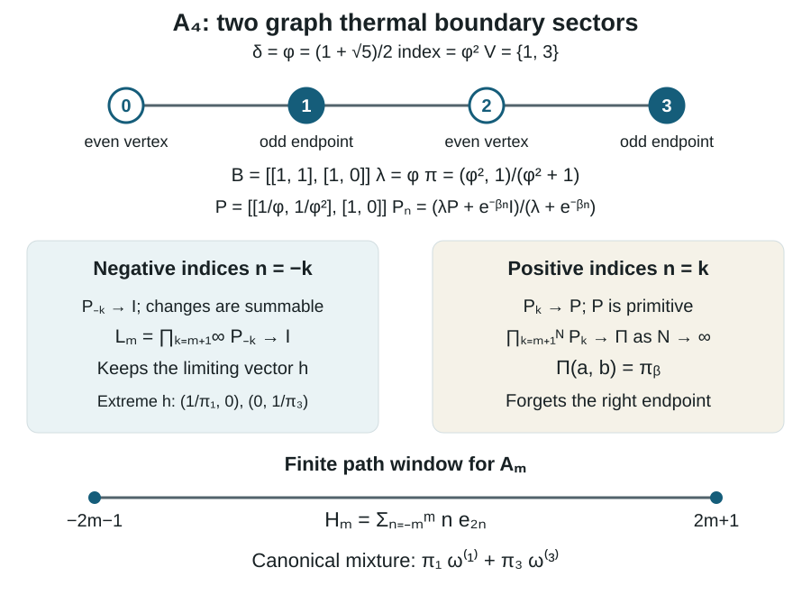
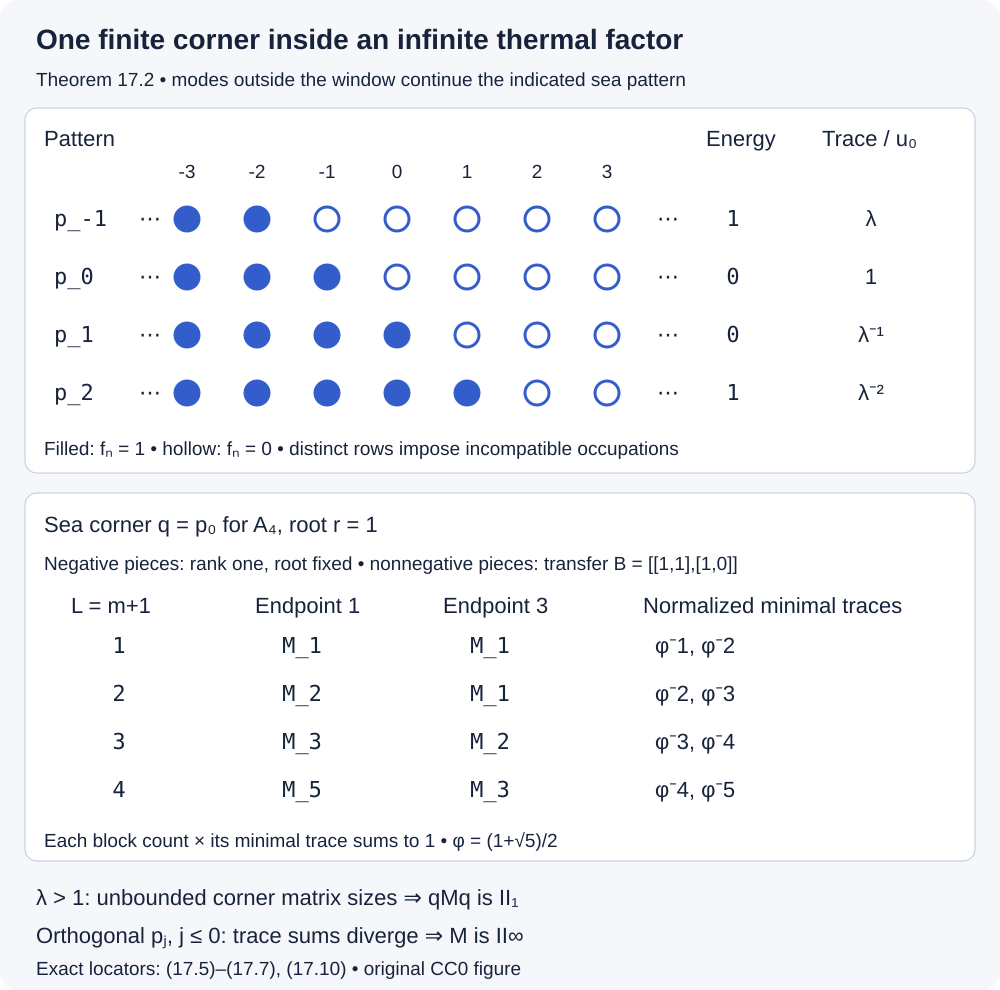
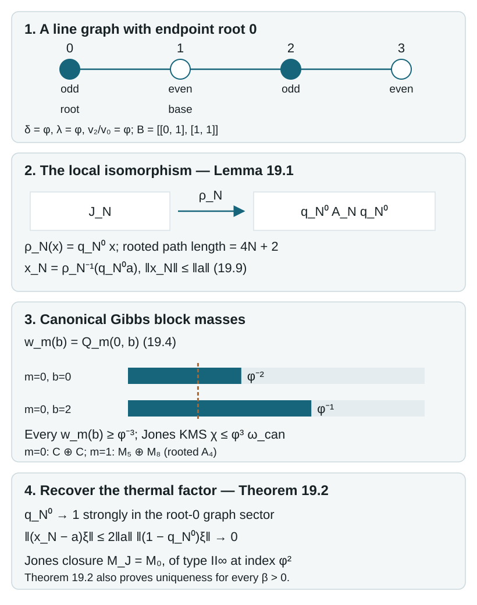

# Fermion observables inside Jones and graph algebras

A number-preserving fermion operator moves an occupied mode into an empty one. Its initial and final projections remember the two occupation patterns. This simple observation makes it possible to recognize a fermion observable algebra inside an algebra originally described by Jones projections or by paths on a graph.

We first prove a recognition theorem using finite matrix algebras. We then construct the local move, prove that its translates give a faithful embedding, and compute the graph-dependent freedom in that embedding. Local conditional expectations lead to canonical thermal states. At index two we classify the two Jones thermal sectors. We construct a canonical ground representation and its normal-ordered currents with their domains and central term. Sections 15–19 return to positive temperature: weighted path matrices classify the full graph algebra, boundary limits identify its normal sectors, finite sea corners determine their factor types, and a rooted path representation gives Jones uniqueness at the other indices below four.

We assume elementary C*-algebras, finite-dimensional matrix decompositions and inductive limits. For path inclusions we use the finite-dimensional commutant transpose rule in Sections 10–11 of AF algebras, together with the local Jones-projection and Markov-trace calculus developed in the companion subfactor course, *Matrix inclusions and the Markov trace* and *Paths, local projections and a faithful trace*. The precise finite path interfaces used below are stated at their applications. Basic references are [Connes–Evans] and [Jones].

*Written by GPT-6.1 Sol (OpenAI), September 2026, with Ultra reasoning effort. Self-checked by the writing AI. Public domain (CC0).*

## 1. Occupation patterns and the observable algebra

Let \(I\) be countable. The canonical anticommutation relations are

\[
a_i a_j+a_j a_i=0,\qquad
a_i a_j^*+a_j^*a_i=\delta_{ij}1.
\tag{1.1}
\]

The **gauge action** multiplies every \(a_i\) by the same scalar \(z\in\mathbb T\). Its fixed algebra \(\mathcal O(I)\) is the number-preserving, or observable, algebra. This is smaller than the algebra fixed by parity alone.

For a finite ordered set \(F=\{1,\ldots,d\}\), represent the CAR on the exterior space
\(\bigoplus_{k=0}^d\bigwedge^k\mathbb C^d\). Its occupation basis is
\(\{\xi_S:S\subseteq F\}\); a mode in \(S\) is occupied. Annihilation removes its mode, with sign \((-1)^{|\{j\in S:j<i\}|}\). Creation is its adjoint.

These operators give the full algebra \(M_{2^d}(\mathbb C)\). Indeed, the commuting number projections \(n_i=a_i^*a_i\) give every rank-one occupation projection

\[
p_S=\prod_{i\in S}n_i\prod_{i\notin S}(1-n_i).
\tag{1.2}
\]

Applying creations and annihilations to \(p_S\) gives every matrix unit, up to a sign. Conversely, moving all creations to the left with (1.1) and removing repetitions spans the abstract finite CAR algebra by at most \(4^d\) ordered monomials. The displayed representation has that dimension, so it is faithful and gives its C*-norm.

The gauge unitary on \(\bigwedge^k\mathbb C^d\) is a scalar \(z^{-k}\) with our convention for annihilation. Conjugation fixes precisely the blocks with equal particle number. Consequently

\[
\mathcal O(F)=\bigoplus_{k=0}^d
B(\bigwedge^k\mathbb C^d)
\cong\bigoplus_{k=0}^d M_{\binom dk}(\mathbb C).
\tag{1.3}
\]

In particular, the full finite occupation diagonal is not the center of this algebra. The center consists of functions of the total occupation number.

**Lemma 1.1 (Generators).** If \(F\) is an interval, \(\mathcal O(F)\) is generated by

\[
n_i=a_i^*a_i,\qquad v_i=a_i^*a_{i+1}.
\tag{1.4}
\]

**Proof.** Equation (1.2) gives all diagonal matrix units. On a configuration with occupation \(01\) at adjacent modes \(i,i+1\), \(v_i\) changes it to \(10\) with coefficient \(+1\). The two fermionic signs cancel because the modes are adjacent. It annihilates every other local occupation pattern.

Adjacent exchanges connect any two \(k\)-element subsets of an interval: repeatedly move the occupied entries left until they occupy the first \(k\) positions. A product of the appropriate \(v_i\)'s and adjoints, compressed by its initial \(p_S\), therefore gives the matrix unit from \(\xi_S\) to \(\xi_T\), with coefficient one. These are all matrix units in (1.3). \(\square\)

The countable CAR algebra is the norm closure of its compatible finite CAR algebras. The observable algebra is the closure of their fixed algebras. To justify the second assertion, approximate a fixed element by a finite CAR element and average over the circle; the average is contractive and lies in its finite observable algebra. In an interval in \(\mathbb Z\), finite intervals are cofinal. An arbitrary countable set can be enumerated in this way.

For example, two modes have
\(\mathcal O(\{1,2\})=\mathbb C\oplus M_2(\mathbb C)\oplus\mathbb C\).
The middle block connects the two one-particle patterns. The vacuum and the fully occupied pattern are separate scalar blocks.

## 2. Recognizing adjacent fermion moves

Let \(I\) be an interval in \(\mathbb Z\), and let \(B\) be a unital C*-algebra. Suppose that \(f_i,u_i\in B\), with \(u_i\) defined whenever \(i,i+1\in I\), satisfy

\[
\begin{gathered}
f_i=f_i^*=f_i^2,\qquad [f_i,f_j]=0,\\
[u_i,f_j]=0\quad(j\notin\{i,i+1\}),\\
[u_i,u_j]=[u_i,u_j^*]=0\quad(|i-j|\ge2),\\
u_i^*u_i=(1-f_i)f_{i+1},\qquad
u_i u_i^*=f_i(1-f_{i+1}).
\end{gathered}
\tag{2.1}
\]

Thus \(u_i\) moves \(01\) to \(10\). Every \(u_i\) is a partial isometry. Its supports imply

\[
f_i u_i=u_i=u_i f_{i+1},\qquad
u_i f_i=f_{i+1}u_i=0,\qquad u_i^2=0.
\tag{2.2}
\]

**Theorem 2.1 (Observable recognition).** Conditions (2.1) are equivalent to the existence of a unique unital *-homomorphism

\[
\pi:\mathcal O(I)\longrightarrow B,\qquad
\pi(n_i)=f_i,\quad \pi(v_i)=u_i.
\tag{2.3}
\]

No injectivity is asserted without an additional condition.

**Proof.** A homomorphism gives (2.1) by the CAR. For the converse, first restrict to \(d\) consecutive modes. For each occupation subset \(S\), let \(P_S\) be (1.2) with \(f_i\) in place of \(n_i\). These orthogonal projections sum to one, although some may vanish.

Put \(P_i=f_i(1-f_{i+1})\), \(Q_i=(1-f_i)f_{i+1}\), and

\[
s_i=u_i+u_i^*+1-P_i-Q_i.
\tag{2.4}
\]

The supports give \(s_i=s_i^*\) and \(s_i^2=1\). They also show that \(s_i\) exchanges \(f_i,f_{i+1}\) by conjugation, fixes every other \(f_j\), and acts as the identity on a corner with equal occupations at \(i,i+1\).

These unitaries satisfy the adjacent-transposition relations. Distant commutation follows from (2.1). For the braid relation, compress on the right by a joint occupation projection for three consecutive modes. On \(000\) and \(111\) both sides of \(s_i s_{i+1}s_i=s_{i+1}s_i s_{i+1}\) are the identity. On \(010\) and \(101\), each side moves one particle or hole out and back; the products \(u_i^*u_i,u_i u_i^*\) reduce it to the initial projection. On \(001\), both sides have the two active moves \(u_i u_{i+1}\); on \(100\) they have \(u_{i+1}^*u_i^*\). On \(011\), both sides have \(u_{i+1}u_i\); on \(110\) they have \(u_i^*u_{i+1}^*\). The remaining step in each of these four cases is the identity on equal occupations. The eight projections sum to one, proving the braid relation.

The elementary presentation of the finite permutation group therefore gives a unitary representation \(w\mapsto s(w)\). For each \(k\), let \(S_0=\{1,\ldots,k\}\). Choose a permutation \(w_S\) sending \(S_0\) to a \(k\)-element subset \(S\), and define

\[
F_{S,T}=s(w_S)P_{S_0}s(w_T)^*,\qquad |S|=|T|=k.
\tag{2.5}
\]

This is independent of the choices. A permutation stabilizing \(S_0\) belongs to the product of the permutation groups of its occupied and empty intervals. Each is generated by adjacent transpositions with equal occupations, so its unitary acts as the identity on \(P_{S_0}\).

Conjugation gives \(F_{S,S}=P_S\). Orthogonality now gives
\(F_{S,T}F_{U,V}=\delta_{T,U}F_{S,V}\) within a particle-number block, zero between different blocks, and \(F_{S,T}^*=F_{T,S}\). Hence (2.5) defines a unital representation of (1.3). Moreover

\[
f_i=\sum_{S:i\in S}F_{S,S},\qquad
u_i=\sum_{\substack{S:i\notin S\\ i+1\in S}}
F_{(S\setminus\{i+1\})\cup\{i\},S}.
\tag{2.6}
\]

The second equality follows from \(u_iP_S=s_iP_S\) on the indicated patterns and zero on the others. Thus the finite representation has exactly the required generators. It is contractive because it is a \*-homomorphism of finite C\*-algebras.

On overlapping intervals these representations agree by Lemma 1.1. They extend contractively to the inductive limit, and the same generators prove uniqueness. \(\square\)

This proof also gives a useful injectivity test: if every finite occupation projection \(P_S\) is nonzero, no matrix block in (1.3) has a kernel. The finite maps are then isometric, so their limit is injective.

## 3. Matrix commutators and a polynomial braid identity

The bilinears \(a_i^*a_j\) satisfy the exact matrix Lie relation

\[
[a_i^*a_j,a_k^*a_l]
=\delta_{jk}a_i^*a_l-\delta_{li}a_k^*a_j.
\tag{3.1}
\]

One obtains it by moving \(a_j\) past \(a_k^*\); the quartic terms cancel. In particular, both terms on the right must be retained when the pairs are reversed.

**Corollary 3.1 (Lie recognition with adjoints).** Suppose \(e_{ij}\in B\) satisfy

\[
e_{ij}^*=e_{ji},\quad e_{ii}^2=e_{ii},\quad
[e_{ij},e_{kl}]=\delta_{jk}e_{il}-\delta_{li}e_{kj}.
\tag{3.2}
\]

There is a unique unital *-homomorphism
\(\mathcal O(I)\to B\) taking \(a_i^*a_j\) to \(e_{ij}\).
Equivalently, in Theorem 2.1 one may require a *-preserving representation of the finite-support matrix Lie algebra with projection diagonals and specified adjacent entries.

**Proof.** Enumerate \(I\) by an interval. Write \(f_i=e_{ii}\), \(u_i=e_{i,i+1}\). The diagonal commutators give commuting projections and
\([f_i,u_i]=u_i,\ [f_{i+1},u_i]=-u_i\).
Multiplication by a projection on both sides yields (2.2). Thus \(u_i=P_i u_i Q_i\).

Equation (3.2) also gives \(u_i u_i^*-u_i^*u_i=f_i-f_{i+1}=P_i-Q_i\). Compressing by \(P_i\) and by \(Q_i\) separately gives \(u_i u_i^*=P_i\) and \(u_i^*u_i=Q_i\). The other commutators give all remaining relations (2.1). Apply Theorem 2.1.

For \(i<j\), repeated commutators of the adjacent \(e\)'s give \(e_{ij}\); for \(i>j\), take adjoints. The same recursion holds for the CAR bilinears by (3.1), so the map has every required value. The converse follows from (3.1). \(\square\)

The adjoint condition is substantive. In \(M_2(\mathbb C)\), conjugating the usual matrix Lie representation by \(\operatorname{diag}(2,1)\) keeps both diagonal projections but sends \(E_{12}\) to \(2E_{12}\) and \(E_{21}\) to \(E_{21}/2\). This is a complex Lie representation, not a *-representation. Its adjacent entry has the wrong support norm for (2.1).

There is also an elementary Yang–Baxter identity here. Under (2.1),

\[
u_i u_{i+1}u_i=0,\qquad
u_{i+1}u_i u_{i+1}=0.
\tag{3.3}
\]

For example, the rightmost \(u_i\) requires occupation \(01\); the middle \(u_{i+1}\), if nonzero, produces \(110\), on which the last \(u_i\) vanishes. The occupation projections make this reasoning an operator identity. The other direction is the same check starting with \(u_{i+1}\).

**Proposition 3.2 (Polynomial braid relation).** For \(R_i(s)=e^{s u_i}=1+s u_i\), \(s,t\in\mathbb C\),

\[
R_i(s)R_{i+1}(s+t)R_i(t)
=R_{i+1}(t)R_i(s+t)R_{i+1}(s).
\tag{3.4}
\]

Also \(R_i(s)R_j(t)=R_j(t)R_i(s)\) when \(|i-j|\ne1\).

**Proof.** Expand both sides using \(u_i^2=u_{i+1}^2=0\) and (3.3). Both become

\[
1+(s+t)(u_i+u_{i+1})
+s(s+t)u_i u_{i+1}+t(s+t)u_{i+1}u_i.
\]

For distant indices use commutation; for equal indices both factors are polynomials in the same nilpotent. \(\square\)

## 4. Translating one local move

Suppose a unital algebra \(A\) has increasing local subalgebras \(A(\Lambda)\), \(\Lambda\subseteq\mathbb Z\), with

\[
[A(\Lambda),A(\Lambda')]=0
\quad\text{when }\min_{i\in\Lambda,j\in\Lambda'}|i-j|\ge2.
\tag{4.1}
\]

Let \(\theta(A(\Lambda))=A(\Lambda+2)\). Choose a projection
\(f_0\in A(\{0\})\) and a partial isometry \(u_0\in A(\{0,1,2\})\) with

\[
u_0^*u_0=(1-f_0)\theta(f_0),\qquad
u_0u_0^*=f_0(1-\theta(f_0)).
\tag{4.2}
\]

**Proposition 4.1 (Local embedding criterion).** There is a unique unital *-homomorphism \(j:\mathcal O(\mathbb Z)\to A\) with

\[
j(n_i)=\theta^i(f_0),\qquad j(v_i)=\theta^i(u_0),\qquad
j\theta_{\mathcal O}=\theta j,
\tag{4.3}
\]

where \(\theta_{\mathcal O}(a_i)=a_{i+1}\).

**Proof.** The projection \(f_i=\theta^i(f_0)\) belongs to \(A(\{2i\})\), and \(u_i=\theta^i(u_0)\) belongs to \(A(\{2i,2i+1,2i+2\})\). Distinct \(f_i\)'s are at distance at least two. An unrelated \(f_j\) is at distance at least two from the support of \(u_i\). When \(|i-j|\ge2\), the two three-site supports also have distance at least two. Thus (4.1) supplies exactly the commutations in (2.1); translating (4.2) supplies the supports. Theorem 2.1 proves existence and uniqueness. Comparing the maps on their generators proves covariance. \(\square\)

Adjacent local algebras may fail to commute. Replacing the distance threshold in (4.1) by one would exclude the Jones examples below.

For a familiar model, take selfadjoint Clifford generators \(\gamma_n\) with
\(\gamma_n\gamma_m+\gamma_m\gamma_n=2\delta_{nm}\). Put

\[
e_n=\frac{1+i\gamma_n\gamma_{n+1}}2,\qquad
a_i=\frac{\gamma_{2i}+i\gamma_{2i+1}}2.
\tag{4.4}
\]

The \(a_i\)'s satisfy (1.1), and direct substitution gives

\[
e_{2i}=a_i^*a_i,\qquad
e_{2i+1}=\frac{1+(a_i-a_i^*)(a_{i+1}+a_{i+1}^*)}2.
\tag{4.5}
\]

The Clifford calculation gives commuting \(e_n,e_m\) for \(|n-m|\ge2\), and
\(e_n e_{n+1}e_n=e_n/2\). Indeed, \(U_n=i\gamma_n\gamma_{n+1}\) and \(U_{n+1}\) are selfadjoint unitaries that anticommute, so
\((1+U_n)U_{n+1}(1+U_n)=0\).
All even Clifford monomials are generated by the \(e_n\)'s: for \(r<s\), \(\gamma_r\gamma_s\) is a scalar multiple of the product of consecutive \(i\gamma_n\gamma_{n+1}\). Pairing factors reduces any even monomial to these bilinears.

Thus the resulting Jones algebra at parameter \(1/2\) is the even Clifford algebra. Its CAR observable subalgebra is obtained from

\[
a_i^*a_{i+1}
=e_{2i}(1-2e_{2i+1})e_{2i+2}.
\tag{4.6}
\]

For (4.6), use \(n_i a_i=0,\ n_i a_i^*=a_i^*\), and
\((a_{i+1}+a_{i+1}^*)n_{i+1}=a_{i+1}\) in (4.5). Parity allows terms that change particle number by two; circle gauge invariance does not.

The normalized Clifford trace is faithful: on each finite Clifford algebra it is the normalized matrix trace, or the equally weighted sum on its two matrix blocks. It is zero on every nonconstant ordered Clifford monomial. If \(x\) uses only \(e_j\) with \(j<m\), then \(x\,i\gamma_m\gamma_{m+1}\) has the new generator \(\gamma_{m+1}\) once in each monomial, so its trace is zero. Consequently \(\operatorname{tr}(x e_m)=\operatorname{tr}(x)/2\). This is the normalized Markov trace at \(\tau=1/2\); the identification holds for its faithful trace realization.

## 5. The move made from three Jones projections

Let \(A_\tau\) carry projections \(e_n\) satisfying

\[
[e_n,e_m]=0\quad(|n-m|\ge2),\qquad
e_n e_{n\pm1}e_n=\tau e_n,\qquad 0<\tau<1.
\tag{5.1}
\]

Assume it has a normalized shift-invariant Markov trace \(\operatorname{tr}\), with

\[
\operatorname{tr}(x e_m)=\tau\operatorname{tr}(x)
\quad\text{for }x\in C^*(e_j:j<m).
\tag{5.2}
\]

We use the Markov-trace realization of the Jones algebra. Positive such realizations are supplied by the subfactor path construction for
\(\tau^{-1}\in[4,\infty)\cup\{4\cos^2(\pi/r):r\ge4\}\).
The endpoint \(\tau=1\) is excluded from the faithful observable embedding.

**Lemma 5.1 (Supports and a scalar corner).** Set \(a=e_0,b=e_1,c=e_2\),
\(P=a(1-c)\), \(Q=(1-a)c\). Then

\[
U=a(1-\tau^{-1}b)c=-\tau^{-1}P b Q,\qquad
U^*U=Q,\quad UU^*=P.
\tag{5.3}
\]

Moreover \(P C^*(a,b,c)P=\mathbb C P\), and \(P\ne0\) in the Markov-trace realization.

**Proof.** Expand using \(ac=ca\), \(aba=\tau a\), \(bab=\tau b\), \(bcb=\tau b\), and \(cbc=\tau c\).
In particular \(PbQ=abc-\tau ac\), giving the first equality. For the supports,

\[
\begin{aligned}
U^*U
&=ac-\tau^{-1}(cabc+cbac)+\tau^{-2}cbabc\\
&=ac-2ac+c=Q,\\
UU^*
&=ac-\tau^{-1}(abca+acba)+\tau^{-2}abcba\\
&=ac-2ac+a=P.
\end{aligned}
\tag{5.4}
\]

Here \(cabc=cbac=\tau ac,\ cbabc=\tau^2c\), and the second row uses the reflected identities.

For the corner, the following fourteen words span a unital algebra invariant under left multiplication by \(a,b,c\):

\[
1,\ a,\ b,\ c,\ ab,\ ba,\ bc,\ cb,\ ac,\ abc,\ cba,\
acb,\ bac,\ bacb.
\tag{5.5}
\]

To check invariance, remove repeated letters, commute \(a,c\), and replace the four alternating triples listed above. For instance \(a(bacb)=\tau acb\), \(b(acb)=bacb\), and \(c(bacb)=\tau acb\); all other products reduce to a word already listed. Thus (5.5) spans every word and, being finite dimensional, the C*-algebra.

Compressing this list by \(P\) gives \(P\) for the first two words, \(\tau P\) for \(b,ab,ba\), and zero for all other words. For the last one, \(Pb a=\tau P\), so \(PbacbP=\tau PcbP=0\). This proves the corner assertion. Finally,
\(\operatorname{tr}(P)=\tau-\tau^2=\tau(1-\tau)>0\) by (5.2). \(\square\)

**Theorem 5.2 (A circle of faithful embeddings).** Let
\(\theta(e_n)=e_{n+2}\). For every \(z\in\mathbb T\), there is a unique faithful unital *-homomorphism \(j_z:\mathcal O(\mathbb Z)\to A_\tau\) with

\[
j_z(n_i)=e_{2i},\qquad
j_z(v_i)=z\,e_{2i}(1-\tau^{-1}e_{2i+1})e_{2i+2},\qquad
j_z\theta_{\mathcal O}=\theta j_z.
\tag{5.6}
\]

**Proof.** Lemma 5.1 and Proposition 4.1 give the homomorphism and covariance. For any finite set of modes, repeated application of (5.2), expanding the factors \(1-e_{2i}\) if necessary, gives

\[
\operatorname{tr}\left(
\prod_{i\in S}e_{2i}\prod_{i\in F\setminus S}(1-e_{2i})
\right)=\tau^{|S|}(1-\tau)^{|F|-|S|}>0.
\tag{5.7}
\]

The highest even index is separated by at least two from every previous one, so each step uses precisely the Markov hypothesis. Every occupation projection is nonzero, and the injectivity test after Theorem 2.1 applies.

Every partial isometry with supports \(Q,P\) differs from \(U\) by a unitary of \(P A(\{0,1,2\})P\): if \(V^*V=Q,\ VV^*=P\), then \(VU^*\) is such a unitary and \(V=(VU^*)U\). Lemma 5.1 makes it \(zP\). Thus the circle is exactly the local freedom with these supports. \(\square\)

At \(\tau=1\), the adjacent compression relations force all \(e_n\)'s equal. The universal projection-generated algebra then has dimension at most two, and the normalized Markov realization is scalar. It cannot contain the infinite observable algebra. This explains the nondegenerate hypothesis rather than hiding the endpoint.

## 6. Two-ended graph paths and their trace

Let \(\Gamma\) be a finite connected simple bipartite graph with at least one edge. Choose a base vertex, hence an even and odd vertex class. Write \(D\) for its symmetric adjacency matrix. Its Perron eigenvalue is \(\delta\ge1\); choose a strictly positive eigenvector \(v\) normalized by

\[
Dv=\delta v,\qquad \sum_{\eta\ {\rm even}}v_\eta^2=1.
\tag{6.1}
\]

The odd-class square sum is also one: sum \(\delta v_\eta^2=\sum_{\rho\sim\eta}v_\eta v_\rho\) separately over each class. Set \(\tau=\delta^{-2}\). Except for the single-edge graph, \(\delta>1\), so \(0<\tau<1\).

For an interval \([k,l]\), a path has vertices at positions \(k-1,\ldots,l+1\), with even positions in the even class. Let \(\mathcal P_{a,b}^{[k,l]}\) be the paths with these two endpoints \(a,b\). Define

\[
A^\Gamma([k,l])=
\bigoplus_{a,b}B(\ell^2(\mathcal P_{a,b}^{[k,l]})).
\tag{6.2}
\]

A matrix unit \([p,q]\) replaces the internal path \(q\) by \(p\), retaining its endpoints. On enlarging the interval, sum over all common extensions of \(p,q\). The matrix-unit rule proves that these are unital injective inclusions. Their inductive limit is \(A^\Gamma\).

The corresponding local algebra for a finite noninterval set is generated by replacements of those coordinates, with their neighbor coordinates retained. Disjoint sets at distance at least two commute: the moves change different coordinates and preserve each other's neighbor tests. Adjacent moves need not commute. Translation by two induces \(\theta\).

**Proposition 6.1 (The graph Markov trace).** The rule

\[
\operatorname{tr}([p,q])=
\begin{cases}
\delta^{-(l-k+2)}v_a v_b,&p=q\in\mathcal P_{a,b}^{[k,l]},\\
0,&p\ne q
\end{cases}
\tag{6.3}
\]

gives compatible faithful traces at the finite levels and a faithful normalized trace on \(A^\Gamma\).

**Proof.** On each block this is a positive multiple of its ordinary matrix trace. Extending to the right replaces its weight by
\(\delta^{-(l-k+3)}v_a\sum_{b'\sim b}v_{b'}\), which equals the old weight by (6.1). Extending to the left is the same calculation.

For normalization, the sum of diagonal weights is
\(\delta^{-L}\sum_a v_a(D^L v)_a\), where \(L=l-k+2\) and \(a\) ranges over its prescribed parity class. This is one by (6.1) and the equal class square sums. Compatibility gives a normalized trace on the limit.

For faithfulness, its GNS-kernel quotient is isometric on each finite level because each finite trace is faithful. If an element \(x\) of the kernel is approximated by a finite-level \(y\), then
\(\|y\|=\|y+\ker\pi\|\le\|y-x\|\). Letting the approximation error go to zero proves \(x=0\). \(\square\)

Define \(e_n\) by zero on a path whose neighbors at \(n-1,n+1\) differ. If they both equal \(\eta\), its matrix on the middle neighbors is

\[
(e_n)_{\rho',\rho}
=\frac{\sqrt{v_{\rho'}v_\rho}}{\delta v_\eta},
\qquad \rho,\rho'\sim\eta.
\tag{6.4}
\]

This is the rank-one projection onto
\(\bigl(\sqrt{v_\rho/(\delta v_\eta)}\bigr)_{\rho\sim\eta}\).
The local path-projection prerequisite proves the Jones relations with parameter \(\delta^{-2}\). Its proof uses only the eigenvector identity and the four-vertex segment, so it applies to (6.4) with arbitrary fixed left and right paths: those spectator coordinates are unchanged. This is the precise specialization from rooted path algebras to (6.2).

It also gives the Markov identity

\[
\operatorname{tr}(x e_m)=\delta^{-2}\operatorname{tr}(x)
\quad (x\in A^\Gamma([k,m-1])).
\tag{6.5}
\]

The trace normalization can be checked directly on a matrix unit. A diagonal contribution requires a path's final edge \(\rho\to\eta\) to be followed by the return \(\eta\to\rho\). The projection coefficient is \(v_\eta/(\delta v_\rho)\), and the extended trace weight is
\(\delta^{-(m-k+2)}v_a v_\rho\). Their product is \(\delta^{-2}\) times the old weight \(\delta^{-(m-k+1)}v_a v_\eta\). Off-diagonal matrix units give zero. Thus (6.5) has no hidden change of Markov parameter.

Consequently the \(e_n\)'s give a Jones subalgebra inside \(A^\Gamma\), with its normalized Markov trace. Theorem 5.2 gives its circle of observable embeddings when \(\delta>1\). The graph algebra generally allows more choices.

## 7. The graph corner and the full parameter group

Functions of boundary vertices are central in (6.2): a matrix unit changes no boundary coordinate, so each endpoint indicator is the identity on its endpoint block and zero on the others.

In \(A^\Gamma(\{0,1,2\})\), the endpoints at \(-1,3\) are odd vertices. Set \(P=e_0(1-e_2)\) and \(Q=(1-e_0)e_2\). Formula (5.3) gives the same partial isometry \(U\) from \(Q\) to \(P\).

**Theorem 7.1 (Corner multiplicities).** For odd vertices \(\eta,\eta'\), put

\[
N(\eta,\eta')=
\begin{cases}
(D^2)_{\eta,\eta'},&\eta\ne\eta',\\
\deg(\eta)-1,&\eta=\eta'.
\end{cases}
\tag{7.1}
\]

Omit zero multiplicities. Then

\[
P A^\Gamma(\{0,1,2\})P
\cong\bigoplus_{\eta,\eta'\ {\rm odd}} M_{N(\eta,\eta')}(\mathbb C),
\qquad
G^\Gamma=\prod_{N(\eta,\eta')>0}U(N(\eta,\eta')).
\tag{7.2}
\]

**Proof.** In the block with endpoints \(\eta,\eta'\), a length-four path is
\((\eta,\rho,\xi,\rho',\eta')\).
The range of \(e_0\) forces \(\xi=\eta\) and makes the first two-edge loop the fixed rank-one vector in (6.4). The remaining free coordinates are exactly the two-edge paths from \(\eta\) to \(\eta'\), so this range has dimension \((D^2)_{\eta,\eta'}\).

If \(\eta\ne\eta'\), \(e_2\) vanishes on this range because its neighbor test compares \(\xi=\eta\) with \(\eta'\). Thus the range of \(P\) has that same dimension. If \(\eta=\eta'\), the remaining coordinate is a neighbor of \(\eta\), and \(e_2\) is its rank-one projection. Its complement has dimension \(\deg(\eta)-1\). This proves (7.1). A rank-\(r\) corner of a full matrix block is \(M_r(\mathbb C)\); applying this separately to (6.2) proves (7.2). \(\square\)

The intermediate endpoint statement is equally explicit: if \(q_\eta^{(n)}\) denotes the indicator of \(x_n=\eta\), then
\(q_\eta^{(-1)}e_0q_{\eta'}^{(1)}=0\) for \(\eta\ne\eta'\).
For equal endpoints it is the rank-one backtrack projection. The two rank computations above are precisely the ranks of
\(q_\eta^{(-1)}e_0q_\eta^{(1)}(1-e_2)q_{\eta'}^{(3)}\).

**Corollary 7.2 (Graph-dependent observable embeddings).** If \(\delta>1\), every unitary \(t\) of the corner in (7.2), whose identity is \(P\), determines a unique faithful covariant embedding

\[
j_t(n_i)=e_{2i},\qquad
j_t(v_i)=\theta^i(tU).
\tag{7.3}
\]

All partial isometries in this local algebra with supports \(Q,P\) occur uniquely in this way.

**Proof.** The element \(tU\) has the required supports, so Proposition 4.1 applies. Formula (6.5) gives the same positive occupation trace (5.7), proving faithfulness. The final assertion follows from \(t=VU^*\) as in Theorem 5.2. \(\square\)

The group is a direct product, with one factor for each ordered pair of odd endpoints. It can contain nonabelian factors. The scalar unitary \(t=zP\) recovers the Jones circle.

For example, take the path graph with vertices \(0,1,2,3\), rooted at \(0\). Its odd vertices are \(1,3\). The only nonzero multiplicities are
\(N(1,1)=N(1,3)=N(3,1)=1\), so \(G^\Gamma=\mathbb T^3\).
Its Perron eigenvalue is \(2\cos(\pi/5)\). Even this small graph already has more local embedding choices than the Jones circle.

The general formula also gives the exceptional branching cases without interpreting a drawing's vertex labels. For an ADE graph choose its actual odd class, count common neighbors for distinct vertices, and use \(\deg(\eta)-1\) on the diagonal. A degree-three odd vertex contributes \(U(2)\); degree-two odd vertices and ordered pairs with one common neighbor contribute circle factors. Changing the base parity can change this group.

For completeness, the groups are as follows. For \(A_n\), number the path vertices \(0,\ldots,n-1\). For \(D_n,E_n\), let \(b\) be the degree-three vertex. The three arm lengths for \(D_n\) are \(n-3,1,1\), and for \(E_6,E_7,E_8\) they are \(2,2,1\), \(3,2,1\), \(4,2,1\).

| Graph | Parity choice | \(G^\Gamma\) |
|---|---|---|
| \(A_{2m}\) | Either | \(\mathbb T^{3(m-1)}\) |
| \(A_{2m+1}\) | Vertex \(0\) even | \(\mathbb T^{3m-2}\) |
| \(A_{2m+1}\) | Vertex \(0\) odd | \(\mathbb T^{3m-1}\) |
| \(D_{2m}\) | \(b\) odd | \(\mathbb T^{3(m-2)}\times U(2)\) |
| \(D_{2m}\) | \(b\) even | \(\mathbb T^{3m}\) |
| \(D_{2m+1}\) | \(b\) odd | \(\mathbb T^{3m-4}\times U(2)\) |
| \(D_{2m+1}\) | \(b\) even | \(\mathbb T^{3m+1}\) |
| \(E_6\) | \(b\) odd | \(\mathbb T^4\times U(2)\) |
| \(E_6\) | \(b\) even | \(\mathbb T^8\) |
| \(E_7\) | \(b\) odd | \(\mathbb T^5\times U(2)\) |
| \(E_7\) | \(b\) even | \(\mathbb T^{10}\) |
| \(E_8\) | \(b\) odd | \(\mathbb T^7\times U(2)\) |
| \(E_8\) | \(b\) even | \(\mathbb T^{11}\) |

Here \(D_n\) requires \(n\ge4\), and the single-edge \(A_2\) has zero corner and no faithful embedding. To verify the table, every off-diagonal multiplicity for a tree is either zero or one; it is one exactly at distance two. If \(b\) is even, its three odd neighbors give six ordered pairs. Each further pair of odd vertices at distance two along an arm gives two more. Every odd degree-two vertex adds one diagonal circle. If \(b\) is odd, its diagonal block is \(M_2\), and the same arm counts give all the circles. These rules give each listed exponent. For example, \(E_7\) with \(b\) even has two odd degree-two vertices and four unordered distance-two pairs, giving \(2+2\cdot4=10\).

## 8. Why only finitely much extra graph data is needed

The graph algebra has more elements than its Jones subalgebra, but these extra elements need only one fixed finite interval of initial data.

**Proposition 8.1 (Eventual generation).** Fix a left endpoint position \(k-1\). For all sufficiently large \(l-k\),

\[
A^\Gamma([k,l+1])
=C^*(A^\Gamma([k,l]),e_{l+1}).
\tag{8.1}
\]

There is a single length bound that works for every translate and both parities.

**Proof.** A connected finite bipartite graph has a path between any two vertices of the appropriate parity. Its shortest such path has length at most the graph diameter. By inserting two-step returns along an edge, it has paths of every greater length with that parity. Choose \(L-1\) at least the diameter, where \(L=l-k+2\).

Take any two length-\(L+1\) paths \(p,q\) from \(a\) to \(c\). Let \(p^-,q^-\) be their length-\(L\) prefixes, ending at \(b,b'\). Choose a length-\(L-1\) path \(h\) from \(a\) to \(c\). Then \(hb,hb'\) are length-\(L\) paths. The finite path-matrix-unit interface, specialized to the unchanged left prefix, gives

\[
[p^-,hb]\, e_{l+1}\,[hb',q^-]
=\frac{\sqrt{v_bv_{b'}}}{\delta v_c}[p,q].
\tag{8.2}
\]

Explicitly, the first and last matrix units fix the prefixes, and the backtrack test of the middle projection forces the final vertex to be \(c\). Formula (6.4) is its only coefficient. This is the same local identity used to generate reachable blocks in the companion path construction; here the length bound makes every block reachable two steps earlier.

The coefficient is positive. Hence every matrix unit of (6.2) lies in the right side of (8.1), proving equality. The diameter bound is independent of positions and parity. \(\square\)

**Corollary 8.2 (Finite augmentation).** The algebra \(A^\Gamma\) is generated by the Jones projections \(\{e_n:n\in\mathbb Z\}\) and one finite-dimensional local algebra.

**Proof.** Start with an interval longer than the bound in Proposition 8.1. Extend it to the right using (8.1). Reflect the path argument to extend it to the left, using the same bound and the next left Jones projection. Thus the generated algebra contains every larger interval algebra. Their union is dense in \(A^\Gamma\). \(\square\)

Finiteness and bipartiteness are the hypotheses supporting this uniform reachability argument. An arbitrary infinite graph does not have a finite diameter bound.

## 9. A conditional expectation that preserves locality

A conditional expectation in a von Neumann algebra need not carry a given dense C*-subalgebra into the desired C*-subalgebra. Here finite occupation blocks and the two infinite tails supply that extra property.

We use the following expectation interface from the companion lesson *Conditional expectations from modular invariance*. If a von Neumann algebra has a faithful normal tracial state \(t\), every von Neumann subalgebra with the same identity admits a unique normal \(t\)-preserving conditional expectation. It is completely positive, unital, contractive and bimodular. On \(L^2(t)\), it is the orthogonal projection onto the smaller algebra's \(L^2\)-space. The modular hypothesis of the general expectation theorem is automatic because a trace has trivial modular group. No factor assumption is required.

Write \(\mathcal O(M)\) for the observable algebra on a set of **mode indices** \(M\). These indices differ by a factor of two from the Jones sites in (4.3).

**Lemma 9.1 (Removing two infinite tails).** Let \(0<\tau<1\). On the CAR algebra of \(\mathbb Z\), let \(\psi_\tau\) have independent occupation probabilities \(\tau\). Equivalently, its density on \(d\) modes is diagonal with weights

\[
\psi_\tau(P_S)=\tau^{|S|}(1-\tau)^{d-|S|}.
\tag{9.1}
\]

Let \(R\) be the CAR von Neumann algebra in this state's representation and \(N=\mathcal O(\mathbb Z)''\subset R\). Partition \(\mathbb Z=L\sqcup M\sqcup R_+\) into a finite interval \(M\) and its two infinite tails. Then

\[
N\cap\mathcal O(L)'\cap\mathcal O(R_+)'
=\mathcal O(M).
\tag{9.2}
\]

The right side is finite dimensional.

**Proof.** First record the representation facts used in the argument. Enumerate the modes, and identify each finite CAR algebra with its occupation matrix algebra. The compatible densities (9.1) are tensor products of the two-dimensional density \(\operatorname{diag}(1-\tau,\tau)\). Their GNS model is the incomplete tensor product of finite Hilbert–Schmidt spaces with these density square roots as reference vectors. Left multiplication gives the algebra representation. Right multiplication on finitely many tensor factors commutes with it and produces a dense set of vectors from the reference vector, because both eigenvalues are positive. Thus that vector is separating for \(R\), and \(\psi_\tau\) extends to a faithful normal state.

For each finite set \(F\), put its modes first in the enumeration. The occupation matrix model identifies the full CAR algebra with the tensor product of its \(F\)-matrix algebra and the remaining CAR algebra: the remaining odd generators acquire the usual finite parity factor, which cancels in the product state. Consequently there is a normal state-preserving conditional expectation

\[
E_F(a\otimes b)=a\,\psi_{\tau,F^c}(b)
\quad\text{onto }\operatorname{CAR}(F).
\tag{9.3}
\]

It is completely positive and bimodular, as follows by applying the positive functional \(\psi_{\tau,F^c}\) to the matrix of tensor coefficients. Its \(L^2(\psi_\tau)\) operator is orthogonal projection: pairing (9.3) against any \(c\in\operatorname{CAR}(F)\) gives \(\psi_\tau(c^*E_F(x))=\psi_\tau(c^*x)\). Along an increasing exhaustion \(F\), these projections converge to the identity, since local CAR vectors are dense. They commute with the circle gauge action.

The gauge action extends normally to \(R\). Its fixed algebra is \(N\): average bounded local approximants over the circle, and use density in \(L^2(\psi_\tau)\) and the separating vector. This also shows that the state restricted to \(N\) is the faithful trace whose finite block weights are (9.1).

Take \(B\) in the left side of (9.2). For \(F=F_L\sqcup M\sqcup F_{R_+}\), bimodularity implies that \(E_F(B)\) commutes with both finite tail observable algebras. Order the finite occupation basis by these three sets. An even observable on one set acts on its own tensor factor; parity factors from the CAR signs cancel. On the left factor,

\[
\mathcal O(F_L)=\bigoplus_k B(\mathcal H_{F_L,k}).
\]

Its commutant in the full occupation matrix algebra is its center, the diagonal functions of the left particle number. The same holds on the right factor. Gauge invariance then requires the middle factor to preserve its own particle number. Hence

\[
E_F(B)\in
C(N_{F_L})\otimes\mathcal O(M)\otimes C(N_{F_{R_+}}),
\tag{9.4}
\]

where \(C(N_F)\) denotes the algebra of functions of the finite number operator. In particular, these matrices belong to the tail occupation diagonal tensored with \(\mathcal O(M)\). Their norm is at most \(\|B\|\). Their \(L^2\)-limit is \(B\). A bounded ultraweak cluster point in that closed algebra has the same vector as \(B\); separation makes it equal to \(B\). Thus every middle matrix coefficient of \(B\) is a bounded function of the two tail occupation configurations.

The tail diagonal state is the independent Bernoulli product probability with parameter \(\tau\). Each finite permutation of modes in either tail is implemented by the positive occupation swaps from Section 2, all belonging to that tail's observable algebra. Commutation of \(B\) with those algebras makes each coefficient invariant under every such permutation.

Here is the needed ergodicity proof. Let \(f\) be an invariant \(L^2\) function with integral zero on the product of the two tails. Approximate it within \(\varepsilon\) by a mean-zero cylinder function \(g\). In each infinite tail, move the finitely many coordinates of \(g\) to disjoint coordinates by a finite permutation. Call the resulting function \(g'\). Invariance and preservation of probability give \(\|f-g'\|_2\le\varepsilon\). Independence of the disjoint coordinate sets gives \(\langle g,g'\rangle=0\). Therefore

\[
\sqrt2\|g\|_2=\|g-g'\|_2\le2\varepsilon,\qquad
\|f\|_2\le(1+\sqrt2)\varepsilon.
\tag{9.5}
\]

Sending \(\varepsilon\) to zero proves \(f=0\). Cylinder density follows from the increasing finite-coordinate sigma-algebras, or from their dense span in the product \(L^2\)-space. Apply this argument to each of the finitely many middle matrix coefficients after subtracting its mean. All coefficients are constant, so \(B\in\mathcal O(M)\). Conversely, middle observables are even and commute with both disjoint tail observable algebras. This proves (9.2). \(\square\)

**Theorem 9.2 (Local trace expectation).** Let \(\Gamma\) satisfy Section 6's finite connected bipartite hypotheses, with \(\delta>1\), and let \(j\) be any embedding of Corollary 7.2. There is a completely positive, unital, norm-one projection

\[
E:A^\Gamma\longrightarrow j(\mathcal O(\mathbb Z))
\tag{9.6}
\]

preserving the path trace. For every integer \(m\ge0\),

\[
E\bigl(A^\Gamma([-2m,2m])\bigr)
\subset j\bigl(\mathcal O([-m,m])\bigr).
\tag{9.7}
\]

For the scalar-phase embeddings of Theorem 5.2, its restriction is a projection \(A^\tau\to j(\mathcal O(\mathbb Z))\).

**Proof.** In the trace representation, set \(\mathscr M=(A^\Gamma)''\) and \(\mathscr N=j(\mathcal O(\mathbb Z))''\). Apply the tracial expectation interface to obtain \(\widetilde E:\mathscr M\to\mathscr N\).

The restriction of the trace to \(j(\mathcal O)\) is exactly (9.1). Indeed, (5.7) supplies the diagonal occupation weights. For an off-diagonal matrix unit \(F_{ST}\), choose a mode belonging to exactly one of \(S,T\); multiplication by its occupation projection is the identity on one side and zero on the other. Traciality forces its trace to vanish. The restricted trace is therefore \(\psi_\tau|_{\mathcal O}\). The faithful normal representation of \(\mathscr N\) on its cyclic \(L^2\)-subspace identifies it with the algebra \(N\) in Lemma 9.1.

Take \(x\in A^\Gamma([-2m,2m])\). Left-tail modes \(i\le-m-1\) have occupations at sites \(2i\le-2m-2\). Their adjacent moves use indices \(i,i+1\le-m-1\), hence have Jones support ending at most at \(-2m-2\). Right-tail occupations and moves for \(i\ge m+1\) start at least at \(2m+2\). Both tails are therefore at site distance at least two from \(x\). Locality gives commutation with their observable algebras. Bimodularity gives the same commutations for \(\widetilde E(x)\). Lemma 9.1 with \(M=[-m,m]\) now proves (9.7).

Every local element is contained in such a symmetric interval. Thus \(\widetilde E\) carries the dense local union into \(j(\mathcal O)\). Contractivity and norm closure extend this property to all of \(A^\Gamma\), giving (9.6). All expectation properties restrict, and the identity belongs to the range, so the norm is one. For a scalar phase, \(j(\mathcal O)\subset A^\tau\); restriction to \(A^\tau\) still fixes this whole range and proves the last assertion. \(\square\)

The mode interval in (9.7) maps into Jones sites \([-2m,2m]\): occupations use \(2i\), and internal adjacent moves use \(2i,2i+1,2i+2\). This checks both endpoints without changing the locality threshold.

## 10. The canonical positive-temperature state

Set

\[
H_m=\sum_{n=-m}^m n e_{2n},\qquad
\alpha_t(x)=\lim_{m\to\infty}e^{itH_m}x e^{-itH_m}.
\tag{10.1}
\]

For a local element the limit is eventually constant: even projections outside its site interval have distance at least two and commute with it. The finite Hamiltonians commute with one another. Thus (10.1) defines an isometric automorphism group on the local union and then on its norm closure. It is norm continuous on each local algebra, hence strongly continuous on \(A^\Gamma\). Every local element is entire analytic. On the embedded observables,

\[
\alpha_t(j(n_i))=j(n_i),\qquad
\alpha_t(j(a_i^*a_k))=e^{it(i-k)}j(a_i^*a_k).
\tag{10.2}
\]

We use the physical KMS convention \(\omega(xy)=\omega(y\alpha_{i\beta}(x))\) on entire analytic elements, with \(\beta>0\).

**Theorem 10.1 (Canonical Gibbs state and expectation formula).** Under Theorem 9.2's hypotheses, there is a \(\beta\)-KMS state \(\omega_\beta^{\mathrm{can}}\) on \(A^\Gamma\) given locally by

\[
\omega_\beta^{\mathrm{can}}(x)
=\frac{\operatorname{tr}(e^{-\beta H_m}x)}
       {\operatorname{tr}(e^{-\beta H_m})}
\quad\text{if }x\in A^\Gamma([-2m,2m]).
\tag{10.3}
\]

Its restriction through every embedding \(j\) of Corollary 7.2 is the same observable state \(\psi_\beta\). This is the restriction of the diagonal CAR quasi-free state with occupation probabilities

\[
p_n=\frac{\tau e^{-\beta n}}{1-\tau+\tau e^{-\beta n}}
=\frac1{1+e^{\beta(n-\mu_\beta)}},\qquad
\mu_\beta=\beta^{-1}\log\frac{\tau}{1-\tau}.
\tag{10.4}
\]

For the expectation in Theorem 9.2,

\[
\omega_\beta^{\mathrm{can}}=\psi_\beta\circ j^{-1}\circ E.
\tag{10.5}
\]

Here \(j^{-1}\) is applied only to the range of \(E\).

**Proof.** The even projections commute. Their trace distribution is the independent Bernoulli distribution (5.7). Therefore

\[
Z_m=\operatorname{tr}(e^{-\beta H_m})
=\prod_{n=-m}^m(1-\tau+\tau e^{-\beta n})>0.
\tag{10.6}
\]

For a fixed local \(x\), adjoining one farther right even projection multiplies both numerator and denominator by its factor in (10.6). Indeed,
\(e^{-\beta n e_{2n}}=1+(e^{-\beta n}-1)e_{2n}\), and the right Markov rule applies to the whole preceding local product. The left Markov rule gives the identical conclusion at the other end. For the path trace, that rule follows by reversing paths: the weight \(\delta^{-L}v_a v_b\) is unchanged by interchanging the endpoints, and the same local projection coefficient is used. Thus (10.3) is independent of the sufficiently large interval chosen.

Each local functional is positive: traciality rewrites its numerator as
\(\operatorname{tr}(e^{-\beta H_m/2}x e^{-\beta H_m/2})\) for \(x\ge0\). Its value at the identity is one. Compatibility defines a norm-one state on the dense local union, and then on \(A^\Gamma\). For local \(x,y\) in a common invariant finite algebra, finite trace cyclicity gives the KMS identity with \(H_m\). The dense entire local core therefore gives the full strip condition by the analytic KMS interface used in the phase-transition lesson.

On a finite observable block, trace cyclicity kills every off-diagonal occupation matrix unit, just as in Theorem 9.2. Multiplication of each diagonal occupation weight by its Gibbs factor and division by (10.6) gives the independent probabilities (10.4). This calculation is independent of the local unitary parameters of \(j\).

These finite CAR densities are compatible product densities. Their state is quasi-free: a balanced monomial has the signed occupation expectation given by the CAR, equivalently the determinant of the corresponding diagonal two-point matrix; unbalanced monomials vanish. In operator form its covariance is

\[
C_\beta=(1+e^{\beta(D-\mu_\beta)})^{-1},\qquad
D\delta_n=n\delta_n.
\tag{10.7}
\]

The inverse in (10.7) is part of the formula. This CAR state is the unique KMS state for the dynamics with one-particle energies \(n-\mu_\beta\): every finite CAR algebra is an invariant full matrix algebra, on which the KMS identity uniquely gives its Gibbs density. These finite restrictions determine the state. On observables the chemical-potential term acts trivially, since observables preserve particle number, so (10.2) is the restricted dynamics.

Finally \(H_m\in j(\mathcal O)\). Trace preservation and bimodularity give
\(\operatorname{tr}(e^{-\beta H_m}x)=
\operatorname{tr}(e^{-\beta H_m}E(x))\).
The locality in (9.7) allows both sides to be evaluated in (10.3). This proves (10.5). \(\square\)

The theorem constructs a canonical KMS state; its proof does not classify all KMS states of the graph or Jones algebra. Uniqueness on the full CAR algebra does not imply uniqueness on its even or circle-fixed subalgebras. The next section makes this distinction explicit.

## 11. Two thermal sectors at Jones index two

At \(\tau=1/2\), the faithful Markov realization of the Jones algebra is the even CAR algebra, by Section 4. This case admits a complete positive-temperature classification directly in a fermion representation.

Replace the filled negative-energy modes by hole annihilators:

\[
b_n=\begin{cases}a_n,&n\ge0,\\a_n^*,&n<0.\end{cases}
\tag{11.1}
\]

The \(b_n\)'s satisfy the CAR. On their Fock space
\(\mathcal H=\bigoplus_{r\ge0}\bigwedge^r\ell^2(\mathbb Z)\), let \(\xi_S\) be the occupation vector of a finite excitation set \(S\). Define

\[
K\xi_S=E(S)\xi_S,\qquad
E(S)=\sum_{n\in S}|n|,\qquad
\Pi\xi_S=(-1)^{|S|}\xi_S.
\tag{11.2}
\]

\(K\) is the positive selfadjoint diagonal operator on the domain
\(\sum_S E(S)^2|\langle\xi,\xi_S\rangle|^2<\infty\).
The zero mode has energy zero. If \(\mathcal H_\pm\) are the parity eigenspaces, both are infinite dimensional, reduce \(K\), and are preserved by every even CAR element.

For \(n<0\), \(a_n^*a_n=1-b_n^*b_n\); for \(n\ge0\), it equals \(b_n^*b_n\). Thus a finite physical Hamiltonian differs from \(\sum |n|b_n^*b_n\) only by a scalar. Consequently the Jones dynamics is implemented in this representation by \(e^{itK}\).

**Theorem 11.1 (The index-two KMS interval).** For every \(\beta>0\), all KMS states of the Jones algebra at \(\tau=1/2\) are

\[
\phi_\beta=s\phi_{\beta,+}+(1-s)\phi_{\beta,-},
\qquad 0\le s\le1,
\tag{11.3}
\]

where

\[
\phi_{\beta,\pm}(x)
=\frac{\operatorname{Tr}_{\mathcal H_\pm}
       (e^{-\beta K}\pi(x))}
       {Z_{\beta,\pm}},\qquad
Z_{\beta,+}=Z_{\beta,-}
=\prod_{r=1}^{\infty}(1+e^{-\beta r})^2.
\tag{11.4}
\]

The two extreme states have type \(I_\infty\) GNS algebras. Every mixture with \(0<s<1\) has GNS algebra
\(B(\mathcal H_+)\oplus B(\mathcal H_-)\).
The canonical state of Theorem 10.1 restricts to their equal mixture.

**Proof.** Summing over finite excitation sets gives

\[
\operatorname{Tr}_{\mathcal H}(e^{-\beta K})
=2\prod_{r=1}^{\infty}(1+e^{-\beta r})^2<\infty.
\tag{11.5}
\]

The product converges because \(\sum_{r\ge1}e^{-\beta r}<\infty\) and \(\log(1+u)\le u\). The odd unitary \(b_0+b_0^*\) commutes with \(K\) and interchanges the two parity spaces, proving equality of their partition functions. Trace cyclicity, or the trace-density KMS proof in the phase-transition lesson, gives the KMS property of (11.4) on the entire local core.

We identify the von Neumann algebra of this representation. The decreasing projections
\(\prod_{n\in F}(1-b_n^*b_n)\), over finite sets exhausting \(\mathbb Z\), converge strongly to the rank-one Fock vacuum projection \(Q\). Products \(b_S^*Qb_T\), with the creation factors ordered consistently, give all excitation matrix units
\(E_{ST}=|\xi_S\rangle\langle\xi_T|\).
When \(|S|+|T|\) is even these products are strong limits of even local elements. Therefore the even algebra generates every matrix unit within each parity space. Conversely it commutes with \(\Pi\), so

\[
\pi(A_{1/2})''=B(\mathcal H_+)\oplus B(\mathcal H_-).
\tag{11.6}
\]

Each Gibbs density in (11.4) is injective on its parity space. Its normal GNS representation is thus a faithful normal representation of that matrix factor. For a mixture with both weights positive the same argument applies to both summands, giving the asserted GNS algebras.

It remains to rule out additional KMS states in other representations. Let \(\phi\) be any KMS state. Restrict to the even CAR algebra of a finite set \(F\) containing the zero mode. This algebra has two full matrix blocks. The finite KMS identity forces its density to be a scalar multiple of \(e^{-\beta K_F}\) on each block. The two block partition functions are equal because toggling the zero mode changes parity without changing energy. Hence, for every positive local even element,

\[
0\le\phi(x)\le2\omega_\beta^0(x),\qquad
\omega_\beta^0=\tfrac12(\phi_{\beta,+}+\phi_{\beta,-}).
\tag{11.7}
\]

The finite restrictions of \(\omega_\beta^0\) are exactly these unconditioned Gibbs densities: the remaining excitation factors in (11.5) cancel in the normalized trace. Continuity extends (11.7) to the C*-algebra.

For clarity, domination also supplies the required normality. On the GNS space of \(\omega_\beta^0\), the form with quadratic value \(\phi(x^*x)\) is bounded by \(2\|x\Omega\|^2\). It defines a bounded positive operator \(T\). The identity between the form evaluated on \(ax,y\) and on \(x,a^*y\) makes \(T\) commute with the represented C*-algebra. Thus
\(\phi(x)=\langle T\pi(x)\Omega,\Omega\rangle\)
extends to a normal functional on its von Neumann closure. The faithful Gibbs representation identifies that closure with (11.6).

The matrix units in (11.6) have local approximants of norm at most one with the fixed energy difference \(E(S)-E(T)\): use the same vacuum cutoffs as above, containing \(S\cup T\). Their real and imaginary time factors are independent of the cutoff. Normality therefore passes the KMS identity to those matrix units. Taking a diagonal projection and an off-diagonal matrix unit makes every off-diagonal density entry vanish. Taking \(x=E_{ST}\), \(y=E_{TS}\), with \(S,T\) of the same parity, gives

\[
\phi(E_{SS})=
e^{-\beta(E(S)-E(T))}\phi(E_{TT}).
\tag{11.8}
\]

Thus the density is \(c_\pm e^{-\beta K}\) on each parity space. Positivity and normalization leave precisely the mixture parameter \(s\) in (11.3). This proves completeness of the classification. For \(\tau=1/2\), (10.4) is the unconditioned full CAR Gibbs density, so its restriction to the even algebra is \(\omega_\beta^0\). \(\square\)

The two states can already be distinguished by the local projection \(e_0=n_0\). Put

\[
c_\beta=\prod_{r=1}^{\infty}
\left(\frac{1-e^{-\beta r}}{1+e^{-\beta r}}\right)^2.
\tag{11.9}
\]

Every factor is positive, and the sum of their deficits from one is finite, so \(c_\beta>0\). The nonzero excitation modes have parity expectation \(c_\beta\). Conditioning total parity forces the zero-mode occupation to match, or to oppose, that tail parity. Therefore

\[
\phi_{\beta,+}(e_0)=\frac{1-c_\beta}{2},\qquad
\phi_{\beta,-}(e_0)=\frac{1+c_\beta}{2}.
\tag{11.10}
\]

Their difference is positive at every \(\beta>0\). In particular, the canonical state is not factorial, and a uniqueness assertion for every Jones index below four fails at index two. Neither this calculation nor the canonical construction proves the type \(II_\infty\) classification at other indices.

## 12. Choosing the zero mode in a canonical ground state

The Dirac operator has a zero mode. Positive-energy ground-state conditions alone do not choose its occupation. We choose it empty by first adding a small positive energy and then cooling.

For \(0<\varepsilon<1\), replace \(n\) in (10.1) by \(n+\varepsilon\). The proof of Theorem 10.1 gives canonical KMS states \(\omega_{\beta,\varepsilon}^{\mathrm{can}}\) for this perturbed dynamics. Define

\[
f_m=\prod_{n=-m}^{-1}e_{2n}
     \prod_{n=0}^{m}(1-e_{2n}),\qquad
t_m=\operatorname{tr}(f_m)=\tau^m(1-\tau)^{m+1}>0.
\tag{12.1}
\]

**Theorem 12.1 (Canonical sea state).** There is an invariant ground state of the unperturbed dynamics with

\[
\omega_\infty(x)=\frac{\operatorname{tr}(f_m x)}{t_m}
\quad(x\in A^\Gamma([-2m,2m])).
\tag{12.2}
\]

This formula is independent of enlargement of the interval, and

\[
\omega_\infty(x)
=\lim_{\varepsilon\downarrow0}\lim_{\beta\to\infty}
  \omega_{\beta,\varepsilon}^{\mathrm{can}}(x).
\tag{12.3}
\]

Through every embedding \(j\), its observable restriction is the filled-negative-mode, empty-nonnegative-mode CAR state. Its covariance is
\(P_-\delta_n=1_{\{n<0\}}\delta_n\).

**Proof.** Adding an occupied even projection at the left end multiplies both numerator and denominator of (12.2) by \(\tau\). Adding an unoccupied one at the right end multiplies them by \(1-\tau\). The two Markov rules used in Theorem 10.1 prove this compatibility. Positivity follows from
\(\operatorname{tr}(f_m x)=\operatorname{tr}(f_m x f_m)\) for \(x\ge0\). Thus (12.2) defines a state.

For a fixed finite interval, the commuting occupation projections simultaneously diagonalize the perturbed Hamiltonian. Its minimum occurs precisely when every negative mode is filled and every nonnegative mode is empty, since \(0<\varepsilon<1\). This minimum projection is \(f_m\). Dividing the finite Gibbs numerator and denominator by their common leading exponential proves their limit is (12.2). It does not depend on \(\varepsilon\) in the indicated range, proving (12.3). Tilting (10.4) gives occupation probabilities converging to \(1_{\{n<0\}}\); the observable matrix-unit calculation gives the stated CAR restriction.

Here is a direct check of the ground-state property. In the GNS triple \((\pi_\infty,\mathcal K,\Omega)\), put

\[
q_n=\begin{cases}
\pi_\infty(e_{2n}),&n\ge0,\\
1-\pi_\infty(e_{2n}),&n<0.
\end{cases}
\qquad q_n\Omega=0.
\tag{12.4}
\]

The last equality follows because \(\omega_\infty(q_n)=0\). Traciality and commutation of \(f_m,H_m\) show invariance of (12.2). Consequently
\(U_t\pi_\infty(x)\Omega=\pi_\infty(\alpha_t(x))\Omega\)
is a strongly continuous unitary group. Stone's theorem in Unitary groups and analytic vectors gives its selfadjoint generator \(K_\infty\).

If \(x\in A^\Gamma([-2m,2m])\), then

\[
U_t\pi_\infty(x)\Omega
=\exp\left(it\sum_{n=-m}^m|n|q_n\right)
 \pi_\infty(x)\Omega.
\tag{12.5}
\]

Indeed, \(H_m\Omega=(\sum_{n=-m}^{-1}n)\Omega\), and subtracting this scalar from \(\pi_\infty(H_m)\) gives the positive sum in (12.5). The local cyclic subspace is finite dimensional and invariant. Its energies are nonnegative integers. These subspaces have dense union, so the spectral measure of \(K_\infty\) is supported on the nonnegative integers. In particular \(K_\infty\ge0\), which proves that the state is a ground state. The choice of the zero occupation is explicit, rather than a uniqueness claim. \(\square\)

Let

\[
\mathscr D_0=\bigcup_{m\ge0}
 \pi_\infty(A^\Gamma([-2m,2m]))\Omega.
\tag{12.6}
\]

This is a dense linear subspace of finite-energy vectors. On it,
\(K_\infty=\sum_n|n|q_n\); only finitely many terms act on each vector. The projections \(q_n\) commute with this energy operator. A vector of energy at most \(E\) satisfies \(q_n\xi=0\) for \(|n|>E\): positivity of the sum first proves it on each local spectral subspace and then on its closure. This observation will control the current domains without assuming that the ground representation is a factor.

## 13. Normal ordering, the central term and analytic currents

Write

\[
c_{ij}=\pi_\infty(j(a_i^*a_j)),\qquad
{:}c_{ij}{:}=c_{ij}-\delta_{ij}1_{\{i<0\}}1.
\tag{13.1}
\]

Subtracting the sea expectation is necessary: the sum of the unrenormalized diagonal occupations diverges on the vacuum. For each \(k\in\mathbb Z\), define on \(\mathscr D_0\)

\[
T_k\xi=\lim_{N\to\infty}
 \sum_{n=-N}^N{:}c_{n+k,n}{:}\,\xi.
\tag{13.2}
\]

**Proposition 13.1 (Modes on a common domain).** The limit in (13.2) is eventually constant on each vector of \(\mathscr D_0\). This domain is invariant under every \(T_k\). On it,

\[
T_k^*=T_{-k}\ \text{as a pairing identity},\qquad
[K_\infty,T_k]=kT_k,\qquad
[T_k,T_l]=-k\,\delta_{k,-l}1.
\tag{13.3}
\]

The adjoint assertion means
\(\langle T_k\xi,\eta\rangle=\langle\xi,T_{-k}\eta\rangle\)
on the common domain; it does not yet assert equality of maximal adjoint domains.

**Proof.** On the vacuum, \(T_0\Omega=0\). For \(k<0\) every summand moves into an already filled negative mode or out of an empty mode, so \(T_k\Omega=0\). For \(k>0\), precisely the \(k\) moves \(n=-k,\ldots,-1\) create a particle-hole pair. Their occupation configurations are different, hence orthogonal, and each has norm one. Thus

\[
\|T_k\Omega\|^2=k\quad(k>0).
\tag{13.4}
\]

These statements hold in the observable cyclic subspace because Theorem 12.1 identifies its state with the sea state.

For a local \(x\), the element \(j(a_{n+k}^*a_n)\) is supported between Jones sites \(2\min(n,n+k)\) and \(2\max(n,n+k)\). This follows by the adjacent-commutator recursion in Corollary 3.1. Except for finitely many \(n\), this interval is at distance at least two from the support of \(x\). Hence its commutator with \(x\) vanishes. The identity

\[
T_k\pi_\infty(x)\Omega
=\pi_\infty(x)T_k\Omega+
 \sum_n[c_{n+k,n},\pi_\infty(x)]\Omega
\tag{13.5}
\]

has a finite sum. Both terms are local cyclic vectors. This proves stabilization and domain invariance. Taking adjoints of finite sums and enlarging the cutoff proves the pairing identity. Covariance of each bilinear under (10.2) proves the energy commutator.

To compute the last commutator, first note why it must be scalar on the local domain. Apply the matrix commutator (3.1) to two finite current sums. Their interior terms cancel. The terms left over are bilinears supported near the cutoff boundaries, so their commutators with a fixed local \(x\) vanish once the cutoff is large. Equivalently, the two derivations in (13.5) commute. The Jacobi identity then shows that \([T_k,T_l]\) commutes with every represented local \(x\) on \(\mathscr D_0\).

Its value on \(\Omega\) can be computed in the sea Fock model (11.1). There,
\([T_k,a_j]=-a_{j-k}\) and
\([T_k,a_j^*]=a_{j+k}^*\).
The double commutator \([T_k,T_l]\) therefore commutes with every annihilator and creator on finite excitation vectors. Its value on the vacuum is annihilated by every \(b_j\), so it is a scalar multiple of the vacuum. The energy relation makes that scalar zero unless \(k+l=0\). If \(k>0\), (13.4) and \(T_{-k}\Omega=0\) give

\[
\langle\Omega,[T_k,T_{-k}]\Omega\rangle=-k.
\]

Antisymmetry supplies the cases \(k<0\) and \(k=0\). The same vacuum calculation holds in the observable cyclic subspace of \(\mathcal K\). Commutation with all local \(x\) now gives (13.3) on \(\mathscr D_0\). \(\square\)

The sign in (13.3) follows from our definition \(a_{n+k}^*a_n\) and the filled negative sea. Positive \(k\) raises energy. Relabeling the modes by \(J_k=T_{-k}\) gives the other common convention \([J_k,J_l]=k\delta_{k,-l}\).

For the unbounded sums over \(k\), impose an absolute Fourier bound. Let

\[
\mathscr C_{\exp}=
\left\{f\in C(S^1,\mathbb R):
A_f^\lambda=\sum_{k\in\mathbb Z}
(2|k|+3)e^{\lambda|k|}|\widehat f_k|<\infty
\text{ for some }\lambda>0\right\},
\quad
f(\theta)=\sum_k\widehat f_k e^{ik\theta}.
\tag{13.6}
\]

This includes real trigonometric polynomials. The absolute values are essential for a norm estimate.

**Theorem 13.2 (Selfadjoint currents in the ground representation).** For \(f\in\mathscr C_{\exp}\), the series

\[
T(f)\xi=\sum_k\widehat f_k T_k\xi,\qquad
\xi\in D(K_\infty),
\tag{13.7}
\]

converges absolutely in Hilbert-space norm, defines a symmetric operator, and is essentially selfadjoint. All vectors in \(\mathscr D_0\) are analytic for it. On the common domain
\(\mathscr D_{\exp}=\bigcup_{s>0}D(e^{sK_\infty})\),
two such currents have the central commutator

\[
[T(f),T(g)]
=-\sum_k k\widehat f_k\widehat g_{-k}\,1
=\frac1{2\pi i}\int_0^{2\pi} f(\theta)g'(\theta)\,d\theta\,1.
\tag{13.8}
\]

Their vacuum distribution is Gaussian:

\[
\langle\Omega,e^{it\overline{T(f)}}\Omega\rangle
=\exp\left(-\frac{t^2}{2}
 \sum_{k>0}k|\widehat f_k|^2\right).
\tag{13.9}
\]

**Proof.** Let \(\xi\) have energy at most \(E\). Outside the index interval
\([-E-|k|-1,E+|k|+1]\), both occupations in a summand of (13.2) are their sea values, and they are on the same side of zero. The initial-support identity for \(a_{n+k}^*a_n\) makes that summand zero. For \(k=0\), the normal-ordered diagonal term is likewise zero there. Thus there are at most \(2E+2|k|+3\) terms of norm at most one, and

\[
\|T_k\xi\|\le(2|k|+3)(E+1)\|\xi\|.
\tag{13.10}
\]

For an exact energy vector, \(T_k\) has energy shifted by \(k\). Distinct input energies therefore have orthogonal outputs. Summing the squared bounds in (13.10) over the energy decomposition gives an extension to \(D(K_\infty)\) with

\[
\|T_k\xi\|\le(2|k|+3)
\|(K_\infty+1)\xi\|.
\tag{13.11}
\]

The extension agrees with the finite sum on each bounded energy subspace: the vanishing occupations there follow from (12.6) by density. These bounds prove absolute convergence of (13.7). Approximation by finite energy vectors, the pairing identity, and
\(\widehat f_{-k}=\overline{\widehat f_k}\)
prove symmetry on \(D(K_\infty)\).

Fix \(\lambda\) as in (13.6), and set \(B_f=(1+\lambda)A_f^\lambda\). The energy shift implies
\(e^{tK_\infty}T_ke^{-tK_\infty}=e^{tk}T_k\)
on the corresponding weighted domains. For \(0\le t<s\le\lambda\), (13.11) and the Fourier bound give

\[
\|e^{tK_\infty}T(f)\xi\|
\le\frac{B_f}{s-t}\|e^{sK_\infty}\xi\|.
\tag{13.12}
\]

Here
\(\sup_{u\ge0}(u+1)e^{-(s-t)u}\le
(1+\lambda)/(s-t)\).
Absolute convergence justifies the weighted series, so (13.12) also proves membership in the asserted domain. It shows that \(\mathscr D_{\exp}\) is invariant under every such current.

For a finite-energy vector \(\xi\), apply (13.12) \(r\) times, decreasing the exponential weight in equal steps from \(\lambda\) to zero. This yields

\[
\|T(f)^r\xi\|
\le\left(\frac{B_f r}{\lambda}\right)^r
 \|e^{\lambda K_\infty}\xi\|
\le r!\left(\frac{eB_f}{\lambda}\right)^r
 \|e^{\lambda K_\infty}\xi\|.
\tag{13.13}
\]

The elementary inequality \(r!\ge(r/e)^r\) follows by integrating \(\log u\) from \(1\) to \(r\) in the sum \(\sum_{j=1}^r\log j\). Thus every finite-energy vector is analytic with a radius at least \(\lambda/(eB_f)\) when \(B_f>0\); the zero operator is immediate. Nelson's analytic-vector theorem, Theorem 6.3 of Unitary groups and analytic vectors, now proves essential selfadjointness.

The bounds also justify the double series for two currents on \(\mathscr D_{\exp}\), including both products. Apply (13.3) to Fourier truncations and pass to the limit using (13.12). This gives the first equality in (13.8). Absolute Fourier convergence and differentiation identify the sum with the integral. These are domain statements for the common exponential domain, rather than formal equalities of unrestricted products of unbounded operators.

For (13.9), write the nonconstant current as \(A+A^*\), with

\[
A=\sum_{k>0}\widehat f_{-k}T_{-k},\qquad
A\Omega=0,\qquad
[A,A^*]=v_f\,1,\quad
v_f=\sum_{k>0}k|\widehat f_k|^2.
\tag{13.14}
\]

The zero current \(T_0\) commutes with every mode and kills \(\Omega\), so it contributes nothing to any vacuum moment. Commute \(A\) through a power of \(A+A^*\). If \(m_r=\langle\Omega,T(f)^r\Omega\rangle\), this gives
\(m_r=(r-1)v_f m_{r-2}\), with \(m_0=1,m_1=0\). Hence

\[
m_{2r}=\frac{(2r)!}{2^r r!}v_f^r,\qquad
m_{2r+1}=0.
\tag{13.15}
\]

The same computation gives
\(\|T(f)^r\Omega\|^2=m_{2r}\).
These norms make the vacuum an entire vector: the series
\(\sum_r |t|^r\sqrt{m_{2r}}/r!\) converges for every \(t\).
The unitary power series on this vector therefore sums its moments to
\(\sum_r(-t^2v_f/2)^r/r!=e^{-t^2v_f/2}\), proving (13.9). \(\square\)

In particular, the quadratic norm determining the vacuum fluctuations is
\(\sum_k|k||\widehat f_k|^2=2v_f\).
It has one power of \(|k|\). For a single harmonic
\(f(\theta)=2a\cos(k\theta)\), \(k>0\), the variance is \(k a^2\), which can already be checked using the \(k\) orthogonal particle-hole pairs in (13.4).

The current operators above act in the full ground representation of the graph algebra. We next construct the corresponding C*-algebra automorphisms and distinguish their connected implementers from the winding shift.

## 14. Current flows, loop automorphisms and their implementers

Put \(B_{[a,b]}=A^\Gamma([2a,2b])\). These interval algebras have dense union. Disjoint mode intervals commute, because their nearest Jones sites are at distance at least two. For \(i<j\), define the selfadjoint interaction

\[
\Phi^f_{[i,j]}
=\widehat f_{j-i}j(a_j^*a_i)
 +\widehat f_{i-j}j(a_i^*a_j),\qquad
\Phi^f_{\{i\}}=\widehat f_0 e_{2i}.
\tag{14.1}
\]

It belongs to \(B_{[i,j]}\), with norm at most \(2|\widehat f_{j-i}|\). For a local \(x\), let

\[
\mathcal J(f)(x)=i\sum_X[\Phi^f_X,x]
=i\sum_{i,j}\widehat f_{i-j}[j(a_i^*a_j),x].
\tag{14.2}
\]

Only interactions meeting the support interval can contribute. Absolute Fourier decay makes this a norm-convergent sum.

**Theorem 14.1 (The full algebra flow).** For \(f\in\mathscr C_{\exp}\), \(\mathcal J(f)\) on the local union is closable, and its closure generates a strongly continuous automorphism group \(\eta_t^f\) of \(A^\Gamma\). Every local element is analytic for this generator. If

\[
G_M^f=\sum_{|i|,|j|\le M}
 \widehat f_{i-j}j(a_i^*a_j),
\tag{14.3}
\]

then \(e^{itG_M^f}x e^{-itG_M^f}\to\eta_t^f(x)\) in norm, uniformly on compact time intervals, for every \(x\in A^\Gamma\).
The flow preserves \(j(\mathcal O)\). If \(j(\mathcal O)\subset A^\tau\), in particular for the scalar-phase embeddings, it also preserves \(A^\tau\).

**Proof.** Choose \(\lambda>0\) as in (13.6). Translation invariance gives the finite interaction bound

\[
\mathcal I_\lambda
=\sup_z\sum_{X\ni z} e^{\lambda|X|}\|\Phi_X^f\|
\le e^\lambda|\widehat f_0|
 +2\sum_{k\ge1}(k+1)e^{\lambda(k+1)}
              |\widehat f_k|<\infty.
\tag{14.4}
\]

There are \(k+1\) intervals of length \(k+1\) containing a prescribed mode. The same bound holds after any finite-volume truncation.

We give the analytic estimate underlying the limit. For an absolutely summable family \(x_L\in B_L\), use the weighted family norm
\(\sum_L e^{s|L|}\|x_L\|\).
Commuting one interaction through \(x_L\) produces a term supported in \(L\cup X\), and a disjoint \(X\) contributes zero. Since the union of two meeting intervals has size at most \(|L|+|X|\), for \(0\le t<s\le\lambda\) the output family norm is at most

\[
2\mathcal I_\lambda\sum_L |L|e^{t|L|}\|x_L\|
\le\frac{2\mathcal I_\lambda}{e(s-t)}
     \sum_L e^{s|L|}\|x_L\|.
\tag{14.5}
\]

The last inequality uses \(\sup_{u\ge0}u e^{-(s-t)u}=1/(e(s-t))\). The family description records actual nested commutator terms, so no choice of decomposition defines a new derivation on an infinite sum.

Start with one local \(x\in B_L\). Apply (14.5) \(r\) times, decreasing the weight from \(\lambda\) to zero in equal steps. It bounds the absolute nested-commutator expansion, for both the full interaction and every truncation, by

\[
\|\mathcal J(f)^r(x)\|
\le r!\left(\frac{2\mathcal I_\lambda}{\lambda}\right)^r
        e^{\lambda|L|}\|x\|.
\tag{14.6}
\]

More generally the family remains summable with any final positive weight \(t<\lambda\), with \(\lambda-t\) in the denominator. These estimates follow from \(r^r\le e^r r!\). Absolute summability also proves that the finite-volume \(r\)-fold commutators converge to the full expansion: each finite collection of interaction indices is eventually included, and the absolute tail has arbitrarily small norm.

For \(|t|<\lambda/(2\mathcal I_\lambda)\), the finite-volume exponential series consequently converge, uniformly on smaller time intervals, to

\[
\eta_t^f(x)=\sum_{r=0}^\infty
 \frac{t^r}{r!}\mathcal J(f)^r(x).
\tag{14.7}
\]

If \(\mathcal I_\lambda=0\), the flow is the identity. Each finite-volume map is an isometric \*-automorphism. Convergence on the dense local union therefore extends to every element of the C\*-algebra. Taking limits in its products and adjoints proves these are preserved. Taking limits in the finite-volume inverse and group identities gives
\(\eta_t^f\eta_{-t}^f=1\) and the group law whenever the three times are in this initial interval. Subdividing times into sufficiently small steps gives a group for all real times, independently of the subdivision. The finite-volume groups converge to this extension by the same finite-product limit. The convergence is uniform on compact time intervals, and the local series followed by density gives strong continuity.

We also check the asserted closure, rather than just constructing a flow with the right local derivative. Write \(D\) for the graph closure of the local derivation inside the generator of this group. For every \(r\), the local vectors
\((i[G_M^f,\cdot])^r(x)\)
converge to \(\mathcal J(f)^r(x)\), and applying the full local derivation to them converges to the \((r+1)\)-fold expansion. This follows from the positive-weight version of (14.5): its absolute tails remain controlled after one additional commutator. Thus every power in (14.7) belongs to \(D\), with the indicated next derivative. The series converges in the graph norm for sufficiently small times, so \(\eta_t^f(x)\in D\) for local \(x\) and such times.

The group acts continuously in its generator's graph norm and commutes with that generator. Approximation by local graph vectors now proves \(\eta_t^f(D)\subset D\) for these times, and then for all times by subdivision. The invariant dense-subspace core theorem, Theorem 5.1 of Unitary groups and analytic vectors, makes \(D\) a core. It is already graph closed, so it is the full generator domain. This proves closability and the assertion about the closure.

Finally each \(G_M^f\) lies in \(j(\mathcal O)\), so the finite-volume conjugations and their limits preserve this subalgebra. If that image lies in \(A^\tau\), the same argument applies there. An arbitrary graph-corner embedding has no such containment hypothesis, so that additional invariance is asserted only when the image is contained in the Jones algebra. \(\square\)

**Proposition 14.2 (Distribution, conservation and loop action).** On local elements, the modes

\[
\delta_k(x)=i\sum_n[j(a_{n+k}^*a_n),x]
\tag{14.8}
\]

define a distribution with values in derivations:
\(\mathcal J(f)=\sum_k\widehat f_k\delta_k\)
for every smooth test function \(f\). The flows for exponential Fourier functions commute and satisfy
\(\eta_t^f\eta_s^g=\eta_1^{tf+sg}\).
Let \(\theta\) be the two-site shift. The group

\[
\mathscr U_{\exp}
=\{h:S^1\to U(1):h(z)=z^m e^{if(z)},\
m\in\mathbb Z,\ f\in\mathscr C_{\exp}\}
\tag{14.9}
\]

acts by automorphisms through
\(\rho_h=\theta^m\eta_1^f\).
The conservation law is

\[
\alpha_t\mathcal J(f)\alpha_{-t}
=\mathcal J(f(\,\cdot+t)),\qquad
\partial_t J_t(\theta)=-\partial_\theta J_t(\theta),
\quad
J(\theta)=\sum_k e^{-ik\theta}\delta_k.
\tag{14.10}
\]

The last equality is an equality of distributions.

**Proof.** For \(x\in B_{[-m,m]}\), only at most \(2m+2|k|+3\) terms can survive in (14.8). Hence

\[
\|\delta_k(x)\|\le2(2m+2|k|+3)\|x\|.
\tag{14.11}
\]

Integration by parts three times bounds
\(|\widehat f_k|\le\|f'''\|_\infty/|k|^3\) for \(k\ne0\). Thus the series is norm convergent and continuous in a smooth test-function seminorm for every fixed local \(x\). Leibniz follows term by term. This proves the distribution statement without requiring an exponential bound on the test function.

For finitely supported Fourier coefficients, the matrix commutator cancellation used in Proposition 13.1 proves that the derivations commute. Their mixed nested-commutator series obey (14.5) with the sum of the two interaction bounds. They therefore give commuting flows and the sum formula at small times. Fourier truncations converge in a common exponential interaction norm to general \(f,g\in\mathscr C_{\exp}\); the same bounds pass these identities to the limit. Group subdivision gives them at all times.

Translation of both matrix indices leaves (14.1) unchanged, so \(\theta\) commutes with every current flow. The winding integer of \(h\) is unique, and two real logarithms of its zero-winding part differ by a constant \(2\pi r\). The constant current has Hamiltonians \(\sum_{|n|\le M}e_{2n}\), sums of commuting projections with integer spectra. Its time \(2\pi\) automorphism is therefore the identity in every finite volume and in the limit. Thus \(\rho_h\) is independent of the logarithm, and the commuting-flow sum formula makes it a group homomorphism.

Finally \(\alpha_t(j(a_{n+k}^*a_n))=e^{ikt}j(a_{n+k}^*a_n)\). This gives the first equality in (14.10) on smooth test functions. Multiplying each mode of the distribution \(J(\theta)\) by \(e^{ikt}\) gives \(J_t(\theta)=J(\theta-t)\), whose derivative is the second equality. These two formulas retain the distinction between translating a test function and translating the distribution it pairs with. \(\square\)

**Theorem 14.3 (Connected current implementation and central extension).** In the ground representation,

\[
\pi_\infty(\eta_t^f(x))
=e^{it\overline{T(f)}}\pi_\infty(x)e^{-it\overline{T(f)}}
\quad(x\in A^\Gamma).
\tag{14.12}
\]

Thus the connected current action preserves the equivalence class of the ground representation. Its implementers have the Weyl multiplier

\[
V(f)V(g)=e^{-c(f,g)/2}V(f+g),\qquad
V(f)=e^{i\overline{T(f)}},\qquad
c(f,g)=\frac1{2\pi i}\int f\,dg.
\tag{14.13}
\]

This is a projective unitary representation of the additive current group, or an ordinary representation of its central extension.

**Proof.** Subtract the sea scalar from the represented finite Hamiltonian:

\[
\widetilde G_M^f
=\pi_\infty(G_M^f)
 -\widehat f_0\,\#\{n:-M\le n<0\}\,1.
\tag{14.14}
\]

These are bounded selfadjoint operators, and their conjugations are unchanged by the scalar. Their individual mode sums obey (13.11) uniformly in \(M\). For every bounded-energy vector each fixed mode sum eventually stabilizes. The summable majorant
\((2|k|+3)|\widehat f_k|\)
then proves \(\widetilde G_M^f\xi\to T(f)\xi\) for every \(\xi\in D(K_\infty)\), by finite energy approximation and the uniform relative bound.

By Theorem 13.2, \(D(K_\infty)\) is a core for \(\overline{T(f)}\): it is the original domain of the essentially selfadjoint operator. The core resolvent test and its unitary consequence, Theorems 7.6 and 7.4 of Unitary groups and analytic vectors, show
\(e^{it\widetilde G_M^f}\to e^{it\overline{T(f)}}\)
strongly, uniformly on compact time intervals. Take the strong limit of their conjugations of \(\pi_\infty(x)\), and compare it with the norm limit in Theorem 14.1. This proves (14.12). In particular, composing the representation with a connected current automorphism gives a unitarily equivalent representation; normal vector states of this representation remain normal after that action.

For completeness, the unbounded commutator determines the multiplier because the domains have the required analytic control. The proof of (13.13), with a common Fourier weight and the sum of the two bounds, estimates every mixed word of length \(r\) in \(T(f),T(g)\) by
\(r!C^r\|e^{\lambda K_\infty}\xi\|\)
on finite-energy vectors, with one constant \(C\) independent of their energy cutoff. Consequently the double exponential series converge for sufficiently small parameters on this dense subspace. Their central commutator (13.8) permits the algebraic exponential identity

\[
e^{is\overline{T(f)}}e^{it\overline{T(g)}}
=e^{-st c(f,g)/2}
 e^{i\overline{T(sf+tg)}}
\tag{14.15}
\]

there for small \(s,t\), by grouping the absolutely convergent series. The common radius makes it an identity of bounded operators, not an equality on a parameter-dependent dense set.

Subdivision first extends the resulting commutation identity to all \(s,t\). It then makes
\(e^{t^2c(f,g)/2}e^{it\overline{T(f)}}e^{it\overline{T(g)}}\)
a strongly continuous unitary group. Near zero it is the group of \(\overline{T(f+g)}\), so uniqueness of its generator makes them equal for every \(t\). Taking \(t=1\) gives (14.13). For real \(f,g\), \(c(f,g)\) is purely imaginary, so the multiplier has modulus one. \(\square\)

The winding shift in Proposition 14.2 is an algebra automorphism. The ground-representation implementation just proved concerns the connected current flows; it does not assert a winding unitary in that representation. On the observable subalgebra these flows are the number-preserving CAR automorphisms generated by the bounded one-particle multiplication matrix \(\widehat f_{i-j}\). Thus the same action, thermal normalization and central extension are tied to the originally embedded fermion observables.

## 15. Weighted paths and finite thermal compatibility

The finite trace simplex records endpoints, as well as matrix sizes. Tilting by a Hamiltonian changes the endpoint restriction maps. We compute those changed maps before passing to either infinite end.

Retain Section 6's hypotheses with \(\delta>1\). Let \(V\) be the odd vertex class and put

\[
C=D^2|_V,\qquad B=C-I,\qquad
\lambda=\delta^2-1>0,\qquad \pi_a=v_a^2\quad(a\in V).
\tag{15.1}
\]

Thus \(B\) is a symmetric nonnegative matrix, \(Bv=\lambda v\), and \(\sum_{a\in V}\pi_a=1\). Its diagonal entry is \(\deg(a)-1\); its off-diagonal entry counts common neighbors. It is irreducible because two-edge steps connect all odd vertices. We use Theorem 4.4 of *Numerical ranges, positive matrices and co-Souslin sets*, also used in *Matrix inclusions and the Markov trace*: for a primitive nonnegative matrix, the positive Perron eigenvalue is simple and all other eigenvalues have strictly smaller modulus. This exact finite spectral interface is an import; its transitive prerequisites remain open.

For \(n\in\mathbb Z\), define

\[
\begin{aligned}
t_n&=e^{-\beta n},& T_n&=B+t_n I,& s_n&=\lambda+t_n,\\
P(a,b)&=\frac{B(a,b)v_b}{\lambda v_a},&
P_n(a,b)&=\frac{T_n(a,b)v_b}{s_n v_a}.
\end{aligned}
\tag{15.2}
\]

The rows of \(P,P_n\) sum to one. They are reversible for \(\pi\), and

\[
P_n=\frac{\lambda}{\lambda+t_n}P+
       \frac{t_n}{\lambda+t_n}I.
\tag{15.3}
\]

These are matrices on the **odd endpoints**, rather than probabilities on the original middle-vertex basis. The latter basis need not diagonalize the Jones projection.

Write \(A_m=A^\Gamma([-2m,2m])\). A path in its \((a,b)\)-block has \(2m+1\) consecutive two-edge pieces. For a piece from \(a\) to \(b\), the projection \(e_{2n}\) has rank one if \(a=b\), and is zero otherwise. Its complementary rank is \(B(a,b)\). Choose an orthonormal basis of these two subspaces for each piece, retaining the odd endpoints. Tensor these choices along a path. All the even projections then diagonalize together.

**Proposition 15.1 (Partition matrices and restriction).** With ordinary unnormalized block traces,

\[
\begin{aligned}
Z_m(a,b)&=\operatorname{Tr}_{a,b}(e^{-\beta H_m})
             =\left(\prod_{n=-m}^m T_n\right)(a,b),\\
z_m&=\prod_{n=-m}^m s_n,\qquad
Q_m=\prod_{n=-m}^m P_n,\\
Z_m(a,b)&=z_m\frac{v_a}{v_b}Q_m(a,b).
\end{aligned}
\tag{15.4}
\]

On a cofinal set of levels where all endpoint blocks occur, the KMS states of \(A^\Gamma\) correspond exactly to nonnegative coefficient matrices \(c_m\) satisfying

\[
\begin{aligned}
\omega_m(x)&=\sum_{a,b}c_m(a,b)
                   \operatorname{Tr}_{a,b}(e^{-\beta H_m}x),\\
\sum_{a,b}Z_m(a,b)c_m(a,b)&=1,\\
c_m&=T_{-m-1}c_{m+1}T_{m+1}.
\end{aligned}
\tag{15.5}
\]

Equivalently, put \(d_m(a,b)=z_m c_m(a,b)/(v_a v_b)\). The conditions are

\[
\begin{aligned}
d_m&=P_{-m-1}d_{m+1}P_{m+1}^{\mathsf T},\qquad d_m\ge0,\\
\sum_{a,b}\pi_a Q_m(a,b)d_m(a,b)&=1.
\end{aligned}
\tag{15.6}
\]

**Proof.** A two-edge piece contributes \(t_n\) on the rank-one range and one on each complementary basis vector. Summing over the intermediate odd vertices gives the first product in (15.4). Similarity by the diagonal matrix with entries \(v_a\) gives its last line.

On a finite full matrix block, the KMS identity forces its density to be a nonnegative scalar times \(e^{-\beta H_m}\). To check this directly, diagonalize \(H_m\). If \(E_{ij}\) is a matrix unit between energies \(E_i,E_j\), then \(\alpha_{i\beta}(E_{ij})=e^{-\beta(E_i-E_j)}E_{ij}\); the KMS identity pairs its two diagonal expectations in that ratio. Tests with diagonal projections also kill off-diagonal density entries, including within degenerate energy spaces. The scalar may differ between endpoint blocks or vanish. This proves the first two lines of (15.5).

In adjoining the next two-edge piece on each side, fix an inner matrix unit. Common extensions of its two paths leave the inner endpoints unchanged. Taking the Gibbs-weighted trace over the left piece contributes \(T_{-m-1}(u,a)\), and over the right piece contributes \(T_{m+1}(b,w)\). Summing the outer coefficient \(c_{m+1}(u,w)\) gives the last line of (15.5); symmetry of \(T_n\) accounts for its displayed matrix order. Substitution gives (15.6).

Conversely, positive normalized compatible functionals extend to a state on the inductive limit. Every finite algebra is invariant for the dynamics in (10.1), and their union is an entire analytic core. The finite KMS identities therefore imply the full KMS condition through the same analytic interface as Theorem 10.1. All endpoint blocks occur at large \(m\): \(C\) is irreducible and has a strictly positive diagonal, so sufficiently long two-edge paths connect every pair. Using only these cofinal levels avoids assigning coefficients to absent blocks. \(\square\)

For the canonical state, \(c_m(a,b)=v_a v_b/z_m\), hence \(d_m(a,b)=1\). Indeed, the Markov-trace Gibbs partition function in (10.6) is \(\delta^{-2(2m+1)}z_m\). Formula (15.6) is the weighted compatibility that an ordinary trace-simplex argument must replace.

## 16. The negative-end boundary and the graph KMS simplex

Assume first that \(B\) is primitive. Let \(\Pi(a,b)=\pi_b\), the stationary rank-one stochastic matrix. Then

\[
\begin{aligned}
Q_m&\longrightarrow\Pi,\\
\prod_{k=m+1}^N P_k&\longrightarrow\Pi\quad(N\to\infty),\\
L_m&=\prod_{k=m+1}^{\infty}P_{-k}
       \quad\text{exists, is invertible, and }L_m\longrightarrow I.
\end{aligned}
\tag{16.1}
\]

To prove the two mixing limits, use the reversible finite-dimensional Hilbert space \(\ell^2(V,\pi)\). All the matrices are polynomials in the selfadjoint matrix \(P\). On its constant eigenspace they are one. On every other eigenspace the eigenvalue of \(P_k\) tends, as \(k\to+\infty\), to an eigenvalue of \(P\) of modulus strictly below one. Eventually these finitely many eigenvalues are uniformly bounded by some \(r<1\). Every remaining stochastic factor has operator norm at most one, giving both limits.

For the negative product,

\[
\|P_{-k}-I\|_{\infty\to\infty}
\le 2\frac{\lambda}{\lambda+e^{\beta k}},
\qquad
\sum_{k\ge1}\frac{\lambda}{\lambda+e^{\beta k}}<\infty.
\tag{16.2}
\]

Finite products are contractions, so telescoping gives norm convergence and \(L_m\to I\). If \(b\) is an eigenvalue of \(B\), then \(b\ge-1\), because \(C=D^2|_V\) is positive semidefinite. The corresponding eigenvalue of \(P_{-k}\) is

\[
\frac{e^{\beta k}+b}{e^{\beta k}+\lambda}>0.
\tag{16.3}
\]

It differs from one by a summable sequence. Its infinite product is strictly positive, proving invertibility. This also explains why the negative tail retains information while the positive tail mixes.

**Theorem 16.1 (All graph KMS states for primitive \(B\)).** For every \(\beta>0\), the graph KMS simplex is affinely homeomorphic to

\[
\{h:V\to[0,\infty):\ \sum_a\pi_a h(a)=1\}.
\tag{16.4}
\]

The state with parameter \(h\) has coefficients

\[
c_m^h(a,b)=\frac{v_a v_b}{z_m}(L_mh)(a).
\tag{16.5}
\]

Its extreme states \(\omega_\beta^{(r)}\), \(r\in V\), correspond to \(h=1_{\{r\}}/\pi_r\). The canonical state is

\[
\omega_\beta^{\mathrm{can}}
=\sum_{r\in V}\pi_r\omega_\beta^{(r)}.
\tag{16.6}
\]

These conclusions apply in particular at every connected graph index \(1<\delta^2<4\) other than two.

**Proof.** Let \((d_m)\) satisfy (15.6). Since \(Q_m\to\Pi\), all weights \(\pi_a Q_m(a,b)\) have a common positive lower bound at large \(m\). Nonnegativity and normalization therefore give a uniform bound on every entry of \(d_m\).

Iterate its compatibility from \(m\) to \(N\):

\[
d_m=L_{m,N}\,d_N\,R_{m,N}^{\mathsf T},
\quad
L_{m,N}=\prod_{k=m+1}^N P_{-k},\quad
R_{m,N}=\prod_{k=m+1}^N P_k.
\tag{16.7}
\]

Replace \(R_{m,N}^{\mathsf T}\) by \(\Pi^{\mathsf T}\). The error tends to zero by the uniform entry bound and (16.1). The resulting matrix has identical columns, and left multiplication preserves that property. Thus \(d_m(a,b)=h_m(a)\) exactly. Compatibility and normalization become

\[
h_m=P_{-m-1}h_{m+1},\qquad
h_m\ge0,\qquad \sum_a\pi_a h_m(a)=1.
\tag{16.8}
\]

The \(h_m\)'s remain uniformly bounded. Equation (16.2) bounds successive differences by a summable sequence, so \(h_m\) converges to a nonnegative vector \(h\), with \(\pi h=1\). Iterating (16.8) gives \(h_m=L_mh\).

Conversely, every vector in (16.4) gives these positive normalized compatible matrices, and hence a KMS state by Proposition 15.1. Invertibility of \(L_m\) proves distinctness of the states. The formula is continuous into the weak-* state space; compactness of (16.4) makes the continuous affine bijection a homeomorphism. Its vertices and the parameter \(h=1\) give the extreme states and (16.6).

It remains to check the graph-index assertion. Irreducibility of \(B\) was proved after (15.1). If any odd vertex has degree at least two, \(B\) has a positive diagonal entry at some vertex \(r\). For each pair \(a,b\), choose a walk from \(a\) through \(r\) to \(b\). Pad these finitely many walks to one common length by repeating the loop at \(r\). Every entry of that power of \(B\) is positive, proving primitivity. If every odd vertex has degree one, connectedness makes \(\Gamma\) a star with one even center and \(N=|V|\) leaves. Here \(B=J_N-I\) and \(\delta^2=N\). For \(N\ge3\), \(B^2\) has positive diagonal entries \(N-1\) and positive off-diagonal entries \(N-2\). For \(N=2\) it is the periodic swap matrix, at index two; \(N=1\) is the excluded single edge. These are all the exceptions. \(\square\)

**Corollary 16.2 (Normal boundary sectors).** In the canonical KMS GNS algebra \(M_\beta\), let \(q_{m,r}\) be the finite central projection of \(A_m\) selecting its left odd endpoint \(r\). There are central projections

\[
q_{m,r}\longrightarrow Q_r\ \text{strongly},\qquad
\sum_rQ_r=1,\qquad
\omega_\beta^{\mathrm{can}}(Q_r)=\pi_r,
\tag{16.9}
\]

and

\[
\omega_\beta^{(r)}(x)
=\pi_r^{-1}\omega_\beta^{\mathrm{can}}(Q_r x).
\tag{16.10}
\]

In particular every graph KMS state is normal in this representation and is at most \((\min_r\pi_r)^{-1}\omega_\beta^{\mathrm{can}}\). Under the extreme-KMS/factor interface in Theorem 22.2 of the phase-transition lesson, each \(Q_rM_\beta\) is a factor and \(Z(M_\beta)=\bigoplus_{r\in V}\mathbb C Q_r\). No factor type is asserted by this corollary.

**Proof.** The odd endpoint projections at successive levels commute. Direct Gibbs partial traces give their joint distribution \(\pi_a P_{-m-1}(a,b)\); reversibility permits either endpoint order. Hence the probability that the endpoints differ is at most \(\lambda/(\lambda+e^{\beta(m+1)})\). Consequently

\[
\|(q_{m,r}-q_{m+1,r})\Omega_\beta\|^2
\le\frac{\lambda}{\lambda+e^{\beta(m+1)}}.
\tag{16.11}
\]

The square roots of these bounds are summable. Each \(q_{m,r}\) commutes with every fixed earlier local algebra, so the same Cauchy argument applies to its local cyclic vectors. Uniform boundedness gives a strong limit on the whole GNS space. The limits are orthogonal central projections summing to one, with masses \(\pi_r\).

For \(x\in A_m\), partial tracing \(q_{N,r}x\), \(N>m\), gives the matrix in (15.6) with entries \(L_{m,N}(a,r)\), independent of \(b\). Passing to the strong limit and dividing by \(\pi_r\) gives (16.5) for the vertex parameter. This proves (16.10) and normality. Formula (16.5) also gives the stated domination, since a stochastic matrix cannot increase the maximum of \(h\).

The factors follow from the extreme-state criterion, with its declared modular prerequisites unchanged. The central summands act in the GNS spaces of the normalized component states: because \(\Omega_\beta\) is cyclic, the closure of \(M_\beta Q_r\Omega_\beta\) is \(Q_r\mathscr H_\beta\). Each summand therefore has scalar center. This proves the last assertion. \(\square\)

**Proposition 16.3 (A common Jones restriction).** All the states in Theorem 16.1 restrict to the canonical state on the Jones subalgebra.

**Proof.** Fix the left odd endpoint \(a\). On paths of length \(L\) starting there, the compatible normalized trace is

\[
\operatorname{tr}_a(x)
=\frac{\delta^{-L}}{v_a}
       \sum_b v_b\operatorname{Tr}_{a,b}(x).
\tag{16.12}
\]

The eigenvector identity normalizes it and gives compatibility under right extension. The coefficient calculation in (6.5), with \(a\) fixed, gives the same Markov rule of modulus \(\tau\).

That rule determines every Jones-word trace. Here is the required finite reduction. Put \(J_0=\mathbb C1\) and \(J_n=C^*(e_1,\ldots,e_n)\). The base case is \(J_1=\mathbb C1+\mathbb C e_1\); the Jones relations inductively give
\(J_n=J_{n-1}+J_{n-1}e_nJ_{n-1}\) as a linear span. Inductively write a member of \(J_{n-1}\) as an element of \(J_{n-2}\) plus sums \(b e_{n-1}c\), with \(b,c\in J_{n-2}\). Then \(e_n\) commutes with \(b,c\) and \(e_ne_{n-1}e_n=\tau e_n\), showing \(e_nJ_{n-1}e_n\subset J_{n-2}e_n\). This makes the stated span closed under multiplication and adjoints, and it contains the generators. Cyclicity and the Markov rule evaluate a trace on \(b e_n c\) as \(\tau\operatorname{tr}(cb)\); induction starts at the scalar algebra. Thus \(\operatorname{tr}_a\) and the graph Markov trace agree on every local Jones algebra.

For \(x\in C^*(e_j:-2m\le j\le2m)\), the element \(e^{-\beta H_m}x\) belongs to the same finite Jones algebra. Substituting (16.12) in (16.5) gives

\[
\omega_\beta^h(x)
=\frac{\delta^{2(2m+1)}}{z_m}
       \sum_a\pi_a(L_mh)(a)
             \operatorname{tr}_a(e^{-\beta H_m}x).
\tag{16.13}
\]

All traces on the right agree, and the scalar weights sum to one. The result is (10.3). Density extends the equality to the Jones algebra. \(\square\)

This proposition classifies the restrictions of graph KMS states. Classifying *every* Jones KMS state requires an additional argument. Section 19 supplies one for the nondegenerate discrete indices below four by a uniform Gibbs bound and a faithful rooted representation.

For a concrete example take \(A_4\), with vertices \(0,1,2,3\) in order and base \(0\). Put \(\varphi=(1+\sqrt5)/2\). Then \(V=\{1,3\}\), \(\delta=\varphi\), and

\[
B=\begin{pmatrix}1&1\\1&0\end{pmatrix},
\quad
\lambda=\varphi,\quad
\pi=\frac{(\varphi^2,1)}{\varphi^2+1},
\quad
P=\begin{pmatrix}\varphi^{-1}&\varphi^{-2}\\1&0\end{pmatrix}.
\tag{16.14}
\]

The second eigenvalue of \(B\) is \(-\varphi^{-1}\). Thus

\[
\begin{aligned}
L_m&=\Pi+\ell_m(I-\Pi),\\
\ell_m&=\prod_{k=m+1}^{\infty}
       \frac{e^{\beta k}-\varphi^{-1}}{e^{\beta k}+\varphi}>0,\\
\omega_\beta^{(1)}(q_{m,1})
&=\pi_1+(1-\pi_1)\ell_m,\\
\omega_\beta^{(3)}(q_{m,1})
&=\pi_1(1-\ell_m).
\end{aligned}
\tag{16.15}
\]

The difference is \(\ell_m>0\), while both states have the same Jones restriction.

*Figure 16.1. The exact four-vertex example in (16.14)–(16.15). The finite interval's endpoints lie at positions \(-2m-1\) and \(2m+1\); its Hamiltonian terms are indexed by \(n=-m,\ldots,m\). The negative tail keeps the limit vector \(h\), while the primitive positive tail forgets its endpoint. The two canonical masses are \(\pi_1,\pi_3\). This is a diagram of the proved transfer mechanism, not a spatial model of the fermions. The underlying path algebra and projections are those of [Connes–Evans], Section 3; the Gibbs compatibility and proof locators are Proposition 15.1 and Theorem 16.1. [Editable figure source](../figures/current-thermal-boundary.py).*

The printed [Connes–Evans] Theorem 5.1(5.1) also asserts uniqueness on the full graph algebra below index four, and (5.2) asserts factoriality of its canonical state. The example above has \(1<\delta^2=\varphi^2<4\), two distinct graph KMS states and a canonical state with two central summands. It therefore contradicts those graph assertions away from index two as well. This comparison uses the graph definition and projection/trace formulas on printed pages 513–514 and the literal theorem on page 518. The canonical expectation formula in Theorem 10.1 remains valid for the canonical mixture. The next section proves that these graph extreme factors have type II∞; a complete other-index Jones KMS classification remains separate.

## 17. The excitation trace and the finite sea corner

Inner thermal dynamics gives a semifinite trace after its Gibbs density is removed. It does not decide whether the factor is of type I or II. For that decision we compress the actual graph path algebra by a sea projection and compute the resulting matrix sizes and trace weights.

We use two precise existing interfaces. The increasing-form construction and resolvent convergence are [OA-MOD-QF], Sections 03–07, with the affiliation test in Section 04 and bounded continuous convergence in [OA-MOD-SK], Section 09. Section 39 of the phase-transition lesson supplies their exact spectral, Hilbert and polar prerequisite dictionary and checks the finite-energy density used here. Its classical measure lessons remain the genuine plan specified in Phase Section 0. The trace is obtained from Theorem 28.2 of the phase-transition lesson, whose statement applies to any specified inner modular flow. We also use the corner and type interfaces in *Traces on von Neumann algebras*: Lemma 1.5 gives \(Z(qMq)=Z(M)q\); Theorems 4.7 and 5.5 give existence and uniqueness of the normalized trace on a finite factor; Theorem 6.2 gives uniqueness of its normal extension from a full corner; and Theorem 6.7 identifies semifinite algebras. The provider's comparison, center-valued-trace, compactness and type-decomposition prerequisites remain imports. The finite path calculation below does not reprove these general theorems.

Write \(f_n=e_{2n}\). In the canonical state these commuting projections are independent, with

\[
\omega_\beta(f_n)=\frac{e^{-\beta n}}{\lambda+e^{-\beta n}}.
\tag{17.1}
\]

This is (10.4), since \(\tau=(\lambda+1)^{-1}\). The ground pattern fills negative modes and leaves nonnegative modes empty.

**Lemma 17.1 (A densely defined excitation energy).** Let \(\psi\) be a graph KMS state whose faithful normal GNS state \(\Phi\) is dominated, on the graph C*-algebra, by a finite multiple of the canonical state. There is a positive self-adjoint operator \(K\), affiliated with \(M=\pi_\psi(A^\Gamma)''\), representing the increasing excitation forms

\[
\begin{aligned}
K_m&=\sum_{n=1}^m n f_n+
             \sum_{n=-m}^{-1}|n|(1-f_n),\\
D(K^{1/2})&=\{\xi:\sup_m\langle K_m\xi,\xi\rangle<\infty\},\\
\|K^{1/2}\xi\|^2&=\sup_m\langle K_m\xi,\xi\rangle.
\end{aligned}
\tag{17.2}
\]

The normal dynamics is \(\alpha_t=\operatorname{Ad}e^{itK}\), and

\[
\mathcal T=\Phi_{\,e^{\beta K}}
\tag{17.3}
\]

is a faithful normal semifinite trace. The subscript means the resolvent-density construction (28.1) of the phase-transition lesson, on every positive element, including infinite values.

**Proof.** If the domination constant is \(C_\psi\), (17.1) gives

\[
\sup_m\Phi(K_m)\le C_\psi
\sum_{n=1}^{\infty}n\left(
 \frac{e^{-\beta n}}{\lambda+e^{-\beta n}}
+\frac{\lambda}{\lambda+e^{\beta n}}\right)<\infty.
\tag{17.4}
\]

Let \(\Omega\) represent \(\Phi\). For \(b\in M'\),
\(\langle K_m b\Omega,b\Omega\rangle
\le\|b\|^2\Phi(K_m)\). Thus \(M'\Omega\) lies in the finite-supremum-energy domain. The faithful normal KMS GNS interface makes \(\Omega\) separating and \(M'\Omega\) dense. This proves the density required by QF-06, rather than merely density of the intersection of the cutoff domains. QF-03/06 give the operator and exact square-root domain in (17.2). Each commutant unitary preserves the forms, so QF-04 gives affiliation. QF-07 and SK-09 give \(e^{itK_m}\to e^{itK}\) strongly, with the adjoints converging as well.

Now \(K_m=H_m+m(m+1)I/2\). Its inner action therefore equals that of \(H_m\). On every fixed local element this action stabilizes by (10.1); strong unitary convergence identifies its normal extension with \(\operatorname{Ad}e^{itK}\). The KMS modular interface, with the sign fixed in Phase (22.1), gives
\(\sigma_t^\Phi=\alpha_{-\beta t}
=\operatorname{Ad}e^{-i\beta tK}\).
Apply Phase Theorem 28.2 to the specified group \(u_t=e^{-i\beta tK}\), whose positive generator is \(e^{-\beta K}\). Removing its inverse density gives (17.3). All the density's spectral domains, normality, faithfulness and semifiniteness are supplied by that theorem. \(\square\)

For each integer \(j\), define a projection by decreasing finite products:

\[
p_j=\prod_{n<j}f_n\prod_{n\ge j}(1-f_n).
\tag{17.5}
\]

These products mean strong limits of commuting projections. Different \(p_j\)'s are orthogonal, because at least one occupation is required both to be one and to be zero. Once a cutoff contains the finitely many defects of this pattern,

\[
Kp_j=\frac{j(j-1)}2\,p_j.
\tag{17.6}
\]

This is equality on the entire range of \(p_j\): its cutoff forms eventually have that bounded scalar value, so the closed form identifies the corresponding spectral subspace. No normally implemented translation is needed to define these projections.

**Theorem 17.2 (The primitive graph factors).** Assume \(B\) is primitive and \(\lambda>1\). Every extreme graph KMS state in Theorem 16.1 has type II∞. Its sea corner \(q=p_0\) is an approximately finite-dimensional II₁ factor. If instead \(\Gamma=A_3\) has its center in the odd class, then \(B=[1]\), the graph KMS state is unique and its factor has type \(I_\infty\).

**Proof: the sea masses and total trace.** Fix the odd root \(r\), write \(\Phi=\omega_\beta^{(r)}\) for its faithful normal state and \(M=M_r\). Corollary 16.2 supplies the finite domination needed by Lemma 17.1. Proposition 16.3 makes the occupations exactly (17.1), including all their joint products. Consequently

\[
\begin{aligned}
u_0:=\Phi(p_0)
 &=\frac{\lambda}{\lambda+1}
   \prod_{k=1}^{\infty}
   \frac1{(1+\lambda e^{-\beta k})
           (1+\lambda^{-1}e^{-\beta k})}>0,\\
\Phi(p_j)&=u_0\lambda^{-j}
                  e^{-\beta j(j-1)/2},\\
\mathcal T(p_j)&=u_0\lambda^{-j}.
\end{aligned}
\tag{17.7}
\]

The product is positive because the sum of its logarithmic denominators is finite. For \(j>0\), compare \(p_j\) with \(p_0\) by changing modes \(0,\ldots,j-1\); each occupied-to-empty probability ratio is \(e^{-\beta n}/\lambda\). For \(j<0\), change modes \(j,\ldots,-1\) in the opposite direction. Multiplying these finitely many ratios proves the second line. Normality passes the finite products to (17.5). On \(p_j\), the density \(e^{\beta K}\) is the scalar \(e^{\beta j(j-1)/2}\); its bounded resolvent cutoffs therefore give the last line of (17.7) directly, including their increasing limit.

The orthogonal projections \(p_j\), \(j\le0\), show that \(\mathcal T(1)=\infty\). On \(q=p_0\), the energy is zero and
\(\mathcal T(q)=u_0<\infty\). Thus \(qMq\) carries the faithful normalized finite trace
\(\widehat{\mathcal T}(x)=\mathcal T(x)/u_0\).

**Proof: identify the compressed local algebra.** Put

\[
p^{[m]}=\prod_{n=-m}^{-1}f_n
              \prod_{n=0}^m(1-f_n)\in A_m.
\tag{17.8}
\]

The exterior factors of \(q\), with \(n\notin[-m,m]\), commute with \(A_m\): they change only exterior even vertices and preserve its boundary vertices. Since \(q=p^{[m]}q\), the map
\(x\mapsto qxq\) is a *-homomorphism from
\(p^{[m]}A_mp^{[m]}\) onto \(qA_mq\). In particular this compressed space is an algebra.

In the energy basis of Section 15, each negative piece in \(p^{[m]}\) is its rank-one range and keeps its odd vertex unchanged. Each nonnegative piece is its \(B(a,b)\)-dimensional complement. The finite \((a,b)\)-corner therefore has matrix size \((B^{m+1})(a,b)\). Only \(a=r\) survives the exterior negative sea in \(M_r\): on \(q\), the left endpoint projections at levels \(m\) and \(N>m\) agree, while their strong limit is \(Q_r=1\).

We must also prove that the proposed blocks survive the infinite positive sea. Let \(F_{\xi\eta}\) be a matrix unit between two complement paths of length \(m+1\) from \(a\) to \(b\), with the unique negative range path adjoined. For \(N>m\), extension inside \(p^{[N]}\) gives \((B^{N-m})(b,c)\) choices on the right and one rank-one range on each left piece. With \(h^{(r)}(a)=1_{\{a=r\}}/\pi_r\), (16.5) yields

\[
\Phi(p^{[N]}F_{\xi\xi})
 =\frac{e^{\beta N(N+1)/2}}{z_N}
   v_a v_b\,\lambda^{N-m}(L_Nh^{(r)})(a),
\quad
\Phi(p^{[N]})
 =\frac{e^{\beta N(N+1)/2}}{z_N}\lambda^{N+1}.
\tag{17.9}
\]

Here \(\sum_c(B^{N-m})(b,c)v_c=\lambda^{N-m}v_b\); off-diagonal matrix units have zero weighted trace. As \(N\to\infty\), \(p^{[N]}\downarrow q\), its mass tends to \(u_0\), and \(L_N\to I\). Thus

\[
qA_mq\cong
 \bigoplus_{b:(B^{m+1})(r,b)>0}
 M_{(B^{m+1})(r,b)}(\mathbb C),
\qquad
\widehat{\mathcal T}(qF_{\xi\xi}q)
 =\lambda^{-(m+1)}\frac{v_b}{v_r}.
\tag{17.10}
\]

Every displayed minimal matrix projection has positive trace, so its whole matrix block is represented faithfully. This proves the isomorphism, rather than inferring it from dimensions alone. The weights normalize because
\(\sum_b(B^{m+1})(r,b)v_b=\lambda^{m+1}v_r\).
Increasing \(m\) appends one positive complement piece; the inclusion multiplicities are exactly \(B\).

The increasing algebras \(qA_mq\) are weakly dense in \(qMq\). Indeed, bounded strong local approximation in \(M\), supplied by the bicommutant and Kaplansky interfaces, remains bounded and strongly convergent after compression by \(q\). The preceding multiplication check ensures that these are finite-dimensional subalgebras, with common unit \(q\).

**Proof: determine the type.** Theorem 16.1 and the extreme-factor interface already make \(M\) a factor. The corner-center interface makes \(qMq\) a factor. It is finite because its faithful trace is finite at \(q\). Its matrix sizes are unbounded when \(\lambda>1\): the weighted row sum of \(B^{m+1}\) equals \(\lambda^{m+1}v_r\), and only finitely many positive bounded vertex weights occur. Equation (17.10) therefore embeds full matrix blocks of arbitrarily large dimension. A finite type I factor would be one fixed matrix algebra, so \(qMq\) is II₁.

The faithful semifinite trace excludes type III for \(M\), and its diffuse full corner excludes type I. Finally \(M\) is not finite. If it were, its normalized finite trace \(\nu\) would restrict to a positive scalar multiple of \(\mathcal T\) on \(qMq\), by uniqueness of finite factor traces. Since \(q\) has central support one, uniqueness of normal trace extension from a full corner would give that same scalar multiple on all of \(M\). This contradicts \(\nu(1)<\infty=\mathcal T(1)\). Hence \(M\) has type II∞.

For \(A_3\) with odd center there is one odd vertex, \(B=[1]\) and \(\lambda=1\). The same proof gives \(qA_mq=\mathbb Cq\) at every level, and weak density gives \(qMq=\mathbb Cq\). Thus \(q\) is a minimal projection in the factor; the type I factor interface identifies \(M\) with \(B(\mathcal H)\). The projections \(p_j\) are all nonzero and orthogonal by (17.7), so \(\mathcal H\) is infinite dimensional. The graph C*-algebra is separable, hence so is its cyclic GNS space, giving \(I_\infty\). \(\square\)

Every connected simple bipartite graph with more than three vertices has \(\delta^2>2\). It contains a three-vertex path with norm \(\sqrt2\). Extend that path's positive eigenvector by zero. Its Rayleigh quotient is \(\sqrt2\), so \(\delta\ge\sqrt2\). Equality would make this vector an eigenvector for the maximal eigenvalue of \(D\); an edge from the path to the remaining connected graph gives a strictly positive coordinate of \(Dv\) outside its support, a contradiction. The only nondegenerate three-vertex graph is \(A_3\). Together with the primitivity check in Section 16, this proves that Theorem 17.2 covers every graph index other than two under Section 6's finite-graph hypotheses.

The canonical algebra at those indices is consequently
\(\bigoplus_{r\in V}M_r\), with all \(M_r\) of type II∞ and central masses \(\pi_r\). This is a statement about its graph sectors. The common Jones restriction in Proposition 16.3 alone does not identify the Jones closure. Section 19 proves the necessary equality in a particular rooted line-graph sector at the discrete indices below four.

*Figure 17.1. Filled circles mean \(f_n=1\), hollow circles \(f_n=0\); the displayed modes are a finite window of the infinite patterns (17.5). The energy and trace columns are the exact formulas (17.6)–(17.7). The lower panel is (17.10) for \(A_4\), root \(r=1\), \(L=m+1\): its two endpoint matrix sizes are the row of \(B^L\), and a minimal projection at endpoint \(1\) or \(3\) has normalized trace \(\varphi^{-L}\) or \(\varphi^{-(L+1)}\). The growing matrix sizes give the II₁ sea corner; the orthogonal patterns give infinite total trace in the containing factor. Path coordinates and projections follow [Connes–Evans], Section 3; the corner and trace conclusions are proved in Theorem 17.2. [Editable figure source](../figures/current-sea-corner.py).*

## 18. The periodic graph at index two

There is one remaining graph parity. Take \(A_3\) with the two leaves in the odd class, label them \(0,1\), and write

\[
S=\begin{pmatrix}0&1\\1&0\end{pmatrix},
\quad B=S,\quad\lambda=1,\quad
v_0=v_1=2^{-1/2},\quad \pi=(1/2,1/2).
\tag{18.1}
\]

The positive tail almost always swaps the odd vertex. We therefore keep its endpoint after correcting for the known number of swaps. In expressions such as \(S^m s\), \(S\) also denotes the exchange of the two vertex labels.

For \(k\ge1\), put

\[
E_k=\frac{I+e^{-\beta k}S}{1+e^{-\beta k}},
\qquad
L_m=\prod_{k=m+1}^{\infty}E_k
=\Pi+\ell_m(I-\Pi),
\quad
\ell_m=\prod_{k=m+1}^{\infty}
       \frac{1-e^{-\beta k}}{1+e^{-\beta k}}>0,
\tag{18.2}
\]

where \(\Pi\) has every entry \(1/2\). The factors commute, are stochastic, and differ from \(I\) by a summable tail. Their nonconstant eigenvalues are positive with summable deficits. Thus the product exists, is invertible, and \(L_m\to I\).

**Theorem 18.1 (Four graph boundary sectors).** All graph KMS states in this parity are parametrized by the matrices

\[
H(a,b)\ge0,\qquad\sum_{a,b=0}^1H(a,b)=4.
\tag{18.3}
\]

Their finite block coefficients from Proposition 15.1 are

\[
c_m(a,b)=\frac{1}{2z_m}d_m(a,b),
\qquad d_m=L_mHL_m S^m.
\tag{18.4}
\]

There are four extreme states \(\psi_{r,s}\), corresponding to \(H=4E_{rs}\); each has type \(I_\infty\). The canonical state is their equal mixture. Their Jones restrictions are

\[
\psi_{r,s}|_{A_{1/2}}=
\begin{cases}
\phi_{\beta,-},&r=s,\\
\phi_{\beta,+},&r\ne s.
\end{cases}
\tag{18.5}
\]

The signs refer to the excitation parity convention in Theorem 11.1.

**Proof: all finite compatible states.** In this graph,
\(P_{-k}=E_k\) and \(P_k=SE_k\). Also \(P_0=\Pi\), so \(Q_m=\Pi\) exactly at every level. The normalization in (15.6) is therefore
\(\sum_{a,b}d_m(a,b)=4\). All these nonnegative entries are uniformly bounded by four.

Set \(\widetilde d_m=d_m S^m\). Formula (15.6), symmetry and \(S^2=I\) give

\[
\widetilde d_m=E_{m+1}\widetilde d_{m+1}E_{m+1}.
\tag{18.6}
\]

Multiplication by the permutation preserves nonnegativity and the entry sum. Since \(\|E_k-I\|\) is summable, (18.6) and the uniform bound show that \(\widetilde d_m\) is Cauchy as \(m\to\infty\). Its limit \(H\) obeys (18.3). Iteration and the tail product give
\(\widetilde d_m=L_mHL_m\).
Conversely every such \(H\) gives normalized nonnegative compatible matrices. Invertibility of \(L_m\) gives distinct states for distinct \(H\), and finite-level continuity gives the affine homeomorphism of this four-vertex simplex with the full graph KMS simplex. The canonical matrices \(d_m(a,b)=1\) correspond to \(H(a,b)=1\), the equal mixture of its four vertices.

**Proof: normal central limits.** Let \(q^L_{m,r}\) select the left odd endpoint \(r\) of \(A_m\). Let \(q^R_{m,s}\) select the right endpoint \(S^m s\). These boundary projections commute at all levels: they are functions of odd path vertices, which the common-extension inclusions preserve. In the canonical state, the probability of a change of left label between levels \(m,m+1\), or of the corrected right label, is at most
\(e^{-\beta(m+1)}/(1+e^{-\beta(m+1)})\).
For the right label this is the probability that the new positive piece fails to swap. The square roots of these bounds are summable.

As in Corollary 16.2, the projections are strongly Cauchy on local cyclic vectors; their bounded strong limits \(Q^L_r,Q^R_s\) are central. Their products
\(Q_{r,s}=Q^L_rQ^R_s\) partition the identity. Since \(Q_m=\Pi\), the two finite endpoints have joint canonical mass \(1/4\), even after the permutation. Normality gives

\[
\omega_\beta(Q_{r,s})=\frac14,\qquad
\psi_{r,s}(x)=4\omega_\beta(Q_{r,s}x).
\tag{18.7}
\]

To identify the second functional, compress by the two endpoint projections at level \(N\), then use (15.5). Its inner normalized matrix is
\[
4\left(\prod_{k=m+1}^N E_k\right)
 E_{rs}
\left(\prod_{k=m+1}^N E_k\right)S^m.
\]
Letting \(N\to\infty\) gives (18.4) for \(H=4E_{rs}\). This proves normality and domination by \(4\omega_\beta\). The extreme-factor interface makes every \(Q_{r,s}M_\beta\) a factor, and shows that these four projections exhaust the center.

**Proof: the factor type.** Lemma 17.1 applies to each \(\psi_{r,s}\). The sea projections \(p_j\) are also defined in the canonical algebra. On their ranges, pieces with \(n<j\) preserve the odd vertex and pieces with \(n\ge j\) swap it. At level \(N>|j|\), the number of swaps is \(N-j+1\); hence

\[
p_jQ_{r,s}=0\ \text{unless}\ s=S^{\,1-j}r.
\tag{18.8}
\]

Indeed, its right endpoint is \(S^{N-j+1}r\), and correction by \(S^N\) leaves \(S^{1-j}r\). On \(p_j\) every far left endpoint is the same. By symmetry the two left roots have equal canonical mass. Thus (17.7) for the canonical state, now with \(\lambda=1\), and (18.7) give

\[
\psi_{r,s}(p_j)=
\begin{cases}
2u_0e^{-\beta j(j-1)/2},&s=S^{1-j}r,\\
0,&\text{otherwise},
\end{cases}
\qquad
\mathcal T_{r,s}(p_j)=2u_0
\quad\text{in the first case}.
\tag{18.9}
\]

There are infinitely many admissible \(j\le0\), so each factor's trace is infinite. Choose \(q=p_0\) when \(s\ne r\), and \(q=p_1\) when \(s=r\). Both are nonzero projections of energy zero. In either case, compression at every sufficiently large finite level forces the left root \(r\), a unique negative range path, and a unique complement path on the right: \(B=S\) has one continuation from each vertex. Every retained block consequently has matrix size one, and its endpoint is fixed by the prescribed number of swaps. The exterior factors commute with the local algebra, by the same argument as (17.8). Therefore \(qA_mq=\mathbb Cq\). Bounded strong local approximation gives \(qMq=\mathbb Cq\).

Each sector factor has a minimal projection and is of type I. The infinitely many nonzero orthogonal \(p_j\)'s make it infinite dimensional; its separable GNS space makes the type \(I_\infty\).

**Proof: restrict to Jones.** A graph KMS state restricts to a Jones KMS state because the Jones algebra is invariant. Theorem 11.1 therefore supplies its complete two-state interval. It remains to locate the parameter. At \(m=0\), (18.4) gives the density coefficient matrix \(L_0E_{rs}L_0\). The projection \(f_0=e_0\) has ordinary trace one in each diagonal endpoint block and zero in the others, so

\[
\psi_{r,s}(e_0)
=\operatorname{Tr}(L_0E_{rs}L_0)
=(L_0^2)(s,r)
=\begin{cases}
(1+\ell_0^2)/2,&r=s,\\
(1-\ell_0^2)/2,&r\ne s.
\end{cases}
\tag{18.10}
\]

Here \(\ell_0^2=c_\beta>0\) from (11.9). Comparison with (11.10) gives (18.5); these endpoint values determine the affine mixture parameter. \(\square\)

At index two the graph result therefore depends on the chosen odd class: a single odd center gives one \(I_\infty\) sector, while two odd leaves give four. The Jones algebra has its two parity sectors in either faithful Markov realization. At every other nondegenerate finite graph index, the graph sectors in Theorem 17.2 are II∞. These conclusions replace the printed full-graph uniqueness/factoriality assertion, using the graph and thermal dynamics as literally defined.

## 19. Jones uniqueness from a rooted path representation

We can now distinguish the Jones equilibrium state from the extra graph boundary states. Two facts will do the work: every finite Jones window has a faithful rooted path representation, and its canonical Gibbs block masses have a positive lower bound uniform in the window. The first fact also lets us recover the containing thermal factor in one graph sector.

The exact finite path input is *Paths, local projections and a faithful trace*, Proposition 9.2 and Theorems 9.4–9.5: the line graph rooted at its endpoint has a faithful path trace, its local Jones projections generate every finite path algebra, and that trace satisfies the Markov rule. We use those proved interfaces. The path/AF, finite matrix and tracial prerequisites declared there remain imports. For the parameter range we use the positivity argument in Lemma 7.1 and Theorem 7.2 of *Positivity restricts the index*. Its projection recursion and exclusion of the gaps use only the Jones relations and a positive normalized Markov trace, so they apply to the faithful Markov realization specified in Section 5. In the range \(1<\delta^2<4\), they give

\[
\delta=2\cos(\pi/h),\qquad h\ge4.
\tag{19.1}
\]

The case \(h=4\) is Theorem 11.1. Fix \(h\ge5\), \(\beta>0\), and take the line graph \(\Gamma=A_{h-1}\), with vertices \(0,\ldots,h-2\). Choose its base to be vertex \(1\); its odd class is \(V=\{0,2,4,\ldots\}\cap\Gamma\), containing the endpoint \(0\). Normalize its positive eigenvector by \(\sum_{a\in V}v_a^2=1\). In this graph \(B,\lambda,P_n,Q_m,z_m\) have precisely their meanings in Section 15. The graph is primitive for the argument of Section 16, and \(\lambda>1\).

Write

\[
\begin{aligned}
A_m&=A^\Gamma[-2m,2m],&
J_m&=C^*(1,e_j:-2m\le j\le2m),\\
L_m^{\mathrm{path}}&=4m+2,&
q_m^0&=\text{left endpoint indicator for vertex }0.
\end{aligned}
\tag{19.2}
\]

Here \(q_m^0\) is central in \(A_m\). It need not belong to \(J_m\). The notation \(L_m^{\mathrm{path}}\) denotes a path length, rather than the transfer tail \(L_m\) in Section 16. The physical generator \(e_j\) acts at path position \(j+2m+1\); in particular \(e_{2n}\) is at position \(2(n+m)+1\).

**Lemma 19.1 (Faithful rooted compression).** Multiplication by \(q_m^0\) is an isometric isomorphism

\[
\rho_m:J_m\longrightarrow q_m^0A_mq_m^0,\qquad
\rho_m(x)=q_m^0x.
\tag{19.3}
\]

The codomain is the rooted length-\(4m+2\) path algebra, a direct sum of full matrices indexed by its reachable right endpoints.

**Proof.** Centrality of \(q_m^0\) in \(A_m\) makes the map a *-homomorphism, with codomain identity \(q_m^0\). Its path coefficients are those of the endpoint-rooted line model in the stated input. Theorem 9.4 therefore gives surjectivity, including the scalar frontier block when it exists.

The rooted faithful trace is \(\operatorname{tr}_0\) in (16.12). Its Markov rule and the Jones-word recurrence in Proposition 16.3 identify \(\operatorname{tr}_0\circ\rho_m\) with the ambient faithful Markov trace on \(J_m\). If \(\rho_m(x)=0\), that identity gives \(\operatorname{tr}(x^*x)=0\), hence \(x=0\). Thus \(\rho_m\) is faithful and therefore isometric. The same trace argument identifies this Jones window with the one in any faithful Markov realization at the parameter (19.1): a polynomial in the generators vanishes in one realization exactly when its squared Markov trace is zero in the other. Compatible generator identifications extend to the whole Jones C*-algebra. \(\square\)

**Theorem 19.2 (The other discrete Jones thermal states).** At every index (19.1) with \(h\ge5\), the faithful Markov Jones algebra has exactly one \(\beta\)-KMS state for each \(\beta>0\). It is the canonical state \(\omega_\beta^{\mathrm{can}}\) of Theorem 10.1, and its GNS von Neumann algebra is of type II∞.

**Proof: compute the block masses.** The flow preserves \(J_m\) and acts there as \(\operatorname{Ad}e^{itH_m}\). Every exterior even Jones generator has distance at least two from its window and commutes with it. In each full matrix block a KMS state for this inner flow is a scalar multiple of its Gibbs density; the finite matrix-unit argument used in Proposition 15.1 applies. A state on \(J_m\) is consequently a probability mixture of the normalized block Gibbs states.

By Lemma 19.1 we can compute those blocks on paths starting at \(0\). Formula (16.12) gives their minimal Markov weights \(\delta^{-4m-2}v_b/v_0\). The ordinary Gibbs trace in block \(b\) is \(Z_m(0,b)\). Formula (15.4) therefore gives the canonical Gibbs block mass

\[
\begin{aligned}
w_m(b)
&=\frac{v_b}{z_mv_0}\operatorname{Tr}_{0,b}(e^{-\beta H_m})\\
&=\frac{v_b}{z_mv_0}Z_m(0,b)
=Q_m(0,b).
\end{aligned}
\tag{19.4}
\]

The total Markov partition function used here is \(\delta^{-4m-2}z_m\), since the rows of \(Q_m\) sum to one. Nonexistent endpoint blocks have mass zero; every existing block has strictly positive mass because its Gibbs density is invertible.

**Proof: a lower bound for every window.** Choose \(M\) with \(2M+1\ge |V|-1\). The irreducible matrix \(B\) has a connecting walk of length at most \(|V|-1\) between any two vertices. Every factor \(T_n=B+e^{-\beta n}I\) in \(Q_M\) has a positive identity coefficient. Expanding their product, the coefficient of each power \(B^k\), \(0\le k\le2M+1\), is positive. A connecting walk thus gives \(Q_M(a,b)>0\) for every \(a,b\). The positive diagonal Perron similarity and scalar normalization preserve that positivity.

All \(P_n\)'s commute, and they are stochastic. For \(m\ge M\), move the fixed middle factors together and write

\[
Q_m=R_{m,M}Q_M,\qquad
R_{m,M}=\prod_{\substack{-m\le n\le m\\|n|>M}}P_n.
\tag{19.5}
\]

The empty product is the identity. Since every row of \(R_{m,M}\) is a probability vector,

\[
Q_m(0,b)\ge \min_a Q_M(a,b)>0.
\]

At the finitely many levels \(m<M\), retain only reachable endpoint blocks in the minimum. Their masses are positive by (19.4). Thus

\[
\eta_\beta=
\min\left(
\{\min_{a,b}Q_M(a,b)\}\ \cup\
\{Q_m(0,b):0\le m<M,\ b\text{ reachable at level }m\}
\right)>0
\tag{19.6}
\]

is a lower bound for every existing block at every level. If the finite set in braces is empty, only the first minimum is used.

Let \(\chi\) be any global Jones KMS state. Its restriction has block probabilities \(s_m(b)\le1\), and the density inside each block is the same normalized Gibbs density as for the canonical state. Comparing the probabilities in (19.4)–(19.6) gives the positive-functional bound

\[
\chi|_{J_m}\le\eta_\beta^{-1}
                 \omega_\beta^{\mathrm{can}}|_{J_m}.
\tag{19.7}
\]

The windows are cofinal. Positive local approximants, obtained by approximating a square root and taking its square, pass this inequality to the whole Jones algebra. The constant is uniform in \(m\); it was obtained from actual weighted Gibbs masses.

**Proof: identify the Jones von Neumann algebra.** Represent the graph in its root-\(0\) extreme state \(\omega_\beta^{(0)}\), and write its GNS factor as \(M_0\). Let \(M_J\) be the von Neumann algebra generated by its Jones image on the same Hilbert space. Proposition 16.3 identifies the restricted vector state with \(\omega_\beta^{\mathrm{can}}\). Corollary 16.2 gives

\[
q_N^0\longrightarrow1
\quad\text{strongly in this root-\(0\) sector.}
\tag{19.8}
\]

For \(a\in A_m\) and \(N\ge m\), regard \(a\) as an element of \(A_N\). The inverse of the isomorphism in (19.3) gives \(x_N\in J_N\) with

\[
q_N^0x_N=q_N^0a,\qquad
\|x_N\|=\|q_N^0a\|\le\|a\|.
\tag{19.9}
\]

These norm statements hold in the finite C*-algebras and therefore bound the represented operators. The projection \(q_N^0\) commutes with both \(x_N\) and \(a\), since both are in \(A_N\). For every vector \(\xi\),

\[
\begin{aligned}
(x_N-a)\xi&=(x_N-a)(1-q_N^0)\xi,\\
\|(x_N-a)\xi\|
&\le2\|a\|\,\|(1-q_N^0)\xi\|
\longrightarrow0.
\end{aligned}
\tag{19.10}
\]

The adjoints have the same bound. Hence every local graph element is a bounded strong-* limit of Jones elements. It belongs to \(M_J\). Local graph elements generate \(M_0\), so \(M_J=M_0\).

The graph vector is cyclic for \(M_0\), and the bounded approximants just constructed make the Jones cyclic space the entire graph GNS space. Its vector is separating by the faithful normal KMS interface. This is the GNS representation of the canonical Jones state. Theorem 17.2 identifies \(M_0\), and consequently this Jones factor, as II∞.

**Proof: all states coincide.** Apply Lemma 22.1 of the phase-transition lesson to (19.7). It supplies a bounded positive central density \(T\) in the canonical Jones GNS algebra, representing \(\chi\). That algebra is the factor \(M_0\), so \(T=c1\). Both states have value one at the identity, giving \(c=1\) and \(\chi=\omega_\beta^{\mathrm{can}}\). The exact normal modular and commutant prerequisites of that lemma remain declared. \(\square\)

For a concrete bound, use \(A_4\) with the base \(1\) and odd vertices \(0,2\). This changes the parity from the example (16.14). Put \(\varphi=(1+\sqrt5)/2\). Then

\[
B=\begin{pmatrix}0&1\\1&1\end{pmatrix},\qquad
\lambda=\varphi,\qquad \frac{v_2}{v_0}=\varphi,\qquad
Q_0=P_0=
\begin{pmatrix}
\varphi^{-2}&\varphi^{-1}\\
\varphi^{-3}&2\varphi^{-2}
\end{pmatrix}.
\tag{19.11}
\]

Every entry is at least \(\varphi^{-3}\). Commutativity permits (19.5) with \(M=0\), so every existing block mass is at least that number, for every \(\beta>0\). Thus (19.7) holds with the explicit constant \(\varphi^3\). At \(m=0\), the two blocks are scalar and their masses are \(\varphi^{-2},\varphi^{-1}\). At \(m=1\), the length-six rooted path counts are \(5,8\), giving \(M_5\oplus M_8\).

*Figure 19.1. The graph has base \(1\) and root \(0\), with (19.11)'s exact matrix and weights. The local map is the isomorphism (19.3); its inverse lifts a compressed graph element with the norm bound (19.9). The block bars show \(m=0\)'s exact masses and their common lower bound \(\varphi^{-3}\); commuting transfer matrices retain that bound at later levels. The bottom panel shows (19.8)–(19.10), which identify the Jones closure with the root-\(0\) graph factor. The rooted path input is Theorem 9.4 of the cited path lesson, following [Jones]. All thermal and limiting assertions are proved in Theorem 19.2. [Editable figure source](../figures/current-jones-root.py).*

The classification below four is now complete under the declared prerequisites: at index two there is the two-state Jones interval of Theorem 11.1; at every other nondegenerate discrete index there is one Jones KMS state, with type II∞. The full graph algebra retains its boundary sectors as in Sections 16–18. The index-one Markov realization is scalar, as explained in Section 5. The argument here uses a finite rooted line graph and makes no Jones classification claim at index four or above.

## Exercises with solutions

**Exercise 1 (Two modes, 5 points).** Write the occupation blocks for two modes and find the initial and final projections of \(a_1^*a_2\).

*Solution.* The blocks are the vacuum, the span of \(\xi_{\{1\}},\xi_{\{2\}}\), and the fully occupied vector. The move annihilates all but \(\xi_{\{2\}}\), which it sends to \(\xi_{\{1\}}\). Thus \(v_1^*v_1=(1-n_1)n_2\) and \(v_1v_1^*=n_1(1-n_2)\). These rank-one projections belong to the middle matrix block.

**Exercise 2 (A center distinction, 4 points).** Show that \(n_1\) is not central in the two-mode observable algebra. Identify its center.

*Solution.* Equation (2.2) gives \([n_1,v_1]=v_1\ne0\). The center of \(\mathbb C\oplus M_2\oplus\mathbb C\) is \(\mathbb C^3\), consisting of scalars on each particle-number block. The full occupation diagonal has dimension four and contains noncentral projections.

**Exercise 3 (Adjoints matter, 6 points).** Verify the Lie-representation example after Corollary 3.1 and explain why it does not define an observable *-homomorphism.

*Solution.* Conjugation by the invertible diagonal matrix preserves products, hence commutators, and leaves \(E_{11},E_{22}\) fixed. But \((2E_{12})^*=2E_{21}\), whereas the represented \(E_{21}\) is \(E_{21}/2\). Also \((2E_{12})^*(2E_{12})=4E_{22}\), instead of the required \(E_{22}\). A *-homomorphism must preserve both identities, so none has these prescribed values.

**Exercise 4 (A degenerate representation, 4 points).** Set all \(f_i=0\), \(u_i=0\). Which representation does Theorem 2.1 give, and why does the theorem not call it an embedding?

*Solution.* It is the vacuum character: each finite observable block except the zero-particle block is killed. All conditions (2.1) hold, but occupation projections with a particle vanish. The injectivity criterion fails, as it should.

**Exercise 5 (Jones supports, 8 points).** Derive \(PbQ=abc-\tau ac\), and use it to explain the sign in (5.3).

*Solution.* Expand
\(a(1-c)b(1-a)c=abc-acbc-abac+acbac\).
The last three terms are respectively \(-\tau ac,-\tau ac,+\tau ac\), using commutation of \(a,c\) and the adjacent compression relations. Their sum is \(-\tau ac\). Therefore \(-\tau^{-1}PbQ=ac-\tau^{-1}abc=a(1-\tau^{-1}b)c=U\). Changing this global sign gives another valid partial isometry, but the two displayed expressions must agree with the chosen convention.

**Exercise 6 (Faithfulness, 6 points).** At \(\tau=1/2\), find the trace of a finite occupation projection on four modes. Explain how this proves faithfulness on every finite observable algebra.

*Solution.* Formula (5.7) gives \(2^{-4}=1/16\) for every pattern, regardless of particle number. Hence every diagonal matrix unit of every block has nonzero image. A *-homomorphism on a full matrix block has either zero kernel or the whole block as kernel; the latter is impossible. Thus all blocks are represented faithfully. The same argument works for any number of modes and every \(0<\tau<1\).

**Exercise 7 (Path trace normalization, 7 points).** For a length-\(L\) path block, verify that the sum of the diagonal weights in (6.3) is one. Why is bipartiteness part of the statement?

*Solution.* There are \((D^L)_{a,b}\) paths from \(a\) to \(b\). Their total weight is
\(\delta^{-L}\sum_{a,b}(D^L)_{a,b}v_a v_b
=\sum_a v_a^2=1\), with \(a\) restricted to the parity dictated by its position. The eigenvector identity performs the sum over \(b\). Bipartiteness makes the positional even and odd classes consistent along every path. In a graph with an odd cycle, a base vertex does not define such disjoint classes.

**Exercise 8 (A nonabelian parameter, 8 points).** Take the three-legged star \(D_4\), with center \(c\) and leaves \(a,b,d\). Compute \(G^\Gamma\) when the base is the center and when it is a leaf.

*Solution.* With center even, all three leaves are odd. Each leaf has degree one, so diagonal multiplicities vanish. Every ordered pair of distinct leaves has exactly one common neighbor, yielding six circles: \(G^\Gamma=\mathbb T^6\). With a leaf even, the center is the sole odd vertex. Its diagonal multiplicity is \(3-1=2\), so \(G^\Gamma=U(2)\). The Perron eigenvalue is \(\sqrt3\) in both cases; the corner parameter group retains information beyond the index.

**Exercise 9 (An exceptional count, 7 points).** Compute the two \(E_8\) parameter groups from its arm lengths \(4,2,1\), without using the table.

*Solution.* If the branch vertex is even, the odd vertices are at distances one and three along the long arm, distance one along the length-two arm, and the length-one endpoint. Three of them have degree two, giving three diagonal circles. The three neighbors of the branch give three unordered distance-two pairs, and the two odd vertices on the long arm give one more: eight ordered pairs. Thus the group is \(\mathbb T^{11}\). If the branch is odd, the odd vertices are the branch, the vertices at distances two and four on the long arm, and the distance-two endpoint on the middle arm. Only the long-arm distance-two vertex has degree two, giving one diagonal circle; the branch contributes \(U(2)\). The three unordered distance-two pairs give six further circles. Thus the group is \(\mathbb T^7\times U(2)\).

**Exercise 10 (Reachability, 6 points).** In the four-vertex path graph, why does the bound \(L-1\ge3\) suffice in Proposition 8.1? Explain why fixed path parity causes no missing blocks.

*Solution.* The diameter is three. The shortest path between any two vertices has length at most three and has the parity determined by their bipartite classes. Insert repeated returns along an edge to obtain every greater length of that same parity. A block with endpoints \(a,c\) at length \(L+1\) has the same endpoint parity at length \(L-1\); hence the path \(h\) needed in (8.2) always exists once \(L-1\ge3\).

**Exercise 11 (Why a tail cannot store a coefficient, 8 points).** Let \(f\) be a mean-zero invariant function in Lemma 9.1. Explain why invariance alone does not make it a cylinder function, and prove it vanishes without that assumption.

*Solution.* Invariance concerns its translates, not the number of coordinates on which it depends. Choose a mean-zero cylinder approximation \(g\) within \(\varepsilon\). A finite permutation moves its coordinate support to a disjoint support in each tail. The translate \(g'\) is independent of \(g\), has the same mean and norm, and remains within \(\varepsilon\) of \(f\) by invariance. Thus \(\sqrt2\|g\|_2=\|g-g'\|_2\le2\varepsilon\), and \(\|f\|_2\le(1+\sqrt2)\varepsilon\). Arbitrarily small \(\varepsilon\) proves the claim.

**Exercise 12 (The boundary of locality, 6 points).** For \(x\in A^\Gamma([-4,4])\), list the middle mode indices and the nearest left- and right-tail generators used by Theorem 9.2. Verify the site separation.

*Solution.* The middle modes are \(-2,-1,0,1,2\). The nearest left-tail occupation is \(n_{-3}\), at site \(-6\); the nearest internal left-tail move is \(v_{-4}\), on sites \(-8,-7,-6\). The nearest right-tail occupation is \(n_3\), at site \(6\), and the nearest right-tail move is \(v_3\), on \(6,7,8\). Their distance from \([-4,4]\) is at least two, so they commute with \(x\). Moves crossing a tail boundary are not required to commute; the lemma uses the separate tail observable algebras.

**Exercise 13 (Chemical potential and observable dynamics, 7 points).** Derive (10.4) by tilting a single Bernoulli occupation weight. Explain why the chemical potential changes the CAR dynamics but does not change the observable dynamics.

*Solution.* The unoccupied weight is \(1-\tau\), and the occupied Gibbs weight is \(\tau e^{-\beta n}\). Normalize their sum to obtain \(p_n\). Since \(e^{\beta\mu_\beta}=\tau/(1-\tau)\), this is \((1+e^{\beta(n-\mu_\beta)})^{-1}\). On an annihilator, the new dynamics has phase \(e^{-it(n-\mu_\beta)}\). A balanced observable contains equally many creation and annihilation factors, so all chemical-potential phases cancel. In particular \(a_i^*a_k\) retains phase \(e^{it(i-k)}\).

**Exercise 14 (A finite parity check, 8 points).** Retain just the zero excitation mode and the pair of excitation modes with energy \(r>0\). Set \(q=e^{-\beta r}\). Compute the zero occupation in the two parity-conditioned Gibbs states. Recover the corresponding factor of (11.9).

*Solution.* Each nonzero excitation mode has occupied weight \(q/(1+q)\). Their combined parity expectation is \(c=((1-q)/(1+q))^2\); their even and odd probabilities are \((1+c)/2\) and \((1-c)/2\). The zero mode has equal Gibbs weights for its two occupations. For total even parity, occupation one requires odd nonzero parity, yielding \((1-c)/2\). For total odd parity it requires even nonzero parity, yielding \((1+c)/2\). Taking independent energy pairs for all \(r\ge1\) multiplies these parity expectations and gives (11.9).

**Exercise 15 (Dominated states and sectors, 9 points).** Explain why a finite KMS state in the classification proof obeys (11.7), even if it vanishes on one parity block. What prevents an additional singular KMS state from escaping the classification?

*Solution.* Each finite parity block has the same partition function \(Z_F/2\). Giving a block weight \(s_F\in[0,1]\) multiplies its unconditioned Gibbs density by \(2s_F\); the other multiplier is \(2(1-s_F)\). Both are at most two, including when either is zero. This proves the positive-functional inequality on every finite local algebra and hence on the norm closure. The resulting bounded positive GNS form represents any KMS state by an operator in the canonical representation's commutant, giving a normal extension to its two matrix factors. Normality and the bounded fixed-energy matrix-unit approximants then force (11.8), leaving only the two sector weights.

**Exercise 16 (The chosen zero mode, 6 points).** Why does \(0<\varepsilon<1\) give exactly the projection \(f_m\)? What changes if \(-1<\varepsilon<0\)?

*Solution.* For \(0<\varepsilon<1\), the numbers \(n+\varepsilon\) are negative exactly for \(n<0\), so minimizing the commuting occupation Hamiltonian fills these modes and empties all \(n\ge0\). For \(-1<\varepsilon<0\), the zero mode also has negative energy and is filled. The two choices have equal unperturbed energy but different zero occupation. The ground-state condition alone therefore does not select between them.

**Exercise 17 (Central-term sign, 8 points).** Compute \(T_1\Omega\), \(T_{-1}\Omega\), and \([T_1,T_{-1}]\Omega\). Extend the norm calculation to \(T_k\Omega\) for \(k>0\).

*Solution.* Only the move from \(-1\) to \(0\) survives in \(T_1\Omega\), giving a unit particle-hole vector. Every move in \(T_{-1}\Omega\) vanishes. Therefore
\([T_1,T_{-1}]\Omega=-T_{-1}T_1\Omega=-\Omega\).
For \(k>0\), the surviving source modes are \(-k,\ldots,-1\). They yield different particle-hole occupation patterns, each of norm one, so their squared norms add to \(k\). This proves (13.4) and the sign of the central term.

**Exercise 18 (Variance and domains, 9 points).** Let \(f(\theta)=3+2a\cos(k\theta)\), \(a\in\mathbb R\), \(k>0\). Find its current, vacuum variance and fourth moment. Explain which estimate proves essential selfadjointness.

*Solution.* The current is \(3T_0+a(T_k+T_{-k})\). Since \(T_0\Omega=0\) and \(T_0\) commutes with all modes, it contributes no vacuum moments. Equation (13.14) gives \(v_f=k a^2\); (13.15) gives the fourth moment \(3k^2a^4\). A trigonometric polynomial obeys (13.6) for every fixed \(\lambda>0\). The weighted estimate (13.12), iterated as (13.13), gives a positive analytic radius for every vector of the dense local cyclic domain. Symmetry plus the analytic-vector theorem then gives essential selfadjointness. The finite variance alone would not establish that conclusion.

**Exercise 19 (An interaction estimate, 8 points).** For \(f(\theta)=2a\cos(k\theta)\), \(k>0\), bound \(\mathcal I_\lambda\). Why does a fixed mode belong to \(k+1\) interaction intervals?

*Solution.* The only nonzero pair coefficient is \(\widehat f_k=a\), with its conjugate coefficient \(\widehat f_{-k}=a\). An interval \([i,i+k]\) contains a fixed \(z\) exactly for \(i=z-k,\ldots,z\), giving \(k+1\) choices. Each interval interaction has norm at most \(2|a|\), so \(\mathcal I_\lambda\le2|a|(k+1)e^{\lambda(k+1)}\). This finite bound gives the analytic estimate (14.6) and the finite-volume flow limit.

**Exercise 20 (Conservation and winding, 7 points).** Reconcile the two signs in (14.10). Explain why changing a logarithm \(f\) to \(f+2\pi r\) does not change the loop automorphism.

*Solution.* On a mode \(\delta_k\), conjugation by time evolution multiplies it by \(e^{ikt}\). In the smear \(\sum_k\widehat f_k\delta_k\), these are exactly the Fourier coefficients of \(f(\theta+t)\). In the distribution \(\sum_k e^{-ik\theta}\delta_k\), the same factors produce \(J(\theta-t)\), so its time derivative is minus its spatial derivative. A logarithm change adds the constant current \(2\pi r\). Its finite Hamiltonian is \(2\pi r\) times a sum of commuting projections, whose exponential is the identity. Its limiting automorphism is therefore the identity too.

**Exercise 21 (A central phase, 8 points).** Take \(f(\theta)=2a\cos(k\theta)\), \(g(\theta)=2b\sin(k\theta)\), \(k>0\). Compute \(c(f,g)\), the multiplier in (14.13), and the commutation phase.

*Solution.* Since \(g'=2bk\cos(k\theta)\) and \(\int_0^{2\pi}\cos^2(k\theta)\,d\theta=\pi\),
\(c(f,g)=4abk\pi/(2\pi i)=-2iabk\).
The product multiplier is \(e^{-c/2}=e^{iabk}\). Interchanging \(f,g\) changes the sign of the integral by integration by parts, so
\(V(f)V(g)=e^{-c(f,g)}V(g)V(f)=e^{2iabk}V(g)V(f)\).
The phase sign agrees with \([T_k,T_{-k}]=-k\).

**Exercise 22 (The weighted rank, 6 points).** In the three-leaf star, choose the center as the sole odd vertex. Compute \(B,\lambda,T_n\) and the ordinary trace of \(e^{-\beta n e_{2n}}\) on a two-edge path space. How many graph KMS states does Theorem 16.1 give?

*Solution.* There are three two-edge loops, so \(C=[3]\), \(B=[2]\), and \(\lambda=2\). The projection has rank one and complement rank two. The trace is \(e^{-\beta n}+2=T_n\). Since \(V\) has one vertex, (16.4) consists of \(h=1\), and the graph KMS state is unique. This computation does not identify its factor type.

**Exercise 23 (Normalize the endpoint density, 7 points).** Starting from \(c_m(a,b)=z_m^{-1}v_a v_b h_m(a)\), prove that its functional has value one precisely when \(\sum_a\pi_a h_m(a)=1\). Derive the negative-end recurrence for \(h_m\).

*Solution.* Multiply by \(Z_m(a,b)=z_m(v_a/v_b)Q_m(a,b)\) and sum. The product is \(\pi_a h_m(a)Q_m(a,b)\), whose \(b\)-sum is \(\pi_a h_m(a)\). For compatibility, substitute into (15.6). Right multiplication of a column-constant matrix by \(P_{m+1}^{\mathsf T}\) leaves it column-constant because the rows of \(P_{m+1}\) sum to one. Left multiplication gives \(h_m=P_{-m-1}h_{m+1}\).

**Exercise 24 (Two different local expectations, 8 points).** For \(A_4\) and \(\beta=\log2\), compute the first factor of \(\ell_0\), and prove that the entire product is positive. Find the difference of the two extreme expectations of \(q_{0,1}\).

*Solution.* The first factor is \((2-\varphi^{-1})/(2+\varphi)>0\). Every factor is positive, and its difference from one is \((\varphi+\varphi^{-1})/(2^k+\varphi)\). These differences are summable. Removing a finite initial segment leaves factors close to one; the bound \(-\log(1-u)\le2u\) for \(0\le u\le1/2\) shows that the tail product has finite negative logarithm, hence is positive. Equation (16.15) gives difference \(\ell_0>0\). Positivity is proved by this summability argument, rather than by stopping at a numerical partial product.

**Exercise 25 (Locate the periodic exception, 7 points).** For a star with \(N\) odd leaves and an even center, determine when \(B=J_N-I\) is primitive. Explain separately the case where the center is odd.

*Solution.* For \(N=1\), \(B=0\) and \(\delta=1\), so the thermal classification here does not apply. For \(N=2\), \(B\) is a swap matrix: its powers alternate between the swap and identity, so it is irreducible but periodic. For \(N\ge3\), \(B^2\) has positive diagonal entries \(N-1\) and positive off-diagonal entries \(N-2\); thus it is primitive. If the center is odd, \(V\) consists of that center and \(B=[N-1]\), primitive for every \(N\ge2\). The choice of parity changes the full graph algebra; it does not change the Jones index \(N\).

**Exercise 26 (An extension is a separate assertion, 8 points).** Explain why Proposition 16.3 and a classification of all graph KMS states do not classify all Jones KMS states. Give a finite-dimensional example where a trace on a unital subalgebra does not extend to a trace on the containing algebra.

*Solution.* Restriction classifies the image of the graph KMS simplex. An additional argument must show that this image contains every Jones KMS state. Section 19 supplies it at the other nondegenerate discrete indices below four by uniform domination and a rooted representation; Proposition 16.3 alone would not. For the finite example, take the diagonal algebra \(\mathbb C\oplus\mathbb C\subset M_2\) with trivial dynamics. Every probability \((s,1-s)\) defines a trace, hence a KMS state, on the diagonal algebra. The only normalized trace on \(M_2\) restricts to \((1/2,1/2)\). For \(s\ne1/2\) the chosen trace has no tracial extension. Positivity of ordinary state extensions alone does not give a KMS extension.

**Exercise 27 (Move the sea edge, 7 points).** For a primitive graph extreme state, compute \(Kp_{-2},Kp_2\) and \(\mathcal T(p_{-2})/\mathcal T(p_2)\). Explain why \(\sum_jp_j=1\) is unnecessary for proving infinite total trace.

*Solution.* Formula (17.6) gives \(Kp_{-2}=3p_{-2}\) and \(Kp_2=p_2\). Equation (17.7) gives \(\mathcal T(p_{-2})=u_0\lambda^2\) and \(\mathcal T(p_2)=u_0\lambda^{-2}\), so their ratio is \(\lambda^4\). For every finite set \(F\subset\mathbb Z\), orthogonality gives \(\sum_{j\in F}p_j\le1\); trace additivity and monotonicity give \(\mathcal T(1)\ge\sum_{j\in F}\mathcal T(p_j)\). The finite sums over \(j\le0\) are unbounded for \(\lambda\ge1\). No claim that these particular patterns exhaust all excitation configurations is needed.

**Exercise 28 (The Fibonacci sea corner, 8 points).** For \(A_4\) rooted at odd vertex \(1\), find the compressed algebra for \(L=m+1=1,2,3\). Give its minimal-projection trace weights and check their normalization at \(L=3\).

*Solution.* The rows of \(B,B^2,B^3\) starting at vertex \(1\) are \((1,1),(2,1),(3,2)\). Formula (17.10) gives respectively \(\mathbb C\oplus\mathbb C\), \(M_2\oplus\mathbb C\), and \(M_3\oplus M_2\). Since \(v_3/v_1=\varphi^{-1}\) and \(\lambda=\varphi\), a minimal projection in the two endpoint blocks has weight \(\varphi^{-L}\) and \(\varphi^{-(L+1)}\). At \(L=3\), the total is \(3\varphi^{-3}+2\varphi^{-4}=1\), because \(\varphi^4=3\varphi+2\). These weights and sizes are independent of \(\beta\) after normalizing the finite sea trace.

**Exercise 29 (The missing density condition, 8 points).** On a nonzero Hilbert space let \(A_m=mI\). What is the finite-supremum-energy domain of its increasing forms? Explain the extra argument that makes (17.2) densely defined.

*Solution.* Every individual form has domain the whole Hilbert space, but \(\sup_m m\|\xi\|^2\) is finite only for \(\xi=0\). Thus the increasing limit is not a densely defined form. In (17.2), the exponential thermal estimates give \(\sup_m\Phi(K_m)<\infty\). Every vector \(b\Omega\), \(b\in M'\), then has uniformly bounded cutoff energy. Faithfulness makes \(\Omega\) separating and \(M'\Omega\) dense. The resulting dense finite-energy domain is exactly what the increasing-form theorem requires; finite energy places these vectors in \(D(K^{1/2})\), without asserting that they lie in \(D(K)\).

**Exercise 30 (Which periodic sector survives?, 9 points).** In Theorem 18.1, determine which states give positive mass to \(p_0\) and \(p_1\). For a general matrix \(H\) in (18.3), compute the mixture parameter \(s_+\) in its Jones restriction \(s_+\phi_{\beta,+}+(1-s_+)\phi_{\beta,-}\).

*Solution.* Formula (18.8) says that \(p_0\) occurs in the two sectors with distinct left and corrected right labels, and \(p_1\) in the two sectors with equal labels. Their positive masses are \(2u_0\), since both patterns have energy zero. A general \(H\) is the convex combination of \(4E_{rs}\) with coefficients \(H(r,s)/4\). Equation (18.5) consequently gives \(s_+=(H(0,1)+H(1,0))/4\). Equivalently, (18.10) gives \(\psi_H(e_0)=[1+c_\beta(1-2s_+)]/2\), consistent with (11.10). For the canonical \(H=1\), \(s_+=1/2\).

**Exercise 31 (Match the finite window, 6 points).** In (19.2) take \(m=1\). Give the path length and the rooted positions of \(e_{-2},e_0,e_2\). For the \(A_4\) graph with root \(0\), determine the two endpoint block sizes.

*Solution.* The endpoints are sites \(-3,3\), so the path length is six. The position of \(e_j\) is \(j+3\), giving \(1,3,5\) for the three listed projections. The rows of \(D^2,D^4,D^6\) starting at \(0\), on endpoints \(0,2\), are \((1,1),(2,3),(5,8)\). Thus \(J_1\cong M_5\oplus M_8\) by (19.3). Its dimension as a complex vector space is \(25+64=89\); the path Hilbert space has dimension \(5+8=13\).

**Exercise 32 (A uniform Gibbs constant, 8 points).** Verify every row of (19.11) sums to one. Prove directly that \(\chi\le\varphi^3\omega_\beta^{\mathrm{can}}\) for every Jones KMS state at index \(\varphi^2\), without estimating a limiting Gibbs probability.

*Solution.* The first row uses \(\varphi^{-2}+\varphi^{-1}=1\). For the second, multiply its sum by \(\varphi^3\): \(1+2\varphi=\varphi^3\). The smallest entry is \(\varphi^{-3}>0\). Move the \(P_0\) factor to the right of all other commuting factors in \(Q_m\). The remaining product is stochastic, so every entry in column \(b\) of \(Q_m\) is at least the smallest entry in that column of \(P_0\), hence at least \(\varphi^{-3}\). The block Gibbs densities agree; comparing an arbitrary block probability, at most one, with this canonical mass gives the stated bound on every \(J_m\). Positive local approximants pass it to the entire Jones algebra.

**Exercise 33 (Why the lift is bounded, 9 points).** In (19.9) explain why surjectivity without a norm bound would be insufficient. Prove the bound and the strong-* convergence using the precise hypotheses of Lemma 19.1.

*Solution.* A large norm on the complementary range of \(q_N^0\) could prevent convergence even when that complement converges strongly to zero. For example, \(q_N\) on \(\ell^2(\mathbb N)\) can project onto the first \(N\) coordinates, while \(N(I-q_N)\) fails to tend strongly to zero on the vector with entries \(1/n\): the \(N\) entries with \(N<n\le2N\) give squared norm at least \(N/4\). In (19.9) the inverse of an isometric \*-isomorphism gives \(\|x_N\|=\|q_N^0a\|\le\|a\|\). Centrality in the finite \(A_N\) gives \((x_N-a)q_N^0=0\), so (19.10) proves strong convergence on every vector. Apply the same argument to the adjoints, whose norms have the same bound. Thus the convergence is strong-\*.

**Exercise 34 (The range of the conclusion, 7 points).** Which hypotheses fail if the proof of Theorem 19.2 is reused to claim one Jones KMS state at index two, or the same classification for every index at least four?

*Solution.* At index two, the root-endpoint \(A_3\) graph has the swap transfer \(B\). It has two corrected right-boundary sectors after the left root is fixed; each is I∞, and their Jones restrictions are the two states of Theorem 11.1. The uniform Gibbs bound still gives normality, but the canonical Jones GNS algebra has two central summands, so the last scalar-density step cannot force uniqueness. At index at least four the relevant endpoint-rooted path graph is infinite. Its number of endpoint blocks grows with the level, and the finite set \(V\) used in (19.6) is unavailable. This proof supplies no uniform positive lower bound for all those blocks and therefore no such classification.

## References

- [Connes–Evans] A. Connes and D. E. Evans, *Embeddings of U(1)-current algebras in non-commutative algebras of classical statistical mechanics*, Communications in Mathematical Physics 121 (1989), 507–525. [Original article](https://projecteuclid.org/euclid.cmp/1104178144).
- [Jones] V. F. R. Jones, *Index for subfactors*, Inventiones Mathematicae 72 (1983), 1–25. [Original article](https://doi.org/10.1007/BF01389127).
- [OA-MOD-QF] *Recovering operators from energy forms*, Sections 03–07, immutable provider. Full selected proof reuse, with the exact prerequisite dictionary and excitation specialization in Phase Section 39; the planned scalar-measure prerequisites retain their stated delivery status.
- [OA-MOD-SK] *Spectral calculus with its domains retained*, Sections 05, 08–09, immutable provider. Exact measurable domains, affiliation and strong bounded continuous convergence.
