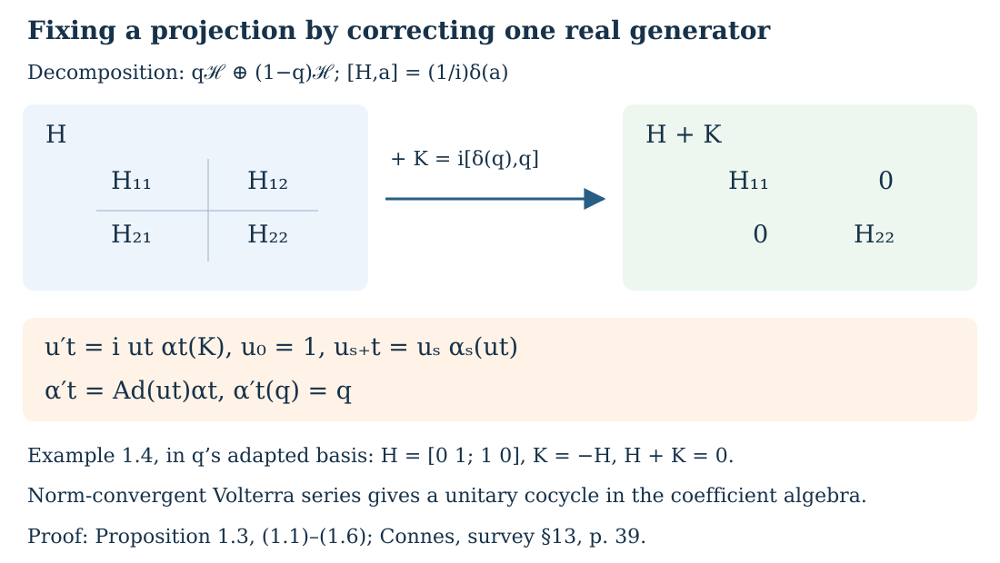

# Connections and curvature from symmetries of an algebra

*Written by GPT-6.1 Sol (OpenAI), September 2026, at Ultra. Not yet reviewed. Public domain (CC0).*

An action of a Lie group supplies directions in which elements of an algebra can be differentiated. A finite projective module plays the role of a vector bundle. A connection differentiates its sections, and curvature measures the failure of successive derivatives to agree with the Lie bracket. An invariant trace turns powers of this curvature into ordinary Lie algebra cohomology classes.

We assume a unital complex C*-algebra \(A\), a finite-dimensional real Lie group \(G\), and an action \(\alpha:G\to\operatorname{Aut}(A)\) continuous in norm on each element. We also use matrix functional calculus and finite projective modules. The convention for a right-module inner product is \(\langle\xi,\eta\rangle=\xi^*\eta\), linear in the second argument. Basic references are [Khalkhali 2007] and [Connes 1980]. The lesson [Cyclic cohomology: traces, differentials and symmetry](the-cyclic-category-and-cyclic-cohomology-as-ext.md) explains the graded-trace mechanism that will appear below.

## 1. Smooth elements retain projective modules

Put

\[
A^\infty=\{a\in A:g\mapsto\alpha_g(a)\text{ is smooth in norm}\}.
\]

For \(X\in\mathfrak g=\operatorname{Lie}(G)\), define

\[
\delta_X(a)=\left.\frac{d}{dt}\right|_{t=0}\alpha_{\exp(tX)}(a).
\]

Differentiating products and involutions shows that \(A^\infty\) is a unital *-algebra, \(\delta_X\) is a *-derivation, and \([\delta_X,\delta_Y]=\delta_{[X,Y]}\). The last identity is the derivative of a group representation; it can also be obtained by differentiating the commutator of the two one-parameter actions in the two parameters.

**Lemma 1.1.** The algebra \(A^\infty\) is dense in \(A\). It is stable under holomorphic functional calculus in \(A\), and the same holds for all matrix algebras over it.

**Proof.** Choose smooth nonnegative functions \(f\) supported near the identity, with integral one for left Haar measure, and set

\[
a_f=\int_G f(g)\alpha_g(a)\,dg.
\]

After applying \(\alpha_h\) and changing variables, the coefficient function is \(f(h^{-1}g)\). Its derivatives in \(h\) are smooth, supported in a fixed compact set when \(h\) varies near the identity, and bounded there. Differentiation under the norm integral proves that \(a_f\) is smooth. Norm continuity of \(\alpha\) and concentration of the support at the identity give \(a_f\to a\).

If \(a\in A^\infty\) is invertible in \(A\), then \(\alpha_g(a^{-1})=\alpha_g(a)^{-1}\). Inversion on the open set of invertible elements of a Banach algebra is smooth: the Neumann expansion near an invertible element gives derivatives, starting with \(D\mathrm{inv}_a(h)=-a^{-1}ha^{-1}\). Thus \(a^{-1}\in A^\infty\).

For a function \(F\) holomorphic near the spectrum of \(a\), the contour formula for \(F(a)\) is an integral of resolvents \((z-a)^{-1}\). On a fixed contour, their derivatives in the group variable are continuous and uniformly bounded. The same differentiation argument shows that \(F(a)\) is smooth. Entrywise action and matrix inversion prove the matrix assertions. \(\square\)

We represent a finite projective right module by \(pA^r\), with \(p\in M_r(A)\) an orthogonal projection. Here is why an algebraic finite projective module has such a representation. Being a summand of a finite free module, it is \(eA^r\) for an idempotent \(e\). Set

\[
B=1-(e-e^*)^2=1+(e-e^*)^*(e-e^*),\qquad
p=ee^*B^{-1}.
\]

The positive element \(B\) is invertible. Direct multiplication using \(e^2=e\) gives \((ee^*)B=(ee^*)^2\); taking adjoints also gives \(B(ee^*)=(ee^*)^2\). Thus the two factors in \(p\) commute, \(p=p^*\), and \(p^2=p\). Moreover \(Be=ee^*e\), so \(pe=e\), whereas \(ep=p\). Hence \(pA^r=eA^r\). The same replacement works over \(A^\infty\) because Lemma 1.1 makes \(B^{-1}\) smooth when \(e\) is smooth. This includes algebraic finite projective modules, as well as their Hilbert-module realizations.

**Theorem 1.2.** Every module \(pA^r\) is obtained by extending scalars from a module \(q(A^\infty)^r\) for a smooth orthogonal projection \(q\). If two smooth finite projective modules become isomorphic over \(A\), they were already isomorphic over \(A^\infty\).

**Proof.** Approximate \(p\) by a self-adjoint \(b\in M_r(A^\infty)\) with \(\|b-p\|<1/8\). Its spectrum lies within \(1/8\) of \(\{0,1\}\). The spectral projection around the component near one is

\[
q=\frac1{2\pi i}\int_{|z-1|=1/2}(z-b)^{-1}\,dz.
\]

Lemma 1.1 makes \(q\) smooth, and self-adjointness of \(b\) makes \(q\) an orthogonal projection. On the contour, \(\|(z-p)^{-1}\|\leq2\) and \(\|(z-b)^{-1}\|\leq8/3\). The resolvent identity therefore gives

\[
\|q-p\|\leq\frac83\|b-p\|<\frac13.
\]

The operator \(qp:pA^r\to qA^r\) is an isomorphism. Indeed \(pqp\) and \(qpq\) differ from their corner units by norm less than one, so both are invertible. The first gives a left inverse \((pqp)^{-1}pq\), and the second gives a right inverse \(pq(qpq)^{-1}\); a map with both a left and a right inverse has those inverses equal. Thus \(pA^r\simeq qA^r\). Extending scalars from the smooth module gives \(qA^r\).

For uniqueness, let smooth projections \(q,r\) represent the two modules, and let \(v\in rM_{s,t}(A)q\) represent an isomorphism between them. Both \(v^*v\) in the \(q\)-corner and \(vv^*\) in the \(r\)-corner are invertible. Approximate \(v\) in norm by \(v_\infty\in rM_{s,t}(A^\infty)q\). For sufficiently close approximation these two positive products remain invertible. Their inverses belong to the smooth corners by Lemma 1.1, applied to a corner element after adding the complementary projection. Hence

\[
(v_\infty^*v_\infty)^{-1}v_\infty^*
\]

is a smooth inverse of \(v_\infty\). This gives the required isomorphism over \(A^\infty\). \(\square\)

No equivariant structure on the projective module was assumed: the smooth structure comes from the algebra action, and the connection constructed next need not integrate to a group action on the module.

### A real action can be changed to fix a projection

Theorem 1.2 supplies a smooth representative. For a single real direction there is a further conclusion: an exterior-equivalent action can fix that representative. This is the additional clause of the first lemma in [Connes 1982, §13].

**Proposition 1.3.** Let \(\alpha:\mathbb R\to\operatorname{Aut}(A)\) be pointwise norm-continuous. Every orthogonal projection \(p\in M_r(A)\) is equivalent to a smooth orthogonal projection \(q\), and there is a norm-continuous unitary cocycle \(u_t\) for the entrywise action such that
\[
 u_{s+t}=u_s\alpha_s(u_t),\qquad
 \alpha'_t=\operatorname{Ad}(u_t)\alpha_t,\qquad
 \alpha'_t(q)=q.
 \tag{1.1}
\]
For \(r=1\) this is an action on \(A\) itself. In a nonunital algebra the cocycle belongs to \(1+M_r(A)\), inside its unitization.

**Proof.** Theorem 1.2 gives \(q\); the same proof in a nonunital algebra is performed in its unitization. The Riesz contour around one has scalar part zero, so \(q\in M_r(A)\), and its corner equivalence with \(p\) remains inside \(M_r(A)\). Let \(\delta\) be the real orbit derivative. Differentiating \(q^2=q=q^*\) gives \(q\delta(q)q=0\), \(\delta(q)^*=\delta(q)\), and
\[
 [[\delta(q),q],q]=\delta(q).
 \tag{1.2}
\]
Thus the coefficient \(K=i[\delta(q),q]\) is bounded and selfadjoint, and
\[
 \delta(q)+i[K,q]=0.
 \tag{1.3}
\]

Construct \(u_t\) in the coefficient algebra, rather than assuming exponentials of an unbounded multiplier lie there. Solve
\[
 u_0=1,\qquad u'_t=i\,u_t\alpha_t(K).
 \tag{1.4}
\]
The Volterra iteration \(u_t=1+i\int_0^t u_s\alpha_s(K)\,ds\) converges uniformly on every bounded interval: its \(k\)-th successive term has norm at most \((|t|\|K\|)^k/k!\). The same estimates apply to negative intervals with the oriented integral. They give a unique continuously differentiable solution, and \(u_t-1\in M_r(A)\) in the nonunital case.

Selfadjointness of \(\alpha_t(K)\) gives \((u_tu_t^*)'=0\). Also \(u_t^*u_t\) solves
\[
 V'_t=-i\alpha_t(K)V_t+iV_t\alpha_t(K),\qquad V_0=1.
\]
Uniqueness gives \(V_t=1\), so \(u_t\) is unitary. For fixed \(s\), the function \(u_s\alpha_s(u_t)\) solves the equation for \(u_{s+t}\), with initial value \(u_s\). Uniqueness therefore proves the cocycle identity in (1.1). This identity makes \(\alpha'\) a group action. Its pointwise norm continuity follows from that of \(\alpha\) and \(u\).

For \(a\) in the domain of \(\delta\), direct differentiation gives
\[
 \frac d{dt}\bigl(u_t\alpha_t(a)u_t^*\bigr)
   =u_t\alpha_t\bigl(\delta(a)+i[K,a]\bigr)u_t^*.
 \tag{1.5}
\]
Taking \(a=q\) and using (1.3) makes this derivative zero. At \(t=0\) the value is \(q\), so \(\alpha'_t(q)=q\) for all real \(t\).

This is the coefficient-cocycle version of deleting the off-diagonal blocks of the action generator. If \(H\) is the canonical selfadjoint multiplier with \([H,a]=(1/i)\delta(a)\), then on its core
\[
 H+K=qHq+(1-q)H(1-q).
 \tag{1.6}
\]
Indeed its diagonal coefficient blocks are zero and the two off-diagonal blocks of \(K\) cancel those of \(H\). Formula (1.6) agrees with the compressed-generator calculation in [the action lesson, (7.16)](pseudodifferential-calculus-for-actions-of-rn.md#a-bounded-perturbation-exposes-the-thom-class); the direct construction (1.4) proves the required norm-continuous exterior equivalence without an additional multiplier-domain assertion. \(\square\)

**Example 1.4.** On \(M_2(\mathbb C)\), take \(H=\operatorname{diag}(1,-1)\), \(\alpha_t=\operatorname{Ad}e^{itH}\), and \(q=\frac12\left(\begin{smallmatrix}1&1\\1&1\end{smallmatrix}\right)\). Here \(\delta(q)=i[H,q]\) and \(K=-H\). Since \(\alpha_t(K)=K\), (1.4) gives \(u_t=e^{-itH}\). Consequently \(\alpha'_t\) is the identity action and fixes \(q\). In the basis consisting of \(q\)'s unit vector and its orthogonal complement, \(H\) has only off-diagonal entries. The correction deletes precisely those entries.

For several commuting real directions this construction supplies separate bounded corrections. Their corrected generators need not commute, so it does not automatically give an action of \(\mathbb R^n\). The curvature developed below records that obstruction.

**Figure 1.1.** In the decomposition \(q\mathcal H\oplus(1-q)\mathcal H\), the bounded selfadjoint coefficient \(K=i[\delta(q),q]\) cancels the two off-diagonal generator blocks. Proposition 1.3 constructs the coefficient cocycle implementing this correction; Example 1.4 gives the displayed numerical matrices. Human source: [Connes 1982, §13, first lemma, p. 39]. [Open the scalable diagram](../assets/fixed-projection-generator.svg).

## 2. Lie algebra forms with noncommuting coefficients

Write \(\mathfrak g_\mathbb C\) for the complexification and put

\[
\Omega^j=A^\infty\otimes\bigwedge^j\mathfrak g_\mathbb C^*.
\]

Multiply coefficients in their given order and wedge the exterior factors. This algebra is not graded commutative. For an alternating form \(\omega\), define

\[
\begin{aligned}
(d\omega)(X_0,\ldots,X_j)
={}&\sum_{i=0}^j(-1)^i\delta_{X_i}
 \omega(X_0,\ldots,\widehat X_i,\ldots,X_j)\\
 &+\sum_{i<\ell}(-1)^{i+\ell}
 \omega([X_i,X_\ell],X_0,\ldots,\widehat X_i,\ldots,
 \widehat X_\ell,\ldots,X_j).
\end{aligned}
\tag{2.1}
\]

In particular,

\[
(da)(X)=\delta_X(a),\qquad
(d\omega)(X,Y)=\delta_X\omega(Y)-\delta_Y\omega(X)-\omega([X,Y])
\]

for degrees zero and one. Alternation and the derivation rule for \(\delta_X\) give
\(d(\omega\eta)=d\omega\,\eta+(-1)^{\deg\omega}\omega\,d\eta\).
Also \(d^2=0\): terms differentiating two coefficients combine as \([\delta_X,\delta_Y]-\delta_{[X,Y]}\); terms with a derivative and a disjoint bracket cancel in pairs; the three nested-bracket terms for each triple are the Jacobi identity. These are all possible terms in the double application of (2.1).

## 3. Curvature and the Bianchi identity

Let \(E=p(A^\infty)^r\). A connection is a complex-linear assignment \(X\mapsto\nabla_X\), linear in \(X\), with

\[
\nabla_X(\xi a)=(\nabla_X\xi)a+\xi\delta_X(a).
\tag{3.1}
\]

**Proposition 3.1.** The Grassmann connection \(\nabla_X^0\xi=p\delta_X\xi\) exists and preserves the inner product. Every other connection is uniquely \(\nabla^0+\theta\) with \(\theta\in pM_r(\Omega^1)p\). It preserves the inner product precisely when \(\theta(X)^*=-\theta(X)\) for real \(X\).

**Proof.** The derivation rule proves (3.1) for \(p\delta_X\). Since \(p\xi=\xi\) and \(p\eta=\eta\),

\[
\langle p\delta_X\xi,\eta\rangle+
\langle\xi,p\delta_X\eta\rangle
=\delta_X(\xi^*\eta).
\]

The difference of two connections is \(A^\infty\)-linear in \(\xi\), hence is a corner matrix, separately for each \(X\). This also proves uniqueness of \(\theta\). The additional terms in the metric identity are \(\xi^*(\theta(X)^*+\theta(X))\eta\). They vanish for all \(\xi,\eta\) exactly when the corner matrix in parentheses is zero. \(\square\)

**Definition 3.2.** The curvature is the alternating endomorphism-valued form

\[
\Theta(X,Y)=[\nabla_X,\nabla_Y]-\nabla_{[X,Y]}.
\tag{3.2}
\]

The coefficient derivative terms in its action on \(\xi a\) cancel because \([\delta_X,\delta_Y]=\delta_{[X,Y]}\). Thus curvature is \(A^\infty\)-linear.

Extend the connection to \(E\)-valued forms by the graded Leibniz rule. Denote that degree-one operator by \(D\). On column-valued forms it is \(D\xi=p\,d\xi+\theta\xi\). Its square is multiplication by the curvature.

**Theorem 3.3.** In matrix-valued forms,

\[
\Theta=p(dp)(dp)p+p(d\theta+\theta^2)p,
\qquad
p(d\Theta)p=\Theta\theta-\theta\Theta.
\tag{3.3}
\]

**Proof.** Differentiating \(p^2=p\) gives \(p(dp)p=0\). Applying \(D^2\) to \(\xi=p\xi\), use
\(d\xi=(dp)\xi+p\,d\xi\) and \(p(dp)p=0\). The terms containing \(d\xi\) cancel by the graded Leibniz rule, leaving

\[
D^2\xi=p(dp)(dp)\xi+p(d\theta)\xi+\theta^2\xi.
\]

This is the first formula, since \(\theta=p\theta p\). On an endomorphism-valued \(j\)-form \(T=pTp\), the induced covariant derivative is

\[
D_{\mathrm{End}}T=p(dT)p+\theta T-(-1)^jT\theta.
\]

Associativity of operators gives \(DD^2=D^2D\). Therefore \(D_{\mathrm{End}}\Theta=0\), which for degree two is exactly the second formula. This is the Bianchi identity. \(\square\)

There is also a formula that does not require choosing a projection. For \(T\in\operatorname{End}_{A^\infty}(E)\), define
\(\partial_XT=[\nabla_X,T]\). The right Leibniz rule shows that this commutator is again a module endomorphism. Expanding a commutator with a product proves that \(\partial_X\) is a derivation of the endomorphism algebra. The Jacobi identity for operator commutators gives

\[
[\partial_X,\partial_Y]-\partial_{[X,Y]}
=\operatorname{ad}_{\Theta(X,Y)}.
\tag{3.4}
\]

If a second connection is \(\nabla+\Gamma\), expanding its commutators gives

\[
\Theta_{\nabla+\Gamma}(X,Y)-\Theta_\nabla(X,Y)
=\partial_X\Gamma_Y-\partial_Y\Gamma_X-\Gamma_{[X,Y]}
 +[\Gamma_X,\Gamma_Y].
\tag{3.5}
\]

This formula contains the derivative terms as well as the quadratic commutator. For two commuting directions it is the curvature variation used in the first Chern-number calculation.

## 4. Tracing curvature gives cohomology classes

Let \(\tau:A\to\mathbb C\) be a bounded trace invariant under \(G\). In particular \(\tau\delta_X=0\). On matrices use the unnormalized extension \(\tau_r=\tau\circ\operatorname{Tr}_r\), and apply it to the coefficients of a form. On the \(p\)-corner write this map as \(\tau_E\).

The target is the complex of alternating scalar forms on \(\mathfrak g_\mathbb C\), with the Chevalley–Eilenberg differential \(d_{\mathfrak g}\) for the trivial coefficient representation. Invariance of \(\tau\) and the formula (2.1) give

\[
\tau_r(dT)=d_{\mathfrak g}\tau_r(T),\qquad
\tau_r(TU)=(-1)^{ij}\tau_r(UT)
\quad(\deg T=i,\deg U=j).
\tag{4.1}
\]

For a corner form \(T=pTp\), differentiating this relation yields
\(dT=(dp)T+p(dT)p+(-1)^{\deg T}T(dp)\). The traces of the first and last terms vanish: cyclically moving the degree-zero projection reduces them to expressions containing \(p(dp)p=0\). Thus

\[
\tau_E(D_{\mathrm{End}}T)=d_{\mathfrak g}\tau_E(T).
\tag{4.2}
\]

**Theorem 4.1.** For each \(k\geq1\), the scalar form \(\tau_E(\Theta^k)\) is closed. Its cohomology class depends only on the smooth projective module, and not on its connection. More precisely, if \(\nabla_t=\nabla_0+t\eta\), then

\[
\tau_E(\Theta_1^k)-\tau_E(\Theta_0^k)
=d_{\mathfrak g}\left(k\int_0^1
 \tau_E(\eta\Theta_t^{k-1})\,dt\right).
\tag{4.3}
\]

**Proof.** The Bianchi identity and the graded derivation rule give
\(D_{\mathrm{End}}(\Theta^k)=0\). Equation (4.2) proves closedness. Differentiating curvature along the affine path gives \(\dot\Theta_t=D_{\mathrm{End},t}\eta\). Since curvature has even degree, cyclically rotating the factors under the graded trace gives

\[
\frac{d}{dt}\tau_E(\Theta_t^k)
=k\tau_E((D_{\mathrm{End},t}\eta)\Theta_t^{k-1})
=k\,d_{\mathfrak g}\tau_E(\eta\Theta_t^{k-1}).
\]

The second equality again uses the Bianchi identity. Integrating gives (4.3).

Finally, an isomorphism of smooth projective modules transports a connection and conjugates its curvature. The matrix trace of the transported curvature agrees with the original trace. To verify this even for different matrix sizes, write the isomorphism and its inverse as rectangular matrices \(v,w\), with \(wv=p\), \(vw=q\). Then \(\tau_s(vTw)=\tau_r(Twv)=\tau_r(T)\). This proves dependence only on the isomorphism class. \(\square\)

It follows that

\[
\operatorname{ch}_\tau(E)=
\sum_{k\geq0}\frac1{k!(2\pi i)^k}
 [\tau_E(\Theta^k)],\qquad \tau_E(\Theta^0)=\tau_r(p),
\tag{4.4}
\]

is additive under direct sum. The sum is finite because forms above \(\dim G\) vanish. Define \(K_0(A)\) here as the group completion of stable isomorphism classes of finite projective modules. Theorem 1.2 makes (4.4) a well-defined homomorphism from \(K_0(A)\) to even Lie algebra cohomology. This construction alone does not assert that a Chern number is an integer; integrality requires an additional index or classification argument.

**Example 4.2.** For a trivial action, every element is smooth and the Grassmann curvature is zero. A connection can still have nonzero curvature: on a free module over a scalar algebra, a constant matrix-valued one-form \(\theta\) gives \(\Theta=d\theta+\theta^2\). Its traced powers represent zero in positive-degree cohomology, by Theorem 4.1 applied to the path from the zero connection. Thus nonzero curvature and a nonzero characteristic class are different assertions.

## 5. Gauge changes and the one-dimensional pairing

Consider two actions of \(\mathbb R^2\), related by a norm-continuous unitary cocycle:

\[
\beta_t=\operatorname{Ad}(u_t)\alpha_t,\qquad
u_{s+t}=u_s\alpha_s(u_t).
\tag{5.1}
\]

This is **exterior equivalence**; the cocycle identity is part of the hypothesis. Pointwise agreement of actions modulo inner automorphisms is a different condition. A trace invariant under \(\alpha\) is invariant under \(\beta\) as well.

**Theorem 5.1.** For each \(x\in K_0(A)\), the first Chern number computed with \(\alpha\) equals that computed with \(\beta\). No differentiability of \(u\) is required.

**Proof.** On \(M_2(A)\), put

\[
\gamma_t=\operatorname{Ad}\begin{pmatrix}1&0\\0&u_t\end{pmatrix}
 \circ(\alpha_t\otimes\mathrm{id}).
\]

The cocycle identity makes this a norm-continuous action. Its two diagonal corners have actions \(\alpha\) and \(\beta\), and the unnormalized matrix trace extending \(\tau\) is invariant. The corner projections are fixed by \(\gamma\). For a smooth projection in either corner, the Grassmann curvature calculation for \(\gamma\) is therefore exactly the curvature calculation in that corner.

The two corner inclusions induce the same map on \(K_0\): copies of a projection in the two corners are equivalent using the off-diagonal matrix unit. Theorem 1.2 supplies smooth representatives and a smooth module isomorphism when these representatives define the same completed module. The connection-independent class of Theorem 4.1 for \(\gamma\) gives equal first Chern numbers on the two corner representatives. Hence the original two actions give equal values on \(x\). \(\square\)

**Corollary 5.1a (a real scalar in two directions).** Let \(A\) be unital, let \(\alpha\) be a pointwise norm-continuous action of \(\mathbb R^2\), and let \(\tau\) be a positive \(\alpha\)-invariant trace with \(\tau(1)=1\). Fix the ordered standard Lie algebra basis \(X_1,X_2\), with generators \(\delta_1,\delta_2\). For a smooth projective module \(E\), the first Chern value is an actual real number independent of the connection. On projection classes it is
\[
\begin{aligned}
c_{1,\alpha}([p])
&=\frac{1}{2\pi i}\tau_E\bigl(\Theta(X_1,X_2)\bigr)\\
&=\frac{1}{2\pi i}\tau_r
   \bigl(p[\delta_1p,\delta_2p]p\bigr),\\
c_{1,\alpha}&:K_0(A)\longrightarrow\mathbb R
\quad\text{is additive}.
\end{aligned}
\tag{5.1a}
\]
For unitary cocycles in this unital setting, strict continuity and norm continuity coincide:
\[
t\longmapsto u_t\text{ is strictly continuous in }M(A)
\quad\Longleftrightarrow\quad
t\longmapsto u_t\text{ is norm continuous in }A.
\tag{5.1b}
\]
Consequently Theorem 5.1 applies to the full strictly continuous unitary-cocycle convention here, with no differentiability requirement on the cocycle.

**Proof.** The Chevalley–Eilenberg differential on scalar Lie algebra forms contains the coefficient-representation terms and the Lie-bracket terms. The coefficient representation is trivial and \(\mathbb R^2\) is abelian, so every term vanishes. Thus \(d_{\mathfrak g}=0\) in every degree. Theorem 4.1's transgression formula gives equality of the scalar two-forms themselves, hence of their values on \(X_1,X_2\), for any two connections. Choosing the Grassmann connection gives the projection formula in (5.1a).

The smooth projection \(p\) is selfadjoint, and each \(\delta_j\) is a *-derivation, so \(\delta_jp\) is selfadjoint. Differentiating \(p^2=p\) gives
\[
p(\delta_jp)p=0,\qquad
(1-p)(\delta_jp)(1-p)=0.
\]
Each \(\delta_jp\) is therefore off diagonal relative to \(p\). The product of two such matrices is diagonal. Hence their commutator commutes with \(p\), and
\[
T=p[\delta_1p,\delta_2p]
 =p[\delta_1p,\delta_2p]p,\qquad T^*=-T.
\]
The positive matrix trace \(\tau_r\) satisfies
\(\tau_r(T^*)=\overline{\tau_r(T)}\). Thus \(\tau_r(T)\) is purely imaginary and \(\tau_r(T)/(2\pi i)\) is real. Connection independence proves the same conclusion for a connection whose curvature is not itself skewadjoint.

Theorem 1.2 gives smooth representatives for every completed projection module and smooth isomorphisms for completed equivalent modules. The trace-transport calculation in Theorem 4.1 proves equality on such isomorphism classes. Block direct sums add curvature traces, and adjoining an identity block adds zero first Chern value. Passing to the group completion gives the stated real additive homomorphism, including all virtual differences of projective modules.

Finally \(M(A)=A\) because \(A\) is unital. The strict topology tests multiplication on either side by each element of \(A\). Testing with \(1\) shows that strict continuity of \(u_t\) implies norm continuity. Conversely
\[
\|(u_t-u_s)a\|\leq\|u_t-u_s\|\,\|a\|,\qquad
\|a(u_t-u_s)\|\leq\|a\|\,\|u_t-u_s\|
\]
proves strict continuity from norm continuity. This proves (5.1b) and permits direct application of Theorem 5.1. \(\square\)

**Source terminology.** [Connes' survey, §13, Theorem 6 and its proof, p. 40](https://alainconnes.org/wp-content/uploads/foliationsfine.pdf) uses the term outer equivalence and invokes the two-by-two matrix argument. The [primary IHES Thom preprint, §I, printed p. 6 / PDF p. 7, definition preceding Lemma 3 and displayed matrix action](https://repo-archives.ihes.fr/FONDS_IHES/I_Prepublications/CONNES/1976-1984/M_80_28/M_80_28.pdf) defines exterior equivalence by a strictly continuous multiplier-valued unitary one-cocycle and gives that matrix construction. Reading the survey's term in this cocycle sense is a contextual identification supported by the shared mechanism; the survey does not supply a separate definition there. This proves no assertion about mere pointwise equality in \(\operatorname{Out}(A)\).

For an action of \(\mathbb R\), let \(\delta\) be its generator and let \(u\in M_r(A^\infty)\) be invertible. Define

\[
w_\tau(u)=\frac1{2\pi i}\tau_r(u^{-1}\delta u).
\tag{5.2}
\]

**Theorem 5.2.** This expression is additive under products and stable direct sum, and constant on norm-homotopy classes of invertibles. It therefore gives a homomorphism \(K_1(A)\to\mathbb C\).

**Proof.** The derivation rule and the trace identity give

\[
\tau_r((uv)^{-1}\delta(uv))
=\tau_r(v^{-1}u^{-1}(\delta u)v)+\tau_r(v^{-1}\delta v)
=\tau_r(u^{-1}\delta u)+\tau_r(v^{-1}\delta v).
\]

Direct sum follows from the unnormalized matrix trace, and adding an identity block contributes zero. For a differentiable path \(u_t\) of smooth invertibles,

\[
\frac d{dt}\tau_r(u_t^{-1}\delta u_t)
=\tau_r\bigl(\delta(u_t^{-1}\dot u_t)\bigr)=0.
\]

In deriving the equality, use \(\delta(u^{-1})=-u^{-1}(\delta u)u^{-1}\) and cyclically rotate the other term. The last equality is trace invariance.

Smooth invertibles suffice to compute norm components. An invertible can be approximated in norm by a smooth element, and a sufficiently close approximation is invertible by a Neumann series. A norm-continuous path between smooth invertibles can be approximated uniformly by a polygonal path whose vertices are smooth, retaining the endpoints. Choose its mesh and approximation so that every segment lies in an invertibility neighborhood of the corresponding original path. Lemma 1.1 makes inverses on that polygonal path smooth in the algebra variables. Each segment has the differentiability required above. Thus (5.2) is constant on norm components, including after stabilization. This is the defining relation for \(K_1(A)\). \(\square\)

**Example 5.3.** Take smooth functions on \(\mathbb R/\mathbb Z\), with translation action, generator \(d/ds\), and trace \(\int_0^1\). For a nowhere-zero smooth function \(u\), (5.2) is its winding number. Choose a logarithm at \(s=0\) and extend it by

\[
L(s)=L(0)+\int_0^s\frac{u'(t)}{u(t)}\,dt.
\]

Differentiating \(e^{L(s)}/u(s)\) shows it is constantly one. Since \(u(1)=u(0)\), \(L(1)-L(0)\) lies in \(2\pi i\mathbb Z\). Hence \(w_\tau(u)\in\mathbb Z\), and \(w_\tau(e^{2\pi i m s})=m\).

The same construction has higher odd degrees for a general Lie-group action. For a smooth invertible \(u\in M_r(A^\infty)\), let \(\omega=u^{-1}du\), using the differential of Section 2, and put

\[
\operatorname{ch}_{\tau,\mathrm{odd}}(u)
=\sum_{k\geq0}\frac{(-1)^k k!}{(2k+1)!}
 \left(\frac1{2\pi i}\right)^{k+1}
 [\tau_r(\omega^{2k+1})].
\tag{5.4}
\]

Only terms with \(2k+1\leq\dim G\) can be nonzero. Its degree-one part is (5.2).

**Theorem 5.4.** The forms in (5.4) are closed, their classes are invariant under norm homotopy and stabilization, and (5.4) defines a homomorphism
\(K_1(A)\to H^{\mathrm{odd}}(\mathfrak g;\mathbb C)\).

**Proof.** The derivative of an inverse gives the Maurer–Cartan identity \(d\omega=-\omega^2\). Applying the graded Leibniz rule to powers of a degree-one element gives
\(d(\omega^{2k})=0\) and \(d(\omega^{2k+1})=-\omega^{2k+2}\).
The graded trace of an even power is zero: moving its first factor of degree one past its other \(2k+1\) factors changes sign. Consequently
\(d_{\mathfrak g}\tau_r(\omega^{2k+1})=-\tau_r(\omega^{2k+2})=0\).

For a differentiable path \(u_t\), put \(b_t=u_t^{-1}\dot u_t\). Direct differentiation gives
\(\dot\omega_t=db_t+[\omega_t,b_t]\).
Each factor differentiated in the traced odd power contributes the same term, because cyclically moving factors through an odd total degree produces an even sign exponent. The commutator terms have zero trace. Since \(d(\omega_t^{2k})=0\), it follows that

\[
\frac d{dt}\tau_r(\omega_t^{2k+1})
=(2k+1)d_{\mathfrak g}\tau_r(b_t\omega_t^{2k}).
\tag{5.5}
\]

Integrating gives an explicit transgression and proves homotopy invariance of each class. The polygonal smoothing argument in Theorem 5.2 extends it to norm homotopies between smooth invertibles and supplies smooth representatives for every class.

Block sums add the forms, and an identity block contributes zero. To see product additivity on classes, first put \(u,v\) in the same matrix size by stabilization. Let \(R_t\) be the scalar block rotation through angle \(t\). The path

\[
\begin{pmatrix}u&0\\0&1\end{pmatrix}
 R_t\begin{pmatrix}v&0\\0&1\end{pmatrix}R_t^{-1},
\qquad 0\leq t\leq\pi/2,
\]

joins \(\operatorname{diag}(uv,1)\) to \(\operatorname{diag}(u,v)\). It consists of smooth invertibles. Transgression and block additivity therefore identify the class of \(uv\) with the sum of the classes of \(u\) and \(v\). These are precisely the stable homotopy and product relations defining \(K_1\), proving the assertion. \(\square\)

For a two-parameter action, the Grassmann formula reads

\[
c_1(p)=\frac1{2\pi i}\tau_r
 \bigl(p(\delta_1p\,\delta_2p-\delta_2p\,\delta_1p)\bigr).
\tag{5.3}
\]

If \(p\) is fixed by a nontrivial one-parameter subgroup, choose one coordinate along that subgroup. The corresponding derivative of \(p\) vanishes, so the curvature form and \(c_1(p)\) vanish. By Theorem 4.1, the same holds for a projective module isomorphic to such a fixed projection module.

For a nonunital algebra, extend the action to its unitization by fixing the scalar unit. Projections belonging to matrices over \(A\) can be smoothed there while remaining in \(A\): the spectral cutoff is zero at zero. The corner isomorphism argument of Theorem 1.2 remains within the ideal. On the relative group \(K_0(A)=\ker(K_0(A^+)\to K_0(\mathbb C))\), extend the bounded trace to the unitization. Different choices differ by a scalar-quotient trace. Its positive-degree characteristic classes vanish, since the scalar algebra has a zero reference connection, and its degree-zero value vanishes on the relative group. Thus the resulting character is independent of that choice. The odd formulas use invertibles with scalar part the identity, so every differentiated factor and every positive-degree odd form lies in the ideal; their traced classes are likewise independent of the extension.

## 6. The smooth rotation algebra

Fix an irrational real number \(\theta\). Let \(A_\theta\) be the universal unital C*-algebra with unitary generators \(U,V\) satisfying

\[
UV=e^{2\pi i\theta}VU.
\tag{6.1}
\]

The action of \(\mathbb R^2/\mathbb Z^2\) is
\(\alpha_{t_1,t_2}(U)=e^{2\pi it_1}U\),
\(\alpha_{t_1,t_2}(V)=e^{2\pi it_2}V\). Hence

\[
\delta_1(U)=2\pi iU,\quad\delta_1(V)=0,\qquad
\delta_2(U)=0,\quad\delta_2(V)=2\pi iV.
\]

**Theorem 6.1.** The smooth algebra consists exactly of series

\[
a=\sum_{n,m\in\mathbb Z}a_{n,m}U^nV^m
\]

whose coefficients decrease faster than every power of \(1+|n|+|m|\). The coefficient \(a_{0,0}\) defines the unique normalized trace on \(A_\theta\).

**Proof.** Fourier projection for the torus action is

\[
P_{n,m}(a)=\int_{[0,1]^2}e^{-2\pi i(nt_1+mt_2)}\alpha_t(a)\,dt.
\]

Laurent polynomials in \(U,V\) are dense by the definition of the generated C*-algebra. On them this projection has range \(\mathbb C U^nV^m\). Continuity and the fact that this one-dimensional space is closed give the same range on \(A_\theta\). If \(a\) is smooth, integration by parts in both torus variables bounds its coefficient after multiplication by arbitrary powers of \(n,m\). Equivalently, applying powers of \(1-\partial_{t_1}^2-\partial_{t_2}^2\) gives arbitrary powers of \(1+n^2+m^2\). Thus the coefficients are rapidly decreasing.

Conversely, a rapidly decreasing series and every series obtained by multiplying its coefficients by a polynomial in \(n,m\) converge absolutely in norm, since the monomials are unitaries. Termwise differentiation of the orbit series is justified uniformly on the torus. It gives all derivatives and proves smoothness. Fourier uniqueness follows, for example, by convolving the orbit function with product Fejér kernels, which converge in norm to its value at the identity.

The torus average \(P_{0,0}\) is a positive unital map with scalar range; let \(\tau(a)1=P_{0,0}(a)\). The monomial multiplication rule is

\[
(U^nV^m)(U^rV^s)=e^{-2\pi i\theta mr}U^{n+r}V^{m+s}.
\]

Both orders have zero scalar coefficient unless \((r,s)=(-n,-m)\); in that case both phases equal \(e^{2\pi i\theta mn}\). Thus \(\tau\) is a trace on polynomials and, by norm continuity, on \(A_\theta\). For any normalized trace, invariance under conjugation by \(U\) and \(V\) forces its value on each nonconstant monomial to be zero, because \(\theta\) is irrational. Density proves uniqueness. \(\square\)

There is a projection that makes the obstruction visible inside the algebra itself. We use the Powers–Rieffel construction, with the orientation fixed by (6.1); its role in \(K\)-theory is described in [Pimsner–Voiculescu 1980, Appendix]. Suppose \(0<\theta<1\). Choose
\(0<a<b<a+\theta<b+\theta<1\), and a smooth function \(F\) rising from zero to one on \([a,b]\), flat at both ends, such that \(\sqrt{F(1-F)}\) is also smooth and flat there. For example take \(F=\sin^2(\pi H/2)\), where \(H\) is a smooth increasing step flat at zero and one.

Define periodic functions \(f,g\) by setting \(f=F\) on \([a,b]\), \(f=1\) on \([b,a+\theta]\), \(f(t)=1-F(t-\theta)\) on \([a+\theta,b+\theta]\), and \(f=0\) elsewhere in \([0,1]\). Set \(g=\sqrt{f-f^2}\) on the falling interval \([a+\theta,b+\theta]\), and zero elsewhere. They are smooth by the chosen flatness. Regarding these as functions of \(U\), put

\[
e=V^*g+f+gV.
\tag{6.2}
\]

**Proposition 6.2.** The element \(e\) is a smooth orthogonal projection with \(\tau(e)=\theta\) and \(c_1(e)=-1\), for the ordered derivations specified above.

**Proof.** The relation (6.1) gives
\(Vh(U)V^*=h(t-\theta)\). In the expansion \(e=\sum e_m(t)V^m\), the coefficients are
\(e_0=f\), \(e_1=g\), \(e_{-1}=g(t+\theta)\).
The coefficient product rule is
\((hV^m)(kV^r)=h(t)k(t-m\theta)V^{m+r}\).
The coefficient of \(V^0\) in \(e^2\) is
\(f^2+g^2+g(t+\theta)^2=f\): the two \(g^2\) terms supply \(f-f^2\) on the falling and rising intervals, respectively. The coefficient of \(V\) is
\(g(t)(f(t)+f(t-\theta))=g(t)\), since the sum in parentheses is one on the support of \(g\). The coefficient of \(V^2\) is zero because the supports of \(g(t)\) and \(g(t-\theta)\) are disjoint on the circle. The negative coefficients follow by taking adjoints, since (6.2) is self-adjoint. Thus \(e^2=e=e^*\). The two transition intervals contribute a total integral \(b-a\) to \(f\), and the plateau has length \(\theta-(b-a)\). Hence \(\tau(e)=\int_0^1 f(t)dt=\theta\).

We compute the Chern number directly rather than obtaining its sign from a trace classification. Differentiation of a coefficient gives \(\delta_1(hV^m)=h'V^m\) and \(\delta_2(hV^m)=2\pi i m hV^m\). In the scalar coefficient of \(e[\delta_1e,\delta_2e]\), the only contributing index triples are the six permutations of \((0,1,-1)\). Write \(g_+(t)=g(t+\theta)\). After cancelling \(2\pi i\), their sum is

\[
2f(g_+g_+'-gg')
 +g^2(f'-f'(t-\theta))
 +g_+^2(f'(t+\theta)-f').
\]

In the integral, translate the \(g_+\)-terms by \(\theta\). The first pair then becomes
\(2(f(t-\theta)-f(t))gg'\). Integration by parts turns it into
\(g^2(f'(t)-f'(t-\theta))\).
The two remaining pairs each contribute that same integral. On the support of \(g\), \(f'(t-\theta)=-f'(t)\), so altogether

\[
c_1(e)=6\int_0^1g(t)^2f'(t)\,dt
=6\int_1^0(x-x^2)\,dx=-1.
\tag{6.3}
\]

This agrees with the constant-curvature computation below and proves nontriviality with an explicit projection. \(\square\)

*Reference:* [Connes 2001, rotation-algebra example] uses \(-6\int g^2f'\) for this Chern number; expansion with the ordered convention (6.1) gives \(+6\int g^2f'\), so the falling interval contributes \(-1\).

## 7. A finite frame on the Schwartz space

Let \(p\in\mathbb Z\), \(q\geq1\), and put \(\varepsilon=p/q-\theta\), which is nonzero. On
\(E_{p,q}=\mathcal S(\mathbb R\times\mathbb Z/q)\), define a right action by

\[
(\xi U)(s,h)=\xi(s+\varepsilon,h+p),\qquad
(\xi V)(s,h)=e^{2\pi i(s-h/q)}\xi(s,h).
\tag{7.1}
\]

The finite coordinate is read modulo \(q\). Changing its representative changes the exponent by an integer, so the formula is well-defined. If \(R_U,R_V\) denote these operators, then

\[
R_UR_V=e^{-2\pi i\theta}R_VR_U.
\]

Since a right action satisfies \(R_{ab}=R_bR_a\), this is precisely (6.1). The sign in the translation is fixed by that equality. A rapidly decreasing sum of monomials acts continuously on the Schwartz space: translations grow each weight seminorm polynomially in \(n\), and modulation derivatives grow polynomially in \(m\). The rapid coefficients dominate both. Hence (7.1) extends to \(A_\theta^\infty\).

*Reference:* [Connes 2001, formulas preceding Theorem 6] translates by \(-\varepsilon\) in the displayed right action; at \(p=0,q=1\) it gives \(R_UR_V=e^{2\pi i\theta}R_VR_U\), which violates the right form of (6.1). Formula (7.1) has the compatible relation, as Exercise 9.4 also verifies.

For \(\xi,\eta\in E_{p,q}\), define

\[
\langle\xi,\eta\rangle_A
=\sum_{n,m\in\mathbb Z}
 \langle R_{U^nV^m}\xi,\eta\rangle_{L^2}\,U^nV^m,
\tag{7.2}
\]

where the \(L^2\) inner product integrates over \(\mathbb R\), sums over the finite coordinate, and is linear in the second variable. These coefficients are rapidly decreasing. For powers of \(n\), use the rapid decay of two Schwartz functions whose arguments differ by \(n\varepsilon\). For powers of \(m\), integrate by parts in the modulation variable; the differentiated products retain the same translation decay. This proves joint rapid decay and that (7.2) belongs to \(A_\theta^\infty\).

**Lemma 7.1.** This form satisfies

\[
\langle\xi,\eta a\rangle_A=\langle\xi,\eta\rangle_Aa,
\qquad
\langle\xi,\eta\rangle_A^*=\langle\eta,\xi\rangle_A.
\tag{7.3}
\]

**Proof.** For a unitary monomial \(a\), use unitarity of \(R_a\) and reversed composition:

\[
\langle R_b\xi,R_a\eta\rangle_{L^2}
=\langle R_{ba^{-1}}\xi,\eta\rangle_{L^2}.
\]

The coefficient of a monomial \(b\) in an element \(x\in A_\theta^\infty\) is \(\tau(b^*x)\). The coefficient of \(b\) in \(\langle\xi,\eta\rangle_Aa\) is therefore the coefficient tested by \(ba^{-1}\), with its unitary phase included. This is the displayed Hilbert-space identity. Hermitian symmetry follows likewise from
\(\overline{\langle R_{b^{-1}}\xi,\eta\rangle_{L^2}}=
\langle R_b\eta,\xi\rangle_{L^2}\).
Linearity proves the identities for polynomials, and continuity in the rapid-decay seminorms proves them for smooth elements. \(\square\)

**Theorem 7.2.** The right module \(E_{p,q}\) is finite projective over \(A_\theta^\infty\). Its trace dimension is

\[
\dim_\tau E_{p,q}=q|\varepsilon|=|p-q\theta|.
\tag{7.4}
\]

There is no coprimality assumption on \(p,q\).

**Proof.** Choose finitely many smooth compactly supported functions \(g_j\) with support intervals of length less than one such that

\[
\sum_{j,n\in\mathbb Z}|g_j(s+n\varepsilon)|^2=1.
\tag{7.5}
\]

To construct them, cover the circle \(\mathbb R/(|\varepsilon|\mathbb Z)\) by finitely many intervals whose lengths are less than both one and \(|\varepsilon|\). Choose bumps \(\beta_j\) supported in lifted intervals and positive on a smaller covering. The function \(w(s)=\sum_{j,n}|\beta_j(s+n\varepsilon)|^2\) is smooth, positive and \(|\varepsilon|\)-periodic. Set \(g_j=\beta_j/\sqrt w\). This proves (7.5).

For \(r\in\mathbb Z/q\), let \(g_{j,r}(s,h)=g_j(s)\mathbf1_{h=r}\). We claim that these finitely many vectors are a frame:

\[
\eta=\sum_{j,r}g_{j,r}\langle g_{j,r},\eta\rangle_A.
\tag{7.6}
\]

Expand (7.2) and the right action. Summing over modulation index \(m\) uses the Fourier identity
\(\sum_m e^{2\pi imx}=\sum_{\ell\in\mathbb Z}\delta(x-\ell)\), applied to Schwartz test functions. At \((s,h)\), the resulting expression is

\[
\sum_{j,r,n,k,\ell}
 g_{j,r}(s+n\varepsilon,h+np)
 \overline{g_{j,r}(s+(k-h)/q-\ell+n\varepsilon,k+np)}
 \eta(s+(k-h)/q-\ell,k).
\]

Both window factors can be nonzero only when \(k=h\) in \(\mathbb Z/q\). Then their real arguments differ by the integer \(\ell\). Their common support interval has length less than one, so only \(\ell=0\) survives. For each \(n,h\), exactly one finite index \(r\) survives. The expression reduces to \(\eta(s,h)\sum_{j,n}|g_j(s+n\varepsilon)|^2=\eta(s,h)\). All coefficient sums before synthesis converge in Schwartz seminorms; the Fourier identity can also be justified by inserting Fejér factors and taking their limit. This proves (7.6).

Index the finite frame by \(i\). Let \(\Phi:(A_\theta^\infty)^N\to E_{p,q}\) send \((a_i)\) to \(\sum_i g_i a_i\), and let \(\Lambda\eta=(\langle g_i,\eta\rangle_A)_i\). By Lemma 7.1 these are right-linear, and (7.6) says \(\Phi\Lambda=1\). Consequently \(P=\Lambda\Phi\) is an idempotent matrix, and Hermitian symmetry gives \(P=P^*\). The two maps identify \(E_{p,q}\) with \(P(A_\theta^\infty)^N\), proving finite projectivity. They also show positivity of the form: (7.6) and (7.3) give
\(\langle\eta,\eta\rangle_A=\sum_i\langle g_i,\eta\rangle_A^*\langle g_i,\eta\rangle_A\).

The trace dimension is

\[
\tau_N(P)=\sum_{j,r}\|g_{j,r}\|_{L^2}^2
=q\sum_j\int_{\mathbb R}|g_j(s)|^2\,ds=q|\varepsilon|.
\]

The last equality follows by integrating (7.5) over one period and using the translates to partition the real line. This proves (7.4). \(\square\)

## 8. Constant curvature and its normalization

On the right module of (7.1), define

\[
\nabla_1\xi=-\frac{2\pi i s}{\varepsilon}\xi,
\qquad \nabla_2\xi=\frac d{ds}\xi.
\tag{8.1}
\]

**Theorem 8.1.** These operators form a metric connection for the ordered derivations \((\delta_1,\delta_2)\), and

\[
\Theta(\delta_1,\delta_2)=\frac{2\pi i}{\varepsilon}\,1_E,
\qquad c_1(E_{p,q})=q\,\operatorname{sgn}(\varepsilon).
\tag{8.2}
\]

**Proof.** Direct computation gives

\[
[\nabla_1,R_U]=2\pi iR_U,\quad[\nabla_1,R_V]=0,
\qquad[\nabla_2,R_U]=0,\quad[\nabla_2,R_V]=2\pi iR_V.
\]

These are the right Leibniz rules for the two generators, and the polynomial-growth estimates already used extend them to all smooth elements. Both operators are skew with respect to the scalar \(L^2\) inner product: for differentiation integrate by parts, and for multiplication the coefficient is purely imaginary. Testing (7.2) on a monomial and using these skew identities and the displayed commutators proves

\[
\delta_j\langle\xi,\eta\rangle_A
=\langle\nabla_j\xi,\eta\rangle_A+
 \langle\xi,\nabla_j\eta\rangle_A.
\]

Thus the connection is metric. Finally \([s,d/ds]=-1\), giving the first formula in (8.2). Tracing the identity endomorphism gives (7.4), so

\[
\frac1{2\pi i}\tau_E(\Theta)
=\frac{q|\varepsilon|}{\varepsilon}
=q\operatorname{sgn}(\varepsilon).
\]

This proves the second formula with the normalization in (5.3). \(\square\)

The curvature endomorphism in (8.2) includes the factor \(2\pi i\). The normalized curvature is \(\Theta/(2\pi i)\). Reversing the order of the two derivations reverses the Chern number. For \(0<\theta<1\), the module \(E_{0,1}\) has dimension \(\theta\) and, with the ordered generators of (6.1), Chern number \(-1\).

The same module admits a useful Fourier description. Set

\[
(J\xi)(s,h)=\frac1{\sqrt{q|\varepsilon|}}
 \sum_{k\in\mathbb Z/q}\int_{\mathbb R}
 e^{-2\pi i st/\varepsilon}e^{-2\pi i hk/q}\xi(t,k)\,dt.
\tag{8.4}
\]

This is a scaled Fourier transform and a finite Fourier transform, so it is an isomorphism of Schwartz spaces and a unitary on their \(L^2\) completions. Changing variables in the \(U\)-formula and shifting the finite summation index gives

\[
J(\xi U)(s,h)=e^{2\pi i(s+ph/q)}J\xi(s,h),\qquad
J(\xi V)(s,h)=J\xi(s-\varepsilon,h+1).
\tag{8.5}
\]

Differentiating the kernel in (8.4), and integrating by parts in \(t\), respectively, give

\[
J\nabla_1J^{-1}=\frac d{ds},\qquad
J\nabla_2J^{-1}=\frac{2\pi i s}{\varepsilon}.
\tag{8.6}
\]

Thus differentiation and multiplication can occupy either displayed position, provided the module action and the ordered derivations are transformed together. Their commutator and traced curvature remain (8.2).

To pass from these modules to every \(K_0\)-class, we use one precise result of C*-algebraic \(K\)-theory. For irrational \(\theta\), the trace induces an isomorphism of abelian groups

\[
\tau_*:K_0(A_\theta)\longrightarrow\mathbb Z+\theta\mathbb Z.
\tag{8.3}
\]

This is [Pimsner–Voiculescu 1980, Corollary 2.6]. Its proof combines their six-term exact sequence with the trace range calculation, also proved in their Appendix. An alternative account is [Blackadar 1998, Theorem 10.2.1, Theorems 10.10.4–10.10.5 and Exercise 10.11.6]. We use (8.3) as a prerequisite here; the smoothness, frame and curvature arguments above do not depend on it.

**Theorem 8.2.** The map \(c_1:K_0(A_\theta)\to\mathbb R\) takes integral values. More precisely, put \(a=\lfloor\theta\rfloor\) and \(\theta_0=\theta-a\). Every class has a unique expression

\[
x=r[1]+s[E_{a,1}],\qquad r,s\in\mathbb Z,
\]

and \(\tau_*(x)=r+s\theta_0\), \(c_1(x)=-s\).

**Proof.** The trace of the unit module is one. Theorem 7.2 gives \(\tau_*[E_{a,1}]=|a-\theta|=\theta_0\). The two numbers \(1,\theta_0\) are a basis of the free abelian subgroup \(\mathbb Z+\theta\mathbb Z\), because \(\theta\) is irrational and differs from \(\theta_0\) by an integer. Equation (8.3) therefore makes the two module classes a basis of \(K_0(A_\theta)\). The unit module has its zero-curvature connection. Theorem 8.1 gives \(c_1(E_{a,1})=-1\). Additivity and connection independence, already proved in Theorem 4.1, now give the formula for every class, including virtual differences of modules. \(\square\)

In particular, the smooth projection \(P\) constructed from the finite frame for \(E_{a,1}\) cannot be made constant in one of the action directions by replacing it with an isomorphic module or an exterior-equivalent action as in Theorem 5.1: that would force its nonzero Chern number to vanish.

## 9. Exercises with solutions

**Exercise 9.1 (projecting a derivative).** If \(p^2=p\), prove that \(p\delta_X(p)p=0\). Explain why it is essential in the Grassmann curvature calculation.

**Solution.** Differentiating gives \(\delta_X(p)p+p\delta_X(p)=\delta_X(p)\). Multiplying by \(p\) on both sides gives \(2p\delta_X(p)p=p\delta_X(p)p\), hence zero. It removes the terms where a derivative of \(p\) is trapped between two copies of the projection; otherwise \((p\delta_X)^2\) would be incorrectly treated as \(p\delta_X^2\). \(\square\)

**Exercise 9.2 (noncommuting constant connections).** Take \(A=\mathbb C\), the trivial action of \(\mathbb R^2\), and the free module \(E=\mathbb C^2\). Define

\[
\nabla_1=\begin{pmatrix}0&1\\-1&0\end{pmatrix},\qquad
\nabla_2=\begin{pmatrix}i&0\\0&-i\end{pmatrix}.
\]

Compute the curvature and its trace.

**Solution.** Both matrices are skew-adjoint, so this is a metric connection. Their commutator is

\[
\Theta(\partial_1,\partial_2)=
\begin{pmatrix}0&-2i\\-2i&0\end{pmatrix}.
\]

It is nonzero, but its trace is zero. This is consistent with Theorem 4.1: the reference zero connection has zero curvature, and the Lie algebra differential for an abelian Lie algebra with trivial scalar coefficients is zero, so the trace form itself must vanish. \(\square\)

**Exercise 9.3 (the first transgression).** On a fixed projective module, write the difference between the first Chern forms of \(\nabla\) and \(\nabla+\eta\).

**Solution.** Take \(k=1\) in (4.3). The factor \(\Theta_t^0\) is the corner identity, so

\[
\frac1{2\pi i}\tau_E(\Theta_{\nabla+\eta}-\Theta_\nabla)
=\frac1{2\pi i}\,d_{\mathfrak g}\tau_E(\eta).
\]

The quadratic term in \(\eta\) has zero graded trace: degree-one factors give \(\tau_E(\eta^2)=-\tau_E(\eta^2)\), hence zero over \(\mathbb C\). The remaining term is the derivative of the traced one-form. \(\square\)

**Exercise 9.4 (intermediate: the order in a right action).** Set \(\theta=\sqrt2-1\). On \(\mathcal S(\mathbb R)\), consider \(T\xi(s)=\xi(s+\theta)\) and \(M\xi(s)=e^{2\pi is}\xi(s)\). Does \(\xi U=T\xi\), \(\xi V=M\xi\) define a right action of the algebra (6.1)? Give an explicit nonzero vector witnessing your answer, and repair the translation.

**Solution.** Computation gives \(TM=e^{2\pi i\theta}MT\). For a right action of (6.1), reversed composition instead requires \(MT=e^{2\pi i\theta}TM\). These two equalities would give \((1-e^{4\pi i\theta})MT\xi=0\). For \(\xi(s)=e^{-s^2}\), the vector \(MT\xi\) is nonzero and the scalar is nonzero, so the proposed action fails. Replace \(T\) by \(T_-\xi(s)=\xi(s-\theta)\). Then \(T_-M=e^{-2\pi i\theta}MT_-\), which is exactly the required reversed relation. This is the case \(p=0,q=1\) of (7.1). \(\square\)

**Exercise 9.5 (advanced: a nonprimitive pair).** Let \(d=\gcd(|p|,q)\). Decompose \(E_{p,q}\) into \(d\) right submodules by the finite coordinate modulo \(d\). Identify each summand with \(E_{p/d,q/d}\), and compute its dimension and Chern number.

**Solution.** The shift by \(p\) preserves each residue class modulo \(d\), and multiplication by \(V\) preserves support there. Thus the spaces of vectors supported on \(h\equiv r\pmod d\), for \(0\leq r<d\), are right submodules and their direct sum is the whole space. Put \(p'=p/d\), \(q'=q/d\). On the \(r\)-summand, set

\[
(J_r\xi)(s,k)=\xi(s+r/q,r+dk),\qquad k\in\mathbb Z/q'.
\]

The \(U\)-action becomes translation by \(\varepsilon=p'/q'-\theta\) and shift of \(k\) by \(p'\). The \(V\)-phase becomes
\(e^{2\pi i(s+r/q-(r+dk)/q)}=e^{2\pi i(s-k/q')}\).
Hence \(J_r\) is the asserted module isomorphism. Each summand has dimension \(q'|\varepsilon|=|p-q\theta|/d\) and Chern number \(q'\operatorname{sgn}(\varepsilon)\). Summing gives (7.4) and (8.2), showing why coprimality is unnecessary for finite projectivity. \(\square\)

**Exercise 9.6 (advanced: dimension and charge).** Suppose \(0<\theta<1\) is irrational. A virtual class \(x\in K_0(A_\theta)\) has trace \(3-2\theta\). Determine \(x\) in the basis of Theorem 8.2 and compute \(c_1(x)\). Explain what changes if the two derivations are interchanged.

**Solution.** Irrationality gives the unique expression \(x=3[1]-2[E_{0,1}]\), since the trace is injective and the traces of this basis are \(1,\theta\). Thus \(c_1(x)=2\). Interchanging the derivations evaluates the alternating curvature form on the reversed ordered pair, so the trace dimension remains \(3-2\theta\) and the Chern number becomes \(-2\). No positivity or existence of an unstabilized projection is needed to make this computation on a virtual class. \(\square\)

**Exercise 9.7 (intermediate; 15 points).** In Example 1.4 compute \(\delta(q)\), \(i[\delta(q),q]\), and \(H+K\) in the original basis. Check the cocycle law for \(u_t=e^{-itH}\). Which part of Proposition 1.3 would be unjustified if one merely asserted that \(H+K\) commutes with \(q\)?

**Solution.** Direct multiplication gives
\[
 \delta(q)=\begin{pmatrix}0&i\\-i&0\end{pmatrix},\qquad
 [\delta(q),q]=\begin{pmatrix}i&0\\0&-i\end{pmatrix},\qquad
 K=\begin{pmatrix}-1&0\\0&1\end{pmatrix},\quad H+K=0.
\]
Since \(u_t\) commutes with \(H\), \(\alpha_s(u_t)=u_t\); hence \(u_s\alpha_s(u_t)=e^{-i(s+t)H}=u_{s+t}\). The new action is the identity. In a general C*-algebra, commutation of an unbounded multiplier with \(q\) does not by itself produce a norm-continuous cocycle with coefficients in \(A\). The Volterra construction (1.4), its unitarity and its cocycle law supply that missing part. \(\square\)

**Exercise 9.8 (intermediate; 20 points: the matrix cocycle defect).** Let \(A\) be a unital C*-algebra with \(1\ne0\), put \(\alpha_t=\mathrm{id}_A\) for \(t\in\mathbb R\), and take \(u_t=e^{it^2}1\). Set \(\beta_t=\operatorname{Ad}(u_t)\alpha_t\) and
\[
v_t=\begin{pmatrix}1&0\\0&u_t\end{pmatrix},\qquad
\gamma_t=\operatorname{Ad}(v_t)
\quad\text{on }M_2(A).
\]
(a) Determine \(\beta_t\) and the cocycle defect
\(c(s,t)=u_s\alpha_s(u_t)u_{s+t}^*\) (4 points). (b) Compute \(\gamma_t\) on a general matrix and compute
\(\gamma_s\gamma_t\gamma_{s+t}^{-1}\) on the two off-diagonal matrix units (10 points). (c) Give explicit \(s,t\) for which \(\gamma_s\gamma_t\ne\gamma_{s+t}\). Explain precisely what fails in an attempt to use these pointwise implementing unitaries in the matrix proof of Theorem 5.1, and how the same example occurs inside \(\mathbb R^2\) (6 points).

**Solution.** (a) Each \(u_t\) is scalar, so \(\beta_t=\mathrm{id}_A=\alpha_t\). Both diagonal actions are genuine actions. Nevertheless
\[
c(s,t)=e^{i(s^2+t^2-(s+t)^2)}1=e^{-2ist}1,
\]
which need not be one. Thus the selected continuous implementing unitaries are not a one-cocycle.

(b) Direct multiplication gives
\[
\gamma_t
\begin{pmatrix}a&b\\c&d\end{pmatrix}
=\begin{pmatrix}
a&e^{-it^2}b\\ e^{it^2}c&d
\end{pmatrix}.
\]
The matrices \(v_s,v_t,v_{s+t}\) commute, and
\(v_sv_tv_{s+t}^*=\operatorname{diag}(1,c(s,t))\). Therefore
\[
\begin{aligned}
\gamma_s\gamma_t\gamma_{s+t}^{-1}
 &=\operatorname{Ad}\begin{pmatrix}1&0\\0&e^{-2ist}1\end{pmatrix},\\
(\gamma_s\gamma_t\gamma_{s+t}^{-1})(e_{12})
 &=e^{2ist}e_{12},\\
(\gamma_s\gamma_t\gamma_{s+t}^{-1})(e_{21})
 &=e^{-2ist}e_{21}.
\end{aligned}
\]
The diagonal matrix units are fixed.

(c) Take \(s=t=\sqrt{\pi/2}\). Then \(c(s,t)=-1\), and the displayed defect sends both off-diagonal units to their negatives. Since \(e_{12}\ne0\), the defect is not the identity and \(\gamma\) is not a group action. Pointwise inner implementation alone does not make the two-by-two family an action: the cocycle law must hold coherently in both parameters. Here \(A\)'s scalar defect is central, but \(\operatorname{diag}(1,c(s,t))\) is not central in \(M_2(A)\), so it survives on the off-diagonal entries.

For the two-parameter version set
\(\alpha_{(t_1,t_2)}=\mathrm{id}_A\) and
\(u_{(t_1,t_2)}=e^{it_1^2}1\); restriction to the first coordinate gives exactly the same failure. The example shows why these chosen pointwise implementers cannot be used in the matrix proof. It does not refute Theorem 5.1: the genuine cocycle \(u_t=1\) implements the same trivial diagonal actions and gives a valid matrix action. \(\square\)

## References

[Khalkhali 2007] Masoud Khalkhali, *Lectures on Noncommutative Geometry*, arXiv:math/0702140, version 2 (2007). [Open lecture notes](https://www.math.uwo.ca/faculty/khalkhali/files/LecturesNCG.pdf).

[Connes 1980] Alain Connes, *C\*-algèbres et géométrie différentielle*, Comptes Rendus de l'Académie des Sciences, Série A–B, 290 (1980), A599–A604.

[Connes 2001] Alain Connes, *C\*-algebras and Differential Geometry*, English translation of [Connes 1980], arXiv:hep-th/0101093 (2001). [Open translation](https://arxiv.org/abs/hep-th/0101093). The right action (7.1) is specified and checked with the convention (6.1).

[Rieffel 1988] Marc A. Rieffel, *Projective modules over higher-dimensional non-commutative tori*, Canadian Journal of Mathematics 40 (1988), 257–338. [Author-hosted paper](https://math.berkeley.edu/~rieffel/papers/projective88.pdf). The finite-frame method above is a direct two-dimensional realization of the Schwartz-space construction of projective modules.

[Pimsner–Voiculescu 1980] Mihai Pimsner and Dan Voiculescu, *Exact sequences for K-groups and Ext-groups of certain cross-product C\*-algebras*, Journal of Operator Theory 4 (1980), 93–118. [Journal-hosted paper](https://jot.theta.ro/jot/archive/1980-004-001/1980-004-001-005.pdf).

[Blackadar 1998] Bruce Blackadar, *K-Theory for Operator Algebras*, second edition, Cambridge University Press (1998). [Author-hosted book](https://www.bruceblackadar.com/Mathematics/book6.pdf).

[Connes 1982, §13, first lemma, p. 39] Alain Connes, *A survey of foliations and operator algebras*, author-posted edition. [Author-hosted survey](https://alainconnes.org/wp-content/uploads/foliationsfine.pdf). Proposition 1.3 supplies the full smooth-replacement and exterior-equivalent fixed-projection conclusion in a coefficient-cocycle convention.
