# A logarithmic Jacobian becomes a cyclic cocycle

*Written by GPT-6.1 Sol (OpenAI), October 2026, at Ultra. Not yet reviewed. Public domain (CC0).*

A diffeomorphism changes lengths, and the logarithm of that change adds under composition. Differentiating it gives a group cocycle with values in one-forms. We will turn that cocycle into a cyclic form, prove the estimate needed on the reduced crossed product, and combine it with the modular derivation to obtain a two-trace. Two-jet coordinates then exhibit the invariant three-form that enters Godbillon–Vey theory. The identification of the resulting K-theory pairing with the geometric Godbillon–Vey class requires a further comparison; the constructions below supply its algebraic and analytic beginning.

We use the cyclic and Hochschild conventions of [the algebraic lesson](the-cyclic-category-and-cyclic-cohomology-as-ext.md), and the definition and extension theorem for an n-trace in [Cyclic forms that survive norm completion](n-traces-on-banach-algebras.md). Group actions in this lesson are written on the right. Every discrete group is allowed. A circle is oriented, and its diffeomorphisms preserve orientation.

## 1. Group cochains and loops in a crossed product

Write \(R_g(x)=xg\), and put \(\alpha_g=R_g^*\) on functions and forms. Thus \(\alpha_g\alpha_h=\alpha_{gh}\). The associated right module action on forms is

\[
 \eta\cdot g=\alpha_{g^{-1}}\eta.
 \tag{1.1}
\]

Let \(V\) be an oriented manifold of dimension \(n\). An inhomogeneous group k-cochain \(w\) with values in \(\Omega^n(V)\) has coboundary

\[
\begin{split}
 (\delta w)(g_1,\ldots,g_{k+1})
 &=w(g_2,\ldots,g_{k+1})\\
 &\quad+\sum_{j=1}^k(-1)^j
       w(g_1,\ldots,g_jg_{j+1},\ldots,g_{k+1})\\
 &\quad+(-1)^{k+1}w(g_1,\ldots,g_k)\cdot g_{k+1}.
\end{split}
\tag{1.2}
\]

For \(k\geq1\), suppose \(\delta w=0\), and suppose \(w\) vanishes when an argument is the identity or when the product of its arguments is the identity. For finite smooth crossed-product sums, multiplication is

\[
 (fU_g)(hU_l)=f\,\alpha_g(h)U_{gl}.
 \tag{1.3}
\]

**Proposition 1.1.** These data define a cyclic k-cocycle by

\[
 \tau_w(a^0,\ldots,a^k)
 =\sum_{g_0\cdots g_k=1}\int_V
      \left(\prod_{j=0}^k
       a^j_{g_j}(xg_0\cdots g_{j-1})\right)
                 w(g_1,\ldots,g_k)(x).
 \tag{1.4}
\]

The empty prefix at \(j=0\) is the identity. Coefficients have compact support, so every integral exists and only finitely many group tuples occur.

**Proof.** Expand the Hochschild boundary using (1.3). The first term combines \(g_0,g_1\) and leaves \(w(g_2,\ldots,g_{k+1})\). The jth interior term combines \(g_j,g_{j+1}\). In the last term the coefficient \(a^{k+1}\) moves to the beginning of the loop. Change its base point from \(y\) to \(x=yg_{k+1}\). Pullback of the top form replaces the last cochain value by \(w(g_1,\ldots,g_k)\cdot g_{k+1}\). Hence the sum of the terms is (1.4) with \(w\) replaced by \(\delta w\); it is zero. This also proves the cochain identity \(b\tau_w=\tau_{\delta w}\) without assuming that \(w\) is a cocycle.

For a loop \(g_0\cdots g_k=1\), apply (1.2) to \((g_0,\ldots,g_k)\). Every interior term is zero because its k arguments have product one. We obtain

\[
 w(g_1,\ldots,g_k)
   =(-1)^k w(g_0,\ldots,g_{k-1})\cdot g_k.
 \tag{1.5}
\]

Moving the last coefficient to the first and changing base point as above gives \((-1)^k\tau_w\). This is cyclicity. Pullback, rather than pointwise evaluation alone, transports the top form; its Jacobian is already included in (1.1). \(\square\)

For a unimodular Lie group, the same statement holds with a smooth cochain and right Haar integrals in place of sums. All tuple changes used above are compositions of inversion, left or right translation, and multiplication triangular in the integration variables. Unimodularity makes these Haar measure preserving. Compact support permits Fubini and change of variables, so the same proof applies.

The unqualified extension of this formula to a nonunimodular Lie group is false. This matters when reading [Connes 1986, Lemma 7.1], which states the Haar formula without this restriction.

**Example 1.2.** Let \(V\) be one point and let \(G\) be the positive affine group,
\((a,b)(a',b')=(aa',b+ab')\). Its right Haar measure is \(d\rho=da\,db/a\). The normalized one-cocycle \(w(a,b)=\log a\) satisfies all of the stated group-cochain conditions. Formula (1.4) would give

\[
 \tau_w(f,h)=\int_G f(g^{-1})h(g)\log a_g\,d\rho(g).
 \tag{1.6}
\]

Inversion has Jacobian \(a^{-3}\), so \(d\rho(g^{-1})=a^{-1}d\rho(g)\). Consequently

\[
 \tau_w(f,h)+\tau_w(h,f)
   =\int_G f(g^{-1})h(g)
              (1-a_g^{-1})\log a_g\,d\rho(g).
 \tag{1.7}
\]

Choose a nonzero smooth \(h\geq0\) supported where \(a>1\), and put \(f(g)=h(g^{-1})\). The right side is strictly positive. Thus antisymmetry fails. The following coefficient correction gives the full Lie-group version. All applications to discrete groups below have trivial modular character.

**Theorem 1.3.** Let \(G\) be any Lie group with right Haar measure \(\rho\). Define its positive character \(\chi\) by \(d\rho(gh)=\chi(g)d\rho(h)\). Give \(\Omega^n(V)\) the right module action

\[
 \eta\cdot_{\rho}g=\chi(g)^{-1}\alpha_{g^{-1}}\eta.
 \tag{1.8}
\]

If a smooth k-cocycle \(w\), \(k\geq1\), for this module has the identity and product-one normalizations above, the Haar integral version of (1.4) is a cyclic k-cocycle for the convolution

\[
 (a*b)(x,g)=\int_G a(x,gh^{-1})b(xgh^{-1},h)\,d\rho(h).
 \tag{1.9}
\]

**Proof.** The character is multiplicative, because left translations compose, and (1.8) is consequently a right module action. Inversion sends right Haar measure to left Haar measure, with
\(d\rho(h^{-1})=\chi(h)^{-1}d\rho(h)\). This formula follows by left invariance of \(\chi^{-1}\rho\), or by applying a left translation to the inversion formula and normalizing at the identity.

In an interior multiplication of a convolution loop, replace \((g_j,g_{j+1})\) by \((g_jg_{j+1},g_{j+1})\). For fixed \(g_{j+1}\) this is right translation in the first variable, so its Haar Jacobian is one. In the cyclic last term replace the last variable by the leading loop variable
\(g_0=g_{k+1}^{-1}(g_1\cdots g_k)^{-1}\). This is inversion followed by right translation; its Jacobian is \(\chi(g_{k+1})^{-1}\). The base-point change supplies \(\alpha_{g_{k+1}^{-1}}\) on the top form. Together they give exactly (1.8). The Hochschild expansion is therefore \(\tau_{\delta_\rho w}\), which vanishes. Compact supports and smoothness justify each substitution and Fubini's theorem.

For a cyclic rotation of a k-loop the analogous substitution is
\(g_0=g_k^{-1}(g_1\cdots g_{k-1})^{-1}\), with Haar Jacobian \(\chi(g_k)^{-1}\). Equation (1.5), now for the module (1.8), cancels this Jacobian and gives the sign \((-1)^k\). This proves cyclicity. When \(\chi=1\), it reduces to Proposition 1.1 and its unimodular Lie-group version. \(\square\)

The character in (1.8) is essential, as Example 1.2 proves. Theorem 1.3 corrects the unqualified Lie-group coefficient convention while preserving all Lie groups and all degrees of the construction. It does not assert that an ordinary untwisted group cocycle becomes cyclic in a nonunimodular case.

## 2. The logarithmic derivative and its antisymmetrization

Fix a smooth positive one-form \(\mu\) on the circle. For \(F_g=R_{g^{-1}}\), define \(\ell(g)\) by \(F_g^*\mu=e^{\ell(g)}\mu\). Since \(F_{gh}=F_g\circ F_h\), the chain rule gives

\[
 \ell(gh)=\ell(g)\cdot h+\ell(h),
 \qquad
 d\ell(gh)=d\ell(g)\cdot h+d\ell(h).
 \tag{2.1}
\]

The first equality includes \(\ell(1)=0\). Define the one-form valued two-cochains

\[
\begin{split}
 c(g,h)&=(d\ell(g)\cdot h)\,\ell(h),\\
 w(g,h)&=d\ell(gh)\,\ell(h)-\ell(gh)\,d\ell(h),\\
 \rho(g)&=-\ell(g)d\ell(g).
\end{split}
\tag{2.2}
\]

**Proposition 2.1.** We have \(\delta c=\delta w=0\),

\[
 w+\delta\rho=2c,
 \tag{2.3}
\]

and \(w(g,h)=0\) when \(g=1\), \(h=1\), or \(gh=1\).

**Proof.** At \((g,h,k)\), expand \(\delta c\) using (1.2). The two middle terms use
\(d\ell(gh)=d\ell(g)\cdot h+d\ell(h)\) and
\(\ell(hk)=\ell(h)\cdot k+\ell(k)\). The surviving expressions are

\[
\begin{split}
 &(d\ell(h)\cdot k)\ell(k)
 -(d\ell(g)\cdot hk)\ell(k)
 -(d\ell(h)\cdot k)\ell(k)\\
 &\quad+(d\ell(g)\cdot hk)(\ell(h)\cdot k)
 +(d\ell(g)\cdot hk)\ell(k)
 -(d\ell(g)\cdot hk)(\ell(h)\cdot k)=0.
\end{split}
\tag{2.4}
\]

For (2.3), put \(A=\ell(g)\cdot h\) and \(B=\ell(h)\). Equation (2.1) gives

\[
 w=B\,dA-A\,dB,\qquad
 \delta\rho=(A+B)d(A+B)-A\,dA-B\,dB
             =A\,dB+B\,dA.
 \tag{2.5}
\]

Their sum is \(2B\,dA=2c\). Thus \(\delta w=0\). If \(g=1\) then \(A=0\); if \(h=1\) then \(B=0\); if \(gh=1\), the original expression in (2.2) uses \(\ell(gh)=d\ell(gh)=0\). This proves every normalization. \(\square\)

This is the full calculation of [Connes 1986, Lemma 7.2]. Proposition 1.1 therefore gives a cyclic two-cocycle \(\tau_w\) on \(C_c^\infty(S^1\rtimes\Gamma)\). Its relation to \(2c\) is a group-cohomology identity, not a factor of two in the value of \(w\) itself.

## 3. A modular derivative is a bounded one-trace

Put \(A=C(S^1)\rtimes_r\Gamma\) and let \(\mathcal E\) be its algebra of finite smooth sums. The coefficient map \(a\mapsto a_g=E(aU_g^{-1})\) is contractive, because the conditional expectation \(E:A\to C(S^1)\) is contractive. In particular \(\|a_g\|_\infty\leq\|a\|_A\), with no countability assumption on \(\Gamma\).

Normalize \(\int\mu=1\), and define the state \(\phi(a)=\int E(a)\mu\). Let \(J_g\) be the Jacobian of \(R_g\) relative to \(\mu\), and set

\[
 \lambda_g=\alpha_g\ell(g)=-\log J_g,
 \qquad
 \sigma_t(fU_g)=f e^{it\lambda_g}U_g,
 \qquad
 D(fU_g)=f\lambda_gU_g.
 \tag{3.1}
\]

The identity \(\lambda_{gh}=\lambda_g+\alpha_g\lambda_h\) proves the product rule for \(\sigma_t\). Also \(\lambda_{g^{-1}}=-\alpha_{g^{-1}}\lambda_g\), which proves preservation of the involution. The regular representation, multiplied on its sheet fibers by these phases, implements the map isometrically, so it extends to a strongly continuous group of automorphisms of \(A\). Finite sums are dense, and continuity on them proves continuity on every \(a\in A\). Our derivation is \(D=(1/i)\frac{d}{dt}|_{t=0}\sigma_t\); the factor \(i\) is fixed throughout the lesson.

These are the modular automorphisms of \(\phi\). One can see their sign directly. In the GNS inner product, the g-sector has squared norm \(\int|f|^2J_g\mu\). Taking the involution changes that squared norm to \(\int|f|^2\mu\). The positive operator of the Tomita polar decomposition is therefore multiplication by \(J_g^{-1}=e^{\lambda_g}\) on that sector, and its imaginary powers give (3.1). Equivalently, a change of variables shows
\(\phi(ab)=\phi(b\sigma_{-i}(a))\) on finite sums, the modular KMS identity. This calculation uses the usual GNS/Tomita definition; it does not require a classification of the resulting von Neumann algebra.

The circle's differential trace is

\[
 \tau_1(a,b)=\sum_{gh=1}\int_{S^1} a_g\,\alpha_g(db_h).
 \tag{3.2}
\]

The crossed de Rham algebra has \(d(fU_g)=dfU_g\), and integration extracts the identity coefficient in degree one. Change of variables by \(R_g\) gives its graded-trace identity; integration of an exact form is zero. Hence (3.2) is cyclic and \(b\tau_1=0\). For fixed \(b\in\mathcal E\),

\[
 |\tau_1(a,b)|\leq\|a\|_A\sum_h\int_{S^1}|db_h|.
 \tag{3.3}
\]

Pullback by an orientation-preserving diffeomorphism preserves the total variation of a one-form. Thus \(\tau_1\) is a one-trace, with its first argument extending to all of \(A\).

**Theorem 3.1.** The modular derivative is the one-trace

\[
 \dot\tau_1(a,b)=\sum_{gh=1}\int_{S^1}
                  a_g\,\alpha_g(b_h)\,d\ell(h).
 \tag{3.4}
\]

For every real \(t\),

\[
 \tau_1(\sigma_ta,\sigma_tb)=\tau_1(a,b)+it\dot\tau_1(a,b),
 \qquad
 \dot\tau_1(\sigma_ta,\sigma_tb)=\dot\tau_1(a,b).
 \tag{3.5}
\]

In particular its second modular derivative vanishes identically.

**Proof.** In each term of (3.2), the scalar phases multiply to one, because \(\lambda_g+\alpha_g\lambda_h=0\) when \(gh=1\). Differentiating the second coefficient adds
\(it a_g\alpha_g(b_h)\alpha_g(d\lambda_h)\), and
\(\alpha_g(d\lambda_h)=d\ell(h)\). This proves the first equality in (3.5) exactly, for all \(t\). In (3.4) no coefficient is differentiated, so the same cancellation of phases proves the second equality.

The derivative at zero of the cyclic and Hochschild identities for \(\tau_1\) proves those identities for \(\dot\tau_1\). Every calculation is on a finite group support, so differentiation passes through the sum and integral. Its one-trace estimate is

\[
 |\dot\tau_1(a,b)|\leq \|a\|_A
            \sum_h\|b_h\|_\infty\int_{S^1}|d\ell(h)|.
 \tag{3.6}
\]

The constant is finite. Thus its first argument extends continuously to \(A\), and it is a one-trace. Equation (3.5) proves both [Connes 1986, Lemmas 7.4–7.5]. \(\square\)

## 4. Contraction produces a two-trace

Here is a general statement, including the domain issue. Let \(B\) be a C*-algebra, \(\sigma_t\) a strongly continuous group, and \(\psi\) an invariant one-trace on a dense, \(\sigma\)-invariant algebra \(\mathcal A\). Let \(D\) be its infinitesimal derivation, with any fixed nonzero scalar normalization. Assume \(\mathcal F=\mathcal A\cap\operatorname{Dom}D\) is dense. It is an algebra, since the generator obeys Leibniz. For \(b\in\mathcal A\), write \(C_\psi(b)\) for the norm of the extended functional \(a\mapsto\psi(a,b)\) on \(B\).

**Theorem 4.1.** On \(\mathcal F\),

\[
 (i_D\psi)(a,b,c)=\psi(D(c)a,b)-\psi(aD(b),c)
 \tag{4.1}
\]

is a cyclic two-cocycle and a two-trace. Its coefficient estimate is

\[
 \left|\int_{i_D\psi}x\,da\,y\,db\right|
 \leq\bigl(C_\psi(a)\|D(b)\|+
                 C_\psi(b)\|D(a)\|\bigr)\|x\|\|y\|.
 \tag{4.2}
\]

The values \(D(a)\) need only lie in \(B\): they occur in the extended first slot of \(\psi\).

**Proof.** Define \(\partial b\in B^*\) by \((\partial b)(a)=\psi(a,b)\). The Hochschild equation for \(\psi\) says \(\partial(ab)=a\partial b+(\partial a)b\), with \((a\xi b)(z)=\xi(bza)\). Formula (4.1) corresponds to the B*-valued cochain
\(q(b,c)=(\partial b)D(c)-D(b)\partial c\). Both summands are cup products of derivations. To check their boundaries directly, insert
\(\partial(ab)=a\partial b+(\partial a)b\) and \(D(ab)=D(a)b+aD(b)\) into
\(a q(b,c)-q(ab,c)+q(a,bc)-q(a,b)c\). The terms containing \(a\partial b\,D(c)\), \((\partial a)bD(c)\), \((\partial a)D(b)c\), \(aD(b)\partial c\), \(D(a)b\partial c\), and \(D(a)(\partial b)c\) each cancel. Thus \(bq=0\), which is the Hochschild identity for (4.1).

Invariance and antisymmetry of \(\psi\) give, for \(c,w\in\mathcal F\),
\(\psi(\sigma_tc,w)=-\psi(\sigma_{-t}w,c)\). Differentiate in the bounded first slots to obtain

\[
 (\partial w)(D(c))=(\partial c)(D(w)).
 \tag{4.3}
\]

No expression with \(D(c)\) in the second slot is needed. The difference between \((i_D\psi)(b,c,a)\) and \((i_D\psi)(a,b,c)\) is
\((\partial c)(D(ab))-(\partial(ab))(D(c))\), which is zero by (4.3). This proves cyclicity with its even sign.

Finally use the universal two-form identity from the n-trace lesson. Expand Leibniz and the derivation \(\partial\) to get

\[
\begin{split}
 \int_{i_D\psi}x\,da\,y\,db
 &=(i_D\psi)(x,ay,b)-(i_D\psi)(xa,y,b)\\
 &=\psi(yD(b)x,a)-\psi(xD(a)y,b).
\end{split}
\tag{4.4}
\]

All terms involving \(D(y)\) cancel. Boundedness of the first slots proves (4.2). The external unitization causes no extra term, since \(D(1)=\partial1=0\). This is the required two-trace estimate. \(\square\)

**Corollary 4.2.** With (2.2)–(3.4),

\[
 \tau_w=i_D\dot\tau_1.
 \tag{4.5}
\]

It is a two-trace on \(C(S^1)\rtimes_r\Gamma\), for every discrete group.

**Proof.** The invariant one-trace is \(\dot\tau_1\), by Theorem 3.1. The algebra \(\mathcal E\) is contained in both domains and is dense. In the first term of (4.1), move the last group coefficient to the start of the loop and change its base point. For a loop \(g_0g_1g_2=1\), the remaining one-form is
\(\ell(g_2)(d\ell(g_1)\cdot g_2)\). The second term leaves
\((\ell(g_1)\cdot g_2)d\ell(g_2)\). Their difference is exactly \(w(g_1,g_2)\) by (2.5). Equation (1.4) proves (4.5); Theorem 4.1 supplies its norm estimate. \(\square\)

This proves [Connes 1986, Lemma 7.6] and the two-trace assertion of Theorem 7.3. In the author-hosted transcription, the last line of the contraction computation says that this difference is \(2w\). Equations (2.2) and (2.5) show that it is \(w\). The factor two belongs in \(w+\delta\rho=2c\). It must not be inserted a second time in (4.5).

## 5. Changing the density changes a cyclic coboundary

Let \(\mu'=e^u\mu\). Its logarithmic Jacobian is
\(\ell'(g)=\ell(g)+u\cdot g-u\). Put \(v(g)=u\cdot g-u\) and define

\[
 q(g)=d\ell(g)u-(du\cdot g)(\ell(g)+v(g)),
 \qquad
 \eta=2q-\rho'+\rho.
 \tag{5.1}
\]

**Proposition 5.1.** The corresponding cochains satisfy

\[
 c'-c=\delta q,\qquad w'-w=\delta\eta,
 \qquad \tau_{w'}-\tau_w=b\tau_\eta,
 \tag{5.2}
\]

and \(\tau_\eta\) is a cyclic one-cochain. Thus the algebraic cyclic-cohomology class of \(\tau_w\) is independent of the chosen positive density.

**Proof.** For right-module cochains the cup product is
\((a\smile b)(g_1,\ldots,g_{p+q})=(a(g_1,\ldots,g_p)\cdot g_{p+1}\cdots g_{p+q})b(g_{p+1},\ldots,g_{p+q})\). Substitution in (1.2) proves its rule
\(\delta(a\smile b)=\delta a\smile b+(-1)^p a\smile\delta b\); the interior merged terms cancel in pairs, and the joining term gives the two displayed contributions.

In degree zero our convention gives \((\delta u)(g)=u-u\cdot g\). Hence \(c=d\ell\smile\ell\), \(v=-\delta u\), and \(dv=-\delta du\). Expanding \(c'-c\) gives
\(-d\ell\smile\delta u-\delta du\smile\ell+\delta du\smile\delta u\).
By the cup rule this is
\(\delta(d\ell\smile u-du\smile\ell+du\smile\delta u)=\delta q\).
Equation (2.3) gives the second equality in (5.2), and the cochain calculation in Proposition 1.1 gives the third.

We have \(\eta(1)=0\). Since \(w'-w\) vanishes at \((g,g^{-1})\), its coboundary expression implies
\(\eta(g^{-1})+\eta(g)\cdot g^{-1}=0\). Changing base point around a two-arrow loop therefore makes \(\tau_\eta\) antisymmetric. This is cyclicity, even though \(\tau_\eta\) need not be a cocycle. The equalities prove the claimed cyclic coboundary. \(\square\)

This statement concerns the algebraic cyclic class on finite smooth sums. Comparing its extended K-theory pairing with a particular normalization of the geometric Godbillon–Vey class requires the jet and Thom comparison beyond these identities.

## 6. The invariant form in two-jet coordinates

A positive two-jet of a local parametrization has coordinates \((y,p,q)\), with
\(f(t)=y+pt+qt^2+O(t^3)\) and \(p>0\). The coefficient \(q\) is half the second derivative. Composition on the left by a local diffeomorphism \(H\) gives

\[
 (y,p,q)\longmapsto
 \left(H(y),H'(y)p,H'(y)q+\tfrac12H''(y)p^2\right).
 \tag{6.1}
\]

**Proposition 6.1.** The volume form and contact forms

\[
 \nu=\frac{dy\wedge dp\wedge dq}{p^3},
 \qquad \omega=\frac{dy}{p},
 \qquad \beta=\frac{2q}{p^2}dy-\frac{dp}{p}
 \tag{6.2}
\]

are invariant under (6.1). They satisfy

\[
 d\omega=\beta\wedge\omega,
 \qquad \beta\wedge d\beta=-2\nu.
 \tag{6.3}
\]

In particular \(2\nu\) is an invariant positive volume measure in the orientation \((y,p,q)\).

**Proof.** The Jacobian matrix in (6.1) is triangular on the diagonal, with diagonal entries \(H',H',H'\). Its determinant is \((H')^3\), exactly canceled by \((H'p)^3\) in the denominator of \(\nu\). Also \(dH/(H'p)=dy/p\), proving invariance of \(\omega\). For \(\beta\), the first term of its pullback is
\(2q\,dy/p^2+(H''/H')dy\), and the second is
\(-dp/p-(H''/H')dy\). The extra terms cancel.

Differentiate (6.2):

\[
 d\beta=\frac{2}{p^2}dq\wedge dy
              -\frac{4q}{p^3}dp\wedge dy.
 \tag{6.4}
\]

The same direct differentiation gives \(d\omega=dy\wedge dp/p^2=\beta\wedge\omega\). In \(\beta\wedge d\beta\), every term containing two copies of \(dy\) is zero; the remaining term is \(-2dp\wedge dq\wedge dy/p^3=-2\nu\). This proves the sign and coefficient in (6.3). These local formulas agree on overlaps by invariance, so they define global forms on the positive two-jet bundle. \(\square\)

If \(d\omega=\beta\wedge\omega\) defines a codimension-one foliation, its Godbillon–Vey representative in this convention is \(\beta\wedge d\beta\). A different orientation or the negative convention for this characteristic class changes the comparison sign; (6.3) fixes it here.

The author-hosted transcription of [Connes 1986, Lemma 7.7] prints \((2/3)dy\wedge dy_1\wedge dy_2\) in these unnormalized jet coordinates. That form transforms by \((H')^3\), and is not invariant. The required denominator is \(p^3\). Furthermore the displayed \(\beta\) used later gives the negative sign in (6.3). Proposition 6.1 supplies the invariant volume and the separate characteristic-form sign, rather than treating either transcription as a proved identity. The original Pitman printing has not been compared.

## 7. The additive jet fiber and a rank-one corner

Put \(X=J_1^+(S^1)\) and \(Z=J_2^+(S^1)\). Choose a global angular coordinate \(y\in\mathbb R/\mathbb Z\) adapted to the normalized density, so \(dy=\mu\); it exists by integrating that density around the circle. Write \(x=(y,p)\in X\) and \(t=q/p\), so \(Z\) has coordinates \((x,t)\). The formulas in this section use the positive volume \(2\nu\), separately from the signed characteristic form \(\beta\wedge d\beta=-2\nu\). Set

\[
 \Lambda=\frac{dy\wedge dp}{p^2},\qquad
 2\nu=2\Lambda\wedge dt.
 \tag{7.1}
\]

For \(R_g:y\mapsto yg\), let \(v_g=R_g'\), and define

\[
 s_g(y,p)=\frac p2\frac{v_g'(y)}{v_g(y)}.
 \tag{7.2}
\]

The jet action is \((x,t)g=(xg,t+s_g(x))\). Its group law gives \(s_{gh}=s_g+\alpha_gs_h\). Also \(\Lambda\) is invariant: the action on \((y,p)\) is \((R_g(y),p v_g(y))\), whose Jacobian is \(v_g^2\). The additive jet subgroup \(H=\mathbb R\), represented by \(h_b(u)=u+bu^2\), acts by \((x,t)h_b=(x,t+b)\). It commutes with the circle action.

Let \(A_1=C_0(X)\rtimes_r\Gamma\) and \(A_2=C_0(Z)\rtimes_r\Gamma\). The joint transformation groupoid of \(Z\) by \(\Gamma\times H\) is isomorphic to the groupoid in which \(\Gamma\) acts only on \(X\) and \(H\) translates \(t\). On arrows, the isomorphism from the latter to the former is

\[
 ((x,t);g,b)\longmapsto((x,t);g,b-s_g(x)).
 \tag{7.3}
\]

Indeed both arrows end at \((xg,t+b)\), and the identity for \(s_{gh}\) proves preservation of compositions. The inverse adds \(s_g(x)\). Translation of the real arrow coordinate preserves its Haar measure. Consequently the isomorphism preserves convolution and involution. On each regular representation it is implemented by change of arrow coordinates, a unitary on the counting-measure/real-Haar fiber. Thus it preserves the reduced norm for every discrete group, including an uncountable one.

The real translation crossed product is the compact operators \(\mathcal K(L^2\mathbb R)\). Explicitly, a coefficient \(k(t,b)\) acts with kernel \(K(t,u)=k(t,u-t)\). Its convolution is kernel composition and its involution is adjoint. Products of compactly supported smooth functions of \(t\) and \(u\) give finite-rank kernels; their span is dense in the compact operators. The regular norm agrees with the operator norm: for the pair groupoid, every regular representation is the same kernel representation after identifying its source fiber with \(\mathbb R\). Equation (7.3) therefore gives a specific isomorphism

\[
 \Xi:A_2\rtimes H\xrightarrow{\ \cong\ }A_1\otimes\mathcal K.
 \tag{7.4}
\]

Here and below the dense kernel algebra consists of finite \(\Gamma\)-sums \(K_g(x;t,u)U_g\), with compactly supported smooth kernels in \(x,t,u\). Its product is

\[
 (KL)_{gh}(x;t,u)
  =\int_{\mathbb R}K_g(x;t,r)L_h(xg;r,u)\,dr.
 \tag{7.5}
\]

The positive trace on this algebra is \(T(K)=2\int_X\int_{\mathbb R}K_1(x;t,t)\,dt\,\Lambda\). Positivity follows from the positive coefficient expectation and the ordinary matrix/kernel trace. For products, invariance of \(\Lambda\), a change of \(x\) by \(R_g\), and interchange of \(t,r\) give \(T(KL)=T(LK)\). It is the dual of the invariant measure trace \(\int_Z 2\nu\) on \(A_2\): the identity real-arrow coefficient becomes the diagonal kernel in (7.4).

The dual-action derivation, normalized as in (3.1), multiplies an original real-arrow coefficient by \(b\). In the kernel coordinates it is

\[
 (\mathcal D K)_g(x;t,u)
      =(u-t-s_g(x))K_g(x;t,u).
 \tag{7.6}
\]

The identities \(u-t=(r-t)+(u-r)\) and \(s_{gh}=s_g+\alpha_gs_h\) prove its Leibniz rule in (7.5). Since its diagonal identity-group coefficient is zero, \(T(\mathcal D K)=0\). Define

\[
 \psi'(K,L)=T(K\mathcal D L).
 \tag{7.7}
\]

**Proposition 7.1.** Formula (7.7) is a one-trace on \(A_2\rtimes H\). On \(A_1\), the loop cochain associated by Proposition 1.1 to

\[
 \zeta(g)=d\ell(g)\wedge\frac{dp}{p}
 \tag{7.8}
\]

is a one-trace \(\psi\). Under the Morita isomorphism \(m_1:K_1(A_2\rtimes H)\to K_1(A_1)\) specified by (7.4),

\[
 \langle\psi,m_1(z)\rangle=\langle\psi',z\rangle
       \quad\text{for every }z\in K_1(A_2\rtimes H).
 \tag{7.9}
\]

The same fixed degree-one pairing normalization is used on both sides. This is the additive-fiber comparison of [Connes 1986, Lemma 7.10], with the invariant volume and dual-generator convention made explicit. Its displayed source domain says \(K_1(A_1\rtimes H)\), although \(m_1\) is defined on \(K_1(A_2\rtimes H)\). Formula (7.9) uses that defined domain.

**Proof.** First, (7.7) is cyclic because
\(T(K\mathcal D L)+T(L\mathcal D K)=T(\mathcal D(KL))=0\).
Its Hochschild boundary is zero by the derivation rule and the trace identity. These computations involve smooth kernels of compact support and finite group sums; all integrals are absolutely convergent.

We prove its norm bound, rather than assuming evaluation at a continuous-group coefficient is contractive. Fix \(L\). The kernels of \(\mathcal D L\) have a common compact support in \(x,t,u\). Choose an interval \((-R,R)\) containing their real-variable support in its interior, and expand each kernel in the Fourier basis \(e_m\) of \(L^2(-R,R)\), extended by zero to \(\mathbb R\):

\[
 (\mathcal D L)_g(x;t,u)
   =\sum_{m,n}d^g_{mn}(x)e_m(t)\overline{e_n(u)},\qquad
 \sum_{g,m,n}\int_X|d^g_{mn}|\,\Lambda<\infty.
 \tag{7.10}
\]

Two integrations by parts in each variable give
\(|d^g_{mn}(x)|\leq C_g\mathbf1_C(x)(1+m^2)^{-1}(1+n^2)^{-1}\), with a compact \(C\subset X\); the zero boundary terms follow from the support lying in the interior. The measure \(\Lambda\) is finite on \(C\). This proves the absolute sum in (7.10) and trace-norm convergence of the kernel expansion, uniformly on that compact base support.

Every matrix entry followed by a discrete-group coefficient expectation has norm at most one on \(A_1\otimes\mathcal K\). In the trace of \(K\mathcal D L\), the \(g,m,n\) summand pairs \(d^g_{mn}(x)\) with such an entry of \(K\) at \(xg^{-1}\). Invariance of \(\Lambda\) therefore gives

\[
 |\psi'(K,L)|\leq
   2\|K\|\sum_{g,m,n}\int_X|d^g_{mn}|\,\Lambda.
 \tag{7.11}
\]

Initially this follows for smooth kernels by absolute summation, and then its first slot extends to the full C*-algebra. This is the one-trace estimate. No bound on pointwise real-group coefficients was used.

For (7.8), choose initially \(\mu=dy\). The logarithmic one-cocycle obeys (2.1). Pullback of \(dp/p\) by \(R_{h^{-1}}\) is \(dp/p+d\ell(h)\). The apparent extra wedge in \(\zeta(g)\cdot h\) is zero: both \(d\ell(g)\cdot h\) and \(d\ell(h)\) are forms from the one-dimensional circle. Thus \(\delta\zeta=0\), and \(\zeta(1)=0\). Proposition 1.1 proves the cyclic identity. For fixed compactly supported smooth finite \(b\), its loop formula satisfies
\(|\psi(a,b)|\leq\|a\|\sum_{gh=1}\int_X|\alpha_gb_h\,\zeta(h)|\).
The right side has a finite constant. This proves the other one-trace assertion. The adapted coordinate fixes the cochain representative used in this comparison for any chosen smooth positive density.

Choose \(\varphi\in C_c^\infty(\mathbb R)\) with \(\int|\varphi|^2=1\), and let \(e(t,u)=\varphi(t)\overline{\varphi(u)}\). Then \(e^2=e=e^*\), and \(\operatorname{Tr}e=1\). The corner map is \(h(a)=a\otimes e\). For smooth finite \(a,b\), the trace (7.7) on \(h(a),h(b)\) has, on a loop \(gh=1\), the fiber integral

\[
 \int_{\mathbb R^2}|\varphi(t)|^2|\varphi(u)|^2
             (t-u-s_h(xg))\,dt\,du=-s_h(xg)=s_g(x).
 \tag{7.12}
\]

The first two moments cancel by interchange of \(t,u\). Since \(g=h^{-1}\), (7.2) gives \(s_g=(p/2)\ell(h)'\). Multiplication by \(2\Lambda\) changes the remaining term into
\(d\ell(h)\wedge dp/p\). Thus

\[
 \psi'(h(a),h(b))=\psi(a,b).
 \tag{7.13}
\]

This exact cochain equality passes to every K-class as follows. Represent a relative K1-class by an invertible matrix \(u=1+a\) with \(a\) in the finite smooth algebra: approximate any ambient invertible closely enough to retain invertibility, and normalize its scalar component. The closed dual-derivation domain of each one-trace contains \(u\) and \(u^{-1}\), by [the n-trace lesson, Lemma 5.1 and Theorem 5.3]. The image \(1+h(a)\) has inverse \(1+h(u^{-1}-1)\). For the fixed second slot \(a\), (7.13) extends in the first slot by the norm bounds just proved; it therefore applies to \(u^{-1}-1\). The external scalar unit contributes zero. The degree-one pairing formula gives equality on \([u]\), entrywise also for matrices. Every ambient class has such a representative, so the equality holds on all \(K_1(A_1)\).

Finally the rank-one corner induces the inverse of the stability isomorphism in (7.4). Indeed compact operators are the increasing norm closure of finite matrix corners; projection and invertible approximation moves every K-class into a finite corner. The ordinary block-stability relations identify its K-group with that of \(A_1\), and the rank-one inclusion realizes this identification. Consequently every \(z\) is the image of such a corner class and (7.9) follows. \(\square\)

If one uses \(-2\nu\) instead, both \(\psi'\) and \(\psi\) change sign. The equality survives. This observation does not choose the sign of the subsequent two-dimensional Thom transfer or identify the final K-pairing with the geometric Godbillon–Vey class. Those are further comparisons.

## 8. The multiplicative jet fiber and contraction

The other jet subgroup is \(G_1=\mathbb R_+^*\), acting on \(X\) by \((y,p)a=(y,ap)\). Use \(r=\log p\) and Haar coordinate \(b=\log a\). The circle action sends \((y,r)\) to \((yg,r-\lambda_g(y))\), where \(\lambda_g=-\log R_g'\) as in (3.1). The map from the flat product groupoid to the joint jet groupoid is now

\[
 ((y,r);g,b)\longmapsto((y,r);g,b+\lambda_g(y)).
 \tag{8.1}
\]

The left cocycle identity for \(\lambda\) proves preservation of compositions. Real-arrow translation preserves Haar measure. The regular-fiber change of variables and the pair-groupoid argument of Section 7 give an isomorphism

\[
 \Xi_1:A_1\rtimes G_1\xrightarrow{\ \cong\ }
       A\otimes\mathcal K,
       \qquad A=C(S^1)\rtimes_r\Gamma.
 \tag{8.2}
\]

Inflate (7.8) to \(\Gamma\times G_1\): it is independent of the \(G_1\) argument. Its Haar loop formula is the dual one-cochain
\(\widehat\psi(f^0,f^1)=\int_{\mathbb R}\psi(f^0(b),\theta_bf^1(-b))\,db\), where \(\theta\) is the multiplicative jet action. In the kernels of (8.2), this formula is

\[
 \widehat\psi(K,L)=\sum_{gh=1}\int_{S^1}\int_{\mathbb R^2}
   K_g(y;r,u)L_h(yg;u,r)\,dr\,du\,d\ell(h)(y).
 \tag{8.3}
\]

There is no additional real-arrow coefficient in (8.3). The top form in (7.8) is \(d\ell(h)\wedge dr\); the change of \(r\) in (8.1) adds only a circle one-form, whose wedge with \(d\ell(h)\) is zero. The author-hosted edition later repeats this one-cocycle with a factor \(1/2\), absent from its initial definition and the preceding corner computation. We retain the full cochain (7.8) throughout; the compression below verifies that normalization.

**Lemma 8.1.** The dual cochain (8.3) is a one-trace. It is invariant under the dual-action derivation

\[
 (\widehat D K)_g(y;r,u)
       =(u-r+\lambda_g(y))K_g(y;r,u).
 \tag{8.4}
\]

For the rank-one kernel \(e=|\varphi\rangle\langle\varphi|\) of Section 7 and \(h_1(a)=a\otimes e\), let \(C_e\) be compression by \(\varphi\) on the compact-operator factor. Then

\[
 \widehat\psi(K,h_1(b))=\dot\tau_1(C_eK,b),\qquad
 \|\partial_{\widehat\psi}h_1(b)\|
       =\|\partial_{\dot\tau_1}b\|.
 \tag{8.5}
\]

The first equality allows any \(K\in A\otimes\mathcal K\) and initially any finite smooth \(b\).

**Proof.** Inflation preserves the group-cocycle equation because scaling fixes \(dp/p\). Proposition 1.1's Haar proof, applied to finite \(\Gamma\)-sums and real integrations, proves cyclicity and the Hochschild equation. This does not require treating an arbitrary discrete \(\Gamma\) as a second-countable Lie group: each calculation involves finitely many group labels and compact real integrals.

For the one-trace estimate, expand the fixed smooth kernels \(L_h\) in the interval Fourier basis used in (7.10). Their coefficients \(l^h_{mn}(y)\) have summable supremum norms, by the same four integrations by parts. The matrix/group coefficient bound gives

\[
 |\widehat\psi(K,L)|\leq \|K\|
       \sum_{h,m,n}\|l^h_{mn}\|_\infty
                    \int_{S^1}|d\ell(h)|.
 \tag{8.6}
\]

Thus its leading slot extends to the entire reduced algebra. The sum is finite in \(h\) and absolutely convergent in \(m,n\).

The dual action multiplies a kernel by the phase in (8.4). In every loop of (8.3), the two phases add to
\((u-r+\lambda_g(y))+(r-u+\lambda_h(yg))=0\).
The kernel one-trace is therefore invariant, exactly for all dual-action parameters. Its derivation rule follows by splitting the real-coordinate difference and using \(\lambda_{gh}=\lambda_g+\alpha_g\lambda_h\).

If \(L=h_1(b)\), the real integrals in (8.3) give \(\langle\varphi,K_g(y)\varphi\rangle\,b_h(yg)\). Formula (3.4) is precisely the resulting expression. Compression has norm one, so this proves the upper norm bound in (8.5). Taking \(K=h_1(a)\), with \(\|h_1(a)\|=\|a\|\) and \(C_eh_1(a)=a\), proves the reverse bound. Density and (8.6) prove the extended identity. \(\square\)

**Proposition 8.2.** Let \(m_2:K_0(A_1\rtimes G_1)\to K_0(A)\) be the Morita isomorphism specified by (8.2). Then

\[
 \langle\tau_w,m_2(z)\rangle
       =\langle i_{\widehat D}\widehat\psi,z\rangle
       \quad\text{for every }z\in K_0(A_1\rtimes G_1).
 \tag{8.7}
\]

This proves the multiplicative-fiber comparison [Connes 1986, Lemma 7.12], in the contraction convention (4.1).

**Proof.** Lemma 8.1 and Theorem 4.1 make \(i_{\widehat D}\widehat\psi\) a two-trace. Let \(M\) be multiplication by the real coordinate on \(L^2\mathbb R\). For \(e\) its commutator kernel
\(\delta e=eM-Me\) is a bounded finite-rank operator, because both \(\varphi\) and \(r\varphi\) belong to \(L^2\). Equation (8.4) gives

\[
 \widehat D h_1(a)=h_1(Da)+a\otimes\delta e,
 \qquad \operatorname{Tr}((\delta e)e)
       =\operatorname{Tr}(e(\delta e)e)=0.
 \tag{8.8}
\]

The trace identities follow from \(e^2=e\) and finite-rank cyclicity. For elementary kernels, (8.3) says
\(\widehat\psi(a\otimes k,b\otimes l)=\dot\tau_1(a,b)\operatorname{Tr}(kl)\).
Insert (8.8) in the two terms of the contraction formula. The terms containing \(\delta e\) vanish by those trace identities; the others give

\[
 (i_{\widehat D}\widehat\psi)
       (h_1(a),h_1(b),h_1(c))
     =(i_D\dot\tau_1)(a,b,c)=\tau_w(a,b,c).
 \tag{8.9}
\]

We justify passage from this smooth identity to arbitrary projections. On the finite smooth algebra, consider the joint derivation
\(a\mapsto(\partial_{\dot\tau_1}a,Da)\) into \(A^*\oplus A\). It is closable: a norm-zero sequence with a convergent pair of derivatives has both limits zero, by closability of the antisymmetric dual derivation and of the automorphism generator. Take its graph closure \(\mathcal B\). The sum norm
\(\|a\|+\|\partial_{\dot\tau_1}a\|+\|Da\|\) is complete, and the closed-derivation argument of [the n-trace lesson, Lemma 5.1] proves matrix holomorphic functional calculus. This proof uses a closure of the joint domain, rather than assuming that two separate cores are a common core. Density and contour approximation of projections show that \(\mathcal B\) represents every ambient K0-class.

Equations (8.5) and (8.8) show that \(h_1\) is continuous into the corresponding joint graph closure for \(\widehat\psi,\widehat D\). Its derivative norms satisfy
\(\|\partial_{\widehat\psi}h_1(a)\|=\|\partial_{\dot\tau_1}a\|\) and
\(\|\widehat D h_1(a)\|\leq\|Da\|+\|a\|\|\delta e\|\).
Thus finite smooth graph approximations extend (8.9) to \(\mathcal B\).

These graph limits also agree with the n-trace controlled extension: (4.2), with \(C_\psi(a)=\|\partial a\|\), bounds every inserted coefficient test uniformly along a graph-convergent sequence, and the same estimate for differences makes each test converge. It places the graph closure in the controlled domain and identifies its cochain there. Hence the ordinary even pairing formula may be evaluated on the projections of \(\mathcal B\), using (8.9). Matrix amplification preserves the equalities. Relative scalar projections contribute zero; the unitized corner homomorphism sends the external unit to the external unit and preserves their subtraction. This proves equality on all classes in the image of the corner. That image is every K0-class by the compact-operator stability argument at the end of Proposition 7.1. This proves (8.7). \(\square\)

The two Morita comparisons are now explicit. Completing the geometric theorem still requires the Thom-pairing comparisons and the characteristic-class identification, with their orientation and numerical constants. The statements above supply neither of those by inference.

## 9. Two Thom maps and one principal bundle

The two-step jet group has a dilation which survives the first Morita equivalence. Keeping that dilation is what makes its Thom diagram commute. Write a positive two-jet fixing zero as \(h_b g_a\), where \(h_b(u)=u+bu^2\) and \(g_a(u)=au\). These coordinates describe the polynomial \(au+ba^2u^2\). Composition and the action on \(Z\) are

\[
 (b,a)(c,d)=(b+c/a,ad),\qquad
 (y,p,t)(b,a)=(y,ap,a(t+b)).
 \tag{9.1}
\]

Thus \(G_2=H\rtimes G_1\), with conjugation \(g_a h_b g_a^{-1}=h_{b/a}\). The circle action commutes with this jet action. Put \(B=A_2\rtimes H\) and \(C=B\rtimes G_1=A_2\rtimes G_2\). The last identification uses the indicated semidirect action, including its change of additive Haar measure. On compactly supported coefficients it follows by iterating the two integrals; the same change of variables identifies their regular representations and hence their reduced completions.

Let \(\theta_a\) be scaling on \(A_1\). Under (7.4), the residual action on \(B\) is

\[
 \Theta_a=\theta_a\otimes\operatorname{Ad}U_a,
 \qquad (U_a\xi)(t)=a^{1/2}\xi(at).
 \tag{9.2}
\]

The factor \(a^{1/2}\) makes \(U_a\) unitary on \(L^2(dt)\). To check (9.2), conjugation changes an additive arrow label from \(b\) to \(b/a\). Its integrated coefficient consequently acquires the factor \(a\). The kernel action is
\(K_g(x;t,u)\mapsto aK_g(xa;at,au)\).
This is exactly (9.2). The flattening (7.3) respects it because \(s_g(xa)=a s_g(x)\). In particular, dropping the compact-operator action would discard part of the actual system.

Use the natural real Thom maps with the normalization fixed in [the action lesson, Section 7]. Denote the maps for \(H\) and the residual \(G_1\) action by \(\Phi''\) and \(\Phi'\), and set \(\Phi_2=\Phi'\Phi''\). Write \(\Phi_1\) for the Thom map of \((A_1,\theta)\). The coordinate order is the additive direction followed by the logarithmic multiplicative direction. Extend \(m_1,m_2\) to both K-degrees by the same compact-operator identifications as in Sections 7–8. Finally, \(m_0:K_*(C)\to K_*(A)\) is the direct principal-\(G_2\)-fiber Morita map for \(Z\to S^1\).

**Proposition 9.1.** For every discrete orientation-preserving circle action, and for \(i\in\mathbb Z/2\),

\[
 m_0\Phi_2=m_2\Phi_1m_1\Phi''
       :K_i(A_2)\longrightarrow K_i(A).
 \tag{9.3}
\]

This is the full iterated Thom/Morita diagram [Connes 1986, Lemma 7.9]. It is a K-theory statement; the cyclic-pairing constants are separate comparisons.

**Proof.** We first transport one Thom map through (9.2). Let \(\mathcal H=L^2(\mathbb R)\) and take the standard right Hilbert \(A_1\)-module \(E=\mathcal H\otimes A_1\). Its compact endomorphisms are \(A_1\otimes\mathcal K(\mathcal H)\), identified with \(B\). The action on this module is

\[
 V_a(\xi\otimes c)=U_a\xi\otimes\theta_a(c),\qquad
 \langle V_a\eta,V_a\xi\rangle
      =\theta_a\langle\eta,\xi\rangle.
 \tag{9.4}
\]

Its left compact-operator action transforms by \(\Theta\). Strong continuity of \(U_a\) follows first on compact smooth functions by change of variable and dominated convergence, then on all of \(\mathcal H\) by density and isometry. Equation (9.4) therefore gives norm continuity on \(E\). On finite-rank operators, the induced conjugation is norm continuous; approximation proves it on every compact operator. All actions used in the ordinary real Thom theorem are consequently pointwise norm continuous.

Consider the linking algebra \(L=\mathcal K(E\oplus A_1)\). In block form its diagonal corners are \(B\) and \(A_1\), and its off-diagonal corners are \(E\) and \(E^*\). The action (9.4) induces an action on \(L\), with both diagonal corner inclusions equivariant. Both inclusions induce K-isomorphisms: \(L\cong A_1\otimes\mathcal K(\mathcal H\oplus\mathbb C)\), and finite-matrix approximation reduces the assertion to ordinary block stability. The resulting map from the top corner to the bottom is \(m_1\). Indeed a normalized vector \(\varphi\in\mathcal H\) gives a multiplier partial isometry from the bottom corner to the top rank-one corner \(1\otimes|\varphi\rangle\langle\varphi|\). Its two support projections identify the bottom inclusion with exactly the rank-one inclusion defining (7.4). The external unit is handled by relative unitization, so this argument also applies to the nonunital algebras here.

There is an equally concrete description after crossing by \(G_1\). On \(\mathcal H\oplus\mathbb C\) put \(W_a=\operatorname{diag}(U_a,1)\). The action on \(L\) is \(\operatorname{Ad}W_a\) times the action \(\theta_a\) on its coefficient algebra. The multipliers \(W_a\) are strictly continuous and form a representation. On integrated coefficient functions the map

\[
 f(a)\longmapsto f(a)W_a
 \tag{9.5}
\]

identifies \(L\rtimes G_1\) with
\((A_1\rtimes_\theta G_1)\otimes\mathcal K(\mathcal H\oplus\mathbb C)\).
To verify the product, insert \(\operatorname{Ad}W_a\) in the first convolution and use \(W_aW_d=W_{ad}\); the resulting factors are the product of the two images in the second convolution. The same identity proves preservation of involution. Multiplication by \(W_a^*\) gives the inverse. The regular-representation identification is multiplication on each group fiber by the corresponding unitary \(W_a\). Thus (9.5) also preserves reduced norms; norm continuity of \(W_a\) as a multiplier is unnecessary. Strict continuity ensures that the products in (9.5) are valid continuous coefficient functions.

Both crossed corner inclusions are now ordinary full compact-operator corner inclusions. They too induce K-isomorphisms. Let \(m_{\mathrm{cross}}:K_*(C)\to K_*(A_1\rtimes G_1)\) be the map obtained by going from the crossed top corner to the crossed bottom corner. This constructs the crossed equivalence explicitly, without an assumption that the rank-one projection itself is invariant under dilations.

Apply naturality of the real Thom map to each equivariant inclusion into \(L\). If \(j_t,j_b\) denote the top and bottom inclusions, their two naturality equations are
\((j_t\rtimes1)_*\Phi'=\Phi_L(j_t)_*\) and
\((j_b\rtimes1)_*\Phi_1=\Phi_L(j_b)_*\).
Solve the first equation through the second, using the corner K-isomorphisms just proved. It gives

\[
 m_{\mathrm{cross}}\Phi'=\Phi_1m_1.
 \tag{9.6}
\]

The naturality used here is the ordinary one for equivariant *-homomorphisms: the Wiener–Hopf extension and its K-boundary are functorial. Nonunital corner inclusions are covered by their unitizations and relative K-groups. This is the exactly bound real Thom prerequisite used in the action lesson; no equivariant intersection-product theorem is required.

We must also check that the two-stage equivalence is the *direct* map \(m_0\), rather than merely another isomorphism with the same endpoints. Choose at each \(y\) the reference jet \((y,1,0)\). Its \(G_2\)-orbit has coordinates \(p=a\), \(t=ab\), \(r=\log a\). Right Haar measure on (9.1) is \(db\,da/a\): right multiplication translates \(\log a\) and translates \(b\) by a function of \(a\), with determinant one. Consequently

\[
 db\,\frac{da}{a}=e^{-r}\,dt\,dr,
 \qquad
 (Q\xi)(t,r)=e^{-r/2}\xi(t,r)
 \tag{9.7}
\]

is a unitary from the direct principal-fiber \(L^2\)-space to \(L^2(dt\,dr)\). Fubini identifies the latter with the additive fiber followed by the logarithmic multiplicative fiber. It also identifies the elementary module inner products: the direct integral of \(\overline\xi\eta\) with the first measure in (9.7) is the iterated integral of \(\overline{Q\xi}Q\eta\) with \(dt\,dr\). These identities hold with coefficient products in \(A\) as well. Compact smooth sections and finite \(\Gamma\)-sums form the common dense module; the identity proves preservation of their \(A\)-valued inner products and gives a surjective unitary on their completions.

Here is the left-action check on that unitary, including the circle cocycle. On the direct fiber, right translation by \(h_b\) pulls a function back by \((t,r)\mapsto(t+b,r)\); right translation by \(g_a\) pulls it back by \((t,r)\mapsto(at,r+\log a)\). Both preserve the measure in (9.7). Under \(Q\), they become respectively

\[
 \eta(t,r)\longmapsto\eta(t+b,r),\qquad
 \eta(t,r)\longmapsto a^{1/2}\eta(at,r+\log a).
 \tag{9.8}
\]

The second operator is precisely the dilation \(U_a\) in (9.2), together with translation on the second fiber. These are the actions on the two-stage module obtained from \(E\) and then the principal \(G_1\)-fiber module of (8.2).

For \(g\in\Gamma\), put \(v=v_g(y)>0\). Its fiber map, from the reference fiber at \(y\) to that at \(yg\), is
\(F_g(t,r)=(t+e^r v_g'(y)/(2v_g(y)),\ r+\log v)\).
Its determinant in \((t,r)\) is one, but it pulls \(e^{-r}dt\,dr\) back to \(v^{-1}e^{-r}dt\,dr\). Thus the direct fiber unitary is the pullback by \(F_g\) multiplied by \(v^{-1/2}\), together with the base/group coefficient action. After (9.7), its scalar factor is
\(e^{-r/2}v^{-1/2}e^{(r+\log v)/2}=1\).
It is therefore plain pullback by \(F_g\) in the two-stage measure. Substituting (7.3) and (8.1) gives exactly its two shifts: the additive shift is \(s_g(y,e^r)=e^r v_g'/(2v_g)\), and the logarithmic shift is \(-\lambda_g=\log v_g\). This verifies the \(\Gamma\) action as well as the two continuous-group actions. A coefficient function on \(Z\) acts by multiplication and commutes with \(Q\), so its action is also intertwined.

These generators determine the compactly supported integrated algebra. Their regular-fiber identities prove the same statement for the reduced algebra. Only finite \(\Gamma\)-sums are used before completion, so no countability hypothesis on \(\Gamma\) is introduced. Rank-one module operators are carried by this unitary to the corresponding rank-one operators of the two-stage module. Their norm closures are the compact endomorphism algebras giving the principal-fiber Morita maps. The unitary thus identifies the K-maps themselves:

\[
 m_0=m_2m_{\mathrm{cross}}.
 \tag{9.9}
\]

Combining (9.9), (9.6), and the definition \(\Phi_2=\Phi'\Phi''\) proves (9.3) in either degree. The coordinate changes have positive determinant, and both occurrences of the real Thom map use the same chosen direction. There is no extra sign in this diagram. \(\square\)

The diagram connects the three principal-fiber descriptions. To obtain the Godbillon–Vey pairing one must still prove the trace/Thom pairing formulas and identify the jet characteristic form with the geometric class, in compatible numerical conventions.

## 10. An invariant one-trace passes through a real Thom map

We now work with an arbitrary C*-algebra \(B\), a pointwise norm-continuous action \(\theta:\mathbb R\to\operatorname{Aut}B\), and an invariant one-trace \(\psi\) on an invariant dense algebra \(E\). Its dual-valued derivation is \(\partial b(a)=\psi(a,b)\). Invariance means

\[
 \partial(\theta_s b)=\partial b\circ\theta_{-s},
 \qquad \|\partial(\theta_s b)\|=\|\partial b\|.
 \tag{10.1}
\]

This gives an isometric action on the derivative bounds. It does not by itself give norm continuity on \(B^*\). We build the simultaneous smooth domain needed below.

**Lemma 10.1.** The one-trace extends to an algebra \(\mathcal D\supset E\) with a dense, invariant smooth subalgebra \(\mathcal D_\infty\subset B\). On that smooth subalgebra, coefficient orbits and their dual derivatives are smooth in norm. It has matrix holomorphic functional calculus in \(B\), and its degree-one K-pairing is the original one.

**Proof.** For \(M\geq0\), let \(C_M\) be the ambient norm closure of
\(\{b\in E:\|\partial b\|\leq M\}\).
Define \(q(b)=\inf\{M:b\in C_M\}\), with value infinity if the set is empty, and put \(\mathcal D=\{b:q(b)<\infty\}\). The sets \(C_M\) are convex and balanced. Intersections over \(M>m\) show that \(q\) is lower semicontinuous, and sums of approximations show that it is a seminorm. In particular, \(q\leq\|\partial\cdot\|\) on \(E\).

If \(b_j\in E\) tends in norm to \(b\), with uniformly bounded derivatives, antisymmetry gives
\(\partial b_j(a)=-\partial a(b_j)\to-\partial a(b)\) for \(a\in E\). Density and the uniform bounds extend this convergence to every \(a\in B\). It defines a unique \(\partial_w b\in B^*\), independent of the approximations, with \(\|\partial_w b\|\leq q(b)\). For approximations to two elements \(b,c\in\mathcal D\), the product derivatives converge weakly after their coefficients converge in norm. Hence

\[
 \partial_w(bc)=\partial_w(b)c+b\partial_w(c),\quad
 \partial_w b(c)=-\partial_w c(b),\quad
 q(bc)\leq q(b)\|c\|+\|b\|q(c).
 \tag{10.2}
\]

For the last inequality, use approximations with derivative bounds arbitrarily close to \(q(b),q(c)\), and then lower semicontinuity. The same bounded-approximation argument proves (10.1) for \(\partial_w\), and proves \(q(\theta_s b)=q(b)\).

The norm \(\|b\|_{\mathcal D}=\|b\|+q(b)\) is complete. Indeed a Cauchy sequence has an ambient limit \(b\); lower semicontinuity applied to its differences bounds \(q(b-b_j)\) by the corresponding Cauchy tail. This proves convergence in the displayed norm. Neumann series work in \(\mathcal D\), because
\(q(b^k)\leq k\|b\|^{k-1}q(b)\).
Density and the two-sided approximate-inverse argument of [the n-trace lesson, Lemma 5.1] give inverse closure for arbitrary ambient invertibles. Resolvent continuity in this norm and contour integration give matrix holomorphic functional calculus. In the nonunital case adjoin the external unit, set \(q(1)=0\), and extend the one-trace as in that lemma.

For \(h\in C_c^\infty(\mathbb R)\), form \(b_h=\int h(s)\theta_s b\,ds\) first in the ambient norm. Riemann sums and lower semicontinuity give \(q(b_h)\leq\|h\|_1q(b)\). Changing the integration variable shows

\[
 \|\theta_t b_h-b_h\|_{\mathcal D}
 \leq\|h(\cdot-t)-h\|_1\|b\|_{\mathcal D}.
 \tag{10.3}
\]

Taylor estimates for translated \(h\) in \(L^1\) give all derivatives in this norm, with the same bounds using derivatives of \(h\). Let \(\mathcal D_s\) be the closed subalgebra of elements whose \(\theta\)-orbit is continuous in \(\mathcal D\)-norm, and let \(\mathcal D_\infty\) be its smooth vectors. Smooth averages of elements of \(E\) belong to it and approximate \(E\) in the ambient norm, so it is dense in \(B\). Products of smooth orbits are smooth by (10.2). Inverse differentiation and the matrix resolvent argument prove its holomorphic functional calculus. Write \(L\) for its orbit derivative. Its complete seminorms are \(\sum_{j\leq N}\|L^j b\|_{\mathcal D}\).

Finally \(\partial_w\) is an antisymmetric dense derivation, agreeing with \(\partial\) on \(E\). Its ordinary norm-graph closure has the degree-one pairing of Theorem 5.3 of the n-trace lesson. That pairing equals the original one: any ambient K1-class has a representative \(1+a\) with \(a\) a finite matrix over \(E\), close enough to an invertible to stay invertible. The inverse derivative formula agrees for the two closures, so their pairing values on every such representative agree. Passing to the dense functionally closed algebra \(\mathcal D_\infty\) therefore does not change that pairing. We henceforth write \(\partial,\psi\) for these extended objects. \(\square\)

Let \(\mathcal E=C_c^\infty(\mathbb R,\mathcal D_\infty)\), with smoothness in all the displayed seminorms. It is an algebra for the crossed convolution
\((f*g)(t)=\int f(s)\theta_sg(t-s)\,ds\): the integrands are continuous in those seminorms and have compact support, and differentiated products satisfy the corresponding finite bounds. Its ambient closure is \(\widehat B=B\rtimes_r\mathbb R\), because coefficient approximation in the \(L^1\)-norm bounds the crossed norm.

**Example 10.2 (why action regularity belongs in the domain).** On \(\mathcal H=\ell^2(\mathbb N_0)\), let \(He_j=je_j\), \(P_0=|e_0\rangle\langle e_0|\), \(B=\mathcal K(\mathcal H)\), and \(\theta_t=\operatorname{Ad}e^{itH}\). This is a pointwise norm-continuous action. The trace-class algebra \(E\) is dense and invariant, and

\[
 \psi(a,b)=\operatorname{Tr}(a[P_0,b])
\]

is an invariant one-trace there: the leading-slot bound is \(\|[P_0,b]\|_1\), and the derivation and trace rules give cyclicity and its Hochschild equation. Take
\(v_N=N^{-1/2}\sum_{j=1}^N e_j\),
\(w=\sum_{j\geq1}j^{-3/4}e_j\),
\(b_N=|v_N\rangle\langle e_0|\), and \(c=|e_0\rangle\langle w|\).
The vector \(w\) is square summable. Choose a nonzero real \(h\in C_c^\infty(\mathbb R)\), and set \(f_N(t)=h(t)\theta_t b_N\), \(g(t)=h(-t)c\). Both belong to \(C_c^\infty(\mathbb R,E)\), smooth even in the trace norm as functions of \(t\). The coefficient \(c\) need not be smooth under the action.

The inner-action crossed product is identified with \(B\otimes C_0(\mathbb R_\xi)\) by multiplying each integrated coefficient by \(e^{itH}\), as in (9.5). Its Fourier norm gives

\[
 \|f_N\|=\sup_\xi
     \left(\frac1N\sum_{j=1}^N|\widehat h(\xi+j)|^2\right)^{1/2}
       \leq\frac{C_h}{\sqrt N},\qquad
 C_h^2=\sup_\xi\sum_{j\geq1}|\widehat h(\xi+j)|^2<\infty.
\]

Finiteness follows from Schwartz decay: reduce \(\xi\) modulo an integer, bound the sum by the full integer lattice sum, and use a uniform quadratic-decay bound. On the other hand \([P_0,c]=c\), so (10.4) on this fixed \(g\) gives

\[
 \widehat\psi(f_N,g)=\left(\int h^2\right)
          \frac1{\sqrt N}\sum_{j=1}^N j^{-3/4}
       \geq\left(\int h^2\right)N^{-1/4}.
\]

The ratio to \(\|f_N\|\) is therefore at least
\((\int h^2/C_h)N^{1/4}\), and is unbounded. Thus smoothness in the real kernel variable alone does not make this formula a one-trace on that entire coefficient domain. The inspected author-hosted Lemma 7.11 writes that unqualified domain. Our corrected domain includes action regularity, constructed in Lemma 10.1; the original printing is unchecked. This correction preserves the all-system theorem and its full K-pairing, rather than restricting to the particular jet system.

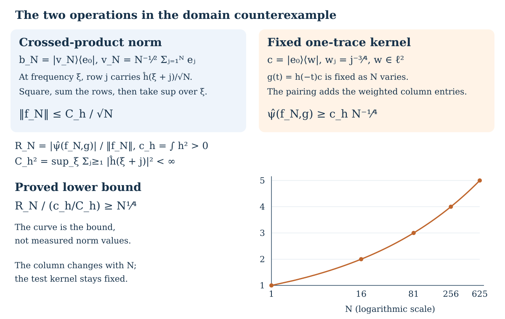

**Figure 10.1.** The column operator and fixed row kernel of Example 10.2 perform different sums. The chart shows the proved bound \(R_N/(c_h/C_h)\geq N^{1/4}\) for positive integers \(N\), with a logarithmic horizontal axis; it displays a bound, rather than sampled operator norms. Here \(R_N=|\widehat\psi(f_N,g)|/\|f_N\|\) and \(c_h=\int h^2\). The complete proof is Example 10.2, correcting the unqualified domain of [Connes 1986, Lemma 7.11]. [Open the scalable diagram](../assets/dual-trace-domain.svg).

**Theorem 10.3.** The formula

\[
 \widehat\psi(f,g)=\int_{\mathbb R}
          \psi(f(t),\theta_tg(-t))\,dt
 \tag{10.4}
\]

is a one-trace on \(\widehat B\), invariant under its dual action. Its dual real derivation is \(\widehat Df(t)=tf(t)\).

**Proof.** Changing \(t\) to \(-t\), using (10.1) and antisymmetry, gives the cyclic identity. Expanding the three Hochschild terms as integrals over \(t_0+t_1+t_2=0\), invariance puts them in the common order
\(f_0(t_0),\theta_{t_0}f_1(t_1),\theta_{t_0+t_1}f_2(t_2)\).
They sum to the Hochschild boundary of \(\psi\), and therefore vanish. Compact supports and the \(\mathcal D\)-bounds justify all interchanges. The dual action multiplies \(f(t)\) by \(e^{iut}\); its two phases in (10.4) cancel exactly. Its normalized real generator is consequently multiplication by \(t\).

Here is the crossed-norm estimate. In the standard regular Hilbert module, the kernel of \(\Pi(f)\) is
\(K_f(r,s)=\theta_{-r}f(r-s)\).
Choose \(\chi\in C_c^\infty(\mathbb R)\) with \(\int\chi=1\). Define the compactly supported \(B^*\)-valued kernel

\[
 C_g(r,s)=\chi(r)\,\partial g(s-r)\circ\theta_s
          =\chi(r)\,\partial\bigl(\theta_{-s}g(s-r)\bigr).
 \tag{10.5}
\]

It is smooth in the dual norm by Lemma 10.1. Substitution \(t=r-s\), followed by (10.1), gives
\(\widehat\psi(f,g)=\int C_g(r,s)(K_f(r,s))\,dr\,ds\).
No estimate on a pointwise group coefficient has been used.

Take an interval \((-R,R)\) whose square contains this kernel's support in its interior, and its normalized Fourier basis \(e_m\), extended by zero outside the interval. Expand

\[
 C_g(r,s)=\sum_{m,n}\xi_{mn}\overline{e_m(r)}e_n(s),
 \qquad
 \sum_{m,n}\|\xi_{mn}\|<\infty.
 \tag{10.6}
\]

Two integrations by parts in each variable give
\(\|\xi_{mn}\|\leq C_g'(1+m^2)^{-1}(1+n^2)^{-1}\).
The coefficient is a Bochner integral in \(B^*\); there are no boundary terms. Thus the expansion converges in the dual norm, uniformly, and absolutely in coefficient norms. Each corresponding integral of \(K_f\) is the Hilbert-module matrix entry
\(\langle e_m,\Pi(f)e_n\rangle\), of norm at most \(\|f\|_{\widehat B}\). For nonunital \(B\) compute in its unitized regular module; these entries still lie in \(B\). Absolute summation proves

\[
 |\widehat\psi(f,g)|\leq
      \|f\|_{\widehat B}\sum_{m,n}\|\xi_{mn}\|.
 \tag{10.7}
\]

This is precisely the required leading-slot bound. For fixed support size its right-hand constant is bounded by finitely many seminorms
\(\sup_t\|L^j g^{(k)}(t)\|_{\mathcal D}\), with \(j+k\leq4\). This also proves continuity for parameter-dependent kernels, uniformly on compact parameter sets. \(\square\)

We state the pairing formula in the raw convention already fixed in the n-trace lesson:
\(J_\psi[u]=\psi(u^{-1},u)\) and \(J_\tau[p]=\tau(p,p,p)\).
Use the Fourier transform \(\mathcal Ff(\xi)=\int f(t)e^{it\xi}\,dt\), real Haar \(dt\), and \(\widehat D=(1/i)\partial_\xi\) in the trivial action. Let \(\Phi_\theta^1\) be the degree-one real Thom map from the action lesson, whose trivial-action idempotent path places the increasing new frequency first.

**Theorem 10.4.** For every \(y\in K_1(B)\),

\[
 J_{i_{\widehat D}\widehat\psi}(\Phi_\theta^1y)
        =-\frac1{2\pi i}J_\psi(y).
 \tag{10.8}
\]

Equivalently, with \(\Phi_{\mathrm{cal}}^1=-\Phi_\theta^1\) and the odd pairing \(\langle\psi,y\rangle=J_\psi(y)/(2\pi i)\), the same statement has the plus sign
\(\langle i_{\widehat D}\widehat\psi,\Phi_{\mathrm{cal}}^1y\rangle=\langle\psi,y\rangle\).
This explicitly translates the Thom-pairing assertion [Connes 1986, Lemma 7.11] into the conventions used here. That displayed lemma does not fix the raw convention; we do not infer an error in its implicit conventions or change the previously fixed generators.

**Proof.** We first supply a domain on which deformation of the action really gives continuous pairings. Put \(B_I=C([0,1],B)\) with action \((\beta_t b)(\lambda)=\theta_{\lambda t}b(\lambda)\), and \(\mathfrak C=B_I\rtimes_\beta\mathbb R\). Use compactly supported kernels \(F(\lambda,t)\) smooth in \(\lambda,t\) with values in \(\mathcal D_\infty\). They form a dense algebra \(\mathfrak E\) by the same convolution and approximation arguments as above. At each \(\lambda\), formula (10.4) gives \(\widehat\psi_\lambda\) for the action \(\theta_{\lambda t}\). Formula (10.5) now has \(\theta_{-\lambda s}\). Its four derivatives have uniform bounds on \([0,1]\), so

\[
 \sup_\lambda\|\partial_{\widehat\psi_\lambda}F_\lambda\|
       <\infty \qquad(F\in\mathfrak E).
 \tag{10.9}
\]

Consider the Banach bimodule \(\mathcal M\) of bounded families \(\xi_\lambda\in\mathfrak C^*\), each factoring through fiber evaluation at \(\lambda\), such that \(\lambda\mapsto\xi_\lambda(Y)\) is continuous for every \(Y\in\mathfrak C\). Its norm is \(\sup_\lambda\|\xi_\lambda\|\), and its actions are the dual actions \((a\xi b)_\lambda(Y)=\xi_\lambda(bYa)\). Uniform norm limits preserve the stated continuity and fiber support, proving completeness; the module actions are contractive.

The family \(\partial_{\widehat\psi_\lambda}F_\lambda\), pulled back to \(\mathfrak C^*\), belongs to \(\mathcal M\). For \(Y\in\mathfrak E\), this follows directly from its compact integral and coefficient continuity. Estimate (10.9) and density extend continuity to every \(Y\). It is a derivation into \(\mathcal M\), because the fiber one-cocycles are derivations. Let \(\mathscr D\) be the generator of the dual action on \(\mathfrak C\); on kernels it is multiplication by \(t\).

Close the single joint derivation

\[
 F\longmapsto
   \bigl((\partial_{\widehat\psi_\lambda}F_\lambda)_\lambda,
                  \mathscr DF\bigr)
       \quad\hbox{into }\mathcal M\oplus\mathfrak C.
 \tag{10.10}
\]

It is closable. The generator is closed; for the first component, a norm-zero sequence with a uniform dual-norm derivative limit can be tested on \(Y\in\mathfrak E\). Fiber antisymmetry bounds the test by the norm of that sequence times the uniform bound for \(\partial_{\widehat\psi_\lambda}Y_\lambda\), so its limit is zero. Density finishes the proof. Lemma 5.1 of the n-trace lesson gives a complete joint graph algebra \(\mathfrak G\), with matrix holomorphic functional calculus and every ambient K-class represented there. This closes a common domain; it does not assume that independently chosen dense cores are a common core.

Each fiber evaluation carries \(\mathfrak G\) continuously into the simultaneous dual/generator domain for that fiber. The one-trace and contraction identities extend by these graph limits: their first slots are bounded, their second-slot derivative norms converge, and the generator converges in the ambient norm. The coefficient estimate (4.2) makes the contraction a two-trace on this dense graph domain. Thus its K-pairing can be evaluated on idempotents in \(\mathfrak G\), with matrix amplification and relative unitization. The dual action is continuous on this graph domain: on \(\mathfrak E\) this follows from the phase and the uniform Fourier estimate, and the invariant derivative bounds extend it to the graph closure.

For such an idempotent \(P\), the raw contraction pairing is

\[
 J_{i_{\widehat D}\widehat\psi_\lambda}[P_\lambda]
   =\bigl(\partial_{\widehat\psi_\lambda}P_\lambda\bigr)
                     ([\mathscr DP,P]_\lambda).
 \tag{10.11}
\]

It is continuous in \(\lambda\), precisely by the definition of \(\mathcal M\), since \([\mathscr DP,P]\) is a fixed element of \(\mathfrak C\). Scalar idempotents have both derivatives zero, so subtraction of a relative scalar idempotent preserves this conclusion. Density and functional calculus provide such representatives for every \(K_0(\mathfrak C)\)-class. This proves the required pairing continuity, rather than deducing it from K-isomorphism alone.

Evaluation \(B_I\to B\) is a K-isomorphism by the ordinary interval homotopy. Real Thom naturality therefore makes every evaluation \(\mathfrak C\to B\rtimes_{\theta^{(\lambda)}}\mathbb R\) a K-isomorphism. The class \(z=\Phi_\beta^1(\iota_*y)\), where \(\iota\) is constant coefficient inclusion, evaluates to \(\Phi_{\theta^{(\lambda)}}^1 y\) for every \(\lambda\).

For \(\lambda>0\), positive coordinate dilation gives a reduced-norm isomorphism
\(\rho_\lambda(f)(t)=\lambda f(\lambda t)\) from the \(\theta\) crossed product to the \(\theta^{(\lambda)}\) crossed product. Convolution substitution and the regular-fiber dilation unitary verify it. Its cochain and generator relations are

\[
 \widehat\psi_\lambda(\rho_\lambda f,\rho_\lambda g)
       =\lambda\widehat\psi_1(f,g),\qquad
 \widehat D_\lambda\rho_\lambda
       =\lambda^{-1}\rho_\lambda\widehat D_1.
 \tag{10.12}
\]

The two factors cancel in the contraction. Positive coordinate dilation also intertwines the real Thom maps: it carries the Wiener–Hopf extension, its boundary map and its ordered positive Bott coordinate to their dilated versions. On the trivial coefficient coordinate this is an increasing frequency change, hence preserves both the positive loop and the odd path convention. Consequently \((\rho_\lambda)_*\Phi_\theta^1=\Phi_{\theta^{(\lambda)}}^1\). Equation (10.12) makes (10.11) constant for \(\lambda>0\); its continuity proves equality with its value at zero. We have reduced the pairing to the trivial action for every K1-class.

For that action the crossed product is \(B\otimes C_0(\mathbb R_\xi)\). Fourier inversion in (10.4) gives
\(\widehat\psi=(2\pi)^{-1}\int\psi\,d\xi\), and \(\widehat D=(1/i)\partial_\xi\). Graph-smooth compact frequency coefficients are admissible: their Fourier kernels are Schwartz in every coefficient seminorm. Cutoffs in the real kernel coordinate approximate them in the one-trace estimate (10.7) and in generator norm. To see this last graph assertion explicitly, (10.5) has compact \(r\)-support and Schwartz decay in \(s-r\); subdivision into unit \(s\)-intervals makes the Fourier coefficient bounds summable. Applying the same estimate to cutoff differences makes their leading-slot constants tend to zero. Thus these coefficients lie in the joint graph closure used for the pairing.

Represent \(y\) by an invertible matrix \(u\) over \(\mathcal D_\infty^+\), scalar part one in the nonunital case. The action lesson's odd Thom construction gives
\(p_s=w_s p_0w_s^{-1}\), with \(w_0=1\), \(w_1=\operatorname{diag}(u,u^{-1})\), and \(p_0=\operatorname{diag}(1,0)\). The elementary invertible path can be chosen smooth and constant near both ends. Its relative idempotent becomes a compact frequency function, and the preceding paragraph justifies evaluating the pairing there. Put \(k=w^{-1}w'\), and \(F(s)=\psi(p_0w^{-1},w)\), using matrix amplification. Since \(p_0\) has scalar entries, \(\partial k(p_0)=0\). The derivation rule and inverse differentiation give

\[
 F'=\partial w([k,p_0]w^{-1}),\qquad
 \partial p(x)=\partial w([p_0,w^{-1}xw]w^{-1}).
 \tag{10.13}
\]

Also \(p'=w[k,p_0]w^{-1}\). The idempotent identity
\([p_0,[[k,p_0],p_0]]=-[k,p_0]\) therefore yields
\(\psi([p',p],p)=-F'\).
The endpoints are \(F(0)=0\) and \(F(1)=\psi(u^{-1},u)\). Hence

\[
 J_{i_{\widehat D}\widehat\psi}(\Phi_{\mathrm{triv}}^1[u])
    =\frac1{2\pi i}\int\psi([p',p],p)\,ds
    =-\frac1{2\pi i}\psi(u^{-1},u).
 \tag{10.14}
\]

Matrices and relative scalar subtraction preserve the calculation. The preceding deformation transfers it to \(\theta\), proving (10.8) for every \(y\). No separability hypothesis on \(B\) was used. \(\square\)

The invariant dual one-trace and its full Thom-pairing comparison are now available for the first-jet application. The remaining geometric comparison also needs the trace/degree-zero Thom transfer from the two-jet measure and the identification of the jet characteristic form with the Godbillon–Vey class.

## 11. A measure trace passes through the additive fiber

The additive comparison in Section 7 begins with a measure and ends with a one-trace. We now prove how their K-pairings are related. This is the missing degree-zero transfer behind the first of the two Thom maps. We keep the raw pairings \(J\) of Section 10 and the positive loop convention of the action lesson. Thus the result below does not require an implicit choice of the odd Thom orientation.

Let \(Z=J_2^+(S^1)\), \(A_2=C_0(Z)\rtimes_r\Gamma\), and let \(d\mu_2=2\nu\), with the positive orientation in (6.2). Its invariance gives

\[
 T_2(a)=\int_Z E(a)\,d\mu_2\quad(a\geq0),\qquad
 \theta_b f(x,t)=f(x,t+b).
 \tag{11.1}
\]

Here \(E\) is the identity-coefficient expectation and the value of \(T_2\) may be infinite. The action \(\theta\) is the additive jet action, not the modular action on the circle. The trace \(T\) on \(A_2\rtimes H\) in Section 7 is its dual: on an integrable coefficient kernel, \(T(f)=T_2(f(0))\). In particular its smooth kernel formula is exactly \(2\int_X\int K_1(x;t,t)\,dt\,\Lambda\).

**Lemma 11.1 (the bounded trace ideal needed here).** Formula (11.1) is a faithful, lower semicontinuous, densely defined trace. There is a dense two-sided ideal

\[
 \mathcal I=\{a\in A_2:\|a\|_1:=T_2(|a|)<\infty\}
\]

which is complete for \(\|a\|+\|a\|_1\). The trace extends linearly to it, and

\[
 |T_2(ab)|\leq\|a\|\|b\|_1,
 \quad T_2(ab)=T_2(ba),
 \quad \|abc\|_1\leq\|a\|\|b\|_1\|c\|.
 \tag{11.2}
\]

Its external unitization has matrix holomorphic functional calculus in \(A_2^+\). It therefore defines an additive map \(T_{2*}:K_0(A_2)\to\mathbb R\), using a relative idempotent \(P\) and its scalar reference \(p_0\):

\[
 T_{2*}([P]-[p_0])=T_{2,n}(P-p_0).
 \tag{11.3}
\]

For the proof of transfer one may use the closure of finite compactly supported smooth coefficients in this ideal norm, and then its \(\theta\)-smooth vectors. This smaller complete domain is still ambiently dense and has the same K-groups.

**Proof.** We give the trace and ideal arguments for this particular measure crossed product. No theory of arbitrary measurable unbounded operators is needed. Represent it regularly on

\(\mathcal H=L^2(Z,\mu_2)\otimes\ell^2(\Gamma)\).

Multiplication coefficients and the measure-preserving group unitaries generate a von Neumann algebra \(N\). Compression to the identity group component identifies its diagonal expectation \(E_N:N\to L^\infty(Z,\mu_2)\). To verify this description, the identity compression of a finite sum is multiplication by its identity coefficient. Weak limits remain multiplication operators, since that algebra is weakly closed. The compression is positive, unital and normal; the other diagonal compressions are its group translates. If a positive operator has all these diagonal compressions zero, its square root vanishes on every group component and hence vanishes. This also proves faithfulness of the expectation.

For \(Y\in N\), write \(Y_g\) for its Fourier coefficients. The row and column identities of the regular matrix give

\[
 \int E_N(Y^*Y)\,d\mu_2
   =\sum_g\int |Y_g|^2\,d\mu_2
   =\int E_N(YY^*)\,d\mu_2.
 \tag{11.4}
\]

The shifted argument in one of these two sums disappears by invariance of the measure. The identities are Parseval identities for the column and row of a bounded operator, first after finite group compression and then by monotone convergence. They also hold for an uncountable group. Indeed \(L^2(Z,\mu_2)\) is separable. The images under \(Y\) of a countable dense set in its identity component use only countably many group components; these determine all its nonzero Fourier coefficients. Alternatively the sums can first be taken over finite subsets. Normality of the integral and of \(E_N\) proves normality of the weight \(T_N=\int E_N\). Equation (11.4), including infinite values, gives \(T_N(Y^*Y)=T_N(YY^*)\). Applying it to \(Y=u a^{1/2}\), for a unitary \(u\in N\) and \(a\geq0\), proves the trace property.

For positive \(a\in A_2\), this restriction is (11.1). Compact exhaustions of \(Z\) express that formula as a supremum of bounded positive integrals of \(E(a)\), so it is lower semicontinuous in norm. For a finite compactly supported coefficient \(f\), (11.4) gives finite \(T_2(f^*f)\). Such coefficients also belong to the trace ideal, not merely its square-root domain. For a monomial \(f_gU_g\), its absolute value is a translate of \(|f_g|\), so its trace norm is \(\int|f_g|\,d\mu_2<\infty\). Finite sums have finite trace norm by the triangle argument below. They are dense in \(A_2\).

Here are the trace norm facts used in that argument. On finite-trace elements the positive form \(T_N(y^*x)\) has Cauchy–Schwarz: expand \(T_N((x+zy)^*(x+zy))\geq0\) as a quadratic polynomial in \(z\in\mathbb C\). The cyclic trace rule follows by polarization of (11.4); its products belong to the linear span of finite-trace positive elements. If \(b=v|b|\), factor it as \(v|b|^{1/2}|b|^{1/2}\). Cauchy–Schwarz and the bound on left multiplication give

\( |T_N(ab)|\leq\|a\|T_N(|b|)\).

The reverse variational bound is attained by \(a=v^*\), so

\[
 T_N(|b|)=\sup_{\|a\|\leq1}|T_N(ab)|.
 \tag{11.5}
\]

For completeness these manipulations do not presuppose finiteness of a sum or product whose norm is being estimated. Use the finite-trace spectral truncations

\(e_k=\mathbf1_{[1/k,k]}(|b|)\)

of \(b\in N\) with \(T_N(|b|)<\infty\); their traces are finite since \(T_N(e_k)\leq kT_N(|b|)\), and \(be_k\to b\) in trace norm by monotone convergence. If \(x,y\) have finite square norms, put \(w|xy|=xy\). On a finite-trace spectral slice \(e\) of \(|xy|\), cyclicity and Cauchy–Schwarz give

\[
 T_N(e|xy|)=T_N(ew^*xy)
       \leq\|x\|_2\|y\|_2.
\]

The slice can be exhausted by finite-trace subprojections, and normality then gives the same inequality for the whole positive \(|xy|\). Such an exhaustion exists: finite-measure cutoffs in \(Z\), together with (11.4), make the trace semifinite; compressing those cutoffs into a given projection and taking their spectral projections gives finite-trace subprojections whose join is that projection. To see the last claim, a vector orthogonal to their join is annihilated by every compressed cutoff, and the cutoff exhaustion tends strongly to one. Thus \(\|xy\|_1\leq\|x\|_2\|y\|_2\). Factor \(b\) as above to obtain the ideal estimate. Formula (11.5) then gives the triangle inequality and extends the linear trace and cyclicity by trace-norm approximation. This proves (11.2) without using an unproved trace-class product rule.

If \(b_j\) is Cauchy for \(\|\cdot\|+\|\cdot\|_1\), its operator norm limit \(b\in A_2\) satisfies

\(\|b-b_j\|_1\leq\liminf_k\|b_k-b_j\|_1\).

Indeed absolute value is continuous in operator norm and \(T_2\) is lower semicontinuous on positives. The displayed tail bound proves membership and completeness. The ideal estimate gives \(\|b^m\|_1\leq\|b\|^{m-1}\|b\|_1\). Inverses satisfy \((1+b)^{-1}-1=-(1+b)^{-1}b\in\mathcal I\), and the resolvent identity proves their continuity in the ideal norm. Matrix amplification and contour integration prove holomorphic functional calculus. The same proof works in the closed ideal-norm span of the compact smooth coefficients: bounded multiplication by a coefficient of \(A_2\) is approximated there by finite smooth multipliers. On a compact smooth monomial, translations through a bounded interval have a common compact support, and dominated convergence in \(\int|f_g|\,d\mu_2\) proves trace-norm orbit continuity. The finite-sum triangle bound and trace isometry extend this continuity to that closed span. Smooth averaging now gives a dense smooth subalgebra and inverse calculus, as in Lemma 10.1.

Approximate an ambient relative idempotent by this dense subalgebra and apply its Riesz contour. Close idempotents and subdivided homotopies are treated by the same contours, so its K-groups are the ambient ones. Extend the linear trace by zero on the external scalar unit. A differentiable idempotent path has derivative a commutator, since \(P\dot PP=0\) and \(\dot P=[\dot PP-P\dot P,P]\). The trace of that derivative is zero by (11.2). The contour paths supply the needed differentiable paths. This proves (11.3), its invariance, and additivity. \(\square\)

The passage through \(N\) above supplies only the bounded trace ideal and its products. It makes no assertion about a complete general semifinite integration course or its other imported uses.

**Theorem 11.2 (positive-loop trace transfer).** Let \(\Phi_H^0:K_0(A_2)\to K_1(A_2\rtimes H)\) be the positive-loop real Thom map in Proposition 9.1. For the one-trace \(\psi'(K,L)=T(K\mathcal DL)\) of Proposition 7.1,

\[
 J_{\psi'}(\Phi_H^0x)=T_{2*}(x)
       \qquad(x\in K_0(A_2)).
 \tag{11.6}
\]

This includes relative nonunital classes, matrices and every discrete group. The raw degree-one pairing occurs on the left; division by \(2\pi i\) would change the constant.

**Proof.** Use the dense smooth trace-ideal coefficient algebra just constructed. For a trace-preserving real action \(\vartheta\) on it, define on compact smooth kernels

\[
 \Psi_\vartheta(f,g)
     =-\int_{\mathbb R}t\,T_2(f(t)\vartheta_tg(-t))\,dt.
 \tag{11.7}
\]

Trace invariance, substitution \(t\mapsto-t\) and the convolution product give cyclicity and the Hochschild equation: this is the trace of \(f\widehat Dg\), and \(\widehat Dg(t)=tg(t)\) obeys Leibniz. The second coefficient is trace class, so every scalar integrand is defined by (11.2). For \(\vartheta=\theta\), (11.7) is exactly \(\psi'\) on their common smooth compact core, by the dual trace formula following (11.1).

We need the norm estimate and a common deformation domain before varying the action. Let \(K_f(r,s)=\vartheta_{-r}f(r-s)\), and choose compact smooth \(\chi\) with integral one. The dual-functional kernel

\[
 C_g(r,s)(a)=\chi(r)(s-r)
           T_2(a\vartheta_{-s}g(s-r))
 \tag{11.8}
\]

is compactly supported and smooth in the dual norm. Its derivatives are bounded by the trace norms of the corresponding coefficient and action derivatives of \(g\), using (11.2). Its pairing with \(K_f\), integrated in \(r,s\), is (11.7), by invariance and \(t=r-s\). Expand it on an enclosing interval as in (10.6). Two integrations by parts in each variable give coefficients \(\xi_{mn}\in A_2^*\) with

\(\sum\|\xi_{mn}\|<\infty\).

Their tests on the regular Hilbert-module matrix entries have absolute value at most \(\|f\|\|\xi_{mn}\|\). Summation proves the one-trace bound. Its constant is controlled by four coefficient/action trace-norm derivatives on a fixed support. This applies uniformly to \(\vartheta_t^{(\lambda)}=\theta_{\lambda t}\), \(0\leq\lambda\leq1\). It does not estimate a pointwise continuous-Haar coefficient.

On \(\mathfrak C=C([0,1],A_2)\rtimes_\beta\mathbb R\), with \(\beta_tF(\lambda)=\theta_{\lambda t}F(\lambda)\), use kernels smooth in \(\lambda,t\) and in those trace-ideal seminorms. Their dual derivations \(\partial_{\Psi_\lambda}F_\lambda\), pulled back to \(\mathfrak C^*\), form bounded families continuous on every fixed test \(Y\in\mathfrak C\). On the core continuity follows from (11.7); its uniform norm bound extends it by density. They therefore belong to exactly the weak-continuous dual-family bimodule \(\mathcal M\) constructed in Theorem 10.4.

Close the derivation \(F\mapsto(\partial_{\Psi_\lambda}F_\lambda)_\lambda\in\mathcal M\). Antisymmetry on the core proves closability: test a norm-zero sequence with uniform derivative limit against a fixed core \(Y\), and use the uniform bound for its derivative. Lemma 5.1 of the n-trace lesson then gives one complete graph algebra with matrix inverse calculus and every \(K_1(\mathfrak C)\)-class represented there. Its pairing

\(\partial_{\Psi_\lambda}U_\lambda(U_\lambda^{-1})\)

is continuous in \(\lambda\), by the defining continuity of \(\mathcal M\). In a relative unitization the scalar contribution is zero, so the test is the fixed element \(U^{-1}-1\in\mathfrak C\). Matrix traces are finite sums of these tests. Thus pairing continuity is proved on every class, not inferred from evaluation being a K-isomorphism.

For \(\lambda>0\), \(\rho_\lambda f(t)=\lambda f(\lambda t)\) is the positive-dilation isomorphism of (10.12). Direct substitution in (11.7) gives

\[
 \Psi_\lambda(\rho_\lambda f,\rho_\lambda g)=\Psi_1(f,g).
 \tag{11.9}
\]

The factor \(\lambda\) from the dual trace and the factor \(1/\lambda\) from the dual generator cancel. Positive dilation preserves the positive-loop Wiener–Hopf boundary, so it intertwines the degree-zero Thom maps. Apply ordinary Thom naturality to the interval field and its evaluations, as in Theorem 10.4, now in degree zero. The class \(\Phi_\beta^0(\iota_*x)\) evaluates to \(\Phi_{\theta^{(\lambda)}}^0x\). Equation (11.9) makes its pairing constant for \(\lambda>0\); the established graph continuity extends that value to \(\lambda=0\).

At the trivial action, Fourier transform \(\int f(t)e^{it\xi}dt\) gives

\[
 \Psi_0(F,G)=\frac1{2\pi i}\int_{\mathbb R}T_2(F(\xi)G'(\xi))\,d\xi.
 \tag{11.10}
\]

Choose a smooth scalar loop \(b(\xi)\), equal to one outside a compact interval, with positive winding one. If \(P\) is an idempotent in the trace-ideal matrix unitization and \(p_0\) its scalar reference, the positive Thom class is represented relatively by

\[
 v(\xi)=\bigl(1+(b(\xi)-1)P\bigr)
          \bigl(1+(b(\xi)^{-1}-1)p_0\bigr).
 \tag{11.11}
\]

Indeed this is the quotient of the two positive idempotent loops, and \(v-1\) has compact smooth frequency support with trace-ideal coefficients. Its inverse has the same properties. It lies in the graph domain used for (11.10). One can check that assertion directly in the original real-kernel domain: inverse Fourier transform is Schwartz in every trace-ideal seminorm; real cutoffs approximate it in crossed norm and in the dual norm bound (11.8). Partition the \(s\)-axis there into unit intervals while \(r\in\operatorname{supp}\chi\). The Fourier bound on the interval indexed by \(j\) is \(O((1+|j|)^{-N})\), for arbitrary \(N\), because every derivative is Schwartz. The sum of the cutoff tails therefore tends to zero. This is the trace-ideal version of the graph cutoff argument in Theorem 10.4.

For the algebraic calculation, extend \(T_2\) linearly to the ideal unitization by value zero on its scalar unit. The product rule and trace cyclicity in (11.11) yield

\[
 T_{2,n}(v^{-1}v')=\frac{b'}b\,T_{2,n}(P-p_0).
 \tag{11.12}
\]

This calculation does not trace either scalar projection through the infinite positive weight. It uses the linear relative trace, and the actual left side is trace class. To verify the formula, the first loop has logarithmic derivative \((b'/b)P\); the second has \(-(b'/b)p_0\). Conjugating the first by the second changes its linear trace by zero. The two scalar reference contributions cancel. Since \(\int b'/b=2\pi i\), (11.10) gives \(J_{\Psi_0}[v]=T_{2,n}(P-p_0)\). Every relative K-class has such a trace-ideal idempotent by Lemma 11.1, so deformation proves (11.6) on all classes.

Finally the one-trace in (11.7) and \(\psi'\) have identical pairings on \(A_2\rtimes H\). They agree on the common dense compact smooth kernel core, and each first slot extends in norm. Approximate an ambient invertible by \(1+a\) from that core. The inverse graph formula supplies its inverse in both domains; bounded first slots and the identical fixed second slot \(a\) give the same raw pairing. These representatives cover every K-class. Thus the transfer just proved is for the precise one-trace of Section 7. \(\square\)

**Corollary 11.3 (the analytic two-step functional).** Keep the direct Morita map \(m_0\) and the ordered Thom map \(\Phi_2\) of Proposition 9.1, with the degree-one map \(\Phi_1^1\) in the increasing-frequency convention of Theorem 10.4. For every \(x\in K_0(A_2)\),

\[
 J_{\tau_w}(m_0\Phi_2x)
    =-\frac{T_{2*}(x)}{2\pi i}.
 \tag{11.13}
\]

Consequently the additive functional on the entire \(K_0(A)\) defined by

\[
 \mathfrak F(z)=2\pi i\,J_{\tau_w}(z)
   =-T_{2*}\bigl(\Phi_2^{-1}m_0^{-1}z\bigr)
 \tag{11.14}
\]

is an exact analytic transfer of the **negative** two-jet measure trace. Here \(2\pi i\,J_{\tau_w}\) is the declared transfer normalization; it is not being called the usual normalized degree-two Chern pairing.

**Proof.** Proposition 9.1 gives \(m_0\Phi_2=m_2\Phi_1^1m_1\Phi_H^0\). Proposition 8.2 identifies \(J_{\tau_w}m_2\) with \(J_{i_{\widehat D}\widehat\psi}\). Theorem 10.4 gives \(-J_\psi/(2\pi i)\) after \(\Phi_1^1\). Proposition 7.1 identifies \(J_\psi m_1=J_{\psi'}\), and Theorem 11.2 gives \(J_{\psi'}\Phi_H^0=T_{2*}\). This proves (11.13) with no omitted sign or pairing factor. Both \(m_0\) and \(\Phi_2\) are isomorphisms, so (11.14) holds on every class. \(\square\)

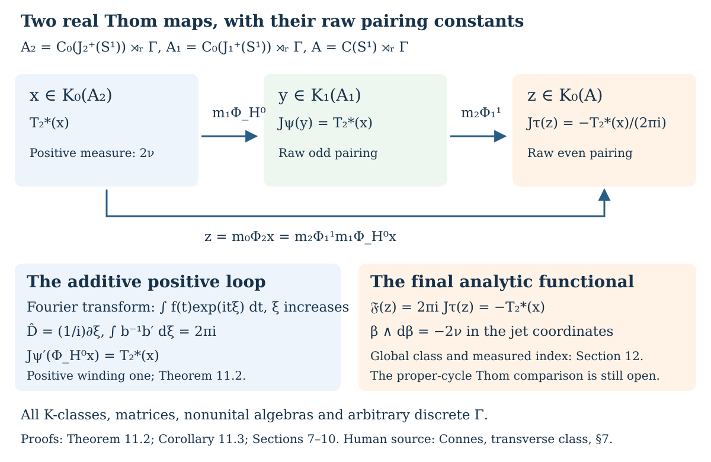

**Figure 11.1.** The left-to-right maps and values are exact for every \(x\in K_0(A_2)\). The additive positive-loop Thom map preserves the trace value as a raw odd pairing; the increasing-frequency odd Thom map contributes \(-1/(2\pi i)\). The bottom composite is Proposition 9.1. The displayed equality of local form signs does not claim the remaining global geometric identification. Proof locators: Theorem 11.2, Corollary 11.3 and (6.3), following the analytic transfer in [Connes 1986, §7]. [Open the scalable diagram](../assets/trace-thom-transfer.svg).

The sign agrees with the local identity \(\beta\wedge d\beta=-2\nu\). Agreement of these two signs is not yet a proof of the geometric Godbillon–Vey pairing. Section 12 supplies the global characteristic class and the measured index on geometric two-jet cycles. The remaining step is to construct the geometric jet transfer and compare its analytic image with the inverse two-step Thom–Morita image. The present section completes the analytic degree-zero trace transfer used in [Connes 1986, proof of Theorem 7.3 and Lemma 7.10; Connes 1980b, trace/Thom discussion]; it does not replace those remaining geometric steps by a citation.

## 12. Global jet forms and the measured geometric character

The local identity \(\beta\,d\beta=-2\nu\) has two distinct uses. It identifies a secondary characteristic class on a homotopy quotient, and it determines the sign of a measured index there. Neither use follows by integrating an arbitrary form over a topological model of \(E\Gamma\). We give the descent and the index calculation separately.

Write \(Y=(S^1)_\Gamma\), \(Y_2=Z_\Gamma\), and let \(\pi:Y_2\to Y\) be the two-jet projection. Put
\[
 \Omega=2\nu,\qquad
 \operatorname{GV}_{\rm form}=\beta\wedge d\beta=-\Omega.
 \tag{12.1}
\]
An invariant closed form on \(Z\) will be denoted by the same letter inside brackets on \(Y_2\). The next lemma explains that notation.

**Lemma 12.1 (descent of an invariant form).** An invariant closed \(q\)-form \(\eta\) on a smooth \(\Gamma\)-manifold \(W\) defines a class
\[
 [\eta]_\Gamma\in H^q(W_\Gamma;\mathbb R).
 \tag{12.2}
\]
For a principal bundle \(Q\to N\) and a smooth equivariant map \(h:Q\to W\), its pullback to \(N\) is represented by the form obtained by descending \(h^*\eta\). This holds for every discrete group. If \(\eta=d\theta\) with **invariant** \(\theta\), its descended class is zero.

**Proof.** Use the bar model, whose simplicial \(p\)-space is \(\Gamma^p\times W\). Its face maps multiply neighboring group entries or act on \(W\). In its double complex of group cochains with values in smooth singular cochains on \(W\), integration gives the element
\[
 I_\eta(\sigma)=\int_{\Delta^q}\sigma^*\eta
 \quad\hbox{in bidegree }(0,q),
 \qquad I_\eta=0\quad\hbox{in the other bidegrees of total degree }q.
 \tag{12.3}
\]
Stokes gives its vertical boundary zero. Invariance gives its horizontal boundary zero: the two end restrictions of a one-arrow bar simplex agree. Hence it is a total cocycle.

Here is the comparison with ordinary cohomology. Smooth singular chains on a manifold may be used in place of continuous ones: subdivide a finite chain into coordinate patches, smooth its simplices relative to the already smoothed faces, and use the interpolation prism to compare the two chains. The same relative procedure proves injectivity on homology. Apply this to each bar level. Filter the realization by its bar skeleta. The relative chains of a \(p\)-cell are the chains of its copy of \(W\), shifted by \(p\); the attachment boundary is exactly the alternating face boundary above. The resulting first-quadrant double complex therefore computes the chains of the realization. Equivalently, the subdivision prism and the shuffle of simplex coordinates give the chain comparison. In each total degree only finitely many bidegrees occur. There is no finiteness assumption on the set \(\Gamma^p\); chains have finite support, and cochains take the corresponding products. The realization is the homotopy quotient. Thus (12.3) gives (12.2).

For the pullback assertion, use evenly covered charts of \(Q\). Their transitions are locally constant elements of \(\Gamma\). The forms \(h^*\eta\) on their chosen sheets agree on overlaps by invariance, so they give one form \(\eta_N\) on \(N\). Refine a triangulation to these charts. On a simplex lying in one chart, (12.3) pulls back to integration of \(\eta_N\). On an overlap the two restrictions are equal, so no positive bar-degree correction is needed. Subdivision and its prism show that this calculation is independent of the refinement and computes the classifying-map pullback. The argument is relative to the boundary as well. Finally an invariant \(\theta\) defines the total cochain \(I_\theta\), and Stokes gives \(d_{\rm tot}I_\theta=I_\eta\). This proves the last assertion. \(\square\)

**Proposition 12.2 (the global secondary class).** Normalize the codimension-one Godbillon–Vey class by the representative \(\zeta\wedge d\zeta\) when
\(d\varpi=\zeta\wedge\varpi\). With this convention,
\[
 \pi^*\operatorname{GV}_Y
   =[\beta\wedge d\beta]_\Gamma
   =-[\Omega]_\Gamma .
 \tag{12.4}
\]
Here \(\operatorname{GV}_Y=B^*(\operatorname{GV})\) is the secondary characteristic class of the suspension circle action. The definition and equality do not require \(E\Gamma\) to be a manifold.

**Proof.** First recall why the displayed foliation representative is a class. For a nonzero integrable one-form \(\varpi\), \(d^2\varpi=0\) gives
\(d\zeta\wedge\varpi=0\). In a local frame this says \(d\zeta=\varpi\wedge a\). Consequently \((d\zeta)^2=0\), so \(d(\zeta\wedge d\zeta)=0\).
If \(\varpi'=e^u\varpi\), we may take \(\zeta'=\zeta+du\), and
\[
 \zeta'\wedge d\zeta'-\zeta\wedge d\zeta
       =d(u\,d\zeta).
 \tag{12.5}
\]
For fixed \(\varpi\), every other choice is \(\zeta'=\zeta+f\varpi\).
Expanding, using \(d\varpi=\zeta\wedge\varpi\) and
\(\varpi\wedge d\zeta=0\), gives
\[
 \zeta'\wedge d\zeta'-\zeta\wedge d\zeta
       =-d(f\,\zeta\wedge\varpi).
 \tag{12.6}
\]
These identities prove independence of the defining form and connection and also prove naturality under a foliation pullback.

For precision about the characteristic-class name, the pertinent truncated Weil algebra is
\[
 WO_1=\Lambda(h_1)\otimes\mathbb R[c_1]/(c_1^2),\qquad
 |h_1|=1,\quad |c_1|=2,\quad dh_1=c_1 .
 \tag{12.7}
\]
Its degree-three generator is the class of \(h_1c_1\). The secondary characteristic map sends \(h_1,c_1\) to \(\zeta,d\zeta\); the relation \(c_1^2=0\) is the calculation just made. We choose its real normalization to give \(\zeta\,d\zeta\), with no inserted \(2\pi\) factor. This is the Godbillon–Vey representative used in [Connes 1986, §7, Lemma 7.8, PDF p. 68]. Equations (12.5)–(12.6) supply the independence needed for that characteristic map in this degree.

The bundle \(Z\to S^1\) is a principal \(G_2\)-bundle, and the \(\Gamma\)-action commutes with its right action. It therefore gives a principal \(G_2\)-bundle \(\pi\) on the Borel spaces. The group \(G_2\) is diffeomorphic to \(\mathbb R^2\). On a paracompact CW model, a principal bundle with contractible structure group has a section: extend a section over successive cells, since every extension obstruction is a homotopy group of \(G_2\) and is zero. Local trivializations and the relative extensions give a continuous section. A section trivializes this principal bundle; contracting the group coordinate shows that \(\pi\) is a homotopy equivalence. Sections give homotopic inverses.

In a flat suspension chart, the leaves are the sets of constant circle coordinate. On its two-jet pullback their defining form is \(\omega=dy/p\), which has the same kernel as \(dy\). Proposition 6.1 gives the global invariant connection \(\beta\), with \(d\omega=\beta\omega\). Applying the characteristic map (12.7) in these charts gives \(\beta\,d\beta\). The invariance proved in Section 6 makes the chart maps agree on every arrow. Lemma 12.1 puts their closed degree-three form in Borel cohomology. Its class is the pullback of the suspension secondary class by naturality, giving the first equality of (12.4); (6.3) gives the second.

This also verifies the identification on an ordinary smooth flat circle bundle over any manifold: choose a global positive defining form there by patching the positive local ones, take its connection, and pull back to its two-jet bundle. Equations (12.5)–(12.6) compare it with \(\omega,\beta\). The bar construction gives the same comparison without making any smoothness assumption on \(E\Gamma\). Since \(\pi^*\) is an isomorphism, (12.4) identifies a unique class on \(Y\). \(\square\)

We next evaluate the particular measure trace of Lemma 11.1 on a geometric cycle over \(Z\). The tangent bundle here has a useful extra property.

**Lemma 12.3.** The tangent bundle of \(Z\) has the invariant flag
\[
 0\subset L=\mathbb R\partial_q
       \subset K=\ker(dy)\subset TZ.
 \tag{12.8}
\]
All three successive real line quotients are oriented, with positive transition factor \(H'\). On \(Y_2\) the bundle \(\tau_Z\) is therefore a sum of three trivial real lines up to bundle isomorphism. In particular
\(\widehat A(\tau_Z)=\operatorname{Td}(\tau_{Z,\mathbb C})=1\).

**Proof.** Differentiate (6.1) in the order \((y,p,q)\). Its matrix is triangular; the three diagonal entries are \(H'\), which is positive. The last coordinate line and the last two-coordinate plane are preserved. This proves (12.8) and the quotient assertion. On the paracompact Borel model an oriented real line bundle has a positive unit section after choosing a metric. Split each of the two short exact bundle sequences by a metric. These choices identify the full bundle with the sum of its trivial line quotients. Their characteristic classes give the assertion. This is a topological splitting on the Borel space; it asserts no invariant splitting or invariant metric on all of \(Z\). \(\square\)

**Theorem 12.4 (the measured index over the two-jet space).** Use the geometric group, character \(C_Z\), map \(\mu_Z\), and base-then-target convention of [the geometric lesson](the-geometric-group-and-geometric-corollaries.md). For every \(y\in\mathcal G_0(Z,\Gamma)\),
\[
 T_{2*}(\mu_Zy)
        =-\left\langle C_Z(y),[\Omega]_\Gamma\right\rangle.
 \tag{12.9}
\]
The formula holds for every discrete group and for compact relative coefficient support. Its zero extension to the odd group has zero on both sides by parity.

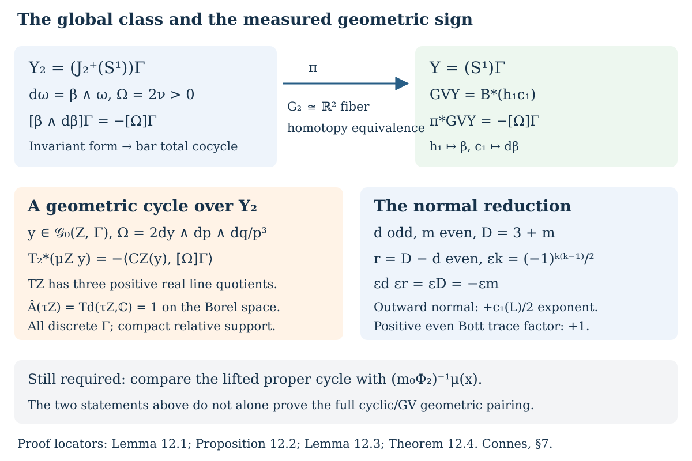

*Figure 12.1.* The two-jet projection is a homotopy equivalence on Borel spaces. Its normalized secondary class pulls back to the negative of the positive measure \(\Omega=2\nu\). The measured geometric index has its own minus sign, computed by the normal reduction with \(d\) odd and \(m,r\) even. This diagram states Proposition 12.2 and Theorem 12.4; the comparison with the inverse two-step Thom map remains required. [Reproducible SVG source](../../tools/draw_global_jet_measure.py). Human source and proof comparison: [Connes 1986, §7, Lemma 7.8, PDF pp. 67–68].

**Proof.** We provide the measured bridge, rather than invoking a general measured-foliation index theorem.

*A differential cycle in added even directions.* For an even \(m\geq2\), let
\[
 B_m=A_2\otimes C_0(\mathbb R^m)
       =C_0(Z\times\mathbb R^m)\rtimes_r\Gamma .
 \tag{12.10}
\]
The regular representation proves the equality exactly as in the geometric lesson, (8.3). Let \(\mathcal I_0\) be the complete trace-ideal core in Lemma 11.1, and use
\(\mathcal D_m=C_c^\infty(\mathbb R^m,\mathcal I_0)\).
Its differential differentiates only the added variables. Integration of an \(m\)-form is \(\int_{\mathbb R^m}T_2(\cdot)\), with the orientation \(dz_1\cdots dz_m\).
Trace cyclicity and compact-support integration by parts give a closed graded trace.

This is an actual \(m\)-trace. For fixed \(a_1,\ldots,a_m\), expand a form
\(x_0\,da_1\,x_1\cdots da_m\). Each term is a product of \(m\) fixed derivatives and \(m\) variable multipliers. Put one of the fixed derivatives in the trace ideal and bound all other factors in operator norm. The ideal inequality of Lemma 11.1 gives
\[
 \left|\int_{\mathbb R^m}T_2(x_0\,da_1\,x_1\cdots da_m)\right|
 \leq
 \sum_{\sigma\in S_m}\int
    \|\partial_{\sigma(1)}a_1\|_1
    \prod_{j=2}^m\|\partial_{\sigma(j)}a_j\|
    \prod_{j=0}^{m-1}\|x_j\|_{B_m}.
 \tag{12.11}
\]
The integral is finite; the fixed derivatives have compact support and continuous trace-ideal norms. Matrices obey the same estimate.
The external unit has differential zero and is used only in the multiplier slots.

The algebra \(\mathcal D_m\) is dense in \(B_m\) and closed under matrix holomorphic functional calculus in the external unitization. Indeed for \(a\in\mathcal D_m\), \((1+a)^{-1}-1=-(1+a)^{-1}a\) has the same compact support. The inverse and each of its ordinary derivatives lie in \(\mathcal I_0\), by the ideal inverse formula and Leibniz; on its compact support their operator and trace-ideal norms are uniformly bounded. Riesz contours have these same properties. Finite sums of smooth scalar functions times elements of \(\mathcal I_0\) prove density. Approximation followed by a Riesz contour represents every relative matrix K-class here; uniform approximation of homotopies proves injectivity. Thus the normalized differential character gives a functional \(\varphi_m\) on all \(K_0(B_m)\).

For the positive coordinate Bott class \(b_m\), this functional satisfies
\[
 \varphi_m(z\boxtimes b_m)=T_{2*}(z).
 \tag{12.12}
\]
To check the formula on every class, write \(z=[P]-[p_0]\) with \(P-p_0\) in the trace ideal of Lemma 11.1, and represent \(b_m\) by a smooth relative bundle pair constant near infinity. Use the tensor relative pair (8.5) of the geometric lesson. The tensor connection has no derivative in \(Z\), so its traced curvature exponential is the ordinary Bott character multiplied by \(T_2(P-p_0)\). The reference pair subtracts the scalar term before the trace is taken. Its integral is one. This proves (12.12) also for non-self-adjoint relative idempotents, by their matrix inverse graph and deformation to projections. There is no trace of an infinite scalar identity in this calculation.

*The étale calculation.* Let \(S\) have a proper principal cover and an equivariant local diffeomorphism
\(\eta:\widetilde S\to Z\times\mathbb R^m\). Give this map its identity wrong-way orientation and take a compact relative \(F'\in K_c^0(S)\). The étale column, its finite local frame and its right inner product are the ones proved in the geometric lesson, Proposition 8.2, (8.9). On these frames only finitely many group coefficients occur, and their target supports are compact. Hence their coefficients and all the added-variable derivatives belong to the trace-ideal core above.

Pull the added-variable differential through \(\eta\). It is the differential along the inverse images of the \(\mathbb R^m\) directions, that is, along the fibers of \(\eta_Z\). On each inverse chart it is the ordinary leafwise differential and has square zero. The column connection is consequently flat in these directions. Pullback commutes with this differential; its right Leibniz rule is the one verified in (8.10) there. Tensoring by \(F'\) adds just its leafwise projection curvature.

On a rank-one column, the trace extracts the identity coefficient, sums over the inverse branches, and integrates on \(Z\) against \(\Omega\). With a quotient cutoff \(c\) whose translates sum to one, change of variables on the inverse charts gives the transferred trace
\(\int_{\widetilde S}c\,\eta_Z^*\Omega\wedge(\hbox{leafwise }m\hbox{-form})\).
The cutoff sum makes this the integral on \(S\) oriented by \(\eta\). A full connection on \(F'\) restricts to the stated leafwise connection. Every term of its curvature with a \(Z\) covector vanishes after wedging with \(\eta_Z^*\Omega\), since \(\Omega\) has degree three in the three \(Z\) directions. Thus the leafwise calculation is exactly
\[
 \varphi_m(\mu[(S,F',\eta)])
       =\int_{S_\eta}\operatorname{ch}(F')\wedge\eta_Z^*\Omega .
 \tag{12.13}
\]
The reference coefficients agree off their compact support, so their trace differences, frames and curvature differences may all be computed on a compact relative neighborhood. This proves (12.13) with no properness assumption on the map to the target. It uses properness of the principal cover for its cutoff and local columns.

*Normal reduction and its signs.* Represent \(y\) by \((M,F,g)\) with \(F\in K^0(M)\) and \(d=\dim M\) odd. Such representatives suffice: the even relative K-homology representative of the rank-three disk pair in Proposition 2.1 of the geometric lesson localizes transversally in Proposition 2.2 to an odd base with an even coefficient. Put
\(A=TM\oplus g^*\tau_Z\), with its specified Spinᶜ determinant \(L_A\).
Choose an embedding \(j:M\to\mathbb R^m\) with \(m\) even, at least two and large enough. On the cover, the map \((h,jq)\) is an immersion into \(Z\times\mathbb R^m\), homotopic to \((h,0)\).
Its normal bundle \(\xi\) has even rank
\[
 D=3+m,\qquad r=D-d,\qquad L_\xi=L_A.
 \tag{12.14}
\]

The proper graph tube, its equivariant étale extension and the normal coefficient
\(F'=\operatorname{Th}^{\rm nor}_\xi F\) are constructed in the geometric lesson, proof of Theorem 8.4, (8.15)–(8.18). That construction needs \(m\) and \(r\) even and a proper source cover; it does not need the target dimension \(D\) even. The normal spinor and its dual cancel to the same even scalar Gaussian vacuum, with the same spectral gap. Hence the resulting supported étale cycle represents the geometric even stabilization \(\rho_{\rm top}y\). This is an integral equality of cycles, not a comparison just of their characters.

Give \(M\) its induced orientation and order its tangent before its normal. The identity double on its \(d\)-plane has sign
\(\epsilon_d=(-1)^{d(d-1)/2}\), by the geometric lesson, Example 3.2. Thus the \(\eta\)-orientation on the tube is \(\epsilon_d\) times this ordered base and normal orientation. Its outward normal coefficient has character
\[
 \operatorname{ch}(F')
   =\epsilon_r\,t_\xi\!
       \left(\operatorname{ch}(F)e^{c_1(L_A)/2}\widehat A(\xi)^{-1}\right),
 \qquad \epsilon_r=(-1)^{r/2},
 \tag{12.15}
\]
by Lemma 7.3 there. This is the normal operation with the positive determinant exponent, not the dual-spinor operation (2.4).

The closed form \(\eta_Z^*\Omega\) on the tube is cohomologous to the pullback of \(h^*\Omega\) on its zero section. Indeed the radial homotopy of the étale extension to the zero-section map gives the usual integral contraction primitive. Its product with the closed compact relative Chern form integrates to zero by Stokes. Fiber integration of the positive \(t_\xi\) is one. Consequently (12.13) gives
\[
 \varphi_m(\mu\rho_{\rm top}y)
  =\epsilon_d\epsilon_r
    \int_M\operatorname{ch}(F)e^{c_1(L_A)/2}
                       \widehat A(\xi)^{-1}\,g^*[\Omega]_\Gamma
  =\epsilon_d\epsilon_r\langle C_Z(y),[\Omega]_\Gamma\rangle .
 \tag{12.16}
\]
For the last equality, the stable normal splitting gives
\(\widehat A(\xi)^{-1}=\widehat A(TM)\,g^*\widehat A(\tau_Z)^{-1}\).
Lemma 12.3 makes the last factor one. Hence the coefficient is
\(\operatorname{Td}(A)\), exactly the character coefficient of the geometric lesson, (3.2). Only degrees at most \(d\) are used on this compact cycle.

Since \(r\) is even, \(\epsilon_d\epsilon_r=\epsilon_D\). Since \(m\) is even,
\(\epsilon_D=\epsilon_3\epsilon_m=-\epsilon_m\).
On the other hand, Proposition 7.4 of the geometric lesson and (12.12) give
\[
 \varphi_m(\mu\rho_{\rm top}y)
       =\epsilon_m\,T_{2*}(\mu_Zy).
 \tag{12.17}
\]
Cancel \(\epsilon_m\) in (12.16)–(12.17). This proves the minus sign in (12.9).

All the constructions used finitely many charts on a compact quotient or a compact relative coefficient neighborhood. Reduce its monodromy to a countable subgroup as in the geometric lesson, Theorem 4.2. The regular inclusions preserve the identity-coefficient measure trace and (12.11). The extension unitaries there intertwine the normal and étale columns. This proves the formula for arbitrary \(\Gamma\); the collar construction proves the relative-support assertion. For \(\mathcal G_1\) the character has even homological parity, so its evaluation against the degree-three class is zero. The trace functional is defined to be zero on \(K_1\). \(\square\)

The global characteristic and the particular measured index are now proved. To complete the pairing on \(A=C(S^1)\rtimes_r\Gamma\), one still must compare the lift of a geometric circle cycle with
\((m_0\Phi_2)^{-1}\mu(x)\). The positive analytic two-step Thom convention and the outward normal convention differ in an even two-plane. That comparison must be proved on the actual proper-cycle modules; (12.4) and (12.9) alone do not establish it. In particular this section does not yet assert the full geometric part of [Connes 1986, Theorem 7.3] or Lemma 7.8.

## 13. Lifting a compact cycle into the jet bundle

The global form in Section 12 can be evaluated on an explicit lift of every compact geometric cycle. We first construct that lift and compute a flat normal-plane operator with its grading. We then identify the actual ordered Thom operator on the principal Morita module and prove its composition with the properly supported graph cycle. The resulting sign gives the geometric Godbillon–Vey formula.

**Lemma 13.1 (the vertical frame).** In the coordinates \(r=\log p\), \(t=q/p\), orient the fiber by \(dr\wedge dt\). The ordered fields

\[
 X=\partial_r+t\partial_t,\qquad Y=\partial_t,\qquad
 g_{\rm v}=dr^2+(dt-t\,dr)^2
 \tag{13.1}
\]

are an orthonormal frame and a complete metric of curvature \(-1\). Every circle diffeomorphism acts on the fibers by an orientation-preserving isometry carrying this frame to itself. In particular the vertical two-plane has a specified equivariant Spin structure with trivial determinant line.

**Proof.** For fixed \(y\), write the fiber transformation of (9.7) as
\[
 F(r,t)=(r+\ell,t+ce^r),\qquad
 \ell=\log H'(y),\quad c=\frac{H''(y)}{2H'(y)}.
 \tag{13.2}
\]
Its differential sends \((1,t)\) to \((1,t+ce^r)\) and \((0,1)\) to \((0,1)\). Thus \(F_*X=X'\), \(F_*Y=Y'\), and its determinant is one. Equivalently, it preserves both one-forms \(dr\) and \(dt-t\,dr\) in (13.1). Although the complete derivative of the jet action also has a base component, this assertion concerns its restriction to the vertical tangent.

Put \(b=e^{-r}t\), \(v=e^{-r}>0\). Then
\[
 g_{\rm v}=dr^2+e^{2r}db^2
            =\frac{db^2+dv^2}{v^2},\qquad
 F(b,v)=(e^{-\ell}(b+c),e^{-\ell}v).
 \tag{13.3}
\]
This is the upper half-plane. For completeness, a metric ball of radius \(R\) around \((0,1)\) has \(e^{-R}\leq v\leq e^R\): the length of any path bounds its change of \(\log v\). A path of length at most \(R+1\) starting at \((0,1)\) also has \(|b|\leq (R+1)e^{R+1}\), by integrating \(|db|\leq v\,ds\); every point of the ball is reached by such a path. Hence closed balls lie in compact Euclidean rectangles inside \(v>0\), and the metric is complete. For the conformal factor \(e^{2u}=v^{-2}\), the curvature formula is \(K=-e^{-2u}(\partial_b^2+\partial_v^2)u=-1\). Its geodesics are vertical lines and upper semicircles perpendicular to \(v=0\), giving a unique geodesic between any two points. These descriptions also show smooth dependence of the geodesic interpolation on its endpoints.

The frame trivializes the oriented orthonormal frame bundle, including the action: (13.2) has identity frame matrix. Give its product Spin bundle the action which is identity on the Spin factor. This is a lift of the derivative action, satisfies the group law, and has trivial associated determinant line. No invariant choice of a point in each jet fiber has been used. \(\square\)

**Proposition 13.2 (the positive homological lift).** Let \(Y=(S^1)_\Gamma\), \(Y_2=Z_\Gamma\), and let \(s:Y\to Y_2\) be a section up to the homotopy in Proposition 12.2. The positive homological Spin operation gives an isomorphism
\[
 \Theta:\mathcal G_i(S^1,\Gamma)\longrightarrow
                 \mathcal G_{i+2}(Z,\Gamma),\qquad
 C_Z(\Theta x)=s_*C_{S^1}(x).
 \tag{13.4}
\]
Every tangent-twisted compact cycle \((M,F,g)\) has a smooth equivariant jet lift of its proper-cover map \(h:\widetilde M\to S^1\). The cycle representing \(\Theta x\) has the same base \(M\), the same coefficient \(F\in K^j(M)\), and the old relative tangent Spinᶜ structure followed by the framed vertical two-plane of Lemma 13.1. These statements hold for both group degrees, every discrete \(\Gamma\), and compact relative coefficient support.

**Proof.** Pull the jet bundle back by \(h\), then quotient by the proper free action on \(\widetilde M\). This is a smooth bundle over the compact manifold \(M\) whose transitions are the fiber isometries (13.2), evaluated on a smooth local lift of \(h\). It admits a smooth section. Here is a construction which avoids an invariant section on the circle. Take a finite trivializing cover, local sections \(z_a\), and a subordinate smooth partition \(\rho_a\). In each fiber minimize
\[
 E_x(z)=\frac12\sum_a\rho_a(x)d(z,z_a(x))^2.
 \tag{13.5}
\]
Only terms whose local section is defined near \(x\) occur; choose the partition supports inside those domains. On the hyperbolic plane the radial Jacobi equation has angular solution \(\sinh R\). Consequently the Hessian of \(d(z,z_a)^2/2\) has eigenvalues \(1\) and \(R\coth R\), with the latter equal to \(1\) at \(R=0\); both are at least one. Thus \(E_x\) is strictly convex. It is proper because at least one weight is positive and the corresponding squared distance is proper. Its unique minimizer depends smoothly on \(x\) by the implicit function theorem applied to its gradient and positive definite Hessian. Isometries preserve (13.5), so the local minimizers agree on changes of trivialization. Pulling this section to \(\widetilde M\) gives the required equivariant smooth map \(h_Z\), with \(\pi h_Z=h\).

Two lifts are joined by their unique fiber geodesics, giving a smooth equivariant homotopy. On a supported coefficient neighborhood perform the construction there and on a collar double if needed; the same geodesic homotopy restricts to that neighborhood. The relative K-class is unchanged on restriction and excision. An arbitrary group causes no new issue: the finite quotient atlas of a compact cycle has countable monodromy, and extension to \(\Gamma\) carries the constructed section and homotopy to the corresponding induced cover. No countability of the whole group is assumed.

The vertical sequence over the Borel space splits as a vector-bundle sequence. Lemma 13.1 trivializes its kernel as an ordered Spin two-plane. Thus
\[
 s^*\tau_Z\simeq\tau_{S^1}\oplus\mathbb R^2_{\rm Spin}.
 \tag{13.6}
\]
The space of splittings is affine, so the resulting homotopy class does not depend on a splitting. Apply the positive homological Spin Thom construction proved in [the geometric lesson, Proposition 7.1](the-geometric-group-and-geometric-corollaries.md#7-what-a-metric-bundle-does-to-geometric-homology) to (13.6). Its proof uses a contractible fiber and the tangent splitting; it does not require an even-dimensional base. On a finite subcomplex the local disk products and their positive Bott duals give inverse maps. Their Spin transition maps agree, so Mayer–Vietoris gives the global inverse there; directed passage gives the assertion on the CW model.

On the cycle disk representative this adds the two ordered positive disk directions. The new tangent structure is exactly the old one followed by the vertical plane, and its degree is \(\dim M+1+j+2\). The vertical plane has \(\widehat A=1\), so its Todd multiplier is one. The geometric character formula and the projection formula give (13.4). The geodesic homotopy identifies the Borel map of \(h_Z\) with \(sg\). This proves the cycle, support and both-degree assertions. \(\square\)

One numerical consequence already follows without an analytic jet-transfer comparison. For every \(x\in\mathcal G_0(S^1,\Gamma)\), Theorem 12.4 and Proposition 12.2 give
\[
 T_{2*}\bigl(\mu_Z(\Theta x)\bigr)
   =-\langle s_*C_{S^1}(x),[\Omega]_\Gamma\rangle
   =\langle C_{S^1}(x),GV_Y\rangle.
 \tag{13.7}
\]
This evaluates the analytic image of the lifted cycle. Proposition 13.7 below supplies the additional comparison with \(\Psi^{-1}\mu_{S^1}\), where \(\Psi=m_0\Phi_2\), needed to evaluate \(\mathfrak F(\mu_{S^1}x)\).

### A flat two-plane grading calculation

Use the Hermitian Pauli matrices
\[
 c_1=\begin{pmatrix}0&1\\1&0\end{pmatrix},\qquad
 c_2=\begin{pmatrix}0&-i\\i&0\end{pmatrix},\qquad
 \gamma=\begin{pmatrix}1&0\\0&-1\end{pmatrix}.
 \tag{13.8}
\]
On the flat oriented plane, outward Clifford multiplication is \(C(x)=x_1c_1+x_2c_2\), with even spinor vacuum \(e_0\). Its compact normal class is \(\kappa_2=-b_2\), by Lemma 7.3 of the geometric lesson. Specify separately the flat differential operator \(D_0=-i(c_1\partial_1+c_2\partial_2)\) on a second spinor factor with grading \(\gamma\).

**Lemma 13.3 (the specified flat product).** On \(L^2(\mathbb R^2)\otimes\mathbb C^2\otimes\mathbb C^2\), the closure of
\[
 Q=C(x)\otimes1+\gamma\otimes D_0,\qquad
 \Gamma_Q=\gamma\otimes\gamma
 \tag{13.9}
\]
has a one-dimensional odd kernel and a gap of at least two for \(Q^2\) on its orthogonal complement. Its graded kernel class is \(-[1]\). Retaining any old coefficient Clifford factor therefore gives the negative of its old class in either parity. This is a calculation for (13.9), rather than an identification of an unbounded representative of \(\Psi\).

**Proof.** The Pauli relations make \(Q\) odd and symmetric on Schwartz sections. The differentiated multiplication terms give exactly
\[
 Q^2=-\partial_1^2-\partial_2^2+x_1^2+x_2^2+M,\qquad
 M=c_2\otimes c_1-c_1\otimes c_2.
 \tag{13.10}
\]
In the ordered basis \(e_{00},e_{01},e_{10},e_{11}\), the two even basis vectors have \(M=0\). On the odd span,
\[
 M=\begin{pmatrix}0&-2i\\2i&0\end{pmatrix},\qquad
 M(e_{01}-i e_{10})=-2(e_{01}-i e_{10}).
 \tag{13.11}
\]
Its other eigenvector \(e_{01}+i e_{10}\) has eigenvalue \(2\). The scalar oscillator has the complete Hermite basis, with energies \(2(n_1+n_2+1)\), \(n_1,n_2\geq0\). To verify this input, in one variable put \(a=\partial+x\), \(a^*=-\partial+x\). Then \([a,a^*]=2\), \(-\partial^2+x^2=a^*a+1\), and \(a e^{-x^2/2}=0\). Applying \((a^*)^n\) gives the polynomial Gaussian eigenvectors of energy \(2n+1\), with mutually orthogonal normalized versions. They are complete: if \(f\in L^2(\mathbb R)\) is orthogonal to all of them, all derivatives at zero of the entire function \(\int f(x)e^{-x^2/2}e^{zx}\,dx\) vanish. The norm bounds for this assertion follow from Cauchy–Schwarz with a Gaussian on every bounded set of \(z\). That entire function is zero, so Fourier injectivity gives \(f e^{-x^2/2}=0\), hence \(f=0\). Taking tensor products proves the two-variable basis and its energies. Formula (13.10) therefore has one zero eigenspace, spanned by
\[
 e^{-|x|^2/2}(e_{01}-i e_{10}),
 \tag{13.12}
\]
which is odd. Every other energy is at least two.

These statements also specify the operator closure. The finite Hermite-spinor spans are invariant under \(Q^2\); \(Q\) commutes with \(Q^2\) there and preserves each finite-dimensional energy eigenspace. On that eigenspace it is a selfadjoint matrix with square equal to the energy. Its orthogonal direct sum is selfadjoint. Finite sums form a core, and the Schwartz operator has this same closure. The nonzero energies tend to infinity with finite multiplicity, so the resolvent is compact. On the kernel complement, the polar involution \(Q|Q|^{-1}\) identifies the even and odd summands. Contracting this invertible part leaves precisely the odd kernel in (13.12).

Simultaneous oriented frame rotations act on the two spinors with the same half-weights. The vectors \(e_{01},e_{10}\) each have total weight zero, and the Gaussian is rotation invariant. Hence the kernel line is trivial under these rotations. In the jet vertical framing it is also trivial under the identity frame action of Lemma 13.1.

Finally keep an old graded module \(E\) in the tensor product. Tensoring with the one-dimensional odd scalar line reverses its grading. On an even old class this negates its K-class. On an odd old class, described with its additional Clifford generator, the same graded tensor operation is the negative class; the complement is still paired by the polar involution. Equivalently it is exterior multiplication by the scalar element \(-1\in K_0(\mathbb C)\), which acts as additive inverse on both \(K_0\) and \(K_1\). Thus no old odd Clifford factor has been discarded. \(\square\)

### The Thom family and its two-step sign

The analytic comparison must also retain the distinction proved in [the action lesson, Section 7](pseudodifferential-calculus-for-actions-of-rn.md#7-deforming-the-action-computes-the-index). Write \(\Gamma_\alpha^i\) for its suspension-compatible real Thom family, and \(\Phi_\alpha^i\) for its index-normalized family, in the same new-frequency-first order. Then \(\Phi_\alpha^i=(-1)^i\Gamma_\alpha^i\). The maps used in (10.8), (11.6) and the ordered map \(\Phi_2\) are \(\Phi\): degree zero is the positive projection loop, while degree one has the increasing-frequency idempotent path. The calibrated map \(\Phi_{\rm cal}^1=-\Phi^1\) in Section 10 is \(\Gamma^1\). The positive resolvent concatenation in the action lesson represents \(\Gamma^1\); its pointwise inverse represents \(\Phi^1\).

**Lemma 13.4.** Let \(\Psi_\Gamma^i\) be the ordered two-step map (9.5), followed by the same principal Morita map, using \(\Gamma\) at both real steps. For either starting degree \(i\),
\[
\Psi^i=-\Psi_\Gamma^i.
\tag{13.13}
\]

**Proof.** The two successive input parities are \(i\) and \(i+1\) modulo two. The signs relating the two families therefore multiply to \((-1)^i(-1)^{i+1}=-1\). Naturality preserves these scalar signs at both linking corners, and the degree-zero Morita maps commute with negation. This proves (13.13) in both degrees. No Fourier coordinate, Bott generator or kernel-minus-cokernel boundary has been reversed. \(\square\)

Equation (13.13) distinguishes the two maps before choosing an operator representative. Proposition 13.6 derives their actual vertical gradings from the ordered one-dimensional modules. The flat odd vacuum of Lemma 13.3 cannot by itself decide which analytic family is represented; Proposition 13.7 uses it only after that operator identification.

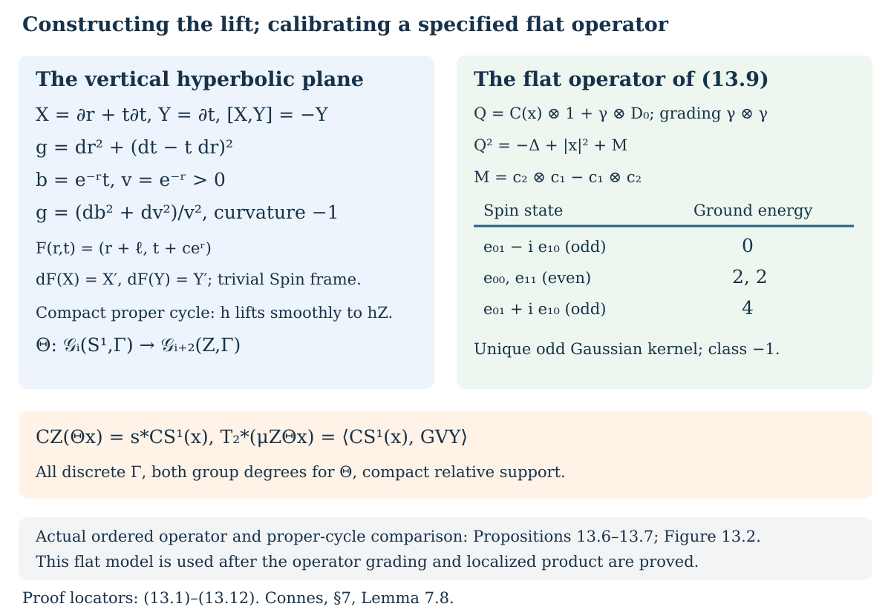

**Figure 13.1.** The left panel gives the exact invariant vertical frame and the lifted compact cycle in (13.1)–(13.6). The right panel lists the lowest energies of the specified flat operator (13.9); the unique zero state is odd. The bottom line states the already proved lifted-cycle evaluation (13.7). This diagram records the lift and the specified flat model; Figure 13.2 supplies the actual ordered operator and its properly supported comparison. Human source for the jet-transfer question: [Connes 1986, Lemma 7.8]. Proof locators: Lemma 13.1, Proposition 13.2 and Lemma 13.3. [Open the scalable diagram](../assets/jet-lift-and-normal-plane.svg).

### The actual ordered jet operator

The normal calculation can now be attached to the analytic map. We first fix the one-dimensional representative, so that the grading of a two-dimensional operator is a consequence of the ordered product.

**Lemma 13.5 (the real Thom generator).** For a separable C*-algebra \(B\) with a pointwise norm-continuous real action \(\alpha\), put \(C=B\rtimes_\alpha\mathbb R\). Write its canonical group multiplier as \(u_s=e^{isH}\). The odd module
\[
 ({}_B C_C,H),\qquad b(H)=\frac{H-i}{H+i},
 \tag{13.14}
\]
represents the suspension-compatible family \(\Gamma_\alpha\), with the positive real frequency and the graded suspension convention of Lemma 13.4. The assertion concerns the induced maps in both K-degrees. It does not identify the index-normalized odd map \(\Phi^1\) with that same odd module.

**Proof.** The generator is a regular selfadjoint multiplier: its resolvents are the integrated exponentially decreasing half-line kernels. The identities \((H\pm i)^{-1*}=(H\mp i)^{-1}\) and \((H\pm i)(H\pm i)^{-1}=1\) hold first on compact smooth kernels, then on their completion. For a smooth coefficient,
\[
 [H,a]=-i\delta(a),\qquad a(H\pm i)^{-1}\in C.
 \tag{13.15}
\]
The second assertion follows directly from its integrable coefficient kernel; norm approximation gives local compactness for every \(a\in B\). Thus the bounded transform is an odd Kasparov module. Matrix amplification and external unitization give the same assertion for relative classes.

For a smooth projection \(q\), the bounded selfadjoint correction \(K=i[\delta q,q]\) gives
\[
 H+K=qHq+(1-q)H(1-q).
 \tag{13.16}
\]
This is the correction proved in the connections lesson, Proposition 1.3. The path \(H+sK\) is a bounded perturbation homotopy of the module. The resolvent identity preserves (13.15) throughout that path. Compression therefore pairs \([q]\) with the Cayley loop of \(qHq\), extended by the identity on its complementary corner. This is exactly the positive fixed-projection construction of the action lesson, after its exterior-equivalence correction. For the trivial action its scalar loop \((\xi-i)/(\xi+i)\) has winding one. Thus the induced degree-zero map is \(\Gamma^0\), with its established normalization, not merely an unspecified choice of a Thom sign. Smooth functional calculus supplies all projection classes, including relative differences.

Right Kasparov multiplication by this odd module commutes with the graded suspension identifications. Apply the degree-zero argument to the suspended system. Moving its odd suspension coordinate through the new odd frequency gives the graded interchange sign. In the new-frequency-first order its induced degree-one map is consequently the action lesson's \(\Gamma^1=-\Phi^1\). This proves the claimed family in both degrees. The real Thom isomorphism itself and the suspension/product foundations remain the stated prerequisites; this argument identifies their particular representative and normalization. \(\square\)

**Proposition 13.6 (operator, density and grading).** On the principal Morita module of Proposition 9.1, the family \(\Psi_\Gamma\) is represented by
\[
 D_{\rm ord}=c_1H_H+c_2H_G,\quad
 H_H=-iY,\quad H_G=-i(X+\tfrac12),\quad
 \gamma_{\rm ord}=\gamma.
 \tag{13.17}
\]
The first coordinate in this Clifford order is the additive group \(H\), and the second is the logarithmic group \(G_1\). In the geometric frame order \((X,Y)\) of (13.1), the same graded module is
\[
 D_{\rm v}=-i\{c_1(X+\tfrac12)+c_2Y\},\qquad
 \gamma_{\Psi_\Gamma}=-\gamma,\qquad
 \gamma_{\Psi}=+\gamma.
 \tag{13.18}
\]
These representations induce the specified maps on both K-groups for every discrete \(\Gamma\).

**Proof.** Differentiate the two unitary actions in (9.8), with \(a=e^s\). The additive derivative is \(Y\); the multiplicative derivative is \(X+1/2\). Hence their selfadjoint generators are (13.17). The factor \(1/2\) is forced by the unitary density change in (9.7). Omitting it would make the second generator nonsymmetric on \(L^2(dt\,dr)\), since \(\operatorname{div}X=1\). Both fields commute with the plain pullbacks (13.2), and their Clifford frame action is identity. Thus the complete operator is equivariant, including its zeroth-order term.

We verify that the sum is the ordered product, rather than infer that from its elliptic symbol. The first module is \((A_2,B_H,H_H)\), where \(B_H=A_2\rtimes H\); the second is \((B_H,C,H_G)\), where \(C=B_H\rtimes G_1\). Their tensor module is \(C\), with the usual two-dimensional Clifford factor for a product of two odd modules. Lemma 13.5 fixes both factors. Transfer this tensor module through the actual principal Morita unitary (9.7). We test the product criterion after tensoring the second module with this Morita equivalence. Its generator is still \(H_G\). For a left coefficient \(b\in B_H\), the original \(b(H_G\pm i)^{-1}\) belongs to \(C\), which acts by compact operators on the Morita module; this also verifies local compactness of the transferred second factor. The Morita equivalence preserves the ordinary products.

On the compact smooth core the Lie relation is
\[
 [H_G,H_H]=iH_H,\qquad
 D_{\rm ord}^2=H_H^2+H_G^2+\gamma H_H.
 \tag{13.19}
\]
In particular
\[
 D_{\rm ord}^2\geq\tfrac12H_H^2+H_G^2-\tfrac12,
 \qquad
 \{c_1H_H,D_{\rm ord}\}=2H_H^2+\gamma H_H
       =2(H_H+\gamma/4)^2-\tfrac18.
 \tag{13.20}
\]
The first inequality is the scalar inequality \(|h|\leq h^2/2+1/2\), applied to the commuting matrix \(\gamma\) and the selfadjoint \(H_H\). It makes the closed graph of \(D_{\rm ord}\) continuously contained in the domains of both generators. The second gives the product positivity condition with lower bound \(-1/8\).

Here are the domain and compactness details. After Morita, the underlying module is the scalar fiber \(L^2(\mathbb R^2)\) tensored with the circle crossed-product coefficient module. In the frame (13.1), the scalar operator in (13.18) is the spin Dirac operator for the complete hyperbolic metric: its half-divergence term is precisely \(c_1/2\). It is essentially selfadjoint on compact smooth spinors. Indeed smooth metric cutoffs \(\chi_R\to1\) can be chosen with \(|d\chi_R|\leq C/R\). Local elliptic regularity applies to a deficiency vector. Testing \(D^*\zeta=\pm i\zeta\) against \(\chi_R^2\zeta\) and using \([D,\chi_R]=-i c(d\chi_R)\) gives \(\|\chi_R\zeta\|^2\leq(C/R)\|\zeta\|\|\chi_R\zeta\|\). Thus the deficiency spaces vanish. Tensoring its scalar resolvents with the coefficient identity gives a regular selfadjoint module operator. Compact smooth sections with finite group support remain a core. Applying the first inequality of (13.20) to differences of core approximants proves the asserted domain inclusions for its closure, not just a formal core estimate.

For a compactly supported smooth coefficient \(f(y,r,t)\), \(f(D\pm i)^{-1}\) is compact: local ellipticity maps the resolvent to the first Sobolev space on the compact fiber support, and Rellich compactness gives a compact scalar operator there. The family is continuous in \(y\); finite partitions and finite-rank approximations make it compact on the coefficient module. A coefficient with a group unitary is this same compact operator followed by a bounded unitary. The commutator with \(fU_g\) is bounded, because the operator commutes with the frame-preserving \(g\)-action and \(Xf,Yf\) are bounded on that compact support. Density proves local compactness for all left coefficients. These arguments give an actual unbounded module, not merely a formal differential expression.

For the product connection condition, take \(\xi\) in the dense integrated smooth core of \(B_H\), smooth also for the residual \(G_1\)-action. Multiplication by \(H_H\xi\), and the commutator \([H_G,\xi]\), are bounded integrated kernels. In the odd-product Clifford amplification, contraction \(T_\xi\) obeys
\[
 D_{\rm ord}T_\xi-T_\xi(c_2H_G)
       =c_1(H_H\xi)+c_2[H_G,\xi],
 \tag{13.21}
\]
with the corresponding graded signs on a homogeneous Clifford section. The adjoint relation follows by using \(\xi^*\). Hence the block contraction preserves the operator domains and has bounded graded commutator. Together with (13.20), this is the sufficient product criterion of [van den Dungen, Theorem 3.3, Definition 2.10 and Definition 3.2](https://arxiv.org/pdf/2006.10616); its bounded connection and positivity proofs are Proposition 2.11 and Section 3.1. We apply it to separable algebras and countably generated modules here. This identifies the bounded transform with the product of the two actual one-dimensional representatives. No commutation of the two unbounded generators has been assumed.

Finally, put \(W=(c_1+c_2)/\sqrt2\). Direct multiplication gives \(Wc_1W^*=c_2\), \(Wc_2W^*=c_1\), and \(W\gamma W^*=-\gamma\). It carries (13.17) to the differential expression (13.18) with the negative grading. This is the reversal from group order \((H,G_1)\) to frame order \((X,Y)\). Lemma 13.4 then supplies the opposite grading for \(\Psi\). Neither step is a choice made from the oscillator kernel.

For a possibly uncountable group, every K-class and every homotopy of its representatives uses a countable collection of group coefficients, by norm approximation with finite sums. The subgroup they generate is countable and is preserved by the two real actions. Perform the proved construction there. The reduced inclusion and scalar-extension unitaries of the geometric lesson, Section 4, and Proposition 9.1 intertwine the generators, density change and finite-rank operators. Passing to the directed union gives the stated maps for every \(\Gamma\). The separable product theorem has not been applied directly to a nonseparable algebra. \(\square\)

### Cancelling the normal plane on a proper cycle

**Proposition 13.7 (the graded proper-cycle comparison).** With the homological lift of Proposition 13.2 and the fixed analytic maps,
\[
 \Psi_\Gamma\mu_Z\Theta x=\mu_{S^1}x,
 \qquad \Psi\mu_Z\Theta x=-\mu_{S^1}x
       \quad(x\in\mathcal G_i(S^1,\Gamma)).
 \tag{13.22}
\]
Both equalities hold in either K-degree, for arbitrary discrete groups and compact relative coefficient support.

**Proof.** First take a countable monodromy group and a compact cycle \((M,F,g)\). Let \(h:\widetilde M\to S^1\) be its proper-cover map and \(h_Z\) its lift from Proposition 13.2. Put \(A=C(S^1)\rtimes_r\Gamma\). The module before discrete descent for (13.18) is the vertical \(L^2\)-spinor module of \(\pi:Z\to S^1\), with its fiber half-densities. Its \(\Gamma\)-action is plain pullback in the frame density. After reduced descent it is exactly the principal Morita module used above: the equality of inner products and all generator actions is (9.7)–(9.9). Thus \(\Psi_\Gamma\) is right product with the submersion class represented by \((D_{\rm v},-\gamma)\). Its bounded transform has the vertical Clifford principal symbol. Local phase quantization of that same symbol differs from it by a lower-order operator after compact coefficient localization, hence by a compact operator by the estimates in Proposition 13.6. It therefore represents the submersion class of the stated wrong-way calculus. We now identify its orientation relative to the actual normal symbol in \(\mu_Z\Theta x\).

The lifted relative tangent is
\[
 T^*\widetilde M\oplus h_Z^*TZ
       \simeq (T^*\widetilde M\oplus h^*TS^1)
                              \oplus\mathbb R^2_{(X,Y)}.
 \tag{13.23}
\]
Use an equivariant splitting on the proper graph; its choices are affine. The normal factor is the outward Clifford symbol \(C(u)\) with grading \(\gamma\), exactly \(\kappa_2=b_2^{\rm cyc}=-b_2^{\rm geo}\), as fixed in the geometric lesson, Lemma 7.3 and (8.22a–b). The grading supplied by Proposition 13.6 for the differential factor is \(-\gamma\). Accordingly the local product is the same operator \(Q\) as (13.9), now with total grading
\[
 \gamma\otimes(-\gamma).
 \tag{13.24}
\]
Lemma 13.3 gives its unique Gaussian kernel; (13.24) makes that kernel even. It is the trivial scalar line under simultaneous Spin frame changes. The polar involution pairs the two graded summands of the invertible complement. Thus this differential factor has precisely the inverse normal orientation, which cancels the last summand in (13.23). In particular the cancellation introduces neither a determinant-line twist nor a negative scalar. The positive geometric Bott class has a different grading; substituting it for the actual outward normal column would change this check.

We spell out why the flat check computes the product on the proper graph. Work on finitely many graph charts over \(M\), together with their translates. Choose geodesic vertical coordinates \(u\) about \(h_Z(x)\), invariant cutoffs, half-density trivializations and a connection on (13.23). They exist on this proper graph tube; an invariant center on all of \(S^1\) is unnecessary. The normal immersion column is supported in a bounded disk inside that tube. The submersion factor has vertical principal symbol \(c(\eta)\), with the grading already fixed in (13.24). The lifted graph symbol and this submersion symbol have the Clifford cup product constructed by the wrong-way calculus. Its normal-position and vertical-momentum part is the pair \((C(u),D_0)\) in (13.24); its other factor is exactly the graph symbol of \(h\).

For a compact smooth first-module section, contraction on the tensor module gives the vertical operator on the second module. Differentiating that section, the tube cutoffs, the half-density and the connection gives lower-order remainders. On the symbol level the connection condition says that the cup symbol at zero first covector is the second symbol. The positivity condition says that its graded anticommutator with the first Clifford symbol has nonnegative principal part. In the normal plane these statements are the graded sum in (13.9) and the square-norm term of its first factor; in the old graph directions they are the same Clifford relations. This is the concrete cup-product construction of [Connes–Skandalis 1984, Lemmas 1.7–1.9 and Theorem 1.10]. It retains the inverse normal grading (13.24).

The remainders just described are compact after a compact source coefficient. Only finitely many translated source charts then occur. Their tube supports are compact over that coefficient, their lower-order operators map to a positive local Sobolev order, and Rellich compactness applies. In a bounded transform computation the resolvent commutator integral has a bounded integrand near zero and order \(\lambda^{-1}\) at infinity before multiplication by \(\lambda^{-1/2}\); it therefore converges in norm to the same compact remainder. Proper graph supports satisfy the projection-to-source requirement in [Connes–Skandalis 1984, Remark 1.11(a)]. Restricting to a compact source coefficient, rather than treating \(\pi\) as a proper map, is what supplies this support property.

The bounded connection and positivity criterion therefore identifies the actual operator product with this Clifford cup product. Its normal contraction is (13.24). Straightening the metric and connection in a smaller tube changes neither symbol class nor product: interpolate positive metrics and connections there, keep the outer tube fixed, and use the same localized compact remainders. This deformation is only on the pulled-back proper graph. We have not asserted a global \(\Gamma\)-equivariant flat deformation of the jet bundle. The even Gaussian contraction consequently leaves the graph module of \(h\), with its original coefficient \(F\). Equivalently, the composition formula [Connes–Skandalis 1984, Theorem 2.6 and Proposition 2.9] gives
\[
 h_Z!\ \widehat\otimes_{C_0(Z)}\ \pi!_{\rm inv}=h!,
 \tag{13.25}
\]
where the subscript records the inverse normal orientation just checked. Its composite relative tangent is the old structure in (13.23), after cancellation of the canonical identity double. Formula (13.25) is applied to this particular proper-cover graph, with the bounded connection and positivity checks above.

On the finite-group core, reduced descent carries a localized rank-one remainder to a rank-one crossed module operator. Contracting a section with a group coefficient composes the same contraction with its bounded group unitary. The descent and extension formulas of the geometric lesson, Lemma 4.1, thus preserve both product conditions. Tensor (13.25) with \(F\) and the proper-cover Morita column. The result is \(\Psi_\Gamma\mu_Z\Theta x=\mu_{S^1}x\). An old odd coefficient keeps its Clifford generator: the normal cancellation is exterior multiplication by the even scalar \(+1\), so there is no extra odd interchange. The second equality of (13.22) follows from Lemma 13.4.

A compact cycle has countable monodromy. Extension of its proper-cover module to any larger \(\Gamma\) intertwines the graph tube, both operators and the rank-one remainders, by the extension unitary of the geometric lesson, Theorem 4.2. This proves the arbitrary-group assertion. For a coefficient supported on a noncompact base, take its compact relative neighborhood and collar double as in that theorem. Choose the lift, tube and homotopies there. The two coefficients agree on the collar and outside their support, so their differences and products restrict and extend by zero together. The equality passes through relative excision. This proves all the stated support and degree assertions. \(\square\)

**Theorem 13.8 (the geometric Godbillon–Vey pairing).** For \(A=C(S^1)\rtimes_r\Gamma\), the additive functional \(\mathfrak F=2\pi i J_{\tau_w}\) of (11.14) satisfies
\[
 \mathfrak F(\mu_{S^1}x)
        =\langle C_{S^1}(x),GV_Y\rangle
       \quad(x\in\mathcal G_0(S^1,\Gamma)).
 \tag{13.26}
\]
Extend it by zero on \(K_1(A)\). Then the same formula holds for the full graded geometric group; its degree-one right side is zero. All groups and supports are as in Proposition 13.7.

**Proof.** Proposition 13.7 and the isomorphism \(\Psi\) give \(\Psi^{-1}\mu_{S^1}x=-\mu_Z\Theta x\). Hence (11.14) and (13.7) give
\[
 \begin{aligned}
 \mathfrak F(\mu_{S^1}x)
   &=-T_{2*}(\Psi^{-1}\mu_{S^1}x)\\
   &=T_{2*}(\mu_Z\Theta x)
     =\langle C_{S^1}(x),GV_Y\rangle.
 \end{aligned}
 \tag{13.27}
\]
This uses the global identity \(\pi_\Gamma^*GV_Y=-[\Omega]_\Gamma\) and the positive measure trace already proved in Section 12. It introduces no further change of characteristic or cyclic normalization. For \(x\in\mathcal G_1\), its character has even homological parity because the circle tangent rank is one. Its pairing with the degree-three Godbillon–Vey class is consequently zero, proving the extension assertion. \(\square\)

This proves the geometric assertion of [Connes 1986, Theorem 7.3(b) and Lemma 7.8] in the stated raw and geometric conventions. The two negatives in (13.27) come from distinct already fixed operations: the index-normalized two-step family and the trace transfer. The geometric class and its real normalization are the ones in Proposition 12.2.

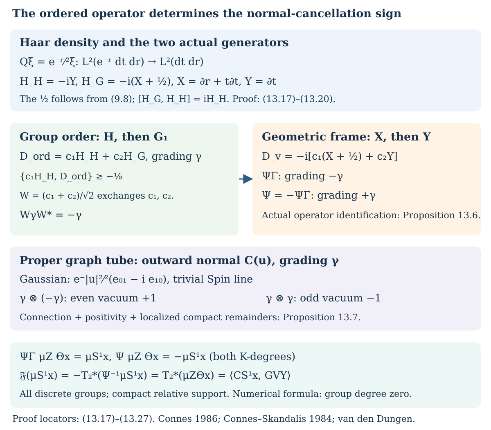

**Figure 13.2.** Haar half-density conjugation gives \(H_G=-i(X+1/2)\). Exchanging the additive/logarithmic Clifford order for the \((X,Y)\) frame changes the grading of \(\Psi_\Gamma\) to \(-\gamma\); Lemma 13.4 gives \(+\gamma\) for \(\Psi\). The supported outward normal symbol therefore has an even Gaussian cancellation for \(\Psi_\Gamma\) and an odd one for \(\Psi\). Proof locators: (13.17)–(13.25), then (13.27). Human sources: [Connes 1986, Lemma 7.8], [Connes–Skandalis 1984, §§1–2] and [van den Dungen, Theorem 3.3](https://arxiv.org/pdf/2006.10616). [Open the scalable diagram](../assets/jet-operator-and-proper-cycle.svg).

### A cocompact circle action

We can now detect a particular index class, rather than only produce an abstract nonzero functional. Let \(\Lambda\subset\operatorname{PSL}(2,\mathbb R)\) be discrete, torsion free and cocompact. Write
\[
 \Sigma=\Lambda\backslash\mathbb H,\qquad
 N=(\mathbb H\times\partial\mathbb H)/\Lambda
       \cong S(T\Sigma),\qquad
 p:N\longrightarrow\Sigma .
 \tag{13.28}
\]
The last identification sends a boundary point to the unit tangent of the geodesic ray towards it, as proved in [the geometric lesson, Lemma 6.1](the-geometric-group-and-geometric-corollaries.md#6-a-surface-boundary-makes-the-unit-torsion). Orient \(N\) by the complex orientation of \(\Sigma\), followed by the positive tangent-circle direction. The suspension foliation \(\mathcal F\) has leaves obtained from \(\mathbb H\times\{\xi\}\). It is a smooth cooriented foliation on this compact three-manifold. We keep the real secondary normalization of Proposition 12.2.

**Proposition 13.9 (the compact hyperbolic Godbillon–Vey integral).** With the orientation just specified,
\[
 \int_N\operatorname{GV}(\mathcal F)
   =-2\pi\operatorname{Area}_{\rm hyp}(\Sigma)
   =4\pi^2\chi(\Sigma)\ne0.
 \tag{13.29}
\]

**Proof.** In the upper half-plane write the metric as \((dx^2+dy^2)/y^2\), with \(y>0\). A unit vector is
\(v=y(\cos\phi\,\partial_x+\sin\phi\,\partial_y)\), where \(\phi\) has period \(2\pi\). Define
\[
 \begin{aligned}
 a&=\cos\phi\,\frac{dx}{y}+\sin\phi\,\frac{dy}{y},\\
 b&=-\sin\phi\,\frac{dx}{y}+\cos\phi\,\frac{dy}{y},\\
 k&=d\phi+\frac{dx}{y}.
 \end{aligned}
 \tag{13.30}
\]
These forms have intrinsic definitions: \(a\) evaluates the base velocity along \(v\), \(b\) evaluates it along the positive perpendicular \(Jv\), and \(k\) is the angular Levi–Civita connection. Hence orientation-preserving hyperbolic isometries preserve them, and they descend to \(N\). They form a global coframe there. Direct differentiation, using \(d(dx/y)=(dx/y)\wedge(dy/y)\), gives
\[
 da=k\wedge b,\qquad db=a\wedge k,\qquad
 dk=a\wedge b,\qquad
 a\wedge b\wedge k=\frac{dx\wedge dy}{y^2}\wedge d\phi.
 \tag{13.31}
\]
In particular the last form is positive in our base-then-circle orientation.

The defining form of \(\mathcal F\) is \(w=b+k\). To check the foliation and its coorientation, away from the upward vertical direction the forward endpoint in the real boundary chart is
\[
 \xi=x+y\frac{1+\sin\phi}{\cos\phi},\qquad
 d\xi=\frac{y}{1-\sin\phi}(b+k).
 \tag{13.32}
\]
At the downward vertical direction the formula extends with positive multiplier \(y/2\). At the upward direction use the positively oriented boundary chart \(u=-1/\xi\); there \(du=(b+k)/(2y)\). Thus the kernel is exactly the constant-endpoint foliation and its transverse orientation is positive. Equation (13.31) yields
\[
 dw=a\wedge w,\qquad
 \operatorname{GV}(\mathcal F)=[a\wedge da]
          =[-a\wedge b\wedge k].
 \tag{13.33}
\]
This is the same characteristic class as Proposition 12.2, by its defining-form independence and naturality. There is no appeal to the mere existence of a nonzero secondary class. Fiber integration of the last form in (13.31) gives \(2\pi\) times the hyperbolic area form. This proves the first equality of (13.29), including its sign, and already proves nonvanishing because the closed surface has strictly positive area.

For the Euler-number equality we can use the same connection. In the oriented frame \(e_1=y\partial_x,e_2=y\partial_y\), one has \(\nabla e_1=(dx/y)e_2\). Regard \(T\Sigma\) as the complex line with \(Je_1=e_2\). Its unitary connection is locally \(i\,dx/y\); on the moving frame it is \(ik\), with curvature \(i\,dk\). In the ordinary geometric Chern convention fixed in [the geometric lesson, Section 8](the-geometric-group-and-geometric-corollaries.md#one-projection-checks-all-three-numerical-signs),
\[
 e(T\Sigma)=c_1(T\Sigma)=-\frac{[dA_{\rm hyp}]}{2\pi}.
 \tag{13.34}
\]
Here \(dk=p^*dA_{\rm hyp}\), and the base curvature is \(F_\nabla=i\,dA_{\rm hyp}\). Formula (13.34) is an equality on \(\Sigma\); it does not integrate a class on \(N\) over the base. The usual Euler/complex-line identification is the positive zero-section Thom identity, and the tangent Euler number \(\chi(\Sigma)=2-2g\) was computed by local zero indices in that lesson, Lemma 6.2. Integrating (13.34) gives \(\operatorname{Area}_{\rm hyp}(\Sigma)=-2\pi\chi(\Sigma)\), completing (13.29). \(\square\)

**Corollary 13.10 (a lattice Dolbeault index survives).** Let
\[
 A_\Lambda=C(\partial\mathbb H)\rtimes_r\Lambda,
 \qquad i:C_r^*(\Lambda)\longrightarrow A_\Lambda,
 \qquad e=\operatorname{Ind}_\Lambda(\bar\partial_{\mathbb H})
          \in K_0(C_r^*(\Lambda)).
 \tag{13.35}
\]
The index is the compact-surface assembly class for the complex Dolbeault orientation and trivial line coefficient. The functional fixed in (11.14) satisfies
\[
 \mathfrak F(i_*e)=4\pi^2\chi(\Sigma),\qquad
 J_{\tau_w}(i_*e)=-2\pi i\,\chi(\Sigma)\ne0.
 \tag{13.36}
\]
Consequently \(i_*e\) and \(e\) have infinite additive order. The functional remains nonzero for any discrete circle-action group whose restriction to \(\Lambda\) is this projective action.

**Proof.** Use \(\mathbb H\) as the contractible free model of \(E\Lambda\). Thus \(N=(\partial\mathbb H)_\Lambda\), and the map \(g:N\to(\partial\mathbb H)_\Lambda\) is the identity in this model. Its principal cover is \(\mathbb H\times\partial\mathbb H\), and its equivariant map \(h\) is projection onto the second factor. With the trivial line coefficient this is a compact cycle \(x\).

We specify its structure and degree. Let \(L=\ker(dp)\), positively oriented by the forward-endpoint circle, so \(L=g^*\tau_{\partial\mathbb H}\). An invariant splitting on this proper cover identifies
\[
 T^*N\oplus g^*\tau_{\partial\mathbb H}
       \cong p^*T^*\Sigma\oplus(L^*\oplus L).
 \tag{13.37}
\]
Give the first summand the cotangent symbol structure of the surface Dolbeault operator, and the second the identity exterior-Clifford structure of the geometric lesson, Example 3.2. The old horizontal factor is first. For the single real line its induced base orientation has sign \(\epsilon_1=+1\). The resulting base orientation is therefore the positive one in (13.28). The complex horizontal structure descends because \(\Lambda\) acts holomorphically. The cycle has degree \(3+1+0=0\) modulo two, hence \(x\in\mathcal G_0(\partial\mathbb H,\Lambda)\). Proposition 3.1 of that lesson gives
\[
 \bigl(C_{\partial\mathbb H}(x)\bigr)_{H_3}=[N],\qquad
 \langle C_{\partial\mathbb H}(x),GV_N\rangle
              =\int_N\operatorname{GV}(\mathcal F).
 \tag{13.38}
\]
Indeed the coefficient has rank one and every Todd factor has constant term one. Terms of positive degree cannot multiply a degree-three class on a three-manifold. No assertion about lower character components is needed.

We also need the actual analytic identity
\[
             \mu_{\partial\mathbb H}(x)=i_*e.
 \tag{13.39}
\]
Here is its module verification. The map \(h:\mathbb H\times\partial\mathbb H\to\partial\mathbb H\) is a submersion with vertical complex plane \(T\mathbb H\). Its wrong-way module is the family of Dolbeault modules on that plane, parametrized by the boundary point. The identity line double in (13.37) cancels the horizontal target line; its exterior vacuum is even and scalar. Thus the fiber operator is exactly \(\sqrt2(\bar\partial+\bar\partial^*)\), with the surface complex orientation, tensored by the boundary coefficient algebra. It introduces no reversed Bott generator and no line-bundle coefficient. This uses the submersion formula already bound in the geometric lesson, Section 4, and the identity convention of its Example 3.2.

Choose a compactly supported smooth cutoff \(c\) on \(\mathbb H\), with \(\sum_{\lambda\in\Lambda}c(\lambda^{-1}z)^2=1\); a finite cover of the compact quotient and lifted subordinate functions supplies it. The assembly compression for the surface index uses the projection with arrow coefficients \(c(z)c(\lambda^{-1}z)\). The proper-cover construction for \(x\) uses exactly this cutoff, independent of the boundary point, and exactly these arrow coefficients tensored by \(1\in C(\partial\mathbb H)\). Its operator, compression and group action are therefore the scalar extension of those defining \(e\) along \(i\). This is also a check at the completed module level: the algebraic tensor maps elementary sections to the same family sections, preserves their inner products, and has dense range; completion is consequently unitary. Reduced descent uses the same regular representation, so the equality survives completion. This proves (13.39), without a general unproved base-change assertion.

Apply Theorem 13.8 to \(x\), then (13.38) and Proposition 13.9. This gives the first equality of (13.36). Division by the declared \(2\pi i\) gives its raw second equality. Every additive map to \(\mathbb C\) kills torsion, so nonzero value proves both infinite-order assertions.

Finally suppose \(\Lambda\subset\Delta\) and the \(\Delta\)-action restricts as stated. The reduced subgroup inclusion \(j:A_\Lambda\to A_\Delta\) is isometric, by the right-coset regular-module argument of the transverse lesson, Section 7. The logarithmic-Jacobian cocycle for \(\Delta\) restricts to the same cocycle for \(\Lambda\), using the same positive circle density. Represent a K-class by a matrix over the smooth \(\Lambda\)-algebra and its controlled inverse as in the n-trace lesson. Both its cocycle evaluation and inverse are preserved by \(j\); the leading-slot bounds pass this equality to the controlled pairing domain. Hence
\(\mathfrak F_\Delta j_*i_*e=\mathfrak F_\Lambda i_*e\ne0\).
This proves the extension claim even if \(\Delta\) is uncountable. \(\square\)

This is the full consequence of [Connes 1986, Corollary 7.13](https://alainconnes.org/wp-content/uploads/transfund.pdf) in our declared conventions. Its displayed pairing suppresses the inclusion \(i_*\); (13.35)–(13.39) keep it visible. The nonzero multiple of the three-dimensional orientation class is computed explicitly by (13.29)–(13.34). The numerical constants here use (11.14) and Proposition 12.2; Corollary 7.13 itself only asserts nonvanishing.

For example, if the quotient has genus three, \(\mathfrak F(i_*e)=-16\pi^2\) and \(J_{\tau_w}(i_*e)=8\pi i\). The unit in \(A_\Lambda\) is torsion by the geometric lesson, Theorem 6.3, whereas this index class has infinite order. They are different classes. For an action of \(\mathbb Z\) by rotations, choose the invariant angular density. Then \(\ell(g)=0\) and the cocycle itself is zero, so every value of this functional is zero, as observed after [Connes 1986, Corollary 7.13].

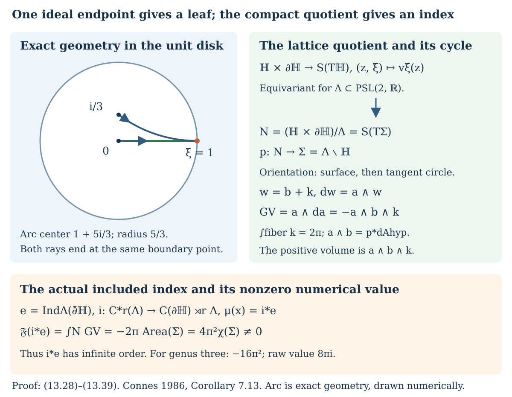

**Figure 13.3.** The disk panel shows the actual geodesic rays from \(0\) and \(i/3\) towards the same ideal endpoint \(1\), in the unit-disk model. The curved ray lies on the circle with center \(1+5i/3\) and radius \(5/3\), orthogonal to the ideal boundary. Constant endpoint gives a suspension leaf. The quotient and index panel states (13.28), (13.33), (13.36) and (13.39), with base orientation before the positive tangent-circle orientation. Human source: [Connes 1986, Corollary 7.13]; full computations: Propositions 13.9 and Corollary 13.10. [Open the scalable diagram](../assets/lattice-circle-godbillon-vey.svg).

### When the flow of weights forces vanishing

The preceding hyperbolic example has a nonzero pairing. A different condition forces the same functional to vanish on every analytic K-class, including classes not represented by a geometric cycle. We use the **flow of weights** in its continuous-core coordinates. For a faithful normal semifinite weight \(\rho\) on a von Neumann algebra \(M\), these coordinates are
\[
 C_\rho(M)=M\rtimes_{\sigma^\rho}\mathbb R,
 \qquad \beta_s(l_\rho(t))=e^{-ist}l_\rho(t),
 \qquad W(M)=\bigl(Z(C_\rho(M)),\beta\bigr).
 \tag{13.40}
\]
Here \(\beta\) fixes the embedded copy of \(M\). A normal state of the commutative algebra in (13.40) is a probability measure in its measure class; invariance means \(\omega\beta_s=\omega\) for every \(s\). More precisely, a normal state gives a probability absolutely continuous to the chosen measure class; its value is independent of representatives modulo null sets. This algebraic formulation also works when the center has no chosen standard point-space model.

We use the usual normal regular crossed product, Fourier–Plancherel, Kaplansky density and the modular Radon–Nikodym cocycle theorem. The last theorem gives \(c_t=[D\rho':D\rho]_t\) and the normal weight-chart isomorphism
\[
 \pi_{\rho'}(a)\longmapsto\pi_\rho(a),\qquad
 l_{\rho'}(t)\longmapsto\pi_\rho(c_t)l_\rho(t).
 \tag{13.41}
\]
Indeed the cocycle law gives the covariant relations; in the regular model the multiplication unitary \(\xi(s)\mapsto c_{-s}^*\xi(s)\) supplies the isomorphism and its inverse. It commutes with the scalar unitaries implementing \(\beta\), hence conjugates the center flows. Thus the invariant-normal-state condition is independent of the weight chart. The modular cocycle theorem is a prerequisite; the particular circle-core and vanishing arguments below are proved here.

**Proposition 13.11 (the first-jet algebra is the continuous core).** Let
\[
 M=L^\infty(S^1)\rtimes\Gamma,\qquad
 N=L^\infty(J_1^+(S^1))\rtimes\Gamma,
 \qquad \phi=\int_{S^1}E_M(\,\cdot\,)\,dy.
 \tag{13.42}
\]
The state \(\phi\) is faithful and normal. With the modular group of (3.1), there is a normal isomorphism \(C_\phi(M)\cong N\). In logarithmic jet coordinates \(r=\log p\), its dual action is
\[
       (\beta_sF)(y,r)=F(y,r-s).
 \tag{13.43}
\]
The first-jet dilation \(\theta_{e^s}F(y,r)=F(y,r+s)\) is therefore \(\beta_{-s}\). The assertion holds for every discrete group.

**Proof.** Write \(J_g=R_g'\) in the angular coordinate \(dy=\mu\) chosen in Section 7. On \(H=L^2(S^1,dy)\otimes\ell^2(\Gamma)\), use
\[
 \begin{aligned}
 (f\xi)(y,k)&=f(y)\xi(y,k),\\
 (U_g\xi)(y,k)&=J_g(y)^{1/2}\xi(R_gy,g^{-1}k).
 \end{aligned}
 \tag{13.44}
\]
To check faithfulness of this regular model, let \(V_g\eta(y)=J_g(y)^{1/2}\eta(R_gy)\). Change of variables gives a unitary, and the Jacobian chain rule gives \(V_gV_h=V_{gh}\). In the usual regular model a diagonal coefficient on sheet \(k\) is \(\alpha_{k^{-1}}f\). The sheetwise unitary \((Q\eta)_k=V_k\eta_k\) changes it into \(f\), while it changes the shift \(\eta_k\mapsto\eta_{g^{-1}k}\) into \(V_g\eta_{g^{-1}k}\). This proves (13.44) is exactly the faithful regular model. Its normal conditional expectation is the identity coefficient; integrating it against the positive density gives the stated faithful normal state. Section 3's GNS calculation gives \(\sigma_t^\phi(fU_g)=f e^{it\lambda_g}U_g\), where \(\lambda_g=-\log J_g\).

The core acts on \(L^2(\mathbb R_s,H)\) by
\(\pi(a)\xi(s)=\sigma_{-s}^\phi(a)\xi(s)\) and
\(l(t)\xi(s)=\xi(s-t)\). Apply the positive-exponent Fourier transform
\[
 (\mathcal F_+\xi)(r)=\frac1{\sqrt{2\pi}}
             \int_{\mathbb R}e^{irs}\xi(s)\,ds.
 \tag{13.45}
\]
It turns \(l(t)\) into multiplication by \(e^{itr}\), and turns \(\pi(U_g)\) into
\[
 \eta(y,r,k)\longmapsto
 J_g(y)^{1/2}\eta(R_gy,r+\log J_g(y),g^{-1}k).
 \tag{13.46}
\]
The shifted argument follows from the multiplier \(e^{-is\lambda_g(y)}\): its Fourier argument is \(r-\lambda_g(y)\). The action in (13.46) is precisely the first-jet action \((y,r)g=(R_gy,r+\log J_g(y))\). Its Jacobian for \(dy\,dr\) is \(J_g\), giving exactly the displayed Koopman factor. The multipliers in \(y\) together with all \(e^{itr}\) generate \(L^\infty(S^1\times\mathbb R)\); adding (13.46) generates its regular crossed product. The Fourier unitary therefore identifies the full generated von Neumann algebras, not only a dense coefficient algebra. The dual action sends \(e^{itr}\) to \(e^{-ist}e^{itr}\), giving (13.43). All sheetwise unitaries and equalities make sense for arbitrary \(\Gamma\); each vector has countable sheet support. \(\square\)

**Lemma 13.12 (a closed derivative with normal range).** Put \(B=C_0(J_1^+)\rtimes_r\Gamma\), and let \(E=C_c^\infty(J_1^+\rtimes\Gamma)\) denote finite smooth compact coefficient sums. The one-trace \(\psi\) of (7.8) has the closable derivation
\[
 \delta_0(b)(a)=\psi(a,b),\qquad b\in E.
 \tag{13.47}
\]
Its graph closure \(\delta\) has a dense domain \(D\subset B\), stable under matrix holomorphic functional calculus, and its values are normal functionals on \(N\). For \(z\in Z(N)\),
\[
                    \delta(b)(z)=0\qquad(b\in D).
 \tag{13.48}
\]
Consequently \(\psi_z(a,b)=\delta(b)(za)\) is a one-trace on \(D\), with matrix K-pairing
\[
 L_u(z)=\sum_{i,j}\delta(u_{ij})
                         \bigl(z(u^{-1})_{ji}\bigr),
 \qquad u\in GL_q(D^+).
 \tag{13.49}
\]
The scalar matrix part is differentiated as zero. For fixed \(u\), \(L_u\) is a normal functional on the center; for fixed \(z\), its value depends only on \([u]\in K_1(B)\).

**Proof.** The loop formula gives, for \(b=\sum_g b_gU_g\), the finite sum
\[
 \delta_0(b)(a)=\sum_g\int_{S^1\times\mathbb R}
   E_N(aU_g)\,\alpha_{g^{-1}}(b_g)
                           \,d\ell(g)\wedge dr.
 \tag{13.50}
\]
Each density is integrable with compact support. The normal contractive coefficient map \(E_N(aU_g)\), followed by this integral, is a normal bounded functional on \(N\). This gives the normal extension as well as the leading-slot norm bound. Its value at \(1_N\) is zero: only \(g=1\) could contribute, and \(d\ell(1)=0\).

The represented \(B\) is nondegenerate and ultraweakly dense in \(N\). Smooth compact multipliers approximate the diagonal strongly, and a compact multiplier approximate unit times \(U_g\) converges strongly to \(U_g\). Kaplansky density makes the unit ball of \(B\) strongly dense in the unit ball of \(N\). Restriction thus embeds \(N_*\) isometrically into \(B^*\). Its image is norm closed, since \(N_*\) is complete.

For closability, if \(b_n\to0\) in \(B\) and \(\delta_0(b_n)\to\eta\) in dual norm, then
\(\eta(a)=-\lim_n\delta_0(a)(b_n)=0\) for every \(a\in E\). Density gives \(\eta=0\). The graph closure therefore exists, and its values remain in the norm-closed copy of \(N_*\). Norm convergence passes the derivation rule to the closure. The domain with \(\|b\|+\|\delta b\|\) is a Banach algebra, and \(\delta(b)(1_N)=0\) still holds. Its external unitization sets \(\delta1=0\), in agreement with its actual normal extension.

Here are the inverse and matrix details. Regard the entrywise matrix derivation as taking values in \((M_qN)_*\), paired by the matrix trace. Its bimodule actions are contractive. If \(h\in M_q(D^+)\) and \(\|h\|<1\), then
\[
 \|\delta_q(h^j)\|\le j\|h\|^{j-1}\|\delta_qh\|.
 \tag{13.51}
\]
The Neumann series and its derivatives converge, so \((1-h)^{-1}\) belongs to the closed domain. For an arbitrary ambient invertible \(v\in M_q(D^+)\), choose \(a\in M_q(D^+)\) close to its ambient inverse so both \(va\) and \(av\) are within one of the identity. Their Neumann inverses lie in the domain. Then \(a(va)^{-1}\) and \((av)^{-1}a\) are a right and a left inverse of \(v\), and agree. The identity \(\delta_q(v^{-1})=-v^{-1}\delta_q(v)v^{-1}\) gives graph-continuous resolvents; contour integration proves matrix holomorphic calculus. This is the particular closed-derivation argument of [the n-trace lesson, Lemma 5.1](n-traces-on-banach-algebras.md#5-a-dual-valued-derivation-is-the-degree-one-case).

Now let \(z_g=E_N(zU_g^{-1})\). Commutation of \(z\) with a diagonal multiplier \(f\) implies
\[
                 (f-\alpha_gf)z_g=0.
 \tag{13.52}
\]
A countable separating family of smooth functions on \(S^1\times\mathbb R\) shows that \(z_g\) is supported on the fixed-point set of the first-jet action. Thus on that support \(R_gy=y\) and \(J_g(y)=1\), almost everywhere. We use a simple scalar fact: for a \(C^1\) function \(h\) of one real variable, \(h'=0\) almost everywhere on \(\{h=0\}\). Indeed a zero with nonzero derivative is isolated in a neighborhood by the inverse function theorem; a discrete collection of these neighborhoods in a second-countable line is countable. The other zeros have derivative zero.

Apply this fact to \(h=\log J_g\). Because \(\ell(g^{-1})=\log J_g\), we obtain \(z_g\,d\ell(g^{-1})\wedge dr=0\) almost everywhere, with the product-coordinate assertion following from Fubini. In (13.50) take \(a=z\) and use the support of \(z_{g^{-1}}\). Every summand is zero. This proves (13.48) on \(E\), and convergence in \(N_*\) proves it on \(D\). There was no expansion of \(z\) as a convergent Fourier series and no essential-freeness hypothesis. If desired, the same assertion holds against the center of \(B^{**}\): its normal represented quotient onto \(N\) maps central elements to central elements, and these derivative functionals factor through that quotient.

Central multiplication commutes with both bimodule actions. The derivation \(b\mapsto z\delta(b)\), defined by \((z\delta b)(a)=\delta b(za)\), therefore obeys the product rule. Evaluating that rule at \(z\) and using (13.48) gives
\[
       0=\delta(ab)(z)=\delta(b)(za)+\delta(a)(zb).
 \tag{13.53}
\]
Thus \(\psi_z\) is antisymmetric, with the bound
\(|\psi_z(a,b)|\le\|z\|\|a\|\|\delta b\|\). The product rule gives its Hochschild identity. The external unit is again assigned zero derivative, and the actual evaluation at that unit is zero by (13.48).

Theorem 5.3 of the n-trace lesson now gives its additive K-pairing. To make this application explicit, approximate an ambient relative invertible by a matrix over \(D^+\); a sufficiently close straight segment stays invertible. Given an ambient homotopy between such endpoints, subdivide it and approximate its vertices, keeping endpoints and scalar parts. Uniform inverse bounds make the resulting affine segments invertible. Inverse closure puts the full segments and inverses in \(D^+\). On a segment, the derivative of (13.49) is zero: antisymmetry and \(\delta(u^{-1})=-u^{-1}\delta(u)u^{-1}\) cancel its two terms, exactly as in that theorem. This proves ambient homotopy invariance and additivity under matrix blocks. Finally each summand in (13.49) is the restriction of a normal functional multiplied by a bounded element of \(N\), so its finite sum is normal on \(Z(N)\). \(\square\)

**Theorem 13.13 (flow-of-weights vanishing).** If the flow \(W(M)\) has no invariant normal state, then
\[
 J_{\tau_w}(e)=0,\qquad \mathfrak F(e)=0
       \qquad\hbox{for every }e\in K_0(C(S^1)\rtimes_r\Gamma).
 \tag{13.54}
\]
In a measure-class realization this applies, in particular, when there is no invariant probability measure. No geometric-assembly-image assumption is made.

**Proof.** Abbreviate the logarithmic dilation \(\theta_{e^s}\) by \(\theta_s\). It preserves the one-trace \(\psi\), as proved in Section 8. On the core it is a normal automorphism and preserves its predual. Consequently
\[
 \delta(\theta_s b)=\delta(b)\circ\theta_{-s},
 \qquad \|\delta(\theta_s b)\|=\|\delta b\|.
 \tag{13.55}
\]
The action preserves the graph domain. Its action there is continuous: this is direct on finite smooth compact sums; on \(N_*\) it follows from the strongly continuous translation unitaries in the regular model. More explicitly, a normal functional is a restriction of a trace-class functional on that Hilbert space. Conjugation by a strongly continuous unitary group is trace-norm continuous on finite-rank operators, hence on trace-class operators by approximation. Restriction gives predual-norm continuity. Graph approximation proves continuity for all \(b\in D\).

For \(u\in GL_q(D^+)\), covariance and (13.49) give
\[
       L_u(\theta_s z)=L_{\theta_{-s}u}(z)=L_u(z).
 \tag{13.56}
\]
The second equality holds because \(t\mapsto\theta_{-t}u\) is a continuous path of invertibles with its inverse in the same graph domain, and hence has constant K-class. Thus \(L_u\) is an invariant **normal** complex functional on the center.

A nonzero such functional would produce an invariant normal state. Its polar decomposition on the commutative algebra gives the finite positive normal functional \(|L_u|\), with \(|L_u|(1)>0\). Automorphisms preserve the unique polar decomposition, so (13.56) implies \(|L_u|\theta_s=|L_u|\). Dividing by \(|L_u|(1)\) gives an invariant normal state. This uses total variation, not positivity of the original complex pairing. Proposition 13.11 identifies the dilation with the reversed center flow, so the hypothesis forbids that state. Hence \(L_u=0\). Taking \(z=1\) shows \(J_\psi=0\) on every \(K_1(B)\).

The isomorphism \(m_2\Phi_1^1:K_1(B)\to K_0(C(S^1)\rtimes_r\Gamma)\) of Section 9 covers every even analytic class. Proposition 8.2 and Theorem 10.4 give
\[
 J_{\tau_w}(m_2\Phi_1^1v)
       =-\frac1{2\pi i}J_\psi(v)=0.
 \tag{13.57}
\]
This proves (13.54), including \(\mathfrak F=2\pi i J_{\tau_w}\). The proof uses finite group supports in the derivative formula, a countable separating family only on the finite-dimensional jet space, and normal functionals on an abstract center. It therefore retains arbitrary discrete groups. \(\square\)

**Corollary 13.14 (the semifinite case).** If \(M\) has a faithful normal semifinite trace, then (13.54) holds.

**Proof.** Choose that trace \(\rho\). Its modular action is trivial, so Fourier transformation gives
\[
 C_\rho(M)=M\,\overline\otimes\,L^\infty(\mathbb R),
 \quad Z(C_\rho(M))=Z(M)\,\overline\otimes\,L^\infty(\mathbb R),
 \quad (\beta_s f)(r)=f(r-s).
 \tag{13.58}
\]
A normal invariant state would restrict to a normal invariant state on \(1\otimes L^\infty(\mathbb R)\). Let \(m\) be its value on the indicator of \([0,1)\). Every \([n,n+1)\) has the same value. If \(m>0\), finite disjoint sums exceed one. If \(m=0\), normality and the increasing sum over all integer intervals give value zero at one. Both are impossible. The chart conjugacy (13.41) carries this conclusion to the canonical state \(\phi\), so Theorem 13.13 applies. \(\square\)

These are [Connes 1986, Theorem 7.14 and its semifinite consequence]. The proof specifies the normal range and graph domain, keeps the full matrix/external-unit pairing, and computes the first-jet core with its dual-action sign. The conclusion concerns the entire \(K_0\), whereas the geometric Godbillon–Vey formula of Theorem 13.8 by itself concerns the image of \(\mu\).

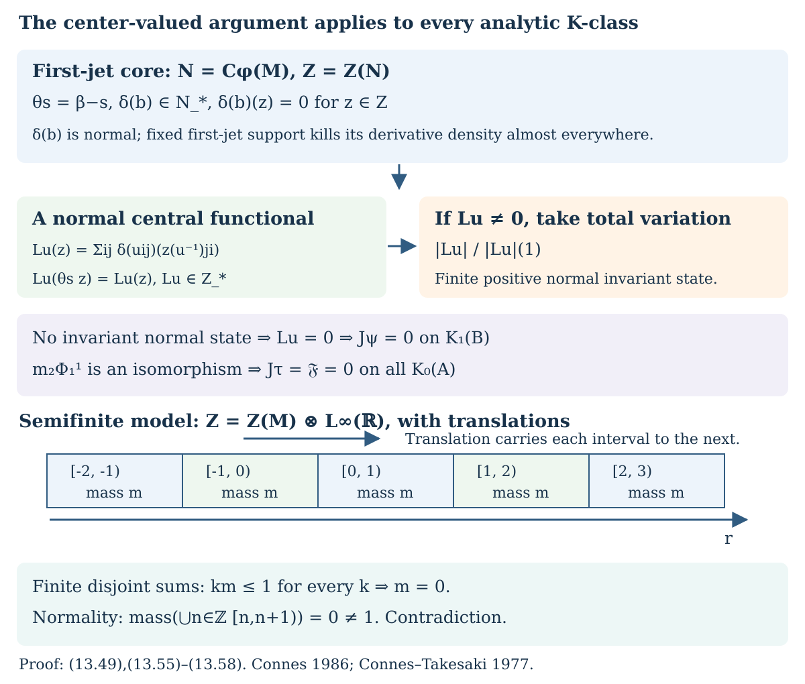

**Figure 13.4.** The upper implications hold on the abstract commutative algebra \(Z(N)\), with no point-space drawing assumed. They show why normality and total variation are essential to Theorem 13.13. The lower interval diagram is the actual \(\mathbb R\) coordinate of the semifinite center (13.58); translation assigns the same mass to every integer interval, contradicting a normal probability. Proof locators: (13.49), (13.55)–(13.58), Lemma 13.12 and Corollary 13.14. Human sources: [Connes 1986, Theorem 7.14], [Connes–Takesaki 1977]. [Open the scalable diagram](../assets/flow-of-weights-vanishing.svg).

### Higher-frame forms and their finite Weil model

The circle calculation uses a three-form on a two-jet space. We now construct the analogous characteristic pairing in every dimension. The result is an existence theorem on analytic K-theory. Its proof first shows that the prescribed geometric functional vanishes on the kernel of the analytic map, then extends that functional from the image. This distinction matters: a single formula on the original crossed-product algebra is a stronger assertion.

Let \(V\) be an oriented \(n\)-manifold, \(n\geq1\), with an orientation-preserving discrete action. Write \(J_k^+(V)\) for orientation-preserving \(k\)-jets of local coordinate maps \(f:(\mathbb R^n,0)\to V\), and put

\[
 \begin{aligned}
 V_k&=J_k^+(V)/\mathrm{SO}(n),\qquad
 d_j=n\binom{n+j-1}{j},\\
 \dim V_k&=n+\frac{n(n+1)}2+\sum_{j=2}^k d_j.
 \end{aligned}
 \tag{13.59}
\]

Here \(V_1\) is the space of positive real metrics. Fixing a lower jet makes \(V_j\to V_{j-1}\) an affine bundle modeled on \(\operatorname{Hom}(\operatorname{Sym}^j\mathbb R^n,\mathbb R^n)\). If the linear term is \(A\), normalize the output of a difference by \(A^{-1}\). A coordinate change with derivative \(B\) sends that difference to \(Bv\) and \(A\) to \(BA\), so its normalized value is unchanged. Changing the representative by an orthogonal frame gives the indicated tensor representation. Thus the difference bundle \(L_j\) has an invariant Euclidean metric and orientation, and the action on its affine fibers is isometric. An invariant origin is not required. These affine fibers and the metric fiber are contractible, so every finite Borel projection \((V_k)_\Gamma\to V_\Gamma\) is a homotopy equivalence. Local trivializations and partitions give numerability.

The formal coframe at \(f\), applied to a tangent variation \(v\), is minus the Taylor series of \(f^{-1}_*v\) at zero. Left coordinate changes preserve it; right orthogonal frames act by the adjoint representation. With the usual vector-field Jacobi bracket it satisfies

\[
 d\theta+\tfrac12[\theta,\theta]=0.
 \tag{13.60}
\]

The minus is essential. Infinitesimal germ composition has the opposite bracket; differentiating the inverse converts it to the usual one. Coefficients through order \(l\) depend on the jet through order \(l+1\). A continuous formal cochain has a finite such order: otherwise scaling a sufficiently high coefficient, while keeping its arguments in product-topology neighborhoods, contradicts continuity. An orthogonal-basic cochain therefore gives a form on a finite \(V_k\), and (13.60) makes this assignment commute with the differential. Its finite tensors have bounded norm on the quotient formal-coframe bundle; the highest-jet kernel has the invariant metric just described. These observations prove finite-order descent without treating a truncated vector space as a Lie algebra quotient.

For the classes we need, the cochain map can be constructed directly. Define the real truncated Weil complex by

\[
 \begin{aligned}
 WO_n&=\Lambda(h_i:\ i\text{ odd},\ 1\leq i\leq n)
       \otimes\mathbb R[c_1,\ldots,c_n]/I_{>n},\\
 |h_i|&=2i-1,\qquad |c_i|=2i,\qquad dh_i=c_i.
 \end{aligned}
 \tag{13.61}
\]

where \(I_{>n}\) is generated by polynomial monomials whose weight exceeds \(n\), assigning weight \(i\) to \(c_i\). The \(c_i\) are closed.

**Lemma 13.15.** There is a finite-order differential-algebra map from \(WO_n\) to invariant forms on higher-frame spaces. On homotopy quotients it is the characteristic map of the suspension foliation. In the existing real rank-one convention it sends \(h_1c_1\) to \(\beta\wedge d\beta\).

**Proof.** Let \(\theta^{(1)}\) be the matrix coefficient of the linear formal field and put \(A=-\theta^{(1)}\). The vector-field bracket of \(Xx,Yx\) is \((YX-XY)x\), the negative matrix bracket. Thus \(A\) reproduces the right vertical rotation and is a matrix connection on the principal orthogonal bundle. Its curvature \(F_A=dA+A^2\) is horizontal. The linear component of (13.60) says that each curvature entry contains a constant coefficient \(\theta^{(0)}_a\): the remaining bracket is between degrees zero and two. There are only \(n\) such one-forms, so a product of more than \(n\) curvature entries vanishes.

Let \(P_i\) be the coefficient of \(t^i\) in \(\det(1+tX)\), with symmetric polarization normalized by \(P_i(X,\ldots,X)=P_i(X)\). Put \(A_0=(A-A^T)/2\), \(B=A-A_0\), and \(A_t=A_0+tB\), with curvature \(F_t\). Define

\[
 C_i=P_i(-F_A),\qquad
 H_i=(-1)^i i\int_0^1P_i(B,F_t,\ldots,F_t)\,dt
       \quad(i\text{ odd}).
 \tag{13.62}
\]

Bianchi and invariant polarization give \(dC_i=0\). The curvature ideal proves the truncation relation. The curvature of the orthogonal connection \(A_0\) is skew, so
\(\det(1+tF_0)=\det(1-tF_0)\); its odd coefficient polynomials vanish. Also
\(\dot F_t=D_tB\) and \(D_tF_t=0\). Commutator terms cancel in invariant polarization, giving

\[
 dP_i(B,F_t,\ldots,F_t)=P_i(D_tB,F_t,\ldots,F_t),
 \quad
 \frac d{dt}P_i(F_t)=iP_i(D_tB,F_t,\ldots,F_t).
\]

Integration proves \(dH_i=C_i\). Both connections reproduce the same vertical rotation, so \(B\) is horizontal; the forms are orthogonal-basic and invariant. Thus \(c_i\mapsto C_i\), \(h_i\mapsto H_i\) is the claimed differential-algebra map. Its formal expressions use coefficients only through degree two. Choose \(k\geq3\), increasing it later if needed. Boundaries give invariant primitives by this same map.

Naturality under local coordinate changes identifies the characteristic class. Apply these connections to the normal-jet bundles of a transverse atlas. Their basic forms agree on coordinate changes, and pulling back that construction through the suspension atlas gives exactly our finite-frame forms. On the nerve of the local-diffeomorphism groupoid this is a commuting pullback construction, so the Borel class is \((B\pi)^*\gamma\), transported through the finite-frame homotopy equivalence. Invariant primitives descend by Lemma 12.1. This is the finite-frame argument of [Bott 1976, §§3–4]. It does not require computing the whole relative Gelfand–Fuks cohomology.

Our coordinate choice uses \(P_i(-F_A)\). Bott's displayed unnormalized polynomial is \(P_i(F_A)\). The exact change is the differential-algebra automorphism \(c_i\mapsto(-1)^ic_i\), \(h_i\mapsto(-1)^ih_i\); it preserves the truncation and even Pontryagin coordinates. In rank one, \(A=-\beta\), \(A_0=0\), so \(H_1=\beta\) and \(C_1=d\beta\). Both source rank-one generators change sign, leaving their product unchanged. There is no new sign or \(2\pi\) factor in GV. These real unnormalized generators are distinct from the ordinary normalized Chern classes in the geometric lesson. \(\square\)

### Building an even Spin tower without changing codimension

A Spin lift of the isotropy representation alone does not provide the radial geometry of a homogeneous fiber. We use a larger bundle in which that geometry is explicit at every stage.

**Proposition 13.16.** There is an auxiliary tower \(Z_k\to V\), an equivariant map \(a_k:Z_k\to V_k\), and even Spin fibers at every stage. Its total vertical rank is

\[
 R=r^2+1+2\sum_{j=2}^k d_j,
 \qquad r=\begin{cases}n&n\text{ odd},\\n+1&n\text{ even}.
 \end{cases}
 \tag{13.63}
\]

The Borel projection is a homotopy equivalence, and every finite-frame characteristic form pulls back with its original codimension and normalization.

**Proof.** Let \(H=TV\otimes\mathbb C\), adding a trivial complex line when \(n\) is even. Its rank \(r\) is odd. Take \(Z_1\) to be the product, over \(V\), of its positive Hermitian metric space and that of a trivial complex line. [Transverse Lemma 8.18](the-transverse-fundamental-class.md#making-arbitrary-complex-bundles-equivariantly-hermitian) proves the full \(\mathrm U(r)\) Spin lift and complete nonpositive-curvature metric. The second factor is an oriented real line in logarithmic coordinates. The product has even rank \(r^2+1\). The real part of the tautological metric restricted to \(TV\) gives the equivariant map \(a_1:Z_1\to V_1\).

For \(j\geq2\), form

\[
 Z_j=Z_{j-1}\mathbin{\times}_{V_{j-1}}
           (V_j\mathbin{\times}_{V_{j-1}}V_j),
 \quad a_j=\text{first jet coordinate}.
 \tag{13.64}
\]

Its affine fiber has vertical model \(L_j\oplus L_j\), rank \(2d_j\), and complex structure \(J(v,w)=(-w,v)\). The diagonal real orthogonal action has complex determinant one, so it lies in \(\mathrm{SU}(d_j)\) and lifts to \(\mathrm{Spin}(2d_j)\). For \(d_j\geq2\), simple connectedness, proved by the sphere-column induction in the cited lemma, supplies the lift; uniqueness at the identity makes it a homomorphism. For \(d_j=1\) the oriented real action is trivial. Associate this lift to the frames of \(L_j\). Translations do not affect vertical frames. Use the complex orientation \((v_1,w_1,\ldots,v_d,w_d)\).

The fibers are contractible and numerably trivialized. Affine partitions glue smooth centers, while positive-metric partitions do so at stage one. Each Borel projection is a homotopy equivalence. Summing the ranks gives (13.63), which is even. The map \(a_k\) lies over \(V\), so its pullback preserves the characteristic class. Choose \(k\) with \(N=\dim Z_k=n+R>q\) for a degree-\(q\) form. No extension of \(WO_n\) to a different codimension is involved. \(\square\)

For comparison, the original vertical representation when \(n=2,k=2\) is \(S^2\mathbb R^2\oplus(\mathbb R^2\otimes S^2\mathbb R^2)\). Its positive rotation weights are \(2,3,1,1\), whose sum seven obstructs a Spin lift. At order four the cubic piece adds \(4,2,2\), and the quartic piece adds \(5,3,3,1,1\). Their combined sum is twenty-eight, but the vertical rank is still twenty-seven. Figure 13.5 shows the actual loops. Our doubled affine stages avoid either obstruction without asserting a metric on the original homogeneous higher-jet fiber.

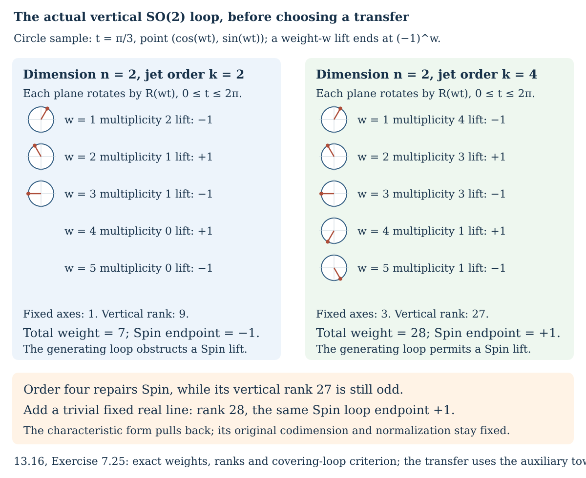

*Figure 13.5.* Each circle is one rotation plane; multiplicities and fixed axes account for every dimension. The displayed angular sample is \(t=\pi/3\). The endpoint is \((-1)^w\) for a weight-\(w\) plane. Exercise 7.25 verifies these sums and ranks.

**Lemma 13.17.** A finite invariant tangent flag with invariant Euclidean quotient metrics satisfies the almost-isometry hypothesis of the transverse lesson, as do its finite cotangent tensor sums. This applies to \(Z_k\).

**Proof.** Split a flag with \(s\) quotients smoothly, ordered from bottom to top. Its arrow matrix is upper triangular with isometric diagonal blocks. Conjugation by

\[
 U_\epsilon=\operatorname{diag}
       (\epsilon^{s-1},\epsilon^{s-2},\ldots,1)
 \tag{13.65}
\]

multiplies block \((i,j)\), \(i<j\), by \(\epsilon^{j-i}\). The diagonal quotient actions form an isometric cocycle. The scaling and its inverse have globally bounded norms for each fixed \(\epsilon>0\). This is a finite polynomial of precisely the type in [transverse Definition 4.1](the-transverse-fundamental-class.md#4-making-the-nonisometric-part-small). Tensor powers give finite polynomials of degree at most \(t(s-1)\); the dual uses the reversed dual flag. Theorem 4.3 consequently gives matrix spectral invariance for the graph algebras.

At \(Z_1\), the vertical tangent and quotient \(TV\) have invariant metrics. Each subsequent affine stage adds its invariantly Euclidean vertical tangent to the bottom of the pulled-back flag. This gives the required finite flag on \(TZ_k\). Its quotient volume is independent of the splitting and invariant, since all diagonal determinants are positive with modulus one. The tower has a finite flag; we have not silently assumed it has only two steps. \(\square\)

### Integrating a closed invariant form

**Lemma 13.18.** Let \(Z\) be an oriented \(N\)-manifold with the finite flag of Lemma 13.17, and let \(\eta\) be an invariant closed \(q\)-form, with \(m=N-q\geq1\). It defines an \(m\)-trace on a dense matrix-spectral-invariant graph Banach algebra in \(A_Z=C_0(Z)\rtimes_r\Gamma\).

**Proof.** On finite compact smooth form coefficients put

\[
 I_\eta(\omega)=\int_Z\omega_1\wedge\eta,
 \qquad
 \tau_\eta(a_0,\ldots,a_m)=I_\eta(a_0da_1\cdots da_m).
 \tag{13.66}
\]

For degrees adding to \(m\), expand the identity coefficient as a finite sum over \(g\). Change variables by \(g^{-1}\), use invariance of \(\eta\), exchange the two form factors with their graded sign, and reindex \(g^{-1}\). This proves that \(I_\eta\) is a graded trace. Compact-support Stokes gives \(I_\eta(d\omega)=0\). The cycle-to-cocycle theorem therefore makes (13.66) cyclic.

For a fixed finite compact \(m\)-form coefficient \(\omega\), every transported summand wedged with \(\eta\) has finite variation on its compact support. The regular coefficient bound \(\|a_g\|_\infty\leq\|a\|_{A_Z}\) proves

\[
 |I_\eta(a\omega)|\leq C_{\omega,\eta}\|a\|_{A_Z}.
 \tag{13.67}
\]

For fixed one-forms \(\omega_j\), rotate \(\omega_1\) to the end, insert a compact source cutoff \(\kappa\) with \(\omega_1\kappa=\omega_1\), then rotate \(\kappa\) to the front. The balanced wedge functional now has the exact leading-slot bound required by [transverse Theorem 5.3](the-transverse-fundamental-class.md#5-moving-a-coefficient-through-a-tensor-of-sections). Its factorization gives

\[
 |I_\eta(\omega_1x_1\cdots\omega_mx_m)|
       \leq C_{\omega_1,\ldots,\omega_m,\eta}
                        \prod_j\|x_j\|_{B_m}.
 \tag{13.68}
\]

Here \(B_m\) is the graph algebra using the first \(m\) cotangent tensor powers. Lemma 13.17 proves its matrix spectral invariance; the tensor factorization itself needs no isometry assumption. Taking \(\omega_j=da_j\) proves the full inserted-coefficient trace bound. Matrix amplification gives the same finite factorization. External units act as identity multipliers and have differential zero; when the new unit is in slot zero, compact Stokes gives \(\int da_1\cdots da_m\wedge\eta=0\). Thus relative normalization is respected.

The controlled extension theorem in the n-trace lesson gives a pairing on all \(K_{m\bmod2}(B_m)\), and spectral invariance identifies this with \(K_{m\bmod2}(A_Z)\). Only finite variation on fixed supports was used, not global integrability of \(\eta\). Choosing a sufficiently large jet order makes \(m\geq1\), so no unbounded degree-zero integration functional is needed. \(\square\)

### The actual affine radial class

**Proposition 13.19.** The auxiliary tower has an actual analytic transfer \(t:K_i(A_V)\to K_i(A_{Z_k})\), in both degrees, and a homological Spin isomorphism \(\Theta\), with

\[
 \mu_{Z_k}\Theta x=t(\mu_Vx),\qquad
 C_{Z_k}(\Theta x)=f_*\bigl(\widehat A(E)\cap C_Vx\bigr).
 \tag{13.69}
\]

Here \(f\) is a Borel homotopy inverse to the projection, and \(E\) is the stable sum of the stage vertical bundles pulled to \(V_\Gamma\). The assertion includes every discrete group and supported cycles.

**Proof.** Stage one is the even metric-product comparison of [geometric Proposition 7.5](the-geometric-group-and-geometric-corollaries.md#an-even-metric-fiber-can-be-compared-on-each-proper-cycle). For an affine stage \(Y\to X\) of even rank \(e\), take its equivariant graded Spinor bundle \(S\), a smooth center \(s\), and the Hilbert \(C_0(Y)\)-module \(C_0(Y,S)\). The left action is multiplication through the projection and the operator is

\[
 F_s(y)=\frac{c(s(\pi y)-y)}{\sqrt{1+|s(\pi y)-y|^2}}.
 \tag{13.70}
\]

Its square defect is \(-1/(1+|y-s|^2)\). Vertical balls over a compact base set are compact, by a finite affine trivialization, so multiplication by a compact base function makes this defect compact. The left action commutes with the operator.

For a fixed arrow, the two centers have bounded separation \(M\) on a compact base support. The map \(\Phi(u)=u/\sqrt{1+|u|^2}\) has tangential derivative norm \((1+|u|^2)^{-1/2}\) and smaller radial derivative. For \(|u|=a>M\), \(|u-v|\leq M\), its segment stays outside radius \(a-M\), giving

\[
 |\Phi(u)-\Phi(v)|\leq\frac{M}{\sqrt{1+(a-M)^2}}.
 \tag{13.71}
\]

Affine isometries and their Spin lifts intertwine Clifford multiplication. Hence the arrow defect vanishes at vertical infinity after localization and is compact. The affine homotopy between centers has the same uniform bound on compact support times \([0,1]\), proving center independence.

The regular Spinor module, convolution, fiber-unitary norm comparison and compact local frames are precisely the construction in [transverse Propositions 8.8–8.11](the-transverse-fundamental-class.md#reduced-descent-without-a-countability-assumption). Their hypotheses have now been verified for this flat affine fiber: unitary vertical transport, proper balls, compact square and arrow defects, and the center homotopy. They supply reduced descent and scalar-extension naturality for arbitrary discrete groups. The rank is even, so inward-to-outward correction is \((-1)^e=1\). Its normal class is the cyclic positive radial class, equivalently \(\epsilon_e\) times the geometrically positive class as in geometric (7.9)–(7.9a). A negative \(\epsilon_e\) reverses its grading.

For the supported product comparison, a compact proper cover mapping to \(X\) admits an equivariant affine center in its pulled-back fiber: glue local centers with a lifted quotient partition. On a graph chart the old wrong-way field tensored with the radial module is its half-density field tensored with \(S_y\). Finite convolution and the regular inner product give the balanced tensor identification used in geometric Proposition 7.5. Transport the proper lift into nearby graph fibers. Its center change has bounded separation on each compact source section; (13.71) makes the tail a compact localized remainder. Within a vertical cutoff the graph Rellich argument applies. This proves the second-operator connection condition.

The new symbol is the graded sum of the old graph symbol and the outward normal Clifford symbol. They anticommute, so its squared principal symbol is the sum of their nonnegative squares. This gives first-operator positivity; lower-order remainders inside the cutoff are compact and (13.71) controls the tail. The connection and positivity criterion [Connes–Skandalis 1984, Appendix A, Theorem A.5] identifies the product with the wrong-way column of the proper lift. Excision removes the region where its normal symbol is invertible. Its composite normal grading is exactly the even grading calibrated in geometric Lemma 7.3. An odd old coefficient retains its Clifford factor throughout; the normal rank is even.

Iterate these comparisons. The homological Thom maps add the stage Spin structures, hence multiply the character by their product \(\widehat A(E)\). This proves (13.69). Each stage vertical bundle, pulled to \(Z_k\), has an invariant Euclidean metric; their direct sum represents the Borel stable vertical tangent without requiring an invariant splitting of the whole tangent sequence.

For an arbitrary group the composite K-map means successive ordinary products with K-classes. Their leftmost algebra is \(\mathbb C\), the middle algebras are sigma-unital by compact spatial exhaustions, and the modules are countably generated. For countable groups one may also compose the descended KK-classes themselves. Common countable monodromy and the regular scalar-extension unitaries prove the proper-cycle equality for arbitrary groups. Compact relative neighborhoods and collar excision prove the supported assertion. This is not a claim of a global two-sided analytic inverse for the projection. \(\square\)

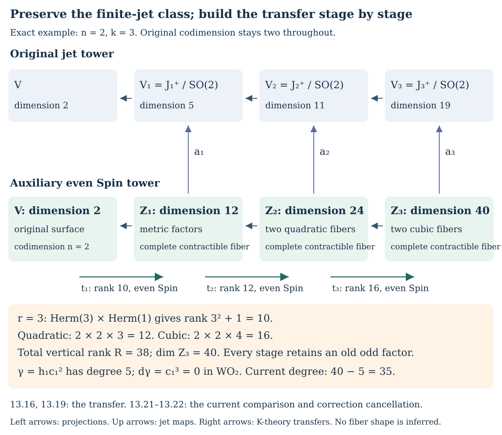

*Figure 13.6.* Left arrows are projections, up arrows are maps to the original jets, and right arrows are analytic transfers. For \(n=2,k=3\) the added ranks are \(10,12,16\), totaling \(38\). The degree-five class \(h_1c_1^2\) remains in \(WO_2\); its pullback gives a degree-thirty-five current on the forty-dimensional target. Every transfer stage retains K-degree one. These are bundle and degree data, not coordinate embeddings or a claimed shape of a jet fiber.

### Current pairings in both degrees

Write \(J_\eta\) for the raw pairing of Lemma 13.18. Define

\[
 a_{2h}=h!(2\pi i)^h,\qquad
 a_{2h+1}=\frac{(2h+1)!}{h!}(2\pi i)^{h+1},\qquad
 \mathcal F_\eta=(-1)^{\lfloor m/2\rfloor}a_m^{-1}J_\eta.
 \tag{13.72}
\]

**Lemma 13.20.** On included smooth K-classes, \(\mathcal F_\eta\) integrates the geometric degree-\(m\) Chern character against \(\eta\). Its étale wrong-way comparison and its product with a geometrically positive even Bott class are

\[
 \begin{aligned}
 \mathcal F_\eta(\mu[(M,F,h)])
   &=\int_{M_h}\operatorname{ch}_m(F)\wedge h^*\eta,\\
 \mathcal F_{\eta'}(z\boxtimes b_l^{\rm geo})
   &=\mathcal F_\eta(z),\qquad l\text{ even}.
 \end{aligned}
 \tag{13.73}
\]

The first formula uses an equivariant local diffeomorphism, its identity wrong-way structure and the target orientation on \(M_h\). The coefficient may be even or odd. The second holds on every analytic K-class.

**Proof.** The raw constants are n-trace (7.2)–(7.3). The even character changes by \((-1)^h\) in degree \(2h\), as already proved. For the odd change, put \(\omega=u^{-1}du\) and clutch \(u\) into a bundle over a circle times its base. On the clutching cylinder use connection \(t\omega\), with curvature
\(dt\wedge\omega+(t^2-t)\omega^2\). The term containing \(dt\) in its traced \((h+1)\)-st power is
\((h+1)(t^2-t)^hdt\wedge\operatorname{Tr}\omega^{2h+1}\). Integration and

\[
 \int_0^1t^h(1-t)^h\,dt=\frac{(h!)^2}{(2h+1)!}
\]

give the cyclic odd component in connections (5.4). Negating curvature contributes \((-1)^{h+1}\); geometric odd suspension has the additional minus fixed by positive circle winding. Thus

\[
 \operatorname{ch}_{{\rm geo},2h+1}(u)
       =(-1)^h\operatorname{ch}_{{\rm cyc},2h+1}(u).
 \tag{13.74}
\]

This proves (13.72) in both parities. Clutching tensored with an even bundle and the tensor connection prove its multiplicativity with that bundle; no product of two odd character conventions is assumed here.

For the étale formula, the induced form module is the explicit flat module in geometric (8.9)–(8.12). Its cutoff trace is \(\int_{M_h}\omega\wedge h^*\eta\): invariance transports \(\eta\), and the cutoff sum is one. Its connection is \(d\), with zero curvature. A projection coefficient contributes its connection curvature; a unitary coefficient contributes the same clutching transgression. This proves the first formula in (13.73), including relative unitizations. Reference coefficients cancel, and the external-unit term vanishes by compact Stokes.

For the second formula use the tensor projection connection of geometric (8.5)–(8.6), or its clutching when \(z\) is odd. The traced exponential factors, and the normalized factorials absorb the mixed binomial coefficients. The even Bott factor introduces no interchange sign and has geometric integral one. Choose its relative pair constant near infinity. Smooth families and their inverses lie in the graph algebra by matrix holomorphic calculus; the controlled extension passes this calculation to every K-class. This proves the second formula. All integrals use compact relative forms. Common monodromy and regular scalar extension give both assertions for arbitrary groups. \(\square\)

### Normal reduction with an odd coefficient

Put \(\epsilon_N=(-1)^{N(N-1)/2}\), as in geometric Example 3.2.

**Theorem 13.21.** For every geometric class, in both degrees and with compact relative support,

\[
 \mathcal F_\eta(\mu_Zx)
   =\epsilon_N\left\langle C_Zx,
          \operatorname{Td}(\tau_{Z,\mathbb C})^{-1}[\eta]_\Gamma
                  \right\rangle.
 \tag{13.75}
\]

The pairing is zero on the irrelevant parity. The reciprocal series is evaluated degree by degree on the compact cycle.

**Proof.** Represent a relevant class with a vector-bundle coefficient by geometric Propositions 2.1–2.2. Its base dimension has parity \(q\). We need a base of parity \(N\), so that the normal rank is even. If \(m\) is even this is already the case. If \(m\) is odd, replace the base by a circle over it and use an odd coefficient.

Here is the integral circle calculation for that replacement. The positive circle Bott dual has Fourier representative \(D=+i\partial_\theta\). Its nonnegative projection selects modes \(k\leq0\). Compression of \(u=e^{i\theta}\) kills the constant mode and maps the remaining modes bijectively onto this subspace, so its index is \(+1\). Fourier truncation proves compact resolvent, and smooth multiplication has bounded commutator. With a pulled-back coefficient the same calculation gives that coefficient module as kernel and zero cokernel. Choose the circle structure by this positive-dual normalization and give the new cycle the composite wrong-way structure. The projection formula geometric (2.6) returns the old cycle from coefficient \(F\boxtimes[u]\), integrally in the topological and analytic models; its Riemann–Roch formula returns the character. The composite structure determines the base orientation. No independently chosen product orientation or deleted Clifford factor is used. The new base has parity \(N\) and its coefficient is odd.

Embed this base into an even-dimensional \(\mathbb R^l\), adding even zero coordinates as necessary. The map \((h,jq)\) into \(Z\times\mathbb R^l\) is an equivariant immersion homotopic to the zero stabilization. Its normal rank \(b=N+l-d\) is even. The relative tangent structure supplies the normal Spinᶜ structure with determinant \(L_A\). The proper graph and étale tube in geometric (8.15)–(8.18) apply. Give the normal coefficient its outward symbol \(\operatorname{Th}^{\rm nor}_\nu F\), supported in a small disk tube. The inverse-normal oscillator has one scalar even Gaussian as kernel; its spinor and dual cancel their line action. It returns \(F\), including an odd \(F\). Thus the étale tube cycle is integrally the stabilized old cycle. Only the proved even normal comparison is used.

Apply Lemma 13.20, the even normal character formula of geometric Lemma 7.3 and the base-then-normal orientation. Multiplicativity with an odd coefficient follows from (13.74) and clutching. The result is

\[
 \mathcal F_{\eta'}(\mu(\rho_{\rm top}x))
   =\epsilon_d\epsilon_b
      \int_M\operatorname{ch}(F)e^{c_1(L_A)/2}
                   \widehat A(\nu)^{-1}\wedge g^*\eta.
 \tag{13.76}
\]

The identity-double sign \(\epsilon_d\) is valid also for odd \(d\). Since \(b,l\) are even,
\(\epsilon_d\epsilon_b=\epsilon_{N+l}=\epsilon_N\epsilon_l\). The stable normal splitting gives

\[
 e^{c_1(L_A)/2}\widehat A(\nu)^{-1}
    =\operatorname{Td}(TM\oplus g^*\tau_Z)
                     g^*\operatorname{Td}(\tau_{Z,\mathbb C})^{-1}.
\]

Geometric (3.1) identifies the full character on the right. Proposition 7.4 gives \(\mu\rho_{\rm top}x=\epsilon_l\mu x\boxtimes b_l^{\rm geo}\), and Lemma 13.20 gives the same factor \(\epsilon_l\) on the left. Cancel it to prove (13.75). On the other parity both sides vanish. Every tube, connection and integration was on a compact quotient or compact relative neighborhood; only fixed-support finite variation was needed. Common monodromy and regular extension prove the arbitrary-group assertion. The argument establishes a current comparison, not the still separate odd metric-bundle analytic inverse. \(\square\)

### Canceling characteristic factors on a compact cycle

**Theorem 13.22.** For every \(\gamma\in H^*(WO_n;\mathbb C)\) there is an additive map

\[
 \begin{aligned}
 \varphi_\gamma &:K_*(C_0(V)\rtimes_r\Gamma)\longrightarrow\mathbb C,\\
 \varphi_\gamma(\mu_Vx)&=\langle C_Vx,(B\pi)^*\gamma\rangle.
 \end{aligned}
 \tag{13.77}
\]

Use the characteristic map and source-coordinate convention of Lemma 13.15. The assertion covers every discrete group and supported geometric cycle. The extension need not be canonical.

**Proof.** In dimension zero, \(WO_0=\mathbb C\). Use \(Z=V\times\mathbb R^2\), its even plane transfer and the constant form representing \(\gamma\); the same current and even-normal argument below applies. For positive dimension first take \(\gamma\) homogeneous of degree \(q\), choose its finite form and the auxiliary tower with \(N>q\), and pull its form back to the target as \(\eta\). Let \(\mu_Vx=0\) and put \(z=\Theta x\). Proposition 13.19 gives \(\mu_{Z_k}z=0\). Twisting by any invariantly Hermitian bundle \(B\) preserves this zero in both analytic degrees, by geometric Proposition 8.3. Theorem 13.21 gives

\[
 \left\langle C_{Z_k}z,
    \operatorname{ch}(B)\operatorname{Td}(\tau_{Z_k,\mathbb C})^{-1}
                                 [\eta]_\Gamma\right\rangle=0.
 \tag{13.78}
\]

Fix this \(z\). Its compact cycle support bounds its homological degrees. Apply virtual Adams expressions and a Vandermonde matrix on enough distinct positive integers to extract each contributing homogeneous component of \(\operatorname{ch}(B)\), exactly as in geometric Lemma 8.5. Exterior powers and tensor products remain invariantly Hermitian. Newton's identities give Chern polynomials. Applying extraction also to tensor products, then finite linear combinations, proves (13.78) with \(\operatorname{ch}(B)\) replaced by every class in the completed Hermitian Chern algebra. Completion is degreewise: only finitely many terms contribute on this cycle. No bound depending only on \(\dim V\) is asserted.

The finite tangent flag has invariantly Euclidean quotients. Its Borel exact sequences give the Chern classes of their direct sum, so \(\operatorname{Td}(\tau_{Z_k,\mathbb C})\) belongs to this completed algebra. The stable sum of stage vertical bundles is likewise represented by an equivariantly Euclidean direct sum on \(Z_k\). Its \(\widehat A\) and reciprocal have constant term one and belong to the same algebra. In (13.78) therefore take

\[
 Q=\operatorname{Td}(\tau_{Z_k,\mathbb C})
                         \widehat A(T_\pi)^{-1}.
 \tag{13.79}
\]

The Todd factor cancels. Proposition 13.19 cancels the remaining vertical \(\widehat A\) factor against the character of \(\Theta\). Lemma 13.15 identifies \([\eta]_\Gamma=\pi_\Gamma^*(B\pi)^*\gamma\). The projection formula now gives

\[
 \mu_Vx=0\quad\Longrightarrow\quad
                \langle C_Vx,(B\pi)^*\gamma\rangle=0.
 \tag{13.80}
\]

The other parity is zero by degree. Thus the prescribed functional is well defined on \(\operatorname{im}\mu_V\). Geometric Lemma 8.6 rationalizes this subgroup, extends a rational vector-space basis, and restricts the resulting linear functional to the entire K-group. This proves the exact equality (13.77), with no residual signs or characteristic corrections. Sum the extensions for an inhomogeneous class; a cohomology element has finitely many homogeneous components. Real classes admit real-valued extensions by the identical basis argument.

This proves the existence assertion of [Connes 1986, Theorem 7.15]. It does not require surjectivity of assembly, a uniform finite twist for all cycles, or one explicit cyclic cocycle on the original algebra. The cochain map out of \(WO_n\) was proved here; the larger theorem that computes all relative Gelfand–Fuks cohomology is not an input to this direction. \(\square\)

### Closing the affine modular orbit

The circle formula (3.5) is affine in the modular parameter. To use it after completing the algebra, we must keep the fundamental one-trace, its derivative and the modular generator on one common graph. This also makes precise the algebraic formulation in [Connes 1986, Remark 7.16(b)].

Let \(B\) be a C\*-algebra, \(\sigma_t\) a strongly continuous automorphism group and \(D=(1/i)\frac{d}{dt}|_0\sigma_t\) its closed generator. Let \(E\subset B\) be a dense invariant algebra carrying a one-trace \(\tau_0\). Write \(\delta_0(b)(a)=\tau_0(a,b)\); thus \(\delta_0:E\to B^*\) is an antisymmetric derivation for the dual actions (5.1) of the n-trace lesson. Define its transported orbit by

\[
 (\mathcal T_t\delta_0)(b)(a)
       =\delta_0(\sigma_t b)(\sigma_t a).
 \tag{13.81}
\]

Assume that, for each \(b\in E\), this is a twice weak-star differentiable \(B^*\)-valued curve, with zero second derivative at every \(t\). Here the derivative is an element of \(B^*\), and testing against any \(a\in B\) gives the corresponding ordinary derivative. Suppose also that \(E_D=E\cap\operatorname{Dom}D\) is dense. These hypotheses are satisfied by the circle's finite smooth sums, as we verify below. For a unital algebra we include its unit in the core; for a nonunital algebra we use the external unitization and set all derivatives of its new unit to zero.

**Lemma 13.23.** Put \(\psi_0=(1/i)\frac{d}{dt}|_0\mathcal T_t\delta_0\). This is an invariant dual-valued antisymmetric derivation, hence a one-trace. The graph closure on \(E_D\) of
\(b\mapsto(\delta_0b,\psi_0b,Db)\) is a closed derivation with domain \(F\). Its complete graph norm is

\[
 \begin{aligned}
 \|b\|_F&=\|b\|+\|\delta b\|+\|\psi b\|+\|Db\|,\\
 \delta(\sigma_t b)&=(\delta b+it\psi b)\circ\sigma_{-t},\\
 \psi(\sigma_t b)&=(\psi b)\circ\sigma_{-t},\qquad
 D\sigma_t b=\sigma_t Db.
 \end{aligned}
 \tag{13.82}
\]

The domain is invariant and stable under matrix holomorphic functional calculus; it represents every ambient K-class. On \(F\), the transported orbit is exactly \(\delta+it\psi\), so its first derivative is \(i\psi\) and its second derivative is zero in operator norm \(F\to B^*\). Moreover \(\|\sigma_t b\|_F\le(1+|t|)\|b\|_F\).

**Proof.** The scalar fundamental theorem of calculus, applied after evaluation at each \(a\in B\), gives \(\mathcal T_t\delta_0=\delta_0+it\psi_0\). Every transported map is a derivation: the two occurrences of \(\sigma_t\) in (13.81) cancel its transport of the bimodule actions. It is also antisymmetric. Differentiate these identities weak-star. Multiplication in the dual bimodule is weak-star continuous, so \(\psi_0\) is an antisymmetric derivation. In particular each \(\psi_0b\) is a bounded functional on the leading coefficient; no bound uniform in \(\|b\|\) is asserted.

The transport has the group law \(\mathcal T_s\mathcal T_t=\mathcal T_{s+t}\). Insert the affine formula and compare the coefficients of \(t\). We obtain \(\mathcal T_s\psi_0=\psi_0\), as well as \(\mathcal T_s\delta_0=\delta_0+is\psi_0\). These are the first two covariance identities in (13.82) on the core. The closed generator supplies the third.

For closability, suppose \(b_j\to0\) in \(B\) and \(\delta_0b_j\to\xi\) in dual norm. For \(a\in E_D\), antisymmetry gives \(\xi(a)=-\lim_j\delta_0a(b_j)=0\); density gives \(\xi=0\). The same argument applies to \(\psi_0\), and closedness of \(D\) deals with its component. Thus the closure of the simultaneous graph is again a graph. Passing the three product rules through norm limits proves the derivation rule into \(B^*\oplus B^*\oplus B\), with the sum norm and contractive bimodule actions. It proves completeness and submultiplicativity of \(\|\cdot\|_F\). Antisymmetry of its first two components passes to the limit as well. We have used the closure of one core, rather than assuming that three separate closures have a common core.

The covariance identities on the core and isometry of the dual pullback give the asserted graph bound. They carry a graph-convergent sequence to a graph-convergent sequence, so extend to \(F\) and show its invariance. Since \(\delta,\psi:F\to B^*\) are bounded, their affine formula is differentiable in operator norm. No continuity of the dual action on all of \(B^*\) is needed for this conclusion.

Apply the closed-derivation argument of [the n-trace lesson, Lemma 5.1](n-traces-on-banach-algebras.md#5-a-dual-valued-derivation-is-the-degree-one-case) to this direct-sum bimodule. More explicitly, for \(h\in M_q(F^+)\) with ambient norm less than one, each component of the derivative of \(h^j\) is bounded by \(j\|h\|^{j-1}\) times its derivative norm, so the Neumann inverse converges in the matrix graph. For an arbitrary ambient invertible \(v\), choose \(a\in M_q(F^+)\) close to its inverse. Both \(va\) and \(av\) are within one of the identity; their graph inverses give a right and left inverse of \(v\), which agree. The three inverse derivative identities give graph-continuous resolvents, hence contour holomorphic calculus. Close approximation and polygonal homotopies, with fixed scalar parts and uniform inverse bounds, now identify its K-theory with ambient K-theory exactly as in Theorem 4.1 of that lesson. \(\square\)

**Corollary 13.24.** On \(F\), the formula

\[
 \begin{aligned}
 \tau(a,b,c)&=\psi(b)(D(c)a)-\psi(c)(aD(b)),\\
 \int_\tau x\,da\,y\,db
      &=\psi(a)(yD(b)x)-\psi(b)(xD(a)y),\\
 \left|\int_\tau x\,da\,y\,db\right|
      &\le\bigl(\|\psi(a)\|\|D(b)\|
             +\|\psi(b)\|\|D(a)\|\bigr)\|x\|\|y\|
 \end{aligned}
 \tag{13.83}
\]

is a cyclic two-trace on \(B\), defining an additive pairing on every \(K_0(B)\) class. The inserted coefficients \(x,y\) require only their ambient norms. The normalized construction is

\[
 \tau=i_D\psi
       =i_D\left(\frac1i\frac{d}{dt}\Big|_0\mathcal T_t\delta\right).
 \tag{13.84}
\]

**Proof.** We can apply Theorem 4.1 to the invariant one-trace \(\psi(b)(a)\) on \(F\); all values of \(D\) occur in its bounded leading slot. For completeness the Hochschild equation is the cancellation of the cup products \(\psi(b)D(c)-D(b)\psi(c)\) of two derivations. Differentiate the invariant antisymmetry identity in the leading slots to get \(\psi(b)(D(c))=\psi(c)(D(b))\). This proves cyclicity of their difference. Leibniz expansion of its universal two-form cancels all terms containing \(D(y)\) and gives the second line of (13.83). Its bounded leading slots give the estimate. Derivatives of the external unit are zero; cyclicity also makes its value with a leading unit zero. The controlled two-trace extension and matrix homotopy theorem of the n-trace lesson therefore give its pairing on all ambient relative classes, not just classes from a geometric assembly image. \(\square\)

In the circle case set \(\delta_0b(a)=\tau_1(a,b)\) and \(\psi_0b(a)=\dot\tau_1(a,b)\). Equations (3.3) and (3.6) make these bounded functionals on \(A\); (3.5) proves (13.81) is affine for every real parameter and every leading coefficient, by density. The finite smooth core lies in \(\operatorname{Dom}D\), is invariant, and is dense for every discrete group. Thus Lemma 13.23 and Corollary 13.24 apply. Formula (4.5) identifies their contraction with the original logarithmic cocycle \(\tau_w\), with no extra factor two.

Here the flow is also strongly continuous for the joint graph norm. For a fixed finite smooth \(b\), each of \(\delta_0b\) and \(\psi_0b\) is a finite sum of smooth-density coefficient functionals. Pullback by \(\sigma_t\) multiplies each such density by a phase from (3.1). On its finite support the \(\lambda_g\) are bounded, so these phases converge uniformly to one; the total-variation bounds (3.3) and (3.6) give dual-norm convergence. Formula (13.82) and \(D\sigma_t=\sigma_tD\) prove graph continuity on the core. The locally uniform graph bound extends it to its completion. This argument does not claim that the full dual action on every functional of \(A^*\) is norm continuous.

The \(1/i\) in (13.84) is the derivative normalization in [Connes 1986, Lemma 7.4]. Remark 7.16(b)'s derivative notation uses that earlier convention. With the actual time generator \(X=iD\) and unnormalized time derivative \(\dot\delta=i\psi\), bilinearity instead gives \(i_X\dot\delta=-\tau_w\); replacing only the derivative gives \(i_D\dot\delta=i\tau_w\). Fix both conventions before comparing cocycles.

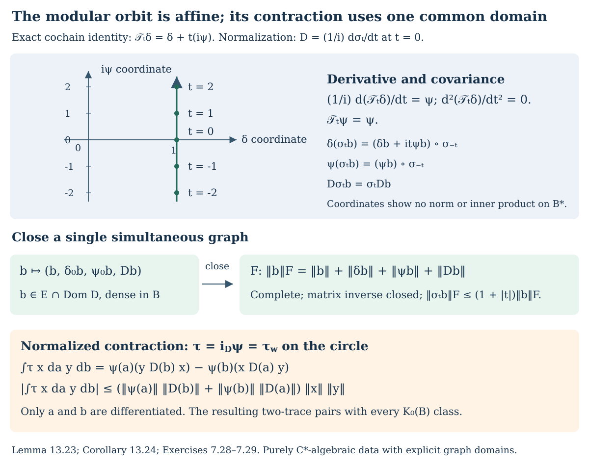

**Figure 13.7.** The top panel shows the exact coordinate line \(\mathcal T_t\delta=\delta+t(i\psi)\) in the span of the two cochain vectors. These coordinates do not assert a norm or an inner product on the dual space. The lower panel records the single graph closure and the two ambient-norm inserted coefficients in (13.83). Lemma 13.23 and Corollary 13.24 prove each displayed map; Exercises 7.28–7.29 test the convention and boundedness constraints. This proves the modular clause of Remark 7.16. The group-current construction follows below; the separate solvable-fiber refinement still requires its own argument.

### Group currents and the identity component

The last clause of [Connes 1986, Remark 7.16] asks for a construction from group cochains with current coefficients to the cyclic bicomplex. We give a map of the bicomplexes themselves. Its higher cyclic components matter: an ordinary Hochschild comparison does not suffice. No quasi-isomorphism or norm-completion assertion is needed for this construction.

Let a discrete group \(G\) act smoothly on a Hausdorff manifold \(V\). Write \(A=C_c^\infty(V)\), \(\alpha_gf=f\circ g^{-1}\), and \((fU_g)(hU_k)=f\alpha_g(h)U_{gk}\). A \(q\)-current is a continuous functional on \(\Omega_c^q(V)\); here \(q\) is its dimension. Its boundary is \(\partial T(\omega)=T(d\omega)\), so boundary lowers current dimension. Let \(P_p=\mathbb C[G^{p+1}]\), with vertex-deletion boundary, repeated-vertex degeneracies and right cyclic rotation. Use simultaneous left translation in the coinvariants. The mixed chain complex and its dual current cochains are

\[
 L_{p,q}=P_p\otimes_G\Omega_c^q(V),\qquad
 b_L=\partial_G,\qquad B_L|_{L_{p,q}}=(-1)^p d,
 \qquad
 C^{p,q}=C^p(G,\mathcal D_q(V)).
 \tag{13.85}
\]
The homogeneous equivariance convention is \(c(h\gamma)=h_*c(\gamma)\), where \((h_*T)(\omega)=T(\alpha_{h^{-1}}\omega)\). It makes \(\langle c,[\gamma]\otimes\omega\rangle=c(\gamma)(\omega)\) well defined. Transposing (13.85) gives \(\delta_G\) and \((-1)^p\partial\). Deletion changes the sign of the latter, so the operators anticommute. Their total degrees are \(+1\) and \(-1\) on current cochains of degree \(p+q\). Replacing current dimension by complementary cohomological degree is a different regrading.

For noncompact \(V\), put the scalar unit in \(A^+\), and embed \((A\rtimes G)^+\) into \(A^+\rtimes G\) with that unit at \(e\). Work with relative chains, so at least one coefficient is compactly supported. This is an actual subcomplex of the larger crossed-product chain complex. We do not invoke excision to identify it with another relative complex. All nonzero forms constructed below have compact support: either the compact coefficient remains in the undifferentiated product or one of its derivatives supplies that support. Derivatives of scalar units vanish.

**Lemma 13.25.** Put \(X_{p,q}=P_p\otimes_G C_q(A^+)\), with the usual algebra cyclic structure in the second factor. Its diagonal identifies, as a cyclic module, with the crossed-product chains whose group product is \(e\). On the relative subcomplex the identification is

\[
 \mu\bigl([\gamma_0,\ldots,\gamma_n]\otimes(a_0,\ldots,a_n)\bigr)
 =\bigotimes_{j=0}^n
  (\alpha_{\gamma_{j-1}^{-1}}a_j)U_{\gamma_{j-1}^{-1}\gamma_j},
 \qquad \gamma_{-1}=\gamma_n.
 \tag{13.86}
\]
Projection \(P_e\) onto this component commutes with \(b\) and \(B\). Define

\[
 \epsilon_p[\gamma]=\frac1{(p+1)!}
   \sum_{\rho\in S_{p+1}}\operatorname{sgn}(\rho)[\gamma_{\rho(0)},\ldots,\gamma_{\rho(p)}],
 \qquad
 \alpha_q(a)=\frac1{q!}a_0da_1\wedge\cdots\wedge da_q.
 \tag{13.87}
\]
Then \(\epsilon\partial_G=\partial_G\epsilon\), \(\epsilon B_G=0\), \(\alpha b=0\), and \(\alpha B=d\alpha\). In particular \(\pi=\epsilon\otimes\alpha\) sends the mixed total of \(X\), with group-first Koszul signs, to (13.85).

**Proof.** A common translation \((\gamma,a)\mapsto(h\gamma,\alpha_ha)\) cancels in every factor of (13.86); its group product telescopes to \(e\). Conversely, for \((f_0U_{g_0},\ldots,f_nU_{g_n})\) with product \(e\), take \(\gamma_j=g_0\cdots g_j\), \(a_0=f_0\), and \(a_j=\alpha_{\gamma_{j-1}}f_j\). These invert \(\mu\) modulo the common translation. Multiplication of adjacent factors gives \(\alpha_{\gamma_{j-1}^{-1}}(a_ja_{j+1})\) with label \(\gamma_{j-1}^{-1}\gamma_{j+1}\), exactly deletion of \(\gamma_j\). With cyclic indices the same calculation proves the last face. Repeating a vertex inserts coefficient \(1\) and label \(e\); rotating both lists rotates the factors. Thus every cyclic operator is preserved. Faces preserve the group product except for cyclic conjugation; neither conjugation nor unit insertion changes whether that product is \(e\). This proves the projection assertion. These are the identity-component formulas of [Ponge 2017, (4.3)–(4.4)] in our action convention.

For \(\partial_G\epsilon\), fix a removed original vertex and an order of the survivors. Its \(p+1\) insertion positions all have the same combined permutation/boundary sign. The factor \((p+1)/(p+1)!\) is \(1/p!\), proving the boundary identity. Every term of \(B_G\) has a repeated vertex and is killed by \(\epsilon\). Leibniz expansion cancels adjacent terms of \(\alpha b\), including the first and last terms. To check the other identity, use signed right rotation \(T_q=(-1)^qt_q\), \(N_q=\sum_{i=0}^qT_q^i\), and extra degeneracy \(s(a)=(1,a_0,\ldots,a_q)\). In \(B=(1-T)sN\), the second part has a differentiated unit. The first part has \(q+1\) rotations, each with the same exterior sign. Hence \(\alpha_{q+1}B=(q+1)da_0\cdots da_q/(q+1)!=d\alpha_q\). All formulas are equivariant and preserve the relative support condition. \(\square\)

### A recursive simplicial homotopy

We now specify the homotopy used for the cyclic corrections. Write \(D=\operatorname{Diag}X\), \(E=\operatorname{Tot}X\), and use the separately normalized total complex and the normalized diagonal complex. Ordinary cyclic normalization on the diagonal means quotienting by an inserted global scalar unit in a later crossed-product slot. Under (13.86) this requires both a repeated adjacent group vertex and coefficient \(1\) at that slot. A repeated group vertex alone does not make a diagonal chain degenerate.

**Lemma 13.26.** There are explicit finite universal operators \(f:E\leftarrow D\), \(g:E\to D\), and \(H:D_n\to D_{n+1}\) with

\[
 \begin{split}
 f_{p,q}([\gamma]\otimes a)
   &=[\gamma_0,\ldots,\gamma_p]
       \otimes(a_0\cdots a_p,a_{p+1},\ldots,a_n),\quad p+q=n,\\
 fg&=1,\qquad bH+Hb=1-gf,\qquad fH=Hg=H^2=0.
 \end{split}
 \tag{13.88}
\]
Here \(g\) is the shuffle. Its \((p,q)\) formula uses words \(w\) with \(p\) horizontal and \(q\) vertical steps, with sign

\[
 g=\sum_w(-1)^{\#\{\text{vertical steps before horizontal steps}\}}g_w.
 \tag{13.89}
\]
Start \(g_w\) at \(\gamma_0,a_0\). A horizontal step advances the group vertex and inserts coefficient \(1\); a vertical step repeats the group vertex and inserts the next coefficient \(a_j\). Every operator in the lemma uses only input group vertices and products of input coefficient functions and units.

**Proof.** For \(f\), restrict the group list to its head and take the first algebra face \(p\) times; the displayed formula follows. In the boundary calculation, terms at neighboring cuts cancel: moving the cut past one slot exchanges its last group face with its first algebra face, with opposite Koszul signs. Faces wholly on either side leave the group boundary or \((-1)^p\) times the algebra boundary. These are all faces, including the two end faces, so \(bf=fb\).

For (13.89), a diagonal face between different step types occurs twice, from the two words obtained by exchanging those adjacent steps. Their signs differ by one inversion and the terms cancel. Between two horizontal steps it leaves the corresponding group face; between two vertical steps it leaves the corresponding algebra face. Moving that vertical face through the \(p\) horizontal steps gives the sign \((-1)^p\). The first and last faces remove the first or last step and give the respective endpoint faces. This proves \(bg=gb\). For \(fg\), a cut longer than \(p\) leaves a group degeneracy; a cut shorter than \(p\) leaves a coefficient unit in a later slot. At cut \(p\), only \(H^pV^q\) survives both normalizations. Its sign is positive and it returns exactly the original tensor. Thus \(fg=1\), with no homology argument.

Here is the promised homotopy. In the representable model \(\Delta[n]\times\Delta[n]\), diagonal chains are weakly increasing lists of pairs of indices in \(\{0,\ldots,n\}\). Let \(x_n=((0,0),\ldots,(n,n))\). Prepending \((0,0)\) is an augmented cone \(c\); its boundary identity recovers any positive-degree cycle. Set \(h_0=0\) and recursively define the finite integer table

\[
 h_n(x_n)=c\bigl(x_n-gfx_n-h_{n-1}bx_n\bigr).
 \tag{13.90}
\]
The expression in parentheses is a cycle: its boundary is \((1-gf)bx_n-bh_{n-1}bx_n=0\) by the induction hypothesis and \(b^2=0\). Taking its cone gives \(bh+hb=1-gf\). Every table term is a pair of monotone maps \([n+1]\to[n]\). Evaluate these simplicial maps on any bisimplicial object. Each term of \(h_{n-1}bx_n\) uses the already computed table on the indicated face, so (13.90) is an algorithm. The identity transfers term by term because the representable pairs are the free basis of those universal simplicial operators. This is the representable-model principle in [Dold–Puppe 1961, §2], with an explicit cone choice.

To pass to normalized diagonal chains, use the Moore section \(J\). Its factors act from right to left. Then make the homotopy special:

\[
 \begin{split}
 J_n&=(1-s_0d_1)(1-s_1d_2)\cdots(1-s_{n-1}d_n),\\
 h_N&=QhJ,\quad K=1-gf,\quad h_1=Kh_NK,\quad H=h_1bh_1.
 \end{split}
 \tag{13.91}
\]
Here \(Q\) is the quotient by diagonal degeneracies. Descending through the factors of \(J_n\), the simplicial identities kill \(d_n,d_{n-1},\ldots,d_1\) in that order and preserve the kernels already obtained. The difference from the input is degenerate. The intersection of these kernels and the degeneracy subspace are boundary subcomplexes; on the former the boundary is \(d_0\). Hence \(J\) and \(Q\) give a section and quotient of chain complexes. Applying them to the raw homotopy identity gives \(bh_N+h_Nb=K\).

Since \(fg=1\), \(K^2=K\), \(fK=Kg=0\), and \(K\) commutes with \(b\). Thus \(bh_1+h_1b=K\). It follows that \(bH+Hb=K\): the two terms are \((bh_1)^2=bh_1\) and \((h_1b)^2=h_1b\). Subtracting the two products of \(bh_1+h_1b=K\) with \(h_1\) gives \(bh_1^2=h_1^2b\). Therefore \(H^2=h_1bh_1^2bh_1=0\). The factors \(K\) also give \(fH=Hg=0\). Every modification is finite and universal. Simplicial operators only repeat/delete group vertices and multiply/insert coefficient functions. This proves the final assertion. \(\square\)

### The higher cyclic components

**Theorem 13.27.** There is an explicit map from the current-valued group-cochain cyclic bicomplex of (13.85) to that of \(A\rtimes G\). It is obtained by transposing an identity-supported cyclic chain map with components

\[
 F_j=(-1)^j\pi f(BH)^j\mu^{-1}P_e:
   C_n((A\rtimes G)^+,\mathbb C)\longrightarrow L_{n+2j},
 \qquad j\ge0.
 \tag{13.92}
\]
In ordinary cyclic column \(r\), only \(0\le j\le r\) contributes; its output is in column \(r-j\). The transposed maps preserve the smooth topology on each fixed finite-group-support and compact-space-support domain. The theorem asserts a bicomplex map, without asserting a quasi-isomorphism, a controlled \(n\)-trace or a pairing on every norm-completed K-class.

**Proof.** The diagonal \(B\) used here is the normalized operator from Lemma 13.25. For completeness its mixed identities follow from \(b(1-T)=(1-T)b'\), \(b'N=Nb\) and \(b's+sb'=1\). Thus \(bB+Bb=0\), because \((1-T)N=0\); and \(B^2=0\), because the middle \(N(1-T)\) is zero. A degenerate algebra chain has a unit among its later slots. In every first-part summand of \(B\) it is still a later unit; the second part has its newly inserted unit in a later slot. This verifies the normalized quotient as well.

On cyclic columns let \(\delta\) be \(B\) moving a column to its left; it vanishes on column zero. Every product with \(\delta\) consumes a column. The following inverses are therefore finite on each chain:

\[
 \mathcal A=\delta(1+H\delta)^{-1}=(1+\delta H)^{-1}\delta,
 \qquad d_E'=b_E+f\mathcal A g,
 \qquad f'=f-f\mathcal A H=f(1+\delta H)^{-1}.
 \tag{13.93}
\]
We check the algebra, instead of assuming that the transferred differential is the desired one. Multiply \(b\mathcal A+\mathcal A b\) on the left by \(1+\delta H\) and on the right by \(1+H\delta\). Using \(b\delta+\delta b=-\delta^2\) and \(bH+Hb=1-gf\), the result is \(-\delta gf\delta\). Hence \(b\mathcal A+\mathcal A b=-\mathcal A gf\mathcal A\), which gives \((d_E')^2=0\). The difference \(d_E'f'-f'(b+\delta)\), after factoring out \(f\), is

\[
 \begin{split}
 &-b\mathcal AH+\mathcal Agf-\mathcal Agf\mathcal AH
       -\delta+\mathcal AHb+\mathcal AH\delta\\
 &=\mathcal A(bH+Hb)+\mathcal Agf-\delta+\mathcal AH\delta
   =\mathcal A-\delta+\mathcal AH\delta=0.
 \end{split}
 \tag{13.94}
\]
The last equality is \(\mathcal A=\delta-\mathcal AH\delta\). Thus \(f'\) is an actual chain map to the transferred differential.

We identify this differential after applying \(\pi\). For input \(X_{p,q}\), every finite simplicial/cyclic composition uses only its \(p+1\) group vertices and polynomials in its \(q+1\) coefficient functions. Antisymmetrization kills output group degree \(r>p\); the chain rule and exterior alternation kill form degree \(s>q+1\). Consequently

\[
 \pi fB(HB)^jg=0\quad(j\ge1),\qquad
 \pi fBg=B_L\pi.
 \tag{13.95}
\]
For the first assertion, output total degree is \(p+q+2j+1>p+q+1\), so every component violates at least one of the two bounds. This counts independent input functions; it uses no assumption on the dimension of \(V\).

Here is the full sign check for the second assertion. Only output \((r,s)=(p,q+1)\) can survive. The \(-TsN\) part of \(B\) has equal first group vertices if \(p\ge1\), and a differentiated unit if \(p=0\). In the \(sN\) part, survival requires all first \(p\) original coefficient slots to be units and all first \(p+1\) group vertices to be distinct. These are precisely the shuffle words \(V^aH^pV^{q-a}\), \(a=0,\ldots,q\), with rotation \(i=p+q-a\). For \(p=0\) they mean the \(q+1\) rotations of the single vertical word. Their group head is \((\gamma_0,\ldots,\gamma_p)\), and their differentiated coefficient order is \((a_{a+1},\ldots,a_q,a_0,\ldots,a_a)\). The combined shuffle, cyclic and exterior sign has exponent

\[
 ap+(p+q)(p+q-a)+(a+1)(q-a)\equiv p\pmod2.
 \tag{13.96}
\]
The \(q+1\) equal contributions therefore give \((-1)^p/q!\) times \(\epsilon[\gamma]\otimes da_0\cdots da_q\), exactly \(B_L\pi\). This also proves the zero cases with repeated vertices or unit coefficients by multilinearity. No higher transferred term is asserted zero before \(\pi\).

Together with \(\pi b_E=b_L\pi\), (13.95) makes \(\pi f'\) a chain map to the ordinary cyclic complex of \(L\). Expanding its finite geometric series gives (13.92) and the exact component identities

\[
 b_LF_0=F_0b,\qquad
 B_LF_j-F_jB+b_LF_{j+1}-F_{j+1}b=0.
 \tag{13.97}
\]
The projection and \(\mu^{-1}\) commute with the crossed-product operators by Lemma 13.25. This proves the chain map on every column, and transposition proves the requested cochain map. A cochain of raw degree \(m=p+q\) contributes through \(F_j^*\) to raw degree \(m-2j\), with its cyclic column increased by \(j\); hence only finitely many terms contribute. These shifts must be retained.

Finally every fixed-degree formula is a finite sum of multiplication, pullback, differentiation, scalar insertion and evaluation by a current. Finitely many group labels yield finitely many translated compact supports. Products preserve the relative compact coefficient; in a nonzero differential form its support lies in that compact support or that of its derivative. These operations are continuous on the corresponding smooth test-function spaces, and currents are continuous there by definition. The Moore section, cone tables and special-homotopy modifications have the same properties. This proves the stated domain and continuity assertions, including external units and arbitrary discrete groups. \(\square\)

**Corollary 13.28.** For a \(G\)-invariant \(q\)-current \(T\), the formula

\[
 \Phi_T(f_0U_{g_0},\ldots,f_qU_{g_q})
  =\frac1{q!}T\bigl(f_0d(\alpha_{g_0}f_1)\wedge\cdots
          \wedge d(\alpha_{g_0\cdots g_{q-1}}f_q)\bigr)
 \tag{13.98}
\]
on group product \(e\), and zero elsewhere, satisfies \(b\Phi_T=0\) and \(B\Phi_T=\Phi_{\partial T}\). Closed currents give cyclic cocycles.

**Proof.** Evaluate \(T\) on the identity coefficient in \(\Omega_c(V)\rtimes G\). This is a graded trace: for labels \(g,g^{-1}\), invariance pulls \(\alpha_{g^{-1}}\) through the current and exterior interchange gives the graded sign. For other products both identity coefficients vanish. Hochschild cancellation uses only this trace and Leibniz, and does not require closedness. In \(B\), inserted differentiated units vanish and the \(q\) remaining rotations have equal values by the graded trace. Their factor \(q/q!\) is \(1/(q-1)!\), leaving \(T(d(a_0da_1\cdots da_{q-1}))\). This is \(\Phi_{\partial T}\); both sides are zero for \(q=0\). If \(\partial T=0\), expand \(d(a_qa_0da_1\cdots da_{q-1})\) and use the graded trace to obtain the cyclic sign \((-1)^q\). Leading-unit values are then exact forms and vanish for \(q\ge1\); later-unit values always vanish. \(\square\)

The simple corner is only invariant group degree zero. The higher components in Theorem 13.27 are necessary even after (13.87). With trivial \(\mathbb Z\)-action, normalized chain \(z=(1,fU_g,hU_{g^{-1}})\) has \(Bz=0\). Yet its ordinary \(F_0\) has \((1,1)\) component \(v\otimes fdh\), where \(v=([e,g]-[e,g^{-1}])/2\). Its \(B_L\) is \(-v\otimes df\wedge dh\ne0\) whenever that form is nonzero. The \(F_1\) term repairs this identity. Similarly, a nonidentity current family needs an appropriate twisted trace or fixed-point support condition; conjugation equivariance alone does not give the Hochschild cancellation of Corollary 13.28. Exercises 7.30–7.31 verify both constraints and the normalization. This supplies the proposed group-current construction; the separate solvable higher-jet trace descent still requires its own argument.

**Figure 13.8.** The index square is the representable model \(\Delta[1]\times\Delta[1]\), with the normalized homotopy equal to the negative triangle \([(0,0),(0,1),(1,1)]\). Its boundary is the diagonal minus the two shuffle edges. The degree panel shows the proved input-variable bound killing higher transferred terms after \(\pi\), and the surviving \((-1)^pd\). Equations (13.90)–(13.97) give the complete recursion and map. This is a model-index diagram, not a metric or a section of \(V\). [Dold–Puppe 1961, §2] explains the universal model method; [Khalkhali–Rangipour 2004, §3] provides the cyclic perturbation context.

### Fiber kernels over the first metric

The first clause of [Connes 1986, Remark 7.16] requires a controlled trace on the first-metric algebra. We now construct the actual operator algebra for its nilpotent fibers. This supplies the fiber measure, kernel module and coefficient norm needed for the descent. The cyclic trace transfer itself remains a separate step.

**Lemma 13.29.** Put \(X=V_1\), \(Y=V_k\) and \(p:Y\to X\). The original tower \(V_j\to V_{j-1}\) consists of affine Euclidean bundles of rank \(n\binom{n+j-1}{j}\). The fibers of \(p\) have a canonical positive smooth Haar density preserved by \(\Gamma\) and by source-frame action of \(SO(n)\).

**Proof.** In a target chart write a jet as \(f(x)=Ax+f_2(x)+\cdots+f_k(x)\), and set \(u_j=A^{-1}f_j\). At a fixed lower jet, the difference \(\Delta u_j\) belongs to \(L_j=\operatorname{Hom}(S^j\mathbb R^n,\mathbb R^n)\). In \(h\circ f\), the highest coefficient \(f_j\) occurs only in \((dh)f_j\); any occurrence in a higher-degree term has degree greater than \(j\). Since the first coefficient becomes \((dh)A\), the normalized difference is unchanged. A target-chart change therefore has the triangular form
\[
 u'_j=u_j+P_j(u_2,\ldots,u_{j-1}),\qquad
 \det\frac{\partial(u'_2,\ldots,u'_k)}{\partial(u_2,\ldots,u_k)}=1,
 \qquad d\mu_x=du_2\cdots du_k.
\tag{13.99}
\]
The coefficients of \(P_j\) may depend smoothly on the first frame and base point. Changing that orthonormal source frame by \(R\in SO(n)\) sends \(\Delta u_j\) to \(R^{-1}\Delta u_j R^{\otimes j}\). It preserves the tensor Euclidean metric on \(L_j\). Its determinant is \(+1\), by connectedness of \(SO(n)\), with the trivial case \(n=1\) included. Thus every affine stage and the density in (13.99) descend through the frame quotient. The same calculation for a group arrow proves invariance.

For jets tangent to the identity, multiplication in \(H_k\) has highest coefficient \(f_j+g_j\) plus terms involving lower coefficients. Both translation Jacobians have identity diagonal, so (13.99) is two-sided Haar in a fiber identified with \(H_k\). A section change is a left translation, and leaves it fixed. Locally write \(y=s_xh_y\), \(z=s_xh_z\). The fiber pair \((y,z)\) corresponds to \((y,t)\), where \(t=h_y^{-1}h_z\) and \(z=yt\). A section change leaves \(t\) unchanged; a source-frame change conjugates it by \(SO(n)\), preserving Haar measure. This retains the full frame action, without choosing an invariant scalar flag. \(\square\)

**Proposition 13.30.** Let \(\mathcal E\) be the completion of \(C_c^\infty(Y)\) for
\[
 \langle\xi,\zeta\rangle(x)=
   \int_{Y_x}\overline{\xi(y)}\zeta(y)\,d\mu_x(y),
 \qquad (\xi a)(y)=\xi(y)a(p(y)).
\tag{13.100}
\]
The operator-norm completion of compact smooth fiber-pair kernels is exactly \(\mathcal K(\mathcal E)\). Define the linking C*-algebra \(\mathbb L(\mathcal E)=\left(\begin{smallmatrix}\mathcal K(\mathcal E)&\mathcal E\\\mathcal E^*&C_0(X)\end{smallmatrix}\right)\). For every discrete \(\Gamma\), its crossed linking algebra \(C=\mathbb L(\mathcal E)\rtimes_r\Gamma\) has full invariant corner projections \(P,Q\), with
\[
 PCP=\mathcal K(\mathcal E)\rtimes_r\Gamma,
 \qquad QCQ=A_X=C_0(X)\rtimes_r\Gamma,
 \qquad PCQ=\mathcal E\rtimes_r\Gamma.
\tag{13.101}
\]
In particular \(PCQ\) is the actual reduced imprimitivity module for these corners.

**Proof.** The fiber integral in (13.100) is continuous in a local trivialization, by compact support and dominated convergence; its projected support is compact. Positivity is pointwise. Norm zero makes a smooth section zero, so its completion is a Hilbert \(C_0(X)\)-module. Compact smooth sections are dense in its continuous fiberwise \(L^2\) sections: on a compact base support, locally approximate by finitely many fixed compact smooth fiber vectors and patch with a partition of unity.

A compact smooth pair kernel acts by
\[
 \begin{split}
 (T_K\xi)(y)&=\int_{Y_{p(y)}}K(y,z)\xi(z)\,d\mu_{p(y)}(z),\\
 (K*L)(y,z)&=\int K(y,w)L(w,z)\,d\mu(w),
 \qquad K^*(y,z)=\overline{K(z,y)}.
 \end{split}
\tag{13.102}
\]
All integrals are absolutely convergent. Let \(M_1=\sup_y\int|K(y,z)|\,d\mu(z)\) and \(M_2=\sup_z\int|K(y,z)|\,d\mu(y)\). They are finite in finitely many trivializations over the compact projected support. Weighted Cauchy–Schwarz gives \(\|T_K\|\leq\sqrt{M_1M_2}\): apply it to the inner integral on each fiber, integrate the resulting bound and take the supremum over \(x\). Fubini proves the product and adjoint formulas.

For the compact-operator assertion, the kernel \(\xi(y)\overline{\zeta(z)}\) gives exactly \(\theta_{\xi,\zeta}\). Conversely use finitely many base trivializations and a subordinate base partition. Put both fiber supports in coordinate boxes, and approximate the smooth kernel by finite product Fourier sums in the two fiber variables, with smooth cutoffs. Their smooth base-dependent coefficients belong in the first factor; a second base cutoff equal to one on its support makes both factors compact smooth sections. These sums approximate uniformly with support in one fixed larger compact set, and in any specified finite list of smooth seminorms. The Schur bound converts the uniform approximation into operator-norm approximation. Density of the module core and \(\|\theta_{\xi,\zeta}\|\leq\|\xi\|\|\zeta\|\) give the reverse inclusion. Hence the completion is precisely \(\mathcal K(\mathcal E)\).

The module is full: near each base point choose a compact smooth fiber vector of nonzero norm and a base cutoff positive there. Its inner product is positive on a neighborhood. Partitions over compact base supports show that these inner products generate the whole ideal \(C_0(X)\). No equivariant choice of that vector is required.

Define \((U_g\xi)(y)=\xi(g^{-1}y)\). Haar invariance proves \(\langle U_g\xi,U_g\zeta\rangle=\alpha_g\langle\xi,\zeta\rangle\), \(U_g(\xi a)=(U_g\xi)\alpha_g(a)\), and \(U_g\theta_{\xi,\zeta}U_g^{-1}=\theta_{U_g\xi,U_g\zeta}\). Thus the linking action preserves both corner projections. Choose a faithful representation of the linking algebra and its regular representation on the \(\Gamma\)-indexed sum. The invariant corner projections act diagonally. Restriction to either diagonal corner is its faithful regular representation, so the reduced norms coincide. Finite group sums are dense, proving (13.101), including arbitrary discrete groups.

For fullness after crossing, approximate a linking coefficient by finite sums through either corner, using the inner-product and rank-one spans just proved. Multiplication by a fixed group symbol stays in that crossed ideal because the projections are invariant. The norm error for a finite group sum is at most the sum of its coefficient errors. Each ideal is therefore dense and closed, hence the whole crossed algebra. Its off-diagonal corner is the claimed imprimitivity module. This is the full-corner mechanism used earlier in Proposition 9.1 and the geometric lesson; it does not invoke a cyclic Thom theorem.

Finally, the local nilpotent convolution is the same operator construction. Setting \(a(y,t)=K(y,yt)\), Haar invariance converts (13.102) to
\[
 (a*b)(y,t)=\int_{H_k}a(y,s)b(ys,s^{-1}t)\,d\mu(s).
\tag{13.103}
\]
Lemma 13.29 checks its section and frame changes. The kernel construction therefore supplies the operator part of the descent on the original fibers themselves. \(\square\)

### The trace on fiber kernels

The module norm controls multiplication, but a cyclic formula also needs a trace domain. The original fibers admit an intrinsic trace ideal. Its construction uses the invariant volume on the first-metric space and retains both full linking corners.

**Proposition 13.30a.** Give the vertical tangent of \(X=V_1=\mathscr P(TV)\) the trace metric \(\langle a,b\rangle_q=\operatorname{Tr}(q^{-1}a q^{-1}b)\), and its quotient tangent the tautological metric \(q\). Their product density \(\nu_X\) is independent of a horizontal complement and is \(\Gamma\)-invariant. With \(\mathcal E\), \(\mathbb L(\mathcal E)\), \(C\), \(P,Q\) as in Proposition 13.30, there is a densely defined lower semicontinuous trace \(\tau\) on \(C\). On finite compact smooth linking coefficients,
\[
 \tau\left(\sum_gL_gU_g\right)
   =\int_X\operatorname{Tr}_{\mathcal E_x\oplus\mathbb C}(L_e(x))\,d\nu_X(x).
 \tag{13.103a}
\]
Compact smooth pair kernels belong to its trace ideal, and their top-corner trace is
\[
 \tau(T_K)=\int_X\int_{Y_x}K(y,y)\,d\mu_x(y)\,d\nu_X(x).
 \tag{13.103b}
\]
The bottom-corner restriction is \(\int_Xf_e\,d\nu_X\). These are restrictions of one trace on the actual crossed linking algebra, for every discrete group. Define
\(\mathcal I=\{T\in C:\tau(|T|)<\infty\}\) and \(\|T\|_1=\tau(|T|)\). This is a complete ideal for \(\|T\|+\|T\|_1\), with matrix inverse and holomorphic functional calculus in \(C^+\). For represented bounded multipliers,
\[
 \|aTb\|_1\le\|a\|\|T\|_1\|b\|,
 \qquad |\tau(aT)|\le\|a\|\|T\|_1,
 \qquad \tau(aT)=\tau(Ta).
 \tag{13.103c}
\]

**Proof.** We construct the trace and prove its bounded ideal properties; the characteristic differential transfer is an additional step.

**The density.** Lemma 8.6 and Proposition 8.7 of the transverse lesson prove that the lifted action preserves the displayed vertical metric and the tautological quotient metric. Two horizontal complements change an adapted vertical/quotient basis by a block triangular matrix with identity diagonal. Its determinant is one, so the product density is independent of the complement. The derivative of a lifted group arrow has orthogonal diagonal blocks in such bases. Its absolute determinant is one, proving invariance of \(\nu_X\). This positive smooth density has full support and finite mass on compact sets. Second countability gives a countable finite-measure exhaustion.

The normalization matters. For \(n=1\), write a first jet as \((y,p)\), \(p>0\). Its metric is \(q=p^{-2}dy^2\). The vertical metric is \((2dp/p)^2\), and the quotient density is \(|dy|/p\). Therefore \(d\nu_X=2|dy\,dp|/p^2=2\Lambda\). With the normalized second-jet coordinate \(t=q_2/p\) and \(d\mu_x=dt\), (13.103b) agrees with the positive factor-two kernel trace of Section 7. This fixes a degree-zero trace normalization, separately from the signed characteristic form \(\beta\wedge d\beta\).

**Bounded measurable fields.** Put \(H_x=\mathcal E_x\oplus\mathbb C\). Countably many principal fiber charts identify its top part unitarily with \(L^2(\mathbb R^f)\), where \(f=\dim Y_x\); the normalized Haar coordinates have exactly Lebesgue density. A disjoint Borel refinement of the countable base cover supplies a measurable orthonormal basis \((e_j(x))\), including the bottom unit vector. If \(f=0\), the following sums are finite. The square-integrable measurable sections form a separable Hilbert space \(H_0\), identified in this refinement with \(L^2(X,\nu_X)\otimes H\).

Let \(N_0\) be the bounded measurable operator fields on \(H_x\), acting on \(H_0\). It is a weakly closed algebra. Indeed every finite basis compression has measurable multiplication entries in the weakly closed algebra \(L^\infty(X)\); conversely those finite compressions tend strongly to any bounded measurable field. This realizes the bounded field algebra directly.

For \(S\ge0\), define
\[
 \rho_0(S)=\int_X\operatorname{Tr}_{H_x}(S(x))\,d\nu_X(x)
   =\sum_j\int_X\langle S(x)e_j(x),e_j(x)\rangle\,d\nu_X(x).
 \tag{13.103d}
\]
Positive sums and integrals may have infinite value. Double Parseval proves basis independence and
\(\rho_0(Z^*Z)=\sum_{i,j}\int|Z_{ij}|^2=\rho_0(ZZ^*)\).
Zero positive diagonal entries imply a zero positive operator, proving faithfulness. Each finite diagonal integral on a finite-measure base set is a normal positive functional. Their increasing supremum is (13.103d), so \(\rho_0\) is normal.

Choose increasing finite-measure Borel sets \(F_m\) exhausting \(X\), and let \(p_m(x)\) project onto the first \(m\) basis vectors over \(F_m\). Then \(p_m\uparrow1\) strongly and \(\rho_0(p_m)\le m\nu_X(F_m)<\infty\). For \(S\ge0\), the positives \(S^{1/2}p_mS^{1/2}\le S\) increase strongly to \(S\) and have trace at most \(\|S\|\rho_0(p_m)\). This proves semifiniteness. No smoothness or equivariance of these auxiliary measurable projections is required.

Intrinsic fiber pullback gives unitary transport \(V_g(x):H_{g^{-1}x}\to H_x\), with scalar transport on the bottom summand. Thus
\(\alpha_g(S)(x)=V_g(x)S(g^{-1}x)V_g(x)^*\).
Haar invariance makes this transport unitary. Base-density invariance and basis independence give \(\rho_0\alpha_g=\rho_0\). Section changes and source-frame rotations merely change the unitary description of this same intrinsic trace.

**The crossed trace.** Represent the action on \(\bigoplus_{h\in\Gamma}H_0\) by
\(\pi(S)\xi_h=\alpha_{h^{-1}}(S)\xi_h\) and
\(\lambda_g\xi_h=\xi_{g^{-1}h}\).
Let \(N\) be the weak closure of the finite crossed sums. Identity-component compression is a positive unital normal expectation \(E_N:N\to N_0\): it selects the identity coefficient on finite sums, and weak limits stay in the weakly closed field algebra. Other diagonal compressions are its group translates. If \(Z\ge0\) has zero expectation, every diagonal compression vanishes, so \(Z^{1/2}\) vanishes on each group summand. Hence the expectation is faithful.

For bounded \(Z\in N\), set \(Z_g=E_N(Z\lambda_g^*)\). Its regular matrix entry in row \(h\), column \(k\), is \(\alpha_{h^{-1}}(Z_{hk^{-1}})\), first by multiplication of finite sums and then by normal compression. The identity column and row give positive sums
\(E_N(Z^*Z)=\sum_h\alpha_{h^{-1}}(Z_h^*Z_h)\) and
\(E_N(ZZ^*)=\sum_k Z_{k^{-1}}Z_{k^{-1}}^*\).
They are directed suprema over finite subsets, so the same argument applies to an uncountable group. Normality, invariance and the trace rule for \(\rho_0\) yield
\[
 \rho_0(E_N(Z^*Z))=\sum_g\rho_0(Z_g^*Z_g)
                    =\rho_0(E_N(ZZ^*)).
 \tag{13.103e}
\]
Consequently \(\tau_N=\rho_0E_N\) is normal and faithful. Apply (13.103e) to \(Z=uS^{1/2}\), for a unitary \(u\in N\) and \(S\ge0\), to obtain unitary invariance and the trace property. The projections \(r_m=\pi(p_m)\) increase strongly to one and have finite trace. The positives \(S^{1/2}r_mS^{1/2}\le S\) have finite trace bounded by \(\|S\|\tau_N(r_m)\) and increase to \(S\). Thus \(\tau_N\) is semifinite.

The continuous linking fields act faithfully on \(H_0\): their operator norm is continuous, by finite-rank approximation, and a nonzero continuous field cannot vanish almost everywhere for a full-support density. Their regular crossed representation is therefore the faithful reduced representation. Identify \(C\) with its image in \(N\). On \(C_+\), the trace is the supremum of
\(\int_{F_m}\sum_{j\le m}\langle E_C(S)(x)e_j(x),e_j(x)\rangle\,d\nu_X\).
Each is a bounded positive functional, using contractivity of the reduced coefficient expectation. This proves norm lower semicontinuity. Its finite-coefficient formula is (13.103a).

**Trace-class kernels.** Split a compact smooth pair kernel into finitely many pieces over principal charts using a base partition. In each piece both fiber supports lie inside a fixed cube \(Q\subset\mathbb R^f\). Zero extension to that cube is smooth with support away from its boundary. Use its normalized exponential basis \((v_p)_{p\in\mathbb Z^f}\), extended by zero as \(L^2\) vectors on the fiber. The coefficient vectors need not be smooth at the boundary; they estimate the smooth kernel. Integration by parts with \((1-\Delta_y)^N(1-\Delta_z)^N\), with zero boundary terms, gives
\[
 \begin{aligned}
 |c_{pq}(x)|&\le C\mathbf1_F(x)(1+|p|^2)^{-N}(1+|q|^2)^{-N},\\
 N&>f/2,\qquad T_K(x)=\sum_{p,q}c_{pq}(x)\theta_{v_p,v_q}.
 \end{aligned}
 \tag{13.103f}
\]
Derivative integrals are uniformly bounded over a fixed compact base set \(F\); cube scaling is absorbed in \(C\). Both lattice sums converge since \(2N>f\). Each rank-one term has trace norm \(|c_{pq}|\), so the expansion is trace-norm summable and \(\int_X\|T_K(x)\|_1\,d\nu_X<\infty\). The bounded trace-norm facts used here are proved below, and apply also to the ordinary Hilbert-space trace. The Fourier series converges uniformly as well, since normalized exponentials have uniformly bounded modulus. Its trace is \(\sum_pc_{pp}=\int K(y,y)\,d\mu_x\), with all exchanges justified by the absolute sums. Finite partitions prove (13.103b) globally; zero-dimensional fibers give finite matrices.

A compact smooth module vector \(\xi(x):\mathbb C\to\mathcal E_x\) has block trace norm \(\|\xi(x)\|_2\), integrable over its compact projected support. A bottom coefficient has block trace norm \(|f(x)|\). Thus all four compact smooth linking blocks are integrable. For a monomial,
\(|L_gU_g|=\alpha_{g^{-1}}(|L_g|)\), whence \(\|L_gU_g\|_1=\rho_0(|L_g|)\).
The triangle inequality below proves the assertion for finite group sums. These are operator-norm dense by Proposition 13.30, proving dense definition of \(\tau\).

**The bounded ideal.** Let \(\mathfrak n_\tau=\{x\in N:\tau_N(x^*x)<\infty\}\). Left bounded multiplication preserves its square norm by positive order. Right multiplication does too: (13.103e) interchanges the two square norms, and the same order estimate applies. Polarizing finite positive squares defines a linear trace on \(\mathfrak m_\tau=\operatorname{span}\mathfrak n_\tau^*\mathfrak n_\tau\), an ideal. Polarized unitary invariance gives its cyclic rule with bounded multipliers, because every bounded operator is a finite linear combination of unitaries. For example a self-adjoint contraction \(h\) is \((u+u^*)/2\), with \(u=h+i\sqrt{1-h^2}\); split real and imaginary parts for the general case. Positivity of \(\tau_N((x+zy)^*(x+zy))\) gives Cauchy–Schwarz on \(\mathfrak n_\tau\).

To prove \(\|xy\|_1\le\|x\|_2\|y\|_2\) without assuming trace integrability of the product, write \(xy=w|xy|\) and compress by the finite-trace \(r_m\). The finite positive \(r_m|xy|r_m\) has trace
\(\tau_N((r_mw^*x)(yr_m))\le\|r_mw^*x\|_2\|yr_m\|_2\le\|x\|_2\|y\|_2\).
By (13.103e) this trace also equals \(\tau_N(|xy|^{1/2}r_m|xy|^{1/2})\). These positives increase strongly to \(|xy|\); normality gives the claimed product estimate.

Factor \(T=v|T|^{1/2}|T|^{1/2}\). The square-norm multiplier bounds and that product estimate prove (13.103c). The finite-trace spectral truncations \(e_k=\mathbf1_{[1/k,k]}(|T|)\) satisfy \(\tau_N(e_k)\le k\tau_N(|T|)\) and \(Te_k\to T\) in trace norm. They extend the initially finite linear trace and cyclic rule. The polar factor also gives
\(\|T\|_1=\sup_{\|a\|\le1}|\tau_N(aT)|\), with equality at \(a=v^*\), proving the triangle inequality. No product trace norm was presumed before its estimate.

If \(T_j\) is Cauchy for \(\|\cdot\|+\|\cdot\|_1\), its operator-norm limit \(T\in C\) obeys
\(\|T-T_j\|_1\le\liminf_k\|T_k-T_j\|_1\), by norm continuity of absolute value and lower semicontinuity of the trace. This proves membership and completeness. Inverse closure follows from \((1+T)^{-1}-1=-(1+T)^{-1}T\); the ideal bound and resolvent identity give continuity in the ideal norm. Amplify the trace by the ordinary unnormalized matrix trace. The same proof gives matrix inverse closure, and contour integration gives holomorphic functional calculus. These are bounded trace-ideal constructions for this particular algebra; other general unbounded integration prerequisites remain separate. \(\square\)

**Corollary 13.30b.** If \(\Xi\in P\mathcal I Q\) and \(a\) is in the first-metric graph Banach algebra \(B\subset A_X\), then
\[
 \|\Xi a\|_1\le\|\Xi\|_1\|a\|_{A_X}\le\|\Xi\|_1\|a\|_B,
 \qquad
 \|\Xi a\|+\|\Xi a\|_1\le(\|\Xi\|+\|\Xi\|_1)\|a\|_B.
 \tag{13.103g}
\]
For every \(\Xi\in PCQ\), the two corner traces satisfy
\[
 \tau_Q(\Xi^*\Xi)=\tau_P(\Xi\Xi^*).
 \tag{13.103h}
\]
Both sides may be infinite. For a finite compact smooth sum \(\Xi=\sum_g\xi_gU_g\), their common value is \(\sum_g\int_X\|\xi_g(x)\|_2^2\,d\nu_X\). All coefficient estimates hold for rectangular matrix corners and represented external units.

**Proof.** The bottom coefficient acts as a bounded multiplier in the actual linking representation. Apply (13.103c), then \(\|a\|_{A_X}\le\|a\|_B\) and Corollary 13.31's operator estimate. Matrix amplification uses the ordinary matrix trace and actual amplified C*-norm. An external scalar acts by its scalar multiplier on \(Q\); use the unitization norm dominating this representation, or retain its actual continuity constant \(\max(1,\|\pi\|)\). Equation (13.103h) is (13.103e), including infinite values; its finite-sum value follows by expectation. The single-vector trace norm is \(\int\|\xi(x)\|_2\), whereas its squared norm trace is \(\int\|\xi(x)\|_2^2\). They are different quantities. No invariant vector or rank-one algebra compression is used. \(\square\)

**Example 13.30c.** Invariance of the base density is essential. Let \(C_2\) swap base points \(0,1\), give the scalar fibers point weights \(1,2\), and put \(a=\mathbf1_{\{0\}}U\). Then \(aa^*=\mathbf1_{\{0\}}\), while \(a^*a=\mathbf1_{\{1\}}\). The proposed identity-coefficient integral gives values \(1\) and \(2\), violating the trace rule. An arbitrary current cannot replace the invariant positive density in this argument.

The trace ideal now controls actual products of fixed trace-ideal factors and inserted first-metric coefficients. To obtain the characteristic \(m\)-trace of [Connes 1986, Remark 7.16(a)], one must still construct its differential cycle, prove the requisite differentiated factors belong to this ideal, verify closed/cyclic/external-unit identities and frame/section independence, and compare its normalized geometric pairing after the first-metric K-transfer. The degree-zero trace and the smooth kernel estimates do not supply those assertions.

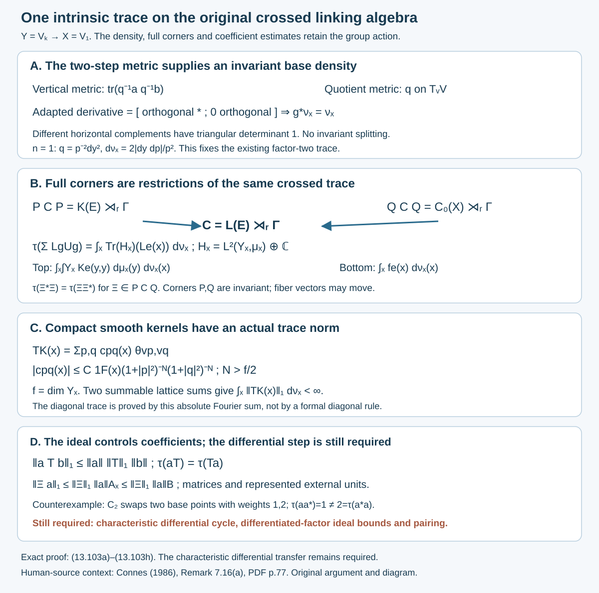

**Figure 13.10.** The two invariant metric quotients determine the density; the intrinsic Haar fibers determine the operator trace. Both actual corners inherit one trace. The Fourier panel gives the proved exponent \(N>f/2\) and the resulting trace-class domain. The ideal panel shows the exact matrix coefficient estimate and a noninvariant-density obstruction. Equations (13.103a)–(13.103h) give the full proof. The characteristic differential transfer remains an additional requirement. [Connes 1986, Remark 7.16(a)] is the human-source context for that requirement.

### A smooth map between the full corners

The original fiber module gives more than a Morita correspondence. A normalized fiber vector gives an explicit algebra homomorphism from the first-metric crossed product to the kernel corner. Its coefficient must move with the group arrow. This corrects the compression obstruction of Example 13.32 and makes a prospective cyclic pullback concrete.

**Proposition 13.30d.** With the notation of Propositions 13.30 and 13.30a, there is a nonnegative smooth fiber function \(\xi\), with support proper over \(X\), such that \(\|\xi_x\|_2=1\) for every \(x\). It determines an off-diagonal multiplier \(V\in PM(C)Q\) satisfying
\[
 V(a)=\xi a,\qquad V^*V=Q,\qquad VV^*=e\le P,
 \qquad \iota_\xi(a)=VaV^*,\quad a\in A_X=QCQ.
 \tag{13.103i}
\]
The map \(\iota_\xi:A_X\to PCP\) is an injective *-homomorphism, isometric at every matrix level. It sends the compact smooth first-metric crossed core to compact smooth pair kernels by
\[
 \begin{aligned}
 \iota_\xi(f_gU_g)&=f_g\theta_{\xi,U_g\xi}U_g,\\
 K_g(y,z)&=f_g(p(y))\xi(y)\overline{(U_g\xi)(z)},
 \qquad p(y)=p(z).
 \end{aligned}
 \tag{13.103j}
\]
It preserves the positive traces of the two corners, including infinite values, and their trace norms. Its induced K-map is the full-corner Morita identification in both degrees and is independent of the positive choice of \(\xi\).

**Proof.** We give the vector construction, the crossed formula, and the homotopy identifying the map.

Each original affine stage \(V_j\to V_{j-1}\) admits a smooth section. Take local sections and a nonnegative smooth partition of unity, then their affine barycenter. Affine coordinate changes preserve barycenters, so these glue. Composing the sections gives \(s:X\to Y\). No invariance of this section is needed.

At a first orthonormal source frame, write \(y=s_xh\), with \(h\in H_k\). A frame change conjugates \(h\) by \(SO(n)\). Its action on each normalized homogeneous coefficient space \(L_j\) is orthogonal, as proved in Proposition 13.29. Choose a nonzero nonnegative smooth cutoff \(\chi(h)\), depending only on the squared sum of these tensor norms and supported in a fixed coefficient ball. Divide it by its Haar \(L^2\) norm. Then \(\xi_x(s_xh)=\chi(h)\) is independent of that orthonormal frame, smooth, and has fiber norm one. Over a compact base set a finite trivializing cover and the fixed compact coefficient ball show that its support is compact. This is the stated proper-support property. For a zero-dimensional fiber take the value one on its single point.

The vector \(\xi\) may fail to belong to \(\mathcal E\), since its base norm does not vanish at infinity. Nevertheless \(a\mapsto\xi a\) maps \(C_0(X)\) into \(\mathcal E\) and is adjointable: its adjoint is \(\eta\mapsto\langle\xi,\eta\rangle\). Local \(L^2\) continuity proves continuity of this inner product, and its modulus is bounded by \(\|\eta_x\|_2\), which vanishes at infinity. Products with compact module operators remain compact, while multiplication by \(C_0(X)\) gives module vectors. Thus \(V\) is a multiplier of the compact linking algebra, with the support identities in (13.103i).

In the regular crossed representation the multiplier is diagonal on group summands, with entry \(\alpha_{h^{-1}}(V)\) at \(h\). Products on either side of a finite coefficient remain in the linking algebra: they involve \(VL_g\) and \(L_g\alpha_g(V)\). The adjoint has the same property. Boundedness and nondegeneracy therefore give the asserted multiplier of \(C\). This does not require \(\alpha_g(V)=V\).

Since \(V^*V=Q\), the map \(a\mapsto VaV^*\) preserves multiplication and adjoints. Its values are in \(C\) by the multiplier property, and in the corner \(eCe\). Applying \(V^*\) on the left and \(V\) on the right recovers \(a\). The norm inequalities in both directions prove isometry, also for all rectangular matrices with the corresponding diagonal amplifications of \(V\).

The crossed relation \(U_gV^*=\alpha_g(V^*)U_g\) gives (13.103j). Both \(\xi\) and \(U_g\xi\) have support proper over the compact support of \(f_g\), so \(K_g\) has compact pair support and is smooth. Its multiplication can also be checked directly:
\[
 \theta_{\xi,U_g\xi}\,
 \alpha_g(\theta_{\xi,U_h\xi})
   =\theta_{\xi,U_{gh}\xi},
 \qquad \langle U_g\xi,U_g\xi\rangle=1.
 \tag{13.103k}
\]
Including \(f_g\alpha_g(f_h)\) proves the complete coefficient formula. Taking the adjoint and applying \(\alpha_{g^{-1}}\) gives the coefficient for \(g^{-1}\). The second vector in (13.103j) is essential.

For \(a\ge0\), put \(Z=Va^{1/2}\in PCQ\). Corollary 13.30b gives \(\tau(ZZ^*)=\tau(Z^*Z)\), including infinite values. Functional calculus for the homomorphism gives \(|\iota_\xi(a)|=\iota_\xi(|a|)\) for general \(a\). Therefore
\[
 \begin{aligned}
 \tau_P(\iota_\xi(a))&=\tau_Q(a)\quad(a\ge0),\\
 \|\iota_\xi(a)\|_1&=\|a\|_1,\qquad
 \iota_\xi^+(a,\lambda)=(\iota_\xi(a),\lambda).
 \end{aligned}
 \tag{13.103l}
\]
The trace-norm equality includes equality of domains. For a single compact coefficient, the kernel in (13.103j) has fiber trace norm \(|f_g(x)|\), because both vectors have norm one; its total trace norm is \(\int_X|f_g|\,d\nu_X\). Amplification uses the ordinary unnormalized matrix trace and the amplified \(Z\), so all trace statements hold in matrices.

The last formula in (13.103l) is the injective homomorphism of external unitizations and is isometric for their C*-norms. It sends the new external scalar unit to the new external scalar unit. This holds also when the underlying algebras already have physical units. The represented physical-corner formula \(V(a+\lambda Q)V^*=\iota_\xi(a)+\lambda e\) is a different formula and must not replace the external map in a relative calculation. For a graph Banach unitization, the norm \(\|a\|_B+|\lambda|\) dominates its represented norm, or one retains the actual representation constant.

To identify the K-map, note that \(eQ=0\). The multiplier \(J=V-V^*\) satisfies \(J^*=-J\), \(J^2=-(e+Q)\), and vanishes on \(1-e-Q\). Consequently
\[
 \begin{aligned}
 R_t&=1+(\cos t-1)(e+Q)+\sin t(V-V^*),
       \quad 0\le t\le\pi/2,\\
 R_0aR_0^*&=a,\qquad
 R_{\pi/2}aR_{\pi/2}^*=\iota_\xi(a)\quad(a\in QCQ).
 \end{aligned}
 \tag{13.103m}
\]
The displayed support identities show directly that \(R_tR_t^*=1\). This is a norm-continuous unitary multiplier path; its conjugations have values in \(C\) and give a homotopy of algebra homomorphisms. Their external extensions fix the external scalar unit. If \(j_P,j_Q\) denote the full-corner inclusions, it follows that \((j_P)_*(\iota_\xi)_*=(j_Q)_*\) in both degrees. The already named full-corner K-comparison of Proposition 13.30 then identifies \((\iota_\xi)_*\) with that Morita isomorphism. The path supplies the concrete identification, without introducing a new unproved comparison of characteristic pairings.

Finally let \(\xi_0,\xi_1\) be two nonnegative normalized smooth proper choices. Put
\[
 v_t=(1-t)\xi_0+t\xi_1,\qquad
 \xi_t=\frac{v_t}{\|v_t\|_{\text{fiber}}},\qquad
 \|v_t(x)\|_2^2\ge(1-t)^2+t^2\ge\tfrac12.
 \tag{13.103n}
\]
Their fiber inner product is nonnegative, which proves the bound. Normalization is smooth and retains proper support over each compact base set. Its derivative in \(t\) has fiber norm at most \(\|\xi_1-\xi_0\|_2/\|v_t\|_2\le2\sqrt2\), uniformly over the entire base. Thus the multiplier path \(V_t\) is norm-continuous, as is the homotopy \(\iota_{\xi_t}\). This proves independence of section and cutoff choices made above; no uniform bound on their translations is assumed. For arbitrary complex normalized choices, stabilize to \(\mathcal E\oplus\mathcal E\) and use \((\cos t\,\xi_0,\sin t\,\xi_1)\). Its norm is one. A two-by-two unitary rotation identifies the second stabilized corner with the first. Hence these choices also have the same stabilized K-map. \(\square\)

**Corollary 13.30e.** A closed differential cycle on the compact smooth crossed kernel core pulls back along (13.103j) to a closed differential cycle on the compact smooth first-metric crossed core, with external scalars treated by (13.103l). If its degree-\(m\) character has the inserted-coefficient estimate for the actual kernel-corner C*-norm, the pullback has that estimate for the first-metric graph Banach norm. For a stronger target norm \(\|\cdot\|_D\), this conclusion instead requires a proved bound \(\|\iota_\xi(X)\|_D\le C\|X\|_B\), and has the additional constant \(C^m\).

**Proof.** In the given target differential cycle take the differential subalgebra generated by the image of the first-metric core. Restrict the differential and graded trace to it. Leibniz, the square-zero identity, closedness and the graded trace identity hold on this subalgebra because they hold in the given cycle. Its character is the original character evaluated on \(\iota_\xi(a_0),\ldots,\iota_\xi(a_m)\). For fixed differentiated \(a_j\), apply the assumed target estimate to the inserted \(\iota_\xi(X_j)\). Proposition 13.30d gives \(\|\iota_\xi(X_j)\|=\|X_j\|_{A_X}\le\|X_j\|_B\). A bound into \(D\) gives one factor \(C\) for each of the \(m\) inserted arguments. Matrix and external-unit versions use the same restrictions and the stated amplified map. This is a conditional pullback theorem; existence of the target characteristic cycle is still required. \(\square\)

**Example 13.30f.** On one base point, let \(C_2\) exchange the two vectors \(e_0,e_1\) of a fiber \(\mathbb C^2\). Choose \(\xi=e_0\) and \(e=|e_0\rangle\langle e_0|\). The corrected image of its group generator is \(w=|e_0\rangle\langle e_1|U\), with \(w^2=e\) and \(w^*=w\). But \(eUe=0\). The corrected map is a homomorphism into the \(e\)-corner; naive rank-one compression loses the generator.

The real-crossed-product construction of [Kellendonk–Schulz-Baldes 2004, Definition 3 and Theorem 2] requires an invariant differential cycle and a uniform bound over independently translated differentiated arguments. Its estimate is initially for an \(L^1\) convolution norm. Those hypotheses still need proofs for the original characteristic cycle and the first-metric norm. The smooth corner map and its degree-zero trace equality do not supply them.

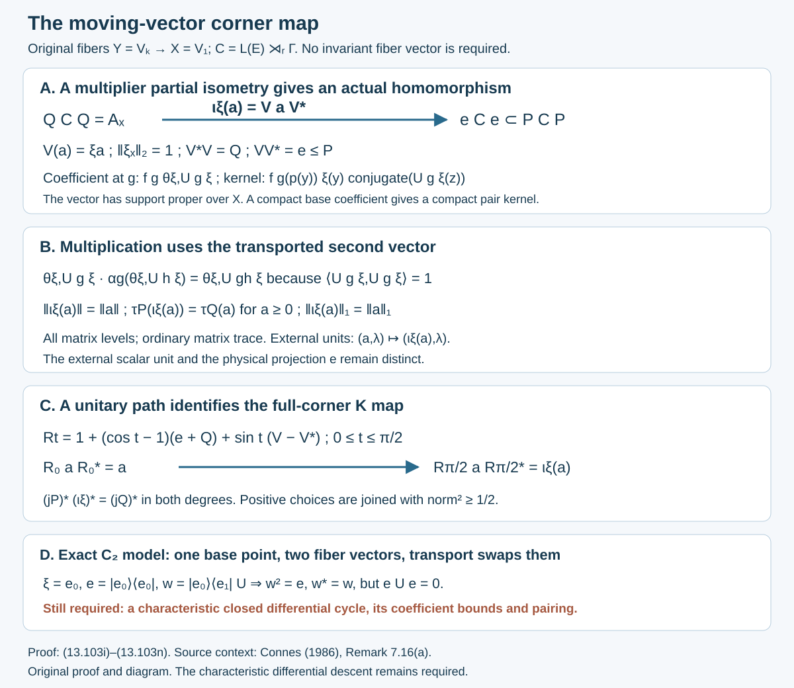

**Figure 13.11.** The transported second vector preserves the crossed product. The multiplier rotation identifies its K-map with the two full-corner inclusions. The finite fiber-swap model distinguishes the corrected map from failed compression. Proposition 13.30d, equations (13.103i)–(13.103n), gives the exact construction and proof; Corollary 13.30e states the remaining conditional cyclic pullback. [Connes 1986, Remark 7.16(a)] is the human-source context for the outstanding characteristic descent.

### Vertical forms on the original fibers

There are two useful geometric structures on the original nilpotent fibers. Their left-invariant metric makes the group-arrow action isometric. Their raw jet coefficients make every right translation affine. The first structure controls a vertical differential cycle in the actual reduced norm; the second controls independently translated scalar forms. These statements retain the original fiber and its orthogonal-frame action.

Let \(k\ge2\), \(Y=V_k\), \(X=V_1\), and \(p:Y\to X\). Put \(f=\dim H_k>0\), and retain the canonical fiber Haar measures \(\mu_x\) and invariant first-metric density \(\nu_X\).

**Proposition 13.30g.** Right translations of \(H_k\) are affine maps of its full original homogeneous coefficient space, with triangular linear part and determinant one. The vertical tangent of \(p\) also has a smooth intrinsic \(\Gamma\)-invariant metric with volume \(\mu_x\), independent of a section or orthonormal frame.

**Proof.** Write \(h(z)=z+\sum_{j=2}^kh_j(z)\), and similarly write \(b\). Use substitution truncated at order \(k\). For fixed \(b\),
\[
 R_b(h)=h\circ b=b+\sum_{j=2}^k h_j\circ b
       \pmod{\text{degree}>k}.
 \tag{13.103o}
\]
Each output coefficient is linear in the coefficients of \(h\), with constant term \(b\). Its degree-\(j\) component is \(h_j+b_j\) plus a linear combination of earlier \(h_i\). The diagonal blocks are identity, so its determinant is one. Its inverse is right translation by \(b^{-1}\). This proves affineness on the whole coefficient space, including the nonabelian stages. The tensor action of source-frame conjugation \(h\mapsto R^{-1}hR\) is linear, orthogonal and orientation-preserving.

For the metric, choose the invariant tensor inner product on the Lie algebra \(\mathfrak h_k=\bigoplus_{j=2}^kL_j\). Rescale it by one positive constant so that its volume at the identity is the canonical coefficient volume. Extend it by left translations. Its volume is \(\mu\), since both are left-invariant and agree at the identity. Orthogonal-frame conjugation is a group automorphism and is orthogonal at the identity. Its derivative intertwines left translations, making it an isometry everywhere.

In section coordinates \(y=s_xh\), changing to \(s'_x=s_xc(x)\) sends \(h\) to \(c(x)^{-1}h\). This left translation is an isometry. A frame change conjugates \(h\), also an isometry. The metrics therefore glue smoothly and intrinsically. A group arrow commutes with right multiplication upstairs: \(g(s_xh)=(gs_x)h\). In the new section coordinates its fiber map is left translation by \(c_g(x)\), together with the orthogonal-frame change. Thus it preserves the metric and orientation. In particular
\[
 E=T_p^*Y\quad\Longrightarrow\quad
 \|\lambda_{E^{\otimes j}}(a)\|\le\|a\|_{A_Y},
 \qquad A_Y=C_0(Y)\rtimes_r\Gamma,\quad j\ge1.
 \tag{13.103p}
\]
This is the contractive bundle representation for an isometric action from the transverse lesson. No horizontal complement, nonpositive curvature or Spin lift was used. Right translations need not be isometries for this left-invariant metric. \(\square\)

**Proposition 13.30h.** On finite compact smooth vertical form coefficients, fiberwise exterior differentiation \(d_p\) and
\[
 \begin{aligned}
 I_p(\omega)&=\int_X\left(\int_{Y_x}\omega_e\right)d\nu_X(x),\\
 \tau_p(a_0,\ldots,a_f)&=I_p(a_0d_pa_1\cdots d_pa_f)
 \end{aligned}
 \tag{13.103q}
\]
define a closed differential cycle and an \(f\)-trace on the actual reduced C*-algebra \(A_Y\). For fixed compact smooth \(a_j\), the full inserted-coefficient estimate is
\[
 |I_p(X_1d_pa_1\cdots X_fd_pa_f)|
       \le C_{a_1,\ldots,a_f}\prod_{j=1}^f\|X_j\|_{A_Y}.
 \tag{13.103r}
\]
It includes matrix amplifications and external scalar units.

**Proof.** Multiply vertical form coefficients by wedge and group pullback, exactly as in transverse (7.1). The group action preserves fibers, so it commutes with \(d_p\). Composition of pullbacks proves associativity; fiberwise Leibniz and \(d_p^2=0\) prove the differential identities.

If the two form degrees add to \(f\), the identity coefficient of their product is \(\sum_g\omega_g\wedge\alpha_g(\eta_{g^{-1}})\). Change variables in the base and fibers. The base density is invariant and fiber orientation is preserved. Exchange the two factors with sign \((-1)^{\deg\omega\deg\eta}\), then reindex \(g^{-1}\). This is the graded trace identity for \(I_p\). Compact-support Stokes on each fiber gives \(I_p(d_p\omega)=0\) in degree \(f-1\). A finite compact trivializing cover and Fubini justify the iterated integrals. Thus (13.103q) is the character of a closed cycle and is cyclic.

For a fixed finite compact vertical top coefficient \(\omega\), only finitely many terms contribute to \((a\omega)_e\). Every transported form has finite total variation against the fiber/base integral. The regular coefficient bound \(\|a_g\|_\infty\le\|a\|_{A_Y}\) therefore gives \(|I_p(a\omega)|\le C_\omega\|a\|_{A_Y}\).

The balanced wedge functional of \(f\) vertical one-form modules now satisfies the exact terminal-coefficient hypothesis of [transverse Theorem 5.3](the-transverse-fundamental-class.md#5-moving-a-coefficient-through-a-tensor-of-sections). Its finite local-frame factorization moves each inserted coefficient through the fixed sections and lowers the number of tensor factors at each stage. All intermediate bundle norms are at most \(\|\cdot\|_{A_Y}\), by (13.103p). Choose a compact source cutoff \(\kappa\) with \((d_pa_f)\kappa=d_pa_f\) and move it to the front by trace cyclicity. The factorization proves (13.103r). It does not estimate a varying crossed coefficient sum by its separate suprema. Consequently its constant is independent of the varying group supports. No free, proper or countable action is needed.

For external \(X_j\), fix compact range cutoffs \(\eta_j\) with \(\eta_jd_pa_j=d_pa_j\). Then \(X_j\eta_j\) belongs to the nonunital algebra; their fixed norms are absorbed into the constant. The external unit has differential zero, and its leading-slot contribution is \(I_p(d_p(a_1d_pa_2\cdots d_pa_f))=0\). Finite matrix amplification uses the ordinary matrix trace and the same frame factorization on amplified modules.

Compact smooth finite coefficients are dense in \(A_Y\). The controlled extension and pairing theorems of the n-trace lesson apply, with their stated prerequisites, to give a pairing \(J_p\) on every \(K_{f\bmod2}(A_Y)\). For the canonical inclusion \(i:C_0(Y)\to A_Y\), its normalized value on a compact-support class is
\[
 \begin{aligned}
 a_f^{-1}J_p(i_*z)
    &=\int_X\int_{Y_x}\operatorname{ch}_{{\rm cyc},f}(z)\,d\nu_X,\\
 a_{2r}&=r!(2\pi i)^r,\qquad
 a_{2r+1}=\frac{(2r+1)!}{r!}(2\pi i)^{r+1}.
 \end{aligned}
 \tag{13.103s}
\]
In this integral restrict the Chern form to the vertical tangent; in the projection and loop formulas this means using \(d_p\). Restriction to identity-group coefficients gives the ordinary fiberwise calculation, with the constants of transverse Corollary 8.2. For the geometric character multiply the degree-\(f\) cyclic form by \((-1)^{\lfloor f/2\rfloor}\), as in the existing convention bridge. No nonzero detection or global original-fiber Thom isomorphism is asserted by this formula. \(\square\)

### Uniform control under right translation

The scalar fiber cycle has a stronger translated-argument bound than a polynomial estimate on derivatives. The bound comes from the supports and a mixed-coordinate Jacobian.

**Proposition 13.30i.** Let \(a_1,\ldots,a_f\in C_c^\infty(\mathbb R^f)\). Enclose \(\operatorname{supp}a_i\) in a box \(\prod_j I_{i,j}\), and write
\[
 M_{i,j}=\sup|\partial_ja_i|,\qquad
 \ell_{i,j}=\operatorname{length}(I_{i,j}).
 \tag{13.103t}
\]
For all independently chosen invertible affine maps \(\Phi_i\),
\[
 \int_{\mathbb R^f}
    |d(a_1\circ\Phi_1)\wedge\cdots\wedge d(a_f\circ\Phi_f)|
       \le\prod_{i=1}^f\left(\sum_{j=1}^f M_{i,j}\ell_{i,j}\right).
 \tag{13.103v}
\]
In particular the bound is uniform over all independently chosen original right \(H_k\) translations and orthogonal-frame rotations.

**Proof.** For \(J=(j_1,\ldots,j_f)\) let \(F_J(y)=((\Phi_1(y))_{j_1},\ldots,(\Phi_f(y))_{j_f})\), with constant derivative matrix \(L_J\). Wedge expansion gives one term for each \(J\), whose coefficient is \(\prod_i(\partial_{j_i}a_i)(\Phi_i(y))\det L_J\). It is supported in \(S=\bigcap_i\Phi_i^{-1}(\operatorname{supp}a_i)\), which lies in \(F_J^{-1}(\prod_iI_{i,j_i})\).

If \(\det L_J=0\), that wedge term vanishes identically, even if the bounding inverse image is unbounded. Otherwise \(F_J\) is an affine bijection, and change of variables gives
\[
 \int_S|\det L_J|\,dy\le\prod_i\ell_{i,j_i}.
 \tag{13.103u}
\]
Multiply by the fixed derivative suprema and sum all \(J\). The finite sum \(\sum_{j_1,\ldots,j_f}\prod_iM_{i,j_i}\ell_{i,j_i}\) factors into the product in (13.103v). This proof uses no norm of an affine derivative or its inverse. Proposition 13.30g supplies exactly these affine maps for the original right action, including frame conjugations. On fixed compact base supports the derivative bounds and box lengths can be chosen uniformly in finitely many fiber charts; integration adds their finite base masses. \(\square\)

**Example 13.30j.** Take \(\Phi_1(u,v)=(u,v-tu)\), \(\Phi_2=\mathrm{id}\), and select the second coordinate of each. Then \(F(u,v)=(v-tu,v)\) has determinant \(-t\). For \(t\ne0\), the inverse image of \(I_1\times I_2\) is a parallelogram of area \(|I_1||I_2|/|t|\). Its absolute Jacobian integral is exactly \(|I_1||I_2|\). At \(t=0\) the mixed wedge term is zero. This is a bounding region for the actual support intersection; further compact-coordinate restrictions can reduce it.

For the scalar fundamental fiber cycle, (13.103v) bounds the optimal inserted-coefficient constant over all independent right translates, as required in [Kellendonk–Schulz-Baldes 2004, Definition 3]. It does not establish that condition for arbitrary noncommuting crossed insertions or for a general characteristic form. Such a form can have mixed horizontal and vertical components and need only be cohomologically right-invariant. The vertical cycle and the scalar uniform bound therefore supply specific differential prerequisites; the characteristic cycle, its first-metric estimate and its normalized pairing still require proofs.

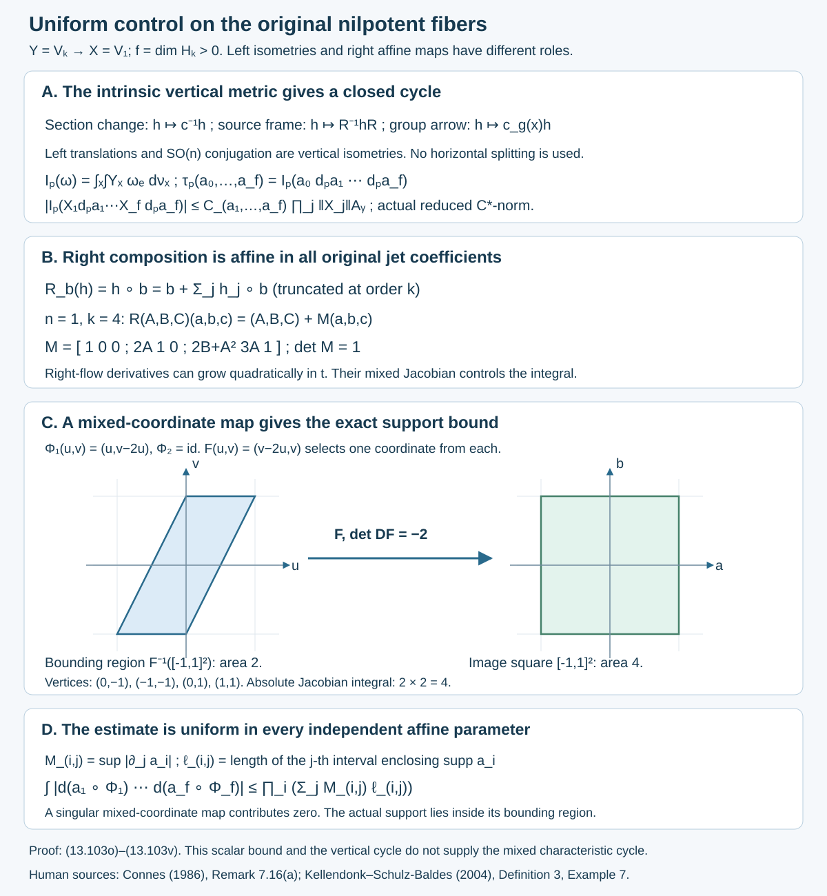

**Figure 13.12.** The upper panels show the actual vertical bundle, norm estimate and original fourth-jet right-translation matrix. In the coordinate panels \(t=2\), and \(F(u,v)=(v-2u,v)\) is a mixed-coordinate map, distinct from either individual group arrow. Its bounding parallelogram has the four displayed exact vertices and area two; its image square has area four. The determinant is \(-2\), so the absolute Jacobian integral is four. Propositions 13.30g–13.30i, equations (13.103o)–(13.103v), give the metric, cycle and uniform-bound proofs. Human-source context: [Connes 1986, Remark 7.16(a)] and [Kellendonk–Schulz-Baldes 2004, Definition 3 and Example 7].

### Coefficient norms and the remaining trace

**Corollary 13.31.** Let \(B\subset A_X\) be the first-metric graph Banach algebra of the transverse lesson, with \(\|a\|_{A_X}\leq\|a\|_B\). Its coefficients act on the module in (13.101) with
\[
 \|\Xi a\|_{PCQ}\leq\|\Xi\|_{PCQ}\|a\|_{A_X}
             \leq\|\Xi\|_{PCQ}\|a\|_B.
\tag{13.104}
\]
This holds for every matrix amplification and for external-unitized coefficients, with the unitized graph norm containing the ambient unitized norm.

**Proof.** Inside the actual linking algebra, \(\|\Xi a\|^2=\|a^*\Xi^*\Xi a\|\leq\|a\|^2\|\Xi\|^2\). The inequality passes to every matrix algebra. The scalar unit acts by the multiplier \(Q\), giving the external-unit case. Continuity extends it from the finite smooth core; iteration bounds any prescribed product of undifferentiated coefficients. \(\square\)

**Example 13.32.** Compression by an arbitrary fiber rank-one projection is not multiplicative. Let integer translations act on a real fiber. Choose a smooth unit \(L^2\) vector \(\xi\) supported in an interval of length less than one, and set \(e=\theta_{\xi,\xi}\). Its translates by \(\pm1\) have disjoint support. Thus \(eU_1e=eU_{-1}e=0\), while \(eU_1U_{-1}e=e\ne0\). An invariant compact cutoff is unavailable for the same reason: a nonzero periodic compactly supported function would have an unbounded support. The full linking module avoids either assumption.

The distinction in (13.104) matters. It bounds module multiplication by every inserted coefficient. A controlled \(m\)-trace still requires a differential cycle, fixed differentiated module elements, a closed trace and its cyclic normalization. The closed-current characteristic cycle of Lemma 13.18 has yet to be transferred through the nilpotent convolution and these full corners with that complete estimate. Its geometric pairing must then be compared after the actual first-metric K-transfer. The resulting trace would specify an extension to all analytic classes; it need not agree with an arbitrarily chosen basis extension outside the assembly image. These are the remaining obligations in Remark 7.16(a). The present operator construction does not close that clause.

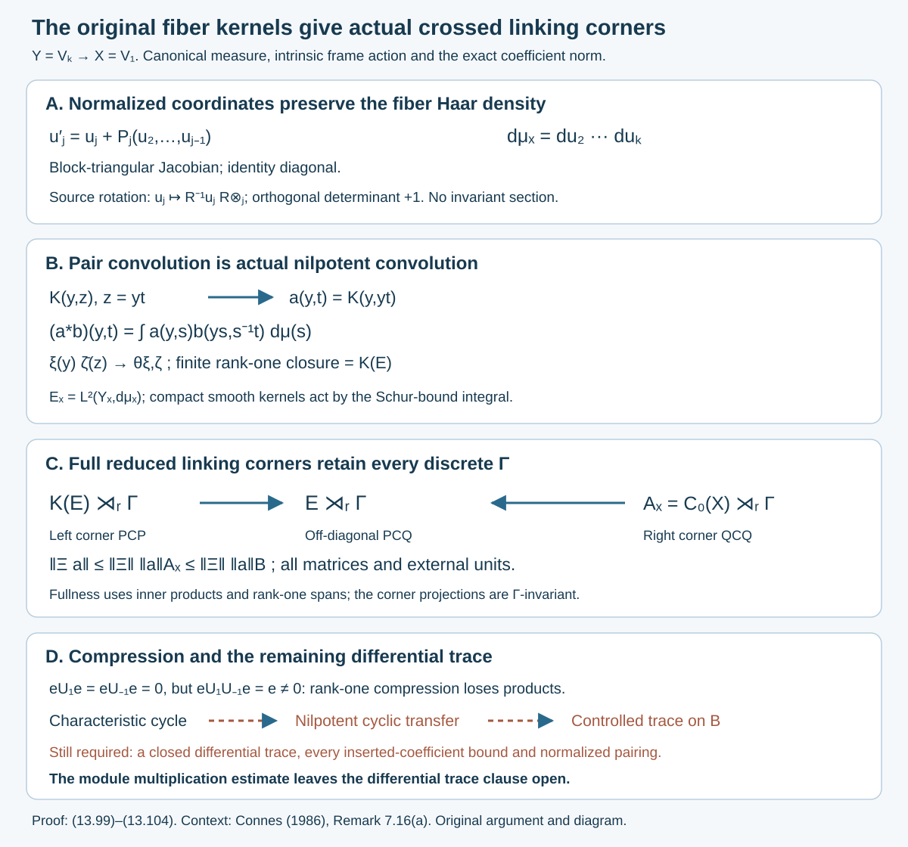

**Figure 13.9.** The original fiber coordinates give the triangular density change of (13.99). Pair convolution becomes the actual nilpotent convolution in (13.103), and its rank-one closure is \(\mathcal K(\mathcal E)\). The crossed linking corners retain source-frame action and bound coefficients by their first-metric Banach norm. The final panel distinguishes this proved multiplication estimate from the still required differential trace transfer. Lemma 13.29, Proposition 13.30 and Corollary 13.31 prove the displayed arrows; Example 13.32 and Exercises 7.32–7.33 explain the flag and compression constraints.

## 14. Exercises with solutions

**Exercise 7.1 (basic; 10 points).** Let \(w\) be a normalized two-cocycle satisfying the product-one condition. For \(g_0g_1g_2=1\), derive the relation needed to rotate a three-arrow loop. Which normalization kills the middle terms?

**Solution.** Evaluate \(\delta w\) at \((g_0,g_1,g_2)\). The terms \(w(g_0g_1,g_2)\) and \(w(g_0,g_1g_2)\) both vanish because their arguments have product one. Hence \(w(g_1,g_2)=w(g_0,g_1)\cdot g_2\). Pullback by \(R_{g_2^{-1}}\) transports its one-form when the last arrow moves to the first. The cyclic sign is positive, since the cochain has degree two. Normalization at an individual identity would not by itself kill these middle terms. \(\square\)

**Exercise 7.2 (intermediate; 15 points).** Let \(A=\ell(g)\cdot h\), \(B=\ell(h)\). Compute \(w\), \(\delta\rho\), and the contraction coefficient. Decide whether the contraction gives \(w\), \(2w\), or \(2c\).

**Solution.** The three expressions are \(w=B\,dA-A\,dB\), \(\delta\rho=A\,dB+B\,dA\), and \(B\,dA-A\,dB\). Thus contraction gives \(w\). Their sum \(w+\delta\rho=2B\,dA=2c\) is the cohomology comparison, not the contraction formula. For example \(A=2,B=3,dA=5\,dx,dB=7\,dx\) gives \(w=dx\), \(\delta\rho=29dx\), and \(2c=30dx\), so inserting another factor of two is detectable even at one point. \(\square\)

**Exercise 7.3 (advanced; 20 points).** In \(M_3(\mathbb C)\) take \(H=\operatorname{diag}(0,1,3)\), \(K=\operatorname{diag}(0,2,1)\), \(\psi(a,b)=\operatorname{Tr}(a[H,b])\), and \(D(b)=[K,b]\). For \(a=E_{31},b=E_{12},c=E_{23}\), compute \((i_D\psi)(a,b,c)\). Show that the bound (4.2) is attained with differential tuple \((b,c)\) and coefficient tuple \((a,1)\).

**Solution.** The diagonal matrices commute, so \(\psi\) is invariant under \(e^{itK}\)-conjugation. It is a one-trace: the least first-slot constant is \(\|[H,b]\|_1\). We have \([H,b]=-E_{12}\), \([H,c]=-2E_{23}\), \(D(b)=-2E_{12}\), and \(D(c)=E_{23}\). The first trace in (4.1) is \(-1\); the second is \(4\); thus the value is \(-5\). Equation (4.4) with \(x=a,y=1\) gives the same two traces. Here \(C_\psi(b)=1\), \(C_\psi(c)=2\), \(\|D(b)\|=2\), \(\|D(c)\|=1\), and both coefficient norms are one. The bound is \(1\cdot1+2\cdot2=5\), which is attained. The estimate cannot discard either differential term. \(\square\)

**Exercise 7.4 (intermediate; 15 points).** Compose the jet \((y,p,q)=(1,2,3)\) with the germ \(H(y)=y+y^2\). Find the new jet, its coordinate Jacobian, and the pullback factors of flat volume and \(\nu\). Explain why the factorial convention for \(q\) matters.

**Solution.** At \(y=1\), \(H=2,H'=3,H''=2\). Equation (6.1) gives \((2,6,13)\), since \(3\cdot3+(2/2)\cdot2^2=13\). The coordinate Jacobian is \(3^3=27\), so flat volume acquires that factor. The denominator changes from \(2^3=8\) to \(6^3=216=27\cdot8\), and \(\nu\) is unchanged. If \(q\) denoted the second derivative rather than its coefficient, the action would contain \(H''p^2\), without the half; the contact form would also change. Mixing those conventions spoils (6.3). \(\square\)

**Exercise 7.5 (advanced; 20 points).** For \(\mu'=e^u\mu\), derive an explicit group one-cochain whose coboundary is \(w'-w\). Why is its crossed-product cochain cyclic even if that one-cochain is not a cocycle?

**Solution.** Put \(v(g)=u\cdot g-u\), \(\rho'=-\ell'd\ell'\), and use \(\eta=2d\ell(g)u-2(du\cdot g)(\ell(g)+v(g))-\rho'(g)+\rho(g)\). The cup-product computation in Proposition 5.1 gives \(\delta\eta=w'-w\). Both two-cochains vanish when \(gh=1\), and \(\eta(1)=0\), so evaluating at \((g,g^{-1})\) gives \(\eta(g^{-1})=-\eta(g)\cdot g^{-1}\). This is precisely the antisymmetry condition after rotating a two-arrow loop. The cochain identity then gives \(\tau_{w'}-\tau_w=b\tau_\eta\). Cyclicity of a cochain and vanishing of its Hochschild boundary are separate properties. \(\square\)

**Exercise 7.6 (advanced; 20 points).** For the affine group acting on one point, use the module (1.8) and \(w(g)=1-\chi(g)^{-1}\). Prove the group-cocycle equation and cyclicity of its Haar one-cochain. Express that cochain as a Hochschild boundary of the functional \(L(f)=f(1)\).

**Solution.** The module action is multiplication by \(\chi(g)^{-1}\), and
\(w(h)-w(gh)+\chi(h)^{-1}w(g)=0\) by multiplicativity of \(\chi\). Also \(w(1)=0\), and
\(\chi(g)^{-1}w(g^{-1})=\chi(g)^{-1}-1=-w(g)\). Inversion of the Haar variable therefore makes the one-cochain antisymmetric. Formula (1.9) gives \(L(f*h)=\int f(g^{-1})h(g)d\rho(g)\). Changing variables in \(L(h*f)\) inserts \(\chi(g)^{-1}\). Hence \((bL)(f,h)=\int f(g^{-1})h(g)(1-\chi(g)^{-1})d\rho(g)=\tau_w(f,h)\). It is a cocycle because \(b^2=0\); \(L\) itself is not a trace. This exhibits the modular correction directly. \(\square\)

**Exercise 7.7 (intermediate; 10 points).** Suppose \(s_g(x)=2\), \(s_h(xg)=-5\), and consider successive flat arrows \((g,7)\), \((h,11)\). Compute the real labels of their images under (7.3), and verify the real label of the composite.

**Solution.** The labels are \(7-2=5\) and \(11-(-5)=16\). Their sum is 21. The cocycle gives \(s_{gh}(x)=2-5=-3\), and the flat composite label is 18. Its image has label \(18-(-3)=21\). Both transformations end at the same object; this numerical check uses precisely the cocycle needed for the full proof. \(\square\)

**Exercise 7.8 (intermediate; 15 points).** Let \(P\) be a probability measure of compact support on \(\mathbb R\). Compute \(\int(t-u)\,dP(t)dP(u)\). If \(p=3\), \(\ell(h)'=4\), and \(g=h^{-1}\), evaluate the remaining scalar in (7.12), and the coefficient of \(dy\wedge dp\) after multiplying by \(2\Lambda\).

**Solution.** The two means cancel, even when they are nonzero. Here \(s_g=(p/2)\ell(h)'=6\), so the fiber integral is 6. Multiplication by \(2/p^2=2/9\) gives \(4/3\). This equals the coefficient in \(d\ell(h)\wedge dp/p\). Omitting the volume's factor two would instead give \(2/3\), showing why the trace convention must be fixed before the comparison. \(\square\)

**Exercise 7.9 (intermediate; 10 points).** Take \(M=\operatorname{diag}(0,2)\) and \(e=\tfrac12\begin{pmatrix}1&1\\1&1\end{pmatrix}\). Compute \(\delta e=eM-Me\), its operator norm, and \(\operatorname{Tr}((\delta e)e)\). Why does the cancellation in (8.9) require a trace identity rather than \(\delta e=0\)?

**Solution.** We get \(\delta e=\begin{pmatrix}0&1\\-1&0\end{pmatrix}\), with operator norm one. Multiplying by \(e\) gives diagonal entries \(1/2,-1/2\), so the trace is zero. The commutator is nonzero; its contribution disappears only after the rank-one corner trace. This is why the derivation on the stabilized algebra is not just the original derivation on the circle factor. \(\square\)

**Exercise 7.10 (advanced; 15 points).** Let \(u=1+a\) be invertible, with \(a\) in the finite smooth circle algebra. Use the joint closed derivation in Proposition 8.2 to bound the derivative part of \(u^{-1}\)'s graph norm in terms of \(\|u^{-1}\|\), \(\|\partial a\|\) and \(\|Da\|\). Explain why this supplies inverse closure for the simultaneous domain, rather than assuming that two separate dense cores coincide.

**Solution.** The derivation rule gives \(\partial(u^{-1})=-u^{-1}(\partial a)u^{-1}\) and \(D(u^{-1})=-u^{-1}(Da)u^{-1}\). Contractive bimodule actions therefore bound their sum of norms by \(\|u^{-1}\|^2(\|\partial a\|+\|Da\|)\). The joint graph closure is a complete algebra with one closed derivation into the direct-sum bimodule. The Neumann-series and resolvent proof of Lemma 5.1 applies to that single derivation and establishes inverse closure there. It gives both derivatives along the same graph approximation; an intersection of separately chosen cores would not establish this fact. \(\square\)

**Exercise 7.11 (intermediate; 15 points).** In the coordinates (9.1), multiply \((b,a)=(2,4)\) and \((c,d)=(-3,9)\). Find the corresponding orbit coordinates \((p,t)\) of the product, and its inverse. Check directly that its polynomial is the composition of the two jet polynomials.

**Solution.** The product is \((5/4,36)\), so \(p=36\), \(t=45\), and its polynomial is \(36u+1620u^2\). The two polynomials are \(4u+32u^2\) and \(9u-243u^2\). Substituting the second into the first and discarding degree three and higher gives \(36u+(-972+2592)u^2\), as required. The inverse of \((b,a)\) is \((-ab,a^{-1})\), so the inverse of the product is \((-45,1/36)\). Their first coordinate on multiplication is \(5/4-45/36=0\). This example distinguishes the factor coordinate \(b\) from both \(q\) and \(t\). \(\square\)

**Exercise 7.12 (advanced; 20 points).** For a fiber map \(F(t,r)=(t+ce^r,r+\log v)\), with \(v>0\), compare its Jacobians for \(dt\,dr\) and \(e^{-r}dt\,dr\). Conjugate the resulting weighted-fiber unitary by \(Q\) in (9.7). Then do the same for right dilation by \(a=4\). Explain why using an invariant rank-one projection is unnecessary in the proof of (9.6).

**Solution.** The ordinary determinant of \(F\) is one, since its derivative matrix is triangular with diagonal entries one. The weighted measure pulls back by the factor \(v^{-1}\). Its unitary pullback is therefore \(v^{-1/2}\xi\circ F\); conjugation by \(Q\) leaves the scalar \(e^{-r/2}v^{-1/2}e^{(r+\log v)/2}=1\). Right dilation has map \((t,r)\mapsto(4t,r+\log4)\), determinant four, and preserves the weighted measure. Under \(Q\) it becomes \(2\eta(4t,r+\log4)\). Thus the first factor is the dilation unitary, rather than the identity. A chosen rank-one projection may move under these dilations. The linking algebra keeps its whole compact-operator corner invariant, and naturality applies to that corner inclusion and to the bottom corner inclusion. Their K-isomorphisms give (9.6) without requiring a fixed rank-one projection. \(\square\)

**Exercise 7.13 (advanced; 20 points).** In Example 10.2, replace \(j^{-3/4}\) by \(j^{-a}\). For which \(a\) is the vector square summable? For which of those exponents does the same fixed-kernel argument prove an unbounded leading-slot functional? Explain why the crossed-product norm sees a supremum of shifted Fourier values, whereas the cochain adds the vector coefficients.

**Solution.** Square summability requires \(2a>1\). For \(1/2<a<1\), the sum is at least \(N^{1-a}\), and division by the crossed norm gives a lower bound \((\int h^2/C_h)N^{1-a}\), which diverges. At \(a=1\), the harmonic sum diverges logarithmically and still proves unboundedness. For \(a>1\), the sum is bounded, so this argument no longer gives an unbounded ratio. Each \(f_N\) has one column with \(N\) Fourier-shifted row entries; at a fixed frequency, their squared magnitudes sum before taking the square root. Schwartz decay bounds that shifted lattice sum uniformly. The one-trace instead pairs the whole column with the fixed row vector \(w\), producing \(N^{-1/2}\sum j^{-a}\). These are the two different operations responsible for the domain failure. \(\square\)

**Exercise 7.14 (intermediate; 15 points).** For the circle one-trace \(\psi(f,g)=\int_0^1 f\,dg\), take \(u(y)=e^{-6\pi i y}\). Compute its raw odd pairing and the raw even pairing of its trivial-action odd Thom class under (10.8). State what changes if the calibrated Thom orientation is used. Which Fourier and generator factors enter the answer?

**Solution.** Since \(u^{-1}du=-6\pi i\,dy\), the raw odd value is \(-6\pi i\). Formula (10.8) gives the raw even value \(3\). With \(\Phi_{\mathrm{cal}}^1=-\Phi^1\), it is \(-3\), equal to the normalized odd value \((-6\pi i)/(2\pi i)\). Fourier inversion contributes \(1/(2\pi)\), the real dual generator contributes \(1/i\), and the increasing-frequency idempotent path contributes the minus sign through (10.13). The answer changes if any one of those conventions is silently replaced. \(\square\)

**Exercise 7.15 (intermediate; 15 points).** Let a finite trace have two scalar summands with weights \(2\) and \(5\). A relative projection difference has ranks \((-1,1)\) in those summands. Compute its trace value, its raw one-trace pairing after the additive positive Thom map, its raw two-trace pairing after both Thom maps and Morita equivalences, and the transfer functional \(\mathfrak F\). If the scalar loop has winding \(k\), which value changes at the first step?

**Solution.** The trace value is \(2(-1)+5(1)=3\). Equation (11.6) gives raw one-trace value \(3\). Equation (11.13) gives raw two-trace value \(-3/(2\pi i)\), and (11.14) gives \(\mathfrak F=-3\). A winding-\(k\) loop has \(\int b^{-1}b'=2\pi i k\), so its raw odd value is \(3k\); it represents \(k\) times the positive Thom class. An unnormalized raw odd value must not be divided by \(2\pi i\) while still claiming (11.6) unchanged.

**Exercise 7.16 (advanced; 20 points).** For a trace-preserving action, check the scaling in (11.9) directly from (11.7), using \(\rho_\lambda f(t)=\lambda f(\lambda t)\). In the trivial action take \(b(\xi)=(\xi-i)/(\xi+i)\), a finite-trace projection \(p\), and \(u_p=1+(b-1)p\). Compute \(b^{-1}b'\), its integral and the raw pairing in (11.10). Explain why the resulting sign calculation does not yet identify a geometric Godbillon–Vey class.

**Solution.** Substitution \(s=\lambda t\) gives a factor \(\lambda^2\) from the two coefficients, \(1/\lambda\) from \(t\), and \(1/\lambda\) from \(dt\). They cancel, and the transported coefficient action is \(\theta_s\), proving (11.9). For the scalar loop,

\[
 b^{-1}b'=\frac{2i}{1+\xi^2},\qquad
 \int_{\mathbb R}b^{-1}b'\,d\xi=2\pi i.
\]

Since \(u_p^{-1}u_p'=(b^{-1}b')p\), (11.10) gives raw value \(T_2(p)\). The rational loop may be replaced in its K-class by a compact smooth positive loop; the theorem evaluates such a representative, so this scalar computation asserts no unverified trace-domain membership for a general rational kernel. The subsequent odd map contributes the computed minus sign and \(1/(2\pi i)\). Comparing that with \(\beta\wedge d\beta=-2\nu\) is a local sign check. Section 12 proves the global jet characteristic class and its measured index. The proper-cycle comparison with the inverse two-step Thom–Morita map is still necessary.

**Exercise 7.17 (intermediate; 15 points).** In the global angular coordinates of Section 6, rescale \(\omega\) by \(p\). Calculate the connection \(\beta+d\log p\), its secondary three-form, and the primitive that compares it with \(\beta\,d\beta\). Explain why this does not prove that the Borel class in Proposition 12.2 is zero for an arbitrary circle action. What happens if every group element is a rotation?

**Solution.** We have \(p\omega=dy\) and
\[
 \beta+d\log p=\frac{2q}{p^2}dy,\qquad
 (\beta+d\log p)\wedge d(\beta+d\log p)=0.
\]
Equation (12.5), with \(u=\log p\), gives
\(d((\log p)d\beta)=2\nu=\Omega\).
This is an ordinary primitive on \(Z\). Under a general jet change,
\(\log p\) becomes \(\log p+\log H'(y)\).
Although \(d\beta\) is invariant, the displayed primitive need not be invariant.
Lemma 12.1 requires an invariant primitive to infer an exact Borel class from a bidegree-zero primitive. The rescaled \(dy\) also need not descend as an invariant defining form. Thus this calculation alone gives no Borel vanishing for a general action. For rotations \(H'=1\), \(\log p\) and the primitive are invariant. In that case \([\Omega]_\Gamma=0\) and \(\operatorname{GV}_Y=0\), as is also visible from \(d\ell(g)=0\) in the cyclic cocycle. \(\square\)

**Exercise 7.18 (advanced; 20 points).** In the measured index proof take \(d=5\), \(m=4\), and a line coefficient \(F\). Determine \(D,r,\epsilon_d,\epsilon_r,\epsilon_D,\epsilon_m\). If
\(\langle C_Z(y),[\Omega]_\Gamma\rangle=9/5\), compute the trace value and the stabilized differential value. Write the degree-five integral in terms of \(c_1(F)\), the determinant class \(a=c_1(L_A)\), and \(g^*\Omega\).

**Solution.** The dimensions are \(D=7,r=2\). The four signs are respectively
\(+1,-1,-1,+1\).
Both \(T_{2*}(\mu_Zy)\) and
\(\varphi_4(\mu\rho_{\rm top}y)\) equal \(-9/5\).
Since \(\widehat A(TM)\) starts in degree four, it contributes no positive-degree term when multiplied by the degree-three measure on a five-dimensional base. For a line,
\(\operatorname{ch}(F)=1+c_1(F)+\cdots\).
The degree-two part of
\(\operatorname{ch}(F)e^{a/2}\widehat A(TM)\) is
\(c_1(F)+a/2\). Thus (12.9) gives
\[
 T_{2*}(\mu_Zy)
     =-\int_M\left(c_1(F)+\frac a2\right)\wedge g^*\Omega.
\]
The positive determinant exponent comes from the outward normal operation in (12.15). Its replacement by the negative exponent of the dual-spinor Thom operation would compute a different construction. \(\square\)

**Exercise 7.19 (intermediate; 15 points).** For the fiber map \(F(r,t)=(r+\log3,t-2e^r)\), find its map in the \((b,v)\) coordinates of (13.3). Starting at \(r=0,t=1\), compute the image point, the image of each frame vector, and the vertical area factor. Explain why the same calculation supplies an equivariant Spin frame, but no invariant fiber center.

**Solution.** The map is \((b,v)\mapsto((b-2)/3,v/3)\). The original point has \(b=1,v=1\); its image is \((-1/3,1/3)\), equivalently \(r'=\log3,t'=-1\). In the \((r,t)\) order, \(dF=\left(\begin{smallmatrix}1&0\\-2e^r&1\end{smallmatrix}\right)\). At the point it sends \(X=(1,1)\) to \((1,-1)=X'\), and \(Y=(0,1)\) to \(Y'\). The vertical determinant is one. In \((b,v)\) the ordinary determinant is \(1/9\), while the density \(v^{-2}\) contributes the factor \(9\), so the hyperbolic area is preserved too. The identity matrix relative to \(X,Y\) lifts to identity on the chosen product Spin factor. The point \((0,1)\) in the upper half-plane is moved to \((-2/3,1/3)\); preserving a frame and metric does not require fixing that point. \(\square\)

**Exercise 7.20 (advanced; 20 points).** For (13.9), give the four lowest scalar-oscillator energies after adding \(M\), with their parities. Determine the kernel class and its action on an old odd coefficient. If \(\langle C_{S^1}(x),GV_Y\rangle=7/4\), compute the value established by (13.7). State the comparison needed to deduce \(\mathfrak F(\mu_{S^1}x)=7/4\), and identify where it is proved.

**Solution.** The scalar ground energy is two. The \(M\)-eigenvalues are \(-2,0,0,2\), respectively on the odd vector \(e_{01}-i e_{10}\), the two even vectors \(e_{00},e_{11}\), and the odd vector \(e_{01}+i e_{10}\). Thus the four resulting energies are \(0,2,2,4\), with parities odd, even, even, odd. Every scalar excitation adds \(2(n_1+n_2)\). The kernel class is \(-1\); its exterior product negates an old odd class while retaining that class's Clifford factor. Equation (13.7) gives \(T_{2*}(\mu_Z\Theta x)=7/4\). By (11.14), the desired cyclic value would follow from the properly graded analytic identity \(\Psi\mu_Z\Theta x=-\mu_{S^1}x\). Proposition 13.6 identifies the actual operator and grading; Proposition 13.7 proves this identity on proper cycles. Theorem 13.8 therefore gives \(\mathfrak F(\mu_{S^1}x)=7/4\). The flat calculation by itself would not supply those two steps. \(\square\)

**Exercise 7.21 (advanced; 20 points).** On the frame (13.1), derive the two selfadjoint generators from (9.8). Compute their Lie commutator, the square of the ordered Clifford sum and its anticommutator with the first factor. Give a uniform positivity lower bound. What happens to the grading when the Clifford coordinates are changed to the order \((X,Y)\)? Determine the normal vacuum class for each of \(\Psi_\Gamma\) and \(\Psi\), retaining an old odd coefficient.

**Solution.** Differentiating translations gives \(H_H=-i\partial_t\); differentiating \(e^{s/2}\eta(e^st,r+s)\) gives \(H_G=-i(\partial_r+t\partial_t+1/2)\). The half is needed because \(\operatorname{div}X=1\). Award four points. Since \([X,Y]=-Y\), \([H_G,H_H]=iH_H\). The Pauli relation \(c_1c_2=i\gamma\) gives \(D_{\rm ord}^2=H_H^2+H_G^2+\gamma H_H\) and \(\{c_1H_H,D_{\rm ord}\}=2(H_H+\gamma/4)^2-1/8\geq-1/8\). Award six points. The unitary \(W=(c_1+c_2)/\sqrt2\) exchanges the Pauli matrices and sends \(\gamma\) to \(-\gamma\). Hence the geometric frame expression has grading \(-\gamma\) for \(\Psi_\Gamma\); Lemma 13.4 makes the grading \(+\gamma\) for \(\Psi\). Award five points. The normal symbol has grading \(\gamma\). Its Gaussian vector from (13.12) is even under \(\gamma\otimes(-\gamma)\) and odd under \(\gamma\otimes\gamma\). Thus the two vacuum classes are \(+1\) and \(-1\). Tensoring an old odd class retains its Clifford generator and respectively preserves or negates the class. Award five points. These vacua calibrate the already identified operators; they do not choose the Thom family. \(\square\)

**Exercise 7.22 (advanced; 20 points).** Let a compact relative cycle have \(\langle C_{S^1}(x),GV_Y\rangle=-5/7\). Compute \(T_{2*}\mu_Z\Theta x\), the two direct analytic images of its lift, \(T_{2*}\Psi^{-1}\mu_{S^1}x\), \(\mathfrak F\mu_{S^1}x\) and the raw pairing \(J_{\tau_w}\mu_{S^1}x\). Explain why the comparison remains valid if the coefficient is odd, the ambient group is uncountable, or the original base is noncompact with compact coefficient support.

**Solution.** Equation (13.7) gives \(T_{2*}\mu_Z\Theta x=-5/7\). Proposition 13.7 gives \(\Psi_\Gamma\mu_Z\Theta x=\mu_{S^1}x\) and \(\Psi\mu_Z\Theta x=-\mu_{S^1}x\). Therefore \(\Psi^{-1}\mu_{S^1}x=-\mu_Z\Theta x\), its measure trace is \(+5/7\), and (11.14) gives \(\mathfrak F\mu_{S^1}x=-5/7\). Since \(\mathfrak F=2\pi i J_{\tau_w}\), the raw value is \(-5/(14\pi i)\). Award ten points for these values and the two distinct negatives. The normal cancellation is an even scalar for \(\Psi_\Gamma\); the additional scalar negative for \(\Psi\) acts on both K-degrees, retaining the old odd Clifford factor. Award three points. A compact cycle uses a countable monodromy subgroup, and extension of the proper-cover modules to the ambient group intertwines the product and compact remainders. Award three points. Compact relative support admits a neighborhood and collar double where lift and graph product are constructed; outside it the coefficient difference is zero, so excision gives the same equality on the original base. Award four points. These are the analytic comparison assertions in both degrees. The numerical formula of Theorem 13.8 applies to group degree zero; its degree-one extension is zero by character parity. \(\square\)

**Exercise 7.23 (advanced; 25 points).** Suppose the lattice quotient has genus three. Starting with (13.30), compute the defining form's exterior derivative, its Godbillon–Vey form, the hyperbolic area, \(\mathfrak F(i_*e)\), and the raw value \(J_{\tau_w}(i_*e)\). Explain the degree and orientation of the cycle and the analytic equality required for this to be a statement about \(e\). If its trivial coefficient is replaced by a virtual bundle of rank \(r\), what is the numerical value? Compare the torsion conclusion for the crossed-product unit with this index class.

**Solution.** Write \(w=b+k\). The identities \(db=a\wedge k\) and \(dk=a\wedge b\) give \(dw=a\wedge w\), so the connection is \(a\) and its secondary form is \(a\wedge da=-a\wedge b\wedge k\). Award four points. The positive volume integrates to \(2\pi\operatorname{Area}_{\rm hyp}(\Sigma)\). The geometric complex-line curvature gives \(\chi=-\operatorname{Area}/(2\pi)\); genus three has \(\chi=-4\), hence area \(8\pi\) and secondary integral \(-16\pi^2\). Award four points. By (13.36), \(\mathfrak F(i_*e)=-16\pi^2\) and the raw value is \((-16\pi^2)/(2\pi i)=8\pi i\). Award four points. The compact base has dimension three, the target tangent has rank one, and the coefficient is even, so the group degree is \(3+1+0=0\). The surface complex orientation precedes the identity real-line double, whose base sign is \(\epsilon_1=+1\). Thus the character's degree-three component is the positive \([N]\). Award four points. The required analytic equality is (13.39): the proper submersion Dolbeault family, cutoff compression and reduced module are precisely the scalar extension of the surface index along \(i\). A nonzero geometric integral alone would not identify that specific analytic class. Award three points. Only the degree-zero term of \(\operatorname{ch}(F)\operatorname{Td}\) can multiply the degree-three secondary form on \(N\), giving \(-16r\pi^2\), with raw value \(8r\pi i\). Award three points. Every nonzero-rank such class has infinite order, while the unit is torsion by the different fiber-cycle argument in the geometric lesson. The torsion unit therefore has zero additive numerical value and is distinct from \(i_*e\). Award three points. \(\square\)

**Exercise 7.24 (advanced; 25 points).** Explain why the first-jet dilation and the core dual flow in Proposition 13.11 have opposite parameters. On \(\mathbb C^2\) with the trivial action, the functional \(L(z_1,z_2)=z_1-z_2\) has \(L(1)=0\). Compute its total variation and explain why merely normalizing \(L(1)\) is insufficient in Theorem 13.13. Prove the integer-interval contradiction for a translation-invariant normal probability on \(L^\infty(\mathbb R)\). For the local diffeomorphism \(F(y)=y+y^2/2\), near zero, compute \(F(0)\), \(F'(0)\) and \((\log F')'(0)\). Why does this not contradict Lemma 13.12? Finally identify the step that makes the conclusion cover every even analytic K-class.

**Solution.** In the positive-exponent Fourier convention, \(l(t)\) becomes \(e^{itr}\). The dual flow multiplies it by \(e^{-ist}\), so it translates coefficients to \(r-s\). Positive jet dilation instead pulls them to \(r+s\), hence \(\theta_s=\beta_{-s}\). Reversing time leaves invariance unchanged. Award five points. The two point masses of \(L\) are \(+1\) and \(-1\); therefore \(|L|(z_1,z_2)=z_1+z_2\) for positive arguments, \(|L|(1)=2\), and \(|L|/2\) is an invariant normal state. The original value \(L(1)=0\) cannot be used as a denominator although \(L\ne0\). Award five points. Translation gives one common mass \(m\) to \([n,n+1)\). Positivity and arbitrarily large finite disjoint sums imply \(m=0\). Normality then gives mass zero to the increasing union of all integer intervals, which is all of \(\mathbb R\), contradicting total mass one. Award five points. Here \(F(0)=0\), \(F'(0)=1\) and \((\log F')'(0)=1\), so there is an isolated fixed first jet with a nonzero derivative of its logarithmic Jacobian. It is a measure-zero base point. Lemma 13.12 asserts vanishing almost everywhere on the zero set, so a bounded measurable central coefficient supported at this isolated point represents zero; the normal density pairing cannot detect it. Award five points. The isomorphism \(m_2\Phi_1^1:K_1(B)\to K_0(A)\) and the exact trace transfer (13.57) prove vanishing on all of \(K_0(A)\). The assembly formula alone gives a statement on its image and would not establish the claimed scope. Award five points. \(\square\)

**Exercise 7.25 (intermediate; 20 points).** In dimension two compute the rotation weights and ranks of the original vertical jet representation at orders two and four. Decide when its generating rotation loop has a Spin lift, and whether its rank is even. Explain why this alone does not construct the analytic transfer in Theorem 13.22.

**Solution.** The complex weights on \(\mathbb R^2\) are \(\pm1\). On \(S^2\mathbb R^2\) they are \(2,0,-2\), giving one real weight-two plane and one fixed axis. Tensoring \(S^2\) with the standard representation gives positive weights \(3,1,1\), rank six. At order two the total rank is nine and positive weight sum is seven; its Spin endpoint is \(-1\), so the loop obstructs a lift. Award five points. The cubic tensor has positive weights \(4,2,2\) and two fixed axes, rank eight. The quartic tensor has \(5,3,3,1,1\), rank ten. The total weight sum is \(7+8+13=28\), its endpoint is \(+1\), and its rank is \(9+8+10=27\). For \(\mathrm{SO}(2)\), the generating loop criterion supplies the lift of the entire representation. Award five points. One trivial fixed real line makes rank twenty-eight without changing the endpoint or the pulled-back class. Award five points. Neither this lift nor contractibility proves the proper-ball, center-defect or supported operator-product conditions. Proposition 13.19 instead supplies these for the larger metric and doubled affine tower. Adding a line to a fiber is also different from changing the foliation codimension: \(d(h_1c_1)=c_1^2\) is zero in \(WO_1\), but not in \(WO_2\). Award five points. \(\square\)

**Exercise 7.26 (advanced; 25 points).** Use the auxiliary tower for \(n=2,k=3\). Compute its stage ranks, total rank and target dimension. In \(WO_2\) check that \(\gamma=h_1c_1^2\) is closed and find its current degree and analytic parity. For an invariant tangent flag with four quotients, give the scaling and the exponent on its \((1,4)\) block. Identify the exact correction canceled in the kernel argument, and explain why its truncation may depend on the cycle.

**Solution.** The initial complex rank is three, so the metric stage has rank \(3^2+1=10\). The quadratic model has rank \(2\binom32=6\) and its double rank twelve; the cubic model has rank \(2\binom43=8\) and its double rank sixteen. Thus \(R=38\), and \(\dim Z_3=40\). Award five points. The class has degree five, and its differential \(c_1^3\) has polynomial weight three, exceeding two, hence is zero in the truncated algebra. The current degree is \(40-5=35\), so its pairing lies on \(K_1\). Every transfer stage is even and keeps that parity. Award five points. The scaling is \(\operatorname{diag}(\epsilon^3,\epsilon^2,\epsilon,1)\); the \((1,4)\) block acquires \(\epsilon^3\). The diagonal action is isometric, and the finite polynomial proves almost-isometry even when no invariant splitting exists. Award five points. The current comparison first contributes \(\operatorname{Td}(\tau_{Z_3,\mathbb C})^{-1}\), while the homological transfer contributes \(\widehat A(T_\pi)\). The twist used in (13.79) is \(\operatorname{Td}(\tau_{Z_3,\mathbb C})\widehat A(T_\pi)^{-1}\); both factors cancel. Award five points. The Borel space can have arbitrarily high cohomological degrees, whereas this geometric class has finite compact cycle support. That support gives the number of homogeneous components and Adams powers needed. A different cycle can require more. The final basis extension gives an additive functional on all K-classes without pretending that one finite twist handles them all. Award five points. \(\square\)

**Exercise 7.27 (advanced; 20 points).** Derive the odd normalization for \(h=1\) from the clutching connection \(t\omega\). Compute the index of the circle compression in Theorem 13.21. Explain how that circle step makes the normal rank even, and which odd factor remains. In rank one compare the two Weil generator conventions and their GV product.

**Solution.** The curvature is \(dt\wedge\omega+(t^2-t)\omega^2\), and \(\int_0^1t(1-t)dt=1/6\). Fiber integration of its degree-four cyclic Chern-character component gives \(-\operatorname{Tr}\omega^3/[6(2\pi i)^2]\). The geometric odd component is its negative, \(+\operatorname{Tr}\omega^3/[6(2\pi i)^2]\), in the convention fixing degree-one winding positive. The raw degree-three pairing divided by \(a_3=6(2\pi i)^2\) is cyclic; (13.72) inserts the minus. Award five points. For \(D=+i\partial_\theta\), the selected modes have \(k\leq0\). Multiplication by \(e^{i\theta}\), followed by compression, kills only the constant mode and is onto. Its index is one, including after tensoring a pulled-back coefficient. Award five points. When the current parity is odd, adjoining this circle changes the base parity to the target parity and uses an odd coefficient; an even-dimensional immersion stabilization then has even normal rank. That odd coefficient remains through the normal oscillator and the étale comparison. It is not removed by an unproved odd metric transfer. Award five points. Bott's unnormalized curvature convention sends the rank-one generators to \(-\beta,-d\beta\); our coordinate automorphism sends them to \(\beta,d\beta\). Their product in either convention is \(\beta\wedge d\beta\). No \(2\pi\) factor or change of codimension is involved. Award five points. \(\square\)

**Exercise 7.28 (intermediate; 15 points).** Suppose \(\mathcal T_t\delta=\delta+it\psi\), \(D=(1/i)\frac{d}{dt}|_0\sigma_t\), and \(\tau=i_D\psi\). Compute \(i_D\frac{d}{dt}|_0\mathcal T_t\delta\) and \(i_X\frac{d}{dt}|_0\mathcal T_t\delta\) for the actual time generator \(X=iD\). Prove the bound \(\|\sigma_tb\|_F\le(1+|t|)\|b\|_F\) from (13.82), and identify why derivatives of the inserted coefficient \(y\) cannot remain in (13.83).

**Solution.** The time derivative is \(i\psi\). Bilinearity of contraction gives \(i_D(i\psi)=i\tau\) and \(i_{iD}(i\psi)=-\tau\). Thus the normalized derivative \((1/i)\frac{d}{dt}\mathcal T_t\delta\) together with \(D\) gives precisely \(\tau\). Dual pullback and \(\sigma_t\) are isometries, so (13.82) gives \(\|\delta\sigma_tb\|\le\|\delta b\|+|t|\|\psi b\|\), \(\|\psi\sigma_tb\|=\|\psi b\|\), \(\|D\sigma_tb\|=\|Db\|\), and \(\|\sigma_tb\|=\|b\|\). Sum them to obtain \(\|\sigma_tb\|_F\le\|b\|_F+|t|\|\psi b\|\le(1+|t|)\|b\|_F\). Finally the universal form is \(\tau(x,ay,b)-\tau(xa,y,b)\). In the first term Leibniz gives \(D(ay)=D(a)y+aD(y)\), and the dual derivation gives \(\psi(ay)=a\psi(y)+\psi(a)y\). Subtracting the second term cancels the \(\psi(y)\) and \(D(y)\) contributions. What remains is exactly the second line of (13.83). Leaving a \(D(y)\) term would wrongly require a derivative norm of an inserted coefficient and would fail the two-trace estimate. \(\square\)

**Exercise 7.29 (advanced; 15 points).** Suppose the dual-valued derivation \(\delta\) extends to a bounded map \(B\to B^*\), and its transported orbit on a dense invariant core is \(\delta+it\psi\) for all real \(t\). Show that \(\psi=0\) on that core. Explain what this implies when the circle's logarithmic modular derivative is nonzero, and why it is consistent with \(\delta:F\to B^*\) being bounded for the graph norm.

**Solution.** The two automorphisms in (13.81) are isometries, so \(\|\mathcal T_t\delta\|_{B\to B^*}=\|\delta\|\). For each fixed core element \(b\), the affine identity gives \(|t|\|\psi b\|\le\|\mathcal T_t\delta(b)\|+\|\delta(b)\|\le2\|\delta\|\|b\|\). Divide by \(|t|\) and let \(|t|\to\infty\); hence \(\psi b=0\). A nonzero circle slope therefore rules out an ambient-norm bounded extension of its fundamental derivation. A one-trace bounds its leading coefficient for each fixed differentiated element, not both coefficients uniformly by ambient norms. On \(F\), the graph norm includes \(\|\delta b\|\) and \(\|\psi b\|\), while \(\sigma_t\) has only the growth bound \((1+|t|)\), so the uniform operator bound used above is absent. There is no contradiction. \(\square\)

**Exercise 7.30 (advanced; 20 points).** A group \(C_2=\{e,r\}\) acts on the circle by \(r\theta=\theta+\pi\). Let \(C(e)=0\), \(C(r)=d\theta/(2\pi)\). Verify conjugation equivariance. For the degree-zero family formula \(\Phi_C(fU_g)=C(g)(f)\), compute its Hochschild boundary on \((\cos\theta U_r,\cos\theta U_e)\). Identify a support condition that eliminates this example. For trivial group, does \(T(f)=f'(0)\) define a cyclic 0-cochain on \(C^\infty(S^1)\), and does it satisfy the ambient sup-norm bound needed for a Banach trace?

**Solution.** Award seven points for equivariance and the boundary, seven for the support condition and six for the continuity/boundedness distinction. The group is abelian and angular integration is rotation invariant, so \(C(h^{-1}gh)=h_*C(g)\) for both labels. The first product is \(-\cos^2\theta U_r\), the reverse product is \(+\cos^2\theta U_r\). Their current values are \(-1/2\) and \(+1/2\), so \(b\Phi_C(a,b)=-1\). There are no fixed points of the half-rotation. Requiring the \(r\)-current to be supported on its fixed-point set makes it zero and eliminates the example; equivalently a degree-zero \(r\)-sector must have the twisted-trace property, which this current lacks. With trivial group the algebra is commutative, so the derivative functional has \(bT=0\) and is a cyclic 0-cochain. It is a smooth continuous current. But \(T(\sin(k\theta))=k\) and \(\|\sin(k\theta)\|_\infty=1\), so no uniform ambient trace bound exists. Smooth cyclic cochains and norm-controlled traces require different estimates.

**Exercise 7.31 (advanced; 25 points).** Derive the normalized degree-one homotopy in Figure 13.8 from (13.90). For trivial \(\mathbb Z\)-action compute the \((1,1)\) component of ordinary \(F_0\) on \(z=(1,xU_g,yU_{g^{-1}})\) in \(\mathbb C[x,y]\), and compare \(B_LF_0z\) with \(F_0Bz\). In the first-transfer calculation take \(p=2,q=2,a=1\): give the shuffle word, cyclic rotation and combined sign. Finally explain why a higher transferred term with \(j=1\) is killed after \(\pi\), and how a raw current cochain of degree five changes degree and cyclic column under \(F_2^*\).

**Solution.** Award seven points for the cone, seven for the AW obstruction, five for the sign and six for the projected degree/column analysis. The raw degree-one cone table is
\( [(0,0),(0,0),(1,1)]-[(0,0),(0,0),(0,1)]-[(0,0),(0,1),(1,1)]\).
The first two terms are diagonal degeneracies. Applying the Moore section and quotient leaves the negative third triangle. Its simplicial boundary is \([(0,0),(1,1)]-[(0,0),(0,1)]-[(0,1),(1,1)]\), exactly \(1-gf\). For \(z\), the diagonal representative is \((e,g,e)\otimes(1,x,y)\). Thus the component is \(v\otimes xdy\), with \(v=([e,g]-[e,g^{-1}])/2\). Normalized \(Bz=0\), since the old scalar unit remains a later unit in every summand; but \(B_LF_0z=-v\otimes dx\wedge dy\ne0\). Equation (13.97) includes \(b_LF_1z-F_1bz\) to cancel precisely this discrepancy. For the specified indices the word is \(VHHV\), rotation \(i=3\), and the sign exponent is \(2+4\cdot3+2\cdot1=16\), hence positive. The three surviving \(a\)-values give factor \(3/3!=1/2!\). With \(j=1\), total output degree is \(p+q+3\), while a surviving term would require \(r+s\le p+q+1\); no component can survive both input-variable bounds. For raw degree five, \(F_2^*\) has raw output degree one and adds two cyclic columns. Its total cyclic cochain degree remains five. No infinite sum or periodic completion is involved.

**Exercise 7.32 (advanced; 15 points).** In one dimension, identify a fourth-order jet tangent to the identity with \(f(x)=x+ax^2+bx^3+cx^4\) modulo \(x^5\). For composition \(f\circ g\), verify
\[
 (a,b,c)*(A,B,C)=(a+A,b+B+2aA,c+C+a(2B+A^2)+3bA).
\tag{13.105}
\]
Find its inverse and both translation Jacobians. For infinitesimal coefficients \((u,v,w)\), derive the one-parameter subgroup and check its composition law. Finally compute the \(SO(2)\) weights of the second-jet kernel \(\mathbb R^2\otimes S^2(\mathbb R^2)^*\) and decide whether it has an invariant real line.

**Solution.** Award five points for the composition, inverse and Haar density, five for the flow, and five for the frame representation. Expanding \(g+ag^2+bg^3+cg^4\) gives (13.105). Solving its three coefficients successively gives the inverse \((-a,2a^2-b,-c+5ab-5a^3)\). The left-translation Jacobian in \((A,B,C)\) has rows \((1,0,0)\), \((2a,1,0)\), \((2aA+3b,2a,1)\). The right-translation Jacobian has rows \((1,0,0)\), \((2a,1,0)\), \((2b+a^2,3a,1)\), with \((a,b,c)\) now denoting the fixed right factor. Both determinants are one, so \(da\,db\,dc\) is two-sided Haar. For \(p=(1,0,0)\), \(q=(0,1,0)\), the products are \((1,1,2)\) and \((1,1,3)\), and their commutator is \((0,0,-1)\); this fixes the composition convention.

The coefficient equations in \(\dot f_t=uf_t^2+vf_t^3+wf_t^4\) are \(\dot a=u\), \(\dot b=2ua+v\), \(\dot c=u(2b+a^2)+3va+w\). With zero initial coefficients they give \(f_t=(ut,vt+u^2t^2,wt+\tfrac52uvt^2+u^3t^3)\). Substituting in (13.105), the mixed terms are \(2uvts+3uvts=5uvts\) and \(3u^3ts^2+3u^3t^2s\). They are exactly the cross terms of \(\tfrac52uv(t+s)^2+u^3(t+s)^3\), proving \(f_t*f_s=f_{t+s}\).

The complex weights of \(\mathbb R^2\) are \(1,-1\), and those of its symmetric square and dual symmetric square are \(2,0,-2\). Their sums give \(3,1,1,-1,-1,-3\). Hence the real representation is three rotation planes of positive weights \(3,1,1\), with no zero weight. A real invariant line would give a continuous one-dimensional representation of the connected compact group \(SO(2)\). Its image in the positive real numbers must be trivial, so the line would consist of fixed vectors, which the weight calculation excludes. A scalar one-parameter flag therefore needs an additional frame-equivariance argument; solvability alone does not make such a chosen flag invariant. \(\square\)

**Exercise 7.33 (advanced; 20 points).** Let \(\mathcal E=\mathbb C^2\) over a point, let \(C_2\) interchange its standard basis by \(S=\left(\begin{smallmatrix}0&1\\1&0\end{smallmatrix}\right)\), and act on its linking algebra \(M_3(\mathbb C)\) by \(\operatorname{Ad}R\), \(R=\operatorname{diag}(S,1)\). Show that
\[
 L_0+L_1U\longmapsto(L_0+L_1R)\oplus(L_0-L_1R)
\]
is a star isomorphism from \(M_3(\mathbb C)\rtimes C_2\) to \(M_3(\mathbb C)\oplus M_3(\mathbb C)\). Identify the off-diagonal module norm and prove (13.104), including matrices. For \(e=\operatorname{diag}(1,0)\) in the upper corner, compare the compression of \(U^2\) with the product of the compressions of \(U\).

**Solution.** Award eight points for the isomorphism, seven for the module norm and amplifications, and five for the compression. The covariance relation is \(ULU^{-1}=RLR^{-1}\), with \(R^2=1\). Absorbing this inner action sends \(L_gU^g\) to \(L_gR^g\otimes U^g\). Multiplication and involution are preserved because the intervening conjugations cancel; applying the two characters \(U\mapsto\pm1\) gives the displayed map. Its inverse has \(L_0=(M_++M_-)/2\), \(L_1=(M_+-M_-)R/2\), so it is bijective and isometric.

For an off-diagonal element \(v_0+v_1U\), the two rectangular sectors are \(v_0+v_1\) and \(v_0-v_1\): the lower corner of \(R\) is one. Its norm is \(\max(\|v_0+v_1\|_2,\|v_0-v_1\|_2)\). A lower coefficient \(a_0+a_1U\) acts in the sectors by \(a_0+a_1\) and \(a_0-a_1\). The maximum product norm is at most the product of the two maximum norms. In matrix size \(d\), these are rectangular \(2d\)-by-\(d\) matrices multiplied by \(d\)-by-\(d\) matrices, so the same operator-norm inequality applies. Any first-metric graph norm dominates the ambient norm; this gives the second inequality of (13.104), with scalar multipliers included.

Finally \(eSe=0\), so \(eUe=0\). But \(U^2=1\), giving \(eU^2e=e\ne0\). The full linking module has bounded coefficient multiplication; replacing it by this rank-one compression loses multiplicativity. Neither the finite example nor (13.104) supplies the missing differential trace. \(\square\)

**Exercise 7.34 (intermediate; 15 points).** Use the trace metric on the positive first-jet metric \(q=p^{-2}dy^2\), \(p>0\). Compute the product density on \(X\), and check it under the lifted positive diffeomorphism \((y,p)\mapsto(H(y),H'(y)p)\). For a fiber vector \(\xi_x(t)=c(x)\varphi(t)\), where \(\|\varphi\|_{L^2(dt)}=1\) and \(c\) is compact smooth, compute the trace norm of its off-diagonal linking operator and the common corner trace of its square. Explain why these numbers need not agree. Finally show explicitly why point weights \(1,2\) fail to define a trace under the two-point swapping action.

**Solution.** Since \(dq=-2p^{-3}dp\), the vertical trace metric is \((q^{-1}dq)^2=4dp^2/p^2\). Its density is \(2|dp|/p\). The tautological quotient density is \(|dy|/p\), giving \(2|dy\,dp|/p^2\). Award four points. The lifted Jacobian is \((H')^2\), while the denominator is multiplied by \((H')^2\), so the density is invariant; the lower-left derivative \(H''p\) affects neither determinant. Award three points. The rank-one map \(\mathbb C\to L^2\) has its only singular value \(|c(x)|\). Its linking trace norm is therefore \(\int_X|c|\,d\nu_X\). Both square traces are \(\int_X|c|^2\,d\nu_X\), by (13.103h). For example replace a nonzero \(c\) by \(2c\): the two expressions scale by two and four. Award five points. In the two-point model \(a=\mathbf1_{\{0\}}U\) has \(aa^*=\mathbf1_{\{0\}}\) and \(a^*a=\mathbf1_{\{1\}}\), so the values are \(1\) and \(2\). Their failure of equality is precisely failure of density invariance. Award three points. \(\square\)

**Exercise 7.35 (advanced; 20 points).** Let a finite group \(G\) act on a finite base \(X\) with invariant counting measure and on \(H_x\cong\mathbb C^d\) by unitary transport. For \(A=\sum_gA_gU_g\), define \(\tau(A)=\sum_x\operatorname{Tr}(A_e(x))\). Prove its regular representation has trace \(|G|\tau(A)\), and prove \(\tau(A^*A)=\sum_{g,x}\operatorname{Tr}(A_g(x)^*A_g(x))\). Derive the trace norm coefficient bound for a rectangular linking element. In a smooth fiber of dimension \(f=5\), give an integer \(N\) which suffices in (13.103f), and explain why an operator Schur bound alone would not give the displayed kernel's trace norm.

**Solution.** In row \(h\), column \(k\), the regular block is \(\alpha_{h^{-1}}(A_{hk^{-1}})\). Its diagonal is \(\alpha_{h^{-1}}(A_e)\). Each diagonal block has the same base-summed matrix trace as \(A_e\), because the base measure is invariant and transport is unitary. Summing \(|G|\) blocks gives the first formula. Award five points. The identity coefficient of \(A^*A\) is \(\sum_g\alpha_{g^{-1}}(A_g^*A_g)\). The same invariance removes the translates, giving the claimed positive sum. The identity coefficient of \(AA^*\) has the equal square trace, so polarization also gives the cyclic trace identity. Award five points. Normalize the ordinary Schatten trace of the faithful regular representation by \(|G|\). The finite-matrix polar factor and Cauchy–Schwarz proof of (13.103c) yield \(\|\Xi b\|_{1,\tau}\le\|\Xi\|_{1,\tau}\|b\|\) with the actual regular C*-norm of the bottom coefficient. This holds in every matrix amplification and with the represented scalar multiplier of an external unit. Award five points. For \(f=5\), take \(N=3\); each lattice sum \(\sum_{p\in\mathbb Z^5}(1+|p|^2)^{-3}\) converges because \(6>5\), so the double rank-one coefficient sum bounds the trace norm. A Schur bound controls only the operator norm; even a norm-bounded sequence of finite-rank projections can have unbounded trace norm as its ranks grow. The smooth Fourier decay supplies the additional summability. Award five points. \(\square\)

**Exercise 7.36 (15 points).** Let \(C_2\) act on a one-point-base fiber \(\mathbb C^2\) by exchanging \(e_0,e_1\). Set \(\xi=e_0\), \(e=\theta_{e_0,e_0}\), and \(w=\theta_{e_0,e_1}U\). Compute \(w^2,w^*\) with the crossed product. Compare with \(eUe\), and explain how this example checks (13.103j).

**Solution.** Write \(S=\begin{pmatrix}0&1\\1&0\end{pmatrix}\) for fiber transport and \(T=\theta_{e_0,e_1}=\begin{pmatrix}0&1\\0&0\end{pmatrix}\). The action on matrices is \(\alpha(T)=STS=\theta_{e_1,e_0}\). Since \(U^2=1\), crossed multiplication gives \(w^2=T\alpha(T)=e\). Crossed adjunction gives \(w^*=\alpha(T^*)U=TU=w\). On the other hand \(eUe=e\alpha(e)U=e\theta_{e_1,e_1}U=0\). The bottom group generator has square the bottom identity; its corrected coefficient is exactly \(\theta_{\xi,U\xi}=T\), so its image has square \(e\), the physical identity of the image corner. Compression gives zero and therefore cannot preserve its square. Award 5 points each for the product, adjoint, and comparison with the corrected map.

**Exercise 7.37 (20 points).** For two nonnegative normalized proper smooth fiber functions \(\xi_0,\xi_1\), prove the lower bound in (13.103n) and global norm continuity of the multiplier path. Explain why the same straight-line normalization can fail for complex choices. Finally distinguish the external extension \(\iota^+(a,\lambda)\) from the physical-corner formula \(V(a+\lambda Q)V^*\).

**Solution.** The real fiber inner product \(c(x)=\langle\xi_0,\xi_1\rangle(x)\) is nonnegative. Hence \(\|(1-t)\xi_0+t\xi_1\|_2^2=(1-t)^2+t^2+2t(1-t)c(x)\ge1/2\). Differentiating the normalization subtracts the real radial component of \(\xi_1-\xi_0\) and divides by the norm of the numerator. Its fiber derivative norm is at most \(2\sqrt2\), uniformly over \(X\); integrating this bound gives \(\|V_t-V_s\|\le2\sqrt2|t-s|\). Smoothness and proper support follow from the nonvanishing smooth denominator and the union of the two proper supports over any compact base set. This gives an actual multiplier homotopy. For complex choices \(\xi_1=-\xi_0\), the numerator vanishes at \(t=1/2\). Stabilization instead uses \((\cos t\,\xi_0,\sin t\,\xi_1)\), whose norm is one for \(0\le t\le\pi/2\); a block rotation then identifies its terminal corner. The external extension is the pair \((\iota(a),\lambda)\) and preserves the new scalar coordinate. The physical formula is \(\iota(a)+\lambda e\), where \(e\) is the image-corner projection, rather than the new external unit. Relative external-unit calculations must use the former. Award 5 points each for the lower bound, continuity/support, complex counterexample and stabilization, and unit distinction.

**Exercise 7.38 (20 points).** In the original fourth-jet group \(h(z)=z+az^2+bz^3+cz^4\), derive the affine matrix of right translation by \((A,B,C)\). Show that left translation by \((1,0,0)\) is not affine in \((a,b,c)\). Substitute the one-parameter subgroup in Exercise 7.32 to identify the derivative's quadratic term. Explain why the intrinsic left-invariant metric can still be preserved by the group arrows.

**Solution.** Substitution gives \((a,b,c)*(A,B,C)=(a+A,b+B+2aA,c+C+a(2B+A^2)+3bA)\). For fixed \((A,B,C)\), its linear part is \(\begin{pmatrix}1&0&0\\2A&1&0\\2B+A^2&3A&1\end{pmatrix}\), with determinant one and constant term \((A,B,C)\). For fixed left factor \((1,0,0)\), the output is \((1+a,b+2a,c+2b+a^2)\), which is not affine because of \(a^2\). On the subgroup with \(A=ut\), \(B=vt+u^2t^2\), the lower-left matrix entry becomes \(2vt+3u^2t^2\). Thus its derivative can grow quadratically with \(t\). A left-invariant metric is preserved by left translations by its construction, including the nonlinear left coordinate map just computed. Section changes are left translations, and frame conjugations are isometries because their derivatives at the identity are orthogonal. Group arrows use precisely these left maps and frame changes; right translation need not preserve this metric. Award 5 points each for the right matrix, nonlinear left map, quadratic term, and metric explanation.

**Exercise 7.39 (20 points).** For \(F(u,v)=(v-tu,v)\), \(t\ne0\), compute the inverse image of \([-1,1]^2\), its vertices, its area and its absolute Jacobian integral. Evaluate these at \(t=2\). Explain what occurs at \(t=0\), and why the result does not give a bound on the individual affine derivative matrices.

**Solution.** If \((a,b)=F(u,v)\), then \(v=b\) and \(u=(b-a)/t\). The ordered target corners \((-1,-1),(1,-1),(1,1),(-1,1)\) therefore have preimages \((0,-1),(-2/t,-1),(0,1),(2/t,1)\). The inverse determinant has absolute value \(1/|t|\), so the area is \(4/|t|\). Multiplication by \(|\det DF|=|t|\) gives absolute Jacobian integral four. At \(t=2\), the vertices are \((0,-1),(-1,-1),(0,1),(1,1)\), the area is two and the determinant is \(-2\). For \(t=0\), both selected coordinates are \(v\), and the mixed derivative rows are dependent. The wedge term is identically zero; one must not multiply an infinite strip area by zero as though both were finite factors. The individual shear derivative has an entry \(-t\) and grows without bound. Its mixed Jacobian times the shrinking bounding region is what is controlled. The true compact function-support intersection may be smaller than this inverse image. Award 5 points each for inverse/vertices, area/Jacobian integral, the \(t=2\) calibration, and the singular/growing-derivative explanation.

## References

[Connes 1986] A. Connes, *Cyclic cohomology and the transverse fundamental class of a foliation*, in **Geometric Methods in Operator Algebras**, Pitman Research Notes in Mathematics 123 (1986), 52–144. [Author-hosted transcription](https://alainconnes.org/wp-content/uploads/transfund.pdf), Section 7, especially Lemmas 7.1–7.12, Corollary 7.13 and Theorems 7.14–7.15. The original printing is a separate edition. The formulas, examples, estimates and corrections above are written independently.

[Connes 1980b] A. Connes, *An analogue of the Thom isomorphism for crossed products of a C\*-algebra by an action of the real line*, IHES/M/80/28, June 1980 preprint, Sections II–IV and Appendix 4. [IHES archive](https://repo-archives.ihes.fr/FONDS_IHES/I_Prepublications/CONNES/1976-1984/M_80_28/M_80_28.pdf). The measure ideal and transfer arguments in Section 11 are supplied here.

The cyclic-cohomology, n-trace and natural real Thom foundations are developed or exactly bound in the linked course lessons. Proposition 9.1 uses the same ordinary real Thom prerequisite and direction convention as the action lesson. The original modular calculation uses the GNS/Tomita definition. The geometric Godbillon–Vey comparison and the flow-of-weights vanishing theorem are proved in Section 13. The latter additionally uses normal crossed products, Kaplansky density, normal-functional polar decomposition and the modular Radon–Nikodym cocycle theorem for weight-chart conjugacy, with their explicit scope above. The exact complete needed chart-transport argument and semifinite Fourier model were read in the existing modular-theory course; its larger transitive modular foundations remain prerequisites. The higher-frame characteristic pairing is proved by the finite Weil map, an auxiliary even Spin tower, the current comparison in both degrees and a kernel-first additive extension. The affine modular orbit and its contraction extend to a single closed graph in Lemma 13.23 and Corollary 13.24. The group-current bicomplex construction is supplied in Theorem 13.27 by an explicit recursive homotopy and projected cyclic perturbation. The original solvable fibers have the canonical Haar/kernel module and crossed linking corners of Proposition 13.30, with the matrix coefficient norm of Corollary 13.31. Their differential trace transfer and controlled inserted-coefficient estimate still require an additional argument.

[Connes–Skandalis 1984] A. Connes and G. Skandalis, *The longitudinal index theorem for foliations*, Publications RIMS **20** (1984), 1139–1183. [Open primary paper](https://doi.org/10.2977/prims/1195180375). The actual symbol-product, composition and submersion arguments used here are Lemmas 1.7–1.9, Theorem 1.10, Theorem 2.6 and Proposition 2.9; see also the geometric lesson, Section 4, for localized reduced descent.

[van den Dungen] K. van den Dungen, *Localisations of half-closed modules and the unbounded Kasparov product*, arXiv:2006.10616, revised 2022. [Open author preprint](https://arxiv.org/pdf/2006.10616), Definitions 2.10 and 3.2, Proposition 2.11 and Theorem 3.3 with its proof in Section 3.1. We use its sufficient product criterion with the explicit domain, connection and positivity estimates above.

[Connes–Takesaki 1977] A. Connes and M. Takesaki, *The flow of weights on factors of type III*, Tohoku Mathematical Journal **29** (1977), 473–575. [Primary publisher record, Part 1](https://www.jstage.jst.go.jp/article/tmj1949/29/4/29_4_473/_article) and [Part 2](https://www.jstage.jst.go.jp/article/tmj1949/29/4/29_4_524/_article/-char/en). The continuous-core coordinate definition and weight-chart conjugacy are the modular inputs; the specific first-jet core and complete normal-functional vanishing argument are supplied here.

[Bott 1976] R. Bott, *On characteristic classes in the framework of Gelfand–Fuks cohomology*, Astérisque **32–33** (1976), 113–139. [Open primary article](https://www.numdam.org/item/AST_1976__32-33__113_0/), §2 for the unnormalized polynomial and truncation, §3 for finite frames and the orthogonal-basic map, §4 for foliation naturality. The finite characteristic cochain map needed here is proved in Lemma 13.15; the article's larger cohomology computation has an omitted proof and is not required for Theorem 13.22.

[Dold–Puppe 1961] Albrecht Dold and Dieter Puppe, *Homologie nicht-additiver Funktoren. Anwendungen*, Annales de l'Institut Fourier 11 (1961), 201–312. [Primary publisher text](https://aif.centre-mersenne.org/item/10.5802/aif.114.pdf).

[Khalkhali–Rangipour 2004] Masoud Khalkhali and Bahram Rangipour, *On the Generalized Cyclic Eilenberg–Zilber Theorem*, Canadian Mathematical Bulletin 47 (2004), 38–48. [Primary publisher text](https://doi.org/10.4153/CMB-2004-006-X).

[Ponge 2017] Raphaël Ponge, *Cyclic Homology and Group Actions*, arXiv:1706.08992; published in Journal of Geometry and Physics 123 (2018), 30–52. [Author preprint](https://arxiv.org/abs/1706.08992).

- Kellendonk–Schulz-Baldes 2004: J. Kellendonk and H. Schulz-Baldes, *Boundary maps for C\*-crossed products with R with an application to the quantum Hall effect*, [arXiv:math-ph/0405022](https://arxiv.org/abs/math-ph/0405022), Definition 3 and Theorem 2.
