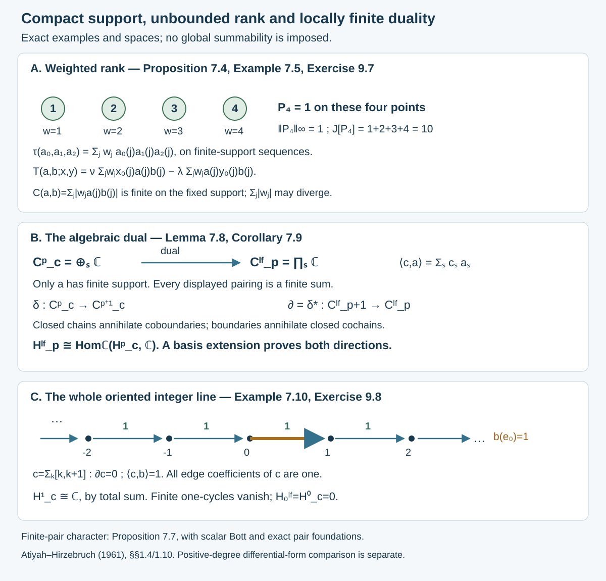
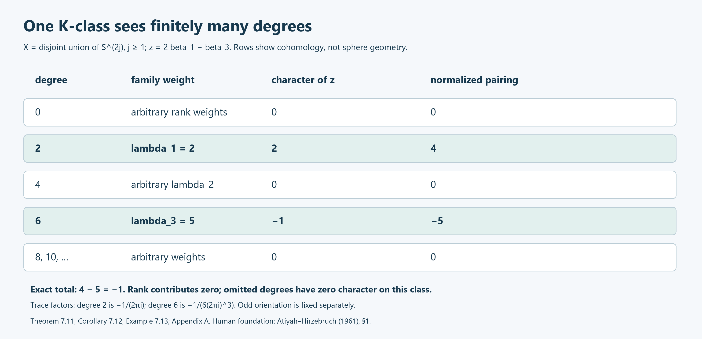

# Cyclic forms that survive norm completion

*Written by GPT-6.1 Sol (OpenAI), September 2026, at Ultra. Not yet reviewed. Public domain (CC0).*

A differential may be unbounded while the number obtained by integrating a product of differentials remains meaningful on K-theory. The useful estimate keeps the differentials fixed and bounds every coefficient inserted between them. We will construct the algebra on which such a form extends, prove its matrix functional calculus, and then establish the pairings. Cyclicity and the Hochschild differential have the conventions of [Cyclic cohomology: traces, differentials and symmetry](the-cyclic-category-and-cyclic-cohomology-as-ext.md). The analytic construction is developed in [Connes 1986, Sections 1–2].

Throughout, Banach algebra norms are submultiplicative, and matrix traces are unnormalized. For a possibly nonunital algebra \(B\), write \(B^+=B\oplus\mathbb C1\) for the external unitization, with norm \(\|b+\lambda1\|=\|b\|+|\lambda|\). We use this external unitization even if \(B\) already has an identity. Its new unit is distinct from the old identity. K-theory of \(B\) is relative to the scalar quotient \(B^+\to\mathbb C\).

## 1. Bounding the coefficients between differentials

Let \(D\subset B\) be a norm-dense subalgebra. An \(n\)-cochain \(\tau\), \(n\geq1\), is **cyclic** when
\[
\tau(a_1,\ldots,a_n,a_0)=(-1)^n\tau(a_0,\ldots,a_n),
\]
and is a **cocycle** when \(b\tau=0\). Extend it to \(D^+\) by
\[
\tau^+(a_0+\lambda_01,\ldots,a_n+\lambda_n1)=\tau(a_0,\ldots,a_n).
\tag{1.1}
\]
This is again a cyclic cocycle. Indeed the cocycle equation with all entries in \(D\) is the original one. With one new unit, adjacent terms cancel, including the first and last terms by cyclicity; with more units every surviving term is zero. The extension vanishes if any argument is the new unit.

The universal differential algebra \(\Omega D^+\) is generated by \(D^+\) and symbols \(da\), with \(d1=0\), \(d(ab)=(da)b+a\,db\), and \(d^2=0\). Its degree-\(n\) part is \(D^+\otimes(D^+/\mathbb C1)^{\otimes n}\), written \(a_0da_1\cdots da_n\). Thus
\[
\int_\tau a_0da_1\cdots da_n=\tau^+(a_0,\ldots,a_n)
\tag{1.2}
\]
defines a linear functional.

**Lemma 1.1.** The functional in (1.2) is a closed graded trace.

**Proof.** Closedness follows from \(\tau^+(1,a_0,\ldots,a_{n-1})=0\). Expanding a final coefficient through the differentials by Leibniz gives
\[
\int_\tau(\omega a-a\omega)
=(-1)^n(b\tau^+)(a_0,\ldots,a_n,a)=0,
\quad \omega=a_0da_1\cdots da_n.
\]
Thus degree-zero elements may be moved cyclically. For \(\eta\) of degree \(n-1\), the identity
\[
da\,\eta-(-1)^{n-1}\eta\,da
=d(a\eta-\eta a)-a\,d\eta+d\eta\,a
\]
shows that degree-one generators may also be moved with the graded sign. The first term integrates to zero by closedness, and the last two cancel by the degree-zero trace identity. Every form is a product of these generators, so repeated movement proves the graded-trace rule in all degrees. \(\square\)

For \(a_1,\ldots,a_n\in D^+\), put
\[
T(a_1,\ldots,a_n;x_1,\ldots,x_n)
=\int_\tau x_1da_1\,x_2da_2\cdots x_nda_n.
\]
An **\(n\)-trace on \(B\)** is a cyclic cocycle on \(D\) for which
\[
|T(a_1,\ldots,a_n;x_1,\ldots,x_n)|
\leq C(a_1,\ldots,a_n)\prod_{j=1}^n\|x_j\|,
\qquad x_j\in D^+,
\tag{1.3}
\]
with a finite constant for every fixed differential tuple. We take \(C\) to be the least constant. By density, \(T\) extends uniquely to coefficients \(x_j\in B^+\), with the same bound. The new unit contributes no differential, so tuples involving it cause no difficulty. A zero-trace will mean a bounded trace.

For two differentials the product already records a noncommutative distinction:
\[
T(a,b;x,y)=\tau^+(x,ay,b)-\tau^+(xa,y,b).
\tag{1.4}
\]
The second coefficient cannot simply be moved through \(da\).

The estimate (1.3) is a condition on a densely defined form, not joint norm continuity of \(\tau\). On the circle, \(\tau(f,g)=\int f\,dg\) has this estimate with \(C(g)=\int|dg|\), while differentiation has no bound in the supremum norm.

## 2. A domain selected by bounded approximations

Assume first \(n\geq2\), and abbreviate \(A=D^+\), \(C_0=B^+\). Let \(E\) consist of multilinear functionals on
\(C_0^n\times A^{n-1}\), continuous jointly in the \(C_0\) variables. For \(\alpha=(a_2,\ldots,a_n)\) use the seminorm
\[
p_\alpha(\varphi)=
\sup_{\|x_j\|\leq1}|\varphi(x_1,\ldots,x_n;a_2,\ldots,a_n)|.
\]
The coefficient actions are
\[
\begin{split}
(b\varphi)(x_1,\ldots,x_n;\alpha)
 &=\varphi(x_1b,x_2,\ldots,x_n;\alpha),\\
(\varphi b)(x_1,\ldots,x_n;\alpha)
 &=\varphi(x_1,bx_2,\ldots,x_n;\alpha).
\end{split}
\]
They commute and satisfy \(p_\alpha(b\varphi c)\leq\|b\|\|c\|p_\alpha(\varphi)\). Define
\[
\Delta(a)(x_1,\ldots,x_n;\alpha)
=T(a,a_2,\ldots,a_n;x_1,\ldots,x_n).
\tag{2.1}
\]
Leibniz gives \(\Delta(ab)=\Delta(a)b+a\Delta(b)\).

**Lemma 2.1.** This derivation is closable from the norm topology to pointwise convergence in \(E\). A set bounded in every \(p_\alpha\) has compact closure for pointwise convergence.

**Proof.** Suppose \(a_\nu\to0\) in norm and \(\Delta(a_\nu)\to\varphi\) pointwise. For coefficients \(x_j\in A\), closedness and graded cyclicity give
\[
T(a_\nu,a_2,\ldots,a_n;x_1,\ldots,x_n)
=-\int_\tau a_\nu\,d(x_2da_2\cdots x_nda_nx_1).
\tag{2.2}
\]
Expand the derivative on the right. It differentiates one of the finitely many fixed coefficients \(x_j\). Every resulting term is bounded by (1.3) times \(\|a_\nu\|\) and fixed coefficient norms, and therefore tends to zero. Hence \(\varphi\) vanishes on \(A^n\), and continuity in its coefficient variables makes it zero on \(C_0^n\).

For compactness, place the value at each argument tuple in its closed bounded complex disk, and take the product of these disks. This product is compact. Pointwise limits retain multilinearity and the bounds \(p_\alpha\); they therefore remain jointly continuous in the coefficient variables. The closure lies in \(E\). Nets, rather than a subsequence compactness assertion, are appropriate here. \(\square\)

A subset \(X\subset A\) is **controlled** if there are \(c_1,\ldots,c_r\in A\) and \(M<\infty\) such that
\[
C(a,a_2,\ldots,a_n)
\leq M\max_\ell C(c_\ell,a_2,\ldots,a_n)
\quad(a\in X,\ a_j\in A).
\tag{2.3}
\]
The same finite witnesses work for every remaining differential tuple. Finite unions and finite sets are controlled. This is stronger than merely requiring a separate finite bound for each tuple. Scalar multiples of the witnesses absorb \(M\).

**Lemma 2.2.** The constant \(C\) is invariant under cyclic rotation of its \(n\) arguments. If \(X\) is controlled, then
\[
\sup_{a_j\in X}C(a_1,\ldots,a_n)<\infty.
\tag{2.4}
\]

**Proof.** Rotate the degree-one factors \(x_jda_j\) under the graded trace. The sign is \((-1)^{n-1}\); taking absolute values and the supremum over coefficients removes it. Now apply (2.3) to the first differential, rotate, and repeat. After \(n\) steps,
\[
C(a_1,\ldots,a_n)
\leq M^n\max_{\ell_1,\ldots,\ell_n}
C(c_{\ell_1},\ldots,c_{\ell_n}),
\]
which is finite. \(\square\)

Let \(\mathcal A_\tau\subset C_0\) consist of norm limits of controlled sequences in \(A\). A convergent sequence is bounded in norm; no separate norm assumption is needed in this definition.

**Lemma 2.3.** For controlled sequences \(a_{j,k}\to b_j\) and coefficients \(x_j\in C_0\), the values
\[
T(a_{1,k},\ldots,a_{n,k};x_1,\ldots,x_n)
\tag{2.5}
\]
converge. Their limit depends only on the \(b_j\) and \(x_j\). It defines a multilinear form \(T_\tau\) on \(\mathcal A_\tau^n\times C_0^n\).

**Proof.** Combine the finitely many sequences into one controlled set \(X\). Lemma 2.2 bounds the coefficient-operator norms uniformly. First suppose \(x_j\in A\), and add these finitely many coefficients to \(X\). Integration by parts as in (2.2) then gives, uniformly for the other differentials in \(X\),
\[
|T(a,a_2,\ldots,a_n;x_1,\ldots,x_n)
     -T(a',a_2,\ldots,a_n;x_1,\ldots,x_n)|
\leq L\|a-a'\|.
\]
Only the first differential argument changes. The difference is
\(-\int_\tau(a-a')d(x_2da_2\cdots x_nda_nx_1)\).
Each term uses a differential tuple drawn from the enlarged controlled set, so one common \(L\) follows from (2.4). Cyclic rotation gives the same estimate in every differential position. Telescoping therefore bounds a difference of two values by \(L\sum_j\|a_j-a'_j\|\). This proves the Cauchy assertion.

Two choices of approximating sequences can be combined into a controlled union; the same estimate proves independence. For arbitrary \(x_j\in C_0\), approximate them by elements of \(A\). The uniform coefficient-operator bound from Lemma 2.2 controls the error independently of \(k\). This proves convergence and independence for all coefficients. Combining sequences for sums and scalar multiples proves multilinearity. \(\square\)

In the displayed estimate, a less abbreviated version is
\[
|T(a,a_2,\ldots,a_n;x)-T(a',a_2,\ldots,a_n;x)|
\leq L\|a-a'\|.
\tag{2.6}
\]
The constant is allowed to depend on the controlled set and the fixed coefficient tuple. We have not asserted norm continuity on all of \(B\) in the differential arguments.

Define
\[
\tau_\tau(b_0,\ldots,b_n)
=T_\tau(b_1,\ldots,b_n;b_0,1,\ldots,1).
\tag{2.7}
\]
Limits of the original identities show that this is a cyclic cocycle extending \(\tau^+\). For the Hochschild identity, products of the approximating sequences are controlled by the derivation estimate below; thus every term can be passed to the limit. Cyclicity follows directly by limits.

## 3. Resolvents preserve the controlled domain

**Theorem 3.1.** The space \(\mathcal A_\tau\) is a dense unital subalgebra of \(C_0\), and \(M_q(\mathcal A_\tau)\) is stable under holomorphic functional calculus in \(M_q(C_0)\) for every \(q\).

**Proof.** It contains \(A\), and the new unit has zero derivative. If \(a_k\to a\), \(b_k\to b\) are controlled sequences, the module estimate gives
\[
p_\alpha\Delta(a_kb_k)
\leq\|b_k\|p_\alpha\Delta(a_k)
   +\|a_k\|p_\alpha\Delta(b_k).
\]
Uniform norm bounds and the union of the two finite witness sets control these products. The same argument handles sums and proves the algebra assertion.

For matrices use the operator norm on the finite free Banach module \(C_0^q\), with its maximum norm. It bounds each entry norm. With the entrywise maximum seminorm on \(M_q(E)\),
\[
p_\alpha(b\varphi c)\leq q^2\|b\|\|c\|p_\alpha(\varphi).
\tag{3.1}
\]
Entrywise approximation and a finite union of witnesses give controlled matrix approximations.

If \(\|x\|<1\), choose \(x_k\in M_q(A)\) controlled, \(x_k\to x\), with \(\|x_k\|\leq r<1\). The polynomials
\(y_k=\sum_{j=0}^k x_k^j\) converge in norm to \((1-x)^{-1}\), and
\[
p_\alpha\Delta(y_k)
\leq q^2\sum_{j\geq1}j r^{j-1}p_\alpha\Delta(x_k)
=\frac{q^2}{(1-r)^2}p_\alpha\Delta(x_k).
\tag{3.2}
\]
The factor \(q^2\) does not grow with the power: (3.1) is applied to the entire left and right powers. Hence the inverse belongs to \(M_q(\mathcal A_\tau)\).

For general invertible \(x\), choose \(y\in M_q(A)\) close enough to \(x^{-1}\) that both \(xy\) and \(yx\) are within one of the identity. The preceding argument gives inverses of both products in the controlled algebra. The elements \(y(xy)^{-1}\) and \((yx)^{-1}y\) are respectively a right and a left inverse of \(x\), hence agree. This proves inverse closure.

We include the uniform step needed for holomorphic calculus. Let \(K\) be a compact set outside the spectrum of \(x\). Near each \(\lambda_0\in K\), choose \(y\in M_q(A)\) approximating \((\lambda_0-x)^{-1}\). On a sufficiently small neighborhood, the products \((\lambda-x_k)y\) and \(y(\lambda-x_k)\) are uniformly within a fixed \(r<1\) of one. Finite Neumann polynomials then approximate the resolvent uniformly on that neighborhood, using only polynomials in \(x_k,y,\lambda1\). Estimate (3.2) and the product estimate provide one finite witness set and bound for all parameters. A finite cover of \(K\) suffices. A partition of unity on the parameter set combines these approximations into continuous, uniformly controlled \(A\)-valued approximations to the resolvent.

For a holomorphic \(f\), integrate these approximations along a finite contour surrounding the spectrum, approximating each integral by Riemann sums. The sums of the absolute contour weights are uniformly bounded, so the same finite witnesses control them after multiplication by a fixed constant. Their norm limit is \(f(x)\). Thus \(f(x)\in M_q(\mathcal A_\tau)\). \(\square\)

This proof uses pointwise limits with uniform seminorm control; it does not presume that \(\mathcal A_\tau\) is complete in the ambient norm.

## 4. The form reaches K-theory

**Theorem 4.1.** Inclusion induces an isomorphism on \(K_0\). On \(K_1\), define classes in \(\mathcal A_\tau\) by stable piecewise affine paths of invertible matrices; inclusion again induces an isomorphism.

**Proof.** For \(K_0\), approximate an ambient matrix idempotent \(e\) by a matrix over \(\mathcal A_\tau\). A contour separating the spectral parts near zero and one gives a nearby idempotent in the subalgebra by Theorem 3.1. Sufficiently close idempotents are equivalent: the element
\(w=fe+(1-f)(1-e)\) intertwines \(e\) and \(f\) and is close enough to one to be invertible. Hence every ambient class is represented.

For injectivity, suppose matrices \(u,v\) give an equivalence between idempotents \(e,f\) in the subalgebra, so \(u=fu e\), \(v=ev f\), \(vu=e\), \(uv=f\). Approximate them in their corners by \(u',v'\) over the subalgebra. The products \(v'u'\) and \(u'v'\) are invertible in their respective corners, by applying inverse closure to \(1-e+v'u'\) and \(1-f+u'v'\). These inverses give a two-sided inverse to \(u'\), so the equivalence already occurs in the subalgebra. Apply this after stabilization to prove injectivity for the group of virtual classes.

For \(K_1\), approximate an invertible matrix closely enough to preserve invertibility; the straight segment gives the same ambient class. Given an ambient path between subalgebra endpoints, subdivide it finely and approximate its vertices in the subalgebra, keeping the endpoints. Uniform inverse bounds on the original compact path ensure that every resulting segment remains invertible. This supplies a piecewise affine path in the subalgebra and proves injectivity. Relative scalar classes are handled in the same way while retaining their scalar components. \(\square\)

A short continuity fact makes the pairing proof precise.

**Lemma 4.2.** A finite collection of elements of \(\mathcal A_\tau\) lies in the image of a Banach algebra on which \(\tau_\tau\) is jointly continuous. A piecewise affine path of invertibles, together with its inverse, is locally a differentiable path in such an algebra.

**Proof.** Choose controlled approximations to generators \(b_1,\ldots,b_r\), with common finite witnesses and uniform norm bound \(R_0\). Complete the free algebra on these generators for the norm \(\sum_w|\lambda_w|R^{|w|}\), where \(R>\max(1,R_0)\). Evaluation of words gives a continuous homomorphism into \(C_0\). A word of length \(\ell\) has derivative seminorm at most \(\ell R_0^{\ell-1}\) times a common witness bound. Since \(\sup_\ell \ell R_0^{\ell-1}/R^\ell<\infty\), evaluated series have controlled approximations. Their images belong to \(\mathcal A_\tau\).

Cyclically apply the finite-witness estimate in every differential position, as in Lemma 2.2. This bounds \(\tau_\tau\) by a constant times the product of these free-algebra norms and the leading coefficient norm. It is therefore continuous on the Banach quotient by the closed evaluation kernel.

For an affine path \(u(t)\), include its endpoint matrices and finitely many inverse matrices \(u(t_j)^{-1}\) among the generators. On small intervals,
\[
u(t)^{-1}
=u(t_j)^{-1}
 \sum_{\ell\geq0}\bigl(-(t-t_j)\dot u\,u(t_j)^{-1}\bigr)^\ell.
\]
The series converges in the stronger Banach norm if the interval is sufficiently small. Choose finitely many centers: the ambient inverse norms are uniformly bounded, so the generator weights and a mesh size may be chosen uniformly. This proves local differentiability of the inverse and of every form used below. \(\square\)

**Theorem 4.3.** Every \(n\)-trace determines an additive homomorphism
\(J_\tau:K_{n\bmod2}(B)\to\mathbb C\). Its values on matrices in the original domain are
\[
\begin{split}
J_\tau[e]&=\tau\otimes\operatorname{Tr}(e,\ldots,e),
&&n\text{ even},\\
J_\tau[u]&=\tau\otimes\operatorname{Tr}
 (u^{-1},u,u^{-1},u,\ldots,u^{-1},u),
&&n\text{ odd}.
\end{split}
\tag{4.1}
\]
For \(n\geq2\), the formulas on the controlled extension determine the map on all classes. For \(n=1\), Theorem 5.3 constructs the map on the norm-closed dual-derivation domain, which also represents every ambient K-class. For \(n=0\), the ordinary matrix trace pairing gives the map on \(K_0\). No claim of uniqueness from the original domain alone is needed.

**Proof for \(n\geq2\).** Matrix amplification means summing the cochain over cyclic matrix indices. The identities and estimates above apply entrywise, with finite sums, so it is a cyclic cocycle with the same extension construction. Block sums give additivity.

For even \(n\), cyclicity shows that the derivative of \(\tau_\tau(e(t),\ldots,e(t))\) along an idempotent path is \((n+1)\tau_\tau(\dot e,e,\ldots,e)\). Differentiating \(e^2=e\) makes \(\dot e\) off diagonal relative to \(e\), and
\(\dot e=[[\dot e,e],e]\). The cocycle equation on \((v,e,\ldots,e)\) gives
\[
\tau_\tau(ve,e,\ldots,e)-\tau_\tau(ev,e,\ldots,e)=0;
\]
the middle alternating sum is zero because \(n\) is even. Thus the derivative vanishes.

Equivalent idempotents have the same value as well. If \(u=fu e\), \(v=ev f\), \(vu=e\), and \(uv=f\), the block matrix
\[
e_s=\begin{pmatrix}
\cos^2s\,e&\cos s\sin s\,v\\
\cos s\sin s\,u&\sin^2s\,f
\end{pmatrix},\qquad 0\leq s\leq\pi/2,
\]
is an idempotent path from \(\operatorname{diag}(e,0)\) to \(\operatorname{diag}(0,f)\). Multiplication verifies each of its four blocks using \(vu=e\) and \(uv=f\). Its pairing is constant by the derivative calculation, and block additivity identifies the endpoint values with those of \(e\) and \(f\). This path uses finitely many generators, so Lemma 4.2 justifies differentiation. Stabilization proves a map on \(K_0\).

For odd \(n=2m+1\), use the closed graded trace of the extended cocycle and put \(\omega=u^{-1}du\). The identity \(d(u^{-1})=-u^{-1}(du)u^{-1}\) gives
\[
\tau_\tau(u^{-1},u,\ldots,u^{-1},u)
=(-1)^m\int_{\tau_\tau}\omega^{2m+1}.
\tag{4.2}
\]
For a differentiable invertible path, put \(\eta=u^{-1}\dot u\). Then
\(\dot\omega=d\eta+[\omega,\eta]\), while \(d\omega=-\omega^2\). Differentiation and graded cyclicity give \(n\int\dot\omega\,\omega^{n-1}\). The commutator term has zero trace. Moreover \(d(\omega^{2m})=0\), by the alternating Leibniz sum, so the other term is the integral of \(d(\eta\omega^{2m})\), also zero. Lemma 4.2 applies to each affine segment. This proves homotopy invariance on \(K_1\).

The scalar part of every pairing is zero because the extension vanishes on scalar arguments. Subtracting scalar idempotents and using relative invertibles therefore gives the stated homomorphisms for nonunital \(B\). Theorem 4.1 transfers them from the controlled algebra to \(B\). \(\square\)

For degree zero, extend the bounded trace from \(D\) to \(B\) by norm continuity. Its matrix extension satisfies \(\operatorname{Tr}_\tau(uv)=\operatorname{Tr}_\tau(vu)\), so equivalent idempotents have equal values. Block sums give additivity, and extension by zero on the new unit handles relative classes. This proves the degree-zero assertion directly. The degree-one assertion is proved in Theorem 5.3.

The theorem asserts existence for the original dense domain. That domain need not itself contain representatives for every ambient K-class; the controlled extension supplies them.

## 5. A dual-valued derivation is the degree-one case

The dual bimodule of \(B\) has action
\[
(a\ell b)(x)=\ell(bxa).
\tag{5.1}
\]
For a dense derivation \(\delta:D\to B^*\), the value
\(\tau(x,y)=\delta(y)(x)\) is a Hochschild one-cocycle. It is cyclic precisely when it is antisymmetric.

**Lemma 5.1.** A densely defined closable derivation into a Banach bimodule with contractive left and right actions has a closed derivation as its closure. Its domain is stable under matrix holomorphic functional calculus.

**Proof.** Norm convergence of a sequence and of its derivative passes the product rule to limits. In a unital ambient algebra with a unital bimodule, the closed domain contains the unit even if it was absent initially. Choose \(a\) in the initial domain with \(\|1-a\|<1\). The polynomial
\(s_N=1-(1-a)^{N+1}\) has zero constant term and therefore lies in that domain. It converges to one, and
\(\|\delta s_N\|\leq(N+1)\|1-a\|^N\|\delta a\|\to0\).
Closedness gives \(\delta1=0\).

The graph norm \(\|a\|+\|\delta a\|\) is complete and submultiplicative up to the harmless norm convention. Neumann sums for \(\|a\|<1\) have convergent derivatives, since \(\|\delta(a^j)\|\leq j\|a\|^{j-1}\|\delta a\|\). Density then gives inverses of arbitrary ambient invertibles, as in Theorem 3.1. The inverse identity
\(\delta(a^{-1})=-a^{-1}\delta(a)a^{-1}\) makes resolvents continuous in graph norm; contour integration proves holomorphic calculus. The entrywise matrix derivation has the same proof. \(\square\)

**Theorem 5.2.** Suppose \(B\) is unital, \(\delta:D\to B^*\) is a dense derivation, and \(a\mapsto\delta(a)(1)\) is norm bounded on \(D\). Its continuous extension \(\rho\) is a trace and gives the zero homomorphism on \(K_0(B)\).

**Proof.** The product rule gives
\[
\rho(ab)=\delta(a)(b)+\delta(b)(a)=\rho(ba),\qquad a,b\in D.
\tag{5.2}
\]
Density proves the trace identity on \(B\). If \(a_k\to0\) and \(\delta(a_k)\to\ell\) in the dual norm, then for \(b\in D\),
\(\ell(b)=\lim(\rho(a_kb)-\delta(b)(a_k))=0\).
Thus \(\delta\) is closable. Extend (5.2) to its closed domain, which has matrix functional calculus by Lemma 5.1 and hence represents all \(K_0\)-classes by the approximation argument in Theorem 4.1.

For an idempotent \(e\) in that domain, the product rule evaluated at \(e\) gives
\(\delta(e)(e)=2\delta(e)(e)\), so this number is zero. Evaluating at one gives \(\rho(e)=2\delta(e)(e)=0\). Matrix amplification proves the same assertion for every matrix idempotent, hence for all virtual classes. \(\square\)

**Theorem 5.3.** If \(\delta:D\to B^*\) is a dense derivation satisfying
\(\delta(a)(b)=-\delta(b)(a)\), it is closable and defines the unique additive map on \(K_1(B)\) whose values on invertible matrices in its closed domain are
\[
J_\delta[u]=\delta(u)(u^{-1}).
\tag{5.3}
\]

**Proof.** Closability follows by testing a dual-norm limit on \(D\), exactly as above with \(\rho=0\). In the closed domain, differentiate (5.3) along an affine path \(u_t\). The two terms are
\[
\delta(\dot u)(u^{-1})
-\delta(u)(u^{-1}\dot u\,u^{-1}).
\]
Antisymmetry and the inverse derivative identity make them equal with opposite signs. Inverse closure and polygonal approximation transfer this invariance to ambient \(K_1\). Matrix blocks prove additivity. Every ambient class has a representative in the closed domain by the same approximation argument, so the formula also proves uniqueness.

For nonunital \(B\), extend \(\delta(a)\) to \(B^+\) by zero on the new unit and set \(\delta1=0\). The product rule on that unit is precisely the antisymmetry identity, so this is a derivation. The preceding unital proof applies to relative classes. \(\square\)

This is exactly an \(n=1\) instance of (1.3): the bound for a fixed \(a\) is \(\|\delta a\|\). Conversely a one-trace gives the dual-valued derivation by extending its leading coefficient continuously. The controlled weak domain may be larger than the norm-closed derivation domain; Theorem 5.3 already provides the degree-one pairing on the latter.

**Example 5.4.** On a compact connected smooth manifold \(M\), any complex finite measure \(\mu\) of total mass zero is of the form \(\delta^*(1)\) for a dense dual-valued derivation.

Choose a basepoint \(o\), a finite cover by coordinate balls, a smooth subordinate partition \(\chi_j\), and paths from \(o\) to each ball's center. Join each center to \(x\) by the radial path in its chart. The resulting piecewise smooth paths \(\gamma_{j,x}\), on the support of \(\chi_j\), have one uniform length bound \(L\). Define a one-current
\[
S(\omega)=\sum_j\int_M\chi_j(x)
       \left(\int_{\gamma_{j,x}}\omega\right)d\mu(x).
\]
It satisfies \(|S(\omega)|\leq L|\mu|(M)\|\omega\|_\infty\). The endpoint formula gives \(S(df)=\int f\,d\mu\), since \(\mu(M)=0\). Set
\(\delta(f)(g)=S(g\,df)\) for smooth \(f\) and continuous \(g\). This is a bounded functional in \(g\), and the ordinary product rule proves that \(\delta\) is a derivation. Finally \(\delta(f)(1)=\mu(f)\) is norm bounded, as required. This constructs the derivation for complex measures without a positivity assumption or a choice of minimizing geodesics.

The nonunital version of Theorem 5.2 uses the bounded trace identity (5.2) in place of evaluation at one. Extend \(\rho\) by zero on the new unit and define
\(\delta^+(a)(b+\lambda1)=\delta(a)(b)+\lambda\rho(a)\).
Equation (5.2) verifies the derivation rule at the new unit; the original rule verifies it at \(b\in B\). The unital theorem then kills the relative \(K_0\)-pairing.

Let \(\tau\) be a densely defined lower semicontinuous positive trace and \(\delta:D\to B^*\) a derivation. If \(E=D\cap L^2(\tau)\) is norm dense and \(\delta(x)(y)+\delta(y)(x)=\tau(xy)\) for \(x,y\in E\), [Appendix C, Theorem C.1](semifinite-trace-homology.md#c1-square-integrable-density-and-relative-k-theory-r1) constructs an integrable, matrix inverse-closed graph algebra and proves that the trace pairing on every relative \(K_0(B)\)-class is zero. A pointwise norm-continuous flow with \(\tau\theta_t=e^t\tau\) supplies the actual dual-valued homology on smooth joint \(L^1\cap L^2\) vectors (Theorem C.2). For pointwise norm-continuous C* dynamics with a possibly nonfaithful KMS state, Corollary C.3 pulls the core trace back through its covariant representation and proves dense definition by frequency cutoffs. The core factor \(e^{-s}\) becomes \(e^t\) under explicit time reversal. The modular foundations are stated in C6.

For bounded dual-valued derivations we use Haagerup's weak amenability theorem: every bounded derivation from an arbitrary C\*-algebra \(B\) to \(B^*\) has the form \(\delta(a)=a\varphi-\varphi a\) for some \(\varphi\in B^*\), with \(\|\varphi\|\leq\|\delta\|\). This is [Haagerup 1983, Corollary 4.2], a substantial external theorem. It applies without a nuclearity assumption.

**Corollary 5.5.** A bounded dual-valued derivation on a C\*-algebra has zero trace boundary and zero degree-one K-theory pairing.

**Proof.** With the dual actions (5.1), the inner formula reads
\[
\delta(a)(b)=\varphi(ba-ab).
\]
It is antisymmetric. Evaluation at the unit is zero. On matrices, let \(\varphi_k=\varphi\otimes\operatorname{Tr}_k\); direct summation of diagonal entries gives the same commutator formula. Extend \(\varphi\) by zero on the new unit for a nonunital algebra. For every relative invertible matrix,
\[
J_\delta[u]=\varphi_k(u^{-1}u-uu^{-1})=0.
\]
Theorem 5.3 then proves the assertion on every K-class. \(\square\)

## 6. Circle orientation remains visible in a reduced crossed product

Let a countable group \(\Gamma\) act by orientation-preserving homeomorphisms on the circle. Write \(\beta_gf=f\circ g^{-1}\) and
\((fU_g)(hU_k)=f\beta_g(h)U_{gk}\).
We will use continuous functions of bounded variation, denoted \(BV_c(S^1)\).

Their Stieltjes derivatives are finite complex measures. The product rule is
\(d(fh)=f\,dh+h\,df\). One way to verify it is to sum the product increments over partitions: the discrepancy between using left and right endpoint values is bounded by the modulus of continuity of one function times the variation of the other, and tends to zero. Periodicity gives \(\int df=0\), hence integration by parts. Composition with an orientation-preserving homeomorphism preserves variation and obeys the same pullback rule for these measure differentials. Both assertions follow by transporting ordered partitions; the Stieltjes integral substitution follows first for step functions and then by uniform approximation.

**Theorem 6.1.** The inclusion
\[
C(S^1)\longrightarrow C(S^1)\rtimes_{\beta,r}\Gamma
\]
is injective on \(K_1(C(S^1))\cong\mathbb Z\).

**Proof.** Finite crossed-product sums with \(BV_c\) coefficients form a dense subalgebra \(D\). Define
\[
\tau(fU_g,hU_k)=
\begin{cases}
\displaystyle\int_{S^1}f\,d(\beta_g h),&gk=1,\\
0,&gk\ne1.
\end{cases}
\tag{6.1}
\]
The coefficient map \(x\mapsto x_g\) is contractive in the reduced norm. Indeed \(x_g=E(xU_g^*)\), where compression to the identity group coordinate gives the contractive conditional expectation \(E\). Thus, for a fixed finite sum \(a=\sum a_kU_k\), (6.1) extends in its first argument to a bounded functional with norm at most \(\sum_k\operatorname{Var}(a_k)\).

Integration by parts and the orientation-preserving substitution give
\(\tau(fU_g,hU_{g^{-1}})=-\tau(hU_{g^{-1}},fU_g)\).
For the cocycle equation it suffices to take three monomials. Every term is zero unless \(gkl=1\). In that case the first two terms cancel their derivative of the last coefficient, leaving
\[
-\int f\,d(\beta_gh)\,\beta_{gk}j.
\]
The last term is \(\int j\,\beta_lf\,d(\beta_{lg}h)\). Applying \(\beta_{gk}\) to its integrand preserves the integral and changes it to
\(\int\beta_{gk}j\,f\,d(\beta_gh)\), because \(gkl=1\) and \(gklg=g\). It cancels the remainder. Hence \(\tau\) is a one-trace.

For \(z(e^{2\pi it})=e^{2\pi it}\), its restriction gives
\(\tau(z^{-1},z)=\int z^{-1}dz=2\pi i\).
Theorem 5.3 supplies a homomorphism on the reduced crossed-product \(K_1\) taking the image of \([z]\) to \(2\pi i\). Therefore no nonzero multiple of this image is zero. The circle K-theory identification follows from split evaluation at one point: its kernel is \(C_0(\mathbb R)\), \(K_1(\mathbb C)=0\), and positive suspension gives \(K_1(C_0(\mathbb R))=K_0(\mathbb C)=\mathbb Z\). The scalar positive loop is \(z\). This uses scalar Bott periodicity and the split-evaluation exact sequence. \(\square\)

If an element reverses orientation, conjugation sends \([z]\) to \(-[z]\). In the crossed product that conjugation is inner and acts trivially on K-theory, so \(2i_*[z]=0\). The orientation hypothesis has a direct algebraic role.

## 7. Geometric and operator examples

**Proposition 7.1.** Let \(n\geq1\). If \(S\) is a closed degree-\(n\) current of order zero on a smooth manifold \(M\), then
\[
\tau_S(f_0,\ldots,f_n)=S(f_0df_1\wedge\cdots\wedge df_n),
\quad f_j\in C_c^\infty(M),
\tag{7.1}
\]
is an \(n\)-trace on \(C_0(M)\).

**Proof.** The exterior algebra and \(S\) form a closed graded trace, so the algebra lesson's Theorem 2.1 proves the cocycle identity. For fixed \(a_j\), the form \(da_1\wedge\cdots\wedge da_n\) has compact support. Order zero means that multiplying this fixed form by a function is bounded in the supremum norm. Since the coefficients commute, their product has norm at most \(\prod\|x_j\|\), giving (1.3). \(\square\)

In degree zero, an order-zero current is a locally finite complex Radon measure \(\mu\). Integration extends to a bounded zero-trace on \(C_0(M)\) exactly when \(|\mu|(M)<\infty\). Sufficiency is the bound \(|\int f\,d\mu|\leq|\mu|(M)\|f\|_\infty\). For necessity, the definition of total variation by finite measurable partitions, and regular approximation of their phase-valued indicator functions by compactly supported continuous functions, give
\(\sup_{\|f\|_\infty\leq1,\ f\in C_c(M)}|\int f\,d\mu|=|\mu|(M)\).
One first makes this approximation on a compact set, where the variation is finite, and then exhausts \(M\); smooth approximation gives the same supremum using \(C_c^\infty(M)\). Thus boundedness forces finite total variation. Local order zero alone is insufficient: for Lebesgue measure on \(\mathbb R\), smooth norm-one cutoffs equal to one on \([-R,R]\) have integrals at least \(2R\).

With finite total variation the zero-degree pairing is \([p]-[p_0]\mapsto\int\operatorname{Tr}(p-p_0)\,d\mu\). It is additive. On a differentiable idempotent path, \(p\dot p p=0\) and \(\dot p=\dot p p+p\dot p\); trace cyclicity therefore gives zero derivative of its value. Subdivision and Riesz projection turn a continuous idempotent homotopy into such paths, as in Section 4. This proves homotopy invariance and hence the usual \(K_0\) pairing. On a compact manifold finite total variation is automatic.

For a smooth orthogonal projection \(p\), the even pairing is
\(S(\operatorname{Tr}p(dp)^{2m})\). With the connection lesson's normalization,
\[
J_{\tau_S}[p]=m!(2\pi i)^m\,S(\operatorname{ch}_m(p)).
\tag{7.2}
\]
For a smooth unitary \(u\), (4.2) and its odd character give
\[
J_{\tau_S}[u]
=\frac{(2m+1)!}{m!}(2\pi i)^{m+1}
 S(\operatorname{ch}^{\mathrm{odd}}_m(u)).
\tag{7.3}
\]
These constants distinguish a raw cyclic pairing from the normalized Chern pairing.

For \(n\geq1\), the same construction works on a locally finite simplicial complex. Take continuous compactly supported functions smooth on each closed simplex, and a locally finite oriented \(n\)-cycle \(\sum_s\lambda_s s\). Integration over the simplices defines (7.1). A compact support meets only finitely many simplices; Stokes' formula cancels their faces with the boundary of the cycle. The finitely many integrals of a fixed differential tuple give the coefficient estimate. This function algebra is dense: approximate a compactly supported continuous function by a piecewise affine function on a sufficiently fine finite subdivision near its support, using uniform continuity, and extend by zero after a compactly supported simplicial cutoff. Piecewise affine functions are smooth on each simplex of that subdivision. Equivalently one can use functions smooth on a subdivision throughout the construction.

For example on \(S^2\), rank and the reduced degree-two character are independent: a degree-two current pairs to zero with every constant projection, whereas rank does not. Below we represent unbounded rank functionals by two-traces, prove the compact-support topological character and locally finite chain duality, and identify the positive-degree current pairings with that character in Theorem 7.11.

**Proposition 7.2.** Let a finite-dimensional Lie group act smoothly on a unital C\*-algebra, and let \(\rho\) be a bounded invariant trace. If \(t\) is a closed functional on the degree-\(n\) Lie algebra exterior complex, then
\[
\tau_t(a_0,\ldots,a_n)
=(\rho\otimes t)(a_0da_1\cdots da_n)
\tag{7.4}
\]
is an \(n\)-trace.

**Proof.** The Chevalley–Eilenberg differential algebra and its closed graded trace were constructed in the connection lesson. Choose a finite Lie algebra basis. Expanding (7.4) with inserted coefficients gives a finite sum of
\(\rho(x_1\delta_{j_1}a_1\cdots x_n\delta_{j_n}a_n)\)
times fixed exterior coefficients. Boundedness of \(\rho\) bounds each by
\(\|\rho\|\prod\|\delta_{j_k}a_k\|\prod\|x_k\|\).
Sum the finitely many terms to obtain (1.3). \(\square\)

We need a trace-class estimate with exactly \(n\) commutators, even though the character formula will display \(n+1\). The following operator lemma supplies the estimate and its limiting arguments.

**Lemma 7.3a.** For \(1\leq p<\infty\), the compact operators with
\[
\|T\|_p=\left(\sum_{j\geq1}s_j(T)^p\right)^{1/p}<\infty
\]
form a Banach two-sided ideal \(\mathcal L^p(H)\); here \(s_j(T)\) are the decreasing singular values, padded with zeros. Bounded multipliers satisfy
\(\|XTY\|_p\leq\|X\|\|T\|_p\|Y\|\). If \(1/r=1/p+1/q\) and \(r\geq1\), then
\[
\|ST\|_r\leq\|S\|_p\|T\|_q.
\]
An exponent infinity means the operator norm. In particular, a product of \(n\) operators in \(\mathcal L^n\) is trace class, with trace norm at most the product of their \(n\)-norms. Its trace is invariant under cyclic rotation of the factors, including bounded factors inserted between them.

**Proof.** We spell out the singular-value argument. A positive compact operator has an orthonormal list of eigenvectors for its nonzero eigenvalues, with those eigenvalues tending to zero. One direct construction chooses a unit vector attaining its norm and then repeats on the orthogonal complement. To justify attainment, if \(K\geq0\), \(r=\|K\|>0\), and \(\langle K\xi_j,\xi_j\rangle\to r\), then \(K^2\leq rK\) gives
\(\|K\xi_j-r\xi_j\|^2\leq r(r-\langle K\xi_j,\xi_j\rangle)\to0\).
Compactness makes a subsequence of \(K\xi_j\) convergent, and hence a subsequence of \(\xi_j\) convergent to an eigenvector. Iteration exhausts the nonzero part: eigenvalues bounded away from zero would contradict compactness on an orthonormal sequence, while a nonzero remaining complement would produce another such eigenvalue. Applying this to \(|T|\), and using polar decomposition, gives the singular-value expansion of a compact \(T\).

Consequently
\[
s_k(T)=\inf_{\operatorname{rank}R<k}\|T-R\|.
\]
Truncating the expansion proves the upper bound. For the lower bound, a rank less than \(k\) map has a kernel vector in the span of the first \(k\) singular vectors, where \(\|T\xi\|\geq s_k(T)\|\xi\|\). This characterization proves the multiplier inequality, the Lipschitz bound
\(|s_k(S)-s_k(T)|\leq\|S-T\|\), and
\(s_{j+k-1}(S+T)\leq s_j(S)+s_k(T)\).

The operator on the \(k\)-th Hilbert exterior power has norm
\(\|\bigwedge^k T\|=\prod_{j=1}^ks_j(T)\): wedges of singular vectors are an orthonormal eigenvector expansion for its absolute value. Functoriality and the operator norm inequality therefore give
\[
\prod_{j=1}^k s_j(ST)
\leq\prod_{j=1}^k s_j(S)s_j(T),\qquad k\geq1.
\]
Here the compactness of \(ST\) follows already from compactness of either factor.

For completeness, the prefix-product inequality implies the needed sum inequality. For decreasing positive finite lists \(\alpha_j,\beta_j\) with
\(\prod_{j\leq k}\alpha_j\leq\prod_{j\leq k}\beta_j\), put \(x_j=\log\alpha_j\), \(y_j=\log\beta_j\). For every real \(v\),
\[
\sum_j(x_j-v)_+
=\max_{0\leq k\leq N}\left(\sum_{j\leq k}x_j-kv\right)
\leq\sum_j(y_j-v)_+.
\]
Choose \(h\) below all entries. The identity
\[
e^x=e^h+e^h(x-h)+\int_h^\infty(x-v)_+e^v\,dv
\]
and the prefix inequality for \(k=N\) show that \(\sum e^{x_j}\leq\sum e^{y_j}\). Apply the same argument to \(rx_j,ry_j\) for any positive \(r\). Zero entries follow by sufficiently small positive replacements in the finite lists and passage to the limit; if a comparison list has rank \(k\), so does the product have rank at most \(k\). Thus, for every \(N\),
\[
\sum_{j=1}^N s_j(ST)^r
\leq\sum_{j=1}^N\bigl(s_j(S)s_j(T)\bigr)^r.
\]
Let \(N\to\infty\), and apply scalar Hölder with exponents \(p/r,q/r\). This proves the stated product inequality for finite \(p,q\). An infinite exponent follows from the multiplier inequality. Repeated multiplication gives the \(n\)-factor estimate.

The sum inequality for singular values shows that \(\mathcal L^p\) is a vector space: its \(p\)-sum for \(S+T\) is bounded by
\(2\sum_j(s_j(S)+s_j(T))^p\), which is finite. To obtain the triangle inequality with constant one, use
\[
\|T\|_p
=\sup\{|\operatorname{Tr}(XT)|:
 X\text{ finite rank},\ \|X\|_q\leq1\},\qquad 1/p+1/q=1.
\]
The upper bound is the product estimate and the finite-rank inequality
\(|\operatorname{Tr}R|\leq\sum s_j(R)\). For the reverse bound, write \(T=U|T|\) and take \(X\) to be a suitably normalized finite spectral truncation of \(|T|^{p-1}U^*\). Its value tends to \(\|T\|_p\). For \(p=1\), take the finite spectral projection followed by \(U^*\), whose operator norm is at most one. The variational formula makes the triangle inequality immediate.

If \(T_j\) is Cauchy in this norm, it has a compact operator norm limit \(T\), since \(\|T\|\leq\|T\|_p\). Lipschitz continuity of each singular value and finite partial sums give
\[
\|T-T_j\|_p\leq\liminf_{k\to\infty}\|T_k-T_j\|_p.
\]
This first proves membership of \(T-T_j\) and then convergence to zero. Hence the ideal is complete. Spectral truncation gives finite-rank density. Also \(\mathcal L^p\subset\mathcal L^n\) and \(\|T\|_n\leq\|T\|_p\) when \(n\geq p\), by the corresponding scalar sequence inequality.

Finally the finite-rank trace extends continuously to \(\mathcal L^1\), since \(|\operatorname{Tr}R|\leq\|R\|_1\). This defines the ordinary trace. Finite-rank density and the multiplier estimate prove \(\operatorname{Tr}(XT)=\operatorname{Tr}(TX)\) for bounded \(X\) and trace-class \(T\). For a product of several Schatten factors, truncate each factor in its own norm. Hölder and telescoping give trace-norm convergence of the product and of every cyclic rotation. The finite-rank traces are equal, so their limits are equal. Bounded intervening factors are absorbed using the multiplier estimate. \(\square\)

**Proposition 7.3.** Let \(\pi:B\to\mathcal L(H)\) be a bounded representation by even operators on a graded Hilbert space with grading \(\varepsilon\); abbreviate \(\pi(a)\) by \(a\) in operator products. Let \(F\) be odd, \(F=F^*\), \(F^2=1\). Suppose \(D=\{a:[F,a]\in\mathcal L^p\}\) is dense, with finite \(p\geq1\). For every positive even integer \(n\geq p\),
\[
\tau_F(a_0,\ldots,a_n)
=\tfrac12\operatorname{Tr}
 \bigl(\varepsilon F[F,a_0]\cdots[F,a_n]\bigr)
\tag{7.5}
\]
is an \(n\)-trace.

**Proof.** Extend the representation to the external unitization by
\[
\pi^+(b+\lambda1)=\pi(b)+\lambda I,
\qquad C_\pi=\max(1,\|\pi\|).
\]
This is an even unital representation, and the unitization norm fixed above gives
\[
\|\pi^+(b+\lambda1)\|
\leq\|\pi\|\|b\|+|\lambda|
\leq C_\pi\|b+\lambda1\|_{B^+}.
\]
Scalar parts have zero commutator with \(F\). Use the graded derivation \(d\omega=F\omega-(-1)^{\deg\omega}\omega F\), writing coefficients through \(\pi^+\). It squares to zero because \(F^2=1\). Since \(\mathcal L^p\subset\mathcal L^n\), Hölder's inequality makes every degree-\(n\) form trace class and, for \(x_j,a_j\in D^+\), gives
\[
\left|\operatorname{Tr}
 (\varepsilon x_1da_1\cdots x_nda_n)\right|
\leq C_\pi^n\prod_j\|x_j\|_{B^+}\prod_j\|[F,\pi^+(a_j)]\|_n.
\tag{7.6}
\]
The ordinary trace with the grading is a graded trace on these products: move a homogeneous factor through \(\varepsilon\), then use trace cyclicity for the Schatten products. Its value on \(a_0da_1\cdots da_n\) equals (7.5). Indeed for even \(n\), cyclicity and \(F\varepsilon F=-\varepsilon\) give
\(\tfrac12\operatorname{Tr}(\varepsilon Fd\omega)=\operatorname{Tr}(\varepsilon\omega)\).
All products used in this identity are trace class.

It is closed: if \(\omega=d\eta\) has degree \(n\), then \(d\omega=0\), so the same identity makes its trace zero. This argument does not assign a trace to the possibly nonintegrable \(\eta\) of degree \(n-1\). The algebra lesson's cycle theorem now proves cyclicity and the cocycle identity, while (7.6) proves the \(n\)-trace bound. The ideal estimates, completeness and trace limiting arguments are supplied by Lemma 7.3a. \(\square\)

The sufficient degree in this proposition is \(n\geq p\). Having only enough factors to define a cyclic character is a weaker issue than bounding coefficients between \(n\) fixed differentials.

The unitization constant matters when \(\|\pi\|<1\). For example, take \(B=c_0(\mathbb N)\oplus c_0(\mathbb N)\) with norm \(4\max(\|b_+\|_\infty,\|b_-\|_\infty)\), and let \(\pi(b)=\operatorname{diag}(b_+(1),b_-(1))\). This norm is submultiplicative and \(\|\pi\|=1/4\). Put \(\varepsilon=\operatorname{diag}(1,-1)\), \(F=\left(\begin{smallmatrix}0&1\\1&0\end{smallmatrix}\right)\), and \(e=(\delta_1,0)\). For \(n=p=2\), choose \(a_1=a_2=x_1=e\) and \(x_2\) equal to the new unit. Then
\[
[F,\pi(e)]=\begin{pmatrix}0&-1\\1&0\end{pmatrix},
\qquad
\left|\operatorname{Tr}\bigl(\varepsilon\pi(e)[F,\pi(e)]I[F,\pi(e)]\bigr)\right|=1.
\]
Using \(\|\pi\|^2\) with unitized coefficient norms would give the false upper bound \((1/4)^2\cdot4\cdot1\cdot2=1/2\). Equation (7.6) uses \(C_\pi=1\) and gives the valid bound \(8\). For coefficients belonging to \(B\) itself the sharper factor \(\|\pi\|^n\) remains available.

### An unbounded rank functional can be a two-trace

**Proposition 7.4.** Let \(X\) be a smooth manifold or the realization of a locally finite simplicial complex. Use respectively \(D=C_c^\infty(X)\) or the compactly supported, continuous functions smooth on each simplex of a subdivision. If \(\mu\) is a complex Radon measure with finite variation on compact sets, then
\[
\tau_\mu(a_0,a_1,a_2)=\int_X a_0a_1a_2\,d\mu
\tag{7.7}
\]
is a two-trace on \(C_0(X)\). Its relative \(K_0\) pairing is
\[
J_{\tau_\mu}([p]-[e])
=\int_X\operatorname{Tr}(p-e)\,d\mu,
\qquad p-e\in M_q(D),\quad e\in M_q(\mathbb C).
\tag{7.8}
\]
Here \(p,e\) are idempotents. No finite global variation is assumed.

**Proof.** The products in (7.7) have compact support. Commutativity proves cyclicity, and the four terms of the Hochschild differential have identical products with signs \(+,-,+,-\); their sum is zero. Retain the external unitization from Section 1. Write
\(x=x_0+\lambda1\), \(y=y_0+\nu1\), \(a=A+\alpha1\), \(b=B+\beta1\). Substitution into (1.4) gives the exact cancellation
\[
T(a,b;x,y)
=\nu\int_X x_0AB\,d\mu
-\lambda\int_X Ay_0B\,d\mu.
\tag{7.9}
\]
In particular, using only old coefficients would miss both terms. With \(K=\operatorname{supp}A\cap\operatorname{supp}B\),
\[
|T(a,b;x,y)|
\leq |\mu|(K)\|A\|_\infty\|B\|_\infty
 (|\nu|\|x_0\|_\infty+|\lambda|\|y_0\|_\infty)
\leq |\mu|(K)\|A\|_\infty\|B\|_\infty\|x\|\|y\|.
\tag{7.10}
\]
The constant is finite for this fixed differential tuple. This proves the full two-trace estimate, also when the differentials have scalar parts.

For clarity the matrix estimate retains the order of every factor. Writing the scalar parts of \(X,Y\) as constant matrices \(\Lambda,N\), the amplified form is
\[
T(A,B;X,Y)=\int_X\operatorname{Tr}
 (X_0A_0NB_0-\Lambda A_0Y_0B_0)\,d\mu.
\tag{7.11}
\]
Use the matrix unitization norm \(\|X\|=\sup_z\|X_0(z)\|_{\mathrm{op}}+\|\Lambda\|_{\mathrm{op}}\). Since \(|\operatorname{Tr}Z|\leq q\|Z\|_{\mathrm{op}}\), the bound in (7.10) acquires only the factor \(q\). This norm is equivalent to the finite matrix norms used earlier. The cancellation in (7.11) does not commute constant matrices through old matrix coefficients.

Put \(Q=p-e\). The unitized character evaluated on \(p,p,p\) is \(\int\operatorname{Tr}Q^3\,d\mu\), whereas it vanishes on \(e,e,e\). Idempotency gives
\[
Q^3=p-e-pep+epe,
\qquad \operatorname{Tr}Q^3=\operatorname{Tr}(p-e),
\tag{7.12}
\]
because \(\operatorname{Tr}(pep)=\operatorname{Tr}(pe)=\operatorname{Tr}(epe)\). This proves (7.8), including noncommuting idempotents.

Such compact-support representatives suffice for all \(K_0(C_0(X))\) classes. Approximate the old part of an ambient relative idempotent by a compactly supported smooth or piecewise smooth matrix, keeping its scalar idempotent. Riesz projection around the spectral part near one gives an idempotent of the same class. Outside its compact support it is the scalar idempotent; pointwise holomorphic calculus preserves smoothness on every simplex. The same approximation uniformly on a compact homotopy interval, followed by Riesz projection, keeps homotopies inside some compact support. These are the relative approximation arguments of Theorem 4.1. Thus the pairing theorem applies on the original dense algebra. Its value in (7.8) depends only on the compactly supported, locally constant rank difference. \(\square\)

**Example 7.5.** For the discrete space \(\mathbb N\), take \(D=c_{00}(\mathbb N)\) and arbitrary weights \(w_j\in\mathbb C\). The measure \(\sum_jw_j\delta_j\) is locally finite. The least coefficient constant is
\[
C(a,b)=\sum_j|w_ja_jb_j|.
\tag{7.13}
\]
Indeed (7.9) gives the upper bound. Set \(y=1\), \(x\in c_{00}\), \(\|x\|_\infty=1\), choosing its phases to make every nonzero \(w_jx_ja_jb_j\) positive; this attains it.

Here \(K_0(c_0(\mathbb N))=\bigoplus_j\mathbb Z[\delta_j]\). To see this directly, the relative approximation in the proof restricts a class and its relations to finitely many coordinates. On that finite set, matrix idempotents are classified stably by their ranks. Thus every additive map to \(\mathbb C\) is represented by the single two-trace (7.7), with \(w_j\) its value on \([\delta_j]\). A bounded zero-trace represents it precisely when \(\sum_j|w_j|<\infty\): the sum bounds the functional, and finite phase-valued test sequences recover each partial sum of absolute values. In particular \(w_j=j\) gives \(J_{\tau_\mu}[P_N]=N(N+1)/2\) for the projection onto the first \(N\) coordinates, despite \(\|P_N\|=1\).

*Figure 7.1. Top: the first four weights are exactly \(1,2,3,4\); the finite projection has norm one and pairing ten. The two-trace constant depends on its fixed compact differential support, as (7.9)–(7.13) show. Middle: finite-support cochains have the product space of simplex coefficients as their algebraic dual, with boundary the transpose of coboundary, as Lemma 7.8 proves. Bottom: on the oriented integer line, the coefficient-one locally finite cycle pairs to one with a single-edge cochain, although no nonzero finite one-cycle exists; see Example 7.10 and Exercise 9.8.*

Open the figure at full size: [SVG](../assets/locally-finite-rank-and-duality.svg) · [PNG](../assets/locally-finite-rank-and-duality.png).

### Finite pairs exhaust compact support

Let \(\Delta\) be locally finite, with realization \(X\), and fix orientations of its simplices. Write
\(C_c^p(\Delta;\mathbb F)=\bigoplus_{s\in\Delta_p}\mathbb F\), with \(\mathbb F=\mathbb Q\) or \(\mathbb C\), for finite-support simplicial cochains. Coboundary preserves finite support because a simplex has only finitely many cofaces. Its cohomology is compactly supported simplicial cohomology, denoted \(H_c^p(X;\mathbb F)\).

**Lemma 7.6.** For a finite vertex set \(S\), let \(U_S\) be the union of its open stars, \(K_S\) the union of its closed stars, and \(L_S=K_S\setminus U_S\). Then \((K_S,L_S)\) is a finite simplicial pair. Moreover
\[
K_i(C_0(X))=\underset{S}{\operatorname{colim}}K^i(K_S,L_S),
\qquad
H_c^p(X;\mathbb F)=\underset{S}{\operatorname{colim}}H^p(K_S,L_S;\mathbb F).
\tag{7.14}
\]
The first equality uses the ordinary projection/bundle identification of compact topological K-theory, in either parity \(i\).

**Proof.** Local finiteness makes every closed vertex star finite. The simplices of \(L_S\) are exactly those in \(K_S\) with no vertex in \(S\), so \(L_S\) is a subcomplex. A point lies in \(U_S\) exactly when one of its positive barycentric coordinates belongs to \(S\). Thus \(U_S=K_S\setminus L_S\). Its one-point compactification is \(K_S/L_S\); if \(L_S\) is empty, add a disjoint base point instead. Consequently the relative compact K-groups are \(K_i(C_0(U_S))\).

Open vertex stars cover \(X\), so every compact subset lies in some \(U_S\) by a finite subcover. For \(f\in C_0(X)\) and \(\epsilon>0\), its compact level set \(\{|f|\geq\epsilon\}\) lies in some \(U_S\). A compactly supported cutoff in \(U_S\), equal to one on that set, approximates \(f\) within \(\epsilon\). Thus the directed union of these ideals is dense. Approximate relative idempotents and invertibles in that union, retaining their scalar matrices. Riesz projection or the Neumann inverse argument preserves their classes. Approximate a homotopy uniformly using finitely many approximations to its values; one larger \(S\) contains all of them. This proves both surjectivity and injectivity of the first colimit map. Only compact homotopies are used.

Relative cochains of \((K_S,L_S)\), extended by zero, are precisely the cochains supported on simplices containing a vertex of \(S\). This is a subcomplex of \(C_c^*(\Delta;\mathbb F)\), since every coface of such a simplex again contains that vertex. Increasing \(S\) gives inclusions by zero extension. Every finite-support cochain belongs to one of these subcomplexes. A closed cochain is therefore represented at a finite stage, and any coboundary relation is witnessed at a finite stage containing the primitive. This proves the second colimit equality. It also identifies this definition with compact-support relative cohomology. \(\square\)

**Proposition 7.7.** With the ordinary scalar Bott and finite-pair K-theory exact sequences, the rational topological Chern character is an isomorphism
\[
\operatorname{ch}_c:K_i(C_0(X))\otimes_{\mathbb Z}\mathbb Q
\longrightarrow
\bigoplus_{p\equiv i\ (2)} H_c^p(X;\mathbb Q).
\tag{7.15}
\]
This holds without a uniform bound on the dimensions of the simplices.

**Proof.** For a finite pair, use *Topological K-theory of spaces, pairs and vector bundles*, Theorem 6.1 and its full Section 6 proof. Its even character is the ordinary Chern polynomial: the tautological line on the complex-oriented projective line has first Chern number \(-1\), and injective splitting identifies the character with \(\sum_j e^{c_1(L_j)}\), as in [Appendix A](simplicial-geometric-character.md).

Here is the exact odd convention bridge. The suspension projection has a range frame starting at \(j\) and ending at \(ju\), with fixed scalar and relative frames, just as (A.49)–(A.51). Sending that frame to the frame \(W(t)j\) identifies the cylinder bundles, their end gluing and their reference subbundles. Thus it gives the same relative class \(\theta[u]\). Both ordinary cohomology suspensions put the increasing interval first. Since Appendix A proves \(\kappa^+[u]=\theta[u^{-1}]=-\theta[u]\), the odd character here equals the theorem's \(\operatorname{ch}_1\). Its boundary comparison is
\[
\begin{aligned}
\operatorname{ch}_1&=-\sigma^{-1}\operatorname{ch}_0\theta
 =\sigma^{-1}\operatorname{ch}_{\mathrm{even}}\kappa^+,\\
\operatorname{ch}_1\varepsilon&=\delta_H\operatorname{ch}_0,\\
\operatorname{ch}_0\delta&=-\delta_H\operatorname{ch}_1.
\end{aligned}
\tag{7.16}
\]
The last two identities are Lemma 6.4 there: \(\varepsilon\) is the positive exponential boundary and \(\delta\) the index boundary of the finite-pair sequence. The finite-cell cohomology row uses \(\delta_H\) from even to odd and \(-\delta_H\) from odd to even; changing an arrow's sign preserves exactness. The sphere computations and the five-lemma argument in that proof therefore apply with these precise signs. For its operator Bott generator \(b_d\) on \(S^d\), the character is \((-1)^{\lfloor d/2\rfloor}\eta_d\); hence \((-1)^{\lfloor d/2\rfloor}b_d\) is the positive cohomology calibration used here. We use the finite-pair isomorphism and based-pullback naturality. No product of two odd classes is used.

Apply this to the pairs in Lemma 7.6. Naturality makes all the isomorphisms compatible with zero extension on compact supports. Tensor products, directed colimits and direct sums commute here, giving (7.15). Each particular class comes from one finite pair and therefore has only finitely many nonzero degree components. A single global maximum dimension is unnecessary. No assertion about ordinary cohomology without compact supports, or an inverse limit, enters this argument. \(\square\)

### Locally finite chains are the algebraic dual

Write \(C_p^{\mathrm{lf}}(\Delta;\mathbb C)=\prod_{s\in\Delta_p}\mathbb C\). These are locally finite chains: every compact set meets only finitely many simplices. Boundary is well defined coefficient by coefficient, since any fixed face has only finitely many cofaces. Pair a chain with a finite-support cochain by the finite sum of their coefficients, using the fixed orientations. Then \(\langle\partial c,a\rangle=\langle c,\delta a\rangle\).

**Lemma 7.8.** This pairing induces an isomorphism
\[
H_p^{\mathrm{lf}}(\Delta;\mathbb C)
\cong\operatorname{Hom}_{\mathbb C}
 (H_c^p(X;\mathbb C),\mathbb C).
\tag{7.17}
\]
The right side is the algebraic dual, with no boundedness requirement.

**Proof.** The algebraic dual of a direct sum of copies of \(\mathbb C\) is their product. Thus the displayed chain space is exactly the dual of the cochain space. Let \(Z^p=\ker\delta\), \(B^p=\operatorname{im}\delta\) in degree \(p\). A cycle is a functional annihilating \(B^p\), so it restricts to a functional on \(Z^p/B^p\). Boundaries annihilate \(Z^p\), by the transpose identity.

Conversely, a functional on \(Z^p/B^p\) pulls back to one on \(Z^p\) annihilating \(B^p\). Extend it to \(C_c^p\) by extending a vector-space basis. Its corresponding chain is closed and induces the required functional. This proves surjectivity. If a closed chain's functional vanishes on \(Z^p\), define a functional on \(\operatorname{im}(\delta:C_c^p\to C_c^{p+1})\) by \(\delta a\mapsto\langle c,a\rangle\). It is well defined precisely because \(c\) annihilates \(Z^p\). Extend it to \(C_c^{p+1}\). Its chain \(d\) satisfies \(\partial d=c\) by transposition. This proves injectivity. These basis extensions are purely algebraic; no continuous dual or convergent infinite sum is being asserted. \(\square\)

**Corollary 7.9.** Every additive \(\varphi:K_i(C_0(X))\to\mathbb C\) has an expression
\[
\varphi(\xi)=\sum_{p\equiv i\ (2)}
 \langle c_p,\operatorname{ch}_{c,p}(\xi)\rangle,
\qquad \partial c_p=0,
\tag{7.18}
\]
with locally finite complex chains. The family is unique in locally finite homology; its representatives need not be unique. The sum is finite for each \(\xi\).

**Proof.** The map \(\varphi\) kills torsion, and extends uniquely to a \(\mathbb Q\)-linear map on \(K_i\otimes\mathbb Q\), by \(\varphi(\xi/n)=\varphi(\xi)/n\). Transfer it through (7.15). A functional on a direct sum is exactly a family of functionals on its summands. Each extends uniquely to a complex-linear functional after tensoring with \(\mathbb C\). Finite-support cochains over \(\mathbb C\) are the scalar extension of those over \(\mathbb Q\); scalar extension commutes with cohomology because it is exact. Lemma 7.8 supplies the unique homology class in each degree. The finite-degree assertion follows from Proposition 7.7. \(\square\)

For \(p=0\), the chain \(c_0=\sum_v\lambda_vv\) defines the locally finite atomic measure \(\mu=\sum_v\lambda_v\delta_v\). The degree-zero character of a compact-support idempotent class is exactly its rank difference at the vertices. Proposition 7.4 therefore realizes this part of (7.18) by an actual two-trace, even when the weights are not globally summable. A boundary changes no rank pairing, since rank difference is a closed zero-cochain.

For \(p\geq1\), integration over \(c_p\) gives the \(p\)-trace of Proposition 7.1. Theorem 7.11 below and its full appendix supply the relative differential-form identification, including the ordinary even sign and the explicitly specified positive odd suspension. Its normalization realizes each positive-degree term of (7.18). Proposition 7.7 supplies the topological classification; Theorem 7.11 supplies the distinct form comparison. Corollary 7.12 completes the analytic realization while retaining the degree family in unbounded dimension.

**Example 7.10.** Orient the integer line by edges \(e_k=[k,k+1]\), \(k\in\mathbb Z\). Compact zero-cochains have \((\delta f)(e_k)=f(k+1)-f(k)\). Their kernel is zero, since a constant function with finite support on \(\mathbb Z\) is zero. On compact one-cochains, \(a\mapsto\sum_ka(e_k)\) induces an isomorphism \(H_c^1\cong\mathbb C\). Its kernel is exactly the coboundaries: for a finite-support \(a\) with sum zero, \(f(k)=\sum_{j<k}a(e_j)\) has finite support and \(\delta f=a\). The chain \(c=\sum_ke_k\) is locally finite and closed; the incoming and outgoing coefficients at every vertex cancel. Its pairing is precisely this sum. A finite one-cycle must have constant coefficients along the whole line, hence is zero. The locally finite chain realizes the nonzero compact-support functional that finite homology cannot detect.

### The geometric character and actual current realization

**Theorem 7.11.** Let \(X\) be the realization of a locally finite simplicial complex. Use compactly supported continuous functions smooth on simplices of a subdivision. For a locally finite closed cycle \(c_d\), \(d\geq1\), its integration trace \(\tau_{c_d}\) in Proposition 7.1 satisfies
\[
 J_{\widehat\tau_{c_d}}(z)
 =\langle c_d,\operatorname{ch}_{c,d}(z)\rangle,
 \qquad
 \widehat\tau_{c_d}=\frac{(-1)^{\lfloor d/2\rfloor}}{a_d}\tau_{c_d},
 \tag{7.19}
\]
where
\[
 a_{2m}=m!(2\pi i)^m,\qquad
 a_{2m+1}=\frac{(2m+1)!}{m!}(2\pi i)^{m+1}.
 \tag{7.20}
\]
Even degree uses \(m\geq1\); odd degree uses \(m\geq0\). The even topological character has \(c_1(\mathcal O(-1))[\mathbb {CP}^1]=-1\). The positive odd convention is
\[
 \operatorname{ch}_{c,\mathrm{odd}}^+([u])
 =\sigma^{-1}\operatorname{ch}_{\mathrm{even}}(\kappa^+([u])),
 \qquad \kappa^+([u])=\theta([u^{-1}])=-\theta([u]),
 \tag{7.21}
\]
with the increasing interval first. Here \(\theta\) is the displayed suspension map in [Blackadar, Theorem 8.2.2](https://www.bruceblackadar.com/Mathematics/book6.pdf#page=75); its actual forward clutch and the inverse-clutch convention in (7.21) are proved in the appendix.

**Proof.** The [full comparison proof](simplicial-geometric-character.md) establishes actual relative oriented integration, its ordinary cup comparison, continuous-map naturality, the line first-Chern obstruction and sign, a finite injective flag splitting model, the non-Hermitian idempotent reduction, and the specified relative cone lift. Its Theorem A.1 identifies the geometric even form and the positively inverse-clutched odd form with the indicated topological classes on every finite relative pair. For a locally finite cycle, integration of a compact form is the literal cochain evaluation of its integrated cochain. The raw-to-geometric factors are (7.2)–(7.3) together with \((-1)^{\lfloor d/2\rfloor}\). This proves (7.19) on each finite relative smooth representative. Lemma 7.6 and spectral smoothing supply such representatives and their homotopies for all compact-support K-classes. The controlled pairing in Section 4 extends the equality to the ambient K-group. This also proves independence of the chosen subdivision. \(\square\)

The trace remains controlled on a common dense algebra for every degree. For fixed differentials the finite constant is the sum of the absolute integrals over the finitely many simplices meeting their compact support, weighted by \(|\lambda_s|\). Scalar inserted coefficients multiply this by at most their supremum norms. For matrices expand the wedge into finitely many ordered coordinate terms and apply \(|\operatorname{Tr}Z|\leq r\|Z\|\) and the operator-norm product inequality. Fixed differential coefficients have finite integrals on the compact simplices. Constant matrix parts have zero derivative. This supplies the required full coefficient estimate; no global bound on the chain weights is needed.

**Corollary 7.11a (arbitrary smooth-manifold currents).** Let \(M\) be a Hausdorff paracompact smooth manifold without boundary. For every closed order-zero current \(C\) of degree \(d\geq1\), the trace of Proposition 7.1, with the normalization (7.20), satisfies (7.19) with \(c_d\) replaced by the ordinary locally finite homology class \([C]\). The equality holds on all compact-support K-classes and uses the positive odd convention (7.21). Every locally finite homology class has a closed order-zero current representative. No compactness, orientability, or uniform dimension across components is required. In degree zero, retain the rank two-trace of Proposition 7.4; a bounded zero-trace requires finite total variation.

**Proof.** [Appendix B](smooth-manifold-current-character.md) proves the smooth restriction and compact-support integration comparison in B1–B2, including the globally smooth compact primitive needed before applying an arbitrary current. B3 and B7 give the actual locally finite characteristic-simplex comparison, the local volume bound, and Stokes cancellation for the representing currents. B4 supplies smooth compact-support K-representatives and common-support homotopies. B5–B6 then prove the stated equality, with exactly (7.20)–(7.21), by the controlled pairing theorem. The degree-zero replacement is (B.25). \(\square\)

**Corollary 7.12.** Every additive \(\varphi:K_i(C_0(X))\to\mathbb C\) has an actual analytic realization
\[
 \begin{aligned}
 \varphi(z)&=J_{\tau_\mu}(z)+\sum_{m\geq1}J_{\widehat\tau_{c_{2m}}}(z),&&i=0,\\
 \varphi(z)&=\sum_{m\geq0}J_{\widehat\tau_{c_{2m+1}}}(z),&&i=1.
 \end{aligned}
 \tag{7.22}
\]
The measure \(\mu\) gives the rank two-trace of Proposition 7.4. Each sum has finitely many nonzero terms on any one K-class. The homology degree family is unique; the trace representatives need not be unique.

**Proof.** In even degree use the rational compact-support isomorphism of Proposition 7.7. In the positive odd convention its finite-pair isomorphism is the composition of the explicit \(\kappa^+\), the rational even character of the finite suspended quotient, and inverse ordinary cohomology suspension. Each is an isomorphism; the quotient has a finite CW structure and a finite simplicial homotopy model, so the even theorem applies. Their explicit naturality gives directed passage under compact-support extensions. No sign is inferred from an undisplayed abstract adjunction. Relative to the character defined using Blackadar's \(\theta\), the odd character and the representing chain family both change by one overall minus.

The algebraic argument of Corollary 7.9 therefore classifies \(\varphi\) by this precisely specified topological degree family. Theorem 7.11 realizes each positive-degree component by the scalar multiple of an actual current trace. Proposition 7.4 realizes degree zero by \(\tau_\mu\), even for nonsummable weights. A compact-support K-class lies in a finite relative pair of dimension \(N\); all its character components above \(N\) vanish. Thus (7.22) is pointwise finite, independent of representatives, with no convergence requirement on the entire chain family. Lemma 7.8 supplies uniqueness in locally finite homology. \(\square\)

The degrees in (7.22) vary. It does not add cocycles of different arities to obtain one fixed-degree cocycle. In unbounded dimension the analytic realization is a degree family, exactly as its compact-support topological classification requires.

**Example 7.13.** Let \(X=\coprod_{j\geq1}S^{2j}\), with finite oriented triangulations on the components and the positive scalar Bott basis \(\beta_j\) calibrated in Proposition 7.7. Set \(c_{2j}=\lambda_j[S^{2j}]\), where \(\lambda_1=2\), \(\lambda_3=5\), and other weights are arbitrary. For \(z=2\beta_1-\beta_3\), the rank part vanishes, and only degrees two and six contribute. Their pairings are \(4\) and \(-5\), so \(\varphi(z)=-1\). The exact trace factors are \(-(2\pi i)^{-1}\) in degree two and \(-(6(2\pi i)^3)^{-1}\) in degree six.

**Figure 7.2.** The rows display cohomological degrees and the actual support of \(z\), rather than sphere geometry. All omitted character values are zero even when the corresponding family weights are nonzero. Proof locators: (7.19)–(7.22), Example 7.13, and Appendix A. The finite-pair theorem, its signed boundary comparison and the positive cohomology Bott calibration are specified in Proposition 7.7. Reproducible drawing: draw_analytic_degree_family.py.

Open the figure at full size: [PNG](../assets/analytic-degree-family-realization.png).

## 8. A missing estimate and a reality operation

There are cyclic cocycles which pass every estimate with one variable coefficient but fail (1.3).

**Example 8.1.** Put
\[
L=\begin{pmatrix}2&1\\1&1\end{pmatrix},\qquad
\Gamma=\mathbb Z^2\rtimes_L\mathbb Z,\qquad
(v,r)(w,s)=(v+L^rw,r+s).
\]
The determinant is one. Define
\(c((v,r),(w,s))=v\wedge L^rw\).
The group cocycle equation follows by bilinearity and preservation of the wedge:
\[
c(g,h)+c(gh,k)=c(h,k)+c(g,hk).
\]
Also \(c(g,1)=c(1,g)=c(g,g^{-1})=0\). On the group algebra set
\[
\tau(\lambda_{g_0},\lambda_{g_1},\lambda_{g_2})
=\begin{cases}c(g_1,g_2),&g_0g_1g_2=1,\\0,&\text{otherwise}.\end{cases}
\]
It is a cyclic two-cocycle. The Hochschild identity is exactly the group equation. For cyclicity, under \(g_0g_1g_2=1\) the group equation applied to \((g_0,g_1,g_2)\), together with \(c(g,g^{-1})=0\), gives \(c(g_1,g_2)=c(g_0,g_1)\); rotate again to obtain the required equality.

Choose \(a=\lambda_{(e_1,0)}\), \(b=\lambda_{(e_2,0)}\), \(y_N=\lambda_{(0,N)}\), and \(x_N=(ay_Nb)^{-1}\), regarded as group unitaries in the reduced C\*-algebra. Formula (1.4) gives
\[
T(a,b;x_N,y_N)
=c((e_1,0)(0,N),(e_2,0))-c((0,N),(e_2,0))
=e_1\wedge L^Ne_2.
\tag{8.1}
\]
Both coefficient norms are one. The bottom-right entry of \(L^N\) is unbounded: its positive-entry recurrence increases it strictly, and after two steps increases it by at least a fixed factor greater than one. Thus (1.3) fails for this fixed differential pair.

In contrast, for fixed group-ring \(a,b\), the functional \(x\mapsto\tau(x,a,b)\) is bounded in the reduced norm. Only finitely many coefficients of \(x\) occur, each contractive by the regular representation, and their scalar weights are fixed. The distinction is the extra coefficient between the differentials.

On a \(*\)-algebra define
\[
\tau^\star(a_0,\ldots,a_n)
=\overline{\tau(a_0^*,a_n^*,\ldots,a_1^*)}.
\tag{8.2}
\]
A cyclic cocycle is called **real** when \(\tau^\star=\tau\). This is a convention for cochains, separate from the choice of constants making a K-theory number real.

**Proposition 8.2.** The operation (8.2) is a conjugate-linear involution on cyclic cocycles. Every cyclic cocycle is \(\tau_1+i\tau_2\) with both \(\tau_j\) real.

**Proof.** Applying it twice reverses the arguments twice and uses \(a^{**}=a\), so it is an involution. Reversing the order of each multiplication in the Hochschild differential gives
\(b(\tau^\star)=(-1)^{n+1}(b\tau)^\star\);
the first and last faces interchange and the middle face \(j\) matches the reversed face \(n+1-j\), with this common sign. Reversing a cyclic rotation replaces it by its inverse, with the same \((-1)^n\). Hence cocycles and cyclicity are preserved. Finally take
\(\tau_1=(\tau+\tau^\star)/2\), \(\tau_2=(\tau-\tau^\star)/(2i)\). Conjugate linearity makes both fixed by \(\star\). \(\square\)

## 9. Exercises with solutions

**Exercise 9.1 (first steps: the new unit matters).** Let \(B=\mathbb C\), \(n=2\), and \(\tau(a,b,c)=abc\). Explain why adjoining a new unit in (1.1) differs from forcing \(\tau\) to vanish on the existing unit. Compute its pairing on the old identity projection.

**Solution.** In \(B^+=B\oplus\mathbb C1\), the old identity \(p=(1,0)\) is an idempotent distinct from \(1=(0,1)\). The extended cocycle vanishes on the new unit, but \(\tau^+(p,p,p)=1\). Its universal differential \(dp\) need not be zero, since only the new unit has zero differential. The pairing on \([p]\) is one. Forcing the original identity to be a vanishing argument would erase this cocycle and its \(K_0\)-value. In the finite-dimensional ambient algebra all multilinear coefficient estimates are bounded, so it is indeed a two-trace. \(\square\)

**Exercise 9.2 (intermediate: two measures, one K-theory map).** On the circle let \(\mu=\delta_1-\delta_{-1}\), and use the counterclockwise semicircle from \(-1\) to \(1\) to construct the current \(S\). Determine the pairing of \(\mu\) with any smooth matrix projection.

**Solution.** Set \(S(\omega)=\int_{-1\rightsquigarrow1}\omega\); then \(S(df)=f(1)-f(-1)=\mu(f)\). The derivation is \(\delta(f)(g)=\int_{-1\rightsquigarrow1}g\,df\). Theorem 5.2 shows that its boundary measure gives zero on every \(K_0\)-class. Directly, the trace of a continuous projection is its integer rank and is constant on the connected circle, so \(\operatorname{Tr}p(1)-\operatorname{Tr}p(-1)=0\). The analytic argument extends this elementary observation to noncommutative trace boundaries. \(\square\)

**Exercise 9.3 (intermediate: a nonsmooth action still detects winding).** Let an orientation-preserving circle homeomorphism generate a \(\mathbb Z\)-action, without assuming it is differentiable. Evaluate the one-trace pairing on the image of \(z^r\), \(r\in\mathbb Z\), and decide whether this class can be torsion.

**Solution.** The coefficient \(z^r\) is smooth and belongs to \(BV_c(S^1)\). Formula (6.1) restricted to the identity group coordinate gives
\(\int z^{-r}d(z^r)=2\pi i r\).
For \(r\ne0\), every nonzero integer multiple has a nonzero pairing, so the class is not torsion. Differentiability of the acting homeomorphism is unnecessary because variation and the Stieltjes change-of-variables rule use ordered partitions. \(\square\)

**Exercise 9.4 (advanced: an explicit norm-one failure).** In Example 8.1 compute (8.1) for \(N=1,2,3\). Prove an exponential lower bound for a subsequence.

**Solution.** The powers are
\[
L=\begin{pmatrix}2&1\\1&1\end{pmatrix},\quad
L^2=\begin{pmatrix}5&3\\3&2\end{pmatrix},\quad
L^3=\begin{pmatrix}13&8\\8&5\end{pmatrix}.
\]
The values are respectively \(1,2,5\). Since \(L^2\) has bottom-right entry two and all entries nonnegative, the bottom-right entry of \(L^{2k}\) is at least \(2^k\), by multiplication and induction. The inserted coefficients have norm one for all \(k\), so no finite bound for the fixed pair \(a,b\) is possible. \(\square\)

**Exercise 9.5 (advanced: the degree bound in an operator example).** Suppose \([F,a]\in\mathcal L^3\) on a dense algebra in Proposition 7.3. Which even degree does that proposition first allow? Explain why knowing that three commutators multiply to trace class does not establish a two-trace estimate.

**Solution.** The first allowed positive even degree is four. A three-commutator character in degree two may be defined by a product of three \(\mathcal L^3\) operators, but the coefficient estimate for a two-trace would need uniform control of products of two fixed commutators separated by arbitrary bounded coefficients. Hölder only places those products in \(\mathcal L^{3/2}\), which need not be trace class. For degree four, \(\mathcal L^3\subset\mathcal L^4\), and four factors have an \(\mathcal L^1\) product. This establishes the required estimate. \(\square\)

**Exercise 9.6 (advanced: an actual failure below the degree bound).** On
\(H=\ell^2(\mathbb N)\oplus\ell^2(\mathbb N)\), represent
\(B=c_0(\mathbb N)\oplus c_0(\mathbb N)\) by diagonal multiplication, and put
\[
\varepsilon=\begin{pmatrix}1&0\\0&-1\end{pmatrix},\qquad
F=\begin{pmatrix}0&1\\1&0\end{pmatrix},\qquad
D=\{(a_+,a_-):a_+-a_-\in\ell^3\}.
\]
Show that the degree-two formula (7.5) is a cyclic cocycle on the dense algebra \(D\), but fails the two-trace estimate. Use the fixed element \(a=(c,0)\), where \(c_k=k^{-2/5}\).

**Solution.** Finite sequences belong to \(D\), so it is dense. If \(\Delta a=a_+-a_-\), then
\(\Delta(ab)=a_+\Delta b+(\Delta a)b_-\), which also proves that \(D\) is an algebra. Its commutators are
\[
[F,a]=\begin{pmatrix}0&-\Delta a\\\Delta a&0\end{pmatrix}\in\mathcal L^3.
\]
Three such factors have a trace-class product. Multiplying the blocks gives
\[
\tau_F(a,b,d)=-\sum_{k\geq1}(\Delta a)_k(\Delta b)_k(\Delta d)_k.
\]
Scalar Hölder makes the sum absolutely convergent. It is cyclic. For the cocycle equation, expand with the product identity above; the pointwise sum
\[
\Delta(ab)\Delta d\Delta e
-\Delta a\Delta(bd)\Delta e
+\Delta a\Delta b\Delta(de)
-\Delta(ea)\Delta b\Delta d
\]
is zero. For example its first two terms reduce to
\(a_-\Delta b\Delta d\Delta e-\Delta a\Delta b\,d_-\Delta e\), and its last two terms are their negatives. Summing proves \(b\tau_F=0\).

Let \(P_N\) be the sequence equal to one in the first \(N\) positions and zero afterwards, and take \(x_N=(P_N,0)\). Its norm is one. The new unit is an allowed inserted coefficient. Since \(c\in\ell^3\), the element \(a\) lies in \(D\), but
\[
T(a,a;x_N,1)=\tau_F(x_N,a,a)
=-\sum_{k=1}^N k^{-4/5}\longrightarrow-\infty.
\]
No finite \(C(a,a)\) can satisfy (1.3). The character's third commutator ensured that each individual cochain value existed; it did not control these norm-one leading coefficients. \(\square\)

**Exercise 9.7 (20 points: unbounded weights and a noncommuting relative class).** On \(c_0(\mathbb N)\), use weights \(w_j=j\). (a, 6 points) Compute the least two-trace constant for \(a=\delta_1+2\delta_3\), \(b=3\delta_1-\delta_3\), and evaluate the first-four-coordinate projection. (b, 6 points) Prove that no bounded zero-trace gives this rank homomorphism. (c, 8 points) At coordinate two let
\[
p=\begin{pmatrix}1&1\\0&0\end{pmatrix},\qquad
e=\begin{pmatrix}1&0\\1&0\end{pmatrix},
\]
and set \(p=e\) elsewhere. Verify their idempotency, noncommutation and the relative two-trace pairing.

**Solution.** (a) Only coordinates one and three contribute. Equation (7.13) gives \(C(a,b)=|1\cdot1\cdot3|+|3\cdot2\cdot(-1)|=9\). The projection has pairing \(1+2+3+4=10\). (b) Its value on \(\delta_j\), a norm-one idempotent, is \(j\); this already contradicts boundedness. Equivalently the weights are not summable, so Example 7.5 excludes a bounded zero-trace. (c) Direct multiplication gives \(p^2=p\), \(e^2=e\),
\[
pe=\begin{pmatrix}2&0\\0&0\end{pmatrix},\quad
ep=\begin{pmatrix}1&1\\1&1\end{pmatrix},\quad
Q=p-e=\begin{pmatrix}0&1\\-1&0\end{pmatrix}.
\]
Thus \(Q^2=-I\), \(Q^3=-Q\), and \(\operatorname{Tr}Q^3=\operatorname{Tr}Q=0\). Both ranks are one, so the weighted relative rank and two-trace pairing are zero, as (7.12) requires. The matrices fail to commute even though their relative class has zero pairing. \(\square\)

**Exercise 9.8 (20 points: finite support and a locally finite primitive).** On the oriented integer line of Example 7.10: (a, 6 points) find a compact zero-cochain whose coboundary is the one-cochain with coefficients \(a(e_{-1})=2\), \(a(e_0)=-3\), \(a(e_1)=1\), and zero elsewhere; (b, 6 points) compute the cohomology class and the coefficient-one cycle pairing of the single-edge cochain \(b(e_0)=1\); (c, 8 points) show that every locally finite zero-chain \(\sum_kw_k[k]\) is a boundary, with no boundedness or summability hypothesis on \(w_k\).

**Solution.** (a) Use the cumulative sum in Example 7.10: \(f(0)=2\), \(f(1)=-1\), and \(f(k)=0\) otherwise. Its successive differences are \(2,-3,1\) on the three stated edges. (b) The class is the generator of \(H_c^1\cong\mathbb C\), with sum and pairing one. It is not a compact-support coboundary, since every such coboundary has total sum zero. (c) For \(d=\sum_k t_ke_k\), the coefficient of \(\partial d\) at vertex \(k\) is \(t_{k-1}-t_k\). Set \(t_0=0\), and solve the recurrence \(t_k=t_{k-1}-w_k\) for \(k\geq1\). The equation at zero gives \(t_{-1}=w_0\); then solve backwards by \(t_{k-1}=w_k+t_k\) for \(k\leq-1\). Every coefficient uses a finite sum, and the resulting arbitrary sequence is a locally finite one-chain. Its boundary is the given zero-chain. Thus \(H_0^{\mathrm{lf}}=0\), matching \(H_c^0=0\) through Lemma 7.8. \(\square\)

**Exercise 9.9 (20 points).** On the disjoint sphere space of Example 7.13, take \(\lambda_1=3\), \(\lambda_2=-2\), \(\lambda_3=7\), and let the rank weight on the first component be \(5\). Put \(z=2[1_{S^2}]-\beta_1+3\beta_2\). (a, 6 points) identify its nonzero degree components and compute \(\varphi(z)\). (b, 8 points) give the three actual normalized trace pairings. (c, 6 points) explain why arbitrary weights on all the other components introduce no convergence issue, and why this example does not identify the degree family with a single fixed-degree cocycle.

**Solution.** (a) Degree zero has rank two on the first component, contributing \(2\cdot5=10\). The degree-two character on the first sphere is \(-1\), contributing \(-3\); the degree-four character on the second is \(3\), contributing \(3(-2)=-6\). Thus \(\varphi(z)=10-3-6=1\). (b) The rank two-trace has pairing \(10\). The current traces multiplied by \(-(2\pi i)^{-1}\) and \((2(2\pi i)^2)^{-1}\) have pairings \(-3\) and \(-6\), respectively. Their cocycle degrees are two and four; the first rank trace also has degree two but detects rank by Proposition 7.4 rather than the geometric degree-two form. (c) The class is supported on two finite sphere complexes of dimension at most four. Its character is zero in all other components and degrees, so every omitted pairing is zero. The different arities in the construction are kept as a family; no cyclic-periodicity identification has been proved or used to combine them into one arity. \(\square\)

## References

[Connes 1986] Alain Connes, *Cyclic cohomology and the transverse fundamental class of a foliation*, in *Geometric Methods in Operator Algebras*, Pitman Research Notes in Mathematics 123 (1986), 52–144. [Author-hosted retypeset edition](https://alainconnes.org/wp-content/uploads/transfund.pdf).

[Atiyah–Hirzebruch 1961] M. F. Atiyah and F. Hirzebruch, *Vector bundles and homogeneous spaces*, Proceedings of Symposia in Pure Mathematics 3 (1961), 7–38, Sections 1.4, 1.7–1.10 and 2.4. [Paper](https://ncatlab.org/nlab/files/AtiyahHirzebruch61.pdf).

[Haagerup 1983] Uffe Haagerup, *All nuclear C\*-algebras are amenable*, Inventiones Mathematicae 74 (1983), 305–319, especially Theorem 4.1 and Corollary 4.2, 316–318. [Journal paper](https://gdz.sub.uni-goettingen.de/download/pdf/PPN356556735_0074/LOG_0022.pdf).

The cycle-to-cocycle theorem, smooth Lie algebra differential calculus, and Chern normalizations are proved in the earlier lessons linked above. Lemma 7.3a proves the Schatten estimates used here; circle K-theory uses the previously fixed Bott and exact-sequence prerequisites. Weak amenability is the named external theorem used in Corollary 5.5. Proposition 7.7 gives the compact-support rational topological character relative to scalar Bott, compact projection/bundle identification and finite-pair exact sequences. Lemma 7.8 supplies the algebraic locally finite duality. The full relative simplicial differential-form Chern comparison is proved in the linked appendix and applied in Theorem 7.11 and Corollary 7.12. Modular-flow existence remains a separate prerequisite.
