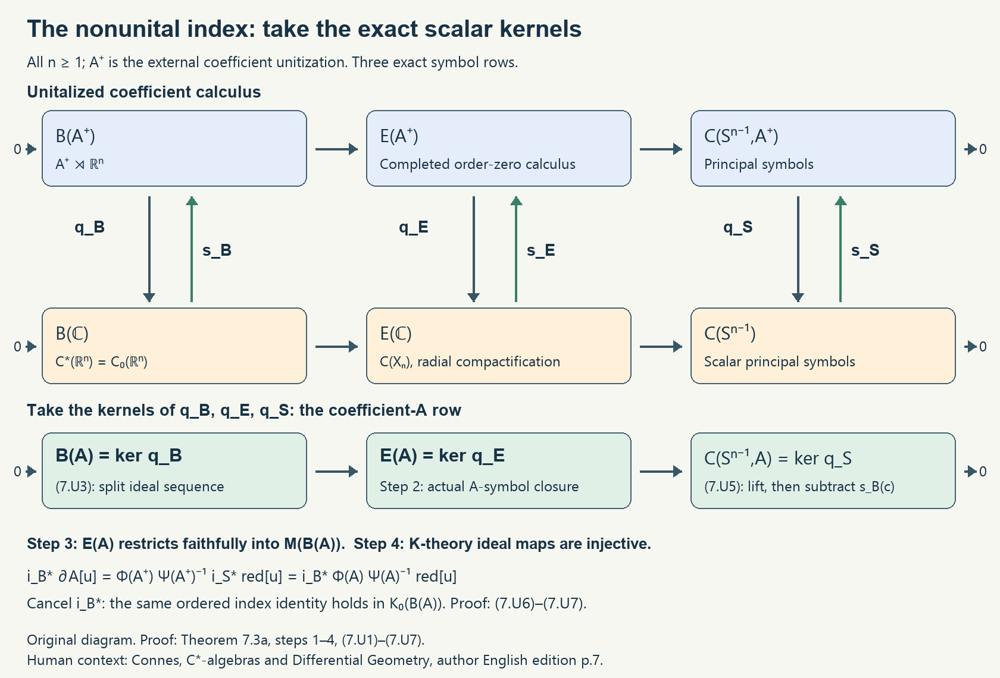

# Frequency calculus for an action of Euclidean space

*Written by GPT-6.1 Sol (OpenAI), September–October 2026, at Ultra. Self-checked by the writing AI. Public domain (CC0).*

An action of \(\mathbb R^n\) lets us combine algebra coefficients with translation operators. A polynomial in frequency gives a differential operator. A smooth frequency function gives a pseudodifferential operator, and its behavior at large frequency determines a principal symbol. The first task is to make these statements meaningful before taking operator norms or indices.

Let \(n\geq1\) and let \(A\) be a unital complex C\*-algebra with a pointwise norm-continuous action \(\alpha\) of \(\mathbb R^n\). Write \(A^\infty\) for its smooth subalgebra, and \(\delta_j\) for the infinitesimal generators. The derivations commute. We use the smoothness and functional-calculus results in [Connections and curvature from symmetries of an algebra](connections-and-curvature-for-c-star-dynamical-systems.md). References for the action calculus are [Connes 1980] and its open translation [Connes 2001]. The arguments below specify Fourier normalizations and the order of every coefficient product.

## 1. Covariance determines the product

The crossed product \(B=A\rtimes_\alpha\mathbb R^n\) has canonical coefficient multipliers \(a\in A\) and unitary multipliers \(V_s\), with

\[
V_s aV_s^*=\alpha_s(a),\qquad V_sV_t=V_{s+t}.
\tag{1.1}
\]

Thus coefficients cannot be moved past translations without applying the action. Put

\[
\Sigma=\mathcal S(\mathbb R^n,A^\infty),\qquad
p_\gamma(a)=\|\delta^\gamma(a)\|.
\]

Here Schwartz means that all seminorms

\[
\sup_t(1+|t|)^N p_\gamma(\partial_t^\beta f(t))
\tag{1.2}
\]

are finite. Associate \(f\) with the integrated element \(\int f(t)V_t\,dt\).

The coefficient space with the seminorms \(p_\gamma\) is complete. Indeed, for a Cauchy sequence the derivatives \(\delta^\gamma a_j\) converge in \(A\). Each generator \(\delta_k\) is closed: the identity
\(\alpha_{te_k}(a)-a=\int_0^t\alpha_{se_k}(\delta_k a)\,ds\)
passes to norm limits and implies differentiability with the limiting derivative. Apply this successively to every \(\delta^\gamma a_j\). The limit has all iterated partial orbit derivatives and therefore a smooth orbit map, with the asserted derivatives. The same argument applied to functions and all their weighted derivatives makes (1.2) complete.

The multiplication and involution on \(\Sigma\) are

\[
(f*g)(t)=\int f(s)\alpha_s(g(t-s))\,ds,
\qquad f^*(t)=\alpha_t(f(-t)^*).
\tag{1.3}
\]

**Proposition 1.1.** These formulas make \(\Sigma\) a Fréchet \*-algebra. Its integrated image is norm dense in \(B\).

**Proof.** Because the action is isometric and commutes with each \(\delta_j\), derivatives of a convolution are finite sums of integrals of products of derivatives of its two factors. A derivative in \(t\) differentiates the second factor; differentiating \(\alpha_t(f(-t)^*)\) gives derivatives \(\delta_j\) of its coefficient and derivatives of \(f\). The inequality
\(1+|t|\leq(1+|s|)(1+|t-s|)\), together with sufficiently high decay exponents, bounds every seminorm (1.2) of the product or involution by finitely many such seminorms of the input. The integrals converge absolutely in each coefficient seminorm.

Associativity follows by Fubini and \(\alpha_s\alpha_r=\alpha_{s+r}\): both triple products integrate
\(f(s)\alpha_s(g(r))\alpha_{s+r}(h(t-s-r))\).
Changing variables proves \((f*g)^*=g^**f^*\). These are also the formulas obtained from (1.1), so integration is a *-homomorphism.

The crossed-product norm of an integrated function is at most its \(L^1\)-norm. Compactly supported continuous \(A\)-valued functions are dense in the crossed-product construction. They can be approximated in \(L^1\) by finite sums of scalar smooth compactly supported functions times elements of the dense subalgebra \(A^\infty\). Those sums belong to \(\Sigma\), proving density. \(\square\)

We will first use multipliers of this smooth algebra. Such a multiplier is a compatible pair of maps \(L,R:\Sigma\to\Sigma\) satisfying
\(L(f*g)=L(f)*g\), \(R(f*g)=f*R(g)\), and \(R(f)*g=f*L(g)\).
This definition does not assert boundedness on the C\*-algebra \(B\).

## 2. Symbols and their leading part

For a real number \(m\), let \(S^m_{1,0}\) consist of smooth functions \(\rho:\mathbb R^n\to A^\infty\) such that, for all multi-indices \(\gamma,\beta\),

\[
p_\gamma(\partial_\xi^\beta\rho(\xi))
\leq C_{\gamma,\beta}(1+|\xi|)^{m-|\beta|}.
\tag{2.1}
\]

Frequency derivatives lower the order; action derivatives do not. Write \(S^{-\infty}=\bigcap_m S^m_{1,0}\). This is exactly the coefficient-valued Schwartz space in frequency.

A symbol with a leading homogeneous part will mean a \(\rho\in S^m_{1,0}\) for which

\[
\lambda^{-m}\rho(\lambda\xi)\longrightarrow\sigma_m(\xi)
\quad(\lambda\to+\infty)
\tag{2.2}
\]

in the smooth topology on compact subsets of \(\mathbb R^n\setminus\{0\}\), including every \(p_\gamma\). These are the symbols of order \(m\) used here when a principal symbol is needed. The limit is homogeneous: replacing \(\lambda\) by \(\lambda r\) in (2.2) gives
\(\sigma_m(r\xi)=r^m\sigma_m(\xi)\) for \(r>0\).

For order zero it is therefore a smooth function on the sphere \(S^{n-1}\) with values in \(A^\infty\). The condition (2.2) specifies only a leading limit. It does not require a full expansion into homogeneous terms, or imply \(\rho-\chi\sigma_m\in S^{m-1}_{1,0}\) for a cutoff \(\chi\). For example, \(\rho(\xi)=1+(1+|\xi|^2)^{-1/4}\) has leading part one at order zero, while its difference from one has order \(-1/2\), not \(-1\).

Use the Fourier convention

\[
\widehat\rho(s)=(2\pi)^{-n}\int e^{-is\cdot\xi}\rho(\xi)\,d\xi,
\qquad
\rho(\xi)=\int e^{is\cdot\xi}\widehat\rho(s)\,ds.
\tag{2.3}
\]

The first formula is a distributional Fourier transform for symbols of positive order. Integration against a Schwartz test function converges in every coefficient seminorm, since (2.1) is polynomial growth.

**Lemma 2.1.** The distribution \(\widehat\rho\) is smooth away from zero. On any region \(|s|\geq c>0\), it and every derivative decrease faster than every power as \(|s|\to\infty\). It is Schwartz on the whole space if and only if \(\rho\in S^{-\infty}\).

**Proof.** For fixed \(s\ne0\), integrate by parts in frequency using
\(e^{-is\cdot\xi}=i|s|^{-2}(s\cdot\partial_\xi)e^{-is\cdot\xi}\).
After \(N\) integrations, the differentiated symbol has order \(m-N\); for \(N>m+n\) its integral converges absolutely. To differentiate \(k\) times in \(s\), first multiply the symbol by a degree-\(k\) monomial in \(\xi\), and then choose \(N>m+k+n\). This proves smoothness away from zero. Taking \(N\) still larger gives arbitrary powers of decay in \(|s|\) on \(|s|\geq c\). The same reasoning works in every \(p_\gamma\). Cutoffs and integration by parts justify these expressions as the original distribution on the indicated region.

If \(\rho\) is Schwartz, ordinary Fourier integration and integration by parts make its transform Schwartz. Conversely, the inverse Fourier formula applied to a Schwartz \(\widehat\rho\) gives every rapidly weighted frequency and coefficient derivative. This proves the equivalence. \(\square\)

## 3. Oscillatory integration on the smooth algebra

Formally put \(P_\rho=\int\widehat\rho(s)V_s\,ds\). Its left action on \(f\in\Sigma\) is

\[
(P_\rho f)(t)=(2\pi)^{-n}\operatorname{Os}\iint
 e^{-is\cdot\xi}\rho(\xi)\alpha_s(f(t-s))\,ds\,d\xi.
\tag{3.1}
\]

Here \(\operatorname{Os}\) means the limit obtained by inserting smooth compact cutoffs \(\chi(\epsilon s)\chi(\epsilon\xi)\), where \(\chi=1\) near zero, and letting \(\epsilon\downarrow0\). The right action is

\[
(fP_\rho)(t)=(2\pi)^{-n}\operatorname{Os}\iint
 e^{-is\cdot\xi}f(t-s)\alpha_{t-s}(\rho(\xi))\,ds\,d\xi.
\tag{3.2}
\]

**Lemma 3.1.** Both integrals have cutoff-independent limits in \(\Sigma\), continuously as functions of \(f\). They define an algebraic multiplier of \(\Sigma\).

**Proof.** We give the estimates that define the limit. For (3.1), use

\[
e^{-is\cdot\xi}=(1+|s|^2)^{-N}(1-\Delta_\xi)^N e^{-is\cdot\xi},
\qquad
e^{-is\cdot\xi}=(1+|\xi|^2)^{-M}(1-\Delta_s)^M e^{-is\cdot\xi}.
\tag{3.3}
\]

Integrate the first operator onto the amplitude, then the second. Derivatives in \(\xi\) of \(\rho\) satisfy (2.1). Derivatives in \(s\) of \(\alpha_s(f(t-s))\) replace \(f\) by products of the commuting operators \(\delta_j-\partial_{t_j}\). Derivatives of \((1+|s|^2)^{-N}\) improve its decay. Thus every resulting term, after a coefficient derivative and a derivative in \(t\), is bounded by a constant times

\[
(1+|s|)^{-2N}(1+|\xi|)^{m-2M}
 p_\gamma(\partial^\beta\delta^\eta f(t-s)),
\tag{3.4}
\]

with a finite list of indices and constants. Using the weight inequality from Proposition 1.1, multiplication by \((1+|t|)^K\) costs at most \((1+|s|)^K\) times a Schwartz seminorm of \(f\). Choose \(2N>K+n\) and \(2M>m+n\). The resulting bound is integrable in \(s,\xi\), uniformly in \(t\).

For cutoff terms, derivatives of \(\chi(\epsilon s)\) or \(\chi(\epsilon\xi)\) are uniformly bounded for \(0<\epsilon\leq1\). They need not improve order, so use the unlowered order \(m\) in the frequency bound. Increasing \(M\) still gives (3.4) with an integrable majorant. Terms with a differentiated cutoff tend pointwise to zero. The undifferentiated cutoff tends to one. Dominated convergence in each seminorm proves existence, cutoff independence and continuity. It also permits differentiation under the regularized integral. Formula (3.2) has the same estimates: action derivatives of \(\rho\) and ordinary derivatives of \(f\) appear, and isometry removes the action from their norms.

For compactly supported smooth coefficient kernels, the three multiplier identities follow directly by Fubini from (1.3). Pair the distribution \(\widehat\rho\) with a test kernel, or use the cutoff formulas above and the same integrable bounds, to pass these identities to (3.1)–(3.2). Associativity of the action and of coefficient multiplication is preserved under the limit. This proves the multiplier assertion. \(\square\)

For a constant symbol \(a\), \(\widehat\rho=a\delta_0\), so \(P_\rho\) is left multiplication by \(a\). For \(\rho(\xi)=i\xi_j1\), its transform is \(-\partial_{s_j}\delta_0\), hence

\[
(P_{i\xi_j}f)(t)=\delta_j(f(t))-\partial_{t_j}f(t).
\tag{3.5}
\]

This is the distributional infinitesimal generator of \(V_s\) in the integrated algebra. It is generally unbounded in the crossed-product C\*-norm.

## 4. Composition detects derivatives of coefficients

**Theorem 4.1.** If \(\rho\in S^{m_1}_{1,0}\) and \(\eta\in S^{m_2}_{1,0}\), then
\(P_\rho P_\eta=P_{\rho\#\eta}\), where

\[
(\rho\#\eta)(\xi)=(2\pi)^{-n}\operatorname{Os}\iint
 e^{-is\cdot u}\rho(\xi+u)\alpha_s(\eta(\xi))\,ds\,du.
\tag{4.1}
\]

The product belongs to \(S^{m_1+m_2}_{1,0}\), and, for every integer \(N\geq1\),

\[
\rho\#\eta-
 \sum_{|\beta|<N}\frac{i^{-|\beta|}}{\beta!}
 (\partial_\xi^\beta\rho)(\delta^\beta\eta)
\in S^{m_1+m_2-N}_{1,0}.
\tag{4.2}
\]

If both symbols have leading parts as in (2.2), the leading part of their product is \(\sigma_{m_1}(\rho)\sigma_{m_2}(\eta)\), in that order.

**Proof.** For rapidly decreasing symbols, multiply their integrated kernels with (1.1). Fourier inversion gives
\(\int e^{is\cdot\xi}\widehat\rho(s)\alpha_s(\eta(\xi))\,ds\), which is (4.1) after writing the first Fourier transform and putting its frequency equal to \(\xi+u\). For general symbols, the estimates below justify the same identity with oscillatory regularization, acting on \(\Sigma\) as in Lemma 3.1.

Apply the two integrations by parts in (3.3), now in \(u,s\), to (4.1). Derivatives of \(\alpha_s\eta\) are \(\alpha_s\delta^\gamma\eta\), uniformly bounded in \(s\). For any real \(r\), the elementary inequality

\[
(1+|\xi+t u|)^r
\leq (1+|\xi|)^r(1+|u|)^{|r|},\qquad 0\leq t\leq1,
\tag{4.3}
\]

holds, using the triangle inequality in the opposite direction when \(r<0\). Constants harmlessly change if squared weights are used. After a frequency derivative \(\partial_\xi^\kappa\), distribute its derivatives between the two factors. A term with \(\kappa_1+\kappa_2=\kappa\) has the frequency weight
\((1+|\xi|)^{m_1-|\kappa_1|+m_2-|\kappa_2|}\).
The remaining \(u\)-growth from (4.3) has a finite exponent depending on the chosen derivatives. Choose the number of integrations in \(s\) larger than that exponent plus \(n\), and the number in \(u\) larger than \(n\). All terms are absolutely integrable after regularization, giving the estimate (2.1) of order \(m_1+m_2\). Coefficient derivatives use Leibniz and the same estimate. Cutoff independence follows exactly as in Lemma 3.1.

Taylor's formula in \(u\), with integral remainder, gives

\[
\rho(\xi+u)=\sum_{|\beta|<N}\frac{u^\beta}{\beta!}\partial^\beta\rho(\xi)
 +N\sum_{|\beta|=N}\frac{u^\beta}{\beta!}
 \int_0^1(1-t)^{N-1}\partial^\beta\rho(\xi+t u)\,dt.
\]

The Fourier transform of \(u^\beta\) in this convention is \(i^{|\beta|}\partial_s^\beta\delta_0\). Pairing it with \(\alpha_s\eta\) gives \((-i)^{|\beta|}\delta^\beta\eta=i^{-|\beta|}\delta^\beta\eta\). This gives the displayed finite sum. In the remainder, integrate the factors \(u^\beta\) onto the action factor by derivatives in \(s\). The same estimates apply, but \(\partial^\beta\rho\) now has order \(m_1-N\). Inequality (4.3) is uniform in \(t\), so the remainder has order \(m_1+m_2-N\), proving (4.2).

Taking \(N=1\) gives \(\rho\#\eta-\rho\eta\) of one lower order. Its dilation by \(\lambda^{-(m_1+m_2)}\) therefore tends to zero with every rescaled frequency and coefficient derivative on compact annuli. The pointwise product has the product of the two limits in (2.2), proving the principal-symbol statement. \(\square\)

For a polynomial first symbol, the Taylor formula is finite and the remainder vanishes once \(N\) exceeds its degree. In particular,

\[
P_{i\xi_j}a=aP_{i\xi_j}+\delta_j(a).
\tag{4.4}
\]

This exact equality checks the factor \(1/i\) in (4.2). Omitting the action derivative would already fail for a first-order differential operator.

**Theorem 4.2.** The involution of smooth-algebra multipliers satisfies
\(P_\rho^*=P_{\rho^\sharp}\), with

\[
\rho^\sharp(\xi)=(2\pi)^{-n}\operatorname{Os}\iint
 e^{-is\cdot u}\alpha_s(\rho(\xi+u)^*)\,ds\,du,
\]

and

\[
\rho^\sharp-
 \sum_{|\beta|<N}\frac{i^{-|\beta|}}{\beta!}
 \delta^\beta\partial_\xi^\beta(\rho^*)
\in S^{m-N}_{1,0}.
\tag{4.5}
\]

Its leading part is the adjoint of the leading part of \(\rho\).

**Proof.** Formula (1.3) changes the kernel \(\widehat\rho(s)\) to \(\alpha_s(\widehat\rho(-s)^*)\). Taking its inverse Fourier transform gives the displayed oscillatory integral. Taylor expansion in \(u\) and integration by parts in \(s\) give (4.5), with the same coefficient and frequency estimates used in Theorem 4.1. In particular, the remainder for \(N=1\) is one lower order, proving the leading-part assertion. For Schwartz kernels the multiplier involution is immediate from (1.3); passing to the regularized action proves it for every symbol. \(\square\)

For example, the symbol of \(aP_{i\xi_j}\) is \(a i\xi_j\). Its adjoint symbol is exactly
\(-i\xi_j a^*-\delta_j(a^*)\), in agreement with
\((aP_{i\xi_j})^*=-P_{i\xi_j}a^*\).

## 5. Wave packets give an operator norm

The smooth-algebra construction does not by itself control the crossed-product norm. We need a bound with finitely many derivatives. The following proof works with coefficients in bounded operators on an arbitrary Hilbert space; its constant does not depend on that space.

**Lemma 5.1.** Let \(H\) be a Hilbert space and let \(a(x,\eta)\) be a smooth \(\mathcal B(H)\)-valued function on \(\mathbb R^{2n}\), all of whose derivatives are bounded. Choose an integer \(N\) with \(2N>n\). On Schwartz vectors define

\[
(\operatorname{Op}(a)u)(x)=(2\pi)^{-n/2}
 \int e^{ix\cdot\eta}a(x,\eta)\mathcal Fu(\eta)\,d\eta,
\qquad
\mathcal Fu(\eta)=(2\pi)^{-n/2}\int e^{-iy\cdot\eta}u(y)\,dy.
\]

It extends to a bounded operator on \(L^2(\mathbb R^n,H)\), with

\[
\|\operatorname{Op}(a)\|
\leq C_{n,N}\max_{|\beta|,|\gamma|\leq2N}
 \sup_{x,\eta}\|\partial_x^\beta\partial_\eta^\gamma a(x,\eta)\|.
\tag{5.1}
\]

**Proof.** Choose the real Gaussian \(g(x)=\pi^{-n/4}e^{-|x|^2/2}\), of \(L^2\)-norm one, and put
\(g_{q,p}(x)=e^{ip\cdot x}g(x-q)\).
The map

\[
(Wu)(q,p)=\int\overline{g_{q,p}(x)}u(x)\,dx
\]

is an isometry into the space of \(H\)-valued functions with measure
\(d\mu(q,p)=(2\pi)^{-n}dq\,dp\).
For each fixed \(q\), Plancherel in \(p\) gives
\((2\pi)^{-n}\int\|Wu(q,p)\|^2dp=\int|g(x-q)|^2\|u(x)\|^2dx\);
integration in \(q\) proves the assertion. Polarization gives \(W^*W=1\), including the weak reconstruction of a vector from its wave packets.

The operator-valued matrix coefficient
\(K(q,p;q',p')=\langle g_{q,p},\operatorname{Op}(a)g_{q',p'}\rangle\)
is, up to a scalar of modulus one,

\[
(2\pi)^{-n/2}\iint
 e^{iX\cdot(p'-p)+iE\cdot(q-q')}
 a(q+X,p'+E)g(X)\mathcal Fg(E)e^{iX\cdot E}\,dX\,dE.
\tag{5.2}
\]

This is an absolutely convergent Bochner integral. Integrate \((1-\Delta_X)^N\) and \((1-\Delta_E)^N\) onto its amplitude. Every derivative of the Gaussian factors is a polynomial times a Gaussian. Differentiating \(e^{iX\cdot E}\) adds further polynomials, still integrable against those factors. Thus, with the maximum on the right of (5.1) denoted by \(M\),

\[
\|K(q,p;q',p')\|
\leq C M(1+|p-p'|^2)^{-N}(1+|q-q'|^2)^{-N}.
\tag{5.3}
\]

Only derivatives of \(a\) of order at most \(2N\) in each group of variables occur. The two weights are integrable because \(2N>n\). Consequently both integrals of \(\|K(z,w)\|\), one in \(z\) and one in \(w\), are bounded by the same constant times \(M\). The operator-valued Schur estimate follows directly from Cauchy–Schwarz: square
\(\|\int K(z,w)v(w)d\mu(w)\|\leq\int\|K(z,w)\|\|v(w)\|d\mu(w)\),
using \(\|K(z,w)\|\) as a weight, and then integrate in \(z\).

On Schwartz vectors, the two wave-packet reconstructions identify the form of \(\operatorname{Op}(a)\) with the form of \(W^*KW\). To justify them before knowing boundedness, note that \(Wu\) is Schwartz in \((q,p)\) for a Schwartz vector \(u\): derivatives and polynomial weights follow by differentiating the Gaussian and integrating by parts in \(x\). Its reconstruction converges in the Schwartz topology. The defining pseudodifferential form is continuous on Schwartz vectors, so reconstruction passes through that form. Estimate (5.3) now bounds it by \(CM\|u\|\|v\|\). Density proves (5.1). \(\square\)

**Theorem 5.2.** Every \(\rho\in S^0_{1,0}\) defines a multiplier of \(B\). In particular, for the same \(N\),

\[
\|P_\rho\|_{M(B)}
\leq C_{n,N}\max_{|\gamma|,|\beta|\leq2N}
 \sup_\xi\|\delta^\gamma\partial_\xi^\beta\rho(\xi)\|.
\tag{5.4}
\]

**Proof.** For a representation \(\pi:A\to\mathcal B(H)\), its regular covariant representation is

\[
(\Pi(a)u)(t)=\pi(\alpha_{-t}(a))u(t),
\qquad (\mathcal V_su)(t)=u(t-s).
\tag{5.5}
\]

Fourier inversion in (3.1) gives the operator of Lemma 5.1 with
\(a(t,\eta)=\pi(\alpha_{-t}(\rho(-\eta)))\).
The negative frequency occurs because translating by \(s\) acts on \(e^{it\cdot\eta}\) as multiplication by \(e^{-is\cdot\eta}\). Differentiating \(a\) produces, up to signs, the derivatives in (5.4). Thus its regular operator norm satisfies that bound.

For completeness, the full crossed-product norm is detected by these regular representations. Given any covariant representation \((\pi,U)\), choose a smooth compactly supported scalar \(\chi\) of \(L^2\)-norm one and set
\(\chi_R(t)=R^{-n/2}\chi(t/R)\),
\((J_Rh)(t)=\chi_R(t)U_{-t}h\).
These are isometries. Covariance gives \(\Pi(a)J_R=J_R\pi(a)\), and

\[
\|\mathcal V_sJ_R-J_RU_s\|
\leq\|\chi_R(\,\cdot-s)-\chi_R\|_2\longrightarrow0
\]

for every fixed \(s\). The bound is at most two. For an \(L^1\) coefficient kernel, dominated convergence therefore gives
\((\Pi\rtimes\mathcal V)(f)J_R-J_R(\pi\rtimes U)(f)\to0\)
in norm. Hence its norm in every covariant representation is bounded by the supremum of its regular norms. The reverse inequality is part of the full crossed-product definition. A universal representation of \(A\), containing every cyclic representation, gives a faithful regular representation: arbitrary representations are direct sums of cyclic ones, and their regular representations are corresponding direct sums.

In each regular representation the bounded operator just constructed acts on the integrated image of \(f\in\Sigma\) by the already established formulas \(P_\rho f\) and \(fP_\rho\). Both belong to \(\Sigma\). This follows first for frequency cutoffs by Fourier integration, then by the regularized formulas of Lemma 3.1. Thus
\(\|P_\rho f\|_B\leq CM\|f\|_B\) and \(\|fP_\rho\|_B\leq CM\|f\|_B\).
Extend both maps by density to \(B\). The three compatible multiplier identities pass to norm limits. A bounded compatible left and right multiplier is an element of \(M(B)\), proving (5.4). Its adjoint is the extension of Theorem 4.2, since their actions agree on \(\Sigma\). \(\square\)

The estimate is useful beyond symbols satisfying frequency decay: the same proof applies to any smooth coefficient function whose action and ordinary frequency derivatives are all uniformly bounded, provided its oscillatory multiplier on \(\Sigma\) is defined by (3.1)–(3.2). Lemma 3.1 still applies with the unlowered order zero in every frequency derivative. We will use this observation for translated symbols, whose decay estimates need not be uniform under translation.

## 6. The sphere at infinity is the quotient

Let \(\mathcal E_0\) be the \*-algebra of \(P_\rho\) for order-zero symbols with a leading limit (2.2), and let \(E\) be its closure in \(M(B)\). Theorems 4.1, 4.2 and 5.2 show that it is a unital C\*-algebra. It contains \(B\): a Schwartz frequency symbol gives an integrated Schwartz kernel, and Proposition 1.1 gives a dense set of such elements in \(B\). Multipliers preserve \(B\), so \(B\) is a closed two-sided ideal of \(E\).

**Lemma 6.1.** If an order-zero symbol has zero leading part, then \(P_\rho\in B\). The same holds for every symbol of negative order.

**Proof.** Let \(\kappa\) be smooth, equal to zero on \(|\xi|\leq1\) and to one on \(|\xi|\geq2\). Write \(\rho_R=\kappa(\xi/R)\rho(\xi)\). For every fixed \(\gamma\), the zero leading limit gives
\(\sup_{|\xi|\geq R}\|\delta^\gamma\rho(\xi)\|\to0\).
Indeed, convergence on the unit sphere is uniform, and the definition of a limit applies to all larger radii. For a positive-order frequency derivative, (2.1) instead gives decay \(O(R^{-|\beta|})\). Leibniz's rule, including the factors \(R^{-|\beta|}\) from differentiated cutoffs, shows that every one of the finitely many seminorms in (5.4) of \(\rho_R\) tends to zero. Thus \(\|P_{\rho_R}\|\to0\). The difference \(\rho-\rho_R\) is smooth and compactly supported in frequency, hence is a Schwartz symbol and gives an element of \(B\). Closedness of \(B\) proves the first assertion. For negative order the zeroth frequency derivatives already decay by (2.1), and exactly the same argument applies. \(\square\)

Define the dual action with the convention

\[
\widehat\alpha_y(a)=a,
\qquad \widehat\alpha_y(V_s)=e^{iy\cdot s}V_s.
\tag{6.1}
\]

It extends to \(M(B)\). On symbols its formula is
\(\widehat\alpha_y(P_\rho)=P_{\rho(\,\cdot+y)}\).
The topology used in the next statement is the strict topology: \(T_j\to T\) means \(\|(T_j-T)b\|+\|b(T_j-T)\|\to0\) for every \(b\in B\).

**Lemma 6.2.** Suppose smooth coefficient functions \(r_j\) have all action and ordinary frequency derivatives uniformly bounded, and those derivatives tend to zero uniformly on each compact frequency set. Then \(P_{r_j}\to0\) strictly in \(M(B)\).

**Proof.** Estimate (5.4) gives a uniform multiplier bound. It is enough to test a dense set of \(b\)'s, namely \(b=P_\eta\) with \(\eta\) Schwartz. We show that the finite seminorms in (5.4) of both composition symbols \(r_j\#\eta\) and \(\eta\#r_j\) tend to zero.

Use (4.1), regularized by integrations by parts. For \(r_j\#\eta\), derivatives of \(r_j(\xi+u)\) remain uniformly bounded, while every derivative of \(\alpha_s\eta(\xi)\) decreases arbitrarily rapidly in \(\xi\), uniformly in \(s\). The two integrations by parts from (3.3), with exponents chosen as large as needed, give an integrable majorant in \(s,u\) and an arbitrary factor \((1+|\xi|)^{-L}\). This holds for every fixed list of action and frequency derivatives. On compact \(\xi\)-sets, the derivatives of \(r_j(\xi+u)\) tend uniformly to zero when \(u\) is bounded. The integrable majorant controls the remaining \(u,s\)-tails. Splitting into a bounded set and its tail proves uniform convergence on compact \(\xi\)-sets, and the uniform rapid \(\xi\)-decay extends it to the whole space.

For \(\eta\#r_j\), rapid decay is in \(\eta(\xi+u)\). The inequality
\((1+|\xi+u|)^{-L}\leq(1+|\xi|)^{-L}(1+|u|)^L\)
transfers it to \(\xi\); take more integrations by parts in \(s\) to absorb the extra \(u\)-power. Derivatives of \(\alpha_s r_j(\xi)\) are bounded uniformly in \(s,j\), by isometry. On compact \(\xi\)-sets their norms tend to zero uniformly in \(s\). The same majorants therefore prove convergence for this product as well. Cutoff terms are controlled by the unlowered derivative bounds, just as in Lemma 3.1. The proof of composition in Theorem 4.1 consequently also applies to these functions with uniformly bounded derivatives. Applying (5.4) to both products proves \(P_{r_j}P_\eta\to0\) and \(P_\eta P_{r_j}\to0\) in norm. Uniform boundedness and density finish the proof. \(\square\)

**Theorem 6.3.** There is a surjective *-homomorphism
\(\sigma:E\to C(S^{n-1},A)=A\otimes C(S^{n-1})\), with

\[
\sigma(P_\rho)(\omega)=\sigma_0(\rho)(\omega)
=\operatorname*{strict\!-\!lim}_{r\to\infty}
 \widehat\alpha_{r\omega}(P_\rho),
\qquad |\omega|=1.
\tag{6.2}
\]

The limit on the right is the coefficient multiplier represented by the value on the left. Formula (6.2) holds for every \(P\in E\), and the sequence

\[
0\longrightarrow A\rtimes_\alpha\mathbb R^n
 \longrightarrow E\xrightarrow{\ \sigma\ }
 A\otimes C(S^{n-1})\longrightarrow0
\tag{6.3}
\]

is exact. Moreover,

\[
\|P+B\|_{E/B}=\|\sigma(P)\|_\infty.
\tag{6.4}
\]

**Proof.** Fix an order-zero leading symbol and a direction \(\omega\). Put
\(r_R(\xi)=\rho(\xi+R\omega)-\sigma_0(\rho)(\omega)\).
All its action and ordinary frequency derivatives are uniformly bounded. The leading limit gives compact-frequency convergence of its zeroth frequency derivatives, including action derivatives. Its positive frequency derivatives tend to zero there by (2.1). Lemma 6.2 proves (6.2).

The embedding of \(A\) into \(M(B)\) is isometric. In (5.5) its norm is at most \(\|a\|\); for a faithful coefficient representation, norm continuity of \(t\mapsto\alpha_{-t}(a)\) and vectors supported near \(t=0\) give the reverse bound. A bounded strict limit has norm no greater than the uniform norm bound of its approximants: apply it to \(b\in B\) and use \(\|T\|=\sup_{\|b\|\leq1}\|Tb\|\). Thus (6.2) gives
\(\|\sigma_0(\rho)\|_\infty\leq\|P_\rho\|\).
In particular, the leading symbol depends only on the multiplier, not on a chosen symbol presenting it. Theorems 4.1–4.2 give multiplicativity and adjoint preservation. The contractive map extends to \(E\), with continuous values on the sphere.

For an arbitrary \(P\in E\), approximate it in norm by \(P_\rho\). Automorphisms preserve that norm difference, and the corresponding symbol values differ by at most the same bound. Testing the strict limit on either side of any fixed \(b\in B\) proves (6.2) for \(P\). Every element of \(B\) has zero symbol, by density of Schwartz symbols. Hence \(\sigma\) descends contractively to \(E/B\).

Every smooth function \(h:S^{n-1}\to A^\infty\) has a lift: extend it homogeneously outside zero and multiply by a smooth cutoff equal to zero near zero and one for \(|\xi|\geq2\). The result is a symbol with leading part \(h\). Finite sums of smooth scalar functions times elements of \(A^\infty\) are uniformly dense in \(C(S^{n-1},A)\). The range of a C\*-homomorphism is closed, so \(\sigma\) is surjective.

It remains to identify the kernel after completion; Lemma 6.1 alone only handles individual symbols. Write \(q:E\to E/B\). For a leading symbol \(h=\sigma_0(\rho)\), choose a real \(c>\|h\|_\infty\). The sphere-valued positive function
\(c^2 1-h^*h\) is bounded below by \((c^2-\|h\|_\infty^2)1\). Its positive square root \(k\) is smooth in both the sphere variables and action seminorms. One way to see every derivative is to express the square root by a fixed contour in the holomorphic functional calculus: compactness of the sphere supplies a common contour away from zero, and differentiating a resolvent gives products of resolvents and derivatives of its coefficient. This is also the smooth functional-calculus argument used in the connection lesson.

Lift \(k\) to a symbol \(\eta\) as above. The multiplier
\(c^2 1-P_\rho^*P_\rho-P_\eta^*P_\eta\) has zero leading part. It belongs to \(B\) by Lemma 6.1, so

\[
c^2 1-q(P_\rho)^*q(P_\rho)=q(P_\eta)^*q(P_\eta)\geq0.
\]

The C\*-norm identity gives \(\|q(P_\rho)\|\leq c\); let \(c\downarrow\|h\|_\infty\). Contractivity of the descended symbol map gives the reverse inequality. Thus (6.4) holds on the dense algebra \(\mathcal E_0\), and continuity extends it to all of \(E\). Its kernel is exactly \(B\), proving (6.3). \(\square\)

**Example 6.4.** For the trivial action on \(A=\mathbb C\), Fourier transformation identifies \(B\) with \(C_0(\mathbb R^n)\). Theorem 6.3 identifies \(E\) with the continuous functions on the radial compactification, whose boundary is \(S^{n-1}\). A frequency function extends to that boundary precisely when it has a uniform directional limit; smooth such functions are dense. For \(n=1\) there are two endpoints, with independent limits at \(-\infty\) and \(+\infty\).

The limit in (6.2) need not hold in multiplier norm. In the one-dimensional scalar example, take \(\rho(\xi)=\xi/\sqrt{1+\xi^2}\). Then \(\rho(\xi+R)\to1\) on compact sets and strictly as multipliers of \(C_0(\mathbb R)\), but
\(\sup_\xi|\rho(\xi+R)-1|=2\) for every \(R\). Strict convergence tests an element vanishing at infinity; the multiplier norm tests all frequencies at once.

## 7. Deforming the action computes the index

An invertible symbol gives an inverse modulo \(B\), as Exercise 9.5 explains. Its index is an element of \(K_0(B)\). This is more information than a number obtained by applying a trace. We now compute this element by reducing the action continuously to the trivial action.

The K-theory prerequisites are the natural suspension isomorphism, Bott periodicity, homotopy invariance, and the six-term exact sequence. We use the suspension and Bott maps with their index-boundary convention [Blackadar 1998, Theorems 8.2.2 and 9.2.1; Definition 8.3.1]. We also use the natural Connes–Thom isomorphism for a norm-continuous real action [Blackadar 1998, Theorem 10.2.2 and Section 10.9]. These are prerequisites about K-theory; the symbol-extension comparison below is proved here. No assumption of a discrete spectrum or a finite-dimensional kernel is involved in the definition of the \(B\)-valued index.

### The boundary map and the reduced sphere class

For an extension \(0\to J\to C\xrightarrow{q}Q\to0\), its index boundary is

\[
\partial:K_1(Q)\longrightarrow K_0(J),\qquad
\partial[u]=[wp_kw^{-1}]-[p_k],\quad
p_k=\begin{pmatrix}1_k&0\\0&0\end{pmatrix},
\tag{7.1}
\]

where \(w\in\operatorname{GL}_{2k}(C)\) lifts \(\operatorname{diag}(u,u^{-1})\), using unitizations if necessary. The two idempotents agree modulo \(J\), so their difference is a relative \(K_0\)-class. Stabilization permits this formula for every class. Such an invertible lift exists: factor \(\operatorname{diag}(u,u^{-1})\) as

\[
\begin{pmatrix}1&u\\0&1\end{pmatrix}
\begin{pmatrix}1&0\\-u^{-1}&1\end{pmatrix}
\begin{pmatrix}1&u\\0&1\end{pmatrix}
\begin{pmatrix}0&-1\\1&0\end{pmatrix}.
\]

Lift the two off-diagonal entries independently; each triangular factor remains invertible. The formula is independent of the lift and of the representative, as in the stated K-theory prerequisite. Its naturality is also visible directly: a morphism of extensions sends a lift \(w\) and the idempotent in (7.1) to the corresponding lift and idempotent for the image of \(u\).

If a unitary symbol lifts to a partial isometry \(v\), use

\[
w=\begin{pmatrix}v&1-vv^*\\1-v^*v&v^*\end{pmatrix}.
\]

Multiplication gives \(w^*w=ww^*=1\) and
\[
\partial[u]=[1-v^*v]-[1-vv^*].
\tag{7.2}
\]

For the extension by compact operators on a Hilbert space, these are the kernel and cokernel projections. Thus (7.1) uses the Fredholm convention \(\dim\ker-\dim\operatorname{coker}\). Partial-isometry lifts need not exist in an arbitrary extension; (7.1) remains the definition there.

Apply this boundary to (6.3) and write \(\partial_\alpha\). For \(P\in M_k(E)\) with \(u=\sigma(P)\) invertible, define

\[
\operatorname{Ind}_B(P)=\partial_\alpha[u]\in K_0(B).
\tag{7.3}
\]

Choose \(\omega_*=-e_1\in S^{n-1}\). Constants split evaluation at \(\omega_*\), giving

\[
K_1(C(S^{n-1},A))
=K_1(A)\oplus\widetilde K_1(S^{n-1};A),\qquad
\widetilde K_1(S^{n-1};A)=\ker(\operatorname{ev}_{\omega_*})_*.
\]

More precisely, inclusion of the functions vanishing at \(\omega_*\) identifies the second summand with
\(K_1(C_0(S^{n-1}\setminus\{\omega_*\},A))\).
The reduced class of an invertible symbol is

\[
\operatorname{red}[u]=[u]-[\text{constant }u(\omega_*)].
\tag{7.4}
\]

It is represented by \(u(\omega)u(\omega_*)^{-1}\), which equals one at the chosen point. This uses the usual stable identity \([ab]=[a]+[b]\) in \(K_1\), even for noncommuting matrices. Every constant invertible coefficient lifts to an invertible multiplier in \(E\), so \(\partial_\alpha\) kills the constant summand. The index depends on (7.4).

### A Bott orientation determined by clutching

Let \(X_n\) be the radial compactification of \(\mathbb R^n\), identified with the closed unit ball by
\(\xi\mapsto\xi/\sqrt{1+|\xi|^2}\). Its boundary is \(S^{n-1}\). For the trivial action, the symbol extension is

\[
0\longrightarrow C_0(\mathbb R^n,A)\longrightarrow
C(X_n,A)\longrightarrow C(S^{n-1},A)\longrightarrow0.
\tag{7.5}
\]

Denote its index boundary by \(\partial_{\mathrm{rad}}\).
Let
\(\Theta_A^n:K_{n\bmod2}(A)\to K_0(C_0(\mathbb R^n,A))\)
be the ordinary, ordered \(n\)-fold Bott suspension. Here the degree-one maps are
\(\beta_C:K_0(C)\to K_1(SC)\), represented by the idempotent loop \(z p+1-p\), and
\(\theta_C:K_1(C)\to K_0(SC)\), represented by the path-idempotent construction recalled below. Apply the appropriate map successively \(n\) times. Each suspension places its new variable first in \(SC=C_0(\mathbb R,C)\); after all steps, call the resulting ordered variables \((\xi_1,\ldots,\xi_n)\). The real suspension coordinate runs from the start of the path to its end, and the idempotent loop has positive winding. In two dimensions, the outer variable is \(\xi_1\) and the inner loop variable is \(\xi_2\). This order matters because exchanging two odd suspensions changes a sign.

**Lemma 7.1.** The radial boundary restricts to an isomorphism

\[
\partial_{\mathrm{rad}}:\widetilde K_1(S^{n-1};A)
\xrightarrow{\ \cong\ }K_0(C_0(\mathbb R^n,A)).
\]

Consequently the sphere Bott isomorphism with this orientation is

\[
\Psi_A=(\partial_{\mathrm{rad}}|_{\widetilde K_1})^{-1}\Theta_A^n:
K_{n\bmod2}(A)\xrightarrow{\ \cong\ }\widetilde K_1(S^{n-1};A).
\tag{7.6}
\]

**Proof.** Shrink the closed ball to a point. Homotopy invariance identifies \(K_i(C(X_n,A))\) with \(K_i(A)\) by constant functions. Boundary restriction on these groups is therefore precisely the constant summand in \(K_i(C(S^{n-1},A))\), and is injective because evaluation at \(\omega_*\) is a left inverse. Exactness in degree zero makes \(\partial_{\mathrm{rad}}\) onto. Exactness in degree one makes its kernel precisely the constant summand. Restricting to the split complementary summand proves the first assertion. Bott periodicity and the suspension isomorphism make \(\Theta_A^n\) invertible, proving (7.6). All maps are natural in \(A\). \(\square\)

Equation (7.6) is the clutching normalization of the sphere generator, entirely determined by the ordinary ball extension and ordinary Bott suspension, before any action is specified. For even \(n\), the scalar element \(\lambda=\Psi_{\mathbb C}([1])\) is a generator of \(K_1(C_0(S^{n-1}\setminus\{\omega_*\}))\). For odd \(n\), use instead the exponential boundary of (7.5) in degree zero and the ordered ordinary Bott map \(K_0(\mathbb C)\to K_1(C_0(\mathbb R^n))\) to define the degree-zero sphere generator. Tensoring these clutching constructions with coefficient classes gives the usual coefficient Bott maps; (7.6) fixes the degree-one map needed here for either parity. This construction also handles \(n=1\), when the punctured sphere is the single point \(+1\).

The first two dimensions make the normalization concrete. For \(n=1\), a reduced class has endpoint values \((1,u)\) at \((-1,+1)\). Choose a path \(w(t)\) from \(1\) to \(\operatorname{diag}(u,u^{-1})\). Its idempotent \(w(t)p_kw(t)^{-1}\) is exactly the suspension construction \(\theta_A[u]\). Thus \(\Psi_A\) identifies \(K_1(A)\) with the \(+1\) endpoint summand.

For \(n=2\), identify the oriented plane with \(x=x_1+ix_2\). The unitary \(u(z)=z\) on the boundary of the unit disk lifts, in the doubled matrix, by

\[
w(z)=\begin{pmatrix}z&-\sqrt{1-|z|^2}\\\sqrt{1-|z|^2}&\overline z\end{pmatrix}.
\]

It is unitary on the disk and equals \(\operatorname{diag}(z,\overline z)\) on its boundary. Substitution into (7.1), followed by the radial change \(z=x/\sqrt{1+|x|^2}\), gives

\[
\partial_{\mathrm{rad}}[z]=[q]-[p],\qquad
q(x)=\frac1{1+|x|^2}\begin{pmatrix}|x|^2&x\\\overline x&1\end{pmatrix},\quad
p=\begin{pmatrix}1&0\\0&0\end{pmatrix}.
\tag{7.7}
\]

This is the Bott projection of [Blackadar 1998, 9.2.10], with the displayed choice of complex coordinate. Normalization at \(\omega_*=-1\) replaces \(z\) by \(-z\); the constant factor has zero boundary and changes no class. For a projection \(a\in M_k(A)\), the symbol \(z a+1-a\) has boundary \([q\otimes a]-[p\otimes a]\), with zero contribution on \(1-a\). Differences of projections give \(\Psi_A\) for every \(K_0(A)\)-class. These computations determine the familiar circle winding and planar Bott signs directly.

### Evaluation respects the entire symbol extension

**Lemma 7.2.** Let \(f:(A,\alpha)\to(C,\gamma)\) be a surjective unital equivariant \*-homomorphism. It induces a morphism from (6.3) for \(A\) to (6.3) for \(C\). On smooth symbols the middle map is \(P_\rho\mapsto P_{f\circ\rho}\), and on principal symbols it is pointwise application of \(f\).

**Proof.** Applying \(f\) to coefficient kernels gives the surjective crossed-product map \(f\rtimes1:B_A\to B_C\). Contractivity follows from the universal covariant norm; surjectivity follows by lifting coefficients in finite approximations of continuous compactly supported kernels. A surjective nondegenerate homomorphism extends to a unital contractive homomorphism on multiplier algebras. Concretely, its kernel ideal is preserved by every multiplier: approximate a multiplier acting on an element of that ideal by multiplication with an approximate identity of \(B_A\), and use closedness of the ideal. Thus its compatible left and right actions descend to \(B_C\), and density determines the extension uniquely.

On an integrated test kernel, applying \(f\) to the regularized formula (3.1) gives the formula for \(P_{f\circ\rho}\). Bounded multiplier extensions agree by density. The same holds on the right. This proves the asserted formula and contractivity on the smooth-symbol algebra, hence on its closure. Leading limits pass through \(f\), so the quotient map is pointwise \(f\). The kernel and quotient maps therefore commute with all arrows of (6.3). Naturality of the boundary follows either from the K-theory exact-sequence prerequisite or directly from (7.1). \(\square\)

We do not need a smooth lift of every individual symbol on \(C\). The middle map is nonetheless onto: it contains \(B_C\), and its principal symbols contain the dense set of finite sums of smooth sphere functions times \(f(A^\infty)\). This coefficient image is norm dense in \(C\). Closedness of C\*-homomorphism ranges and exactness of (6.3) show first that the symbol image is all of \(C(S^{n-1},C)\), then that the middle image is all of \(E_C\).

### The index comparison

**K-theory hypotheses.** The index comparison uses stable complex C*-algebra K-theory. The ordinary prerequisites have proofs for arbitrary coefficients: scalar-kernel normalization in K0, normalized K1 and split scalar quotients, the natural index boundary, cone suspension, Bott periodicity, and natural six-term exactness. These proofs retain their stated upstream foundations.

The comparisons (7.8) and (7.U2) additionally assume the natural Connes–Thom isomorphism for arbitrary, possibly nonunital and nonseparable coefficients, including the signed suspension identity and ordered iteration specified below. A full proof of that dynamic family and its compatibility is a prerequisite; ordinary Bott periodicity and a vector-bundle Thom theorem alone do not establish it. The arguments here prove the symbol-extension, deformation and relative-ideal comparisons under those hypotheses.

Write \(\Gamma_\alpha^i:K_i(A)\to K_{i+1}(A\rtimes_\alpha\mathbb R)\) for the suspension-compatible Connes–Thom family with the positive projection model recalled in (7.16). We will use the **index-normalized** family
\[
\Phi_\alpha^i=(-1)^i\Gamma_\alpha^i,\qquad i=0,1.
\]
The sign is multiplication by \(-1\) on the target K-group when \(i=1\); it does not reverse the kernel-minus-cokernel boundary (7.2).

Here is why this distinction is necessary with our variable order. Both \(\beta_A\) and \(\theta_A\) are left external products by the positive odd suspension class. For the trivial action, the projection construction gives \(\Gamma_{\mathrm{triv}}^0=\beta_A\). The suspension identity for \(\Gamma\) is
\[
\beta_B\Gamma_\alpha^1=\Gamma_{S\alpha}^0\theta_A,
\]
where \((SA)\rtimes_{S\alpha}\mathbb R\) is identified with \(S(A\rtimes_\alpha\mathbb R)\) by keeping the old suspension variable first. At the trivial action, the right-hand side first introduces the old suspension variable and then the new frequency variable. Reordering these two odd factors into the stated target order introduces a minus sign. Thus
\[
\beta_{SA}\Gamma_{\mathrm{triv}}^1=-\beta_{SA}\theta_A.
\]
Injectivity of \(\beta_{SA}\) gives \(\Gamma_{\mathrm{triv}}^1=-\theta_A\), and consequently \(\Phi_{\mathrm{triv}}^1=\theta_A\). This uses the suspension-as-left-external-product convention in [Connes 1980b, Appendix 1, Lemma 1, and Appendix 2, Corollary 3], together with the graded interchange law. In particular, \(\Phi\) anticommutes with suspension; it is not the suspension-compatible family \(\Gamma\).

For the \(\mathbb R^n\)-action, write \(\Phi_\alpha\) for the ordered iteration of these index-normalized one-coordinate maps from \(K_{n\bmod2}(A)\) to \(K_0(B)\). Iterate the directions \(e_n,e_{n-1},\ldots,e_1\), placing each new frequency variable first, so the final order is \((\xi_1,\ldots,\xi_n)\). Then \(\Phi_{\mathrm{triv}}=\Theta_A^n\), exactly as required by (7.6). Both families are natural for equivariant homomorphisms. Each unused coordinate action extends to the preceding crossed product, because the coordinate subgroups commute; iterated integration identifies the final crossed product with \(A\rtimes_\alpha\mathbb R^n\).

For comparison in either starting degree \(i\), if \(\Gamma_\alpha^{(n),i}\) denotes the same ordered iteration using \(\Gamma\), then
\[
\Phi_\alpha^{(n),i}
 =(-1)^{ni+n(n-1)/2}\Gamma_\alpha^{(n),i}.
\]
Indeed the input parities at successive steps are \(i,i+1,\ldots,i+n-1\), read modulo two, and their signs multiply. In the degree used for the index this becomes \((-1)^{n(n+1)/2}\). Keeping this parity factor explicit avoids importing a numerical formula from one convention into the other.

**Theorem 7.3.** For every \(P\in M_k(E)\) with invertible principal symbol \(u=\sigma(P)\),

\[
\operatorname{Ind}_B(P)
=\Phi_\alpha\!\left(\Psi_A^{-1}(\operatorname{red}[u])\right).
\tag{7.8}
\]

**Proof.** Put \(D=C([0,1],A)\) and define the scaled action

\[
(\beta_sF)(t)=\alpha_{ts}(F(t)),\qquad s\in\mathbb R^n.
\tag{7.9}
\]

This is a norm-continuous action on \(D\). To verify continuity at zero, approximate the compact coefficient range of \(F\) by a finite set. Norm continuity of \(\alpha\) on each of those coefficients gives a common bound for \(\|\alpha_{ts}(F(t))-F(t)\|\), uniform in \(t\in[0,1]\); isometry bounds the approximation error. Evaluation \(e_t:D\to A\) is equivariant for \(\beta\) and the action \(\alpha^{(t)}_s=\alpha_{ts}\). In particular the endpoints are the trivial action and \(\alpha\).

Apply the exact symbol extension to \((D,\beta)\). Lemma 7.2 gives endpoint morphisms of extensions, so their boundary maps satisfy

\[
(e_t\rtimes1)_*\,\partial_\beta
=\partial_{\alpha^{(t)}}(e_t\otimes1)_*.
\tag{7.10}
\]

Naturality of the ordered Thom maps also gives

\[
(e_t\rtimes1)_*\Phi_\beta
=\Phi_{\alpha^{(t)}}(e_t)_*.
\tag{7.11}
\]

Every \(e_t\) is a K-theory isomorphism: its right inverse is the constant-function inclusion, and \(F(r)\mapsto F((1-h)r+ht)\), \(0\leq h\leq1\), is a norm-continuous homotopy from the identity of \(D\) to that inclusion composed with \(e_t\). The maps \(e_0,e_1\) themselves are homotopic, so they induce the same map on K-theory. Equations (7.11) and invertibility of \(\Phi_\beta,\Phi_{\alpha^{(t)}}\) show that \(e_t\rtimes1\) is a K-theory isomorphism as well. This conclusion does not require identifying all the crossed-product fibers as isomorphic C\*-algebras.

Represent the reduced symbol class by \(v(\omega)=u(\omega)u(\omega_*)^{-1}\). Regard \(v\) as a sphere function with values in \(D\), constant in \(t\); call its class \(V\). Let
\(x=\Phi_\beta^{-1}(\partial_\beta V)\in K_{n\bmod2}(D)\).
At \(t=0\), equations (7.10)–(7.11) give

\[
\Theta_A^n((e_0)_*x)
=\partial_{\mathrm{rad}}[v]
=\Theta_A^n(\Psi_A^{-1}[v]).
\]

Thus \((e_0)_*x=\Psi_A^{-1}[v]\). Since \((e_1)_*=(e_0)_*\), evaluation at one yields

\[
\partial_\alpha[v]
=(e_1\rtimes1)_*\partial_\beta V
=\Phi_\alpha((e_1)_*x)
=\Phi_\alpha(\Psi_A^{-1}[v]).
\]

The boundary kills the constant part of \(u\), so (7.3)–(7.4) identify the left side with \(\operatorname{Ind}_B(P)\). This proves (7.8). All constructions are stable under matrix enlargement, which gives the assertion for \(M_k(E)\). \(\square\)

For \(n=2\), the symbol \(z a+1-a\) therefore has index \(\Phi_\alpha[a]\). A symbol independent of \(\omega\) has index zero. The theorem determines a class in the crossed-product K-group even when a representation of that algebra has no ordinary Fredholm index. A numerical formula needs the further choice and analysis of an appropriate trace.

### Coefficients without an identity

Theorem 7.3 extends to a possibly nonunital coefficient algebra. The extension requires distinguishing the calculus built from the coefficient unitization from the unitization of the coefficient calculus itself. The former contains arbitrary scalar frequency functions; the latter adjoins only a constant identity.

Let \(A\) be any complex C*-algebra with a pointwise norm-continuous action \(\alpha\) of \(\mathbb R^n\), \(n\ge1\). Let \(A^+=A\oplus\mathbb C1\) be its external unitization, even when \(A\) already has an identity. Extend the action by fixing the new unit and write \(q:A^+\to\mathbb C\) for the scalar quotient. Use the smooth order-zero symbols and leading limits of (2.1)–(2.2). Put
\[
 B_A=A\rtimes_\alpha\mathbb R^n,\qquad
 B_{A^+}=A^+\rtimes_{\alpha^+}\mathbb R^n,\qquad
 B_{\mathbb C}=C^*(\mathbb R^n).
\]
The already constructed unital calculus is \(E_{A^+}\subset M(B_{A^+})\). Define \(E_A\) initially as the norm closure in \(E_{A^+}\) of the operators whose symbols take values in \(A^\infty\). We will prove that restriction gives its actual multiplier realization on \(B_A\).

**Theorem 7.3a.** Restriction embeds \(E_A\) faithfully and isometrically in \(M(B_A)\). Its principal symbol gives the exact sequence
\[
 0\longrightarrow B_A\longrightarrow E_A
 \xrightarrow{\ \sigma_A\ } C(S^{n-1},A)\longrightarrow0.
 \tag{7.U1}
\]
Use the same basepoint \(\omega_*=-e_1\), kernel-minus-cokernel boundary, sphere Bott map and ordered index-normalized Thom family as in (7.1)–(7.8). For \(P\in M_k(E_A^+)\) whose principal symbol \(u=\sigma_A^+(P)\) is invertible in \(M_k(C(S^{n-1},A)^+)\),
\[
 \operatorname{Ind}_{B_A}(P)
 =\Phi_\alpha\!\left(\Psi_A^{-1}(\operatorname{red}[u])\right)
 \in K_0(B_A).
 \tag{7.U2}
\]
Here \(E_A^+\) is the external unitization of \(E_A\). The quotient scalar part of \(u\) is a fixed matrix, constant on the sphere. Thus \(u(\omega)u(\omega_*)^{-1}\) has scalar part \(1_k\) and represents its reduced relative class.

**Proof, step 1: the split crossed-product quotient.** The inclusion of coefficient kernels gives an isometric embedding \(B_A\subset B_{A^+}\). Indeed, every nondegenerate covariant representation \((\pi,U)\) of \(A\) extends by \(\pi^+(a+\lambda1)=\pi(a)+\lambda I\), so the ambient full crossed-product norm is at least the coefficient-\(A\) norm. Conversely, a covariant representation of \(A^+\), restricted to the invariant subspace \(\overline{\pi(A)H}\), is a nondegenerate covariant representation of \(A\). An \(A\)-valued kernel acts as zero on its orthogonal complement. This proves the reverse norm inequality. Multiplication of kernels makes the image a closed two-sided ideal.

The equivariant quotient \(q\) induces \(q_B:B_{A^+}\to B_{\mathbb C}\). Its scalar coefficient section \(s_B\) is the integrated map induced by \(\lambda\mapsto\lambda1\), and \(q_Bs_B=\mathrm{id}\). In particular \(s_B\) is isometric. The sequence
\[
 0\longrightarrow B_A\longrightarrow B_{A^+}
 \mathrel{\mathop{\longrightarrow}^{q_B}}B_{\mathbb C}
 \longrightarrow0,\qquad q_Bs_B=\mathrm{id},
 \tag{7.U3}
\]
is exact. To verify its kernel directly, take \(z\in\ker q_B\) and approximate it by integrated smooth coefficient kernels \(z_j\), using Proposition 1.1 for \(A^+\). Then \(z_j-s_Bq_B(z_j)\) has an \(A\)-valued kernel and
\[
 \|z-(z_j-s_Bq_B(z_j))\|\le2\|z-z_j\|\longrightarrow0.
\]
Hence \(z\in B_A\). The full and regular Euclidean crossed-product norms agree by the regular-representation argument in Theorem 5.2, so this is also the ideal sequence for that realization.

**Step 2: the split completed calculus.** Apply Lemma 7.2 to \(q\). It gives \(q_E:E_{A^+}\to E_{\mathbb C}\) with
\[
 q_E(P_\rho)=P_{q\circ\rho},\qquad
 q_E|_{B_{A^+}}=q_B.
 \tag{7.U4}
\]
By Example 6.4, \(E_{\mathbb C}=C(X_n)\), where \(X_n\) is the radial compactification of frequency space. Scalar functional calculus of the commuting canonical group unitaries gives a contractive section \(s_E:C(X_n)\to E_{A^+}\). For a smooth scalar leading symbol \(\kappa\), this section is \(s_E(P_\kappa)=P_{\kappa1}\).

To check both its range and its norm before completion, bounded continuous scalar frequency functions act by the continuous multiplier functional calculus, with norm at most their supremum norm. Polynomials in the bounded radial coordinates \(\xi_j/\sqrt{1+|\xi|^2}\), together with constants, are uniformly dense in \(C(X_n)\) by Stone–Weierstrass. Each is a smooth scalar order-zero symbol with a leading limit, so its image belongs to \(E_{A^+}\). Contractivity extends this section to all of \(C(X_n)\). Applying \(q_E\) on the dense scalar symbols gives \(q_Es_E=\mathrm{id}\); it also proves \(s_E|_{B_{\mathbb C}}=s_B\).

We claim that \(E_A=\ker q_E\). Each coefficient-\(A\) symbol maps to zero. Conversely, approximate \(z\in\ker q_E\) by \(P_{\rho_j}\in E_{A^+}\). The operators
\[
 P_{\rho_j}-s_Eq_E(P_{\rho_j})
 =P_{\rho_j-(q\circ\rho_j)1}
\]
have smooth \(A\)-valued symbols, with exactly the required order bounds and leading limits. Their distance from \(z\) is at most \(2\|P_{\rho_j}-z\|\). Thus they converge to \(z\), proving the claim. It follows that \(E_A\) is a closed two-sided ideal of \(E_{A^+}\), and that
\(E_A\cap B_{A^+}=\ker q_B=B_A\).

**Step 3: faithful restriction and the symbol sequence.** Multiplication by an element of \(E_A\), on either side, preserves \(B_A=E_A\cap B_{A^+}\). It therefore defines a compatible multiplier of \(B_A\). This restricted representation is faithful. Suppose \(z\in E_A\) and \(zB_A=0\). For \(c\in B_{\mathbb C}\), the product \(z s_B(c)\) belongs to \(E_A\cap B_{A^+}=B_A\) and annihilates \(B_A\): the ideal property gives \(s_B(c)B_A\subset B_A\). A member of a C*-algebra annihilating that algebra is zero, by a contractive approximate identity. Hence \(z s_B(c)=0\).

Every \(b\in B_{A^+}\) decomposes as
\(b=(b-s_Bq_B(b))+s_Bq_B(b)\), with its first term in \(B_A\). Therefore \(zB_{A^+}=0\). The faithful multiplier realization of \(E_{A^+}\) gives \(z=0\). The resulting injective C*-homomorphism \(E_A\to M(B_A)\) is isometric. Faithfulness is proved for this coefficient calculus, rather than assumed for the restriction of every ambient multiplier.

Write \(q_S:C(S^{n-1},A^+)\to C(S^{n-1})\) for the pointwise scalar quotient and \(s_S(f)=f1\) for its section. The identity \(\sigma_{\mathbb C}q_E=q_S\sigma_{A^+}\) is the commuting symbol diagram of Lemma 7.2. Thus the principal symbols of \(E_A\) lie in \(C(S^{n-1},A)\). The symbol kernel is precisely \(E_A\cap B_{A^+}=B_A\). For surjectivity let \(h\in C(S^{n-1},A)\), and lift it to \(R\in E_{A^+}\) by Theorem 6.3. The scalar principal symbol of \(q_E(R)\) is zero. The scalar symbol extension therefore gives \(c=q_E(R)\in B_{\mathbb C}\). Now
\[
 R_A=R-s_B(c)\in E_A,\qquad
 \sigma_A(R_A)=h.
 \tag{7.U5}
\]
The subtracted term is in \(B_{A^+}\) and has zero principal symbol. This proves the surjectivity and exactness in (7.U1), including the completed kernel.

**Step 4: Bott, Thom and the relative boundary.** The split quotient \(A^+\to\mathbb C\) and (7.U3), together with six-term exactness, identify the ideal K-groups with kernels:
\[
 \begin{aligned}
 K_i(A)&\cong\ker\bigl(K_i(A^+)\to K_i(\mathbb C)\bigr),\\
 K_i(B_A)&\cong\ker\bigl(K_i(B_{A^+})\to K_i(B_{\mathbb C})\bigr).
 \end{aligned}
 \tag{7.U6}
\]
In particular both ideal inclusions are injective on K-theory. The quotient of sphere coefficient algebras also splits pointwise by scalar functions. Its K-theory inclusion is injective, and commutation with evaluation at \(\omega_*\) identifies the reduced sphere group for \(A\) with the kernel of the scalar map between the reduced sphere groups for \(A^+\) and \(\mathbb C\).

The unital sphere Bott maps are natural for \(q\). Since both are isomorphisms, their restriction to those kernels is an isomorphism \(\Psi_A\). The same argument with the natural ordered Thom maps gives an isomorphism \(\Phi_\alpha:K_{n\bmod2}(A)\to K_0(B_A)\). These are the usual relative maps: all coefficient, suspension and boundary constructions commute with the ideal inclusions. They retain the already specified convention \(\Phi_\alpha^i=(-1)^i\Gamma_\alpha^i\), the order \(e_n,\ldots,e_1\), the final frequency order \((\xi_1,\ldots,\xi_n)\), and the radial Bott calibration. No new sign is selected.

There are natural embeddings \(E_A^+\to E_{A^+}\) and \(C(S^{n-1},A)^+\to C(S^{n-1},A^+)\), sending the new unit to the unit of the respective unital calculus. They are injective because applying the scalar quotient to a constant scalar unit separates it from the ideal. Denote the induced ideal and symbol K-maps by \(i_{B,*}\) and \(i_{S,*}\), and the coefficient K-map by \(i_{A,*}\). Naturality of (7.1), applied to the inclusion of (7.U1) into the unital symbol extension, gives
\[
 \begin{aligned}
 i_{B,*}\partial_A[u]
 &=\partial_{\alpha^+}i_{S,*}[u]\\
 &=\Phi_{\alpha^+}\Psi_{A^+}^{-1}
       \bigl(i_{S,*}\operatorname{red}[u]\bigr)\\
 &=i_{B,*}\Phi_\alpha\Psi_A^{-1}
       \bigl(\operatorname{red}[u]\bigr).
 \end{aligned}
 \tag{7.U7}
\]
The middle equality is Theorem 7.3 for \(A^+\), applied to the embedded \(P\); reduction commutes with the inclusion. Its symbol has constant scalar part, so the reduced class lies in the just identified scalar kernel. Naturality of \(\Psi\) and \(\Phi\) gives the last equality. Injectivity of \(i_{B,*}\) proves (7.U2). The boundary and every inclusion are stable under matrix enlargement. Thus the argument covers all matrix sizes and every relative class. \(\square\)

*Figure 7.3a. Here \(B(A),E(A)\) denote \(B_A,E_A\), with the same notation for \(A^+\) and \(\mathbb C\). The top row is the unitalized coefficient calculus; the middle row is its scalar quotient; the lower row consists of the scalar-quotient kernels. The sections \(s_B,s_E,s_S\) commute with the displayed ideal and principal-symbol maps. A scalar symbol with zero leading part is in \(B_{\mathbb C}\), which permits the lift correction (7.U5). Restriction is faithful by step 3, and injectivity on K-theory permits cancellation in (7.U7). The diagram is algebraic and encodes no geometric scale. Proof: Theorem 7.3a, steps 1–4, (7.U1)–(7.U7).*

Open the figure at full size: [PNG](../assets/nonunital-action-index.png) · [SVG](../assets/nonunital-action-index.svg). Reproducible drawing: [nonunital-action-index.py](../../tools/nonunital-action-index.py).

The all-dimensional formulas (7.8) and (7.U2) compute a K-theory class. A formula for its trace, a higher-degree Chern-current range, or a measured-flow comparison requires the further numerical index argument.

### The dual trace fixes the frequency measure

For this subsection let \(n=1\), and let \(\tau\) be a finite positive \(\alpha\)-invariant trace on \(A\). It need not be faithful or normalized. On matrices use \(\tau_k=\tau\otimes\operatorname{Tr}_k\), with the ordinary, unnormalized matrix trace. Write \(V_t=e^{itH}\). Covariance then gives
\[
[H,a]=-i\delta(a),\qquad a\in A^\infty.
\tag{7.12}
\]
Here \(H\) is the selfadjoint generator affiliated with the multiplier algebra; its continuous functional calculus sends \(C_0(\mathbb R)\) into \(B\).

We use the standard semifinite tracial integration construction of the **dual trace** \(\widehat\tau\) on \(B=A\rtimes_\alpha\mathbb R\). Its normalization is characterized on integrated square-integrable kernels by
\[
\widehat\tau(X^*X)=\int_{\mathbb R}\tau(f(t)^*f(t))\,dt,
\qquad X=\int_{\mathbb R}f(t)V_t\,dt.
\tag{7.13}
\]
The von Neumann algebra completion and existence of this trace are analytic prerequisites. The properties used below are completeness of its \(L^1\) and \(L^2\) spaces, the ideal inequalities
\(\|axb\|_1\leq\|a\|\|x\|_1\|b\|\) and
\(\|xy\|_1\leq\|x\|_2\|y\|_2\), and cyclicity of the trace on these products. The argument proves the numerical pairing from these properties; it does not construct the general theory of semifinite integration. The trace calculation and the projection model of the Thom map are treated in [Connes 1980b, Sections II–III and Appendix 4].

An immediate consequence of (7.13), with our Fourier transform, is
\[
\widehat\tau(a f(H))=\frac{\tau(a)}{2\pi}\int_{\mathbb R}f(x)\,dx,
\qquad a\in A,\quad f\in C_0(\mathbb R)\cap L^1(\mathbb R).
\tag{7.14}
\]
The product on the left belongs to \(L^1(\widehat\tau)\). To prove this first take \(a\geq0\) and \(f=|k|^2\geq0\), with \(k\in C_0\cap L^2\). The inverse Fourier kernel of \(a^{1/2}k(H)\) is \(a^{1/2}\widehat k(t)\). Plancherel and (7.13) give
\[
\widehat\tau(k(H)^*a k(H))
=\tau(a)\int|\widehat k(t)|^2dt
=\frac{\tau(a)}{2\pi}\int|k(x)|^2dx.
\]
Cyclicity identifies this with the trace of \(a|k|^2(H)\). Products of the two \(L^2\) factors establish \(L^1\) membership. Decompose a complex continuous integrable function into four nonnegative continuous integrable functions, and a coefficient into a linear combination of positive coefficients. Linearity gives (7.14). This proof also applies to matrices.

The measure in (7.14) is \(dx/(2\pi)\). Replacing it by \(dx\) would multiply the ensuing index number by \(2\pi\).

### A loop formula for a possibly infinite trace

Let \(\mathcal I=B\cap L^1(\widehat\tau)\), with norm
\(\|x\|_{\mathcal I}=\|x\|_B+\|x\|_1\). This is a Banach \(*\)-ideal, and it is dense in \(B\). For density, finite sums \(a f(H)\) with scalar Schwartz \(f\) are dense in the integrated kernel algebra and hence in \(B\), and (7.14) puts them in \(\mathcal I\). Completeness follows by comparing the norm limit in \(B\) with the \(L^1\) limit in the tracial representation. If the trace has a kernel, this comparison takes place after quotienting that kernel; the \(B\)-norm term still makes the graph norm a norm.

Matrix unitizations of \(\mathcal I\) are inverse closed in matrix unitizations of \(B\): if \(1+x\) is invertible, then
\((1+x)^{-1}-1=-(1+x)^{-1}x\) belongs to the ideal. The same identity for resolvents gives holomorphic functional calculus. Consequently inclusion induces isomorphisms on \(K_0\) and \(K_1\). Here is the approximation argument needed for that consequence. Approximate a selfadjoint matrix representing a projection by a matrix over \(\mathcal I^+\), preserving its scalar part, and take the spectral projection around the part of the spectrum near one. The resolvent formula places its difference from the scalar projection in \(\mathcal I\). Sufficiently close projections are equivalent, so every \(K_0(B)\)-class is obtained. Approximate paths between projections by finitely many such matrices and interpolate before taking spectral projections; this proves injectivity. For invertibles and their paths, use finite polygonal approximation inside the open set of invertibles. Polar decomposition gives the corresponding unitary representatives. These arguments are stable under matrix enlargement.

Extend \(\widehat\tau\) to a continuous trace \(\widetilde\tau\) on \(\mathcal I^+\) by making it zero on the scalar unit. Thus, for projections \(e,e_0\) whose difference belongs to the ideal and whose scalar parts agree,
\(\widehat\tau_*([e]-[e_0])=\widetilde\tau(e-e_0)\).
This defines a finite real-valued homomorphism on \(K_0(B)\), although \(\widehat\tau\) itself is generally infinite on the multiplier unit.

**Lemma 7.4.** Suppose \(C:[0,1]\to GL_k(\mathcal I^+)\) is a based loop, \(C(0)=C(1)=1\), with \(C(t)-1\in M_k(\mathcal I)\) for every \(t\), piecewise continuously differentiable in the graph norm. Under the positive loop suspension identification \(K_0(B)\cong K_1(SB)\), its class satisfies
\[
\widehat\tau_*[C]
=\frac1{2\pi i}\int_0^1
 \widehat\tau_k(C'(t)C(t)^{-1})\,dt.
\tag{7.15}
\]

**Proof.** Denote the right side by \(J(C)\). It is additive under direct sum and multiplication of loops: differentiate \(C_1C_2\), multiply by its inverse, and use cyclicity on the second summand. For a smooth based homotopy \(C(s,t)\), put
\(A=C_tC^{-1}\) and \(D=C_sC^{-1}\). Direct differentiation gives
\(\partial_s A-\partial_t D=[D,A]\). All derivatives are in the ideal, so the commutator has zero trace. Integration in \(t\) shows \(\partial_sJ=0\), because \(D\) is zero at both endpoints.

The same conclusion holds for graph-norm continuous homotopies with scalar part constantly one. On a finite rectangular subdivision, sufficiently close values may be interpolated inside the open set of invertibles in \(1+M_k(\mathcal I)\), then smoothed relative to the based boundary. The approximating homotopy and the original one are joined by pointwise straight segments inside that set. This reduces homotopy invariance to the differentiable case.

By Bott periodicity and the preceding \(K\)-theory comparison for \(\mathcal I\), each stable loop class is represented by
\[
C_e(t)=\exp(2\pi it e)\exp(-2\pi it e_0),
\]
where \(e_0\) is the scalar part of a projection \(e\in M_k(\mathcal I^+)\). Differentiation and cyclicity give
\(\widetilde\tau(C_e'C_e^{-1})=2\pi i\,\widetilde\tau(e-e_0)\).
Hence \(J(C_e)=\widehat\tau_*([e]-[e_0])\). Homotopy invariance proves (7.15) for every loop in the statement. \(\square\)

### A bounded perturbation exposes the Thom class

We recall the precise projection form of the Thom prerequisite. For a smooth projection \(e\), the compressed selfadjoint operator \(eH_ke\), where \(H_k=1_k\otimes H\), gives
\[
\Phi_\alpha^0[e]
=\bigl[\,1-e+b(eH_ke)\,\bigr]\in K_1(B).
\tag{7.16}
\]
Here \(b\in1+C_0(\mathbb R)\) is nowhere zero on the real line and has positive winding one; the functional calculus on the corner has unit \(e\). A bounded selfadjoint perturbation in that corner leaves the class unchanged. This is the projection construction in [Connes 1980b, Section II, Propositions 4–7], with the same positive-loop normalization as Section 7.

The boundedness involved in this model can be seen directly. Equation (7.12) and \(e^2=e\) give
\[
eH_ke+(1-e)H_k(1-e)=H_k+i[\delta_k(e),e].
\]
The perturbation on the right is bounded and selfadjoint, and the resulting generator commutes with \(e\). Scaling a further bounded selfadjoint perturbation gives a norm-continuous path of the resolvents and hence of \(b\) of the compressed generator. For a partial isometry between smooth projections, conjugation of the compressed generators changes them by
\(-i v\delta(v^*)\) in the destination corner, again bounded. Orthogonal sums differ from the separate compressed generators only by their bounded off-diagonal terms. These observations explain homotopy invariance, equivalence invariance and additivity of (7.16). For a fixed projection it reduces to the positive scalar loop, so \(\Phi_\alpha^0=\Gamma_\alpha^0\). In degree one, however, the normalization fixed before Theorem 7.3 gives
\[
\beta_B\Phi_\alpha^1=-\Phi_{S\alpha}^0\theta_A.
\]
The minus sign is essential. The identity without that sign describes \(\Gamma_\alpha^1=-\Phi_\alpha^1\), not the index-normalized map used in (7.8).

**Lemma 7.5.** For \(u\in U_k(A^\infty)\), set
\[
P=i\delta_k(u^*)u=-iu^*\delta_k(u)=u^*H_ku-H_k.
\tag{7.17}
\]
It is a bounded selfadjoint coefficient. With
\[
b(x)=1+\frac4{(x+i)^2}
=\frac{(x-i)(x+3i)}{(x+i)^2},
\]
let \(C\) be the concatenation of the following two paths. Under the positive loop identification \(\beta_B^{-1}:K_1(SB)\to K_0(B)\), it represents \(\Gamma_\alpha^1[u]=-\Phi_\alpha^1[u]\). Consequently the index-normalized class \(\Phi_\alpha^1[u]\) is represented by the pointwise inverse loop \(C^{-1}\):
\[
\begin{split}
C_1(\lambda)&=\operatorname{diag}\bigl(b(H_k+\lambda P)b(H_k)^{-1},1_k\bigr),
 &&0\leq\lambda\leq1,\\
C_2(s)&=W(s)G W(s)^*G^{-1},\qquad
G=\operatorname{diag}(b(H_k),1_k),
 &&\pi/2\leq s\leq\pi,\\
W(s)&=R(s)\operatorname{diag}(u^*,1_k)R(s)^*,\qquad
R(s)=\begin{pmatrix}\sin s\,1_k&\cos s\,1_k\\-\cos s\,1_k&\sin s\,1_k\end{pmatrix}.
\end{split}
\tag{7.18}
\]

**Proof.** The rational function has no real zero or pole and tends to one at either end. Its logarithmic derivative is \(O(|x|^{-3})\). Closing the real line in the upper half-plane gives
\(\int b'/b=2\pi i\): there is one zero at \(i\) and no pole there. Thus its winding is positive one. Also
\[
|b(x)|^2=\frac{x^2+9}{x^2+1},
\]
so \(1\leq|b(x)|\leq3\) and all displayed functional-calculus inverses are bounded.

Put \(p=\operatorname{diag}(1_k,0)\). Extend \(W\) to \(0\leq s\leq\pi/2\) by \(\operatorname{diag}(u^*,1_k)\), and set \(e(s)=W(s)pW(s)^*\). It equals \(p\) at both endpoints. The path \(v(s)=W(s)\operatorname{diag}(u,1_k)\) begins at one and ends at \(\operatorname{diag}(u,u^*)\); moreover \(v(s)pv(s)^*=e(s)\). Therefore \([e]-[p]\) is exactly \(\theta_A[u]\) in the orientation already used in Section 7.

On the first half choose \(Q(s)=\operatorname{diag}(2sP/\pi,0)\). On the second half choose
\[
Q(s)=W(s)H_{2k}W(s)^*-H_{2k}
=-iW(s)\delta_{2k}(W(s)^*)
=R(s)\operatorname{diag}(P,0)R(s)^*.
\tag{7.19}
\]
These are bounded selfadjoint coefficients, continuous at the midpoint. The compressed perturbation \(eQe\) vanishes at both endpoints, so it belongs to the suspended coefficient corner. The order in the middle expression follows from (7.12): it is multiplication by \(W\) followed by differentiation of \(W^*\).

Apply (7.16) to the difference \([e]-[p]\) for the suspended action, allowing the perturbation \(eQe\). On the first half the resulting invertible is \(\operatorname{diag}(b(H_k+\lambda P),1_k)\); on the second it is \(WGW^*\). The image of the constant projection \(p\) is \(G\). Multiplying by \(G^{-1}\) gives exactly the two paths in (7.18). Their class is \(\Phi_{S\alpha}^0\theta_A[u]=-\beta_B\Phi_\alpha^1[u]\), by the signed suspension identity. The paths join because \(H_k+P=u^*H_ku\); the first starts at one and the second ends at one because \(W(\pi)=\operatorname{diag}(1_k,u^*)\) commutes with \(G\). Thus \(C\) is based and its pointwise inverse represents \(\beta_B\Phi_\alpha^1[u]\). Inversion negates the K-class, without changing the order or definition of either coordinate. \(\square\)

### Computing the one-dimensional trace

**Theorem 7.6.** With the finite invariant trace and the index-normalized Thom maps fixed before Theorem 7.3, every smooth unitary \(u\in U_k(A^\infty)\) satisfies
\[
\widehat\tau_*\bigl(\Phi_\alpha^1[u]\bigr)
=-\frac1{2\pi i}\tau_k\bigl(\delta_k(u)u^*\bigr).
\tag{7.20}
\]
For \(n=1\), an invertible principal symbol \(h\) has reduced coefficient class \([h(+1)]-[h(-1)]\). Thus its traced index is the right side of (7.20) for any smooth unitary representative of that difference.

**Proof.** We check the trace-ideal and differentiability properties of \(C\) in (7.18), compute its positive-loop integral, and then negate that integral for the inverse loop representing \(\Phi_\alpha^1[u]\). Write \(H_\lambda=H_k+\lambda P\) and \(R_\lambda=(H_\lambda+i)^{-1}\). The new translations \(e^{itH_\lambda}=w_t^\lambda V_t\) give the exterior-equivalent action
\(\alpha_t^\lambda=\operatorname{Ad}(w_t^\lambda)\alpha_t\).
To construct the coefficient cocycle, solve
\((w_t^\lambda)'=i w_t^\lambda\alpha_t(\lambda P)\), \(w_0^\lambda=1\), by norm-convergent successive integrals. Its \(m\)-th term is bounded by \((|t|\|\lambda P\|)^m/m!\). Selfadjointness of \(P\) gives unitarity; the cocycle identity follows from uniqueness of the differential equation. The action still preserves \(\tau_k\).

The crossed-product isomorphism from this action to the original action sends a kernel \(f(t)\) to \(f(t)w_t^\lambda\). Its \(L^2\) norm in (7.13) is unchanged, since
\(\tau_k((fw)^*(fw))=\tau_k(f^*f)\). Thus it preserves the dual trace as well. Formula (7.14) applies to \(H_\lambda\) with the same coefficient trace. In particular
\[
\|R_\lambda\|\leq1,\qquad
\|R_\lambda\|_2^2
=\frac{\tau_k(1)}{2\pi}\int_{\mathbb R}\frac{dx}{x^2+1}
=\frac{\tau_k(1)}2.
\]
It follows that \(b(H_\lambda)-1=4R_\lambda^2\) belongs to \(\mathcal I\), uniformly in \(\lambda\).

The resolvent identity gives
\[
R_\lambda-R_\mu=-(\lambda-\mu)R_\lambda P R_\mu,\qquad
\frac d{d\lambda}b(H_\lambda)
=-4(R_\lambda P R_\lambda^2+R_\lambda^2 P R_\lambda).
\tag{7.21}
\]
These identities hold in operator norm. They also give continuity and the indicated derivative in the graph norm for \(b(H_\lambda)\): the difference quotients of the resolvents converge in \(L^2\) by the same identity and the uniform \(L^2\) bound, and each derivative of the square is a product of two \(L^2\) factors and bounded factors. The \(L^2\)-to-\(L^1\) inequality then proves convergence of those product difference quotients. Consequently \(C_1-1\) is a graph-norm continuously differentiable ideal-valued path. For \(C_2\), the identities \(G=1+Z\), \(Z\in M_{2k}(\mathcal I)\), and \(G^{-1}-1=-G^{-1}Z\) show the same assertion, since \(W\) and its \(s\)-derivative are bounded coefficient matrices.

For the first path, cancellation of the fixed right factor and cyclicity in (7.21) give
\[
\begin{split}
\widehat\tau_k(C_1'C_1^{-1})
&=\widehat\tau_k\!\left(
 \frac d{d\lambda}b(H_\lambda)b(H_\lambda)^{-1}\right)\\
&=\widehat\tau_k\bigl(P b'(H_\lambda)b(H_\lambda)^{-1}\bigr)\\
&=\frac{\tau_k(P)}{2\pi}\int_{\mathbb R}\frac{b'(x)}{b(x)}dx
=i\tau_k(P).
\end{split}
\]
For example, both terms under the derivative have trace
\(-4\widehat\tau_k(P R_\lambda^3 b(H_\lambda)^{-1})\); their sum uses \(b'=-8(x+i)^{-3}\). Cyclicity is legitimate because at least two resolvent factors are in \(L^2\). The logarithmic derivative is continuous and integrable, so (7.14) applies. The trace in the first line means the trace of the nontrivial \(k\)-block of \(C_1\).

For the second path put \(K=W^*W'\). Differentiation gives
\[
C_2'C_2^{-1}=W(K-GKG^{-1})W^*.
\]
Although \(K\) need not be trace class, its difference here is:
\(K-GKG^{-1}=[K,Z]G^{-1}\).
Since \(Z\) commutes with \(G^{-1}\), cyclicity on these ideal products gives
\[
\widehat\tau_{2k}(KZG^{-1})
=\widehat\tau_{2k}(ZG^{-1}K)
=\widehat\tau_{2k}(ZKG^{-1}).
\]
Thus the second path contributes zero to (7.15). The first contributes \(\tau_k(P)/(2\pi)\). Finally (7.17) and coefficient cyclicity give
\(\tau_k(P)/(2\pi)=\tau_k(\delta_k(u)u^*)/(2\pi i)\).
This is the integral for \(C\). If \(D=C^{-1}\), differentiation gives \(D'D^{-1}=-C^{-1}C'\), so cyclicity negates the integral. Lemmas 7.4–7.5 therefore prove the minus sign in (7.20). The index assertion follows from Theorem 7.3 and the unchanged one-dimensional calibration of \(\Psi_A\). Smooth unitary representatives exist by smooth approximation, matrix functional calculus and polar decomposition, as in the connection lesson. \(\square\)

**Orientation check.** Take \(A=C(\mathbb R/(2\pi\mathbb Z))\), \(\alpha_t f(x)=f(x+t)\), and \(u(x)=e^{ix}\). In the covariant representation on the bilateral Fourier basis, \(H e_m=m e_m\) and \(u e_m=e_{m+1}\). Choose a smooth scalar cutoff \(\chi\) with \(\chi(\xi)=0\) for \(\xi\leq-1/2\) and \(\chi(\xi)=1\) for \(\xi\geq0\). The order-zero symbol \(1-\chi+u\chi\) has endpoints \((1,u)\), and its represented operator satisfies
\[
Te_m=\begin{cases}e_m,&m<0,\\e_{m+1},&m\geq0.\end{cases}
\]
It has zero kernel and cokernel \(\mathbb C e_0\), hence index \(-1\). The represented crossed-product ideal is the compact operators: continuous frequency functions vanishing at infinity give compact diagonal operators, and functions selecting a single integer frequency together with powers of \(u\) give all matrix units. Boundary naturality therefore makes this an exact check of (7.2) and (7.8), not a finite-section approximation. In the same representation, \(P=1\), and the positive loop \(C\) has winding \(+1\); its inverse has winding \(-1\). These are the two distinct classes now kept separate. The ordinary trace in this irreducible representation is not being identified with the crossed product's dual trace.

### An invariant measure gives a current and a trace range

Let \(M\) be a compact smooth manifold without boundary, \(X\) a complete smooth vector field, and \(\varphi_t\) its flow. Let \(\mu\) be an invariant probability measure. On \(C(M)\) use \(\alpha_t f=f\circ\varphi_t\) and \(\tau(f)=\int f\,d\mu\). Then \(\delta f=Xf\). Define the degree-one current
\[
C_\mu(\omega)=\int_M\omega(X)\,d\mu
\tag{7.22}
\]
on smooth one-forms. Invariance shows \(C_\mu(df)=0\): differentiate
\(\int f\circ\varphi_t\,d\mu=\int f\,d\mu\) at zero; the differentiation is uniform on the compact manifold. Hence the current is closed and depends only on the de Rham class of a closed form. No orientation or smooth density for \(\mu\) is required.

Let \(H^1_{\mathbb Z}(M)\) denote the lattice of real closed one-forms with integral periods, modulo exact forms. Here “integral periods” means
\(\int_\gamma\omega\in\mathbb Z\) for every piecewise smooth closed curve \(\gamma\). This description of the integral lattice is sufficient for the following statement.

**Theorem 7.7.** The full trace range for this one-dimensional crossed product is
\[
\widehat\tau_*\bigl(K_0(C(M)\rtimes_\alpha\mathbb R)\bigr)
=\{\,C_\mu(\omega):d\omega=0,\ 
                  \text{\(\omega\) has integral periods}\,\}
=C_\mu(H^1_{\mathbb Z}(M)).
\tag{7.23}
\]
In particular it is zero if \(H^1_{\mathrm{dR}}(M)=0\).

**Proof.** Every \(K_1(C(M))\)-class has a smooth unitary matrix representative. To check smoothness, uniformly approximate a continuous unitary matrix by a smooth matrix, keep the approximation within the open set of invertibles, and replace it by its polar unitary. Matrix inversion and the positive square-root functional calculus preserve smoothness in local charts. The close approximation is homotopic to the original unitary.

For a smooth unitary matrix \(u\), the real one-form
\[
\omega_u=\frac1{2\pi i}\operatorname{Tr}(u^{-1}du)
=\frac1{2\pi i}(\det u)^{-1}d(\det u)
\]
is closed and has integral periods. The equality follows by differentiating the determinant. Locally lift the circle-valued function \(\det u\) to \(\exp(2\pi ih)\); then \(\omega_u=dh\). Along a closed curve the changes in such local lifts add to an integer, which proves the period assertion. Theorem 7.6 gives
\(\widehat\tau_*\Phi_\alpha^1[u]=-C_\mu(\omega_u)\).
The integral-period lattice is closed under negation. Since \(\Phi_\alpha^1\) is onto \(K_0(C(M)\rtimes\mathbb R)\), this proves one inclusion in (7.23).

Conversely, let \(\omega\) have the stated periods. Choose a basepoint on each connected component and put
\[
u(x)=\exp\left(2\pi i\int_{\gamma_x}\omega\right),
\]
where \(\gamma_x\) runs from that basepoint to \(x\). Integral periods make this independent of the path. On a coordinate ball, a closed one-form has a smooth primitive, so this definition is smooth and satisfies \(u^{-1}du=2\pi i\omega\). Theorem 7.6 gives the value \(-C_\mu(\omega)\) on \(\Phi_\alpha^1[u]\) and the value \(C_\mu(\omega)\) on \(\Phi_\alpha^1[u^*]\). This proves the other inclusion without changing the range subgroup. Exact forms pair to zero by (7.22); if \(H^1_{\mathrm{dR}}(M)=0\), every closed one-form is exact. \(\square\)

**Example.** On \(\mathbb T^d=\mathbb R^d/\mathbb Z^d\), take \(X=\sum_jv_j\partial_{t_j}\) and Haar probability measure. A closed one-form is cohomologous to \(\sum_jm_jdt_j\) with integral periods precisely when all \(m_j\) are integers. One direct proof lifts the form to \(\mathbb R^d\), takes a primitive there, and subtracts \(\sum_jm_jt_j\), where \(m_j\) are its periods along the coordinate circles. The remaining primitive is periodic and descends to an exact form on the torus. Hence (7.23) is
\(\sum_{j=1}^d\mathbb Z v_j\).
For \(u_m(t)=\exp(2\pi i\sum_jm_jt_j)\), the class \(\Phi_\alpha^1[u_m]\) has trace \(-\sum_jm_jv_j\). Using \(u_m^*\) realizes \(\sum_jm_jv_j\), so every value in the displayed subgroup is still obtained. For \(d=2\) and \(v=(1,\sqrt2)\), the trace range remains \(\mathbb Z+\sqrt2\,\mathbb Z\).

The closed-current construction itself works in every dimension and is useful before a higher-dimensional trace formula is available.

**Proposition 7.8.** Let a smooth \(\mathbb R^n\)-action on compact \(M\) have ordered infinitesimal vector fields \(X_1,\ldots,X_n\), and let \(\mu\) be an invariant finite measure. Then
\[
C_\mu^{(n)}(\omega)=\int_M\omega(X_1,\ldots,X_n)\,d\mu
\tag{7.24}
\]
is a closed degree-\(n\) current.

**Proof.** It is a continuous functional on smooth \(n\)-forms because all \(X_j\) are bounded on compact \(M\) and \(\mu\) is finite. They commute, since they generate a Euclidean action. For an \((n-1)\)-form \(\eta\), the formula for exterior differentiation therefore reduces to
\[
(d\eta)(X_1,\ldots,X_n)
=\sum_{j=1}^n(-1)^{j+1}
 X_j\bigl(\eta(X_1,\ldots,\widehat X_j,\ldots,X_n)\bigr).
\]
Every summand has integral zero by invariance under the \(j\)-th flow. Thus \(C_\mu^{(n)}(d\eta)=0\), proving closedness. \(\square\)

### Crossing twice recovers curvature

The trace on the first crossed product is usually infinite on its multiplier unit. We therefore need a version of Theorem 7.6 which uses integrability of the coefficient perturbation instead of finiteness of that unit.

**Lemma 7.9.** Let \(D\) be a C\*-algebra with a densely defined lower semicontinuous invariant positive trace \(\rho\), and let \(\gamma\) be a pointwise norm-continuous action of \(\mathbb R\). Assume the same semifinite integration construction used in (7.13), now for \(\rho\) and its dual trace \(\widehat\rho\). Assume also that \(\gamma\) is strongly continuous on \(D\cap L^1(\rho)\) in the graph norm. Put
\[
\mathcal J^\infty=\{a\in D\cap L^1(\rho):
 t\longmapsto\gamma_t(a)\text{ is smooth in }\|\,\cdot\,\|+\|\,\cdot\,\|_1\}.
\]
If \(u\) is an invertible matrix in \(1+M_k(\mathcal J^\infty)\), the index-normalized Thom map satisfies
\[
\widehat\rho_*\Phi_\gamma^1[u]
=-\frac1{2\pi i}\rho_k(u^{-1}\delta u).
\tag{7.25}
\]
This statement assumes the existence and \(L^1/L^2\) properties of the integration framework; it supplies the additional trace estimates and pairing argument.

**Proof.** First record the estimates replacing the finite bound \(\rho_k(1)<\infty\). Write \(V_t=e^{itH}\). If \(q\in L^2(\rho)\cap D\) and \(f\in C_0(\mathbb R)\cap L^2(\mathbb R)\), Plancherel applied to the coefficient kernel gives
\[
\|qf(H)\|_2^2=\|f(H)q\|_2^2
=\frac{\rho(q^*q)}{2\pi}\int_{\mathbb R}|f(x)|^2\,dx.
\tag{7.26}
\]
For the second ordering use invariance to move a coefficient through \(V_t\), and use \(\rho(qq^*)=\rho(q^*q)\). Polarization of this identity and cyclicity of two \(L^2\) factors give the following sandwich formula. If \(a\in D\cap L^1(\rho)\), \(r_z(x)=(x-z)^{-1}\), and \(z,w\notin\mathbb R\), then
\[
\widehat\rho\bigl(r_z(H)a r_w(H)\bigr)
=\frac{\rho(a)}{2\pi}\int_{\mathbb R}r_z(x)r_w(x)\,dx.
\tag{7.27}
\]
Indeed factor \(a=q_1q_2\) with \(q_1,q_2\in D\cap L^2(\rho)\), using its polar decomposition. The two factors \(r_z(H)q_1\) and \(q_2r_w(H)\) are in \(L^2\) by (7.26). Their polarized inner product gives (7.27). The same argument permits additional scalar resolvents on either side, provided each scalar factor is in \(L^2\).

For \(a\in\mathcal J^\infty\), differentiation of trace invariance in the graph norm gives \(\rho(\delta a)=0\). The resolvent commutator is
\[
[a,r_z(H)]=-i r_z(H)(\delta a)r_z(H).
\]
Thus
\[
a r_z(H)r_w(H)
=r_z(H)a r_w(H)
-i r_z(H)(\delta a)r_z(H)r_w(H).
\]
Both terms are trace class by the preceding factorization. Formula (7.27) for the first term, and its three-resolvent version for the second, show
\[
\widehat\rho(a f(H))=\widehat\rho(f(H)a)
=\frac{\rho(a)}{2\pi}\int_{\mathbb R}f(x)\,dx
\tag{7.28}
\]
for every rational \(f\) with no real pole and \(f(x)=O(|x|^{-2})\). To see that these functions are covered, expand into partial fractions. Terms with poles of order at least two are products of at least two resolvents. The coefficients of the simple poles sum to zero, so their sum is a linear combination of differences \(r_z-r_w=(z-w)r_zr_w\). Repeatedly commuting the first resolvent past \(a\) reduces longer products to sandwiches of \(a\) and \(\delta a\); the latter have zero trace. The same proof with the product reversed gives the other ordering in (7.28).

These factorizations give estimates in terms of \(\|a\|_1+\|\delta a\|_1\) and the scalar \(L^2\) norms. In particular the products depend continuously in trace norm on graph-smooth coefficient parameters and on nonreal resolvent parameters in compact sets. They also show that the crossed-product trace ideal is dense: smooth integrable coefficients are norm dense by convolution and dense definition of \(\rho\), and rational functions of decay at least two span a dense subspace of \(C_0(\mathbb R)\). For the latter assertion, convolve a continuous compactly supported function with the probability kernel \(\varepsilon/(\pi(x^2+\varepsilon^2))\). These convolutions converge uniformly to the function as \(\varepsilon\) tends to zero, by uniform continuity and the kernel's vanishing exterior mass. For fixed \(\varepsilon\), finite Riemann sums approximate the convolution uniformly and are linear combinations of translated rational functions of second-order decay. Finite sums \(a f(H)\) are dense in the crossed product. Inverse closure, the \(K\)-theory comparison and the loop formula in Lemma 7.4 therefore apply to its graph-norm trace ideal.

Suppose first that \(u\) is unitary. Estimate the loop \(C\) in Lemma 7.5, whose inverse represents the index-normalized class, with
\(P=-iu^*\delta u\in M_k(\mathcal J^\infty)\).
For \(H_\lambda=H+\lambda P\), the bounded-perturbation cocycle from Theorem 7.6 preserves \(\rho_k\) and its dual trace. Its coefficient action has generator
\(\delta_\lambda a=\delta a+i\lambda[P,a]\); it remains strongly continuous on the coefficient trace ideal. Consequently (7.26)–(7.28) apply to \(H_\lambda\), with \(\delta_\lambda P=\delta P\).

Let \(R_\lambda=(H_\lambda+i)^{-1}\). The unweighted operator \(R_\lambda\) need not belong to \(L^2\). Instead factor \(P=v|P|\) and use
\[
\|R_\lambda v|P|^{1/2}\|_2,\ 
\||P|^{1/2}R_\lambda\|_2
\leq\bigl(\rho_k(|P|)/2\bigr)^{1/2}.
\]
Each term \(R_\lambda P R_\lambda^2\) and \(R_\lambda^2P R_\lambda\) is therefore trace class, with a uniform bound. The resolvent identity proves trace-norm continuity of these products. For example, differences of a weighted resolvent are estimated using
\[
(R_\lambda-R_\mu)q
=-(\lambda-\mu)R_\lambda P R_\mu q,
\qquad q\in L^2(\rho_k)\cap M_k(D),
\]
and (7.26); the other ordering is identical. It follows from (7.21), by integrating the derivative, that \(b(H_\lambda)-b(H)\) is a continuously differentiable trace-ideal path. This assertion does not require \(b(H)-1\) itself to be trace class.

For the derivative calculation, move only the bounded function \(b(H_\lambda)^{-1}\) cyclically, and apply the sandwich formula (7.27) to each term in (7.21). Their scalar integrals are both the integral of \((x+i)^{-3}b(x)^{-1}\). Their sum therefore gives
\[
\widehat\rho_k(C_1'C_1^{-1})=i\rho_k(P).
\]
For \(C_2\), both \(W-1\) and \(W'\) have graph-smooth integrable coefficient entries. The resolvent commutator formula shows that \([W,G]\) and its \(s\)-derivative are trace class; the estimates above show graph-norm continuity. Hence \(C_2-1=[W,G]W^*G^{-1}\) is a differentiable ideal-valued path.

There is a small change in the cancellation of its trace. Put \(K=W^*W'\) and \(Z=G-1\). Here \(Z\) may fail to be trace class. However \(KZ\) and \(ZK\) are trace class by (7.28). In
\[
K-GKG^{-1}=(KZ-ZK)G^{-1},
\]
the two traces agree: cyclically move the bounded \(G^{-1}\) past the trace-class product \(ZK\). Since \(Z\) and \(G^{-1}\) commute, the remaining equality is
\[
\widehat\rho_k\bigl(K_{11}f(H)\bigr)
=\widehat\rho_k\bigl(f(H)K_{11}\bigr),
\qquad f=(b-1)b^{-1},
\]
which follows from (7.28). The off-diagonal blocks have zero matrix trace and \(f\) has second-order decay. Thus the second path again contributes zero. The integral for \(C\) is \(\rho_k(P)/(2\pi)\); pointwise inversion negates it. Lemma 7.4 applied to \(C^{-1}\) proves (7.25) for unitary \(u\).

Finally \(\mathcal J^\infty\) is stable under inverses and the functional calculus needed for polar decomposition. This follows from the ideal inverse identity and its graph-norm derivatives, followed by contour integration. The path
\(u_t=u(u^*u)^{-t/2}\), \(0\leq t\leq1\), stays in \(1+M_k(\mathcal J^\infty)\). The logarithmic trace is constant on such a path: differentiation gives
\[
\frac d{dt}\rho_k(u_t^{-1}\delta u_t)
=\rho_k\bigl(\delta(u_t^{-1}\dot u_t)\bigr)=0,
\]
after cancelling the two cyclic products. All products being traced belong to the coefficient ideal. Homotopy invariance of the Thom class reduces the invertible case to the unitary case. \(\square\)

Return to the unital algebra \(A\) and finite invariant trace \(\tau\). Suppose now that \(n=2\). First cross by the second coordinate, obtaining
\(B_2=A\rtimes_{\alpha_2}\mathbb R\) with dual trace \(\widehat\tau_2\). The first coordinate acts on \(B_2\) by acting on coefficients and fixing the second-coordinate translation multipliers. Its dual trace is denoted \(\widehat\tau_{12}\). Fubini applied to the integrated square-kernel formula identifies this trace with the dual trace for the full \(\mathbb R^2\)-action, using \(ds_1\,ds_2\). The Thom order is the one already fixed in Section 7:
\[
\Phi_\alpha=\Phi_1^1\Phi_2^0:
K_0(A)\longrightarrow K_0(A\rtimes_\alpha\mathbb R^2).
\]

**Theorem 7.10.** For \(p\in M_k(A^\infty)\) a projection, put
\[
F_{12}=p\bigl(\delta_1p\,\delta_2p-\delta_2p\,\delta_1p\bigr)p.
\]
Then
\[
\widehat\tau_{12,*}\Phi_\alpha[p]
=-\frac1{2\pi i}\tau_k(F_{12}).
\tag{7.29}
\]
The formula extends additively to \(K_0(A)\). For an elliptic matrix symbol in two action directions, Theorem 7.3 therefore gives its numerical index by applying the negative first Chern pairing to \(\Psi_A^{-1}[\sigma(P)]_{\mathrm{red}}\).

**Proof.** Write \(H_2\) for the second-coordinate generator, \(T=pH_{2,k}p\), and
\[
U=1-p+b(T).
\]
By (7.16), \([U]=\Phi_2^0[p]\). Replace \(H_{2,k}\) by the bounded perturbation
\[
H'_p=H_{2,k}+i[\delta_2p,p],
\]
which commutes with \(p\). Its restriction to \(p\) is \(T\), so
\(U-1=4p(H'_p+i)^{-2}p\).
The finite coefficient trace and the perturbation argument of Theorem 7.6 put this difference in \(L^1(\widehat\tau_2)\). All of its first-coordinate derivatives also belong to that space and are graph-norm continuous. Indeed \(\delta_1H_{2,k}=0\), while every derivative of the bounded coefficient \(i[\delta_2p,p]\) is bounded. Differentiating a resolvent inserts that bounded coefficient between two resolvents; every derivative of the displayed square contains at least two resolvent factors. The uniform \(L^2\) resolvent bound and the \(L^2L^2\subset L^1\) inequality prove the assertion.

The first-coordinate action is strongly continuous on the trace ideal. On integrated kernels with smooth integrable coefficients this follows from its \(L^2\) formula and coefficient continuity. Products of such \(L^2\) kernels are dense in \(L^1\); trace-preserving isometry then extends continuity to the whole ideal. Thus \(U\) satisfies Lemma 7.9 for the coefficient algebra \(B_2\).

To compute its logarithmic trace, correct the first derivative to preserve the corner. Set \(a=\delta_1p\), \(\Gamma=[p,a]\), and
\[
D_1=\delta_1+\Gamma
\]
on the free smooth module. Here commutators with \(D_1\) mean the derivation \(\delta_1+[\Gamma,\,\cdot\,]\); \(\Gamma\) acts by multiplication. Differentiating \(p^2=p\) shows
\([D_1,p]=a+[\Gamma,p]=0\).
Since \([H_2,c]=-i\delta_2c\), it follows that
\[
\begin{split}
[D_1,T]
&=p[\Gamma,H_{2,k}]p
=i p\,\delta_2([p,\delta_1p])\,p\\
&=i p[\delta_2p,\delta_1p]p
=-iF_{12}.
\end{split}
\tag{7.30}
\]
The term \(p[p,\delta_2\delta_1p]p\) is zero. This calculation displays the curvature; it uses both action derivatives rather than a product of scalar winding formulas.

The operator identities may first be read on the common smooth core. Smooth coefficients preserve the domain of \(H_2\), since their commutators with it are bounded. The bounded perturbation \(H'_p\) makes its restriction to the \(p\)-corner selfadjoint. The corrected first-coordinate derivation fixes \(p\), and (7.30) is bounded there. Applying the resolvent identity on that core and then extending the bounded operators justifies the functional-calculus differentiation below.

Because \(U-1\) is trace class, cyclicity gives
\(\widehat\tau_{2,k}(U^{-1}[\Gamma,U])=0\).
For instance write \([\Gamma,U]=[\Gamma,U-1]\), and move \(U^{-1}\) cyclically; it commutes with \(U-1\). Therefore the trace of \(U^{-1}\delta_1U\) equals the trace of \(U^{-1}[D_1,U]\).

On the \(p\)-corner put \(R=(T+i)^{-1}\). Resolvent differentiation gives
\[
[D_1,b(T)]
=-4\bigl(R[D_1,T]R^2+R^2[D_1,T]R\bigr).
\]
Two resolvent factors are in \(L^2\), so all cyclic permutations below are legitimate. Using (7.30) yields
\[
\widehat\tau_{2,k}(U^{-1}\delta_1U)
=\widehat\tau_{2,k}\bigl((-iF_{12})b'(T)b(T)^{-1}\bigr).
\]
The bounded perturbation defining \(H'_p\) preserves the coefficient and dual traces. Since it commutes with \(p\), the corner moment formula is precisely (7.14), with the coefficient supported in \(p\). The winding calculation for \(b\) now gives
\[
\widehat\tau_{2,k}(U^{-1}\delta_1U)
=\frac{-i\tau_k(F_{12})}{2\pi}
  \int_{\mathbb R}\frac{b'(x)}{b(x)}\,dx
=\tau_k(F_{12}).
\]
Apply the signed formula (7.25) to \(U\). Its logarithmic trace is still the value \(\tau_k(F_{12})\) just computed; the minus sign enters through the odd-degree map \(\Phi_1^1\), giving (7.29). Smooth projection representatives exist by approximation and functional calculus, and both sides are additive and homotopy invariant. This proves the formula for every \(K_0(A)\)-class. The numerical index assertion follows from Theorem 7.3. \(\square\)

The right side of (7.29) is the negative of the degree-two Chern character from the connection lesson, evaluated in the order \((\delta_1,\delta_2)\). The Chern form, the planar Bott projection (7.7), and the radial map \(\Psi_A\) have not been reversed. Rather, the ordered index-normalized map differs from the suspension-compatible two-step map by one minus sign, as the parity calculation before Theorem 7.3 predicts.

### The two-dimensional measured range

Let a smooth \(\mathbb R^2\)-action on compact \(M\) have commuting generating fields \(X_1,X_2\), and let \(\mu\) be an invariant probability measure. For a smooth matrix projection \(p\) on \(M\), define
\[
c_1(p)=\frac1{2\pi i}\operatorname{Tr}\bigl(p\,dp\wedge dp\bigr).
\]
This is a real closed two-form. Reality follows from \(p=p^*\) and the skew-adjointness of the commutator of its two directional derivatives. For closedness, differentiation leaves \(\operatorname{Tr}(dp)^3\); relative to \(p\oplus(1-p)\), \(dp\) is off diagonal, so an odd product has zero trace. A smooth homotopy of projections gives a closed form on \(M\times[0,1]\); integration of its interval component shows that its endpoint forms differ by an exact form. Smooth approximation of continuous projections then defines
\[
\mathrm{Ch}_1:K_0(C(M))\longrightarrow H^2_{\mathrm{dR}}(M;\mathbb R),
\qquad [p]-[q]\longmapsto[c_1(p)-c_1(q)].
\]
Additivity follows from block sums. These observations also follow from the Grassmann connection and transgression proof in the connection lesson.

**Theorem 7.11.** In this situation the entire action-crossed-product trace range is
\[
\widehat\tau_*\bigl(K_0(C(M)\rtimes_\alpha\mathbb R^2)\bigr)
=C_\mu^{(2)}\bigl(\mathrm{Ch}_1(K_0(C(M)))\bigr).
\tag{7.31}
\]
In particular the range is zero when \(H^2_{\mathrm{dR}}(M;\mathbb R)=0\).

**Proof.** For \(\tau(f)=\int_M f\,d\mu\), evaluation of \(c_1(p)\) on \(X_1,X_2\) is
\[
\frac1{2\pi i}\operatorname{Tr}
 \bigl(p(\delta_1p\,\delta_2p-\delta_2p\,\delta_1p)p\bigr).
\]
Theorem 7.10 identifies the negative of this integral with \(\widehat\tau_*\Phi_\alpha[p]\). Differences of projections give the same signed identity for every \(K_0(C(M))\)-class. The Chern image is an additive subgroup, so it equals its own negative. Surjectivity of the Thom map therefore proves the unchanged equality of full ranges (7.31). Proposition 7.8 makes the current depend only on the de Rham class; if that cohomology group is zero, each form is exact and pairs to zero. \(\square\)

No local freeness, orientation of \(M\), or smoothness of the measure was used. Equation (7.31) describes the image of the Chern map actually defined above; it does not need an additional classification of integral two-classes by line bundles. An identification with a holonomy algebra would require further hypotheses and an algebra-and-trace comparison.

**Example.** For the irrational rotation algebra with its ordered torus generators, the connection lesson supplies \(K_0(A_\theta)=\mathbb Z[1]\oplus\mathbb Z[e]\), with first Chern values \(0,-1\). Regard its periodic action as an action of \(\mathbb R^2\). Theorem 7.10 gives
\[
\widehat\tau_*\Phi_\alpha\bigl(a[1]+b[e]\bigr)=b,
\qquad
\widehat\tau_*\bigl(K_0(A_\theta\rtimes_\alpha\mathbb R^2)\bigr)=\mathbb Z.
\]
The coefficient trace \(a+b\theta\) and the crossed-product trace \(b\) measure different pairings. The Euclidean crossed product in this example is the one used throughout this section; the compact-torus index formula needs its own comparison.

The proofs now give the numerical formula and measured-current range in dimensions one and two. The full higher-dimensional and Lie-group statements require further cyclic pairing and analytic arguments.

### An exterior direction in a smooth crossed product

There is an algebraic part of the higher-dimensional comparison that can be made explicit in every degree. We first construct it for an invariant differential cycle. All completions in the next three results use Schwartz seminorms; a continuous cyclic cocycle for this topology need not satisfy a C\*-norm coefficient estimate.

Let \((\Omega,d)\) be a complete Fréchet differential graded algebra, concentrated in degrees \(0,\ldots,q\), and let \(T:\Omega^q\to\mathbb C\) be a continuous closed graded trace. Suppose \(\alpha\) acts by graded automorphisms, commutes with \(d\), and preserves \(T\). Assume also that the action is smooth and polynomially bounded in every seminorm: for each continuous seminorm \(p\) and derivative order \(k\), there are \(p'\), \(C\), and \(m\) such that
\[
p\bigl(\partial_s^k\alpha_s(\omega)\bigr)
\leq C(1+|s|)^m p'(\omega).
\tag{7.32}
\]
Write \(\delta\) for its generator. For a commuting Euclidean action, the finite exterior calculus on smooth coefficients satisfies these conditions: the action is isometric in the seminorms formed from its commuting derivatives.

On \(\mathcal S(\mathbb R,\Omega)\) use convolution
\((f*g)(t)=\int f(s)\alpha_s(g(t-s))\,ds\). Adjoin a supercentral exterior generator \(\epsilon\), with \(\epsilon^2=0\), and place it on the right of forms. For homogeneous \(f\) of degree \(r\), set
\[
D f=d f+(-1)^r2\pi i\,t f(t)\epsilon,
\qquad D\epsilon=0.
\tag{7.33}
\]
The factor \(2\pi\) refers here to the dual action
\(\widehat\alpha_\lambda(f)(t)=e^{2\pi i\lambda t}f(t)\).
Define a degree-\(q+1\) functional by
\[
\mathcal T(f+g\epsilon)=T(g(0)),
\qquad f\in\mathcal S(\mathbb R,\Omega^{q+1}),\quad
g\in\mathcal S(\mathbb R,\Omega^q).
\tag{7.34}
\]
The first summand is zero for the truncated cycle, but keeping it in the notation clarifies which exterior coefficient is evaluated.

**Lemma 7.12.** These formulas define a continuous differential cycle of degree \(q+1\). Its character on \(\mathcal S(\mathbb R,\Omega^0)\) is
\[
\begin{split}
\chi(f_0,\ldots,f_{q+1})
={}&2\pi i\sum_{j=1}^{q+1}(-1)^{q+1-j}\,
T\Bigl(\bigl(f_0*df_1*\cdots*(t f_j)*\cdots*df_{q+1}\bigr)(0)\Bigr).
\end{split}
\tag{7.35}
\]
In a term indexed by \(j\), the factor \(t f_j\) replaces \(df_j\).

**Proof.** We check continuity before manipulating the integrals. For each seminorm of a product, continuity of multiplication bounds it by a constant times one seminorm of each factor. Apply (7.32) to the second factor in the convolution. The inequality
\(1+|t|\leq(1+|s|)(1+|t-s|)\) then bounds a weighted derivative of \(f*g\) by
\[
C\,\sup_s(1+|s|)^{N+m+2}p_1(f(s))\,
\sup_v(1+|v|)^N p_2(g^{(\ell)}(v))
\int_{\mathbb R}(1+|s|)^{-2}\,ds.
\]
Derivatives in \(t\) can all be placed on \(g\). Thus convolution is continuous and takes Schwartz functions to Schwartz functions. The same bounds justify Fubini and prove associativity from the group law for \(\alpha\). Multiplication by \(t\), coefficient differentiation, and evaluation at zero are continuous in this topology.

The map \(M:f(t)\mapsto t f(t)\) is a degree-zero derivation of convolution: in the integral, \(t=s+(t-s)\). It commutes with coefficient differentiation. Moving \(\epsilon\) past a homogeneous factor shows that \((-1)^r M(f)\epsilon\) is a degree-one derivation. It anticommutes with \(d\), and its square is zero. Hence \(D^2=0\) and the graded Leibniz rule holds.

For homogeneous \(f,g\) of coefficient degrees \(r,s\), invariance and the graded trace identity give
\[
\begin{split}
T((f*g)(0))
&=\int T(f(v)\alpha_v(g(-v)))\,dv\\
&=(-1)^{rs}\int T(g(-v)\alpha_{-v}(f(v)))\,dv
=(-1)^{rs}T((g*f)(0)).
\end{split}
\]
The exterior sign also agrees: \((f\epsilon)g=(-1)^s(f*g)\epsilon\), so its trace has the sign \((-1)^{(r+1)s}\) under reversal. Products with two exterior factors vanish. This proves the full graded trace identity for \(\mathcal T\).

To check closedness, a degree-\(q\) form is the sum of a coefficient \(q\)-form \(f\) and a form \(g\epsilon\) with coefficient degree \(q-1\). The exterior part of \(Df\) is a multiple of \(t f(t)\), which is zero at \(t=0\). The trace of \(D(g\epsilon)=(dg)\epsilon\) is zero because \(T\) is closed. Thus \(\mathcal T D=0\). The cycle theorem in the algebra lesson supplies cyclicity and the Hochschild cocycle equation. Finally, expanding \(f_0Df_1\cdots Df_{q+1}\) leaves exactly one exterior factor. Moving that factor to the right passes \(q+1-j\) one-forms and gives (7.35). \(\square\)

For \(\Omega=\mathbb C\) and \(T(1)=1\), positive Fourier reconstruction
\(F(x)=\int f(t)e^{2\pi ixt}\,dt\) changes (7.35) to
\(\chi(F_0,F_1)=\int F_0\,dF_1\).
At angular frequency \(\xi=2\pi x\), reconstruction is \(e^{i\xi t}\); its measure is \(d\xi/(2\pi)\). The derivative of the chosen dual action is still \(2\pi i t\). Replacing that dual parameter by the angular parameter changes the derivative to \(it\) and changes this cocycle by the factor \(1/(2\pi)\). A frequency coordinate and a dual-action parameter must therefore be normalized together.

### A smooth double crossing and its rank-one contraction

There is also a direct kernel proof of the smooth duality needed for this cycle. It gives the contraction in every degree, including its exterior sign.

Put \(M=\Omega^0\). Write a double crossed-product kernel as \(F(t,\lambda)\), where \(t\) is the original action variable and \(\lambda\) the dual-action variable just fixed. Its product is
\[
(F\star G)(t,\lambda)
=\iint F(s,\mu)\alpha_s(G(t-s,\lambda-\mu))
 e^{2\pi i\mu(t-s)}\,ds\,d\mu.
\tag{7.36}
\]
Let \(\mathcal K_\infty(M)\) denote the Schwartz \(M\)-valued kernels, with product
\((KL)(u,v)=\int K(u,w)L(w,v)\,dw\).

**Lemma 7.13.** The following maps are inverse continuous algebra isomorphisms between the smooth double crossed product and \(\mathcal K_\infty(M)\):
\[
\begin{split}
K_F(u,v)&=\int\alpha_{-u}(F(u-v,\lambda))e^{2\pi i\lambda v}\,d\lambda,\\
F_K(t,\lambda)&=\int\alpha_{v+t}(K(v+t,v))e^{-2\pi i\lambda v}\,dv.
\end{split}
\tag{7.37}
\]
The same formulas apply degree by degree to \(\Omega\). They commute with coefficient differentiation. On kernels, the double-dual action and its generator are
\[
\beta_sK(u,v)=\alpha_s(K(u+s,v+s)),
\qquad \nabla K=\delta K+\partial_uK+\partial_vK.
\tag{7.38}
\]
The trace \(F\mapsto T(F(0,0))\) becomes
\[
K\longmapsto\int_{\mathbb R}T(K(u,u))\,du.
\tag{7.39}
\]

**Proof.** Polynomial bounds for all action derivatives imply that twisting a Schwartz kernel by \(\alpha_{-u}\) or \(\alpha_{v+t}\) preserves its Schwartz topology. Linear coordinate changes and partial Fourier transformation are continuous automorphisms of these spaces. Fourier inversion consequently gives both inverse identities in (7.37).

To check multiplication, expand \(K_F(u,w)K_G(w,v)\) and put
\(s=u-w\), \(t=u-v\), and \(\lambda=\mu+\nu\). Its coefficient is
\(\alpha_{-u}(F(s,\mu)\alpha_s(G(t-s,\nu)))\), and its phase is
\[
e^{2\pi i\mu w}e^{2\pi i\nu v}
=e^{2\pi i\lambda v}e^{2\pi i\mu(t-s)}.
\]
This is exactly the kernel of (7.36). All these integrals are absolutely convergent in each coefficient seminorm before the partial Fourier transform. Thus the calculation proves the algebra identity, not merely an operator representation.

Multiplication of \(F(t,\lambda)\) by \(e^{2\pi is\lambda}\) gives the first formula in (7.38), and differentiation gives the second. Equivalently, differentiate (7.37): the derivative of \(\alpha_{-u}\) contributes \(-\delta K\), while the derivatives of \(u-v\) cancel in \(\partial_u+\partial_v\). Therefore
\(K_{2\pi i\lambda F}=\delta K_F+\partial_uK_F+\partial_vK_F\).
Coefficient differentiation commutes with the map because it commutes with \(\alpha\).

Finally invariance of \(T\) gives
\(T(K_F(u,u))=\int T(F(0,\lambda))e^{2\pi i\lambda u}\,d\lambda\).
Integrating this Schwartz Fourier transform in \(u\) yields \(T(F(0,0))\). This last equality is Fourier inversion at zero; it does not interchange an unweighted, absolutely divergent oscillatory double integral. \(\square\)

On the first crossed product the degree-\(q\) trace
\(\widehat T(f)=T(f(0))\), with coefficient differential \(d\), is again closed and graded. It is invariant under the dual action. Apply Lemma 7.12 to this cycle and that action. After Lemma 7.13, its differential is
\(dK+(-1)^{\deg K}\nabla K\epsilon\), and its top trace is (7.39) on the exterior coefficient.

Choose \(h\in\mathcal S(\mathbb R)\) with \(\|h\|_2=1\), and let
\(p(u,v)=h(u)\overline{h(v)}\). The map \(\iota(a)=a\otimes p\) is an algebra homomorphism into the Schwartz kernel algebra.

**Proposition 7.14.** Pullback of the crossed cycle's character along \(\iota\) is
\[
\sum_{j=1}^{q+1}(-1)^{q+1-j}
T\bigl(a_0da_1\cdots\delta(a_j)\cdots da_{q+1}\bigr).
\tag{7.40}
\]
Thus the new action direction is appended on the right of the old exterior directions, with coefficient one.

**Proof.** Let \(L=\partial_u+\partial_v\) on scalar kernels. The rank-one derivative is
\[
Lp=h'\otimes\overline h+h\otimes\overline{h'},
\qquad p(Lp)p=0,\qquad\operatorname{Tr}(pLp)=0.
\tag{7.41}
\]
The last two identities follow either by differentiating \(p^2=p\), or directly from
\(2\operatorname{Re}\langle h',h\rangle=\int(|h|^2)'=0\).
The kernel \(Lp\) has finite rank, so all these traces are legitimate. Now
\[
d\iota(a)=da\otimes p,
\qquad\nabla\iota(a)=\delta(a)\otimes p+a\otimes Lp.
\]
Expand the character with exactly one exterior factor. The \(\delta(a_j)\)-term has kernel factor \(p\), of trace one. If \(j\) is not the final slot, the \(Lp\)-term has a factor \(p(Lp)p\) and is zero. In the final slot its trace is \(\operatorname{Tr}(pLp)=0\). The remaining coefficient terms are (7.40); moving the exterior factor to the right gives its displayed sign. \(\square\)

For the exterior calculus with old commuting derivatives \(\delta_1,\ldots,\delta_q\), take \(T\) to be an invariant coefficient trace on the \(\theta_1\cdots\theta_q\)-coefficient and put \(\delta=\delta_{q+1}\). Formula (7.40) is exactly
\[
\sum_{\sigma\in S_{q+1}}\operatorname{sgn}(\sigma)
\tau\bigl(a_0\delta_{\sigma(1)}(a_1)\cdots
\delta_{\sigma(q+1)}(a_{q+1})\bigr).
\tag{7.42}
\]
Indeed, if the new derivative occupies slot \(j\), moving it to the final exterior position contributes \((-1)^{q+1-j}\), and the remaining permutations are those of the old directions. This proves the higher-degree contraction directly. It does not identify two consecutive degree-raising cohomology maps with a chosen periodicity generator; that is a separate assertion.

### Factorials in the fixed-projection Thom calculation

The one-step pairing can also be calibrated in every even degree without invoking periodicity. Suppose \(q=2m\), and let \(e\in M_k(M)\) be an \(\alpha\)-invariant projection. Extend \(T\) by the unnormalized matrix trace. Choose a smooth nondecreasing function \(b\) that is zero on a negative half-line and one on a positive half-line. In positive frequency put \(z(x)=e^{2\pi i b(x)}\). Then \(z-1\) is compactly supported and smooth. The positive Thom representative is
\(U=1-e+ez\).
Write
\[
I=T_k(e(de)^{2m}).
\tag{7.43}
\]
For \(m=0\), this means \(I=T_k(e)\).

**Proposition 7.15.** The raw odd differential-form pairing of the crossed cycle satisfies
\[
(-1)^m\mathcal T_k\bigl((U^{-1}DU)^{2m+1}\bigr)
=\frac{(2m+1)!}{(m!)^2}\,2\pi i\,I.
\tag{7.44}
\]
Consequently its normalized value
\[
\frac{m!}{(2m+1)!\,(2\pi i)^{m+1}}
(-1)^m\mathcal T_k\bigl((U^{-1}DU)^{2m+1}\bigr)
=\frac{I}{m!\,(2\pi i)^m}
\tag{7.45}
\]
is the even normalized Chern pairing of \(e\).

**Proof.** Invariance of \(e\) and \(de\) makes the computation take place in the tensor product of their coefficient calculus and the scalar frequency calculus. There \(\mathcal T\) integrates the frequency one-form. In the unitization,
\[
U^{-1}DU=W+e z^{-1}dz,
\qquad
W=(1-z^{-1})e\,de+(z-1)(1-e)\,de.
\]
The identity \(e\,de\,e=0\) makes \(de\) off diagonal. Hence
\(W^{2m}=(z+z^{-1}-2)^m(de)^{2m}\).
Only terms with one frequency differential contribute to the top form. Graded cyclicity makes the \(2m+1\) possible positions have the same trace: moving \(r\) one-forms around a word of length \(2m+1\) has sign
\((-1)^{r(2m+1-r)}=1\). Therefore the left side of (7.44) equals
\[
(-1)^m(2m+1)I\int_{\mathbb R}
 z^{-1}(z+z^{-1}-2)^m\,dz.
\]
The path has winding one, so this integral is the integral of the Laurent polynomial around the positive unit circle. Since
\[
(z+z^{-1}-2)^m=z^{-m}(z-1)^{2m},
\]
its constant coefficient is \((-1)^m\binom{2m}{m}\). The integral is thus
\(2\pi i(-1)^m\binom{2m}{m}\). The two signs cancel, and
\((2m+1)\binom{2m}{m}=(2m+1)!/(m!)^2\), proving (7.44). Substitution gives (7.45). \(\square\)

These formulas use the even and odd normalizations already fixed in the connection and n-trace lessons. The smooth double-crossing mechanism and one-step pairing are treated in [Elliott–Natsume–Nest 1988, Lemma 2.8, Proposition 3.11, and Theorem 6.2]. The arguments above supply the kernel identities, the higher-degree invariant-cycle contraction, and the fixed-projection factorial calculation explicitly. Extending the pairing to an arbitrary projection requires its compatibility with exterior equivalence; evaluating arbitrary crossed-product K-classes also requires suitable smooth representatives and analytic coefficient bounds.

## 8. A differential calculus without a global action direction

Let \(M\) be a compact smooth \(d\)-manifold and \(\Psi:M\to M\) a diffeomorphism. Put
\(A=C(M)\rtimes_{\Psi^*}\mathbb Z\), with \(u f u^{-1}=\Psi^*f=f\circ\Psi\).
Start with the algebra of finite sums \(\sum_j\omega_j u^j\), where \(\omega_j\) are smooth differential forms. Its product is

\[
(\omega u^j)(\eta u^k)
=\omega\wedge\Psi^{j*}\eta\,u^{j+k}.
\tag{8.1}
\]

Adjoin an exterior generator \(\varepsilon\) of degree one with \(\varepsilon^2=0\), commuting with \(u\) and satisfying
\(\varepsilon\omega=(-1)^{\deg\omega}\omega\varepsilon\).
Define, for \(\omega\) of degree \(r\),

\[
d(\omega u^j)=d_M\omega\,u^j
 +(-1)^r2\pi i j\omega u^j\varepsilon,
\qquad d(\varepsilon)=0.
\tag{8.2}
\]

**Theorem 8.1.** Equations (8.1)–(8.2) define a differential graded algebra supported in degrees zero through \(d+1\). Its degree-zero \*-algebra \(C^\infty(M)\rtimes_{\Psi^*}^{\mathrm{alg}}\mathbb Z\) is norm dense in \(A\).

**Proof.** Associativity of (8.1) follows from
\(\Psi^{j*}\Psi^{k*}=\Psi^{(j+k)*}\) and the fact that pullback preserves wedge products. The exterior relations define an associative graded extension. Ordinary differentiation commutes with pullback. The map \(N(\omega u^j)=j\omega u^j\) is a degree-zero derivation, and it commutes with \(d_M\). Hence the additional term
\(\omega\mapsto(-1)^{\deg\omega}2\pi i N(\omega)\varepsilon\)
is a degree-one derivation. To check its product sign directly, move \(\varepsilon\) past the second factor: its degree produces exactly the extra sign needed to combine the two Fourier indices \(j+k\). It anticommutes with \(d_M\), because increasing the form degree changes the sign, and its square vanishes because \(\varepsilon^2=0\). Thus \(d^2=0\) and \(d\) obeys the graded Leibniz rule. No form on \(M\) has degree above \(d\), and \(\varepsilon\) raises degree at most once. This proves the degree range.

Finite sums \(\sum f_j u^j\) with continuous coefficients are dense in the crossed product. Approximating each coefficient uniformly by a smooth function proves the stated density. Their involution is
\((fu^j)^*=\Psi^{-j*}(\overline f)u^{-j}\), which remains in the degree-zero algebra. \(\square\)

The twisting of one-forms in (8.1) matters. It permits a differential calculus even when a familiar vector field on \(M\) does not extend to a derivation of the crossed product.

**Example 8.2.** On \(M=\mathbb R/\mathbb Z\), let
\(\Psi(t)=t+\frac{c}{2\pi}\sin(2\pi t)\pmod1\), where \(0<c<1\). Its derivative is \(1+c\cos(2\pi t)>0\), so it is a diffeomorphism. There is no derivation on the finite smooth crossed product that restricts to \(f\mapsto f'\) on \(C^\infty(M)\).

Indeed, suppose \(D\) were one, put \(a=D(u)u^{-1}\), and differentiate \(ufu^{-1}=f\circ\Psi\). The result is

\[
[a,f\circ\Psi]=(\Psi'-1)(f'\circ\Psi).
\tag{8.3}
\]

The coefficient of \(u^0\) in the commutator on the left is zero: only the zero Fourier coefficient \(a_0\) contributes, and smooth functions commute. The right side is already its own zero Fourier coefficient. Choose \(f(t)=e^{2\pi it}\); it is nonzero at points where \(\Psi'\ne1\). This contradicts (8.3). The same argument rules out an extension with \(D(u)\in A\), using the canonical conditional expectation onto \(C(M)\) and its bimodule identity. In contrast, the graded differential (8.2) exists: under conjugation by \(u\), the form \(dt\) transforms to \(\Psi'(t)dt\). It records the changed cotangent direction instead of trying to preserve the vector field \(\partial_t\).

**Proposition 8.3 (connections in the crossed-form calculus).** For the compact smooth manifold \(M\) and arbitrary diffeomorphism \(\Psi\) of this section, put \(B_{\mathrm{fin}}=\Omega^0=C^\infty(M)\rtimes_{\Psi^*}^{\mathrm{alg}}\mathbb Z\). Let \(p\in M_r(B_{\mathrm{fin}})\) be an idempotent and \(E=pB_{\mathrm{fin}}^r\). A connection is a linear map \(\nabla:E\to p(\Omega^1)^r\) satisfying \(\nabla(\xi b)=(\nabla\xi)b+\xi\,db\). Every connection extends to \(p\Omega^r\) and has the form
\[
\begin{aligned}
D\xi&=p\,d\xi+\theta\xi,\\
\theta&=p\theta p\in pM_r(\Omega^1)p,\\
D(\xi\omega)&=(D\xi)\omega\\
 &\quad+(-1)^{\deg\xi}\xi\,d\omega.
\end{aligned}
\tag{8.4}
\]
Its curvature is right-module linear. Writing \(F\) for its corner matrix, one has
\[
\begin{aligned}
D^2\xi&=F\xi,\\
F&=p(dp)(dp)p+p(d\theta)p+\theta^2,\\
D_{\mathrm{End}}T&=p(dT)p+\theta T\\
 &\quad-(-1)^jT\theta,\\
 &\quad T=pTp,\quad\deg T=j,\\
D_{\mathrm{End}}F&=0.
\end{aligned}
\tag{8.5}
\]
These formulas apply to every finite projective \(B_{\mathrm{fin}}\)-module after representing it by an idempotent.

**Proof.** Theorem 8.1 supplies the graded Leibniz rule and \(d^2=0\). Thus \(D_0\xi=p\,d\xi\) is a connection. If \(\nabla\) is another one, the map \(\nabla-D_0\) is right \(B_{\mathrm{fin}}\)-linear. Extend it to \(B_{\mathrm{fin}}^r\) by first applying \(p\). Its columns give a matrix \(\theta\) with \(p\theta=\theta=\theta p\), so \(\nabla\xi=p\,d\xi+\theta\xi\), with \(\theta\) uniquely determined. Formula (8.4) extends it to the graded module; the DGA Leibniz rule proves the displayed connection rule in every degree.

Differentiating \(p^2=p\) gives \(p(dp)p=0\). For \(\xi=p\xi\), differentiating that equality gives \(d\xi=(dp)\xi+p\,d\xi\). Direct expansion now yields
\[
\begin{aligned}
D^2\xi
&=p(dp)d\xi+p(d\theta)\xi-p\theta\,d\xi
   +\theta p\,d\xi+\theta^2\xi\\
&=\bigl(p(dp)(dp)p+p(d\theta)p+\theta^2\bigr)\xi.
\end{aligned}
\]
Here the two terms containing \(\theta\,d\xi\) cancel, and \(p(dp)p=0\) removes the derivative term left in \(p(dp)d\xi\). This proves the curvature formula and right-module linearity.

For a degree-\(j\) corner matrix \(T\), expanding \(D(T\xi)-(-1)^jT(D\xi)\) cancels the derivatives of \(\xi\) and gives the middle formula of (8.5). Associativity of operator composition gives \(DD^2=D^2D\), hence \(D_{\mathrm{End}}F\) acts as zero on \(p\Omega^r\). A corner matrix acting as zero there is zero: apply it to the columns \(pe_\ell\), where \(e_\ell\) are the standard coordinate columns, and use \(Tp=T\). This proves the Bianchi identity. Every finite projective module is a direct summand of a finite free module, hence has such an idempotent presentation. \(\square\)

**Example 8.4 (the finite algebra is not inverse closed).** Suppose \(M\) is nonempty. For every diffeomorphism \(\Psi\), the dense algebra \(B_{\mathrm{fin}}\) of Theorem 8.1 fails inverse closure in \(A\). Fix \(0<r<1\). Since \(u\) is unitary, the series below converges in the C*-norm. Both its left and right products with \(1-ru\) equal one by the geometric-series identity.

To check that this inverse is not a finite crossed-product sum, use the dual circle action \(\rho_z(f)=f\), \(\rho_z(u)=zu\). Covariance is preserved, so these maps are automorphisms; their inverse is \(\rho_{\bar z}\). They are norm continuous in \(z\) on finite sums and, by their isometry and density, on all of \(A\). With Haar probability measure \(m\) on \(\mathbb T\), define
\[
\begin{aligned}
(1-ru)^{-1}&=\sum_{j=0}^{\infty}r^ju^j,\\
\mathcal F_n(x)&=
 \left(\int_{\mathbb T}z^{-n}\rho_z(x)\,dm(z)\right)u^{-n},\\
\mathcal F_n\bigl((1-ru)^{-1}\bigr)
&=\begin{cases}r^n1,&n\geq0,\\0,&n<0.\end{cases}
\end{aligned}
\tag{8.6}
\]
The map \(\mathcal F_n\) has norm at most one. On finite sums it extracts the coefficient of \(u^n\), so its range lies in \(C(M)\) by continuity. Applying it to the norm-convergent series proves the last line of (8.6). Every finite sum has only finitely many nonzero extracted coefficients, while \(r^n1\ne0\) for all \(n\geq0\). The inverse therefore lies outside \(B_{\mathrm{fin}}\).

Proposition 8.3 supplies connections, curvature and the Bianchi identity over this finite algebra. Those algebraic identities do not establish inverse closure or extension of every completed projective \(A\)-module from \(B_{\mathrm{fin}}\). The final crossed-form remark of [Connes 2001, p. 8] motivates this differential-algebra construction; its analogy does not specify a holomorphic-functional-calculus theorem for the finite algebra. The example applies without a growth, isometry or finite-order assumption on \(\Psi\). \(\square\)

## 9. Exercises with solutions

**Exercise 9.1 (first steps: Fourier normalization).** For the trivial action on \(\mathbb C\), calculate the left action of \(P_1\), \(P_{i\xi_j}\), and \(P_{1+|\xi|^2}\) on a scalar Schwartz kernel.

**Solution.** The constant symbol has kernel \(\delta_0\), so its action is the identity. Formula (3.5) reduces to \(-\partial_{t_j}\). Since \((i\xi_j)^2=-\xi_j^2\), composition gives \(P_{\xi_j^2}=-\partial_{t_j}^2\). Consequently \(P_{1+|\xi|^2}=1-\Delta_t\). These equalities use the inverse Fourier factor \((2\pi)^{-n}\) in (2.3); without it the first operator would not be the identity. \(\square\)

**Exercise 9.2 (intermediate: a lower-order coefficient).** Let \(n=1\), let \(a\in A^\infty\), and write \(T=P_{i\xi}\). Calculate \(T^2a\) as a sum with coefficients to the left of powers of \(T\). Compute the principal symbol and the next two terms.

**Solution.** Twice using (4.4) gives

\[
T^2a=aT^2+2\delta(a)T+\delta^2(a).
\]

Equivalently, the composition symbol is
\((i\xi)^2a+2i\xi\delta(a)+\delta^2(a)\).
In (4.2), the degree-one Taylor contribution is
\(i^{-1}\partial_\xi((i\xi)^2)\delta(a)=2i\xi\delta(a)\);
the degree-two contribution is
\(i^{-2}\partial_\xi^2((i\xi)^2)\delta^2(a)/2=\delta^2(a)\).
The remainder vanishes because the first symbol is a polynomial of degree two. The order-two principal symbol is \(-\xi^2a\). \(\square\)

**Exercise 9.3 (advanced: differentiating a twisted product).** In the calculus of Section 8, take smooth functions \(f,g\) and integers \(j,k\). Verify the graded Leibniz rule for \(d((fu^j)(gu^k))\), displaying both the ordinary one-form and the \(\varepsilon\)-coefficient.

**Solution.** The product is \(f\Psi^{j*}g\,u^{j+k}\). Its derivative is

\[
\bigl(df\,\Psi^{j*}g+f\Psi^{j*}(dg)\bigr)u^{j+k}
 +2\pi i(j+k)f\Psi^{j*}g\,u^{j+k}\varepsilon.
\]

On the other hand,
\(d(fu^j)=df\,u^j+2\pi i jfu^j\varepsilon\), and the corresponding formula holds for \(gu^k\). Multiplication by (8.1) gives the first ordinary term from \(d(fu^j)gu^k\), and the second from \(fu^j d(gu^k)\). Since the second factor in the first \(\varepsilon\)-term has degree zero, moving \(\varepsilon\) past it gives no sign. The two remaining coefficients are \(2\pi i j\) and \(2\pi i k\) times the same product. Their sum is the displayed \(\varepsilon\)-coefficient. \(\square\)

**Exercise 9.4 (intermediate: a strict limit with a quantitative bound).** In Example 6.4 with \(n=1\), let \(\rho(\xi)=\xi/\sqrt{1+\xi^2}\) and \(b(\xi)=e^{-\xi^2}\). Prove

\[
\|(\rho(\,\cdot+R)-1)b\|_\infty
\leq 2R^{-2}+2e^{-R^2/4},\qquad R>0,
\]

and explain why it gives no convergence in multiplier norm.

**Solution.** On \(|\xi|\leq R/2\), put \(x=\xi+R\geq R/2\). Rationalizing gives
\(1-x/\sqrt{1+x^2}=1/[\sqrt{1+x^2}(\sqrt{1+x^2}+x)]\leq1/(2x^2)\leq2/R^2\).
On the complementary set, \(|\rho-1|\leq2\) and \(b\leq e^{-R^2/4}\). The maximum of the two estimates is at most their sum. Both bounds tend to zero. The multiplier norm of the difference itself remains two because \(\rho(\xi+R)\to-1\) as \(\xi\to-\infty\). The Gaussian test factor makes those distant frequencies negligible. \(\square\)

**Exercise 9.5 (advanced: an elliptic parametrix).** Let \(\rho\) be a matrix-valued order-zero leading symbol, with \(h(\omega)=\sigma_0(\rho)(\omega)\) invertible for every \(\omega\). Construct a symbol \(\eta\) such that both \(P_\rho P_\eta-1\) and \(P_\eta P_\rho-1\) belong to the matrix crossed product. Does this prove their errors have order \(-1\)?

**Solution.** Compactness of the sphere bounds \(h^{-1}\). It is smooth in sphere and action variables: differentiate \(hh^{-1}=1\) to get \(D(h^{-1})=-h^{-1}(Dh)h^{-1}\), and iterate. Extend \(h^{-1}\) homogeneously and cut it off near zero as in Theorem 6.3. The result \(\eta\) has leading part \(h^{-1}\). Both products minus one have zero leading part by Theorem 4.1, so Lemma 6.1 puts them in the matrix algebra over \(B\). The entire argument applies to matrices by replacing \(A\) by \(M_k(A)\).

Order \(-1\) need not follow from a leading limit. For a scalar trivial action, take \(\rho=1+(1+|\xi|^2)^{-1/4}\), whose leading part is one, and choose \(\eta=1\). The two errors have order \(-1/2\). They nevertheless belong to \(B\). Thus an invertible principal symbol gives an inverse modulo the crossed product without requiring an expansion in integral orders. \(\square\)

**Exercise 9.6 (advanced: checking the planar Bott sign).** For \(q\) in (7.7), use the unit vector \(v(x)=(x,1)/\sqrt{1+|x|^2}\) to calculate the connection form \(v^*dv\) and its curvature. With the convention of the connection lesson, prove that

\[
\frac1{2\pi i}\int_{\mathbb R^2}\operatorname{Tr}(q\,dq\wedge dq)=1.
\]

Explain which real-coordinate order gives this answer.

**Solution.** Since \(q=vv^*\), its Grassmann line connection has form

\[
A=v^*dv=\frac{\overline x\,dx-x\,d\overline x}{2(1+|x|^2)}.
\]

Direct differentiation gives

\[
F=dA=\frac{d\overline x\wedge dx}{(1+|x|^2)^2}
=\frac{2i\,d\xi_1\wedge d\xi_2}{(1+\xi_1^2+\xi_2^2)^2},
\qquad x=\xi_1+i\xi_2.
\]

The trace of the projection curvature is \(F\). Polar coordinates therefore give
\((2\pi i)^{-1}\int F=\pi^{-1}2\pi\int_0^\infty r(1+r^2)^{-2}dr=1\).
The formula uses \(d\xi_1\wedge d\xi_2\). Reversing these coordinates gives minus one. In the suspension description the outer path variable comes first and the inner positive-winding loop variable second, as specified before Lemma 7.1. The index lift in (7.7) and this curvature calculation agree on the orientation. \(\square\)

**Exercise 9.7 (intermediate: evaluation without an equivariant inverse).** For \(D\) and \(\beta\) in (7.9), show that the constant-function inclusion \(c:A\to D\) need not be equivariant for \(\alpha\) and \(\beta\). Prove nevertheless that every \(e_t\rtimes1\) induces an isomorphism on K-theory. Identify the missing step in an argument that simply takes a crossed product of the ordinary homotopy inverse \(c\).

**Solution.** On a constant coefficient \(a\),
\((\beta_s c(a))(r)=\alpha_{rs}(a)\), whereas
\((c\alpha_s(a))(r)=\alpha_s(a)\). If the action is nontrivial, equality for all \(r\) fails already at \(r=0\). Thus \(c\) is generally not an equivariant inverse, and it does not supply the asserted crossed-product homomorphism.

The ordinary contraction of \(C([0,1],A)\) still makes \((e_t)_*\) an isomorphism on both K-groups. Equivariance holds for \(e_t:(D,\beta)\to(A,\alpha^{(t)})\). Naturality of the invertible Thom maps then gives

\[
(e_t\rtimes1)_*=\Phi_{\alpha^{(t)}}(e_t)_*\Phi_\beta^{-1}
\]

in the appropriate shifted degrees. All three factors are isomorphisms. It is the Thom theorem and equivariant evaluation, together, that transfer the ordinary homotopy equivalence to crossed-product K-theory. An ordinary homotopy equivalence alone cannot be crossed with an unrelated action. \(\square\)

**Exercise 9.8 (first steps: a trace-preserving Fourier check).** For the trivial action on \(\mathbb C\) with \(\tau(1)=1\), calculate \(\widehat\tau(|(H+i)^{-1}|^2)\). Check the modulus and winding of the rational \(b\) in Lemma 7.5.

**Solution.** Formula (7.14) gives
\(\widehat\tau(|(H+i)^{-1}|^2)=(2\pi)^{-1}\int(1+x^2)^{-1}dx=1/2\).
Factoring \(b\) gives
\(|b(x)|^2=(x^2+9)/(x^2+1)\), so it has no real zero and its inverse has norm at most one. Its logarithmic derivative is
\[
\frac{b'}b=\frac1{x-i}+\frac1{x+3i}-\frac2{x+i}.
\]
The coefficients of \(x^{-1}\) and \(x^{-2}\) cancel. Closing the integral in the upper half-plane therefore leaves only the pole at \(i\), of residue one, and gives winding one. The function \(b(H)-1=4(H+i)^{-2}\) belongs to the trace ideal because two \(L^2\) resolvents multiply into \(L^1\). A single resolvent has finite \(L^2\) norm but is not integrable in absolute value. This explains the second-order decay chosen in the proof. \(\square\)

**Exercise 9.9 (intermediate: realizing the complete flow range).** On \(\mathbb T^3\), let \(X=\partial_{t_1}+2\partial_{t_2}+\sqrt3\,\partial_{t_3}\) and use Haar probability measure. Compute the trace range in (7.23), and find a scalar unitary that realizes \(5-2\sqrt3\).

**Solution.** The torus computation gives
\[
\mathbb Z+2\mathbb Z+\sqrt3\,\mathbb Z
=\mathbb Z+\sqrt3\,\mathbb Z.
\]
Take \(u(t)=\exp(-2\pi i(t_1+2t_2-2t_3))\). Then
\[
(2\pi i)^{-1}u^{-1}Xu=-5+2\sqrt3,\qquad
\widehat\tau_*\Phi_\alpha^1[u]=5-2\sqrt3.
\]
The minus sign in (7.20) gives the required value. There is no requirement that a trace value be an integer: the integer data are the periods of the circle map, which the flow pairs with its real velocities. \(\square\)

**Exercise 9.10 (advanced: a singular measure and a degenerate current).** Let a smooth \(\mathbb R^n\)-action preserve a finite measure \(\mu\), supported on a closed set on which the vectors \(X_1,\ldots,X_n\) are linearly dependent. Prove that (7.24) vanishes. In the case \(n=1\), determine the dual-trace range when \(\mu\) is a probability measure supported on fixed points.

**Solution.** Alternation gives \(\omega(X_1,\ldots,X_n)=0\) at every point of the support, for every \(n\)-form \(\omega\). Integration against the supported measure is therefore zero. For a fixed point of a one-dimensional action the infinitesimal vector field is zero, so \(C_\mu=0\). Theorem 7.7 then gives
\(\widehat\tau_*(K_0(C(M)\rtimes\mathbb R))=\{0\}\).
This conclusion concerns the trace homomorphism; it does not assert that the crossed-product \(K\)-group vanishes. For example, a trivial action on the circle has \(K_0(C(\mathbb T)\otimes C_0(\mathbb R))\cong K_1(C(\mathbb T))\cong\mathbb Z\), while (7.20) is zero because \(\delta=0\). \(\square\)

**Exercise 9.11 (first steps: a weighted resolvent when the unit has infinite trace).** Give \(D=c_0(\mathbb N)\) the trivial action and trace \(\rho(a)=\sum_{j\geq1}a_j\) on positive summable sequences. Take \(q_j=2^{-j}\). Compute the dual-trace \(L^2\) norm of \(q(H+i)^{-1}\), and explain why the unweighted resolvent is outside \(L^2\).

**Solution.** The crossed product is \(c_0(\mathbb N)\otimes C_0(\mathbb R)\). Its dual trace sums the coordinate integrals with measure \(dx/(2\pi)\). Hence
\[
\|q(H+i)^{-1}\|_2^2
=\frac12\sum_{j=1}^\infty4^{-j}
=\frac16.
\]
For the unweighted multiplier resolvent each coordinate contributes \(1/2\), so the sum diverges. The weighted operator nevertheless belongs to the crossed product and to \(L^2\): its coordinate norms tend to zero, and the displayed square-integral is finite. This is the distinction used in Lemma 7.9. \(\square\)

**Exercise 9.12 (intermediate: two traces and an orientation).** In the irrational rotation example following Theorem 7.11, determine the coefficient trace and the full \(\mathbb R^2\)-crossed-product trace of the Thom image of \(x=3[1]-2[e]\). Determine the corresponding numerical pairing when the coordinate order is reversed, with the ordered index-normalized Thom construction for that new order.

**Solution.** The coefficient trace is \(3-2\theta\), whereas (7.29) gives
\[
\widehat\tau_*\Phi_\alpha(x)
=3\cdot0-2\cdot1=-2.
\]
Reversing the coordinates replaces \(F_{12}\) by \(F_{21}=-F_{12}\), so the new ordered index-normalized Thom image has trace \(+2\). The new Thom map carries the same orientation reversal as the degree-two Chern expression. This changes the ordered construction; the trace of an already fixed crossed-product \(K_0\)-class is not changed by renaming its coordinates. \(\square\)

**Exercise 9.13 (advanced: dependent action fields without a cohomology vanishing assumption).** Let \(M\) be compact, and let an invariant probability measure for a smooth \(\mathbb R^2\)-action be supported where \(X_1\) and \(X_2\) are linearly dependent. Determine the dual-trace range, even when \(H^2_{\mathrm{dR}}(M)\) is nonzero. Give an example on the two-torus.

**Solution.** Every two-form vanishes on the dependent pair over the support, so Proposition 7.8 gives \(C_\mu^{(2)}=0\). Theorem 7.11 then gives the entire range \(\{0\}\), with no assumption on the cohomology of \(M\).

For example on \(\mathbb T^2\), take \(X_1=\partial_{t_1}\), \(X_2=3\partial_{t_1}\), and Haar probability measure. These fields define a smooth Euclidean action with a one-dimensional kernel in its parameter group. Their wedge is zero, although \(dt_1\wedge dt_2\) represents a nonzero de Rham class. Thus every Thom-image trace is zero; the trace-range conclusion detects the action current rather than the mere existence of two-dimensional cohomology. \(\square\)

**Exercise 9.14 (intermediate: the appended exterior sign).** On \(\mathbb T^2\), use \(\delta_1=\partial_x\), \(\delta_2=\partial_y\), and Haar probability trace. Start with the one-direction cycle for \(\delta_1\), and append \(\delta_2\) by Proposition 7.14. Evaluate the resulting two-cocycle on
\[
a_0=e^{-2\pi i(x+y)},\qquad a_1=e^{2\pi ix},\qquad a_2=e^{2\pi iy}.
\]
How does interchanging the two exterior directions change the value?

**Solution.** With \(\theta_1\theta_2\) as the top exterior form, (7.40) reads
\[
\tau\bigl(a_0\delta_1(a_1)\delta_2(a_2)
-a_0\delta_2(a_1)\delta_1(a_2)\bigr).
\]
The second term is zero. The exponentials in the first term cancel, so its value is \((2\pi i)^2=-4\pi^2\). The auxiliary rank-one kernel contributes trace one; every term containing its translation derivative has trace zero by (7.41). Reversing the exterior order changes the alternating expression to its negative, hence gives \(4\pi^2\). The result is a raw cyclic value, with no Chern normalization applied. \(\square\)

**Exercise 9.15 (advanced: the degree-five normalization).** Let \(e\) be an invariant projection in a degree-four cycle, and put \(I=T_k(e(de)^4)\). Calculate the raw degree-five pairing of its positive Thom representative. Verify (7.45) by expanding the Laurent polynomial rather than quoting the general binomial formula.

**Solution.** Here \(m=2\). The relevant Laurent polynomial is
\[
(z+z^{-1}-2)^2=z^2+z^{-2}-4z-4z^{-1}+6.
\]
Its constant coefficient is six, and the five possible positions of the frequency differential have equal trace. Thus the raw pairing is \(30(2\pi i)I\). Multiplying by the odd normalization gives
\[
\frac{2!}{5!\,(2\pi i)^3}\,30(2\pi i)I
=\frac{I}{2(2\pi i)^2},
\]
exactly the degree-four even pairing. A factor \(2\pi\), the number of differential positions, and the central binomial coefficient all enter the raw calculation; retaining only winding one would miss two of them. \(\square\)

**Exercise 9.16 (intermediate; 20 points: Fourier inverses and algebraic connections).** Let \(M\) be nonempty, let \(\Psi\) be any diffeomorphism, and work with \(B_{\mathrm{fin}}\subset A\) from Section 8. Fix \(0<r<1\) and a nonzero integer \(\ell\). (a) Find the inverse of \(a=1-ru^\ell\) in \(A\), and bound the error after truncating its series at exponent \(N\ell\) (8 points). (b) Compute every coefficient \(\mathcal F_n(a^{-1})\) and prove that \(a^{-1}\notin B_{\mathrm{fin}}\), for either sign of \(\ell\) (8 points). (c) Give a connection and its curvature on the free rank-one \(B_{\mathrm{fin}}\)-module. Explain why the inverse calculation does not invalidate the connection calculation, and what analytic conclusion it prevents (4 points).

**Solution.** (a) The powers of the unitary \(u^\ell\) give
\[
a^{-1}=\sum_{j=0}^{\infty}r^ju^{j\ell},\qquad
\left\|a^{-1}-\sum_{j=0}^{N}r^ju^{j\ell}\right\|
\leq\frac{r^{N+1}}{1-r}.
\]
Multiplication on either side by \(a\) telescopes to \(1-r^{N+1}u^{(N+1)\ell}\) for the partial sum. Passing to the norm limit proves both inverse identities.

(b) Since \(\rho_z(u^{j\ell})=z^{j\ell}u^{j\ell}\), integration of the circle characters in (8.6) gives
\[
\mathcal F_n(a^{-1})
=\begin{cases}
r^j1,&n=j\ell\text{ for some integer }j\geq0,\\
0,&\text{otherwise}.
\end{cases}
\]
The index \(j\) is unique because \(\ell\ne0\). The set \(\{j\ell:j\geq0\}\) is infinite for either sign of \(\ell\), and every coefficient there is nonzero. The extraction maps are norm continuous, so these are the coefficients of the actual C*-inverse. A finite crossed-product sum has finite coefficient support; hence this inverse is not in \(B_{\mathrm{fin}}\).

(c) Take \(p=1\) and \(\theta=0\) in Proposition 8.3. The connection is \(D=d\), with \(D(\xi b)=d\xi\,b+\xi\,db\), and its curvature is \(D^2=d^2=0\). The DGA identities establish this connection over \(B_{\mathrm{fin}}\) directly. They require no inverse of \(a\) in that algebra. The inverse calculation shows that density and this differential calculus do not imply inverse closure or holomorphic functional calculus in \(A\); in particular it supplies no smooth-replacement theorem for arbitrary completed projective modules. \(\square\)

## References

[Connes 1980] Alain Connes, *C\*-algèbres et géométrie différentielle*, Comptes Rendus de l'Académie des Sciences, Série A–B, 290 (1980), A599–A604.

[Connes 2001] Alain Connes, *C\*-algebras and Differential Geometry*, English translation of [Connes 1980], arXiv:hep-th/0101093 (2001). [Open translation](https://arxiv.org/abs/hep-th/0101093).

[Connes 1980b] Alain Connes, *An analogue of the Thom isomorphism for crossed products of a C\*-algebra by an action of \(\mathbb R\)*, IHES/M/80/28, June 1980 preprint. [IHES archive](https://repo-archives.ihes.fr/FONDS_IHES/I_Prepublications/CONNES/1976-1984/M_80_28/M_80_28.pdf).

[Blackadar 1998] Bruce Blackadar, *K-Theory for Operator Algebras*, second edition, Cambridge University Press (1998). [Open text](https://www.bruceblackadar.com/Mathematics/book6.pdf).

[Elliott–Natsume–Nest 1988] George A. Elliott, Toshikazu Natsume and Ryszard Nest, *Cyclic cohomology for one-parameter smooth crossed products*, Acta Mathematica 160 (1988), 285–305. [Full text](https://projecteuclid.org/journals/acta-mathematica/volume-160/issue-none/Cyclic-cohomology-for-one-parameter-smooth-crossed-products/10.1007/BF02392278.full).
