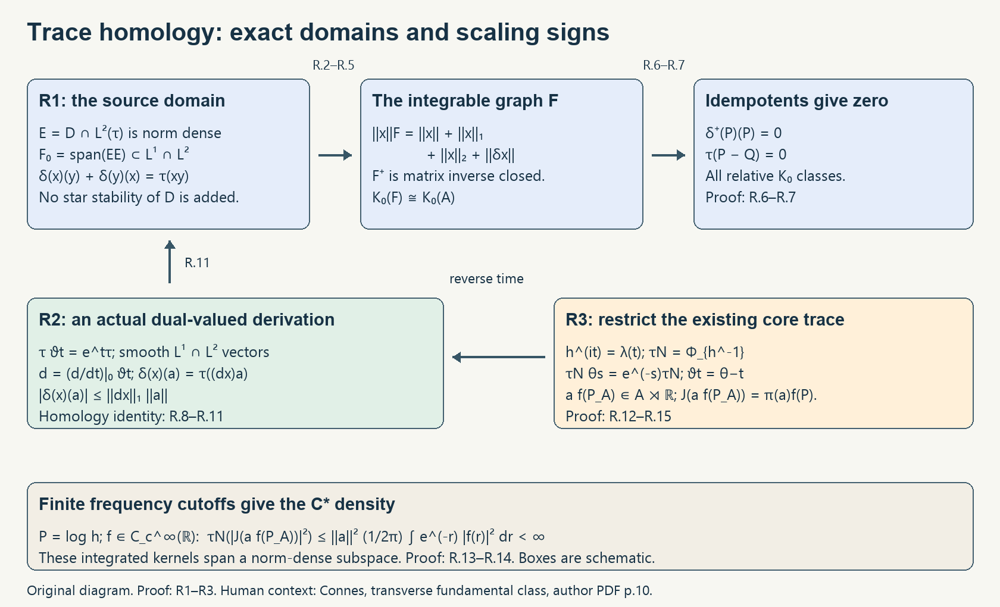

# Appendix C. Semifinite traces and homology

*Written by GPT-6.1 Sol (OpenAI), October 2026, at Ultra. Not yet reviewed. Public domain (CC0).*

A densely defined trace cannot be evaluated on every element of its ambient C*-algebra. The homology argument must first produce an integrable domain, preserve that domain under matrix functional calculus, and show that it carries every relative K-theory class. This appendix proves those steps from the square-integrable density hypothesis in [Connes, Remarks on Section 1, physical p.10](https://alainconnes.org/wp-content/uploads/transfund.pdf), then constructs the homology from a scaling flow and restricts the modular core trace to the C* crossed product.

The semifinite assertion is one of the four remarks there. The bounded trace-boundary result is [Theorem 5.2 of the n-trace lesson](n-traces-on-banach-algebras.md#5-a-dual-valued-derivation-is-the-degree-one-case); the bounded inner-derivation consequence is Corollary 5.5 there; and the orientation hypothesis for the circle crossed product is treated in [Section 6](n-traces-on-banach-algebras.md#6-circle-orientation-remains-visible-in-a-reduced-crossed-product). The present constructions address the semifinite homology and its KMS consequence.

We write \(\|x\|_1=\tau(|x|)\), \(\|x\|_2=\tau(x^*x)^{1/2}\) on the bounded trace ideals. A trace is densely defined when the span of its finite positive cone is norm dense. All unitizations are external, even for a unital algebra, and all matrix traces are unnormalized, as in the n-trace lesson. The labels R1–R3 and (R.1)–(R.15) identify the three constructions in Figure C.1.

## C1. Square-integrable density and relative K-theory (R1)

**Theorem C.1.** Let the trace and derivation have the hypotheses below, including (R.1). Then the integrable graph algebra constructed in (R.3) is dense and matrix inverse closed, and the semifinite trace pairing on every relative degree-zero K-theory class is zero.

Let \(A\) be a C*-algebra, \(\tau\) a densely defined lower semicontinuous positive trace, and \(\delta:D\to A^*\) a derivation on a norm-dense algebra. Put \(N_2=A\cap L^2(\tau)\) and \(E=D\cap N_2\). Assume exactly that \(E\) is norm dense and

\[
 \delta(x)(y)+\delta(y)(x)=\tau(xy),\qquad x,y\in E. \tag{R.1}
\]

Here and below the trace and dual actions have the conventions of [the n-trace lesson, (5.1)](n-traces-on-banach-algebras.md#5-a-dual-valued-derivation-is-the-degree-one-case). The original proof in _From a C*-modular condition to the GNS von Neumann algebra_, KL-01–07 [Modular GNS], supplies the normal extension: use the identity action and the constant strip function \(\tau(xy)=\tau(yx)\) on its finite-star algebra. Its finite-algebra density is exactly dense definition of this C*-trace. For a nonfaithful trace put \(I=\{a:\tau(a^*a)=0\}\). Lower semicontinuity and Cauchy–Schwarz make \(I\) norm closed and linear; \((ba)^*(ba)\le\|b\|^2a^*a\), and the corresponding estimate for \((ab)(ab)^*\), together with traciality, make it a two-sided C* ideal. The quotient trace is indeed lower semicontinuous: take a positive contractive approximate identity \(e_\lambda\) with \(\tau(e_\lambda^2)<\infty\), supplied by the finite-algebra construction in KL-01. The positive functionals \(a\mapsto\tau(e_\lambda a e_\lambda)\) are bounded by \(\|a\|\tau(e_\lambda^2)\), annihilate \(I\) by Cauchy–Schwarz and the ideal estimates, and factor through the quotient. For positive \(a\), their supremum is \(\tau(a)\): the upper bound follows by writing the trace as \(\tau(a^{1/2}e_\lambda^2a^{1/2})\le\tau(a)\), and the reverse bound follows from \(e_\lambda a e_\lambda\to a\) and lower semicontinuity, also when the value is infinite. Their factored supremum defines a lower semicontinuous quotient weight agreeing with \(\tau\) on every positive lift. It is a trace by lifting \(b\) and comparing \(b^*b,bb^*\); its finite cone is norm dense by quotienting the original one. It is faithful because a positive lift of zero trace has square root in \(I\). Thus all hypotheses of the faithful modular extension theorem hold. The resulting normal extension is a trace, since KL-06 gives identity modular action. Pull back its represented ideal calculations to \(A\). This uses the constructed normal envelope and GNS identification; its Hilbert-algebra and modular foundations are specified in C6.

The following bounded ideal argument works for every such normal trace. Its finite-trace projections form a directed increasing net with supremum one after passage to the faithful representation. Semifiniteness finds a nonzero finite positive element in every nonzero projection corner; a spectral cutoff gives a nonzero finite-trace subprojection. Also \(p\vee q-p\) is equivalent to a subprojection of \(q\), by the polar decomposition of \((1-p)q\), hence \(\tau(p\vee q)\le\tau(p)+\tau(q)\). Thus finite joins are finite and the net exhausts one. No countable exhaustion is required.

Positive order and \(\tau(z^*z)=\tau(zz^*)\) give the two-sided bounded multiplier bounds for the square norm. Polarization gives Cauchy–Schwarz. For \(x,y\in L^2\) bounded and \(xy=v|xy|\), compress by a finite-trace projection \(r\). Cauchy–Schwarz gives
\[
 \tau(r|xy|r)=\tau((rv^*x)(yr))
 \le\|rv^*x\|_2\|yr\|_2\le\|x\|_2\|y\|_2.
\]
The same finite trace equals \(\tau(|xy|^{1/2}r|xy|^{1/2})\). These latter positive operators increase strongly along the net; normality proves \(L^2L^2\subset L^1\) with its stated bound. Factor \(z=v|z|^{1/2}|z|^{1/2}\) to obtain the two-sided \(L^1\) multiplier bounds. Finite-trace spectral truncations and polarization extend the linear trace and its cyclic rule to \(L^1\); bounded operators are finite linear combinations of unitaries, so cyclicity holds with every bounded multiplier. The polar factor gives \(\|z\|_1=\sup_{\|a\|\le1}|\tau(az)|\), proving the triangle inequality. These are the full bounded calculations needed here. Completeness in the joint ambient/trace norms is proved in (R.4) below, so it is not inferred from an unrelated unbounded integration construction.

Let \(F_0=\operatorname{span}EE\). It is an algebra contained in \(D\cap L^1\cap L^2\): \(L^2L^2\subset L^1\), and bounded multiplication preserves \(L^2\). It is norm dense because \(E\) is dense and products span a dense subspace of any C*-algebra. For the latter fact, an approximate identity gives \(a e_j\to a\), and both factors can be approximated by elements of \(E\).

There is no assumed star stability of \(D\). To prove closability on \(F_0\), let \(x_j\to0\) in \(A\), with \(\delta(x_j)\to\eta\) in \(A^*\). For \(y=bc\), \(b,c\in E\), cyclicity and Hölder give

\[
 |\tau(x_jbc)|=|\tau(cx_jb)|
 \le\|c\|_2\|x_j\|\|b\|_2\longrightarrow0. \tag{R.2}
\]

Equation (R.1) gives \(\eta(y)=\lim_j[\tau(x_jy)-\delta(y)(x_j)]=0\). Linear combinations and density imply \(\eta=0\). Thus \(\delta|_{F_0}\) is closable in the ambient norm; an unbounded trace was never treated as a bounded functional on \(A\).

Complete \(F_0\) in

\[
 \|x\|_F=\|x\|+\|x\|_1+\|x\|_2+\|\delta x\|. \tag{R.3}
\]

This completion is an actual subalgebra \(F\subset A\cap L^1\cap L^2\). Indeed the norm limit is compatible with its \(L^p\) limits: lower semicontinuity gives, for \(p=1,2\),

\[
 \|x-x_j\|_p\le\liminf_k\|x_k-x_j\|_p. \tag{R.4}
\]

For \(p=1\) use norm continuity of absolute value and lower semicontinuity of \(\tau\); for \(p=2\) use norm continuity of \(z^*z\) and the same lower semicontinuity. Hence these limits lie in \(A\cap L^p\) and converge in the stated norms. Closability identifies the derivative limit uniquely. The bounded multiplier inequalities and the product rule pass to limits and make (R.3) a complete algebra norm, after a harmless equivalent submultiplicative convention. Equation (R.1) passes to limits because the \(L^2L^2\to L^1\) product is continuous.

The algebra \(F^+\) is inverse closed in \(A^+\), at every matrix level. For \(a\in F\), \(\|a\|<1\), the nonconstant terms of the Neumann series satisfy

\[
 \|a^k\|_p\le\|a\|^{k-1}\|a\|_p\quad(p=1,2),\qquad
 \|\delta(a^k)\|\le k\|a\|^{k-1}\|\delta a\|. \tag{R.5}
\]

They therefore converge in \(F\), proving \((1-a)^{-1}\in F^+\). For an arbitrary ambient invertible \(b\in F^+\), choose \(c\in F^+\) close to \(b^{-1}\) in the ambient norm with its prescribed scalar part equal to that of \(b^{-1}\). Both \(1-bc\) and \(1-cb\) have norm less than one, so the preceding argument gives left and right inverses in \(F^+\), which coincide. In matrices use the amplified trace and the entrywise derivation into the matrix dual; the same estimates hold up to a fixed matrix-size norm constant, not a constant raised to \(k\). The inverse derivative identity and the ideal identity for the nonconstant part make the resolvent continuous in (R.3). Contour integration gives matrix holomorphic functional calculus.

The [dense inverse-closed comparison in the n-trace lesson, Theorem 4.1](n-traces-on-banach-algebras.md#4-the-form-reaches-k-theory), now gives \(K_0(F)\cong K_0(A)\). Its actual approximation argument is applicable: approximate each ambient idempotent, then apply a fixed spectral contour to correct it; a compact homotopy interval has one finite covering by such contour neighborhoods. This proves both surjectivity and equality of classes, also with a prescribed scalar part in the external unitization. No assertion that the original domain \(D\) already contains every K-class is needed.

The linear trace \(\rho=\tau|_F\) is bounded for (R.3). Extend it by zero to the new unit. Define

\[
 \delta^+(a)(b+\lambda1)=\delta(a)(b)+\lambda\tau(a),\qquad
 \delta^+(1)=0. \tag{R.6}
\]

This is a bounded map from \(F^+\) into \((A^+)^*\), and restriction gives a derivation into \((F^+)^*\). At an argument in \(A\), its product law is the original derivation law. At the new unit it is exactly (R.1). Thus \((\delta^+)^*(1)=\rho^+\).

For any matrix idempotent \(P\in M_k(F^+)\), the amplified derivation law evaluated at \(P\) gives

\[
 \delta^+(P)(P)=2\delta^+(P)(P)=0,
 \qquad\rho_k^+(P)=\delta^+(P)(1)=2\delta^+(P)(P)=0. \tag{R.7}
\]

Here evaluation denotes the finite matrix trace pairing, so no matrix-index or scalar contribution is omitted. It also gives \(\rho_k^+(Q)=0\) for its scalar idempotent \(Q\). Consequently the relative value \(\tau_k(P-Q)\), which is defined because \(P-Q\in M_k(F)\subset L^1\), is zero. The usual semifinite trace pairing agrees with this value: \(A\cap L^1\), with its ideal norm, is also dense, matrix inverse closed and trace-continuous; the same K-comparison identifies both definitions on common representatives. Every class has such an \(F\)-representative. Hence \(\tau_*:K_0(A)\to\mathbb C\) is identically zero under the exact source hypotheses.

## C2. A scaling flow gives an actual homology (R2)

**Theorem C.2.** A pointwise norm-continuous automorphism flow scaling a densely defined lower semicontinuous positive trace by the positive exponential supplies a norm-dense derivation domain with the homology identity (R.1). Its trace pairing on relative degree-zero K-theory is zero.

Suppose \(\theta:\mathbb R\to\operatorname{Aut}(A)\) is pointwise norm continuous and \(\tau\theta_t=e^t\tau\). On the trace ideals,

\[
 \|\theta_t x\|_1=e^t\|x\|_1,\qquad
 \|\theta_t x\|_2=e^{t/2}\|x\|_2. \tag{R.8}
\]

These actions are continuous in the corresponding graph norms. For \(x\in A\cap L^1\cap L^2\),

\[
 \|\theta_t x-x\|_2^2
 =(e^t+1)\|x\|_2^2-2\operatorname{Re}\tau(x^*\theta_t x),\qquad
 |\tau(x^*(\theta_t x-x))|\le\|x\|_1\|\theta_t x-x\|. \tag{R.9}
\]

This proves \(L^2\) continuity there. Truncating \(|x|\) away from zero proves \(A\cap L^1\cap L^2\) is \(L^2\)-dense in \(A\cap L^2\), and (R.8) extends the conclusion. Explicitly, use continuous functions \(g_\varepsilon:[0,\infty)\to[0,1]\) that vanish on \([0,\varepsilon/2]\) and equal one on \([\varepsilon,\infty)\), and put
\[
 x_\varepsilon=xg_\varepsilon(|x|)\in A,\qquad
 \tau(|x_\varepsilon|)\le
 \frac2\varepsilon\tau(|x|^2),\qquad
 \|x-x_\varepsilon\|_2\longrightarrow0.
\]
The inequality follows pointwise from spectral calculus, and normal dominated convergence uses the integrable square \(|x|^2\). In addition \(\|x-x_\varepsilon\|\le\varepsilon\). These continuous cutoffs keep the truncations in \(A\); no sharp Borel projection is asserted to lie in that C* algebra. For \(x\in A\cap L^1\), factor \(x=(v|x|^{1/2})|x|^{1/2}\); both factors belong to \(A\cap L^2\). The first factor is in \(A\) by continuous functional-calculus approximation to \(x|x|^{-1/2}\): specifically,
\(x(|x|+\varepsilon)^{-1/2}\to v|x|^{1/2}\) in operator norm. The scalar functions \(s(s+\varepsilon)^{-1/2}\) converge uniformly to \(\sqrt{s}\) on the bounded spectrum of \(|x|\). The product estimate now gives \(L^1\) continuity. Ordinary norm continuity supplies the remaining graph term.

The square-integrable domain is norm dense by dense definition of the trace; products of two such bounded elements belong to both ideals and span a norm-dense subspace, as in R1. Let \(E_\infty\) be the smooth vectors of \(\theta\) in the complete algebra \(A\cap L^1\cap L^2\) with the sum norm. Convolution by compactly supported smooth scalar approximate identities proves density in that algebra and in \(A\). Products and the involution preserve smooth vectors. If \(d\) is the generator, \(d(E_\infty)\subset A\cap L^1\cap L^2\), and differentiation in \(L^1\) gives \(\tau(dz)=\tau(z)\). Define

\[
 \delta(x)(a)=\tau((dx)a),\qquad x\in E_\infty,\quad a\in A. \tag{R.10}
\]

The estimate \(|\delta(x)(a)|\le\|dx\|_1\|a\|\) makes this an actual element of \(A^*\). The derivation law follows from the product rule and cyclicity with bounded multipliers. For \(x,y\in E_\infty\),

\[
 \delta(x)(y)+\delta(y)(x)=\tau(d(xy))=\tau(xy). \tag{R.11}
\]

The domain already lies in \(L^2\) and is norm dense, exactly as required in R1. Thus the trace is homologous to zero by the identity (R.1), not merely a trace whose numerical pairing happens to vanish. R1 proves its zero pairing without an additional unproved assumption that an arbitrary original trace domain carries all K-theory.

## C3. Restricting the core trace to the C* crossed product (R3)

**Corollary C.3.** Let a pointwise norm-continuous action of the real line on a possibly nonunital C*-algebra have a KMS state for the height-one strip convention. Under the modular foundations specified below, the C* crossed product has a densely defined lower semicontinuous positive trace and an actual trace homology as in Theorem C.2. Faithfulness of the original state, separability and countability are unnecessary.

The original programme proof _From a C*-modular condition to the GNS von Neumann algebra_, KL-01–08 [Modular GNS], gives the C*-modular extension at the following scope. KL-03 closes the original finite-star involution by its two strip edges; KL-04–05 construct and identify its faithful normal weight on the represented von Neumann algebra; KL-06 uses Gaussian vectors in spectral bands to identify the represented action with the modular group; KL-07 collects these constructions. KL-08 proves invariance for every KMS bounded positive functional, including the nonunital case. The construction uses the Hilbert-algebra correspondence, scalar strip arguments and modular fundamental theorem specified in C6.

The extension theorem's faithful C* hypothesis does not require adding faithfulness to the original KMS state. Let \(I=\{a:\varphi(a^*a)=0\}\). This is a norm-closed left ideal. For an entire analytic \(b\), the KMS identity rotates the leading \(b^*\) in \(\varphi(b^*a^*ab)\) to the final position, giving \(\varphi(a^*a c)\) for the bounded analytic expression \(c=b\alpha_{-i}(b^*)\) in the height-one strip convention of [Modular GNS]. Cauchy–Schwarz and \(\varphi((a^*a)^2)\le\|a\|^2\varphi(a^*a)=0\) make it zero. Thus \(ab\in I\). Gaussian entire analytic approximation is norm dense, so \(I\) is a closed two-sided C* ideal. The state descends to a faithful state on \(A/I\); invariance makes the dynamics descend, and the KMS boundary identity passes to this quotient. Its GNS representation is the original one: elements of \(I\) annihilate all cyclic vectors by the right-ideal property, and conversely a represented zero has zero \(\varphi(a^*a)\). The nonunital statement follows using a positive approximate identity and the cyclic state vector.

Apply KL-01–07 to this faithful quotient state. Its finite domain is the whole quotient, so the modular extension theorem's density hypothesis holds. Its normal extension on \(M\) is finite with value one, because the state vector is cyclic and the normal state restricts to the quotient state (or by the positive approximate identity in KL-01). Thus the normal state and modular action required below follow under the named foundations in C6. Choosing the displayed KMS time convention, or the corresponding explicit time reversal if the original convention uses the other strip edge, identifies the represented group with \(\sigma^\varphi\). No new faithfulness, separability or countability hypothesis is imposed on the original KMS state.

The original proof *Building an intrinsic flow from modular coordinates* [Core and flow], sections “Why the dual weight has an inner modular action,” “Removing the modular density,” and “Trace scaling and its sign,” proves, using the dual-weight and affiliated-perturbation foundations in C6,

\[
 N=M\rtimes_{\sigma^\varphi}\mathbb R,
 \quad h^{it}=\lambda(t),\quad\Phi=\varphi T,
 \quad\tau_N=\Phi_{h^{-1}},\quad
 \tau_N\theta_s=e^{-s}\tau_N. \tag{R.12}
\]

Here is the core calculation. The dual-weight modular formula on the regular generators gives
\[
 \sigma_t^\Phi(\pi(x))=\pi(\sigma_t^\varphi(x))
 =\lambda(t)\pi(x)\lambda(t)^*,\qquad
 \sigma_t^\Phi(\lambda(u))=\lambda(u).
\]
The second identity uses unimodularity of the real line and invariance of the normal state under its modular group. Equality on both sets of generators identifies
\(\sigma_t^\Phi=\operatorname{Ad}(h^{it})\). The inverse affiliated perturbation therefore has modular group
\(\operatorname{Ad}(h^{-it})\sigma_t^\Phi=\mathrm{id}\), so it is a trace.

For the sign, the dual action is
\(\theta_s(\pi(x))=\pi(x)\), \(\theta_s(\lambda(t))=e^{-ist}\lambda(t)\).
Uniqueness of the self-adjoint logarithm gives
\(\theta_s(h)=e^{-s}h\). Translation invariance of the extended-positive integral gives
\(\Phi\theta_s=\Phi\). Naturality of affiliated perturbations gives
\[
 \Phi_a\circ\beta=(\Phi\circ\beta)_{\beta^{-1}(a)},\qquad
 \tau_N\theta_s=\Phi_{e^{-s}h^{-1}}=e^{-s}\tau_N.
\]
These equalities hold on the entire positive cone, including infinite values. They use the specified dual-weight and affiliated-perturbation foundations; no classification of the center flow is required.

Let \(P=\log h\). For any nonnegative compactly supported continuous frequency function \(f\), the extended-positive integral defining \(T\) and the Fourier normalization of [Core and flow] give

\[
 T(f(P))=\frac1{2\pi}\int_{\mathbb R}f(r)\,dr\,1,
 \qquad\tau_N(f(P))=\frac1{2\pi}\int_{\mathbb R}e^{-r}f(r)\,dr. \tag{R.13}
\]

For the second equality, the bounded inverse-density approximants commute with \(f(P)\). The formula in [Core and flow], (RF1)–(RF2), is
\[
 \tau_N(X)=\lim_{\varepsilon\downarrow0}
 \Phi\bigl((h+\varepsilon)^{-1/2}X(h+\varepsilon)^{-1/2}\bigr),
 \qquad\|(h+\varepsilon)^{-1}\|\le\varepsilon^{-1}.
\]
The centralizer construction orders these scalar weight values; the sandwiched operators need not be increasing. For \(X=f(P)\) they commute with \(h\), and monotone scalar convergence gives the second formula in (R.13). In particular \(f(P)\) has finite trace. Let \(J\) be the regular covariant homomorphism to the core specified below. For \(a\in A\), \(f\in C_c^\infty(\mathbb R)\),

\[
 \begin{aligned}
 a f(P_{\widehat A})&\in\widehat A=A\rtimes_\alpha\mathbb R,\\
 J(a f(P_{\widehat A}))&=\pi(a)f(P),\\
 \tau_N\bigl(|J(a f(P_{\widehat A}))|^2\bigr)
 &\le\|a\|^2\tau_N(|f(P)|^2)<\infty.
 \end{aligned}\tag{R.14}
\]

The membership follows by taking the inverse Fourier transform of \(f\): it is an \(L^1\) scalar kernel, and multiplying its integrated group operator by a coefficient is an integrated crossed-product kernel. These canonical coefficient cutoffs span a norm-dense subspace of \(\widehat A\). Indeed Schwartz kernels are \(L^1\)-dense; cutting off their Schwartz Fourier transforms by expanding smooth frequency cutoffs converges in the Schwartz topology, hence in \(L^1\). Finite coefficient tensors are dense in the Bochner \(L^1\) kernel algebra. This proof applies to nonunital \(A\); \(f(P)\) alone may be only a multiplier, whereas \(a f(P_{\widehat A})\) is in the C* crossed product, with image \(\pi(a)f(P)\) in the core.

The pointwise norm-continuous C* dynamics \(\alpha\) and its equivariant quotient representation give the regular covariant homomorphism
\[
 \begin{aligned}
 J:\widehat A=A\rtimes_\alpha\mathbb R&\longrightarrow N,\\
 N&=M\rtimes_{\sigma^\varphi}\mathbb R,\\
 J(a f(P_{\widehat A}))&=\pi(a)f(P),\\
 \tau&=\tau_N\circ J .
 \end{aligned}
\]
Here \(P_{\widehat A}\) denotes the generator of the canonical group multipliers; the compact frequency kernel defines \(a f(P_{\widehat A})\) as an element of the crossed product. If the original KMS convention requires time reversal, identify the corresponding crossed products by reversal first. The map \(J\) may have a kernel when the original state is nonfaithful. Thus (R.14) is a bound on the image of the canonical C* element. Equivariance intertwines both dual actions. The restriction notation \(\tau=\tau_N|_{\widehat A}\) denotes this pullback, which is therefore a densely defined lower semicontinuous positive trace. Lower semicontinuity follows from norm-to-strong convergence and the normal trace's lower semicontinuity. Its square-integrable domain is norm dense by (R.14). The C* dual action is pointwise norm continuous: on an \(L^1\) kernel it multiplies by the scalar phase, so dominated convergence proves continuity, and density extends it. Reverse its parameter to set \(\vartheta_t=\theta_{-t}\); then

\[
 \tau\vartheta_t=e^t\tau. \tag{R.15}
\]

R2 supplies the required densely defined \(\widehat A\to\widehat A^*\) derivation with the precise homology identity, and R1 supplies its zero \(K_0\) pairing. This proves the KMS consequence relative to the named modular foundations and the ordinary semifinite trace-ideal framework. The core's \(e^{-s}\) and Connes's displayed \(e^t\) are reconciled by the displayed reversal.

## C4. The domains and scaling signs

*Figure C.1. R1 starts with the exact norm-dense square-integrable domain and completes its product algebra in (R.3); (R.2)–(R.5) supply closability and matrix inverse closure, and (R.6)–(R.7) kill every relative idempotent value. R2 constructs the actual dual-valued derivation in (R.10). R3 supplies the norm-dense frequency cutoffs in (R.13)–(R.14) and reverses the core's time parameter in (R.15). Box sizes are schematic and encode no additional norm bound. Human context: Connes, Remarks on Section 1, physical p.10.*

Open the figure at full size: [PNG](../assets/semifinite-trace-homology.png) · [SVG](../assets/semifinite-trace-homology.svg). Reproducible drawing: [semifinite-trace-homology.py](../../tools/semifinite-trace-homology.py).

## C5. Exercise with a complete solution

**Exercise C.1 (30 points).** Put \(A=C_0(\mathbb R,M_2(\mathbb C))\), with the supremum operator norm, and define the positive trace
\[
 \tau(x)=\int_{\mathbb R}e^{-r}\operatorname{Tr}_2(x(r))\,dr,\qquad x\ge0.
\]
Let \((\theta_sx)(r)=x(r-s)\) and \(\vartheta_t=\theta_{-t}\).

1. (10 points) Prove dense definition and lower semicontinuity of the trace, norm continuity of the flows, and their exact scaling signs. Show that the trace has finite support bounds but is not globally bounded on \(A\).
2. (10 points) On \(D=C_c^\infty(\mathbb R,M_2(\mathbb C))\), construct the actual dual-valued derivation \(\delta(x)(a)=\tau(x'a)\). Prove its norm bound and homology identity, and deduce the vanishing of its relative \(K_0\)-pairing by C1.
3. (10 points) For the normalized tracial state \(\varphi=\operatorname{Tr}_2/2\) on \(M_2(\mathbb C)\), compute the core trace with the normalization \(T=(2\pi)^{-1}\int\theta_s\,ds\). Calculate the square norm of a frequency cutoff \(f(P)\), and the bound for \(a f(P)\), including every factor of two and \(2\pi\).

**Solution.** (1) Positivity and the trace identity follow pointwise from the matrix trace. For positive \(x_n\to x\) uniformly, pointwise convergence and Fatou's lemma give
\(\tau(x)\le\liminf_n\tau(x_n)\). Compactly supported matrix-valued functions have finite trace norm and are norm dense, so the trace is densely defined. Translation is an isometry in the ambient norm; uniform continuity on compact supports proves norm continuity first there, and density proves it on \(A\).

Substitution \(u=r-s\), and then \(s=-t\), gives
\[
 \tau(\theta_s x)=e^{-s}\tau(x),\qquad
 \tau(\vartheta_t x)=e^t\tau(x).
\]
For a positive \(x\) supported in a fixed compact set \(K\),
\[
 \tau(x)\le 2\|x\|\int_K e^{-r}\,dr.
\]
Choose a nonzero nonnegative smooth compact bump \(\psi\) with supremum one and a rank-one matrix projection \(p\). The translates \(x_j(r)=\psi(r+j)p\) have norm one, but
\[
 \tau(x_j)=e^j\int_{\mathbb R}e^{-u}\psi(u)\,du\longrightarrow\infty.
\]
There is no global bound and none is needed by Theorem C.1.

(2) Every element of \(D\) is square integrable and trace integrable. The derivative of the reversed flow is \(dx=x'\). Trace Hölder gives
\[
 |\delta(x)(a)|\le
 \left(\int_{\mathbb R}e^{-r}\operatorname{Tr}_2|x'(r)|\,dr\right)\|a\|.
\]
Thus \(\delta(x)\) is an actual bounded functional on \(A\). In fact the displayed coefficient is its exact norm: for \(z=x'\) use the compactly supported contractions
\(a_\varepsilon=z^*(zz^*+\varepsilon I)^{-1/2}\). Spectral calculus and dominated convergence give
\(\operatorname{Tr}_2(za_\varepsilon)\to\operatorname{Tr}_2|z|\) under the weighted integral. The local estimate is consequently at most
\(2\|x'\|\int_K e^{-r}\,dr\) when \(x'\) is supported in \(K\).

With the dual actions (5.1), the matrix product rule and cyclicity give
\(\delta(xy)=x\delta(y)+\delta(x)y\). Integration by parts has no boundary term because \(x,y\) are compactly supported:
\[
 \delta(x)(y)+\delta(y)(x)
 =\int_{\mathbb R}e^{-r}\operatorname{Tr}_2((xy)'(r))\,dr
 =\int_{\mathbb R}e^{-r}\operatorname{Tr}_2(x(r)y(r))\,dr
 =\tau(xy).
\]
The algebra \(D=D\cap L^2(\tau)\) is norm dense, so all hypotheses of Theorem C.1 hold. Its integrable graph algebra represents every relative \(K_0\)-class, and (R.7) makes the trace pairing zero. This deduction does not presume that the initial smooth compact-support algebra already represents all classes.

(3) The modular group of the normalized matrix trace is trivial. Fourier transformation identifies its core with
\(M_2(\mathbb C)\,\overline\otimes\,L^\infty(\mathbb R)\), with
\(\lambda(t)(r)=e^{itr}I\), \(h(r)=e^rI\), \(P(r)=rI\).
The dual action translates by \(\theta_sX(r)=X(r-s)\). Thus
\[
 \begin{aligned}
 \Phi(X)&=\frac1{4\pi}\int_{\mathbb R}\operatorname{Tr}_2 X(r)\,dr,\\
 \tau_N(X)&=\frac1{4\pi}\int_{\mathbb R}e^{-r}\operatorname{Tr}_2 X(r)\,dr
 \quad(X\ge0).
 \end{aligned}
\]
The factor \(1/(4\pi)\) is the product of the Fourier factor \(1/(2\pi)\) and the state normalization \(1/2\). Since \(f(P)=f(r)I\) and \(\operatorname{Tr}_2 I=2\),
\[
 \begin{aligned}
 \tau_N(|f(P)|^2)&=\frac1{2\pi}\int_{\mathbb R}e^{-r}|f(r)|^2\,dr,\\
 \tau_N(|a f(P)|^2)
 &=\frac{\operatorname{Tr}_2(a^*a)}{4\pi}
    \int_{\mathbb R}e^{-r}|f(r)|^2\,dr\\
 &\le\frac{\|a\|^2}{2\pi}\int_{\mathbb R}e^{-r}|f(r)|^2\,dr.
 \end{aligned}
\]
These are exactly the finite-cutoff formula and coefficient bound in (R.13)–(R.14). Translation gives \(\tau_N\theta_s=e^{-s}\tau_N\); reversing time gives the required \(e^t\) flow. Restricted to the C* crossed product, the core trace is the trace in parts (1)–(2) multiplied by \(1/(4\pi)\). Its homology and zero relative pairing follow with the same factor. \(\square\)

## C6. Sources and modular foundations

[Connes] Alain Connes, *Cyclic cohomology and the transverse fundamental class of a foliation*, in *Geometric Methods in Operator Algebras*, Pitman Research Notes in Mathematics 123 (1986), 52–144. The bounded trace-homology argument is Lemma 1.2, physical pp.6–7, and the four remarks are on physical p.10 of the [author-hosted edition](https://alainconnes.org/wp-content/uploads/transfund.pdf).

[Modular GNS] _From a C*-modular condition to the GNS von Neumann algebra_, original English proof in the programme course *Modular Theory and Weights*. Exact proof locators: KL-01, “The exact dense domains and their approximate identity”; KL-02, “The modular condition builds continuous GNS unitaries”; KL-03, “The strip boundary closes the involution”; KL-04, “The normal weight recovered from this algebra”; KL-05, “Equality with the bounded-functional normal envelope”; KL-06, “The original strip identifies the modular time”; KL-07, “The C*-to-von-Neumann modular extension theorem”; and KL-08, “For a finite weight, the two edges force invariance.” The mathematical antecedents are Takesaki, *Theory of Operator Algebras II*, VIII.1 Proposition 1.5 and Exercises 1–2, printed pp.95–96, and the normal-envelope formula VII.4(5), printed pp.89–90.

[Core and flow] *Building an intrinsic flow from modular coordinates*, original proof in the programme course on crossed products and flows. Exact proof locators: “The core in a weight chart”; “Why the dual weight has an inner modular action”; “Removing the modular density”; “Evaluating the inverse-density trace by bounded operators,” (RF1)–(RF2); and “Trace scaling and its sign.”

The modular results used here retain the following foundations. The C*-extension proof uses finite-domain GNS constructions, the full left Hilbert-algebra correspondence (WH), the normal-weight envelope (LW), bounded-functional factorization, spectral calculus, scalar strip maximum/uniqueness arguments, and the modular fundamental theorem. Its KL-06 proof identifies the group on Gaussian vectors in bounded spectral bands; it uses the modular fundamental theorem to identify that group with the normal weight's modular group. The core proof uses the general dual-weight theorem, regular crossed products, Haar/Fourier analysis and Stone's theorem, and the centralizer affiliated-perturbation construction (CZ-06–08). In that construction order is an order of scalar weight values on the whole positive cone, which justifies (RF1) including infinite values. C1–C3 use these named foundations at their stated generality; they do not supply a new proof of every modular prerequisite.
