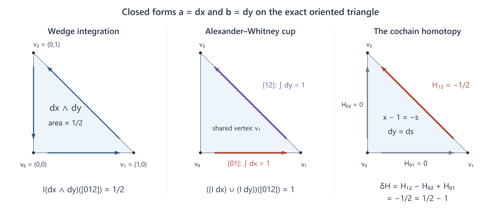
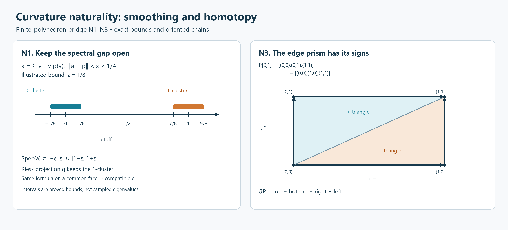
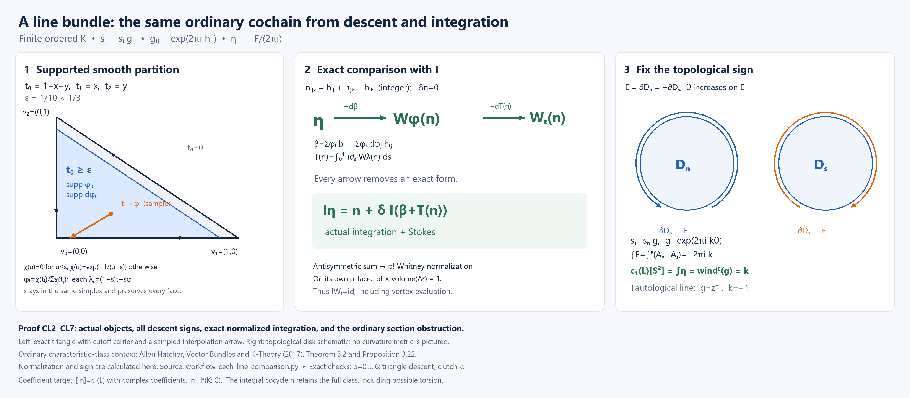
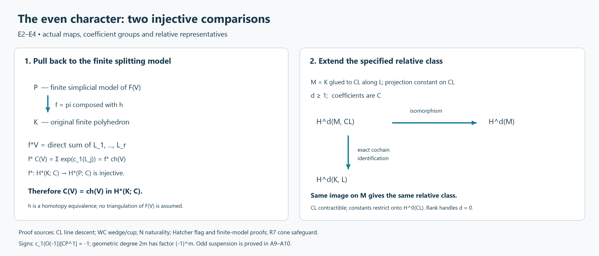
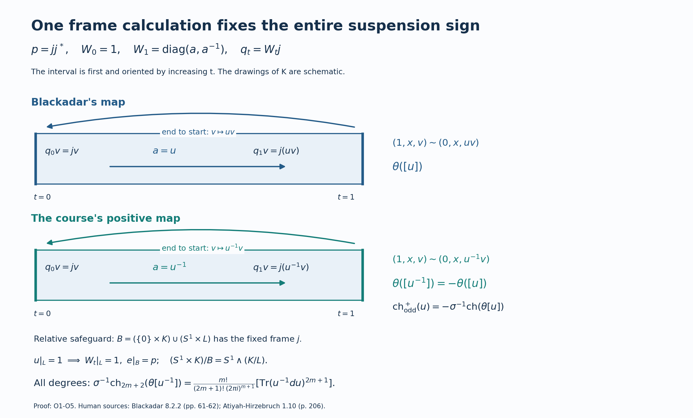

# Appendix A. Simplicial integration and the ordinary geometric Chern character

*Written by GPT-6.1 Sol (OpenAI), October 2026, at Ultra. Not yet reviewed. Public domain (CC0).*

This appendix identifies the differential forms in the geometric examples with ordinary cohomology classes. The comparison uses integration over the actual oriented simplices, including for relative classes and compact supports. It also specifies the odd suspension convention: the positive unitary convention is the negative of Blackadar's displayed suspension map.

## A1. The comparison theorem and its conventions

Let \(K\) be a finite simplicial complex with a total order on its vertices, and let \(L\subseteq K\) be a subcomplex. An increasing vertex list gives a simplex its preferred orientation. All coefficient groups for the differential-form comparison are complex; an integral or rational topological characteristic class is mapped to complex cohomology by change of coefficients.

The topological first Chern class uses the complex orientation. In particular the tautological line \(\mathcal O(-1)\) on \(\mathbb {CP}^1\), with its usual complex orientation, has Chern number \(-1\). Higher Chern classes use the same normalization. The ordinary even character is
\[
\operatorname{ch}(E)=\operatorname{rank}E+
\sum_{m\geq1}\frac{s_m(c_1(E),\ldots,c_m(E))}{m!},
\tag{A.1}
\]
where \(s_m\) is the Newton polynomial giving the \(m\)-th power sum in elementary symmetric functions. On a split bundle this is the sum of the exponentials of the first Chern classes of its line summands. Ordinary Chern classes, their naturality and Whitney sum formula are the topological foundations used here; their construction and proof are in Allen Hatcher, [*Vector Bundles and K-Theory*, Theorem 3.2 and the ensuing proof](https://pi.math.cornell.edu/~hatcher/VBKT/VB.pdf#page=82), printed pp. 78–83. Definition (A.1) and the split calculation appear on printed pp. 109–110. The sign left as a choice in that construction is calibrated explicitly in A6 below.

For a compatible simplexwise smooth idempotent \(p\), put
\[
\operatorname{ch}^{\mathrm{geo}}_{2m}(p)
=\frac{(-1)^m}{m!(2\pi i)^m}\operatorname{Tr}p(dp)^{2m}
\quad(m\geq1),
\tag{A.2}
\]
and use rank in degree zero. This is the curvature convention \(\operatorname{Tr}\exp(-F/(2\pi i))\). For an identity-relative unitary \(u\), put
\[
\operatorname{ch}^{\mathrm{geo},+}_{2m+1}(u)
=\frac{m!}{(2m+1)!(2\pi i)^{m+1}}
\operatorname{Tr}(u^{-1}du)^{2m+1}
\quad(m\geq0).
\tag{A.3}
\]
The geometric components in (A.2) and (A.3) are \((-1)^m\) times the corresponding cyclic differential-form components in the [connections lesson](connections-and-curvature-for-c-star-dynamical-systems.md). The raw current pairings retain the normalization of the [n-trace lesson's](n-traces-on-banach-algebras.md) (7.2)–(7.3).

**Theorem A.1.** Let \(p=e\) on \(L\), where \(e\) is a constant matrix idempotent, and let \(z=[p]-[e]\) carry that specified relative trivialization. Actual oriented simplex integration \(I\) gives
\[
I_*[\operatorname{ch}^{\mathrm{geo}}_{2m}(p)]
=\operatorname{ch}^{\mathrm{top}}_{2m}(z)_{\mathbb C}
\quad\text{in }H^{2m}(K,L;\mathbb C),\quad m\geq1.
\tag{A.4}
\]
In degree zero both sides are the relative rank difference. If \(u:K\to U(N)\) is compatible and smooth on simplices, with \(u|_L=1\), then
\[
I_*[\operatorname{ch}^{\mathrm{geo},+}_{2m+1}(u)]
=\operatorname{ch}^{+,\mathrm{top}}_{2m+1}([u])_{\mathbb C}
\quad\text{in }H^{2m+1}(K,L;\mathbb C).
\tag{A.5}
\]
Here the positive ordinary odd character has the explicit definition
\[
\operatorname{ch}^{+,\mathrm{top}}([u])
=\sigma^{-1}\operatorname{ch}^{\mathrm{top}}(\kappa^+([u])),
\qquad \kappa^+=-\theta,
\tag{A.6}
\]
where \(\theta\) is Blackadar's displayed stable suspension isomorphism and \(\sigma\) is the ordinary cohomology suspension with the positively oriented circle factor first. A9 constructs both maps with their actual frames; A10 proves the formula in every odd degree. Definition (A.6) specifies the identification of stable-unitary \(K_1\) with suspended topological K-theory used in this appendix. An abstract equivalence with no displayed endpoint convention is not used to select its sign.

The same equalities hold in compact-support cohomology of a locally finite simplicial complex, with functions and representatives smooth on a sufficiently fine subdivision. Each individual compact-support K-class has only finitely many nonzero degree components; a uniform dimension bound on the entire complex is unnecessary. No integral torsion is recovered by a curvature form. The integral cocycle in A6 represents the full first Chern class before change of coefficients.

We prove the theorem in A2–A11. The ordinary singular-cohomology foundations imported at specific steps are stated with accessible proof locators. The curvature/topological equality itself will follow from the line calculation, a finite splitting model and the relative cone argument.

## A2. Compatible forms and relative simplicial integration

A form in \(\Omega^q(K)\) consists of a smooth form on each closed affine simplex, with identical tangential restrictions on common faces. Smoothness means extension to a neighborhood in the affine span of the simplex. A degree exceeding a face's dimension has zero pullback to that face. Set
\[
\Omega^*(K,L)=\ker(\Omega^*(K)\to\Omega^*(L)).
\]
This is a tangential relative condition; it imposes no vanishing normal derivatives. The simplicial relative complex \(C^*(K,L;\mathbb C)\) consists of cochains vanishing on simplices of \(L\), with the usual alternating-face differential \(\delta\).

**Lemma A.2.** Restriction of compatible forms to a subcomplex is onto in every degree. The actual integration map
\[
I\omega([v_0,\ldots,v_q])=\int_{[v_0,\ldots,v_q]}\omega,
\qquad I\omega(v)=\omega(v)\text{ in degree zero},
\tag{A.7}
\]
is a chain map and induces an isomorphism
\[
I_*:H^q(\Omega^*(K,L))\xrightarrow{\cong}H^q(K,L;\mathbb C).
\tag{A.8}
\]

**Proof.** For boundary extension on an affine simplex, write \(F_i=\{t_i=0\}\) in barycentric coordinates. On \(t_i<1\), retract to that face by
\[
r_i(t)_i=0,\qquad r_i(t)_j=\frac{t_j}{1-t_i}\quad(j\ne i).
\tag{A.9}
\]
A smooth cutoff \(\chi(t_i)\), equal to one near zero and zero for \(t_i\geq1/2\), extends a face form \(\alpha\) by \(\chi(t_i)r_i^*\alpha\), and by zero off that region. The support avoids the pole and the extension has the required neighborhood smoothness. Extend the faces in a fixed order. On the next face subtract the current restriction from the desired form. The residual vanishes on intersections with earlier faces. On an earlier face \(t_j=0\), its retraction under \(r_i\) lies in \(F_i\cap F_j\), so the new correction has zero tangential restriction there. It changes no previously completed face. This extends a compatible boundary form. Starting with the prescribed forms on \(L\), extend over new vertices, edges and higher simplices in turn. This proves surjectivity.

Stokes and face compatibility give \(Id=\delta I\), also in the relative complexes. On a single simplex choose a vertex \(v\), let \(G(s,x)=(1-s)v+sx\), and define
\[
h\omega=\int_0^1\iota_{\partial_s}G^*\omega\,ds.
\]
Writing \(G^*\omega=ds\wedge\alpha(s)+\beta(s)\), the interval coefficient of its differential is \(\partial_s\beta-d_x\alpha\). Integration gives
\[
dh+hd=\mathrm{id}-G(0,\cdot)^*.
\tag{A.10}
\]
The last pullback is vertex evaluation in degree zero and zero in higher degrees. Thus the form cohomology of a simplex is \(\mathbb C\) in degree zero and zero otherwise. The augmented vertex-cone contraction of its simplicial chains gives the same cohomology calculation. Integration sends the constant one to one, proving the absolute simplex comparison.

Induct on dimension. Surjectivity provides the short exact sequences for forms on \((\Delta^r,\partial\Delta^r)\), and integration maps them to the cochain sequences. The simplex result and the boundary induction, applied to their long exact sequences, prove the cell-pair comparison by the five lemma. For an arbitrary finite pair put \(Y_{-1}=L\) and \(Y_j=L\cup K^{(j)}\). Both relative complexes for \((Y_j,Y_{j-1})\) are finite direct sums of the cell-pair complexes, one per new \(j\)-simplex: all common-face restrictions are already zero. Restriction in
\[
0\to\Omega^*(Y_j,Y_{j-1})\to\Omega^*(Y_j,L)
\to\Omega^*(Y_{j-1},L)\to0
\]
is onto by the boundary extension, preserving the zero restriction on \(L\). Comparing long exact sequences and applying the five lemma gives (A.8), by induction over the finitely many layers. \(\square\)

The normalized Whitney form for an ordered face \(a=[i_0,\ldots,i_q]\) is
\[
\omega_a=q!\sum_{r=0}^q(-1)^r t_{i_r}
dt_{i_0}\wedge\cdots\wedge\widehat{dt_{i_r}}\wedge\cdots\wedge dt_{i_q}.
\tag{A.11}
\]
Its restriction to a face omitting a specified vertex is zero; otherwise it restricts to the same formula. For a cochain \(a\), sum its face coefficients times these forms to define \(Wa\). Differentiation gives \((q+1)!dt_{i_0}\wedge\cdots\wedge dt_{i_q}\). Using \(\sum t_i=1\) and \(\sum dt_i=0\), this is \(\sum_i\omega_{i,i_0,\ldots,i_q}\), so \(dW=W\delta\). On its own \(q\)-face, \(\omega_a=q!dt_{i_1}\wedge\cdots\wedge dt_{i_q}\). That simplex has volume \(1/q!\); on every other \(q\)-face the restriction is zero. Therefore
\[
IW=\mathrm{id}.
\tag{A.12}
\]
Together with Lemma A.2, this makes \(W_*\) the inverse of (A.8).

For a barycentric subdivision \(K'\), restriction \(\rho\) of forms and the signed chain subdivision \(\operatorname{sd}\) satisfy the exact equality
\[
\operatorname{sd}^*I_{K'}\rho=I_K.
\tag{A.13}
\]
This is additivity of integration over the oriented subdivision. For completeness, construct subdivision chains recursively by coning the subdivided boundary to the simplex barycenter. The cone boundary formula proves that this is a chain map. Send the barycenter of each face to its largest vertex to obtain a simplicial map \(\lambda:K'\to K\). Both \(\lambda_*\operatorname{sd}\) and the identity are carried by each original simplex. Fill their discrepancy on a simplex, after subtracting the already constructed face homotopy, by a vertex cone in that simplex. The discrepancy is a cycle by the lower-dimensional identities. This proves one chain homotopy. For the reverse composite use the same induction inside the subdivision of the largest original face; that subdivision is the cone from its barycenter over its subdivided boundary. These homotopies preserve subcomplexes and finite carriers. Thus (A.13) uses the ordinary subdivision cohomology identification for pairs.

We interpret simplicial cohomology as ordinary cohomology using the characteristic-simplex comparison. Its foundational proof is Hatcher, [*Algebraic Topology*, Theorem 2.27](https://pi.math.cornell.edu/~hatcher/AT/ATplain.pdf#page=137), printed pp. 128–130. Over \(\mathbb C\), algebraic duality preserves the homology comparison: functionals on cycles or boundaries extend by a vector-space basis. A5 supplies the carrier homotopies needed for its naturality under the maps used here. Formulae (A.7) and (A.13), rather than a renamed abstract de Rham map, remain the integration maps throughout.

## A3. Integration carries wedge to the ordinary cup product

Under the characteristic-simplex comparison in A2, restriction of a singular Alexander–Whitney cup cochain to each preferred affine simplex gives the simplicial formula below: its front and back singular faces are exactly the affine simplicial faces. Thus the cohomological product compared here is the ordinary singular-cohomology cup product.

For cochains in the fixed vertex order use the Alexander–Whitney formula
\[
(a\smile b)([v_0,\ldots,v_{p+q}])
=a([v_0,\ldots,v_p])b([v_p,\ldots,v_{p+q}]).
\tag{A.14}
\]
The shared vertex \(v_p\) matters. A degree-zero left factor evaluates at the first vertex, and a degree-zero right factor at the last.

**Lemma A.3.** There is a linear cochain homotopy \(H\), lowering total degree by one, with
\[
I(a\wedge b)-(Ia)\smile(Ib)
=\delta H(a,b)+H(da,b)+(-1)^pH(a,db),\qquad |a|=p.
\tag{A.15}
\]
It is relative if either input is relative, and compactly supported if either input is compactly supported on a locally finite complex. Consequently \(I_*\) preserves ordinary cup products and the corresponding relative module products.

**Proof.** On \(A(K)=\Omega^*(K)\otimes\Omega^*(K)\), let
\(D(a\otimes b)=da\otimes b+(-1)^pa\otimes db\), and set
\(F(a,b)=I(a\wedge b)\), \(G(a,b)=Ia\smile Ib\), \(T=F-G\).
The differential of (A.14) is
\(\delta(a\smile b)=\delta a\smile b+(-1)^pa\smile\delta b\).
Indeed deletions before the overlap give the first terms, and deletions after it give the second. The two remaining overlap terms have coefficients \((-1)^{p+1}\) and \((-1)^p\) and cancel. Thus \(FD=\delta F\), \(GD=\delta G\) and \(TD=\delta T\).

On an ordered simplex \(\sigma\), use the radial contraction \(h_\sigma\) of (A.10) to its first vertex, and let \(P_\sigma\) be the vertex-evaluation projection, zero in positive degree. Define
\[
K_\sigma(a\otimes b)=h_\sigma a\otimes b+
(-1)^pP_\sigma a\otimes h_\sigma b.
\]
Then
\[
DK_\sigma+K_\sigma D=\mathrm{id}-P_\sigma\otimes P_\sigma.
\tag{A.16}
\]
The cross terms \(h_\sigma a\otimes db\) cancel with signs \((-1)^{p-1}\) and \((-1)^p\). The remaining terms are
\((\mathrm{id}-P_\sigma)a\otimes b+P_\sigma a\otimes(\mathrm{id}-P_\sigma)b\), giving (A.16). Neither this contraction nor the radial contraction is claimed to commute with every face restriction.

Construct functionals \(H_\sigma:A(\sigma)^{\dim\sigma+1}\to\mathbb C\) inductively. On vertices set them to zero; there \(T_\sigma=0\). Suppose the proper-face functionals satisfy
\(T_\tau=\sum_i(-1)^iH_{\partial_i\tau}r_i+H_\tau D\).
For an \(n\)-simplex, \(n>0\), set, on input degree \(n\),
\[
B_\sigma=\sum_j(-1)^jH_{\partial_j\sigma}r_j,
\qquad R_\sigma=T_\sigma-B_\sigma.
\]
The chain-map identity and the face induction give
\[
R_\sigma D
=\sum_j(-1)^j\sum_i(-1)^i
H_{\partial_i\partial_j\sigma}r_i r_j=0.
\tag{A.17}
\]
For original deleted indices \(u<v\), the two orders have coefficients \((-1)^{v+u}\) and \((-1)^{u+v-1}\); their restrictions and face functionals agree, so they cancel. Now set \(H_\sigma=R_\sigma K_\sigma\). On degree \(n>0\), the projection in (A.16) vanishes, and (A.17) annihilates \(DK_\sigma\). Hence \(R_\sigma=H_\sigma D\), proving the induction identity. Define \(H(a,b)(\sigma)=H_\sigma(a|_\sigma\otimes b|_\sigma)\) on simplices of dimension \(|a|+|b|-1\). This gives (A.15), including total degree zero where both sides vanish.

Every local functional is bilinear in the restricted inputs. If either input is zero on a whole simplex, its value is zero there. This proves relativity on simplices of \(L\), and proves the stronger carrier assertion that a nonzero value requires both input restrictions to be nonzero. A compact support meets finitely many simplices in a locally finite complex, so the output has finite support. The recursion also commutes with extension by zero across finite relative stages. For closed inputs (A.15) reduces to an ordinary coboundary, proving the product assertion. \(\square\)

**Figure A.1.** On the exact ordered triangle \((0,0),(1,0),(0,1)\), \(I(dx\wedge dy)=1/2\), while \((I dx\smile I dy)([012])=1\). The preferred edge values of the homotopy are \(H_{01}=H_{02}=0\), \(H_{12}=-1/2\); thus \(\delta H=-1/2\), as required by (A.15). The front edge is \([01]\), the back edge \([12]\), and their shared vertex is \(v_1\). Reproducible source: [workflow-wedge-cup-triangle.py](../../tools/workflow-wedge-cup-triangle.py). The contraction and Whitney-form context is Ezra Getzler, [*Lie Theory for Nilpotent L-infinity Algebras*, Section 3](https://arxiv.org/pdf/math/0404003v4#page=8); the smooth relative and product identities used here have been proved in A2–A3.

## A4. Curvature, connection independence and bundle operations

For a compatible connection, its local matrix form \(A\) has curvature \(F=dA+A^2\). The covariant differential on a matrix form \(\alpha\) of degree \(q\) is \(D_A\alpha=d\alpha+A\alpha-(-1)^q\alpha A\). Direct expansion gives the Bianchi identity \(D_AF=0\). Graded trace cyclicity annihilates the commutator, so
\[
d\operatorname{Tr}F^m=\operatorname{Tr}D_A(F^m)=0.
\tag{A.18}
\]
These trace forms are invariant under changes of frame, hence are global compatible forms.

For two connections on the same bundle, interpolate linearly on \([0,1]\times K\). In local frames independent of the parameter the product connection has no parameter-direction component; its curvature is \(F_s+ds\wedge\dot A_s\). Closedness and the interval decomposition used in (A.10) give
\[
\operatorname{Tr}F_1^m-\operatorname{Tr}F_0^m
=d\left(m\int_0^1\operatorname{Tr}(\dot A_sF_s^{m-1})\,ds\right).
\tag{A.19}
\]
The trace makes this a global primitive. Equivalently it is interval contraction of the closed product curvature form; therefore its face restrictions agree. If the connections agree on \(L\), then \(\dot A_s|_L=0\), and the primitive is relative. This proves absolute and relative connection independence with the required support whenever the homotopy is confined to a common finite stage.

For block sums, curvature and its powers are block diagonal, so the geometric class is additive. For a tensor connection its curvature is \(F_E\otimes1+1\otimes F_F\); the even-degree summands commute. Taking the exponential and trace gives the wedge product of the two character forms. Equation (A.19) compares this connection with a chosen projection connection, and Lemma A.3 turns wedge into ordinary cup. Thus the integrated geometric construction is additive and multiplicative. On a fixed finite polyhedron the exponential is truncated by dimension.

## A5. Continuous maps, smooth representatives and ordinary naturality

**Lemma A.4.** For every continuous complex bundle \(E\) on a finite polyhedron, the integrated geometric class \(C(E)\) is well defined using a smooth projection on a subdivision. It is independent of that choice and is natural under every continuous map of finite polyhedra.

**Proof: smoothing.** Choose finitely many trivializations, a continuous Hermitian metric and subordinate continuous weights \(\rho_j\). A finite shrinking and distances to closed complements construct such weights with supports inside the trivializing opens. Orthonormalize each local frame using the inverse positive square root of its Gram matrix. Mapping a fiber vector to its local coordinates multiplied by \(\sqrt{\rho_j}\) gives an isometric embedding in a finite trivial bundle: the squared component norms add to the fiber norm, and the zero extensions are continuous. Its range has a continuous Hermitian projection \(p\).

Choose \(0<\varepsilon<1/4\) and subdivide until \(\|p(x)-p(v)\|<\varepsilon\) for each vertex of the simplex containing \(x\). The affine interpolation
\[
a(x)=\sum_{v\in\sigma}t_v(x)p(v)
\quad\text{satisfies}\quad \|a(x)-p(x)\|<\varepsilon.
\]
Its spectrum lies in \([-\varepsilon,\varepsilon]\cup[1-\varepsilon,1+\varepsilon]\). To verify this, invert \(a-\lambda\) by factoring through \(p-\lambda\) and using the Neumann series whenever \(\operatorname{dist}(\lambda,\{0,1\})>\varepsilon\); the spectrum is real because \(a\) is Hermitian. Define
\[
q(x)=\frac{1}{2\pi i}\int_{|z-1|=1/2}(z-a(x))^{-1}\,dz,
\tag{A.20}
\]
with positive contour orientation. This is the orthogonal spectral projection onto the cluster near one. The uniformly separated contour makes the resolvent smooth on a neighborhood of every closed simplex, and restrictions agree. Applying the same formula to \((1-s)p+sa\) gives a continuous projection homotopy from \(p\) to \(q\). Endpoint range bundles are isomorphic: divide a projection path into finitely many uniformly close steps and use on each the polar unitary described below in A9. Thus \(q\) represents \(E\). If \(p\) is a constant reference on \(L\), vertex interpolation, the spectral cutoff and this homotopy preserve that reference exactly on \(L\).

**Proof: choice independence.** If smooth projections \(q_0,q_1\) have isomorphic range bundles, polar-deform a continuous fiber isomorphism to a unitary and extend it by zero, obtaining a rectangular matrix \(U\) with \(U^*U=q_0\), \(UU^*=q_1\). The continuous block projection
\[
H_\theta=\begin{pmatrix}
\cos^2\theta\,q_0&\cos\theta\sin\theta\,U^*\\
\cos\theta\sin\theta\,U&\sin^2\theta\,q_1
\end{pmatrix}
\tag{A.21}
\]
connects \(q_0\oplus0\) with \(0\oplus q_1\). Choose \(\theta(t)\) constant on endpoint collars. Triangulate the product by ordered prisms, subdivide, and approximate this projection by Hermitian vertex interpolation within \(\varepsilon\). To retain its exact smooth endpoints, replace the approximation by
\(a'=\lambda_0(q_0\oplus0)+\lambda_1(0\oplus q_1)+(1-\lambda_0-\lambda_1)a\), where the disjoint collar cutoffs are supported where \(H\) already equals the endpoint projection. All endpoint terms are pulled back from \(K\). This is compatible and smooth on the product triangulation and remains within \(\varepsilon\) of \(H\). Formula (A.20) gives a smooth product projection with the specified endpoints. We do not differentiate the continuous matrix \(U\).

Here is the precise endpoint comparison for this triangulated product. For an ordered \(r\)-simplex define its prism chain
\[
P[v_0,\ldots,v_r]=\sum_{j=0}^r(-1)^j
[(v_0,0),\ldots,(v_j,0),(v_j,1),\ldots,(v_r,1)].
\tag{A.22}
\]
Diagonal faces in consecutive terms cancel. The remaining side faces give the prism of the boundary, while the horizontal faces give top minus bottom. Hence
\[
\partial P+P\partial=(j_1)_*-(j_0)_*.
\tag{A.23}
\]
If \(D\) subdivides the product triangulation, use \(DP\) and \(D(j_i)_*\) in this formula. An original endpoint simplex need not itself be a simplex of the subdivision. For a closed cochain \(c\) on the subdivided product, \(b(\tau)=c(DP\tau)\) satisfies
\((D(j_1)_*)^*c-(D(j_0)_*)^*c=\delta b\). Apply this to the integrated closed curvature forms. Equation (A.13) identifies the endpoint cochains with integration on the original endpoints, proving their cohomology classes equal. In degree zero the endpoint ranks agree directly. This proves independence of the embedding, bundle isomorphism, smooth representative and subdivision. Stabilization by a trivial bundle changes only rank; additivity extends \(C\) to virtual bundles.

**Proof: naturality.** For a simplicial map \(g:J\to K\), direct affine change of variables gives
\[
I_Jg^*\omega=g^*I_K\omega.
\tag{A.24}
\]
A collapsed positive-dimensional simplex pulls a top-degree form back to zero. An uncollapsed simplex contributes the orientation sign of the target vertex permutation. Degree zero is evaluation.

The characteristic-simplex comparison with singular chains is natural on cohomology, including collapsed or reordered maps. Let \(\iota\) be that comparison. Induct on a simplex to compare \(g_\#\iota\) and \(\iota g_*\). After the face homotopy is constructed, the discrepancy
\(g_\#\iota\sigma-\iota g_*\sigma-M\partial\sigma\) is a singular cycle carried by the convex target simplex. Cone it to a vertex of that simplex to define \(M\sigma\). Its boundary is the cycle. Vertices have zero discrepancy, so no augmentation issue remains. The induction proves \(g_\#\iota-\iota g_*=\partial M+M\partial\). The same carrier induction compares old and subdivided characteristic chains. This supplies the ordinary interpretation of (A.24) and (A.13).

For continuous \(f:|J|\to|K|\), take inverse images of the target open vertex stars. A Lebesgue number and sufficiently fine subdivision make every closed domain vertex star lie in one member. Assign the domain vertex to that target vertex. The resulting map \(g\) is simplicial: for an interior point of a source simplex, its image under \(f\) has positive barycentric coordinates at all assigned vertices, so they span a target face. At a boundary point use only source vertices with nonzero coordinates. Thus \(f(x)\) and \(g(x)\) lie in a common simplex, and their straight homotopy is continuous and remains in the realization. This is the finite simplicial-approximation construction; compare Hatcher, [*Algebraic Topology*, Theorem 2C.1 and its proof](https://pi.math.cornell.edu/~hatcher/AT/ATplain.pdf#page=186), printed pp. 177–179.

Homotopic continuous bundle pullbacks are isomorphic: embed the bundle on the compact product and use the close-projection endpoint argument. Ordinary cohomology pullback is homotopy invariant by the singular prism identity. Apply (A.24) only to the simplicial approximation, whose pulled-back projection and curvature are smooth. Choice independence therefore gives
\[
C(f^*E)=f^*C(E).
\tag{A.25}
\]
No derivative of the merely continuous map is taken. \(\square\)

**Figure A.2.** The spectral example uses the exact bound \(\varepsilon=1/8\), giving clusters \([-1/8,1/8]\) and \([7/8,9/8]\) with cutoff at \(1/2\). These are proved bounds, not sampled eigenvalues. For lower edge vertices \(a,b\) and upper vertices \(c,d\), the interval-first edge prism is \([a,c,d]-[a,b,d]\). Its boundary is \([c,d]-[a,b]-[b,d]+[a,c]\): top minus bottom minus right plus left. Locators: (A.20)–(A.23). The drawing's N1 and N3 labels denote the smoothing and prism steps, respectively, of A5. Reproducible source: draw_character_naturality.py.

## A6. A line bundle: descent, normalized integration and the topological sign

**Lemma A.5.** For a simplexwise smooth line bundle with curvature \(F\),
\[
I_*[-F/(2\pi i)]=c_1(L)_{\mathbb C}.
\tag{A.26}
\]
In fact a sufficiently fine subdivision carries an integral obstruction cocycle \(n\) and a compatible one-form \(Q\) such that
\[
I(-F/(2\pi i))=n+\delta(IQ).
\tag{A.27}
\]

**Proof: smooth embedding, frames and logarithms.** A given compatible smooth line bundle and its connection can be represented by a smooth range bundle without changing the smooth category. Choose a fine subdivision whose closed vertex stars lie in bundle trivializations. Smooth compatible nonnegative cutoffs \(\psi_\alpha\), supported in those opens and with no common zero, are obtained from the barycentric cutoff construction (A.31) below, grouping vertex cutoffs inside their assigned trivializing opens. Weighted local metrics give a compatible smooth Hermitian metric. In smooth unitary local frames, map a fiber vector to its coordinate tuple multiplied by
\(\psi_\alpha/(\sum_\beta\psi_\beta^2)^{1/2}\).
Zero extensions are smooth because the cutoffs are supported inside their charts; squared norms sum to the original fiber norm. This is an actual smooth isometric embedding, and its range has a compatible smooth Hermitian projection \(p\). The given connection transports through this smooth isomorphism; A4 compares it with the projection connection if necessary. This step preserves the given smooth connection and does not rely on a merely continuous bundle isomorphism from A5.

Subdivide until \(\|p(x)-p(v_i)\|<1/2\) throughout each closed vertex star. This is possible because its diameter is at most twice the mesh and \(p\) is uniformly continuous. For a unit vector \(w_i\in\operatorname{ran}p(v_i)\), use the closed-star frame
\(s_i=pw_i/\|pw_i\|\). The denominator is at least \(1/2\), and the frame has compatible neighborhood-smooth restrictions.

Let \(U_i=\{t_i>0\}\). An intersection \(U_S\) is nonempty exactly when its vertices span a simplex. It contracts to that face's barycenter \(b_S\) by \((1-r)x+rb_S\); the carrier of \(x\) contains \(S\), so this homotopy stays in the same simplex and the same intersection. The nerve is therefore the complex itself. Use precisely
\[
s_j=s_i g_{ij},\qquad g_{ij}=e^{2\pi i h_{ij}},
\qquad \nabla s_i=s_i A_i.
\tag{A.28}
\]
Contractibility gives real, simplexwise smooth logarithms \(h_{ij}\). Choose them for increasing pairs and set \(h_{ji}=-h_{ij}\), \(h_{ii}=0\). The relation \(g_{ij}g_{jk}=g_{ik}\) makes
\[
n_{ijk}=h_{ij}+h_{jk}-h_{ik}\in\mathbb Z.
\tag{A.29}
\]
Connectedness makes this a single integer on the triple intersection. It is an alternating ordinary simplicial two-cochain; on each tetrahedron \(\delta n=\delta^2h=0\).

For alternating Čech cochains use the alternating omission differential, and total differential \(D=\delta+(-1)^p d\) in Čech degree \(p\). Put \(b_i=-A_i/(2\pi i)\), \(\eta=-F/(2\pi i)\). Since (A.28) gives \(A_j=A_i+2\pi i\,dh_{ij}\),
\[
db=\eta,\qquad \delta b=-dh,\qquad \delta h=n,
\qquad \eta=n+D(b-h).
\tag{A.30}
\]
The last identity includes the vertical sign: on \(-h\), which has Čech degree one, the contribution is \(+dh\), cancelling \(\delta b\).

**Proof: collating and comparison with this integration.** Let \(d=\dim K\), choose \(0<\varepsilon<1/(d+1)\), and take a smooth function \(\chi\) zero on \(( -\infty,\varepsilon]\) and positive above \(\varepsilon\). For example use \(e^{-1/(t-\varepsilon)}\) above the cutoff. Define
\[
\phi_i=\frac{\chi(t_i)}{\sum_j\chi(t_j)}.
\tag{A.31}
\]
Some coordinate is at least \(1/(d+1)\), so the denominator is positive on each closed simplex and a neighborhood. These functions are compatible, sum to one, and have
\(\operatorname{supp}\phi_i,\operatorname{supp}d\phi_i\subset\{t_i\geq\varepsilon\}\subset U_i\).

For a local \(q\)-form cochain of Čech degree \(p\), put its form last and set
\[
\mathcal C_\phi(c)=\sum_{i_0,\ldots,i_p}
\phi_{i_0}\,d\phi_{i_1}\wedge\cdots\wedge d\phi_{i_p}
\wedge c_{i_0\cdots i_p}.
\tag{A.32}
\]
Sum over all ordered tuples, with repeated-index values zero. Each term has compact support strictly inside its overlap, by (A.31); it extends by zero to a compatible smooth form. On differentiating, the term differentiating the initial \(\phi\) is
\(\sum d\phi_{i_0}\wedge\cdots\wedge d\phi_{i_p}\wedge c_{i_0\cdots i_p}\), and the local-form differential has sign \((-1)^p\). In \(\mathcal C_\phi(\delta c)\), omission of the initial index gives the same first term using \(\sum\phi_i=1\); every other omission gives zero using \(\sum d\phi_i=0\). Thus
\(d\mathcal C_\phi=\mathcal C_\phi D\). Global degree-zero augmented forms are fixed by this collating map. Applying it to (A.30) gives
\[
\eta=W_\phi n+d\beta,\qquad
\beta=\sum_i\phi_i b_i-\sum_{i,j}\phi_i\,d\phi_j\,h_{ij},
\tag{A.33}
\]
where \(W_\phi n=\sum n_{ijk}\phi_i\,d\phi_j\wedge d\phi_k\).

For a constant simplicial \(p\)-cochain \(a\), the all-ordered-index formula \(W_ta=\sum a_{i_0\cdots i_p}t_{i_0}dt_{i_1}\wedge\cdots\wedge dt_{i_p}\) is exactly (A.11). For each fixed initial vertex, the other \(p\) indices have \(p!\) permutations; the coefficient and wedge permutation signs cancel, leaving the sign of its omitted position. Hence this is the normalized Whitney map and \(IW_ta=a\), not a multiple of \(a\).

Interpolate the barycentric functions by \(\lambda_i(s)=(1-s)t_i+s\phi_i\). They remain nonnegative, sum to one, and vanish on every face where \(t_i=0\), so \(P(s,x)=\sum\lambda_i(s,x)v_i\) preserves each simplex and every face. For the constant cocycle \(n\), \(P^*W_tn=W_\lambda n\), using the full product differential including \(ds\), is closed. The interval identity gives
\[
W_\phi n-W_tn=dT(n),\qquad
T(n)=\int_0^1\iota_{\partial_s}W_\lambda n\,ds.
\tag{A.34}
\]
This construction is smooth on each full product simplex and compatible on faces. The interpolation is applied to constant simplicial coefficients. Barycentric \(t_i\) are not a strictly supported partition for collating arbitrary local \(h\) or \(b\), and no such application was made. Combining (A.33)–(A.34), let \(Q=\beta+T(n)\); then \(\eta-W_tn=dQ\). Stokes and \(IW_t=\mathrm{id}\) give (A.27).

**Proof: the ordinary integral class.** The closed star of an edge also contracts to its barycenter; both frames exist there. Its logarithm therefore extends over that closed star, by uniqueness of covering lifts and local argument branches. Relation (A.29) extends to every closed triangle by continuity. Choose a unit section at vertex \(i\) equal to \(s_i(v_i)\), and on an edge \([ij]\) use
\[
u_{ij}=s_i\exp(2\pi i\,t_jh_{ij}).
\tag{A.35}
\]
The endpoints match the chosen vertex sections. Reversing the edge gives the same geometric section, because \(h_{ji}=-h_{ij}\) and \(t_i+t_j=1\). On an increasing triangle \([ijk]\), trivialize by \(s_i\) and follow \(i\to j\to k\to i\). A continuous real phase lift of its boundary section is successively
\[
t_jh_{ij},\qquad h_{ij}+t_kh_{jk},\qquad t_kh_{ik}+n_{ijk}.
\tag{A.36}
\]
The first two agree at \(j\); the last agrees with the middle at \(k\) by (A.29). It starts at zero and ends at \(n_{ijk}\). Thus the boundary degree is exactly \(n_{ijk}\). This is the ordinary section-extension obstruction cochain of the underlying complex-oriented real plane bundle. Its class is the Euler class, hence the first Chern class in the complex-orientation convention. The topological obstruction/Euler identification is the foundational result in Hatcher, [*Vector Bundles and K-Theory*, Proposition 3.22 and proof](https://pi.math.cornell.edu/~hatcher/VBKT/VB.pdf#page=109), printed pp. 105–106; the explicit phases here fix its orientation sign. Changes of logarithms add an integral one-cochain and change \(n\) by its coboundary. Changes of frames give \(h'_{ij}=h_{ij}+f_j-f_i+m_{ij}\) and the same conclusion.

To calibrate the global sign directly, write an oriented sphere as \(D_N\cup D_S\), with \(E=\partial D_N=-\partial D_S\). If \(s_S=s_Ng\), the northern constant section has southern coefficient \(g^{-1}\). Its degree on \(-E\) is \(\operatorname{wind}_E(g)\). Independently,
\[
\int_{S^2}F=\int_E(A_N-A_S)=-\int_Eg^{-1}dg,
\qquad \int_{S^2}\eta=\operatorname{wind}_E(g).
\tag{A.37}
\]
For the tautological line use frames \((1,z)/\sqrt2\) and \((1/z,1)/\sqrt2\) on the equator \(|z|=1\). Their relation is \(s_S=s_Nz^{-1}\). With positive \(z\)-orientation on \(E\), both numbers are \(-1\). This is the stated ordinary first-Chern normalization. Finally (A.13) transfers the comparison from the fine subdivision to the original complex; the transferred primitive is the subdivided cochain \(\operatorname{sd}^*(IQ)\), with no claim of smoothness across an entire old simplex. This proves (A.26). \(\square\)

Lemmas A.3 and A.5 now give, for every line bundle,
\[
C(L)=\sum_m\frac{I_*[(-F/(2\pi i))^m]}{m!}
=\exp(c_1(L)_{\mathbb C}),
\tag{A.38}
\]
with ordinary cup powers and finite-dimensional truncation.

**Figure A.3.** The triangle has \(t_0=1-x-y,t_1=x,t_2=y\), with vertices \((0,0),(1,0),(0,1)\). The blue carrier \(t_0\geq1/10\) lies inside \(U_0\); the sample arrow starts at barycentric \((1/2,3/10,1/5)\) and uses the numerical value of (A.31) only for drawing. The middle exact corrections are (A.33)–(A.34), giving (A.27). The two disks on the right are topological schematics with opposite boundary orientations; (A.37) proves their Chern and curvature numbers equal the same winding. The original drawing's CL locators refer to the line calculation reproduced in A6. Human-source context: Hatcher, Theorem 3.2 and Proposition 3.22 as linked above. Reproducible source: [workflow-cech-line-comparison.py](../../tools/workflow-cech-line-comparison.py).

## A7. A finite splitting model and descent to arbitrary bundles

**Lemma A.6.** For a complex vector bundle \(E\) over a finite polyhedron \(K\), there is a finite simplicial complex \(P\) and a continuous map \(f:|P|\to|K|\) such that \(f^*E\) is a direct sum of line bundles and
\(f^*:H^*(K;\mathbb C)\to H^*(P;\mathbb C)\) is injective.

**Proof: projective injectivity.** For a rank-\(r\) bundle \(V\to B\) over a compact finite cell complex, let \(p:P(V)\to B\) be its bundle of lines and \(T\) its tautological line. The fiber is \(\mathbb {CP}^{r-1}\). Write \(x=c_1(T)\). The powers \(1,x,\ldots,x^{r-1}\) restrict to a cohomology basis of each fiber. The foundational projective-space calculation is Hatcher, [*Algebraic Topology*, Theorem 3.19 and proof](https://pi.math.cornell.edu/~hatcher/AT/ATplain.pdf#page=229), printed pp. 220–221; changing the sign of its generator leaves these powers a basis.

We prove the needed finite-cell module calculation. The map
\[
\Phi_B:\bigoplus_{j=0}^{r-1}H^{q-2j}(B;\mathbb C)
\longrightarrow H^q(P(V);\mathbb C),
\qquad (a_j)\longmapsto\sum_jp^*a_j\smile x^j
\tag{A.39}
\]
is an isomorphism by induction over the finite cell attachments. If \(B=B'\cup D^d\), trivialize the pullback bundle over the disk and put \(E'=p^{-1}(B')\). Disk triviality uses the compact homotopy-invariance proof and its fiber-bundle extension in Hatcher, [*Vector Bundles and K-Theory*, Theorem 1.6 and Corollary 1.8](https://pi.math.cornell.edu/~hatcher/VBKT/VB.pdf#page=24), printed pp. 20–21. The relative quotient is
\[
P(V)/E'\cong
(D^d\times\mathbb {CP}^{r-1})/(S^{d-1}\times\mathbb {CP}^{r-1}).
\tag{A.40}
\]
The analogous base quotient is \(D^d/S^{d-1}\). These quotient identifications are continuous bijections between compact Hausdorff spaces. The pairs are cofibration pairs, as the finite product-cell attachment construction below shows.

For this cell pair, (A.39) is the relative cross product of \(H^*(D^d,S^{d-1};\mathbb C)\) with the fiber basis. It is an isomorphism by the relative Künneth proof in Hatcher, [*Algebraic Topology*, Theorems 3.15 and 3.18](https://pi.math.cornell.edu/~hatcher/AT/ATplain.pdf#page=225), printed pp. 216–219. The global \(x^j\) over the disk equals its fiber pullback, since inclusion of a fiber is a homotopy equivalence. The long exact sequences for base and total, and the finite direct sum of the shifted base sequences, form a commuting diagram. The connecting square commutes because the fiber factor is a global cocycle: \(\delta(p^*a\smile x^j)=p^*(\delta a)\smile x^j\). The five lemma completes the induction, starting over points; a new zero-cell contributes a separate product component. Thus (A.39) holds even when cells were attached in arbitrary dimension order. In particular \(p^*\) is injective as the summand corresponding to the fiber class \(1\). This is a module result, not a tensor-product ring assertion.

**Proof: line splitting and the finite model.** With a Hermitian metric, over \(P(V)\) split \(p^*V=T_1\oplus T_1^\perp\). Projectivize the complement and repeat. After \(r-1\) nontrivial steps one has \(\pi:F(V)\to B\) with
\[
\pi^*V\cong\bigoplus_{j=1}^rT_j,
\qquad \pi^*:H^*(B;\mathbb C)\hookrightarrow H^*(F(V);\mathbb C).
\tag{A.41}
\]
This is the ordered line version of the flag construction in Hatcher, [*Vector Bundles and K-Theory*, Proposition 3.3 and its complex adaptation](https://pi.math.cornell.edu/~hatcher/VBKT/VB.pdf#page=84), printed pp. 80–81. Rank one uses the identity map; rank zero needs no construction. Different ranks on finitely many components are treated componentwise.

The flag total need not be assumed triangulable. Each projective stage is a bundle with finite cell base and finite cell fiber. Over a newly attached \(d\)-disk in the base, use its trivial pullback. For a fiber \(e\)-cell, attach \(D^d\times D^e\) along
\((S^{d-1}\times D^e)\cup(D^d\times S^{e-1})\), the boundary of a topological \((d+e)\)-disk. The first part goes to the old total, the second to previous fiber layers. Finitely many such attachments give the bundle topology by the compact-to-Hausdorff quotient argument. Complex projective space has a finite cell structure, with one cell in each even dimension. Consequently the iterated flag total is a finite cell space, as in Hatcher, [*Vector Bundles and K-Theory*, Proposition 2.28 and proof](https://pi.math.cornell.edu/~hatcher/VBKT/VB.pdf#page=75), printed pp. 71–72. Cell dimensions need not occur in increasing order.

Convert this finite cell space to a finite CW homotopy model by induction. If an already built space \(Y\) has finite CW model \(X\), put them in a common mapping-cylinder space retracting to either end. Retract the next attaching map \(S^{d-1}\to Y\) to \(X\), and cellularize it into \(X^{d-1}\). The two maps, viewed in the common space, are homotopic; their attachments are homotopy equivalent, and the end retractions extend over the disk. This uses the precise foundational attachment and cellular-approximation results in Hatcher, [*Algebraic Topology*, Proposition 0.18 and Corollary 0.21](https://pi.math.cornell.edu/~hatcher/AT/ATplain.pdf#page=25), printed pp. 16–17, and [Theorem 4.8 with Lemma 4.10](https://pi.math.cornell.edu/~hatcher/AT/ATplain.pdf#page=358), printed pp. 349–351. The right-hand model remains finite CW; a zero-cell adds a disjoint point.

Finally use the finite simplicial-model construction of Hatcher, [*Algebraic Topology*, Theorem 2C.5 and its proof](https://pi.math.cornell.edu/~hatcher/AT/ATplain.pdf#page=191), printed pp. 182–184. It approximates the finitely many sphere attaching maps simplicially, replaces mapping cylinders by finite simplicial analogues, and attaches cones. It gives a finite simplicial \(P\) and a homotopy equivalence \(h:|P|\to F(V)\). Put \(f=\pi h\). Pullback gives the actual line splitting and \(f^*=h^*\pi^*\) is injective. This proves the lemma without claiming a triangulation of the original flag total. \(\square\)

For a Hermitian projection bundle \(E\), combine A5, A6 and Lemma A.6:
\[
f^*C(E)=C(f^*E)=\sum_j\exp(c_1(h^*T_j)_{\mathbb C})
=f^*(\operatorname{ch}^{\mathrm{top}}(E)_{\mathbb C}).
\tag{A.42}
\]
The final equality is the Newton-polynomial definition (A.1) and the Whitney sum formula. Injectivity descends it to \(K\). Additivity extends it to virtual bundles. No Chern–Weil identification theorem or rational K-theory isomorphism was used to deduce (A.42).

## A8. Non-Hermitian idempotents and the relative cone

A smooth matrix idempotent need not be Hermitian. Set
\[
A=p^*p+(1-p)^*(1-p),\qquad q=pA^{-1}p^*.
\tag{A.43}
\]
The quadratic form of \(A\) is \(\|pv\|^2+\|(1-p)v\|^2\geq\|v\|^2/2\), so it is positive and invertible. Since \(Ap=p^*p\), one has \(qp=p\). The matrix \(q\) is self-adjoint, has range in \(\operatorname{ran}p\), and is identity on that range; it is its orthogonal projection. Its formula is compatible and smooth. If \(p=e\) on \(L\), then \(q=q_e\) is constant there. Both matrices give the same intrinsic bundle and the same fixed trivialization on the range of \(e\).

Differentiate \(p^2=p\). This gives \(p\,dp\,p=0\), \(dp\,p=(1-p)dp\) and \(dp(1-p)=p\,dp\). Therefore \((dp)^2\) commutes with \(p\), and
\[
\Theta=p(dp)^2|_{\operatorname{ran}p},\qquad
\operatorname{Tr}_{\operatorname{ran}p}\Theta^m
=\operatorname{Tr}p(dp)^{2m}.
\tag{A.44}
\]
Indeed the ambient curvature annihilates \(\ker p\), since \(p(dp)^2(1-p)=p\,dp\,p\,dp=0\); its positive powers are \(p(dp)^{2m}\). Thus (A.2) is exactly the geometric curvature character of the connection \(p\,d\) on the range bundle. Connections \(p\,d\) and \(q\,d\) are the same flat connection on the fixed range over \(L\). Their intrinsic interpolation has a relative primitive in (A.19). This reduces the non-Hermitian case to the Hermitian case without changing the relative class. If one uses the matrix homotopy \((1-t)p+tq\), it is indeed idempotent because \(pq=q\), \(qp=p\), but its reference on \(L\) moves simultaneously from \(e\) to \(q_e\); it is not a matrix homotopy fixed at the original \(e\).

To obtain the finite relative equality, for nonempty \(L\) attach its cone and form \(M=K\cup_LCL\). Extend \(p\) by its constant reference on the cone, and extend the positive-degree forms by zero. The tangential restrictions agree. The projection constant on \(L\) descends to a based projection on \(K/L\); its extension is its pullback under \(M\to M/CL\cong K/L\). It therefore carries exactly the specified relative bundle/trivialization class, rather than an arbitrary relative lift of the same absolute class.

At the cochain level \(C^*(M,CL)=C^*(K,L)\). Since the cone is contractible, and constants on \(M\) restrict onto its \(H^0\), the long exact sequence gives
\[
H^d(M,CL;\mathbb C)\xrightarrow{\cong}H^d(M;\mathbb C)
\quad(d\geq1).
\tag{A.45}
\]
Apply the absolute equality (A.42) on this finite \(M\). Both relative classes in (A.4) have that image, so (A.45) makes them equal. Degree zero is the rank-difference cochain directly. For \(L=\varnothing\), use a disjoint basepoint and reduced groups; the positive-degree statement is unchanged. This proves the even assertion of Theorem A.1.

The cone step is essential. On \((\Delta^2,\partial\Delta^2)\), \(2dx\wedge dy\) has unit integral and zero edge restrictions. It is absolutely exact with primitive \(2x\,dy\), but that primitive does not vanish on the boundary. A relative primitive would have zero boundary integral by Stokes, contradicting the unit period. Thus absolute equality on \(K\) alone would not prove the relative theorem.

The same cone proof applies to a bundle with a specified smooth trivialization on the subcomplex and a connection flat in that frame. Glue a trivial bundle and flat connection over the cone. Compatible trace forms extend by zero. Apply the absolute theorem to the glued bundle and (A.45) to its specified relative class. The bundle/trivialization descent is the foundational quotient construction in Hatcher, [*Vector Bundles and K-Theory*, Proposition 2.9 and Lemma 2.10 with their proofs](https://pi.math.cornell.edu/~hatcher/VBKT/VB.pdf#page=55), printed pp. 51–53: its prescribed frame is extended to a neighborhood before collapse. This version will be used for the suspended bundle in A10.

**Figure A.4.** The left panel displays the actual injective finite-model pullback of Lemma A.6, where the pulled-back bundle splits into lines. The right panel displays (A.45) and the cochain identification with \((K,L)\). The cone has constant reference projection and zero positive-degree curvature forms. The drawing's E2/E4 calculations are reproduced in A7/A8; its CL, WC, N and R7 labels denote A6, A3, A5 and A8, respectively. Its separate odd suspension is treated in A9–A10. The sources for the finite-model step are Hatcher's Proposition 2.28, Proposition 3.3 and Theorem 2C.5, with the exact proof locators above. Reproducible source: [draw_even_character_comparison.py](../../tools/draw_even_character_comparison.py).

## A9. The actual suspended bundle and its relative frame

For a finite pair \((K,L)\), set
\[
A=C_0(K\setminus L),\qquad P=S^1\times K,\qquad
B=(\{0\}\times K)\cup(S^1\times L),\qquad
Q=P/B=S^1\wedge(K/L).
\tag{A.46}
\]
The circle is \([0,1]/\{0,1\}\), oriented by increasing interval coordinate. If \(L=\varnothing\), use \(K_+\) in place of \(K/L\), and \(B=\{0\}\times K\). Collapsing \(\partial I\times K\cup I\times L\) proves the quotient identity directly. The suspension algebra is \(SA=C_0((0,1)\times(K\setminus L))\). Its scalar unitization consists of scalar functions constant on the collapsed locus; a matrix over that unitization has one arbitrary constant matrix there. In particular its reference projection need not be a scalar multiple of the ambient identity.

Let \(a:K\to U(N)\) satisfy \(a|_L=1\), let \(jv=(v,0)\) embed \(\mathbb C^N\) in \(\mathbb C^{2N}\), and let \(p=jj^*=\operatorname{diag}(1_N,0_N)\). Choose a smooth \(h:I\to[0,1]\), zero near 0 and one near 1, and put
\[
\begin{aligned}
R_s&=\begin{pmatrix}
\cos(\pi s/2)1_N&-\sin(\pi s/2)1_N\\
\sin(\pi s/2)1_N&\cos(\pi s/2)1_N
\end{pmatrix},\\
W_t(a)&=\operatorname{diag}(a,1_N)R_{h(t)}
\operatorname{diag}(a^{-1},1_N)R_{h(t)}^{-1}.
\end{aligned}
\tag{A.47}
\]
Direct multiplication gives
\[
W_0=1_{2N},\qquad W_1=\operatorname{diag}(a,a^{-1}),
\qquad W_t(1_N)=1_{2N}.
\tag{A.48}
\]
Thus \(e_t=W_tpW_t^*\) equals \(p\) at both interval ends and over \(I\times L\). It descends to a projection on \(Q\), with range bundle \(\overline E_a\). This is the rotation construction of Bruce Blackadar, [*K-Theory for Operator Algebras*, Proposition 3.4.1 and Definition 8.2.1](https://bruceblackadar.com/Mathematics/book6.pdf#page=32), printed pp. 18 and 61. His [Theorem 8.2.2 and its full three-step proof](https://bruceblackadar.com/Mathematics/book6.pdf#page=75), printed pp. 61–62, give the natural isomorphism
\[
\theta_A:K_1(A)\xrightarrow{\cong}\widetilde K^0(Q),
\qquad \theta_A([a])=[\overline E_a]-[\varepsilon^N].
\tag{A.49}
\]
Here a projection is identified with its range bundle, with the displayed fixed reference at the basepoint.

The cylinder frame \(q_t=W_tj\) has \(q_0=j\) and \(q_1=ja\). At the identified endpoints equal ambient vectors satisfy
\[
q_1v=q_0w\quad\Longleftrightarrow\quad w=av.
\tag{A.50}
\]
Consequently the pullback bundle on \(P\) is exactly
\[
(1,x,v)\sim(0,x,a(x)v).
\tag{A.51}
\]
Its seam trivialization uses the fixed **start** frame \(j\); written in end coordinates it is \(v\mapsto av\). Over \(S^1\times L\) it is the same fixed frame because \(a=1\). Collapsing this prescribed frame gives precisely \(\overline E_a\). Thus (A.49) specifies a relative class, rather than only an absolute class of a clutched bundle.

We give the finite-pair isomorphism proof with that normalization visible. Two choices of path with the same endpoints give an isomorphism by \(W_tjv\mapsto W'_tjv\). It is identity on the reference range at both ends and on \(L\), so descends to \(Q\). Formula (A.47) varies continuously with \(a\), and hence a relative homotopy gives a bundle homotopy on \(Q\). Stabilization and block sum give stabilization and sum of bundles. This proves well-definedness and additivity.

For surjectivity, represent a reduced virtual bundle on \(Q\) as \([E]-[\varepsilon^n]\), by adding a complementary bundle to its negative term. The quotient \(Q\) is connected when \(K\ne\varnothing\): every point of a cylinder component can be joined to its collapsed endpoint. Reduced rank is therefore zero throughout. Embed \(E\) in a trivial Hermitian bundle and choose its basepoint range to be the reference projection \(p_n\), allowing an arbitrary complementary ambient block. The pullback projection \(f_t(x)\) equals \(p_n\) at both ends and over \(L\).

There is a unitary lift \(z_t\) satisfying \(z_0=1\), \(z_tp_nz_t^*=f_t\) and \(z_t|_L=1\). To construct it, divide the compact interval into finitely many steps where successive projections are uniformly less than one apart. For such projections \(p,q\), define
\[
V(q,p)=qp+(1-q)(1-p)=1+(q-p)(2p-1),
\qquad U(q,p)=V(V^*V)^{-1/2}.
\tag{A.52}
\]
The norm bound makes \(V\) invertible, \(Vp=qV\), and \(V^*V\) commutes with \(p\). Hence \(U\) is unitary, \(UpU^*=q\), and \(U(p,p)=1\). On each interval step compose this local lift with the lift already constructed at its starting endpoint. Every local lift is identity on \(L\). This is the polar-section argument in Blackadar, [Theorem 4.6.7 and its proof](https://bruceblackadar.com/Mathematics/book6.pdf#page=38), printed p. 24, with the required relative condition explicit.

At \(t=1\) the lift commutes with \(p_n\), so its blocks are \(a,b\). Since the lift joins identity to \(\operatorname{diag}(a,b)\), stable block-sum addition gives \([b]=-[a]\). Multiplication and block sum define the same stable \(K_1\) addition, by Blackadar, [Proposition 8.1.3 and its rotation proof](https://bruceblackadar.com/Mathematics/book6.pdf#page=74), printed p. 60. After adding enough complementary coordinates, choose an identity-relative homotopy \(\beta_t\) from \(b\) to \(\operatorname{diag}(a^{-1},1)\). Set \(c_t=b^{-1}\beta_t\) and replace the lift by \(z'_t=z_t\operatorname{diag}(1,c_t)\). The added factor commutes with \(p_n\), so the projection \(f_t\) is unchanged at every parameter. The lift still starts at identity and is identity on \(L\), and its endpoint is \(\operatorname{diag}(a,a^{-1},1)\). Formula (A.50) identifies its range bundle with \(\overline E_a\). This proves surjectivity.

For injectivity, suppose the bundles of \(a,b\) define equal reduced classes. Grothendieck equality first gives an isomorphism after adding a common bundle; adding a complement to that common bundle turns the stabilization into trivial stabilization. In the resulting equal-size cylinder frames let \(C_t\) be the isomorphism matrix, and let \(\alpha\in GL_n(\mathbb C)\) be its matrix at the single basepoint of \(Q\). The prescribed frames give
\[
C_0=\alpha,\qquad C_1=b^{-1}\alpha a,\qquad
C_t|_L=\alpha.
\tag{A.53}
\]
Indeed the seam relation is \(jbC_1=j\alpha a\). Thus \(\alpha^{-1}C_t\) is an identity-relative invertible path from identity to \(\alpha^{-1}b^{-1}\alpha a\). Polar deformation identifies invertible and unitary \(K_1\) models and preserves the relative condition. Its terminal unitary is the polar part of the terminal invertible; the latter need not itself be unitary. Join the constant \(\alpha\) to identity inside \(GL_n(\mathbb C)\). The resulting conjugation homotopy stays identity on \(L\), and proves that constant conjugation preserves the stable class of \(b\). Hence the terminal class is \([a]-[b]\), and the path makes it zero. This proves injectivity without assuming that a constant matrix acts on the entire bundle over \(Q\).

All these constructions commute with pullback of finite pairs. Applying (A.49)–(A.51) to \(a=u^{-1}\), and using \([u^{-1}]=-[u]\), now proves the natural group identity
\[
\boxed{\quad \kappa^+_{K,L}([u])
=[\overline E_{u^{-1}}]-[\varepsilon^N]
=\theta_A([u^{-1}])=-\theta_A([u]).\quad}
\tag{A.54}
\]
This is an identity before taking any character component. The inverse clutch is consequently the positive convention in every odd degree. It is not inferred from the scalar winding example.

The relative quotient construction and its extension of a prescribed frame are also described in Hatcher, [*Vector Bundles and K-Theory*, Proposition 2.9 and Lemma 2.10 with their proofs](https://pi.math.cornell.edu/~hatcher/VBKT/VB.pdf#page=55), printed pp. 51–53. M. F. Atiyah and F. Hirzebruch, [*Vector Bundles and Homogeneous Spaces*, Sections 1.2–1.3](https://ncatlab.org/nlab/files/AtiyahHirzebruch61.pdf#page=3), printed pp. 199–200, define \(K^{-1}(K,L)=\widetilde K^0(S^1\wedge(K/L))\). Their abstract stable-unitary adjunction does not display an endpoint frame that would select its clutch sign. Equation (A.54) is the explicit identification used here.

**Figure A.5.** Both cylinders are schematics for an arbitrary base. The interval is exactly \(0\leq t\leq1\), oriented from left to right and placed first in products. Its end-to-start coordinate maps are \(v\mapsto uv\) for \(\theta\) and \(v\mapsto u^{-1}v\) for \(\kappa^+\), by (A.47)–(A.54). The seam uses the fixed start frame \(j\), and the relative locus is exactly \(B\) in (A.46). The drawing's O2–O7 and O9/O15/O18 formulas are reproduced here in A9–A10. Human sources: Blackadar, Proposition 3.4.1 and Theorem 8.2.2, printed pp. 18 and 61–62; Atiyah–Hirzebruch, Section 1.10, printed p. 206. Reproducible source: [workflow-odd-clutch-figure.py](../../tools/workflow-odd-clutch-figure.py); vector image: [workflow-odd-clutch-frame.svg](../assets/workflow-odd-clutch-frame.svg).

## A10. Ordinary suspension, prism integration and the odd coefficients

Let \(\eta\in H^1(S^1,\{0\};\mathbb C)\) have positive period one. With the circle factor first the ordinary suspension is
\[
\sigma:H^d(K,L;\mathbb C)\xrightarrow{\cong}
H^{d+1}(P,B;\mathbb C)=\widetilde H^{d+1}(Q;\mathbb C),
\qquad \sigma(c)=\eta\times c.
\tag{A.55}
\]
Relative Künneth over \(\mathbb C\) proves this isomorphism: the relative circle complex has just its one degree-one cohomology generator, so tensoring with it shifts the base complex by one. The product differential has the required minus on the shifted base differential. The cross-product proof is Hatcher, [*Algebraic Topology*, Theorems 3.15 and 3.18](https://pi.math.cornell.edu/~hatcher/AT/ATplain.pdf#page=225), printed pp. 216–219. The positive generator tensored from the left is precisely the convention in Atiyah–Hirzebruch, [Section 1.10](https://ncatlab.org/nlab/files/AtiyahHirzebruch61.pdf#page=10), printed p. 206; their Section 1.5, printed p. 203, specifies the order of sphere product orientations.

We must identify the inverse of (A.55) with the actual form integration used below. For this step take forms \(\beta\) smooth on each **full** prism \(I\times s\), with compatible restrictions on base faces and zero tangential restriction on the relative locus. The connection curvature constructed below has this regularity. Define
\[
T\beta=\int_0^1\iota_{\partial_t}\beta\,dt.
\tag{A.56}
\]
Writing \(\beta=dt\wedge\alpha(t)+\gamma(t)\), the endpoint restrictions of \(\gamma\) vanish, so direct differentiation gives \(Td=-dT\). Integration of the smooth coefficient functions over the compact interval is smooth near every closed base simplex. Face compatibility and vanishing on \(L\) follow by restriction. Thus \(T\beta\in\Omega^{*-1}(K,L)\). We use this conclusion for full-prism forms; smoothness of a vertical integral is not assumed for arbitrary forms known only to be smooth on some triangulation of the product.

Subdivide the interval into at least three edges before identifying its ends, obtaining a genuine finite simplicial circle. Triangulate its products with base simplices by the ordered prisms, with interval coordinate first. Let \(D\) send a full interval-prism chain to its actual oriented triangulation, followed by any further subdivision needed. For a base simplex \(s\), let \(Ss=D(Ps)\), where \(Ps\) is its interval-first prism chain as in (A.22). In \(C_*(P,B)\) the horizontal endpoint terms vanish, and the chain boundary formula is
\[
\partial S+S\partial=0,\qquad S(C_*(L))\subset C_*(B).
\tag{A.57}
\]
The dual operation \(Hc=cS\) is consequently relative, lowers degree by one, and satisfies \(H\delta=-\delta H\). Fubini and additivity of integration on that actual triangulation give the exact cochain identity
\[
I_K(T\beta)(s)=\int_{I\times s}\beta
=(I_P\beta)(Ss)=H(I_P\beta)(s).
\tag{A.58}
\]
Here \(Ss\) is a sum of refined simplices. No old full prism is regarded as a simplex of a refinement.

Represent \(\eta\) by \(g(t)dt\), with \(g\) supported away from the seam and \(\int_0^1g(t)dt=1\). For every compatible relative base form \(\omega\), one has \(T(\eta\wedge\omega)=\omega\). A3 and ordinary product naturality identify the integrated class of \(\eta\wedge\omega\) with the left cross product \(\eta\times I_*[\omega]\). A2 represents every base cohomology class by such a form, and (A.55) is an isomorphism. Therefore (A.58) makes \(H\) its inverse on cohomology and proves
\[
I_*[T\beta]=\sigma^{-1}I_*[\beta]
\quad\text{for the closed full-prism relative forms under consideration}.
\tag{A.59}
\]
This holds in every degree, without moving the interval factor past the base.

Use the inverse-clutched bundle of (A.54) with its specified frame on \(B\). Put \(\nu=du\,u^{-1}\), so \(d\nu=\nu^2\), and choose a smooth \(f:I\to[0,1]\), zero near 0 and one near 1. On the cylinder use
\[
A=-f(t)\nu,\qquad
F=dA+A^2=-f'(t)dt\wedge\nu+(f(t)^2-f(t))\nu^2.
\tag{A.60}
\]
The end-to-start transition is \(g=u^{-1}\). Since \(g^{-1}dg=-du\,u^{-1}\), the endpoint relation is \(A_1=g^{-1}A_0g+g^{-1}dg\). Constant endpoint collars make this a connection on the glued bundle. In the fixed start frame its seam restriction is the zero connection. Its restriction on \(S^1\times L\) is also zero, since the tangential derivative of \(u=1\) is zero. Thus it is flat in the precise prescribed frame over all of \(B\).

Choose a circle triangulation respecting the seam and collars. The projection and frame from A9 give a compatible smooth bundle on the finite product triangulation. Attach \(CB\), extend the bundle trivially using that frame, and extend the connection flatly. Apply the even comparison of A8 to \(M=P\cup_BCB\). Its relative-to-absolute map is an isomorphism in all positive degrees, as in (A.45), and \(M/CB=P/B=Q\). Connection independence in A4 compares the displayed connection with a smooth projection connection; the relative version uses that both are flat in the same frame. We obtain the equality for the actual prescribed relative class
\[
I_*\left[\frac{(-1)^{m+1}}{(m+1)!(2\pi i)^{m+1}}
\operatorname{Tr}F^{m+1}\right]
=\operatorname{ch}^{\mathrm{top}}_{2m+2}(\kappa^+([u]))_{\mathbb C}
\quad\text{in }H^{2m+2}(P,B;\mathbb C).
\tag{A.61}
\]
The cone determines this relative lift, including the seam and \(L\). Equality only in \(H^{2m+2}(P)\) would not determine it.

For the coefficient calculation, two interval differentials give zero. Since each curvature factor has even degree, graded trace cyclicity makes all \(m+1\) terms with one interval differential equal. The interval component is
\[
\bigl[\operatorname{Tr}F^{m+1}\bigr]_{dt}
=-(m+1)f'(t)(f(t)^2-f(t))^m
dt\wedge\operatorname{Tr}\nu^{2m+1}.
\tag{A.62}
\]
The geometric factor in (A.61), the displayed minus and \((f^2-f)^m=(-1)^mf^m(1-f)^m\) have product sign \((-1)^{m+1}(-1)(-1)^m=+1\). The remaining integral is
\[
\int_0^1f'(t)f(t)^m(1-f(t))^m\,dt
=\int_0^1z^m(1-z)^m\,dz
=\frac{m!^2}{(2m+1)!}.
\tag{A.63}
\]
The first equality follows by a primitive in \(f\), so strict monotonicity is unnecessary. For the last equality integrate \(z^a(1-z)^b\) by parts to get the recurrence \(B(a+1,b+1)=bB(a+2,b)/(a+1)\), then iterate to \(a!b!/(a+b+1)!\).

Since \(\nu=u(u^{-1}du)u^{-1}\), the traces of its powers agree with those of \(u^{-1}du\). Equations (A.6), (A.59), (A.61) and (A.63) prove
\[
\boxed{\quad I_*\left[
\frac{m!}{(2m+1)!(2\pi i)^{m+1}}
\operatorname{Tr}(u^{-1}du)^{2m+1}\right]
=\operatorname{ch}^{+,\mathrm{top}}_{2m+1}([u])_{\mathbb C}.
\quad}
\tag{A.64}
\]
The form is closed, by (A.56) and curvature closedness, or directly by Maurer–Cartan and graded trace. It is relative on \(L\). Stabilization and block sum are respected by the traced formula; the topological equality proves invariance under relative unitary homotopy. For \(K=L\) the representative is identity and all classes vanish. For \(L=\varnothing\) the seam remains a nonempty relative locus unless \(K\) itself is empty, in which case the statement is vacuous.

Forward clutching, representing \(\theta_A([u])\), has connection \(f(t)u^{-1}du\). The same calculation gives the negative of (A.64) in every odd degree, agreeing with \(\theta=-\kappa^+\). For scalar positive winding, \(u(e^{2\pi i\theta})=e^{2\pi i\theta}\), the degree-one form has period one. This checks the construction after its all-degree proof. The explicit convention (A.54) and the left suspension (A.55) suffice for the result; no sign is assigned here to an undisplayed adjunction in another source, and no compatibility with all K-theory connecting maps or products of two odd classes is inferred.

## A11. Compact supports and the numerical cycle pairing

Let \(X\) be a locally finite simplicial complex. For a finite vertex set \(S\), let \(K_S\) be the union of the closed stars of those vertices, including their faces, and let \(L_S\) be the subcomplex of simplices in \(K_S\) with no vertex in \(S\). Then \(K_S\) is finite and
\[
U_S=K_S\setminus L_S=\bigcup_{v\in S}\operatorname{st}(v).
\tag{A.65}
\]
Every intersection with a simplex outside \(K_S\) lies in \(L_S\): a common face containing a vertex of \(S\) would force that outside simplex into its closed star. Hence a relative compatible form on \((K_S,L_S)\) extends by zero to \(X\). Its support is in the compact finite complex \(K_S\). Conversely a compact support meets finitely many simplices by local finiteness. Choose the vertices of these simplices in \(S\); its support lies in \(U_S\), so the form belongs to that relative stage. Enlarging \(S\) gives the extension-by-zero transition maps, and the compact form complex is their directed union.

Integration commutes with those transitions. A cocycle and any cochain or form witnessing a relation belong to finitely many stages and therefore to one larger stage. Thus cohomology commutes with this directed union. The relative cohomology of \((K_S,L_S)\) is the compact-support cohomology of \(U_S\), using its quotient \(K_S/L_S\), or \(K_{S,+}\) if \(L_S\) is empty. These open finite-star sets exhaust compact subsets of \(X\). A2 and the actual subdivision identity (A.13) consequently give
\[
I_*:H^d(\Omega_c^*(X))\xrightarrow{\cong}H_c^d(X;\mathbb C).
\tag{A.66}
\]
One may pass to sufficiently fine compatible subdivisions at finite stages; (A.13) identifies the resulting cohomology maps. This is the finite-star support argument of the n-trace lesson's Lemma 7.6, now applied to the particular integration map.

The same finite stages suffice for compact-support K-classes and their homotopies. To make this explicit, first use an orthogonal projection representative \(p\) with constant reference \(e\) at infinity. Outside a compact set \(p\) is uniformly close to \(e\). Choose a compactly supported cutoff \(\chi\), equal to one on a larger compact set, and interpolate \(p\) to \(a=\chi p+(1-\chi)e\). This changes \(p\) only where it is close to \(e\), so \(a\) and the homotopy matrices remain uniformly close to \(p\). The spectral projection (A.20) gives a projection homotopy ending at a representative exactly \(e\) off \(\operatorname{supp}\chi\). For a unitary \(u\) tending to identity use \(a=\chi u+(1-\chi)1\). Where it changes, \(u\) is close enough to identity that the interpolation is invertible; its polar part gives a unitary homotopy ending at identity outside the same compact set. A homotopy uses a single compact choice by uniformity on its compact parameter interval. Stabilized differences of projections are treated termwise. The polar and spectral constructions are continuous at infinity and preserve the constant reference there.

Choose a finite-star pair containing this compact support in \(U_S\). Relative Hermitian projections can be smoothed there by the vertex interpolation and spectral projection of A5: on a subdivision respecting \(L_S\), every vertex in \(L_S\) has value \(e\), so both interpolation and spectral homotopy equal \(e\) throughout \(L_S\). For a relative unitary, interpolate its vertex values by \(a(x)=\sum_vt_v(x)u(v)\). A fine subdivision makes this uniformly close to \(u\), hence invertible. Its polar part \(a(a^*a)^{-1/2}\) is compatible and smooth near each simplex; it is identity on \(L_S\), and polar deformation of the straight interpolation supplies the relative homotopy. Apply A8 before smoothing if the original projection is not Hermitian. These constructions prove existence of the compact smooth relative representatives used in the comparison.

The even theorem (A.4) and odd theorem (A.64) now agree with every transition map and give the compact-support character equality
\[
I_*[\operatorname{ch}^{\mathrm{geo}}_{c,d}(z)]
=\operatorname{ch}^{\mathrm{top}}_{c,d}(z)_{\mathbb C},
\tag{A.67}
\]
using the positive convention for odd \(d\), and the relative rank character in degree zero. Every individual class and homotopy lies at a finite stage, so its possible nonzero character degrees are bounded by that stage's dimension. This does not require a uniform dimension bound for \(X\).

Let \(c=\sum_sc(s)s\) be a locally finite oriented simplicial \(d\)-cycle. On compactly supported compatible forms its current is the actual finite sum
\[
S_c(\omega)=\sum_sc(s)\int_s\omega
=\langle c,I\omega\rangle.
\tag{A.68}
\]
Only finitely many simplices meet the support. Stokes gives \(S_c(d\alpha)=\langle\partial c,I\alpha\rangle=0\), so this functional depends only on the compact cohomology class. Boundaries similarly pair trivially with a closed form. Combining (A.67) and (A.68) yields
\[
S_c(\operatorname{ch}^{\mathrm{geo}}_{c,d}(z))
=\langle c,\operatorname{ch}^{\mathrm{top}}_{c,d}(z)_{\mathbb C}\rangle.
\tag{A.69}
\]

For a positive degree of the parity of \(z\), define
\[
a_{2m}=m!(2\pi i)^m\quad(m\geq1),\qquad
a_{2m+1}=\frac{(2m+1)!}{m!}(2\pi i)^{m+1}\quad(m\geq0).
\tag{A.70}
\]
The n-trace lesson's raw pairings (7.2)–(7.3) evaluate \(\operatorname{Tr}p(dp)^{2m}\) in even degree and \((-1)^m\operatorname{Tr}(u^{-1}du)^{2m+1}\) in odd degree on \(S_c\). Using (A.2) and (A.3), their numerical normalization is therefore
\[
\boxed{\quad
\frac{(-1)^{\lfloor d/2\rfloor}}{a_d}\,J_{\tau_c}(z)
=S_c(\operatorname{ch}^{\mathrm{geo}}_{c,d}(z))
=\langle c,\operatorname{ch}^{\mathrm{top}}_{c,d}(z)_{\mathbb C}\rangle.
\quad}
\tag{A.71}
\]
In particular division by \(a_d\) alone would miss the sign in degrees where \(\lfloor d/2\rfloor\) is odd. Degree zero is evaluated directly by the compact rank difference; the separate degree-zero two-trace realization in the n-trace lesson is not needed for the differential-form comparison. Formula (A.71) supplies the cycle-pairing comparison. Passing from a single cycle to arbitrary additive degree families requires the separate algebraic realization argument.

## A12. A normalization exercise with full solution

**Exercise A.1 (30 points).** Use the triangle with vertices \(v_0=(0,0)\), \(v_1=(1,0)\), \(v_2=(0,1)\), preferred orientation \(dx\wedge dy\), and boundary oriented \(v_0\to v_1\to v_2\to v_0\).

1. (8 points) Integrate the Whitney two-form of \([012]\), find an absolute primitive, and compute that primitive's three boundary-edge integrals. Decide whether the relative class in \(H^2(\Delta^2,\partial\Delta^2;\mathbb C)\) is zero.
2. (6 points) Let \(q_t=W_tj\) be the frame in (A.47) for an identity-relative unitary \(a\). Determine the end-to-start coordinate map, the seam trivialization in end coordinates, and the suspended class when \(a=u^{-1}\).
3. (8 points) Compute the beta integrals and dimensionless odd coefficients \(m!/(2m+1)!\) for \(m=0,1,2\). Give the factors converting the cyclic forms to geometric forms in degrees one, three and five.
4. (8 points) On the positively oriented circle take \(u_k(\theta)=e^{2\pi i k\theta}\), where \(k\in\mathbb Z\). Compute its positive degree-one period. Also take the tautological line on complex-oriented \(\mathbb {CP}^1\) with the equator frames in A6. Compute its geometric degree-two period and raw degree-two pairing, and explain why the sign in (A.71) matters.

**Solution.** For part 1, substitute \(t_0=1-x-y,t_1=x,t_2=y\) into (A.11). The normalized form is \(2dx\wedge dy\), whose integral is \(2\int_0^1(1-x)dx=1\). An absolute primitive is \(2x\,dy\). On \(v_0\to v_1\) its integral is zero since \(dy=0\). On \(v_1\to v_2\), put \(x=1-s,y=s\), obtaining \(\int_0^1 2(1-s)ds=1\). On \(v_2\to v_0\) it is zero since \(x=0\). Thus Stokes gives the expected boundary integral one. The two-form has zero tangential restriction to each edge and is relative. A relative primitive would have zero boundary integral, contradicting its unit period. Its relative class is nonzero although its absolute image is zero.

For part 2, \(q_0=j\) and \(q_1=ja\), so equal endpoint vectors imply \(w=av\). The clutch is \((1,x,v)\sim(0,x,av)\). The fixed seam frame uses the start coordinate, so its trivialization written in end coordinates is \(v\mapsto av\). With \(a=u^{-1}\), (A.54) gives \(\kappa^+([u])=\theta([u^{-1}])=-\theta([u])\). The equality is a stable group identity for the bundle with that frame, independently of any degree-one test.

For part 3, direct integration gives \(1,1/6,1/30\) for \(\int_0^1z^m(1-z)^m dz\). Multiplication by the remaining factor \(1/m!\) in the transgression gives the dimensionless coefficients \(1,1/6,1/60\), respectively. The cyclic-to-geometric factors are \((-1)^m\), hence \(1,-1,1\) in degrees one, three and five. All geometric odd coefficients are positive under the inverse-clutch and left-suspension convention, even when the cyclic coefficient has a minus.

For part 4, \(u_k^{-1}du_k=2\pi i k\,d\theta\), so (A.3) has period \(k\). For the line, the equator frames satisfy \(s_S=s_Nz^{-1}\). Their transition has winding \(-1\); (A.37) gives \(\int_{\mathbb {CP}^1}-F/(2\pi i)=-1\). Therefore the raw pairing is \(J_{\tau_c}([\mathcal O(-1)]-[1])=\int F=2\pi i\). With \(a_2=2\pi i\), (A.71) multiplies this raw value by \(-1/(2\pi i)\), giving \(-1\). Division by \(a_2\) without the parity sign would give the opposite value. The reference trivial line has zero positive-degree curvature, so subtracting it changes neither of these degree-two integrals. \(\square\)

## A13. Bibliography and precise proof locators

The links below lead to primary works. The proof text above supplies the smooth relative, supported collating, actual integration and clutch-frame arguments in the conventions stated here. PDF page links use physical one-based page positions; printed page numbers are stated separately.

- M. F. Atiyah and F. Hirzebruch, [*Vector Bundles and Homogeneous Spaces*](https://ncatlab.org/nlab/files/AtiyahHirzebruch61.pdf), 1961. Sections 1.2–1.3, physical pp. 3–4 / printed pp. 199–200: relative and suspended K-theory. Section 1.5, physical p. 7 / printed p. 203: product-order orientation. Section 1.10, physical p. 10 / printed p. 206: left cohomology suspension and the character of a specified suspended class. The unitary sign used here is separately proved in A9.
- Bruce Blackadar, [*K-Theory for Operator Algebras*, second edition](https://bruceblackadar.com/Mathematics/book6.pdf), 1998. Proposition 3.4.1, physical p. 32 / printed p. 18: rotation path. Theorem 4.6.7 and its proof, physical p. 38 / printed p. 24: polar local sections. Proposition 8.1.3, physical p. 74 / printed p. 60: multiplication and stable block sum. Definition 8.2.1 and Theorem 8.2.2, with all three proof steps, physical pp. 75–76 / printed pp. 61–62: the displayed suspension map \(\theta\).
- Johan L. Dupont, [*Fibre Bundles and Chern–Weil Theory*](https://data.math.au.dk/publications/ln/2003/imf-ln-2003-69.pdf), lecture notes, 2003. Proposition 9.3 and Theorem 9.5 with its supplied proof, physical pp. 85–88 / printed pp. 76–79: curvature closedness, naturality and connection independence. Examples 10.4–10.6, physical pp. 95–98 / printed pp. 86–89: the geometric minus convention. The topological comparison here is proved in A6–A8 rather than imported from its unproved Theorem 9.9.
- Ezra Getzler, [*Lie Theory for Nilpotent L-infinity Algebras*, preprint version 4](https://arxiv.org/pdf/math/0404003v4), 2007. Section 3, physical pp. 8–11, especially (3.6)–(3.13): polynomial Whitney, integration and radial formulas. The smooth relative comparison and normalization used here are proved directly in A2; no global contraction theorem from this preprint is required.
- Allen Hatcher, [*Algebraic Topology*](https://pi.math.cornell.edu/~hatcher/AT/ATplain.pdf), 2002. Proposition 0.18 and Corollary 0.21, printed pp. 16–17: attachments and mapping cylinders. Theorem 2.27, printed pp. 128–130: simplicial-to-singular comparison. Theorems 2C.1 and 2C.5, printed pp. 177–179 and 182–184: simplicial approximation and finite simplicial homotopy models. Theorems 3.15 and 3.18, printed pp. 216–219: relative cross products and Künneth. Theorem 3.19, printed pp. 220–221: projective-space cohomology. Theorem 4.8 and Lemma 4.10, printed pp. 349–351: cellular approximation. Proposition 4.48 and Theorem 4D.1 with Lemma 4D.2, printed pp. 379–380 and 432–434: bundle homotopy lifting and Leray–Hirsch.
- Allen Hatcher, [*Vector Bundles and K-Theory*, 2017 version](https://pi.math.cornell.edu/~hatcher/VBKT/VB.pdf). Theorem 1.6 and Corollary 1.8, printed pp. 20–21: homotopy pullback and contractible-base triviality. Proposition 1.11 and its two-trivialization proof, printed pp. 22–23: clutching. Proposition 2.9 and Lemma 2.10, printed pp. 51–53: prescribed-frame quotient bundles. Proposition 2.28, printed pp. 71–72: finite cell bundle totals. Theorem 3.2 and Proposition 3.3 with the complex adaptation, printed pp. 78–83: Chern classes and injective flag splitting. Proposition 3.22, printed p. 105: Euler obstruction. Definition preceding Proposition 4.2 and its proof, printed pp. 109–110: the Newton-polynomial character and its split-bundle properties. A6 fixes the chosen generator by the explicit \(\mathcal O(-1)\) calculation.
