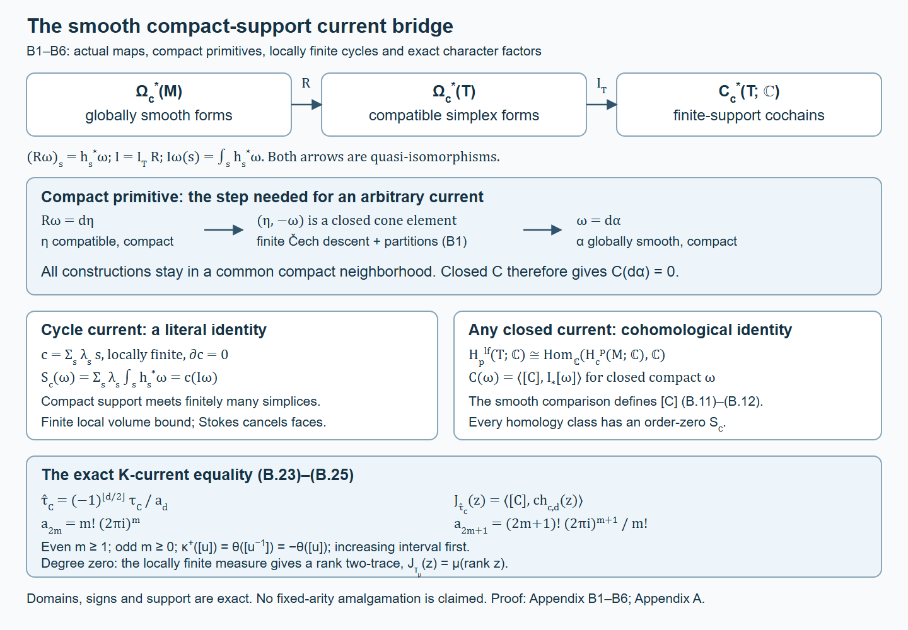

# Appendix B. Smooth currents and the ordinary compact-support character

*Written by GPT-6.1 Sol (OpenAI), October 2026, at Ultra. Not yet reviewed. Public domain (CC0).*

This appendix proves the smooth-manifold comparison in Connes’s Examples 2.8(a), with the exact geometric normalization of [Appendix A](simplicial-geometric-character.md) and the positive odd convention used in [Theorem 7.11](n-traces-on-banach-algebras.md#the-geometric-character-and-actual-current-realization). Connes states the example in [*Cyclic cohomology and the transverse fundamental class of a foliation*](https://alainconnes.org/wp-content/uploads/transfund.pdf#page=16), physical pp. 16–17 of the retypeset edition. No compactness or orientability assumption is added.

Let \(M\) be a Hausdorff paracompact smooth manifold without boundary, the differential-geometric convention used by the triangulation construction below. All forms and chains have complex coefficients. Neither compactness nor orientability is assumed. The proof also permits arbitrarily many components: a locally finite relatively compact chart cover has a locally finite intersection graph, and on a connected component that graph is connected and countable by finite graph-distance from one chart. Each component is therefore second countable and has a compact exhaustion. A compact set meets only finitely many open components, so all compact-support constructions below take place in finitely many such exhaustions. A dimension is fixed on each component; a uniform bound across components is unnecessary. Let \(\Omega_c^*(M)\) denote globally smooth compactly supported forms. A degree-\(p\) current is closed when \(C(d\alpha)=0\) for every \(\alpha\in\Omega_c^{p-1}(M)\). Order zero means that on every compact set its value is bounded by a supremum norm of the form coefficients. Choose any smooth Riemannian metric to state that norm; two such norms are equivalent on a fixed compact set.

The triangulation input used below is precisely a locally finite simplicial complex \(T\) and a homeomorphism \(h:|T|\to M\) whose restriction to each closed simplex extends smoothly to a neighborhood in its affine span, with the restrictions agreeing on faces. B7.1 gives the complete freely accessible smooth-triangulation construction and its precise properties. The de Rham comparison, support arguments and current pairing are proved below.

## B1. A compact-support local-to-global lemma

We first prove the limited sheaf statement needed for this comparison. A sheaf here assigns sections on open sets, with restriction and unique gluing; no derived-functor theorem is being imported. Suppose \(E^*\) is a complex of sheaves on \(M\), zero below some degree \(r_0\). Each \(E^r\) is a module over smooth functions, and its differential is a local linear map commuting with restriction. It need not commute with multiplication by a nonconstant function. Assume the complex is exact locally: a closed germ in any degree has a primitive on some neighborhood, and its lowest-degree kernel is zero.

**Lemma B.1.** Every closed compactly supported global section of \(E^*\) is the differential of a compactly supported global section.

**Support preparation.** A compact set has a relatively compact open neighborhood. Choose a finite chain of successively larger such neighborhoods; the number needed below is at most the degree difference from \(r_0\), plus two. All nonzero local choices can be made inside these neighborhoods. Outside them the initial section is zero and all primitives are chosen to be zero. Thus at each finite stage only finitely many relatively compact patches carry nonzero data.

At each descent stage keep every nonzero entry on tuples of patches contained in a relatively compact neighborhood \(N_a\), with \(\overline{N_a}\subset N_{a+1}\). Initially cover \(\operatorname{supp}z\) by finitely many primitive neighborhoods inside \(N_0\), choose the zero primitive off that support, and refine by a locally finite precompact cover. Only finitely many patches carrying nonzero data occur, since their closures lie in \(\overline{N_0}\). Inductively, restriction to assigned refinement patches preserves the old bound. The next closed difference vanishes outside \(\overline{N_a}\); choose its primitive neighborhoods inside \(N_{a+1}\) near that compact set, and choose zero primitives on neighborhoods disjoint from it. The star refinement below puts every tuple with a nonzero new primitive inside \(N_{a+1}\). Local finiteness makes its set of patch indices finite. Repeated assigned indices are zero in the alternating pullback, so restricting the previous descent equations introduces no extra terms. All covers still cover the whole manifold, including the region of zero data. This establishes the compact-support invariant at every one of the finitely many descent stages.

Smooth partitions subordinate to the covers exist by the following local construction. Shrink a locally finite coordinate-ball cover so that the smaller balls still cover and the larger closures are compact inside their assigned opens. In a coordinate ball use a nonnegative smooth bump equal to one on the smaller ball and zero near the larger boundary. A countable locally finite selection is obtained by covering the compact layers of an exhaustion by finitely many balls, with balls chosen to meet only the adjacent larger layers. Their sum is positive and smooth. Dividing each bump by that sum gives a partition \((\rho_i)\), with \(\operatorname{supp}\rho_i\subset U_i\). On a fixed compact support only finitely many terms matter. This construction applies to every refinement used below.

**The refinement step.** For a finite family of closed local sections on intersections of a cover \((U_i)\), local exactness gives a primitive near every point of the relevant intersection. First take a locally finite shrinking \((V_i)\), still covering the relevant compact neighborhood, with \(\overline{V_i}\subset U_i\). At a point \(x\), call \(i\) active when \(x\in\overline{V_i}\). There are finitely many such indices and \(x\) belongs to all their \(U_i\). Choose \(N_x\) inside the active \(U_i\), disjoint from the inactive \(\overline{V_i}\), and inside the primitive neighborhoods for every active index tuple. Take a star refinement by patches \(W_j\), each assigned an old \(i(j)\) with \(W_j\subset V_{i(j)}\). An intersecting new tuple lies in some \(N_x\); each of its assigned \(V_i\) meets that neighborhood, so the indices are active there. Its restricted closed section therefore has the chosen primitive on the entire new intersection. Closed containment makes the argument valid at old patch boundaries.

For clarity, the required star refinement is a metric construction, not a homology assumption. For an open cover \(\mathcal U\) of a metrizable component set
\[
 \lambda(x)=\min\left(1,\sup_{U\in\mathcal U}
                         \operatorname{dist}(x,M\setminus U)\right).
\]
Distance to an empty complement is infinite. The function is positive and one-Lipschitz. Use balls \(B(x,r_x)\) with \(r_x\leq\lambda(x)/100\). If two such balls centered at \(x,y\) meet, then \(\lambda(y)\leq101\lambda(x)/99\), so every point in the second ball is within \(r_x+2r_y<\lambda(x)/20\) of \(x\). Some \(U\) has \(\operatorname{dist}(x,M\setminus U)>\lambda(x)/2\); hence the entire star of the first ball is contained in \(U\). Select a locally finite covering family of these balls by finite covers of the compact layers \(K_j\setminus\operatorname{int}K_{j-1}\), bounding each radius also by its distance to the complement of \(\operatorname{int}K_{j+1}\setminus K_{j-2}\). The compact layers lie inside these open bands. A compact set meets only finitely many bands and hence balls. Applying this construction to the common refinement with the \(V_i\) ensures the assignment used above. These Lipschitz bounds control stars across adjacent layers; separate uncoordinated Lebesgue radii would not suffice. The compact nonzero data occupy finitely many balls. Refinements are repeated only finitely many times and previous sections are restricted. No infinite descent or convergence is involved.

**Čech descent.** Write \(\check C^a(E^b)\) for alternating local sections on \((a+1)\)-fold intersections. Its differential \(\delta\) is the alternating restriction sum. Restrictions commute with \(d\), so the total differential is
\[
 D=\delta+(-1)^a d,\qquad D^2=0.
 \tag{B.1}
\]
Let \(z\) be a compactly supported global closed section of degree \(q\). Choose local \(b_0\in\check C^0(E^{q-1})\) with \(db_0=z\). The section \(\delta b_0\) is closed. Use the refinement step to choose \(b_1\), and continue, with
\[
 db_a=(-1)^{a+1}\delta b_{a-1}\quad(a\geq1).
 \tag{B.2}
\]
All choices have the finite support preparation above. If \(q>r_0\), the last possibly nonzero cochain is \(b_A\), \(A=q-1-r_0\), of degree \(r_0\). Its next \(\delta\)-difference is in the zero kernel of the lowest differential, so \(\delta b_A=0\). The finite sum \(B=\sum_{a=0}^A b_a\) therefore satisfies \(DB=z\). If \(q=r_0\), local exactness says \(z=0\) directly. The signs in (B.2) cancel each \(\delta b_{a-1}\) against \((-1)^a db_a\).

**Removing positive Čech degree.** On each row define
\[
 (Ha)_{i_0\ldots i_{a-1}}=
       \sum_j\rho_j a_{j i_0\ldots i_{a-1}}.
 \tag{B.3}
\]
Each product extends by zero off \(U_j\), since the partition has support inside that patch. Expanding the alternating restriction sums gives \(\delta H+H\delta=\mathrm{id}\) on the augmented row. This is only a row contraction; no assertion that \(H\) commutes with \(d\) is made.

If the largest positive Čech degree of \(B\) is \(a\), then \(\delta b_a=0\), because \(DB=z\) has Čech degree zero. Thus \(\delta Hb_a=b_a\). Replace \(B\) by \(B-D(Hb_a)\). Its differential is still \(z\), and its largest Čech degree has decreased: the remaining term \((-1)^{a-1}dHb_a\) has Čech degree \(a-1\). Repeating finitely many times leaves a degree-zero Čech cochain \(b\) with \(\delta b=0\) and \(db=z\). The first relation glues it to a global section. Products in (B.3), derivatives and finite sums preserve the common compact neighborhood of the nonzero patches, so that section is compactly supported. This proves the lemma. \(\square\)

The support preparation is necessary. Local primitives by themselves do not prove compact-support exactness. The lemma applies to an exact complex, such as the cone below, rather than declaring the compact-support de Rham complex exact.

## B2. Globally smooth forms and actual simplex integration

Let \(\mathcal P^q\) be the sheaf of compatible simplexwise smooth forms on \(|T|\), transported to \(M\) by \(h\). On an open set, its restrictions to the pieces of closed simplices extend smoothly to neighborhoods in their affine spans and agree tangentially on faces. Gluing is performed on each simplex. A compact global section meets only finitely many simplices; a finite affine partition on each closed simplex patches its local neighborhood extensions. Consequently its global sections with compact support are exactly the compatible forms \(\Omega_c^*(T)\) used in Appendix A, transported by \(h\).

Restriction/pullback gives a chain map
\[
 R:\Omega_c^*(M)\longrightarrow\Omega_c^*(T),
 \qquad (R\omega)_s=h_s^*\omega.
 \tag{B.4}
\]
The map is defined on actual forms. Smoothness of \(h_s\), equality of its face restrictions, and \(d h_s^*=h_s^*d\) prove all three requirements. Multiplication by a globally smooth function makes both sheaves modules over \(C^\infty(M)\); the simplex module action is multiplication by its pullback. Thus both have the partitions needed in B1.

**Local exactness of the two form resolutions.** For globally smooth forms, take a convex coordinate ball and its radial homotopy. If \(F(t,x)=x_0+t(x-x_0)\), the operator \(H\omega=\int_0^1\iota_{\partial_t}F^*\omega\,dt\) satisfies
\[
 dH+Hd=\mathrm{id}-F(0,\cdot)^*.
 \tag{B.5}
\]
Indeed, writing \(F^*\omega=dt\wedge\alpha+\beta\), the \(dt\)-coefficient of its differential is \(\partial_t\beta-d_x\alpha\), and integration gives (B.5). This proves the Poincaré statement locally, including constants in degree zero.

The same proof is valid for compatible forms near any point of \(|T|\). Let \(x\) lie in the interior of its minimal face \(s_0\). By local finiteness, a neighborhood meets finitely many incident simplices. In their common finite barycentric-coordinate space choose a sufficiently small neighborhood of \(x\) in which every coordinate of \(s_0\) remains positive. Any simplex meeting it therefore contains \(s_0\). Intersect with a sufficiently small coordinate ball. In each incident simplex this set is convex toward \(x\); the same straight contraction stays in that simplex and in the neighborhood. It is smooth on each full parameter prism, and its pullbacks agree on all face intersections. Formula (B.5) therefore gives a compatible local primitive. Degree-zero closed sections are one constant on this connected neighborhood. These neighborhoods can be made arbitrarily small.

Thus both sheaf complexes resolve the locally constant complex-valued functions, and \(R\) is the identity on those constants. One can express the required consequence without invoking a resolution theorem. Form the mapping cone
\[
 E^q=\mathcal P^q\oplus\Omega_M^{q+1},\qquad
 d_E(\beta,\alpha)=(d\beta+R\alpha,-d\alpha).
 \tag{B.6}
\]
It is zero below degree \(-1\). The local Poincaré calculations and equality on constants show it is locally exact: first solve the positive-degree smooth component by (B.5), subtract its cone differential, then solve the compatible component; in degree zero the remaining constant is the image of the same smooth constant. Its lowest kernel is zero because a smooth function whose restriction is zero is zero. Lemma B.1 applies, so its compactly supported global section complex is exact. Therefore
\[
 R_*:H^q(\Omega_c^*(M))\xrightarrow{\ \cong\ }
                   H^q(\Omega_c^*(T)).
 \tag{B.7}
\]

In particular, if a globally smooth compact closed form \(\omega\) has \(R\omega=d\eta\) for a compact compatible primitive, the cone element \((\eta,-\omega)\) is closed. A compact cone primitive \((\nu,\alpha)\) gives \(-d\alpha=-\omega\). Hence
\[
 \omega=d\alpha,\qquad \alpha\in\Omega_c^{q-1}(M).
 \tag{B.8}
\]
This is an actual globally smooth compact primitive, obtained from the cone argument. It is not the compatible primitive \(\eta\) inserted into a smooth-manifold current.

Let \(C_c^*(T;\mathbb C)\) be finite-support simplicial cochains. Actual integration is
\[
 I\omega(s)=\int_s h_s^*\omega.
 \tag{B.9}
\]
Stokes proves \(Id=\delta I\). Compact support and local finiteness make this cochain finite. Appendix [A2](simplicial-geometric-character.md#a2-compatible-forms-and-relative-simplicial-integration) and [A11](simplicial-geometric-character.md#a11-compact-supports-and-the-numerical-cycle-pairing) give a quasi-isomorphism from compatible compact forms to these cochains: choose the finite closed-star stage of the support, put its outer simplices in the relative subcomplex, use the proven finite-pair integration theorem, and pass over the directed stages. The same finite-star pairs calculate ordinary compact-support cohomology, using the characteristic-simplex comparison and its carrier homotopies in [A2](simplicial-geometric-character.md#a2-compatible-forms-and-relative-simplicial-integration) and [A5](simplicial-geometric-character.md#a5-continuous-maps-smooth-representatives-and-ordinary-naturality). Combining those statements with (B.7), the **actual** map (B.9) gives
\[
 I_*:H^q(\Omega_c^*(M))\xrightarrow{\ \cong\ }
             H_c^q(M;\mathbb C).
 \tag{B.10}
\]
The ordinary class on the right is transported by the homeomorphism \(h\). This proves the smooth compact-support de Rham comparison and its compatibility with simplex integration. No different abstract isomorphism is substituted for (B.9).

## B3. Closed currents and enough order-zero representatives

For a locally finite simplicial complex, the algebraic dual of finite-support \(p\)-cochains is the product of one copy of \(\mathbb C\) for each oriented \(p\)-simplex. Such coefficient families are exactly locally finite simplicial chains: a compact set meets only finitely many simplices. Every face has finitely many incident simplices, so the boundary is defined coefficient by coefficient.

The cycle and boundary annihilator argument of [Lemma 7.8](n-traces-on-banach-algebras.md#locally-finite-chains-are-the-algebraic-dual) is algebraic and applies directly: a functional on compact cohomology extends first from closed cochains to all cochains by extending a vector-space basis. Vanishing on compact coboundaries makes its dual chain closed. Functionals on cochains vanishing on closed cochains are precisely boundaries, using the second basis-extension argument. Thus
\[
 H_p^{\mathrm{lf}}(T;\mathbb C)
 \cong\operatorname{Hom}_{\mathbb C}(H_c^p(T;\mathbb C),\mathbb C).
 \tag{B.11}
\]
The locally finite simplicial/singular interpretation uses finite carriers on compact stages; the necessary small-chain/carrier comparison and its locally finite support control are detailed in B7.

Any closed current \(C\) defines a linear functional on \(H^p(\Omega_c^*(M))\), because it annihilates the globally smooth exact forms in that complex. Use (B.10) and (B.11) to define its ordinary locally finite homology class \([C]\). Then, for every globally smooth compact closed \(p\)-form,
\[
 C(\omega)=\langle[C],I_*[\omega]\rangle.
 \tag{B.12}
\]
This definition also respects a current boundary: if \(C(\omega)=S(d\omega)\), its value on closed forms is zero. The asserted class and representative statement suffice for this current comparison.

Conversely, take a locally finite oriented cycle \(c=\sum_s\lambda_s s\) in \(T\). It defines the current
\[
 S_c(\omega)=\sum_s\lambda_s\int_s h_s^*\omega.
 \tag{B.13}
\]
For a fixed compact support only finitely many summands occur. Choose a metric on \(M\). The smooth simplex maps have bounded derivative on their compact domains, so the absolute integral is at most a finite constant \(V_s\) times \(\|\omega\|_\infty\). It follows that, for forms supported in a fixed compact \(K\),
\[
 |S_c(\omega)|\leq
 \left(\sum_{s:\,h(s)\cap K\ne\varnothing}|\lambda_s|V_s\right)
       \|\omega\|_\infty.
 \tag{B.14}
\]
The constant is finite; it is local in \(K\), not a global total-variation assertion. For zero-simplices take \(V_s=1\).

Stokes and face compatibility give \(S_c(d\alpha)=S_{\partial c}(\alpha)=0\). Every regrouping is finite: include all simplices meeting \(\operatorname{supp}\alpha\), together with their finitely many faces/cofaces relevant to the boundary coefficients. Thus \(S_c\) is closed and of order zero. Formula (B.13) is literally \(c(I\omega)\), and hence \([S_c]=[c]\) under (B.11). Every locally finite homology class consequently has a closed order-zero current representative. No orientability of \(M\) is required; the individual simplex orientations and complex coefficients are sufficient.

Equations (B.10)–(B.14) also prove detection: if a compact-support cohomology class evaluates to zero on every such current, it is zero, because a nonzero vector has a nonzero linear functional after extending it to a basis. This is the precise “enough currents” conclusion.

## B4. Smooth compact-support K-representatives and homotopies

The needed representatives do not follow solely from density. We give the support-preserving matrix argument.

Let \(p=e+v\) be a continuous Hermitian projection representing a relative \(K_0(C_0(M))\) class, with constant Hermitian scalar reference \(e\) and \(v\in M_r(C_0(M))\). Choose a compact set outside which \(\|v\|<\varepsilon\), and a compactly supported smooth cutoff \(\chi\) equal to one near that set. Then \(a=e+\chi v\) differs from \(p\) by at most \(\varepsilon\) and equals \(e\) outside a compact set. Choose \(\varepsilon<1/8\). The self-adjoint spectra of \(a\) lie in the two clusters near zero and one, separated by the contour \(|z-1|=1/2\). Riesz projection gives
\[
 q=\frac1{2\pi i}\int_{|z-1|=1/2}(z-a)^{-1}\,dz.
 \tag{B.15}
\]
The same formula on \((1-t)p+ta\) gives a projection homotopy and keeps the scalar reference. Approximate the compact matrix perturbation of \(a\) uniformly by globally smooth compactly supported matrix entries, within one fixed larger compact neighborhood. To do this, use finitely many coordinate patches, multiply by their smooth partition, mollify each compactly supported chart entry after zero extension, and sum; symmetrize to retain self-adjointness. The contour remains uniformly separated. Its resolvent and (B.15) are smooth, and the resulting projection equals \(e\) off that larger compact set.

For \(K_1\), first use polar deformation to a unitary \(u=1+w\), \(w\in M_r(C_0(M))\). The cutoff matrix \(1+\chi w\) is uniformly close to \(u\), so is invertible if the error is below \(1/2\). Uniform smoothing on the same compact neighborhood preserves invertibility. The polar expression \(b(b^*b)^{-1/2}\) gives a globally smooth unitary equal to one outside that compact set; continuous positive functional calculus or a contour on the uniformly positive spectrum proves its smoothness and its homotopy to \(u\).

A continuous compact-parameter family in \(C_0(M)\) has uniformly vanishing tails: choose a finite norm cover of its compact image, and take the union of the corresponding finitely many compact tail sets. Thus class relations and homotopies can be cut off in one common compact neighborhood. Apply the same approximation to matrix entries on the parameter interval and coordinate charts. If the endpoints are already smooth, first keep them in constant parameter collars and approximate the interior perturbation with a cutoff vanishing in those collars. The Riesz/polar formulas preserve the endpoints and common scalar reference. This supplies globally smooth compact-support homotopies as well as representatives.

For non-Hermitian idempotents, the intrinsic range-bundle reduction and interpolation in [A8](simplicial-geometric-character.md#a8-non-hermitian-idempotents-and-the-relative-cone) reduce to the Hermitian case while retaining the specified relative range/frame class. Analytic pairing invariance then gives the same K-group value. No commutation of an idempotent with its scalar reference is assumed.

The algebra \(D=C_c^\infty(M)\) is dense in \(C_0(M)\) by the same cutoff and chart approximation. Its external unitization permits constant matrix parts, whose derivatives are zero. The resolvent of a smooth constant-relative invertible matrix is again smooth and constant-relative outside its compact support. These are the domains needed by [the controlled pairing theorem, Theorem 4.3](n-traces-on-banach-algebras.md#4-the-form-reaches-k-theory).

## B5. The ordinary even and specified positive odd character

Take a smooth representative \(p=e\) or \(u=1\) outside a compact set, as in B4. Define the compact closed geometric forms
\[
 \gamma_{2m}(p)=\frac{(-1)^m}{m!(2\pi i)^m}
                     \operatorname{Tr}p(dp)^{2m},\quad m\geq1,
 \tag{B.16}
\]
\[
 \gamma_{2m+1}^+(u)=
   \frac{m!}{(2m+1)!(2\pi i)^{m+1}}
                     \operatorname{Tr}(u^{-1}du)^{2m+1},\quad m\geq0.
 \tag{B.17}
\]
Closedness follows from the curvature/Bianchi and Maurer–Cartan calculations proved in [A4](simplicial-geometric-character.md#a4-curvature-connection-independence-and-bundle-operations)/[A10](simplicial-geometric-character.md#a10-ordinary-suspension-prism-integration-and-the-odd-coefficients); the connection or unitary homotopy transgression is globally smooth and has compact support when the family is confined to the common neighborhood in B4. Consequently these forms define classes of \(H^*(\Omega_c^*(M))\).

Pullback to every simplex of the smooth triangulation gives exactly the compatible forms in [A1](simplicial-geometric-character.md#a1-the-comparison-theorem-and-its-conventions). Choose the finite closed-star pair containing the supports and its outer relative subcomplex. The projection/unitary is constant on that subcomplex; its range frame is the prescribed scalar reference. [Theorem A.1](simplicial-geometric-character.md#a1-the-comparison-theorem-and-its-conventions) and compact passage [A11](simplicial-geometric-character.md#a11-compact-supports-and-the-numerical-cycle-pairing) identify the actual integrated classes with the ordinary compact-support character. In the smooth complex this says
\[
 I_*[\gamma_{2m}(p)]
       =\operatorname{ch}_{c,2m}^{\mathrm{top}}([p]-[e]),
 \tag{B.18}
\]
\[
 I_*[\gamma_{2m+1}^+(u)]
       =\operatorname{ch}_{c,2m+1}^{+,\mathrm{top}}([u]).
 \tag{B.19}
\]
The scalar-reference quotient map is continuous and is used only topologically; it is not differentiated. Degree zero is the compact rank-difference function.

The even normalization has \(c_1(\mathcal O(-1))[\mathbb {CP}^1]=-1\). The ordinary odd class in (B.19) is explicitly
\[
 \operatorname{ch}_{c,\mathrm{odd}}^+
       =\sigma^{-1}\operatorname{ch}_{\mathrm{even}}\kappa^+,
 \qquad\kappa^+([u])=\theta([u^{-1}])=-\theta([u]),
 \tag{B.20}
\]
with the increasing circle interval first, exactly as in [A9](simplicial-geometric-character.md#a9-the-actual-suspended-bundle-and-its-relative-frame)/[A10](simplicial-geometric-character.md#a10-ordinary-suspension-prism-integration-and-the-odd-coefficients). No sign is assigned to an undisplayed abstract adjunction, and no assertion about all connecting maps or two odd products is required here.

The important new inference is that (B.18)–(B.19) are also equalities of **globally smooth compact-support form classes**, by (B.10). For an arbitrary closed current, equality of their compatible simplex classes is therefore sufficient only after B2 supplies the globally smooth compact primitive in (B.8).

## B6. Exact controlled traces and arbitrary-current pairing

Let \(C\) be a closed order-zero current of degree \(d\geq1\). Define
\[
 \tau_C(a_0,\ldots,a_d)
          =C(a_0\,da_1\wedge\cdots\wedge da_d),
 \qquad a_j\in C_c^\infty(M).
 \tag{B.21}
\]
The exterior differential algebra and \(C\) give a closed graded trace: graded commutation gives the trace identity and closedness gives its differential identity. [Theorem 2.1 in the cyclic-algebra lesson](the-cyclic-category-and-cyclic-cohomology-as-ext.md#2-differential-forms-produce-cyclic-cocycles) proves cyclicity and the Hochschild cocycle equation. The [external-unit extension](n-traces-on-banach-algebras.md#1-bounding-the-coefficients-between-differentials) is normalized as in the n-trace lesson.

Here is the full local coefficient estimate. For fixed scalar \(a_1,\ldots,a_d\), the form \(\omega=da_1\wedge\cdots\wedge da_d\) is supported in a compact set \(K\). Order zero supplies a finite constant \(B_K\) such that \(|C(\eta)|\leq B_K\|\eta\|_\infty\) on forms supported there. Hence
\[
 |C(x_1\cdots x_d\omega)|
       \leq B_K\|\omega\|_\infty\prod_j\|x_j\|_\infty.
 \tag{B.22}
\]
The inserted \(x_j\) may have constant scalar parts; these do not enlarge \(\operatorname{supp}\omega\). For matrices expand the ordered product into finitely many chart-coordinate terms, retaining all matrix factor orders. Each term is a fixed compactly supported differential coefficient multiplied by entries of the inserted matrices; their absolute values are bounded by the product of operator norms. Summing the finitely many coordinate and matrix terms gives the required finite constant for that fixed differential tuple and matrix size. Equivalently one may bound the resulting matrix products by \(|\operatorname{Tr}Z|\leq r\|Z\|\). Thus \(\tau_C\) is an actual controlled \(d\)-trace, not only a densely defined cyclic cocycle.

Set
\[
 a_{2m}=m!(2\pi i)^m,\qquad
 a_{2m+1}=\frac{(2m+1)!}{m!}(2\pi i)^{m+1},\qquad
 \widehat\tau_C=\frac{(-1)^{\lfloor d/2\rfloor}}{a_d}\tau_C.
 \tag{B.23}
\]
The raw even pairing is \(C(\operatorname{Tr}p(dp)^{2m})\), and the raw odd pairing is \((-1)^m C(\operatorname{Tr}(u^{-1}du)^{2m+1})\), by [the n-trace lesson’s pairing formulas (4.1)–(4.2)](n-traces-on-banach-algebras.md#4-the-form-reaches-k-theory). Combining (B.16)–(B.19) with (B.12) gives, on all the smooth relative representatives of B4,
\[
 J_{\widehat\tau_C}(z)
       =\langle[C],\operatorname{ch}_{c,d}(z)\rangle,
 \qquad z\in K_{d\bmod2}(C_0(M)).
 \tag{B.24}
\]
Odd degree uses precisely (B.20). The signs in the odd raw pairing and its scalar multiplier cancel. [The controlled pairing theorem, Theorem 4.3](n-traces-on-banach-algebras.md#4-the-form-reaches-k-theory) and common-support smooth homotopies in B4 establish (B.24) on the ambient K-group, independent of representative. An arbitrary current only evaluates the smooth forms in (B.16)–(B.17) and their globally smooth compact transgressions/primitives.

In degree zero an order-zero current is a locally finite complex Radon measure \(\mu\). A bounded zero-trace exists exactly when \(|\mu|(M)<\infty\); local order zero does not imply that condition. For every such locally finite measure [Proposition 7.4](n-traces-on-banach-algebras.md#an-unbounded-rank-functional-can-be-a-two-trace) gives the actual two-trace on the same dense algebra
\[
 \tau_\mu(a_0,a_1,a_2)=\int_M a_0a_1a_2\,d\mu,
 \qquad
 J_{\tau_\mu}([p]-[e])
      =\int_M\operatorname{Tr}(p-e)\,d\mu.
 \tag{B.25}
\]
For fixed differentials in its universal two-trace expression, the compact support of their coefficient product makes the local variation bound finite. The noncommuting matrix/cube calculation of [Proposition 7.4](n-traces-on-banach-algebras.md#an-unbounded-rank-functional-can-be-a-two-trace) proves the displayed relative value. Rank difference is locally constant, smooth and compactly supported, so this value is exactly the degree-zero character paired with \([\mu]\), by (B.12). A measure boundary pairs to zero with that rank function. Thus the degree-zero comparison uses a bounded zero-trace when total variation is finite, and the rank two-trace for an arbitrary locally finite measure.

Equations (B.13)–(B.14) supply enough closed order-zero currents, and (B.24)–(B.25) give their exact ordinary compact-support character pairings. Together they establish the full smooth-manifold content of Example 2.8(a), relative to the precisely stated triangulation and topological foundations in Appendix A. They make no fixed-arity assertion about a full multi-degree additive family.

**Figure B.1.** The top row is the actual smooth restriction and oriented integration, whose compact-support quasi-isomorphisms are (B.7)–(B.10). The middle row shows the cone step producing the globally smooth compact primitive (B.8). The current panels distinguish the literal identity for a cycle current from the cohomological identity for an arbitrary closed current, (B.11)–(B.14). The bottom panel retains the exact coefficients and positive odd convention of (B.23)–(B.25). The boxes describe maps and support, not a sampled manifold geometry. The full arguments are B1–B6 and the [Appendix A proof locators](simplicial-geometric-character.md#a13-bibliography-and-precise-proof-locators). Reproducible source: [draw_smooth_current_character.py](../../tools/draw_smooth_current_character.py).

Open the figure at full size: [SVG](../assets/smooth-current-character-bridge.svg) · [PNG](../assets/smooth-current-character-bridge.png).

## B7. Human-source foundations and exact scope

The proof itself uses the elementary radial identity, finite partitions, the compact-section cone lemma, smooth matrix approximation and the local current estimates written above. Its actual oriented integration and ordinary simplicial interpretation use the arguments of Appendix [A2](simplicial-geometric-character.md#a2-compatible-forms-and-relative-simplicial-integration), [A5](simplicial-geometric-character.md#a5-continuous-maps-smooth-representatives-and-ordinary-naturality) and [A11](simplicial-geometric-character.md#a11-compact-supports-and-the-numerical-cycle-pairing). Their characteristic-simplex and carrier foundations are Hatcher's freely accessible *Algebraic Topology*, [Theorem 2.27 and its proof](https://pi.math.cornell.edu/~hatcher/AT/ATplain.pdf#page=137), printed pp. 128–130, and [Theorem 2C.1 and its proof](https://pi.math.cornell.edu/~hatcher/AT/ATplain.pdf#page=186), printed pp. 177–179. The locally finite algebraic duality is [Lemma 7.8](n-traces-on-banach-algebras.md#locally-finite-chains-are-the-algebraic-dual), with its two explicit basis-extension proofs.

### B7.1. A complete free smooth-triangulation construction

The original construction is Hans Freudenthal, [*Die Triangulation der differenzierbaren Mannigfaltigkeiten*](https://dwc.knaw.nl/DL/publications/PU00017376.pdf), Proceedings of the Royal Netherlands Academy 42 (1939), printed pp. 880–901 / physical PDF pp. 1–11. Its opening theorem permits \(q=\infty\), and explicitly covers open manifolds. Section 6, printed p. 892, specifies the countable smooth chart family; connectedness is unnecessary by its footnote 8. Apply it separately on the components described at the start of this note.

Here are the precise construction features needed here. A precompact locally finite chart refinement arranges that chart \(i\) meets only finitely many later charts; source 6.4 records the bound \(z(i)\). Section 7, p. 893, inductively constructs finite polytopes with smooth simplex maps, contains the previously covered inner chart balls in their interior, and leaves the old complex unchanged wherever the next chart does not meet the incident star. After \(n>z(z(i))\), the finite coface star of the minimal face containing a point of inner chart \(i\) is left unchanged. This is the union of the simplices incident to that face and their faces; it contains the open star of that face, a neighborhood of the point. Later injective maps cannot insert a new simplex into this fixed neighborhood. Thus the final triangulation is locally finite, a conclusion from the stabilization argument rather than from countability alone.

Sections 8–12, pp. 894–901, supply the finite subdivisions, affine chart approximation, smooth cutoff interpolation, positive Jacobian/injectivity and gluing. Section 11.3 places each closed simplex in a region with a single smooth formula; 12.7 verifies the induction invariants. The maps on that simplex are compositions of ambient smooth charts, affine maps and smooth cutoffs with an interior chart buffer. They therefore extend smoothly to a neighborhood in its affine span. Retained old simplex maps have the same property by induction. This verifies the neighborhood-extension convention used in B2 and B3, rather than merely identifying it with the historical boundary-derivative terminology on p. 881.

For completeness, the separately cited regular-subdivision ingredient on source p. 886 can be supplied directly. Order the vertices of a finite simplicial complex. On an ordered \(r\)-simplex put \(x_j=t_j+\cdots+t_r\), obtaining the orthoscheme \(1\geq x_1\geq\cdots\geq x_r\geq0\). Divide \(\mathbb R^r\) by the grid \(x_j=k_j/m\), and triangulate each cube by the staircase chains
\[
 k/m,\quad(k+e_{\pi(1)})/m,\quad\ldots,
       (k+e_{\pi(1)}+\cdots+e_{\pi(r)})/m.
 \tag{B.26}
\]
Ordering fractional coordinates selects the containing simplex; ties are common faces. The orthoscheme's bounding planes are subcomplexes. Grid planes give \(x_1=1\), \(x_r=0\); when neighboring integer coordinates agree, \(x_j=x_{j+1}\) is exactly a face where their fractional coordinates tie. Restrictions to an original face agree: delete the fixed coordinate or identify its repeated pair of cumulative coordinates, which gives the cumulative coordinates for the induced vertex order on that face. Staircase chains on that plane increment the repeated pair as one consecutive block; nonconsecutive increments give its lower-dimensional faces. Thus the subdivisions glue over the original finite complex.

Every resulting simplex and face is the translate of \(1/m\) times one of finitely many nondegenerate shapes, followed by one of the finitely many original affine simplex maps. Consequently all positive edge lengths lie between \(c/m\) and \(C/m\), for fixed \(0<c\leq C\); the largest/smallest edge ratio is bounded. The ratios of an \(r\)-simplex's largest edge to its altitudes, and its \(r\)-th power to volume, are also bounded by constants independent of \(m\), since only those finitely many shapes occur. Diameters tend to zero. This proves both regularity conditions used on Freudenthal's p. 886, without importing a separate subdivision proof.

The complete primary construction therefore supplies exactly the smooth, locally finite triangulation required above. Jacob Lurie's freely accessible [Lecture 3](https://www.math.ias.edu/~lurie/937notes/937Lecture3.pdf) and [Lecture 4](https://www.math.ias.edu/~lurie/937notes/937Lecture4.pdf) give modern corroborating smooth-simplex and compact-chart constructions; their concise noncompact/boundary variants are not substituted for Freudenthal's full induction.

### B7.2. Actual locally finite characteristic-simplex comparison

Hatcher's [Proposition 2.21 and its complete proof](https://pi.math.cornell.edu/~hatcher/AT/ATplain.pdf#page=128), printed pp. 119–124, gives barycentric subdivision \(S\) and a finite affine homotopy \(T\), with \(\partial T+T\partial=\mathrm{id}-S\). Every output simplex lies in the original simplex image. For a cover and a singular simplex \(\sigma\), let \(m(\sigma)\) be the least depth at which all the geometrically listed affine subdivision cells are cover-small; do not decide this after algebraic cancellation. Compactness of the standard simplex and the mesh contraction give a finite depth, with \(m(\tau)\leq m(\sigma)\) for each face \(\tau\). Put
\[
 D_m=\sum_{j=0}^{m-1}TS^j,\qquad
 D(\sigma)=D_{m(\sigma)}\sigma,\qquad
 \rho=\mathrm{id}-\partial D-D\partial.
 \tag{B.27}
\]
This is a chain map, and \(\partial D+D\partial=\mathrm{id}-\rho\). The expression
\(\rho\sigma=S^{m(\sigma)}\sigma+D_{m(\sigma)}\partial\sigma-D\partial\sigma\)
is small: each face correction uses only \(TS^j\tau\) with \(j\geq m(\tau)\), whose images remain in the already-small subdivision cells. It is the identity on small chains. Every input simplex has finitely many outputs within its image, so all operators preserve locally finite chains; no uniform depth on the entire chain is assumed.

For the locally finite complex \(T\), use the cover by open vertex stars. If a small singular simplex \(\sigma\) lies in the star of \(v\), the union \(A_\sigma\) of closed simplices whose interiors meet its image, together with their faces, is a finite simplicial cone at \(v\). Its image is compact; local finiteness gives finiteness of that union. Each face carrier \(A_\tau\) lies in \(A_\sigma\). Inductively define a simplicial chain \(q\sigma\): in degree zero choose a carrier vertex with augmentation one; in higher degree fill the already-defined cycle \(q\partial\sigma\) by the finite cone operator in \(A_\sigma\). Equal parametrized faces receive the same earlier choice. This gives \(\partial q=q\partial\).

The actual characteristic-simplex map \(\iota\) satisfies \(\iota q\simeq\mathrm{inclusion}\) on small singular chains. At each degree subtract the already-defined face homotopy from the discrepancy and cone the resulting cycle in \(A_\sigma\). Similarly \(q\rho\iota\simeq\mathrm{id}\) on simplicial chains: every output of \(\rho\iota(s)\) stays in the original simplex \(s\), and the same induction fills in that finite simplex. Composing with the homotopy in (B.27) supplies both chain homotopies for the full singular complex.

All these carrier maps preserve local finiteness. If a carrier face meets compact \(B\), choose a generating parent simplex containing it whose interior meets the input image. That parent also meets \(B\). The finite union of all original closed simplices meeting \(B\) is compact, and every possible input image meets that union. A locally finite singular family therefore contains only finitely many such inputs, each with finitely many outputs. The same estimate applies to the cone homotopies. Subdivision outputs stay inside the original input image, so composition with subdivision uses this same bound. The simplex-side homotopy stays in its original closed simplex. Hence \(\iota\) is the chain homotopy equivalence
\[
 H_*^{\mathrm{lf,simp}}(T;\mathbb C)
        \xrightarrow{\ \cong\ }
 H_*^{\mathrm{lf,sing}}(|T|;\mathbb C)
 \tag{B.28}
\]
used in B3. Under the smooth triangulation, its actual characteristic simplices are smooth and (B.13) is their ordinary integration current.

The triangulation in B7.1 and the carrier construction in B7.2 supply the geometric and homological foundations used by (B.4) and (B.11)–(B.14). All integrations in the comparison are integrations over the actual smooth characteristic simplices.

The result is the smooth-manifold/current comparison under the stated manifold hypotheses, the ordinary even normalization, and the explicitly specified positive odd convention (B.20).

### B7.3. A locally controlled current exercise

**Exercise B.1 (30 points).** Let
\[
 M=\coprod_{j\geq1}\mathbb R_j^2
\]
be the disjoint union of Euclidean planes, each oriented by \(dx_j\wedge dy_j\). On globally smooth compactly supported two-forms define
\[
 C(\eta)=\sum_{j\geq1}j^2\int_{\mathbb R_j^2}\eta_j,
 \qquad
 \widehat\tau_C(a_0,a_1,a_2)
   =-\frac1{2\pi i}\,C(a_0\,da_1\wedge da_2).
\]
Use \(D=C_c^\infty(M)\) as the dense algebra in \(C_0(M)\), with the external unitization of the n-trace lesson. Let \(\beta_j\in K_0(C_0(M))\) be supported on the \(j\)-th plane and normalized so that its ordinary degree-two character has integral \(+1\) on that oriented plane.

1. (8 points) Prove that \(C\) is a well-defined closed current of order zero, with a finite bound for every fixed compact support.
2. (12 points) Prove that \(\widehat\tau_C\) is an actual normalized two-trace. Give the full coefficient estimate for fixed \(a_1,a_2\), including inserted coefficients with scalar parts, and explain the matrix estimate without commuting matrix factors.
3. (6 points) Compute \(J_{\widehat\tau_C}(2\beta_1-\beta_3)\), retaining the factor \(-1/(2\pi i)\).
4. (4 points) Explain why neither global summability of the weights nor a bound on the global current coefficient is required.

**Solution.** For part 1, the open components \(\mathbb R_j^2\) cover any compact \(K\subset M\). A finite subcover shows that \(K\) meets only a finite index set \(F_K\). Each \(K_j=K\cap\mathbb R_j^2\) is compact. If \(\eta_j=g_j\,dx_j\wedge dy_j\) has support in \(K_j\), the Euclidean coefficient norm gives
\[
 |C(\eta)|
 \leq \left(\sum_{j\in F_K}j^2\operatorname{area}(K_j)\right)
                  \|\eta\|_\infty.
\]
The finite constant proves order zero and continuity on each compact-support test-form space. It also proves that the defining sum is finite. For a compactly supported one-form \(\alpha\), only finitely many components occur. On each choose a rectangle containing its support in its interior. Stokes gives \(\int_{\mathbb R_j^2}d\alpha_j=0\), since the form vanishes near that rectangle’s boundary. Hence \(C(d\alpha)=0\), so the current is closed.

For part 2, write \(\tau_C=C(a_0\,da_1\wedge da_2)\). The exterior algebra and closedness give the cycle of B6. In this degree cyclicity can also be checked directly:
\[
 \tau_C(a_2,a_0,a_1)-\tau_C(a_0,a_1,a_2)
       =C\bigl(d(a_0a_2\,da_1)\bigr)=0.
\]
Leibniz expansion of \(b\tau_C\) gives four terms with pairwise cancellation, so it is a cyclic two-cocycle. Multiplication by the exact scalar \(-1/(2\pi i)\) preserves these identities. Constants have zero differential; closedness gives zero when only the leading argument is the new unit. This is the normalized external-unit extension used in the pairing theorem.

The defining two-trace bound is stronger than a bound on the leading coefficient alone. For fixed \(a_1,a_2\in D\), put
\[
 g_j=(\partial_{x_j}a_1)(\partial_{y_j}a_2)
           -(\partial_{y_j}a_1)(\partial_{x_j}a_2),
 \qquad
 L(a_1,a_2)=\sum_jj^2\int_{\mathbb R_j^2}|g_j|\,dx_jdy_j.
\]
The fixed differential support is compact, so this is a finite sum of finite integrals. For inserted \(x_1,x_2\in D^+\), let \(\int_{\widehat\tau_C}\) denote the associated closed graded trace. Since scalar functions commute,
\[
 \left|\int_{\widehat\tau_C}x_1\,da_1\,x_2\,da_2\right|
  =\frac1{2\pi}\left|\sum_jj^2
             \int_{\mathbb R_j^2}x_1x_2g_j\,dx_jdy_j\right|
  \leq\frac{L(a_1,a_2)}{2\pi}\,
                    \|x_1\|_\infty\|x_2\|_\infty.
\]
Each supremum norm is at most the external-unitization norm. Scalar parts of the \(x_k\) do not enlarge the fixed differential support, so the same bound applies to them.

For fixed matrix differentials \(A_1,A_2\in M_r(D^+)\), keep the order in
\[
 \operatorname{Tr}\bigl(X_1\,dA_1\,X_2\,dA_2\bigr)
 =\operatorname{Tr}\bigl(
       X_1\partial_xA_1X_2\partial_yA_2
      -X_1\partial_yA_1X_2\partial_xA_2\bigr)\,dx\wedge dy
\]
on each plane. The inequalities \(|\operatorname{Tr}Z|\leq r\|Z\|\) and \(\|ZW\|\leq\|Z\|\|W\|\) bound the amplified expression by
\[
 \frac{r}{2\pi}\,\|X_1\|_\infty\|X_2\|_\infty
 \sum_jj^2\int_{\mathbb R_j^2}
 \left(\|\partial_xA_1\|\|\partial_yA_2\|
       +\|\partial_yA_1\|\|\partial_xA_2\|\right)dxdy.
\]
The sum is finite for the fixed matrix differential tuple. Constant matrix parts have zero derivative, and no matrix coefficient was moved past a differential. These are the scalar and matrix two-trace estimates, not a claim of norm continuity in the differential arguments.

For part 3, (B.16) in degree two is
\[
 \gamma_2(p)=-\frac1{2\pi i}\operatorname{Tr}p(dp)^2.
\]
Thus (B.24) gives \(J_{\widehat\tau_C}(\beta_j)=j^2\), by the specified positive ordinary character period. Additivity yields
\[
 J_{\widehat\tau_C}(2\beta_1-\beta_3)=2\cdot1^2-3^2=-7.
\]
Equivalently, the raw pairing has value
\(J_{\tau_C}(2\beta_1-\beta_3)=(-2\pi i)(-7)=14\pi i\);
multiplying by \(-1/(2\pi i)\) gives \(-7\). This check retains the ordinary even sign.

For part 4, every test form, fixed differential tuple, and compact-support K-class meets finitely many components. No expression above sums over an infinite nonzero family for one input. The weights satisfy \(\sum_jj^2=\infty\) and have no global upper bound, which therefore imposes no obstacle to these local estimates. Indeed, choose one nonnegative compactly supported coefficient \(g\) on a plane with \(\|g\|_\infty=1\) and \(\int g>0\), and place the same form on the \(j\)-th component. Its supremum norm remains one while its current value is \(j^2\int g\), tending to infinity. There is no single global order-zero constant. The two-trace condition permits its finite bound to depend on the fixed differentials, exactly as the local support calculation requires.
