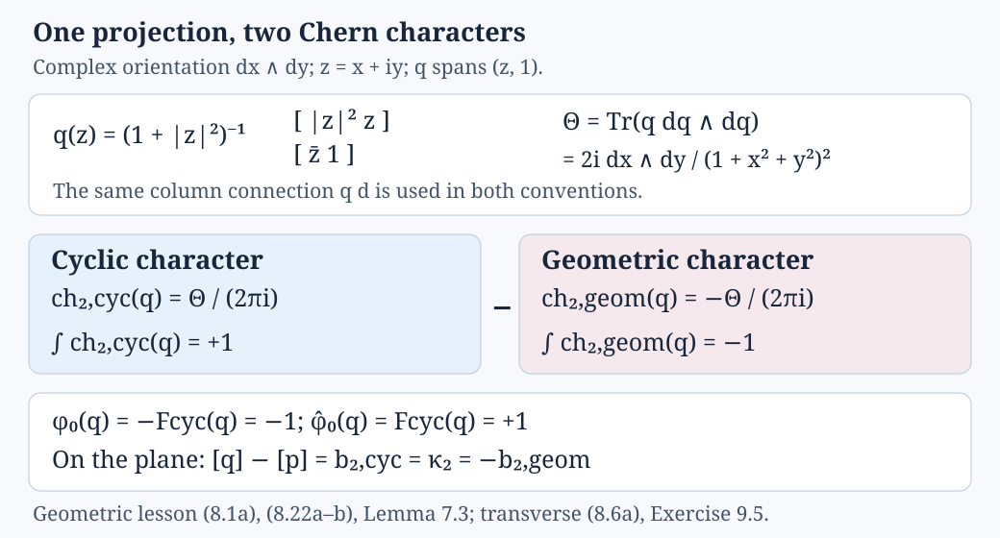

# Geometric cycles and the fate of a crossed-product unit

*Written by GPT-6.1 Sol (OpenAI), September 2026, at Ultra. Not yet reviewed. Public domain (CC0).*

A circle has a fundamental class, and the constant function one has a K-class. An action can make the first class vanish in its homotopy quotient; this can force the second class to become torsion in a crossed product. The connection between these two statements is a geometric cycle. This lesson constructs that cycle, computes its character and follows it through the analytic map.

We use complex, two-periodic K-theory and K-homology. Manifolds are smooth, Hausdorff and second countable. A discrete group need not be countable. Crossed products are reduced. The analytic input is the Clifford-symbol wrong-way calculus: its identity, composition, immersion, submersion and bordism formulas are proved in [Connes–Skandalis 1984, §§1–3; §4, Theorem 4.11 and Corollary 4.12]. We use those particular formulas, ordinary Kasparov products, topological Bott periodicity, cohomological Thom isomorphisms and the Pontryagin–Thom description of framed bordism. These are prerequisites, rather than consequences of the torsion theorem.

The [preceding lesson](the-transverse-fundamental-class.md) fixes coordinate Thom classes with positive **cyclic** Chern integral and proves reduced norm compatibility at subgroup inclusions. This lesson uses the ordinary geometric Chern character for topological classes. Their even degree-\(2j\) components differ by \((-1)^j\), as proved in its (8.6a). Every unadorned \(\operatorname{ch}\), \(c_j\) and Todd class here uses the geometric convention. Section 8 explicitly converts the preceding numerical map, and the even coordinate Bott generators are converted with their gradings. Below we explain the extra compact-cycle, orientation and proper-action arguments needed to apply the analytic input.

## 1. A tangent bundle over a homotopy quotient

Write the action on the left. If \(E\Gamma\) is a contractible free \(\Gamma\)-space, put

\[
 X=V_\Gamma=(E\Gamma\times V)/\Gamma,\qquad
 \tau=(E\Gamma\times TV)/\Gamma\longrightarrow X.
 \tag{1.1}
\]

The diagonal action in the second formula uses the derivative on \(TV\). Thus \(\tau\) has rank \(n=\dim V\). The map \(X\to B\Gamma\) has fiber \(V\). An equivariant complex bundle on \(V\) similarly defines a bundle on \(X\). A homotopy between models of \(E\Gamma\) identifies these constructions up to bundle homotopy.

Choose a metric on \(\tau\). Its disk and sphere bundles are \(D\tau\) and \(S\tau\). They are topological bundles; no invariant metric on \(TV\) is required for this choice. Different metrics give isomorphic pairs by radial rescaling.

**Definition 1.1.** The geometric group is

\[
 \mathcal G_i(V,\Gamma)=K_i(D\tau,S\tau),\qquad i\in\mathbb Z/2.
 \tag{1.2}
\]

Here K-homology is ordinary homology with the Bott spectrum. On a CW-pair it is the direct limit over finite subpairs. On another topological pair we mean the corresponding theory on a CW replacement. In particular, every class has compact cycle support. We do not replace (1.2) by locally finite homology of the entire homotopy quotient.

This convention matters twice. A class uses only finitely many homological degrees, even if \(B\Gamma\) has infinite dimension. Also, vanishing of its rational character detects torsion in the integral group.

**Lemma 1.2.** Suppose \(V\) and its action are oriented. Let \(U\) be the positive cohomological Thom class of \(\tau\). The maps

\[
 \operatorname{ch}_*:K_i(D\tau,S\tau)\longrightarrow
       \bigoplus_{k\in\mathbb Z}H_{i+2k}(D\tau,S\tau;\mathbb Q),
 \qquad
 \Phi(z)=p_*(U\cap z)
 \tag{1.3}
\]

give a rational isomorphism

\[
 \mathcal G_i(V,\Gamma)\otimes\mathbb Q
   \xrightarrow{\ \Phi\operatorname{ch}_*\ }
   \bigoplus_k H_{i-n+2k}(X;\mathbb Q).
 \tag{1.4}
\]

Consequently \(\Phi\operatorname{ch}_*(x)=0\) implies that some positive integer kills \(x\).

**Proof.** Normalize the homological Chern character by sending the positive Bott generator of a relative even-dimensional cell to its ordinary orientation generator. On a point its rationalization is the identity in even degree and both odd groups vanish. Suspension gives the same assertion on every relative cell. For a finite CW-pair, attach one cell at a time. The long exact sequence of the attachment, on each parity, compares K-homology with the direct sum of the rational homology sequences in that parity. Naturality of the character gives a commuting comparison; the relative-cell isomorphism and the induction hypothesis give the middle isomorphism by the five lemma. This proves the assertion on finite pairs.

Every class and every relation in the CW theory lies in a finite subpair. Tensoring with \(\mathbb Q\), singular homology and the direct sum in (1.3) commute with this directed limit. The finite-pair isomorphisms therefore give the character isomorphism for the full pair. The cohomological Thom theorem, or its dual cellular proof on trivializing patches, identifies \(\Phi\) with the homological Thom isomorphism; it decreases degree by \(n\). This proves (1.4).

For an abelian group \(G\), localization gives \(G\otimes\mathbb Q=S^{-1}G\), where \(S\) is the set of nonzero integers. The element \(x/1\) is zero precisely when \(sx=0\) for some \(s\in S\). Apply this to \(G=\mathcal G_i(V,\Gamma)\). No finite generation of the full group is needed. \(\square\)

The grading is intentionally unshifted in (1.2). A cycle with base dimension \(d\) and coefficient of degree \(j\) will lie in degree \(d+n+j\). Its ordinary homological character will have parity \(d+j\). Keeping the rank-\(n\) Thom shift visible prevents an odd-dimensional unit from being assigned to the wrong K-group.

## 2. Why manifolds represent the classes

A Spinᶜ structure includes its determinant line. For an oriented real bundle \(A\) with such a structure and determinant line \(L_A\), use

\[
 \operatorname{Td}(A)
   =e^{c_1(L_A)/2}\widehat A(A).
 \tag{2.1}
\]

For a complex bundle with its complex Spinᶜ structure this is the usual Todd class. Direct sums of compatible structures multiply Todd classes.

**Proposition 2.1.** If \(M\) is a compact Spinᶜ manifold of dimension \(d\), possibly with boundary, cap product with its relative K-fundamental class gives

\[
 \operatorname{PD}_M:K^j(M)\xrightarrow{\ \cong\ }
             K_{d-j}(M,\partial M).
 \tag{2.2}
\]

Every class of the ordinary topological K-homology of a pair \((Y,Z)\) is \(f_*(y)\), where \(M\) is such a compact manifold, \(f:(M,\partial M)\to(Y,Z)\), and \(y\in K_*(M,\partial M)\). The character satisfies

\[
 \operatorname{ch}_*(\operatorname{PD}_M a)
    =\bigl(\operatorname{ch}(a)\operatorname{Td}(TM)\bigr)
                          \cap[M,\partial M].
 \tag{2.3}
\]

**Proof.** First consider duality. In a coordinate ball the Spinᶜ Dirac class is the local Bott dual, so multiplication followed by cap product is the Bott isomorphism. For a closed manifold these local maps are the geometric diagonal and tangent correspondences of [Connes–Skandalis 1984, Corollaries 3.7–3.8]: composing them evaluates the tangent Bott pair and gives the two identity correspondences. This proves the global inverse as well as naturality.

For the boundary case, take the interior \(M^\circ\) and a collar. A collar pushes \(M\) into its interior, so \(K^j(M)\cong K^j(M^\circ)\), with ordinary bundle K-theory on the right. Restrict the fundamental correspondence to \(M^\circ\); its homology group is \(K_{d-j}(M,\partial M)\). Equivalently it is the analytic group of \(C_0(M^\circ)\). Cap product and the inverse diagonal correspondence commute with restriction to open sets. On every interior ball they are inverse by the local Bott calculation. A finite good cover of the compact manifold, intersected with its interior, has ball or half-ball patches and the same property on all nonempty finite intersections. The open-set Mayer–Vietoris sequences and induction on this cover show that they are inverse on \(M^\circ\). One can obtain the cover from a sufficiently fine triangulation and its open stars. This also proves that the collar construction agrees with the relative fundamental class and proves (2.2).

Here the boundary and excision properties of K-homology are the ordinary Bott-spectrum properties. In the analytic picture they are the Dirac restriction and boundary formulas of [Baum–Higson–Schick 2007, Theorem 3.5 and Theorem 4.7]. Thus the argument does not identify ordinary bundle K-theory of the interior with compactly supported bundle K-theory.

For representability, it suffices first to consider a finite CW-pair. The geometric-cycle theorem [Baum–Higson–Schick 2007, Theorems 6.1–6.2, proof §§7–9] says that classes are represented by compact Spinᶜ manifolds with boundary mapping to the pair, with vector-bundle coefficients. Its mechanism is useful here. Stabilized framed bordism with a coefficient map to \(\mathbb Z\times BU\) gives a homology theory; the positive two-sphere Bott map supplies the stabilization. On a point its even coefficient is the Fredholm index and its odd coefficient is zero, so cellular induction identifies that theory with K-homology. Any Spinᶜ cycle becomes framed after modification by an even-rank stable normal bundle: the complementary Spinᶜ structure is obtained by taking the Clifford-linear homomorphism bundle between its spinor modules. The sphere modification has a vertical Bott bundle of index one and preserves the class. These facts give both surjectivity and the equivalence of the cycle relations with K-homology. A virtual coefficient is a difference of bundles; reverse the Spinᶜ orientation for a minus sign and use disjoint union to obtain one representative.

For a CW-pair a class comes from a finite subpair, so the finite result applies. For a general pair in the convention of Definition 1.1, apply it to the CW replacement and compose the resulting map with the replacement map. Then set \(y=\operatorname{PD}_M(a)\). This proves the stated representability.

Finally embed \(M\), with a collar if necessary, into a large Euclidean half-space; equivalently double it and restrict the construction away from the second half. Its stable normal bundle \(\nu\) has the complementary Spinᶜ structure, so
\(\operatorname{Td}(\nu)\operatorname{Td}(TM)=1\).
The spinor-weight calculation for the positive Thom class gives

\[
 \operatorname{ch}(\operatorname{Th}_{\nu} a)
   =t_{\nu}\bigl(\operatorname{ch}(a)\operatorname{Td}(\nu)^{-1}\bigr).
 \tag{2.4}
\]

Indeed the positively oriented Thom symbol uses the dual spinor weights, with its grading chosen so that the leading Euler term is positive. Its zero-section character is
\(e^{-c_1(L_\nu)/2}\prod_\ell(e^{z_\ell/2}-e^{-z_\ell/2})\);
dividing this character by the cohomological Euler factor gives
\(e^{-c_1(L_\nu)/2}\prod_\ell 2\sinh(z_\ell/2)/z_\ell
=\operatorname{Td}(\nu)^{-1}\).
For a complex line with first Chern class \(z\), this is the positive Koszul convention: its zero-section character is \(1-e^{-z}\), and its coefficient is \((1-e^{-z})/z\). The universal Euler comparison and injective flag pullback used in [the preceding lesson](the-transverse-fundamental-class.md#the-chern-character-of-the-positive-spin-thom-class) prove the identity without dividing by a possibly zero Euler class on \(M\). The Spinᶜ version is [Hirzebruch 1959, §5.5].

Applying the homological collapse description of duality to (2.4) replaces the normal inverse factor by \(\operatorname{Td}(TM)\). This gives (2.3). Excision in the collar proves the relative formula with the same sign. Odd coefficients follow by positive suspension and desuspension. \(\square\)

One detail about (2.4) is often useful: the cohomological character of a positive K-theory Thom class uses the reciprocal tangent Todd factor. The homological fundamental class uses the tangent Todd factor. They are inverse constructions.

**Proposition 2.2.** Every element of \(\mathcal G_*(V,\Gamma)\) has a representative
\((N,F,g)\), where \(N\) is a compact manifold without boundary,
\(F\in K^j(N)\), \(g:N\to X\), and

\[
 TN\oplus g^*\tau\quad\hbox{has a specified Spinᶜ structure.}
 \tag{2.5}
\]

Its degree is \(\dim N+n+j\) modulo two. If \(f:N'\to N\) is K-oriented, with the composite orientation, then

\[
 f_!(F')=F
 \quad\Longrightarrow\quad
 [(N',F',g f)]=[(N,F,g)].
 \tag{2.6}
\]

**Proof.** Apply Proposition 2.1 to a relative class of \((D\tau,S\tau)\). We obtain \(M\), a coefficient \(a\), and a map \(b:(M,\partial M)\to(D\tau,S\tau)\). Let \(r=p b\). The vector part of \(b\) is a section of \(r^*\tau\). Smooth the bundle on \(M\) and approximate this section by a smooth section transverse to zero, leaving it nonzero near the boundary. This changes \(b\) by a homotopy of pairs. The zero manifold \(N\) is compact and has no boundary; its normal bundle is \(g^*\tau\), where \(g=r|_N\).

On a tubular neighborhood of \(N\), \(TM\) restricts as \(TN\oplus g^*\tau\). The Spinᶜ structure of \(M\) therefore supplies (2.5). Restrict \(a\) to \(N\), calling the restriction \(F\). A disk tube \(B=D(g^*\tau)\) retracts onto \(N\), so its restricted coefficient is \(p_N^*F\).

To see that this replacement preserves the relative homology class, remove a smaller open tube of the zero set. On the complement the vector section is nonzero; radially normalize it into the sphere bundle. That part of the map then lies in \(S\tau\) and contributes zero to the relative class. Excision leaves the disk tube and its sphere boundary. The tubular normal form, followed by fiber rescaling, identifies its map with the natural bundle map \(B\to D\tau\). Thus the representative is the pushforward of \(\operatorname{PD}_B(p_N^*F)\). This proves the assertion and its degree.

For (2.6), form \(B=D(g^*\tau)\), \(B'=D(f^*g^*\tau)\) and the induced map \(\widetilde f:B'\to B\). Its vertical bundles cancel in the relative tangent orientation. Thom base change for a bundle map gives

\[
 \widetilde f_!(p_{N'}^*F')=p_N^*(f_!F').
 \tag{2.7}
\]

For completeness, this base-change identity can be checked by embedding \(f\) as its graph followed by a projection. Pull the normal bundle of the graph through the disk projection. Its positive Clifford Thom symbol is the pullback of the original symbol, so tensoring the coefficient and extending from the tube commute with pullback. Projection then evaluates the same positive Bott pair in each disk fiber. This gives (2.7) for the graph and projection, hence for \(f\) by the composition formula.

Wrong-way maps and homological pushforward are Poincaré dual, as in [Connes–Skandalis 1984, Corollary 3.8]. Applying this to (2.7), and then pushing the two disk cycles into \(D\tau\), proves (2.6). Orientations here compose by cancelling the canonical complex double of the intermediate tangent bundle; choosing unrelated Spinᶜ structures would not give this identity. \(\square\)

## 3. The character of a geometric cycle

For the character formulas, assume that \(V\) is oriented and that its action preserves this orientation. Thus \(\tau\) has the positive orientation used in Lemma 1.2.

Let the orientation of \(N\) be the one for which the orientation of
\(TN\oplus g^*\tau\) is the base orientation followed by the positive fiber orientation. We write \(C(x)=\Phi\operatorname{ch}_*(x)\).

**Proposition 3.1.** A cycle as in (2.5) has character

\[
 C[(N,F,g)]
   =g_*\bigl(\operatorname{ch}(F)
          \operatorname{Td}(TN\oplus g^*\tau)\cap[N]\bigr).
 \tag{3.1}
\]

For any cohomology class \(P\) on \(X\), its numerical pairing is

\[
 \langle C[(N,F,g)],P\rangle
   =\int_N \operatorname{ch}(F)
          \operatorname{Td}(TN\oplus g^*\tau)\,g^*P.
 \tag{3.2}
\]

**Proof.** Let \(B=D(g^*\tau)\), \(S=S(g^*\tau)\) and \(q:B\to N\). A splitting of the tangent sequence identifies \(TB\), up to homotopy of structures, with \(q^*(TN\oplus g^*\tau)\). The set of splittings is affine, so the result does not depend on a chosen splitting. Formula (2.3) gives the relative character

\[
 q^*\!\left(\operatorname{ch}(F)
          \operatorname{Td}(TN\oplus g^*\tau)\right)
                       \cap[B,S].
 \tag{3.3}
\]

The natural map \((B,S)\to(D\tau,S\tau)\) pulls \(U\) back to the positive Thom class \(U_{g^*\tau}\). Naturality of cap product and pushforward therefore reduces (1.3) to cap product with this pulled-back class. The disk-fiber normalization is

\[
 q_*(U_{g^*\tau}\cap[B,S])=[N].
 \tag{3.4}
\]

Use the cap-product projection formula in (3.3) to obtain (3.1). Applying the homology/cohomology evaluation projection formula gives (3.2). All integrations are over the compact support of the cycle. \(\square\)

**Example 3.2.** Suppose \(V\) is compact. Embed a fiber by \(j:V\to X\), choosing a point of \(E\Gamma\), and take coefficient \(1\). Identify the first tangent copy with the cotangent bundle by a metric and give \(T^*V\oplus TV\) its identity wrong-way structure. Its spinor module is \(\Lambda_{\mathbb C}TV\), with even exterior grading and Clifford action
\(c(\xi,v)=\varepsilon(v+i\xi)+\varepsilon(v+i\xi)^*\).
This is the structure for which the identity wrong-way map is the unit. Its determinant line is trivial and its Todd factor is \(\operatorname{Td}(TV_{\mathbb C})\).

Under our base-then-fiber Thom convention, the induced orientation on the cycle base is \(\epsilon_n[V]\), where
\(\epsilon_n=(-1)^{n(n-1)/2}\).
To check the sign, tangent vectors are real and cotangent vectors imaginary in the identity symbol. The permutation from the ordered cotangent-then-tangent real frame to \((v_1,\xi_1,\ldots,v_n,\xi_n)\) has sign \((-1)^{n(n+1)/2}\). The even exterior symbol has the character sign \((-1)^n\), seen on a complex line from \(1-e^z\), and multiplicativity gives the displayed product \(\epsilon_n\). Therefore

\[
 C[(V,1,j)]
    =\epsilon_n\,j_*\bigl(\operatorname{Td}(TV_{\mathbb C})\cap[V]\bigr)
    =\epsilon_n\,\operatorname{Td}(\tau_{\mathbb C})\cap j_*[V].
 \tag{3.5}
\]

The last equality uses \(j^*\tau=TV\). It is the entire Todd polynomial on the homotopy quotient, not merely its degree-zero term, that can be moved through the pushforward. The dimension sign depends on the order convention; it will not affect a vanishing assertion.

## 4. Sending a cycle to the crossed product

A map \(g:N\to X\) determines a principal bundle \(q:\widetilde N\to N\) and an equivariant map \(h:\widetilde N\to V\). Conversely such data determine \(g\) up to homotopy: a classifying map \(\widetilde N\to E\Gamma\), paired with \(h\), descends to \(X\); two classifying maps are equivariantly homotopic. The cycle orientation becomes an invariant Spinᶜ structure on
\(T\widetilde N\oplus h^*TV\).

The map \(h\) can be chosen smooth in this homotopy class. It is a section of the smooth associated \(V\)-bundle over \(N\). Smooth a continuous section in finitely many bundle charts, keeping each approximation inside a fiber chart around the section. A vertical metric and short fiber geodesics give the homotopy between successive approximations. The same procedure works relative to a boundary and over a compact homotopy. Lifting the section and its homotopy gives the required equivariant maps and transports the tangent orientation.

We first use a countable group \(\Lambda\). Then \(\widetilde N\) is second countable. Properness of its action allows invariant choices on the domain: a partition of unity on the compact quotient, lifted to evenly covered charts, constructs invariant metrics, connections and graph tubes. No invariant metric on \(V\) is needed.

### Localized reduced descent

**Lemma 4.1.** Let \(E\) be a countably generated Hilbert \(C_0(V)\)-module with compatible group action \(U_s\), left action of \(C_0(\widetilde N)\), and an invariant bounded operator \(T\) satisfying the Kasparov compact-defect conditions. There is an ordinary descended cycle

\[
 (E\rtimes_r\Lambda,T_\Lambda)
 \quad\hbox{over}\quad
 C_0(\widetilde N)\rtimes_r\Lambda,\ C_0(V)\rtimes_r\Lambda.
 \tag{4.1}
\]

**Proof.** On the algebraic module of finite sums \(\xi u_s\), use

\[
 \begin{aligned}
 (\xi u_s)(b u_t)&=\xi\,\alpha_s(b)u_{st},\\
 \langle\xi u_s,\eta u_t\rangle
     &=\alpha_{s^{-1}}(\langle\xi,\eta\rangle)u_{s^{-1}t},\\
 (a u_t)(\xi u_s)&=a\,U_t\xi\,u_{ts},\qquad
 T_\Lambda(\xi u_s)=T\xi\,u_s .
 \end{aligned}
 \tag{4.2}
\]

Completion uses the reduced norm. Positivity of the inner product follows by its regular representation: the resulting scalar quadratic forms are norms squared of the finite regular-fiber vectors. The left representation is bounded for the reduced norm. Indeed at each \(v\), identify the component indexed by \(s\) with \(E_v\) using \(U_s\). The resulting left representation is the regular covariant representation induced by the representation of \(C_0(\widetilde N)\) on \(E_v\). Its norm is at most the reduced norm, and taking the supremum in \(v\) proves boundedness. This is the same regular-fiber argument as the reduced descent in [the preceding lesson](the-transverse-fundamental-class.md#reduced-descent-without-a-countability-assumption).

The operator \(T_\Lambda\) is adjointable with adjoint \((T^*)_\Lambda\). For compact endomorphisms the identity-coefficient extension satisfies

\[
 (\theta_{\xi,\eta})_\Lambda
        =\theta_{\xi u_e,\eta u_e}.
 \tag{4.3}
\]

Thus it carries compact endomorphisms to compact endomorphisms. Invariance gives
\([T_\Lambda,a u_s]=[T,a]_\Lambda U_s^{\mathrm{left}}\).
The self-adjointness and square defects multiplied by \(a u_s\) have the same form. They are compact by (4.3); finite sums are dense, so the conclusion holds for every crossed-product coefficient. Countably many module generators of \(E\), placed at the identity, generate the completed module using right group coefficients. The same construction over the interval proves homotopy compatibility. \(\square\)

### The wrong-way input on a proper cover

For the smooth map \(h\), choose an invariant graph tube \(\Omega\subset\widetilde N\times V\). Let \(X(x,y)\in T_{h(x)}V\) be its tubular vector. Use the invariant source and pulled-back target metrics and the given spinor bundle \(S\). The field over \(y\in V\) has fiber
\(L^2(\Omega_y,S)\), using source half-densities. Its left action is multiplication by functions on \(\widetilde N\).

Choose smooth functions \(m(\rho),l(\rho)\), where \(\rho=\|X\|\), satisfying
\(m^2+l^2\rho^2=1\), \(m=1,l=0\) near \(\rho=0\), and \(m=0,l=1/\rho\) beyond \(\rho=2\). For \(\|\xi\|=1\), the Clifford symbol is

\[
 \sigma_y(x,\xi)=c\bigl(m(\rho)\xi+l(\rho)X(x,y)\bigr).
 \tag{4.4}
\]

The two summands lie in orthogonal parts of the relative tangent bundle. Their Clifford anticommutator is zero, so the symbol is self-adjoint and squares to one. Outside the radius-two tube it is independent of \(\xi\). Quantizing it gives the wrong-way cycle \(h!\).

Here is why the ordinary symbol calculus applies equivariantly. Use finitely many domain charts on \(N\) and all their lifted translates. Their overlap is uniformly bounded; the domain metric and symbol estimates on translated charts are identical. The radius-two disk in the pulled-back bundle over each original compact chart is compact. Thus the finite list of order-zero estimates gives one bound for the whole field. For a compactly supported domain coefficient, only finitely many lifted domain charts are involved. Its localized lower-order remainders have compact support in the graph tube, hence are compact by the local Rellich estimate. The field is countably generated because its tube and finite-rank spinor bundle are second countable. The invariant phase functions, cutoffs and half-density quantization give exact invariance of the operator.

The local product calculation is [Connes–Skandalis 1984, Theorem 1.10; Theorem 2.6; Propositions 2.8–2.9]. It also applies to these invariant choices. On the tensor module, contraction against a compactly supported section gives the second-operator connection modulo a localized lower-order remainder; the Clifford anticommutator gives the nonnegative principal symbol for the positivity condition. These are precisely the two product conditions of [Connes–Skandalis 1984, Appendix A, Theorem A.5]. After (4.2), identity-coefficient compact remainders stay compact by (4.3). A contraction against a section with a group coefficient is the same contraction composed with its group unitary. Thus the connection and positivity conditions hold on their dense span and identify the ordinary reduced product. This proves the proper-cover version of the wrong-way composition formula without requiring a general intersection product for uncountable equivariant algebras.

For a submersion the field is instead \(L^2(h^{-1}(y),S_h)\), with the vertical Dirac symbol. Its product with the target identity symbol is (4.4), so the two cycles agree by the same connection and positivity calculation. This explains the family-of-Dirac-operators interpretation.

**Theorem 4.2.** There is an additive map

\[
 \mu:\mathcal G_i(V,\Gamma)\longrightarrow
                K_i(C_0(V)\rtimes_r\Gamma).
 \tag{4.5}
\]

For a compact cycle and a countable group, it is

\[
 \mu[(N,F,g)]
   =[F]\otimes_{C(N)}[M_q]\otimes_{C_0(\widetilde N)\rtimes_r\Gamma}
                                  [\,h!_\Gamma\,].
 \tag{4.6}
\]

Here \(M_q\) is the proper principal-bundle Morita module. When \(h\) is a submersion, \(h!\) is the vertical Dirac family described above. Formula (4.5) also applies to every discrete group.

**Proof.** The compactly supported functions on \(\widetilde N\) give the Morita module between \(C(N)\) and \(C_0(\widetilde N)\rtimes_r\Gamma\). On an evenly covered patch this is the column module over the compact matrices on the sheet space; the matrix rank-one inner products span the local algebra. A finite partition on \(N\) glues these columns, proves positivity by the regular sheet representation, and proves fullness on both sides. It therefore identifies the K-theories. Apply Lemma 4.1 to \(h!\) and form the ordinary products in (4.6). Both crossed products are separable for a countable group; the modules are countably generated. Their size hypotheses, as well as those for associativity, hold. The total parity is \(j+\dim N+n\), as required.

We check that the formula depends only on the geometric class. Direct sum of coefficients and disjoint union are direct sum of modules. A homotopy of maps or structures gives the same construction over the interval and hence the same class. Bordism gives zero on its oriented boundary: double the bordism and move one copy of the boundary into the interior by a collar. The boundary correspondence is then the connecting class of the restriction extension. Its composite with the restriction from the double is split, hence zero. This is the correspondence computation of [Connes–Skandalis 1984, Proposition 3.5]; every collar and double here is on the quotient and lifts to the proper cover. The extension on that proper cover is Morita equivalent to the quotient extension, so this step does not assert exactness of arbitrary reduced crossed products.

For vector-bundle modification, the modification's vertical sphere cycle is the positive Bott dual. Its fiber operator has even one-dimensional trivial kernel and invertible orthogonal complement. In a compact Spinᶜ frame the kernel is the scalar bundle; on the complement the polar involution rotates the cycle to a degenerate one. The construction is compatible with the sphere's structure group and therefore with its associated bundle. This is the explicit calculation of [Baum–Higson–Schick 2007, Proposition 3.6, Proposition 3.11 and Theorem 6.1]. The preceding proper-cover product calculation consequently gives
\(\pi_!(F_{\mathrm{Bott}}\otimes\pi^*F)=F\).
It follows that (4.6) is unchanged by the modification.

These are the full geometric K-homology relations. To pass from the relative disk-pair cycles to (2.5), use the zero-section localization in Proposition 2.2. A bordism can likewise be made transverse to zero relative to its boundary; its zero manifold is the corresponding bordism of tangent-twisted cycles. A normal modification before localization is a normal modification of the zero manifold. Thus (4.6) descends to (1.2). The same product calculation gives invariance under (2.6). This proves well-definedness for countable groups.

Now let \(\Gamma\) be arbitrary. The monodromy of a principal \(\Gamma\)-bundle over a connected compact manifold is a homomorphism \(\pi_1N\to\Gamma\). Its image is finitely generated, since a compact manifold has a finite CW model. For finitely many components take the subgroup generated by these images and the finitely many changes of chosen sheet. We obtain a countable subgroup \(\Lambda\) and a reduction to a principal \(\Lambda\)-bundle. Restrict \(h\) to that reduction, construct (4.6) for \(\Lambda\), and extend the resulting K-class along
\(C_0(V)\rtimes_r\Lambda\hookrightarrow C_0(V)\rtimes_r\Gamma\).

The extension is independent of the reduction. After enlarging \(\Lambda\), its induced proper-cover symbol is the disjoint union of the identical symbols on cosets. The quotient Morita columns eliminate the sheet indices; the resulting module is exactly the old final module tensored with the larger crossed product. On a local column the identification sends \(\xi u_s\otimes a\) to \((\xi u_s)a\). Formula (4.2) shows equality of inner products and intertwining of operators; local columns generate densely, so it is a unitary. Choosing another initial sheet conjugates the subgroup and is implemented by the group unitary in the larger crossed product. Hence it does not change the K-class.

A homotopy, bordism or vector-bundle modification has compact base and finitely generated monodromy as well. A common countable subgroup therefore verifies each relation. This proves well-definedness and additivity for every \(\Gamma\), and completes (4.5). \(\square\)

The existence of this map uses index theory. It does not assert that the map is injective, surjective or an isomorphism.

The same formula has a compact-support interpretation when a cycle base is noncompact and \(F\in K_c^j(N)\). Represent \(F\) by a bundle difference with a specified identification outside a compact set, or by its suspended version. Choose a compact smooth neighborhood of that set whose boundary lies where the identification holds. The coefficient is a relative K-class on this neighborhood. Double the neighborhood and extend the coefficient by zero over the second half; the map and the tangent-twisted Spinᶜ structure double using the reversed second-half orientation. Relative collar excision identifies the resulting compact cycle with the original supported cycle. The local wrong-way modules agree on the first half, and their coefficient difference is zero on the collar and the second half. Thus their products give the same supported class in (4.6). Enlarging the neighborhood gives the same result by the identical excision argument. This reduces compactly supported coefficients to the compact construction already proved; it does not require finitely generated monodromy on the entire noncompact base.

## 5. The cycle that maps to the unit

**Lemma 5.1.** For \(F\in K_c^j(V)\), take the trivial principal bundle with \(h(v,s)=s v\). Its geometric class maps to the canonical inclusion:

\[
 \mu[(V,F,j)]=I_*(F),\qquad
 I:C_0(V)\longrightarrow C_0(V)\rtimes_r\Gamma.
 \tag{5.1}
\]

For compact \(V\) and \(F=1\), this gives \(\mu[(V,1,j)]=[1]\).

**Proof.** The proper-cover algebra is
\(D=C_0(V\times\Gamma)\rtimes_r\Gamma\cong C_0(V)\otimes\mathcal K(\ell^2\Gamma)\).
The identity-sheet projection \(p_e\) is a full multiplier projection. Its corner is \(C_0(V)\), and this corner inclusion represents the inverse Morita map.

The map \(h\) is a local diffeomorphism. The wrong-way field has

\[
 E_y=\ell^2(h^{-1}(y))\cong\ell^2(\Gamma).
 \tag{5.2}
\]

The operator is zero. A compactly supported function on \(V\times\Gamma\) acts by a finite diagonal matrix on each fiber and vanishes at infinity, so its left action is compact. This is the zero-dimensional Dirac family, with its canonical orientation.

After reduced descent, compress its left action to \(p_e\). The compressed module is the right module \(A=C_0(V)\rtimes_r\Gamma\). On its dense finite-sum subspace the identification is
\(\delta_e f u_s\mapsto f u_s\).
Formula (4.2) gives the same inner product on both sides, and the \(C_0(V)\) left action becomes ordinary multiplication. The zero operator gives precisely the inclusion cycle \((A,I,0)\). This proves the equality of the Morita-corner composite with \([I]\); multiplying by \(F\) proves (5.1).

For noncompact \(V\), compactly supported K-classes can be represented on a relatively compact manifold neighborhood and as relative coefficients; collar excision gives the same module identity. Odd coefficients are treated by suspension. For arbitrary \(\Gamma\), construct the identity using the trivial subgroup and extend by its canonical inclusion, as in Theorem 4.2. \(\square\)

**Theorem 5.2.** Let \(V\) be compact and oriented, with an orientation-preserving discrete action. If its fiber fundamental class has zero image in rational homology,

\[
 j_*[V]=0\quad\hbox{in }H_n(V_\Gamma;\mathbb Q),
 \tag{5.3}
\]

then the unit of \(C(V)\rtimes_r\Gamma\) is torsion in \(K_0\).

**Proof.** Let \(x=[(V,1,j)]\), with the identity structure of Example 3.2. Its degree is \(2n\), hence zero. Example 3.2 and the projection formula give

\[
 C(x)=\epsilon_n\,\operatorname{Td}(\tau_{\mathbb C})\cap j_*[V]=0.
 \tag{5.4}
\]

Lemma 1.2 gives a positive integer \(m\) with \(mx=0\). Apply the additive map \(\mu\) and Lemma 5.1:
\(m[1]=\mu(mx)=0\).
This proves the assertion for every discrete group, without an assumption that \(\mu\) is an isomorphism. \(\square\)

For a disconnected compact \(V\), \([V]\) in (5.3) is the sum of the oriented component classes. The proof uses exactly that sum and still applies.

## 6. A surface boundary makes the unit torsion

**Lemma 6.1.** Let \(\Gamma\subset\operatorname{PSL}(2,\mathbb R)\) be torsion free, discrete and cocompact. The homotopy quotient of its projective-boundary action is the oriented unit tangent circle bundle of the closed hyperbolic surface \(M=\Gamma\backslash\mathbb H\).

**Proof.** A discrete subgroup acts properly on \(\mathbb H\). A stabilizer is a discrete subgroup of the compact rotation stabilizer, hence finite; torsion freeness makes it trivial. The quotient is therefore a closed oriented smooth surface, and the contractible plane \(\mathbb H\) is a model of \(E\Gamma\).

Identify \(\mathbb P^1(\mathbb R)\) with the ideal boundary of \(\mathbb H\). Given \(z\in\mathbb H\) and \(\zeta\) on this boundary, take the unit tangent at \(z\) of the geodesic ray ending at \(\zeta\). This gives a smooth equivariant diffeomorphism

\[
 \mathbb H\times\mathbb P^1(\mathbb R)
       \longrightarrow S(T\mathbb H).
 \tag{6.1}
\]

For instance at \(z=i\), the Cayley coordinate
\(w=(\zeta-i)/(\zeta+i)\) identifies the boundary with the unit circle; the tangent is the corresponding radial unit direction. Transport by an isometry sending \(i\) to \(z\) gives the construction at every \(z\). Changing that isometry by a rotation changes the boundary coordinate and tangent together, so the map is well defined. Quotienting (6.1) by \(\Gamma\) gives

\[
 (\mathbb P^1(\mathbb R))_\Gamma\cong S(TM).
 \tag{6.2}
\]

Use the boundary orientation transported by (6.1). Möbius isometries preserve it. \(\square\)

**Lemma 6.2.** Let \(M\) be a closed connected oriented surface, and let \(\omega\in H^2(M;\mathbb Z)\) be its integral orientation generator, so \(\int_M\omega=1\). If \(e(TM)=k\omega\) with \(k\ne0\), the oriented fiber \(f\) of \(S(TM)\to M\) is torsion in integral homology and zero in rational homology. Its integral order is \(|k|\).

**Proof.** Put \(D=D(TM)\), \(S=S(TM)\). The exact cohomology sequence of \((D,S)\), the deformation retraction \(D\simeq M\) and the positive Thom isomorphism identify its relevant part as

\[
 H^0(M;\mathbb Z)
   \xrightarrow{\ \cup e(TM)\ }H^2(M;\mathbb Z)
   \xrightarrow{\ \pi^*\ }H^2(S;\mathbb Z).
 \tag{6.3}
\]

Connectedness and orientation identify the first two groups with \(\mathbb Z\), generated by \(1\) and \(\omega\). To see the first arrow, restrict a Thom class from the disk bundle to its zero section. By the definition of the Euler class its restriction is \(e(TM)\). Thus the kernel of \(\pi^*\) is exactly \(k\mathbb Z\omega\). The class \(\pi^*\omega\) has exact order \(|k|\).

The total space \(S\) is a closed oriented three-manifold. Its fiber is the transverse inverse image of an oriented point of \(M\). Naturality of the local orientation class therefore gives

\[
 \operatorname{PD}_S([f])=\pi^*\omega.
 \tag{6.4}
\]

Integral Poincaré duality includes torsion and is an isomorphism here. This proves both the exact integral order and the rational vanishing. This proof of the needed Gysin segment uses only the disk-pair exact sequence and the Euler/Thom identity. \(\square\)

For a disconnected closed oriented surface, apply this proof to each component \(C\), using its own orientation generator \(\omega_C\) and Euler number \(k_C\). Cohomology and the disk-pair sequence split over the finitely many components. A fiber over \(C\) therefore has order \(|k_C|\) if \(k_C\ne0\), and infinite order if \(k_C=0\), since then \(\pi^*\omega_C\) has infinite order. A global class with integral one need not be any component's orientation generator. For example, on \(S^2\sqcup\Sigma_3\), the class \(\omega=(-1,2)\) has integral one and \(e(TM)=(2,-4)=-2\omega\), but the respective fiber orders are \(2\) and \(4\).

For an oriented genus-\(g\) surface, the tangent Euler number is
\(k=\chi(M)=2-2g\). One way to compute it is to use the tangent section from a handle Morse function: one minimum, \(2g\) saddles and one maximum have indices \(+1,-1,+1\), respectively. The Euler class counts these indices because, near each isolated zero, the pulled-back Thom class is the degree of the normalized section on its boundary circle. The sum is \(2-2g\).

In the hyperbolic case \(g\ge2\). The surface cannot be a sphere: its universal cover is the noncompact plane, whereas the sphere is simply connected. Nor can it be a torus. Its fundamental group would then be \(\mathbb Z^2\). A nonidentity elliptic element of a discrete subgroup has finite order, since its powers lie in a compact rotation group; torsion freeness excludes it. The centralizer in \(\operatorname{PSL}(2,\mathbb R)\) of a hyperbolic element is conjugate to the real diagonal one-parameter group, and that of a parabolic element is conjugate to the translation group. To check these assertions, commute a matrix respectively with \(\operatorname{diag}(\lambda,\lambda^{-1})\), \(\lambda>1\), or with \(\left(\begin{smallmatrix}1&1\\0&1\end{smallmatrix}\right)\): the first matrix must be diagonal, and the second must be upper triangular with equal diagonal entries. Modulo the scalar sign each centralizer is \(\mathbb R\). A discrete subgroup of \(\mathbb R\) is cyclic, so no discrete \(\mathbb Z^2\) subgroup occurs. Thus \(2-2g\ne0\).

**Theorem 6.3.** For the action in Lemma 6.1,

\[
 [1]\in K_0\!\left(C(\mathbb P^1(\mathbb R))
                               \rtimes_r\Gamma\right)
 \quad\hbox{is torsion}.
 \tag{6.5}
\]

**Proof.** The quotient \(M=\Gamma\backslash\mathbb H\) is connected because \(\mathbb H\) is connected. Under (6.2), the fiber inclusion in the homotopy quotient is the unit tangent circle fiber. Lemma 6.2 gives its rational homology class zero, since \(k=2-2g\ne0\). Theorem 5.2 now proves (6.5). \(\square\)

The exact order \(|2-2g|\) proved in Lemma 6.2 is an order in \(H_1(S(TM);\mathbb Z)\). Theorem 6.3 establishes the existence of an annihilating integer in K-theory. Its argument alone does not identify that integer or prove that the K-class is nonzero. A homology order cannot simply be transferred through a rational Chern character.

## 7. What a metric bundle does to geometric homology

Write \(X_V=V_\Gamma\). In this section \(n=\dim V\) is even. Let

\[
 p:W=\mathscr P(TV)\longrightarrow V,\qquad
 R=\frac{n(n+1)}2,\qquad X_W=W_\Gamma.
 \tag{7.1}
\]

The metric geometry and the equivariant vertical Spin structure were proved in [the preceding lesson, Lemma 8.6](the-transverse-fundamental-class.md#replacing-an-action-by-its-action-on-metrics). Choose a section \(f\) of \(p_\Gamma:X_W\to X_V\) on the CW model and put \(E=f^*T_p\), where \(T_p\) is the vertical tangent bundle. Its rank is \(R\); its determinant Spinᶜ line is trivial.

A section exists cell by cell: in a local real frame the fiber is the convex cone of positive forms, so a boundary section extends across a cell. Equivalently, positive combinations of local metrics give a section on a numerable model. Contracting each metric fiber to this section along its unique geodesics gives a homotopy from \(fp_\Gamma\) to the identity. Two sections are homotopic by the same construction. These are statements about the Borel bundle; they do not require an invariant metric on \(V\).

**Proposition 7.1.** With the positive topological Spin Thom convention, adjoining \(E\) gives an isomorphism

\[
 \theta_{\rm top}:\mathcal G_i(V,\Gamma)\xrightarrow{\ \cong\ }
                  \mathcal G_{i+R}(W,\Gamma).
 \tag{7.2}
\]

On tangent-twisted cycles it sends \((N,F,g)\) to \((N,F,fg)\). The new structure is the ordered sum of the old structure on \(TN\oplus g^*\tau_V\) and the Spin structure on \(g^*E\). Its character is

\[
 C_W(\theta_{\rm top}x)
       =f_*\bigl(\widehat A(E)\cap C_V(x)\bigr).
 \tag{7.3}
\]

**Proof.** Split the tangent sequence of \(p\); the splittings form an affine space. Pulling back gives

\[
 f^*\tau_W\simeq\tau_V\oplus E.
 \tag{7.4}
\]

Homotopy invariance first replaces the bundle \(\tau_W\) on \(X_W\) by (7.4) on \(X_V\). Apply the Spin homological Thom isomorphism for \(E\), with its rank-\(R\) degree shift. Here is a local verification. On a trivializing ball take the exterior product with the positive relative \(R\)-disk K-fundamental class. Contraction with its Bott dual is the inverse; both composites evaluate the positive Bott pair. Spin transition maps preserve these classes and their products, so the constructions glue. Mayer–Vietoris on a finite subcomplex gives the bundle assertion there, and directed passage gives it on the CW model. This is a homological Thom operation, rather than the unshifted inclusion of a zero section into a relative disk pair.

On a cycle's disk representative \(D(g^*\tau_V)\), this operation adds the disk directions of \(g^*E\). Radial smoothing identifies the product of disks with the disk of their ordered direct sum as pairs. Its relative tangent structure is therefore \(TN\oplus g^*\tau_V\oplus g^*E\), giving exactly the stated cycle. Its degree is \(\dim N+n+R+j\), which proves (7.2) including grading.

Proposition 3.1 multiplies its Todd factor by \(\operatorname{Td}(g^*E)=g^*\widehat A(E)\). The base-then-fiber order gives the same orientation on the cycle base. The projection formula proves (7.3). Changing the section or splitting gives a homotopy of the bundle structures and maps, so the resulting isomorphism has the natural homotopy independence. \(\square\)

On an infinite CW model, characteristic series here are read degree by degree. Evaluation on a finite-dimensional cycle uses finitely many terms. This does not assert a uniform truncation in the cohomology of the full Borel space.

**Corollary 7.2.** Let \(U_m=V\times\mathbb R^m\), with trivial action on the second factor and \(m\) even. Give that summand its positive Spin structure. For \(f_m(v)=(v,0)\), the topological construction gives

\[
 \rho_{\rm top}:\mathcal G_i(V,\Gamma)\xrightarrow{\ \cong\ }
      \mathcal G_{i+m}(U_m,\Gamma),\qquad
 C_{U_m}(\rho_{\rm top}x)=(f_m)_*C_V(x).
 \tag{7.5}
\]

**Proof.** Projection and zero section are equivariant homotopy inverses, and the pulled-back tangent bundle is \(\tau_V\oplus\mathbb R^m\). Apply the positive homological Thom isomorphism just used. The trivial Spin bundle has Todd class one, giving the character identity. Its even rank keeps the parity label unchanged. \(\square\)

The preceding statements prove the topological parts of [Connes 1986, Lemmas 6.10 and 6.12]. Transferring a numerical pairing on crossed products also needs an analytic identity comparing their images under \(\mu\) with the descended Clifford transfer. That identity does not follow from (7.2) or (7.3). The metric argument in Lemma 6.10(c) uses the direction \(p!\otimes\beta=1_{C_0(W)}\). Its grading must also match Example 3.2 in our conventions. The metric analytic compatibility remains open here; the trivial even stabilization is computed below. The local Bott argument above proves the topological isomorphism; it does not prove that equivariant inverse identity for the noncompact structure group.

### The normal symbol and the positive Bott generator

The symbol of an immersion is a normal Clifford symbol. Its grading need not agree with the positive Chern-integral generator. We make this comparison before using a stabilization in a numerical argument.

**Lemma 7.3.** Let \(\nu\to M\) be an oriented Spinᶜ bundle of even rank \(r=2k\), with determinant line \(L_\nu\). Use the normal symbol on its spinor module \(S_\nu\), acting outward by \(c(v)\), and denote its compactly supported K-class with coefficient \(F\) by \(\operatorname{Th}^{\rm nor}_\nu F\). In the exterior grading of the identity-symbol convention,

\[
 \operatorname{ch}(\operatorname{Th}^{\rm nor}_\nu F)
  =\epsilon_r\,t_\nu\!\left(
       \operatorname{ch}(F)e^{c_1(L_\nu)/2}
                    \widehat A(\nu)^{-1}\right),
 \qquad \epsilon_{2k}=(-1)^k.
 \tag{7.6}
\]

For a trivial Spin bundle over a point, its class is
\(\kappa_r=\epsilon_r b_r\), where \(\int_{\mathbb R^r}\operatorname{ch}(b_r)=1\).
The dual-spinor positive cohomological Thom operation of (2.4) is a different operation: its determinant exponent is negative.

**Proof.** On an oriented two-plane, use \(S=\Lambda\mathbb C\) with even vacuum and
\(c(z)=\varepsilon(z)+\varepsilon(z)^*\). For a rotation with formal Euler root \(z_1\), the even and odd Spin weights are \(e^{-z_1/2}\) and \(e^{z_1/2}\). The zero-section supercharacter is their difference. Graded tensor products on \(k\) planes therefore give

\[
 \operatorname{ch}(S_\nu^+)-\operatorname{ch}(S_\nu^-)
   =(-1)^k e^{c_1(L_\nu)/2}
             \prod_{a=1}^k2\sinh(z_a/2).
 \tag{7.7}
\]

The determinant half-weight arises because tensoring the spinor by a line \(J\) tensors \(L_\nu\) by \(J^2\). On a flag space, the positive cohomological Euler factor is \(\prod_a z_a\). Comparing (7.7) with it gives the coefficient
\((-1)^k e^{c_1(L_\nu)/2}\prod_a2\sinh(z_a/2)/z_a\).
As in the universal calculation used for (2.4), do this comparison in the universal root ring, where the Euler product is not a zero divisor, then use injective rational flag pullback and naturality. This proves (7.6) even when the Euler class of \(\nu\) on \(M\) vanishes. Coefficients multiply the character by \(\operatorname{ch}(F)\).

The symbol is invertible off the zero section. In a trivial frame it is the graded product of its two-plane symbols, so its compact K-class is a Bott generator, by the Clifford-module construction [Atiyah–Bott–Shapiro 1964, §11, Proposition 11.1; §12, Theorem 12.3]. Its Chern integral, computed by (7.6), is \((-1)^k\); the positive generator thus gives \(\kappa_r=\epsilon_r b_r\). This also fixes the sign without relying on the name “Bott element.” \(\square\)

**Proposition 7.4.** In the conventions of Corollary 7.2, for every discrete group, both group degrees and every even \(m\),

\[
 \mu_{U_m}(\rho_{\rm top}x)
     =\mu_V(x)\boxtimes\kappa_m
     =\epsilon_m\bigl(\mu_V(x)\boxtimes b_m\bigr).
 \tag{7.8}
\]

**Proof.** The zero section \(f_m\) is an immersion with normal bundle the trivial Spin \(m\)-plane. Its relative tangent structure is the ordered product of the identity structure on \(T^*V\oplus TV\) and this normal Spin structure. The immersion formula [Connes–Skandalis 1984, Proposition 2.8] represents \(f_m!\) on the normal spinor column by outward Clifford multiplication. It is therefore the external class \(1_{C_0(V)}\boxtimes\kappa_m\), with the order and grading of Lemma 7.3.

For a cycle \((N,F,g)\), its stabilized proper-cover map is \(f_mh\). The composite structure from the wrong-way composition formula is precisely the old structure on \(TN\oplus g^*\tau_V\) followed by the Spin \(m\)-plane: cancel the intermediate identity double \(T^*V\oplus TV\). Thus no extra line bundle or choice of coefficient enters. The proper-cover product in Section 4 gives
\((f_mh)!_\Gamma=h!_\Gamma\otimes f_m!_\Gamma\).
One can see the product on its graph tube as well: tensor the old symbol with the normal spinor column. The new principal symbol is the graded sum of the old symbol and the outward normal symbol. Their Clifford anticommutator is zero, and their squares add. Contraction by compact smooth normal sections gives the connection condition, while this square identity gives the nonnegative principal symbol for the positivity condition. Localized lower-order differences are compact by the same quotient-chart Rellich argument as in Section 4. The ordinary product criterion consequently applies.

For a countable monodromy group, (8.3) identifies the descended normal class with the external product by \(\kappa_m\). Associating with the unchanged Morita column and \([F]\) proves the first equality in (7.8). All algebras in this construction are separable and all modules countably generated. For any discrete group, the extension unitary of Theorem 4.2 intertwines this same normal column after enlargement of the monodromy subgroup. It proves the equality after inclusion into the full reduced crossed product. A supported coefficient uses the compact relative neighborhood of Section 4. Odd coefficients use positive suspension on that coefficient; the normal class is even, so the ordered product introduces no odd interchange. Lemma 7.3 proves the second equality. For \(m=0\) all maps are identities. \(\square\)

This proves the analytic clause of [Connes 1986, Lemma 6.12] with its Bott generator specified. If we write \(b_m^{\rm geo}=\kappa_m\), the first equality has the unsigned form \(\mu\rho_{\rm top}x=\mu x\boxtimes b_m^{\rm geo}\). With the positive Chern-integral generator it has the explicit sign in (7.8). These are two presentations of the same class. The metric inverse in Lemma 6.10 requires a separate argument.

### An even metric fiber can be compared on each proper cycle

Consider a bundle \(\pi:Z\to U\) whose fibers are finite products of spaces of positive real or Hermitian metrics, with their complete nonpositive-curvature metrics. Suppose its vertical tangent has the invariant Spin structure constructed in the preceding lesson and has even rank \(R\). The group acts on the bundle by the corresponding frame changes. Let \(f:X_U\to X_Z\) be a Borel section, and write \(E=f^*T_\pi\).

The positive descended radial class \(\gamma_\pi\in KK^R(A_U,A_Z)\) is constructed by the formulas of [the preceding lesson, Propositions 8.8–8.11](the-transverse-fundamental-class.md#reduced-descent-without-a-countability-assumption), with \(A_U=C_0(U)\rtimes_r\Gamma\). For a product of metric spaces, use the product metric and the product Spin structure. The squared distances add; the separation between two centers is bounded over every compact base set. Thus the proper-ball and normalized-direction estimates, regular-module norms and compact-frame construction used there apply to this product as well. Write \(\gamma_\pi^{\rm cyc}\) for that preceding radial class after its inward-to-outward correction. Its local coordinate Bott integral is positive in the cyclic convention. The even rank is \(R\), so (8.6a) of that lesson gives geometric integral \(\epsilon_R=(-1)^{R/2}\). Choose instead
\[
 \gamma_\pi=\epsilon_R\gamma_\pi^{\rm cyc}.
 \tag{7.9a}
\]
Its geometric coordinate Bott integral is one. A minus sign in (7.9a) reverses the even module's grading. Define the normal geometric class by

\[
 \mathfrak b_\pi=\epsilon_R\gamma_\pi,
 \qquad \epsilon_R=(-1)^{R/2}.
 \tag{7.9}
\]

When \(\epsilon_R=-1\), this means reversing the even radial module's grading. Changing the sign of its operator alone would give an equivalent even class and would not implement this correction.

**Proposition 7.5.** Adjoining the vertical Spin structure gives a homological isomorphism \(\Theta_\pi:\mathcal G_i(U,\Gamma)\to\mathcal G_{i+R}(Z,\Gamma)\), with

\[
 C_Z(\Theta_\pi x)=f_*\bigl(\widehat A(E)\cap C_Ux\bigr),
 \qquad
 \mu_Z(\Theta_\pi x)=\mu_Ux\otimes_{A_U}\mathfrak b_\pi.
 \tag{7.10}
\]

The analytic equality holds in both degrees, for every discrete group and for supported coefficients. It is a comparison on proper cycles; it does not assert a two-sided equivariant inverse for the metric bundle over an arbitrary action.

**Proof.** The topological and character argument is the one in Proposition 7.1: the contractible metric fibers make \(f\) a homotopy inverse to \(\pi_\Gamma\), the pulled-back tangent sequence splits as \(\tau_U\oplus E\), and the homological Spin Thom operation adds \(E\). Its determinant line is trivial. Its rank shifts degree by \(R\) and its Todd multiplier is \(\widehat A(E)\).

We give the analytic comparison directly. Represent \(x\) on a compact proper cover \(q:\widetilde M\to M\), with map \(h:\widetilde M\to U\). The pulled-back real and complex bundles on this cover admit invariant metrics: choose them on finite quotient charts and glue with the lifted partition. They give an equivariant lift \(h_Z:\widetilde M\to Z\). Any two such lifts are homotopic along fiber geodesics. Its Borel map is homotopic to \(fg\), and its relative tangent structure is the old structure followed by \(h_Z^*T_\pi\).

First use a countable monodromy subgroup. The ordinary product of the descended wrong-way module of \(h\) and the radial module has, over \(z\in Z\), the old source field over \(\pi(z)\) tensored with the vertical spinor at \(z\). On an old graph chart this is the field of source half-densities with the two Clifford factors. Choose invariant transport on the proper graph neighborhood; transport of a frame induces a fiber isometry between the corresponding metric spaces. Their Spin lifts identify the vertical factors and preserve Clifford multiplication. On the finite coefficient core, (4.2) checks tensor balancing and inner products, so these identifications extend to module unitaries.

Replace the radial center in this product by \(h_Z(x)\), transported to the nearby fiber over \(\pi(z)\). This is a local replacement on the proper graph, not the choice of an invariant center on \(U\). For a compact smooth source section the two centers have bounded separation \(M\). The direction estimate of the preceding lesson bounds the difference of the normalized inward vectors by a quantity tending to zero with the fiber distance, uniformly on that section's support. The same bound holds on its center homotopy. A compact vertical cutoff therefore approximates the difference in operator norm. Inside that cutoff, the old source-chart Rellich argument gives compact localized remainders. A finite quotient atlas and the dense finite group core give the same statement after Morita descent. It supplies the radial second-operator connection condition for the product.

In these coordinates the new symbol is the graded sum of the old graph symbol and the outward normal Clifford symbol. The factors anticommute, so the square is the sum of their nonnegative squared lengths. Use a radial partition to normalize this sum to norm one away from a proper neighborhood of the lifted graph. Its difference from the two factor symbols is of lower order on a compact vertical cutoff, and the normalized-direction estimate controls its tail. Thus the first-operator positivity condition has nonnegative principal symbol and compact localized remainder. The connection and positivity criterion [Connes–Skandalis 1984, Appendix A, Theorem A.5] identifies the product with the wrong-way symbol for \(h_Z\). Excision of the part where the normal symbol is invertible gives its usual graph-tube representative. This is the same normal-symbol/graph calculation as the immersion formula, now with the proper lift providing its center.

The normal grading is important. Lemma 7.3 compares the outward normal Spin module with the positive coordinate module: it differs by \(\epsilon_R\), exactly (7.9). The target symbol is therefore the one with the ordered relative tangent structure used in \(\Theta_\pi\). In terms of the preceding cyclic grading, (7.9a) gives \(\mathfrak b_\pi=\epsilon_R^2\gamma_\pi^{\rm cyc}=\gamma_\pi^{\rm cyc}\). Thus this comparison preserves the actual outward normal column; it does not insert a second grading reversal. Because the normal rank is even, an odd old class retains its one odd Clifford factor; no product of two odd periodicity identifications is being suppressed. Associating with \([F]\) and the unchanged quotient Morita column proves the analytic equality in (7.10). The countable construction has separable algebras and countably generated modules.

Enlarging the monodromy subgroup uses the extension unitaries of Theorem 4.2 and the radial scalar-extension unitary of the preceding lesson. They intertwine both factors and their local symbol comparison. This proves the assertion for every discrete group. For a supported coefficient use its compact relative neighborhood and collar double; all comparison estimates and products agree on that neighborhood. This proves the support assertion. \(\square\)

For the real metric bundle in Proposition 7.1, this finishes the analytic comparison whenever \(R=n(n+1)/2\) is even, including \(n\equiv0\pmod4\). The odd-rank analytic comparison remains open. It cannot be inferred by deleting its Clifford factor or asserting an unproved global inverse. The full characteristic-pairing theorem below uses even ranks throughout its metric step.

## 8. Bott suspension, étale modules and bundle twisting

First suppose \(n\) is even and the action on \(V\) has the invariant two-step metric structure of the preceding lesson. For even \(m\), let its normalized fundamental numerical map on \(U_m=V\times\mathbb R^m\) be

\[
 \varphi_m:K_0(C_0(U_m)\rtimes_r\Gamma)\longrightarrow\mathbb C.
 \tag{8.1}
\]

Let \(\mathcal F^{\rm cyc}_{U_m}\) be the actual normalized map of the preceding lesson's (8.5), retaining its raw differential cycle. We define, with \(D=n+m\) even,
\[
 \varphi_m=(-1)^{D/2}\mathcal F^{\rm cyc}_{U_m}.
 \tag{8.1a}
\]
Since its degree-\(D\) geometric Chern form is \((-1)^{D/2}\) times its cyclic Chern form, this definition restricts to integration of the compactly supported geometric character in the product orientation. It also changes the representative formula on every ambient K-class by that same scalar; it is not a change of the curvature of a left module. Thus the positive Bott class \(b_m\in K_c^0(\mathbb R^m)\) has Chern integral one. If \(b_m^{\rm cyc}\) is the preceding coordinate generator, then \(b_m=\epsilon_m b_m^{\rm cyc}\), where \(\epsilon_m=(-1)^{m/2}\). This is an equality of K-classes with specified gradings. Lemma 7.3's normal class remains \(\kappa_m=\epsilon_m b_m=b_m^{\rm cyc}\). The next result computes this lesson's positive geometric-Chern external product. Proposition 7.4 specifies how a geometric stabilization uses it.

### The numerical effect of positive Bott suspension

**Proposition 8.1.** For every \(z\in K_0(C_0(V)\rtimes_r\Gamma)\),

\[
 \varphi_m(z\boxtimes b_m)=\varphi_0(z).
 \tag{8.2}
\]

**Proof.** Triviality of the action on the second factor gives

\[
 C_0(U_m)\rtimes_r\Gamma
       \cong(C_0(V)\rtimes_r\Gamma)\otimes C_0(\mathbb R^m).
 \tag{8.3}
\]

On finite coefficients this is literal; its regular representation is the regular representation on \(V\) tensored with multiplication on the second factor. Taking their norms and completing proves (8.3) for every discrete group.

Compactify the last factor to the oriented sphere \(S^m\). On the tensor core the crossed-product de Rham differential and trace satisfy

\[
 d(a\otimes h)=da\otimes h+a\otimes dh,\qquad
 \int_{V\times S^m}=\int_V\otimes\int_{S^m}.
 \tag{8.4}
\]

The trace extracts the identity group coefficient on either side. The differential character is therefore the product of the fundamental character on \(V\) and integration on \(S^m\). We justify applying this to every \(z\), rather than just included bundle classes.

The dense graph algebras of the preceding lesson are closed under holomorphic functional calculus. Their matrix K-theories agree with the crossed product: approximate a relative idempotent, apply a Riesz contour and use the close-idempotent intertwiner; approximate homotopies uniformly for injectivity. Write \(z=[e]-[e_0]\) there, with scalar \(e_0\). For a smooth bundle \(L\) on \(S^m\), choose a smooth projection \(q\). Its external product is the relative pair

\[
 \bigl(e\otimes q+e_0\otimes(1-q),\ e_0\otimes1\bigr).
 \tag{8.5}
\]

Smooth sphere-valued families in a graph algebra have the same functional calculus: inverses are pointwise inverses in that algebra, and \(d(a^{-1})=-a^{-1}(da)a^{-1}\). Compactness of \(S^m\) gives uniform bounds for each required seminorm. Riesz contours consequently give smooth projections. The controlled-limit extension of the differential cycle thus computes the K-pairing of (8.5).

For the numerical factor, use the tensor projection connection. Write \(\mathcal R_e,\mathcal R_q\) for the characteristic curvature matrices in the Chern-character exponential: for a connection \(\nabla=d+A\) on the column bundle, these are \(-\nabla^2\), so that the ordinary \(c_1= i\operatorname{Tr}(\nabla^2)/(2\pi)\). The column curvature itself remains \(\nabla^2\), whether scalar multiplication is written on the left or right. Equation (8.1a), rather than a module relabelling, supplies this minus sign in the character. Their tensor sum is \(\mathcal R_e\otimes1+1\otimes\mathcal R_q\); these even-form terms commute. The exponential expansion gives

\[
 \operatorname{Tr}\exp\!\left(\frac{\mathcal R_e\otimes1+1\otimes \mathcal R_q}{2\pi i}\right)
   =\operatorname{Tr}\exp\!\left(\frac{\mathcal R_e}{2\pi i}\right)
      \operatorname{Tr}\exp\!\left(\frac{\mathcal R_q}{2\pi i}\right).
 \tag{8.6}
\]

The same equality holds after the cyclic identity-coefficient trace on differential forms. Subtraction in (8.5) removes the reference connection. The normalized factorials absorb the binomial coefficients, and even \(m\) gives no orientation-interchange sign. Integration proves that the pairing on \(z\boxtimes[L]\) is \(\varphi_0(z)\int_{S^m}\operatorname{ch}(L)\). Additivity gives the formula for differences.

Represent \(b_m\) by a smooth relative bundle pair identified near infinity, with relative projections constant there. Its difference belongs to the open-factor algebra (8.3). The differential cycle restricts to the one on \(U_m\), and its Chern integral is one. Applying the relative-pair formula gives (8.2). For \(m=0\) it is the identity. \(\square\)

### Why an étale module has no curvature correction

Put \(U=U_m\), \(D=\dim U\). Let \(q:\widetilde N\to N\) be a principal \(\Gamma\)-bundle over a compact manifold and \(h:\widetilde N\to U\) an equivariant local diffeomorphism. Orient \(N_h\) by pulling the orientation of \(U\) to its cover. Equip the tangent-twisted cycle with the identity wrong-way structure of Example 3.2, pulled back by \(dh\), and let \(F\in K^0(N)\).

**Proposition 8.2.** For this cycle \(x\),

\[
 \varphi_m(\mu x)=\int_{N_h}\operatorname{ch}(F).
 \tag{8.7}
\]

The integral uses \(N_h\), whereas Section 3's induced cycle-base orientation is \(\epsilon_D[N_h]\). For these étale cycles we therefore have

\[
 \varphi_m(\mu x)
  =\epsilon_D\left\langle C_U(x),
          \operatorname{Td}(\tau_{U,\mathbb C})^{-1}\right\rangle.
 \tag{8.8}
\]

**Proof.** First take a countable group. The zero-dimensional vertical Dirac family is zero on \(\ell^2(h^{-1}(u))\), with an even scalar line on each point. Combine its descent with the principal-cover Morita column. The module \(\mathcal E_h\) has smooth core \(C_c^\infty(\widetilde N)\). In left-action conventions \(\alpha_s b(u)=b(s^{-1}u)\), its formulas are

\[
 \begin{aligned}
 (\xi\cdot b u_s)(x)&=\xi(sx)b(h(sx)),\\
 (a\cdot\xi)(x)&=a(qx)\xi(x),\\
 \langle\xi,\eta\rangle_s(u)
      &=\sum_{h(x)=u}\overline{\xi(x)}\,\eta(s^{-1}x).
 \end{aligned}
 \tag{8.9}
\]

The subscript is a group coefficient. Properness on the cover makes the coefficient set finite for compactly supported \(\xi,\eta\). Each coefficient is a smooth locally finite sum over local inverse branches with compact support. On an evenly covered quotient patch these are exactly the Morita-column and zero-dimensional descent formulas of Section 4. They establish positivity and the reduced norm bound, giving the completed module.

We check compactness of the quotient's left action explicitly. Refine a finite atlas of \(N\) so that on each chosen lift \(O_i\) both \(q\) and \(h\) are injective. Choose subordinate smooth real functions \(\psi_i\) with \(\sum_i\psi_i^2=1\), and lift each to a section \(\xi_i\) supported in \(O_i\). In (8.9), the rank-one action \(\xi_i\langle\xi_i,\eta\rangle\) has a nonzero fiber summand only where both factors lie in \(O_i\). Injectivity of \(h|_{O_i}\) then forces the summand point to be the translated point itself. The result is \((q^*\psi_i^2)\eta\). Thus \(\sum_i\theta_{\xi_i,\xi_i}=1_{\mathcal E_h}\). Multiplication by \(q^*a\) is a finite sum of rank-one operators \(\theta_{(q^*a)\xi_i,\xi_i}\). This proves its compactness. Consequently \([\mathcal E_h,0]=[M_q]\otimes[h!_\Gamma]\), with the even grading specified, and \(\mu x=[F]\otimes[\mathcal E_h,0]\).

For a form \(\eta\) on \(\widetilde N\) and a crossed-product form \(\omega u_s\) on \(U\), extend the right action by

\[
 \eta\cdot(\omega u_s)=s^*(\eta\wedge h^*\omega).
 \tag{8.10}
\]

It respects the product because \(\alpha_s=(s^{-1})^*\). This identifies the induced differential-form module with forms on \(\widetilde N\): on an étale chart \(dh\) identifies every cotangent direction, giving the inverse; a partition on each compact core glues those inverses. The connection is \(d_{\widetilde N}\). Pullbacks commute with \(d\), so it satisfies the graded Leibniz rule, and \(d^2=0\) makes it flat. Left multiplication by \(a\in C^\infty(N)\) has connection commutator equal to multiplication by \(q^*da\).

Choose a smooth compactly supported cover cutoff \(c\geq0\) with \(\sum_s c(sx)=1\). A finite evenly covered atlas and subordinate partition on \(N\), each term lifted to one sheet and extended by zero, construct it. On a rank-one column, the identity-coefficient trace sums over \(h^{-1}(u)\). Changing variables along its oriented inverse branches converts integration on \(U\) to integration on \(\widetilde N\). The transferred trace on a top-degree quotient form is consequently

\[
 \int_{\widetilde N}c\,q^*\omega=\int_{N_h}\omega.
 \tag{8.11}
\]

The cutoff sum proves the equality and independence of \(c\). The transferred character on functions is \(\int_{N_h}a_0\,da_1\wedge\cdots\wedge da_D\). The flat module connection adds no curvature. Its unrenormalized cyclic map gives \(\int_{N_h}\operatorname{ch}_{{\rm cyc},D}(F)\). Multiplication by \((-1)^{D/2}\) in (8.1a) gives the geometric top component used here. Tensoring by \(F\) adds only its projection connection; the normalized traced exponential therefore gives \(\int_{N_h}\operatorname{ch}(F)\). Differences of bundles give the same formula. This proves (8.7), the local connection argument of [Connes 1986, Lemma 6.13], with the action convention explicit.

For arbitrary \(\Gamma\), reduce the compact base to a finitely generated monodromy subgroup as in Theorem 4.2. The fundamental differential trace restricts to that subgroup: it still extracts the identity coefficient and integrates on \(U\). Its K-pairing commutes with inclusion. The extension unitary of Section 4 identifies the étale modules after scalar extension, proving (8.7) for every discrete group. For a noncompact base with compact coefficient, compute on its compact relative neighborhood. The inverse charts and connection give the same formula there; outside it the two reference coefficients agree. Relative excision therefore proves the compact-support version as well.

Finally \(dh\) identifies \(TN\) with \(g^*\tau_U\). Example 3.2 gives Todd factor \(g^*\operatorname{Td}(\tau_{U,\mathbb C})\) and base sign \(\epsilon_D\). Proposition 3.1 cancels this entire factor against its inverse, so that the right-hand pairing in (8.8) equals \(\epsilon_D\int_{N_h}\operatorname{ch}(F)\). Since \(\epsilon_D^2=1\), (8.8) follows. This proves (8.8) for the stated étale cycles only. \(\square\)

### Twisting before or after the cycle map

The next result requires neither even dimension nor a two-step action. Let \(H\to V\) be a finite-rank equivariant bundle with invariant Hermitian metric, also denoted \(H\) on \(X_V\). The preceding lesson constructs the bundle operation \(T_H\) on both K-groups of \(A=C_0(V)\rtimes_r\Gamma\).

**Theorem 8.3.** Coefficient tensoring defines \(m_H\) on geometric homology, and

\[
 \begin{aligned}
 m_H[(N,F,g)]&=[(N,F\otimes g^*H,g)],\\
 C_V(m_Hx)&=\operatorname{ch}(H)\cap C_V(x),\\
 \mu(m_Hx)&=T_H(\mu x).
 \end{aligned}
 \tag{8.12}
\]

All assertions hold in both degrees, for every discrete group and for compactly supported coefficients.

**Proof.** Cap the disk/sphere-pair K-homology class with the bundle pulled back from \(X_V\). Cap product is natural, respects the relative boundary and is additive, hence defines \(m_H\). On the disk cycle the pullback is \(q_N^*g^*H\), so its cap-product module is the stated coefficient tensor. Directly, all cycle relations preserve it: sums and bordisms tensor by the pulled-back bundle, homotopies extend that bundle over the interval, and sphere modification carries the tensor through its scalar Bott kernel by the projection formula.

The character identity follows from Proposition 3.1 and

\[
 \operatorname{ch}(F\otimes g^*H)
       =\operatorname{ch}(F)\,g^*\operatorname{ch}(H).
 \tag{8.13}
\]

For even coefficients this is the exponential of commuting tensor curvatures. For an odd coefficient use positive suspension: tensoring commutes with it and the character has the same multiplication rule. Pushing (8.13) forward proves the second line of (8.12).

For the analytic identity start with a countable monodromy group. The target bundle isometry defines a compact-action correspondence \(\mathcal E_H\) from \(A\) to \(A\). Its compact Parseval-frame stabilization is the homomorphism defining \(T_H\) in the preceding lesson. Tensoring \(E_h\rtimes_r\Gamma\) by \(\mathcal E_H\) attaches \(H_u\) at the target point \(u\).

On the graph tube, identify this bundle with \(H_{h(x)}\) by unitary transport along the tube's short fiber paths. An invariant connection for the bundle on this proper tube exists: choose connections locally on a finite quotient atlas and glue with its lifted invariant partition. This uses properness of the tube action, not an invariant connection on all of \(V\). In local frames the transported tensor module is the wrong-way module with coefficient \(h^*H\). Its transitions agree because transport and the bundle action are unitary. On the finite group core, moving a group coefficient through the tensor uses that action; (4.2) verifies balancing and equality of inner products. The map has dense range and hence extends to a reduced-module unitary. At the Morita column the attached bundle descends to \(g^*H\) on \(N\).

The operator product must be checked as well. Transport tensors the principal Clifford symbol with the identity on \(H\). Its derivatives give lower-order terms, compact after a compact domain coefficient by the graph-tube Rellich argument in Section 4. Contraction against a compact smooth attached section consequently satisfies the second-operator connection condition. The first-operator positivity condition has the same nonnegative Clifford principal symbol as before. [Connes–Skandalis 1984, Appendix A, Theorem A.5] identifies this tensor product with the wrong-way operator with coefficient \(h^*H\). Descent preserves its localized compact remainders by (4.3). Associativity with \([F]\) and \([M_q]\) proves the last line of (8.12). The algebras are separable and the modules countably generated in this countable construction.

The extension unitary in Theorem 4.2 intertwines the attached bundle after enlarging the monodromy subgroup. The finite-frame formula for \(T_H\) commutes with subgroup inclusion: each matrix coefficient uses the same bundle action for the same group element. This proves the identity for arbitrary \(\Gamma\). With a supported coefficient, tensoring preserves its specified identification outside the support; use its compact relative neighborhood and double as in Section 4. All three formulas therefore pass to compactly supported cycles. \(\square\)

Direct sums give \(m_{H\oplus L}=m_H+m_L\), tensor products give \(m_Hm_L=m_{H\otimes L}\), and the trivial line acts as the identity. The analytic and character identities respect these operations. Linear combinations of twisted numerical maps can thus realize expressions in whole Chern characters. The next theorem proves the general numerical identity under the two-step metric hypothesis. The kernel-extraction and combined-metric arguments later in this section pass to all Chern-class polynomials and arbitrary orientation-preserving actions.

### Reducing an arbitrary cycle to an étale one

**Theorem 8.4.** Let \(n\) be even and let the orientation-preserving action on \(V\) have the invariant two-step metric structure used in (8.1). For every \(x\in\mathcal G_0(V,\Gamma)\),

\[
 \varphi_0(\mu_Vx)
    =\epsilon_n\left\langle C_V(x),
                  \operatorname{Td}(\tau_{V,\mathbb C})^{-1}\right\rangle.
 \tag{8.14}
\]

The reciprocal class is interpreted degree by degree on the Borel space. Formula (8.14) is valid for every discrete group and supported cycle. Extend \(\varphi_0\) by zero on \(K_1\); then the same formula holds on \(\mathcal G_1\), where its right side is zero by parity.

**Proof.** We first explain why an even base and an even coefficient suffice. In Proposition 2.1, a class of even relative K-homology has a representative by an even-dimensional Spinᶜ manifold with a virtual vector-bundle coefficient. Transversality in Proposition 2.2 decreases the dimension by the even rank \(n\), and restriction keeps the coefficient in \(K^0\). Consequently we may write \(x=[(M,F,g)]\), with \(d=\dim M\) even, \(F\in K^0(M)\), and \(A=TM\oplus g^*\tau_V\) Spinᶜ. Write its determinant line as \(L_A\), and use Section 3's induced orientation on \(M\). A difference or a finite disjoint union is handled additively.

Choose a smooth embedding \(j:M\to\mathbb R^m\), padding by a zero coordinate so that \(m\) is even. Such an embedding can be constructed from a finite coordinate atlas with a partition \(\chi_a\): the components \((\chi_a,\chi_a x_a)\) separate points, and on a patch with \(\chi_a>0\) recover its coordinates and their derivatives. The map is injective and immersive; compactness makes it an embedding. On the cover, put

\[
 h'(x)=\bigl(h(x),j(qx)\bigr):\widetilde M\longrightarrow U_m.
 \tag{8.15}
\]

It is equivariant and immersive, since the second differential is injective. It is homotopic to the stabilized map \((h,0)\). Put \(D=n+m\). Its normal bundle descends to \(\nu\to M\), of even rank \(r=D-d\). An invariant metric and splitting exist on the proper cover by averaging local choices with a lifted quotient partition. They give
\(h'^*TU_m\cong TM\oplus\nu\).

Cancel the identity structure on \(T^*M\oplus TM\) from the relative tangent structure of \(h'\). The remainder is a Spinᶜ structure on \(\nu\). Its determinant is \(L_\nu=L_A\): the added \(m\)-plane and the cancelled identity double have trivial determinant. This is the normal structure for the immersion formula, not the complementary normal structure from embedding a Spinᶜ manifold in a framed space.

A neighborhood of the zero section of \(\widetilde\nu\) admits an equivariant étale extension \(\eta\) of \(h'\). Here is the needed tube construction. Work around the graph in the proper manifold \(\widetilde M\times U_m\). A lifted quotient partition supplies an invariant Riemannian metric there. On the graph choose it so that the vertical copy \((0,\nu)\) is orthogonal to the graph tangent; the invariant splitting above allows this choice. Extend the metric to a graph neighborhood and exponentiate this subbundle of the graph normal bundle in the ambient manifold. Composing with projection to \(U_m\) has derivative \(dh'\oplus1_\nu\), an isomorphism at zero. The inverse function theorem gives a local diffeomorphism on each small lifted quotient chart. Take the minimum of the finitely many allowed radii on the compact graph quotient, and translate the construction. The ambient metric is invariant, so its exponential is equivariant on translated overlaps. A smooth radial diffeomorphism from each full normal fiber to its small open ball lets us regard \(\eta\) as an étale map on all of \(\widetilde\nu\). Radial contraction supplies an equivariant homotopy from \(\eta\) to \(h'\pi\). The normal coefficient below is supported in an arbitrarily small disk tube, so only this étale neighborhood is used.

Take

\[
 F'=\operatorname{Th}^{\rm nor}_\nu F\in K_c^0(\nu),\qquad
 z=[(\nu,F',g_\nu)]\in\mathcal G_0(U_m,\Gamma),
 \tag{8.16}
\]

where \(g_\nu\) is the Borel map of the étale cover and its relative tangent structure is the identity structure pulled back by \(d\eta\). Then

\[
 z=\rho_{\rm top}x.
 \tag{8.17}
\]

We justify this integral equality before computing characters. Give the projection \(\pi:\nu\to M\) the composite inverse normal orientation: compose it with the zero section to obtain the identity orientation, and compose it with \(h'\) to obtain the étale identity orientation transported along the radial homotopy. Its vertical spinor is the dual of the normal spinor, with the corresponding inverse Clifford grading. The product of its vertical Dirac class with the outward normal symbol is the fiber Bott pair. In a Spinᶜ frame, identify the spinor times its dual with \(\Lambda_{\mathbb C}\mathbb R^r\). Its oscillator model and square are

\[
 Q=\sum_{a=1}^r\bigl((\varepsilon_a-\iota_a)\partial_{y_a}
                      +(\varepsilon_a+\iota_a)y_a\bigr),\qquad
 Q^2=-\Delta+|y|^2+2\mathsf N-r,
 \tag{8.18}
\]

where \(\mathsf N\) is exterior degree. The scalar Gaussian in degree zero is the only kernel vector: the scalar oscillator has eigenvalues \(r+2j\), \(j\geq0\), and the added term gives \(2(j+\mathsf N)\). The complement has spectral gap two. The spinor and its dual evaluate to the scalar line, so Spinᶜ frame changes preserve this even vacuum and cancel their line action. The vacuum therefore glues as the trivial line, rather than \(L_\nu\). On the complement, the polar involution commutes with the base action and gives a degenerate summand. Tensoring the vacuum by \(F\) proves
\(\pi_!(\operatorname{Th}^{\rm nor}_\nu F)=F\).
The same equality on a relative disk neighborhood follows by collar excision. Apply (2.6), with this composite orientation, and the homotopy \(\eta\simeq h'\pi\) to obtain (8.17). This is also the factorization of the immersion wrong-way map into its normal symbol and its étale column in [Connes–Skandalis 1984, Proposition 2.8]. An unrelated positive cohomological Thom coefficient from (2.4) would not prove (8.17).

For the orientation in the integral, order \(TM\) before \(\nu\). The cancelled identity double on \(T^*M\oplus TM\) has the sign \(\epsilon_d\) computed in Example 3.2. The relative tangent orientation of \(h'\) therefore says that the orientation of \(TU_m\) pulled back along \(\eta\) is \(\epsilon_d\) times this ordered base and normal orientation. Hence Lemma 7.3 and Proposition 8.2 give

\[
 \begin{aligned}
 \varphi_m(\mu z)
  &=\int_{\nu_\eta}\operatorname{ch}(F')\\
  &=\epsilon_d\epsilon_r
       \int_M\operatorname{ch}(F)e^{c_1(L_A)/2}
                                      \widehat A(\nu)^{-1}.
 \end{aligned}
 \tag{8.19}
\]

The integral uses compactly supported relative forms. Fiber integration of the positive cohomological Thom class is one; this explains every factor in the second line, including its signs.

The stable normal splitting gives
\(\widehat A(\nu)^{-1}=\widehat A(TM)\,g^*\widehat A(\tau_V)^{-1}\).
Also \(\operatorname{Td}(\tau_{V,\mathbb C})=\widehat A(\tau_V)^2\): complexification has opposite roots and trivial determinant. Therefore

\[
 e^{c_1(L_A)/2}\widehat A(\nu)^{-1}
   =\operatorname{Td}(A)\,
                    g^*\operatorname{Td}(\tau_{V,\mathbb C})^{-1}.
 \tag{8.20}
\]

Using (3.2), (8.19) becomes \(\epsilon_d\epsilon_r\langle C_Vx,\operatorname{Td}(\tau_{V,\mathbb C})^{-1}\rangle\).
Since \(d,r\) are even and \(d+r=D\), their signs multiply to \(\epsilon_D\). On the other hand, (8.17), Proposition 7.4 and Proposition 8.1 give

\[
 \varphi_m(\mu z)=\epsilon_m\varphi_0(\mu_Vx),
 \qquad \epsilon_D=\epsilon_n\epsilon_m.
 \tag{8.21}
\]

Cancel \(\epsilon_m\) to prove (8.14). Every construction used a compact quotient or a compact relative coefficient neighborhood. Common monodromy subgroups and their extension unitaries prove the formula for arbitrary \(\Gamma\), just as in Propositions 7.4 and 8.2. For the odd group the character is odd, whereas the reciprocal Todd class is even, so its evaluation in degree zero is zero. This proves the stated zero extension. \(\square\)

If we prefer geometric generators throughout, define \(\widehat\varphi_m=\epsilon_{n+m}\varphi_m\). Then

\[
 \widehat\varphi_m(z\boxtimes b_m^{\rm geo})
       =\widehat\varphi_0(z),\qquad
 \widehat\varphi_0(\mu x)
       =\left\langle C_Vx,
                     \operatorname{Td}(\tau_{V,\mathbb C})^{-1}\right\rangle.
 \tag{8.22}
\]

Thus [Connes 1986, Lemma 6.14] has the unsigned form after this explicit calibration. Formula (8.14) retains the positive geometric-Chern Bott convention fixed in (8.1a). In fact \(\widehat\varphi_m=\mathcal F^{\rm cyc}_{U_m}\), since \(\epsilon_D^2=1\); its unsigned geometric-cycle formula does not identify the two bundle characters. For example, the supported identity cycle on \(\mathbb R^2\) in Exercise 9.6 has character pairing \(-1\); multiplying by \(\epsilon_2\) gives the analytic value \(+1\).

No uniform dimension bound on Borel cohomology was used. The inverse Todd series has constant term one, so its formal degreewise inverse exists. On each compact \(M\), only terms of degree at most \(d\) enter (8.20); all products and cancellation are exact there. This proves one numerical functional on every geometric class. Constructing functionals for every polynomial in Borel Chern classes requires an additional argument: one cannot extract all homogeneous terms there by an unjustified fixed truncation at \(\dim V\).

### One projection checks all three numerical signs

Use the same projection as [the preceding lesson's Exercise 9.5](the-transverse-fundamental-class.md#9-exercises-with-solutions), on \(\mathbb C\subset\mathbb{CP}^1\), with its complex orientation:
\[
 q(z)=\frac1{1+|z|^2}\begin{pmatrix}|z|^2&z\\\bar z&1\end{pmatrix},
 \qquad p=\begin{pmatrix}1&0\\0&0\end{pmatrix}.
 \tag{8.22a}
\]
The range of \(q\) is spanned by \((z,1)\); its extension at infinity is the tautological line \(L=\mathcal O(-1)\). For \(v=(z,1)/\sqrt{1+|z|^2}\), its connection form and curvature are
\[
 v^*dv=\frac{\bar z\,dz-z\,d\bar z}{2(1+|z|^2)},\qquad
 \Theta=d(v^*dv)=\frac{d\bar z\wedge dz}{(1+|z|^2)^2}
       =\frac{2i\,dx\wedge dy}{(1+x^2+y^2)^2}.
 \tag{8.22b}
\]
Differentiating the displayed connection form proves the curvature identity; the rank-one Grassmann formula gives the same \(\operatorname{Tr}(q\,dq\wedge dq)\). Polar integration gives \(\int_{\mathbb R^2}\Theta/(2\pi i)=1\). Thus the cyclic integral is \(+1\), whereas the geometric integral and \(c_1(L)\)-number are \(-1\). The projection's smooth extension at infinity justifies this calculation on \(\mathbb{CP}^1\); a cutoff/Riesz representative gives the identical compactly supported class on the plane, as in that exercise.

For the trivial group the identity étale module is even \(C(V)\), so \(\mu(L)=[L]\). Equation (8.1a) therefore gives \(\varphi_0[L]=-1\), while \(\mathcal F^{\rm cyc}[L]=\widehat\varphi_0[L]=1\). The identity-cycle base orientation is \(\epsilon_2=-1\), so Proposition 3.1 gives \(\langle C(L),\operatorname{Td}(\tau_{\mathbb C})^{-1}\rangle=1\). Equations (8.8) and (8.22) give exactly those two values. On the plane, \([q]-[p]=b_2^{\rm cyc}=\kappa_2=-b_2\), consistent with Lemma 7.3. The raw cocycle, the actual coefficient bundle and its curvature are the same throughout this check.

*The diagram records the exact projection and curvature in (8.22a–b), the numerical conversion (8.1a), and the normal/positive generator relation in Lemma 7.3. These are values of the same K-class, with the character convention stated.*

### Character extraction on a kernel class

Let \(\mathscr R_{\rm H}\) be the graded algebra in \(H^{\rm even}(X_V;\mathbb C)\) generated by Chern classes of equivariant bundles with invariant Hermitian metrics. Let \(\widehat{\mathscr R}_{\rm H}\) be its degreewise completion: a series has one homogeneous component in this algebra in each even degree. Ordinary geometric characters have only finitely many homological degrees, so they pair with these series. The number of contributing degrees may depend on the geometric class.

**Lemma 8.5.** Assume that \(n\) is even and the action has the two-step metric structure of Theorem 8.4. If \(\mu x=0\), then

\[
 \langle C_Vx,Q\rangle=0
       \quad\text{for every }Q\in\widehat{\mathscr R}_{\rm H}.
 \tag{8.23}
\]

**Proof.** The odd geometric group has odd character, so the assertion is immediate there. Take \(x\in\mathcal G_0\) with \(\mu x=0\), and put \(B=\operatorname{Td}(\tau_{V,\mathbb C})^{-1}\). Theorem 8.3 and Theorem 8.4 imply

\[
 L_x(\operatorname{ch}(H))=0,
 \qquad L_x(Q)=\langle C_Vx,BQ\rangle
 \tag{8.24}
\]

for every invariantly Hermitian equivariant bundle \(H\). This includes tensor products, direct sums and virtual differences, interpreted as integer combinations of actual bundles.

Fix this \(x\). Choose \(D\) so that its character has no homological degree above \(2D\). This follows from its finite relative cycle support, not from the dimension of \(V\). Define the virtual Adams expressions by the Newton recursion (8.40) in the preceding lesson. Exterior powers and tensor products carry invariant Hermitian metrics, so every expression is a finite combination of allowed bundles. The splitting identity is

\[
 \operatorname{ch}(\psi^aH)
       =\sum_{j\geq0}a^j\operatorname{ch}_{2j}(H).
 \tag{8.25}
\]

It holds degreewise on the Borel space. To verify it, pull to the projective flag bundle of \(H\). Its pullback is rationally injective: integration of the top hyperplane power on a projective fiber gives one, and the projection formula supplies a left inverse. Iterating splits \(H\) into lines, where Newton's identity gives \(\sum_b e^{a z_b}\). This proves (8.25) in each degree; no finite dimension of the base is needed.

For finitely many bundles \(H_1,\ldots,H_t\), apply (8.24) to their virtual tensor product \(\bigotimes_b\psi^{a_b}H_b\). On this \(x\) it gives the polynomial identity

\[
 0=\sum_{0\leq j_b\leq D}
      a_1^{j_1}\cdots a_t^{j_t}
      L_x\!\left(\prod_b\operatorname{ch}_{2j_b}(H_b)\right).
 \tag{8.26}
\]

Coefficients with total degree above \(D\) are zero automatically. Evaluate each \(a_b\) on \(1,\ldots,D+1\). Successive inversion of the one-variable Vandermonde matrices gives zero for every displayed coefficient. Thus \(L_x\) vanishes on every product of homogeneous character components. Newton's relation

\[
 k c_k(H)=\sum_{j=1}^k(-1)^{j-1}
                c_{k-j}(H)\,j!\operatorname{ch}_{2j}(H),
 \qquad c_0(H)=1,
 \tag{8.27}
\]

then proves that it vanishes on every finite Chern-class polynomial. The relation follows by taking the logarithmic derivative of \(\prod_b(1+z_b t)\) and comparing coefficients, so its recursion also proves the needed algebra-generation assertion.

The tangent filtration has invariantly Euclidean subbundle \(J\) and quotient \(K\). Their complexifications are equivariantly Hermitian. The exact sequence on the Borel space gives
\(\operatorname{Td}(\tau_{V,\mathbb C})=\operatorname{Td}(J_{\mathbb C})\operatorname{Td}(K_{\mathbb C})\), a degreewise series in their Chern classes. For any \(Q\in\widehat{\mathscr R}_{\rm H}\), truncate \(\operatorname{Td}(\tau_{V,\mathbb C})Q\) only above degree \(2D\). Its remaining components involve finitely many bundles and form a finite Chern polynomial, call it \(P_x\). The preceding argument gives \(L_x(P_x)=0\). Since omitted terms cannot contribute on this \(x\),

\[
 0=L_x(P_x)
   =\langle C_Vx,B\operatorname{Td}(\tau_{V,\mathbb C})Q\rangle
   =\langle C_Vx,Q\rangle.
 \tag{8.28}
\]

This proves (8.23). The truncation and Vandermonde coefficients may change with \(x\). They establish kernel vanishing; they are not asserted to give one finite linear combination of bundle twists valid on every Borel cycle. \(\square\)

### Extending a pairing from the image

**Lemma 8.6.** Let \(\mu:G\to K\) be a homomorphism of abelian groups. An additive \(\ell:G\to\mathbb C\) is the restriction of an additive \(\varphi:K\to\mathbb C\) along \(\mu\) if and only if \(\ell\) vanishes on \(\ker\mu\).

**Proof.** Necessity follows by applying \(\varphi\) to zero. Conversely define \(\ell'(\mu x)=\ell(x)\); kernel vanishing makes this well defined on \(\operatorname{im}\mu\). It kills torsion, since \(\mathbb C\) has no additive torsion. Rationalize the inclusion \(\operatorname{im}\mu\subset K\). Localization at the nonzero integers is exact, so \((\operatorname{im}\mu)\otimes\mathbb Q\) is a subspace of \(K\otimes\mathbb Q\), and \(\ell'\) extends to a rational-linear map on that subspace by \(\ell'(a/m)=\ell'(a)/m\). Choose a basis of the subspace, extend it to a basis of the ambient rational vector space, and assign value zero on the added basis vectors. Restrict the resulting rational-linear functional along \(K\to K\otimes\mathbb Q\). This is the required additive \(\varphi\). The basis extension is the usual vector-space basis theorem. \(\square\)

Together, Lemmas 8.5–8.6 prove existence of a pairing for every \(Q\in\widehat{\mathscr R}_{\rm H}\) under the even two-step hypothesis. The extension need not be canonical. The assertion is existence of an additive map on K-theory; it does not require representing that map by one finite bundle twist or a cyclic cocycle.

### A metric space for all the bundles at once

**Proposition 8.7.** Suppose \(n=\dim V\) is divisible by four. Given finitely many equivariant complex bundles \(H_a\to V\), there is a bundle \(\pi:Z\to V\) of metric spaces satisfying Proposition 7.5 with even vertical rank, such that the action on \(Z\) has a two-step metric structure and every \(\pi^*H_a\) has an invariant Hermitian metric.

**Proof.** Replace \(H_a\) by \(H_a\oplus\mathbb C\) if its rank is even, and leave it alone if its rank is odd. The extra line has trivial action. Let \(\mathcal H_a\) be the resulting odd-rank bundle, and take the fiber product over \(V\) of the real metric space of \(TV\) and the positive Hermitian metric spaces of all \(\mathcal H_a\). Their vertical Spin structures are those proved in [the preceding lesson, Lemmas 8.6 and 8.18](the-transverse-fundamental-class.md). The real vertical rank is \(n(n+1)/2\), even for \(n\equiv0\pmod4\); the Hermitian ranks are \((\operatorname{rank}\mathcal H_a)^2\). If their sum is odd, add the metric space of one trivial complex line as a further factor. It is a trivial real line after taking the logarithm. The resulting total rank \(R\) is even.

The product fibers are complete, contractible and of nonpositive curvature. Their vertical tangent has the invariant product metric and Spin structure. The tautological real metric makes \(\pi^*TV\) invariantly Euclidean, and the tautological Hermitian metrics restrict to \(\pi^*H_a\). The tangent sequence

\[
 0\longrightarrow T_\pi\longrightarrow TZ
      \longrightarrow\pi^*TV\longrightarrow0
 \tag{8.29}
\]

therefore has invariant metrics on its subbundle and quotient, exactly the two-step hypothesis. No invariant splitting of (8.29) is required. In dimension zero the real metric factor is a point. All factors have numerable local trivializations; ordinary partitions of local positive metrics give smooth center sections. Their eigenvalue bounds over a compact base set make bounded vertical balls proper, as in the preceding lesson. These facts verify the radial hypotheses of Proposition 7.5. \(\square\)

Using one fiber product is useful. Iterating a real-metric construction and then a Hermitian-metric construction could create an additional tangent filtration step. Sequence (8.29) keeps precisely the two metric pieces needed for the fundamental numerical theorem.

### The full characteristic pairing

**Theorem 8.8.** Let any discrete group act by orientation-preserving diffeomorphisms of a smooth oriented manifold \(V\), not necessarily compact. Let \(\mathscr R\subset H^{\rm even}(X_V;\mathbb C)\) be the algebra generated by the Chern classes of finite-rank equivariant complex bundles. For every \(P\in\mathscr R\) there is an additive map

\[
 \varphi_P:K_0(A_V)\oplus K_1(A_V)\longrightarrow\mathbb C,
 \qquad
 \varphi_P(\mu x)=\langle C_Vx,P\rangle
       \quad(x\in\mathcal G_*(V,\Gamma)).
 \tag{8.30}
\]

This is [Connes 1986, Theorem 6.9], with its metric reduction and final characteristic conversion made explicit.

**Proof.** By Lemma 8.6 it suffices to prove that the right side vanishes on \(\ker\mu\). Its odd homological part pairs to zero with \(P\), so only group parity \(i=n\bmod2\) matters.

First suppose \(n\equiv0\pmod4\). Choose finitely many bundles generating \(P\), and form Proposition 8.7's \(\pi:Z\to V\). If \(\mu_Vx=0\), Proposition 7.5 gives \(\mu_Z\Theta_\pi x=0\). On \(X_Z\) consider the completed characteristic class

\[
 Q=\pi_\Gamma^*P\,\widehat A(T_\pi)^{-1}.
 \tag{8.31}
\]

The original bundles pulled to \(Z\) are invariantly Hermitian. So is the complexification of \(T_\pi\), which has its invariant Euclidean metric. Consequently \(Q\) lies in the completed Hermitian Chern algebra of Lemma 8.5. The dimension of \(Z\) is even, its tangent sequence has two metric pieces, and that lemma gives

\[
 0=\langle C_Z\Theta_\pi x,Q\rangle
   =\left\langle C_Vx,
        \widehat A(E)\,f^*Q\right\rangle
   =\langle C_Vx,P\rangle.
 \tag{8.32}
\]

Here \(f^*T_\pi=E\), and the inverse series cancels degreewise. Every evaluation is finite on this \(x\). No polynomial inverse of \(\widehat A\) in the full, untruncated Borel ring is being asserted.

If \(n\equiv2\pmod4\), first stabilize by the trivial oriented plane. Proposition 7.4 sends \(\ker\mu_V\) into \(\ker\mu_{V\times\mathbb R^2}\), and (7.5) preserves the character under the zero-section homotopy equivalence. Pull \(P\) and its defining bundles to this product. Its dimension is divisible by four, so the case just proved gives \(\langle C_Vx,P\rangle=0\). The explicit sign in the analytic stabilization is immaterial for this zero statement, but remains the sign in (7.8).

It remains to handle odd \(n\). Represent \(x\in\mathcal G_n\) by a compact base \(M\) with \(F\in K^0(M)\) and even \(d=\dim M\). Proposition 2.1 and its transverse localization give this representative because the degree is \(d+n\). Put \(U=V\times\mathbb R\), with trivial group action on the new coordinate, and let \(b_1\in K_c^1(\mathbb R)\) have positive Chern integral one. Use the proper-cover product map \(h\times\operatorname{id}_{\mathbb R}\) and coefficient \(F\boxtimes b_1\). Its supported cycle has base \(M\times\mathbb R\); give its relative tangent the ordered product of the old structure and the identity double of the real line, transported to the base-then-target order. Denote the resulting class by \(y\in\mathcal G_0(U,\Gamma)\).

We record the product signs rather than calling this an unspecified odd zero-section map. Here \(\boxtimes\) is the fixed right Clifford degree product of [the preceding lesson, Proposition 8.12a](the-transverse-fundamental-class.md#two-odd-factors-and-the-right-clifford-product). The character in this lesson is geometric, so it preserves that product without the cyclic odd-by-odd minus. The odd-line operation used in its Pontryagin proof is instead \(-x\boxtimes_Ru\), because that proof integrates the cyclic character. The following formulas retain the actual geometric cycle and its unsigned coefficient product. Moving the new source real direction past the \(n\) old target directions gives \((-1)^n\). The identity double of the line has Todd factor one and induced base sign \(\epsilon_1=1\), as in Example 3.2. Integration of \(\operatorname{ch}(b_1)\) on the new source coordinate therefore gives

\[
 C_U(y)=(-1)^n(f_1)_*C_V(x).
 \tag{8.33}
\]

For the analytic class, the identity wrong-way map on the line is the unit. The external-product formula for wrong-way symbols, together with the reduced spatial product, gives the product of \([F]\boxtimes b_1\) with \([M_q]\otimes h!\boxtimes1\). The graded interchange moves \(b_1\) past the old wrong-way class, of degree \(d+n\). Thus

\[
 \mu_U(y)=(-1)^{d+n}\bigl(\mu_V(x)\boxtimes b_1\bigr).
 \tag{8.34}
\]

This is the ordinary external-product computation of [Connes–Skandalis 1984, Remark 2.10(b)], with the identity factor and sign specified. The normal Clifford double added here has even rank two; no product of two odd relative-tangent Spin identifications is used. All modules are built on the compact relative support of \(b_1\); the proper-cover product and scalar extension of Section 4 apply. Since \(d\) is even, the two displayed signs coincide. In particular \(\mu_Vx=0\) implies \(\mu_Uy=0\). The even-dimensional case, applied to the pullback of \(P\), makes the pairing with \(C_Uy\) zero. Equation (8.33) proves \(\langle C_Vx,P\rangle=0\).

We have proved kernel vanishing in every dimension. Lemma 8.6 extends the pairing in the relevant parity to the full K-group; take zero on the other parity and add the two maps to obtain (8.30). Compact supported coefficients, noncompact \(V\) and arbitrary groups were preserved by each construction. In particular, monodromy reduction is on the compact cycle or relative support, not on all of \(V\). This proves the theorem. \(\square\)

This also proves the reduction assertion [Connes 1986, Lemma 6.11]: numerical pairings for the almost-isometric case and whole Hermitian characters imply the general theorem. Lemma 8.5 makes the missing degreewise conversion on each kernel class; Lemma 8.6 supplies the single additive extension. The metric product with parity adjustment and (8.32) provide the full reciprocal correction. The proof completes the final argument after the numerical and twisting lemmas without requiring a uniform Borel truncation.

The full course still requires the odd-rank analytic clause of the particular metric map in Proposition 7.1, the remaining foliation corollaries and the next lesson. Theorem 8.8 uses an even-rank route; every remaining assignment retains its own proof obligation.

## 9. Exercises with solutions

**Exercise 9.1 (basic; 10 points).** Let \(n=\dim V=3\). A cycle has \(\dim N=4\) and \(F\in K^1(N)\). Determine its geometric degree and the parity of its character on \(V_\Gamma\). Then determine the geometric degree of \((V,1,j)\). Explain why a rank shift in Definition 1.1 would change the target of the unit argument.

**Solution.** The first cycle lies in degree \(4+3+1=8\), hence \(\mathcal G_0\). Thom contraction decreases degree by three, so its character lies in odd homology. Directly, \(\operatorname{ch}(F)\) has odd degree and capping with a four-dimensional fundamental class also gives odd homology. The fiber cycle has degree \(3+3+0=6\), hence \(\mathcal G_0\), and character in odd homology. It maps to the even K-class \([1]\). If the group were instead indexed by \(K_{i+n}(D\tau,S\tau)\), its label \(i\) would differ from the crossed-product degree by \(n\); using the same label for both would put the unit in the odd group. \(\square\)

**Exercise 9.2 (intermediate; 15 points).** Let \(L\to M\) be an oriented plane bundle over a closed connected oriented surface, and let \(\omega\in H^2(M;\mathbb Z)\) be the integral orientation generator with \(\int_M\omega=1\). Suppose \(e(L)=k\omega\). Compute the order of the circle fiber in \(H_1(S(L);\mathbb Z)\) when \(k=5\), \(k=-5\) and \(k=0\). In the last case show that its rational class does not vanish.

**Solution.** The disk-pair exact sequence gives
\(\ker\pi^*=\mathbb Z\,k\omega\).
For \(k=5\) or \(-5\), the class \(\pi^*\omega\) has order five; Poincaré duality identifies it with the oriented fiber class, so the same is true of that class. When \(k=0\), the first arrow in (6.3) is zero, so \(\pi^*\) is injective on \(H^2(M;\mathbb Z)\cong\mathbb Z\). Its image \(\pi^*\omega\) has infinite order. Rationalizing the same exact segment leaves an injective map on \(\mathbb Q\omega\); the fiber class therefore remains nonzero over \(\mathbb Q\). Changing the sign of \(k\) changes an orientation convention and preserves the order. \(\square\)

**Exercise 9.3 (advanced; 20 points).** Suppose a class \(x\) has character
\(C(x)=T\cap j_*[V]\), with \(T\in H^{\mathrm{even}}(V_\Gamma;\mathbb Q)\), and \(\mu(x)=[1]\). Prove that rational vanishing of \(j_*[V]\) makes the unit torsion. Give an algebraic example showing why the order of an integral homology class would not determine the order of \(x\) from rational-character information alone.

**Solution.** The projection formula gives \(C(x)=0\). The rational character isomorphism gives \(x/1=0\), so some positive integer \(m\) kills \(x\). Additivity of \(\mu\) gives \(m[1]=0\). Neither invertibility of \(T\) nor injectivity of \(\mu\) is required.

For the order issue, take \(G=\mathbb Z\oplus\mathbb Z/12\) and let \(x=(0,1)\). Its rational character under the projection \(G\to\mathbb Q\) is zero, but its order is twelve. A separate integral homology group \(\mathbb Z/5\) can contain a class of order five and also have zero rational character; these two rational zeros contain no information relating the orders. Even a homomorphism on torsion need not preserve order: multiplication by two sends the generator of \(\mathbb Z/12\) to a class of order six. A claimed exact K-order needs an integral comparison that the rational argument does not supply. \(\square\)

**Exercise 9.4 (advanced; 20 points).** On the identity-sheet corner of Lemma 5.1, verify the module map for finite sums. With \(a=\sum_s f_su_s\) and \(b=\sum_t g_tu_t\), compute the inner product and show that the corner's left \(C_0(V)\)-action is the canonical one.

**Solution.** Orthogonal compression to the identity sheet leaves a copy of a coefficient function in each group degree. Formula (4.2) gives

\[
 \left\langle\sum_s\delta_e f_su_s,
                  \sum_t\delta_e g_tu_t\right\rangle
     =\sum_{s,t}\alpha_{s^{-1}}(\overline{f_s}g_t)u_{s^{-1}t}
     =a^*b.
 \tag{9.1}
\]

The proposed map is therefore an isometry. Every finite sum in the crossed product is in its image, so it extends to a surjective module unitary onto \(A\). A left coefficient \(f\) multiplies each identity-sheet coefficient \(f_s\) by \(f\); its image is \(fa\). Thus the left representation is \(I\), and the zero operator is the ordinary inclusion cycle. This computes the composite Morita and zero-dimensional wrong-way class, rather than relying only on an equality of numerical pairings. \(\square\)

**Exercise 9.5 (intermediate; 15 points).** For a four-dimensional \(V\), a cycle has base dimension three and odd coefficient. Compute its group degree and character parity before and after the real metric map. For a six-dimensional \(V\), does that map change group parity? Does stabilization by \(\mathbb R^2\) change it?

**Solution.** For \(n=4\), \(R=10\). The degrees are \(3+4+1=8\) and \(3+4+10+1=18\), both even. Character parity is group degree minus tangent rank: \(0-4=0\) and \(0-14=0\). This also follows by capping the odd coefficient with a three-dimensional base. For \(n=6\), \(R=21\), so the group parity changes, while character parity stays fixed because tangent rank changes by the same amount. A rank-two stabilization keeps group parity. Omitting the shift in (7.2) fails in the six-dimensional example. \(\square\)

**Exercise 9.6 (intermediate; 15 points).** If \(\varphi_0(z)=7/3\), compute its pairing after positive and negative planar Bott suspension. For the supported identity cycle on \(\mathbb R^2\) with coefficient \(b_2\), compute the character pairing with \(\operatorname{Td}(\tau_{\mathbb C})^{-1}\) and the analytic fundamental pairing.

**Solution.** Proposition 8.1 gives \(7/3\) for \(z\boxtimes b_2\), and additivity gives \(-7/3\) for \(z\boxtimes(-b_2)\). On the supported identity cycle, \(\epsilon_2=-1\), the tangent Todd class is one and the coefficient has positive Chern integral one. Formula (3.5), with its supported coefficient version, therefore gives character pairing \(-1\). Lemma 5.1 and the normalized fundamental map give analytic pairing \(+1\). Equation (8.8) accounts for the difference. Proposition 7.4 and Theorem 8.4 retain this orientation check in the full geometric and numerical comparisons. \(\square\)

**Exercise 9.7 (advanced; 20 points).** Let \(H\) be an equivariantly Hermitian line bundle, \(c_1(H)=a\). Write the character and analytic images of \(m_H^2x\). If its cycle base \(N\) has dimension four, expand the multiplier through the degrees contributing to pairing with \(1\).

**Solution.** Twice tensoring gives coefficient \(F\otimes g^*(H^{\otimes2})\), hence

\[
 C(m_H^2x)=e^{2a}\cap C(x),\qquad
 \mu(m_H^2x)=T_H^2(\mu x)=T_{H^{\otimes2}}(\mu x).
 \tag{9.2}
\]

On \(N\), \(g^*e^{2a}=1+2g^*a+2(g^*a)^2\); higher terms have degree above four. Multiply by \(\operatorname{ch}(F)\operatorname{Td}(TN\oplus g^*\tau)\), take the degree-four part and integrate in the specified cycle-base orientation. This truncation is valid on this \(N\), not uniformly on the full homotopy quotient. An odd \(F\) makes the degree-four part zero. \(\square\)

**Exercise 9.8 (intermediate; 15 points).** For \(m=2,4,6\), express \(b_m^{\rm geo}\) in terms of the positive analytic \(b_m\). If \(\varphi_0(\mu x)=5\), compute \(\varphi_m(\mu\rho_{\rm top}x)\) in those three dimensions. Explain why this does not contradict Proposition 8.1.

**Solution.** Lemma 7.3 gives \(-b_2,b_4,-b_6\). Equations (7.8) and (8.2) give \(-5,5,-5\). Proposition 8.1 concerns external multiplication by the positive \(b_m\), whereas the geometric normal class is \(\epsilon_m b_m\). For the calibrated maps, \(\widehat\varphi_m(\mu\rho_{\rm top}x)=\widehat\varphi_0(\mu x)\) in all three dimensions by (8.22). \(\square\)

**Exercise 9.9 (advanced; 20 points).** Let \(n=2\), \(d=4\), \(m=6\). Determine \(D,r,\epsilon_d,\epsilon_r,\epsilon_D,\epsilon_m\). Suppose the integral on the right of (8.19), without its two signs, is \(11/6\). Find the stabilized and unstabilized analytic values. For a normal Spinᶜ line with determinant class \(\ell\), compare the normal coefficient in (7.6) with the dual-spinor coefficient in (2.4) through degree two.

**Solution.** We have \(D=8\), \(r=4\), and respectively \(+1,+1,+1,-1\). The stabilized value is \(11/6\); (8.21) gives the unstabilized value \(-11/6\), as (8.14) also gives \(\epsilon_2(11/6)\). In real rank two, \(\widehat A^{-1}\) has no degree-two term. The normal coefficient is \(-1-\ell/2\) through that degree; the positive dual-spinor coefficient is \(1-\ell/2\). Changing the determinant exponent as well as the leading sign is necessary when switching these two operations. \(\square\)

**Exercise 9.10 (advanced; 20 points).** Let \(\Gamma\) be trivial and \(V\) a point. Take the complex Spinᶜ structure on \(M=\mathbb P^1(\mathbb C)\), with coefficient \(\mathcal O(a)\), \(a\in\mathbb Z\). Using \(\int_M\omega=1\), \(c_1(TM)=2\omega\), compute its geometric pairing and analytic value by Theorem 8.4. Check the signs in the normal reduction for any even embedding dimension \(m\).

**Solution.** Here \(\operatorname{ch}(\mathcal O(a))=1+a\omega\), \(\operatorname{Td}(TM)=1+\omega\), and the reciprocal tangent Todd factor of the point is one. Integration gives \(a+1\). Since \(n=0\), \(\epsilon_n=1\), so the analytic value is \(a+1\) as well, including for negative \(a\). For an embedding into even \(\mathbb R^m\), \(d=2\), \(r=m-2\), and \(\epsilon_d\epsilon_r=-(-1)^{(m-2)/2}=(-1)^{m/2}=\epsilon_m\). Thus the étale normal integral is \(\epsilon_m(a+1)\). The geometric stabilization has the same factor \(\epsilon_m\); cancelling it recovers \(a+1\). The determinant of the derived normal structure is \(\det TM\), and the plus determinant exponent in (7.6) is what supplies the degree-two term \(\omega\). \(\square\)

**Exercise 9.11 (advanced; 20 points).** On one fixed character supported through degree four, let \(a=c_1(L)\), \(b=c_1(H)\) for equivariant Hermitian lines, and put \(L_x(Q)=\langle Cx,BQ\rangle\). Suppose \(L_x(e^{ra+sb})=0\) for \(r,s\in\{1,2,3\}\). Extract the coefficients of \(r\), \(s\), \(rs\), \(r^2\), \(s^2\). Does this imply that \(a\) is a fixed finite linear combination of \(e^{ra}\) in \(\mathbb C[[a]]\)?

**Solution.** Only the terms \(1,ra,sb,r^2a^2/2,rsab,s^2b^2/2\) contribute. The tensor product of the two three-point Vandermonde matrices is invertible, so each coefficient has zero \(L_x\)-value. Thus \(L_x(a)=L_x(b)=L_x(ab)=L_x(a^2)=L_x(b^2)=0\). This extraction holds on this character. A finite linear combination of exponentials with distinct nonzero integer exponents cannot equal \(a\) as a formal series: its coefficients in all sufficiently high degrees would require \(\sum_r c_r r^j=0\) for every large \(j\); any consecutive block of as many such equations as exponents is an invertible Vandermonde matrix after factoring powers of \(r\), so all \(c_r\) vanish. Adding a constant term does not change those equations. The nonexistent global polynomial identity is unnecessary for Lemma 8.5. \(\square\)

**Exercise 9.12 (intermediate; 15 points).** Let \(G=\mathbb Z^2\), \(K=\mathbb Z\oplus\mathbb Z/6\), and \(\mu(a,b)=(2a,\overline{3b})\). Determine which maps \(\ell(a,b)=\alpha a+\beta b\), with \(\alpha,\beta\in\mathbb C\), extend along \(\mu\), and construct the extension.

**Solution.** The kernel is \(\{(0,2b):b\in\mathbb Z\}\). Kernel vanishing requires \(2\beta=0\), hence \(\beta=0\). In this case \(\varphi(k,\bar t)=\alpha k/2\) gives \(\varphi\mu(a,b)=\alpha a\). Any additive map to \(\mathbb C\) kills the finite summand. Its value on the integer generator is forced by its value \(\alpha\) at two, so this extension is unique in this example. Basis extensions need not be unique in larger rational quotients. \(\square\)

**Exercise 9.13 (advanced; 20 points).** Take a base of dimension six and two equivariant bundles of complex ranks two and five. Follow the construction used in Theorem 8.8: first pad the base if needed, then repair bundle ranks and determine the total vertical dimension. Repeat for just the rank-two bundle. Explain the role of the extra trivial metric factor.

**Solution.** Pad by \(\mathbb R^2\), giving base dimension eight. The real metric fiber has dimension \(8\cdot9/2=36\). Repair the rank-two bundle to rank three, giving Hermitian metric dimension nine; rank five gives dimension twenty-five. The total \(36+9+25=70\) is even, so no extra factor is needed. With just rank two, the total is \(36+9=45\), odd; add the Hermitian metric space of a trivial line, of dimension one, giving rank forty-six. Restriction of the tautological rank-three metric still gives an invariant metric on the original rank-two bundle. The extra line changes the transfer parity and keeps the target dimension even; it contributes no Chern class of the original bundles. \(\square\)

**Exercise 9.14 (advanced; 20 points).** For \(n=3\), \(d=4\), use the product cycle in the odd-dimensional part of Theorem 8.8. Compute its group degree, its character sign and its analytic interchange sign. Which further base padding is required before the metric construction? Why is a kernel argument sufficient despite the signs?

**Solution.** The base dimension is five, target dimension four and coefficient degree one, so the group degree is \(5+4+1=10\), even. Both signs are minus one: \((-1)^n=-1\) and \((-1)^{d+n}=-1\). The new target dimension is already divisible by four, so no further plane is required. If \(\mu_Vx=0\), its external product is zero, hence \(\mu_Uy=0\). The even theorem gives zero for the pairing of \(C_Uy=-(f_1)_*C_Vx\) with pulled-back \(P\). Multiplication by minus one is invertible, so the original pairing is zero. Lemma 8.6 then supplies the desired additive map. This uses the explicit identity-line product, not an unproved odd-rank metric inverse. \(\square\)

**Exercise 9.15 (intermediate; 15 points).** On \(\mathbb{CP}^1\), use the tautological projection (8.22a) and the trivial group. Compute its ordinary first Chern number, cyclic numerical value, geometric numerical value and calibrated value. On its affine plane identify the compactly supported relative class in terms of \(b_2\), \(b_2^{\rm cyc}\) and \(\kappa_2\). Explain why declaring the module to be left instead of right cannot convert these values.

**Solution.** The curvature in (8.22b) has integral \(2\pi i\). Hence \(\int c_1(L)=-1\), \(\mathcal F^{\rm cyc}[L]=1\), \(\varphi_0[L]=-1\) and \(\widehat\varphi_0[L]=1\). Award six points for these values and their curvature justification. The rank-zero affine class is \([q]-[p]=b_2^{\rm cyc}=\kappa_2=-b_2\), by the cyclic integral one and Lemma 7.3; award five points for the specified generators and grading. Its column connection is \(q\,d\) in either scalar-action notation, with curvature \(q(dq)^2\), so relabelling never negates it. The conversion comes from the character exponential and the scalar factor in (8.1a); award four points for this explanation. \(\square\)

## References

[Connes 1986] Alain Connes, *Cyclic cohomology and the transverse fundamental class of a foliation*, in *Geometric Methods in Operator Algebras*, Pitman Research Notes in Mathematics 123 (1986), 52–144. [Author-hosted text](https://alainconnes.org/wp-content/uploads/transfund.pdf).

[Connes–Skandalis 1984] Alain Connes and Georges Skandalis, *The longitudinal index theorem for foliations*, Publications of the Research Institute for Mathematical Sciences 20 (1984), 1139–1183. [Original article](https://ems.press/journals/prims/articles/3203).

[Baum–Higson–Schick 2007] Paul Baum, Nigel Higson and Thomas Schick, *On the equivalence of geometric and analytic K-homology*, Pure and Applied Mathematics Quarterly 3 (2007), 1–24. [Author preprint, version 4](https://arxiv.org/abs/math/0701484v4).

[Hirzebruch 1959] Friedrich Hirzebruch, *A Riemann-Roch theorem for differentiable manifolds*, Séminaire Bourbaki, Exposé 177 (1959), reprinted in volume 5 (1960), 129–149. [Original seminar text](https://www.numdam.org/item/SB_1958-1960__5__129_0/).

[Atiyah–Bott–Shapiro 1964] Michael Atiyah, Raoul Bott and Arnold Shapiro, *Clifford modules*, Topology 3, Supplement 1 (1964), 3–38. [Original article](https://www.sciencedirect.com/science/article/pii/0040938364900035).
