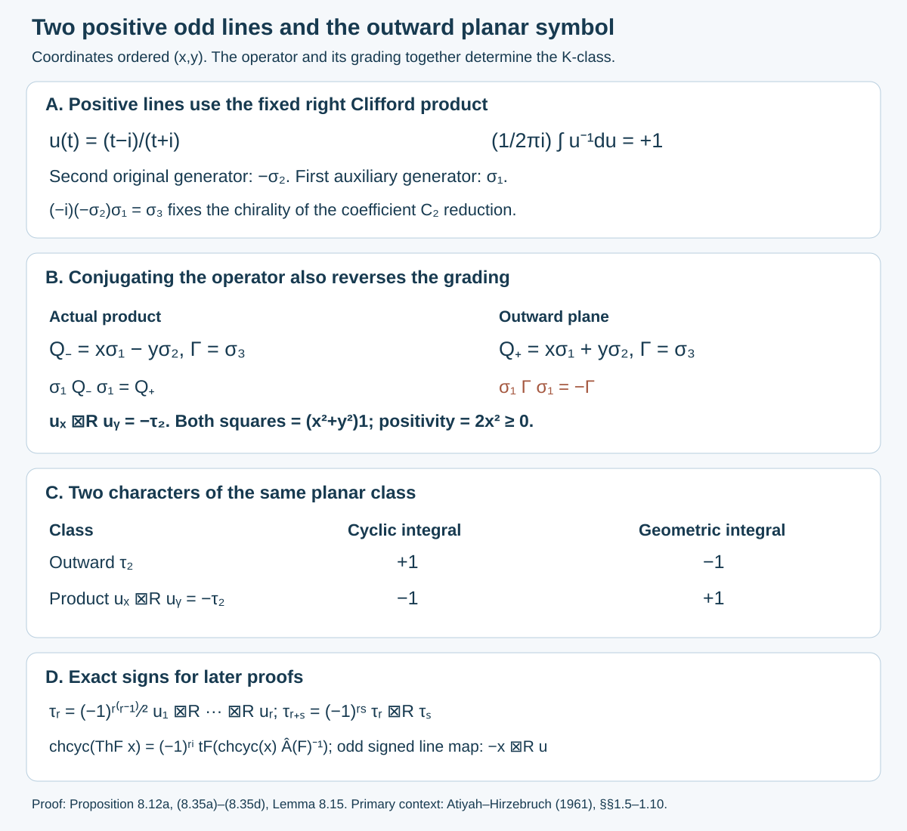

# A fundamental class for an action on a manifold

*Written by GPT-6.1 Sol (OpenAI), September 2026, at Ultra. Not yet reviewed. Public domain (CC0).*

An orientation lets us integrate a top-degree form. If a group moves the manifold, we would like that integral to remain visible in the K-theory of its crossed product. The algebraic formula is easy to write; the main difficulty is the norm. A diffeomorphism can stretch covectors, and a C\*-norm bound on functions does not control that stretching.

We start with a bundle on which the action has an invariant filtration with isometric pieces. A change of scale makes its off-diagonal part small. This produces a stronger Banach norm that controls forms and still has the same K-theory as the C\*-algebra. Integration then becomes an \(n\)-trace for that norm, so the extension theorem of the [n-trace lesson](n-traces-on-banach-algebras.md) supplies the fundamental pairing. We then twist the pairing by a bundle and lift a general oriented action to its bundle of metrics. Transferring the lifted pairing back requires an additional Thom construction.

We use reduced crossed products throughout. The analytic bundle method, fundamental cycle and metric reduction are developed in [Connes 1986, Sections 3–5]. The proofs below fix the action, adjoint, matrix and normalization conventions explicitly. Smooth manifolds are Hausdorff and second countable.

## 1. Arrows and a norm that can see stretching

Let a discrete group \(\Gamma\) act on the right on a locally compact Hausdorff space \(X\). An arrow \((x,g)\) goes from \(xg\) to \(x\); its inverse is \((xg,g^{-1})\), and
\[
(x,g)(xg,h)=(x,gh).
\tag{1.1}
\]
An element of \(D=C_c(X\rtimes\Gamma)\) has compactly supported continuous coefficients and only finitely many group coefficients. Its product and involution are
\[
\begin{split}
(ab)(x,g)&=\sum_h a(x,h)b(xh,h^{-1}g),\\
a^*(x,g)&=\overline{a(xg,g^{-1})}.
\end{split}
\tag{1.2}
\]
For \(x\in X\), the regular representation on \(\ell^2(\Gamma)\) is
\[
(R_x(a)v)(g)=\sum_k a(xg^{-1},gk^{-1})v(k).
\tag{1.3}
\]
Define \(A=C_0(X)\rtimes_r\Gamma\) by the norm
\(\|a\|_A=\sup_x\|R_x(a)\|\). This gives the useful coefficient bound
\[
|a(y,h)|\leq\|a\|_A.
\tag{1.4}
\]
Indeed take \(x=yh\), \(g=h\), and \(k=1\) in a matrix coefficient of (1.3).

Let \(E\to X\) be a real vector bundle of positive finite rank, equipped with a continuous Euclidean metric. Its complexification has the corresponding Hermitian metric. An equivariant structure is a family
\[
\pi(x,g):E_{xg}\longrightarrow E_x,
\qquad
\pi(x,g)\pi(xg,h)=\pi(x,gh).
\tag{1.5}
\]
Each map is invertible, but need not preserve the metric.

**Example 1.1.** Over one point take \(\Gamma=\mathbb Z\) and
\[
\pi(k)=\begin{pmatrix}1&k\\0&1\end{pmatrix}.
\tag{1.6}
\]
The group acts isometrically on the invariant first coordinate and on the quotient. Its action on the whole plane has unbounded norm. An invariant metric on the plane would make all powers uniformly bounded in every equivalent finite-dimensional norm, so such a metric does not exist. Scaling the first coordinate by \(\epsilon\) changes the off-diagonal entry to \(\epsilon k\). This is the simplest model for the method below.

## 2. A module constructed from bundle coefficients

Put \(\mathcal M_E=C_c(X\rtimes\Gamma,r^*E_\mathbb C)\), where \(r(x,g)=x\). Define a right action and an \(A\)-valued inner product by
\[
\begin{split}
(\xi a)(x,g)&=\sum_h\xi(x,h)a(xh,h^{-1}g),\\
\langle\xi,\eta\rangle(x,g)
&=\sum_h\langle\xi(xh,h^{-1}),\eta(xh,h^{-1}g)\rangle_{E_{xh}}.
\end{split}
\tag{2.1}
\]
Inner products are antilinear in the first variable. Notice that the right action does not use \(\pi\). The metric alone defines this module; the possibly stretching action will enter on the left.

**Lemma 2.1.** Formulas (2.1) make \(\mathcal M_E\) a positive-definite pre-Hilbert module. Its completion \(\mathcal E_E\) has norm
\(\|\xi\|=\|\langle\xi,\xi\rangle\|_A^{1/2}\). Every coefficient extends continuously to the completion and satisfies
\[
\sup_x\|\xi(x,g)\|\leq\|\xi\|.
\tag{2.2}
\]
All coefficients together separate elements of \(\mathcal E_E\).

**Proof.** We verify positivity in the representations defining the reduced norm. Let
\(H_{E,x}=\bigoplus_{g\in\Gamma}E_{xg^{-1},\mathbb C}\). For a finite coefficient section set
\[
(W_{\xi,x}v)(g)
=\sum_k\xi(xg^{-1},gk^{-1})v(k).
\tag{2.3}
\]
A single group coefficient is a weighted shift. Its norm is at most the supremum of that coefficient's fiber norm. A finite sum is therefore bounded, with
\(\|W_{\xi,x}\|\leq\sum_h\sup_y\|\xi(y,h)\|\), uniformly in \(x\).

Expanding a matrix entry and substituting \(r=h^{-1}g\) gives
\[
R_x(\langle\xi,\eta\rangle)=W_{\xi,x}^*W_{\eta,x},
\qquad
W_{\xi a,x}=W_{\xi,x}R_x(a).
\tag{2.4}
\]
These identities prove positivity, the right-module inner-product rule, conjugate symmetry and
\(\|\langle\xi,\eta\rangle\|\leq\|\xi\|\|\eta\|\). They also show
\(\|\xi\|=\sup_x\|W_{\xi,x}\|\). Thus the triangle inequality and the bounded right action follow from operator norms. A matrix entry of \(W_{\xi,x}\) proves (2.2), and zero norm makes every coefficient zero. The algebraic module identities can also be checked in (2.1) by reindexing finite sums.

Complete in this norm. The right action and inner product extend by their bounds, so the defining Hilbert-module identities persist. Each coefficient has a uniform limit, a continuous section vanishing at infinity. If all limiting coefficients are zero, every matrix entry of every limiting \(W_{\xi,x}\) is zero. Those operators are zero, hence the element's norm is zero. This proves separation in the completion. \(\square\)

The bundle action defines an algebra homomorphism on the finite coefficient core:
\[
(\lambda_E(a)\xi)(x,g)
=\sum_h a(x,h)\pi(x,h)\xi(xh,h^{-1}g).
\tag{2.5}
\]
It commutes with the right action. The cocycle identity (1.5), rather than metric invariance, makes it multiplicative.

**Proposition 2.2.** Every \(\lambda_E(a)\), \(a\in D\), is a bounded adjointable right-module operator. Its adjoint is
\[
(\lambda_E(a)^*\eta)(x,g)
=\sum_h a^*(x,h)\bigl(\pi(x,h)^{-1}\bigr)^*
                    \eta(xh,h^{-1}g).
\tag{2.6}
\]
The star on the inverse map is the fiber metric adjoint. In general this differs from \(\lambda_E(a^*)\).

**Proof.** On \(H_{E,x}\), the left operator has matrix
\[
T_{a,x}(g,k)
=a(xg^{-1},gk^{-1})\pi(xg^{-1},gk^{-1}).
\tag{2.7}
\]
Each fixed group coefficient is a weighted shift, now with a fiber map as its weight. Compactness of its coefficient support gives
\[
\|T_{a,x}\|
\leq\sum_h\sup_y |a(y,h)|\,\|\pi(y,h)\|<\infty.
\tag{2.8}
\]
The same estimate applies to the adjoint weights, which have compact support transported by a fixed homeomorphism. Direct convolution gives
\(W_{\lambda_E(a)\xi,x}=T_{a,x}W_{\xi,x}\). Equations (2.4) and (2.8) prove boundedness on the module.

Transpose and conjugate the matrix in (2.7). At \((g,k)\), put \(y=xg^{-1}\) and \(h=gk^{-1}\). The resulting weight is
\(a^*(y,h)\pi(yh,h^{-1})^*
=a^*(y,h)(\pi(y,h)^{-1})^*\).
This is exactly (2.6). Hence (2.4) gives
\(\langle\lambda_E(a)\xi,\eta\rangle
=\langle\xi,\lambda_E(a)^*\eta\rangle\).
Equality in all regular representations is equality in \(A\). The finite-sum identities show right linearity and multiplication before completion, and boundedness extends them. \(\square\)

## 3. Completing the graph of the left action

The map \(a\mapsto\lambda_E(a)\) can be unbounded for the reduced C\*-norm. We can still close its graph.

**Proposition 3.1.** If \(a_j\in D\), \(\|a_j\|_A\to0\), and \(\lambda_E(a_j)\) converges in module operator norm, its limit is zero. The closed graph domain
\[
B_E=\operatorname{Dom}\overline{\lambda_E}\subset A,
\qquad
\|a\|_{B_E}=\max(\|a\|_A,\|\overline{\lambda_E}(a)\|)
\tag{3.1}
\]
is a Banach algebra containing \(D\) densely in this norm and continuously embedded densely in \(A\).

**Proof.** Let the operator limit be \(L\), and fix \(\xi\in\mathcal M_E\). In the coefficient \((\lambda_E(a_j)\xi)(x,g)\), only the finitely many indices
\(h=gk^{-1}\), with \(k\) in the group support of \(\xi\), occur. For fixed \(x,g\), (1.4) forces every scalar coefficient of \(a_j\) to zero. The fiber maps and section values in this finite sum are fixed. Thus this coefficient tends to zero. On the other hand \(\lambda_E(a_j)\xi\to L\xi\) in module norm, so (2.2) identifies its coefficient limit with that of \(L\xi\). Coefficient separation in Lemma 2.1 gives \(L\xi=0\). Density of the core then gives \(L=0\).

The graph closure is a closed linear subspace of the product of two Banach spaces. The first projection is injective by closability, so its domain with (3.1) is complete. For two graph-approximating sequences \(a_j,b_j\in D\), their products converge to \(ab\) in \(A\) and to
\(\overline{\lambda_E}(a)\overline{\lambda_E}(b)\) in operator norm. Therefore \(ab\in B_E\), its left operator is that product, and the norm is submultiplicative. Graph density of \(D\) is the definition of closure; density in \(A\) follows from \(D\subset B_E\). \(\square\)

This is closability of an algebra homomorphism. It does not make that homomorphism preserve the involution, or make \(B_E\) a \(*\)-subalgebra. The graph norm also depends on the chosen metric when two metrics are not uniformly comparable on a noncompact base.

If \(\pi\) is isometric, its left representation is contractive for the reduced norm. To see this on (2.7), use the unitary fiber identification
\[
(Q_x\zeta)(g)=\pi(x,g^{-1})\zeta(g)
\quad\hbox{from }H_{E,x}\hbox{ to }\ell^2(\Gamma)\otimes E_{x,\mathbb C}.
\]
The cocycle identity gives
\(Q_xT_{a,x}Q_x^{-1}=R_x(a)\otimes1\). Consequently
\(\|\lambda_E(a)\|\leq\|a\|_A\), and \(\lambda_E\) extends to a \(*\)-representation of \(A\).

## 4. Making the nonisometric part small

**Definition 4.1.** The bundle action is **almost isometric** if there is an isometric action \(\pi_0\) on the same Euclidean bundle, continuous arrow maps \(P_1,\ldots,P_s\), and bundle automorphisms \(U_\epsilon\), \(\epsilon>0\), such that
\[
U_\epsilon(x)\pi(x,g)U_\epsilon(xg)^{-1}
=\pi_0(x,g)+\sum_{j=1}^s\epsilon^jP_j(x,g).
\tag{4.1}
\]
For each fixed \(\epsilon\), both \(U_\epsilon\) and its inverse have uniformly bounded fiber norms on \(X\). The \(P_j\) need not be uniformly bounded on all arrows. Compact coefficient support is enough for their initial operator maps.

**Lemma 4.2.** Suppose a subbundle \(F\subset E\) is invariant, and the actions on \(F\) and \(E/F\) preserve Euclidean metrics. Choose an orthogonal splitting with these metrics. Then the action on \(E\), every finite tensor power, and every finite direct sum of those tensor powers is almost isometric.

**Proof.** In the ordered splitting \(E=F\oplus F^\perp\), with maps acting on column vectors, invariance of \(F\) gives
\[
\pi(x,g)=\begin{pmatrix}\pi_F(x,g)&b(x,g)\\0&\pi_Q(x,g)\end{pmatrix}.
\tag{4.2}
\]
The two diagonal maps are isometric. The block-diagonal action \(\pi_0\) satisfies the cocycle identity because it is the restriction and quotient action. Put
\(U_\epsilon=\operatorname{diag}(\epsilon1_F,1_{F^\perp})\).
Conjugation multiplies the upper-right block by \(\epsilon\) and leaves the diagonal blocks unchanged. Its norm and inverse norm are bounded by \(\max(1,\epsilon)\) and \(\max(1,\epsilon^{-1})\). This proves (4.1).

For the \(r\)-th tensor power, conjugate by \(U_\epsilon^{\otimes r}\). Expanding
\((\pi_0+\epsilon P_1)^{\otimes r}\) gives the isometric constant term and finitely many terms with powers \(\epsilon,\ldots,\epsilon^r\). No commutativity of the fiber maps is used: each tensor term has its factors in their fixed positions. A finite direct sum uses the direct-sum scaling operators. \(\square\)

**Theorem 4.3.** For an almost-isometric action, \(B_E\) is stable under holomorphic functional calculus in \(A\), including all matrix unitizations. In particular
\[
K_0(B_E)\cong K_0(A),\qquad K_1(B_E)\cong K_1(A).
\tag{4.3}
\]
Here the K-groups of a Banach algebra use idempotents and invertibles, with relative classes for a nonunital algebra.

**Proof.** Multiplication of a section by \(U_\epsilon\) defines a bounded invertible right-module map \(V_\epsilon\). The action in (4.1) has representation
\(\lambda_\epsilon(a)=V_\epsilon\lambda_E(a)V_\epsilon^{-1}\).
Let \(L_j(a)\) be convolution using the arrow weight \(a(x,g)P_j(x,g)\). Initially, for \(a\in D\),
\[
\lambda_\epsilon(a)=\lambda_0(a)+\sum_{j=1}^s\epsilon^jL_j(a).
\tag{4.4}
\]
Each \(L_j\) extends continuously from \(B_E\) to module operators. Indeed choose \(s\) distinct positive numbers \(\epsilon_1,\ldots,\epsilon_s\); the matrix \((\epsilon_i^j)\) is invertible. Solving (4.4) for the \(L_j\) expresses them as finite linear combinations of bounded similarities of \(\lambda_E\) and the contractive \(\lambda_0\). This also proves (4.4) on the whole graph domain. For each \(\epsilon\), the equivalent norm
\(\max(\|a\|_A,\|\lambda_\epsilon(a)\|)\) makes the same domain a Banach algebra.

If \(\|a\|_A<1\), then
\[
\|\lambda_\epsilon(a)\|
\leq\|a\|_A+\sum_j\epsilon^j\|L_j(a)\|<1
\tag{4.5}
\]
for sufficiently small \(\epsilon\). The Neumann series for \(1-a\) consequently converges in this equivalent graph norm. Extend the maps by sending the new scalar unit to the identity operator and the \(L_j\) of that unit to zero. The same argument works in every matrix algebra over the external unitization: the isometric representation remains contractive, and all similarities and finite polynomial terms are amplified in the fixed matrix size.

For a general \(a\in M_k(B_E^+)\) invertible in \(M_k(A^+)\), approximate its ambient inverse by \(b\in M_k(B_E^+)\) so that both
\(\|1-ab\|_A<1\) and \(\|1-ba\|_A<1\). The previous paragraph makes \(ab\) and \(ba\) invertible in the graph algebra. Thus \(b(ab)^{-1}\) is a right inverse of \(a\), and \((ba)^{-1}b\) is a left inverse. They coincide. This proves full matrix inverse closure; it does not require \(B_E\) to be closed under star.

The spectra in the two algebras are therefore equal. Near each resolvent point the inverse is analytic in the Banach graph norm, by its local Neumann series. A contour surrounding the spectrum has compact image in that norm, so its Riemann sums converge there. The holomorphic contour formula belongs to \(M_k(B_E^+)\) and agrees in \(M_k(A^+)\) with the ambient functional calculus.

For completeness, density and matrix inverse closure give the K-theory comparison by approximation. Approximate an ambient idempotent by a graph-algebra matrix and take its Riesz idempotent around the spectral component near one. It has the prescribed scalar part for a relative class. Close idempotents are intertwined by
\(fe+(1-f)(1-e)\), whose ambient inverse belongs to the graph algebra. For a homotopy use a finite polygonal approximation, with endpoints fixed, and apply the same Riesz contour on each sufficiently small segment. This proves surjectivity and injectivity on stable idempotent classes. For invertibles, the open set of ambient invertibles permits close approximation and finite polygonal approximation of paths. All those matrices and inverses belong to the graph algebra, proving the \(K_1\) assertion. These are also the comparison arguments used in the n-trace lesson. \(\square\)

The small parameter can depend on the element and the matrix size. The theorem needs no uniform convergence of the bundle actions over every arrow.

## 5. Moving a coefficient through a tensor of sections

The next estimate converts a bound in one coefficient into a bound in many inserted coefficients. We give the operator factorization that makes the conversion possible.

Let \(E,F\) be equivariant Euclidean bundles, with no isometry assumption for this section. For \(\eta\in\mathcal M_E\), define two right-module maps from the finite core of \(\mathcal E_F\) to that of \(\mathcal E_{E\otimes F}\):
\[
\begin{split}
(C_\eta\zeta)(x,g)
&=\sum_h\eta(x,h)\otimes\pi_F(x,h)\zeta(xh,h^{-1}g),\\
(C_\eta^\vee\zeta)(x,g)
&=\sum_h\eta(x,h)\otimes
        \bigl(\pi_F(x,h)^{-1}\bigr)^*\zeta(xh,h^{-1}g).
\end{split}
\tag{5.1}
\]
Their weights have finite group support and compact spatial support, so the weighted-shift bound proves boundedness. The adjoint weights also have this property; transposing the regular matrices, as in Proposition 2.2, proves adjointability.

More explicitly, let \(i_v:F_y\to E_y\otimes F_y\) send \(w\) to \(v\otimes w\). The adjoint of the first map in (5.1) is
\[
(C_\eta^*\zeta)(x,g)=\sum_h
\pi_F(xh,h^{-1})^*i_{\eta(xh,h^{-1})}^*
\zeta(xh,h^{-1}g).
\]
For the second map replace \(\pi_F(xh,h^{-1})^*\) here by \(\pi_F(xh,h^{-1})^{-1}\). These finite sums give the module inner-product adjoint identities directly.

**Lemma 5.1.** For \(\xi,\eta\in\mathcal M_E\) and \(a\in D\),
\[
\lambda_F(\langle\xi,\lambda_E(a)\eta\rangle)
=(C_\xi^\vee)^*\lambda_{E\otimes F}(a)C_\eta.
\tag{5.2}
\]
In particular, for \(\xi',\eta'\in\mathcal M_F\), the compactly supported tensor sections
\(\xi''=C_\xi^\vee\xi'\) and \(\eta''=C_\eta\eta'\) satisfy
\[
\langle\xi',\lambda_F(\langle\xi,\lambda_E(a)\eta\rangle)\eta'\rangle
=\langle\xi'',\lambda_{E\otimes F}(a)\eta''\rangle.
\tag{5.3}
\]

**Proof.** First convolution and the bundle cocycle identities give
\(\lambda_{E\otimes F}(a)C_\eta=C_{\lambda_E(a)\eta}\).
To check the remaining product, fix a regular fiber and indices \(g,k\). In the matrix coefficient of \((C_\xi^\vee)^*C_\psi\), the intermediate index \(r\) gives the scalar
\[
\langle\xi(xr^{-1},rg^{-1}),\psi(xr^{-1},rk^{-1})\rangle
\]
and the fiber factor
\[
\pi_F(xr^{-1},rg^{-1})^{-1}
\pi_F(xr^{-1},rk^{-1})
=\pi_F(xg^{-1},gk^{-1}).
\]
The scalar sum is exactly
\(\langle\xi,\psi\rangle(xg^{-1},gk^{-1})\), by (2.1). This is the regular matrix of \(\lambda_F(\langle\xi,\psi\rangle)\). Equality on every regular fiber proves equality of the module maps. Using \(\psi=\lambda_E(a)\eta\) proves (5.2); taking a module matrix coefficient proves (5.3). The inverse adjoint in \(C_\xi^\vee\) is essential when \(F\)'s action is not isometric. \(\square\)

**Lemma 5.2.** Fix \(\rho\in C_c(X)\) and \(\xi\in\mathcal M_E\). There are finitely many fixed sections \(e_j\in\mathcal M_E\) and linear maps \(\theta_j:D\to D\) such that
\[
\rho\lambda_E(a)\xi=\sum_j e_j\theta_j(a),
\qquad
\|\lambda_F(\theta_j(a))\|
\leq c_j\|\lambda_{E\otimes F}(a)\|.
\tag{5.4}
\]
This holds for any fixed equivariant bundle \(F\). The constants may depend on \(\rho,\xi,F\), but not on \(a\).

**Proof.** Split \(\rho\) by a finite partition subordinate to bundle charts near its compact support. On one piece choose an orthonormal frame, multiply each frame vector by a compactly supported cutoff equal to one on that piece, and view it as a section supported at the identity group coefficient. Call these sections \(e_j\). Pointwise expansion gives
\[
\rho\lambda_E(a)\xi
=\sum_j e_j\langle e_j,\rho\lambda_E(a)\xi\rangle.
\]
For the multiple-chart version sum the corresponding expressions with each partition piece in place of \(\rho\). The coefficient
\(\theta_j(a)=\langle\overline\rho e_j,\lambda_E(a)\xi\rangle\) belongs to \(D\). Formula (5.2) bounds its left action on \(F\) by
\(\|C_{\overline\rho e_j}^\vee\|
\|\lambda_{E\otimes F}(a)\|\|C_\xi\|\), proving (5.4).

For the trivial line bundle with trivial action, \(\lambda_F\) is the faithful regular action of \(A\) on itself. Its operator norm is \(\|\theta_j(a)\|_A\). Thus (5.4) also includes the last, scalar stage of the estimate. \(\square\)

For a positive integer \(m\), let \(B_m\) be the graph algebra for
\(E\oplus E^{\otimes2}\oplus\cdots\oplus E^{\otimes m}\). Use the norm
\[
\|a\|_{B_m}
=\max\bigl(\|a\|_A,\|\lambda_E(a)\|,\ldots,
                         \|\lambda_{E^{\otimes m}}(a)\|\bigr).
\tag{5.5}
\]
Equivalently write \(\|a\|_j=\|\lambda_{E^{\otimes j}}(a)\|\) for \(j\geq1\) and \(\|a\|_0=\|a\|_A\). If \(E\) is almost isometric, Theorem 4.3 applies to this algebra.

**Theorem 5.3.** Let \(\Phi\) be an \(m\)-linear functional on \(\mathcal M_E\), balanced over \(D\) between consecutive slots. Suppose that for every fixed tuple \(\eta_1,\ldots,\eta_m\) there is a constant with
\[
|\Phi(\eta_1,\ldots,\eta_m a)|\leq c_{\eta_1,\ldots,\eta_m}\|a\|_A,
\qquad a\in D.
\tag{5.6}
\]
For every fixed \(\rho\in D\) and \(\xi_1,\ldots,\xi_m\in\mathcal M_E\), there is then a constant \(C\) such that
\[
|\Phi(\rho a_1\xi_1,a_2\xi_2,\ldots,a_m\xi_m)|
\leq C\prod_{j=1}^m\|a_j\|_{B_m},\qquad a_j\in D.
\tag{5.7}
\]
The notation \(a\xi\) means the bundle left action.

**Proof.** First suppose \(\rho\in C_c(X)\). Apply Lemma 5.2 to the first slot, with \(F=E^{\otimes(m-1)}\), interpreting the power zero as the trivial line. It becomes a finite sum of slots \(e_1\theta_1(a_1)\), with
\(\|\theta_1(a_1)\|_{m-1}\leq C_1\|a_1\|_m\).
Choose a compact scalar cutoff \(\rho_1\) equal to one at every initial vertex of an arrow in the support of \(e_1\), so that \(e_1\rho_1=e_1\). Balancing moves the coefficient into slot two:
\[
\Phi(e_1\theta_1(a_1),a_2\xi_2,\ldots)
=\Phi(e_1,\rho_1\theta_1(a_1)a_2\xi_2,\ldots).
\]
Apply Lemma 5.2 to this slot, using \(F=E^{\otimes(m-2)}\). The new right coefficient has norm at most
\[
C_2\|\theta_1(a_1)a_2\|_{m-1}
\leq C_1C_2\|a_1\|_m\|a_2\|_{m-1}.
\]
Continue through the slots. Every frame section and cutoff is fixed independently of the varying \(a_j\). After finitely many steps each branch is
\(\Phi(e_1,\ldots,e_m\theta(a_1,\ldots,a_m))\), with
\[
\|\theta(a_1,\ldots,a_m)\|_A
\leq C'\|a_1\|_m\|a_2\|_{m-1}\cdots\|a_m\|_1.
\]
Apply (5.6) to each of these finitely many fixed tuples and sum their constants. The norms in (5.5) dominate every factor, proving (5.7). This proof covers \(m=1\) as well: the first factorization goes directly to (5.6).

For general \(\rho\in D\), choose \(\kappa\in C_c(X)\) equal to one on its range supports, so \(\kappa\rho=\rho\). Apply the proved case to \(\kappa\), with \(\rho a_1\) as the first varying coefficient. Submultiplicativity contributes the fixed factor \(\|\rho\|_{B_m}\). \(\square\)

## 6. Functions and smooth coefficients in the graph norm

**Proposition 6.1.** On \(C_c(X)\), the norm in (5.5) is the ordinary supremum norm. If \(X\) is a smooth manifold and the bundle action is smooth, finite sums with smooth compactly supported coefficients are dense in \(B_m\).

**Proof.** An identity-group coefficient \(f\) acts on every bundle module by
\((f\xi)(x,g)=f(x)\xi(x,g)\). Its regular matrix is fiberwise multiplication by \(f(xg^{-1})\), so its operator norm is at most \(\|f\|_\infty\). The reduced norm of \(f\) is exactly this supremum; thus the maximum in (5.5) is the supremum too.

For density, first approximate an element in graph norm by a finite coefficient element of \(D\), which is possible by construction. Approximate its finitely many continuous coefficient functions uniformly by smooth functions, all supported in fixed enlarged compact sets. For each of its finitely many group indices, every fiber action on the finitely many tensor powers is bounded on those sets. The estimate (2.8), applied to each power, therefore forces convergence in (5.5). A smooth partition and ordinary local smoothing give the asserted coefficient approximations. \(\square\)

The graph norm controls the bundle action rather than derivatives of a coefficient function. Smoothness is the dense domain on which we initially differentiate; the \(n\)-trace theorem will extend the pairing beyond that domain.

## 7. Integration becomes a crossed-product differential cycle

Now let \(V\) be an oriented smooth \(n\)-manifold without boundary, with \(n\geq1\), and let \(\Gamma\) act by orientation-preserving diffeomorphisms. Neither compactness nor a free or proper action is assumed. Put
\(\alpha_g=(x\mapsto xg)^*\) on differential forms. Then
\(\alpha_g\alpha_h=\alpha_{gh}\).
For compactly supported form coefficients use
\[
(\omega\eta)(x,g)
=\sum_h\omega(x,h)\wedge
                  \pi_{\wedge^*T^*V}(x,h)\eta(xh,h^{-1}g).
\tag{7.1}
\]
The pullback on the second coefficient is what the notation \(\pi\) records. Thus both forms being wedged lie at \(x\). In symbolic notation this is
\((\omega_gU_g)(\eta_hU_h)=\omega_g\wedge\alpha_g(\eta_h)U_{gh}\).

**Lemma 7.1.** Formula (7.1) is associative and defines balanced bimodule maps from degree \(j\) and degree \(k\) form modules into degree \(j+k\). On smooth coefficients,
\(d(\sum_g\omega_gU_g)=\sum_g d\omega_gU_g\) is a square-zero graded derivation. The functional
\[
\mathcal I(\omega)=\int_V\omega(x,1)
\tag{7.2}
\]
on top-degree forms is a closed graded trace.

**Proof.** A product has finite group support and compact spatial support: each term uses a fixed diffeomorphism to transport compact supports. Expanding a triple product gives the same sum over three composable arrows in either association, because pullback preserves wedge products and satisfies the group law. The same expansion with a scalar middle coefficient proves balancing. The universal property of a balanced tensor product gives its unique induced bimodule map. There is no graded commutativity assertion for the crossed algebra.

Differentiation commutes with pullback. The ordinary graded product rule in each term consequently proves the graded derivation rule, and coefficientwise \(d^2=0\).

For degrees \(j+k=n\), the trace of a product is
\(\sum_g\int_V\omega_g\wedge\alpha_g(\eta_{g^{-1}})\).
Invariance of integration under an orientation-preserving diffeomorphism changes each term to
\(\int_V\alpha_{g^{-1}}(\omega_g)\wedge\eta_{g^{-1}}\).
Ordinary exterior commutativity gives the sign \((-1)^{jk}\); reindexing \(g^{-1}\) proves the graded trace identity. For a degree-\(n-1\) form, \(\mathcal I(d\eta)=\int_Vd\eta_1=0\) by compact-support Stokes. This is closedness. \(\square\)

It follows from the algebra lesson's cycle theorem that
\[
\tau(a_0,\ldots,a_n)=\mathcal I(a_0da_1\cdots da_n)
\tag{7.3}
\]
is a cyclic cocycle on \(D^\infty=C_c^\infty(V)\rtimes^{\mathrm{alg}}\Gamma\). On monomials the group product must be the identity, and the integrand is
\[
a^0_{g_0}\,\alpha_{g_0}(da^1_{g_1})\wedge
\alpha_{g_0g_1}(da^2_{g_2})\wedge\cdots\wedge
\alpha_{g_0\cdots g_{n-1}}(da^n_{g_n}).
\tag{7.4}
\]
This displays the location of every pullback.

**Lemma 7.2.** For every fixed compactly supported continuous top form \(\omega\) on the transformation groupoid, there is \(C_\omega<\infty\) such that
\[
|\mathcal I(a\omega)|\leq C_\omega\|a\|_A,
\qquad a\in D.
\tag{7.5}
\]

**Proof.** The identity coefficient of the product is
\(\sum_h a(x,h)\pi(x,h)\omega(xh,h^{-1})\).
Only finitely many \(h\) occur, because \(\omega\) has finite group support. Each transported top form has compact support and finite total variation. Bound its scalar coefficient by (1.4) and sum those variations to obtain (7.5). No estimate on derivatives of \(a\), and no invariant volume density, is needed here. The graded trace identity also gives the corresponding bound on \(\mathcal I(\omega a)\). \(\square\)

For later use, if the cotangent bundle is almost isometric and \(\omega_1,\ldots,\omega_n\) are fixed compactly supported continuous one-form coefficients, Theorem 5.3 also proves
\[
|\mathcal I(\omega_1a_1\cdots\omega_na_n)|
\leq C_{\omega_1,\ldots,\omega_n}\prod_j\|a_j\|_{B_n}.
\tag{7.6}
\]
Indeed move \(\omega_1\) to the last position by the graded trace rule, with sign \((-1)^{n-1}\). Choose a scalar source cutoff \(\kappa\) with \(\omega_1\kappa=\omega_1\) and move it from the end to the beginning. The result, up to that sign, is
\(\mathcal I(\kappa a_1\omega_2a_2\cdots a_n\omega_1)\).
The balanced wedge functional satisfies (5.6) by (7.5); (5.7) now applies to the fixed cyclically ordered forms. This explains why the estimate allows a separate coefficient after every one-form.

## 8. The almost-isometric fundamental pairing

Assume now that the tangent action has an invariant subbundle \(F\subset TV\), with preserved metrics and orientations on \(F\) and \(TV/F\). Equivalently, in frames ordered by this invariant subbundle its matrices have the form (4.2) with special-orthogonal diagonal blocks. This is an orthogonal two-step structure with an unrestricted off-diagonal block.

The cotangent action has the invariant annihilator of \(F\). Its restriction and quotient are the duals of the two isometric tangent pieces; their dual metrics are preserved. Lemma 4.2 therefore applies to \(E=T^*V\), all its tensor powers, and their finite sum. Use \(B_n\) from (5.5).

**Theorem 8.1.** The cocycle (7.3) is an \(n\)-trace on \(B_n\), with dense domain \(D^\infty\). Its controlled extension gives a unique additive map
\[
J:K_{n\bmod2}(A)\longrightarrow\mathbb C
\tag{8.1}
\]
with the following raw differential-form values. For even \(n=2m\),
\[
J([e]-[e_0])=\mathcal I\operatorname{Tr}_k(e(de)^{2m}),
\tag{8.2}
\]
and for odd \(n=2m+1\),
\[
J[u]=(-1)^m\mathcal I\operatorname{Tr}_k((u^{-1}du)^{2m+1}).
\tag{8.3}
\]
These formulas use the extended differential cycle for matrices over the smallest holomorphically closed subalgebra containing \(D^\infty\); scalar units have differential zero. The idempotent \(e_0\) is the scalar part. An invertible in a relative class has scalar part one after removing its constant scalar class.

**Proof.** The \(n\)-linear functional
\(\Phi(\omega_1,\ldots,\omega_n)=\mathcal I(\omega_1\cdots\omega_n)\)
on compactly supported cotangent sections is balanced by Lemma 7.1. For a fixed tuple its product is a compactly supported top form; Lemma 7.2 supplies the last-coefficient hypothesis (5.6). Theorem 5.3 consequently estimates inserted coefficients in the norm of \(B_n\).

To apply that estimate to the full \(n\)-trace expression, fix \(a_1,\ldots,a_n\in D^\infty\). Choose a scalar compact cutoff \(\kappa\) equal to one at the initial vertices of all arrows in the support of \(da_n\). Then \((da_n)\kappa=da_n\). Graded trace cyclicity, with \(\kappa\) of degree zero, gives
\[
\mathcal I(x_1da_1\cdots x_nda_n)
=\mathcal I(\kappa x_1da_1\cdots x_nda_n).
\]
Theorem 5.3 with this fixed \(\kappa\) proves
\[
|\mathcal I(x_1da_1\cdots x_nda_n)|
\leq C_{a_1,\ldots,a_n}\prod_j\|x_j\|_{B_n}.
\tag{8.4}
\]
This is the entire inserted-coefficient estimate, rather than a bound on the leading coefficient alone. Cyclicity and the cocycle equation were proved in Section 7, and density in the graph norm is Proposition 6.1. Thus \(\tau\) is an \(n\)-trace on this Banach algebra.

The same estimate permits external scalar units among the inserted coefficients. Fix range cutoffs \(\eta_j\in C_c^\infty(V)\) with \(\eta_jda_j=da_j\). If \(x_j\in B_n^+\), replace each \(x_jda_j\) by \((x_j\eta_j)da_j\). Now \(x_j\eta_j\in B_n\) and \(\|x_j\eta_j\|_{B_n}\leq\|x_j\|_{B_n^+}\|\eta_j\|_{B_n}\). The extra fixed norms are absorbed into the constant in (8.4); approximation extends the estimate from finite coefficients to these elements. Thus adjoining a scalar identity does not require a compactly supported representative for that identity.

The n-trace lesson's controlled-domain, matrix holomorphic-calculus and parity-pairing theorems apply to \(B_n\). The scalar extension has \(d1=0\); its leading scalar term integrates a compact-support exact form to zero. The smallest holomorphically closed algebra containing \(D^\infty\) in \(A\) lies in \(B_n\), because Theorem 4.3 proves matrix inverse closure there. Its holomorphic operations computed in \(A\) agree with those in \(B_n\), so it lies in the controlled extension domain as well. Smooth coefficient density and the approximation proof in Theorem 4.3 identify its K-theory with that of \(A\). The parity formulas in the n-trace lesson give (8.2)–(8.3) and their homotopy invariance. Every ambient class has a representative in that algebra; this also proves uniqueness of \(J\). \(\square\)

The stronger Banach norm enters only the extension argument. The resulting map is defined on the K-theory of the reduced C\*-crossed product.

**Corollary 8.2.** Normalize (8.1) by
\[
\mathcal F=\begin{cases}
\displaystyle\frac{J}{m!(2\pi i)^m},&n=2m,\\
\displaystyle\frac{m!\,J}{(2m+1)!(2\pi i)^{m+1}},&n=2m+1.
\end{cases}
\tag{8.5}
\]
For the canonical inclusion \(i:C_0(V)\to A\), every compact-support K-class \(x\) satisfies
\[
\mathcal F(i_*x)=\int_V\operatorname{ch}_n(x).
\tag{8.6}
\]
Here \(\operatorname{ch}_n\) denotes the degree-\(n\) component with the even and odd conventions of the connection lesson. Throughout this lesson, an unadorned \(\operatorname{ch}\) means this **cyclic character**, denoted \(\operatorname{ch}_{\rm cyc}\) when comparing conventions. For a commutative bundle with curvature \(\Theta=\nabla^2\), its even part is \(\operatorname{Tr}\exp(\Theta/(2\pi i))\). Ordinary topological Chern classes use the geometric character \(\operatorname{ch}_{\rm geom}=\operatorname{Tr}\exp(-\Theta/(2\pi i))\). Consequently
\[
 \operatorname{ch}_{{\rm geom},2j}(H)
   =(-1)^j\operatorname{ch}_{{\rm cyc},2j}(H),\qquad
 c_1(H)=-\operatorname{ch}_{{\rm cyc},2}(H).
 \tag{8.6a}
\]
Indeed replace \(\Theta\) by \(-\Theta\) in each term of its traced exponential; the term with \(j\) curvature factors acquires \((-1)^j\). Calling the column bundle a left or right module does not change its Grassmann curvature \(p(dp)^2\). All \(c_j\), Pontryagin classes and Euler classes below are ordinary topological classes. The numerical map \(\mathcal F\) in (8.5) keeps the cyclic normalization. On an even-dimensional manifold of dimension \(2m\), the map for integration of the geometric character is \((-1)^m\mathcal F\). This distinction will also determine the Bott grading in the next lesson. If this integral is nonzero, \(i_*x\) has infinite order.

**Proof.** Restrict (7.3) to identity-group coefficients. It is exactly the ordinary current cocycle \(\int_V a_0da_1\cdots da_n\). The n-trace lesson proves its pairings on compact-support K-theory, including the constants converting the raw form to the normalized even or odd Chern form. Those constants are (8.5), so naturality of the representative formulas gives (8.6). They apply to all classes by the holomorphic and path approximation arguments already proved; no surjectivity assertion for a rational topological Chern character is used. The target \(\mathbb C\), as an additive group, has no nonzero torsion. Hence a nonzero value of \(\mathcal F\) prevents any nonzero multiple of \(i_*x\) from being zero. \(\square\)

### Twisting the pairing by a bundle

Let \(H\to V\) be a finite-rank complex Hermitian bundle with a continuous equivariant action preserving its metric. The module of Section 2 now has a contractive star representation \(\lambda_H:A\to\mathcal L_A(\mathcal E_H)\). We construct the induced map on K-theory explicitly. The matrix-stability and homotopy conventions are those of [Blackadar 1998, Sections 4.5, 5.1–5.5 and 8.1]; the finite-corner argument below explains their use for a nonunital algebra.

**Lemma 8.3.** There is a star homomorphism
\[
\rho_H:A\longrightarrow A\otimes\mathcal K
\tag{8.7}
\]
whose matrix coefficients, for a suitable countable locally finite family of compactly supported sections \(t_i\), are
\[
\rho_H(a)_{ij}(x,g)
=a(x,g)\langle t_i(x),\pi_H(x,g)t_j(xg)\rangle.
\tag{8.8}
\]
After the canonical finite-corner identification \(K_*(A\otimes\mathcal K)=K_*(A)\), it defines a map \(T_H\) independent of that family.

**Proof.** Choose a countable locally finite cover by relatively compact bundle charts, subordinate smooth real functions \(\psi_\alpha\) with \(\sum_\alpha\psi_\alpha^2=1\), and orthonormal local frames \(v_{\alpha,l}\). One can obtain the functions by starting with locally finite bumps covering \(V\) and dividing each by the square root of their sum of squares. Extend \(t_{\alpha,l}=\psi_\alpha v_{\alpha,l}\) by zero. The family, enumerated as \(t_i\), satisfies
\[
\sum_i t_i(x)\langle t_i(x),v\rangle=v,
\qquad v\in H_x.
\tag{8.9}
\]
Here the frames can be continuous if the Hermitian metric is continuous. The scalar bumps remain smooth. Every compact set meets only finitely many of their supports.

Regard \(t_i\) as an identity-group section of \(\mathcal M_H\). On the finite coefficient core define
\[
J\xi=(\langle t_i,\xi\rangle)_i\in\ell^2(A).
\]
Only finitely many components occur for each core section. Expanding (2.1) and then (8.9) gives
\(\sum_i\langle\xi,t_i\rangle\langle t_i,\eta\rangle=\langle\xi,\eta\rangle\), so \(J\) is isometric.

For a finite column \((a_i)\), the synthesis map is \(\sum_i t_i a_i\). It is contractive: on each regular fiber the finite frame analysis map has norm at most one by (8.9), and its adjoint is synthesis. The fiber norms defining (2.4) give the same bound on modules. Thus synthesis extends to \(J^*:\ell^2(A)\to\mathcal E_H\). The finite-core inner-product identity proves that it is the adjoint, and (8.9) gives \(J^*J=1\). Set \(\rho_H(a)=J\lambda_H(a)J^*\). Multiplication and star are preserved because \(J^*J=1\). Its norm is at most \(\|a\|_A\).

Its entries are \(\langle t_i,\lambda_H(a)t_j\rangle\), which is (8.8). For \(a\in D\), only finitely many \(i,j\) occur: the finitely many range supports and their translated initial supports are compact. Each entry lies in \(D\). Thus \(\rho_H(a)\) is a finite matrix over \(A\); by norm density its extension has values in \(A\otimes\mathcal K\).

The finite-corner identification requires no unit in \(A\). For a relative idempotent over \((A\otimes\mathcal K)^+\), approximate its difference from its fixed scalar part by a finite matrix. A Riesz contour gives a finite-corner idempotent with that scalar part. The intertwiner from Theorem 4.3 identifies close idempotents. Approximate paths uniformly in one common finite corner and use the same contour, with endpoints fixed. This proves both surjectivity and injectivity for \(K_0\). For \(K_1\), approximate the difference from the scalar identity, and approximate paths uniformly by finite-corner polygonal paths. Closeness preserves invertibility; the finite-corner inverse is the ordinary matrix inverse with identity on the complement. This proves the \(K_1\) identification. Changing the placement of a finite corner gives the same identification: a finite permutation is connected to the identity through complex unitaries after adding a corner.

For two frames let their isometries be \(J,J'\). The isometries
\(J_\theta=(\cos\theta\,J,\sin\theta\,J')\), \(0\leq\theta\leq\pi/2\), give star homomorphisms \(J_\theta\lambda_H(a)J_\theta^*\). All four matrix blocks are compact by the same finite-support argument. The path is pointwise norm continuous, first on \(D\), then on \(A\) by contractivity. Its endpoints are the two homomorphisms in different summands. Homotopy invariance and the corner identification prove frame independence. \(\square\)

**Proposition 8.4.** For the canonical inclusion \(i:C_0(V)\to A\),
\[
T_H(i_*x)=i_*(x\otimes H),\qquad
T_{H\oplus L}=T_H+T_L,
\qquad T_L T_H=T_{H\otimes L}.
\tag{8.10}
\]
The trivial line gives \(T_{\mathbf1}=1\). These assertions hold in both K-theory degrees and require no countability assumption on \(\Gamma\).

**Proof.** At the identity group coefficient, (8.8) is
\(f(x)P_{ij}(x)\), where \(P_{ij}=\langle t_i,t_j\rangle\). The frame identity says that \(P\) is the orthogonal projection onto the embedded bundle \(H\). Its entries define a multiplier projection; \(fP\) belongs to \(C_0(V)\otimes\mathcal K\).

For a smooth compact-support relative idempotent \(e-e_0\), the extended homomorphism sends it to
\(e_0\otimes1+(e-e_0)\otimes P\). On the image of \(P\) it acts as \(e\), and on the complementary bundle as \(e_0\). Its relative bundle class is therefore \(x\otimes H\). Only finitely many frame indices meet the support of \(e-e_0\), so this difference is in a finite corner and gives precisely the stabilized K-class just defined. An invertible \(u\) with scalar part one similarly becomes \(1+(u-1)\otimes P\); on \(H\) it is the tensor automorphism, and on the complement it is identity. These prove the first assertion for compact-support representatives. Cutoff, Riesz and invertible-path approximation, as in Lemma 8.3, give such representatives for every class in \(K_*(C_0(V))\), hence the assertion for all \(x\).

For a direct sum choose the combined frames. Its homomorphism is a block sum, so it induces the sum of maps. For a tensor product choose the frame \(t_i\otimes s_k\). Applying \(\rho_L\) entrywise to (8.8) gives the coefficient
\[
a(x,g)\langle t_i(x),\pi_H(x,g)t_j(xg)\rangle
       \langle s_k(x),\pi_L(x,g)s_l(xg)\rangle.
\]
This is the \(((i,k),(j,l))\) entry for \(\rho_{H\otimes L}\). Identifying the two countable matrix indices proves the tensor assertion. The stabilization identifications commute with homomorphisms because they are finite-corner inclusions, so the assertion holds for the composed K-maps. A trivial line has the identity action; its finite-frame homomorphism represents tensoring with the rank-one trivial bundle, which is the identity corner map. Equivalently its module is \(A\) and the two isometric embeddings are related by the homotopy in Lemma 8.3. \(\square\)

**Corollary 8.5.** Continue to assume the two-step structure of Theorem 8.1. Let \(\mathcal R\subset H^{\mathrm{even}}(V;\mathbb C)\) be the complex subalgebra generated by the Chern characters of finite-rank bundles admitting metric-preserving equivariance. For each \(P\in\mathcal R\) there is an additive map
\[
\Psi_P:K_{n\bmod2}(A)\longrightarrow\mathbb C,
\qquad
\Psi_P(i_*x)=\int_V\operatorname{ch}(x)P.
\tag{8.11}
\]
The integral means its degree-\(n\) compact-support component.

**Proof.** Write \(P=\sum_\alpha c_\alpha\prod_j\operatorname{ch}(H_{\alpha,j})\), with a finite sum of finite products. The tensor bundle \(H_\alpha=\bigotimes_jH_{\alpha,j}\) is still equivariantly Hermitian; an empty product is the trivial line. Put \(\Psi_P=\sum_\alpha c_\alpha\mathcal F T_{H_\alpha}\). All these maps are additive. Proposition 8.4 and Corollary 8.2 give its value on \(i_*x\).

The remaining identity is Chern multiplicativity. In smooth bundle representatives choose connections. The tensor connection has curvature \(R_H\otimes1+1\otimes R_L\); these two even-form operators commute. Expanding their exponential and taking the tensor trace gives \(\operatorname{ch}(H\otimes L)=\operatorname{ch}(H)\operatorname{ch}(L)\). This is the traced-curvature argument of the connection lesson. The same multiplication acts on an odd compact-support class: use its suspension representative and the natural tensor operation (8.10), or its normalized odd Chern form and transgression. Thus \(\operatorname{ch}(x\otimes H)=\operatorname{ch}(x)\operatorname{ch}(H)\) in both parities. Integrating the top component proves (8.11). Different polynomial expressions may produce different maps on all of \(K_*(A)\); existence with the stated inclusion values is what is asserted. \(\square\)

### Replacing an action by its action on metrics

An action can fail to preserve any metric on \(V\). It always preserves the tautological metric after we put every possible metric into the space being acted on. We now make that statement precise, including the comparison estimate needed for a radial Clifford operator.

For an oriented real \(n\)-space \(L\), write \(\mathscr P(L)\) for its positive definite quadratic forms. An isomorphism \(B:L\to L'\) induces
\[
B_\#q(v)=q(B^{-1}v).
\tag{8.12}
\]
In a basis this is \(q\mapsto B^{-t}qB^{-1}\). Fix the trace metric on the open cone of symmetric positive matrices:
\[
\langle H,K\rangle_q=\operatorname{Tr}(q^{-1}Hq^{-1}K).
\tag{8.13}
\]
This specifies our normalization. Positive rescalings of its scalar and trace-free factors also give the comparison properties below.

**Lemma 8.6.** This construction is a functor to oriented complete Riemannian symmetric spaces. Each fiber has dimension \(N=n(n+1)/2\), is contractible, has nonpositive sectional curvature and has a unique geodesic between any two points. If a triangle has adjacent side lengths \(a,b\), angle \(\theta\) between them, and opposite length \(c\), then
\[
c^2\geq a^2+b^2-2ab\cos\theta.
\tag{8.14}
\]
When \(n\) is even its tangent bundle has a \(\mathrm{GL}^+(L)\)-equivariant Spin structure.

**Proof of the metric assertions.** Formula (8.12) respects identity and composition, and substitution into (8.13) makes it an isometry. Every positive matrix has a unique symmetric logarithm, by orthogonal diagonalization; the matrix exponential is a smooth diffeomorphism from symmetric matrices to this cone. It is therefore contractible. The map \(q\mapsto q^{-1}\) is an isometry fixing \(1\) with differential \(-1\). Conjugating it by a congruence gives that symmetry at every point.

Differentiating (8.13) shows that its torsion-free metric connection is
\[
\nabla_H K=DK[H]-\tfrac12(Hq^{-1}K+Kq^{-1}H).
\tag{8.15}
\]
Indeed \(D(q^{-1})[H]=-q^{-1}Hq^{-1}\); the two resulting terms in the derivative of the inner product are exactly the two connection corrections. The correction is symmetric in \(H,K\), proving zero torsion. Its geodesics with initial data \((q,H)\) are
\[
\gamma(t)=q^{1/2}\exp(tq^{-1/2}Hq^{-1/2})q^{1/2}.
\tag{8.16}
\]
Direct differentiation gives \(\ddot\gamma=\dot\gamma\gamma^{-1}\dot\gamma\), the equation from (8.15); it is defined for every real \(t\).

Here is a direct length comparison, without a curvature-comparison theorem. Diagonalize a symmetric \(S\), with entries \(s_i\). Differentiating \(\exp(S)\) in direction \(H\), and transporting the result to the identity by \(\exp(-S/2)\), multiplies its \(ij\)-entry by
\[
\frac{\sinh((s_i-s_j)/2)}{(s_i-s_j)/2},
\tag{8.17}
\]
with value one when the denominator is zero. To obtain this formula integrate \(e^{(1-t)S}He^{tS}\) from zero to one. Every multiplier is at least one. Thus the length of an exponential-coordinate path is at least the Euclidean length of its logarithmic path. In particular
\[
d(1,e^S)=\|S\|_{\mathrm{HS}},\qquad
d(e^S,e^T)\geq\|S-T\|_{\mathrm{HS}}.
\tag{8.18}
\]
The first equality follows by using the radial path \(e^{tS}\). Equality in the Euclidean length bound for a minimizing path from zero to \(S\) forces that path to be the straight segment, up to increasing parametrization. This proves uniqueness of the minimizing geodesic. Formula (8.16) and uniqueness for its differential equation show that every geodesic with the given endpoints is that geodesic. Closed balls at the identity are compact: (8.18) bounds every eigenvalue between \(e^{-R}\) and \(e^R\). Hence the distance is complete.

Move the triangle vertex to the identity by a congruence. Write the other vertices as \(e^S,e^T\). Their initial tangent vectors are \(S,T\), so \(a=\|S\|\), \(b=\|T\|\), and \(ab\cos\theta=\operatorname{Tr}(ST)\). The second inequality in (8.18) proves (8.14). For curvature, apply (8.15) to constant symmetric fields at the identity. Differentiating its two inverse-matrix terms and antisymmetrizing gives
\[
R(H,K)L=-\tfrac14[[H,K],L],\qquad
\langle R(H,K)K,H\rangle=-\tfrac14\|[H,K]\|_{\mathrm{HS}}^2\leq0.
\]
Congruence invariance proves nonpositive sectional curvature everywhere. This also establishes the geometric assertions for the product rescalings: the trace-free derivative factors in (8.17) are unchanged, and the scalar part is a Euclidean line. \(\square\)

**Proof of orientation and Spin.** A change of oriented basis acts on symmetric matrices by a linear congruence. Its determinant is positive: the group \(\mathrm{GL}^+(n)\) is connected, and the determinant cannot cross zero. Thus the ordered symmetric entries give a consistent orientation.

At the identity metric, the isotropy group is \(\mathrm{SO}(n)\), acting on \(\operatorname{Sym}^2(\mathbb R^n)\). Its lift to \(\mathrm{Spin}(N)\) is determined by the image of a full rotation in one coordinate plane. On symmetric matrices that rotation acts with one real two-plane rotating through \(2\theta\), with \(n-2\) real two-planes rotating through \(\theta\), and with trivial action on the remaining subspace. The first plane consists of the trace-free symmetric matrices on the rotating coordinate plane; the other planes are its mixed entries with each fixed coordinate. A \(2\pi\) rotation therefore lifts to the endpoint
\[
(-1)^{2+(n-2)}=(-1)^n
\tag{8.19}
\]
in the Spin double cover. This can be read directly from the Clifford lift of a rotation: a rotation through \(\theta\) in an orthonormal plane lifts as \(\exp(\theta e_1e_2/2)\), whose endpoint at \(2\pi\) is \(-1\).

For clarity, the required fundamental-group fact is \(\pi_1\mathrm{SO}(2)=\mathbb Z\), and \(\pi_1\mathrm{SO}(n)=\mathbb Z/2\) for \(n\geq3\), generated by this plane rotation. For \(n=3\), unit quaternions act on the imaginary quaternions by conjugation, giving the double cover \(S^3\to\mathrm{SO}(3)\) with kernel \(\{1,-1\}\); the half-angle path lifts the generating rotation. For higher \(n\), the last-column map gives the locally trivial bundle \(\mathrm{SO}(n-1)\to\mathrm{SO}(n)\to S^{n-1}\). Gram–Schmidt supplies local sections. The homotopy exact sequence and the vanishing of \(\pi_1,\pi_2\) of those spheres identify the successive fundamental groups. We use the covering-lift criterion and bundle exact sequence of [Hatcher 2002, Proposition 1.33, Theorem 4.41 and Proposition 4.48], with their usual connectedness hypotheses.

The Spin cover itself can be constructed with even products of unit vectors in the real Clifford algebra with \(e_j^2=-1\). Conjugation implements an even product of reflections, hence every special orthogonal map; the kernel is \(\{1,-1\}\), and the bivectors give its local covering charts. The Clifford rotation formula above identifies its lift on every rotating plane. Consequently when \(n\) is even, (8.19) and the lift criterion give a homomorphism \(\mathrm{SO}(n)\to\mathrm{Spin}(N)\) lifting the isotropy representation. It is a homomorphism because its two possible product lifts agree at the identity and then everywhere by uniqueness of a lift on the connected product group. The associated bundle
\(\mathrm{GL}^+(n)\times_{\mathrm{SO}(n)}\mathrm{Spin}(N)\)
is the desired Spin frame bundle over \(\mathrm{GL}^+(n)/\mathrm{SO}(n)\). Left multiplication gives its equivariance. This includes \(n=2\), where the rotation generator of \(\pi_1\mathrm{SO}(2)=\mathbb Z\) has the closed lift computed above. \(\square\)

Let \(p:W=\mathscr P(TV)\to V\) be the resulting metric bundle. Its fiber dimension is \(N\), so \(\dim W=n+N\).

**Proposition 8.7.** Every orientation-preserving diffeomorphism of \(V\) lifts functorially to \(W\). The lifted action preserves an oriented metric on the vertical tangent bundle \(\mathcal V=\ker dp\) and an oriented metric on \(TW/\mathcal V\). It therefore has the two-step structure of Theorem 8.1.

**Proof.** Lift \(\phi\) by \(q\mapsto (d\phi)_\#q\). Formula (8.12) proves the composition rule and smoothness; its inverse is the lift of \(\phi^{-1}\). The vertical derivative is the derivative of a fiber isometry, preserving the metric and orientation of Lemma 8.6.

At a point \(q\in\mathscr P(T_xV)\), the quotient \(T_qW/\mathcal V_q\) identifies with \(T_xV\) through \(dp\), and carries the metric \(q\). The identity \(dp\,d\widetilde\phi=d\phi\,dp\), together with \(((d\phi)_\#q)(d\phi\,v)=q(v)\), proves that the quotient action is isometric. Its orientation is the original orientation of \(V\).

Choose a horizontal complement using any connection; an invariant complement is unnecessary. Give the vertical and horizontal parts these two metrics and make them perpendicular. In the ordered splitting \(\mathcal V\oplus\mathcal V^\perp\) the derivative matrix is upper triangular with special-orthogonal diagonal blocks, precisely (4.2). Thus the lifted cotangent action is almost isometric. Applying Theorem 8.1 and Corollary 8.2 to \(W\) gives its fundamental pairing on \(K_{(n+N)\bmod2}(C_0(W)\rtimes_r\Gamma)\). This proves a pairing on the lifted crossed product; a map into it from the original one is an additional requirement. \(\square\)

### A radial operator with compact equivariance defects

Suppose \(n\) is even. The Spin lift above gives a finite-rank spinor bundle \(S_W\) for the vertical tangent bundle, equivariant under the lifted action. Its Clifford multiplication convention is
\(c(v)^*=c(v)\), \(c(v)^2=\|v\|^2\). When \(N\) is even this bundle is graded and Clifford multiplication is odd; for odd \(N\) it is ungraded.

Choose a smooth metric section \(s:V\to W\). For \(y\in W_x\), let \(v_s(y)\in\mathcal V_y\) be the initial tangent of the geodesic from \(y\) to \(s(x)\), parametrized on \([0,1]\). Its length is \(r_s(y)=d(y,s(x))\). It vanishes continuously at the center; formula (8.16) gives smoothness there as well. Set
\[
\sigma_s(y)=\frac{v_s(y)}{\sqrt{1+r_s(y)^2}},\qquad
(F_s\xi)(y)=c(\sigma_s(y))\xi(y),
\quad \mathcal E=C_0(W;S_W).
\tag{8.20}
\]
The left action is \((f\xi)(y)=f(p(y))\xi(y)\); it is a bounded multiplier action even though \(p\) is not proper.

**Proposition 8.8.** The operator \(F_s\) is a self-adjoint contraction, commutes with the left \(C_0(V)\) action, and satisfies, for all \(f\in C_0(V)\) and \(g\in\Gamma\),
\[
f(F_s^2-1),\qquad f(F_s-gF_sg^{-1})
\in\mathcal K_{C_0(W)}(\mathcal E).
\tag{8.21}
\]
For countable \(\Gamma\), it is an equivariant Kasparov cycle of parity \(N\) for \((C_0(V),C_0(W))\). Its class is independent of \(s\). Here we use exactly the cycle definition of [Blackadar 1998, Definitions 20.1.1–20.2.2], whose standing hypotheses are separable algebras and a second-countable group.

**Proof.** A bounded continuous endomorphism field is adjointable on this section module. The Clifford identity gives
\[
F_s^2-1=-\frac1{1+r_s^2},\qquad F_s=F_s^*.
\tag{8.22}
\]
Compact operators on this finite-rank section module are exactly the continuous endomorphism fields vanishing at infinity. To check the assertion, partition a compactly supported field into finitely many trivializing charts and express each matrix entry as a rank-one module map \(\theta_{\xi,\eta}\), using cutoffs in its local frames. Uniform approximation by such fields gives one direction. Every rank-one map has a field vanishing at infinity, with the same supremum operator norm, giving the other direction.

For a compact set \(K\subset V\), the sets \(\{y\in p^{-1}K:r_s(y)\leq R\}\) are compact. In finitely many bundle charts the center matrices and their inverses are bounded; the eigenvalue bounds following (8.18) then give a common compact matrix set. Thus (8.22), multiplied by compactly supported \(f\), vanishes at infinity. Approximation of \(f\) in supremum norm proves this for every \(f\in C_0(V)\). The commutator is zero since both actions are pointwise.

The conjugated operator uses the transported center \(s_g\). For fixed \(g\), the distance \(d(s(x),s_g(x))\) is bounded, say by \(M\), on the support of a fixed compactly supported \(f\). Put \(a=d(y,s(x))\), \(b=d(y,s_g(x))\). The reverse triangle inequality gives \(|a-b|\leq M\). If \(a>M\), comparison (8.14) at \(y\) bounds the difference of the two unit initial directions by
\[
\left\|\frac{v_s(y)}a-\frac{v_{s_g}(y)}b\right\|
\leq\frac{M}{\sqrt{ab}}\leq\frac{M}{\sqrt{a(a-M)}}.
\tag{8.23}
\]
Indeed its square is \(2(1-\cos\theta)\), and (8.14) gives \(ab\,2(1-\cos\theta)\leq M^2-(a-b)^2\leq M^2\). The radial factors \(a/\sqrt{1+a^2}\), \(b/\sqrt{1+b^2}\) both tend uniformly to one as \(a\to\infty\). Formula (8.23) therefore proves that the difference of (8.20) tends uniformly to zero over this compact base support. Clifford multiplication has norm equal to the vector length, so the second field in (8.21) vanishes at infinity. Again approximate a general \(f\) by compactly supported functions; the operator difference is bounded by two.

The section module is countably generated by compact chart frames, and both coefficient algebras are separable. A discrete countable group is second countable; its module and operator actions satisfy the continuity conditions automatically. The left star representation is equivariant. For even \(N\), (8.21) and the zero commutator verify every graded cycle condition. For odd \(N\), the ungraded self-adjoint cycle is equivalently the graded cycle \(\mathcal E\otimes C_1\), \(F_s\otimes e_1\) over \(C_0(W)\otimes C_1\), which is the stated definition of \(KK^1\). Here \(e_1\) is the odd self-adjoint Clifford generator with square one.

For two center sections interpolate by their fiber geodesics. Their centers over \(K\times[0,1]\) form a compact set, so all preceding properness and difference estimates hold uniformly in the interpolation parameter. The bounded continuous field (8.20) on \(W\times[0,1]\) defines a Kasparov homotopy over \(C_0(W)\otimes C([0,1])\). This uses continuity of the field and uniform compactness of the defects, and does not presume global operator-norm continuity in the parameter. Its endpoints are the two cycles.

One may also replace the radial factor \(r/\sqrt{1+r^2}\) by a continuous function that vanishes linearly at zero and equals one for \(r\geq1\). Interpolate the two scalar factors. Their limits at infinity are uniformly one, so the same properness and direction estimates give a homotopy. This identifies (8.20) with the version whose square is exactly one outside a proper ball bundle. The spinor module uses the vertical rank \(N\) and \(\mathrm{Spin}(N)\), independently of the base rank \(n\). \(\square\)

### A cycle definition for an arbitrary discrete group

The group in our problem need not be countable. Here is the precise extension of the cycle language that we need. For any discrete group \(\Gamma\), take countably generated graded Hilbert \(B\)-modules with a \(\Gamma\) action, an equivariant even representation of \(A\), and an odd operator satisfying the three ordinary compact-defect conditions. Require in addition
\[
\phi(a)(F-gFg^{-1})\in\mathcal K_B(\mathcal E)
\quad(a\in A,\ g\in\Gamma).
\tag{8.24}
\]
The group acts on the module compatibly with its action on \(B\) and its inner product. Homotopies are such cycles over \(B\otimes C([0,1])\), with trivial action on the interval. Write \(KK^\Gamma(A,B)\) for the quotient by unitary equivalence and the equivalence relation generated by these homotopies. Define odd degree by tensoring the right algebra with the one-generator complex graded Clifford algebra, as above. For a discrete group all the continuity requirements on the group variable are automatic. This definition agrees with the named second-countable definition when \(\Gamma\) is countable; it makes no assertion about a general equivariant intersection product for an uncountable group.

**Lemma 8.9.** This quotient is an abelian group under direct sum, for any discrete \(\Gamma\). In this sense (8.20) defines a class
\(\beta_0\in KK^{\Gamma,N}(C_0(V),C_0(W))\) for every discrete \(\Gamma\), independent of the center section and radial normalization.

**Proof.** Interchanging summands is an equivariant even unitary, so addition is commutative; associativity has the corresponding canonical unitary. A cycle with all four defects zero represents zero: the module \(C_0([0,1);\mathcal E)\), with the same fiberwise representation, operator and group action, is a homotopy from it to the zero module.

For a cycle with trivially graded left algebra, its inverse is \((\mathcal E^{\mathrm{op}},\phi,-F)\), where the grading is reversed. On \(\mathcal E\oplus\mathcal E^{\mathrm{op}}\) use
\[
F_\theta=
\begin{pmatrix}\cos\theta F&\sin\theta\,1\\
\sin\theta\,1&-\cos\theta F\end{pmatrix},
\qquad0\leq\theta\leq\pi/2.
\tag{8.25}
\]
It is odd. Its square defect is \(\cos^2\theta\) times the two original square defects; its self-adjointness, commutator and equivariance defects are the original ones multiplied by \(\cos\theta\), in the appropriate blocks. Thus it is a homotopy of cycles. Its final operator is the exact equivariant flip, a degenerate cycle. This proves the inverse assertion. The same argument applies after the Clifford tensor used to define odd degree. More generally, for a graded left algebra the inverse representation changes the sign of its odd part; the identical block computation proves the group assertion.

The section module in (8.20) is countably generated regardless of the cardinality of \(\Gamma\). Proposition 8.8 proves (8.24) for each group element. Its center and radial homotopies are equivariant-module homotopies satisfying the compactness condition uniformly on the interval. They therefore prove the last assertion without a second-countability assumption on the group. \(\square\)

### Reduced descent without a countability assumption

Put \(A_\Gamma=C_0(V)\rtimes_r\Gamma\) and \(B_\Gamma=C_0(W)\rtimes_r\Gamma\). Both are \(\sigma\)-unital, meaning they have countable approximate identities. Indeed choose compactly supported positive contractions \(u_j\) on an exhaustion of the manifold, tending locally uniformly to one. Left multiplication of a coefficient \(a(x,h)\) by \(u_j\) gives \(u_j(x)a(x,h)\), and right multiplication gives \(a(x,h)u_j(xh)\). For a fixed finite coefficient sum both converge in reduced norm, by the coefficient sum bound. Density and contractivity extend convergence to every element of the crossed product. No enumeration of \(\Gamma\) is involved.

Ordinary KK cycles allow a nonseparable left algebra: [Blackadar 1998, Definitions 17.1.1, 17.2.2 and 17.3.1]. The product needed below exists for a separable leftmost algebra and \(\sigma\)-unital middle and right algebras; see [Kasparov 1981, §4, Theorem 4], taking the acting group there to be trivial. We also use \(K_i(D)=KK^i(\mathbb C,D)\) for \(\sigma\)-unital \(D\), and the product formulas for actual homomorphisms in [Blackadar 1998, Corollary 18.5.4 and Examples 18.4.2]. These are specific ordinary KK foundations. The following reduced construction and naturality are proved directly.

Let \(\mathcal E'_\Gamma\) be the bundle-coefficient module of Section 2 for the Hermitian bundle \(S_W\) over \(W\), with right algebra \(B_\Gamma\). On its finite coefficient core set
\[
\begin{split}
(L(a)\xi)(y,g)&=\sum_h a(p(y),h)\pi_S(y,h)\xi(yh,h^{-1}g),\\
(F'_s\xi)(y,g)&=F_s(y)\xi(y,g).
\end{split}
\tag{8.26}
\]
Here \(\pi_S(y,h):S_{yh}\to S_y\) is unitary. Pullback along \(p\) need not give a function vanishing at infinity on \(W\); it is used as a multiplier in this formula.

**Proposition 8.10.** Formulas (8.26) extend to a Kasparov cycle of parity \(N\) for \((A_\Gamma,B_\Gamma)\), for every discrete \(\Gamma\). Denote its class by \(\beta_\Gamma\). It is independent of the center and the radial normalization. On countable groups it is the usual reduced descent of \(\beta_0\).

**Proof.** For a regular fiber based at \(y\), the target space of (2.3) is \(\bigoplus_g S_{yg^{-1}}\). Use the unitaries \(\pi_S(y,g^{-1})\) to identify every summand with \(S_y\). The cocycle identity transforms the matrix of the first operator in (8.26) into
\[
R_{p(y)}(a)\otimes1_{S_y}.
\tag{8.27}
\]
For example the \((g,k)\) entry before this change is
\(a(p(y)g^{-1},gk^{-1})\pi_S(yg^{-1},gk^{-1})\); its bundle map becomes identity because
\(\pi_S(y,g^{-1})\pi_S(yg^{-1},gk^{-1})=\pi_S(y,k^{-1})\).
Hence \(\|L(a)\|\leq\|a\|_{A_\Gamma}\). Its adjoint is \(L(a^*)\), by unitarity and (2.6), and convolution proves multiplication. Completion gives a contractive star representation. It is essential: scalar approximate identities on \(V\) act as identity in the limit on every finite bundle coefficient with compact support on \(W\), hence on the whole module.

Multiplication by a bounded continuous spinor endomorphism \(k(y)\) is adjointable here. In (2.3) it multiplies the \(g\)-th target summand by \(k(yg^{-1})\), so its norm is at most \(\sup_y\|k(y)\|\); its adjoint multiplies by \(k(y)^*\). In fact the norm is this supremum, by testing a section at the identity group coefficient near a point. In particular \(F'_s\) is a self-adjoint contraction.

If \(k\) vanishes at infinity, this multiplication is compact on \(\mathcal E'_\Gamma\). To see the rank-one operators explicitly, for sections \(\xi,\eta\) on \(W\) put them in the identity group coefficient. Formula (2.1) gives
\[
\theta_{\xi\delta_e,\eta\delta_e}\zeta(y,g)
=\xi(y)\langle\eta(y),\zeta(y,g)\rangle.
\tag{8.28}
\]
Finite chart frames express any compactly supported endomorphism field as a finite sum of these operators, as in Proposition 8.8. Uniform approximation and the supremum norm then prove compactness for every \(C_0\) field.

For \(h\in\Gamma\), let \(U_h^{\mathcal E}\xi(y,g)=\pi_S(y,h)\xi(yh,h^{-1}g)\). It is an adjointable right-module unitary with inverse \(U_{h^{-1}}^{\mathcal E}\); (2.1) verifies the inner-product identity. For \(a=fU_h\), the two possibly nonzero cycle defects are
\[
\begin{split}
(F_s'^2-1)L(fU_h)&=M_{(f\circ p)(F_s^2-1)}U_h^{\mathcal E},\\
[F'_s,L(fU_h)]&=M_{(f\circ p)(F_s-hF_sh^{-1})}U_h^{\mathcal E}.
\end{split}
\tag{8.29}
\]
Both fields are in \(C_0(W;\operatorname{End}S_W)\) by Proposition 8.8, so (8.28) makes the defects compact. Finite coefficient sums are dense in \(A_\Gamma\); the representation and operator bounds extend the conditions to all of it. The grading, or the odd Clifford tensor, has the required parity.

The module is countably generated even when \(B_\Gamma\) is nonseparable. Choose a countable locally finite compact Parseval frame \(t_j\) for \(S_W\). For a finite coefficient section \(\zeta\), its compact spatial support meets only finitely many frame supports and
\[
\zeta=\sum_j(t_j\delta_e)b_j,
\qquad b_j(y,g)=\langle t_j(y),\zeta(y,g)\rangle.
\tag{8.30}
\]
Each \(b_j\) belongs to the finite core of \(B_\Gamma\). Density proves the assertion, with no countable group hypothesis.

Apply the same construction on \(W\times[0,1]\) to the homotopies of Proposition 8.8. The right algebra identifies with \(B_\Gamma\otimes C([0,1])\): both norms on finite coefficients are the supremum over the interval of the regular norms, and continuous functions are uniformly approximated by finite interval partitions with coefficients in \(B_\Gamma\). The defects vanish uniformly at infinity by the previously proved estimates. This proves independence. For countable \(\Gamma\), the standard reduced crossed-module and operator formulas are exactly (2.1) and (8.26); thus the construction is the usual descent. The explicit proof establishes the class for arbitrary \(\Gamma\) without importing a general descent theorem for such groups. \(\square\)

### Naturality at the canonical inclusions

Let \(i_V:C_0(V)\to A_\Gamma\) and \(i_W:C_0(W)\to B_\Gamma\) put a function in the identity group coefficient. Let \(\beta_1\in KK^N(C_0(V),C_0(W))\) be the ordinary class of (8.20), forgetting the group.

**Proposition 8.11.** For every discrete \(\Gamma\),
\[
[i_V]\otimes_{A_\Gamma}\beta_\Gamma
=\beta_1\otimes_{C_0(W)}[i_W]
\quad\hbox{in }KK^N(C_0(V),B_\Gamma).
\tag{8.31}
\]
Consequently the additive map
\[
b_\Gamma:K_i(A_\Gamma)\longrightarrow K_{i+N}(B_\Gamma),
\qquad x\longmapsto x\otimes_{A_\Gamma}\beta_\Gamma
\tag{8.32}
\]
commutes with these inclusions and the ordinary map \(x\mapsto x\otimes\beta_1\).

**Proof.** The product on the left of (8.31) is the cycle of Proposition 8.10 with left action restricted to \(C_0(V)\). The product on the right is represented by
\(\mathcal E\otimes_{i_W}B_\Gamma\) with operator \(F_s\otimes1\). Define
\[
U(\xi\otimes b)=(\xi\delta_e)b.
\tag{8.33}
\]
It respects the balancing relation. Its inner product is
\(b^*i_W(\langle\xi,\eta\rangle)c\), exactly the tensor-product inner product, by (2.1). Thus it extends isometrically. Its range is dense by (8.30), and closed by isometry, so it is a unitary onto \(\mathcal E'_\Gamma\). Multiplication by \(f\circ p\) intertwines the two left actions. Right linearity of \(F_s\) and its pointwise formula give
\(U(F_s\xi\otimes b)=F'_sU(\xi\otimes b)\).
This proves equality of the two represented cycles, not merely an equality of their induced numerical pairings.

All products just used satisfy the size hypotheses: the leftmost algebra is \(C_0(V)\), which is separable, and the middle algebras are \(\sigma\)-unital. In (8.32) the leftmost algebra is \(\mathbb C\), so the product again exists, even when \(A_\Gamma\) is nonseparable. Bilinearity makes it additive. To apply (8.31) to a K-class in \(C_0(V)\), associativity is needed with leftmost algebra \(\mathbb C\), first middle algebra \(C_0(V)\), and second middle algebra \(A_\Gamma\). The first two are separable and the last is \(\sigma\)-unital, precisely the associativity hypotheses in [Kasparov 1981, §4, Theorem 4]. This proves the claimed naturality on both K-degrees. \(\square\)

There is also a useful compatibility check on the group variable. If \(H\subset\Gamma\), finite \(H\)-coefficients embed isometrically in the \(\Gamma\) crossed product. In the regular representation, split \(\ell^2(\Gamma)\) into right cosets \(Hk\). The \(H\)-operator preserves each block. Writing its indices as \(hk\) identifies that block with the \(H\) regular representation at \(xk^{-1}\); taking the supremum over \(x\) gives exactly the same reduced norm. This proves the assertion for either manifold. Denote the two inclusions by \(j_V,j_W\).

The map \(\mathcal E'_H\otimes_{j_W}B_\Gamma\to\mathcal E'_\Gamma\), sending \(\xi\otimes b\) to \(\xi b\), preserves the inner product by the same finite coefficient identity as (8.33). It is onto because its range contains the chart-frame generators \(t_j\delta_e\) multiplied by arbitrary \(B_\Gamma\) coefficients. It intertwines the left \(A_H\) action and \(F'_s\). Restriction and extension of the represented cycles therefore agree. The ordinary product's middle-algebra functoriality gives
\[
(j_W)_*b_H(x)=b_\Gamma((j_V)_*x).
\tag{8.34}
\]
Its leftmost algebra is again \(\mathbb C\), so no separability of \(A_H\) is required; [Blackadar 1998, Proposition 18.7.1] has exactly these hypotheses.

For comparison, every K-class of \(A_\Gamma\) already comes from some countable subgroup. Approximate the finitely many entries of a representing projection or unitary by finite coefficient sums. The union of their group supports generates a countable subgroup \(H\). The Riesz projection, or the polar correction of an almost unitary, computed in \(A_H^+\) gives a representative homotopic to the original one. Compactness of a homotopy parameter allows the same approximation on a finite subdivision of a path; consequently every relation is witnessed in a larger countable subgroup. The scalar parts in the unitizations are preserved throughout. This proves
\(K_i(A_\Gamma)=\varinjlim_{H\text{ countable}}K_i(A_H)\), with the analogous assertion for \(B_\Gamma\). Formula (8.34) agrees with this passage. It also explains why no averaging or factor equal to a subgroup index belongs in (8.33).

### Fixing the Thom orientation

The radial direction in (8.20) points toward the center. Its sign must be compared with the outward coordinate Bott class. Fix the outward complex Spinor class by the oriented volume convention in Proposition 8.12a below. Its cyclic top integral is positive. Its relation to the ordered product of positive one-dimensional classes includes a rank sign; that relation is part of the degree convention, rather than a definition of the outward symbol. In degree one the normalization is
\[
u(t)=\frac{t-i}{t+i},\qquad
\frac1{2\pi i}\int_{\mathbb R}u^{-1}du=1.
\tag{8.35}
\]
In degree two it is the projection class of Exercise 9.5. Tensor products use the stated order of the real coordinates and the fixed right Clifford degree product. Reversing one coordinate changes the class's sign: (8.35) becomes its inverse, while in the planar projection its curvature integral changes orientation. The signed coordinate product (8.35a) gives the rule in every dimension.

### Two odd factors and the right Clifford product

The degree product needs its own convention, in addition to the sign of a Chern form. We use the right Clifford definition of odd degree from Lemma 8.9. Write \(\boxtimes_R\) when that convention must be visible; an unadorned external or internal K-product below uses it. In a product of two odd cycles, the second cycle's original Clifford generator is ordered before the auxiliary generator from the first cycle. On \(\mathbb C^2\), these generators are \(-\sigma_2,\sigma_1\), with grading \(\sigma_3\), where the Pauli matrices have their usual entries. Indeed \((-i)(-\sigma_2)\sigma_1=\sigma_3\). This is the right-degree identification used in the ordinary product, rather than an exchange of the underlying real coordinates.

**Proposition 8.12a (the degree-product bridge).** Let \(\tau_r\) be the outward coordinate Spin symbol, with even grading \(\Gamma=(-i)^{r/2}c(e_1)\cdots c(e_r)\), or, in odd rank, positive volume \((-i)^{(r-1)/2}c(e_1)\cdots c(e_r)=1\). Set \(\tau_0=1\), and let \(u_j\) be (8.35) in coordinate \(j\). In the order of the displayed coordinates,
\[
 \tau_{r+s}=(-1)^{rs}\tau_r\boxtimes_R\tau_s,
 \qquad
 \tau_r=(-1)^{r(r-1)/2}u_1\boxtimes_R\cdots\boxtimes_Ru_r.
 \tag{8.35a}
\]
In particular \(u_1\boxtimes_Ru_2=-\tau_2\). For compactly supported K-classes \(x,y\) of parities \(i,j\), the cyclic character satisfies
\[
 \operatorname{ch}_{\rm cyc}(x\boxtimes_Ry)
   =(-1)^{ij}\operatorname{ch}_{\rm cyc}(x)
                         \wedge\operatorname{ch}_{\rm cyc}(y).
 \tag{8.35b}
\]
All forms are ordered with the first space before the second. The same rule holds for a central fiberwise product, with the cohomological Thom map in that order.

**Proof.** For two lines the outward planar operator and the actual right product operator, before bounded transform, are
\[
 Q_+=x\sigma_1+y\sigma_2
      =\begin{pmatrix}0&\bar z\\z&0\end{pmatrix},\qquad
 Q_-=x\sigma_1-y\sigma_2,\qquad
 \Gamma=\sigma_3,
 \quad z=x+iy.
 \tag{8.35c}
\]
Their squares are \((x^2+y^2)1\). Multiplication by the first coordinate gives anticommutator \(2x^2\geq0\); a compact smooth creating section has the bounded first-position error. Resolvents of the summed position operator are locally compact on its finite-rank symbol module. Thus the ordinary connection and positivity product criterion, with the stated Clifford identification, gives \(Q_-\) for the product of the two positive line cycles. Its bounded transform has the same Clifford matrices. Conjugation by \(\sigma_1\) sends \(Q_-\) to \(Q_+\) and sends \(\Gamma\) to \(-\Gamma\). Changing an even cycle's grading gives its additive inverse, as in Lemma 8.9. This proves the planar minus. A constant swap of the two spinor coordinates changes the graph projection of \(Q_+\) into precisely the projection of Exercise 9.5; it changes the reference projection at the same time. It therefore identifies those outward K-classes without a further sign.

The same computation works for two odd ranks \(r=2a+1,s=2b+1\): replace \(x,y\) by the self-adjoint Clifford positions \(c_r(v),c_s(w)\) on the two positive-volume ungraded spinors. The ordinary direct sum has \(Q_+=c_r(v)\otimes\sigma_1+c_s(w)\otimes\sigma_2\) and grading \(\sigma_3\). Its oriented volume is that grading, since
\((-i)^{a+b+1}i^{a+b}\sigma_1\sigma_2=\sigma_3\).
The actual right product has a minus on its second term; \(1\otimes\sigma_1\) again changes the grading. If the first rank is even, the direct-sum operator is \(c_r(v)\otimes1+\Gamma_r\otimes c_s(w)\). If only the second is even, it is \(c_r(v)\otimes\Gamma_s+1\otimes c_s(w)\). Ordered volume multiplication gives the stated grading or odd volume in both cases. Anticommutation, the squared-length identity and the same creation/positivity calculation identify these operators with the product, without a sign. Compact Spin frame transitions intertwine each calculation. This proves the first formula in (8.35a), also for associated Spin bundles. Iterating with a last line gives the exponent \(0+1+\cdots+(r-1)\), proving the second. The sign is associative: \(rs+(r+s)t=st+r(s+t)\).

We give the character calculation separately. For the same K-class, the geometric and cyclic degree-\(d\) components satisfy
\[
 \operatorname{ch}_{{\rm cyc},d}
    =(-1)^{\lfloor d/2\rfloor}\operatorname{ch}_{{\rm geom},d}.
 \tag{8.35d}
\]
Even components follow from (8.6a). For \(d=2h+1\), use the clutching connection \(t\omega\), \(\omega=u^{-1}du\). Its curvature is \(dt\wedge\omega+(t^2-t)\omega^2\). The degree-\(2h+2\) geometric exponential, integrated from \(t=0\) to \(1\) and with the sign fixing degree-one winding positive, has coefficient \(h!/[(2h+1)!(2\pi i)^{h+1}]\) on \(\operatorname{Tr}\omega^{2h+1}\). Here \(\int_0^1 t^h(1-t)^hdt=(h!)^2/(2h+1)!\), obtained by \(h\) integrations by parts. The cyclic coefficient from the n-trace lesson's (4.2) and (7.3) is \((-1)^h\) times this coefficient. This proves (8.35d) for odd components as well.

The geometric character preserves the suspension product. Here is the sign in that statement. On even bundle representatives, the tensor connection has two commuting curvatures, so its traced exponential is the product. For a suspended representative use cohomological suspension with its new variable first. Moving the second suspension variable past a class of parity \(i\) gives \((-1)^i\) in the product of suspended forms. The definition of the graded suspension product makes the same move in the suspended K-class; those signs cancel after inverse cohomological suspension. For two odd factors, reduction by the geometric planar Bott class has Chern integral \(+1\); in the matrices (8.35c) that class is \(-\tau_2\). Consequently the reduction introduces no extra character sign. This is the relative-pair suspension construction of [Atiyah–Hirzebruch 1961, §1.5–§1.10], with its Bott orientation identified by our planar calculation. Compact supported representatives lie in a compact smooth manifold pair obtained by doubling a relatively compact neighborhood, so this argument applies without a global rational classification of K-theory.

For components of degrees \(2a+i\) and \(2b+j\), conversion back by (8.35d) gives exponent
\(\lfloor(2a+i+2b+j)/2\rfloor-a-b=ij\).
Sum the finitely many components. This proves (8.35b). The fiberwise version is the same calculation in Spin frames followed by the cohomological Thom map. Thus the minus for two odd factors concerns the degree product as well as the character; it cannot be removed by relabeling a left or right column bundle. \(\square\)

**Figure 8.1.** The Pauli operators, their fixed gradings and the positive line loops give (8.35a)–(8.35d). The conjugation reverses the grading. The geometric and cyclic integrals of the same planar class are shown separately; these character conversions do not alter its K-class.

**Lemma 8.12.** Let \(E=s^*\mathcal V\) be the oriented rank-\(N\) Spin vector bundle on \(V\). Fiber exponential identifies its total space with \(W\), preserving the base and fiber orientation. If \(\tau_s\in KK^N(C_0(V),C_0(W))\) is its positive Spin Thom class, then
\[
\tau_s=(-1)^N\beta_1.
\tag{8.36}
\]
In particular define \(\gamma_\Gamma=(-1)^N\beta_\Gamma\) and \(t_\Gamma(x)=x\otimes\gamma_\Gamma\). Then
\[
t_\Gamma((i_V)_*x)=(i_W)_*(x\otimes\tau_s).
\tag{8.37}
\]

**Proof.** On each fiber, \(\Phi_s(z)=\exp_{s(x)}z\) is a diffeomorphism by Lemma 8.6. The inverse depends smoothly on \(x\), using the matrix logarithm in a bundle chart. Its differential at the zero section is identity on \(E_x\), and its determinant cannot change sign on a connected fiber; thus it preserves fiber orientation. The Spin structure restricts to \(E\). Parallel transport in its lifted vertical Levi-Civita connection along the radial geodesic identifies the spinor bundle over \(\Phi_s(z)\) with the pullback of the spinor bundle over the zero section. It intertwines Clifford multiplication. The inward initial tangent at \(\Phi_s(z)\) transports back to \(-z\), with length \(\|z\|\). Hence the pullback of (8.20) is the fiber Clifford operator
\(-c(z)/\sqrt{1+\|z\|^2}\).

The positive Thom class is represented by the outward operator
\(c(z)/\sqrt{1+\|z\|^2}\) on the same module, with left action pulled back from \(V\). This is the Spin Thom construction in [Kasparov 1981, §5, Lemma 2 and Theorem 8], for a locally compact second-countable base; the base need not be compact. The construction associates the coordinate Bott cycle to the principal Spin frame bundle. On overlapping charts the Spin action intertwines Clifford multiplication, so these outward local cycles give precisely the displayed global one. The named Thom theorem identifies it with the usual K-theory Thom map; its Bott inverse is a separate foundation from this elementary identification of the representative.

If \(N\) is even, conjugation by the spinor grading sends \(F\) to \(-F\) and commutes with both algebra actions, so their classes agree. If \(N\) is odd, the odd-cycle inverse is represented by \(-F\), as the inverse homotopy in (8.25) after the odd Clifford identification shows. Thus the two classes differ by \((-1)^N\). Equivalently, the inward symbol is the outward one precomposed with the antipodal map, whose orientation sign is \((-1)^N\). Equation (8.31), multiplied by this sign, gives (8.37). \(\square\)

### A local orientation class survives every action

For an oriented chart \(D\subset V\) in a chosen component, let \(v_D\in K_{n\bmod2}(C_0(V))\) be extension by zero of the positive coordinate Bott class. Its compactly supported Chern character satisfies \(\int_V\operatorname{ch}_n(v_D)=1\). This class has representatives constant outside a smaller chart: in even degree use cutoff and Riesz projection as in Exercise 9.5; in odd degree cut off a unitary near its scalar limit and take its polar correction. Build the class from ordered positive two-plane classes and, in odd dimension, one last positive line. There is at most one odd factor, so (8.35b) has no product minus and Fubini gives cyclic integral one. Equivalently it is the signed product of all the coordinate lines in (8.35a). These arguments need the local Bott class and its Chern character, rather than a rational classification of all K-classes on a noncompact manifold.

The class depends only on the component and its orientation. Shrinking the supported representative is a homotopy. In a common coordinate neighborhood, moving its center by translations and its oriented frame through \(\mathrm{GL}^+(n)\) also gives homotopies. A change of coordinate germ can be shrunk and deformed to its derivative by \(z\mapsto t^{-1}(\phi(tz)-\phi(0))\), with its continuous derivative limit at \(t=0\); on a sufficiently small ball these remain orientation-preserving local diffeomorphisms. Finally a path between two points in one component is covered by finitely many such neighborhoods. The resulting chain of local homotopies identifies their classes. We may therefore also write \(v_{V_0}\).

**Theorem 8.13.** Let any discrete group act by orientation-preserving diffeomorphisms on an oriented second-countable manifold \(V\) of dimension \(n\). The image \((i_V)_*v_D\) has infinite order in \(K_{n\bmod2}(C_0(V)\rtimes_r\Gamma)\).

**Proof.** First suppose \(n\geq2\) is even. Over \(D\), trivialize the Spin bundle \(E\) preserving its orientation and Spinor convention. The Thom product \(v_D\otimes\tau_s\) is, in this chart and its fiber coordinates, the external product of the positive \(n\)-dimensional Bott class and the positive \(N\)-dimensional one. The Thom representative is a pointwise Clifford cycle, so this assertion follows directly from the graded tensor construction; extending the chart class by zero restricts its support to this trivialization. That product has compactly supported top Chern character of integral one on \(W\). Fiber exponential preserves the product orientation, base followed by fiber. The orientation used earlier for \(W\), vertical followed by base, has sign \((-1)^{nN}=1\) since \(n\) is even. Therefore
\[
\mathcal F_W\bigl(t_\Gamma((i_V)_*v_D)\bigr)
=\mathcal F_W\bigl((i_W)_*(v_D\otimes\tau_s)\bigr)=1,
\tag{8.38}
\]
by (8.37) and the normalized almost-isometric pairing of Proposition 8.7. If an integer multiple of \((i_V)_*v_D\) were zero, additivity of both maps would make the same multiple of one zero in \(\mathbb C\). The integer must be zero.

For odd \(n\), let the group act trivially on the new real coordinate in \(V\times\mathbb R\), with product orientation. The reduced crossed product is
\[
C_0(V\times\mathbb R)\rtimes_r\Gamma
\simeq (C_0(V)\rtimes_r\Gamma)\otimes C_0(\mathbb R).
\tag{8.39}
\]
Indeed separated finite coefficients have the same norm on both sides: regular representations evaluate the real coordinate, and the norm is the supremum of those regular norms. They are dense by compact-support approximation with partitions in the real coordinate, giving the claimed isomorphism. The signed last-line operation \(S_R(x)=-x\boxtimes_Ru\) commutes with the canonical inclusion and is additive. Formula (8.35a) takes \(v_D\) to the positive local Bott class in the oriented chart \(D\times\mathbb R\). The two minuses, the scalar one and the odd-by-odd character sign in (8.35b), give its cyclic integral one. The even-dimensional argument applies to \(V\times\mathbb R\). A torsion relation in the original crossed product would give a torsion relation for this image, a contradiction. For \(n=0\), take the external product with the positive planar Bott class and apply the same argument to \(V\times\mathbb R^2\); (8.39) for two real coordinates follows by repeating its norm proof. The zero-dimensional class is the positively oriented point class, and its product has integral one. This covers the remaining dimension. The proof uses no general arbitrary-group suspension or descent isomorphism. \(\square\)

### Recovering individual characteristic classes from bundle twists

Proposition 8.4 supplies a whole Chern character. To prescribe one characteristic class, we must separate its homogeneous pieces. For a manifold \(X\) of dimension \(d\), let \(\mathcal R_\Gamma(X)\subset H^{\mathrm{even}}(X;\mathbb C)\) be the algebra generated by \(\operatorname{ch}(H)\) for finite-rank equivariant bundles \(H\) with invariant Hermitian metrics. It contains one, using the trivial line.

**Lemma 8.14.** Every homogeneous component of \(\operatorname{ch}(H)\), every Chern class of \(H\), and every Pontryagin polynomial of an equivariant Euclidean real bundle belong to \(\mathcal R_\Gamma(X)\). In particular it contains the truncated class \(\widehat A(F)\) of every such real bundle \(F\).

**Proof.** Exterior powers, tensor products and sums preserve invariant Hermitian metrics. Define virtual bundles by \(\psi^1H=[H]\) and the Newton recursion
\[
\psi^rH=\sum_{k=1}^{r-1}(-1)^{k-1}[\Lambda^kH]\psi^{r-k}H
+(-1)^{r-1}r[\Lambda^rH]\quad(r\geq2).
\tag{8.40}
\]
Exterior powers above the rank are zero. Each expression is a finite integer combination of actual equivariant Hermitian bundles; no metric on a virtual difference is asserted. After splitting \(H\) into lines with ordinary Chern roots \(z_a\), the cyclic roots are \(-z_a\), by (8.6a). Newton's identity gives
\[
\operatorname{ch}_{\rm cyc}(\psi^rH)=\sum_a e^{-rz_a}
=\sum_{j=0}^{D}r^j\operatorname{ch}_{2j}(H),\qquad D=\lfloor d/2\rfloor.
\tag{8.41}
\]
This splitting calculation determines the original class. Pullback to a complex projective bundle is injective in cohomology: integration of the \((\operatorname{rank}H-1)\)-st power of the hyperplane class on its fibers is one, and the projection formula gives a left inverse to pullback. Repeat on projective bundles of the successive quotient bundles. The resulting flag pullback is injective and splits the bundle into lines, verifying (8.41).

The matrix \((r^j)_{1\leq r\leq D+1,\,0\leq j\leq D}\) is a Vandermonde matrix on distinct numbers. Hence each component is a linear combination of the whole characters on the left of (8.41). Newton's identities recover the ordinary \(c_k(H)\) from the power sums \(\sum_a z_a^k=(-1)^k k!\operatorname{ch}_{{\rm cyc},2k}(H)\). The signs do not affect membership in the complex algebra generated by twists. For a Euclidean real bundle \(F\), its complexification is equivariantly Hermitian and \(p_k(F)=(-1)^k c_{2k}(F\otimes\mathbb C)\). Finally \(\widehat A(F)\), truncated above dimension \(d\), is a rational polynomial in these classes. \(\square\)

On an almost-isometric \(X\), Corollary 8.5 consequently supplies a homomorphism \(\mathcal F_{X,Q}\) for every \(Q\in\mathcal R_\Gamma(X)\), with
\[
\mathcal F_{X,Q}((i_X)_*y)=\int_X\operatorname{ch}(y)\,Q.
\tag{8.42}
\]
Only top degree is integrated. The character of \(y\in K_*(C_0(X))\) has compact support as a cohomology class. A supported representative can be obtained by approximating a projection's difference from its scalar part by a compactly supported smooth matrix and taking a Riesz projection; for a unitary, use the analogous approximation and polar correction. Sufficiently close representatives are homotopic. Thus this integral requires neither compactness of \(X\) nor a degree-zero trace on all of \(C_0(X)\).

### The Chern character of the positive Spin Thom class

For an oriented rank-\(r\) real bundle \(F\to X\), let \(t_F\) be the cohomological Thom map with positive fiber orientation. For a Spin bundle let \(\mathrm{Th}_F\) be the positive K-theory Thom map fixed in Lemma 8.12. On compactly supported classes they produce compactly supported classes on the total space. Fiber integration in the order base followed by fiber satisfies \(\int_F t_F(\alpha)=\int_X\alpha\).

**Lemma 8.15.** For any rank-\(r\) Spin bundle over a finite-dimensional smooth manifold and any compactly supported K-class \(x\) of parity \(i\), use the ordinary right-degree Thom map \(\mathrm{Th}_Fx=x\otimes_R\tau_F\). Then
\[
\operatorname{ch}(\mathrm{Th}_F x)
=(-1)^{ri}t_F\!\left(\operatorname{ch}(x)\,\widehat A(F)^{-1}\right).
\tag{8.43}
\]
In even rank \(2m\), with \(p(F)=\prod_a(1+z_a^2)\), the factor is
\[
\widehat A(F)^{-1}=\prod_a\frac{e^{z_a/2}-e^{-z_a/2}}{z_a}
=1+\frac{p_1(F)}{24}+\frac{3p_1(F)^2+4p_2(F)}{5760}+\cdots.
\tag{8.44}
\]
Quotients take their power-series value at zero, and degrees above the base dimension are discarded. In odd rank use the Pontryagin roots of \(F\oplus\mathbb R\).

**Proof.** First suppose the rank is even. The outward Clifford symbol associates the half-spin bundles to the Spin frames. Here the character is cyclic, as fixed in (8.6a): in even rank \(2m\), the coordinate class with cyclic integral one is \((-1)^m\) times the class with geometric integral one. Ordinary Spin characteristic classes are unchanged, because their Pontryagin terms have degrees divisible by four. Reversing every ordinary degree-two root in the cyclic character and accounting for this grading gives the same positive Euler coefficient in (8.45). Its zero-section restriction is their difference, with grading chosen to give the positive coordinate Bott class. On a maximal Spin torus the weights give
\[
\operatorname{ch}(\Delta^+)-\operatorname{ch}(\Delta^-)
=\prod_a(e^{z_a/2}-e^{-z_a/2}).
\tag{8.45}
\]
The graded exterior-algebra model proves this identity: selecting positive or negative half-weights in each coordinate changes the parity, and the product enumerates even weights minus odd weights. Its leading term \(z_1\cdots z_m\) is the positive Euler class. The planar Bott normalization fixes its common sign.

Here is why the torus calculation suffices on any base. If \(P\) is the Spin frame bundle, let \(q:P/T\to X\) be its maximal-torus flag bundle. Pullback is rationally injective. Indeed its fiber is \(\mathrm{SO}(2m)/T_0\). A generic infinitesimal coordinate rotation, with nonzero angular velocities of distinct absolute values, has finitely many zeros on this fiber. They are the ordered coordinate-plane flags with the allowed orientations, numbering \(2^{m-1}m!\) for \(m\geq2\); for \(m=1\) the fiber is a point. The tangent action at a zero is a sum of nonzero plane rotations, with weights the sums and differences of these velocities. Each has positive real determinant, so each zero has index \(+1\).

The vertical Euler class therefore integrates on a fiber to a positive integer \(c\). This follows directly from its Thom definition: use the vector field as a section, localize its intersection with the zero section to disks around the zeros, and compute the degrees of the normalized derivatives on their boundaries. Each degree is the determinant sign. The projection formula now gives \(q_!(e(T_q)q^*\alpha)=c\alpha\), proving injectivity. The same proof works for compact supports, since the flag fiber is compact, and for the relative disk/sphere bundle of the pulled-back \(F\).

Over this flag space the Spin frames reduce to \(T\), hence come from the universal torus bundle. A torus is a product of circles, and \(H^*(BT;\mathbb Q)=\mathbb Q[z_1,\ldots,z_m]\). The coordinate-plane weights are a rational basis even if the Spin cover changes their integral lattice. Thus their product is a nonzero divisor. Write \(U_K\) for the fiberwise Clifford Thom class in relative disk/sphere K-theory, and \(U_H\) for the relative cohomological Thom class. If \(\operatorname{ch}(U_K)=U_H a\), restriction to the zero section gives
\[
(z_1\cdots z_m)a=\prod_a(e^{z_a/2}-e^{-z_a/2}).
\tag{8.46}
\]
In each finite degree this uniquely determines \(a\), yielding (8.44) by power-series division. Universal characters are interpreted degreewise in the completed cohomology ring. Naturality proves the formula on the flag space; its injective pullback proves it on \(X\). Multiplication by \(x\) and the relative Chern-character product give (8.43). This is the universal spinor/Euler calculation of [Hirzebruch 1959, §5.4–§5.5], with the Spin specialization and positive sign specified. The associated Clifford-symbol product is the construction of [Atiyah–Bott–Shapiro 1964, §11–§12]. No compact base or rational classification of all its K-classes is required.

For odd rank add a positively oriented trivial line, last. Proposition 8.12a gives \(\tau_F\boxtimes_Ru=-\tau_{F\oplus\mathbb R}\). Associativity gives \((\mathrm{Th}_Fx)\boxtimes_Ru=-\mathrm{Th}_{F\oplus\mathbb R}x\). The left class has parity \(i+1\); (8.35b) multiplies its character product by \((-1)^{i+1}\). The right class has the scalar minus and the already proved even-rank character formula. Integrating out the positive line therefore gives \((-1)^{i+1}\operatorname{ch}(\mathrm{Th}_Fx)=-t_F(\operatorname{ch}(x)\widehat A(F)^{-1})\), proving precisely \((-1)^i\) in (8.43). The cohomological Thom map uses the order base, fiber, last line throughout. The inverse here is ordinary cohomological fiber integration; it asserts no additional inverse Kasparov theorem. Rank zero is the identity. \(\square\)

### Prescribing Pontryagin-polynomial pairings

**Theorem 8.16.** Let any discrete group act by orientation-preserving diffeomorphisms on an oriented \(n\)-manifold \(V\), possibly noncompact. For every complex polynomial \(P\) in the Pontryagin classes of \(TV\), there is an additive map
\[
\chi_P:K_{n\bmod2}(C_0(V)\rtimes_r\Gamma)\longrightarrow\mathbb C,\qquad
\chi_P((i_V)_*x)=\int_V\operatorname{ch}(x)\,P(TV).
\tag{8.47}
\]
The formula prescribes its restriction to the inclusion, not uniqueness on the crossed-product K-group.

**Proof.** First let \(n\geq2\) be even. On the metric bundle \(p:W\to V\), both the vertical Spin bundle \(\mathcal V\) and \(Q=TW/\mathcal V\simeq p^*TV\) have invariant Euclidean metrics. Lemma 8.14 supplies the permitted twist
\[
R=P(Q)\,\widehat A(\mathcal V)\in\mathcal R_\Gamma(W).
\tag{8.48}
\]
Define \(\chi_P=\mathcal F_{W,R}\circ t_\Gamma\), using the positive transfer (8.37). Its image has degree \(n+N\bmod2=\dim W\bmod2\), as required by (8.42).

For a center section \(s\), fiber exponential identifies \(W\) with \(E=s^*\mathcal V\). Vertical radial parallel transport identifies \(\mathcal V\), as an ordinary oriented bundle, with \(p^*E\); fiberwise contraction to \(s\) also gives this identification. Thus (8.37), (8.43) and the projection formula give
\[
\begin{aligned}
\chi_P((i_V)_*x)
&=\int_W\operatorname{ch}(\mathrm{Th}_E x)\,p^*(P(TV)\widehat A(E))\\
&=\int_V\operatorname{ch}(x)\,\widehat A(E)^{-1}\,P(TV)\,\widehat A(E)\\
&=\int_V\operatorname{ch}(x)\,P(TV).
\end{aligned}
\tag{8.49}
\]
The orientation orders agree because \(n\) is even, as in (8.38). Compact support of the Thom product makes the integrals finite. The cancellation takes place in the finite-dimensional graded ring: a class with leading term one is invertible by a finite geometric series in its positive-degree part. We need no expression for \(p(E)\) solely in \(p(TV)\); the invariant metric on \(\mathcal V\) supplies its own allowed twist.

For odd \(n\), pass to \(V\times\mathbb R\), with trivial action on the last coordinate and product orientation. Use the signed product \(S_R(x)=-x\boxtimes_Ru\) into its even K-group, with the norm identification (8.39). Its tangent bundle has the pulled-back Pontryagin classes of \(TV\). Equation (8.35b) and the scalar minus give \(\int_{V\times\mathbb R}\operatorname{ch}(S_R(x))P=\int_V\operatorname{ch}(x)P\). Compose with the even construction. For \(n=0\), use the positive planar Bott class on \(V\times\mathbb R^2\) instead. This proves every dimension and every discrete group without importing a general arbitrary-group equivariant intersection product. \(\square\)

**Corollary 8.17.** Let \(V\) be a compact oriented \(4k\)-manifold with a nonzero Pontryagin number. Under any discrete group of diffeomorphisms, the unit has infinite order in \(K_0(C(V)\rtimes_r\Gamma)\).

**Proof.** For connected \(V\), choose a top-degree Pontryagin monomial \(P\) of nonzero integral. Naturality gives \(g^*P(TV)=P(TV)\). An orientation-reversing diffeomorphism would negate this integral, a contradiction. The action preserves orientation. Since the trivial line has character one, Theorem 8.16 gives \(\chi_P([1])=\int_VP(TV)\ne0\), ruling out any nonzero integer torsion relation.

For disconnected \(V\), choose a component \(V_0\) with a nonzero number for that monomial. Every self-diffeomorphism of \(V_0\) preserves orientation by the preceding argument. There are finitely many components. Give each component in its group orbit the transported orientation from \(V_0\); this is well defined because two transports differ by a self-diffeomorphism of \(V_0\). Their invariant clopen union \(U\) has an orientation-preserving action, and each component has the same nonzero number. Restriction gives a star homomorphism \(C(V)\rtimes_r\Gamma\to C(U)\rtimes_r\Gamma\), sending unit to unit; regular representations verify it on finite coefficients. The number on \(U\) is its number of components times the number on \(V_0\), so Theorem 8.16 detects its unit and hence the original unit. \(\square\)

The connectedness qualification matters for the orientation assertion. For example \(\mathbb{CP}^2\sqcup S^4\) has a nonzero Pontryagin number, but a diffeomorphism can fix the first component and reverse the sphere's orientation. The component-orbit proof still detects the unit.

### Making arbitrary complex bundles equivariantly Hermitian

The metric hypothesis can also be removed by passing to a space of Hermitian metrics. Its Spin lift must be checked for the full isotropy group. Simple connectedness of \(\mathrm{SU}(r)\) alone would not check the action of \(\mathrm U(r)\).

**Lemma 8.18.** For a complex equivariant bundle \(H\to V\) of odd rank \(r\), its bundle of positive Hermitian metrics has fibers of real dimension \(r^2\), invariant complete metrics of nonpositive curvature, and an equivariant oriented Spin vertical tangent bundle. The pullback of \(H\) has the tautological invariant Hermitian metric.

**Proof.** In a complex frame the fiber is the positive Hermitian matrices, with \(\langle A,B\rangle_q=\operatorname{Re}\operatorname{Tr}(q^{-1}Aq^{-1}B)\). Frame changes act by \(q\mapsto(g^{-1})^*qg^{-1}\). Lemma 8.6 applies with transpose replaced by conjugate transpose. Diagonalization is unitary, the entry multiplier of (8.17) is unchanged, and the Hilbert–Schmidt norm sums absolute squares. The logarithm length comparison, triangle estimate, completeness, proper bounded balls and curvature formula follow by those same calculations. Frame changes lie in the connected \(\mathrm{GL}(r,\mathbb C)\), so they preserve fiber orientation.

At the identity metric \(\mathrm U(r)\) acts by conjugation on the real space \(\operatorname{Herm}(r)\). Its fundamental group is generated by \(\operatorname{diag}(e^{it},1,\ldots,1)\), \(0\leq t\leq2\pi\). To check this, use the determinant fibration and its displayed section: \(\mathrm{SU}(2)\simeq S^3\), and \(\mathrm{SU}(r-1)\to\mathrm{SU}(r)\to S^{2r-1}\) inductively gives simple connectedness of \(\mathrm{SU}(r)\). The latter map takes the last column; local Gram–Schmidt completion, with one column adjusted to determinant one, gives its local trivializations. In the Hermitian representation the generator rotates \(r-1\) real planes of complex off-diagonal entries; all other coordinates are fixed. Each has weight one up to sign. Its Spin endpoint is \((-1)^{r-1}=1\) for odd \(r\). The covering-lift criterion of Lemma 8.6 gives a homomorphism \(\mathrm U(r)\to\mathrm{Spin}(r^2)\). For \(r=1\) the representation on the real line is trivial and has the trivial lift.

Associate the lifted representation to the tautological orthonormal frame bundle over the metric space. It lifts the actual vertical oriented frame representation. Original complex frame changes and the group action act on these tautological frames, hence on the associated Spin bundle, preserving the group law. This proves equivariance. Restricting the tautological metric to a pulled-back equivariant subbundle gives an invariant metric there as well. \(\square\)

**Theorem 8.19.** Let any discrete group act by orientation-preserving diffeomorphisms on \(V\). If \(P\in H^{\mathrm{even}}(V;\mathbb C)\) belongs to the algebra generated by Chern classes of complex equivariant bundles, without invariant metrics assumed, there is an additive map with restriction (8.47) for this \(P\).

**Proof.** Choose finitely many bundles \(E_a\) generating the given expression. Put \(H_a=E_a\oplus\mathbb C\) when its rank is even and \(H_a=E_a\) when its rank is odd; the extra line has trivial group action. Let \(q:X\to V\) be the fiber product of their Hermitian metric bundles. Its fibers are products of Lemma 8.18's spaces. Its vertical tangent \(T_q\) has the product orientation, invariant metric and Spin structure, of rank \(R=\sum_a(\operatorname{rank}H_a)^2\). Each \(q^*E_a\subset q^*H_a\) has an invariant Hermitian metric by restriction.

The construction in Propositions 8.8–8.11 applies to these data. We check the used hypotheses explicitly. Fiber exponential from a smooth center is a diffeomorphism and preserves orientation. Hermitian logarithms expand lengths and give the same triangle comparison. Over a compact base set the centers and their translates have bounded separation, so Proposition 8.8's estimate on normalized inward tangents applies. The square and equivariance defects vanish uniformly outside compact vertical balls; the balls are proper over compact base sets by the eigenvalue bounds in each factor. Countable compact Parseval frames exist for the Spinor bundle and regular fiber transport is unitary. Equations (8.26)–(8.30) therefore prove the representation, compact defects, countable generation and homotopies. The tensor unitary (8.33) proves inclusion naturality. Spatial exhaustions give sigma-unital crossed products, with the same ordinary product size hypotheses. Spin parallel transport identifies the inward operator with \(-c(z)\); multiply the descended class by \((-1)^R\) to obtain a positive transfer
\[
t_q:K_i(C_0(V)\rtimes_r\Gamma)\longrightarrow K_{i+R}(C_0(X)\rtimes_r\Gamma),
\quad t_q((i_V)_*x)=(i_X)_*(\mathrm{Th}_{s^*T_q}x).
\tag{8.50}
\]
This also covers rank-one metric factors and arbitrary discrete groups. With no bundles needed for a constant polynomial, take \(X=V\), \(R=0\) and the identity transfer.

Theorem 8.16 on \(X\), with polynomial one, gives \(\chi^X_1\) restricting to \(\int_X\operatorname{ch}(y)\) in parity \(\dim X\). Proposition 8.4 can twist this map even if \(X\) is not almost-isometric: its K-theory identity (8.10) multiplies the included class by the bundle independently of the original pairing's construction. Lemma 8.14 and finite linear combinations of these twists thus supply \(\chi^X_Q\) with restriction \(\int_X\operatorname{ch}(y)Q\), where
\[
Q=q^*P\,\widehat A(T_q).
\tag{8.51}
\]
The first factor uses the now Hermitian \(q^*E_a\), and the second the invariant vertical metric. We have not assumed that \(TX/T_q\simeq q^*TV\) is isometric.

For even \(n\geq2\) set \(\chi_P=\chi^X_Q\circ t_q\). Under fiber exponential \(T_q\simeq q^*(s^*T_q)\) as an ordinary bundle, so Lemma 8.15 and the projection formula give exactly the cancellation (8.49), with \(q,X,s^*T_q\) in place of \(p,W,E\). The orientation-order sign is \((-1)^{nR}=1\), and the transfer degree \(n+R\) equals \(\dim X\). For odd \(n\), apply this argument on \(V\times\mathbb R\) with the pulled-back bundles and compose with the signed positive operation \(S_R(x)=-x\boxtimes_Ru\). For \(n=0\) use the positive planar product. Their character integrals are one, as in Theorem 8.16. This proves the claimed restriction in every dimension. \(\square\)

### Detecting all K-classes on complex projective space

**Corollary 8.20.** For any discrete subgroup of \(\mathrm{PSL}(m+1,\mathbb C)\) acting on \(\mathbb{CP}^m\), the canonical map
\[
K_*(C(\mathbb{CP}^m))\longrightarrow K_*(C(\mathbb{CP}^m)\rtimes_r\Gamma)
\tag{8.52}
\]
is injective. In particular its unit has infinite order.

**Proof.** Put \(h=c_1(\mathcal O(1))\), with \(\int_{\mathbb{CP}^m}h^m=1\). The cell filtration gives \(H^*(\mathbb{CP}^m;\mathbb C)=\mathbb C[h]/(h^{m+1})\): there is one cell in each even degree. A transverse linear-coordinate section of \(\mathcal O(1)\) vanishes on a hyperplane, identifying \(h\) with its oriented dual class. Successive transverse hyperplane intersections give the powers, ending in one positively oriented point, hence the top integral. The tangent bundle is equivariant under all projective transformations. Its Euler sequence, or \(T\mathbb{CP}^m=\operatorname{Hom}(L,\mathbb C^{m+1}/L)\) for the tautological line \(L\), gives \(T\mathbb{CP}^m\oplus\mathbb C=(m+1)L^*\) in ordinary K-theory. Hence \(c_1(T\mathbb{CP}^m)=(m+1)h\). Every polynomial in \(h\) belongs to Theorem 8.19's algebra. This uses the equivariant tangent bundle, without requiring an equivariant lift of \(\mathcal O(1)\). Holomorphic transformations preserve the real orientation.

We must also rule out integral K-torsion. The pair \((\mathbb{CP}^j,\mathbb{CP}^{j-1})\) has quotient \(S^{2j}\). Its K exact sequence and Bott generator give inductively
\[
K_1(C(\mathbb{CP}^j))=0,\qquad
0\longrightarrow\mathbb Z\longrightarrow K_0(C(\mathbb{CP}^j))
\longrightarrow K_0(C(\mathbb{CP}^{j-1}))\longrightarrow0.
\tag{8.53}
\]
The new relative generator is the positive Bott class of the open cell \(\mathbb C^j\), extended by zero, of top Chern integral one. The pair exact sequence is the finite-CW construction in [Atiyah–Hirzebruch 1961, §1.4, §1.7–§1.10], using ordinary Bott periodicity. Each \(K_0\) is free, since lifts of the previous free basis split this short exact sequence.

Its Chern character is injective by the same induction, without assuming a general rational isomorphism. If \(\operatorname{ch}(x)=0\), restriction and the induction hypothesis put \(x\) in the new relative subgroup \(\mathbb Z\); its top Chern integral is its integer coefficient, forcing zero. At \(j=0\) this is rank on a point.

If the included image of \(x\in K_0(C(\mathbb{CP}^m))\) is zero, Theorem 8.19 with \(P=h^{m-j}\), for \(0\leq j\leq m\), gives \(0=\int\operatorname{ch}(x)h^{m-j}\). These read precisely the character's coefficients in \(1,h,\ldots,h^m\). They vanish, and injectivity of the character implies \(x=0\). The odd group is zero. For the unit, \(P=h^m\) gives value one and detects infinite order directly. The argument applies to all discrete subgroups, without a countability condition. \(\square\)

The remaining boundary-action example has a different conclusion: a cocompact torsion-free subgroup of \(\mathrm{PSL}(2,\mathbb R)\) acting on \(\mathbb{RP}^1\) has a torsion unit. Its proof needs the geometric pairing and surface-boundary calculation developed in the next lesson. The results above do not assert that every compact action has a nontorsion unit.

## 9. Exercises with solutions

**Exercise 9.1 (first steps: an adjoint that sees the metric).** Over one point let \(\Gamma=\mathbb Z\) act on \(\mathbb R^2\) by (1.6). Write \(U\) for the positive group generator. Compute the adjoint of \(\lambda_E(U)\), and compare it with \(\lambda_E(U^*)\).

**Solution.** On \(\ell^2(\mathbb Z)\otimes\mathbb C^2\),
\(\lambda_E(U)=S\otimes\begin{pmatrix}1&1\\0&1\end{pmatrix}\), where \(S\) is the bilateral positive shift. Its adjoint is
\[
S^*\otimes\begin{pmatrix}1&0\\1&1\end{pmatrix}.
\]
But \(U^*=U^{-1}\), so
\[
\lambda_E(U^*)=S^*\otimes\begin{pmatrix}1&-1\\0&1\end{pmatrix}.
\]
They differ. Formula (2.6) uses \((\pi(-1)^{-1})^*=\pi(1)^*\) at the inverse group coefficient and gives the first matrix. In particular closability of \(\lambda_E\) cannot turn it into a star homomorphism. \(\square\)

**Exercise 9.2 (intermediate: tensor powers of a shear).** For the same action compute the degree-two tensor expansion after conjugation by \(U_\epsilon\otimes U_\epsilon\), with \(U_\epsilon=\operatorname{diag}(\epsilon,1)\). Determine which subspace is invariant in (4.2).

**Solution.** Put \(N=\begin{pmatrix}0&1\\0&0\end{pmatrix}\). Then
\(U_\epsilon\pi(k)U_\epsilon^{-1}=1+\epsilon kN\), and its tensor square is
\[
1\otimes1+\epsilon k(N\otimes1+1\otimes N)
+\epsilon^2k^2 N\otimes N.
\]
The constant action is isometric, and the polynomial has degree two. The first coordinate line is invariant because multiplying \((v,0)^t\) by the upper-triangular matrix stays in that line. The quotient action is identity. A lower-triangular shear with a nonzero lower-left entry would instead preserve the second coordinate line; the choice of invariant summand fixes which block is zero. \(\square\)

**Exercise 9.3 (advanced: a Neumann series in an equivalent norm).** In the shear example let \(a=rU\), with \(0<r<1\). Its reduced norm is \(r\), while its bundle operator norm can exceed one. Prove directly that \((1-a)^{-1}\) lies in the graph algebra, and give a graph-norm tail bound for its geometric series.

**Solution.** Its \(k\)-th power is \(r^kU^k\), and
\(\|\pi(k)\|\leq1+k\|N\|=1+k\). Thus
\[
\|a^k\|_{B_E}\leq r^k(1+k).
\]
Both scalar series \(\sum r^k\) and \(\sum kr^k\) converge, so the geometric series converges in the graph norm and multiplies \(1-a\) to one. For a tail beginning at \(K\),
\[
\sum_{k=K}^{\infty}r^k(1+k)
=r^K\left(\frac{1+K}{1-r}+\frac{r}{(1-r)^2}\right).
\]
This tends to zero. Alternatively choose \(\epsilon\) with
\(r(1+\epsilon)<1\); the conjugated operator is bounded by that number and its Neumann series converges in the equivalent norm from Theorem 4.3. The original norm need not make \(a\) a strict contraction. \(\square\)

**Exercise 9.4 (intermediate: a transverse value on a torus).** On \(V=\mathbb T^2\), let a discrete group act by translations, preserving the coordinate orientation. Evaluate the degree-two cyclic cocycle on the identity-group functions
\[
a_0=e^{-2\pi i(x+y)},\qquad a_1=e^{2\pi ix},\qquad a_2=e^{2\pi iy}.
\]
Explain why the graph norm in this example is already the reduced C\*-norm.

**Solution.** The cotangent action is isometric and fixes \(dx,dy\). The trace-one Haar volume gives
\[
\int_{\mathbb T^2}a_0da_1\wedge da_2
=(2\pi i)^2\int_{\mathbb T^2}dx\wedge dy=-4\pi^2.
\]
Every tensor power of the cotangent action is isometric, so its left representation is contractive. The maximum in (5.5) is consequently \(\|a\|_A\). This is a raw cyclic value on three functions, not the normalized value of a K-class. \(\square\)

**Exercise 9.5 (advanced: detecting an infinite-order image).** Let \(V=\mathbb R^2\) with orientation \(d\xi_1\wedge d\xi_2\), and let a discrete group act by translations. For
\[
q(\xi)=\frac1{1+|z|^2}
\begin{pmatrix}|z|^2&z\\\overline z&1\end{pmatrix},
\qquad z=\xi_1+i\xi_2,
\qquad p=\begin{pmatrix}1&0\\0&0\end{pmatrix},
\]
prove that the image of \([q]-[p]\in K_0(C_0(\mathbb R^2))\) has infinite order in the reduced crossed-product K-group. Does this require \(q-p\) to have compact support?

**Solution.** The action preserves the Euclidean cotangent metric, so Corollary 8.2 applies. The action lesson's planar curvature calculation gives
\[
\operatorname{Tr}(q\,dq\wedge dq)
=\frac{2i\,d\xi_1\wedge d\xi_2}{(1+\xi_1^2+\xi_2^2)^2},
\qquad\frac1{2\pi i}\int\operatorname{Tr}(q\,dq\wedge dq)=1.
\]
To justify using this integral outside the initial compact-support domain, choose a smooth radial cutoff \(\chi_R\), equal to one on the radius-\(R\) disk and zero outside the radius-\(2R\) disk, with derivative bounded by \(C/R\). Take the Riesz projection \(q_R\) of \(p+\chi_R(q-p)\) around one. For large \(R\) it is uniformly close to \(q\), equals \(q\) on the inner disk, and equals \(p\) outside the outer disk. Hence \([q_R]-[p]=[q]-[p]\). On the intervening annulus, \(q-p=O(R^{-1})\), \(dq=O(R^{-2})\), and differentiation of the uniformly bounded resolvent contour gives \(dq_R=O(R^{-2})\). The integral of the curvature there is therefore \(O(R^{-2})\); the displayed curvature of \(q\) outside the inner disk has the same vanishing tail. Consequently the compact-support curvature integrals converge to the displayed integral. They all give the same K-class value by Corollary 8.2, so \(\mathcal F(i_*([q]-[p]))=1\), proving infinite order. Compact support of \(q-p\) is unnecessary; the cutoff and projection argument supplies it in a representative. \(\square\)

**Exercise 9.6 (intermediate: twisting a circle algebra).** Let \(V\) be one point and \(\Gamma=\mathbb Z\). Its positive generator acts on \(H=\mathbb C^2\) as \(\operatorname{diag}(e^{i\theta},e^{-i\theta})\). Identify \(A=C_r^*(\mathbb Z)\) with \(C(\mathbb T)\), with generator \(z\). Compute \(T_H\) on the rank-one \(K_0\) generator and the positive-winding \(K_1\) generator. Explain why the two degrees have the same multiplier.

**Solution.** Use the standard orthonormal frame. Formula (8.8) sends
\[
z\longmapsto\begin{pmatrix}e^{i\theta}z&0\\0&e^{-i\theta}z\end{pmatrix},
\qquad 1\longmapsto1_2.
\]
The image of the rank-one class has rank two, so \(T_H[1]=2[1]\). Each diagonal circle function has winding one: its constant phase has winding zero. Block addition gives \(T_H[z]=2[z]\). Thus the multiplier is the bundle rank two in both degrees. The representation changes the homomorphism on functions, but multiplication by a fixed phase is homotopic to the identity map of the circle. The finite-corner identification must count both diagonal summands; keeping just the first matrix entry would incorrectly discard one copy. \(\square\)

**Exercise 9.7 (advanced: a stretched logarithmic direction and its Spin lift).** In dimension two take
\[
S=\begin{pmatrix}t&0\\0&-t\end{pmatrix},\qquad
H=\begin{pmatrix}0&1\\1&0\end{pmatrix}.
\]
Find the metric speed at \(s=0\) of \(q(s)=\exp(S+sH)\). Compare it with the Euclidean speed of its logarithm. Then compute the rotation weights on \(\operatorname{Sym}^2(\mathbb R^2)\) and decide whether the isotropy action lifts to Spin.

**Solution.** The difference of the diagonal entries of \(S\) is \(2t\). By (8.17), transporting \(\dot q(0)\) to the identity multiplies each off-diagonal entry by \(\sinh t/t\). Therefore
\[
\|\dot q(0)\|_{q(0)}^2
=2\left(\frac{\sinh t}{t}\right)^2,
\qquad \|H\|_{\mathrm{HS}}^2=2.
\]
The quotient is one at \(t=0\), interpreted by its limit, and strictly larger for \(t\ne0\). This is a concrete noncommuting direction in the length comparison.

The trace line of symmetric matrices is fixed. On the plane spanned by \(\operatorname{diag}(1,-1)\) and \(H\), conjugation by a coordinate rotation through \(\theta\) rotates through \(2\theta\), up to the common sign fixed by the conjugation direction. Thus its weights are \(2,-2,0\). The full coordinate rotation lifts in \(\mathrm{Spin}(3)\) to \(\exp(\theta e_1e_2)\). At \(\theta=2\pi\) this is one, so the isotropy action lifts. The original coordinate rotation group has fundamental group \(\mathbb Z\); the lift succeeds because this representation sends its generator to an even winding. \(\square\)

**Exercise 9.8 (intermediate: an inward direction changes a Thom sign).** For the oriented line compute the winding of \(u(t)=(t-i)/(t+i)\), then of \(u(-t)\). What is the sign of the inward coordinate Clifford class in rank three? For a two-dimensional base, is the positive metric-bundle transfer \(b_\Gamma\) or \(-b_\Gamma\)?

**Solution.** Direct differentiation gives
\[
u^{-1}du=\frac{2i\,dt}{1+t^2},\qquad
\frac1{2\pi i}\int_{\mathbb R}u^{-1}du=1.
\]
The identity \(u(-t)=u(t)^{-1}\) gives winding minus one. An inward rank-three Clifford symbol reverses all three ordered coordinates, so its class is \((-1)^3=-1\) times the positive class. For \(n=2\), the metric fiber rank is \(N=2\cdot3/2=3\). Thus (8.36) gives \(t_\Gamma=-b_\Gamma\). Its positive local Bott value in (8.38) is one; using the inward transfer without this sign would give minus one, still detecting infinite order but with the wrong orientation normalization. \(\square\)

**Exercise 9.9 (advanced: subgroup extension has no index factor).** Let \(\Gamma=C_4=\langle g:g^4=1\rangle\), and let \(H=\langle h=g^2\rangle\simeq C_2\). For \(a=a_0+a_1h\), compute its reduced norm in both group algebras. Compute the image of the projection \(e_H=(1+h)/2\), its normalized trace, and the tensor extension of the scalar bundle module over one point from \(H\) to \(\Gamma\).

**Solution.** Fourier evaluation at \(h=1,-1\) gives
\(\|a\|_{C_r^*(H)}=\max(|a_0+a_1|,|a_0-a_1|)\).
In the four characters of \(C_4\), \(g\) takes values \(1,i,-1,-i\), so \(g^2\) takes values \(1,-1,1,-1\). The two values of \(a\) are repeated, giving the same norm. These repetitions are the two regular coset blocks, rather than an additional norm multiplier.

The projection maps to \((1+g^2)/2\), whose four Fourier values are \((1,0,1,0)\). The normalized trace is the identity coefficient, namely \(1/2\), in both algebras. Although its ordinary matrix rank in the four-dimensional regular representation is two, the group-algebra trace is rank divided by four. There is no factor of \([\Gamma:H]=2\) in the trace or in the algebra inclusion.

For the scalar bundle over a point, the Hilbert module of Section 2 is the group algebra itself, generated on the right by \(\delta_e\). The unitary
\[
C_r^*(H)\otimes_{C_r^*(H)}C_r^*(\Gamma)
\longrightarrow C_r^*(\Gamma),\qquad a\otimes b\longmapsto ab
\]
has inner product \(b^*a^*a'b'\) on both sides and is onto since \(1\otimes b\) maps to \(b\). This is the scalar case of the module identification preceding (8.34); neither an averaging constant nor a subgroup-index factor occurs. \(\square\)

**Exercise 9.10 (intermediate: extract one degree from whole characters).** On a four-dimensional manifold let \(H\) be equivariantly Hermitian. Put \(S_r=\operatorname{ch}(\psi^rH)\) for \(r=1,2,3\). Express its rank, degree-two and degree-four characters using these \(S_r\), and recover \(c_1(H),c_2(H)\). Why are these expressions available through bundle twists?

**Solution.** Write \(a=\operatorname{ch}_0(H)\), \(b=\operatorname{ch}_2(H)\), \(c=\operatorname{ch}_4(H)\). Equation (8.41) gives \(S_r=a+rb+r^2c\). Finite differences give
\[
a=3S_1-3S_2+S_3,\qquad
b=\frac{-5S_1+8S_2-3S_3}{2},\qquad
c=\frac{S_1-2S_2+S_3}{2}.
\tag{9.1}
\]
The ordinary roots give \(c_1=-b\), \(c_2=(b^2-2c)/2\), by (8.6a). For \(H=\mathcal O(1)\) on \(\mathbb{CP}^2\), this says \(b=-h\), \(c=h^2/2\), and recovers \(c_1=h\), \(c_2=0\). The virtual bundles are \(\psi^2H=H^{\otimes2}-2\Lambda^2H\) and \(\psi^3H=H^{\otimes3}-3(H\otimes\Lambda^2H)+3\Lambda^3H\). Each actual summand has an invariant metric. Tensor products multiply their characters, so \(b^2\) is also a finite linear combination of allowed twists. Additivity and complex coefficients of the numerical maps handle minus signs and denominators, without putting a metric on a virtual difference. \(\square\)

**Exercise 9.11 (advanced: cancel the Thom correction rather than reverse it).** For a Spin plane bundle let \(z\) be its Euler root, so \(p_1=z^2\). On a base of dimension at most eight compute the positive Thom Chern factor and its inverse through degree eight. Check their product. Which one must twist the transferred pairing to recover \(\int\operatorname{ch}(x)P\)?

**Solution.** The two series are
\[
\frac{2\sinh(z/2)}{z}=1+\frac{z^2}{24}+\frac{z^4}{1920},\qquad
\frac{z/2}{\sinh(z/2)}=1-\frac{z^2}{24}+\frac{7z^4}{5760}.
\tag{9.2}
\]
Higher terms exceed degree eight, since \(z\) has degree two. The product's \(z^2\) coefficient is zero; its \(z^4\) coefficient is \(1/1920+7/5760-1/576=0\). The first series is \(\widehat A^{-1}\), already in the Thom character. Thus the numerical pairing must be twisted by \(p^*P\,\widehat A\), the second series. Using the first again would double its degree-four correction. Its leading positive one comes from the Bott orientation, after correcting the separate inward radial sign in the positive transfer. \(\square\)

**Exercise 9.12 (advanced: a Spin lift can fail for the full isotropy group).** Let \(C_2=\{1,g\}\) act on \(\mathbb C^2\) by \(\operatorname{diag}(-1,1)\). At the identity metric compute the action on trace-zero Hermitian matrices. Can its Spin lift satisfy \(g^2=1\)? Repeat after adding a trivial line and using all Hermitian \(3\times3\) matrices.

**Solution.** In rank two the real diagonal trace-zero line is fixed. The complex off-diagonal coordinate changes sign, a rotation through \(\pi\) on a real plane. Its lift to \(\mathrm{Spin}(3)\) is \(e_1e_2\), with square \(-1\) in the Clifford convention \(e_i^2=-1\). Its other lift is its negative and has the same square. Neither represents an element of order two. The obstruction is already at a fixed metric, even though the determinant line has an invariant norm and the determinant-one metric space is simply connected.

After adding a line, the \((1,2)\) and \((1,3)\) complex entries are both negated, giving two rotating planes. The three diagonal entries and the \((2,3)\) plane are fixed. The lift \((e_1e_2)(e_3e_4)\) has square \(+1\), since its factors commute and each squares to \(-1\). The order-two relation is possible. Lemma 8.18 provides the coherent lift of the full \(\mathrm U(3)\) representation; its restriction gives one of these two lifts. Checking only simple connectedness of \(\mathrm{SU}(2)\) would miss the original obstruction. \(\square\)

**Exercise 9.13 (intermediate: distinguish rank from a top K-class).** On \(\mathbb{CP}^2\) put \(L=\mathcal O(1)\), \(h=c_1(L)\), and \(x=[L^{\otimes2}]-2[L]+[1]\). For a discrete projective action compute \(\chi_{h^2},\chi_h,\chi_1\) on \(x\) and the unit. Also compute \(\chi_{p_1(TV)}([1])\).

**Solution.** Since \(h^3=0\), \(\operatorname{ch}_{\rm cyc}(x)=e^{-2h}-2e^{-h}+1=h^2\). Hence
\[
(\chi_{h^2},\chi_h,\chi_1)((i_V)_*x)=(0,0,1),\qquad
(\chi_{h^2},\chi_h,\chi_1)([1])=(1,0,0).
\tag{9.3}
\]
These maps exist because \(h=c_1(TV)/3\), using Theorem 8.19; no equivariant lift of \(L\) is needed to test an included ordinary class. The tangent relation gives \(c_1(TV)=3h\), \(c_2(TV)=3h^2\), so \(p_1(TV)=c_1^2-2c_2=3h^2\) and \(\chi_{p_1(TV)}([1])=3\). This detects the unit, whereas the constant-polynomial map detects the rank-zero top class \(x\). Both images have infinite order. The distinct detectors show why detecting only the unit would not establish injection of the whole K-group. \(\square\)

**Exercise 9.14 (advanced; 20 points).** In the fixed right-Clifford product compute the outward class as a multiple of the ordered product of positive lines in ranks two, three and four. Compute the cyclic and geometric top integrals of the uncorrected products. If \(x\) is an odd compactly supported K-class and \(F\) has odd Spin rank, determine the sign in its cyclic Thom-character formula and the signed last-line suspension preserving its cyclic integral. Verify the two-line sign directly using the Pauli matrices.

**Solution.** The factors \((-1)^{r(r-1)/2}\) are \(-1,-1,+1\) in ranks two, three and four. Thus the outward classes are respectively the negative, negative and positive ordered line products. Their own cyclic integrals are one. The uncorrected products have cyclic integrals \(-1,-1,+1\), and geometric integrals \(+1,+1,+1\) by (8.35d). Award five points. Equation (8.43) has factor \((-1)^{ri}=-1\) for odd rank and odd input. The signed last-line map is \(x\mapsto-x\boxtimes_Ru\): the right product's cyclic character first contributes a minus, which the scalar minus cancels. Award five points. Direct multiplication gives \(\sigma_1Q_-\sigma_1=Q_+\), \(\sigma_1\sigma_3\sigma_1=-\sigma_3\), and \(Q_\pm^2=(x^2+y^2)1\). The resulting grading reversal proves \([Q_-,\sigma_3]=-[Q_+,\sigma_3]\); keeping only the operator conjugation would miss the sign. Award six points. In the odd Thom proof, appending the positive line gives \((\mathrm{Th}_Fx)\boxtimes_Ru=-\mathrm{Th}_{F\oplus\mathbb R}x\). The left character has factor \((-1)^{i+1}\) and the even-rank right formula has its scalar minus. Integrating out the line therefore gives \((-1)^i\), exactly the displayed odd-input sign. Award four points. \(\square\)

## References

[Connes 1986] Alain Connes, *Cyclic cohomology and the transverse fundamental class of a foliation*, in *Geometric Methods in Operator Algebras*, Pitman Research Notes in Mathematics 123 (1986), 52–144. [Author-hosted text](https://alainconnes.org/wp-content/uploads/transfund.pdf).

[Kasparov 1981] G. G. Kasparov, *The operator K-functor and extensions of C*-algebras*, Mathematics of the USSR-Izvestiya 16 (1981), 513–572. [Journal record and original paper](https://www.mathnet.ru/eng/im1739).

[Blackadar 1998] Bruce Blackadar, *K-Theory for Operator Algebras*, second edition, Mathematical Sciences Research Institute Publications 5. [Author-hosted text](https://www.bruceblackadar.com/Mathematics/book6.pdf).

[Hatcher 2002] Allen Hatcher, *Algebraic Topology*. [Author-hosted text](https://pi.math.cornell.edu/~hatcher/AT/ATplain.pdf).

[Hirzebruch 1959] Friedrich Hirzebruch, *A Riemann-Roch theorem for differentiable manifolds*, Séminaire Bourbaki, Exposé 177 (February 1959), reprinted in volume 5 (1960), 129–149. [Original seminar text](https://www.numdam.org/item/SB_1958-1960__5__129_0/).

[Atiyah–Bott–Shapiro 1964] M. F. Atiyah, R. Bott and A. Shapiro, *Clifford modules*, Topology 3, Supplement 1 (1964), 3–38. [Original paper](https://www.sciencedirect.com/science/article/pii/0040938364900035).

[Atiyah–Hirzebruch 1961] M. F. Atiyah and F. Hirzebruch, *Vector bundles and homogeneous spaces*, Proceedings of Symposia in Pure Mathematics 3 (1961), 7–38. [Original paper](https://ncatlab.org/nlab/files/AtiyahHirzebruch61.pdf).
