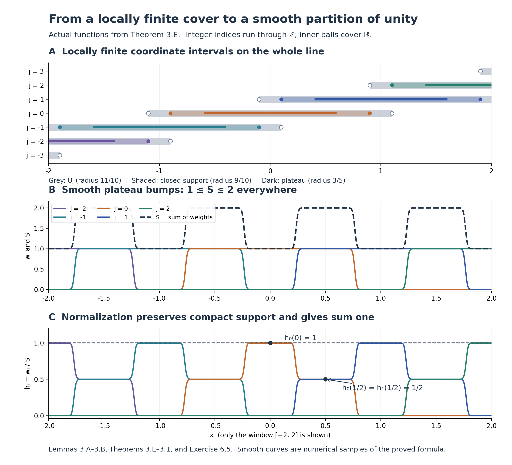

# Local tools for bundles and transport

*This lesson is dedicated under [CC0 1.0](https://creativecommons.org/publicdomain/zero/1.0/).*

To construct a bundle or transport a vector, we need coordinates that solve equations, solutions that vary smoothly with their data, and smooth functions that join local constructions. We develop these tools in that order. The last construction applies them to a quotient of a Lie group.

Our manifolds are finite dimensional, Hausdorff and second countable. A smooth manifold is a space with charts whose transition functions are smooth. Its tangent vectors are coordinate velocities, identified by the derivatives of chart transitions. A Lie group is a smooth manifold whose multiplication and inversion are smooth. These are definitions; no subgroup or quotient theorem is included in them.

## 0. Analytic and linear foundations

We work over the ordered real field with the least-upper-bound property, using the usual natural numbers and induction. The free construction source for this section is Jiří Lebl's *Basic Analysis*, version 6.3, cited below. All analytic and linear arguments needed here are supplied in this lesson, including steps that the source assigns as exercises; the reference does not replace those proofs.

**Lemma 0.0 (intermediate values and norm estimates).** A continuous real function on an interval takes every value between any two of its values. The Euclidean length is a norm. In any normed space, the distance \(d(x,y)=\|x-y\|\) is a metric and
\[
\bigl|\|x\|-\|y\|\bigr|\leq\|x-y\|.
\]
The bounded linear maps between two normed spaces form a normed space with
\(\|A\|=\sup_{\|v\|\leq1}\|Av\|\), and \(\|Av\|\leq\|A\|\|v\|\).

**Proof.** First suppose \(f(a)<0<f(b)\). The nonempty set \(S=\{x\in[a,b]:f(x)<0\}\) has a supremum \(c\). Continuity and the strict endpoint signs give \(a<c<b\): a small interval to the right of \(a\) belongs to \(S\), and a small interval to the left of \(b\) misses \(S\). If \(f(c)<0\), continuity puts a point larger than \(c\) in \(S\), a contradiction. If \(f(c)>0\), continuity gives an interval about \(c\) disjoint from \(S\), contradicting the definition of supremum. Thus \(f(c)=0\). Subtract a target value, and reverse signs if necessary, to prove the general intermediate-value assertion.

Nonnegative square roots now exist by applying this assertion to \(t^2\) between zero and a sufficiently large positive number. This polynomial is continuous because \((t+h)^2-t^2=2th+h^2\to0\). Roots are unique because \(b^2-a^2=(b-a)(b+a)>0\) when \(b>a\geq0\). Put \(x\cdot y=\sum_i x_i y_i\) and \(|x|=\sqrt{x\cdot x}\). If \(y\ne0\), substitute \(t=(x\cdot y)/|y|^2\) in
\(0\leq|x-ty|^2=|x|^2-2t(x\cdot y)+t^2|y|^2\).
This gives \(|x\cdot y|\leq|x||y|\); if \(y=0\) the same inequality is immediate. Hence
\(|x+y|^2\leq|x|^2+2|x||y|+|y|^2\), which is the triangle inequality after taking nonnegative square roots. Positivity, definiteness and absolute homogeneity follow directly from the sum of squares. In any normed space, the three metric axioms follow from these norm axioms. The triangle inequality gives \(\|x\|-\|y\|\leq\|x-y\|\); interchange \(x,y\) for the reverse inequality. In particular the norm is continuous.

For a bounded linear map the displayed supremum is finite and nonnegative. Scaling a nonzero \(v\) to a unit vector gives the stated bound; for \(v=0\) it is immediate. This bound shows that \(\|A\|=0\) forces \(A=0\). Absolute homogeneity follows by moving the scalar outside the target norm. For every \(\|v\|\leq1\), the target triangle inequality gives \(\|(A+B)v\|\leq\|A\|+\|B\|\); taking the supremum proves the operator triangle inequality. These arguments also cover a zero-dimensional domain, whose closed unit ball is the singleton \(\{0\}\). □

**Lemma 0.1 (completeness and compactness).** Euclidean space is complete. A closed subset of a complete metric space is complete. A metric space is compact exactly when every sequence has a subsequence converging in that space. Closed bounded subsets of a finite-dimensional Euclidean space are compact. A continuous image of a compact space is compact, a closed subset of a compact space is compact, finite unions of compact sets are compact, and compact subsets of Hausdorff spaces are closed. A continuous real function on a nonempty compact metric space attains a minimum and a maximum. A continuous map from a compact metric space to a metric space is uniformly continuous.

**Proof.** We first supply the real completeness and subsequence arguments in full, including the real-order steps sometimes assigned as exercises. The natural numbers are unbounded in \(\mathbb R\): if they had a supremum \(s\), some integer would exceed \(s-1\), and its successor would exceed \(s\). Thus \(1/n\to0\).

A real Cauchy sequence \(x_n\) is bounded: beyond some index it lies within one of a fixed term, and there are only finitely many earlier terms. Set \(a_N=\inf_{n\geq N}x_n\) and \(b_N=\sup_{n\geq N}x_n\); infima exist because \(\inf S=-\sup(-S)\). The \(a_N\) increase and the \(b_N\) decrease. Put \(a=\sup_N a_N\). For every \(N\), \(a_N\leq a\leq b_N\): every tail infimum is at most \(b_N\), whether its index is before or after \(N\). Given \(\epsilon>0\), choose \(N\) with \(|x_j-x_k|<\epsilon\) for \(j,k\geq N\). Fixing \(k\), taking a supremum over \(j\), and then an infimum over \(k\), gives \(b_N-a_N\leq\epsilon\). Therefore \(|x_n-a|\leq\epsilon\) for \(n\geq N\), proving real completeness.

For a bounded real sequence, start with a closed interval containing it and repeatedly choose a closed half-interval containing infinitely many terms. Write the nested intervals as \([a_j,b_j]\), of length \(2^{-j}(b_0-a_0)\). Their lengths tend to zero since \(2^j\geq j+1\). The number \(a=\sup_j a_j\) lies in every interval: each left endpoint is at most every later right endpoint, and earlier left endpoints are smaller. Select successively an index greater than the preceding one whose term lies in the \(j\)-th interval. Its distance from \(a\) is at most the interval length. This proves the real Bolzano–Weierstrass assertion without an unproved liminf or limsup step.

The zero-dimensional space consists of one point, so its completeness and compactness are immediate. For positive dimension, a Cauchy sequence in \(\mathbb R^n\) is Cauchy in each coordinate. The just-proved real completeness gives coordinate limits. For \(v\in\mathbb R^n\),
\[
\max_i|v_i|\leq |v|\leq\sqrt n\max_i|v_i|,
\]
so coordinate convergence gives convergence in the Euclidean metric. If the sequence lies in a closed subset of a complete space, its ambient limit lies in that subset: otherwise an open ball about the limit disjoint from the subset contradicts convergence.

Here is the metric compactness argument, including the sequence steps. In a compact space, every sequence has a point every neighbourhood of which contains infinitely many sequence indices. Otherwise choose at each point a neighbourhood containing only finitely many indices; a finite subcover would account for only finitely many indices, a contradiction. Choose increasing indices in balls of radii \(1/j\) about the resulting point. Their distances tend to zero, which is exactly convergence.

Conversely, suppose every sequence has a convergent subsequence, and fix an open cover. There is a \(\delta>0\) such that every ball of radius \(\delta\) is contained in a cover member. Otherwise choose \(x_j\) whose radius-\(1/j\) ball is contained in none. A subsequence converges to \(x\). A cover member containing \(x\) contains some ball \(B(x,r)\); for large subsequence indices, \(d(x_j,x)+1/j<r\), a contradiction. Now choose successively points at distance at least \(\delta\) from all earlier choices whenever their radius-\(\delta\) balls fail to cover the space. Infinitely many choices would have no convergent subsequence, since convergence makes pairwise distances in a tail less than \(\delta\). The selection therefore stops. Each of the finitely many balls lies in a cover member, giving a finite subcover. The empty space satisfies both assertions directly.

For a bounded sequence in \(\mathbb R^n\), apply the real subsequence argument to its first coordinate, then to the second coordinate along the chosen subsequence, and continue through all \(n\) coordinates. The final subsequence converges in every coordinate and hence in norm. If the original sequence lies in a closed set, its limit remains there. The just-proved metric criterion gives compactness. This supplies all finite dimensions.

For a continuous image, pull back an open cover and push forward a finite subcover. For a closed subset, adjoin its open complement to the cover and then discard that extra member from a finite subcover. For a finite union, take a finite subcover on each constituent and unite these finitely many finite families. If \(K\) is compact in a Hausdorff space and \(x\notin K\), separate \(x\) and each \(y\in K\) by disjoint open sets \(U_y,V_y\). Finitely many \(V_y\) cover \(K\); the intersection of the corresponding \(U_y\) is a neighbourhood of \(x\) disjoint from \(K\). Thus the complement of \(K\) is open.

For a continuous real function on nonempty compact \(K\), the image is compact and therefore closed. The cover of its image by \((-j,j)\), \(j\geq1\), has a finite subcover, proving boundedness. Its supremum \(s\) is a limit of image points: choose one in \((s-1/j,s]\) for each \(j\). Closedness puts \(s\) in the image. Apply this to the negative function for the minimum. Finally, if a continuous map \(f:K\to Y\) were not uniformly continuous, there would be \(\epsilon>0\) and \(x_j,y_j\in K\) with \(d(x_j,y_j)<1/j\) but \(d(f(x_j),f(y_j))\geq\epsilon\). A subsequence of \(x_j\) converges to \(x\); the triangle inequality makes the corresponding \(y_j\) converge to the same \(x\). Continuity and the target triangle inequality contradict the last bound. □

**Lemma 0.2 (linear maps and complete function spaces).** A subspace of a finite-dimensional vector space has a linear complement. Linear maps between finite-dimensional Euclidean spaces are bounded. If \(E\) is a complete normed vector space, the bounded operators \(E\to E\), with their operator norm, form a complete normed space, and \(\|AB\|\leq\|A\|\|B\|\). Continuous functions from a compact interval to \(\mathbb R^n\), with the supremum norm, form a complete normed space.

**Proof.** We recall the finite basis argument explicitly. An independent list has length at most a spanning list: starting with a spanning list, express the first independent vector in it and replace a vector with nonzero coefficient by that vector. The new list still spans, because the replaced vector can be solved for. At each subsequent step, the next independent vector has a nonzero coefficient on one of the as yet unreplaced vectors; otherwise it would be in the span of the preceding independent vectors. Replace that vector and continue. The process cannot continue past the length of the spanning list. In a subspace of \(\mathbb R^n\), successively choose a vector outside the span of the previous choices whenever that span is not the whole subspace. Independence holds at each step, so the process stops after at most \(n\) choices and gives a basis. Continue choosing vectors outside its span in the ambient space. The resulting ambient basis extends the subspace basis, and the span of the added vectors is a complement.

In standard coordinates, \((Av)_i=\sum_j a_{ij}v_j\), whence
\[
|Av|\leq\sqrt m\left(\max_i\sum_j|a_{ij}|\right)|v|
\]
for an \(m\)-row matrix. Thus every such linear map has a finite operator norm. Directly from its definition, \(|ABv|\leq\|A\|\|B\||v|\).

If \(A_k\) is operator-norm Cauchy, then \(A_kv\) converges for each \(v\in E\). Write \(Av\) for this limit. Passing to the limit in addition and scalar multiplication proves linearity; the norms of a Cauchy sequence are bounded, so \(|Av|\leq C|v|\). Given \(\epsilon>0\), choose \(N\) with \(\|A_k-A_l\|\leq\epsilon\) for \(k,l\geq N\). Letting \(l\) tend to infinity gives \(|(A_k-A)v|\leq\epsilon|v|\), and therefore convergence in operator norm.

A supremum-norm Cauchy sequence \(u_k\) has pointwise limits \(u(t)\), by the first part of Lemma 0.1. Passing to the limit in \(|u_k(t)-u_l(t)|\leq\epsilon\), uniformly in \(t\), proves uniform convergence. Given \(t_0\), choose \(k\) with \(\|u-u_k\|_\infty<\epsilon/3\) and then a neighbourhood on which \(|u_k(t)-u_k(t_0)|<\epsilon/3\). The triangle inequality proves continuity of \(u\). Each continuous function is bounded on the compact interval, by Lemma 0.1 applied to its norm. Thus the limit belongs to the asserted space. The norm axioms follow pointwise. □

**Lemma 0.3 (integration and differentiation estimates).** Continuous real functions on compact intervals are Riemann integrable. The integral of a continuous function has that function as its derivative in the interval interior, with the corresponding one-sided derivatives at endpoints, and integrating a continuous derivative gives the difference of endpoint values. Integration of continuous vector-valued functions is linear and satisfies
\[
\left|\int_a^b v(t)\,dt\right|\leq\int_a^b |v(t)|\,dt
\leq (b-a)\sup_{[a,b]}|v| \qquad(a\leq b).
\]
It commutes with uniform limits. For a continuously differentiable map on a neighbourhood of a segment,
\[
f(x+h)-f(x)=\int_0^1 Df(x+th)h\,dt.
\]
The product and chain rules also hold for maps differentiable in norm between normed spaces, when their derivatives are bounded linear maps. Continuous bilinear maps, including operator composition, are smooth.

**Proof.** For a bounded real function \(f\), let the lower and upper sums on a partition be the sums of the interval lengths multiplied by the infimum and supremum of \(f\) on the respective intervals. Subdividing an interval raises its infima and lowers its suprema; adding the resulting inequalities shows that refinement increases lower sums and decreases upper sums. A common refinement of two partitions therefore shows that any lower sum is at most any upper sum. The supremum of the lower sums is consequently at most the infimum of the upper sums. These two finite numbers exist by the least-upper-bound property and boundedness of \(f\).

For continuous \(f\), Lemma 0.1 supplies boundedness and uniform continuity. If a partition has mesh at most \(\delta\), its upper minus lower sum is at most \((b-a)\omega(\delta)\), where the oscillation bound \(\omega(\delta)\) tends to zero. Thus the two numbers are equal; their common value defines the integral. Every tagged Riemann sum lies between the lower and upper sums and hence converges to that integral as the mesh tends to zero. Linearity, including negative scalar multiples and sums of two functions on the same partition, follows by passing the identities for tagged sums to the limit. Their additivity on adjoining intervals passes to the limit as well. The same argument proves monotonicity of integrals when the integrands are ordered. Define reversed integrals by changing the sign.

For \(F(x)=\int_a^x f(t)\,dt\), additivity and the tagged-sum bound give
\[
\left|\frac{F(x+h)-F(x)}h-f(x)\right|
\leq\sup_{t\text{ between }x\text{ and }x+h}|f(t)-f(x)|\longrightarrow0.
\]
Thus \(F'=f\). To prove the other direction explicitly, first note that a differentiable real function at an interior extremum has derivative zero: the left and right difference quotients have opposite weak signs and the same limit. A continuous function on a compact interval with equal endpoint values therefore has a zero derivative somewhere in the interior, unless it is constant; its minimum and maximum exist by Lemma 0.1, and any value unequal to the endpoints forces one of those extrema to occur inside. Subtracting the line joining the endpoints gives the mean value theorem for a continuous function differentiable in the interior. Apply it on every subinterval to a continuously differentiable \(g\). Then \(g(b)-g(a)\) is a tagged sum of \(g'\), and letting the mesh tend to zero gives \(g(b)-g(a)=\int_a^b g'(t)\,dt\). This also proves that a function with derivative zero on an interval is constant, by applying the mean value theorem to each compact subinterval.

For vectors, take the same tagged partition for all coordinates. The triangle inequality for each finite sum gives
\(\left|\sum v(t_i)\Delta t_i\right|\leq\sum |v(t_i)|\Delta t_i\).
Passing to the limit proves the first bound; boundedness of the norm gives the second. Applying the bound to \(v_k-v\) proves interchange with uniform limits; such a limit is continuous by the three-term estimate in Lemma 0.2.

For the norm chain rule write \(f(x+h)=f(x)+Ah+r(h)\), with \(r(h)=o(\|h\|)\), and \(g(y+k)=g(y)+Bk+s(k)\), with \(s(k)=o(\|k\|)\). Here \(k=Ah+r(h)=O(\|h\|)\). Substitution leaves remainder \(Br(h)+s(k)=o(\|h\|)\), proving derivative \(BA\). Apply the just-proved scalar fundamental theorem coordinate by coordinate to \(t\mapsto f(x+th)\), using this chain rule, to obtain the segment formula.

A continuous bilinear map \(P\) is bounded by a constant times the product of the norms. Indeed continuity at \((0,0)\) gives \(\delta>0\) such that \(\|P(u,v)\|\leq1\) when \(\|u\|+\|v\|<\delta\). Scale nonzero \(u,v\) separately to have norm \(\delta/4\), and use bilinearity to get \(\|P(u,v)\|\leq16\|u\|\|v\|/\delta^2\); a zero argument gives zero. Now expand
\[
P(u+h,v+k)-P(u,v)=P(h,v)+P(u,k)+P(h,k).
\]
The last term is bounded by a constant times \(\|h\|\|k\|\), and is a quadratic remainder. Its derivative is the displayed linear part, its second derivative is constant, and all higher derivatives vanish. The sum and scalar-multiple rules follow by adding or scaling the norm remainders. Repeated application gives the asserted smoothness and the higher product and chain rules. □

**Lemma 0.4 (operator inverses).** In a complete normed space, \(I-A\) has a bounded two-sided inverse whenever \(\|A\|<1\). The bounded operators possessing a bounded two-sided inverse form an open set, on which inversion is smooth, and
\[
D(B\mapsto B^{-1})_B[H]=-B^{-1}HB^{-1}.
\]

**Proof.** The finite geometric identity is
\((I-A)\sum_{j=0}^{N}A^j=I-A^{N+1}=\left(\sum_{j=0}^{N}A^j\right)(I-A)\).
For \(0<q<1\), write \(q^{-1}=1+c\), with \(c>0\). Induction gives \((1+c)^N\geq1+Nc\), so \(q^N\to0\). The case \(q=0\) is immediate. Scalar finite geometric sums then bound the operator tails by \(q^{N+1}/(1-q)\) when \(\|A\|\leq q<1\). Lemma 0.2 gives a limit, multiplication is continuous, and the finite identity proves that the limit is the two-sided inverse.

For \(B\) with a bounded two-sided inverse and \(\|B^{-1}H\|<1\), factor \(B+H=B(I+B^{-1}H)\). The just-proved series gives invertibility and local boundedness of the inverse. The identity
\[
(B+H)^{-1}-B^{-1}=-(B+H)^{-1}HB^{-1}
\]
first proves continuity. Substituting it once more leaves
\[
(B+H)^{-1}-B^{-1}+B^{-1}HB^{-1}
=(B+H)^{-1}HB^{-1}HB^{-1},
\]
a locally bounded quadratic remainder. This proves the derivative formula. It is continuous. If inversion is \(C^r\), that formula and the smoothness of operator multiplication make its derivative \(C^r\); induction proves smoothness. □

**Lemma 0.5 (a flat smooth cutoff factor).** The function \(\eta(t)=e^{-1/t^2}\) for \(t>0\), extended by zero for \(t\leq0\), is smooth and all its derivatives vanish at zero.

**Proof.** We construct the scalar exponential using only the preceding lemmas. Put \(L(x)=\int_1^x dt/t\) for \(x>0\). The reciprocal is continuous there: \((x+h)^{-1}-x^{-1}=-h/(x(x+h))\) tends to zero. Lemma 0.3 gives \(L'(x)=1/x>0\), so its mean value theorem makes \(L\) strictly increasing. For fixed \(y>0\), the chain rule shows that \(L(xy)-L(x)\) has derivative zero in \(x\). Its value at \(x=1\) is \(L(y)\); hence \(L(xy)=L(x)+L(y)\). Moreover \(L(2)\geq1/2\) by the integral bound. Thus \(L(2^n)=nL(2)\) is unbounded above, and \(L(2^{-n})=-nL(2)\) is unbounded below. The intermediate value theorem in Lemma 0.0 makes \(L\) onto \(\mathbb R\).

Let \(E\) be its inverse. It is continuous: for \(x=E(y)>0\) and \(0<\epsilon<x\), the strict inequalities \(L(x-\epsilon)<y<L(x+\epsilon)\) force \(E(y+h)\in(x-\epsilon,x+\epsilon)\) when \(|h|\) is smaller than both gaps. Write \(\delta=E(y+h)-E(y)\). For \(h\ne0\), strict monotonicity gives \(\delta\ne0\), and
\[
\frac{E(y+h)-E(y)}h
=\left(\frac{L(x+\delta)-L(x)}\delta\right)^{-1}
\longrightarrow\frac1{L'(x)}=x=E(y).
\]
Thus \(E'=E\), and induction proves smoothness. We have \(E(0)=1\), \(E(y)>0\), and \(E(s+t)=E(s)E(t)\) by the addition identity for \(L\). In particular \(E(-y)=1/E(y)\). We use the usual notation \(e^y=E(y)\). For \(x\geq0\), monotonicity gives \(E(x)\geq1\). Repeated integration of \(E'=E\), using Lemma 0.3, gives
\(E(x)\geq\sum_{j=0}^{N}x^j/j!\)
for every integer \(N\geq0\): integrate the preceding bound from zero and add \(E(0)=1\). On \(t>0\), the product and chain rules show by induction that every derivative of \(e^{-1/t^2}\) is \(p(1/t)e^{-1/t^2}\), with \(p\) a polynomial. With \(u=1/t\), the bound \(E(u^2)\geq u^{2N}/N!\) shows that this expression tends to zero, even after division by \(t\), on taking \(2N\) greater than the relevant polynomial degree. Extend each derivative by zero. Its difference quotient at zero tends to zero, and its next derivative is continuous there. Induction proves the assertion. □

## 1. Contraction and local inversion

**Lemma 1.1 (contraction).** Let \((X,d)\) be nonempty and complete. If \(T:X\to X\) satisfies \(d(Tx,Ty)\leq qd(x,y)\) for a fixed \(0\leq q<1\), then \(T\) has exactly one fixed point.

**Proof.** Choose \(x_0\in X\) and put \(x_{j+1}=Tx_j\). Induction gives \(d(x_{j+1},x_j)\leq q^j d(x_1,x_0)\). Thus, for \(m>n\),
\[
d(x_m,x_n)\leq\sum_{j=n}^{m-1}q^j d(x_1,x_0)
\leq\frac{q^n}{1-q}d(x_1,x_0).
\]
The elementary geometric estimate in Lemma 0.4 proves this tends to zero. Completeness gives \(x_j\to x\). Since \(d(Tx,Tx_j)\leq qd(x,x_j)\), we have \(Tx=\lim x_{j+1}=x\). Two fixed points satisfy \(d(x,y)\leq qd(x,y)\), forcing their distance to be zero. □

**Theorem 1.2 (smooth inverse function theorem).** If \(f:U\to\mathbb R^n\) is smooth on an open set and \(Df(a)\) is invertible, then \(f\) restricts to a smooth diffeomorphism between neighbourhoods of \(a\) and \(f(a)\).

**Proof.** Translate source and target and multiply the target by \(Df(a)^{-1}\). It suffices to treat \(a=0\), \(f(0)=0\), \(Df(0)=I\). Choose \(r>0\) with \(\overline B_r\subset U\) and \(\|Df(x)-I\|\leq q<1\) on that closed ball. Continuity of the derivative permits this choice. By the segment formula of Lemma 0.3, \(k(x)=x-f(x)\) is \(q\)-Lipschitz there. For \(|y|<(1-q)r\),
\[
T_y(x)=y+k(x),\qquad |T_y(x)|\leq |y|+q|x|<r
\]
maps the complete closed ball to itself. Lemma 1.1 supplies a unique fixed point \(g(y)\), and that point is interior. It solves \(f(g(y))=y\). Subtracting two fixed-point equations gives
\[
|g(y)-g(z)|\leq (1-q)^{-1}|y-z|.
\]
Every \(Df(x)\) on the ball is invertible by Lemma 0.4. Set \(x=g(y)\) and \(\delta=g(y+h)-g(y)\). Differentiability of \(f\) gives
\(h=Df(x)\delta+o(|\delta|)\).
The Lipschitz estimate makes the remainder \(o(|h|)\); multiplying by \(Df(x)^{-1}\) proves
\[
Dg(y)=Df(g(y))^{-1}.
\]
This derivative is continuous, so \(g\) is \(C^1\). Lemmas 0.3–0.4 and the displayed identity imply inductively that \(g\in C^{r+1}\) whenever \(g\in C^r\). Hence \(g\) is smooth. The open set \(B_r\cap f^{-1}(B_{(1-q)r})\) maps bijectively to \(B_{(1-q)r}\), since all its points satisfy the same unique fixed-point equation. These are the required neighbourhoods. Undo the initial changes. □

**Corollary 1.3 (submersion coordinates).** A smooth map with surjective differential at a point is locally a coordinate projection. Its level set is locally embedded, and it has a smooth local section through that point.

**Proof.** For its coordinate derivative \(A\), choose a complement \(C\) of \(\ker A\), using Lemma 0.2. The restriction \(A|_C\) is bijective onto the target: injectivity follows from the direct sum, and surjectivity follows by decomposing any preimage. Let \(\ell\) be the projection onto \(\ker A\). The derivative of \(x\mapsto(f(x),\ell(x-a))\) is bijective. Theorem 1.2 makes this map a local coordinate system. There \(f\) is the first projection; fixing the first coordinates gives its level set, and fixing the remaining coordinates at zero gives the section. □

**Corollary 1.4 (constant rank).** A smooth map of constant rank \(r\) near a point has coordinate expression \((u,z)\mapsto(u,0)\), after restricting source and target neighbourhoods.

**Proof.** A rank-\(r\) linear map has \(r\) independent columns. Successively choose a nonzero coordinate of the first, eliminate that coordinate from the remaining columns, and repeat on the residual columns. These remain independent: a relation among the residuals would express a combination of the original remaining columns as a multiple of the pivot column, contradicting independence. This produces \(r\) rows on which those columns form an invertible matrix. Thus its derivative has an invertible \(r\)-by-\(r\) minor. Use the corresponding \(r\) output functions and the unused input coordinates as new source coordinates, applying Theorem 1.2. The map becomes \((u,z)\mapsto(u,\psi(u,z))\). Its derivative has block form \(\left(\begin{smallmatrix}I&0\\ *&D_z\psi\end{smallmatrix}\right)\). Any nonzero column of \(D_z\psi\) would increase the rank past \(r\); hence \(D_z\psi=0\). On a product box, the segment formula makes \(\psi\) independent of \(z\). The target change \((u,w)\mapsto(u,w-\psi(u))\), whose explicit inverse adds \(\psi(u)\), gives the stated expression. For \(r=0\), the same segment argument makes the map constant. □

## 2. Differential equations and their parameters

**Lemma 2.A (smooth parameter fixed points).** Let \(E\) be complete and normed, \(C\subset E\) a closed ball, and \(\Lambda\subset\mathbb R^m\) open. Let \(T\) be smooth on an open neighbourhood of \(C\times\Lambda\), take \(C\) into itself for every parameter, and satisfy
\[
\|T(u,z)-T(v,z)\|\leq q\|u-v\|,\qquad 0\leq q<1.
\]
If its fixed points are interior to \(C\), their unique value \(u(z)\) is smooth and
\[
Du(z)=\bigl(I-D_uT(u(z),z)\bigr)^{-1}D_zT(u(z),z).
\]

**Proof.** Lemmas 0.1 and 1.1 give a fixed point for every \(z\). Holding \(z_0\) fixed and inserting \(T(u(z_0),z)\) in the difference of the two fixed-point equations yields
\[
(1-q)\|u(z)-u(z_0)\|
\leq\|T(u(z_0),z)-T(u(z_0),z_0)\|.
\]
This proves continuity and, for \(z=z_0+h\), the estimate \(\delta=u(z_0+h)-u(z_0)=O(|h|)\). Differentiability of \(T\) at the fixed point then gives
\[
\delta=A\delta+Bh+o(\|\delta\|+|h|),
\quad A=D_uT(u(z_0),z_0),\quad B=D_zT(u(z_0),z_0).
\]
Interior difference quotients and the contraction bound give \(\|A\|\leq q\). By Lemma 0.4, \(I-A\) has a bounded inverse. Multiplying proves the derivative formula with remainder \(o(|h|)\). Its right side is continuous, so \(u\) is \(C^1\). If \(u\) is \(C^r\), the smoothness of \(T\), the norm chain rule and smooth operator inversion make that right side \(C^r\). Induction gives \(u\in C^\infty\). □

**Theorem 2.1 (local flow).** Let \(F(t,x,\lambda)\) be smooth on an open subset of \(\mathbb R\times\mathbb R^n\times\mathbb R^m\). Every initial datum in its domain has a unique local solution of \(x'=F(t,x,\lambda)\). Solutions depend smoothly on time, initial time, initial value and parameter. For fixed parameter \(\lambda\), a solution extends across a finite endpoint if the graph \((t,x(t),\lambda)\) stays in a compact subset of the domain.

**Proof.** Around \((t_0,x_0,\lambda_0)\), choose a product of a closed time interval, a closed spatial ball and a closed parameter box, contained in the domain. Lemma 0.1 gives compactness. Lemma 0.1 bounds \(|F|\) and \(\|D_xF\|\) there by constants \(B,L\). Choose a smaller spatial ball for the initial value and a sufficiently small \(\epsilon>0\) so that \(\epsilon L<1\) and \(\epsilon B\) is less than half the remaining spatial margin. For data \(z=(a,t_0,\lambda)\) in a smaller open neighbourhood, use the fixed interval \([-\epsilon,\epsilon]\) and set
\[
(T(u,z))(s)=a+\int_0^s F(t_0+\tau,u(\tau),\lambda)\,d\tau.
\]
On a fixed closed supremum-norm ball about the constant curve \(x_0\), the margin makes \(T\) take values in the interior of that ball. Lemma 0.3 gives
\(\|T(u,z)-T(v,z)\|_\infty\leq\epsilon L\|u-v\|_\infty\).
The space of curves is complete by Lemma 0.2. Lemma 1.1 gives a fixed point, and the coordinate fundamental theorem proves that it is a solution.

For uniqueness, any two solutions with the same datum remain in such a rectangle on a sufficiently small common interval and satisfy the same integral equation. Their difference is at most \(\epsilon L\) times its supremum norm, so it vanishes. On any common connected time interval, the times where they agree form a closed set by continuity and an open set by this local argument. That set is the whole interval: if it stopped before any given time, its first stopping boundary would belong to it by closedness and extend it by openness. The backward argument is the same.

We verify the smoothness hypothesis of Lemma 2.A. The first curve derivative is
\
D_uT(u,z)[v=\int_0^s D_xF(t_0+\tau,u(\tau),\lambda)v(\tau)\,d\tau.
\]
Derivatives in \(t_0\) and \(\lambda\) insert the respective derivatives of \(F\); the derivative in \(a\) is the constant curve. A derivative of any order is a finite sum of integrals of a corresponding multilinear derivative of \(F\) applied to the increments. All coefficients are bounded on a slightly larger compact rectangle. For every derivative order, the segment formula applied to that derivative, and uniform continuity of its next derivative on this rectangle, give a Taylor remainder bounded by
\(\epsilon\omega(\|\Delta u\|_\infty+|\Delta z|)(\|\Delta u\|_\infty+|\Delta z|)\),
where \(\omega(r)\to0\). The same estimate proves continuity in the appropriate multilinear-operator norm. This proves the derivative assertions successively, rather than merely differentiating a prospective fixed point.

Lemma 2.A now gives smooth dependence on \(z\) as a curve-valued map. Evaluation of a curve is bounded linear. Joint continuity in \((s,z)\) follows from
\[
|v(z)(s)-v(z_0)(s_0)|
\leq\|v(z)-v(z_0)\|_\infty+|v(z_0)(s)-v(z_0)(s_0)|.
\]
This applies to each parameter derivative. Parameter differentiation of the integral equation is justified by Lemma 0.3 and the uniform remainder estimates. The integrands are continuous, so the fundamental theorem gives the time derivative of each parameter derivative. Repetition gives all time and mixed derivatives. Substitute \(s=t-t_0\) to recover the stated variables.

Finally, each point of a compact time-position set has a smaller rectangle with a positive time of existence valid for every starting point in that smaller rectangle. Finitely many cover the compact set; the minimum of their positive times is positive. Starting at an original solution time sufficiently near a finite endpoint therefore yields a solution interval crossing it. Uniqueness identifies the new solution with the old one on the overlap. The same finite-chart argument applies on a manifold: the chain rule transforms the differential equation under a chart change, and local uniqueness glues the solutions. □

**Lemma 2.2 (invariant equations do not escape).** Let \(b:[a,c]\to T_eG\) be continuous. The right-invariant equation
\[
g'(t)=(dR_{g(t)})_e b(t)
\]
has a unique \(C^1\) solution on \([a,c]\) for every initial value at any time in that interval. For finitely piecewise continuous \(b\), with finite one-sided limits at the division points, it has a unique continuous solution that is \(C^1\) in the interior of each piece and satisfies the equation there.

**Proof.** In a fixed chart about \(e\), restrict the position to a compact ball. The set of values of \(b\) is compact, so the coordinate field and its spatial derivative have uniform bounds. The integral construction in Theorem 2.1 needs only continuity in time and a uniform spatial Lipschitz bound for existence and uniqueness. It therefore gives a common positive time \(\epsilon\) for a solution \(h\) starting at \(e\), independently of the chosen starting time. At the endpoints of \([a,c]\), one can first extend \(b\) constantly outside the interval.

To start at \(g_0\), use \(g(t)=h(t)g_0\). Indeed, \(R_{g_0}\circ R_h=R_{hg_0}\), so the chain rule verifies the same equation. Restart after each time step smaller than \(\epsilon\), to the right or left of the initial time. Finitely many steps cover \([a,c]\). Local uniqueness makes the pieces agree on overlaps. For piecewise continuous coefficients, apply the construction to each continuous piece, passing the endpoint value to the next one. □

**Proposition 2.3 (group exponential).** A Lie group has a smooth exponential map, its derivative at zero is the identity, it is a local diffeomorphism at zero, and it intertwines conjugation with the adjoint action.

**Proof.** For a constant \(A\in T_eG\), the corresponding left-invariant equation is treated by left translation in the same proof. Write \(g_A(t)\) for its identity-starting solution and define \(\exp(A)=g_A(1)\). It is defined for all real \(t\), by applying the finite-interval result on every bounded interval and using uniqueness. Differentiation shows that \(s\mapsto g_A(ts)\) solves the equation for \(tA\) from the identity; uniqueness gives \(g_A(t)=\exp(tA)\). Translating a solution in time and then on the left gives
\(\exp((s+t)A)=\exp(sA)\exp(tA)\).
The local smooth-dependence theorem and a finite number of such restarts prove that \(A\mapsto\exp(A)\) is smooth near every \(A\). The proved time-scaling identity gives \(\left.\frac{d}{ds}\right|_{s=0}\exp(sA)=g_A'(0)=A\), so its derivative at zero is the identity map of \(T_eG\). Theorem 1.2 consequently makes \(\exp\) a local diffeomorphism. Finally, differentiating the group homomorphism \(g\mapsto aga^{-1}\) along a solution gives another left-invariant equation, with initial velocity \(\operatorname{Ad}(a)A\), where \(\operatorname{Ad}(a)\) is that homomorphism's derivative at \(e\). Uniqueness gives
\[
a\exp(tA)a^{-1}=\exp(t\operatorname{Ad}(a)A).
\]

This proves each asserted property. □

For the countability arguments in the next section, the following elementary details will be useful. Pairs of nonnegative integers can be listed by increasing sum, listing the finitely many pairs of each sum in increasing first coordinate. Thus a countable union of listed countable families is countable, by listing the pairs of indices and discarding repetitions. A countable basis restricts to a countable basis on any subspace by intersecting its members with that subspace: every relatively open neighbourhood is the intersection of an ambient open set with the subspace, and a basis member can be chosen inside that ambient set at the chosen point. Finally, the exponential bound used in the plateau construction below is already proved in Lemma 0.5, without assuming an exponential-series theorem.

## 3. Smooth weights with controlled support

For a function on a topological space, its **support** is the closure of its nonzero set. A family of subsets is **locally finite** if every point has an open neighbourhood meeting only finitely many of them. This neighbourhood condition will justify all sums below. Write \(U(a,r)\) and \(B(a,r)\) for the open and closed Euclidean balls. A **compact exhaustion** of \(M\) is a sequence of compact sets \(A_n\), \(n\geq0\), such that

\[
A_n\subset\operatorname{int}A_{n+1},
\qquad M=\bigcup_{n\geq0}A_n.
\]

We first build a locally finite supply of small coordinate neighbourhoods. We then put a smooth function with a plateau inside each one, and divide by their positive sum. The compactness facts and the flat function used in this construction have their proofs in Lemmas 0.1 and 0.5.

**Lemma 3.A (compact exhaustion).** A manifold with a countable basis has a compact exhaustion.

**Proof.** Each point has an open coordinate neighbourhood \(V\) whose closure is compact. To obtain one, take a chart \(\alpha:O\to\Omega\subset\mathbb R^d\), choose a closed ball about \(\alpha(x)\) inside \(\Omega\), and pull back its open interior. Its closure in \(M\) is the pulled-back closed ball: this compact set is closed by Hausdorffness, and every point of the ball is a limit of interior points. In dimension zero the ball and its interior are the same singleton. Lemma 0.1 proves the required compactness in either case.

Here is why a countable subfamily of these neighbourhoods covers \(M\). Let \((E_m)\) be a countable basis. For each \(E_m\) that is contained in at least one of the chosen neighbourhoods, select one such neighbourhood. Given \(x\), a chosen neighbourhood containing \(x\) contains a basis member \(E_m\) containing \(x\), so the selected neighbourhood for that member also contains \(x\). Discard repeated selections and list the resulting cover as \((V_n)_{n\geq0}\). If the list is finite and nonempty, repeat one member. Set \(C_n=\overline{V_n}\).

Start with \(A_0=C_0\). Suppose the compact set \(A_n\) has been constructed. The compact set \(A_n\cup C_{n+1}\) is covered by finitely many members \(V_{i_1},\ldots,V_{i_s}\). Define

\[
A_{n+1}=A_n\cup C_{n+1}\cup C_{i_1}\cup\cdots\cup C_{i_s}.
\]

It is compact by Lemma 0.1. The open union \(V_{i_1}\cup\cdots\cup V_{i_s}\) contains \(A_n\) and is contained in \(A_{n+1}\), proving \(A_n\subset\operatorname{int}A_{n+1}\). Induction also gives \(C_n\subset A_n\). Every point belongs to a \(V_n\subset C_n\), so the \(A_n\) cover \(M\). For the empty manifold use \(A_n=\varnothing\) for every \(n\). □

**Lemma 3.B (subordinate atlas).** Let \(M\) have a countable basis, and let \((W_i)_{i\in I}\) be an open cover. There is a countable compatible atlas

\[
\alpha_j:U_j\longrightarrow V_j\subset\mathbb R^d,
\qquad U(0,\delta_j)\subset B(0,\epsilon_j)\subset V_j,
\qquad 0<\delta_j<\epsilon_j,
\]

such that \(U_j\subset W_{i(j)}\), the sets \(\alpha_j^{-1}(U(0,\delta_j))\) cover \(M\), and the family \((U_j)\) is locally finite. In particular every point belongs to only finitely many \(U_j\).

**Proof.** Take the exhaustion of Lemma 3.A and put \(A_{-2}=A_{-1}=\varnothing\). For \(n\geq0\), define the compact layer and its open surrounding band by

\[
L_n=A_n\setminus\operatorname{int}A_{n-1},
\qquad H_n=\operatorname{int}A_{n+1}\setminus A_{n-2}.
\]

The layer is compact because it is closed in \(A_n\). It lies in \(H_n\): \(A_n\subset\operatorname{int}A_{n+1}\), and, for \(n\geq2\), \(A_{n-2}\subset\operatorname{int}A_{n-1}\). The negative-index conventions give the same inclusion for \(n=0,1\).

For each \(x\in L_n\), choose a member \(W_i\) containing \(x\) and restrict an existing chart to \(W_i\cap H_n\). Translate its coordinates so that \(x\) has coordinate zero. Choose \(R>0\) whose closed coordinate ball \(B(0,R)\) lies inside this restricted chart image. Use the inverse image of \(U(0,R)\) as a new chart domain \(U_x\), with image \(V_x=U(0,R)\), and take \(\delta_x=R/4\), \(\epsilon_x=R/2\). Then the smaller inverse ball is an open neighbourhood of \(x\), and \(U_x\subset W_i\cap H_n\). The restricted chart is compatible with the original atlas. Its closed radius-\(R\) ball, considered using the original chart, is a compact subset of \(W_i\cap H_n\).

Finitely many of these smaller inverse balls cover the compact set \(L_n\). Retain the corresponding chart domains, keeping their indices separate for different layers. The union of these finite lists is countable, by the countability argument at the end of Section 2. It covers \(M\): a point first belonging to \(A_n\) lies in \(L_n\), since it does not belong to \(A_{n-1}\).

To prove local finiteness, fix \(x\in M\) and choose \(k\) with \(x\in\operatorname{int}A_k\); such a \(k\) exists because a point in \(A_r\) belongs to \(\operatorname{int}A_{r+1}\). A chart selected from layer \(n\geq k+2\) lies in \(H_n\), which misses \(A_k\subset A_{n-2}\). Thus \(\operatorname{int}A_k\) meets charts from only the layers \(0,\ldots,k+1\), with finitely many charts in each layer. This is the required neighbourhood condition. On the empty manifold the empty atlas has every stated property. □

**Definition 3.C (partition of unity).** A **partition of unity** on a topological space \(X\) is a family \((h_j)_{j\in J}\) of real functions with \(0\leq h_j\leq1\), such that each point has an open neighbourhood on which all but finitely many \(h_j\) vanish identically, and

\[
\sum_{j\in J}h_j(x)=1\qquad(x\in X).
\]

The neighbourhood condition makes the sum finite locally, so its order is irrelevant. The partition is continuous, continuously differentiable, or smooth when each of its functions has that regularity. A function that vanishes on an open set has support disjoint from that set. Consequently the supports of a partition form a locally finite family; conversely, local finiteness of the supports gives the neighbourhood condition on the functions.

**Definition 3.D (subordinate partition).** For an open cover \((W_i)_{i\in I}\) of \(X\), a partition is **subordinate** if each \(j\) has an assigned \(i(j)\in I\) for which \(\operatorname{supp}h_j\subset W_{i(j)}\). Containment of the entire closed support, including its boundary, is part of this requirement.

**Theorem 3.E (partition of unity).** Every open cover of a differentiable manifold with a countable basis admits a continuously differentiable subordinate partition of unity. On a smooth manifold the partition can be smooth. In both cases its supports can be compact and contained in subordinate coordinate neighbourhoods.

**Proof.** Here a differentiable atlas is understood to have continuously differentiable transition maps; smooth transition maps give the smooth case. Obtain the atlas of Lemma 3.B. For each \(j\) choose \(\delta_j<\beta_j<\epsilon_j\), for instance \(\beta_j=(\delta_j+\epsilon_j)/2\), and put \(D_j=\beta_j^2-\delta_j^2>0\). Use the flat smooth function \(\eta\) proved in Lemma 0.5 to define, on all of \(\mathbb R^d\),

\[
b_j(v)=
\frac{\eta\bigl((\beta_j^2-\|v\|^2)/D_j\bigr)}
{\eta\bigl((\beta_j^2-\|v\|^2)/D_j\bigr)
+\eta\bigl((\|v\|^2-\delta_j^2)/D_j\bigr)}.
\]

The denominator never vanishes. If both arguments were nonpositive, we would have \(\|v\|^2\geq\beta_j^2\) and \(\|v\|^2\leq\delta_j^2\), contradicting \(\delta_j<\beta_j\). Since \(\eta\) is nonnegative and is positive precisely on positive arguments, the product and chain rules of Lemma 0.3 give

\[
0\leq b_j\leq1,
\quad b_j=1\text{ on }B(0,\delta_j),
\quad b_j>0\text{ on }U(0,\beta_j),
\quad b_j=0\text{ outside }U(0,\beta_j).
\]

Smoothness of the quotient follows by composing the positive denominator with scalar inversion, which is smooth by Lemma 0.4 in dimension one. Thus this calculation includes the two boundary spheres.

Define \(w_j=b_j\circ\alpha_j\) on \(U_j\), and extend it by zero to \(M\setminus U_j\). The set

\[
Q_j=\alpha_j^{-1}(B(0,\beta_j))
\]

is compact by Lemma 0.1 and lies inside \(U_j\subset W_{i(j)}\). It is closed in the Hausdorff manifold \(M\). Inside \(U_j\), the composition has the regularity of the atlas. Outside \(U_j\), every point lies in the open set \(M\setminus Q_j\), where the extended function is identically zero. These two descriptions agree on their overlap, proving that the zero extension has the asserted regularity everywhere. Also \(\operatorname{supp}w_j\subset Q_j\).

The family \((U_j)\) is locally finite, so near any point only finitely many \(w_j\) can be nonzero. Therefore

\[
S(x)=\sum_j w_j(x)
\]

has the asserted regularity. For every \(x\) the smaller inverse balls cover \(M\), and some corresponding \(w_j(x)\) equals one. In particular \(S(x)\geq1\). Define \(h_j=w_j/S\). The functions \(h_j\) have the same regularity, lie in \([0,1]\), vanish wherever \(w_j\) does, and sum to one. Since \(S\) is everywhere positive, their nonzero sets equal those of \(w_j\), so

\[
\operatorname{supp}h_j=\operatorname{supp}w_j
\subset Q_j\subset U_j\subset W_{i(j)}.
\]

This proves both subordination and compactness of each support. Local finiteness follows from the containing chart domains. The empty family is a partition on the empty manifold, where the equality is vacuous. □

**Theorem 3.1 (smooth partition and cutoff).** Every open cover of a smooth manifold admits a locally finite smooth partition of unity subordinate to it. Its supports can be chosen compact and contained in coordinate neighbourhoods lying in members of the cover. If \(K\) is closed and \(U\) is an open neighbourhood of \(K\), there is a smooth function \(\chi:M\to[0,1]\) equal to one on a neighbourhood of \(K\), with support contained in \(U\).

**Proof.** The smooth case of Theorem 3.E supplies the partition and its compact supports. We first record a consequence of local finiteness. Any union of a subfamily of locally finite closed sets is closed. Indeed, for a point outside that union choose a neighbourhood meeting only finitely many sets of the full family. Remove the finitely many sets that belong to the chosen subfamily. The resulting open neighbourhood of the point misses the entire chosen union.

Apply the partition construction to the open cover \(\{U,M\setminus K\}\), and retain the assigned cover member for each support. Let \(J_U\) contain exactly the indices assigned to \(U\), and set

\[
\chi=\sum_{j\in J_U}h_j,
\qquad F_U=\bigcup_{j\in J_U}\operatorname{supp}h_j,
\qquad F_K=\bigcup_{j\notin J_U}\operatorname{supp}h_j.
\]

The sum is finite on a neighbourhood of every point, so \(\chi\) is smooth. Nonnegativity and the full sum being one imply \(0\leq\chi\leq1\). The union observation makes \(F_U\) and \(F_K\) closed. Every set in the first union lies in \(U\), so \(F_U\subset U\); since \(\chi\) vanishes off \(F_U\), its support is contained in this closed set and hence in \(U\). Every set in the second union misses \(K\), so \(M\setminus F_K\) is an open neighbourhood of \(K\). On that neighbourhood all terms not assigned to \(U\) vanish, and the partition identity gives \(\chi=1\). The proof does not require \(K\) to be compact; the resulting cutoff need not have compact support. For \(K=\varnothing\) one may simply use \(\chi=0\). □

The same conclusions hold for smooth manifolds with boundary, with neighbourhoods, closed supports, and interiors taken in their relative topology. Here are the necessary modifications. A boundary chart has relatively open image in the closed half-space. Around its coordinate point \(a\), intersect an ordinary Euclidean closed ball with that half-space; a sufficiently small such relative ball lies in the chart image. It is compact by Lemma 0.1, and its relative open ball is a neighbourhood of the point. Thus Lemma 3.A and the compact-layer selection in Lemma 3.B work with these relative balls. Translating the centre to zero replaces the half-space by its translate; the inclusions for the radii are inclusions of relative balls.

Use the same Euclidean formula for \(b_j(v)\), restricted to that translated half-space. It is the restriction of a smooth function defined on all Euclidean space, has a plateau on the smaller relative ball, and has compact relative support in the radius-\(\beta_j\) ball. Its zero extension off the chart is justified by the same compact-support neighbourhood argument. Near a boundary point there are only finitely many summands. In boundary coordinates their smooth extensions have a sum positive at that point, hence positive on some Euclidean neighbourhood by continuity; dividing there gives a smooth extension of each normalized function. This verifies smoothness up to the boundary. The two closed unions used for \(\chi\) remain closed by the relative neighbourhood argument, so the cutoff conclusion also follows, including for noncompact closed \(K\).

**Figure 3.1.** On \(M=\mathbb R\), take \(U_j=(j-11/10,j+11/10)\), \(j\in\mathbb Z\), with coordinates \(v=x-j\). The inner radius is \(\delta=3/5\), the support radius is \(\beta=9/10\), and \(\epsilon=1\), so \(0<\delta<\beta<\epsilon<11/10\). The upper panel shows the chart intervals, inner plateaus, and closed bump supports. The middle panel plots the actual weights \(w_j(x)=b(x-j)\) of Theorem 3.E and their sum \(S\), using \(D=\beta^2-\delta^2=9/20\). The lower panel plots \(h_j=w_j/S\). Only the window \([-2,2]\) is displayed; the cover and partition have all integer indices. On this window the omitted weights are zero. Everywhere at most two weights are nonzero, and a nearest integer gives a weight equal to one, so \(1\leq S\leq2\). At \(x=1/2\), \(h_0=h_1=1/2\); at \(x=0\), \(h_0=1\). These are instances of Lemma 3.B and Theorems 3.E–3.1, worked out in Exercise 6.5. [SVG](../figures/local-tools-partition-of-unity.svg) · [reproducible figure source](../reproduction/local-tools-partition-of-unity/draw_partition.py) · [reproduction and component terms](../reproduction/local-tools-partition-of-unity/README.md).

## 4. Quotients by a closed Lie subgroup

An embedded Lie subgroup \(H\subset G\) is a subgroup that is an embedded submanifold, with the restricted smooth group operations. We assume both embeddedness and closedness.

**Theorem 4.1 (smooth homogeneous quotient).** If \(H\) is an embedded closed Lie subgroup of \(G\), the coset space \(G/H\) is a Hausdorff second-countable smooth manifold. The map \(q:G\to G/H\) is a smooth submersion with smooth local sections, and \(G\to G/H\) is a principal \(H\)-bundle.

**Proof.** Put \(\mathfrak h=T_eH\), choose a linear complement \(\mathfrak m\) in \(T_eG\), and consider
\[
F:\mathfrak m\times H\longrightarrow G,
\qquad F(X,h)=\exp(X)h.
\]
The derivative at \((0,e)\) is \((X,Y)\mapsto X+Y\): this follows by differentiating multiplication on each factor at the identity. It is invertible. Theorem 1.2 gives neighbourhoods \(W\subset\mathfrak m\), \(V\subset H\) for which \(F|_{W\times V}\) is a diffeomorphism onto an open subset. Shrink \(W\) so that its derivative stays invertible at every \((X,e)\). Because \(H\) is embedded, there is an ambient neighbourhood \(N\) of \(e\) with \(N\cap H\subset V\). By continuity of \((X,Y)\mapsto\exp(X)^{-1}\exp(Y)\), shrink \(W\) again so that every such product, for \(X,Y\in W\), belongs to \(N\).

If \(\exp(X)h=\exp(Y)k\), then \(hk^{-1}=\exp(X)^{-1}\exp(Y)\in V\). Consequently \(F(X,hk^{-1})=F(Y,e)\), and local injectivity gives \(X=Y\), then \(h=k\). Thus \(F:W\times H\to G\) is injective. At \((X,h)\), its derivative is obtained from that at \((X,e)\) by right translation in the subgroup and in the group, and is therefore invertible. It is a local diffeomorphism everywhere, so its image \(O=\exp(W)H\) is open and its local smooth inverses agree. Hence \(F:W\times H\to O\) is a diffeomorphism.

Give \(G/H\) the quotient topology. The map \(q\) is open because \(q^{-1}(q(U))=UH=\bigcup_{h\in H}Uh\) is open for open \(U\). The coordinate map \(W\to q(O)\), \(X\mapsto q(\exp X)\), is a continuous bijection. It is open: an open \(W'\subset W\) has open \(F(W'\times H)\subset G\), whose image under \(q\) is exactly the corresponding coordinate image. We thus have a homeomorphism. Its left translates cover \(G/H\).

On overlapping translated charts, a representative \(b\exp X\) is sent to the first component of \(F^{-1}(a^{-1}b\exp X)\). This expression is smooth wherever it is needed; membership of the same coset in the \(a\)-chart means precisely that \(a^{-1}b\exp X\in O\). These are smooth chart transitions. In the corresponding product charts \(q\) is the projection \((X,h)\mapsto X\), and \(X\mapsto a\exp X\) is a smooth section.

If \(gH\ne g'H\), then \(g^{-1}g'\notin H\). Closedness of \(H\) and continuity of \((v,v')\mapsto v^{-1}v'\) give neighbourhoods \(U,U'\) of \(g,g'\) with \(u^{-1}u'\notin H\) for every pair. Therefore the open sets \(q(U),q(U')\) are disjoint, proving Hausdorffness. The images of a countable basis of \(G\) form a countable basis of \(G/H\), since \(q\) is open. The right action of \(H\) on \(G\) is smooth, free, and has exactly the fibres of \(q\) as orbits. The product maps just constructed intertwine this action with \((X,h)k=(X,hk)\). These are precisely principal-bundle trivializations. □

## 5. Worked examples

**Example 5.1 (inner products as a quotient).** Let \(n\geq1\), and let \(\operatorname{Sym}_n\) be the real symmetric matrices. Lemma 0.4 makes \(\mathrm{GL}(n,\mathbb R)\) open in the matrix space and gives its smooth inversion; multiplication is a bilinear map, smooth by Lemma 0.3. It is consequently a Lie group. The orthogonal group is an embedded closed subgroup. To prove embeddedness, set \(P(g)=g^Tg\). For \(g^Tg=I\),
\[
DP_g[V]=V^Tg+g^TV.
\]
Every \(S\in\operatorname{Sym}_n\) is the image of \(V=\tfrac12gS\). Thus Corollary 1.3 makes \(P^{-1}(I)\) an embedded submanifold. It is closed in \(\mathrm{GL}(n,\mathbb R)\) by continuity. Multiplication and inversion restrict to it; their smoothness in submanifold coordinates follows from the local coordinate projection defining an embedded submanifold. Its tangent space at \(I\) consists of skew-symmetric matrices. Every matrix is the unique sum of its symmetric and skew-symmetric parts, \((A+A^T)/2\) and \((A-A^T)/2\).

The quotient coordinate is
\[
g\mathrm O(n)\longmapsto g^{-T}g^{-1}.
\]
It is unchanged by right multiplication by an orthogonal matrix. Conversely, if the expressions for \(g,k\) agree, then \(Q=g^{-T}g^{-1}=k^{-T}k^{-1}\) gives \((g^{-1}k)^T(g^{-1}k)=I\), so the cosets agree. Every positive-definite symmetric \(Q\) occurs. Here is the complete construction. Starting with the standard basis \(e_j\), define
\[
v_j=e_j-\sum_{i<j}(s_i^TQe_j)s_i,
\qquad s_j=\frac{v_j}{\sqrt{v_j^TQv_j}}.
\]
Inductively the earlier \(s_i\) span the earlier standard basis vectors, so \(v_j\ne0\); otherwise \(e_j\) would lie in their span. Its \(Q\)-inner product with every earlier \(s_i\) vanishes by the formula, and normalization gives \(s_j^TQs_j=1\). Hence the matrix \(S\) with columns \(s_j\) is invertible and satisfies \(S^TQS=I\), so \(Q=S^{-T}S^{-1}\). Positive square roots exist by Lemma 0.0 applied to \(t^2\) and are unique by strict monotonicity on \((0,\infty)\); they are smooth there by Theorem 1.2 applied to \(t\mapsto t^2\). The construction is consequently smooth in \(Q\). Positive-definite matrices form an open set: on the compact Euclidean unit sphere the positive function \(v\mapsto v^TQv\) has positive minimum \(m\), and a matrix perturbation of operator norm less than \(m\) preserves positivity. Thus \(Q\mapsto S(Q)\) supplies a smooth section on this whole cone. The map from the quotient to the cone is smooth in the local sections of Theorem 4.1, and its inverse is the smooth map \(Q\mapsto q(S(Q))\). It is therefore a diffeomorphism.

**Example 5.2 (a noncompact group).** For the multiplicative group \(\mathbb R_{>0}\), the equation in Lemma 2.2 is \(g'=b(t)g\). Its solution from \(g(a)=g_0>0\) is
\[
g(t)=g_0\exp\left(\int_a^t b(s)\,ds\right).
\]
The fundamental theorem and chain rule in Lemma 0.3 verify both the equation and the initial value; positivity of the exponential keeps it in the group. Uniqueness comes from Lemma 2.2. Noncompactness of the group does not obstruct existence on the compact time interval.

## 6. Exercises and complete solutions

**Exercise 6.1 (easy).** Solve \(x'=x^2\), \(x(0)=1\), and explain why this does not contradict Lemma 2.2.

**Solution.** The function \(x(t)=(1-t)^{-1}\) satisfies the equation and the initial value on \((-\infty,1)\), by differentiation. Theorem 2.1 gives uniqueness there. It cannot extend across \(1\) as a real continuous solution, since it tends to infinity as \(t\uparrow1\), so this interval is maximal. The additive group has \(dR_x=I\); a right-invariant equation has spatially constant velocity, whereas \(x^2\) depends on position. □

**Exercise 6.2 (medium).** A smooth vector bundle is locally a product \(U\times\mathbb R^r\), with changes of fibre coordinates given by smoothly varying invertible linear maps. A smooth section is a map to its fibres with smooth coordinate functions. Show that a section given on a neighbourhood of a closed set extends globally with agreement on a smaller neighbourhood.

**Solution.** Let the original section be \(s\) on \(U\supset K\). Choose \(\chi\) from Theorem 3.1. Define \(\widetilde s=\chi s\) on \(U\) and the zero vector in each fibre outside \(U\). The definition is independent of local linear fibre coordinates. Inside \(U\) it is smooth by the product rule. At every point outside \(U\), the complement of the closed support of \(\chi\) is a neighbourhood on which it is zero. Thus it is smooth everywhere and agrees with \(s\) near \(K\). □

**Exercise 6.3 (medium).** Construct the smooth local sections of \(\mathbb R/\mathbb Z\) explicitly.

**Solution.** The integers are a closed discrete subgroup of the additive Lie group \(\mathbb R\): the complement is the union of the intervals \((n,n+1)\), and \((n-1/2,n+1/2)\) meets the subgroup only at \(n\). Its point charts make it an embedded zero-dimensional Lie subgroup; the group operations in those charts are constant maps between zero-dimensional spaces. Theorem 4.1 therefore gives a Hausdorff second-countable quotient. Give it the quotient topology. The quotient map is open, because the full preimage of the image of an open interval is the union of its integer translates. On an interval of length less than one it is injective, hence is a homeomorphism onto its open image. Inverse maps from such images to intervals give an atlas: a transition is \(x\mapsto x+k\), where the integer \(k\) is locally constant, since two continuously varying representatives have integer-valued difference. These transitions are smooth. The inverse interval maps are smooth local sections. Addition and negation are well-defined on the quotient because integer representatives differ by integers. Locally these operations are addition and negation of interval representatives followed by the quotient map, so they are smooth. □

**Exercise 6.4 (hard).** In \(\mathbb T^2=(\mathbb R/\mathbb Z)^2\), let \(H\) be the image of \(t\mapsto([t],[\alpha t])\), where \(\alpha\) is irrational. Prove that \(H\) is a proper dense subgroup and \(\mathbb T^2/H\) is not Hausdorff. Explain the relevance of the hypotheses in Theorem 4.1.

**Solution.** The product circle charts from Exercise 6.3 give the torus its smooth structure. It is Hausdorff because points differing in one coordinate can be separated in that coordinate, and second countable because products of two countable bases form a countable basis. Divide \([0,1)\) into \(N\) intervals of length \(1/N\) and place the \(N+1\) fractional parts of \(0,\alpha,\ldots,N\alpha\) in them. Two lie in the same interval: otherwise the \(N\) intervals would contain at most \(N\) of these \(N+1\) points. Subtracting, and changing sign if necessary, produces integers \(k,m\) with \(0<k\alpha-m<1/N\); the strict lower bound follows from irrationality. Put \(\delta=k\alpha-m\). For any \(\beta\in[0,1)\), take \(j=\lfloor\beta/\delta\rfloor\). Then \(0\leq\beta-j\delta<1/N\), while \([j\delta]=[jk\alpha]\). Thus integer multiples of \(\alpha\) are dense modulo one. Given first coordinate \([a]\), use \(t=a+l\), \(l\in\mathbb Z\), to fix it and approximate any second coordinate. Every product of open arcs therefore meets \(H\), proving density.

The fibre of the first coordinate over \([0]\) meets \(H\) in the countable set \(\{([0],[\alpha l]):l\in\mathbb Z\}\). The circle is uncountable. The series with terms \(a_j3^{-j}\), \(a_j\in\{0,1\}\), converge: their tails are at most \(3^{-n}/2\), by the geometric bound of Lemma 0.4, so real completeness applies. The numbers \(\sum_{j\geq1}a_j3^{-j}\), \(a_j\in\{0,1\}\), lie in \([0,1/2]\), and different sequences give different numbers, since the first differing term exceeds the sum of the later possible differences. The set of binary sequences cannot be listed as \(b^{(1)},b^{(2)},\ldots\): the sequence \(a_j=1-b^{(j)}_j\) differs from the \(j\)-th listed sequence in its \(j\)-th entry for every \(j\). This proves uncountability. Hence this fibre is not exhausted by \(H\), and \(H\) is proper.

If an open nonempty subset of the torus is saturated under \(H\), its complement is closed and also \(H\)-invariant. A point in that complement would bring with it its dense \(H\)-orbit, forcing the complement to be the whole torus. Thus the only open sets of the quotient are the empty set and the whole quotient, which has more than one point. It is not Hausdorff.

The parametrization has trivial kernel: a kernel element has \(t\in\mathbb Z\) and \(\alpha t\in\mathbb Z\), so irrationality forces \(t=0\). Transport the smooth structure of \(\mathbb R\) to its image \(H\) through this bijection. In the local interval charts of Exercise 6.3, the inclusion into the torus has derivative \((1,\alpha)\), which is injective. Thus it is an injective immersion and defines an immersed Lie subgroup. It is not embedded. An embedded submanifold is locally the zero set of its transverse coordinates, so it is locally closed near the identity. If this dense proper subgroup were locally closed, its intersection with a sufficiently small open neighbourhood would be both dense and closed there, hence equal to the neighbourhood. It would then be an open subgroup and therefore also closed (its other cosets are open), contrary to density and properness. Both the closedness and embeddedness assumptions of Theorem 4.1 have therefore been checked against this example. □

**Exercise 6.5 (medium; normalization and a noncompact cutoff).** On \(\mathbb R\), let \(U_j=(j-11/10,j+11/10)\), \(j\in\mathbb Z\). Apply the plateau formula of Theorem 3.E with \(\delta=3/5\), \(\beta=9/10\), and \(\epsilon=1\). Prove that these weights give a smooth subordinate partition, find its values at \(0\) and \(1/2\), and show \(1\leq S\leq2\). Then construct a smooth cutoff equal to one near the noncompact closed set \(K=\mathbb Z\), supported in \(U=\bigcup_{j\in\mathbb Z}(j-1/5,j+1/5)\). Explain why neither construction requires a finite family on the whole line.

**Solution.** The chart is \(x\mapsto x-j\), with image \((-11/10,11/10)\). The closed radius-one ball is contained in that image, so the stated radii satisfy Lemma 3.B's coordinate inclusions. The integer-centred open radius-\(3/5\) balls cover the line: every real number is within \(1/2\) of some integer, and \(1/2<3/5\). Existence of such an integer follows by placing the number between consecutive integers using the Archimedean property proved in Lemma 0.1, and choosing the closer endpoint. Every bounded interval meets only finitely many \(U_j\), since an intersecting integer \(j\) lies in that interval enlarged by \(11/10\) on both sides. In particular this is a locally finite chart cover.

Put \(D=9/20\) and

\[
b(t)=\frac{\eta\bigl(((9/10)^2-t^2)/D\bigr)}
{\eta\bigl(((9/10)^2-t^2)/D\bigr)
+\eta\bigl((t^2-(3/5)^2)/D\bigr)},
\qquad w_j(x)=b(x-j),
\qquad S(x)=\sum_{j\in\mathbb Z}w_j(x).
\]

The denominator is positive, as proved in Theorem 3.E. Thus each \(w_j\) is smooth, equals one for \(|x-j|\leq3/5\), and is positive exactly for \(|x-j|<9/10\). Its support is \([j-9/10,j+9/10]\subset U_j\). Local finiteness makes \(S\) smooth, and the covering inner balls give \(S\geq1\). If three distinct integers contributed nonzero weights at the same \(x\), the smallest and largest would differ by at least two but both would lie in the open interval \((x-9/10,x+9/10)\), of length \(9/5<2\). This is impossible. Since each weight is at most one, \(S\leq2\). The functions \(h_j=w_j/S\) are therefore smooth, subordinate, locally finite, and sum to one. At zero only \(w_0\) is nonzero and it equals one, so \(h_0(0)=1\) and all other values are zero. At \(1/2\) precisely \(w_0,w_1\) are nonzero; both equal one. Hence \(h_0(1/2)=h_1(1/2)=1/2\) and the other values vanish. Translation also gives \(h_{j+1}(x+1)=h_j(x)\).

For the cutoff, the complement of \(K\) is the union of the open intervals \((j,j+1)\), so \(K\) is closed. Repeat the same plateau formula with inner radius \(a=1/20\), outer radius \(c=3/20\), and scale \(c^2-a^2=1/50\). Denote this function by \(p(t)\), and define

\[
\chi(x)=\sum_{j\in\mathbb Z}p(x-j).
\]

The supports \([j-3/20,j+3/20]\) are pairwise disjoint, since their length \(3/10\) is less than the distance one between centres. They form a locally finite family, so \(\chi\) is smooth and takes values in \([0,1]\). It equals one on the open set \(\bigcup_j(j-1/20,j+1/20)\), which contains \(K\). The union of its supports is closed by the closed-union argument in Theorem 3.1 and is contained in \(U\), because \(3/20<1/5\). Consequently \(\operatorname{supp}\chi\subset U\). This support is not compact: it contains every integer, whereas a compact subset of the line is bounded, as follows from the cover by \((-n,n)\). There are infinitely many chart functions and cutoff bumps, but only finitely many are relevant on a neighbourhood of any given point. This is exactly the finiteness needed for smoothness and normalization. □

## References

[Lebl] Jiří Lebl, *Basic Analysis: Introduction to Real Analysis*, volumes I and II, free version 6.3, 15 May 2026. [Author's free edition](https://www.jirka.org/ra/). Section 0 supplies the complete analytic and linear arguments used here. The text is available under CC BY-SA 4.0 and, alternatively, CC BY-NC-SA 4.0.

[Teschl] Gerald Teschl, *Ordinary Differential Equations and Dynamical Systems*, [free author preliminary version](https://www.mat.univie.ac.at/~gerald/ftp/book-ode/ode.pdf), April 2012, Sections 2.1–2.2, 2.4 and 2.6. Used for mathematical source comparison; no source prose, images or PDF is reproduced. The fixed-point parameter argument and every group-equation argument used here are proved in this lesson.

[Mrowka] Tomasz Mrowka, *Geometry of Manifolds*, MIT 18.965, Fall 2004, [free Lecture 4](https://ocw.mit.edu/courses/18-965-geometry-of-manifolds-fall-2004/resources/lecture4/), Theorems 5.1–5.2. The finite-dimensional proofs here use only the explicitly proved linear and analytic steps; no Banach open-mapping theorem is invoked.

[Brenner] Holger Brenner and the Wikiversity contributors, *Differentialgeometrie (Osnabrück 2023)*, [Lecture 22](https://de.wikiversity.org/w/index.php?oldid=1052940), with [page histories](https://de.wikiversity.org/w/index.php?title=Kurs:Differentialgeometrie_(Osnabr%C3%BCck_2023)/Vorlesung_22&action=history). Also available in the English *Smooth Manifolds and Differential Geometry*, [complete edition v2026.09.01-complete](https://github.com/KokunoYumeto/brenner-differentialgeometrie-en/releases/tag/v2026.09.01-complete), Lecture 22. Further reading on compact exhaustions and partitions of unity.

[Michor] Peter W. Michor, *Topics in Differential Geometry*, [freely available author version](https://www.mat.univie.ac.at/~michor/dgbook.pdf), Section 5.11. The quotient construction is proved in Section 4 with its embeddedness hypothesis explicit; no closed-subgroup theorem is assumed.
