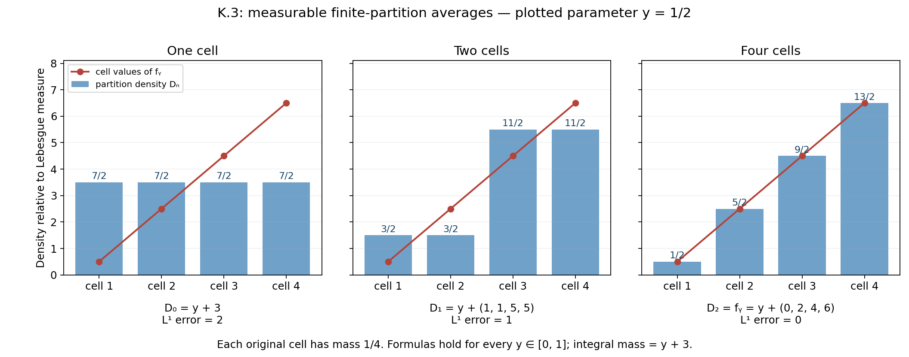
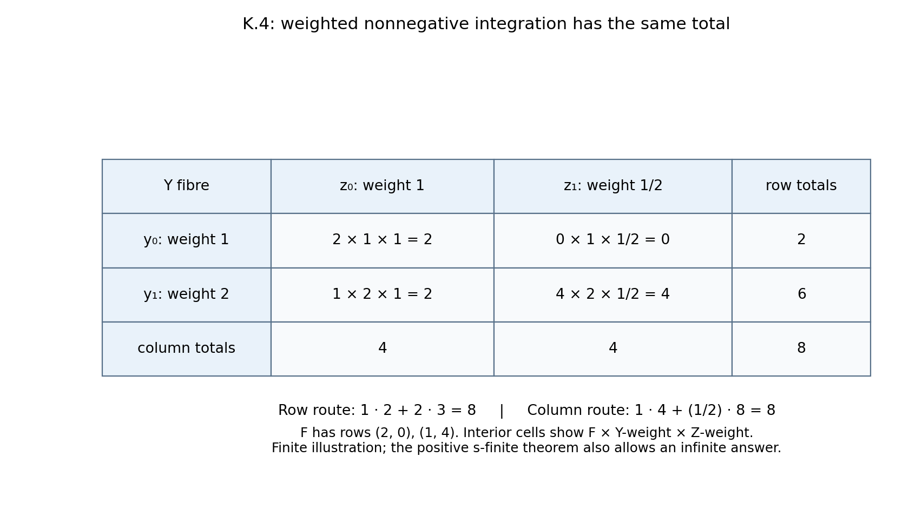
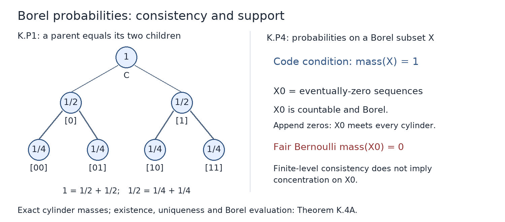

# Finite conditional expectations, measurable densities, and positive kernel integrals

GPT-6.1 Sol (OpenAI), October 2026. Text and figures: CC0-1.0.

The lessons cover finite-measure upward convergence, bounded-kernel jointly measurable densities, positive s-finite integration, sigma-finite products and integrable Fubini, and Borel codes for probability measures. Measurable selection, type-I structure, unbounded direct integrals, and the general foliation interfaces remain outside this module.

## K.0 — Ordinary inputs and a generating-class lemma

We use countably additive positive measures on the stated sigma-algebras, without completing a product. Nonnegative integration uses \(0\cdot\infty=0\). The preceding lesson [Measure and Hilbert space tools for Haar integration, Section 2](../../harmonic-analysis-on-locally-compact-groups/reader/measure-and-hilbert-space-tools.html#2-integration-and-convergence-without-countability-assumptions) constructs the integral from nonnegative simple functions and proves monotone convergence in Theorem 2.1. It also proves nonnegative additivity, countable-sum interchange, Fatou's lemma and dominated convergence in Theorem 2.2. These proofs apply on arbitrary measure spaces and retain the given sigma-algebra; almost-everywhere limits use measurable representatives.

For finite positive measures \(\nu\ll\mu\), [Measure and Hilbert space tools for Haar integration, Theorem 4.1](../../harmonic-analysis-on-locally-compact-groups/reader/measure-and-hilbert-space-tools.html#4-densities-and-bounded-functionals) proves finite Radon–Nikodym: there is a nonnegative measurable \(r\), unique \(\mu\)-almost everywhere, such that \(\nu(A)=\int_A r\,d\mu\) for every measurable \(A\). Its finite-measure proof represents \(u\mapsto\int u\,d\nu\) in \(L^2(\mu+\nu)\), obtains \(0\leq g\leq1\), and takes \(r=g/(1-g)\) outside \(\{g=1\}\). Absolute continuity makes that last set null for \(\mu+\nu\). Integrability makes \(r\) finite almost everywhere; set it to zero on its measurable set of infinite values. The required completeness of \(L^2\) is proved in that lesson's Theorem 3.2, and the Hilbert representation theorem is proved in [Hilbert spaces and compact operators, Theorems 2.1–2.3](../../foundations-of-von-neumann-algebras/hilbert-spaces-and-compact-operators.html#OA-FND-HS-02). This finite positive-measure proof uses no Hahn decomposition. A countably generated sigma-algebra is required only where it is stated below, not for ordinary finite Radon–Nikodym.

For the construction of a measure from an outer measure, [Measure and Hilbert space tools for Haar integration, Theorem 1.1](../../harmonic-analysis-on-locally-compact-groups/reader/measure-and-hilbert-space-tools.html#1-from-an-outer-measure-to-a-measure) proves the Carathéodory theorem. K.4(c) constructs the product directly when both measures are sigma-finite. No uniqueness theorem for an arbitrary s-finite product measure is asserted.

Further reading: Bruce Blackadar, *Real Analysis*, incomplete preliminary edition, **22 September 2026**: monotone convergence XVIII.1.4.1; Radon–Nikodym XVIII.6.2.1; uniqueness XVIII.6.1.10.

Here is the generating-class lemma needed below, with proof. A pi-system \(\mathcal P\) is closed under finite intersections. A Dynkin system contains the whole space \(X\), is closed under complements, and is closed under countable disjoint unions. If \(X\in\mathcal P\subset\mathcal D\), where \(\mathcal D\) is Dynkin, then \(\sigma(\mathcal P)\subset\mathcal D\).

Let \(\mathcal D_0\) be the intersection of the Dynkin systems containing \(\mathcal P\). Any Dynkin system is closed under \(B\setminus A\) for nested members \(A\subset B\): complement the disjoint union of \(A\) and \(X\setminus B\). Fix \(P\in\mathcal P\). The members \(A\in\mathcal D_0\) for which \(A\cap P\in\mathcal D_0\) form a Dynkin system; the complement step uses \(P\setminus(A\cap P)\). This system contains \(\mathcal P\), so is all of \(\mathcal D_0\). Fixing now any \(A\in\mathcal D_0\), the same argument for the members \(B\) with \(A\cap B\in\mathcal D_0\) proves closure under arbitrary finite intersections. Thus \(\mathcal D_0\) is an algebra. Disjointize a countable union by subtracting its preceding finite unions; the Dynkin property then shows \(\mathcal D_0\) is a sigma-algebra. Therefore \(\mathcal D_0=\sigma(\mathcal P)\).

## K.1 — Conditional expectations for a finite measure

Let \((X,\Sigma,\mu)\) have \(\mu(X)<\infty\), and let \(\mathcal A\subset\Sigma\) be a sub-sigma-algebra. For nonnegative integrable \(f\), the finite measure \(A\mapsto\int_A f\,d\mu\) on \(\mathcal A\) is absolutely continuous with respect to \(\mu|_{\mathcal A}\). Radon–Nikodym gives an integrable \(\mathcal A\)-measurable \(E_{\mathcal A}f\) satisfying
\[
\int_A E_{\mathcal A}f\,d\mu=\int_A f\,d\mu\quad(A\in\mathcal A).
\tag{K.1}
\]
Use positive and negative parts for real \(f\), and real and imaginary parts for complex \(f\). Uniqueness follows because an integrable real \(\mathcal A\)-measurable difference with zero integral on every \(A\) has zero positive and negative parts: integrate over its positive and negative sets. Apply this separately to real and imaginary differences.

Uniqueness proves linearity, positivity, preservation of integrable \(\mathcal A\)-measurable functions, and the tower identity
\[
E_{\mathcal A}E_{\mathcal B}f=E_{\mathcal A}f
\quad(\mathcal A\subset\mathcal B\subset\Sigma).
\tag{K.2}
\]
Positivity gives \(|E_{\mathcal A}f|\leq E_{\mathcal A}|f|\) for real \(f\). For complex \(f\), apply positivity to \(\operatorname{Re}(e^{i\theta}f)\leq|f|\) for a countable dense set of angles. Outside their combined null exceptions, take the supremum and use \(|w|=\sup_\theta\operatorname{Re}(e^{i\theta}w)\). Consequently
\[
\|E_{\mathcal A}f\|_1\leq\|f\|_1.
\tag{K.3}
\]
No martingale convergence theorem has been assumed.

## K.2 — Finite-measure upward convergence

**Theorem K.2.** For increasing sub-sigma-algebras \(\mathcal A_n\), put \(\mathcal A_\infty=\sigma(\bigcup_n\mathcal A_n)\). If \(f\in L^1(\mu)\), then
\[
E_{\mathcal A_n}f\longrightarrow E_{\mathcal A_\infty}f
\quad\mu\text{-almost everywhere and in }L^1(\mu).
\tag{K.4}
\]
If \(f\) is \(\mathcal A_\infty\)-measurable, the limit is \(f\). The measure need not be a probability measure; zero total mass is included.

Write \(\mathcal U=\bigcup_n\mathcal A_n\), an algebra. The sets in \(\mathcal A_\infty\) approximable arbitrarily well in measure of symmetric difference by members of \(\mathcal U\) form a sigma-algebra. Complements preserve the property. For a union \(B=\bigcup_jB_j\), first choose a finite union whose difference from \(B\) has measure less than \(\epsilon/2\), using continuity from below and finite \(\mu\). Approximate its \(N\) members within \(\epsilon/(2N)\) each, then take their finite union in \(\mathcal U\). The union bound gives error less than \(\epsilon\). Thus all sets in \(\mathcal A_\infty\) have this approximation.

It follows that the finite-valued, integrable \(\mathcal A_m\)-simple functions, over all \(m\), are dense in \(L^1(\mathcal A_\infty,\mu)\). Explicitly, truncate an integrable function's real and imaginary parts; the integral tails tend to zero by monotone convergence. A uniform small-mesh step approximation has small \(L^1\) error because \(\mu\) is finite. Approximate its finitely many level sets by members of \(\mathcal U\). These finitely many sets belong to some single \(\mathcal A_m\).

For integrable \(h\), choose nonnegative finite representatives \(u_n=E_{\mathcal A_n}|h|\). At a level \(\lambda>0\), the first-crossing sets
\[
B_n=\{u_n>\lambda\}\setminus\bigcup_{k<n}\{u_k>\lambda\}
\tag{K.5}
\]
are disjoint and in \(\mathcal A_n\). Hence, for each \(N\),
\[
\lambda\mu\!\left(\bigcup_{n\leq N}B_n\right)
\leq\sum_{n\leq N}\int_{B_n}u_n\,d\mu
=\sum_{n\leq N}\int_{B_n}|h|\,d\mu
\leq\|h\|_1.
\]
Continuity from below and \(|E_{\mathcal A_n}h|\leq u_n\) outside a countable union of null sets yield
\[
\mu\!\left(\sup_n|E_{\mathcal A_n}h|>\lambda\right)
\leq\lambda^{-1}\|h\|_1.
\tag{K.6}
\]

Suppose first that \(f\) is \(\mathcal A_\infty\)-measurable. Choose \(\mathcal A_{m_j}\)-simple \(g_j\) with \(m_j\to\infty\) and \(\delta_j=\|f-g_j\|_1\to0\). Indices can always be increased. For \(n\geq m_j\), almost everywhere,
\[
E_{\mathcal A_n}f-f=E_{\mathcal A_n}(f-g_j)+(g_j-f),
\qquad \|E_{\mathcal A_n}f-f\|_1\leq2\delta_j.
\tag{K.7}
\]
The maximal bound (K.6) and Markov's inequality give
\[
\mu\!\left(\sup_{n\geq m_j}|E_{\mathcal A_n}f-f|>2\lambda\right)
\leq2\delta_j/\lambda.
\tag{K.8}
\]
All identities needed for countably many \(n,j\) hold outside one null set. The event \(\{\limsup_n|E_{\mathcal A_n}f-f|>2\lambda\}\) is contained in every event on the left of (K.8), so has measure zero. Use a countable positive rational sequence tending to zero for almost-everywhere convergence. Equation (K.7) gives \(L^1\) convergence. For general \(f\), apply this to \(F=E_{\mathcal A_\infty}f\); the tower identity gives \(E_{\mathcal A_n}f=E_{\mathcal A_n}F\) almost everywhere for every \(n\). This proves the theorem for any countable choice of measurable representatives.

## K.3 — Jointly measurable bounded-kernel densities

A bounded kernel \(\kappa:Y\rightsquigarrow Z\) assigns a measure \(\kappa_y\) to every \(y\), makes \(y\mapsto\kappa_y(A)\) measurable for every measurable \(A\subset Z\), and satisfies \(\sup_y\kappa_y(Z)<\infty\).

**Theorem K.3.** Suppose \(\Sigma_Z\) is countably generated and \(\kappa,\beta:Y\rightsquigarrow Z\) are bounded kernels with \(\kappa_y\ll\beta_y\) for **every** \(y\). There is a nonnegative finite-valued \(\Sigma_Y\otimes\Sigma_Z\)-measurable \(D\) such that
\[
\kappa_y(A)=\int_A D(y,z)\,d\beta_y(z)
\quad(y\in Y,\ A\in\Sigma_Z).
\tag{K.9}
\]
No measure or topology on \(Y\) is required. There is no assertion of a null exceptional set in \(Z\) independent of \(y\).

Enumerate a generator \(G_1,G_2,\ldots\). Let \(\mathcal A_n=\sigma(G_1,\ldots,G_n)\), and let \(\mathcal P_n\) be its finite collection of nonempty atoms. Set
\[
D_n(y,z)=\sum_{A\in\mathcal P_n}q_A(y)\mathbf1_A(z),
\qquad
q_A(y)=
\begin{cases}
\kappa_y(A)/\beta_y(A),&\beta_y(A)>0,\\
0,&\beta_y(A)=0.
\end{cases}
\tag{K.10}
\]
The coefficients are finite and measurable. On the zero-denominator branch, absolute continuity also gives zero numerator. Thus \(D_n\) is jointly measurable.

Fix any \(y\). Ordinary finite Radon–Nikodym supplies a finite nonnegative \(f_y\in L^1(\beta_y)\) representing \(\kappa_y\). On each positive-mass atom \(q_A(y)\) is its average; zero-mass atoms are irrelevant. Therefore
\[
D_n(y,\cdot)=E_{\beta_y,\mathcal A_n}f_y
\quad\beta_y\text{-almost everywhere}.
\tag{K.11}
\]
Theorem K.2 gives convergence to \(f_y\) almost everywhere and in \(L^1(\beta_y)\), since the generated limiting sigma-algebra is \(\Sigma_Z\).

The set where \(D_n\) has a finite limit is product measurable: it is equality of its measurable limsup and liminf, together with finiteness of their common value. Define \(D\) to be that limit there and zero elsewhere. It is nonnegative, finite-valued and jointly measurable. For every fixed \(y\) it equals \(f_y\) almost everywhere, proving (K.9). Arbitrarily chosen \(f_y\)'s occur only in separate fibrewise verifications; the actual definition (K.10) involves no measurable selection of them.

**Figure K.3.** For four equal Lebesgue cells, take \(f_y=y+(0,2,4,6)\), \(0\leq y\leq1\). One-, two-, and four-cell partitions give \(y+3\), \(y+(1,1,5,5)\), and \(f_y\). The plotted sample is \(y=1/2\); the formulas hold for every parameter. Their \(L^1\) errors are exactly \(2,1,0\). This illustrates (K.10)–(K.11), without supplying a universal exceptional set. Reproducible source: [reproduce.py](reproduce.py).

## K.4 — Positive s-finite integration

**Theorem K.4(a).** For a bounded kernel \(\kappa:Y\rightsquigarrow Z\) and nonnegative product-measurable \(F\), the function
\[
y\longmapsto\int_Z F(y,z)\,d\kappa_y(z)
\tag{K.12}
\]
is extended-nonnegative measurable. The same holds for an s-finite kernel, meaning a specified countable sum of bounded kernels.

Every product-measurable set has measurable sections, because this property forms a sigma-algebra containing rectangles. Let \(\mathcal D\) be the product-measurable sets \(E\) for which \(y\mapsto\kappa_y(E_y)\) is measurable. Rectangles belong, since their section integral is \(\mathbf1_B(y)\kappa_y(A)\). Complements work by the finite difference \(\kappa_y(Z)-\kappa_y(E_y)\). Countable disjoint unions work by countable additivity. Thus \(\mathcal D\) is a Dynkin system containing the generating pi-system of rectangles, and K.0 proves it contains every product-measurable set. Nonnegative simple approximation and monotone convergence now give (K.12).

For any countable sum of positive measures, the identity
\(\int h\,d(\sum_j\kappa_y^j)=\sum_j\int h\,d\kappa_y^j\)
holds first for simple nonnegative \(h\), and then for all nonnegative \(h\) by monotone convergence. Thus an s-finite kernel gives a countable sum of measurable nonnegative integrals. No subtraction of infinities occurs.

**Theorem K.4(b).** If \(\rho\) on \(Y\) and \(\eta\) on \(Z\) are s-finite measures, meaning countable sums of finite positive measures, then for every nonnegative product-measurable \(F\),
\[
\int_Y\!\int_Z F\,d\eta\,d\rho
=\int_Z\!\int_Y F\,d\rho\,d\eta
\quad\text{in }[0,\infty].
\tag{K.13}
\]
Both inner integrals are measurable. This concerns independently specified measures, not uniqueness of an s-finite product measure or a signed interchange.

For finite \(\rho,\eta\), (a) applied to constant kernels gives measurability. The indicators satisfying (K.13) form a Dynkin system: complements subtract from the finite common total \(\rho(Y)\eta(Z)\), and disjoint unions use monotone convergence. Rectangles satisfy the equality directly. K.0 gives all measurable indicators; simple approximation gives all nonnegative \(F\).

Write now \(\rho=\sum_i\rho_i\), \(\eta=\sum_j\eta_j\) with finite components. The positive-sum integral identity, applied inside and outside, gives
\[
\int_Y\!\int_Z F\,d\eta\,d\rho
=\sum_{i,j}\int_Y\!\int_Z F\,d\eta_j\,d\rho_i.
\tag{K.14}
\]
The finite case reverses each pair. A countable sum of nonnegative terms is the supremum of finite partial subsums, hence independent of order. Reverse the component indices and the positive-sum identities to obtain the other side of (K.13), including infinite totals.

**Corollary K.4(c) (sigma-finite products and integrable Fubini).** Let \((Y,\Sigma_Y,\rho)\) and \((Z,\Sigma_Z,\eta)\) be sigma-finite positive measure spaces. There is a unique measure \(\rho\otimes\eta\) on the uncompleted product sigma-algebra with
\[
(\rho\otimes\eta)(B\times A)=\rho(B)\eta(A)
\quad(B\in\Sigma_Y,\ A\in\Sigma_Z),
\tag{K.15}
\]
where a zero factor gives zero even if the other factor is infinite. This product is sigma-finite. Every nonnegative product-measurable \(F\) satisfies
\[
\int_{Y\times Z}F\,d(\rho\otimes\eta)
=\int_Y\!\int_ZF(y,z)\,d\eta(z)\,d\rho(y)
=\int_Z\!\int_YF(y,z)\,d\rho(y)\,d\eta(z).
\tag{K.16}
\]
If \(F:Y\times Z\to\mathbb C\) is product measurable and \(\int|F|\,d(\rho\otimes\eta)<\infty\), its sections are integrable for almost every outer variable in each order. Define the section integral to be zero on the exceptional measurable set. The resulting functions are measurable and integrable, and (K.16) holds for \(F\) with finite complex integrals.

**Proof.** Choose disjoint measurable partitions \((B_i)_{i\geq1}\) of \(Y\) and \((A_j)_{j\geq1}\) of \(Z\) with finite masses, by subtracting the preceding sets from sigma-finite covers. Empty pieces are allowed. The restrictions \(\eta_j=\eta|_{A_j}\) are finite measures with \(\eta=\sum_j\eta_j\). Consequently the constant kernel \(y\mapsto\eta\) is a specified sum of bounded kernels. For \(E\in\Sigma_Y\otimes\Sigma_Z\), K.4(a) makes the section-mass function measurable. Define
\[
m(E)=\int_Y\eta(E_y)\,d\rho(y),
\qquad E_y=\{z:(y,z)\in E\}.
\tag{K.17}
\]
The empty set has mass zero. For disjoint measurable \(E_n\), their sections are disjoint, so countable additivity of \(\eta\), followed by monotone convergence, gives
\(m(\bigcup_nE_n)=\sum_nm(E_n)\).
Thus \(m\) is a measure. On a rectangle its section mass is \(\mathbf1_B(y)\eta(A)\); its integral is exactly (K.15), including the zero-times-infinity convention. The boxes \(B_i\times A_j\) cover the product and have finite \(m\)-mass, proving sigma-finiteness.

If another measure \(\widetilde m\) has the rectangle values (K.15), fix one box \(Q=B_i\times A_j\). The measures \(E\mapsto m(E\cap Q)\) and \(E\mapsto\widetilde m(E\cap Q)\) are finite with the same total. They agree on every rectangle, because intersecting a rectangle with \(Q\) gives a rectangle. Their agreement class is a Dynkin system: complements subtract from their common finite total, and disjoint unions use countable additivity. K.0 makes them agree on the whole product sigma-algebra. Summing over the disjoint boxes proves \(m=\widetilde m\). Put \(\rho\otimes\eta=m\).

The first equality of (K.16) is (K.17) for indicators, finite additivity for nonnegative simple functions, and monotone convergence for their increasing approximations to \(F\). Each inner integral is measurable by K.4(a). Sigma-finite measures are s-finite by the chosen finite restrictions, so K.4(b) gives the second equality. All these arguments retain the original sigma-algebras.

For the integrable complex case, apply (K.16) to \(|F|\). The measurable function \(H(y)=\int_Z|F(y,z)|\,d\eta(z)\) has finite integral. Its set of infinite values has measure zero: for every positive integer \(n\),
\(n\rho\{H=\infty\}\leq\int_YH\,d\rho\),
and then let \(n\to\infty\). Outside this set the section is absolutely integrable. The integrals of the positive and negative parts of \(\operatorname{Re}F\), and of \(\operatorname{Im}F\), are measurable by K.4(a); they are finite there, so their differences define the measurable section integral. Set that integral to zero on the measurable exceptional set. Its absolute value is at most \(H\) almost everywhere, hence it is integrable. Apply the positive identity (K.16) to each of the four parts and subtract their finite integrals; modifying an outer integral on a measurable null set has no effect. This gives the first signed or complex equality. Repeating with the variables exchanged gives the other equality. No subtraction of infinite integrals and no completion of the product is used. \(\square\)

**Figure K.4.** Weights \(1,2\) on \(Y\), weights \(1,1/2\) on \(Z\), and rows \((2,0),(1,4)\) for \(F\) give weighted cells \(2,0,2,4\). The product point masses from (K.15) are \(1,1/2,2,1\); multiplying by the displayed values of \(F\) gives those cells. Row integration gives \(2+6=8\); column integration gives \(4+4=8\). This shows the finite-product mechanism of (K.16) and the positive-sum step in (K.14). For general sigma-finite spaces the proof first constructs (K.17), proves uniqueness on finite boxes, and then uses increasing simple approximations. Positive integrals may be infinite; the complex conclusion requires absolute integrability. Reproducible source: [reproduce.py](reproduce.py).

## K.4A — Borel codes for probability measures

Let \(X\) be a standard Borel space, and give the set \(\mathcal P(X)\) of Borel probability measures the sigma-algebra generated by the evaluations \(\lambda\mapsto\lambda(E)\), for Borel \(E\subseteq X\).

**Theorem K.4A.** The measurable space \(\mathcal P(X)\) is standard Borel. For any measurable parameter space \(T\), a family \((\lambda_t)_{t\in T}\) of probability measures is a kernel exactly when \(t\mapsto\lambda_t\) is measurable into \(\mathcal P(X)\). After identifying \(X\) with a Borel subset of the Cantor space, a countable family of cylinder-mass evaluations generates this sigma-algebra. No measure on \(T\) is required.

**Proof.** Write \(C=\{0,1\}^{\mathbb N}\). If \(s\) is a finite binary word, let \([s]\) consist of the sequences beginning with \(s\); the empty word gives \([\varnothing]=C\). The cylinders form a countable clopen base. The compactness proof in [Polish spaces and standard Borel spaces, Background (B2)](../companions/polish-spaces-and-standard-borel-spaces.html) applies to this product of finite discrete spaces. In particular every clopen subset is a finite union of cylinders: its cover by contained basic cylinders has a finite subcover. Refining all words to one common length makes these cylinders disjoint.

Consider the set of codes

\[
\mathscr D=\left\{(a_s)_s\in[0,1]^{\{0,1\}^{<\mathbb N}}:
a_{\varnothing}=1,\quad a_s=a_{s0}+a_{s1}\text{ for every }s\right\}.
\tag{K.P1}
\]

This is closed in the countable cube. To see that the cube is Polish directly, enumerate the words as \(s_1,s_2,\ldots\) and use the metric \(d(a,b)=\sum_{j\geq1}2^{-j}|a_{s_j}-b_{s_j}|\). A Cauchy sequence has a limit in each complete coordinate interval. Controlling a finite initial sum and then the uniformly small tail proves convergence in this metric. Vectors with finitely many nonzero rational coordinates form a countable dense set, by the same tail argument. The metric gives the product topology: a sufficiently small metric ball controls any specified finite collection of coordinates, and restricting sufficiently many coordinates controls the initial sum while the remaining tail is small. Thus the cube is complete and separable, and its closed subset \(\mathscr D\) is Polish. Here a closed subset is complete; it is separable because a countable base of the cube, intersected with it, is a countable base, from whose nonempty members one may choose a countable dense set.

For \(a\in\mathscr D\), define \(m_a(A)\) for a clopen set \(A\) by summing the \(a_s\) over any representation of \(A\) by disjoint cylinders of one common length. Iterating (K.P1) proves independence of that length and finite additivity. In particular \(m_a(C)=1\). On every subset \(W\subseteq C\), put

\[
m_a^*(W)=\inf\left\{\sum_{n\geq1}m_a(A_n):
W\subseteq\bigcup_{n\geq1}A_n,\quad A_n\text{ clopen}\right\}.
\tag{K.P2}
\]

The empty cover gives zero for the empty set; monotonicity follows by inclusion of the classes of covers. For countable subadditivity, choose for each set a clopen cover within \(\varepsilon2^{-n}\) of its infimum and combine these covers. Such choices are possible because every outer mass is at most one; a finite union or a countable union is covered by the resulting countable collection. Letting \(\varepsilon\downarrow0\) proves subadditivity. Thus (K.P2) is an outer measure.

For clopen \(A\), its one-set cover gives \(m_a^*(A)\leq m_a(A)\). Conversely every countable clopen cover of \(A\) has a finite subcover, by compactness. Finite additivity and monotonicity give \(m_a(A)\leq\sum_{n\in F}m_a(A_n)\leq\sum_nm_a(A_n)\). Take the infimum to obtain equality. Each clopen \(E\) is Carathéodory measurable: split every clopen cover of \(W\) into \(A_n\cap E\) and \(A_n\setminus E\). Their masses add to \(m_a(A_n)\), so

\[
m_a^*(W\cap E)+m_a^*(W\setminus E)\leq m_a^*(W).
\tag{K.P3}
\]

Outer subadditivity gives the reverse inequality. The Carathéodory theorem linked in K.0 now supplies a measure on a sigma-algebra containing the clopen sets, hence all Borel sets. Its Borel restriction \(\lambda_a\) is a probability and satisfies \(\lambda_a([s])=a_s\). Although the outer-measure construction has a complete measurable domain, only its Borel restriction is used here.

Every Borel probability supplies a code by its cylinder masses. Two such probabilities with the same code agree on all Borel sets: the sets where they agree form a Dynkin system, since both totals are one; cylinders together with the empty set form a pi-system generating the Borel sigma-algebra. The lemma of K.0 proves uniqueness. Thus \(a\mapsto\lambda_a\) is a bijection \(\mathscr D\to\mathcal P(C)\).

For every Borel \(E\subseteq C\), the function \(a\mapsto\lambda_a(E)\) is Borel. Indeed the sets having this property form a Dynkin system. Complements use \(\lambda_a(C\setminus E)=1-\lambda_a(E)\); disjoint countable unions use the increasing sums of their nonnegative evaluations. Cylinders have continuous coordinate evaluations, and K.0 again gives the assertion for all Borel sets. The evaluation sigma-algebra pulled back to \(\mathscr D\) is therefore contained in its Borel sigma-algebra. The reverse inclusion holds because cylinder evaluations are exactly the coordinates, which generate the countable product's Borel sigma-algebra and hence its trace on \(\mathscr D\). This proves a measurable isomorphism, not merely a bijection of probability measures.

By [Polish spaces and standard Borel spaces, Theorem 5.2](../companions/polish-spaces-and-standard-borel-spaces.html#oa-fnd-pb-07), an arbitrary standard Borel \(X\) is Borel isomorphic to a Borel subset of \(C\). In the countable case one may choose distinct points of \(C\); every subset of this countable image is Borel, so this also gives the required isomorphism. Identify \(X\) with that subset. Its probabilities correspond to

\[
\mathscr D_X=\{a\in\mathscr D:\lambda_a(X)=1\}.
\tag{K.P4}
\]

This is Borel by the evaluation result. A probability on \(X\) extends to \(C\) by \(\lambda(B)=\lambda(B\cap X)\); conversely a probability giving mass one to \(X\) restricts to a probability on its Borel sigma-algebra. These operations are inverse. Each Borel subset of \(X\) is also Borel in \(C\), so evaluation measurability holds in both directions. Therefore \(\mathcal P(X)\) is measurably isomorphic to the Borel subset \(\mathscr D_X\) of a Polish space, hence is standard Borel. For \(X=\varnothing\), both sets are empty and the assertion still holds.

Finally the kernel definition says precisely that every evaluation composed with \(t\mapsto\lambda_t\) is measurable. Since these evaluations generate the target sigma-algebra, this is equivalent to measurability of the map. The cylinder coordinates generate it by the proved coding isomorphism. This proves the theorem for an arbitrary measurable \(T\). \(\square\)

**Example (Bernoulli codes and a Borel support condition).** For \(0\leq p\leq1\), give a word with \(k\) ones and \(n-k\) zeros the mass \(p^k(1-p)^{n-k}\), with a zero exponent contributing one even at an endpoint. These masses obey (K.P1), because adjoining a bit multiplies them by \(p\) or \(1-p\), whose sum is one. Their polynomial dependence on \(p\) gives a Borel probability kernel. Let \(X_0\subset C\) consist of sequences eventually equal to zero. It is countable and Borel, and it meets every cylinder by appending a zero tail. For \(0<p<1\), every singleton has mass zero: its nested cylinders have mass at most \(\max(p,1-p)^n\to0\), and continuity from above applies because the total measure is finite. Countable additivity gives \(\lambda_p(X_0)=0\). At \(p=0\) the measure is the unit mass at the all-zero sequence, so \(\lambda_0(X_0)=1\). At \(p=1\) it is the unit mass at the all-one sequence, outside \(X_0\). Consequently only the endpoint \(p=0\) belongs to the Borel code subset \(\mathscr D_{X_0}\). A support condition on a Borel subset cannot be inferred from finite-level consistency alone.

**Figure K.4A.** The left tree is the first two levels of the fair Bernoulli code: parent mass equals the sum of the two child masses. The right panel states the exact condition (K.P4). The countable set of eventually-zero sequences has fair Bernoulli mass zero, although it meets every cylinder. The displayed finite tree illustrates the code; existence, uniqueness and all Borel evaluations are proved above. [Full-size PNG](figures/probability-codes.png) · [Editable SVG](figures/probability-codes.svg) · [Reproducible source](../reproduction/residual-mathematics/draw_figures.py).

## K.5 — Exercises with complete solutions

**Exercise K.5.1 (12 points).** Give the four-point space masses \(1,2,3,4\), and let \(f=(0,2,4,6)\). Compute the expectations for the trivial partition, the pairs \(\{1,2\},\{3,4\}\), and the singleton partition (6 points). Compute their \(L^1\) errors (4 points). Check the maximal inequality at level \(3\) (2 points).

**Solution.** The total mass is \(10\), and the integral of \(f\) is \(40\). The expectations are \((4,4,4,4)\), \((4/3,4/3,36/7,36/7)\), and \(f\). The first error is \(4+4+0+8=16\). The pair error is \(4/3+4/3+24/7+24/7=200/21\); the last is zero. The first expectation already exceeds \(3\) at every point, so the maximal event has mass \(10\). The bound is \(3\cdot10=30\leq40=\|f\|_1\). These are finite-measure calculations, without normalizing the masses to sum to one.

**Exercise K.5.2 (12 points).** For \(y\in[0,1]\) let \(\beta_y=y\,dz\) and \(\kappa_y=y^2(1+2z)\,dz\) on \(Z=[0,1]\). Verify the bounded-kernel and absolute-continuity assumptions, including \(y=0\) (4 points). Compute (K.10) on the dyadic partition of mesh \(2^{-n}\) (4 points), and give a jointly measurable density and an explicit convergence bound (4 points).

**Solution.** The total masses are \(y\leq1\) and \(2y^2\leq2\). Integration against a fixed bounded nonnegative density makes each set-mass a measurable polynomial in \(y\). For \(y>0\), both measures are absolutely continuous with respect to Lebesgue measure, and \(\kappa_y\ll\beta_y\); at \(y=0\), both vanish, so the same implication holds. On the cell with endpoints \(a=j2^{-n}\), \(b=(j+1)2^{-n}\), with the last cell including \(1\), the quotient is \(y(1+a+b)\) for \(y>0\), and zero for \(y=0\). Thus (K.10) gives \(D_n=y(1+a+b)\) on that cell for every \(y\). Put \(D(y,z)=y(1+2z)\), including \(D(0,z)=0\). This is continuous, represents every fibre, and obeys \(|D_n-D|\leq y2^{-n}\leq2^{-n}\) on every cell, including its possible endpoints. This particular example converges at every point; that extra fact does not upgrade K.3 to a general common-null-set assertion.

**Exercise K.5.3 (12 points).** On \([0,1]\) let \(\nu=\sum_{j\geq1}dz\). Show that \(\nu\) is s-finite and not sigma-finite (5 points). Against counting measure on \(\{1,2,\ldots\}\), interchange the two integrals of \(F(z,n)=\mathbf1_A(z)2^{-n}\) for an arbitrary Borel set \(A\), including Lebesgue-null \(A\) (7 points).

**Solution.** Each summand is finite, so \(\nu\) is s-finite. A measurable set has \(\nu\)-mass zero if it is Lebesgue-null and infinite otherwise. Hence every finite-\(\nu\)-mass set is Lebesgue-null; countably many cannot cover \([0,1]\). Thus \(\nu\) is not sigma-finite. Summing first in \(n\) gives \(\mathbf1_A\), whose \(\nu\)-integral is zero or infinite according as \(A\) is null or not. Integrating first in \(z\) gives zero for every \(n\) if \(A\) is null, and infinity for every \(n\) otherwise; the countable sum has the same answer. No signed cancellation and no undefined infinity subtraction is used.

**Exercise K.5.4 (12 points).** For the Bernoulli codes in K.4A, prove consistency, including both endpoints (4 points). Determine every point mass for \(0<p<1\) (3 points), compute the mass of the eventually-zero set \(X_0\) (3 points), and treat \(p=0,1\) separately (2 points).

**Solution.** For a word \(s\), the two appended words have masses \((1-p)a_s\) and \(pa_s\); their sum is \(a_s\). With a zero exponent interpreted as the empty product, this remains true at both endpoints. For \(0<p<1\), a length-\(n\) cylinder has mass at most \(r^n\), where \(r=\max(p,1-p)<1\). The cylinders at a point decrease to its singleton, so finite-measure continuity from above makes its mass zero. There are only countably many eventually-zero sequences: choose the length of a finite initial word, then append zeros. Their union therefore has mass zero by countable additivity. At \(p=0\), all cylinders containing the all-zero sequence have mass one, and the cylinders incompatible with it have mass zero. Uniqueness in K.4A identifies the probability as the unit mass at that sequence, giving \(X_0\) mass one. At \(p=1\), the same argument gives the all-one point mass, giving \(X_0\) mass zero.

**Exercise K.5.5 (8 points).** Let \(T\) be any measurable space, and suppose every coordinate \(a_s:T\to[0,1]\) is measurable and obeys (K.P1) at every parameter. Prove that the probabilities constructed in K.4A form a kernel (5 points). If \(X\subseteq C\) is Borel, characterize when all these probabilities can be restricted to probabilities on \(X\), and show that the set of parameters satisfying this condition is measurable (3 points).

**Solution.** The coordinates generate the Borel sigma-algebra of the countable cube, so \(t\mapsto(a_s(t))_s\) is measurable into it. Since its image lies in \(\mathscr D\), it is also measurable into that space with its trace Borel structure: the inverse image of \(\mathscr D\cap B\) is the inverse image of \(B\). The coding isomorphism of K.4A then makes \(t\mapsto\lambda_{a(t)}\) measurable into \(\mathcal P(C)\), which is exactly the kernel property. Its restriction to \(X\) is a probability exactly when \(\lambda_{a(t)}(X)=1\). The function on the left is measurable by the kernel property, so the parameter set where it equals one is measurable. Restricting \(T\) to this set gives a probability kernel on \(X\). No reference measure or null-set exception on \(T\) is involved.

**Exercise K.5.6 (12 points).** With the point masses in Figure K.4, replace \(F\) by the two rows \((2,-2)\), \((1,4)\). Compute the four product masses (3 points), the product integral and both iterated integrals (6 points), and the integral of \(|F|\) that justifies Fubini (3 points).

**Solution.** The four product masses are \(1,1/2,2,1\). Their products with \(F\) are \(2,-1,2,4\), giving integral \(7\). Integrating in \(z\) first gives row integrals \(2-1=1\) and \(1+2=3\); their weighted sum is \(1+2\cdot3=7\). Integrating in \(y\) first gives column integrals \(2+2=4\) and \(-2+8=6\); their weighted sum is \(4+(1/2)6=7\). The absolute weighted cells are \(2,1,2,4\), with finite sum \(9\), so K.4(c) applies. The negative cell changes the integral but does not remove its absolute-integrability requirement.

**Exercise K.5.7 (12 points).** Let \(Y=\{y_0\}\) carry the zero measure, and let \(Z=\mathbb N\) carry counting measure. Compute the product measure of every set and both iterated integrals for \(F(y_0,n)=1\) (5 points). Explain why the section at \(y_0\) need not be integrable even though \(F\) is integrable on the product (3 points). For two arbitrary sigma-finite spaces, prove product uniqueness when a rectangle has zero mass in one variable and infinite mass in the other (4 points).

**Solution.** Both spaces are sigma-finite: the singleton in \(Y\) has finite zero mass and the singletons in \(Z\) have finite mass one. Formula (K.17) integrates each section mass against the zero measure, so every product-measurable set has mass zero. The product integral is zero. Integrating first in \(z\) gives the value infinity at \(y_0\), whose integral against the zero measure is zero; the other order gives zero at every \(n\) and then a zero sum. The only section has infinite absolute integral. This is allowed because its outer parameter belongs to a measurable null set; Fubini promises section integrability almost everywhere and defines its integral to be zero on that exception. For uniqueness, partition the two spaces into the finite-mass pieces from K.4(c). Each finite box has its prescribed finite total, even if zero. Intersecting a rectangle with a box has the prescribed rectangle mass, so the finite agreement argument of K.0 applies on each box. Summing their restrictions proves uniqueness on every set, including the rectangle in question. Its measure is zero by (K.17), with no infinite-total subtraction.

## K.6 — Use and limits

K.2 supplies the finite upward-convergence import. K.3 supplies the bounded-kernel measurable-density import on a countably generated target, with absolute continuity in every fibre. K.4(a) and K.4(b) supply the two positive s-finite integration statements. K.4(c) constructs the sigma-finite product measure, proves uniqueness on its uncompleted product sigma-algebra, and proves Tonelli and absolutely integrable Fubini. These results apply only at the stated hypotheses; their use in another proof requires matching those hypotheses.

K.0 links the complete preceding proofs of ordinary finite Radon–Nikodym, monotone convergence and the Carathéodory theorem. K.4A constructs Borel probability measures from consistent cylinder masses and proves that their evaluation sigma-algebra is standard Borel; it supplies the probability-space assertion used in Square-integrable representations and random operators. Completing a product sigma-algebra is outside the statements proved here. Other general selection, type-I, unbounded-field and foliation interfaces require their own proofs.

Further reading: [Blackadar's Real Analysis](https://www.bruceblackadar.com/Mathematics/Meas.pdf), preliminary edition dated 22 September 2026, at the locators in K.0.
