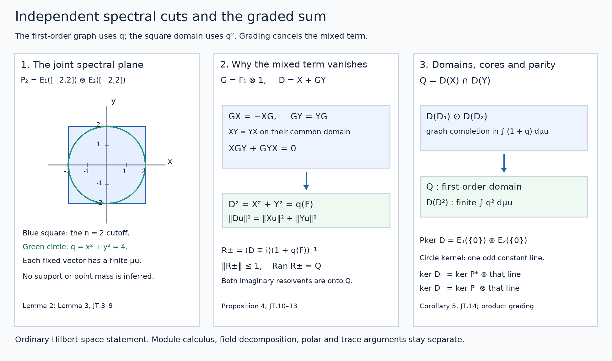

# Joint spectral cutoffs and graded tensor sums

*Public domain (CC0-1.0).*

The spectral measure for a unitary and the self-adjoint spectral calculus with its original domain are the prerequisites. They prove the arbitrary-cardinality cyclic decomposition, the finite compact-metric positive-measure construction, and the full maximal multiplier domains. The scalar composition and transport rules are in Spectral products, transport and inverse domains. The elementary tensor completion and bounded tensor operations are proved in Sections 1–2 of Spatial tensor products. No later tensor-commutation or normal-functional theorem from that reading is used. Inner products are linear in the first variable.

Throughout, \(\mathcal H_1,\mathcal H_2\) can have arbitrary dimension. Write \(\mathcal H=\mathcal H_1\otimes\mathcal H_2\). A zero factor makes all the statements zero-space identities.

## 1. The self-adjoint block of a closed operator

**Lemma 1.** If \(P:D(P)\subset\mathcal K_+\to\mathcal K_-\) is closed and densely defined, then

\[
D_P=\begin{pmatrix}0&P^*\\P&0\end{pmatrix},
\qquad D(D_P)=D(P)\oplus D(P^*)
\tag{JT.1}
\]

is self-adjoint. Its domain is invariant under \(\Gamma=\operatorname{diag}(1,-1)\), and \(\Gamma D_P=-D_P\Gamma\).

**Proof.** Let \(G(P)\) denote the closed graph. The adjoint-domain definition gives

\[
G(P)^\perp=\{(-P^*v,v):v\in D(P^*)\}.
\tag{JT.2}
\]

Indeed orthogonality of \((a,v)\) to all \((u,Pu)\) says precisely that \(v\in D(P^*)\) and \(a=-P^*v\). If \(v\perp D(P^*)\), then \((0,v)\) is orthogonal to \(G(P)^\perp\), so belongs to the closed graph \(G(P)\). This forces \(v=P0=0\), proving that \(D(P^*)\) is dense. A pair \((u,z)\) satisfies the adjoint test \(P^{**}u=z\) exactly when it is orthogonal to every pair on the right of (JT.2): conjugate the adjoint pairing to obtain this equivalence. Closedness gives \(G(P)^{\perp\perp}=G(P)\), so \(P^{**}=P\) with domains. These orthogonal-complement identities use the elementary Hilbert projection theorem.

Testing the adjoint of the block separately against \((u,0)\) and \((0,v)\) now gives its adjoint domain \(D(P^{**})\oplus D(P^*)\) and action \((P^*v,P^{**}u)\). This is exactly (JT.1). The grading identity follows directly from the two off-diagonal entries. No polar-decomposition or closed-form representation theorem is used. \(\square\)

## 2. The independent product spectral measure

**Lemma 2.** For self-adjoint \(D_1,D_2\) with PVMs \(E_1,E_2\), there is a unique normalized orthogonal strongly countably additive PVM \(F\) on \(\mathbb R^2\) with

\[
F(S\times T)=E_1(S)\otimes E_2(T)
\quad(S,T\text{ Borel}).
\tag{JT.3}
\]

For finite Borel \(\phi:\mathbb R^2\to\mathbb C\), its maximal multiplier has

\[
D(\phi(F))=\left\{u:\int_{\mathbb R^2}|\phi|^2\,d\mu_u<\infty\right\},
\qquad \|\phi(F)u\|^2=\int|\phi|^2\,d\mu_u,
\quad \mu_u(B)=\|F(B)u\|^2.
\tag{JT.4}
\]

It is closed, densely defined, and has adjoint \(\bar\phi(F)\).

**Proof.** We first provide the scalar product measure needed for the construction. If \(\nu,\eta\) are finite regular Borel measures on the unit circle \(\mathbb T\), the functional

\[
I(h)=\int_{\mathbb T}\left(\int_{\mathbb T}h(z,w)\,d\eta(w)\right)d\nu(z)
\quad(h\in C(\mathbb T^2))
\tag{JT.5}
\]

is positive and linear. Its inner integral is continuous in \(z\), by uniform continuity on the compact product, and its norm is bounded by \(\nu(\mathbb T)\eta(\mathbb T)\|h\|_\infty\). The complete compact-metric positive-measure proof in the unitary prerequisite therefore supplies a unique finite Borel measure \(\rho\) representing \(I\).

For open \(S,T\subset\mathbb T\), continuous functions between zero and one increasing to their indicators are obtained from distances to the complements. Their products increase to \(1_{S\times T}\). The representation and scalar monotone convergence in each integral give \(\rho(S\times T)=\nu(S)\eta(T)\). Fixing an open \(T\), the two finite measures in the variable \(S\) agree on opens, hence on Borel sets by the pi-lambda argument proved in the prerequisite. Fixing an arbitrary Borel \(S\) then gives the same extension in \(T\). Thus the rectangle identity holds for all Borel rectangles.

Their finite linear span is dense in \(L^2(\rho)\). To see the set-generation step, the sets whose indicators are in the closure of that span form a Dynkin class: the whole product is a rectangle, complements follow by subtraction, and disjoint countable unions follow from the \(L^2\) convergence of their partial unions for a finite measure. Rectangles form a pi-system and generate all product Borel sets, since rational-angle arcs give a countable base on each circle. The pi-lambda argument gives every Borel indicator; finite simple approximation then gives all \(L^2\).

For bounded simple \(a,b\), the map \(a\otimes b\mapsto a(z)b(w)\) preserves the tensor inner product, by the rectangle identity. Uniform simple approximation extends this assertion to bounded Borel \(a,b\). They are dense in the separate \(L^2\) spaces, so completion gives a unitary

\[
L^2(\nu)\otimes L^2(\eta)\ \longrightarrow\ L^2(\rho).
\tag{JT.6}
\]

Its range is dense by the rectangle-indicator result. For nonnegative scalar factors the product-integral identity follows as well by increasing simple approximation, so this construction also verifies the weighted moment computations for pure tensors.

Apply the unitary prerequisite to each Cayley unitary \((D_j-i)(D_j+i)^{-1}\). It decomposes \(\mathcal H_j\) into an arbitrary orthogonal family of cyclic spaces \(L^2(\nu_{j,\alpha})\). On them \(D_j\) is multiplication by the real Cayley inverse
\(\tau(z)=i(1+z)/(1-z)\), with its exact squared-moment domain. Its value at \(1\) can be set to zero, since every cyclic measure gives that point measure zero.

The Hilbert tensor product of the two orthogonal sums is the orthogonal sum over all pairs of cyclic indices. This assertion needs no countability assumption on either family: finite sums of pure tensors are dense, their factor vectors have finite-sum approximations in each orthogonal sum, and the tensor norm of \(u\otimes v\) is \(\|u\|\|v\|\). These facts give an isometry with dense range between the two completions. Each vector in the resulting orthogonal sum has only countably many nonzero components, as in the prerequisite's finite Bessel-sum argument.

Use (JT.6) on each pair. There define \(F(B)\) as multiplication by \(1_B(\tau(z),\tau(w))\), then take the orthogonal direct sum. Projection products are pointwise products. Strong countable additivity follows by scalar dominated convergence on each component, followed by truncation of the countably many components of a fixed vector. The resulting scalar measure \(\mu_u\) is the sum of their finite measures weighted by the squared component functions, and has total mass \(\|u\|^2\). This proves (JT.3). If another PVM has those rectangle values, its finite scalar measures agree on the rectangle pi-system and hence on all Borel subsets of \(\mathbb R^2\); polarization then gives equality of the projections.

Finally (JT.4) is the maximal multiplier construction of the self-adjoint prerequisite, applied to this PVM. Its proof uses only finite scalar spectral measures, projection products and bounded cutoffs, so is valid on this measurable base. Explicitly, cutoffs \(F(\{|\phi|\le n\})\) prove density; if \(u_k\to u\) and \(\phi(F)u_k\to v\), testing each bounded cutoff gives an upper bound \(\int_{\{|\phi|\le n\}}|\phi|^2d\mu_u\le\|v\|^2\). Monotone convergence proves membership in the maximal domain and identifies the limit. Testing the adjoint against all vectors in the same cutoff range gives exactly the conjugate multiplier and its moment domain. The squared-norm identity follows from the bounded identity by monotone convergence. \(\square\)

## 3. Tensor lifts and their common graph core

Let \(X=x(F)\) and \(Y=y(F)\). These are the self-adjoint closures of \(D_1\otimes1\) and \(1\otimes D_2\) on their algebraic domains. In particular

\[
\mathcal Q=D(X)\cap D(Y)
=\left\{u:\int(x^2+y^2)\,d\mu_u<\infty\right\}.
\tag{JT.7}
\]

**Lemma 3.** The algebraic space \(D(D_1)\odot D(D_2)\) is a core for the simultaneous graph norm
\(\big(\|u\|^2+\|Xu\|^2+\|Yu\|^2\big)^{1/2}\) on \(\mathcal Q\). With

\[
P_n=E_1([-n,n])\otimes E_2([-n,n]),
\tag{JT.8}
\]

one has \(P_nu\to u\) in this norm. The lifts strongly commute, in the precise sense that all their spectral projections commute.

**Proof.** Bounded coordinate multipliers agree with the separate bounded calculi on rectangles, first for simple functions and then by uniform approximation. On \(D(D_1)\odot\mathcal H_2\), the coordinate multiplier \(X\) therefore acts as \(D_1\otimes1\); weighted integrability for pure tensors also follows from (JT.6). For arbitrary \(u\in D(X)\), cut by \(E_1([-n,n])\otimes1\). The graph error is the integral of \(1+x^2\) on the omitted region, tending to zero. On its range \(X\) is bounded by \(n\); finite pure tensors in that range approximate in norm, hence in graph norm, and their first factors lie in \(D(D_1)\). This proves the claimed closure; interchange factors for \(Y\). Their PVMs are \(F(S\times\mathbb R)\) and \(F(\mathbb R\times T)\), so commute.

For \(u\in\mathcal Q\), the simultaneous error is exactly

\[
\|u-P_nu\|^2+\|X(u-P_nu)\|^2+\|Y(u-P_nu)\|^2
=\int_{\mathbb R^2\setminus[-n,n]^2}(1+x^2+y^2)\,d\mu_u\longrightarrow0.
\tag{JT.9}
\]

On \(P_n\mathcal H=(E_1([-n,n])\mathcal H_1)\otimes(E_2([-n,n])\mathcal H_2)\), both lifts are bounded by \(n\). Finite pure tensors from these two factor ranges are norm dense and thus dense for the simultaneous graph norm. Choose their norm error below \(1/(n(1+2n))\), for example, then combine with (JT.9). They belong to the indicated algebraic domain and approximate \(u\) in all three norms. \(\square\)

## 4. The graded sum and its exact square domain

Suppose now \(\mathcal H_j\) has a self-adjoint unitary grading \(\Gamma_j\), with \(\Gamma_jD(D_j)=D(D_j)\) and \(\Gamma_jD_j=-D_j\Gamma_j\). Put \(G=\Gamma_1\otimes1\) and \(\Gamma=\Gamma_1\otimes\Gamma_2\).

**Proposition 4.** The operator

\[
D=X+GY,\qquad D(D)=\mathcal Q
\tag{JT.10}
\]

is self-adjoint and odd for \(\Gamma\). The algebraic domain in Lemma 3 is a core, and

\[
\begin{aligned}
\|Du\|^2&=\|Xu\|^2+\|Yu\|^2 &&(u\in\mathcal Q),\\
D^2&=(x^2+y^2)(F)=X^2+Y^2,\\
D(D^2)&=D(X^2)\cap D(Y^2)
=\left\{u:\int(x^2+y^2)^2\,d\mu_u<\infty\right\}.
\end{aligned}
\tag{JT.11}
\]

The sum \(X^2+Y^2\) in this formula already has that exact unclosed intersection domain.

**Proof.** PVM uniqueness gives \(\Gamma_jE_j(S)\Gamma_j=E_j(-S)\): the conjugated PVM represents \(-D_j\), as does reflection of its scalar coordinate. The symmetric cuts in (JT.8) thus commute with both gradings. Moreover \(GX=-XG\) with domains, while \(GY=YG\). On \(P_n\mathcal H\) all summands are bounded self-adjoint; their mixed products cancel because \(X\) commutes with \(Y\) and anticommutes with \(G\). Thus \(D_n^2=X_n^2+Y_n^2\), which proves the first line of (JT.11) there.

Taking the simultaneous graph-core approximation in Lemma 3 extends that identity to all \(\mathcal Q\), makes the sum symmetric, and identifies the closure of its algebraic restriction. It also proves closedness: if \(u_k\to u\) and \(Du_k\to v\), the identity on differences makes \(Xu_k\) and \(Yu_k\) Cauchy. Their closedness gives \(u\in\mathcal Q\) and \(Du=v\). Each grading preserves the relevant domains, so \(\Gamma D=-D\Gamma\).

Write \(q=x^2+y^2\) and \(R=(1+q)^{-1}(F)\). This is bounded and maps \(\mathcal H\) into \(D(X^2)\cap D(Y^2)\), since \(x^2/(1+q)\) and \(y^2/(1+q)\) are bounded. It commutes with the lifts on their domains and with \(G\), since \(q\) is unchanged by reflection of \(x\). All scalar functions
\(x/(1+q),y/(1+q),x^2/(1+q),xy/(1+q),y^2/(1+q)\) are bounded. The multiplier-domain test therefore also shows that \(XR,YR\) and \(GR\) have the domains needed for one further application of both first-order summands. Consequently

\[
R_\pm=(D\mp i)R
\tag{JT.12}
\]

are everywhere-defined bounded maps into \(\mathcal Q\). Symmetry and the first norm identity give

\[
\|R_\pm u\|^2
=\|DRu\|^2+\|Ru\|^2
=\int\frac{1}{1+q}\,d\mu_u\le\|u\|^2.
\tag{JT.13}
\]

Expansion on \(R\mathcal H\) is legitimate by the just-checked second-order domains. Its mixed terms cancel, giving \((D\pm i)R_\pm=I\). On \(\mathcal Q\), \(R\) commutes with \(D\); the opposite product gives \(R_\pm(D\pm i)=I\) as well. Thus both \(D\pm i\) are onto. A closed symmetric operator with these two ranges is self-adjoint: if \(v\in D(D^*)\), solve \((D+i)u=(D^*+i)v\); then \(v-u\in\ker(D^*+i)=\operatorname{Ran}(D-i)^\perp=0\). This proves self-adjointness and the stated resolvent formula.

The real multiplier \(C=q(F)\) is closed self-adjoint by Lemma 2. Since
\[
x^4+y^4\le q^2\le2(x^4+y^4),
\]
its domain is \(D(X^2)\cap D(Y^2)\). For \(u\in D(C)\), the inequality \(q\le1+q^2\) puts \(u\) in \(\mathcal Q\). Its cuts satisfy \(D^2P_nu=CP_nu\), and \(DP_nu\to Du\), \(CP_nu\to Cu\). Closedness of \(D\) applied to the sequence \(DP_nu\) gives \(Du\in D(D)\) and \(D^2u=Cu\).

Conversely, if \(u\in D(D^2)\), the cuts commute with \(D\) on its domain, so \(CP_nu=P_nD^2u\). The norms are at most \(\|D^2u\|\). Monotone convergence of \(\int_{[-n,n]^2}q^2\,d\mu_u\) puts \(u\) in \(D(C)\), and the action equality follows by the strong limit. Finally the moment-domain test for the unclosed positive sum requires \(x^4\) and \(y^4\) separately, exactly the same domain, and its bounded-cut action is \(C\). \(\square\)

## 5. Kernels and normalization by separate positive operators

**Corollary 5.** The kernel projection is

\[
P_{\ker D}=E_1(\{0\})\otimes E_2(\{0\}).
\tag{JT.14}
\]

Suppose additionally that \(L_j\ge1\) is positive self-adjoint on \(\mathcal H_j\), commutes with its grading, and
\[
D(D_j)=D(L_j^{1/2})
\]
with equivalent norms \(\big(\|u\|^2+\|D_ju\|^2\big)^{1/2}\) and \(\|L_j^{1/2}u\|\). Define the positive sum \(L=L_1\otimes1+1\otimes L_2\) by its independent product PVM. Then
\[
D(L^{1/2})=\mathcal Q
\]
with equivalent graph norms, and \(B_j=D_jL_j^{-1/2}\) are bounded. Put \(Z=(L_1\otimes1)L^{-1}\). One has the bounded identity

\[
DL^{-1/2}=(B_1\otimes1)\sqrt Z+
(\Gamma_1\otimes B_2)\sqrt{1-Z}.
\tag{JT.15}
\]

No commutation of \(D_j\) with \(L_j\) is assumed.

**Proof.** The first line of (JT.11) says \(Du=0\) exactly when \(Xu=Yu=0\). The respective kernel projections are \(E_1(\{0\})\otimes1\) and \(1\otimes E_2(\{0\})\); their commuting product projects onto the intersection. This proves (JT.14).

Apply Lemmas 2–3 also to the independent pair \(L_1,L_2\), using a different product PVM from the one for \(D_1,D_2\). The square-root moment domain of their sum is the intersection of the lifted square-root domains, with squared norm equal to the sum of the separate form norms. On a finite algebraic tensor sum, expand its second factors in an orthonormal basis of their finite-dimensional span. The first-factor graph estimate applies to each orthogonal coefficient, so also to the tensor sum. Interchanging factors proves the second estimate. Adding them compares the form norm with \(2\|u\|^2+\|Xu\|^2+\|Yu\|^2\); this differs from the simultaneous graph norm squared by the extra \(\|u\|^2\) and lies between it and twice it.

The common algebraic factor domain is a core for both completions: Lemma 3 applied to \(D_1,D_2\) gives the first, and applied to \(L_1^{1/2},L_2^{1/2}\) gives the second. The scalar composition theorem identifies these latter spectral projections with the square-root coordinate change of the positive pair's PVM. Equivalent completions embedded in \(\mathcal H\) have the same limit vectors and domains, proving the claim about \(\mathcal Q\). Uniform factor graph constants give uniform product graph constants by the same comparison.

The inverse square root \(L_j^{-1/2}\) is bounded, maps onto \(D(L_j^{1/2})\), and its form norm equals the input norm, by the scalar maximal-multiplier domain test. The graph estimates make \(B_j\) bounded. In the product PVM of \(L_1,L_2\), writing coordinates \(s,t\ge1\), bounded scalar multiplication gives

\[
(L_1^{-1/2}\otimes1)\sqrt Z=L^{-1/2},
\qquad
(1\otimes L_2^{-1/2})\sqrt{1-Z}=L^{-1/2},
\tag{JT.16}
\]

since \(s^{-1/2}\sqrt{s/(s+t)}=(s+t)^{-1/2}\), and likewise for \(t\). These identities put their common output in the required first-order domains. Apply \(X\) on the left of the first identity and \(GY\) on the left of the second. The tensor-lift actions and bounded \(B_j\) give (JT.15). All factors are in the displayed order; no spectral commutation between \(D_j\) and \(L_j\) is invoked. \(\square\)

For the circle product, \(\ker D_2\) is its constant line in odd degree. If \(D_1\) is the block of \(P\), the product grading therefore gives
\[
\ker D^+=(\ker P^*)\otimes\mathbb C1,\qquad
\ker D^-=(\ker P)\otimes\mathbb C1.
\]
This reverses the two kernel contributions, with no additional orientation or volume factor. The measured trace and symbol comparison remain their separate geometric and operator-algebra arguments.

**Figure 1.** The joint plane records the weight \(q=x^2+y^2\) and the square cut \(P_2\); the drawn region is a coordinate schematic, not a claim about spectral support. The central panel shows the exact cancellation caused by the first grading and the resolvent range. The right panel records the graph-core completion, second-order domain and kernel parity. Proofs and domains are in Lemmas 2–3, Proposition 4 and Corollary 5. Ordinary Hilbert-space results here supply no coefficient-valued Hilbert-module Borel calculus, measurable-field decomposition or closed polar theorem. [Editable SVG](../figures/joint-tensor-domain.svg) · [Reproduction source](../reproduction/joint-tensor/reproduce.py) · [Reproduction instructions](../reproduction/joint-tensor/README.md) · [Font and software terms](../reproduction/joint-tensor/COMPONENT-TERMS.md).

## 6. Solved exercises

### Exercise 1. Two independent odd diagonal operators — 12 points

Let \(\mathcal H_j=\ell^2(\mathbb N;\mathbb C^2)\), \(D_jv=(nv_n)_n\) with the scalar \(n\) replaced by \(n\sigma_x\), and \(\Gamma_j=\sigma_z\), where
\[
\sigma_x=\begin{pmatrix}0&1\\1&0\end{pmatrix},\qquad
\sigma_z=\begin{pmatrix}1&0\\0&-1\end{pmatrix}.
\]
Find the graded tensor sum on each \((n,m)\) block and its square (4 points). State its exact first- and second-order domains and give a vector in the first but not the second (4 points). Give its two imaginary resolvents and their block norms (4 points).

**Solution.** The weighted domain of \(D_j\) is \(\{v:\sum n^2\|v_n\|^2<\infty\}\). Its real Hermitian diagonal blocks and tests against finite sequences show self-adjointness with this exact domain; \(\sigma_z\sigma_x=-\sigma_x\sigma_z\) makes it odd. On \(\mathbb C^2\otimes\mathbb C^2\) at \((n,m)\), the sum is
\[
D_{nm}=n\sigma_x\otimes I+m\sigma_z\otimes\sigma_x.
\]
Both matrices are Hermitian, their squares are \(n^2I,m^2I\), and their mixed products cancel. Hence \(D_{nm}^2=(n^2+m^2)I\). **[4 points]**

Writing \(u=(u_{nm})\), Proposition 4 gives
\[
D(D)=\{u:\sum_{n,m}(n^2+m^2)\|u_{nm}\|^2<\infty\},\qquad
D(D^2)=\{u:\sum_{n,m}(n^2+m^2)^2\|u_{nm}\|^2<\infty\}.
\]
Finite block sums form cores. For a fixed unit vector \(v\in\mathbb C^4\), put \(u_{n1}=n^{-2}v\) and all other blocks zero. Its Hilbert norm and first-order moment converge, because \(\sum n^{-2}<\infty\), while its second-order moment is at least \(\sum1\). The elementary convergence follows by summing dyadic blocks: \(2^k\le n<2^{k+1}\) contributes at most \(2^{-k}\) to \(\sum n^{-2}\). **[4 points]**

For each block,
\[
(D_{nm}\pm i)^{-1}=\frac{D_{nm}\mp i}{1+n^2+m^2}.
\]
Multiplication verifies both inverse identities. The squared norm of the numerator on any vector is \((1+n^2+m^2)\) times its squared norm, so the inverse norm is exactly \((1+n^2+m^2)^{-1/2}\). These bounded blocks combine to the full resolvents and map onto the exact first-order domain by the weighted estimate in Proposition 4. **[4 points]**

### Exercise 2. Why the grading cannot be dropped — 10 points

On \(\ell^2(\mathbb Z^2)\), let \(X,Y\) multiply by \(n,m\). Determine the domain of the unclosed sum \(X+Y\) on \(D(X)\cap D(Y)\), and the domain of its closure (5 points). Exhibit a vector in the closed domain but outside the unclosed one (3 points). Explain which graded argument fails for this sum (2 points).

**Solution.** The unclosed domain is
\[
\{u:\sum_{n,m}(n^2+m^2)|u_{nm}|^2<\infty\},
\]
with action \((n+m)u_{nm}\). The real diagonal maximal multiplier is self-adjoint on
\[
\{u:\sum_{n,m}(n+m)^2|u_{nm}|^2<\infty\}.
\]
Indeed testing against all coordinate vectors gives this full adjoint domain. Finite rectangles approximate every vector of the latter domain in its graph norm by scalar dominated convergence, and lie in the former domain. The maximal multiplier is therefore precisely the closure of the unclosed sum. **[5 points]**

Set \(u_{n,-n}=1/n\) for \(n\ge1\), with all other entries zero. The Hilbert norm is finite by the preceding dyadic estimate. Its \((n+m)^2\)-moment is zero, but its \((n^2+m^2)\)-moment is \(\sum_{n\ge1}2=\infty\). **[3 points]**

Here \(X,Y\) commute, rather than the two summands anticommuting. The mixed square term is \(2XY\), so \(\|(X+Y)u\|^2=\|Xu\|^2+\|Yu\|^2\) is false. Cancellation along \(n+m=0\) prevents the first graph norm from controlling both separate moments. The grading in Proposition 4 is an essential hypothesis for its asserted intersection domain. **[2 points]**

### Exercise 3. The odd kernel reverses the index — 8 points

Let \(P:\mathbb C^2\to\mathbb C\) be \(P(a,b)=b\), with source even and target odd. Let \(S:\ell^2(\mathbb N_0)\to\ell^2(\mathbb N_0)\) be the unilateral shift, with source even and target odd, and form their self-adjoint blocks \(D_1,D_2\). Compute the two separate graded kernels (3 points), the graded tensor kernel (3 points), and its Fredholm index (2 points).

**Solution.** The adjoint \(P^*c=(0,c)\) is injective, while \(\ker P=\mathbb C(1,0)\) is even. The shift satisfies \(Se_n=e_{n+1}\), is an isometry and has zero kernel; its adjoint kills \(e_0\) and sends \(e_{n+1}\) to \(e_n\). Thus \(\ker D_2\) is exactly the odd line \(\mathbb Ce_0\). **[3 points]**

Corollary 5 gives \(\ker D=(\ker D_1)\otimes(\ker D_2)\). An even vector tensor an odd vector is odd under \(\Gamma_1\otimes\Gamma_2\); hence \(\ker D^+=0\) and \(\ker D^-=\mathbb C((1,0)\otimes e_0)\). **[3 points]**

The separate indices are \(+1\) and \(-1\), and the tensor index is \(0-1=-1\). To verify Fredholmness rather than infer it from finite kernel alone, \(D_1^2\) is zero on its one-dimensional kernel and the identity on its orthogonal complement; \(D_2^2\) is zero on its odd kernel and the identity on its orthogonal complement. Thus \(D^2\ge1\) off its one-dimensional kernel. Its odd restriction has closed range, with the displayed finite-dimensional kernel and adjoint kernel, and is Fredholm. **[2 points]**
