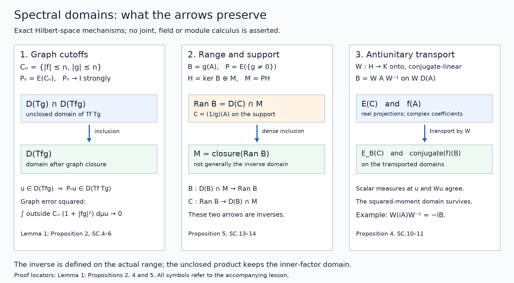

# Spectral products, transport and inverse domains

*Public domain (CC0).*

The self-adjoint spectral calculus with the original domain, built on a spectral measure for a unitary operator, supplies the projection-valued measure and maximal multiplier operators used here. We develop the additional rules for combining and transporting those operators.

Let \(A:D(A)\subset H\to H\) be densely defined and self-adjoint on a complex Hilbert space. Inner products are linear in their first entry. No separability assumption is made. Write \(E\) for its spectral measure and

\[
\mu_u(C)=\|E(C)u\|^2,\qquad T_f=f(A),\qquad
D(T_f)=\left\{u:\int|f|^2\,d\mu_u<\infty\right\}.
\tag{SC.1}
\]

Here \(C\subset\mathbb R\) is Borel and \(f:\mathbb R\to\mathbb C\) is finite-valued Borel. The earlier theorem proves that \(T_f\) is closed and densely defined, that \(T_f^*=T_{\bar f}\), and that

\[
\|T_fu\|^2=\int|f|^2\,d\mu_u,\qquad
\mu_{T_fu}(C)=\int_C|f|^2\,d\mu_u\quad(u\in D(T_f)).
\tag{SC.2}
\]

Spectral projections preserve these domains and commute with their operators there. Bounded multipliers form a unital star homomorphism and have norm at most their scalar supremum. All operator equalities below include domains. On the zero Hilbert space they have the evident zero-space interpretation.

## 1. One cutoff family controls several domains

**Lemma 1.** For finite Borel \(h_1,\ldots,h_r\), set

\[
C_n=\bigcap_{j=1}^r\{|h_j|\le n\},\qquad P_n=E(C_n).
\tag{SC.3}
\]

Then \(P_n\to I\) strongly and \(P_nH\subset\bigcap_jD(T_{h_j})\). For any finite Borel \(q\) and \(u\in D(T_q)\), \(P_nu\to u\) in the graph norm of \(T_q\).

**Proof.** Since every \(h_j(t)\) is finite, \(C_n\uparrow\mathbb R\), and strong countable additivity gives \(P_nu\to u\). Applying (SC.2) to the bounded indicator gives

\[
\int|h_j|^2\,d\mu_{P_nu}=\int_{C_n}|h_j|^2\,d\mu_u\le n^2\|u\|^2.
\]

Domain preservation and the same measure identity for \(I-P_n=E(C_n^c)\) give

\[
\|u-P_nu\|^2+\|T_q(u-P_nu)\|^2
=\int_{C_n^c}(1+|q|^2)\,d\mu_u\longrightarrow0.
\tag{SC.4}
\]

The integrable function on the right permits scalar dominated convergence. This also proves graph convergence when \(q\) is unbounded on \(C_n\). \(\square\)

## 2. Ordered products and scalar sums

**Proposition 2.** For finite complex Borel \(f,g\), the operators formed before closure have exactly

\[
\begin{aligned}
D(T_fT_g)&=D(T_g)\cap D(T_{fg}),&
T_fT_gu&=T_{fg}u,\\
D(T_f+T_g)&=D(T_f)\cap D(T_g),&
(T_f+T_g)u&=T_{f+g}u.
\end{aligned}
\tag{SC.5}
\]

Both are densely defined and closable, with

\[
\overline{T_fT_g}=T_{fg},\qquad
\overline{T_f+T_g}=T_{f+g}.
\tag{SC.6}
\]

**Proof.** For \(u\in D(T_g)\), (SC.2) says that \(T_gu\in D(T_f)\) exactly when \(\int|f|^2|g|^2\,d\mu_u<\infty\). This is the product-domain equality. Use Lemma 1 with \(h_1=f,h_2=g\). On \(P_nH\) both factors are bounded multipliers, so bounded multiplicativity and projection commutation give

\[
P_nT_fT_gu=T_{fg}P_nu=P_nT_{fg}u.
\]

Both fixed vectors exist on the domain just proved. Letting \(n\to\infty\) proves the action equality. For \(u\in D(T_f)\cap D(T_g)\), the inequality \(|f+g|^2\le2(|f|^2+|g|^2)\) places \(u\) in \(D(T_{f+g})\). Bounded addition on \(P_nH\) and the same limit prove the sum identity. Both stated domains contain every \(P_nH\), so they are dense.

The closed operators \(T_{fg}\) and \(T_{f+g}\) extend the respective product and sum. For \(u\in D(T_{fg})\), each \(P_nu\) belongs to the product domain: its \(g\)-moment is bounded, and its \(fg\)-moment is finite. Formula (SC.4) with \(q=fg\) approximates its graph pair by product graph pairs. Consequently the closure of the product graph is exactly the graph of \(T_{fg}\). If \(u\in D(T_{f+g})\), the same \(P_nu\) lies in both individual domains; (SC.4) with \(q=f+g\) proves the sum assertion. \(\square\)

Cancellation can enlarge the domain after closure: \(T_f+T_{-f}\) is zero on \(D(T_f)\), whereas its closure is zero on all of \(H\). Likewise \(fg=1\) does not remove the inner factor's domain from the unclosed product.

## 3. Changing the spectral variable

**Proposition 3.** Let \(g:\mathbb R\to\mathbb R\) be finite Borel, and let \(B=T_g\) on its maximal domain. Its spectral measure is

\[
E_B(C)=E(g^{-1}(C)).
\tag{SC.7}
\]

For every finite complex Borel \(f\),

\[
f(B)=T_{f\circ g},\qquad
D(f(B))=\left\{u:\int|f(g(t))|^2\,d\mu_u(t)<\infty\right\}.
\tag{SC.8}
\]

This domain need not be contained in \(D(B)\).

**Proof.** Put \(F(C)=E(g^{-1}(C))\). Inverse images preserve disjoint unions and intersections, so \(F\) is a normalized strongly countably additive orthogonal PVM. Its scalar measure at \(u\) is \(g_*\mu_u\). For nonnegative Borel \(k\),

\[
\int k(s)\,d(g_*\mu_u)(s)=\int k(g(t))\,d\mu_u(t).
\tag{SC.9}
\]

This is the definition for indicators, extends by finite addition to simple functions, and follows for nonnegative functions by increasing simple approximation. Real and imaginary parts give the equality for integrable complex functions.

When \(k\) is bounded, its integral against \(F\) is \(T_{k\circ g}\): check indicators and simple functions, then uniformly approximate a bounded Borel function by simple functions. The bounded-calculus norm bound permits that approximation in operator norm. For \(k_n(s)=s1_{\{|s|\le n\}}\), their maximal limit therefore has exactly the moment domain \(\{u:\int s^2\,d(g_*\mu_u)<\infty\}=D(T_g)\) and action \(T_g\). The earlier unbounded integration proof applies to any PVM: its finite simple sums and cutoffs give this domain and action without a new spectral-existence theorem. Uniqueness for the self-adjoint \(B\) identifies \(F=E_B\).

Repeat this bounded-integral argument for \(f1_{\{|f|\le n\}}\). Equation (SC.9) gives the domain in (SC.8), and their limits give its action. No extra \(g\)-moment occurs. \(\square\)

If two functions differ only on a Borel set \(Z\) with \(E(Z)=0\), they have equal maximal domains and operators: all scalar measures vanish on \(Z\), so their moment tests and bounded cutoff limits agree. Thus an inverse or logarithm can be assigned any finite value at a zero spectral projection excluded from its scalar formula. This concerns spectral-null equality; it assumes no single scalar measure equivalent to every \(\mu_u\).

## 4. Unitary and antiunitary transport

**Proposition 4.** Let \(W:H\to K\) be unitary or antiunitary onto \(K\). Define \(B=WAW^{-1}\) on \(WD(A)\). Then \(B\) is self-adjoint, with

\[
E_B(C)=WE(C)W^{-1}.
\tag{SC.10}
\]

For finite complex Borel \(f\),

\[
WT_fW^{-1}=
\begin{cases}
f(B),&W\text{ unitary},\\
\bar f(B),&W\text{ antiunitary},
\end{cases}
\qquad D(WT_fW^{-1})=WD(T_f).
\tag{SC.11}
\]

**Proof.** An antiunitary is conjugate-linear and satisfies \(\langle Wu,Wv\rangle=\overline{\langle u,v\rangle}\). The two conjugations make \(B\) linear in this case. Transporting the adjoint pairing gives \(B^*=WA^*W^{-1}\) on exactly \(WD(A^*)\): a vector in \(K\) passes the adjoint-domain test against all \(Wu\), \(u\in D(A)\), precisely when its inverse image passes that test for \(A^*\). In the antiunitary case conjugate the whole pairing. This proves both inclusions, so \(A=A^*\) gives self-adjointness.

The conjugated projections \(F(C)=WE(C)W^{-1}\) are orthogonal and normalized. Applying the norm-continuous isometry \(W\) to each disjoint-sum identity proves strong countable additivity. Its scalar measure at \(Wu\) is \(\mu_u\). Integrals of real simple functions transport without changing coefficients; the real coordinate function then transports by graph cutoffs, on exactly \(WD(A)\). PVM uniqueness gives (SC.10).

For \(f=\sum_jc_j1_{C_j}\), transport changes each coefficient to \(c_j\) in the unitary case and to \(\bar c_j\) in the antiunitary case. Uniform simple approximation proves (SC.11) for bounded \(f\). For general \(f\),

\[
\int|f|^2\,d\mu_u
=\int|f|^2\,d\mu^B_{Wu}
=\int|\bar f|^2\,d\mu^B_{Wu}.
\]

Thus the domains are exactly transported, and their bounded truncations converge to the asserted actions. \(\square\)

## 5. Restricting support and recovering actual inverse ranges

**Proposition 5.** For Borel \(S\), put \(P=E(S)\) and \(M=PH\). The restriction \(A_M\) to \(D(A)\cap M\) is self-adjoint on \(M\), with

\[
E_M(C)=E(C\cap S)|_M,\qquad
f(A_M)=T_f|_{D(T_f)\cap M}.
\tag{SC.12}
\]

For real finite Borel \(g\), put

\[
B=T_g,\quad S_g=\{t:g(t)\ne0\},\quad P_g=E(S_g),\quad
h(t)=
\begin{cases}
1/g(t),&t\in S_g,\\
0,&t\notin S_g.
\end{cases}
\tag{SC.13}
\]

Then \(\ker B=(I-P_g)H\), \(\overline{\operatorname{Ran}B}=P_gH\), and \(C=T_h\) satisfies

\[
\begin{aligned}
D(C)\cap P_gH&=\operatorname{Ran}B,\\
CBu&=P_gu &&(u\in D(B)),\\
BCv&=P_gv &&(v\in D(C)).
\end{aligned}
\tag{SC.14}
\]

Thus \(C|_{P_gH}\) is the actual inverse of the injective self-adjoint restriction \(B|_{P_gH}\). Its domain is the actual range, which need not be the whole support.

**Proof.** Domain preservation makes \(A_M\) closed and symmetric. It is densely defined because \(E([-n,n])u\to u\) for \(u\in M\), and these vectors lie in \(D(A)\cap M\). The bounded resolvents of \(A\) commute with \(P\), map \(M\) into this domain, and invert \(A_M\pm i\). Both ranges are therefore all of \(M\). To check self-adjointness explicitly, for \(v\in D(A_M^*)\) choose \(u\in D(A_M)\) with \((A_M+i)u=(A_M^*+i)v\). Then

\[
v-u\in\ker(A_M^*+i)=\operatorname{Ran}(A_M-i)^\perp=0.
\]

Hence \(A_M^*=A_M\) including domains. The PVM in (SC.12) represents its coordinate action and moment domain, so uniqueness identifies it. For vectors in \(M\), its scalar measures are the original ones; moment tests and truncated integrals give the full restricted multiplier assertion.

For \(B=T_g\), (SC.2) proves its kernel assertion and that every \(Bu\) lies in \(P_gH\). If \(v=Bu\), that measure identity gives

\[
\int|h|^2\,d\mu_v=\int_{S_g}|hg|^2\,d\mu_u=\|P_gu\|^2<\infty.
\]

The product rule yields \(Cv=P_gu\). Conversely, if \(v\in D(C)\cap P_gH\), set \(u=Cv\). Then

\[
\int|g|^2\,d\mu_u=\int_{S_g}|gh|^2\,d\mu_v=\|v\|^2.
\]

So \(u\in D(B)\) and \(Bu=v\). This proves the range equality. The same calculation on all of \(D(C)\), with \(P_gv\) replacing \(v\), proves the final identity. Since \(hg=gh=1_{S_g}\), Proposition 2 also gives the exact unclosed domains \(D(CB)=D(B)\) and \(D(BC)=D(C)\).

Finally \(E(\{1/n\le|g|\le n\})v\to P_gv\). Each cutoff vector belongs to \(D(C)\cap P_gH\), hence to \(\operatorname{Ran}B\). Its range is therefore dense in the support, and the support inclusion proves the claimed closure. The restriction of \(B\) to its support is self-adjoint by the first part, applied to its own PVM from Proposition 3. \(\square\)

**Corollary 6.** If \(A\ge0\) and \(\lambda>0\), then

\[
\begin{aligned}
D(A^{1/2})&=\{u:\int t\,d\mu_u(t)<\infty\},&
(A^{1/2})^2&=A,\\
R&=(A+\lambda)^{-1},&
\operatorname{Ran}R^{1/2}&=D(A^{1/2}),\\
\|R^{-1/2}u\|^2&=\lambda\|u\|^2+\|A^{1/2}u\|^2
&& (u\in D(A^{1/2})).
\end{aligned}
\tag{SC.15}
\]

The nonnegative self-adjoint square root of \(A\) is unique. If \(A\) is injective, \(D(A^{-1})=\operatorname{Ran}A\), without a positive spectral-gap assumption.

**Proof.** The earlier theorem gives \(E((-\infty,0))=0\). The real multiplier \(\sqrt{\max(t,0)}\) is nonnegative self-adjoint, with the displayed domain. The unclosed square requires both first and second moments by Proposition 2; the second implies the first by \(t\le1+t^2\) on the support. Its square is therefore exactly \(A\). If another nonnegative self-adjoint \(L\) satisfies \(L^2=A\), apply Proposition 3 to \(L\), first with \(t^2\) and then with the nonnegative square root. Its measure is supported on \([0,\infty)\), so \(\sqrt{L^2}=L\), including domains.

Define \(b(t)=(\lambda+t)^{-1/2}\) on \([0,\infty)\), with any finite real value off that spectral support. Its multiplier is bounded, positive and injective. Proposition 3 and square-root uniqueness identify \(T_b=R^{1/2}\). Proposition 5 identifies its range with the domain of \((\lambda+t)^{1/2}(A)\). The latter squared moment is \(\lambda\|u\|^2+\int t\,d\mu_u\), which proves the domain and norm claims. Apply Proposition 5 with \(g(t)=t\) and \(P_g=I\) for the final injective inverse assertion. \(\square\)

**Figure 1.** Left: the graph approximation in Lemma 1 and Proposition 2. The unclosed product retains its inner-factor moment; simultaneous cutoffs approximate the maximal product domain after closure. Centre: Proposition 5 splits kernel and support, and places the actual inverse domain at the range, which is generally only dense in the support. Right: Proposition 4 transports real spectral projections unchanged, while an antiunitary conjugates complex multiplier coefficients. Arrows denote the labelled inclusions, inverses or transports. [Editable SVG](../reproduction/spectral-domain-bridge/figures/spectral-domain-bridge.svg) · [Reproduction source](../reproduction/spectral-domain-bridge/reproduce.py) · [Reproduction instructions](../reproduction/spectral-domain-bridge/README.md) · [Font and software terms](../reproduction/spectral-domain-bridge/COMPONENT-TERMS.md).

These propositions concern ordinary Hilbert-space spectral multipliers. Hilbert-module calculus, joint tensor-domain theorems, measurable-field decomposition, closed polar decomposition and reconstruction of a self-adjoint generator from a given strongly continuous group require their own proofs.

## 6. Solved exercises

### Exercise 1. Cancellation and the order of multiplication — 10 points

On \(H=\ell^2(\mathbb N)\), \(\mathbb N=\{1,2,\ldots\}\), define \(Au=(nu_n)_n\) on \(D(A)=\{u:\sum n^2|u_n|^2<\infty\}\). Verify self-adjointness and its coordinate PVM (3 points). Compute the unclosed and closed sums \(A+(-A)\) (3 points). Compute both ordered products \(A^{-1}A\), \(AA^{-1}\), and exhibit a vector on which their unclosed domains differ (4 points).

**Solution.** Finite sequences are in \(D(A)\) and dense by convergence of squared-norm tails. Weighted Cauchy–Schwarz makes \(A\) symmetric. For \(v\in D(A^*)\), testing each coordinate vector forces its adjoint image to be \((nv_n)_n\). That image belongs to \(\ell^2\) exactly when \(v\in D(A)\). Conversely that condition proves the adjoint pairing for every \(u\in D(A)\) by Cauchy–Schwarz. Thus \(A=A^*\).

Set \(E(C)u=(1_C(n)u_n)_n\). These are normalized orthogonal projections. For disjoint unions their squared-norm tails are bounded by tails of \(\sum|u_n|^2\), proving strong countable additivity. The coordinate integral has exactly the stated domain and action; uniqueness identifies this PVM. **[3 points]**

The sum is zero on \(D(A)\). Finite sequences are dense, so its graph closure is \(H\times\{0\}\): the closed sum is zero on all of \(H\). **[3 points]**

The inverse \(A^{-1}u=(u_n/n)_n\) is bounded on \(H\). The product \(A^{-1}A\) has domain \(D(A)\) and is the identity there. In \(AA^{-1}\) every \(u\in H\) is allowed, since \(\sum n^2|u_n/n|^2=\sum|u_n|^2\); it is the identity on \(H\).

Take \(u_n=1/n\). The series \(\sum n^{-2}\) converges: the block \(2^k\le n<2^{k+1}\) has sum at most \(2^{-k}\). But \(\sum n^2|u_n|^2=\sum1=\infty\), so this vector belongs only to the second unclosed product domain. Both closed products are the identity. **[4 points]**

### Exercise 2. Composition and antiunitary coefficients — 10 points

For Exercise 1's \(A\), put \(B=A^2\). Find \(D(B)\) and the action/domain of \(\sqrt{\max(B,0)}\) (4 points). Give a vector in the latter domain outside \(D(B)\) (2 points). With \(Ju=(\bar u_n)_n\), determine \(JAJ^{-1}\) and \(J(iA)J^{-1}\), including domains (4 points).

**Solution.** Recursive multiplication gives \(D(B)=\{u:\sum n^4|u_n|^2<\infty\}\) and \(Bu=(n^2u_n)_n\). Proposition 3 composes \(g(t)=t^2\) with \(f(s)=\sqrt{\max(s,0)}\). On the positive coordinate spectrum \(f(g(n))=n\). Therefore \(f(B)=A\) on precisely \(D(A)\), with no prior \(D(B)\) condition. **[4 points]**

For \(u_n=1/n^2\), \(\sum n^2|u_n|^2=\sum n^{-2}<\infty\), but \(\sum n^4|u_n|^2=\sum1=\infty\). **[2 points]**

The map \(J\) is an onto conjugate-linear isometry with \(J^2=I\), and preserves \(D(A)\). Coordinate calculation gives \(JAJ^{-1}=A\). It also gives \(J(iA)J^{-1}=-iA\), since \(J\) conjugates the coefficient \(i\). Both domains are \(D(A)\), consistently with Proposition 4 and \(|it|=|-it|\). Omitting this conjugation gives the wrong operator on every nonzero coordinate vector. **[4 points]**

### Exercise 3. A supported inverse without a gap — 10 points

On \(H=\mathbb C\oplus\ell^2(\mathbb N)\), let \(B(a,u)=(0,(u_n/n)_n)\). Find its kernel, support, range and range closure (4 points). Write its supported inverse and maximal domain; compute the two unclosed generalized-inverse products (4 points). Prove this inverse is unbounded even though \(B\) is bounded and nonnegative (2 points).

**Solution.** The real nonnegative diagonal entries make \(B\) bounded, self-adjoint and nonnegative. Its kernel is \(\mathbb C\oplus0\) and its support is \(M=0\oplus\ell^2\). A vector \((0,v)\) is in its range exactly when \((nv_n)_n\in\ell^2\), because that must be its preimage's second coordinate. Thus \(\operatorname{Ran}B=0\oplus D(A)\), dense in \(M\) by finite sequences. **[4 points]**

The supported inverse is \(C_M(0,v)=(0,(nv_n)_n)\) on \(0\oplus D(A)\). Assigning zero on the kernel gives \(C(a,v)=(0,(nv_n)_n)\) on \(\mathbb C\oplus D(A)\). For \(P(a,u)=(0,u)\), \(CB=P\) on all of \(H\), since \(B\) always maps into \(D(C)\). The product \(BC=P\) has exactly domain \(D(C)\); its closure is \(P\) on \(H\). The whole-space generalized inverse is thus distinguished from the true inverse of \(B|_M\). **[4 points]**

The unit vector \((0,e_n)\) has inverse image \(C(0,e_n)=(0,ne_n)\) of norm \(n\). Hence \(C_M\) is unbounded. Nonzero eigenvalues \(1/n\) approach zero: injectivity on the support gives dense range, not an everywhere-defined bounded inverse. **[2 points]**
