# K-theory of the leaf space

*Original material: CC0. The adaptation in Lemma 7.7 and its proof retains [CC BY 4.0](https://creativecommons.org/licenses/by/4.0/), with the source and changes stated there.*

## Introduction

A transversal meets a leaf in a discrete set. Counting these intersections produces a module over the foliation algebra. This gives a useful direction of functoriality: classes on the transversal move into the K-theory of the leaf space. A compact transversal even gives an actual projection in the algebra.

More general maps need an orientation and a replacement for a tubular neighbourhood. We explain that geometry before discussing the analytic index and the assembly map. We also construct a Kasparov cycle for a foliation by hyperbolic planes. Its compactness estimates show why negative curvature is useful.

For the graded correspondences and transversal construction, read [The C*-algebra of a foliation](the-c-star-algebra-of-a-foliation.md) and Sections 1–5 of [Hilbert modules and fields on the leaf space](hilbert-modules-and-fields-on-the-leaf-space.md). The measured applications in Sections 8–9 also use [The index theorem for measured foliations](the-index-theorem-for-measured-foliations.md). The stable K-theory prerequisites are specified next. Basic references are [Connes], [Connes–Skandalis], [Kasparov], and [Connes–Thom]. The definitions and geometric arguments below are explicit. Statements requiring Bott periodicity, Kasparov's product, or the full longitudinal index theorem identify those prerequisites at the point of use.

Write \(G=\operatorname{Hol}(V,F)\), \(A=C_r^*(G)\), and \(q=\operatorname{rank}(TV/F)\). Unless a compactness hypothesis is stated, manifolds are second countable and may be noncompact. All K-theory of locally compact spaces has compact support:

\[
K_c^j(X)=K_j(C_0(X)).
\]

The notation \(K^j(V/F)\) means \(K_j(A)\). It retains holonomy and does not replace \(A\) by the continuous functions on the set of leaves.

### Suspension, Bott periodicity and extension boundaries

The stable K-theory used below includes nonunital algebras through external unitization. Its suspension is \(SA=C_0(\mathbb R)\otimes A\). The complete programme proofs are Suspension, higher K-groups and the long exact sequence, Theorem 2.1; Bott periodicity, Theorem 4.1; and Six-term exact sequence and exponential map, Theorems 1.1–2.1. They give natural isomorphisms

\[
K_1(A)\cong K_0(SA),
\qquad
\beta_A:K_0(A)\xrightarrow{\cong}K_1(SA),
\]

and the cyclic six-term exact sequence of every C*-algebra extension. These are the suspension theorem, Bott periodicity and extension exactness, respectively. They apply to arbitrary C*-algebras and are stable matrix statements; a single index-one differential operator does not replace them.

Here are the conventions needed at their use. On the positively parametrized circle \(z=e^{2\pi it}\), the Bott map sends a relative idempotent class \([e]-[e_0]\) to the loop class

\[
\left[(ze+1-e)(ze_0+1-e_0)^{-1}\right].
\]

The idempotents agree modulo \(A\), so this loop is scalar identity modulo \(A\) and is based at identity. The formula is natural under *-homomorphisms. The inverse is proved by the coefficient Toeplitz homotopy in Bott periodicity, Sections 2–4, and the suspension isomorphism by the doubled rotation path in Suspension, higher K-groups and the long exact sequence, Theorem 2.1. Their composition supplies two-periodicity with external unitization. Relative scalar normalization and matrix/compact stability are proved in Nonunital algebras: unitization, relative classes and half-exactness, Sections 1–4; Matrix stability, stability and continuity of \(K_0\), Theorems 1.1 and 4.1; and Invertibles, unitaries and \(K_1\), Sections 1–4. These proofs apply to arbitrary C*-algebras; in particular they apply to the generally nonseparable multiplier and corona algebras used in Theorem 0.14.

For an extension \(0\to J\to B\to C\to0\), the boundary of an invertible quotient matrix \(u\) is \([WpW^{-1}]-[p]\), where \(W\) lifts \(\operatorname{diag}(u,u^{-1})\) and \(p=\operatorname{diag}(I,0)\). The signed elementary-factor construction in the [Hilbert-module lesson, formula (11)](hilbert-modules-and-fields-on-the-leaf-space.md#section-6) gives an explicit lift for an elliptic operator and its parametrix. The sign is kernel minus cokernel. The other boundary sends a quotient projection with self-adjoint lift \(h\) to \([\exp(2\pi i h)]\). The index construction, its choices and the kernel-minus-cokernel normalization are proved in The index map and the exact sequence at \(K_0\), Theorem 2.2, Theorem 4.1, Proposition 5.1 and Theorem 6.1. The positive exponential formula and all six exact positions are proved in Six-term exact sequence and exponential map, Theorems 1.1–2.1. Its Theorem 4.1 supplies the two-parity Mayer–Vietoris sequence used for vector bundles; Theorem 6.1 supplies full relative excision. Bundle triples represent the compact-pair K-group by Topological K-theory of spaces, pairs and vector bundles, Theorem 2.1 and Lemma 2.2. Those proofs fix the boundary signs, rather than leaving them to an unnamed convention.

For a pointwise norm-continuous real action \(\alpha\), Theorem 8.7 below proves the group-level Connes–Thom isomorphism using the Wiener–Hopf extension

\[
0\longrightarrow A\otimes\mathcal K
\longrightarrow \bigl(C_0(\mathbb R\cup\{+\infty\})\otimes A\bigr)
\rtimes_{\mathrm{translation}\otimes\alpha}\mathbb R
\longrightarrow A\rtimes_\alpha\mathbb R
\longrightarrow0.
\]

Its boundary \(K_{j+1}(A\rtimes_\alpha\mathbb R)\to K_j(A)\) is an isomorphism. The inverse defines the degree-one Thom map in this extension convention. Theorem 8.7 below proves it: Lemmas 8.3–8.5 and Theorem 8.6 supply crossed-product exactness, stability and Takai duality, and the full Wiener–Hopf argument uses the stable K-theory interfaces fixed above. Naturality follows from the maps of these extensions and the natural identification of their ideals. Corollary 8.10 fixes the positive cotangent Bott normalization at the trivial action. Comparison with geometric wrong-way maps and assembly remains separate.

Section0 constructs the separable graded Kasparov product and proves its associativity, units and stability. The spin-c vector-bundle KK Thom equivalence is proved in Theorem6.0c and Corollary6.0d, and full compact-source wrong-way factorization independence in Theorem6.0o. Theorems6.0s/6.0w prove the ordinary projection formula and compact ordinary-map/foliation composition. Theorem 6.1 proves geometric-cycle descent. The longitudinal index and geometric twisted-duality comparisons remain further interfaces specified in Sections 7–11.

## 0. Composing graded correspondences

The product needed for wrong-way maps must survive changes of operator, module and representation. We prove this analytic interface explicitly, including its nonunital coefficient scope. The technical construction follows the connection method of [Connes–Skandalis], Appendix A, and the graded separator in [Blackadar], Sections 12.4,14.6 and18.3–18.7. The local positivity argument is the one behind [Blackadar], Proposition17.2.7. The proofs below include the approximation estimates and both compact ideals in a triple tensor product.

For separable graded C*-algebras \(A,B\), a graded Kasparov cycle is a countably generated graded Hilbert \(B\)-module \(E\), an even *-representation \(\phi:A\to\mathcal L(E)\), and a bounded odd \(F\) such that
\[
(F^2-1)\phi(a),\quad(F-F^*)\phi(a),\quad[F,\phi(a)]
\in\mathcal K(E),\qquad a\in A.
\]
All commutators are graded: \([S,T]=ST-(-1)^{|S||T|}TS\) on homogeneous operators. Module inner products are linear in the second variable. A homotopy is a cycle over \(C([0,1],B)\), with endpoint modules obtained by coefficient extension. Degenerate cycles have all three defects exactly zero. The group \(KK(A,B)\) consists of homotopy classes, with unitary equivalence understood and addition by direct sum. The group and zero conventions are justified in Theorem0.7.

### The separator and its approximation sequence

**Lemma 0.1 (graded separation in a multiplier algebra).** Let \(J\) be a separable graded C*-algebra, \(A_1,A_2\) separable graded C*-subalgebras of \(M(J)\), and \(\Delta\) a separable graded linear subspace of \(M(J)\). Suppose \(A_1A_2\subset J\) and that the graded commutator with every element of \(\Delta\) preserves \(A_1\). There are even positive contractions \(M,N\in M(J)\) such that
\[
M+N=1,\qquad MA_1\subset J,\qquad NA_2\subset J,\qquad [M,\Delta]\subset J.
\]
The bracket with \(M\) is an ordinary commutator since \(M\) is even. The assertion concerns separation in the quotient \(M(J)/J\); it does not imply that either multiplier is compact.

**Proof of the approximation fact used below.** If a separable multiplier subspace \(\mathcal D\) derives a C*-algebra \(C\), a positive contractive approximate identity for \(C\) can be replaced by convex combinations of its tails that commute asymptotically with each element of \(\mathcal D\). To prove this, work in the bidual of the C*-algebra generated by \(C,\mathcal D\). Let \(p\) be the support projection of \(C\), so every approximate identity converges strongly to \(p\). The derivation extends weakly to \(C''\). Since \(p\) is its unit,
\[
[p,d]=p[p,d]=[p,d]p,\qquad
[p^2,d]=p[p,d]+[p,d]p=2[p,d],
\]
whereas \(p^2=p\); thus \([p,d]=0\). The finite tuple of commutators with \(d_1,\ldots,d_k\) consequently converges weakly to zero in the ambient algebra's \(k\)-fold direct sum. Hahn–Banach separation puts zero in the norm closure of the convex hull of every tail of these tuples. Choose the convex combinations while retaining the approximate-identity estimates for any prescribed finite subset of \(C\). A diagonal choice on countable dense subsets proves the assertion. Norm bounds make the convergence uniform on each compact test set.

For the even version start with the approximate identity obtained from an even strictly positive element: if \(h\) is strictly positive, \(h+\gamma(h)\) is even and strictly positive, where \(\gamma\) is the grading automorphism. All tail convex combinations stay even. Commutators with even terms are ordinary, so the preceding argument applies to the graded derivation hypothesis as well. If an increasing approximate identity is needed, start with increasing functional-calculus terms. A convex combination from a tail beyond the last index used previously dominates the preceding convex combination. This retains monotonicity.

We now prove the separator. Choose adjoint-invariant compact test sets \(X_i\subset(A_i)_1\), \(Y\subset\Delta_1\), and \(Z\subset J_1\) whose linear spans are dense in their respective spaces. For example, scale each member of a countable dense sequence by successively smaller positive constants and adjoin its adjoint and the zero limit. Set \(\epsilon_n=2^{-n}\). The approximation fact supplies even positive contractions \(u_n\in A_1\) such that
\[
\sup_{x\in X_1}\|u_nx-x\|<\epsilon_n,\qquad
\sup_{y\in Y}\|[u_n,y]\|<\epsilon_n.
\]

Every \(u_jw\) lies in \(J\) for \(w\in Z\cup X_2\). Construct an increasing even approximate identity \(v_n\) for \(J\), putting \(v_0=0\), so that
\[
\sup_{\substack{j\le n+1\\w\in Z\cup X_2}}
\|(1-v_n)u_jw\|<\epsilon_n^2.
\tag{90}
\]
In particular \(v_{n-1}\) controls \(u_nw\), as well as \(v_n\). This is the one-step lookahead. Also require, for
\(b_n=(v_n-v_{n-1})^{1/2}\),
\[
\sup_{w\in X_1\cup X_2\cup Y\cup Z}\|[b_n,w]\|<\epsilon_n.
\tag{91}
\]
These requirements can be imposed together. All their test sets are compact. Quasicentral approximate identities for \(J\) exist for the separable subspace spanned by those sets, since every multiplier derives \(J\). Polynomial approximation to the square-root function on \([0,1]\) shows uniformly for \(\|w\|\le1\) that a sufficiently small \(\|[a,w]\|\) implies a prescribed small \(\|[a^{1/2},w]\|\). At step \(n\), require the commutator error for \(v_n\) to be small enough for both the current \(b_n\) and the future \(b_{n+1}\). More explicitly, choose tolerances \(\delta_n\) for square-root errors \(\epsilon_n\), and make the error for \(v_n\) at most \(\frac12\min(\delta_n,\delta_{n+1})\). Then \([v_n-v_{n-1},w]\) has norm at most \(\delta_n\). The increasing tail-convex construction enforces these tolerances, (90), and strict convergence on a countable total subset of \(J\).

For \(n\ge2\), (90) at \(n\) and \(n-1\) gives
\[
\|b_n^2u_nw\|
\le\|(1-v_n)u_nw\|+\|(1-v_{n-1})u_nw\|
<5\epsilon_n^2,
\qquad w\in Z\cup X_2.
\]
It follows that
\[
\|b_nu_nw\|^2
=\|w^*u_nb_n^2u_nw\|
\le5\epsilon_n^2.
\]
The harmless first term obeys the same bound using \(\|u_1w\|\le1=4\epsilon_1^2\). Combining this with (91) gives
\[
\|b_nu_nb_nw\|
\le\|b_nu_nwb_n\|+\|b_nu_n[b_n,w]\|
\le(\sqrt5+1)\epsilon_n.
\tag{92}
\]
The same estimate holds on the other side for the adjoint test set.

The positive partial sums of \(\sum b_nu_nb_n\) are bounded by
\(\sum b_n^2=v_n\le1\). Equation (92), first on \(Z\) and then by density on \(J\), proves that these partial sums are strictly Cauchy. A bounded strictly Cauchy sequence of multipliers has a strict limit: its limits on \(J\) on the two sides are bounded compatible left and right multiplication maps, hence define a multiplier. Call the even positive contractive limit \(N\), and put \(M=1-N\).

For \(x\in X_2\), (92) makes \(Nx=\sum b_nu_nb_nx\) a norm-convergent series of elements of \(J\). Thus \(NA_2\subset J\). For \(x\in X_1\), use
\[
(b_n^2-b_nu_nb_n)x
=b_n(1-u_n)x b_n+b_n(1-u_n)[b_n,x].
\]
Its norm is at most \(2\epsilon_n\). Consequently the series of these terms converges in norm in \(J\). Since \(\sum b_n^2x=v_nx\) converges strictly to \(x\), its sum is \((1-N)x=Mx\). Density gives \(MA_1\subset J\). Finally, for \(y\in Y\),
\[
[b_nu_nb_n,y]
=b_nu_n[b_n,y]+b_n[u_n,y]b_n+[b_n,y]u_nb_n,
\]
whose norm is at most \(3\epsilon_n\). Every term lies in \(J\), so the norm-convergent series is \([N,y]\in J\); density gives the assertion on all of \(\Delta\), and hence on \(M\). This proves the lemma. \(\square\)

### The connection construction

We give the needed module argument, rather than treating “connection” as an unexplained analogy with a bundle connection. Write \(\mathcal K(E',E)\) for the norm closure of finite-rank adjointable maps, and take inner products linear in the second variable.

**Lemma 0.2 (graded stabilization and connections).** A countably generated graded Hilbert \(D\)-module \(E_1\), regarded over \(D^+\), is the range of an even adjointable projection on the graded standard module \(\widehat H_{D^+}\). If a bounded homogeneous \(F_2\in\mathcal L(E_2)\) graded-commutes with the representation of \(D\) modulo \(\mathcal K(E_2)\), there is a bounded homogeneous \(G\) on
\(E=E_1\widehat\otimes_D E_2\) such that, for homogeneous \(\xi\in E_1\),
\[
GT_\xi-(-1)^{|\xi||F_2|}T_\xi F_2
\in\mathcal K(E_2,E),\qquad
T_\xi^*G-(-1)^{|\xi||F_2|}F_2T_\xi^*
\in\mathcal K(E,E_2).
\tag{93}
\]
Here \(T_\xi\eta=\xi\widehat\otimes\eta\) and
\(T_\xi^*(\zeta\widehat\otimes\eta)=\phi_2(\langle\xi,\zeta\rangle)\eta\).
If \(F_2\) is self-adjoint, \(G\) can be self-adjoint; norm-continuous paths of \(F_2\)'s give norm-continuous paths of \(G\)'s.

**Proof.** Choose homogeneous generators \(\eta_i\) of norm at most one, repeating every generator infinitely often in its own parity. Include zero entries so the standard basis has infinitely many entries of either parity, and give the standard basis \(e_i\) the same parity as \(\eta_i\). On \(\widehat H_{D^+}\) define the even adjointable map
\[
T e_i=2^{-i}\eta_i\oplus4^{-i}e_i
\quad\hbox{in }E_1\oplus\widehat H_{D^+}.
\]
The first column series and its adjoint converge by the summable coefficients; the second component is a bounded diagonal. The range of \(T^*\) is dense: \(T^*(0\oplus4^ie_i d)=e_id\), so every finite standard column lies in it. The range of \(T\) is also dense. If \(\eta_i\) recurs as \(\eta_{j_k}\), with \(j_k\to\infty\), then
\[
T(2^{j_k}e_{j_k}d)=\eta_i d\oplus2^{-j_k}e_{j_k}d
\longrightarrow\eta_id\oplus0.
\]
The generators therefore put \(E_1\oplus0\) in the closure of its range. Subtracting the first component of \(T(4^ie_id)\) then puts \(0\oplus e_id\) in that closure as well.

The rule \((T^*T)^{1/2}z\mapsto Tz\) preserves the \(D^+\)-valued inner product. Both its domain and range are dense; the first density follows from the density of the range of \(T^*\), since the closure of the range of \(T^*\) equals that of \((T^*T)^{1/2}\). For completeness, this equality follows from the norm approximations
\[
T^*= \lim_{\epsilon\downarrow0}
(T^*T)^{1/2}(T^*T+\epsilon)^{-1/2}T^*
\]
on each fixed vector, and the reverse inclusion obtained by approximating
\((T^*T)^{1/2}\) with \(T^*T(T^*T+\epsilon)^{-1/2}\).
The errors are controlled by scalar spectral bounds, uniformly on the operator spectrum. Thus the inner-product-preserving rule extends to an even unitary
\(\widehat H_{D^+}\cong E_1\oplus\widehat H_{D^+}\). Transporting the first-summand projection gives the desired even projection \(P\).

Extend the representation of \(D\) on \(E_2\) to \(D^+\). It has the same compact commutators with \(F_2\), since the new scalar identity commutes exactly. Under
\(\widehat H_{D^+}\widehat\otimes E_2\cong\widehat H_\mathbb C\widehat\otimes E_2\),
put
\[
G_0(e_i\widehat\otimes\eta)
=(-1)^{|e_i||F_2|}e_i\widehat\otimes F_2\eta.
\]
For a homogeneous finite column \(\xi=\sum e_i d_i\), the two creation-map errors in (93) are finite columns or rows of the compact graded commutators of \(F_2\) with \(\phi_2(d_i)\), with exactly the displayed signs. A finite column of compact maps is compact; finite-column approximation and
\(\|T_\xi\|\le\|\xi\|\) treat every \(\xi\). Compress \(G_0\) by \(P\widehat\otimes1\). Since \(P\xi=\xi\) for \(\xi\in E_1\), the first error is the corresponding projected error for \(G_0\); the second follows by the same adjoint calculation. Hence \(G=PG_0P\) satisfies (93). Compression preserves self-adjointness and boundedness, and uses a fixed \(P\) along a path, proving the continuity assertion. \(\square\)

We record consequences used in the product. An operator \(R\) is a zero connection precisely when
\[
R(\mathcal K(E_1)\widehat\otimes1)\subset\mathcal K(E),
\qquad
(\mathcal K(E_1)\widehat\otimes1)R\subset\mathcal K(E).
\tag{94}
\]
One direction follows from
\(\theta_{\xi,\zeta}\widehat\otimes1=T_\xi T_\zeta^*\).
For the other, \(RT_\xi T_\xi^*R^*\) compact implies \(RT_\xi\) compact: the compact ideal in the linking algebra is hereditary, or directly
\(RT_\xi\) is approximated by
\(h_\epsilon(RT_\xi T_\xi^*R^*)RT_\xi\), where
\(h_\epsilon(t)=t/(t+\epsilon)\);
the norm error is bounded by
\(\sup_{t\ge0}\sqrt t\,\epsilon/(t+\epsilon)\to0\).
The adjoint statement is identical.

Sums and products of connections have the corresponding sums and products of their lower operators, by inserting (93) and its adjoint. Polynomial approximation consequently gives the same statement for continuous functional calculus of normal connections. The difference of two \(F_2\)-connections is a zero connection. If \(G\) is an odd \(F_2\)-connection and \(F_2\) is a normalized self-adjoint Kasparov operator, then \(G^2-1\) and \(G-G^*\) are zero connections. Indeed \(T_\xi(F_2^2-1)\) is compact first for \(\xi d\), by the localized Kasparov defect with \(\phi_2(d)\), then for all \(\xi\) by the essential right module action. The sum/product rules and the adjoint calculation finish the assertion. For an adjointable homogeneous \(S\) on \(E_1\), the graded commutator \([S\widehat\otimes1,G]\) is also a zero connection: apply (93) to \(\xi\) and \(S\xi\); their principal terms cancel with their parity signs. In particular \(G\) derives \(\mathcal K(E_1)\widehat\otimes1\) into \(\mathcal K(E)\).

### Existence of the product operator

**Definition 0.3 (the product criterion).** For cycles \((E_1,\phi_1,F_1)\) from \(A\) to \(D\) and \((E_2,\phi_2,F_2)\) from \(D\) to \(B\), a product operator on \(E=E_1\widehat\otimes_D E_2\) is an odd \(F_2\)-connection which makes \((E,\phi_1\widehat\otimes1,F)\) a Kasparov cycle and satisfies
\[
\phi(a)[F_1\widehat\otimes1,F]\phi(a)^*\ge0
\quad\bmod\mathcal K(E),\qquad a\in A.
\]
We write \(F\in F_1\#_D F_2\). The bracket is an anticommutator; its sign is part of the definition.

**Theorem 0.4 (product existence).** For separable graded coefficient algebras, each pair of self-adjoint graded Kasparov modules has a self-adjoint product operator on its countably generated tensor module. Every homotopy class admits such representatives by the localized normalization proved below.

**Proof.** Take normalized graded Kasparov modules
\((E_1,\phi_1,F_1)\) for \(A,D\) and
\((E_2,\phi_2,F_2)\) for \(D,B\), with all algebras separable and \(F_i\) self-adjoint contractions of degree one. Let
\(E=E_1\widehat\otimes_D E_2\), \(\phi=\phi_1\widehat\otimes1\),
and \(S=F_1\widehat\otimes1\).
The tensor product is countably generated: products of two countable generating systems are total, after approximating middle coefficients by their action on the second system. Let \(G\) be the self-adjoint odd connection just constructed. With \(J=\mathcal K(E)\), put
\[
A_1=C^*(\mathcal K(E_1)\widehat\otimes1,J),\qquad
A_2=C^*(G^2-1,G-G^*,[G,\phi(A)],[G,F_1\widehat\otimes1]).
\]
Every generator of \(A_2\) is a zero connection by the preceding identities. Equation (94) then gives \(A_1A_2\subset J\), including its adjoint products and norm closure. The operators \(S\) and \(\phi(A)\) derive \(\mathcal K(E_1)\widehat\otimes1\) into itself, while \(G\) derives it into \(J\). All multipliers derive \(J\). Thus
\(\Delta=\operatorname{span}(\phi(A),G,S)\) derives \(A_1\).
These algebras and this subspace are separable: compact endomorphisms on countably generated modules over separable algebras are separable, and \(A_2\) is generated by the continuous image of separable \(A\) and finitely many further operators.

Apply the separator lemma and set
\[
F=M^{1/2}S+N^{1/2}G.
\tag{95}
\]
Square roots retain the separator properties. This follows by polynomial approximation with zero constant term for annihilation of \(A_i\), and by continuous functional calculus for compact commutators. In particular \(M^{1/2}\) is a zero connection and \(N^{1/2}\) is an identity connection. Their compositions with \(S,G\) make \(F\) an \(F_2\)-connection.

Modulo \(J\), square roots of \(M,N\) commute with \(S,G,\phi(A)\). Also \(N^{1/2}[S,G]\in J\). Therefore, after multiplying on the right by \(\phi(a)\),
\[
(F^2-1)\phi(a)
\equiv M(S^2-1)\phi(a)+N(G^2-1)\phi(a)
\equiv0\pmod J.
\]
The first term is compact because
\((S^2-1)\phi(a)\in\mathcal K(E_1)\widehat\otimes1\);
the second is compact by the separator property on \(A_2\).
Similarly \(F-F^*\) and \([F,\phi(a)]\), after the necessary localization, are compact. Thus \((E,\phi,F)\) is a Kasparov module. Replacing \(F\) by
\[
\widetilde F=M^{1/4}SM^{1/4}+N^{1/4}GN^{1/4}
\]
makes it self-adjoint, with difference in \(J\); this also preserves the connection identities.

The decisive positivity has the exact sign
\[
\phi(a)[S,F]\phi(a)^*
\equiv2\phi(a)M^{1/2}\phi(a)^*\ge0\pmod J.
\tag{96}
\]
Here the bracket is graded, hence an anticommutator. The term with \(G\) vanishes modulo \(J\) by \(N^{1/2}[S,G]\in J\). Replacing \(S^2\phi(a)^*\) by \(\phi(a)^*\) in the remaining term is permitted by the compact first-module defect and the \(M^{1/2}A_1\) separator property.

Equations (93), the Kasparov defects and (96) establish existence of an operator satisfying the product criterion. The source algebra and module algebras from the second-countable foliation are separable, so the bounded separable construction preserves the required foliation scope. We now prove the remaining product assertions. This proves existence. Uniqueness and the compatibility needed for composition follow below. \(\square\)

The existence calculation also applies to bounded self-adjoint odd input operators without the contraction bound: only their localized square defects, commutators and connection errors were used. This matters when a previously constructed product is used as the second input. All estimates remain bounded, and the separator tests still use norm-one total sets.

A related calculation used below is that \([S,F]\) belongs to \(\mathcal D_\phi\) whenever \(F\) is a product operator. Graded Jacobi expresses its commutator with \(\phi(a)\) as a sum involving \([F,\phi(a)]\), which is compact, and the graded commutator of \(F\) with \([S,\phi(a)]\). The latter lies in \(\mathcal K(E_1)\widehat\otimes1\), and \(F\), as a connection, derives that algebra into \(\mathcal K(E)\). Both summands are compact. This verifies the pseudolocal hypothesis needed for the localized positivity test on product anticommutators.

### Localized normalization and the positive bridge

For a graded representation \(\phi:A\to\mathcal L(E)\), let
\[
\mathcal D_\phi=\{T:[T,\phi(a)]\in\mathcal K(E)\text{ for all }a\in A\},
\quad
\mathcal I_\phi=\{T\in\mathcal D_\phi:T\phi(a),\phi(a)T\in\mathcal K(E)
\text{ for all }a\in A\}.
\]
The graded commutator condition means the condition on each homogeneous component of \(T\). The graded Leibniz rule, the adjoint identity and norm closure show that \(\mathcal D_\phi\) is a graded C*-algebra and \(\mathcal I_\phi\) a closed graded ideal. A Kasparov operator is a self-adjoint odd unitary modulo \(\mathcal I_\phi\). Self-adjointness here can initially hold only in the quotient. Replacing \(F\) by \((F+F^*)/2\) changes it by an element of \(\mathcal I_\phi\) and gives a straight-line operator homotopy. Clamping this self-adjoint operator by the continuous odd function \(c(t)=\max(-1,\min(1,t))\) changes it by another element of \(\mathcal I_\phi\), since \(c(\pm1)=\pm1\). Another straight-line homotopy gives a self-adjoint odd contraction. This argument also works on a module over \(C([0,1],B)\), so normalizing a module homotopy does not require a fixed module at its endpoints.

Here is a precise test for positivity in this localized quotient. Put \(Q=\mathcal L(E)/\mathcal K(E)\) and let \(p\) be the support projection of the representation \(q\phi\) in \(Q^{**}\). An even positive approximate identity of \(A\) converges to \(p\) there. Every element of \(q(\mathcal D_\phi)\) commutes with that even approximate identity and hence with \(p\). The map
\[
\mathcal D_\phi/\mathcal I_\phi\longrightarrow pQ^{**}p,\qquad
T+\mathcal I_\phi\longmapsto p\,q(T)\,p
\]
is an injective *-homomorphism. Its kernel is exactly the operators whose products with every \(\phi(a)\) vanish in \(Q\): this follows in one direction by multiplication, and in the other by strong convergence of the approximate identity. It therefore reflects positivity. If a self-adjoint even \(H\in\mathcal D_\phi\) obeys \(\phi(a)H\phi(a)^*\ge0\) modulo compacts for every \(a\), applying this to the even approximate identity and taking its strong limit gives \(p q(H)p\ge0\). Thus \(H\ge0\) modulo \(\mathcal I_\phi\). This proves the test without assuming \(\phi\) nondegenerate or \(A\) unital.

**Lemma 0.5 (positive anticommutator bridge).** Suppose \(F,F'\) are self-adjoint odd Kasparov operators on the same represented module, and \(\phi(a)[F,F']\phi(a)^*\ge0\) modulo \(\mathcal K(E)\) for every \(a\in A\). Then they are joined by a norm-continuous operator homotopy.

**Proof.** All brackets between odd operators are anticommutators. Let \(H=FF'+F'F\) and \(P=H_+\), its positive part. The positivity test gives \(H_-\in\mathcal I_\phi\), so \(P=H\) in \(\mathcal D_\phi/\mathcal I_\phi\). In that quotient \(F^2=F'^2=1\); direct multiplication shows that \(H\), and hence \(P\), commutes with \(F,F'\). For \(0\le\theta\le\pi/2\) set
\[
A_\theta=(1+\cos\theta\sin\theta\,P)^{-1/4},\qquad
F_\theta=A_\theta(\cos\theta\,F+\sin\theta\,F')A_\theta.
\tag{97}
\]
The positive inverse exists with norm at most one. Continuous functional calculus makes the path norm-continuous, self-adjoint and odd. Modulo \(\mathcal I_\phi\), its square equals
\((1+\cos\theta\sin\theta\,P)^{-1}(1+\cos\theta\sin\theta\,H)=1\).
It graded-commutes with \(\phi(A)\) modulo compacts because all its factors belong to \(\mathcal D_\phi\). At \(\theta=0,\pi/2\) the outside factors are exactly one, giving \(F,F'\). These are precisely the Kasparov defects required for an operator homotopy. \(\square\)

### Uniqueness and descent through homotopies

**Theorem 0.6 (uniqueness of the product operator).** For fixed normalized input modules, any two self-adjoint product operators \(F,F'\) on \(E_1\widehat\otimes_D E_2\) are operator homotopic.

**Proof.** Keep \(S=F_1\widehat\otimes1\) and \(J=\mathcal K(E)\). Apply the separator with
\[
A_1=C^*(\mathcal K(E_1)\widehat\otimes1,J),\quad
A_2=C^*([S,F],[S,F'],F-F'),\quad
\Delta=\operatorname{span}(\phi(A),S,F,F').
\]
Each generator of \(A_2\) is a zero connection: the first two by (93) applied to \(S\xi\), and the last because both operators have the same lower connection. Hence \(A_1A_2\subset J\). Each member of \(\Delta\) derives \(A_1\), by the connection calculation or its action on \(E_1\). All spaces are separable as before. Obtain \(M,N\), put \(L=M^{1/2}S+N^{1/2}F\), and replace it by
\(L_{\rm sa}=M^{1/4}SM^{1/4}+N^{1/4}FN^{1/4}\).
Their difference is compact. The existence calculation still applies: \((F^2-1)\phi(a)\) is already compact, and the cross term is killed by \(N[S,F]\). Thus \(L_{\rm sa}\) is an \(F_2\)-connection and a product operator.

The following congruences are modulo \(J\):
\[
\begin{aligned}
\phi(a)[F,L_{\rm sa}]\phi(a)^*
&\equiv\phi(a)M^{1/2}[F,S]\phi(a)^*
+2\phi(a)N^{1/2}\phi(a)^*,\\
\phi(a)[F',L_{\rm sa}]\phi(a)^*
&\equiv\phi(a)M^{1/2}[F',S]\phi(a)^*
+2\phi(a)N^{1/2}\phi(a)^*.
\end{aligned}
\tag{98}
\]
For the second equality, \(N^{1/2}(F'-F)\in J\) permits replacement of \(F'\) by \(F\) in that summand. Both right sides are positive modulo \(J\). For example, \(M\) commutes with \(F,S,\phi(A)\) modulo \(J\), so the first summand equals the positive sandwich \(M^{1/4}\phi(a)[F,S]\phi(a)^*M^{1/4}\) modulo \(J\). Its middle factor is positive modulo \(J\) by the product criterion. The other summand is positive directly. Apply (97) from \(F\) to \(L_{\rm sa}\) and then from \(L_{\rm sa}\) to \(F'\); concatenate the paths. \(\square\)

A nonsymmetric product operator can first be symmetrized. Its difference \(R\) from the symmetrization is locally compact, and is a zero connection because the lower operator \(F_2\) is self-adjoint. The positivity condition is unchanged: in \(\phi(a)[S,R]\phi(a)^*\), terms with \(R\phi(a)^*\) or \(\phi(a)R\) are compact; commuting \(S\) past \(\phi(a)^*\) adds only \(R[S,\phi(a)^*]\), which is compact by (94). Its adjoint is handled identically. The straight-line change is a Kasparov homotopy and retains the connection condition. Thus uniqueness covers localized self-adjointness too.

**Theorem 0.7 (a bilinear product on homotopy classes).** For separable graded \(A,D,B\), the construction defines
\[
KK(A,D)\times KK(D,B)\longrightarrow KK(A,B),\qquad
(x,y)\longmapsto x\widehat\otimes_D y.
\tag{99}
\]

**Proof.** Normalize representatives and entire module homotopies by the localized functional calculus above. A homotopy of second modules is a Kasparov module over \(IB=C([0,1],B)\). Apply existence to it and the fixed first module. Evaluating at either endpoint maps rank-one compact operators to rank-one operators, preserves adjoints and positivity, and sends each connection identity (93) to that of the endpoint. The canonical map
\[
(E_1\widehat\otimes_D\mathcal E_2)\widehat\otimes_{\mathrm{ev}_t}B
\longrightarrow E_1\widehat\otimes_D(\mathcal E_2\widehat\otimes_{\mathrm{ev}_t}B)
\]
sends elementary tensors to elementary tensors. Their inner-product formulas coincide, and elementary tensors have dense span, so it is an even unitary. The evaluated product is therefore a product of the endpoint modules; uniqueness identifies its class with any other choice.

For a first-module homotopy \(\mathcal E_1\) over \(ID\), use the second module \(C([0,1],E_2)\) over \(IB\), represented pointwise by \(ID\), with operator \(1\otimes F_2\). This is a Kasparov module: a continuous function with values in \(D\) is uniformly approximated by finite sums \(f(t)d\), and all its localized defects are continuous compact-valued functions. The identification \(\mathcal K(C([0,1],E_2))=C([0,1],\mathcal K(E_2))\) follows first for rank-one sections; a partition of unity approximates each continuous compact-valued function uniformly by finite sums of these. Apply existence to this pair. At an endpoint the same inner-product argument identifies the tensor product with \(\mathcal E_1(t)\widehat\otimes_D E_2\), and yields the required product homotopy. General module homotopies, including changes of module and representation, are covered by this argument.

Unitary equivalence is respected by transporting elementary tensors. Direct sums in either input distribute over the tensor product; the direct sum of two product operators satisfies the connection and positive sandwich criteria, and uniqueness proves additivity.

For completeness, a degenerate module represents zero under this homotopy convention. On the \(IB\)-module \(C_0([0,1),E)\), use the original representation and operator pointwise. Their defects are identically zero. Its fibre at zero is the original module, and at one is zero. Countable generation follows from generators of \(E\) and a countable approximate identity of \(C_0([0,1))\). Hence degenerates contract to zero, and the preceding homotopy argument handles stabilization by them. The opposite graded module gives additive inverses explicitly: reverse the grading, replace the homogeneous action by \(\phi^{\rm op}(a)=(-1)^{|a|}\phi(a)\), and replace \(F\) by \(-F\). On the sum with the original module the odd off-diagonal identity \(R\) graded-commutes with the diagonal representation and anticommutes with \(F\oplus(-F)\). The path \(\cos\theta(F\oplus(-F))+\sin\theta R\) is a Kasparov homotopy ending in a degenerate module. Thus the homotopy classes form a group and the additive pairing is bilinear.

Norm-continuous operator homotopies of both inputs can also be treated with one separator: choose the connections using one fixed stabilization projection, and put all path values of the defects and commutators in \(A_2\) and of the controlling operators in \(\Delta\). These sets are separable, their generators are zero connections, and the same separator gives a norm-continuous product path. This supplies the stronger fixed-module version when needed. \(\square\)

### The two compact ideals in the triple product

Put
\[
E_{12}=E_1\widehat\otimes_{D_1}E_2,\quad
E_{23}=E_2\widehat\otimes_{D_2}E_3,\quad
E=E_1\widehat\otimes_{D_1}E_{23}
\cong E_{12}\widehat\otimes_{D_2}E_3.
\]
The associating unitary is obtained from
\((\xi_1\widehat\otimes\xi_2)\widehat\otimes\xi_3
\mapsto\xi_1\widehat\otimes(\xi_2\widehat\otimes\xi_3)\).
The balanced relations and inner products coincide. No factors are interchanged, so it introduces no Koszul sign.

**Lemma 0.8 (connections in three factors).** If \(G_{12}\) is an \(F_2\)-connection, \(G_{23}\) an \(F_3\)-connection, and \(G\) a \(G_{23}\)-connection on \(E\), then \(G\) is an \(F_3\)-connection for \(E_{12}\). If these operators are odd, then \([G_{12}\widehat\otimes1,G]\) is an \([F_2\widehat\otimes1,G_{23}]\)-connection for \(E_1\).

**Proof.** On a simple creation vector, the creation map for \(\xi_1\widehat\otimes\xi_2\) is \(T_{\xi_1}T_{\xi_2}\). Insert the two connection identities in succession. The principal sign is \((-1)^{|\xi_1|+|\xi_2|}\); errors are compact because bounded operators compose with compact maps. Finite sums and density prove the first assertion, including its adjoint.

For the second assertion use the linking module \(E_{23}\oplus E\). For homogeneous \(\xi\in E_1\), put \(U_\xi=\begin{pmatrix}0&T_\xi^*\\ T_\xi&0\end{pmatrix}\), and
\[
X=(F_2\widehat\otimes1)\oplus(G_{12}\widehat\otimes1),
\qquad Y=G_{23}\oplus G.
\]
Then \([Y,U_\xi]\) is compact. The operator \([X,U_\xi]\) is the tensor with \(1\) of a compact operator on the \(D_2\)-module \(E_2\oplus E_{12}\). This tensor need not be compact on the final \(B\)-module. However \(Y\) is an \(F_3\)-connection for \(E_2\oplus E_{12}\), by the first assertion. Its graded commutator with such a tensor of a compact operator is compact, by the rank-one connection calculation. Graded Jacobi now gives
\[
[[X,Y],U_\xi]=[X,[Y,U_\xi]]+[Y,[X,U_\xi]]
\in\mathcal K(E_{23}\oplus E),
\]
since \(X,Y\) are odd. Its off-diagonal entries are exactly the desired connection errors. \(\square\)

**Theorem 0.9 (associativity).** For separable graded \(A,D_1,D_2,B\) and composable classes \(x,y,z\),
\[
x\widehat\otimes_{D_1}(y\widehat\otimes_{D_2}z)
=(x\widehat\otimes_{D_1}y)\widehat\otimes_{D_2}z.
\tag{100}
\]

**Proof.** Take normalized self-adjoint representatives and self-adjoint product operators \(F_{12},F_{23},F\), where \(F_{12}\in F_1\#F_2\), \(F_{23}\in F_2\#F_3\), and \(F\in F_1\#F_{23}\). On \(E\) write \(S=F_1\widehat\otimes1\widehat\otimes1\), \(T=F_{12}\widehat\otimes1\), \(H=[T,F]\), and \(\phi=\phi_1\widehat\otimes1\widehat\otimes1\). By the preceding lemma \(F\) is an \(F_3\)-connection for \(E_{12}\), and \(H\) is an \(H_{23}=[F_2\widehat\otimes1,F_{23}]\)-connection for \(E_1\). These anticommutators are even and self-adjoint.

The product positivity for \(F_{23}\), together with the localized positivity test, says that \((H_{23})_-\) has compact products with the representation of \(D_1\). Hence \(T_\xi(H_{23})_-\) is compact: first write \(\xi d\), use the localized defect with \(d\), and then approximate \(\xi\) by such vectors using an approximate identity of \(D_1\). Functional calculus of connections makes \(H_-\) a \((H_{23})_-\)-connection, so \(H_-\) is a zero connection for \(E_1\). It is also a zero connection for \(E_{12}\): the whole \(H\) is one because \(T\) acts on \(E_{12}\), and the negative-part function vanishes at zero. Similarly \([S,F]\) is a zero connection for both \(E_1\) and \(E_{12}\).

Use the separator on
\[
\begin{aligned}
J&=\mathcal K(E),\\
A_1&=C^*(J,\mathcal K(E_{12})\widehat\otimes1,
                 \mathcal K(E_1)\widehat\otimes1\widehat\otimes1),\\
A_2&=C^*(H_-,[S,F]),\qquad
\Delta=\operatorname{span}(\phi(A),F,S,T).
\end{aligned}
\]
The two zero-connection properties give \(A_1A_2\subset J\). Check the derivations explicitly: \(F\) derives both compact-tensor algebras into \(J\); \(S\) and \(\phi(A)\) act by adjointable operators before the last tensor, so derive the \(E_{12}\) compact algebra into itself, and likewise for the \(E_1\) algebra. \(T\) derives the \(E_{12}\) algebra into itself and derives the \(E_1\) algebra into \(\mathcal K(E_{12})\widehat\otimes1\), by the \(F_{12}\)-connection identity. Thus all derivatives land in \(A_1\). Separability and the remaining hypotheses have been checked.

Let \(M,N\) be the resulting separator. Symmetrize \(F'=M^{1/2}S+N^{1/2}F\) by fourth powers as above. The existence calculation makes \(F'\) a Kasparov operator. Its positive anticommutator with \(F\) follows exactly as in the first line of (98), using the original product positivity for \([S,F]\). Thus (97) identifies its class with the first parenthesization in (100). Since \(M\) kills \(\mathcal K(E_{12})\widehat\otimes1\) and commutes with \(S,F\) modulo \(J\), \(F'-F\) is a zero connection for \(E_{12}\). In detail, \(M^{1/2}S\) is one; and \(N^{1/2}-1\) is one because the continuous function \(\sqrt{1-t}-1\) vanishes at \(t=0\). Their products with adjointable operators on \(E_{12}\), or with its connection \(F\), retain that property. Consequently \(F'\) is an \(F_3\)-connection for that module.

Its remaining product positivity is obtained by retaining both terms:
\[
\phi(a)[T,F']\phi(a)^*
\equiv
M^{1/4}\phi(a)[T,S]\phi(a)^*M^{1/4}
+N^{1/4}\phi(a)H_+\phi(a)^*N^{1/4}\ge0
\pmod J.
\tag{101}
\]
The replacement of \(H\) by \(H_+\) is permitted by \(N H_-\in J\) and functional calculus. For the first summand, product positivity for \(F_{12}\) gives, on \(E_{12}\),
\[
\phi_{12}(a)[F_{12},F_1\widehat\otimes1]\phi_{12}(a)^*
=P_a+K_a,\qquad P_a\ge0,\quad K_a\in\mathcal K(E_{12}).
\]
Tensoring this equality with \(1\) does not assert \(K_a\widehat\otimes1\) compact. Instead, the \(M^{1/4}\) factors make its contribution compact by the separator property on the \(E_{12}\) compact algebra. The resulting sandwich of \(P_a\widehat\otimes1\) is positive. The second summand in (101) is positive directly. Therefore \(F'\) is a product of \(F_{12}\) and \(F_3\), and represents the second parenthesization. This proves (100).

The \(M\)-summand in (101) was not discarded or asserted compact: its positivity follows from the first product, and its compact error is removed by the larger separator algebra. This is the step needed when tensoring does not preserve compactness. \(\square\)

### Units, naturality and stability

**Lemma 0.10 (the essential part is homotopic to the original cycle).** Let \((E,\phi,F)\) be a self-adjoint graded Kasparov \(D,B\)-module and \(E^{\rm ess}=\overline{\phi(D)E}\). There is a Kasparov homotopy whose zero fibre differs from \((E,\phi,F)\) by a compact operator and whose one fibre is an \(F\)-connection on \(D\widehat\otimes_\phi E\cong E^{\rm ess}\). No orthogonal complement of \(E^{\rm ess}\) is assumed.

**Proof.** Let \(I=[0,1]\),
\[
J_D=\{j\in C(I,D^+):j(1)\in D\},\qquad
\mathcal E=J_D\widehat\otimes_{C(I,D^+)}C(I,E).
\]
Regard the ideal \(J_D\) as a Hilbert \(C(I,D^+)\)-module, and extend \(\phi\) unitally to \(D^+\). The map \(j\otimes\xi\mapsto(t\mapsto\phi^+(j(t))\xi(t))\) preserves inner products and has range dense in
\[
\{\eta\in C(I,E):\eta(1)\in E^{\rm ess}\}.
\]
To see density, approximate the endpoint by a finite sum \(\phi(d_i)\eta_i\); extend this sum constantly, cut it off near one, and use uniform continuity to make the endpoint error uniformly small there. On the remaining closed interval, scalar functions vanishing near one belong to \(J_D\) and supply arbitrary continuous sections. Thus the map extends to a unitary onto the displayed module. Its zero fibre is \(E\), and its one fibre is \(E^{\rm ess}\).

Choose a self-adjoint \(1\otimes F\)-connection \(G\) using the stabilization construction, and represent \(D\) by its constant functions on the first module. The commutator \([G,d]\) is compact because multiplication by a constant \(d\in D\subset J_D\) is a compact endomorphism of the ideal module \(J_D\). For the square defect, \(G^2-1\) is an \((1\otimes(F^2-1))\)-connection. Although this lower defect need not be compact on all of \(C(I,E)\), its products with constant \(d\in D\) are compact-valued continuous functions. In particular \(T_{d_1}(1\otimes(F^2-1))\) is compact: approximate \(d_1\) by \(d_1e_n\), then use \(T_{d_1e_n}=T_{d_1}\phi(e_n)\) and the lower localized defect. Multiplication by \(d_1d_2\) on \(J_D\) is the rank-one map \(\theta_{d_1,d_2^*}\). The connection square identity therefore makes \((G^2-1)d_1d_2\) compact. Products span \(D\) densely, proving every required localized square defect. Self-adjointness is exact. Hence \((\mathcal E,D,G)\) is a Kasparov homotopy.

At zero the first module fibre is \(D^+\); creation by its unit is the identity on \(E\), so (93) gives \(G(0)-F\in\mathcal K(E)\). At one the first fibre is \(D\); (93) gives an \(F\)-connection on \(D\widehat\otimes_\phi E\). This proves the assertion. \(\square\)

**Corollary 0.11 (units and naturality).** A graded *-homomorphism \(f:A\to D\) defines the cycle \([f]=(D,f,0)\). Its square defect is \(-f(a)\in\mathcal K(D)=D\), so this is legitimate also when \(D\) is nonunital. On \(D\widehat\otimes_D E\), any \(F\)-connection is a product of \((D,\mathrm{id},0)\) and \((E,\phi,F)\): its commutator and square defects are localized compact, as in the lemma, and the product positivity for the first zero operator is automatic. The lemma identifies this class with the original cycle. Thus
\[
1_D\widehat\otimes_D y=y.
\]
On \(E_1\widehat\otimes_D D\cong E_1\), the operator \(F_1\) is a zero connection, since it has compact products with \(\mathcal K(E_1)\); its product positivity is \(2\phi_1(a)F_1^2\phi_1(a)^*\ge0\) modulo compacts. Thus
\[
x\widehat\otimes_D1_D=x.
\tag{102}
\]

The same constructions give the exact functoriality formulas
\[
f^*(x\widehat\otimes_D y)=f^*x\widehat\otimes_D y,\qquad
g_*(x\widehat\otimes_D y)=x\widehat\otimes_D g_*y,
\qquad
h_*x\widehat\otimes_{D'}z=x\widehat\otimes_Dh^*z.
\tag{103}
\]
Here \(f:A'\to A\), \(g:B\to B'\), \(h:D\to D'\), and \(z\in KK(D',B)\); the displayed domains are part of the statement. Pullback simply replaces \(\phi\) by \(\phi f\), retaining the connection and positivity tests. Coefficient extension tensors compact maps and positive sandwiches with \(B'\), so retains the tests. For compact preservation, define \(T_\xi:B'\to E_1\widehat\otimes_gB'\) by \(b'\mapsto\xi\otimes b'\). It is adjointable, and \(T_{\xi e_n}=T_\xi g(e_n)\) is compact because \(g(e_n)\in B'=\mathcal K(B')\). The norm bound \(\|T_{\xi e_n}-T_\xi\|\le\|\xi e_n-\xi\|\to0\) makes \(T_\xi\) compact. Hence \(\theta_{\xi,\eta}\widehat\otimes1=T_\xi T_\eta^*\) is compact, and norm closure treats every compact map. No nondegeneracy of \(g\) is required. For the middle-algebra formula, the unitary
\[
(E_1\widehat\otimes_h D')\widehat\otimes_{D'}E_2
\longrightarrow E_1\widehat\otimes_{\phi_2h}E_2,\qquad
(\xi\otimes d')\otimes\eta\longmapsto\xi\otimes\phi_2(d')\eta
\]
preserves the inner product and is onto: approximate \(\xi\) by \(\xi e_n\), which puts the images of the right-hand elementary tensors in its dense range. A lower connection for \(\xi\) gives one for \(\xi\otimes d'\) by composing with \(\phi_2(d')\); the added error is the compact graded commutator of \(F_2\) with \(\phi_2(d')\). The first operator and its positive sandwich are transported by the same unitary. Uniqueness proves (103). In particular composing with a homomorphism class agrees with the corresponding pullback or pushforward, by (102) and (103).

**Lemma 0.12 (two-sided KK Morita equivalence).** A countably generated full imprimitivity module \({}_C X_B\) with \(C=\mathcal K(X)\) defines a degree-zero class \((X,\lambda,0)\in KK(C,B)\). Its conjugate module defines \((X^*,\lambda^*,0)\in KK(B,C)\). The inner-product maps identify \(X\widehat\otimes_BX^*\) with \(C\) and \(X^*\widehat\otimes_CX\) with \(B\); fullness gives dense range and the inner-product formula gives isometry. The zero operator is a zero connection and satisfies product positivity in both cases. The two products are therefore the identity homomorphism cycles. This proves both KK inverse identities for an imprimitivity module. Taking \(X=H_B=\ell^2(\mathbb N)\otimes B\), with the first factor trivially graded, proves stability under \(B\mapsto B\otimes\mathcal K\), with an explicit inverse rather than a group-level K-theory identification.

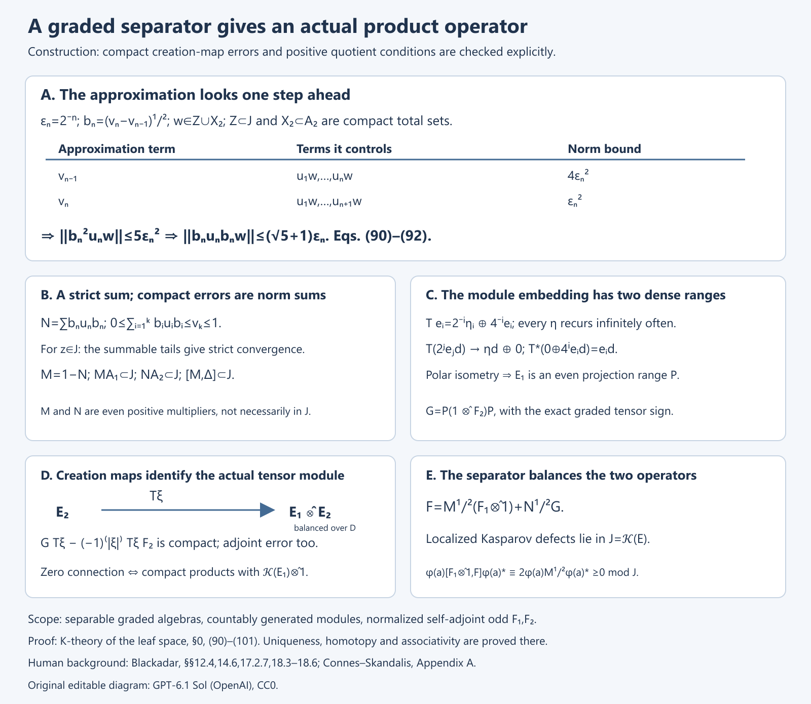

*Figure 0.1. Lemmas0.1–0.2 and Theorem0.4, equations(90)–(96). The one-step lookahead controls \(u_nw\) at both \(v_{n-1}\) and \(v_n\), giving the exact constant5 and the summable bound \(\sqrt5+1\). The module arrow is \(T_\xi:E_2\to E_1\widehat\otimes_D E_2\), with the odd lower-operator sign \((-1)^{|\xi|}\). The operator sum is strict; its tested errors converge in norm to compact operators. These are algebraic diagrams of the proved construction. Complete uniqueness, homotopy descent and associativity follow in Theorems0.6–0.9.*

Full-size PNG · Editable SVG.

In Proposition 0.15 the same diagram uses the entire represented compact algebra \(\mathcal C=\phi(B)\otimes\operatorname{span}\{1,\sigma_y\}\), not only its even part. The two homogeneous creation maps in panel D are \(\phi(b)\) and \(\phi(b)\sigma_y\). Panel B annihilates both parts through \(MA_1\subset J\); panel E gives \(F=M^{1/2}S+N^{1/2}G\) and \(\{S,F\}=2M^{1/2}\ge0\) modulo \(J\). The four explicit graded derivations and every endpoint connection are proved in that proposition.

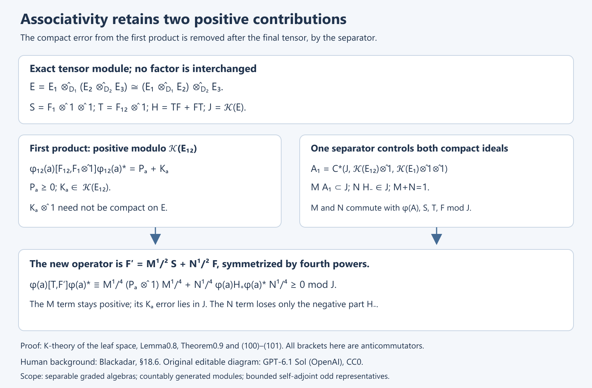

*Figure 0.2. Lemma0.8 and Theorem0.9, equations(100)–(101). Both parenthesizations use the displayed balanced tensor module, without interchanging factors. The first-product error lies in \(\mathcal K(E_{12})\); its tensor with1 need not be compact on \(E\). Including that algebra in the separator makes its \(M^{1/4}\)-sandwich compact. The positive \(M\)-term is retained, while the \(N\)-term removes \(H_-\). This proves the exact final product positivity. Exercise28 supplies the elementary infinite-dimensional tensor counterexample.*

Full-size PNG · Editable SVG.

The bounded interface now includes product existence, uniqueness, arbitrary module homotopy descent, bilinearity, associativity, units, functoriality and two-sided Morita/stability equivalence for separable graded algebras. The scalar classification, real KK Thom inverse identities and suspension Bott equivalences are proved next. The spin-c bundle KK Thom equivalence and full compact-source factorization choices are proved in Section6. Projection and compact ordinary-map/foliation composition are proved in Section6. Theorem 6.1 proves geometric-cycle descent. The longitudinal-index and geometric twisted-duality comparisons require their further arguments. Group-level Bott or trace equality alone cannot substitute for those comparisons.

### Scalar classes, real actions and suspension Bott equivalence

The remaining analytic comparison needs identities of KK classes, with both inverse products and fixed Fourier signs. The following development gives the scalar classification, the real Thom inverse and its exact Wiener–Hopf boundary. The classical foundations are due to Kasparov; the real-action argument follows the deformation method of Fack and Skandalis, explained in [Blackadar], Sections 17.5, 18.10 and 19.3. We include the operator calculations and the nonunital scalar reference.

Throughout, algebras are separable and trivially graded unless a Clifford factor is displayed. Let \(C_1\) have an odd self-adjoint generator \(\varepsilon\), with \(\varepsilon^2=1\). Fix
\[
\rho(\varepsilon\widehat\otimes1)=\sigma_x,
\qquad \rho(1\widehat\otimes\varepsilon)=\sigma_y,
\qquad \Gamma=\sigma_z=-i\sigma_x\sigma_y.
\tag{104}
\]
The ordered two-generator algebra is the graded matrix algebra on \(V=\mathbb C^{1|1}\). These choices are part of every odd–odd product below.

The stable K-theory inputs are the extension boundary maps, their exactness and homotopy invariance, and matrix stability fixed at the start of this lesson. The following argument constructs the KK classification itself.

### External coefficients and formal Clifford periodicity

**Lemma 0.13 (external coefficients and formal Clifford periodicity).**

If \((E,\phi,F)\) is a graded \(A,B\)-cycle, external tensoring with a graded algebra \(D\) gives
\[
\tau_D(E,\phi,F)=(E\widehat\otimes D,\phi\widehat\otimes1,F\widehat\otimes1).
\]
For homogeneous vectors and operators, the signs are
\[
(\xi\otimes d)(b\otimes e)=(-1)^{|d||b|}\xi b\otimes de,
\quad
\langle\xi\otimes d,\eta\otimes e\rangle
=(-1)^{|d|(|\xi|+|\eta|)}\langle\xi,\eta\rangle\otimes d^*e,
\]
\[
(R\widehat\otimes S)(\xi\otimes d)=(-1)^{|S||\xi|}R\xi\otimes Sd.
\]
They directly give the module laws and the adjoint identity. The positive completion is the minimal graded tensor product. The rank-one formula shows
\(\mathcal K(E\widehat\otimes D)=\mathcal K(E)\widehat\otimes D\): elementary rank ones span each side, with precisely the signs above. Each cycle defect tested by \(a\otimes d\) is therefore compact. Finite sums and norm closure treat every element of \(A\widehat\otimes D\). Tensoring a homotopy over \(IB\) produces a homotopy over \(I(B\widehat\otimes D)\), since the interval factor is even. Direct sums, unitaries and degenerate cycles are also preserved. Thus \(\tau_D\) is a group homomorphism.

For a finite-dimensional Clifford or matrix factor, external tensoring preserves the product. Indeed the separator and product operator may be tensored with its identity. For a creation vector \(\xi\otimes d\), the original connection errors are tensored with left multiplication by \(d\); the new error involving the lower operator is its compact graded commutator with the left coefficient. The displayed module formulas give the signs. Positive sandwiches are tensored with positive matrix corners. Uniqueness in Section 0 then identifies the two product classes. The same proof for a trivially graded finite matrix factor involves no odd sign.

The same product assertion holds for an arbitrary trivially graded external algebra \(D\), with localized rather than global compactness. The associating module map sends \((\xi\otimes d)\otimes(\eta\otimes e)\) to \((\xi\otimes\eta)\otimes de\). Connection errors for this creation vector are an original compact map tensored with multiplication by \(d\), hence compact. Defects tested by \(a\otimes d\) are original compact errors tensored with \(d\). For positivity, write the original anticommutator as its positive part minus its negative part. The negative part has compact products with the input representation, by the localized quotient positivity criterion. Testing by a finite sum \(\sum_i a_i\otimes d_i\) gives a positive sandwich plus compact entries \(\phi(a_i)H_-\phi(a_j)^*\otimes d_i d_j^*\). The positive part tensored with the multiplier identity remains positive. Norm approximation treats general inputs. This proves product preservation without claiming \(k\otimes1_D\) itself compact or assuming an exact minimal tensor product. It justifies the later external scalar calculation over a nonunital \(A\).

The map \(\tau_{C_1}\) is invertible. Applying it twice gives \(\tau_{M_2}\) under \(\rho\). Simultaneous matrix stability is an isomorphism: pull back through \(A\to A\widehat\otimes M_2\), \(a\mapsto a\otimes e_{11}\), and tensor the coefficient module with the graded \(B\widehat\otimes M_2,B\)-imprimitivity module. Both composites are identities by the two inverse identities of Lemma 0.12 and the associating tensor unitaries. Here \(e_{11}\) projects onto the even vector of \(V\). Therefore the inverse of \(\tau_{C_1}\) is its second application followed by inverse simultaneous matrix stability. This is formal Clifford periodicity; it has not used a suspension Bott theorem.

Define \(KK^1(A,B)=KK(A,B\widehat\otimes C_1)\). An odd–odd product first applies \(\tau_{C_1}\) to the second class, forms the graded product over \(B\widehat\otimes C_1\), then reduces the ordered coefficient \(C_1\widehat\otimes C_1\) by \(\rho\) and \(V\). Homomorphism and matrix-Morita classes are even. The coherence needed for naturality and associativity can be seen explicitly on three generators. In \(C_3\), put \(B=e_1e_2+e_2e_3+e_3e_1\) and \(w=(1-B)/2\). The Clifford relations give \(B^2=-3\), hence \(ww^*=1\), and multiplication gives \(we_1w^*=e_2\), \(we_2w^*=e_3\), \(we_3w^*=e_1\). It is joined to the identity by the even unitary path \(w_v=\cos(\pi v/3)-(B/\sqrt3)\sin(\pi v/3)\), \(0\le v\le1\). The odd central generator \(\omega=-ie_1e_2e_3\) is unchanged by that cycle. Reducing either consecutive pair by the fixed \(V\)-Morita module leaves precisely this same \(\omega\) as the remaining Clifford generator. The two reductions are therefore intertwined by an even unitary, not a grading reversal. This proves the coherence of simultaneous two-generator Morita reduction with an extra Clifford factor. Combining it with the associating tensor unitaries and Section 0 associativity proves naturality and associativity of the parity products. Clifford order is retained until the indicated even cyclic transport is applied; an odd permutation is never silently made.

### Scalar classification through the stable corona

**Theorem 0.14 (scalar KK classification).**

Let \(H_B=\ell^2\otimes B\), \(J=\mathcal K(H_B)=B\otimes\mathcal K\), \(M=\mathcal L(H_B)=M(J)\), and \(Q=M/J\). Write \(q:M\to Q\).

First \(K_0(M)=K_1(M)=0\). To see the actual swindle, identify \(H_B\) with a countable direct sum of copies of itself. For a projection \(p\) over \(M\), the strict diagonal sum \(P=p\oplus p\oplus\cdots\) is a multiplier projection. Reindexing the summands makes \(P\) equivalent to \(p\oplus P\). Hence \([P]=[p]+[P]\), so \([p]=0\). For a multiplier unitary \(u\), its strict infinite diagonal \(U\) satisfies the same reindexing identity \([U]=[u]+[U]\) in \(K_1(M)\). Unitary conjugation does not change a stable \(K_1\)-class, by the two-by-two rotation homotopy. Thus \([u]=0\). Finite matrices cause no change because the same reindexing works on a finite direct sum. Exactness of the stable corona extension now gives isomorphisms
\[
\partial_0:K_1(Q)\longrightarrow K_0(J),
\qquad
\partial_1:K_0(Q)\longrightarrow K_1(J).
\]

For a \(\mathbb C,B\)-cycle, \(P=\phi(1)\) is an even projection. Replace \(F\) by \(PFP\); its difference from \(F\), tested by \(P\), is compact. The complementary zero representation is degenerate and contracts. On \(PE\), \(\phi\) is scalar multiplication. Normalize \(F\) to a self-adjoint contraction. Add the degenerate unital cycle \((H_B\oplus H_B^{\rm op},1,\sigma_x)\), and stabilize the even and odd summands separately. The result has the form
\[
(H_B\oplus H_B^{\rm op},1,F_T),\qquad
F_T=\begin{pmatrix}0&T^*\\ T&0\end{pmatrix},
\quad T^*T-1,\ TT^*-1\in J.
\]
Its corona image \(q(T)\) is unitary. Conversely every unitary over \(Q\) has an operator lift, which gives such a cycle after normalization. Define its index by \(\partial_0[q(T)]\).

For clarity, the boundary convention is the ordinary Fredholm index. If \(T\) is a contraction, put \(C=1-T^*T\), \(D=1-TT^*\). The intertwining identity \(T C^{1/2}=D^{1/2}T\), first for polynomials and then by uniform functional calculus, makes
\[
U_T=\begin{pmatrix}T&D^{1/2}\\ C^{1/2}&-T^*\end{pmatrix}
\]
unitary. Its first-column projection is
\[
P_T=\begin{pmatrix}TT^*&TC^{1/2}\\ C^{1/2}T^*&C\end{pmatrix},
\qquad \partial_0[q(T)]=[P_T]-[\operatorname{diag}(1,0)].
\]
The difference is compact. For a coisometry with kernel projection \(p\), this is \([\operatorname{diag}(1,p)]-[\operatorname{diag}(1,0)]=[p]\). For an isometry with cokernel projection \(r\), it is \(-[r]\). These computations fix the sign.

Norm homotopy and stable unitary equivalence of corona unitaries give equivalent KK cycles. A continuous path in a Banach-space quotient has a continuous lift with specified endpoint lifts: approximate it by a polygonal path, lift the finitely many vertex values with the open-mapping norm bound, and lift successive polygonal corrections with geometrically decreasing uniform norms. Their uniformly convergent sum is the desired lift. If the endpoint residuals vanish, choose zero lifts there. Applying this to the operator quotient lifts unitary paths to Fredholm paths; the lifts themselves need not be unitary. Adding an identity unitary adds a degenerate cycle. A multiplier unitary is degenerate; its corona \(K_1\)-class is zero by the swindle. Independent even and odd changes of stabilization change \(q(T)\) by multiplier unitary factors, whose classes are also zero. It follows that the classes modulo operator homotopy and degenerates are exactly \(K_1(Q)\).

This also treats arbitrary Hilbert-module homotopies. Perform the same compression and stabilization on a single homotopy module over \(IB=C([0,1],B)\). Its index belongs to \(K_0(IB)\). Evaluation of the relative projection formula gives the two endpoint indices. The evaluation maps \(K_0(IB)\to K_0(B)\) agree by stable K-theory homotopy invariance. Thus a general KK homotopy cannot identify distinct indices. Since every index is already attained modulo operator homotopy, the full classification is
\[
\Theta_0:KK(\mathbb C,B)\xrightarrow{\cong}K_0(B).
\tag{105}
\]
For \(B=\mathbb C\), this is the usual integer Fredholm index; a finite even scalar module with zero operator has positive dimension. In particular \(KK(\mathbb C,\mathbb C)=\mathbb Z\), with its identity class corresponding to \(+1\).

The odd argument is equally explicit. In a graded Hilbert \(B\widehat\otimes C_1\)-module, multiplication on the right by the central unitary \(\varepsilon\) identifies the even and odd summands. The even inner products lie in \(B\); this identifies the whole module with its even part externally tensored with \(C_1\). A right-module-linear odd operator is consequently of the form \(s\varepsilon\). After compression and stabilization an odd scalar cycle is \((H_B\widehat\otimes C_1,1,s\widehat\otimes\varepsilon)\), where \(s=s^*\), \(\|s\|\le1\), and \(s^2-1\in J\). Its image defines the corona projection \(p=(1+q(s))/2\). Self-adjoint lifts of projection paths give cycle paths by the quotient-lifting argument. Degenerate cycles lift actual multiplier projections, whose \(K_0\)-classes vanish. Replacing \(s\) by \(-s\) replaces \(p\) by \(1-p\); since \([1_Q]=0\), this is the group inverse. Every difference of corona projection classes is attained by a direct sum, using this complement. The same construction over \(IB\) proves invariance under all module homotopies. Consequently
\[
\Theta_1:KK^1(\mathbb C,B)\xrightarrow{\cong}K_1(B),
\qquad
\Theta_1[s\varepsilon]
=[\exp(\pi i(s+1))].
\tag{106}
\]
The exponential is a unitary in \(1+J\), since its quotient is one. This is the positive exponential boundary convention. All matrix stabilizations are absorbed by stable K-theory. On a nonunital algebra one uses the scalar reference in its unitization; the relative projection and unitary formulas above keep that reference explicitly.

Naturality can be checked without assuming that a homomorphism extends to the multiplier algebra. Represent a relative \(K_0\)-class by projections \(p,p_0\) over \(B^+\), with the same scalar reference, and use the quasihomomorphism cycle with representations \(p,p_0\) and off-diagonal identity on \(B^n\oplus(B^n)^{\rm op}\). Its compressed Fredholm operator is \(p_0p:pB^n\to p_0B^n\), and the relative boundary calculation above gives \([p]-[p_0]\). Coefficient extension replaces both projections by their images under the unital extension \(g^+:B^+\to(B')^+\), so it gives the usual relative \(K_0\)-map. For an odd scalar cycle on a general module \(E\), its unitary \(\exp(\pi i(s+1))\) differs from identity by an element of \(\mathcal K(E)\). Stabilization embeds that compact algebra as rank-one matrices over \(B\); coefficient extension replaces their entries by their images under \(g\), as in the compact-preservation proof of Corollary 0.11. The unital extension of this compact-algebra map sends the unitary to identity plus that image, and continuous functional calculus commutes with the map. Its action on the essential extended module is exactly the exponential of the extended cycle; adding the identity on the standard module is the same stable compact-unitary class. Finite matrix approximations give precisely the usual \(K_1\)-map. This uses compact matrices rather than an extension on all adjointable multipliers. Hence \(\Theta_i\) are natural also for degenerate coefficient homomorphisms. No multiplier extension of such a homomorphism has been asserted.

### A complete bounded scalar odd-pairing calculation

**Proposition 0.15 (the bounded scalar odd pairing).**

Let \(B\) be as above, \(s=s^*\in M(B)\), \(\|s\|\le1\), \(s^2-1\in B\). This gives \(x=(B\widehat\otimes C_1,1,s\varepsilon)\in KK^1(\mathbb C,B)\). Let \(\phi:B\to\mathcal B(H)\) be nondegenerate and let \(r=r^*=r^{-1}\), with \([r,\phi(b)]\) compact for all \(b\). Set \(P=(1+r)/2\); it defines the odd cycle \(y=(H\widehat\otimes C_1,\phi,r\varepsilon)\). Here an honest involution is part of the scope; normalization of an arbitrary odd cycle has not been silently assumed.

Under the fixed Clifford reduction, the tensor module is \(H\oplus H^{\rm op}\), the first operator is \(S=\phi(s)\sigma_y\), and a lower connection is \(G=r\sigma_x\). For example, the input odd generator acts by \(\sigma_y\), which anticommutes with \(\sigma_x\). For a vector whose coefficient is \(b\), the remaining connection error is a matrix entry of \([r,\phi(b)]\), hence compact. Nondegeneracy identifies the tensor module with all of \(H\oplus H^{\rm op}\).

Write \(t=(1-s^2)^{1/2}\in B\), \(T=\phi(t)\otimes1\), and
\[
L=S+TG.
\]
This need not itself be a lower connection. We prove that its cycle represents the product by an actual homotopy to one. Its adjoint defect is \([T,G]\), which is compact. The graded anticommutator \(Z=SG+GS\) has compact products with \(\phi(B)\): its entries are scalar multiples of \([r,\phi(s)]\), and
\[
[r,\phi(s)]\phi(b)=[r,\phi(sb)]-\phi(s)[r,\phi(b)]
\]
is compact. The analogous left product is compact by adjoints. In particular \(TZ\) is compact, and \([T,G]\) is compact. Since \(S^2+T^2=1\), this gives \(L^2-1\) compact. Symmetrizing changes \(L\) only by a compact operator, so it is a scalar Kasparov cycle.

Apply the separator on \(E=H\oplus H^{\rm op}\), with \(J=\mathcal K(E)\), to
\[
\mathcal C=\phi(B)\otimes\operatorname{span}\{1,\sigma_y\},\qquad
A_1=C^*(J,\mathcal C),\qquad A_2=C^*(Z),\qquad
\Delta=\operatorname{span}\{S,G\}.
\]
Here \(\mathcal C\) is the full represented algebra \(\mathcal K(B\widehat\otimes C_1)\widehat\otimes1\), after the fixed finite Clifford reduction: \(\phi(b)\) is even and \(\phi(b)\sigma_y\) is odd. Nondegeneracy extends \(\phi\) to the multiplier algebra, so the following formulas apply to \(s\in M(B)\). For every \(b\in B\),
\[
\begin{aligned}
[S,\phi(b)]_{\rm gr}&=\phi(sb-bs)\sigma_y,
&[S,\phi(b)\sigma_y]_{\rm gr}&=\phi(sb+bs),\\
[G,\phi(b)]_{\rm gr}&=[r,\phi(b)]\sigma_x,
&[G,\phi(b)\sigma_y]_{\rm gr}&=[r,\phi(b)]\sigma_x\sigma_y.
\end{aligned}
\]
Thus \(S\) derives \(\mathcal C\) into itself, \(G\) derives it into \(J\), and both derive \(J\) into itself. The localized commutator identity above and its adjoint imply that both \(\phi(b)Z\) and \(\phi(b)\sigma_yZ\) are compact, as is \(JZ\). Products, adjoints and norm closure give \(A_1A_2\subset J\). These graded algebras are separable in the countably generated cycle scope, so all separator hypotheses hold. Obtain even positive \(M,N\) with \(M+N=1\), \(MA_1\subset J\), \(NZ\in J\), and \([M,S],[M,G]\in J\). Since \(T\in\mathcal C\), both \(MT\) and \(TM\) are compact; hence \(M,N\) also commute with \(T\) modulo \(J\). Continuous functional calculus with zero constant term gives \(M^{1/2}A_1\subset J\) and \(N^{1/2}Z\in J\).

For \(0\le u\le1\), put
\[
D_u=uM+(1-u)1,\qquad C_u=uN+(1-u)T^2,\qquad
L_u=D_u^{1/2}S+C_u^{1/2}G.
\]
The coefficients are even positive contractions and norm continuous. In the quotient \(\mathcal L(E)/J\), they commute with each other and with \(S,G,T\). Since \(S^2+T^2=1\), \(G^2=1\), \(MT^2\in J\), \(NZ\in J\), and \(T^2Z\in J\),
\[
D_uS^2+C_uG^2-1=uM(S^2-1)=0,\qquad
C_uZ=uNZ+(1-u)T^2Z=0
\]
in that quotient. Polynomial approximation to the square root by polynomials vanishing at zero gives \(C_u^{1/2}Z=0\) there. The cross term in \(L_u^2\) is therefore zero, and each \(L_u\) is self-adjoint modulo \(J\) with unit square there. Symmetrizing gives a norm-continuous path of odd self-adjoint scalar cycles. Its defects are continuous \(J\)-valued functions, hence compact on the single homotopy module \(C([0,1],E)\). At zero it is the symmetrization of \(L\).

We verify the other endpoint on every homogeneous creation vector, retaining the odd coefficient part. After the same finite reduction, the lower operator is \(G\), and the creation map for \(\xi=b\) or \(b\varepsilon\) is respectively \(T_\xi=\phi(b)\) or \(\phi(b)\sigma_y\). In both cases \([G,T_\xi]_{\rm gr}\in J\), \(ST_\xi\in\mathcal C\), and \((N^{1/2}-1)T_\xi\in J\); the last assertion uses the function \(\sqrt{1-v}-1\), which vanishes at \(v=0\), and \(MA_1\subset J\). Thus, before its compact symmetrization, \(F=L_1=M^{1/2}S+N^{1/2}G\) satisfies
\[
FT_\xi-(-1)^{|\xi|}T_\xi G
=M^{1/2}ST_\xi+(N^{1/2}-1)GT_\xi
 +[G,T_\xi]_{\rm gr}\in J.
\]
Indeed commute \(G\) past \(T_\xi\) in the middle term; its error is compact and its remaining factor \((N^{1/2}-1)T_\xi\) is compact. Adjoints prove the other creation-map test, and compact symmetrization preserves both tests. The first-operator positivity is
\[
\{S,F\}\equiv2M^{1/2}S^2+N^{1/2}Z
\equiv2M^{1/2}\ge0\pmod J,
\]
because \(M^{1/2}T^2\) and \(N^{1/2}Z\) are compact. The scalar left representation gives every required positive sandwich. Definition 0.3 and the fixed finite product-preserving reduction of Lemma 0.13 therefore identify this endpoint with \(x\widehat\otimes_B y\). The homotopy proves \([L]=x\widehat\otimes_B y\) for arbitrary separable noncommutative, nonunital \(B\) in the stated cycle scope.

Now put \(v=t+is\). It is unitary, and \(v^2\in B^+\) has scalar value \(-1\). In the decomposition \(H=PH\oplus(1-P)H\), write
\[
\phi(v)=\begin{pmatrix}a&b\\ c&d\end{pmatrix}.
\]
The lower even-to-odd block of \(L\) is
\[
A=\phi(t)r+i\phi(s)
=\begin{pmatrix}a&-b'\\ c&-d'\end{pmatrix},
\]
where \(b',d'\) are the upper-right and lower-right entries of \(\phi(v^*)\). This follows by adding the blocks, not by treating \(s\) as compact. Multiplication on the left by the unitary \(\phi(v)\) leaves the Fredholm index unchanged. The identities \(\phi(v)^2=\phi(v^2)\) and \(\phi(v)\phi(v^*)=1\) give
\[
\phi(v)A=\begin{pmatrix}P\phi(v^2)P&0\\ k&-1\end{pmatrix},
\quad k=(1-P)\phi(v^2)P\text{ compact}.
\]
The compactness follows because \(v^2+1\in B\), whereas the off-diagonal entries of \(\phi(v)\) alone need not be compact. Removing \(k\) by a compact perturbation proves
\[
\Theta_0(x\widehat\otimes_B y)
=\operatorname{Index}(P\phi(v^2)P).
\]
Finally \(-v^2=\exp(i(2\arcsin s+\pi))\) is joined to \(\exp(\pi i(s+1))\) by interpolating these two real phases. At \(s=\pm1\), both phases agree modulo \(2\pi\); every unitary on this path lies in \(1+B\). The scalar rotation from \(v^2\) to \(-v^2\) also preserves the compression index. Therefore the exact formula is
\[
\Theta_0(x\widehat\otimes_B y)
=\operatorname{Index}\bigl(P\phi(\exp(\pi i(s+1)))P\bigr).
\tag{107}
\]
No appeal to a general extension–KK classification is needed for this bounded calculation.

### The physical scalar test

**Lemma 0.16 (the scalar dual product and its sign).**

Set \(B=C_0(\mathbb R_p)\), \(s(p)=p/\sqrt{1+p^2}\), \(\phi(b)=M_b\) on \(L^2(\mathbb R_p)\), and \(r=\operatorname{sign}D_p\), where \(D_p=-i\partial_p\). The commutator with a smooth compactly supported \(b\) has kernel a constant multiple of
\((b(p)-b(q))/(p-q)\). It is Hilbert–Schmidt: near the diagonal use the bounded derivative and compact support; away from it use \(|p-q|^{-2}\) after squaring, with one variable in a fixed compact set. Density extends compactness to \(C_0\). Thus the odd cycle satisfies Proposition 0.15.

The exponential of Theorem 0.14 has positive winding. Its phase increases from zero to \(2\pi\), so it is homotopic in \(1+C_0(\mathbb R)\) to
\[
u_+(p)=\frac{p-ia}{p+ia},\qquad a>0.
\]
To compute its compression to \(P=(1+\operatorname{sign}D_p)/2\), Fourier transform in \(p\) with phase \(e^{-itp}\). Then \(P\) is multiplication by \(1_{t\ge0}\). Multiplication by \(u_+\) becomes
\[
(S_a f)(t)=f(t)-2a\int_0^t e^{-a(t-r)}f(r)\,dr,
\qquad t\ge0.
\]
The transform follows by closing the contour in the lower half-plane for \(t>0\); the pole of \((p+ia)^{-1}\) is \(-ia\). Direct kernel integration gives
\[
S_a^*S_a=1,
\qquad S_aS_a^*=1-E_a,
\qquad E_a(t,r)=2a e^{-a(t+r)}.
\tag{108}
\]
The vector \(\sqrt{2a}\,e^{-at}\) has norm one, so \(E_a\) is a rank-one projection. The index is therefore \(-1\), not an unspecified nonzero integer. Proposition 0.15 proves that the ordered scalar product for the phase and Clifford conventions fixed here is \(-1\).

For the real group algebra, the physical transform is
\(\widehat f(p)=(2\pi)^{-1/2}\int e^{-ipt}f(t)\,dt\), and \(U_s=e^{-isp}\). The dual action in the public lesson is
\(\widehat\alpha_q(U_s)=e^{iqs}U_s\); on the scalar algebra it is \(b(p)\mapsto b(p-q)\). Its crossed product acts on \(L^2(\mathbb R_p)\) by multiplication and translations, and its Thom generator is \(D_p\). Thus the calculation above is the scalar trivial-action/dual-action product in precisely these conventions. The two minus signs in the eventual two-sided inverse must be justified by this calculation, rather than importing a formula written in a different Fourier convention.

### The real Thom cycle, naturality and inner-action transport

**Lemma 0.17 (the real Thom cycle and its naturality).**

Let \(\alpha\) be a pointwise norm-continuous real action on \(A\), and put \(C_\alpha=A\rtimes_\alpha\mathbb R\). Use Lebesgue measure and the public physical convention \(U_s=e^{-isD_\alpha}\). The integrated group representation is a nondegenerate homomorphism \(C_0(\mathbb R)\to M(C_\alpha)\), because scalar approximate identities in the group convolution algebra act as an approximate identity on its dense \(A\)-valued convolution algebra. It extends to bounded continuous spectral functions. Set
\[
h(z)=z(1+z^2)^{-1/2},\qquad
t_\alpha=(C_\alpha\widehat\otimes C_1,\iota_A,h(D_\alpha)\varepsilon)
\in KK^1(A,C_\alpha).
\tag{109}
\]
The square defect tested by \(a\) belongs to \(C_\alpha\), since \(h^2-1\in C_0(\mathbb R)\), and \(a\psi(g)\) is an algebra element for \(g\in C_0(\mathbb R)\). The latter follows first for integrated \(L^1\) kernels, then by their dense uniform Fourier approximations.

Here is a direct compact-commutator proof. The bounded real function
\[
f(z)=\frac2\pi\int_0^1\frac{\sin(sz)}s\,ds
\]
has limits \(\pm1\) at \(\pm\infty\), by integration by parts for the sine-integral tail. Thus \(f-h\in C_0(\mathbb R)\). Its group distribution is \(i/(\pi s)\) on \(|s|\le1\), in the negative-phase convention. If \(a\) is differentiable for the action, then
\[
[f(D_\alpha),a]
=\int_{-1}^1\frac{i}{\pi s}(\alpha_s(a)-a)U_s\,ds.
\]
The apparent singularity has norm at most the action derivative norm divided by \(\pi\). The integral is an \(L^1(\mathbb R,A)\) element of \(C_\alpha\). To justify the distributional formula, cut out \(|s|<\epsilon\), compute the ordinary integrated commutator, and pass to the norm limit on the right. On the left the cutoffs converge strongly in every covariant Hilbert-space representation, by the bounded sine integrals and spectral dominated convergence. Consequently they identify the displayed algebra element with the commutator. Adding \(f-h\) preserves algebra membership. Action-smooth elements are norm dense: convolution of the orbit map with a compact smooth approximate identity gives such elements. The uniform bound \(\|[h(D),a]\|\le2\|h\|\|a\|\) extends the conclusion to all \(a\). Hence \(t_\alpha\) is a Kasparov cycle. Any other bounded continuous real normalizing function with the same limits differs by \(C_0\), so gives the same class by a localized compact perturbation.

For an equivariant homomorphism \(g:(A,\alpha)\to(A',\alpha')\), including a degenerate one, the induced map \(G:C_\alpha\to C_{\alpha'}\) is defined on convolution kernels coefficientwise. Its coefficient-extension module is
\[
J_g=\overline{G(C_\alpha)C_{\alpha'}}
=\overline{g(A)C_{\alpha'}}.
\]
For the equality, group approximate identities approximate every coefficient product, and \(U_sC_{\alpha'}=C_{\alpha'}\) shows the reverse inclusion. This right ideal is invariant under the group multipliers and their adjoints by equivariance. Therefore the extended spectral calculus agrees there with the restriction of \(h(D_{\alpha'})\). Its localized defects are in \(G(C_\alpha)\), not merely in the ambient multiplier algebra; the commutator formula above and the \(C_0\) approximation prove this on a dense set and then by closure. This also proves compactness as maps with range in \(J_g\): elements of \(G(C_\alpha)\) lie in \(\overline{J_gJ_g^*}=\mathcal K(J_g)\), using its own approximate identity. Viewed as maps from the ambient right module into \(J_g\), their rank-one approximations have first vectors in \(J_g\). Thus the restricted operator is a lower connection for the essential representation of \(A\) through \(g\). Lemma 0.10, followed by the localized compact-perturbation path, identifies it with the full pullback cycle. We have proved
\[
G_*t_\alpha=g^*t_{\alpha'}.
\]
No extension of a degenerate \(g\) to the full multiplier algebra has been used.

Tensoring with a trivially graded matrix algebra or compact algebra gives \(t_{\alpha\otimes1}=\tau(t_\alpha)\): on the dense convolution core the crossed-product identification is coefficientwise, with the same group unitaries and spectral calculus. Compact algebra stability follows by increasing finite corners and the even Morita unitary of Lemma 0.12.

We also need an explicit inner-action transport. Let \(W_s\) be a strongly continuous unitary group on a separable Hilbert space \(H\), and
\[
\gamma_s=\alpha_s\otimes\operatorname{Ad}W_s
\quad\text{on }A\otimes\mathcal K(H).
\]
The crossed-product isomorphism with \(C_\alpha\otimes\mathcal K(H)\) sends the group multiplier to \(U_s\otimes W_s\) and the coefficient to its usual inclusion. Its inverse uses \(U_s\otimes W_s^*\); the covariance and integrated products check both maps on the dense convolution core. For \(0\le u\le1\), use \(W_{us}\). These groups are jointly strictly continuous on the compact-operator coefficient algebra. They define a single nondegenerate covariant representation on \(I(C_\alpha\otimes\mathcal K(H))\), hence a spectral homomorphism \(C_0(\mathbb R)\to M(I(C_\alpha\otimes\mathcal K(H)))\). Extending it to \(h\) gives a single adjointable operator over the interval; separate norm continuity of the unbounded generators is not being assumed.

The same commutator proof applies uniformly on this compact parameter interval. Smooth a coefficient by orbit convolution for the interval action \(\gamma^u\); this gives norm-dense coefficients with uniformly bounded action derivative. The localized square defect and commutator are therefore in the interval algebra. We obtain a Kasparov homotopy between the transported \(t_\gamma\) and \(\tau_{\mathcal K(H)}t_\alpha\). This proves the required inner-action transport with its direction fixed.

### Both real KK inverse identities

**Theorem 0.18 (both real KK Thom inverse identities).**

Use the positive dual phase already fixed in Theorem 8.6:
\[
\widehat\alpha_q(U_s)=e^{iqs}U_s.
\]
Let \(m_A\) be the even Takai imprimitivity class from \(C_\alpha\rtimes_{\widehat\alpha}\mathbb R\cong A\otimes\mathcal K\) to \(A\). Define
\[
u_\alpha=t_\alpha\widehat\otimes_{C_\alpha}t_{\widehat\alpha}
\widehat\otimes m_A\in KK(A,A).
\]
This is independent of \(\alpha\). To prove it, act on \(IA\) by
\
[\beta_s(a)=\alpha_{vs}(a(v)).
\]
Joint continuity follows from pointwise continuity uniformly on the compact image of a continuous coefficient function, using a finite approximation to that image. Evaluation \(e_v\) is equivariant to \(\alpha^{v}_s=\alpha_{vs}\); the resulting single and double crossed-product maps are \(G_v,H_v\). The explicit kernel construction of Theorem 8.6 shows that double Takai sends \(H_v\) to \(e_v\otimes1_{\mathcal K}\): each kernel coefficient is evaluated at \(v\). These endpoint homomorphisms are homotopic. Product naturality from Section 0 and Lemma 0.17 gives, before the final even Morita reduction,
\[
(H_v)_*(t_\beta\widehat\otimes t_{\widehat\beta})
=e_v^*(t_{\alpha^v}\widehat\otimes t_{\widehat{\alpha^v}}).
\]
Both sides lie in \(KK(IA,A\otimes\mathcal K)\). Their endpoint values agree because \(H_0,H_1\) are homotopic. Pull back by the constant inclusion \(c:A\to IA\), for which \(e_vc=1_A\), and apply the same even Morita class. This proves \(u_\alpha=u_\iota\), with \(\iota\) the trivial action. There has been no assertion that the single crossed-product endpoint evaluations are KK-equivalences.

For the trivial action, tensor the scalar computation Lemma 0.16 with \(1_A\). The scalar second cycle can be replaced by \(\operatorname{sign}D_p\): \(\operatorname{sign}z-h(z)\) is in \(L^2(\mathbb R)\) and tends to zero at infinity; multiplication by a compactly supported \(b(p)\) followed by that Fourier multiplier is Hilbert–Schmidt. Approximation treats every \(b\in C_0\). Thus the replacement is a localized compact perturbation of the actual dual Thom cycle. The computed integer is \(-1\), and its external product is the negative identity class, not just its action on K-groups. Hence
\[
u_\alpha=-1_A
\quad\text{for every action }\alpha.
\tag{110}
\]

Set
\[
d_\alpha=-t_{\widehat\alpha}\widehat\otimes m_A
\in KK^1(C_\alpha,A).
\]
We immediately obtain \(t_\alpha\widehat\otimes d_\alpha=1_A\). For the other order, apply the same proved equality \(u=-1\) to the action \(\widehat\alpha\) on \(C_\alpha\). Under Takai the double-dual action is, with the lesson's signs,
\[
\widehat{\widehat\alpha}_v
=\alpha_v\otimes\operatorname{Ad}T_{-v}.
\]
Here \(T_s\xi(t)=\xi(t-s)\); this identity is exactly the coefficient and group-multiplier calculation in Theorem 8.6. The inner-action transport Lemma 0.17 identifies its Thom class with \(t_\alpha\otimes1_{\mathcal K}\) under the fixed exterior-equivalence isomorphism. Even matrix/compact Morita naturality says that composing this stabilized class with \(m_{C_\alpha}\) equals first composing with \(m_A\) and then with \(t_\alpha\). This can also be checked by the elementary tensor unitary \((\xi\otimes k)\otimes\eta\mapsto\xi\otimes k\eta\); both even imprimitivity products are identities. Consequently the equality for \(\widehat\alpha\) is
\[
(t_{\widehat\alpha}\widehat\otimes m_A)
\widehat\otimes_A t_\alpha=-1_{C_\alpha}.
\]
Multiplying by the indicated minus sign proves the full pair of identities
\[
t_\alpha\widehat\otimes_{C_\alpha}d_\alpha=1_A,
\qquad
d_\alpha\widehat\otimes_A t_\alpha=1_{C_\alpha}.
\tag{111}
\]
Both are identities of KK classes. Applying scalar K-theory is not used to infer either identity. The normalizing function and the real group orientation are fixed; reversing the group orientation negates the odd class.

### Identification with the actual Wiener–Hopf boundary in both degrees

**Theorem 0.19 (the actual Wiener–Hopf boundary in both degrees).**

On the physical regular Hilbert \(A\)-module \(\mathcal H_A=L^2(\mathbb R_t)\otimes A\), use
\[
(\pi(a)\xi)(t)=\alpha_{-t}(a)\xi(t),
\qquad U_s\xi(t)=\xi(t-s),
\qquad V_q\xi(t)=e^{iqt}\xi(t).
\]
The double Takai algebra is \(\mathcal K(\mathcal H_A)\) by Theorem 8.6. Since the spectral convention is negative phase, the Stone generator of \(V_q\) is \(-t\), not \(t\). Its transported dual Thom cycle has operator \(h(-t)\), and its negative class has operator \(h(t)\). Put \(P_+=1_{t\ge0}\). The difference between \(h(t)\) and \(2P_+-1\) gives localized compact operators against \(\pi(C_\alpha)\). For a compact smooth group kernel, truncate to \(|t|\le R\); its other kernel variable then lies in a bounded set, so finite-rank \(A\)-valued kernel approximations prove compactness. The omitted part has norm bounded by the supremum of \(|h(t)-\operatorname{sign}t|\) on \(|t|>R\), times the convolution norm. The jump at zero is handled by \(L^2\) approximation on the bounded rectangle, with the integral-kernel norm bound. Density of the convolution core treats every algebra element and adjoints treat the other side. Thus
\[
d_\alpha=[(\mathcal H_A,\pi,(2P_+-1)\varepsilon)].
\tag{112}
\]
Directly, \([P_+,\pi(c)]\) is compact: the crossing kernel for a group kernel of support \([-R,R]\) has \(t,r\) of opposite signs and \(|t-r|\le R\), hence both variables bounded. Its smooth coefficient kernel has finite-rank \(A\)-module approximations; characteristic half-interval factors lie in \(L^2\) and cause no difficulty. The square defect is zero.

This compression is the Busby map of the exact Wiener–Hopf extension of Theorem 8.7, with the previously fixed positive boundary sign. Indeed represent its coefficient \(F\) by \(\alpha_{-t}(F(t))\) and its group generator by the same \(U_s\). For a lift \(F(t)=\chi(t)a\), with \(\chi\) zero sufficiently far to the left and one sufficiently far to the right, the integrated lift differs from \(P_+\pi(c)P_+\) by a compact kernel: \(\chi-P_+\) is supported on a bounded interval, and the crossing error is the one just proved compact. The ideal representation is precisely \(\mathcal K(\mathcal H_A)\), by the translation kernel proof of Lemma 8.5. Thus the quotient Busby map is
\[
\tau(c)=q(P_+\pi(c)P_+).
\]
Checking the lifts on the dense convolution core determines the extension on its norm completion. There is no use of an abstract Ext–KK classification to identify it.

For \(K_1(C_\alpha)\), represent a scalar odd class by \(s\varepsilon\) as in Theorem 0.14, stabilized if needed. Formula Proposition 0.15 says that product with \(d_\alpha\) is the Fredholm index of the Busby lift of its positive-exponential unitary. This is exactly the ordinary index connecting map of the Wiener–Hopf extension. Its coisometry defect has positive sign, as fixed in Theorem 0.14 and Corollary 8.10.

For \(K_0(C_\alpha)\), let \(p\) be a projection over its unitization and subtract its scalar reference \(p_0\). Extend the compression cycle to the unitization by the identity representation; its operator is an actual involution, so this is a legitimate cycle. Compute the two finite projection products over that unital input, and then subtract. Naturality identifies the resulting relative product with the original class over \(C_\alpha\). Individual projection cycles with nonzero scalar reference have not been asserted compact over the nonunital algebra. On \(p\mathcal H_A^n\), the compressed operator \(p(2P_+-1)p\) is a connection and is a product with the finite projection cycle: its localized square defect is compact by \([p,P_+]\in\mathcal K\), and positivity for the first zero operator is automatic. Theorem 0.14 sends this odd class to
\[
\exp(2\pi i pP_+p)\text{ on }p\mathcal H_A^n,
\]
extended by identity on its complement. The Wiener–Hopf exponential boundary instead uses \(\exp(2\pi iP_+pP_+)\) on \(P_+\mathcal H_A^n\). These unitaries give the same stable \(K_1\)-class, as follows by a concrete relative matrix argument.

On the full regular module write \(X=pP_+\), \(Y=P_+p\) and
\(k(z)=(e^{2\pi iz}-1)/z\), extended by \(k(0)=2\pi i\). Then
\[
a=X,\quad b=Yk(XY),\quad
1+ab=e^{2\pi i pP_+p},\quad
1+ba=e^{2\pi iP_+pP_+}.
\]
In the corona, \(p\) and \(P_+\) commute, so \(q(X)=q(Y)=q(XY)\) is a projection. Since \(k(1)=0\), it follows that \(b\) is compact. The intertwining identity \(k(XY)X=Xk(YX)\) follows from polynomials and uniform functional calculus. For any multiplier \(a\) and compact \(b\), with \(1+ab\) invertible, the exact elementary factorization
\[
\begin{pmatrix}1+ab&0\\0&(1+ba)^{-1}\end{pmatrix}=
\begin{pmatrix}1&a\\0&1\end{pmatrix}
\begin{pmatrix}1&0\\b&1\end{pmatrix}
\begin{pmatrix}1&-a(1+ba)^{-1}\\0&1\end{pmatrix}
\begin{pmatrix}1&0\\-b(1+ab)&1\end{pmatrix}
\tag{113}
\]
has zero relative \(K_1\)-class. To verify the last assertion, group the first two factors and the inverse of the first as a conjugate of a compact elementary matrix, contracted by \(b\mapsto ub\). The remaining upper factor has compact entry \(a-a(1+ba)^{-1}\); the lower factor is also compact elementary. Each contracts within identity plus compacts. Thus \([1+ab]=[1+ba]\). Polar normalization converts these invertible paths to unitary paths without changing their endpoints' \(K_1\)-classes. The scalar reference \(p_0\) commutes with \(P_+\), and both of its exponentials are identity, so the relative subtraction is respected.

This proves that product with \(d_\alpha\) is the Wiener–Hopf connecting map in both degrees. The two KK inverse identities of Theorem 0.18 consequently identify product with \(t_\alpha\) with the actual group-level Thom map already proved in Section 8. At the trivial action, \(\Theta_1(t_\iota)\) has positive winding and is \([u_+]\). Its physical half-line lift is the coisometry of Corollary 8.10. The first scalar dual product is \(-1\) because the positive dual phase uses the opposite physical half-line; the minus sign in \(d_\alpha\) is therefore necessary and now explained by exact operators.

These are analytic real-action interfaces. The spin-c vector-bundle KK Thom theorem is proved in Theorem 6.0c and Corollary 6.0d, and the compact ordinary embedding comparisons in Lemma 6.0e and Theorem 6.0f. Theorem6.0o proves compact-source foliation wrong-way factorization independence. Theorems6.0s/6.0w prove the required projection and compact ordinary-map/foliation composition. Theorem 6.1 proves geometric-cycle descent. The full longitudinal topological index theorem and subsequent assembly comparisons require further arguments.

### Both suspension Bott inverse products

**Corollary 0.20 (both suspension Bott inverse products).**

Write \(S=C_0(\mathbb R)\) with its positive physical cotangent coordinate. The trivial-action class is \(t=t_\iota\in KK(\mathbb C,S\widehat\otimes C_1)\), and the proved inverse is \(d=d_\iota\in KK(S,C_1)\). Set
\[
\beta=\tau_{C_1}(t)\widehat\otimes m_S\in KK(C_1,S).
\]
Here \(m_S\) reduces the ordered two coefficient Clifford generators. We claim that \(\beta\) and \(d\) are inverse in the ordinary graded KK category.

The second odd inverse identity of Theorem 0.18 is exactly \(d\widehat\otimes_{C_1}\beta=1_S\), by the definition of the odd–odd product. For the other direction, the first odd inverse identity is \(t\widehat\otimes_{S\widehat\otimes C_1}(\tau_{C_1}(d)\widehat\otimes m_{\mathbb C})=1_{\mathbb C}\). Apply \(\tau_{C_1}\). The even cyclic unitary in Lemma 0.13 identifies the two possible consecutive Clifford reductions, while simultaneous matrix Morita naturality moves the other reduction past \(d\). The resulting equality is \(\beta\widehat\otimes_Sd=1_{C_1}\). Thus both products have been checked, with the source and coefficient Clifford factors explicit.

Take \(\beta_0=\delta_0=1_{\mathbb C}\). For a positive ordered coordinate system on \(\mathbb R^n\), \(n\ge1\), form the graded external products
\[
\beta_n=\beta\widehat\boxtimes\cdots\widehat\boxtimes\beta
\in KK(C_n,C_0(\mathbb R^n)),\qquad
\delta_n=d\widehat\boxtimes\cdots\widehat\boxtimes d
\in KK(C_0(\mathbb R^n),C_n).
\]
The external product is constructed by external tensoring a first cycle with the second source algebra, then composing with the second cycle externally tensored with the first coefficient algebra. In this instance the source Clifford factors are finite dimensional and the function-algebra factors are trivially graded, so all product-preservation cases were proved in Lemma 0.13. The classes are even morphisms of the graded category; no interchange of odd parity classes is being asserted. Multiplying the products factor by factor, using associativity and the two inverse products just proved, gives
\[
\beta_n\widehat\otimes_{C_0(\mathbb R^n)}\delta_n=1_{C_n},
\qquad
\delta_n\widehat\otimes_{C_n}\beta_n=1_{C_0(\mathbb R^n)}.
\tag{114}
\]
This proves suspension Bott equivalence in KK, rather than only a scalar K-group isomorphism. In even rank, reduce \(C_n\) by the fixed even Clifford Morita module. Its chirality is \((-i)^{n/2}e_1\cdots e_n\); in odd rank retain one Clifford generator. The first-coordinate class is normalized by \(\Theta_1(t)=[u_+]\), and every subsequent coordinate is taken in the displayed order. The order and chirality fix the orientation sign of the resulting Bott class. This construction still needs a separate identification with a chosen geometric spin-c vector-bundle symbol before it can serve as that bundle's wrong-way class.

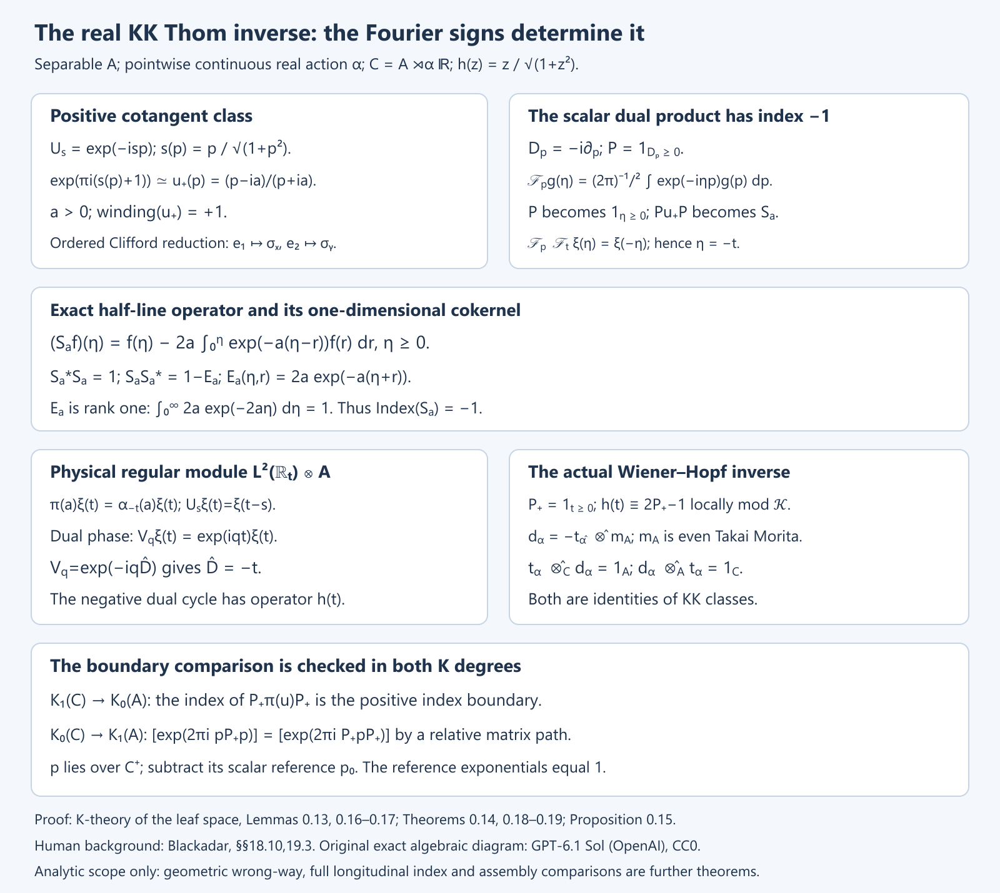

*Figure 0.3. Lemmas 0.13, 0.16–0.17, Theorems 0.14, 0.18–0.19 and Proposition 0.15, equations (104)–(113). The intermediate Fourier variable is \(\eta=-t\), so its half-line compression is the isometry of index \(-1\). The physical positive half-line gives the coisometry of index \(+1\). The dual phase is \(V_q=e^{iqt}\), hence its negative-phase Stone generator is \(-t\). The inverse is the negative dual Thom class followed by the even Takai Morita class. Both identities are identities in KK. For the even boundary, projection products are formed over the unitization and their scalar reference is subtracted. Corollary 0.20 proves the subsequent suspension Bott inverse products.*

Full-size PNG · Editable SVG.

## 1. From a transversal to a correspondence

Let \(i:N\hookrightarrow V\) be an embedded transversal of dimension \(q\). Put

\[
Z_N=r^{-1}(N)\subset G.
\]

The map \(s:Z_N\to V\) is a local diffeomorphism. Its fibres are discrete countable sets: they are the intersections of the holonomy covering of a leaf with \(N\), including the different lifts of an intersection point.

Let \(E\) be a continuous Hermitian Hilbert field on \(N\), given by a countably generated Hilbert \(C_0(N)\)-module. Initially use compact chart sections

\[
\xi\in C_c(Z_N,r^*E\otimes s^*D_F^{1/2}).
\]

For a non-Hausdorff arrow space, this means the finite span of sections supported in Hausdorff charts, as in the preceding lesson. For \(\gamma:x\to y\), define

\[
\langle\xi,\eta\rangle_A(\gamma)
=\sum_{\substack{z\in Z_N\\s(z)=x}}
\left\langle\xi(z\gamma^{-1}),\eta(z)\right\rangle .
\tag{1}
\]

The two source half-densities give the summand the required endpoint density. On a pair of compact chart supports the sum has finitely many local terms; partitioning supports reduces (1) to ordinary continuous chart kernels. Thus its value is in \(A\).

Right multiplication is convolution. In a density trivialization its formula is

\[
(\xi f)(z)
=\int_{s(h)=s(z)}\xi(zh^{-1})f(h).
\tag{2}
\]

Fubini's theorem gives

\[
\langle\xi f,\eta g\rangle_A
=f^**\langle\xi,\eta\rangle_A*g.
\tag{3}
\]

To check positivity without a coordinate guess, use the fibre

\[
H_x^N=\ell^2(Z_N\cap s^{-1}(x),r^*E).
\]

The coefficient kernel in (1), represented on \(L^2(G_x)\), is \(T_\xi(x)T_\xi(x)^*\), where

\[
T_\xi(x):H_x^N\longrightarrow L^2(G_x)
\]

is the coefficient map of the equivariant section \(\xi\). The same formula for a finite list of sections proves matrix positivity. Since the regular representations define the norm of \(A\), (3) completes the sections to a right Hilbert \(A\)-module, denoted \(\mathcal E_N(E)\). Chart bump functions and a countable dense family of sections on \(N\) show that it is countably generated.

A bounded adjointable field map \(T:E_1\to E_2\) acts by

\[
(i_!T)_x v(z)=T_{r(z)}v(z),\qquad v\in H_x^N.
\tag{4}
\]

The action preserves the chart section space and has adjoint \(i_!(T^*)\). It therefore gives an adjointable map of the completed modules. Its norm is at most \(\|T\|\).

The discrete set in \(H_x^N\) must include holonomy lifts. For example, a transversal point on a leaf with twofold holonomy contributes two points on its holonomy covering. Removing one lift changes the equivariant representation.

## 2. Why compact maps remain compact

The compact operators in this section are compact module operators. They can have infinitely many nonzero diagonal blocks in the Hilbert space of one recurrent leaf.

**Theorem 2.1 (transversal compactness).** If \(T:E_1\to E_2\) is compact as a Hilbert \(C_0(N)\)-module map, then \(i_!T\) is compact as a Hilbert \(A\)-module map.

**Proof.** First take \(E_1=E_2=E\) and \(T=\theta_{\sigma,\sigma}\), where \(\sigma\) is a continuous section with compact support in a small transverse coordinate neighbourhood \(U\subset N\). Near the units over \(U\), the map \(s:Z_N\to V\) identifies a neighbourhood with a plaque tube. Choose a compactly supported source half-density \(b\) in that tube, normalized by

\[
\int |b(n,t)|^2\,dt=1
\quad\text{for }n\in\operatorname{supp}\sigma.
\tag{5}
\]

Such a \(b\) is a fixed normalized plaque bump times a transverse cutoff equal to one on the support. The tube can be chosen so that two arrows in it with the same source have the same range in \(N\) and are the same arrow. This follows from the local diffeomorphism \(s\) near the units; shrink the transverse coordinate neighbourhood before choosing the bump.

Set \(\xi(z)=b(z)\sigma(r(z))\). We claim

\[
\theta_{\xi,\xi}=i_!(\theta_{\sigma,\sigma}).
\tag{6}
\]

Evaluate the left side on \(H_x^N\). The averaged rank-one formula first sums over \(w\in Z_N\cap s^{-1}(x)\) and then integrates the plaque variable. A mixed term involving distinct \(z,w\) can be nonzero only if both corresponding short arrows lie in the chosen tube. Their quotient has its source and range in \(N\). The uniqueness just established makes that quotient a unit, so \(w=z\). The remaining diagonal term is

\[
v(z)\longmapsto
\sigma(r(z))\left\langle\sigma(r(z)),v(z)\right\rangle
\int|b(r(z),t)|^2\,dt.
\]

By (5) this is exactly (4) for \(T=\theta_{\sigma,\sigma}\). The regular fibre representations are faithful on module endomorphisms, so (6) follows.

For a section with an arbitrary compact support \(K\), take a finite nonnegative partition of unity \(\phi_j\) on \(K\), subordinate to neighbourhoods of the above kind. Pointwise,

\[
\theta_{\sigma,\sigma}
=\sum_j\theta_{\sqrt{\phi_j}\sigma,\sqrt{\phi_j}\sigma}.
\]

Each term has compact pushforward by (6). Polarization treats \(\theta_{\sigma,\eta}\), and continuous cutoffs approximate sections vanishing at infinity by sections with compact support. Finite sums of rank-one maps are norm dense in the compact module maps. Since (4) is contractive, their pushforwards converge in norm to \(i_!T\). The compact maps form a norm closed space, proving the theorem. \(\square\)

In particular \(C_0(N)\) acts by compact operators on \(\mathcal E_N(\mathbb C)\), through multiplication at \(r(z)\).

For clarity, an even **Kasparov cycle** from \(B\) to \(A\) consists of a countably generated graded Hilbert \(A\)-module \(\mathcal E\), an even *-representation \(\rho:B\to\mathcal L_A(\mathcal E)\), and an odd adjointable \(F\) such that

\[
[F,\rho(b)],\qquad(F^2-1)\rho(b),\qquad(F-F^*)\rho(b)
\]

are compact for every \(b\in B\). Homotopy and the addition of degenerate cycles define \(KK(B,A)\). Section0 constructs its associative product and proves the homotopy and unit conventions. Theorem 0.14 proves its scalar identification \(KK(\mathbb C,A)=K_0(A)\) and the odd version, including general Hilbert-module homotopies.

The correspondence above gives the cycle

\[
i_!=[\mathcal E_N(\mathbb C),\rho,0]\in KK(C_0(N),A).
\tag{7}
\]

The only nonzero defect in its definition is \(-\rho(h)\), which is compact by Theorem 2.1. Theorem 0.14 and the product in Section 0 give its action

\[
K_c^j(N)\longrightarrow K_j(A),\qquad
x\longmapsto x\otimes_{C_0(N)}i_!.
\tag{8}
\]

The same construction works for an étale map to the leaf space described by local transverse maps and holonomy transition arrows. The local modules glue by those arrows; the proof of compactness is local on the support in the domain, so the partition-of-unity argument remains valid.

## 3. A compact transversal gives a projection

Assume now that \(N\) is compact. A uniform plaque tube along \(N\) exists: the exponential in a leafwise metric is transverse to \(N\) at its zero section, and compactness permits a tubular neighbourhood on which it is injective. Its corresponding unit neighbourhood in \(Z_N\) has the uniqueness used in Theorem 2.1.

Choose a scalar section \(b\) in this tube satisfying (5) for every \(n\in N\). Then

\[
\theta_{b,b}=1_{\mathcal E_N(\mathbb C)}.
\tag{9}
\]

**Proposition 3.1.** The element \(e=\langle b,b\rangle_A\) is a projection in \(A\), and \(\mathcal E_N(\mathbb C)\cong eA\). If \(\Lambda\) is an invariant transverse measure, then

\[
\tau_\Lambda(e)=\Lambda(N).
\tag{10}
\]

**Proof.** The element \(e\) is self-adjoint. By (9), \(be=b\), and

\[
e^2=\langle b,be\rangle_A=\langle b,b\rangle_A=e.
\]

The map \(eA\to\mathcal E_N(\mathbb C)\), \(a\mapsto ba\), preserves inner products. Every \(\xi\) satisfies \(\xi=b\langle b,\xi\rangle_A\) by (9), so it is onto.

At a unit \(1_x\), the kernel \(e(1_x)\) is the sum of \(|b(z)|^2\) over the short arrows \(z:x\to n\) in the chosen tube. There is at most one such arrow. The diagonal trace formula from the measured-index lesson integrates this function using plaque volume and transverse measure. Integration first in the plaque direction gives one by (5), and the remaining integral is precisely \(\Lambda(N)\). All terms are nonnegative and have compact support, so this order of integration is valid. \(\square\)

This projection is in the algebra itself. A class in \(K_0(A)\) need not have a representative of that form: unitization and matrix stabilization allow differences of projections that are absent from \(A\).

**Example 3.2 (a product foliation).** For \(V=P\times N\), with \(P\) connected, choose a normalized \(\psi\in L^2(P)\). The construction gives

\[
e(t,t',n)=\psi(t)\overline{\psi(t')}.
\]

Under \(A\cong C_0(N)\otimes\mathcal K(L^2(P))\), this is \(1_N\otimes\theta_{\psi,\psi}\) when \(N\) is compact. Formula (10) gives the total transverse mass.

## 4. A local transverse orientation class

Assume \(V\) is connected and the normal bundle \(\tau=TV/F\) is oriented. A positively oriented transverse embedding of an **open** \(q\)-disk defines, using (8),

\[
[V/F]^*=\varphi_!(\beta_q)\in K_q(A).
\tag{11}
\]

Here \(\beta_q\) is the compactly supported Bott generator. The open disk is diffeomorphic to \(\mathbb R^q\); its parity is \(q\bmod2\). A closed disk with its ordinary K-theory would give a different statement.

**Proposition 4.1 (independence of the transverse disk).** Within each connected component of \(V\), the class (11) does not depend on the centre or the positively oriented transverse embedding.

**Proof.** The Bott class can be represented with support in any smaller disk about its centre. Extension by zero from that disk gives the same generator; this is the local form of Bott periodicity. Thus only the germ of the embedding matters.

In a foliation chart, shrink that germ and rescale its coordinates. It is isotopic through transverse embeddings to the linear transverse graph given by its derivative: its transverse derivative is invertible, and on a sufficiently small disk it remains so throughout the straight interpolation to that derivative. The positively oriented linear transverse frames are connected. Indeed Gram–Schmidt writes an element of \(\operatorname{GL}^+(q,\mathbb R)\) as an orthogonal matrix of determinant one times an upper triangular matrix with positive diagonal. Straight interpolation contracts the latter to identity without losing its positive diagonal. Elimination by plane rotations writes the former as a product of plane rotations, each contracted through its angle. For rank zero or one there is no rotation step. Therefore two choices at one point are joined through positively oriented frames.

To obtain a correspondence homotopy, apply Sections 1–2 to \(V\times[0,1]\), foliated by \(F\) at fixed parameter, and to the family of transverse disk embeddings. Its algebra is \(A\otimes C([0,1])\). The parameter-family disk is transverse, since its parameter derivative has component one. The same normalized plaque bumps and finite partitions give a module with compact coefficient action; pull its domain representation back along the constant inclusion of \(C_0(D^q)\). Its endpoint cycles are exactly the two disk correspondences. Section 0 homotopy invariance and the fixed coefficient Bott class therefore give their equal K-classes.

Join two centres by a path in \(V\). The oriented normal bundle along this interval is trivial, so choose a continuous positively oriented transverse frame along the path. A small transverse exponential disk varies along it; finitely many intervals suffice if the radius needs to shrink. The preceding support argument permits those shrinkings. Homotopy invariance on the successive intervals proves equality of the endpoint classes. \(\square\)

The component restriction is necessary. For the zero-dimensional foliation of \(V=\{0,1\}\), the two transverse point classes are the two distinct coordinate projections in \(K_0(C(V))=\mathbb Z^2\). There is no path joining their centres.

Orientation establishes this definition, not its nonvanishing. A sufficient test is a class

\[
\zeta\in KK^q(A,\mathbb C)
\quad\text{with}\quad
[V/F]^*\otimes_A\zeta=1\in\mathbb Z.
\tag{12}
\]

Indeed a zero class has zero product with every class. For a submersion onto an oriented spin-c manifold \(B\), the Morita equivalence \(A\sim C_0(B)\) turns (11) into the local Bott class on \(B\). To use the geometric spin-c Dirac K-homology class as \(\zeta\), its local Bott–Dirac pairing must be proved with the same orientation. The vector-bundle Dirac comparison required below includes this assertion; the local disk construction does not supply it.

For a general foliation, a holonomy invariant spin-c structure on \(\tau\) does not by itself produce the operator in (12). Transverse ellipticity, compactness of commutators, and an appropriate representation still need to be proved. The construction of a suitable transverse Dirac class is a substantive problem formulated by Connes; the elementary local disk argument does not solve it.

## 5. Maps to a leaf space retain transition arrows

The geometric-cycle framework originates in the work of Paul Baum and Ronald G. Douglas. For the smooth foliation model used here, see the freely available [Connes, Section 9](https://alainconnes.org/wp-content/uploads/foliationsfine.pdf#page=29), which credits its collaboration with Baum. The definitions below retain the actual arrow cocycles and full stable orientations; Theorems 6.0ae and 6.1 prove descent for this specified model.

A smooth map \(f:M\to V/F\) is described by an open cover \((U_a)\), smooth maps \(f_a:U_a\to V\), and smooth arrows

\[
g_{ba}(x):f_a(x)\longrightarrow f_b(x)
\]

on overlaps, satisfying \(g_{ca}=g_{cb}g_{ba}\). Refining the cover or changing its lifts by compatible arrows gives the same map. Keeping only the assertion that \(f_a(x)\) and \(f_b(x)\) lie on the same leaf would discard holonomy.

The derivatives of the holonomy maps glue the bundles \(f_a^*\tau\) to a rank-\(q\) real bundle \(f^*\tau\) on \(M\). A **K-orientation** of \(f\) is a stable spin-c orientation of the virtual bundle

\[
f^*\tau-TM.
\tag{13}
\]

The canonical complex spin-c structure on \(TM\oplus TM\) converts this to full Clifford orientation data on \(TM\oplus f^*\tau\). In positive rank these data are a spin-c structure, as proved in Lemma6.0j. In rank zero a stable orientation can retain an odd graded line; it is interpreted after positive even stabilization and is not identified with the canonical even rank-zero unit. The finite construction in Lemma6.0j retains that grading. This stable convention fixes the full orientation, including its line twist, needed for the Thom map.

There is also a useful principal bundle. Glue \(U_a\times_{f_a,r}G\) using the transition arrows. It is a manifold \(P_f\) of dimension \(\dim M+p\), with projection to \(M\) and a free transitive groupoid action on each fibre. The fibres have dimension \(p\). Local sections recover the cocycle, so the bundle and cocycle descriptions are equivalent.

Geometric cycles are triples \((M,E,f)\), where \(M\) is compact without boundary, \(E\) is a finite-rank complex bundle, and \(f\) has the orientation (13). Their parity is \(\dim M-q\bmod2\). Impose the following relations:

1. Disjoint union is addition, and replacing \(E_1\oplus E_2\) by the two separate cycles does not change the sum.
2. The oriented boundary of a compact cycle with boundary is zero.
3. For an even-rank spin-c real bundle \(W\to M\), replace \(M\) by the sphere bundle \(S(W\oplus\mathbb R)\), replace \(E\) by its pullback tensored with the fibre Bott bundle, and replace \(f\) by its composite with the sphere projection.

The resulting group is denoted \(K_{*,\tau}^{\mathrm{geom}}(BG)\). The symbol \(BG\) records the classifying space of the groupoid and its normal bundle. Identifying this cycle model with other models of groupoid topological K-theory is a theorem that must include its hypotheses.

## 6. The geometry of a wrong-way map

### The global Clifford Thom equivalence

The Clifford Bott and Dirac method is classical; see [Kasparov] and the point-space discussion in [Emerson]. We give the bundle proof with both product operators and their homotopies. The argument works over a noncompact base and retains the Clifford twist until a spin-c structure is specified. Its analytic inputs are the complete-source energy argument of Lemma 8.19, the module-generator proof of Lemma 8.15a and the product criterion of Definition 0.3. No local-to-global KK exactness theorem is needed.

Let \(X\) be a second-countable locally compact manifold and \(E\to X\) a rank-\(r\) real vector bundle with a continuous metric. Write \(\pi:E\to X\) and
\[
C_X=C_0(X),\qquad A_E=C_0(E,\pi^*\mathrm{Cl}^+(E)).
\tag{128}
\]
All tensor products and Clifford representations in this subsection are graded. In an orthonormal fibre frame, let \(e_i\) denote exterior multiplication by the corresponding vector and \(\iota_i=e_i^*\) contraction. On \(\Lambda E_{\mathbb C}\), put
\[
a_i=e_i+\iota_i,\qquad c_i=e_i-\iota_i,
\qquad \{a_i,a_j\}=2\delta_{ij},\quad
\{c_i,c_j\}=-2\delta_{ij},\quad \{a_i,c_j\}=0.
\tag{129}
\]
The operators \(a_i\) are odd self-adjoint and the \(c_i\) odd skew-adjoint. These formulas are equivariant under orthogonal frame changes. They therefore define global Clifford actions. Exterior-degree parity is the grading \(\Gamma\).

**Lemma 6.0a (the two global cycles).** Let \(b_E\) be the standard-module cycle
\[
\left(A_E,\phi_X,
B(v)=\frac{c^+(v)}{\sqrt{1+\|v\|^2}}\right),
\qquad \phi_X(f)(v)=f(\pi(v))1.
\tag{130}
\]
Let \(\mathcal H_E\) be the Hilbert \(C_X\)-module of continuous fibrewise \(L^2\) sections of \(\Lambda E_{\mathbb C}\) whose fibre norms vanish at base infinity. The fibre metric supplies Lebesgue measure. The positive Clifford action in (129) represents \(A_E\) on this module by multiplication. The vertical operator and its bounded transform are
\[
D=\sum_i c_i\partial_{v_i},\qquad
F_D=D(1+D^2)^{-1/2}.
\tag{131}
\]
They define \(d_E\in KK(A_E,C_X)\); (130) defines \(b_E\in KK(C_X,A_E)\). Neither construction requires an orientation or spin-c structure.

**Proof.** For (130), \(B\) is an odd self-adjoint multiplier of norm at most one, and its coefficient commutators vanish. Its localized square defect is \(-f(x)/(1+\|v\|^2)\). This vanishes at infinity on the total space: cut off a compact base set using \(f\in C_X\), then a fixed fibre radius. A closed bounded disk bundle over a compact base set is compact, by a finite bundle-chart cover and uniform equivalence of its fibre norms. Thus the defect belongs to \(A_E=\mathcal K(A_E)\). Base approximate identities prove nondegeneracy of \(\phi_X\). A countable chart exhaustion makes \(A_E\) separable and its standard module countably generated.

For (131), the physical transform \(\widehat u(p)=\int e^{-i\langle p,v\rangle}u(v)\,dv\) gives the odd self-adjoint multiplier \(ic(p)\), with square \(|p|^2\). Its inverse shifts are the matrices \((ic(p)\mp i)/(1+|p|^2)\). Acting on compact-parameter Fourier test sections, these are inverse operators with dense ranges. The inverse-domain argument of Lemma 8.15a proves regular self-adjointness on the full module domain. Orthogonal covariance glues the Fourier constructions; local compactly supported test sections form a graph core by Fourier cutoffs and a countable base partition. This is a module-domain argument, not just a list of fibre self-adjoint operators.

Multiplication by a smooth compact fibre cutoff followed by a Dirac resolvent is compact. Indeed a Fourier truncation produces a Hilbert–Schmidt kernel, and its remaining order-\(-1\) Fourier multiplier has norm tending to zero. This is the compact-frequency argument of the index lesson's Lemma 6.1. The same estimates are uniform in a compact base chart, and a base cutoff gives a compact module operator. Hence both-sided coefficient localizations of \(C_0\) functions of \(D\) are compact. Fibre-smooth compact sections of \(A_E\) are dense, by chart smoothing only in the fibre variables. If \(u\) is homogeneous of parity \(k\) in this dense algebra, then
\([D,\rho(u)]_{\mathrm{gr}}=\sum_i c_i\rho(\partial_i u)\) is bounded, and multiplication preserves the graph domain by the ordinary first-derivative product estimate.

We state the graded commutator identity used below. For any such regular odd operator \(T\), a homogeneous \(u\), \(\sigma=(-1)^k\), \(C=Tu-\sigma uT\), \(q=\sqrt{1+\tau^2}\), and \(R_\tau=(T^2+q^2)^{-1}\),
\[
[TR_\tau,u]_{\mathrm{gr}}
=q^2R_\tau C R_\tau-\sigma TR_\tau C TR_\tau,
\qquad
\|[TR_\tau,u]_{\mathrm{gr}}\|
\le\frac{5\|C\|}{4(1+\tau^2)}.
\tag{132}
\]
To justify it without assuming that \(C\) preserves the domain, use the first-order identity
\[
(T-z)^{-1}u-\sigma u(T-\sigma z)^{-1}=-\sigma(T-z)^{-1}C(T-\sigma z)^{-1}.
\]
Sum the two poles \(z=\pm iq\). The bound follows from \(\|R_\tau\|\le q^{-2}\) and \(\|TR_\tau\|\le(2q)^{-1}\). Its terms are compact whenever the coefficient localizations of the resolvents are compact. Integration against \(2/\pi\) over \(\tau\ge0\) gives a norm-convergent compact graded commutator for \(T(1+T^2)^{-1/2}\). The individual transform integrals converge strictly, as proved in Lemma 8.15b. Density treats every coefficient. This proves all the defects for \(d_E\). The module is countably generated by fibre tests in countably many charts. Rank zero gives the identity homomorphism cycle in both cases. \(\square\)

**Lemma 6.0b (uniform linear-potential homotopy).** On
\(\mathcal M=\mathcal H_E\widehat\otimes_{C_X}A_E\), denote the target fibre variable by \(z\), the integration variable by \(v\), and let
\(A_i=a_i\widehat\otimes1\), \(B_i=1\widehat\otimes L_{c_i^+}\). In the underlying ordinary tensor product the latter is \(\Gamma\otimes L_{c_i^+}\); the grading sign is inserted exactly once. Here \(L_{c_i^+}\) is left multiplication on the target Clifford algebra. Put
\[
T_{t,z}=D+A(tv-z),\qquad
A(w)=\sum_i w_iA_i,
\quad 0\le t\le1.
\tag{133}
\]
Represent a section \(u(v)\in A_E\) using the positive generators \(B_i\). Then the bounded transforms of (133) define a single Kasparov homotopy over \(C([0,1],A_E)\). In particular, the localized defects are compact and jointly continuous in \(t,z\), and vanish at target infinity after the prescribed coefficient localization.

**Proof.** It suffices to work in an orthonormal chart with compact base support; all constructions are orthogonally equivariant. The source metric is Euclidean and complete. The potential is Hermitian and linear. The deficiency-cutoff and moving-cutoff energy proofs of Lemma 8.19 apply: \([T_{t,z},\eta]=c(d\eta)\), so the unbounded potential contributes neither to the deficiency estimate nor to propagation speed. Each closure is self-adjoint and its waves have speed at most one.

For compact parameter support and a compact source test, the reachable source set at finite wave time is a fixed compact set. On this set a change in \(t,z\) changes the potential by a bounded coefficient tending uniformly to zero. Duhamel's integral therefore proves strong continuity of the wave group, and of its adjoint, in the parameters. Source derivatives are controlled by the differentiated energy equation on that same set. These waves define a strongly continuous unitary group on the whole parameter Hilbert module. Time smoothing, the two strict Laplace inverses and their dense ranges now give regular self-adjointness on its full domain exactly as in Lemma 8.15a. The assertion has thus been constructed over the parameter algebra before any compactness conclusion is drawn.

Write \(N\) for exterior degree and \(K=2N-r\); \(\|K\|=r\). Directly from (129),
\[
T_{t,z}^2=-\Delta_v+|tv-z|^2+tK.
\tag{134}
\]
Let \(R=(T_{t,z}\pm i)^{-1}\), \(w=R\xi\), and \(h=\chi w\), for a fixed smooth cutoff supported in \(|v|\le R_0\). The spectral bounds give \(\|w\|,\|T_{t,z}w\|\le\|\xi\|\). Therefore \(\|T_{t,z}h\|\le C_\chi\|\xi\|\), since its cutoff commutator is independent of the potential. Formula (134) gives
\[
\|\nabla h\|^2+\|(tv-z)h\|^2
\le C_\chi^2\|\xi\|^2+r\|h\|^2.
\tag{135}
\]
Thus the localized resolvents have uniformly bounded range in \(H^1\) on a fixed compact source support. Rellich compactness, or the compact-frequency proof in Lemma 6.0a, makes them fibrewise compact. Also \(|tv-z|\ge |z|-R_0\) there, so \(\|\chi R\|\le C/(1+|z|)\), uniformly in \(t\).

We include the norm-continuity step. The waves and their Laplace integrals give strong continuity of \(R\) and \(R^*\). The outputs of \(\chi R\) form a uniformly relatively compact set by (135). If norm continuity failed along a convergent parameter sequence, choose unit input vectors witnessing the failure. A convergent subsequence of the outputs, paired with each fixed vector and strong continuity of the adjoints, has zero limit. This contradiction proves norm continuity of the compact operators. The argument applies to their finite Clifford matrix components in a faithful representation, with the same bounds. With a compact base cutoff and the \(z\)-decay just proved, these are compact operators of the parameter module. Products and uniform approximation give the same coefficient localizations for the entire \(C_0\) calculus.

The \(B_i\) anticommute with both \(c_j\) and \(A_j\). Consequently the graded commutator with a compact fibre-smooth coefficient has only its bounded first-derivative term, uniformly in \(t,z\). Formula (132) gives its compact bounded-transform commutator, with an integrable parameter-independent tail. Strong continuity of bounded spectral factors multiplied by norm-continuous compact localized factors proves continuity of each integrand; the tail then gives continuity of the integral. The square defect is a localized resolvent. Density finishes the parameter-cycle assertions. A locally finite base partition and compact-base approximation globalize them without any geometry bound on all of \(X\). \(\square\)

**Theorem 6.0c (both global Clifford Thom inverse products).** The actual cycles of Lemma 6.0a satisfy
\[
b_Ed_E=1_{C_X},\qquad d_Eb_E=1_{A_E}.
\tag{136}
\]
These are global graded KK identities for the stated possibly noncompact base.

**Proof: the first product.** Rank zero was handled in Lemma 6.0a, so assume \(r>0\). Its tensor module is \(\mathcal H_E\). Put
\[
Q=D+A(v),\qquad Q^2=L+2N-r,
\quad L=-\Delta_v+|v|^2,
\qquad F_Q=Q(1+Q^2)^{-1/2}.
\tag{137}
\]
The Hermite basis gives the full spectral information needed here. In one variable, the normalized Gaussian \(h_0=\pi^{-1/4}e^{-v^2/2}\), followed by repeated normalized application of \((-\partial_v+v)/\sqrt2\), gives orthonormal eigenvectors \(h_n\) of \(L\) with eigenvalues \(2n+1\). Their completeness can be checked without an oscillator spectral assumption: orthogonality to all of them makes every Taylor coefficient of \(\int f(v)e^{-v^2/2}e^{wv}\,dv\) zero. This integral is entire, by Cauchy–Schwarz and Gaussian domination on compact complex sets. Its values on the imaginary axis vanish, and Fourier uniqueness gives \(f=0\). Tensoring proves completeness in \(r\) variables. On exterior degree \(k\), (137) has eigenvalues \(2(|n|+k)\). Its sole zero space is the even Gaussian times \(\Lambda^0E_{\mathbb C}\); the next eigenvalue is two. Every fixed eigenspace is finite dimensional. The symmetric \(Q\) preserves each fixed \(|n|+k\) space. Its finite self-adjoint matrices define inverse shifts on their algebraic sum. Uniform inverse bounds and dense finite-energy cutoffs give the full regular closure and graph core by the inverse-domain argument. These spaces form finite-rank bundles under the orthogonal transitions, and base-localized resolvents are compact module operators.

We verify the connection condition. For a homogeneous smooth compact \(\xi\in A_E\), let \(\sigma=(-1)^{|\xi|}\). Then
\(K_\xi=Q\rho(\xi)-\sigma\rho(\xi)D=[D,\rho(\xi)]_{\rm gr}+A(v)\rho(\xi)\) is bounded and has compact base and fibre support. The mixed first-order resolvent identity gives
\[
(Q-z)^{-1}\rho(\xi)-\sigma\rho(\xi)(D-\sigma z)^{-1}
=-\sigma(Q-z)^{-1}K_\xi(D-\sigma z)^{-1}.
\tag{138}
\]
Each right side is compact, by the oscillator resolvent with the compact base support, and its norm is at most \(\|K_\xi\|/|\operatorname{Im}z|^2\). Sum the two poles \(z=\pm i\sqrt{1+\tau^2}\), then integrate the bounded-transform formula. It proves that \(F_Q\rho(\xi)-\sigma\rho(\xi)F_D\) is compact; adjoints give the other connection error. Norm approximation treats every creation vector.

Here is a direct positivity check. Put \(b=A(v)/s(v)\), \(s(v)=\sqrt{1+|v|^2}\), \(g=|v|^2/s(v)\), and \(S=(1+L)^{-1/2}\). The bounded constant matrix \(2N-r\) commutes with \(L\). Its spectral bounds imply that \(F_Q-QS\) is compact after a base cutoff: the scalar difference of the two inverse square roots is \(O((1+\lambda)^{-3/2})\), and \(Q(1+L)^{-1/2}\) is bounded. Also
\[
\{b,Q\}=2g+K_b,\qquad
K_b=\sum_i c_i\partial_i b,
\qquad
\{b,QS\}=2gS+K_bS+Q[S,b].
\tag{139}
\]
The first remainder is compact since \(K_b\) is bounded and \(S\) has compact fibre resolvent. To control the second, use
\(S=\pi^{-1}\int_0^\infty u^{-1/2}(1+L+u)^{-1}\,du\). The resolvent commutator inserts \([L,b]=-2\sum_i(\partial_i b)\partial_i-\Delta b\). Its coefficients are bounded. Both \(\|Q(1+L+u)^{-1}\|\) and \(\|L,b^{-1}\|\) are at most \(C(1+u)^{-1/2}\). Thus the integral for \(Q[S,b]\) has compact integrands and norm bounded by an integrable multiple of \(u^{-1/2}/(1+u)\).

Finally \(gS\) is positive modulo compacts. The function \(g\) has bounded first and second derivatives. The same resolvent argument with exponent \(1/4\) shows that \([g,S^{1/2}]\) is a bounded compact operator: its integrand is bounded by \(Cu^{-1/4}(1+u)^{-3/2}\). For this unbounded multiplier, first replace \(g\) by smooth cutoffs with uniformly bounded first and second derivatives and prove the resolvent identity on the Schwartz core. The derivative coefficients converge strongly, whereas both \((1+L+u)^{-1}\) and \(\partial_i(1+L+u)^{-1}\) are compact by their Hermite spectral bounds. Thus each commutator integrand converges in norm. The displayed integrable bound gives norm convergence of its integral and a compact bounded extension for the limit. Hence
\[
gS=S^{1/2}gS^{1/2}+[g,S^{1/2}]S^{1/2}.
\tag{140}
\]
The equality is first on the Schwartz core and extends as bounded operators. To justify the positive middle form, \(1+L\ge1+|v|^2=s^2\) implies \((1+L)^{1/2}\ge s\). Indeed inverse order follows from the quadratic-form variational formula for \((A+u)^{-1}\); integrating \(A(A+u)^{-1}=1-u(A+u)^{-1}\) against \(u^{-1/2}/\pi\) proves this square-root order. Since \(0\le g\le s\), the form \(S^{1/2}gS^{1/2}\) is positive and bounded by one. Also \(gS\) is bounded because \(g\le s\) and \(s(1+L)^{-1/2}\) is bounded. This establishes the extension in (140). All the compact remainders have uniform fibre estimates and are orthogonally equivariant; a \(C_X\) coefficient makes them compact over the base. Equations (139)–(140) therefore give the positivity condition of Definition 0.3. Thus \(F_Q\) is an actual product operator.

Replace \(F_Q\) on the complement of its kernel by its phase. The spectral gap makes this a continuous functional-calculus change whose difference is a base-localized compact. It is a Kasparov homotopy. The complement is then a degenerate cycle. The even kernel is canonically \(C_X\), because the normalized radial Gaussian and exterior vacuum are invariant under every orthogonal change of frame. Its zero operator and usual coefficient representation are the identity homomorphism cycle. This proves the first identity in (136).

**Proof: the reverse product.** Its tensor module is \(\mathcal M\) of Lemma 6.0b, with left \(A_E\) represented by the positive generators \(A_i\) in the \(v\)-variable. A product operator is
\[
F_0=\frac{D+B(z)}{\sqrt{1+D^2+|z|^2}},
\qquad B(z)=\sum_i z_iB_i.
\tag{141}
\]
The numerator's square is \(D^2+|z|^2\). Fibre Fourier transformation constructs its full regular domain and inverse shifts, as in Lemma 6.0a. Localized resolvents are compact by compact-frequency approximation, and their norm tends to zero as \(|z|\to\infty\). Its coefficient graded commutator is only the first derivative term, because \(B_i\) anticommute with all the \(A_j\). Formula (132) proves the cycle defects.

For a homogeneous smooth creation vector \(\xi\in\mathcal H_E\) in \(\operatorname{Dom}D^2\), the connection error with \(B(z)/\sqrt{1+|z|^2}\) is a vector-valued function of \(z\). The derivative part has norm at most \(\|D\xi\|/\sqrt{1+|z|^2}\). The remaining normalizer difference has norm at most \(\|D^2\xi\|/(2(1+|z|^2))\), by the scalar inverse-square-root estimate and \(|z|\le\sqrt{1+|z|^2}\). It is continuous and vanishes at target infinity; a base cutoff and approximation treat all creation vectors. Such vector-valued functions are precisely compact creation maps from the standard target module. The adjoint errors have the same conclusion. Positivity is exact:
\[
\{F_D\widehat\otimes1,F_0\}
=\frac{2D^2}{\sqrt{1+D^2}\sqrt{1+D^2+|z|^2}}\ge0.
\tag{142}
\]
So (141) represents \(d_Eb_E\).

We give its global homotopy to the identity. The even unitary
\[
U_\theta=\exp\left(-\frac\theta2\sum_iA_iB_i\right)
\tag{143}
\]
sends \(A_i\) to \(\cos\theta A_i+\sin\theta B_i\) and \(B_i\) to \(-\sin\theta A_i+\cos\theta B_i\). Different \(A_iB_i\) commute; the identities follow by differentiating conjugation. Also \(D\) commutes with \(U_\theta\). This unitary is orthogonally equivariant, so it exists on the bundle module. At \(\theta=\pi/2\) it sends (141) to the transform of \(D-A(z)\), with left coefficients represented by \(B_i\).

Lemma 6.0b now gives the full parameter homotopy from \(D-A(z)\) to \(D+A(v-z)\), with that coefficient representation fixed. The fibre translation \((W_z\xi)(v)=\xi(v+z)\) is a continuous even module unitary. It sends the endpoint to \(Q=D+A(v)\), and sends the coefficient \(u(v)\) to \(u(v+z)\), still represented by the \(B_i\).

Keep \(Q\) fixed and deform this representation to \(u(z+sv)\), \(1\ge s\ge0\). These are bounded graded representations on a single interval module. They are nondegenerate: on a test with compact base, \(z\)-support and \(v\)-support, the argument \(z+sv\) stays in a common compact disk, where scalar coefficient approximate identities converge uniformly. Such tests are dense. To check the compactness assertion that is sometimes hidden in this step, note that \(f(Q)\) has finite-rank spectral approximations in the fibre for every \(f\in C_0(\mathbb R)\). For a compact fibre-smooth coefficient \(u\), multiplication by \(u(z+sv)\) is strongly continuous in \(s,z\). On any fixed compact \(v\)-set it tends uniformly in \(s\) to zero as \(|z|\to\infty\). Multiplication by each finite-rank spectral approximation consequently is norm continuous and vanishes at target infinity; its uniform spectral tail proves the same for \(u(z+sv)f(Q)\). Compact base approximation globalizes this statement. The graded commutator with \(Q\) has coefficient \(s\partial_i u(z+sv)\), uniformly bounded, and has the identical compact localization property. Formula (132), with its uniform integrable tail, proves the compact and continuous bounded-transform commutator. These are therefore actual Kasparov homotopies, even at \(s=0\).

At the last endpoint the coefficients are \(u(z)\), represented by \(B_i\). Replace the transform of \(Q\) by its phase off the Gaussian kernel, as for the first product. The kernel projection commutes with the endpoint representation: the exterior vacuum is even, and each \(B_i\) restricts there to ordinary left multiplication by the target Clifford generator. Thus the even kernel module is precisely the standard right \(A_E\)-module with its identity representation. The complement is degenerate. This proves the second identity in (136). All rotations, translations, scalings and the vacuum are defined intrinsically in the metric fibre and are orthogonally equivariant; no global frame or compactness of \(X\) was used. \(\square\)

**Corollary 6.0d (orientation, naturality and ordered sums).** The equivalence in Theorem 6.0c is independent of the metric under the induced section-algebra identification. It is natural for proper base pullbacks. For a specified spin-c structure on \(E\), it gives the positive spin-c Thom class and its two-sided KK inverse. The Thom and inverse classes compose for an ordered direct sum of bundles, including their Clifford twists.

**Proof: the metric and spin-c module.** Given two metrics, use \(g_s=(1-s)g_0+sg_1\) on the bundle over \(X\times[0,1]\). Write \(g_s(u,v)=g_0(G_su,v)\), and use the positive isometry \(G_s^{-1/2}:(E,g_0)\to(E,g_s)\), with its induced Clifford and exterior isometries. The eigenvalues of \(G_s\) and their inverses are bounded on each compact base set, uniformly in \(s\). This identifies the total-space section algebras and the fibre \(L^2\) modules continuously. The defect and resolvent arguments above work on this compact parameter interval. They give homotopies of both classes under this identification. No uniform bound on a change of metric over all of \(X\) is needed. Transport the chosen spin-c structure by the same positive isometries when one is specified.

For the spin-c structure, construct a right Hilbert \(C_r\)-module bundle with fibre \(C_r\). A principal transition \([s,z]\in\mathrm{Spin}^c(r)\) acts on this fibre by the even left unitary \(zs\). The relation \((s,z)\sim(-s,-z)\) gives the same unitary. It preserves the right \(C_r\) action and inner product. Conjugation by it gives the orthogonal Clifford transition of \(\mathrm{Cl}^+(E)\). Thus its sections vanishing at base infinity form an even bimodule \(\mathcal S_E\) from \(C_0(X,\mathrm{Cl}^+(E))\) to \(C_X\widehat\otimes C_r\).

Locally its compact endomorphisms are all left multiplications by \(C_r\); these glue by precisely the Clifford transitions. Thus \(\mathcal K(\mathcal S_E)=C_0(X,\mathrm{Cl}^+(E))\). Right fullness follows from chart-supported sections and a locally finite partition, followed by compact-base approximation. For clarity, the two Morita evaluation maps are \(\xi\widehat\otimes\overline\eta\mapsto\theta_{\xi,\eta}\) and \(\overline\xi\widehat\otimes\eta\mapsto\langle\xi,\eta\rangle\). Their tensor inner-product formulas show that they are isometries. The compact-endomorphism equality and fullness show that their ranges are dense and hence onto. Both maps are even. These are the actual two Morita inverse products of Section 0.

Pulling this bimodule to the total space gives
\[
m_E\in KK(A_E,C_0(E)\widehat\otimes C_r),\qquad
\beta_E=b_Em_E,\qquad
\alpha_E=m_E^{-1}d_E.
\tag{144}
\]
Their types are respectively \(KK(C_X,C_0(E)\widehat\otimes C_r)\) and \(KK(C_0(E)\widehat\otimes C_r,C_X)\). Associativity and the two proved Morita evaluations give
\(\beta_E\alpha_E=b_Ed_E=1_{C_X}\) and
\(\alpha_E\beta_E=m_E^{-1}(d_Eb_E)m_E=1_{C_0(E)\widehat\otimes C_r}\).
The notation \(KK_r(C_X,C_0(E))\) uses exactly the ordered Clifford contractions specified in Section 0; these computations never permute odd factors.

The product \(b_Em_E\) is represented by the pulled-back spin-c module with the multiplier \(c^+(v)/\sqrt{1+|v|^2}\). To check this assertion by Definition 0.3, the Morita cycle has operator zero. A creation vector \(\xi\in A_E\) acts compactly on that module, so its connection error with the proposed bounded multiplier is compact. The positivity condition is the positive operator \(2B(v)^2\). This proves the representative, rather than merely its K-group action. In even rank \(r=2\ell\), the ordered matrix-Clifford contraction produces the ordinary spinor bundle. With \(c_i=-i\varepsilon_i\), its symbol is \(ic(v)=c^+(v)\), and its grading is
\[
i^\ell c_1\cdots c_{2\ell}
=(-i)^\ell\varepsilon_1\cdots\varepsilon_{2\ell}.
\tag{145}
\]
This is the chirality of the index lesson's Lemma 6.24. In odd rank retain the final positive Clifford factor. Rank-zero unit normalization uses the canonical trivial spin-c structure. Changing a chosen spin-c structure by a line bundle tensors the above transition module by that line, so twists \(\beta_E\) and its inverse accordingly; the orientation choice is part of the data.

**Proof: proper pullbacks.** Let \(Y\) also be a second-countable locally compact manifold. If \(h:Y\to X\) is continuous and proper, then the induced total-space map \(\widetilde h:h^*E\to E\) is proper. Indeed the inverse image of a compact total-space set has base in a compact inverse image and bounded fibre norm, and is a closed subset of its compact disk bundle. There are therefore the pullback homomorphisms on both \(C_0\) algebras. On the standard target module, the two cycles representing
\[
[h^*]b_{h^*E}=b_E[\widetilde h^*]
\tag{146}
\]
have the identical coefficient action and Clifford multiplier, so the equality holds in KK. Multiplying by the actual inverses on the appropriate sides gives
\([\widetilde h^*]d_{h^*E}=d_E[h^*]\). Pulling back the spin-c transition module gives the identical statement for (144). Properness is the precise hypothesis for these \(C_0\) homomorphisms.

**Proof: ordered sums.** Let \(F\to X\) be another metric bundle. Identify \(E\oplus F\) in that order and use \(\mathrm{Cl}^+(E\oplus F)=\mathrm{Cl}^+(E)\widehat\otimes\mathrm{Cl}^+(F)\). Over the base \(E\), the pulled-back \(F\)-bundle has a coefficient Thom cycle
\(b_F^{\mathrm{Cl}E}\in KK(A_E,A_{E\oplus F})\): its standard module is \(A_{E\oplus F}\), its left action evaluates the old \(A_E\) coefficient at \(v\), and its operator is \(c_F^+(w)/\sqrt{1+|w|^2}\). The old Clifford coefficients graded-commute with this operator, and the localized defects vanish in \((v,w)\).

The product operator with \(b_E\) is
\[
\frac{c_E^+(v)+c_F^+(w)}{\sqrt{1+|v|^2+|w|^2}},\qquad
\left\{\frac{c_E^+(v)}{\sqrt{1+|v|^2}},
\frac{c_E^+(v)+c_F^+(w)}{\sqrt{1+|v|^2+|w|^2}}\right\}
=\frac{2|v|^2}{\sqrt{1+|v|^2}\sqrt{1+|v|^2+|w|^2}}\ge0.
\tag{147}
\]
For a compact old creation section \(\xi(v)\), the connection errors are the old-numerator term divided by the joint normalizer and the difference of the joint and \(w\)-only normalizers multiplied by the new numerator. Both vanish when \(|w|\to\infty\) with \(v\) bounded. Outside a compact \(v\)-set their norms are at most a fixed multiple of \(\|\xi(v)\|\), which tends to zero. Base cutoffs and density give the complete connection condition and its adjoint. Positivity is (147). Definition 0.3 thus proves
\[
b_Eb_F^{\mathrm{Cl}E}=b_{E\oplus F},\qquad
d_{E\oplus F}=d_F^{\mathrm{Cl}E}d_E.
\tag{148}
\]
Here \(d_F^{\mathrm{Cl}E}\in KK(A_{E\oplus F},A_E)\) is the vertical Dirac inverse for the pulled-back \(F\)-bundle with the old Clifford coefficient retained. To verify that coefficient extension, in each old Clifford chart tensor every module in Lemmas 6.0a–b and Theorem 6.0c with that finite-dimensional coefficient algebra, using the graded tensor action. All conjugating unitaries are even, the spectral cutoffs and estimates are unchanged, and the Gaussian evaluations become the identity on the old Clifford coefficient. Old Clifford frame transitions intertwine these formulas. They therefore give both inverse products globally over \(E\), with compact old-base cutoffs as before. It follows that \(d_F^{\mathrm{Cl}E}d_E\) is a two-sided inverse of the first class in (148). Uniqueness of a two-sided inverse gives the displayed equality with the already proved \(d_{E\oplus F}\).

Finally, the spin-c structures on the ordered summands induce the ordered sum structure. Locally the map \(C_r\widehat\otimes C_s\to C_{r+s}\) sends the first block of generators to the first block and the second to the second. It preserves the graded inner products, actions and both Morita evaluations. The transition units \(z_Es_E\) and \(z_Fs_F\) are even and their product is the sum transition unit. Consequently the map glues the tensor of the two spin-c transition modules to the sum module. Transferring (148) through these exact maps proves the spin-c composition and its inverse composition with the same block order. \(\square\)

**Figure 6.0.** The full global proof of Lemmas 6.0a–b, Theorem 6.0c and Corollary 6.0d, equations (128)–(148). Here \(X\) is second-countable and \(E\) has the fixed rank \(r\); no orientation is needed before the last Morita transfer. In the spectrum formula \(n\) is the Hermite multi-index and \(k\) exterior degree. The plot samples the exact scalar potentials \((tv-2)^2\) on \(-1\le v\le5\) at \(t=0,1/2,1\); the Clifford term \(t(2N-1)\) in the displayed rank-one square is separate. The source cutoff estimate is uniform in the homotopy parameter, and its constant depends on the cutoff and rank. The Gaussian is even and invariant under all orthogonal transitions. Exercises 36–37 check the actual signs, compactness and inverse order. The Clifford Bott–Dirac method is classical [Kasparov; Emerson, Section 11.4]; the complete bundle and parameter-module arguments are supplied above.

Full-size PNG · Editable SVG.

### Tubes and composition of compact embeddings

The normal bundle theorem is already proved in the programme: DG-CHAR, *Manifold duality, the diagonal and Wu classes*, Lemma 3.1 and Theorem 3.2. Its proof constructs a local addition and proves injectivity on a normal disk; Lemma 3.3 supplies the compact Euclidean embedding used below. The smooth metric and complement arguments are DG-CHAR, *Vector bundles and their constructions*, Theorem 4.2 and Section 5. We use precisely these geometric assertions. Their singular-cohomology conclusions are not premises for the KK argument.

Here manifolds are smooth, Hausdorff, second countable and without boundary. A **normalized tube** for an embedding \(i:M\hookrightarrow Y\), with normal quotient \(E=i^*TY/TM\), is an open embedding from a neighbourhood of the zero section in \(E\) to \(Y\), equal to \(i\) on that section, whose vertical derivative induces the identity on the normal quotient. The theorem just cited gives one. A whole-bundle tube is obtained by first shrinking to a disk of radius \(\rho(x)>0\) and then using
\[
q_\rho(x,v)=\left(x,\frac{v}{\sqrt{1+|v|^2/\rho(x)^2}}\right).
\tag{149}
\]
This diffeomorphism from \(E\) to \(D_\rho E\) has vertical derivative the identity at zero; its inverse is \(w/\sqrt{1-|w|^2/\rho(x)^2}\). Thus the resulting whole-bundle tube remains normalized. For a compact base a constant positive radius suffices after shrinking.

If \(a:U\hookrightarrow V\) is an open embedding, write \(e_a:C_0(U)\to C_0(V)\) for extension by zero after its diffeomorphism onto its image. It is a *-homomorphism: a compactly supported function extends continuously, and approximation by such functions proves the assertion for \(C_0(U)\). This is the covariant map used here. Restriction of a general \(C_0(V)\) function to \(U\) need not vanish at infinity in \(U\).

**Lemma 6.0e (compression and tube independence).** Let \(E\to M\) be a metric real rank-\(k\) bundle on a compact manifold with a specified spin-c structure. Write
\(\beta_E\in KK(C(M),C_0(E)\widehat\otimes C_k)\)
for Corollary 6.0d's Thom class, where \(C_k=\mathrm{Cl}^+(\mathbb R^k)\). For a positive constant \(r\), let \(q_r:E\to D_rE\) be (149) and define \(\beta_{D_rE}=\beta_E[e_{q_r}]\), where here \(e_{q_r}\) is the isomorphism onto the disk algebra. Then
\[
\beta_{D_rE}[e_{D_rE\hookrightarrow E}]=\beta_E.
\tag{150}
\]
Consequently that disk inclusion, tensored with \(1_{C_k}\), is a KK equivalence. For a compact embedding \(i:M\hookrightarrow Y\), the class
\[
i_!=\beta_E[e_\tau]\in
KK(C(M),C_0(Y)\widehat\otimes C_k)
\tag{151}
\]
is independent of the normalized whole-bundle tube \(\tau:E\to Y\). It retains the specified normal spin-c structure.

**Proof: compression as an actual algebra homotopy.** Put
\(q_{r,s}(v)=v/\sqrt{1+s|v|^2/r^2}\), for \(0\le s\le1\), and extend its image functions by zero in \(E\). The resulting maps are
\[
\Phi_s(f)(x,w)=
\begin{cases}
f\!\left(x,\dfrac{w}{\sqrt{1-s|w|^2/r^2}}\right),
 &s|w|^2<r^2,\\
0,&s|w|^2\ge r^2.
\end{cases}
\quad \Phi_0(f)=f.
\tag{152}
\]
Each is a *-homomorphism, of norm at most one. For \(f\) of compact support \(K\subset E\), the set
\(\{(s,q_{r,s}(v)):s\in[0,1],v\in K\}\)
is compact. On the open image of the map \((s,v)\mapsto(s,q_{r,s}(v))\), the formula is continuous by its displayed inverse. At its boundary it is continuous with value zero: any nonzero value of size at least \(\epsilon\) has its preimage in the compact set \(\{|f|\ge\epsilon\}\), whose image is a closed subset inside that open image. Hence \((s,w)\mapsto\Phi_s(f)(w)\) is continuous, has uniformly compact support and lies in \(C([0,1],C_0(E))\). Uniform continuity on a compact neighbourhood of the support proves norm continuity in \(s\). Density and the norm bound prove the same for every \(f\in C_0(E)\). Tensor with the finite-dimensional graded algebra \(C_k\), using its identity map.

We have obtained the genuine homomorphism
\(\Phi:C_0(E)\widehat\otimes C_k\to C([0,1],C_0(E)\widehat\otimes C_k)\).
Corollary 0.11 represents it by the standard interval module with operator zero; the localized square defect is \(-\Phi(f)\), a compact module endomorphism. No nondegeneracy or complemented range is needed. Its endpoints are the identity and \(e_{q_r}e_{D_rE\hookrightarrow E}\). Homotopy invariance and multiplication by \(\beta_E\) prove (150). Both \(\beta_E\) and \(\beta_{D_rE}\) are invertible by Theorem 6.0c, Corollary 6.0d and the disk isomorphism. Thus
\([e_{D_rE\hookrightarrow E}]=\beta_{D_rE}^{-1}\beta_E\)
is invertible, with all Clifford factors retained. Smaller disks give the same argument. In particular, if \(0<r<R\), cancellation after extension to \(E\) gives
\(\beta_{D_rE}[e_{D_rE\hookrightarrow D_RE}]=\beta_{D_RE}\).

**Proof: the comparison of two tubes.** Let \(\tau_0,\tau_1\) be normalized whole-bundle tubes. The map
\(g=\tau_1^{-1}\tau_0\)
is defined on a neighbourhood of the zero section, fixes it and has identity normal derivative. Let \(\lambda_t\) denote fibre multiplication by \(t\). For \(t>0\) set
\[
g_t=\lambda_{1/t}g\lambda_t,\qquad g_0=\mathrm{id}.
\tag{153}
\]
This has a smooth extension at zero, even when \(g\) changes the base point. Indeed, in bundle coordinates write \(g(x,v)=(a(x,v),b(x,v))\). Here \(a(x,0)=x\), \(b(x,0)=0\) and \(D_vb(x,0)=I\). The second component of \(g_t\) is
\[
\frac{b(x,tv)}t=\int_0^1D_vb(x,utv)v\,du,
\]
which is smooth in \((t,x,v)\) at zero and equals \(v\) there; the first component tends smoothly to \(x\). These coordinate formulas agree because the expression for positive \(t\) is intrinsic. At the zero section its derivative on tangent and normal coordinates has blocks \(\left(\begin{smallmatrix}I&tA_x\\0&I\end{smallmatrix}\right)\), hence is invertible for every \(t\).

Compactness of \(M\) supplies \(r>0\) on which every \(g_t\), \(0\le t\le1\), is defined and locally invertible. Each is injective: for \(t>0\) it is a composition of injective maps, and for zero it is the identity. By making \(r\) smaller we arrange that all their images are in a fixed disk \(D_RE\). The map
\((t,v)\mapsto(t,g_t(v))\)
is then an injective local diffeomorphism of \([0,1]\times D_rE\) onto a relatively open subset of \([0,1]\times D_RE\), and its inverse is smooth. For the endpoint parameters apply the inverse lemma to the smooth extension in \(t\); this proves the relative openness there too. The family of extensions by zero consequently defines
\[
C_0(D_rE)\widehat\otimes C_k
\longrightarrow C([0,1],C_0(D_RE)\widehat\otimes C_k).
\tag{154}
\]
To check the required norm continuity, a compact source support \(K\) has compact image under \((t,v)\mapsto(t,g_t(v))\), inside the relatively open image. The same compact-level-set boundary argument used for (152) proves joint continuity of the zero extension. Uniform continuity and density give norm continuity. Its endpoints are the disk inclusion and \(e_{g_1}\), with the constant Clifford factor unchanged.

Multiplication by \(\beta_{D_rE}\) and (150) show
\(\beta_{D_rE}[e_{g_1}]=\beta_{D_RE}\).
Since \(\tau_0=\tau_1g_1\) on \(D_rE\), subsequent extension into \(Y\) gives
\(\beta_{D_rE}[e_{\tau_0|D_rE}]=\beta_{D_RE}[e_{\tau_1|D_RE}]\).
Use (150) and composition of extensions to identify these respectively with \(\beta_E[e_{\tau_0}]\) and \(\beta_E[e_{\tau_1}]\). This proves (151). The proof transports no spin-c structure through a base-changing map: (154) acts on the scalar disk algebra and the fixed target Clifford algebra. The chosen normal spin-c module was already incorporated in \(\beta_{D_rE}\). Changing that structure by a line bundle is a change of orientation data, as in Corollary 6.0d. \(\square\)

For the next statement define an **ordered coefficient extension** as follows. If \(y\in KK(A,B\widehat\otimes C_\ell)\), let
\(y^{[k]}\in KK(A\widehat\otimes C_k,B\widehat\otimes C_k\widehat\otimes C_\ell)\)
be its exterior product with \(1_{C_k}\), with the even base algebras moved past \(C_k\). The old \(C_k\) block precedes the new \(C_\ell\) block. In a module representative the new odd operator graded-commutes with the old block. This convention is exactly the coefficient convention of (147)–(148).

**Theorem 6.0f (composition of compact spin-c embeddings).** Let \(i:M\hookrightarrow N\) and \(j:N\hookrightarrow P\) be smooth embeddings with \(M,N\) compact. Suppose their normal bundles \(E=\nu_i\) and \(F=\nu_j\) have specified spin-c structures of ranks \(k,\ell\). Give the composite's normal bundle the spin-c structure induced from
\[
0\longrightarrow E\longrightarrow\nu_{ji}
\longrightarrow i^*F\longrightarrow0,
\qquad \nu_{ji}\cong E\oplus i^*F
\tag{155}
\]
in this order, through a splitting of this exact sequence. Then
\[
i_!\widehat\otimes_{C(N)\widehat\otimes C_k}j_!^{[k]}
=(ji)_!
\quad\text{in }KK(C(M),C_0(P)\widehat\otimes C_{k+\ell}).
\tag{156}
\]
The right side uses the block identification \(C_k\widehat\otimes C_\ell\cong C_{k+\ell}\). Auxiliary metrics, connections and splittings do not affect this equality when the specified orientation is transported along their comparison paths.

**Proof: a compatible composite tube.** Take normalized whole-bundle tubes
\(\tau:E\to N\), \(\sigma:F\to P\), and put \(U=\tau(E)\). A principal connection on the spin-c frame bundle of \(F\) exists, and has smooth parallel transport along compact path intervals, by DG-FND, *Connections and parallel transport*, Theorems 3.1 and 4.1, Corollary 4.2. The complete invariant-equation argument is its local-tools lesson, Theorem 2.1 and Lemma 2.2. Apply it to
\(r\mapsto\tau(x,rv)\), \(0\le r\le1\). It gives a smooth spin-c, hence metric, identification
\(T_{x,v}:F_{i(x)}\to F_{\tau(x,v)}\), equal to the identity at \(v=0\). Smoothness holds near each finite \((x,v)\); a finite subdivision of the compact path interval suffices in each parameter neighbourhood. No uniform bound for all \(v\) is asserted or needed.

The map
\[
\Psi:E\oplus i^*F\longrightarrow F|_U,
\qquad (x,v,w)\longmapsto(\tau(x,v),T_{x,v}w)
\tag{157}
\]
is a diffeomorphism. Its inverse first applies \(\tau^{-1}\) to the base, then \(T_{x,v}^{-1}\) to the fibre. Thus \(\Omega=\sigma\Psi\) is a whole-bundle open embedding into \(P\), equal to \(ji\) at the zero section. At zero its derivative on \((v,w)\) is the sum of the \(j\)-image of the normal lift furnished by \(d\tau(v)\) and the normal lift \(d\sigma(w)\). Modulo \(TM\) this is the direct-sum isomorphism in (155); in particular the derivative of \(T_{x,v}\) contributes no term at \(w=0\). Choose this splitting first, and choose on \(\nu_{ji}\) the metric transported from the orthogonal sum. Then \(\Omega\) is a normalized tube for that normal identification. Lemma 6.0e permits its use in (151).

**Proof: open restriction of the actual Thom cycle.** We need the equality on cycles before using (148). For an arbitrary spin-c bundle \(F\to N\) and an open set \(U\subset N\), the restriction to the ideal \(C_0(U)\subset C(N)\) of the left action on \(\beta_F\) has essential module precisely its spin-c section module over \(F|_U\). To prove this assertion, multiply by approximate identities of \(C_0(U)\). On every compact support in \(F|_U\) they converge uniformly to one; finite local section approximations then give the entire module. Conversely their products are supported over \(U\). The multiplier \(c^+(w)/\sqrt{1+|w|^2}\) preserves this submodule and its adjoint does too. Its localized square defects and graded commutators are compact in that submodule: use compact-support section approximations there and the same fibre decay as Lemma 6.0a. The restriction is an \(F\)-connection on the essential module, since multiplication by an old ideal creation section intertwines the two identical multipliers exactly. Lemma 0.10 and Corollary 0.11 therefore identify the full restricted cycle with the extension of the Thom cycle over \(U\). This does not require an orthogonal complement of the open-ideal module.

Replace \(U\) by \(E\) using \(\tau\), and identify the pulled-back bundle and its spin-c section module by the transport \(T\). Both are actual isomorphisms, and \(\Psi\) is proper as a map between these two total spaces because it is a homeomorphism. The restricted Thom multiplier becomes exactly \(c_{i^*F}^+(w)/\sqrt{1+|w|^2}\), while its left action evaluates an old coefficient at \((x,v)\). Retaining the old constant \(C_k\) block gives the coefficient class
\[
\gamma\in KK(C_0(E)\widehat\otimes C_k,
 C_0(E\oplus i^*F)\widehat\otimes C_k\widehat\otimes C_\ell).
\]
Writing \(a:F|_U\hookrightarrow F\) for inclusion, the checked restriction of cycles gives
\[
[e_\tau]\,\beta_F^{[k]}
=\gamma[e_\Psi][e_a].
\tag{158}
\]
Here \(e_\Psi\) is the total-space algebra isomorphism and the last two maps retain both Clifford blocks. One can also see the module identification explicitly: a section over \(F|_U\) at \((y,w')\) is sent to its value at \((\tau(x,v),T_{x,v}w)\), using the inverse transport on its spin-c fibre. This preserves the right inner product, grading and both coefficient actions, and intertwines the displayed multiplier.

The ordered product calculation of Corollary 6.0d, (147)–(148), now gives
\[
\beta_E\gamma=\beta_{E\oplus i^*F}.
\tag{159}
\]
Its hypotheses hold on the noncompact old base \(E\); compact old-coefficient cutoffs, not a pullback along the nonproper projection \(E\to M\), were used in that calculation. The tensor of the spin-c transition modules in (159) is the sum transition module because both transition units are even. The product operator is the joint normalized numerator \(c_E^+(v)+c_{i^*F}^+(w)\); its connection errors vanish at joint infinity and its positivity is precisely (147). Thus (159) is an equality of KK classes, with the full product criterion already checked, rather than only a statement about the induced K-group maps.

Finally use associativity, (158), (159), and composition of open extensions:
\[
\begin{aligned}
i_!j_!^{[k]}
 &=\beta_E[e_\tau]\,\beta_F^{[k]}[e_\sigma]\\
 &=\beta_E\gamma[e_\Psi][e_a][e_\sigma]\\
 &=\beta_{E\oplus i^*F}[e_\Omega]=(ji)_!.
\end{aligned}
\tag{160}
\]
The maps compose in their geometric order \(\Omega=\sigma a\Psi\); no odd Clifford blocks have been exchanged.

**Proof: the auxiliary choices.** Changing a connection changes \(T\) and therefore \(\Omega\), but its value and normal derivative at the zero section remain the same. Lemma 6.0e proves equality for those tubes. Changing a metric is covered by Corollary 6.0d's full metric-interval cycle. Two splittings of (155) differ by a bundle map \(i^*F\to E\); their linear interpolation is a path of splittings. Explicitly, relative to one splitting their isomorphisms are the triangular maps \((v,w)\mapsto(v+sAw,w)\). They are invertible with inverses \((v,w)\mapsto(v-sAw,w)\), for every \(s\in[0,1]\). On the compact base their norms and inverse norms are uniformly bounded. Thus these maps induce a norm-continuous interval family of total-space algebra isomorphisms: compactly supported functions have uniformly compact transported support, and continuity and density give the assertion for all \(C_0\) functions. Transport the ordered sum metric and spin-c transition module through that family. The Clifford multiplier becomes its transported vector with the transported norm, so its localized defects vanish uniformly at fibre infinity. This is a genuine Thom-cycle homotopy over the fixed normal bundle. It identifies the induced normal orientations and their Thom classes. Tube independence then proves equality in (160) for the second splitting as well. No independence of distinct, untransported spin-c orientations is claimed. \(\square\)

The construction of an embedding's push-forward from a Thom class and an open extension is classical; [Carey–Wang, Section 4.1 and the embedding-composition lemma in Section 4.3](https://arxiv.org/abs/math/0507414) gives a twisted-K-theory formulation. The complete algebra homotopies and the actual KK product comparison required here are proved in Lemma 6.0e and Theorem 6.0f. These results concern compact ordinary embeddings; Lemma6.0t extends the tube/product argument to a noncompact intermediate base. Lemmas6.0l–n and Theorem6.0o prove the full foliation correspondence and factorization choices, and Theorems6.0s/6.0w prove projection and compact ordinary-map/foliation composition. Theorems 6.0ab–ae below prove bordism, sphere normalization and geometric-cycle descent. The longitudinal analytic-index comparison requires its further argument.

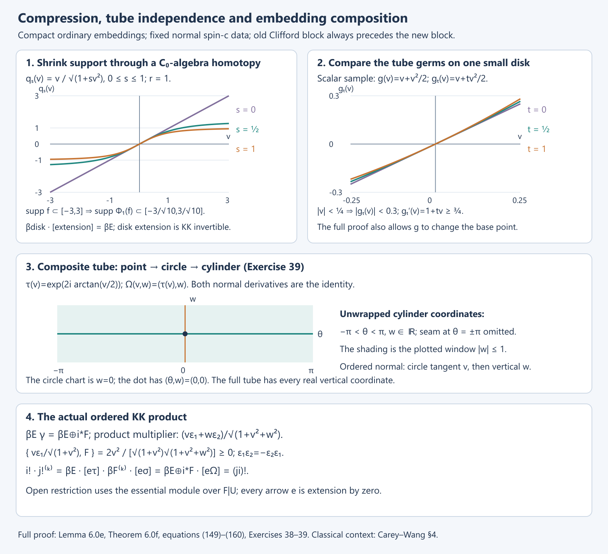

**Figure 6.0a.** Lemma 6.0e, Theorem 6.0f and equations (149)–(160). The top-left graph samples the exact radius-one compression on \(-3\le v\le3\) at \(s=0,1/2,1\); its compact support bound is for a function supported in \([-3,3]\). The top-right graph samples the exact scalar germ \(g(v)=v+v^2/2\) and its rescaling at \(t=0,1/2,1\) on \([-1/4,1/4]\). Its derivative is at least \(3/4\), and all images lie in \((-0.3,0.3)\); the complete proof also treats base-changing bundle germs. The middle panel uses the unwrapped cylinder chart \(-\pi<\theta<\pi\), rather than a projection of the whole cylinder. Shading indicates only the displayed height window \(|w|\le1\); the tube includes all real heights. The dot is the point \((1,0)\in S^1\times\mathbb R\), whose chart coordinates are \((0,0)\). The lower panel retains the order \(E\) then \(i^*F\), with the positive Clifford convention. Exercises 38–39 verify the support, proper-map and actual product details. Geometric prerequisites are the exact DG-CHAR and DG-FND proofs linked above; the push-forward construction is classical [Carey–Wang, Section 4].

Full-size embedding PNG · Editable embedding SVG.

### Families, stabilization and ordinary graph choice

**Lemma 6.0g (families of compact embeddings).** Let \(M\) be compact and \(Z\) second countable. Let \(i_s:M\hookrightarrow Z\), \(s\in I=[0,1]\), be a smooth family of embeddings extending to an open interval \(J\supset I\). Assume a smooth metric and spin-c structure on the rank-\(k\) family of normal quotients
\[
\mathcal E_{s,x}=T_{i_s(x)}Z/d_xi_s(T_xM)
\tag{161}
\]
over \(J\times M\); at the endpoints use its restricted orientation data. Then the classes \((i_s)_!\in KK(C(M),C_0(Z)\widehat\otimes C_k)\) from (151) are the endpoints of an actual Kasparov homotopy. In particular \((i_0)_!=(i_1)_!\). The hypothesis includes the orientation family, not merely the existence of unrelated orientations at its endpoints.

**Proof.** Choose a smooth metric on \(Z\) by the already read DG-CHAR smooth bump proof. Identify the quotient family with the orthogonal complements of \(d_xi_s(TM)\). These form a smooth bundle: the projection matrix is the matrix \(A(A^*HA)^{-1}A^*H\) from its complement theorem, applied to the full-rank smooth matrix of \(d_xi_s\). Use the compatible metric in the specified spin-c family; if necessary the positive square root of the metric-change matrix identifies it isometrically with these complements. The construction is smooth and agrees with the quotient at each zero vector.

The map \((s,x)\mapsto(s,i_s(x))\) is an embedding of \(J\times M\) in \(J\times Z\). Its derivative is injective, because the parameter coordinate retains the parameter tangent and \(d_xi_s\) is injective. It is one-to-one because each \(i_s\) is. Its image is closed: a convergent image sequence has convergent parameters and, after a subsequence, convergent points of compact \(M\), so its limit is in the image. For the same reason its inverse is continuous. The local inverse theorem applied to a full-rank coordinate projection makes this image an embedded submanifold. Thus no compactness of \(Z\) is needed.

For a tube that preserves the parameter, use the local addition \(L_Z\) already constructed in DG-CHAR, Lemma3.1 and the paragraphs preceding Theorem3.2. Define, near zero in \(\mathcal E\),
\[
\mathcal T(s,x,v)=\bigl(s,L_Z(i_s(x),v)\bigr),
\tag{162}
\]
where \(v\) is the chosen normal lift. Its differential at zero has diagonal parameter block the identity, tangent block \(d_xi_s\), and normal block the chosen quotient lift. The tangent/normal blocks span \(TZ\); hence the full differential is invertible. The local inverse theorem gives a local diffeomorphism near every zero vector.

There is one positive radius \(r\) on the compact zero section \(I\times M\) on which this map is defined, locally invertible and injective. Definition and local invertibility follow from compactness and a finite neighbourhood cover. For injectivity, if no radius worked, choose two unequal normal vectors of norms tending to zero, over parameters in \(I\), with equal images. The parameter coordinates must agree. Take convergent subsequences of their bases in \(I\times M\). Their image limits are \((s,i_s(x))\) and \((s,i_s(x'))\), so injectivity of \(i_s\) gives \(x=x'\). Both vectors are eventually in the same local-inverse neighbourhood of that zero vector, a contradiction. Shrink \(r\) once to obtain all three properties. The restriction is an open embedding onto a relatively open subset of \(I\times Z\); the open-interval extension and local inverse theorem prove this relative openness at both endpoint parameters.

A principal connection on the specified spin-c frame bundle exists by the read DG-FND Theorem3.1. Transport along \(u\mapsto(us,x)\), \(0\le u\le1\), gives smooth spin-c isometries \(V_s:\mathcal E_{0,x}\to\mathcal E_{s,x}\). The complete lifting and parameter theorem used here is its Theorem4.1 and local-tools Lemma2.2. The finite compact path interval and its finite local subdivision suffice; a global trivialization of the frame bundle on \(M\) is not assumed.

Let \(E_0=\mathcal E|_{\{0\}\times M}\), and use the normalized compression \(q_r\) from (149). The map
\[
\widetilde\tau:I\times E_0\longrightarrow I\times Z,
\qquad(s,x,v)\longmapsto\mathcal T(s,x,V_s q_r(v))
\tag{163}
\]
is an open embedding preserving \(s\). Its inverse is obtained from the disk inverse, \(V_s^{-1}\), and \(q_r^{-1}\). Each fibre is a normalized whole-bundle tube when the normal bundle is identified by \(V_s\). The compact-image argument of (154) gives the norm-continuous homomorphism
\[
\Theta:C_0(E_0)\widehat\otimes C_k
\longrightarrow C(I,C_0(Z)\widehat\otimes C_k),
\qquad\Theta(a)(s)=e_{\widetilde\tau_s}(a).
\tag{164}
\]
For completeness, a compact source level set has compact image in the relatively open image of \(\widetilde\tau\). Values of the zero extension bounded away from zero therefore cannot approach its boundary. This proves joint continuity, while its uniformly compact support gives uniform norm continuity. Approximation and the norm bound prove the assertion for every \(C_0\) coefficient. The fixed Clifford factor is unchanged.

The actual spin-c transition module and normalized multiplier of \(\beta_{E_0}\), tensored with \([\Theta]\), give a Kasparov class over \(C(I,C_0(Z)\widehat\otimes C_k)\), with left algebra \(C(M)\). At \(s\) the isometry \(V_s\) preserves the spin-c module inner product, grading, transition units and the Clifford multiplier. Hence its endpoint is exactly \(\beta_{\mathcal E_s}[e_{\mathcal T_s q_r}]\). Corollary0.11 justifies the pushforward by the homomorphism class also for its possibly degenerate range. Lemma6.0e identifies this with \((i_s)_!\) defined using any normalized tube at that endpoint. This proves the claimed whole-module homotopy. A different connection or metric only changes its representative; the endpoints retain their specified spin-c structures. \(\square\)

#### Euclidean stabilization at a noncompact ambient manifold

Write \(B_{2a}\in KK(\mathbb C,C_0(\mathbb R^{2a}))\) and \(A_{2a}\in KK(C_0(\mathbb R^{2a}),\mathbb C)\) for the even Bott class and its inverse after the fixed positive-Clifford, chirality-preserving Morita contraction. Here this is the geometric pair from the standard spin-c symbol and its two inverse products in Corollary6.0d. Lemmas7.20–7.21 below calibrate its analytical inverse explicitly; no separate identification with the real-action pair of Corollary0.20 is assumed. At \(a=0\) both are the canonical unit. Write \(B_{2a}^{D}=1_D\boxtimes B_{2a}\) and \(A_{2a}^{D}=1_D\boxtimes A_{2a}\), keeping the old algebra \(D\) before the new Euclidean block.

**Lemma 6.0h (even Euclidean stabilization).** Let \(i:M\hookrightarrow Z\) be a compact embedding with specified spin-c normal \(E\) of rank \(k\), where \(Z\) may be noncompact. Let \(h:Z\hookrightarrow Z\times\mathbb R^{2a}\) be the zero section. Orient the composite normal as \(E\oplus\mathbb R^{2a}\), in that order, with the canonical complex spin-c structure on the new summand. Contract only its last positive-Clifford \(C_{2a}\) block by the canonical Morita module. The resulting class, denoted \((hi)_!^{\rm contracted}\), satisfies
\[
(hi)_!^{\rm contracted}=i_!B_{2a}^{C_0(Z)\widehat\otimes C_k},
\qquad
(hi)_!^{\rm contracted}A_{2a}^{C_0(Z)\widehat\otimes C_k}=i_!.
\tag{165}
\]
These are actual KK equalities. They do not assume that the noncompact embedding \(h\) lies in the compact-middle-manifold scope of Theorem6.0f.

**Proof.** Let \(\tau:E\to Z\) be a normalized whole-bundle tube. Then
\(\Omega(x,v,w)=(\tau(x,v),w)\)
is a normalized whole-bundle tube for \(hi\), with normal identification \(E\oplus\mathbb R^{2a}\). Its derivative is the sum of the normal derivative of \(\tau\) and the new identity block. Since \(\tau\) is a diffeomorphism to an open set, so is \(\Omega\) to its open product with Euclidean space.

Pulling the new Euclidean standard Thom module back along the open ideal \(C_0(\tau(E))\subset C_0(Z)\) gives exactly the standard module over \(E\times\mathbb R^{2a}\), extended by the tube. To check this on the possibly noncompact \(Z\), its essential module is the closure of those ideal coefficients. Compact-support sections are dense in it. The new multiplier commutes in the graded sense with the old constant Clifford block, preserves that module and has localized compact defects there. Its connection with each ideal creation coefficient is exact. Thus the essential-module lemma0.10 and homomorphism functoriality0.11 give the same restriction identity as (158), with trivial radial transport. No projection from \(E\) onto \(M\) is used as a \(C_0\) homomorphism.

Before contracting the new block, Corollary6.0d's actual product is the spin-c module of \(E\oplus\mathbb R^{2a}\), with normalized numerator
\[
\frac{c_E^+(v)+c_{\mathbb R^{2a}}^+(w)}{\sqrt{1+|v|^2+|w|^2}}.
\tag{166}
\]
The connection and positivity are exactly (147): a compact old creation section bounds \(v\), the errors vanish as \(|w|\) tends to infinity there, and approximation handles its old tails. The old anticommutator is nonnegative. The old Clifford block precedes the new block throughout. Extending this checked product along \(\Omega\) proves
\((hi)_!=i_!(1_{C_0(Z)\widehat\otimes C_k}\boxtimes\beta_{\mathbb R^{2a}})\)
with the extra \(C_{2a}\) block retained. Tensoring with its finite graded Morita module is the first equality claimed. The second follows by associativity and the full inverse equality \(B_{2a}A_{2a}=1\), with the old coefficient algebra retained. The inverse is even, so no odd old Clifford factor is exchanged with an odd inverse. All modules and coefficient actions are defined over the entire noncompact ambient algebra, while only compact old source supports enter the product estimates. \(\square\)

#### Comparing two graph embeddings with coherent normal orientations

Let \(f:M\to Y\) be smooth, with \(M\) compact. Choose Euclidean embeddings \(u_b:M\hookrightarrow\mathbb R^{2n_b}\), \(b=0,1\). Their graph embeddings are \(I_b=(f,u_b)\). Consider the family in one common ambient space,
\[
I_\theta(x)=\bigl(f(x),\cos\theta\,u_0(x),\sin\theta\,u_1(x)\bigr),
\qquad0\le\theta\le\pi/2.
\tag{167}
\]
Every \(I_\theta\) is an embedding. At least one of its two displayed coefficients is nonzero, so equality of its values implies equality under the corresponding \(u_b\), hence equality of points. The same argument applied to its derivative proves immersion. Compactness gives a homeomorphism onto its image, and the local inverse theorem applied to a full-rank coordinate projection makes that image a submanifold. These arguments hold on an open interval beyond the two endpoints. In particular this is a smooth family in the exact scope of Lemma6.0g.

**Proposition 6.0i (ordinary graph choice with coherent orientations).** Suppose the normal spin-c data for \(I_b\), their even stabilizations, and the above family are supplied coherently: the family structures at zero and \(\pi/2\) are the ordered stabilized endpoint structures, transported through the indicated Euclidean block permutation at the second endpoint. Apply the fixed ordered matrix-Clifford contractions to retain \(C_p\), where \(p\in\{0,1\}\) is the parity of \(\dim Y-\dim M\). Then the two ordinary graph push-forward classes
\[
\mathcal I_b=
\bigl(I_b{}_!\text{ with normal target contracted to }C_p\bigr)
A_{2n_b}^{C_0(Y)\widehat\otimes C_p}
\in KK(C(M),C_0(Y)\widehat\otimes C_p)
\tag{168}
\]
are equal. Lemma6.0j below constructs this normal family from convention (13); Lemmas6.0l–n and Theorem6.0o construct and compare the full foliation correspondence.

**Proof.** Stabilize \(I_0\) by the zero \(\mathbb R^{2n_1}\) block and stabilize \(I_1\) by the zero \(\mathbb R^{2n_0}\) block. Lemma6.0h supplies the actual ordered product with the new even Bott class in each case. The compatible normal Morita contractions can be composed rather than separately selected: write \(k=p+2t\). The map
\[
\Lambda^*\mathbb C^t\widehat\otimes\Lambda^*\mathbb C^a
\longrightarrow\Lambda^*\mathbb C^{t+a},\qquad\xi\otimes\eta\longmapsto\xi\wedge\eta
\tag{169}
\]
is an even unitary when the first block precedes the second. Indeed the ordered wedge bases on both sides are orthonormal, their total degrees agree, and creation by a vector in the second block introduces exactly the first-block degree sign. Contraction has the adjoint sign. Thus the two Clifford actions and the graded inner products agree, so this is the precise unitary identifying the composed finite Morita modules with the one larger canonical module. The old \(C_p\) factor is retained before them. For \(p=1\), the convention in Section 0 initially retains the final Clifford generator. Move it to the front by the even cyclic unitaries of Lemma 0.13 on successive three-generator blocks: its last generator moves past each preceding pair, in order. The resulting real permutation is the cycle of all \(2t+1\) generators, of positive sign. Each local unitary intertwines the two finite Morita reductions and retains the same normalized odd central volume. Their composition therefore identifies that convention with \(C_1\widehat\otimes C_{2t}\), through actual even module maps. In even rank there is no retained odd block. These fixed maps, rather than an ungraded permutation, are used in the displayed wedge unitary and in the contractions below. Consequently the stabilized graph class, after contraction, is the old contracted graph class followed by \(B_{\rm new}^{C_0(Y\times\mathbb R^{2n_b})\widehat\otimes C_p}\).

The inverse for the two ordered Euclidean blocks is the inverse for the new block followed by the inverse for the old block. This is the inverse composition in (148), transferred through these same finite Morita maps. Composing the stabilized graph class with that inverse cancels the adjacent new Bott pair, giving precisely \(\mathcal I_b\). This proves stabilization invariance as an actual KK equality, not merely by equality of integer indices.

At the second endpoint the stabilized graph places \(u_1\) in the second Euclidean block. Move it to the first block by the permutation \(\mathbb R^{2n_0}\oplus\mathbb R^{2n_1}\to\mathbb R^{2n_1}\oplus\mathbb R^{2n_0}\). This is the permutation of two complex coordinate blocks, after the fixed identification with \(\mathbb C^{n_0}\oplus\mathbb C^{n_1}\). Its lift on the canonical Bott spinor module is the exterior action of this complex unitary. That action is even, preserves the wedge inner product, and intertwines creation and contraction; hence it intertwines the full positive-Clifford Bott multiplier with the coordinate permutation. Extension along the permutation therefore preserves the even Bott class. Its actual inverse is preserved as well, by multiplying this equality on each side by the two inverse classes. The identity on \(Y\) and the retained \(C_p\) factor do not change this argument. In particular no unaccounted odd-block sign occurs.

With the prescribed coherent normal family, Lemma6.0g identifies the two stabilized graph embedding classes in their common ambient space. Compose that equality with the common ordered inverse Bott class. The stabilization cancellations just proved identify its endpoints with \(\mathcal I_0\) and \(\mathcal I_1\), respectively. This gives the stated equality. The proof uses the supplied coherent normal structures at the family endpoints; it cannot infer their coherence from unrelated existence statements. \(\square\)

### The specified stable orientation gives a normal family

The finite module construction uses the complete exterior matrix-unit proof in the [index lesson, Lemma 6.17](the-index-theorem-for-measured-foliations.md#section-6), its chirality convention in Lemma 6.24, the two Morita evaluations in Lemma 0.12, and the transition module in Corollary 6.0d. The Clifford/spinor viewpoint is classical [van Suijlekom, Chapter 4]; the cancellation and parameter comparison are proved here.

All the bundles below are real metric bundles; all Clifford algebras are complex and positively generated. Tensor products of module bundles are graded and balanced over the common base. Write
\[
A_V=\mathrm{Cl}^+(V),\qquad C_r=\mathrm{Cl}^+(\mathbb R^r).
\tag{170}
\]
These denote finite algebra bundles in this subsection; their section algebras give the corresponding Hilbert modules. We distinguish a base module \(\mathscr M_V:A_V\rightsquigarrow C_r\) from its pullback to the total space in (144). An arrow here means a smooth finite full imprimitivity module, with specified grading and both actions, not just its KK class.

#### The double bundle and finite cancellation

Let \(W\) have rank \(d\). The bundle \(Q=W\oplus W\) has the canonical complex structure \((u,v)\mapsto u+iv\) on \(W_{\mathbb C}\). Put \(S_Q=\Lambda^*W_{\mathbb C}\), with exterior-degree grading. Its positive Clifford action is
\[
\varepsilon_Q(u,v)=e(u)+\iota(u)+i\bigl(e(v)-\iota(v)\bigr).
\tag{171}
\]
Both real summands act by odd self-adjoint operators. The exterior relations give their squares \(|u|^2\), \(|v|^2\), and their mutual anticommutation. They therefore define a graded *-map \(A_Q\to\operatorname{End}(S_Q)\). In every orthonormal frame it is onto: \(e_i,\iota_i\) are linear combinations of these generators, the product \(\prod_i(1-e_i\iota_i)\) projects onto the exterior vacuum, and products with exterior multiplications and contractions give all matrix units. There are at most \(2^{2d}\) increasing Clifford words and exactly that many matrix dimensions, so it is an isomorphism. This is precisely Lemma6.17's complete matrix-unit proof with its second negative action multiplied by \(i\). It is orthogonally equivariant and hence glues even when \(W\) is nonorientable.

Thus \(S_Q:A_Q\rightsquigarrow\mathbb C\) is an actual smooth Morita module. Its two evaluations are the rank-one endomorphism and inner-product maps of Lemma0.12. For a local wedge frame the first spans every matrix unit and the second contains the scalar unit; partitions and base cutoffs prove fullness on section algebras. The maps are even isometries by the balanced tensor inner-product formula, and hence are onto. Let \(S_d=\Lambda^*\mathbb C^d:C_{2d}\rightsquigarrow\mathbb C\) be the same fixed positive model on the trivial double space. The canonical spin-c transition module of \(Q\) is
\[
\mathscr M_Q=S_Q\widehat\otimes S_d^*:A_Q\rightsquigarrow C_{2d}.
\tag{172}
\]
The standard generators of \(C_{2d}\) act on \(S_d\) in consecutive complex pairs: \(\varepsilon_{2i-1}=e_i+\iota_i\), \(\varepsilon_{2i}=i(e_i-\iota_i)\). Thus \((-i)^d\varepsilon_1\cdots\varepsilon_{2d}\) is exactly its exterior parity. Indeed an orthogonal transition \(R\) of \(W\) acts on \(S_Q\) by the even exterior unitary \(\Lambda R\), intertwining both positive actions. The resulting transition on \(S_Q\otimes S_d^*\), identified locally with \(C_{2d}=\operatorname{End}(S_d)\), is left multiplication by \(\Lambda R\). It implements \(R\oplus R\) on the real generators in their interleaved order; its identification as a spin-c transition is verified below. For \(d=0\), all these modules and evaluations are the scalar unit.

Suppose \(E\) has rank \(k\) and a smooth full Morita module
\(P:A_E\widehat\otimes A_Q\rightsquigarrow C_k\widehat\otimes C_{2d}\)
is specified. Cancel the two matrix factors by the actual module
\[
\mathcal C_Q(P)=
\bigl(A_E\widehat\otimes S_Q^*\bigr)
\widehat\otimes_{A_E\widehat\otimes A_Q}P
\widehat\otimes_{C_k\widehat\otimes C_{2d}}
\bigl(C_k\widehat\otimes S_d\bigr)
:A_E\rightsquigarrow C_k.
\tag{173}
\]
All factors are finite full imprimitivity modules. Composing the two evaluations gives the evaluations of this tensor, so its left compact algebra is exactly \(A_E\) and it is right full. Locally these tensors are the usual finite balanced tensors of fixed matrix modules; their kernels, inner products and actions vary smoothly. Consequently they form a smooth module bundle, rather than only a fibrewise assignment.

Cancellation has the following exact recovery property:
\[
\mathcal C_Q(P)\widehat\otimes\mathscr M_Q\ \cong\ P,
\qquad
\mathcal C_Q(L\widehat\otimes\mathscr M_Q)\ \cong\ L.
\tag{174}
\]
Here the first arrow has left algebra \(A_E\widehat\otimes A_Q\) and right algebra \(C_k\widehat\otimes C_{2d}\); the second has the original left and right algebras of \(L\). To construct the first map, move the exterior \(S_Q\) next to the cancelling \(S_Q^*\) factor and \(S_d^*\) next to the cancelling \(S_d\) factor, preserving the intervening algebra actions by the graded flips. Then apply \(S_Q\otimes S_Q^*\to A_Q\) and \(S_d\otimes S_d^*\to C_{2d}\), which act on \(P\). For the second use their reverse inner-product evaluations. Every flip of two homogeneous factors \(x,y\) contributes \((-1)^{|x||y|}\); tensor reassociation contributes no sign. The defining identity
\(\langle x\otimes y,x'\otimes y'\rangle=\langle y,\langle x,x'\rangle y'\rangle\)
then shows that these maps preserve inner products. The evaluations are onto, so the constructed isometries are onto. They preserve both actions and grading. This also proves that an intertwiner after tensoring with \(\mathscr M_Q\) can be cancelled to an actual intertwiner before tensoring: apply \(\mathcal C_Q\) to it and the second recovery unitary. No cohomological classification or cancellation of mere characteristic classes is being used.

The orientation of \(Q\) here is the complex orientation with interleaved pairs \((u_1,v_1,\ldots,u_d,v_d)\). Relative to the two-block list \((u_1,\ldots,u_d,v_1,\ldots,v_d)\), its sign is \((-1)^{d(d-1)/2}\). The exterior grading fixes this sign. We do not replace it by a block-orientation convention during cancellation.

#### Recovering a spin-c structure from these modules

We will use cancellation on positive normal ranks. It is useful to check that its result gives exactly the principal spin-c structure needed in Lemma6.0g. Let \(k\ge1\), and let \(L\colon A_E\rightsquigarrow C_k\) be a smooth graded finite imprimitivity module. Locally it can be written as the right regular \(C_k\) module, with its left action a graded *-isomorphism \(A_E\to C_k\). Here is a direct check, including the possible orientation sign.

For \(k=2r\), the exterior matrix-unit model identifies \(C_k\) with \(\operatorname{End}(\Lambda^*\mathbb C^r)\). Its grading is implemented by the exterior parity matrix \(\Gamma\), whose two eigenspaces have equal dimension when \(k>0\). A right module over this full matrix algebra is recovered from any matrix corner by applying the matrix units to that corner; the identities \(e_{ab}e_{cd}=\delta_{bc}e_{ad}\) give the mutually inverse reconstruction maps. Thus the Morita module has the form \(\operatorname{Hom}(\Lambda^*\mathbb C^r,V)\), with \(\operatorname{End}(V)\cong A_E\). Its complex dimension is \(2^r\). The odd invertible left Clifford generator interchanges the two grading eigenspaces of \(V\); they consequently both have dimension \(2^{r-1}\). An even unitary \(V\cong\Lambda^*\mathbb C^r\) now identifies this right module with the regular module. Matrix corner frames and their positive Gram normalization can be chosen smoothly locally. This proves the asserted smooth local identification.

For \(k=2r+1\), the \(2r\) elements \(i\varepsilon_i\varepsilon_k\), \(1\le i<k\), are self-adjoint positive Clifford generators of the even part. They generate it because their products include every pair \(\varepsilon_i\varepsilon_j\), and every even word is a product of pairs. The even-part word count and the already proved even-rank matrix model therefore identify that part with \(M_{2^r}(\mathbb C)\). The odd central volume \(z=(-i)^r\varepsilon_1\cdots\varepsilon_k\), with \(z^*=z\), \(z^2=1\), gives
\(C_k\cong M_{2^r}(\mathbb C)\oplus M_{2^r}(\mathbb C)\)
as an ungraded algebra. The grading exchanges the two summands. The two right matrix corners of a Morita module have equal multiplicity because its grading interchanges them; the left compact algebra gives multiplicity \(2^r\) on each. The same matrix-unit reconstruction, with one corner frame and its graded image, gives an even smooth right-module identification with \(C_k\). This includes \(k=1\), where the corners are scalar. These constructions use finite kernels and Gram matrices on a neighbourhood; they make no global trivialization assertion.

In such a right-module frame, the left action is a graded *-isomorphism. For even \(k\), it sends the oriented source chirality to \(\Gamma\) or \(-\Gamma\). Indeed both implement the same grading, so their ratio commutes with the full matrix algebra and is scalar, and their squares are one. For odd \(k\), it sends the source normalized odd central volume to \(z\) or \(-z\): the odd centre is one dimensional, and the involution and square give the two signs. Reversing a real frame reverses these signs. They therefore specify a smooth orientation of \(E\). Use oriented frames matching that sign.

With this choice, the left action in a real orthonormal frame differs from the standard Clifford action by conjugation with an even unitary. In even rank, a matrix-algebra *-automorphism is unitary conjugation: choose a unit vector in the image of its first diagonal matrix unit, apply its other matrix units to obtain the whole orthonormal basis, and use the resulting unitary. Because it preserves \(\Gamma\), this unitary commutes with \(\Gamma\) and is even. In odd rank apply this argument to the even full matrix algebra. Its implementing unitary lies in \(C_k^0\); agreement on the odd central volume then gives agreement on the odd part too. The linear equations for these intertwiners have a one-dimensional complex solution space: two of them differ by the even centre, which is scalar. This even-centre claim also follows directly by commuting an increasing word with all generators: only the empty word survives in even degree. The kernels of these constant-rank smooth linear equations form a smooth line bundle; local nonzero sections can be positively normalized to unitaries. We have therefore produced smooth local right-module frames in which the real left generators are exactly the chosen Clifford frame.

Two such frames are related by an even unitary \(u\in C_k\) implementing an oriented real frame change \(R\in\mathrm{SO}(k)\). Its group of possibilities is exactly \(\mathrm{Spin}^c(k)\). To verify this rather than assume it, a product of an even number of positive unit vectors implements the product of their hyperplane reflections; conjugation by one vector is minus that hyperplane reflection, so the two minus signs cancel in an even product. Every orthogonal transformation is a product of hyperplane reflections: reflect its first unit column to the first basis vector and continue on the orthogonal complement. If its determinant is positive, the number of reflections is even, after cancelling repeated pairs if necessary. Thus \(R\) has an even spin lift \(s\). The unit \(s^{-1}u\) commutes with all real generators and is even, hence is a scalar \(\lambda\in U(1)\). So \(u=\lambda s\), with precisely the identification \((s,\lambda)\sim(-s,-\lambda)\). Local lifts are smooth: near the identity, the convergent matrix logarithm is skew symmetric, and exponentiating its corresponding bivector gives a spin lift; translate these neighbourhoods for other \(R\). The normalized intertwiner lines therefore give a smooth principal spin-c bundle. Its transition module is exactly \(L\), with its line information retained. This argument also identifies \(\mathscr M_Q\) with the canonical complex spin-c module of \(Q\).

In rank zero a graded Morita line can also be odd; the canonical rank-zero spin-c unit in Corollary6.0d is the even line. We avoid confusing these conventions by choosing the Euclidean embedding dimension large enough that the normal rank is positive. Such an even stabilization is always available and Lemma6.0h proves its effect. Nothing above declares a possibly odd rank-zero line to be the canonical unit.

#### The normal orientation and its full parameter family

**Lemma 6.0j (specified stable orientation, normal family and stabilization).** Let \(M\) be compact. Let \(W=TM\), let \(T\to M\) have rank \(q\), and prescribe its full stable Clifford orientation module on \(L=W\oplus T\), as in (13). In positive rank this is the specified spin-c structure; in rank zero its line grading is retained. Let \(j:M\hookrightarrow\mathbb R^n\) be an embedding, where \(n\) is even and \(k=n-d+q\ge1\). Then the convention in (13), using the canonical complex double \(W\oplus W\), gives an actual specified spin-c structure on
\(E_j=\nu_j\oplus T\)
of rank \(k\). It is a smooth family whenever \(j\) is a smooth embedding family. Under even Euclidean stabilization it is the ordered sum of the old structure and the canonical new Euclidean structure, after the stated normal-block permutation. Tensoring the original orientation by a complex line tensors the constructed normal orientation by precisely that line.

**Proof: the actual construction.** Fix a metric \(g\) on \(W\), retain a metric on \(T\), and take the standard metric on \(\mathbb R^n\). Transport the prescribed full module on \(L\) to this orthogonal sum metric by Corollary6.0d's positive metric isometry. Define \(G_j\) by
\(\langle dju,djv\rangle=g(G_ju,v)\).
It is a smooth positive invertible endomorphism. Its inverse square root is smooth: locally scale it by a positive constant so that the spectrum lies in a compact subinterval of \((0,2)\), and use the uniformly convergent binomial series for \((1-(1-G))^{-1/2}\); every derivative converges on a smaller neighbourhood. The derivative assertion follows from the polynomial growth in the series index of each fixed derivative and the geometric bound on \(1-G\). This is the same positive metric transport used in Corollary6.0d.

Let \(\nu_j\) be the orthogonal normal of \(djW\). The isometry
\[
J_j:W\oplus\nu_j\longrightarrow\underline{\mathbb R^n},
\qquad J_j(v,\eta)=dj(G_j^{-1/2}v)+\eta
\tag{175}
\]
is onto, since its two images are the orthogonal tangent and normal complements. Consider the ordered isometry
\[
\rho_j:E_j\oplus Q\longrightarrow L\oplus\underline{\mathbb R^n},
\qquad(\eta,t,u,v)\longmapsto(u,t,J_j(v,\eta)).
\tag{176}
\]
Let \(\mathscr M_L:A_L\rightsquigarrow C_{d+q}\) be the prescribed module of Corollary6.0d. Pull back its tensor with the canonical right regular Euclidean module along \(\rho_j\):
\[
P_j=\rho_j^*(\mathscr M_L\widehat\otimes C_n)
:A_{E_j}\widehat\otimes A_Q\rightsquigarrow C_{d+q+n}
=C_k\widehat\otimes C_{2d}.
\tag{177}
\]
The last equality is the ordered constant-Clifford generator identification, not an ungraded matrix equivalence. Define
\[
\mathscr M_{E_j}=\mathcal C_Q(P_j):A_{E_j}\rightsquigarrow C_k.
\tag{178}
\]
The full evaluations and recovery unitaries above prove that it is an actual finite orientation module. The positive-rank reconstruction gives its principal spin-c structure. This is the explicit meaning of converting the prescribed structure on \(W\oplus T\) to the virtual orientation \(T-W\), then using \(W\oplus\nu_j\cong\underline{\mathbb R^n}\). It carries the fixed double-bundle convention, including its orientation sign, throughout. No independent normal orientation or determinant-line trivialization is selected.

For a smooth family \(j_s\) on an open interval, the orthogonal normal projection is smooth by the complement theorem already used in Lemma6.0g. The positive matrices \(G_{j_s}\), their square roots, \(J_{j_s}\), \(\rho_{j_s}\), and the finite module tensors above are all smooth on the parameter/base bundle. Thus \(\mathscr M_{E_{j_s}}\), and its reconstructed principal spin-c structure, is a genuine family. At each endpoint it is exactly the construction for that endpoint embedding. Changes of the metrics use their positive interpolation and the same formulas. The underlying quotient orientation is transported along this full family; it is not replaced by an unrelated endpoint choice.

**Proof: ordered stabilization.** Let \(R=\underline{\mathbb R^{2a}}\) with its canonical complex spin-c structure and put \(j'=(j,0)\). Its Euclidean normal is \(\nu_j\oplus R\). Thus the displayed construction initially orders \(E_{j'}\) as \((\nu_j,R,T)\). Reorder it to \((\nu_j,T,R)=E_j\oplus R\) by the real isometry \(\psi\). Let \(\chi\) move this new \(R\) block past \(Q\). On vectors the square is exact:
\[
\rho_{j'}(\psi\oplus1_Q)=(\rho_j\oplus1_R)\chi,
\qquad
(\eta,t,w,u,v)\longmapsto(u,t,J_j(v,\eta),w).
\tag{179}
\]
Here \(\psi(\eta,t,w)=(\eta,w,t)\); \(\chi(\eta,t,w,u,v)=(\eta,t,u,v,w)\). Clifford extension respects this equality by the universal relations. Initially the right blocks of \(P_j\widehat\otimes C_{2a}\) are \((C_k,C_{2d},C_{2a})\); cancellation for the stabilized rank uses \((C_k,C_{2a},C_{2d})\). The intervening constant block move has an actual even inner implementer \(w\): on \(\Lambda^*\mathbb C^{d+a}\) use \(\Lambda\sigma\), where \(\sigma\) permutes those two complex blocks, and retain the identity on \(C_k\). It is even, is unitary on wedge bases, and intertwines exterior multiplication and its adjoint. It therefore implements the indicated constant Clifford isomorphism \(\beta=\operatorname{Ad}w\) and preserves the chirality used in the contractions. Changing a right coefficient action from \(p a\) to \(p\beta(a)\) changes its inner product to \(\beta^{-1}\langle p,p'\rangle\); the explicit map \(p\mapsto p w\) is an even unitary from this changed module to the original one, since \(\langle pw,p'w\rangle=w^*\langle p,p'\rangle w\). Thus the right reordering is an actual module transport, not an identification by dimension. Combining it with the vector square identifies the stabilized \(P_{j'}\) with \(P_j\widehat\otimes C_{2a}\), with the new block before \(Q\) on the left and before \(C_{2d}\) on the right.

Now tensor \(\mathscr M_{E_j}\widehat\otimes C_{2a}\) with \(\mathscr M_Q\), with the new real normal block before \(Q\). Move its constant Clifford block before the right \(C_{2d}\) block by this fixed isomorphism. The recovery unitary identifies the result with the just described \(P_{j'}\). Apply \(\mathcal C_Q\) and its second recovery unitary to this equality. The result is the actual even bimodule unitary
\(\mathscr M_{E_{j'}}\cong\mathscr M_{E_j}\widehat\otimes C_{2a}\),
after \(\psi\). It intertwines the two left Clifford bundles and the ordered right \(C_k\widehat\otimes C_{2a}\) action. Its maps consist exactly of reassociations, the graded flips, the fixed \(\Lambda\sigma\), and the two rank-one/inner-product evaluations already checked. This gives both the inner-product preservation and surjectivity; it is not a uniqueness assertion about only the KK classes. In particular the new block's even rank does not permit omission of \((-1)^{|x||y|}\) for two odd module vectors.

**Proof: retaining a line twist.** If \(H\) is a complex line, regarded as even, replace \(\mathscr M_L\) by \(\mathscr M_L\otimes H\). Then \(P_j\) is replaced by \(P_j\otimes H\). The cancellation formula moves only Clifford/spinor factors, so its result is exactly
\[
\mathscr M_{E_j}^{\,H}\cong\mathscr M_{E_j}\otimes H.
\tag{180}
\]
Consequently the normal Thom cycle is tensored by the pulled-back \(H\). On principal spin-c transition units this multiplies the scalar phase by the transition of \(H\); the determinant transition is its square. The determinant line therefore changes by \(H^{\otimes2}\), while the Thom module changes by \(H\), exactly as Corollary6.0d requires.

The determinant contribution of the double bundle can be stated exactly. Its exterior lift of a complex unitary \(U\) has determinant character \(\det_{\mathbb C}U\). For one complex coordinate with phase \(e^{i\theta}\), the exterior unit is \(\operatorname{diag}(1,e^{i\theta})\), the spin lift is \(\operatorname{diag}(e^{-i\theta/2},e^{i\theta/2})\), and their scalar ratio has square \(e^{i\theta}\). Diagonalizing a unitary in an orthonormal complex basis and multiplying the coordinate formulas proves the general assertion. For \(U=R\in O(d)\) this character is the transition of \(\det W_{\mathbb C}\). The recovery unitary identifies the ordered sum spin-c structure with that on \(L\oplus\mathbb R^n\), whose Euclidean determinant line is trivial. Multiplication of the scalar transition characters therefore gives
\(D_{E_j}\otimes\det W_{\mathbb C}\cong D_L\).
The possibly nontrivial double-bundle determinant has been cancelled by its actual module. This relation alone would lose a two-torsion line twist; the full construction above retains it. This proves all assertions. \(\square\)

#### Discharging the ordinary graph-family hypothesis

**Corollary 6.0k (ordinary graph choice with the prescribed orientation).** Let \(f:M\to Y\) be smooth, \(M\) compact, and prescribe a spin-c structure on \(TM\oplus f^*TY\) using convention(13). Choose even Euclidean embeddings with positive graph normal ranks, and orient their graph normals by Lemma6.0j. Then Proposition6.0i applies without an extra normal-family assumption: its two contracted ordinary graph push-forwards \(\mathcal I_b\) are equal. The prescribed spin-c orientation remains part of this equality.

**Proof.** Set \(T=f^*TY\). For \(I=(f,j)\), the map
\((\eta,t)\mapsto[(t,\eta)]\)
identifies \(\nu_j\oplus T\) with \(I^*T(Y\times\mathbb R^n)/dI(TM)\). It is one-to-one: if \((t,\eta)=(dfv,djv)\) with \(\eta\perp dj(TM)\), then \(v=0\). It is onto: subtract \((dfv,djv)\) from any \((t,z)\), decomposing \(z=djv+\eta\). These are smooth quotient isomorphisms in an embedding family. Use the transported metric and orientation of Lemma6.0j.

Apply that lemma to the Euclidean embedding family
\(j_\theta=(\cos\theta\,u_0,\sin\theta\,u_1)\)
from Proposition6.0i. Its given bundle \(T\) and given module \(\mathscr M_L\) are pulled back unchanged from \(M\). The construction therefore gives the exact smooth normal family for the graph family. At zero, the stabilization square in Lemma6.0j gives the ordered old normal followed by the new \(\mathbb R^{2n_1}\) block.

At \(\pi/2\), apply the ambient permutation of the two complex Euclidean blocks. The construction is natural under that permutation: it carries the Euclidean normal projection and \(J_j\) to those for the permuted embedding, and the exterior unitary \(\Lambda\sigma\) intertwines the canonical Euclidean Clifford module on the right. All the fixed \(L,Q\) data are retained. Cancelling \(\mathscr M_Q\) with the recovery maps proves the corresponding equality of the normal modules. The second endpoint is therefore precisely the ordered stabilization of \(u_1\), transported through the block permutation specified in Proposition6.0i. Its full module, including any line twist, matches; no independent orientation is inferred just from existence. Lemma6.0g supplies the embedding homotopy, Lemma6.0h supplies both ordered stabilization equalities, and Proposition6.0i's checked even Bott cancellation gives the claimed equality. \(\square\)

The ordinary graph comparison now has its specified normal family. Lemmas6.0l–n and Theorem6.0o below construct the full holonomy-germ microbundle and parameter étale correspondence and prove their factorization-choice and homotopy comparisons. Theorems6.0s/6.0w below prove projection and compact ordinary-map/foliation composition. Theorems 6.0ab–ae below prove the full bordism and sphere-modification relations.

**Figure 6.0b.** Lemmas 6.0g–h and 6.0j, Proposition 6.0i and Corollary 6.0k, equations (161)–(180), Exercises 40–41. Each module arrow has its full left and right Clifford algebras shown; a star denotes the conjugate Morita module. The maps recover the specified stable orientation, including its line twist, through the two actual evaluation maps. The double-bundle orientation is interleaved, with its exact sign relative to block order. The family parameter is normalized to \(I=[0,1]\) by \(s=2\theta/\pi\); no projected picture of the high-dimensional embedding is used. In the stabilization equalities the new even Clifford block has been contracted and the old coefficient algebra is retained. The determinant relation alone does not detect the two-torsion twist of Exercise 40. The Clifford/spinor method is classical [van Suijlekom, Chapter 4]; the complete finite-module and parameter comparisons are supplied above.

Full-size orientation PNG · Editable orientation SVG.

Let \(M\) be compact and let \(f:M\to V/F\) be K-oriented. Choose a smooth embedding \(j:M\hookrightarrow\mathbb R^n\), with normal bundle \(\nu_j\). The aim is to factor \(f\) into maps for which a correspondence is explicit:

\[
M\xrightarrow{k}N\xrightarrow{g}(V/F)\times\mathbb R^n
\xrightarrow{\mathrm{pr}}V/F.
\tag{14}
\]

Locally choose transverse coordinates \(h_a:U_a\to\mathbb R^q\) for \(f_a\). Their holonomy transition germs glue neighbourhoods of their graphs into a rank-\(q\) foliated microbundle \(H\) over \(M\), with section \(x\mapsto(x,h_a(x))\). The normal bundle of this section is \(f^*\tau\). Lemma6.0l below constructs actual representatives on one common shrink, proves their triple identities, and proves Hausdorffness using a closed relation with an open quotient. It also glues actual holonomy arrows; pointwise germ representatives alone would not establish these assertions.

Take a neighbourhood \(N\) of the zero section over this section in the pullback of \(\nu_j\) to \(H\). Its coordinates are

\[
(x,y,\eta),\qquad \eta\in(\nu_j)_x.
\]

Then \(k(x)=(x,h_a(x),0)\) has normal bundle \(\nu_j\oplus f^*\tau\). Lemma 6.0j constructs its spin-c orientation from (13) by the exact finite Clifford-module cancellation, and retains its full line twist over embedding families.

The local transverse expression for \(g\) is

\[
(x,y,\eta)\longmapsto(y,j(x)+\eta).
\tag{15}
\]

At the section, the derivative in \((x,\eta)\) of the second component is the isomorphism \(TM\oplus\nu_j\to\mathbb R^n\). The first component is the identity in \(y\). Hence (15) is locally invertible; shrinking \(N\) makes \(g\) étale everywhere. The chosen holonomy arrows glue its local lifts to the product leaf space. This proves the geometric factorization.

The three KK factors in the proposed construction have types

\[
\begin{aligned}
k_!&\in KK^{n-\dim M+q}(C(M),C_0(N)),\\
g_!&\in KK(C_0(N),A\otimes C_0(\mathbb R^n)),\\
\mathrm{pr}_!&\in KK^n(A\otimes C_0(\mathbb R^n),A).
\end{aligned}
\]

Corollary 6.0d supplies the spin-c normal-bundle Thom class for the first factor, with the prescribed orientation, and Lemma 6.0e makes its ordinary tubular realization independent of the normalized tube. Theorem 6.0f proves the ordered composition for compact ordinary embeddings; Lemmas 6.0g–j and Corollary 6.0k prove the family, stabilization and ordinary graph-choice comparisons with the prescribed stable orientation. Lemma6.0n supplies the full étale correspondence and its parameter evaluations for the second factor. Together with the inverse Bott class for the third factor, it defines the foliation product

\[
f_!=k_!\otimes_{C_0(N)}g_!
\otimes_{A\otimes C_0(\mathbb R^n)}\mathrm{pr}_!
\in KK^{q-\dim M}(C(M),A).
\tag{16}
\]

The degree is a useful check: \(n-\dim M+q+n=q-\dim M\bmod2\).

### The full holonomy factorization and its choices

The classical construction is the foliated microbundle factorization in [Connes, Section11, pp33–35], following [Haefliger, 1970, p188]. The proofs below include the finite germ shrinking, Hausdorff quotient and completed parameter modules. They use the full holonomy-chart proofs of the [C*-algebra lesson, Lemmas1.1/2.1 and Theorem2.2](the-c-star-algebra-of-a-foliation.md#section-2), its chart-core proof in Proposition6.1, and the full counting-correspondence and compact-action proofs in Sections1–2 of this lesson.

Throughout this subsection the foliation and map cocycles are smooth. Put \(G=\operatorname{Hol}(V,F)\), \(A=C_r^*(G)\), and \(q=\operatorname{rank}(TV/F)\). The unit manifold is Hausdorff and second countable; its holonomy arrow space may be non-Hausdorff. The source \(M\) is compact, without boundary, of dimension \(d\). The smooth cocycle \(f\) and the specified spin-c structure on \(TM\oplus f^*\tau\) are the full data of Section5. Normal orientations use the precise convention of Lemma6.0j. Choose an even Euclidean embedding dimension large enough for its normal rank to be positive.

#### A Hausdorff germ neighbourhood and an actual arrow cocycle

**Lemma 6.0l.** The pullback Haefliger cocycle of \(f\) has a smooth Hausdorff second-countable foliated microbundle
\(M\xrightarrow{\iota}H\xrightarrow{p}M\)
of rank \(q\), with \(p\iota=1\). The normal quotient of \(\iota\) is exactly \(T=f^*\tau\), with its holonomy transition derivatives. The transverse coordinate transitions can be accompanied by actual smooth holonomy arrows satisfying a genuine cocycle on the resulting neighbourhood. The germ of these data near the compact section is independent of the representatives and finite refinements used in constructing it.

**Proof: finite representatives with one common shrink.** Refine the defining cover to finitely many open sets \(U_a\) such that each \(f_a(U_a)\) lies in a foliation box \(P_a\times Y_a\), with \(P_a\) a convex plaque ball and \(Y_a\subset\mathbb R^q\). Put \(h_a=k_af_a\), where \(k_a\) is the transverse projection. A finite shrinking \(V_a\) still covers \(M\) and satisfies \(\overline{V_a}\subset U_a\). To obtain it, take the smooth bump partition already proved in DG-CHAR, Section5, subordinate to a finite refinement of the original cover; assign each compact support to its containing original set and take a slightly larger open neighbourhood of that support inside that set. All closures here are compact.

Choose a plaque cross-section \(\kappa_a:Y_a\to P_a\times Y_a\) at one fixed plaque coordinate. Let \(\ell_a(x):\kappa_a(h_a(x))\to f_a(x)\) be the arrow of the straight plaque path. Its dependence on \(x\) is smooth in the unit path chart. Conjugate the given transition arrows to these cross-sections:
\[
a_{ba}(x)=\ell_b(x)^{-1}g_{ba}(x)\ell_a(x).
\tag{181}
\]
Their products satisfy \(a_{ca}=a_{cb}a_{ba}\) exactly, since the middle plaque arrows cancel. In an arrow chart from Lemma2.1 and Theorem2.2, restricting both endpoints to these fixed cross-sections gives a fixed transverse diffeomorphism \(H_{ba,\alpha}\) and an actual arrow section
\(K_{ba,\alpha}(y):\kappa_a(y)\to\kappa_b(H_{ba,\alpha}(y))\).
The branch is fixed on a neighbourhood of each base point \(x\), and at \(y=h_a(x)\) gives \(a_{ba}(x)\). Thus the smooth parameter map into arrows has been represented locally by a transverse branch independent of \(x\); no arbitrary \(x\)-dependent coordinate change is introduced.

For each pair let \(S_{ab}=\overline{V_a}\cap\overline{V_b}\subset U_a\cap U_b\). It is compact. Cover it by finitely many smaller base neighbourhoods with closure inside such branch neighbourhoods. Where two branch representatives overlap, they give the same holonomy germ at \(h_a(x)\). That equality gives an open transverse neighbourhood on which their maps agree. Their actual arrows agree there too: fixed endpoints and the same holonomy germ define the same arrow, and the arrow-chart intersection is open by Theorem2.2. Since the representatives are fixed transverse branches and \(h_a\) is continuous, agreement persists on a product neighbourhood of that base point and a ball about \(h_a(x)\). Compactness of the intersections of the smaller closed base neighbourhoods gives one positive radius for each of their finitely many overlaps. A finite minimum gives one radius on which the representatives patch.

In centred transverse coordinates this yields smooth maps, on every \(V_a\cap V_b\) times one fixed small ball,
\[
F_{ba}(x,v)=H_{ba}^x(h_a(x)+v)-h_b(x),
\qquad F_{ba}(x,0)=0,
\tag{182}
\]
and patched actual arrow sections \(K_{ba}(x,h_a(x)+v)\). All local branch domains contain these balls; their images remain in the corresponding transverse boxes. Apply the same finite compact-overlap argument to \(S_{abc}=\overline{V_a}\cap\overline{V_b}\cap\overline{V_c}\), to the inverse pairs and to the diagonal branches. The centre cocycle is exact. Equality of its holonomy germs therefore extends on an open transverse neighbourhood, and the matching actual arrow sections have the same equality there.

There are finitely many such comparisons. First choose a radius \(r_0\) on which every representative is defined. The derivatives of the finitely many transverse representatives are bounded near their compact centre sets. Since \(F_{ba}(x,0)=0\), a smaller radius makes each image lie in the required radius-\(r_0\) domain of a subsequent map. Shrink once more to a radius \(r_1\) on which the cocycle, inverse and identity equalities all hold. Thus, whenever the expressions are taken on the indicated smaller balls,
\[
F_{ca}(x,v)=F_{cb}(x,F_{ba}(x,v)),
\quad F_{ab}(x,F_{ba}(x,v))=v,
\quad F_{aa}(x,v)=v.
\tag{183}
\]
The actual arrows have the corresponding exact product identities. The representations of the germs have now become a genuine finite cocycle on a neighbourhood; the conclusion does not follow from a merely pointwise choice of germ representatives.

**Proof: a closed relation and an open quotient.** Fix \(0<\epsilon<r_1\) and let
\(D=\coprod_a D_a\), \(D_a=V_a\times B_\epsilon^q\).
Relate \((x,v)\in D_a\) to \((x,w)\in D_b\) precisely when
\(w=F_{ba}(x,v)\).
Both displayed vectors are required to lie in their radius-\(\epsilon\) balls. The equalities just proved give reflexivity and symmetry. They give transitivity as well: if the intermediate vector lies in its ball, the composite is defined in the original representatives and equals the direct pair transition on the input ball. Therefore this pair relation already is an equivalence relation. It acquires no extra identifications from unbounded transition chains.

On each \(D_a\times D_b\) it is closed. Equality of the two base points is closed because \(M\) is Hausdorff, and, on that closed set, the equation \(w=F_{ba}(x,v)\) is a closed graph. The maps are defined on the entire input ball for every \(x\in V_a\cap V_b\). Hence a limit within \(D_a\times D_b\) still satisfies that equation. The pair components are open and closed in \(D\times D\), so the full relation is closed. Its quotient map is open: the saturation of an open subset of \(D_a\) is the union of its images under the partial transition diffeomorphisms, whose domains are open because their images are required to remain in an open ball.

This open quotient is Hausdorff. For two inequivalent representatives, closedness of the relation gives product neighbourhoods avoiding it. Their open quotient images are disjoint neighbourhoods of the two classes. Each \(D_a\) maps injectively to the quotient, because its self-relation is the identity, and maps homeomorphically onto an open subset. The resulting finite smooth atlas has the above transition diffeomorphisms. Thus its quotient \(H\) is a Hausdorff second-countable manifold of dimension \(d+q\). The maps \(p[x,a,v]=x\) and \(\iota(x)=[x,a,0]\) are smooth, with \(p\) a submersion and \(p\iota=1\). Compactness makes the embedded section closed.

In the original coordinates \(y=h_a(x)+v\), the plaque distribution is \(dy=0\). Each transverse branch change is locally a fixed function of \(y\), so these distributions glue to a smooth foliation of codimension \(q\). The normal quotient of the section is represented by the vertical vector \(v\). Its transition derivative is \(D_yH_{ba}^x(h_a(x))\), exactly the defining transition of \(f^*\tau\). In original coordinates the same quotient is \((u,w)\mapsto w-dh_a(u)\); differentiating the transition and its section identity gives the identical derivative on this quotient. This verifies the normal identification, including its bundle order when used below.

**Proof: the germ is independent of choices.** Two representative systems for the same cocycle agree on some neighbourhood of every centre by equality of germs. Repeat the finite compact-overlap shrinking above on their common refinement. Their transition maps and actual arrow sections then agree on one smaller neighbourhood of the section. The two quotients have identical atlases there, giving a diffeomorphism of open neighbourhoods fixing the section and projection.

For two equivalent cocycles, the equivalence arrows on their common refinement give transverse germ isomorphisms between their coordinate systems. Represent these by the path charts and shrink on the compact double and triple overlaps as before. Their cocycle commutation identities are exact there. They glue to mutually inverse diffeomorphisms near the section, preserving the projection and transporting its normal by the derivative of the equivalence arrows. The matching actual arrow sections give the corresponding equivalence of the target arrow cocycles. Changing plaque cross-sections is the same construction using the short plaque arrows between the two choices. A further shrink restricts these maps. This proves the asserted independence of the germ with all its arrow data. \(\square\)

For \(q=0\), the centred ball is the point \(\mathbb R^0\), the quotient is \(M\), and the same arrow-cocycle argument applies; there is no transverse derivative or radius issue.

#### The geometric étale replacement

**Lemma 6.0m.** Let \(j:M\hookrightarrow\mathbb R^n\) be as above. On an open neighbourhood \(N_j\) of the compact section in \(p^*\nu_j\), the formulas
\[
k_j(x)=(\iota(x),0),\qquad
g_a(x,y,\eta)=\bigl(\kappa_a(y),j(x)+\eta\bigr)
\tag{184}
\]
and the actual arrow sections of Lemma6.0l define a smooth étale map \(g_j:N_j\to V/F\times\mathbb R^n\). Its composite with \(k_j\) is the map \((f,j)\) with its complete cocycle. The normal of \(k_j\), ordered as \(\nu_j\oplus f^*\tau\), has precisely the prescribed structure constructed in Lemma6.0j.

**Proof.** The projection to \(M\) in every microbundle coordinate change is the identity. Thus the pullback of \(\nu_j\) is a genuine vector bundle on \(H\); its coordinate \(\eta\in\nu_{j,x}\) is retained by those changes. On a compact-source Euclidean normal disk the map
\(\Phi_j(x,\eta)=j(x)+\eta\)
is an open embedding. Its derivative at the zero section is the tangent/normal isomorphism. The local inverse theorem gives local invertibility, and the compact-sequence injectivity argument of Lemma6.0g gives one positive radius on which it is injective. This is the explicit Euclidean instance of the read DG-CHAR tubular theorem. Choose that disk for \(N_j\); the transverse \(H\) neighbourhood may be shrunk further without changing the compact section.

The transverse coordinate map of \(g_a\) is \((x,y,\eta)\mapsto(y,\Phi_j(x,\eta))\). Its derivative is invertible: the \(y\) block is the identity and the \((x,\eta)\) block is the derivative of \(\Phi_j\). Consequently it is a local diffeomorphism to the transverse space of the product foliation. The arrow on an overlap is
\(\bigl(K_{ba}(x,y),\Phi_j(x,\eta)\bigr)\in G\times\mathbb R^n\).
It has exactly the two required endpoints, and the Euclidean coordinate is identical at both. Lemma6.0l gives the genuine arrow cocycle on this neighbourhood. At the section its first part is \(a_{ba}\), and the arrows \(\ell_a\) identify it with the original \(g_{ba}\); hence \(g_jk_j=(f,j)\) as a smooth leaf-space map, including holonomy.

The normal sequence of the section in this pullback bundle has the two vertical summands \(\nu_j\) and \(\nu_\iota=f^*\tau\). In the stated order its quotient map sends \((\eta,t)\) to the class of the two vertical lifts. Lemma6.0j gives its full spin-c module, with the same \(T=f^*\tau\) and the same Euclidean complement \(\nu_j\). No orientation is inferred from a leafwise endpoint coincidence. \(\square\)

#### The complete étale module and its parameter version

**Lemma 6.0n.** Let \(g:N\to V/F\) be a smooth étale cocycle with \(N\) Hausdorff and second countable. Its principal right \(G\)-space \(P_g\), with projection \(b:P_g\to N\) and source anchor \(a:P_g\to V\), defines a countably generated Hilbert \(A\)-module \(\mathcal E_g\). Multiplication by \(C_0(N)\) is compact, so
\(g_!=[\mathcal E_g,\rho,0]\in KK(C_0(N),A)\).
An equivalence of its actual arrow cocycles gives an even module unitary. For an open \(U\subset N\),
\[
[e_{U\hookrightarrow N}]g_!=(g|_U)_!.
\tag{185}
\]
For a smooth parameter étale cocycle on a Hausdorff \(\mathcal N\to I\), the same construction over \(G\times I\) gives a Hilbert \(C(I,A)\)-module. Its tensor by each endpoint evaluation is exactly the module of the endpoint cocycle, by a surjective isometric restriction map. These assertions also hold with the fixed product factor \(\mathbb R^n\).

**Proof: the whole module.** Glue \(U_a\times_{g_a,r}G\) by \((n,h)\mapsto(n,g_{ba}(n)h)\). The projection is \(b(n,h)=n\), and the source anchor is \(a(n,h)=s(h)\). The right action is multiplication by an arrow whose range equals that source. In path coordinates, the transverse derivative of \(g_a\) and the source plaque coordinate together give an invertible derivative for \(a\). Thus it is a local diffeomorphism. Its fibres are discrete countable sets, with all distinct holonomy lifts retained. The total space can be non-Hausdorff; its chart atlas is countable and locally Hausdorff.

Use the finite span of compactly supported sections in individual Hausdorff charts of
\(a^*D_F^{1/2}\) on \(P_g\). This is precisely the chart-core convention of the C*-algebra lesson's Proposition6.1. With a positive density chosen only to write scalar formulas, define
\[
\langle\xi,\eta\rangle(\gamma)
=\sum_{z\in a^{-1}(s\gamma)}
\overline{\xi(z\gamma^{-1})}\eta(z),
\qquad
(\xi f)(z)=\int_{s(h)=a(z)}\xi(zh^{-1})f(h).
\tag{186}
\]
The half-density factors supply exactly the endpoint density of the first expression and the integrated intermediate density of the second. On two compact chart supports, their fibre product over the Hausdorff base \(N\) is compact, and division by the principal right action carries it into finitely many arrow charts after a finite subdivision. The counting sums and convolution integrals therefore give the same compact chart kernels as in Sections1–2. They lie in \(\mathcal A(G)\). The local Fubini calculation gives \(\langle\xi f,\eta h\rangle=f^**\langle\xi,\eta\rangle*h\).

Here is a direct regular-fibre check of positivity and the coefficient action. For \(x\in V\) and \(u\in C_c(G_x,D_F^{1/2})\), set
\[
W_x(\xi\otimes u)(z)=\int_{G_x}\xi(z\gamma^{-1})u(\gamma),
\qquad z\in a^{-1}(x).
\tag{187}
\]
The integrated two half-densities are at \(r\gamma\). Changing the variable \(z\) by right multiplication by the second input arrow gives
\(\langle W_x(\xi\otimes u),W_x(\eta\otimes v)\rangle
=\langle u,\pi_x(\langle\xi,\eta\rangle)v\rangle\).
Indeed the kernel at \((\gamma,\delta)\in G_x\times G_x\) is the sum over \(z\in a^{-1}(x)\) of
\(\overline{\xi(z\gamma^{-1})}\eta(z\delta^{-1})\),
which is the first formula evaluated at \(\gamma\delta^{-1}\). Finite lists give the identical matrix-positivity calculation. The faithful sum of the regular representations detects positivity in the reduced algebra. Quotienting zero-norm vectors and completing therefore gives a right Hilbert \(A\)-module.

The maps \(W_x\) extend to isometries from \(\mathcal E_g\otimes_{\pi_x}L^2(G_x)\) onto \(\ell^2(a^{-1}(x))\). Here is an explicit surjectivity check. Fix \(z\in a^{-1}(x)\) and a Hausdorff chart \(O\) about \(z\) on which \(a\) is injective. Choose a small unit-plaque neighbourhood \(B\subset G_x\) of \(1_x\) such that \(z\gamma^{-1}\in O\) for every \(\gamma\in B\). Take a core section \(\xi\) supported in \(O\), nonzero near \(z\), and a nonnegative compact plaque cutoff \(\chi\) supported in \(B\). In a positive density trivialization put \(u(\gamma)=\chi(\gamma)\overline{\xi(z\gamma^{-1})}\), with the complementary half-density. Then \(W_x(\xi\otimes u)(z)\) is the positive integral of \(\chi|\xi(z\gamma^{-1})|^2\); choose \(\chi\) so it is nonzero. If \(w\in a^{-1}(x)\) and a term at \(w\) survives, both \(w\gamma^{-1}\) and \(z\gamma^{-1}\) lie in \(O\), with the same anchor \(r\gamma\). Injectivity of \(a|_O\) makes them equal, and multiplication by \(\gamma\) gives \(w=z\). Thus this vector is a nonzero multiple of the single counting basis vector at \(z\). Scaling and taking finite sums proves onto. In leaf dimension zero the integral is its counting version. This argument retains every recurrent or holonomy lift; it does not identify distinct lifts by their leaf images.

Multiplication by a bounded coefficient \(c(b(z))\) becomes the diagonal operator with those entries on every such counting fibre. Its norm is at most \(\|c\|\), its adjoint is multiplication by \(\overline c\), and the faithful regular-fibre norm shows that it extends adjointably to the full module. Countable generation follows explicitly from separability of its core in the module norm. In a fixed finite collection of compact charts, uniform coefficient approximation controls that norm: its inner-product kernel has a common compact chart support and common row/column bounds, and Lemma3.2 bounds its reduced norm by a constant times the square of the coefficient supremum. Countably many compact chart exhaustions and countable smooth coefficient approximations give a countable norm-dense set of module vectors. An approximate identity of \(A\) converges on each vector, by its inner-product formula. Hence the closed right \(A\)-span of that countable set is the whole module.

**Proof: compact coefficient action.** Let \(\sigma\in C_c(N)\) have support in a local domain where the cocycle is an injective transverse lift. Choose a compactly supported plaque half-density \(b_0\) on the associated short-arrow source-anchor chart, normalized to have plaque integral of \(|b_0|^2\) equal to one on \(\operatorname{supp}\sigma\). Put \(\xi=b_0\sigma\circ b\). On the counting fibre a mixed term of \(\theta_{\xi,\xi}\) can survive only if two corresponding short arrows have the same source in this injective chart. They must agree, so the two counting lifts agree. The remaining diagonal term is multiplication by \(|\sigma(b(z))|^2\) times the normalized plaque integral. It is exactly that multiplication. The faithful \(W_x\) identifications prove the equality of the actual module maps.

A finite nonnegative partition on a compact source support and its square roots reduce a general nonnegative compactly supported function to a finite sum of these maps. Positive and negative parts, then real and imaginary parts, give all compactly supported coefficients. Sup-norm approximation gives every \(C_0(N)\) coefficient, since the coefficient action is contractive and module compact operators form a closed space. This proves \(\rho(C_0(N))\subset\mathcal K(\mathcal E_g)\). The zero operator is odd, and its only nonzero Kasparov defect is \(-\rho(c)\). Thus the displayed cycle is defined on the full completed module.

An arrow equivalence \(h_a(n):g_a(n)\to g'_a(n)\) gives the principal-space map \((n,z)\mapsto(n,h_a(n)z)\). It preserves the source anchor and therefore the source half-density. It intertwines the right action, the counting sums, the inner products and the source coefficient multiplication, with inverse obtained from \(h_a^{-1}\). It extends to the claimed even unitary of the completed modules. This verifies the invariance on cycles, rather than just identifying set-theoretic leaf images.

For an open \(U\), extension of chart sections of \(P_g|_U\) is isometric by the identical inner-product formula. Its closed range is exactly \(\overline{\rho(C_0(U))\mathcal E_g}\). Compact chart supports inside this open principal subspace can be cut off by \(C_0(U)\), proving one inclusion and density; the other follows from their supports. The zero operator restricts exactly, and the local compactness proof applies on this essential submodule. Lemma0.10 and homomorphism functoriality0.11 therefore give the claimed restriction product even when the submodule has no orthogonal complement.

**Proof: the parameter topology and endpoint maps.** For \(G\times I\), the reduced algebra is \(C(I,A)\). On an elementary chart kernel \(c(s)f(\gamma)\), its regular norm is \(\sup_{s,x}|c(s)|\|\pi_x(f)\|\). General compact chart kernels are continuous in parameter in the reduced norm: on a common compact support their coefficient differences tend uniformly to zero, and the common row/column bound proves norm convergence. A finite parameter partition approximates them by finite sums of elementary kernels. Conversely those kernels are dense in \(C(I,A)\), first for functions with values in the dense arrow core, then by a finite partition on the compact parameter interval. This proves the asserted isometric algebra identification. The same proof with compact transverse support in \(\mathbb R^n\) identifies the product algebra with \(C(I,A\otimes C_0(\mathbb R^n))\).

Construct \(P_g\) for the whole parameter cocycle and use its whole relative-chart core, including the endpoints of the interval. The inner-product and convolution calculations just proved now take values in this single interval algebra. Compact source supports need only finitely many relative charts, so their common Schur bounds are uniform over their parameter support. The norm-continuity argument proves that these are actual interval-algebra coefficients. Thus the preceding completion and compact-action proof give a Hilbert module over the whole interval algebra, not merely an independently completed module for every parameter.

Restriction at \(s\) defines the balanced map
\(\mathcal E_g\otimes_{\mathrm{ev}_s}A\to\mathcal E_{g_s}\).
The inner products restrict to exactly the endpoint counting formula, so this is an isometry. It is onto: an endpoint compact chart section extends in the parameter/source chart by multiplying a local extension by a cutoff equal to one on its support. Finite chart sums extend likewise, and their endpoint core is dense. This holds at the two boundary parameters using relative half-neighbourhood charts. The coefficient representation and the zero operator restrict to those of the endpoint cycle. This gives the asserted endpoint module, with both the completed topology and the compact maps identified. \(\square\)

#### The actual foliation homotopy and all factorization choices

Write \(D_n=A\otimes C_0(\mathbb R^n)\). For the fixed even Euclidean Bott inverse \(A_n\), retain the old Clifford block as in Lemma6.0h. If \(k=n-d+q=p+2t\), use the fixed ordered contraction to \(C_p\), \(p\in\{0,1\}\); the final-odd/first-odd transport is exactly the one proved in Proposition6.0i. Define
\[
\mathfrak f_j=
\operatorname{contract}_{k\to p}\bigl((k_j)_!(g_j)_!^{[k]}\bigr)
 A_n^{A\widehat\otimes C_p}
\in KK(C(M),A\widehat\otimes C_p).
\tag{188}
\]
The first embedding cycle uses its full specified normal orientation and a normalized tube into \(N_j\); the middle cycle is the actual module of Lemma6.0n. The inverse is applied after the Euclidean target, in that order.

**Theorem 6.0o (compact-source foliation factorization independence).** This class is independent of the normalized tube, germ representatives, finite cocycle refinement, transverse plaque cross-sections, neighbourhood shrink, and even Euclidean embedding used in its construction. It retains the prescribed stable orientation. A smooth compact-source family of map cocycles with a specified smooth orientation family gives an actual Kasparov homotopy of these classes. This proves the choice and homotopy comparisons for (16). Theorems6.0s/6.0w below prove projection and compact ordinary-map/foliation composition; Theorems 6.0ab–ae below prove the full sphere and bordism relations.

**Proof: restriction and germ choices.** If \(U\subset N_j\) contains the compact section, choose a small normalized normal disk whose tube lies in \(U\). Formula(150) and tube independence give
\((k_j)_!^U[e_{U\hookrightarrow N_j}]=(k_j)_!^{N_j}\).
Use Lemma6.0n's actual essential-module restriction to obtain
\((k_j)_!^U(g_j|_U)_!^{[k]}=(k_j)_!^{N_j}(g_j)_!^{[k]}\).
This is an equality of KK classes before the contraction and inverse Bott factor. It assumes no KK invertibility for an arbitrary neighbourhood inclusion.

Two microbundle constructions for the same cocycle have a common smaller germ neighbourhood by Lemma6.0l. Its diffeomorphisms preserve the projection and section; their normal maps are exactly the isomorphisms of \(\nu_j\oplus f^*\tau\) induced by the cocycle equivalence. Transport the prescribed spin-c data along these isomorphisms. Positive metric transport and the orthogonal covariance in Corollary6.0d identify their Thom cycles; the total-space normal linear isomorphisms are proper because they are homeomorphisms. Composing their normalized tubes with the germ diffeomorphism and using Lemma6.0e identifies the embedding classes. The arrow equivalence of Lemma6.0l identifies the middle modules by Lemma6.0n's explicit unitary. The restriction equality just proved lets us use that common smaller neighbourhood in both products. This proves all germ, cover and plaque-section choices. Tube choices were already covered by Lemma6.0e. A change of a metric or principal connection is likewise transported through the metric/connection family already proved; it does not replace the specified orientation.

**Proof: a whole parameter product.** First hold \(f\) fixed and let \(j_s\) be a smooth family of embeddings into one fixed even-dimensional \(\mathbb R^n\), extending beyond \(I\). Use the one fixed microbundle \(H\). The Euclidean normal bundles \(\nu_{j_s}\) form a smooth bundle on \(I\times M\). Pull it back to \(I\times H\). A uniform small Euclidean normal disk makes
\((s,x,\eta)\mapsto(s,j_s(x)+\eta)\)
an open embedding. Its derivative is invertible at the compact parameter/zero section; local invertibility and the compact-sequence injectivity argument of Lemma6.0g give the common radius. Thus a neighbourhood \(\mathcal N\) of \(I\times M\) has the genuine parameter étale cocycle
\((s,x,y,\eta)\mapsto(s,\kappa_a(y),j_s(x)+\eta)\),
with the arrows of Lemma6.0l. Its normal family is exactly \(\nu_{j_s}\oplus f^*\tau\), with the coherent module of Lemma6.0j.

Use a parameter-preserving normalized tube into \(\mathcal N\). We spell out the needed varying-ambient construction. Write \(V\mathcal N=\ker d\pi\) for the vertical tangent of \(\pi:\mathcal N\to I\). In a submersion chart \((s,x)\), coordinates on this bundle are \((s,x,v)\). Define the local spray by \(\dot s=0,\dot x=v,\dot v=0\). Under a change \((s,x)\mapsto(s,h(s,x))\), its vertical acceleration is quadratic in \(v\), namely \(D_x^2h(v,v)\); there is no parameter derivative because \(\dot s=0\). A smooth locally finite partition on \(\mathcal N\) patches these sprays, rather than attempting to average local diffeomorphisms. Their sum still has base velocity \(v\), keeps \(s\) fixed and has acceleration vanishing to second order at \(v=0\). Its zero trajectories are fixed, and its linearization there is \(\dot a=b,\dot b=0\), with the parameter component retained.

The contraction/parameter-flow proof in DG-CHAR Lemma3.1 gives a smooth time-one flow near each zero vector: the fixed zero trajectory exists for the entire compact time interval, and finitely many local existence intervals give the same property to nearby trajectories. Its base endpoint \(L\) satisfies \(L(y,0)=y\) and \(DL_{(y,0)}(a,b)=a+b\), and stays in the parameter fibre of \(y\). A vertical metric identifies the normal quotient of the section in each fibre with the orthogonal complement of its vertical tangent. Restrict \(L\) to this complement. Its differential at the compact zero section is the tangent/normal isomorphism in the vertical block and the identity in the parameter block. The inverse theorem therefore makes it a local diffeomorphism near that section. If no common small disk were injective, distinct pairs of normal vectors with norms tending to zero and equal images would have convergent base subsequences in \(I\times M\). Their equal images force the two limiting base points to coincide; the local inverse at that point then contradicts equality of the late pairs. Compactness gives a common disk on which the map is defined, locally invertible and injective. The radial map \(v\mapsto v/\sqrt{1+|v|^2/\rho^2}\) into a radius-\(\rho\) disk has derivative the identity at zero and preserves the parameter. Composing it with \(L\) gives the required normalized whole-bundle tube. Boundary parameters use an open-interval extension, or the corresponding relative submersion charts.

The global normal Thom cycle is defined on this entire bundle over \(I\times M\). The proofs of Lemmas6.0a–c are fibre proofs with continuous compact-base parameters, so apply to this compact base with boundary as well; no base differential operator is involved. Its specified Morita family is Lemma6.0j's actual smooth module. Compose with the whole tube extension and then with Lemma6.0n's full parameter correspondence over \(C(I,D_n)\), retaining the normal \(C_k\) coefficient. Pull the left action back along the constant inclusion \(C(M)\to C(I\times M)\), and apply the one fixed ordered contraction and Euclidean inverse with interval coefficients. This gives one class
\[
\mathfrak F\in KK(C(M),C(I,A\widehat\otimes C_p)).
\tag{189}
\]
Its endpoint is exactly \(\mathfrak f_{j_s}\). For the Thom/tube factors this follows from the full parameter multiplier, compact-level-set extension and Morita fibre evaluations. For the middle factor it is the surjective isometric endpoint map just proved. The exterior finite contraction and inverse Bott modules restrict to the same fixed ones. Product naturality in Section0 moves these evaluations through the composable product. Hence the endpoints are an actual Kasparov homotopy, with completed modules and compact defects on the interval, proving the comparison for this embedding family.

For a smooth family \(f_s\), instead construct Lemma6.0l on the compact base \(I\times M\), using its relative charts. The same finite shrinking argument works, because that base is compact and its transition arrows lie in \(G\times I\). The resulting neighbourhood has parameter coordinate \(s\); the local foliation plaques are \((s,y)\) constant. The normal to the compact section in each parameter fibre is \(f_s^*\tau\), with its exact derivative cocycle. Fix a large even Euclidean embedding of \(M\) for all parameters. The above normal/étale construction then applies to the whole parameter space, with the given smooth spin-c family on \(TM\oplus f_s^*\tau\). Lemma6.0j constructs its full normal family by the same formula. The whole product and endpoint argument are unchanged. This proves homotopy invariance with the specified orientation family, including any line twist.

**Proof: even stabilization on the actual correspondence.** Stabilize \(j\) by a new \(R=\mathbb R^{2a}\) block. One may choose the étale neighbourhood to be \(N_j\times R\): its transverse map is \((y,j(x)+\eta,w)\). It is étale for every \(w\), and its compact section is at \(w=0\). The normal module is the ordered sum \(E_j\oplus R\), by the full stabilization square of Lemma6.0j. Lemma6.0h gives the embedding product, after contracting only the new even block.

The new principal correspondence is exactly \(P_{g_j}\times R\). On elementary core sections \(\xi(z)c(w)\), its inner product is \(\langle\xi,\eta\rangle c^*d\), and its right convolution and left coefficients act in the two separate factors. Such elementary sections are dense: on compact product chart supports a finite partition in \(w\) gives uniform coefficient approximation, and the common Schur bound gives module-norm approximation. Therefore the even tensor map extends to an onto isometry
\(\mathcal E_{g_j\times1_R}\cong\mathcal E_{g_j}\widehat\otimes C_0(R)\),
intertwining both actions and the zero operator. Thus the new middle class is exactly \((g_j)_!\boxtimes1_{C_0(R)}\). Tensor reassociation now moves the new even Bott factor past this actual zero-operator correspondence, giving the old product followed by the coefficient Bott class on \(D_n\widehat\otimes C_p\). This is the graded exterior-product naturality proved in Section0; its module map is the just identified tensor map and the associating unitary, with the old Clifford block retained before the new block. The creation/positivity checks for the normal product are those of Lemma6.0h.

The two-block Euclidean inverse is the new even inverse followed by the old inverse, with the fixed wedge unitary and the retained-odd transport of Proposition6.0i. Cancelling the adjacent \(B_{2a}A_{2a}=1\) gives
\[
\mathfrak f_{(j,0)}=\mathfrak f_j.
\tag{190}
\]
This proves stabilization for the actual foliation correspondence, rather than using the ordinary graph theorem as its substitute.

**Proof: comparison of any two embeddings.** Use
\(j_\theta=(\cos\theta\,u_0,\sin\theta\,u_1)\)
in one common even Euclidean space. It is a smooth embedding family extending past its endpoints, as proved in Proposition6.0i. The full parameter product above identifies its endpoint classes. At zero, the full normal module and the middle product are exactly the even stabilization of \(u_0\), by the stabilization proof. At \(\pi/2\), permute the two complex Euclidean blocks. On principal spaces this permutation preserves the \(G\) coordinate and carries the source-anchor Euclidean coordinate by that proper linear diffeomorphism. The chart-core formulas therefore give the corresponding unitary after transporting the target coefficient algebra. On the normal modules it is the actual even exterior unitary and Morita cancellation of Lemma6.0j. It preserves the canonical even Bott class, by the creation/contraction intertwining in Proposition6.0i; its full inverse is preserved by the two actual inverse identities. Hence the second endpoint is exactly the stabilization of \(u_1\). The two stabilization cancellations prove \(\mathfrak f_{u_0}=\mathfrak f_{u_1}\).

Together with the restriction, representative and tube comparisons, this proves the complete choice assertion for the compact-source product (16). The full prescribed orientation is retained throughout. \(\square\)

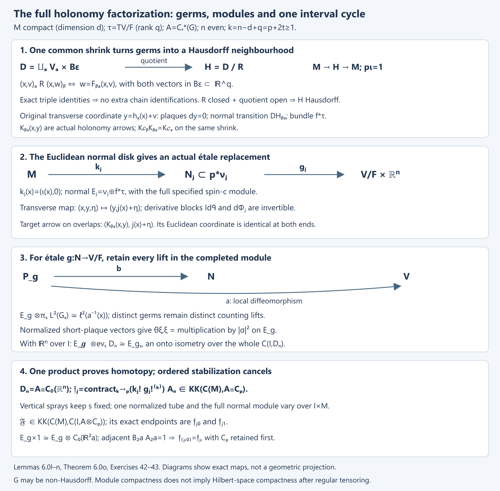

**Figure 6.0c.** Lemmas6.0l–n and Theorem6.0o, equations (181)–(190), Exercises42–43. The first panel shows the actual finite relation after a common shrink; closedness of that relation and openness of its quotient establish Hausdorffness. The second panel has the exact transverse derivative and ordered normal. The third panel shows the anchors for a general étale map into \(V/F\); its last line includes the fixed Euclidean product used in the factorization. Every distinct holonomy germ remains in the counting fibre. The fourth panel shows one actual interval product and the ordered even cancellation, with the old Clifford block retained first. All tensor products with Clifford coefficients are graded. These are diagrams of maps and modules, with no geometric projection or assertion that the arrow space is Hausdorff. The construction is classical [Connes, Section11; Haefliger, 1970]; the complete shrinking, module and parameter comparisons are proved above.

Full-size factorization PNG · Editable factorization SVG.

### Coefficient bundles and the projection formula

We first prove the coefficient-bundle identity on an actual tube and counting correspondence, then identify the ordinary graph construction with the zero-foliation case. The geometric inputs are the full DG-CHAR bundle and DG-FND unitary transport proofs linked above. The finite-module and analytic product inputs are Corollary6.0d, Lemmas6.0e–j/6.0n and Section0.

For a smooth Hermitian bundle \(E\to X\), write
\(u_X(E)=[\Gamma_0(E),\mathrm{mult},0]\) as a class in \(KK(C_0(X),C_0(X))\), with \(E\) even. This notation makes sense also for noncompact \(X\). A countable relatively compact frame cover, its compact chart exhaustions and countable scalar coefficient approximations give a countable norm-dense set of sections. Finite chart partitions approximate any compact section in the supremum norm; compact cutoffs then approximate any section vanishing at infinity. The identity on a finite frame patch is a finite sum of section rank-one maps. A finite partition on a compact coefficient support makes multiplication by a nonnegative coefficient a finite sum of such maps, using the partition's square roots; linearity and approximation give all \(C_0(X)\) coefficients. Thus the module is countably generated, the left action is compact, and the zero-operator cycle is defined. It does not require a global finite trivialization on a noncompact space.

#### Bundle transport on the entire normalized tube

**Lemma 6.0p.** Let \(i:L\hookrightarrow X\) be a compact-source smooth embedding with the specified spin-c normal structure, of rank \(k\). The ambient manifold may be noncompact. For every smooth Hermitian \(E\to X\), there is an equality
\[
u_L(i^*E)\,i_!
=i_!\,u_X(E)^{[k]}
\quad\text{in }KK(C(L),C_0(X)\widehat\otimes C_k).
\tag{196}
\]
Here \(u_X(E)^{[k]}\) denotes its exterior extension by the identity on the retained \(C_k\). Both products are represented on the actual essential tube modules. The equality retains every twist of the prescribed normal orientation.

**Proof.** Choose the normalized whole-bundle tube \(\tau:\nu_i\to U\subset X\) of Lemma6.0e. Choose a Hermitian metric connection on \(E\). The exact DG-FND connection construction applies to its unitary frame bundle, using the already proved smooth bump partition; its associated transport is unitary. For each \((x,v)\in\nu_i\), transport from \(i(x)\) to \(\tau(x,v)\) along
\(t\mapsto\tau(x,tv)\), \(0\leq t\leq1\). Denote the resulting unitary by
\(T_{x,v}:E_{i(x)}\to E_{\tau(x,v)}\).
This is defined on the entire normal bundle. For a fixed finite \(v\), its path is a compact smooth path on the full interval; the unitary transport ODE has no finite-time escape, by the full associated transport proof. Smooth parameter dependence on each compact family of \((x,v)\) follows from that same ODE argument, so \(T\) is a globally smooth bundle map. At \(v=0\) it is the identity.

Let \(\mathscr H_\nu\) be the specified spin-c Thom module over \(C_0(\nu_i)\widehat\otimes C_k\), and let \(F_\nu\) be its normalized Clifford multiplier. Its left coefficients are pulled back from \(L\). Tensoring on the left by \(\Gamma(i^*E)\) gives the module of sections of \(\pi^*i^*E\otimes\mathscr H_\nu\), with operator \(1_E\otimes F_\nu\). Tensoring the tube realization on the right by \(\Gamma_0(E)\widehat\otimes C_k\) gives the tube-supported module of sections of \(\tau^*E\otimes\mathscr H_\nu\), with that identical normal multiplier. In both cases the module is extended by zero from \(U\), and its range is the essential submodule for \(C_0(U)\).

These are the actual Kasparov products. Multiplication/creation by a bundle section commutes with the normal Clifford multiplier, since the bundle is even and the multiplier acts on the other factor. The creation connections are therefore exact. For the right product the positivity test is the nonnegative localized square \(2F_\nu^2\); for the left zero-operator product it is zero. The localized compact defects are the Thom defects tensored with a finite bundle on a compact patch. A finite partition on the coefficient support and norm approximation prove their compactness on the whole module. The product criterion of Section0 thus gives these operators on the completed tensor modules. Essential open extension uses Lemma0.10, without an orthogonal-complement premise.

The pointwise map
\[
e\otimes\psi(v)\longmapsto
T_{x,v}e\otimes\psi(v),\qquad x=\pi(v),
\tag{197}
\]
is an even isometry preserving both coefficient actions and the normal multiplier. Its inverse is pointwise \(T_{x,v}^{-1}\). It sends the dense compact section cores onto one another; support is retained because both maps cover the identity of \(\nu_i\), and their norm is one. Hence it extends to an onto unitary of the whole completed essential modules. All spin-c/Morita factors are untouched. This unitary proves the displayed equality. Neither a characteristic-character comparison nor a proper pullback along \(\pi\) was used. \(\square\)

#### The ordinary-target étale bundle identity

**Lemma 6.0q.** If \(g:S\to Y\) is a smooth local diffeomorphism between Hausdorff second-countable manifolds and \(E\to Y\) is a smooth Hermitian bundle, then
\[
u_S(g^*E)\,g_!=g_!\,u_Y(E)
\quad\text{in }KK(C_0(S),C_0(Y)).
\tag{198}
\]
The map need not be proper or injective.

**Proof.** The identity groupoid on \(Y\) is the zero-dimensional foliation groupoid. Lemma6.0n gives the completed module \(\mathcal E_g\) from its compact source core, with
\[
\langle\xi,\eta\rangle(y)
=\sum_{s\in g^{-1}(y)}\overline{\xi(s)}\eta(s),
\qquad (\xi a)(s)=\xi(s)a(g(s)).
\tag{199}
\]
It retains all the preimages. Its compact left action is local: an injective \(g\)-chart gives the rank-one identity for a supported source coefficient, and a finite partition gives the general compact-support coefficient. This is also the leaf-dimension-zero case of the complete proof of Lemma6.0n.

The right-hand product completes compact sections of \(g^*E\) in the counting inner product. On elementary tensors its map to that completion is
\(\xi\otimes e\mapsto[s\mapsto\xi(s)e(g(s))]\).
Its inner product is exactly the tensor inner product, as follows by summing in a fibre \(g^{-1}(y)\). Its image is dense: on a compact source chart support, choose a finite orthonormal-frame cover of its compact target image and compact target cutoffs equal to one on the smaller images. A source partition writes a section as a finite sum of source scalar coefficients times these pulled-back target sections. The tensor map therefore extends to an onto isometry.

The left-hand product has the same dense section core. The pointwise tensor map from \(\Gamma_0(g^*E)\otimes_{C_0(S)}\mathcal E_g\) has the same inner product and is onto by a source cutoff equal to one on any compact section support. Both coefficient actions match, and both operators are zero. Compact source coefficients are still compact on these modules, by the finite local frame and rank-one proof just given. These zero operators satisfy the connection and positivity conditions and hence represent the two products. The two onto tensor maps identify them as actual cycles. There is no unsupported pullback homomorphism \(C_0(Y)\to C_0(S)\) when \(g\) is nonproper: its right action is the bounded multiplier \(a\circ g\) on the counting module. \(\square\)

#### Identifying the ordinary map inside the full foliation construction

**Lemma 6.0r.** Let \(h:L\to Y\) be smooth, with \(L,Y\) compact and with a specified full stable orientation on \(h^*TY-TL\), represented in the doubled-tangent convention of (13). Regard \(Y\) as the leaf space of its zero-dimensional foliation. The full foliation product of Theorem6.0o is exactly the ordinary graph product
\[
h_!=\operatorname{contract}_{k\to p}(I_!)
 A_n^{C(Y)\widehat\otimes C_p},
\qquad I=(h,j),\quad k=n-\dim L+\dim Y=p+2t.
\tag{200}
\]
Here \(j:L\hookrightarrow\mathbb R^n\) is an even embedding of sufficiently large dimension, and the graph normal has the orientation of Lemma6.0j/Corollary6.0k.

**Proof.** The identity groupoid has no nonunit arrows. Choose the microbundle to be an open graph neighbourhood \(H\subset L\times Y\), with projection to \(L\), section \(x\mapsto(x,h(x))\), and foliation given by constant \(Y\)-coordinate. Its normal quotient is \(h^*TY\): in coordinates the quotient sends \((u,w)\) to \(w-dh(u)\). This is precisely the germ of Lemma6.0l, since its local transverse germs are the ordinary coordinate transitions of \(Y\), and its arrows are units. Theorem6.0o permits this choice of neighbourhood model.

On a uniform normal disk for \(j\), put
\(N\subset p^*\nu_j\), with coordinates \((x,y,\eta)\), and
\(g(x,y,\eta)=(y,j(x)+\eta)\).
The map \(\Phi_j(x,\eta)=j(x)+\eta\) is an injective local diffeomorphism on that disk. Consequently \(g\) is injective: its Euclidean coordinate determines \((x,\eta)\), and its other coordinate determines \(y\). It is a local diffeomorphism, so an open embedding into \(Y\times\mathbb R^n\). The principal-space module for this open inclusion is exactly the essential module \(C_0(N)\) over \(C_0(Y\times\mathbb R^n)\), through extension by zero: the counting fibres have at most one point, and the core inner product is that zero extension. Thus \(g_!=[e_g]\).

The compact section \(k:L\to N\) has \(gk=I\). Its ordered normal \(\nu_j\oplus h^*TY\) maps to the graph normal by the quotient isomorphism of Corollary6.0k. This is exactly the normal identification induced by \(dg\). The specified orientation transported through it agrees with the graph structure constructed in Lemma6.0j; the same \(TL\oplus h^*TY\), Euclidean complement and cancellation recovery maps are used. A normalized tube for \(k\), composed with \(g\), is a normalized tube for \(I\) after that normal identification and metric transport. Hence the explicit Thom/open-extension construction gives
\(k_![e_g]=I_!\).
Lemma6.0e makes this equality independent of the chosen tubes. Contracting the retained Clifford block and applying the fixed Euclidean inverse proves the assertion. All line twists are retained in the same module, rather than reconstructed from their determinant. \(\square\)

#### The full projection formula in both K degrees

**Theorem 6.0s.** With the hypotheses and orientations of Lemma6.0r, for every smooth complex bundle \(E\to Y\),
\[
u_L(h^*E)\,h_!=h_!\,u_Y(E)^{[p]}
\quad\text{in }KK(C(L),C(Y)\widehat\otimes C_p).
\tag{201}
\]
Consequently the ordinary wrong-way map on either K degree satisfies
\(h_!(h^*[E]\,b)=[E]h_!(b)\), for every \(b\in K^*(L)\). The same statement holds for every class of \(K^0(Y)\), by differences of bundles. This is the projection formula used for sphere modification and the ordinary boundary inclusion in Theorem 6.1. Theorem 6.0w proves their composition law, and Theorem 6.0ad below proves the sphere fibre normalization.

**Proof.** Let \(E_n=\mathrm{pr}_Y^*E\to Y\times\mathbb R^n\). Apply Lemma6.0p to the graph embedding \(I=(h,j)\):
\(u_L(h^*E)I_!=I_!u_{Y\times\mathbb R^n}(E_n)^{[k]}\).
The normal orientation is the specified one in Lemma6.0r. The fixed finite contraction acts only on Clifford factors; because \(E\) is even, its tensor reassociation commutes with that contraction, including the retained odd transport of Proposition6.0i.

The Euclidean inverse is a coefficient extension of one fixed inverse, and the bundle is constant in that Euclidean direction. More precisely,
\(u_{Y\times\mathbb R^n}(E_n)=u_Y(E)\boxtimes1_{C_0(\mathbb R^n)}\).
On the completed module this is the tensor unitary \(e(y)\otimes a(v)\mapsto a(v)e(y)\); elementary compact sections are dense, by a finite parameter partition on compact product supports. Exterior product naturality and its associating unitary in Section0 therefore give
\[
u_{Y\times\mathbb R^n}(E_n)^{[p]}
 A_n^{C(Y)\widehat\otimes C_p}
= A_n^{C(Y)\widehat\otimes C_p}u_Y(E)^{[p]}.
\tag{202}
\]
One can also read that map on the Euclidean inverse module: it transports the even \(E_y\) factor past the fixed oscillator/Clifford factor. Both coefficient actions and the oscillator are preserved, since the latter acts only in the Euclidean variable. There is no graded sign from \(E\). Associativity, graph projection and Lemma6.0r now prove the stated KK equality.

Apply a scalar K-class \(b\) on the left. Associativity identifies its product with \(u_L(h^*E)\) with multiplication by \(h^*[E]\); the exact scalar \(K=KK\) and bundle-class identifications of Section0 and the linked programme K-theory proofs establish this in both degrees. The right product with \(u_Y(E)\) is multiplication by \([E]\). Exterior extension of the one retained Clifford block gives the same calculation for odd \(b\). This proves the K-theory formula without a trace or rationalization.

For completeness, smooth bundles cover all coefficient \(K^0(Y)\) classes. The exact projection classification writes any class as a difference of continuous matrix projections. Approximate a continuous Hermitian projection \(P\) uniformly by a smooth Hermitian matrix \(a\) with \(\|a-P\|<1/4\). This approximation follows directly on compact \(Y\): a finite relatively compact chart cover, a smooth partition, and convolution with normalized compact smooth Euclidean bumps approximate each continuous entry uniformly by uniform continuity; symmetrization keeps the matrix Hermitian. Every spectrum of \(a_t=(1-t)P+ta\) lies within \(1/4\) of \(\{0,1\}\), by the resolvent Neumann estimate for a self-adjoint perturbation. The contour projection
\(P_t=(2\pi i)^{-1}\int_{|z-1|=1/2}(z-a_t)^{-1}\,dz\)
is therefore norm continuous in \(t\), begins at \(P\), and ends at a smooth orthogonal projection. Its final range is a smooth Hermitian bundle, and the homotopy preserves the K-class. Linearity thus proves the formula for every virtual coefficient class. \(\square\)

### Composition with its induced stable orientation

The middle ordinary manifold is compact, but its Euclidean product is not. We therefore first prove the variable-radius tube comparison on a noncompact base. The resulting ordered embedding product and completed étale correspondence then give the full foliation composition law. The classical Thom/open-extension construction is also treated by [Carey–Wang, Sections4.1/4.3]; the actual KK modules, both parity contractions and full orientation recovery are proved below.

#### Variable-radius tubes and noncompact embedding composition

**Lemma 6.0t.** The normalized-tube independence and ordered embedding composition of Lemma6.0e/Theorem6.0f hold for arbitrary smooth Hausdorff second-countable source and intermediate manifolds, using their \(C_0\) algebras, specified normal spin-c modules, and whole normalized tubes. No proper base pullback is assumed. In particular they apply to a compact graph embedding into \(M\times\mathbb R^r\), followed by the product embedding \(k\times1_{\mathbb R^r}\).

**Proof: variable compression.** Let \(E\to X\) be the specified metric normal bundle. For any smooth positive function \(a:X\to(0,\infty)\), put
\[
D_aE=\{|v|<a(x)\},\qquad
q_{a,s}(x,v)=\left(x,\frac{v}{\sqrt{1+s^2|v|^2/a(x)^2}}\right),
\quad 0\leq s\leq1.
\tag{203}
\]
At zero this is the identity; at one it is a diffeomorphism onto \(D_aE\), with identity vertical differential at the zero section. For positive \(s\) its image is \(D_{a/s}E\), and its inverse has the denominator \(\sqrt{1-s^2|w|^2/a(x)^2}\). Therefore the joint parameter map is an injective local diffeomorphism onto a relatively open image. Extension by zero gives homomorphisms on \(C_0(E)\), retaining the constant Clifford algebra.

They form one norm-continuous interval homomorphism. For a compact source support \(K\subset E\), its joint image under \((s,v)\mapsto(s,q_{a,s}(v))\) is compact and lies inside the open image. The inverse formula proves continuity there. At the image boundary a nonzero level \(\epsilon\) would have preimage in the compact set \(\{|f|\geq\epsilon\}\), whose joint image is closed and remains inside that open image. Thus the extension is continuous there with value zero. Uniform continuity on a compact neighbourhood of the support, followed by density and the contractive homomorphism bound, proves norm continuity for every \(f\in C_0(E)\). No lower bound for \(a\) on all of \(X\) is needed. The global Thom equivalence gives
\[
\beta_{D_aE}[e_{D_aE\hookrightarrow E}]=\beta_E,
\qquad \beta_{D_aE}=\beta_E[e_{q_{a,1}}].
\tag{204}
\]
Both Thom classes are invertible by the global theorem and the disk algebra isomorphism, so the indicated disk inclusion has the same actual cancellation as in Lemma6.0e.

**Proof: one global comparison homotopy.** Given two normalized tubes, their comparison germ is \(g=\tau_1^{-1}\tau_0\). The maps \(g_s=\lambda_{1/s}g\lambda_s\), with \(g_0=1\), have the smooth extension proved in (153). Their zero-section derivative has blocks \(\left(\begin{smallmatrix}I&sA_x\\0&I\end{smallmatrix}\right)\). For each \(x\), compactness of the parameter interval gives a base neighbourhood \(O_x\) and a positive radius on which every \(g_s\) is defined, locally invertible and has output vector norm less than one. Choose a countable locally finite refinement and a smooth partition subordinate to these neighbourhoods. On each refined chart choose a smaller admissible constant radius \(a_i<1/2\), and set \(a(x)=\sum_i\theta_i(x)a_i\). At a point, each active radius is admissible there, and the weighted average is no greater than their largest admissible radius. Hence every \(g_s\) is defined and locally invertible on \(D_aE\), with image in \(D_1E\). This is the full positive-minorant construction, rather than a uniform radius assertion on a noncompact base.

Each positive-parameter \(g_s\) is injective as a composition of injective maps; \(g_0\) is the identity. The joint map is therefore an injective local diffeomorphism of the relative interval domain. The same compact-support and compact-level-set proof just given gives one homomorphism
\(C_0(D_aE)\widehat\otimes C_k\to C(I,C_0(D_1E)\widehat\otimes C_k)\).
Its endpoints are the inclusion and the comparison map. Multiply by \(\beta_{D_aE}\), use the variable disk cancellation, and extend into the ambient manifold as in (154). This proves global tube independence directly by a single interval cycle; local equality on each compact set is not being mistaken for a global KK proof.

**Proof: the actual embedding product.** Write \(i:X\hookrightarrow Y\), \(j:Y\hookrightarrow Z\), \(E=\nu_i\), \(F=\nu_j\), with normal ranks \(k,\ell\). Fix whole normalized tubes \(\tau:E\to Y\), \(\sigma:F\to Z\). A spin-c connection on \(F\) gives full smooth transport \(T_{x,v}\) along \(t\mapsto\tau(x,tv)\). Every finite parameter has a compact path interval, so the exact DG-FND transport proof applies without global compactness of \(Y\). As in (157),
\(\Psi(x,v,w)=(\tau(x,v),T_{x,v}w)\)
is a diffeomorphism \(E\oplus i^*F\to F|_{\tau(E)}\), and \(\sigma\Psi\) is a whole tube for \(ji\), with the ordered normal splitting from its derivative.

The global \(F\)-Thom cycle restricted to \(C_0(\tau(E))\) has precisely its essential section module over \(F|_{\tau(E)}\). Compactly supported local section approximations and an ideal approximate identity prove both inclusions of that range. Its multiplier, compact defects and creation connections restrict exactly, as in (158). Transport through the actual diffeomorphism \(\Psi\) gives the coefficient Thom cycle \(\gamma\) for \(i^*F\) over the old total space \(E\), and
\([e_\tau]\beta_F^{[k]}=\gamma[e_\Psi][e_{F|_{\tau(E)}\hookrightarrow F}]\).
Here the only total-space transport is a homeomorphism and hence proper between the two displayed total spaces. There is no assumed \(C_0\) pullback along \(i\) or a bundle projection.

The ordered global bundle product (147)–(148) gives \(\beta_E\gamma=\beta_{E\oplus i^*F}\). Its proof uses compact old creation sections and base cutoffs. On their compact base supports the connection estimates are uniform, and at joint fibre infinity they decay; density proves the complete connection condition. Its positivity is the nonnegative expression (147). Thus it applies to this noncompact base in its proved generality. Both full spin-c transition modules tensor in order, with even transition units. Associativity and open extension now give
\[
i_!j_!^{[k]}=
\beta_{E\oplus i^*F}[e_{\sigma\Psi}]=(ji)_!
\quad\text{in }KK(C_0(X),C_0(Z)\widehat\otimes C_{k+\ell}).
\tag{205}
\]
The superscript retains the old \(C_k\) before the new \(C_\ell\).

Finally, the triangular splitting maps \((v,w)\mapsto(v+sAw,w)\) and their inverses are uniformly bounded on every compact base set, even though no global bound is claimed. Compact input supports consequently have uniformly compact transported supports. Their total-space algebra maps form a norm-continuous interval family by continuity and density. Transporting the metric and specified orientation gives the identical multiplier/defect homotopy on each compact coefficient support, and hence the full cycle. Connections and metrics have their previously proved interval comparisons. The variable-radius tube argument finishes their comparison. This proves the same auxiliary-choice assertion as Theorem6.0f in the stated larger generality. \(\square\)

#### Any compatible étale realization has the canonical germ

**Lemma 6.0u.** Let \(L\) be compact, \(J:L\hookrightarrow\mathbb R^N\) an even Euclidean embedding, and \(f:L\to V/F\) a smooth actual arrow cocycle. Suppose \(k:L\hookrightarrow Z\) is an embedding into a Hausdorff second-countable manifold and \(g:Z\to V/F\times\mathbb R^N\) is étale, with \(gk=(f,J)\) as an arrow-cocycle map. After shrinking near the compact section, this factorization is equivalent to the canonical factorization of Lemmas6.0l–m by a germ diffeomorphism and an actual target-arrow equivalence. If its full normal orientation is the transported specified canonical normal module, its full KK product is the canonical product, before and after the fixed Clifford contraction and Euclidean inverse.

**Proof.** The Euclidean coordinate of \(g\) is a single smooth map \(z:Z\to\mathbb R^N\), because every transition arrow retains that coordinate. A Euclidean tube \(\Phi_J(x,\eta)=J(x)+\eta\) is an open embedding near the compact zero section. Restrict \(Z\) to \(z^{-1}(\operatorname{im}\Phi_J)\) and define \((x(n),\eta(n))=\Phi_J^{-1}(z(n))\). These are smooth, and on \(k(L)\) are \((x,0)\).

Choose finitely many target foliation boxes and local cocycle lifts near that section. Replace each lift by its fixed plaque cross-section using its short plaque arrow, as in Lemma6.0l. At the section the given equality of cocycles supplies equivalence arrows to the fixed lifts of \(f\). Their path charts give fixed transverse holonomy branches near each centre; compose the local transverse coordinate with the inverse of that branch. This aligns it with the transverse coordinate of \(f\) at the centre. Where two aligned charts overlap, their transition branch and the canonical branch have the same germ at that centre, including the actual holonomy arrow. The finite closed-overlap shrinking proof of Lemma6.0l applies to these comparisons: branch agreement and arrow agreement are open, and compactness of the centre overlaps gives one common neighbourhood on which they agree.

The resulting local maps
\(n\mapsto(x(n),y_a(n),\eta(n))\)
therefore glue into the canonical neighbourhood \(N_J\). They also glue the actual arrow equivalence of the two target cocycles. They send \(k(x)\) to \(k_J(x)\). Their derivative is invertible: the étale coordinates of \(g\) are \((y_a,z)\), and replacing \(z\) by \((x,\eta)\) uses the Euclidean tube inverse. Thus this is a local diffeomorphism near the entire section.

It is injective on a smaller neighbourhood. Use a tubular disk of the compact embedding \(k\). If no common smaller disk were injective, unequal pairs with normal norms tending to zero would have equal images. Their bases have convergent subsequences in \(L\). The equal image limits force those two base limits to coincide, since the map is identity on the section. Local invertibility at that common limit contradicts equality of the late pairs. Consequently the map is a diffeomorphism of open neighbourhoods of the two sections.

Its normal derivative is the actual normal quotient isomorphism. Transport the specified normal module and metric through it. Composing a normalized tube with the diffeomorphism and using tube independence identifies the embedding factors; the total-space linear normal isomorphism is a homeomorphism and hence proper. Lemma6.0n's explicit arrow-equivalence unitary identifies the middle modules. Its essential restriction identity and the compact-source small-tube identity allow both products to use these smaller neighbourhoods. The fixed finite contractions and inverse then preserve their equality. \(\square\)

#### The induced stable orientation is a full module

Let \(h:L\to M\) be smooth with \(L,M\) compact, and let \(f:M\to V/F\). Put \(l=\dim L\), \(m=\dim M\), \(T=h^*f^*\tau\). Prescribe the stable orientations of \(h\) and \(f\). Choose even Euclidean embeddings \(u:L\hookrightarrow\mathbb R^r\), \(j:M\hookrightarrow\mathbb R^n\), with positive graph normal ranks. The actual normal modules of Lemma6.0j are
\[
E_h=\nu_u\oplus h^*TM,\quad k_h=r-l+m,
\qquad E_f=\nu_j\oplus f^*\tau,\quad k_f=n-m+q.
\tag{206}
\]
The graph \(I_h=(h,u)\) is an embedding into \(M\times\mathbb R^r\). Follow it by \(k_j\times1\) into \(N_j\times\mathbb R^r\). The composite \(K=(k_jh,u)\) has ordered normal
\(E=E_h\oplus h^*E_f\), through the normal exact-sequence splitting of Lemma6.0t. Its full module is
\(\mathscr M_E=\mathscr M_{E_h}\widehat\otimes h^*\mathscr M_{E_f}\), with right block \(C_{k_h}\widehat\otimes C_{k_f}=C_k\), \(k=n+r-l+q\). The two Euclidean blocks are even.

**Lemma 6.0v.** This ordered normal module induces precisely a stable orientation of
\((fh)^*\tau-TL\), the sum of \(h^*TM-TL\) and \(h^*(f^*\tau-TM)\). It can be converted to the doubled-tangent convention by explicit finite Morita cancellation, and Lemma6.0j recovers the entire normal module from it. Its class is independent of \(u,j\) and the exact-sequence splitting. A line twist \(H\) of \(h\) and a line twist \(D\) of \(f\) give the composite twist \(H\otimes h^*D\), not merely its squared determinant.

**Proof: the normal quotient.** The étale map \(g_j\times1\) has Euclidean component \((j(x)+\eta,w)\). Its composite with \(K\) is \((fh,J)\), where \(J=(jh,u):L\hookrightarrow\mathbb R^{n+r}\) is an embedding because \(u\) already is one. The transverse derivative identifies the normal quotient of \(K\) with
\((T\oplus\mathbb R^{n+r})/d(fh,J)(TL)\).
The transverse differential \(d^\perp(fh):TL\to T\) is global: in each fixed holonomy branch the derivative of the local transverse lift changes by exactly the derivative transition of \(T\).

Writing \(U=TL\) with a metric and \(G_J=dJ^*dJ\), the explicit quotient isomorphism to \(E_J=\nu_J\oplus T\) sends
\[
[(t,z)]\longmapsto(\eta,t-d^\perp(fh)v),
\qquad v=G_J^{-1}dJ^*z,\quad \eta=z-dJv.
\tag{207}
\]
Adding \((d^\perp(fh)a,dJa)\) changes \(v\) to \(v+a\) and leaves both output components fixed. Its inverse sends \((\eta,t)\) to \([(t,\eta)]\), so it is a smooth quotient isomorphism. Compose it with the ordered normal splitting to obtain \(\chi:E\to E_J\). Transport the metric and full module through \(\chi\). This supplies the specified positive-rank spin-c normal structure in Lemma6.0u.

The stable normal identity is an identity of actual ordered bundle representatives:
\[
(E_h-\underline{\mathbb R^r})+
(h^*E_f-\underline{\mathbb R^n})
=E-\underline{\mathbb R^{n+r}}
\simeq T-U.
\tag{208}
\]
The swap of the two even Euclidean blocks uses their canonical complex exterior unitary. Their stable orientation is the ordered tensor of the full normal modules followed by that same Euclidean cancellation. This defines the induced orientation of the sum in (13), with its transition phases; the equality is not inferred from characteristic classes.

**Proof: exact double-convention recovery.** Let \(Q_U=U\oplus U\) have the canonical interleaved complex module \(\mathscr M_{Q_U}\). Before using \(\rho_J\), compare the metric transported by \(\chi\) with the orthogonal sum metric on \(\nu_J\oplus T\) by Corollary6.0d's positive metric isometry. This transports the full module, including its line, rather than treating a nonorthogonal map as a Clifford *-map. Let \(L_c=U\oplus T\), and use Lemma6.0j's explicit isometry \(\rho_J:E_J\oplus Q_U\to L_c\oplus\mathbb R^{n+r}\). Carry \(\mathscr M_{E_J}\widehat\otimes\mathscr M_{Q_U}\) through \(\rho_J\) to a module
\(P:A_{L_c}\widehat\otimes C_{n+r}\rightsquigarrow C_{l+q}\widehat\otimes C_{n+r}\).
On its right this uses the consecutive-generator regrouping
\(C_k\widehat\otimes C_{2l}=C_{k+2l}=C_{l+q+n+r}=C_{l+q}\widehat\otimes C_{n+r}\); no generator permutation is made by this regrouping. Write \(S=\Lambda^*\mathbb C^{(n+r)/2}\), with the fixed interleaved Clifford action. Define
\[
\mathscr M_{L_c}=
(A_{L_c}\widehat\otimes S^*)
\widehat\otimes_{A_{L_c}\widehat\otimes C_{n+r}}P
\widehat\otimes_{C_{l+q}\widehat\otimes C_{n+r}}
(C_{l+q}\widehat\otimes S).
\tag{209}
\]
Both finite evaluation maps of Lemma0.12 give the exact recovery
\(\mathscr M_{L_c}\widehat\otimes C_{n+r}\cong P\), because the canonical even Euclidean module \(S\widehat\otimes S^*\) is the right regular Clifford unit through its actual matrix-unit evaluation. Pulling this recovery through \(\rho_J\) and cancelling \(\mathscr M_{Q_U}\) by the two recovery maps of Lemma6.0j returns exactly \(\mathscr M_{E_J}\). Thus the canonical graph construction with this induced stable orientation has the original full product normal module.

When \(l+q>0\), the local even/odd Clifford reconstruction in Lemma6.0j gives the principal spin-c interpretation of \(\mathscr M_{L_c}\). When \(l+q=0\), the cancellation can give a graded line, including an odd line. Its grading is part of the stable orientation. The canonical rank-zero unit is still the even trivial line; an odd line is not declared to be that unit. Use a positive even stabilized normal representative, as above, to interpret such rank-zero stable data. Accordingly the doubled-tangent phrasing after (13) is understood after even stabilization when necessary. Lemma6.0j's actual finite construction (177)–(178) also applies directly to this graded line: the only principal reconstruction it needs is for the positive normal rank \(k\). The original stable virtual-bundle convention is retained, including its orientation sign.

**Proof: independence and twists.** Interpolate two choices of \(u\) by the common even cos/sin embedding family, and do the same for \(j\). Lemmas6.0g–j give the actual normal families of \(I_h\) and \(k_j\); their product normal exact sequence, the displayed \(\chi\), \(\rho_J\) and both finite cancellations vary smoothly. On a common Euclidean stabilization they therefore give a full \(\mathscr M_{L_c}\) family over \(I\times L\), with fixed left Clifford bundle and fixed right algebra. Parameter transport can be chosen to preserve these actions. In positive rank, choose a spin-c connection whose projected orthogonal connection is the fixed product connection: from any connection subtract the equivariant lift of the difference of its orthogonal projection and that product connection, using \(\mathfrak{spin}^c=\mathfrak{so}\oplus i\mathbb R\). Its interval transport has fixed orthogonal frame and hence intertwines the Clifford action. In rank zero use the unitary connection of the graded line, with its locally constant grading retained. The exact DG-FND transport proof gives even endpoint module isomorphisms. Under a further even Euclidean stabilization the added canonical modules cancel by the same finite evaluations and exterior wedge unitary. Thus the induced stable orientation is independent of these choices.

Splittings have the explicit triangular interpolation of Lemma6.0t, so give the same full comparison family. If the two original orientations are twisted by \(H,D\), their normal modules are tensored by those lines, by (180). The product normal module is therefore tensored by \(H\otimes h^*D\). The displayed cancellations move only Clifford/spinor factors, so return that same line, including any torsion and its grading. This proves all assertions. \(\square\)

#### Composition of the actual foliation products

For parity \(a,b\in\{0,1\}\), write \(x\# y\) for the ordered graded KK product retaining \(C_a\) before \(C_b\), followed by the fixed contraction to \(C_{a+b\bmod2}\). If both are odd, this is the actual \(C_1\widehat\otimes C_1=C_2\) matrix Morita evaluation on \(\Lambda^*\mathbb C\). Moving a retained odd factor past preceding even pairs uses the even triple-cycle unitaries of Proposition6.0i. This is the convention already used in Section0; all products below can equivalently retain the full normal Clifford blocks until the final contraction.

**Theorem 6.0w.** With the hypotheses and the induced full stable orientation of Lemma6.0v,
\[
h_!\# f_!=(f\circ h)_!
\quad\text{in }KK(C(L),A\widehat\otimes C_p),
\qquad p=q-l\pmod2.
\tag{210}
\]
This is an actual KK equality for the completed foliation correspondence. It applies in particular to the sphere projection and the boundary inclusion needed for geometric-cycle descent, with their induced stable orientations.

**Proof.** Use the factorization of \(f\) by \(k_j\), \(g_j\), the Euclidean inverse \(A_n\), and the ordinary graph factorization of \(h\) by \(I_h=(h,u)\), \(A_r\). The latter is exactly the full zero-foliation construction by Lemma6.0r. Lemma6.0t identifies the product embedding class of \(I_h\) and \(k_j\times1_{\mathbb R^r}\) with the class of \(K=(k_jh,u)\), carrying precisely the ordered normal module of Lemma6.0v. It applies despite the noncompact intermediate \(M\times\mathbb R^r\).

The middle module of the product foliation is the onto isometry
\(\mathcal E_{g_j\times1}\cong\mathcal E_{g_j}\widehat\otimes C_0(\mathbb R^r)\)
proved in Theorem6.0o. It preserves the two actions, every counting lift and the zero operator. For its principal space this is exactly \(P_{g_j}\times\mathbb R^r\), not a numerical fibre identification. Thus
\((g_j\times1)_!=(g_j)_!\boxtimes1_{C_0(\mathbb R^r)}\).

Exterior product naturality in Section0 moves the even coefficient inverse \(A_r\) successively through \(k_j\) and \(g_j\). Its associating unitary retains the old normal block before the new normal block. All creation/positivity requirements of these products are already proved for the embedding, the actual zero-operator correspondence, and the ordered Bott classes. Therefore, retaining the full normal blocks until the stated contraction, the product is
\[
\begin{aligned}
h_!\# f_!
&=\operatorname{contract}_{k\to p}
 \bigl((I_h)_!(k_j\times1)_!^{[k_h]}
       (g_j\times1)_!^{[k]}\bigr)
 A_r^{D_n\widehat\otimes C_p}A_n^{A\widehat\otimes C_p}\\
&=\operatorname{contract}_{k\to p}
 \bigl(K_!(g_j\times1)_!^{[k]}\bigr)
 A_{n+r}^{A\widehat\otimes C_p},
\qquad D_n=A\otimes C_0(\mathbb R^n).
\end{aligned}
\tag{211}
\]
The Euclidean target is ordered \(\mathbb R^n\) then \(\mathbb R^r\); its inverse first removes the new \(r\) block and then the old \(n\) block. That is exactly the inverse composition (148), with its fixed even wedge unitary. The two inverse identities, rather than equality of an integer index, identify it with the fixed \(A_{n+r}\).

For clarity, late and early Clifford contraction give the same displayed product through actual maps. Tensor reassociation combines the two ordered full normal algebras as \(C_{k_h+k_f}\). Their canonical matrix factors contract by \(\xi\otimes\eta^*\mapsto\theta_{\xi,\eta}\) and \(\xi^*\otimes\eta\mapsto\langle\xi,\eta\rangle\). The exterior wedge isometry identifies consecutive even pairs. For a retained odd factor, the fixed even three-generator cycles move it past such pairs and preserve the normalized odd central volume, as proved in Proposition6.0i. If two odd factors remain, their ordered \(C_2\) evaluation is the specified final matrix contraction. Composing these associating/evaluation isometries identifies the early contracted tensor module with the late contracted one, preserving both actions and gradings. No ungraded odd permutation is used and no scalar sign is dropped.

Finally, \(g_j\times1\) is étale and its composite with \(K\) is \((fh,J)\), with \(J=(jh,u)\) an even embedding. Lemma6.0v proves that its full normal module is the canonical one for the induced stable orientation. Lemma6.0u therefore identifies this actual factorization product with the canonical \((fh)_!\), through a germ diffeomorphism, a completed arrow-equivalence unitary and essential restriction. The last display proves the claimed equality. \(\square\)

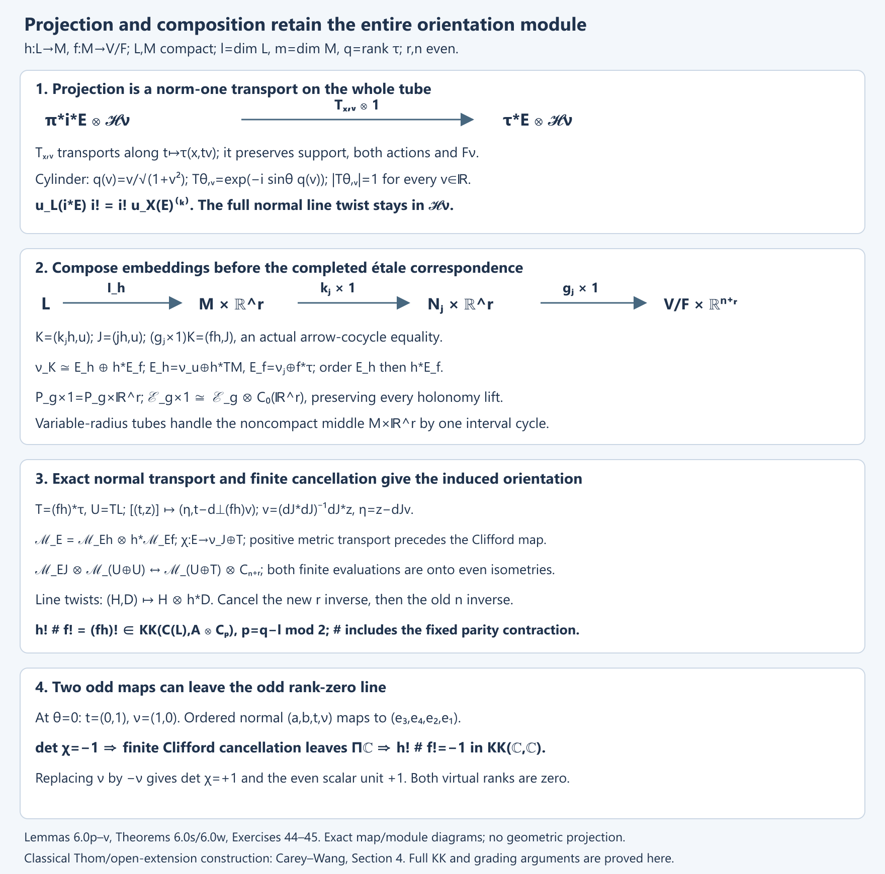

**Figure 6.0d.** Lemmas6.0p–v, Theorems6.0s/6.0w, equations (196)–(211), Exercises44–45. The first panel gives the actual norm-one coefficient transport on the entire normalized tube, including the exact cylinder phase. The second panel retains the product embedding order and every holonomy lift in the completed étale module. The third panel gives the normal quotient, positive metric comparison, full finite-module recovery and ordered inverse cancellation. All Clifford/module tensors are graded, and \(\#\) includes the stated parity contraction. The last panel is the exact point-to-circle-to-point example with the prescribed normal frames; it distinguishes the two stable orientation gradings of virtual rank zero. These are diagrams of maps and modules. The classical Thom/open-extension method is treated by [Carey–Wang, Section4]; all displayed KK and grading comparisons are proved above.

Full-size composition PNG · Editable composition SVG.

### Boundaries, sphere bundles and geometric cycles

The two geometric relations require more than a fibrewise index. A boundary needs its entire map cocycle, bundle and spin-c structure to extend to a double. A sphere bundle needs a global clutch bundle and the inverse full orientation, including any line twist. We prove these constructions in that order.

The geometric prerequisites are Lemma 3.1 and the tubular construction in Manifold duality, the diagonal and Wu classes, and Sections 1–4 of Connections and parallel transport. Theorem 2.1 and Section 3 of Topological K-theory of spaces, pairs and vector bundles provide the full relative bundle comparison and disc compactification. The KK and Clifford inputs are the complete preceding arguments of Sections 0 and 6.

These geometric relations and a zero-section charge construction are also treated by [Liu, Section 2]. The full foliation correspondence, double and ordered orientation comparisons used here are proved below.

#### Embeddings and the graph construction

**Lemma 6.0x.** Let \(i:M\hookrightarrow Y\) be a smooth embedding of
manifolds without boundary, with \(M\) compact. Give its normal quotient \(E\) a specified full stable
spin-c orientation, allowing the canonical even zero-rank module. Give
\(i\) the resulting stable orientation of \(i^*TY-TM\). Its ordinary
graph wrong-way class is the actual tubular class
\[
 i_!=\beta_E[e_\tau]\in KK^{\operatorname{rank}E}(C(M),C_0(Y)).
\tag{216}
\]
In particular the canonically oriented identity map has class \(1_{C(M)}\).
Any specified line twist, including the grading of a stable rank-zero line,
is retained in this comparison.

**Proof.** Take an even Euclidean embedding \(j:M\to\mathbb R^n\),
with \(n\) large enough that every normal rank used below is positive.
The maps
\[
 I_s(x)=(i(x),s j(x)),\qquad 0\le s\le1,
\tag{217}
\]
are embeddings on an open interval about \([0,1]\), even at zero:
the first component already is an embedding. Their normal quotients form
a smooth bundle on that whole interval. Fix a splitting
\(i^*TY=di(TM)\oplus E\), and identify the quotient by
\[
 E\oplus\underline{\mathbb R^n}\longrightarrow\nu_{I_s},
 \qquad(\eta,z)\longmapsto[(\eta,z)].
\tag{218}
\]
This is an isomorphism. To reduce \((y,z)\) to this form, uniquely write
\(y=di(v)+\eta\) and subtract \((di(v),s dj(v))\); injectivity follows
from the same direct-sum decomposition. The matrices and their inverses
depend smoothly on \(x,s\).

Here is the full orientation check, rather than an inference from the
existence of a normal bundle. Put \(W=TM\), \(T=i^*TY\), and give
\(Q=W\oplus W\) its fixed interleaved complex-double module. The
orientation of \(E=T-W\) determines the orientation module on
\(L=W\oplus T\) by the inverse finite construction of (177)–(178).
Over (218) its recovery is transported through the invertible bundle map
\[
 (\eta,z,u,v)\longmapsto(u,di(v)+\eta,s dj(v)+z)
 : (E\oplus\mathbb R^n)\oplus Q\longrightarrow L\oplus\mathbb R^n.
\tag{219}
\]
Transport the metrics by the positive comparison of Corollary 6.0d before
extending this map to a Clifford *-isomorphism. Pull back the full module
\(\mathscr M_L\widehat\otimes C_n\) and apply \(\mathcal C_Q\).
Both evaluation maps of (177)–(178) give a smooth full normal module
family. At \(s=0\) the map is the unstabilized recovery followed by the
identity on the new Euclidean block. The even block move and exterior
evaluation in (179) identify its module with
\(\mathscr M_E\widehat\otimes C_n\), in that order.

At \(s=1\) compare it with the specified graph construction. Use the
complement \(\nu_j\oplus T\) to the graph tangent, sending
\((\zeta,t)\) to \([(t,\zeta)]\). Its recovery before orthonormalization
is
\((\zeta,t,u,v)\mapsto(u,t+di(v),dj(v)+\zeta)\).
The recovery map (176) omits \(di(v)\) in its second coordinate. These
two recoveries are joined by the explicit invertible target shears
\[
 (u,t,z)\longmapsto
 (u,t+\lambda\,di((dj^*dj)^{-1}dj^*z),z),
 \qquad0\le\lambda\le1.
\tag{220}
\]
They are invertible because their diagonal blocks are identities. The
positive factors making \(dj\) isometric are joined to their identities
inside the positive invertible cone. Changes between the two complements
are affine splittings of the same quotient; their convex interpolations
remain splittings. Applying the same positive metric transport, full
module pullback and \(\mathcal C_Q\) to these paths gives actual smooth
orientation-module paths between (219) and (176). On an interval a
principal spin-c connection gives an even endpoint intertwiner, by the
full associated-transport proof in the connection lesson, Sections 3–4. The underlying
orthogonal connection can be prescribed to the chosen metric/splitting
path: its lift is unique in the spin Lie algebra, and the central
connection is retained. Thus these are precisely the prescribed full
orientations. A line tensor is unaffected by every cancellation map;
an odd line is not replaced by an even unit.

Lemma 6.0g applied to (217), with this full family, identifies the embedding
classes of its endpoints. At zero the embedding is the composite of
\(i\) and the zero section \(Y\hookrightarrow Y\times\mathbb R^n\).
The ordered embedding product of Lemma 6.0t, and its even stabilization
comparison, identify its class with \(i_!\widehat\boxtimes\beta_n\).
This remains valid when \(Y\) is noncompact: the compact source is \(M\),
and the intermediate tube uses the positive variable radius of that
lemma. Multiplying by the fixed Euclidean inverse \(A_n\) gives
\(i_!\). At one it gives exactly the graph definition. Its full
Euclidean product cancels by both inverse identities, not just by a
numerical index. This proves (216). For the identity embedding the normal
has rank zero, its tube is the identity, and its canonical Thom module
is the even standard module with zero operator. Its class is the identity.
\(\square\)

#### A separating hypersurface has a null Thom unitary

**Lemma 6.0y.** Let \(D\) be a compact smooth manifold without boundary and
let \(M=\partial Q\subset D\) be the boundary of a codimension-zero
compact smooth submanifold \(Q\). Orient the normal line by the outward
unit normal and give it the canonical spin-c structure. For
\(i:M\hookrightarrow D\),
\[
 (i_!)_*[1_M]=0\quad\text{in }K_1(C(D)).
\tag{221}
\]
This is an integral statement and holds for a disconnected boundary.

**Proof.** Choose a collar with the normal coordinate increasing from
\(Q\) to its complement, and use its whole-line normalized tube
\(\tau:M\times\mathbb R_v\to D\). Its negative end approaches the
inside edge of the collar and its positive end approaches the outside
edge. The full canonical normal module is the right regular \(C_1\)
module. The scalar Thom cycle of Corollary 6.0d is consequently
\((C_0(M\times\mathbb R)\widehat\otimes C_1,1,s(v)\varepsilon)\),
where \(s(v)=v/\sqrt{1+v^2}\). Theorem 0.14, including its naturality
for the possibly degenerate extension-by-zero homomorphism, sends its
scalar class to the explicit unitary
\[
 U(\tau(x,v))=\exp(\pi i(1+s(v))),\qquad
 U=1\quad\text{off the collar}.
\tag{222}
\]
The difference from identity tends to zero at both collar ends, so this
is exactly the extended compact-unitary class. Lemma 6.0x identifies it
with the ordinary map construction, with the same normal orientation.

The real function \(\Theta:D\to[0,2\pi]\) is defined as follows. It
is zero on the part of \(Q\) beyond the inside collar edge, equals
\(\pi(1+s(v))\) on the collar, and is \(2\pi\) on the outside part.
Its one-sided limits are respectively zero and \(2\pi\), hence it is
continuous across both edges. It is defined independently on all
components, including components disjoint from \(M\). The formula
\[
 U_t(x)=\exp(i t\Theta(x)),\qquad0\le t\le1,
\tag{223}
\]
is a norm-continuous path of unitaries in \(C(D)\), since
\(\|U_t-U_{t'}\|\le2\pi|t-t'|\). It joins identity to \(U\).
Thus its \(K_1\)-class is zero. The compactness of \(D\) matters:
we are homotoping unitaries in the unital algebra \(C(D)\). We have not
asserted that \(U_t-1\) vanishes at infinity in an arbitrary noncompact
ambient manifold. \(\square\)

**Corollary 6.0z.** In Lemma 6.0y let \(g:D\to V/F\) have a specified
full stable orientation and let \(E_D\) be a complex bundle on \(D\).
Give \(g i\) the orientation induced in Theorem 6.0w, with the
canonical outward normal first. Then
\[
 (g i)_!([i^*E_D])=0.
\tag{224}
\]

**Proof.** The ordinary projection formula and actual composition give
\(i_!([i^*E_D])=[E_D]i_!([1_M])=0\) and
\((g i)_!([i^*E_D])=i_!([i^*E_D])\widehat\otimes_{C(D)}g_!\).
Here the first scalar class is odd; Theorem 6.0w includes the exact
ordered Clifford contraction for this degree. Formula(221) therefore
proves (224). \(\square\)

#### Extending all the bordism data across a double

The boundary orientation of a K-oriented map \(f:Q\to V/F\) is
specified by
\(f^*\tau-T(\partial Q)=(f^*\tau-TQ)|_{\partial Q}\oplus\mathbb R_{\rm out}\),
with the normal line put first when taking the embedding-then-map
product. The finite full-module evaluation of Lemma 6.0v fixes the block
order. This defines the induced orientation, rather than choosing a
new structure whose determinant only agrees with it.

**Lemma 6.0aa.** Let \(Q\) be a compact smooth manifold with boundary,
\(f:Q\to V/F\) a smooth map cocycle with a specified stable orientation,
and \(E\to Q\) a complex bundle. There exist a compact smooth double
\(D\), a smooth map cocycle \(g:D\to V/F\), a complex bundle
\(E_D\to D\), and a full stable orientation of \(g\), such that on
\(\partial Q\) their map, bundle and induced boundary orientation are
exactly those of \((Q,E,f)\). The hypersurface \(\partial Q\) separates
the first copy of \(Q\) from its reflected second copy.

**Proof: collar and constant data.** In a finite boundary-chart cover,
choose the coordinate inward vectors and multiply them by a smooth
partition of unity. Their normal component is strictly inward along
the boundary; every coefficient is nonnegative and their sum is one.
Extend their finite sum to a smooth vector field on a neighbourhood
inside \(Q\). The full local-flow proof of Lemma 3.1 in the manifold-duality lesson applies in
boundary charts by extending the smooth coefficients across their
coordinate hyperplanes. Compactness of the boundary gives a common
positive existence time. The flow map
\(c: \partial Q\times[0,\delta)\to Q\) has invertible derivative at
time zero, since its time derivative is transverse. Shrink \(\delta\)
so it is locally invertible everywhere on this strip. It is injective
after a further shrink: if distinct pairs at times tending to zero
had equal images, compactness gives a common limiting boundary point,
and its local inverse contradicts the equality. A failure of all
smaller radii gives precisely such a sequence. Thus it is a smooth
collar with a smooth inverse onto its relative open image.

Choose a smooth \(\alpha:[0,\delta)\to[0,\delta)\) equal to zero near
zero and to \(t\) for \(t\) beyond a smaller collar. It can be
\(t\chi(t)\), where \(0\le\chi\le1\) is a smooth cutoff. Define
\(r(c(x,t))=c(x,\alpha(t))\), and put \(r=1\) off this collar. This
is smooth. The interpolation
\(\alpha_u(t)=(1-u)t+u\alpha(t)\) gives a smooth map homotopy fixed on
the boundary. Replacing the map cocycle by \(f r\) makes every lift
and every transition arrow independent of \(t\) near zero. This is
done by literal pullback of the cocycle, so all triple identities and
all holonomy arrows remain. It is not merely a homotopy of its leaf
images. Pullback by \(r\) similarly gives a coefficient bundle equal
to the boundary bundle's product near zero, with its exact specified
boundary identification.

We must also transport the orientation without using the singular
derivative \(dr\). On
\(L_u=TQ\oplus(f r_u)^*\tau\) over \(Q\times[0,1]\), a metric
connection on \(f^*\tau\) transports the second summand along the
paths \(f\circ r_u\) in their cocycle bundles; equivalently pull back
the fixed bundle connection along the map \((x,u)\mapsto r_u(x)\)
in \(Q\). Leave the first summand fixed. This supplies isometries
from \(L_0\) to \(L_u\), with the identity on the boundary. Transport
the entire prescribed orientation, including its scalar transition
line, along them. Near the boundary use a product metric and the
collar splitting
\(L_1=\mathbb R_{\rm out}\oplus(T\partial Q\oplus f_{\partial}^*\tau)\).
Principal parallel transport in the collar direction identifies its
orientation bundle with its restriction at time zero. Its projected
orthogonal connection is chosen to make this product frame constant;
the spin connection is its lift and its central connection is retained.
The lift exists because the differential of the spin cover is an
isomorphism on the orthogonal Lie algebra. On this restricted
principal bundle the construction uses the actual full connection,
whose existence and complete-path transport are proved in the connection lesson,
Theorems 3.1/4.1 and Corollary 4.2. The associated transports are even
unitaries, not determinant-line identifications. No orientation is
inferred from \(dr\).

The connection arguments also apply on a compact manifold with
boundary: in each relative principal product chart choose the zero
potential and average the local connection forms with a smooth
relative partition of unity. The reproduction and equivariance
identities are unchanged. Their coordinate coefficients extend
across the boundary hyperplane, so the full finite-interval ODE
and parameter transport proof applies there. Thus no extension of
the original orientation beyond \(Q\) has been presumed at this step.

**Proof: the reflected principal structure.** The rank
\(k=\dim Q+q\) of \(L_1\) is at least one when the boundary is
nonempty. A stable orientation on this positive-rank bundle is its
actual principal spin-c structure by Lemma 6.0j's reconstruction.
In the positive real Clifford algebra let \(e_1^2=1\), and let
\(R_0\) negate the first coordinate while fixing the others. The map
\[
 \kappa([s,z])=[e_1 s e_1,z]
\tag{225}
\]
is an automorphism of \(\mathrm{Spin}^c(k)\). It preserves the central
\(U(1)\) coordinate and the relation \((-s,-z)\sim(s,z)\).
Its projection is \(A\mapsto R_0 A R_0\): on single Clifford vectors
conjugation by \(e_1\) is \(-R_0\); the two minus signs cancel on
every even Clifford product defining the spin group. The assertion
also holds in rank one, where this automorphism is the identity.

If \(b_a\) are local oriented orthonormal frames of \(L_1\), with
spin-c transition units \(g_{ab}\), give the same real bundle its
opposite orientation using the frames \(b_a R_0\) and the full
transition units \(\kappa(g_{ab})\). Their projections are precisely
the transitions of those opposite frames. The cocycle identity is
preserved by the automorphism, and the unchanged scalar coordinates
retain every line twist. This is a specified full principal structure
on the second copy, denoted \(P^{\rm opp}\).

On the collar choose frames whose first vector is the outward normal.
Their transitions stabilize \(e_1\). Each such spin transition is
an even product of the remaining Clifford generators, and therefore
commutes with \(e_1\); hence \(\kappa(g_{ab})=g_{ab}\), including
the scalar phase. For completeness, the entire preimage of the
orthogonal stabilizer is \(\mathrm{Spin}^c(k-1)\): plane-rotation
lifts in the complement cover its special orthogonal group, and two
lifts of a fixed orthogonal matrix differ by a central phase. This
follows from the kernel calculation in Lemma 6.0j. In rank one the
complement is zero and its surviving line phase is retained.

Form the double by identifying both boundary copies and using the
collar coordinate with opposite signs on the two sides. These collar
charts and the interior charts have smooth transitions. The finite
collar and interior cover proves second countability; disjoint
interior points have disjoint neighbourhoods and collar charts
separate boundary points, so the double is Hausdorff. It is compact
as the continuous image of the two compact copies, and has no boundary.
The tangent identification across the seam reflects the normal and
is the identity on \(T\partial Q\). On the pullback transverse
bundle it is the identity, since the map cocycle is constant in the
normal coordinate. Thus it sends the opposite adapted frame on the
second side to the adapted frame on the first side. The above equal
full transition units let us glue \(P^{\rm opp}\) to \(P\) by the
identity in these principal charts. This gives an actual smooth
principal spin-c bundle over
\(TD\oplus g^*\tau\), projecting to its oriented frame bundle.
The complete scalar phases glue, so no square of a line has been
substituted for the line itself. Metrics and principal data are
product data near the seam; they extend smoothly on the interiors.

The constant map cocycles glue by the identity arrows, and the
constant coefficient bundles glue by their boundary identifications.
Denote them by \(g\) and \(E_D\). On the first side their restriction
to the seam is the original \(f_{\partial}\), coefficient \(E|_\partial\),
and full orientation. Finite double/Euclidean recovery in Lemma 6.0v
commutes with restriction and with these identity gluing maps. Its
composition with the canonical outward normal therefore recovers
exactly the specified induced boundary orientation. This verifies
the last assertion on the full module, rather than only on its
underlying virtual bundle. If some components of \(Q\) have no
boundary, double them disjointly; they impose no boundary assertion.
\(\square\)

**Theorem 6.0ab (full bordism relation).** For every compact smooth
K-oriented bordism \((Q,E,f)\), with the induced full boundary
orientation just specified,
\[
 (f|_{\partial Q})_!([E|_{\partial Q}])=0
 \quad\text{in }K_{q-\dim\partial Q}(A).
\tag{226}
\]
In particular the wrong-way assignment respects the bordism relation
of the geometric cycle group.

**Proof.** Apply Lemma 6.0aa and Corollary 6.0z to its actual double.
All data on the separating hypersurface agree, so (224) is exactly
(226). Neither a longitudinal analytic index nor a rational
character calculation is used. Direct sums and disconnected boundaries
are included by the finite coefficient-module sum.

The opposite boundary convention gives the additive inverse, with
its full orientation. This can be checked explicitly. For a
positive-rank normal module with principal transition \(g\), the
opposite structure has transition \(\kappa(g)\) and physical Clifford
coordinate \(R_0v\). Left multiplication by \(e_1\) satisfies
\(e_1\kappa(g)=g e_1\) and
\(e_1 c^+(R_0v)=-c^+(v)e_1\). It is right-module linear, unitary
and odd. It identifies the opposite Thom cycle with the original
module with reversed grading and negated operator, the additive
inverse cycle of Section 0. Every intervening double and even matrix
evaluation is even, so the same identification passes through full
normal recovery and final parity contraction. Stabilize a zero-rank
normal first if necessary; its line grading remains part of this
calculation. Thus a bordism written as the incoming boundary with
opposite orientation together with the outgoing boundary proves
equality of their two assigned K-classes, with the integral sign
and every line twist retained. \(\square\)

#### The actual clutch bundle

Let \(W\to M\) be a metric real bundle of positive even rank \(2a\),
with its specified full spin-c structure, over a compact smooth manifold
\(M\) without boundary.
Let \(S_W=S_W^+\oplus S_W^-\) be its spinor bundle, with the chirality
(145). Write
\[
 \widehat M=S(W\oplus\mathbb R_s),\qquad
 \pi:\widehat M\to M,\qquad n(x)=(0,1).
\tag{227}
\]
On the closed north hemisphere take \(\pi^*S_W^+\), and on the closed
south hemisphere take \(\pi^*S_W^-\). On their common equator the
clutch isometry is
\[
 c^+(w):S_{W,x}^+\longrightarrow S_{W,x}^-,
 \qquad |w|=1.
\tag{228}
\]
It is unitary because
\(c^+(w)^*c^+(w)=I_+\) and \(c^+(w)c^+(w)^*=I_-\),
by the full Clifford relation and \(|w|=1\). It changes spinor
parity. Gluing by this specified isometry defines a complex bundle
\(b_W\) on \(\widehat M\). Here the restrictions of a complex bundle
on the two hemispheres are ungraded; the signs enter the difference
class below. The construction is smooth: on an equatorial annulus use
\(c^+(w)/|w|\) as its transition between the hemisphere trivializations.
It is equivariant under the actual full spin-c transitions, so every
central line twist of \(S_W\) is retained.

Give the disc bundle \(Q=B(W\oplus\mathbb R_s)\) the map
\(p:Q\to M\) and the full stable orientation
\(p^*TM-TQ=-p^*(W\oplus\mathbb R_s)\), using the inverse of the
ordered sum orientation of \(W\) and the canonical positive real line.
An inverse stable orientation means the inverse full Clifford Morita
module: its two products recover the canonical cancellation module by
the rank-one and inner-product evaluations of Lemma 6.0j. In the
ordered inverse the last real-line block is removed first and the
\(W\) block second, exactly as in (148). In particular
an original twist by a line \(H\) becomes \(H^*\), rather than a
trivialization of \(H^2\). Choose a horizontal splitting of the tangent
sequence; its affine space of splittings and positive metric transport
give the same full stable orientation. Give \(\pi=p|_{\partial Q}\)
its induced boundary orientation, with the outward normal first.
This specifies the orientation of \(\pi\) used below.

**Lemma 6.0ac (north-section class and full orientation).** With these
orientations,
\[
 n_!\widehat\otimes_{C(\widehat M)}\pi_!=1_{C(M)},
 \qquad
 n_!([1_M])=[b_W]-[\pi^*S_W^-].
\tag{229}
\]
The first equality is in KK; the second is in \(K_0(C(\widehat M))\).

**Proof: the full orientation.** The normal of \(n\) is exactly
\(W\), and give it the specified structure. At the north section,
the vertical tangent of \(Q\) is the ordered \((W,\mathbb R_s)\).
The outward normal is \(+\partial_s\). Its boundary tangent is
\(W\). The full inverse for the ordered \((W,\mathbb R_s)\)
removes the last real-line block first. The ordered normal followed
by this inverse therefore has the adjacent factors
\(\mathbb R_s,-\mathbb R_s,-W\).
Their actual evaluation contracts the first pair and leaves the
inverse module of \(W\). If the positive-rank doubled realization
places the even \(W\) block between the two line factors, use the
fixed even block move of Proposition 6.0i before that evaluation;
it preserves every generator action and the normalized odd volume.
Both actual evaluations for the real-line factor are
used; the normalized odd generator is retained until its final ordered
\(C_2\) evaluation. The full positive \(W\) module of \(n\) then
cancels this inverse by
\(\xi\otimes\eta^*\mapsto\theta_{\xi,\eta}\) and
\(\xi^*\otimes\eta\mapsto\langle\xi,\eta\rangle\).
These maps are even, preserve the inner products and both actions,
and are onto by their finite matrix bases. The result is the canonical
even rank-zero unit, including its line and grading. This is exactly
the full induced composite orientation of Lemma 6.0v, since its
recovery maps are these same evaluations. The composite \(\pi n\)
is the identity map. Theorem 6.0w and Lemma 6.0x therefore give the first
identity in (229).

**Proof: the whole clutch class.** The north open hemisphere is the
image of the whole-bundle tube
\[
 \tau(x,v)=\frac{(v,1)}{\sqrt{1+|v|^2}}.
\tag{230}
\]
It fixes \(n\) and its normal derivative at zero is the identity.
It is a diffeomorphism, with inverse \(v=w/s\) for \(s>0\).
The radial disc coordinate \(v/\sqrt{1+|v|^2}\) identifies this
hemisphere compactification with \((B(W),S(W))\); this is the
proper radial homeomorphism proved in the topological K-theory lesson, Section 3. Its boundary
is the equator, with \(c^+(v)/|v|\) the specified boundary comparison.

The Thom cycle in Corollary 6.0d, after its fixed even Clifford
contraction, is the pulled-back spinor module with lower block
\(c^+(v):S_W^+\to S_W^-\), divided by
\(\sqrt{1+|v|^2}\). Its relative K-class is the exact bundle triple
\((\pi^*S_W^+,\pi^*S_W^-,c^+(w))\) on this disc pair.
Here is its actual relative projection. Set
\(T=c^+(v)/\sqrt{1+|v|^2}\). Both defects \(1-T^*T\) and \(1-TT^*\)
are the scalar \(1/(1+|v|^2)\) on their respective spinor bundles.
The even index formula of Theorem 0.14 gives, on
\(\pi^*(S_W^-\oplus S_W^+)\),
\[
 P_T(v)=\frac1{1+|v|^2}
 \begin{pmatrix}|v|^2 I_-&c^+(v)\\c^+(v)^*&I_+\end{pmatrix},
 \qquad P_0=\begin{pmatrix}I_-&0\\0&0\end{pmatrix}.
\]
One verifies \(P_T^2=P_T=P_T^*\) by
\(c^+(v)c^+(v)^*=|v|^2 I_-\).
The difference \(P_T-P_0\) vanishes at fibre infinity, uniformly
over compact \(M\). Its range is the image of the isometry
\[
 S_{W,x}^+\longrightarrow S_{W,x}^-\oplus S_{W,x}^+,\qquad
 \xi\longmapsto\frac{(c^+(v)\xi,\xi)}{\sqrt{1+|v|^2}}.
\]
At the equator that frame has limit \((c^+(w)\xi,0)\);
the range projection tends to \(P_0\), independently of the
direction \(w\). Extend it by \(P_0\) over the south hemisphere.
It is a continuous projection there, whose range bundle is exactly
the clutch bundle with comparison (228). Its reference range is
\(\pi^*S_W^-\).

For precision about nontrivial base bundles, \(P_0\) need not be a
constant scalar matrix. Choose finite Hermitian embeddings of the
two bundles over the compact base and apply the complementary
rotation of the topological K-theory lesson, Theorem 2.1, formula (2.7), to their projections.
That rotation turns a pair agreeing on the boundary into a pair
with the common constant reference of that formula. It
therefore computes a class in the external relative ideal, rather
than incorrectly placing the varying bundle projection in its
unitization. Stabilizing the Fredholm cycle of Theorem 0.14 by these
same finite complements gives that same relative index: its
doubled unitary has first-column range \(P_T\), and its reference
is the target bundle projection. The full relative excision
identification in the topological K-theory lesson, Theorem 2.1 thus sends it to the specified
disc triple. The projection-range construction above identifies
the forgetful class with \([b_W]-[\pi^*S_W^-]\), with the
kernel-minus-cokernel sign of Theorem 0.14. For one complex
coordinate, swapping the two displayed blocks gives the positive
projection with range \((1,z)\) and reference \((0,1)\), as
computed in its Theorem 3.1. No inference from one fibre or a
rational character is needed for a nontrivial \(W\).

The pair
\((\widehat M,\{s\le0\})\) has the same open relative ideal.
The bundle pair \((b_W,\pi^*S_W^-)\), with the identity comparison
on the south hemisphere, restricts on the north disc to exactly
this triple: on the equator that comparison is (228).
the topological K-theory lesson, Theorem 2.1 and relative excision identify its relative class
with the zero-extension of the Thom class. Its forgetful map is
\([b_W]-[\pi^*S_W^-]\). Lemma 6.0x identifies the zero-extended
tubular class with the ordinary map \(n_!\). This proves the second
identity in (229). \(\square\)

**Theorem 6.0ad (sphere fibre normalization).** For this full specified
orientation of \(\pi\),
\[
 \pi_!([1_{\widehat M}])=0,
 \qquad \pi_!([b_W])=[1_M]\quad\text{in }K_0(C(M)).
\tag{231}
\]
For every complex-bundle difference \(a\in K^0(M)\),
\[
 \pi_!(\pi^*a\,[b_W])=a.
\tag{232}
\]
These equalities include nontrivial and two-torsion line twists in the
chosen spin-c structure.

**Proof.** The first identity in (231) is Theorem 6.0ab for the disc
bordism \((Q,\mathbf1,p)\), with exactly its induced boundary
orientation. The disc has compact base and fibre, so is compact and
its boundary is precisely \(\widehat M\). The preceding full
bordism proof applies even though \(p\) itself is a map from a
manifold with boundary; it only uses the closed double's actual
wrong-way class. No unproved class for \(p\) is used.

Apply \(\pi_!\) to the second identity in (229). The first identity
in (229) sends its north-section term to \([1_M]\). The ordinary
projection formula of Theorem 6.0s sends
\([\pi^*S_W^-]\) to
\([S_W^-]\,\pi_!([1_{\widehat M}])=0\).
This proves the second identity in (231). Apply the same projection
formula to \(a\), using additivity for bundle differences, to obtain
(232). The spin-c line tensor in \(b_W\) and its dual tensor in
the orientation of \(\pi\) have been carried through the actual
evaluations in (229). There is no torsion loss. \(\square\)

#### The zero-rank case

If \(W\) has rank zero with the canonical even unit orientation,
\(\widehat M=M_+\sqcup M_-\). Define \(b_0\) to be the trivial
line on \(M_+\) and the zero bundle on \(M_-\). Its rank can be
different on distinct connected components. The bordism is
\(Q=M\times[-1,1]\), with its vertical line positive toward the
\(+\) end. The induced stable rank-zero orientation of the
projection is the even unit on \(M_+\) and the odd unit on \(M_-\).
Indeed the two outward normals are \(+\partial_s\) and
\(-\partial_s\), and the reflection calculation in Theorem 6.0ab
negates the latter class before the ordered odd–odd contraction.
Consequently the actual coefficient modules give
\[
 \pi_!(a_+,a_-)=a_+-a_-,\qquad
 \pi_!([b_0])=[1_M],\qquad\pi_!(1,1)=0.
\tag{233}
\]
These are exact module calculations with zero operators. If the
even stable zero-rank orientation has an additional line \(H\),
use \(b_0=(H,0)\); the projection's full modules are
\(H^*\) and \(\Pi H^*\). They give
\(H^*a_+-H^*a_-\), and the same normalization follows from
\(H\otimes H^*\cong\mathbf1\). This makes explicit why both
zero-rank components cannot silently be assigned the same even
orientation. It also agrees with (229): \(S_W^-=0\) and the north
section has its specified even line.

#### The geometric relation descends

**Theorem 6.0ae (geometric-cycle descent).** For the smooth compact
map-cocycle model and full stable orientations of Section 5, the
assignment
\[
 (M,E,f)\longmapsto f_!([E])
 \quad\text{in }K_{\dim M-q}(A)
\tag{234}
\]
respects all three geometric relations. It therefore defines a
homomorphism \(K_{*,\tau}^{\mathrm{geom}}(BG)\to K_*(A)\) for
this specified model.

**Proof.** Direct sum and disjoint union are the direct sums of the
actual finite bundle and correspondence modules; Section 0 proves
their product additivity. Theorem 6.0ab proves the entire oriented
bordism relation, including the opposite sign and full line twist.

For a sphere modification give \(f\pi\) the induced orientation
from \(\pi\) above followed by the original full orientation of
\(f\). Both sphere and base are compact. Theorem 6.0w applies and
(232), or (233) in rank zero, gives
\[
 (f\pi)_!([\pi^*E\otimes b_W])
 =\pi_!([\pi^*E\otimes b_W])
       \widehat\otimes_{C(M)}f_!
 =f_!([E]).
\tag{235}
\]
The added vertical rank is even, so it changes neither the cycle
parity nor the retained final odd Clifford factor. Its full
orientation is the composed one, whose normal evaluations were
checked in (229); it is not a new determinant-only choice.
The three relations thus generate equal images, proving descent.
This statement does not identify the geometric group with another
topological model, prove twisted analytic/geometric duality, or
prove the longitudinal analytic index theorem. Those are distinct
subsequent theorems. \(\square\)

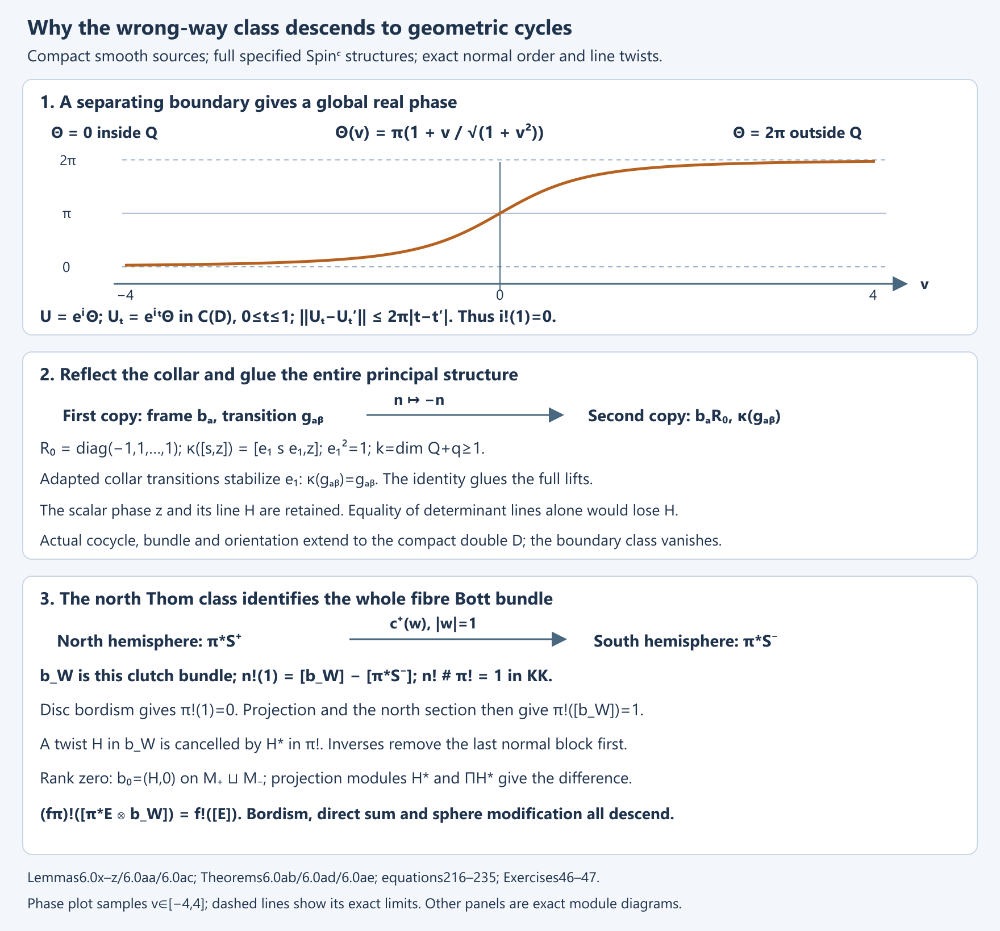

**Figure 6.0e.** Lemmas 6.0x–z, 6.0aa and 6.0ac; Theorems 6.0ab, 6.0ad and 6.0ae; equations (216)–(235); Exercises 46–47. The phase curve samples \(v\in[-4,4]\); its dashed lines are the exact limits zero and \(2\pi\). The global bounded phase gives the norm-continuous null-homotopy (223). The second panel reflects the first normal coordinate and glues the full principal spin-c transitions, including the central phase. The last panel gives the whole north/south clutch bundle, ordered inverse cancellation, disc-bordism normalization and the signed rank-zero calculation. These are diagrams of maps and modules. The classical geometric relations are treated by Connes and by Liu; all displayed foliation KK and full orientation assertions are proved here.

Full-size descent PNG · Editable descent SVG.

**Theorem 6.1 (assembly from wrong-way maps).** For the compact smooth map-cocycle model of Section 5, use the inverse Bott class of Corollary 0.20 and the full vector-bundle Thom class in (16), with the specified stable orientation. Then

\[
\mu[(M,E,f)]=[E]\otimes_{C(M)}f_!
\tag{17}
\]

defines a homomorphism
\(K_{*,\tau}^{\mathrm{geom}}(BG)\to K_*(A)\).

**Proof.** Theorem 6.0o proves invariance under the full factorization choices, cocycle refinements and smooth orientation-preserving homotopies. Theorem 6.0ae proves direct-sum, bordism and sphere-modification descent. Its bordism proof extends all principal and cocycle data across a smooth double and contracts the separating normal-line unitary. Its sphere proof identifies the entire clutch bundle and both ordered orientation cancellations, then proves the coefficient normalization. Thus (17) is independent of every defining cycle relation. Additivity of the actual bundle and correspondence modules makes it a homomorphism. \(\square\)

This gives geometric-cycle descent in the stated smooth cocycle model. Theorem 6.2 below constructs the full twisted cohomology class and proves its compact-test duality. Theorems 7.25 and 7.29 prove the full longitudinal comparison and its symbol action in both degrees. The identification with other assembly models and the isomorphism assertions for assembly have their separate scope in the following sections.

An analytic K-homology class \(x\in KK^j(A,\mathbb C)\) gives the numerical homomorphism below. Theorem 6.2 identifies it with the compact tests of one full twisted cohomology class:

\[
[(M,E,f)]\longmapsto
\mu[(M,E,f)]\otimes_A x\in K_{j+\dim M-q}(\mathbb C).
\tag{18}
\]

Theorem 6.1 and associativity show that it respects all the relations. Theorem 6.2 supplies the full geometric twisted cohomology class on \(BG\), with all integral classes and normal-line data retained, and proves that (18) is its oriented compact-test pairing.

### The full twisted cocycle on the classifying space

The remark on native page 35 of [Connes, §11] concerns twisted cohomology \(K^{*,\tau}(BG)\). We specify its full group and construct the analytic class, then identify its oriented compact tests with (18). The topology and operator-field arguments below use actual holonomy arrows throughout. The classical methods are treated in [Connes–Skandalis, §§3–4], [Moerdijk, §§1–5](https://aif.centre-mersenne.org/item/10.5802/aif.1254.pdf), and [Emerson–Meyer, §3.2](https://arxiv.org/html/0710.1410). All proofs needed here, including the classifying replacement, both manifold triangles and the extension convention, are supplied below.

**Theorem 6.2 (analytic K-homology gives a full twisted geometric cocycle).** Let \(G=\operatorname{Hol}(V,F)\), \(A=C_r^*(G)\), and \(\tau=TV/F\). There is a locally compact Hausdorff second-countable CW model \(X\) for the weak homotopy type of \(BG\), carrying the pullback of its universal actual cocycle and entire normal bundle \(E_X\). With the negative graded-opposite Clifford and positive right-\(C_1\) conventions below, set

\[
 K^{j,\tau}(BG)=RKK_X^j(C_0(X,\operatorname{Cl}^+(E_X)^{\rm op}),C_0(X)),
 \qquad K_j^{\rm an}(A)=KK^j(A,\mathbb C).
 \tag{382}
\]

The analytic group has the complete stable semisplit extension-theory interpretation proved in E. There is a natural homomorphism \(\chi:K_j^{\rm an}(A)\to K^{j,\tau}(BG)\), independent of the complete model with its specified normal comparison. For every compact smooth actual cocycle \(f:M\to V/F\), its full pullback is the field class \(\chi_f\). Every prescribed full stable orientation on \(TM\oplus f^*\tau\) and Hermitian test bundle gives precisely the integral numerical pairing (18), in both degrees, through the full KK equality in (465)–(466). The construction retains all torsion and classes invisible on individual compact stages.

**Proof.** Parts T and C construct the entire analytic family and identify its full Clifford–Fredholm group. B, R, A, U, M, W, V and Q supply the actual classifying cocycle and locally compact model; D supplies its full group and the single analytic class. G proves both actual manifold triangles; H and I give the complete orientation and graph-normal comparison. E proves the source extension convention in both degrees. These are the following complete arguments. The letters label proof parts; equations have the lesson's consecutive numbering.

 #### T1. The actual parameter tube and its étale correspondence

Let M be a compact smooth manifold, f a smooth actual G-arrow cocycle from M to V/F, E=f\*τ and q=rank E. No orientation of E or TM is imposed. The full microbundle construction of Lemma6.0l gives p:H\_f→M, its section ι, normal E and actual arrows over a neighbourhood of ι. In its original charts the plaques have constant transverse coordinate; p need not be constant on a plaque. Choose a fibre-preserving normalized tube as in Theorem6.0o. It is the new target parameter in(383) that is fixed along the target leaves. A positive radial compression identifies all of E with an open smaller neighbourhood U of ι in H\_f. Denote the resulting map by ρ:E→U. It keeps pρ=π\_E and has positive scalar normal derivative at zero. The arrow cocycle g on U has local transverse maps g\_a and exactly the prescribed f\_a on the section, up to its specified short-arrow equivalence.

Use the foliation on V×M with tangent F×{0}. Its groupoid is G×M and its reduced algebra is C(M,A), A=C\*r(G). Define the local lifts

\[
 \widehat g_a(y,v)=(g_a(\rho(y,v)),y),
 \qquad
 \widehat g_{ba}(y,v)=(g_{ba}(\rho(y,v)),y).
 \tag{383}
\]

These are actual arrows, including all holonomy lifts. In transverse coordinates the derivative has the block form [[D\_v g\_a,D\_y g\_a],[0,1]]. The first diagonal block is invertible after the tube shrink. The source E has dimension dimM+q, exactly the transverse dimension of this target. Thus (383) is an étale cocycle from the unit foliation of E. Lemma6.0n gives the entire countably generated Hilbert C(M,A)-module L\_f and a compact, nondegenerate coefficient action φ\_f:C0(E)→K(L\_f), with cycle operator0.

The module is C(M)-linear: on its principal-space core, multiplication by h(π\_E(z)) on the left equals multiplication by h(y) on the right, because the target source parameter is precisely y. Convolution retains y and its inner product is a continuous A-valued function of y. The equality holds on the completion by the essential multiplier action. The compact-action proof is the actual short-arrow normalized rank-one proof of Lemma6.0n; it is not pointwise ordinary compactness on a holonomy cover.

#### T2. The full finite Clifford cancellation, without a spin-c choice

Write C\_M=C(M), C\_E=C(M,Cl+(E)), P\_E=C(M,Cl+(E)^op), where the opposite is the graded opposite. For a homogeneous b, its product and involution are b^op·c^op=(-1)^{|b||c|}(cb)^op and (b^op)\*=(-1)^{|b|}(b\*)^op. These conventions make graded right multiplication an adjoint-preserving representation.

Let W\_E be the finite Hermitian bundle Cl+(E), graded by word parity, with scalar-part trace inner product. Its antisymmetrization identifies it orthogonally and equivariantly with ΛE\_C. On an orthonormal frame, write L\_i for left multiplication by the positive generator and R\_i for graded right multiplication: R\_i(w)=(-1)^{|w|}we\_i. Their actual actions are

\[
 L_i=e_i+\iota_i,\qquad R_i=e_i-\iota_i,
 \qquad e_i=(L_i+R_i)/2,\quad\iota_i=(L_i-R_i)/2.
 \tag{384}
\]

Here e\_i means exterior multiplication, consistently with(129), and is distinct from its self-adjoint a\_i=e\_i+ι\_i. Formula(384) follows on every ordered word: if i is absent, L\_i and R\_i have the same insertion sign; if i is present, their removal signs are opposite. In particular R\_i is skew-adjoint with square−1, as required by the graded-opposite involution. Left and graded-right actions graded commute. Exterior multiplication and contraction generate every matrix unit: the vacuum projection is ∏\_i(1−e\_iι\_i), and creation words, that projection and adjoint creation words give the matrix units between all exterior monomials. The resulting faithful representation is

\[
 C_E\widehat\otimes_{C_M}P_E
       \cong C(M,\operatorname{End}_{\mathbb C}W_E).
 \tag{385}
\]

All actions are orthogonally equivariant; no frame, determinant line or orientation was chosen globally. Both finite Morita evaluations are ξ⊗barη↦θ\_{ξ,η} and barξ⊗η↦<ξ,η>. Their inner products give isometries, and the full matrix units and local finite frames give onto ranges. Finite partitions prove fullness over C(M). Their zero-operator cycles satisfy both product criteria by the complete imprimitivity proof0.12. Rank zero gives W\_E=C\_M and both identities literally.

#### T3. A twisted Bott cycle with its two actual inverse products

Put A\_E=C0(E,π\*Cl+(E)). The complete raw b\_E,d\_E of Lemma6.0a/Theorem6.0c are C(M)-linear and have both inverse products. Their full proofs use orthogonal transitions only, so their balanced external products with P\_E keep that linearity. Let m\_E be the pullback to E of the even Morita equivalence (385). Define

\[
 \widetilde b_E=(b_E\widehat\otimes_{C_M}1_{P_E})m_E
       \in KK_{C_M}(P_E,C_0(E)),\qquad
 \widetilde d_E=m_E^{-1}(d_E\widehat\otimes_{C_M}1_{P_E}).
 \tag{386}
\]

The target of the balanced raw product is A\_E⊗\_{C\_M}P\_E, identified with the compact endomorphisms of π\*W\_E. Both actual Morita evaluations and the two global identities(136), before any parity reduction, give tilde b\_E tilde d\_E=1\_{P\_E} and tilde d\_E tilde b\_E=1\_{C0(E)}. The source has the graded-opposite Clifford action, the target has its ordinary function action, and no odd blocks are silently interchanged.

Its concrete representative is Γ0(E,π\*W\_E), right C0(E), with the source acting by the graded right Clifford operators R\_b, and bounded phase L\_{c+(v)}/sqrt(1+|v|²). Formula(384) makes its graded source commutators zero; its square defect is the scalar−1/(1+|v|²). The pullback endomorphism Morita module identifies this with (386). This also fixes the rank-one sign in the full Clifford convention; no separately ordered real Bott pair is being identified here.

#### T4. The actual universal transverse test family

Define

\[
 k_f=\widetilde b_E\cdot[\mathcal L_f,\phi_f,0]
        \in KK_{C_M}(P_E,C(M,A)).
 \tag{387}
\]

A product representative is π\*W\_E⊗\_{C0(E)}L\_f with the same bounded Clifford phase in v. Local finite W\_E frames and compact fibre cutoffs express a creation vector as a finite column of C0(E) coefficients. Each acts compactly on L\_f. Therefore its complete creation map is rectangular module compact. Norm approximation by these sections treats every creation vector. Multiplication by the bounded phase preserves compactness and adjoints give the second error against the zero operator. The first positivity anticommutator is exactly2B²≥0. Its localized square defect is the compact φ\_f(1/(1+|v|²)), in finite W\_E corners; graded source commutators vanish. This verifies the actual product criterion, including the nonunital C0(E) action, rather than just naming a KK product.

For x∈KK^j(A,C), its external C(M)-coefficient cycle is C(M)-linear. The complete product theorem0.6 therefore gives

\[
 \chi_f(x)=k_f\cdot\tau_{C_M}(x)
       \in KK^j_{C_M}(P_E,C_M).
 \tag{388}
\]

Every adjointable operator in its final module is automatically C(M)-linear, since the specified central left parameter action equals the strict right multiplier action. Thus the actual product construction does not discard parameter linearity. This is a full Clifford-twisted family class, not the scalar index obtained by integrating over M. Additivity, homotopy and all torsion are retained by the full KK products.

#### T5. Compact smooth pullbacks and choices

For h:N→M with N compact smooth, E\_N=h\*E and the pulled cocycle define the same construction over C(N,A). Use the pulled metric and tube. The whole principal space of its étale cocycle is exactly the pullback of the principal space in(383) along the target parameter h. On compact chart cores, the map from the balanced coefficient pullback of L\_f sends ξ⊗a to h\*ξ·a. Its A-valued inner products are the original ones evaluated at h(y), with the same convolution arrow and counting multiplicities. It is an isometry in the complete C(N,A)-module norm. Finite parameter charts and separated parameter/arrow tests give dense range: compact core functions on the pullback are uniformly approximated by finite sums of functions of N times pullbacks of local arrow-chart functions, then the common Schur bound makes that a module-norm approximation. Completion is onto. This proves actual coefficient base change, not merely equality of individual parameter fibres.

The Clifford regular module, both finite evaluations and (386) pull back by their literal formulas. The map of total bundles is proper for compact M,N, so the proved proper-pullback naturality of Corollary6.0d applies. Associativity and the exact even parameter transport0.13 now give χ\_{fh}(x)=h\*χ\_f(x), with the identified Clifford twist. No degree sign comes from the even parameter pullback.

Changing arrow cocycle representatives uses the actual principal-space unitary of Lemma6.0n. Its normal derivative transports E and its Clifford actions; choose the transported metric first, then the positive metric homotopy of Corollary6.0d. Refinements use the identical glued principal space. Tube/compression changes use the fibre-preserving interpolation and shrink/expansion homotopy of Theorem6.0o. These are entire parameter modules with compact actions before endpoint evaluation. They give homotopies of(387) and(388), retaining all opposite-Clifford coefficients. The rank-zero construction uses the zero normal tube and even unit of (385); a test-manifold tangent orientation has never been introduced.

#### C1. The continuous-base hypothesis and the exact algebras

Let X be locally compact, Hausdorff and second countable. Let f be a continuous actual G-arrow cocycle on X. Its arrows have their Lie-groupoid topology, including every holonomy branch; a relation between leaf images is not a cocycle. Set E=f\*τ, C\_X=C0(X), P\_X=C0(X,Cl+(E)^op), A=C\*r(G). The bundle E is continuous and has a continuous metric. All Clifford tensor products are graded. A C\_X-linear cycle has its central left C\_X action equal to the right essential multiplier action. Write

\[
 KK_X(P_X,C_X)=KK_{C_X}(P_X,C_X).
 \tag{389}
\]

Both coefficient algebras are separable. A continuous section of a finite-dimensional bundle over this X is approximated using countably many precompact charts, continuous base functions and finite fibre coefficients. The same applies to C0(E) and C0(X,A). These are ordinary separable C\*-algebras, so the proved product theorem0.6 applies. No product theorem for a non-locally-compact BG or a pro-C\*-algebra is being asserted here.

All assertions C2–C5 also apply to X×K for compact finite polyhedra K, including a simplex and any union of its faces. They apply to continuous base maps; no derivative of a base map is used.

#### C2. Locally finite germs and a fibrewise smooth normal neighbourhood

Choose a countable locally finite shrinking V\_a with compact closures inside cocycle charts U\_a. This can be obtained from a precompact countable basis and a subordinate locally finite partition: enlarge the closed supports slightly inside their assigned U\_a. Local finiteness may be retained by taking the enlargements inside a previously locally finite refinement. A compact closure meets only finitely many of the enlarged sets. Thus every closed double or triple overlap used with a fixed chart has only finitely many partners.

On each chart replace f\_a by a fixed plaque cross-section using its short plaque arrow. Conjugate transition arrows exactly as in(181). On a neighbourhood of any base point of a closed double overlap, the resulting arrow lies in one transverse path chart. Its restriction to the two plaque cross-sections is a fixed smooth transverse branch. Its dependence on the base enters only through the continuous centre h\_a(x). Cover that compact double overlap by finitely many such branch neighbourhoods. The equality of germs on their closed overlaps gives an open neighbourhood of each centre on which both transverse maps and actual arrows agree. This is an open arrow-chart intersection, not a selection of an arrow from its endpoints alone. A finite subcover makes the agreement uniform on a smaller neighbourhood of each compact overlap. Treat inverse, diagonal and triple identities the same way.

For any x, only finitely many of these closed-overlap conditions are active on a small neighbourhood of x. Their finite common transverse radius is positive there. Choose a positive continuous radius δ(x) below all those local bounds. Here is an explicit minorant construction: choose a locally finite base cover on whose members a constant positive lower bound r\_j works, take a subordinate partition λ\_j, and replace r\_j by r\_j/2. Then δ=Σ\_j λ\_j r\_j/2 is positive and is below the admissible bound at each point, since every active r\_j is admissible there. Further local bounds for the images of compositions can be included before making this choice.

The centred fibre changes are continuous in x and smooth in v, with all vertical derivatives continuous:

\[
 F_{ba}(x,v)=H_{ba}^{x}(h_a(x)+v)-h_b(x),\qquad
 F_{ca}(x,v)=F_{cb}(x,F_{ba}(x,v)).
 \tag{390}
\]

The second identity is used whenever its intermediate vector remains inside the chosen chart disk. Inverses and identities have that same domain convention. Glue D\_a={(x,v):x∈V\_a, |v|<δ(x)} by the direct pair relation w=F\_ba(x,v), requiring both vectors to be in their chart disks. This relation is already transitive by(390), so chains add no new identifications. On each D\_a×D\_b it is closed: equality of base points is closed and the pair map is defined on the entire relevant input disk. The components of the disjoint union are open and closed; hence the whole relation is closed. Its quotient is open because partial fibre changes are homeomorphisms on open domains. Closedness plus openness separate inequivalent classes by the product-neighbourhood argument of Lemma6.0l. The quotient H\_f is therefore Hausdorff and second countable. It is locally a product of an open subset of X and a fibre disk, and is locally compact. Its projection p and section ι are continuous, and its vertical normal is the derivative cocycle E.

There is no assertion that H\_f is a manifold or that X is smooth. There is also no assertion that its plaques keep p fixed. The original transverse coordinates give the germ data, while p is used for the independent target parameter.

Construct a fibre-preserving normalized tube from E to H\_f. For completeness, local fibre charts carry the spray \(\dot z=v, \dot v=0\). A change of fibre chart has vertical acceleration D\_z²h(v,v). Patch these sprays using a locally finite partition continuous in x and smooth in the fibre, obtained from product base functions and fibre bump functions. The patched spray has continuous vertical derivatives, base velocity v and acceleration of order |v|² at zero. The usual contraction argument for its integral equation is uniform on a precompact parameter/chart set: a vertical-derivative bound makes its Picard map a contraction for a short time. Iterating finitely many such times near a fixed zero trajectory gives time one, continuous dependence on x and smooth dependence on v. Its derivative at zero is the identity on the vertical normal. The parameter inverse theorem uses this same uniform derivative bound; its contraction proof gives a continuous fibre inverse near zero. Local fibre injectivity needs only a sufficiently small disk at each x. Since p is fixed, points over different x can never have the same image. A further positive continuous minorant chooses one variable-radius disk on which the whole map is an open fibre embedding.

Positive radial compression then gives a normalized map ρ:E→U⊂H\_f defined on the entire E. Explicitly, compression into radius r(x) uses v↦v/sqrt(1+|v|²/r(x)²); its vertical derivative at zero is one. This formula is continuous in x, fibre smooth, and has its continuous fibre-smooth inverse on that open disk. All extended arrows are defined on U after one further variable-radius shrink if needed.

#### C3. The completed whole module, not separate fibre completions

Use the target G×X, with reduced coefficient algebra C0(X,A). The relative cocycle on E is (g\_a(ρ(x,v)),x), with the extended actual arrows and the same x. In any transverse path chart its vertical derivative D\_vg\_a is invertible. Thus its principal space has relative source-anchor charts over X: locally the anchor to X×V is a homeomorphism, smooth in the manifold variables. There is no derivative in x in this assertion. The source-anchor fibres at (x,y) are discrete and countable, with every distinct holonomy lift retained.

Complete the chart core using the counting/convolution formulas(186). Inner products are elements of C0(X,A). To verify this norm topology, first consider finitely many chart kernels with compact parameter and arrow support. In a relative product chart, their coefficients vary continuously in x. A finite parameter partition approximates them uniformly by separated parameter/arrow kernels. Uniform row and column bounds on this compact support, from the same Schur estimate used in Lemma6.0n, turn that into convergence in reduced norm. Coefficients vanish outside their compact parameter projection. General compact core sections are finite sums of these charts. The regular-fibre identity(187) proves matrix positivity in the faithful direct sum over (x,y); it supplies the C0(X,A) norm, rather than an independently chosen fibre norm. The quotient and completion give L\_f.

The algebra identification C\*r(G×X)=C0(X,A) has the same verification: separated kernels have exactly the sup\_{x,y} regular norm, finite partitions give every compact chart kernel, and compact-support continuous A-valued functions are uniformly approximated by such separated arrow-core values. Their closures agree isometrically.

For c∈C0(E), multiplication c(b(z)) is adjointable and contractive on L\_f by the regular-fibre maps. A source coefficient supported in one injective relative transverse chart is a normalized short-plaque rank-one map. The plaque half-density can be chosen continuously in x, with a strictly positive continuous normalizing integral on its compact support. The calculation in Lemma6.0n therefore remains an actual equality of module operators. A finite partition on a compact source support proves compactness for every compact-support c; sup-norm density proves

\[
 \phi_f:C_0(E)\longrightarrow\mathcal K(\mathcal L_f).
 \tag{391}
\]

Countable chart exhaustions and countable coefficient approximations give a norm-dense core, using these same Schur bounds. Its right span, with a countable approximate identity of the separable coefficient algebra, proves countable generation. The action is nondegenerate because source cutoffs converge on the compact chart core. Multiplying by h(π\_E(z)) on the left equals the right parameter multiplier h(x) on every core vector and hence on the completion. This proves its exact C\_X linearity. The zero operator is a genuine C\_X-linear C0(E),C0(X,A) cycle with compact left action.

The raw Clifford cycles6.0a–c also extend to this continuous base. Their domain arguments differentiate only in the vector fibre. The compact-frequency bounds, oscillator eigenbundles, rotations, translations and positive metric identifications are continuous in base charts and orthogonally equivariant. Compact base cutoffs make their localized resolvents compact with exactly the existing uniform estimates(132),(135),(138)–(142). Fibre smoothing gives a dense coefficient algebra; no base smoothing is required. Their actual inverse homotopies retain both Gaussian evaluations. Therefore(385)– (387), with C0(X) in place of C(M), give a whole class

\[
 k_f\in KK_X(P_X,C_0(X,A)),\qquad
 \chi_f(\eta)=k_f\,\tau_{C_X}(\eta)\in KK_X^j(P_X,C_X),
 \quad \eta\in KK^j(A,\mathbb C).
 \tag{392}
\]

The concrete first product still has the finite exterior bundle and phase L\_{c+(v)}/sqrt(1+|v|²). Compact-support creation sections are rectangular compact maps because of(391); their norm approximations treat every creation section. Its positive anticommutator is2B² and its localized defect is(391) applied to the source coefficient divided by1+|v|². For the final product, the single separable coefficient algebra C0(X,A) and the single tensor module are used in theorem0.6. Every adjointable operator on this module is C\_X-linear, by the exact central multiplier equality. This constructs its operator before taking any parameter fibre.

#### C4. The exact Clifford average and geometric field model

For compact X, P\_X is unital. Compress a C\_X-linear cycle to the even projection φ(1); the complement has zero representation and is degenerate. The compressing difference is compact. Normalize its odd operator to a self-adjoint contraction as in Section0. Thus its square defect is globally compact. Let R\_i be the representation of the negative generators of P\_X on a local orthonormal chart, and set R\_I=R\_{i\_1}⋯R\_{i\_k} in increasing order, R\_empty=1. They are homogeneous unitaries. Define the finite operator average

\[
 \mathfrak a_E(F)=2^{-q}\sum_{I\subset\{1,\ldots,q\}}
                 (-1)^{|I|}R_I F R_I^*.
 \tag{393}
\]

Each summand is an odd self-adjoint contraction. The maps T↦−R\_iTR\_i\* on odd T are commuting involutions: R\_i²=−1, and R\_iR\_j=−R\_jR\_i has a central scalar sign which cancels in conjugation. Consequently(393) is their product of averaging projections. Its fixed operators are exactly those graded-commuting with every R\_i. In particular it is idempotent, contractive and fixes F if F already graded-commutes with the source Clifford action.

It is independent of frame. Under an orthogonal frame change, the degree-k ordered words change by the real orthogonal exterior-power matrix. In the sum of R\_I F R\_I\* for that degree, its two occurrences cancel by orthogonality. The factor(−1)^k is constant on that degree. Thus the averages glue over E without a spin-c or orientation choice. For an already compressed representation, each F−(−1)^|I|R\_IFR\_I\* is compact on a chart after multiplication by a base cutoff: it is the graded commutator with R\_I followed by its unitary adjoint. Choose a finite partition on X with supports inside orthonormal charts and extend the cut-off words as genuine P\_X coefficients. Their source commutators are compact by the Kasparov condition. Summing proves F−a\_E(F)∈K(H). The straight line between them is a Kasparov homotopy; its square and source-commutator defects remain compact. The new operator has exact graded Clifford commutation.

The noncompact essential-source reduction is also explicit. Let (H,φ,F) be any C\_X-linear P\_X,C\_X cycle. On a relatively compact open set V choose u∈C\_c(X) equal to one on V and regard u1\_Cl as an actual P\_X section. At x∈V the operator p\_x=φ(u1\_Cl)\_x is an even projection, since u²−u vanishes on V. It does not depend on u: for h supported in the common region where two choices equal one, C\_X linearity gives hφ((u−v)1\_Cl)=φ(h(u−v)1\_Cl)=0. These locally defined operators therefore give a bounded \*-strong projection field p. They define a genuine adjointable projection on H, rather than merely a pointwise support projection. Indeed pξ is locally the section φ(u1\_Cl)ξ, is bounded in fibre norm by ||ξ\_x||, and vanishes at infinity. A locally finite partition and compact cutoffs approximate it by actual module sections. Its adjoint is itself. The fibre norm is faithful, so p²=p on H.

The source action satisfies pφ(a)=φ(a)p=φ(a). Moreover pH is exactly its essential submodule. On a compact support, finitely many local units express pξ as a finite sum of φ(u\_j1\_Cl)h\_jξ; compact cutoffs approximate a general pξ. Thus pH is the closed source span and is complemented, with countable generation inherited from the adjointable projection on the countably generated H. The complementary source action is zero. For h∈C\_c(X), a finite partition subordinate to local-unit regions gives h[F,p]=Σ\_j h h\_j[F,φ(u\_j1\_Cl)]∈K(H): F commutes exactly with the right central base multipliers. Hence replacing F by pFp+(1−p)F(1−p) changes it by a locally compact operator. The straight line preserves every localized cycle condition. The zero-source summand is degenerate and can be discarded. This proves the essential-source reduction on every such X; it does not assume that an essential submodule of an arbitrary Hilbert- module representation is complemented. The finite, locally unital bundle source and exact C\_X linearity are what prove it here.

On pH, the same average proof is localized by h∈C\_c(X), with finitely many orthonormal charts on its support. The average is a global bounded adjointable operator. Its difference from F and its square defects are compact after each base cutoff. Approximation in C0(X) proves all localized Kasparov conditions. For the particular cycle(392), the source is already nondegenerate: a scalar Clifford approximate identity acts as the right base multiplier and converges on every tensor vector, even when the chosen A representation of η is degenerate.

A geometric Clifford–Fredholm field over X means: a countably generated graded continuous Hilbert field, a nondegenerate continuous P\_X action with its exact base action, and an odd self-adjoint contraction F graded-commuting with the fibre Clifford action. Its localized defect is a norm-continuous compact field, vanishing at infinity after multiplication by every C0(X) coefficient. Isomorphisms, addition of degenerate fields and homotopies use the same whole fields over X×I. Odd degree retains the ordered positive right C1 coefficient from Section0; it is never replaced by a trace.

Here is the operator topology, with its proof. Stabilize a whole countably generated C0(X) module by0.2 as a projection p on a graded standard module. The vectors p(x)e\_n are continuous multiplier sections; multiplying them by a compact base cutoff gives actual module sections. The projection p(x) is \*-strongly continuous. An adjointable F gives a bounded \*-strong field pFp. Every compact module map gives a norm-continuous compact field: rank-one fields have this property, and norm limits preserve it. Conversely a norm-continuous compact field T=pTp which vanishes at infinity is a compact module map. Its image over a compact parameter support is a compact subset of the ordinary compact operators. Standard finite-coordinate projections P\_N approximate that subset uniformly. Thus pP\_NTP\_Np converges in norm to T and is a finite matrix of these multiplier vectors, with continuous coefficients vanishing at infinity. Each coefficient factors into two continuous square-root factors vanishing at infinity (using its polar factor away from its zeros), so these are actual compact rank-one maps of module sections. Alternatively apply the compact base cutoff first, making every p e\_n in the finite sum an actual section. Cutting off the parameter first treats a general T. This proves both directions. Multiplication by a bounded \*-strong unitary preserves this compact norm topology: approximate a compact operator by finitely many rank-one vectors, use strong continuity on those vectors, and bound the residual by twice its norm. Hence the topology is independent of the chosen stabilization; it is not an arbitrarily chosen operator-norm topology on all Fredholm operators.

That paragraph writes the even degree. In odd degree the right coefficient is C0(X)⊗C1 with its ordered positive generator. The fields are Hilbert C1-module fields, and stabilization uses the standard C1 module. Its finite-coordinate corners have C1 entries. A faithful finite-dimensional regular representation of C1 gives their exact operator norm and realizes their compact ideal as K(ℓ²)⊗C1. The same finite-coordinate approximations, multiplier vectors, compact cutoffs and square-root factorization apply with those entries. The local-unit projection and average are adjointable right-C1-linear operators and never remove that coefficient. Thus the odd assertion below follows by the identical whole-module proof with this finite coefficient, rather than by forgetting an odd block or taking its scalar trace.

For every X under C1, forgetting exact Clifford commutation identifies the group of these fields with KK\_X^j(P\_X,C\_X). Surjectivity uses the local-unit projection, normalization and(393) on the whole module. Injectivity follows by performing them on the whole KK homotopy over X×I, including its continuous representation. Its left C0(X×I,Cl E^op) action is obtained by finite interval partitions and compact base cutoffs from the original P\_X action and the right interval multipliers; contractivity follows in the faithful fibre representation, so it extends in sup norm. The local-unit projection restricts to each endpoint's essential projection. Intrinsic averages restrict to endpoint averages, and fix operators which already graded-commute. Thus the forgetful homotopy becomes an exact Clifford–Fredholm homotopy with the same endpoint classes. Zero-source summands, degenerate fields, unitary maps and sums have the same description. No exhaustion or inverse-limit assertion occurs here. This identifies the full twisted field group on X, including torsion and classes invisible on every compact stage, with this RKK group. Parts Q and D below identify the complete model and its exact normal twist.

#### C5. Base change and finite coherent choices

Let h:Y→X be any continuous map between locally compact Hausdorff second-countable bases. A nonproper h has a nondegenerate map C0(X)→M(C0(Y)), u↦u∘h; it need not map into C0(Y). Nondegeneracy follows because h sends every compact subset of Y into a compact subset of X, where a C0(X) approximate identity converges uniformly. For a C\_X coefficient algebra B, use the balanced base-changed algebra B\_Y=C0(Y)⊗\_{C\_X}B. In the cases at hand these are precisely C0(Y,A), C0(h\*E), the pulled Clifford section algebra, and C0(Y). The dense map g⊗b↦g(y)b(h(y)) is isometric in the faithful fibre norm. Local bundle charts and a finite partition on a compact support give dense range. Thus these are algebra identifications, not nonproper C0 pullback homomorphisms. The original B acts nondegenerately by multipliers of B\_Y, so a module H\_B has its well-defined tensor pullback H⊗\_B B\_Y.

The following localized compactness observation is essential. If θ\_{ξ,ζ} is a module rank-one map, its pullback is T\_ξ T\_ζ\*, where T\_ξ:b↦ξ⊗b is initially an adjointable creation map from B\_Y. For g∈C\_c(Y), T\_ξ g is rectangular compact: its squared norm coefficient is |g|² h\*<ξ,ξ>∈B\_Y. Approximate identities of B\_Y therefore approximate T\_ξ g by the compact creation maps b↦(ξ⊗g e\_n)b. Explicitly the error norm squared is bounded by ||(1−e\_n)|g|²h\*<ξ,ξ>(1−e\_n)||→0. A central split of g into two square-root factors (first for nonnegative g) shows that the g-localized pullback of θ\_{ξ,ζ} is compact. Finite sums and norm limits give every old compact map; real/imaginary parts and C0(Y) approximation give every base localization. This is why nonproper pullback preserves representable cycles even though it does not preserve global compactness without localization.

Source actions extend from the dense balanced algebra to its complete section algebra, using the faithful fibre norm. A new source coefficient on a compact Y support is approximated by finite sums of g times a pulled old coefficient. Choose u∈C\_c(X) equal to one on h(supp g). The old localized defects tested by that u are compact. The observation above makes their pullbacks compact after g. All commutator, square and adjoint conditions therefore survive on the whole base-changed module. An adjointable operator pulls back as F⊗1 and has the same bound. This defines the geometric-field pullback without assuming h proper.

For the principal module the whole tensor map sends ξ⊗a to h\*ξ·a. Its inner products are identical counting sums and convolution evaluated at h(y), so it is isometric in C0(Y,A) norm. Compact pullback chart supports admit finite separated-function approximations: cut off a compact neighbourhood of their image in X, cover by the relative anchor charts, and use a finite partition in Y. Functions on Y and pullbacks of local arrow-chart functions are dense on each compact product chart. The common Schur bound proves module-norm density; completion is onto. Finite Clifford modules and both Morita evaluations pull back literally. The raw Bott multipliers and both inverse homotopies also pull back literally on the base-changed algebras, with compact support estimates on the image of each compact Y set.

For the products in(392), product operators pull back by the same criterion, without an unavailable ordinary KK homomorphism. On a compact parameter support the pulled creation errors are compact by the rank-one observation and its rectangular version. Finite balanced creation sections are dense, treating all errors. Here is the required positivity check for arbitrary new source coefficients, including their cross terms. Denote the old even self-adjoint anticommutator by T. For a new coefficient a supported in a compact subset K⊂Y, choose u∈C\_c(X), 0≤u≤1, equal to one on h(K). The old source is the nondegenerate finite Clifford bundle, so φ(u1\_Cl) is precisely the right central multiplier u. The old criterion says uTu≥0 modulo K(H). Functional calculus in the Calkin algebra gives uTu=Q+J with Q≥0 adjointable and J compact: take Q=(uTu)\_+ and J=−(uTu)\_−. After pullback, a(h\*T)a\* equals a(h\*Q)a\* plus a(h\*J)a\*, since h\*u=1 on its support. The first term is positive. Choose g∈C\_c(Y) equal to one on K; the second is compact by the proved g-localized compact pullback. General C0 source coefficients are norm limits of compactly supported ones. This verifies the full criterion, rather than just its individual separated summands. The same argument applies to the first product, whose finite Clifford source is also essential. Products therefore have the actual pulled operators on the associating tensor-module unitary. The(392) module followed by the constant external η is the corresponding construction for fh, including the same right A representation. Product uniqueness gives

\[
 h^*\chi_f(\eta)=\chi_{fh}(\eta)
 \tag{394}
\]

with the full pulled Clifford twist. The average(393) pulls back by its finite intrinsic formula. For proper h the total-bundle map is proper as well, so this also recovers the actual C0 homomorphism comparison(146). Compact bases give the earlier compact smooth result. Properness has not been silently added to naturality in the geometric-field model.

Changing cocycle representatives uses the principal-space unitary from their actual equivalence arrows. Its products compose exactly on cores, and therefore on the completion. Its normal derivative transports the full Clifford twist. Start with the transported metric, then use the positive metric interpolation. For a continuous homotopy of actual cocycles on X×I, C2–C4 apply once to that whole base. Endpoint restrictions are onto: a compact endpoint core section extends in its relative product chart using a parameter cutoff, and finite chart sums are dense. This is the same complete module proof as6.0n, with a continuous parameter and vertical-smooth variables. The product theorem on the interval algebra then gives one homotopy of χ, rather than separately chosen endpoint operators.

For fixed germ data, normalized tube germs have a concrete contraction. In one reference tube, write another as a fibre-preserving germ h:E→E with h(x,0)=0 and D\_vh(x,0)=1. Put

\[
 h_s(x,v)=s^{-1}h(x,sv)\quad(s>0),\qquad h_0(x,v)=v.
 \tag{395}
\]

The identity h\_s(x,v)=∫\_0^1 D\_vh(x,tsv)v dt proves continuous extension at s=0, with all vertical derivatives. The derivatives at zero remain one, uniformly on any compact parameter set. The parameter inverse argument of C2 gives a common sufficiently small disk on that set; noncompact base patches use a positive continuous variable radius. Thus(395) is a contraction in normalized fibrewise smooth germs, fixed on the identity germ.

It also supplies finite relative extensions, with face data kept exactly as germs. Suppose compatible normalized germs are given on the boundary of a simplex. Use a collar of that boundary and extend by its collar retraction; keep those germs constant on the outer collar. On the inner collar apply(395) from that boundary value to the identity, using a scalar parameter equal to one near the outer collar and zero at its inner edge. Fill the remaining simplex by the identity. The integral formula and the uniform inverse radius make the extension continuous and fibre smooth. Metric boundary data extend in the same collar and interpolate through the convex cone of positive metrics to a fixed metric. Radii may always be shrunk by another positive minorant, because they specify representatives of the same germs. Refinements and representative comparisons have a common locally finite smaller germ neighbourhood by C2. Equivalence-arrow maps compose there exactly, so they add no associator defect.

Over that whole X×Δ^n, C3 and the product theorem give one module and one product operator. Restrictions to faces use the onto core restriction map and the naturality of the product class. The geometric tube and metric choices can therefore be filled in every finite dimension; their choices of representative germs have no finite-dimensional obstruction. These finite germ fillings compare entire family classes. The global construction in Q and D uses one separable base and one product module. Thus it does not require an infinite family of separately chosen Fredholm operators on simplicial faces.

 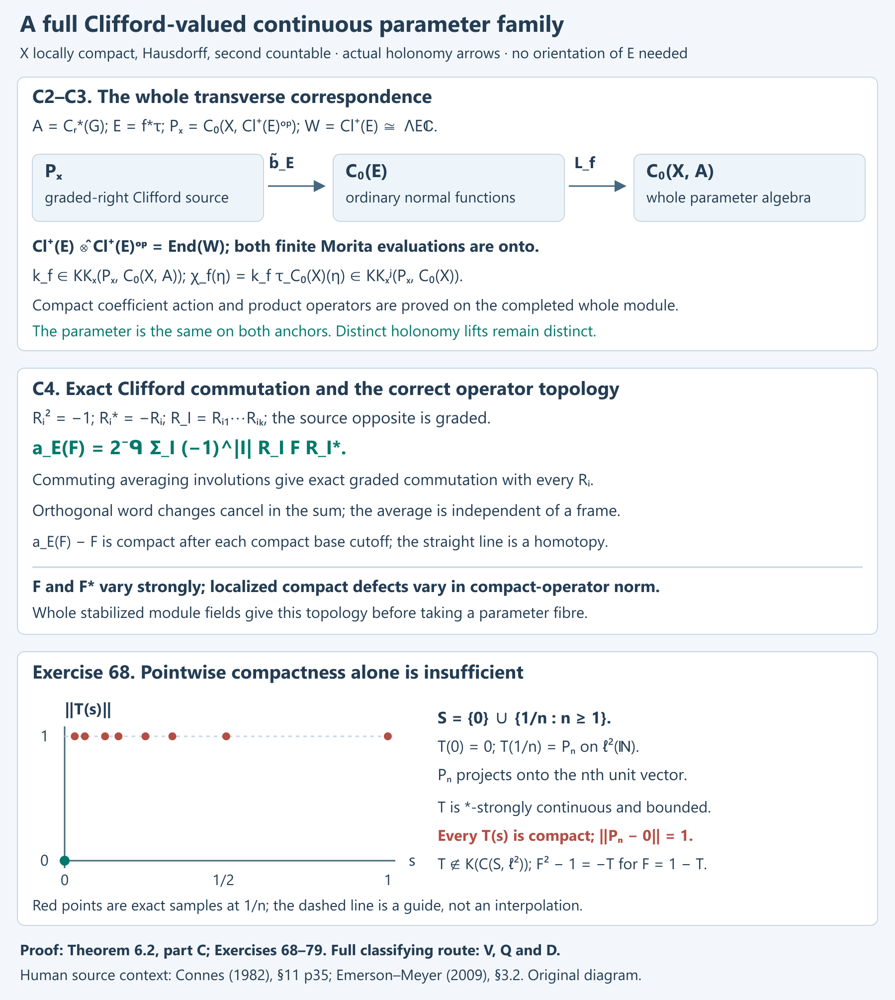

**Figure 6.2.1.** Strong adjointable field topology, exact Clifford average, compact-defect topology and whole nonproper base change. Proof: Theorem 6.2, part C; Exercises 68–79.  These are original reproducible diagrams of the objects and proved maps. Classical context is [Connes; Connes–Skandalis].

Full-size PNG · Editable SVG.

 #### B1. Actual transverse charts and holonomy arrows

Choose a countable disjoint family of small transverse plaque disks T\_i whose associated foliation boxes cover V. Such a family follows from a countable foliation-box basis; a finite family suffices for compact V. Let T be their disjoint union and H=G|\_T the groupoid with both endpoints in those disks. The disks are disjoint as labelled components, even if their images in V meet. The arrow charts of the course give H its smooth étale structure. Its object space is Hausdorff, second countable and locally compact. Its arrows can be non-Hausdorff. Restricting a countable G path-chart basis and a countable disk basis gives a countable bisection basis for H: in an étale path chart both endpoint maps are local diffeomorphisms, and a smaller open chart makes both injective. No Hausdorffness of all arrows, no amenability and no quotient by isotropy is used here.

The plaque short arrows give an actual comparison between G-cocycles and H-cocycles over any locally compact Hausdorff second-countable base X. Refine a G-cocycle chart so its lift lies in one foliation box, project to that box's labelled transverse disk, and conjugate its transition arrows by the short plaque arrows. This produces an H-cocycle and an actual G-arrow equivalence. Composing an H-cocycle with T→V is its inverse up to this equivalence. Two choices of projection disks have their short-arrow comparison on a common refinement; the derivatives give exactly the comparison of their pulled normal bundles. Over X×I the identical formulas compare concordances. This proves the equivalence of the actual cocycle/concordance functors on these bases. It does not assert a C\*-algebra Morita equivalence, which is not needed for χ: its target analytic algebra remains A=C\*r(G).

Fix a countable basis of contractible open coordinate disks in the transverse object manifold T.

#### B4. A locally compact replacement of any countable CW complex

Let K be a countable CW complex. Enumerate its cells; adjoining their finitely many lower-dimensional faces recursively gives finite subcomplexes K\_n whose union is K. Put

\[
 X=\operatorname{Tel}(K_1\hookrightarrow K_2\hookrightarrow\cdots),
 \qquad p:X\longrightarrow K.
 \tag{396}
\]

There is a continuous proper height h:X→[1,∞), with each closed bounded height slab contained in a finite collection of compact mapping cylinders. Local neighbourhoods meet only the two adjacent such cylinders and are locally compact. Closed gluing along the finite subcomplexes makes X Hausdorff. The finite cylinders are compact metrizable; countably many open slab neighbourhoods with their countable bases make X second countable. Its cells from the cylinder subdivisions give a CW structure. Thus X meets every hypothesis of (389)–(394).

For clarity the weak-equivalence proof of p is direct. A compact subset of a CW complex meets only finitely many open cells: otherwise choose one point in each of infinitely many distinct cells. Closure finiteness makes the chosen points, and every subset of them, closed by the weak topology (each closed cell meets only finitely many). They form an infinite closed discrete subspace of the original compact set, a contradiction. Thus a map of a sphere, disk or finite homotopy cylinder into K has image in some K\_N. Its lift to the height-N copy of K\_N in X proves surjectivity on homotopy groups and components. Any compact image in X has bounded height and lies in finitely many cylinders. That finite telescope deformation retracts onto its last K\_M: collapse the first mapping cylinder to its target, then the second, and so on. These standard cylinder contractions commute with p. If a sphere map's projection is null in K, its null disk lies in a further K\_L. Retracting its original map to height M, then sliding the constant projected map along the cylinders to height L, gives its null disk in X. This proves injectivity, with the same argument on relative paths proving the components claim. Hence p is a weak homotopy equivalence of CW complexes.

A full homotopy inverse is available with an explicit relative cell argument. Here are its filling step and its application, so the cell-filling input is supplied here rather than assumed. Let j:L→M be an inclusion of CW complexes inducing bijections of components and isomorphisms of every based homotopy group. Suppose a disk d:D^n→M has its boundary in L. For n≥2 the boundary class is zero in M and hence in L, by injectivity on π\_(n−1); choose a filling e:D^n→L with the same boundary. The disk d glued to the reversed e is a sphere in M. Surjectivity on π\_n lets us change e, by inserting an L-valued sphere in a small interior disk, until this difference sphere is null in M. A null homotopy of that difference sphere gives a homotopy d≃je fixed on the boundary: regard its two hemispheres as the bottom and top of D^n×I, and its equator as ∂D^n×I. The quotient which collapses the constant equatorial intervals is a disk; precomposing the null filling with that quotient gives the required cylinder. Basepoint paths are kept in the same boundary component. For n=1, component injectivity first gives a path e in L between the endpoints. The difference loop can be corrected by a loop in L using surjectivity on π\_1, and the same null-loop disk gives the relative path homotopy. For n=0 use component surjectivity to select a point of L and a path from each new vertex to it. These arguments prove the relative disk-filling step in every dimension, with the original boundary map fixed.

It also solves the extension problem with a prescribed boundary homotopy. If a cell's boundary is already being homotoped from its original map into M to an L-valued map, append that boundary cylinder to the original disk. A collar identifies the result with a disk whose final boundary is in L. Apply the preceding filling step, and remove the collar parametrization. This extends the given boundary homotopy over the cell, ending in L; its end map has exactly the already prescribed boundary values.

Start with the identity on L. Induct over the relative cells of (M,L), using this extension problem on each cell. It constructs r:M→L, rj=1\_L, and H:jr≃1\_M fixed on L. The choices on cells of a given dimension are independent, since they agree on their boundaries. The CW weak topology makes r continuous. It also makes H continuous: the product CW structure with the finite interval has precisely the weak topology tested by the closed cell disks times I. Thus the construction works on the entire CW complex at once, even with infinitely many cells and without passing to an inverse limit of homotopy classes.

Apply this to the mapping cylinder M\_p of p, with L=X as its bottom subcomplex. The cellular telescope projection p has image in the corresponding cells of K, so M\_p is a CW complex and X is a subcomplex. Its retraction onto K and the already proved weak equivalence of p show that X→M\_p meets the filling hypotheses. Let k:K→M\_p be the top inclusion. The map q=rk:K→X satisfies pq≃1\_BC by projecting H on that top inclusion. The cylinder path from x to k(p(x)), followed by r, gives qp≃1\_X. These are whole homotopies on the specified spaces. This completes the actual homotopy-equivalence claim in(396), rather than merely its action on homotopy groups or compact restrictions.

#### R1. The disk-attachment gluing step

For a diagram A←Z×∂Δ^n→Z×Δ^n, its pushout has the same homotopy type as its double mapping cylinder. The second arrow is a closed cofibration with an explicit collar: use the radial coordinate from the barycentre of Δ^n to its boundary, with an outer annulus as collar. Attaching an extra cylinder to that collar only lengthens its radial intervals. Rescaling those intervals, fixed at their inner ends, gives the comparison with the ordinary attachment. The same argument works component by component and with Z arbitrary; n=0 is a disjoint union.

A map of two such diagrams which is a homotopy equivalence on each of A, Z×∂Δ^n and Z×Δ^n therefore induces a homotopy equivalence of the attachments. Here is the usual cylinder argument, in the form needed here. Choose inverses on the three pieces and their inverse homotopies. The inverse pieces commute with the attaching maps up to homotopy: paste the inverse homotopy on the target piece, the original strictly commuting square, and the inverse homotopy on the source piece. On each intervening cylinder use that pasted track, allocating successive thirds of its interval to the three tracks. This defines an inverse map on the double mapping cylinders, agreeing on their ends. Pasting the same inverse homotopies gives homotopies of both composites to the identity; subdividing the interval once more keeps the end maps fixed. Rescaling the radial collars transfers them to the ordinary attachments. This proof uses actual homotopy equivalences on the pieces, rather than an unqualified weak-equivalence gluing rule.

#### R2. Compact parameter images have bounded fat dimension

Let Z\_• be a semisimplicial space whose levels are T1. A compact subset of ||Z\_•|| is contained in some finite fat skeleton. Otherwise choose points y\_j in that subset with strictly increasing minimal dimensions n\_j, using the unique interior representative in its minimal simplex. The inverse image of y\_j in a fixed level Z\_k×Δ^k is empty if n\_j>k. For n\_j≤k it is a finite union of closed sets: prescribe the zero barycentric coordinates of a face, prescribe its remaining coordinates, and take the inverse image of the closed base point under the face map. There are only finitely many faces. Thus the inverse image in every level of {y\_j:j∈J}, for any subset J of the selected indices, is closed. The weak quotient topology makes every such subset closed in the realization. The selected set is consequently a closed discrete subset of the original compact set. It would be compact and infinite discrete, which is impossible. This proves the dimension bound. It makes no assertion that compact images meet finitely many base points or arrow charts in a fixed dimension.

The face-only quotient has no other identifications of interior representatives, which is why minimal dimension is available here. The argument does not use a Hausdorff arrow space. It does require the T1 condition at each level, verified below in the actual application.

#### R3. Level homotopy equivalences give a fat weak equivalence

Suppose a semisimplicial map Z\_•→Y\_• is a homotopy equivalence in each level, and both sets of levels are T1. Its fat realization is a weak homotopy equivalence. Indeed the n-skeleton is obtained from the (n−1)-skeleton by the attachment in R1 with Z=Z\_n. The comparison on its boundary piece is also a homotopy equivalence, by the level inverse times the identity of ∂Δ^n. Induction using R1 gives an actual homotopy equivalence on every finite fat skeleton. A sphere, disk or finite homotopy-cylinder image in either full realization is compact and hence lies in a finite skeleton by R2. Surjectivity and injectivity on all homotopy groups follow from the finite-skeleton equivalences, enlarging that skeleton when a null disk is used. The same path argument gives the bijection of components. No compatibility of the separately chosen skeletal inverses is required for this weak equivalence statement.

#### R4. Cell cylinders and the fat-to-ordinary comparison for simplicial sets

For any simplicial set S, its fat realization maps weakly equivalently to its ordinary realization. Here is a proof which does not require closed degeneracies for a topological groupoid. For the representable simplicial set Δ[n], its fat realization is contractible. A simplex is an ordered string of vertices in {0,…,n}, allowing repetitions. Append vertex n and give that final vertex weight s, multiplying all old weights by 1−s. This respects every face relation, gives the identity at s=0, and is the constant final vertex at s=1. Its ordinary realization is the contractible geometric n-simplex. Thus the comparison for Δ[n] is a homotopy equivalence.

Both fat and ordinary realization preserve the pushouts which attach the nondegenerate simplices along their boundaries. The pair (||Δ[n]||,||∂Δ[n]||) is a CW pair: one cell is present for every simplex, including degenerate ones, and the simplicial subset supplies a subcomplex. Induction on nondegenerate dimension first proves the comparison for the boundary, then for a skeleton of an arbitrary S using these attachment pushouts. All their spaces are CW complexes. Their weak-equivalence comparisons are homotopy equivalences by the relative cell-filling proof in B4; the mapping-cylinder gluing argument of R1 applies to these CW cofibrations as well. Their homotopy-extension property is explicit: extend over each relative cell using the retraction of D^k×I onto D^k×{0}∪∂D^k×I, obtained by radial projection from a point above the centre of its top face. It fixes that bottom-and-side subset. Induction on cells and the CW weak topology give extension on the whole pair. Applying this extension to the cylinder-end homotopies gives the same ordinary-pushout to double-mapping-cylinder comparison used in R1. No global collar of an arbitrary CW subcomplex is being presumed. Disjoint unions handle any number of simplices in a dimension. This proves the weak comparison on every nondegenerate skeleton.

Finally a compact sphere, disk or homotopy image in either realization meets only finitely many of its CW cells, by the finite-cell argument in B4. Each of those fat cells belongs to the degeneracy of a simplex of finite nondegenerate dimension. Thus the compact image lies in some nondegenerate skeleton. The preceding comparisons prove the weak equivalence of the full realizations, with all components retained. For countable S both realizations are countable CW complexes, so B4's cell-filling argument supplies a full homotopy equivalence if desired.

#### A1. A labelled atlas groupoid with every actual arrow

Use the countable contractible basis U of the Hausdorff transverse object manifold T from B1. Put T'=coprod\_(U∈U) U. Define H' to have objects (U,z), z∈U, and arrows

\[
 ((U,z),(V,z'),g),\qquad g:z\longrightarrow z'\text{ in }H.
 \tag{397}
\]

Its topology is the pullback topology from H together with the discrete chart labels; composition and inversion use the exact H products. The forgetful Q:H'→H is a continuous functor. Arrow spaces of H' can still be non-Hausdorff. No two different isotropy or holonomy arrows are identified in(397), even when they have the same endpoints.

#### A2. A locally finite partition on objects

Choose continuous functions λ\_U:T→[0,1], with sum\_U λ\_U=1, locally finite closed supports and supp λ\_U⊂U. Here supports, rather than the entire countable basis U, are required to be locally finite. Existence follows from a countable locally finite shrinking of the coordinate-disk cover on the locally compact second-countable Hausdorff manifold T and its subordinate partition. If several refined members are assigned to the same U, sum their functions. Their closed supports form a locally finite family, so their union is closed and still contained in U. The merged family retains all stated properties.

There is one useful local consequence. Near a fixed finite list x\_0,…,x\_n of objects, only finitely many supports can occur. A label U whose closed support omits x\_i can be removed on a smaller neighbourhood if necessary. Every retained label with x\_i in its support has x\_i∈U and hence remains a valid object chart near x\_i. Thus a finite expanded string below can be chosen on a neighbourhood even at points where some of its weights vanish. The resulting map does not try to retain an invalid object (U,x\_i) outside U with a zero weight. Fix any total order of the countable chart labels.

#### A3. Weighted vertex splitting gives both actual homotopies

Write a fat H simplex as (x\_0→…→x\_n; t\_0,…,t\_n), t\_i≥0, sum\_i t\_i=1. For every vertex i, replace it by its finitely many labelled copies (U,x\_i), in the fixed label order, with weights t\_i λ\_U(x\_i). Copies at the same vertex are connected by the actual unit 1\_(x\_i). Between blocks i<j use the actual composite g\_j⋯g\_(i+1):x\_i→x\_j of the old arrows. Intermediate blocks whose weights vanish are deleted using that identical composite. This defines

\[
 S:\|N(H)\|\longrightarrow\|N(H')\|.
 \tag{398}
\]

Continuity is explicit. On a neighbourhood of a given simplex's object list, A2 gives a fixed finite valid list of labels. All its arrows are compositions of the original continuously varying arrows or units; all its weights are continuous. Hence the formula is a continuous map to one finite-dimensional nerve level and then to its fat realization. When a weight vanishes, deletion by a face agrees with the neighbouring expanded formula. When an original vertex has zero weight, its whole block disappears and the old face product gives exactly the composite between the remaining blocks. Consequently these local formulas agree under all fat face relations and descend continuously in the weak quotient topology. Local finiteness is only on T. No cover or partition of H\_1 was selected.

For QS≃1\_(||N(H)||), place, in each block i, the original vertex x\_i followed by its expanded copies. Give them respectively

\[
 (1-s)t_i,\qquad s t_i\lambda_U(x_i),\qquad 0\le s\le1.
 \tag{399}
\]

All within-block arrows are 1\_(x\_i); the arrows between blocks are the same old composites. At s=0 the expanded vertices disappear, giving the original fat simplex exactly. At s=1 the original vertices disappear, giving QS exactly. The sum of all weights is (1−s)sum\_i t\_i+s sum\_i t\_i sum\_U λ\_U(x\_i)=1. All weights are nonnegative. The same face and local-continuity argument proves a whole homotopy, including all endpoints and all dimensions. A product of a quotient map with the compact locally compact interval is a quotient map, so this levelwise formula descends as a continuous homotopy on the product of the fat realization with I.

For SQ≃1\_(||N(H')||), use exactly(399), retaining the original labelled vertex (V\_i,x\_i) as its first vertex. The arrow from an old or new copy at x\_i to another copy at x\_i is now the H' arrow whose H value is 1\_(x\_i), with its specified source and target labels. This exists whenever both labels are present; A2 guarantees that condition on each local formula. Arrows between blocks keep their actual H values and the expanded endpoint labels. At s=0 one obtains the original H' simplex and at s=1 SQ. Thus

\[
 \|N(Q)\|S\simeq1_{\|N(H)\|},\qquad
 S\|N(Q)\|\simeq1_{\|N(H')\|}.
 \tag{400}
\]

These are full fat homotopies, not just equivalences on individual homotopy groups. No degeneracy relation was used to combine repeated vertices: their removal at the endpoints is a genuine zero-weight face relation. The proof therefore retains the possible nonclosed unit locus of the non-Hausdorff H arrow space.

All identities and compositions used here also hold after applying the actual normal derivative representation of H. Within a block the derivative is the identity, and between blocks it is the exact old derivative product. Thus this atlas factor introduces no new orientation, determinant line or transverse twist. This is a check of the exact transition maps under the comparison, not a substitute for the universal cocycle construction in U and its complete classifying comparison in V and Q.

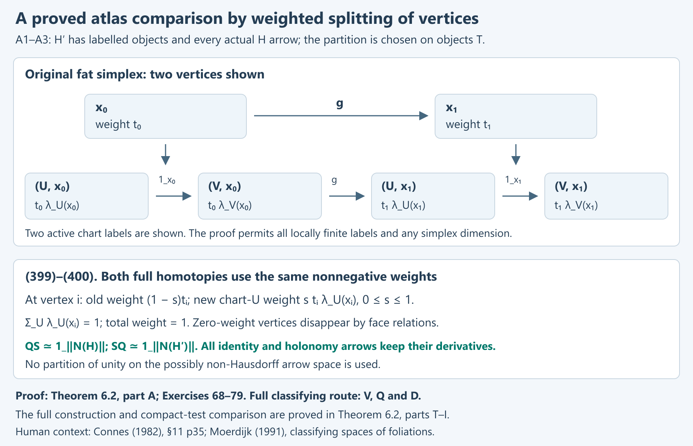

**Figure 6.2.2.** Weighted vertex splitting and both entire labelled-atlas homotopies, with every actual arrow retained. Proof: Theorem 6.2, part A; Exercises 68–79.  These are original reproducible diagrams of the objects and proved maps. Classical context is [Connes; Connes–Skandalis].

Full-size PNG · Editable SVG.

 #### U1. The indexed arrow join and its quotient

Let I run over nonempty finite subsets of N={0,1,…}. The I-piece of E\_M H consists of weights t\_i≥0, sum\_(i∈I)t\_i=1, and actual arrows g\_i with a common source x. Delete a zero-weight arrow and its index by a face relation. Give E\_M H the resulting weak quotient topology of these finite simplex/arrow fibre products. The index of each retained arrow stays fixed under a face map. Thus every point has finitely many nonzero indexed weights. Right multiplication by h:z→x sends every g\_i to g\_i h and retains every weight. Define B\_M H as the orbit quotient by this actual right H action. Distinct arrows with the same endpoints have not been identified before that specified principal action. Denote the orbit projection by q. For b∈B\_M H the indexed weights t\_i(b) are well-defined continuous functions, with sum\_i t\_i(b)=1.

The right action is jointly continuous in the stated weak topology. This needs a check because an arbitrary product of quotient maps would not suffice. Cover the acting arrow h by étale bisections B. On such a bisection, h is uniquely and continuously determined by t(h)=x, the common source of the tuple. The corresponding part of E\_M H×\_(T)B is homeomorphic to the open subset with x∈t(B). On each finite piece, multiplication by that determined h is continuous and respects every face. The weak quotient restricted to this open subset is still quotient, so multiplication descends continuously there. These open pieces cover the action fibre product. This proves joint continuity without assuming that H\_1 is Hausdorff or that its product with a quotient is automatically quotient. It also proves continuity of the inverse local chart below, by the same bisection argument.

Set O\_i={b:t\_i(b)>0}. On q^−1(O\_i), normalize all arrows by

\[
 (g_j)_j\longmapsto(g_jg_i^{-1})_j,
 \qquad g_ig_i^{-1}=1_{t(g_i)}.
 \tag{401}
\]

This is continuous on each finite piece and respects every face. It is invariant under right H: (g\_jh)(g\_ih)^−1=g\_jg\_i^−1. The restriction of q to this open saturated set is a quotient map, so(401) descends continuously. Its range Z\_i consists of the tuples whose ith arrow is a unit. The induced map O\_i→Z\_i is inverse to q|\_(Z\_i); their two composites are literal identities. In particular the local anchor u\_i(b)=t(g\_i) is continuous. On O\_i∩O\_j the invariant actual arrow

\[
 c_{ji}(b)=g_jg_i^{-1}:u_i(b)\longrightarrow u_j(b)
 \tag{402}
\]

is continuous. The equations c\_ii=1, c\_ij=c\_ji^−1 and c\_kj c\_ji=c\_ki follow by actual cancellation. They are equations of arrows, rather than leaf-image relations. Thus (u\_i,c\_ji) is an actual H-arrow cocycle on the whole candidate B\_M H.

It is the actual local principal cocycle of q. The map sending a tuple over O\_i to (its orbit b, g\_i) is a homeomorphism onto {(b,h):b∈O\_i, t(h)=u\_i(b)}. Its inverse multiplies the normalized tuple(401) on the right by h. Both maps are continuous by the normalization and the groupoid action, and both composites are identities. This checks principality locally without imposing Hausdorffness on H\_1 or on the quotient candidate.

#### U2. A globally numerable cover, even on the weak quotient

The functions t\_i themselves need not have locally finite supports. There is an explicit numerable replacement. Put

\[
 m(b)=\max_i t_i(b)>0,\quad
 a_i(b)=(t_i(b)-m(b)/2)_+,\quad
 \lambda_i(b)=a_i(b)\big/\sum_j a_j(b).
 \tag{403}
\]

Every sum or maximum here is finite at a point. More importantly, these are continuous functions in the specified weak topology: on every finite join piece they are the corresponding continuous finite expressions, agree on zero-weight faces, and are invariant under the H action. The denominator is positive, since a coordinate attaining m contributes m/2. Their sum is one.

Their closed supports are subordinate and locally finite. The closure of {λ\_i>0} lies in {t\_i≥m/2}⊂O\_i, by continuity and m>0. At b\_0 let I\_0 be its finite positive support and m\_0=m(b\_0). The function u(b)=sum\_(i∉I\_0)t\_i(b)=1−sum\_(i∈I\_0)t\_i(b) is continuous and is zero at b\_0. On the open neighbourhood {m>m\_0/2, u<m\_0/8}, every i outside I\_0 satisfies t\_i≤u<m\_0/8<m/2 and hence λ\_i=0 throughout that neighbourhood. None of their closed supports meets it. This proves local finiteness on the whole B\_M H, without assuming the quotient paracompact. Therefore the cover O\_i and actual cocycle(402) are numerable.

#### U3. The precise finite-dimensional normal bundle

On O\_i take u\_i\*τ. Glue these vector bundles by the exact derivatives D c\_ji. They satisfy the inverse and triple equations because the normal derivative is a representation of actual holonomy arrows. The local gluing gives a continuous rank-q vector bundle E\_M on the candidate with no orientation or spin-c choice. It is numerable by(403). A metric is explicit: choose the existing metric on τ over T, transport its local pullbacks to the common fibre using D c\_ji, and sum them with the weights λ\_i. Every sum is locally finite and positive definite. Its local coefficients are continuous; closed subordination lets each weighted summand extend by zero outside O\_i. Consequently its full graded Clifford bundle and graded-opposite bundle are actual continuous bundles.

This records the entire derivative twist, including the rank, orientation character and any obstruction to a spin-c choice. No scalar Chern character or numerical pairing replaces that bundle.

#### U4. Every eligible parameter cocycle has a whole map into it

Let f be an actual continuous H-cocycle on a locally compact Hausdorff second-countable X. Refine to countably many charts indexed by a∈N and choose a locally finite partition ρ\_a with closed supports contained in those charts. At x use weights ρ\_a(x). Choose any a\_0 with ρ\_(a\_0)(x)>0 and arrows f\_(a,a\_0)(x):f\_(a\_0)(x)→f\_a(x) for the indices with positive weights. This tuple has a common source and defines an orbit

\[
 \Phi_f(x)=[(\rho_a(x),f_{a,a_0}(x))_a]\in B_M H.
 \tag{404}
\]

Changing a\_0 multiplies every arrow on the right by the same actual transition arrow, so the orbit is independent of a\_0. For continuity fix a positive a\_0 on a neighbourhood of a point. Only finitely many closed partition supports occur near it. Labels whose supports miss that point can be removed by shrinking further; each remaining label has its valid cocycle chart on that neighbourhood. Thus even its possible zero-weight columns have defined transition arrows there. Formula(404) is a continuous map into one finite join piece followed by q. These local quotient maps agree, proving a continuous map of the entire X, without taking compact-stage limits.

The pullback of(402) to {ρ\_a>0} is literally f\_ba: f\_(b,a\_0) f\_(a,a\_0)^−1=f\_ba. Its anchors are the given f\_a. This positive-support cover refines the original cover and still covers X. Hence Φ\_f pulls the actual candidate cocycle back to f up to the specified refinement. Its normal bundle Φ\_f\*E\_M is canonically f\*τ by those identical derivative transitions. A G-cocycle first passes to H by the actual plaque-arrow equivalence of B1, giving the same statement for its full normal twist.

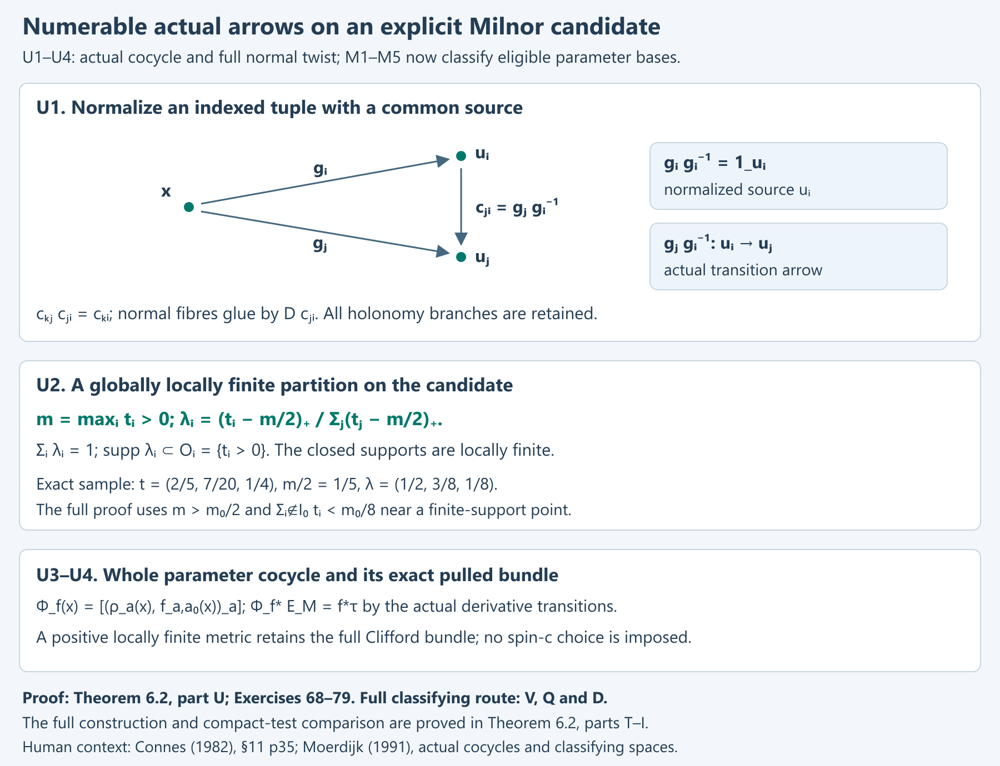

**Figure 6.2.3.** The indexed arrow join, explicit maximum-cutoff partition and its literal normal cocycle. Proof: Theorem 6.2, part U; Exercises 68–79.  These are original reproducible diagrams of the objects and proved maps. Classical context is [Connes; Connes–Skandalis].

Full-size PNG · Editable SVG.

 #### M1. Actual equivalence supplies a combined arrow cocycle

For this proof an equivalence of actual H-cocycles is given by actual equivalence arrows on a common refinement, satisfying the transition equations. A concordance is an actual cocycle on X×I whose restrictions are equivalent to the two endpoint cocycles. These are the conventions used by C5 and B1.

Write f^0 on charts U\_i and f^1 on charts V\_j. On a common refinement W\_r⊂U\_(i\_r)∩V\_(j\_r), let θ\_r:f^0\_(i\_r)→f^1\_(j\_r) be its equivalence arrow. On U\_i∩V\_j define the cross arrow, wherever x∈W\_r, by

\[
 \theta_{j,i}(x)=f^1_{j,j_r}(x)\,\theta_r(x)\,
                         f^0_{i_r,i}(x).
 \tag{405}
\]

On an overlap of refinement charts the equivalence equation is θ\_s f^0\_(i\_s,i\_r)=f^1\_(j\_s,j\_r) θ\_r. Substitution into(405) and the two original triple equations give the same θ\_(j,i), independently of r. Thus these local actual-arrow maps glue continuously on every cross overlap. Within each family retain the original transitions; in the other direction use θ\_(j,i)^−1. Their inverse and triple equations follow from this displayed equivalence equation, including the triples with vertices from both families. This is an actual cocycle on their disjoint labelled union of charts.

Any smaller chart copying an anchor from the first family can be adjoined to this combined cocycle with its exact restricted transition arrows. Hence the auxiliary charts used below have consistent actual arrows to both original families and to one another. There is no selection of an arrow from its two endpoints alone.

#### M2. Fresh indices are chosen locally, with finite avoidance

Let α\_i and β\_i be the two countable locally finite closed-subordinate partitions used to construct the maps Φ\_0, Φ\_1 of U4 for equivalent cocycles. Both use indices in N; unused indices have zero weight. Choose a countable locally finite precompact cover W\_j whose compact closures lie inside charts of a common refinement. Choose a partition ρ\_j with closed supports inside W\_j. Its anchor γ\_j is the copied first-family anchor on that refinement chart. M1 supplies its actual combined transitions.

For each j let I\_j be the union of the original numeric indices whose α\_i or β\_i closed support meets the compact closure of W\_j. The two support families are locally finite, so I\_j is finite. Recursively choose

\[
 \nu_j>\max\bigl(I_j\cup\{\nu_0,\ldots,\nu_{j-1}\}\cup\{-1\}\bigr).
 \tag{406}
\]

This gives pairwise distinct auxiliary indices. Give γ\_j weight ρ\_j at color ν\_j and zero weight at unused colors. U4 defines the auxiliary whole map Φ\_\* into B\_M H. If an original α\_i or β\_i is positive at x and ρ\_j is positive at x, then x lies in both original support and the closure of W\_j, so i∈I\_j and i≠ν\_j. The same exclusion holds when x belongs to the two closed supports, even if one of the weights is zero. Consequently a neighbourhood of any point has finitely many valid original and auxiliary labels, with no collision among their possible active colors. This is a local condition on the whole X; it does not require a finite bound for all active indices on X.

An auxiliary color can occur as an original color elsewhere on X. That causes no collision there: its auxiliary support is contained in a W\_j whose finite avoidance set excluded exactly that simultaneous occurrence. Thus no globally disjoint relabelling of the two old infinite index sets is presumed.

#### M3. Both choices are joined to that same whole auxiliary map

Use the combined cocycle to form, at x, one indexed tuple with weights

\[
 (1-s)\alpha_i(x)\text{ at color }i,
 \qquad s\rho_j(x)\text{ at color }\nu_j,
 \qquad 0\le s\le1.
 \tag{407}
\]

The anchors are the corresponding old anchor and γ\_j. Choose any positive-weight anchor as common source; all columns are the actual combined transition arrows from it. Changing that anchor multiplies all arrows on the right by the same actual arrow. Therefore the orbit is independent of this choice. M2 prevents two distinct columns being assigned to the same color where either could be present. The weights are nonnegative and sum to (1−s)+s=1.

For continuity near any (x,s), choose a positive source column there and a neighbourhood on which it stays positive. The closed support families and M2 give a fixed finite valid list of columns on a further neighbourhood, with disjoint colors. All combined arrows are continuous on their chart overlaps. This is a continuous tuple in a single finite join piece, followed by its quotient. At the endpoints one family has zero weight and is deleted by faces. Hence it gives the actual whole homotopy Φ\_0≃Φ\_\*. Applying the identical construction with β\_i gives Φ\_1≃Φ\_\*. The middle tuple uses the same γ\_j, ν\_j and ρ\_j, with the same actual transitions in both constructions, so their middle maps agree literally. Concatenating one homotopy with the reverse of the other proves Φ\_0≃Φ\_1 as maps on the entire X.

This proves independence of refinement, partition, enumeration and actual-cocycle equivalence. Every re-enumeration is another choice to which the same finite-avoidance argument applies. The pulled normal bundle along each displayed homotopy is the normal bundle of that whole combined cocycle, by U4's literal derivative identities. Its endpoint comparisons retain the full twist; an odd coefficient has not been traced or replaced by numerical data.

#### M4. A global cutoff homotopy recovers every continuous map

Let R:B\_M H→B\_M H retain the actual arrow columns of a tuple and replace its weights t\_i by the λ\_i of U2. It is well-defined: λ\_i>0 implies t\_i>0, so no new column is needed. More generally retain those arrows and replace the weights by

\[
 t_i(s)=(1-s)t_i+s\lambda_i,\qquad0\le s\le1.
 \tag{408}
\]

They sum to one, respect all zero-weight face relations, and are invariant under the common right H action. On every finite join piece the formula is continuous, including the deletion of cutoff-zero columns at s=1. The finite-piece quotient and the right-action quotient remain quotient maps after product with the compact locally compact interval. Thus(408) defines a continuous homotopy of the entire candidate from its identity to R. No assumption that its raw t\_i supports are locally finite was needed for this global homotopy.

For any continuous F:X→B\_M H, pull the actual cocycle of U1 back to the charts F^−1(O\_i). The partition λ\_i∘F has locally finite closed supports subordinate to them by U2. Construct its classifying map with exactly those indices and weights. Its arrows are the old normalized columns of F and its weights are λ\_i(F). Therefore it is literally RF. Composing(408) with F proves that this choice of classifying map is homotopic to F on the whole X. The full normal bundle is also the literal pulled E\_M of U3.

#### M5. The natural classification bijection, including concordances

Let Coc\_H(X) be equivalence classes of actual numerable H-cocycles, further identified by concordance. Pullback of U1 gives a map P:[X,B\_M H]→Coc\_H(X), since a whole map homotopy pulls back a whole actual cocycle on X×I. Constructing U4 gives Q in the other direction. M3 proves its independence from all representative and partition choices.

If an actual cocycle is given on X×I, perform U4 once on that entire eligible base. Its endpoints have the given endpoint cocycles up to their specified equivalences. M3 on X compares its endpoint partitions with any previously selected ones. These endpoint homotopies, pasted with the whole interval map, give a homotopy of the selected endpoint classifying maps. Thus Q is well-defined on concordances, not only on equivalent cocycles.

U4 proves PQ=1: the pulled cocycle equals the original on its positive-weight refinement. M4 proves QP=1: a pulled cocycle classifies to RF≃F. Consequently

\[
 [X,B_M H]\ \cong\ \operatorname{Coc}_H(X)
 \tag{409}
\]

is a bijection of the full homotopy/concordance sets for every eligible X. It is natural for every continuous h:Y→X between such spaces, including nonproper maps. The pulled closed-subordinate partition α\_i∘h remains locally finite and subordinate; using it in U4 gives exactly Φ\_f∘h. M3 removes dependence on the partition chosen separately on Y. Pullback of cocycles is already literal. The two maps in(409) therefore commute with h at the full class level, with the canonically pulled normal bundle.

The same proof applies to the whole base X×K for every compact finite polyhedron K, since it remains locally compact, Hausdorff and second countable. This asserts the classification of whole families. It does not assert a prescribed relative boundary filling or simultaneous choices on all faces of an infinite realization.

By B1 the actual G-cocycle/concordance functor has the same comparison, with its specified short plaque-arrow equivalences and transported τ. No C\*-algebra Morita theorem is required for that statement; the analytic algebra in χ remains C\*r(G).

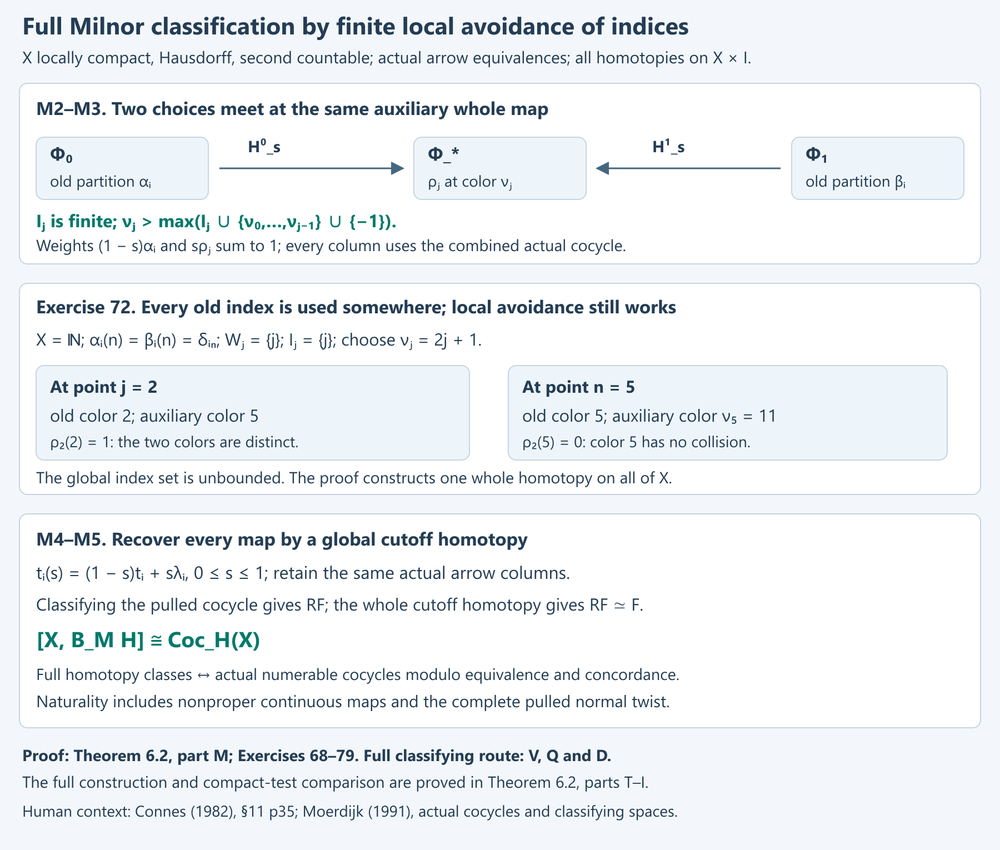

**Figure 6.2.4.** One locally finite auxiliary map joins all classifier choices on the entire base. Proof: Theorem 6.2, part M; Exercises 68–79.  These are original reproducible diagrams of the objects and proved maps. Classical context is [Connes; Connes–Skandalis].

Full-size PNG · Editable SVG.

 #### W1. The relative CW lifting lemma

Let f:Y→Z be a weak homotopy equivalence. Let (K,L) be a CW pair. Given b:K→Z, a:L→Y and a homotopy f a≃b|L, there exist a':K→Y extending a and a homotopy f a'≃b extending the prescribed boundary homotopy. No CW structure on Y or Z is required.

To prove it, include Y at the bottom of the mapping cylinder M\_f. Its retraction to Z shows that Y→M\_f has the same component and homotopy-group isomorphisms as f. The disk-filling step in B4 applies to this inclusion: its proof uses only those isomorphisms. A disk whose boundary is in Y first has a filling of that boundary in Y by injectivity on the preceding homotopy group. Correct the difference sphere by surjectivity on the disk's homotopy group, then fill its null difference in M\_f. In dimension1 use endpoint components and difference loops; in dimension0 use paths of corresponding components. This gives a disk homotopy to Y with the boundary fixed.

On L use the mapping-cylinder path from a to f a followed by the specified homotopy to b|L. Induct over the relative cells of (K,L). The boundary homotopy already constructed on each cell is appended as a collar to its b-valued disk, exactly as in B4. The disk-filling step extends it, ending in Y with its prescribed boundary values. This gives a' and a homotopy in M\_f on the entire K. Project to Z. On L the extra cylinder path projects to a constant initial segment before the given homotopy. Remove that segment by a homotopy of its interval parametrization, fixed at its ends. The homotopy-extension property of the CW pair (K×I, L×I∪K×{0,1}) extends this correction, so the projected boundary homotopy is exactly the specified one. R4's cell-cylinder retraction proves that extension property. The weak topology and its product with the finite interval make the whole construction continuous. This proves the lemma, including infinite K.

#### W2. Weak equivalences of spans give a weak equivalence of cylinders

Write P(A,C,B) for the double mapping cylinder of A←C→B. A strictly commuting map of spans which is a weak homotopy equivalence on A,C,B induces a weak homotopy equivalence of P. Here is the finite-parameter proof, including the relative step needed for injectivity.

The cylinder has a continuous height function, equal to0 on A, to1 on B, and to t on C×I. Its two open subsets U\_A={height<2/3}, U\_B={height>1/3} cover P. They deformation retract to A and B by moving the height to their respective ends. Their intersection is C×(1/3,2/3), with its projection to C. These retractions commute with every map of spans; the map also preserves height, so the inverse images of these two open subsets are precisely the corresponding open subsets of the source cylinder.

Let g:K→P be a map from a compact finite polyhedron. Pull back these two opens. Choose a continuous partition p\_A+p\_B=1 with closed supports inside them. Approximate p\_A by a piecewise linear function r within1/12 on a sufficiently fine triangulation. Set K\_A={r≥1/3} and K\_B={r≤2/3}; subdivide at those two levels. They are finite closed subpolyhedra covering K. Their intersection K\_C={1/3≤r≤2/3} maps into U\_A∩U\_B, because both p\_A and p\_B are at least1/4 there. The end retractions give maps

\[
 a:K_A\to A,\qquad c:K_C\to C,\qquad b:K_B\to B,
 \quad a|_{K_C}=\ell c,\quad b|_{K_C}=r_C c,
 \tag{410}
\]

where ℓ and r\_C are the two span arrows, not the piecewise linear function r. This is a strictly commuting map of finite source spans. The collapse p\_K:P(K\_A,K\_C,K\_B)→K is a homotopy equivalence: K is their ordinary union pushout and both subpolyhedron inclusions are CW cofibrations; the cylinder comparison proved in R4 applies.

The assembled span map G:P(K\_A,K\_C,K\_B)→P(A,C,B) is homotopic to g p\_K. On K\_A move g's height toward0; on K\_B move it toward1. On K\_C×I, if g(x)=(c(x),v(x)), use height (1-s)v(x)+s t. At the two ends this agrees with the preceding two retractions. It gives the desired pasted homotopy, including all points of A or B. Thus every finite probe can be replaced, up to its full homotopy, by these exact finite span data.

Now apply this construction to a map into the target cylinder of a weak-equivalence span map F. Lift its c-map up to homotopy through F\_C using W1. Lift the a-map through F\_A relative to K\_C, prescribing there the new source map ℓ c and the homotopy ℓ' H\_C. W1 gives an exact extension a with a|\_(K\_C)=ℓ c. Do the same for b. The three resulting homotopies form a strictly commuting homotopy of span data. Their assembled cylinders therefore give a source map whose image is homotopic to the original target probe. The homotopy equivalence p\_K transfers it to K. This proves surjectivity.

For injectivity, take a target null disk or homotopy cylinder with its boundary the image of a given source probe. Subdivide that entire finite polyhedron using the same two opens. Since F preserves height, the source boundary also lies in the corresponding source opens. Its source retractions give the boundary values of a,c,b. Lift c by W1 relative to that boundary, with its constant comparison homotopy there. Lift a relative to the union of K\_C and its source boundary; their prescribed maps agree on the intersection, and the prescribed homotopies agree because H\_C is constant there. Lift b in the identical way. These are finite CW pairs after the chosen subdivision. The resulting source span data extend the boundary span data exactly.

Their assembled source cylinder extends its boundary assembly. To transfer that extension back to the original disk, choose a homotopy inverse of its source collapse p\_K relative to the desired boundary inverse. W1 applied to p\_K provides it: prescribe the boundary inverse and its known comparison homotopy, then extend over the disk. Composing with the assembled map gives a source disk whose boundary is homotopic to the original source probe by the preceding explicit assembly homotopy. Hence that probe is null. For two endpoint probes the same construction on their homotopy cylinder proves equality. Paths and a marked basepoint can be included in the prescribed boundary subpolyhedron; the usual basepoint-change path is retained in the filling step of W1. This proves injectivity in every based homotopy group and the bijection of components. It proves W2 without a global inverse of a weak map, a CW assumption on A,C,B, or a compactness claim about those target spaces.

#### W3. The full levelwise-weak fat realization theorem

Let Z\_•→Y\_• be a semisimplicial map which is a weak homotopy equivalence in every degree, and suppose every level is T1. Then its fat realization is a weak homotopy equivalence. At a finite skeleton use the attaching span ||Z||\_(n−1)←Z\_n×∂Δ^n→Z\_n×Δ^n. The disk-boundary arrow has the actual collar of R1, so its ordinary attachment and double mapping cylinder are homotopy equivalent. The maps on both new pieces are weak equivalences: products with the fixed sphere or disk preserve components and homotopy-group isomorphisms. Induction with W2 proves the comparison on every finite skeleton. R2's T1 dimension-bound argument places every sphere, null disk and homotopy-cylinder image in some finite skeleton. The finite comparisons therefore give the full weak equivalence. In degree0 the assertion is the given level map; the empty boundary for that degree introduces no extra condition.

This is the exact stronger version required when an augmented étale or open-cover comparison gives only weak equivalences. It does not assert that contractible point fibres by themselves give such level weak equivalences; that remains a separate input.

#### W4. An open-cover groupoid has the correct weak realization

For an open cover {U\_i} of any space Y, let C\_U be the groupoid with objects (i,y), y∈U\_i, and its unique actual arrow between (i,y) and (j,y) when y lies in both opens. Its fat realization maps weakly equivalently to Y by the common y coordinate.

Given a sphere or finite polyhedron map f:K→Y, take a finite closed-subordinate partition of unity on K for the pulled cover. Order its finitely many positive labels, put their weights at the objects (i,f(x)), and use the unique cover arrows. This is a continuous lift: near a point closed subordination gives a fixed finite valid label list, and zero-weight faces agree. Its projection is f exactly. Hence homotopy groups and components are surjected.

For any given lift a:K→||N(C\_U)|| over f, join its original ordered string with such a partition string, retaining their common y=f(x). Give the two strings weights (1-s) times the old weights and s times the partition weights. The unique cover arrows connect the last old to the first new label. Repeated labels are allowed in this fat nerve, so there is no indexed join collision. At s=0 and s=1 faces delete the zero string, giving respectively a and the partition lift.

The homotopy is continuous without requiring a global partition on Y or a local simplex representative for a. Locally in K the new partition labels are a fixed finite valid list, and f takes values in their common open intersection. Over that open set, joining any old fat string to this fixed finite new string is continuous on every nerve piece and respects its faces. Product with the finite new simplex and interval preserves the quotient topology. Thus the local join maps compose continuously with a; they agree when new weights vanish. This proves the whole join homotopy. If f extends over a null disk, choose the partition on that entire disk and join a to its boundary lift. The boundary lift now bounds the lifted disk, proving injectivity. The same path argument handles components and basepoint change. Therefore the cover augmentation is a weak equivalence even when Y has no global subordinate partition or is non-Hausdorff.

For T1 open charts all its nerve levels are T1, and its fat realization is T1 as well: the inverse image of a point in each nerve piece is the finite closed-face union used in R2. Thus W3 can be applied to a face-compatible family of these cover resolutions. The face-compatible holonomy nerve resolution in Q applies this result to every required level.

 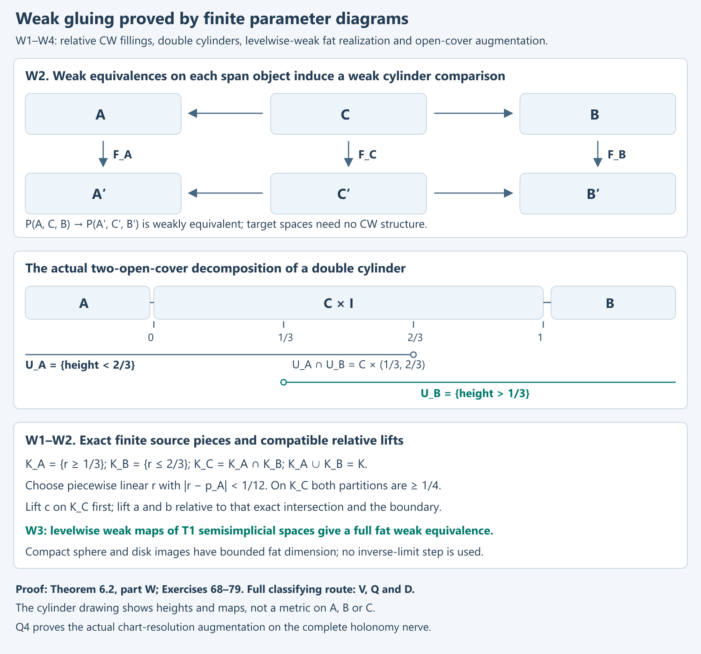

**Figure 6.2.5.** The relative lifting proof, full double-cylinder gluing and the open-cover weak augmentation. Proof: Theorem 6.2, part W; Exercises 68–79.  These are original reproducible diagrams of the objects and proved maps. Classical context is [Connes; Connes–Skandalis].

Full-size PNG · Editable SVG.

 #### V1. Forgetting colors gives an actual continuous nerve map

For a tuple representing B\_M H, order its positive colors i\_0<⋯<i\_n. Put x\_a=t(g\_(i\_a)) and give this vertex weight t\_(i\_a). Its arrow from x\_a to x\_b is the actual arrow g\_(i\_b)g\_(i\_a)^−1. Use the consecutive ones to form the nerve chain. This defines

\[
 v:B_M H\longrightarrow B_f H.
 \tag{411}
\]

On a finite indexed join piece use all its colors in increasing order, allowing zero weights. The arrows are continuous groupoid products. Deleting a zero coordinate produces the same chain as the corresponding nerve face: the two adjacent products cancel the omitted column. A common right multiplication cancels from every product. Thus the finite-piece formulas descend through the weak join quotient and its orbit quotient. They prove continuity of v on the whole space, including at the faces. No ordering of the arrow space or of the leaf space is being selected.

#### V2. Barycentric subdivision supplies a map in the other direction

For the chain x\_0→⋯→x\_n let h\_a:x\_0→x\_a be its initial actual product, with h\_0=1\_(x\_0). Subdivide Δ^n barycentrically. A simplex of that subdivision is indexed by a flag of nonempty faces

\[
 I_0\subsetneq I_1\subsetneq\cdots\subsetneq I_k
 \subseteq\{0,\ldots,n\}.
\]

If u\_0,…,u\_k are its barycentric weights, put at color |I\_j|−1 the arrow h\_(min I\_j) and weight u\_j. The colors are distinct, because the face cardinalities strictly increase. All arrows have common source x\_0. Pass to their Milnor orbit. On the finite subdivision pieces this is continuous. It defines

\[
 d:B_f H\longrightarrow B_M H.
 \tag{412}
\]

Here are all the gluing checks. On an intersection of subdivision simplices the positive subflag is the same; the other weights vanish and their columns are deleted. If an original coordinate t\_a vanishes, then

\[
 t_a=\sum_{j:a\in I_j}u_j/|I_j|=0.
 \tag{413}
\]

Every positive face in the flag therefore omits a. After removing a its cardinality is unchanged. Its minimum is the same remaining vertex, with the changed numerical position in the shorter chain. The initial arrow to that vertex is unchanged when a>0. When a=0 it becomes h\_b g\_1^−1, where g\_1:x\_0→x\_1 is the removed initial arrow. This is a common right multiplication of all retained columns, so the orbit is identical. Successive zero-coordinate deletions obey the same cancellation. These checks prove compatibility with every fat face, including the first face and all intersections of faces. Finite subdivision followed by the weak quotient now proves global continuity of d. No degeneracy identification is used.

#### V3. One entire fat homotopy is explicit

On one flag piece concatenate the original vertices x\_0,…,x\_n with the new vertices x\_(min I\_0),…,x\_(min I\_k). Give them weights

\[
 (1-s)t_a\quad(0\le a\le n),\qquad
 s u_j\quad(0\le j\le k),\qquad 0\le s\le1.
 \tag{414}
\]

The arrow between any two consecutive retained vertices x\_a,x\_b is h\_b h\_a^−1. This includes backward arrows when the successive face minima decrease. It is a valid chain because H is a groupoid. The weights are nonnegative and sum to one. At s=0 its second block is deleted and it is the original simplex. At s=1 its first block is deleted and it is exactly v d of that simplex, since the new colors increase with the flag cardinalities.

At a subdivision boundary the zero new vertices are deleted and the common subflag gives the same chain. At an original face the checks of(413) remove both the old zero vertex and any zero new vertex, while the actual consecutive arrow products cancel as in V1. A changed initial source multiplies all h\_a on the right by the same actual arrow and leaves every chain arrow unchanged. Thus(414) defines a whole continuous homotopy

\[
 1_(B_f H)\simeq v d.
 \tag{415}
\]

Continuity follows first on each finite subdivision piece times I, then through the face quotient, whose product with the locally compact interval is quotient. The argument includes the full infinite realization; no finite-stage homotopy is pasted by a limit. At a vertex x the track is the fat unit 1-simplex at x, with weights (1−s,s). It need not be constant in the fat realization. Its loop is null: inside the fat nerve of the one-object category with just 1\_x, append that same object with weight r and multiply the old weights by 1−r. This gives a contraction, by the same face-compatible formula used in R4. Consequently this vertex track induces the identity basepoint-change action on all homotopy groups. This point is needed for the based conclusion in V5 below.

#### V4. The other composite has exactly the original actual cocycle

Let F:X→B\_M H be any continuous map from an eligible parameter space X. Its original cocycle has anchors u\_i on t\_i(F)>0 and arrows g\_j g\_i^−1. The pullback by d v F of the U1 cocycle is equivalent to it by actual arrows. We check continuity of those arrows; there is no globally continuous choice of a subdivision flag.

At a finite tuple, order its positive weights by decreasing size, writing w\_1≥⋯≥w\_r>0 and w\_(r+1)=0. The barycentric coefficient of the face of the k+1 largest original weights is

\[
 u_k=(k+1)(w_(k+1)−w_(k+2)),\qquad0\le k<r.
 \tag{416}
\]

Their sum is one by telescoping, and(413) recovers each original weight. Equal weights give a zero coefficient at that boundary, so the positive face is uniquely the top k+1 set at every positive new color k. Choose its least original color a. The new anchor at color k is exactly u\_a. The comparison arrow from that new anchor to an original anchor u\_i is

\[
 g_i g_a^{-1}:u_a\longrightarrow u_i.
 \tag{417}
\]

Where that new coefficient is positive, its top set and a are locally constant as sets of colors. This remains true when nearby tuples acquire arbitrarily many new raw colors. At the given point let I be the finite original positive support. The total outside weight 1−sum\_(i∈I)t\_i is continuous and zero there. Near that point it is smaller than a fixed fraction of the positive gap w\_(k+1)−w\_(k+2) and of w\_(k+1). Each outside coordinate is bounded by that total. The finitely many coordinates in I are continuous. Shrink the neighbourhood so their strict top-set gap persists and every outside coordinate remains below it. The selected top k+1 set is then unchanged throughout that neighbourhood.

Thus(417) is a continuous actual-arrow map on every relevant positive new/old overlap, by the continuity of U1's normalized old arrows. Changing common source does not change it. The old and new transition equations are exactly cancellation of the g columns, so(417) gives an actual-cocycle equivalence on the joint positive refinement. Applying the normal derivative gives precisely the corresponding normal-bundle equivalence, with no loss of the twist.

M5 on the entire X now proves

\[
 F\simeq d v F\quad\text{as whole maps }X\longrightarrow B_M H.
 \tag{418}
\]

Only this eligible-domain conclusion is used. It does not assert a global homotopy 1≃d v on the possibly non-locally-compact candidate. For spheres, disks and finite polyhedra it retains all their actual cocycle data, rather than passing to separate point fibres.

#### V5. The comparison is a weak equivalence with the full twist

Equation(415) makes v surjective on every homotopy group at a vertex: apply d to a based sphere; its composite with v is homotopic to the original sphere. The vertex track is the null unit loop checked in V3, so this yields the same based class. For injectivity let F:S^n→B\_M H have vF extending to a disk. Apply d to that disk. Its boundary is d v F. Equation(418), on the entire sphere, gives a homotopy of F to that boundary; appending its collar supplies a disk for F. A freely null sphere is also based null: its homotopy track gives a basepoint-change isomorphism, and that isomorphism sends the zero class to the zero class. This proves injectivity.

The identical argument with paths proves the component bijection. Every point of either space has a path to a vertex: decrease all but one positive weight linearly in its representing finite simplex. In B\_M H a vertex at any color is connected to the color-0 vertex at the same target object using the two-color tuple of unit arrows. Hence the preceding based conclusion transfers to every component and every basepoint by actual paths. Thus v is a weak homotopy equivalence. The reverse map d is also weakly equivalent, by(415).

The comparison identifies the normal cocycle on every eligible probe by(417) and its exact normal derivatives. It proves a specific full holonomy comparison, not merely the weak type of orbit points. Part Q supplies a verified countable CW model with its actual universal cocycle, followed by the full twisted K group and the ordinary-manifold KK triangles.

#### V6. From the transversal to the full holonomy fat nerve

Choose the foliation boxes O\_i of B1, labelled even when they overlap. Let G' have objects (i,z), z∈O\_i, and every actual G arrow between those labelled endpoints. Its forgetful functor Q:G'→G has the same entire fat homotopy equivalence as A2–A3. Those proofs require a locally finite closed-subordinate partition only on the Hausdorff object manifold; the arrow space need not be étale. Their formulas use only units, continuous actual compositions, weights and valid endpoint charts. A countable locally finite partition for the O\_i therefore gives both full homotopies for Q in exactly(398)–(400).

Let t\_i:O\_i→T\_i be the plaque projection. Let a\_i(z):z→t\_i(z) be its continuously varying short plaque arrow, chosen to be the unit on the transverse section. Define R:G'→H by

\[
 R(i,z)=t_i(z),\qquad
 R(g:(i,z)\to(j,w))=a_j(w)g a_i(z)^{-1}.
 \tag{419}
\]

These are continuous maps, and the two middle short arrows cancel in a composite, so R is a functor. Let S:H→G' include its labelled transverse object into its own box and retain the actual arrows. Then RS=1 literally. The short arrows a\_i(z) give a natural isomorphism 1\_(G')→SR: for any g:z→w, R(g)a\_i(z)=a\_j(w)g. This equality is of actual G' arrows with the displayed endpoint labels.

For completeness it gives an entire fat homotopy without using degeneracy identifications. In each old vertex block, interleave the old object (i,z) of weight (1−s)t with its projected object (i,t\_i(z)) of weight s t. Use a\_i(z) within the block. Between the projected old vertex and the next old vertex use g\_next a\_i(z)^−1. All remaining arrows are their actual products. At s=0 the projected vertices disappear, leaving the old chain; at s=1 the old vertices disappear, leaving its SR chain. Zero old weights delete whole blocks, with the naturality equation ensuring equality of every face product. The levelwise formulas and quotient-times-I argument prove full continuity. Thus R,S are homotopy inverse on the whole fat realizations.

Combining these verified functors with V1 gives a specific weak equivalence from B\_M H to B\_f G, with each intermediate fat transversal/atlas comparison an entire homotopy equivalence. Every short-arrow derivative is the canonical normal transport; the displayed naturality equations remain true for those derivatives. No C\*-algebra Morita equivalence or ordinary thin realization for a nonclosed unit locus was invoked.

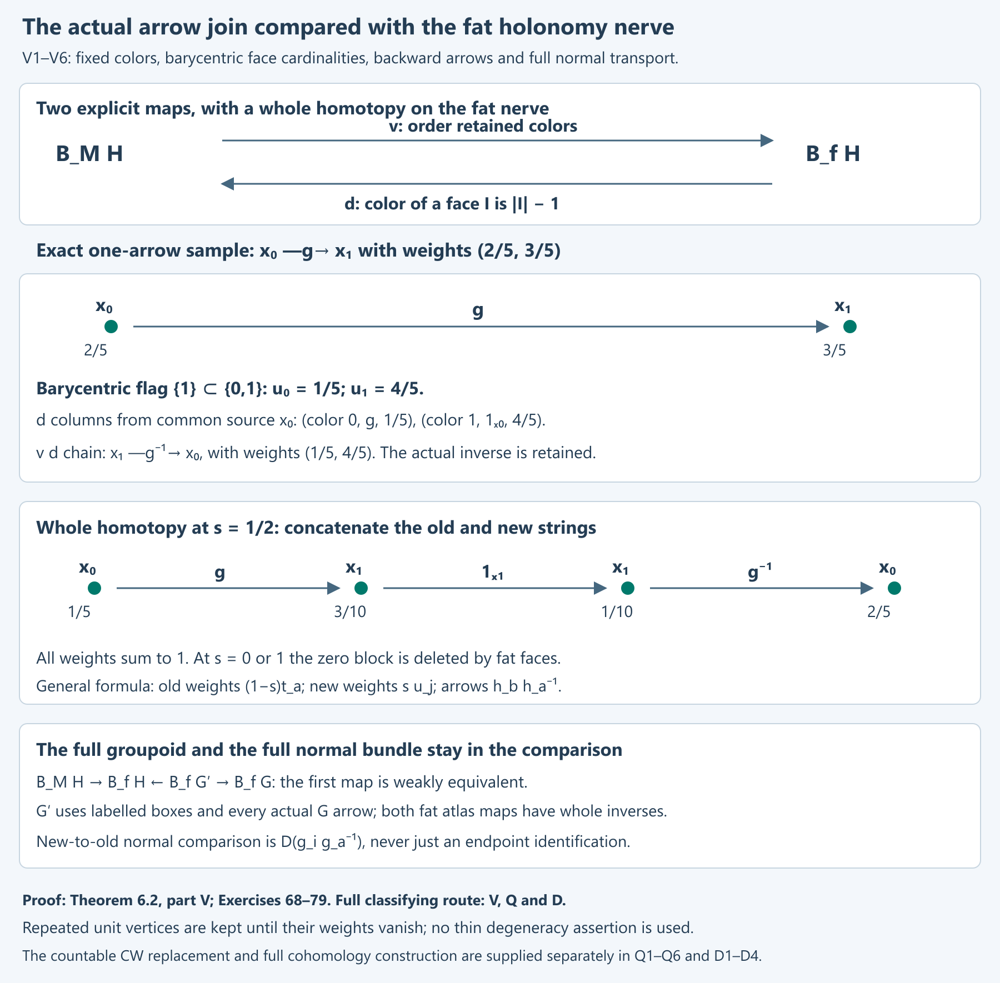

**Figure 6.2.6.** The color-order and barycentric maps, backward actual arrows and full fat-holonomy comparison. Proof: Theorem 6.2, part V; Exercises 68–79.  These are original reproducible diagrams of the objects and proved maps. Classical context is [Connes; Connes–Skandalis].

Full-size PNG · Editable SVG.

 #### Q1. Open Euclidean sets have countable CW models with whole inverses

Let O⊂R^q be open. Cover it by the countably many open rational rectangular boxes whose closures are compact and lie in O. All nonempty finite intersections are convex boxes. Denote the cover by U\_i and its abstract nerve by N. It has countably many simplices. Choose a locally finite partition ρ\_i with closed support inside U\_i. A countable locally finite precompact shrinking of the cover gives this partition; merging functions assigned to the same U\_i retains local finiteness and closed subordination, as in A2. Put

\[
 \Phi:O\to|N|,\qquad x\mapsto(\rho_i(x))_i.
 \tag{420}
\]

Near a point only finitely many supports occur, and their common positive membership makes every used simplex a nerve simplex. Thus this is a whole continuous map in the weak CW topology.

For every nonempty nerve face S choose p\_S∈∩\_(i∈S)U\_i. On a barycentric flag S\_0⊊⋯⊊S\_k define Ψ by the affine combination of p\_(S\_j) with that flag's weights. All these points lie in the convex intersection for S\_0. The formula agrees on flag faces and defines a whole map Ψ:|N|→O. Here barycentric subdivision has its literal piecewise affine homeomorphism to |N|: it is a finite homeomorphism on each closed simplex, with compatible faces, and both global topologies are the weak simplex topologies.

The straight segment from x to ΨΦ(x) stays in O. Indeed, in the flag piece containing Φ(x), both x and all p\_(S\_j) belong to the intersection for S\_0. The affine formula agrees on flag boundaries, giving the whole homotopy ΨΦ≃1\_O.

For the other homotopy use the closed-star carrier of S\_0 in N. It consists of faces T with T∪S\_0 a nerve face. It contracts to any chosen vertex of S\_0 by adjoining that vertex and linearly moving weight to it. Both the original flag simplex and ΦΨ of it lie in that carrier: Ψ lies in all U\_i for i∈S\_0, and its positive partition labels therefore form a face with S\_0. On removing the first flag face the new carrier is the star of S\_1, contained in the star of S\_0; other faces keep the same carrier. Induct over the flag cells to extend the homotopy already given on their boundaries, fixed at its two ends. The boundary sphere map into the contractible carrier fills by its displayed cone contraction. This supplies the homotopy on each cell times I. The CW weak topology, and its product with I, prove continuity of the entire homotopy ΦΨ≃1\_(|N|). Thus O has the countable CW model |N| with both whole inverse homotopies. The case q=0 is the one-point or empty complex and obeys the same statement.

#### Q2. The cellular-approximation input is proved here

We need to attach the CW models from Q1 along arbitrary transferred maps. The following supplies the needed cellular replacement. Any map of CW complexes is homotopic to a cellular map, relative to a subcomplex on which it is already cellular.

First consider a map of a compact finite polyhedron of dimension n into R^m, m>n. On an open subset where it is allowed to change, it can be approximated within any given positive continuous error by a locally piecewise affine map missing a prescribed point. The error can tend to zero at the relative closed set, whose original map already misses the point. Here is the construction. An open subset of a finite polyhedron has a locally finite triangulation with simplices small enough for the prescribed error and the local oscillation of the map. To construct one, exhaust that subset by finite unions of small closed subdivided simplices with interiors covering it and closures inside it, subdivide successive collars further, and take their compatible subdivisions. Compact subsets meet only finitely many collars. Additional subdivisions on each collar give any specified mesh bound. This works separately on the finitely many original polyhedron faces, with their boundary subdivisions retained.

Choose each vertex image sufficiently near its original value. Avoid the finitely many affine dependence conditions that would put the prescribed point into the affine span of an incident simplex. Local finiteness makes the number of those incident simplices finite. Equivalently, choose successively outside their proper affine exceptional sets; for the last vertex of every simplex, the span of its earlier vertices and the prescribed point has dimension at most n<m. The resulting affine maps miss the point on every simplex, and their oscillation/error bound gives the stipulated approximation. Set the map equal to its original value on the relative closed set. The error tending to zero there proves continuity of the joined map and of the straight approximation homotopy. This construction also works inside an open ball: bound the error by half the distance of the old value to the ball boundary, as well as by the desired bound.

Now let b:D^n→Y be a map into a CW complex with boundary in Y^n. Its compact image meets finitely many cells by B4's finite cell argument; include their finite closures. Start with the highest dimensional cells of this finite subcomplex. If m>n, use the preceding approximation in the open m-cell, on its preimage, leaving the map outside that cell fixed. The error tends to zero at its preimage boundary, so the modification and its homotopy are continuous and fix ∂D^n. In its characteristic-ball coordinates choose the error also smaller than the distance to the sphere. The modified map misses the cell centre. Retract the punctured closed characteristic ball radially to its boundary, with the homotopy fixed on that sphere. Since the domain image is compact and avoids the centre, this induces a continuous homotopy of b through the finite CW quotient. It removes that open cell from the image. Remove all cells in decreasing dimension until the image lies in Y^n. There are finitely many of them. The boundary stays fixed throughout.

Induct on the cells of the source CW complex. In dimension n, the already constructed boundary homotopy is appended as a collar to the old characteristic disk map. Apply the just-proved relative disk step to its endpoint. The cell-cylinder retraction of R4 extends the homotopy while preserving the previously assigned boundary. On a designated relative subcomplex use the constant homotopy. The weak CW topology and its product with the interval make the resulting map and homotopy continuous on the whole complex. Its n-skeleton is now mapped into Y^n for every n. This proves the asserted cellular approximation, including the countable infinite complexes used next.

#### Q3. Fat cell assemblies of countable CW-type pieces

Suppose a one-fold or two-fold semisimplicial space has T1 levels, each a countable disjoint union of spaces with countable CW models and whole inverse homotopies. Its fat realization has a countable CW replacement with a specified weak equivalence. The two-fold case suffices here and includes the one-fold case.

The simultaneous quotient has pieces Z\_(m,n)×Δ^m×Δ^n and only their face identifications in the two directions. Both iterated fat realizations are homeomorphic to it. A quotient remains quotient after product with either finite simplex, so the two orders of the quotients impose exactly this same final topology. Filter by total degree m+n. At degree N attach the countable disjoint union of Z\_(m,n)×(Δ^m×Δ^n), m+n=N, along its boundary. The rectangle is a closed N-ball with its boundary an (N−1)-sphere. It has a literal collar (or a piecewise affine one after a finite triangulation), so R1's ordinary-attachment/double-cylinder comparison applies.

Inductively let e\_(N−1):K\_(N−1)→T\_(N−1) be a homotopy equivalence from a countable CW model of that finite filtration. Replace the new Z pieces by their countable CW models L\_N, and replace the old target by K\_(N−1). Transfer the attaching map L\_N×∂D^N→T\_(N−1) through a chosen whole inverse of e\_(N−1). Make that transferred map cellular using Q2. Attach L\_N×D^N to K\_(N−1) along it; call the result K\_N. Products with the finite sphere/disk have the product CW structure. Each new open cell has dimension dim(cell of L\_N)+N and its boundary lands in the appropriate lower skeleton because the attaching map is cellular. Closure finiteness follows because each such compact cell boundary meets finitely many old CW cells, and each product cell has finitely many product faces. Thus K\_N is a countable CW complex containing K\_(N−1) as a subcomplex.

There is an actual comparison e\_N:K\_N→T\_N extending e\_(N−1) literally. On a collar of the new disk boundary first follow the cellular-approximation homotopy, then the inverse comparison homotopy e\_(N−1)e\_(N−1)^−1≃1. The inner disk is mapped by the new piece comparison. The collar ends agree with both its attaching boundary and that inner disk. At degree0 just use the given model map for the disjoint degree0 pieces.

This comparison is a homotopy equivalence at each finite degree. The disk-collar comparison turns both attachments into double mapping cylinders. On the three span objects the chosen model maps are whole homotopy equivalences; the attaching squares commute by the collar's displayed homotopy. The homotopy-track proof of R1 applies also to this homotopy-commuting square: map the first part of the cylinder along its prescribed boundary track and the remainder along the actual cylinder. The inverse uses the inverse object maps and reversed tracks. In either composite adjacent reversed tracks contract by shortening the out-and-back intervals, and the remaining object inverse homotopies give the identity cylinder map. All formulas keep the old object map fixed at the cylinder end. This proves the finite-stage claim and the literal extension property of e\_N; no level model maps compatible with all face maps were assumed.

Put K=∪\_N K\_N with its CW topology. The compatible maps e\_N give a whole continuous e:K→T, since every CW cell occurs at a finite stage. It is a weak equivalence. A compact subset of K meets finitely many cells by B4, hence lies in some K\_N. A compact subset of T has bounded minimal total degree: if not, select points of strictly increasing minimal total degrees. In each fixed (m,n) piece, the inverse image of a selected point is a finite union of closed sets, specified by its zero weights and the T1 point inverse images under the finitely many face maps. Only finitely many selected points can occur in that piece. The inverse image of any subset of the selected points is therefore closed in every piece. The weak quotient makes the selected set and all its subsets closed, producing an infinite closed discrete subspace of a compact space, a contradiction.

The finite filtration stages have their actual subspace topology. At each attachment the closed disk boundary is embedded and has a collar, so an open set of the old stage extends to an open set of the new stage by its open collar and the attaching map. Extending such opens inductively proves the same statement for a fixed stage in the weak infinite quotient. Thus a map whose image lies in a stage really factors continuously through that stage. Spheres, disks and homotopy cylinders on both sides can now be tested at finite stages. Their comparisons e\_N are homotopy equivalences, proving that e induces the component bijection and all homotopy-group isomorphisms. This argument asserts a weak equivalence, and does not require coherent inverse homotopies on the non-CW infinite target.

#### Q4. A countable chart resolution for the actual étale nerve

For the smooth étale groupoid H of B1, N\_n(H) is a second-countable locally Euclidean T1 space, possibly non-Hausdorff. Locally specify each arrow of a chain by a bisection and its source by a sufficiently small coordinate disk. This gives a chart parametrized by that source disk. Shrink it so every iterated face map is injective on the chart: the retained initial source is obtained by the appropriate initial composite of the finitely many bisection embeddings. There are only finitely many such composites. Every resulting face image is then a Hausdorff open chart in the lower nerve level. A countable bisection basis supplies countably many such chain charts covering every degree. Close their families under all face images. Countably many degrees and finite face operations still give countable families.

Let V\_n be these actual open chart subsets, indexing equal subsets only once. A face carries V∈V\_n to its literal image d\_iV∈V\_(n−1). The face equations hold also for these labels because images of composed maps are images under the composite. Let C\_n be the open-cover groupoid of V\_n on N\_n(H), as in W4, and set

\[
 Z_(m,n)=N_m(C_n)
   =\coprod_{(V_0,\ldots,V_m)}V_0\cap\cdots\cap V_m.
 \tag{421}
\]

The cover faces delete labels; the H faces take their images and the actual nerve point. They commute literally, making Z a bisemisimplicial space. Repeated labels remain allowed. Each intersection is an open subset of the Hausdorff coordinate chart V\_0, hence an open Euclidean set in that chart. Q1 gives each intersection a countable CW model with whole inverse homotopies. There are countably many label strings in every degree, so the same is true of the disjoint union Z\_(m,n). These levels are T1.

W4 gives a weak augmentation ||N(C\_n)||→N\_n(H) for every n. Its domain is T1: the inverse of a point in each finite nerve piece is the finite closed face description used in Q3. These augmentations commute with all H faces, since every face keeps the underlying point's actual image. Apply W3 in the other direction. With the iterated/simultaneous quotient identification of Q3 it proves

\[
 T=\|\!\|Z\|\!\|\longrightarrow B_f H
 \quad\hbox{is a weak equivalence}.
 \tag{422}
\]

Q3's construction supplies a countable CW weak replacement e:K→T. Its composite k:K→B\_f H is therefore a specific weak equivalence. This comparison is made using the actual nerve points and actual H faces. A contractible fibre, a stalkwise category argument or a thin-nerve degeneracy theorem was not substituted for the levelwise weak comparisons.

#### Q5. The universal actual cocycle on a locally compact replacement

Take a finite-subcomplex exhaustion of the countable K, including each cell's finite closure at a finite stage. Its telescope X is locally compact, Hausdorff and second countable, with the proper height and full homotopy equivalence p:X→K proved in B4. The B4 proof uses only countability and the CW structure, so it applies to this verified K. Define the whole map

\[
 F_X=d k p:X\longrightarrow B_M H.
 \tag{423}
\]

Pull back U1's actual cocycle, U2's explicit numerable partition and U3's full normal bundle. Call them f\_X and E\_X=F\_X\*E\_M. They are genuine continuous data on this entire eligible X. In particular, E\_X retains all normal transport, orientation and spin-c obstruction; its metric can be pulled back from U3. The resulting C\_X Clifford algebra is separable, so (389)–(394) apply to one module over the whole base, rather than a sequence of independently chosen compact restrictions.

The map v F\_X is homotopic to k p by the entire homotopy(415). Both are weak equivalences. By V6 their composite into B\_f G is a specific weak equivalence as well. Thus X with f\_X is a locally compact classifying CW replacement of the full holonomy groupoid, with its specified normal cocycle. This is the model used for the geometric twisted cohomology below. The maps retain the full X; no compact-stage inverse limit enters its definition.

#### Q6. Whole model independence, including prescribed comparison tracks

Suppose X and X' are two locally compact CW replacements made by this construction, with their specified weak maps F,F' to B\_M H. W1 applied to F', on the entire CW complex X, gives h:X→X' and a whole homotopy F' h≃F. Applying W1 to F gives a map in the other direction. More precisely h is itself a weak equivalence by the homotopy and the two weak maps into B\_M H; B4's full CW proof makes h a whole homotopy equivalence. Pull the U1 cocycle back along the displayed whole homotopy to X×I. It is a concordance between h\*f\_(X') and f\_X, with the literal normal pullbacks at both ends.

The comparison is unique up to a whole homotopy carrying the prescribed map-to-B\_M track. If h\_0,h\_1 have tracks from F'h\_i to F, concatenate their tracks to give b:X×I→B\_M H with endpoints F'h\_0,F'h\_1. W1 for the CW pair (X×I,X×{0,1}), with F' as its weak map, lifts b relative to those endpoints, giving a whole homotopy h\_0≃h\_1. The lift's comparison homotopy keeps both endpoint maps fixed. This is the full relative assertion of W1; it is not just agreement on each finite subcomplex of X. Composition of such comparisons has the same property, so their class maps are canonically compatible once the specified maps-to-B\_M are retained.

Part D turns this complete cocycle/model comparison into the full twisted field-group comparison.

 #### D1. Whole bundle transport along a compact parameter interval

Let E be a metrized rank-q real bundle over X×I, for eligible X. There is a continuous family of orthogonal isomorphisms E\_(x,0)→E\_(x,t), equal to the identity at t=0. We prove this on the entire noncompact X, rather than choosing unrelated compact transports.

A countable locally finite closed-subordinate partition for orthonormal bundle charts gives an isometric embedding into the trivial real ℓ² bundle: send a vector to its chart coordinates multiplied by the square roots of those partition functions. The squared norm is the original squared norm by their sum-one identity. Locally only finitely many terms occur. The range projection P(x,t) has rank q and is norm continuous; the same finite chart matrix calculation proves that continuity even when its nonzero coordinate list changes between neighbourhoods.

Extend P constantly at both interval ends. By compactness of I, continuity gives, near each x, a positive interval smoothing radius for which its oscillation is less than 1/8, uniformly in t. A locally finite shrinking and partition give a continuous positive minorant δ(x) for those allowed radii, using the minorant argument of C2. Convolve in t with a fixed smooth nonnegative compactly supported kernel of integral one and radius δ(x). The resulting self-adjoint Q(x,t) has ||Q−P||<1/8. It is continuous in x, continuously differentiable in t, and its derivative is locally bounded uniformly in t. Differentiation falls on the rescaled kernel, whose radius has a positive lower bound locally in x; there is no differentiation in x.

Its spectrum lies in the 1/8-neighbourhood of {0,1}. The spectral projection P~ for the interval near 1 is therefore continuously differentiable in t and continuous in x, by its resolvent contour formula. The distance to P is less than one, with an explicit bound. On range P~, Q has inverse norm at most 8/7, while ||(1−P)Q||<1/8; hence ||(1−P)P~||<1/7. On its complement apply the same argument to 1−Q and P, giving ||P(1−P~)||<1/7. The norm of the difference of orthogonal projections is the maximum of these two off-range norms, so ||P~−P||<1/7. Formula(424) consequently identifies their ranges and proves that P~ also has rank q. For two real orthogonal projections at distance less than one,

\[
 U(A,B)=\bigl(AB+(1-A)(1-B)\bigr)
             \bigl(1-(A-B)^2\bigr)^{-1/2}
 \tag{424}
\]

is an orthogonal operator taking range B to range A. Multiplication shows its first factor's square norm is 1−(A−B)^2; that positive operator commutes with both A and B. These identities prove the isometry and range assertions, while continuous functional calculus proves continuity. Thus U(P~,P) identifies the old and smoothed bundles continuously over the whole base.

Set A(x,t)=[∂\_tP~,P~], a real skew-adjoint operator. Solve ∂\_tV=A V with V(x,0)=1. Its Picard iterated integrals converge uniformly on I near each x, since A is locally uniformly bounded; the same estimates prove continuous dependence on x and t. Skew adjointness proves V\*V=1, and solving the inverse equation proves onto-ness. Differentiating V\*P~V gives zero: differentiating P~²=P~ makes ∂P~ off diagonal, and [P~,[∂P~,P~]]=−∂P~. Consequently V transports the smoothed initial range to the smoothed range at t. Combining with(424) at both ends gives the required whole orthogonal transport of E. All coefficients and operator norms above are real, so this construction does not choose a complex orientation or a spin-c lift.

Any two such transports starting at the identity differ by a continuous family of orthogonal automorphisms of E\_0 starting at the identity. Their endpoint automorphisms are therefore homotopic through those automorphisms. The induced Clifford bundle isomorphisms have the same endpoint action on homotopy classes of cycles. The proof also works over X×J for every compact finite polyhedron J, with the transport interval retained as I. In particular it compares whole families of bundle paths.

#### D2. The full field group is homotopy invariant with its twist

For a metrized rank-q real bundle E over eligible X put

\[
 \mathcal K^j(X;E)
  =KK_X^j\bigl(C_0(X,\operatorname{Cl}^{+}(E)^{op}),C_0(X)\bigr).
 \tag{425}
\]

The opposite is the graded opposite, with the star and sign conventions of T2, hence its generators act as the negative right Clifford generators. By C4 this is exactly the group of whole Clifford–Fredholm fields: \*-strong bounded operators, norm-continuous localized compact defects, and exact graded Clifford commutation. Both degrees use the ordered coefficient convention, retaining the positive right C1 in degree1. This statement includes every cycle and homotopy in the group, and not just the constructed χ.

Every continuous h:Y→X induces a pullback into K^j(Y;h\*E) by C5's multiplier-valued balanced module tensor. It preserves localized compactness even for nonproper h. The associativity unitary on the balanced tensor modules gives (h k)\*=k\*h\*; the creation-operator formulas identify the pulled fields and all their Clifford actions. It is additive and preserves degenerate cycles and whole homotopies, so is a group homomorphism.

For a constant bundle over X×I, its two endpoint maps agree on every class under the identification of the endpoints with E. A cycle over the whole interval is literally a KK\_X homotopy with the right coefficient C0(X)⊗C(I). Restricting its left representation to the constant source gives that homotopy. Conversely its full interval source action is recovered from finite interval partitions, central right multipliers and compact base cutoffs as proved in C4. Thus its evaluations are the endpoint classes of the same homotopy, not independent fibre choices.

Moreover endpoint evaluation is an isomorphism with inverse constant pullback. One composite is literally the identity. For the other pull an arbitrary whole interval cycle back along r\_s(x,t)=(x,(1−s)t), as a map from X×I×I to X×I. C5 applies to that whole eligible base. The source bundle is constant, so this is a genuine KK\_(X×I) homotopy from the cycle to constant pullback of its zero evaluation. This proves the other composite is the identity on the full group. It does not assume a uniform operator norm homotopy of an arbitrary field; the whole-module topology is the one already proved in C4.

For a varying E on X×I use D1 to identify it with the pullback of E\_0. The interval assertion just proved gives a group isomorphism between the endpoint twisted groups and equality of the transported endpoint classes of every whole cycle. Its choice is immaterial for this given bundle path: two D1 transports differ by the identity-started orthogonal family, and pulling a fixed cycle through its Clifford isomorphisms gives a whole homotopy of the corresponding endpoint actions. If the bundle paths are homotopic with fixed endpoint bundles, apply the construction on X×J×I. The endpoint transports form a continuous family in J. The two endpoint identifications are therefore the same on homotopy classes. This proves the relative parameter comparison needed for Q6's prescribed tracks.

It follows that a homotopy equivalence h with a specified normal-bundle comparison induces an isomorphism of(425). Apply the inverse map, retain the inverse homotopies and their pulled normal bundles, and use the preceding interval assertion to identify the two composites with the identity on the whole groups. No restriction of this proof to compact X is made.

#### D3. A precise full geometric cohomology convention on BG

Use the countable CW replacement of Q5 and its whole map F\_X:X→B\_M H. Its actual universal cocycle is f\_X and its normal bundle is E\_X. Define the full τ-twisted geometric cohomology by

\[
 K^{j,\tau}(BG)=\mathcal K^j(X;E_X),
 \qquad j\in\mathbb Z/2.
 \tag{426}
\]

Here BG means the full classifying homotopy type of the actual holonomy groupoid, with the universal derivative twist. V6 and Q5 supply its specific comparison to B\_f G. This is a cocycle definition of cohomology: the fields, defects, equivalences and homotopies are those of C4, on one entire classifying CW model. The graded source in(425) specifies the rank and sign convention of τ explicitly; no orientation of τ is presumed. In a spin-c trivialization one can apply the full ordered Clifford/Morita evaluations of T2, but that is an additional reduction of these full groups, not part of their definition.

Q6 gives whole homotopy equivalences and actual normal concordances between any two such models. D2 gives the group isomorphisms and shows compatibility for their prescribed tracks, including their relative comparisons on X×I. Their compositions have the same property. Thus(426) is independent of the chosen countable chart resolution, Euclidean good covers, CW model, exhaustion, telescope, metric and specified replacement map, under those cocycle-compatible model comparisons. This includes all infinite classes on the whole X. It is not the group lim K^j(K\_n;E\_n), and no possible phantom or derived-limit information has been removed.

The statement concerns the classifying homotopy type on CW parameters, as represented by the verified CW replacement. It does not assert that arbitrary cohomology theories on an unreplaced non-CW topological quotient are weak-equivalence invariant. The cocycle, twist and full field convention in(426) are what specify the geometric group meant here.

#### D4. The single analytic-to-geometric class and its naturality

Keep A=C\*r(G) for the original full holonomy groupoid. Apply (389)–(394) once to f\_X on the whole X. This gives one countably generated module, its compact source action, both raw twisted Thom products and the single product

\[
 \chi_X:KK^j(A,\mathbb C)\longrightarrow K^{j,\tau}(BG),
 \qquad \eta\longmapsto k_(f_X)\,
                  \tau_(C_0(X))(\eta).
 \tag{427}
\]

Additivity follows from the tensor module direct sums and the bilinearity of the proved product theorem0.6. Equivalent actual cocycles give the whole principal-space unitaries of C5. For a concordance on X×I, C2–C4 construct one whole product cycle; D2 identifies its two endpoints after their full normal transport. (394)'s finite tube/metric fillings prove choice independence in this whole construction. Thus χ\_X is a group homomorphism, independent of its representative geometries.

For a model comparison h:X→X' with F'h≃F, C5 first gives h\*χ\_(X')(η)=χ\_(h\*f\_(X'))(η). The actual cocycle concordance of Q6 and D2 then identify this class with χ\_X(η). These are full-group identities. They prove that(427) gives a single χ with values in(426), independent of the model under its specified normal cocycle. In particular, it never replaces the analytical class by a Chern character, trace, numerical index or compact restrictions. Torsion classes enter the same product.

There is a useful universal test property. If an eligible locally compact CW base Y has an actual H-cocycle f, its whole Milnor map Φ\_f exists by U4. W1 lifts Φ\_f through the weak map F\_X, producing a whole map a:Y→X and homotopy F\_X a≃Φ\_f. Pull back the actual U1 cocycle and its normal bundle along that homotopy. U4 identifies the other endpoint with f on its positive refinement. C5 and D2 therefore give

\[
 a^*\chi(\eta)=\chi_f(\eta)
 \quad\text{in }\mathcal K^j(Y;f^*\tau),
 \tag{428}
\]

with the normal comparison supplied by that whole homotopy. Different whole lifts with their specified comparison tracks are related by W1 on the relative CW pair Y×I, and D2 treats their bundle paths. Thus the test identity is independent of those lift choices. B1 translates it to actual G-cocycles using short plaque arrows, retaining the same algebra A in the analytic argument.

This construction avoids an infinite system of separately chosen Fredholm product operators on simplicial faces. It uses exactly one separable base algebra and one product module. All parameter naturality is obtained from this one entire product class.

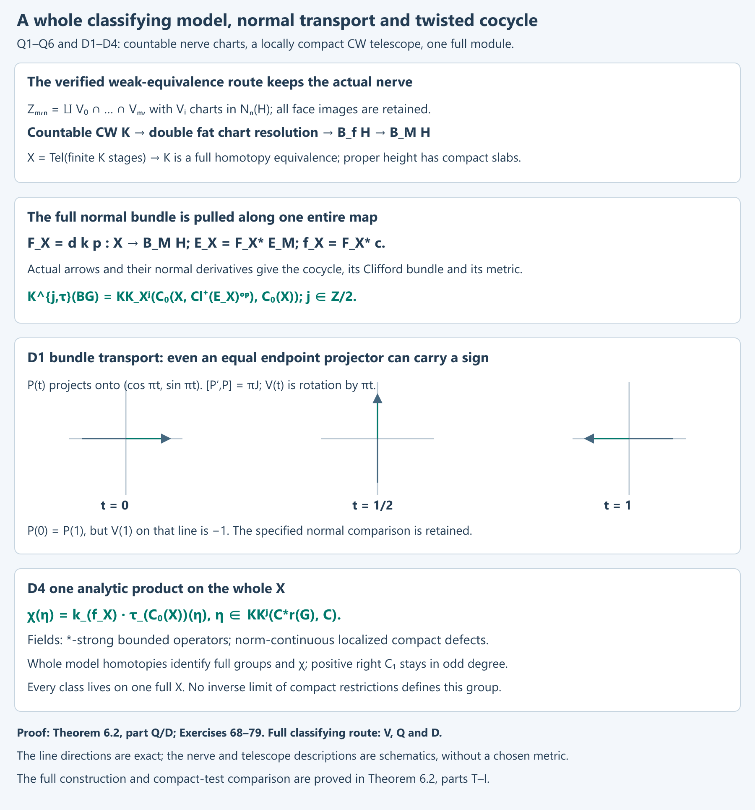

**Figure 6.2.7.** The verified countable CW replacement, whole telescope and normal-bundle transport. Proof: Theorem 6.2, part Q/D; Exercises 68–79.  These are original reproducible diagrams of the objects and proved maps. Classical context is [Connes; Connes–Skandalis].

Full-size PNG · Editable SVG.

 #### G0. The two manifold cycles and their full analytic providers

Let M be a compact smooth manifold without boundary of dimension d, with a Riemannian metric. Put C=C(M), Q=C(M,Cl^+(TM)^op). Its real generators are negative: r(v)^\*=-r(v), r(v)^2=-|v|². No orientation or spin-c structure on M is assumed. Disconnected components and dimension0 are treated by the same finite sum.

#### G1. The actual diagonal coevaluation cycle

Choose r>0 with the closed geodesic 2r disks inside the injective normal neighbourhood, uniformly on compact M. Put U={(x,y):x=exp\_y(w), |w|<r}. Write

\[
 q_r(v)=r v/\sqrt{1+|v|^2},\quad
 v=q_r^{-1}(w)=w/\sqrt{r^2-|w|^2}.
 \tag{429}
\]

The coevaluation module is H\_Θ=C0(U,pr\_y\*Cl^+(TM)^op), an ideal Hilbert C⊗Q module with its standard right inner product. The source ℂ is the scalar unital representation. Its odd operator is

\[
 B_Θ(x,y)=i r_y(v_y(x))/\sqrt{1+|v_y(x)|^2}.
 \tag{430}
\]

It is self-adjoint, of norm at most1, and its square defect is −1/(1+|v|²), a C0(U) section. The compact endomorphism algebra of this ideal module is the ideal itself, so the scalar-localized defect is compact. Source commutators vanish. Separability gives countable generation. This defines Θ∈KK(C\_scalar,C⊗Q). It is the actual raw standard Clifford Bott cycle on the normal disk, using the \*-isomorphism c^+(v)↦i r(v), followed by open extension. Tube compression and its two-sided inverse products are the full raw constructions6.0a–d, before orientation reduction. Different small radii and metrics give the same class by their normalized tube homotopies. The direction is from y to x in(430); this choice fixes the Gaussian sign in G4.

#### G2. The actual evaluation cycle

On H\_D=L²(M,ΛT\*M\_C) use exterior-degree parity and the metric identification of tangent/cotangent. Write L\_i=ε\_i+ι\_i, R\_i=ε\_i−ι\_i. Q acts by R\_i, and the extra C factor acts by pointwise multiplication at the same point. Define

\[
 D=-i(d-d^*),\qquad F_D=D(1+D^2)^{-1/2}.
 \tag{431}
\]

Here d is the exterior derivative; d\* its actual metric adjoint. D is symmetric on smooth forms, with principal symbol L(ξ), and D²=d d\*+d\* d is the Hodge Laplacian. The complete-source energy argument, followed by elliptic regularity on the compact manifold, gives self-adjointness on its first-order Sobolev domain. The local compact-frequency estimate and a finite partition give compact resolvent. Smooth Q sections graded-commute with its principal symbol; their graded commutators with D are bounded zeroth-order operators. Formula(132), its convergent transform integral and density prove compact graded commutators with F\_D. Its square defect is the compact resolvent−(1+D²)^−1. Thus

\[
 \operatorname{ev}=[H_D,\rho,F_D]
       \in KK(Q\widehat\otimes C,\mathbb C).
 \tag{432}
\]

These conventions are internally fixed, rather than inferred from a right-multiplication symbol in another convention. For comparison with the raw positive-left cycle D\_raw=ΣR\_i∂\_i, the canonical even unitary on exterior degree k is (-i)^k. It takes L\_i to −iR\_i and R\_i to−iL\_i. Precompose the raw positive-left source by r\_i↦i c\_i^+. Its action becomes R\_i and its Dirac becomes −iΣL\_i∂\_i, exactly(431)'s principal local form. This checks the graded opposite, its involution and the physical Fourier sign. It does not assert an unchecked identity with i r(ξ)ε from a different right-multiplication convention.

#### G3. The tube product lemma, with one complete operator family

We give the analytic deformation used in both triangles. After tensoring(430) with(432), the actual module is a field of L² sections on the geodesic r disks about its remaining base point. The first triangle has right coefficient C; the second has right coefficient Q. Smooth compact tube sections give the isometric dense tensor identification, with the old counting reduced to the ordinary pointwise C/Q fibre actions. In particular the tensor module is completed before this identification is used.

Use(429), the exact half-density Jacobian and metric parallel transport along the radial geodesics to identify these fields unitarily with L²(T\_zM,ΛT\_zM\_C), with the appropriate right coefficient. Compact M and the closed 2r tube give uniform smooth coefficient bounds. The transformed Dirac principal matrix A\_z(v) is invertible and has positive determinant, with A\_z(0) a positive scalar matrix. Its polar orthogonal part is in SO(T\_zM). Lift it along s↦O\_z(sv), starting at1, to the even left Clifford Spin operators, as in the proved radial-lift construction7.23. This construction is orthogonally equivariant, hence global even when TM is nonorientable. Left even Spin operators commute with the negative right action R\_i. They leave the source Q action and its full twist unchanged. Conjugation makes the principal matrix positive symmetric.

Multiply the transformed symmetric Dirac by the positive scalar ψ(v)=(1+|v|²)^−2, symmetrically on both sides. Its bounded phase has exactly the old Dirac principal phase on each compact tube chart: positive scalar multiplication does not change that phase. In coordinates the resulting symmetric operator is

\[
 A_1=-\frac i2\sum_{ij}L_i
             (K_{ij}(v)\partial_j+\partial_j K_{ij}(v))+Z(v),
 \tag{433}
\]

where K is positive symmetric, smooth and bounded with bounded first derivatives; Z is bounded odd self-adjoint. Indeed the inverse derivative of q\_r grows at most C(1+|v|²)^(3/2), and its derivatives and half-density terms have at most that growth. The smooth exponential, transport and Spin coefficients are bounded on the closed 2r tube. The chosen ψ cancels that growth, including its derivative terms. K is uniformly positive on each bounded fibre ball. All assertions are uniform in the compact base charts and orthogonally equivariant.

Set K\_s=(1−s)1+sK, Z\_s=sZ and let A\_s be(433) with these coefficients. In the first triangle set B(v)=−iR(v); in the second set B(v)=iΓ⊗r(v), where Γ is exterior parity and the last r is the target Q generator. Put T\_s=A\_s+B(v). These are symmetric odd complete operators on the single whole interval module. Their complete self-adjoint domains can be verified directly. On compact fibre sets ellipticity gives first-order local regularity. Cutoffs ρ\_R have ||[T\_s,ρ\_R]||≤C/R, because the principal coefficients are bounded and the potential commutes with scalar cutoffs. For a deficiency solution T\_s\*u=±iu, the imaginary part tested against ρ\_R²u gives ||ρ\_Ru||²≤(C/R)||u||². Let R tend to infinity to obtain u=0 for both signs. This proves self-adjointness on the closure of the smooth compact core. For the whole module, the fibre resolvents are bounded by1 and strongly continuous, with their adjoints, on continuous compact-core inputs: approximate an input by a resolvent image at one parameter, use the common core and coefficient continuity there, then extend by the uniform resolvent bound. Local finite frames and a base partition give that assertion on the entire Hilbert bundle. Thus they define adjointable R\_± on the whole parameter module. Their ranges are dense: the fibre ranges are dense, and finite base partitions patch their local norm approximations of a compact base section; base cutoffs treat every section. The two inverse identities, R\_+\*=R\_− and their commutation hold as whole module identities, by the faithful fibre norms. The resolvent-domain argument of8.15a then proves regular self-adjointness, with R\_+R\_− the dense-range inverse of1+T\_s². Fibre cutoffs and the local elliptic core give the same closed graph as the smooth compact core. This constructs the regular closure on the single whole parameter module.

The needed uniform compactness and continuity also follow from a concrete energy estimate. The anticommutator of A\_s with B has bounded principal cross term and a zeroth term bounded by C(1+|v|). Therefore, as quadratic forms on the core,

\[
 T_s^2\ge A_s^2+\tfrac12|v|^2-C'.
 \tag{434}
\]

It bounds the v-tail of a resolvent vector uniformly. On a fixed fibre ball, local ellipticity of A\_s bounds its first Sobolev norm uniformly in the compact parameters. The compact spatial/frequency estimate therefore gives finite-rank approximations uniformly after that ball cutoff. Tail first, then frequency, proves compact module resolvents. Core resolvent continuity and the uniform bound ||(T\_s±i)^−1||≤1 give strong continuity; the uniform finite-rank approximations and their adjoints turn it into compact-operator norm continuity. Thus the bounded transforms of T\_s are one KK homotopy, with compact defects on the entire interval module. No uniform positive lower bound for K at fibre infinity has been assumed; the confining estimate and local ellipticity are what prove compactness.

At s=1 this bounded transform is the actual product operator. For a homogeneous smooth compact tube creation section ξ, its Dirac leading phase agrees with the evaluation phase, with the factor(-1)^|ξ| in the connection error. The unbounded potential and Z are bounded on that compact section support and change only lower-order terms. Hence the two connection errors have order−1 locally. The complete compact-frequency proof6.1 makes them rectangular compact; finite parameter partitions give the module assertion, and norm density treats every ξ.

For the first-factor positivity let B\_0=B/√(1+|v|²), precisely the tensor of(430). The derivative of this bounded potential is bounded, its leading part anticommutes with the Dirac part, and Z is bounded. Consequently

\[
 \{T_1,B_0\}=2|v|^2/\sqrt{1+|v|^2}+J_0,
 \qquad ||J_0||\le C_0.
 \tag{435}
\]

The graded integral identity(132) expresses the anticommutator with T\_1(T\_1²+q²)^−1 as q²R\_q {T\_1,B\_0}R\_q+T\_1R\_q {T\_1,B\_0}T\_1R\_q. Its negative part is bounded below by−C\_0R\_q. Each R\_q is module compact and ∫\_0^∞||R\_q||dτ is finite, q²=1+τ². The identity here is a quadratic-form identity before its bounded extension, since the positive part of(435) grows like |v|. Estimate(434) makes that part bounded on the graph of T\_1. The bounded smooth B\_0 preserves that graph: T\_1B\_0=−B\_0T\_1+C on the core, with C={T\_1,B\_0} graph bounded. Thus the two-pole resolvent calculation proving(132) applies on the graph domain, and its sandwiched expressions extend boundedly by the same energy estimate. This justifies its use without claiming that C itself is globally bounded. Integrating finite intervals, then taking the strict transform limit, shows positivity modulo module compacts: the negative compact majorants converge in norm and their tails tend to zero. This argument does not require norm convergence of the separate positive unbounded-potential integrals. It proves the full bounded product positivity criterion. Both conditions are now checked on the actual completed product module.

After deforming to s=0, contract the source point along exp\_z(t q\_r(v)), from its old tube point to z, and transport its full Clifford source along that same radial path. Smooth source sections have uniformly bounded derivatives and bounded commutators with the flat T\_0; density gives the entire source algebra. The transported Q action is the negative right action R at z, since the left Spin gauge was even and commuted with it. The exact radial source homotopy is norm continuous on each smooth source section, uniformly on the closed tube. Compact resolvents make every resulting localized defect compact. This is a whole KK homotopy to the constant source at z, not an independently chosen homotopy at each base point.

#### G4. The function-algebra triangle is exactly its even Gaussian line

In (Θ⊗1\_C)(1\_C⊗ev) the remaining target base is x and the integration point is y. Reversing the radial geodesic gives PT\_(y→x)log\_y(x)=−log\_x(y), and(429) is odd and preserves the radial norm. Thus its flat operator has the exact sign

\[
 T_C=-i\sum_i(L_i\partial_i+R_i v_i),\qquad
 T_C^2=-\Delta+|v|^2+\sum_i(2N_i-1).
 \tag{436}
\]

Here N\_i=ε\_iι\_i is the occupancy projection. The one-dimensional oscillator spectrum follows by factoring ∂+v and its adjoint; its vacuum is exp(−v²/2), its raising operators generate all Hermite functions, and their density is the complete oscillator argument already supplied in6.0c. Hence the unique ground space of(436) is the normalized Gaussian times the exterior vacuum1, in even degree. All other eigenvalues are at least2. Both the Gaussian and its vacuum are orthogonally invariant, so that kernel line is globally the trivial even C module. After G3's source contraction the source f acts by f(x) on it.

On the complement replace the bounded transform by sign(T\_C) along the straight functional-calculus homotopy, retaining zero on the kernel. The gap makes this bounded continuous. Its square defects remain compact, and its source commutators are zero after the source contraction. At the end the complement is a degenerate cycle; the remaining kernel is (C,identity,0). Therefore the first triangle is exactly

\[
 (\Theta\widehat\otimes1_C)
       (1_C\widehat\otimes\operatorname{ev})=1_C.
 \tag{437}
\]

The tensor positions in(437) put Θ's function factor first, its Q factor second, and the old C source last. There is no odd permutation hidden in this typed expression.

#### G5. The Clifford-algebra triangle is its entire regular module

In (1\_Q⊗Θ)(ev⊗1\_Q) the remaining target base is y and the integration point is x. The normal vector points from y to x, so the target potential has the opposite sign to G4's reversed radial vector. The target odd operator includes the graded tensor sign exactly once:

\[
 T_Q=-i\sum_i L_i\partial_i+i\Gamma\otimes r(v),\qquad
 T_Q^2=-\Delta+|v|^2+\sum_i S_i,
 \quad S_i=L_i\Gamma\otimes r_i.
 \tag{438}
\]

Each S\_i is a self-adjoint involution. They commute: both its exterior factors and its two negative r factors anticommute for distinct indices. Their joint−1 eigenspace is a free rank-one right Q module. Its explicit even unit vector is

\[
 \Omega=2^{-d/2}\sum_{I\subset\{1,\ldots,d\}}
       (-1)^{|I|(|I|+1)/2}e_I\otimes r_I.
 \tag{439}
\]

In fact Ω=2^(d/2)∏\_i(1−S\_i)/2 applied to the exterior vacuum⊗1. Expanding the commuting product gives(439): moving the intervening Γ's past the successive L's contributes (-1)^(k(k−1)/2), and its k minus signs contribute(-1)^k. Its inner product is 2^−d sum\_I r\_I\* r\_I=1. The equations S\_iΩ=−Ω follow from the product. Conversely those equations determine every exterior coefficient from its vacuum coefficient, so Ω Q is their entire joint−1 eigenspace. There is no other ground block, in any dimension.

Most importantly, direct insertion/removal of i in the ordered words gives

\[
 (R_i\otimes1)\Omega=\Omega r_i.
 \tag{440}
\]

The negative square r\_i²=−1 supplies the removal sign, and the exponent in(439) supplies precisely the creation sign. Thus this is the identity left Q representation on the kernel, not merely a rank-one module with an unspecified Clifford action. The formula is globally orthogonally equivariant: the joint projector, vacuum and Clifford products transform together. No frame, orientation or spin-c line was selected to glue it.

Multiplying Ω by the normalized Gaussian gives the exact entire kernel of(438); all other energies are at least2. It is a free even right Q module with the identity source action by(440), after G3's whole source contraction. Replace the bounded transform by its sign on the complement just as in G4. Its exact graded source commutation makes that complement degenerate. Consequently

\[
 (1_Q\widehat\otimes\Theta)
        (\operatorname{ev}\widehat\otimes1_Q)=1_Q.
 \tag{441}
\]

The target r in(438) is represented by Γ⊗r, while the source r acts by R⊗1. Keeping those two distinct actions is essential for(440). Both triangles are even KK equalities before any parity reduction. Tensoring a positive right C1 in its prescribed final position retains that order and gives the same two products in odd degree. Any later spin-c reduction uses the complete even Morita evaluations, so no determinant-line replacement or scalar trace can alter these proved identities. In dimension0 the sums and potential vanish, Ω=1, and both triangles are the pointwise identities on the finite component set.

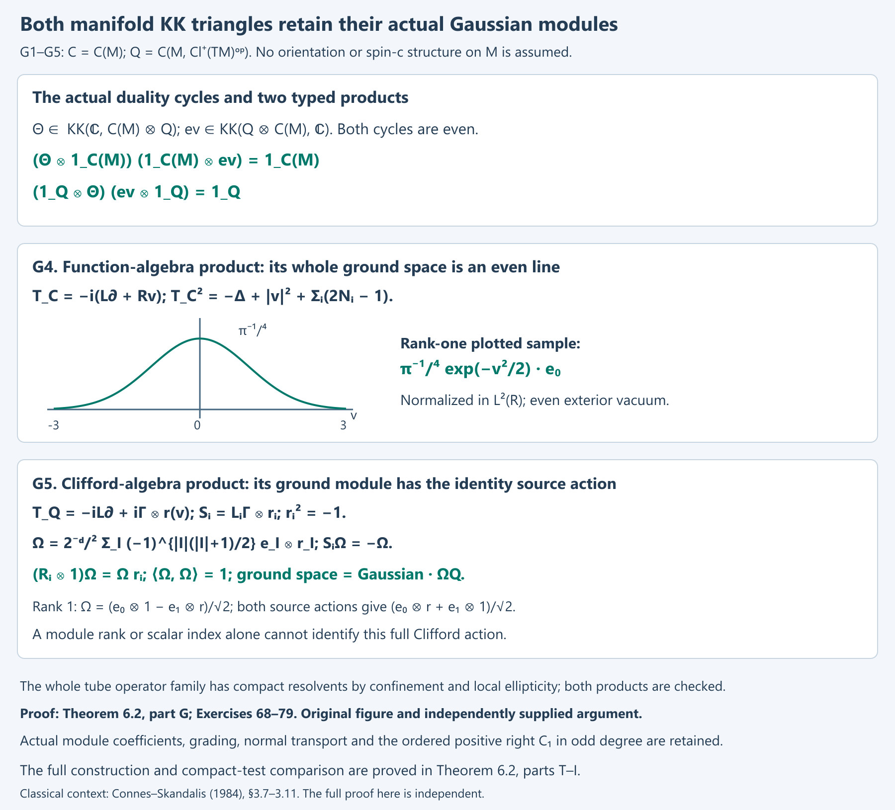

**Figure 6.2.8.** Both manifold triangles and the entire even Gaussian line and regular Clifford kernel. Proof: Theorem 6.2, part G; Exercises 68–79.  These are original reproducible diagrams of the objects and proved maps. Classical context is [Connes; Connes–Skandalis].

Full-size PNG · Editable SVG.

 #### H1. The entire orientation cap, with its necessary reflection

Let M be compact smooth without boundary, C=C(M), W=TM, E=f\*τ, d=rank W, q=rank E, m=d+q. Write A\_L=C(M,Cl⁺(W⊕E)) and P\_L=C(M,Cl⁺(W⊕E)ᵒᵖ)=P\_W ⊗\_C P\_E. This is the graded opposite with negative real generators and its actual involution T2. The ordered real list is W first, E second. Let S:A\_L ↝ C⊗C\_m be the prescribed entire even imprimitivity module. Its scalar transition line is part of S. At rank zero retain the full graded line, including an odd line if specified.

Let γ\_L be the grading automorphism of A\_L: it sends every real positive generator to its negative. Set S^γ equal to S with left action precomposed by γ\_L. This retains its underlying right module, Hermitian metric, scalar transitions and grading. It is an actual module, not a determinant-line replacement.

Put Z=Λ(W⊕E)\_C. Its actions L\_i=ε\_i+ι\_i and R\_i=ε\_i−ι\_i give A\_L ⊗\_C P\_L = End\_C(Z), with both full Morita evaluations as in T2–T3. Let z=[Z]:A\_L⊗\_C P\_L→C. Define

\[
 t_S=z^{-1}(S^\gamma\widehat\otimes_C1_{P_L})\,\beta
 \in RKK_M(C,P_W\widehat\otimes_C P_E\widehat\otimes C_m).
 \tag{442}
\]

Here β is the actual graded right coefficient transport from C\_m,P\_L to P\_L,C\_m. Each interchange of homogeneous vectors has its Koszul sign. The last positive C\_m is retained in its specified order. Every factor is an even full imprimitivity module, so H1 has both inverse Morita products. Its concrete zero-operator module is the conjugate Z\* balanced with S^γ⊗P\_L, then transported by β. Local finite frames and partitions prove compact left C action and right fullness. The construction uses the entire given module; a line H tensored with S passes through as the same H, not H\*.

The reflection γ\_L is essential. An unreflected dual cap transposes a positive generator to its negative in this graded opposite convention. H2 verifies the actual sign on the whole finite module before any degree reduction.

#### H2. Full finite evaluation and its physical generators

To check H1, choose an ordered real orthonormal frame and a principal frame of S, so its right module is C\_m. Write e\_I for the exterior monomial and c\_I for the increasing positive Clifford word. First balance H1 with the forms Z carrying the negative left P\_L action R. The external positive C\_m action on this second factor is Γ\_Z⊗c; its position is last. On the resulting right C\_m module define

\[
 U(\overline {e_I}\otimes e_J)
 =2^{-m/2}(-1)^{|I|(|J|+1)+|I|(|I|-1)/2}c_Jc_I.
 \tag{443}
\]

The suppressed S frame is its regular unit. All homogeneous right coefficients are placed in their stated final position. This formula is checked against both balances, rather than assuming that a same-rank module has the desired action.

On Z\*, right a\_i is the adjoint-dual of L\_i and right r\_i is the adjoint-dual of R\_i, hence −R\_i. The reflection in S^γ gives the first relation below; the second is the negative-source balance:

\[
 \begin{split}
 U(\overline {L_i w}\otimes v)
   &=-(-1)^{|v|}U(\bar w\otimes v)c_i,\\
 U(-\overline {R_i w}\otimes v)
   &=U(\bar w\otimes R_i v).
 \end{split}\tag{444}
\]

Inserting or removing i in increasing words proves both equations: the removal sign of R differs from that of L, and c\_i²=1. Starting at I=empty, the second equation and then the first give U(bar1⊗e\_J)=2^−m/2 c\_J and exactly H2 for every I. Thus H2 is defined on the entire balanced tensor, not only a corner.

Its inner product can be checked directly. The right inner product on Z\* is θ\_(w,w'), represented by the faithful full matrix algebra L(A\_L)R(P\_L). Its vacuum projection is ∏\_i(1+L\_iR\_i)/2. After the reflection and β, its action on Z⊗C\_m has vacuum coefficient 2^−m; all nonempty words send the exterior vacuum to an orthogonal word. Consequently ζ=2^(m/2)(bar1⊗1) has <ζ,ζ>=1. Relations H3 reduce every tensor to ζc. They therefore show that the entire inner product is c\*c' and that U is an onto right-linear even unitary. Equivalently, expanding each θ\_(e\_I,e\_I') in the complete L\_AR\_B matrix basis gives <U\_(I,J),U\_(I',J')> term by term; there is no discarded compact-algebra corner.

The physical positive operator on the forms factor has the tensor grading once: bar e\_I⊗v maps to (-1)^|I| bar e\_I⊗L\_i v. H2 now gives

\[
 U\bigl((-1)^{|I|}\bar e_I\otimes L_i e_J\bigr)
       =c_i U(\bar e_I\otimes e_J).
 \tag{445}
\]

It suffices also to check this on ζ: r\_i sends the first vacuum to −bar e\_i, while reflected a\_i moves that bar e\_i to minus the final c\_i. The two minus signs cancel. Thus the induced physical generator is precisely c\_i, not −c\_i. Both W and E blocks keep their original order in H4.

These maps glue. Exterior transitions act on Z and Z\* by the actual dual orthogonal maps and fix their vacua. The reflection commutes with every even principal spin-c transition. The resulting coefficient map has exactly S's real Clifford transition and its scalar phase z; the whole unitary is built from those finite evaluations. It therefore retains an arbitrary line twist and a two-torsion line. For m=0 the contraction is the scalar evaluation tensored with the entire graded S line. Smooth compact parameter families use these same maps on their bundle over M×J. H2–H4 and both full Morita evaluations hold on that entire parameter bundle.

#### H3. The full test class and exact KK factorization

Let d\_M∈KK(P\_W,ℂ) be G2's evaluation restricted along a↦a⊗1 into P\_W⊗C(M). It is the actual negative-source de Rham cycle, not a separately chosen spin-c Dirac class. For any a∈RKK\_M^j(P\_E,C), compose t\_S with 1\_(P\_W)⊗\_C a, keep the final positive C\_m, forget base linearity, and compose with d\_M externally over the retained coefficients. The domain after forgetting is C(M). This defines a full class

\[
 \mathsf{cap}_S(a)\in KK(C(M),C_j\widehat\otimes C_m),
 \qquad C_0=\mathbb C, C_1=\operatorname{Cl}_1^+.
 \tag{446}
\]

For j=0 the retained list is simply C\_m. For j=1 it is C\_1 from a, followed by C\_m from the first cap. This is the native second-cycle-first list. Reducing m's even consecutive pairs and then the remaining ordered odd pair is exactly Section 0.13/7.20–7.21, not an ungraded permutation. The resulting scalar degree is j+m≡j+q−d mod2. Fullness, finite coefficients and the proved product theorem ensure existence over the actual whole M algebra in every case.

Apply the same construction to T5's k\_f with coefficient A:

\[
 y_f=\mathsf{cap}_S(k_f)\in KK(C(M),A\widehat\otimes C_m).
 \tag{447}
\]

For η∈KK^j(A,ℂ), (388) and full external-coefficient associativity give

\[
 \mathsf{cap}_S(\chi_f(\eta))=y_f\cdot\eta.
 \tag{448}
\]

Here the product on the right includes the stated final C\_j,C\_m transport before parity reduction. To verify (448), retain the balanced chain t\_S,(1\_(P\_W)⊗k\_f),d\_M,η. Move only the independent A-coefficient η past d\_M by the graded external tensor interchange, then use the associating module unitaries of Section 0.9 and the two finite evaluations0.12. η acts on the A coefficient and d\_M on P\_W; the interchange has the degree-zero d\_M and the actual displayed Clifford transport. The operator classes agree by the complete product uniqueness0.6. This proves equality of full KK classes before taking a scalar index.

For a Hermitian test bundle B over M, let [B]∈KK(C,C) be its complete finite zero-operator coefficient cycle. Multiplication by the unit u:ℂ→C(M) gives u[B]cap\_S(χ\_f(η))=u[B]y\_f·η in scalar degree j+q−d. In even degree Section 0.14 takes its integral kernel-minus-cokernel index; in odd degree KK^1(ℂ,ℂ)=K\_1(ℂ)=0. Neither the cap nor (448) quotients by torsion or passes to a character.

Metric, orientation-family and tube changes are whole families: T/C provide k\_f over M×I, D1 transports its normal bundle, and H1's finite tensors and G's evaluation occur on the same coefficient interval. Their complete product homotopy gives the endpoint equality with the supplied full module paths. There is no claim of invariance after dropping that path.

#### H4. Two complete native calibrations

If M is a point, d\_M=1 and H2–H4 identify (447) with the given spin-c reduced raw transverse Thom class followed by the actual étale correspondence L\_f. Indeed the raw positive operator L\_E(v) on forms is taken exactly to c\_S(v) by H4; the compact creation connections and positivity 2B² of T4–T5 are preserved by the entire finite unitary. This is the native point-source wrong-way class of Section 6.0o, with all positive odd coefficient reductions in their given order. An even line H multiplies both by H; rank zero retains its entire graded line and its exact index sign.

If the target is the unit groupoid of a point, E=0 and L\_f is the identity C(M) correspondence. H2–H4 take the evaluation's principal positive L\_W symbol to c\_S(ξ). Connections differentiated under this smooth finite bundle unitary add only zeroth-order terms. The complete compact manifold symbol quotient and negative-order estimate therefore identify (447) with the entire positive spin-c Dirac class a\_p of Section 7.1, including its right C\_d. The prescribed structure on W is exactly the one obtained from L=W by 7.18 with zero horizontal double. Section 7.22, whose full ordinary normal and native inverse calculation was supplied and read, gives y\_f=p\_!^geom. Thus (448) is the existing integral wrong-way pairing for this entire ordinary compact-manifold case, with all lines, finite bundles, rank-zero grading and both degrees.

Part I proves the general graph-normal class equality, beyond these two special calibrations.

 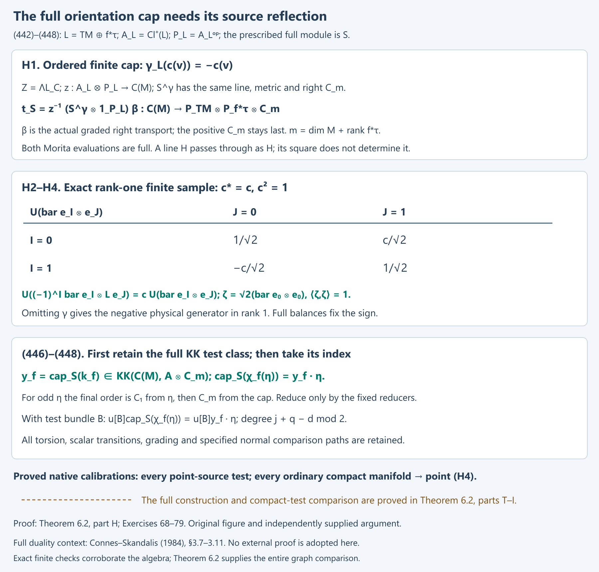

**Figure 6.2.9.** The reflected full cap, exact finite generator contraction and full KK test factorization. Proof: Theorem 6.2, part H; Exercises 68–79.  These are original reproducible diagrams of the objects and proved maps. Classical context is [Connes; Connes–Skandalis].

Full-size PNG · Editable SVG.

 #### E1. From every odd cycle to an honest compression extension

Let A be any separable complex C\*-algebra, not necessarily unital or nuclear. Under the course's positive right C1 convention, an odd cycle is (H⊗C1,φ,F⊗ε), where H is separable, φ is an ordinary even representation, and F is self-adjoint. This follows by taking the even module summand; right multiplication by ε identifies the other summand with it. An odd right-linear operator then has exactly this form. Use the localized normalization from Section0 to take ||F||≤1. It satisfies [F,φ(a)] compact and (F²−1)φ(a) compact for every a. Neither defect is asserted globally compact when A has no identity.

Put s=(1−F²)^(1/2). Then sφ(a) and φ(a)s are compact. Indeed in the Calkin algebra q(F) commutes with qφ(A), and (1−q(F)²)qφ(a)=0. Continuous functional calculus in that commuting algebra gives q(s)qφ(a)=0; adjoints give the other side. This is a localized assertion and suffices. On H⊕H with representation π=diag(φ,0), define

\[
 F_t=\begin{pmatrix}F&t s\\t s&-F\end{pmatrix},
 \quad0\le t\le1,\qquad
 F_1^2=1.
 \tag{449}
\]

Since F commutes with s, the square has diagonal F²+t²s². Its defects tested by π(a) are compact, and the off-diagonal commutators are ±t sφ(a), ±t φ(a)s. Thus E1 is a whole norm-continuous Kasparov homotopy. The second summand at t=0 has zero representation and is degenerate. Every odd class is therefore represented by an honest self-adjoint involution, without adding a global Fredholm assumption to a nonunital cycle.

Set P=(1+F\_1)/2 and K=P(H⊕H). Compression gives a completely positive contraction σ(a)=Pπ(a)P|\_K. Its multiplicative defect is

\[
 \sigma(ab)-\sigma(a)\sigma(b)
       =P\pi(a)(1-P)\pi(b)P\in\mathcal K(K).
 \tag{450}
\]

Here [P,π(a)] is compact, since it is half the original involution commutator. Consequently τ=q\_Kσ is a \*-homomorphism A→Q(K)=B(K)/K(K). The pullback algebra {(a,T):q\_K(T)=τ(a)} gives an extension by K(K), and a↦(a,σ(a)) is its completely positive contractive section. Adding a zero Busby summand on ℓ² makes the ideal the standard infinite compact algebra if necessary. Degenerate or noninjective Busby maps are allowed; analytic K-homology does not require an essential extension.

#### E2. A complete dilation and the inverse cycle

Conversely, let τ:A→Q(H) admit a completely positive contractive lift σ:A→B(H). We construct its dilation here. On A⊙H use <a⊗ξ,b⊗η>=<ξ,σ(a\*b)η>. Complete positivity gives positivity of every finite tensor sum. Quotient its null space and complete to K\_0. Left multiplication defines π\_0:A→B(K\_0): the inequality ||b||²1−b\*b≥0 in the unitization, inserted between each pair of tensor coefficients, proves ||π\_0(b)||≤||b||. Adjoints are left multiplication by b\*, so it is a \*-representation. Its range is essential on K\_0.

For a contractive approximate identity e\_n, the vectors e\_n⊗ξ have norm at most ||ξ||. On the dense tensor span their inner products converge to <a⊗η,V\_0ξ>=<η,σ(a\*)ξ>. This defines a bounded linear functional and hence a unique vector V\_0ξ by the Hilbert space Riesz theorem. It gives a contraction V\_0:H→K\_0. The approximate-identity limits show V\_0\*π\_0(a)V\_0=σ(a). Indeed π\_0(a)(e\_n⊗ξ)=a e\_n⊗ξ converges in norm to a⊗ξ, so π\_0(a)V\_0ξ=a⊗ξ. Pair this with V\_0η by the defining Riesz formula to obtain the asserted compression identity. Separability of A and H makes K\_0 separable.

On K=K\_0⊕H take π=π\_0⊕0 and the isometry Vξ=(V\_0ξ,(1−V\_0\*V\_0)^(1/2)ξ). Then V\*π(a)V=σ(a) and V\*V=1. Put P=VV\* and F=2P−1. For C\_a=(1−P)π(a)V, direct multiplication gives

\[
 C_a^*C_a=\sigma(a^*a)-\sigma(a^*)\sigma(a)
                         \in\mathcal K(H).
 \tag{451}
\]

The quotient multiplicativity of τ gives the last inclusion. A bounded Hilbert space operator T with T\*T compact is compact: cut its positive spectrum above a positive threshold to get finite-rank approximations and use the norm bound on the remaining spectrum. Therefore C\_a is compact. The adjoint argument with a\* gives both off-diagonal blocks of [P,π(a)] compact. F is an honest involution, so (K⊗C1,π,F⊗ε) is an odd Kasparov cycle. Its compression onto PK=VH gives exactly the original σ and τ, under V. No nuclearity or arbitrary extension-splitting theorem was used.

#### E3. Both constructions are inverse, including whole homotopies

To compare two isometric dilations of the same lift, adjoin the identity representation of A^+ to their representations. Let K\_min be the closed span of π(A^+)VH. It reduces π, contains VH, and the projection P is zero on its complement. Its orthogonal complement therefore has F=−1 and is a degenerate cycle. On K\_min the map

\[
 \sum_i\pi(a_i)V\xi_i\longmapsto
                         \sum_i\pi'(a_i)V'\xi_i
 \tag{452}
\]

is an onto isometry, since its inner product is exactly Σ\_(i,j)<ξ\_i,σ^+(a\_i\*a\_j)ξ\_j>, where σ^+(a+λ1)=σ(a)+λ1. This unitization is completely positive by the actual isometric dilation just constructed: π^+(a+λ1)=π(a)+λ1 compresses to that formula. E4 intertwines π, V and P. Thus it gives an actual cycle unitary after removal of degenerate summands.

Starting from an involution Fredholm cycle, the original (π,inclusion of PH) is already an isometric dilation of its compression. E4 identifies the returned cycle with it, up to its degenerate complement. Starting from an extension, E2 returns precisely its original Busby map. These prove both inverse statements, not only surjectivity.

Two cpc lifts of the same τ differ by compact operators. Their convex path σ\_t is cpc, and its multiplicative defects are norm-continuous compact functions of t. The same tensor construction over C(I), with inner products given by σ\_t^+, gives one countably generated Hilbert C(I)-module, isometric V and projection P. Its off-diagonal construction uses A^+⊙C(I,H), π by left multiplication, and Vξ=1⊗ξ. Complete positivity is pointwise positivity of every continuous matrix σ\_t^+; V\*V=1 follows from σ\_t^+(1)=1. Thus V is adjointable with V\*(a⊗ξ)=σ\_t^+(a)ξ, directly on the dense tensor core. No Hilbert-module Riesz representation theorem is assumed. The projection is VV\*, and its off-diagonal operators C\_a are rectangular module compact because C\_a\*C\_a is compact in C(I,K). The module version of the preceding compactness argument uses the compact maps T(T\*T)(T\*T+δ)^−1. Functional calculus bounds their distance from T by sup\_(λ≥0) √λ δ/(λ+δ)=√δ/2, tending to zero. Thus it is a whole Kasparov homotopy.

Conversely, do E1 and the projection compression on any odd KK homotopy module over C(I). Every defect lies in its entire module compact ideal. The projected module is complemented and countably generated. Add the standard C(I) module with zero Busby map and use the explicit stabilization unitary proved in Section 0.2. Its compact ideal becomes C(I,K); compression is a whole semisplit extension homotopy, not a separately selected extension at each t. The same procedure handles direct sums and ordinary unitary equivalence.

Adding a split extension gives a degenerate cycle: use its homomorphism lift as the dilation and P=1. Different cpc lifts are handled by the path just proved. Complementing P gives the inverse class: the sum of the two compression Busby maps is, under K=PK⊕(1−P)K, the split map qπ, because its off-diagonal blocks are compact. In the odd cycle this is precisely F↦−F, the inverse convention0.7. Consequently stable semisplit extensions modulo split summands and these whole homotopies form a group Ext\_h^−1(A,K), and both constructions give

\[
 \operatorname{Ext}_{h}^{-1}(A,\mathcal K)
                 \cong KK^1(A,\mathbb C).
 \tag{453}
\]

The subscript h makes the homotopy convention explicit. This proof is not a claim that all nonsplit extensions of an arbitrary nonnuclear algebra are semisplit or invertible. The analytical extension group used here is this invertible, stable semisplit group, with its entire homotopy convention.

#### E4. The other parity and the native source convention

Let SA=C0(R)⊗A in the positive physical coordinate order. Section 0.18/0.20 give both actual suspension Bott products; write b\_A∈KK^1(A,SA) and d\_A∈KK^1(SA,A) for the native parity pair. Their two products are 1, with the ordered positive C1 reductions fixed before reduction. For η∈KK^0(A,ℂ), d\_A·η∈KK^1(SA,ℂ) has the compression extension of E1. Its inverse is extension cycle followed on the left by b\_A. Associativity and both Bott products prove both inverses. Thus set

\[
 K^{\rm an}_1(A)=\operatorname{Ext}_{h}^{-1}(A,\mathcal K),
 \qquad K^{\rm an}_0(A)=\operatorname{Ext}_{h}^{-1}(SA,\mathcal K).
 \tag{454}
\]

Equations (453)–(454) identify these full groups with KK^j(A,ℂ) for j=1,0. The normalization E1, the actual dilation and both suspension inverses specify their signs and parity. They preserve all classes and torsion. Precomposing a Busby map by a homomorphism agrees with precomposing its dilation cycle, so these identifications are natural.

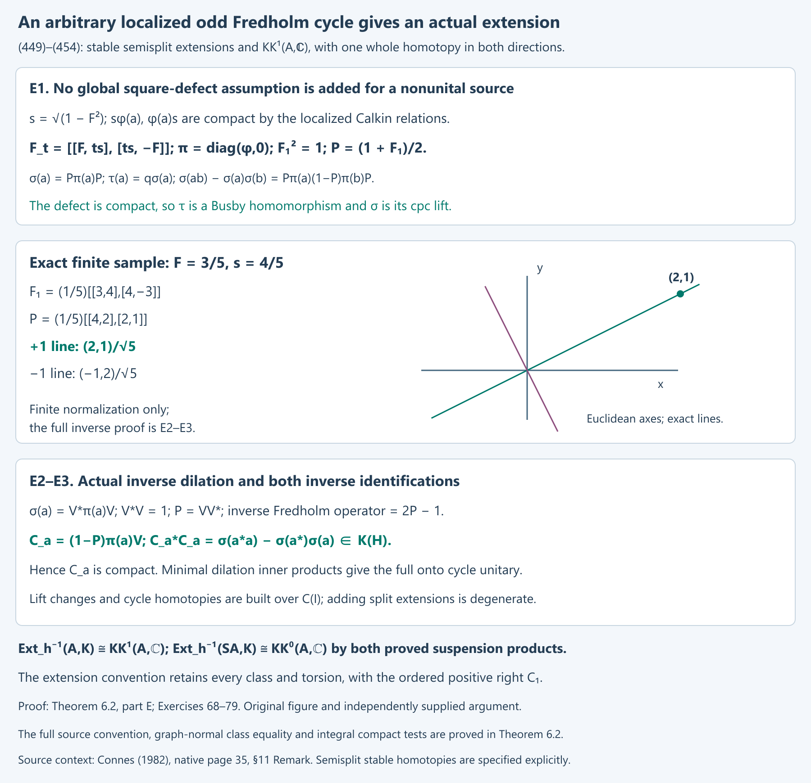

**Figure 6.2.10.** Localized odd normalization, complete isometric cpc dilation, both inverse constructions and suspension. Proof: Theorem 6.2, part E; Exercises 68–79.  These are original reproducible diagrams of the objects and proved maps. Classical context is [Connes; Connes–Skandalis].

Full-size PNG · Editable SVG.

 #### I1. Coevaluation detects the entire oriented test class

Let C=C(M), P=P\_W=C(M,Cl⁺(TM)ᵒᵖ), M compact smooth without boundary, and let D be any separable graded coefficient algebra. Upgrade G1's diagonal class to

\[
 \Theta_M\in RKK_M(C,C(M_x)\widehat\otimes P_y).
 \tag{455}
\]

Its entire module is the same diagonal disk ideal as in G1. The left parameter h∈C acts by h(y), equal to the right central P\_y action. The extra C(M\_x) acts in the first point. The bounded phase is +i r\_y(w), normalized as in G1. This is an actual base-linear cycle; its square defect is compact even for the identity parameter coefficient.

For x∈KK(C,D), tensor x with the identity P\_y and apply the actual graded right transport to put P\_y first. Define

\[
 \begin{split}
 \mathcal D_M(x)&=\Theta_M(x\widehat\otimes1_P)
                 \in RKK_M(C,P\widehat\otimes D),\\
 \mathcal I_M(a)&=\operatorname{forget}(a)
                     (d_M\widehat\otimes1_D)\in KK(C,D).
 \end{split}\tag{456}
\]

All products use the complete base-linear version of Section0: the central parameter is equal on both module sides and is retained by the separator, connection and positivity operators. Equivalently the whole product module of C4 has that parameter linearity automatically. Forgetting in (456) retains the left source C(M); it does not first apply its scalar unit.

We check both inverse identities, including the relative one. For I\_M D\_M(x), reassociate the product and use G4's first triangle externally over D. Its source function originally acts at the integration point y. G3's whole geodesic source contraction takes it to its value at the remaining point x. That triangle is the identity C(M) class with that full source action. Product naturality and uniqueness therefore give x.

For D\_M I\_M(a), the coevaluation confines the first-point variable x to U={(x,y):x=exp\_y(w),|w|<r}. On this open diagonal disk, pull the entire a field by x. The evaluation factor is the fixed de Rham cycle in x, with the remaining y parameter and its Clifford coefficient. Restriction to U is legitimate: extend each C0(U) coefficient by zero, and use Section 0.10's actual essential-module homotopy. No inverse for the inclusion of an arbitrary open set is asserted.

Move that pulled field along x\_t=exp\_y(tw), 0≤t≤1. The negative Clifford bundle at x\_t is identified with the bundle at x by parallel transport along this specified short geodesic. C5 constructs these possibly nonproper whole pullbacks; D1–D2 and C4 give one interval field class on U×I with its full normal transport. It need not have differentiable operator fields. Compose this interval class with the fixed diagonal and evaluation factors by the complete product theorem. Thus this is a whole product homotopy, not separate pointwise products. At t=0 the field is the y field, with its specified transported negative Clifford action. Its parameter linearity permits it to be reassociated outside the diagonal/evaluation product. The remaining product is exactly G5's second triangle: its source r acts by R⊗1, its target r by Γ⊗r in the potential, and its Gaussian module is ΩP with RΩ=Ωr. Hence that full Clifford source is the identity and the remaining class is a. Every transport here is the same one used in G3's source contraction. Therefore

\[
 \mathcal I_M\mathcal D_M=1,\qquad
 \mathcal D_M\mathcal I_M=1.
 \tag{457}
\]

The argument retains arbitrary D and its grading. For the positive right odd coefficient it retains the exact ordered generator, since all geometric cycles in the two triangles are even morphisms before parity reduction.

For the prescribed S on W⊕E, put a\_f=t\_S(1\_P⊗\_C k\_f), with the coefficient transport of H3, and reduce the final C\_m only by the fixed right reducer R\_m. Then (447) and (457) say

\[
 \mathcal D_M(R_m(y_f))=R_m(a_f).
 \tag{458}
\]

We shall prove the same formula with the native f\_! on the left. By (457) that proves equality of the entire KK classes.

#### I2. The finite normal orientation after diagonal coevaluation

Choose an even Euclidean embedding j:M→R^n, with ℓ=n−d≥1 and k=ℓ+q≥1. Use its induced tangent metric; the positive metric transport carries the given entire S to this metric. Let ν be its orthogonal complement, and N=ν⊕E with precisely the specified module S\_N from Section 6.0j. Write J(v,η)=dj(v)+η, an actual global isometry W⊕ν→R^n. No separate orientation of W or ν is chosen.

Diagonal coevaluation followed by the native normal Thom cycle has finite coefficient P\_W⊗S\_N, with positive physical actions i r\_W(v) and c\_N(η,e). The negative right P\_W coefficient remains first. Call this full orientation module T\_N. Let U\_(E,S) be the partial finite cap obtained from t\_S by balancing its P\_E action with ΛE\_C, keeping P\_W and the last positive C\_m. Its positive physical E action is the L\_E action on that forms factor. H2–H4 specifies this partial contraction with every tensor sign.

The requisite finite comparison is obtained by the following explicit reversible evaluation, rather than by rank or determinant. Balance the negative right P\_W coefficient with Z\_W=ΛW\_C, retaining its positive left A\_W action. On T\_N the resulting two real W copies are

\[
 u\longmapsto L_W(u),\qquad
 v\longmapsto iR_W(v).
 \tag{459}
\]

They are precisely the interleaved canonical complex double Q\_W, with its exterior grading. Indeed the coevaluation's physical +i r becomes +iR. The other W copy comes from the retained positive L action, with the grading once in the exterior wedge map. For the partial cap U\_(E,S) this same evaluation recovers S on W⊕E, by H2–H4: its reflected W source cancels the adjoint-dual minus sign. The reflection on the E block is already removed in its partial forms contraction. Both statements are actual entire module unitaries.

The exact normal recovery of Section 6.0j is

\[
 S_N\widehat\otimes S_{Q_W}
  \cong\rho^*(S\widehat\otimes C_n),\qquad
 \rho(\eta,e,u,v)=(u,e,J(v,\eta)).
 \tag{460}
\]

The source order is N,Q\_W, and the right list is C\_k,C\_(2d), the same generator list as C\_m,C\_n before repartition. Tensor (460) with the fixed last consecutive-pair spinor Σ\_d. Since S\_(Q\_W)⊗\_(C\_2d)Σ\_d=Z\_W, its left side is exactly the evaluated T\_N just described. Its right side is S⊗C\_n with that complete right matrix reduction. Evaluating C\_n⊗U\_(E,S) with Z\_W gives precisely the same module: recover S as above, move the even-dimensional C\_n block by its actual even exterior/spin implementer, and repartition C\_m,C\_n as C\_k,C\_(2d). All vector actions are identified by the displayed ρ, not just their oriented volume.

This finite evaluation is cancellable. To reverse it, tensor with Z\_W\* and apply the two inner-product/rank-one maps of (385) and Section 6.0j(174). In an ordered word frame the maps are exactly H3's two balances; H2 is their onto even unitary. The matrix units generated by L\_i,R\_i recover every column, so reversing either composition gives the original module and each negative P\_W generator. The tensor inner-product formula shows that these maps and their reverses are isometries; fullness gives onto ranges. Thus the preceding evaluated equality is an equality of the original finite modules after the stated right Clifford matrix transports and reductions.

One can check every column of this cancellation without a spin-c classification input. In the right Clifford model of S⊗C\_n let A\_i be its generator for u\_i in the first W block and B\_i its generator for the v\_i in the ambient W block. Set C\_i=(A\_i−iB\_i)/2 and Π=∏\_i(1−iA\_iB\_i)/2. These are the exterior creation operators and the vacuum projection of (459)'s interleaved double. Clifford relations give C\_i²=0, C\_i C\_j+C\_j C\_i=0 and C\_i\*C\_j+C\_j C\_i\*=δ\_ij. For C\_I the increasing creation word they give

\[
 \Pi C_I^*C_J\Pi=\delta_{IJ}\Pi,\qquad
 \sum_I C_I\Pi C_I^*=1.
 \tag{461}
\]

The second identity follows by multiplying the independent two-term decompositions (1−C\_i\*C\_i)+C\_i\*C\_i=1; its cross signs cancel in the even projections. These equations are precisely both matrix-column inner-product evaluations. If ε(I,i) is the exterior insertion/removal sign, the same relations give A\_i C\_IΠ=ε(I,i)C\_(I△i)Π and B\_i C\_IΠ=i ε(I,i)(−1)^(1\_(i∈I))C\_(I△i)Π. Every remaining normal generator g commutes with Π and satisfies g C\_IΠ=(−1)^|I| C\_I gΠ. Thus the map e\_I⊗s↦C\_I s from Z\_W⊗Π(S⊗C\_n) is an entire even unitary intertwining all A\_i,B\_i and normal generators. This is exactly the module recovery used in (460). The actual permutation ρ sets the normal chirality; no orientation sign is chosen afterward. Equations (461) and these action identities prove the cancellation for every d,q, including the full grading, not only the finite tested models.

For clarity about these reductions, n+m=k+2d. Reducing the last 2d factors of C\_(k+2d), then applying R\_k, is the same full even Morita module as R\_(n+m), after the stated even block transports. If k is odd, move its retained odd generator past the even 2d block by the 2d adjacent reflection units of Section 7.20, then use the ordered wedge unitary. It is an even unitary preserving the normalized odd volume. Reduction of C\_n,C\_m, with n even, likewise gives the exterior tensor of the n/2 matrix pairs and the m pairs, with the same final odd generator. These are full zero-cycle product identifications over any graded extra coefficient. Their proofs use only the actual homogeneous tensor maps, so the retained P\_W coefficient is included; no scalar-source restriction is used.

Consequently the reduced forward Bott cycle of T\_N on W⊕ν⊕E, under (v,η,e)↦(J(v,η),e), is the forward canonical even R^n Bott cycle followed externally by R\_m(U\_(E,S)'s forward E cycle). Every physical real generator and the negative right P\_W action has been checked by (459)–(460) and the two full evaluations. An even line H in S stays as H in S\_N and in U\_(E,S); all these maps carry that same factor. Rank-zero total orientation retains its graded line. All statements hold on smooth compact parameter bundles.

#### I3. One actual étale homotopy without a transverse-rank hypothesis

Use T1's fibre-preserving actual tube ρ\_E:E→H\_f. The native normal tube may be chosen as its product with the small Euclidean normal disk: its actual cocycle is

\[
 g_N(x;\eta,e)=(g_E(x,e),j(x)+\eta).
 \tag{462}
\]

Here g\_E includes every actual arrow and the specified short arrow equivalence at zero. (462) is exactly Section 6.0m's cocycle on p\*ν, and its normal is the ordered ν,E with S\_N. Using separate positive radial compressions of ν and E instead of one compression of N changes no class: they have the same positive normalized derivative, and the whole tube and normal homotopies of 6.0e/o apply. The actual operator is the raw normal c\_N(η,e), before reduction.

Write source variables over y as (w,η,e)∈W\_y⊕ν\_y⊕E\_y. Use compressions a=q\_r(w), b=q\_ρ(η), c=q\_ρ(e), where q\_ρ(v)=v/√(1+|v|²/ρ²) has derivative1 at zero. Changing G1's positive radial normalization to this one is its raw Thom homotopy and does not change Θ\_M. Let x\_t=exp\_y(ta). Choose compatible metric connections and full spin-c/line parallel transports along these short geodesics; they preserve each real Clifford action. Denote the real transports by T^ν\_t and T^E\_t. Put

\[
 \begin{split}
 z_t(y;w,\eta)&=j(y)+(1-t)J_y(a,b)
        +t\bigl(j(x_1)-j(y)+T^\nu_1b\bigr),\\
 \Phi_t(y;w,\eta,e)&=
       \bigl(g_E(x_t,T^E_tc),\ z_t(y;w,\eta),\ y\bigr).
 \end{split}\tag{463}
\]

The target is the foliation V×R^n×M whose plaques keep the Euclidean coordinate and y fixed. Every overlap arrow in Φ\_t is the actual arrow of g\_E pulled by (y,w,e,t)↦ (x\_t,T^E\_tc), with the same z\_t and y. They satisfy the exact arrow cocycle. There is no identification by leaf image, or choice of a formal arrow having those endpoints.

All Φ\_t are étale after one uniform disk shrink. The Euclidean derivative in the physical (a,b) coordinates is J\_y+O(|a|+|b|), uniformly on compact M×I, since both endpoint maps have derivative J\_y at zero. Choose the disks so this error is less than half the least singular value1. The e derivative of g\_E(x\_t,T^E\_tc) is invertible on a common small disk by T1. The Euclidean coordinate has no e derivative. The combined transverse derivative is therefore block invertible, irrespective of its mixed W-to-transverse block. Radial compression is a diffeomorphism onto each disk, so this proves étaleness on the entire noncompact source bundle, even where its inverse derivative is large. The extra y block is the identity.

At the zero section the two nonparameter blocks are explicitly

\[
 (w,\eta,e)\longmapsto
       \bigl(e+t\,d_{\rm trans}f_y(w),\ J_y(w,\eta)\bigr).
 \tag{464}
\]

This is an invertible shear for every linear transverse map, including the zero map and rank changes. Thus no condition on surjectivity of d\_trans f has entered the argument.

For each t use the full module P\_W⊗S\_(N,x\_t), transported along the stated geodesic, and the anticommuting positive potential i r\_W(w)+c\_N(η,e). Its normalized square defect is −1/(1+|w|²+|η|²+|e|²), on the whole source bundle. The zero endpoint module is the same specified S\_(N,y); the one endpoint is the original pulled normal module. These are an actual full orientation family, including all scalar phases and its rank-zero grading, not separate endpoint choices.

Here is the product check for the two forward potentials. On a homogeneous compact first-variable creation section ξ, insert the connection sign (−1)^|ξ| and the actual right P\_W transport. The total phase then differs from that signed second normal phase by a continuous finite matrix function tending uniformly to zero at normal infinity. It has compact first-variable support, so its multiplication is rectangular module compact. Adjoints give the second error, and density treats every creation vector. Its first positivity is the nonnegative scalar 2|w|²/(√(1+|w|²)√(1+|w|²+|η|²+|e|²)). Thus the total phase is the actual forward product. The left parameter action is central, and its localized source commutators vanish.

Compose this whole forward product with Φ\_t's actual étale module. Section 6.0n, with the fixed R^n factor and compact parameter M×I, gives one countably generated completed C(M×I,A⊗C0(R^n)) module, compact coefficient action and onto isometric endpoint maps. The compact creation proof and positivity 2B² of T4–T5 apply to the finite coefficient corners. Thus this is one whole KK homotopy of products. The right Clifford reducers of I2 and the one fixed canonical Euclidean inverse A\_n may be composed on that interval; product naturality gives exactly its two endpoint products.

#### I4. The two endpoints and the full numerical comparison

At t=1, (463) is exactly diagonal coevaluation followed by the native graph-normal tube (462), under the actual pulled coordinates x=exp\_y(a), η=T^ν\_1 b and e=T^E\_1 c. The forward-product check, the complete tube restriction and the full normal family show that its reduced product with the ambient inverse is D\_M(f\_!^geom).

At t=0 it is the product of g\_E(y,c) with the Euclidean open tube j(y)+J\_y(a,b). Its principal space is the product of the actual E correspondence with that Euclidean open coordinate. Elementary separated chart sections have tensor inner products and convolution actions exactly as in Section 6.0o's full product-factor proof. A finite partition on each compact chart support gives dense range by the common Schur estimate. Thus completion gives an onto even product-module unitary, including every actual holonomy/counting sheet.

I2 identifies its complete forward orientation/potential with the canonical R^n Bott factor and the partial oriented E cap factor. Restricting the Euclidean Bott factor to the compressed open product disk changes no class: it is the normalized tube for its zero section, with the actual extension by zero and compression homotopy6.0e. Translation by j(y) is a whole compact-parameter tube homotopy. The canonical even pair B\_n,A\_n has both inverse products by 6.0c and its exact native reductions7.20–7.21. Cancelling B\_n A\_n externally over P\_W,A and the prescribed line therefore leaves exactly R\_m(t\_S(1\_P⊗k\_f))=R\_m(a\_f). No canonical positive analytical Euclidean module has been substituted for the calibrated geometric inverse A\_n.

The whole homotopy consequently proves

\[
 \mathcal D_M(f_!^{\rm geom})=R_m(a_f),\qquad
 f_!^{\rm geom}=R_m(y_f)
              \quad\hbox{in }KK^{q-d}(C(M),A).
 \tag{465}
\]

The second equality is (457) applied to the first and (458). It holds for every compact smooth actual cocycle f with its given full stable orientation. For a Hermitian coefficient bundle B and η∈KK^j(A,ℂ), (448) and the fixed native odd order now give the integral test identity

\[
 R_{j,m}\bigl(u[B]\,\mathsf{cap}_S(\chi_f(\eta))\bigr)
        =u[B]f_!^{\rm geom}\cdot\eta
       \quad\hbox{in }KK^{j+q-d}(\mathbb C,\mathbb C).
 \tag{466}
\]

Here R\_(j,m) is (446)'s complete fixed right reduction of the native list C\_j,C\_m, including its ordered odd pair.

In even degree this is exactly the previously constructed kernel-minus-cokernel pairing; in odd degree the scalar group is zero, while the full (465) class and (448) are retained. Line twists, their two-torsion cases and complete graded rank-zero lines remain in the same factors through (460)–(466). Smooth compact parameter families use the displayed homotopy on their entire bundle, one uniform disk and the same finite evaluations. No separate fibrewise product argument is needed.

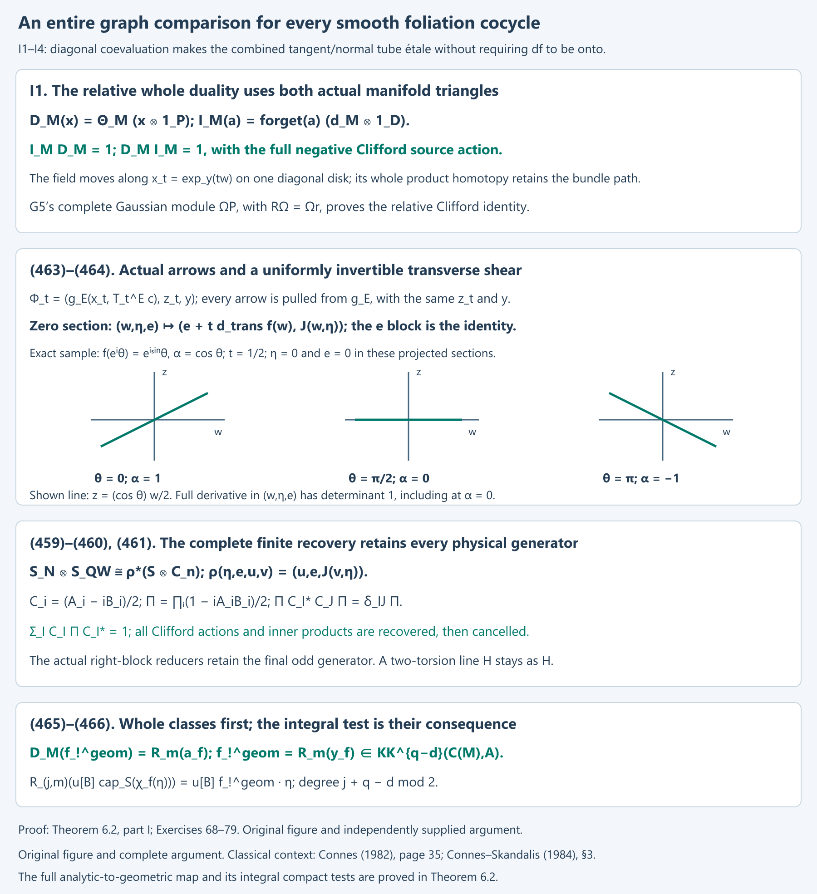

**Figure 6.2.11.** One entire étale homotopy, full normal recovery and the native graph-normal class equality. Proof: Theorem 6.2, part I; Exercises 68–79. The three plotted lines in the last figure are the exact projected sections labelled there, not the full transverse derivative. These are original reproducible diagrams of the objects and proved maps. Classical context is [Connes; Connes–Skandalis].

Full-size PNG · Editable SVG.

 The complete model, field construction, both duality identities, full graph comparison and extension source prove all claims of Theorem 6.2. \(\square\)

## 7. Analytic index and assembly are different questions

The analytic index is built from a longitudinal operator; the geometric index is built from an oriented map. We construct the general operator class and its coefficient action, then prove its compact submersion product on the actual holonomy correspondence, retaining all Clifford parities and spin-c phases. The geometric comparison and the isomorphism question for assembly are distinct assertions.

### The Dirac class on the full holonomy module

An operator can be compact as a Hilbert-module map while its represented operator on an infinite holonomy cover is not compact. The construction below uses the module compact ideal throughout. It requires neither a transverse measure nor a global frame for the tangent bundle. The pseudodifferential inputs are [Hilbert modules and fields on the leaf space, Lemmas 6.1 and 6.5](hilbert-modules-and-fields-on-the-leaf-space.md#section-6), with the complete chart estimates and negative-order approximation in [The index theorem for measured foliations, Lemmas 6.1–6.2](the-index-theorem-for-measured-foliations.md#section-6). The construction is also treated by [Connes–Skandalis], Section 4.

Keep \(V\) compact and without boundary in this subsection. Put \(p=\operatorname{rank}F\), and specify a metric and the full spin-c structure on \(F\). Write \(C_p\) for the ordered positive complex Clifford algebra. Use the transition module \(\mathcal S_F\) of Corollary 6.0d: its fibre is the standard graded right \(C_p\)-module, and a transition \([s,z]\) acts by the even left unitary \(zs\). Thus the central phase is part of the data. Positive Clifford multiplication, denoted \(c_F^+(v)\), is odd, self-adjoint and right \(C_p\)-linear. It satisfies \(c_F^+(v)^2=|v|^2\).

**Theorem 7.1 (the general longitudinal Dirac KK cycle).** The prescribed spin-c structure defines a class

\[
\ell_!^{\mathrm{an}}\in
KK\bigl(C(V),A\widehat\otimes C_p\bigr)=KK^p(C(V),A).
\tag{240}
\]

Its full module is the completion of compact smooth holonomy kernels with coefficients in \(r^*\mathcal S_F\). An odd self-adjoint order-zero quantization of the positive unit-covector Clifford symbol is a representative. The class is independent of the quantization, connection, metric and module embedding, with the specified spin-c structure transported through metric changes.

**Proof: the module.** Choose finitely many spin-c trivializations and smooth functions \(\chi_a\) subordinate to them, with \(\sum_a\chi_a^2=1\). The map that sends a bundle vector to its local components multiplied by \(\chi_a\) is an even isometric right \(C_p\)-linear embedding into a finite trivial \(C_p\)-module bundle. Its adjoint gives an even projection \(e\in M_N(C(V)\widehat\otimes C_p)\). The compact kernel completion is consequently

\[
\mathscr E_F=e(A\widehat\otimes C_p)^N,
\qquad
\mathcal K(\mathscr E_F)=
eM_N(A\widehat\otimes C_p)e.
\tag{241}
\]

Here the projection acts at the range of an arrow. To verify the completion, send a column of arrow kernels to its range-bundle vector and compare its convolution inner product. The isometric bundle embedding preserves that inner product on the smooth core. Its range is the displayed projection corner, since compact chart kernels and an approximate identity of \(A\) are dense. For the compact-endomorphism assertion, \(\theta_{\xi,\eta}\) is the corresponding column product \(\xi\eta^*\). These products span the corner densely, again by the approximate identity. All assertions remain true with the finite-dimensional graded coefficient \(C_p\): expand in its finite matrix components and retain the grading on products. Separability of the chart algebra makes this a countably generated module.

Multiplication by \(f(r(\gamma))\) defines an even representation \(\phi:C(V)\to\mathcal L(\mathscr E_F)\). The regular tensor representations are the holonomy-cover \(L^2\) representations with this coefficient bundle and any faithful representation of \(C_p\). Equality of their norms with the module norm follows from the regular norm of \(A\), first on column products and then by completion. In particular, the compact ideal in (241) is an algebra ideal; no finite ordinary rank on a cover has been assumed.

**Proof: quantization and defects.** Identify a covector with a tangent vector by the metric. The smooth odd matrix symbol

\[
b(x,\xi)=\frac{c_F^+(\xi^\sharp)}{
\sqrt{1+|\xi|^2}},
\qquad
\sigma_0(b)(x,\xi)=
\frac{c_F^+(\xi^\sharp)}{|\xi|}\quad(\xi\ne0)
\tag{242}
\]

is a classical order-zero symbol. The transition identity
\(c_F^+(hv)(zs)=(zs)c_F^+(v)\)
shows that it is an endomorphism symbol of the actual bundle. Quantize it in finitely many protected plaque charts, with fixed near-unit kernel cutoffs, and patch with the above partition. The coordinate-change and composition proofs in the index lesson give a compact-support equivariant order-zero operator \(Q\) with this leading symbol. They apply to each of the finitely many Clifford matrix components. Taking its odd part preserves the leading symbol; put \(P=(Q+Q^*)/2\) after doing so.

The uniform order-zero estimate and the core adjoint identity make \(P\) a bounded adjointable odd self-adjoint map on (241). Composition and the principal-symbol square give

\[
P^2-1\in\mathcal K(\mathscr E_F),
\qquad
[P,\phi(f)]\in\mathcal K(\mathscr E_F)
\quad(f\in C(V)).
\tag{243}
\]

For smooth \(f\), the second operator has order at most minus one: its degree-zero symbol is the commutator of the matrix in (242) with the scalar \(f\), hence zero. The first has the same negative-order conclusion since the unit-cosphere symbol squares to the bundle identity. Negative-order frequency truncation converges in the uniform regular norm to compact smooth arrow kernels, so both operators lie in the corner (241). Smooth functions are dense in \(C(V)\), and \(\|[P,\phi(f-f_n)]\|\le2\|P\|\|f-f_n\|\), proving the assertion for continuous \(f\). These are all Kasparov defects. Compactness of \(V\) permits the identity coefficient in the first assertion; the module representation itself is unital.

If \(p=0\), take \(P=0\) instead of using a unit covector. The foliation groupoid is the unit groupoid and \(A=C(V)\). The module is the finite line module \(\mathcal S_F\), so its identity is compact and all the defects are compact. The canonical rank-zero orientation gives the identity class. A rank-zero spin-c line \(H\) gives \([H]\), with its even grading. This treats the empty cosphere separately.

**Proof: choices.** Two quantizations of the same leading symbol differ by a compact endomorphism, by the complete symbol quotient in the Hilbert-module lesson. Their straight path is an odd self-adjoint Kasparov homotopy; (243) holds along it. Changes of connection, phase, partition or cutoff do not change the leading symbol, so have the same conclusion. A change of finite bundle embedding gives the unitary between their ranges induced by the identity on \(\mathcal S_F\). It intertwines the coefficient representation. Conjugating a quantization by this unitary retains its leading symbol and hence changes the representative only by a compact map.

For two metrics, use \(g_t=(1-t)g_0+tg_1\) and the positive isometries \(G_t^{-1/2}\), where \(g_t(v,w)=g_0(G_tv,w)\). Transport the full principal spin-c structure and its transition module by these isometries. The resulting symbol (242) and its leafwise derivatives vary continuously in \(t\). Compactness of \(V\times[0,1]\) gives a finite trivializing cover, a common finite module embedding and uniform positive metric bounds. Quantization with fixed chart cutoffs is operator-norm continuous: the Fourier–Schur estimate bounds a difference by finitely many symbol seminorms, which tend to zero. Frequency truncation of the negative-order defects is uniform on the same compact parameter interval. Thus the defects are compact in the interval-module corner, not merely compact at each parameter. This constructs the metric homotopy with the full phase retained.

Finally, in even rank \(p=2m\), the ordered matrix-Clifford contraction sends this module to the ordinary spinor kernel module. If \(c_i=-i\varepsilon_i\) denotes the negative skew-adjoint Clifford action, its leading symbol is \(ic(\xi)/|\xi|\), and its grading is

\[
\Gamma=i^m c_1\cdots c_{2m}
=(-i)^m\varepsilon_1\cdots\varepsilon_{2m}.
\tag{244}
\]

These are exactly the spinor and Thom conventions of (145). In odd rank the final positive Clifford factor is retained, as in Section 0; no ungraded spinor replacement or interchange of odd blocks has occurred. This proves (240) with its asserted parity. \(\square\)

### Coefficients and all even-rank elliptic symbols

**Lemma 7.2 (finite bundle coefficients and a change of spin-c structure).** For a finite Hermitian bundle \(B\to V\), quantize the symbol \(1_B\widehat\otimes\sigma_0(b)\) on the range-pulled-back bundle \(B\otimes\mathcal S_F\), and call the resulting cycle \(\ell_{!,B}^{\mathrm{an}}\). Then

\[
\ell_{!,B}^{\mathrm{an}}=[B]\ell_!^{\mathrm{an}},
\qquad
\ell_{!,F;H}^{\mathrm{an}}
=[H]\ell_{!,F}^{\mathrm{an}}
\tag{245}
\]

for a spin-c change by the line \(H\). The second notation denotes the changed spin-c structure on the same real bundle \(F\). When a bundle bracket multiplies a KK class with source \(C(V)\), it denotes the finite bundle correspondence with its usual left \(C(V)\) action. Precomposing that correspondence with the scalar inclusion gives the corresponding \(K^0(V)\) bundle class used in (246).

**Proof.** The finite bundle correspondence \((\Gamma(B),0)\) over \(C(V)\) has compact left action and even grading. Its tensor with (241) is the displayed range-bundle kernel module: on elementary tensors the map is \(u\otimes\xi\mapsto u(r(\gamma))\xi(\gamma)\). Its convolution inner product is precisely the balanced tensor inner product. A finite partition and local bundle frames give a dense range, so the map is an onto isometry.

Use an odd self-adjoint quantization \(P_B\) of the stated coefficient symbol. For a smooth section \(u\) of \(B\), the creation map \(T_u\) is multiplication by its range-pulled-back bundle column. The degree-zero symbol of \(P_BT_u-T_uP\) is zero. The matrix-corner version of the negative-order theorem therefore makes this map compact; its adjoint is compact too. Norm approximation by smooth sections treats every creation vector. The positivity condition for the first cycle's zero operator is zero, hence satisfied. The product criterion of Definition 0.3 proves the first formula of (245). The actual transition module for the changed spin-c structure is \(H\otimes\mathcal S_F\): its transitions are the old even units multiplied by the line transitions. Its symbol is \(1_H\otimes b\). The first formula now proves the second, retaining the entire line rather than only its determinant. \(\square\)

**Corollary 7.3 (the full even-rank symbol reduction).** Suppose \(p\) is even, including zero. Let
\(\Theta_F:K^0(V)\to K_c^0(F^*)\)
be the positive Thom isomorphism of Corollary 6.0d, with the specified spin-c structure and metric identification \(F^*\cong F\). For every longitudinal elliptic pseudodifferential symbol class \(s\in K_c^0(F^*)\),

\[
\operatorname{Ind}_{\mathrm{an}}(s)
=\Theta_F^{-1}(s)\ell_!^{\mathrm{an}}
\quad\text{in }K_0(A).
\tag{246}
\]

Thus determining the action of the general Dirac class determines the analytic index of every such symbol. Equation (246) is an analytic reduction; comparison with the geometric class remains a separate theorem.

**Proof.** In positive even rank, \(\Theta_F[B]\) is the relative disk/sphere bundle triple with bundles \(B\otimes S_F^+\) and \(B\otimes S_F^-\) and sphere isomorphism \(1_B\otimes ic(\xi)/|\xi|\). This is the actual multiplier representative in Corollary 6.0d, not just its fibrewise rank. The off-diagonal part \(P_B^+\) in Lemma 7.2 has exactly that leading sphere isomorphism. Its Fredholm index is the analytic symbol boundary by Theorem 6.6 of the Hilbert-module lesson. The scalar \(K=KK\) identification of Section 0 sends its even cycle to the same kernel-minus-cokernel boundary class: both use the full Fredholm bundle pair and the same off-diagonal map. Consequently
\(\operatorname{Ind}_{\mathrm{an}}(\Theta_F[B])=[B]\ell_!^{\mathrm{an}}\).
Direct sums and signed differences give this identity for every \(a\in K^0(V)\). The global inverse products of Theorem 6.0c make \(\Theta_F\) onto and one-to-one. Taking \(a=\Theta_F^{-1}(s)\) proves (246) for an arbitrary relative symbol triple, including ones not initially expressed as Dirac symbols.

In rank zero a chosen spin-c line \(H\) gives \(\Theta_F(a)=a[H]\), whereas Theorem 7.1 gives \(\ell_!^{\mathrm{an}}=[H]\). Its inverse is multiplication by \([H^*]\). Thus the right side of (246) is \(s[H^*][H]=s\), the bundle-difference index on point leaves proved in the Hilbert-module lesson. This also fixes the noncanonical rank-zero case.

If the spin-c structure is changed by \(H\) in positive even rank, its Thom map is \(\Theta_{F,H}(a)=\Theta_F(a[H])\) by the full transition construction. Its inverse sends \(s\) to \([H^*]\Theta_F^{-1}(s)\). Formula (245) cancels this line against the changed Dirac class, so (246) gives the same analytic index of the fixed symbol \(s\). No independence of the Dirac class from the orientation choice is claimed. \(\square\)

The cycle construction in Theorem 7.1 includes odd leaf rank through its actual Clifford factor. The odd-rank all-symbol action requires the corresponding odd coefficient and suspension comparison. The analytical/geometrical leaf-map equality must hold as a KK identity; equality of numerical traces, or (246) alone, does not establish it.

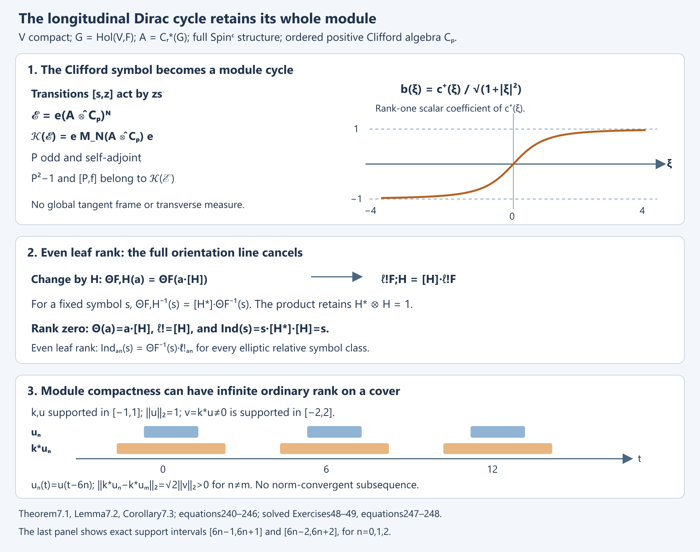

**Figure 7.1.** Theorem 7.1, Lemma 7.2 and Corollary 7.3, equations (240)–(246); Exercises 48–49, equations (247)–(248). The first panel gives the actual module corner and compact ideal. Its curve samples the rank-one scalar coefficient \(\xi/\sqrt{1+\xi^2}\) on \([-4,4]\); the dashed lines are its exact limits. The second panel retains the full line and its dual in the even-rank symbol reduction, including rank zero. The last panel draws the exact support intervals for translations by \(6n\), with \(n=0,1,2\); the intervals containing the convolution images have twice the radius of the input intervals. Their images have the same nonzero norm and disjoint supports. It is a support diagram, not a plot of the chosen bump functions. The longitudinal cycle is classical [Connes–Skandalis, Section 4]; the full module, choices, coefficient and compactness arguments are supplied above.

Full-size Dirac module PNG · Editable Dirac module SVG.

### The vertical frequency axis in a product

A vertical operator acts in one set of variables and leaves the others fixed. Its lift need not be an ordinary order-zero pseudodifferential operator in all the variables. For example, the degree-zero function \(\operatorname{sgn}\xi\) has no continuous value at \(\xi=0\) when another frequency \(\eta\) is nonzero. The following argument supplies the missing multiplication and positivity estimates. It also explains why a creation vector tests the symbol precisely at that axis. The pseudodifferential product method originates with [Connes–Skandalis], Section 1.

Write \(X=\mathbb T^r\), \(Z=\mathbb T^s\), with \(r,s\ge1\), and let \(Y\) be a compact metrizable parameter space. Coordinates on the two tori are \(x,z\); their covectors are \(\xi,\eta\). Take finite graded Hermitian spaces \(S_1,S_2\). Put
\[
 \begin{aligned}
 E_1&=C\bigl(Z,L^2(X;S_1)\bigr),\\
 E_2&=C\bigl(Y,L^2(Z;S_2)\bigr),\\
 E&=E_1\widehat\otimes_{C(Z)}E_2.
 \end{aligned}
\tag{249}
\]
The inner products integrate with normalized torus volume; \(E_1\) is a right \(C(Z)\)-module and \(E_2,E\) are right \(C(Y)\)-modules. Pointwise multiplication gives the left \(C(Z)\) action on \(E_2\). Fubini's theorem identifies \(E\) isometrically with
\(C(Y,L^2(X\times Z;S_1\widehat\otimes S_2))\).
Indeed the balanced inner product of \(u\otimes v\) is the iterated integral of its pointwise tensor. Finite Fourier sums in \(x,z\), with continuous coefficients in \(Y\), are in the range and are dense, so the isometry is onto. For a homogeneous \(u\in E_1\), let \(T_u v=u\widehat\otimes v\). Its adjoint integrates the first-factor pairing over \(X\).

Let \(\mathcal P\) be the norm closure on \(E\) of classical order-zero families on \(X\times Z\), continuous in \(Y\) in every symbol seminorm, together with \(\mathcal K(E)\). Let \(\mathcal P_2\) be its counterpart on \(E_2\). Their symbol maps have compact kernels and supremum quotient norms. Here is why the uniform assertion is valid. The Fourier–Schur, amplitude, adjoint and frequency-truncation proofs in the index lesson, Lemmas 6.1–6.2, apply on finitely many torus charts, with constants uniform on \(Y\). A negative-order family is uniformly approximated by finite-frequency smooth kernels; these are compact module maps, since their continuous matrix coefficients multiply finitely many fixed Fourier vectors. Smooth kernels and then all module rank-one maps are obtained by approximation of their two vectors. For an order-zero family with leading symbol \(a_0\), quantize the smooth positive square root of \((c^2+\epsilon)I-a_0^*a_0\), where \(c=\sup\|a_0\|\). Composition gives the upper quotient bound \(c\), as in the Hilbert-module lesson, Lemma 6.5. A localized high-frequency wave packet at a fixed \(y\in Y\) gives the lower bound: its image under every evaluated module compact tends to zero, whereas its order-zero image approaches the leading-symbol action. Taking all \(y\) and cosphere points gives the supremum norm. Quantization of smooth symbols and their uniform density gives surjectivity and exactness in the norm closure. No differentiability in \(Y\) is used.

**Lemma 7.4 (compression and connections).** Let \(Q\in\mathcal P\) be homogeneous of degree \(d\), with leading symbol \(q\). For smooth homogeneous \(u,v\in E_1\), the operator \(T_u^*QT_v\) is in \(\mathcal P_2\), with symbol
\[
 \begin{aligned}
 \sigma(T_u^*QT_v)(z,\eta,y)
 &=\int_X J_u(x,z)^*q(x,z,0,\eta,y)J_v(x,z)\,dx,\\
 J_v(x,z)w&=v(x,z)\widehat\otimes w.
 \end{aligned}
\tag{250}
\]
If the axis symbol is \(1_{S_1}\widehat\otimes b(z,\eta,y)\), independent of \(x\), and \(Q_2\in\mathcal P_2\) has symbol \(b\), then \(Q\) is a \(Q_2\)-connection:
\[
 QT_u-(-1)^{d|u|}T_uQ_2\in\mathcal K(E_2,E),
 \qquad
 T_u^*Q-(-1)^{d|u|}Q_2T_u^*\in\mathcal K(E,E_2).
\tag{251}
\]
In particular, if the axis symbol is zero, \(QT_u\) and \(T_u^*Q\) are compact. For a homogeneous \(K\in\mathcal K(E_1)\), a connection satisfies \([K\widehat\otimes1,Q]\in\mathcal K(E)\), with the graded bracket.

**Proof.** First take a classical \(Q\). Smooth finite sums of separated \(x,z\) functions approximate \(u,v\), including any fixed finite number of derivatives. In matrix entries, it suffices to use \(u=f(x)h(z)\), \(v=f'(x)h'(z)\). For a torus left symbol \(a(x,z,k,\eta,y)\), Fourier expansion in \(x\) gives the compressed amplitude
\[
 \overline{h(z)}h'(z')
 \sum_{k\in\mathbb Z^r}\int_X
 \overline{f(x)}e^{ik\cdot x}
 a(x,z,k,\eta,y)\widehat{f'}(k)\,dx.
\]
The Fourier coefficients of \(f'\) decay faster than every power. Thus all required derivatives of this amplitude satisfy order-zero bounds in \(\eta\), uniformly in \(y\). For \(|k|\le|\eta|/2\), the classical expansion and the mean-value estimate on the unit sphere give
\[
 a(x,z,k,\eta,y)=q(x,z,0,\eta,y)+O((1+|k|)/|\eta|).
\]
After \(\beta\) frequency derivatives the error is of order \(-1-|\beta|\), with a fixed polynomial weight in \(k\). The rapidly decreasing coefficients absorb every such weight. The sum over \(|k|>|\eta|/2\) has arbitrarily negative order by the same decay. These estimates also hold after spatial derivatives. Fourier inversion in the first term, followed by the left-amplitude reduction in Lemma 6.1 of the index lesson, gives exactly (250); its other terms have negative order. This proves the formula and membership for classical operators. The bound \(\|T_u^*QT_v\|\le\|u\|\|Q\|\|v\|\), and the same Cauchy–Schwarz bound for the integral of its symbol, extend both assertions to \(\mathcal P\). Compact terms compress to compacts.

For a homogeneous smooth \(u\), set \(C=QT_u-\epsilon T_uQ_2\), with \(\epsilon=(-1)^{d|u|}\). Expand \(C^*C\) into its four terms. Formula (250) places every compressed term in \(\mathcal P_2\). If \(m(z)=\int_X\|u(x,z)\|^2dx\), their leading symbols are respectively
\(m b^*b\), \(-m b^*b\), \(-m b^*b\), and \(m b^*b\).
For example, the compression of \(Q\) has symbol \(\epsilon m b\), because the graded lower operator crosses \(u\). Their sum is zero, so \(C^*C\) is compact. This implies that \(C\) is compact: for \(L=C^*C\), the maps \(CL(L+\delta)^{-1}\) are compact and
\(\|C-CL(L+\delta)^{-1}\|\le\sup_{t\ge0}\sqrt t\,\delta/(t+\delta)\to0\).
Applying the same argument to \(Q^*,Q_2^*\) proves the adjoint error in (251). Smooth vectors are dense in \(E_1\) in its module norm, so the bounded creation-map estimate proves (251) for all vectors. If \(b=0\), take \(Q_2=0\).

Finally write a module rank-one map as \(\theta_{u,v}\); its lift is \(T_uT_v^*\). The two connection errors move \(Q\) past these factors. Their lower terms cancel with the graded signs, leaving a compact. Finite sums and norm closure give the assertion for every \(K\). \(\square\)

**Lemma 7.5 (multiplication off the vertical axis).** Let \(T\) be a homogeneous order-zero pseudodifferential family on \(E_1\), smooth in \(z\), with leading symbol \(a(x,z,\xi)\). Let \(G\in\mathcal P\) have symbol \(g\) satisfying \(g(x,z,0,\eta,y)=0\). Then both \((T\widehat\otimes1)G\) and \(G(T\widehat\otimes1)\) belong to \(\mathcal P\). For \(\xi\ne0\), their symbols are the corresponding ordered products with \(a(x,z,\xi)\widehat\otimes1\); extend these symbols by zero at \(\xi=0\).

**Proof.** Both extended products are continuous: \(a\) is uniformly bounded on its vertical cosphere and \(g\) tends uniformly to zero near the axis. By Lemma 7.4, multiplying \(G\) on either side by a lifted vertical compact gives a total compact. This fact is essential; the lift of a vertical compact itself need not be a total compact.

The uniform vertical symbol quotient, proved by the same quotient-norm argument above with \(z\) as parameter, permits approximation of \(T\), modulo vertical compacts, by finite sums
\(\phi_j(x,z)t_j(D_x)\).
Here \(\phi_j\) are smooth matrix functions on \(S_1\), homogeneous of the required degree, and \(t_j\) are scalar smooth functions of the vertical frequency direction. Choose arbitrary bounded values at the finitely many low frequencies. To obtain the uniform symbol approximation, take finite smooth partitions on the compact spatial and directional factors. On each product patch replace the symbol by its value at one point and multiply it by the two partition functions. Uniform continuity bounds the error by the oscillation on those patches. The resulting finite sum has the required separated form. Quotient-norm equality then permits a vertical compact correction making each operator approximation arbitrarily small in norm. It suffices to prove the result for one such summand.

For \(\delta>0\), choose a smooth scalar cosphere cutoff \(\chi_\delta\) which is zero when \(|\xi|/|(\xi,\eta)|\le\delta\) and one when that ratio is at least \(2\delta\). The symbols \(g\chi_\delta\) tend uniformly to \(g\). They can be approximated uniformly by smooth symbols supported away from the axis. The total symbol quotient implies that their quantizations, with total compact corrections, approximate \(G\) in norm. Multiplication by the bounded lift of \(T\) preserves this convergence and takes every total compact correction to a total compact.

It remains to consider a smooth total symbol supported in the cone \(|\xi|\ge\delta|(\xi,\eta)|\), apart from bounded frequencies. Expand its spatial coefficients in Fourier series in \(x,z\). Their partial sums converge in every fixed finite symbol seminorm, by integration by parts in the spatial variables; the Fourier–Schur estimate gives operator-norm convergence. For one Fourier term with first spatial frequency \(\mu\), left multiplication by \(t(D_x)\) replaces its frequency coefficient by \(t(k+\mu)\) times that coefficient. On the cone,
\[
 |t(k+\mu)-t(k)|\le C_\mu(1+|(k,l)|)^{-1}
\tag{252}
\]
outside a bounded frequency set; differentiated versions have the corresponding lower orders. This follows by differentiating the degree-zero directional function on the segment from \(k\) to \(k+\mu\), where \(|k|\) is at least a fixed multiple of \(|(k,l)|\). The exceptional finite frequencies are smoothing. Thus the product is a total order-zero operator with leading symbol \(t(\xi)g\). The same Fourier calculation proves right multiplication, and matrix multiplication by \(\phi\) uses the ordinary composition calculus. Passing through the Fourier, cone and vertical-symbol approximations proves the assertion in the closed algebra \(\mathcal P\). Quotient symbols pass through these limits uniformly. \(\square\)

**Theorem 7.6 (a full product criterion for the two-variable families).** Let \(T,Q_2,Q\) be odd self-adjoint classical order-zero quantizations on \(E_1,E_2,E\), with respective odd self-adjoint leading symbols \(a,b,q\). Suppose
\[
 a^2=b^2=q^2=1,\qquad
 q(x,z,0,\eta,y)=1\widehat\otimes b(z,\eta,y),
\tag{253}
\]
and suppose \([a\widehat\otimes1,q]\ge0\) for \(\xi\ne0\). Give the first cycle the pointwise left \(C(X\times Z)\) action, and the second the left \(C(Z)\) action. Then \(Q\) represents their Kasparov product in \(KK(C(X\times Z),C(Y))\). In particular, for an orthogonal Clifford sum its positivity symbol is
\[
 \left[\frac{c_1^+(\xi)}{|\xi|}\widehat\otimes1,
 \frac{c_1^+(\xi)\widehat\otimes1+
 1\widehat\otimes c_2^+(\eta)}{\sqrt{|\xi|^2+|\eta|^2}}\right]
 =\frac{2|\xi|}{\sqrt{|\xi|^2+|\eta|^2}}I.
\tag{254}
\]
This extends continuously by zero at the vertical axis. The bracket of the two odd operators is their anticommutator.

**Proof.** The three square and scalar-commutator defects are negative-order compact families. Thus all three are Kasparov cycles, including the first cycle's full \(C(X\times Z)\) left action. Lemma 7.4 proves the required \(Q_2\)-connection condition. We prove the operator positivity; symbol positivity alone would not suffice without this step.

Choose a smooth total symbol \(q_0\), independent of \(x\), valued in \(1\widehat\otimes\operatorname{End}(S_2)\), and equal to \(1\widehat\otimes b\) on the vertical axis. One choice is that value multiplied by a directional cutoff supported where \(|\eta|>|\xi|/2\) and equal to one near \(\xi=0\), extended by zero near \(\eta=0\). Quantize it with coefficients independent of \(x\), and symmetrize, obtaining \(Q_0\).

We claim \([T\widehat\otimes1,Q_0]\) is compact. For a finite separated vertical approximant \(\phi(x,z)t(D_x)\) from Lemma 7.5, the scalar multiplier \(t(D_x)\) commutes exactly with \(Q_0\), since \(Q_0\) is translation invariant in \(x\). The graded commutator of \(\phi\widehat\otimes1\) with \(Q_0\) is a total operator of negative order: its principal matrix bracket is zero, as \(Q_0\) acts only on the second graded factor. It is compact, also after multiplication by \(t(D_x)\). The vertical compact corrections have compact brackets by Lemma 7.4, because \(Q_0\) is a lower-operator connection. Norm approximation proves the claim for \(T\).

Now \(R=Q-Q_0\) has zero axis symbol. Lemma 7.5 places both products with the lift of \(T\) in \(\mathcal P\). Hence
\([T\widehat\otimes1,Q]\) belongs to \(\mathcal P\), modulo the already compact bracket with \(Q_0\), and its symbol for \(\xi\ne0\) is \([a\widehat\otimes1,q]\). The bracket with \(q_0\) is zero. Its continuous value at the axis is zero by Lemma 7.5. The symbol is positive by hypothesis. Exactness of the symbol quotient therefore makes the self-adjoint operator bracket positive modulo \(\mathcal K(E)\): its image in the quotient of \(\mathcal P\) is a positive matrix function, and a *-homomorphism preserves positivity in the larger multiplier quotient. Conjugating by any left coefficient preserves that positivity. This is exactly Definition 0.3, so the product follows.

For (254), the two Clifford blocks anticommute, the square of the first is \(|\xi|^2\), and the mixed bracket is zero. These identities give the displayed nonnegative scalar, with limit zero when \(\xi\to0\) and \(\eta\ne0\). This verifies the criterion for the stated orthogonal symbol. Every estimate above is uniform on the compact parameter space. With an additional interval parameter the same compact approximations lie in the interval module, so the argument also applies to a continuous family with uniform symbol estimates. Fixed finite graded Clifford coefficients are handled by their finite matrix entries, retaining every tensor sign and their right actions. \(\square\)

These lemmas provide the analytic product calculation in protected product coordinates. They do not identify an arbitrary global submersion's analytic cycle with its geometrical class. That comparison must also reconcile its full bundle transitions, its holonomy correspondence and the prescribed normal orientation before the general leaf-map equality follows.

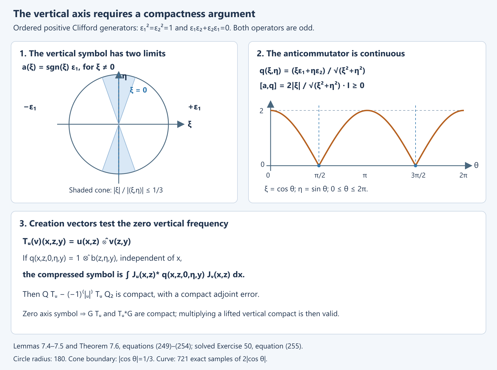

**Figure 7.2.** Lemmas 7.4–7.5 and Theorem 7.6, equations (249)–(254); Exercise 50, equation (255). In the first panel the unit-frequency circle has coordinates \((\xi,\eta)=(\cos\theta,\sin\theta)\). Its shaded sectors have \(|\xi|/|(\xi,\eta)|\le1/3\), the cone removed in the approximation of Lemma 7.5. The vertical symbol has different one-sided limits there. The second panel samples the exact positive function \(2|\cos\theta|\) at 721 equally spaced angles on \([0,2\pi]\); its zeros at \(\pi/2\) and \(3\pi/2\) are the two axis points. The third panel states the actual compression and connection mechanism, with \(Q\) odd and normalized torus volume in the integral. The method is classical [Connes–Skandalis, Section 1]; the Fourier and norm-closure arguments above prove the needed uniform statements.

Full-size vertical product PNG · Editable vertical product SVG.

### Submersions and the full holonomy correspondence

We now pass from product coordinates to compact manifolds and their actual holonomy modules. Let \(f:W\to V\) be a smooth surjective submersion between compact manifolds without boundary. Let \(K=\ker df\), of rank \(r\), and let \(F\subset TV\) be an integrable bundle of rank \(p\). Specify full spin-c structures on \(K\) and \(F\). A horizontal splitting identifies
\[
 \begin{aligned}
 F_W&=df^{-1}(F)\cong K\oplus f^*F,\\
 C_r\widehat\otimes C_p&\cong C_{r+p}.
 \end{aligned}
\tag{256}
\]
Use this ordered sum for the spin-c structure on \(F_W\). In particular its transition module is \(\mathcal S_K\widehat\otimes f^*\mathcal S_F\), with both central phases retained. Put \(G=\operatorname{Hol}(V,F)\) and \(H=\operatorname{Hol}(W,F_W)\).

The fibre-integrated module and the metric connection in the next lemma adapt [Kaad–van Suijlekom 2020], Sections 2 and 3.1–3.2, especially Proposition 15 and Lemma 16. **Lemma 7.7, including its proof, is a CC BY 4.0 adaptation.** Changes by GPT-6.1 Sol (OpenAI) comprise notation, the restriction to compact bases, full right Clifford coefficients in both parities, and the explicit coordinate and tensor proofs. The holonomy correspondence and bounded product proofs after that lemma use the method of [Connes–Skandalis], Sections 1 and 4. No unbounded product theorem is assumed.

**Lemma 7.7 (integration along the fibres).** Choose a smooth vertical metric and a horizontal splitting of \(TW\). The completion \(E_f\) of smooth sections of \(\mathcal S_K\) in the inner product
\[
 \langle u,v\rangle(y)=\int_{f^{-1}(y)}\langle u(w),v(w)\rangle\,d\mu_y(w)
\tag{257}
\]
is a countably generated graded correspondence from \(C(W)\) to \(C(V)\widehat\otimes C_r\). An odd self-adjoint vertical order-zero quantization \(T\) of \(c_K^+(\xi^\sharp)/|\xi|\) defines a class \(a_f\in KK^r(C(W),C(V))\). In rank zero use \(T=0\) and the finite fibre-integration module with its prescribed orientation line.

For a real vector field \(Z\) on \(V\), write \(Z^h\) for its horizontal lift. Define \(k_Z\) by the Lie derivative of the vertical density,
\(\mathcal L_{Z^h}\mu=k_Z\mu\).
If \(\nabla^K\) is an even metric connection on \(\mathcal S_K\), then
\[
 \nabla^{E_f}_Z u=\nabla^K_{Z^h}u+\tfrac12 k_Zu,
 \qquad
 Z\langle u,v\rangle=
 \langle\nabla^{E_f}_Zu,v\rangle+\langle u,\nabla^{E_f}_Zv\rangle.
\tag{258}
\]
The connection has the usual Leibniz rule for the right \(C^\infty(V)\) action and is right \(C_r\)-linear. For an ordinary Hermitian bundle \(S\to V\), fibrewise evaluation extends to the unitary
\[
 \begin{gathered}
 E_f\widehat\otimes_{C(V)\widehat\otimes C_r}
 \bigl(C_r\widehat\otimes L^2(V;S)\bigr)
 \\
 \longrightarrow L^2(W;\mathcal S_K\widehat\otimes f^*S).
 \end{gathered}
\tag{259}
\]
Here the total density is the vertical density times the pullback of the base density, in a horizontal splitting.

**Proof.** In submersion coordinates \((x,y)\), a vertical density has the form \(v(x,y)|dx|\), with \(v>0\). Integration of a smooth section is smooth in \(y\): partition its support into finitely many such charts and differentiate under each integral. Compactness of \(W\) makes this a finite calculation and makes every fibre compact. The module norm is the supremum of the fibre \(L^2\) norms. Positivity and definiteness follow fibrewise; the module Cauchy–Schwarz inequality follows from the Hilbert-module inequality in the Hilbert-module lesson. Smooth chart sections times polynomials with rational complex coefficients in a countable atlas give a countable dense set after cutoff and approximation, so the completion is countably generated. Pointwise multiplication gives its bounded adjointable left action, with adjoint multiplication by the conjugate function.

For clarity, the vertical pseudodifferential assertion uses a module estimate. Quantize in finitely many buffered submersion charts. Multiplication by \(v^{1/2}\) and a unitary bundle frame turns the norm into the ordinary coordinate \(L^2\) norm with finite Clifford coefficients. The Fourier–Schur bounds, adjoint formula and negative-order truncation in the index lesson, Lemmas 6.1–6.2, are uniform on the compact chart parameters. Smooth vertical kernels are module compact: in a chart their kernels are uniformly approximated by finite sums of a function of the first fibre variable times a function of the second, with smooth base coefficients. Such sums are module rank-one maps in finite bundle frames. A finite partition and uniform frequency truncation prove the same assertion globally. Conversely rank-one kernels from smooth vectors are smooth, and smooth vectors are dense. Thus the closed smoothing ideal is exactly \(\mathcal K(E_f)\). The principal square of \(T\) is one, and its commutator with a smooth scalar has negative order. These are the compact cycle defects; approximation treats continuous scalars. Taking the odd part and the self-adjoint part of a quantization preserves its principal symbol.

The vertical symbol quotient has the supremum norm on the vertical cosphere. Indeed quantize the positive square root of \((c^2+\epsilon)I-a^*a\) for a principal symbol \(a\) and \(c=\sup\|a\|\); composition gives the upper quotient bound. A localized high-frequency packet in one fibre gives the lower bound, since every smoothing kernel annihilates that packet in norm, and approximation treats module compacts. Smooth symbols are uniformly dense in continuous cosphere symbols. This proves the exact quotient and shows that choices of quantization differ by module compacts. Changes of metric or splitting form a compact interval family of such estimates, after transport of the full spin-c structure by the positive metric isometry. Thus they give a genuine interval-module homotopy. If \(r=0\), properness and the local inverse theorem make \(f\) a finite covering: finitely many inverse charts cover the compact fibre, and a smaller base neighbourhood excludes the compact complement. The module is consequently a finite bundle module, including its orientation line; its identity is compact and \(T=0\) has the required defects.

Here is the density correction explicitly. In a chart write
\(Z^h=\sum_\alpha Z^\alpha(y)\partial_{y_\alpha}+\sum_j B_Z^j(x,y)\partial_{x_j}\).
The vertical Lie derivative gives
\[
 \begin{aligned}
 k_Z&=Z^h(\log v)+\sum_j\partial_{x_j}B_Z^j,\\
 Z\int h\,d\mu_y&=\int\bigl(Z^hh+k_Zh\bigr)\,d\mu_y.
 \end{aligned}
\tag{260}
\]
To check the second identity, integrate the term \(B_Z^j\partial_{x_j}h\) by parts. Its negative divergence is precisely cancelled by the corresponding part of \(k_Zh\). Partitioning removes coordinate boundaries; the fibres themselves have no boundary. Apply this identity to \(h=\langle u,v\rangle\) and use that \(\nabla^K\) is metric. Splitting the real scalar \(k_Z\) equally between the two arguments proves (258). The formula is invariant under vertical coordinate changes because it was defined by a Lie derivative of a density. It is also \(C^\infty(V)\)-linear in \(Z\), and the connection and right-coefficient Leibniz assertions follow directly.

For (259), send a simple tensor to \(w\mapsto u(w)\widehat\otimes s(f(w))\), absorbing the intermediate \(C_r\) coefficient in its balanced right action. Fubini's theorem and (257) give exactly the tensor inner product, including the grading signs. In a horizontal coordinate basis the total density is \(v(x,y)w(y)|dx\,dy|\). A triangular change from coordinate to horizontal basis has determinant one, so no extra Jacobian occurs. Finite sums of the displayed sections are dense: take finite bundle and submersion charts, cut off a local frame of \(S\) on the base, and expand a smooth total section in that frame with coefficients in \(\mathcal S_K\). A further cutoff equal to one on its support makes each coefficient a global smooth section. Smooth sections are dense in the total \(L^2\) space. Thus the isometry is onto. \(\square\)

This ends the CC BY 4.0 adaptation. The following proofs retain their own CC0 dedication.

**Lemma 7.8 (the correspondence remembers the whole fibre).** Form the pullback groupoid and its principal right space
\[
 \begin{aligned}
 R&=\{(w',\gamma,w):f(w')=r(\gamma),\ f(w)=s(\gamma)\},\\
 P_f&=\{(w,\gamma):f(w)=r(\gamma)\}.
 \end{aligned}
\tag{261}
\]
The right anchor of \(P_f\) is \(s(\gamma)\), and right multiplication is \((w,\gamma)\gamma'=(w,\gamma\gamma')\). Projection of a leaf path through \(f\) defines an injective open Lie-groupoid homomorphism \(j:H\to R\), identical on units. Let \(\mathscr P_f\) be the completion of smooth compactly supported half-density kernels on \(P_f\), as a right \(A=C_r^*(G)\)-module. Then
\[
 \mathcal K(\mathscr P_f)\cong C_r^*(R),
 \qquad j_*:C_r^*(H)\hookrightarrow\mathcal K(\mathscr P_f)
\tag{262}
\]
is extension of chart kernels by zero. Consequently \((\mathscr P_f,j_*,0)\) defines a degree-zero correspondence \(\varepsilon_f\) from \(C_r^*(H)\) to \(A\). Neither \(H=R\) nor connectedness of the fibres is needed.

**Proof: the open inclusion.** The pullback of an integrable distribution is integrable: in submersion and foliation coordinates it is spanned by \(\partial_x,\partial_z\), where \(f(x,z,y)=(z,y)\). The transverse coordinate is \(y\). A leaf path in \(W\) therefore projects to a leaf path in \(V\), with the same transverse germ in these coordinates. This proves well-definedness of \(j\). For fixed endpoints in \(W\), two such paths have the same holonomy precisely when their projected germs agree, since \(f\) is a local diffeomorphism on these transversals. This proves injectivity. Near an arrow use endpoint plaque coordinates and its fixed transverse germ. The two endpoint \(W\) plaque coordinates and the transverse parameter give both an \(H\) chart and an \(R\) chart; the projected endpoint plaque coordinates are the ones in the \(G\) arrow. The map is a local diffeomorphism in these charts. Its injective image is therefore open, with the same smooth chart structure. It is a wide subgroupoid because units, inverses and products are induced by paths. An arrow of \(R\) between different fibre components need not be in that image.

**Proof: the compact ideal.** Let \(E_f^0\) be the scalar fibre-integration module, with no spinor coefficient. There is a canonical unitary
\(E_f^0\widehat\otimes_{C(V)}A\to\mathscr P_f\)
on its core, sending \(u\otimes a\) to \(u(w)a(\gamma)\). Its inner product is the convolution inner product integrated first over the vertical fibre. To verify its norm and density, tensor with each regular representation \(\pi_x\) of \(A\). Fubini identifies the resulting space with
\[
 L^2\bigl(P_{f,x};d\mu_{r(\gamma)}\,d\lambda_x(\gamma)\bigr),
 \qquad P_{f,x}=\{(w,\gamma)\in P_f:s(\gamma)=x\}.
\]
Finite chart products \(u(w)a(\gamma)\) are dense on every compact support: in product coordinates, uniformly approximate a smooth function by finite separated smooth functions, keeping larger fixed cutoffs. The same approximation converges in the module norm, since the fibre integrals of an error over that fixed compact chart support have uniform bounds. This proves density before completion as well. The direct sum of the \(\pi_x\)'s is faithful; for a module vector its norm is the supremum of the resulting represented norms of its inner product. Thus this calculation verifies the asserted module unitary.

On this tensor module, a rank-one map with smooth vectors \(u\otimes a,v\otimes b\) has \(R\) kernel
\(u(w')(a*b^*)(\gamma)\overline{v(w)}\), with the two vertical half-densities understood. Its regular representation at a unit \(w_0\) acts on \(R_{w_0}\), which is exactly \(P_{f,f(w_0)}\) with the displayed density. Surjectivity of \(f\) means that all the regular spaces of \(\mathscr P_f\) occur. Hence the reduced \(R\) norm and its module-operator norm agree. These rank-one kernels span the reduced algebra densely: partition a compact \(R\) chart kernel into finitely many buffered charts, approximate it there by functions separated in \(w',\gamma,w\), and use the convolution Schur bound on the fixed support. Each middle function in \(A\) is a norm limit of finite sums \(a*b^*\), by an approximate identity of \(A\). Conversely the displayed rank-one maps and their limits belong to the represented reduced algebra. This proves the first isomorphism in (262). Finite bundle or Clifford coefficients give the corresponding projection corners of this same calculation.

To verify the norm of \(j_*\), fix \(w_0\). The left \(H\) orbits in \(R_{w_0}\) are open. Each orbit containing \(\rho\) is \(\{j(h)\rho:h\in H_{r(\rho)}\}\); right multiplication by \(\rho\) identifies its measure and representation with the regular \(H\) representation at \(r(\rho)\). The disjoint open orbits are countable, because this source fibre is second countable. Thus restriction of the regular \(R\) representation is the orthogonal direct sum of regular \(H\) representations. Its norm is at most the reduced \(H\) norm. The orbit of the unit arrow includes the regular representation at \(w_0\), so taking all \(w_0\) gives the reverse inequality. Extension of compact arrow-chart kernels by zero is legitimate for an open subgroupoid, also in non-Hausdorff arrow spaces using the chart-kernel definition. Products and adjoints agree because \(H\) is a subgroupoid. This proves the isometric *-inclusion in (262). The left action is compact; its zero operator therefore has compact square defect. It defines the stated Kasparov correspondence. \(\square\)

**Lemma 7.9 (the global connection and positivity calculation).** Suppose \(r,p>0\). On the module with \(P_f\) kernels and coefficient bundle \(\mathcal S_K\widehat\otimes f^*\mathcal S_F\), let \(Q\) be a homogeneous total order-zero quantization with principal symbol \(q(w;\xi,\eta)\). Here \(\xi\) is vertical and \(\eta\) is the covector on the horizontal copy of \(f^*F\). If
\(q(w;0,\eta)=1\widehat\otimes b(f(w),\eta)\),
then \(Q\) is a connection for a longitudinal \(G\) operator \(Q_2\) with principal symbol \(b\). For a classical homogeneous vertical \(T\), with symbol \(a(w,\xi)\), the bracket \([T\widehat\otimes1,Q]\) belongs to the closed total pseudodifferential algebra and has symbol \([a\widehat\otimes1,q]\) for \(\xi\ne0\). Its value at the axis is zero. In particular a self-adjoint bracket with a nonnegative symbol gives the operator positivity modulo \(\mathcal K\) required in Definition 0.3.

**Proof: compression and the module quotient.** Take buffered charts \(f(x,z,y)=(z,y)\) as in Lemma 7.8, and choose unitary frames of the two coefficient bundles. Multiplication by the square root of the vertical density identifies the first module with its ordinary coordinate \(L^2\) model. The base density is handled in the second module. The total symbol at \(\xi=0\) is consequently independent of \(x\) and acts only on the second graded factor. A frame change in \(\mathcal S_K\) commutes in the graded sense with that factor; a frame change of \(\mathcal S_F\) depends only on \((z,y)\). Thus this assertion survives all transitions, including their central phases.

For smooth first-module vectors \(u,v\), the compression proof of Lemma 7.4 on each chart gives the longitudinal symbol
\[
 \sigma(T_u^*QT_v)(y_0,\eta)
 =\int_{f^{-1}(y_0)}J_u(w)^*q(w;0,\eta)J_v(w)\,d\mu_{y_0}(w).
\tag{263}
\]
The notation \(y_0\in V\) here denotes a base point, including both its plaque and transverse coordinates. Partition \(u,v\) into finitely many buffered charts. Terms away from the total diagonal have smoothing total kernels; their compressions are compact. The diagonal terms are exactly the amplitude calculation of Lemma 7.4 after extending each buffered coordinate box to a torus. The extension agrees on the smaller supports; differences away from those supports are smoothing. This proves (263), with no global product-coordinate assumption. The resulting leading coefficients combine to the integral in (263).

The chart estimates are uniform over the compact units \(W\) and all regular source fibres. Indeed every local estimate is applied in a near-unit chart and transported by right multiplication. A fixed small buffered chart has a uniform finite overlap number, as in the index lesson, Lemma 6.1; this bounds the row and column operator sums. Finite matrices add only a fixed factor. Negative-order truncations therefore converge in the reduced regular norm to smooth \(R\) chart kernels. By (262) those kernels are precisely module compacts. The positive-square-root argument of Lemma 6.5 in the Hilbert-module lesson gives the upper symbol quotient norm; localized high-frequency packets give the lower bound. For the latter, a smooth compact chart kernel acting on a packet near one unit tends to zero by integration by parts; then norm approximation treats every module compact. One does not assert ordinary compactness on a whole holonomy cover. These arguments prove the exact compact kernel and supremum symbol norm for the total closed algebra, and the analogous statement on the base \(G\) module. They also prove (263) uniformly, including interval parameters.

Put \(C=QT_u-(-1)^{|Q||u|}T_uQ_2\). Expand \(C^*C\). The four symbols from (263) cancel exactly as in Lemma 7.4. The element \(\langle u,u\rangle\) may be an even \(C_r\)-valued function; it commutes with the second graded factor, which is the only commutation used in that cancellation. The exact base quotient makes the square compact, and the \(CL(L+\delta)^{-1}\) approximation in Lemma 7.4 makes the creation error compact. Applying it to the adjoints proves the other connection error. Smooth-vector density treats all creation vectors. In particular lifted vertical compacts have compact graded brackets with \(Q\). If a total operator has zero axis symbol, its products with lifted vertical compacts are compact.

**Proof: multiplication and the axis subtraction.** First, the conclusion of Lemma 7.5 extends to this total algebra: products of a lifted vertical operator with a total operator having zero axis symbol are in the closed total algebra, with their ordered symbols extended by zero. Here are the localization details needed for that extension and for the bracket assertion. The vertical quotient and a finite buffered partition approximate \(T\), modulo vertical compacts, by finite sums of local operators
\(\phi_i(x,z,y)t_i(D_x)\beta_i(x,z,y)\).
The functions \(\beta_i\) are scalar cutoffs; \(\phi_i\) is a matrix on the first graded factor supported where a larger chart is available. To obtain these sums, use the separated spatial/directional symbol partitions in Lemma 7.5, with a right cutoff equal to one on the symbol support. The remaining zero-symbol vertical term is compact. Quotient-norm equality supplies an arbitrarily small norm error after a compact correction.

For any such summand, moving a scalar cutoff past a *total* operator costs a total negative-order compact; multiplication by the bounded vertical lift preserves compactness. This step does not move cutoffs past \(T\) and does not declare a lifted vertical compact to be total compact. Insert a larger total cutoff equal to one on both supports of the summand. The operator outside that larger chart is smoothing there, so its contribution is compact. Extend the remaining symbols to the product torus chart. Lemma 7.5 applies to the extended zero-axis symbol; after restriction and patching it gives the stated multiplication rule. The vertical compact correction is handled by the zero-axis creation conclusion already proved. All norm limits remain in the closed total algebra.

For the bracket, in each of these local charts extend the base symbol \(b\), and choose \(q_{0,i}\) independent of \(x\), acting only on the second factor and equal to \(b\) at the axis. Use the directional cutoff construction in Theorem 7.6. Extend the total symbol \(q\) so that it agrees with its actual value on the buffered support and has that same axis value everywhere: extend the difference from \(q_{0,i}\), which vanishes at the axis, with a spatial cutoff. Its quantization differs from the actual localized operator only by a compact. The commutator of a scalar cutoff \(\beta_i\) with this total quantization is compact. The bracket of \(\phi_i t_i(D_x)\) with \(Q_{0,i}\) is compact: \(t_i(D_x)\) commutes exactly with \(Q_{0,i}\), and the bracket of \(\phi_i\) with \(Q_{0,i}\) has zero principal symbol. The difference \(Q-Q_{0,i}\) has zero axis symbol, so the multiplication rule puts the remaining two products in the total closed algebra. Their symbol is the bracket with \(q\), since the symbol bracket with \(q_{0,i}\) is zero. Patching gives the global symbol \([a\widehat\otimes1,q]\), extended continuously by zero; vertical compact corrections contribute compact brackets. This proves the bracket assertion.

Finally the exact symbol quotient sends a self-adjoint bracket with a nonnegative symbol to a positive element of the multiplier quotient by \(\mathcal K\). Conjugation by every left coefficient preserves its positivity. This is operator positivity in the required quotient. All compact approximations are uniform on a compact interval of metrics, frames and horizontal splittings, so the same proof applies to the interval module. \(\square\)

**Theorem 7.10 (the compact submersion product with holonomy).** With the prescribed ordered spin-c structures in (256),
\[
 \begin{gathered}
 a_f\widehat\otimes^{\mathrm{ord}}_{C(V)}\ell_{V,!}^{\mathrm{an}}
 =\ell_{W,!}^{\mathrm{an}}\widehat\otimes_{C_r^*(H)}\varepsilon_f,\\
 \text{in }KK^{r+p}(C(W),A).
 \end{gathered}
\tag{264}
\]
The superscript \(\mathrm{ord}\) specifies the full common-module convention: extend the second cycle by \(C_r\), compose over \(C(V)\widehat\otimes C_r\), and transport its native target \(C_p\widehat\otimes C_r\) by the full graded block flip to the physical order \(C_r\widehat\otimes C_p=C_{r+p}\). All actions, inner products and odd-vector signs are transported. This full Clifford-valued identity precedes final parity reduction; native multiplication keeps the second-cycle coefficient first, as detailed in Lemma7.21. Finite Hermitian bundle coefficients on \(W\) and compact interval families obey the same identity.

**Proof: the common module.** The product of \(E_f\) with the full regular module of Theorem 7.1 is the completion of \(P_f\) kernels with coefficients \(\mathcal S_K\widehat\otimes f^*\mathcal S_F\). Send a simple tensor to \(u(w)\widehat\otimes\xi(\gamma)\). The balanced coefficient relation is exactly evaluation at \(f(w)=r(\gamma)\). On a regular tensor representation at \(x\), Fubini gives the \(L^2(P_{f,x})\) inner product, with these coefficients. The same finite separated-chart approximation as in Lemma 7.8 proves density in module norm, hence gives an onto unitary before invoking any operator calculation.

The right side has that same module. To see this without identifying \(H\) with \(R\), represent \(\mathcal S_{F_W}\) by a finite even bundle projection \(e_W\), as in (241). The canonical map
\[
 \begin{gathered}
 e_W(C_r^*(H)\widehat\otimes C_{r+p})^N
 \widehat\otimes_{C_r^*(H)\widehat\otimes C_{r+p}}
 (\mathscr P_f\widehat\otimes C_{r+p})\\
 \longrightarrow e_W(\mathscr P_f\widehat\otimes C_{r+p})^N
 \end{gathered}
\]
sends an algebra column tensor a vector to its convolution action on that vector. It is isometric by the balanced inner product. A near-unit approximate identity of \(H\) acts nondegenerately on \(\mathscr P_f\), since its unit space is all of \(W\); in the buffered local coordinates it is the usual smooth approximate identity on the \((x,z)\) variables. Hence its range is dense and the map is onto. The ordered spin-c tensor map in (256) identifies this range with the common coefficient module. Both phase factors multiply in that map; no line bundle has been discarded.

Let \(Q_W\) be the longitudinal odd self-adjoint quantization for \(\ell_{W,!}^{\mathrm{an}}\) on the \(H\) module, extended to this common module. Near-unit \(H\) charts are also \(R\) charts. Thus its operator and principal symbol there are exactly those of the total calculus of Lemma 7.9. The induced multiplier is bounded, since the left action is the isometric inclusion of Lemma 7.8; its cycle defects, originally compact \(H\) kernels, act as compact \(R\) kernels on the common module. It represents the product of \(\ell_{W,!}^{\mathrm{an}}\) with the compact zero correspondence \(\varepsilon_f\). Explicitly, a vector from the regular \(H\) module is an algebra column. Its creation map on \(\mathscr P_f\) is compact, since every entry acts compactly by (262). Multiplying that map by the bounded \(Q_W\) proves the connection error for the zero second operator; adjoints prove the other error. The same argument holds with the finite projection and Clifford corners. The positivity condition with the first operator is \(2Q_W^2\), which is positive. Definition 0.3 therefore gives that product directly.

**Proof: the analytic first product.** Choose the horizontal splitting orthogonal to the vertical metric and use the pullback metric on its copy of \(F\). In submersion and foliation coordinates the horizontal lifts have the form \(\partial_z+\sum_j B^j(x,z,y)\partial_{x_j}\). If \(\eta_0\) is the coordinate \(z\)-covector, its horizontal value is \(\eta=\eta_0+B^t\xi\). The total principal symbol and the vertical principal symbol are consequently
\[
 \begin{aligned}
 q(w;\xi,\eta)&=
 \frac{c_K^+(\xi^\sharp)\widehat\otimes1+
 1\widehat\otimes c_F^+(\eta^\sharp)}{\sqrt{|\xi|^2+|\eta|^2}},\\
 a(w,\xi)&=c_K^+(\xi^\sharp)/|\xi|.
 \end{aligned}
\tag{265}
\]
These are symbols of the *global* transition bundle because orthogonal Clifford sums intertwine its full transition unitaries. At the vertical axis the first formula is precisely the pulled-back normalized base symbol. Lemma 7.9 gives both creation-connection errors for the extended base cycle. For \(\xi\ne0\), the two Clifford blocks anticommute and give
\[
 [a\widehat\otimes1,q]
 =\frac{2|\xi|}{\sqrt{|\xi|^2+|\eta|^2}}I\ge0.
\tag{266}
\]
The continuous value at the axis is zero. In the coordinate covectors, the denominator contains \(\eta_0+B^t\xi\); this shear does not affect the sign or the axis value. Lemma 7.9 proves positivity of the actual operator bracket in the module quotient. Thus \(Q_W\) satisfies both parts of Definition 0.3 for the first product, and proves (264).

If \(r=0\), the first module is a finite fibre bundle with its orientation line, and \(T=0\). The axis condition is the whole principal-symbol condition in each inverse chart. The connection calculation still applies, while the positivity bracket is zero. If \(p=0\), the base regular module is a finite line module over \(C(V)\), with zero base operator. Its creation maps into the common vertical module are compact (finite columns with entries in that module). The total operator is the vertical quantization tensored with the base orientation line. The bracket is \(2T^2\), modulo the compact difference of such quantizations, and is positive. If both ranks vanish the argument is simply the finite bundle tensor product with zero operators. These cases account for noncanonical rank-zero lines as well as the empty cospheres.

For a finite bundle \(B\to W\), replace \(\mathcal S_K\) by \(B\otimes\mathcal S_K\) in the first module and the total bundle. Every frame, compression and symbol calculation above has that extra finite factor and the same axis and positivity formulas. This proves the asserted coefficient identity, including changes of the vertical spin-c structure by a line. Metric and splitting changes give compact interval families as in Lemmas 7.7 and 7.9, with the full structures transported. Their module unitaries, symbols and compact defects are uniform over the interval. Thus the identity respects all these choices. \(\square\)

For the full tangent foliation on \(V\), composition with its pair-groupoid module gives the ordinary compact-submersion identity \(a_f\widehat\otimes_{C(V)}[D_V]=[D_W]\) with the ordered orientation. Indeed the same Fubini calculation identifies the common module with the full \(L^2\) spinor module (259); the pair-groupoid regular module composed with \(L^2\) evaluation has scalar compact operators as its compact ideal. Formula (265) is the normalized total tangent symbol, and the proof above applies verbatim. Here \([D]\) denotes the Dirac class defined by that normalized symbol. No assertion that an unbounded tensor sum is exactly the total Dirac operator is required: the metric connection (258) gives such a tensor sum its correct horizontal principal part; comparison with a total Clifford connection has a smooth zeroth-order difference. On a compact manifold that endomorphism is bounded, and the normalized principal symbols give the same KK class by the compact-perturbation argument in Theorem 7.1. [Kaad–van Suijlekom 2020], Section 3.3, studies the more precise curvature difference and proper noncompact refinements.

The identity (264) is the analytic holonomy submersion product. Identifying \(a_f\) with the geometric normal-bundle wrong-way class is a further comparison. Its noncompact localized form is needed in the transverse normal tube, together with the prescribed spin-c orientation. Theorem7.22 supplies the compact ordinary comparison, and Lemmas7.23–7.24/Theorem7.25 below supply the full prescribed transverse comparison. Lemmas7.26–7.28 and Theorem7.29 below prove the full all-symbol action in both K-degrees.

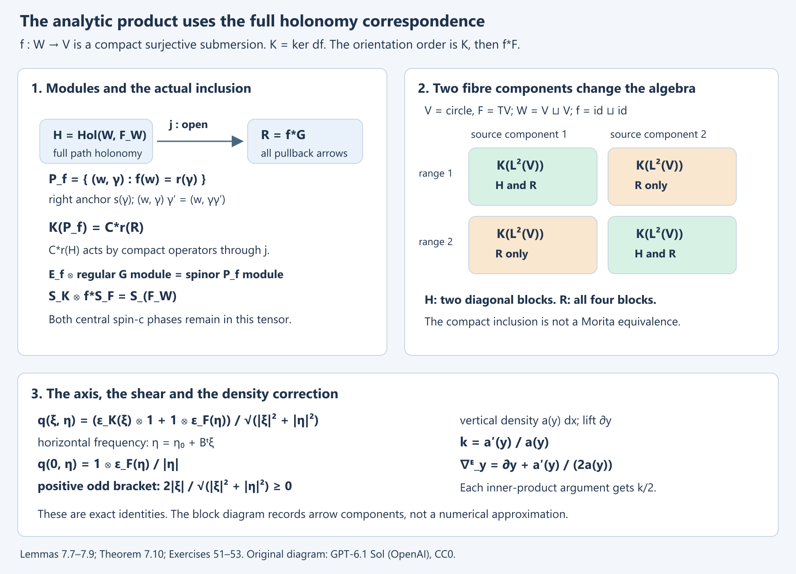

**Figure 7.3.** Lemmas 7.7–7.9 and Theorem 7.10, equations (256)–(266); Exercises 51–53, equations (267)–(268). The first panel records the actual open holonomy inclusion and right principal space. The block diagram is the exact example of Exercise 52: two circle components in the source, a full tangent foliation in the target, two diagonal holonomy blocks and four pullback blocks. It describes algebra and arrow components, with no numerical approximation. The last panel gives the horizontal-frequency shear and the nonnegative scalar bracket of (265)–(266), and the density correction for the product-circle example with positive density \(a(y)\,dx\). Both spin-c phases and the ordered Clifford factors are retained. The fibre module and connection are treated by [Kaad–van Suijlekom 2020]; the holonomy product method is classical [Connes–Skandalis, Section 4]. This drawing is original CC0 material; Lemma 7.7 has its separate CC BY 4.0 notice.

Full-size submersion PNG · Editable submersion SVG.

### Local coefficients and noncompact submersions

The compactness assumption in Theorem 7.10 can be removed, but its role must be replaced explicitly. On a noncompact manifold the Dirac square defect is compact only after multiplication by a function vanishing at infinity. A list of local phases is also insufficient: one must construct a bounded adjointable operator on the entire module. We give that construction before using the local product estimates. The submersion need not be proper, and its fibres need not be connected or compact. This extends the classical bounded construction and product method of [Connes–Skandalis, Propositions 1.2 and 2.9 and Lemma 4.7]; the proofs below use the complete module calculus already proved in these lessons. They do not import a proper unbounded product theorem.

All manifolds in this subsection are smooth, Hausdorff, second countable and without boundary. Bundles have fixed finite rank. Compact supports in a non-Hausdorff arrow space mean finite sums of compactly supported smooth arrow-chart kernels, as in the C*-algebra lesson.

**Lemma 7.11 (a bounded phase with locally compact defects).** Let \(X\) carry a foliation \(L\) of rank \(k\) with a specified full spin-c structure. Put \(B=C_r^*(\operatorname{Hol}(X,L))\). The completion of compact smooth holonomy kernels with coefficients in the range pullback of \(\mathcal S_L\) is a countably generated graded right \(B\widehat\otimes C_k\)-module \(\mathscr E_L\). There is a bounded odd self-adjoint contraction \(Q\) on this module with normalized principal symbol \(c_L^+(\xi^\sharp)/|\xi|\) and

\[
 \phi(h)(Q^2-1),\ [Q,\phi(h)]\in\mathcal K(\mathscr E_L)
 \qquad(h\in C_0(X)).
\tag{269}
\]

It therefore defines \(\ell_{X,!}^{\mathrm{an}}\in KK^k(C_0(X),B)\). Choices of quantization and smooth metric or connection, with the full spin-c structure transported, give the same class. For a smooth submersion \(f:X\to Y\), the same assertion holds for its fibre-integration module and vertical symbol, giving \(a_f\in KK^k(C_0(X),C_0(Y))\) when \(k=\operatorname{rank}\ker df\). No properness is required. In either assertion, when \(k=0\) use the orientation-line module and zero operator; (269) still holds.

**Proof: the modules and finite supported calculus.** Use a countable locally finite bundle and plaque atlas with relatively compact unit supports and buffered larger charts, with the larger charts themselves locally finite. One explicit construction uses a compact exhaustion with successive interiors: cover each compact annular layer by finitely many small charts whose closures lie inside larger coordinate charts in a slightly larger annular band. These larger bands meet only finitely many layers near any point. Shrinking the smaller charts provides the buffers, and the finite layer covers give the claimed countable locally finite atlas. Choose smooth functions \(\chi_i\) subordinate to it with \(\sum_i\chi_i^2=1\). Such functions are obtained by choosing locally finite nonnegative smooth bumps covering \(X\), then dividing each bump by the square root of their sum of squares. The denominator is smooth and positive. A bundle vector is sent to its local right \(C_k\)-components multiplied by \(\chi_i\). This is an even pointwise isometry into a countable trivial module bundle. On compact unit supports only finitely many entries occur. Its adjoint sums these entries, first on finite columns and then by the norm bound. The resulting projection is adjointable on \((B\widehat\otimes C_k)^\infty\): compact arrow kernels have compact range-unit supports, and finite-column approximation proves the required strict convergence. Its range, with the convolution inner product, is exactly \(\mathscr E_L\). The same chart-density and approximate-identity proof as (241), now using finite columns on each compact support, gives

\[
 \mathcal K(\mathscr E_L)
 =e\bigl(\mathcal K\widehat\otimes B\widehat\otimes C_k\bigr)e.
\tag{270}
\]

Here \(\mathcal K\) is the compact algebra of the countable column space. This also proves countable generation. Multiplication by a bounded scalar function is adjointable; the adjoint is multiplication by its complex conjugate.

For the submersion module, integrate the coefficient inner product over each fibre, starting with compact smooth sections of \(\mathcal S_{\ker df}\). On a compact source support, a finite submersion-chart partition turns this integral into finitely many smooth parameter integrals. Its result is in \(C_c(Y)\widehat\otimes C_k\), since the image of that support is compact. The norm is the supremum of the fibre \(L^2\) norms. The same local coordinate and density normalization as Lemma 7.7 proves positivity, definiteness, the bounded multiplication action and countable generation. Compact smooth fibre-pair kernels are module compact by separated-function approximation; rank-one kernels of compact smooth vectors are of this form. Density proves that their closure is the entire compact ideal. These statements do not require compactness of the entire fibre.

We will use the order-zero calculus only with compact unit supports until a global bounded operator has been constructed. A finite set of buffered charts has uniform density bounds and symbol seminorm bounds on its compact parameter sets. The proofs in the index lesson, Lemmas 6.1–6.2, apply there component by component. In a holonomy representation the same estimate is transported by right multiplication; the finite chart overlap bounds its operator norm on all source fibres. Negative-order truncations with these supports converge in that norm to compact smooth kernels. Thus the negative-order ideal is the module compact ideal in (270), or the fibre-integration compact ideal just described. All finite bundle or Clifford corners are retained.

For later use let \(\Psi_{\mathrm{loc}}\) be the C*-algebra generated by these order-zero operators with compact unit supports and by the module compact ideal. Its symbol map has that compact ideal as kernel and has range the continuous cosphere endomorphism sections vanishing at unit infinity. Here is the norm argument, including the noncompact issue. For a finite supported symbol \(b\) of supremum norm \(c\), quantize the positive square root of \((c^2+\epsilon)I-b^*b\). It is the scalar constant \(\sqrt{c^2+\epsilon}I\) outside the compact support, so it is quantized in the unitization using that constant identity and finitely many chart corrections. Composition leaves only a finite supported negative-order error, hence a module compact. This gives the upper quotient bound. A high-frequency packet in a chart at a unit where the symbol is nearly maximal gives the lower bound. A compact smooth kernel annihilates this packet by integration by parts, and norm approximation treats any module compact; there is no assumption that a whole represented holonomy cover has compact resolvent. Approximation of continuous compactly supported symbols by smooth ones, followed by approximation of sections vanishing at infinity by compact supports, gives the asserted range and quotient norm. If a zero-order operator has zero symbol and finite unit support, the finite-chart negative-order proof puts it in the compact ideal; quotient-norm completion gives the kernel assertion.

**Proof: a global contraction.** In each larger chart quantize the normalized symbol, using an auxiliary smooth low-frequency extension and a fixed near-unit kernel cutoff. Take its odd part and its self-adjoint part. Sandwich it by a scalar cutoff \(\eta_i\), supported in that larger chart and equal to one on a neighbourhood of \(\operatorname{supp}\chi_i\). Its leading symbol is \(\eta_i^2q\), with norm at most one; choose \(0\leq\eta_i\leq1\). Denote this bounded self-adjoint odd operator by \(R_i\). It has input and output unit supports in \(\operatorname{supp}\eta_i\). It may have norm larger than one because of its lower-order terms.

Let \(h(t)=\max(-1,\min(t,1))\), and put \(P_i=h(R_i)\). Continuous functional calculus makes \(P_i\) an odd self-adjoint contraction. It belongs to the same finite supported algebra: approximate \(h\) on the spectrum by polynomials with zero constant term, since \(h(0)=0\). Each such polynomial retains the input and output unit supports of \(R_i\). Its symbol is \(h(\eta_i^2q)=\eta_i^2q\), because all eigenvalues of that symbol lie in \([-1,1]\). Thus clipping the operator norm has not changed the symbol on \(\operatorname{supp}\chi_i\).

Define

\[
 Q=\mathop{\mathrm{strict}\!\sum}_{i}\chi_iP_i\chi_i,
 \qquad \|Q\|\leq1.
\tag{271}
\]

To justify this sum, the column map \(J:u\mapsto(\chi_i u)_i\) is an adjointable isometry. Indeed \(\sum_i\chi_i^2u=u\) on compact smooth kernel vectors, where the sum is finite; density and the contractive finite sums give the assertion on the completion. Its adjoint is the bounded row map. The diagonal contraction \(\operatorname{diag}(P_i)\) is adjointable on the column module, with its indicated diagonal adjoint. The formula is precisely \(J^*\operatorname{diag}(P_i)J\). Equivalently its tails on a vector \(u\) have norm at most \(\|(\chi_i u)_{i\text{ in the tail}}\|\), which tends to zero. The adjoint tails satisfy the same estimate. This proves bounded adjointability, strict convergence, self-adjointness and oddness. It proves a global norm bound without assuming that the chart seminorms or the geometry have uniform bounds over all of \(X\).

Local finiteness, including the larger cutoffs, can be arranged in the choice of buffered atlas. Multiplication of \(Q\) on either side by a compactly supported scalar involves only finitely many \(\chi_i\). Composing those terms with a finite supported operator again involves only finitely many neighbours: each retained chart has compact unit support, and a locally finite family meets a compact set in only finitely many members. Norm approximation then shows that \(Q\) multiplies \(\Psi_{\mathrm{loc}}\) on both sides. Its multiplier symbol is \(\sum_i\chi_i^2q=q\).

For smooth compactly supported \(g\), the commutator \([Q,\phi(g)]\) consequently has finite unit support and zero principal symbol, so it is compact. The finite supported expression \(\phi(g)(Q^2-1)\) has principal symbol \(g(q^2-1)=0\), and is compact too. This proves (269) for \(C_c^\infty(X)\). Approximation in \(C_0(X)\), and the fixed bound \(\|Q\|\leq1\), prove it for every indicated \(h\).

**Proof: choices and rank zero.** Two such phases with the same symbol differ by a locally compact operator: multiplying their difference on either side by a compactly supported scalar gives a zero-symbol element of the finite supported calculus. Density gives the same conclusion for \(C_0(X)\). The straight path between these bounded self-adjoint odd operators has locally compact square and commutator defects. For the cross terms move a left scalar past either phase, which costs the compact commutator already proved. The locally compact difference then suffices. This is a Kasparov homotopy, even if the unlocalized difference is not compact.

For a smooth metric family on \(X\times[0,1]\), transport the specified full spin-c bundle by its positive metric isometry and form the range-kernel or fibre-integration module over the interval coefficient algebra. Use a countable locally finite buffered atlas on that whole parameter space, with relatively compact unit supports. Each retained chart has compact parameter support, so its estimates and functional calculus are continuous there. Apply (271) on this interval module. It is one adjointable contraction, and (269) holds with compact interval-module defects for each coefficient in \(C_0(X)\): its support times the interval is compact, so only finitely many charts enter each approximation. The endpoint modules and symbols are the prescribed ones; the quantization-choice homotopy just proved identifies their phases with any other choices. This supplies the full metric or connection homotopy without assuming global operator-norm continuity of an arbitrary pointwise family. The same construction treats smooth splitting changes.

In rank zero the foliation algebra is \(C_0(X)\), and the orientation-line section module has compact multiplication by every \(C_0(X)\) function. For a rank-zero submersion, the map is a local diffeomorphism. A compact source support is covered by finitely many inverse charts. A subordinate finite partition writes multiplication by its supported function as a sum of module rank-one operators, using an extra chart cutoff equal to one on each support and a local unit orientation frame. Thus the left \(C_0(X)\) action is compact even for an infinite covering or a nonproper local diffeomorphism. With \(Q=0\), these are exactly the localized square defects. The identity of the entire module need not be compact. This proves the rank-zero assertion, including its full orientation line. \(\square\)

**Lemma 7.12 (the nonproper full correspondence).** Let \(f:W\to V\) be a smooth surjective submersion, and let \(F\subset TV\) be a foliation. Put \(F_W=df^{-1}(F)\), \(G=\operatorname{Hol}(V,F)\), \(H=\operatorname{Hol}(W,F_W)\), \(R=f^*G\), and \(A=C_r^*(G)\). The principal space \(P_f\) of (261) defines a countably generated right \(A\)-module \(\mathscr P_f\), and

\[
 \mathscr P_f\cong E_f^0\widehat\otimes_{C_0(V)}A,
 \qquad C_r^*(R)\cong\mathcal K(\mathscr P_f),
 \qquad C_r^*(H)\lhook\joinrel\longrightarrow\mathcal K(\mathscr P_f).
\tag{272}
\]

The last arrow is the isometric extension-by-zero map induced by the actual open wide inclusion \(H\hookrightarrow R\). Consequently \(\varepsilon_f=[\mathscr P_f,j_*,0]\in KK(C_r^*(H),A)\) remains a compact correspondence. The assertions do not require \(f\) to be proper or its fibres to be connected.

**Proof.** The transverse-germ argument of Lemma 7.8 applies along each particular compact path. Projection identifies the local transverse holonomy germ with its base germ, so the map \(H\to R\) is injective. In buffered submersion and holonomy charts it is a local diffeomorphism. Its image is an open wide subgroupoid. This argument neither lifts all base paths globally nor claims that this subgroupoid is all of \(R\).

Construct \(E_f^0\) by the scalar version of Lemma 7.11. Multiplication of \(C_0(V)\) on \(A\) at the range is nondegenerate: it converges to the identity on compact smooth arrow-chart kernels under a compact-unit approximate identity, and hence on \(A\). The map \(u\otimes a\mapsto u(w)a(\gamma)\) has the exact convolution inner product integrated first along the vertical fibre. On every regular representation at \(x\), Fubini gives \(L^2(P_{f,x})\) with the density in Lemma 7.8. Finite separated smooth functions are dense on each compact chart support of \(P_f\); their uniform error has uniformly bounded fibre integrals there. A finite partition proves module-norm density on any compact smooth core, and those cores define the completion. This proves the first unitary and countable generation without a compact-fibre assertion.

The rank-one kernel is the same kernel \(u(w')(a*b^*)(\gamma)\overline{v(w)}\) as in Lemma 7.8. A compact \(R\) chart kernel is approximated by separated functions of its three variables, with fixed larger compact cutoffs. The associated Schur bounds are uniform on that fixed support, and each middle algebra coefficient is approximated in norm by finite sums \(a*b^*\). Thus these rank-one kernels span the represented reduced algebra. The regular space \(R_{w_0}\) is precisely \(P_{f,f(w_0)}\); surjectivity gives every regular \(A\) parameter, so its reduced norm is the module-operator norm. This proves the compact-algebra isomorphism.

For the last arrow decompose each \(R_{w_0}\) into its disjoint open left \(H\) orbits. They are countable by second countability. Right translation by a representative identifies each orbit, its measure and the restricted convolution representation with a regular \(H\) source fibre. The unit orbit supplies the regular representation at \(w_0\). The upper norm bound from the orthogonal sum and the lower bound from unit orbits give exactly the reduced \(H\) norm. Extension by zero respects convolution and adjoints on compact arrow charts. This proves the isometric inclusion and the compact left action. Its zero operator has compact square defect for every left algebra coefficient, and all its other Kasparov defects vanish. \(\square\)

**Theorem 7.13 (the localized holonomy submersion product).** Prescribe the full spin-c structures on \(K=\ker df\) and \(F\), of ranks \(r,p\), and give \(F_W\) their ordered sum structure. With the cycles of Lemma 7.11 and the correspondence of Lemma 7.12,

\[
 a_f\widehat\otimes^{\mathrm{ord}}_{C_0(V)}\ell_{V,!}^{\mathrm{an}}
 =\ell_{W,!}^{\mathrm{an}}\widehat\otimes_{C_r^*(H)}\varepsilon_f
 \quad\text{in }KK^{r+p}(C_0(W),A).
\tag{273}
\]

As in (264), \(\mathrm{ord}\) means the full product transported from the native target \(C_p\widehat\otimes C_r\) to the physical order \(C_r\widehat\otimes C_p\). This is the full graded block transport, before parity reduction; it does not drop an odd-block permutation sign. Lemma7.21 identifies the native reductions when the total rank is even. The equality includes finite Hermitian bundle coefficients on \(W\) and compact interval families of metrics, splittings, connections and specified orientation or coefficient bundles for the fixed submersion and foliation. It is a bounded analytical product statement; it does not yet identify \(a_f\) with a geometric wrong-way class.

**Proof: the entire common module.** The left tensor module is the completion of compact \(P_f\) kernels with coefficient bundle \(\mathcal S_K\widehat\otimes f^*\mathcal S_F\). The map is the same fibrewise tensor map as in Theorem 7.10. The inner product is Fubini's identity on each compact chart, and the finite separated-chart approximation of Lemma 7.12 proves onto density in the module norm. Compact supports, rather than properness of \(f\), justify every integral here.

Represent \(\mathcal S_{F_W}\) by the countable even projection \(e_W\) of (270). Extension of the full \(H\) module along \(j_*\) gives the same projection on \((\mathscr P_f\widehat\otimes C_{r+p})^\infty\). The algebra-column map on elementary tensors preserves the balanced inner product. A near-unit approximate identity of \(H\) converges on every compact \(P_f\) core, using finitely many buffered charts; density makes it nondegenerate on the whole module. Finite columns are dense, so this map is onto. The ordered spin-c tensor identification now identifies the two common modules, including both central phases.

Let \(Q_W\) be the contraction of (271) on the \(H\) module, and extend it to the common module. Equivalently use the same chart operators and clipping there: the isometric inclusion in (272) preserves functional calculus and the strict column construction. Its localized cycle defects extend to compact endomorphisms, since finite compact \(H\)-matrix entries act compactly on \(\mathscr P_f\), and norm limits treat all compact matrices. A finite algebra-column creation map for the zero second cycle is compact for this same reason. Multiplication by bounded \(Q_W\), followed by finite-column density, gives both creation-connection errors. The positivity bracket is \(2Q_W^2\), a positive operator. Thus \(Q_W\) represents the right side of (273).

**Proof: creation connections for the left product.** Take first a homogeneous compact smooth section \(u\) in the vertical integration module. Its range support in \(W\) and its image in \(V\) are compact. The column construction of \(Q_W\) involves only finitely many buffered charts when compressed with \(u\); the base phase involves only finitely many charts on that image. Every compressed expression in the four-term calculation of \(C^*C\), where
\(C=Q_WT_u-(-1)^{|u|}T_uQ_V\),
is therefore a finite supported operator of the base longitudinal calculus. Functional-calculus clipping does not obstruct that assertion: approximate each clipped local operator by polynomials with zero constant term in its finite supported quantization, use the finite supported symbol quotient, and pass to the operator norm limit.

After vertical-density normalization and unitary bundle frames, the axis symbol is \(1\widehat\otimes b\), with the frame invariance proved in Lemma 7.9. The compression identity (263) holds on the finite supports just identified. Its four leading terms in \(C^*C\) cancel. The finite supported zero-symbol base operator is consequently module compact by Lemma 7.11. The \(C L(L+\delta)^{-1}\) approximation of Lemma 7.4, with \(L=C^*C\), then makes \(C\) compact. Applying the same calculation to adjoints gives the other connection error. Compact smooth vertical sections are dense by definition of the first module, and \(\|T_u\|\leq\|u\|\); density proves both errors for every creation vector. This also gives the lifted-vertical-compact bracket conclusion needed in the axis multiplication argument. None of these compactness conclusions comes from ordinary compactness on an entire holonomy cover.

**Proof: localized operator positivity.** Let \(h\in C_c^\infty(W)\). To test the product criterion we must prove positivity of
\(h[T\widehat\otimes1,Q_W]h^*\)
in the module quotient by compacts, where \(T\) is the vertical phase. Move \(h\) and \(h^*\) past the *total* phase \(Q_W\). Its scalar commutators are compact by (269); multiplying them by a bounded vertical lift remains compact. The displayed bracket is consequently, modulo compacts, the bracket of the finite supported vertical operator \(hTh^*\) with \(Q_W\). There has been no claim that the lifted vertical commutator \([T,h]\) is total compact, and no such commutator was used.

The input and output unit supports of \(hTh^*\) are compact. Its expression from (271) has finitely many chart terms there. Insert a larger buffered total cutoff for each such term. Operators outside that buffer contribute smoothing kernels on its support; polynomial approximation treats clipped operators. The remaining finite chart calculation is exactly the axis subtraction and vanishing-axis multiplication proof of Lemma 7.9, including its vertical compact correction through the creation connections just established. The local principal bracket is
\[
 |h(w)|^2\,
 \frac{2|\xi|}{\sqrt{|\xi|^2+|\eta_0+B^t\xi|^2}}I,
\]
with continuous value zero at \(\xi=0\). It is nonnegative. The exact finite supported total symbol quotient of Lemma 7.11 therefore makes this bracket a positive element of the actual module quotient. A C*-homomorphism preserves positivity, so passing from the finite supported algebra to that quotient is legitimate; positivity of a pointwise symbol alone was not substituted for this step. Uniform approximation of \(h\) in \(C_0(W)\), and the boundedness of \(T,Q_W\), give the criterion for every left coefficient, since the positive cone is closed. Definition 0.3 proves the left product and hence (273).

If \(r=0\), compact smooth vertical sections meet finitely many inverse charts, even when the map has infinitely many sheets. The creation proof has the axis condition as its whole symbol condition; \(T=0\) gives a zero positivity bracket. If \(p=0\), the base operator is zero on its orientation-line module. For a compact smooth first-module vector \(u\), choose finitely many local frames of the base orientation line on the compact set \(f(\operatorname{supp}u)\), with larger compact cutoffs. They write its creation map as a finite sum of rank-one maps from that line module to the common vertical module. It is therefore compact. Density treats every first-module creation vector. The product operator is the vertical phase tensored with the pulled-back line, and its bracket is \(2T^2\), up to the locally compact change of quantization already proved. If both ranks vanish the complete module tensor product has zero operators. These arguments retain the two rank-zero orientation lines.

A finite Hermitian coefficient bundle is included by replacing the first coefficient bundle by its tensor with that bundle. All calculations use finitely many frames on each compact support and hence retain it exactly. For a compact parameter interval perform the whole construction on the product-unit spaces with the parameter held transverse. Every compact coefficient support times that interval is compact, and the chart estimates, compact approximations, projection unitaries and clipping constructions occur on the single interval module of Lemma 7.11. This gives compact interval defects and the same product identity at its endpoints. It completes the proof. \(\square\)

This closes the analytical product issue for nonproper submersions. Theorem7.22 identifies the compact ordinary class, and Lemmas7.23–7.24/Theorem7.25 below prove the full prescribed transverse-normal leaf-map comparison.

### Restricting an analytical cycle to a normal tube

An open tube has an artificial boundary. We use the bounded cycles of Lemma 7.11 on its interior; no boundary condition is part of that construction. The following argument explains exactly why extension by zero on the left algebra restricts the ambient analytical class. The family-module framework and wrong-way comparison are classical [Connes–Skandalis, Sections 1–2]. The projection, localized compression and tube argument below supply the particular full proof used here.

**Lemma 7.14 (bounded locality on a vertical open domain).** Let \(Y\) be a smooth Hausdorff second-countable manifold, let \(n\geq1\), and let \(U\subset Y\times\mathbb R^n\) be open. Assume its boundary is a smooth hypersurface and the restriction of the projection to that boundary is a submersion; an empty boundary is allowed. Give the vertical tangent of \(U\to Y\) the restriction of the canonical full Euclidean spin-c structure. With \(e_U:C_0(U)\to C_0(Y\times\mathbb R^n)\) the extension by zero,

\[
 [e_U]\otimes a_\pi=a_{\pi|_U}
 \quad\text{in }KK^n(C_0(U),C_0(Y)),
 \qquad \pi(y,z)=y.
\tag{274}
\]

The right side is the fibre-integration cycle of Lemma 7.11. Fibres and \(Y\) may be noncompact, and the image of \(U\) need not be all of \(Y\). The assertion retains the right \(C_n\) coefficient and hence includes both parities.

**Proof: the actual domain projection.** On

\[
 \mathscr H=C_0\bigl(Y,L^2(\mathbb R^n)\bigr)\widehat\otimes C_n,
 \qquad
 (Pu)(y,z)=1_U(y,z)u(y,z),
 \qquad P=P^*=P^2,
\tag{275}
\]

the formula defines an even adjointable projection. Here is the continuity point. At a fixed \(y_0\), the intersection of the boundary with that fibre is a smooth hypersurface, because its projection is a submersion. It has \(n\)-dimensional Lebesgue measure zero: each of its countably many coordinate pieces is a graph, and Fubini proves this assertion. For almost every \(z\), therefore, \((y_0,z)\) lies either in \(U\) or outside its closure. Its membership is constant for \(y\) sufficiently near \(y_0\), with the neighbourhood allowed to depend on \(z\). Dominated convergence proves \(1_{U_y}v\to1_{U_{y_0}}v\) in \(L^2\) for every fixed \(v\in L^2(\mathbb R^n)\otimes C_n\). If \(u(y)\) also varies continuously, use

\[
 \|P_yu(y)-P_{y_0}u(y_0)\|
 \leq\|u(y)-u(y_0)\|
       +\|(P_y-P_{y_0})u(y_0)\|.
\tag{276}
\]

The contraction bound retains vanishing at base infinity. Pointwise self-adjointness gives the module adjoint, including the full finite Clifford inner product. Thus \(P\) is adjointable even though multiplication by \(1_U\) is usually discontinuous as a scalar function on the ambient manifold.

Its range is exactly the completion of \(C_c(U)\otimes C_n\) for the fibre-integration norm. Extension by zero gives an isometric inclusion into \(P\mathscr H\). To prove density, first restrict a given section to compact base support. Choose increasing continuous compactly supported cutoffs \(0\leq\kappa_j\leq1\) on \(U\) tending to one there. Each function \(y\mapsto\|(1-\kappa_j)Pu(y)\|^2\) is continuous, decreases to zero, and has a common compact base support. The decrease is uniform: for each tolerance the open sets on which the function is below that tolerance increase to cover the compact support, so a finite subcover selects one index. Consequently \(\kappa_jPu\to Pu\) in module norm. On the compact support of \(\kappa_j\), finite sums of base functions times fibre-smooth functions approximate the continuous \(L^2\) section; smoothing its compactly supported multiplier gives compact smooth sections of \(U\). A finite chart partition and the elementary \(L^2\) approximation by continuous compact functions justify the same approximation when the original section is only continuous into \(L^2\). Removing the base cutoff proves the density assertion. Denote this range by \(\mathscr H_U\).

**Proof: compression is a cycle.** On the ambient module use

\[
 D=-i\sum_{j=1}^n\varepsilon_j\partial_{z_j},
 \qquad F=D(1+D^2)^{-1/2}.
\tag{277}
\]

Fibre Fourier transformation makes \(F\) an odd self-adjoint contraction with symbol \(\varepsilon\cdot\xi/\sqrt{1+|\xi|^2}\). Compactly supported left coefficients give its compact square defects and commutators by the finite-supported calculus of Lemma 7.11. For this constant symbol one can also see the compactness directly by compact-frequency truncation and the negative-order commutator estimate used there. Therefore it represents \(a_\pi\), since its homogeneous principal symbol is the prescribed Euclidean one.

Represent \(C_0(U)\) on the ambient module by extension by zero. For \(a\in C_c(U)\), choose a real \(\chi\in C_c^\infty(U)\) equal to one on its support, and also write \(a,\chi\) for their ambient extensions. Since \(\chi(1-P)=0\),

\
 aF(1-P)=a[\chi,F,
 \qquad
 (1-P)Fa=(1-P)[F,\chi]a.
\tag{278}
\]

Both terms are ambient module compacts. Their corners are compact on the corresponding range modules: compressing \(\theta_{u,v}\) gives \(\theta_{Pu,Pv}\), and the same formula applies to rectangular corners. Approximation extends (278) to every \(a\in C_0(U)\).

Put \(F_\oplus=PFP+(1-P)F(1-P)\). Its difference from \(F\) is locally compact for the left \(C_0(U)\) action. The straight path \(F+t(F_\oplus-F)\) has compact localized commutators and square defects. Indeed the difference has compact products on both sides with \(a\); in its cross terms move \(a\) past \(F\), using the already compact commutator. All resulting products contain a compact factor. The operators are odd and self-adjoint, and the same estimates over the compact parameter interval give module-compact homotopy defects. The cycle at the last endpoint splits as \(\mathscr H_U\oplus(1-P)\mathscr H\). The latter has zero left representation and is degenerate. Thus the restricted ambient class is represented on \(\mathscr H_U\) by the contraction \(PFP\). This proves the compression assertion without asserting that \(P\) commutes with \(F\).

**Proof: comparison with the interior phase.** Let \(Q_U\) be the clipped, locally finite bounded phase of Lemma 7.11 on the same fibre-integration module \(\mathscr H_U\), with its Euclidean vertical metric and orientation. We show that \(PFP-Q_U\) is locally compact. For smooth \(a\in C_c(U)\), use an interior cutoff \(\chi=1\) near its support. The contribution \(aQ_U(1-\chi)\) is compact, by its compact commutator with \(\chi\). The analogous ambient term \(aF(1-\chi)\) is compact by (278) with \(1-\chi\) in place of \(1-P\), since \(a(1-\chi)=0\). After these errors, both input and output can be confined to compact interior buffers. There \(\chi F\chi\) and \(\chi Q_U\chi\) have the same homogeneous symbol. The exact finite-supported quotient in Lemma 7.11 makes their difference a module compact. Clipping causes no exception: its functional calculus remains in that algebra with its stated symbol. Corners by \(P\) retain compactness, and adjoints prove the other localization. Norm density treats all \(a\in C_0(U)\).

For completeness, the ambient Fourier phase really is in this local calculus after interior confinement; its unbounded fibre does not leave an uncontrolled kernel tail. Away from the diagonal its kernel is

\[
 K(w)=\frac{-i}{\sqrt\pi}\int_0^\infty
 t^{-1/2}e^{-t}\sum_j\varepsilon_j\partial_{w_j}
 \left((4\pi t)^{-n/2}e^{-|w|^2/(4t)}\right)\,dt.
\tag{279}
\]

The identity follows first on compact-frequency vectors from the scalar formula \(\lambda^{-1/2}=\pi^{-1/2}\int_0^\infty t^{-1/2}e^{-t\lambda}\,dt\), and then off the diagonal by absolute convergence. For every \(\delta>0\), the Gaussian derivative norm outside \(|w|\geq\delta\) is at most

\[
 C_n t^{-(n+2)/4}e^{-\delta^2/(16t)}.
\tag{280}
\]

To check this bound, substitute \(w=\sqrt t\,v\) in its squared \(L^2\) norm and absorb the polynomial factor \(|v|^2\) into half of the Gaussian. Increasing the dimensional constant gives the displayed exponent. Multiplication by \(t^{-1/2}e^{-t}\) is integrable with this bound both at zero and infinity. Hence \(K\) has finite \(L^2\) norm away from every diagonal buffer, and its \(L^2\) tail tends to zero. A compact output cutoff turns each such tail into a continuous compact-base Hilbert–Schmidt family. Finite separated-kernel approximation makes it a module compact; the uniform tail estimate gives norm convergence. The near-diagonal, doubly confined Fourier quantization is precisely the finite chart order-zero operator. This supplies an explicit check of the ambient-to-interior comparison, rather than an appeal to a compact ambient fibre.

The straight path between \(PFP\) and \(Q_U\) is now a Kasparov homotopy by the locally compact difference calculation above. The resulting class is exactly \(a_{\pi|_U}\) of Lemma 7.11. A homomorphism cycle acts by restricting the left representation (Section 0), so the first restricted cycle represents the left side of (274). This proves the identity. All projections, corners and homotopies commute with the right \(C_n\) action and preserve the grading. The argument also works with a compact interval of smooth vertically transverse domains: dominated convergence is applied to \((y,s)\), and compact parameter cutoffs give the same estimates. \(\square\)

**Lemma 7.15 (the fibre-preserving graph tube).** Let \(f:W\to V\) be a smooth surjective submersion with \(W\) compact, and write \(K=\ker df\), of rank \(r\). Choose an embedding \(u:W\hookrightarrow\mathbb R^n\), with \(n>r\); even \(n\) is available by stabilization. In the trivial Euclidean bundle define

\[
 \begin{aligned}
 N_w&=(du_wK_w)^\perp,\qquad
 \Psi(w,v)=(f(w),u(w)+v),\\
 \Phi&=\Psi\circ q_\rho:N\longrightarrow V\times\mathbb R^n,
 \quad q_\rho(w,v)=\left(w,\frac{v}{\sqrt{1+|v|^2/\rho^2}}\right).
 \end{aligned}
\tag{281}
\]

For some constant \(\rho>0\), \(\Psi\) is an embedding on a neighbourhood of the closed disk bundle of radius \(\rho\), and \(\Phi\) is a whole normalized open tube for the graph \((f,u)\). Its image \(U\) has a smooth boundary transverse to the fibres of the ambient projection. Give the vertical tangent of \(f\circ\operatorname{pr}_N\) the full spin-c structure and metric pulled back through \(d\Phi\) from the canonical Euclidean vertical structure. Then

\[
 [e_\Phi]\otimes a_\pi
     =a_{f\circ\operatorname{pr}_N}^{\mathrm{ambient}}
 \quad\text{in }KK^n(C_0(N),C(V)).
\tag{282}
\]

Here the superscript specifies this exact full pulled-back structure. It does not choose a separate spin-c structure on \(N\to W\), or identify the prescribed graph-normal Thom inverse with a vertical cycle.

**Proof: existence and normalization.** The orthogonal complement \(N\) is a smooth bundle of rank \(n-r\geq1\). At the zero section the derivative of \(\Psi\) sends \((h,v)\) to \((df(h),du(h)+v)\). If this is zero, \(h\in K\), and \(du(h)+v=0\) in the orthogonal sum \(du(K)\oplus N\). Thus \(h=v=0\). Its domain and codomain have the same dimension \(\dim V+n\); the derivative is invertible. The inverse-function theorem gives a local diffeomorphism near every zero-section point. Compactness gives a uniform disk on which all derivatives remain invertible.

It also gives a smaller uniform disk on which the map is injective. Otherwise there are distinct pairs \((w_j,v_j),(w'_j,v'_j)\) with \(|v_j|,|v'_j|\to0\) and equal images. Compactness gives limits \(w,w'\). Equality of the Euclidean coordinates gives \(u(w)=u(w')\), hence \(w=w'\). Both pairs eventually lie in a single neighbourhood on which the inverse-function theorem gave injectivity, a contradiction. Shrink once more so that \(\Psi\) is a diffeomorphism onto its open image on a disk strictly larger than the closed radius-\(\rho\) disk.

The quotient normal of the graph is canonically \(N\). Indeed subtracting a graph tangent with prescribed \(df(h)\) removes the \(TV\) coordinate; its remaining Euclidean coordinate is well defined modulo \(du(K)\), and orthogonal projection identifies that quotient with \(N\). The derivative of \(\Psi\) in \(v\) is this identity on the quotient. The radial compression \(q_\rho\) is the diffeomorphism of (149) and has vertical derivative the identity at zero, so \(\Phi\) is normalized as stated. Its projection is exactly \(f(w)\).

Because the larger disk is embedded, the topological boundary of \(U=\Psi(D_\rho N)\) is precisely the image of the radius-\(\rho\) sphere bundle. To verify that no extra boundary appears, the closed disk bundle is compact, its image is closed, and each point in the larger disk image has the same interior/boundary/exterior status as its inverse under that diffeomorphism. The sphere bundle projects submersively to \(W\); composing with \(f\) gives a submersion to \(V\). This proves the vertical-boundary hypothesis of Lemma 7.14. Surjectivity of \(f\) and compactness of \(W\) also imply compactness of \(V\), but no properness of \(N\to V\) is asserted.

**Proof: the exact module change of variables.** Pull back the ambient vertical metric, its fibre density and its full finite right \(C_n\)-module along \(\Phi\). Its vertical derivative is an isometry for this pulled-back metric. Change of variables on each fibre gives an even right-linear isometry from compactly supported sections of \(U\) to compactly supported sections of \(N\), preserving their \(C(V)\widehat\otimes C_n\)-valued inner products. Its inverse is change of variables through \(\Phi^{-1}\), so it extends onto the completed fibre-integration modules. In scalar coordinates with a separately chosen smooth density on \(N\), this unitary includes the positive square root of the vertical Jacobian; using the pulled-back density incorporates that factor already.

Under this unitary the interior phase has exactly the pulled-back principal Clifford symbol. Its actual bounded operator need not be the bounded transform of a complete Dirac operator: Lemma 7.11 compares bounded quantizations with that symbol and proves the relevant metric/connection independence on this noncompact total space. Thus the transported cycle is \(a_{f\circ\operatorname{pr}_N}^{\mathrm{ambient}}\). Compose (274) with the algebra isomorphism induced by \(\Phi:N\to U\); its extension to the ambient space is exactly \(e_\Phi\). This gives (282), with the same full module and ordered constant Clifford coefficient. \(\square\)

The lemmas prove open locality and the whole geometric tube. Lemma 7.16 and Theorem 7.17 below identify the actual analytical orientation of a coefficient-transferred Thom inverse, retaining its full dual line, generator sign and grading. Lemmas 7.18–7.19 below recover the full prescribed graph normal and identify its inverse/vertical coefficient module with the ambient one, including the whole tube. Lemmas 7.20–7.21 and Theorem 7.22 below apply both native Thom inverse identities and finish the compact ordinary submersion comparison in both parities.

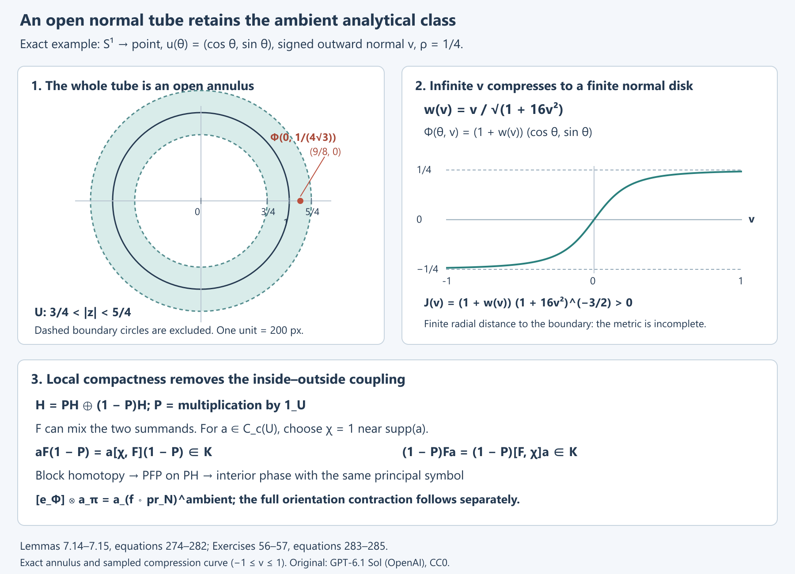

**Figure 7.4.** Lemmas 7.14–7.15, equations (274)–(282), and Exercises 56–57, equations (283)–(285). The annulus is the exact image of the whole normal line bundle of the unit circle at radius \(\rho=1/4\); the drawing maps one physical unit to 200 pixels and excludes both dashed boundary circles. The marked point is \(\Phi(0,1/(4\sqrt3))=(9/8,0)\). The curve samples the exact compression function on \(-1\leq v\leq1\); its horizontal asymptotes are excluded endpoints of its full range. The pulled-back metric is incomplete. The lower panel gives the actual compact-cutoff and block-homotopy mechanism on the full fibre module. The full prescribed graph-normal orientation contraction is the next step. This original diagram illustrates the independently supplied proofs; classical family and wrong-way context is [Connes–Skandalis, Sections 1–2].

Full-size locality PNG · Editable locality SVG.

### The actual coefficient transfer of a Thom inverse

The inverse in (144) has a Clifford algebra on its source. The analytical vertical cycle has that Clifford algebra on its target. These are distinct types. We compare them through an explicit finite Morita contraction, retaining its block order, grading and transition phases. The Clifford Bott–Dirac framework is classical [Kasparov; Emerson, Section 11.4]; the full transfer calculation below supplies the comparison used here.

Write \(C_r\) for the positive complex Clifford algebra with its ordered generators. Let \(\Sigma_r=\Lambda^*\mathbb C^r\) be the canonical \(C_{2r},\mathbb C\) Morita module: the \(2r\) generators are in their standard list order, paired consecutively. Its grading is the action of their normalized volume \((-i)^r e_1\cdots e_{2r}\). The star on a Morita module denotes its conjugate module, as in Lemma 0.12. For trivially graded algebras \(A,B\), define

\[
 \mathcal T_r(x)=
 [1_A\widehat\otimes\Sigma_r^*]
 \widehat\otimes_{A\widehat\otimes C_r\widehat\otimes C_r}
 \tau_{C_r}(x),
 \qquad x\in KK(A\widehat\otimes C_r,B).
\tag{286}
\]

The left Clifford list is the **old source block followed by the newly external block**. The result belongs to \(KK(A,B\widehat\otimes C_r)\). External tensoring and the actual Morita evaluations in Lemmas 0.12–0.13 make this a specified coefficient isomorphism. Exchanging the two source blocks requires transporting its finite Morita module too.

**Lemma 7.16 (the block contraction on the full finite module).** Put \(T=\Lambda^*\mathbb C^r\), with exterior grading \(\Gamma\), and let \(t_i\) be the generators of the last right \(C_r\). On \(T\widehat\otimes C_r\), use the ordinary matrix expressions

\[
 \begin{aligned}
 a_i&=e_i+\iota_i,\qquad b_i=i(e_i-\iota_i),\\
 A_i&=a_i\otimes1,\qquad B_i=\Gamma\otimes L_{t_i},
 \qquad C_i=b_i\otimes1.
 \end{aligned}
\tag{287}
\]

The \(A,B\) blocks represent \(C_r\widehat\otimes C_r\) in the list \((A_1,\ldots,A_r,B_1,\ldots,B_r)\). The \(C_i\) graded-commute with that representation. Set

\[
 \begin{aligned}
 k_r&=\frac{r(r-1)}2\pmod2,\qquad
 p=\prod_{i=1}^r\frac{1-iA_iB_i}{2},\\
 \psi&=2^{-r/2}\sum_I\lambda_{|I|}e_I\otimes t_I,
 \qquad
 \lambda_m=\begin{cases}1&m\text{ even},\\-i&m\text{ odd}.\end{cases}
 \end{aligned}
\tag{288}
\]

The sum runs over increasing subsets \(I\subset\{1,\ldots,r\}\), and \(t_I\) is their ordered Clifford word. There is a full even right-module unitary

\[
 \Sigma_r^*\widehat\otimes_{C_{2r}}(T\widehat\otimes C_r)
       \ \cong\ \Pi^{k_r}C_r,
 \qquad
 C_i^{\mathrm{contracted}}=(-1)^{k_r+1}L_{t_i}.
\tag{289}
\]

Here \(\Pi\) reverses the grading of the right module, retaining its right action and inner product. The contracted action includes the Koszul sign from the Morita tensor. At \(r=0\), use the scalar unit, empty product and empty generator list.

**Proof: the actual vacuum.** The \(a_i,b_i\) are odd self-adjoint, square to one and anticommute within each block and between the two blocks, except for the stated squares, by (129). The grading insertion in \(B_i\) is exactly the ordinary expression of \(1\widehat\otimes L_{t_i}\). Thus all \(2r\) left generators satisfy the positive Clifford relations. Each \(C_i\) anticommutes with every \(A_j,B_j\), so it graded-commutes with their full left algebra. Each \(-iA_iB_i\) is an even self-adjoint involution. Two distinct such products commute: moving their two generators past the other two gives four minus signs. Hence \(p\) is an even orthogonal projection.

For \(u=\sum_I e_I\otimes u_I\), the equation \((A_i+iB_i)u=0\), at an index \(I\) not containing \(i\), is

\[
 (-1)^{\#\{j\in I:j<i\}}u_{I\cup\{i\}}
   =-i(-1)^{|I|}t_i u_I.
\tag{290}
\]

The coefficient equation at the index containing \(i\) is equivalent after multiplication by \(t_i\), since \(t_i^2=1\). Starting with \(u_\varnothing\), the identity \(t_it_I=(-1)^{\#\{j\in I:j<i\}}t_{I\cup\{i\}}\) for \(i\notin I\) therefore gives \(u_I=\lambda_{|I|}t_Iu_\varnothing\). The scalar recurrence is \(\lambda_{m+1}=-i(-1)^m\lambda_m\). This proves that the joint kernel is \(\psi C_r\). It is the range of \(p\): multiplying \(A+iB\) by \(A\) shows that its kernel is the positive eigenspace of \(-iAB\), and the commuting positive eigenprojections have exactly their joint eigenspace as range.

Every term of \(\psi\) is even for the total grading, and its inner product is one. Exterior vectors of distinct indices are orthogonal, \(t_I^*t_I=1\), and \(2^{-r}\sum_I1=1\). Thus \(c\mapsto\psi c\) is an even right-linear isometry onto \(p(T\widehat\otimes C_r)\).

The physical action on this corner is \(C_i\psi=-\psi t_i\). For the component entering \(I\cup\{i\}\), with \(i\notin I\), \(b_i\) contributes \(i(-1)^{\#\{j\in I:j<i\}}\lambda_{|I|}t_I\). For the reverse component its contraction contributes the negative of this \(i\)-multiple with the coefficient of \(I\cup\{i\}\). Right multiplication of an ordered word by \(t_i\) has sign \((-1)^{\#\{j\in I:j>i\}}\). Substituting the two values of \(\lambda_m\), and the displayed recurrence, gives the claimed equality in both index cases. Consequently the uncontracted corner action is \(-L_{t_i}\).

**Proof: the grading and tensor sign.** The left block volume and the interleaved volume satisfy

\[
 (-i)^r A_1\cdots A_rB_1\cdots B_r
 =(-1)^{k_r}\prod_i(-iA_iB_i).
\tag{291}
\]

The permutation moves \(B_i\) past \(r-i\) later \(A\)'s, giving \(r(r-1)/2\) minus signs. The range of \(p\), which is even in \(T\widehat\otimes C_r\), therefore corresponds to a corner vector of \(\Sigma_r\) of parity \(k_r\). An ungraded corner identification would lose this shift.

For a complete module verification, choose a unit vector \(s_0\) of that corner in \(\Sigma_r\), extend it to a homogeneous orthonormal basis \(s_j\), and let \(E_{j0}\) be its matrix units. Their parity is \(|s_j|+k_r\). The map

\[
 s_j\widehat\otimes w\longmapsto\phi(E_{j0})w,
 \qquad w\in\Pi^{k_r}p(T\widehat\otimes C_r),
\tag{292}
\]

uses the underlying corner vector on the right. It is even. The matrix-unit relations give orthogonality of its columns and equality of their inner products with the corner inner product. Their diagonal sum is the identity, so the map is onto. This is the actual graded identification with \(\Sigma_r\widehat\otimes\Pi^{k_r}p(T\widehat\otimes C_r)\). Apply the Morita evaluation of Lemma 0.12 to prove the first assertion of (289).

If an odd operator \(F\) graded-commutes with the left matrix algebra, then \(F\phi(E_{j0})=(-1)^{|s_j|+k_r}\phi(E_{j0})F\). Thus (292) sends \(F\) to \(1\widehat\otimes((-1)^{k_r}F|_p)\): the graded tensor contributes \((-1)^{|s_j|}\), leaving the \(k_r\) sign on its second factor. Apply this to \(C_i\), whose corner action is \(-L_{t_i}\), to obtain the second assertion. All maps preserve the actual right action, inner product and grading. \(\square\)

**Theorem 7.17 (the full vertical inverse after coefficient transfer).** Let \(E\to X\) be a smooth metric real rank-\(r\) bundle on a smooth Hausdorff second-countable manifold. Prescribe its full spin-c transition module \(\mathcal S_E:\operatorname{Cl}^+(E)\rightsquigarrow C_r\), and let \(\alpha_E=m_E^{-1}d_E\) be the raw Thom inverse of (144). Define the finite graded bundle over \(X\)

\[
 \mathcal D_E=
 \Sigma_r^*\widehat\otimes_{C_r\widehat\otimes C_r}
 \Bigl[
   (\mathcal S_E^*\widehat\otimes_{\operatorname{Cl}^+(E)}
       \Lambda E_{\mathbb C})\widehat\otimes C_r
 \Bigr].
\tag{293}
\]

Its source and external Clifford blocks have the order of (286). The exterior positive \(a\) action is balanced against \(\mathcal S_E^*\). The positive physical \(b=i(e-\iota)\) action graded-commutes with this balance and induces a left \(\operatorname{Cl}^+(E)\) action on \(\mathcal D_E\). This is a full finite orientation module, with its induced orientation and grading. Pull it to \(E\) and use fibre density to form the analytical vertical cycle \(a_E^{\mathcal D_E}\) of Lemma 7.11. Then

\[
 \mathcal T_r(\alpha_E)=a_E^{\mathcal D_E}
 \quad\text{in }KK(C_0(E),C_0(X)\widehat\otimes C_r).
\tag{294}
\]

Locally \(\mathcal D_E\) is \(\Pi^{k_r}C_r\) with physical generators \((-1)^{k_r+1}t_i\). Tensoring the original module by an even line \(H\) tensors \(\mathcal D_E\) by \(H^*\). The assertion includes noncompact \(X\), smooth metric interval homotopies, and rank zero with its full graded orientation line.

**Proof: transitions, fullness and phase.** In a local orthonormal frame of \(E\) and principal frame of \(\mathcal S_E\), the inverse module is the regular finite left \(C_r\) module balanced against the exterior positive \(a\) action. The remaining finite right module and physical action are those of Lemma 7.16. That lemma gives their local regular rank, grading and onto contraction. Multiplication of all generators by their common sign is a Clifford automorphism, and reversing a module grading retains the underlying endomorphism algebra. Thus the physical left action identifies the entire compact algebra of \(\mathcal D_E\) with \(\operatorname{Cl}^+(E)\); its right inner products span \(C_r\). The smooth balanced bundle tensors and their evaluations glue these local facts. In positive rank the reconstruction preceding Lemma 6.0j recovers the induced principal spin-c orientation from this full module, including any orientation reversal. It does not replace it by the original or an independently selected orientation.

Write an original transition as \(zs\), where \(s\in\operatorname{Spin}(r)\) implements \(R\in\operatorname{SO}(r)\). Identifying a local conjugate regular module by \(\overline u\mapsto u^*\) changes its transition to right multiplication by \(s^*z^{-1}\). After balancing against the exterior action, the combined transition is

\[
 z^{-1}\rho_a(s)^*\Lambda R=z^{-1}\rho_b(s).
\tag{295}
\]

For a rotation in the \(i,j\) plane, \(\Lambda R=\exp(\theta(e_j\iota_i-e_i\iota_j))\). The exterior relations give \(e_j\iota_i-e_i\iota_j=-(a_i a_j+b_i b_j)/2\). These two even bivectors commute, so the exponential is the product of the two spin exponentials. Every special orthogonal transformation is a product of plane rotations: successively rotate its unit columns into the coordinate columns, leaving the previously fixed columns unchanged. A remaining diagonal orthogonal matrix of determinant one is removed by rotations of angle \(\pi\) on paired negative entries. Thus \(\Lambda R=\rho_a(s)\rho_b(s)\) for its spin lift; the other lift multiplies both factors by \(-1\) and retains their product. Formula (295) follows for the actual principal transition. In rank one the two spin lifts of the identity likewise have product one.

The even physical spin action commutes with the two fixed left coefficient blocks and descends through their contraction. Even words have the same image when every physical generator is multiplied by \((-1)^{k_r+1}\). Hence the contracted transition is exactly \(z^{-1}\rho_t(s)\) on the shifted module of (289). This retains the whole real-frame action and phase, including two-torsion lines. Replacing \(zs\) by \(h\,zs\) replaces that transition by \(h^{-1}z^{-1}\rho_t(s)\), proving the full \(H^*\) assertion.

**Proof: the actual analytical cycle.** The raw inverse is represented on the balanced inverse-spin/exterior fibre-\(L^2\) module with physical Fourier symbol \(i\sum_i c_i\xi_i=\sum_i b_i\xi_i\). We verify the product with the zero Morita cycle, which was not needed to identify \(\beta_E\) in Corollary 6.0d. Smooth compactly supported local sections of \(\mathcal S_E^*\) are dense in its total-space section module. In a base frame their homogeneous components give rectangular creation maps \(T_\xi\). The physical operator graded-commutes with the constant finite Clifford components; its graded connection error is multiplication by their fibre derivatives. It is bounded and compactly supported in the total space. Multiplication preserves the graph domains by the first-derivative product estimate.

Apply (132) to the block-diagonal physical operators on the source and target modules, with the rectangular creation map as its off-diagonal homogeneous coefficient. If \(C\) is its bounded derivative error and \(q=\sqrt{1+\tau^2}\), the two rectangular resolvent terms have norm at most \(5\|C\|/(4q^2)\). They are compact: each coefficient is supported in a fixed compact fibre/base set, and the localized order-\(-1\) resolvents there are compact by Lemma 6.0a, with their finite module columns retained. Integrating against \(2/\pi\) gives a norm-convergent compact error for the bounded transforms. The adjoint creation equation follows by taking adjoints; norm density treats all creation vectors. The first Morita operator is zero, so product positivity is zero. Definition 0.3 proves this representative of \(m_E^{-1}d_E\) on its full balanced Hilbert module.

Externally tensor with the last \(C_r\), then apply the finite source Morita module in (286). The unitary (292), in every base frame and on fibre-\(L^2\) sections, identifies the tensor Hilbert module with the fibre-integration module of \(\mathcal D_E\). It preserves fibre density, the right coefficient inner product and grading; onto finite evaluation and density of compact sections prove its surjectivity. On its graph core, the operator is the physical vertical Dirac operator with the contracted generators of (289). The sign from that formula is retained. Its regular self-adjoint closure follows from the same fibre Fourier inverse shifts as in Lemma 6.0a, now with these positive generators. This unitary also intertwines the full closed domains and bounded transforms.

For this second finite Morita product, the homogeneous constant columns satisfy precisely the signed intertwining equation following (292). A compactly supported scalar coefficient on a column has bounded fibre derivative; the rectangular resolvent argument of the preceding paragraph again proves the full compact connection error and its adjoint. Positivity is again zero. Thus the transformed bounded operator is an actual product cycle.

Its principal symbol is the physical Clifford symbol on \(\mathcal D_E\). Confine input and output to compact interior buffers. The flat fibre transform has the corresponding Fourier order-zero symbol there; its off-diagonal tails are module compact by the heat-kernel estimate in Lemma 7.14, uniformly on compact base supports. The exact finite-supported quotient and quantization-choice argument of Lemma 7.11 therefore identify its bounded transform with that lemma's analytical phase. All frame operators differentiate only in the fibre variable, so transitions (295) intertwine them exactly. Positive metric transport, with compact-base bounds, is the transport of Corollary 6.0d. This proves (294) over possibly noncompact \(X\).

A smooth metric family uses the bundle over \(X\times[0,1]\), the same finite tensors, and uniform estimates on each compact base set times the interval. It gives one interval cycle with the prescribed endpoint modules. No global geometric bound at base infinity is needed. In rank zero the exterior and Clifford factors are scalar and the operator is zero. Formula (293) is the conjugate of the full graded orientation line; multiplication by \(C_0(X)\) is compact on its section module. This proves the rank-zero assertion, including an odd stable line. \(\square\)

The theorem supplies the inverse's actual analytical orientation. For the ordinary graph of Lemma 7.15, the next step is to compare \(\mathcal D_N\widehat\otimes\mathcal S_K\), using the full recovery maps (174)–(178), with the correspondingly transferred ambient Euclidean inverse. The same ordered Clifford contractions must be applied on both sides before using the two Thom inverse identities.

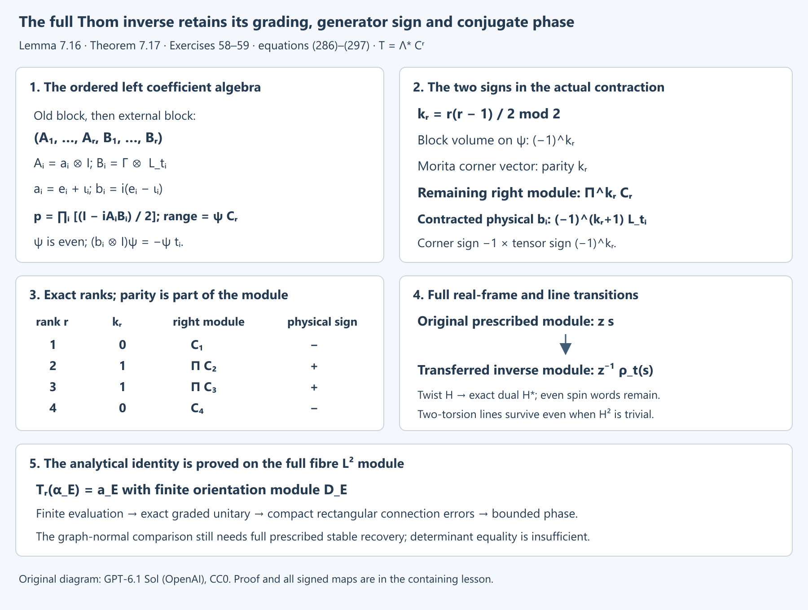

**Figure 7.5.** Lemma 7.16, Theorem 7.17 and Exercises 58–59, equations (286)–(297). The old source Clifford block precedes the external block. The even exterior/external vacuum corresponds to a corner of parity \(k_r=r(r-1)/2\) in the standard ordered matrix module. Its remaining right module is \(\Pi^{k_r}C_r\), with physical generators \((-1)^{k_r+1}L_{t_i}\). The table gives the exact values in ranks one through four; the proof holds in every rank. The transition \(zs\) becomes \(z^{-1}\rho_t(s)\), and an even line becomes its full dual. The lower panel records the actual Hilbert-module product and bounded-phase comparison, with no claim that stable graph-normal recovery is finished. This original diagram illustrates the independently supplied calculation; classical Clifford Bott–Dirac context is [Kasparov; Emerson, Section 11.4].

Full-size transfer PNG · Editable transfer SVG.

### Recovering the prescribed graph normal

We keep the full stable orientation in (13). For a submersion it induces a vertical orientation by cancelling a canonical complex double. The same finite evaluations then identify the normal of its graph. This calculation precedes the KK cancellation; it does not choose a normal structure independently of the map's supplied orientation.

Let \(f:W\to V\) be a smooth surjective submersion with \(W\) compact. Put \(K=\ker df\), \(r=\operatorname{rank}K\), \(T=f^*TV\), and \(p=\operatorname{rank}T\). Choose an embedding \(u:W\hookrightarrow\mathbb R^n\), with \(n\) even and \(q=n-r\geq1\). Use its induced metric on \(TW\) and choose \(H=K^\perp\). The map \(df:H\to T\) is an isomorphism. Give \(T\) the transported metric over \(W\); positive metric transport of Corollary 6.0d carries the originally prescribed module to these metrics. It need not be a metric pulled back from all of \(V\).

Use the finite algebra-bundle notation \(A_B=\operatorname{Cl}^+(B)\) of (170). Write \(Q_B=B\oplus B\) for the canonical complex double of a real bundle \(B\), and \(\mathscr M_{Q_B}\) for (172). Its orientation is interleaved and its full module exists also when \(B\) is nonorientable. Write \(\mathcal C_{Q_B}\) for the actual cancellation (173).

**Lemma 7.18 (vertical and graph-normal recovery).** Let \(\mathscr M_L\) be the prescribed full module on \(L=TW\oplus T\). The ordered isometry \(\Psi:K\oplus Q_H\to L\), \(\Psi(k,h_1,h_2)=(k+h_1,df(h_2))\), induces

\[
 \mathscr M_K=\mathcal C_{Q_H}(\Psi^*\mathscr M_L),
 \qquad
 \mathscr M_K\widehat\otimes\mathscr M_{Q_H}
       \cong\Psi^*\mathscr M_L.
\tag{298}
\]

Here the right blocks are \(C_r,C_{2p}\). In positive rank this is the induced full vertical spin-c structure. At rank zero retain its entire graded orientation line.

Let \(E=\nu_u\oplus T\), with its graph-normal structure \(\mathscr M_E\) from (178). The quotient identification with the normal \(N=(duK)^\perp\) of Lemma 7.15 is

\[
 \chi:E\longrightarrow N,\qquad
 \chi(\eta,t)=\eta-du\bigl((df|_H)^{-1}t\bigr).
\tag{299}
\]

Under \(\chi\), its full module is the cancellation using only the vertical double:

\[
 \begin{aligned}
 J:K\oplus N&\longrightarrow\underline{\mathbb R^n},
       &J(k,v)&=du(k)+v,\\
 \eta_K:N\oplus Q_K&\longrightarrow K\oplus\underline{\mathbb R^n},
       &\eta_K(v,a,b)&=(a,J(b,v)),\\
 P_K&=\eta_K^*(\mathscr M_K\widehat\otimes C_n),
       &P_K&:A_N\widehat\otimes A_{Q_K}
                    \rightsquigarrow C_q\widehat\otimes C_{2r},\\
 \mathscr M_N&=\mathcal C_{Q_K}(P_K),
       &\chi_*\mathscr M_E&\cong\mathscr M_N .
 \end{aligned}
\tag{300}
\]

The right identification in \(P_K\) repartitions the same ordered list of \(r+n=q+2r\) generators. The assertion is an actual even bimodule unitary, with both actions and inner products, and holds over smooth parameter families. Tensoring \(\mathscr M_L\) by an even line tensors both \(\mathscr M_K\) and \(\mathscr M_N\) by that same line.

**Proof: the induced vertical structure.** The two evaluations and full recovery (174), applied to \(Q_H\), prove (298), including smoothness, fullness and onto even isometries. This uses the given \(\mathscr M_L\), rather than replacing it by a module made from a separately chosen vertical structure. The reconstruction before Lemma 6.0j gives its positive-rank principal structure; the rank-zero line and its grading are retained.

The embedding metric makes \(du(H)\), \(du(K)\) and \(\nu_u\) mutually orthogonal. Hence \(\chi\) is an isometry onto \(\nu_u\oplus du(H)=N\). In the graph quotient, subtracting \(d(f,u)((df|_H)^{-1}t)\) from \((t,\eta)\) leaves \((0,\chi(\eta,t))\). Conversely this decomposition is unique modulo \(du(K)\). Thus (299) is the actual quotient map and not merely an equality of bundle ranks.

**Proof: the global rotation.** Decompose both copies of \(TW\) as \(K\oplus H\). In \(E\oplus Q_{TW}\) write the coordinates \((\eta,t,a_K,a_H,b_K,b_H)\), identifying \(t\) with a vector of \(H\). On the pair \((t,b_H)\) use

\[
 R_\theta(t,b_H)=
       (\cos\theta\,t+\sin\theta\,b_H,
        -\sin\theta\,t+\cos\theta\,b_H),
 \qquad 0\leq\theta\leq\pi/2.
\tag{301}
\]

All other coordinates stay fixed. This is a smooth global orthogonal rotation even if \(H\) is nonorientable. In a local orthonormal frame its spin unitary is \(\exp((\theta/2)\sum_j\gamma_{t_j}\gamma_{b_j})\). The sum is invariant under every simultaneous orthogonal frame change of the two \(H\) copies, because the coefficient is their metric contraction. Its bivectors are skew-adjoint, and their commutators with the real generators give exactly (301). Thus it is a globally defined even unitary implementing the entire rotation.

Put \(P_\theta=(\rho_uR_\theta)^*(\mathscr M_L\widehat\otimes C_n)\), with \(\rho_u\) from (176). If the rotation unitary is \(s_\theta\), multiplication by the represented \(s_\theta^*\) is an even right-linear unitary from \(P_\theta\) to \(P_0\), intertwining their left actions. It preserves their inner products and is onto. Apply \(\mathcal C_{Q_{TW}}\) to this actual unitary; it gives an actual unitary of the cancelled normal modules throughout the family.

At \(\theta=\pi/2\), the vector map is

\[
 \begin{aligned}
 (\rho_uR_{\pi/2})(\eta,t,a_K,a_H,b_K,b_H)
   &=\bigl(a_K,a_H,b_H,\ du(b_K)-du(t)+\eta\bigr),\\
 P_{\pi/2}
   &\cong P_K\widehat\otimes\mathscr M_{Q_H}.
 \end{aligned}
\tag{302}
\]

In the first line the initial three entries are the \(K,H,T\) decomposition of \(L\); the last is the ambient Euclidean vector. The source is now \(N,Q_K,Q_H\), using \(\chi\); the second line uses the exact recovery (298). Its source real coordinates are \((\chi(\eta,t),a_K,b_K,a_H,b_H)\).

We spell out the constant right transport in that second line. Before it, the blocks are \(C_r,C_{2p},C_n\); afterwards they are \(C_r,C_n,C_{2p}\), repartitioned as \(C_q,C_{2r},C_{2p}\). Move only the two even-dimensional middle/last blocks. On their standard consecutive-pair spinor model, the exterior unitary permuting the \(p\) and \(n/2\) complex coordinate blocks is even and implements this Clifford isomorphism. It is an inner even automorphism. The right-module map \(v\mapsto v w\), with that fixed implementing unitary \(w\), gives its full inner-product-preserving transport, as in the stabilization proof of Lemma 6.0j. This identifies the entire right algebra before any normal-prefix cancellation; it does not assume that the moved blocks preserve that prefix.

The wedge map \(\Lambda(K_{\mathbb C}\oplus H_{\mathbb C})\cong\Lambda K_{\mathbb C}\widehat\otimes\Lambda H_{\mathbb C}\) identifies the full \(TW\) double with \(Q_K,Q_H\). It intertwines exterior multiplication and contraction; its graded tensor inserts the sign on the \(H\) block exactly once. The same map identifies the fixed right matrix model with the consecutive complex blocks \(C_{2r},C_{2p}\). Now evaluate the \(H\)-double factors on both sides of (302), using (174); evaluate the remaining \(K\)-double factors by (173). These maps give

\[
 \begin{aligned}
 \chi_*\mathscr M_E
   &\cong \mathcal C_{Q_K}(P_K)=\mathscr M_N,\\
 \mathscr M_N\widehat\otimes\mathscr M_{Q_K}
   &\cong P_K .
 \end{aligned}
\tag{303}
\]

Every map in this chain is a reassociation, a graded flip, the stated fixed exterior unitary, the global rotation unitary, or an actual rank-one/inner-product evaluation. The tensor inner-product identity in (174) proves its isometry; fullness proves onto range. It retains both actions and the grading. An even line passes through all these tensors unchanged, proving the line assertion. Smooth families use the same rotation and evaluations on the parameter bundle. Metric changes use their positive transport; the finite construction needs bounds only on compact parameter/base sets. This proves all assertions. \(\square\)

**Lemma 7.19 (the full normal-inverse and vertical coefficient module).** Use the structures of Lemma 7.18. Let \(\mathcal D_N\) be (293) for \(\mathscr M_N\). Transport the right algebra of \(\mathcal D_N\widehat\otimes\mathscr M_K\) by the graded block flip \(C_q\widehat\otimes C_r\to C_r\widehat\otimes C_q=C_n\). With its physical normal and vertical Clifford actions, it is an actual even full-module unitary copy of the ambient transferred-inverse module:

\[
 (\mathcal D_N\widehat\otimes\mathscr M_K)^\beta
       \cong J^*\mathcal D_{\underline{\mathbb R^n}},
 \qquad
 \beta(x\widehat\otimes y)=(-1)^{|x||y|}y\widehat\otimes x .
\tag{304}
\]

The physical source order on the left is \(N,K\); \(J\) sends it to \(du(K)+N\) in the ambient space. The ambient module on the right is the full module of Theorem 7.17, including its grading. The unitary retains the prescribed scalar phases and real-frame transitions. In rank zero it retains the complete vertical orientation line. The identification also transports the whole graph-tube orientation of Lemma 7.15, using its actual vertical derivative and positive metric transport.

**Proof: the full constant normal model.** Work first with \(r>0\) and an adapted oriented \(K,N\) frame whose ordered \(K,N\) image is a positive Euclidean frame. Put \(k_j=j(j-1)/2\bmod2\). The constant model obtained by cancelling the full double in \(P_K\) is

\[
 \begin{aligned}
 \epsilon&=r\bmod2,
       &a&=(1-\epsilon)k_r,\\
 \mathscr M_N^0&\cong\Pi^{a}C_q,
       &c_N(v_i)&=\kappa L_{t_i},\qquad
                  \kappa=(-1)^{\epsilon k_r}.
 \end{aligned}
\tag{305}
\]

Here \(a=k_r,\kappa=1\) if \(r,q\) are even, and \(a=0,\kappa=(-1)^{k_r}\) if they are odd. To check the model on full modules, compare the normalized total volume before both finite evaluations. The \(Q_K\) complex interleaving contributes \((-1)^{k_r}\) relative to its two real \(K\) blocks. Moving the \(N\) block past both \(K\) blocks contributes \(2rq\) swaps and sign \(+1\). All fixed right generators stay in their standard list order. Consequently, in even \(q\), the source normal chirality times right multiplication by the target chirality is \((-1)^{k_r}\) times the module grading. In odd \(q\), the source normalized odd central volume is \((-1)^{k_r}\) times right multiplication by the target odd central volume. The double evaluations give these equalities on the whole cancelled module.

They are precisely the corresponding equalities in (305). The complete finite matrix-unit reconstruction before Lemma 6.0j now supplies an even right-linear unitary intertwining the entire compact left algebra, not just its volume: in even rank recover each homogeneous column from a matrix corner; in odd rank recover the two matrix corners exchanged by grading. Their inner products and actions give an onto isometry. Fix one such constant unitary once for these ordered models. This local use of the full finite reconstruction does not discard any bundle transition line.

We also need the actual transfer of this shifted or reflected model. For a model \(\Pi^a C_q\) with left real generators \(\kappa t_i\), the raw inverse/exterior module has grading \((-1)^a\Gamma\), old source generators \(\kappa a_i\), external generators \((-1)^a\Gamma\otimes t_i\), and physical generators \((-1)^a b_i\). Its vacuum is \((\Gamma^{a+(1-\kappa)/2}\otimes1)\psi\). Substitution in the two annihilator equations of Lemma 7.16 proves that assertion, with both index cases. Its total parity is \(a\), and the physical corner action is \(-\kappa t_i\). The matrix-column tensor sign is still \((-1)^{k_q}\). Therefore

\[
 \mathcal D_N^0\cong\Pi^{h}C_q,\qquad
 h=k_q+a,\qquad
 c_N^{\mathcal D}=\kappa(-1)^{k_q+1}L_{t_i}.
\tag{306}
\]

This verifies the action and grading for the actual balanced tensor, including a shifted normal module.

**Proof: the complete constant intertwiner.** Tensor (306) with the regular \(C_r\) vertical module and perform the full right transport \(\beta\). The result is \(\Pi^h C_n\). Its physical \(K\) action has the additional first-module tensor grading sign, while its normal action keeps (306):

\[
 c_K=(-1)^hL_{e_K},\qquad
 c_N=\kappa(-1)^{k_q+1}L_{e_N}.
\tag{307}
\]

The ambient module is \(\Pi^{k_n}C_n\), with every physical generator \((-1)^{k_n+1}e_i\). For an ordered \(j\)-generator block put \(\omega_j=(-i)^{j(j-1)/2}e_1\cdots e_j\), with \(\omega_0=1\). These are unitary; their conjugations negate a generator in that block by \((-1)^{j-1}\), and one outside it by \((-1)^j\). In the target order \(K,N\), the desired map is

\[
 U:\Pi^{k_n}C_n\longrightarrow\Pi^h C_n,
 \qquad U(c)=\omega_K\,\omega_N^{\,k_r}c,
 \qquad |\,\omega_K\omega_N^{\,k_r}\,|=k_n+h .
\tag{308}
\]

It is even between these two module gradings. Indeed \(q,r\) have the same parity, \(k_n=k_q+k_r+rq\), and these identities give the last equality. It is right-linear, inner-product preserving and onto, since its multiplier is unitary. Conjugation by it changes the \(K\) block by \((-1)^{r-1+k_rq}\), and the \(N\) block by \((-1)^{r+k_r(q-1)}\). Multiplying the ambient sign by these factors gives exactly (307), in both parity cases of (305). Thus it intertwines every physical generator and the entire left Clifford algebra, not merely a determinant or index.

**Proof: the full transitions.** Choose local principal frames for \(\mathscr M_K\), and local spin frames of the canonical ambient Euclidean module in the adapted \(K,N\) frames. Write their transitions as \(z s_K\) and \(s_A\). Since the real ambient frame change is the two-block change, its lift has the form \(s_A=s_Ks_N\) for a uniquely chosen normal lift \(s_N\), with the two choices of the tangent lift absorbed in its scalar phase.

This is the exact lift chosen by recovery (303). On its full \(P_K\) module the transition is \(z s_K\widehat\otimes s_A\). The canonical double transition is \(\rho_{K_1}(s_K)\rho_{K_2}(s_K)=\Lambda R_K\), by the plane-rotation identity in (295). Its two evaluations cancel precisely these two even factors, leaving \(z s_N\) on the normal model (305). Thus the transferred normal inverse, tensored with the vertical module, has

\[
 (z^{-1}\rho_N(s_N))(z\rho_K(s_K))
       =\rho(s_A).
\tag{309}
\]

The two even blocks commute; all tensor flips are the specified graded ones. The fixed unitary (308) commutes with both block spin actions, since each block volume commutes with its even words. Consequently the local unitaries glue to (304). Changing \((z,s_K)\) to \((-z,-s_K)\) changes \(s_N\) to \(-s_N\); neither full module transition changes. This also checks the central signs in rank-one spin groups. A line transition multiplies the two phases in (309) by its inverse and itself. The actual line evaluation therefore cancels it, including a two-torsion line; its square or determinant has not been used.

If \(r=0\), write the induced full orientation line as \(\Pi^\epsilon H_0\). Recovery makes the normal module the canonical \(C_n\) module tensored by that same graded line. Its transferred inverse contains \(H_0^*\) with the same parity. The full line evaluation has degree zero. Tensoring the second, parity-\(\epsilon\) line twists the old right Clifford action by its parity automorphism. Untwist this action on the Clifford words; the physical generators acquire \((-1)^\epsilon\). Multiplication by the even ambient chirality to the power \(\epsilon\) restores the ambient physical action. These maps are right-linear after the stated right transport, preserve the inner product and evaluate \(H_0^*\otimes H_0\) onto the scalar unit. This proves (304) also for the odd rank-zero line, without replacing it by the canonical even line.

**Proof: the entire graph tube.** Choose a metric connection on \(N\); it splits the vertical tangent of \(f\circ\operatorname{pr}_N\) as the range pullback of \(N\oplus K\). At the zero section the vertical derivative of the fibre-preserving \(\Phi\) in Lemma 7.15 is exactly \(J\), since its compression has derivative one there. On the whole bundle its vertical derivative is an invertible map to the ambient \(\mathbb R^n\). Compose it with \(J^{-1}\), and let \(R(w,v)\) be its positive polar orthogonal factor. It has determinant \(+1\): at \(v=0\) it is the identity, and the radial segment stays in the invertible matrices. The path \(R_s(w,v)=R(w,sv)\) therefore has a global even spin lift. Explicitly,

\[
 \begin{aligned}
 B_s&=(\partial_sR_s)R_s^{-1},\\
 \partial_s u_s&=\frac14\sum_{i,j}(B_s)_{ij}e_i e_j\,u_s,
       \qquad u_0=1 .
 \end{aligned}
\tag{310}
\]

The skew matrix makes the displayed generator skew-adjoint. Its commutator with a real Clifford generator is the corresponding column of \(B_s\), so \(u_s\) implements \(R_s\). Finite-dimensional linear ODE existence and the unitary norm bound give the solution on the whole interval; smooth dependence is local on compact parameter/base sets. Products of bivector exponentials, equivalently plane-spin rotations, converge to this lift, so it lies in the spin group. Starting at the identity fixes the full phase globally.

Transport (304) radially and then by \(u_1\), retaining the positive polar metric isometry. This identifies the full tube orientation with the pullback of the ambient inverse orientation. The exact fibre-density unitary is that of Lemma 7.15. Lemma 7.11 then supplies the same bounded analytical phase under these metric/connection transports, on a single interval module with compact localized defects. No completeness or global bound at fibre infinity is imposed. This proves the asserted entire-tube identification. \(\square\)

These lemmas close the full prescribed normal recovery and its analytical coefficient-module comparison. The next lemmas verify the native parity reductions with the second-cycle coefficient first, using both raw Thom inverse identities. The full transport in (304) is retained in the compact ordinary equality of Theorem 7.22.

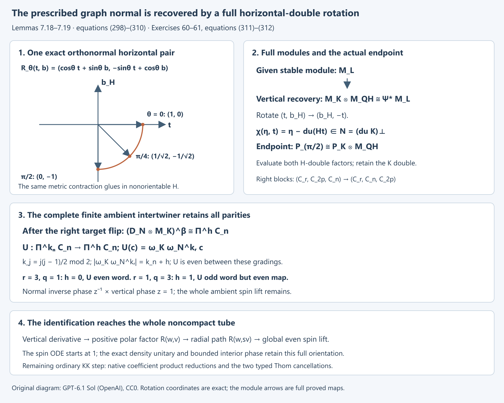

**Figure 7.6.** Lemmas 7.18–7.19 and Exercises 60–61, equations (298)–(312). The first panel gives the exact clockwise horizontal-double rotation, with endpoint \((t,b_H)\mapsto(b_H,-t)\); it explains the minus sign in the actual normal quotient \(\chi\). The middle panels show the two full double evaluations, the fixed even-block transport, the signed block-volume unitary and the exact inverse/vertical line evaluation. The last panel extends the identification over the whole graph tube by its positive polar factor and identity-started spin lift. The displayed examples distinguish an odd Clifford multiplier from an even map between oppositely graded modules. Lemmas7.20–7.21 and Theorem7.22 prove the native ordered cancellation below. This is an original diagram of the complete proofs; classical spin-c and Clifford context is [Kasparov; Emerson, Section 11.4; Connes–Skandalis].

Full-size recovery PNG · Editable recovery SVG.

### Native ordered Thom cancellation and ordinary submersions

We now calibrate the specified transfer (286) against both raw inverse products. This also distinguishes the canonical positive analytical module from the module of the geometric Euclidean inverse. No equality with the separately constructed real-action Bott pair of Corollary 0.20 is assumed here.

For a trivially graded algebra \(D\), write \(r=2a+\epsilon\), \(\epsilon\in\{0,1\}\). Let \(\mu_r^D\) be the fixed \(D\widehat\otimes C_r,D\widehat\otimes C_\epsilon\) Morita class obtained by reducing the first \(2a\) consecutive generators with \(\Sigma_a=\Lambda^*\mathbb C^a\), retaining the final generator if \(\epsilon=1\). Write \(R_r(z)=z\mu_r^D\) for right reduction. The even cyclic transports in Proposition 6.0i identify this convention with a retained odd generator at the front; those are full even module maps.

**Lemma 7.20 (both inverse products after the specified transfer).** Let \(A,B\) be trivially graded separable algebras. Suppose
\[
 x\in KK(A,B\widehat\otimes C_r),\qquad
 y\in KK(B\widehat\otimes C_r,A),\qquad
 xy=1_A,\quad yx=1_{B\widehat\otimes C_r}.
\tag{313}
\]
Then
\[
 \begin{aligned}
 b&=R_r(x)\in KK^\epsilon(A,B),\\
 d&=R_r(\mathcal T_r(y))\in KK^\epsilon(B,A),\\
 b\cdot d&=1_A,\qquad d\cdot b=1_B .
 \end{aligned}
\tag{314}
\]
The dots are exactly the native parity products of Lemma 0.13. In an odd–odd product the target list is the second-cycle coefficient followed by the externally retained first-cycle coefficient. No graded flip to the chronological order is implicit.

**Proof: even rank.** If \(r=2a\), consecutive pairing gives the actual even exterior unitary \(\Sigma_r\cong\Sigma_a\widehat\otimes\Sigma_a\), on the source block followed by the external block. Reassociate the balanced tensor defining \(R_r\mathcal T_r(y)\). Evaluate the external \(\Sigma_a^*,\Sigma_a\) factors by the full inner-product map of Lemma 0.12. It leaves exactly
\(d=(\mu_r^B)^{-1}y\).
Thus \(bd=x\mu_r^B(\mu_r^B)^{-1}y=xy\) and
\(db=(\mu_r^B)^{-1}yx\mu_r^B=1_B\).
The evaluations preserve the grading, actions and tensor inner product and are onto by fullness. Rank zero is the same statement with the unit Morita module.

**Proof: reducing the even factors in odd rank.** Suppose \(r=2a+1\). Put
\[
 x'=x\mu_r^B,\qquad
 y'=(\mu_r^B)^{-1}y.
 \qquad
 x'y'=1_A,\quad y'x'=1_{B\widehat\otimes C_1}.
\tag{315}
\]
The full source list in \(\mathcal T_r(y)\) is
\((C_{2a}^{\mathrm{old}},C_1^{\mathrm{old}},
  C_{2a}^{\mathrm{new}},C_1^{\mathrm{new}})\).
Move the old odd generator past the \(2a\) new even-block generators. This is a real permutation of positive sign, with an even spin implementer; every individual odd-vector interchange is still accounted for. One explicit construction writes the permutation as \(2a\) adjacent reflections. The reflection exchanging two neighbouring generators is the twisted adjoint of \((e_i-e_{i+1})/\sqrt2\); the product of the even number of such unit vectors has ordinary adjoint equal to the desired permutation. It is unitary and even. It preserves the normalized total volume and hence the prescribed spinor grading.

After this actual transport the consecutive-pair module is
\(\Sigma_a^{\mathrm{old}}\widehat\otimes
 \Sigma_a^{\mathrm{new}}\widehat\otimes
 \Sigma_1^{\mathrm{odd,odd}}\).
The ordered wedge map intertwines every creation operator and its adjoint, including the preceding-factor grading. Its tensor inner product is the wedge inner product. Reassociation and evaluation of the new even factors therefore give the full finite reduction identity
\[
 R_r\mathcal T_r(y)
   =\mathcal T_1(y')
   =[1_B\widehat\otimes\Sigma_1^*]\,
                  \tau_{C_1}(y').
\tag{316}
\]
All constant module maps have been specified before reduction; the remaining pair is old odd source followed by new odd external.

**Proof: the two native odd products.** Let
\(m_B=[1_B\widehat\otimes\Sigma_1]\).
Set \(j=m_B^{-1}\tau_{C_1}(y')\), the last expression in (316). Native multiplication and (315) give
\[
 j\cdot x'
   =m_B^{-1}\tau_{C_1}(y')\tau_{C_1}(x')m_B
   =m_B^{-1}\tau_{C_1}(y'x')m_B
   =1_B.
\tag{317}
\]
In this expression the ordered final pair is the coefficient of \(x'\) followed by the external coefficient of \(j\), as required by the native product.

We prove the other product as well. As an ordinary even morphism of graded algebras, \(j:B\to A\widehat\otimes C_1\) is invertible: its inverse is \(\tau_{C_1}(x')m_B\), and (315) plus the two Morita evaluations prove both ordinary products. Put \(e=x'\cdot j\in KK(A,A)\). Native associativity, proved with the full three-generator cyclic transport in Lemma 0.13, gives \(j\cdot e=(j\cdot x')\cdot j=j\). Since \(e\) is even, this says \(j\tau_{C_1}(e)=j\). Multiply by the just proved ordinary inverse of \(j\); it gives \(\tau_{C_1}(e)=1_{A\widehat\otimes C_1}\). The injectivity of \(\tau_{C_1}\), proved by both simultaneous matrix-Morita products in Lemma 0.13, gives \(e=1_A\). This proves both native identities, not only one inverse or an index on a Gaussian. Equations (315)–(316) identify \(x',j\) with \(b,d\), completing the proof. \(\square\)

In particular, Corollary 6.0d's full raw pair \(\beta_E,\alpha_E\) satisfies this lemma. Define \(b_E=R_r(\beta_E)\) and \(d_E=R_r\mathcal T_r(\alpha_E)\) in parity notation in the rest of this subsection; these letters here denote the spin-c reduced pair, rather than the unreduced Clifford-twisted pair of (130)–(131). Both identities hold with every supplied line twist and rank-zero grading, since (313) retains their exact full Morita evaluations.

**Lemma 7.21 (the native product and the geometric Euclidean inverse).** Suppose \(q+r=n\) is even. If a first full analytical cycle has right \(C_q\) and a second has right \(C_r\), native parity multiplication of their reductions is the reduction of their actual full product with right list \(C_r,C_q\). Equivalently, if their common physical coefficient bundle is initially written \(\mathcal E_q\widehat\otimes\mathcal E_r\) with right list \(C_q,C_r\), first apply the full graded right block transport \(\beta\), and then \(R_n\):
\[
 R_q(z_q)\cdot R_r(z_r)
       =R_n\bigl((z_q\widehat\otimes z_r)^\beta\bigr).
\tag{318}
\]
Here the tensor on the right denotes the already verified analytical product operator on its common module, rather than an unverified choice of operator.

**Proof: the complete finite reducers.** For even \(q,r\), the target consecutive-pair spinor is the ordered exterior tensor for \(C_r,C_q\). Both sides reduce by this same module, using the two full Morita evaluations and their associating unitaries. For odd \(r=2a+1,q=2b+1\), the full native list is
\((C_{2a},C_1^{r},C_{2b},C_1^{q})\).
Move \(C_1^r\) past \(C_{2b}\) with the even product of adjacent reflection units used above. The list is then the two even matrix blocks followed by the ordered pair \((C_1^r,C_1^q)\). The wedge unitary decomposes the full reducer as
\(\Sigma_a\widehat\otimes\Sigma_b\widehat\otimes\Sigma_1\).
Its last module is exactly (104), in second-cycle-first order. Every action and inner product agrees on homogeneous elementary tensors by Lemma 0.13's formulas; their density and the two onto Morita evaluations give the actual even module unitary. Product preservation under these finite external factors and uniqueness of the checked product operator establish (318). A right transport of an odd word still contributes its Koszul sign. Thus this proof does not replace \(\beta\) by an ordinary block permutation. \(\square\)

For the canonical Euclidean spin-c structure and even \(n\), let \(B_n=R_n(\beta_{\mathbb R^n})\), and let \(A_n=B_n^{-1}\). These are the geometric pair used by the Euclidean stabilization of Lemma 6.0h: its proof uses precisely the standard spin-c symbol of Corollary 6.0d. Lemma 7.20 and Theorem 7.17 identify its actual inverse as
\[
 \begin{aligned}
 A_n&=R_n\mathcal T_n(\alpha_{\mathbb R^n})
        =R_n(a_{\mathbb R^n}^{\mathcal D_n}),\\
 \mathcal D_n&=\Pi^{k_n}C_n,\qquad
       c_{\mathcal D_n}=(-1)^{k_n+1}L_e,\\
 W_n(c)&=\chi_n^{\,k_n+1}c,\qquad
       W_n:\Pi^{k_n}C_n^{\mathrm{canonical}}\longrightarrow\mathcal D_n,\\
 \chi_n&=(-i)^{n/2}e_1\cdots e_n .
 \end{aligned}
\tag{319}
\]
The finite map \(W_n\) is even, right-linear, unitary and intertwines every physical generator. Indeed \(\chi_n\) is an even self-adjoint unitary that anticommutes with each \(e_i\), so its stated power gives exactly the displayed physical sign. It preserves the shifted grading. For \(n=0\) use the unit instead.

This also shows precisely why one cannot silently equate the unreduced full canonical positive module with \(\mathcal D_n\). After right reduction, \(A_n\) is \((-1)^{k_n}\) times the canonical positive Euclidean analytical cycle. For trivially graded left coefficients, the grading-reversed cycle with the same operator represents the negative class: Section 0's explicit inverse cycle has reversed grading and operator \(-F\), and conjugation by the grading operator changes it to \(F\). Thus this sign follows from an actual cycle unitary and the proved inverse, not from an index normalization.

Externally over a trivially graded algebra \(D\), the same statement identifies \(A_n^D\) with the product Euclidean vertical phase. The tensor property in Lemma 0.13, the full localized compact defects in Theorem 7.17, and the constant finite map \(W_n\) supply the actual cycle. Applied over \(D=C(V)\), Lemmas 7.14–7.15 give
\[
 [e_\Phi]A_n^{C(V)}
      =R_n\bigl(a_{f\circ\operatorname{pr}_N}^{\mathcal D_n,
                                      \mathrm{ambient}}\bigr).
\tag{320}
\]
To check this application on the whole tube, start with the canonical cycle in (282), reverse its grading \(k_n\) times, and conjugate its full finite coefficient by \(W_n\). The off-diagonal compact estimates, the entire block homotopy and density unitary are preserved by these operations. They prove (320) with the identical pulled-back derivative structure. The global polar spin lift of Lemma 7.19 identifies that structure with the ordered normal-inverse/vertical structure on the entire total space. No statement about completeness at fibre infinity is inserted.

**Theorem 7.22 (ordinary submersion equality with the supplied stable orientation).** Let \(f:W\to V\) be a smooth surjective submersion of compact manifolds. Supply the full stable orientation (13), and use the induced vertical module (298), including an entire rank-zero graded line if present. Its bounded analytical class equals the geometric graph class:
\[
 \begin{aligned}
 a_f&=f_!^{\mathrm{geom}}\quad
                  \text{in }KK^{r\bmod2}(C(W),C(V)),\\
 f_!^{\mathrm{geom}}&=b_N[e_\Phi]A_n^{C(V)} .
 \end{aligned}
\tag{321}
\]
The graph normal \(N\), its full module and the normalized whole tube are those of Lemmas 7.15 and 7.18. The equality retains the prescribed line twists, finite Hermitian coefficients and compact smooth parameter families with their supplied orientation families.

**Proof.** Lemma 7.18 identifies the full graph normal of Lemma 6.0r with \(\mathscr M_N\), through the actual quotient and both double evaluations. Lemma 6.0e's normalized-tube independence and Proposition 6.0i's even cyclic contraction identify (200) with the second line of (321). Its \(B_n,A_n\) are the geometric pair just calibrated, so a separately ordered real-action Bott normalization is not required.

The inverse class \(d_N\) is represented by the entire analytical fibre-integration cycle with \(\mathcal D_N\), by Theorem 7.17. We use the complete creation and positivity argument of Theorem 7.13 for the two ordinary fibre-integration modules, and specify that application. Send a compact elementary tensor to \(\xi(w,v)\widehat\otimes\eta(w)\). Fibrewise Fubini gives its exact \(C(V)\widehat\otimes C_n\)-valued inner product: first integrate along \(N_w\), then along \(f^{-1}(y)\). Compact separated-chart functions are dense on each compact rectangle; a finite partition on a compact section support and finite bundle frames give onto density. This is the unitary onto the whole integration module of \(f\circ\operatorname{pr}_N\), not a module over only connected components of a fibre. Disconnected fibres are included.

Its physical coefficient bundle is \(\mathcal D_N\widehat\otimes\mathscr M_K\), in order \(N,K\). The bounded total phase is constructed by Lemma 7.11 with its orthogonal sum principal symbol. For a compact smooth first-module creation section \(\xi\), only finitely many buffered charts occur on its range support and its image in \(W\). In those charts the zero first-frequency axis of the total symbol is the second phase, with the entire second bundle action. The four leading terms in the creation error's \(C^*C\) therefore cancel by (263). The exact finite-supported base symbol quotient and the \(C L(L+\delta)^{-1}\) argument of Lemma 7.4 prove that this creation error is compact; adjoints give the other error. Density handles every creation vector. This is precisely the full creation proof of Theorem 7.13, with ordinary fibre integration replacing its principal-space integration. Every integral has compact support, so no properness of \(\operatorname{pr}_N\) is used.

For positivity, take a compact smooth left coefficient \(h\) on \(N\). Move it only past the total phase, whose scalar commutator is compact. The resulting finite-supported bracket has the nonnegative orthogonal-sum symbol (254), using the chosen splitting \(N,K\). Lemma 7.9's vanishing-axis multiplication calculation and the exact supported quotient of Lemma 7.11 make its operator quotient positive, as in the complete proof of Theorem 7.13. Lifted vertical compacts are handled by the creation connections just established; they are not asserted to be total compact on their own. Coefficient approximation gives the criterion for every \(h\in C_0(N)\). These checks prove the actual ordinary analytical product, including zero ranks by the same finite local rank-one creations of Theorem 7.13.

The common right target becomes \(C_r,C_q\) by the graded transport in (304). Lemma 7.21 identifies this verified product's reduction with the native parity product \(d_N\cdot a_f\).

Lemma 7.19 gives the exact even unitary from this whole module and principal Clifford symbol to the ambient \(\mathcal D_n\) module, including its scalar phases, full line evaluation, grading, metric transport and global polar spin lift. Lemma 7.11 compares the resulting bounded phases with compact localized defects on the entire noncompact bundle. Equation (320) therefore gives
\(d_N\cdot a_f=[e_\Phi]A_n^{C(V)}\)
in the even group \(KK(C_0(N),C(V))\).

Multiply on the left by \(b_N\). Lemma 7.20 gives \(b_N\cdot d_N=1_{C(W)}\), and native associativity gives exactly (321). The other product \(d_N\cdot b_N=1_{C_0(N)}\) was also proved there; no one-sided index argument entered the cancellation.

A full even line twist survives in the given \(a_f\) and the normal Thom class; its exact dual in \(d_N\) cancels in the common ambient module by (309). At \(r=0\) the two full graded lines evaluate as in Lemma 7.19, so the same calculation retains the original line on \(a_f\). Finite Hermitian coefficients multiply this proved equality using the zero coefficient-module cycle of Theorem 6.0s: the tensor actions, compact localizations and complete creation connections are the ones verified in Theorem 7.13. For a compact smooth parameter family, choose one sufficiently large even Euclidean embedding of \(W\). The horizontal metrics, rotations, both double evaluations, finite reducers and graph tubes are then smooth on the compact parameter/base bundle; a uniform small tube exists by the compact inverse-function argument of Lemma 7.15. The polar spin ODE is smooth in that parameter. The products and compact phase comparisons occur on the single interval module of Theorems 7.13 and 7.17. Both raw inverse identities, the finite calibrations and the cancellation hold there, so evaluation gives the required endpoint equality without selecting unrelated orientations. This proves all assertions. \(\square\)

This completes the ordinary submersion comparison in the stated compact-source scope, in both parities. The prescribed transverse-normal leaf-map comparison is proved in Lemmas7.23–7.24 and Theorem7.25 below. Lemmas7.26–7.28 and Theorem7.29 below prove the all-symbol action in both K-degrees; the transverse proof uses its actual entire cocycle family.

**Figure 7.7.** Lemmas 7.20–7.21, Theorem 7.22 and Exercises 62–63, equations (313)–(323). Both raw Thom inverse products pass through the complete finite Morita reductions. The native final target places the second-cycle Clifford block first; when both ranks are odd, its remaining odd pair has that same order. The even ambient inverse has full module \(\Pi^{k_n}C_n\), with \(k_n=n(n-1)/2\bmod2\), and its explicit chirality unitary gives the exact analytical normalization. The whole-tube product then cancels by the native inverse identities, retaining the prescribed line and grading. The diagram states the compact ordinary scope; Theorem7.25 proves the full prescribed transverse-normal comparison, and Theorem7.29 proves the arbitrary-symbol action in both K-degrees. This is an original illustration of the independently supplied complete argument; classical Clifford and longitudinal context is [Kasparov; Emerson, Section 11.4; Connes–Skandalis].

Full-size cancellation PNG · Editable cancellation SVG.

### The full prescribed transverse normal comparison

The normal construction and bounded product method are classical [Connes–Skandalis, Sections 1 and 4]. We give the actual cocycle family, its entire prescribed orientation, one completed interval module, and both bounded endpoint identifications. The comparison below is an equality of KK classes in both parities. The odd coefficient action is proved separately in Lemmas7.26–7.28 and Theorem7.29 below.

**Lemma 7.23 (the full transverse normal geometry and orientation family).** The compact-source normal tube of Lemma6.0m admits a family of transversely submersive cocycles on its entire normal bundle, from the projected leaf map to the Euclidean-forgetful étale tube. The prescribed stable orientation induces a full Clifford module family from the native normal-inverse/tangent product to the specified ambient inverse module. All actual arrows, complete line twists, grading, inner products and compact smooth parameters are retained.

Let \(V\) be compact, \(F\subset TV\) a foliation of rank \(p\), and
\(T=\tau=TV/F\), of rank \(t\). Choose an even embedding \(u:V\to\mathbb R^n\), with \(n>p\). Use its induced metric, \(H=F^\perp\), and \(H\cong T\) with the quotient metric. Put \(N=(duF)^\perp\), of rank \(q=n-p\). The transverse bundle need not be orientable.

**Proof: full normal recovery.**
Prescribe the full stable module on \(L=TV\oplus T\), and recover
\(\mathscr M_F=\mathcal C_{Q_H}(\Psi^*\mathscr M_L)\), where
\(\Psi(k,h_1,h_2)=(k+h_1,[h_2])\).
Use this recovered structure for the analytical foliation cycle; do not insert an independent tangent structure.
The normal of the section of Lemma6.0m is \(E=\nu_u\oplus T\).
Its actual quotient identification and full recovered module are
\[
 \chi(\eta,t)=\eta-du(Ht)\in N,\qquad
 \chi_*\mathscr M_E=\mathscr M_N
      =\mathcal C_{Q_F}\bigl(\eta_F^*(\mathscr M_F\widehat\otimes C_n)\bigr),
 \quad
 \eta_F(v,a,b)=(a,du(b)+v).
 \tag{324}
\]
All right lists, finite actions, inner products and gradings are those of (298)–(303), with \(F,H,T\) in place of \(K,H,f^*TV\).

Indeed the transverse derivative of every local cocycle map is the quotient \(TV\to T\); its kernel is exactly \(F\). Lemma6.0j's construction is global on \(TV,T\) and the Euclidean complement, using their actual bundle transitions, rather than a global target manifold. The full rotation \((t,b_H)\mapsto(b_H,-t)\) of Lemma7.18 is the metric contraction of the two \(H\) copies, so is global also here. Its endpoint is the same ordered \((F,H,T,\mathbb R^n)\) vector identity. The fixed even right-block implementer, wedge identification and both double evaluations are unchanged. They prove (324) on the full bundle. Thus nontrivial transverse holonomy has not been replaced by trivial target transitions. Its two \(H\) factors cancel through the actual module, not merely through their determinant.

The same complete finite calculation and transition proof of Lemma7.19 give
\[
 (\mathcal D_N\widehat\otimes\mathscr M_F)^\beta
       \cong J^*\mathcal D_n,\qquad
 J(v,k)=du(k)+v,\qquad
 \beta:C_q\widehat\otimes C_p\longrightarrow C_p\widehat\otimes C_q=C_n.
 \tag{325}
\]
Here the real source is normal first, tangent second, whereas the right target after the graded flip is tangent first, normal second. The signed full unitary (308) and all scalar transitions (309) apply on each ordered adapted frame and glue. In particular the normal phase and tangent phase are the identical original \(z\), their inverse/tangent evaluation is \(z^{-1}z=1\), and the resulting ambient spin module is the specified \(\Pi^{k_n}C_n\) with its exact physical sign. A two-torsion line is retained until this actual evaluation. Rank-zero tangent orientation retains its entire graded line. This gives a global full orientation identification, not merely a fibrewise index.

**Proof: the entire cocycle family.**
Let \(Z\) be the actual étale neighbourhood \(N_u\) of Lemma6.0m, with compact section \(k:V\to Z\), and let \(P:Z\to V\) be its smooth base projection. Its vertical tangent at the section is \(E=\nu_u\oplus T\). Choose a tube preserving \(P\),
\(\vartheta:D_\rho N\to Z\), normalized by the identification \(\chi^{-1}\).

Such a tube follows from the complete vertical-spray construction in the parameter proof of Theorem6.0o, now with \(P\) as the submersion. In a \(P\)-chart use the spray with base point fixed and vertical velocity constant; patch vertical sprays by a smooth partition. The resulting spray still keeps \(P\) fixed and has acceleration quadratic in its vertical velocity. Its time-one local addition has the identity vertical derivative at zero. Restrict it to the vertical bundle at \(k(V)\), using \(\chi^{-1}\). The compact inverse-function and compact-sequence injectivity arguments give a single small disk on which it is an open embedding. This is the actual normalized fibre-preserving tube; it does not average local tube diffeomorphisms.

Write \(g:Z\to V/F\times\mathbb R^n\) for the full étale cocycle, with all arrow data. Let \(g^V\) forget only the Euclidean coordinate. With the normalized compression \(q_\rho\), define
\[
 h_s(w,v)=g^V\bigl(\vartheta(w,sq_\rho(v))\bigr),
       \qquad 0\le s\le1,\quad (w,v)\in N .
 \tag{326}
\]
This is notation for pullback of the entire map cocycle. Its chart arrows are the pullbacks of the actual arrows of Lemma6.0l, so satisfy the exact cocycle for every parameter. At \(s=0\), the plaque arrows of that lemma identify it with \(\ell\circ\operatorname{pr}_N\), including holonomy. At \(s=1\) it is the Euclidean-forgetful part of the actual étale tube map.

Shrink \(\rho\) once so every \(h_s\) is transversely submersive on the entire noncompact bundle. Here is the uniform argument. Use finitely many buffered compact base charts of \(V\), with transverse map \(y_a\). On \(H\), \(dy_a\) is an isomorphism onto the transverse coordinate space; its least singular value has a positive minimum on each compact buffer. Give \(N\) a metric connection. Its horizontal lifts satisfy \(\nabla q_\rho(v)=0\) when \(\nabla v=0\), since the norm is preserved. The difference between the transverse differential in such a horizontal direction at \(\vartheta(w,z)\) and that at \(z=0\) is \(O(|z|)\), uniformly on the finite compact disk/base charts. Since \(|sq_\rho(v)|\le\rho\), this difference is uniformly \(O(\rho)\), also at arbitrarily large \(v\). Make it less than half each least singular value. The restriction of the differential to the lifted \(H\) is then invertible for all \(s,w,v\). This proves transverse surjectivity everywhere, rather than on just the zero section.

Consequently
\(\mathcal F_s=\ker d_{\mathrm{trans}}h_s\subset TN\)
is a smooth rank-\(n\) family of integrable distributions. In each chart it is the kernel of the submersion to the transverse \(y_a\); changes of chart depend only on \(y_a\), so the kernels glue, with their induced actual arrow cocycle. At \(s=0\) the metric-connection splitting identifies it with vertical \(N\oplus\operatorname{pr}_N^*F\). At \(s=1\), differentiating the Euclidean coordinate of the full étale tube map gives a global isomorphism
\(e_1:\mathcal F_1\to\underline{\mathbb R^n}\).
It is an isomorphism because the full transverse map, Euclidean coordinate included, is a local diffeomorphism.

**Proof: the full orientation transport.**
At the zero section the family is explicit. If \(v\in N_w\) and
\(\chi^{-1}v=(\eta,t)\), then
\[
 L_s(v,k)=(k-sHt,v)\in\mathcal F_s|_V,\qquad
 e_1L_1(v,k)=du(k)-du(Ht)+\eta=J(v,k).
 \tag{327}
\]
The first component is the base tangent, and the second is the vertical normal tangent under the normalized tube. Indeed the transverse derivative there is \([h]+st\). The Euclidean derivative at the endpoint is \(du(h)+\eta\). These identities prove (327) with its exact sign.

Use (325) as the full orientation of \(\mathcal F_0\). It includes a specified even full unitary to the fixed ambient module \(\mathcal D_n\), so supplies an actual global reference frame, with its full grading and phase. We construct a smooth family retaining this reference and matching the ambient endpoint, not just compatible determinant lines.

Choose any smooth family of metrics on \(\mathcal F_s\) extending the original product metric at \(s=0\), and any metric connection in the interval direction. Parallel transport the initial global frame \(J^{-1}\) to obtain
\(\widetilde E_s:\underline{\mathbb R^n}\to\mathcal F_s\).
The finite-dimensional unitary ODE exists for the whole interval at each fixed \((w,v)\); its smooth coefficients are bounded on every compact parameter/base set. No bound at infinity is needed. On the zero section form the actual real matrix
\[
 T(s,w)=\widetilde E_s(w,0)^{-1}L_s(w)J(w)^{-1},\qquad
 E_s(w,v)=\widetilde E_s(w,v)T(s,w).
 \tag{328}
\]
The first matrix is invertible and starts at the identity, so belongs to \(GL^+(n)\). Its pullback from \(V\) makes \(E_s\) a global smooth frame, unchanged at \(s=0\), with the exact zero-section value \(E_s|_V=L_sJ^{-1}\). Declare this frame orthonormal. This gives metrics with precisely the original product metric at \(s=0\), without requiring a simultaneous metric-extension argument.

At the endpoint put \(G(w,v)=e_1E_1(w,v)\). Equation (327) gives \(G(w,0)=1\), and the radial contraction shows \(\det G>0\). Take its positive polar decomposition \(G=RP\), with \(R\in SO(n)\) and \(P=(G^*G)^{1/2}>0\). Both \(R\) and \(P\) equal the identity at zero. Choose a smooth scalar \(\gamma\) on the interval, with \(\gamma(0)=0,\gamma(1)=1\), and put
\[
 P_s=(1-\gamma(s))1+\gamma(s)P,\qquad
 \widehat E_s=E_sP_s^{-1}.
 \tag{329}
\]
Take \(0\le\gamma\le1\); every \(P_s\) is positive and invertible. Declare \(\widehat E_s\) orthonormal and transport the entire fixed \(\mathcal D_n\) action and grading through this frame, starting with the specified full unitary (325). The initial metric and full orientation remain exactly the prescribed ones, and the zero-section frame remains \(L_sJ^{-1}\). At \(s=1\), \(e_1\widehat E_1=R\), so the final metric is exactly the Euclidean pullback metric. The central phase is the actual initial phase transported through these frames, not an independently chosen one.

At the zero section \(R(w,0)=1\). Thus the radial path
\(R(w,\lambda v)\), \(0\le\lambda\le1\), is in \(SO(n)\); it starts at the identity and cannot change its determinant. The global identity-started spin ODE (310), applied to this path, supplies an even smooth spin lift. Its full representation on \(\mathcal D_n\) intertwines the transported endpoint action with the ambient Euclidean action, preserves the right \(C_n\) action and inner product, and is onto. It fixes the reference at zero, and its phase starts at one. Hence the endpoint orientation is the full ambient inverse orientation on the entire normal bundle.

All constructions preserve compact smooth extra parameters by the same buffered charts and finite-interval ODEs. The initial \(H^*\otimes H\) cancellation in (325) was an actual even Hermitian line evaluation, so no hidden two-torsion or odd rank-zero line can reappear through these transports. This completes the geometry, cocycle, distribution and full orientation-family proof.

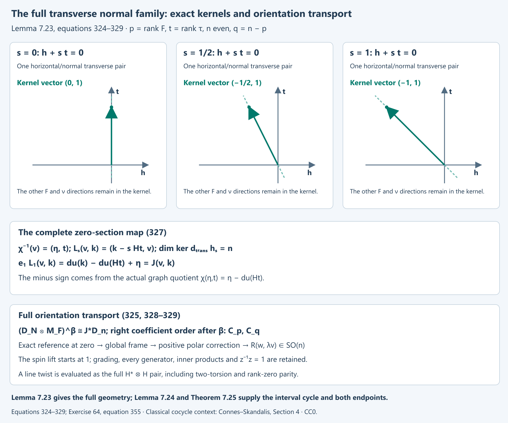

**Figure 7.8.** Lemma7.23, equations(324)–(329); Exercise64, equation(355). Each plotted panel is the exact kernel line \((h,t)=(-s a,a)\) of \(h+st\), for \(s=0,1/2,1\), with the marked vector at \(a=1\). These are one horizontal/normal transverse pair; the full \(F\) and embedding-normal directions are retained in (327). The lower panels give the actual signed graph quotient, complete native coefficient transport, positive metric correction and identity-started radial Spin lift. The local geometry is followed by the interval-cycle and bounded endpoint proofs in Lemma7.24 and Theorem7.25. Classical cocycle context is [Connes–Skandalis, Section 4]; this figure is original CC0 material.

Full-size transverse geometry PNG · Editable transverse geometry SVG.

**Lemma 7.24 (one principal-space interval cycle and its zero endpoint).** For the cocycle family of Lemma7.23, put \(I=[0,1]\), \(X=N\), \(G=\operatorname{Hol}(V,F)\), \(A=C_r^*(G)\), and \(B_I=C(I,A)\). There is a countably generated full graded \(B_I\widehat\otimes C_n\)-module with one bounded odd self-adjoint contraction and compact interval defects. Endpoint evaluation is an onto module unitary, and its zero endpoint, after \(R_n\), is the native product \(d_N\cdot\ell_{V,!}^{\mathrm{an}}\).

**Proof: actual local models and the whole principal space.**
For each relative chart of \(I\times X\), choose a representative
\(f_i(s,x)\in V\) of the cocycle \(h\), and retain every given transition arrow \(h_{ji}(s,x)\).
The transverse derivative is surjective, by the uniform surjectivity proof of Lemma7.23. In a buffered target foliation chart write its transverse coordinate as \(y\in\mathbb R^t\).
The parameter submersion theorem gives relative coordinates
\((s,a,y)\) on the source, with \(a\in\mathbb R^n\).
The target plaque coordinate of \(f_i\) can be replaced, locally, by a small rescaling of \((a_1,\ldots,a_p)\), since \(n\geq p\).
Choose the scale and the source buffer so both plaque coordinates lie in one target plaque box. The unique short plaque arrow
\(\lambda_i:f_i\to f'_i\), where \(f'_i(s,a,y)=(a_1,\ldots,a_p,y)\) in these rescaled coordinates, is smooth.
The new transition is the actual arrow
\(\lambda_j h_{ji}\lambda_i^{-1}\).
It satisfies the exact cocycle, and these arrows give an equivalence to the original cocycle. Thus each \(f'_i\) is a local ordinary submersion of rank \(\dim V=p+t\), without replacing the global cocycle by an ordinary map.

Glue the spaces
\[
 P_i=\{(s,x,\gamma):r\gamma=f_i(s,x)\}
 \quad\text{by}\quad
 (s,x,\gamma)\longmapsto(s,x,h_{ji}(s,x)\gamma).
 \tag{330}
\]
Write \(b:P\to I\times X\), \(a:P\to I\times V\), where
\(a(s,x,\gamma)=(s,s\gamma)\). The right \(G\times I\) action is arrow multiplication.
The transition maps are diffeomorphisms, with their exact inverses; the principal-space atlas is countable and locally Hausdorff.
Each fixed source fibre \(P_{s,v}\) is Hausdorff. Points with distinct \(b\) values are separated by the Hausdorff source base. Points with the same \(b\) value lie in a single \(b^{-1}(U_i)\), whose fixed-anchor model is \(U_i\times_{f_i,r}G_v\); the holonomy source fibre \(G_v\) is Hausdorff, so this separates them too.
The projection \(b\) is a submersion with plaque dimension \(p\).
In the local submersion representatives just constructed, the source anchor \(a\) is a submersion with fibre dimension \(n\).
The relative vector map
\[
 db:\ker da\longrightarrow b^*\mathcal F_s
 \tag{331}
\]
is an isomorphism. In the chart model the equation for an anchor-fixed tangent is exactly \(df_i(v)=dr(\dot\gamma)\), with \(ds(\dot\gamma)=0\). Its solvability is the vanishing of the transverse derivative; its plaque tangent is unique because the source/range isotropy has zero Lie algebra. This proves injectivity and surjectivity with the same vector \(v\), and gives (331) independently of the chosen representative.

At every parameter the zero section has the actual plaque-arrow equivalence to \(\ell\), so \(P_s\) contains a copy of the regular principal \(G\)-space over that section. In particular \(a(P_s)=V\). This is the fullness assertion needed below; it is not inferred from transverse surjectivity alone.

**Proof: the completed interval module and its endpoint fibres.**
Transport the metric in (329) through (331).
Let \(\mathscr M_s\) be the full right \(C_n\)-module family of equations(325), (328) and (329). Its prescribed even trivialization is the entire fixed \(\mathcal D_n\), with its grading, physical Clifford action and inner product.
Use the finite span of smooth compact sections in individual Hausdorff relative charts of
\[
 b^*(\mathscr M_s\otimes D_{\mathcal F_s}^{1/2})
       \otimes a^*D_F^{1/2}.
 \tag{332}
\]
All densities here are relative to the interval. They do not contain a \(ds\) factor.
In density trivializations the module formulas are
\[
 \begin{aligned}
 \langle\xi,\eta\rangle(s,\gamma)
   &=\int_{P_{s,s\gamma}}
         \langle\xi(z\gamma^{-1}),\eta(z)\rangle_{C_n}\,d\mu_s(z),\\
 (\xi f)(z)
   &=\int_{s\gamma=a_V(z)}
          \xi(z\gamma^{-1})f(s,\gamma).
 \end{aligned}
 \tag{333}
\]
In the first line the two longitudinal half-densities in (332) supply the integration density \(d\mu_s\); it is not an additional density factor. The remaining source half-densities are the two endpoint half-densities of the resulting \(G\) kernel. In the second line the repeated target/source half-densities supply the intermediate plaque integration, exactly as in (186). Right \(C_n\) coefficients use the graded module convention of Lemma0.13.

These expressions are finite chart-kernel expressions on any pair of core supports. Indeed the principal-action map identifies
\(P\times_{a} (G\times I)\) with \(P\times_b P\), by \((z,\gamma)\mapsto(z,z\gamma)\).
The right-hand space has the compact-support control of the Hausdorff base \(I\times X\).
After subdivision into finitely many principal and arrow charts, the integrals have compact parameter supports and bounded finite row/column integrals. They therefore lie in the fixed arrow-core completion \(B_I\widehat\otimes C_n\).
On a common compact support, smooth parameter dependence gives reduced-norm continuity: uniform coefficient differences are bounded by the same finite Schur constants. A finite parameter partition then approximates these kernels by finite sums \(c(s)k(\gamma)\), proving they are elements of \(C(I,A)\widehat\otimes C_n\), rather than merely separately specified endpoint coefficients.

For each \((s,v)\), tensor by the regular \(G_v\) representation and the faithful finite representation of \(C_n\). The convolution map
\[
 W_{s,v}(\xi\otimes u)(z)
       =\int_{G_v}\xi(z\gamma^{-1})u(\gamma)
 \tag{334}
\]
takes values in the full longitudinal \(L^2(P_{s,v})\) coefficient space.
Changing the two integration variables by right multiplication proves that its Hilbert-space inner product is exactly the regular representation of (333). The same identity for finite lists proves matrix positivity. The faithful sum over \(s,v\) detects positivity in \(B_I\widehat\otimes C_n\). Quotient the zero vectors and complete to obtain the full graded module \(\mathscr E\).

The maps (334) are onto. In a compact principal chart use the local ordinary submersion representative constructed above. There the coordinates on \(P_{s,v}\) are the vertical coordinates of \(f'_i\) together with its target plaque coordinates, as in the Fubini model of Lemma7.12. Finite separated smooth functions in these coordinates are dense on a compact support. A compact smooth source-plaque function whose integral against a chosen regular input is one realizes each such separated function by (334); insert a larger chart cutoff equal to one on the support. Translate a chart containing a nonunit arrow to this model by that arrow, preserving its density and all coefficients. Thus each compact fibre-chart function lies in the closure of the range. Finite chart sums and the \(L^2\) exhaustion prove onto. Distinct holonomy lifts and distinct components remain separate in this argument.

Multiplication by \(c(s,b_X(z))\) is adjointable and bounded by \(\|c\|_\infty\), with adjoint multiplication by \(\overline c\), as follows on every faithful regular fibre and then on the module. Smooth core sections on countably many compact chart exhaustions have a countable norm-dense set: uniform coefficient approximation has a fixed finite Schur bound on each retained support. The right algebra has a countable approximate identity, which converges on every vector by (333). This proves countable generation.

For \(s_0\in I\), restriction defines
\[
 \mathscr E\widehat\otimes_{\mathrm{ev}_{s_0}}
       (A\widehat\otimes C_n)\longrightarrow\mathscr E_{s_0}.
 \tag{335}
\]
The endpoint inner product is exactly (333) evaluated at \(s_0\), so this is an isometry after the evaluation quotient. Every endpoint compact chart section extends in a relative parameter chart, with a cutoff equal to one on its compact support. Such extensions are actual interval-core sections. Finite endpoint chart sums extend likewise. Their core is dense, proving surjectivity at both boundary parameters as well as in the interior. Finite-rank operators restrict to the corresponding endpoint rank-one operators. Hence every interval module compact restricts to an endpoint module compact.

**Proof: the actual compact ideal and one global bounded phase.**
First omit the finite Clifford module and call the resulting scalar principal module \(\mathscr P\).
The gauge groupoid
\[
 R=(P\times_aP)/(G\times I)
 \tag{336}
\]
has units \(I\times X\) and arrows given by classes of pairs with the same source anchor. Its local models are \(f_j'^*(G\times I)f_i'\), with the actual cocycle transitions constructed above. Its relative Lie algebroid is \(\mathcal F_s\).
Convolution by a compact relative \(R\)-chart kernel acts adjointably on \(\mathscr P\).
Separated-function approximation on a fixed compact chart support, followed by a smooth plaque approximate identity, approximates it in the regular Schur norm by rank-one kernels. Conversely the scalar kernel of \(\theta_{\xi,\eta}\) is
\[
 K_{\xi,\eta}([z',z])
    =\int_{G_{a_V(z)}}\xi(z'\gamma^{-1})
                      \overline{\eta(z\gamma^{-1})}.
 \tag{337}
\]
The integral is over the diagonal right orbit of a pair with the same anchor; its density is the intermediate source-plaque density from (332). The two compact core supports give a compact subset of \(P\times_aP\), and its image under division by the diagonal right action lies in finitely many compact \(R\) charts after subdivision. Thus (337) is a finite compact chart kernel. This is the same three-variable rank-one calculation as Lemma7.12, now on each pair of local submersion representatives.

Choose \(z_0\in P_{s,v}\). The map \(z\mapsto[z,z_0]\) identifies that fibre, its density and its convolution representation with the regular \(R\) source fibre at \(b(z_0)\).
Since \(a(P_s)=V\), every regular \(G\) parameter is obtained in this way.
Consequently the module-operator norm equals the reduced \(R\) norm: (334) gives the upper bound on all fibres and the preceding identification gives the converse bound. Thus the norm closure of represented compact chart kernels is exactly
\[
 C_r^*(R)=\mathcal K(\mathscr P),\qquad
 \mathcal K(\mathscr E)=\mathcal K(\mathscr P)\widehat\otimes C_n.
 \tag{338}
\]
The second equality uses the specified full trivialization by \(\mathcal D_n=\Pi^{k_n}C_n\); a grading reversal changes no compact ideal. The first equality is an isomorphism of represented algebras, not an assertion that \(R\) or its reduced algebra is a product in the parameter.

Quantize the normalized full physical symbol
\[
 q_s(x,\zeta)=c_{\mathcal F_s}^+(\zeta^\sharp)/|\zeta|
 \tag{339}
\]
in compact buffered near-unit \(R\) charts. These are local ordinary submersion/plaque charts by the local submersion construction above. The finite-supported symbol calculus of Lemma7.11 therefore applies with precisely the ideal (338): negative-order truncations converge in the reduced norm to compact chart kernels. The Schur estimates are uniform over every retained compact relative-parameter support and all regular source fibres. A square-root quantization of \((c^2+\epsilon)1-b^*b\) proves the upper symbol-quotient bound. A high-frequency packet in a near-unit source chart proves the lower bound, since compact smooth kernels annihilate it by integration by parts and norm approximation treats (338). This gives the exact compact kernel of the finite-supported symbol quotient, with every finite Clifford action retained.

Choose a countable locally finite buffered atlas of \(I\times X\), including its relative boundary charts, and smooth scalar functions \(\chi_i\) with \(\sum_i\chi_i^2=1\). Use larger chart cutoffs \(\eta_i=1\) near \(\operatorname{supp}\chi_i\), with the larger supports also locally finite and compact. The compact-annulus construction in Lemma7.11 gives this atlas; relative boundary charts need no differentiation normal to the parameter.
Take an odd self-adjoint quantization \(R_i\) with symbol \(\eta_i^2q\).
Clipping by \(h(t)=\max(-1,\min(t,1))\) gives
\(Q_i=h(R_i)\), an odd self-adjoint contraction. Zero-constant polynomial approximation retains its compact input/output unit supports, and its symbol is still \(\eta_i^2q\).
The single interval-module operator
\[
 Q=J_\chi^*\operatorname{diag}(Q_i)J_\chi
       =\mathop{\mathrm{strict}\sum}_i\chi_iQ_i\chi_i,
 \qquad J_\chi u=(\chi_i u)_i,\quad \|Q\|\leq1
 \tag{340}
\]
is bounded and adjointable. The column isometry and its adjoint follow first on compact principal-core sections, where only finitely many terms enter, and then by density and the contractive finite partial sums. The tail estimate from (271) proves strict convergence for \(Q\) and its adjoint. This does not assert global norm continuity of a family chosen independently on each fibre.

A compactly supported scalar \(c\) meets finitely many \(\chi_i\); the retained larger supports meet finitely many neighbours. Thus localizing (340), its commutator or its square involves the finite-supported calculus just proved. Their symbols are respectively \(cq\), zero and \(c(q^2-1)=0\).
By its exact compact kernel,
\[
 c(Q^2-1),\ [Q,c]\in\mathcal K(\mathscr E)
       \qquad(c\in C_0(I\times X)).
 \tag{341}
\]
Smooth compact approximation and the fixed contraction bound prove this for all such coefficients. In particular constant-in-parameter coefficients from \(C_0(X)\) give an actual Kasparov homotopy after the fixed even Clifford Morita reduction \(R_n\).
The endpoint module, operator and all physical symbols are the restrictions (335); every compact defect is an interval compact before evaluation. Quantization choices with the same symbol differ by a locally compact operator, by the same finite-supported quotient. The straight path is a cycle homotopy by the cross-term calculation of Lemma7.11.

**Proof: the zero endpoint and native coefficient order.**
The actual plaque-arrow equivalence \(h_0\simeq\ell\operatorname{pr}_N\) sends \(P_0\) to
\[
 \{(w,v,\gamma):r\gamma=w\}.
 \tag{342}
\]
It preserves the source anchor, the right action and the longitudinal half-densities.
The product density of the normal vertical metric and the pulled-back leaf metric is exactly the \(\mathcal F_0\) density under the metric-connection splitting.
Fubini on each regular \(G_x\) fibre sends the normal-integration module tensor the full regular foliation module onto \(\mathscr E_0\). Finite separated-chart approximation proves onto in module norm as in Theorem7.13, with all noncompact normal fibres and all disconnected or holonomy components retained.

The coefficient bundle on this product, in physical normal/tangent order, is
\(\mathcal D_N\widehat\otimes\mathscr M_F\).
The native product target is tangent/normal \(C_p\widehat\otimes C_q\).
Apply the entire \(\beta\) transport in (325) to its right action and inner product, not just to its generator labels. Lemma7.21 proves that the fixed \(R_n\) reduction of this full target is the native product of the two individually reduced cycles. The supplied full unitary (325) identifies the complete resulting physical bundle and symbol with the initial \(\mathscr M_0\), including its exact grading and phase.

For the operators use the full localized product proof of Theorem7.13 on \(\operatorname{pr}_N:N\to V\). The vertical inverse is the actual bounded cycle with full module \(\mathcal D_N\) of Theorem7.17. Its local physical Clifford generators obey the same Clifford relations, including the grading shift and reflection established there, so the total normalized symbol is the orthogonal sum used in (265).
The axis compression (263) makes both compact creation errors cancel in their \(C^*C\) calculation. The exact base quotient and the \(CL(L+\delta)^{-1}\) approximation give the errors themselves and their adjoints. Localized positivity is the nonnegative bracket (266) in the supported quotient, not compactness of a lifted vertical compact. Compact source cutoffs, the two-sided locally compact phase commutators and a buffered splitting partition are exactly the nonproper localization of Theorem7.13.
These computations apply to the full physical right order \(C_q,C_p\); the subsequent \(\beta\) is an isometric full coefficient transport and preserves every operator compact, bracket and connection.
The choice comparison in Lemma7.24 identifies this total phase with \(Q_0\).
Therefore
\[
 R_n[\mathscr E_0,c,Q_0]
      =d_N\cdot\ell_{V,!}^{\mathrm{an}}
       \quad\text{in }KK(C_0(N),A).
 \tag{343}
\]
Here \(d_N=R_qT_q\alpha_N\) is the specified native inverse Thom class; \(p+q=n\) is even.
If \(p=0\), the regular foliation factor is its full graded orientation line with zero operator; its creation maps are finite module columns, so the same proof includes the rank-zero case of Theorem7.13. The initial inverse/line evaluation is the literal full unitary (325). Finite extra Hermitian coefficients and compact smooth parameters enter every finite chart calculation as finite corners, with the same interval bounds.

**Theorem 7.25 (the two prescribed longitudinal wrong-way classes coincide).** For a compact foliated manifold with the prescribed full stable spin-c orientation of \(TV\oplus\tau\), the analytical and geometric leaf-map classes are equal in \(KK^p(C(V),C_r^*(G))\). This includes both parities, complete Hermitian line twists, rank-zero grading lines, finite coefficients and compact smooth parameters. The proof uses the entire normal-tube cocycle and its calibrated ambient inverse.

**Proof: the full étale/Euclidean common module.**
Let \(g:X\to V/F\times\mathbb R^n\) be the actual étale tube cocycle, with \(n\) even, \(n>p\), and Hausdorff second-countable \(X=N\). Write \(g=(h,e)\), where \(e:X\to\mathbb R^n\) is the global Euclidean coordinate.
The principal space for \(g\) is the same right \(G\)-space \(P\) as for \(h\), with the extra source coordinate
\(\widetilde a(z)=(a_V(z),e(b(z)))\).
This full anchor is a local diffeomorphism, by Lemma6.0n.
Thus \(a_V:P\to V\) is a submersion of fibre dimension \(n\), and the Euclidean differential identifies its vertical tangent with \(\mathbb R^n\).
Give that tangent the Euclidean pullback metric and the entire inverse module \(\mathcal D_n\) from (319).
Use the principal integration module \(\mathscr E_h\) of Lemma7.24 at this fixed endpoint. All source fibres are Hausdorff by the same \(b\)-chart argument.

Put \(D=A\otimes C_0(\mathbb R^n)\).
The étale zero correspondence is \(\mathcal E_g\) of Lemma6.0n, with coefficient algebra \(D\).
The full Euclidean inverse module is
\[
 \mathscr H=A\widehat\otimes L^2(\mathbb R^n)
                 \widehat\otimes\mathcal D_n,\qquad
 F_n=D_n^{\mathrm{flat}}(1+(D_n^{\mathrm{flat}})^2)^{-1/2}.
 \tag{344}
\]
Here the physical generators in \(D_n^{\mathrm{flat}}\) are the specified generators of \(\mathcal D_n\), not an independently ordered positive Bott module. Its homogeneous symbol is their normalized Clifford multiplication. By (319), \(R_n[\mathscr H,F_n]\) is the geometric \(A_n\).

On compact smooth cores the balanced map is
\[
 U\bigl(\xi\otimes(a\otimes v)\bigr)(z)
        =(\xi\cdot(a\otimes1))(z)\,v(e(b(z))),
 \qquad
 U:\mathcal E_g\widehat\otimes_D\mathscr H
                  \longrightarrow\mathscr E_h .
 \tag{345}
\]
The dot is the actual right \(G\) convolution, not evaluation of \(a\) at a point. The Euclidean scalar multiplication relation is immediate. The \(A\) relation is convolution associativity. Both preserve the full right \(C_n\) action.
For each regular \(G_x\) representation, Fubini changes
\[
 \int_{\mathbb R^n}
        \sum_{z\in\widetilde a^{-1}(x,t)}
                     |u(z,t)|^2\,dt
       \quad\text{to}\quad
       \int_{P_x}|u(z,e(b(z)))|^2 .
 \tag{346}
\]
Use a countable disjoint measurable refinement of the local diffeomorphism charts to prove this change of variables; its Jacobian is exactly the pullback Euclidean density. The sum counts every lift, including multiple sheets and different holonomy orbits. The full finite Clifford inner products give the identical matrix identity.
Equivalently, the module inner product on (345) is the integral of
\(v(t)^*a^*\langle\xi,\eta\rangle_D(t)b\,w(t)\).
The faithful regular sum proves that \(U\) is isometric.

It is onto. In a compact full-anchor chart, a coefficient section of the target core is a finite sum of scalar smooth sections \(\xi(z)\) times fixed homogeneous elements of \(\mathcal D_n\), with its Euclidean half-density trivialized. Choose a Euclidean scalar cutoff equal to one on that chart support. These are expressions \(\xi(z)v(e(b(z)))\). Insert an \(A\) approximate identity \(a_m\) in (345); \(\xi a_m\to\xi\) in the étale module norm. The regular estimate
\(\|U(\xi\otimes v)\|\leq\|\xi\|_{\mathcal E_g}\|v\|_{L^2}\), interpreted first on cores, makes the corresponding expressions converge in the target norm. Finite chart sums exhaust the core. Hence \(U\) is an even onto unitary of the entire completed modules.

**Proof: compact rectangular kernels.**
We need the following actual compactness statement, rather than compactness of an operator in every Hilbert-space representation.
Suppose a map \(\mathscr H\to\mathscr E_h\) has a smooth kernel on finitely many compact \(P\)-charts times a compact Euclidean input support. Its action is the \(G\) convolution in (334), followed by the Euclidean input integral, and its coefficients include the half-densities just specified. It is a rectangular module compact.

To prove this, separated smooth approximation on those compact supports approximates the kernel by finite sums \(\zeta_j(z)w_j(t)^*\), where \(\zeta_j\) is a compact integration-module core vector and \(w_j\) a compact Euclidean \(L^2\) vector. The uniform coefficient error has a fixed finite plaque Schur bound and a finite Euclidean integral bound, so this approximation is in module-operator norm, uniformly on all regular fibres.
The corresponding separated map is
\[
 u\longmapsto\zeta_j\int w_j(t)^*u(t)\,dt .
 \tag{347}
\]
An \(A\) approximate identity makes it a limit of actual rank-one maps from \(\mathscr H\): use output vector \(\zeta_j\) and input vector \(a_m^*\otimes w_j\). The resulting map is (347) with output coefficient \(\zeta_j a_m\).
The error is bounded by \(\|\zeta_j-\zeta_j a_m\|\|w_j\|_{L^2}\).
Finite homogeneous Clifford columns give the same argument for the entire right \(C_n\) inner product. This proves (347) and then the kernel assertion. It does not require \(A\) to be unital.

A finite-supported mixed order-\(-1\) operator is compact by the same argument. Confine the Euclidean input and output to buffered coordinate boxes and extend them to tori. Its Fourier-symbol estimates, uniform on the retained compact \(P\) and arrow parameters, give norm convergence of frequency truncations to that operator; the order-\(-1\) tail has norm at most \(C/M\) after cutoff at frequency \(M\), using the finite Fourier and regular Schur estimates of Lemma7.11.
Each truncation has a smooth compact mixed kernel after the spatial buffers are inserted and is compact by the first paragraph. Off-diagonal kernels have the same conclusion directly. Thus their norm limit lies in \(\mathcal K(\mathscr H,\mathscr E_h)\).

**Proof: all creation connections, including the Fourier tail.**
Let \(Q_h\) be the bounded phase of Lemma7.24 with the full Euclidean pullback symbol just specified, and let \(T_\xi:\mathscr H\to\mathscr E_h\) be creation by a compact smooth étale core vector \(\xi\), using (345). We prove
\[
 Q_hT_\xi-T_\xi F_n
       \in\mathcal K(\mathscr H,\mathscr E_h).
 \tag{348}
\]
The étale module has even scalar grading, so these creation vectors are even. The finite Clifford grading is wholly in the second module.

Let \(S\subset\mathbb R^n\) be a compact set containing the Euclidean image of \(\operatorname{supp}\xi\), and let \(K\subset X\) contain its \(b\) image.
The exact creation formula has \(T_\xi=T_\xi\kappa_S\) for a Euclidean cutoff equal to one on \(S\).
Only finitely many terms of (340) enter \(Q_hT_\xi\), because the right \(\chi_i\) meet \(K\).
Each clipped local phase differs from its unclipped quantization by a compact operator: its symbol is unchanged and the exact finite-supported quotient in Lemma7.24 has the compact kernel (338).
Multiplication of such a compact by bounded \(T_\xi\) is a rectangular compact. Thus, modulo the required compact ideal, \(Q_hT_\xi\) is computed by finitely many ordinary near-unit chart quantizations.

Choose a Euclidean input cutoff \(\kappa_R\) equal to one on a ball containing \(S\) and its diagonal buffers.
In a full-anchor chart use coordinates \((x,t)=\widetilde a(z)\), so the longitudinal coordinate is exactly \(t\).
Near the mixed diagonal \(t=t'\), the leading amplitude of \(Q_hT_\xi\kappa_R\) is
\(c_n^+(\zeta/|\zeta|)\xi(z\gamma^{-1})\).
The leading amplitude of \(T_\xi F_n\kappa_R\) is
\(\xi(z\gamma^{-1})c_n^+(\zeta/|\zeta|)\).
The scalar \(\xi\) commutes with that finite action, and the physical action, right action and grading are the identical \(\mathcal D_n\) actions on both modules. These amplitudes coincide.
The finite-chart composition calculation therefore gives an order-\(-1\) mixed kernel for their difference: differentiation of the scalar amplitude and spatial cutoffs supplies its lower-order terms. Compact \(R\)-chart kernels acting on a compact principal core have support in finitely many compact \(P\) charts, by the smooth gauge action. All remaining kernels with these input/output buffers are off-diagonal smooth kernels.
The rectangular compact-kernel proof makes this entire confined difference a rectangular module compact. In particular
\[
 (Q_hT_\xi-T_\xi F_n)\kappa_R
       \in\mathcal K(\mathscr H,\mathscr E_h).
 \tag{349}
\]
This uses the exact negative-order compact norm, not merely equality of symbols on individual sheets.

It remains to remove the input cutoff. On every regular \(G_x\) representation, (346) identifies creation with a decomposable operator
\[
 (T_\xi u)(t)=V_{\xi,x}(t)u(t),\qquad
 \|V_{\xi,x}(t)\|\leq\|\xi\|_{\mathcal E_g}.
 \tag{350}
\]
It is zero outside \(S\). The target of each \(V_{\xi,x}(t)\) is the whole counting fibre at \((x,t)\), so this estimate includes every sheet.
Since \(\kappa_R=1\) on \(S\), \(Q_hT_\xi(1-\kappa_R)=0\).
The remaining term \(T_\xi F_n(1-\kappa_R)\) has its Euclidean input separated from that compact output set.
The off-diagonal Fourier kernel \(K_n\) has the heat-integral expression (279), with the specified physical Clifford generators. The grading reversal and constant physical signs in (319) change neither its operator norm nor the estimate (280).
That estimate proves \(K_n\in L^2\) away from every diagonal buffer and that its \(L^2\) tail tends to zero.
Cauchy–Schwarz in the Euclidean input, followed by (350), gives on every regular fibre
\[
 \|T_\xi F_n(1-\kappa_R)\|
 \leq C_n\|\xi\|_{\mathcal E_g}|S|^{1/2}
       \sup_{t\in S}
       \|K_n(t-\cdot)(1-\kappa_R)\|_{L^2}.
 \tag{351}
\]
The finite Clifford constant only converts matrix norm to a scalar norm. Translation by a bounded \(t\in S\) moves the tail radius by a bounded amount, so the supremum tends to zero.
The faithful regular representation family makes (351) a module-operator norm bound. Hence (349) converges to the whole difference, proving (348).
Its adjoint is the other connection error. Core density and \(\|T_\xi\|\leq\|\xi\|\) treat every creation vector. Extra finite coefficients enter as finite columns.

**Proof: the product and the transverse comparison.**
The first operator of \(g_!\) is zero and its left coefficient action is compact, by Lemma6.0n.
The common-module operator \(Q_h\) has compact localized cycle defects by Lemma7.24.
Both creation connections hold by the full creation-connection proof; the product positivity bracket with the first operator is zero.
Definition0.3 therefore gives the full equality
\[
 R_n[\mathscr E_h,c,Q_h]=g_!\cdot A_n .
 \tag{352}
\]
The proof uses the fixed entire ambient inverse module, before the even \(R_n\) reduction.
It assumes no completeness or boundary regularity of a Euclidean sheet.
If a compact smooth extra parameter is present, construct all modules on its single coefficient algebra as in Lemma7.24.
Each core support lies in finitely many relative buffered charts; the frequency approximations just proved are uniform on their compact parameters and the uniform tail estimate (351) has the same fixed compact \(S\). Thus the creation errors are compact operators on that whole parameter module, before endpoint evaluation.

Apply (352) to the actual étale tube cocycle \(\widetilde g=(h_1,e)\).
The metric correction (329) and the identity-started Spin lift identify its ambient pullback full module with the final interval module, with an even unitary preserving the right action, inner products and physical generators. The locally compact choice comparison in Lemma7.24 identifies their phases. It is therefore precisely the étale endpoint of Lemma7.24.
The interval cycle, (343) and (352) give
\[
 d_N\cdot\ell_{V,!}^{\mathrm{an}}
       =\widetilde g_!\cdot A_n
       \quad\text{in }KK(C_0(N),A).
 \tag{353}
\]
Multiply by the prescribed native \(b_N\) on the left.
Both native inverse products are proved in Lemma7.20, so
\[
 \ell_{V,!}^{\mathrm{an}}
       =b_N\cdot\widetilde g_!\cdot A_n
       =\ell_{V,!}^{\mathrm{geom}}
       \quad\text{in }KK^p(C(V),A).
 \tag{354}
\]
The final equality is the actual geometric normal-tube definition of Theorem6.0o, with the full normal recovery (324) and its fixed final-odd transport. Native multiplication keeps second-cycle coefficients first at every preceding product, and the zero endpoint proof of Lemma7.24 used its full \(\beta\) transport before \(R_n\).
Thus (354) includes both parities of \(p\), every prescribed stable spin-c structure, full Hermitian line twists (including two-torsion), rank-zero grading lines, finite coefficients and compact smooth parameters.
Lemmas7.26–7.28 and Theorem7.29 below prove the additional arbitrary-symbol action in both K-degrees, using the full circle product and normalized transverse suspension.

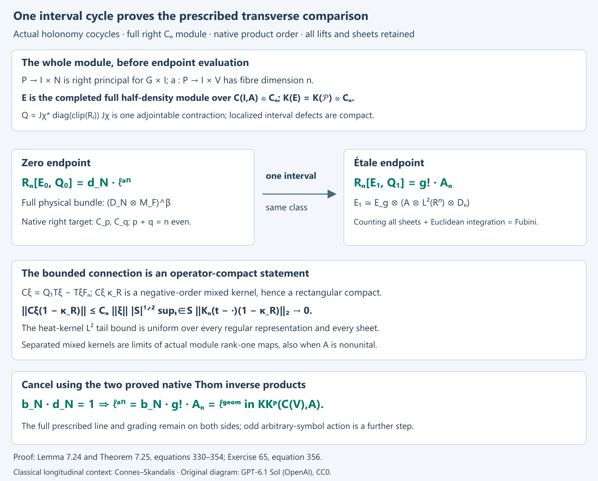

**Figure 7.9.** Lemma7.24 and Theorem7.25, equations(330)–(354); Exercise65, equation(356). Here \(P\) is the actual right principal space and \(\mathscr P\) its scalar integration module. The first panel records the whole interval module and its compact ideal, before evaluation. The two endpoints use the full normal/tangent coefficient transport and the counting-sheet/Euclidean Fubini unitary. The middle panel is the operator-norm tail bound(351), which completes both rectangular module-compact creation errors; it is not a numerical sample or a fibrewise compactness assertion. The final cancellation uses the two proved native Thom inverse identities, with the full given line and grading retained. Theorem7.29 below supplies the arbitrary-symbol action in both K-degrees. The longitudinal method is classical [Connes–Skandalis]; the full argument and drawing here are original CC0 material.

Full-size principal connection PNG · Editable principal connection SVG.

### Every relative longitudinal symbol, in both degrees

The full KK comparison of Theorem 7.25 now yields the analytic index of every relative symbol. We give the missing odd coefficient argument, including the actual circle product in the entire holonomy module and the normalized suspension maps. The classical longitudinal theorem and its circle reduction are due to [Connes–Skandalis, Section 4]; the bounded connection and convention checks below are written out with the course's fixed native Clifford reductions.

**Lemma 7.26 (the full analytic circle product).** For every relative longitudinal symbol \(s\in K_c^0(F^*)\), external product with the positive circle clutch class \(\kappa\) multiplies the full analytic index by \(-1\), after the ordinary even circle Morita equivalence. This holds without a transverse measure and retains the entire holonomy groupoid, finite coefficients and compact smooth parameters.

**Proof: the actual circle class.**

Let (V,F) be a smooth foliation on a compact manifold, with its entire holonomy groupoid G and \(A=C_r^*(G)\). No transverse measure is needed, and the arrows may be non-Hausdorff. For a relative longitudinal elliptic symbol \(s\in K_c^0(F^*)\), let \(\operatorname{Ind}_A(s)\) be the full analytic symbol index of Theorem 6.6 in the Hilbert-module lesson.

Use the positive coordinate \(t\) modulo \(2\pi\) on the circle. In its normalized Fourier basis \(e_k(t)=e^{ikt}/\sqrt{2\pi}\), let \(P_+\) project onto \(k\ge0\) and put

\[
 Q_0=P_+M_{e^{it}}P_++(1-P_+),\qquad
 Q_0e_k=\begin{cases}e_{k+1}&k\ge0,\\e_k&k<0.\end{cases}
 \tag{357}
\]

Its source kernel is zero, its adjoint kernel is the normalized constant line, \(Q_0^*Q_0=1\) and \(Q_0Q_0^*=1-E_0\). Its unit-cosphere symbol is \(e^{it}\) on \(\eta>0\) and \(1\) on \(\eta<0\). Let \(\kappa\) be the resulting relative class in \(K_c^0(T^*S^1)\); multiplying \(Q_0\) by \((1+D_t^2)^{1/2}\), as in the measured-index lesson, gives the same relative class. We prove

\[
 m_*\operatorname{Ind}_{A\otimes\mathcal K}(s\boxtimes\kappa)
       =-\operatorname{Ind}_A(s)\quad\text{in }K_0(A).
 \tag{358}
\]

Here the product foliation is \(F\oplus TS^1\) on V times \(S^1\). Its groupoid is G times (\(S^1\) times \(S^1\)), and m is the ordinary even circle Morita equivalence from \(A\otimes\mathcal K(L^2(S^1))\) to A. This is equality of the full classes, including torsion; it is not a projection-trace identity.

**Proof: the common completed module and joint weights.**

Assume first \(p=\operatorname{rank}F>0\). Represent s by bundles \(B_0\),\(B_1\) on V and a unitary isomorphism of their pullbacks on \(S^*F\). The polar homotopy of an arbitrary invertible sphere map permits this choice. Quantize that map to \(P_0\) from \(E_0\) to \(E_1\), where \(E_i=p_{B_i}A^{N_i}\) is the entire holonomy bundle module. On \(E=E_0\oplus E_1\), with grading \(\Gamma_1\), put \(S_0=\begin{pmatrix}0&P_0^*\\P_0&0\end{pmatrix}\). The symbol quotient gives \(S_0^2-1\) compact. Clamp \(S_0\) by the continuous odd function \(\max(-1,\min(x,1))\). The resulting odd self-adjoint contraction S has the same symbol and differs from \(S_0\) by a compact map: that function agrees with the identity at both points of the quotient spectrum \(\{+1,-1\}\). The cycle \((E,1,S)\) represents \(\operatorname{Ind}_A(s)\) under Theorem 0.14 and the boundary sign of Theorem 6.6.

The positive regular operator \(H_1=(1+\Delta_{B_0})\oplus(1+\Delta_{B_1})\) exists on this entire module by Hilbert-module Lemmas6.1-6.2. It commutes with \(\Gamma_1\), is bounded below by 1 and has compact inverse. Take \(H_2=1+D_t^2\) on \(H=L^2(S^1)\), and use it identically on \(H\oplus H\), graded by \(\Gamma_2\). Set \(S_2=\begin{pmatrix}0&Q_0^*\\Q_0&0\end{pmatrix}\). It is an odd self-adjoint contraction on this graded circle space and changes a Fourier label by at most one. Its scalar even KK class is -1, because Theorem 0.14 computes the same Fredholm boundary and its cokernel is the one odd constant line. This uses the full scalar classification, not just the dimension of a measured kernel.

After applying the circle Morita equivalence, the product holonomy module for the graded tensor bundle is exactly \(E\widehat\otimes(H\oplus H)\), a graded Hilbert A-module. On finite separated arrow kernels the unitary is convolution in the original G variable and integration of the circle kernel against its Morita vector. Fubini identifies the full A-valued inner products; finite-rank smooth circle kernels and separated functions on each compact G chart give dense range. A finite chart partition treats every compact core, and these cores are dense by definition. Thus this is an onto module unitary including all holonomy lifts. The corresponding compact algebra is \(\mathcal K(E)\otimes\mathcal K(H\oplus H)\). For the scalar pair groupoid itself, finite matrix circle kernels identify its reduced norm with the matrix norm over A and are dense, proving \(C_r^*(G\times\operatorname{Pair}(S^1))=A\otimes\mathcal K(H)\).

Write \(H_1\),\(H_2\) for their commuting positive operators on this common module. Their bounded joint weights can equivalently be defined on each Fourier label k, so no unproved sum of unbounded operators is required:

\[
 \begin{aligned}
 Z_k&=H_1(H_1+1+k^2)^{-1},\\
 W_k&=\sqrt{Z_k}
       =H_1^{1/2}(H_1+1+k^2)^{-1/2},\\
 V_k&=\sqrt{1-Z_k}
       =\sqrt{1+k^2}(H_1+1+k^2)^{-1/2}.
 \end{aligned}
 \tag{359}
\]

All are bounded adjointable contractions; the diagonal direct sums give \(Z\), \(W=\sqrt Z\) and \(V=\sqrt{1-Z}\). The module resolvent and fractional-power proofs above identify them in every regular representation with the joint longitudinal weights. Their principal scalar symbols are z, \(\sqrt z\) and \(\sqrt{1-z}\), where \(z=|\xi|^2/(|\xi|^2+\eta^2)\) on the joint sphere. The finite-chart proof of measured Lemma 6.35 applies in these actual bundle module corners. Its Fourier-Schur bounds are uniform on every source cover and its negative-order remainders are compact matrix arrow kernels; therefore every asserted norm limit is a module norm limit. The compact first-factor remainder permitted there includes \(S-S_0\). This proves that

\[
 T=(S\otimes1)W+(\Gamma_1\otimes S_2)V
 \tag{360}
\]

belongs to the product order-zero calculus closure on the full common module. Its continuous principal symbol is

\[
 q(\xi,\eta)=
 \frac{|\xi|\sigma(S)(\xi/|\xi|)\otimes1
       +\Gamma_1\otimes|\eta|\sigma(S_2)(\eta/|\eta|)}
      {\sqrt{|\xi|^2+\eta^2}} .
 \tag{361}
\]

Each numerator summand extends by zero at its own origin. The two odd summands anticommute and their squares sum to \(|\xi|^2+\eta^2\), so q is self-adjoint, odd and has square 1 on the joint sphere. The graded tensor of the two relative two-term complexes has exactly this odd map. Radial normalization and a sufficiently close smooth sphere approximation preserve invertibility. Consequently it represents \(s\boxtimes\kappa\), including both cotangent axes.

**Proof: all four compact weight commutators.**

Put \(\overline S=S\otimes1\) and \(R=\Gamma_1\otimes S_2\). The cone proof of Lemma 6.35 puts \(\overline S W\) and its adjoint \(W\overline S\) in the same joint algebra, with the same principal symbol. The exact symbol quotient thus gives \([\overline S,W]\) compact. It also gives \([R,V]\) compact. To obtain the other two commutators, rather than assuming smooth separate symbols at an axis, use the continuous scalar factorizations

\[
 \sqrt{1-z}-1=\sqrt z\,g(z),\qquad
 \sqrt z-1=\sqrt{1-z}\,h(z),
 \tag{362}
\]

where \(g(z)=(\sqrt{1-z}-1)/\sqrt z\) extends continuously by 0 at \(z=0\), and \(h(z)=(\sqrt z-1)/\sqrt{1-z}\) extends continuously by 0 at \(z=1\). Continuous functional calculus of the joint Z stays in its joint algebra. Hence \(\overline S(V-1)=\overline S Wg(Z)\) and its adjoint are in that algebra with identical symbols; their difference proves \([\overline S,V]\) compact. Similarly \([R,W]\) is compact using \(RVh(Z)\). The two identities include the endpoint values and do not require either g or h to be smooth.

It follows that \(T-T^*\) is compact. Put \(Q=(T+T^*)/2\). The exact product symbol quotient, applied in the graded bundle corner, gives \(Q^2-1\) compact because \(q^2=1\). Thus \((E\widehat\otimes(H\oplus H),1,Q)\) is an even scalar Kasparov cycle. Its off-diagonal symbol is (361), so Theorem 6.6 and scalar classification identify its class with the left side of (358). Changing Q by a compact perturbation or using a smooth sphere representative gives the same class.

**Proof: the entire creation connection by Fourier bands.**

The second input cycle is the external A-coefficient circle cycle \((A\widehat\otimes(H\oplus H),\lambda_A,1\otimes S_2)\) from A to A. Its localized defects are \(a\otimes(S_2^2-1)\), which belong to \(A\otimes\mathcal K(H\oplus H)\) for each a in A. Its commutators with the A representation are zero. Lemma 0.13 identifies its class with \(-1_A\). In particular no compact operator tensored with a bare multiplier identity is asserted to be compact.

For a homogeneous compact smooth first-module vector \(\xi\) in E, the creation map sends \(a\otimes v\) to \(\xi a\otimes v\). Such \(\xi\) lies in the form domain of \(H_1\). Let \(C_\xi=\|H_1^{1/2}\xi\|\), and \(b=1+k^2\). Module spectral calculus, or the positive spectral inequalities tested in all faithful regular representations, gives

\[
 \|W_k\xi\|\le C_\xi/\sqrt b,\qquad
 \|(V_k-1)\xi\|\le C_\xi/\sqrt b.
 \tag{363}
\]

Indeed the first squared multiplier is \(H_1/(H_1+b)\le H_1/b\). For the second use \((1-(1+x)^{-1/2})^2\le x\) for \(x\ge0\). These are module-vector inequalities; no bound on the unbounded \(H_1\) over the whole module is claimed.

The creation error for T is \(TT_\xi-(-1)^{|\xi|}T_\xi(1\otimes S_2)\). Its first part has output vector \(SW_k\xi\) on the same circle label, and its second part has output vector \(\Gamma_1(V_k-1)\xi\) followed by \(S_2\). The latter changes the circle label by at most one. Since S and \(S_2\) are contractions, for the projection \(\Pi_K\) onto labels \(|k|\le K\) in both circle spin summands,

\
 \|[T T_\xi-(-1)^{|\xi|}T_\xi(1\otimes S_2)\|
 \le\frac{2C_\xi}{\sqrt{1+(K+1)^2}}.
 \tag{364}
\]

This estimate concerns the displayed unsymmetrized T error. The extra \(Q-T\) is a global module compact and contributes a compact creation error separately.

Each finite Fourier-band entry is a creation map from A to E with some fixed output vector \(\nu\). It is rectangular module compact also when A is nonunital. For a positive contractive approximate identity \(a_m\) of A, \(\theta_{\nu,a_m}(a)=\nu a_m a\) and \(\|\nu-\nu a_m\|\) tends to 0. Thus these rank-one maps converge in norm to \(a\mapsto\nu a\). A finite set of circle labels has finite free A input columns and finite E output columns; consequently its band truncation is compact. Estimate (364) makes the complete T creation error a norm limit of those compact truncations. Adding the compact \(Q-T\) term proves the Q connection. Taking adjoints proves the second connection identity. Compact smooth homogeneous vectors are dense in E, and \(\|T_\xi\|\le\|\xi\|\), so approximation proves both errors for every creation vector.

This is the entire connection in the actual nonunital module norm. It does not merely prove a compressed symbol identity or compactness on one holonomy cover.

**Proof: quotient positivity and the full product.**

In the common-module quotient by \(\mathcal K(E\widehat\otimes(H\oplus H))\), all four weight commutators proved above vanish. Since \(\overline S\) is odd and \(R=\Gamma_1\otimes S_2\) has the inserted tensor grading, \(\overline S R+R\overline S=0\) exactly. Therefore

\[
 \{S\otimes1,Q\}\equiv2(S^2\otimes1)W
                    \equiv2W\ge0\pmod{\mathcal K}.
 \tag{365}
\]

The second congruence needs a further compactness assertion. The first-factor \(S^2-1\) is compact. Here is a direct whole-module verification for its weighted lift. For \(\kappa_0=\theta_{\alpha,\beta}\), the kth entry of \((\kappa_0\otimes1)W\) is \(\theta_{\alpha,W_k\beta}\). If \(\beta\) is in the dense \(H_1\) form domain, (363) bounds that entry by \(\|\alpha\|\|H_1^{1/2}\beta\|/\sqrt{1+k^2}\). Finite Fourier truncations are compact; the tail tends to zero. Finite sums of such rank ones are dense in \(\mathcal K(E)\), since the form domain is dense, and \(\|W\|\le1\) controls the approximation uniformly. Hence \((\kappa_0\otimes1)W\) is compact for every \(\kappa_0\in\mathcal K(E)\), including \(S^2-1\). This agrees with the compact-remainder cone proof of Lemma 6.35 but does not depend on a representationwise compactness assertion. This is precisely why the bare lifted first-factor compact was not used as a total compact. Positivity is the positivity of the actual adjointable operator W, after passage to the module quotient.

Definition 0.3, the four compact commutators and positivity calculation, and the complete creation connection now prove that Q is a product of the scalar symbol cycle \((E,1,S)\) with the external circle cycle. The latter class is \(-1_A\) as proved above. Bilinearity, units, associativity and both Morita evaluations give \([Q]=-[E,1,S]\). Applying scalar classification proves (358) as equality in \(K_0(A)\).

**Proof: zero rank, choices and compact parameters.**

If \(p=0\), s is a virtual finite bundle on V and \(A=C(V)\). For each actual bundle B, the product module after circle Morita is \(\Gamma(B)\widehat\otimes(H\oplus H)\) with circle operator \(S_2\). The source operator of the bundle correspondence is zero; creation errors are zero because \(S_2\) acts in the other factor, and positivity is zero. This is its verified product with the scalar circle cycle and has index -[B]. Signed differences give (358). There is no empty-cosphere quantization or nonexistent leaf unit covector in this case.

For \(p>0\) every relative bundle triple was allowed, by the full disk contraction and quantization argument of Hilbert-module Theorem 6.6. Its equivalence relations therefore carry (358) to the entire group. Finite coefficients simply enlarge the bundle corners already used. For compact smooth parameters, construct the modules, \(H_1\) resolvents, all diagonal weights and the quantized symbols over the single parameter algebra. Hilbert-module Lemmas6.1-6.2 give their uniform resolvent and remainder estimates. Each smooth compact creation section has a finite uniform \(C_\xi\) bound there. The same finite-band approximation is consequently an approximation by parameter-module compacts before evaluation. All other defects and quotient calculations occur in that same module. Evaluating gives the parameter identity; separate pointwise compactness was not used.

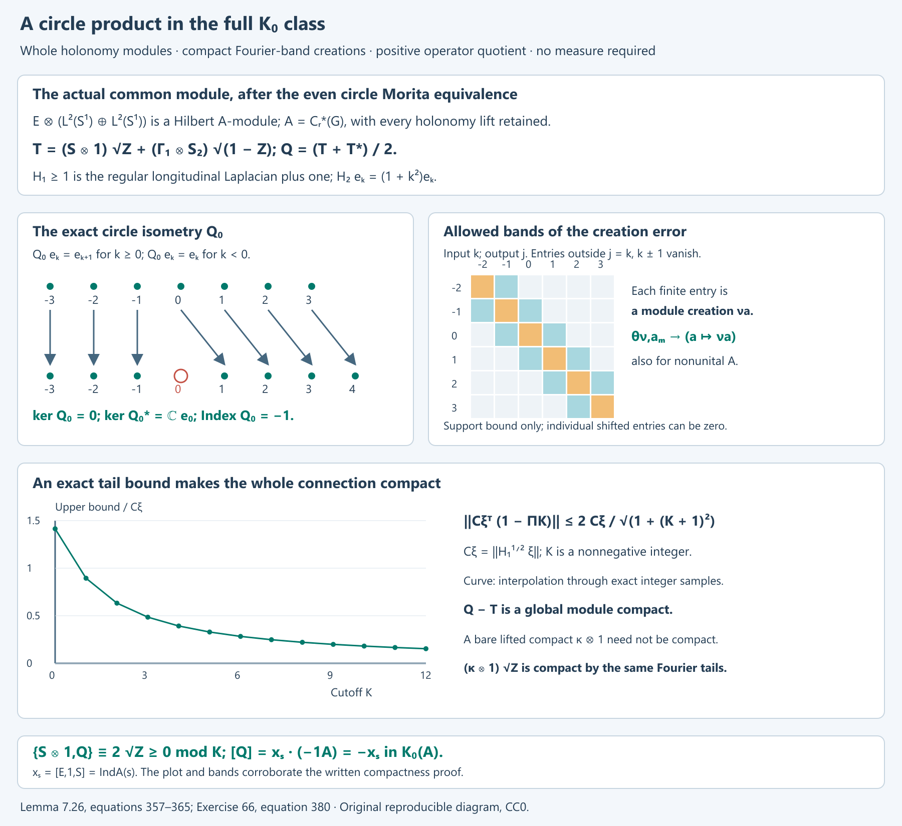

**Figure 7.10.** Lemma 7.26, equations (357)–(365); Exercise 66, equation (380). The first panel gives the exact normalized Fourier action of \(Q_0\), including its missing target constant line. The second displays the entire Morita-completed module and the diagonal joint weights. The band panel records the allowed labels \(k,k\pm1\) of the creation error; it is a support schematic, with no asserted coefficient amplitudes. The graph plots the proved bound \(2/\sqrt{1+(K+1)^2}\) at integer \(K\), normalized by \(C_\xi\); samples illustrate the exact bound and supply no analytic proof. The final panel uses the actual weighted module compact and positive quotient to obtain the full index class, including torsion. All inputs, constants and maps are proved in the accompanying text. Classical circle-reduction context is [Connes–Skandalis, Section 4]; the figure is original CC0 material.

Full-size circle-product PNG · Editable circle-product SVG.

**Lemma 7.27 (the positive circle coefficient, its clutch and Dirac pairing).** Write \(u(t)=e^{it}\), in the positive tangent coordinate of the canonically oriented circle. With the fixed native reductions, \(\Theta_{TS^1}[u]=\kappa\) and \([u]\cdot\ell_{S^1,!}^{\mathrm{an}}=-1\). Both identities hold in the full K-groups. The rank-one Thom identification uses its literal single-coordinate module and multiplier.

**Proof: an explicit positive coefficient cycle.**

Write \(B=C(S^1)\), \(u(t)=e^{it}\), \(H=L^2([0,1])\), and \(D_0=-i\,d/dx\) with periodic boundary condition. Its Fourier eigenvalues are \(2\pi k\). For a real local lift t of the circle parameter, put

\[
 U_t=M_{e^{itx}},\qquad
 s(t)=U_t h(D_0+t)U_t^*,\qquad h(y)=y/\sqrt{1+y^2}.
 \tag{366}
\]

The equality \(U_{t+2\pi}=U_tU_{2\pi}\) and \(U_{2\pi}D_0U_{2\pi}^*=D_0-2\pi\) shows that \(s(t+2\pi)=s(t)\), including the actual change of Fourier frame. \(U_t\) is norm continuous on bounded t intervals, and \(h(D_0+t)\) is norm continuous because h is uniformly Lipschitz. Hence s is one adjointable self-adjoint contraction on the standard B-module \(H_B\). Its square defect has eigenvalues \(-1/(1+(2\pi k+t)^2)\). Local finite Fourier cuts approximate that defect uniformly on every compact t interval. A finite parameter cover therefore proves \(s^2-1\in\mathcal K(H_B)\), not just pointwise compactness.

The odd scalar cycle \(x=(H_B\widehat\otimes C_1,1,s\varepsilon)\) has positive circle coefficient class \([u]\) under Theorem 0.14. Here is the sign check. The compact unitary \(w(t)=\exp(\pi i(s(t)+1))\) has eigenvalues \(\exp(\pi i(h(2\pi k+t)+1))\). Their differences from 1 are bounded by \(C/(1+k^2)\) on compact t intervals. Thus \(w-1\) is a continuous trace-class field, and its determinant is the convergent product of those eigenvalues. Differentiating its local determinant gives

\[
 \frac{1}{i}\frac{d}{dt}\log\det w(t)
   =\pi\sum_{k\in\mathbb Z} h'(2\pi k+t),\qquad
 \int_0^{2\pi}\pi\sum_k h'(2\pi k+t)\,dt=2\pi.
 \tag{367}
\]

The derivative series converges uniformly since \(h'(y)=(1+y^2)^{-3/2}\). The integral is \(\pi\) times the integral of \(h'\) over the entire real line, whose value is 2. The parameter reindexing leaves the determinant unchanged. Its winding is consequently +1.

For precision this also calculates the stable \(K_1\) class, rather than assuming that an infinite determinant classifies all compact unitaries. Finite-rank compression approximates this trace-class field uniformly in trace norm, by compactness of its parameter image and a finite approximation net. Polar correction of these finite compressions gives finite matrix unitaries, joined to w by a small norm homotopy. The determinant continuity used here follows from the finite exterior-power expansion: \(|\operatorname{tr}(\Lambda^rK)|\) is at most \(\|K\|_1^r/r!\), and telescoping its multilinear factors bounds the difference series by \(\|K-L\|_1\exp(\|K\|_1+\|L\|_1)\). Thus the series extends continuously to trace-class operators and agrees with the local eigenvalue product above. Their determinants converge uniformly to \(\det w\), so have its same winding. The full determinant classification of finite unitary loops, KT-OPK lesson 6 Section 5 and Theorem 5.2, identifies their stable class with \([e^{it}]\). The scalar exponential classification of Theorem 0.14 therefore identifies x with exactly \([u]\).

**Proof: the positive rank-one Thom product and its actual clutch.**

Use the canonical positive tangent frame \(\partial_t\) of the circle and the metric identification of its cotangent line. Its full positive Thom cycle has multiplier \(\eta\varepsilon/\sqrt{1+\eta^2}\). For this single coordinate it is literally the trivial-action cycle \(t_\iota\) of Lemma 0.17, on \(B\widehat\otimes C_0(\mathbb R_\eta)\widehat\otimes C_1\). This identifies only this one-coordinate multiplier and its actual module. It makes no identification of a separately ordered higher-dimensional real Bott pair with a geometric Euclidean pair.

The odd-odd product of x with that Thom cycle, in the native order of (104), acts on \(H_B\otimes C_0(\mathbb R_\eta)\otimes\mathbb C^{1|1}\). The old coefficient generator acts by \(\sigma_y\) and the new Thom generator by \(\sigma_x\). An actual product operator is

\[
 F(t,\eta)=\frac{s(t)\sigma_y+\eta\sigma_x}{\sqrt{1+\eta^2}},
 \qquad F^+(t,\eta)=\frac{\eta+i s(t)}{\sqrt{1+\eta^2}}.
 \tag{368}
\]

It is odd and self-adjoint, with square defect \((s(t)^2-1)/(1+\eta^2)\), a compact over \(B\otimes C_0(\mathbb R)\). For a creation section \(\xi\) in \(H_B\), the first numerator error has norm at most \(\|s\xi\|/\sqrt{1+\eta^2}\); the difference of the new phase and its own normalizer is zero. These errors vanish at \(\eta\) infinity and are compact rectangular module fields, since creation maps from B to \(H_B\) are compact. Finite sections and density prove both connection errors. The first positivity anticommutator is \(2s(t)^2/\sqrt{1+\eta^2}\ge0\). Definition 0.3 thus proves (368) is the actual product; it is not an assumed scalar Bott representative.

Its off-diagonal multiplier is invertible except where \(\eta=0\) and s(t) has a zero eigenvalue. On the circle there is precisely one such parameter, \(t=0\) modulo \(2\pi\). Near it the Fourier branch \(k=0\) is a smooth trivial eigenline, and all other branches are uniformly invertible. Outside a small neighborhood of (0,0), the full multiplier has a bounded inverse after the displayed normalization: away from \(t=0\) the least \(|h(2\pi k+t)|\) is uniformly positive, and at large \(|\eta|\) the \(\eta\) term supplies the uniform bound. The polar phase of the invertible complementary summand contracts it as a degenerate cycle. This localization can be made concrete in the scalar index projection. Choose a smaller parameter disk around (0,0) and its smooth \(k=0\) eigenline projection. On its orthogonal complement, replace the off-diagonal multiplier by its polar unitary. Outside a slightly larger disk do the same on the full module, using the uniformly bounded inverse there; a scalar cutoff interpolates through nonzero positive normalizers on the overlap. The resulting Fredholm homotopy has unit-square operator outside that disk and on the entire complementary summand. Its index projection minus the reference is therefore supported in the disk and in the finite eigenline corner. The eigenline's smooth unit frame gives exactly the finite line triple below. Full relative excision preserves its extension class. This records the actual compact projection localization, rather than inferring a K-class from its zero set. The relative Fredholm projection of Theorem 0.14 and full relative excision therefore identify its \(K_0\) class with the extension of the finite line triple whose local map is \(\eta+i h(t)\). Its positively rescaled local map \(\eta+i t\) has the same relative class, through the straight monotone deformation of h(t) to t and positive radial normalization. The deformation has no new zero off (0,0).

The sphere triple \(\kappa\) of (357) has the two trivial lines and sphere maps1 at \(\eta\) negative and u(t) at \(\eta\) positive. To check its interior class with the same local test, choose a smooth monotone \(\chi\) with \(\chi=0\) at the negative end, \(\chi=1\) at the positive end, \(\chi(0)=1/2\) and \(\chi'(0)>0\), and extend its sphere map to

\[
 a(t,\eta)=1-\chi(\eta)+\chi(\eta)e^{it}.
 \tag{369}
\]

Its unique zero is \((t,\eta)=(\pi,0)\). With \(\delta=t-\pi\) its linearization is \(-2\chi'(0)\eta-i\delta/2\). On a sufficiently small boundary its nonzero linearization and the exact map are joined by their straight path: the quadratic error is smaller than the least singular value of the real linear map times the boundary radius. Excision reduces the relative class to that local map. Multiplication by the constant unitary -1 and positive scaling give \(\eta+i\delta\). Circle translation from \(\pi\) to \(0\) is an orientation-preserving homotopy. Consequently the two actual finite relative triples agree, with their source/target order and complex phases, giving

\[
 \Theta_{TS^1}([u])=\kappa.
 \tag{370}
\]

No character or rationalization is used in this identification.

**Proof: the complete circle Dirac pairing.**

After the even pair-groupoid Morita equivalence, the positive circle Dirac class is the odd phase \(r=2P_+-1\) on \(L^2(S^1)\). It differs from \(h(D_t)\) by a compact Fourier-diagonal operator, including the chosen constant mode; hence it represents the full analytical Dirac class. Its commutator with a smooth scalar function is compact: finite Fourier polynomials give finite-rank commutators and uniform norm approximation treats all continuous functions.

To apply Proposition 0.15 to the coefficient cycle x just constructed, first use the complete even Morita equivalence from \(B'=\mathcal K(H)\otimes B\) to B. On B' the coefficient cycle is \((B'\widehat\otimes C_1,1,s\varepsilon)\), with the same multiplier s(t). The Morita pullback of the circle Dirac cycle acts nondegenerately on \(H\otimes L^2(S^1)\), with \(\phi(k\otimes b)=k\otimes M_b\) and honest involution1 tensor r. For every \(b'\in B'\) its commutator is compact by finite matrix Fourier approximation. Thus all hypotheses of Proposition 0.15 hold exactly. Its formula is the compression of \(w(t)=\exp(\pi i(s(t)+1))\), whose class in \(K_1(B')\) is the stable single corner \([u]\) by the positive coefficient calculation and both Morita evaluations. A \(K_1\) homotopy preserves the Fredholm compression index, since all compact-valued coefficient commutators remain compact. On that single corner the compression is \(P_+M_uP_+\), the shift with zero kernel and one constant cokernel. The full scalar classification and the same fixed native Clifford reducer therefore give

\[
 [u]\cdot\ell_{S^1,!}^{\mathrm{an}}=-1
 \quad\text{in }KK(\mathbb C,\mathbb C)=\mathbb Z.
 \tag{371}
\]

Both Morita products, rather than a trace of the pairing, were used.

**Lemma 7.28 (both native odd-block signs).** If \(p=\operatorname{rank}F\) is odd, the native external Thom product and the native external analytical Dirac product each equal minus the corresponding positive physical ordered-sum class for \(F\oplus TS^1\). Full spin-c phases, grading and both coefficient actions are retained.

**Proof.**

Let \(p\) be odd, and give \(F\oplus TS^1\) the full ordered structure F first, circle second. Write \(b_F\),\(b_C\) for the positive native parity Thom classes, \(b_{\mathrm{sum}}\) for the positive even ordered sum Thom class, and \(\ell_F\),\(\ell_C\),\(\ell_{\mathrm{sum}}\) for the corresponding analytical classes. After the ordinary even circle Morita equivalence, one has

\[
 b_F\boxtimes b_C=-b_{\rm sum},\qquad
 \ell_F\boxtimes\ell_C=-\ell_{\rm sum}.
 \tag{372}
\]

These signs follow from the full finite reducers, not from a choice of an ungraded tensor. Corollary 6.0d proves the raw Thom product on the physical module \(\mathscr S_F\widehat\otimes C_1\), right order \(C_p,C_1\). Lemma 7.21's native odd product instead has right order \(C_1,C_p\). The permutation has determinant \((-1)^p=-1\). Its orthogonal frame permutation is a positive transformation followed by one reflection. The positive part has an even spin lift; the reflection has an odd Pin lift. Tensoring that lift with the full finite spinor reducer gives an even onto unitary to the grading reversal of the physical ordered reducer. The right actions and Hermitian inner products agree by the full graded block transport, and an original transition \(zs\) is intertwined with its transported \(zs\), including its entire phase. For trivially graded left functions the grading reversal represents the negative class, as in Lemma 7.21. This proves the first identity, retaining any whole line twist.

For the second identity, apply the complete bounded submersion product of Theorem 7.13 to V times \(S^1\) projecting to V. The first vertical circle cycle and the second F cycle give a verified product on the physical module \(C_1\widehat\otimes\mathscr S_F\). Their native right list is \(C_p,C_1\), as in Lemma 7.21. The even full graded tensor flip \(\eta_C\widehat\otimes\eta_F\mapsto(-1)^{|\eta_C||\eta_F|}\eta_F\widehat\otimes\eta_C\) identifies this transported module with \(\mathscr S_F\widehat\otimes C_1\) in that same native right list. It preserves every right action and inner product by Lemma 0.13, and sends the positive physical sum phase to the phase for the specified order F,circle. Hence the native circle-first external product equals \(\ell_{\mathrm{sum}}\) after the ordinary even source and algebra function-factor flips and circle Morita. All full creations, the actual holonomy module topology and operator positivity were proved in Theorem 7.13; no unverified sum phase is inserted here.

Now interchange the two degree-odd external cycles to write the F-first native external product. Its ordered coefficient blocks are exchanged once, producing the same grading-reversed finite reducer just checked for the Thom product. Equivalently this is the degree-p graded external interchange \(\text{sign }(-1)^p\). Thus \(\ell_F\boxtimes\ell_C=-\ell_{\mathrm{sum}}\), proving the second identity with the full phases and prescribed structure. The ordinary function and pair-groupoid Morita flips are even and introduce no further sign. Smooth coefficient functions of the circle in the first creation sections are handled by finite separated sections and the compact commutators of its phase r; this is also the compact parameter construction of Theorem 7.13.

**Theorem 7.29 (the full longitudinal symbol index).** Let \((V,F)\) be a compact foliated manifold with its prescribed full spin-c longitudinal orientation, let \(G=\operatorname{Hol}(V,F)\) and \(A=C_r^*(G)\). For each \(j=0,1\) and every \(s\in K_c^j(F^*)\), its analytical index is the action of \(\ell_{V,!}^{\mathrm{an}}=\ell_{V,!}^{\mathrm{geom}}\) on the full Thom inverse of \(s\), as in (379). No transverse measure, rationalization or exclusion of torsion is needed. The statement retains the full orientation line, rank-zero grading, finite coefficients and compact smooth parameter families.

**Proof: odd-rank degree-zero symbols.**

Let s be any class in \(K_c^0(F^*)\), and \(a=\Theta_F^{-1}(s)\in K^1(V)\). Surjectivity and this exact inverse are the two global Thom identities of Theorem 6.0c with the prescribed full spin-c module. On the product foliation, (370), graded interchange and the first sign of (372) give

\[
 \begin{aligned}
 s\boxtimes\kappa
   &=(a b_F)\boxtimes([u]b_C)\\
   &=-(a\boxtimes[u])(b_F\boxtimes b_C)\\
   &=(a\boxtimes[u])b_{\rm sum}.
 \end{aligned}
 \tag{373}
\]

Thus the entire even-rank Corollary 7.3, applied on V times \(S^1\), identifies the full index of the left side with \((a\boxtimes[u])\ell_{\mathrm{sum}}\). Using the second sign of (372), the other graded interchange sign, and (371), this is

\[
 \begin{aligned}
 (a\boxtimes[u])\ell_{\rm sum}
  &=-(a\boxtimes[u])(\ell_F\boxtimes\ell_C)\\
  &=(a\ell_F)\boxtimes([u]\ell_C)\\
  &=-a\ell_F.
 \end{aligned}
 \tag{374}
\]

The full analytic circle product (358) says that the very same class is \(-\operatorname{Ind}_A(s)\). Cancellation in \(K_0(A)\), with no rationalization or trace, proves

\[
 \operatorname{Ind}_A(s)=\Theta_F^{-1}(s)\,
                  \ell_{V,!}^{\mathrm{an}}\in K_0(A)
 \qquad(p\text{ odd}).
 \tag{375}
\]

Corollary 7.3 proves this in even rank, including the full rank-zero orientation line. Theorem 7.25 replaces \(\ell^{\mathrm{an}}\) by the prescribed \(\ell^{\mathrm{geom}}\) as a full KK class in every parity. Consequently the two actions on \(K^*(V)\) agree in both degrees, and every ordinary longitudinal elliptic pseudodifferential bundle operator has its entire analytic \(K_0\) index given by that geometric construction.

**Proof: both normalized transverse suspension directions and degree-one symbols.**

Let \(S=C_0(\mathbb R_\eta)\). For a trivially graded separable coefficient algebra D let \(t_D\) and \(d_D\) be the external positive one-coordinate suspension class and its proved native inverse from Theorem 0.18 and Corollary 0.20. For a scalar class \(z\in K_j(D)=KK^j(\mathbb C,D)\), define \(\sigma_j(z)=z\cdot t_D\in K_{j+1}(S\otimes D)\), using the fixed even function-algebra flip when identifying \(S\otimes D\) and \(D\otimes S\). Both identities \(t_D\cdot d_D=1_D\) and \(d_D\cdot t_D=1_{SD}\), with the complete Clifford reducers, show that \(\sigma_j\) has inverse right product by \(d_D\). Thus no one-sided suspension argument is used.

These are the ordinary normalized stable suspension maps in the opening convention block, with their degrees kept distinct. For \(j=0\), apply scalar classification to a finite projection p and its scalar reference \(p_0\). Tensoring with the positive one-coordinate cycle gives the relative unitary \(u_+(\eta)^p u_+(\eta)^{-p_0}\), where \(u_+(\eta)\) has winding \(+1\). The increasing real-coordinate homotopy identifies this with \(\exp(2\pi i rp)\exp(-2\pi i rp_0)\) on the suspended interval. Thus \(\sigma_0\) is precisely the positive-loop Bott map. Naturality, finite matrix stability and subtraction of the scalar reference treat every nonunital D.

For \(j=1\), first take the universal unitary u in \(C(S^1)\). The cycle (368) and its explicit localization prove that \(\sigma_1[u]\) is \(\kappa\). In the ordinary doubled rotation path of KT-OPK lesson 8 equation (2.2), the unit first column is

\[
 \xi(r,t)=\begin{pmatrix}
      c(r)^2u(t)+a(r)^2\\
      c(r)a(r)(1-u(t)^{-1})
    \end{pmatrix},\qquad
 c(r)=\cos\bigl(\tfrac\pi2(1-r)\bigr),\quad
 a(r)=\sin\bigl(\tfrac\pi2(1-r)\bigr).
 \tag{376}
\]

Its projection \(e=\xi\xi^*\) equals the fixed \(P=e_{11}\) at \(r=0,1\). The finite line bundle e is globally framed by \(\xi\) on the parameter cylinder; its identity comparison to the reference line P has scalar map 1 on the negative end and u on the positive end. Therefore its full relative triple is \(\kappa\). This is exactly the class \([e]-[P]\) defining the ordinary suspension isomorphism \(\theta\) of lesson 8 Theorem 2.1. It follows that \(\sigma_1[u]=\theta[u]\) with coefficient \(+1\). Any finite unitary v over \(D^+\) is the image of this universal u under the unital homomorphism \(C(S^1)\) to its finite matrix algebra, \(u\mapsto v\). Naturality of both constructions, matrix stability and scalar reference subtraction prove \(\sigma_1=\theta\) for arbitrary D. The coordinate \(\eta\) is the new outer suspension coordinate; t is the inner circle coordinate. This states the order used in this sign identification.

Define the odd analytical symbol index by the ordinary suspended family boundary: \(\sigma_1\operatorname{Ind}_1(s)=\operatorname{Ind}_0^S(\sigma_1s)\). The index lift and its parametrices are the same finite matrix formulas (11)-(12) of the Hilbert-module lesson, now with continuous suspension coefficients. Their unitization and scalar comparison are retained. The positive exponential boundary requires a sign check; it is incorrect to assert that every extension boundary simply commutes with suspension. For any extension E, KT-OPK lesson 11 Theorem 1.1 proves the exact typed identity

\[
 \delta_{SE}\sigma_0=-\sigma_1\varepsilon_E,
 \qquad\varepsilon_E[e]=[\exp(2\pi i\widetilde e)],
 \tag{377}
\]

with scalar reference subtraction understood. Here \(\delta\) is the kernel-minus-cokernel index boundary and \(\varepsilon\) is the positive exponential boundary. Its proof uses the doubled lift \(D(r)U(r)^*\); the projection homotopy to \(U^*PU\) is the suspension of the inverse unitary, giving exactly the minus sign. For a relative odd symbol obtained from a sphere projection e, the disk/sphere boundary gives \(s=\varepsilon_{\mathrm{disk}}[e]\). Therefore \(\sigma_1s=-\delta_{S\mathrm{disk}}\sigma_0[e]\). The suspended even analytic index of this relative class is \(-\delta_{S\mathrm{analytic}}\sigma_0[e]=\sigma_1\varepsilon_{\mathrm{analytic}}[e]\). Thus it agrees with the positive, rather than negative, analytic exponential. This is the normalized cyclic-boundary convention in Theorem 0.14. For full relative triples, the same doubled lift is performed in their actual bundle corners with their boundary comparisons retained; the explicit relative reduction and both excision maps of lesson 11 Theorem 6.1 preserve these formulas. Equivalently their definition is the full suspended relative Fredholm family above. This retains classes not presented initially by a scalar sphere projection. The two boundary minus signs cancel before applying \(\sigma_1\)'s inverse.

One can work entirely on compact unit manifolds in the family step. Compactify the transverse parameter line to a based circle T. The foliation on V times T has tangent \(F\times\{0\}\), its holonomy groupoid is G times the unit groupoid T, and its algebra is \(C(T,A)\). The pullback full spin-c module and the phase chosen independent of T are precisely the external \(C(T)\)-coefficient analytical cycle. Their inner products agree pointwise and finite separated parameter sections are dense. The same statement holds for the Thom module. Apply the already proved all-rank \(K_c^0\) formula on this compact foliated manifold. The suspended symbol and its resulting index vanish as K-classes at the parameter basepoint. Evaluation splits by constant families, so split extension exactness gives the unique classes in the ideals \(C_0(T\setminus\{*\},C_0(F^*))\) and \(C_0(T\setminus\{*\},A)\). These are the suspended symbol and index classes. This constructs the actual coefficient family; it does not assert compactness only at individual parameters or require an exact arbitrary minimal tensor product.

Put \(a=\Theta_F^{-1}(s)\in K^{1-p}(V)\) for \(s\in K_c^1(F^*)\). Graded interchange with the right suspension class gives the same degree-p sign for the two typed actions:

\[
 \begin{aligned}
 \sigma_1(a b_F)
   &=(-1)^p(\sigma_{1-p}a)b_F^S,\\
 \sigma_1(a\ell_F)
   &=(-1)^p(\sigma_{1-p}a)\ell_F^S.
 \end{aligned}
 \tag{378}
\]

Here the superscript \(S\) is external transverse coefficients, not a new leaf direction. The equations follow by moving the odd right suspension class once past a degree-p morphism, keeping its actual Clifford blocks until the fixed native reduction; even associativity and the cyclic unitary of Lemma 0.13 make that reduction coherent. Thus \(\sigma_1(s)\) has Thom inverse \((-1)^p\sigma_{1-p}(a)\) on the family. The \(K_c^0\) formula just proved there gives \(\operatorname{Ind}_0^S(\sigma_1s)=(-1)^p(\sigma_{1-p}a)\ell_F^S=\sigma_1(a\ell_F)\). Applying the actual inverse right product by \(d_A\), justified by both inverse products, proves \(\operatorname{Ind}_1(s)=a\ell_F\in K_1(A)\).

Combining this with (375), Corollary 7.3 and the full prescribed KK equality of Theorem 7.25 gives the entire two-degree formula

\[
 \operatorname{Ind}_j(s)
    =\Theta_F^{-1}(s)\cdot\ell_{V,!}^{\mathrm{an}}
    =\Theta_F^{-1}(s)\cdot\ell_{V,!}^{\mathrm{geom}}
       \quad\text{in }K_j(A),\qquad
 s\in K_c^j(F^*),\quad j=0,1.
 \tag{379}
\]

Finite coefficients and compact smooth parameter families were retained in both product proofs and the full KK equality. A change of full spin-c structure by an even line H replaces the Thom inverse coefficient by \([H^*]a\) and the Dirac class by \([H]\ell\). Their actual finite module evaluation cancels \(H^*\otimes H\) in either parity, including 2-torsion; its determinant is not used. For rank zero the full line and, when specified, its grading give the same two finite evaluations, so the ordinary bundle or unitary index remains the input class. These statements compare a fixed symbol's index and do not assert that the Dirac class itself is independent of the supplied orientation.

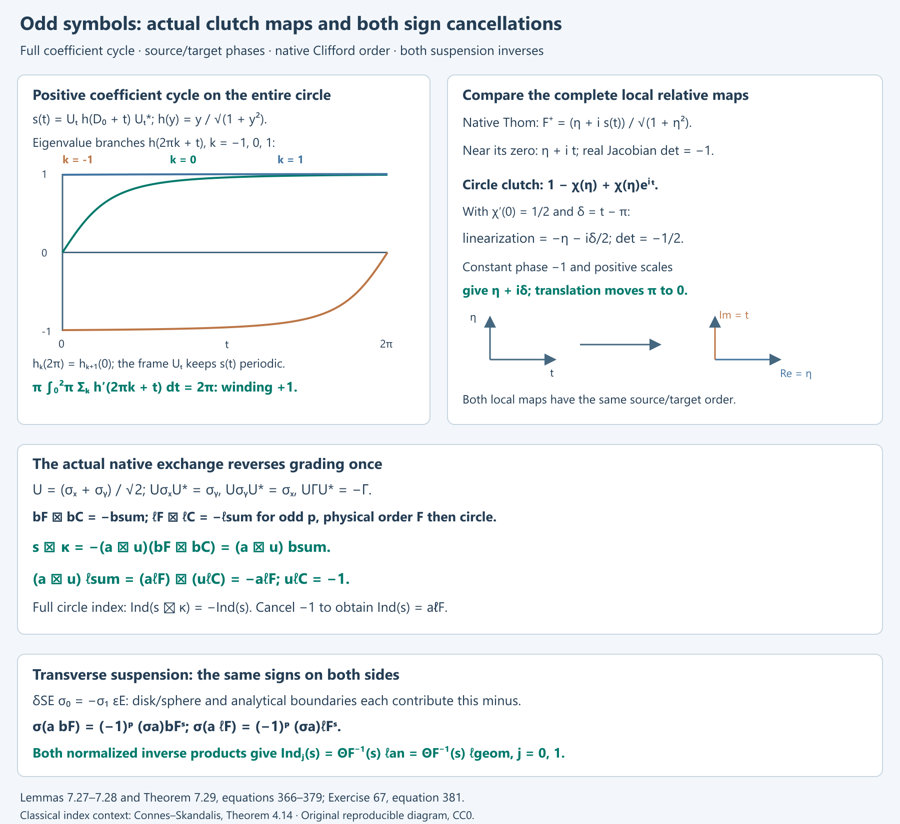

**Figure 7.11.** Lemmas7.27–7.28 and Theorem 7.29, equations (366)–(379); Exercise 67, equation (381). The first graph shows the exact three local branches \(h(2\pi k+t)\), \(k=-1,0,1\), together with the full Fourier-frame reindexing and winding integral; all omitted branches remain in the proved cycle. The clutch panel records the actual localized map \(\eta+i h(t)\) and the linearization \(-2\chi'(0)\eta-i\delta/2\) in source order \((t,\eta)\) or \((\delta,\eta)\), with \(\chi'(0)=1/2\) for the illustrated sample. Their displayed negative Jacobians agree; the relative-class proof uses full index-projection localization and excision, not a zero count. The last panels retain the entire phase in the odd Pin transport, both paired interchange signs, and the minus in each positive exponential suspension boundary. The geometric circle product and the transverse suspension are distinct constructions. This original CC0 figure accompanies the complete proof; primary historical context is [Connes–Skandalis, Section 4].

Full-size clutch-and-signs PNG · Editable clutch-and-signs SVG.

### Comparing the analytic and geometric leaf maps

The geometric construction (16) gives \(\ell_!^{\mathrm{top}}\). The **longitudinal index theorem** identifies it with \(\ell_!^{\mathrm{an}}\) as a KK class and identifies the arbitrary analytic and topological symbol index maps. Connes and Skandalis proved this theorem; its appearance as a question in Connes' earlier survey records a historical stage. [Connes–Skandalis], Proposition 4.13 and Theorem 4.14, treat the factorization and symbol comparison; the author-hosted text is linked in the references.

Theorem 7.1 supplies the full general analytical cycle, and Corollary 7.3 its complete even-rank analytic symbol reduction. Section 6 supplies global Thom inverses, full compact-source geometric choices and ordinary-map composition. Lemmas 7.4–7.5 prove the local vertical-axis estimates; Lemmas 7.7–7.9 and Theorem 7.10 now prove the compact submersion product on the actual holonomy correspondence in both parities, including disconnected fibres and rank-zero orientation lines. Lemmas 7.11–7.12 and Theorem 7.13 extend the analytical product to nonproper submersions using a global bounded phase and compact coefficient localization. Lemmas 7.14–7.15 prove bounded open-domain locality and the whole fibre-preserving graph-tube identity, including its noncompact interior. Lemma 7.16 and Theorem 7.17 identify the coefficient-transferred Thom inverse on its actual full finite orientation and fibre-integration module. Lemmas 7.18–7.19 recover the full prescribed graph-normal module and give its ordered ambient coefficient comparison over the whole tube. Lemmas 7.20–7.21 calibrate both native Thom inverse products and the full ambient inverse, and Theorem 7.22 proves the compact ordinary analytical/geometric submersion equality in both parities with the supplied stable orientation. Lemmas7.23–7.24 and Theorem7.25 now prove the full prescribed transverse-normal KK comparison, through the actual cocycle/orientation family, one interval principal-space cycle and both bounded endpoints. Lemmas7.26–7.28 and Theorem7.29 prove the full arbitrary-symbol action in both K-degrees, with the actual circle product, native signs and both transverse suspension directions. Theorem 8.15d proves the globally framed solvable Dirac case below. Neither that special case nor an equality of traces proves the general leaf-map KK equality.

The separate **assembly question** asks when (17) is an isomorphism. Equality of two index constructions gives neither its injectivity nor its surjectivity. We discuss the geometric formulation here; comparison with the modern assembly map, especially coefficients, needs the appropriate groupoid model. Amenability hypotheses give important positive results, including the formulations studied by Androulidakis and Skandalis. [Androulidakis–Skandalis, *A Baum–Connes conjecture for singular foliations*](https://arxiv.org/abs/1509.05862).

For a foliation given by a submersion onto \(B\) with connected fibres, the fibre-pair groupoid is Morita equivalent to \(B\). The analytic target is \(K_c^*(B)\). The cycle description, with twist \(TB\), gives the same group through spin-c Poincaré duality. These two identifications explain the submersion case, conditional on the specified Morita and duality theorems.

## 8. Solvable actions and measured information

Suppose a simply connected solvable Lie group \(H\) acts on \(V\), and the holonomy groupoid of its orbit foliation is the transformation groupoid \(V\rtimes H\). Freeness suffices for this identification. Local freeness alone does not: stabilizers and ineffective holonomy must be checked.

Put \(d=\dim H\). A useful reduction is entirely geometric.

**Lemma 8.1.** A nontrivial simply connected solvable Lie group has a decomposition \(H=N\rtimes\mathbb R\), where \(N\) is simply connected and solvable of dimension \(d-1\). Consequently \(H\) is diffeomorphic to \(\mathbb R^d\).

**Proof.** Its Lie algebra \(\mathfrak h\) has a nonzero abelian quotient: otherwise \([\mathfrak h,\mathfrak h]=\mathfrak h\), contradicting termination of its derived series. Choose a nonzero linear functional on that quotient. It gives a surjective Lie algebra homomorphism \(\ell:\mathfrak h\to\mathbb R\). Let \(\omega\) be the corresponding left-invariant one-form on \(H\). Its exterior derivative on left-invariant fields is \(d\omega(X,Y)=-\ell([X,Y])=0\), so it is closed. Define \(\chi(h)\) by integrating \(\omega\) along a path from identity to \(h\). Simply connectedness and Stokes’ theorem on a homotopy of such paths make this independent of the path. Local path integration proves smoothness, and left invariance gives \(\chi(hk)=\chi(h)+\chi(k)\). Thus \(\chi:H\to\mathbb R\) is the required homomorphism, with differential \(\ell\). Choose \(X\) with \(d\chi(X)=1\). Then \(\chi(\exp(tX))=t\).

Every \(h\in H\) has the unique form \(n\exp(tX)\), with \(t=\chi(h)\) and \(n=h\exp(-tX)\in\ker\chi\). These maps are smooth, and the product is the semidirect product by conjugation. Thus \(H\cong N\times\mathbb R\) as a manifold. Since \(H\) is connected and simply connected, this product shows that \(N\) is connected and simply connected. Its Lie algebra is an ideal in a solvable Lie algebra and is solvable. Induction now gives the final assertion. \(\square\)

Lemmas 8.3 and 8.8 and Corollary 8.9 below directly identify the full and reduced transformation algebras, retaining the semidirect-product Haar factors. Iterated crossed products along Lemma 8.1, and the **Connes–Thom isomorphism**

\[
K_j(B)\cong K_{j+1}(B\rtimes_\alpha\mathbb R),
\tag{19}
\]

then give \(K_j(C_0(V))\cong K_{j+d}(A)\). Theorems 8.14–8.16 and Lemma 8.18 below prove a direct deformation formula for the full compact-support longitudinal symbol index, including noncompact manifolds. To identify the three historical maps with one another and with geometric assembly, one still needs their geometric and K-orientation comparison. Under these hypotheses, all three maps coincide and \(\mu\) is an isomorphism in this case. The analytic theorem (19) is proved below; the assembly and geometric index comparisons are further obligations.

For \(V\) with an invariant locally finite transverse measure, the tangent bundle of the orbit foliation is trivialized by the infinitesimal action of \(\mathfrak h\). Its positive-degree characteristic classes vanish. The measured index formula, together with the equality of the three maps, therefore gives

\[
\tau_{\Lambda*}(K_0(A))
=\left\{
\langle\operatorname{ch}(x),[C_\Lambda]\rangle:
x\in K_c^{d\bmod2}(V)
\right\}.
\tag{20}
\]

Only the parity that maps to \(K_0(A)\) occurs; for odd \(d\), use the odd Chern character. The measured symbol formula and the analytic isomorphism (19) are proved in these lessons. Theorems 8.14–8.16 below compare the actual longitudinal symbol index with a vector-group endpoint; Corollary 8.17 proves the compact case of (20), and Theorem 8.23 proves its noncompact extension. Neither numerical proof assumes assembly equality. The measure-existence parenthesis is proved in compact scope and explicitly refuted in noncompact scope below. A measured trace can lose information that K-theory retains.

Here is one general mechanism for that loss.

**Proposition 8.2 (trace scaling forbids finite-trace projections).** Let \(B\) have a faithful tracial weight \(\tau\). Suppose a norm-continuous path of automorphisms \(\theta_s\), starting at the identity, satisfies \(\tau\circ\theta_s=c_s\tau\), with \(c_s\ne1\) for some \(s\). Then \(B\) has no nonzero projection \(e\) with \(\tau(e)<\infty\).

**Proof.** A norm-continuous projection path has unitarily equivalent endpoints in the unitization. For a direct proof, if \(\|e-f\|<1\), the operator \(fe+(1-f)(1-e)\) is invertible and its polar unitary conjugates \(e\) to \(f\). Divide a compact parameter interval into subintervals with this norm bound and compose the unitaries. A trace has the same value on conjugate projections, so \(\tau(\theta_s(e))=\tau(e)\). Scaling gives \(c_s\tau(e)=\tau(e)\). Finiteness and \(c_s\ne1\) imply \(\tau(e)=0\); faithfulness implies \(e=0\). \(\square\)

To conclude that there are no projections at all, finiteness on projections must also be justified. For a densely finite lower semicontinuous trace it follows: approximate a projection \(e\) within \(1/2\) by a positive element \(a\) of finite trace. Then \(eae\ge e/2\), and \(\tau(eae)=\tau(a^{1/2}ea^{1/2})\le\tau(a)\), whence \(\tau(e)\le2\tau(a)<\infty\).

### Crossed products, duality and the real Thom map

We supply the analytic interfaces in (19). Let \(B\) be a separable C*-algebra and \(\alpha:\mathbb R\to\operatorname{Aut}(B)\) a pointwise norm-continuous action. Full crossed products use strongly continuous covariant pairs \((\rho,U)\), with
\(U_s\rho(b)U_s^*=\rho(\alpha_s(b))\).
Their dense convolution algebra is \(C_c(\mathbb R,B)\):

\[
(f*g)(s)=\int f(r)\alpha_r(g(s-r))\,dr,\qquad
f^*(s)=\alpha_s(f(-s)^*).
\tag{25}
\]

Its integrated norm in any covariant pair is at most \(\int\|f(s)\|\,ds\). For \(\mathbb Z\), replace integrals by counting sums and compact support by finite support. The full norm is the supremum of these norms. The reduced norm uses

\[
(\widetilde\rho(b)\xi)(t)=\rho(\alpha_{-t}(b))\xi(t),
\qquad (\lambda_s\xi)(t)=\xi(t-s).
\tag{26}
\]

One faithful nondegenerate \(\rho\) suffices. Indeed these operators first act adjointably on the Hilbert \(B\)-module \(L^2(\mathbb R)\otimes B\). Tensoring with a faithful \(\rho\) preserves their norm, by the general tensor-norm proof in Section 2 of the Hilbert-module lesson; tensoring with any other representation can only decrease it. This proves independence of the faithful model, including for nonunital \(B\).

**Lemma 8.3 (full and reduced norms).** Full and reduced crossed products coincide for \(\mathbb R\) and \(\mathbb Z\).

**Proof.** For a covariant pair \((\rho,U)\), define the isometry
\[
(W_Tv)(t)=(2T)^{-1/2}1_{[-T,T]}(t)U_{-t}v.
\]
It exactly intertwines \(\rho(b)\) with \(\widetilde\rho(b)\). The group generators satisfy
\[
\|\lambda_sW_T-W_TU_s\|^2
=\min(2,|s|/T).
\tag{27}
\]
This is the normalized measure of the symmetric difference of the two intervals. For a compactly supported \(f\), consequently,
\[
\|(\widetilde\rho\rtimes\lambda)(f)W_T
      -W_T(\rho\rtimes U)(f)\|
\le\int\|f(s)\|\min(2,|s|/T)^{1/2}\,ds\longrightarrow0.
\]
Taking norms and using that \(W_T\) is isometric gives
\(\|(\rho\rtimes U)(f)\|\le\|f\|_r\).
The reverse inequality is part of the definition. For \(\mathbb Z\), use the unit vector \((2N+1)^{-1/2}1_{\{-N,\ldots,N\}}\); the squared defect is
\(\min(2,2|k|/(2N+1))\).
The same argument proves equality. \(\square\)

**Lemma 8.4 (exactness and stability).** An invariant ideal \(I\subset B\) gives an exact crossed-product sequence. Crossing by a trivial action on \(\mathcal K\), or on a suspension coordinate, commutes with tensoring by that factor.

**Proof.** First use full crossed products. A nondegenerate representation of \(I\) extends to \(B\), since \(B\) acts by multipliers of \(I\); covariance extends as well. Thus the full crossed-product norm of an \(I\)-valued convolution kernel is unchanged when it is regarded as \(B\)-valued. Its closure embeds as an ideal: multiplication on both sides by the dense \(B\)-valued kernels stays \(I\)-valued. A covariant representation annihilates this ideal exactly when its coefficient representation annihilates \(I\). For the nontrivial implication, apply it to \(i\,h_n(s)\), where \(h_n\) is an integral-one compact approximate delta at zero; \(\int h_n(s)U_s\,ds\to1\) strongly. Hence \(\rho(i)=0\). The universal property now identifies the quotient with \((B/I)\rtimes\mathbb R\). Lemma 8.3 gives the same exact sequence for reduced products.

For a trivial compact-operator factor, finite matrix corners identify
\((M_n(B))\rtimes\mathbb R=M_n(B\rtimes\mathbb R)\).
This follows either by the covariant matrix-unit relations or directly from (26) and equality of the norms. Increasing corners approximate a compact-operator-valued continuous kernel uniformly on its compact group support, and hence in its integrated \(L^1\) norm. Their union is therefore dense in both algebras, proving the stable isomorphism.

For a trivial \(C_0(Y)\) factor, evaluation gives a field of the operators (26). Its norm is the supremum over \(y\): the regular Hilbert-module construction can use the faithful direct sum of point evaluations and faithful representations of \(B\). Finite sums \(h(y)f(s)\) are dense among compactly supported continuous kernels, by partitions of unity and uniform approximation on compact sets. They give precisely \(C_0(Y,B\rtimes\mathbb R)\). This proves the claim for \(Y=\mathbb R\), and more generally for locally compact second-countable \(Y\). \(\square\)

**Lemma 8.5 (translation kernels).** Put \((\tau_sF)(t)=F(t-s)\) on \(C_0(\mathbb R,B)\). Then
\[
C_0(\mathbb R,B)\rtimes_\tau\mathbb R
\cong B\otimes\mathcal K(L^2(\mathbb R)).
\tag{28}
\]
For \((\gamma_sF)(t)=\alpha_s(F(t-s))\), first apply the untwisting
\((jF)(t)=\alpha_{-t}(F(t))\) and obtain the same isomorphism.

**Proof.** Represent \(F\) by multiplication and the group by translation. A compact kernel \(g(s)(t)\) has integral kernel
\[
K_g(t,r)=g(t-r)(t).
\tag{29}
\]
The change of variables \((s,t)\leftrightarrow(t,r)\) preserves Lebesgue measure. Convolution becomes kernel composition, and involution becomes \(K^*(t,r)=K(r,t)^*\). Continuous compactly supported \(B\)-valued kernels are approximable, on one compact rectangle, by finite sums
\(b\,f(t)\overline{h(r)}\), \(f,h\in C_c(\mathbb R)\).
One may first approximate by finitely many \(B\)-valued samples and then by products of one-variable partitions. Uniform errors on that rectangle bound the integrated norm \(\int\sup_t\|g(s)(t)\|\,ds\), so this approximation also works in the full crossed-product norm.

On the finite-dimensional span of all \(f,h\) in one such sum, choose an orthonormal basis \(e_1,\ldots,e_n\). The kernels \(b\,e_i(t)\overline{e_j(r)}\) form the matrix algebra \(M_n(B)\), since integration gives the matrix-unit relations. Its map to the full crossed product is a bounded *-homomorphism, hence contractive. The multiplication/translation representation is faithful on this matrix algebra, so the norm is exactly its spatial matrix norm. Taking the dense union proves (28); it does not just prove an operator formula in one possibly nonfaithful representation. Finally \(j\gamma_s=\tau_sj\), by direct substitution, proving the twisted assertion. \(\square\)

**Theorem 8.6 (real Takai duality with signs).** Define the dual action by
\[
\widehat\alpha_q(b)=b,\qquad
\widehat\alpha_q(U_s)=e^{iqs}U_s.
\]
Then
\[
(B\rtimes_\alpha\mathbb R)\rtimes_{\widehat\alpha}\mathbb R
\cong B\otimes\mathcal K(L^2(\mathbb R)).
\tag{30}
\]
Under this isomorphism the multiplier generators act as
\[
b\mapsto M_{\alpha_{-t}(b)},\qquad
U_s\mapsto\lambda_s,\qquad
V_q\mapsto M_{e^{iqt}}.
\tag{31}
\]
The double-dual action with parameter \(v\) becomes
\(\alpha_v\otimes\operatorname{Ad}\lambda_{-v}\).

**Proof.** A covariant representation of the double crossed product is exactly a triple \((\rho,U,V)\) with
\[
V_q\rho(b)=\rho(b)V_q,\qquad
V_qU_s=e^{iqs}U_sV_q,
\]
and the original \(U\)-covariance. Fourier transformation identifies \(C^*(\mathbb R)\) with \(C_0(\mathbb R)\), sending the multiplier \(V_q\) to \(e^{iqt}\). This follows from Lemma 8.3 for the scalar trivial action and the Fourier diagonalization of regular convolution; its norm is the supremum of the Fourier transform. We use Lebesgue measure and the unitary Fourier normalization \((2\pi)^{-1/2}\); thus the inverse scalar transform has its usual matching normalization.

The commuting representations of \(B\) and \(C_0(\mathbb R)\) give a representation of \(C_0(\mathbb R,B)\) with its supremum norm. Here no maximal/minimal tensor assumption is hidden: for a finite tensor, approximate its scalar factors by a common nonnegative partition of unity and their sampled values. A represented sampled sum has the form \(\sum_i b_i h_i\), with commuting \(h_i\ge0\), \(\sum_i h_i\le1\); compression of the diagonal matrix \(\operatorname{diag}(b_i)\) by the column \((h_i^{1/2})\) bounds its norm by \(\max_i\|b_i\|\). Uniform scalar approximation proves the bound for the original tensor, hence the claimed continuous-function norm.

Conjugation by \(U_s\) acts on this algebra as
\(\gamma_sF(t)=\alpha_s(F(t-s))\), since
\(U_sV_qU_s^*=e^{-iqs}V_q\).
The same correspondence is reversible. The two universal crossed-product algebras are therefore isomorphic, with no appeal to a merely formal generator computation. Apply the untwisting and kernel isomorphism of Lemma 8.5. They give (30) and (31). In particular, for a doubly integrated test kernel written as \(\int f(s,q)U_sV_q\,ds\,dq\), the final kernel is
\[
K_f(t,r)=\alpha_{-t}\!\left(\int f(t-r,q)e^{iqr}\,dq\right);
\]
the group integral uses \(dq\), so no extra \(2\pi\) factor is inserted in this expression. If the test is instead written in the order \(V_qU_s\), its phase is \(e^{iqt}\), by the displayed commutation relation.

The double-dual action fixes \(b,U_s\) and multiplies \(V_q\) by \(e^{ivq}\). The action
\(\alpha_v\otimes\operatorname{Ad}\lambda_{-v}\)
does exactly this in (31): it shifts \(t\) to \(t+v\) and cancels the resulting \(\alpha_{-v}\) in the coefficient generator. Equality on the multiplier generators proves the assertion. Lemma 8.3 makes the full and reduced versions agree. \(\square\)

### The Wiener–Hopf argument

We give the remaining K-theory argument in the extension convention preceding Section 1. The construction follows the full proof in [Blackadar], Section 10.9, with its kernel and continuity steps supplied here. Write \(C=C_0(\mathbb R\cup\{+\infty\})\), \(\gamma_sF(t)=\alpha_s(F(t-s))\), and
\(\mathcal W_\alpha=(C\otimes B)\rtimes_\gamma\mathbb R\).
Lemmas 8.4–8.5 give the natural exact sequence
\[
0\longrightarrow B\otimes\mathcal K
\longrightarrow\mathcal W_\alpha
\longrightarrow B\rtimes_\alpha\mathbb R
\longrightarrow0.
\tag{32}
\]

We will use its physical representation on \(L^2(\mathbb R)\otimes B\), in which \(F\) acts by \(\alpha_{-t}(F(t))\), and the group translates \(t\). This representation is faithful. To check this, a regular representation induced from evaluation at any finite \(z\) is, after translation, the same physical Hilbert-module operator tensored with a faithful representation composed with \(\alpha_z\); its norm is unchanged by the tensor-norm theorem. The regular representation at \(+\infty\) is the strong limit of these finite-\(z\) representations as \(z\to+\infty\), first on compactly supported vectors and group kernels, using uniform convergence \(F(s,z+t)\to F(s,+\infty)\) on compact \((s,t)\). Its norm is consequently no larger. A countable dense set of finite evaluations together with \(+\infty\) is faithful on \(C\otimes B\); their regular direct sum computes the reduced norm. Lemma 8.3 now proves faithfulness of the physical representation. This also justifies the kernel norm estimates below.

**Theorem 8.7 (natural analytic Connes–Thom isomorphism).** The index and exponential boundaries of (32) are isomorphisms
\[
\partial_j:K_{j+1}(B\rtimes_\alpha\mathbb R)
\xrightarrow{\cong}K_j(B),\qquad j=0,1.
\tag{33}
\]
Thus \(\partial_j^{-1}\) is the natural degree-one real Thom map. This theorem does not identify it with an assembly or geometric wrong-way map.

**Proof.** First suppose \(B\) is unital. In the scalar translation Wiener–Hopf algebra let
\[
E(s,t)=e^{s/2-t}1_{t>0}1_{t-s>0},\qquad
F(s,t)=e^{-s/2}1_{s>0}1_{t-s>0},\qquad S=1-F.
\tag{34}
\]
These belong to the indicated algebra, despite their displayed jumps. The physical kernel of \(E\) is the rank-one projection onto
\(u(t)=e^{-t/2}1_{t>0}\), whose squared norm is one; approximate \(u\) in \(L^2\) by compact continuous functions and use (28). The kernel of \(F\) is
\(e^{-(t-r)/2}1_{t>r>0}\).
Smooth the two characteristic factors on \([0,\delta]\). The error where \(0<t-r<\delta\) has Schur norm \(O(\delta)\). The error where \(0<r<\delta\) has Hilbert–Schmidt norm \(O(\delta^{1/2})\), by integrating the squared exponential over \(r\) in that interval and \(t>r\). The smoothed kernels correspond to continuous coefficients vanishing at \(-\infty\), with a limit at \(+\infty\); cut off their exponentially small group tails. Faithfulness of the scalar physical representation proves convergence in the Wiener–Hopf norm.

Direct kernel composition gives, for \(t,r>0\),
\[
(F^*F)(t,r)=e^{-|t-r|/2},\qquad
(FF^*)(t,r)=e^{-|t-r|/2}-e^{-(t+r)/2}.
\]
Off the positive quadrant both vanish. Thus
\[
S^*S=1,\qquad SS^*=1-E.
\tag{35}
\]
Dilate \(E_\varepsilon(s,t)=\varepsilon^{-1}E(s/\varepsilon,t/\varepsilon)\), and likewise \(F_\varepsilon\); put \(S_\varepsilon=1-F_\varepsilon\). They have the same identities. Their positive-\(\varepsilon\) paths are norm continuous: for \(F_\varepsilon\) the difference is bounded by the \(L^1\) difference of the exponential convolution densities, and for \(E_\varepsilon\) by the \(L^2\) difference of the normalized vectors \(\varepsilon^{-1/2}u(t/\varepsilon)\).

Let \(\mu(b)\) be the constant-coefficient multiplier of \(\mathcal W_\alpha\), and form the unital algebra
\(D=\mathcal W_\alpha+\mu(B)+\mathbb C1\).
The quotient by \(\mathcal W_\alpha\) is the unital copy of \(B\), split by the constant multipliers. This coefficient copy is injective in the quotient: a nonzero constant coefficient cannot belong to a translation convolution algebra, since its kernel is a nonzero diagonal delta rather than a norm limit of integrated kernels. Equivalently its image at \(+\infty\) is the coefficient multiplier \(b\) of \(B\rtimes\mathbb R\); the following test proves it is outside that algebra. Twist the group generators by characters \(e^{iqs}\). On an integrated \(L^1\) kernel, its matrix coefficients tend to zero as \(|q|\to\infty\), by the scalar Riemann–Lebesgue lemma and density. A nonzero coefficient multiplier is fixed by these twists and has a nonzero matrix coefficient, so cannot be an algebra element. The same argument excludes the identity. Here \(\mu(1)=1\), and split exactness makes
\(K_0(\mathcal W_\alpha)\to K_0(D)\) injective.

Under (28), the ideal embedding \(b\mapsto b\otimes E_\varepsilon\) has raw kernel
\(\phi_\varepsilon(b)(s,t)=\alpha_t(b)E_\varepsilon(s,t)\).
Set
\[
\omega_\varepsilon(b)=S_\varepsilon\mu(b)S_\varepsilon^*,
\qquad \psi_\varepsilon(b)=\phi_\varepsilon(b)\in D.
\]
They are *-homomorphisms into the orthogonal corners \(1-E_\varepsilon\) and \(E_\varepsilon\), respectively. Hence
\(\mu_\varepsilon=\omega_\varepsilon+\psi_\varepsilon\)
is a *-homomorphism. The partial isometry \(S_\varepsilon\mu(p)\), for every matrix projection \(p\), proves
\((\omega_\varepsilon)_*=\mu_*\) on \(K_0\).
The paths in \(\varepsilon>0\) give
\((\mu_\varepsilon)_*=\mu_*+\psi_*\).

We check the endpoint \(\mu_\varepsilon\to\mu\) in point norm. Put
\[
d_\varepsilon(b)=\sup_{r\ge0}\|\alpha_r(b)-b\|e^{-r/\varepsilon},
\qquad
I_\varepsilon(b)=\varepsilon^{-1}\int_0^\infty
\|b-\alpha_{-s}(b)\|e^{-s/(2\varepsilon)}\,ds.
\tag{36}
\]
Both tend to zero. Split at \(r=\sqrt\varepsilon\): continuity handles the first part, and the exponential tail is bounded by \(2\|b\|e^{-1/\sqrt\varepsilon}\). For the integral the analogous bounds are twice the small-interval supremum and \(4\|b\|e^{-1/(2\sqrt\varepsilon)}\).
The commutator \([\mu(b),F_\varepsilon^*]\) has norm at most \(I_\varepsilon(b)\), by the exponential kernel row and column bounds. Further,
\[
\|\psi_\varepsilon(b)-E_\varepsilon\mu(b)\|
\le4d_\varepsilon(b)+I_\varepsilon(b).
\tag{37}
\]
Indeed its raw kernel is
\((\alpha_t(b)-\alpha_s(b))E_\varepsilon(s,t)\).
For \(s\ge0\), put \(t=s+r\), \(r\ge0\), obtaining the bound
\(d_\varepsilon(b)\varepsilon^{-1}e^{-s/(2\varepsilon)}\);
integration gives \(2d_\varepsilon(b)\).
For \(s<0\), use
\(\|\alpha_t(b)-\alpha_s(b)\|\le\|\alpha_t(b)-b\|+\|b-\alpha_s(b)\|\),
giving the other \(2d_\varepsilon(b)+I_\varepsilon(b)\).
These integrated supremum bounds are valid for the displayed measurable kernels by the physical regular representation and Minkowski's inequality. In particular the rescaled exponential in the first bound is \(e^{-r/\varepsilon}\), with the negative sign.
Using (35), (36) and (37) now yields
\[
\|\mu_\varepsilon(b)-\mu(b)\|
\le4d_\varepsilon(b)+2I_\varepsilon(b)\longrightarrow0.
\]
Thus the path extends at zero with value \(\mu\). Homotopy invariance gives
\(\mu_*=(\mu_\varepsilon)_*=\mu_*+\psi_*\), so \(\psi_*=0\).
Injection into the split algebra \(D\) proves that the ideal map
\(K_0(B)\to K_0(\mathcal W_\alpha)\) is zero. Exactness of (32) makes its index boundary surjective.

For nonunital \(B\), use its external unitization \(B^+\) with the action extended trivially on the scalar quotient. The natural diagram of (32) for \(B,B^+,\mathbb C\) has exact rows on the crossed-product and compact-ideal K-groups. The last two index maps are surjective by the unital argument, and the scalar one is an isomorphism: \(K_1(C^*(\mathbb R))=K_1(C_0(\mathbb R))=\mathbb Z\), \(K_0(\mathcal K)=\mathbb Z\), so a surjective homomorphism between them is an isomorphism. Also \(K_0(B)\to K_0(B^+)\) is injective, since the scalar unitization extension splits. Lift a given class in \(K_0(B)\) through the surjective middle index. Its scalar image is zero by the last-column injection; exactness supplies a lift from \(K_1(B\rtimes\mathbb R)\). Naturality and the first-column injection give the desired original class. Thus index is surjective for every \(B,\alpha\).

It remains to deduce injectivity and the other degree; surjectivity alone is not the theorem. It implies universally
\(K_1(B\rtimes\mathbb R)=0\Rightarrow K_0(B)=0\).
Apply this to the dual action on \(B\rtimes\mathbb R\), and use (30) and stability: \(K_1(B)=0\Rightarrow K_0(B\rtimes\mathbb R)=0\).
Suspend and use Lemma 8.4 and stable Bott periodicity to obtain also
\(K_0(B)=0\Rightarrow K_1(B\rtimes\mathbb R)=0\).
The cone algebra \(C\otimes B\) has zero K-theory: after identifying \(\mathbb R\cup\{+\infty\}\) with \((0,1]\), extend each function by zero at zero and contract by \(f(t)\mapsto f(ut)\), \(0\le u\le1\). The two universal implications therefore make
\(K_*(\mathcal W_\alpha)=0\).
Exactness of (32) proves both isomorphisms in (33).

An equivariant homomorphism of \(B\)'s gives a homomorphism of (32); the ideal identification (28) is natural. Naturality of the K-theory boundaries proves naturality of their inverses. The stable K/Bott/exactness interfaces fixed at the start of this lesson are the only K-theory inputs in this argument. No Kasparov product, inverse KK identity or assembly theorem has been assumed. \(\square\)

**Lemma 8.8 (semidirect products and the reduced norm).** For \(H=N\rtimes_\theta\mathbb R\) as in Lemma 8.1, an action on \(B\) gives
\[
B\rtimes H\cong(B\rtimes N)\rtimes_\beta\mathbb R,
\quad
\beta_t(b)=\alpha_{(e,t)}(b),\quad
\beta_t(U_n)=U_{\theta_t(n)}.
\tag{40}
\]
This holds for full products, and for reduced products with the corresponding reduced factors.

The normal subgroup need not be unimodular. Its convolution uses left Haar measure and involution \(f^*(n)=\Delta_N(n^{-1})\alpha_n(f(n^{-1})^*)\). The semidirect modular function is \(\Delta_H(n,t)=\Delta_N(n)m_t^{-1}\), with \(m_t\) below: right translation in the real coordinate multiplies the Haar integral by \(m_t\), and right translation in \(N\) contributes \(\Delta_N(n)^{-1}\). Automorphisms preserve \(\Delta_N\). Thus no unimodularity is inserted in either version of (40).

**Proof.** The full statement follows from the reversible correspondence between covariant representations of \(H\) and covariant triples for \(B,N,\mathbb R\), with the displayed conjugation relation. Strong continuity of \(\beta\) follows on compact \(N\)-kernels by the integrated \(L^1\) bound, a change of variables, and point-norm continuity of the coefficient action, then by density.

Let \(dn\) be left Haar measure on \(N\), and let
\[
m_t=|\det(d\theta_t)_e|
=\exp\!\left(t\,\operatorname{tr}(\operatorname{ad}X|_{\mathfrak n})\right).
\]
Then \(d(\theta_tn)=m_t\,dn\), and left Haar measure on \(H\), in the coordinates \((n,t)\), is \(m_t^{-1}\,dn\,dt\). The integrated action in (40) therefore has the exact density
\[
(\beta_tf)(n)=m_t^{-1}\alpha_{(e,t)}
                       (f(\theta_{-t}n)).
\tag{41}
\]
For reduced products use the unitary
\[
Z:L^2(H,m_t^{-1}dn\,dt;\mathcal H_\rho)
\longrightarrow L^2(\mathbb R\times N,dt\,dk;\mathcal H_\rho),
\quad (Z\xi)(t,k)=\xi(\theta_tk,t).
\tag{42}
\]
The Jacobian cancels the Haar factor, so no additional square root appears. A coefficient \(b\) becomes
\(\rho(\alpha_{k^{-1}}\alpha_{(e,-t)}(b))\).
Translation by \((n,0)\) becomes translation of \(k\) by \(\theta_{-t}(n)\); translation by \((e,s)\) becomes \(t\mapsto t-s\) with \(k\) fixed. These are exactly the iterated regular generators: at outer coordinate \(t\), the regular representation applies \(\beta_{-t}\) to the normal coefficient algebra. Thus the integrated norms agree, proving the reduced assertion. \(\square\)

**Corollary 8.9 (analytic solvable-group K-theory).** For every simply connected solvable \(d\)-dimensional Lie group \(H\) and every point-norm continuous action on \(B\), the full and reduced crossed products coincide. A chosen ordered decomposition of Lemma 8.1 gives natural isomorphisms
\[
K_j(B)\cong K_{j+d}(B\rtimes H).
\]

**Proof.** Induct on \(d\). At zero there is no crossed product or parity change. Apply Lemma 8.8 and the induction hypothesis to \(N\), and Lemma 8.3 to the remaining real action. The full iterated norm equals the reduced iterated norm, hence the full \(H\)-norm equals the reduced \(H\)-norm. This proves the norm equality actually needed here without leaving group amenability as an unproved substitute. Apply Theorem 8.7 at each step, in the chosen order. Every factor is natural under equivariant coefficient homomorphisms, so their composite is natural. This is the analytic K-group isomorphism. Independence of geometric wrong-way factorizations and equality with assembly require the further comparisons already separated in Section 7. \(\square\)

**Corollary 8.10 (positive cotangent normalization).** For the trivial real action, the Thom map of Theorem 8.7 agrees with the positive winding suspension generator when the group is Fourier transformed by
\(\widehat f(p)=(2\pi)^{-1/2}\int e^{-ipt}f(t)\,dt\).
This fixes its point Bott normalization in both stable K degrees.

**Proof.** At \(+\infty\), the isometry \(S\) of (34) has symbol
\[
u_-(p)=1-\int_0^\infty e^{-s/2}e^{-ips}\,ds
=\frac{p+i/2}{p-i/2}.
\]
Its index is \(\dim\ker S-\dim\ker S^*=-1\), by (35); its index boundary is consequently \(-[E]\). The inverse
\(u_+(p)=(p-i/2)/(p+i/2)\)
has positive winding, since
\[
\frac1{2\pi i}\int_{-\infty}^\infty u_+(p)^{-1}u_+'(p)\,dp
=\frac1{2\pi i}\int_{-\infty}^\infty
\frac{i}{p^2+1/4}\,dp=1.
\]
Its boundary is \(+[E]\), so \(\partial^{-1}(1)=[u_+]\). For a matrix projection \(e\) over \(B\), the coisometry \(S^*\otimes e+1\otimes(1-e)\) has index \(+[e]\); relative projections subtract the same formula for their scalar reference. Thus \(\partial^{-1}\) is the positive loop Bott map on \(K_0(B)\). Suspend, using Lemma 8.4 and natural stable suspension, to obtain the other degree. The positive-character coordinate used for the outer Fourier variable in (31) is distinct from this negative-sign physical transform; neither phase has been silently reversed. This proves normalization at the trivial action, not yet equality with a foliation assembly map. \(\square\)

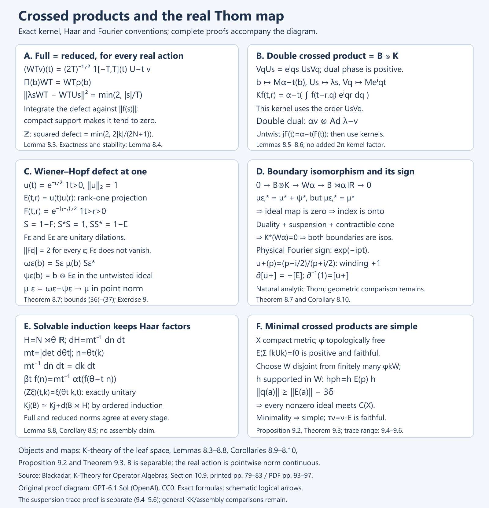

**Figure 8.10.** Exact mechanisms of Lemmas 8.3–8.8, Corollaries 8.9–8.10, Proposition 9.2 and Theorem 9.3. The real action on the separable C*-algebra \(B\) is pointwise norm continuous. Panel A uses Lebesgue measure and intervals of length \(2T\); its discrete counterpart uses \(2N+1\) counting points. In panel B the positive dual phase is \(e^{iqs}\), the displayed integrated kernel is written in the order \(U_sV_q\), and \(r\) is its input coordinate. Panel C uses the positive half-line, its unit vector \(u\), a rank-one defect and unitary dilation; the convergence is of the coefficient homomorphisms, not of \(F_\varepsilon\) in norm. Panel D fixes the physical negative-sign Fourier transform and the positive cotangent winding. Panel E retains the exact semidirect Haar Jacobian \(m_t\), which cancels in \(Z\) but remains in the integrated action \(\beta\). Panel F assumes a compact metrizable \(X\) and topological freeness; its quotient \(q\) is isometric on \(C(X)\), \(a\ge0\), and \(\delta>0\). Minimality then gives simplicity and full support of any invariant probability \(\nu\), so \(\tau_\nu=\nu\circ\mathsf E\) is faithful. The arrows indicate proved logical steps, not a geometric assembly identification. The integer trace range requires the separate suspension argument in Lemma 9.4, Proposition 9.5 and Theorem 9.6. Complete proofs and exercises accompany the figure. Source for the Wiener–Hopf construction: [Blackadar], Section 10.9.

Full-size PNG · Editable SVG.

### Compact transverse measures and the modular obstruction

The parenthesis in the source trace corollary deserves its own proof. For a compact manifold it is correct. Without compactness, existence of a nonzero transverse measure does not force unimodularity.

**Lemma 8.11 (an invariant probability for a solvable action).** Every continuous action of a simply connected solvable Lie group on a nonempty compact metrizable space \(X\) admits an invariant probability measure.

**Proof.** Induct on the dimension, using Lemma 8.1. For the trivial group, a point mass suffices. Write \(H=N\rtimes_\theta\mathbb R\). By induction the set \(\mathcal P_N(X)\) of \(N\)-invariant probability measures is nonempty. It is convex and weak-* compact: probabilities form a compact subset of the dual of \(C(X)\), and invariance is the intersection of closed equalities on continuous test functions. Normality of \(N\) implies that the outer real action preserves this set. Choose \(\mu\in\mathcal P_N(X)\) and average its translates:
\[
\mu_T=\frac1{2T}\int_{-T}^{T}(\exp(tX_0))_*\mu\,dt,\qquad T>0.
\]
This is again an \(N\)-invariant probability. For fixed \(s\in\mathbb R\) and \(f\in C(X)\), cancellation on the intersection of the intervals gives
\[
\left|\int f\,d((\exp(sX_0))_*\mu_T-\mu_T)\right|
\le\min(2,|s|/T)\|f\|_\infty.
\tag{50}
\]
Take a weak-* cluster point as \(T\to\infty\). The estimate makes it invariant under every real translate, and the closed \(N\)-invariance equalities remain true. It is invariant under their semidirect product \(H\). No full-support assertion is needed here. \(\square\)

**Proposition 8.12 (the compact unimodularity criterion).** Let a simply connected solvable \(d\)-dimensional Lie group \(H\) act smoothly and locally freely on a nonempty compact manifold \(V\). Its oriented orbit foliation has a nonzero locally finite invariant transverse measure if and only if \(H\) is unimodular. The orientation comes from an ordered basis of \(\mathfrak h\).

**Proof.** For a left action, write \(X^\#_x=(d/dt)_{t=0}\exp(tX)x\). Fundamental fields satisfy
\([X^\#,Y^\#]=-[X,Y]^\#\); this can be checked first on \(H\), where they are right-invariant, and then by the orbit maps. If \(X_1,\ldots,X_d\) is the chosen basis, local freeness makes
\[
E=X_1^\#\wedge\cdots\wedge X_d^\#
\]
a nowhere zero tangent \(d\)-vector. The bracket identity gives
\(\mathcal L_{X^\#}E=-\operatorname{tr}(\operatorname{ad}X)E\).
Choose a smooth ambient \(d\)-form \(\lambda\) with \(\lambda(E)=1\), for example by extending the dual leaf volume through an orthogonal projection onto \(F\).

A positive tangent current \(C\) is consequently integration against a positive measure:
\[
C(\omega)=\int_V\omega(E)\,d\mu,\qquad \mu(V)=C(\lambda).
\]
The current/transverse-measure correspondence in the [transverse-measure lesson, Sections 3 and 5](transverse-measures-of-foliations.md#section-3) applies to these locally finite currents. If the transverse measure is nonzero, then \(0<\mu(V)<\infty\). Compactness is used in this strict finite inequality.

Closedness and Cartan's formula give \(C(\mathcal L_{X^\#}\lambda)=0\). Indeed \(C(d\,\iota_{X^\#}\lambda)=0\); the restriction of \(\iota_{X^\#}d\lambda\) to the rank-\(d\) bundle \(F\) is zero because \(d+1\) tangent vectors are linearly dependent. Differentiating \(\lambda(E)=1\) now gives
\[
0=C(\mathcal L_{X^\#}\lambda)
=\operatorname{tr}(\operatorname{ad}X)\mu(V).
\tag{51}
\]
Thus every adjoint trace is zero. Left Haar measure has modular character
\(\Delta_H(\exp(tX))=\exp(-t\operatorname{tr}(\operatorname{ad}X))\): conjugation has Jacobian \(\det\operatorname{Ad}(\exp(tX))\), and translating left Haar on the right gives its reciprocal. A connected group is generated by its one-parameter subgroups, so these equalities make \(H\) unimodular.

Conversely, take the invariant probability \(\mu\) of Lemma 8.11 and define \(C\) by the displayed integral. It is positive and nonzero, since \(C(\lambda)=1\). Every smooth leafwise \((d-1)\)-form can be written
\(\eta=\sum_i f_i\iota_{X_i^\#}\lambda\). Leafwise Cartan's formula and the same differentiation of \(\lambda(E)=1\) show that
\[
(d_F\eta)(E)=
\sum_i\left(X_i^\# f_i+
\operatorname{tr}(\operatorname{ad}X_i)f_i\right).
\]
The trace terms vanish by unimodularity. Invariance of \(\mu\) gives
\(\int X_i^\#f_i\,d\mu=0\), by differentiating the integral of the translated smooth function; its derivative is uniformly bounded on compact \(V\). Therefore \(C\) is closed. The proved current correspondence supplies a nonzero locally finite transverse measure. For \(d=0\), the group is trivial and every nonzero finite measure is a transverse measure; the criterion holds directly. \(\square\)

**Example 8.13 (why the noncompact parenthesis is false).** Consider the simply connected affine group
\[
H=\mathbb R\rtimes\mathbb R,\qquad
(n,t)(n',t')=(n+e^t n',\,t+t').
\]
It acts freely on \(V=H\) by left multiplication, with one leaf. A point transversal has counting mass one, so it defines a nonzero invariant transverse measure. Yet
\(\Delta_H(n,t)=e^{-t}\), so \(H\) is not unimodular.

In coordinates the fundamental fields are \(N^\#=\partial_n\) and
\(T^\#=n\partial_n+\partial_t\). Their bracket is \([T^\#,N^\#]=-N^\#\); in the Lie algebra \([T,N]=N\), so \(\operatorname{tr}(\operatorname{ad}T)=1\). The oriented vector \(N^\#\wedge T^\#\) is \(\partial_n\wedge\partial_t\). The current integrates compactly supported two-forms over \(\mathbb R^2\). Its mass relative to \(\lambda=dn\wedge dt\) is infinite, and \(\lambda\) is not a compactly supported test form. Thus the finite-mass step in (51) is unavailable. For compactly supported \(f\), the two terms in
\(\int(T^\#f+f)\,dn\,dt=0\) cancel by integration by parts; no contradiction occurs.

The orbit groupoid is the pair groupoid \(H\times H\). Its algebra is \(\mathcal K(L^2(H))\), with any fixed smooth positive leaf density, by the compact-kernel argument in the C*-algebra lesson. The point-normalized measured trace is ordinary operator trace. This example satisfies the graph condition of the source theorem and refutes its unrestricted measure-existence parenthesis. Proposition 8.12 gives the complete compact correction.

### Deforming an ordered solvable group

The analytic Thom map already gives an abstract K-isomorphism. We now compare the actual longitudinal symbol index with a vector-group endpoint. Ordinary exponential coordinates are not required.

**Theorem 8.14 (a solvable parameter algebra with invertible evaluation K-maps).** Choose the ordered decomposition of Lemma 8.1 for a simply connected solvable group \(H\) of dimension \(d\). There is a smooth family of groups \(H_v\), \(0\le v\le1\), with \(H_0=\mathbb R^d\) and isomorphisms \(\Gamma_v:H_v\to H\) for \(v>0\). For every point-norm continuous action \(\alpha\) on a C*-algebra \(B\), there is a central \(C([0,1])\)-algebra \(\mathfrak A_H(B)\) with fibres
\[
\mathfrak A_H(B)_v=B\rtimes_{\alpha^{(v)}}H_v,\qquad
\alpha^{(v)}_h=\alpha_{\Gamma_v(h)}\ (v>0),\quad
\alpha^{(0)}_h=\mathrm{id}.
\]
Every evaluation induces an isomorphism on both K-groups. In particular,
\[
K_*(\mathfrak A_H(B)_0)=K_*(B\otimes C_0(\mathfrak h^*)),
\qquad
K_*(\mathfrak A_H(B)_1)=K_*(B\rtimes H).
\tag{52}
\]

**Proof of the smooth family.** Write \(H=N\rtimes_\theta\mathbb R\), and let
\(\Phi_N:\mathbb R^{d-1}\to N\) be the ordered coordinate diffeomorphism supplied recursively by Lemma 8.1, with inverse \(\Psi_N\). For \(v\ne0\) set
\[
q*_v q'=\frac1v\Psi_N(\Phi_N(vq)\Phi_N(vq')),
\qquad
\theta_t^v(q)=\frac1v\Psi_N\!\left(\theta_{vt}(\Phi_N(vq))\right).
\tag{53}
\]
At zero these expressions extend to \(q+q'\) and \(q\), respectively. Here is the smooth extension, including its derivatives. Each numerator is a smooth function \(F(v,z)\) that vanishes at \(v=0\), and
\[
F(v,z)/v=\int_0^1\partial_vF(rv,z)\,dr.
\]
Differentiation under this integral proves smoothness. The derivative at zero of the first numerator is \(q+q'\), and that of the second is \(q\), since \(\Phi_N\) has identity tangent map at zero and \(\theta_0\) is identity. The inverse is obtained by the same formula with \(\Phi_N(vq)^{-1}\). Associativity, inverses, and the automorphism and action identities hold for \(v\ne0\), hence also at zero by continuity.

Put \(H_v=N_v\rtimes_{\theta^v}\mathbb R\). Then
\[
\Gamma_v(q,t)=\Phi_N(vq)\exp_H(vtX_0)
\tag{54}
\]
is an isomorphism for \(v\ne0\). Its differential is multiplication by \(v\), so the bracket on the fixed tangent space is \(v[\ ,\ ]_{\mathfrak h}\); \(H_0\) is the additive vector group. All formulas also extend to negative \(v\), which supplies smooth extensions across the boundary at zero. The maps \(h\mapsto\Gamma_v(h)\) converge to the identity of \(H\) uniformly on compact coordinate sets. Thus the induced actions are jointly point-norm continuous, including at zero. For a smooth action on a manifold they are jointly smooth.

Normalize left Haar densities to have value one in the ordered coordinates at the identity. If \(h_N(q)\,dq\) is the original density on \(N\), the density on \(N_v\) is \(h_N(vq)\,dq\). The outer automorphism modulus and the full Haar density are
\[
m_v(t)=\exp\!\left(vt\,\operatorname{tr}
(\operatorname{ad}X_0|_{\mathfrak n})\right),\qquad
d\mu_v(q,t)=m_v(t)^{-1}h_N(vq)\,dq\,dt.
\tag{55}
\]
These follow by pulling back Haar through (54) and dividing out \(|v|^d\); at zero they are Lebesgue measure. The normal modular character is retained:
\(\Delta_{H_v}(q,t)=\Delta_{N_v}(q)m_v(t)^{-1}\). Nothing here assumes that \(N\) or \(H\) is unimodular.

**Proof of the algebra and K-maps.** Construct it by induction. For the zero-dimensional group put \(\mathfrak A_0(B)=C([0,1])\otimes B\). Suppose the normal family algebra \(\mathfrak A_N(B)\) has been constructed, with a dense algebra of jointly continuous compact-coordinate kernels \(f_v(q)\). On these kernels define
\[
(\beta_t f)_v(q)=m_v(t)^{-1}
\alpha_{\exp_H(vtX_0)}
\bigl(f_v(\theta_{-t}^v(q))\bigr).
\tag{56}
\]
Lemma 8.8, applied in each fibre, proves that this preserves convolution and the modular involution. Its inverse is \(\beta_{-t}\).

For clarity, a central interval algebra has norm equal to the supremum of its fibre norms: an irreducible nondegenerate representation extends to the central multiplier \(C([0,1])\), where Schur's lemma makes it evaluation at one point. It factors through that fibre. Irreducible representations determine a C*-norm. This also proves that a map which is isometric in every fibre is isometric in the whole algebra. Thus (56) extends to an automorphism.

It is point-norm continuous. On a compact kernel support, its transformed supports for \(t\) in a compact interval are contained in one compact coordinate set, by the smooth maps (53). The Haar densities and their derivatives are bounded there, uniformly in \(v\). Joint continuity of the coefficient action and the compact range of \(f\) give uniform convergence as \(t\to t_0\). The integrated estimate
\[
\|f\|\le\sup_{0\le v\le1}\int_{H_v}\|f_v(h)\|\,d\mu_v(h)
\tag{57}
\]
therefore proves continuity on this dense algebra, and isometry extends it to the completion.

Define
\(\mathfrak A_H(B)=\mathfrak A_N(B)\rtimes_\beta\mathbb R\).
The parameter multipliers are fixed by \(\beta\), so remain central and nondegenerate. Real crossed-product exactness from Lemma 8.4 identifies the quotient at \(v\) with
\((B\rtimes N_v)\rtimes_{\beta^v}\mathbb R\).
Lemma 8.8 identifies this with \(B\rtimes H_v\), preserving (55). These are also the reduced algebras by Corollary 8.9. Finite sums of separated compact kernels in the normal and outer coordinates are dense: on any compact rectangle, uniform approximation of a continuous \(B\)-valued kernel by such sums gives integrated-norm approximation. This proves the asserted joint compact-kernel description and (57). The central-character argument gives the fibre-supremum norm at this inductive step as well.

At dimension zero, evaluation is a K-isomorphism because contraction of the interval is a homotopy inverse to the constant inclusion. At the next step, evaluation is equivariant for \(\beta\) and its fibre action. The natural analytic real Thom isomorphism of Theorem 8.7 gives the commutative square
\[
\begin{array}{ccc}
K_j(\mathfrak A_N(B))&\longrightarrow&
K_{j+1}(\mathfrak A_N(B)\rtimes\mathbb R)\\
\downarrow(\mathrm{ev}_v)_*&&\downarrow(\mathrm{ev}_v)_*\\
K_j(B\rtimes N_v)&\longrightarrow&
K_{j+1}((B\rtimes N_v)\rtimes\mathbb R).
\end{array}
\]
The horizontal arrows and the left arrow are isomorphisms; hence so is the right arrow. Induction proves the assertion for every \(v\), in both degrees. At zero, Fourier transformation with character \(e^{-i\langle p,h\rangle}\) gives (52). This proof uses naturality, rather than an inference from continuous-field terminology.

There is also an explicit positive-parameter trivialization. Under \(\Gamma_v\), a kernel becomes
\[
f_v(h)\ \longmapsto\
v^{-d}f_v(\Gamma_v^{-1}(h))\quad(v>0)
\tag{58}
\]
in the original \(H\) crossed product, because \((\Gamma_v)_*\mu_v=v^{-d}\mu_H\). On closed intervals away from zero, smooth changes of variables and the integrated estimate show norm continuity. Compact kernels there are dense on both sides; central cutoffs approximate the full ideal vanishing at zero. Consequently
\(\ker\mathrm{ev}_0\cong C_0((0,1])\otimes(B\rtimes H)\).
This cone description is consistent with the preceding proof; it does not alone prove invertibility of evaluation at one. \(\square\)

### The parameter-wide symbol index

**Corollary 8.14a (both KK inverses for every evaluation).** In Theorem 8.14, suppose in addition that \(B\) is separable. Every evaluation
\[
q_v:\mathfrak A_H(B)\longrightarrow B\rtimes H_v
\]
is a KK equivalence. The inverses are natural under equivariant coefficient *-homomorphisms and are obtained in the fixed ordered real-factor decomposition. The conclusion concerns every \(v\in[0,1]\), including zero; it makes no unimodularity or freeness assumption.

**Proof.** All coefficient algebras in the induction are separable. At the first stage this follows from separability of \(C([0,1])\otimes B\). At a real crossed-product stage, continuous compactly supported kernels can be approximated in integrated norm by piecewise linear scalar functions with rational break points times a countable dense subset of the coefficient algebra. Their rational linear span is countable and dense. The natural real KK Thom class and its two-sided inverse in Lemma 0.17 and Theorem 0.18 therefore apply at every stage. We use the ordered Clifford contractions of Corollary 0.20 throughout.

Here is the precise inductive step. Write \(I\) for the preceding interval algebra, \(C\) for its fibre at \(v\), and \(e:I\to C\) for evaluation. The outer actions \(\beta\) on \(I\) and \(\beta^v\) on \(C\) are the point-norm continuous actions (56). Evaluation is equivariant, and its crossed-product map is
\[
e_{\mathbb R}:I\rtimes_\beta\mathbb R
\longrightarrow C\rtimes_{\beta^v}\mathbb R.
\]
Suppose \([e]\) has a two-sided inverse \(c\in KK(C,I)\). This is an ordinary KK inverse; it need not be represented by an equivariant *-homomorphism. Put
\[
\begin{aligned}
t_I&\in KK_1(I,I\rtimes_\beta\mathbb R),&
d_I&\in KK_1(I\rtimes_\beta\mathbb R,I),\\
t_C&\in KK_1(C,C\rtimes_{\beta^v}\mathbb R),&
d_C&\in KK_1(C\rtimes_{\beta^v}\mathbb R,C).
\end{aligned}
\]
Theorem 0.18 gives \(t_Id_I=1_I\), \(d_It_I=1_{I\rtimes\mathbb R}\), and both corresponding identities for \(C\). Products here and below retain their intermediate coefficient algebra; their compact notation does not permute graded factors. Lemma 0.17 gives the actual naturality identity
\[
t_I[e_{\mathbb R}]=[e]t_C.
\]
Multiplying on the left by \(d_I\), and using associativity, yields
\[
[e_{\mathbb R}]=d_I[e]t_C.
\]
Consequently an explicit candidate inverse is
\[
x=d_Cct_I\in KK(C\rtimes\mathbb R,I\rtimes\mathbb R).
\]
It is even: the two odd real factors contribute total degree two in the fixed periodic convention. Both products are
\[
\begin{aligned}
[e_{\mathbb R}]x
 &=d_Iect_I
  =d_I([e]c)t_I
  =d_It_I
  =1_{I\rtimes\mathbb R},\\
x[e_{\mathbb R}]
 &=d_Cc(t_Id_I)[e]t_C
  =d_C(c[e])t_C
  =d_Ct_C
  =1_{C\rtimes\mathbb R}.
\end{aligned}
\]
These are identities of KK classes. No passage from K-group isomorphisms to KK invertibility is used.

At dimension zero, \(e_v:C([0,1])\otimes B\to B\) has the constant inclusion \(c_v\) as inverse. One composition is exactly the identity. The other is homotopic to the identity by
\[
f(w)\longmapsto f\bigl((1-s)v+sw\bigr),
\qquad 0\le s\le1.
\]
Uniform continuity of a \(B\)-valued continuous function on the interval proves that this is a norm-continuous *-homomorphism homotopy. It is valid for nonunital \(B\). The zero algebra also satisfies the assertion, with its identity class zero. Induction using the preceding step proves both inverse products for every \(q_v\).

The accumulated formula is useful. Let \(\Theta_I\in KK_d(C([0,1])\otimes B,\mathfrak A_H(B))\) be the product of the real Thom classes in their induction order, and \(D_I\) their inverses in reverse order. Let \(\Theta_v\in KK_d(B,B\rtimes H_v)\), \(D_v\) be the fibre products with the same order and contractions. Cancellation of adjacent inverse pairs proves both inverse identities for \(\Theta_I,D_I\) and for \(\Theta_v,D_v\); no factors have been exchanged. Iterated naturality gives
\[
[q_v]=D_I[e_v]\Theta_v,
\qquad
[q_v]^{-1}=D_v[c_v]\Theta_I.
\]
The same adjacent-pair cancellation proves both products of these formulas are identity. This formula also proves coefficient naturality: apply real Thom naturality successively at each stage, and use that interval evaluation and the constant inclusion commute with the coefficient homomorphism. The inverse of a natural equivalence is natural, as follows by multiplying its naturality square by the two inverses.

In the conventions of Theorem 0.18, each \(d\) is the negative dual Thom class followed by the even Takai Morita class. Its sign is already fixed by the scalar compression index \(-1\). The ordered contractions in Corollary 0.20 are used in the two accumulated products. Thus no additional sign or orientation choice is hidden in these formulas. At zero all real actions are trivial, including the outer actions (56). The class \(\Theta_0\) is the native ordered parity iteration in the Fourier coordinates of (52). Corollary 0.20 separately supplies the typed ordinary graded source-Clifford inverse pair. Their exact finite reduction and the comparison with the positive physical Bott symbol are checked in Lemma 8.15c below. \(\square\)

In particular there is an even, natural deformation class
\[
\mathcal I_H=[q_0]^{-1}\otimes_{\mathfrak A_H(B)}[q_1]
\in KK(B\otimes C_0(\mathfrak h^*),B\rtimes H),
\]
where the displayed intermediate algebra is understood by the maps' domains: \([q_0]^{-1}\) goes from the zero fibre to the interval algebra. Its inverse is \([q_1]^{-1}[q_0]\). Both products cancel the adjacent evaluation pairs. The formula can also be written
\[
\mathcal I_H=D_0\Theta_1,
\qquad \mathcal I_H^{-1}=D_1\Theta_0,
\]
because \([c_0][e_1]=1_B\) and \([c_1][e_0]=1_B\). For a smooth action satisfying the graph hypothesis of Theorem 8.16, its action on both K-groups is the actual compact-support symbol index proved there and in Lemma 8.18. Indeed those proofs identify that index with the two evaluation maps, after the same Fourier identification at zero; the definition of the action of a KK class is their product. This supplies a KK lift of the analytic deformation map. Lemmas 8.15a–c and Theorem 8.15d below construct the parameter-wide Dirac cycle and identify its class for the ordered global frame. The historical geometric leaf-map and assembly identification remain further assertions.

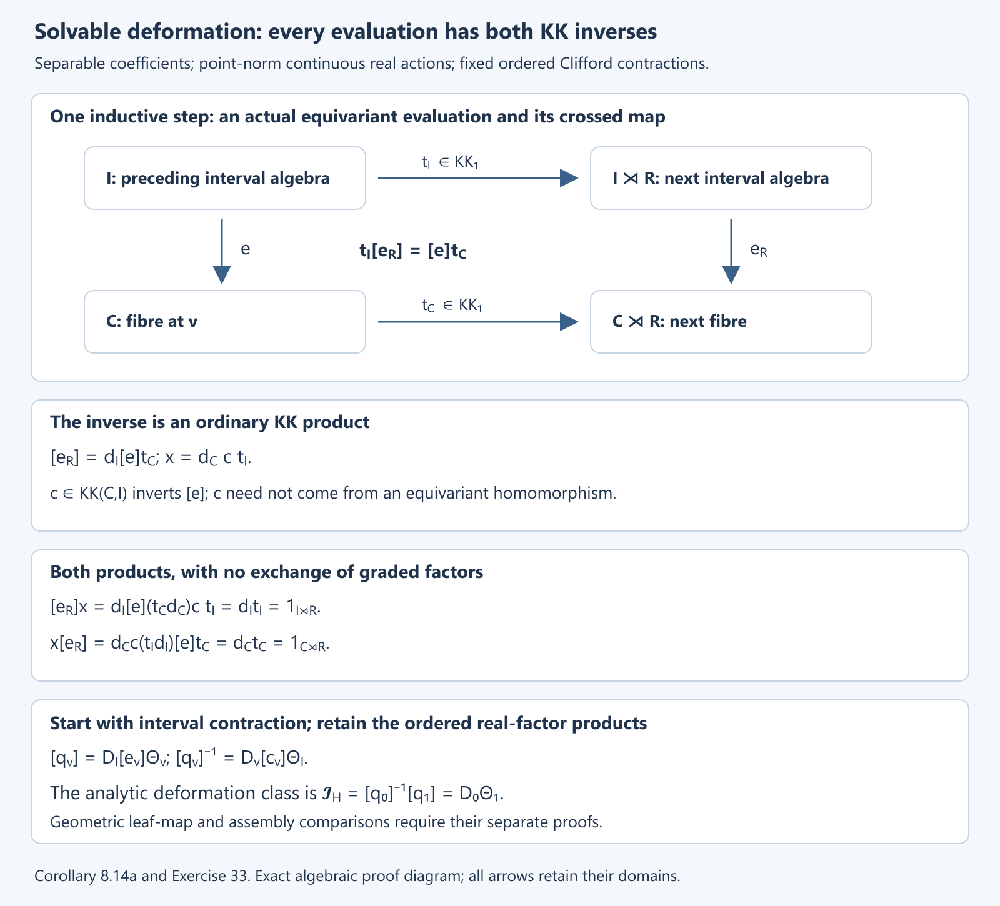

**Figure 8.14a.** The exact induction in Corollary 8.14a. Here \(I\) is the preceding interval algebra, \(C\) its fibre, and \(e\) its equivariant evaluation. Horizontal arrows are odd KK equivalences; vertical arrows are actual even evaluation homomorphisms. The naturality identity determines the crossed evaluation and its inverse. The two product calculations retain the factor order. At dimension zero the ordinary coefficient inverse is the constant inclusion, with its interval contraction homotopy. The diagram makes no geometric leaf-map or assembly identification. The real-action method is due to Fack and Skandalis; the bounded inverse and Fourier-sign proof used here are Lemmas 0.16–0.17 and Theorems 0.18–0.19.

Full-size PNG · Editable SVG.

**Lemma 8.15 (uniform calculus through the zero anchor).** Suppose \(V\) is compact and the \(H\)-action is smooth. The family transformation groupoid
\[
\mathcal G=\coprod_{v\in[0,1]}(V\rtimes H_v)
\]
has a compact-support source-fibre pseudodifferential calculus, with principal bundle
\(V\times[0,1]\times\mathfrak h^*\). Its order-zero operators are multipliers of \(\mathfrak A_H(C(V))\); negative-order operators belong to that algebra. Completion gives the exact scalar symbol sequence
\[
0\longrightarrow\mathfrak A_H(C(V))
\longrightarrow\overline\Psi^0(\mathcal G)
\xrightarrow{\sigma}
C(V\times[0,1]\times S^{d-1})\longrightarrow0.
\tag{59}
\]
Bundle corners have the corresponding assertion. At \(v=0\) the anchor is zero, while the source fibres still have dimension \(d\); this causes no degeneration in these estimates.

In rank zero, interpret \(S^{-1}\) as the empty cosphere. The family algebra is \(C(V\times[0,1])\), every kernel is smoothing, and (59) has zero symbol quotient. The following proof treats \(d\ge1\).

**Proof.** The source fibre at \((x,v)\) is \(H_v\). Use the fixed smooth coordinates near its identity from (53)–(54), and right-translate those coordinates to any point \(h_0\) of the fibre. The relative group coordinate of \(h=uh_0\) and \(h'=u'h_0\) is \(uu'^{-1}\), independent of \(h_0\). In the regular representation a coefficient \(b\) is evaluated at \(h x\), so on this patch its base point is \(h_0x\) followed by the small action of \(u\). This base point remains in compact \(V\). The needed derivatives in \(u\), the relative coordinate changes, and the normalized densities have bounds uniform in \(v\) and in this base point. Parameter derivatives of the original kernel are taken on its fixed compact groupoid charts; we do not assert bounded \(v\)-derivatives of a faraway moving point \(h_0x\). Such derivatives are not used in the regular norm bound. Right translation of left Haar introduces one constant modular factor for the patch; normalizing its \(L^2\) coordinate map cancels that constant. The remaining local factors are smooth positive densities on the small chart. No derivative of an inverse anchor, and no injectivity of the anchor, is used.

Here is why local estimates give a uniform bound on the entire, possibly noncompact, fibre. Equip \(H_v\) with the right-invariant metric specified by the fixed tangent basis. A sufficiently small coordinate ball and its slightly larger buffer work for every \(v\), since the near-identity metric coefficients depend smoothly on a compact parameter interval. Choose a maximal separated set and translated bump functions, then normalize them to a square partition \(\sum_i\phi_i^2=1\). Its overlap number and derivative bounds are uniform. Indeed disjoint smaller balls have uniformly bounded positive local volume; a finite cover of a buffered identity ball bounds their possible number in that ball. Right translation preserves the metric and changes Haar by a constant, so the same ratio bound holds on every translated ball.

For a kernel with a fixed compact relative group support \(K\), each input patch meets only a uniformly bounded number of output patches, and conversely. To verify this without a global coordinate-growth assumption, cover the compact set \(K\), and its products with the fixed small coordinate buffers, by finitely many small coordinate balls, uniformly in \(v\). Their products are compact because group multiplication is smooth on the compact parameter interval. The preceding packing bound applies to this finite cover. If all localized blocks have norm at most \(C\) and each row and column has at most \(N\) blocks, Cauchy–Schwarz gives norm at most \(NC\) for the matrix of blocks. The square partition is an isometric localization and a contractive reconstruction, so this is the bound for the original operator.

On each such patch, a compact-support conormal kernel reduces, by a smooth phase change, to
\[
(2\pi)^{-d}\int e^{i(z-z')\cdot p}
a(z,p;x,v)\,dz'\,dp.
\]
The phase change uses the integrated differential of the relative coordinate map; it is invertible on the fixed small buffer even at \(v=0\). Half-density and bundle changes are smooth bounded factors. The symbol estimates are
\[
\|\partial_z^\gamma\partial_p^\eta a\|
\le C_{\gamma\eta}\langle p\rangle^{m-|\eta|},
\]
uniformly in \(x,v\) and the translated patches. Integrating by parts in the compact \(z\)-variable bounds its Fourier kernel by
\(C_L\langle\zeta-p\rangle^{-L}\langle p\rangle^m\).
For \(m=0\), choose \(L>d\) and apply the two-sided Schur bound, exactly as in the [index lesson, Lemma 6.1](the-index-theorem-for-measured-foliations.md#section-6). The finite-overlap argument just given makes this a uniform regular norm bound.

The same Taylor and integration-by-parts computation as in that lesson's Lemma 6.2 proves composition and adjoints: the local expansion is
\(\sum_\gamma(\partial_p^\gamma a)(D_z^\gamma b)/\gamma!\), and after \(L\) terms the remainder has order \(m+n-L\). All required derivatives and supports are uniform in \(v\). Away from the units a conormal kernel is smooth. Composable products of two fixed compact arrow supports are compact, since the source-range equality is closed in the Hausdorff unit manifold. Thus the calculation globalizes. Smooth kernels remain smooth under these products, also at zero.

For \(m<0\), truncate the symbol at \(|p|\le R\), keeping the same compact physical kernel cutoff. The error's finitely many order-zero seminorms are at most \(C R^m\); derivatives of the frequency cutoff satisfy the same bound. Therefore its regular norm tends to zero uniformly in \(x,v\). The truncated kernels are jointly smooth compact kernels in the dense algebra of Theorem 8.14. The fibre-supremum norm proves membership in \(\mathfrak A_H(C(V))\). Multiplying an order-zero kernel on either side by a smooth compact kernel gives a smooth compact kernel. The norm bound and the adjoint bound extend these two products to a bounded adjointable multiplier. Finite bundle embeddings into trivial bundles give the identical statements in bundle corners.

We include the quotient-norm check. If \(c=\|\sigma(P)\|_\infty\), quantize the smooth positive square root of
\((c^2+\varepsilon)I-\sigma(P)^*\sigma(P)\).
Composition gives
\(P^*P+Q^*Q=(c^2+\varepsilon)I+R\), with \(R\) of negative order in the algebra. Hence \(\|P+\mathfrak A_H(C(V))\|\le c\).
For the opposite inequality, fix \(x,v\) and a unit covector at the identity source chart. A unit wave packet of radius \(h^{1/2}\) and phase \(e^{i\langle z,p_0\rangle/h}\) has
\(\|Pu_h-\sigma(P)(x,v,p_0)u_h\|_2\to0\). Rescaling the packet and using degree-zero homogeneity proves this on bounded rescaled frequencies; the rapidly decreasing Fourier tail and the order-zero bound control the rest. Every smooth compact kernel takes this packet to zero in norm, by integration by parts, and algebra-norm approximation gives the same result for every element of \(\mathfrak A_H(C(V))\). This argument works in the additive source fibre at zero too. Taking the supremum proves equality of quotient and symbol norms. Smooth symbols are dense, and every one is quantizable; the norm identity proves surjectivity and that completion introduces no extra kernel. This proves (59).

Finally, an invertible principal bundle symbol has a smooth inverse on the compact parameter cosphere. Quantize both with fixed charts. Their two defects have order \(-1\), hence belong to the algebra, which suffices for a Fredholm index. If smoothing defects are desired, the recursive inverse symbols and the increasing-frequency Borel summation of the index lesson's Theorem 6.3 work uniformly on \(V\times[0,1]\). Each summand uses the same physical chart cutoff; growing products of actual operator supports are not summed. \(\square\)

### The Dirac cycle over the deformation

The evaluations in Corollary 8.14a are already KK equivalences. To use them to compare geometric operators, one needs an actual cycle over their common domain. Fibrewise self-adjoint operators and a fibrewise compactness assertion do not provide that cycle. We construct it here for the ordered, globally framed solvable deformation of Theorem 8.14. The global vector-bundle equivalence is proved in Section 6. Its general longitudinal use and the geometric wrong-way comparisons require their further arguments.

Write \(I=[0,1]\), \(A_I^0=\mathfrak A_H(\mathbb C)\), and \(A_I^B=\mathfrak A_H(B)\). Fix the ordered basis \(e_1,\ldots,e_d\) used in (53), with \([e_i,e_j]_v=v\sum_k c_{ij}^ke_k\). The positive Clifford algebra \(C_d\) has odd self-adjoint generators \(\varepsilon_i\), satisfying \(\varepsilon_i\varepsilon_j+\varepsilon_j\varepsilon_i=2\delta_{ij}\). All coefficient algebras \(B\) in the following statement are separable and trivially graded; Clifford tensor products retain their grading.

**Lemma 8.15a (regularity and algebra-valued resolvents).** On the standard graded module \(A_I^0\widehat\otimes C_d\), the differential operator
\[
D=\sum_i D_i\widehat\otimes\varepsilon_i,
\qquad U_i(s)=e^{-isD_i},
\qquad D_i=-iX_i^R,
\tag{115}
\]
has a regular self-adjoint closure, with the jointly smooth compact group kernels as a graph core. Here \(X_i^R f(h)=\left.\frac{d}{ds}f(\exp_{H_v}(se_i)h)\right|_{s=0}\), and the Hilbert-space realization uses normalized left Haar measure. Its scalar functional calculus satisfies
\[
f(D)\in A_I^0\widehat\otimes C_d\quad(f\in C_0(\mathbb R)).
\tag{116}
\]
In particular this is an assertion about the whole interval algebra.

**Proof.** Suppose first that \(d>0\). Left translations preserve left Haar, so \(-iX_i^R\) is formally symmetric. The right-invariant metric making the fixed frame orthonormal is complete. Its volume is right Haar. Put \(\kappa_i(v)=X_i^R\log\Delta_v\); these are constants on each group, smooth in \(v\). Since \(dh_R=\Delta_v^{-1}dh_L\), the unitary from right-Haar to left-Haar realization is multiplication by \(\Delta_v^{-1/2}\). In the right-Haar realization (115) is therefore
\[
D^R=\sum_i\bigl(-iX_i^R+\tfrac i2\kappa_i(v)\bigr)\varepsilon_i.
\tag{117}
\]
Indeed \(\operatorname{div}_{dh_R}X_i^R=-\kappa_i(v)\). This verifies symmetry including the modular term. The principal symbol is \(\sum_i p_i\varepsilon_i\), whose square is \(|p|^2\). Its propagation speed for this metric is one.

We verify the uniform support condition needed to apply the energy argument of Lemma 8.19. A single compact identity-coordinate buffer \(Q\) and a radius \(r>0\) work for every \(v\), by smooth dependence of the metric on the compact interval. A path of length at most \(R\) splits into at most \(\lceil R/r\rceil+1\) pieces; right translation puts the increment of each piece in \(Q\). The union of the corresponding products of copies of \(Q\), over \(v\in I\), is compact by the smooth group multiplication of Theorem 8.14. It contains all radius-\(R\) balls. The same argument prevents a finite-length path from escaping a translated compact buffer and proves completeness without a global coordinate-growth estimate.

The local elliptic estimates and the deficiency-cutoff proof of Lemma 8.19 now apply on each source group, with the just verified principal symbol, formal symmetry and complete metric. Thus \(D_v\) is essentially self-adjoint on its smooth compact core. The energy identity with a moving cutoff gives propagation at most \(|t|\) for \(W_v(t)=e^{itD_v}\). These are Hilbert-space statements at this stage.

Here is their passage to the interval algebra. For a jointly smooth compact kernel \(a_v\), \(W_v(t)a_v\) has support in a common compact set for \(|t|\le T\), by the preceding reachable-set bound. It is jointly smooth, including at zero. To see the parameter assertion explicitly, trivialize densities on that compact set, differentiate \(\partial_t u_v=iD_vu_v\), and obtain
\[
\partial_t(\partial_v u_v)
=iD_v\partial_v u_v+i(\partial_vD_v)u_v.
\]
The variation-of-constants integral bounds this derivative in each local Sobolev norm by the corresponding norms of the initial data and one higher norm of \(u_v\). Source differentiation has the same energy estimate; induction treats every source and parameter derivative. All coefficients and their derivatives are bounded on the common compact set. The smooth group family extends locally past the interval endpoints, as in Theorem 8.14, so this also proves one-sided smoothness there. Local Sobolev embedding gives the stated joint smoothness. This argument uses compact relative coordinates, rather than derivatives at an uncontrolled faraway moving base point.

The differential operators commute with right regular translations. Consequently \(L_ta=W(t)a\) is a left convolution centralizer on the compact kernel algebra: \(L_t(ab)=(L_ta)b\). Its partner is \(R_ta=(L_{-t}(a^*))^*\). Formal symmetry, or integration by parts in the convolution product, gives \((R_ta)b=a(L_tb)\). In the faithful direct sum of fibre regular representations, \(L_ta\) is the product of a unitary and the convolution operator for \(a\). Thus \(\|L_ta\|\le\|a\|\), and the same holds for \(R_t\). The full and reduced norms agree here by Theorem 8.14. Both centralizers extend and define a unitary multiplier \(W(t)\) of \(A_I^0\widehat\otimes C_d\). The group identities hold in that faithful representation. On test kernels,
\(\|(W(t)-1)a\|\le |t|\|Da\|\); applying this to adjoints proves strict continuity. Density extends it to every algebra element.

We give the module-domain argument, so that Hilbert-space regularity is not substituted for module regularity. On the standard module define \(D\) to be \(1/i\) times the norm generator of this strongly continuous unitary group. Difference quotients show that its domain is dense and that it is symmetric. It is closed: passing to a graph limit in
\(W(t)x-x=i\int_0^tW(s)Dx\,ds\) gives the same identity for the limit, and hence its derivative. For \(\eta\in C_c^\infty(\mathbb R)\), time convolution \(\int\eta(t)W(t)x\,dt\) lies in the generator domain, with derivative obtained by moving the derivative to \(-\eta'\). Time approximate identities approximate every domain vector in graph norm. For a fixed such convolution, approximate its input by smooth compact group kernels; the derivative error is at most \(\|\eta'\|_1\) times the input error. The support and smoothness just proved put these convolutions back in the test-kernel algebra. This proves the asserted graph-core property.

The Laplace integrals
\[
R_+=-i\int_0^\infty e^{-t}W(t)\,dt,
\qquad R_-=i\int_0^\infty e^{-t}W(-t)\,dt
\tag{118}
\]
converge strictly as multipliers and in norm after application to any module vector. Integration by parts gives both inverse identities
\((D+i)R_+=R_+(D+i)=1\) and \((D-i)R_-=R_-(D-i)=1\), on their respective domains. The second identity on each side also proves injectivity. These integrals are not asserted to be norm Bochner integrals in the multiplier algebra. Unitarity gives \(R_+^*=R_-\), and the integrals commute. Surjectivity of both \(D\pm i\) proves self-adjointness: if \(y\in\operatorname{Dom}D^*\), take \(x=R_+(D^*+i)y\). The vector \(y-x\) is in \(\ker(D^*+i)\), orthogonal to \(\operatorname{ran}(D-i)\), and is zero. Moreover \(R_+R_-\) is the inverse of \(1+D^2\), with range in \(\operatorname{Dom}D^2\). That range is dense because each resolvent has dense range. Hence \(D\) is regular self-adjoint on its full module domain.

It remains to prove (116). Use Lemma 8.15 with \(V\) a point and finite Clifford matrices. The principal inverse \((\sum p_i\varepsilon_i)/|p|^2\), cut off near zero and quantized with a fixed compact physical-coordinate cutoff, gives an order-\(-1\) operator \(Q_\pm\). The composition formula gives
\[
(D\pm i)Q_\pm=1-S_\pm,
\qquad Q_\pm,S_\pm\in A_I^0\widehat\otimes C_d.
\tag{119}
\]
Here the defect has order \(-1\); a smoothing defect is unnecessary. The principal symbol remains invertible at \(v=0\), and all estimates are uniform. On test kernels \(Q_\pm\) maps into the graph core and the displayed identity holds. Its bounded right side and closedness extend it to the whole module, with range in \(\operatorname{Dom}D\). Multiplication by the module inverse (118) therefore yields \(R_\pm=Q_\pm+R_\pm S_\pm\), which belongs to the interval algebra. The resolvent identity gives \(R_+-R_-=-2iR_+R_-\), so \(1-2iR_+\) is a unitary with adjoint \(1+2iR_-\). Continuous functional calculus for this bounded unitary therefore constructs the calculus in (116). Its restriction to functions vanishing at the circle point \(1\) is nondegenerate because the resolvent ranges are dense. The resolvents generate \(C_0(\mathbb R)\): the Cayley function \(u(x)=(x-i)/(x+i)\) identifies the one-point compactification with the circle, and \(u-1=-2i(x+i)^{-1}\), \(u^{-1}-1=2i(x-i)^{-1}\). Trigonometric approximation on the circle, subtracting the value at its distinguished point, uniformly approximates every function vanishing there by polynomials in these two differences. This proves (116), with norm approximation in the whole interval algebra. In dimension zero the algebra is \(C(I)\), \(D=0\) is everywhere defined, and all the assertions follow directly. \(\square\)

**Lemma 8.15b (the coefficient Kasparov cycle).** For a separable \(B\) with a point-norm continuous \(H\)-action, the operator of Lemma 8.15a induces a regular self-adjoint operator on
\[
E_I=A_I^B\widehat\otimes C_d,
\qquad \phi:C(I,B)\longrightarrow\mathcal L(E_I).
\]
With the usual coefficient representation, its bounded transform
\[
F=D(1+D^2)^{-1/2}
\tag{120}
\]
defines \(T_D\in KK_d(C(I,B),A_I^B)\), in the ordered Clifford model of Section 0.

**Proof.** Integration of the scalar group kernels gives a nondegenerate homomorphism \(j:A_I^0\to M(A_I^B)\). Indeed a scalar approximate identity supported in shrinking common identity buffers converges on the dense compact coefficient kernels, uniformly over \(I\). Extend \(j\) strictly, and include the Clifford factor. The wave multipliers and the two Laplace resolvents transfer through this extension. The generator proof in Lemma 8.15a applies on the coefficient standard module: both resolvents are inverses, and their ranges are dense. For the latter assertion, approximate scalar algebra elements by vectors in the scalar resolvent range and use density of \(j(A_I^0)A_I^B\). This proves regular self-adjointness over \(A_I^B\).

A graph core is the linear span of \(j(k)x\), for smooth compact scalar Clifford kernels \(k\) and \(x\in E_I\). To prove this, first time-smooth a domain vector as in Lemma 8.15a. Approximate its input by finite such vectors, using nondegeneracy. Their time convolutions are again of this form, since \(W(t)j(k)=j(W(t)k)\) and the scalar time convolution is a smooth compact kernel. The derivative error is bounded by \(\|\eta'\|_1\) times the input error. Thus they approximate the original vector in graph norm; no Hilbert-space spectral theorem with coefficients is involved.

For \(a\in C(I,B)\) and \(f\in C_0(\mathbb R)\), the localization statements are
\[
\phi(a)j(f(D)),\ j(f(D))\phi(a)
\in A_I^B\widehat\otimes C_d=\mathcal K(E_I).
\tag{121}
\]
For a compact scalar group kernel these products are compact coefficient group kernels, by convolution covariance and the continuous family action. Approximate the scalar element of (116) in its interval-algebra norm by such kernels. The multiplier bounds extend the conclusion to all \(a\) and \(f\). No unlocalized compactness for a nonunital coefficient algebra is being claimed.

Let \(B^\infty\) be the elements smooth for the original group action. Orbit convolution by compact smooth approximate identities proves density. Finite sums of continuous interval functions times elements of \(B^\infty\) are dense in \(C(I,B)\); all of their group derivatives are uniformly bounded. On this subalgebra, covariance and the negative physical phase give
\[
[D,\phi(a)]=C_a=i\sum_i\phi(v\delta_i a)\varepsilon_i.
\tag{122}
\]
Indeed differentiating \(U_i(s)\phi(a)U_i(s)^*=\phi(\alpha^v_{\exp(se_i)}a)\) gives \(-i[D_i,\phi(a)]=\phi(v\delta_i a)\). We check the domain assertion on the preceding core. Move \(\phi(a)\) through each integrated group unitary by \(\phi(a)U_h=U_h\phi(\alpha^v_{h^{-1}}a)\). On the compact kernel support this coefficient is smooth in \(h\), continuous in \(v\), with bounded first group derivatives. It can be approximated, together with those derivatives, by finite sums of scalar coordinate functions times elements of \(B\): use a finite coordinate partition, ordinary smooth approximation and the compactness of the coefficient and derivative ranges. Multiplying the scalar functions by \(k\) gives vectors in the same graph core. Differentiating their integrated expressions shows graph convergence, since the kernel and its first derivative errors bound the algebra norm by their uniform \(L^1\) norms. Thus \(\phi(a)j(k)x\) lies in the domain and (122) holds there. Its bounded right side and closedness extend it to every domain vector.

For \(b=(1+\tau^2)^{1/2}\) and \(R_\tau=(D^2+b^2)^{-1}\), the resolvent identity on the core, extended by the bounded factors below, gives
\[
[DR_\tau,\phi(a)]
=C_aR_\tau-D^2R_\tau C_aR_\tau
-DR_\tau C_aDR_\tau.
\tag{123}
\]
To justify the identity using only bounded factors, put \(R_z=(D-z)^{-1}\). Domain preservation by \(\phi(a)\) gives \([R_z,\phi(a)]=-R_zC_aR_z\). Since \(DR_\tau=(R_{ib}+R_{-ib})/2\), expanding these two first-order resolvents gives \(b^2R_\tau C_aR_\tau-DR_\tau C_aDR_\tau\). Substituting \(b^2R_\tau=1-D^2R_\tau\) gives (123). No domain-preservation assertion for the Clifford-valued \(C_a\) is needed. Every term is compact: \(C_aR_\tau\) and \(C_aDR_\tau\) are finite sums of the localizations (121), and the other displayed factors are bounded multipliers. Their combined norm is at most
\(9\|C_a\|/(4(1+\tau^2))\), since \(\|R_\tau\|\le b^{-2}\), \(\|DR_\tau\|\le(2b)^{-1}\), and \(\|D^2R_\tau\|\le1\).

The scalar identity \(h(x)=(2/\pi)\int_0^\infty x/(1+x^2+\tau^2)\,d\tau\) gives (120) as a strict limit of bounded partial integrals. The partial scalar functions are bounded by one and converge uniformly on compact spectral sets; the resolvent's dense range proves strict convergence. Formula (123), in contrast, is norm integrable. Consequently \([F,\phi(a)]\) is the norm integral of these compact commutators. The bound \(\|[F,\phi(a)]\|\le2\|a\|\) extends compactness from the smooth subalgebra to all coefficients. Finally \((F^2-1)\phi(a)=-R_0\phi(a)\) is compact by (121), and \(F\) is odd self-adjoint. This proves every Kasparov defect. The standard module is countably generated because the parameter algebra is separable. Dimension zero gives the coefficient homomorphism cycle \((C(I,B),\phi,0)\). \(\square\)

**Lemma 8.15c (the ordered zero-fibre comparison).** Put \(s_d=(-1)^{\lfloor d/2\rfloor}\). Evaluation at zero sends the cycle of Lemma 8.15b to the positive physical Bott class, with the following exact comparison to the native ordered real iteration:
\[
T_D[q_0]=s_d[e_0]\Theta_0
\quad\text{in }KK_d(C(I,B),B\otimes C_0(\mathfrak h^*)).
\tag{124}
\]

**Proof.** At zero the group is additive, the action is trivial and the modular character is one. The transform \(\widehat f(p)=\int e^{-i\langle p,h\rangle}f(h)\,dh\) sends \(-i\partial_{h_i}\) to \(p_i\). Hence the evaluated operator is
\[
F_d(p)=\frac{\sum_{i=1}^d p_i\varepsilon_i}{\sqrt{1+|p|^2}}.
\tag{125}
\]
The evaluated coefficient representation is \(a\mapsto a(0)\). The resolvents agree with these Fourier multipliers on the compact core and hence on their full domains, so evaluation of the regular calculus gives exactly this cycle.

We check its product, rather than identify it by its K-group action. For one coordinate (125) is the trivial-action cycle (109). Suppose the first \(m\) ordered factors have been identified, and write \(x\in\mathbb R^m\), \(y=p_{m+1}\). The tensor module for the next trivial real Thom factor is the standard module over \(B\otimes C_0(\mathbb R^{m+1})\widehat\otimes C_{m+1}\), with the old Clifford generators followed by \(\varepsilon_{m+1}\). The candidate product operator is \(F_{m+1}(x,y)\).

For a homogeneous creation vector \(\xi\in B\otimes C_0(\mathbb R^m)\widehat\otimes C_m\), the connection error with the lower operator \(y\varepsilon_{m+1}/\sqrt{1+y^2}\) has two parts. One has the coefficient \((\sum x_i\varepsilon_i)\xi(x)/\sqrt{1+|x|^2+y^2}\); the other has the coefficient
\[
(-1)^{|\xi|}\xi(x)y\varepsilon_{m+1}
\left(\frac1{\sqrt{1+|x|^2+y^2}}-\frac1{\sqrt{1+y^2}}\right).
\]
Both are in \(B\otimes C_0(\mathbb R^{m+1})\widehat\otimes C_{m+1}\). For large \(|x|\), use the small norm of \(\xi(x)\) and boundedness of each scalar multiplier. On bounded \(x\), the first expression tends to zero as \(|y|\to\infty\), and so does the parenthesis multiplied by \(y\), uniformly there. The adjoint connection error has the identical estimate. First using finite elementary vectors and then norm approximation proves the connection condition for every creation vector, with the displayed grading sign.

The positivity condition of Definition 0.3 is even exact:
\[
\{F_m\widehat\otimes1,F_{m+1}\}
=\frac{2|x|^2}{\sqrt{1+|x|^2}\sqrt{1+|x|^2+y^2}}\ge0.
\tag{126}
\]
The cross term cancels by the Clifford anticommutation. The cycle defects of \(F_{m+1}\) are the scalar \(C_0\) defect and exact coefficient commutation. Thus it is a product operator.

The preceding connection and positivity calculations prove the product on the **unreduced** standard Clifford module with the old generator block first. They also identify the positive ordered geometric Bott class after its specified consecutive-pair reduction. We must still compare that reduction with the native parity product of Lemma 0.13; its odd–odd target has the second-cycle coefficient first.

Write \(B_m\) for the positive geometric class of (125), reduced by the first \(2a\) generators when \(m=2a+\epsilon\), retaining the last right \(C_1\) generator if \(\epsilon=1\). Write \(t_{m+1}\) for the next positive one-dimensional trivial real Thom class. When \(m=2a\), the native product has the full module
\[
B\otimes C_0(\mathbb R^{m+1})\otimes\Sigma_a\widehat\otimes C_1.
\]
The old physical generators act on \(\Sigma_a\), and the new one is \(\Gamma_a\otimes L_\varepsilon\). The connection estimates and exact positive anticommutator above prove that the normalized sum is the actual product. Thus \(B_{2a}\cdot t_{2a+1}=B_{2a+1}\).

When \(m=2a+1\), the second-cycle coefficient precedes the retained old odd coefficient in (104). The full reduced module is
\[
B\otimes C_0(\mathbb R^{m+1})\otimes\Sigma_a\otimes\mathbb C^{1|1}.
\]
Its first \(2a\) physical generators are unchanged. Its last two physical generators and grading are
\[
p_m:\ \Gamma_a\otimes\sigma_y,
\qquad p_{m+1}:\ \Gamma_a\otimes\sigma_x,
\qquad \Gamma_a\otimes\sigma_z.
\]
The same creation-map estimates and positivity calculation apply with precisely this order, so this is the actual native product operator. In the positive geometric reducer, those last two physical generators instead have order \(\Gamma_a\otimes\sigma_x,\Gamma_a\otimes\sigma_y\). The explicit unitary
\[
U=1_{\Sigma_a}\otimes\frac{\sigma_x+\sigma_y}{\sqrt2}
\]
fixes every earlier generator, exchanges these last two, and anticommutes with the total grading. It preserves the right action and inner product and is onto. Consequently it is an even module unitary from the grading reversal of the geometric cycle to the native cycle. This right coefficient algebra is trivially graded. The grading operator is therefore right-linear; conjugating the additive inverse cycle \((\Pi E,-F)\) by it identifies that inverse with \((\Pi E,F)\). It follows, as an identity of full cycles and KK classes, that
\[
B_{2a+1}\cdot t_{2a+2}=-B_{2a+2}.
\]
This last scalar-target argument is used only after the two odd coefficients have been contracted. On a module with a retained right odd Clifford coefficient, its grading operator is not right-linear, and cannot justify that shortcut.

Starting with the rank-zero identity and the rank-one class (109), bilinearity and these actual product operators give
\[
\Theta_0=(-1)^{\lfloor d/2\rfloor}B_d,
\qquad B_d=(-1)^{\lfloor d/2\rfloor}\Theta_0.
\]
Equivalently, the native physical generator list is
\((2,1,4,3,\ldots,2a,2a-1[,d])\); each consecutive exchange contributes the displayed grading reversal. Coefficient multiplication is even, and all compactness tests remain localized by the tested coefficient, as in Lemma 0.13. The argument therefore holds for every separable trivially graded \(B\), including nonunital coefficients.

For completeness this normalization preserves both inverse products. Let \(A_d\) be the full geometric inverse obtained from Lemmas 6.0a–b and Theorem 6.0c by the prescribed source-to-target transfer and parity reduction of Lemma 7.20. Those complete module evaluations give \(B_d A_d=1\) and \(A_d B_d=1\). The inverse of the native accumulated real product is therefore \(s_d A_d\), where \(s_d=(-1)^{\lfloor d/2\rfloor}\); uniqueness identifies it with the reverse chronological product of the real inverses. Both products are \(s_d^2\) times the corresponding geometric identity and hence equal one. This statement uses the actual geometric inverse and its entire finite Clifford transfer, without substituting an independently normalized positive Dirac cycle. Combining the Fourier evaluation with \(B_d=s_d\Theta_0\) proves (124). In rank zero all classes are the coefficient homomorphism class. \(\square\)

**Theorem 8.15d (the framed longitudinal Dirac representative).** In the precise ordered solvable deformation,
\[
T_D=s_d\Theta_I,\qquad
[\iota_B]T_D[q_1]=s_d\Theta_1,
\qquad \iota_B(b)(v)=b.
\tag{127}
\]
These are KK-class equalities for separable coefficients, not merely equalities of induced K-group maps. For a smooth locally free action whose holonomy groupoid is \(V\rtimes H\), take \(B=C_0(V)\). The endpoint cycle is the Dirac cycle of the ordered global longitudinal frame, with its homogeneous source metric and induced spin structure. It is also the corresponding Levi-Civita spin Dirac class, with the same Clifford and chirality conventions.

**Proof.** Naturality in Corollary 8.14a gives \(\Theta_I[q_0]=[e_0]\Theta_0\). Lemma 8.15c gives \(T_D[q_0]=s_d[e_0]\Theta_0=s_d\Theta_I[q_0]\). Multiply this equality on the right by the explicit KK inverse of \([q_0]\). Associativity gives the first identity in (127). Evaluating at one and precomposing with the constant coefficient inclusion gives the second, since \([\iota_B][e_1]=1_B\). The inclusion need not be equivariant; this use is an ordinary KK product. The preceding lemmas supplied the actual interval cycle and its zero-fibre product, so no representative comparison is inferred just from evaluation being an isomorphism.

We verify the last geometric assertion. On a source fibre the ordered right-invariant frame has constant structure coefficients \(-c_{ij}^k\). The Koszul formula therefore makes every Levi-Civita connection coefficient constant in that frame. For negative Clifford multiplication set \(c_i=-i\varepsilon_i\). The spin Dirac operator \(\sum_i c_i\nabla_{X_i^R}\), in the right-Haar realization, has principal part \(\sum_i-iX_i^R\varepsilon_i\). Its connection term differs from the modular correction in (117) by a constant, odd, self-adjoint Clifford endomorphism \(K_v\). This difference is self-adjoint because both differential operators are formally symmetric for metric volume. Its norm is uniformly bounded over \(I\), since the structure constants and modular logarithmic derivatives depend smoothly on \(v\). No compactness or ambient bounded geometry of \(V\) is needed: the coefficients are intrinsic to the homogeneous source groups. At zero the frame is flat, \(K_0=0\).

For completeness the bounded perturbation gives an actual Kasparov homotopy. Put \(D_s=D+sK\), \(0\le s\le1\), on \(\operatorname{Dom}D\). Choose \(\lambda>\max(1,\|K\|)\). A Neumann series for \(1+sK(D\pm i\lambda)^{-1}\) proves surjectivity of \(D_s\pm i\lambda\). Symmetry and the inverse-domain argument of Lemma 8.15a prove self-adjointness. Their product \(S=(D_s^2+\lambda^2)^{-1}\) has dense range and satisfies \(0\le S\le\lambda^{-2}\). The bounded operator \(1+(1-\lambda^2)S\) is positive invertible, bounded below by \(\lambda^{-2}\); hence \(S(1+(1-\lambda^2)S)^{-1}\) is the inverse of \(1+D_s^2\). This proves regularity. The scalar resolvents belong to the parameter algebra, first by the Neumann series and then at every nonreal parameter by the resolvent identity. Also \([D_s,\phi(a)]=[D,\phi(a)]\), since the scalar Clifford endomorphism \(K\) commutes with coefficients. Thus (121)–(123) give all localized cycle defects.

The transforms \(F_s\) are norm continuous. Indeed, for \(b=\sqrt{1+\tau^2}\),
\[
D_s(D_s^2+b^2)^{-1}
=\tfrac12\bigl((D_s-ib)^{-1}+(D_s+ib)^{-1}\bigr).
\]
The resolvent identity bounds the difference of these expressions for \(s,t\) by \(|s-t|\|K\|/b^2\). Integrating their difference, which is norm integrable although the individual transform integrals need only converge strictly, gives \(\|F_s-F_t\|\le |s-t|\|K\|\). Localized resolvent defects and commutators are continuous by the same estimates and their integrable tails. This is a Kasparov homotopy on the interval module. The ordered Clifford Morita contractions of Section 0 convert its Clifford-valued cycle into the spinor cycle, including odd dimension. In even dimension \(d=2\ell\), its grading is \(i^\ell c_1\cdots c_d=(-i)^\ell\varepsilon_1\cdots\varepsilon_d\), precisely the grading of the [index lesson, Lemma 6.24](the-index-theorem-for-measured-foliations.md#section-6).

For the graph action, source-fibre constructions and right translations give the longitudinal operator and its coefficient representation on the convolution module. The principal bundle frame is the given ordered identification \(F\cong V\times\mathfrak h\); its zero-fibre symbol is (125). This proves the stated framed Dirac comparison with the explicit native normalization \(s_d\). Corollary 6.0d tracks the chosen spin-c structure and proves the nontrivial vector-bundle Thom equivalence. Its use in the general longitudinal deformation, general foliation wrong-way factorization and assembly still need their own comparisons. \(\square\)

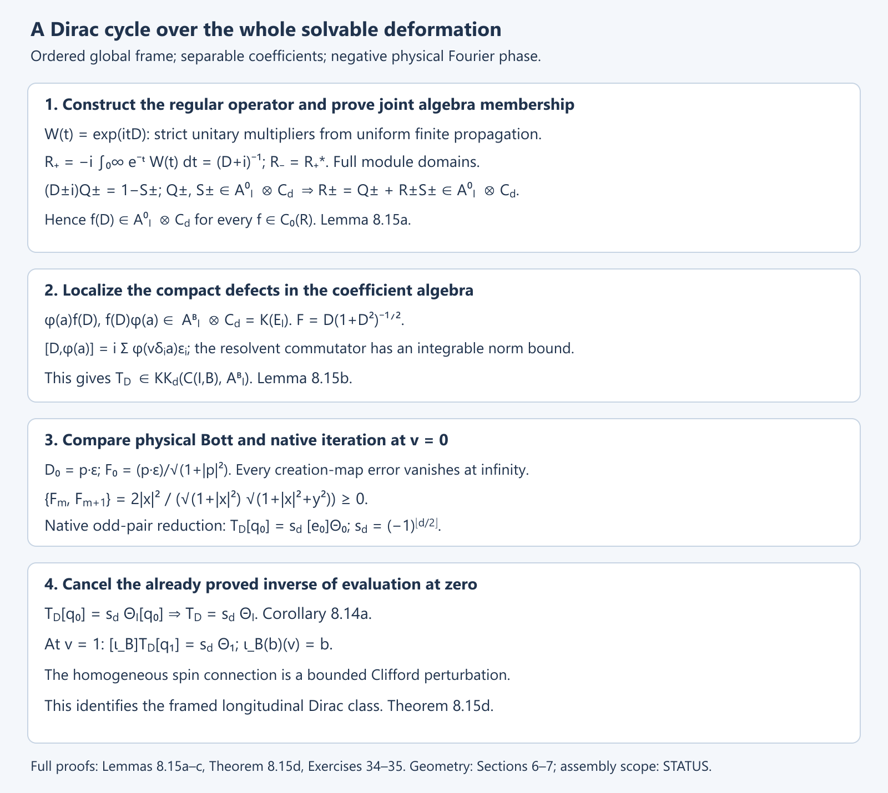

**Figure 8.15d.** The analytic steps establish a cycle in the parameter algebra before cancellation by the proved inverse of \([q_0]\). The middle positivity formula proves the raw Clifford product. The native odd–odd contraction exchanges each final pair; the explicit finite spinor unitary gives \(s_d=(-1)^{\lfloor d/2\rfloor}\) before the last comparison of actual KK classes. Lemmas 8.15a–c and Theorem 8.15d give the full proofs; the geometric statement is restricted to the indicated global frame. The real-action deformation method is due to Fack and Skandalis, as credited in Section 0; the product connection criterion is due to Connes and Skandalis, Appendix A.

Open full-size figure · Open editable SVG

**Theorem 8.16 (solvable longitudinal symbol index).** Let \(V\) be compact, and suppose a smooth locally free action of a simply connected solvable group \(H\) has orbit holonomy groupoid \(G=V\rtimes H\). Then the full longitudinal symbol index is an isomorphism
\[
\operatorname{Ind}_a:K_c^0(V\times\mathfrak h^*)\xrightarrow{\cong}
K_0(C(V)\rtimes H).
\]
More precisely, with the Fourier identification at zero and the ordered tangent identification at one,
\[
\operatorname{Ind}_a=(\mathrm{ev}_1)_*(\mathrm{ev}_0)_*^{-1}.
\tag{60}
\]
The analogous suspended statement holds in degree one. This is a comparison with the actual analytic symbol map, without an assembly or wrong-way independence assumption.

**Proof.** A compact relative symbol class is a triple \((B_0,B_1,a)\) over the disk and sphere of \(V\times\mathfrak h^*\). Radial contraction transports each disk bundle to a bundle from \(V\), as proved in the [Hilbert-module lesson, Theorem 6.6](hilbert-modules-and-fields-on-the-leaf-space.md#section-6). Smooth approximation preserves the sphere isomorphism. Keep this triple constant in \(v\), and quantize it with Lemma 8.15. A quantization \(P\) and its inverse-symbol quantization \(Q\) have both defects in \(\mathfrak A_H(C(V))\).

Apply the exact elementary-matrix index construction (11)–(12) of that lesson in the two finite bundle corners. It gives \(I(a)\in K_0(\mathfrak A_H(C(V)))\). Direct sums, smooth symbol homotopies, changed quantizations, and triples whose sphere isomorphism extends to the disk preserve the index, by the same continuous-parametrix argument. Thus \(I\) is defined on the full relative K-group. Evaluation of each matrix factor gives the endpoint index; this establishes naturality by the explicit formula, not by an asserted constancy of fibre Fredholm operators.

At zero the group acts trivially. Fourier transformation converts \(P\) to a bounded matrix function \(P_0(x,p)\), with radial limit \(a(x,p/|p|)\), and \(Q\) has the inverse radial limit. A compact physical cutoff changes the uncut Fourier symbol by a negative-order function, which vanishes at infinity and leaves this relative class unchanged. Compactify each \(\mathfrak h^*\) radially to its disk. On the boundary the elementary matrix \(W\) is exactly the diagonal map \(\operatorname{diag}(a,a^{-1})\), so its first range bundle is \(B_0\) identified with \(B_1\) by \(a\). Extend its range idempotent by the fixed trivial complements as in formula (12). Its difference from the reference idempotent is precisely the disk/sphere clutching construction of \((B_0,B_1,a)\). Hence
\[
(\mathrm{ev}_0)_*I(a)=[B_0,B_1,a].
\]
This also fixes the sign: a zero-dimensional fibre gives \([B_0]-[B_1]\), the kernel-minus-cokernel convention. The construction retains the actual source and target bundles and their complements; it does not require those bundles themselves to be trivial.

At one, the source-fibre calculus is the holonomy-cover calculus for \(G=V\rtimes H\). The module corner and index matrices are exactly those of the Hilbert-module lesson's Theorem 6.6. Thus \((\mathrm{ev}_1)_*I(a)=\operatorname{Ind}_a(a)\). Theorem 8.14 makes both evaluations K-isomorphisms, proving (60) and surjectivity as well as injectivity.

For degree one, suspend the coefficients and all the index matrices. Smooth compact-support suspension kernels are dense; their estimates use the same fixed supports in the additional parameter on each compact set. The natural suspension identifications then give the degree-one statement. If \(d=0\), the family is constant and the index is the difference of its two finite bundle modules, so (60) holds directly. \(\square\)

**Corollary 8.17 (the complete compact trace-image formula).** Under the hypotheses of Theorem 8.16, let \(\Lambda\) be a locally finite invariant transverse measure. Then formula (20) holds, with the parity there stated.

**Proof.** The ordered fundamental fields identify \(F\) with \(V\times\mathfrak h\). Thus \(\operatorname{Td}(F\otimes\mathbb C)=1\). By Theorem 8.16 every class of \(K_0(A)\) is a full relative-symbol index. The all-symbol measured theorem, [Theorem 6.37 of the index lesson](the-index-theorem-for-measured-foliations.md#section-6), gives
\[
\tau_{\Lambda*}(\operatorname{Ind}_a\alpha)
=\epsilon_d\langle\pi_!\operatorname{ch}(\alpha),[C_\Lambda]\rangle,
\qquad \epsilon_d=(-1)^{d(d+1)/2}.
\tag{61}
\]

We check the entire symbol lattice. Stable Bott periodicity gives an external-product isomorphism
\[
K^{d\bmod2}(V)\longrightarrow K_c^0(V\times\mathbb R^d),
\qquad x\longmapsto x\boxtimes b_d,
\]
where \(b_d\) is a scalar generator in \(K_c^{d\bmod2}(\mathbb R^d)\). Its Chern normalization has absolute value one. In even dimension this is the ordered trivial spin-c computation of the index lesson's Theorem 6.29, whose fibre character is \((-1)^{d/2}\). In odd dimension tensor that even generator with
\(u_+(p)=(p-i/2)/(p+i/2)\). Its one-form satisfies
\[
\int_{\mathbb R}\frac1{2\pi i}u_+^{-1}du_+=1.
\]
The suspension isomorphism is the external product with this winding generator, as fixed in Corollary 8.10 and the stable Bott conventions above. Multiplicativity of the even and suspension Chern characters follows from tensor curvature and its transgression; the latter is obtained by differentiating a connection path and integrating its exact Chern derivative. Hence, after a possible replacement of \(b_d\) by \(-b_d\), its top fibre character integrates to \(+1\).

With base differentials preceding the ordered positive fibre differentials, fibre integration gives
\(\pi_!\operatorname{ch}(x\boxtimes b_d)=\operatorname{ch}(x)\).
If the suspension product is ordered in the opposite way, the Koszul sign on the only component pairing with the \(d\)-current is the fixed sign \((-1)^d\); it can equivalently be absorbed in \(b_d\). Thus the stated subgroup image is independent of this order, while (61) retains its actual analytic sign. Every symbol class is one such product, including torsion classes whose character and trace vanish by (61). As \(x\) runs through a group, multiplication of every pairing by \(\epsilon_d\) leaves its image subgroup unchanged. This proves (20). No equality of the three source maps is inferred from equality of their numerical images. \(\square\)

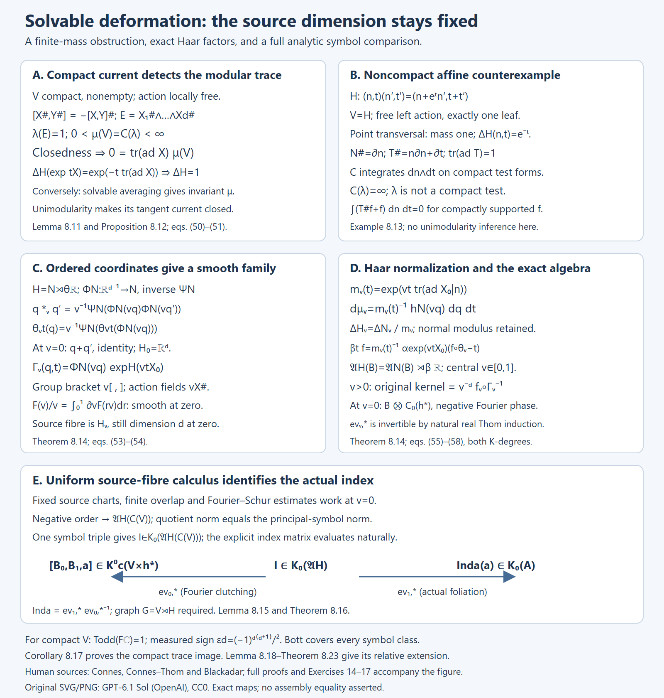

*Figure 3. Proposition 8.12 and Theorems 8.14–8.16. The parameter is \(v\); at zero the anchor vanishes but the group fibre is \(\mathbb R^d\). Haar densities and the positive-parameter kernel factor are exact. The bottom comparison uses the uniform source-fibre calculus of Lemma 8.15. It establishes the compact trace formula of Corollary 8.17. Example 8.13 shows why the measure-existence assertion needs compactness. Assembly and independence of geometric wrong-way factorizations remain further obligations.*

Full-size PNG · Editable SVG.

### Compact support on a noncompact base

Compactness of \(V\) made the preceding heat traces individually finite. For a noncompact \(V\) the two traces may both be infinite. The appropriate replacement is an actual relative index matrix with a finite trace difference. We now construct it. Throughout this subsection the action is smooth and locally free, \(H\) is simply connected and solvable, and the orbit holonomy graph is \(V\rtimes H\). Put
\[
B=C_0(V),\qquad A=B\rtimes H.
\]
Full and reduced completions agree by Lemma 8.3. The chosen fundamental frame orients and trivializes \(F\). The measure \(\Lambda\) is invariant and geometrically locally finite. Write \(\mu\) for its unit measure using the right-invariant leafwise volume of this frame, and \(C=C_\Lambda\) for its closed tangent current. Neither \(\mu(V)<\infty\) nor unimodularity of \(H\) is assumed.

**Lemma 8.18 (the full compact-support symbol map).** The conclusion (60) of Theorem 8.16 holds with \(C(V)\) replaced by \(C_0(V)\), in both degrees. For \(d>0\), every class of \(K_c^0(V\times\mathfrak h^*)\) can be indexed by an operator
\[
P=I+P_K
\]
on a finite trivial bundle, whose order-zero principal symbol is unitary and equals \(I\) outside a compact subset \(K\subset V\). The operator \(P_K\) has compact base and relative group support. Its inverse-symbol parametrix can have the same form.

**Proof.** The disk/sphere extension for the trivial real bundle is
\[
0\longrightarrow C_0(V\times\mathbb R^d)
\longrightarrow C_0(V\times\overline{\mathbb B}^d)
\longrightarrow C_0(V\times S^{d-1})\longrightarrow0.
\tag{62}
\]
Contracting the disk identifies its K-groups with those of \(B\). Restriction of the constant disk functions to the sphere is injective on K-groups: evaluation at any fixed point of the sphere is a left inverse. Consequently the six-term sequence makes the boundary from \(K_1(C_0(V\times S^{d-1}))\) onto the \(K_0\) group of the ideal surjective. This is an integral assertion, including torsion. Its sign is the disk/sphere clutching sign of Theorem 8.16.

Represent a sphere \(K_1\)-class by a finite matrix unitary in the unitization. After a constant unitary homotopy its scalar value is \(I\). Uniform convergence to \(I\) at base infinity permits a compact cutoff of \(u-I\): choose a larger compact set on whose complement \(\|u-I\|<1/4\). The cutoff matrix remains invertible on the transition region and is unchanged on the inner compact set. Its polar part is a unitary equal to \(I\) off a compact set and homotopic to \(u\). Smooth approximation on that compact set, followed by the same polar operation, makes it smooth without changing its class.

Quantize \(u-I\) with a fixed small physical kernel cutoff and compact base cutoff, and set \(P=I+\operatorname{Op}(u-I)\). Quantize \(u^{-1}-I\) similarly. All source derivatives used in Lemma 8.15 are now bounded on fixed compact enlargements of \(K\), instead of on all of \(V\). Products only replace \(K\) by the image of \(K\) under a fixed compact set of group elements. Such images are compact, uniformly over the parameter \(v\). The homogeneous group geometry, right-translation density normalization, finite-overlap localization and Fourier–Schur estimate of that lemma require no compactness of the base. Hence they apply verbatim to these coefficients. Negative-order compact-base kernels belong to \(\mathfrak A_H(B)\) by the frequency cutoff estimate \(CR^m\), \(m<0\). The two inverse defects therefore belong to this algebra.

For clarity, the completed compact-base calculus has quotient \(C_0(V\times[0,1]\times S^{d-1})\); adding \(I\) gives the scalar unitized quotient needed here. The quotient-norm argument still works. Its upper bound quantizes the positive square root after subtracting its constant value at base infinity. Its lower bound freezes one finite base point and one covector; algebra kernels annihilate the shrinking wave packet. Surjectivity follows by smooth compact approximation. Thus no extra quotient kernel appears on completion.

Keep \(u\) constant in \(v\) and apply the elementary index matrices of Theorem 8.16. At zero they give its disk/sphere boundary class, and at one its actual longitudinal index. Theorem 8.14 applied to \(B\) makes both evaluation K-maps invertible. Surjectivity of the boundary in (62) proves (60) for every symbol class, not just a chosen set of differential symbols. Suspension of (62) and of these matrices proves the other degree. For \(d=0\), the algebra is \(B\) and the index is directly the difference of the coefficient projections. \(\square\)

**Lemma 8.19 (relative wave calculus).** Suppose \(d>0\). A class \(x\in K_0(B)\) has smooth finite matrix projection representatives \(p_0,p_1\) with the same constant projection \(p_\infty\) outside a compact set \(K\). The twisted leafwise spin Dirac operators on their ranges, with the usual spinor grading when the source dimension is even, admit a functional calculus with the following properties:

1. Their self-adjoint extensions are unique, and their wave groups have propagation at most the absolute wave time.
2. A Schwartz function with Fourier support in \([-\delta,\delta]\) gives a smooth kernel of group propagation at most \(\delta\). The difference of the two twisted kernels is supported over a compact enlargement of \(K\).
3. All these assertions also hold on \(G\times(S^1\times S^1)\), with source fibre \(H\times S^1\), and coefficients compactly supported in the \(V\)-direction.

Here propagation refers to the complete right-invariant source metric, and the circle in part 3 has its usual complete metric. It does not refer to distance in an arbitrary ambient metric on \(V\).

**Proof.** Begin with continuous projections in a finite matrix algebra over \(B^+\). Stabilization and a scalar unitary arrange their common scalar projection to be \(p_\infty\). Smooth a self-adjoint approximation which is exactly \(p_\infty\) outside a larger compact set and is within \(1/8\) of the projection. The spectral cut at \(1/2\) is smooth, is exactly \(p_\infty\) there, and is homotopic to the original projection through the same spectral cut. This proves the representative assertion without a finite cover of the whole noncompact manifold.

On the full trivial coefficient bundle use the Hermitian connection
\[
\nabla^p=d+[p,dp].
\tag{63}
\]
The commutator is skew-adjoint. Differentiating \(p^2=p\) gives \([ [p,dp],p]=-dp\), so \(\nabla^p p=0\); its restriction to the range is the projection connection \(p\,d\). The resulting full spin Dirac operator \(D_p\) preserves this range and its orthogonal complement. Outside \(K\) it is the common homogeneous operator \(D_\infty\). Its principal symbol is \(ic(\xi)\), with the chirality fixed in Lemma 6.24 of the index lesson.

Every invariant metric on a connected Lie group is complete. One elementary verification is to cover a small buffered identity ball by finitely many still smaller balls and translate this cover along a metric path. A finite-length path crosses only finitely many such buffers; a Cauchy path tail stays in a translated compact coordinate buffer and converges. The Hopf–Rinow argument then makes each closed metric ball compact. Curvature, a positive injectivity buffer and all metric jets are uniform by translation. The coefficient jets of (63) are uniform too: they vanish off \(K\), and repeated derivatives along fundamental fields are bounded on each fixed compact enlargement. On a translated source chart they are exactly these derivatives at its translated base point. The circle product retains these bounds and the finite-overlap bounds.

Local elliptic estimates imply that an \(L^2\) distributional deficiency vector is locally smooth. Choose source cutoffs \(\eta_R\), tending to one and satisfying \(\|d\eta_R\|_\infty\le C/R\). If \((D_p\pm i)w=0\), integration by parts against \(\eta_R^2w\), justified first on compact buffers, gives
\[
\|\eta_Rw\|_2^2
\le \frac{C}{R}\|\eta_Rw\|_2\|w\|_2.
\]
Letting \(R\) tend to infinity shows \(w=0\). This proves essential self-adjointness. The energy identity for a moving spatial cutoff uses
\(\|[D_p,\eta]\|=\|c(d\eta)\|\le\|d\eta\|_\infty\).
Choosing its level sets to recede with unit speed makes the exterior energy nonincreasing. A solution initially supported in a set therefore stays in its \(|s|\)-neighbourhood at wave time \(s\). Approximation by smooth data proves this for the full unitary wave group. The same estimate applied to the difference of two wave solutions proves equality in any causal region where their coefficients agree.

The metric volume on \(H\) is right Haar. If the convolution realization uses left Haar, the change of realization is multiplication by \(\Delta_H^{-1/2}\), since \(dh_R=\Delta_H^{-1}dh_L\). This is a unitary between the two \(L^2\) spaces, preserves support and has value one at the unit. Its logarithmic source derivatives are constants fixed by the modular character. Thus all estimates and the unit diagonal density remain valid for nonunimodular \(H\).

Here are the algebra and smoothing details. The wave group maps a smooth compact test kernel to one with compact relative group support: finite speed enlarges that support by a fixed compact metric ball. Source energy estimates preserve every Sobolev order, and differentiation with respect to a parameter on a compact base set uses the differentiated wave equation and its finite-time Duhamel integral. It therefore preserves smooth test kernels and their adjoints. The regular norm is at most one. On a test kernel \(a\),
\[
\|(e^{isD_p}-1)a\|\le |s|\,\|D_pa\|,
\]
and the adjoint estimate gives strict continuity. These double centralizers define the wave multipliers; the faithful direct sum of regular representations gives their stated norm bounds and group identities.

Use the coefficient algebra \(\mathcal B=B^+\rtimes H\), not the scalar unitization \(A^+\). Compactly supported Fourier integrals of the wave group are its multipliers. If the spectral function is Schwartz, then \(D_p^j f(D_p)\) is bounded for every \(j\). Uniform elliptic estimates and local Sobolev embedding give a smooth kernel with all source derivatives bounded. Its relative group support is compact by finite speed. Off a fixed compact enlargement of \(K\) it is exactly the kernel of \(f(D_\infty)\), by equality in causal regions. The latter is a smooth compact kernel in \(C^*(H)\); the difference is a smooth compact kernel in \(A\). Hence \(f(D_p)\in\mathcal B\). These Schwartz functions are uniformly dense in \(C_0(\mathbb R)\), so the assertion holds for that whole functional calculus. It is nondegenerate: for \(f_n(z)=(1+z^2/n^2)^{-1}\), the bound
\(\|(1-f_n(D_p))a\|\le n^{-2}\|D_p^2a\|\)
on the test core proves strict convergence to one. This also supplies the regular functional calculus on the coefficient module.

For the relative support assertion, a wave kernel between two source points depends only on coefficients within the wave-time neighbourhood of those points. If such a region misses the pullback of \(K\), the two kernels agree. At the units all possibly contributing base points therefore lie in \(H_RK\), for a fixed compact ball \(H_R\subset H\); off-diagonal support has the same bound with a larger fixed \(R\). The image of \(H_R\times K\) under the action is compact. Local finiteness gives \(\mu(H_RK)<\infty\). No estimate of \(\mu(V)\) is used. The circle product changes this set only to its product with a compact circle. \(\square\)

**Proposition 8.20 (an exact finite propagation relative index matrix).** Under Lemma 8.19's hypotheses with even source dimension, let \(E_i=\operatorname{ran}p_i\), and let \(\alpha\) be the difference of their graded Dirac symbol classes. There are idempotents \(e_i(t)\) with \(e_0(t)-e_1(t)\) a smooth compact arrow kernel such that
\[
\tau_{\Lambda*}(\operatorname{Ind}_a\alpha)
=\int_V\operatorname{str}\!\left(
 p_0r_t(D_{p_0})^2-p_1r_t(D_{p_1})^2
 \right)(1_x)\,d\mu(x),\qquad t>0.
\tag{64}
\]
The integrand is supported in one fixed compact set, independent of \(t\). It is not the difference of two separately integrated infinite heat traces.

**Proof.** Choose an even \(\chi\in C_c^\infty((-\delta,\delta))\), with \(0\le\chi\le1\) and \(\chi=1\) on \([-\delta_0,\delta_0]\), \(0<\delta_0<\delta\). Define
\[
\begin{split}
\rho_t(s)&=a_t\chi(s)(4\pi t)^{-1/2}e^{-s^2/(4t)},
& a_t^{-1}&=\int_{\mathbb R}\chi(s)(4\pi t)^{-1/2}e^{-s^2/(4t)}\,ds,\\
r_t(z)&=\int_{\mathbb R}\rho_t(s)e^{isz}\,ds,
& q_t(z)&=\frac{1-r_t(z)}z .
\end{split}
\tag{65}
\]
Normalization is essential: \(r_t(0)=1\), so \(q_t\) extends smoothly and oddly at zero. The even real function \(r_t\) is Schwartz. The Fourier distribution of \(q_t\) is a constant multiple of the primitive of \(\delta_{\{0\}}-\rho_t\), where \(\delta_{\{0\}}\) is the point mass at zero. Its total integral is zero, so the primitive can be chosen with support in \([-\delta,\delta]\). Consequently \(q_t(D_p)\) has propagation at most \(\delta\). It has order \(-1\): away from bounded spectral frequency it is \(D_p^{-1}\) modulo a smoothing function, and the local elliptic parametrix identifies this assertion in each source chart. Equivalently the compactly supported Fourier primitive has its only nonsmoothness at zero, which gives the inverse principal symbol.

Restrict to \(X=S^+\otimes E_i\) and \(Y=S^-\otimes E_i\). Put \(D=D_{p_i}^+:X\to Y\), \(Q=q_t(D_{p_i})^-:Y\to X\), \(S_0=r_t(D_{p_i})|_X\), and \(S_1=r_t(D_{p_i})|_Y\). Functional calculus gives
\[
QD=1-S_0,\quad DQ=1-S_1,\quad
DS_0=S_1D,\quad QS_1=S_0Q.
\]
The following matrix is bounded, despite the unbounded \(D\):
\[
e_i(t)=
\begin{pmatrix}
S_0^2&S_0(1+S_0)Q\\
S_1D&1-S_1^2
\end{pmatrix}.
\tag{66}
\]
Indeed its nonconstant entries are Schwartz functions of the full \(D_{p_i}\). The four displayed relations prove \(e_i(t)^2=e_i(t)\) by direct multiplication; for example the upper-left entry is
\(S_0^4+S_0^2(1+S_0)(1-S_0)=S_0^2\).
Extend this matrix by zero on the source coefficient complement and by identity on the target complement. Then both matrices act on the same finite trivial graded bundle. Each differs from \(e_{\rm ref}=\operatorname{diag}(0,I)\) by an element of \(M_{2N}(\mathcal B)\). Its nonconstant entries have propagation at most \(3\delta\). Equality of the two coefficient systems in causal regions shows that their difference is a smooth compact arrow kernel, supported in a fixed compact group ball and over, for example, \(H_{6\delta}K\). Enlarge the ball slightly if coordinate cutoffs are used.

We verify that the matrices give the actual symbol index. Put \(G=(1+D_{p_i}^2)^{-1/2}\). Conjugation on the source by \(G^{-r}\), \(0\le r\le1\), changes the two off-diagonal entries to
\[
G^{-r}S_0(1+S_0)Q,\qquad S_1DG^r
\]
and leaves the diagonal entries fixed. The scalar functions in these entries are Schwartz times a polynomial weight; they are norm continuous in \(r\). Their kernels remain in \(\mathcal B\), with relative difference in \(A\): compact Fourier approximation of a Schwartz function has this property, and functional calculus gives norm convergence. At \(r=1\) the formula is the bounded-parametrix index matrix for
\[
T=DG:X\to Y,\qquad Q'=G^{-1}Q:Y\to X.
\]
Their defects are \(S_0,S_1\), and their principal symbols are the normalized Dirac symbol and its inverse. On coefficient complements set \(T=Q'=I\). The elementary Fredholm boundary construction of the Hilbert-module lesson therefore identifies \([e_i-e_{\rm ref}]\) with this symbol index in \(K_0(\mathcal B)\). Varying \(t\) gives the same class by the same norm continuous formulas.

This absolute coefficient algebra is only an intermediate device. Exactness and its constant splitting give
\[
0\longrightarrow A\longrightarrow\mathcal B
\longrightarrow C^*(H)\longrightarrow0.
\tag{67}
\]
Both matrices have the same image \(e_\infty(t)\) in the quotient. For any idempotents \(e,f\) with \(e-f\in M_n(A)\), set
\[
J_f=\begin{pmatrix}f&1-f\\1-f&f\end{pmatrix},
\qquad
\widetilde e=J_f\operatorname{diag}(e,1-f)J_f.
\tag{68}
\]
One has \(J_f^2=I\), and \(J_f\operatorname{diag}(f,1-f)J_f=\operatorname{diag}(I,0)\). Thus \(\widetilde e-\operatorname{diag}(I,0)\in M_{2n}(A)\) defines a genuine relative class \([e:f]\in K_0(A)\), even if \(f\) is not a scalar idempotent. Direct sums, conjugations and continuous idempotent homotopies show that it maps to \([e]-[f]\) in \(K_0(\mathcal B)\). The split sequence (67) makes this inclusion injective. Naturality of the bounded symbol construction, with the common exterior bundle trivialization retained, consequently identifies
\([e_0(t):e_1(t)]=\operatorname{Ind}_a\alpha\).
It is not necessary to invert or discard an infinite reference trace.

The invariant transverse measure makes the weight of Theorem 7.10 of the transverse-measure lesson a trace. Lemma 7.9 there places every smooth compact arrow kernel in its linear trace ideal. Hence \(e_0-e_1\) has finite absolute trace in the measured algebra. This ideal is preserved by bounded multipliers, and cyclicity gives
\[
\tau(\widetilde e-\operatorname{diag}(I,0))
=\tau(e_0-e_1).
\]
The trace pairing of a finite-trace relative idempotent is this number: replacing its range by the orthogonal range projection, or applying the usual idempotent-to-projection homotopy, preserves the value by cyclicity on this ideal. This is the same normalization used for the Fredholm boundary index. The two diagonal entries of (66) now give exactly the supertrace in (64). The compact support and diagonal formula justify that integral absolutely. \(\square\)

**Theorem 8.21 (the relative measured formula in even rank).** If \(d\) is even, every \(\alpha\in K_c^0(F^*)\) satisfies
\[
\tau_{\Lambda*}(\operatorname{Ind}_a\alpha)
=\epsilon_d\langle\pi_!\operatorname{ch}(\alpha),[C]\rangle,
\qquad \epsilon_d=(-1)^{d(d+1)/2}.
\tag{69}
\]
All forms paired with the current have compact base support. The same theorem holds for the even-dimensional product source fibres \(H\times S^1\), with the circle pair groupoid and compact support in \(V\).

**Proof.** We first compute on the relative Dirac classes of Proposition 8.20. Integration by parts in (65) gives, for every fixed integer \(j\ge0\),
\[
\sup_{z\in\mathbb R}(1+z^2)^j
|r_t(z)^2-e^{-2tz^2}|
\le C_jt^{-M_j}e^{-c/t},\qquad 0<t\le1,
\tag{70}
\]
for some \(c>0\). To verify the estimate, subtract the uncut normalized Gaussian. Its removed tails and every fixed derivative have \(L^1\) norm at most a polynomial in \(t^{-1}\) times \(e^{-\delta_0^2/(8t)}\); the same bound holds for \(a_t-1\). Multiplication by \(z^m\) is integration by parts in \(s\). For the square, subtract the convolution of the uncut Gaussians and use the \(L^1\) convolution inequality for each fixed derivative. Reducing \(c\) absorbs the finite polynomial factors. This proves (70), including its polynomial spectral weights.

Uniform source elliptic estimates give a diagonal estimate
\[
|f(D_p)(1_x)|\le C_j
\sup_z(1+z^2)^j|f(z)|,\qquad j>d/2.
\tag{71}
\]
In detail, evaluation on a fixed unit chart is bounded on \(W^j\), uniformly in \(x\); its dual point distribution is bounded in \(W^{-j}\). The all-real spectral Sobolev comparison follows from the integer elliptic estimates, interpolation and duality exactly as in Lemma 6.7 and Theorem 6.8 of the index lesson, using Lemma 8.19's uniform source jets and localization. Pairing the two point distributions with
\((1+D_p^2)^{j/2}f(D_p)(1+D_p^2)^{j/2}\)
gives (71). Larger \(j\) treats kernel derivatives. Applying it to (70) bounds the diagonal error by \(Ct^{-M}e^{-c/t}\).

We also check the use of the local heat coefficient on these noncompact source covers. The radial transport recursion and Clifford degree calculation in Lemmas 6.24–6.25 and Theorem 6.26 of the index lesson use finitely many jets in a buffered source chart. Lemma 8.19 supplies bounds for each required jet, the inverse metric, the density and the finite-overlap partition on every such chart. The cut-off heat parametrix has compact relative group support. Its residual Taylor remainder and the separated-cutoff remainder have the same uniform Sobolev norm bounds as in Theorem 6.12 there, by the Fourier–Schur and row/column argument of Lemma 8.15. Increasing the finite recursion order gives any prescribed positive remainder power. Duhamel's remainder estimate uses the contraction bound of the self-adjoint heat semigroup and those Sobolev bounds; it has no integration over the unit space. It therefore proves the actual local expansion uniformly here. With the stated chirality and curvature convention, its supertrace density is
\[
\operatorname{str}\bigl(p_i e^{-sD_{p_i}^2}\bigr)(1_x)
=[\widehat A(F)\operatorname{ch}(E_i)]_d(x)+O(s).
\tag{72}
\]
All negative powers cancel pointwise by the full-word Clifford supertrace. This verification extends the local calculation; it does not assume that either heat trace over \(V\) is finite.

Let \(K'=H_{6\delta}K\) contain the support in (64). It is fixed and has finite unit measure. Equations (70)–(71) show that replacing the wave-cutoff diagonal by the heat diagonal on \(K'\) changes the integral by at most
\(C\mu(K')t^{-M}e^{-c/t}\).
Equation (72), at \(s=2t\), then shows that its limit is
\[
\langle\widehat A(F)
(\operatorname{ch}(E_0)-\operatorname{ch}(E_1)),[C]\rangle.
\tag{73}
\]
The characteristic difference vanishes off \(K\); its integral over \(K'\) is its full current pairing. The left side of (64) is independent of \(t\), so (73) is its value.

The fundamental frame makes \(F\) a trivial oriented spin bundle, with trivial determinant line. Chern–Weil transgression from its connection to a flat trivial connection makes \(\widehat A(F)-1\) exact. Multiplying its transgression by the closed compactly supported character difference gives a compactly supported primitive. Closedness of \(C\) therefore replaces \(\widehat A(F)\) by \(1\) in (73). This step uses compact support of the difference, even though the transgression itself need not have compact support.

Every class of \(K_c^0(V\times\mathbb R^{2\ell})\) is the integral spin Thom image of a class in \(K_0(B)\). This is stable Bott periodicity with coefficients \(B\); it applies to all of a noncompact \(V\) and does not require a finite cell decomposition. Lemma 8.19 supplies relative projection representatives for each such class. The projection connection Dirac symbol is that Thom representative, and
\(\pi_!\operatorname{ch}(\alpha)=(-1)^\ell\widehat A(F)^{-1}
(\operatorname{ch}(E_0)-\operatorname{ch}(E_1))\),
with the sign computed in Theorem 6.29 of the index lesson. Since \(\epsilon_{2\ell}=(-1)^\ell\), (73) is (69) for the entire integral symbol lattice, including torsion.

For the circle product the source fibres are \(H\times S^1\). The same energy, local Sobolev and relative kernel arguments hold by Lemma 8.19, and the unit trace is \(\tau_\Lambda\otimes\operatorname{Tr}\). The tangent frame, including the positive circle field, is again trivial. Even Bott periodicity now has coefficient algebra \(C_0(V\times S^1)\). Relative projection representatives are constant outside a compact subset of \(V\times S^1\), and all the preceding estimates apply. The compact-base product calculus and its full relative symbol boundary are obtained by the same local proof as Lemma 8.18, independently of any solvable parameter deformation. This proves its measured assertion in the stated product scope. Rank zero is simply the trace of the relative coefficient projection, and satisfies (69) directly. \(\square\)

**Proposition 8.22 (the compact-support circle product).** Let \(d>0\), with \(V\) possibly noncompact, and let \(\kappa\) be the circle class of (36) in the index lesson. For every \(\alpha\in K_c^0(F^*)\),
\[
\tau_{\Lambda,\mathrm{product}*}
(\operatorname{Ind}_a(\alpha\boxtimes\kappa))
=-\tau_{\Lambda*}(\operatorname{Ind}_a\alpha).
\tag{74}
\]
The product algebra is \(A\otimes\mathcal K(L^2(S^1))\). Its exterior reference operator is genuinely invertible; ellipticity alone on the noncompact base would not suffice for this assertion.

**Proof.** Use Lemma 8.18 to represent \(\alpha\) by a unitary sphere symbol \(u=I\) off \(K\) and \(P_0=I+\operatorname{Op}(u-I)\). Its inverse defects are in \(A\). The smooth compact algebra lies in the finite trace ideal by the factorization of Lemma 7.9 in the transverse-measure lesson. Consequently \(A\) is contained in the norm closure of the finite-trace ideal in the measured algebra. Applying the random-operator Fredholm theorem of Proposition 6.28 of the index lesson gives
\[
\tau_{\Lambda*}(\operatorname{Ind}_a\alpha)
=\tau_\Lambda(\ker P_0)-\tau_\Lambda(\ker P_0^*),
\]
with both dimensions finite. This use of the Fredholm theorem needs no finite heat trace: a parametrix modulo the trace-compact ideal is exactly its hypothesis. For example a small-norm approximation of its defects by finite-trace operators bounds each kernel projection by a finite-trace spectral projection. The finite module boundary index and the measured Fredholm boundary agree by the same explicit matrix map as in that proposition.

Let \(H_1=1+\Delta\) be the homogeneous connection-Laplacian operator on the full first coefficient bundle; the trivial bundle representation makes the same choice possible in source and target. Its all-real powers have the Sobolev and multiplier calculus used here. One can verify its resolvent algebra membership by the complete-metric wave equation for \(\sqrt{\Delta}\): the scalar energy proof gives finite speed, compact Fourier Schwartz functions give smooth compact group kernels, and uniform functional approximation gives \((1+\Delta)^{-1}\in C^*(H)\). The local elliptic estimates then give integer powers, interpolation and duality give real powers, and the parametrix expansion gives their stated principal symbols, as in the Hilbert-module lesson's Section 6. Put \(P=P_0H_1^{1/2}\). Uniform elliptic graph estimates give the unique closed realization on \(W^1\). The order \(-1\) parametrix gives the maximal-domain assertion: if \(Pv\in L^2\) distributionally, it first gives \(v\in W^1\), and then the graph estimate. Smooth compact sections are dense there. The same holds for the adjoint. On \(\ker P_0\), elliptic regularity bounds all Sobolev norms by the \(L^2\) norm, so \(H_1^{1/2}\) and its inverse give bounded equivariant identifications of the source kernels. The distributional identity \(P^*=H_1^{1/2}P_0^*\), and injectivity on \(W^{-1}\), identify the adjoint kernels. Thus \(P\) has the same two finite measured dimensions as \(P_0\).

On the circle use \(Q_0=P_+M_{e^{i\theta}}P_++P_-\), with \(P_+\) the modes \(n\ge0\), and \(Q=Q_0H_2^{1/2}\), \(H_2=1-\partial_\theta^2\). It has no source kernel and its adjoint kernel is the constant line. Form
\[
A_1=\begin{pmatrix}0&P^*\\P&0\end{pmatrix},\quad
A_2=\begin{pmatrix}0&Q^*\\Q&0\end{pmatrix},\quad
\mathcal D=A_1\otimes1+\Gamma_1\otimes A_2,
\quad \Gamma_j=\operatorname{diag}(1,-1).
\tag{75}
\]
The positive squares of the separate factors strongly commute. On joint bounded spectral cuts the two odd summands anticommute, and
\[
\mathcal D^2=A_1^2\otimes1+1\otimes A_2^2,\qquad
\|\mathcal Dv\|^2=\|(A_1\otimes1)v\|^2+\|(1\otimes A_2)v\|^2.
\]
The cuts exhaust their intersected first-order domain. The bounded resolvents
\((\mathcal D\mp i)(1+A_1^2\otimes1+1\otimes A_2^2)^{-1}\)
prove self-adjointness on that domain, as in the explicit argument in Proposition 6.36 of the index lesson. No tensor-domain assertion is being inferred just from the formal square.

Put \(H=H_1\otimes1+1\otimes H_2\) on this graded product and \(T=\mathcal D H^{-1/2}\). The joint-cone proof of Lemma 6.35 there applies to the current uniform source seminorms: where
\(|\xi|\ge c_\delta(|\xi|^2+\eta^2)^{1/2}\), separate first-factor symbol derivatives are joint symbol derivatives. Off a slightly larger cone, integration by parts in the intermediate first coordinate gives arbitrary negative joint order. The bounded-frequency part is smoothing in both factors. Compact first-factor remainders are approximated by smooth compact kernels and have the same assertion on this cone. Finally its complement contributes norm at most \(\|B_1\|\sqrt{2\delta}\), where \(B_1=A_1H_1^{-1/2}\). Interchanging the factors proves the second term. Thus
\[
T=(B_1\otimes1)\sqrt Z+(\Gamma_1\otimes B_2)\sqrt{1-Z},
\qquad Z=(H_1\otimes1)H^{-1},
\]
lies in the completed product order-zero calculus. The continuous principal odd map is
\[
s(\xi,\eta)=
\frac{a_1(\xi)\otimes1+\Gamma_1\otimes a_2(\eta)}
{\sqrt{|\xi|^2+\eta^2}},
\tag{76}
\]
where \(a_1\) is \(|\xi|\) times the graded unitary matrix of \(u\), and \(a_2\) is \(|\eta|\) times the graded circle symbol. Each is zero at its own origin. The anticommuting square gives \(s^2=1\) off the joint zero section. At either axis the vanishing numerator factor supplies continuity. Uniform smooth approximation on its joint sphere preserves invertibility and its relative class.

We spell out the exterior Fredholm check. Work first in the product calculus over \(\mathcal B=B^+\rtimes H\). All coefficients and their source jets extend to the added base point as their homogeneous values. Lemma 8.18's localization and quotient-norm proof gives its exact symbol quotient as well as the compact ideal \(\mathcal B\otimes\mathcal K\). Evaluation at base infinity maps it onto the homogeneous product calculus. The image \(P_\infty=H_1^{1/2}\) is invertible, and the image \(\mathcal D_\infty\) satisfies
\[
\mathcal D_\infty^2=H_1\otimes1+1\otimes A_2^2\ge1.
\]
Its graph norm is equivalent to the product \(W^1\) norm by the separate elliptic estimates. Therefore \(T_\infty=\mathcal D_\infty H^{-1/2}\) is a bounded invertible operator on the product Hilbert space. It belongs to the homogeneous calculus closure; the faithful regular representation and spectral permanence of a unital C*-subalgebra put its inverse there too.

Choose a product inverse-symbol parametrix \(R_0\) for \(T\). Its two defects are in \(\mathcal B\otimes\mathcal K\). In the exterior calculus, \(T_\infty^{-1}-R_{0,\infty}\) has zero principal symbol and hence belongs to \(C^*(H)\otimes\mathcal K\). Lift it by the constant coefficient splitting of (67) and add that lift to \(R_0\). The resulting \(R\) has
\[
TR-1,\ RT-1\in
\ker(\mathcal B\otimes\mathcal K\longrightarrow C^*(H)\otimes\mathcal K)
=A\otimes\mathcal K.
\tag{77}
\]
This proves actual Fredholmness over the required algebra, not merely over the algebra with a constant exterior coefficient.

Its relative symbol class is \(\alpha\boxtimes\kappa\). The tensor product of the two relative two-term complexes has odd map \(a_1\otimes1+\Gamma_1\otimes a_2\); cancellation of mixed terms makes it invertible wherever either complex is invertible. Radial normalization and smoothing of (76) preserve that class. On the exterior base set, the first complex is the identity complex and is contractible. Its actual invertible operator \(P_\infty\), and hence \(T_\infty\), supplies this exterior trivialization. More explicitly, the usual tensor symbol comparison first gives equality of the two boundary indices in \(K_0(\mathcal B\otimes\mathcal K)\); the exterior identity complex contributes zero, since its quantization above is invertible. The split version of (67), tensored with \(\mathcal K\), makes \(K_0(A\otimes\mathcal K)\) inject into this group. Equality there therefore proves equality of their compact-support indices. This also proves independence of the exterior inverse lift and the quantization by the elementary boundary homotopy. Keeping the exterior trivialization is essential in this comparison.

The finite-rank circle kernel proof in Proposition 6.36 gives the completed algebra \(A\otimes\mathcal K\) and trace \(\tau_\Lambda\otimes\operatorname{Tr}\) here too. It uses finite matrices over \(A\), squared-kernel Fubini and increasing circle projections; it has no compact-base assumption. The circle constant projection has kernel \(1/(2\pi)\) and trace one. The dense finite-trace ideal and (77) therefore make \(T^+\) trace Fredholm.

Finally \(H^{1/2}\) gives a bounded equivariant isomorphism between \(\ker T^+\) and \(\ker\mathcal D^+\), by the elliptic graph estimate. The adjoint identity \((T^+)^*=H^{-1/2}\mathcal D^-\) on distributions, injectivity of \(H^{-1/2}:W^{-1}\to L^2\), and the maximal-domain assertion identify the adjoint kernels. The nonnegative square in (75) forces
\[
\ker\mathcal D^+=(\ker P^*)\otimes\mathbb C1,\qquad
\ker\mathcal D^-=(\ker P)\otimes\mathbb C1.
\]
Their product trace is the reversed difference of the two original finite dimensions. This proves (74). \(\square\)

**Theorem 8.23 (the noncompact measured formula and entire trace image).** For the hypotheses of this subsection, in every dimension,
\[
\tau_{\Lambda*}(\operatorname{Ind}_a\alpha)
=\epsilon_d\langle\pi_!\operatorname{ch}(\alpha),[C_\Lambda]\rangle
\quad(\alpha\in K_c^0(F^*)),
\tag{78}
\]
and
\[
\tau_{\Lambda*}(K_0(A))
=\{\langle\operatorname{ch}(x),[C_\Lambda]\rangle:
x\in K_c^{d\bmod2}(V)\}.
\tag{79}
\]
Every value on the right is finite. Nonzero invariant transverse measure on noncompact \(V\) need not force \(H\) to be unimodular.

**Proof.** Even rank is Theorem 8.21. If \(d\) is odd, apply its even-rank product assertion to \(\alpha\boxtimes\kappa\). The explicit circle character computation (44)–(45) in the index lesson uses only a compact cotangent cutoff and therefore retains its compact-base support here:
\[
\pi_{\mathrm{product}!}\operatorname{ch}(\alpha\boxtimes\kappa)
=(-1)^d\pi_!\operatorname{ch}(\alpha)\wedge\frac{d\theta}{2\pi}.
\]
The product current is \(C_\Lambda\times[S^1]\), with the first leaf followed by the positive circle. Integration of \(d\theta/(2\pi)\) is one. Proposition 8.22 and \(\epsilon_{d+1}=(-1)^{d+1}\epsilon_d\) now give
\[
-\tau_{\Lambda*}(\operatorname{Ind}_a\alpha)
=\epsilon_{d+1}(-1)^d
\langle\pi_!\operatorname{ch}(\alpha),[C_\Lambda]\rangle
=-\epsilon_d\langle\pi_!\operatorname{ch}(\alpha),[C_\Lambda]\rangle.
\]
This proves (78). In rank zero the foliation algebra is \(C_0(V)\), and the diagonal trace on relative coefficient projections gives it directly.

Lemma 8.18 makes every \(K_0(A)\) class a full compact-support symbol index. Coefficient Bott periodicity identifies its entire symbol lattice with \(K_c^{d\bmod2}(V)\), exactly as in Corollary 8.17, now with coefficient algebra \(C_0(V)\). Even Bott character integral \((-1)^{d/2}\), the positive odd winding integral one and the fixed ordered product convention give a scalar generator with fibre integral \(+1\), after changing its sign if necessary. Its external product has fibre character \(\operatorname{ch}(x)\). Multiplication by the fixed \(\epsilon_d\) preserves the subgroup image. Equations (78) and surjectivity therefore give (79), integrally and with torsion retained. Smooth representatives are constant outside a compact set; their relative characters have compact support, so local finiteness of the current gives finite pairings.

The numerical assertion of the historical corollary is now proved in its noncompact as well as compact scope. Its measure-existence parenthesis still needs the explicit correction: Proposition 8.12 proves it for nonempty compact \(V\), whereas Example 8.13 refutes it for noncompact \(V\). These are exact scope statements, not an added compactness hypothesis on (79). Equality of the three geometric and topological maps and general assembly remain separate obligations. \(\square\)

The finite propagation method has a classical precedent in [Gorokhovsky–Lott, Appendix A](https://math.colorado.edu/~gorokhov/preprints/nonetale.pdf). Their paper's proper cocompact setting is not being used as a noncompact-base theorem here. The relative matrix, compact reachable set, normalized wave cutoff and exterior inverse checks above supply that extension in the present transformation-groupoid scope.

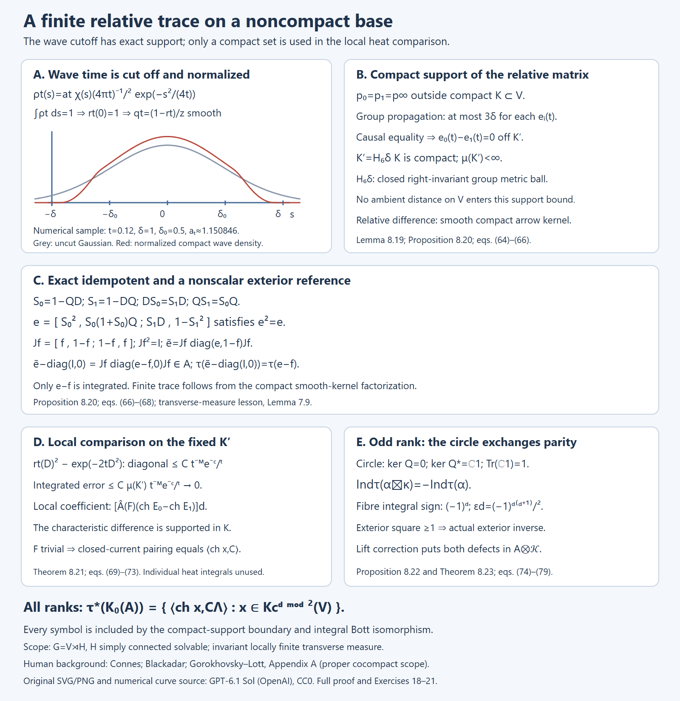

*Figure 4. Lemma 8.18 through Theorem 8.23. The wave-time curve is a numerical sample of the declared smooth plateau cutoff, not a proved asymptotic bound; its reproducible source uses Simpson normalization. The group metric ball defines the reachable compact set and supplies no ambient metric on the base. Matrix (66), relative conjugation (68), estimates (70)–(72) and the two circle signs give the actual proof. Exercises 18–21 check the normalization, nonscalar reference, parity and affine-group example.*

Full-size PNG · Editable SVG.

### The ordered analytic map and the horocycle example

The preceding symbol-index isomorphism has a precise relation to the ordered analytic Thom maps. We prove that relation before addressing the numerical example. This identifies analytic maps on the full K-groups; identification with the historical geometric leaf-map construction and assembly still requires their stated interfaces.

**Corollary 8.24 (ordered Thom, actual symbols and analytic choice independence).** Let \(B\) be a separable C*-algebra with a point-norm continuous action \(\alpha\). For an ordered normal decomposition of a simply connected solvable \(d\)-dimensional \(H\), write
\[
\Phi_H^\alpha:K_j(B)\longrightarrow K_{j+d}(B\rtimes_\alpha H)
\]
for the composite of the positive real Thom maps of Theorem 8.7 and Corollary 8.10. Let \(b_{\rm ord}\in K_c^{d\bmod2}(\mathfrak h^*)\) be their ordered scalar Bott class at the trivial action. Then
\[
\Phi_H^\alpha
=(\mathrm{ev}_1)_*(\mathrm{ev}_0)_*^{-1}
\bigl(\,\cdot\,\boxtimes b_{\rm ord}\bigr).
\tag{80}
\]
Here the zero algebra is intrinsically \(B\otimes C_0(\mathfrak h^*)\), with negative physical Fourier phase. For a smooth orbit foliation with graph \(V\rtimes H\), this is
\[
\Phi_H^\alpha(x)=
\operatorname{Ind}_a(x\boxtimes b_{\rm ord}),
\qquad x\in K_c^j(V).
\tag{81}
\]
Both degrees and noncompact \(V\) are included. The ordered analytic map is independent of the normal decomposition and ordered tangent frame with a fixed orientation. Reversing that orientation changes its sign. These are group-level analytic choice assertions; they do not assert independence of geometric wrong-way factorizations.

**Proof.** At every stage of Theorem 8.14's recursive family algebra the evaluation is equivariant for the next real action. Apply the natural real Thom map at that stage. Induction gives
\(\Phi_{\rm fam}:K_j(C([0,1])\otimes B)\to K_{j+d}(\mathfrak A_H(B))\)
and commutative evaluation squares
\[
(\mathrm{ev}_v)_*\Phi_{\rm fam}
=\Phi_{H_v}^{\alpha^v}(\mathrm{ev}_v^{\,B})_*.
\]
The coefficient evaluations are K-isomorphisms by interval contraction. The crossed-product evaluations are K-isomorphisms by Theorem 8.14. At zero all actions are trivial. Corollary 8.10, including its suspended degree, identifies the consecutive real maps with external multiplication by their positive winding generators, appended in the ordered normal-then-outer coordinates. Their composite is exactly multiplication by \(b_{\rm ord}\). We retain that class, rather than replacing it by a generator selected only by an absolute Chern integral. The two evaluation squares give (80). Theorem 8.16 and Lemma 8.18 identify their middle comparison with the actual full symbol index, proving (81).

We check choice independence of the deformation itself. Let \(\varphi_i:\mathbb R^d\to H\), \(i=1,2\), be two full ordered coordinate diffeomorphisms, with \(\varphi_i(0)=e\) and tangent maps \(L_i\). Their scaled families have the coordinate change
\[
\rho_v(q)=v^{-1}\varphi_2^{-1}(\varphi_1(vq))
\quad(v>0),\qquad
\rho_0(q)=L_2^{-1}L_1q.
\tag{82}
\]
Hadamard division, exactly as in (53), extends this and its inverse smoothly through zero. It is a group isomorphism in every fibre, and \(\Gamma_{2,v}\rho_v=\Gamma_{1,v}\); hence it intertwines the coefficient actions. Compact supports have uniformly compact transformed supports because \((v,q)\mapsto\rho_v(q)\) and its inverse are continuous on the compact parameter interval times each compact coordinate set.

To check the density without a hidden constant, choose one fixed Haar measure \(dh\) on \(H\). Use on family \(i\) the density
\(v^{-d}\varphi_i(v\,\cdot)^*dh\) for \(v>0\), with its smooth value at zero. Its value at the identity is the constant \(J_i(0)>0\), where \(\varphi_i^*dh=J_i(q)\,dq\). This differs from Theorem 8.14's unit-normalized density by just that constant; scaling a Haar measure by \(c>0\) identifies its convolution algebra with the old one by \(f\mapsto cf\). Thus it gives the same family algebra and K-maps. With the present common Haar normalization, \(\rho_v\) transports the densities exactly, including at zero. Kernel transport is therefore a *-isomorphism on the joint compact-kernel algebras. The regular fibre unitary and the fibre-supremum norm extend it to their C*-completions. At one it is identity in the original \(H\) realization; at zero its Fourier change is the displayed linear tangent change, so it is identity on the intrinsic dual \(\mathfrak h^*\). Consequently the intrinsic evaluation comparison in (80) is independent of the ordered coordinates.

It remains to compare the two scalar Bott classes. A positive determinant linear change lies in \(GL^+(d,\mathbb R)\), which is path connected: polar decomposition connects its positive factor to identity and its orthogonal factor lies in the connected \(SO(d)\) for \(d\ge2\); \(d=1\) is direct. Linear pullbacks along such a path are point-norm continuous on \(C_0(\mathbb R^d)\). On compactly supported functions this is uniform continuity on a common compact support, since the path's least singular value has a positive minimum; density treats all \(C_0\) functions. The pullbacks are therefore homotopic and preserve the Bott class. A negative determinant change is homotopic to reflection of the first coordinate. Reflection sends
\(u_+(p)=(p-i/2)/(p+i/2)\) to \(u_+(p)^{-1}\), whose \(K_1\)-class is its negative. Bilinearity of the remaining ordered external products gives the same minus sign in dimension \(d\). Thus the classes agree for fixed orientation and reverse sign with it. Formula (80) proves the asserted analytic independence for every coefficient algebra. In dimension zero every map is identity. \(\square\)

We now supply the full compact horocycle example. Put \(L=SL(2,\mathbb R)\), let \(\Gamma\subset L\) be discrete with \(X=L/\Gamma\) compact, and write
\[
U_s=\begin{pmatrix}1&0\\s&1\end{pmatrix},\qquad
\overline U_v=\begin{pmatrix}1&v\\0&1\end{pmatrix},\qquad
a_t=\begin{pmatrix}e^{-t/2}&0\\0&e^{t/2}\end{pmatrix}.
\]
The source's horocycle flow is the left action of \(U_s\). The group \(L\) is unimodular: in the Lie algebra basis consisting of the two nilpotent matrices and \(A=\operatorname{diag}(-1/2,1/2)\), every adjoint matrix has trace zero. Connectedness then gives modular character one. Haar measure descends under right translation by \(\Gamma\), and compactness permits normalization to a left-\(L\)-invariant probability \(m\) on \(X\).

**Lemma 8.25 (the unipotent fixed-vector argument and diagonal mixing).** In a strongly continuous unitary representation of \(L\), a vector fixed by all \(U_s\) is fixed by \(L\). On \(L^2(X,m)\), the diagonal flow is mixing:
\[
\int_X f(a_tx)g(x)\,dm(x)
\longrightarrow\left(\int_Xf\,dm\right)\left(\int_Xg\,dm\right)
\quad(t\to+\infty),
\tag{83}
\]
for real \(L^2\) functions; the complex version uses the usual conjugation.

**Proof.** It suffices first to use the upper unipotent, since conjugation by \(\begin{pmatrix}0&-1\\1&0\end{pmatrix}\) interchanges the two groups up to reversal of their parameters. Let \(w\) be upper-unipotent fixed and put \(F(g)=\langle\pi(g)w,w\rangle\). It is continuous and invariant under upper-unipotent multiplication on both sides. For \(\lambda>0\) the exact identity
\[
\overline U_n U_{(\lambda-1)/n}\overline U_{-n/\lambda}
=\begin{pmatrix}\lambda&0\\(\lambda-1)/n&\lambda^{-1}\end{pmatrix}
\longrightarrow\operatorname{diag}(\lambda,\lambda^{-1})
\tag{84}
\]
gives \(F(\operatorname{diag}(\lambda,\lambda^{-1}))=\|w\|^2\): the middle unipotent tends to identity, while the two outer factors do not change \(F\). The unitary norm identity makes \(w\) fixed by every positive diagonal matrix. Conjugating the opposite unipotent by these diagonals contracts it to identity. Invariance of \(w\) under the diagonals then gives
\[
\|\pi(U_s)w-w\|
=\|\pi(\operatorname{diag}(\lambda,\lambda^{-1})
U_s\operatorname{diag}(\lambda^{-1},\lambda))w-w\|
\longrightarrow0
\quad(\lambda\to\infty).
\]
Thus \(w\) is fixed by both unipotent groups. They generate \(SL(2,\mathbb R)\): ordinary row elimination treats a nonzero diagonal entry, and the displayed Weyl matrix is itself a product of three elementary unipotents; its square is \(-I\). This proves the fixed-vector assertion, including the centre.

The representation \((\pi(g)f)(x)=f(g^{-1}x)\) is strongly continuous, first on continuous functions and then by their \(L^2\) density. Its \(L\)-invariant vectors are constants. Here is a way to see the almost-everywhere assertion without presuming ergodicity. Convolution with a smooth compact group function is a smoothing operator on \(X\): the map \((g,y)\mapsto(gy,y)\) is a local diffeomorphism, and on compact group support times compact \(X\) its pushforward has a smooth kernel. Finite local inverse charts prove this, with density Jacobians bounded on their protected supports. An invariant \(L^2\) vector equals its convolution with any such function of integral one, so is smooth. A smooth invariant function is constant by transitivity of \(L\) on \(X\).

Work on the orthogonal complement \(L^2_0(X,m)\). From any sequence \(t_n\to+\infty\), separability and the norm-one bound give a subsequence for which \(\pi(a_{t_n})\) converges in the weak operator topology to \(T\): extract successively on a countable dense set of matrix coefficients, then extend by the uniform bound. The relation
\[
a_{-t}U_sa_t=U_{e^{-t}s}
\]
implies
\(\|\pi(U_s)\pi(a_t)v-\pi(a_t)v\|\to0\)
for each fixed \(s,v\). Therefore every vector in the range of \(T\) is \(U\)-fixed. The first part makes it \(L\)-fixed, hence zero in \(L^2_0\). Thus \(T=0\). Every subsequence has only this possible weak cluster point, so all matrix coefficients on \(L^2_0\) tend to zero. The adjoint gives the same assertion for \(a_{-t}\). Adding back constants proves (83). \(\square\)

**Theorem 8.26 (uniform horocycle averages and the unique transverse measure).** For every \(f\in C(X)\),
\[
\sup_{x\in X}\left|
\frac1T\int_0^T f(U_sx)\,ds-\int_X f\,dm
\right|\longrightarrow0\qquad(T\to+\infty).
\tag{85}
\]
The flow is free and every orbit is dense. Its invariant probability is uniquely \(m\). Every nonzero geometrically locally finite invariant transverse measure for its orbit foliation is a positive scalar multiple of the measure whose tangent current is
\[
C_m(\omega)=\int_X\omega(N^\#)\,dm,
\qquad N=\begin{pmatrix}0&0\\1&0\end{pmatrix}.
\]
No torsion-free hypothesis on \(\Gamma\), or replacement of \(SL(2,\mathbb R)\) by \(PSL(2,\mathbb R)\), is needed.

**Proof.** We first turn mixing into uniform estimates. If \(k\in C_c^\infty(L)\) is nonnegative with \(\int k\,dh=1\), the image of \(k(g)\,dh\) under \(g\mapsto gy\) has a smooth density \(h_y\) with respect to \(m\). The joint local-diffeomorphism argument in Lemma 8.25 proves that \((x,y)\mapsto h_y(x)\) is smooth: restrict to a compact group neighbourhood containing the support, use finitely many local inverse charts on its product with \(X\), and partition the support before pushing each chart's density. Each fibre meets only finitely many protected charts. In particular \(y\mapsto h_y\) is continuous into \(L^2(X,m)\), so its image is compact. The mixing limit is uniform on this compact family. To verify that last step, cover it by a finite \(L^2\) \(\varepsilon\)-net, apply mixing at each net point and use Cauchy–Schwarz with the fixed norm \(\|f\|_2\) for the error. Hence
\[
\sup_{y\in X}\left|\int_L k(g)f(a_tgy)\,dh(g)-\int_X f\,dm\right|
\longrightarrow0.
\tag{86}
\]

Choose \(h\in C_c^\infty((0,1))\), \(h\ge0\), \(\int_0^1h=1\), and a smooth nonnegative probability density \(\phi_\varepsilon(v,r)\) supported in \(|v|,|r|<\varepsilon\). The coordinates
\[
g=\overline U_v a_r U_s
=\begin{pmatrix}
e^{-r/2}+vs\,e^{r/2}&v e^{r/2}\\
s e^{r/2}&e^{r/2}
\end{pmatrix}
\]
parametrize the open set \(g_{22}>0\) uniquely. Normalize group Haar at the tangent basis \((\overline N,A,N)\). In these coordinates it is \(e^r\,dv\,dr\,ds\). Indeed the columns of \(g^{-1}dg\) are
\[
e^r(\overline N-2sA-s^2N),\qquad A+sN,\qquad N,
\]
whose determinant in that basis is \(e^r\). Thus the smooth compact group probability
\[
k_\varepsilon(\overline U_va_rU_s)
=e^{-r}\phi_\varepsilon(v,r)h(s)
\tag{87}
\]
has integral exactly one. Extend it by zero; its support is compactly contained in this coordinate domain.

Put \(T=e^t\) and \(y=a_{-t}x\) in (86). The exact conjugations
\[
a_tU_sa_{-t}=U_{Ts},\qquad
a_t\overline U_va_{-t}=\overline U_{v/T},\qquad
a_ta_ra_{-t}=a_r
\]
make its average
\[
\int\phi_\varepsilon(v,r)h(s)
f(\overline U_{v/T}a_rU_{Ts}x)\,dv\,dr\,ds.
\tag{88}
\]
This differs from \(\int_0^1h(s)f(U_{Ts}x)\,ds\) by at most
\[
\omega_f(\varepsilon)=
\sup_{\substack{|v|,|r|\le\varepsilon\\z\in X}}
|f(\overline U_va_rz)-f(z)|,
\]
for \(T\ge1\). Compactness and joint continuity make \(\omega_f(\varepsilon)\to0\). For each fixed \(\varepsilon\), (86) makes (88) converge to \(m(f)\), uniformly in \(x\), even though its centre \(y=a_{-t}x\) moves. Letting \(\varepsilon\) decrease proves uniform convergence of every such weighted horocycle average. Finally choose \(h\) approaching \(1_{[0,1]}\) in \(L^1\), while retaining integral one. The difference from the unweighted average is bounded by \(\|f\|_\infty\|h-1_{[0,1]}\|_1\), uniformly in \(T,x\). This proves (85). No uniform mixing rate or interchange of two dependent limits was assumed.

If \(\nu\) is any invariant probability, integration of the left average in (85) against \(\nu\) gives \(\nu(f)\) for every \(T\). Its uniform limit is \(m(f)\), hence \(\nu=m\). Haar has full support. If one orbit closure missed a nonempty open set, a nonnegative continuous function supported there with positive Haar integral would have zero averages on that orbit, contradicting (85). Thus every orbit is dense.

We also check freeness. Compact \(X\) has a neighbourhood \(W\) of identity in \(L\) containing no nonidentity stabilizer element of any point. For a proof, take a finite cover with local lifts \(q_i\) to \(L\), whose values range in compact sets. The stabilizer at their points is \(q_i\Gamma q_i^{-1}\). Discreteness of \(\Gamma\) and compactness of those conjugating sets give a single such \(W\). If \(U_sx=x\) with \(s\ne0\), then \(U_{s/T}\) fixes \(a_{-t}x\). For large \(T=e^t\) this is a nonidentity element of \(W\), a contradiction. The orbit foliation therefore has graph \(X\rtimes\mathbb R\), not a circle-cover groupoid.

A positive closed tangent current has the form \(\int\omega(N^\#)\,d\nu\) with a positive Radon unit measure, using the leaf density which makes \(N^\#\) unit length. It has finite total mass by compactness. Closedness says \(\int N^\#f\,d\nu=0\) for every smooth \(f\). Differentiating \(\int f(U_tx)\,d\nu\) proves flow invariance, since the same identity applies to \(f\circ U_t\). Smooth approximation treats all continuous tests. Normalizing any nonzero such measure to a probability now gives \(m\). Conversely the displayed Haar current is positive and closed by \(U\)-invariance. The proved current/transverse-measure correspondence gives exactly the stated uniqueness up to positive scale. This reconciles the source's “only transverse measure”: without normalization its positive scalar multiples are distinct. \(\square\)

**Corollary 8.27 (zero trace with nonzero K-theory).** For the horocycle foliation of Theorem 8.26 and every invariant locally finite transverse measure \(\Lambda\),
\[
\tau_{\Lambda*}\bigl(K_0(C(X)\rtimes_U\mathbb R)\bigr)=\{0\}.
\tag{89}
\]
The ordered analytical map \(K^1(X)\to K_0(C(X)\rtimes_U\mathbb R)\) is an isomorphism, and its target is nonzero.

**Proof.** Uniqueness makes the current a scalar multiple of \(C_m\); the zero measure is immediate. Use
\[
[A,N]=N,\qquad [A^\#,N^\#]=-N^\#.
\]
For every closed smooth one-form \(\omega\), the exterior derivative identity gives
\[
0=(d\omega)(A^\#,N^\#)
=A^\#(\omega(N^\#))-N^\#(\omega(A^\#))
+\omega(N^\#).
\]
Haar is invariant under both one-parameter groups, so the two derivative integrals vanish. Therefore \(C_m(\omega)=0\). The one-dimensional current sees only the closed degree-one component of the odd Chern character; all its pairings with \(K^1(X)\) vanish. The entire trace-image formula (79), or (81) followed by (78), proves (89). This calculation checks all classes, rather than just one test operator.

The analytic isomorphism follows from Corollary 8.24, or directly from Theorem 8.7 and Lemma 8.18. To see that its domain is nonzero, orient the compact three-manifold \(X\) by its global Lie frame. Insert the compact-support three-dimensional odd Bott class in one oriented coordinate ball and extend its unitary by identity outside that ball. Its top odd Chern character has integral of absolute value one, by the ordered scalar Bott computation in Corollary 8.17. The same integral on \(X\) is nonzero. A zero K-class would have an exact character, whose integral on the compact boundaryless manifold is zero by Stokes. Thus this class, and its image under the analytic isomorphism, are nonzero. The trace vanishes on that image nonetheless. \(\square\)

The unique ergodicity statement is Furstenberg’s classical theorem, discussed in the freely accessible [Connes survey, Section 12](https://alainconnes.org/wp-content/uploads/foliationsfine.pdf#page=36). Lemmas 8.25 and Theorem 8.26 give a complete proof here in the exact compact homogeneous scope. Corollary 8.27 supplies the whole source numerical example. Equality with the historical topological and geometric leaf maps, their wrong-way factorization independence and general assembly are still required for the full preceding theorem.

*Figure 5. Corollary 8.24, Lemma 8.25, Theorem 8.26 and Corollary 8.27. Panel A is a diagram of K-maps for a separable coefficient algebra with point-norm continuous action; the lower-right group belongs to the parameter algebra. Panel C is the actual Gauss-coordinate section at \(r=0\), with bounding support rectangles \(0\le s\le1\), \(|v|\le1/4\), transformed by \(T=4\) into \(0\le s\le4\), \(|v|\le1/16\). Each has coordinate area \(1/2\); the horizontal and vertical scales are unchanged between the rectangles. This is neither an ambient geometric projection nor a probability-density plot. Haar and its compensating kernel density are exact in (87). The moving-centre compactness argument and the order of limits in Theorem 8.26 give uniform convergence without a mixing rate. The bracket calculation proves the whole zero trace image, while the ball-supported odd Bott class gives nonzero K-theory. Full proofs and Exercises 22–25 accompany the figure; the classical unique ergodicity theorem is due to Furstenberg, as described in the freely accessible [Connes survey, Section 12](https://alainconnes.org/wp-content/uploads/foliationsfine.pdf#page=36).*

Full-size PNG · Editable SVG.

### Native solvable geometric cycles and the full normal bundle

The following complete cocycle and bundle arguments apply to the actual graph hypothesis of [Connes, Theorem5, Sections9–12](https://alainconnes.org/wp-content/uploads/foliationsfine.pdf). They reduce every compact geometric assembly cycle to a global map into the unit manifold and identify its entire transverse bundle. The integral manifold-duality and noncompact leaf-map interfaces are stated explicitly at the end.

### The actual action cocycle and its global lift

Let \(H\) be a simply connected solvable Lie group, \(d=\dim H\), acting smoothly on the Hausdorff second-countable manifold \(V\). For this theorem assume the given foliation has its **actual holonomy groupoid** \(G=V\rtimes H\). An arrow labelled \(h\) goes from \(v\) to \(hv\). The proof of the cocycle reduction itself also applies to transformation groupoids without that holonomy identification. This distinction is retained in every consequence for assembly.

Put \(F\subset TV\), \(\tau=TV/F\), \(q=\operatorname{rank}\tau\). The normal representation of an arrow is

\[
 D^\perp h:\tau_v\longrightarrow\tau_{hv},\qquad
 [\xi]\longmapsto[d(h)_v\xi].
 \tag{B.a}
\]

The action preserves \(F\); thus this is well-defined, invertible, smooth, and satisfies the exact arrow product rule. Under the graph hypothesis it is the holonomy derivative, rather than a derivative of a different groupoid.

An actual smooth map cocycle from a manifold \(M\) is given on a locally finite refined cover \(U_\alpha\) by smooth maps \(f_\alpha:U_\alpha\to V\) and smooth functions \(h_{\beta\alpha}:U_\alpha\cap U_\beta\to H\), with

\[
 f_\beta=h_{\beta\alpha}f_\alpha,\qquad
 h_{\gamma\beta}h_{\beta\alpha}=h_{\gamma\alpha},\qquad
 h_{\alpha\alpha}=e.
 \tag{B.b}
\]

The cocycle retains the actual functions \(h_{\beta\alpha}\), including stabilizer elements. Its pulled normal bundle has local fibres \(\tau_{f_\alpha(x)}\) and transition \(D^\perp h_{\beta\alpha}\).

**Lemma 8B.1 (a constructive smooth trivialization).** Every such cocycle admits smooth functions \(k_\alpha:U_\alpha\to H\) with

\[
 h_{\beta\alpha}=k_\beta k_\alpha^{-1}.
 \tag{B.c}
\]

Consequently \(a(x)=k_\alpha(x)^{-1}f_\alpha(x)\) is a global smooth map \(M\to V\). The same statement holds for continuous cocycles on any base carrying a subordinate locally finite partition with closed supports. It includes countable covers, whole parameter families, and manifolds with boundary or collars. No compactness of \(M\), properness of the action, or injectivity of its orbit maps is needed.

**Proof.** Induct on \(d\), using the proved Lie-group decomposition in Lemma 8.1. For \(d=0\) the group is trivial. Otherwise there is a smooth split homomorphism \(\chi:H\to\mathbb R\), with simply connected solvable kernel \(N\), and a fixed one-parameter section \(r(t)=\exp(tX)\). Every element has a unique decomposition (r(t)n), with \(n\in N\), and this decomposition and its inverse are smooth. This uses the global semidirect-product diffeomorphism; it does not assume the exponential map of \(H\) is a diffeomorphism.

Choose a subordinate smooth locally finite partition \(\rho_\gamma\), with closed support contained in \(U_\gamma\). Its existence on the stated manifold is the complete subordinate-atlas and smooth-weight proofs in [Local tools for bundles and transport, Section 3, Theorems 3.E and 3.1](https://kokunoyumeto.github.io/open-math-courses-public/courses/NCG-FOLIATIONS/companions/local-tools-for-bundles-and-transport.html). In a boundary chart the same construction restricts a Euclidean smooth bump to the half-space; the locally finite exhaustion and closed support argument are unchanged. Set \(t_{\beta\alpha}=\chi(h_{\beta\alpha})\). The additive cocycle equation gives \(t_{\beta\gamma}-t_{\alpha\gamma}=t_{\beta\alpha}\) on triple overlaps. On \(U_\alpha\) define

\[
 t_\alpha=\sum_\gamma\rho_\gamma t_{\alpha\gamma},\qquad
 t_\beta-t_\alpha=t_{\beta\alpha}.
 \tag{B.d}
\]

Each product is defined on \(U_\alpha\cap U_\gamma\) and extended by zero on the rest of \(U_\alpha\). This extension is smooth: every point outside the closed support of \(\rho_\gamma\) has a neighbourhood on which that function is identically zero. Only finitely many supports meet a neighbourhood of any point. The sum is therefore a smooth locally finite sum, not just a pointwise finite formal expression. On an overlap, every term with nonzero weight has its triple transition defined; the displayed difference follows after summing and using \(\sum\rho_\gamma=1\). Terms with zero weight make no assumption about an undefined transition.

The residual functions

\[
 r_{\beta\alpha}=r(-t_\beta)h_{\beta\alpha}r(t_\alpha)\in N
 \tag{B.e}
\]

form an exact \(N\)-cocycle. Membership follows by applying \(\chi\). Multiplying two successive functions cancels the adjacent \(r(t_\beta)r(-t_\beta)\), so their product is \(r_{\gamma\alpha}\). The induction hypothesis supplies \(n_\alpha:U_\alpha\to N\) with \(r_{\beta\alpha}=n_\beta n_\alpha^{-1}\). Then \(k_\alpha=r(t_\alpha)n_\alpha\) has (B.c), with exactly this order. Finally (B.b) and (B.c) give

\[
 k_\beta^{-1}f_\beta=k_\alpha^{-1}f_\alpha.
 \tag{B.f}
\]

These local maps glue smoothly. At the continuous level the identical finite-local-sum argument works with continuous subordinate functions. The induction does not differentiate the base, so it also works on a numerable weak quotient. On a smooth parameter manifold or a manifold with boundary the functions, transitions and sums have that same regularity. Smooth collars may first be fixed and the construction performed on the whole collared manifold. No unrelated endpoint trivializations are glued afterwards. This proves the lemma. \(\square\)

**Lemma 8B.2 (the entire transverse bundle and orientation family).** The global lift in Lemma 8B.1 has a canonical bundle isomorphism, for that specified trivialization,

\[
 \Psi:a^*\tau\xrightarrow{\ \cong\ }f^*\tau,
 \qquad \Psi_\alpha(x)=D^\perp k_\alpha(x).
 \tag{B.g}
\]

It transports the full stable spin-c orientation of \(TM\oplus f^*\tau\), including every Hermitian line twist and stable grading, to \(TM\oplus a^*\tau\). Different trivializations yield an actual smooth map homotopy with this entire orientation family. These statements hold on whole compact bordisms and sphere modifications as well as individual cycles.

**Proof.** On an overlap,

\[
 D^\perp h_{\beta\alpha}\,D^\perp k_\alpha
       =D^\perp k_\beta.
 \tag{B.h}
\]

Thus the local maps in (B.g) glue into an invertible bundle map, with local inverse \(D^\perp k_\alpha^{-1}\). This proves the whole bundle statement; it is stronger than agreement of its rank, characteristic classes or rational character. To compare Clifford bundles, first transport the metric along this bundle map. If a different metric was prescribed, the positive square-root metric isometry of Corollary 6.0d identifies the two Clifford bundles. Pull back the entire specified principal spin-c bundle or full graded Morita module by this isometry. Every central transition phase, additional line bundle and stable grading is retained. In particular, a two-torsion line is not replaced by its squared determinant, and a rank-zero odd orientation line is not made the even unit.

Let \(k'_\alpha\) be another trivialization. The functions

\[
 u=(k'_\alpha)^{-1}k_\alpha:M\to H,
 \qquad a'=ua
 \tag{B.i}
\]

are independent of \(\alpha\), by the two copies of (B.c). Lemma 8.1 supplies a global smooth coordinate diffeomorphism \(\varphi:\mathbb R^d\to H\), \(\varphi(0)=e\). Put \(u_s=\varphi(s\varphi^{-1}(u))\) and \(a_s=u_sa\). This is a whole smooth map homotopy, without requiring the contraction to be a group homomorphism. The bundle maps \(D^\perp u_s:a^*\tau\to a_s^*\tau\), with transported metrics and orientations, make a single full orientation family. At \(s=1\) its orientation is exactly the one obtained using \(k'_\alpha\), since \(D^\perp k'_\alpha D^\perp u=D^\perp k_\alpha\).

There is also a direct concordance from the given cocycle to its global lift. Put \(k_{\alpha,s}=\varphi(s\varphi^{-1}(k_\alpha))\), and use the anchors \(k_{\alpha,s}a\) and transition functions \(k_{\beta,s}k_{\alpha,s}^{-1}\). Their inverse and triple equations hold by literal cancellation for every \(s\). At zero they are the global lift with unit transitions; at one they are the original data. The maps \(D^\perp k_{\alpha,s}\) glue its entire normal family to the fixed bundle \(a^*\tau\) over \(M\times I\). This proves the orientation assertion on a single family.

For a bordism, perform Lemma 8B.1 once on its whole base and transport its extending spin-c module in this manner. Its restrictions to the boundary are the reductions of the boundary cocycles up to the already proved full homotopies. The outward-normal convention is unchanged: tensoring with the canonical collar-line module and then restricting commutes with the even normal-bundle map. For a vector-bundle modification \(\pi:\widehat M\to M\), pull back \(k_\alpha\), \(\Psi\), and the full module along \(\pi\). The modifying bundle, its sphere clutch transition and its full inverse orientation factors are unchanged. The finite evaluation maps used in Lemmas 6.0ac–ad act on these Clifford factors and commute with the even map \(\pi^*\Psi\); central line phases remain the same factors. Thus the original and reduced induced stable orientations and clutch bundles correspond exactly, rather than only after taking a character. \(\square\)

### A whole classifying model with its whole twist

Use a right universal \(H\)-space. Associated left-action conventions are

\[
 B_G=(E_H\times V)/\bigl((eh,v)\sim(e,hv)\bigr).
 \tag{B.j}
\]

The normal bundle is the associated bundle of \(E_H\times\tau\to E_H\times V\), with the same derivative action (B.a). A right-action convention is necessary here; switching it without changing the displayed coordinate would invert the map.

**Theorem 8B.3 (a numerable model and a normal-bundle preserving comparison).** There is a contractible right principal \(H\)-space \(E_H\to B_H\), with numerable local sections and contractible \(B_H\). The resulting classifying model (B.j) is homeomorphic to \(B_H\times V\). Under this homeomorphism its entire associated normal bundle is \(\operatorname{pr}_V^*\tau\). Consequently it is homotopy equivalent to \(V\), with the whole specified bundle comparison. For each native compact smooth map cocycle, choose its classifying map using the specified smooth trivialization of Lemmas 8B.1–2. In that choice this comparison returns precisely its smooth global lift and entire normal bundle. An arbitrary continuous section of the join need not pull back smoothly.

**Proof: the entire principal model.** Let \(E_H\) be the indexed join of countably many copies of \(H\). A point is a finite set of columns \((t_i,g_i)\), \(t_i\ge0\), \(\sum t_i=1\), \(g_i\in H\), deleting a column of weight zero. Give it the weak topology from its finite simplex pieces, keeping each column index. Right multiplication is simultaneous \(g_i\mapsto g_i h\). This action is jointly continuous: on every finite piece it is continuous; the product of the weak quotient map with the locally compact group \(H\) is a quotient map, so these maps descend. It is free since a positive column cancels \(g_i h=g_i\). Define \(B_H=E_H/H\) with its quotient topology.

The sets \(O_i=\{t_i>0\}\) are open in \(B_H\). Normalizing the tuple to \((t_j,g_jg_i^{-1})\) is a continuous invariant map on the saturated preimage of \(O_i\), respects every zero-weight face, and descends through its quotient. Its range is the tuples with \(i\)th coordinate \(e\), and supplies a local section \(\sigma_i\). The chart and its inverse are the literal maps

\[
 e\longleftrightarrow(b,g_i),\qquad e=\sigma_i(b)g_i.
 \tag{B.k}
\]

The inverse is continuous by the joint action. On an overlap the transition functions are \(h_{ji}=g_jg_i^{-1}\), so \(\sigma_j=\sigma_i h_{ji}^{-1}\). These continuous functions satisfy exactly the cocycle equation of Lemma 8B.1.

The cover is numerable even though paracompactness of the weak quotient has not been assumed. Set

\[
 m=\max_i t_i>0,\qquad
 \rho_i=\frac{(t_i-m/2)_+}{\sum_j(t_j-m/2)_+}.
 \tag{B.l}
\]

On each finite piece these are continuous finite expressions and agree on faces. They descend to \(B_H\). The denominator is at least \(m/2>0\); the closed support of \(\rho_i\) is contained in \(\{t_i\ge m/2\}\subset O_i\). For local finiteness at \(b_0\), let \(I_0\) be its finite positive support, \(m_0=m(b_0)\), and \(w=1-\sum_{i\in I_0}t_i\). On the neighbourhood \(m>m_0/2\), \(w<m_0/8\), each \(i\notin I_0\) has \(t_i\le w<m_0/8<m/2\). Its numerator vanishes on that whole neighbourhood; its closed support misses a smaller such neighbourhood. Thus only finitely many closed supports occur locally. All zero-weight columns are accounted for in this proof.

Apply the continuous version of Lemma 8B.1 to \(h_{ji}\) with this partition. The resulting functions \(k_i\) give a whole section \(\sigma=\sigma_i k_i\), since \(\sigma_j k_j=\sigma_i h_{ji}^{-1}k_j=\sigma_i k_i\). Formula (B.k) now gives a homeomorphism \(E_H\cong B_H\times H\), with whole coordinate \(h=k_i^{-1}g_i\). This formula is independent of the positive index chosen.

**Proof: contractibility and the classifying property.** A contraction \(c_s(g)=\varphi((1-s)\varphi^{-1}(g))\) moves every group column to \(e\), retaining its weight and index. It is continuous on every finite piece and respects faces. Product with the compact interval preserves the quotient property, so it is a whole homotopy on \(E_H\). Its terminal subspace has all columns \(e\); contract its weights to the zeroth vertex by \(t_i\mapsto(1-s)t_i+s\delta_{i0}\). The zeroth column has group entry \(e\), so adding it is well-defined also when it initially has zero weight. Each finite piece is sent into the finite piece with index 0 adjoined. The same quotient argument proves continuity. Together these two homotopies contract \(E_H\). If \(C\) denotes the contraction, the homotopy \(b\mapsto q(C_s(\sigma(b)))\) contracts \(B_H\) to a point.

A numerable principal right \(H\)-bundle with a countably indexed numerable cover, local sections \(p_\alpha\) and partition \(\lambda_\alpha\) has an equivariant map to \(E_H\): at a point \(p=p_\alpha(x)g_\alpha\), use the columns \((\lambda_\alpha(x),g_\alpha)\). Near a base point only finitely many closed supports occur, and each retained support lies in its section domain. Hence even columns of zero weight can be defined on a common neighbourhood and the map is continuous through a single finite piece there. Right multiplication of \(p\) multiplies each \(g_\alpha\) on the right, as required. The pullback of (B.k) recovers the original local principal charts. Conversely these charts recover the bundle and its transitions from any classifying map. There is no endpoint reindexing issue in the homotopy assertion: trivialize the source bundle once by Lemma 8B.1 and the target by (B.k). Any two equivariant maps then have the forms \((x,h)\mapsto(b_i(x),u_i(x)h)\). Contractibility of \(B_H\) gives a whole homotopy from \(b_0\) to \(b_1\); the explicit coordinate contraction in \(H\) gives one from \(u_0\) to \(u_1\). Their product is a whole equivariant homotopy with these exact endpoints. This gives the classifying property on eligible paracompact parameter bases, and only the numerable bundle version is used here.

For the transformation groupoid an actual cocycle is a principal \(H\)-bundle together with an equivariant anchor \(p h\mapsto h^{-1}v(p)\in V\). In local sections this is exactly (B.b), with \(\sigma_\beta=\sigma_\alpha h_{\beta\alpha}^{-1}\). The preceding equivariant map to \(E_H\), paired with its anchor, gives a map to (B.j). Local charts recover the original cocycle. Homotopies give whole cocycle concordances; this is a classifying statement for concordance, not an assertion that distinct homotopic anchors are isomorphic cocycles.

**Proof: the actual coordinate and the normal bundle.** Write \(e=\sigma(b)h\). Define

\[
 J([e,v])=(b,hv),\qquad
 J^{-1}(b,a)=[\sigma(b),a].
 \tag{B.m}
\]

The coordinate \(h\) is continuous by the principal trivialization. The relation \((eh,v)\sim(e,hv)\) makes the formula invariant; its two composites are identities, so it is a homeomorphism. On the normal bundle use

\[
 [(\sigma(b)h,v),\xi]\longmapsto
       (b,hv,D^\perp h\,\xi).
 \tag{B.n}
\]

The derivative product rule makes this independent of the representative. Its inverse uses \(\sigma(b)\) and the identity derivative. Both are continuous bundle maps. Thus it is the entire normal bundle comparison. Contracting the \(B_H\) coordinate of the product keeps \(a\) fixed and its fibre is literally \(\tau_a\) throughout. Any spin-c data already present on a test pullback transport through this same whole bundle map, with no loss of lines or gradings.

For a native smooth test cocycle, first use its **smooth** trivialization from Lemma 8B.1. With local principal sections \(p_\beta=p_\alpha h_{\beta\alpha}^{-1}\), the sections \(p_\alpha k_\alpha\) glue to a whole smooth section \(p_0\). Thus \(p=p_0h(p)\), and its equivariant anchor is \(h(p)^{-1}a(x)\). Fix one point \(b_0\in B_H\). Choose the equivariant classifying map \(p\mapsto\sigma(b_0)h(p)\), and pair it with that anchor. Formula (B.m) then gives exactly \((b_0,a(x))\). At \(p_\alpha=p_0k_\alpha^{-1}\), (B.n) is \(D^\perp k_\alpha^{-1}\), the inverse of (B.g). Hence the comparison retains the chosen smooth global lift and entire normal bundle. This construction works on the whole smooth family or bordism. The fixed join section constructed with maxima and positive parts is only continuous; pulling it back through an arbitrary classifying map does not supply a smooth reduction. Smooth native-cycle reduction uses Lemma 8B.1 first, as here and in Theorem 8B.4. \(\square\)

### The cycle group and the actual wrong-way class

Define \(\mathcal C_{*,\tau}(V)\) to be the following integral geometric group. Its cycles are closed compact smooth \(M\), smooth \(a:M\to V\), a Hermitian bundle \(E\to M\), and the **full** prescribed stable spin-c orientation of \(TM\oplus a^*\tau\). Its degree is \(\dim M-q\pmod2\). Its relations are precisely direct sum/disjoint union, compact bordism with full extending data, and even spin-c vector-bundle modification with the same full clutch bundle and induced orientation used in native Section 9. This definition does not replace this group by \(K_c^*(V)\).

**Theorem 8B.4 (the complete native geometric domain reduces to global lifts).** Inclusion of global maps as unit-transition cocycles induces an isomorphism

\[
 I:\mathcal C_{*,\tau}(V)\xrightarrow{\cong}
 K_{*,\tau}^{\mathrm{geom}}(B(V\rtimes H)),
 \tag{B.o}
\]

where the right group is the specified native compact smooth actual-cocycle model. Its inverse is reduction by Lemmas 8B.1–2. In the normal-preserving classifying comparison of Theorem 8B.3 this is the corresponding comparison of geometric cycles, in both degrees and with compact support interpreted as compact cycle images.

**Proof.** Every right-hand cycle has its global reduction, with the same \(M,E\), degree and full orientation transferred by (B.g). Two choices give the whole smooth oriented homotopy of Lemma 8B.2. On \(W=I\times M\) use \(TW=\mathbb R_s\oplus TM\), putting the positive interval line first, and the ordered full module of that line followed by the transported module for \(TM\oplus a_s^*\tau\). Boundary restriction evaluates its outward normal first. At the outgoing end this cancels the positive interval line and returns the specified endpoint module; at the incoming end the reflected normal gives its full opposite, with the negated operator and grading prescribed in Theorem 6.0ab. Thus this is a compact product bordism with the exact two endpoint orientations, not a determinant-only assertion. The reductions define the same class.

Direct sums and disjoint unions plainly retain \(E\) and the corresponding local trivializations; one may perform the construction separately on the finitely many compact components. A native compact bordism reduces by a single trivialization on its whole collared base. Its boundary reduction agrees with the chosen reductions up to the full endpoint homotopies, and its transported bundle and orientation are the required extending ones. Hence its reduced boundary is zero. For an even spin-c vector-bundle modification pull back the given \(k_\alpha\) along its sphere projection. Lemma 8B.2 identifies the entire sphere clutch bundle and induced stable orientation with the modification of the reduced cycle; the extra Clifford factors are evaluated in the same order. This proves descent through all three defining relations.

Reducing a global cocycle may be done with \(k_\alpha=e\); it returns that global cycle. Thus the reduction followed by inclusion is inverse in one direction. Conversely the original cocycle and its global reduction are actually equivalent: use the arrows \(k_\alpha:a\to f_\alpha\). Equations (B.c) and (B.h) are exactly the equivalence and its full normal comparison. They give the same native cycle, or equivalently the full compact concordance of Lemma 8B.2 gives its product bordism. Therefore the other composition is also the identity. Neither a rational Chern-character comparison nor a noncompact manifold cycle has entered this argument. \(\square\)

**Corollary 8B.5 (assembly on every native cycle uses the global lift).** For the specified full orientations, the actual geometric wrong-way class satisfies

\[
 f_!=a_{\mathrm{cocycle},!},\qquad
 \mu[(M,E,f)]=[E]a_{\mathrm{cocycle},!}.
 \tag{B.p}
\]

Here \(a_{\mathrm{cocycle}}\) means the map from \(M\) to \(V/F\) given by the global anchor \(a\), not an ordinary-target wrong-way map \(a:M\to V\) with its orientation left unspecified.

**Proof.** The equivalence arrows \(k_\alpha\) identify the two actual normal microbundle germs. Their normal derivative is exactly (B.g). Theorem 6.0o compares their full Thom/tube products after transport of this entire specified normal module. Its middle-module comparison is Lemma 6.0n's onto unitary on the completed principal correspondence, induced by these actual arrows; it retains every counting lift. Its restrictions use essential modules, and its Euclidean inverse remains in its prescribed order. Thus the equality is a full KK equality with the right algebra \(A=C_r^*(G)\), before multiplication by \(E\). Theorem 6.1 supplies the actual descent of this product. Multiplying by the unchanged finite Hermitian coefficient bundle proves (B.p).

The same normal product also has the full lift in Theorem 11A.1 below, equations (A.G.1)–(A.G.8). That theorem already handles every actual compact cocycle. Its completed full principal module, quotient-tensor unitary and full product-group Euclidean factor use the same arrows and orientation. The new global reduction is compatible with this full lift, by transporting that same core and all normal factors. For this solvable graph action, Corollary 8.9 proves full and reduced crossed products coincide, so these two assembly values agree under the actual quotient map. This observation does not infer that assembly is an isomorphism. \(\square\)

### The compact leaf-map interface and the exact sign

For compact \(V\), let \(\mathcal O_{\mathrm{fr}}\) be the full stable leaf orientation induced by the ordered fundamental spin frame used in Theorem 8.15d, with its stated Clifford/chirality convention and no extra line twist. Use that same orientation in the entire normal-tube definition of the geometric leaf map. Let \(\Theta_H\) be the literal chronological positive real Thom KK product of Corollary 8.14a, with the native second-cycle-first odd–odd contraction. Set \(s_d=(-1)^{\lfloor d/2\rfloor}\).

**Corollary 8B.6 (a calibrated compact comparison, both degrees).** In this exact common orientation,

\[
 \ell_{\mathcal O_{\mathrm{fr}},!}^{\mathrm{geom}}
 =\ell_{\mathcal O_{\mathrm{fr}},!}^{\mathrm{an}}
 =s_d\Theta_H
 \quad\text{in }KK_d(C(V),C(V)\rtimes H).
 \tag{B.q}
\]

All three actions are isomorphisms on both K-groups. The geometric topological-index action given by native Section 11 is the first class's action. For the physical spin Thom symbol \(b_{\mathrm{fr}}\), the complete symbol maps obey

\[
 \operatorname{Ind}_a(x\boxtimes b_{\mathrm{fr}})
       =x\ell_{\mathcal O_{\mathrm{fr}},!}^{\mathrm{geom}}
       =s_d\Phi_H(x),\qquad
 j=0,1,\ x\in K^j(V).
 \tag{B.r}
\]

The formula retains the sign rather than silently identifying the ordered Bott class with the physical one.

**Proof.** Theorem 7.25 is an equality of the prescribed full analytical and geometric classes; it uses the entire normal-tube cocycle, both actual Thom inverse products and the calibrated ambient inverse. For \(\mathcal O_{\mathrm{fr}}\) its analytical operator is precisely the homogeneous source spin Dirac operator compared in Theorem 8.15d. That theorem supplies one actual parameter cycle and its modular half-density correction, then a bounded spin-connection homotopy to this endpoint. Its zero-fibre calculation in Lemma 8.15c gives \(T_D[q_0]=s_d[e_0]\Theta_0\). Cancelling the proved KK evaluation inverse gives the second equality of (B.q). Each real factor has both KK inverses. The inverse of \(s_d\Theta_H\) is \(s_d D_H\): both products are \(s_d^2\) times the corresponding ordered inverse product, hence identity. These statements prove isomorphisms in both degrees, including integral torsion.

Theorem 7.29 identifies every symbol index with the action of this full leaf-map class on its actual physical Thom inverse. Corollary 8.24 identifies the ordered symbol product with \(\Phi_H\). Lemma 8.15c gives \(b_{\mathrm{fr}}=s_d b_{\mathrm{ord}}\), with the actual finite Clifford contractions. Their combination yields (B.r). Finite bundle twists must be transported through all three maps using their full section modules; Theorem 7.25 retains their whole line data. A scalar sign cannot be used to discard an arbitrary line twist. In rank zero the common framed orientation is the even unit and all three maps are identity. \(\square\)

This resolves the *compact* geometric leaf-map interface for the already repaired convention. It makes no claim that the unmodified literal \(\Theta_H\) equals the physical framed leaf class when \(d\equiv2,3\pmod4\). A formulation of “three equal maps” must use the geometrically calibrated real map \(s_d\Phi_H\), or specify one common transported full orientation for all three constructions. The native theorem does not prescribe the course's particular odd–odd reducer; this is the exact local convention comparison required when using it.

### Solvable assembly requirements and their current scope

The following are concrete mathematical obligations in the native scope. They are not exclusions added to it.

1. **Integral geometric manifold duality (proved below).** Theorem 8C.8 constructs a two-sided isomorphism from the group in (B.o), with all three native relations, to \(K_c^{*+d}(V)\). The degree shift is fixed by \(q=\dim V-d\): a cycle of degree \(m-q\) would push to an ordinary target degree \(m-\dim V=(*-d)\pmod2\). The ordinary-target orientation must be derived from \(TM\oplus a^*\tau\), the ordered framed \(F\), and the canonical doubled tangent module by actual finite Morita cancellation. Full lines, stable grading and compact support must survive this derivation. Both inverse comparisons on the entire integral groups are required. Merely proving homotopy equivalence \(BG\simeq V\), constructing the cohomology class of Theorem 6.2, or comparing compact numerical tests does not supply this isomorphism.

2. **The full noncompact geometric leaf map (proved below).** Lemmas 8D.1–4 and Theorem 8D.5 treat arbitrary noncompact \(V\), construct the geometric normal-tube product as a full \(KK_d(C_0(V),C_0(V)\rtimes H)\) class with the prescribed full orientation, and prove equality with the framed parameter Dirac class of Theorem 8.15d. This needs a proper Euclidean embedding or a compatible exhaustion, variable positive tube compression, a whole Hausdorff normal germ construction, and a single completed principal interval module. All localized cycle defects and the creation errors must be compact in that whole module. Theorem 6.0t gives noncompact ordinary embedding composition; Lemma 6.0n gives general étale correspondences. Those inputs alone do not prove the full noncompact longitudinal interval comparison. Theorem 7.25 explicitly assumes compact \(V\). Compactly supported symbols in Lemma 8.18 cannot be substituted for its full \(C_0(V)\) geometric KK class.

3. **The ordinary/geometric assembly interface and its isomorphism (proved below).** Theorems 8D.7–8 complete this interface. Using the ordinary orientation and duality map \(\kappa\) proved below, prove on every cycle that \([E]a_{\mathrm{cocycle},!}=\kappa(M,E,a)\ell_!\), in the actual orientations and contractions. For compact \(V\), Theorem 6.0w already proves the relevant product when \(a:M\to V\) and \(\ell:V\to V/F\) are given compatible full orientations, and Theorem 8C.8 below supplies the two-sided identification \(\kappa\). For noncompact \(V\), that theorem's intermediate manifold is not compact, so the composition statement also needs the corresponding localized full product. Theorems 8D.7–8 combine the two-sided duality with this interface and the correctly calibrated Thom inverse to prove native assembly isomorphism in both integral degrees. The new (B.p) identifies all its inputs with global lifts; it does not prove injectivity or surjectivity by itself.

No free action is substituted for the graph hypothesis, no noncompact unit manifold is compactified with an unproved extension of its action, and no zero-anchor analytic deformation is claimed to be a constant-rank foliation concordance. Theorems 8C.8 and 8D.5/7/8 now supply these interfaces for the full native assembly isomorphism, retaining the displayed physical calibration.

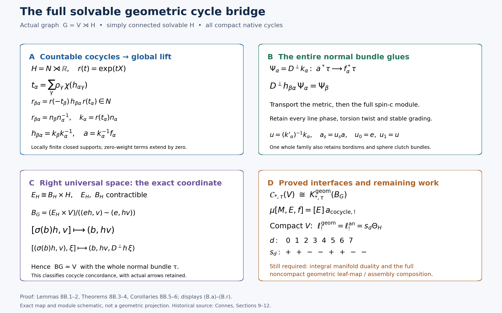

**Figure 8B.1.** Lemmas 8B.1–2, Theorems 8B.3–4 and Corollaries 8B.5–6. These are diagrams of actual maps and bundle transitions, not projections of geometric leaves. Panel A retains the noncommutative order \(r(t_\alpha)n_\alpha\) and uses a locally finite subordinate partition, including zero weights. Panel B is the whole transverse derivative comparison, with full orientation data transported. Panel C uses a right universal group space; its coordinate is \(hv\), and the normal derivative is \(D^\perp h\). Panel D records the earlier proof stage. Theorems 8C.8 and 8D.5/7/8 below now supply integral duality and the noncompact geometric and assembly comparisons. Its sign table is exact, not numerical evidence for the all-dimensional calculation. Reproducible source: [figure generator](https://kokunoyumeto.github.io/open-math-courses-public/courses/NCG-FOLIATIONS/figures/solvable-cocycle-bridge.py); editable [SVG](https://kokunoyumeto.github.io/open-math-courses-public/courses/NCG-FOLIATIONS/figures/solvable-cocycle-bridge.svg). Historical source: Connes, Sections 9–12. All proof locators are the lettered displays above and the exact preceding theorem locators.

### Integral manifold duality for the native graph-action cycles

The argument and diagram below are original CC0 material. The smooth partition prerequisite is the bundled [Local tools for bundles and transport](https://kokunoyumeto.github.io/open-math-courses-public/courses/NCG-FOLIATIONS/companions/local-tools-for-bundles-and-transport.html), Theorem 1.2, Corollary 1.3, Theorem 2.1 and Section 3.

We use the compact actual-cocycle group of native Sections 9–11. Theorem 8B.4 reduces that group to the integral group \(\mathcal C_{*,\tau}(V)\) by the smooth trivializations of Lemmas 8B.1–2. No smooth pullback of the continuous universal-join section is used. Let \(n=\dim V\), \(d=\dim H\), \(q=n-d\), and fix the ordered fundamental frame of \(F\). A splitting \(TV=F\oplus\tau\) is fixed temporarily. Cycles have compact closed smooth source \(M\), an actual bundle \(E\), a smooth map \(a:M\to V\), and the entire native stable orientation \(\eta\) on \(TM\oplus a^*\tau\). In particular lines, central transition phases, stable grading and the opposite orientation are data. The defining relations remain sum, compact bordism and the specified even spin-c bundle modification.

The following proof uses ordinary target Thom transfers with their full normal orientations. All Bott classes are the positive geometric Clifford classes of Theorem 6.0c/Corollary 6.0d. A coordinate block is appended after the old coefficient algebra. Their inverses are the corresponding geometric inverses, not an independently selected real-action class. In odd products the actual finite contraction of Section 0 is retained. This avoids importing a new sign convention into Corollary 8B.6.

#### 8C. Full ordinary orientation and descent

**Lemma 8C.1 (adding and cancelling the framed leaf block).** The specified native orientation determines, functorially and reversibly, the full ordinary stable orientation of \(a^*TV-TM\) in the doubled-tangent convention of Lemma 6.0j. Its doubled module is obtained from

\[
 (TM\oplus a^*\tau)\oplus a^*F
       \longrightarrow TM\oplus a^*TV
 \tag{C.a}
\]

by the actual ordered permutation, metric transport and tensor with the specified frame module. This construction is a bijection on full stable orientation data; it commutes with families, boundary restriction and the induced orientation of vector-bundle modification.

**Proof.** Write \(A_U=\mathrm{Cl}^+(U)\) and \(C_r=\mathrm{Cl}^+(\mathbb R^r)\). A full orientation is a smooth graded finite imprimitivity module, with both actions, from its left bundle algebra to its fixed right Clifford algebra. Tensor the native module with the frame module \(A_{a^*F}\rightsquigarrow C_d\). The real permutation in (C.a), transported first as a metric bundle map, gives the ordinary doubled module
\(A_{TM\oplus a^*TV}\rightsquigarrow C_{m+n}\), where \(m=\dim M\). The right-hand regrouping is by the same ordered real blocks. Every interchange of homogeneous factors is the graded interchange, with its sign.

There is an explicit inverse even when \(d\) is odd. Tensor this construction once more with the same framed \(C_d\) identity factor. The two frame blocks are now a matrix Clifford factor \(C_{2d}\). Cancel it on both sides by the exterior module on \(\Lambda^*\mathbb C^d\), using the two finite evaluation maps (173)–(174) of Lemma 6.0j. The real double is paired in its prescribed interleaved order; the real permutation from two-block order to that order is carried along. Both recovery composites are the identity through those onto, even evaluation unitaries. This gives an inverse on module bundles and on their intertwiners, not a cancellation of determinants. A twist by a Hermitian line \(L\), including torsion or a stable grading shift, remains the same twist by \(L\) after every cancellation.

For an ordinary graph normal, Lemma 6.0j uses its explicit quotient isomorphism, the positive metric isometry, and cancellation of the canonical doubled \(TM\) module. Applied to (C.a), these operations give exactly the ordinary orientation of \(a^*TV-TM\). Conversely its two recovery unitaries return (C.a), and cancelling the frame returns \(\eta\). Thus there is no additional normal orientation choice. The operations are tensor, permutation and finite evaluation maps, so they vary smoothly over parameters. Putting an outward boundary line first and then making these same interchanges gives the same boundary evaluation; the incoming reflected line gives the full opposite of Theorem 6.0ab. For modification the additional even sphere-normal blocks are evaluated in the order of Lemmas 6.0ac–ad. Tensoring the unchanged leaf frame before or after these evaluations gives the identical even intertwiner. This proves the last assertions. A different splitting of \(TV\to\tau\) is joined by its affine family; its triangular quotient maps and positive metric transports give the same full comparison. \(\square\)

**Lemma 8C.2 (the ordinary transfer on the entire native quotient).** Define

\[
 \kappa[M,E,a,\eta]=[E]\,a^{\,\mathrm{ord}}_!
       \in K_c^{\,m-n}(V).
 \tag{C.b}
\]

Here the ordinary target orientation is exactly Lemma 8C.1. The compact-source graph construction is used also when \(V\) is noncompact. This is a well-defined integral homomorphism
\(\mathcal C_{j,\tau}(V)\to K_c^{j+d}(V)\), for \(j=0,1\).

**Proof.** Choose a finite Euclidean embedding of the compact \(M\). Its graph is a compact embedding into \(V\times\mathbb R^{2r}\). Lemmas 6.0e–j construct its actual normal Thom class, its open tubular extension and its ordered Euclidean inverse. Their graph-family and stabilization comparisons, including Corollary 6.0k and the ordinary zero-foliation graph class of Lemma 6.0r, prove independence with the orientation supplied by Lemma 8C.1. The normal Thom coefficients vanish at normal infinity; their tube extension vanishes at the open boundary. Compactness of the source makes the resulting class a class of \(C_0(V)\), rather than an ordinary unrestricted cohomology class of \(V\).

Sum and disjoint union are respected before any cancellation. For a native compact bordism, apply Lemma 8C.1 to its entire extending module. The outward-normal-first evaluation is the ordinary extending orientation. The full double/zero-extension bordism argument of Theorems 6.0aa–ab, with the target treated as the zero foliation, gives zero for its oriented boundary transfer. In particular the incoming operator and grading are both reversed as required; a line on the bordism restricts to its actual endpoint lines.

For an even spin-c modification \(W\), use the full clutch bundle \(b_W\), not a rank substitute. The ordinary composition and projection formula of Theorem 6.0s and Lemmas 6.0t and 6.0v, together with Theorem 6.0ad, give
\([\pi^*E\,b_W]\pi_!a_!^{\mathrm{ord}}=[E]a_!^{\mathrm{ord}}\).
The assertion \(\pi_!b_W=1\) there includes the rank-zero case and actual central phases. The orientation compatibility is Lemma 8C.1; both degrees retain the same Clifford blocks. These are exactly the three native relations. Finally \(m-n=(m-q)-d\), equal to \(j+d\) modulo two. No character or rationalization has been taken. \(\square\)

#### 8C. Compact support and compact carrier cycles

**Lemma 8C.3 (smooth representatives and compact carriers).** An element of \(K_c^0(X)\), where \(X\) is a finite-dimensional smooth Hausdorff second-countable manifold, has a representative by two smooth finite projections with identical constant projection outside one compact set. A homotopy between representatives can be chosen with this property uniformly in its compact parameter. Every compact subset of \(X\) lies inside a compact smooth domain \(W\), and \(W\times[-1,1]\) has a smooth rounding whose boundary is a compact double \(D W\); the rounding can be kept away from that subset on the top and bottom faces.

**Proof: controlled representatives.** Use the projection definition of \(K_0(C_0(X)^+)\). A kernel class is a difference of projections with equal scalar ranks at infinity. Stabilize, and use a constant unitary to make their scalar projections the same projection \(p_\infty\). A compact-parameter homotopy is handled in the same matrix size. If its scalar projections vary with the parameter, trivialize their interval family first. For two projections \(p,q\) with \(\|p-q\|<1\), the polar unitary of \(qp+(1-q)(1-p)\) sends \(p\) to \(q\); its Gram matrix is invertible by the norm bound. Successive sufficiently short parameter intervals therefore give a continuous unitary trivialization, starting with the identity, of the scalar projection family. Conjugate by it before choosing the common \(p_\infty\). At infinity all the resulting projections are uniformly close to \(p_\infty\): continuity into the supremum-norm algebra makes the parameter image compact, and a finite norm net makes the small tail uniform.

Choose a smooth cutoff \(\chi\), equal to one on a compact set containing the part where any projection is not within \(1/8\) of \(p_\infty\), and zero outside a larger compact set. The self-adjoint matrix \(\chi p+(1-\chi)p_\infty\) is within \(1/8\) of a projection everywhere where it differs from \(p\). Its spectral projection above \(1/2\) is therefore defined and gives a projection equal to \(p_\infty\) off that larger compact set. Interpolating the cutoff gives the original class and homotopy. Smoothly approximate the matrix entries on the remaining compact set, in coordinate charts and a subordinate partition, fixing the constant entries near its exterior. Make the self-adjoint approximation within \(1/8\), then take the same spectral projection. The contour-resolvent formula around the separated upper spectral cluster proves smoothness and a projection homotopy. The parameter argument uses a finite cover also of its interval, fixing specified smooth endpoint representatives by parameter cutoffs. All supports stay in one compact set. The same construction for a unitary uses polar normalization and an exterior logarithm in a norm ball around \(1\).

**Proof: compact smooth domains.** Use the exact current DG-FND Section 3, Lemmas 3.A–B, Theorem 3.E and Theorem 3.1. Its compact exhaustion \(A_i\) and smooth cutoffs supply smooth functions \(\psi_i\) that are zero near \(A_i\) and one off \(\operatorname{int}A_{i+1}\). The locally finite sum \(f=\sum_i\psi_i\) is smooth and proper: off \(A_{N+1}\) its first \(N+1\) summands are one. A regular value above \(\max_K f\) gives \(W=\{f\le c\}\).

Here the needed scalar regular-value assertion also has a short complete proof. In a coordinate cube let \(C_k\) be the set where derivatives of orders \(1,\ldots,k\) vanish. On a smaller compact cube the \((n+1)\)-st derivatives are bounded. Taylor's formula bounds the image of \(C_n\) in any mesh cube of side \(\delta\) by an interval of length \(O(\delta^{n+1})\). There are \(O(\delta^{-n})\) mesh cubes, so its critical values have outer measure zero. For \(C_k\setminus C_{k+1}\), \(1\le k<n\), some derivative of order \(k\) is zero there but has nonzero gradient. Its zero set is locally a smooth hypersurface by the inverse function theorem. The restriction of \(f\) to that hypersurface has every point of \(C_k\) as a critical point. Induction on dimension, using countably many such neighborhoods, makes those critical values null as well. The dimension-one base is the mesh estimate for \(C_1\). Countable relatively compact cubes exhaust all charts, so the critical values are null globally. Every open value interval contains a regular value. The empty and zero-dimensional cases are immediate.

The vector field \(\nabla f/|\nabla f|^2\) on a neighborhood of the compact regular boundary constructs a collar by the parameter-flow theorem. In its corner chart round the quadrant by a smooth curve whose tangent angle moves from \(0\) to \(\pi/2\), monotonically, with all derivatives flat at its endpoints. Integrate its positive tangent components and rescale it into an arbitrarily small corner square. This matches the two straight pieces smoothly and monotonically; use the same curve at every collar point. It leaves the top and bottom unchanged away from the collar. Hence the rounded box \(P_W\subset X\times\mathbb R_t\) is smooth and compact, with boundary \(D W\) and a smooth projection \(r:D W\to X\). On its two core faces \(r\) is the identity on \(W\). Its boundary tangent sequence gives the actual metric stable isomorphism

\[
 TD W\oplus\mathbb R_{\mathrm{out}}
       \cong r^*TX\oplus\mathbb R_t.
 \tag{C.c}
\]

The outward line is put first before any regrouping. \(\square\)

For \(N\ge0\), put \(X_N=V\times\mathbb R^N\), \(p_N:X_N\to V\), and let \(B_N,A_N\) be the specified mutually inverse geometric Bott classes on the appended block. The notation \(yA_N\) means the compact-coefficient inverse action with the original \(C_0(V)\) first. It is defined for \(y\in K_c^0(X_N)\), with value in \(K_c^N(V)\).

**Odd ambient blocks.** The existing graph-choice lemma was stated using even Euclidean ambient blocks, so the use of odd \(N\) here needs a comparison. If \(i:M\hookrightarrow X_N\) is compact with specified normal, append a zero positive line to obtain \(i^+:M\hookrightarrow X_{N+1}\). For a whole normal tube \(\theta\), the product tube is \((v,t)\mapsto(\theta(v),t)\). On its essential open-ideal module the ordered normal Thom product is the full multiplier
\((c_\nu(v)+c_{\mathbb R}(t))/\sqrt{1+|v|^2+t^2}\).
Corollary 6.0d proves its connection estimates and nonnegative anticommutator with all Clifford factors retained. Compact old creation coefficients bound \(v\); the new-line errors vanish at \(|t|\to\infty\), and approximation controls their old tails. Zero extension along the product tube consequently gives
\[
 (i^+)_!=i_!(1_{C_0(X_N)}\boxtimes B_1),\qquad
 (i^+)_!A_{N+1}=i_!A_N .
 \tag{C.c.1}
\]
For the second equality use the inverse for the ordered appended blocks: remove the new last line first and the old \(N\)-block second. The new line's two actual inverse evaluations cancel adjacent factors. Its retained \(C_1\) is never moved past another retained odd block; finite regroupings use the same even triple-cycle and wedge maps of Proposition 6.0i. Thus no unsigned odd permutation has been made.

The full normal for the odd-ambient graph is uniquely recovered from the specified even-ambient graph by this last-line cancellation. Concretely its doubled stable identity is \(\nu_i-\mathbb R^N=a^*TV-TM\); tensoring the new positive line gives the usual even-ambient doubled identity, and the two finite recovery unitaries give both comparisons. Positive rank is obtained by enlarging \(N\). Formula (C.c.1) identifies its transfer followed by \(A_N\) with the already proved even-ambient ordinary transfer. It also applies to a compact-coefficient carrier map into \(X_N\): use a compact graph embedding of its source and the same tube argument. This establishes the odd ambient calculation used below without extending an even-stabilization statement by assumption.

Give \(r:D W\to X_N\) the full relative ordinary orientation determined by (C.c): evaluate the two boundary-line factors, with the positive \(t\) line on the top core face. Its restriction there is the identity orientation. On the bottom core face it is the full opposite. This construction uses the canonical doubled \(TX_N\) exterior module and both evaluation maps; it does not require \(TX_N\) to be spin-c. Compose with the orientation of \(p_N\) specified by \(A_N\). Recover the doubled ordinary module on \(TD W\oplus(p_Nr)^*TV\) using Lemma 6.0j's recovery maps, and then apply the inverse of Lemma 8C.1. Call the resulting native full orientation \(\eta_{W,N}\). This is a concrete finite algorithm for its normal data; it is also valid in odd \(N\) and with nonorientable \(TV\). It is not a choice of an unspecified determinant lift.

Represent \(y\) by \((E_0,E_1,\varphi)\) which agrees on a neighborhood of the complement of a compact \(K\subset\operatorname{int}W\). Glue \(E_0\) on the upper copy and \(E_1\) on the lower copy through \(\varphi\) along the collar, producing \(E_y\to D W\). Let \(G_y=r^*(E_1|_W)\). Define

\[
 \beta_N(y)=
 [D W,E_y,p_Nr,\eta_{W,N}]
 -
 [D W,G_y,p_Nr,\eta_{W,N}].
 \tag{C.d}
\]

The compact coefficient \(y_D=[E_y]-[G_y]\) vanishes on the entire lower face and a neighborhood of the rounding. On the upper core it is the extension by zero of \(y|_{\operatorname{int}W}\).

**Lemma 8C.4 (the carrier construction is well-defined).** Formula (C.d) is an additive homomorphism \(K_c^0(X_N)\to\mathcal C_{N+d,\tau}(V)\), independent of representative, compact carrier and rounding. Its full ordinary image is

\[
 \kappa\beta_N(y)=yA_N.
 \tag{C.e}
\]

**Proof: representative relations.** A common stabilization adds the same bundle to the two terms in (C.d), and cancels by the native sum relation. A relative projection homotopy in Lemma 8C.3, with one compact support and carrier, glues to an actual bundle over \(I\times D W\). Give that compact bordism the full extending orientation, putting its positive interval line first. Its endpoints are the specified carrier cycles, with the incoming full opposite. It proves invariance under the stable homotopy relation defining \(K_0\). A degenerate pair produces identical bundles and zero. Direct sum glues as direct sum. These facts prove descent through the actual integral K-theory representative relations.

**Proof: enlarging the carrier.** Suppose \(W_1\subset\operatorname{int}W_2\) both contain the compact support and the smaller closure lies in the interior. Consider a rounded
\[
 Q=(W_2\times[-1,1])
       \setminus\operatorname{int}(W_1\times[-\epsilon,\epsilon]),
       \qquad0<\epsilon<1.
 \tag{C.f}
\]
The supports lie strictly inside \(W_1\). On the upper part of \(Q\) take \(E_0\), on the lower part take \(E_1\); near \(t=0\) every point of \(Q\) lies outside \(W_1\), where \(\varphi\) identifies them. Thus they glue to a bundle \(E_Q\) on the entire compact bordism. Subtract the globally pulled back \(E_1\). The outer boundary coefficient is \(y_{D W_2}\); the inner boundary coefficient is \(y_{D W_1}\). The normal on the inner boundary points into the removed box, giving the full opposite carrier orientation. Its ordinary stable data are obtained from the actual tangent sequence of \(Q\subset X_N\times\mathbb R\), the same positive \(t\) line and the same \(A_N\); inversion of Lemma 8C.1 gives the native extending data. Hence (C.f) is an exact native bordism between the two representatives of (C.d).

Two arbitrary carriers have a common larger carrier by Lemma 8C.3, so this proves independence. Different roundings are joined in their fixed collar by interpolation of the monotone rounding curves, or can be compared by a common smaller rounding. The resulting compact collar bordism has the identical coefficient and line evaluations. The argument covers empty support and disconnected carriers.

**Proof: the image.** The ordinary orientation of \(p_Nr\) was constructed as the ordered composition of the relative orientation of \(r\) and \(A_N\). Full normal cancellation returns that same orientation by its two recovery identities. Since \(y_D\) vanishes near the lower face and the rounded part, excision computes its ordinary transfer solely in the upper open face, where \(r\) has the identity normal module. Its open-ideal extension is precisely \(y\). Thus \(r_!y_D=y\), and the remaining factor is \(A_N\), proving (C.e).

This compact-coefficient calculation is valid at the noncompact intermediate \(X_N\). It is the zero-extension calculation on the upper open ideal followed by the whole Bott inverse of Theorem 6.0c. Equivalently Lemma 6.0t's completed noncompact embedding product gives the identical localization; no noncompact manifold is used as a native cycle. \(\square\)

#### 8C. Recovering every cycle geometrically

The essential second-inverse argument is the following relative, full-orientation embedding bordism. It is given here so that an analytical triangle identity cannot stand in for a native geometric relation.

**Lemma 8C.5 (full twisted embedding transfer).** Let \(h:M\hookrightarrow Z\) be an embedding of compact closed manifolds with even spin-c normal \(\nu\), and \(f:Z\to V\). Give \(Z\) a native full orientation \(\eta_Z\). Suppose the ordered full normal module of \(h\), followed by \(\eta_Z\), induces exactly the prescribed native module \(\eta_M\) of \(fh\), through the finite normal composition/recovery of Lemma 6.0v. For \(x\in K^0(M)\),

\[
 [M,x,fh,\eta_M]=[Z,h_!x,f,\eta_Z].
 \tag{C.g}
\]

Virtual bundle coefficients here denote differences of actual bundles under the native sum relation.

**Proof: reduced north classes are allowed.** For any even spin-c bundle \(T\), the native modification coefficient is \(b_T\). Lemma 6.0ac gives the complete clutch identity \(n_!1=[b_T]-[\pi^*S_T^-]\). The cycle with coefficient \(\pi^*(xS_T^-)\) extends over the actual disk \(D(T\oplus\mathbb R)\), with the full extending orientation of Theorem 6.0ad. It is zero by native compact bordism. Consequently modification with \(b_T\) and modification with the reduced north class \(n_!1\) are the same native class. This is a geometric disk bordism; the analytical identity \(\pi_!1=0\) is not being used as a geometric relation.

**Proof: the compact surgery bordism.** Give \(\mathbb C\) its prescribed positive complex spin-c module. Modify \(Z\) along this trivial even plane. Its underlying sphere is \(S^2\times Z=\partial(D^3\times Z)\). For a sufficiently small tubular embedding of \(\nu\), the disk \(D_\epsilon(\nu\oplus\mathbb C\oplus\mathbb R)\) embeds in the interior of \(D^3\times Z\), centered on \(M\) at the origin of \(D^3\). Remove its interior, obtaining a compact smooth bordism \(W\). Its outer boundary is \(S^2\times Z\); its inner boundary is the full opposite of \(S(\nu\oplus\mathbb C\oplus\mathbb R)\), the modification of \(M\) along \(\nu\oplus\mathbb C\). The boundary parameter is the last real coordinate; the normal module on each even block is kept in the prescribed order. Smooth disk radii are chosen below one common positive tubular radius, which exists by compactness.

There is a collared interval embedding \(e:[\epsilon,1]\times M\to W\), using that last real coordinate and the zero normal vector. Its even normal is the entire specified \(\nu\oplus\mathbb C\) module. Use its Thom class and the normal tube to extend \(e_!\mathrm{pr}_M^*x\) into \(K^0(W)\). This extension is legitimate also at its two boundary faces: the interval embedding and its tube are product embeddings in a boundary collar. The normal direction is compactly supported.

The initial reference projection may be a varying spinor-bundle projection. Here is the required constant-reference construction in full. A finite Hermitian embedding of each bundle over the compact interval source exists: use finitely many local orthonormal frames and square roots of subordinate weights to give a fibrewise isometry into a fixed \(\mathbb C^k\). Its orthogonal complement is smooth; if square roots are inconvenient, use unnormalized smooth weights and their positive Gram normalization. Thus write the two normal relative projections as \(P(v),Q(x)\in M_k(\mathbb C)\), equal off a compact normal disk. The cutoff/spectral procedure of Lemma 8C.3 can first make this equality exact. Put

\[
 U_Q=\begin{pmatrix}Q&1-Q\\1-Q&Q\end{pmatrix},\qquad
 P'=U_Q\begin{pmatrix}P&0\\0&1-Q\end{pmatrix}U_Q^*,\qquad
 U_Q\begin{pmatrix}Q&0\\0&1-Q\end{pmatrix}U_Q^*
       =\begin{pmatrix}1_k&0\\0&0\end{pmatrix}.
 \tag{C.g.1}
\]

Since \(Q^2=Q=Q^*\), \(U_Q^*=U_Q\) and \(U_Q^2=1\). Direct block multiplication gives the last identity, and \(P'\) is a projection. Adding the same complement \(1-Q\) to both projections and conjugating both by \(U_Q\) preserve their relative K-class. Therefore \(P'\) equals the displayed **constant** reference outside the normal disk. Extend only this constant reference to all of \(W\); the resulting \(P'\) is a continuous projection over all of \(W\), and smoothing within its compact support preserves its class. Neither \(E\) nor a spinor line is assumed to extend away from its tube. This construction is compatible with both interval boundary restrictions. The two bundles obtained on \(W\) have the exact boundary differences
\(n_Z{}_!h_!x\) and \(n_M{}_!x\). On the outer face this follows from the ordered sum of the \(\nu\) and complex-plane Thom multipliers; on the inner face the same multiplier is the north Thom multiplier of \(\nu\oplus\mathbb C\). Normal product equality is the actual multiplier and finite evaluation equality of Corollary 6.0d, not an index comparison.

Here are the full orientation comparisons. Start with the disk extension on \(D^3\times Z\) supplied by Theorem 6.0ad for the complex-plane modification of \(\eta_Z\). Restrict it to \(W\). On the tube of \(e\), decompose its tangent sequence into the positive interval line, \(TM\), \(\nu\), and the complex plane. Substitute the specified ordered \(\nu\) module and the normal-composition hypothesis. Both boundary evaluations then reduce to \(\eta_M\) followed by the exact sphere modification factors. The two finite recovery evaluations of Lemma 6.0j cancel precisely the shared doubled tangent and normal factors. Associativity introduces no sign; all permutations are the actual graded interchanges. Thus the upper boundary has exactly the complex-plane modification of \(\eta_Z\), and the inner boundary has the full opposite modification of \(\eta_M\). A line in either input is retained in the ordered product and evaluation; its inverse in the relative normal cancels it only where the composition hypothesis prescribes that cancellation. This checks the complete central transition phases and stable grading. The reflected inner outward normal gives the negated operator and opposite grading of Theorem 6.0ab.

Initially the map is \(f\) composed with the \(Z\)-projection. On the inner sphere its value is \(f(\mathrm{tube}_\nu(m,v))\). In a collar of that boundary replace \(v\) by \(\lambda v\), where \(\lambda=0\) at that boundary and \(\lambda=1\) off a slightly larger collar. This gives the exact inner map \(fh\pi_M\), leaving the outer map unchanged. The resulting smooth map is defined in the same small tube. Transport the pulled back \(\tau\) bundle and its entire module along this explicit radial homotopy; parameter transport gives actual unitary transition-module identifications. Hence the orientation and map both extend over this same \(W\). Its coefficient bundles already extend independently of that map change.

This is a native compact bordism between the two reduced-north modifications. The first paragraph converts them into the actual native modifications, which are equivalent to the original cycles by the specified even modification relation. The result is (C.g). \(\square\)

This surgery mechanism is classical; an independent primary reference for the compact untwisted embedding method is [Baum, Oyono-Oyono, Schick and Walter, Theorem 4.1](https://arxiv.org/html/0902.0641). The proof above supplies the relative normal cancellation, compact carrier use and the actual native relations needed here. No source PDF is included.

**Lemma 8C.6 (normalization in a compact double).** For a native cycle \(c=[M,E,a,\eta]\), choose \(N\) arbitrarily large with \(N\equiv m-n\pmod2\), and an embedding \(u:M\hookrightarrow\mathbb R^N\). Its graph \(j=(a,u):M\hookrightarrow X_N\) has even normal rank. Give that normal the full orientation induced from Lemma 8C.1 and the appended \(N\)-block, so that removing that block with \(A_N\) returns exactly \(a_!^{\mathrm{ord}}\). Then

\[
 y=j_!E\in K_c^0(X_N),\qquad
 \kappa c=yA_N,\qquad
 \beta_N(y)=c .
 \tag{C.h}
\]

**Proof.** The stable graph identity is \(\nu_j-\mathbb R^N=a^*TV-TM\). Use this identity on actual orthogonal normal representatives: form the doubled \(TM\) module, transport the graph quotient by the explicit quotient isomorphism of Lemma 6.0j, and use its two finite cancellations with (C.a). This gives the normal module, including its full line twist and grading. Evenness of \(n+N-m\) means its Thom coefficient is an ordinary \(K^0\) coefficient. For odd \(N\), retain the odd coordinate factor until its specified final contraction; appending an extra even block uses the exterior wedge unitary of Proposition 6.0i. The graph formula proves the middle identity.

For completeness the Euclidean embedding here needs no missing embedding theorem. On the compact \(M\), take finitely many chart-supported smooth weights \(\rho_i\) which sum to one, with their closed supports inside the chart domains \(U_i\). Extend \(\rho_i\) and every component of \(\rho_i x_i\) by zero outside \(U_i\). These extensions are smooth since the closed supports lie inside \(U_i\). The finite map \(u=(\rho_i,\rho_i x_i)_i\) is injective: some common positive \(\rho_i\) then recovers \(x_i\). It is an immersion: if its derivative vanishes on a tangent vector, then \(d\rho_i\) vanishes and \(\rho_i\,dx_i\) vanishes for a positive weight, so the tangent vector is zero. Compactness makes it a homeomorphism onto its image; the local inverse theorem supplies its submanifold charts. Pad with zero coordinates to any sufficiently large dimension of the required parity.

Choose a compact carrier \(W\subset X_N\) containing \(j(M)\) and a closed normal disk tube in its interior. The class \(y_D\) on \(D W\) is the Thom class of the same embedding into its upper face, extended by its identical tube. The carrier orientation is, by construction, the ordinary identity relative to \(X_N\) there followed by \(A_N\), then the inverse frame cancellation. Composition with the full \(j\) normal therefore recovers \(\eta\): multiply the two recovery identities of Lemma 6.0j and those of Lemma 8C.1. The \(N\)-block and its inverse evaluate adjacently; all old Clifford blocks stay in order. Thus the precise orientation hypothesis of Lemma 8C.5 holds. Apply (C.g) with \(Z=D W\) and \(f=p_Nr\). Its right coefficient is exactly \(y_D\), so its right cycle is (C.d). This proves the last identity by native geometric relations. \(\square\)

**Lemma 8C.7 (cofinal Bott stabilization, without assuming injectivity).** If \(N\equiv L\pmod2\), and \(L\ge N\), then

\[
 \beta_L(yB_{L-N})=\beta_N(y),\qquad y\in K_c^0(X_N).
 \tag{C.i}
\]

The coordinate order in this formula is the original \(N\)-block followed by the new even block.

**Proof.** Write both sides as finite differences of their compact carrier cycles, using (C.d). Their ordinary images under Lemma 8C.4 agree after the respective coordinate inverses. Choose a common sufficiently large \(R\) of the same parity as \(N,L\), so that every source manifold in these differences embeds into \(\mathbb R^R\). Apply the graph construction of Lemma 8C.6 to all those cycles. In its ambient \(X_R\), the normal class of a cycle \(b\) is \((\kappa b)B_R\): its graph formula is \(\kappa b=zA_R\), and the other Bott identity gives \(z=(\kappa b)B_R\). Thus the graph coefficient sums for the two sides agree in the actual integral group \(K_c^0(X_R)\). Apply the already well-defined homomorphism \(\beta_R\) to that equality. Lemma 8C.6 returns the original cycles on both sides, proving (C.i). This argument does not cancel \(\kappa\), and does not use the desired second inverse. It uses its separate geometrically proved graph-normalization lemma. \(\square\)

#### 8C. Both inverse identities in both degrees

**Theorem 8C.8 (integral native geometric manifold duality).** In the full specified graph-action domain, with the prescribed ordered leaf frame,

\[
 \kappa:\mathcal C_{j,\tau}(V)
       \xrightarrow{\ \cong\ } K_c^{j+d}(V),
 \qquad j=0,1.
 \tag{C.j}
\]

Let \(p=j+d\bmod2\). An explicit inverse is

\[
 \Gamma_p(x)=\beta_p(xB_p),\qquad
 \kappa\Gamma_p(x)=x,\qquad
 \Gamma_p\kappa(c)=c .
 \tag{C.k}
\]

Together with Theorem 8B.4 this is a two-sided integral identification of the entire native compact actual-cocycle group. It does not change that domain into noncompact cycles.

**Proof: the first inverse.** Since \(p=0\) or \(1\), \(xB_p\) is an even compactly supported class on \(X_p\). Lemmas 8C.3–4 give its compact carrier cycle. By (C.e) and the first adjacent ordered Bott inverse,
\(\kappa\Gamma_p(x)=(xB_p)A_p=x\).
In \(p=1\) this equality uses the actual odd–odd matrix contraction and its reverse; there is no replacement by an unsigned tensor identification.

**Proof: the second inverse.** Choose \(N\ge p\) of parity \(p\), large enough for Lemma 8C.6 on \(c\), and set \(y=j_!E\). Formula (C.h) says \(\kappa c=yA_N\) and \(\beta_N(y)=c\). The second Bott inverse gives
\((\kappa c)B_N=(yA_N)B_N=y\).
Now append the \(N-p\) even block to \((\kappa c)B_p\) and use the ordered direct-sum equality and (C.i):
\[
 \Gamma_p\kappa c
 =\beta_p((\kappa c)B_p)
 =\beta_N((\kappa c)B_N)
 =\beta_N(y)=c.
 \tag{C.l}
\]
Each identity is either the actual Bott inverse, a proved carrier relation or the explicit embedding bordism. Finite differences, components and both native degrees are included by additivity. The argument therefore retains integral torsion.

Theorem 8B.4's inverse on an actual smooth cocycle uses its smooth \(k_\alpha\), maps \(a=k_\alpha^{-1}f_\alpha\), and full transverse derivatives. Transport that same full orientation into (C.a). The independence and cycle descent proved there, combined with (C.k)–(C.l), give both inverse identities on every original actual cocycle and its three relations. Only smooth reduction by Lemma 8B.1 is required; no regularity of a fixed continuous join section is asserted. \(\square\)

#### Scope after this bridge

This establishes integral compact-carrier duality on the entire native graph-action cycle domain, with all three native relations. It supplies \(\kappa\) for the assembly comparison. Lemmas 8D.1–4 and Theorems 8D.5/7 below supply the full noncompact geometric longitudinal leaf-map class and its compatible assembly composition. These are separate full KK comparisons, beyond the compact-support duality proved here. The compact comparison of Corollary 8B.6 retains its calibrated sign \(s_d\).

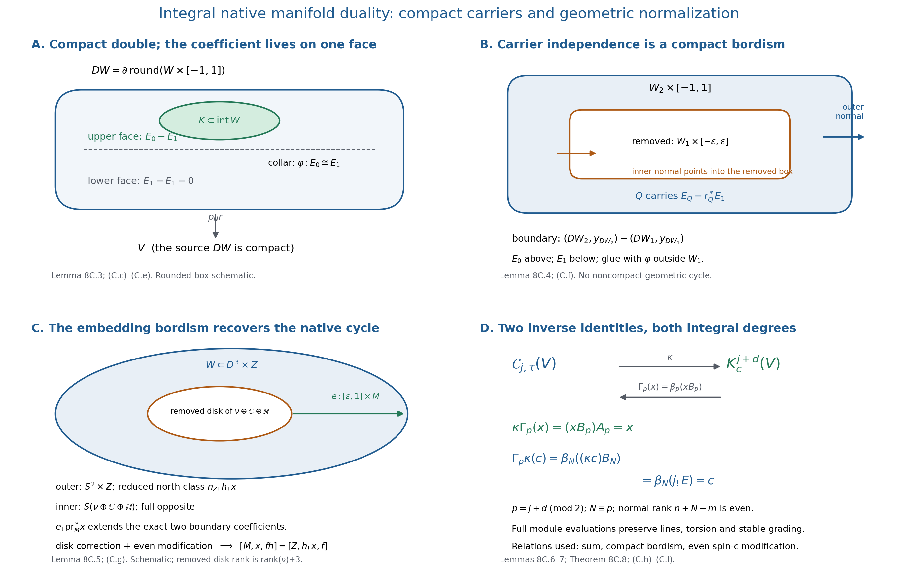

**Figure 8C.1.** Schematic diagrams, not dimensional slices of actual leaves. The upper-face coefficient is the compact relative pair \((E_0,E_1,\varphi)\); its difference is zero on the lower face and collar. The hollow rounded box in (C.f) changes the compact carrier by a native bordism. The removed disk in Lemma 8C.5 has actual bundle rank \(\operatorname{rank}\nu+3\); its boundary is the modification sphere of the even bundle \(\nu\oplus\mathbb C\). The ordered outward-normal comparison includes its full inner opposite. The final panel gives both identities (C.k)–(C.l), with compact sources at every geometric stage. Reproducible [figure generator](https://kokunoyumeto.github.io/open-math-courses-public/courses/NCG-FOLIATIONS/figures/integral-duality.py) and editable [SVG](https://kokunoyumeto.github.io/open-math-courses-public/courses/NCG-FOLIATIONS/figures/integral-duality.svg). Historical source: Baum, Oyono-Oyono, Schick and Walter, [Theorem 4.1](https://arxiv.org/html/0902.0641); the full relative orientation and carrier arguments are proved above.

### The whole noncompact leaf map and its assembly interface

Let \(V\) be the actual smooth Hausdorff second-countable unit manifold in the solvable-action theorem, \(H\) simply connected solvable, \(F\) its graph-action foliation of rank \(d\), and \(\tau=TV/F\). Put \(n=\dim V\), \(q=n-d\), \(G\) the exact native graph-action groupoid and \(A=C_r^*(G)=C_0(V)\rtimes H\) in the existing Section 8 identification. The specified arrow map from the action groupoid \(V\rtimes H\) to the foliation graph is an isomorphism, as required for this identification. The constructions use this same groupoid and its native principal spaces and retain every arrow. No free quotient or effective-action replacement is made. The principal-space construction also applies to the full holonomy groupoid wherever that is the supplied foliation groupoid.

All geometric Clifford classes, physical coefficient transfers and native products are those of Sections 6–8. An ordinary graph product retains its old normal block first; conversion to native multiplication uses the entire signed right-block transport of Lemma 7.21 before final contraction. Write \(\#\) for that fixed native product. No unsigned odd–odd flip is used.

Choose the full physical framed orientation of \(F\), and the corresponding entire stable orientation of \(TV\oplus\tau\) recovered by Lemma 7.23. Arbitrary full line twists of native cycles remain data. A separate leaf line twist is handled explicitly below. Set \(s_d=(-1)^{\lfloor d/2\rfloor}\). The literal chronological real Thom product is \(\Theta_H\), with inverse \(D_H\); the physical framed class of Theorem 8.15d is \(s_d\Theta_H\).

#### 8D. A finite proper ambient space and one global tube

**Lemma 8D.1 (constructive finite proper embedding).** Every such \(V\) embeds properly and smoothly into \(\mathbb R^{2n+2}\), and hence every larger even Euclidean space.

**Proof: local functions and proper coordinate.** Use the exact current DG-FND Section 3 to choose a countable locally finite smooth chart-supported partition \(\rho_i\), with closed compact supports inside \(U_i\), and coordinates \(x_i:U_i\to\mathbb R^n\). Set
\[
 f_i=(\rho_i,\rho_i x_i),\qquad
 \mathcal F(x)=(f_i(x))_{i\ge0}.
 \tag{D.a}
\]
Zero extensions are smooth since their closed supports lie inside the charts. Only finitely many blocks occur near every compact set. The countable map separates points: a positive common weight recovers its chart coordinates. It separates tangent vectors by first differentiating the weight components and then their coordinate components.

Take the compact exhaustion \(K_j\subset\operatorname{int}K_{j+1}\) and smooth \(\psi_j=0\) near \(K_j\), \(\psi_j=1\) off \(\operatorname{int}K_{j+1}\). Then \(t=\sum_j\psi_j\) is smooth, locally finite and proper: outside \(K_{N+1}\) its first \(N\) summands are one. This also handles infinitely many components and dimension zero.

**Proof: a finite generic map with a complete existence argument.** Put \(r=2n+1\). For matrices \(B_i\in M_{r,n+1}(\mathbb R)\) define \(\Phi_B=\sum_iB_if_i\). This smooth sum is locally finite; no matrix convergence is assumed. The countable matrix product has the complete metric
\[
 \delta(B,C)=\sum_i2^{-i-1}\min(1,\|B_i-C_i\|).
 \tag{D.b}
\]
A Cauchy sequence converges coordinatewise, and the bounded series tail proves convergence in this metric.

Cover \((V\times V)\setminus\Delta\) and the unit tangent bundle by countably many compact coordinate subsets. On each only finitely many \(f_i\) occur. Bad finite matrix choices for \(\Phi_B(x)=\Phi_B(y)\) have measure zero. Some scalar component of \(\mathcal F(x)-\mathcal F(y)\) is nonzero. Where it stays nonzero, solve the coincidence equation for the corresponding \(r\) entries of its matrix. The remaining parameters and the two points have dimension \(D-r+2n<D\), where \(D\) is the active parameter dimension. Countably many smaller compact coordinate pieces cover the solution locus; on each the solving map has bounded first derivatives, hence is Lipschitz. A Lipschitz image of a bounded \(k\)-dimensional set in \(\mathbb R^D\), \(k<D\), is null: \(O(\epsilon^{-k})\) mesh cubes map into a fixed number of \(D\)-cubes of side \(O(\epsilon)\), of total volume \(O(\epsilon^{D-k})\). This proves the claimed null set.

Immersion failure is identical: for a unit tangent vector \(v\), some component of \(d\mathcal F(v)\) is nonzero. Solve \(d\Phi_B(v)=0\) for its \(r\) matrix entries. The unit tangent dimension \(2n-1<r\) gives the same null-set estimate. Countable smaller coordinate pieces cover all such components.

Thus matrix choices separating any retained compact set of pairs or unit tangents form a dense open set. Openness follows from a positive minimum of the continuous norm there. Density follows from the finite parameter null-set argument inside any open cylinder; include its additional constrained entries among the free parameters. To meet all countably many conditions, choose nested closed metric balls with radii below \(2^{-j}\), each contained in the preceding ball's interior and the next dense open set. Their centers are Cauchy; completeness gives a limit in every ball and hence every condition. Therefore \(\Phi_B\) is injective and immersive. Now \(J=(t,\Phi_B)\) is proper and injective immersive. Properness gives a homeomorphism onto its closed image; the local inverse theorem gives its submanifold charts. Append zero even blocks as necessary. \(\square\)

**Lemma 8D.2 (a global variable normal tube).** For the proper even embedding \(J:V\hookrightarrow\mathbb R^N\), \(N>n,d\), its Euclidean normal bundle has a whole normalized tube after smooth positive variable compression.

**Proof.** The inverse theorem for \(J(x)+\eta\) gives small relatively compact base neighborhoods \(O_i\) and constants \(b_i>0\) where the normal map on \(|\eta|<b_i\) is injective and locally invertible. Choose inner open sets \(U_i\) covering \(V\), with compact closures \(L_i\subset O_i\), and a locally finite partition whose \(i\)-th support lies in \(U_i\). Closedness of \(J(V)\) and compactness of \(L_i\) allow shrinking \(b_i\) so that \(|Jx-Jy|<b_i\), \(x\in L_i\), implies \(y\in O_i\). Make \(b_i<1\). A subordinate partition gives \(h(x)=\sum_i\rho_i(x)b_i/8>0\); some active \(i\) has \(b_i\ge8h(x)\).

On the closed image put
\[
 R(Jx)=\inf_{y\in V}\bigl(h(y)+\tfrac14|Jx-Jy|\bigr).
 \tag{D.c}
\]
It is positive: outside a fixed ambient ball the distance term is bounded below; inside that ball properness gives a compact base set and a positive minimum for \(h\). It is \(1/4\)-Lipschitz and at most \(h(x)\). Choose a smooth positive \(a(x)<R(Jx)/2\) by the exact partition minorant construction.

If \(Jx+\eta=Jy+\zeta\) with \(|\eta|<a(x)\), \(|\zeta|<a(y)\), then \(D=|Jx-Jy|<R(Jx)+D/8\), so \(D<8R(Jx)/7\). An active \(i\) with \(b_i\ge8h(x)\ge8R(Jx)\) now has \(y\in O_i\). Both normal lengths are below \(b_i\), since \(R(Jy)\le R(Jx)+D/4\). Local injectivity in \(O_i\) gives equality. Local invertibility follows from the same constants. Thus the disk normal map is an open embedding. Compress all fibres by
\[
 q_a(x,v)=\left(x,\frac{v}{\sqrt{1+|v|^2/a(x)^2}}\right).
 \tag{D.d}
\]
This is a bundle diffeomorphism onto that disk, normalized at zero. The compact-level-set proof of Lemma 6.0t gives the whole \(C_0\) extension and its interval comparison, with no global lower radius bound. \(\square\)

#### 8D. The whole transverse family and full orientation

Use the induced metric, \(T=F^\perp\cong\tau\), and \(E=(dJF)^\perp\subset V\times\mathbb R^N\), of rank \(r=N-d\). The actual section normal \(\nu_J\oplus\tau\) identifies with \(E\) by
\[
 \chi(\eta,t)=\eta-dJ(Tt).
 \tag{D.e}
\]
Use the complete finite recovery (324) of Lemma 7.23 for its full normal module. That proof is a smooth bundle construction on the entire base; compactness was used there for one radius, not for its two finite evaluations. We retain those exact evaluations and right lists.

**Lemma 8D.3 (one noncompact transverse family).** There is a smooth actual cocycle family \(h_s:E\to V/F\), transversely submersive everywhere, with \(h_0=\ell\pi_E\) and étale \(g=(h_1,e):E\to V/F\times\mathbb R^N\). Its kernel distributions have one full physical coefficient family from the exact normal-inverse/leaf product to the exact ambient inverse.

**Proof: actual maps and ranks.** We construct the required local addition, denoted \(\operatorname{Exp}_x\), without requiring geodesic completeness. In a coordinate chart on \(V\), let \(S_i\) be the tangent-bundle spray with equations \(\dot x=v,\dot v=0\). Multiply by a smooth chart partition and sum. The sum is a global smooth spray whose projection is \(v\), and whose acceleration is quadratic in \(v\) in every chart. At \((x,0)\) its trajectory is constant and its linearized equation is \(\dot a=b,\dot b=0\). DG-FND Theorem 2.1 gives its time-one base map on a neighbourhood of the zero section: finitely many existence intervals cover each zero trajectory's compact time interval. Consequently
\[
 \operatorname{Exp}_x(0)=x,\qquad
 d\operatorname{Exp}_{(x,0)}(u,v)=u+v.
 \tag{D.e.1}
\]
The notation denotes this local addition; no special metric-exponential property is used.

On a relatively compact base chart, the local addition is defined on a small disk and its derivative in the transverse \(Tt\) directions remains an isomorphism onto the target transverse coordinates. At zero that derivative is the identity on \(\tau\). Compactness is used only for this retained chart closure and for the interval \(s\in[0,1]\). Choose constants admissible for each such closure and a locally finite subordinate partition. A positive smooth minorant of those bounds gives \(a(x)>0\). Shrink it also below the Euclidean tube bound. Thus the local addition and its transverse derivative are defined and invertible for \(|t|<a(x)\), and every \(sTt\) in that disk is admissible. There is no global lower bound on \(a\).

Write \((\eta_v,t_v)=\chi^{-1}q_a(v)\), and define global unit-anchor cocycles
\[
 h_s(x,v)=\ell(\operatorname{Exp}_x(sTt_v)),\qquad
 e(x,v)=Jx+\eta_v,\qquad g=(h_1,e).
 \tag{D.f}
\]
All arrows are actual unit-anchor arrows and their pullbacks in the supplied groupoid; no germ equality replaces a cocycle identity. The compressed \((\eta_v,t_v)\) are smooth coordinates on an open disk. For \(s>0\), their \(t_v\) transverse derivative is \(s\,d_{\mathrm{trans}}\operatorname{Exp}_x\circ T\), surjective; at \(s=0\), the base derivative is \(TV\to\tau\). Thus the rank is \(q\) everywhere, including arbitrarily large uncompressed fibres. No bound on derivatives of \(a\) is used.

For \(g\), the Euclidean normal tube identifies \((x,\eta_v)\) with the \(N\) Euclidean coordinates. The remaining transverse derivative in \(t_v\) is invertible. Hence its principal anchor is a local diffeomorphism and \(g\) is étale, with all counting lifts retained.

The kernels \(\mathcal F_s=\ker d_{\mathrm{trans}}h_s\subset TE\) are a smooth rank-\(N\) family. At the zero section, for \(v\in E_x\), \(\chi^{-1}v=(\eta,t)\), \(k\in F_x\),
\[
 L_s(v,k)=(k-sTt,v)\in\mathcal F_s|_V,\qquad
 de\,L_1(v,k)=dJ(k)+v.
 \tag{D.g}
\]
These are the exact signed identities (327); both the positive exponential sign and negative sign in \(\chi\) are necessary.

**Proof: full module and endpoint.** The full identity (325) is
\((\mathcal D_E\widehat\otimes\mathscr M_F)^\beta\cong J_{\mathrm{lin}}^*\mathcal D_N\),
where \(J_{\mathrm{lin}}(v,k)=v+dJk\). It supplies an actual global frame of \(\mathcal F_0\) and even full intertwiner, with normal/tangent line phases evaluated as \(L^*\otimes L\), including rank-zero gradings. The ambient coefficient is the specified physical inverse \(\mathcal D_N\).

Transport that frame by a smooth interval connection. Each fixed source point has a compact parameter interval; compact source supports give uniform coefficient bounds. Correct its zero-section frame by \(\widetilde E_s(x,0)^{-1}L_sJ_{\mathrm{lin}}^{-1}\), as in (328), and pull the correction from the base. Declare the corrected frame orthonormal.

At the endpoint \(G(x,v)=de\,E_1(x,v)\) equals \(1\) at \(v=0\), and radial contraction puts it in \(GL^+(N)\). Use its positive polar decomposition \(G=RP\) and interpolate \(P\) from \(1\), changing the frame by its inverse as in (329). The endpoint metric is exactly the Euclidean pullback metric. The radial path \(R(x,\lambda v)\), starting at \(1\), has the identity-started Spin lift (310). Its even full representation gives the ambient endpoint unitary, preserving the right action, inner product, grading and physical generators. It is globally smooth since the initial lift and radial path are fixed at every point. No phase is chosen independently at infinity. This proves the entire full orientation family, including full original leaf lines and compact smooth extra parameters. \(\square\)

#### 8D. A single completed principal interval module

**Lemma 8D.4 (the interval class before endpoint evaluation).** The family of Lemma 8D.3 gives one countably generated graded module over \(C(I,A)\widehat\otimes C_N\), one adjointable odd self-adjoint contraction \(Q\), and compact interval defects for left \(C_0(E)\) coefficients. After the fixed \(R_N\) reduction, its endpoint classes are
\[
 d_E\#\ell_{\mathrm{an}},\qquad g_!\# A_N
       \quad\text{in }KK(C_0(E),A).
 \tag{D.h}
\]
Here \(d_E,b_E\) are the native full inverse/Thom pair of Lemma 7.20; \(A_N\) is the exact geometric Euclidean inverse calibrated by Lemma 7.21.

**Proof: the completed module.** Form the actual principal space
\[
 P_i=\{(s,z,\gamma):r\gamma=h_i(s,z)\},\qquad
 (s,z,\gamma)\sim(s,z,h_{ji}(s,z)\gamma).
 \tag{D.i}
\]
In the specified graph-action case this has an especially concrete global model. Write \(f_s(x,v)=\operatorname{Exp}_x(sTt_v)\), and describe an arrow by its range and its full group parameter \(h\in H\), with source \(h^{-1}f_s(x,v)\). Then
\[
 P=I\times E\times H,\quad
 b(s,z,h)=(s,z),\quad
 a(s,z,h)=(s,h^{-1}f_s(z)).
 \tag{D.i.1}
\]
This is the actual principal space, including nonunit and discrete-isotropy arrows. Its diagonal right action has the smooth division map supplied by group multiplication; it is not a quotient by the orbit relation on \(V\). In particular \(P\) is Hausdorff and second countable even when the orbit space is not Hausdorff. For a holonomy presentation, the stated local models glue with the actual arrows in (D.i); their fixed source fibres are Hausdorff by the same base/source-fibre argument as (330).

The derivative of \(a\) is onto. Its group directions supply \(F\), and its \(z\) directions supply the whole transverse quotient by Lemma 8D.3. The restriction \(db:\ker da\to b^*\mathcal F_s\) is an isomorphism: a transverse-kernel vector has a unique compensating infinitesimal group direction, since the infinitesimal graph frame is injective. Therefore \(a\) has fibre dimension \(N\), with vertical tangent exactly \(b^*\mathcal F_s\). The zero-section points \((s,x,0,1_H)\) map to \((s,x)\), so \(a(P_s)=V\) for every parameter. This proves the required fullness directly. None of these facts uses properness of the action or compactness of \(V\).

Complete compact smooth sections in individual Hausdorff relative charts of
\(b^*(\mathscr M_s\otimes D_{\mathcal F_s}^{1/2})\otimes a^*D_F^{1/2}\).
There is no parameter-density factor. In compatible half-density trivializations the actual inner product and right convolution are
\[
 \begin{aligned}
 \langle\xi,\eta\rangle(s,\gamma)
  &=\int_{P_{s,s\gamma}}
       \langle\xi(z\gamma^{-1}),\eta(z)\rangle_{C_N}\,d\mu_s(z),\\
 (\xi k)(z)
  &=\int_{s\gamma=a_V(z)}\xi(z\gamma^{-1})k(s,\gamma).
 \end{aligned}
 \tag{D.i.2}
\]
Here \(d\mu_s\) is the vertical density already supplied by the two longitudinal half-densities; the target kernel retains its endpoint source/range half-densities. These are the exact density conventions of (333). The right Clifford action and coefficient inner products obey the graded convention of Lemma 0.13. For two core supports, the action/division homeomorphism reduces the integrals to finitely many compact relative arrow charts. Smooth dependence has a fixed finite Schur bound there; a finite parameter partition gives coefficients in \(C(I,A)\widehat\otimes C_N\). The regular-fibre Fubini calculation (334) proves matrix positivity and detects the norm. Separated compact chart functions are dense in its range, with every component and arrow lift retained. Completion gives the single module \(\mathscr E\).

Endpoint evaluation is the onto unitary (335) for this actual relative atlas. Every compact endpoint section extends in a relative interval chart; finite sums extend and their evaluated inner product is the actual endpoint inner product. The quotient completion is therefore onto. Interval rank-one operators evaluate to endpoint rank-one operators. Countable compact chart exhaustions and the right approximate identity prove countable generation. These proofs use compact core supports and never compactness of \(V\).

**Proof: one bounded operator and its actual compact ideal.** The gauge groupoid \((P\times_aP)/(G\times I)\) has algebroid \(\mathcal F_s\). The full rank-one/division calculation (337)–(338) identifies its represented reduced algebra with \(\mathcal K(\mathscr P)\), for the scalar module. For completeness, a represented rank-one has the kernel
\[
 K_{\xi,\eta}([z',z])=
   \int_{G_{a_V(z)}}\xi(z'\gamma^{-1})\overline{\eta(z\gamma^{-1})}.
 \tag{D.i.3}
\]
The compact supports of \(\xi,\eta\), the division map, and finite subdivision put this kernel into finitely many compact gauge charts. Conversely, on a retained gauge chart, separated smooth approximation of its three variables, followed by a compact plaque approximate identity, approximates its represented kernel by such rank-ones. The fixed finite Schur constants make the approximation uniform on all regular source fibres. If \(z_0\in P_{s,v}\), then \(z\mapsto[z,z_0]\) identifies \(P_{s,v}\) with the corresponding regular gauge source fibre. Since \(a(P_s)=V\), the faithful regular families give both norm inequalities. Thus, on this one parameter module,
\[
 C_r^*((P\times_aP)/(G\times I))
       \cong\mathcal K(\mathscr P),\qquad
 \mathcal K(\mathscr E)
       \cong\mathcal K(\mathscr P)\widehat\otimes C_N.
 \tag{D.i.4}
\]
The second identity uses the entire even trivialization by \(\mathcal D_N=\Pi^{k_N}C_N\). All regular fibres enter these norm equalities. The gauge algebra itself need not be a product of its endpoint algebras.

Quantize the normalized physical symbol in compact buffered relative charts, using the complete finite-supported calculus of Lemma 7.11. Negative-order frequency truncations converge in reduced norm to compact chart kernels, uniformly over the retained compact relative parameters. The square-root upper bound and high-frequency packet lower bound give the exact compact symbol kernel of (339).

Choose a countable locally finite buffered relative atlas and smooth \(\chi_i\) with \(\sum_i\chi_i^2=1\); compact larger supports are also locally finite. Clip odd self-adjoint local quantizations to contractions \(Q_i\), and on the one module put
\[
 Q=J_\chi^*\operatorname{diag}(Q_i)J_\chi
   =\mathop{\mathrm{strict}\sum}_i\chi_iQ_i\chi_i,\qquad
 J_\chi u=(\chi_i u)_i,\qquad\|Q\|\le1.
 \tag{D.j}
\]
The column isometry and adjoint follow on compact cores and then by density; the contraction bound controls the strict tails. A compactly supported left coefficient meets finitely many supports and larger neighbors, so localization of the square and commutator is the finite-supported calculus, with zero symbol. Hence
\[
 c(Q^2-1),\ [Q,c]\in\mathcal K(\mathscr E),
       \qquad c\in C_0(I\times E).
 \tag{D.k}
\]
Supremum-norm approximation and the fixed contraction bound treat every coefficient. This is one actual Kasparov homotopy before endpoint evaluation. No global chart derivative bound or radius lower bound enters it.

**Proof: zero endpoint.** Its actual principal space is \(\{(x,v,\gamma):r\gamma=x\}\). On compact cores the balanced tensor map sends an elementary normal section and a leaf kernel to their product \(u(x,v)\eta(\gamma)\), with the actual convolution action on the leaf kernel. Integration first over \(E_x\) and then over the regular \(G\) variable gives (D.i.2), with both finite Clifford actions retained. Separated smooth functions are dense on every compact principal chart; their uniform error has a fixed finite Schur bound. Finite compact-chart subdivision then proves module-norm density of the range. The completed Fubini map is therefore an even onto unitary from normal integration tensored with the full regular leaf module. Its physical coefficients are normal then tangent; the entire transport \(\beta\) of (325) changes right action, inner product and grading to the native tangent/normal target before \(R_N\). The two normal inverse evaluations are the actual ones of Theorems 7.17/7.20.

The nonproper creation and positivity proof of Theorem 7.13 applies to \(\pi_E:E\to V\); that theorem already has arbitrary noncompact source and target with \(C_0\) localization. Its axis compression proves both rectangular creation errors and adjoints compact in the supported quotient; the \(CL(L+\delta)^{-1}\) approximation recovers the errors themselves. Positivity is bracket (266). The buffered splitting partition gives the whole product. Its transferred phase and \(Q_0\) have the same normalized symbol, so the exact compact-symbol kernel gives their straight cycle homotopy. This proves the first endpoint in (D.h), including the rank-zero full line.

**Proof: étale endpoint and both creation errors.** The complete balanced unitary (345), with actual right convolution, is
\[
 \mathcal E_g\widehat\otimes_{A\otimes C_0(\mathbb R^N)}
 (A\widehat\otimes L^2(\mathbb R^N)\widehat\otimes\mathcal D_N)
       \cong\mathscr E_1 .
 \tag{D.h.1}
\]
On compact cores its formula is
\[
 U\bigl(\xi\otimes(a\otimes w)\bigr)(z)
    =(\xi\cdot(a\otimes1))(z)\,w(e(b(z))).
 \tag{D.h.2}
\]
The dot denotes the actual right convolution by \(a\), rather than scalar evaluation. Euclidean multiplication and convolution associativity prove both balancing relations. On each regular \(G_v\) fibre, a countable disjoint measurable refinement of full-anchor charts changes
\[
 \int_{\mathbb R^N}
  \sum_{z\in\widetilde a^{-1}(v,t)}|u(z,t)|^2\,dt
     \quad\hbox{into}\quad
 \int_{P_v}|u(z,e(b(z)))|^2,
 \tag{D.h.3}
\]
with the pulled-back Euclidean density. The sum counts every lift. Its full finite-Clifford matrix identity proves that \(U\) is isometric in module norm. A compact full-anchor chart vector is a finite sum of scalar chart sections times fixed Clifford columns. A Euclidean smooth cutoff equal to one on its support realizes each such vector in the closure of (D.h.2); insert an \(A\) approximate identity to pass from its scalar expression to balanced tensors. The error is bounded by the étale section-module error times the Euclidean \(L^2\) norm. Compact-chart sums exhaust the defining core, proving onto. For a compact principal creation section \(\xi\), its Euclidean support \(S\) is compact, irrespective of noncompact \(V\). Split the input by \(\kappa_R=1\) near \(S\). Under (D.h.2), write creation as \(T_\xi\). It has \(T_\xi=T_\xi\kappa_S\), where \(\kappa_S\) is one on the compact Euclidean output set \(S\). Only finitely many right cutoffs of (D.j) meet \(\operatorname{supp}\xi\). Each of their clipped phases differs from its unclipped phase by a compact, because their finite-supported symbols agree. In a full-anchor chart the longitudinal coordinate is the Euclidean \(t\). The leading amplitudes of \(Q_1T_\xi\kappa_R\) and \(T_\xi F_N\kappa_R\) are respectively
\(c_{\mathcal D_N}^+(\zeta/|\zeta|)\xi(z\gamma^{-1})\) and
\(\xi(z\gamma^{-1})c_{\mathcal D_N}^+(\zeta/|\zeta|)\).
They are equal with precisely the transferred physical action. Their difference has mixed order \(-1\); the other confined kernels are off-diagonal smooth kernels.

A smooth kernel on finite compact principal output charts times a compact Euclidean input support is a rectangular module compact. Indeed separated approximation gives maps
\(u\mapsto\zeta\int w(t)^*u(t)\,dt\). In the nonunital case insert an \(A\) approximate identity \(a_m\): the rank-one with input vector \(a_m^*\otimes w\) has output coefficient \(\zeta a_m\), and the error is at most \(\|\zeta-\zeta a_m\|\|w\|_2\). Finite homogeneous Clifford columns give the same proof. Uniform coefficient errors have a fixed finite Schur bound, so the approximation is in the full module norm. A mixed order-\(-1\) kernel is a norm limit of such smooth kernels by buffered frequency truncation, with tail at most \(C/M\) after truncation at \(M\). Therefore
\[
 (Q_1T_\xi-T_\xi F_N)\kappa_R
      \in\mathcal K(\mathscr H,\mathscr E_1).
 \tag{D.h.4}
\]
No individual-sheet Hilbert-space compactness is substituted for this module-compact calculation. The tail satisfies the full operator-norm bound
\[
 \|T_\xi F_N(1-\kappa_R)\|
 \le C_N\|\xi\|\,|S|^{1/2}
 \sup_{t\in S}\|K_N(t-\cdot)(1-\kappa_R)\|_{L^2}
       \longrightarrow0 .
 \tag{D.l}
\]
This is the exact heat-integral off-diagonal estimate (279)–(280), used in (351). The physical grading and reflection preserve this norm bound. Each interval core support has one compact \(S\) and finitely many buffered charts, so it is uniform on that whole support. Faithful regular fibres make it a module norm estimate. Since \(Q_1T_\xi(1-\kappa_R)=0\), (D.l) is the entire omitted tail of (D.h.4). The constant is uniform on every regular representation, so (D.h.4) converges in the module-operator norm to \(Q_1T_\xi-T_\xi F_N\). The adjoint equation is the other creation error. The bound \(\|T_\xi\|\le\|\xi\|\) and core density treat all creation vectors. The first operator \(g_!\) is zero, its left action is compact by Lemma 6.0n, and positivity is zero. Definition 0.3 gives the second endpoint in (D.h), before finite reduction. \(\square\)

**Theorem 8D.5 (the full noncompact geometric leaf class).** The actual normal-tube product
\[
 \ell_{\mathrm{geom}}=b_E\#g_!\# A_N
       \in KK_d(C_0(V),A)
 \tag{D.m}
\]
is the whole geometric leaf-map class in its prescribed full orientation. On the entire noncompact manifold,
\[
 \ell_{\mathrm{geom}}=\ell_{\mathrm{an}}=s_d\Theta_H,\qquad
 \ell_{\mathrm{geom}}\#(s_dD_H)=1_{C_0(V)},\qquad
 (s_dD_H)\#\ell_{\mathrm{geom}}=1_A .
 \tag{D.n}
\]
These are actual KK equalities and give inverse maps on both integral K-groups.

**Proof.** The normal rank is \(N-d\), \(g_!\) is the actual completed étale zero correspondence, and the ambient inverse has degree \(N\). The product has degree \(d\). Lemma 6.0t supplies the whole variable tube homomorphism; Lemma 6.0n supplies the completed middle module and compact left action. The full transfers (324)–(325) and Lemmas 7.20–21 give exactly the native geometric normal product.

Lemma 8D.4 gives \(d_E\#\ell_{\mathrm{an}}=g_!\#A_N\). Multiply by \(b_E\) and use both actual inverse identities on the entire base, from Theorem 6.0c and Lemma 7.20. This proves the first equality. Every auxiliary proper embedding, positive radius, local addition and transport constructed above yields that same analytical class, hence the same whole geometric class. Tube choices also have the direct single interval comparison of Lemma 6.0t. Thus choices are independent before passage to K-groups.

The zero-endpoint analytical class in Lemma 8D.4 was formed with the embedding-induced leaf metric \(g_0\). Let \(g_H\) be the metric making the specified infinitesimal frame orthonormal. Use the positive family \(g_t=(1-t)g_0+tg_H\), transporting the entire prescribed spin-c bundle by the positive metric isometry, including its right Clifford action, line and grading. Lemma 7.11 constructs one completed parameter module and one adjointable contraction for this metric family. For a compact coefficient on \(V\), its support times the interval is compact, so the buffered local calculus gives compact defects in that single interval module; the fixed contraction bound and \(C_0(V)\) approximation treat every left coefficient. Its onto endpoint evaluations give the metric homotopy of the whole analytical class. Thus we may choose the homogeneous framed metric as the representative of \(\ell_{\mathrm{an}}\) before comparing symbols.

Theorem 8.15d is already proved for arbitrary \(C_0(V)\) in the ordered solvable deformation. Its framed homogeneous Dirac has exactly the full symbol retained here. We spell out why its comparison with this analytical phase is a whole KK comparison. In compact buffered group/plaque charts, the parameter-resolvent construction in Lemmas 8.15a–b has principal inverse
\((c^+(\zeta)\pm ib)^{-1}\), \(b=\sqrt{1+t^2}\). Its norm is at most \((|\zeta|^2+b^2)^{-1/2}\). Derivatives of this inverse and the finite supported composition formula give a resolvent-parametrix error bounded by \(C/b\), uniformly over each retained compact unit support and every regular fibre. Multiplication by the actual resolvent, of norm at most \(1/b\), gives a compact error at most \(C/b^2\). Integrating the sum of the two poles is therefore a norm-integrable compact error; its principal integral is
\(c^+(\zeta)/\sqrt{1+|\zeta|^2}\). Small bounded parameter intervals are handled by (121); all remaining finite chart remainders have the negative-order compact norm of Lemma 7.11. Thus the localized bounded transform belongs to that exact supported symbol quotient and has the prescribed physical symbol.

For a compact left coefficient \(c\), choose a scalar unit cutoff \(\chi=1\) near its support. The off-buffer term
\(cF_D(1-\chi)=c[F_D,1-\chi]\) is compact by the bounded-transform commutator in Lemma 8.15b, and the analogous term for the analytical phase \(Q_V\) is compact on its actual base module by Lemma 7.11, equation (269): \(cQ_V(1-\chi)=-c[Q_V,\chi]\). Within the buffers the phases have the identical symbol, so their difference is compact by the exact finite-supported quotient. Taking adjoints proves both localizations. Supremum-norm approximation treats every \(c\in C_0(V)\). The locally compact difference gives the straight Kasparov homotopy of Lemma 7.11 on the whole module. It therefore gives \(\ell_{\mathrm{an}}=s_d\Theta_H\). The chronological real factors have both full KK inverses; \(s_d^2=1\) proves the remaining identities. No compactification, action extension or compact-test detection of KK equality has been used. \(\square\)

#### 8D. The intermediate noncompact assembly product

For a compact native global-anchor cycle \(c=(M,B,a,\eta)\), use the ordinary orientation \(a_{\mathrm{ord}}\) supplied by Lemma 8C.1: add the specified leaf frame to the native module and perform the actual doubled-tangent recovery. Its compact-support class is \(\kappa(c)=[B]a_{\mathrm{ord},!}\). The global reduction of arbitrary smooth cocycles is Lemmas 8B.1–2 and Theorem 8B.4; the defective smooth pullback of a fixed continuous join section is not used.

**Lemma 8D.6 (full compatibility of the three normal orientations).** With the framed leaf orientation of Theorem 8D.5, the ordered relative orientations of \(a_{\mathrm{ord}}\) and \(\ell\) induce exactly the original native orientation \(\eta\) of \(\ell a\), including line, central phases and stable grading.

**Proof.** Write the virtual normal identities with their actual full modules:
\[
 (a^*TV-TM)+a^*(\tau-TV)=a^*\tau-TM .
 \tag{D.o}
\]
Here \(a^*TV=a^*F\oplus a^*\tau\). Lemma 8C.1 tensors the original native doubled module with the specified framed \(F\) factor. The leaf relative factor is its full inverse, with the canonical doubled transverse cancellation; this is the relative orientation of the framed native leaf module in the explicit full normal recovery (324). Apply the signed unitary (325) to identify its recovered physical tangent module with the same prescribed frame. Explicitly the physical source has normal then tangent order, while its native right algebra is tangent then normal after
\(\beta(x\widehat\otimes y)=(-1)^{|x||y|}y\widehat\otimes x\). Its actions and inner product are transported together. For odd \(d\), the retained last two generators are in second-cycle-first order until their fixed matrix contraction; the even pair factors are removed only by the exterior evaluation maps. Lemma 7.20 proves both inverse contractions; the complete early/late finite contraction proof following equation (211), Proposition 6.0i and Lemma 7.21 retain this prescribed order in every parity. The grading correction is retained, and the reduction is precisely the physical class of (D.n).

On an actual graph normal the product module is thus the original normal module followed by the framed factor and its inverse. The two finite maps \(\xi\otimes\bar\zeta\mapsto\theta_{\xi,\zeta}\) and \(\bar\xi\otimes\zeta\mapsto\langle\xi,\zeta\rangle\) cancel those adjacent factors. Any intervening doubled tangent or transverse factors cancel by the two recovery maps of Lemma 6.0j. Regrouping the consecutive generators introduces no permutation; a necessary permutation is the exact graded intertwiner of Lemma 7.21. Hence applying the recovery (209) of Lemma 6.0v returns the entire original native doubled module, with both recovery composites identity. This proves (D.o) on full modules, not on determinants.

A line \(L\) in \(\eta\) remains \(L\) throughout; only the prescribed frame and its inverse evaluate. Even a two-torsion \(L\) is therefore recovered. An additional chosen leaf line \(D\) is handled by twisting the ordinary relative orientation by \(a^*D^*\). The actual product line is \(a^*D^*\otimes a^*D\otimes L\), whose even onto evaluation returns \(L\). The same statement holds for full graded lines. This is the complete orientation compatibility needed for assembly, rather than an existence of unrelated spin-c structures. \(\square\)

**Theorem 8D.7 (the actual noncompact intermediate composition).** For every compact native cycle, and before multiplying by its bundle coefficient,
\[
 a_{\mathrm{ord},!}\#\ell_{\mathrm{geom},!}
       =a_{\mathrm{cocycle},!}
       \quad\text{in }KK_{q-\dim M}(C(M),A),\qquad
 \mu(c)=\kappa(c)\#\ell_{\mathrm{geom},!}.
 \tag{D.p}
\]
The intermediate \(V\) may be noncompact. The right side is the exact existing compact-source native actual-cocycle construction, not a newly restricted assembly map.

**Proof: actual embeddings.** Choose an even Euclidean embedding \(u:M\hookrightarrow\mathbb R^R\). Its ordinary graph \(I=(a,u)\) has full normal
\(E_a=\nu_u\oplus a^*TV\), rank \(R-\dim M+n\). The leaf normal zero section \(k:V\hookrightarrow E\) has full normal \(E\), rank \(N-d\), and wrong-way class \(b_E\). Follow \(I\) by \(k\times1\), whose intermediate source \(V\times\mathbb R^R\) is noncompact. Lemma 6.0t applies in exactly this generality: its variable compression, essential open-ideal restriction and ordered Thom multiplier give the actual composed embedding \(K=(ka,u)\), with normal \(E_a\oplus a^*E\). No compact-intermediate version of Theorem 6.0w is applied outside its scope.

The normal quotient is the full vector identity
\[
 E_a\oplus a^*E
    \cong (\tau\oplus\mathbb R^{N+R})/
                       d(\ell a,Ja,u)(TM).
 \tag{D.q}
\]
Use the explicit quotient map (207), \(v=(d(Ja,u)^*d(Ja,u))^{-1}d(Ja,u)^*z\), \(\eta=z-d(Ja,u)v\), with output transverse coordinate \(t-d^\perp(\ell a)v\). Transport metrics positively before its Clifford action. The normal recovery (209) then returns precisely the full orientation of Lemma 8D.6. These calculations live over the compact \(M\), with actual bundle transitions pulled from the whole \(V\); compactness of \(V\) is not a premise.

The original statement of Lemma 6.0v assumed compact intermediate manifolds for its embedding choice. Here its quotient and finite-recovery formulas are being proved for the displayed bundles over \(M\): the globally available \(J\) is supplied by Lemma 8D.1, the product tube by Lemma 6.0t, and (207), (209) use only the displayed positive Gram inverse and finite evaluations on \(M\). Its inverse map sends \((\eta,t)\) to \([(t,\eta)]\), and adding \((d^\perp(\ell a)w,d(Ja,u)w)\) to a representative changes the Gram-inverse vector by \(w\) while leaving \(\eta\) and the output transverse coordinate fixed. Thus it is an actual bundle quotient isomorphism. The positive metric isometry precedes its Clifford extension. Let \(U=TM\), \(Q_U=U\oplus U\), and \(L_c=TM\oplus a^*\tau\). Carry the full normal module tensored with the canonical interleaved \(Q_U\) module through the graph isometry \(\rho_{(Ja,u)}\). Repartition consecutive right generators to obtain
\(P:A_{L_c}\widehat\otimes C_{N+R}\rightsquigarrow C_{m+q}\widehat\otimes C_{N+R}\).
Writing \(S=\Lambda^*\mathbb C^{(N+R)/2}\), its doubled stable recovery is exactly
\[
 (A_{L_c}\widehat\otimes S^*)
 \widehat\otimes_{A_{L_c}\widehat\otimes C_{N+R}}P
 \widehat\otimes_{C_{m+q}\widehat\otimes C_{N+R}}
 (C_{m+q}\widehat\otimes S).
 \tag{D.q.1}
\]
The two even finite evaluation maps recover \(P\) from this module; pulling back by \(\rho_{(Ja,u)}\) and cancelling \(Q_U\) recovers the entire original ordered normal module. All these maps are smooth over \(M\), preserve both actions and inner products, and are onto by the finite evaluations. They move only Clifford factors, so the original line and its stable grading remain. This proves the needed extension of the finite orientation construction rather than invoking a compact-intermediate statement beyond its hypotheses.

**Proof: the middle module and inverse order.** The étale product \(g\times1_{\mathbb R^R}\) has the whole principal space \(P_g\times\mathbb R^R\). Its compact core Fubini and convolution identities give the onto unitary
\(\mathcal E_{g\times1}\cong\mathcal E_g\widehat\otimes C_0(\mathbb R^R)\),
including every counting lift, both actions and zero operator, by the product calculation in Lemma 6.0n. Essential ideal restrictions have that lemma's exact range and compact-action proof. Thus this remains an equality on the completed whole modules.

Move the even inverse for the \(u\)-block through the embedding and this étale correspondence using the actual exterior associator. The ordered ambient inverse removes the last \(R\)-block first and the old \(N\)-block second; the finite exterior wedge unitary identifies it with the specified \(A_{N+R}\). The full normal blocks are retained until the native signed transport of Lemma 7.21 and final contraction. Both Euclidean blocks are even, so no odd block is silently permuted.

The result is the actual product \(K_!(g\times1)_!A_{N+R}\). Its cocycle at the compact section is exactly \((\ell a,Ja,u)\). Lemma 6.0u applies with this compact source and the even embedding \((Ja,u)\): its germ diffeomorphism and actual arrow-equivalence unitary identify it with the canonical compact-source native factorization, with the entire recovered normal orientation just proved. Its hypothesis permits a noncompact ambient manifold; only the source section is compact. This proves the first equality in (D.p) as a full KK equality. Multiplying by the unchanged finite bundle \(B\) gives the second.

An original actual smooth cocycle reduces by the smooth \(k_\alpha\) of Lemma 8B.1. Lemma 8B.2 retains its full normal derivatives, and Corollary 8B.5 gives the identical completed native wrong-way class. Thus (D.p) holds for every native representative and all three native relations. It does not replace the domain by unit-transition cycles without proving that reduction. \(\square\)

#### 8D. Both native assembly inverses and the convention

**Theorem 8D.8 (assembly isomorphism in both integral degrees).** Let \(I\) denote the inclusion inverse to the full smooth reduction \(R\) of Theorem 8B.4, and \(\Gamma_p\) the compact-carrier inverse of Theorem 8C.8, \(p=j+d\bmod2\). For \(y\in K_j(A)\), define
\[
 \mathcal N_j(y)=I\,\Gamma_p(y\#s_dD_H).
 \tag{D.r}
\]
This gives inverse homomorphisms on the entire native groups:
\[
 \mu\mathcal N_j(y)=y,\qquad
 \mathcal N_j\mu(c)=c,\qquad j=0,1 .
 \tag{D.s}
\]
Every geometric source in the inverse is closed compact, and all line and torsion data are retained.

**Proof.** Theorem 8C.8 supplies the full two-sided integral duality on the native quotient, by compact carriers and the embedding bordism. Theorem 8D.7 proves \(\mu=\kappa R\,\#\ell\) on every actual representative. Theorem 8D.5 supplies the actual whole KK inverse \(\delta=s_dD_H\). Consequently
\(\mu\mathcal N_j(y)=(\kappa\Gamma_p(y\delta))\ell=(y\delta)\ell=y\).
Conversely
\(\mathcal N_j\mu(c)=I\Gamma_p((\kappa Rc)\ell\delta)=I\Gamma_p(\kappa Rc)=IRc=c\).
These products have degree \(j+d\) on \(C_0(V)\) and degree \(j\) on \(A\); the parity \(p\) in the compact carrier is exactly the one in R1. Both equalities use whole integral groups and genuine two-sided identities. They are not consequences of numerical tests or a rational character. The full/reduced identification for solvable \(H\) is the already proved Corollary 8.9.

For an additional full graded leaf line \(D\), set
\[
 \ell_D=[D]\#\ell,\quad
 \delta_D=\delta\#[D^*],\quad
 \kappa_D(c)=\kappa(c)[D^*],\quad
 \Gamma_D(x)=\Gamma(x[D]).
 \tag{D.t}
\]
The two full line evaluations make \(\ell_D\delta_D=1\), \(\delta_D\ell_D=1\), and \(\kappa_D,\Gamma_D\) inverse. Lemma 8D.6 proves the same native assembly composition with these adjusted ordinary orientations. Formula (D.r) using \(\Gamma_D,\delta_D\) gives the same inverse on the original native cycles. A line is never discarded by treating its determinant as trivial.

The analytical leaf map, the geometric normal-tube map and the topological index action of native Section 11 are the same in this transported full orientation, by Theorems 8D.5/7. The real Thom action with that physical orientation is the explicitly calibrated \(s_d\Phi_H\). The literal chronological \(\Phi_H\) equals it only when \(s_d=1\). When \(d\equiv2,3\pmod4\), the uncalibrated equality would be false under the course's fixed odd–odd reducer. This supplement proves the complete comparison with its exact sign; it does not erase that already established convention issue. \(\square\)

The full compact-carrier duality of Theorem 8C.8, the whole noncompact leaf class of Theorem 8D.5 and the actual composition of Theorem 8D.7 prove both integral assembly inverse identities. Every arrow, full orientation and native cycle relation remains part of the construction. The chronological real product is compared in the displayed physical calibration \(s_d\); its conversion to a source convention must preserve that calibration.

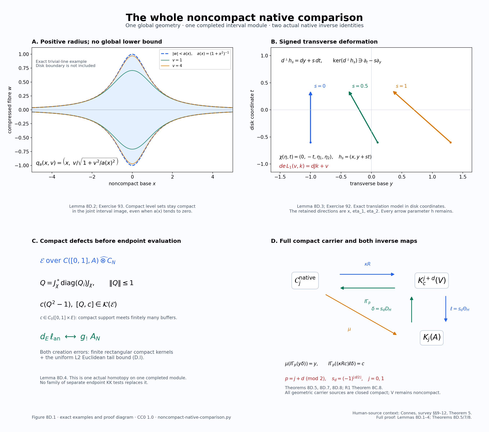

**Figure 8D.1.** Lemmas 8D.1–4 and Theorems 8D.5/7/8. The variable radius is positive pointwise, with no global lower bound. The exact kernel vector in the local translation example is \(\partial_t-s\partial_y\), with the old leaf and Euclidean-normal directions retained. The interval operator is one strict sum on one completed principal module; its compact defects occur before endpoint evaluation. The Euclidean tail bound is a proved module norm bound, not a numerical sample. The assembly diagram includes the full compact carrier inverse and both identities. The sign \(s_d\) is exact. [Reproducible figure source](https://kokunoyumeto.github.io/open-math-courses-public/courses/NCG-FOLIATIONS/figures/noncompact-native-comparison.py) · [Editable SVG](https://kokunoyumeto.github.io/open-math-courses-public/courses/NCG-FOLIATIONS/figures/noncompact-native-comparison.svg).

## 8E. Historical Thom and suspension with arbitrary coefficients

We now compare the real Thom and suspension maps in the IHES/M/80/28 preprint with the fixed conventions of this lesson. The comparison treats both input degrees, arbitrary coefficients, the complete Clifford module and its spin-c line. It gives an explicit common realization of the three maps in the solvable-group theorem of Connes, Section 12, Theorem 5.

Write \(S=C_0(\mathbb R)\), \(C_\alpha=A\rtimes_\alpha\mathbb R\), and let \(\sigma_j\) be the course's scalar KK classification in Theorem 0.14. Products without a star are the fixed course products of Lemma 0.13. In an odd–odd product the second-cycle coefficient is first in the final Clifford pair. Its generators act as \((\sigma_x,\sigma_y)\), with grading \(\Gamma=\sigma_z\). Thus the physical first-factor generator acts by \(\sigma_y\), and the second-factor generator by \(\sigma_x\).

For the *same* covariant group multipliers the two Stone conventions are
\[
 U_t=e^{itH}=e^{-itD_\alpha},\qquad H=-D_\alpha.
 \tag{AT1}
\]
The course real class is \(t_\alpha=(C_\alpha\widehat\otimes C_1,\iota_A,h(D_\alpha)\varepsilon)\), where \(h(r)=r/\sqrt{1+r^2}\). Put
\[
 N_\alpha^j(x)=\sigma_{j+1}\bigl(\sigma_j^{-1}(x)t_\alpha\bigr).
 \tag{AT2}
\]
Historical suspension and Thom maps are denoted \(S_h^j\) and \(\phi_\alpha^j\). The exact source locators are listed in Section 8E.9. The letter \(H\) later also denotes the solvable group; the real self-adjoint Stone operator in (AT1) is always distinguished by its context.

### 8E.1. The actual coefficient suspension product

Let \(A\) first be separable and trivially graded. Every class in \(K_1(A)\) is represented, after stabilization, by the full odd scalar cycle
\[
 (E\widehat\otimes C_1,1,s\varepsilon),\qquad
 E=H_A,\quad s=s^*,\quad\|s\|\le1,\quad a=1-s^2\in J=\mathcal K(E).
 \tag{AT3}
\]
This is the complete corona classification of Theorem 0.14; no finite-spectrum or commutative coefficient assumption is imposed. Its unitary is \(u_s=\exp(\pi i(s+1))\in1+J\).

Let \(b_\tau\) be the positive one-dimensional suspension class. Define *native left suspension* by \(S_n^j(x)=\sigma_{j+1}(b_\tau\boxtimes\sigma_j^{-1}(x))\), with the suspension coordinate first. The actual reduced module for \(S_n^1\) is
\[
 E_S=C_0(\mathbb R_\tau,E)\otimes\mathbb C^{1|1},\qquad
 F_n(\tau)=\frac{s\sigma_x+\tau\sqrt a\,\sigma_y}{\sqrt{1+\tau^2a}}.
 \tag{AT4}
\]
Functions of \(s\) in this expression commute. The denominator is positive and invertible. The bounded locally norm-continuous function in (AT4) defines one adjointable operator on the whole module, including its adjoint. It is a contraction and
\[
 F_n^2-1=-\frac{a}{1+\tau^2a},\qquad
 \left\|\frac{a}{1+\tau^2a}\right\|
 \le\min\{\|a\|,\tau^{-2}\}\quad(\tau\ne0).
 \tag{AT5}
\]
The defect is therefore in \(C_0(\mathbb R,J)\), not just compact at individual parameter values. The commutator with the scalar representation is zero.

Here is the product check. The lower odd operator in the fixed reduction is \(s\sigma_x\). For each finite \(\tau\),
\[
 F_n-s\sigma_x
 =s\bigl((1+\tau^2a)^{-1/2}-1\bigr)\sigma_x
   +\tau\sqrt a(1+\tau^2a)^{-1/2}\sigma_y
 \tag{AT6}
\]
belongs to \(J\otimes M_2\). Each term is a continuous function of the compact positive operator \(a\) which vanishes at zero, multiplied by bounded factors. Multiplication by any creation vector from the first module \(S\widehat\otimes C_1\) makes (AT6) vanish at infinity, since that vector is a continuous function vanishing at infinity and the two operators in the difference have norm at most one. Thus every creation-map connection error and its adjoint is a rectangular compact on the full tensor module. The finite Clifford matrix factors and their graded creation signs are the ones in Lemma 0.13; finite sums and norm approximation treat every homogeneous vector.

The lifted first operator is \(h(\tau)\sigma_y\). Its anticommutator is exactly
\[
 \{h(\tau)\sigma_y,F_n\}
 =\frac{2\tau^2\sqrt a}{\sqrt{1+\tau^2}\sqrt{1+\tau^2a}}\ge0.
 \tag{AT7}
\]
This proves the positivity sandwich for every source coefficient. Consequently (AT4), including its full coefficient module, is the Kasparov product by the course product criterion and uniqueness theorem.

The occurrence of \(\sqrt a\) is essential. Replacing (AT4) by \((s\sigma_x+\tau\sigma_y)/\sqrt{1+\tau^2}\) would not be a lower connection when \(E\) is infinite: its difference from \(s\sigma_x\) need not be compact at a finite nonzero \(\tau\). This proof does not make that replacement.

The first-factor-first, or physical, operator on the same module is
\[
 F_p(\tau)=\frac{\tau\sqrt a\,\sigma_x+s\sigma_y}{\sqrt{1+\tau^2a}}.
 \tag{AT8}
\]
The onto unitary \(U=(\sigma_x+\sigma_y)/\sqrt2\) exchanges (AT4) and (AT8) and reverses \(\Gamma\). The right coefficient of these reduced cycles is the trivially graded \(SA\). Hence the usual grading-reversal inverse applies *after* reduction, and
\[
 [F_n]=-[F_p]. \tag{AT9}
\]
No grading operator is used as a right-linear map on a retained right \(C_1\) module.

### 8E.2. Historical odd suspension is the physical product, for every coefficient

This comparison is an actual projection homotopy, rather than a scalar degree test. The relative projection for (AT8), from Theorem 0.14, is \(P_T-e_{11}\), where
\[
 T=\frac{\tau\sqrt{1-s^2}+is}{\sqrt{1+\tau^2(1-s^2)}},\qquad
 P_T=\begin{pmatrix}TT^*&T\sqrt{1-T^*T}\\
 \sqrt{1-T^*T}T^*&1-T^*T\end{pmatrix}.
 \tag{AT10}
\]
Perform the calculation first in the universal algebra \(C_0((-1,1)_r)\). Put
\[
 g(r)=\frac r{\sqrt{1-r^2}},\quad y(r)=\tan(\pi r/2),\quad
 P(z)=\frac1{1+|z|^2}\begin{pmatrix}|z|^2&z\\\bar z&1\end{pmatrix}.
 \tag{AT11}
\]
Then (AT10) is exactly \(P(\tau+ig(r))\). No Chern-character convention enters this equality.

Appendix VI.1, Lemma 1, of M/80/28 defines the historical odd suspension of \(u\) by \([We_{11}W^*]-[e_{11}]\), with
\[
 R(t)=\begin{pmatrix}\cos\theta&-\sin\theta\\\sin\theta&\cos\theta\end{pmatrix},
 \quad\theta=\pi t/2,\quad
 W=R(t)\operatorname{diag}(u^{-1},1)R(t)^*,\quad0\le t\le1.
 \tag{AT12}
\]
For \(u(r)=e^{\pi i(r+1)}\), write \(A_r=\pi(r+1)/2\). A scalar multiple of the first column of \(W\) is
\[
 \bigl(\cos(\pi t)\sin A_r+i\cos A_r,\ \sin(\pi t)\sin A_r\bigr)^T.
 \tag{AT13}
\]
Conjugating its projection by \(\operatorname{diag}(-1,1)\) changes no K-class: the path \(\operatorname{diag}(e^{\pi iv},1)\) fixes the reference projection. Using the increasing suspension coordinate \(\tau=-\cot(\pi t)\), the resulting line coordinate is
\[
 z_0(\tau,r)=\tau+i y(r)\sqrt{1+\tau^2}.
 \tag{AT14}
\]
An explicit homotopy to (AT10) is
\[
 z_v(\tau,r)=\tau+i\bigl((1-v)y(r)\sqrt{1+\tau^2}+vg(r)\bigr),
 \qquad 0\le v\le1.
 \tag{AT15}
\]
For fixed \(r\), the two imaginary terms have the same sign. Therefore
\[
 |\Re z_v|=|\tau|,\qquad
 |\Im z_v|\ge\min\{|y(r)|,|g(r)|\}.
 \tag{AT16}
\]
Both functions on the right diverge at \(r=\pm1\). Thus \(z_v\) is jointly proper, uniformly in the compact homotopy interval. The relative projections \(P(z_v)-e_{11}\) belong to one algebra
\(C([0,1],C_0(\mathbb R\times(-1,1),M_2))\). This proves the relative-projection homotopy with all boundaries controlled.

Now apply continuous functional calculus to the *actual* operator \(s\) in (AT3). For every \(f\in C_0((-1,1))\), \(f(s)\in J\), because the corona image of \(s\) is an involution and \(f(\pm1)=0\). Hence
\[
 \vartheta_s:C_0((-1,1))\longrightarrow J,\quad f\longmapsto f(s)
 \tag{AT17}
\]
is a *-homomorphism. Tensoring it with \(S\) sends the entire homotopy (AT15) into \(C([0,1],S\otimes J)\). Its endpoints are precisely the historical suspension projection of \(u_s\) and the projection (AT10). Even compact stability/Morita through \(E\), or standard stabilization when necessary, takes both to \(K_0(SA)\). The projection identity holds on the entire module; no full-module compact is inferred from a single fibre.

The even suspension of a relative finite projection \([e]-[e_0]\) is directly \([1+(b-1)e]-[1+(b-1)e_0]\), where \(b\) has positive winding. This is also the actual product of \(b_\tau\) with the two finite projection modules, over the unitization followed by reference subtraction. Connection errors are rectangular compacts because the second modules have finite frames; the first positivity is unchanged. Thus, in both degrees and for arbitrary separable coefficients,
\[
 S_h^0=S_n^0,\qquad S_h^1=-S_n^1,
 \quad\text{equivalently}\quad S_h^j=(-1)^jS_n^j.
 \tag{AT18}
\]
Surjectivity of the scalar classification, not a reduction to scalar coefficients, makes this cover every K-class. It also covers nonunital relative classes.

### 8E.3. Even Thom compression with the full coefficient module

Work first over the action-invariant unitization \(A^+\), and subtract the scalar reference at the end. Every projection class has a smooth projection representative: orbit convolution approximates a projection by a smooth self-adjoint element, its spectral projection across a fixed gap is smooth by the differentiated resolvent formula, and a sufficiently close pair of projections is connected by its polar unitary. These operations preserve the external unitization and its reference.

Let \(e\in M_n((A^+)^\infty)\) be such a projection. On the whole standard \(M_n(C_{\alpha^+})\) module, \([D,e]\) is bounded and belongs to \(M_n(A^+)\). Define
\[
 D'=eDe+(1-e)D(1-e)=D+K,
 \qquad K=-eD(1-e)-(1-e)De.
 \tag{AT19}
\]
The off-diagonal terms equal bounded expressions in \([D,e]\). They are self-adjoint together, so the bounded-perturbation theorem for regular self-adjoint operators follows here from the resolvent Neumann expansion at a large imaginary pole, its adjoint, and the resolvent identity. It gives one regular self-adjoint \(D+vK\) on the fixed domain for \(0\le v\le1\). The resolvent bounds are \(1/|b|\). The difference of the two resolvents is
\[
 (D+vK\pm ib)^{-1}-(D\pm ib)^{-1}
 =-(D+vK\pm ib)^{-1}vK(D\pm ib)^{-1}.
 \tag{AT20}
\]
It lies in \(M_n(C_{\alpha^+})\). For instance \(K(D\pm ib)^{-1}\) is a coefficient times a \(C_0\) spectral function, hence an algebra element; the other factor is a multiplier. Its norm is at most \(\|K\|/b^2\). The bounded-transform integral using the two poles with \(b=\sqrt{1+q^2}\) therefore shows
\(h(D+vK)-h(D)\in M_n(C_{\alpha^+})\), continuously in \(v\). This is a full norm-integrable compact perturbation on that standard module.

The operator \(D'\) commutes with \(e\). The product of the finite projection cycle with \(t_{\alpha^+}\) is consequently the compressed cycle on \(eC_{\alpha^+}^n\widehat\otimes C_1\), with operator \(h(eDe)\varepsilon\). This also follows directly from the product criterion: for a creation vector \(\xi\in e(A^+)^n\), subtracting the original lower multiplier gives the sum of the matrix compact perturbation in (AT20) multiplied by \(\xi\), and the compact commutator \([h(D),\xi]\) of Lemma0.17. The adjoint errors have the identical two terms. Finite frames identify these as rectangular compacts with range in the compressed module; norm approximation treats every creation vector. The first operator is zero, so its positivity condition is automatic. The square defect is an algebra element on that corner. These are compacts of the actual compressed module.

M/80/28, §II, Lemma 5 and Proposition 6, uses instead \(b(eHe)\), where \(b\) has winding one. Choose \(b_+(r)=(r-i)/(r+i)\). The positive-exponential unitary of the compressed course cycle is homotopic to \(b_+(eDe)\): the quotient of their scalar functions has winding zero, equals one at both ends, and has a continuous logarithm vanishing at infinity. Functional calculus gives the same relative-unitary homotopy on the compressed module. On it (AT1) gives
\[
 b_+(eHe)=b_+(-eDe)=b_+(eDe)^{-1}.
 \tag{AT21}
\]
Changing the chosen positive-winding \(b\) preserves the class by the same scalar homotopy. Forming the two projection products over \(A^+\) and subtracting the scalar reference makes the result belong to the kernel ideal \(C_\alpha\). This proves, on every even K-class with all coefficient and relative data retained,
\[
 \phi_\alpha^0=-N_\alpha^0.
 \tag{AT22}
\]

### 8E.4. The odd Thom map and typed suspension naturality

The even coefficient identification
\((SA)\rtimes_{1\otimes\alpha}\mathbb R\cong S\otimes C_\alpha\)
is coefficientwise on convolution kernels. Its essential extension modules and generators are exactly those of Lemma 0.17. The tensor product proof of Lemma 0.13 for arbitrary trivially graded external algebras retains localized compactness; it does not assert that \(k\otimes1_S\) is compact. Associativity consequently gives
\[
 S_n^{j+1}N_\alpha^j=N_{S\alpha}^{j+1}S_n^j.
 \tag{AT23}
\]
This is \(b_\tau\boxtimes(x t_\alpha)=(b_\tau\boxtimes x)(1_S\boxtimes t_\alpha)\), with the suspension coordinate first. There is no exchange of \(b_\tau\) with \(t_\alpha\). All Clifford factors are kept until the even cyclic reductions of Lemma 0.13. Thus no unrecorded interchange sign occurs in (AT23).

Combining (AT18) with (AT23) gives the *anticommuting* historical-suspension square for the native Thom action:
\[
 S_h^{j+1}N_\alpha^j=-N_{S\alpha}^{j+1}S_h^j.
 \tag{AT24}
\]
The historical axiom, in contrast, is the commuting square
\(S_h^{j+1}\phi_\alpha^j=\phi_{S\alpha}^{j+1}S_h^j\).
The preprint defines its odd map by that square. For \(j=1\), (AT22) and (AT24) give
\[
 S_h^0\phi_\alpha^1
 =-N_{S\alpha}^{0}S_h^1
 =S_h^0N_\alpha^1.
\]
Cancel the proved suspension isomorphism. The full result is
\[
 \boxed{\phi_\alpha^j=(-1)^{j+1}N_\alpha^j,\qquad j=0,1.}
 \tag{AT25}
\]
The sign is negative on even input and positive on odd input for the same implementing unitary. Extending the even scalar normalization to both degrees with one sign would be incorrect.

Every step above is natural under equivariant *-homomorphisms. In the degenerate case use the essential right ideal \(\overline{g(A)C_{\alpha'}}\); the spectral functions restrict to it, and localized defects lie in its compact ideal by Lemma 0.17. The functional-calculus suspension homotopy is sent coefficientwise, finite projection reference subtraction is natural, and product preservation uses the displayed graded module actions and inner products. Thus (AT25) is all-coefficient naturality, including degenerate maps.

For a nonseparable C*-algebra, (AT18), (AT22) and (AT25) remain statements about ordinary K-groups and the historically defined maps. Every finite projection or unitary representative, and every homotopy used to compare it, is contained in a separable action-invariant subalgebra: take the C*-algebra generated by a countable dense set of its entries and their rational translates. Point-norm continuity includes all real translates. Compact parameter images have countable dense subsets, so the same construction treats homotopies. These subalgebras form a directed cofinal family. Their real crossed products embed in the full crossed product: for the amenable real group the faithful reduced regular representation restricts faithfully, and full equals reduced. Every continuous compactly supported convolution kernel is approximated by finitely many coefficient values, so the crossed product is the directed norm closure. Continuity of stable K-theory passes the identities to the directed union. This extends the K-group assertion without inventing a countably generated KK cycle over a non-sigma-unital algebra.

### 8E.5. Ordered solvable iteration and Fourier reflection

Use the ordered real quotients and even crossed-product identifications of the fixed course, with no change of the group action. At step \(k=0,\ldots,d-1\), the input degree is \(j+k\). Multiplying the actual signs in (AT25) gives
\[
 \phi_{H,h}^j
 =(-1)^{dj+d(d+1)/2}\,\Phi_{H,n}^j
 =(-1)^{d(j+1)}s_d\,\Phi_{H,n}^j,
 \qquad s_d=(-1)^{\lfloor d/2\rfloor}.
 \tag{AT26}
\]
Here \(\Phi_{H,n}^j\) is the action of the chronological native class \(\Theta_H\). The intermediate identifications are even, so no other sign enters this iteration. Every step is the all-coefficient map of Section 8E.4, also when the intermediate coefficient is a previous crossed product.

At an abelian flat endpoint the two Fourier transforms are
\[
 (\mathcal F_D f)(p)=\int e^{-i\langle p,t\rangle}f(t)\,dt,
 \qquad
 (\mathcal F_H f)(q)=\int e^{+i\langle q,t\rangle}f(t)\,dt,
 \quad (\mathcal F_H f)(q)=(\mathcal F_D f)(-q).
 \tag{AT27}
\]
The pullback by \(q=-p\) is an onto unitary on the complete \(L^2\) coefficient module, preserves Lebesgue measure and half-densities, and transports multiplication, its adjoint, the right action and the inner product. For general coefficients tensor this actual map with the coefficient identity and the *entire* Clifford module. Each real Stone generator has (AT1), and the full resolvent functional calculi have the same transport, including on the interval modules used in the solvable deformation. This is not a claim that simultaneous inversion is a group automorphism of a nonabelian solvable group. The action and crossed product stay fixed; negative spectral coordinates and the reflected Lie frame are coordinate transports.

The full zero-endpoint generator list in the native reducer is \((2,1,4,3,\ldots[,d])\). Each completed pair is transported by the onto graded unitary in (AT9); earlier finite factors are retained. A retained last \(C_1\) is never contracted by an unsigned interchange. Lemma 8.15c proves the unreduced product connections and positivity, and its typed pair reductions give \(\Theta_0=s_dB_d\). The actual entire-parameter comparison 8.15d, in Theorem 8D.5, transports this full identity away from the flat endpoint. Formula (AT26) therefore uses the same fixed \(s_d\), with no scalar test as a substitute.

### 8E.6. An explicit historical presentation, with its full Clifford order

The historical Appendix has no KK-module definition. To encode its proved projection/unitary products faithfully, introduce a *specified translated presentation*. For parity classes of degrees \(r,s\), set
\[
 X\star Y=(-1)^{rs}XY.
 \tag{AT28}
\]
This is not a redefinition of the course product. It records an actual finite transport: in the only odd–odd case, flip the final ordered pair from second-factor-first to first-factor-first before the fixed \(\rho\)-Morita reduction. The graded *-flip is \(c\otimes d\mapsto(-1)^{|c||d|}d\otimes c\). Its pullback right action and inner product are the ones of Lemma 0.13, not an unsigned matrix permutation. On the reduced full module it is the parity-reversing onto isometry \(U\) in (AT9); parity reversal realizes the minus in (AT28). If either degree is even the reduction uses no final odd–odd pair and the transport is the identity. All retained odd coefficients stay in the indicated source or target until reduction.

The cocycle identity \(rs+(r+s)t=st+r(s+t)\) modulo two proves associativity; units and even homomorphisms are unchanged. The even cyclic three-generator unitary of Lemma 0.13 identifies the unreduced versions too. Tensoring these finite maps with a coefficient module preserves its full graded actions, inner products and compact defects. Thus (AT28) is a typed cycle presentation change, not an equality deduced merely from its K-group action.

In this presentation the real historical class is \(\widetilde t_\alpha=-t_\alpha\). Its evaluation on a degree-\(j\) scalar class is
\[
 \operatorname{Ev}_h^j(X)(x)=\sigma_{j+\deg X}\bigl(\sigma_j^{-1}(x)\star X\bigr)
 =(-1)^{j\deg X}\sigma_{j+\deg X}\bigl(\sigma_j^{-1}(x)X\bigr).
 \tag{AT29}
\]
For \(X=-t_\alpha\), this is precisely (AT25) on both degrees. The positive suspension class evaluated with \(\star\) likewise gives exactly (AT18), as the actual homotopy of §2 proves. Thus this presentation fits the *given* historical maps; it is not chosen on the basis of the scalar even axiom alone.

The historical ordered solvable class in this presentation is
\[
 \widetilde\Theta_H=(-t_1)\star\cdots\star(-t_d)
 =(-1)^d s_d\Theta_H.
 \tag{AT30}
\]
There are \(d(d-1)/2\) odd crossings before final parity reduction, whose parity is \(\lfloor d/2\rfloor\). Evaluation (AT29) gives (AT26). This is a full cycle encoding of the iterated historical action, rather than a purported single native KK class whose unaltered action gives two different signs.

### 8E.7. The entire leaf orientation under the same coordinate transport

Let \(\mathcal O_{\rm fr}\) be the *specified full* course leaf orientation, including its Hermitian line, graded spinor bundle and transition lifts. To align it with the historical positive Stone coordinates in (AT27), define \(\mathcal O_H\) by reflecting the entire ordered real leaf frame:
\[
 (X_1,\ldots,X_d)\longmapsto(-X_1,\ldots,-X_d),
 \qquad c_H(\xi)=c_{\rm fr}(-\xi).
 \tag{AT31}
\]
Transport the frame bundle, all spin-c transitions and its central line by this map. The line is kept, not replaced by its determinant or discarded. On unreduced right Clifford modules, (AT31) is coefficient transport by the involutive graded *-automorphism \(r:\varepsilon_i\mapsto-\varepsilon_i\), extended by the identity on the function and line factors. The transported module \(E_r\) has right action \(\eta\cdot_r c=\eta\cdot r(c)\) and inner product \(\langle\eta,\zeta\rangle_r=r^{-1}(\langle\eta,\zeta\rangle)\). The coefficient-extension isometry is typed
\[
 E\widehat\otimes_r B\longrightarrow E_r,
 \qquad \eta\otimes c\longmapsto\eta r(c),
 \qquad B=C_0(V)\widehat\otimes C_d.
 \tag{AT31a}
\]
Balancing uses \(r^2=1\); its inner-product equality is
\(r(\langle\eta r(c),\zeta r(d)\rangle)=c^*r(\langle\eta,\zeta\rangle)d\).
Its range is dense by the coefficient approximate identity, hence it is onto. In standard Clifford fibres the further identification \(c\mapsto r(c)\) identifies the transported multiplier with its reflected generator list; on spinor charts apply the same transported frame and transition maps. These statements concern the transported target module, not a claimed right-linear map to the untransported module. Reduce consecutive pairs only after that transport.

For even \(d\), the unitary Clifford volume is even, intertwines all generators with their negatives, and preserves the full grading. Equivalently on the final spinor bundle \(\Gamma\) conjugates the odd symbol to its negative and is right-linear because the final coefficient is trivially graded. The full central line and all transition actions commute with this global volume. The reflected and original whole analytical classes therefore agree.

For odd \(d\), the retained right \(C_1\) generator is reflected as well. On the full reduced coefficient module \(E\widehat\otimes C_1\), the transported representative has operator \(-F\). Its class is the additive inverse of \((E\widehat\otimes C_1,F)\): ordinary right multiplication by the central unitary \(\varepsilon\) is an onto right-linear isometry from \(\Pi(E\widehat\otimes C_1)\) to \(E\widehat\otimes C_1\), is even between those two gradings, commutes with \(F\) and the even left representation, and preserves inner products. It identifies the additive inverse \((\Pi E,-F)\) with \((E,-F)\). This is the full odd-module argument; \(\Gamma\) is not asserted right-linear. It also applies after any full graded Hermitian line is tensored on.

The analytic base module, its convolution action, the half-densities and their completion remain whole modules under these finite coefficient transports. A compact source cutoff localizes every transformed defect to its corresponding compact ideal; the same bounds hold along one parameter module. No compactification of \(V\) or source extension is used.

The geometric orientation is transported by the same (AT31), not chosen separately. In the actual normal-tube construction the doubled normal spinor is obtained from the complete leaf spinor and the normal Clifford frame by Lemma 8C.1/6.0j. Pull back those finite factors and each cancellation map before contracting. Their right actions, full lines and gradings are retained, while the principal graph module and variable tube stay unchanged. All creation-map compact defects and positive sandwiches are conjugated by these onto finite isometries. The actual product identity of 8D.4 and the two Bott inverse products of 6.0c therefore hold with these transported modules. Multiplication by the transported normal Bott inverse gives the reflected analytical/geometric equality on the whole noncompact base. In odd rank the above inverse is equivalently tensoring the entire comparison with the odd trivial Hermitian line, as in the full graded-line extension (D.t); its dual-line evaluations retain both inverse identities. In even rank the volume gives the intertwiner directly.

One must also retain the ambient inverse's convention. Choose the proper ambient embedding in an **even** dimension \(N\), adding a zero coordinate if necessary. The normal class has degree \(N-d\), the actual étale class degree zero, and the ambient inverse degree \(N\). Thus the historical first-factor-first product of these three classes agrees with their native product: no final odd–odd contraction is introduced between the normal and ambient factors. For even \(N\), (AT30) at the Euclidean trivial-action endpoint is \(s_N\Theta_0=B_N\), the physical Bott class. Its historical inverse is exactly the actual physical inverse \(A_N\), since the last parity is even. This verifies the three-factor realization, including its ambient normalization; the inverse is not replaced by an unspecified same-sign flat Dirac cycle.

The even ambient choice loses no original normal-tube construction. With the new normal coordinate first paired with its inverse, the actual one-coordinate stabilization inserts the external historical Bott pair \(\beta_h=-\beta_1\) and \(\alpha_h=\alpha_1\), where \(\beta_1\) and \(\alpha_1\) are the proved native real/Bott inverse pair. Their **historical** products are \(\beta_h\star\alpha_h=1\) and \(\alpha_h\star\beta_h=1\), by the odd case of (AT34). The added ambient inverse is composed in reverse factor order, so this pair is adjacent after the associating tensor unitary. The étale factor is even and its tensor extension is the actual coefficientwise product correspondence; moving the pair through it is even naturality, not an odd interchange. The full finite normal/ambient cancellation modules of Lemma6.0j are kept until this cancellation. Both one-coordinate inverse products remove the added coordinate on the whole base. This proves stabilization independence in the translated presentation, and also explains the extra ambient-inverse sign that would be required if an odd ambient rank were reduced prematurely.

Consequently, in the fixed *native* presentation,
\[
 \ell_H^{\rm geom}=\ell_H^{\rm an}
 =(-1)^d\ell_{\rm fr}=(-1)^d s_d\Theta_H
 =\widetilde\Theta_H.
 \tag{AT32}
\]
This establishes equality of actual full KK classes in this expressly transported orientation. Evaluating them through the historical first-factor-first presentation gives
\[
 \operatorname{Ev}_h^j(\ell_H^{\rm geom})
 =\operatorname{Ev}_h^j(\ell_H^{\rm an})
 =\phi_{H,h}^j
 =(-1)^{d(j+1)}(\ell_{\rm fr})_*^j,
 \qquad j=0,1.
 \tag{AT33}
\]
Every coefficient line and integral torsion class is retained. These are maps on the whole K-groups, obtained from the full-module equality, not numerical detection of that equality.

### 8E.8. Both inverse products and the precise scope of the source identification

Set \(\delta=s_dD_H\), the two-sided native inverse of \(\ell_{\rm fr}\) in Theorem 8D.5. The native inverse of \(\widetilde\Theta_H=(-1)^d\ell_{\rm fr}\) is \((-1)^d\delta\). Its inverse in the historical presentation is instead
\[
 \widetilde\Delta_H=\delta,
 \qquad
 \widetilde\Theta_H\star\widetilde\Delta_H=1_{C_0(V)},
 \qquad
 \widetilde\Delta_H\star\widetilde\Theta_H=1_A.
 \tag{AT34}
\]
Indeed both products have the additional factor \((-1)^{d^2}=(-1)^d\), which cancels the displayed \((-1)^d\) in the forward class. Sources and targets are different in the two equations and the proven native inverse identities are used in their unchanged order.

The inverse on historical output degree \(k\) is \((-1)^{kd}\delta_*^k\). Forward input \(j\) has \(k=j+d\) modulo two, so the two scalar signs multiply to
\((-1)^{d(j+1)+(j+d)d}=1\). Both group inverse identities follow in both degrees. The full compact-carrier/assembly inverse of Theorem 8D.8 can be transported by these same finite and orientation maps: its carrier parity remains \(p=j+d\); its full orientation is (AT31), and its complete dual-line evaluations are retained. This passage invokes the already proved actual intermediate noncompact composition (8D.7), not just an analytic K-isomorphism.

There is one necessary textual distinction. The survey specifies a spin-c structure, Clifford orientation and principal symbol, but does not supply numerical Pauli order or chirality phase. M/80/28 supplies the real maps and suspension, but no leaf spinor model. Thus (AT25)–(AT30) identify the **actual historical Thom and suspension maps** without an orientation ambiguity. Equations (AT31)–(AT34) provide an **explicit common full leaf realization** of the historical three-map assertion, with the required frame/chirality conversion proved. They do not attribute these unprinted matrices to the author, or claim that a numerically unspecified survey spinor frame was already the fixed course frame. A historical leaf realization supplied with an explicit full orientation is transported by (AT31) and the displayed spin-c maps; without that extra numerical choice, its identification with a particular current Pauli model is underdetermined by the printed text. The survey equality is realized with the complete orientation transport above.

### 8E.9. Exact source and proof locators

The following locators refer to the specified freely accessible editions.

* Connes, *An analogue of the Thom isomorphism for crossed products of a C*-algebra by an action of R*, IHES/M/80/28, June 1980: §II, printed 7 / PDF8, Axioms 1–3; printed 9 / PDF10, implementing \(e^{itH}\); printed 10–11 / PDF11–12, Lemma5/Proposition6 compression and bounded perturbation; printed 12–13 / PDF13–14, odd suspension construction; Appendix VI.1, printed29 / PDF30, Lemma1; VI.2, printed30–31 / PDF31–32, odd projection product and suspension first. Exact free edition: [official IHES archive PDF](https://repo-archives.ihes.fr/FONDS_IHES/I_Prepublications/CONNES/1976-1984/M_80_28/M_80_28.pdf).
* Connes, *A survey of foliations and operator algebras*, author PDF: §9, p29, full spin-c map orientation; §10(3), pp31–32, analytical leaf spinor and symbol; §11, pp33–34, geometric normal/étale/Euclidean inverse; §12, pp35–36, Theorem5 and the actual solvable graph. Exact free edition: [author PDF](https://alainconnes.org/wp-content/uploads/foliationsfine.pdf).
* Fixed lesson: Lemma0.13 (graded tensor laws and second-cycle-first reducer), Theorem0.14 (full scalar classification and relative projection), Lemma0.17 (actual real cycle and degenerate naturality), Theorem0.18/Corollary0.20 (both inverse products), Lemma8.15c/Theorem8.15d (full ordered solvable comparison), Lemma8C.1 (complete orientation), Theorems8D.5/7/8 (whole noncompact comparison, actual composition, both assembly inverses).

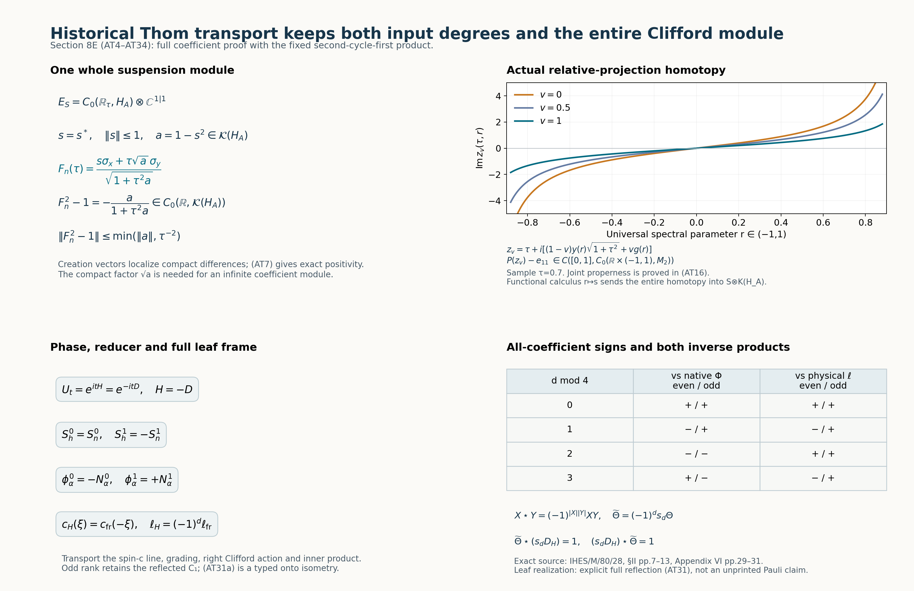

**Figure 8E.1.** Equations (AT4)–(AT18) and (AT25)–(AT34). The suspension defect is compact on the whole coefficient module. The projection curves sample the parameter \(\tau=0.7\); (AT16) proves joint properness on both noncompact boundaries. The full Clifford action, grading and spin-c line are transported before the inverse products. The sign table distinguishes both input degrees. [Reproducible figure source](../figures/all-coefficient-transport.py) · [Editable SVG](../figures/all-coefficient-transport.svg).

## 9. Connectedness matters for minimal diffeomorphisms

Let \(X\) be a compact connected smooth manifold of positive dimension, \(\phi\) a minimal diffeomorphism, and \(H^1(X;\mathbb Z)=0\). The projection conclusion for \(C(X)\rtimes_\phi\mathbb Z\) needs the following two ingredients:

* minimality and topological freeness imply simplicity, proved in Theorem 9.3 below;
* the normalized suspension Morita module and the bounded symbol-index comparison of Lemma 9.4 and Proposition 9.5 give integer trace on \(K_0\), proved in Theorem 9.6.

Here is the geometric computation in that trace formula. An invariant probability measure exists by weak compactness of the averages of its translates. On the suspension

\[
Y=(X\times[0,1])/\bigl((x,1)\sim(\phi(x),0)\bigr)
\]

it gives an invariant transverse measure of total mass one on \(X\times\{0\}\). For a unitary map \(u:Y\to U(n)\),

\[
\operatorname{ch}_1(u)=\frac{1}{2\pi i}\operatorname{tr}(u^{-1}du)
\]

is the integral class of \(\det u:Y\to S^1\). Because \(X\) is connected and \(H^1(X;\mathbb Z)=0\), the mapping-torus cohomology sequence gives \(H^1(Y;\mathbb Z)=\mathbb Z[dt]\). Pairing with the suspension current therefore gives an integer. The higher odd Chern components cannot pair with a one-dimensional current.

The complete proofs below establish the required trace and K-theory identifications. Every projection \(e\) in the unital crossed product then has integer trace between zero and one. Minimality makes the invariant measure have full support, and the canonical trace is faithful. Hence trace zero gives \(e=0\), and trace one gives \(1-e=0\). Thus its only projections are zero and one. Positive dimension and connectedness also make the minimal homeomorphism aperiodic, giving topological freeness.

The hypotheses are indispensable.

**Example 9.1 (two components).** On \(X=\{0,1\}\), let \(\phi\) interchange the two points. This is a minimal diffeomorphism of a zero-dimensional compact manifold and \(H^1(X;\mathbb Z)=0\). Nevertheless

\[
C(X)\rtimes_\phi\mathbb Z\cong M_2(C(S^1)).
\]

One explicit representation sends the two point projections to the two diagonal matrix units and sends the implementing unitary to

\[
U(z)=\begin{pmatrix}0&z\\1&0\end{pmatrix}.
\]

It satisfies the covariance relation and \(U(z)^2=zI\); the matrix units and scalar functions generated this way give the displayed algebra. Its point projection is nontrivial and has trace \(1/2\). The same finite-orbit construction works with any number of components.

*Reference:* [Connes, the minimal-diffeomorphism corollary] states the conclusion without an explicit connectedness condition. Example 9.1 shows why connectedness and the infinite-space hypothesis must be stated when disconnected or zero-dimensional manifolds are allowed.

### Faithful traces and simplicity

The first analytic premise of this section can be proved directly. Let \(X\) be compact metrizable, let \(\phi\) be a homeomorphism, and put
\(\alpha_k(f)=f\circ\phi^{-k}\).
Write \(B=C(X)\rtimes_\alpha\mathbb Z\). Lemma 8.3 makes its full and reduced meanings agree.

**Proposition 9.2 (expectation and invariant traces).** The zero Fourier coefficient extends to a positive contractive expectation
\[
\mathsf E:B\longrightarrow C(X),\qquad
\mathsf E\!\left(\sum_k f_kU^k\right)=f_0.
\tag{38}
\]
It is faithful on positive elements. An invariant probability measure \(\nu\) gives a tracial state
\(\tau_\nu=\nu\circ\mathsf E\), faithful when \(\nu\) has full support.

**Proof.** In (26) for counting measure, compress to the coordinate zero. This gives (38) on finite polynomials, and the contraction extends since \(C(X)\) is closed. Compression also proves positivity, unitality and the bimodule rule. Compression at coordinate \(m\) is \(\alpha_{-m}\mathsf E\). If \(\mathsf E(a^*a)=0\), the represented \(a\) vanishes on every coordinate subspace, hence on their dense span; so \(a=0\). Apply this to the positive square root to obtain positive-element faithfulness.

For two finite polynomials, invariance and commutativity of \(C(X)\) give
\[
\int f_k\,\alpha_k(g_{-k})\,d\nu
=\int g_{-k}\,\alpha_{-k}(f_k)\,d\nu.
\]
Summing proves \(\tau_\nu(ab)=\tau_\nu(ba)\); norm approximation extends it to \(B\). If a continuous nonnegative function has zero integral against a full-support measure, it vanishes: a positive value would give an open set of positive measure on which it has a positive lower bound. Combine this with expectation faithfulness. \(\square\)

**Theorem 9.3 (the ideal intersection and simplicity).** If \(\phi\) is topologically free, every nonzero ideal of \(B\) meets \(C(X)\) nontrivially. If it is also minimal, \(B\) is simple.

**Proof.** Suppose a quotient \(q:B\to B/J\) is injective on \(C(X)\), hence isometric there. For \(a\ge0\), choose a finite Fourier polynomial \(p\) with \(\|a-p\|<\delta\). Topological freeness means that the fixed-point sets of the finitely many nonzero powers in \(p\) have empty interior. Their complement is dense. Choose a point \(x\) in it with
\(\mathsf E(a)(x)>\|\mathsf E(a)\|-\delta\).
There is an open neighbourhood \(W\) of \(x\) disjoint from its translates by those powers. Take \(0\le h\le1\), supported in \(W\), with \(h(x)=1\). Then
\[
hph=h\mathsf E(p)h,\qquad
\|q(a)\|\ge\|q(hah)\|
\ge\|h\mathsf E(p)h\|-\delta
\ge\|\mathsf E(a)\|-3\delta.
\tag{39}
\]
Let \(\delta\downarrow0\). A positive \(a\in J\) has \(\mathsf E(a)=0\), so Proposition 9.2 gives \(a=0\). Every element of \(J\) then vanishes by applying this to its square. Thus a nonzero ideal cannot have zero intersection.

The intersection \(J\cap C(X)\) is invariant, since conjugation by \(U\) preserves \(J\). Its common zero set is a closed invariant subset. Minimality permits only the empty set and \(X\); a nonzero intersection excludes \(X\), so that ideal is all of \(C(X)\). It contains the unit, and hence \(J=B\). \(\square\)

For a minimal homeomorphism of an infinite compact space, every point is aperiodic: a periodic orbit is finite, closed and invariant, and cannot be dense in an infinite space. This applies in particular to the connected positive-dimensional manifold of this section. An invariant probability measure exists by taking a weak-* limit of the orbit averages of a point mass; translating an average changes its value on a bounded test function by at most \(2\|f\|_\infty/n\). Its support is nonempty, closed and invariant, hence all of \(X\) by minimality. Thus the algebra in the corrected projection assertion is now proved simple and has faithful normalized invariant traces. Lemma 9.4 and Proposition 9.5 supply the remaining suspension and symbol-index comparisons; Theorem 9.6 proves the integer trace range. Theorems 8.7 and 9.3 alone would not give it.

### The suspension module and its trace scale

The Morita identification needed above has a particularly explicit model. Retain \(\alpha_k(f)=f\circ\phi^{-k}\), write \(U\) for the unitary of \(B=C(X)\rtimes_\alpha\mathbb Z\), and use the suspension convention already fixed in this section. A function on \(Y\) is equivalently a continuous \(C(X)\)-valued function \(F\) on \(\mathbb R\) with
\[
F(t+1)=\alpha_{-1}(F(t)).
\]
The positive suspension flow induces \((\gamma_sF)(t)=F(t-s)\).

**Lemma 9.4 (suspension Morita and normalized trace).** For a compact metrizable \(X\) and a homeomorphism \(\phi\), put \(A_Y=C(Y)\rtimes_\gamma\mathbb R\). There is an isomorphism
\[
A_Y\cong\mathcal K_B(\mathcal E),\qquad
\mathcal E=L^2(0,1)\otimes B,\qquad
\mathcal K_B(\mathcal E)\cong\mathcal K(L^2(0,1))\otimes B.
\tag{43}
\]
Thus \(\mathcal E\) is a full imprimitivity module. If \(X\) is a compact smooth manifold, \(\phi\) is a smooth aperiodic diffeomorphism, and \(\nu\) is an invariant probability measure, the measured trace of the suspension foliation becomes \(\operatorname{Tr}\otimes\tau_\nu\) under (43). A normalized rank-one band projection has trace one. The resulting stable K-theory identification preserves these trace pairings.

**Proof.** On the dense submodule of bounded simple \(B\)-valued functions on the band, extend a vector to the real line by
\[
\xi(t+m)=U^{-m}\xi(t),\quad 0<t<1,\ m\in\mathbb Z,
\qquad
\langle\xi,\eta\rangle_B=\int_0^1\xi(t)^*\eta(t)\,dt.
\]
These formulas are used on this dense domain before completion; a general completed module element is not declared point evaluable. Multiplication \(M_F\xi(t)=F(t)\xi(t)\) respects the extension relation, because \(F(t+1)=U^{-1}F(t)U\). It is adjointable, with adjoint \(M_{F^*}\) and norm at most \(\|F\|_\infty\). Translation \(T_s\xi(t)=\xi(t-s)\) is an adjointable unitary: the inner-product integrand is one-periodic, so translating the integration band leaves the inner product unchanged. Strong continuity follows first for continuous functions supported in the interior of the band by ordinary translation continuity, then for the completion by density and the isometry bound. We have \(T_sM_FT_s^*=M_{\gamma_sF}\).

Integrating this covariant pair gives a homomorphism \(A_Y\to\mathcal L_B(\mathcal E)\). For \(a\in C_c(\mathbb R,C(Y))\), write its coefficient as \(a(s,t)\in C(X)\). Splitting \(r=t-s\) into the bands \(r=u+m\) gives the \(B\)-valued integral kernel
\[
K_a(t,u)=\sum_{m\in\mathbb Z}a(t-u-m,t)U^{-m},
\qquad 0\le t,u\le1.
\tag{44}
\]
There are uniformly finitely many terms, because \(a\) has compact group support. This kernel is continuous on the closed square. Product partitions approximate it uniformly by finite sums of one-variable kernels with coefficients in \(B\). The operator error is at most its uniform kernel error, since the band has length one. Its operator is therefore compact on \(\mathcal E\).

Conversely let \(g,h\in C_c(0,1)\), \(f\in C(X)\), and \(k\in\mathbb Z\). The compact kernel \(g(t)\overline{h(u)}fU^k\) is obtained by defining, on the fundamental band,
\[
a(s,t)=g(t)\overline{h(t-s+k)}f
\]
and extending by \(a(s,t+n)=\alpha_{-n}(a(s,t))\). Vanishing near the band endpoints makes this extension continuous; its group support lies in a fixed compact interval near \(k\). In (44) only \(m=-k\) contributes. Such kernels span a dense subalgebra of \(\mathcal K_B(\mathcal E)\), because Fourier polynomials are dense in \(B\) and interior band functions are dense in \(L^2(0,1)\). The image is consequently all the compact operators.

We check injectivity as well. Let \(\sigma\) be the direct sum of point evaluations of \(C(X)\), and let \(\rho\) be its regular representation of \(B\) on \(\ell^2(\mathbb Z)\otimes\mathcal H_\sigma\). It is faithful by Lemma 8.3. After tensoring \(\mathcal E\) with \(\rho\), unfold the band by
\[
\zeta(t+j)=\eta(t,j),\qquad 0<t<1,\quad j\in\mathbb Z.
\]
The extension relation becomes \(\eta(t+1,j)=\eta(t,j+1)\). The coefficient at coordinate \(j\) is \(\sigma(\alpha_{-j}F(t))=\sigma(F(t+j))\); translation becomes \(\zeta(r)\mapsto\zeta(r-s)\). Thus the unfolded representation is the direct sum of the real regular representations induced at the transversal points \([x,0]\). A regular representation induced at \([x,v]\) is unitarily equivalent to the one at \([x,0]\), by translating its real coordinate by \(v\). Every point of \(Y\) has this form, so this sum computes the reduced norm. Lemma 8.3 identifies that norm with the full norm. The module homomorphism is faithful and (43) follows.

The right module is full: for an interior band function \(g\) of \(L^2\) norm one, the vector \(g\otimes1\) has inner product one. The left inner product is the inverse image of \(\theta_{\xi,\eta}\) under (43). Its positivity and fullness follow from the compact-operator isomorphism, and its compatibility is the explicit identity
\(\theta_{\xi,\eta}\zeta=\xi\langle\eta,\zeta\rangle_B\).
This supplies both inner products and the imprimitivity identities.

For the trace assertion use the leaf density \(dt\) and the transversal measure \(\nu\). Their unit measure on the fundamental band is \(d\nu\,dt\); invariance makes it descend across the seam. Aperiodicity makes each leaf a line, so its holonomy groupoid is precisely the free suspension transformation groupoid. The diagonal formula from the [transverse-measure lesson, Theorem 7.10](transverse-measures-of-foliations.md#section-7) gives, on smooth compact kernels,
\[
\tau_Y(a)=\int_0^1\int_X a(0,t)(x)\,d\nu(x)\,dt.
\tag{45}
\]
Choose a complete orthonormal sequence \(g_i\in C_c^\infty(0,1)\); Gram–Schmidt applied to a countable dense set supplies one. For a matrix corner kernel \(g_i(t)\overline{g_j(u)}fU^k\), its diagonal coefficient in (45) is zero unless \(k=0\), and its integral is then \(\delta_{ij}\int_X f\,d\nu\). This is exactly the matrix trace combined with \(\tau_\nu\). The corner projection \(q_n=\sum_{i=1}^n\theta_{g_i\otimes1,g_i\otimes1}\) has measured trace \(n\), so the measured trace is bounded on that corner. Smooth coefficients and finite Fourier polynomials are norm dense there; equality therefore holds throughout every \(M_n(B)\) corner.

The \(q_n\)'s are an increasing approximate identity for the compact algebra. For \(c\ge0\), the positive elements \(c^{1/2}q_nc^{1/2}\) increase to \(c\) in norm. Lower semicontinuity and the trace identity give
\[
\tau_Y(c)=\lim_n\tau_Y(q_ncq_n).
\]
The same statement holds for \(\operatorname{Tr}\otimes\tau_\nu\), so corner equality proves equality of the entire weights, including infinite values. This argument fixes the scale without assuming uniqueness merely from agreement on a dense set. In particular \(q_1\) has trace one. Finite matrix corners give the stable K-group identification of (43); on projections their traces agree, hence the K-theory trace pairings agree. \(\square\)

### A bounded symbol-index comparison for the suspension flow

A full general assembly theorem is unnecessary for the particular projection assertion. We can prove that every suspension K-class is an elliptic symbol index by a real-action deformation and an explicit operator.

**Proposition 9.5 (the suspension symbol index is onto).** For the smooth aperiodic suspension of Lemma 9.4, the longitudinal symbol index
\[
J:K^1(Y)\longrightarrow K_0(A_Y)
\]
is an isomorphism. It sends a smooth matrix unitary \(w\) to the index of an order-zero elliptic operator whose symbol is \(1\) on the negative cotangent ray and \(w\) on the positive ray.

**Proof.** Put \(B_0=C(Y)\) and \(\alpha_s=\gamma_s\). The proof first uses only the real action. Its canonical group generator is normalized by \(U_s=e^{-isD}\); in the physical regular representation \(D=-i\,d/dt\), using the negative-sign Fourier transform of Corollary 8.10. The homomorphism \(C^*(\mathbb R)=C_0(\mathbb R)\to M(B_0\rtimes\mathbb R)\) is nondegenerate. Since \(B_0\) is unital, every scalar \(C_0\) group function, including the resolvents of \(D\), belongs to the crossed product itself. Define
\[
\chi(p)=\frac12\left(1+\frac{p}{\sqrt{1+p^2}}\right),
\qquad
P(w)=w\chi(D)+1-\chi(D).
\tag{46}
\]
The multiplier \(\chi(D)\) is a projection modulo the crossed product, since \(\chi^2-\chi\in C_0(\mathbb R)\).

It commutes with every coefficient modulo that algebra. Here is the required compactness proof. For a coefficient smooth along the flow, write \(\delta b=(d/ds)_{s=0}\alpha_s(b)\). Differentiating covariance on the generator's dense smooth core gives \([D,b]=i\delta b\); the bounded derivative and closedness extend this identity to its domain. With \(a_r=(1+r^2)^{1/2}\),
\[
\frac{D}{D^2+1+r^2}
=\frac12\bigl((D-ia_r)^{-1}+(D+ia_r)^{-1}\bigr),
\qquad
\left\|\left[\frac{D}{D^2+1+r^2},b\right]\right\|
\le\frac{\|\delta b\|}{1+r^2}.
\tag{47}
\]
The resolvent commutator identity proves the bound and places each commutator in the crossed product. The scalar formula
\[
\frac{p}{\sqrt{1+p^2}}
=\frac2\pi\int_0^\infty\frac{p}{p^2+1+r^2}\,dr
\]
holds by elementary integration. Its truncated functions are uniformly bounded and converge uniformly on compact \(p\)-sets, so their functional calculus converges strictly. Their commutators converge in norm by (47). Hence \([\chi(D),b]\) belongs to the algebra. Smooth coefficients are norm dense, by flow convolution or smooth approximation on \(Y\), and the commutator map is norm bounded; the assertion follows for every \(b\in B_0\).

Consequently \(P(w)\) is unitary modulo the crossed product whenever \(w\) is a matrix unitary. Its multiplier-extension index defines \(J_\alpha([w])\). Modulo the algebra, \(P(w_1w_2)=P(w_1)P(w_2)\); block sums and norm-continuous homotopies are also respected. Thus this is a well-defined homomorphism on \(K_1(B_0)\), using the kernel-minus-cokernel boundary convention fixed above.

To show it is an isomorphism, put
\[
\mathcal D=C([0,1],B_0)\rtimes_\beta\mathbb R,
\qquad
(\beta_s b)(v)=\alpha_{vs}(b(v)).
\]
This action is point-norm continuous, by uniform continuity on the compact \(v\)-interval. The equivariant coefficient evaluations induce maps
\(\mathrm{ev}_v:\mathcal D\to B_0\rtimes_{\alpha^{(v)}}\mathbb R\).
Their coefficient K-maps are isomorphisms, since the interval is contractible. The natural analytic Thom isomorphism of Theorem 8.7 therefore makes their crossed-product K-maps isomorphisms as well. This conclusion uses that theorem's already proved naturality; it does not infer K-theory constancy from an unspecified continuous field.

Use the same \(w\) and \(\chi(D)\) in \(M(\mathcal D)\). For smooth \(w\), its flow derivative at parameter \(v\) is \(v\delta w\), bounded uniformly in \(v\); (47) consequently proves the commutator lies in \(\mathcal D\). The resulting index class evaluates to \(J_{\alpha^{(v)}}([w])\). Norm approximation covers all classes. At \(v=0\) the algebra is \(C_0(\mathbb R,B_0)\), and \(P(w)(p)\) has endpoint values \((1,w)\). Its index is the boundary of that pair in
\[
0\longrightarrow C_0(\mathbb R,B_0)
\longrightarrow C([-\infty,+\infty],B_0)
\longrightarrow B_0\oplus B_0\longrightarrow0.
\]
The interval algebra has the K-groups of \(B_0\), and its endpoint maps are diagonal. Six-term exactness shows that the boundary restricted to \((0,[w])\) is an isomorphism from \(K_1(B_0)\) to \(K_0(C_0(\mathbb R,B_0))\): the diagonal has zero kernel, and each class modulo the diagonal has a unique representative of that form. The natural inclusion of the interval algebra into the multiplier algebra identifies this boundary with the index of \(P(w)\). Thus \(J_{\alpha^{(0)}}\) is an isomorphism. Evaluation now gives
\[
J_\alpha=(\mathrm{ev}_1)_*(\mathrm{ev}_0)_*^{-1}
             J_{\alpha^{(0)}},
\tag{48}
\]
so it is an isomorphism too. No geometric factorization independence or general assembly equality has been used.

At \(v=1\), \(D\) differentiates along the unit-speed suspension leaves. The smooth function \(\chi\) is a classical symbol of order zero, with complete expansions in even negative powers and principal values zero and one on the two rays. Its inverse Fourier distribution is smooth away from zero and rapidly decreasing there: repeated integration by parts uses the integrability of every positive-order derivative of \(\chi\); the same argument after multiplication by powers of \(p\) controls derivatives away from zero. Cut off that kernel outside a compact time interval, leaving it unchanged near zero. Its removed tail is an \(L^1\) scalar group kernel, and hence belongs to \(A_Y\). The cut-off version of \(P(w)\) is therefore a compactly supported longitudinal order-zero operator with the same index and principal symbol. Its symbol is \(1\) on the negative ray and \(w\) on the positive ray. The [Hilbert-module lesson, Section 6](hilbert-modules-and-fields-on-the-leaf-space.md#section-6) identifies this Fredholm boundary with its full relative-symbol index. Smooth matrix unitaries represent every \(K^1(Y)\) class: approximate continuously in norm by smooth matrices, then take the polar part, preserving the unitary homotopy class. This proves the stated longitudinal assertion. \(\square\)

**Theorem 9.6 (integer trace and the corrected corollary).** Let \(X\) be a compact connected smooth manifold of positive dimension, let \(\phi\) be a minimal diffeomorphism, and assume \(H^1(X;\mathbb Z)=0\). Then \(B=C(X)\rtimes_\alpha\mathbb Z\) is simple and unital, and has no idempotents other than \(0\) and \(1\). Every invariant probability measure gives
\[
\tau_{\nu*}(K_0(B))=\mathbb Z.
\tag{49}
\]

**Proof.** Minimality gives aperiodicity and a full-support invariant probability measure as proved after Theorem 9.3. Lemma 9.4 identifies \(K_0(B)\) with \(K_0(A_Y)\), preserving its trace and normalizing a rank-one band projection to one. Proposition 9.5 says every such class is a longitudinal symbol index.

For a rank-one oriented foliation the Todd factor is one. The [measured index theorem, Theorem 6.37](the-index-theorem-for-measured-foliations.md#section-6) therefore pairs the suspension current with the degree-one component of the symbol's fibre-integrated Chern character, with the fixed cotangent sign \((-1)^{1(1+1)/2}=-1\). That component is integral: the degree-two Chern character of a relative complex K-class is its relative first Chern class, and oriented integration along the real cotangent fibre sends this integral class to \(H^1(Y;\mathbb Z)\). This last assertion also follows directly from the one-dimensional cohomological Thom construction in Lemma 6.31 of that lesson. Higher components cannot pair with the one-dimensional current. Thus it suffices to compute the pairing of every integral first cohomology class on \(Y\).

Integral first classes are represented by maps to \(S^1\). For example, an integer cellular one-cocycle defines such a map on the one-skeleton; its cocycle condition fills the two-cells, and the vanishing higher homotopy groups of \(S^1\) fill the remaining cells. Given \(g:Y\to S^1\), pull it back to \(X\times[0,1]\). Its restriction at zero has a real lift, since \(H^1(X;\mathbb Z)=0\). Homotopy lifting for the covering \(\mathbb R\to S^1\) extends that lift to a function \(\theta(x,t)\) on the entire band. The seam relation implies that
\[
\theta(x,1)-\theta(\phi(x),0)=n
\]
is integer valued. It is continuous, so connectedness makes it one constant integer \(n\). The function \(\theta(x,t)-nt\) descends to a real function on \(Y\). Consequently \([g]=n[dt]\). Smooth representatives have smooth lifts; continuous representatives give the same cohomology class.

The normalized suspension current pairs with \(dt\) to one. It kills exact forms: for a smooth real function \(h\) on \(Y\), the band integral of its leaf derivative is
\[
\int_X(h(x,1)-h(x,0))\,d\nu(x)
=\int_X(h(\phi(x),0)-h(x,0))\,d\nu(x)=0.
\]
Thus every integral first class has integer current pairing. The preceding symbol-index argument gives \(\tau_{\nu*}(K_0(B))\subset\mathbb Z\). The unit of \(B\) has trace one, so equality follows.

For a projection \(e\in B\), its trace is an integer between zero and one. Faithfulness from Proposition 9.2 gives \(e=0\) when the trace is zero and \(1-e=0\) when it is one. Simplicity is Theorem 9.3, and unitality follows from the unital discrete coefficient algebra.

This also excludes nonselfadjoint idempotents. If \(z^2=z\), its represented range is closed. On that range \(zz^*\ge1\), and on its orthogonal complement \(zz^*=0\): for a range vector \(v\), the equality \(zv=v\) and Cauchy–Schwarz give \(\|z^*v\|\ge\|v\|\). Functional calculus therefore gives its range projection \(p\in C^*(z,1)\subset B\), since \(\operatorname{spec}(zz^*)\subset\{0\}\cup[1,\|z\|^2]\). We have \(pz=z\) and \(zp=p\). As \(p=0\) or \(1\), these identities give \(z=0\) or \(1\), respectively. \(\square\)

This resolves the source assertion with its scope correction. A disconnected compact manifold has a proper nonempty clopen union of components; its characteristic function is a nontrivial coefficient projection, and \(C(X)\) embeds faithfully in the crossed product. Minimality does not remove it. A connected zero-dimensional compact manifold is a single point: its crossed product is \(C(S^1)\), which has only the trivial idempotents but is not simple. Thus connectedness and the infinite-space condition are required for the source's combined simplicity and idempotent conclusion. Example 9.1 exhibits both failures in the unrestricted statement.

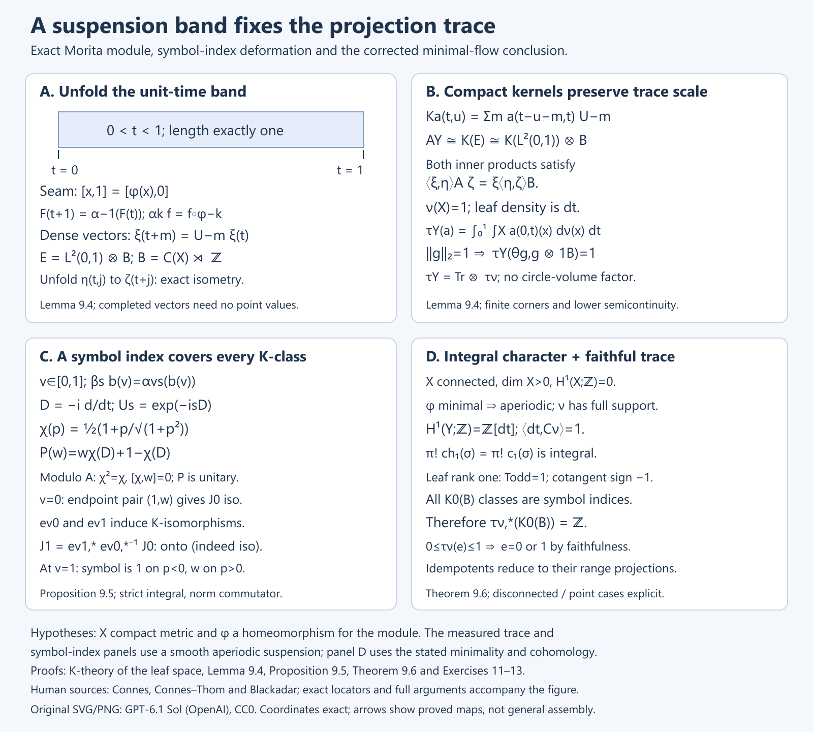

**Figure 9.7.** The band has the exact coordinate \(0<t<1\) and seam \([x,1]=[\phi(x),0]\). The vector extension is defined first on the dense function model; it imposes no point values on arbitrary completed module elements. Panel B uses the full module of Lemma 9.4, both inner products, counting powers \(U^{-m}\), leaf density \(dt\), invariant probability \(\nu\), and a unit \(L^2\) vector \(g\). Its trace scale is one. Panel C uses \(v\in[0,1]\), the negative physical Fourier sign and the action \(\beta_s=\alpha_{vs}\); the evaluation K-maps are isomorphisms by the proved analytic Thom naturality, not by a continuous-field assumption. The compactly supported symbol at \(v=1\) is \(1\) on the negative cotangent ray and \(w\) on the positive ray. Panel D assumes a connected positive-dimensional compact smooth \(X\), a minimal diffeomorphism and \(H^1(X;\mathbb Z)=0\). Its current has \(\langle dt,C_\nu\rangle=1\), and its cotangent prefactor is \(-1\). These are exact proof maps and normalizations; general assembly comparisons remain separate. Full proofs are Lemma 9.4, Proposition 9.5 and Theorem 9.6, with Exercises 11–13.

Full-size PNG · Editable SVG.

## 10. A Kasparov cycle for hyperbolic-plane leaves

Assume from now on that \(V\) is compact, \(F\) is oriented of rank two, and every leaf with its smooth leafwise metric is isometric to the complete hyperbolic plane of curvature \(-1\). Each leaf is simply connected, so \(G_x\) is the leaf itself. The exponential map is a global diffeomorphism on each fibre. To verify this directly, use the Lorentz model \(x_0^2-x_1^2-x_2^2=1\), \(x_0>0\), with base point \(o=(1,0,0)\). If \(r=|v|\), then \(\exp_o(v)=(\cosh r,(\sinh r)v/r)\); its inverse at \((x_0,z)\) is \((\operatorname{arsinh}|z|)z/|z|\). Both quotients have smooth limits at zero, and the radial and angular derivatives are invertible everywhere. Isometric transport gives the same conclusion at every base point. Smooth dependence of the leafwise geodesic equation on its initial conditions makes the total map smooth. Its nonzero fibre derivative and identity base derivative make it a local diffeomorphism, so its fibrewise bijectivity gives a global diffeomorphism

\[
F\longrightarrow G,\qquad
v\in F_x\longmapsto(x,\exp_xv).
\tag{21}
\]

It is bijective by the hyperbolic exponential theorem, and is a local diffeomorphism in the arrow charts because the leafwise exponential has no critical points and preserves the source coordinate. A bijective local diffeomorphism is a diffeomorphism. In particular \(G\) is Hausdorff in this situation.

Let \(S=S^+\oplus S^-\) be the spinor bundle of the oriented metric two-plane bundle \(F\), with its canonical spin-c structure. Use the positive Clifford convention \(c(v)^*c(v)=|v|^2\) between \(S^+\) and \(S^-\). Form the Hilbert \(C(V)\)-module with fibres

\[
\mathcal H_x=L^2(G_x)\otimes S_x.
\]

Under (21), local orthonormal frames identify these fibres with a fixed radial \(L^2\) space: the exponential volume density is \(\sinh r/r\) times Euclidean volume. Transition frames act unitarily. All continuous sections of the displayed Hilbert field over compact \(V\) give the resulting countably generated continuous Hilbert module.

The regular representations give a graded representation \(\pi:A\to\mathcal L_{C(V)}(\mathcal H)\). Define the odd self-adjoint multiplier

\[
B_x(v)=
\begin{pmatrix}
0&c(b(v))^*\\ c(b(v))&0
\end{pmatrix},
\qquad
b(v)=\frac{v}{\max(1,|v|)}.
\tag{22}
\]

It is bounded and continuous, including at zero and at the unit circle.

**Theorem 10.1 (hyperbolic radial cycle).** The triple \((\mathcal H,\pi,B)\) is an even Kasparov cycle from \(A\) to \(C(V)\). It defines

\[
\delta\in KK(A,C(V)).
\]

**Proof.** First take a smooth compactly supported convolution kernel \(f\). Its support gives a finite propagation bound \(C\): its represented kernel can be nonzero only between points of a leaf at distance at most \(C\). The leafwise Schur integral bounds are uniform over the compact base.

The function \(B^2-1\) is zero for \(|v|\ge1\). Multiplying the smoothing kernel of \(\pi(f)\) by this defect leaves a kernel supported, uniformly over \(V\), where one endpoint has radius at most one and the other at most \(1+C\). This is a compact subset of the two fibre variables in the vector bundle coordinates (21). Such a continuous smoothing family is a compact \(C(V)\)-module operator. To see the last assertion, cover the compact base by finitely many frame domains, use a partition of unity, and approximate the continuous compactly supported kernel on each domain uniformly by finite sums \(a(x,v)\overline{b(x,w)}\). The compact volume bound converts this to operator-norm approximation. Each sum is a finite-rank module map.

For the commutator, let \(r,s\) be the distances of its two endpoints from the base point \(x\), and \(\theta\) their angle at \(x\). Hyperbolic cosine law gives

\[
\cosh d
=\cosh(r-s)+\sinh r\,\sinh s(1-\cos\theta).
\]

If \(d\le C\) and \(r,s\ge R>1\), it follows that

\[
\left\|\frac v{|v|}-\frac w{|w|}\right\|
=\sqrt{2(1-\cos\theta)}
\le\frac{\sqrt{2(\cosh C-1)}}{\sinh R}.
\tag{23}
\]

The estimate is uniform in \(x\). A term of the commutator kernel is the original kernel times \(B_x(v)-B_x(w)\). Where one endpoint has radius at least \(R+C\), finite propagation makes both radii at least \(R\), so (23) applies. The Schur estimate bounds the norm of this tail by a constant times \(1/\sinh R\), tending to zero. Cutting both radii off at \(R+C\) leaves a continuous compactly supported kernel, compact by the preceding finite-rank argument. The commutator is consequently a norm limit of compact module operators.

Finally \(B=B^*\). Smooth compact kernels are dense in \(A\), and the three defect expressions depend continuously on \(f\) in operator norm. Their compactness extends to every \(a\in A\). This proves all Kasparov conditions. \(\square\)

The uniform statement over \(V\) is essential. Compactness of the represented operator on each individual leaf would not by itself prove compactness of a \(C(V)\)-module operator.

## 11. What the deformation must establish

The transverse fundamental-class question has a distinction between full and reduced algebras. Hilsum and Skandalis construct the K-oriented projection class on the maximal foliation algebra; their original paper explicitly distinguishes this algebra from Connes's reduced algebra (pp. 326–327, with the module and submersion construction in Section IV, pp. 350–355). Thus a general maximal transverse class is established. [Primary paper](https://www.numdam.org/article/ASENS_1987_4_20_3_325_0.pdf#page=3).

Connes and Moscovici's hypoelliptic construction is on the bundle of transverse metrics. They distinguish this type-II counterpart from the original transverse algebra on preprint p. 12. Theorem I.1 on p. 16 gives geometric bounded-commutator and localized-resolvent assertions; it does not assert a reduced-norm estimate there. [Primary preprint](https://repo-archives.ihes.fr/FONDS_IHES/I_Prepublications/CONNES/1994-1998/M_95_19/M_95_19.pdf#page=13).

The remaining construction in this lesson is the specifically reduced scalar graph representative with the full invariant transverse spin-c coefficient and original local Bott pairing \(+1\). Neither the maximal construction nor the metric-bundle spectral triple alone supplies every interface of that representative. The results below do not prove universal nonexistence, and do not establish that the entire general transverse-class construction is an unresolved problem in the current literature.

The radial cycle points toward an inverse for the longitudinal Dirac class. Its existence does not yet select the inverse normalization: the full spinor module, chirality, line twist and physical Fourier phase must be calibrated together. Using the same positive spinor convention on both sides can retain a grading-reversed line instead of the identity. Let \(T\in KK(C(V),A)\) denote the longitudinal class with its specified even-dimensional spin-c orientation, and let \(\delta_{\mathrm{inv}}\in KK(A,C(V))\) denote the correctly calibrated inverse class of Theorems 11.1 and 11B.1. It is not automatically the particular radial realization \(\delta\) of Theorem 10.1. The desired typed identities are

\[
T\otimes_A\delta_{\mathrm{inv}}=1_{C(V)},\qquad
\delta_{\mathrm{inv}}\otimes_{C(V)}T=1_A.
\tag{24}
\]

The first makes \((\delta_{\mathrm{inv}})_*\) a **left inverse** of \(T_*\); it proves injectivity of \(T_*\). The second identity, proved in Section 11B, gives surjectivity.

The geometric deformation uses \(G_\lambda=G\) for \(\lambda>0\) and the additive bundle \(G_0=F\). In coordinates \(v\in F_x\), its maps are

\[
s_\lambda(v)=x,\qquad
r_\lambda(v)=\exp_x(\lambda v).
\]

At zero, range and source both become \(x\). Smoothness of the exponential and its derivative at zero make multiplication tend to vector addition and inversion tend to \(v\mapsto-v\), uniformly on compact vector sets. With the scaled Haar densities, Fourier transform at zero identifies

\[
A_0=C_0(F^*),\qquad A_1=A.
\]

To obtain the first identity in (24), one needs longitudinal Dirac and radial cycles **over the whole parameter interval**, and a product whose represented target is a Hilbert \(C(V\times[0,1])\)-module. At zero their product must be the full normalized Bott–Dirac product, with the inverse finite Clifford module and its exact line evaluation retained. Its endpoints are then homotopic classes in \(KK(C(V),C(V))\), giving the first identity.

A continuous field of algebras by itself does not identify the KK groups of its fibres. The existence, uniform compactness, and compatibility of these interval cycles and their product are extra assertions. Theorem 10.1 supplies a radial cycle at one; it does not identify its inverse normalization or prove those interval and product assertions. Likewise the first product in (24) does not imply the second. This distinguishes the explicit radial construction from the stronger assembly-isomorphism theorem proved for these disk leaves in Section 11B.

### A calibrated first inverse and the reverse product

Keep the hypotheses of Section 10: \(V\) is compact without boundary, \(F\) is an oriented real bundle of rank two, and the actual leaves, with their smooth leafwise metric, are complete Poincaré disks of curvature \(-1\). Put \(C=C(V)\) and \(A=C_r^*(G)\), where \(G=\operatorname{Hol}(V,F)\). Prescribe the entire longitudinal spin-c structure, including its Hermitian line transitions. Let

\[
 T=\ell_!^{\mathrm{an}}\in KK(C,A)
 \tag{H.1}
\]

be the native class of Theorem 7.1, after the fixed rank-two matrix contraction. Its physical Fourier symbol is the **positive** unit-covector symbol, and its grading is (145)/(244). If the geometric graph construction is used instead, Theorem 7.25 identifies it with this class only for the same entire induced stable orientation.

The radial cycle of Theorem 10.1 is a useful construction, but an inverse requires its whole finite Clifford module, grading, line and phase to be calibrated. We now construct that calibrated class \(\delta_{\mathrm{inv}}\). The two desired identities in (24) have different targets.

**Theorem 11.1 (the calibrated first inverse).** In the stated actual disk-leaf scope, the finite module and radial phase of Lemma 11.2 define a class \(\delta_{\mathrm{inv}}\in KK(A,C)\) satisfying the first identity in (24). Consequently \((\delta_{\mathrm{inv}})_*\) is a left inverse of \(T_*\), so \(T_*\) is injective in both K-degrees. The theorem does not assert the second identity or identify an unspecified positive-spinor realization of \(\delta\) with this calibrated class.

The proof is given after the interval constructions. The deformation idea is due to Connes and Skandalis: [Connes], Section 12, printed pp. 613–615. The reverse identity is proved separately in Section 11B; its distinction from the first product is explained in Remark 11.6. The full Clifford Bott–Dirac product used at the zero endpoint is the framework of [Kasparov], with the programme's complete bundle proof in Theorem 6.0c.

#### The entire finite inverse module

**Lemma 11.2 (full calibration, chirality and line).** Let \(P=\operatorname{Cl}^+(F)\), and let \(S\) be the prescribed graded \(P,C\) spinor imprimitivity bundle. In an oriented orthonormal frame use

\[
 \varepsilon_1=\sigma_x,\qquad
 \varepsilon_2=\sigma_y,\qquad
 \Gamma_S=-i\varepsilon_1\varepsilon_2=\sigma_z.
 \tag{H.3}
\]

On \(Z=\Lambda F_{\mathbb C}\), write \(a_j=e_j+\iota_j\), \(c_j=e_j-\iota_j\), and \(b_j=ic_j\), with exterior-degree parity. Then the graded balanced module

\[
 W=\overline S\widehat\otimes_P Z
 \tag{H.4}
\]

has physical generators \(b_W=(\sigma_y,\sigma_x)\) and grading \(\Gamma_W=\sigma_z\). Its ordered physical chirality is \(-\Gamma_W\). For the canonical spin-c convention \(S=1\oplus L\), where \(L\) is the oriented complex tangent line, \(W=1\oplus L^*\), with even first and odd second summand. Replacing \(S\) by \(S\otimes H\) replaces \(W\) by \(W\otimes H^*\) for the entire Hermitian line \(H\). The calibrated radial operator is

\[
 R_x(v)=-\frac{b_{W,x}(v)}{\sqrt{1+|v|^2}}.
 \tag{H.5}
\]

With the Fourier convention \(\widehat f(p)=\int e^{-ip\cdot v}f(v)\,dv\), this becomes the bounded transform of \(-i b_W\cdot\partial_p=c_W\cdot\partial_p\), the actual spinor Morita reduction of the inverse in (144).

**Proof.** The exterior relations are \(\{a_i,a_j\}=2\delta_{ij}\), \(\{c_i,c_j\}=-2\delta_{ij}\), and \(\{a_i,c_j\}=0\). Thus the physical \(b\) action graded-commutes with the positive \(a\) action. On a homogeneous balanced tensor its induced odd action is

\[
 \widetilde b_j(\overline s\otimes\eta)
   =(-1)^{|s|}\overline s\otimes b_j\eta.
 \tag{H.6}
\]

This sign is required for balance, because commuting \(b_j\) past an odd positive Clifford element changes its sign.

Let \(s_0,s_1\) be the even and odd spinor basis and put

\[
 P_+=\frac{1-ia_1a_2}{2},\qquad
 u_0=\frac{1-ie_{12}}{\sqrt2},\qquad
 u_1=\frac{e_1+ie_2}{\sqrt2}.
 \tag{H.7}
\]

The projection \(P_+\) fixes the orthonormal vectors \(u_0,u_1\), which exhaust its rank-two range. The maps \(\overline{s_0}\otimes\eta\mapsto P_+\eta\) and \(\overline{s_1}\otimes\eta\mapsto P_+a_1\eta\) identify the entire balanced module with \(P_+Z\). Indeed, if \(F_0=P_+\) and \(F_1=P_+a_1\), with codomain \(P_+Z\), then

\[
 F_i^*F_j=\rho_a(E_{ij}),\qquad
 F_k\rho_a(E_{ij})=\delta_{ki}F_j,
 \qquad F_iF_j^*=\delta_{ij}1_W.
 \tag{H.8}
\]

These are the full tensor-inner-product, balancing and onto identities. They use every matrix unit, rather than the dimension of a chosen corner. The conjugate inner product is \(\langle\overline s,\overline t\rangle_P=\theta_{s,t}\), and (H.8) preserves it. On the odd row, (H.6) gives \(-P_+a_1b_j=b_jP_+a_1\), so the physical action is also the one on the whole balance.

Insertion and removal give

\[
 b_1u_0=iu_1,\quad b_1u_1=-iu_0,\qquad
 b_2u_0=u_1,\quad b_2u_1=u_0.
 \tag{H.9}
\]

Their parities are even and odd. Hence the matrices and chirality asserted in the lemma follow. A positive frame rotation through \(\theta\) acts on \(S\) by \(\operatorname{diag}(1,e^{i\theta})\) and on \(u_0,u_1\) by \(\operatorname{diag}(1,e^{-i\theta})\). The conjugate balance carries a line transition \(h\) to \(h^{-1}\). Thus it retains \(H^*\), including nontrivial torsion transitions; a determinant comparison would not suffice.

There is an even onto isometry

\[
 U:S\widehat\otimes_C W\longrightarrow Z,
 \qquad U(s_0\otimes w)=w,\quad U(s_1\otimes w)=a_1w.
 \tag{H.10}
\]

Its four image columns are \(u_0,u_1,a_1u_0,a_1u_1\), an orthonormal basis of all \(Z\). Its inverse sends \(\eta\) to \(s_0\otimes P_+\eta+s_1\otimes P_+a_1\eta\). On both columns,

\[
 U(\varepsilon_j\otimes1)=a_jU,
 \qquad
 U(\Gamma_S\otimes b_{W,j})=b_jU.
 \tag{H.11}
\]

The latter already contains the graded tensor sign once. The identity on the odd column uses \(b_ja_1=-a_1b_j\). Every real-frame and central-line transition intertwines (H.10); the phases \(H,H^*\) cancel on the entire exterior module.

These maps are the two full Morita evaluations \(S\otimes\overline S\to P\), \(s\otimes\overline t\mapsto\theta_{s,t}\), and \(\overline S\otimes_PS\to C\), \(\overline s\otimes t\mapsto\langle s,t\rangle\), followed by \(P\otimes_PZ\to Z\). Both evaluations are even, preserve tensor inner products, and are onto by all matrix units and the scalar unit. This is Corollary 6.0d specialized to rank two, with the full physical inverse transfer of Lemma 7.16 and Theorem 7.17 retained.

Finally multiplication by \(v_j\) becomes \(i\partial_{p_j}\) under the stated transform. It sends (H.5), including its normalizer by functional calculus, to the bounded transform of \(-ib_W\cdot\partial_p\). Since \(b=ic\), this is precisely the reduced negative-Clifford Dirac inverse. \(\square\)

For comparison, putting the same positive spinor and positive radial phase in both factors gives

\[
 Q_{\mathrm{same}}=\sum_jA_jp_j+i\sum_jB_j\partial_{p_j},
 \quad A_j=\varepsilon_j\otimes1,
 \quad B_j=\Gamma_S\otimes\varepsilon_j.
 \tag{H.12}
\]

Its commuting involutions \(iA_jB_j\) have common \(+1\) line
\(\psi=(s_0\otimes s_1+is_1\otimes s_0)/\sqrt2\). The full Gaussian kernel is odd and has transition \(L\); with a common twist \(H\) it is \(\Pi(L\otimes H^2)\). Thus that flat product contributes \(-[L\otimes H^2]\), rather than an even trivial line. Moreover, an even unitary intertwining the positive ordered generators in (H.3) with \(-b_W\) would intertwine \(\Gamma_S\) with \(-\Gamma_W\), while evenness intertwines it with \(\Gamma_W\). Such a whole-generator intertwiner cannot exist. The calibration in (H.4)–(H.5) is substantive.

#### The two cycles over one parameter algebra

**Lemma 11.3 (whole interval cycles).** There are a separable central \(C(I)\)-algebra \(\mathfrak A\), \(I=[0,1]\), and cycles

\[
 \alpha_I\in KK(\mathfrak A,C(V\times I)),\qquad
 \beta_I\in KK(C(V\times I),\mathfrak A)
 \tag{H.13}
\]

with onto evaluations \(q_\lambda:\mathfrak A\to A_\lambda\), \(A_1=A\), \(A_0=C_0(F^*)\). Their endpoints are \(\alpha_1=\delta_{\mathrm{inv}}\), \(\beta_1=T\), and at zero the exact full spinor Thom pair obtained from (144).

**Proof: groupoid and Haar system.** Give \(F\times I\) source \(s_\lambda(x,v)=x\) and range \(r_\lambda(x,v)=\exp_x(\lambda v)\). For \(\lambda>0\) pull back the native holonomy groupoid through this exponential; at zero use addition in \(F_x\). Actual disk leaves have trivial holonomy, so an arrow is determined by its endpoints on the leaf. The total exponential is a bijective local diffeomorphism in source-preserving holonomy charts, as in Section 10. Hence this model is Hausdorff. Its topology is the native smooth groupoid topology, not the subspace topology of a possibly accumulating leaf relation in \(V\times V\).

For composable vectors \(v\in F_x\), \(w\in F_y\), \(y=\exp_x(\lambda v)\), the composite coordinate is \(\lambda^{-1}\log_x(\exp_y(\lambda w))\). In a leaf chart its numerator is smooth and zero at \(\lambda=0\). The integral Taylor formula extends the quotient smoothly with limit \(v+w\); inversion has limit \(-v\). This works with all needed derivatives on compact vector sets.

On each source fibre use the complete scaled metric and its volume

\[
 g_\lambda=dr^2+
       \left(\frac{\sinh(\lambda r)}\lambda\right)^2d\theta^2,
 \quad
 J_\lambda(v)\,dv=
 \frac{\sinh(\lambda|v|)}{\lambda|v|}\,dv,
 \quad J_0=1.
 \tag{H.14}
\]

At positive \(\lambda\) these are the pullback of \(\lambda^{-2}\) times the original leaf metric and its volume. The \(\lambda^2\) exponential Jacobian is canceled by metric scaling. Curvature is \(-\lambda^2\), and the zero limit is Euclidean. Right translation preserves metric and density. The power series of \(\sinh t/t\) proves smooth extension in Cartesian coordinates, including at \(v=0\).

Complete compact smooth kernels for \(\sup_{x,\lambda}\|\pi_{x,\lambda}(f)\|\) to obtain \(\mathfrak A\). Parameter multiplication is central. Evaluation is contractive; extending compact endpoint kernels through finitely many buffered charts and using closed range proves it onto. Fourier transform at zero gives \(C_0(F^*)\). This construction does not require an asserted KK equivalence between different algebra fibres.

**Proof: the radial cycle and module compactness.** Complete compact smooth sections of \(s^*W\) under

\[
 \langle u,w\rangle(x,\lambda)=
 \int_{F_x}\langle u(x,v,\lambda),w(x,v,\lambda)\rangle
                         J_\lambda(v)\,dv.
 \tag{H.15}
\]

This is a countably generated Hilbert \(B=C(V\times I)\)-module \(\mathcal H_I\). The exact density unitary \(J_\lambda^{1/2}\) identifies it with the fixed Euclidean fibre \(L^2\) module with coefficient \(W_x\). Orthogonal coordinate changes and the actual \(W\) transitions are unitary. Its right coefficient action is at \(x=s\gamma\). Regular convolution is

\[
 (\pi(f)u)(\gamma)=
   \int_{G_{s\gamma}}f(\gamma\eta^{-1})u(\eta)\,d\mu_{s\gamma}(\eta).
 \tag{H.16}
\]

Every coefficient in this integral belongs to \(W_{s\gamma}\). No range-to-source transport of \(W\) is implicit. Smooth compact groupoid products give continuity on the compact core; the regular bound extends it to the completion, and the exact Haar/involution identity gives its adjoint \(\pi(f^*)\). A near-unit approximate identity proves nondegeneracy. Thus this is an adjointable representation of all \(\mathfrak A\). The operator (H.5) is odd, self-adjoint, bounded by one and adjointable on this whole module.

A compact kernel has a common scaled propagation \(c\) and a common two-sided Schur bound \(K_f\). If its represented kernel is nonzero between radii \(r,s\), then \(d_\lambda\le c\) and \(|r-s|\le c\). For \(r,s\ge R\), hyperbolic cosine law and its Euclidean limit give

\[
 \left|\frac v{|v|}-\frac w{|w|}\right|
 \le\frac{2\sinh(\lambda c/2)}{\sinh(\lambda R)}
 \le\frac{c\cosh(c/2)}R,
 \qquad 0<\lambda\le1;
 \quad\text{at }\lambda=0:\ \le\frac cR.
 \tag{H.17}
\]

Indeed subtract \(\cosh(\lambda(r-s))\) in the cosine law and use \(\sinh(\lambda R)\ge\lambda R\). The radial amplitude \(a(r)=r/\sqrt{1+r^2}\) has derivative \((1+r^2)^{-3/2}\). The two-large-radii commutator tail is therefore bounded by

\[
 K_f\left(\frac{c\cosh(c/2)}R+
          \frac c{(1+R^2)^{3/2}}\right).
 \tag{H.18}
\]

Choose a smooth \(\chi_R\) equal to one up to \(R\) and zero after \(R+1\). For a commutator kernel \(K\), write
\(K=\chi_RK+(1-\chi_R)K\chi_R+(1-\chi_R)K(1-\chi_R)\).
Each of the first two terms has both radii bounded by \(R+1+c\), by propagation. It has compact \((x,v,w,\lambda)\) support. After the density unitary, a finite frame partition and finite separated continuous kernel sums approximate it uniformly. The common compact volume bound makes this an operator-norm approximation, and each separated term is an actual Hilbert-module rank-one map. The last term has the uniform bound (H.18). Hence the whole commutator is compact in \(\mathcal K_B(\mathcal H_I)\), including mixed-radius regions and the zero endpoint.

Also \(R^2-1=-(1+|v|^2)^{-1}\). An output cutoff gives compact retained support and tail norm at most \(K_f/(1+R^2)\). The same rank-one approximation applies. Self-adjointness is exact. Density of compact smooth kernels and norm continuity of the defect expressions prove all Kasparov conditions for \(\alpha_I\). Interpolation to the amplitude \(v/\max(1,|v|)\) has the same uniform estimates.

**Proof: the native longitudinal cycle.** Embed the whole graded \(S\) evenly in a finite trivial bundle and write \(e\) for its projection, acting at the range. The compact convolution completion and its compact endomorphisms are

\[
 \mathscr E_I=e\mathfrak A^N,
 \qquad \mathcal K_{\mathfrak A}(\mathscr E_I)
       =eM_N(\mathfrak A)e.
 \tag{H.19}
\]

Its inner product is the convolution \(\xi^*\eta\) with the actual range-spinor pairing and (H.14); the left \(B\) action is multiplication by \(h\circ r\). Compact kernel columns and an approximate identity prove this projection-corner description.

The zero-anchor extension of local quantization must be checked in source coordinates. On a translated source buffer let \(z,z'\) denote two arrows and \(\kappa(z,z')\) the coordinates of their relative arrow. This vanishes on the diagonal, and its derivative in \(z\) there is invertible even at zero. The integral Taylor formula writes

\[
 \kappa(z,z')=M(z,z')(z-z'),\qquad
 M=\int_0^1\partial_z\kappa(z'+t(z-z'),z')\,dt.
 \tag{H.20}
\]

Shrink finitely many unit buffers once. Their data are indexed by compact \(V\times I\); \(M,M^{-1}\) and all required source derivatives are uniformly bounded. The frequency change \(p=M^T\xi\) reduces the phase to \((z-z')\cdot p\). Density and the whole spinor transitions are bounded smooth amplitude factors. Thus the Fourier–Schur, adjoint and Taylor-composition proofs of the [measured-index lesson, Lemmas 6.1–6.2](the-index-theorem-for-measured-foliations.md#section-6) apply in these source buffers. No division by the anchor occurs.

For globalization, a maximal \(\epsilon\)-separated source set exists in every complete source fibre. The ball-area bounds

\[
 \pi r^2\le\operatorname{area}_\lambda B(r)
  =\frac{2\pi(\cosh(\lambda r)-1)}{\lambda^2}
  \le2\pi(\cosh r-1)
 \tag{H.21}
\]

include their Euclidean zero limit. They bound the multiplicity of radius-\(2\epsilon\) buffers by the ratio of a radius-\(5\epsilon\) upper area to a radius-\(\epsilon/2\) lower area. Radial bumps, normalized to \(\sum_j\phi_j^2=1\), have uniform source derivatives. For a fixed propagation enlarge the area radius once, obtaining a common row and column multiplicity \(n\). If each localized operator block has norm at most \(b\), then

\[
 \sum_i\left\|\sum_{j\sim i}P_{ij}u_j\right\|^2
 \le n b^2\sum_i\sum_{j\sim i}\|u_j\|^2
 \le n^2b^2\sum_j\|u_j\|^2.
 \tag{H.22}
\]

The localization is isometric, so the global regular norm is at most \(nb\). A negative-order frequency tail has the same bound with \(b=c_mM^m\), \(m<0\). Its frequency truncations are jointly smooth with the original finite compact physical support, and hence belong to the actual corner (H.19). The source covering proves the norm estimate; it does not introduce an infinite sum of uncontrolled global kernels. This reproduces the source-coordinate mechanism of Lemma 8.15 without assuming an action or a global frame. Fixed-anchor foliation and ordinary-submersion charts alone would not prove this assertion at zero.

Quantize the positive unit-covector symbol in the finite buffered unit charts, patch and take its odd self-adjoint part. The preceding bounds and the formal adjoint identity give one adjointable \(P_I\) on (H.19). Symbol composition gives order at most \(-1\) for \(P_I^2-1\) and \([P_I,h\circ r]\), so their uniform negative-order approximation makes them compact in that corner. Smooth \(h\) are dense in \(B\). This defines \(\beta_I\); clamping its self-adjoint phase, if necessary, preserves its class and symbol.

At one its whole module, symbol and grading are exactly Theorem 7.1. At zero Fourier transform gives the \(S\)-valued \(C_0(F^*)\) module and symbol \(\varepsilon\cdot p/|p|\). The compact near-unit cutoff changes it by a lower-order multiplier vanishing at infinity. Its compact-difference path identifies it with \(\varepsilon\cdot p/\sqrt{1+|p|^2}\), the prescribed Thom cycle of Corollary 6.0d. The zero radial cycle is its exact dual module and inverse by Lemma 11.2. These are coefficient extensions of whole interval cycles, not separately chosen fibre phases. \(\square\)

#### A regular native Dirac realization

**Lemma 11.4 (regularity and interval compact resolvents).** On the entire module (H.19), the geometric source Dirac operator for (H.14) and the prescribed Hermitian Clifford connection has a regular self-adjoint closure \(D_I\). Compact smooth range-spinor kernel columns form a graph core. For \(a>0\),

\[
 (D_I\pm ia)^{-1}\in eM_N(\mathfrak A)e,
 \qquad \|(D_I\pm ia)^{-1}\|\le a^{-1}.
 \tag{H.23}
\]

Its bounded transform represents \(\beta_I\). At positive \(\lambda\), endpoint identification sends the differential operator to \(\lambda D_{\mathrm{leaf}}\); at zero it is \(-i\sum_j\varepsilon_j\partial_{v_j}\) on the constant \(S_x\) bundle. The source dimension and derivative remain two at zero.

**Proof.** The relative source metric and its Clifford connection are smooth at zero in the source charts of Lemma 11.3. At positive \(\lambda\) the metric is the pullback of \(\lambda^{-2}g\); the pulled-back connection terms scale with \(\lambda\). Their zero limit is the flat source connection. The differential operator is odd, formally symmetric for \(J_\lambda dv\), right invariant and right \(\mathfrak A\)-linear on the core, with principal symbol \(\varepsilon(\xi^\sharp)\).

The complete source metric has radius \(|v|\) from the unit. Smooth radial cutoffs \(\eta_R=\chi(|v|/R)\), constant near zero, satisfy \(\|d\eta_R\|_\infty\le c/R\) uniformly in \(\lambda\). Local elliptic regularity in the common source buffers makes a deficiency vector smooth there. If \((D_{x,\lambda}^*\pm i)u=0\), integration by parts against \(\eta_R^2u\) gives

\[
 \|\eta_Ru\|_2^2\le(c/R)\|\eta_Ru\|_2\|u\|_2.
 \tag{H.24}
\]

Letting \(R\to\infty\) proves essential self-adjointness of every regular source realization. The moving-cutoff energy identity \(\|[D,\eta]\|\le\|d\eta\|_\infty\) proves wave propagation at speed at most one. A core column supported at radius at most \(R\) stays within \(R+|t|\).

On that common compact support, source Sobolev energy estimates have uniform coefficients. The parameter-difference equation proves continuity of source jets; differentiating \(\partial_tu=iD_\lambda u\) gives the equation for \(\partial_\lambda u\) with forcing \(i(\partial_\lambda D_\lambda)u\). Its finite-time Duhamel estimate, followed by induction, proves the needed smooth jets through the one-sided endpoints. Sobolev embedding gives smooth relative kernel columns; no derivative normal to the parameter is part of the operator itself.

Let \(W(t)\) act on columns by these source waves. Right invariance gives \(W(t)(\xi*f)=(W(t)\xi)*f\). Convolution of a column with a regular scalar input intertwines this action with the unitary wave on the whole range-spinor source space. Its inner products therefore satisfy

\[
 \langle W(t)\xi,W(t)\eta\rangle_{\mathfrak A}
   =\langle\xi,\eta\rangle_{\mathfrak A},
 \tag{H.25}
\]

because the family of regular representations defining \(\mathfrak A\) is faithful. Thus \(W(t)\) extends to an adjointable unitary, with adjoint \(W(-t)\). On core columns, \(\|(W(t)-1)\xi\|\le|t|\|D\xi\|\); density proves strong continuity on the full module.

Define \(D\) to be \(1/i\) times its norm generator. Time convolution by a compact smooth function lies in its domain, with derivative transferred to the time kernel. Time approximate identities approximate any domain vector in graph norm. Approximating each time-smoothed input by compact smooth columns gives core approximants; the derivative error is bounded by the \(L^1\) norm of the time-kernel derivative times the input error. Finite propagation and the preceding regularity keep these approximants in the compact relative core. Hence this generator is the closure of the stated differential operator and has the asserted graph core.

Vectorwise strong integration gives adjointable operators

\[
 R_{+,a}=-i\int_0^\infty e^{-at}W(t)\,dt,
 \qquad
 R_{-,a}=i\int_0^\infty e^{-at}W(-t)\,dt.
 \tag{H.26}
\]

Their norms are at most \(1/a\), and their adjoints are each other. Integration by parts proves both inverse identities for \(D\pm ia\). The inverse-domain argument of Lemma 8.15a proves self-adjointness; the commuting product of the two inverses at \(a=1\) is the densely ranged inverse of \(1+D^2\), proving regularity. The integrals need not converge in the multiplier operator norm; their vectorwise definition and adjoint identities suffice.

Quantize the inverse principal symbol \(\varepsilon(\xi^\sharp)/|\xi|^2\), cut off near zero, in the same finite near-unit charts. The uniform source composition gives order \(-1\) parametrices \(Q_{\pm,a}\) with

\[
 (D\pm ia)Q_{\pm,a}=1-S_{\pm,a},\qquad
 Q_{\pm,a},S_{\pm,a}\in\mathcal K(\mathscr E_I).
 \tag{H.27}
\]

The identity first holds on the core. Closedness extends it to all inputs and gives \(\operatorname{ran}Q_{\pm,a}\subset\operatorname{Dom}D\). Multiplication by the actual inverse yields \(R_{\pm,a}=Q_{\pm,a}+R_{\pm,a}S_{\pm,a}\), proving (H.23) in the whole interval corner. Thus every localization obeys \(\|hR_{\pm,a}\|\le\|h\|/a\). The resolvent identity treats every nonreal parameter; their functional calculus puts \(f(D)\) in the same compact corner for \(f\in C_0(\mathbb R)\).

For smooth \(h\), multiplication preserves the graph domain and \([D,h\circ r]=c(d_s(h\circ r))\) is bounded by \(\sup|d_Fh|\): the source derivative is \(\lambda\) times the leaf derivative and is zero at the additive endpoint. Resolvent commutators have bound \(\|[D,h]\|/(1+t^2)\) at the poles \(\pm i\sqrt{1+t^2}\). Integrating the two-pole bounded-transform formula therefore proves that \([D(1+D^2)^{-1/2},h]\) is a norm-convergent compact integral. Smooth approximation handles all continuous \(h\), and the square defect is the compact \(-(1+D^2)^{-1}\).

The symbol comparison requires more than compact resolvents. Apply the positive-parameter symbol recursion of the [Hilbert-module lesson, Lemmas 6.1–6.2, equations (4)–(10)](hilbert-modules-and-fields-on-the-leaf-space.md#section-6) in the source buffers just proved. Its recursive symbols for \(\rho+D^2\) satisfy

\[
 |\partial_z^\alpha\partial_\xi^\beta q_{-2-j}(\rho)|
 \le c_{\alpha\beta j}
       (\rho+|\xi|^2)^{(-2-j-|\beta|)/2}.
 \tag{H.28}
\]

The leading term is \((\rho+|\xi|_g^2)^{-1}\). A finite recursion cancels any prescribed number of parameter orders; separated physical cutoffs have arbitrary inverse-parameter decay by phase integration by parts. The finite-overlap bound (H.22) makes these estimates uniform in the entire reduced corner. In the right-parametrix identity \((\rho+D^2)Q_\rho=1-S_\rho\), one has \(\|DQ_\rho\|\le c\rho^{-1/2}\) and \(\|S_\rho\|\le c_b\rho^{-b}\). For large \(\rho\), the exact inverse is \(Q_\rho(1-S_\rho)^{-1}\), so

\[
 \|D((\rho+D^2)^{-1}-Q_\rho)\|
 \le c\rho^{-1/2}
       \frac{c_b\rho^{-b}}{1-c_b\rho^{-b}}.
 \tag{H.29}
\]

Every correction is compact. Choose \(b>1/2\). Its inverse-square-root integral converges in compact norm. Integrating the leading symbol gives \(\varepsilon(\xi^\sharp)/\sqrt{1+|\xi|_g^2}\); each further recursive term has order at most \(-1\), by the substitution \(t=(1+|\xi|^2)u\). On bounded parameter intervals, differentiated resolvents are norm-continuous compacts by (H.23). Truncate the integral first; the correction terms converge in compact norm, while the leading quantization and bounded transform converge strongly. This proves that their difference is that compact norm limit. Hence the bounded transform has the prescribed positive unit-covector symbol. The actual source symbol quotient of the Hilbert-module lesson's Lemma 6.5, with the checked source estimates above, gives \(D(1+D^2)^{-1/2}-P_I\in\mathcal K(\mathscr E_I)\). Its compact-difference path proves equality of the whole interval classes and their native endpoints. \(\square\)

#### The represented target module and its product

**Lemma 11.5 (the actual product homotopy).** The product of the two cycles in (H.13), precomposed by constant functions \(C(V)\to C(V\times I)\), is a homotopy over the fixed target \(C(V\times I)\). Its endpoint products are \(\beta_\lambda\alpha_\lambda\). Its represented tensor module is

\[
 \mathscr E_I\widehat\otimes_{\mathfrak A}\mathcal H_I
 \cong L_s^2(G_I,r^*S\widehat\otimes s^*W),
 \tag{H.30}
\]

and its left \(C(V)\) action is literally

\[
 (h\xi)(x,v,\lambda)=h(\exp_x(\lambda v))\xi(x,v,\lambda).
 \tag{H.31}
\]

At zero this is multiplication by \(h(x)\).

**Proof.** The onto projection-corner unitary
\(e\mathfrak A^N\otimes_\pi\mathcal H_I\to e\mathcal H_I^N\)
applies regular convolution to each column. Associativity is its balancing relation; Fubini and \(\xi^*\eta\) give the whole matrix-valued tensor inner-product identity. A near-unit approximate identity and compact source tests give dense range, so it is onto. Its projection is pointwise \(e(r_\lambda\gamma)\), giving exactly (H.30), with both gradings and right action at \(s\gamma\). This does not assert that a lifted first-module compact is compact on the tensor module.

Transport the entire spin-c bundle from \(\exp_x(\lambda v)\) to \(x\) along that specified radial geodesic by its Hermitian Clifford connection and multiply by \(J_\lambda^{1/2}\). This is an even unitary to the fixed Euclidean \(L^2(F_x,S_x\otimes W_x)\) module over \(V\times I\). Reverse transport and \(J_\lambda^{-1/2}\) give its inverse. Its exact inner-product identity, smooth compact-core dependence and isometric bound prove continuity of both maps. Every line phase is retained. The represented scalar in (H.31) is unchanged by this unitary. On compact tests it varies uniformly with \(\lambda\); uniform boundedness and density give strong continuity and adjoint continuity on the entire module. Global operator-norm continuity on unbounded \(v\) is not needed.

Here are the product connection and positivity checks. Put \(S_\beta=P_I\otimes1\), let \(G_\alpha\) be the odd self-adjoint \(\alpha_I\)-connection of Lemma 0.2, and set

\[
 \begin{aligned}
 J&=\mathcal K_B(\mathscr E_I\otimes\mathcal H_I),\\
 A_1&=C^*(\mathcal K_{\mathfrak A}(\mathscr E_I)\otimes1,J),\\
 A_2&=C^*(G_\alpha^2-1,G_\alpha-G_\alpha^*,
      [G_\alpha,\phi(B)],\{G_\alpha,S_\beta\}).
 \end{aligned}
 \tag{H.32}
\]

For homogeneous creation vectors, applying their connection equations to \(\xi,h\xi,P_I\xi\) shows that every generator of \(A_2\) is a zero connection. Thus \(A_1A_2\subset J\) by (94). The two compact ideals are kept distinct: \(\mathcal K(\mathscr E_I)\otimes1\) need not lie in \(J\). The graded separator of Theorem 0.4 supplies even positive \(M,N\), \(M+N=1\), with \(MA_1,NA_2\subset J\) and compact commutators with the represented source and both operators. Its square roots retain those properties; \(M^{1/2}\) is a zero connection and \(N^{1/2}\) an identity connection. Therefore

\[
 F=M^{1/4}S_\beta M^{1/4}
       +N^{1/4}G_\alpha N^{1/4}
 \tag{H.33}
\]

is a self-adjoint \(\alpha_I\)-connection. The separator kills the localized lifted first-module square defects and the zero-connection defects in \(A_2\), giving the actual compact square and commutator defects. Its positive sandwich is

\[
 \phi(h)\{S_\beta,F\}\phi(h)^*
 \equiv2\phi(h)M^{1/2}\phi(h)^*\ge0\pmod J.
 \tag{H.34}
\]

Thus Definition 0.3 proves an actual product. All these operators are adjointable over \(B\), so they commute with its right central \(C(I)\) action; the left parameter is the same one. The construction preserves the parameter. Evaluation sends rank-one compacts to rank-one compacts, preserves positive sandwiches, and sends dense creation vectors to dense endpoint creation vectors by onto \(q_\lambda\). The evaluated balanced core formulas identify the endpoint tensor products. Theorem 0.6 supplies their class uniqueness. Precomposition by the constant inclusion now makes this a homotopy with fixed source \(C(V)\) and target \(C(V\times I)\), as claimed. \(\square\)

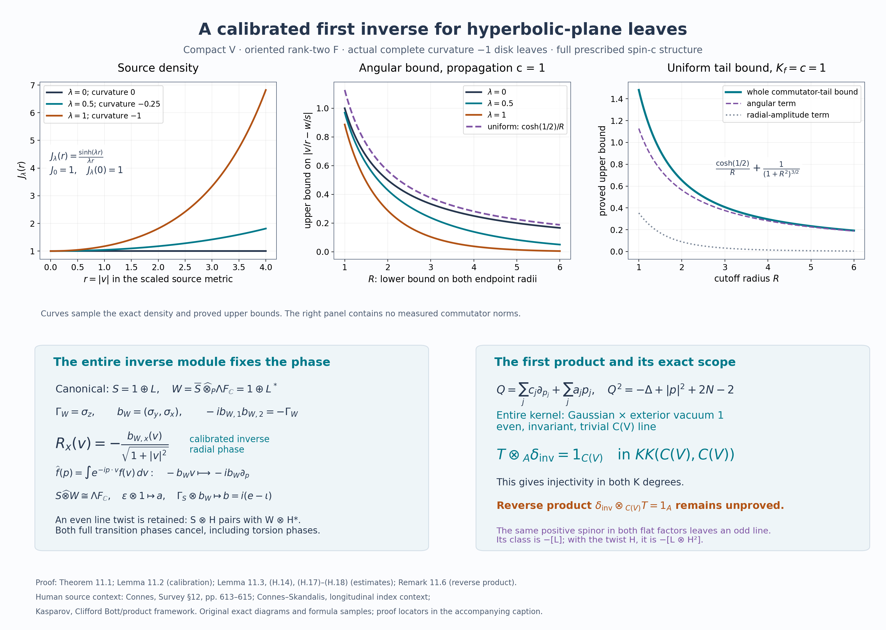

**Figure 11.1.** Lemmas 11.2–11.5 and Theorem 11.1. The plotted density and bounds are the exact functions (H.14), (H.17) and (H.18), with the indicated numerical propagation and Schur constants. They are proved upper bounds, not sampled commutator norms. The finite module retains its two physical generators, opposite ordered chirality, dual line and negative radial phase; its Gaussian is the entire even trivial coefficient line. The reverse identity is proved separately by the compactification and boundary comparison in Section 11B. This original figure shows the exact functions and coefficient objects proved here; human source context is [Connes], Section 12, the product connection framework is [Connes–Skandalis], Appendix A, and the Clifford Bott framework is [Kasparov].

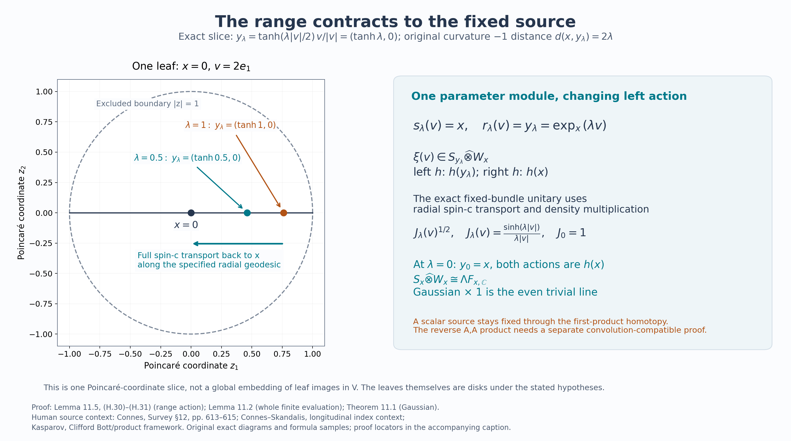

**Figure 11.2.** Lemma 11.5, (H.30)–(H.31). In the curvature \(-1\) disk, \(x=0\) and the tangent vector \(v=2e_1\), where \(e_1\) is orthonormal, give \(y_\lambda=(\tanh\lambda,0)\), at original-metric distance \(2\lambda\). Spin-c transport follows that specific radial geodesic. The left action is \(h(y_\lambda)\), the right action is \(h(x)\), and at zero both are \(h(x)\). This is one exact leaf-coordinate slice, not a global embedding of an accumulating leaf in \(V\). Its deformation context is [Connes], Section 12; Lemmas 11.2 and 11.5 give the whole bundle and coefficient argument.

**Proof of Theorem 11.1.** At one, Lemma 11.5 gives \(T\delta_{\mathrm{inv}}\). At zero, Fourier transform gives the prescribed positive spinor Thom multiplier and the inverse negative-Clifford Dirac on the entire \(W\) module. The even onto evaluation (H.10) identifies their whole tensor module and both physical actions with the exterior module. Corollary 6.0d's two full Morita evaluations reduce this endpoint product to the raw Clifford product; no coefficient line is discarded. An actual representative of that product class is

\[
 Q=\sum_jc_j\partial_{p_j}+\sum_ja_jp_j,
 \qquad Q^2=-\Delta_p+|p|^2+2N-2.
 \tag{H.35}
\]

It need not be the literal conjugate of the particular separator operator (H.33). Theorem 6.0c's product proof verifies it independently. Explicitly, for a homogeneous smooth compact creation section \(\xi\), \(K_\xi=Q\rho(\xi)-(-1)^{|\xi|}\rho(\xi)D\) is bounded with compact fibre support, and the mixed resolvent identity (138) proves compact connection errors with integrable bound \(\|K_\xi\|/|\operatorname{Im}z|^2\). The adjoint equation and norm density give every creation vector.

For positivity, put \(b=a(p)/s\), \(s=\sqrt{1+|p|^2}\), \(g=|p|^2/s\), and \(S_0=(1-\Delta+|p|^2)^{-1/2}\). The bounded-transform difference from \(QS_0\) is compact by the Hermite spectral estimate. Equations (139)–(140) give

\[
 \{b,QS_0\}=2gS_0+K_bS_0+Q[S_0,b],
 \qquad
 gS_0=S_0^{1/2}gS_0^{1/2}+[g,S_0^{1/2}]S_0^{1/2}.
 \tag{H.36}
\]

Here \(K_b\) is bounded. The resolvent formula for \(Q[S_0,b]\) has compact integrands bounded by a constant times \(t^{-1/2}/(1+t)\); the quarter-power formula for \([g,S_0^{1/2}]\) has bound \(ct^{-1/4}(1+t)^{-3/2}\). Both are integrable. For the unbounded \(g\), use smooth cutoffs with uniformly bounded first and second derivatives on the Schwartz core; the compact Hermite resolvents turn strong convergence of their derivative coefficients into norm convergence, as in (140). Thus these are compact bounded remainders on the whole bundle module. The middle form is positive and bounded by one because \(0\le g\le s\le(1-\Delta+|p|^2)^{1/2}\). This is the actual positive sandwich in Definition 0.3. Theorem 0.6 identifies its product class with the evaluated separator product.

The Hermite/exterior eigenvalues of \(Q^2\) are \(2(|n|+k)\). Its entire kernel is the normalized Gaussian times the exterior vacuum \(1\), even and invariant under all orthogonal transitions, with gap two. In spinor tensor coordinates its coefficient is \((|00\rangle+|11\rangle)/\sqrt2\), fixed by the full transitions \(\operatorname{diag}(h,h\ell)\otimes\operatorname{diag}(h^{-1},h^{-1}\ell^{-1})\). Thus the whole ground module is the trivial \(C(V)\) line, including cancellation of any torsion twist. Its left action is the actual \(h(x)\) from (H.31). Changing the bounded transform to its phase off this kernel is a compact perturbation; the complement is degenerate, and the kernel is the identity homomorphism cycle. The zero endpoint is \(1_C\). The genuine homotopy of Lemma 11.5 proves the first identity in (24). \(\square\)

This equality includes all base vector-bundle inputs, both K-degrees and torsion. Ordinary exterior tensoring preserves it for every separable graded coefficient algebra. A theorem about additional nontrivial groupoid coefficient actions would require its own interval construction and is not inferred from that exterior naturality.

#### Native comparison and the Gaussian limitations

**Remark 11.6 (native comparison and reverse product).** Theorem 11.1 proves the calibrated first product. The particular \(\delta\) of Theorem 10.1 is not identified with \(\delta_{\mathrm{inv}}\) by its norm condition alone. Any native-source comparison must state its whole physical Clifford generators, grading, Hermitian line and Fourier phase. Under the fixed positive convention (H.3), an even whole-generator intertwiner is excluded by the chirality calculation above. The full calibrated replacement (H.4)–(H.5) must therefore be retained; a scalar rank or determinant computation is insufficient.

The zero-fibre reverse product is known from Theorem 6.0c and Corollary 6.0d. It does not imply the native \(A,A\) identity. Put \(\Gamma=\alpha_I\beta_I\in KK(\mathfrak A,\mathfrak A)\). Evaluation naturality gives

\[
 \Gamma[q_0]=[q_0],\qquad
 \Gamma[q_1]=q_1.
 \tag{H.37}
\]

Even a separately proved ordinary KK inverse for \(q_0\) would give only \(\Gamma=1\) in ordinary KK, and then \(q_1=0\). It does not permit cancellation of \(q_1\). An arbitrary ordinary homotopy over \(\mathfrak A\) cannot be restricted to its one fibre: that requires the central \(C(I)\) parameter to be preserved throughout. Contracting an evaluation-zero ideal by moving its parameter is not such a linear contraction.

A reverse proof requires a valid native \(A,A\) comparison; the endpoint identities above alone do not supply it. Section 11B gives that comparison by compactification and boundary factorization, without asserting the \(C(I)\)-linear identity \(\Gamma=1_{\mathfrak A}\). A Gaussian splitting would additionally have to retain both convolution actions, the full \(W/S\) modules, all creation connections and localized positive sandwiches, and the entire coefficient Gaussian module with an identity left \(A\) action. A leafwise Gaussian rank alone does not establish that assertion. After coordinates \(v=\log_u(y)\) and transport to \(u\), the potential is linear but left convolution moves \(u\). An arbitrary Euclidean flattening of the Dirac matrix differentiating \(y\) can then acquire \(u\)-dependence in its leading symbol. Its convolution commutator needs a new module-compactness argument; confining resolvents do not supply it. No impossibility theorem is asserted by this observation.

A native confining product representative, even after smoothing in both moving leaf variables, compact creation connections and the localized positive sandwich are verified, does not by itself identify the product class with the identity. Its entire even Gaussian right module carries a compressed left convolution with the Gaussian overlap factor, rather than an invariant identity action. These Gaussian calculations alone do not identify the full representation; Section 11B supplies the comparison without making this Gaussian projection left invariant.

Section 11B proves the full calibrated native comparison and reverse product. Together with Theorem 11.1, this gives the hyperbolic analytical index isomorphism in both integral K-degrees. Theorem 7.25 supplies the analytical/geometric class comparison for the same full orientation, while twisted graph-duality pairings have different source and target from this \(A,A\) identity. The reverse proof uses the compactification and boundary comparison, retaining the complete modules and calibration.

The exact programme dependencies in this section are Definition 0.3, Lemma 0.2 and Theorems 0.4/0.6 for products; Lemmas 6.0a–b, Theorem 6.0c and Corollary 6.0d for the complete bundle Thom pair; Theorem 7.1, Lemma 7.16 and Theorem 7.17 for the positive native symbol and entire inverse transfer; the measured-index lesson's Lemmas 6.1–6.2 and the Hilbert-module lesson's Lemmas 6.1–6.2/6.5 for the stated local symbol proofs. Lemma 11.3 supplies their necessary source-coordinate extension through the zero anchor, reproducing the localization mechanism of Lemma 8.15. Lemma 11.4 reproduces the complete-source energy mechanism of Lemma 8.19 and the wave-generator/inverse-domain argument of Lemma 8.15a on this exact groupoid and finite projection corner; their group-action conclusions are not substituted for this proof. Theorem 7.25 is used only for the stated whole-orientation graph comparison.

#### The actual Gaussian convolution defect

**Lemma 11.7 (the full Gaussian right module and its left-action defect).** In the scope of Theorem 11.1, the native reverse tensor has an even Gaussian submodule isometric to the whole standard right \(A\)-module. Its compressed left convolution is a completely positive contraction \(\Phi:A\to A\), whose multiplicative defect is the square of the off-diagonal Gaussian action. The localized off-diagonal blocks are actual module compacts. The Gaussian submodule is nevertheless not left invariant; these compactness statements do not identify the reverse product with \(1_A\).

**Proof.** Write all arrows by range/source endpoints. The entire reverse balanced tensor has compact-core functions \(\zeta(u,y,x)\in W_y\widehat\otimes S_y\). After the graded flip and full evaluation of Lemma 11.2, these coefficients are exterior forms at \(y\); all central line phases cancel by the actual \(H^*\otimes H\) evaluation. Its actions and inner product are

\[
\begin{aligned}
 (\pi(a)\zeta)(u,y,x)&=\int a(u,u')\zeta(u',y,x)\,du',\\
 (\zeta k)(u,y,x)&=\int\zeta(u,y,z)k(z,x)\,dz,\\
 \langle\zeta,\eta\rangle_A(x,z)
 &=\iint\langle\zeta(u,y,x),\eta(u,y,z)\rangle\,du\,dy.
\end{aligned}
 \tag{H.38}
\]

These formulas follow first on elementary balanced tensors, by integrating the radial inner product and then the native column pairing. Compact triple-chart separated approximation identifies their completion with the whole tensor. The derivative variable in the native longitudinal factor is \(y\), while the first left convolution changes \(u\).

In the negative Witten presentation, use the globally oriented even top-form coefficient and the normalized vectors

\[
 g_u(y)=Z^{-1/2}e^{-d(y,u)^2/2}\operatorname{vol}_y,
 \qquad
 Z=2\pi\int_0^\infty e^{-r^2}\sinh r\,dr
 =\pi^{3/2}e^{1/4}\operatorname{erf}(1/2).
 \tag{H.39}
\]

The last identity follows by completing the square separately in the two exponentials of \(\sinh r\). The underlying full \(W\widehat\otimes S\) coefficient is \((w_0\otimes s_0+w_1\otimes s_1)/\sqrt2\); the graded flip followed by Lemma 11.2's evaluation sends it to \(-ie_{12}\). The even degree unitary \(i^N\) in the Witten presentation changes only this recorded constant phase. Thus the Gaussian retains its actual even coefficient line and all full spin-c transitions.

Define \(V:A\to E\) on compact columns by \((Vk)(u,y,x)=g_u(y)k(u,x)\). Gaussian cutoffs in \(d(y,u)\), followed by compact triple-chart separated approximations, put these vectors in \(E\). Their tail norm tends uniformly to zero, since every actual disk has the same radial density. Equation (H.38) and normalization give \(\langle Vk,Vl\rangle_A=k^*l\). The adjoint integrates against \(g_u\) in \(y\); Cauchy–Schwarz in the faithful regular family proves its bound and adjoint identity. Hence \(V\) is an even adjointable isometry from the whole standard right module. Put \(P=VV^*\). Direct convolution gives

\[
 \Phi(a)=V^*\pi(a)V=M_\kappa(a),\qquad
 \kappa(d(u,u'))=Z^{-1}\int
 e^{-[d(y,u)^2+d(y,u')^2]/2}\,dy.
 \tag{H.40}
\]

This is completely positive and contractive. For compact smooth \(a\), its kernel is \(\kappa(d(u,u'))a(u,u')\), with the same compact arrow support. Smooth compact approximation and the two-sided Schur estimate put it in \(A\). Density and contractivity extend this to every \(a\in A\), with image in \(A\), not just its multiplier algebra.

Insertion of \(1=P+(1-P)\) in the whole adjointable action proves

\[
\begin{aligned}
 \Phi(a^*b)-\Phi(a)^*\Phi(b)
 &=V^*\pi(a)^*(1-P)\pi(b)V\in A,\\
 \|\Phi(a^*a)-\Phi(a)^*\Phi(a)\|
 &=\|(1-P)\pi(a)V\|^2.
\end{aligned}
 \tag{H.41}
\]

The first line belongs to the actual compact endomorphism algebra \(\mathcal K_A(A)=A\). For \(a=b\) it is positive, by the exact \(T^*T\) identity.

The stronger compact-block assertion can be proved directly, without an unlocalized resolvent or a lifted-compact shortcut. For compact smooth \(a\), define the whole tensor column \(\zeta_a(u,y,x)=a(u,x)g_x(y)\). A radial cutoff \(d(y,x)\le R\) and the compact arrow support of \(a\) give compact triple support; finite separated approximation puts it in the tensor core. If \(\tau_R\) is the squared Gaussian tail, its discarded inner-product kernel is bounded by \(\tau_R\int|a(u,x)a(u,z)|\,du\). A common two-sided Schur bound \(K_a\) therefore gives discarded module norm at most \(K_a\sqrt{\tau_R}\). The column is in \(E\), and

\[
 \pi(a)V=T_{\zeta_a},\qquad
 \langle\zeta_a,\zeta_a\rangle_A=\Phi(a^*a),
 \qquad T_{\zeta_a}\in\mathcal K_A(A,E).
 \tag{H.42}
\]

Here \(T_\zeta k=\zeta k\). Its compactness follows from an approximate identity of \(A\), which approximates this standard-module creation map by rank-one maps. Consequently \(\pi(a)P=T_{\zeta_a}V^*\) is in \(\mathcal K_A(E)\); adjoints give \(P\pi(a)\), and norm density treats every \(a\). No assertion that \(P\) itself is compact is needed.

Finally, distinct centres have distinct normalized positive Gaussian functions: their ratio takes different values at \(y=u\) and \(y=u'\). Strict Cauchy–Schwarz gives \(0<\kappa(d)<1\) for \(d>0\). To check actual non-invariance, choose nonnegative compact smooth convolution and column tests concentrated near a positive-distance arrow \((u,u')\). Their output near \(u\) has a positive Gaussian superposition concentrated near \(g_{u'}\), which, for sufficiently small fixed supports, stays a positive distance from the line spanned by \(g_u\). By continuity this separation persists on a small open output chart, so it gives a nonzero \(L^2\) complementary component in that regular localization, not just a pointwise value. Faithfulness makes \((1-P)\pi(a)V\ne0\) on the whole module for some \(a\). Equation (H.41) then gives a nonzero positive multiplicative defect. Thus \(\Phi\) is not a representation and the Gaussian ground cannot be deleted from the full cycle as an invariant identity summand. A full reverse homotopy must still treat the convolution representation and its graded complement. \(\square\)

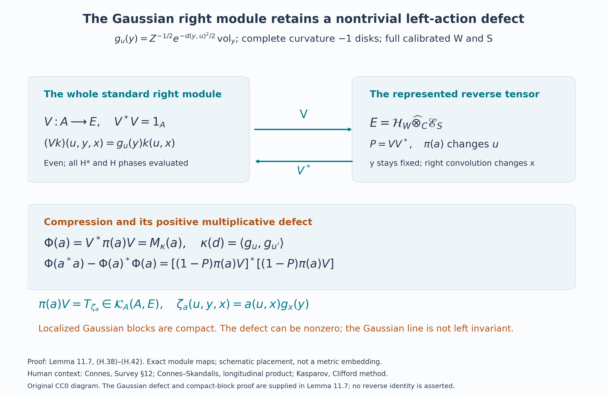

**Figure 11.3.** Lemma 11.7, (H.38)–(H.42). The diagram records actual Hilbert-module maps and their algebraic relations; its placement is schematic, not a leaf-coordinate geometry. Left convolution changes \(u\) with \(y\) fixed. The full even Gaussian isometry \(V:A\to E\) preserves the right convolution action. Its compression is the Gaussian-overlap map \(\Phi\), and the positive defect is exactly the norm square of the complementary block. Both localized Gaussian blocks are actual \(A\)-module compacts, while the defect can be nonzero. This figure does not depict a completed native reverse contraction. Reproducible original CC0 source accompanies the figure; classical human context is Connes's disk-leaf inverse construction, Connes–Skandalis's product framework and Kasparov's Clifford method. The full Gaussian and compact-block proof is supplied by Lemma 11.7.

#### The prescribed native radial class

The native construction uses the same graded spinor bundle and Clifford map in its longitudinal symbol and radial multiplier: [Connes], Section 10(3), PDF p.31, and Section 12, PDF pp.37–38. Its class is the positive radial class of Theorem 10.1. The following comparison supplies the complete native interface, including the physical generators, grading, full line and regular action.

**Proposition 11.8 (the prescribed native first product).** Under the hypotheses and physical conventions of Sections 10–11, let \(S=(1\oplus L)\otimes H\) be the prescribed entire spinor bundle and let \(D=\det S=L\otimes H^2\). The literal positive radial class \(\delta_S\) satisfies

\[
 \delta_S=-\delta_{\rm inv}\otimes_{C(V)}[D],\qquad
 T\otimes_A\delta_S=-[D].                             \tag{ND.1}
\]

For the canonical structure \(H=1\), the latter class is \(-[L]\). On any nonempty base its rank at a point is \(-1\), so it is not \(1_{C(V)}\). This refutes the literal same-spin first-identity assertion. It does not refute the analytical-isomorphism question, because this negative line is invertible. Lemma 11.9 gives a compact example with actual complete simply connected disk leaves.

| Datum | Native source | Exact course realization |
|---|---|---|
| Leaf scope | Actual complete curvature \(-1\) Poincaré-disk leaves | Sections 10–11: compact \(V\), oriented rank-two \(F\), actual complete simply connected disk leaves |
| Longitudinal finite bundle | \(r^*S^+\to r^*S^-\), Section 10(3) | The prescribed whole \(S\) module of Theorem 7.1 and Lemma 11.4 |
| Longitudinal symbol | \(c(\xi^\sharp)/|\xi|\), same \(c\) as the radial construction | Positive physical \(\varepsilon(\xi^\sharp)\); ordinary negative Fourier phase gives \(-i\varepsilon\nabla\) |
| Radial finite bundle | \(S_x\), held fixed at \(x=s\gamma\) | \(L^2(G_x)\otimes S_x\), Theorem 10.1 |
| Radial representation | Regular convolution on the first factor; identity on \(S_x\) | Exactly the represented module of Theorem 10.1 |
| Radial vector and phase | \(+c(\log_x r\gamma/\max(1,|\log_xr\gamma|))\) | The positive off-diagonal block in (22) |
| Product finite coefficient | \(r^*S\widehat\otimes s^*S\) | Same-spin comparison (H.12), including both gradings and all line transitions |
| Calibrated inverse | No dual finite bundle is specified in the native radial definition | \(W=\bar S\widehat\otimes_{\operatorname{Cl}^+(F)}\Lambda F_{\mathbb C}\), with physical \(-b_W\), (H.4)–(H.5) |

The paper does not print Pauli matrices or an exponential sign in its Fourier-transform sentence. They must not be attributed to it. Those omissions do not remove the same-spin relation: it explicitly prescribes the same \(S^+,S^-\) and the same Clifford map for the two constructions, and explicitly prints \(L^2(G_x,r^*S)\otimes S_x\) for the product. The course specifies those remaining physical conventions. The full module argument below proves the comparison in that realization. The flat product argument proves that the odd rank of the literal pair survives the usual alternative scalar Clifford phase, simultaneous grading choice and Fourier sign.

For clarity, the canonical spin-c structure used here is fixed as follows. In an oriented unit frame \((e_1,e_2)\), a frame rotation by \(\theta\) has the spin lift \(\exp(-i\theta\Gamma_S/2)\) and central factor \(e^{i\theta/2}\). Its spinor matrix is \(\operatorname{diag}(1,e^{i\theta})\). Thus \(S^+=1\), \(S^-=L\), where \(L\) is the oriented complex tangent line. The lift is single valued in \(\operatorname{Spin}^c(2)\) because both factors change sign at \(2\pi\). This gives the complete transition action, rather than a choice based only on a norm equation. A common spin-c twist multiplies both entries by its actual transition \(h\).

If one uses the skew geometric Clifford action, the off-diagonal block may instead be \(i\varepsilon(v)^+\). The global even unitary \(\operatorname{diag}(1,-i)\) on \(S^+\oplus S^-\) takes this block to \(\varepsilon(v)^+\). It applies to both the longitudinal and radial blocks. It changes neither class, bundle nor grading. It does not conjugate the real vector \(v\), exchange the ordered physical generators, dualize a line or introduce the inverse bundle \(W\).

##### Proof of Proposition 11.8: the whole parity and line map

Use precisely (H.3) and (H.4), with the entire line \(H\):

\[
 S=(H\oplus LH),\quad W=(H^*\oplus L^*H^*),\quad
 \varepsilon=(\sigma_x,\sigma_y),\quad
 b_W=(\sigma_y,\sigma_x),\quad \Gamma_S=\Gamma_W=\sigma_z.
                                                               \tag{ND.2}
\]

Put \(D=\det S=LH^2\). Then the entire graded bundle \(W\otimes D\) has even line \(LH\) and odd line \(H\). Define the **odd** unitary

\[
 J:W\otimes D\longrightarrow S,\qquad
 J(w_0\otimes d)=-i s_1,\quad J(w_1\otimes d)=s_0,
 \qquad J=\begin{pmatrix}0&1\\-i&0\end{pmatrix}.       \tag{ND.3}
\]

Here local unit frames are chosen coherently so that \(d\) has transition \(h^2\ell\), with \(\ell\) the transition of \(L\). The source transition on \(W\otimes D\) is \(\operatorname{diag}(h\ell,h)\); the target transition is \(\operatorname{diag}(h,h\ell)\). Therefore

\[
 J\operatorname{diag}(h\ell,h)=\operatorname{diag}(h,h\ell)J,
 \quad J^*J=JJ^*=1,
 \quad J\Gamma_W=-\Gamma_SJ,
 \quad J(-b_{W,j})=\varepsilon_jJ\quad(j=1,2).          \tag{ND.4}
\]

All four matrix entries, both physical generators, both gradings and the full transitions occur here. This is not the impossible even intertwiner excluded in Exercise 83. After replacing \(W\otimes D\) by its parity reversal \(\Pi(W\otimes D)\), \(J\) is even. Reversing the grading of an even Kasparov cycle, keeping its odd self-adjoint operator, represents its additive negative. Explicitly, on the direct sum of the cycle and its grading reversal the grading is \(\operatorname{diag}(\Gamma,-\Gamma)\), the operator is \(F\oplus F\), and \(X=\left(\begin{smallmatrix}0&\Gamma\\\Gamma&0\end{smallmatrix}\right)\) is odd, self-adjoint, unitary and commutes with the representation. Its anticommutator with \(F\oplus F\) is zero. The path \(\cos t(F\oplus F)+\sin t X\), \(0\le t\le\pi/2\), ends in the degenerate cycle with operator \(X\). Thus this standard sign has an actual cycle interpretation.

Tensor the entire represented radial module \(\mathcal H_W\) on the right by the finite projective line module \(\Gamma(D)\). A partition of unity in unit line frames proves the onto unitary

\[
 \mathcal H_W\widehat\otimes_{C(V)}\Gamma(D)
       \longrightarrow L_s^2(G,s^*(W\otimes D)),
 \quad \xi\otimes d\longmapsto(\gamma\mapsto\xi(\gamma)d(s\gamma)).
                                                               \tag{ND.5}
\]

Its inner-product identity is the actual integral of the Hermitian tensor pairing. Its image contains all compact continuous local line-frame tests and is dense, so the isometry is onto. Regular convolution keeps \(s\gamma\) fixed and acts trivially on these finite coefficients. Consequently (ND.3), applied at \(s\gamma\), intertwines the whole regular left \(A\) action and the right \(C(V)\) action exactly. It conjugates the full radial operator \(-b_W(v)/\sqrt{1+|v|^2}\) to \(+\varepsilon(v)/\sqrt{1+|v|^2}\).

This tensor cycle is the actual product by \([D]\): its second operator is zero and its left scalar representation on the finite projective line is compact. For every homogeneous first-module vector \(\xi\), its creation map \(T_\xi:d\mapsto\xi\otimes d\) is compact: for a finite Parseval frame \((d_k)\) of the line module, \(T_\xi=\sum_k\theta_{\xi\otimes d_k,d_k}\). Consequently \(FT_\xi-(-1)^{|\xi|}T_\xi0=FT_\xi\) and its adjoint connection error are actual rectangular module compacts. The finite frame also takes every first-module rank-one compact to a finite sum of tensor-module rank-one compacts. Thus the full localized cycle defects remain in the correct compact ideal. Equivalently the finite projection-corner unitary in (ND.5) verifies this product directly. The first-operator positivity sandwich is \(2F^2\ge0\) before quotienting by that ideal. No infinite tensor product compactness assumption occurs; the second module here is a finite projective line.

To recover the literal native radial cutoff, set

\[
 a_t(r)=(1-t)\frac r{\sqrt{1+r^2}}
                  +t\frac r{\max(1,r)},\quad 0\le t\le1.
                                                               \tag{ND.6}
\]

This gives a norm-continuous path of odd self-adjoint multipliers on the same entire represented module. The amplitude defect tends to zero uniformly at infinity. The angular estimate (H.17), its two-sided Schur bound, and the separated-kernel finite-rank approximation of Lemma 11.3 apply unchanged because \(\|\varepsilon(v)\|=|v|\) and all finite coefficient transitions are unitary. Outside radius \(R>1\), the derivative bound for the interpolated amplitude is at most \((1+R^2)^{-3/2}\); inside a bounded radius the continuous kernel approximation treats the unit-circle corner. Thus all defects are compact over \(C(V\times[0,1])\), including the mixed-radius commutator terms. This is an actual radial cycle homotopy to (22), not an identification from equal norms.

Equations (ND.3)–(ND.6) prove the first equality of (ND.1) in \(KK(A,C(V))\). Compose with the calibrated first-product Theorem 11.1. Associativity gives

\[
 T\delta_S=-(T\delta_{\rm inv})[D]=-[D].              \tag{ND.7}
\]

All compact ideals, creation connections and positive sandwiches in that first-product theorem are retained. This proof uses its actual whole interval product; it does not cancel an evaluation map in ordinary KK. It also does not alter the native Thom symbol or put an invented positive \(\delta\) into the inverse class.

##### The complete flat product and sign conventions

The first factor at the flat endpoint is the prescribed spinor multiplier. With the negative physical Fourier phase, the positive radial second factor becomes \(+i\varepsilon\partial_p\). On the full four-dimensional coefficient the product oscillator is

\[
 Q_S=\sum_{j=1}^2A_jp_j+i\sum_{j=1}^2B_j\partial_{p_j},
 \quad A_j=\varepsilon_j\otimes1,
 \quad B_j=\Gamma_S\otimes\varepsilon_j.
                                                               \tag{ND.8}
\]

The four matrices are self-adjoint, their two ordered Clifford actions anticommute, and their squares are one. The two commuting self-adjoint involutions \(C_j=iA_jB_j\) give

\[
 Q_S^2=-\Delta_p+|p|^2-C_1-C_2.                       \tag{ND.9}
\]

Their joint \(+1,+1\) eigenspace is the **entire** one-dimensional line

\[
 \mathbb C\psi,\qquad
 \psi=(s_0\otimes s_1+i s_1\otimes s_0)/\sqrt2,
 \quad (\Gamma_S\otimes\Gamma_S)\psi=-\psi.          \tag{ND.10}
\]

The joint multiplicities of \((C_1,C_2)\) are one for each of the four pairs of signs. The scalar two-dimensional Hermite eigenvalues are \(2|n|+2\). It follows from (ND.9) that the entire kernel is the scalar normalized Gaussian \(\pi^{-1/2}e^{-|p|^2/2}\) times (ND.10), and the square gap is two. The transition on both tensor summands in (ND.10) is \(h^2\ell\). Thus its full coefficient module is \(\Pi\Gamma(D)\), giving \(-[D]\), with literal left action \(h_0(x)\) for \(h_0\in C(V)\).

This is also a product representative. The mixed-resolvent creation argument in Theorem 6.0c and equations (138)–(140) only uses the anticommuting physical Clifford relations, the compact-support bounded creation error and the Hermite compact resolvent. They hold for the entire matrices \(A_j,B_j\) just displayed. The creation error for a compact smooth spinor section \(\xi(p)\) is multiplication by its derivative and \(A(p)\xi\), hence bounded with compact support; the two mixed resolvent identities and their adjoints have the integrable \(|\operatorname{Im}z|^{-2}\) bound. Norm density gives every creation vector. For the positive sandwich, take \(b=A(p)/\sqrt{1+|p|^2}\), \(g=|p|^2/\sqrt{1+|p|^2}\), and \(S_0=(1-\Delta+|p|^2)^{-1/2}\). The full anticommutator is \(2gS_0+K_bS_0+Q_S[S_0,b]\), with bounded \(K_b\). The latter two terms and \([g,S_0^{1/2}]S_0^{1/2}\) are compact by the same Hermite resolvent integrals, whose bounds are respectively \(ct^{-1/2}/(1+t)\) and \(ct^{-1/4}(1+t)^{-3/2}\). The remaining \(2S_0^{1/2}gS_0^{1/2}\) is positive and bounded. These are the actual connection and localized positive sandwich conditions, not a calculation of scalar rank alone.

A global scalar off-diagonal phase is conjugation by an even diagonal unitary, already treated in ND.2. Changing the exponential sign of Fourier transform sends both \(p\) and its derivative to their negatives under the even coordinate-reflection unitary \(f(p)\mapsto f(-p)\). It preserves the represented class and the odd ground parity. Changing only the sign of a Dirac operator is also an even unitary conjugation by its grading; for this even-dimensional class it is not an additive grading reversal. A simultaneous opposite grading of the two copies still gives even total parity on \(|00\rangle,|11\rangle\) and odd total parity on \(|01\rangle,|10\rangle\). Reversing the ordered physical chirality in both copies changes the relative Gaussian phase but leaves it in the latter odd plane. In each case the full ground transition is the product of the two spinor lines, \(\det S\), and its rank is still \(-1\).

Therefore the historical omissions of a Pauli-matrix display and a scalar Fourier phase cannot rescue the printed first-identity claim while keeping its **same** graded \(S\) and Clifford map in both factors. A correction that dualizes a module or reverses just one grading is a substantive correction of the prescribed pair.

##### A compact instance with actual disk leaves

**Lemma 11.9 (faithful surface suspension).** A closed genus-two surface group has a faithful representation into \(SU(2)\). Its left-translation suspension over the closed hyperbolic surface is a compact smooth five-manifold with the actual disk leaves required above.

Here is a proof including the big-powers step. It makes no use of a general Haagerup, assembly or faithful-representation theorem.

Use the exact quaternion pair

\[
 A=\frac{1+2\mathbf i}{\sqrt5},\qquad
 B=\frac{1+2\mathbf j}{\sqrt5}\quad\hbox{in }SU(2).      \tag{ND.16}
\]

Here is its complete all-length proof. The quaternion-to-matrix map gives \(A=\operatorname{diag}(1+2i,1-2i)/\sqrt5\) and \(B=\left(\begin{smallmatrix}1&2\\-2&1\end{smallmatrix}\right)/\sqrt5\). The integral numerator quaternion ring maps to \(M_2(\mathbb F_5)\) by \(\mathbf i\mapsto\operatorname{diag}(2,3)\), \(\mathbf j\mapsto\left(\begin{smallmatrix}0&1\\4&0\end{smallmatrix}\right)\); the two squares are \(-1\) and they anticommute. The four letter images, ordered \(a,a^{-1},b,b^{-1}\), factor as \(u_iv_i^T\), with

\[
 (u_1,u_2,u_3,u_4)=((0,1),(1,0),(1,3),(1,2)),\qquad
 (v_1,v_2,v_3,v_4)=((0,2),(2,0),(1,2),(1,3)).          \tag{ND.17}
\]

Their complete adjacent contraction table \((v_i^Tu_j)\) modulo five is

\[
 \begin{pmatrix}2&0&1&4\\0&2&2&2\\2&1&2&0\\3&1&0&2\end{pmatrix}.  \tag{ND.18}
\]

The zeros are precisely adjacent inverse pairs. Every nonempty freely reduced word therefore has nonzero matrix numerator: the full rank-one product is \(u_1(\prod v_i^Tu_{i+1})v_n^T\), a product of nonzero field scalars and nonzero outer vectors. If a length-\(n\) word were the unit quaternion, its integral numerator would be the scalar \(5^{n/2}\). For even positive \(n\) this is divisible by five, contrary to the nonzero matrix image. For odd \(n\) it is irrational, contrary to the integral scalar component of the numerator. Thus the pair is faithful at every word length. In particular \(C=[A,B]\) has infinite order. The displayed rank-one contractions establish the claim for every word length, rather than just for finitely many words.

We now give the needed free-group big-powers fact rather than citing it. In the Cayley tree of \(F(a,b)\), let \(w=[a,b]=aba^{-1}b^{-1}\) and let \(\mathscr L\) be its translation axis. The cyclic word has length four and has no period one or two, so \(w\) is not a proper power. An element preserving \(\mathscr L\) must act by translation: a reflection would fix a vertex or invert an edge, neither of which is possible in this free action. Its translation commutes with \(w\); their commutator fixes a vertex and is therefore the identity. The smallest positive axis translation would be a root of \(w\), so the stabilizer is exactly \(\langle w\rangle\).

If \(r\notin\langle w\rangle\), the intersection \(\mathscr L\cap r\mathscr L\) has finite length \(b(r)\le3\), with length zero when empty. Indeed, four successive common labelled edges determine the whole period-four sequence on both axes. This sequence uniquely determines both continuations: every label is the corresponding label four edges later or earlier. Unique labelled edges in the Cayley tree then force both full axes to agree, contrary to the stabilizer calculation. This also covers oppositely oriented common edges by using the inverse cyclic word. In particular an infinite common ray is impossible. The numerical bound three can replace every \(b(r_i)\) in (ND.12) if an explicit bound solely in word lengths is desired.

Consequently a word

\[
 r_0w^{n_1}r_1w^{n_2}\cdots r_{m-1}w^{n_m}r_m,
 \qquad r_i\notin\langle w\rangle\ (0<i<m),          \tag{ND.11}
\]

is nontrivial when every \(4|n_j|>2M\), where one may take

\[
 M=1+|r_0|+|r_m|+
            \sum_{i=1}^{m-1}(|r_i|+b(r_i)).           \tag{ND.12}
\]

To verify this cancellation bound, draw each power as a straight segment on a translate of \(\mathscr L\), and each \(r_i\) as its reduced connector. In reduction across that connector, edge cancellation before reaching the next axis consumes at most its length \(|r_i|\); further cancellation on both axes is a common axis segment and consumes at most \(b(r_i)\) from either side. At the endpoints the bounds are \(|r_0|,|r_m|\). Reduce from left to right. Each long segment retains an interior subsegment after both its adjacent bounds are removed, because their sum is less than \(2M\). In particular no entire long segment can disappear to permit cancellation with a nonadjacent axis. This justifies the induction and leaves a nonempty reduced path. The argument works for arbitrary signs of the powers. Every bound depends on the fixed connectors, not on their powers. This is the required big-powers proof.

Present the genus-two group as

\[
 \Gamma=\langle a,b,c,d\mid[a,b][c,d]=1\rangle
       =F(a,b)*_{\langle[a,b]\rangle}F(c,d),           \tag{ND.13}
\]

where the edge identifies \([a,b]\) with \([c,d]^{-1}\). Here is the reduced-normal-form proof needed below. In each factor choose representatives \(\mathcal T_i\) for the cosets \(tE\) of the common cyclic subgroup \(E\), including \(1\). Formal normal forms are \(t_1\cdots t_k e\), where \(e\in E\), each \(t_j\in\mathcal T_{i_j}\setminus\{1\}\), and successive \(i_j\) differ. Right multiplication by \(g\) in a factor starts with the unique coset decomposition \(eg=t e'\). If \(t=1\), replace the terminal edge term by \(e'\). If the last representative is in the other factor, append \(t\). Otherwise uniquely decompose \(t_k t=t'e''\), replace \(t_k\) by \(t'\) (remove it when \(t'=1\)), and put \(e''e'\) at the end. These rules preserve the alternating condition.

Right multiplication by two elements of the same factor equals multiplication by their product: in each of the last-factor cases this follows from the uniqueness of its coset decomposition; when a representative is removed apply the same rule to the new last-factor case. Induction on the number of removed representatives completes the check. Multiplication by an edge element has the same rule in either factor, namely multiplication of the terminal edge term. Inverses are therefore right multiplication by \(g^{-1}\). These rules define an action of the presented group on the set of formal normal forms. Starting with the empty form and appending a formal normal-form word gives that very form, so two different forms cannot represent the same element of the presentation. This proves uniqueness without importing an amalgamated-product theorem. In an alternating word whose factors are outside \(E\), appending the next factor always adds a nonidentity representative: multiplying it on the left by a terminal edge element cannot place it in \(E\). Its reduced length is positive. A nontrivial edge word has its nontrivial terminal edge term. These arguments prove both factor injections and the required nonvanishing of reduced alternating words.

The folding map sends \((a,b,c,d)\) to \((a,b,b,a)\) in \(F(a,b)\); on each factor separately it is an isomorphism. Twist the second factor by \(w^N\): its images are \(w^Nbw^{-N},w^Naw^{-N}\). After applying this map to an alternating reduced form, the interior connectors in (ND.11) are the images of its noncyclic factors, hence are not in \(\langle w\rangle\). The power exponents are alternately \(N,-N\). Equations (ND.11)–(ND.12) show that every fixed nontrivial surface word has nontrivial folded image for all sufficiently large \(|N|\). Words in one factor are already nontrivial. This is the explicit discrimination statement needed next.

For this exact pair, quaternion multiplication gives \(C=[A,B]=(-7+16\mathbf i-16\mathbf j+8\mathbf k)/25\). Put \(K=(2\mathbf i-2\mathbf j+\mathbf k)/3\), so \(K^2=-1\), and set \(z_t=\cos t+K\sin t\). This is the unit circle centralizing \(C\); equivalently it is \(\operatorname{diag}(e^{it},e^{-it})\) after diagonalization. We have \(C=z_\theta\), with \(\cos\theta=-7/25\), \(\sin\theta=24/25\). Define

\[
 \rho_t(a)=A,\quad\rho_t(b)=B,\quad
 \rho_t(c)=z_tBz_t^{-1},\quad
 \rho_t(d)=z_tAz_t^{-1},\qquad t\in\mathbb R/2\pi\mathbb Z.
                                                               \tag{ND.14}
\]

The relation holds because \(z_t\) commutes with \(C\) and \([B,A]=C^{-1}\). Each fixed word gives a real-analytic periodic matrix function. At \(t=N\theta\) it is the faithful free-pair image of the twisted folding just proved. Therefore a nontrivial word does not give the identity function of \(t\). At least one of its matrix entries minus the identity entry is a nonzero real-analytic function of one real variable. Its zero set on the compact circle is finite. The union over the countably many nontrivial words is countable, so choose \(t\) outside it. Then \(\rho_t\) is faithful. No density or irrational-orbit assertion is needed for this selection.

Finally choose the closed hyperbolic genus-two surface \(\Sigma\) obtained by side-pairing a regular hyperbolic octagon with vertex angles \(\pi/4\), in the order \(a,b,a^{-1},b^{-1},c,d,c^{-1},d^{-1}\). The right triangle from the center to a vertex and a side midpoint has both nonright angles \(\pi/8\); the hyperbolic angle cosine law gives \(\cosh R=\cot^2(\pi/8)\). Its disk circumradius is therefore \(\tanh(R/2)=2^{-1/4}\), exactly the value rendered in Figure 11.4. Its identified vertex has total angle \(2\pi\), so the glued metric is smooth; compactness makes it complete. Its universal cover is the complete simply connected curvature \(-1\) disk. Form

\[
 V=(\mathbb H^2\times SU(2))/\Gamma,
 \qquad \gamma(z,k)=(\gamma z,\rho_t(\gamma)k).        \tag{ND.15}
\]

The first-factor deck action makes this action free and proper, and the projection to \(\Sigma\) is a smooth bundle with compact fibre \(SU(2)\); thus \(V\) is a compact smooth connected five-manifold without boundary. Use the round unit-quaternion metric on \(SU(2)\). Left multiplication by a unit quaternion preserves the Euclidean norm on \(\mathbb R^4\) and hence its inner product, so the transverse action is isometric; the product metric descends. Horizontal leaves are the images of \(\mathbb H^2\times\{k\}\). Their stabilizer consists of \(\gamma\) satisfying \(\rho_t(\gamma)k=k\), hence \(\rho_t(\gamma)=1\), hence \(\gamma=1\). Each actual leaf, with its descended horizontal metric, is therefore the complete disk itself. Its oriented tangent bundle is \(F=p^*T\Sigma\), and the canonical \(L\) is \(p^*T^{1,0}\Sigma\). The hypotheses of Theorems 10.1 and 11.1 hold on this compact example.

On it (ND.7) gives \(T\delta_S=-[L]\). Acting on \([1]\in K_0(C(V))\) and then pulling back to any point gives \(-1\in K_0(\mathbb C)\); the identity gives \(+1\). Thus they are unequal even as K-theory maps, and hence unequal in KK. This example has the original actual-disk hypotheses.

**Remark 11.10 (the calibrated analytical answer and the literal sign).** The native first product gives injectivity on K-theory after composing with the inverse negative line \(-[D^*]\). Section 11B proves the calibrated reverse identity and its full represented \(A,A\) comparison, and hence surjectivity. In particular the literal unchanged positive radial class cannot have the reverse identity either. If \(\delta_ST=1_A\), right-composition with the proved \(T\delta_{\rm inv}=1_C\) would imply \(\delta_S=\delta_{\rm inv}\), contradicting (ND.1). Any boundary-representation homotopy to \(1_A\) must therefore be compared with the calibrated whole module, including the negative radial phase and opposite physical chirality, rather than silently substituted for the native positive class. No cancellation of an onto evaluation map is used.

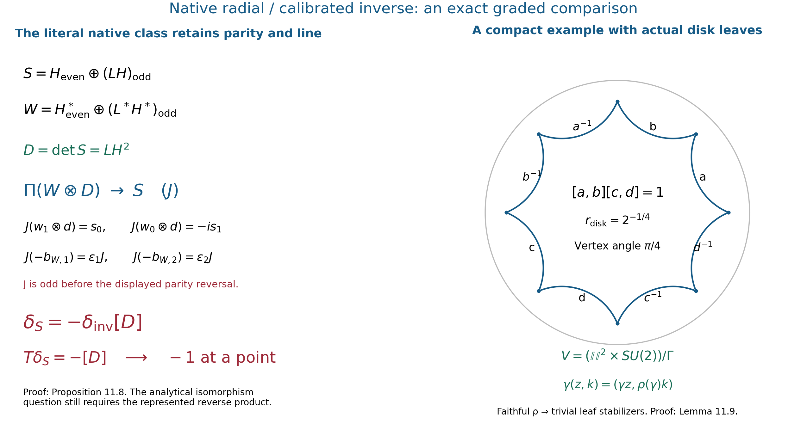

**Figure 11.4.** Proposition 11.8 and Lemma 11.9. The full line, grading and ordered-generator equations are (ND.2)–(ND.7). The displayed map is odd before its stated parity reversal. The regular hyperbolic octagon has disk radius \(2^{-1/4}\), vertex angles \(\pi/4\), and metric \(4|dz|^2/(1-|z|^2)^2\); its side labels specify (ND.13). The suspension formula is a schematic quotient, not an embedding of the five-manifold or its accumulating leaves in the disk. The proof includes the exact quaternion pair, all-length modular proof, reduced normal forms, explicit big-powers bound and separating-curve twist. Native source context: [Connes], Sections 10(3) and12; full product calibration: Lemma11.2, Theorem11.1 and Exercise83.

[Full-size PNG](https://kokunoyumeto.github.io/open-math-courses-public/courses/NCG-FOLIATIONS/figures/kt-native-delta-interface.png) · [Editable SVG](https://kokunoyumeto.github.io/open-math-courses-public/courses/NCG-FOLIATIONS/figures/kt-native-delta-interface.svg) · [Generator](https://kokunoyumeto.github.io/open-math-courses-public/courses/NCG-FOLIATIONS/figures/render-native-delta-interface.py).

### Reduced assembly can fail

The survey asks whether its geometric assembly map is always an isomorphism. Its foliation algebra is completed in the supremum of the regular norms, and non-Hausdorff holonomy is explicitly permitted: [Connes, Section 6, author PDF p.19](https://alainconnes.org/wp-content/uploads/foliationsfine.pdf#page=19). In that scope the universal assertion is false. We prove failure of surjectivity for a compact smooth foliation, using the compact geometric cycles of Section 6 with their entire prescribed spin-c structure on \(TM\oplus f^*\tau\). The argument retains that domain throughout.

The obstruction has two stages. Every such geometric class has a lift through the maximal holonomy algebra. The example then has a reduced K-class with no maximal lift. The distinction between the two completions is essential even though the free-group crossed products appearing on a closed transverse arc have the same K-theory.

#### The full-completion proof interfaces

The complete preceding programme proofs used for this analytic step are Groupoid C*-algebras: full and reduced, the section “The full norm and disintegration” through (14E.18), Theorem 14.3 and Theorem 14.5; and Equivalence of groupoids and Morita equivalence of their C*-algebras, Lemmas 15.1–15.2, Theorem 15.3 and (15.22–15.23). Both proofs allow second countable locally compact locally Hausdorff arrows and equivalence spaces, Hausdorff units and full-support Haar systems. Their test algebra is the span of compact continuous functions on Hausdorff open patches, as in the foliation algebra here.

Here is the precise analytic content needed. Lemma 15.1 constructs a diagonal approximate identity from finite sums of cross-arrow products before universal positivity is assumed. Lemma 15.2 approximates each full diagonal Gram matrix by actual sums of convolution-square Gram matrices, proving positivity in **all** full representations. Theorem 15.3 then induces an arbitrary diagonal representation to the linking algebra: the positive tensor form has continuous coefficients, a dense essential span and separable completion, so the proved dense-domain disintegration of Lesson 14 makes its operators I-contractive. Compression recovers the arbitrary diagonal representation and therefore the entire maximal corner norm. The theorem separately proves the regular corner norms and fullness. These steps supply the maximal Hilbert-module completion; positivity only in regular representations would supply the reduced module instead.

The off-diagonal corner and its compact algebra are proved in Imprimitivity bimodules and Morita equivalence, Theorem 5.1; its Theorem 3.2 supplies the inverse evaluation tensor unitaries. The Rieffel correspondence and induced representations, Lemma 1.1 and Proposition 2.2, proves the ideal submodule, complete quotient and its norm. Tensor products and C*-correspondences, Theorem 1.2, Proposition 2.2, Theorem 3.1 and Proposition 3.2, proves the tensor completion, second-factor transport, associator and unit maps. These are original CC0 programme proofs. The historical equivalence sources are credited in the references.

#### Geometric representatives lift through the maximal algebra

Write \(H=\operatorname{Hol}(V,\mathcal F)\), \(A_m=C^*_{\max}(H)\), \(A_r=C_r^*(H)\) and \(\lambda _H:A_m\to A_r\). Here the subscript \(m\) changes the completion only; it does not change the real normal bundle \(\tau =TV/F\) or its orientation twist.

**Theorem 11A.1 (maximal lifts of geometric values).** For the compact geometric assembly of Section 6,

\[
 \operatorname{im}\mu_r
 \subseteq\operatorname{im}\bigl((\lambda_H)_*:K_*(A_m)\to K_*(A_r)\bigr).
 \tag{A.G.1}
\]

**Proof.** Fix one compact representative \((M,E,f)\), with \(d=\dim M\) and \(q=\operatorname{rank}\tau\). Use exactly its embedding \(j:M\to \mathbb R^n\), full prescribed normal spin-c module, tube \(N\) and étale map-cocycle \(g\) from Section 6. The associated principal graph \(Z=\Gamma _g\) has quotient \(p:Z\to N\) and right anchor \(s:Z\to V\times \mathbb R^n\). In tube coordinates its transverse map is \((x,y,\eta )\mapsto (y,j(x)+\eta )\). The tubular coordinates \((x,\eta )\) and leaf coordinates show that \(s\) is a local diffeomorphism. Consequently \(W=s(Z)\) is open and saturated for \(H^n=H\times\mathbb R^n\).

The gauge groupoid and its action are

\[
 L=(Z\times_s Z)/H^n\rightrightarrows N,
 \qquad r[z,w]=p(z),\quad s_L[z,w]=p(w).
 \tag{A.G.2}
\]

If \(p(w)=p(u)\) and \(w\gamma =u\), define \([z,w]u=z\gamma\); principal division makes this independent of simultaneous right translation. Local cocycle charts identify its arrows with changes between transverse sheets of \(N\). Hence it is étale, second countable, locally compact and locally Hausdorff, with Hausdorff units \(N\) and counting Haar system.

The graph is an \((L,H^n|_W)\) equivalence. Both actions are free. Their division maps identify their action-relation maps with the inclusions of \(Z\times _s Z\) and \(Z\times _p Z\) in \(Z\times Z\); these relations are closed because their anchor bases are Hausdorff. The actions are therefore proper, including after base change. The orbit spaces are \(Z/H^n=N\) and \(L\backslash Z=W\), and both anchors are open and surjective onto these spaces. Holonomy source fibres are Hausdorff holonomy covers of leaves, étale fibres are discrete Hausdorff spaces, and cross fibres are identified with these Haar fibres by division. The full-support Haar and local Hausdorff hypotheses of the preceding interfaces are all satisfied. Half-densities give the same local isometry between their Haar convention and the section-core convention of Section 1.

The proved full equivalence theorem produces a maximal Hilbert module \(Q_m\) from that section core, with

\[
 C^*_{\max}(L)=\mathcal K(Q_m).
 \tag{A.G.3}
\]

Its convolution form is the same counting form used in the geometric construction. Since \(L\) is étale, its units are open. Zero extension puts \(C_c(N)\) in its convolution algebra; its full norm is the supremum norm, by the I-upper bound and the lower bound from regular unit vectors. Thus the left action \(a(p(z))\), \(a\in C_0(N)\), belongs to \(C^*_{\max}(L)=\mathcal K(Q_m)\). Countable charts and compact-support approximation make the module countably generated. It gives a zero-operator Kasparov correspondence.

Initially the coefficients are \(C^*_{\max}(H^n|_W)\). The proved invariant-open theorem, Lesson 14 Theorem 14.5, embeds this algebra isometrically as an ideal in \(C^*_{\max}(H^n)\): extend the constructed quasi-invariant measure and Hilbert fibres by zero outside \(W\). Regular fibres prove the analogous reduced inclusion directly. The same ideal-valued inner product can therefore be viewed in the whole coefficient algebra. It need not be full over that whole algebra when \(W\) is proper; only the compact left action is needed here.

Complete the same core regularly to obtain \(Q_r\). The quotient has the concrete tensor unitary

\[
 Q_m\widehat\otimes_{\lambda_{H^n}}C_r^*(H^n)
 \longrightarrow Q_r,\qquad \xi\otimes a\longmapsto\xi a.
 \tag{A.G.4}
\]

Indeed its inner product on finite tensors is
\(a^*\lambda_{H^n}(\langle\xi,\eta\rangle_m)b=\langle\xi a,\eta b\rangle_r\). This proves balance, positivity, null-space compatibility and isometry. A coefficient approximate identity makes its range dense, so it is onto. The left action is the same multiplication on the same core. Rank-one operators pass to rank-one operators on the quotient core, and approximation proves that compact left actions pass to compact left actions.

We also need the product with the Euclidean unit groupoid. In both norms,

\[
 C^*_\bullet(H\times\mathbb R^n)
 =C_0(\mathbb R^n)\otimes C^*_\bullet(H),
 \qquad\lambda_{H^n}=1\otimes\lambda_H.
 \tag{A.G.5}
\]

Here is a direct full-norm check. Compact product-patch approximation makes finite sums \(a(t)h(\gamma )\) dense in the I-topology. The parameter functions give a nondegenerate central \(C_0(\mathbb R^n)\) multiplier action. In an irreducible full representation it is a scalar character, hence evaluation at some \(t\), by Schur's lemma and nondegeneracy. Lesson 14 Theorem 14.5, applied to the invariant complement of that parameter, identifies its quotient with \(C^*_{\max}(H)\). Conversely every full representation of \(H\) composed with evaluation is a full representation of the product. Thus the full norm is \(\sup_t\lVert h_t\rVert_{\max}\), the continuous-function tensor norm. In the reduced norm this equality follows from the regular fibres \((x,t)\). This proves (A.G.5) and the displayed quotient without introducing a second completion convention.

Let \(t\) be the same normal Thom class as in Section 6 and let \(b_n\) be inverse Euclidean Bott. The actual typed factors are

\[
 \begin{aligned}
 t&\in KK^{n-d+q}(C(M),C_0(N)),\\
 e_m&\in KK(C_0(N),C_0(\mathbb R^n)\otimes A_m),\\
 b_n^m&=b_n\widehat\otimes1_{A_m}
 \in KK^n(C_0(\mathbb R^n)\otimes A_m,A_m).
 \end{aligned}
 \tag{A.G.6}
\]

Equation (A.G.4) gives \(e_m \widehat\otimes [1\widehat\otimes \lambda _H]=e_r\). The tensor associator on the inverse Bott module gives

\[
 b_n^m\widehat\otimes[\lambda_H]
 =[1\otimes\lambda_H]\widehat\otimes b_n^r.
 \tag{A.G.7}
\]

The quotient is even, so no graded interchange sign appears. The full spin-c module, source representation, Clifford order, phase and tube are the same on both sides. Associativity therefore yields the equality of actual wrong-way classes

\[
 f_!^r=
 \bigl(t\widehat\otimes e_m\widehat\otimes b_n^m\bigr)
 \widehat\otimes[\lambda_H]
 \quad\text{in }KK^{q-d}(C(M),A_r).
 \tag{A.G.8}
\]

Multiplying by \([E]\) proves that this representative's assembly value is the image of a class in \(K_*(A_m)\). The assembly group is generated by those compact representatives, and a homomorphism's image is a subgroup. Thus every value lies in that subgroup, proving (A.G.1). This argument does not require a separately descended maximal geometric assembly through every relation: the reduced assembly has already descended in Theorem 6.1. ∎

#### The free-group comparison

The obstruction below needs a comparison for the actual coefficient algebra. We prove it using the one-defect Toeplitz method of M. Pimsner and D. Voiculescu, *K-groups of reduced crossed products by free groups*, Journal of Operator Theory 8 (1982), 131–156, Sections 1–3 ([original paper](https://www.theta.ro/jot/archive/1982-008-001/1982-008-001-006.pdf)).

The complete reduced construction is Cuntz–Krieger algebras, minimal systems and projectionless algebras, Section 6, Lemmas 6.2–6.3. Its word constructions and rotations are CC0 and are adapted below to a universal maximal algebra. For the elementary difference map, including naturality, homotopy invariance and cancellation of a common summand, use Cuntz algebras, Theorem 6.3, equations (6.11)–(6.13). Extension exactness and boundary naturality are The six-term exact sequence and the exponential map, Theorem 2.1. The vacuum-corner K-isomorphisms follow from Matrix stability, stability and continuity of K-zero, Theorem 4.1 and Invertibles, unitaries and K-one, Corollary 4.2.

**Theorem 11A.2 (the canonical free-group comparison).** Let the free group \(\mathbb F_n\) act by automorphisms on a C*-algebra \(C\). The canonical quotient

\[
 q_C:C\rtimes_{\max}\mathbb F_n\longrightarrow C\rtimes_r\mathbb F_n
 \tag{A.FG.1}
\]

induces isomorphisms on \(K_0\) and \(K_1\).

We first treat unital \(C\), removing one generator at a time. For \(n\geq1\), fix generators \(g_1,\ldots,g_n\), put \(H=\langle g_1,\ldots,g_{n-1}\rangle\), and write \(\alpha_w\) for the automorphism associated to a word \(w\). For \(n=1\), \(H\) is trivial. Let \(W\) consist of the empty word \(e\) and all reduced words whose last letter is different from \(g_n^{-1}\). Then

\[
 g_jW=W\quad(j<n),\qquad g_nW=W\setminus\{e\}.
 \tag{A.FG.2}
\]

Left cancellation changes the last letter only when it cancels the entire word. For an H-letter this stays within \(W\), including at \(e\). For \(g_n\), the only missing preimage is \(g_n^{-1}\). This proves (A.FG.2). Every nonempty suffix of a word in \(W\) is also in \(W\).

##### A single defect and its compact ideal

Let \(\mathcal T_n^{\max}(C)\) be the universal unital C*-algebra generated by a unital coefficient map \(c:C\to\mathcal T_n^{\max}(C)\), unitaries \(L_j\), \(j<n\), and an isometry \(S\), with

\[
 L_jc(a)L_j^*=c(\alpha_j(a)),\qquad
 c(a)S=Sc(\alpha_n^{-1}(a)),\qquad S^*S=1.
 \tag{A.FG.3}
\]

Put \(P=1-SS^*\). Substitute \(L_j^{\pm1},S,S^*\) for the letters of a reduced word \(w\), and call the product \(\sigma_w\). Impose the wandering relations

\[
 P\sigma_wP=0\qquad(w\in W\setminus\{e\}).
 \tag{A.FG.4}
\]

This universal algebra exists. Take the supremum of the norms of each algebraic polynomial in representations satisfying the displayed relations. The group generators have norm at most one, and a coefficient has norm at most its C-norm, so the supremum is finite. Divide out the zero seminorm and complete.

There is a faithful coefficient representation. On the standard Hilbert C-module \(E_C=\ell^2(W)\otimes C\), write \(\delta_wb\) for its w-coordinate and define

\[
 \begin{aligned}
 \rho_C(a)\delta_wb&=\delta_w\alpha_w^{-1}(a)b,\\
 L_j\delta_wb&=\delta_{g_jw}b\quad(j<n),\\
 S\delta_wb&=\delta_{g_nw}b.
 \end{aligned}
 \tag{A.FG.5}
\]

These operators satisfy (A.FG.3)–(A.FG.4), and their defect is the vacuum projection \(p_e\). The coefficient is faithful on that coordinate, so \(c\) is faithful.

**Lemma 11A.2a (the defect ideal).** The ideal generated by \(P\) is canonically \(J=\mathcal K(\ell^2(W))\otimes C\). Quotienting by it gives \(C\rtimes_{\max}\mathbb F_n\).

*Proof.* Covariance makes \(P\) commute with \(c(C)\). The defining relations give

\[
 P\sigma_w^*\sigma_zP=\delta_{wz}P\qquad(w,z\in W).
 \tag{A.FG.6}
\]

Here is the cancellation check. Construct \(w\) from its rightmost letter. H-letters are unitary and positive \(g_n\)-letters are isometric. Before a negative \(g_n\)-letter, the constructed suffix \(v\) is nonempty and lies in \(W\). Relation (A.FG.4) puts \(\sigma_vP\) perpendicular to \(P\), so \(S^*\) is isometric on its range. A negative \(g_n\)-letter cannot be the first applied letter. Thus \(\sigma_wP\) has initial projection \(P\).

For orthogonality, cancel the common initial letters of \(w,z\) in the left side of (A.FG.6). A positive \(g_n\)-cancellation uses \(S^*S=1\). A negative one uses \(SS^*=1-P\); its error vanishes by (A.FG.4) on the remaining nonempty suffixes. Those suffixes cannot be empty at this step, because neither word ends in \(g_n^{-1}\). H-cancellations are exact. If one remaining word is empty, (A.FG.4) gives zero unless both are empty. Otherwise the remaining first letters differ. Their inverse-product is nonempty and reduced, and its last letter is the last letter of the second word. It lies in \(W\), so (A.FG.4) again gives zero. This proves (A.FG.6).

Consequently

\[
 M_{wz}(a)=\sigma_wPc(a)\sigma_z^*,\qquad
 M_{wz}(a)M_{uv}(b)=\delta_{zu}M_{wv}(ab).
 \tag{A.FG.7}
\]

Adjoints interchange the indices and adjoint the coefficient. These define the compact matrix algebra over \(C\). Its representation is faithful: (A.FG.5) sends \(M_{wz}(a)\) to the actual matrix entry with coefficient \(a\).

Their closed span is an ideal. A coefficient multiplies the row or column coefficient by the appropriate transformed element of \(C\). A generator letter sends \(\sigma_wP\) to the row with reduced index \(gw\), unless it is the excluded case \(S^*P=0\). The only nonexact reduction is \(SS^*\sigma_vP\); it equals \(\sigma_vP\) by (A.FG.4). Here \(v\) is nonempty, since a word ending in \(g_n^{-1}\) is excluded. Adjointing gives the column calculation. The span contains \(P\) and is generated by \(P\), proving the ideal assertion.

In the quotient \(S\) is unitary. The remaining relations are precisely those of a covariant unitary representation of \((C,\mathbb F_n)\). Conversely every such representation satisfies (A.FG.4), because its defect is zero. The two universal maps fix every generator and are inverse. \(\square\)

Let \(\mathcal T_n^r(C)\) denote the concrete algebra generated by (A.FG.5). The reduced construction in the cited Lemma 6.2, together with the preceding lemma, gives the two exact sequences

\[
 \begin{aligned}
 0\longrightarrow J&\longrightarrow\mathcal T_n^{\max}(C)
 \xrightarrow{\pi_{\max}}C\rtimes_{\max}\mathbb F_n\longrightarrow0,\\
 0\longrightarrow J&\longrightarrow\mathcal T_n^r(C)
 \xrightarrow{\pi_r}C\rtimes_r\mathbb F_n\longrightarrow0.
 \end{aligned}
 \tag{A.FG.8}
\]

The canonical homomorphism \(Q:\mathcal T_n^{\max}(C)\to\mathcal T_n^r(C)\) sends each universal generator to its concrete operator. By (A.FG.7), its map on \(J\) is identity. Its map on the quotients is the canonical \(q_C\) in (A.FG.1).

##### Two rotations that remove a generator

Put \(B=C\rtimes_{\max}H\), with implementing unitaries \(u_j\). Universality gives \(d:B\to\mathcal T_n^{\max}(C)\), sending the coefficient to \(c\) and \(u_j\) to \(L_j\).

**Lemma 11A.2b (removing a generator).** The map \(d\) induces isomorphisms in both K-degrees.

*Proof.* On \(E_B=\ell^2(W)\otimes B\), let \(\pi_0\) be (A.FG.5) with coefficient algebra \(B\). Put \(p=p_e\). Delete the vacuum and bypass its two H-edges by defining

\[
 \begin{aligned}
 \pi_1(1)&=1-p,\\
 \pi_1(c(a))&=(1-p)\rho_B(a),\\
 \pi_1(S)&=S(1-p),\\
 \pi_1(L_j)\delta_{g_j^{-1}}b&=\delta_{g_j}u_j^{-1}b.
 \end{aligned}
 \tag{A.FG.9}
\]

On every other nonvacuum coordinate, \(\pi_1(L_j)\) is the usual shift; its vacuum value is zero. It is unitary on support \(1-p\). At the exceptional edge covariance follows from \(u_j^{-1}\alpha_j(a)=au_j^{-1}\). On this support its S-defect is \(p_{g_n}\). For \(w\in W\), the defect orbit is the coordinate \(wg_n\): each intermediate suffix ends in a positive \(g_n\)-block and never meets a changed edge. These coordinates are distinct. Thus all wandering relations hold, and \(\pi_1\) is a homomorphism from the universal algebra, with unit support \(1-p\).

The differences \(\pi_0-\pi_1\) are finite matrices over \(B\) on every generator, hence compact on every element by density. The difference-map construction and vacuum-corner stability give

\[
 \Delta:K_i(\mathcal T_n^{\max}(C))\longrightarrow K_i(B),\qquad i=0,1.
 \tag{A.FG.10}
\]

We verify both inverse identities. If a unital algebra \(D\) containing \(C\) has a unitary \(b_j\) implementing \(\alpha_j\), define a rotation on coordinates \(e,g_j\) by

\[
 R_j(t)=\begin{pmatrix}
 \cos t&\sin t\,b_j\\
 -e^{2it}\sin t\,b_j^*&e^{2it}\cos t
 \end{pmatrix},\qquad0\leq t\leq\pi/2,
 \tag{A.FG.11}
\]

and use identity on other coordinates. Matrix multiplication shows that it is unitary. It commutes with \(\rho_D(\alpha_j(a))\), whose two entries are \(\alpha_j(a),a\), because \(b_ja=\alpha_j(a)b_j\). Therefore \(R_j(t)L_j\) remains covariant.

Take \(D=B\), \(b_j=u_j\). These covariant unitaries represent the full crossed product \(B\) at every parameter. The path starts at \(\pi_0d\) and ends at the orthogonal sum of \(\pi_1d\) and the vacuum identity representation of \(B\). Its difference from \(\pi_1d\) stays compact. Homotopy invariance and cancellation of the common summand give \(\Delta d_*=1\).

For the other identity extend coefficients by \(d\) to \(D=\mathcal T_n^{\max}(C)\). The tensor-module unitary is

\[
 E_B\widehat\otimes_d D\longrightarrow E_D,
 \qquad \delta_wb\otimes x\longmapsto\delta_wd(b)x.
 \tag{A.FG.12}
\]

Its inner products agree and its range contains every coordinate vector. Compact matrix entries transfer by applying \(d\) to their coefficients. Thus naturality identifies the extended difference map with \(d_*\Delta\).

Write \(S_T\) for the universal isometry, now regarded as a coefficient in \(D\). First leave the H-shifts fixed and replace the module shift \(S\) by

\[
 S_t=S(1-p)+\cos t\,\theta_{g_n,e}\otimes1
       +\sin t\,p\otimes S_T,
 \qquad0\leq t\leq\pi/2.
 \tag{A.FG.13}
\]

The first term's range avoids \(e,g_n\). The vacuum column has orthogonal coordinate components with squared norm \(\cos^2t+\sin^2t=1\), so \(S_t\) is an isometry. Covariance holds termwise, including \(aS_T=S_T\alpha_n^{-1}(a)\).

We must also verify the wandering relations throughout the path. The defect of \(S_t\) is supported on \(e,g_n\). For a positive \(g_n\)-power its compression is zero because an isometry's defect annihilates that isometry. Every other nonempty \(w\in W\) has the form \(w=vg_n^k\), \(k\geq0\), where \(v\) ends in an H-letter. The powers in (A.FG.13) send the defect support into coordinates \(g_n^\ell\), \(0\leq\ell\leq k+1\). The remaining reduced letters send them to \(vg_n^\ell\), without visiting \(e,g_n\) after the first H-letter. On all those intermediate coordinates the shifts are ordinary. The final support is disjoint from the defect support, proving every wandering relation.

At the endpoint keep \(S_f=S(1-p)+p\otimes S_T\) fixed and rotate the H-generators by (A.FG.11), now with \(b_j=L_j\in D\). Its defect is

\[
 P_f=p_{g_n}\otimes1+p\otimes P_T,\qquad P_T=1-S_TS_T^*.
 \tag{A.FG.14}
\]

The coordinates \(Wg_n\) form a reducing submodule. They never meet an altered H-edge and retain the ordinary orthogonal defect orbit of \(g_n\). On the complementary coordinates, a rotated H-letter at the vacuum either remains there with coefficient \(\sin t\,L_j^{\pm1}\), or exits along that letter's branch. After exit a reduced word cannot return to the vacuum: the remaining shifts construct a nonempty reduced coordinate word. At the vacuum, \(g_n\)-letters act by \(S_T,S_T^*\). Hence the vacuum block of a reduced word is

\[
 (\sin t)^{m(w)}\sigma_w(T),
 \tag{A.FG.15}
\]

where \(m(w)\) counts H-letters and \(\sigma_w(T)\) is its substitution in \(D\). Its compression by \(P_T\) vanishes for nonempty \(w\in W\) by the universal relation (A.FG.4). The reducing \(Wg_n\) block has zero compression separately. Thus every wandering relation also holds throughout the second stage.

The verified relations give representations of the universal algebra at every parameter. The paths vary in norm on generators; polynomial density and contractivity make them point-norm continuous on the whole algebra. Their differences from the extended \(\pi_1\) stay compact. Initially the representation is the extended \(\pi_0\). Finally it is the orthogonal sum of the extended \(\pi_1\) and the vacuum identity representation of \(D\). Naturality, homotopy invariance and common-summand cancellation give \(d_*\Delta=1\). This proves the lemma in both degrees. \(\square\)

##### The canonical quotient and the closed-arc action

*Proof of Theorem 11A.2.* Induct on \(n\), starting with \(\mathbb F_0=\{e\}\), where the comparison is identity on \(C\). The cited reduced Lemma 6.3 gives a K-isomorphism \(d_r:C\rtimes_rH\to\mathcal T_n^r(C)\). The preceding lemma gives the maximal K-isomorphism. The square

\[
 \begin{array}{ccc}
 C\rtimes_{\max}H&\xrightarrow{d}&\mathcal T_n^{\max}(C)\\
 \downarrow q_H&&\downarrow Q\\
 C\rtimes_rH&\xrightarrow{d_r}&\mathcal T_n^r(C)
 \end{array}
 \tag{A.FG.16}
\]

commutes on coefficients and every H-generator. Induction therefore makes \(Q_*\) a K-isomorphism. The two extensions (A.FG.8) form the diagram

\[
 \begin{array}{ccccccccc}
 0&\longrightarrow&J&\longrightarrow&\mathcal T_n^{\max}(C)
 &\xrightarrow{\pi_{\max}}&C\rtimes_{\max}\mathbb F_n&\longrightarrow&0\\
 &&\downarrow 1&&\downarrow Q&&\downarrow q_C\\
 0&\longrightarrow&J&\longrightarrow&\mathcal T_n^r(C)
 &\xrightarrow{\pi_r}&C\rtimes_r\mathbb F_n&\longrightarrow&0.
 \end{array}
 \tag{A.FG.17}
\]

Exactness and boundary naturality identify the quotient map's K-theory, as follows. The same argument works in either degree. If a maximal quotient class \(x\) maps to zero, its boundary is zero because the ideal map is injective. Write \(x=\pi_{\max*}y\). Exactness in the reduced row gives \(Q_*y=j_{r*}z\), where \(j_\bullet\) denotes ideal inclusion. Subtract the same ideal class upstairs. Injectivity of \(Q_*\) gives \(y=j_{\max*}z\), so \(x=0\).

Conversely, take a reduced quotient class \(x\). Its boundary \(z\) is killed by \(j_{r*}\). Commutation and injectivity of \(Q_*\) give \(j_{\max*}z=0\). Exactness supplies a maximal quotient class \(y\) with boundary \(z\). Then \(x-q_{C*}y\) has zero boundary and equals \(\pi_{r*}v\). Surjectivity of \(Q_*\) lifts \(v\), completing a lift of \(x\). Thus \(q_{C*}\) is bijective in both degrees for unital coefficients.

For a nonunital coefficient algebra \(C\), extend the action to its forced unitization \(C^+\), fixing the scalar copy. In both completions there is a split exact sequence

\[
 0\longrightarrow C\rtimes_\bullet\mathbb F_n
 \longrightarrow C^+\rtimes_\bullet\mathbb F_n
 \longrightarrow\mathbb C\rtimes_\bullet\mathbb F_n
 \longrightarrow0,\qquad\bullet=\max,r.
 \tag{A.FG.18}
\]

For the maximal norm every nondegenerate covariant representation of \(C\) extends unitally to \(C^+\), so the inclusion is isometric. The regular models give the same assertion for the reduced norm. The scalar section is contractive in each norm. To identify the kernel, approximate one of its elements by a finite group polynomial \(p\) and subtract the section of the scalar quotient of \(p\). The new polynomial has coefficients in \(C\), and its distance to the original element is at most twice the approximation error. This proves the exact kernel assertion without invoking group exactness. Split six-term exactness identifies the K-groups of the \(C\)-crossed products with the kernels of the scalar maps. The already proved canonical comparisons for \(C^+\) and \(\mathbb C\) commute with those scalar maps and their sections. Their kernel comparison is consequently an isomorphism. This completes the theorem in both degrees for every coefficient algebra. \(\square\)

**Lemma 11A.3 (the closed-arc coefficient).** Let \(F\) be a closed arc of \(S^1\), and let \(u:S^1\to\mathbb R\) be smooth. On \(F\times\mathbb P^1(\mathbb R)\), define the two generator actions by

\[
 \begin{aligned}
 a(x,z)&=\left(x,\begin{pmatrix}1&u(x)\\0&1\end{pmatrix}z\right),\\
 b(x,z)&=\left(x,\begin{pmatrix}1&0\\u(x)&1\end{pmatrix}z\right).
 \end{aligned}
 \tag{A.FG.19}
\]

For the resulting free-group action, the canonical map

\[
 K_0\!\left(C(F\times\mathbb P^1(\mathbb R))\rtimes_{\max}\mathbb F_2\right)
 \longrightarrow
 K_0\!\left(C(F\times\mathbb P^1(\mathbb R))\rtimes_r\mathbb F_2\right)
 \tag{A.FG.20}
\]

is injective.

*Proof.* Both matrices have determinant one. Replacing \(u(x)\) by \(-u(x)\) gives their inverse transformations. They preserve \(x\), so restrict to homeomorphisms of the indicated closed-arc space and define automorphisms of its continuous-function algebra. The universal property of \(\mathbb F_2\) gives the action. The coefficient space is compact, so its algebra is unital. Apply Theorem 11A.2 with \(n=2\). \(\square\)

In the foliation construction below, \(F\) is the complementary closed arc and \(u\) vanishes on the other closed arc. The lemma retains those actual coefficients and generators. It requires neither a free action on the coefficient space nor amenability of that action.

#### A compact smooth foliation with an extra reduced summand

The following foliation and obstruction are due to [Higson–Lafforgue–Skandalis, Section 4, pp.341–344](https://webusers.imj-prg.fr/~georges.skandalis/Publications/Publi34.pdf#page=12). We give the construction, algebra calculation and missed-class proof explicitly. The full-extension and canonical free-group comparison proofs above supply its analytic prerequisites.

Choose distinct points \(a,b\) of a circle, write \(U=]a,b[\) for one open arc and \(F=[b,a]\) for the other closed arc. Both endpoints belong to \(F\). Choose a smooth function \(u:S^1\to \mathbb R\) that vanishes on \([a,b]\) and is constant on no open interval in the interior of \(F\). For example, on a positively parametrized complementary arc \(t\in [0,1]\), take \(u(t)=\exp(-1/(t(1-t)))\) for \(0<t<1\) and zero at the endpoints; extend it by zero on \([a,b]\). It is flat at both endpoints and analytic, nonconstant on every interior interval.

On the compact transversal \(B=S^1\times \mathbb P^1(\mathbb R)\) let \(\Gamma =\mathbb F_2=\langle \alpha ,\beta \rangle\) act by

\[
 \begin{aligned}
 \alpha(x,z)&=(x,\alpha_{u(x)}z),&
 \alpha_t&=\begin{pmatrix}1&t\\0&1\end{pmatrix},\\
 \beta(x,z)&=(x,\beta_{u(x)}z),&
 \beta_t&=\begin{pmatrix}1&0\\t&1\end{pmatrix}.
 \end{aligned}
 \tag{A.H.1}
\]

The action is smooth and preserves the circle coordinate. We need its **germs**, not pointwise freeness. For every nontrivial word its projective matrix is nonidentity except at finitely many parameters. To prove this, each entry of its determinant-one matrix is a polynomial in \(t\); inverses of the displayed generators also have polynomial entries. Evaluation at \(t=3\) is faithful in the projective group. In the affine coordinate \(z\in \mathbb R\cup {\infty }\), put \(X={|z|>1}\cup {\infty }\), \(Y={|z|<1}\). For every nonzero integer \(k\),

\[
 \alpha_3^k(Y)\subset\{|z|>2\}\subset X,
 \qquad
 \beta_3^k(X)\subset\{|z|<1/2\}\subset Y.
 \tag{A.H.2}
\]

The first follows from \(|z+3k|>2\); the second from
\(|z/(3kz+1)| \leq  |z|/(3|z|-1)<1/2\), with \(\infty\) sent to \(1/(3k)\). A cyclically reduced alternating word starting with an α-power and ending with a β-power sends \(X\) into \({|z|>2}\), so it cannot fix a point with \(1<|z|<2\). The opposite order sends \(Y\) into \({|z|<1/2}\) and cannot fix a point with \(1/2<|z|<1\). A pure nonzero power is also nonidentity. Every nonempty reduced word is conjugate to one of these types: successively combine matching first and last factors until they differ or only one factor remains. Conjugation preserves nonidentity. This proves faithfulness. Consequently for each nontrivial word at least one polynomial off-diagonal entry or diagonal difference is nonzero, and its projective identity parameters form a finite set.

An open interval of \(F\) has a nondegenerate \(u\)-image, so it cannot be contained in that finite exceptional set. A nonidentity projective transformation cannot agree with identity on an open projective interval, since fixing three distinct projective points forces its matrix to be scalar. It follows that each nontrivial word has a nontrivial germ at every point over \(F\), including both endpoints: every endpoint neighborhood contains an interval in the interior of \(F\). Distinct words therefore have distinct germs over \(F\times \mathbb P^1\); all words have the identity germ over \(U\times \mathbb P^1\).

Let \(P\) be a closed genus-two surface. Its usual presentation
\(\pi _1(P)=\langle a_1,b_1,a_2,b_2 | [a_1,b_1][a_2,b_2]=1\rangle\)
surjects onto \(\Gamma\) by sending \(a_1,a_2\) to \(\alpha ,\beta\) and both \(b_i\) to identity. Let \(\widetilde P\to P\) be the associated regular cover. The diagonal action gives

\[
 V=(\widetilde P\times B)/\Gamma.
 \tag{A.H.3}
\]

It is free and proper because the deck action is free and proper. Evenly covered disks of \(P\) give bundle charts with compact fibre \(B\); hence \(V\) is a compact smooth four-manifold. The horizontal surfaces \(\widetilde P\times {z}\) descend to a rank-two smooth foliation. A fibre \(B\) over a base point is a compact complete embedded transversal. Its holonomy groupoid \(T\) is the germ quotient of \(B \rtimes \Gamma\) described above: holonomy of a surface loop is the prescribed transverse word action, and every word is attained by the chosen fundamental-group surjection.

At either endpoint a nontrivial word germ and the identity germ are distinct limits of the same identity germs from \(U\). Thus \(T\) is non-Hausdorff, though its arrow charts are locally Hausdorff and its unit space is the compact manifold \(B\). Its closed reduction over \(F\times \mathbb P^1\) is the Hausdorff transformation groupoid \(F\times \mathbb P^1 \rtimes \Gamma\): the distinct word sheets are disjoint open sheets of this reduction. Its open reduction over \(U\times \mathbb P^1\) is the unit groupoid. The full foliation holonomy groupoid is non-Hausdorff too, since this transverse reduction is its arrow subspace.

Set

\[
 \begin{gathered}
 I=C_0(U\times\mathbb P^1),\qquad
 C=C([a,b]\times\mathbb P^1),\\
 D_\bullet=C(F\times\mathbb P^1)\rtimes_\bullet\Gamma,
 \qquad B_m=C^*_{\max}(T),\quad B_r=C_r^*(T).
 \end{gathered}
 \tag{A.H.4}
\]

**Proposition 11A.4 (the two transverse completions).** There is an isomorphism and an exact full extension

\[
 B_r\cong D_r\oplus C,
 \qquad
 0\longrightarrow I\longrightarrow B_m\longrightarrow D_m\longrightarrow0.
 \tag{A.H.5}
\]

The canonical quotient \(\lambda _D:D_m\to D_r\) induces an isomorphism on K-theory.

**Proof.** The full extension follows from the proved invariant-open/closed theorem, Lesson 14 Theorem 14.5, applied to the actual reductions of \(T\). Its closed transformation reduction is identified with the stated full crossed product by Lesson 14 Theorem 14.3. Theorem 11A.2 above gives the canonical K-isomorphism for this unital coefficient algebra and its actual Γ-action.

For the reduced algebra, every compact patch kernel is a finite sum of word-labelled kernels with continuous coefficients on \(B\): split its compact support into finitely many germ bisections, extend their compactly supported coefficient functions by zero on \(B\), and sum. Over \(F\times \mathbb P^1\) its source-fibre norm is the regular crossed-product norm. Over \(U\times \mathbb P^1\) every word is identity, so its norm is the supremum of the absolute sum of coefficients. That sum extends continuously to \([a,b]\times \mathbb P^1\), whose norm equals its supremum over the dense open arc \(U\times \mathbb P^1\). The resulting homomorphism into \(D_r\oplus C\) is isometric. It is well-defined independently of the labelled presentation: distinct word germs on \(F\) determine every coefficient there, while the sum on \(U\) and continuity determine its other coordinate, including both endpoints.

To see that its image is the whole direct sum, separate the two coordinates explicitly. The global word bisections give unitaries in the unital algebra \(B_r\) and therefore a homomorphism from \(C^*_{\max}(\Gamma)\). Put

\[
 S=\tfrac14(U_\alpha+U_\alpha^*+U_\beta+U_\beta^*).
 \tag{A.H.6}
\]

On the four-regular Cayley tree, orient every edge toward one end. Every vertex has one parent and three children. For a finitely supported vector the edge inequality
\(2|vw|\leq3^{-1/2}|v|^2+3^{1/2}|w|^2\), with \(v\) at the parent, bounds the adjacency quadratic form by \(2\sqrt3\) times its squared norm: each vertex receives \(3/\sqrt3+\sqrt3\). Density and self-adjointness give adjacency norm at most \(2\sqrt3\), hence regular \(\lVert S\rVert\leq\sqrt3/2\). The trivial representation sends \(S\) to one.

Choose a real continuous \(h\) on \([-1,1]\), zero on \([-\sqrt3/2,\sqrt3/2]\) and with \(h(1)=1\). In the displayed isometric image, functional calculus gives

\[
 h(S)=0\oplus1.
 \tag{A.H.7}
\]

This is a central projection in \(B_r\); its chosen full lift need not be a projection. Each closed-arc coefficient extends continuously to \(B\), so restrictions of the labelled kernels have dense image in \(D_r\). Unit coefficients similarly give every function in \(C\). Multiplication by (A.H.7) and its complement separates these coordinates. The isometric image is closed, so it equals the whole direct sum. ∎

**Lemma 11A.5 (extension by zero loses its K-class).** The nonzero homomorphism
\(\iota :C_0(U\times \mathbb P^1)\to C([a,b]\times \mathbb P^1)\) induces zero maps in both K-degrees.

**Proof.** Endpoint evaluation \(\operatorname{ev}_a:C\to C(\mathbb P^1)\) is a homotopy equivalence: contract the interval \([a,b]\) to \(a\), leaving the second coordinate fixed. Its composite with extension by zero is the zero homomorphism, since every element of \(C_0(U\times \mathbb P^1)\) vanishes at the endpoint. Thus \((\operatorname{ev}_a)_* \iota _*=0\), and invertibility of \((\operatorname{ev}_a)_*\) gives \(\iota _*=0\) in both parities. ∎

**Theorem 11A.6 (failure of geometric surjectivity).** For the compact smooth foliation (A.H.3), the survey's geometric assembly into its reduced holonomy algebra is not surjective.

**Proof.** First consider the complete transversal. Under (A.H.5),

\[
 c=(0,[1_C])\in K_0(B_r)
 \tag{A.H.8}
\]

is nonzero: project to its second coordinate and evaluate at any projective point to obtain the rank-one class in \(K_0(\mathbb C)=\mathbb Z\). Suppose it had a full lift \(x\in K_0(B_m)\). Restriction to \(D_r\) is zero. Commutativity of restriction with the canonical quotient and injectivity of \((\lambda _D)_*\) force the full restriction of \(x\) in \(K_0(D_m)\) to vanish. Exactness of the full extension gives \(x=j_{m*}(y)\) for \(y\in K_0(I)\). In the reduced algebra its ideal map is \(y\mapsto (0,\iota _*y)\), which is zero by Lemma 11A.5. Hence \(c=0\), a contradiction. Neither splitting of the full K-row nor exactness of a reduced restriction sequence is assumed.

The complete transversal implements an equivalence between \(T\) and \(H=\operatorname{Hol}(V,\mathcal F)\): take holonomy arrows whose source lies on that transversal, with the right transverse and left holonomy actions. Smooth transverse charts make both anchors open and surjective; division identifies the free proper actions with the closed equal-anchor relations, as in the proof of Theorem 11A.1. The full and regular Haar systems are respectively the same smooth/counting systems. The proved locally Hausdorff equivalence theorem therefore gives full and reduced imprimitivity modules from **one** section core. The linking algebra quotient, or the inner-product proof (A.G.4), identifies its reduced module with the coefficient quotient of its full module. Thus their K-isomorphisms satisfy

\[
 \begin{array}{ccc}
 K_0(B_m)&\xrightarrow{\Phi_m}&K_0(A_m)\\
 \downarrow(\lambda_T)_*&&\downarrow(\lambda_H)_*\\
 K_0(B_r)&\xrightarrow{\Phi_r}&K_0(A_r)
 \end{array}
 \tag{A.H.9}
\]

Equivalently, \((\lambda _H)_* \Phi _m=\Phi _r(\lambda _T)_*\); the inverse evaluation tensor unitaries in the programme imprimitivity proof give both inverses. Consequently \(c_H=\Phi _r(c)\) is nonzero and has no maximal lift. A hypothetical lift could be pulled back by \(\Phi _m^{-1}\), and the commuting square plus injectivity of \(\Phi _r\) would give the forbidden lift of \(c\).

Theorem 11A.1 places every geometric assembly value in the image of \((\lambda _H)_*\). It follows that

\[
 c_H\notin\operatorname{im}\mu_r.
 \tag{A.H.10}
\]

This proves nonsurjectivity for the original compact geometric-cycle domain and reduced target. ∎

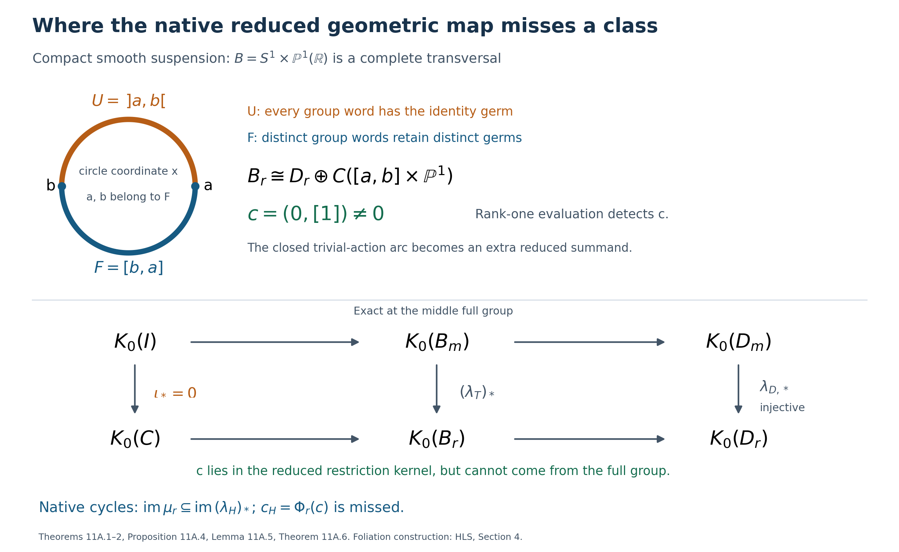

**Figure 11A.** The upper circle is the actual transverse parameter. All words become the identity germ on the orange open arc \(U\), while both endpoints lie on the blue closed arc \(F\) and retain their distinct germs. The second transverse factor \(\mathbb P^1(\mathbb R)\) remains in (A.H.1–A.H.5); the picture is not the four-manifold itself. The lower square records the proof: the upper row is exact at the middle K-group, its right vertical quotient is injective by Theorem 11A.2, and its left vertical map is zero by Lemma 11A.5. The nonzero class \((0,[1])\) therefore has no full lift. Theorem 11A.1 and (A.H.9–A.H.10) transport the obstruction to geometric assembly. Construction credit: Higson–Lafforgue–Skandalis, Section 4. Original diagram, CC0.

The historical universal reduced assertion is thereby refuted in its stated non-Hausdorff scope. Assembly statements imposing additional hypotheses, or an inverse for a specified geometric family such as the hyperbolic construction of Section 11, have their own scope and require their corresponding proof. The counterexample supplies no kernel witness for the geometric map and makes no identification with a different assembly domain.

## 11A. A normalized scalar graph cycle on a compact SU(2) suspension

Connes, Section 8(2), asks for a scalar K-homology class represented by a suitable graph Dirac operator, with local transverse Bott pairing one, under a holonomy-invariant normal spin-c structure. The algebra is the reduced holonomy algebra and the required variance is \(KK^q(C_r^*(G),\mathbb C)\). The following construction supplies such a normalized reduced scalar cycle for the specific compact suspension in (SG.1). Its additional tree operator is discrete; identifying it with a local finite-order differential expression, and constructing a cycle under only the general normal spin-c premise, remain separate mathematical questions.

**Theorem 11A.8 (the normalized reduced scalar graph cycle).** On the compact suspension (SG.1), the faithful reduced representation, completed graph-column Hilbert space and self-adjoint operator (SG.10) define a scalar degree-three Kasparov cycle. It retains the full normal Clifford orientation, every localized compact defect and the original local transverse Bott pairing +1.

**Proof.** We construct and check the complete module and operator below.

### 11A.1. The exact example and the calibrated normal factor

Let Gamma=F2 act on N=SU(2) by the faithful left translations rho of the explicit pair (1+2i)/sqrt(5), (1+2j)/sqrt(5). The complete all-length free-pair proof is in Lemma 11.9, (ND.16)–(ND.18). Let Sigma be the closed genus-two surface with a surjection pi1(Sigma) onto Gamma sending its two a generators to a,b and its two b generators to the identity. Put Sigma_0=tilde Sigma/kernel of that surjection. Then

\[
 V=(\Sigma_0\times N)/\Gamma,\qquad
 \gamma(x,n)=(\gamma x,\rho(\gamma)n),\qquad
 B=C(N)\rtimes_r\Gamma,
 \quad A=C_r^*(G(V,F)). \tag{SG.1}
\]

Every leaf is Sigma_0, and every normal transition is an isometric left translation with the coherent trivial lift on S=N×C2. The surjection is well-defined because both surface commutators map to the identity. The deck action of Gamma on Sigma_0 is free and proper, so the diagonal action in (SG.1) is free and proper. Local covering charts give a smooth fibre bundle over the closed surface with compact fibre N; hence V is compact. A fibre N over a base point is a complete transversal. Kernel elements of the surface-group surjection have identity transverse holonomy; nonidentity Gamma translations have nonidentity germs and no fixed points. Thus the actual reduced transversal holonomy groupoid is N crossed with Gamma. The oriented left-invariant orthonormal frame is preserved exactly; the spin lift is \(g\cdot(n,s)=(\rho(g)n,s)\), so the whole normal spin bundle and its metric descend. We use an oriented left-invariant orthonormal frame X1,X2,X3. The complete normal positive Clifford matrices are sigma_x,sigma_y,sigma_z. Their normalized odd volume is (−i)sigma_x sigma_y sigma_z=1. The Haar density and coherent lift are fixed, rather than a nonregular invariant scalar representation.

Let D_N be the invariant spin Dirac with the source orientation calibrated to the prescribed geometric normal Bott class. In this rank-three example its principal differential part is −i sum sigma_j X_j. The invariant Clifford-connection term is of order zero. The compact ordinary tangent calculus gives its self-adjoint closure, compact resolvent and bounded commutators with smooth functions; it commutes with the actual translations \( (U_g\psi)(n)=\psi(\rho(g)^{-1}n)\).

Here the phase calibration is explicit. Theorem 7.17, (289)–(295), gives the inverse coefficient module in rank r as Pi^(k_r) C_r, with physical generators (−1)^(k_r+1)L_(t_j), where k_r=r(r−1)/2. At r=3 this is **Pi C3 with positive physical generators**. Reduce only its first two consecutive generators and retain the final right C1. On C2⊗C1 the three generators and grading are

\[
 t_1=\sigma_x\otimes1,\quad
 t_2=\sigma_y\otimes1,\quad
 t_3=\sigma_z\otimes\varepsilon,\qquad
 \Gamma=-\sigma_z\otimes\Gamma_{C_1}. \tag{SG.2}
\]

In the even ordered basis (e0⊗epsilon,e1⊗1), multiplication by t_j followed by the right epsilon is precisely sigma_j for j=1,2,3. Thus its ordinary odd physical differential operator is −i sigma·partial. This calculation retains the grading reversal and final odd generator; the rank-one inverse uses a different physical sign, so a circle sign is not imported here. Lemma 7.20's two native inverse identities give the local pairing with the positive old-first Bott class. Bounded-phase locality (Lemmas 7.14–7.17), positive metric transport and the full finite coefficient module carry it to every positively oriented normal chart of N. Consequently, if b_U is the positive generator extended from an oriented relatively compact normal three-ball U,

\[
 b_U[D_N]=1\quad\hbox{in }KK(\mathbb C,\mathbb C).
 \tag{SG.3}
\]

The connection term and freezing of a curved metric change the phase only by the proved local symbol/metric comparison, with the same whole normal module. The underlying central spin action here is actually trivial, not a forgotten line. A different supplied normal spin-c line would require its full inverse line in (SG.2); none is inserted or discarded in this example.

### 11A.2. The complete tree factor

**Lemma 11A.7 (an even reduced tree cycle with index one).** For the free-group action in (SG.1), the full vertex-edge module below has a self-adjoint compact-resolvent generator, bounded return commutators and positive scalar index one. Its product with the calibrated normal Dirac has the same local Bott pairing.

**Proof.** Let T be the infinite degree-four Cayley tree of F₂, rooted at e. Let V(T)=Γ and let E(T) be its *unoriented* edges. For `g≠e`, let par(g) be its unique neighbour closer to e and put `c(g)={g,par(g)}`. The map c is a bijection from `Γ\{e}` to E(T): each edge has one endpoint farther from the root. Thus

\[
 H_T^+=\ell^2\Gamma,\quad H_T^-=\ell^2E(T),\qquad
 Q\delta_e=0,\quad Q\delta_g=\delta_{c(g)}\ (g\ne e),
 \tag{SG.T1}
\]

defines a bounded operator with

\[
 Q^*Q=1-P_e,\qquad QQ^*=1,
 \qquad \operatorname{Index}Q=1.
 \tag{SG.T2}
\]

The grading is + on vertices and − on edges. Left translation acts on both spaces. The edge representation is the sum of two regular representations: every edge is uniquely `{g,ga}` or `{g,gb}`. There is no stabilizer or reversal ambiguity, since F₂ is torsion free and the positive-generator orientation specifies each representative. This is an explicit decomposition, not a weak-containment assertion without a provider.

Set `Mδ_g=|g|δ_g`, with word length |g|. The closed operator `QM` has domain `∑|g|²|ξ_g|²<∞`; its adjoint sends `δ_{c(g)}` to `|g|δ_g`. On the graded sum put

\[
 D_T=\begin{pmatrix}0&M Q^*\\QM&0\end{pmatrix},
 \qquad
 \Gamma_T=\begin{pmatrix}1&0\\0&-1\end{pmatrix}.
 \tag{SG.T3}
\]

The root is its entire kernel, in positive grading. For every g≠e the two-dimensional span of `δ_g` and `δ_{c(g)}` is an orthogonal invariant block with matrix `[[0,|g|],[|g|,0]]`. Their direct sum with the root gives a self-adjoint operator on the square-summability domain of its block images, with finite block sums as a core. There are finitely many words at each fixed length, namely `4·3^(n−1)` for n≥1. Therefore `(1+D_T²)⁻¹` is compact: each length cutoff has finite rank and the norm of its tail is at most `1/(1+(R+1)²)`.

#### Complete bounded commutator proof

Let V_h and E_h be the left translation unitaries on vertices and edges. On δ_g the lower commutator is

\[
 (QM V_h-E_hQM)\delta_g
 =|hg|\delta_{c(hg)}-|g|\delta_{h c(g)},
 \tag{SG.T4}
\]

where a term at the root is interpreted as zero. The two edges agree unless hg is on the finite geodesic segment `[e,h]`: at every vertex outside that segment, the first steps toward roots e and h agree. Off this exceptional set, the coefficient difference is bounded by `||hg|−|g||≤|h|`. Its output-edge map is injective, so this off-segment weighted partial permutation has norm at most |h|.

There are at most `|h|+1` exceptional input vertices. For them hg and g have lengths at most |h|: their positions are on the segment or on its translate by h⁻¹. Each column has norm at most 2|h|. The Hilbert–Schmidt norm bound of this finite-column operator is therefore at most `2|h|sqrt(|h|+1)`. This proves the explicit finite bound

\[
 \|QM V_h-E_hQM\|
 \le |h|+2|h|\sqrt{|h|+1}.
 \tag{SG.T5}
\]

The upper commutator is the adjoint of the corresponding lower commutator for h⁻¹, composed with unitaries, so it has the same bound. All commutators preserve the core and extend boundedly. The unweighted Q commutator is finite rank: off the same finite segment the two edge images agree exactly. Thus the phase

\[
 F_T=\begin{pmatrix}0&Q^*\\Q&0\end{pmatrix}
 \tag{SG.T6}
\]

is an even Fredholm module for C*_rΓ with compact commutators and square defect −P_e in positive grading. Its representation is genuinely reduced, by the explicit regular decomposition of both graded spaces. Its scalar pairing with the unit is exactly IndexQ=1. The normalized transform of D_T differs from F_T by a compact diagonal-block operator, so it defines that same class.

#### The reduced crossed-product representation and compact total generator

On `H=H_N⊗(H_T^+⊕H_T^−)` define

\[
 \Pi(f)=M_f\otimes1,\qquad
 \Pi(u_h)=U_h\otimes(V_h\oplus E_h).
 \tag{SG.T7}
\]

Covariance follows from the multiplication/translation relation on N. The representation is the sum of three regular covariant copies: one vertex orbit and two edge orbits. On each copy, the unitary `(Wψ)_g=U_g⁻¹ψ_g` gives regular shifts and coefficient `f(ρ(g)n)`, with \(W(U_h\otimes\lambda_h)W^{-1}=1\otimes\lambda_h\) and \((WM_fW^{-1}\psi)_g=M_{f\circ L_{\rho(g)}}\psi_g\). These identities follow by substituting \((W\psi)_g=U_g^{-1}\psi_g\). Consequently it extends contractively to B, with no use of the nonregular scalar representation.

Use the odd physical rank3 model and put

\[
 D=D_N\otimes\Gamma_T+1\otimes D_T,
 \qquad D^2=D_N^2\otimes1+1\otimes D_T^2.
 \tag{SG.T8}
\]

Anticommutation of D_T with Γ_T proves the square identity on the core. A compact-resolvent eigenbasis for D_N, together with the finite tree blocks, gives self-adjoint two-by-two matrices `[[ν,|g|],[|g|,−ν]]`; the root block is ν. Their orthogonal direct sum is self-adjoint on its square-summability domain and finite block sums form a core. The resolvent is compact: for a fixed spectral bound, only finitely many D_N eigenvalues and finitely many tree levels occur; the complement has square at least that bound. Thus all scalar multiplicities are controlled.

For a smooth finite-support crossed coefficient the commutators are bounded:

\[
 [D,\Pi(f)]=[D_N,M_f]\otimes\Gamma_T,
 \qquad
 [D,\Pi(u_h)]=U_h\otimes[D_T,V_h\oplus E_h].
 \tag{SG.T9}
\]

The first uses the same coefficient in both tree gradings, so D_T commutes with it. The second uses invariance of D_N and preservation of tree grading. Formula(SG.T5) gives a bound for each group coefficient; finite support is exactly the required dense coefficient scope.

The normalized transform `F=D(1+D²)⁻½` gives an odd scalar Kasparov cycle for B. Its square defect is the compact total resolvent. Here is a direct compact commutator argument. Write `R_t=(1+t²+D²)⁻¹`, and `B_a=[D,Π(a)]`. The formal resolvent identity expresses `[DR_t,Π(a)]` as

\[
 B_aR_t-DR_t(DB_a+B_aD)R_t.
 \tag{SG.T10}
\]

Move the adjacent D factors through their resolvents. `||R_t||≤(1+t²)⁻¹`, `||DR_t||≤1/(2sqrt(1+t²))`, and `||D²R_t||≤1` bound the norm by `(9/4)||B_a||/(1+t²)`. Every term is compact because R_t and DR_t are compact. The convergent norm integral of these compact commutators, multiplied by 2/π, is `[F,Π(a)]`: the corresponding truncated transform integrals converge strongly to F, while the commutator integrals converge in norm by the displayed bound. This proves compactness without assuming norm convergence of the transform integrals themselves. Norm density of the smooth finite-support coefficients then proves all Kasparov conditions on B.

The ordinary odd physical model corresponds to degree3 after the same ordered finite Clifford contraction as D_N. To check the retained final odd factor explicitly, order the graded module as `H_T⊗̂(H_N⊗C₁)`, with grading `Γ_T⊗Γ_{C₁}` and right algebra C₁. If ε is its final positive odd generator, the graded operator is `D_T⊗1⊗1+Γ_T⊗D_N⊗L_ε`; the first-cycle lift is `F_T⊗1⊗1`. The even subspace is the sum of `H_T⁺⊗H_N⊗1` and `H_T⁻⊗H_N⊗ε`. Acting there by the graded operator followed by right multiplication by ε gives exactly the physical matrix (SG.T8): diagonal entries D_N and −D_N, with the D_T off-diagonal entries. This is the actual ordinary odd-model identification, after contracting only the supplied even Clifford pairs. The final C₁ has been accounted for, rather than erased by a formal parity statement. The extra tree cycle is even; it changes no transverse parity. Its kernel grading is positive.

#### Exact restriction class and normalization scope

Upon restriction to C(N), this cycle is the product of the even tree class(SG.T6), with external coefficient C(N), followed by the ordinary odd normal Dirac class. The first class has index1. This order keeps the even tree factor first and moves no odd Clifford blocks. We verify the operator statement, instead of using only the root count.

On each nonroot tree block of length n and a D_N eigenvector of eigenvalue ν, F has matrix

\[
 \frac1{\sqrt{1+\nu^2+n^2}}
       \begin{pmatrix}\nu&n\\n&-\nu\end{pmatrix}.
 \tag{SG.T11}
\]

The first product module is `C(N)⊗(H_T⁺⊕H_T⁻)`, with its tree grading, so creation vectors can be taken to be finite tree basis vectors times continuous coefficient functions. For a positive vertex creation vector, the first column differs from the column `F_N=D_N(1+D_N²)⁻½` by entries tending to zero as |ν|→∞ at fixed n. For a negative edge creation vector the second column differs from `−F_N` in exactly the same way. This is the graded connection sign for a negative creation vector. The root column agrees exactly with F_N. Compact resolvent of D_N makes all these differences compact. Coefficient functions are handled by the already proved compact commutators with F and F_N. Finite tree/coefficient sums are dense in the first module; bounded creation norms extend the compactness to all creation vectors. Adjoints give the other connection error.

The first-cycle phase F_T lifts as `1⊗F_T`. Its anticommutation with Γ_T cancels the D_N cross terms, while `F_TD_T=D_TF_T=|D_T|`. Consequently product positivity is exact:

\[
 \{1\otimes F_T,F\}
 =\frac{2(1\otimes|D_T|)}
        {\sqrt{1+D_N^2\otimes1+1\otimes D_T^2}}
 \ge0.
 \tag{SG.T12}
\]

These are the actual connection and positivity checks of Definition 0.3. Theorems0.4 and0.6 provide existence and class uniqueness for that criterion. Theorem0.14 identifies the even scalar tree cycle with its index1, namely the identity; external coefficient extension gives the identity of C(N). Therefore

\[
 [\Pi,F]\big|_{C(N)}=[D_N]\quad\text{in }KK^3(C(N),\mathbb C).
 \tag{SG.T13}
\]

In particular, the local Bott pairing is carried unchanged. For the actual source-oriented compact normal Dirac convention with local pairing1, the new reduced class has pairing1 as well. If a physical Pauli convention instead has the opposite local pairing, this same construction retains that opposite value; replacing D_N by its calibrated negative changes it. The tree index1 alone does not calibrate the normal Clifford inverse. Corollary 6.0d equation(144), both actual Bott inverse products, and the ordinary Dirac comparison of Theorem7.22 are the exact existing interfaces for this calibration. The fully proved new assertion is (SG.T13), with the normal factor kept intact.

The compact genus-two suspension in (SG.1) has complete transversal N and the explicit normalized plaque corner B. The corner is full because the transversal meets every leaf. One can check fullness on compact graph charts by a finite plaque partition and translation of the normalized bump to each such chart; the resulting corner-column products approximate every compact arrow kernel in the reduced Schur norm. Thus its standard imprimitivity module transports this reduced scalar class to the actual holonomy algebra via Lemma 0.12 and the graph correspondence. The product theorem supplies a bounded cycle there. This establishes a reduced class for that test, but does not yet make the discrete tree term a local smooth graph differential operator. That additional literal Dirac-type identification is not claimed.

### 11A.3. The transverse reduced scalar factor

Write H_B=H_N⊗(H_T+⊕H_T−), with the tree grading Gamma_T. Lemma 11A.7 proves the complete vertex-edge construction and all-length commutator estimate. In particular

\[
 \Pi_B(f)=M_f\otimes1,\quad
 \Pi_B(u_h)=U_h\otimes(V_h\oplus E_h),\qquad
 D_B=D_N\otimes\Gamma_T+1\otimes D_T. \tag{SG.4}
\]

The vertex representation is regular; the unoriented edges have exactly two free regular orbits. The absorption unitary in Lemma 11A.7 therefore makes Pi_B a reduced covariant representation. D_B is self-adjoint with compact scalar resolvent. Its square is D_N²⊗1+1⊗D_T²; the complete square-summability domain, finite block core and bounded commutators with C∞(N) Gamma are proved in (SG.T3)–(SG.T10). Its normalized transform F_B is a scalar odd cycle. The graded connection and positive sandwich (SG.T11)–(SG.T12), and the tree index +1, give the exact restriction

\[
 [\Pi_B,F_B]|_{C(N)}=[D_N]. \tag{SG.5}
\]

This is a reused complete product proof, not just a count of the unmatched root. The unchanged full normal calibration (SG.2)–(SG.3) supplies the previously missing normalization. The tree factor is even and contributes no extra odd degree.

### 11A.4. The actual holonomy representation, rather than abstract transport alone

Choose finitely many relatively compact flat covering charts U_i of Sigma, with smooth real chi_i supported in them and sum chi_i²=1. Choose a lift z_i:U_i→Sigma_0. If z_j=h_ji z_i on an overlap, the transition h_ji is locally constant in Gamma. On the compact support of chi_i chi_j it has only finitely many values: a continuous map from a compact set into a discrete space has finite image. Thus no unproved good-cover or finite-component assertion is needed.

The right-B flat bundle L_B on Sigma has fibre B and transition by the **left** unitary u_(h_ji). These are right-B-linear, preserve the B-valued inner product and satisfy the actual cocycle law. Let

\[
 \mathcal E=L^2(\Sigma,\mathcal L_B),\qquad
 \langle\xi,\eta\rangle_B=
       \int_\Sigma\xi_i(x)^*\eta_i(x)\,d\mu_\Sigma(x).
 \tag{SG.6}
\]

The integral is chart independent. It is positive by finite simple-section approximation and positivity of sums b*b. Quotienting the zero seminorm and completing gives a countably generated right Hilbert B-module. It is full: a unit-norm scalar bump inside one flat chart, times 1_B, has inner product 1_B. Smooth finite chart functions with coefficients in C∞(N) Gamma form a dense module core.

The holonomy convolution acts on E by the integral kernels obtained from the lift charts: a chart kernel a_(ij,g)(x,y,n) becomes the B-valued kernel a_(ij,g)(x,y,·)u_g. Kernel multiplication is precisely the crossed-product covariance and integration in the middle plaque variable. The half-densities give the same invariant formula if the chosen density is removed.

Separated smooth functions in x,y approximate every compact chart kernel in reduced Schur norm, uniformly in its compact normal variable and finite group support. They are the rank-one module kernels theta_(xi,eta). Conversely every such rank-one smooth kernel is a finite sum of those holonomy chart kernels. The corresponding reduced norm is exact: for each n, E tensored with the regular B representation at n is unitarily the holonomy-cover L² space G_n, by the lift chart formula and its partition. It preserves the kernel action and densities. Taking the supremum over n is the defining reduced norm of both constructions. Therefore

\[
 A=\mathcal K_B(\mathcal E),\qquad
 {}_A\mathcal E_B\hbox{ is a full imprimitivity module}.
 \tag{SG.7}
\]

This identifies the entire algebra; it does not keep only one plaque corner or assume assembly duality.

For a concrete projection presentation put K=direct sum_i L²(U_i), and define T xi=(chi_i xi_i)_i. Its adjoint reconstructs a section by the finite partition, so T*T=1. Write P=TT*. In chart coordinates

\[
 P_{ij}(x)=\chi_i(x)\chi_j(x)u_{h_{ij}(x)},\qquad
 \mathcal E=P(K\otimes B),\qquad
 A=P\bigl(\mathcal K(K)\otimes B\bigr)P. \tag{SG.8}
\]

The displayed entry includes the unitary coordinate/density identification of the same overlap point, extended by zero away from the overlap. Products of the chi weights are buffered there; the finite transition values make P a finite sum of bounded leaf operators tensored with group unitaries. It is an adjointable projection and its scalar represented projection commutes with the global tree grading.

Tensor (SG.8) with the actual reduced Pi_B to obtain

\[
 \mathcal H_G=\mathcal E\otimes_B\mathcal H_B
       =P(K\otimes\mathcal H_B),
 \qquad \Pi_A(a)=a|_{\mathcal H_G}. \tag{SG.9}
\]

This is an explicit reduced scalar representation, not the rejected invariant H_N representation. In the vertex summand it is naturally the direct-integral graph-column space L²(Sigma_0×N,S); the edge summand is two such copies. Indeed, label a lift of a point by t^(−1)z_i(x). On a change z_j=h z_i, its label becomes ht and its normal chart coordinate becomes rho(h)n. The induced scalar transition is exactly U_h⊗V_h (or U_h⊗E_h). The Haar and leaf densities are preserved. Thus H_G is a completion of the holonomy columns G_N=s^(−1)(N), with the complete normal spin and the even vertex-edge auxiliary coefficient; it is not an unrestricted Hilbert–Schmidt completion of both leaf endpoints.

### Exact norms and faithful maps

The absorption statement in (SG.4) proves equality, not just contractivity, for the represented reduced norm. On each regular orbit, after W the finite-support coefficient a=∑f_hu_h is the direct integral over N of the defining regular representations π_n on ℓ²Γ, with two-dimensional spin multiplicity. Its operator norm is ess sup_n||π_n(a)||. This equals sup_n||π_n(a)||: for a fixed finite-support unit vector v on ℓ²Γ, n↦||π_n(a)v|| is continuous. The supremum over these v is lower semicontinuous; every strict lower level is open, and Haar measure has full support. The essential supremum therefore equals the supremum. Finite-support coefficients are norm dense, so

\[
 \|\Pi_B(b)\|=\|b\|_r\quad(b\in B). \tag{SG.9a}
\]

The same fibre comparison in (SG.7) is exact for all graph units. A unit [x,n] can be joined along its leaf to the chosen base fibre. Right translation by that holonomy arrow unitarily identifies its source-fibre convolution representation with the one based in N, so taking the supremum on N already gives the supremum on V. This treats all units, not just the plaque corner. Smooth compact chart kernels are approximated in reduced norm by separated kernels: the reduced Schur bound is the maximum of the two absolute plaque-integral bounds, and uniform finite-variable approximation on the fixed compact supports drives both to zero. Their algebra is precisely the finite-rank kernels on E. Thus (SG.7) is an onto isometric identification.

Faithfulness of the induced scalar representation now follows without an unspecified Morita assertion. If a∈K_B(E) acts as zero on E⊗_B H_B, then for every ξ,η∈E the bounded rectangular compression T_η*Pi_A(a)T_ξ is Pi_B(⟨η,aξ⟩). Equation (SG.9a) makes every such inner product zero. Taking η=aξ gives ⟨aξ,aξ⟩=0, hence aξ=0 for every ξ and a=0. Consequently

\[
 C^*_{\max}(G)\mathrel{\twoheadrightarrow}_{q_r} A
   \mathrel{\hookrightarrow}_{\Pi_A}
      B(\mathcal H_G),\qquad
 \|\Pi_A(a)\|=\|a\|_r. \tag{SG.9b}
\]

Only the second arrow is claimed faithful. Its representation is nondegenerate because the compact-module finite-rank approximate identity acts strongly on the tensor Hilbert space. The purely normal covariant representation on H_N remains a representation of the maximal crossed product: its four-generator average has norm one, while the reduced norm is at most √3/2. There is no arrow B→B(H_N) extending those same coefficient operators. The new faithful arrow uses the displayed even tree factor.

### 11A.5. An explicit self-adjoint graph-column operator

On the free scalar space K⊗H_B put D_0=1_K⊗D_B. Its domain is the L² family of the complete domain of D_B. P preserves that domain, and [D_0,P] is bounded: every transition entry has finite group support, its leaf weights are constant in the normal derivative, and (SG.T5) bounds the tree commutator. The normal D_N Gamma_T part commutes with P exactly.

Let the bounded off-diagonal block be R=P D_0(1−P)+(1−P)D_0P. These blocks equal bounded products of [D_0,P]. Define

\[
 D_{\rm diag}=D_0-R,\qquad
 D_G=D_{\rm diag}|_{P(K\otimes H_B)}
     =P D_0P\big|_{P\operatorname{Dom}D_0}. \tag{SG.10}
\]

R is self-adjoint. A direct resolvent proof of bounded perturbation is available: for imaginary z with |Im z|>||R||, the Neumann inverse of 1−R(D_0−z)^(−1) gives an onto inverse for D_0−R−z and its adjoint. The closed symmetric operator is consequently self-adjoint, with unchanged domain. The bounded commutator implies P reduces this diagonal operator on that domain. Therefore D_G is self-adjoint on the displayed exact domain.

In a flat chart its expression is the full transverse differential Dirac D_N Gamma_T plus the smoothly weighted local tree generators. Their changes on overlaps are bounded by (SG.T5). There is no leaf derivative in the chi weights. Its transverse principal symbol is exactly

\[
 \sigma_\perp(D_G)(x,n;\xi)
   =\Bigl(\sum_{j=1}^3\sigma_j\xi_j\Bigr)\otimes\Gamma_T,
 \qquad \sigma_\perp(D_G)^2=|\xi|^2. \tag{SG.11}
\]

On the full retained graded C1 model this is the three-generator module (SG.2) tensored with the even tree module, with grading Gamma_T times its complete normal grading. All transitions are the actual even U_h/tree unitaries. A Pauli phase or grading is not changed during graph induction. The principal normal coefficient therefore retains the supplied spin and full orientation; the auxiliary even completion is displayed rather than silently removed.

The term D_T is a proper weighted discrete vertex-edge difference operator. Formula (SG.10) gives a genuine scalar operator on graph columns with a transverse Dirac principal part. It does not identify that discrete term with a finite-order local differential operator in all smooth graph coordinates.

### 11A.6. Both scalar Kasparov defects on the whole reduced algebra

The global free resolvent has infinite leaf-coordinate multiplicity. The correct compactness statement is localized, since A is nonunital. To prove it without an invalid infinite tensor compactness argument, use the concrete closed spatial C*-subalgebra

\[
 \mathcal J=\mathcal K(K)\otimes\mathcal B(H_B)
       \subset\mathcal B(K\otimes H_B). \tag{SG.12}
\]

Here J is not an ideal of all B(K⊗H_B). We use only its own multiplier algebra: every finite tensor L⊗b with L∈B(K), b∈B(H_B) multiplies J on both sides. In particular the specified P, R and bounded P commutators do so.

Every j in J times (D_0−z)^(−1) is an ordinary scalar compact. For a separated tensor it is the product of a compact on K and b(D_B−z)^(−1), a compact on H_B. Finite sums and norm density prove the assertion for J. P, R and [D_0,P] are finite sums of bounded leaf operators tensored with bounded H_B operators, and hence are multipliers of J.

The resolvent identity gives j(D_diag−z)^(−1) compact as well: its difference from j(D_0−z)^(−1) is that compact operator times bounded R and the diagonal resolvent. Adjointness gives the other side. Hence every represented a in A has both localized resolvents compact on H_G. The same holds for j D_diag(1+t²+D_diag²)^(−1), by its two resolvent decomposition.

Take the dense algebraic core a=P a_0 P, with a_0 a finite sum of smooth leaf rank-one kernels tensored with C∞(N) Gamma coefficients. Its represented kernel is an actual finite compact smooth holonomy-chart sum. On the graph domain

\[
 [D_G,\Pi_A(a)]=P[D_0,a]P,
 \qquad [D_0,a]\in\mathcal J\hbox{ is bounded}. \tag{SG.13}
\]

For this, expand [D_0,Pa_0P]; the two P commutators are bounded multipliers of J, while a_0 and [D_0,a_0] belong to J by (SG.T9). Domain preservation follows from the same bounded commutators. This treats the complete smooth coefficient core, rather than only group constants.

Put F_G=D_G(1+D_G²)^(−1/2). It is an exact self-adjoint contraction with the correct full odd grading. Its square defect is

\[
 \Pi_A(a)(1-F_G^2)
    =\Pi_A(a)(1+D_G^2)^{-1}\in\mathcal K(\mathcal H_G).
 \tag{SG.14}
\]

For the commutator set \(s=1+t^2\), \(R_t=(s+D_G^2)^{-1}\), and \(C_a=[D_G,\Pi_A(a)]\). The bounded form of the resolvent commutator is

\[
 [D_GR_t,\Pi_A(a)]
   =s R_t C_a R_t-D_GR_t C_a D_GR_t. \tag{SG.15}
\]

To justify it without assuming that C_a preserves the domain of D_G, first use the first-order resolvents Q_±=(D_G∓i√s)⁻¹. Domain preservation by a and the bounded commutator give [Q_±,a]=−Q_±C_aQ_±. Also D_GR_t=(Q_++Q_−)/2 and Q_±=(D_G±i√s)R_t. Expanding their average gives exactly (SG.15); every displayed factor is bounded. The norms ||R_t||≤s⁻¹ and ||D_GR_t||≤(2√s)⁻¹ give

\[
 \|[D_GR_t,\Pi_A(a)]\|
      \le {5\|C_a\|\over4(1+t^2)}. \tag{SG.15a}
\]

Both terms are compact by the J-localized resolvent result, since C_a has a J extension to the free space. In the second term C_aD_GR_t is compact; in the first C_aR_t is compact. The norm-convergent integral against 2/π is [F_G,Pi_A(a)]. Truncated transform integrals converge strongly to F_G; their commutators converge in norm by (SG.15a), so taking their strong limit identifies this norm limit with the actual commutator. Norm convergence of the uncommuted transform integral is not asserted. Norm density of the coefficient core gives both defects for all a∈A. In the full retained C₁ model every algebra coefficient is even, so these are exactly the graded commutators. The self-adjointness defect is zero.

This proves an actual class z_G in KK3(A,C) with all scalar compactness conditions, despite the infinite global free resolvent multiplicity.

### 11A.7. Checked Morita product, plaque restriction and local normalization

For a smooth finite-chart core vector xi of E, its scalar creation T_xi:H_B→H_G has finite leaf profiles and finite group coefficients. The exact graph equation has bounded rectangular error

\[
 K_\xi=D_G T_\xi-T_\xi D_B,\qquad
 \|K_\xi\|<\infty. \tag{SG.16}
\]

It follows from the finite group transition calculation and [D_0,P]. The right resolvent of D_B is scalar compact. Therefore the mixed resolvent identity gives compact connection errors, with norm at most ||K_xi||/|Im z|². Using D(1+t²+D²)^(−1) as the average of the two imaginary resolvents gives the integrable bound ||K_xi||/(1+t²). Its norm integral proves F_G T_xi−T_xi F_B compact; the adjoint equation gives the other error. Dense smooth module vectors and the bounded creation norm extend this to every xi in E. The first Morita operator is zero, so product positivity is zero. Definition 0.3 and Theorem 0.6 now identify this explicit representative:

\[
 z_G=[{}_A\mathcal E_B,0]\otimes_B[\Pi_B,F_B].
 \tag{SG.17}
\]

Choose a smooth bump u supported in one contractible base disc, with leaf L2 norm one, and let xi be its corresponding module section, so <xi,xi>=1_B. The holonomy projection p=theta_(xi,xi) has kernel u(x) conjugate u(y) on the identity return component. The exact corner map is i(b)=theta_(xi b,xi). In particular pAp is the actual reduced B, including every return component and its reduced regular norm.

T_xi is an onto isometry onto the p subspace. The just-proved connection identifies the compressed transform with F_B modulo compacts. Also [F_G,p] is compact, so its off-diagonal p blocks can be removed by a compact perturbation. The complementary representation of i(B) is zero and is a degenerate cycle. Consequently

\[
 i^*z_G=[\Pi_B,F_B],\qquad
 (i|_{C(N)})^*z_G=[D_N],\qquad
 (i_*b_U)z_G=1. \tag{SG.18}
\]

The normalized corner has an explicit correspondence unitary, not just equal numerical pairings. With E* the conjugate B–A module, define

\[
 U:\mathcal E^*\longrightarrow pA,\qquad
 U(\overline\eta)=\theta_{\xi,\eta}. \tag{SG.18a}
\]

The right A inner product on E* is θ_(η,ζ). In pA it is (θ_(ξ,η))*θ_(ξ,ζ)=θ_(η,ζ), since ⟨ξ,ξ⟩=1. Right A actions agree by adjointing the second rank-one slot. The left B action agrees with i(b): i(b)θ_(ξ,η)=θ_(ξb,η)=θ_(ξ,ηb*). Every pa is θ_(ξ,a*ξ), so the isometry is onto. The homomorphism correspondence [i] has essential part pA; its complementary zero left action is degenerate. Restrict this exact unitary to C(N). The actual transverse counting module is identified with E* on compact source-return columns by the normalized plaque bump: its leafwise counting norm and the plaque integral ∫|u|² are exactly one. Thus it has this same essential correspondence, not a separately chosen K-class.

The normalized-bump corner agrees with the actual transversal correspondence: its compact source-return columns send a scalar transverse section to the normalized u column on every holonomy lift. The counting inner product and leaf bump integral are both one; finite return columns are dense, so this is an onto module unitary. Thus i_* b_U is the original source-oriented local transverse class of Connes, Section 8(2), pp.28–29, not an unrelated K-class picked for a convenient numerical index. Equation (SG.18) verifies local pairing one and justifies calling z_G a normalized transverse fundamental class **on this exact suspension example**.

### 11A.8. The scope of the construction

The result is constructive at the actual reduced scalar variance KK3(C_r(G),C), rather than the longitudinal KK(C(V),A) class. It disproves no general existence claim. The new scalar reduced representation and even completion are fully specified and have the checked local normalization.

A general compact holonomy groupoid with an invariant normal metric/spin action need not have a compact transversal with this free-group return action, a coherent finite chart Mishchenko description with this tree-even index-one generator, or the bounded overlap and properness estimates (SG.T3)–(SG.T5). A full original-scope proof must replace those explicit ingredients by a groupoid-wide scalar construction retaining the same full normal inverse and local pairing. If “Dirac type on the graph” requires a wholly local finite-order smooth graph differential expression, an additional comparison of the discrete completion with such an expression is also still required. This construction does not infer it from KK Morita transport or transverse ellipticity. These are exact remaining interfaces, not a theorem of nonexistence.

### 11A.9. A general sufficient interface, and its precise limit

The graph-induction argument SG.6–SG.18 does not use a tree once the following transverse data are supplied. Let a countable Γ act smoothly and freely on a compact manifold N, preserving a prescribed full metric spin-c structure, and suppose D_N is an invariant, self-adjoint, compact-resolvent normal Dirac with its source-calibrated local Bott inverse. Suppose an even scalar Γ-cycle (H_T,Γ_T,D_T,L) has: (a) self-adjoint D_T with compact resolvent; (b) bounded [D_T,L_h] for every h; (c) Γ_TL_h=L_hΓ_T and Γ_TD_T=−D_TΓ_T; (d) a decomposition of L as a finite or countable sum of regular representations, or an independently proved exact reduced crossed-product estimate for M_f⊗1,U_h⊗L_h; and (e) scalar index +1. For a compact-base suspension with finitely many buffered flat charts, the operator

\[
 D_G=P(1_K\otimes(D_N\otimes\Gamma_T+1\otimes D_T))P,
 \qquad \operatorname{Dom}D_G=P\operatorname{Dom}D_0 \tag{SG.19}
\]

on E⊗_B(H_N⊗H_T) is a scalar degree-q reduced Kasparov cycle with the localized defects proved above. The total transverse resolvent is compact: compact resolvents have finite-dimensional bounded spectral windows, and the square sum has only finitely many eigenpairs below each bound. The bounded-commutator formulas, compression lemma, localized algebra and mixed resolvent connection prove the entire induction exactly as above. Restriction to C(N) is [D_N]: the external tree class is its scalar index, and the connection/positivity calculation is the general spectral version of SG.T11–SG.T12. Its bounded phase anticommutes with Γ_T, commutes with D_T, and its anticommutator with the product phase is 2|D_T|/(1+D_N²+D_T²)½≥0. Each finite spectral-window creation vector has compact connection error on H_N; density extends it. Index +1 therefore gives the identity even factor. Plaque restriction and local pairing follow from the exact normalized bump as in SG.18.

These hypotheses are sufficient data, not consequences of the original normal spin-c assumption. F₂ supplies them by the actual vertex-edge construction SG.T1–SG.T13. Neither the projection P nor the transverse spin module constructs D_T for an arbitrary return group or arbitrary groupoid. No theorem solving the general graph-Dirac problem follows by changing the Γ label.

### 11A.10. A conditional obstruction to a specified maximal descent

Here is the exact obstruction it would prove. If q:A_max→A_r is a quotient, x∈KK^0(A_max,C), and a projection e satisfies q_*[e]=0 but [e]⊗x≠0, then x has no reduced descent. Indeed x=q^*y would imply [e]⊗x=q_*[e]⊗y=0 by associativity. The odd version uses the appropriate odd K-class and the same calculation. A property-T Kazhdan projection can supply such an e when its projection onto invariant spinors has nonzero graded Dirac index. This is a conditional obstruction to a specified maximal class; it is not a constructed compact-foliation counterexample here.

The survey problem asks for a graph Dirac class with local Bott pairing one. It does not separately require descent of one fixed maximal representative. To refute the general graph-Dirac problem one must either prove every admissible normalized graph cycle equals that obstructed maximal class, or prove the original local Bott image has no integer-valued scalar pairing one in the reduced algebra. A faithful compact isometric property-T suspension, its coherent full spin-c orientation, every arithmetic/lattice prerequisite and the exact index calculation also need full proved providers. The conditional quotient calculation establishes none of these additional assertions.

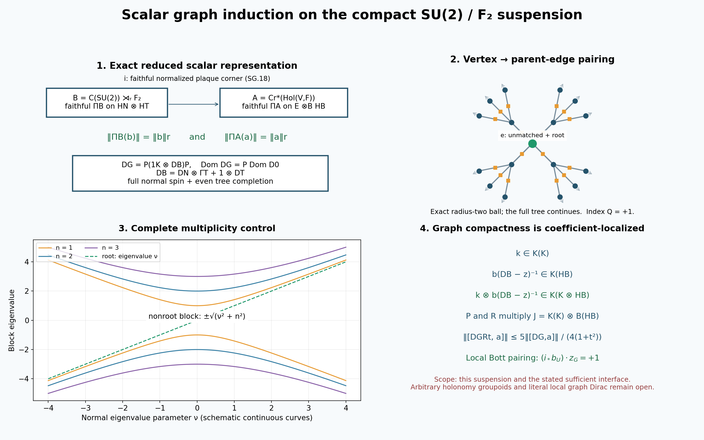

**Figure 11A.1.** Equations (SG.4), (SG.9a)–(SG.15a), (SG.17)–(SG.19) and (SG.T1)–(SG.T13). The tree panel is the exact radius-two ball in the infinite degree-four tree. Each nonroot vertex of length n pairs with its parent edge; the positive root is unmatched. The block eigenvalues are exactly \(\pm\sqrt{\nu^2+n^2}\), and the root retains the normal eigenvalue. The plotted curves sample this formula for a continuous parameter; they are not a computation of the SU(2) Dirac spectrum. The graph compactness uses two scalar compact factors. [Reproducible source](../figures/scalar-graph-induction.py) · [Editable SVG](../figures/scalar-graph-induction.svg).

## 11B. The complete calibrated reverse product for disk leaves

Keep the hypotheses and the entire calibration of Section 11: \(V\) is compact without boundary; its oriented rank-two leaves, with the prescribed smooth metric, are actual complete Poincaré disks of curvature \(-1\). Write \(C=C(V)\), \(G=\operatorname{Hol}(V,F)\), and \(A=C_r^*(G)\). Keep the full prescribed longitudinal spin-c structure, its physical positive Fourier symbol, grading and Hermitian line transitions. The radial inverse is the negative physical phase on the entire \(W\) module of Lemma 11.2; it is not the literal positive same-spin cycle.

**Theorem 11B.1 (the calibrated reverse KK identity).** Under these hypotheses,
\[
\delta_{\mathrm{inv}}\widehat\otimes_{C(V)}T=1_A
\quad\text{in }KK(A,A).
\]
Together with Theorem 11.1, the two ordered product maps are mutually inverse in both integral K-degrees, including torsion. Under the disk-leaf model \(BG\simeq V\) and the prescribed spin-c identification, they are the two inverses of analytic assembly. The literal same-spin relation of Proposition 11.8 remains \(\delta_S=-\delta_{\mathrm{inv}}[\det S]\), hence \(T\delta_S=-[\det S]\).

The proof retains the entire reverse tensor module, both infinite Bergman sectors and the actual reduced convolution action. The negative Witten product gives the exact compact-subgroup unit. Associated induction and two full Cartan comparisons give the gamma-part restriction projector. A particular equivariant Stinespring interval factors the actual lifted difference through the circle. Parabolic contraction, finite-center descent and whole holonomy-module transport then give the reverse equality. Every needed argument follows below; numerical indices and K-group equalities are not substitutes for the KK proof.

Independent exposition, proofs and figures in this supplement are dedicated to CC0 1.0. The separately bundled DejaVu fonts retain their own licence. Human-source credit is given at the argument where it is used; no source text or page-image derivative is incorporated.

### 11B.1. The complete native represented reverse product

Keep the disk-leaf hypotheses and calibrated finite spin module of Section 11. Definition 0.3 and Theorems 0.4,0.6–0.9 give the complete product criterion and its graded product rules; Theorem 6.0c gives the Clifford product foundation. The actual native regular Dirac cycle and its physical positive symbol are those of Theorem 7.1 and Lemma 11.4. The represented reverse module below has target \(A\); it differs from the first-product target \(C(V)\) in (H.30).

**Result.** On the exact native tensor module, the bounded transform of

\[
 Q=V+D^W,\qquad
 V(u,y)=-b_{W,y}(\log_yu)\widehat\otimes1,
 \qquad D^W=\Gamma_W\widehat\otimes(-i\varepsilon\cdot\nabla_y)
 \tag{P1}
\]

is an actual product representative for the calibrated radial inverse followed by the prescribed native longitudinal class. Here the tensor notation in the differential means the physical graded lift; in an ordinary matrix presentation it is `Γ_W ⊗ (−i ε·∇)`. The derivative holds u fixed. The induced connection on W is used together with the prescribed Clifford connection on S. The proof supplies localized actual module compacts, creation connections and a positive sandwich. It does not make the Gaussian ground projection invariant under the original left convolution. Its comparison with the identity is proved below by the boundary factorization and whole-module transport.

#### P.1 Exact completed module and coefficient positions

For arrows represented by endpoints, write ξ(u,y) for a radial vector on the source fibre at y, and η(y,x) for a native range-spinor convolution column. On compact cores the tensor is

\[
 \Psi(u,y,x)=\xi(u,y)\widehat\otimes\eta(y,x)
       \in W_y\widehat\otimes S_y.
 \tag{P2}
\]

All three points lie on the same actual leaf. Its right action, left action and inner product are

\[
\begin{aligned}
 (\Psi k)(u,y,x)&=\int\Psi(u,y,z)k(z,x)\,dz,\\
 (\pi(a)\Psi)(u,y,x)&=\int a(u,u')\Psi(u',y,x)\,du',\\
 \langle\Psi,\Phi\rangle_A(x,z)
  &=\iint\langle\Psi(u,y,x),\Phi(u,y,z)\rangle_{W_y\otimes S_y}\,du\,dy.
\end{aligned}
\tag{P3}
\]

The measures are the original leafwise Riemannian Haar measures. These formulas give the interior tensor inner product first on elementary tensors and hence its completion E. They retain the actual right A convolution; x is not discarded. Regular localization at x identifies `E ⊗_A L²(G_x)` with `L²(L_x × L_x, W_y ⊗ S_y)` in variables u,y. The regular family is faithful for the reduced algebra. The full grading is Γ_W⊗Γ_S.

The input radial operator lifted to E is

\[
 b=V/s,\quad r=d(u,y),\quad s=\sqrt{1+r^2};
 \qquad b^2=r^2/(1+r^2).
 \tag{P4}
\]

The principal derivative acts on y; left convolution acts on u. Consequently `[D^W,π(a)]=0` on compact cores. No transport between distinct coefficient fibres is required for that commutation: each left-convolution integral has the same coefficient fibre W_y⊗S_y.

#### P.2 Coercivity and regularity on E

Put `f_u(y)=d(y,u)²/2`. Then `log_y u=−grad_y f_u`. In curvature −1 the Hessian eigenvalues are

\[
 \operatorname{Hess}_yf_u=(1,r\coth r),
 \qquad r\coth r\big|_{r=0}=1.
 \tag{P5}
\]

Because the two odd Clifford actions anticommute and the chosen connection makes them parallel, all first-order cross terms cancel:

\[
 Q^2=L+H,\quad L=(D^W)^2+r^2,
 \quad H=\{D^W,V\},\quad
 \|H(u,y)\|\le1+r\coth r\le2+r.
 \tag{P6}
\]

The last bound uses `coth r ≤ 1+1/r`. It holds at r=0 by the smooth limit. Hence, as forms on the compact core,

\[
 Q^2\ge(D^W)^2+\tfrac12r^2-\tfrac52,
 \qquad 1+L\le2(3+Q^2).
 \tag{P7}
\]

In particular

\[
 \|r(Q-i\eta)^{-1}\|\le\sqrt5\quad(\eta\ge1),
 \qquad \|(1-\chi_R)(Q-i)^{-1}\|\le\sqrt5/R,
 \tag{P8}
\]

where χ_R is one for r≤R and between zero and one elsewhere. Its transition is supported at r≥R. These are module bounds, not just pointwise bounds: apply the form estimate in every regular localization and use faithfulness.

The regular operator construction uses the preceding module-generator argument, with one fixed additional leaf point u. On each regular localization Q is a complete Dirac operator plus a smooth self-adjoint potential. The deficiency-vector cutoff proof is unchanged, since the potential cancels in its integration-by-parts identity. Use compact radial cutoffs in y; `‖[Q,χ]‖≤‖d_yχ‖`. The propagator therefore has speed at most one in y with u held fixed. A compact triangle support in (u,y,x) grows by at most |t| in its y edges. It remains compact because bounded-radius disk bundles over compact V are compact.

Wave evolution preserves the compact smooth kernel core and right convolution. Pairing after every regular localization proves preservation of the A-valued inner product, and the opposite wave is its adjoint. Finite-time source energy estimates on the retained compact triangle supports prove all source jets and continuity in transverse parameters. Thus the waves are strongly continuous adjointable module unitaries. The Laplace integrals of their positive and negative time evolutions are adjointable inverse shifts for Q±iη. The generator argument, inverse-domain argument and dense range of the product of the two shifts prove that the compact-core closure is regular self-adjoint. This proof uses no global frame and no assertion that leafwise compactness alone implies module compactness.

For later formulas L also has a regular positive closure. This can be constructed without assuming a Hilbert-module Friedrichs theorem: introduce

\[
 P=D^W\otimes\sigma_z+s\otimes\sigma_x.
\]

The same complete-wave proof makes P regular self-adjoint. Its square is `1+L+E_s`, where `E_s=σ_zσ_x[D^W,s]` is bounded self-adjoint, with norm at most one since `|d_y s|≤1`. Bounded self-adjoint perturbation, proved by a Neumann-series inverse shift at sufficiently large imaginary part, makes `1+L=P²−E_s` regular self-adjoint. Its quadratic form is `(D^W)²+s²≥1`. All compact-core identities below extend by these actual resolvents.

#### P.3 The complete compactness mechanism: smoothing both leaf variables

The required statement is localized compactness. An unlocalized resolvent of Q is not asserted to lie in K(E).

Call B a smoothing convolution operator in u if on the core

\[
 (B\Psi)(u,y,x)=\int k(u,u';y)\Psi(u',y,x)\,du'
 \tag{P9}
\]

with a common bound `d(u,u')≤C` on kernel support, finite two-sided Schur bounds, and smooth coefficient kernels with bounded jets on every retained compact triangle. Actual π(a), `π(a)b`, `π(a)K_b` below, and `[Q,π(a)]` belong to this class. For the last operator the kernel is `a(u,u')[V(u,y)−V(u',y)]`.

**Lemma P.3.** For B as above and each h∈C₀(R), `B h(Q) ∈ K(E)`. The same statement holds for h(P), and consequently `B(ρ+L)⁻¹ ∈ K(E)` for ρ≥1.

**Proof.** First use the tail estimate P8 and B's bounded norm to reduce `B(Q-i)⁻¹` to `Bχ_R(Q-i)⁻¹` in norm, with error at most `‖B‖√5/R`. C₀ functional calculus and resolvent generation then treat every h.

For fixed R approximate the resolvent in uniform scalar norm by Schwartz functions whose Fourier transforms are smooth and compactly supported. Such functions are dense in C₀(R): approximate first by Schwartz functions and then truncate their Fourier transforms in L¹. If the Fourier support is inside [−T,T], finite propagation puts the kernel of h(Q), with u fixed, inside `d(y,y')≤T`. Elliptic estimates and boundedness of `Q^m h(Q)` for every m show that this kernel is smooth in y,y'. Applying the estimates to both sides gives joint smoothness. Parameter-difference energy estimates on the common compact support give its continuity, and the source derivatives needed for the kernel approximation. The estimates are uniform on the retained compact triangles.

The composition `Bχ_R h(Q)` therefore has kernel

\[
 k(u,u';y)\chi_R(d(u',y))K_{u'}(y,y').
 \tag{P10}
\]

The δ in u for h(Q) has been removed by the smoothing convolution B. Its support satisfies

\[
 d(u,u')\le C,\quad d(u',y)\le R+1,\quad
 d(y,y')\le T,\quad d(u',y')\le R+1+T.
 \tag{P11}
\]

These bounds describe a compact subset of the iterated endpoint groupoid over V. Importantly, the kernel is now smooth in both u,u' and y,y'. In finitely many radial-bundle charts, uniformly approximate it by finite separated sums in its radial variables, with continuous compact arrow coefficients in (y,y'). Each sum is `T_ξ K T_ζ*`, where ξ,ζ are radial creation vectors and `K∈K(E_T)=eM_N(A)e` is a compact arrow coefficient. It is an actual compact on E. The common compact volume bounds and finite-overlap two-sided Schur estimate make the uniform kernel approximation a module-norm approximation. Hence P10 belongs to K(E), and the cutoff/tail and scalar approximations prove the first statement.

The same proof applies to P: its potential s has the same radial coercivity after a bounded cross term. Since `1+L=P²−E_s`, the resolvent identity

\[
 (\rho+L)^{-1}=(\rho-1+P^2)^{-1}
  +(\rho-1+P^2)^{-1}E_s(\rho+L)^{-1}
\]

gives the result for ρ>1; extend to ρ=1 by the resolvent identity. This completes an actual module compactness proof rather than a fibrewise claim. ∎

The Cartan–Hadamard differential of the exponential stretches radial and angular vectors by 1 and `sinh r/r≥1`. Therefore its inverse logarithm has differential norm ≤1, and integration along the geodesic from u to u' gives

\[
 |\log_yu-\log_yu'|\le d(u,u').
 \tag{P12}
\]

For a compact smooth convolution a with propagation C_a and Schur bound K_a,

\[
 \|[Q,\pi(a)]\|=\|[V,\pi(a)]\|\le C_aK_a.
 \tag{P13}
\]

Its kernel is a P9 kernel, so `Q,π(a)⁻¹` is compact by Lemma P.3. The ordinary resolvent commutator identity and the two-pole bounded-transform integral yield `[F_Q,π(a)]∈K(E)`, with integrable bound `C_aK_a/(1+t²)`. The localized square defect follows from `π(a)(1+Q²)⁻¹∈K(E)`. Smooth convolution kernels are dense in A; norm approximation finishes the Kasparov cycle.

#### P.4 Actual creation connections

Let ξ be a homogeneous compact smooth radial vector, σ=(−1)^|ξ|, and let T_ξ:E_T→E be its graded creation map. With the induced W connection,

\[
 K_\xi=Q T_\xi-\sigma T_\xi D_S
       =V T_\xi+\text{the Clifford contraction of }T_{\nabla_W\xi}
 \tag{P14}
\]

is bounded and adjointable. Its creation vectors have compact arrow support; multiplication by V is bounded on that support. A finite bundle partition expresses the contraction as a finite sum of creation maps followed by bounded finite spinor coefficients.

An approximate identity a_n of A acts nondegenerately on the radial regular module. Thus `π(a_n)K_ξ→K_ξ` in operator norm. Lemma P.3 and adjoints give `(Q-z)⁻¹π(a_n)∈K(E)`. Consequently `(Q-z)⁻¹K_ξ` is a norm limit of compact maps from E_T to E and is compact in their linking algebra. The mixed inverse-shift identity is

\[
 (Q-z)^{-1}T_\xi-\sigma T_\xi(D_S-\sigma z)^{-1}
 =-\sigma(Q-z)^{-1}K_\xi(D_S-\sigma z)^{-1}.
 \tag{P15}
\]

Its norm is at most `‖K_ξ‖/|Im z|²`. Sum the poles `z=±i√(1+t²)` and integrate. It follows that `F_QT_ξ−σT_ξF_{D_S}` is compact; adjoints give the other connection error. Norm density of the compact creation core treats every radial ξ. This is the required connection to the exact native second input, with its full grading.

#### P.5 Positive sandwich with the calibrated first input

Put

\[
 g=r^2/s,\qquad S_0=(1+L)^{-1/2}.
 \tag{P16}
\]

The normalized potential b has uniformly bounded first and second covariant y derivatives. This follows from P5, `|d_y r|=1`, `Hess r=coth r(g-dr²)`, and the smooth even expansions at r=0. At infinity the factors r/s and its radial derivatives keep these expressions bounded. The same statements hold for first and second derivatives of g. Full bundle matrices are parallel, so no uncontrolled transition term occurs.

Using ρ=1+t and P6,

\[
 F_Q-QS_0=-\frac1\pi\int_0^\infty
 t^{-1/2}Q(\rho+Q^2)^{-1}H(\rho+L)^{-1}\,dt.
 \tag{P17}
\]

The integrand norm is at most `5/(4ρ)`: indeed `‖Q(ρ+Q²)⁻¹‖≤1/(2√ρ)` and `‖H(ρ+L)⁻¹‖≤2/ρ+1/(2√ρ)≤5/(2√ρ)`. The weighted bound is integrable. After left multiplication by π(a), or π(a)b, each integrand is compact by Lemma P.3, so the difference is compact with those localizations.

The core identities are

\[
 \{b,Q\}=2g+K_b,\quad K_b=\{D^W,b\},\qquad
 \{b,QS_0\}=2gS_0+K_bS_0+Q[S_0,b].
 \tag{P18}
\]

K_b is bounded multiplication. The first remainder is compact after π(a) by Lemma P.3. For the second use

\[
 S_0=\frac1\pi\int_0^\infty t^{-1/2}(1+L+t)^{-1}\,dt.
\]

The operator `[L,b]` has order one in y, with bounded coefficients. The Weitzenböck identity for D^W has a bounded curvature term, because all induced bundles live over compact V. Its energy estimate gives `‖L,b⁻¹‖≤Cρ⁻¹/²`. Also `‖Q(ρ+L)⁻¹‖≤√3 ρ⁻¹/²`. The latter is compact after π(a), since

\[
 Q(\rho+L)^{-1}=Q(\rho+Q^2)^{-1}
      \big(1+H(\rho+L)^{-1}\big).
\]

Thus the integrands for `π(a)Q[S_0,b]` are compact and bounded by an integrable multiple of `t⁻¹/²/(1+t)`. This proves compactness in the actual K(E).

The exponent-1/4 resolvent formula similarly gives a bounded commutator `[g,S_0^{1/2}]`, compact after π(a), with integrand bound `Ct⁻¹/⁴/(1+t)³/²`. For the unbounded multiplier g, first use smooth radial cutoffs g_n with uniformly bounded first and second derivatives. The operators `T_n=L,g_n⁻¹` are uniformly bounded and converge strongly together with their adjoints: derivative coefficients converge on every compact triangle core, while the energy bound and density extend that convergence to E. Consequently `π(a)(ρ+L)⁻¹(T_n−T)` converges in norm, since its left factor is an actual module compact and strong convergence of `T_n*` gives norm convergence after each finite-rank approximation. The common integrable bound gives the localized norm limit of the integral. The unlocalized commutator integral itself has a bounded extension from the core, since the same operator-norm bound is integrable. Hence

\[
 gS_0=S_0^{1/2}gS_0^{1/2}
          +[g,S_0^{1/2}]S_0^{1/2}.
 \tag{P19}
\]

The middle form is positive and bounded by one: `1+L≥s²`, square-root order gives `(1+L)^{1/2}≥s`, and `0≤g≤s`. Its bounded extension is therefore positive. Combining P17–P19 yields

\[
 \pi(a)\{b,F_Q\}\pi(a)^*
   \equiv2\pi(a)S_0^{1/2}gS_0^{1/2}\pi(a)^*\ge0
   \pmod{\mathcal K(E)}.
 \tag{P20}
\]

This is the exact positive sandwich in Definition 0.3 for the first input b, not for a substituted or sign-reversed radial phase. Together with P15 and the cycle checks, it proves the result stated at P1.

#### P.6 Boundary of this result

After graded flip and the full Morita evaluation, Q is `−i a·∇+i c·grad f_u`. The degree unitary i^N changes it to the negative Witten operator `d+d*−(df_u∧+ι_grad f_u)`. In rank two its Gaussian ground is the even top form `e⁻f_u vol_y` with the entire S/W transition phase canceled. The full evaluation (H.10)–(H.11), after the even graded flip, retains its entire coefficient vector. These observations do not make left convolution preserve that ground: left convolution changes u while the Gaussian depends on u. Phase removal of the complement cannot be declared a degenerate-cycle split before that representation issue is solved.

The product representative is identified with the complete scalar negative-Witten cycle in BC.24–BC.26. The compactification, particular Stinespring interval and transported class equality below then establish its identity class.

#### P.7. The sufficient global energy estimate

For rho>=1, Q squared <= L+2+r <= 3(1+L) as forms, using r<=r squared/2+1/2 and r squared<=L. Consequently the squared norm of Q(rho+L) inverse is at most 3/rho. This sufficient square-root-three bound preserves all integral, compactness and positive-sandwich conclusions above. This is the sufficient square-root-three estimate used in P.5.

The evaluation can be checked on every coefficient and the actual graph domain. The even graded flip sends \(w\widehat\otimes s\) to \((-1)^{|w||s|}s\widehat\otimes w\). Compose it with the onto even unitary \(U:S\widehat\otimes W\to\Lambda^*\) of (H.10). Formula (H.11) sends the differential generator to \(a_j\) and the physical radial generator to \(b_j=ic_j\), with the tensor sign included exactly once. Since \(\log_yu=-\nabla_y f_u\), the complete operator becomes
\[
-i\sum_j a_j\nabla_{e_j}+i c(\nabla f_u).
\]
The full \(H\) and \(H^*\) transitions cancel under this evaluation, and the induced tensor connection is the Levi–Civita exterior connection. The even degree unitary \(i^N\) has
\[
i^Na_j i^{-N}=ic_j,\qquad i^Nc_j i^{-N}=ia_j.
\]
It therefore gives exactly \(d+d^*-c_+(df_u)\) on every exterior degree. Each map is an onto bundle isometry, preserves the smooth compact core and its graph norm, and intertwines all frame transitions. Closedness carries the identity to the full regular closure. Thus the physical coefficient, exterior parity, complete domains and actual left/right convolution are all retained; the subsequent comparison changes the KK cycle through the stated whole homotopies, rather than replacing it by a Gaussian compression.

#### The complete native phase comparison

#### RI.1 Actual native cycle and the corrected estimate

Use the same \(C=C(V)\), \(A=C_r^*(G)\), oriented rank-two \(F\), full prescribed spin-c module \(S\), and \(W=\overline S\widehat\otimes_{\mathrm{Cl}_{+}(F)}\Lambda F_{\mathbb C}\) of Lemma 11.2. The physical generators of \(W\) are \((\sigma_y,\sigma_x)\), its grading is \(\sigma_z\), and its ordered physical volume is minus that grading. The full \(H^*\otimes H\) line cancellation and graded rank-four evaluation are retained. No even intertwiner of the ordered rank-two positive and negative physical symbols is introduced.

The native reverse product on the entire completed right module is

\[
 E=\mathcal H_W\widehat\otimes_C\mathscr E_S,
 \qquad Q=-b_{W,y}(\log_yu)\widehat\otimes1+D^W_y,
 \qquad F_Q=Q(1+Q^2)^{-1/2}.
 \tag{RI.1}
\]

Its core consists of \(W_y\widehat\otimes S_y\)-valued functions of \((u,y,x)\). Left convolution changes \(u\), the native derivative changes \(y\) with \(u\) fixed, and right convolution changes \(x\). The module, regular closure, actual localized compactness, all graded creation connections, and the positive sandwich with the original bounded radial phase \(b\) are supplied by P.1–P.5 above. They are not replaced by fibrewise compactness.

The sufficient global estimate used in P.5 is

\[
 Q^2=L+H\le L+2+r\le3(1+L),
 \qquad
 \|Q(\rho+L)^{-1}\|\le\sqrt3\,\rho^{-1/2}
 \quad(\rho\ge1).
 \tag{RI.2}
\]

Here \(r^2\le L\) and \(r\le(r^2+1)/2\). Squaring the norm and applying functional calculus to \(L\) gives the second bound. Multiplying the existing integrable majorants by this fixed constant preserves P.5 and its sign. The estimate is the one used in the actual product proof above.

The full negative-Witten evaluation has the even Gaussian kernel

\[
 g_u(y)=Z^{-1/2}e^{-d(y,u)^2/2}\operatorname{vol}_y,
 \quad Z=\pi^{3/2}e^{1/4}\operatorname{erf}(1/2),
 \quad V:A\longrightarrow E^+,
 \quad (Vk)(u,y,x)=g_u(y)k(u,x),
 \quad P=VV^*.
 \tag{RI.3}
\]

Its underlying full finite coefficient is \((w_0\otimes s_0+w_1\otimes s_1)/\sqrt2\), sent to \(-ie_{12}\) before the recorded even degree unitary. The complete negative-Witten proof WP.1–WP.3 gives \(Q^2\ge1\) on \(1-P\), and identifies its **entire** kernel with \(VA\). Lemma 11.7 proves, directly on this completed tensor, that

\[
 \pi(a)V\in\mathcal K_A(A,E),\quad
 \pi(a)P,\ P\pi(a)\in\mathcal K_A(E),\quad
 V^*\pi(a)V=M_\kappa(a),\quad0<\kappa(d)<1\ (d>0).
 \tag{RI.4}
\]

The first compactness follows from the actual column \(a(u,x)g_x(y)\) and Gaussian tail control, not from an unlocalized compact projection. \(M_\kappa\) is completely positive but is not a representation.

#### RI.2 A phase homotopy retaining the ordered-product checks

Choose a continuous odd bounded function \(h\) with \(h(0)=0\) and \(h(t)=\operatorname{sgn}(t)\) for \(|t|\ge1\). Set

\[
 F_\infty=h(Q),\qquad k(Q)=F_\infty-F_Q,
 \qquad F_t=F_Q+t\,k(Q),\quad0\le t\le1.
 \tag{RI.5}
\]

The scalar function \(k\) belongs to \(C_0(\mathbb R)\). The full kernel and uniform native gap imply \(F_\infty^2=1-P\) and \(F_\infty V=0\). Lemma P.3 gives \(\pi(a)k(Q),k(Q)\pi(a)\in\mathcal K_A(E)\). Thus every \(F_t\), with the **fixed original** left representation, is a Kasparov cycle: commutators and localized square defects differ from those of \(F_Q\) by actual compacts. For example, in a term \(\pi(a)F_Qk(Q)\), commute \(F_Q\) past \(\pi(a)\) modulo the already proved compact commutator, and then use \(\pi(a)k(Q)\in\mathcal K_A(E)\). These compact defects vary in norm with \(t\), so the constant-module family is a KK homotopy.

The graded native creation connections also survive. For a compact smooth radial vector \(\xi\), an approximate identity \(a_n\) of the first \(A\)-action has \(\pi(a_n)T_\xi\to T_\xi\) in norm. Since \(k(Q)\pi(a_n)\) is compact, \(k(Q)T_\xi\) is compact in \(\mathcal K_A(\mathscr E_S,E)\); adjoints give the other linking corner. Add this to P.4's exact graded connection and pass to all radial vectors by density. No commutation of \(k(Q)\) with \(T_\xi\) is assumed.

The positive sandwich with the original \(b\) survives as well:

\[
 \pi(a)\{b,F_t-F_Q\}\pi(a)^*
 =t\bigl(\pi(a)b\,k(Q)\pi(a)^*
       +\pi(a)k(Q)b\pi(a)^*\bigr)
 \in\mathcal K_A(E).
 \tag{RI.6}
\]

For the first term use P.3 for the stated smoothing kernel \(B=\pi(a)b\); for the second use \(\pi(a)k(Q)\). Consequently the positive coset in the exact product criterion is unchanged. This proves a phase reduction of the actual native ordered-product representative, including all its connections and positive sandwiches. It does not delete its complement.

### 11B.2. The entire scalar boundary homotopy

Let \(G=\operatorname{PSU}(1,1)\cong\operatorname{PSL}_2(\mathbb R)\) act on the unit disk and its boundary \(\mathbb T\). Put \(d\theta/(2\pi)\) on the boundary. For \(h=g^{-1}\), let \(J_h(\zeta)=|h'(\zeta)|\), the positive boundary Jacobian. Its cocycle rule gives a representation on smooth boundary functions,

\[
 P_s(g)f(\zeta)=J_h(\zeta)^{(1+s)/2}f(h\zeta),\qquad 0\le s<1.
 \tag{HB.1}
\]

The parameter is a complementary-series parameter; it is different from the geometric deformation parameter in Section 11. The complete scalar representation argument below retains both infinite Fourier sectors. Historical context is Pierre Julg, [The Bernstein–Gelfand–Gelfand complex for rank one semi simple Lie groups as a Kasparov module, exact v1](https://arxiv.org/abs/1605.07408v1), introduction and §1.1; every needed calculation is proved here.

#### HB.1. Positive Fourier weights and exact unitary representations

For \(0<s<1\), define \(k_s(\theta)=|1-e^{i\theta}|^{s-1}\), its mean \(c_s>0\), and the Hermitian form

\[
 \langle f_1,f_2\rangle_s=c_s^{-1}\iint
 \overline{f_1(\zeta)}f_2(\eta)|\zeta-\eta|^{s-1}
 \frac{d\theta\,d\phi}{(2\pi)^2}.
 \tag{HB.2}
\]

The singularity is integrable because its exponent is greater than \(-1\). If \(f=\sum f_n\zeta^n\), then

\[
 \|f\|_s^2=\sum_{n\in\mathbb Z}w_n(s)|f_n|^2,
 \quad w_0=1,\quad
 w_n(s)=\prod_{j=0}^{|n|-1}\frac{2j+1-s}{2j+1+s}>0.
 \tag{HB.3}
\]

**Proof of the formula and positivity.** The Fourier coefficients of the real even kernel are real and equal at opposite integers. Write \(A_n=\int_0^{2\pi}(2\sin(\theta/2))^{s-1}\cos(n\theta)\,d\theta\). Integrate the derivative of \((\sin(\theta/2))^s\cos((n+1/2)\theta)\). The boundary terms vanish since \(s>0\). The two product-to-sum formulas yield

\[
 (s-2n-1)A_n+(s+2n+1)A_{n+1}=0\quad(n\ge0).
 \tag{HB.4}
\]

Division by the positive \(A_0\) gives (HB.3). Trigonometric polynomials therefore have a positive definite form. Smooth functions have rapidly decreasing coefficients, and termwise integration against the integrable kernel, followed by uniform convergence, proves (HB.3) for them as well. Completion is exactly the weighted sequence space. In particular no assertion of positivity is inferred solely from the pointwise positivity of the kernel.

For a disk Möbius map,

\[
 |g\zeta-g\eta|^2=J_g(\zeta)J_g(\eta)|\zeta-\eta|^2.
 \tag{HB.5}
\]

This follows directly by subtracting \(g(z)=e^{i\omega}(z-a)/(1-\bar a z)\) at two points and using \(J_g(\zeta)=(1-|a|^2)/|1-\bar a\zeta|^2\). In (HB.2) change both variables by \(g\). The exponent of each Jacobian is \(1-(1+s)/2+(s-1)/2=0\). Thus (HB.1) is unitary on this completion. Smooth dependence on \(g\) on smooth functions, their density, and the common unitary norm prove strong continuity. At \(s=0\) use the usual \(L^2(\mathbb T)\) form and the half-density action (HB.1); its unitarity is the ordinary change of variables.

Identify every completion with the single Hilbert space \(\mathcal H=\ell^2(\mathbb Z)\) by the unitary \(f\mapsto(\sqrt{w_n(s)}f_n)_n\). Let \(U_s(g)\) denote the transported representations and put \(w_n(0)=1\). Each basis vector \(e_n\) on this fixed space is even in the graded module introduced below; its integer index is a Fourier label, not a parity.

#### HB.2. A compact change of generators, including the endpoint

Choose the one-parameter disk subgroup whose boundary velocity is \(v(\theta)=\sin\theta\), and denote its real parameter by \(t\). Before transport its skew generator on smooth functions is

\[
 D_s f=-\sin\theta\,\partial_\theta f-\frac{1+s}{2}\cos\theta\,f.
 \tag{HB.6}
\]

On the fixed Fourier space it is

\[
 D_s e_n=-a_n(s)e_{n+1}+a_{n-1}(s)e_{n-1},\quad
 a_n(s)=\frac12\operatorname{sgn}(n+\tfrac12)
 \sqrt{(n+\tfrac12)^2-s^2/4}.
 \tag{HB.7}
\]

Indeed the untransported upper coefficient is \(-(n+(1+s)/2)/2\) and the lower coefficient is \((n-(1+s)/2)/2\). Use the two ratios from (HB.3), separately for positive and negative indices. The sign in (HB.7) is necessary across \(n=-1\). Rotations have the same diagonal skew generator \(-in\) for every \(s\).

Let \(B_s=D_s-D_0\), initially on finite sequences. It extends to a bounded compact skew-adjoint operator for every \(0\le s\le1\). In fact

\[
 |a_n(s)-a_n(0)|=
 \frac{s^2}{8\bigl(|n+1/2|+\sqrt{(n+1/2)^2-s^2/4}\bigr)},
 \tag{HB.8}
\]

and this tends to zero as \(|n|\to\infty\), uniformly in \(s\). A weighted shift whose weights tend to zero is compact: truncate to finitely many weights and bound the remaining shift norm by their supremum. This proves compactness of both bands of \(B_s\). Moreover,

\[
 \|B_s-B_r\|\le\frac12\sqrt{|s^2-r^2|},\qquad 0\le r,s\le1.
 \tag{HB.9}
\]

Use \(|\sqrt{x}-\sqrt y|\le\sqrt{|x-y|}\) in (HB.7) and add the two shift norms. Thus the operator family is norm continuous through the endpoint at which its two central coefficients vanish.

**Core and closure, without a domain shortcut.** At \(s=0\), (HB.6) is the infinitesimal generator of the actual unitary half-density flow. Its restriction to finite Fourier polynomials is essentially skew-adjoint. Here is a direct deficiency proof that also works for (HB.7). Conjugate the skew Jacobi matrix by fixed powers of \(i\) to obtain a real self-adjoint tridiagonal matrix. On either infinite half-line its nonzero off-diagonal magnitudes grow at most \(C(1+|n|)\). For a square summable distributional solution of \(Ju=z u\), \(\operatorname{Im}z\ne0\), summation of the imaginary parts on \([-N,N]\) gives a boundary term bounded by the sum of
\(c_N|u_Nu_{N+1}|\) and \(c_{-N-1}|u_{-N-1}u_{-N}|\), where \(c_n=|a_n(s)|\).

There is a sequence of radii along which both boundary terms tend to zero. Otherwise their sum is at least a positive constant for all sufficiently large radii. Since \(c_n\le C(N+1)\) at these boundaries and \(2|u_nu_{n+1}|\le |u_n|^2+|u_{n+1}|^2\), summing this lower bound divided by \(N+1\) contradicts square summability and divergence of the harmonic series. The finite-interval identity along this sequence gives \(\operatorname{Im}z\,\|u\|^2=0\), hence \(u=0\). If a central coefficient is zero, apply the same argument to its two half-lines and the finite isolated component. Both deficiency spaces vanish. Thus the finite sequences are a core for the self-adjoint closure, and consequently for the skew closure of (HB.7).

Equivalently, the skew closures are \(D_0+B_s\) on the single domain \(\operatorname{Dom}(D_0)\): bounded skew-adjoint perturbation proves they are skew-adjoint, and boundedness preserves the finite-sequence graph core. For \(s<1\), their exponential is precisely the already constructed \(U_s\) on this subgroup, because its generator agrees on that essential core. This also proves that the displayed differential formula has not implicitly selected a different extension.

**Compactness for actual group elements.** For the chosen subgroup, Duhamel's identity gives

\[
 e^{t(D_0+B_s)}-e^{t(D_0+B_r)}
 =\int_0^t e^{(t-v)(D_0+B_s)}(B_s-B_r)e^{v(D_0+B_r)}\,dv.
 \tag{HB.10}
\]

For negative \(t\) the integral is oriented in the usual way. One obtains the identity first on the common domain by differentiation and then on the whole space by bounded extension. Its integrand is compact and norm continuous: strongly continuous unitaries on either side of a fixed compact operator have this property by finite-rank approximation. The integral is therefore a compact operator and has norm at most \(|t|\|B_s-B_r\|\).

Every disk Möbius map has \(g=k_1\exp(tX)k_2\), where \(k_i\) are rotations and \(X\) is the chosen boost (with either sign of \(t\)). This decomposition is elementary: rotate the image of zero to the real diameter, use its unique real boost parameter, and the residual map fixing zero is a rotation. On a compact set of group elements the boost parameter is bounded. Since rotations are independent of \(s\), (HB.10) proves

\[
 U_s(g)-U_r(g)\in\mathcal K(\mathcal H),\qquad
 \|U_s(g)-U_r(g)\|\le |t(g)|\|B_s-B_r\|.
 \tag{HB.11}
\]

For \(s,r<1\) these are the original representations. As \(s\uparrow1\), they have point-norm limits \(U_1(g)\). Taking limits of multiplication, inverse and adjoint proves that \(U_1\) is an actual unitary representation, not just a collection of limiting operators. It is strongly continuous: near the identity one may use rotation/boost local coordinates and the common estimate, or approximate a vector by finite sequences. The compact difference in (HB.11) is norm continuous jointly in \((s,r,g)\). For detail near any fixed group element, factor a nearby element into finitely many rotations and boosts with continuous small parameters, using local coordinates from their independent Lie algebra directions. Each compact difference has the norm continuity furnished by (HB.10); products with strongly continuous unitaries preserve it. This local argument avoids requiring a globally continuous choice of the two rotations in the diameter decomposition.

#### HB.3. The entire endpoint and its genuine graded homotopy

The two coefficients \(a_{-1}(1)=a_0(1)=0\). Both the boost and the rotation therefore preserve

\[
 \mathcal H=\mathbb Ce_0\oplus\mathcal H_{>0}\oplus\mathcal H_{<0}.
 \tag{HB.12}
\]

They act trivially on the first summand, so the whole group does. On the positive summand, the endpoint is the holomorphic Bergman one-form representation, with its ordinary pullback action; on the negative summand it is its conjugate. Here is a full identification, including normalization. From (HB.3),

\[
 \lim_{s\uparrow1}\frac{w_n(s)}{1-s}=\frac1{2|n|}\quad(n\ne0).
 \tag{HB.13}
\]

The first factor tends to \((1-s)/2\), and the remaining product tends to \(1/|n|\). For \(n>0\), write a boundary function as \(f(\zeta)=\zeta F(\zeta)\). A disk map satisfies \(J_h(\zeta)=\zeta h'(\zeta)/h(\zeta)\) on the circle, since differentiation of its boundary argument gives that positive real value. Therefore at exponent one,

\[
 P_1(g)(\zeta F(\zeta))=\zeta h'(\zeta)F(h\zeta).
 \tag{HB.14}
\]

This is exactly pullback of \(F(z)\,dz\). The onto unitary from \(\mathcal H_{>0}\) to the holomorphic Bergman one-forms, with norm \(\pi^{-1}\int_{\mathbb D}|F(z)|^2dx\,dy\), is

\[
 e_n\longmapsto\sqrt n\,z^{n-1}\,dz\quad(n\ge1).
 \tag{HB.15}
\]

Orthogonality follows from angular integration and the squared norm of \(z^{n-1}\) is \(1/n\). Completeness follows by the Taylor expansion and the same integral identity at radii approaching one. Pullback is unitary by the conformal area formula. The conjugate formula gives the entire negative summand.

To verify this identification for the actual endpoint rather than a formal differential limit, apply \(U_s(g)\) to each fixed \(e_n\). The smooth coefficients of \(P_s(g)\zeta^n\) decrease faster than every power, uniformly for \(s\) near one and \(g\) in a compact set. For positive \(n\), its mean at \(s=1\) is zero by (HB.14); at nearby \(s\) the mean is \(O(1-s)\). Division by \(\sqrt{w_n(s)}\) therefore makes the mean component \(O(\sqrt{1-s})\). The other components converge with weight ratio \(\sqrt{w_m(s)/w_n(s)}\to\sqrt{n/|m|}\). For \(s\) near one, \(w_m(s)/(1-s)\le1\) for every \(m\ne0\), because all factors after the first in (HB.3) are at most one. This and rapid decrease justify norm convergence of the columns. Formula (HB.14) shows that the negative endpoint components vanish and that the positive ones have exactly the coefficients of (HB.15)'s pullback. For \(n=0\), the mean tends to \(\int J_h=1\), while the nonzero weighted components tend to zero. Complex conjugation treats negative \(n\). Density of these columns proves the asserted complete endpoint representation.

Now put \(\mathcal H^+=\ell^2(\mathbb Z)\), \(\mathcal H^-=\ell^2(\mathbb Z\setminus\{0\})\). Give the latter the fixed endpoint representation \(U_1^-=U_1|_{\mathcal H_{>0}\oplus\mathcal H_{<0}}\). Let \(T:\mathcal H^+\to\mathcal H^-\) delete the constant coefficient and identify every other basis vector. On the whole graded space set

\[
 \pi_s=U_s\oplus U_1^-,\qquad
 F=\begin{pmatrix}0&T^*\\T&0\end{pmatrix},\qquad
 F^2=1-P_0,
 \tag{HB.16}
\]

where \(P_0\) is the even rank-one projection onto \(e_0\). This is a \(G\)-equivariant Kasparov \((\mathbb C,\mathbb C)\) cycle for every \(s\). The scalar algebra acts by scalars. The operator is odd and self-adjoint, its square defect is finite rank, and

\[
 T U_s(g)-U_1^-(g)T=T\bigl(U_s(g)-U_1(g)\bigr)
 \tag{HB.17}
\]

is compact by (HB.11); the adjoint block has the same property. Compactness here is in the actual Hilbert-space compact ideal, and joint norm continuity of these defects is already proved. It is not obtained by compressing a nonmultiplicative scalar kernel.

There is one genuine homotopy cycle over \(C([0,1])\): take continuous sections of the fixed graded Hilbert space, constant \(F\), and the strongly continuous family \(\pi_s(g)\). It acts adjointably because both it and its adjoint carry continuous sections to continuous sections. The square defect is the constant finite-rank projection; every equivariance defect is a norm-continuous compact-operator section by (HB.17), hence a compact operator on this module. The scalar representation and grading are constant. Thus all endpoints occur in a single complete equivariant cycle.

At \(s=1\), both nonzero sectors have the same representation on the two gradings and \(T\) is their exact equivariant unitary. That whole summand is degenerate. Its remaining even line has the trivial representation, operator zero and finite-dimensional compact left scalar action. It is exactly the unit class. Consequently the boundary cycle at the half-density endpoint has the full identity

\[
 [\mathcal H^+\oplus\mathcal H^-,\pi_0,F]
 =1\quad\hbox{in }KK^G(\mathbb C,\mathbb C).
 \tag{HB.18}
\]

This is a representation homotopy with the entire graded complement retained until it becomes exactly degenerate. The two disappearing links are essential to the endpoint; replacing all operators by their constant-mode compression would not prove (HB.18).

The entire boundary homotopy (HB.16)–(HB.18) is a scalar equivariant homotopy. The native comparison and groupoid transport are proved below; no closed-disk function covariance is asserted for its intermediate boundary representations.

### 11B.3. The whole native-to-boundary comparison and reduced module

We compare the complete native reverse cycle with the boundary/Hodge cycle and implement both on the reduced holonomy module. The compact-difference reduction here is an intermediate step; the complete proof of its vanishing follows below.

Use \(G_0=\operatorname{PSU}(1,1)\), \(K=SO(2)\), reserving \(\mathcal G=\operatorname{Hol}(V,F)\) for the actual disk-leaf groupoid and \(A=C_r^*(\mathcal G)\). The leaf hypotheses, physical \(W/S\) modules, all line data and the literal native relation

\[
 \delta_S=-\delta_{\rm inv}[D],\quad
 T\delta_S=-[D],\qquad D=\det S=LH^2                \tag{BC.1}
\]

are unchanged. In particular no homotopy below is called an inverse of the unchanged positive native pair.

#### BC.2. The whole confining cycle is an actual equivariant Fredholm cycle

On the complete curvature \(-1\) disk let

\[
 H_e=L^2(\Lambda^0\oplus\Lambda^2),\qquad
 H_o=L^2(\Lambda^1),\quad H=H_e\oplus H_o,
 \quad R(g)=(g^{-1})^* .                              \tag{BC.2}
\]

All form norms are the actual Riemannian norms with metric \(4|dz|^2/(1-|z|^2)^2\). Pullback by oriented disk isometries is unitary and preserves exterior parity. It is strongly continuous, first on compact smooth forms and then by density. Put \(o=0\), \(f_o(y)=d(o,y)^2/2\), and use the full negative-Witten realization from the native product's graded flip/evaluation and even degree unitary:

\[
 Q_o=d+d^*-(df_o\wedge+\iota_{\nabla f_o}),\qquad
 F_o=\operatorname{phase}(Q_o)\text{ off its kernel},\quad
 g_o=Z^{-1/2}e^{-f_o}\operatorname{vol},\quad
 Z=\pi^{3/2}e^{1/4}\operatorname{erf}(1/2).           \tag{BC.3}
\]

The full direct proof in WP.1–WP.3 gives the entire kernel \(\mathbb Cg_o\), even, and the square gap at least one. Its confining form bound gives compact resolvents on the Hilbert space. Here is the analytic content used, with the full domain and kernel proof in WP.1–WP.3. The Hessian eigenvalues are \(1,r\coth r\), with their smooth zero limits; the degree-one curvature is \(-1\). After the weighted Witten conjugation the degree-one Weitzenböck term is bounded below by one and the degree-two term by four. The weighted zero-degree energy has only constants as zero vectors, its weight has finite mass \(Z\), and differential intertwining bounds every positive scalar eigenvalue below by one. Hodge star gives the whole negative-Witten top Gaussian. The confining estimate \(Q_o^2\ge\nabla^*\nabla+r^2/2-4\), compact-radius Rellich approximation and its tail bound give compact resolvents. Compact radial approximation extends all identities from the smooth core. The complete-wave/inverse-shift construction in the corrected native product proves its regular closure on the full module; in this Hilbert-space realization it yields the same self-adjoint compact-core closure.

Thus \(S=F_o^+:H_e\to H_o\) is a bounded coisometry on the **entire** spaces:

\[
 S^*S=1-P_g,\quad SS^*=1_{H_o},\quad Sg_o=0,
 \qquad P_g=\theta_{g_o,g_o}.                         \tag{BC.4}
\]

Rotations fix \(g_o\) and commute exactly with \(Q_o,F_o,S\). For arbitrary \(g\), the Hodge differential is exactly invariant and

\[
 Q_o-R(g)Q_oR(g)^*
 =\bigl(df_{go}-df_o\bigr)\wedge+
       \iota_{\nabla f_{go}-\nabla f_o},\qquad
 \|Q_o-R(g)Q_oR(g)^*\|\le d(o,go).                  \tag{BC.5}
\]

The norm bound follows from the inverse exponential differential, whose radial and angular singular values are \(1,r/\sinh r\le1\): integrate it along the geodesic from \(o\) to \(go\) at the fixed base point \(y\). This is the actual bounded **difference** of the unbounded potentials, not a claim that either potential is bounded. Bounded perturbation preserves the self-adjoint domain, since both isometric transforms have the same Hodge core and differ there by that bounded multiplication.

The two resolvent identities at \(\pm i\sqrt{1+t^2}\) give compact difference integrands bounded by \(d(o,go)/(1+t^2)\). Integrating the bounded-transform formula proves

\[
 R(g)F_oR(g)^*-F_o\in\mathcal K(H),                 \tag{BC.6}
\]

jointly norm continuously in \(g\). To pass from the bounded transform to the phase use their \(C_0\) functional-calculus difference, compact by the actual compact resolvent; its isometric conjugates are norm continuous by finite-rank approximation. Continuity for the bounded-transform integral follows from the Lipschitz dependence of (BC.5) on its center and the common integrable bound. Hence \(x=(H,R,F_o)\) is an actual \(G_0\)-equivariant \((\mathbb C,\mathbb C)\) cycle. Its ordinary index is one, but **its equivariant class is not identified with the unit by that index**.

#### BC.3. Exact complete Hodge splitting and the boundary harmonic coefficient

Let \(D_0=d+d^*\) be the unconfined Hodge operator on the same complete disk. Compact smooth forms are its essential core. For completeness, if \((D_0^*\pm i)u=0\), local elliptic regularity and cutoffs \(\eta_R=\chi(d(o,y)/R)\), \(\|d\eta_R\|\le c/R\), give
\(\|\eta_Ru\|^2\le(c/R)\|\eta_Ru\|\|u\|\) by integration by parts. Letting \(R\to\infty\) annihilates both deficiency spaces. Thus its closed operator is self-adjoint, and invariance on the core makes all its spectral functions exactly equivariant.

There is an elementary scalar gap. In the upper half-plane metric \((dx^2+dy^2)/y^2\), compactly supported scalar \(h\) satisfies

\[
 \int |\partial_yh-h/(2y)|^2\,dx\,dy
 =\int|\partial_yh|^2\,dx\,dy
       -\tfrac14\int|h|^2\,dx\,dy/y^2\ge0.           \tag{BC.7}
\]

Its complete scalar Hodge energy includes the additional nonnegative \(x\)-derivative. Hodge star gives the same inequality for top forms. Core approximation therefore gives \((D_0^+)^*D_0^+\ge1/4\) on \(H_e\). Define

\[
 T_0=D_0^+\bigl((D_0^+)^*D_0^+\bigr)^{-1/2}:
       H_e\longrightarrow H_o,\qquad
 T_0^*T_0=1,\quad T_0T_0^*=1-P_{\rm harm}.          \tag{BC.8}
\]

The lower bound gives closed range. Its orthogonal complement is \(\ker D_0^-\), and polar decomposition gives exactly the displayed onto isometry onto that complement. No compact resolvent is asserted for \(D_0\). Its equivariance is exact, so the paired bulk summand is genuinely degenerate.

The whole harmonic one-form subspace has a concrete description. In conformal disk coordinates a one-form is \(F(z)dz+G(z)d\bar z\). The equations \(d\alpha=d^*\alpha=0\), with \(*dz=-i dz\) and \(*d\bar z=i d\bar z\), are precisely \(\bar\partial F=0\), \(\partial G=0\). The Riemannian square norm is

\[
 \|Fdz+Gd\bar z\|^2=2\int_{\mathbb D}
                              (|F|^2+|G|^2)dx\,dy.   \tag{BC.9}
\]

Distributional harmonic vectors are smooth by the preceding local elliptic regularity, so this accounts for the entire kernel. Holomorphic Taylor/angular expansion and monotone radius integration give its complete normalized basis. In the notation of the audited boundary proof, \(H_b=\ell^2(\mathbb Z)\), \(H_b^-=\ell^2(\mathbb Z\setminus\{0\})\), and there is the exact onto unitary

\[
 B:H_b^-\longrightarrow P_{\rm harm}H_o,
 \quad B e_n=\sqrt{n/(2\pi)}\,z^{n-1}dz\ (n>0),\quad
 B e_{-n}=\sqrt{n/(2\pi)}\,\bar z^{n-1}d\bar z .    \tag{BC.10}
\]

It intertwines the full endpoint \(U_1^-\) with \(R_o\), not just their rotations. This is the ordinary isometric pullback of both one-form types, and the explicit boundary formula (HB.14) proves the intertwining. The factor \((2\pi)^{-1/2}\) is required by the actual Riemannian norm (BC.9), rather than the normalized Bergman norm in the boundary note.

#### BC.4. Aligning the entire odd representation and exposing the exact remaining pair

Let \(T:H_b\to H_b^-\) be the exact delete-constant coisometry in the boundary proof. On

\[
 \widetilde H_e=H_e\oplus H_b,\quad\widetilde H_o=H_o,
 \quad \widetilde R_{e,s}=R_e\oplus U_s,
 \quad\widetilde R_o=R_o,
 \qquad Z=(T_0,\ BT):\widetilde H_e\to H_o          \tag{BC.11}
\]

the full operator is \(\left(\begin{smallmatrix}0&Z^*\\Z&0\end{smallmatrix}\right)\). The orthogonality of the bulk and harmonic ranges gives

\[
 ZZ^*=1_{H_o},\quad Z^*Z=1-P_{0,b},\quad
 Z\widetilde R_{e,s}(g)-R_o(g)Z
         =(0,\ B(TU_s(g)-U_1^-(g)T)).                \tag{BC.12}
\]

These are exact full-space identities. The right side is compact and jointly norm continuous by the audited HB.17. Thus (BC.11) is precisely the boundary cycle plus the exactly degenerate Hodge bulk, with its **whole odd representation now literally equal to the native \(R_o\)**. It is one genuine equivariant homotopy, and at \(s=1\) is the unit.

Now use the native coisometry (BC.4) to define the explicit onto unitary

\[
 \mathcal V:H_e\longrightarrow H_e\oplus H_b,
 \quad \mathcal V=Z^*S+\theta_{e_{0,b},g_o},\qquad
 \mathcal Vh=(T_0^*Sh,\ T^*B^*Sh+\langle g_o,h\rangle e_0),
 \quad Z\mathcal V=S.                               \tag{BC.13}
\]

Here \(Z^*S\) is unitary between the orthogonal complements of the two full even kernel lines, and the last term identifies those lines. Their ranges and initial spaces are orthogonal, so \(\mathcal V^*\mathcal V=1\) and \(\mathcal V\mathcal V^*=1\) follow directly from (BC.4)/(BC.12). This is an entire-space unitary, not a dimension comparison. It is exactly \(K\)-equivariant because \(T_0,B,T,S\) intertwine rotations and both displayed kernel lines are rotation-fixed.

Set actual even representations on the native even Hilbert space

\[
 \rho_{B,s}(g)=\mathcal V^*(R_e(g)\oplus U_s(g))\mathcal V,
 \qquad \rho_I(g)=S^*R_o(g)S+P_g.                   \tag{BC.14}
\]

Each is a genuine multiplicative unitary representation, with the same \(K\) restriction as \(R_e\); no compressed completely positive map is used. At one, exact Hodge splitting gives

\[
 \rho_{B,1}=\rho_I,\qquad
 \mathcal V\rho_I\mathcal V^*=R_e\oplus U_1.        \tag{BC.15}
\]

The path with even representation \(\rho_{B,s}\), odd representation \(R_o\), and native operator \(F_o\) is unitarily equivalent to (BC.11). It is therefore a proved representation-compatible homotopy **from \(\rho_{B,0}\) to \(\rho_I\)**, ending in the actual unit plus a degenerate complement.

There is also an exact compact-difference statement at its starting point. Using (BC.13),

\[
 \mathcal V R_e(g)-(R_e(g)\oplus U_0(g))\mathcal V
 =Z^*(SR_e(g)-R_o(g)S)
  +(Z^*R_o(g)-(R_e(g)\oplus U_0(g))Z^*)S
  +\theta_{e_{0,b},g_o}R_e(g)
      -(R_e(g)\oplus U_0(g))\theta_{e_{0,b},g_o}.     \tag{BC.16}
\]

The first term is compact by (BC.6), the second by (BC.12), and the last two are rank one. All vary in norm continuously in \(g\). Thus

\[
 R_e(g)-\rho_{B,0}(g)\in\mathcal K(H_e).             \tag{BC.17}
\]

**This is the intermediate compact-difference comparison.** Its solution is supplied by HF.1–HF.7 and RR.6–RR.8. Compact difference alone does not give a homotopy between actual representations. Define the relative equivariant cycle with even representation \(R_e\), odd representation \(\rho_{B,0}\) on two copies of \(H_e\), and off-diagonal identity. Exact cycle addition and the boundary homotopy give

\[
 [x]-1=[R_e,\rho_{B,0}].                             \tag{BC.18}
\]

Here is the addition argument so this reduction hides no cancellation principle. The identity representation on the even Gaussian plus the coisometry \(S\) identifies the identity endpoint's even representation as \(\rho_I\). Adding its grading-reversed cycle to the native one and adjoining the Gaussian exchange gives the off-diagonal identity pair \([R_e,\rho_I]\), by the full direct-sum and Gaussian-exchange calculation just described. Alternatively use the rotation homotopy on a triple direct sum to check \([\pi,\tau]=[\pi,\sigma]+[\sigma,\tau]\): the middle identical representation occurs on opposite gradings and is an exact degenerate identity-operator pair, which is removed by that explicit rotation. With \(\sigma=\rho_{B,0}\), the pair \([\rho_{B,0},\rho_I]\) is zero: \(\rho_{B,s}\) is its actual compact-difference representation homotopy to equal representations. This proves (BC.18), but does not make its remaining right side zero.

The naive convex interpolation of its two representations fails. For \(\sigma_t=(1-t)R_e+t\rho_{B,0}\) and \(\Delta=R_e-\rho_{B,0}\),
\(\sigma_t(a^*b)-\sigma_t(a)^*\sigma_t(b)=t(1-t)\Delta(a)^*\Delta(b)\) for integrated algebra elements. These are generally nonzero compact defects, so it is not a representation path. Equation (BC.16) is not an exact intertwiner that would bypass this failure.

#### BC.5. Transport to the actual holonomy algebra, with its compact ideal

This section proves the complete actual transport of both the boundary identity and the calibrated confining cycle. It does not invoke a general descent or a named \(\gamma\)-element theorem.

Let \(P\to V\) be the oriented orthonormal frame bundle of \(F\), a principal \(K\)-bundle. For \(p\in P_u\), define the unique oriented isometry \(j_p:\mathbb H^2\to L_u\) by its value \(j_p(o)=u\) and derivative at zero equal to \(p\). Existence follows from the global exponential map and its exact hyperbolic radial/angular metric; uniqueness follows because an isometry preserving a point and its tangent frame preserves every exponential geodesic. If \(q\in P_{u'}\) and \(u,u'\) are on the same actual disk leaf, put

\[
 c(p,\gamma,q)=j_p^{-1}j_q\in G_0,
 \quad\gamma:u'\to u,\qquad
 c(p,\gamma,q)c(q,\eta,r)=c(p,\gamma\eta,r).          \tag{BC.19}
\]

An actual leaf has no holonomy, so these arrows are uniquely determined inside the leaf. The smooth topology used here is the native exponential groupoid topology, not a possibly accumulating relation topology in \(V\times V\). In local frame domains, the value and derivative at zero of this isometry are smooth functions of the arrow through the geodesic equation and parallel transport. These data give smooth coordinates on \(G_0\), proving smoothness of (BC.19). Frame changes give
\(c(pk,\gamma,q\ell)=k^{-1}c(p,\gamma,q)\ell\).

For any one of the strongly continuous representations \(U_s,R,\rho_{B,s}\), whose \(K\) restriction is fixed, form its associated continuous Hilbert bundle \(\mathcal H=P\times_K H\). The arrow maps

\[
 J_s(\gamma)[q,v]=[p,U_s(c(p,\gamma,q))v]             \tag{BC.20}
\]

are well defined by the frame-change equation and are exactly unitary, multiplicative and strongly continuous. The same construction applies separately to both gradings and to their full operators, which commute exactly with \(K\). Compact differences and operator-equivariance defects in the model become norm-continuous compact maps between the actual Hilbert-bundle fibres.

The completed right module is

\[
 E_{\mathcal H}=\Gamma(V,\mathcal H)\widehat\otimes_{C(V)}A,
 \qquad (\Pi_s(a)k)(u,x)
       =\int a(u,u')J_s(u,u')k(u',x)\,d\mu(u').       \tag{BC.21}
\]

The left \(C(V)\) action on \(A\) in this balance is its range multiplier. Compact continuous arrow-valued Hilbert tests are a dense core; their convolution inner product is

\[
 \langle k,l\rangle_A(z,x)=
       \int\langle k(u,z),l(u,x)\rangle_{\mathcal H_u}d\mu(u).
                                                               \tag{BC.22}
\]

A finite frame-domain partition and a countable dense set in the separable model give countable generation. Fubini and unitarity give the adjoint \(\Pi_s(a^*)\). For each regular localization at \(x\), the unitary
\(k(u)\mapsto J_s(u,x)^*k(u)\) onto \(L^2(L_x)\otimes\mathcal H_x\) takes this left action to \(\lambda_x(a)\otimes1\), by the exact arrow cocycle. Hence its norm is \(\le\|a\|_r\). Positivity and module boundedness are detected by these faithful regular localizations of the \(A\)-valued inner product. This extends (BC.21) to an adjointable star representation of all \(A\), and a near-unit convolution approximate identity proves nondegeneracy. The localization unitary is used for this bound only; it is not silently asserted to be a single global right-\(A\)-module unitary.

Here is the compactness mechanism needed for every subsequent assertion. A continuous compactly supported arrow kernel

\[
 K(\gamma)\in\mathcal K(\mathcal H_{s\gamma},\mathcal H_{r\gamma})
                                                               \tag{BC.23}
\]

has a compact convolution operator on \(E_{\mathcal H}\). Cover its support by finitely many frame domains. Uniform finite-rank approximation of its compact-operator values gives sums
\(K(\gamma)=\sum\eta_i(r\gamma)a_{ij}(\gamma)\zeta_j(s\gamma)^*+\text{small remainder}\), with global continuous compact-base Hilbert sections and \(a_{ij}\in C_c(\mathcal G)\). Extension by frame-domain cutoffs makes those sections global. Each sum is \(T_{\eta_i}L_{a_{ij}}T_{\zeta_j}^*\), an actual module compact since \(L_{a_{ij}}\in\mathcal K_A(A)=A\). The creation maps need only be adjointable; they are not asserted compact without that coefficient. A common compact-support two-sided Haar/Schur bound sends uniform kernel error to module-norm error. Thus the whole operator lies in \(\mathcal K_A(E_{\mathcal H})\). The identical proof over \(C([0,1],A)\) handles jointly norm-continuous compact-valued kernel fields. Approximate general \(a\in A\) by compact smooth kernels to extend these assertions.

It follows that all representation differences \(\Pi_s(a)-\Pi_r(a)\) arising from HB.11 or (BC.14) are actual whole-module compacts. For a \(K\)-invariant bounded model Fredholm operator \(F\), its square defect is compact-valued; the localized defect \(\Pi_s(a)(F^2-1)\) is of type (BC.23). Its commutator has kernel \(a(\gamma)(FJ_s(\gamma)-J_s(\gamma)F)\), again of that type by model equivariance. The operator is adjointable on the full module because it is bounded and \(K\)-compatible on continuous sections and has its displayed adjoint. The parameter family acts on one whole \(C([0,1],A)\) module: strong/adjoint continuity preserves continuous sections, and the defect compact sections are norm continuous by the same kernel argument. This proves all cycle and homotopy conditions in the exact module compact ideal.

At the boundary endpoint the constant bundle line is globally trivial because \(K\) fixes \(e_0\); its full arrow action is the identity because \(U_1(g)e_0=e_0\). Its completed module is exactly the standard right \(A\)-module with left multiplication. Both nonconstant sectors are still present on opposite gradings with the exactly intertwining operator \(T\), so they are degenerate. Consequently the transported boundary cycle is an actual identity

\[
 [E_{\partial},\Pi_0,F_{\partial}]=1_A.             \tag{BC.24}
\]

This transport does not require a global frame, a trivial spin-c line, or properness of the actual holonomy groupoid.

Finally the transported confining cycle is **exactly** the native calibrated reverse product, not an auxiliary replacement. The full graded flip/evaluation \(W_y\widehat\otimes S_y\to\Lambda F_{y,\mathbb C}\), followed by \(i^N\), cancels the entire \(H^*\otimes H\) line and intertwines both physical actions and the induced connection. For a core \(\Psi(u,y,x)\), its exterior form in \(y\) is a vector in the fibre \(\mathcal H_u=L^2(L_u,\Lambda F_{\mathbb C})\); it is attached to the coefficient arrow \((u,x)\). This gives an onto unitary to (BC.21) by the actual inner-product identity \(\int_u\int_y\langle\Psi(u,y,z),\Phi(u,y,x)\rangle d\mu(y)d\mu(u)\). Compact separated tests and the common Schur estimate give its dense range, and the reverse evaluation supplies its inverse.

Left convolution originally changes \(u\) while holding \(y\) fixed. In the associated model its fibre change is exactly \(R(j_p^{-1}j_q)\), because the pushforward identifications satisfy \(I_p^{-1}I_q=(j_q^{-1}j_p)^*=R(c(p,\gamma,q))\). Right convolution still changes \(x\). The entire transported operator is (BC.3), since \(j_p(o)=u\) and the actual isometric connection carries \(d+d^*\) and the centered potential to those at \(o\). Hence (BC.21) with \(R,F_o\) is the unitary conjugate of the native product phase proved in RI.1–RI.6 above, with all its creation connections and positive sandwiches intact. Its class is

\[
 p=\delta_{\rm inv}\otimes_{C(V)}T.                 \tag{BC.25}
\]

Transport (BC.13) as a \(K\)-equivariant associated-fibre unitary; it gives a whole right-\(A\)-module unitary \(\mathcal V_A\). Equations (BC.14)–(BC.17) and the compact-kernel lemma produce actual multiplicative left representations \(\rho_{B,s,A}\) and \(\rho_{I,A}\) on the native even module. There is a proved homotopy from the former at zero to the latter, with the native phase operator and full right action fixed. Its endpoint has invariant even Gaussian standard module and exactly degenerate complement. Thus

\[
 p-1_A=[\Pi_e,\rho_{B,0,A}],\qquad
 \Pi_e(a)-\rho_{B,0,A}(a)\in\mathcal K_A(E_e).       \tag{BC.26}
\]

Changing the left representation by these compact differences preserves the bounded operator's cycle defects, its native creation equations (which use the fixed module/operator), and its positive sandwiches modulo the same compact ideal. But it does **not** identify the changed left action with the originally induced first-factor action. Thus the homotopy just proved starts at \(\rho_{B,0,A}\), not at \(\Pi_e\); treating it as starting at the latter would simply omit (BC.26).

#### BC.6. The precise comparison and two failed shortcuts

The required comparison is a genuine equivariant nullhomotopy of the pair \([R_e,\rho_{B,0}]\) in (BC.18), with its compact defects jointly norm continuous. It may instead be proved directly for the exact actual module pair in (BC.26), retaining both convolution actions. A stable whole-cycle equivalence with the boundary cycle would also suffice. Its required representation and operator data are now entirely specified by (BC.2)–(BC.17), rather than only by an index or a name for an element.

One attempted shortcut is to set the confining potential to zero and use the Hodge splitting immediately. This fails the scalar equivariant-cycle requirement: \(D_0\) has the **infinite-dimensional** harmonic one-form kernel (BC.10), so \(1-F_{D_0}^2\) is not compact. On the actual reverse module, localizing only the \(u\)-convolution does not eliminate that independent infinite \(y\)-kernel. The separated harmonic modes give an orthonormal weakly null sequence with nonvanishing localized defect. Adding the boundary space and its coisometry does repair that endpoint, as (BC.11) shows, but an actual homotopy from the confining representation/operator to that repaired endpoint still needs the residual pair (BC.18). A potential limit by itself does not supply it.

Another attempted shortcut is to declare the complete unitary (BC.13) equivariant. Equation (BC.16) proves only compact equivariance error; its rank-one terms are generally nonzero because the centered Gaussian and the principal-series constant are not invariant under boosts. A compact equivariance error makes a valid relative KK cycle. It does not make that cycle vanish.

The preceding calculation retains the complete boundary identity, both harmonic Bergman sectors, the full odd representation, and the exact actual holonomy module. The proof HF.1–HF.7 kills the lifted difference, and RR.6–RR.8 transports that equality to this represented reverse product. The literal same-spin relation (BC.1) remains unchanged.

### 11B.4. Complete closed-disk lifts and the compact-subgroup comparison

Put \(\overline X=\overline{\mathbb D}\), \(X=\mathbb D\), \(G=\mathrm{PSU}(1,1)\), \(K=\mathrm{SO}(2)\), and \(\mathscr C=C(\overline X)\). Use exactly the Riemannian form Hilbert spaces, grading, pullback representations, native negative Witten realization, Hodge polar isometry and complete Bergman unitary of BC.2–BC.12. BC denotes the complete whole-module comparison above.

The two lifted cycles are

\[
 \overline x=(H_e\oplus H_o,\;R_e\oplus R_o,\;
             \pi_x(h)=M_h^e\oplus M_h^o,\;F_o),             \tag{CL.1}
\]

and

\[
 \overline y=( (H_e\oplus H_b)\oplus H_o,\;
             (R_e\oplus U_0)\oplus R_o,\;
             \pi_y(h)=(M_h^e\oplus M_{h|\mathbb T})\oplus M_h^o,\;
             F_Z),\qquad
 F_Z=\begin{pmatrix}0&Z^*\\Z&0\end{pmatrix},\quad
 Z=(T_0,BT).                                             \tag{CL.2}
\]

Here \(H_b=L^2(\mathbb T,d\theta/(2\pi))\), with \(e_n(\zeta)=\zeta^n\); the identification with \(\ell^2(\mathbb Z)\) is the literal Fourier unitary. In particular boundary multiplication is an actual representation on **all** of \(H_b\). Multiplication does not preserve \(H_b^-\), so the expression \(B M_{h|\mathbb T}\) on \(H_b^-\) must be read with the delete-constant map when comparing full modules. The unambiguous whole-space expression proved below is

\[
 M_h^oBT-BT M_{h|\mathbb T}\in\mathcal K(H_b,H_o).        \tag{CL.3}
\]

Both (CL.1) and (CL.2) are genuine \(G\)-equivariant Kasparov \((\mathscr C,\mathbb C)\) cycles. Their function representations are unital, multiplicative and exactly covariant. The boundary/Hodge assertion here is for the starting representation \(U_0\); the already constructed path \(U_s\) with these fixed function multipliers is not an exactly covariant \(\mathscr C\)-homotopy.

#### 1. Actual function representations and covariance

For every form degree, pointwise multiplication has
\(M_{hk}=M_hM_k\), \(M_{\bar h}=M_h^*\), \(M_1=1\), and \(\|M_h\|\le\|h\|_\infty\). Pullback gives on the entire Hilbert space

\[
 R(g)M_hR(g)^*=M_{h\circ g^{-1}}.                       \tag{CL.4}
\]

At zero the boundary action is the ordinary unitary half-density action
\(U_0(g)u(\zeta)=J_{g^{-1}}(\zeta)^{1/2}u(g^{-1}\zeta)\). The Jacobian factors cancel in conjugating a multiplier, so

\[
 U_0(g)M_{h|\mathbb T}U_0(g)^*
        =M_{(h\circ g^{-1})|\mathbb T}.                  \tag{CL.5}
\]

These identities first hold pointwise on smooth tests and then on the whole space by density and the multiplier bounds. They prove exact covariance, rather than covariance modulo compact operators. No compression of a multiplier to the Bergman space is used as an algebra representation.

#### 2. A common domain and resolvent-commutator lemma

Let \(D\) be either the complete Hodge closure \(d+d^*\) or the native confining closure
\(Q=d+d^*-(df\wedge+\iota_{\nabla f})\), \(f=r^2/2\). For \(h\in C^\infty(\overline{\mathbb D})\), the compact smooth form core is preserved by \(M_h\). On that core

\[
 [D,M_h]=c(dh)=dh\wedge-\iota_{(dh)^\sharp}.              \tag{CL.6}
\]

The Witten potential is a bundle multiplication and commutes with scalar \(h\). Complex linear extension gives the formula for complex-valued functions. The operator norm of (CL.6) is bounded by a fixed finite multiple of the hyperbolic derivative norm. For a real differential the Clifford norm is exactly its length. Since \(h\) has bounded Euclidean first derivatives,

\[
 |dh|_{\mathrm{hyp}}
       =\frac{1-|z|^2}{2}|dh|_{\mathrm{Euc}}.             \tag{CL.7}
\]

Thus (CL.6) is bounded; in the Hodge case it is a continuous bundle endomorphism tending to zero at infinity in the complete disk.

For \(u\in\operatorname{Dom}D\), choose core \(u_j\to u\) in graph norm. Then \(M_hu_j\to M_hu\) and
\(D M_hu_j=M_hDu_j+c(dh)u_j\to M_hDu+c(dh)u\). Closedness proves

\[
 M_h\operatorname{Dom}D\subset\operatorname{Dom}D,
 \qquad D M_hu=M_hDu+c(dh)u.                            \tag{CL.8}
\]

This is full-domain control. Apply the same proof to \(\bar h\) for the adjoint multiplier. It implies the actual bounded resolvent identity

\[
 [(D-z)^{-1},M_h]=-(D-z)^{-1}c(dh)(D-z)^{-1},
 \qquad z\notin\mathbb R.                             \tag{CL.9}
\]

For \(a(t)=\sqrt{1+t^2}\), spectral calculus gives the strongly convergent, uniformly bounded truncations of

\[
 D(1+D^2)^{-1/2}
  =\frac2\pi\int_0^\infty D(D^2+a(t)^2)^{-1}\,dt,
 \quad D(D^2+a^2)^{-1}
  =\tfrac12((D-ia)^{-1}+(D+ia)^{-1}).                  \tag{CL.10}
\]

The integral of the operators themselves need not converge in norm. The commutator integrals do: (CL.9) bounds their integrands by
\(\|c(dh)\|/(1+t^2)\). Whenever the right-hand side of (CL.9) is compact, each finite commutator integral is compact and the integrable bound makes its limit compact in norm. Strong convergence of the uniformly bounded spectral truncations identifies that norm limit with the commutator of the bounded transform. This supplies the integral justification without a hidden norm-convergence claim about (CL.10).

#### 3. Native phase: compact commutators for the full compactification

For \(D=Q\), BC.3 gives self-adjointness on the complete core closure, compact resolvent, kernel \(\mathbb Cg_o\), and a gap at least one for \(Q^2\) off the kernel. Thus the resolvents in (CL.9) are compact, and (CL.10) proves compactness of the bounded-transform commutator.

Choose a continuous \(k\in C_0(\mathbb R)\), with \(k(0)=0\), agreeing with
\(\operatorname{sign}(t)-t/\sqrt{1+t^2}\) on \(|t|\ge1\); interpolate continuously in the spectral gap. Functional calculus gives

\[
 F_o=Q(1+Q^2)^{-1/2}+k(Q),\qquad k(Q)\in\mathcal K(H).
                                                               \tag{CL.11}
\]

The compactness follows directly from compact resolvent: \(C_0\) functional calculus is the norm closure of the resolvent algebra, whose generators are compact. Hence

\[
 [F_o,M_h]\in\mathcal K(H),\qquad
                     h\in C^\infty(\overline{\mathbb D}).       \tag{CL.12}
\]

Now polynomials in \(z,\bar z\) are uniformly dense in \(C(\overline{\mathbb D})\): they contain constants, are closed under conjugation, and separate points. For any continuous \(h\), take such polynomials \(p_j\) with \(\|h-p_j\|_\infty\to0\). Since \(\|F_o\|\le1\),

\[
 \|[F_o,M_h]-[F_o,M_{p_j}]\|
                         \le2\|h-p_j\|_\infty.                 \tag{CL.13}
\]

The compact ideal is norm closed. Equations (CL.12)–(CL.13) prove the requested full compactification assertion for **every** continuous \(h\), including functions with nonzero and nonconstant boundary values. No claim that every continuous multiplier preserves \(\operatorname{Dom}Q\) is needed or made; (CL.8) supplies precisely the smooth-domain argument needed before bounded phase approximation.

The full Fredholm and equivariance conditions are unchanged:
\(F_o=F_o^*\), \(F_o^2-1=-P_g\), and
\(R(g)F_oR(g)^*-F_o\in\mathcal K(H)\), norm continuously in \(g\), by BC.4–BC.6. Multiplication by \(\pi_x(h)\) preserves each compact defect. This verifies (CL.1) as a \(KK_G(\mathscr C,\mathbb C)\) cycle on the complete two-graded form space.

#### 4. The entire Hodge polar isometry commutes modulo compacts

Write \(D_H=d+d^*\). The complete scalar/top-form Hardy gap of BC.7–BC.10 gives

\[
 \operatorname{spec}(D_H)\subset
 (-\infty,-1/2]\cup\{0\}\cup[1/2,\infty),\qquad
 \operatorname{phase}(D_H)=
    \begin{pmatrix}0&T_0^*\\T_0&0\end{pmatrix}.          \tag{CL.14}
\]

Its zero spectral subspace is the **whole** infinite-dimensional harmonic one-form space. We do not assert compact resolvent or a compact square defect for this phase.

The actual resolvents are locally compact. Here this follows from an explicit energy estimate. Integration of the de Rham Weitzenböck identity on compact smooth forms gives
\(\|D_Hv\|^2=\|\nabla v\|^2-\|v^{(1)}\|^2\): scalar and top forms have zero curvature term and one-forms have Ricci term \(-1\). In a covariant orthonormal frame this identity follows by expanding \(d^*d+dd^*\), commuting the two covariant derivatives in its degree-one term, and contracting the constant sectional curvature \(-1\); integration of \(\nabla^*\nabla\) gives the displayed energy. For a compact smooth scalar cutoff \(\chi\), (CL.6) gives
\(\|\nabla(\chi u)\|^2\le\|\chi D_Hu+c(d\chi)u\|^2+\|\chi u\|^2\).
Thus \(u\mapsto\chi u\) sends the full graph domain boundedly into compactly supported \(H^1\), first on the essential core and then by closure.

For clarity, the needed compact embedding has an elementary finite-mode proof. Choose a finite smooth coordinate partition over the cutoff support and larger coordinate rectangles. Each component is supported inside its rectangle, so extend it by zero to a still larger flat torus. Norm equivalence on the compact charts bounds its Euclidean \(H^1\) norm. Its Fourier coefficients outside \(|m|\le N\) have squared \(L^2\) sum at most \(N^{-2}\) times its first-derivative energy. Finite Fourier truncations are finite-rank operators, and the tail bound is uniform over bounded \(H^1\) sets. Summing the finitely many chart components proves compactness in \(L^2\). Applying this to the bounded graph image of the resolvent proves that \(\chi(D_H-z)^{-1}\) is compact for every nonreal parameter. The argument retains all form degrees, including the entire harmonic kernel. For a continuous bundle multiplier \(v\) tending to zero at infinity, uniformly approximate it by compactly supported bundle multipliers; the resolvent norm bound and this local compactness give

\[
 v(D_H-z)^{-1},\;(D_H-z)^{-1}v\in\mathcal K(H).          \tag{CL.15}
\]

The adjoint gives the second assertion from the first. This also applies to the Clifford multiplication in (CL.7). Consequently (CL.9) is compact for the Hodge operator, and (CL.10) proves compactness of its bounded-transform commutator.

To pass to its phase, choose \(k_H\in C_0(\mathbb R)\) equal to
\(\operatorname{sign}(t)-t/\sqrt{1+t^2}\) on \(|t|\ge1/2\) and with \(k_H(0)=0\). A continuous interpolation across the two empty gap intervals suffices. This gives
\(\operatorname{phase}(D_H)=D_H(1+D_H^2)^{-1/2}+k_H(D_H)\).
Here \(k_H(D_H)\) need not be compact. Instead (CL.9) says that the two resolvent generators commute with \(M_h\) modulo compacts. Sums, products, adjoints, and norm limits preserve this property, so the entire \(C_0\) resolvent functional calculus, including \(k_H(D_H)\), commutes modulo compacts. We obtain

\[
 [\operatorname{phase}(D_H),M_h]\in\mathcal K(H),
 \qquad T_0M_h^e-M_h^oT_0\in\mathcal K(H_e,H_o).        \tag{CL.16}
\]

First this holds for smooth closed-disk functions with the full-domain proof (CL.8); uniform polynomial approximation and the bound \(2\|h-p_j\|_\infty\) prove it for every continuous \(h\). This avoids trying to discard the infinite harmonic kernel or treating the unconfined phase's square defect as compact.

#### 5. Explicit full-sector compactness of the boundary-to-harmonic map

Set \(C=BT:H_b\to H_o\), so \(Ce_0=0\). For \(n\ge1\), use the exact normalized harmonic one-forms

\[
 b_n^+=\sqrt{n/(2\pi)}z^{n-1}dz,
 \qquad b_n^-=\sqrt{n/(2\pi)}\bar z^{n-1}d\bar z,
 \qquad Ce_n=b_n^+,\quad Ce_{-n}=b_n^-.                \tag{CL.17}
\]

Their norm is the actual Riemannian norm
\(2\int(|F|^2+|G|^2)dxdy\). The two types are orthogonal; each entire half-line is retained.

Let \(L=M_\zeta\) be the literal bilateral shift on \(H_b\). On the positive sector,

\[
 (M_zC-CL)e_n
    =\left(\sqrt{\frac n{n+1}}-1\right)b_{n+1}^+,
 \qquad n\ge1.                                        \tag{CL.18}
\]

These orthogonal-image coefficients tend to zero, so this whole-sector operator is compact by finite-column truncation.

On the negative sector, for \(n\ge2\) the harmonic projection of \(zb_n^-\) is
\(\sqrt{(n-1)/n}\,b_{n-1}^-\), and

\[
 zb_n^-=\sqrt{\frac{n-1}n}\,b_{n-1}^-+v_n,
 \quad v_n\perp P_{\rm harm}H_o,\quad
 \|v_n\|^2=\frac1{n(n+1)}.                            \tag{CL.19}
\]

Indeed \(\|zb_n^-\|^2=n/(n+1)\), while the displayed harmonic coefficient's squared norm is \((n-1)/n\); their difference is the stated positive remainder. Angular integration shows that the \(v_n\) are mutually orthogonal, since their scalar coefficients have distinct angular frequencies \(-(n-2)\). Their bundle type is always \(d\bar z\). Thus

\[
 (M_zC-CL)e_{-n}
   =\left(\sqrt{\frac{n-1}n}-1\right)b_{n-1}^-+v_n
                                                              \tag{CL.20}
\]

is the sum of two compact whole-sector operators. Their tail norms are respectively bounded by
\(\sup_{n>N}|\sqrt{(n-1)/n}-1|\) and
\(\sup_{n>N}1/\sqrt{n(n+1)}\), both tending to zero. This is an operator-norm proof on the entire negative Bergman sector, rather than a test on individual vectors.

The remaining columns are finite in number:
\((M_zC-CL)e_0=-b_1^+\) and
\((M_zC-CL)e_{-1}=zb_1^-\). They contribute a finite-rank operator. This proves compactness of \(D_z=M_zC-CM_\zeta\) on all of \(H_b\). Complex conjugation swaps \(b_n^+\) with \(b_n^-\), swaps \(e_n\) with \(e_{-n}\), and commutes with \(C\). It carries this calculation to the corresponding compact \(D_{\bar z}\), including its finite exceptional columns.

For arbitrary continuous functions set \(D_h=M_hC-CM_{h|\mathbb T}\). The exact multiplicative identity is

\[
 D_{hk}=M_hD_k+D_hM_{k|\mathbb T}.                    \tag{CL.21}
\]

Constants have zero defect. Equations (CL.18)–(CL.21) imply compactness for every polynomial in \(z,\bar z\). Since \(\|C\|=1\),
\(\|D_h-D_p\|\le2\|h-p\|_\infty\), so uniform polynomial approximation proves (CL.3) for every \(h\in\mathscr C\).

If one specifically uses the map \(B\) with domain \(H_b^-\), its precise compressed statement is
\(M_hB-B(T M_{h|\mathbb T}T^*)\in\mathcal K(H_b^-,H_o)\).
The compressed multiplier \(T M_{h|\mathbb T}T^*\) is used only in this operator comparison; it is **not** claimed to be a multiplicative algebra representation.

#### 6. All defects of the lifted boundary/Hodge cycle

The orthogonal Hodge decomposition gives exactly

\[
 ZZ^*=1_{H_o},\quad Z^*Z=1_{H_e\oplus H_b}-P_{0,b},
 \quad F_Z^2-1=-P_{0,b},\quad F_Z=F_Z^*.                \tag{CL.22}
\]

Both off-diagonal function commutators are compact by (CL.3), (CL.16), and their adjoints. The entire equivariance defect is

\[
 Z(R_e(g)\oplus U_0(g))-R_o(g)Z
             =(0,B(TU_0(g)-U_1^-(g)T)).                \tag{CL.23}
\]

This is compact and norm continuous in \(g\), by the full-space HB.11/HB.17 proof, with exact Hodge and Bergman equivariance on the other blocks. All localized square and self-adjointness defects follow from (CL.22). All operators in (CL.2) are bounded and act on the entire displayed Hilbert space; the only unbounded domain passage used in deriving them is the complete Hodge closure treated in (CL.8), (CL.14)–(CL.16). Thus no deleted infinite complement, implicit boundary condition, or merely blockwise compactness enters the lift.

#### 7. The residual pair also lifts, with two actual function actions

Use the whole-space, exactly \(K\)-equivariant unitary from BC.13,
\(\mathcal V=Z^*S+\theta_{e_{0,b},g_o}\), \(S=F_o^+\), \(Z\mathcal V=S\).
Equations (CL.3), (CL.12)–(CL.16), and the finite-rank Gaussian exchange give

\[
 \mathcal V M_h^e-(M_h^e\oplus M_{h|\mathbb T})\mathcal V
                                      \in\mathcal K.    \tag{CL.24}
\]

To see the complete identity, write its left side as
\(Z^*(SM_h^e-M_h^oS)
 +(Z^*M_h^o-(M_h^e\oplus M_{h|\mathbb T})Z^*)S
 +\theta_{e_{0,b},g_o}M_h^e
 -(M_h^e\oplus M_{h|\mathbb T})\theta_{e_{0,b},g_o}\).
The first two terms are compact by the preceding full-space commutators; the last two have rank at most one each. Therefore the unresolved scalar representation pair has the covariant lifted representative with even and odd actions

\[
 (R_e,M_h^e),\qquad
 \left(\rho_{B,0}=\mathcal V^*(R_e\oplus U_0)\mathcal V,
        \mathcal V^*(M_h^e\oplus M_{h|\mathbb T})\mathcal V\right),
 \qquad F_{\rm rel}=\begin{pmatrix}0&1\\1&0\end{pmatrix}.  \tag{CL.25}
\]

Each function action is exactly multiplicative and covariant with its own group representation; (CL.24) supplies the compact identity-operator commutator. BC.17 supplies its compact group defect. This is an actual lift of the full residual pair, not an assertion that the pair vanishes.

#### 8. The complete compact-subgroup comparison and a covariance failure

Restriction to \(K\) admits a direct comparison with no character shortcut. For \(0\le t\le1\), replace the function actions of each lifted cycle by

\[
 \pi_{x,t}(h)=M_{h(tz)}^e\oplus M_{h(tz)}^o,
 \quad
 \pi_{y,t}(h)=(M_{h(tz)}^e\oplus M_{h(t\zeta)})\oplus M_{h(tz)}^o.
                                                               \tag{CL.26}
\]

These are unital multiplicative \(K\)-covariant representations because the radial contraction is \(K\)-equivariant. The associated functions depend uniformly continuously on \(t\); hence the representations and their compact commutators depend in operator norm continuously on \(t\). Apply the already proved commutator statements to \(h_t(z)=h(tz)\); all square defects are constant finite rank and all group defects for \(K\) are zero. This gives actual \(K\)-equivariant homotopies over \(C([0,1])\).

At \(t=0\), both function actions are the scalar \(h(0)\). The exact unitary \(\mathcal V\oplus1_{H_o}\) identifies the two complete cycles there: it preserves grading, intertwines every rotation, and takes \(S\) to \(Z\). Consequently

\[
 \operatorname{Res}_K[\overline x]
          =\operatorname{Res}_K[\overline y]
                      \quad\hbox{in }KK_K(\mathscr C,\mathbb C). \tag{CL.27}
\]

The compact-subgroup equality alone does not identify the \(G\)-classes. The direct compact product WP.1–WP.42, induction maps RP.18–RP.28 and particular boundary factorization HF.1–HF.7 below give the required gamma-part argument. Their whole modules and actual homotopies supply the class equality used by the holonomy transport.

The radial contraction (CL.26) is not \(G\)-equivariant: in general \(g(tz)\ne t g(z)\). The boundary representation path HB.16 also cannot retain the function action used in (CL.2). Indeed, put \(L=M_\zeta\) and use its actual boost generator
\(D_s e_n=-a_n(s)e_{n+1}+a_{n-1}(s)e_{n-1}\). Exact covariance would require
\([D_s,L]=\tfrac12(1-L^2)\), the derivative of the scalar circle action. But its \(e_0\)-to-\(e_0\) coefficient is

\[
 a_0(s)-a_{-1}(s)=\tfrac12\sqrt{1-s^2},                \tag{CL.28}
\]

which differs from \(1/2\) for every \(s>0\). The commutator is calculated on the finite Fourier generator core, so this is an exact covariance failure, not a domain objection. At one, any unital exactly covariant representation of \(C(\mathbb T)\) with the invariant vector \(e_0\) would give an invariant probability measure on the circle by its vector state. Rotations force that measure to be Haar; a nontrivial boost does not preserve Haar. Thus no such endpoint covariant representation exists, even if one attempts to replace the fixed circle multipliers.

The exact lifted class comparison is proved below with the particular equivariant Stinespring interval. It retains the full grading, frame compatibility, multiplicative representations and jointly continuous compact defects. Finite-center descent and RR.7 then implement the resulting full class equality through genuine whole-module homotopies and stable cycle operations on the reduced holonomy module.

Every operator and group action used here is the one in BC.2–BC.17; all operators needed for associated-frame transport still commute exactly with \(K\). On changing frames, the multiplier \(h\) changes by composition with that rotation, as in (CL.4)–(CL.5); this is precisely the algebra action on the associated compactified-disk bundle \(P\times_K\overline{\mathbb D}\). Consequently the same actual cocycle
\(c(p,\gamma,q)=j_p^{-1}j_q\), with
\(c(pk,\gamma,q\ell)=k^{-1}c(p,\gamma,q)\ell\), is retained. The new compact-commutator statements neither trivialize that frame bundle nor change the graded physical coefficient or determinant line. Existing transport BC.19–BC.23 remains the exact transport of these model data. The whole interval transport of these same data is proved in RR.7.

### 11B.5. The direct compact-subgroup Witten product

Let \(X\) be the complete oriented curvature \(-1\) hyperbolic disk, with metric \(4|dz|^2/(1-|z|^2)^2\), origin \(o\), distance \(r=d(o,\cdot)\), and \(f=r^2/2\). Let \(K=SO(2)\) act by rotations fixing \(o\). The same proof applies to \(K=U(1)\subset SU(1,1)\), through its rotation action; its central kernel acts trivially on all the displayed form and Clifford data. Put

\[
 P=C_0(X,\operatorname{Cl}^{+}(T^*X)),\qquad
 H=L^2(X,\Lambda^*T^*X_{\mathbb C}),\qquad D=d+d^*.
 \tag{WP.1}
\]

The Clifford algebra is complex, graded, with self-adjoint real generators of square \(|v|^2\). On exterior forms write

\[
 c_+(v)=\varepsilon(v)+\iota_{v^\sharp},\qquad
 c_-(v)=\varepsilon(v)-\iota_{v^\sharp},\qquad
 \rho(v)=c_+(v).
 \tag{WP.2}
\]

Thus \(c_+\) is self-adjoint, \(c_-\) is skew-adjoint, and \(c_-(v)c_+(w)+c_+(w)c_-(v)=0\). Exterior parity is the grading. The group representation is \(R(k)=(k^{-1})^*\). All statements concern the entire \(H\), including both even degrees and the entire odd degree.

Define \(\xi=df/\sqrt{1+r^2}\), viewed as a Clifford multiplier of \(P\), and

\[
 \eta_K=[(P,\mathbb C,L_\xi)],\qquad
 d_K=[(H,\rho,F_D)],\qquad F_D=D(1+D^2)^{-1/2}.
 \tag{WP.3}
\]

If \(\eta,d\) denote the corresponding \(G\)-cycles of RP.4–RP.7, these are exactly their restrictions to \(K\). The result proved here is

\[
 \boxed{\eta_K\widehat\otimes_P d_K
       =[(H,R,F_Q)]
       =[(H,R,\operatorname{phase}_0 Q)]
       =1\quad\hbox{in }KK_K^0(\mathbb C,\mathbb C),}
 \qquad Q=D-c_+(df),\quad F_Q=Q(1+Q^2)^{-1/2}.
 \tag{WP.4}
\]

Here \(\operatorname{phase}_0 Q\) is the sign on the orthogonal complement of the kernel and zero on the kernel. The equality is proved by an actual creation connection, a positive bounded anticommutator modulo the full \(\mathcal K(H)\), and an exactly \(K\)-equivariant decomposition. It is not an inference from the ordinary integer index. Only the compact-subgroup product is asserted here; the induction argument establishing the required gamma-part comparison follows in RP.4–RP.8.

#### WP.0. Exact programme foundations and scope

Definition 0.3, Lemmas 0.1–0.2 and Theorems 0.4,0.6–0.9 in [Section 0](#section-0) prove the ordinary criterion, existence, uniqueness, full homotopy compatibility and graded product rules. WP.7–WP.8 below verify the analytic hypotheses and prove the compact-group addition. Ordinary product uniqueness is not substituted for equivariant uniqueness.

For precision, the support-projection step of that separator proof can be justified without the unsafe formula \([p^2,d]=2p[p,d]\). In the ambient bidual let \(p\) be the support of the controlled algebra \(C\). If commutation with \(d\) derives \(C\), its weak-continuous extension maps the weak closure \(C''\) into itself, so \([p,d]\in C''=pC''p\). On the other hand \(p[p,d]p=0\) by direct multiplication and \(p^2=p\). Hence \([p,d]=0\). The approximate identity converges weakly to \(p\); its commutators consequently converge weakly to zero. Hahn–Banach separation and the tail-convex diagonal construction in the Section 0 proof now apply exactly as written. This supplies the correct commutation justification for the complete separator used here, without importing an invalid projection identity.

The native product P.1–P.6 and exact comparison BC.2–BC.5 identify the same whole operator and all coefficient actions. The domain, confinement and kernel assertions are proved in full next.

#### WP.1. Actual graph domains and self-adjoint closures

Let \(\mathcal C=C_c^\infty(X,\Lambda^*)\). The Hessian of \(f\), computed from \(dr^2+\sinh^2r\,d\theta^2\), has eigenvalues \(1,r\coth r\), with the smooth value \(1\) at \(o\). The Hodge Weitzenböck formula is

\[
 D^2=\nabla^*\nabla+\mathcal R,\qquad
 \mathcal R|_{\Lambda^0\oplus\Lambda^2}=0,\quad
 \mathcal R|_{\Lambda^1}=-1.
 \tag{WP.5}
\]

In particular \(\|\mathcal R\|\le1\).

To fix the curvature convention in WP.5, expand \(D=\sum c_-(e_j)\nabla_{e_j}\) in an orthonormal normal frame. The symmetric second-order terms give the connection Laplacian and the antisymmetric terms give the curvature commutator. On scalars this commutator is zero; Hodge star gives zero on top forms. On a covariant one-form its contraction is the Ricci endomorphism, which is \(-1\) for the curvature \(-1\) surface. This gives precisely the three endomorphisms stated in WP.5. Both Clifford actions are parallel. In the next square the mixed first-order terms vanish by the last identity in WP.2, and differentiating the potential leaves the Hessian term. Thus on \(\mathcal C\):

\[
 Q^2=D^2+r^2-\sum_{i,j}c_-(e_i)c_+(e_j)
                         \operatorname{Hess}_{ij}f.
 \tag{WP.6}
\]

In a Hessian eigenframe \(c_-(e_j)c_+(e_j)=2N_j-1\), where \(N_j\) is exterior occupancy in that direction. Since \(r\coth r\le r+1\), the Hessian term has norm at most \(2+r\). Hence

\[
 \|Qu\|^2\ge\|\nabla u\|^2+\tfrac12\|ru\|^2-4\|u\|^2,
 \qquad u\in\mathcal C.
 \tag{WP.7}
\]

Indeed its lower estimate before weakening is \(\|\nabla u\|^2+\|ru\|^2-\int(3+r)|u|^2\), and \(r\le(r^2+1)/2\). Also \(\|Qu\|\le\|Du\|+\|ru\|\) and \(\|Du\|^2\le2\|\nabla u\|^2\) directly from its two first-order Clifford terms. Thus the \(Q\) graph norm is equivalent on \(\mathcal C\) to

\[
 \|u\|+\|\nabla u\|+\|ru\|.
 \tag{WP.8}
\]

Compact radial cutoffs \(\chi_R=\chi(r/R)\), equal to one for \(r\le R\) and zero for \(r\ge2R\), have \(|d\chi_R|\le c/R\). Cutoffs followed by ordinary chartwise smoothing approximate every element of

\[
 \mathcal V=\{u\in H: \nabla u\in L^2\text{ distributionally},\ ru\in H\}
 \tag{WP.9}
\]

in WP.8. To see this, the three discarded tails tend to zero by integrability; the additional derivative term \((d\chi_R)u\) has norm at most \(c\|u\|/R\). On a retained compact support, smooth coefficients and a finite partition of unity reduce to usual convolution smoothing in finitely many charts. All three norms converge there; multiplication by \(r\) is bounded on that compact set. This proves that \(\mathcal C\) is a core for the closed symmetric realization on \(\mathcal V\).

The local maximal-domain regularity needed for the cutoff test can also be checked from these energy estimates. In a relatively compact coordinate chart write the principal part as \(\sum a_j(x)\partial_j\), with smooth coefficients. A chart cutoff of a distributional vector with \(Qu\in L^2\) has \(Q(\chi u)\in L^2\). Mollify it inside a slightly larger compact chart. The commutator of a first-order term with the mollifier has kernels
\((a_j(x)-a_j(y))\partial_j\psi_\delta(x-y)\) and a bounded-coefficient term \(\psi_\delta(x-y)\partial_ja_j(y)\). Their two Schur integrals are bounded uniformly in \(\delta\), because \(|a_j(x)-a_j(y)|\le C|x-y|\) and \(\int|v||\partial_j\psi_\delta(v)|\,dv\le C\). Zeroth-order coefficients, including the local potential, are bounded on this region. Thus the mollified vectors have uniformly bounded \(Q\) norms locally. WP.5 applied to their compact cutoffs, and the bounded local potential, bound their \(H^1\) norms uniformly. Weak compactness and their distributional limit put \(u\) in \(H^1_{\rm loc}\). This proves the required regularity without imposing a boundary condition or assuming a distributional vector already lies in the global graph domain.

It is now self-adjoint. A distributional deficiency vector \(Q^*u=\pm i u\) is locally \(H^1\) by the preceding argument. In the cutoff test the potential commutes with \(\chi_R\), while \([Q,\chi_R]=c_-(d\chi_R)\). Taking imaginary parts of the symmetric cutoff pairing gives

\[
 \|\chi_Ru\|^2\le(c/R)\|\chi_Ru\|\,\|u\|.
 \tag{WP.10}
\]

Local \(H^1\) smoothing justifies the test. Letting \(R\to\infty\) kills both deficiency spaces. The closure is therefore self-adjoint and

\[
 \operatorname{Dom}Q=\mathcal V
   =\operatorname{Dom}D\cap\operatorname{Dom}r.
 \tag{WP.11}
\]

For the last equality the same cutoff argument gives the self-adjoint complete Hodge realization, and WP.5 identifies its graph domain with \(\{u\in H: \nabla u\in L^2\}\): on the core \(\|\nabla u\|^2\le\|Du\|^2+\|u\|^2\), and the reverse bound follows from the Dirac formula. The core approximation just given, omitting the \(r\) norm, proves equality of those complete graph domains. The closed inequalities WP.7–WP.8 now hold on all of \(\operatorname{Dom}Q\). In particular

\[
 \|ru\|^2\le2\|Qu\|^2+8\|u\|^2.
 \tag{WP.12}
\]

The same statements hold for \(Q_+=D+c_+(df)\), since the sign change leaves the absolute Hessian estimate unchanged. These are the complete closures of the model operators in the cited native providers, not new boundary conditions on a ball.

#### WP.2. Local Hodge compactness and whole Witten compactness

For every compact smooth scalar or bundle coefficient \(a\), the map \(a(D\pm i\lambda)^{-1}\), \(\lambda>0\), is compact. The resolvent maps the unit ball to a bounded Hodge graph set, hence by WP.5 to a bounded \(H^1\) set; multiplication by \(a\) confines that set to a compact region. Here is the local Rellich mechanism being used. Subordinate compact chart cutoffs produce finitely many bounded \(H^1\) sets supported inside coordinate boxes. Extend them by zero after those cutoffs, then regard them in a slightly larger periodic box. Their Fourier tails beyond frequency \(N\) have \(L^2\) norm at most \(C/N\), by the first-derivative bound. The finite collection of Fourier modes of frequency at most \(N\) has bounded image in a finite-dimensional space. This gives finite-rank approximations in operator norm; summing the chart cutoffs proves compactness. Adjoints give the other-sided localization, and uniform norm approximation extends it to all \(C_0\) Clifford coefficients.

The embedding \(\mathcal V\hookrightarrow H\) is compact on its graph unit ball. Inside \(r\le2R\) the same chartwise argument applies. Outside \(r\ge R\), WP.12 gives

\[
 \|(1-\chi_R)u\|\le R^{-1}\|ru\|
     \le R^{-1}(2\|Qu\|^2+8\|u\|^2)^{1/2}.
 \tag{WP.13}
\]

Thus finite-rank approximations on a fixed radius have a uniformly small discarded tail as \(R\to\infty\). Since \((Q\pm i\lambda)^{-1}:H\to\mathcal V\) is bounded, its composition with that embedding is compact. The whole \(Q\) has compact resolvent. Every continuous scalar function tending to zero at infinity has compact functional calculus for \(Q\): this follows first for the resolvents and their finite sums/products, then by their uniform density in \(C_0(\mathbb R)\). In particular \(1-F_Q^2=(1+Q^2)^{-1}\) is compact on the entire \(H\).

No unlocalized compactness is asserted for \(D\). Its infinitely many harmonic one-forms are retained throughout this proof; their presence is compatible with the \(P\)-localized compactness of the Hodge input.

#### WP.3. The entire kernel and its exact rotation representation

For completeness, rederive the complete negative Witten kernel and the gap used in the phase correction. Define \(d_f=d+df\wedge\). Multiplication \(U_f h=e^{-f}h\) is a unitary from \(L^2(e^{-2f}d\mu,\Lambda^*)\) to \(H\). On compact tests,

\[
 U_f^{-1}(d_f+d_f^*)U_f=d+\delta_\mu,
 \qquad \delta_\mu=\delta+2\iota_{\nabla f}.
 \tag{WP.14}
\]

This equality follows from the product rules for \(d\) and \(\delta\), and extends to the self-adjoint closure by WP.1. The weighted Laplacian is

\[
 \Delta_\mu=d\delta_\mu+\delta_\mu d
 =\nabla_\mu^*\nabla+\mathcal R
             +2(\operatorname{Hess}f)^{[k]}
      \quad\hbox{in degree }k.
 \tag{WP.15}
\]

To check the extra term rather than assume a weighted formula: \(d\iota_v+\iota_vd=\mathcal L_v\) by the coordinate product rule. On covariant \(k\)-forms \(\mathcal L_{\nabla f}=\nabla_{\nabla f}+(\operatorname{Hess}f)^{[k]}\). The weighted adjoint of the connection changes \(\nabla^*\nabla\) to \(\nabla^*\nabla+2\nabla_{\nabla f}\). Combine this with WP.5. In an orthonormal Hessian eigenframe, \((\operatorname{Hess}f)^{[k]}=\sum h_jN_j\); thus it is at least \(1\) on one-forms and at least \(2\) on top forms. WP.15 is consequently bounded below by \(1\) in degree one and by \(4\) in degree two. Compact-core integration establishes these quadratic-form estimates. They extend to the actual closed domains: the weighted connection norm of \(h=e^fu\) is \(\|\nabla u+df\otimes u\|\), controlled by WP.8, and the compact-core approximations converge in both terms.

The weighted degree-zero energy is \(\int|dh|^2e^{-2f}d\mu\). A zero vector has distributional derivative zero, hence is constant on the connected disk. Constants lie in the weighted space because

\[
 Z=\int_Xe^{-2f}\,d\mu
    =2\pi\int_0^\infty e^{-r^2}\sinh r\,dr
    =\pi^{3/2}e^{1/4}\operatorname{erf}(1/2)<\infty.
 \tag{WP.16}
\]

The final equality follows by writing \(\sinh r=(e^r-e^{-r})/2\) and completing the square in each integral. Constants are in the complete weighted graph domain: compact radial approximations have vanishing derivative energy and vanishing weighted tails. Therefore the positive Witten kernel is exactly the scalar line \(\mathbb C e^{-f}\), and not only a line inside a larger kernel.

The Hodge star sends the positive and negative Witten *squares* to one another, with degree \(k\leftrightarrow2-k\). One can check every sign directly from WP.6: in a Hessian eigenframe the negative square is \(\Delta+r^2+\operatorname{tr}H_f-2H_f^{[k]}\), whereas the positive square is \(\Delta+r^2-\operatorname{tr}H_f+2H_f^{[k]}\), and star changes \(N_j\) to \(1-N_j\). Since star commutes with \(\Delta\) and scalar multiplication, it intertwines these squares exactly, including their closed forms. Thus

\[
 \ker Q=\mathbb Cg,\qquad
 g=Z^{-1/2}e^{-f}\operatorname{vol}.
 \tag{WP.17}
\]

It is also an immediate zero-vector check that \(dg=0\) in top degree and \(d^*g=\iota_{\nabla f}g\), which cancels the contraction term of \(Q\). Degree two is even. Every rotation fixes \(f\) and the oriented volume form, so \(R(k)g=g\) exactly. The kernel representation is the trivial \(K\)-representation.

For the spectral gap, compact resolvent already makes zero isolated. The explicit bound is at least \(1\) for \(Q^2\) on its kernel complement. The only point needing proof beyond WP.15 is a positive scalar eigenvalue \(\lambda\) of the weighted degree-zero square. If \(h\) is its eigenvector, \(\|dh\|_\mu^2=\lambda\|h\|_\mu^2\); hence \(dh\ne0\). Distributionally \(d(dh)=0\) and \(\delta_\mu dh=\lambda h\). Both right sides are in weighted \(L^2\), so the complete maximal realization \(d+\delta_\mu\) puts \(dh\) in its domain (this is the self-adjoint maximal-domain equality of WP.1 transported by \(U_f\)). Apply the degree-one lower bound to \(dh\):

\[
 \lambda^2\|h\|_\mu^2
 =\|(d+\delta_\mu)dh\|_\mu^2
 \ge\|dh\|_\mu^2=\lambda\|h\|_\mu^2.
 \tag{WP.18}
\]

Thus \(\lambda\ge1\). The higher degrees already have the lower bounds \(1,4\), and the compact-resolvent spectral decomposition exhausts the whole space. Star gives the same gap for the negative square. This verifies the exact spectral input in BC.2 without omitting any degree.

#### WP.4. The two input cycles and the invariant sign homotopy

The multiplier \(\xi\) is smooth at \(o\): \(r^2\) is smooth there and \(df=r\,dr\), so no polar singularity is introduced. It has square \(r^2/(1+r^2)\). Therefore \(1-L_\xi^2=(1+r^2)^{-1}\in P=\mathcal K_P(P)\), the scalar commutators vanish, and its rotation invariance is exact. This proves the first cycle in WP.3.

For homogeneous \(p\in C_c^\infty(X,\operatorname{Cl}^+)\), set \(A=\rho(p)\), \(\epsilon=(-1)^{|p|}\). The principal symbols in WP.2 give

\[
 J_p=DA-\epsilon AD=\sum_jc_-(e_j)\nabla_{e_j}A.
 \tag{WP.19}
\]

It is bounded, smooth and compactly supported. Compact smooth Clifford multiplication preserves \(\operatorname{Dom}D\), and its adjoint does too, by WP.11 and the first-derivative product rule. The graded mixed resolvent identity with \(Q=D\), proved with all signs at WP.24 below, implies that \([F_D,A]_{\rm gr}\) is a norm integral of compact errors bounded by \(\|J_p\|/(1+t^2)\). Compactness here uses \(J_p(D-z)^{-1}\) and WP.2. Also \(A(1-F_D^2)\) is compact by the same localized compactness. Norm density of these coefficients proves all \(d_K\) cycle conditions. Completeness gave self-adjointness, and rotations commute exactly with \(D\), \(\rho\) is exactly covariant, and \(R\) preserves grading. Hence this is an actual \(K\)-equivariant Hodge cycle.

Let \(J\) be the parallel covector rotation by \(90\) degrees, with sign fixed by the orientation. It commutes with all rotations of \(X\). On the standard \(P\)-module use

\[
 \xi_s=\cos(\pi s)\xi+\sin(\pi s)J\xi,\qquad
 b_s=L_{\xi_s},\quad0\le s\le1.
 \tag{WP.20}
\]

The covectors \(\xi,J\xi\) are orthogonal with equal norm, so \(b_s^2=r^2/(1+r^2)\). The family is norm continuous (its norm difference is at most \(\pi|s-s'|\)), odd, self-adjoint, and exactly \(K\)-invariant. Its square defect belongs to \(C([0,1],P)=\mathcal K_{C([0,1],P)}(C([0,1],P))\). This is a cycle on the whole interval module, from \(L_\xi\) to \(-L_\xi\), not a pointwise homotopy on incomplete fibres. Consequently \(\eta_K\) is represented by the *negative* multiplier. Under its tensor with \(H\), that multiplier is

\[
 \Theta=-c_+(\xi).
 \tag{WP.21}
\]

This rank-two sign homotopy is the reason the negative Witten product in WP.4 has the stated dual class.

#### WP.5. The actual tensor module and graded creation connection

The canonical map

\[
 U:P\widehat\otimes_\rho H\longrightarrow H,\qquad
 U(p\widehat\otimes u)=\rho(p)u
 \tag{WP.22}
\]

is even, isometric by the tensor inner product, and onto because compact smooth scalar cutoffs act nondegenerately on \(H\). It is exactly \(K\)-equivariant. Under this unitary \(T_p=A=\rho(p)\) is the creation map for \(p\in P\), and \(L_{-\xi}\widehat\otimes1=\Theta\). This identifies all represented operators used in the criterion, not just their classes.

For homogeneous compact smooth \(p\), the actual differential creation error is

\[
 K_p=QA-\epsilon AD=J_p-c_+(df)A.
 \tag{WP.23}
\]

Both terms are bounded, smooth and compactly supported; \(df\) is bounded on this support. The domain statements are actual graph-domain statements: \(A\operatorname{Dom}D\subset\operatorname{Dom}Q\), since multiplication by \(A\) preserves \(H^1\) and \(rA\) is bounded. Also \(A^*\operatorname{Dom}Q\subset\operatorname{Dom}D\), by WP.11. Thus WP.23 holds for every \(u\in\operatorname{Dom}D\), not only on a formal core.

Write \(R_Q(z)=(Q-z)^{-1}\), \(R_D(z)=(D-z)^{-1}\) for nonreal \(z\). From \((Q-z)A=\epsilon A(D-\epsilon z)+K_p\), applied to \(R_D(\epsilon z)u\) and then to \(R_Q(z)\), obtain

\[
 R_Q(z)A-\epsilon A R_D(\epsilon z)
   =-\epsilon R_Q(z)K_pR_D(\epsilon z).
 \tag{WP.24}
\]

The leading \(-\epsilon\) is required for odd \(p\). The identity is an equality of bounded maps on all of \(H\). Each right side is compact because \(R_Q(z)\) is a whole compact operator, and

\[
 \|R_Q(z)K_pR_D(\epsilon z)\|
            \le\|K_p\|/|\operatorname{Im}z|^2.
 \tag{WP.25}
\]

For a self-adjoint operator \(T\), its bounded transform has the strong two-pole formula

\[
 F_T=\frac2\pi\int_0^\infty
       T(T^2+1+t^2)^{-1}\,dt
   =\frac1\pi\int_0^\infty
       \big((T-i\lambda_t)^{-1}+(T+i\lambda_t)^{-1}\big)\,dt,
 \qquad \lambda_t=\sqrt{1+t^2}.
 \tag{WP.26}
\]

The individual transform integrals need not converge in operator norm. Their *difference* in the creation equation does: sum WP.24 at \(z=\pm i\lambda_t\), exchanging the two lower poles when \(\epsilon=-1\). The errors are compact and bounded in norm by \(2\|K_p\|/(1+t^2)\), which is integrable. Strong convergence of the two truncated transforms therefore identifies their norm-convergent difference with

\[
 F_QT_p-\epsilon T_pF_D\in\mathcal K(H),\qquad
 T_p^*F_Q-\epsilon F_DT_p^*\in\mathcal K(H).
 \tag{WP.27}
\]

The second assertion is the adjoint of the first. For arbitrary homogeneous \(p\in P\), approximate by compact smooth coefficients in the same parity. Both creation errors change in norm by at most \(2\|p-p_n\|\), since both bounded transforms are contractions and \(\rho\) is contractive. Thus WP.27 holds for every creation vector. This is the exact graded \(F_D\)-connection required for \(P\widehat\otimes_PH\cong H\).

#### WP.6. Full domains of the unbounded anticommutator

The covariant derivative of \(\xi=r\,dr/\sqrt{1+r^2}\) has eigenvalues

\[
 a_r=(1+r^2)^{-3/2},\qquad
 a_\theta=r\coth r/\sqrt{1+r^2}\le1.
 \tag{WP.28}
\]

The angular inequality follows from \((r\coth r)^2=r^2+(r/\sinh r)^2\le r^2+1\). The zero limits are smooth, and \(0\le a_r\le1\). On the compact core,

\[
 B=\{\Theta,D\}=-\sum_jc_-(e_j)c_+(\nabla_{e_j}\xi),
 \qquad B=B^*,\quad\|B\|\le2,
 \tag{WP.29}
\]

because the two Clifford factors anticommute and their respective adjoints are skew and self-adjoint. WP.28 bounds each of the two eigenframe terms by one. These expressions are invariantly defined bounded multiplication operators.

The bounded multiplier \(\Theta\) preserves \(\operatorname{Dom}Q\). One proof using exactly the closed graph domain is that its derivative is bounded, so it preserves \(H^1\), while multiplication by \(r\) commutes with it and \(\|\Theta\|\le1\), so it preserves \(\operatorname{Dom}r\). Equivalently compact-core approximation and the next identity give a uniform \(Q\)-graph bound. On the full domain WP.11,

\[
 C=\{\Theta,Q\}=M+B,\qquad
 M=2r^2/\sqrt{1+r^2}\ge0,\qquad C\ge-2.
 \tag{WP.30}
\]

Here \(C\) on the right is a self-adjoint multiplication operator with domain \(\operatorname{Dom}r\): \(M\) grows comparably to \(r\) outside a compact set and \(B\) is bounded self-adjoint. The left identity is evaluated on \(\operatorname{Dom}Q\subset\operatorname{Dom}C\), with both \(\Theta Q\) and \(Q\Theta\) well defined. Since \(M\le2r\), WP.12 proves that \(C:\operatorname{Dom}Q_{\rm graph}\to H\) is bounded. Compact-core convergence therefore extends WP.30 to that entire graph domain. No expression involving \(C\) below is treated as if \(C\) were a bounded operator on \(H\).

#### WP.7. A positive strong limit and a norm-integrable compact correction

For \(\lambda\ge1\) put \(R_+=(Q+i\lambda)^{-1}\), \(R_-=(Q-i\lambda)^{-1}\), so \(R_+^*=R_-\). WP.30 and the graph bound show that \(CR_\pm\) are bounded maps. Since \(\Theta\operatorname{Dom}Q\subset\operatorname{Dom}Q\), ordinary inverse-shift multiplication on that domain gives the bounded identity

\[
 \{\Theta,Q(Q^2+\lambda^2)^{-1}\}
 =\tfrac12(R_+CR_-+R_-CR_+).
 \tag{WP.31}
\]

For example \(R_+CR_-=R_+\Theta+\Theta R_-\): insert \(C=\Theta Q+Q\Theta\), use \(QR_-=1+i\lambda R_-\) and \(R_+Q=1-i\lambda R_+\), and the two imaginary terms cancel. The other pole gives the other half. All insertions are legitimate because the resolvents have range in \(\operatorname{Dom}Q\), \(\Theta\) preserves it, and \(C\) is graph bounded there.

Define

\[
 P_\lambda=\tfrac12\big(R_+(C+2)R_-+R_-(C+2)R_+\big).
 \tag{WP.32}
\]

It is a bounded positive operator. For the first summand its quadratic form is \(\langle R_-u,(C+2)R_-u\rangle\ge0\); the second is identical with \(R_+u\). Both vectors are in the operator domain of \(C+2\). The form defines the displayed bounded self-adjoint product because \(CR_\pm\) are bounded. Thus WP.31 becomes

\[
 \{\Theta,Q(Q^2+\lambda^2)^{-1}\}
       =P_\lambda-2(Q^2+\lambda^2)^{-1}.
 \tag{WP.33}
\]

The correction is compact, with norm at most \(2\lambda^{-2}\). The maps are norm continuous for \(\lambda\ge1\) on bounded intervals: the usual resolvent identity combined with bounded \(CR_\pm\) proves graph-resolvent continuity, hence continuity of WP.32. Their finite-interval integrals are well-defined norm integrals.

Let

\[
 F_{Q,T}=\frac2\pi\int_0^TQ(Q^2+1+t^2)^{-1}\,dt,\qquad
 P_T=\frac2\pi\int_0^TP_{\lambda_t}\,dt,\qquad
 K_T=\frac4\pi\int_0^T(Q^2+1+t^2)^{-1}\,dt.
 \tag{WP.34}
\]

Finite integration of WP.33 gives \(\{\Theta,F_{Q,T}\}=P_T-K_T\). The scalar spectral formula is

\[
 F_{Q,T}(x)=\frac2\pi\frac{x}{\sqrt{1+x^2}}
                  \arctan\frac{T}{\sqrt{1+x^2}}.
 \tag{WP.35}
\]

Thus \(\|F_{Q,T}\|\le1\) and \(F_{Q,T}\to F_Q\) strongly by bounded spectral convergence. Also \(\|K_T\|\le2\), uniformly, and

\[
 K_T\longrightarrow K_\infty
       =2(1+Q^2)^{-1/2}\in\mathcal K(H)
       \quad\hbox{in operator norm}.
 \tag{WP.36}
\]

The compactness and norm convergence follow from the whole compact resolvent and the integrable bound \(4/(\pi(1+t^2))\); the displayed value follows by the scalar integral. In contrast, the positive terms are integrated as a *strong* limit. They satisfy \(0\le P_T\le4\) in norm, because \(\|\{\Theta,F_{Q,T}\}\|\le2\) and \(\|K_T\|\le2\), and are increasing with \(T\), since the integrands are positive. A uniformly bounded increasing family of positive operators has a bounded positive strong limit \(P_\infty\): for each \(u\), its scalar quadratic forms increase to a bounded value, polarization gives a bounded positive operator, and \(0\le P_{T'}-P_T\le4\) gives \(\|(P_{T'}-P_T)u\|^2\le4\langle u,(P_{T'}-P_T)u\rangle\), proving strong Cauchy convergence.

Now take the strong limit of the finite identity; the compact correction already converges in norm. This proves

\[
 \boxed{\{\Theta,F_Q\}=P_\infty-2(1+Q^2)^{-1/2}
                  \ge0\pmod{\mathcal K(H)}.}
 \tag{WP.37}
\]

This proof deals with the unbounded \(C\) on its actual domain. It never assumes norm integrability of the positive main term or compactness of its strong limit. Alternatively decomposing \(C=M+B\) in WP.31 gives a positive \(M\) sandwich and a compact \(B\) sandwich bounded by \(2\lambda^{-2}\); the \(C+2\) version makes the uniform positive-limit bound immediate. Both have the required integrable \(\lambda^{-2}\) compact correction.

Since the left source is \(\mathbb C\), its coefficient sandwiches are simply \(|a|^2\{\Theta,F_Q\}\), so WP.37 verifies every localized positivity requirement, including \(a=1\). Exact rotation invariance of \(Q,\Theta\) makes all these operators and their limits exactly \(K\)-invariant.

#### WP.8. The compact-group product criterion really is equivariant

The complete ordinary criterion specified at WP.0 extends to the present compact-group cycles by the following explicit averaging argument. This is needed to interpret WP.27 and WP.37 in \(KK_K\).

For exactly \(K\)-invariant inputs, start with the self-adjoint ordinary connection \(G\) of Lemma 0.2 and take its weak operator integral over normalized Haar measure, \(G_K=\int_KR(k)GR(k)^*dk\). It is a bounded, self-adjoint, odd, exactly invariant operator. Its error at a creation vector \(p\) is the integral of the conjugated error at \(k^{-1}p\). The latter is compact and norm continuous in \(k\): the connection error depends boundedly on \(p\), \(k\mapsto k^{-1}p\) is norm continuous in \(P\), and conjugation by a strongly continuous unitary group is norm continuous on compacts, as follows by finite-rank approximation. Therefore the integral of the creation errors is compact, and \(G_K\) is an actual invariant connection.

In Theorem 0.4 use \(G_K\), the invariant input \(\Theta\), and the algebra \(A_1=C^*(\rho(P),\mathcal K(H))\). The controlling algebras are \(K\)-stable and the action is norm continuous on them: on \(\rho(P)\) this is the continuous bundle action on \(C_0\) coefficients, on compacts it follows by finite rank, and the remaining controlling generators are invariant operators or their defects. If \(M,N\) are the ordinary positive separator with \(M+N=1\), replace them by their bounded weak integrals over \(K\). For any controlling \(a\), the annihilation condition is retained because

\[
 R(k)MR(k)^*a
       =R(k)M(R(k)^*aR(k))R(k)^*
 \tag{WP.38}
\]

is a norm-continuous compact-valued function whenever \(Ma\in\mathcal K(H)\) for all \(a\in A_1\). The same proof handles \(NA_2\), and commutators with the invariant controlling operators are the compact integrals of their conjugates. Evenness, positivity and the sum condition are retained. All ordinary separator calculations then produce an exactly invariant product operator; functional calculus of the averaged separator remains invariant.

For uniqueness of two exactly invariant product operators, use the controlling algebras in Theorem 0.6 and the same averaging. Its intermediate product and positive-anticommutator bridge are exactly invariant; its two norm-continuous paths therefore are genuine equivariant operator homotopies. If an equivariant product operator is only invariant modulo compacts, its average differs compactly in the present unital scalar-source cycle, by integrating the norm-continuous compact group defects; its affine path to the average is a valid equivariant compact perturbation. This reduces to the exactly invariant case. On an interval Hilbert module, the averaged operator is defined on each module vector by the norm-continuous vector-valued Haar integral of \(kGk^{-1}\) applied to that vector; the integral of the conjugated adjoints supplies its adjoint. The uniform operator bound proves boundedness. The same argument retains compact errors in the full interval compact ideal, because conjugation on rank-one module compacts is norm continuous and finite-rank approximation gives the general case. Thus it also covers the product homotopies used for WP.20. This verifies, with the complete ordinary existence and uniqueness provider, that the actual connection and positive sandwich characterize the \(K\)-equivariant product class.

The tensor module in WP.22 is the whole \(H\). \(F_Q\) is odd self-adjoint, scalar commutators vanish, its square defect is whole compact by WP.2, and its group defects vanish exactly. Hence WP.27, WP.37 and this equivariant criterion prove

\[
 [(P,\mathbb C,L_{-\xi})]\widehat\otimes_P d_K
          =[(H,R,F_Q)]\quad\hbox{in }KK_K^0(\mathbb C,\mathbb C).
 \tag{WP.39}
\]

WP.20 replaces the first input by \(\eta_K\). No local dual or \(RKK\) identity is invoked.

#### WP.9. The precise phase correction and the actual equivariant unit

The gap in WP.18 gives \(\operatorname{spec}(Q)\subset\{0\}\cup(-\infty,-1]\cup[1,\infty)\). Let \(\operatorname{clamp}(x)=\max(-1,\min(1,x))\). Then on this spectrum

\[
 \operatorname{phase}_0Q=\operatorname{clamp}(Q),\qquad
 h(x)=\operatorname{clamp}(x)-x/\sqrt{1+x^2}\in C_0(\mathbb R).
 \tag{WP.40}
\]

Consequently \(\operatorname{phase}_0Q-F_Q=h(Q)\) is compact. This is the required correction at the kernel as well as on the nonzero spectrum: both operators are zero on \(g\). It is odd, self-adjoint and exactly invariant. The affine path \(F_Q+sh(Q)\) is norm continuous and exactly invariant, and its square defects stay compact by the bounded compact-perturbation identity. Its scalar commutators vanish. It is therefore an actual \(K\)-equivariant Kasparov homotopy. Moreover \(h(Q)T_p\) and its adjoint are compact, so the phase remains a creation connection; \(\{\Theta,h(Q)\}\) is compact, so its positivity condition is unchanged.

Let \(P_g=\theta_{g,g}\). Functional calculus and the entire-kernel assertion give

\[
 (\operatorname{phase}_0Q)^2=1-P_g,\qquad
 \operatorname{phase}_0Q\,g=0.
 \tag{WP.41}
\]

The decomposition \(H=\mathbb Cg\oplus(\mathbb Cg)^\perp\) is even and exactly \(K\)-invariant, since WP.17 fixes \(g\). On the complement the phase is an odd self-adjoint unitary, commutes exactly with \(K\), and graded-commutes with the scalar representation. That *whole* summand is a degenerate equivariant cycle; nothing is removed from an unproved invariant subspace. On \(\mathbb Cg\) the operator is zero, the grading is even, the scalar representation is the identity, and \(K\) acts trivially. The unitary \(\mathbb C\to\mathbb Cg\), \(z\mapsto zg\), identifies this cycle exactly with the scalar identity cycle. Its bounded Fredholm index as a \(K\)-representation is therefore the trivial even Gaussian representation, established by the displayed decomposition. The abstract identification with an integer index is unnecessary.

This proves all equalities in WP.4, including

\[
 r(\eta)\widehat\otimes_P r(d)=1_K.
 \tag{WP.42}
\]

### 11B.6. The restriction projector from induction and Cartan homotopies

For G=SU(1,1), K=U(1), every separable graded G-algebra A and j in Z/2, this repair proves the well-typed maps
\[
 r:KK_G^j(A,\mathbb C)\to KK_K^j(A,\mathbb C),\qquad
 L:KK_K^j(A,\mathbb C)\to KK_G^j(A,\mathbb C),\qquad
 rL=1,\quad Lr=\gamma\cdot(-).
 \tag{RP.1}
\]
Consequently gamma is idempotent, restriction is an isomorphism on its gamma part, and ker r=(1-gamma)KK_G^j(A,C). These conclusions use the complete direct K-product proving r(gamma)=1; they require no full local-dual or RKK duality theorem. The scalar gamma is the same well-defined eta tensor d as below.

#### RP.0. Complete foundations actually used

The full ordinary graded product proof is [Section 0](#section-0), Definition 0.3 and Theorems 0.4,0.6–0.9; the compact-group calculation is WP.0–WP.9. The equivariant separation and induction context is G. G. Kasparov, [Equivariant KK-theory and the Novikov conjecture (1988), §§1.4,2.4–2.14,3.2–3.6](https://gdz.sub.uni-goettingen.de/download/pdf/PPN356556735_0091/LOG_0014.pdf). The complete equivariant addition needed here is given next.

For clarity, here is the equivariant addition to the ordinary product provider. Let \(J=\mathcal K(E)\), let \(A_1,A_2\subset\mathcal M(J)\) be the two controlling algebras with \(A_1A_2\subset J\), and let the separable controlling set \(\Delta\) derive \(A_1\). Include the bounded group-defect field \(\varphi(g)=g(\widetilde F)-\widetilde F\), with both-sided products by \(A_1\) norm-continuous and in \(J\). A compact-exhaustion diagonal construction gives positive increasing approximate units \(u_n\) of \(A_1\) and \(v_n\) of \(J\), with summable errors for commutation, annihilation and \(g(u_n)-u_n\), \(g(v_n)-v_n\), uniformly for \(g\) in the \(n\)-th compact group set. The existence of each choice is the convex-tail argument: in the bidual the support projection of an invariant algebra is invariant; it commutes with every operator deriving the algebra. Indeed, for a homogeneous deriving operator \(d\) and \(a\in A_1\), one has \((1-p)da=(1-p)[d,a]_{\rm gr}=0\). Taking an approximate identity of \(A_1\) gives \((1-p)dp=0\); applying the same argument to \(d^*\), included in the deriving tests, gives \(pd(1-p)=0\). Thus \([p,d]=0\). A separating functional on the finite union of test sets would contradict weak convergence of the tails to this support projection. Compact group sets are included as continuous-function test sets, so the estimate is uniform there; this is not an assumption that \(G\) is amenable.

Put \(b_n=(v_n-v_{n-1})^{1/2}\), \(v_0=0\), and

\[
 M_2=\sum_{n\ge1}b_nu_nb_n\quad\hbox{strictly},\qquad M_1=1-M_2.
                                                                  \tag{RP.3}
\]

The tests may be chosen with errors \(2^{-n}\). For a strictly positive \(k\in J\), the tails satisfy \(\|(\sum_{m\le n\le N}b_nu_nb_n)k\|\le\sqrt5\sum_{n\ge m}2^{-n}\). The positive contraction bound on the partial sums and \(aa^*\le c k^2+\varepsilon\), for \(a\in J\), imply strict convergence by the Cauchy criterion. The estimates for commutators, the strictly positive generators of \(A_i\), and the group-defect terms are each bounded by a fixed multiple of \(\sum 2^{-n}\). In particular \(M_iA_i\subset J\), \([M_i,\Delta]\subset J\), \(M_2\varphi(g),\varphi(g)M_2\in J\), and \(g(M_i)-M_i\in J\); all the group functions are norm-continuous by the uniform compact-set estimates. This is the full additional separator property needed in the equivariant setting.

Use these \(M_i\) in the ordinary connection construction:
\(F=M_1^{1/4}(F_1\widehat\otimes1)M_1^{1/4}+M_2^{1/4}\widetilde F M_2^{1/4}\).
The ordinary connection and positive-sandwich calculations of §0 remain identical. The new estimates make the group defect locally compact and norm-continuous. For uniqueness and associativity, include all translated controlling operators and group defects in the separable tests (a countable group exhaustion and norm continuity suffice), and apply the same separator on the *whole* interval or triple-product module. The ordinary uniqueness path is built by continuous functional calculus of positive anticommutators; group defects of those factors remain locally compact. Endpoint evaluation sends rank-one interval compacts to rank-one compacts, so compatibility with full module homotopies and restriction follows. Tensor flips are the even graded flips \(e\otimes f\mapsto(-1)^{|e||f|}f\otimes e\), and exact diagonal group actions commute with them. This proves the equivariant product rules used below, using the ordinary detailed proofs and the full separator. No extension-exactness theorem is hidden in this step.

#### RP.1. The geometric algebras and two classes

Let \(X=G/K\) be the unit disk with metric \(4|dz|^2/(1-|z|^2)^2\), \(o=0\), \(r(y)=d(o,y)\), and

\[
 P=C_0(X,\operatorname{Cl}^+(T^*X)).
\]

The complex Clifford generators are self-adjoint and satisfy \(v^2=\|v\|^2\); \(P\) has its Clifford grading. It is a separable, graded, proper \(G\)-algebra, with the action induced by the actual cotangent action of disk isometries. No spin lift or character of the center is needed: the action is on the full Clifford bundle.

On \(H=L^2(X,\Lambda^*T^*X_{\mathbb C})\), use exterior parity, pullback by oriented isometries, and the exact Clifford representation

\[
 \rho(v)=v\wedge+\iota_{v^\sharp}.
\]

The complete Hodge operator \(D_H=d+d^*\), with its closure from compact smooth forms, is odd and self-adjoint. Completeness proves essential self-adjointness by distance cutoffs whose commutators have norm at most \(C/R\). The operator is exactly \(G\)-invariant. Local energy estimates and finite-frequency approximation give compact localized resolvents; every smooth compact Clifford section preserves the graph domain, and its graded commutator with \(D_H\) is order zero and compactly supported. The two-pole resolvent identity and its bound

\[
 \|[D_H(D_H^2+1+t^2)^{-1},\rho(a)]_{\rm gr}\|
 \le {5\|[D_H,\rho(a)]_{\rm gr}\|\over4(1+t^2)}
\]

give compact bounded-transform commutators by integration, then norm density. Thus

\[
 d=[(H,\rho,D_H(1+D_H^2)^{-1/2})]\in KK_G^0(P,\mathbb C).       \tag{RP.4}
\]

The dual class has the standard right \(P\)-module, scalar left action, and odd self-adjoint Clifford multiplier

\[
 \xi_o(y)=d_y\sqrt{1+d(o,y)^2},\qquad
 \eta=[(P,\mathbb C\to\mathcal L_P(P),L_{\xi_o})]
       \in KK_G^0(\mathbb C,P).                              \tag{RP.5}
\]

The norm of \(\xi_o\) is \(r/\sqrt{1+r^2}\), so \(1-\xi_o^2=(1+r^2)^{-1}\in P=\mathcal K_P(P)\). On the hyperbolic plane the triangle comparison estimate gives

\[
 \|\xi_u(y)-\xi_v(y)\|
 \le {6d(u,v)\over\sqrt{1+d(u,y)^2}+\sqrt{1+d(v,y)^2}}.         \tag{RP.6}
\]

For completeness, write \(a=d(u,y),b=d(v,y),c=d(u,v)\). Differentiating
\(\sqrt{1+a^2}-\sqrt{1+b^2}=(a-b)(a+b)/(\sqrt{1+a^2}+\sqrt{1+b^2})\)
bounds the derivative of the scalar normalizer by \(4/(\sqrt{1+a^2}+\sqrt{1+b^2})\). The nonpositive-curvature comparison \(a^2+b^2-c^2\le2ab\cos\theta\) yields
\(\|d_ya-d_yb\|\le2c/(a+b)\). Combining the two gives (RP.6); the zero-distance limits are smooth. Thus \(g\xi_o-\xi_o=\xi_{go}-\xi_o\in P\), and norm continuity in \(g\) follows from the same bound and continuity on a compact ball. These are the complete scalar equivariance defects of (RP.5).

Define

\[
 \gamma=\eta\widehat\otimes_P d\in KK_G^0(\mathbb C,\mathbb C).  \tag{RP.7}
\]

At this stage gamma denotes the well-defined product, with no idempotence assumed. The direct compact-subgroup Witten product below proves its K-restriction is the unit. No scalar full-G identity gamma=1 is assumed. If signs are compared, multiplication of each real covector by the invariant parallel complex structure gives an exact equivariant rotation from \(\xi\) to \(-\xi\), so the positive and negative two-dimensional dual multipliers are homotopic, with unchanged parity.

#### RP.2. The direct compact-subgroup product

The complete direct proof is WP.0–WP.9 above. It treats the complete hyperbolic Hodge Hilbert space, its Clifford action and graph domains. Its compact subgroup covector rotation homotopes eta to -eta with the invariant oriented rank-two complex structure. The negative Witten operator Q_W=D-c_+(d(r^2/2)) has whole compact resolvent and the even K-fixed top Gaussian kernel. A graded mixed two-pole resolvent proves its full Hodge creation connection for every homogeneous compact smooth Clifford coefficient, with norm-integrable lambda^(-2) error. Density gives all P-vectors.

For positivity, the actual unbounded anticommutator is C={-eta,Q_W}=2r^2/sqrt(1+r^2)+B, where B is self-adjoint and norm at most2. The confining form estimate makes C graph-bounded on Dom(Q_W) and proves the multiplier preserves that full domain. The anticommutator resolvent identity gives positive sandwiches after adding2, and a compact correction bounded by2/lambda^2. Increasing finite positive integrals have a uniformly bounded strong limit; the compact correction converges in norm. Thus the bounded-transform anticommutator is positive modulo the entire compact ideal, as required by the full product criterion. Replacing bounded transform by phase changes it compactly. Its K-invariant nonzero phase summand is exactly degenerate; its kernel is the actual even trivial K-module, not a numeric index surrogate. Therefore
\[
 r(\eta)\widehat\otimes_P r(d)=1\quad\text{in }KK_K^0(\mathbb C,\mathbb C),\qquad r(\gamma)=1.
 \tag{RP.17}
\]

#### RP.3. Necessary and sufficient foundation boundary

The actual compact-subgroup product is the only scalar identity needed below. Only the full product criterion RP.0, the exact eta/d cycles RP.1, and direct identity (RP.17) are inputs to the actual induction formulas RP.24 and RP.28. The complete direct-identity proof is given above; the preceding paragraph supplies only a summary.

#### RP.4. Restriction and the complete induction cycle

The map \(r\) simply restricts the same graded module, representation and operator from \(G\) to \(K\). It preserves products by their equivariant connection and positivity criterion. For \(x\in KK_K^j(A,\mathbb C)\), represent it by \((E,\phi,U_K,F)\). Clifford suspension handles \(j=1\); in what follows all formulas use the graded tensor convention.

One may take \(F\) self-adjoint and norm-continuous under conjugation. The replacement in Kasparov §2.4 follows from RP.0 with \(A_1=\phi(A)+J,A_2=0\), multiplying \(F\) by the appropriate separator, and changes \(F\) only locally compactly. For compact \(K\), average this operator over normalized Haar measure. The resulting \(F_K\) is exactly \(K\)-invariant. For nonunital \(A\), its difference from \(F\) is asserted only to be *locally* compact after either coefficient localization; it is the compact norm integral of those localized group defects. The affine path has all localized interval defects compact. We henceforth write \(F\) for this exactly invariant representative.

Form the graded Hilbert bundle \(G\times_K E\to X\), with
\([gk,e]=[g,U_K(k)e]\), and Hilbert \(C_0(X)\)-module
\(E_X=\Gamma_0(G\times_K E)\). Its inner product is the pointwise fibre inner product. The exact group action and operator are

\[
 s[g,e]=[sg,e],\qquad F_X[g,e]=[g,Fe].                       \tag{RP.18}
\]

They are well defined precisely because the stabilizer action is an actual representation and \(F\) commutes with it. Strong continuity is first checked on compactly supported local sections and then on their dense span; the adjoint of the operator is the same fibre formula. The \(G\)-action commutes with exterior parity. On the whole module the left action of \(A\widehat\otimes C_0(X)\) is

\[
 \phi_X(a\otimes b)[g,e]
       =[g,b(gK)\phi(\alpha_{g^{-1}}(a))e].                 \tag{RP.19}
\]

The change \(g\mapsto gk\) is compatible with (RP.19) by exact \(K\)-covariance of \(\phi\). Thus this is an actual multiplicative *-homomorphism, with exact \(G\)-covariance. Its norm is at most \(\|a\|\|b\|\).

Now extend over the Clifford bundle:

\[
 E_P=E_X\widehat\otimes_{C_0(X)}P,\qquad
 I_P(x)=[(E_P,\phi_P,F_X\widehat\otimes1)]
       \in KK_G^j(A\widehat\otimes P,P).                   \tag{RP.20}
\]

On a homogeneous elementary tensor, the left \(p\in P\) acts on the last factor with the usual sign \((-1)^{|p||e|}\); \(a\) acts by (RP.19) with the scalar cutoff absorbed into \(p\). The diagonal group action is exact, multiplicative, and compatible with the right \(P\)-action. The operator is exactly invariant. Its localized square and self-adjointness defects, and its graded commutator, are compact fields after the \(P\) cutoff: in a local chart they are the original compact \(A\)-localized defects evaluated at \(\alpha_{g^{-1}}a\). Those are norm-continuous functions on compact chart sets. The Clifford fibres are finite dimensional.

Here is the whole-module compactness argument. First cut \(p\) to a compact subset of \(X\); its discarded tail has operator norm at most a constant times the cutoff error. Cover that compact set by finitely many bundle charts. In each chart a continuous field of compact operators is uniformly approximated by finitely many rank-one fibre operators, using a finite partition of unity in the base. Multiply their vector sections by chart cutoffs to extend them to global sections. Their rank-one maps on \(E_P\) are module compacts. The chart errors and tail tend to zero in operator norm. The identical construction with the compact fibre ideal of an interval module proves the assertions for arbitrary \(K\)-Kasparov homotopies, not only for fixed-Hilbert-space paths. This proves that (RP.20) gives a well-defined additive map on KK classes, including nonunital \(A\), both parities and full module homotopies.

#### RP.5. The exact lifting map and its types

Define

\[
 L(x)=(1_A\widehat\otimes\eta)
      \widehat\otimes_{A\widehat\otimes P} I_P(x)
      \widehat\otimes_P d.                                 \tag{RP.21}
\]

The three factors have, respectively, types

\[
 KK_G^0(A,A\widehat\otimes P),\quad
 KK_G^j(A\widehat\otimes P,P),\quad
 KK_G^0(P,\mathbb C).
\]

All products are therefore well typed and have parity \(j\). They exist by RP.0, since every source algebra here is separable. No ordinary restriction map is inverted without specifying its actual cycle construction.

#### RP.6. The Cartan-section homotopy proves \(rL=1\)

The explicit global Cartan section of the disk quotient is

\[
 s(z)={1\over\sqrt{1-|z|^2}}
       \begin{pmatrix}1&z\\\bar z&1\end{pmatrix}
       =\exp(Y_z),\quad Y_z\in\mathfrak p.                 \tag{RP.22}
\]

It satisfies \(s(kz)=k s(z)k^{-1}\). Set \(s_t(z)=\exp(tY_z)\). The trivialization \([s(z),e]\mapsto(z,e)\) identifies the restriction of the induced bundle with the constant \(K\)-bundle, with exact action
\((k\xi)(z)=U_K(k)\xi(k^{-1}z)\). The induced left action becomes
\(\phi(\alpha_{s(z)^{-1}}a)\). Replace it, on the same full module over \(C([0,1],P)\), by

\[
 \phi_t(a)(z)=\phi(\alpha_{s_t(z)^{-1}}a),\qquad F_t=F.      \tag{RP.23}
\]

Every \(\phi_t\) is a multiplicative graded *-homomorphism. Exact \(K\)-covariance follows from the displayed section identity and original \(K\)-covariance. The representations and their adjoints are strongly continuous jointly in \((t,z)\) on compactly supported sections; boundedness extends this to the whole interval module. For compact coefficient cutoffs the functions \((t,z)\mapsto\alpha_{s_t(z)^{-1}}a\) are norm-continuous on compact sets. Applying the original compact-defect maps to them and the finite-chart argument of RP.4 proves that all defects belong to \(\mathcal K_{C([0,1],P)}(E_P[0,1])\). No uniform norm continuity of \(s_t(z)\) over the noncompact disk is claimed or needed; the \(P\) coefficient cutoffs supply exactly the necessary localization.

At \(t=1\) this is \(rI_P(x)\); at \(t=0\) it is the exterior coefficient extension \(\sigma_P^K(x)\). Hence

\[
 rI_P(x)=\sigma_P^K(x)\in KK_K^j(A\widehat\otimes P,P).
\]

Restriction of (RP.21), tensor interchange and the independently proved compact-subgroup identity (RP.17) give

\[
 rL(x)=(1_A\otimes r\eta)\otimes\sigma_P^K(x)\otimes rd
       =x\widehat\otimes_{\mathbb C}r\gamma=x.              \tag{RP.24}
\]

#### RP.7. The actual transported-operator path proves \(Lr=\gamma\)

Let \(y=(E,\phi,U_G,F)\) represent \(KK_G^j(A,\mathbb C)\). Use the norm-continuous locally compact replacement from RP.4, and average over \(K\); this changes the class by a valid \(G\)-equivariant locally compact perturbation, because the compact integrals are applied after coefficient localization. Thus \(F\) commutes exactly with \(U_G(K)\).

There is an onto even unitary of associated bundles

\[
 [g,e]\longmapsto(gK,U_G(g)e).                              \tag{RP.25}
\]

It is independent of the representative \(gk\), preserves inner products, and intertwines the induced group action with \(U_G\) on the constant fibre and translation on the base. Formula (RP.19) becomes the constant action \(\phi(a)\). The induced operator in this trivialization is

\[
 F_z'=U_G(s(z))FU_G(s(z))^*.                               \tag{RP.26}
\]

This field is exactly equivariant, since the cocycle of the section has values in \(K\), which commutes with \(F\). Compare it with the constant field \(F\), on the same group and coefficient representations. Their difference is bounded, self-adjoint, odd, and *locally* compact after every \(\phi(a)\otimes p\): norm continuity of the original localized group-defect maps gives compact fields on every compact base chart; the \(p\)-tail is bounded by \(2\|F\|\|a\|\) times that tail norm. Both-sided localizations follow by adjoints. Consequently

\[
 F_{z,t}=(1-t)F_z'+tF                                   \tag{RP.27}
\]

defines a full Kasparov operator homotopy over \(C([0,1],P)\). The square and commutator errors differ locally compactly from those of either endpoint; group defects are compact after localization and norm-continuous, since (RP.26) is exactly invariant and the constant endpoint has the original \(G\)-defect. The finite-chart rank-one argument proves compactness in the interval module ideal. This proves

\[
 I_P(ry)=\sigma_P^G(y).
\]

Apply (RP.21). Associativity and the even graded exterior-product interchange give

\[
 Lr(y)=(1_A\otimes\eta)\otimes\sigma_P^G(y)\otimes d
       =\gamma\widehat\otimes_{\mathbb C}y.                 \tag{RP.28}
\]

This is an equality of actual equivariant KK classes. The comparisons (RP.23) and (RP.27) supply the represented homotopies needed inside the projector construction itself; they do not purport to be a formula for the separately requested original native radial interpolation.

#### RP.8. Projector consequences and the boundary coefficient

Equations (RP.24) and (RP.28) prove (RP.1). They imply idempotence directly: for A=C, Lr(1)=gamma and rL=1 give gamma^2=Lr(gamma)=LrLr(1)=Lr(1)=gamma. The two typed map identities give the idempotence calculation directly. If \(ry=0\), then \(\gamma y=Lry=0\), so \(y=(1-\gamma)y\). Conversely \(r((1-\gamma)y)=0\) by (RP.17). For any \(x\), the lift \(Lx\) satisfies \(\gamma Lx=LrLx=Lx\), so its image is exactly the \(\gamma\)-part. These conclusions prove the gamma-part restriction and kernel statements in the opening paragraph, without an assumption \(\gamma=1\).

RR.2 and RR.3 use exactly the scalar \(\gamma\) in (RP.7) and its restriction (RP.17). Their induced coefficient identities have types
\(\sigma_{C_0(X)}(\gamma)=1_{C_0(X)}\in KK_G(C_0(X),C_0(X))\) and
\(\sigma_{C(\mathbb T)}(\gamma)=1_{C(\mathbb T)}\in KK_G(C(\mathbb T),C(\mathbb T))\).
Their action on \(KK_G(B,\mathbb C)\) is *precomposition* by that even identity. This equals the scalar exterior \(\gamma\)-action in (RP.28), by interchange. Thus the types are compatible for both parities and for nonunital \(B=C_0(X)\). No group-center character or Bergman deletion enters this argument.

The actual native lifted difference is handled by the particular equivariant boundary factorization in [HF](#11b-8-the-whole-particular-stinespring-interval), HF.1–HF.7. Its whole Stinespring interval proves z=q^*w. RR.2–RR.3 use only (RP.17), the actual parabolic contraction, and associated orbit induction to prove sigma_Q(gamma)=1. Thus gamma z=z; the full compact-subgroup comparison gives rz=0; this repaired projector gives z=Lrz=0. No general six-term theorem or discarded local-dual identity enters the boundary or halfexactness proof.

### 11B.7. The exact orbit groups and parabolic contraction

We retain the prescribed longitudinal Dirac class, its full physical spin-c module, both Bergman sectors, the entire frame cocycle, exterior parity and determinant line. The final equality is in KK(A,A).

CL.1–CL.27 give the exact lifts and full K-homotopy. WP.1–WP.42 and RP.0–RP.8 give the required gamma-part projector. HF.1–HF.7 prove the particular boundary factorization. The orbit and finite-center interfaces are proved here.

#### RR.1. Exact groups and two orbits

Write \(\widetilde G=SU(1,1)\) in the matrix realization

\[
 \widetilde G=\left\{
 \begin{pmatrix}\alpha&\beta\\\bar\beta&\bar\alpha\end{pmatrix}:
 |\alpha|^2-|\beta|^2=1\right\},\qquad
 \widetilde K=\left\{\operatorname{diag}(e^{i\theta},e^{-i\theta})\right\}.
 \tag{RR.1}
\]

Its fractional action on the closed unit disk is
\(z\mapsto(\alpha z+\beta)/(\bar\beta z+\bar\alpha)\).
The kernel is \(Z=\{1,-1\}\). Thus \(G=\widetilde G/Z=PSU(1,1)\), and \(K=\widetilde K/Z=SO(2)\) is the actual oriented frame-rotation group. The open disk \(X\) is \(\widetilde G/\widetilde K=G/K\). Its boundary is \(\widetilde G/\widetilde P=G/P\), where \(P\) is the stabilizer of one boundary point.

In a real Cayley coordinate sending that point to infinity, the parabolic action is \(x\mapsto e^s x+b\). Hence

\[
 P=\mathbb R\ltimes\mathbb R,\qquad
 (s,b)(s',b')=(s+s',\,b+e^s b'),\qquad
 \widetilde P=Z\times P.
 \tag{RR.2}
\]

Both groups are closed Lie subgroups; \(P\) is connected, and \(\widetilde P\) has exactly the two central components. Their maximal compact subgroups are respectively \(1\) and \(Z\).

The open-disk quotient has the explicit global section

\[
 \sigma_X(z)=\frac1{\sqrt{1-|z|^2}}
             \begin{pmatrix}1&z\\\bar z&1\end{pmatrix}.
 \tag{RR.3}
\]

The boundary quotient for \(G\) has a global section given by the literal rotation taking the chosen boundary point to \(\zeta\). For \(\widetilde G\), local lifts of that rotation differ by \(Z\); this finite transition is retained in the associated bundle construction. No global square root of the boundary coordinate is assumed.

#### RR.2. An actual parabolic representation contraction

For \(0\le t\le1\), define continuous group homomorphisms of \(\widetilde P\) by

\[
 \vartheta_t(\varepsilon,s,b)=
 \begin{cases}
  (\varepsilon,s,(1-2t)b),&0\le t\le\tfrac12,\\
  (\varepsilon,(2-2t)s,0),&\tfrac12\le t\le1.
 \end{cases}
 \tag{RR.4}
\]

The semidirect-product law (RR.2) verifies multiplicativity directly in the first interval; in the second interval only addition of \(s\) remains. The formulas agree at \(1/2\). They fix \(Z\), start at the identity, and end at the projection to \(Z\).

Given any scalar equivariant cycle \((H,U,F)\) for \(KK_{\widetilde P}(\mathbb C,\mathbb C)\), replace \(U\) on the whole module \(C([0,1],H)\) by

\[
 (U_t(p)\xi)(t)=U(\vartheta_t(p))\xi(t),\qquad F_t=F.
 \tag{RR.5}
\]

Each \(U_t\) is an actual multiplicative unitary representation. Strong continuity in \((t,p)\), together with the uniform unitary bound, proves that it acts adjointably on the continuous-section Hilbert module; the adjoints have the same property. The square and self-adjointness defects are constant compact operators. Equivariant Fredholmness of the original scalar cycle means that \(p\mapsto U(p)FU(p)^*-F\) is a norm-continuous compact-operator function. Composition with \(\vartheta_t\) proves that every group defect in (RR.5) belongs to
\(C([0,1],\mathcal K(H))=\mathcal K_{C([0,1])}(C([0,1],H))\), jointly continuously in the group variable. No generator-domain interpolation is needed because \(F\) is bounded.

Thus restriction to \(Z\) and inflation along \(\widetilde P\to Z\) are inverse maps on scalar KK classes. The same proof with \(Z\) omitted gives \(KK_P(\mathbb C,\mathbb C)\cong KK(\mathbb C,\mathbb C)\). Consequently, for a Dirac–dual-Dirac projector \(\gamma_{\widetilde G}\) whose restriction to \(\widetilde K\) is the unit, its restriction to \(\widetilde P\) is the unit: the restriction to \(Z\subset\widetilde K\) is already the unit, and (RR.4)–(RR.5) make restriction to \(Z\) injective. This proves the special parabolic input directly, without assuming \(\gamma_{\widetilde G}=1\).

#### RR.3. Coefficient identity on each whole orbit module

Let \(H\) be \(\widetilde K\) or \(\widetilde P\), \(Y=\widetilde G/H\), and \(B=C_0(Y)\). For a scalar \(\widetilde G\)-cycle \((\mathscr H,U,F)\), its coefficient-extension cycle has right module \(B\otimes\mathscr H\), left multiplication by \(B\), and diagonal group action

\[
 (s\cdot\xi)(y)=U(s)\xi(s^{-1}y).
 \tag{RR.6}
\]

The unitary sending it to the associated module \(\Gamma_0(\widetilde G\times_H\mathscr H)\) is described in equivariant-section coordinates by

\[
 \eta(g)=U(g)^{-1}\xi(gH),\qquad
 \eta(gh)=U(h)^{-1}\eta(g).
 \tag{RR.7}
\]

It preserves the \(B\)-valued inner product and intertwines (RR.6) with left translation of the variable \(g\). The transported operator is
\((F^{\rm tr}\eta)(g)=U(g)^{-1}FU(g)\eta(g)\).
Its exact transformation law makes this operator well defined even when no global quotient section exists.

For \(H=\widetilde K\), average \(F\) over the compact group to obtain an exactly \(H\)-invariant operator \(F_H\). Its difference from \(F\) is a compact norm integral, so this is a scalar equivariant compact perturbation. It defines a constant operator on the associated bundle. The difference \(F^{\rm tr}-F_H\), multiplied by any \(b\in C_0(Y)\), is a continuous field of compact operators vanishing at infinity: on a compact chart the group parameter ranges in a compact set; the equivariance defect is norm continuous; the global difference is uniformly bounded. Therefore the straight operator path between these two operators is a Kasparov homotopy with the same actual group and function representations. Its square, commutator and equivariance errors are compact after multiplication by \(b\). This proves that coefficient extension of a scalar class agrees with induction of its \(H\)-restriction.

For \(H=\widetilde P\), use local sections of the boundary quotient with transitions in \(Z\), and first average \(F\) over \(Z\). In the local trivializations the induced operator may be chosen to be that same \(F\), because these finite transitions commute with it exactly. Its group action uses the exact cocycle

\[
 \kappa(s,y)=\sigma(y)^{-1}s\sigma(s^{-1}y)\in\widetilde P.
 \tag{RR.8}
\]

The cocycle identity proves multiplicativity. Its defect with \(F\) is precisely the scalar restricted-\(\widetilde P\) defect at \(\kappa(s,y)\); compact quotient charts, the continuous transition law, and a finite partition give the same whole-module compactness as above. Comparison with \(F^{\rm tr}\) is again the bounded compact operator path after \(B\)-localization. This constructs the required induction identity in this exact case, without assuming a generally constant operator descends through a noncompact stabilizer.

The construction applies equally to a scalar homotopy over \(C([0,1])\). Compact operator fields then have values in the *whole* interval ideal \(\mathcal K_{C([0,1])}(\mathscr E)\), and the finite quotient-chart argument approximates them by finite-rank interval sections. Thus an actual scalar equality after restriction to \(H\) induces an equality in \(KK_{\widetilde G}(B,B)\). Inducing the trivial scalar unit gives the right module \(B\), its ordinary translated left action, and operator zero, exactly \(1_B\).

Apply this to \(\gamma_{\widetilde G}\). Its compact-subgroup restriction is the unit by the restriction-projector provider; its parabolic restriction is the unit by RR.2. Therefore

\[
 \sigma_{C_0(X)}(\gamma_{\widetilde G})=1_{C_0(X)},\qquad
 \sigma_{C(\mathbb T)}(\gamma_{\widetilde G})=1_{C(\mathbb T)}.
 \tag{RR.9}
\]

These are identities of actual equivariant coefficient KK classes, in both graded actions. They do not discard a Bergman sector or a physical line.

#### RR.4. The semisplit compactification sequence

For \(f\in C(\mathbb T)\), define its Poisson lifting on the disk by

\[
 (\mathcal P f)(z)=\int_{\mathbb T}
          \frac{1-|z|^2}{|\zeta-z|^2}f(\zeta)\,\frac{d\theta}{2\pi},
 \qquad (\mathcal P f)|_{\mathbb T}=f .
 \tag{RR.10}
\]

The kernel is nonnegative and has integral one. For \(z=r\eta\), split the integral into \(|\zeta-\eta|<\delta\) and its complement. Uniform continuity controls the first part; on the second part, for \(r\) sufficiently close to one the denominator is at least \(\delta^2/4\) and the kernel mass tends uniformly to zero. This proves continuous extension with boundary value \(f\). The same estimates give \(\|\mathcal P f\|_\infty\le\|f\|_\infty\). Applied to a positive matrix-valued function, integration against the nonnegative scalar kernel preserves positivity at every matrix size; hence \(\mathcal P\) is unital completely positive.

For a fractional disk automorphism \(g\), the elementary Poisson identity is

\[
 P(gz,g\zeta)J_g(\zeta)=P(z,\zeta).
 \tag{RR.11}
\]

It follows by substituting the fractional formulas for \(1-|gz|^2\), \(g\zeta-gz\), and the boundary Jacobian. Rotations and \(z\mapsto(z+a)/(1+\bar a z)\) generate all these automorphisms; for the latter map the common factors \(|1+\bar a z|^2\) and \(|1+\bar a\zeta|^2\) cancel exactly. Change of variables in (RR.10) proves equivariance. The center acts trivially, so the same lifting is \(\widetilde G\)- and \(G\)-equivariant.

Thus

\[
 0\longrightarrow C_0(X)\longrightarrow C(\overline X)
   \longrightarrow C(\mathbb T)\longrightarrow0
 \tag{RR.12}
\]

is an equivariantly semisplit exact sequence. For the actual difference we use its explicit completely positive section and the full particular Stinespring interval HF.5–HF.6; no general extension-exactness theorem is needed.

### 11B.8. The whole particular Stinespring interval

We prove the particular factorization of the actual difference. Both complete Bergman sectors, exterior grading, finite center and all function/group representations are retained. The proof constructs a full equivariant Stinespring interval.

The exact starting cycles and interior comparison are CL.1–CL.27 and HF.1–HF.3. RP.0 supplies the full equivariant separator. The first-variable Stinespring construction is credited to Georges Skandalis, [Exact sequences for the Kasparov groups of graded algebras (1985), §§1–2](https://webusers.imj-prg.fr/~georges.skandalis/Publications/Publi12.pdf); the equivariant separator context is [Kasparov1988, §1.4](https://gdz.sub.uni-goettingen.de/download/pdf/PPN356556735_0091/LOG_0014.pdf). The needed particular construction is proved completely below.

#### HF.1. The actual difference on one full module

Use \(\widetilde G=SU(1,1)\), \(\widetilde K=U(1)\), with center \(Z=\{\pm1\}\), acting on the disk through \(G=PSU(1,1)\). Put
\[
 B=C(\overline X),\qquad I=C_0(X),\qquad Q=C(\mathbb T),\qquad q:B\to Q.
 \tag{HF.1}
\]
Let \(\overline x,\overline y\) be the complete lifted cycles CL.1–CL.2. Their difference is represented on the fixed graded Hilbert space
\[
 E=H_x\oplus H_y^{\mathrm{op}},
 \quad H_x=H_e\oplus H_o,\quad
 H_y=(H_e\oplus H_b)\oplus H_o,
 \quad H_b=\ell^2(\mathbb Z).
 \tag{HF.2}
\]
The exact function representation \(\pi_B\) and exact group representation \(U\) are the direct sums of those in CL.1–CL.2; reversing the grading on \(H_y\) does not change those even representations. Take the cycle operator \(F_0=F_x\oplus F_y\), with the second copy's grading reversed. This is the negative-class convention obtained by the odd graded flip; replacing its second operator by \(-F_y\) is an even grading-unitary conjugation on that copy.

Under restriction to \(I\), each form copy carries exactly the ordinary function multiplication and full pullback isometry representation \(R\); the boundary summand carries \(U_0\) and the zero \(I\)-representation. This last summand is retained throughout, not replaced by one of its Fourier halves.

#### HF.2. Localized phase comparison with actual domains

Write \(D=d+d^*\) and \(Q_W=D-(df\wedge+\iota_{\nabla f})\), \(f=r^2/2\), on the complete hyperbolic disk. Their closures from compact smooth forms are the actual self-adjoint endpoint operators proved in HB and CL. For \(\chi\in C_c^\infty(X)\), compact support and the local first-order graph estimate give
\[
 \chi\operatorname{Dom}(Q_W)\subset\operatorname{Dom}(D),
 \qquad [D,\chi]-\chi(Q_W-D)\in\mathcal L(H).
 \tag{HF.3}
\]
The last multiplier is bounded and compactly supported. Thus, first on the closed graph domains and then on all of \(H\),
\[
 \chi(Q_W-z)^{-1}-(D-z)^{-1}\chi
 =(D-z)^{-1}\bigl([D,\chi]-\chi(Q_W-D)\bigr)(Q_W-z)^{-1}.
 \tag{HF.4}
\]
For \(z=\pm i\lambda\), \(\lambda\ge1\), its norm is at most \(C_\chi/\lambda^2\). Each right side is compact: a resolvent multiplied by a compactly supported coefficient is compact by the local energy estimate and Rellich finite-frequency approximation. Summing the two poles and integrating with \(\lambda=\sqrt{1+t^2}\) proves
\[
 \chi Q_W(1+Q_W^2)^{-1/2}
 -D(1+D^2)^{-1/2}\chi\in\mathcal K(H).
 \tag{HF.5}
\]
The tail bound is \(C_\chi/(1+t^2)\), so this is an absolutely norm-convergent integral of compact operators. The already proved Hodge commutator allows \(\chi\) to move to the left of its bounded transform.

The endpoint phases equal their bounded transforms plus continuous functions vanishing at spectral infinity, using the gap \(1\) for \(Q_W\) off its Gaussian kernel and the gap \(1/2\) for \(D\) off its full harmonic kernel. Such correction functions can be chosen continuously on all of \(\mathbb R\); local compactness of the resolvent implies local compactness of their functional calculus. In particular the infinite harmonic projection causes no omission: its localization is a compact continuous functional-calculus term because zero is isolated by the Hodge gap. We obtain
\[
 M_h(F_{Q_W}-F_H),\ (F_{Q_W}-F_H)M_h\in\mathcal K(H),
 \qquad h\in C_0(X).
 \tag{HF.6}
\]
Smooth compact coefficients are dense in \(C_0(X)\), and both phases are contractions, so the statement extends by norm approximation.

For the other coupling, use the full Bergman map \(B:H_b\ominus\mathbb Ce_0\to\ker D|_{H_o}\) and delete-constant map \(T\). If \(\operatorname{supp}h\subset\{|z|\le R\}\), \(R<1\), the exact normalized basis in BC satisfies
\[
 \|b_n^\pm\|_{L^2(|z|\le R)}^2=R^{2n},\qquad n\ge1.
 \tag{HF.7}
\]
This follows by integrating \(n|z|^{2n-2}/(2\pi)\) against the conformally invariant form measure \(2\,dx\,dy\). Therefore, writing \(P_N\) for both sectors up to degree \(N\), the entire tail has the Hilbert–Schmidt bound
\[
 \|M_hB(1-P_N)\|
 \le \sqrt{2}\,\|h\|_\infty
      {R^{N+1}\over\sqrt{1-R^2}}.
 \tag{HF.8}
\]
The finite head has finite rank, so \(M_hBT\) is compact. The estimate covers both complete infinite sectors at once. Density gives the claim for every \(h\in C_0(X)\); adjoints give the other localized cross term.

#### HF.3. A particular fixed-representation interior cancellation

In the restriction of (HF.2), interpolate the native form phase to \(F_H\), and interpolate \(Z=(T_0,BT)\) to \((T_0,0)\). Equations (HF.6)–(HF.8) make every change \(I\)-locally compact. Both endpoint group defects are norm-continuous compact operators, by the full lifted-cycle proof; the interpolation has the same property. Hence the affine paths on \(C([0,1],E)\), with the original fixed \(I\)- and group representations, are valid whole-module \(I\)-Kasparov homotopies. Their localized square and commutator errors are norm-continuous compact functions, not only compact at individual times.

The result consists of two copies of the full form cycle with opposite grading, plus \(H_b\) with zero \(I\)-action and zero operator. The sign change on the reverse-graded form copy is itself a continuous represented path. Write \(\Gamma_H\) for its exterior grading involution, and use
\[
 W_s=\exp\!\bigl(i\pi s(1-\Gamma_H)/2\bigr),\qquad0\le s\le1,
 \tag{HF.8a}
\]
on that copy, with identity on the native copy and \(H_b\). This is an even norm-continuous unitary path from \(1\) to \(\Gamma_H\); it commutes exactly with the fixed function and group representations. Conjugating the operator by \(W_s\) therefore preserves all localized interval defects, and its endpoint is \(\Gamma_HF_H\Gamma_H=-F_H\). Concatenate this actual path before the following cancellation. The two form operators now have \(\operatorname{diag}(F_H,-F_H)\). The odd exchange
\[
 J=\begin{pmatrix}0&1\\1&0\end{pmatrix}
 \tag{HF.9}
\]
commutes exactly with the identical function and group representations and anticommutes with that diagonal operator. The actual cancellation path is
\[
 F_\theta=\cos\theta\,\operatorname{diag}(F_H,-F_H)
                +\sin\theta\,J,\quad0\le\theta\le\pi/2.
 \tag{HF.10}
\]
Its square defect is \(\cos^2\theta\operatorname{diag}(F_H^2-1,F_H^2-1)\), compact after every \(I\)-localization; its commutator is the corresponding cosine multiple of the original compact commutator. Its group defect is zero. Extend it by zero on \(H_b\). At the final endpoint \(F_1\), the form operator is \(J\), while the boundary \(I\)-action is zero. Consequently the entire endpoint is exactly \(I\)-degenerate:
\[
 [F_1,\pi_I(i)]=0,\quad
 \pi_I(i)(F_1^2-1)=0,\quad
 F_1=F_1^*,\quad U(g)F_1U(g)^*=F_1.
 \tag{HF.11}
\]
The glued affine and trigonometric paths give a norm-continuous odd self-adjoint operator path \(F_t\) on the original \(E,\pi_I,U\), from the actual \(B\)-cycle operator to this endpoint. This statement is specific to these two cycles.

#### HF.4. Equivariant lifting of this operator path

Let \(J_E=\mathcal K(E)\). Work with the \(G\)-norm-continuous bounded operators, and define the C*-algebras
\[
 \begin{split}
 \mathcal D_B&=\{T:[T,\pi_B(b)]\in J_E,\
                  g(T)-T\in J_E,\ b\in B,\ g\in\widetilde G\},\\
 \mathcal D_I&=\{T:[T,\pi_I(i)]\in J_E,\
                  \pi_I(i)(g(T)-T)\in J_E,\
                  (g(T)-T)\pi_I(i)\in J_E\},\\
 \mathcal J_I&=\{T\in\mathcal D_I:
                 \pi_I(i)T,\ T\pi_I(i)\in J_E,\ i\in I\}.
 \end{split}
 \tag{HF.12}
\]
All commutators here are ordinary operator commutators, since \(B,I\) have trivial grading. The algebras inherit the operator grading. Norm continuity under conjugation is included in their definitions. The ideals are norm closed, \(\mathcal J_I\) is an ideal of \(\mathcal D_I\), and \(J_E\subset\mathcal J_I\). The inclusion induces a surjective graded *-homomorphism
\[
 \mathcal D_B/J_E\longrightarrow\mathcal D_I/\mathcal J_I.
 \tag{HF.13}
\]
Here is the full surjectivity proof. For a homogeneous \(x\in\mathcal D_I\), take the controlling algebra \(A_1=C^*(\pi_I(I),J_E)\). Let \(A_2\) be generated by \([x,\pi_B(b)]\), their adjoints, and the bounded norm-continuous group-defect field \(\varphi(g)=g(x)-x\), including adjoints. Its image is norm separable by second countability and norm continuity. We have \(A_1A_2\subset J_E\): for example
\[
 \pi_I(i)[x,\pi_B(b)]
 =[x,\pi_B(ib)]-[x,\pi_I(i)]\pi_B(b)
 \quad \bmod J_E,
 \tag{HF.14}
\]
and \(ib\in I\); group-defect products are compact by definition. Include \(x,\pi_B(B)\) in the separable deriving set of the equivariant separator RP.0. It gives even positive \(M_1+M_2=1\) with
\[
 M_1A_1\subset J_E,\quad M_2A_2\subset J_E,\quad
 [M_j,x],[M_j,\pi_B(b)],g(M_j)-M_j\in J_E.
 \tag{HF.15}
\]
All group fields are norm-continuous. Then \(M_2x\in\mathcal D_B\), while \(x-M_2x=M_1x\in\mathcal J_I\), by the two-sided localizations and (HF.15). This proves (HF.13), including the group condition; ordinary non-equivariant separation alone would not suffice.

The images \(f_t\) of the actual path \(F_t\) in \(\mathcal D_I/\mathcal J_I\) are odd self-adjoint unitaries. Its initial point lifts to the unitary \([F_0]\) of \(\mathcal D_B/J_E\), since the original \(B\)-cycle has compact square defect.

For clarity, the needed unitary-path lifting has a short constructive proof. A surjective C*-homomorphism has the quotient norm. A continuous small path in its target, starting at zero, has a continuous lift starting at zero: approximate it by polygonal paths, choose lifts of their finitely many vertices with norm at most twice the quotient norm, and repeat for the residuals with errors decreasing geometrically. The series converges uniformly; its norm is at most four times the target's supremum norm. Symmetrization and odd projection preserve the required symmetry. Subdivide the unitary path until each variation is less than \(1/16\). Starting with an odd self-adjoint unitary lift \(v\), add such an odd self-adjoint lift \(h_t\) of the variation, of norm below \(1/4\), and replace \(v+h_t\) by
\[
 (v+h_t)|v+h_t|^{-1}.
 \tag{HF.16}
\]
It is well defined, odd, self-adjoint and unitary, and still projects to \(f_t\). Continue across the finitely many subintervals. Lift the resulting continuous path once more to actual odd self-adjoint operators \(G_t\in\mathcal D_B\), preserving \(G_0=F_0\), using the same polygonal series. Their squares equal one modulo \(J_E\), and
\[
 (G_t-F_t)\pi_I(i),\quad\pi_I(i)(G_t-F_t)\in J_E.
 \tag{HF.17}
\]
Every compact defect is norm-continuous in \(t\), jointly with each group parameter, because these are continuous paths in the norm-continuous operator algebra. Hence \(G_t\) is an actual \(B\)-Kasparov homotopy on the whole \(C([0,1],E)\). Put \(G=G_1\) and \(F=F_1\). The original class is represented by \(G\), \(F\) is exactly \(I\)-degenerate and exactly group invariant, and \((G-F)\) is compact after either \(I\)-localization.

#### HF.5. The complete quotient cycle

Use the equivariant unital completely positive section \(s:Q\to B\) proved by the exact Poisson formula RR.4. Its minimal Stinespring right \(B\)-module is the completion of \(Q\odot B\) with
\[
 \langle a\otimes b,c\otimes d\rangle=b^*s(a^*c)d.
 \tag{HF.18}
\]
Matrix positivity proves positivity of every finite Gram matrix; quotient the null space and complete. Left multiplication gives an actual bounded representation \(\lambda:Q\to\mathcal L_B(N)\). The map \(Vb=1\otimes b\) is an adjointable isometry, \(V^*(a\otimes b)=s(a)b\), and \(P_V=VV^*\) commutes exactly with the diagonal group action
\[
 g(a\otimes b)=g(a)\otimes g(b).
 \tag{HF.19}
\]
Equivariance of \(s\) preserves the inner product, and continuity follows first on elementary tensors, then by density. Thus \(N=B\oplus N_0\), with \(N_0=(1-P_V)N\), is an actual equivariant decomposition.

The generators \(u_a=(1-P_V)\lambda(a)V1\) satisfy
\[
 \langle u_a,u_c\rangle=s(a^*c)-s(a)^*s(c)\in I,
 \tag{HF.20}
\]
because applying \(q\) makes the two terms equal. Consequently \(N_0\) is a countably generated right \(I\)-module and \(N_0I\) is dense. This follows by applying an approximate identity of \(I\) to each vector with \(I\)-valued inner product; no complemented support assumption is made.

Let \(E_I=\overline{\pi_I(I)E}\). Equation (HF.11) makes \(F_I=F|_{E_I}\) an exactly \(I\)-linear, exactly group-invariant, odd self-adjoint unitary. On the whole Hilbert space
\[
 E' =N\widehat\otimes_B E
     =E\oplus(N_0\widehat\otimes_I E_I)
 \tag{HF.21}
\]
take the exact representation \(\lambda\widehat\otimes1\), the diagonal group action, and
\[
 \widehat F=G\oplus(1\widehat\otimes F_I).
 \tag{HF.22}
\]
This is an actual \(Q\)-Kasparov cycle. Its square defect is the compact square defect of \(G\) in the first summand; the second is exactly zero. Its group defect is likewise the compact defect of \(G\) in the first summand. The diagonal first commutator is \([G,\pi_B(s(a))]\), compact since \(G\) is a \(B\)-cycle; the second diagonal commutator is zero by exact \(I\)-linearity of \(F_I\).

For an off-diagonal creation map \(T_{u_a}:E\to N_0\otimes_I E_I\), the commutator is
\[
 (1\otimes F_I)T_{u_a}-T_{u_a}G=T_{u_a}(F-G).
 \tag{HF.23}
\]
Choose an approximate identity \(e_n\) of \(I\). Since \(u_ae_n\to u_a\), the right side is the norm limit of \(T_{u_a}\pi_I(e_n)(F-G)\), which is compact by (HF.17). Its adjoint gives the other off-diagonal entry. These are compact operators on the complete direct sum (HF.21); no fibrewise test substitutes for the operator-norm limit. Separability gives countable generation. Denote its class by \(w\in KK_{\widetilde G}(Q,\mathbb C)\).

#### HF.6. A full Stinespring interval proves the factorization

The equality of the original class and \(q^*w\) is itself realized on a whole interval module. Define
\[
 \psi_t(b)=(1-t)b+t\,s(q(b)),\qquad0\le t\le1.
 \tag{HF.24}
\]
These are equivariant unital completely positive maps \(B\to B\), and \(q\psi_t=q\) is a homomorphism. Perform (HF.18) with \(B\odot C([0,1],B)\) and the continuous map \(b\mapsto(t\mapsto\psi_t(b))\). This gives a countably generated equivariant Stinespring module \(N_{[0,1]}\), exact representation of \(B\), exact group action, adjointable isometry \(V_{[0,1]}\), and decomposition
\[
 N_{[0,1]}=C([0,1],B)\oplus N_{0,[0,1]}.
 \tag{HF.25}
\]
Its complement has inner products in \(C([0,1],I)\), by the same multiplicativity calculation (HF.20). Tensor with \(C([0,1],E)\) and use \(G\) on the first summand, \(1\otimes F_I\) on the second. The proof of (HF.22)–(HF.23) works in the *whole* interval compact ideal: the vectors \(u_b\) are actual module sections, \(u_b e_n\to u_b\) in interval-module norm, and the approximating \(\pi_I(e_n)(F-G)\) are constant compact fields. The norm limit is therefore in \(\mathcal K_{C([0,1])}\), uniformly over the parameter. Square, adjoint and group defects have the same whole-module property. Strongly continuous exact representations and adjoints act on this completion.

At \(t=0\), the variance of \(\psi_0=\mathrm{id}_B\) is zero, so its minimal Stinespring module is exactly \(B\), its complement is zero, and the evaluated cycle is \((E,\pi_B,U,G)\). At \(t=1\), the map factors through \(q\). If \(b\in I\), the norm of every vector \(\lambda_1(b)(a\otimes d)\) is zero, because \(\psi_1(a^*b^*ba)=0\). Thus its representation factors through \(Q\); the minimal module and operator are exactly (HF.18)–(HF.22). Endpoint evaluation is onto: elementary tensors evaluate onto the dense endpoint premodules, and quotient completion supplies the endpoint Hilbert module. We have proved
\[
 z=[\overline x]-[\overline y]=q^*w
             \quad\text{in }KK_{\widetilde G}(B,\mathbb C).
 \tag{HF.26}
\]
All group representations remained multiplicative. This is the required particular equivariant boundary factorization, including its actual whole-module homotopy; it is not a citation to a general halfexactness theorem.

#### HF.7. The projector now kills the actual difference

The scalar projector \(\gamma\) and the exact lifting map \(L\) have been proved with full direct compact-subgroup product, actual induction and Cartan providers in repaired RP.0–RP.8. RR.2 proves the actual parabolic contraction; RR.3 proves that induction of its unit gives the entire boundary coefficient identity
\[
 \sigma_Q(\gamma)=1_Q\in KK_{\widetilde G}(Q,Q).
 \tag{HF.27}
\]
By product interchange and (HF.26),
\[
 \gamma z=q^*(\gamma w)
          =q^*(\sigma_Q(\gamma)\otimes_Qw)
          =q^*w=z.
 \tag{HF.28}
\]
The complete \(K\)-homotopy CL.26–CL.27 gives \(rz=0\). Therefore the exact projector formula, with its types and represented comparison homotopies, gives
\[
 z=\gamma z=L(rz)=0.
 \tag{HF.29}
\]
This proves equality of the two complete lifted classes. RR.6 descends it through the finite center; RR.7 transports the resulting scalar class equality to the actual holonomy right module; RR.8 identifies its endpoint with the native calibrated reverse product. Consequently
\[
 \delta_{\mathrm{inv}}\otimes_{C(V)}T=1_{C_r^*(\mathcal G)}
          \quad\text{in }KK(C_r^*(\mathcal G),C_r^*(\mathcal G)).
 \tag{HF.30}
\]
Together with the existing first product \(T\otimes_A\delta_{\mathrm{inv}}=1_{C(V)}\), this proves the assigned integral assembly isomorphism in both K-degrees, under the exact disk-leaf and classifying-space hypotheses of calibrated reverse equality.

The general isomorphism \(KK_{\widetilde G}(B,\mathbb C)\to KK_{\widetilde K}(B,\mathbb C)\) via a cyclic six-term proof is not asserted by this document. Only its gamma-part projector and the completely proved factorization of the actual native difference are used. No particular fixed radial representation formula has become an additional condition on the exact KK equality. The literal historical class remains \(\delta_S=-\delta_{\mathrm{inv}}[D]\); its product is \(-[D]\), with the prescribed determinant line. The negative determinant-line result and its calibrated/literal distinction remain unchanged.

### 11B.9. Finite-center descent and actual holonomy-module transport

#### RR.6. Finite-center descent on full cycles and homotopies

Inflation along \(\widetilde G\to G\) is injective on the KK groups used here. For a possibly nonunital representation of the unital source, first put \(P_1=\pi(1)\). It is an even invariant complemented module projection. The off-diagonal part of \(F\) relative to \(P_1\) is compact because \([F,P_1]\) is compact. Replacing \(F\) by its block diagonal gives a compact-perturbation whole-module homotopy; its zero-representation complement is degenerate and can be discarded. On the remaining module the source acts unitally. The endpoints here already have \(P_1=1\), so this normalization preserves them. Thus a \(\widetilde G\)-homotopy \((\mathscr E,U,\pi,F)\) between inflated cycles has the finite central projection

\[
 Q_Z=\tfrac12(1+U(-1)).
 \tag{RR.15}
\]

The group action and the function representation commute exactly with this projection because the center acts trivially on the input algebra. Replace \(F\) by
\(\tfrac12(F+U(-1)FU(-1)^*)\). Its difference is a compact norm-continuous field since the input algebra is unital and the central equivariance defect is compact. The new \(F\) commutes exactly with \(Q_Z\). Restriction to the complemented whole module \(Q_Z\mathscr E\) preserves grading, all multiplicative representations, all compact defects and the full interval ideal. Its action factors through \(G\). At the two inflated endpoints \(Q_Z=1\), so the extracted homotopy has exactly the original endpoints. The same argument applies to stable additions and degenerate cycles, and proves injectivity of inflation without a chosen lift of each \(G\)-element. Thus the actual lifted equality HF.29 gives

\[
 [\overline x]=[\overline y]
        \quad\text{in }KK_G(C(\overline X),\mathbb C),\qquad
 [x]=[y]\quad\text{in }KK_G(\mathbb C,\mathbb C).
 \tag{RR.16}
\]

The second equality is restriction of the *function* action to constants, not restriction of the group to \(K\).

#### RR.7. Actual holonomy-module transport respects the equality

Let \(V\) be the compact boundaryless manifold with the prescribed oriented rank-two disk leaves, \(\mathcal G=\operatorname{Hol}(V,F)\), and \(A=C_r^*(\mathcal G)\). Let \(P\to V\) be its actual bundle of oriented leafwise orthonormal frames. For an arrow \(\gamma\), the complete leaf isometries \(j_p\) supplied by the disk hypothesis give the actual group cocycle

\[
 c(p,\gamma,q)=j_p^{-1}j_q,\qquad
 c(pk,\gamma,q\ell)=k^{-1}c(p,\gamma,q)\ell.
 \tag{RR.17}
\]

All frame changes are actual rotations; no global frame or global untwisting is assumed.

The equality in (RR.16) is equality in the cycle-defined KK group, so it is realized by stable additions, unitary equivalence and a whole equivariant homotopy. This statement follows from the definition of the group used in the argument, not from an assertion about induced K-groups. A scalar homotopy can be taken on a countably generated Hilbert \(C(I)\)-module \(\mathscr E\) with trivial right-coefficient group action. Normalize the scalar support and self-adjointness in the usual compact-perturbation manner. Average its bounded odd operator over \(K\):

\[
 F_K=\int_KU(k)FU(k)^*\,dk.
 \tag{RR.18}
\]

The integrand differs from \(F\) by a norm-continuous \(\mathcal K_{C(I)}(\mathscr E)\)-valued function. Hence \(F_K-F\) is compact, and \(F_K\) is exactly \(K\)-invariant. The endpoints in our proof already commute with \(K\), so averaging preserves them. Grading, boundedness and all defects remain valid. This supplies an operator that descends through every frame chart.

Form the entire parameter module

\[
 \mathscr E_V=\Gamma(V,P\times_K\mathscr E),\qquad
 \mathscr E_A=
 \mathscr E_V\widehat\otimes_{C(V)\otimes C(I)}C(I,A).
 \tag{RR.19}
\]

For elementary tensors, its inner product is
\(\langle\xi\otimes b,\eta\otimes d\rangle=b^*
\langle\xi,\eta\rangle d\), with the actual \(C(V)\)-multiplication in \(M(A)\).
The inner product is positive on the full completion. A finite frame cover of compact \(V\), a subordinate partition, and a countable generating set of \(\mathscr E\) show countable generation. The associated arrow transport is
\([q,v]\mapsto[p,U(c(p,\gamma,q))v]\); (RR.17) proves its independence of frames and the cocycle law.

On compact arrow sections \(\Xi(\gamma)\in(P\times_K\mathscr E)_{r\gamma}\), the exact left representation is

\[
 (\Pi(a)\Xi)(\gamma)=\int a(\eta)
       J_U(\eta)\Xi(\eta^{-1}\gamma)\,d\lambda^{r\gamma}(\eta).
 \tag{RR.20}
\]

Convolution associativity, the cocycle law and the Hilbert inner product prove multiplicativity and adjointness on this core. In regular localization at \((t,u)\), the genuine unitary
\(\Xi(\alpha)\mapsto J_U(\alpha)^{-1}\Xi(\alpha)\)
turns (RR.20) into \(\lambda_u(a)\otimes1\) on the entire Hilbert space of the regular fibre. Thus \(\|\Pi(a)\|\le\|a\|_r\), and (RR.20) extends to the actual reduced algebra. The regular localizations are faithful for the module norm. This is a norm proof and a localized gauge; it makes no globally fixed right-module identification.

The bounded operator \(F_K\) acts on every associated fibre. Its square defect and the commutator with (RR.20) are compact arrow kernels with values in the complete ideal \(\mathcal K_{C(I)}(\mathscr E)\). On finitely many buffered frame charts, norm-continuous compact kernel fields are uniformly approximated by finite-rank interval fields. Each separated rank-one term is an operator of the form \(T_\xi L_aT_\eta^*\), compact on \(\mathscr E_A\), because \(L_a\in\mathcal K(C(I,A))=C(I,A)\). Compact-support Schur bounds control the approximation in module norm; the uniform interval approximation gives \(\mathcal K_{C(I,A)}(\mathscr E_A)\), not merely compactness at each \(t\). Norm density of compact arrow sections then gives all localized defects for every \(a\in A\). This is exactly the complete-kernel mechanism of BC.19–BC.23, now with \(\mathscr E\) an interval module.

Evaluation of (RR.19) is onto each endpoint module: the Hilbert-module quotient by the ideal of coefficients vanishing at that endpoint is the endpoint interior tensor product; finite frame sections and a partition give the same quotient of the associated module. Operators and representations evaluate to their original full cycles. Unitary equivalences, compact perturbations and degenerate cycles transport by the same formulas. Therefore this construction gives an additive map on scalar equivariant KK classes, and it sends (RR.16) to

\[
 \mathfrak J(x)=\mathfrak J(y)\quad\text{in }KK(A,A).
 \tag{RR.21}
\]

Every domain used here is the entire bounded-operator module. The native unbounded endpoint and its physical \(W\widehat\otimes S\) comparison retain their previously proved complete domains and full grading, as proved in P.1–P.6 above.

#### RR.8. Native reverse product, assembly and the literal sign

The exact native comparison BC.24–BC.26 identifies
\(\mathfrak J(x)=p=\delta_{\rm inv}\otimes_{C(V)}T\).
The already proved entire boundary representation homotopy and its actual transport give
\(\mathfrak J(y)=1_A\). This boundary homotopy is a scalar \(G\)-cycle homotopy; it does not require an exactly covariant closed-disk function representation at every parameter. Consequently (RR.21) implies the calibrated reverse equality

\[
 \boxed{\delta_{\rm inv}\otimes_{C(V)}T=1_A\quad\text{in }KK(A,A).}
 \tag{RR.22}
\]

Together with the independently completed first product
\(T\otimes_A\delta_{\rm inv}=1_{C(V)}\), this makes the prescribed longitudinal class \(T\) a KK equivalence with the calibrated radial inverse. Its product maps are inverse on both integral K-theory degrees, including torsion. Under the disk-leaf model \(B\mathcal G\simeq V\), the assembly map in the target is this Dirac product after the specified spin-c identification, so the analytic-isomorphism assertion follows in its original leaf hypotheses.

The unchanged positive same-spin class is a different radial class:

\[
 \delta_S=-\delta_{\rm inv}[D],\qquad
 T\delta_S=-[D],\qquad D=\det S=LH^2.
 \tag{RR.23}
\]

Thus the calibrated inverse does not validate the literal positive same-spin first identity. The determinant line, full parity and coefficient order in that refutation remain intact.

The fixed Fourier multipliers along the scalar boundary path fail exact covariance by CL.28. That checked failure is not a prerequisite for the Stinespring and induction argument and is not an obstruction to its KK equality.

### 11B.10. The ordered reverse equality and assembly inverses

For the original oriented rank-two Poincaré-disk foliation hypotheses, the complete calibrated radial cycle satisfies
\[
 \delta_{\mathrm{inv}}\widehat\otimes_{C(V)}T
       =1_A\quad\text{in }KK(A,A),\qquad
 A=C_r^*(\operatorname{Hol}(V,F)).
 \tag{C.1}
\]
This is the full reverse KK equality for these actual disk-leaf hypotheses. Together with the independently proved first product \(T\widehat\otimes_A\delta_{\mathrm{inv}}=1_{C(V)}\), it gives inverse product maps in both integral K-degrees, including torsion. Under the target's \(B\mathcal G\simeq V\) spin-c identification, these are the inverse maps for its analytic assembly map.

The proof preserves the actual complete spin-c spaces, exterior parity, both infinite Bergman sectors, the full frame cocycle and determinant line. It compares complete covariant cycles and uses an actual equivariant Stinespring interval. It does not infer the result from a numerical index or induced K-group equality.

#### C.2. Exact hypotheses and complete endpoint constructions

The manifold \(V\) is compact and boundaryless. Its oriented two-dimensional leaves have the prescribed smooth complete curvature \(-1\) Poincaré metric and are simply connected. Hence the leafwise oriented-frame isometry group is \(G=PSU(1,1)\), with \(K=SO(2)\). The finite cover used for the proof is \(\widetilde G=SU(1,1)\), \(\widetilde K=U(1)\), center \(Z=\{\pm1\}\). Its boundary stabilizer is \(\widetilde P=Z\times(\mathbb R\ltimes\mathbb R)\), with \((s,b)(s',b')=(s+s',b+e^sb')\). RR.1 specifies the actual quotient sections and finite boundary transition; there is no assumed global square root of a rotation.

The whole-module reverse endpoint and product are proved in [BC](#11b-3-the-whole-native-to-boundary-comparison-and-reduced-module), BC.1–BC.26, and [P](#11b-1-the-complete-native-represented-reverse-product), P.1–P.20. The former proves the whole-groupoid representation and compact-kernel mechanism; the latter proves the actual native \(W_y\widehat\otimes S_y\) domain, creation, positivity, graded flip and evaluation comparison. Their full proof bodies have been given above.

Let \(H=H_e\oplus H_o=L^2(X,\Lambda^*)\), with actual hyperbolic measure and exterior grading. The native scalar cycle has full pullback group representation, function multiplication, and the negative Witten phase of \(D-c_+(df)\), \(f=r^2/2\). Its unique even top Gaussian, compact resolvent and complete graph domain are proved in BC.2–BC.5 and the complete direct domain, confinement and kernel proof WP.1–WP.3. The boundary/Hodge cycle has \((H_e\oplus H_b)\oplus H_o\), \(H_b=\ell^2(\mathbb Z)\), actual group representation \((R_e\oplus U_0)\oplus R_o\), function representation \((M_h^e\oplus M_{h|\mathbb T})\oplus M_h^o\), and coisometry \(Z=(T_0,BT)\). The map \(B\) includes the complete positive and negative Bergman spaces; \(T\) deletes precisely the boundary constant.

#### C.3. Complete lifts and their compact-subgroup equality

[CL](#11b-4-complete-closed-disk-lifts-and-the-compact-subgroup-comparison), CL.1–CL.27, proves that both complete cycles lift to \(KK_{\widetilde G}(C(\overline X),\mathbb C)\). The proof treats continuous functions on the entire closed disk, actual multiplication representations, all domains, Hodge local resolvents and uniform full-space Bergman commutators. It proves the whole \(K\)-homotopy \(h(z)\mapsto h(tz)\), \(h(\zeta)\mapsto h(t\zeta)\), with all compact errors in the entire interval ideal. At \(t=0\) the complete exchange unitary
\[
 \mathcal V=Z^*S+\theta_{e_0,g},\qquad Z\mathcal V=S
 \tag{C.2}
\]
intertwines the two full cycles, including the Gaussian and boundary constant. Thus, for
\[
 z=[\overline x]-[\overline y]\in
     KK_{\widetilde G}(C(\overline X),\mathbb C),
 \qquad rz=0,
 \tag{C.3}
\]
the conclusion is equality of \(K\)-classes, not a sampled index.

#### C.4. The complete restriction projector and boundary coefficient

[RP](#11b-6-the-restriction-projector-from-induction-and-cartan-homotopies), RP.0–RP.8, proves the exact typed maps
\[
 r:KK_{\widetilde G}^j(B,\mathbb C)\to KK_{\widetilde K}^j(B,\mathbb C),
 \quad L:KK_{\widetilde K}^j(B,\mathbb C)\to KK_{\widetilde G}^j(B,\mathbb C),
 \quad rL=1,\quad Lr=\gamma\cdot(-).
 \tag{C.4}
\]
It supplies the full equivariant separator, actual associated induction module, Cartan representation path and transported-operator path. Its complete direct compact-subgroup product provider is [WP](#11b-5-the-direct-compact-subgroup-witten-product): the actual negative Witten operator has a full graded Hodge creation connection and positive bounded-transform anticommutator modulo the whole compact ideal. Its even K-fixed top Gaussian gives the exact identity r(gamma)=1. No assumption \(\gamma=1\) for \(\widetilde G\) is used.

RR.2 gives actual homomorphisms contracting \(\widetilde P\) to its central \(Z\), first scaling \(b\) to zero and then \(s\) to zero. They fix \(Z\) and produce a scalar whole-module equivariant KK homotopy. Since the projector restricts to one on \(\widetilde K\), its parabolic restriction is one. RR.3 proves the actual associated-module induction identity, including the finite center transition and full interval compactness. Therefore
\[
 \sigma_{C(\mathbb T)}(\gamma)=1_{C(\mathbb T)}
             \quad\text{in }KK_{\widetilde G}(C(\mathbb T),C(\mathbb T)).
 \tag{C.5}
\]

#### C.5. The actual difference factors through the boundary

The complete argument is HF.1–HF.7. Its analytic entrance and exact interior operator path are proved at HF.2–HF.3. Set \(I=C_0(X)\), \(B=C(\overline X)\), \(Q=C(\mathbb T)\), \(q:B\to Q\).

On the original direct-sum module representing \(z\), both form copies have identical exact \(I\)- and group representations; the entire extra \(H_b\) has zero \(I\)-representation. The full-domain mixed resolvent identity proves \(I\)-local compactness of the difference between native and Hodge phases, with the integrable bound \(C/(1+t^2)\). The entire localized Bergman tail has the bound
\[
 \|M_hB(1-P_N)\|\le
 \sqrt2\,\|h\|_\infty\,R^{N+1}/\sqrt{1-R^2},
 \quad \operatorname{supp}h\subset\{|z|\le R<1\}.
 \tag{C.6}
\]
Thus both phase replacement and deletion of the \(BT\) coupling are valid \(I\)-operator paths on the whole interval module. The even continuous grading rotation \(W_s=\exp(i\pi s(1-\Gamma_H)/2)\) on the reversed form copy supplies the sign change; the exact odd exchange on the two form copies then cancels them. This gives a particular fixed-representation \(I\)-operator path \(F_t\) ending at an exactly \(I\)-degenerate, exactly group-invariant \(F_1\). It is not a generic conversion of arbitrary KK homotopies to operator paths.

HF.4 proves \(\mathcal D_B/\mathcal K(E)\to\mathcal D_I/\mathcal J_I\) is onto by the equivariant separator, including norm-continuous compact group defects. It lifts the actual odd self-adjoint unitary quotient path and gives an actual \(B\)-cycle path \(G_t\), with \(G_0=F_0\) and \((G_1-F_1)I\) compact on both sides.

RR.4 supplies the exact equivariant unital completely positive Poisson section \(s:Q\to B\). HF.5 constructs the complete quotient Stinespring cycle
\[
 E'=E\oplus(N_0\widehat\otimes_I E_I),\qquad
 \widehat F=G_1\oplus(1\widehat\otimes F_1|_{E_I}),
 \tag{C.7}
\]
with exact group action and actual multiplicative left \(Q\)-representation. HF.6 constructs the entire equivariant Stinespring module for
\[
 \psi_t=(1-t)\operatorname{id}_B+t\,s q.
 \tag{C.8}
\]
Its off-diagonal creation commutators are uniformly approximated by compact interval fields using \(u e_n\to u\) in the whole module norm. Every square, commutator and group defect lies in \(\mathcal K_{C([0,1])}\); the endpoint quotient modules and representations are proved exactly. Hence for the actual quotient cycle \(w\),
\[
 z=q^*w,\qquad
 z=\gamma z=L(rz)=0.
 \tag{C.9}
\]
The second equality follows from (C.5) and (C.4). This closes the comparison without assuming the broader cyclic six-term theorem. Every step of (C.9) uses the particular cycle and whole interval just constructed.

#### C.6. Finite center and the complete groupoid module

RR.6 proves that a \(\widetilde G\)-homotopy between inflated cycles descends: average its operator over \(Z\), then restrict the whole interval module by the complemented central projection \(Q_Z=(1+U(-1))/2\). The endpoints have \(Q_Z=1\), and all compact fields restrict correctly. Thus \([\overline x]=[\overline y]\) descends to \(G\); forgetting the function action to constants gives \(x=y\) in \(KK_G(\mathbb C,\mathbb C)\).

RR.7 proves that this full class equality transports, through genuine whole-module homotopies and stable cycle operations, to
\[
 \mathscr E_A=
 \Gamma(V,P_{\mathrm{frames}}\times_K\mathscr E)
 \widehat\otimes_{C(V)\otimes C([0,1])}C([0,1],A).
 \tag{C.10}
\]
It gives the exact cocycle \(c(p,\gamma,q)=j_p^{-1}j_q\), its frame changes, actual reduced convolution representation, and \(K\)-averaged bounded operator. Compact arrow kernels are approximated uniformly by whole-interval finite-rank fields on a finite frame cover. The regular-fibre gauge proves the reduced norm; compactness is proved in the whole right-module compact ideal. Endpoint evaluation is onto. The inherited physical-spinor product comparison identifies \(\mathfrak J(x)=\delta_{\mathrm{inv}}\otimes T\), while the complete boundary representation homotopy identifies \(\mathfrak J(y)=1_A\). This proves (C.1).

#### C.7. Checked failures and exact residual scope

CL.28 proves that retaining fixed boundary multiplication along \(U_s\) fails exact full-group covariance for every \(s>0\). Those failed proposals remain checked failures. No formula for either particular interpolation is asserted by the completed proof.

The literal positive same-spin radial class remains
\[
 \delta_S=-\delta_{\mathrm{inv}}[D],\qquad
 T\delta_S=-[D],\qquad D=\det S=LH^2.
 \tag{C.11}
\]
Thus the literal positive same-spin identity remains refuted. Historical uncalibrated cycle equalities have not been silently identified with the calibrated mathematical theorem.

### 11B.11. The mechanisms and their exact bounds

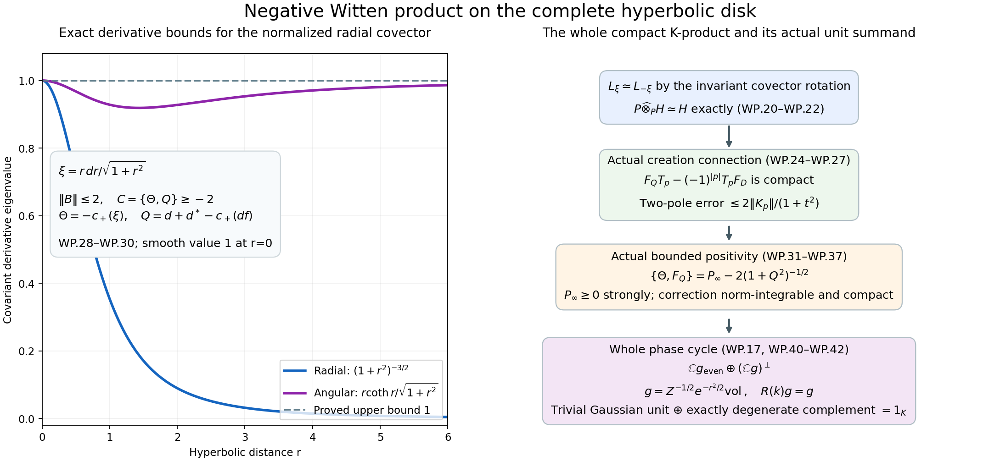

**Figure 11B.1.** WP.20–WP.42. Left: samples of the exact radial and angular derivative eigenvalues, with the analytically proved upper bound 1 and smooth origin value 1. The plotted samples are illustrations of the formulas, not spectral evidence. Right: the entire tensor unitary, graded creation connection, positive strong limit with norm-compact correction, and exactly invariant even top Gaussian. Negative Clifford multiplier here denotes an invariant covector rotation of the positive multiplier, not its additive inverse class.

#### A rejected bounded local construction

The first panel of Figure 11B.2 records a concrete failed construction. Fix \(x\in X\) and \(a>0\), put \(H_x=L^2(B_a(x),\Lambda^*T^*X)\), and let \(j_x:H_x\to H=L^2(X,\Lambda^*T^*X)\) be extension by zero. On this local space let
\[
\Theta_x(y)=c_+\!\left(a^{-1}d(x,y)d_y d(x,y)\right),\qquad
\varphi_x=(1-\Theta_x^2)^{1/4},\qquad
S_x=\Theta_x+\varphi_x j_x^*F_Hj_x\varphi_x,
\]
where \(F_H=D_H(1+D_H^2)^{-1/2}\) and \(D_H=d+d^*\). The radial covector extends smoothly through \(y=x\), and \(\Theta_x^2=d(x,y)^2/a^2\). This bounded operator was proposed as a product connection. For any even scalar \(\chi\in C_c^\infty(B_a(x))\), its creation map is \(T_\chi w=\chi w|_{B_a(x)}\); the product criterion requires \(S_xT_\chi-T_\chi F_H\) to be compact.

Choose \(y_0\ne x\), a coordinate neighborhood strictly inside the ball, and \(\chi=1\) there. Set \(h_0=d(x,y_0)/a\in(0,1)\). In a smooth orthonormal exterior trivialization write
\[
\Theta_0=\Theta_x(y_0),\qquad
C_0=\frac{i c_-(dy_1)|_{y_0}}{\|dy_1\|_{y_0}},\qquad
C_0=C_0^*,\quad C_0^2=1,\quad
C_0\Theta_0+\Theta_0C_0=0.
\]
Take a unit vector \(v\) with \(C_0v=v\). Normalized smooth wave packets \(w_n\), with phase \(e^{iny_1}\), support radius \(n^{-1/2}\) about \(y_0\), and exterior coefficient \(v\), are weakly null. They lie in the smooth compact core, and
\[
\|(D_H/n-\lambda_0)w_n\|=O(n^{-1/2}),\qquad
\lambda_0=\|dy_1\|_{y_0}>0.
\]
Indeed amplitude derivatives are \(O(n^{1/2})\), the first-order symbol varies by \(O(n^{-1/2})\) on the shrinking support, and the zeroth-order coefficients are bounded there. The spectral mass outside \(|s/n-\lambda_0|<\lambda_0/2\) tends to zero by this estimate; inside that interval \(s/\sqrt{1+s^2}\to1\) uniformly. Thus \(F_Hw_n-w_n\to0\). Continuity of the multipliers, with \(\varphi_0^2=\sqrt{1-h_0^2}\), and boundedness of \(F_H\) now give
\[
(S_xT_\chi-T_\chi F_H)w_n
=\Theta_0w_n+\bigl(\sqrt{1-h_0^2}-1\bigr)w_n+o(1).
\]
The two leading terms are orthogonal: \(\Theta_0v\) belongs to the negative \(C_0\)-eigenspace and has norm \(h_0\). Consequently
\[
\lim_{n\to\infty}\|(S_xT_\chi-T_\chi F_H)w_n\|^2
=h_0^2+\bigl(\sqrt{1-h_0^2}-1\bigr)^2>0.
\]
A compact operator sends a bounded weakly null sequence to a norm-null sequence, so the claimed creation connection fails. All packets are strictly inside the ball; neither a boundary convention nor a domain extension can remove this error. This rejects the specific bounded formula. The accepted induction projector in RP.4–RP.8 instead uses the full negative-Witten product WP.0–WP.9 and does not depend on this construction.

**Figure 11B.2.** WP.1–WP.42, RP.0–RP.8, HF.1–HF.7 and RR.2–RR.3/RR.6–RR.8. Each arrow denotes the represented construction or typed KK product named in its box. The failed connection formula in the first panel is proved to fail in the rejected-construction calculation immediately above. The full negative Witten product and actual induction/Cartan homotopies supply the current argument. Its literal same-spin sign and determinant line are unchanged.

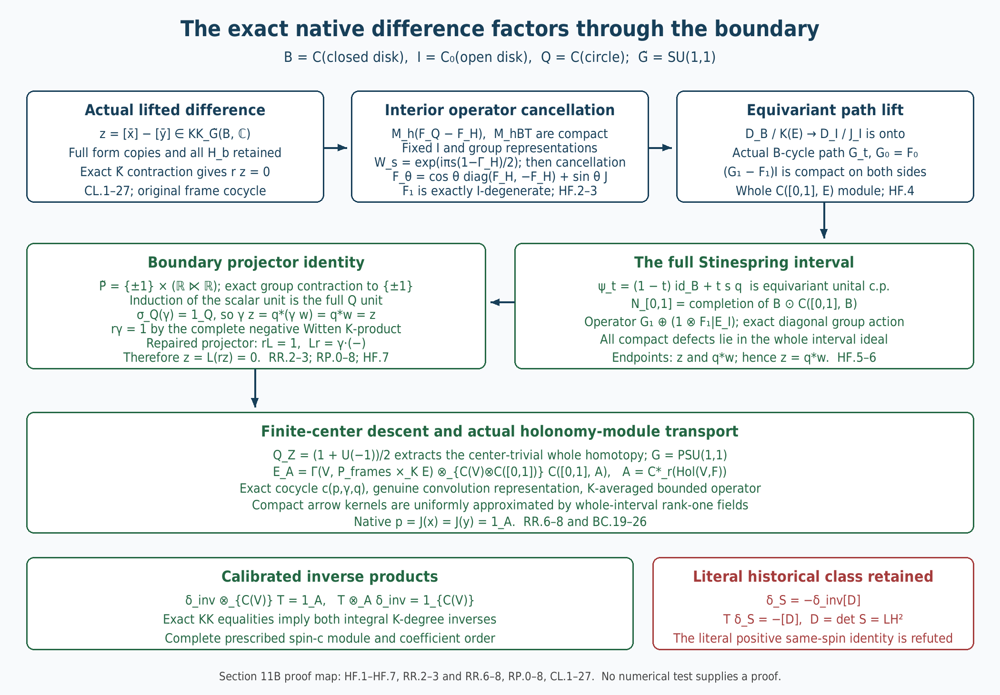

**Figure 11B.3.** CL.1–CL.28, HF.1–HF.7, RR.2–RR.3 and RR.6–RR.8. The square/commutator/group defects belong to the whole indicated interval compact ideal. Both form copies and the full boundary space remain until the exact cancellations described in the proof. The final endpoints are the actual calibrated reverse product and \(1_A\). This is an operator proof map, not an embedding of the entire foliation in the pictured plane.

## 11C. Two constraints on full-graph Dirac constructions

Connes asks for a scalar class \(KK^q(C_r^*(G),\mathbb C)\) represented by a suitable graph Dirac operator, with local transverse Bott pairing one, under an invariant normal spin-c structure. Section 11A gives a normalized SU(2)/F2 graph-column construction with an explicit discrete term. Here we prove an obstruction to a precisely specified ordinary full-graph differential ansatz, and a separate obstruction to obtaining a full-graph spin-c structure from the normal spin-c premise. Neither result refutes the original problem: “suitable Dirac type operator on the graph” does not impose either of these additional interpretations. Graph-column completions and operators with only the prescribed normal Clifford symbol are not covered by the obstruction.

The question and its local transverse Bott class are from Alain Connes, *A survey of foliations and operator algebras* ([author’s text](https://alainconnes.org/wp-content/uploads/foliationsfine.pdf)). The complete arguments below give the two constraints and their prerequisites. The exposition, proofs and diagram expression are dedicated to [CC0 1.0](https://creativecommons.org/publicdomain/zero/1.0/); the bundled fonts retain their notices in the [component terms](../reproduction/graph-dirac/COMPONENT-TERMS.md).

### 11C.1. The exact ordinary differential ansatz

For the first result, “full-graph Dirac” has all of the following concrete meanings. The Hilbert space is the ordinary smooth-density completion of the **entire** graph, with a smooth finite-rank graded Hermitian coefficient bundle. Left convolution acts by a smooth unitary coefficient transport satisfying its composition law. The algebra acts evenly. The operator is an odd formally self-adjoint first-order differential operator whose principal symbol is Clifford multiplication for a smooth positive-definite metric on the **whole** graph tangent bundle. Its commutators with every smooth convolution kernel are bounded on the Hilbert space. The closure, compactness and index conclusions will be proved, rather than added as unverified assumptions.

The full symbol is an additional assumption: it requires ellipticity in both leaf endpoint directions as well as every transverse direction. This is more than the normal symbol (SG.11), and uses the full graph instead of the source-transversal columns (SG.9). Smooth zero-order terms, finite coefficient multiplicities, arbitrary compatible connections, and arbitrary compatible full graph metrics are allowed.

**Theorem 11C.1 (the circle obstruction for the full-graph ansatz).** Let \(V=S^1\), with its single codimension-zero leaf. It satisfies the holonomy-invariant normal spin-c hypothesis. Every operator satisfying the preceding ansatz defines an even scalar reduced Kasparov cycle, but its pairing with the original point-transversal class is zero. Consequently no such operator supplies the requested pairing one. This statement includes every finite coefficient multiplicity and every smooth compatible first-order full Clifford expression in the specified representation.

The original source problem is not refuted: an explicit normalized scalar cycle on a single graph column will be given in Section 11C.7. The theorem identifies an unsuccessful general interface, rather than an obstruction to every normalized reduced class.

### 11C.2. Actual graph, reduced norm and coefficient transitions

Write \(S^1=\mathbb R/(2\pi\mathbb Z)\) with probability density \(dt/(2\pi)\). A transversal is a point. Every codimension-zero holonomy germ is the unique germ on a point, so paths with the same endpoints define the same holonomy arrow. Thus the actual holonomy graph and its tangent splitting are

\[
 G=S^1_x\times S^1_y,\qquad r(x,y)=x,\quad s(x,y)=y,
 \qquad TG=\mathbb R\partial_x\oplus\mathbb R\partial_y.
 \tag{GD.1}
\]

The normal bundle has rank zero and its invariant metric, orientation and spin-c data are trivial. There is no transverse line or odd Clifford generator to omit in this example; the desired scalar degree is exactly zero.

For a smooth kernel \(k(x,z)\), left convolution is the integral operator \(K_k\) on \(L^2(S^1)\). Every source-fibre regular representation is that same integral operator. A smooth kernel is Hilbert–Schmidt, and hence compact: approximate its continuous kernel uniformly by finite sums of separated functions, whose operators have finite rank; the error is bounded in operator norm by its Hilbert–Schmidt norm. Conversely rank-one operators with smooth vectors have smooth kernels, and smooth vectors are dense. Therefore

\[
 A=C_r^*(G)=\mathcal K(L^2(S^1)),\qquad
 \|k\|_r=\|K_k\|. \tag{GD.2}
\]

The coefficient transport in the ansatz is a smooth unitary
\(W(x,z;y):E_{(z,y)}\to E_{(x,y)}\), satisfying
\(W(x,z;y)W(z,w;y)=W(x,w;y)\) and \(W(x,x;y)=1\).
Fix \(x_0\). Put \(F_y=E_{(x_0,y)}\), and identify \(E_{(x,y)}\) with \(F_y\) by \(W(x_0,x;y)\). The composition law makes every transported kernel the identity on \(F_y\). Thus this is an explicit smooth coefficient-bundle trivialization along the range variable, not a claim that a twisted full-graph line can be discarded:

\[
 E\cong s^*F,\qquad
 H=L^2(S^1_x)\otimes L^2(S^1_y,F),\qquad
 \pi(k)=K_k\otimes1. \tag{GD.3}
\]

Here \(\pi\) is a nondegenerate faithful reduced scalar representation. Its norm is exactly \(\|K_k\|\): the inequality from above is the tensor norm bound, and testing on a tensor product of a near norm-attaining range vector with a normalized source vector gives the reverse inequality. The source fibre has positive finite coefficient rank; a zero-rank bundle would already have pairing zero.

Evenness of every kernel implies that the grading has the form \(1\otimes\Gamma(y)\). Indeed its commutation relation says \(\Gamma(x,y)k(x,z)=k(x,z)\Gamma(z,y)\); kernels nonzero at any chosen pair give independence of \(x\). Each of \(F^+\) and \(F^-\) is a complex bundle over the circle and is trivial. To verify that prerequisite, trivialize along the interval obtained by cutting the circle. Its endpoint gluing is a unitary matrix \(M\). A unitary matrix has a logarithm \(M=e^{iT}\) by diagonalizing it; a smooth path from 1 to \(M^{-1}\), constant near its endpoints, adjusts the interval trivialization to one that glues smoothly. Apply this separately to the two graded summands. The same argument covers all possible complex line transitions over the circle; a connection or spin holonomy survives as a smooth zero-order term in the periodic frame.

In these global frames a candidate differential expression is

\[
 D=-iA(x,y)\partial_x-iB(x,y)\partial_y+C(x,y),
 \qquad \Gamma D=-D\Gamma. \tag{GD.4}
\]

The displayed zero-order term includes the frame and density connection terms required for symmetry. Its coefficients are smooth on the torus. Clifford ellipticity says that its principal symbol squared is the positive inverse-metric quadratic form times the identity. In particular \(B(x,y)\) is an invertible odd self-adjoint matrix at every point.

### 11C.3. Bounded convolution commutators force the source symbol

The range derivative in \([D,\pi(k)]\) is bounded after integration by parts in \(z\). Explicitly its kernel is
\(-iA(x,y)\partial_x k(x,z)-i\partial_z(k(x,z)A(z,y))\).
The zero-order commutator is bounded as well. The only derivative still acting on the input is

\[
 -i\int_{S^1}
  \bigl(B(x,y)k(x,z)-k(x,z)B(z,y)\bigr)
       \partial_y\psi(z,y)\,{dz\over2\pi}.
 \tag{GD.5}
\]

**Lemma 11C.2 (source-symbol rigidity).** Boundedness of all the commutators in the ansatz forces \(B(x,y)=B(y)\).

**Proof.** If the kernel coefficient in (GD.5) is not identically zero for some smooth \(k\), its integral operator is nonzero on a smooth vector \(v(z,y)\) supported in a small source interval; smooth vectors are dense and the coefficient is continuous. Let its nonzero output have norm \(\delta>0\). Test on \(\psi_n(z,y)=e^{iny}v(z,y)\), whose input norm is fixed. Equation (GD.5) has norm at least \(|n|\delta-O(1)\). Every other term, including the derivative of \(v\), has a bound independent of \(n\), by smoothness and the compact variables. This contradicts a bounded commutator. Thus the kernel coefficient vanishes. Smooth kernels can be nonzero at every prescribed \((x,z)\), which gives \(B(x,y)=B(z,y)\) for all \(x,z,y\). Conversely this equality removes (GD.5), leaving precisely the bounded integral kernels already described. This proves the lemma and verifies the whole smooth convolution core. \(\square\)

This argument determines which Clifford and line transitions are compatible with regular convolution. A line twist that couples the two endpoint variables cannot simply be inserted into (GD.3) while retaining the same scalar convolution action. A full tangent splitting supplies no such transport automatically.

### 11C.4. Exact domain, self-adjointness and scalar compactness

For completeness the needed compact-manifold analytic facts are proved here for this two-dimensional expression. Freeze the principal matrices at a point in a sufficiently small coordinate disc. For the constant-coefficient expression \(D_c\), Fourier transformation and the Clifford identity give
\(\|D_cu\|_2^2\ge c\|\nabla u\|_2^2\) for some \(c>0\). On a small disc the difference of principal coefficients is arbitrarily small in supremum norm. Absorb its gradient contribution, and bound all lower-order terms by a constant times \(\|u\|_2\). A finite smooth partition of unity, with its bounded multiplication commutators, gives

\[
 \|u\|_{H^1(G)}\le C\bigl(\|Du\|_2+\|u\|_2\bigr)
 \quad(u\in C^\infty(G,E)). \tag{GD.6}
\]

The reverse bound is immediate from the smooth bounded first-order coefficients. Hence the closure of the smooth core has domain \(H^1(G,E)\). To identify the adjoint domain, let \(u\in L^2\) have distributional \(Du\in L^2\). Local mollification \(J_\epsilon\) has uniformly bounded commutator \([D,J_\epsilon]\) on \(L^2\): the differentiated convolution kernel is multiplied by a coefficient difference bounded by \(C|x-z|\), and its absolute integral is bounded independently of \(\epsilon\); coefficient derivatives contribute another uniformly bounded convolution kernel. These are the two Schur bounds. Apply (GD.6) to mollified localizations of \(u\). Their \(H^1\) norms are uniformly bounded by \(\|Du\|_2+\|u\|_2\). Weak compactness in \(H^1\) and strong \(L^2\) convergence show \(u\in H^1\). Formal self-adjointness therefore makes the maximal and minimal domains equal: \(D\) is self-adjoint on exactly \(H^1(G,E)\), with smooth sections a core.

The embedding \(H^1\to L^2\) is compact. In the global finite frame, discard Fourier modes \((m,n)\) with \(m^2+n^2>R^2\); the remaining projection has finite rank and its tail from an \(H^1\) unit ball has norm at most \((1+R^2)^{-1/2}\). Consequently the resolvent of \(D\), which has bounded range in \(H^1\) by (GD.6), is an ordinary scalar compact.

Every smooth \(\pi(k)\) preserves the domain, either directly from its integral expression or from Lemma 11C.2 and its bounded commutator. With \(F_D=D(1+D^2)^{-1/2}\), its square defect is compact. The first-order resolvent identity, with \(Q_\pm=(D\mp i\sqrt{s})^{-1}\), gives \([Q_\pm,\pi(k)]=-Q_\pm[D,\pi(k)]Q_\pm\). Averaging the two resolvents yields the norm bound

\[
 \|[D(s+D^2)^{-1},\pi(k)]\|
       \le {\|[D,\pi(k)]\|\over s},\qquad s=1+t^2.
 \tag{GD.7}
\]

Each resolvent commutator is compact. Integrating the averaged commutators against \(2\,dt/\pi\) converges in norm by (GD.7), and gives \([F_D,\pi(k)]\): truncated transform integrals converge strongly, while their commutators converge in norm. Density of smooth kernels gives the scalar Kasparov defects for every element of \(A\). The grading is exactly even and the self-adjointness defect is zero. Thus the promised cycle exists; normalization, rather than analytic existence, is the obstruction.

### 11C.5. Compression to the original point-transversal class

Let \(u(x)=1\) in the probability-density convention, and let \(p=|u\rangle\langle u|\in A\). It is a smooth rank-one projection. It is the original point-transversal K-class: the source-fibre counting construction extends its one-dimensional fibre to \(L^2(G_{y_0})=L^2(S^1)\), and any normalized smooth column gives its rank-one projection. Any two such columns can be joined by unit vectors after a harmless phase adjustment, and their rank-one projections are homotopic. Thus the constant column and a column supported in a small plaque give the same class, with positive rank one. The rank-zero normal Bott generator is \(1\in K^0(\mathrm{point})\); its image is exactly \([p]\).

Since \(p\) preserves \(H^1\) and \([D,p]\) is bounded, the off-diagonal operator
\(R=pD(1-p)+(1-p)Dp\) is bounded self-adjoint. The operator \(D_{\rm diag}=D-R\) is self-adjoint on the same domain: for imaginary \(z\) with \(|\operatorname{Im}z|>\|R\|\), a Neumann inverse of \(1-R(D-z)^{-1}\) gives the resolvent and the adjoint resolvent. The projection \(p\) reduces it. Its compressed operator has exact domain

\[
 D_p=pDp,
 \qquad\operatorname{Dom}D_p=pH^1(G,E)
             \cong H^1(S^1_y,F). \tag{GD.8}
\]

This compression does represent the K-pairing. The difference of the two first-order resolvents of \(D\) and \(D_{\rm diag}\) is compact, with norm at most \(\|R\|/s\) at imaginary parameters \(\pm i\sqrt{s}\). Its averaged transform integral converges in norm, so \(F_D-F_{D_{\rm diag}}\) is compact. Therefore \(pF_Dp\) differs compactly from the normalized transform of \(D_p\). This proves the representative, including domain control, rather than reading an index directly from an unrelated longitudinal operator.

Because \(B\) is independent of \(x\), and \(\partial_x u=0\), compression of (GD.4) gives the actual source operator

\[
 D_p=-iB(y)\partial_y+\overline C(y),\qquad
 \overline C(y)=\int_{S^1}C(x,y)\,{dx\over2\pi}.
 \tag{GD.9}
\]

The invertible odd source Clifford matrix gives equal graded ranks \(r\). In the graded circle frames its positive-to-negative block is
\(D_p^+=-i\beta(y)\partial_y+c(y)\), with smooth invertible \(r\)-by-\(r\) matrix \(\beta\). Multiplication by \(-i\beta\) is invertible on the target, so its Fredholm index equals that of \(\partial_y+i\beta^{-1}c\), as an operator \(H^1\to L^2\).

The derivative \(\partial_y\) has the \(r\)-dimensional constant kernel, range the mean-zero functions, and \(r\)-dimensional constant cokernel. Its inverse on the mean-zero complement is the Fourier multiplier \(1/(in)\), a bounded map \(L^2\to H^1\). The lower-order term is compact as a map \(H^1\to L^2\), by the Fourier embedding proof above. Compact perturbation preserves the Fredholm index: a parametrix makes every operator on the compact-perturbation path Fredholm; its index is locally constant by splitting finite kernel and cokernel from an invertible complement and using a Neumann inverse on that complement. A finite cover of the path gives constancy. Hence

\[
 \langle[p],[H,\pi,F_D]\rangle
     =\operatorname{Index}D_p^+
     =\operatorname{Index}(\partial_y\otimes1_{\mathbb C^r})
     =r-r=0. \tag{GD.10}
\]

The normalized transform has this same index: compact resolvent gives finite-dimensional kernel, a positive spectral gap on its orthogonal complement, and identical kernel and cokernel for its chiral block. This completes Theorem 11C.1. The desired value is one, so neither a change of source connection nor any smooth zero-order term repairs the full-graph ansatz.

### 11C.6. An explicit check and the actual multiplicity interface

For the flat torus choose \(E=\mathbb C^2\), \(\Gamma=\sigma_3\) and

\[
 D_{\rm flat}=\sigma_1(-i\partial_x)+\sigma_2(-i\partial_y),
 \quad D_{\rm flat}^2=-\partial_x^2-\partial_y^2,
 \quad pD_{\rm flat}p=\sigma_2(-i\partial_y). \tag{GD.11}
\]

The Fourier core gives eigenvalues \(\pm\sqrt{m^2+n^2}\) away from \((0,0)\); the zero block has one vector in each grading. Smooth convolution in \(x\) has bounded commutator, and the source derivative commutes with it. The point-transversal corner retains exactly the paired source-circle spectrum: one constant kernel and one constant cokernel. This is an exact model of (GD.10), not a computed approximation to the SU(2) spectrum.

If instead the operator differentiates only the normal directions on the entire graph, it leaves the source-circle multiplicity untouched. At rank-zero normal dimension that operator is zero on \(L^2(S^1_x\times S^1_y)\), so \(\pi(p)(1+D^2)^{-1}=p\otimes1\) is not compact. The orthonormal vectors \(u(x)e^{iny}\) have orthogonal images of norm one. Thus adding the second endpoint has two separate costs: omitting its operator fails localized scalar compactness; adding an ordinary compatible source first-order Dirac produces the zero index proved above. A successful index-one completion cannot be inferred merely from full ellipticity, tangent splitting, or a faithful regular representation.

### 11C.7. Why the full-graph constraints do not settle the reduced construction

For the same circle foliation choose the one source column \(G_{y_0}=S^1\), the actual faithful regular representation of \(A=\mathcal K(L^2(S^1))\) on \(H_+=L^2(S^1)\), and \(H_-=0\). The odd operator \(D=0\), of finite order zero, has phase zero. For every \(a\in A\), the square defect is \(-a\), compact; both other defects vanish. It is an even scalar cycle and its compression to \(p\) is the operator from a one-dimensional positive space to the zero negative space, with index one. This is an actual graph-column realization, not a longitudinal class or an abstract discrete completion.

It is the zero-dimensional **normal** Dirac expression; it is not a full-tangent elliptic Dirac on \(G\). This example proves that Theorem 11C.1 must not be enlarged into a nonexistence theorem for all normalized reduced graph classes. The original problem does not explicitly require integration over all source units with a smooth density, nor full graph ellipticity. If a later formulation excludes codimension zero or expressly specifies another graph completion, that changed scope needs its own argument. No such exclusion appears in the source statement.

The theorem also includes the usual bounded **unbounded-operator** commutator requirement in its ansatz. It does not exclude a different full-graph differential expression with unbounded \([D,\pi(k)]\) for which only the bounded-phase Kasparov defects might nevertheless be proved. Such a proposal requires a separate phase and normalization argument; that weaker interface is not silently covered here.

Section 11A similarly uses source-transversal columns and an explicitly discrete even index-one completion. Its normalized reduced class and all previously proved defects remain intact. The present proof does not identify its tree operator with a smooth differential expression, and does not rule out a different local graph-column construction under additional hypotheses.

### 11C.8. Tangent splitting does not supply a graph spin-c line

The following separate result settles a missing global transition prerequisite for the minimal-spinor full-graph approach.

**Proposition 11C.3.** There is a compact connected oriented manifold \(L\), foliated by its single leaf, whose normal spin-c structure is trivial but whose graph \(G=L\times L\) has no spin-c tangent structure. Thus a splitting of the graph tangent into two leaf endpoint factors and the normal factor, together with an invariant normal spin-c structure, does not supply an ordinary minimal full-tangent spinor bundle.

**Prerequisite: the determinant-line obstruction.** An oriented real bundle carrying a spin-c lift has a complex determinant line \(\ell\) satisfying \(c_1(\ell)\bmod2=w_2\). This follows directly from the lift transitions. Choose local oriented-frame transitions and spin lifts on double overlaps. On triple overlaps their product is \((-1)^{a_{ijk}}\); the mod-two cocycle \(a\) is the obstruction \(w_2\). A spin-c lift adds phases \(z_{ij}\) whose triple product is this same sign. Its determinant transitions are \(z_{ij}^2\). Choose logarithms of the phases on a refinement: doubling the logs gives the integer Chern cocycle, whose parity is \(a\). This proves the needed necessary condition, including its line transition content. It applies after adding any framed trivial real summand because the same frame-transition spin signs remain.

Construct

\[
 L=(\mathbb{CP}^2\times[0,1])/
       ((z,1)\sim(\overline z,0)). \tag{GD.12}
\]

Complex conjugation on a complex two-dimensional chart reverses two imaginary coordinates, so it preserves the real orientation. The mapping torus is a smooth compact connected oriented five-manifold. Its single-leaf holonomy graph is the pair groupoid, by exactly the germ argument in Section 11C.2.

Here are the complete characteristic-class facts needed in this example. Projective space has cells in dimensions 0, 2 and 4, obtained by successively separating the last nonzero homogeneous coordinate; hence its integral and mod-two degree-two cohomology groups are \(\mathbb Z\) and \(\mathbb Z/2\). Let \(h\) be the Chern class of the dual tautological line. Restricted to \(\mathbb{CP}^1\) its equatorial transition winds once, so \(h\) is the generator and its mod-two reduction is nonzero. At a line \(\lambda\subset\mathbb C^3\), the tangent is \(\operatorname{Hom}(\lambda,\mathbb C^3/\lambda)\). This gives the exact bundle sequence
\(0\to\mathbb C\to H^*\otimes\mathbb C^3\to T\mathbb{CP}^2\to0\).
Taking determinants proves \(c_1(T\mathbb{CP}^2)=3h\). To compute the spin obstruction without an additional unitary homotopy theorem, split this exact sequence by a Hermitian metric. It gives \(T\mathbb{CP}^2\oplus\mathbb C\cong(H^*)^{\oplus3}\). The real plane underlying \(H^*\) has spin obstruction \(h\bmod2\): a plane transition of winding one lifts to a spin rotation that changes sign after \(2\pi\). For oriented block sums the triple-overlap spin signs multiply, so their mod-two obstruction cocycles add; a trivial summand adds zero. Hence \(w_2(T\mathbb{CP}^2)=3h\bmod2=h\bmod2\).

Conjugation restricts on \(\mathbb{CP}^1\) to an orientation-reversing sphere map, so it sends \(h\) to \(-h\). If a complex line on \(L\) restricts on one fibre to Chern class \(kh\), its restrictions along the interval have the same Chern class by homotopy. Endpoint gluing then requires \(kh=-kh\), and hence \(k=0\). But restriction of \(TL\) to the fibre is \(T\mathbb{CP}^2\oplus\mathbb R\). A spin-c determinant line would have odd \(k\) by the preceding obstruction calculation. This contradiction proves that \(TL\) has no spin-c structure.

Finally a putative spin-c determinant line for \(T(L\times L)\) restricts on \(L\times\{y_0\}\) to a line lifting \(w_2(TL\oplus\mathbb R^5)=w_2(TL)\). Restricting again to the projective fibre gives the same impossible odd \(k\). Thus \(T(L\times L)\) has no spin-c lift. This proves Proposition 11C.3. \(\square\)

A minimal complex spinor module for the even-dimensional full graph would supply exactly such a lift. Locally compare its Clifford action with the fixed irreducible matrix module in an oriented orthonormal frame. On an overlap a spin lift of the frame change intertwines the two Clifford actions. Every other unitary intertwiner differs by a phase, since the commutant of the full irreducible complex Clifford matrix algebra consists of scalars. Their simultaneous transition law is precisely \((\operatorname{Spin}\times U(1))/\{(-1,-1)\}\), so a global minimal module supplies a spin-c lift and its determinant line. The preceding obstruction therefore applies to that proposal. A larger Clifford module, such as the complex exterior module, is always available without a spin-c lift; this proposition does not exclude it. Such a module's index and scalar convolution transport still require proofs. In particular one cannot replace the prescribed normal inverse line by an unproved full graph determinant line, or cancel the two pulled-back leaf factors simply because they have equal rank. Their tangent bases lie at different endpoints.

### 11C.9. The remaining general construction

The original target still requires a degree-\(q\) scalar class for the reduced holonomy algebra, represented by a genuinely local finite-order graph operator in a specified graph completion, with the complete invariant normal Clifford module and determinant-line transitions, dense convolution-domain preservation, every localized scalar defect, and the original local Bott pairing one. Section 11A proves those analytic and normalization interfaces on its specific SU(2)/F2 completion while retaining the discrete term explicitly.

These results provide two rigorous constraints on a general construction. A full ordinary graph tangent Dirac cannot be adopted as a universal construction: Theorem 11C.1 excludes the natural smooth full-graph regular ansatz already for the circle. A normal spin-c structure alone cannot be turned into a minimal full-tangent spinor bundle by the graph splitting: Proposition 11C.3 exhibits its exact determinant-line obstruction. A successful general proof must state its source-transversal or other graph completion and construct its local multiplicity-control operator there; it cannot infer index one from ellipticity or spin-c notation. No proof of that remaining general construction, and no counterexample excluding all admissible normalized graph-column classes, is claimed here.

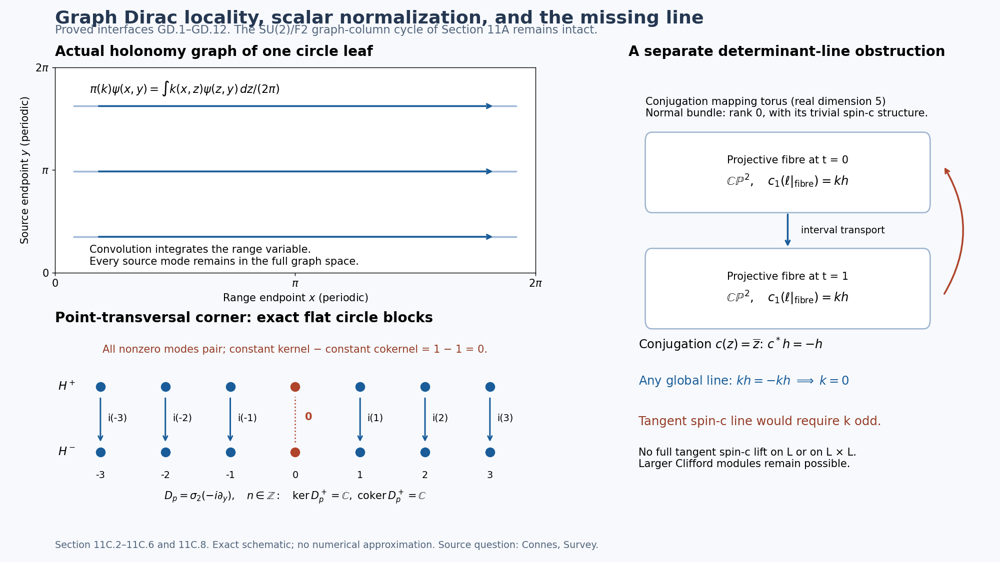

**Figure 11C.1.** Equations (GD.1)–(GD.3), (GD.8)–(GD.12). The square represents the periodic parameter domain for the actual torus graph; convolution integrates the range endpoint while the source endpoint survives. The displayed corner spectrum is the exact flat expression \(\sigma_2 n\); its zero block has one positive kernel and one negative cokernel, giving index zero. The right panel depicts the exact integral Chern relation \(k=-k\) for a line on the conjugation mapping torus, and the incompatible odd restriction required by its tangent spin-c lift. No sampled spectrum or tree truncation is used in the proof. The question is from Connes, *A survey of foliations and operator algebras* ([author’s text](https://alainconnes.org/wp-content/uploads/foliationsfine.pdf)). [Reproducible source](../reproduction/graph-dirac/draw_graph_dirac.py) · [Editable SVG](../figures/kt-graph-dirac-constraints.svg).

## 11D. A normalized graph-column cycle from a countable tree

The construction below fills the auxiliary-cycle interface of Section 11A.9 first for locally finite trees, then for every countable connected tree with finite vertex stabilizers. It allows an arbitrary compatible normal Dirac connection; the full normal spin-c structure and metric remain invariant. The resulting reduced scalar class has the original local transverse Bott pairing +1. The construction is a graph-column operator with a transverse differential Clifford symbol and a discrete tree term. It does not identify that term with a local finite-order differential expression, or derive a tree action from the general foliation hypothesis. This theorem does not construct the required normalized reduced graph representative for arbitrary eligible holonomy.

The SU(2)/F2 construction of Section 11A, the full-graph circle obstruction of Section 11C and the finite multiplication-potential obstruction remain in force. In particular the present tree term moves tree labels; it is not a multiplication potential on the leaf coordinate.

**Theorem 11D.1 (the normalized countable-tree graph-column cycle).** Suppose the compact full metric spin-c normal data and coherent germ-effective action of Section 11D.1 are supplied, together with a countable connected auxiliary tree with finite vertex stabilizers and the regular compact-base cover of Section 11D.5. The full inverse normal coefficient, proper weighted tree factor and exact compressed operator below define a reduced scalar degree-q graph-column cycle with the original local transverse Bott pairing +1. The chosen compatible normal connection need not be invariant. The arbitrary-groupoid auxiliary and a local finite-order smooth differential replacement of the discrete tree term remain open.

**Proof.** Sections 11D.1–11D.8 prove the complete locally finite construction and its normalization. Section 11D.9 supplies proper weights and proves every extension needed for a countable tree.

### 11D.1. Exact hypotheses and normal coefficients

Let Gamma be a countable discrete group acting by graph automorphisms on a connected locally finite simplicial tree T. Fix a vertex o. Assume each vertex stabilizer is finite. Edge inversions are allowed. Let N be a compact connected smooth manifold without boundary, of dimension q, equipped with a specified metric and full spin-c orientation on TN. Suppose Gamma acts smoothly by isometries and lifts coherently to that full structure. In the suspension application assume its action is effective on germs: no nonidentity group element is the identity on an open normal chart.

Use the **source-calibrated full inverse coefficient**, rather than an independently chosen positive spinor bundle. At an original principal transition zs, with s a spin lift and z the central phase, the transferred inverse is the module of Theorem 7.17:

\[
 \mathcal D_N\cong\Pi^{k_q}C_q,\qquad
 k_q=q(q-1)/2,\qquad
 c_{\rm inv}(e^j)=(-1)^{k_q+1}L_{t_j},\qquad
 zs\longmapsto z^{-1}\rho_t(s).                 \tag{PT.1}
\]

These are full right-C_q modules, with their actual grading and ordered generator list. If the prescribed original orientation is tensored by an even line H, the inverse is tensored by \(H^*\). This includes its full transition functions and any two-torsion information; the determinant line alone does not determine the coefficient. In odd q the last right C1 remains after contracting consecutive even Clifford pairs. In q=0 the canonical even orientation gives the even scalar line and zero normal operator; a different stable graded line is not declared to be the same orientation.

Choose a smooth compatible Clifford connection on this inverse module and the associated formally symmetric normal Dirac D_N on

\[
 H_N=L^2(N,\mathcal D_N),\qquad
 \operatorname{Dom}D_N=H^1(N,\mathcal D_N).       \tag{PT.2}
\]

All scalar compactness statements below are genuine finite-Clifford scalar statements: a finite-dimensional right C_q coefficient is retained, and the final parity reduction is the supplied ordered finite Morita contraction. No infinite Hilbert-module compactness is substituted for scalar compactness.

The compact normal Dirac has self-adjoint closure, smooth core and compact resolvent. The local analytic proof is the compact-manifold version of Section 11C.4: freeze the Clifford matrices in a sufficiently small chart, use the Fourier lower bound for their positive squared symbol, absorb the small principal-coefficient variation, and patch with a finite partition. This gives the two-sided equivalence of the graph norm and H1. For a distributional maximal-domain vector, smooth local mollifiers have uniformly bounded first-order commutators: the differentiated kernel is multiplied by a coefficient difference O(distance), with uniformly bounded Schur integral. The estimate therefore puts every maximal-domain vector in H1. Minimal and maximal domains agree, so formal symmetry gives self-adjointness. Local Fourier cutoffs, followed by the finite partition, show compact H1 inclusion into L2. Hence the resolvent is scalar compact. The same argument with finite right coefficients proves (PT.2). For q=0 these claims are the finite-dimensional zero-operator claims.

The normal calibration is the accepted programme interface of Theorem 7.17, the two native inverse identities of Lemma 7.20, and the bounded-phase local symbol/metric comparison in Lemmas 7.14–7.17. In particular, for the old-first positive local Bott generator b_U on a positively oriented normal q-ball U, extended by zero to N,

\[
 \langle b_U,[D_N]\rangle=1.                   \tag{PT.3}
\]

This is the same normal interface as SG.2–SG.3, now retaining the entire q-dimensional coefficient. The new assertion below concerns how that supplied normal inverse is completed and represented on the reduced graph algebra. The normal inverse and its calibration are used with the hypotheses of the cited results.

Let U_h be the unitary on H_N induced by the metric density and the coherent inverse lift in (PT.1). Its full action satisfies covariance and the group law exactly. An invariant connection is **not** assumed. Conjugating D_N by U_h gives another smooth first-order expression with the same principal symbol: the isometry transports the covector and the full inverse lift intertwines Clifford multiplication. Thus

\[
 B_h=[D_N,U_h]\in\mathcal B(H_N),\qquad
 U_h H^1=H^1.                                   \tag{PT.4}
\]

To see the bound explicitly, express both operators in finitely many coordinate and coefficient frames. Equality of their principal coefficients cancels every derivative of the input. The remaining expression is a smooth finite-matrix multiplication operator composed with U_h. Its coefficient is bounded on compact N. Smooth pullback and its smooth inverse preserve H1. Each h has its own finite bound; neither a uniform bound over Gamma nor an invariant averaging of connections is needed.

### 11D.2. The complete even tree cycle

Every locally finite connected tree is countable: its radius-R vertex ball is finite by induction on R and the whole vertex set is their countable union. Every edge has a unique endpoint farther from o. For v other than o write par(v) for its neighbour closer to o, put c(v)={v,par(v)}, and let n(v)=d(o,v). The map c is a bijection from V(T) minus {o} to the set E(T) of unoriented edges. Define

\[
 H_T^+=\ell^2 V(T),\quad H_T^-=\ell^2E(T),\quad
 Q\delta_o=0,\quad Q\delta_v=\delta_{c(v)}\ (v\ne o),
 \quad M\delta_v=n(v)\delta_v.                   \tag{PT.5}
\]

Thus \(Q^*Q=1-P_o\), \(QQ^*=1\), and Index Q=+1. On the graded sum, with positive vertices and negative edges, use

\[
 D_T=\begin{pmatrix}0&M Q^*\\QM&0\end{pmatrix},
 \qquad \Gamma_T=\begin{pmatrix}1&0\\0&-1\end{pmatrix}.
                                                        \tag{PT.6}
\]

The root is its one-dimensional positive kernel. Each remaining vertex/parent-edge pair is an orthogonal two-dimensional block with matrix [[0,n],[n,0]]. Their orthogonal direct sum, on the square-summability domain of their images, is self-adjoint. Finite block sums form a core. The finite radius balls make every bounded spectral window finite-dimensional; the square-resolvent tail has norm at most 1/(1+(R+1)^2). Hence D_T has compact resolvent, including when T is finite.

Let L_h^V and L_h^E be the permutation actions on vertices and unoriented edges; they preserve the grading. Write ell(h)=d(o,ho). The lower unbounded commutator sends delta_v to

\[
 n(hv)\delta_{c(hv)}-n(v)\delta_{h c(v)},          \tag{PT.7}
\]

with a root term interpreted as zero. The two edge labels agree unless hv belongs to the finite segment [o,ho]. Indeed the parent of hv with respect to root ho is h par(v). Outside the segment, the first steps toward o and ho coincide in a tree. There are at most ell(h)+1 exceptional input vertices. For each, n(v)=d(ho,hv) and n(hv) are at most ell(h), so its column norm is at most 2ell(h). Off the segment, the coefficient difference is at most ell(h) by the triangle inequality; the edge output map is injective. The finite-column Hilbert–Schmidt estimate and this injectivity give

\[
 \|QM L_h^V-L_h^E QM\|
 \le\ell(h)+2\ell(h)\sqrt{\ell(h)+1}.             \tag{PT.8}
\]

The corresponding upper block is the adjoint of the lower block for h inverse, multiplied by unitaries, and ell(h inverse)=ell(h). This proves the bounded commutator [D_T,L_h] on the full graded space. It also proves domain preservation: initially the identity holds on finite vertex/edge sums; approximating in the graph norm and using boundedness gives L_h Dom D_T subset Dom D_T, and h inverse gives equality. The phase

\[
 F_T=\begin{pmatrix}0&Q^*\\Q&0\end{pmatrix}       \tag{PT.9}
\]

has finite-rank return commutators, because only the finite segment is exceptional. Its square defect is -P_o in positive grading, and its scalar even index is +1. The normalized transform of D_T differs from F_T by compact block coefficients n/sqrt(1+n^2)-1 tending to zero outside finite radius balls. These claims use the whole tree, not any finite truncation.

### 11D.3. Exact reduced descent with finite stabilizers

The vertex stabilizer Gamma_v is finite by hypothesis. The unoriented edge stabilizer is finite as well, including inversions: its endpoint permutation image has at most two elements, and its kernel is contained in the finite stabilizer of either endpoint. Decompose each permutation space into its vertex or edge orbits. An orbit with representative w and stabilizer H is Gamma/H, with left cosets and finite H. The explicit isometric equivariant embedding is

\[
 J_H:\ell^2(\Gamma/H)\longrightarrow\ell^2\Gamma,
 \qquad
 J_H\delta_{gH}=|H|^{-1/2}\sum_{a\in H}\delta_{ga}.
                                                        \tag{PT.10}
\]

Distinct left cosets have disjoint supports, so the norm is exactly one and the map is well-defined. Left translation intertwines literally. The direct sum over the countably many vertex and edge orbits therefore embeds H_T into a countable sum of regular representations. This is a subrepresentation embedding, not an assertion that every orbit is itself regular. Its range projection is a finite-subgroup average in each orbit copy. Infinite stabilizers would invalidate (PT.10); they are not admitted by this theorem.

Let B=C(N) crossed-product-r Gamma. On H_B=H_T graded-tensor H_N put

\[
 \Pi_B(f)=1\otimes M_f,\quad
 \Pi_B(u_h)=L_h\otimes U_h,\quad
 D_B=D_T\otimes1+\Gamma_T\otimes D_N.             \tag{PT.11}
\]

Covariance follows from the actual normal pullback formula. The isometry J tensor 1 intertwines every displayed coefficient with a sum of the covariant regular copies on ell2 Gamma tensor H_N. On a regular copy the absorption unitary W has (W psi)_g=U_g inverse psi_g. Substitution gives

\[
 W(\lambda_h\otimes U_h)W^{-1}=\lambda_h\otimes1,
 \quad
 (W(1\otimes M_f)W^{-1}\psi)_g
       =M_{f\circ h_g}\psi_g,                    \tag{PT.12}
\]

where h_g is the normal action of g. In a local coefficient frame this is the direct integral, with the finite coefficient multiplicity, of the defining regular representations at points of N. For a finite crossed coefficient a its norm is at most ||a||_r. Restriction to the J range retains that inequality, and norm density gives a nondegenerate reduced representation of B on H_B. The unit acts as identity. Faithfulness is not needed and is not asserted for arbitrary finite-stabilizer actions.

The central phase has not disappeared: it occurs in U_g and its inverse in the unitary W. It cancels in scalar multiplication covariance because multiplication acts as a scalar on each finite coefficient fibre, not because the line is trivial. All right C_q actions, gradings and densities are preserved by J, U and W.

The tree factor is even, so it changes no transverse degree. Anticommutation gives

\[
 D_B^2=D_T^2\otimes1+1\otimes D_N^2.             \tag{PT.13}
\]

Take a compact-resolvent eigenbasis of D_N and the tree blocks. For a nonroot block of depth n and a normal eigenvalue nu, the physical matrix is [[nu,n],[n,-nu]], with eigenvalues plus/minus sqrt(nu^2+n^2). The root block is D_N. Their orthogonal direct sum defines a self-adjoint operator on the square-summability domain of its images. Finite tree/normal spectral sums form a core. Only finitely many tree levels and normal eigenvalues occur below any fixed squared spectral bound, so its ordinary scalar resolvent is compact. The argument is valid on the full finite right-C_q model and after its ordered parity reduction.

For f smooth and h fixed,

\[
 [D_B,\Pi_B(f)]=\Gamma_T\otimes[D_N,M_f],
 \quad
 [D_B,\Pi_B(u_h)]
   =[D_T,L_h]\otimes U_h+\Gamma_T L_h\otimes B_h.
                                                        \tag{PT.14}
\]

Equations (PT.4) and (PT.8) prove all these bounds and domain preservation. Finite group support and smooth normal coefficients give the dense coefficient core. No invariance of D_N or K-amenability of Gamma is used.

Let F_B=D_B(1+D_B^2)^(-1/2). Its square defect is compact by (PT.13). For any core a with C_a=[D_B,Pi_B(a)] bounded, set s=1+t^2 and R_t=(s+D_B^2)^(-1). The bounded first-order resolvent identity gives

\[
 [D_BR_t,\Pi_B(a)]
   =sR_t C_aR_t-D_BR_t C_aD_BR_t,
 \qquad
 \|[D_BR_t,\Pi_B(a)]\|
       \le\frac{5\|C_a\|}{4(1+t^2)}.             \tag{PT.15}
\]

To justify the formula without a domain assumption on C_a, use Q_plus/minus=(D_B minus/plus i sqrt(s)) inverse, whose commutators are -Q C_a Q, and average the two identities. Every term in (PT.15) is compact. Their integral with measure 2dt/pi converges in compact norm. The uncommuted transform integral converges strongly, which identifies this norm limit with [F_B,Pi_B(a)]. Density gives every scalar Kasparov defect for all B.

### 11D.4. Full restriction class and index +1

Restriction of (PT.11) to C(N) is the product of the external even tree class and the full normal class. Here are the operator checks. The first module is H_T graded-tensor C(N), with phase F_T tensor 1. Creation maps with a finite tree basis vector times a continuous coefficient function form a dense set. At fixed nonroot depth n, the normal spectral matrix of the total transform is

\[
 (1+\nu^2+n^2)^{-1/2}
       \begin{pmatrix}\nu&n\\n&-\nu\end{pmatrix}. \tag{PT.16}
\]

The positive column differs from the normal transform column by entries tending to zero as |nu| tends to infinity. The negative column differs from its negative, with precisely the graded creation sign. The root column is exactly the normal transform. Compact resolvent of D_N makes these fixed-column differences compact; continuous coefficient functions follow from the compact commutators. Finite sums and bounded creation norms extend to all creation vectors, and taking adjoints gives the second connection condition. This is the same graded right-C_q creation calculation as SG.T11, with the tree first and the complete normal coefficient second; no odd blocks are permuted.

The lifted first phase anticommutes with Gamma_T and satisfies F_T D_T=D_T F_T=|D_T|. Functional calculus of the commuting squares yields the exact product positivity

\[
 \{F_T\otimes1,F_B\}
   =\frac{2|D_T|\otimes1}
       {\sqrt{1+D_T^2\otimes1+1\otimes D_N^2}}\ge0. \tag{PT.17}
\]

The complete product criterion of Definition 0.3/Theorem 0.6 therefore identifies the restriction class. The scalar even tree class is its Fredholm index +1 by Theorem 0.14, so its external coefficient extension is the identity of C(N). Consequently

\[
 [\Pi_B,F_B]|_{C(N)}=[D_N],\qquad
 \langle b_U,[\Pi_B,F_B]|_{C(N)}\rangle=1.        \tag{PT.18}
\]

Neither a root count alone nor a finite-dimensional normal index is being used to infer this product. The connections and positivity prove the full restriction identity.

### 11D.5. Actual compact-base suspension and graph-column induction

Let X be a connected regular Gamma-cover of a closed connected smooth base M, and let

\[
 V=(X\times N)/\Gamma
                                                        \tag{PT.19}
\]

with the diagonal action and horizontal foliation. Proper freeness of the deck action gives a smooth compact bundle over M with fibre N. Germ effectivity identifies the actual transversal holonomy groupoid with N crossed with Gamma, even if individual normal points have stabilizers. A kernel deck loop is the identity normal germ; every nonidentity return label is a different germ by hypothesis. Thus this is the actual holonomy graph, not the path groupoid with an unremoved kernel.

Choose finitely many buffered flat covering charts U_i in M, lifts z_i and smooth real chi_i supported inside them with sum chi_i squared=1. Their overlap deck transitions h_ij are locally constant. On the compact support of any chi_i chi_j only finitely many h_ij values occur, by compactness and discreteness. No finite-component or good-cover premise is needed. The flat right-B bundle with left transition u_h gives

\[
 E=L^2(M,\mathcal L_B),\qquad
 A=C_r^*(G(V,F))=\mathcal K_B(E),\qquad
 E=P(K\otimes B),\quad
 A=P(\mathcal K(K)\otimes B)P.                  \tag{PT.20}
\]

Here K is the finite chart sum of L2 plaque spaces and P_ij is chi_i chi_j u_hij with the actual overlap coordinate/density identification. The exact norm proof is SG.6–SG.9b: separated smooth plaque kernels approximate every compact holonomy chart kernel in the two Schur integral norms; tensoring E with the normal-point regular B representation is exactly the source-fibre convolution representation, including densities. Every unit is joined along its leaf to the base fibre, and right arrow translation identifies the source-fibre representations. Thus the supremum over N is the defining reduced norm on the entire graph. Rank-one smooth module kernels and compact chart kernels have the same norm closure. The normalized bump gives fullness. These arguments use neither the free-group tree nor freeness of the normal action; germ effectivity is what removes extraneous return labels.

Set H_G=E tensor_B H_B=P(K tensor H_B), and let A act by the represented convolution from (PT.20). This is nondegenerate and reduced because Pi_B is reduced. Its Hilbert space is an explicitly specified completion of graph columns: the isometry (PT.10), followed by (PT.12) in each orbit, embeds it into a countable sum of regular holonomy-column completions with the full normal coefficient. The finite-stabilizer averaging conditions specify its closed subspace. It is not asserted to be the unrestricted ordinary L2 space of all graph endpoints.

On the free scalar space put D_0=1_K tensor D_B. Each P entry has finite return support. Equations (PT.4), (PT.8) and (PT.14) imply P Dom D_0 subset Dom D_0 and [D_0,P] bounded. The normal derivative of chi_i is zero. Unlike SG.10, the normal part of this commutator need not vanish; its bounded B_h terms are retained. Remove the bounded self-adjoint off-diagonal operator

\[
 R=PD_0(1-P)+(1-P)D_0P,
 \quad D_{\rm diag}=D_0-R,
 \quad D_G=PD_0P|_{P\operatorname{Dom}D_0}.      \tag{PT.21}
\]

The two sufficiently large imaginary Neumann resolvents prove self-adjointness of D_diag on the unchanged domain. Since P reduces it, D_G is self-adjoint on exactly P Dom D_0. Finite tree and normal spectral sums give a free core; at each fixed finite tree depth their normal components can be approximated in the normal graph norm by smooth sections, using PT.2. Smooth compact chart profiles then approximate the free L2 families in the graph norm. Projection is continuous in that norm because [D_0,P] is bounded. Thus projected finite-chart, finite-tree, smooth-normal sections form a core; no additional eigenvector smoothness assertion is required.

All overlap differences in the normal expression are bounded zeroth-order terms (PT.4). Therefore the principal **normal** Clifford symbol is the full transported symbol from (PT.1), tensored with Gamma_T; its square is |xi| squared. Every central inverse phase and grading survives P. The extra D_T term is a weighted discrete tree operator. No full graph tangent Clifford module is inferred from the normal bundle.

### 11D.6. Localized scalar compactness and the original plaque class

The global D_0 resolvent has infinite plaque multiplicity. Use instead the concrete spatial algebra J=K(K) tensor B(H_B). Its multipliers include every finite sum of bounded plaque operators tensor bounded H_B operators. P, R and [D_0,P] are such multipliers. If j is in J then j(D_0-z) inverse is scalar compact: for a separated tensor this is a compact plaque factor times a compact normal/tree resolvent factor, and norm density handles all j. The resolvent identity gives

\[
 j(D_{\rm diag}-z)^{-1}
 =j(D_0-z)^{-1}+j(D_0-z)^{-1}R(D_{\rm diag}-z)^{-1},
                                                        \tag{PT.22}
\]

so the localized diagonal resolvents are compact on either side. This is the finite-factor argument; tensoring a compact normal resolvent with the identity on an infinite return space would not prove it.

On the dense algebraic core a=P a_0 P, with a_0 a finite sum of smooth plaque rank-one kernels tensor smooth finite crossed coefficients, the actual convolution action preserves P Dom D_0 and

\[
 [D_G,\Pi_A(a)]=P[D_0,a]P,
 \qquad [D_0,a]\in J\text{ bounded}.             \tag{PT.23}
\]

Expand [D_0,Pa_0P]. The outer P commutators are bounded multipliers of J, while a_0 and [D_0,a_0] lie in J by (PT.14). This gives both the domain assertion and the J extension. For F_G=D_G(1+D_G^2)^(-1/2), the localized square defect a(1+D_G^2) inverse is compact by (PT.22). Apply the two first-order resolvent argument of (PT.15) with C_a having its J extension. Both products in its integrand are compact by (PT.22), and the same integrable 5||C_a||/[4(1+t^2)] bound proves [F_G,a] compact. Norm density extends both defects to every element of the whole reduced graph algebra. The self-adjointness defect is zero.

For each smooth finite-chart module vector eta the rectangular graph error K_eta=D_G T_eta-T_eta D_B is bounded by the same finite transition calculation. Its mixed first-order resolvent error has norm at most ||K_eta||/|Im z| squared and is compact because the source D_B resolvent is compact. Averaging and integrating gives the compact full bounded-phase connection error and its adjoint. Dense module vectors extend these errors by bounded creation norms; positivity for the zero Morita operator is zero. Hence

\[
 z_G=[{}_A E_B,0]\otimes_B[\Pi_B,F_B]
       \in KK^q(A,\mathbb C).                   \tag{PT.24}
\]

Choose a unit-norm smooth scalar bump in a single base chart and let xi be its section times 1_B. Then p=theta_xi,xi and i(b)=theta_xi b,xi identify B with pAp. The exact correspondence unitary is

\[
 E^*\longrightarrow pA,\qquad
 \overline\eta\longmapsto\theta_{\xi,\eta}.      \tag{PT.25}
\]

Its inner product is \(\theta_{\eta,\zeta}\) because \(\langle\xi,\xi\rangle_B=1\); its right A action and left B action agree by the rank-one identities; every pa equals \(\theta_{\xi,a^*\xi}\), so it is onto. The normalized bump also identifies the actual transverse counting correspondence with this module on finite return columns; both the counting norm and plaque bump integral are exactly one. Thus \(i_*b_U\) is the original local transverse class, not a different conveniently chosen K-class. Equations (PT.18), (PT.24) and (PT.25) prove

\[
 i^*z_G=[\Pi_B,F_B],\qquad
 (i_*b_U)\otimes_Az_G=1.                        \tag{PT.26}
\]

This completes the reduced scalar graph-column construction for the stated proper-tree family, including every coefficient transition, domain, localized defect and normalization interface.

### 11D.7. A strict extension: a compact suspension with finite tree stabilizers

Take Gamma=F2 times C2, with C2={1,c}. Let T be the degree-four Cayley tree of F2; Gamma acts through its F2 factor. Every vertex and edge stabilizer is exactly C2. Use the already proved faithful free pair rho:F2 into SU(2) of SG.1, and let

\[
 N=S^1\times SU(2),\qquad
 (g,c^\epsilon)(t,n)=(t+\epsilon\pi,\rho(g)n).
                                                        \tag{PT.27}
\]

This is a faithful free smooth compact action: a nontrivial F2 translation has no fixed point in SU(2), and the remaining nonidentity C2 translation has no fixed point in S1. The product left-invariant frame gives a preserved orientation and metric on TN of rank four. Choose the coherent normal spin-c lift with central character chi(g,c^epsilon)=(-1)^epsilon. The spin frame part is trivial in this global frame. Its square determinant character is trivial, while its full inverse phase remains chi inverse=chi. Forgetting that phase would change the specified orientation transport even though its determinant character is one.

For q=4, k_q=6, so the full inverse is C4 with its usual grading and **negative** physical generators -L_tj. This is the exact PT.1 sign; the positive rank-three Pauli sign of the old SU(2) example is not copied into rank four. The tree is an even completion and leaves this degree and sign intact. The embedding of a vertex/edge orbit is explicitly

\[
 J\delta_g=(\delta_{(g,1)}+\delta_{(g,c)})/\sqrt2.
                                                        \tag{PT.28}
\]

The surface group of a closed genus-three surface surjects onto Gamma by sending its three a-generators to (a,1),(b,1),(1,c), and all b-generators to identity; every surface commutator therefore maps to identity. The associated connected regular cover X supplies (PT.19), and V is a compact connected six-dimensional foliated manifold with leaf dimension two and normal dimension four. PT.26 gives its source-oriented degree-four reduced scalar graph class with local Bott pairing +1. It uses proper finite stabilizers rather than three full regular tree orbits. Its discrete auxiliary and graph-column subspace are explicit.

This example uses the all-length free-pair proof of Lemma 11.9, the elementary surface-cover construction and the full normal inverse and calibration of Section 11A.

### 11D.8. Exact remaining scope

The two newly filled interfaces are: (1) an index-one reduced auxiliary for every locally finite tree action with finite vertex stabilizers, using literal coset-average embeddings rather than an assumption of K-amenability; and (2) normal Dirac return commutators and graph induction for arbitrary smooth compatible normal connections, retaining all bounded connection changes and inverse central phases.

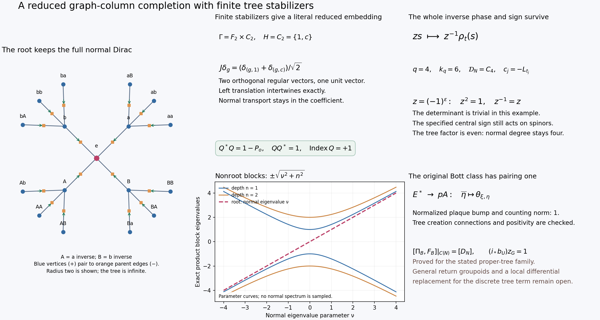

**Figure 11D.1.** PT.1, PT.5–PT.18 and PT.25–PT.28. The tree is the exact radius-two window of the infinite degree-four F2 Cayley tree. Its vertices and edges have C2 stabilizer in the strict extension Gamma=F2 times C2. Each nonroot positive vertex maps to its orange negative parent edge; the unmatched root keeps the full normal class. The regular coset-average vector has precisely two orthogonal terms of coefficient 1/sqrt(2). The plotted curves are the exact product-block formula for a continuous normal eigenvalue parameter, not a computation of the S1 times SU(2) Dirac spectrum. Rank four has k=6 and negative physical inverse generators; its central phase is retained even though its determinant character is trivial. PT.25 is the actual normalized counting/plaque correspondence. [Reproducible source](../reproduction/countable-tree/draw_proper_tree.py) and [editable SVG](../figures/kt-proper-tree-normal-inverse.svg).

The general normal spin-c hypothesis does not imply the proper-tree hypothesis. For an arbitrary holonomy groupoid, an auxiliary controlling all regular return multiplicities with scalar index +1 has still not been constructed here. Nor has the discrete D_T been replaced by a local finite-order differential operator on the smooth graph. The existing full-graph circle and finite-potential obstructions remain exact constraints on that latter step. The conditional maximal-descent obstruction in Section 11A.10 still does not refute all normalized reduced classes. No universal K-amenability, reduced descent of the compact normal implementing representation, or full graph spin-c structure is assumed.

The historical question and original local transverse class are from Alain Connes, *A survey of foliations and operator algebras* ([author’s text](https://alainconnes.org/wp-content/uploads/foliationsfine.pdf)). The full normal inverse and local calibration are supplied by Section 11A, Theorem 7.17 and Lemma 7.20, with their stated hypotheses. The exposition, proofs, exercises and diagram expression use [CC0 1.0](https://creativecommons.org/publicdomain/zero/1.0/). Actual bundled font glyphs and external software retain their separate [component terms](../reproduction/countable-tree/COMPONENT-TERMS.md).

### 11D.9. Proper weights remove local finiteness

The locally finite proof of Section 11D.2–11D.3 remains valid with its exact distance estimate. The following strengthening shows that the auxiliary tree need only be **countable**, connected and have finite vertex stabilizers. Local finiteness, a cocompact tree action, and finite generation of Gamma are unnecessary for this auxiliary. The normal and graph construction of Section 11D.1 and 11D.4–11D.6 then applies with proper weights.

#### 11D.9.1. A proper length on an arbitrary countable group

Let Gamma be countable. Enumerate a symmetric set of generators containing every group element, with identity omitted. If an inverse pair occurs twice, identify that pair. Give its i-th pair positive integer cost at least i. Define ell(g) to be the minimum total cost of a word representing g, and ell(1)=0. Every element has such a word, so its value is finite; a nonempty set of nonnegative integers has a minimum. Word concatenation and reversal give

\[
 \ell(gh)\le\ell(g)+\ell(h),\qquad
 \ell(g^{-1})=\ell(g),\qquad
 \ell(g)>0\quad(g\ne1).                          \tag{CT.1}
\]

For every R only finitely many generators have cost at most R and every word of cost at most R has at most R letters. Thus only finitely many words and group elements have ell at most R. The same construction for finite Gamma is finite, and for the trivial group use ell=0. This proves the needed proper group length directly; no amenability or word-metric theorem is used.

#### 11D.9.2. A proper weight on all tree vertices

Let T be a countable connected simplicial tree, not necessarily locally finite. Gamma acts by automorphisms with finite vertex stabilizers; inversions are again allowed. Select one vertex v_j in each orbit, j=1,2,..., with a finite list if there are finitely many orbits. Put

\[
 w_0(gv_j)=j+\min\{\ell(a):av_j=gv_j\}.
                                                        \tag{CT.2}
\]

This is independent of the representing g, since its minimizing set depends only on the vertex. The minimum exists by CT.1. Its sublevel set w_0 at most R is contained in

\[
 \bigcup_{j\le R}\{a v_j:\ell(a)\le R-j\},       \tag{CT.3}
\]

a finite union of finite sets. This proves properness. If a realizes the minimum for v, then ha sends the same orbit representative to hv and has cost at most ell(h)+ell(a). Applying the same argument to h inverse gives

\[
 |w_0(hv)-w_0(v)|\le\ell(h).                     \tag{CT.4}
\]

Fix the root o and set w(o)=0, w(v)=w_0(v) for v other than o. All nonroot weights are positive, their bounded sublevel sets are finite, and modifying one value changes no properness statement. Outside the root and its h inverse translate, (CT.4) remains valid for w. Those two vertices already belong to the finite parent-map exceptional set below.

#### 11D.9.3. Exact weighted operator and return bound

Keep the **whole** root-parent bijection Q of PT.5; it is valid on every connected tree, regardless of valence. Replace M by M_w delta_v=w(v)delta_v. Define D_w with lower QM_w and upper \(M_wQ^*\). The root is its only kernel, in positive grading. Its remaining blocks are [[0,w(v)],[w(v),0]]. Their square-summability domains give the self-adjoint direct sum with a finite-block core. CT.3 makes every bounded spectral window finite-dimensional. The tail of the square resolvent after the w at most R cutoff is bounded by 1/(1+R^2), so the resolvent is scalar compact. The even phase still has Index Q=+1.

For fixed h the parent labels agree unless hv is on the finite simplicial geodesic segment [o,ho]. Local finiteness is not used: between two vertices of a connected simplicial tree the unique geodesic has finitely many edges. Let d_h be that segment length and let

\[
 E_h=\{v:hv\in[o,ho]\},\qquad
 C_h=\max_{v\in E_h}\bigl(w(hv)+w(v)\bigr).       \tag{CT.5}
\]

The set has exactly d_h+1 vertices, so C_h is finite. Off it, neither input nor output is the root, the edge-output map is injective, and (CT.4) bounds the common edge coefficient by ell(h). On it the commutator column norm is at most C_h. Therefore the literal finite-column and weighted-partial-permutation estimate is

\[
 \|QM_w L_h^V-L_h^E QM_w\|
       \le\ell(h)+C_h\sqrt{d_h+1}.               \tag{CT.6}
\]

Adjointing the lower equation for h inverse gives the upper bound. The graph-core approximation in Section 11D.2 again proves invariance of the full closed domain. The unweighted phase commutator has only these finitely many exceptional columns, hence is finite rank. The normalized transform differs compactly from that phase because w(v)/sqrt(1+w(v)^2) tends to one off finite weight sublevel sets.

Every edge stabilizer is finite by the endpoint kernel argument. The explicit coset-average isometries of PT.10 therefore embed the entire vertex and edge representations into countably many regular copies. No local finiteness or weight enters this reduced-norm proof. Thus this auxiliary has all five required properties: an even graded reduced group representation, self-adjoint compact-resolvent generator, bounded return commutators, and scalar index +1. The proper weight modifies the generator, not its phase or normalization.

#### 11D.9.4. The full graph theorem and what it does not imply

Replace D_T in PT.11 by D_w. Its square with the full normal factor is D_w squared plus D_N squared. Compactness follows from their two finite bounded spectral windows. PT.14 uses (CT.6) for each fixed return label. The total scalar commutator proof, noninvariant connection terms, projection-domain argument and J-localized resolvent proof are unchanged. The fixed-tree-column product calculation PT.16 now uses w(v) instead of n(v), and PT.17 uses |D_w|. Its positive root and the complete creation/positivity checks therefore give the full restriction [D_N] and original plaque pairing +1, in the same right-C_q order and with the same inverse z^{-1} spin phases.

Consequently the complete PT.1–PT.26 suspension conclusion is valid whenever Gamma admits an action on a **countable connected tree with finite vertex stabilizers**, with no local finiteness requirement. The operator remains a transverse Dirac plus a discrete proper tree generator. This condition is not inferred from the normal spin-c structure, and the discrete term remains unconverted to a smooth finite-order graph differential expression. The historical arbitrary-groupoid target remains open.

#### 11D.9.5. An exact infinite-valence example and why distance fails

Start with the F2 Cayley tree, and at each base vertex g attach one leaf (g,j) for every integer j at least one. Call this larger tree T_infinity. It is countable, connected and has infinite valence at every base vertex. Gamma=F2 times C2 acts by left translation on g and fixes j, with C2 acting trivially on the tree. Every vertex and edge stabilizer is C2, so it can serve as the auxiliary for the compact normal suspension PT.27.

At root o=1 in the base tree choose the explicit weights

\[
 w(g)=|g|,\qquad w(g,j)=|g|+j.                   \tag{CT.7}
\]

All nonroot weights are positive and the weight at most R set has cardinality

\[
 B(R)+\sum_{j=1}^R B(R-j),\qquad
 B(0)=1,\quad B(r)=1+\sum_{n=1}^r4\cdot3^{n-1}.
                                                        \tag{CT.8}
\]

This is finite. Its return difference is at most |h| both for base vertices and for attached leaves. The exceptional geodesic [o,ho] lies in the base tree, so its weights are at most |h| and the original PT.8 bound with ell(h)=|h| applies exactly. Each attached leaf is paired with its own parent edge by Q; only the base root is unmatched. The full tree phase still has index +1.

In contrast, the **unweighted graph distance** gives distance one to every (1,j). Its compact-resolvent claim fails: infinitely many orthogonal leaf/edge blocks then have the same eigenvalues +1 and -1. Applying the resolvent to their normalized eigenvectors gives orthogonal outputs of the same nonzero norm. CT.7 replaces those depths by j, so every bounded spectral window is finite and its tail norm tends to zero. This is an exact analytic distinction between infinite valence and a proper auxiliary weight, not a finite numerical extrapolation.

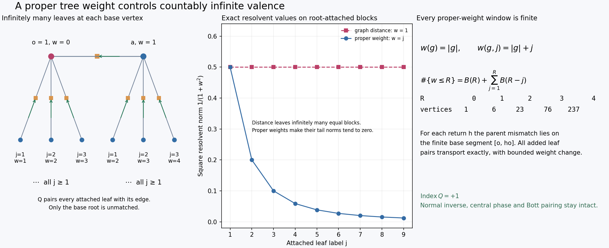

**Figure 11D.2.** CT.5–CT.8. The attached labels j=1,2,3 are an explicitly finite schematic of all j at least one. Every attached leaf has its own parent edge. The plotted root-leaf block norm is exactly 1/(1+w^2), with distance w=1 or proper weight w=j. The exact finite-window counts include both base vertices and attached leaves in the entire infinite tree. The return mismatch remains confined to the finite base segment; the proper weight controls the added infinite multiplicity. These displayed formulas illustrate the all-label proof, not a numerical replacement for it. [Reproducible source](../reproduction/countable-tree/draw_countable_tree.py) and [editable SVG](../figures/kt-countable-tree-proper-weight.svg).

## 11E. Translation oscillators and a smooth source-column graph class

The translation oscillator has an even scalar index-one cycle. The normal-product and graph constructions below use the full inverse orientation of K-theory of the leaf space, Theorem 7.17, the connection and positivity criterion in K-theory of the leaf space, Section 0, and the compact-base graph correspondence in K-theory of the leaf space, Section 11D. The normal Dirac and local calibration assumptions are specified in Section 11E.9.

**Theorem 11E.1 (the translation auxiliary).** For every integer \(d\ge1\), lattice translations of \(\Gamma=\mathbb Z^d\) on \(L^2(\mathbb R^d,\Lambda^*\mathbb C^d)\) admit a self-adjoint, smooth first-order oscillator \(D\) that is odd on this graded Hilbert space. Its resulting scalar KK cycle has even degree. \(D\) has exact domain \(H^1\cap\{\psi:|x|\psi\in L^2\}\), compact resolvent, one positive Gaussian kernel and scalar index +1. Its lattice representation is a literal amplification of the left regular representation, with exact reduced norm. Every fixed translation preserves the domain; its commutator with \(D\) extends boundedly with exact norm \(|m|\), and its bounded-phase commutator is compact. Thus it is a scalar cycle of \(C_r^*(\mathbb Z^d)\), pairing +1 with its unit.

**Theorem 11E.2 (the full normal product and graph class).** Supply the full inverse normal module and compact normal Dirac specified in Section 11E.9. For a coherent isometric \(\mathbb Z^d\) action, this auxiliary gives a reduced scalar degree-\(q\) crossed-product cycle with full restriction \([D_N]\), without an invariant connection assumption. The compact-base graph correspondence then gives the normalized graph-column class. For the particular suspension \(V=(\mathbb R^d\times N)/\mathbb Z^d\), with germ-effective normal action, the induced cycle is represented, up to a proved bounded perturbation, on the **ordinary entire smooth holonomy graph** by a first-order operator differentiating in the source-leaf \(r\) and normal \(n\) directions, with oscillator potential \(r-t\). It does not differentiate in the range \(t\) direction, and is not full-tangent elliptic. Its exact anisotropic domain, smooth core, reduced representation, localized scalar defects and original local Bott pairing +1 are proved below. Arbitrary holonomy groupoids remain outside these theorems.

### 11E.1. Exterior algebra and the physical expression

Use Lebesgue measure \(dx\), the standard Hermitian exterior algebra \(E_d=\Lambda^*\mathbb C^d\), ordered wedge basis \(e_I\), and grading \(\gamma=(-1)^{\deg}\). Let \(\epsilon_j\) be left wedge by \(e_j\) and \(\iota_j\) its Hilbert-space adjoint, so on an ordered wedge \(\iota_j\) removes \(e_j\) with sign \((-1)^{\text{number of preceding positions}}\), or gives zero if absent. Directly on that basis,

\[
 \{\epsilon_j,\epsilon_k\}=\{\iota_j,\iota_k\}=0,
 \quad\{\epsilon_j,\iota_k\}=\delta_{jk},
 \quad C_j=\epsilon_j-\iota_j,
 \quad E_j=\epsilon_j+\iota_j.                 \tag{TO.1}
\]

Thus \(C_j^*=-C_j\), \(E_j^*=E_j\), \(\{C_j,C_k\}=-2\delta_{jk}\), \(\{E_j,E_k\}=2\delta_{jk}\) and \(\{C_j,E_k\}=0\). Every \(C_j\) and \(E_j\) is odd. The number operator \(N_E=\sum_j\epsilon_j\iota_j\) has eigenvalue \(|I|\) on \(e_I\). On Schwartz functions, or smooth compactly supported sections, put

\[
 a_j=\partial_j+x_j,\qquad a_j^*=-\partial_j+x_j,
 \quad D=\sum_j(\epsilon_j a_j+\iota_j a_j^*)
       =\sum_j(C_j\partial_j+E_jx_j).         \tag{TO.2}
\]

Integration by parts gives formal symmetry. The positive degree-zero to degree-one block in dimension one is \(a=\partial+x\); its adjoint is the upper block \(-\partial+x\). No scalar phase is inserted into either block.

### 11E.2. Exact square, signs and grading

The different scalar coordinates commute. In one coordinate, \(a_j^*a_j=-\partial_j^2+x_j^2-1\) and \(a_ja_j^*=-\partial_j^2+x_j^2+1\). Cross-coordinate terms cancel by (TO.1). The number projections \(\epsilon_j\iota_j\) and \(\iota_j\epsilon_j\) respectively select occupied and empty wedges. Consequently

\[
 D^2=-\Delta+|x|^2+2N_E-d,
 \qquad\gamma D=-D\gamma.                    \tag{TO.3}
\]

Equivalently the derivative-potential cross term in coordinate \(j\) is \(C_jE_j=2\epsilon_j\iota_j-1\). This independently fixes the negative constant on the empty wedge and the positive constant on the occupied wedge. The principal symbol \(i\sum_jC_j\xi_j\) is self-adjoint and squares to \(|\xi|^2\). The confining potential \(\sum_jE_jx_j\) is odd and self-adjoint. It is not a leafwise multiplication-only operator.

### 11E.3. Complete Hermite basis, without a spectral citation

Set \(\phi_0(x)=\pi^{-d/4}\exp(-|x|^2/2)\). For completeness its normalization is elementary: the square of the positive integral \(\int_{\mathbb R}e^{-u^2}\,du\) equals the plane integral of \(e^{-(u^2+v^2)}\); polar coordinates give \(2\pi\int_0^\infty re^{-r^2}\,dr=\pi\). Thus the one-coordinate integral is \(\sqrt{\pi}\), products give the \(d\)-coordinate integral, and \(\phi_0\) has \(L^2\) norm one. Direct differentiation gives \(a_j\phi_0=0\). Since \([a_j,a_k^*]=2\delta_{jk}\),

\[
 \phi_\nu=\frac{(a_1^*)^{\nu_1}\cdots(a_d^*)^{\nu_d}}
 {\sqrt{2^{|\nu|}\nu_1!\cdots\nu_d!}}\phi_0,
 \quad a_j\phi_\nu=\sqrt{2\nu_j}\phi_{\nu-e_j},
 \quad a_j^*\phi_\nu=\sqrt{2(\nu_j+1)}\phi_{\nu+e_j}.
                                                        \tag{TO.4}
\]

These identities follow by moving \(a_j\) through the creation powers; the term with \(a_j\phi_0\) vanishes. Repeated integration by parts gives orthogonality of unequal indices and squared norm \(2^{|\nu|}\nu!\) before normalization. In each coordinate creation on \(P(x)e^{-x^2/2}\) produces \((2xP-P')e^{-x^2/2}\), so these polynomials have nonzero leading coefficients and span all polynomials times the Gaussian.

Here is completeness. If \(f\) in \(L^2\) is orthogonal to every \(\phi_\nu\), all moments of \(h=fe^{-|x|^2/2}\) vanish. The function \(F(z)=\int h(x)e^{z\cdot x}\,dx\) is entire in \(z\in\mathbb C^d\): Cauchy-Schwarz with the Gaussian bounds every derivative uniformly on compact \(z\) sets. Its Taylor coefficients at zero vanish, hence \(F=0\). In particular the Fourier transform of the \(L^1\) function \(h\) vanishes. Fourier uniqueness here requires only the elementary Gaussian identity: for \(t>0\),

\(g_t(x)=(4\pi t)^{-d/2}e^{-|x|^2/(4t)}=(2\pi)^{-d}\int e^{-t|\xi|^2}e^{i\xi\cdot x}\,d\xi.\)

The one-dimensional identity follows by differentiating its Gaussian integral in \(x\), solving the resulting first-order equation and evaluating at \(x=0\); products give \(d\) dimensions. Fubini now gives \(h*g_t=0\). The positive mass-one Gaussian is an \(L^1\) approximate identity: translations of compact continuous functions are continuous in \(L^1\), such functions are \(L^1\)-dense, and its mass outside each fixed ball tends to zero. Thus \(h*g_t\) tends to \(h\) in \(L^1\). Therefore \(h=0\), and \(f=0\). This proves completeness, not just orthogonality.

For \(k=0,1,\ldots\) let \(H_k\) be the span of \(\phi_\nu e_I\) with \(|\nu|+|I|=k\). It is finite-dimensional. Equations (TO.1),(TO.4) show \(D\) preserves \(H_k\) and

\[
 D_k^*=D_k,\qquad D_k^2=2k\,1_{H_k},
 \quad H_0=\mathbb C\phi_0 e_\varnothing,
 \quad\sum_{k\ge0}\dim H_k z^k
      =\frac{(1+z)^d}{(1-z)^d}.              \tag{TO.5}
\]

In particular a bounded spectral window has finitely many basis vectors. These are entire spaces, not numerical truncations standing in for a completeness argument.

### 11E.4. Self-adjoint closure, exact domain and both cores

Define \(D\) as the orthogonal direct sum of these finite self-adjoint matrices, with

\[
 \operatorname{Dom}D=
 \left\{\psi=\sum_k\psi_k:
       \sum_k 2k\|\psi_k\|^2<\infty\right\}
 =\{\psi\in H^1(\mathbb R^d,E_d):|x|\psi\in L^2\}.
                                                        \tag{TO.6}
\]

The first domain gives self-adjointness directly: \((D_k-z)^{-1}\), \(\operatorname{Im}z\ne0\), have uniform norm at most \(1/|\operatorname{Im}z|\), and their direct sum has range exactly the displayed domain. The adjoint acts by the same matrices with the same square-summability condition. Finite Hermite sums form a graph core by weighted-tail convergence.

To prove the second equality, denote its right-hand side by \(Q\) with norm squared \(\|\psi\|^2+\|\nabla\psi\|^2+\|x\psi\|^2\). This is complete: weak derivatives and multiplication by \(x\) are closed in \(L^2\). Smooth compact support is \(Q\)-dense. Cut off at radius \(R\); the gradient error is bounded by \(O(R^{-1})\|\psi\|\) on the cutoff annulus and all other tails tend to zero. Then mollify the compactly supported result, in a fixed slightly larger compact set, in \(H^1\); multiplication by \(x\) is bounded there. This proves the asserted density.

For a smooth compactly supported scalar component \(u\), completeness of the Hermite basis and integration by parts give the coefficient of \(a_ju\) against \(\phi_\mu\) as \(\sqrt{2(\mu_j+1)}\) times its coefficient against \(\phi_{\mu+e_j}\). Parseval therefore gives \(\sum_j\|a_ju\|^2=\sum_\nu2|\nu||u_\nu|^2\). Also integration by parts gives \(\sum_j\|a_ju\|^2=\|\nabla u\|^2+\|xu\|^2-d\|u\|^2\). Componentwise, (TO.3) consequently gives

\[
 \|D\psi\|^2=\|\nabla\psi\|^2+\|x\psi\|^2
                  +\langle\psi,(2N_E-d)\psi\rangle
             =\sum_k2k\|\psi_k\|^2.         \tag{TO.7}
\]

\(Q\)-density extends the coefficient identity to \(Q\). Conversely finite Hermite sums whose weighted coefficients are square-summable are Cauchy in \(Q\) by that identity, proving the reverse inclusion. Thus the formal \(C_c^\infty\) expression closes to precisely the direct-sum operator, and \(C_c^\infty\) is a graph core as well. Schwartz functions are another core. This specifies the completed operator, not just a formal expression.

### 11E.5. Compact resolvent, Gaussian kernel and scalar index

On the complement of \(\bigoplus_{k\le K}H_k\), the norm of \((1+D^2)^{-1}\) is at most \(1/(1+2(K+1))\); the norm of \((D-i)^{-1}\) is at most \(1/\sqrt{1+2(K+1)}\). The cutoffs have finite rank, so both operators are scalar compact. The only kernel is \(\phi_0e_{\varnothing}\), which is even. Every \(k>0\) block is invertible and odd, identifying its equal positive and negative graded spaces.

\[
 F=D(1+D^2)^{-1/2},\quad S=D|D|^{-1}\text{ off the kernel},
 \quad S=0\text{ on the kernel},\quad
 \operatorname{Index}F^+=1.                  \tag{TO.8}
\]

Here \(F-S\) is compact, because on \(k>0\) its block coefficient differs from \(S\) by \(\sqrt{2k}/\sqrt{1+2k}-1\), tending to zero off finite windows. \(F^+\) has one-dimensional kernel, no cokernel and a lower bound \(\sqrt{2/3}\) on the kernel complement, so its Fredholm index is literally +1. For the scalar algebra, \(S\) splits into the positive one-dimensional identity cycle and a degenerate odd-unitary cycle on the complement. Thus its scalar KK class is the identity even before invoking an abstract index isomorphism.

### 11E.6. All lattice translations and their closed domains

For \(m\) in \(\mathbb Z^d\) set \((T_m\psi)(x)=\psi(x-m)\), and put \(c_+(m)=\sum_jE_jm_j\). These are even unitaries and \(T_mT_l=T_{m+l}\). Derivatives commute with \(T_m\) and \(x_jT_m-T_mx_j=m_jT_m\). Hence, with the signs fixed,

\[
 [D,T_m]=c_+(m)T_m,\qquad
 T_mDT_m^{-1}=D-c_+(m),\qquad
 \|[D,T_m]\|=|m|.                            \tag{TO.9}
\]

\(c_+(m)^2=|m|^2\) gives the exact norm, including zero for \(m=0\). \(T_m\) preserves \(H^1\) and \(\|xT_m\psi\|\le\|x\psi\|+|m|\|\psi\|\). Applying the reverse translation proves equality of full domains. The formula initially computed on smooth compact support therefore extends on \(\operatorname{Dom}D\). No uniform-in-\(m\) boundedness is asserted or needed.

### 11E.7. Compact phase defects, with an integrable resolvent proof

If a bounded \(V\) preserves \(\operatorname{Dom}D\) and \(C=[D,V]\) is bounded, let \(s=1+t^2\) and \(Q_+=(D-i\sqrt{s})^{-1}\), \(Q_-=(D+i\sqrt{s})^{-1}\). On the full domain, and then as bounded maps,

\[
 [Q_\pm,V]=-Q_\pm C Q_\pm,\qquad
 D(s+D^2)^{-1}=(Q_++Q_-)/2,
 \|[D(s+D^2)^{-1},V]\|\le\|C\|/(1+t^2).
                                                        \tag{TO.10}
\]

The first identity is multiplication of the closed resolvent equations; it needs no domain invariance of C. Each commutator is compact because the resolvents are compact. Spectral calculus gives the strong integral \(F=(2/\pi)\int_0^\infty D(1+t^2+D^2)^{-1}\,dt\): the scalar integral at eigenvalue \(\lambda\) is \(\lambda/\sqrt{1+\lambda^2}\). The commutator integrals converge in compact norm by (TO.10), and strong convergence of the uncommuted truncations identifies their limit with \([F,V]\). In particular \([F,T_m]\) is scalar compact for every fixed \(m\). Also \(F^*=F\) and \(F^2-1=-(1+D^2)^{-1}\) is compact. Density then gives all defects for the completed represented algebra, once its norm is verified next.

### 11E.8. Literal regular completion and exact reduced norm

Let \(C=[0,1)^d\) with Lebesgue measure and \(K_0=L^2(C,E_d)\). The disjoint measurable partition \(\mathbb R^d=\bigsqcup_{n\in\mathbb Z^d}(n+C)\) gives an onto isometry

\[
 J:L^2(\mathbb R^d,E_d)\longrightarrow
       \ell^2(\mathbb Z^d)\otimes K_0,
 \quad(J\psi)_n(y)=\psi(n+y),\quad
 JT_mJ^{-1}=\lambda_m\otimes1.              \tag{TO.11}
\]

The inverse glues these functions almost everywhere, and the lattice-boundary set has measure zero. For a finitely supported scalar coefficient \(a\), the Hilbert-basis tensor norm estimate gives

\[
 \left\|\sum_m a_mT_m\right\|
    =\left\|\sum_m a_m\lambda_m\right\|
    =\|a\|_{C_r^*(\mathbb Z^d)}.             \tag{TO.12}
\]

The upper inequality is Parseval in an orthonormal basis of \(K_0\); tensoring a nearly norm-attaining regular vector with any unit vector in \(K_0\) gives the reverse inequality. Thus the extension is faithful, nondegenerate and genuinely reduced, not a maximal integrated representation or a Hilbert-module descent assertion. Combining Sections 11E.5–11E.7 proves the auxiliary theorem and unit pairing +1. In the cube coordinates the domain is the glued image \(JQ\); the \(H^1\) matching across neighbouring cube faces is retained. No independent cube boundary conditions are invented.

### 11E.9. Supplied full inverse normal orientation

Let \(N\) be a compact connected smooth manifold without boundary, \(\dim N=q\), with a fixed metric and a specified **full** spin-c normal orientation. Retain the full inverse module of Theorem 7.17, its Riemannian density, its grading, and finite right \(C_q\) coefficient in the original order. In a prescribed original transition \(zs\), its local form is

\[
 \mathcal D_N\cong\Pi^{k_q}C_q,\quad k_q=q(q-1)/2,
 \quad c_{\rm inv}(e^j)=(-1)^{k_q+1}L_{t_j},
 \quad zs\longmapsto z^{-1}\rho_t(s).        \tag{TO.13}
\]

An original even line twist \(H\) becomes \(H^*\). The entire module is used, including two-torsion information and the last \(\text{right }C_1\) in odd rank. The oscillator has even KK degree and causes no Clifford block permutation or replacement by a chosen minimal normal spinor. Rank zero retains the supplied full graded orientation line, rather than an automatic trivialization.

Assume the normal data include a smooth compatible, formally symmetric Dirac \(D_N\) on \(H_N=L^2(N,\mathcal D_N)\), with self-adjoint domain \(H^1\), smooth core, scalar compact resolvent, full inverse principal symbol, and original positive local transverse Bott class \(b_U\) satisfying \(\langle b_U,[D_N]\rangle=1\). These normal Dirac and local calibration properties are hypotheses of the normal-product and graph statements; no general existence assertion is made.

Suppose \(\mathbb Z^d\) acts on \(N\) by isometries \(h_m\), with a coherent lift to that entire full structure. Its induced even unitaries \(U_m\) retain all inverse central phases and densities. A compatible connection need not be invariant. \(U_mD_NU_m^{-1}\) and \(D_N\) have the same principal symbol, so their difference is a smooth zeroth-order endomorphism, bounded on compact \(N\). Smooth diffeomorphism and bundle pullback preserve \(H^1\). Thus \(B_m=[D_N,U_m]\) is bounded and \(U_m\operatorname{Dom}D_N=\operatorname{Dom}D_N\). Each \(m\) has its own bound. This argument uses symbol cancellation, not averaging over the noncompact group.

### 11E.10. Completed normal product and reduced crossed representation

On \(H_B=H_D\widehat\otimes H_N\) put

\[
 D_B=D\otimes1+\gamma\otimes D_N,
 \quad\Pi(f)=1\otimes M_f,\quad
 \Pi(u_m)=T_m\otimes U_m,
 \qquad D_B^2=D^2\otimes1+1\otimes D_N^2.    \tag{TO.14}
\]

This is a scalar Hilbert-space construction with its finite right \(C_q\) coefficient retained. Finite oscillator energy blocks and finite normal spectral windows are invariant finite-dimensional spaces for \(D_B\). On each, the displayed symmetric operator squares to the sum of the two nonnegative energies. Their orthogonal direct sum is self-adjoint, with exact domain \(\operatorname{Dom}(D\otimes1)\cap\operatorname{Dom}(1\otimes D_N)\), equivalently square-summability of that sum of energies. Finite spectral sums form a core; approximating each normal component in its supplied \(H^1\) graph norm by smooth sections shows finite Hermite sums tensor smooth normal sections form a core. Bounded spectral windows are finite, so the resolvent is scalar compact.

Apply \(J\otimes1\) from (TO.11), then the unitary \(W\) with \((W\xi)_n=U_n^{-1}\xi_n\), including the untouched \(K_0\) factor. Direct substitution gives

\[
 W(\lambda_m\otimes U_m)W^{-1}=\lambda_m\otimes1,
 \qquad W(1\otimes M_f)W^{-1}|_n=M_{f\circ h_n}.
                                                        \tag{TO.15}
\]

This is the regular induced representation from the faithful multiplication representation of \(C(N)\) on \(H_N\), amplified by \(K_0\). To bind it to the pointwise reduced norm, a finite crossed coefficient acts, after measurable local trivializations, as the direct integral over \(n_{\rm normal}\in N\) of its defining point-regular representation, with finite spin coefficient multiplicity. Its norm is the essential supremum of those norms. That equals the supremum: at any chosen normal point, test a nearly norm-attaining finite-support regular vector. Its output for a finite crossed coefficient has finitely many coordinates, continuously depending on the point. The inequality persists on a neighbourhood of positive Riemannian measure, where a unit local spin section supplies the same test. The reverse bound is immediate. Thus

\[
 \|\Pi(a)\|=\sup_{y\in N}\|\pi_y^{\rm reg}(a)\|
       =\|a\|_{C(N)\rtimes_r\mathbb Z^d}.    \tag{TO.16}
\]

This proves faithful reduced factorization for \(B=C(N)\rtimes_r\mathbb Z^d\) without declaring its implementing compact-normal representation reduced. Scalar multiplication removes no central phase; the phase is carried in \(U_n\) and cancels only inside the explicit absorption unitary.

For smooth \(f\), \([D_B,\Pi(f)]=\gamma\otimes[D_N,M_f]\). For each fixed \(m\),

\[
 [D_B,\Pi(u_m)]
   =c_+(m)T_m\otimes U_m+\gamma T_m\otimes B_m,
 \qquad\|[D_B,\Pi(u_m)]\|\le|m|+\|B_m\|.  \tag{TO.17}
\]

These formulas and the two exact domains prove preservation on the smooth finite-group-support core. Section 11E.7 now proves the scalar compact phase defects; density gives every element of \(B\).

### 11E.11. Full normal restriction, creation equations and positivity

The auxiliary phase \(S\), externally extended to \(C(N)\), is the identity class: its positive Gaussian rank-one \(C(N)\) summand is exactly the identity module, and its complement is a degenerate odd-unitary cycle. This retains its sign rather than deducing a product from a finite normal index.

For each nonzero energy \(k\) choose graded paired bases of \(H_k\) so \(D_k=\begin{pmatrix}0&\sqrt{2k}\\\sqrt{2k}&0\end{pmatrix}\) and \(\gamma=\operatorname{diag}(1,-1)\). On the corresponding normal spectral parameter \(\nu\) the total transform is

\[
 (1+2k+\nu^2)^{-1/2}
       \begin{pmatrix}\nu&\sqrt{2k}\\\sqrt{2k}&-\nu\end{pmatrix}.
                                                        \tag{TO.18}
\]

For a homogeneous finite oscillator vector, its creation-map connection with \(F_N=D_N(1+D_N^2)^{-1/2}\) is compact: the off-diagonal entry tends to zero as \(|\nu|\) tends to infinity, and the difference of the diagonal entries from \(\pm\nu/\sqrt{1+\nu^2}\) does too. Compact normal resolvent proves compactness. The positive Gaussian column is exactly \(F_N\). Coefficient functions follow from the compact normal phase commutators. Finite sums, continuity of creation norms and density extend both the connection equation and its adjoint to every module vector, with the negative-column grading sign retained.

The lifted first phase has \(SD=DS=|D|\) and anticommutes with \(\gamma\). Since the two squares commute,

\[
 \{S\otimes1,F_B\}
  =\frac{2|D|\otimes1}{\sqrt{1+D^2\otimes1+1\otimes D_N^2}}
  \ge0,\qquad
 [\Pi,F_B]|_{C(N)}=[D_N],\quad
 \langle b_U,[\Pi,F_B]|_{C(N)}\rangle=1.      \tag{TO.19}
\]

The bounded Kasparov product criterion of K-theory of the leaf space, Definition 0.3 and Theorems 0.4–0.7 proves the restriction identity from the full connections and positivity. All right \(C_q\) order, grading and inverse transition phases remain unchanged.

### 11E.12. General compact-base suspension: graph-column completion

Let \(X\) be a connected regular \(\mathbb Z^d\)-cover of a closed connected smooth \(M\). For a germ-effective normal action set \(V=(X\times N)/\mathbb Z^d\), with horizontal foliation. Germ effectivity means no nonzero group element is the identity on an open normal chart; it identifies the actual holonomy groupoid with the suspension graph, rather than leaving an unremoved path-groupoid kernel.

Use the compact-base graph correspondence in K-theory of the leaf space, Section 11D.5, equations PT.20 and SG.6–SG.9b: the flat right-\(B\) module \(E=L^2(M,\mathcal L_B)\) has \(A=C_r^*(G)=\mathcal K_B(E)\), equals \(P(K\otimes B)\) in finitely many buffered flat charts, and is full. Its exact reduced norm is proved there by separated-kernel Schur approximation, source-fibre identification and a normalized plaque bump. That correspondence is independent of the auxiliary tree and applies with \(\Gamma=\mathbb Z^d\). This step uses the hypotheses of that correspondence.

On the free scalar completion put \(D_0=1_K\otimes D_B\). A partition with \(\sum_i\chi_i^2=1\) gives projection entries \(\chi_i\chi_j u_{m_{ij}}\), with actual coordinate/density changes. On each compact overlap only finitely many locally constant \(m_{ij}\) occur. Equations (TO.17) give \([D_0,P]\) bounded and \(P\operatorname{Dom}D_0\subset\operatorname{Dom}D_0\). Remove the bounded self-adjoint off-diagonal \(R=PD_0(1-P)+(1-P)D_0P\). Then

\[
 D_{\rm diag}=D_0-R,\qquad
 D_G=P D_0P|_{P\operatorname{Dom}D_0},\qquad
 H_G=E\otimes_BH_B=P(K\otimes H_B).          \tag{TO.20}
\]

For \(|\operatorname{Im}z|>\|R\|\) the Neumann resolvent of \(D_0-R\) proves self-adjointness on the unchanged domain; \(P\) reduces it. Its compressed domain is exactly \(P\operatorname{Dom}D_0\). Finite Hermite/smooth-normal vectors tensor smooth compact chart profiles form a free graph core, and projection is graph-norm continuous. Their projections therefore form the compressed core. This is a genuine completion with an explicit auxiliary \(L^2(\mathbb R^d)\) factor. For a general \(M\) it is not identified with a physical leaf coordinate.

### 11E.13. Graph-column localized compacts and Morita product

Let \(J_0=\mathcal K(K)\otimes\mathcal B(H_B)\). For \(j\) in \(J_0\), \(j(D_0-z)^{-1}\) is scalar compact: prove it for separated tensors using the compact \(D_B\) resolvent, then use norm density. \(P\), \(R\) and \([D_0,P]\) are bounded multipliers of \(J_0\). The resolvent identity gives \(j(D_{\rm diag}-z)^{-1}\) compact as well. A smooth finite chart/rank-one/finite crossed coefficient \(a=Pa_0P\) has \([D_0,a]\) in \(J_0\), by expansion and (TO.17), and preserves the compressed domain. The mixed version of Section 11E.7 has both \(QCQ\) terms compact by these localized resolvents and norm bounded by \(\|C\|/(1+t^2)\). It proves every localized scalar phase defect; density handles \(A\).

For a smooth finite-chart module vector \(\eta\), \(D_GT_\eta-T_\eta D_B\) is bounded by its finite transition commutators. The rectangular resolvent formula \(Q_GT_\eta-T_\eta Q_B=-Q_G(D_GT_\eta-T_\eta D_B)Q_B\) has compact right-hand side because \(Q_B\) is compact, and norm at most \(\|\mathrm{error}\|/s\). The phase integral gives the connection equation and its adjoint. Density extends them. Product positivity for the zero Morita operator is zero. Therefore

\[
 z_G=[{}_AE_B,0]\otimes_B[\Pi,F_B]\in KK^q(A,\mathbb C).
                                                        \tag{TO.21}
\]

The normalized plaque bump \(\xi\), with \(\langle\xi,\xi\rangle_B=1\), gives \(p=\theta_{\xi,\xi}\) and \(i(b)=\theta_{\xi b,\xi}\). Its inverse counting correspondence is \(E^*\) identified with \(pA\) by \(\eta\)-bar to \(\theta_{\xi,\eta}\), with the same inner product, action and onto rank-one identities. It is the original transverse class, not a chosen alternative. Hence the restriction \(i^*z_G=[\Pi,F_B]\), and the push-forward \(i_*b_U\) satisfies \((i_*b_U)\otimes_A z_G=1\), by (TO.19). This proves the complete generic graph-column adaptation at its stated suspension scope.

### 11E.14. A particular actual smooth graph, rather than renamed coordinates

Now specialize **the cover** to \(X=\mathbb R^d\) and \(M=\mathbb T^d=\mathbb R^d/\mathbb Z^d\), with the same germ-effective normal action. A lifted horizontal path has endpoints \((r,n),(t,n)\). Two such lifted paths give the same holonomy arrow precisely up to the common deck action: the only additional possible identification would be a return label with identity normal germ, excluded by germ effectivity. Thus

\[
 V=(\mathbb R^d\times N)/\mathbb Z^d,\quad
 G=(\mathbb R_t^d\times\mathbb R_r^d\times N)/\mathbb Z^d,
 \quad m(t,r,n)=(t+m,r+m,h_m n),
 \quad r_G=[(t,n)],\quad s_G=[(r,n)].        \tag{TO.22}
\]

The diagonal action is free and proper because it is so on \(t\). \(G\) is a smooth Hausdorff manifold. Its coefficient bundle is \(E_d\otimes\) the full inverse normal module at \(n\), with diagonal transition \(1\otimes\) the actual inverse lift. Along left convolution it is transported by the identity at the common lifted \(n\); these transports compose exactly. Ordinary entire-graph \(L^2\) uses the quotient of \(dt\,dr\,d\operatorname{vol}_N\), realized by \(t\in[0,1)^d\), \(r\in\mathbb R^d\), \(n\in N\), with the diagonal boundary identification. This coordinate is the **actual source-leaf \(r\) of (TO.22)**. It is not available for the arbitrary compact-base cover of Section 11E.12 just by relabelling the auxiliary.

Choose a smooth covariant family of compatible normal Diracs \(D_N(t)\) with \(D_N(t+m)=U_mD_N(t)U_m^{-1}\); an explicit such family is constructed in Section 11E.18. On equivariant smooth compact graph sections define

\[
 \mathscr D=\sum_j[C_j\partial_{r_j}+E_j(r_j-t_j)]\otimes1
                     +\gamma\otimes D_N(t).
                                                        \tag{TO.23}
\]

It is invariant under the diagonal deck action and formally symmetric for the stated density. It is first order, with finite-rank smooth coefficients, and has the full prescribed normal principal symbol. Its symbol squares to \(|\xi_r|^2+|\eta_n|^2\). There is no derivative in \(t\); consequently it is not elliptic on all \(TG\) and is outside the ordinary full-tangent ansatz of GD.1. The noncompact source coordinate allows a proper potential, a fact absent from the compact source-circle obstruction.

### 11E.15. Exact anisotropic domain and smooth compact graph core

Use \(y=r-t\) on each range chart. There are no derivatives in \(t\), so differentiation in \(r\) equals differentiation in \(y\). The oscillator and the normal expression anticommute, and

\[
 \mathscr D^2=-\Delta_y+|y|^2+2N_E-d+D_N(t)^2,
 \quad\operatorname{Dom}\mathscr D=
 \{\psi:\nabla_r\psi,\ (r-t)\psi,\ \nabla_n\psi\in L^2(G)\}.
                                                        \tag{TO.24}
\]

The last norm is defined in finitely many normal/range coefficient charts and any fixed compatible reference normal connection; equivalent choices differ by bounded terms on the compact range base. **No \(t\) derivative is required.** The covariance glues these local definitions. On each range chart the family differs from a fixed supplied normal \(D_N\) by a uniformly bounded smooth self-adjoint zeroth-order endomorphism \(K_t\). The two large imaginary Neumann inverses prove \(D_N+K_t\) self-adjoint on the unchanged \(H^1\) domain; its resolvent identity against \(D_N\) proves scalar compact resolvent. Its normal \(H^1\) graph estimates are uniformly equivalent on the compact base. At each \(t\) the completed sum is consequently self-adjoint by the finite-energy/normal spectral argument of Section 11E.10, translated to \(y\). Its measurable direct integral is self-adjoint: the fibre resolvents have \(\text{norm}\le1/|\operatorname{Im}z|\) and give inverse operators on the stated square-integrable graph domains. Integration of the fibre graph identity gives exactly (TO.24) and equivalent graph norms; no base compactness is used as a false global compact-resolvent assertion.

Smooth compact graph sections form a core. Cut off in invariant \(y\), with derivative error \(O(R^{-1})\) in \(r\); the weighted and derivative tails tend to zero. On the resulting compact graph region use finitely many coefficient charts and a smooth partition. Mollify in \(r\),\(n\) in their \(H^1\) norms and in \(t\) in \(L^2\). Smooth dependence of the normal coefficients and their bounded derivatives gives convergence in the normal first-order norm; one can first approximate by smooth finite \(t\) profiles times smooth \((r,n)\) sections on buffered patches, using density in \(L^2(t;H^1(r,n))\) and the bounded coefficient maps \(H^1\) to \(L^2\). Mollification does not impose a \(t\) derivative on the limit. The locally constant flat transitions and smooth cutoffs preserve the completed norm. This proves the full global graph core and the exact closed extension of (TO.23).

### 11E.16. Actual convolution, domain preservation and bounded commutators

For a smooth compactly supported graph coefficient \(a\), left convolution in lifted coordinates is

\((\Pi(a)\psi)(t,r,n)=\int_{\mathbb R^d}a(t,t^\prime,n)\psi(t^\prime,r,n)\,dt^\prime,\)

with the prescribed coefficient transport. Compact graph support bounds \(|t^\prime-t|\) uniformly and yields the two finite Schur integrals, uniformly over the compact normal/range base. Both input and output use the same lifted source \((r,n)\). Thus \(\partial_r\) commutes with the kernel; the oscillator potential commutator is \(\sum_jE_j(t^\prime_j-t_j)a\). The normal principal coefficients are the same at \((t,n)\) and \((t^\prime,n)\). The normal commutator kernel is its normal derivative Clifford term plus \(a\) times the smooth zeroth-order difference \(D_N(t)-D_N(t^\prime)\). On finitely many range charts and the finitely many return labels met by the support, all these coefficients and their Schur integrals are bounded. Therefore \([\mathscr D,\Pi(a)]\) has a bounded Schur-kernel extension. This proves principal cancellation rather than assuming it.

\(\Pi(a)\) maps smooth compact graph sections to smooth compact graph sections: the source variable stays fixed, and bounded \(|t^\prime-t|\) shifts the invariant \(y\) support only by a bounded amount. Approximate any completed-domain vector by that core. The identity \(\mathscr D\Pi(a)\psi=\Pi(a)\mathscr D\psi+C_a\psi\) and closedness prove domain preservation on the **whole** domain. This also proves covariance and convolution compatibility for the completed expression.

Its norm is genuinely reduced independently of the oscillator calculus. Decomposing ordinary \(L^2\)(\(G\)) over source units gives the direct integral of the source-fibre regular representations. Its norm is at most their defining supremum. For a smooth compact coefficient, a compactly supported nearly norm-attaining source-fibre test varies continuously in a local source chart; kernel continuity and the two Schur bounds retain its norm on a neighbourhood of positive source volume. Thus essential supremum equals supremum. Density gives \(\|\Pi(a)\|=\|a\|_r\) on the entire reduced graph algebra. This agrees with Sections 11E.12–11E.13's correspondence representation.

### 11E.17. Localized scalar compactness despite the undifferentiated range

Global compact resolvent is **not** asserted: \(t\) is an undifferentiated compact range variable. On finitely many buffered range patches trivialize the normal bundle and set \(y=r-t\). The fibre operator \(\mathscr D_t\) is an oscillator-plus-normal Dirac with compact resolvent \(Q_t(z)\), by Section 11E.10. It depends norm-continuously on \(t\): differences of the normal operators are bounded zeroth-order terms whose norms tend to zero, and the resolvent identity applies. Compactness is uniform in the needed sense because a continuous image of the compact range-patch closure in the compact-operator norm is totally bounded.

The translation sign can be fixed before taking operator norms. Write \(\phi_{t^\prime}(y,n)=\psi(t^\prime,y+t^\prime,n)\). Holding \(r=y+t\) fixed gives

\[
 y'=r-t'=y+t-t',\qquad
 \psi(t',r,n)=\phi_{t'}(y+t-t',n)
             =(T_{t'-t}\phi_{t'})(y,n),
 \qquad (T_\delta f)(y)=f(y-\delta).
\]

Thus the coordinate substitution is by \(t-t^\prime\), while the operator factor under our fixed translation convention is \(T_{t^\prime-t}\). Its potential commutator is still \(t^\prime-t\). In these coordinates \(\Pi(a)Q(z)\) has integral kernel in the two compact range coordinates of the form \(M_{a(t,t^\prime,n)}\) times this bounded \(y\)-translation, a fixed return lift \(U_m\), and \(Q_{t^\prime}(z)\). In buffered chart representatives the translation includes the actual return label in \(t^\prime\); the same formula applies and that label's full \(U_m\) remains. Only finitely many \(m\) occur. Every such fibre operator is scalar compact. It is norm-continuous: translations are strongly continuous, hence norm-continuous after composition with a compact operator (first check finite rank, then norm approximation); the other factors are norm-continuous as described. The kernel is supported in buffered range charts. A continuous compact-operator-valued kernel on compact coordinate sets defines a scalar compact integral operator: approximate it uniformly by finite sums of separated continuous range functions times fixed finite-rank fibre operators. The integral-norm error is bounded by the two range Schur bounds. These approximants are finite-rank on the total Hilbert space. Smooth partitions and their finite sum give

\[
 \Pi(a)(\mathscr D-z)^{-1},\quad
 (\mathscr D-z)^{-1}\Pi(a)\quad\hbox{scalar compact}.
                                                        \tag{TO.25}
\]

The second assertion follows by adjointing the first for \(a^*\text{ and }\overline z\). These arguments provide compactness in the undifferentiated \(t\) direction via the actual kernel; compact normal/oscillator fibres alone would not do so.

In TO.10 with \(C_a\) the Schur commutator, a compact kernel on the range base remains of this type after multiplying by bounded local connection/potential coefficients. Consequently \(QC_aQ\) is compact: apply the same compact-kernel proof to \(C_aQ\), then multiply by \(Q\). The bound \(\|C_a\|/(1+\tau^2)\) is integrable. The phase integral therefore gives \([F_{\mathscr D},\Pi(a)]\) compact. The square defect \(\Pi(a)(1+\mathscr D^2)^{-1}\) is compact by (TO.25). Self-adjointness defect is zero. Density extends these defects to **every element of \(C_r^*(G)\)**. This is a scalar Kasparov cycle, with the finite right \(C_q\) orientation coefficient reduced only in the supplied order.

### 11E.18. Exact identification with the induced oscillator expression

Take buffered coordinate charts \(U_i\) on \(\mathbb T^d\) with smooth lifts \(z_i:U_i\to\mathbb R^d\) and real \(\chi_i\) supported there, \(\sum_i\chi_i^2=1\). For a global lifted \(t\) over \(s=t\bmod\mathbb Z^d\), define \(m_i(t)=t-z_i(s)\in\mathbb Z^d\) wherever \(\chi_i(s)\) is nonzero. It is locally constant. Put

\(b(t)=\sum_i\chi_i(s)^2m_i(t),\)

and \(D_N^{\rm ind}(t)=\sum_i\chi_i(s)^2U_{m_i(t)}D_NU_{m_i(t)}^{-1}.\)

Each weighted term extends smoothly across its chart boundary; \(b\) is smooth, \(b(t+m)=b(t)+m\) and \(b(t)-t\) is periodic and bounded. The normal family is compatible, smooth and covariant; its connections are the affine weighted sum of compatible transported connections. Thus it supplies the existence claimed in Section 11E.14 without presuming an invariant connection.

Identify \(H_G=E\otimes_BH_B\) with equivariant \(H_B\)-valued functions \(\xi(t)\) satisfying \(\xi(t+m)=(T_m\otimes U_m)\xi(t)\). The unitary to ordinary graph sections is simply \(\xi(t)(r,n)=\psi(t,r,n)\) in (TO.22); their equivariance, measure, full normal transition and convolution actions agree literally. Its onto inverse uses that same measurable fundamental domain. There is no additional auxiliary cube left after identifying **this actual cover** \(X=\mathbb R^d\).

The partition isometry sends \(\xi\) to its local components \(\chi_i(s)(T_{-m_i(t)}\otimes U_{-m_i(t)})\xi(t)\). Its range projection is the actual \(P\) of Section 11E.12. Since these weights have no \(r\),\(n\) derivative, conjugating \(PD_0P\) back by this isometry gives exactly

\[
 D_{\rm ind}(t)=\sum_j[C_j\partial_{r_j}+E_j(r_j-b_j(t))]
                       +\gamma D_N^{\rm ind}(t),
 \quad \mathscr D-D_{\rm ind}
       =\sum_jE_j(b_j(t)-t_j)
          +\gamma(D_N(t)-D_N^{\rm ind}(t)).   \tag{TO.26}
\]

For \(D_N(t)=D_N^{\rm ind}(t)\), only the first periodic bounded term remains. More generally any smooth covariant compatible normal family differs from it by a bounded zeroth-order endomorphism on the compact base. Thus the actual graph expression is a **proved** bounded perturbation of the Morita-induced auxiliary, with the same exact anisotropic domain. This is not an assumed coordinate substitution.

### 11E.19. Bounded perturbation, equality of classes and original pairing

Write \(K=\mathscr D-D_{\rm ind}\), a bounded self-adjoint covariant zeroth-order endomorphism from (TO.26). Its commutator with a compact smooth convolution kernel is bounded by the same two Schur bounds. For \(D_s=D_{\rm ind}+sK,\ 0\le s\le1\), the bounded-perturbation Neumann resolvents give self-adjointness on the unchanged domain. Localized compact resolvents persist: \(\Pi(a)Q_s=\Pi(a)Q_0-\Pi(a)Q_0sKQ_s\). The square and commutator phase arguments of Section 11E.17 apply throughout (the commutator remains a smooth bounded Schur kernel). Moreover \(Q_s-Q_u=-(s-u)Q_sKQ_u\). Averaging at \(\pm i\sqrt{1+\tau^2}\) and integrating bounds \(\|F_s-F_u\|\) by \(|s-u|\|K\|\). This is a norm-continuous cycle homotopy. Localized phase differences are compact by that same resolvent identity. Hence the ordinary smooth graph cycle represents exactly \(z_G\) of (TO.21), and its original transverse local Bott pairing is +1, with the full normal class in the point-transversal corner. A scalar auxiliary index alone is not used to infer this normalization.

### 11E.20. Original families and the finite-stabilizer tree distinction

For each \(d\) take \(N=\mathbb T^d\) with its flat metric and full framing spin-c structure. Let \(h_m(n)=n+\sqrt2m\bmod\mathbb Z^d\). This is a coherent isometric normal action and is germ-effective: a translation germ is the identity only for an integer displacement; \(\sqrt2m\) integer forces \(m=0\) coordinatewise. Optional central character \(e^{i\beta\cdot m}\) gives an actual coherent full lift; its inverse phase \(e^{-i\beta\cdot m}\) is retained in (TO.13)-(TO.26). \(V\) has dimension \(2d\) and \(G\) dimension \(3d\). The trivial compatible normal connection is invariant; adding any smooth compatible skew-Hermitian line connection on \(N\) gives the noninvariant case covered by the proof. No normal spectrum or global normal index is inferred from a drawing.

For \(d=2\) the oscillator's energy multiplicity is \(\dim H_0=1\) and \(\dim H_k=4k\) for \(k\ge1\), by \((1+z)^2/(1-z)^2\). Each positive-energy block has equal even/odd dimension \(2k\). Its scalar index remains one on the entire infinite space, not by dropping the odd modes.

For \(d\ge2\), \(\mathbb Z^d\) cannot act on a connected tree with finite vertex stabilizers. Indeed its torsion-free property makes every finite vertex stabilizer trivial. The stabilizer of an unoriented edge has endpoint-permutation kernel in a vertex stabilizer and image of order at most two, so it is finite and hence also trivial. There are no inversions. The quotient graph is therefore covered by the tree with bijective vertex stars. Choose a spanning tree of the connected quotient and lift its unique paths from a root. Each oriented edge outside the spanning tree then gives a deck element by comparing its lifted endpoint with the selected lift. Lifting paths shows these elements generate the deck group. A reduced nonempty word in these edges cannot give the identity: the corresponding lifted closed edge path, after deletion of immediate reversals and the unique spanning-tree segments, would be a nontrivial reduced closed path in a tree. No such path exists, since the unique path between any two vertices cannot contain a closed reduced subpath. Thus the deck group is free on those edges. An abelian free group has at most one generator: two distinct free generators have a nonempty reduced commutator. It is therefore trivial or \(\mathbb Z\). This excludes \(\mathbb Z^d\) for \(d\ge2\). The oscillator theorem thus adds a family outside the finite-stabilizer-tree condition, rather than merely changing the weight on that family.

### 11E.21. Scope retained

The auxiliary theorem holds for every \(d\ge1\). The normal crossed-product theorem needs the supplied compact full metric spin-c normal data and coherent isometric action. Generic compact-base covers have a normalized graph-column cycle but retain a separately identified auxiliary coordinate. A smooth actual-graph finite-order realization is proved here only for the specific \(\mathbb R^d\)-over-\(\mathbb T^d\) suspension with germ-effective normal action and the smooth covariant normal family constructed above. It is degenerate in the range directions, not an ordinary full graph tangent Dirac. These distinctions preserve Section 11C's exact full-tangent obstruction and source-column alternative (GD.1 and GD.7).

This does not narrow or close the historical general holonomy-groupoid graph-Dirac question. It does not prove that its transverse spin-c premise supplies the present isometric action or lattice-suspension geometry, nor assert a universal groupoid index-one auxiliary. This section leaves the general problem unfinished.

Further reading: Heath Emerson, *An Introduction to C*-Algebras and Noncommutative Geometry* (2024), ISBN 978-3-031-59850-0, Sections 11.4–11.5, pp. 517–532. Bundled fonts and software retain the terms stated in the linked component notices.

### 11E.22. Reproducible illustration

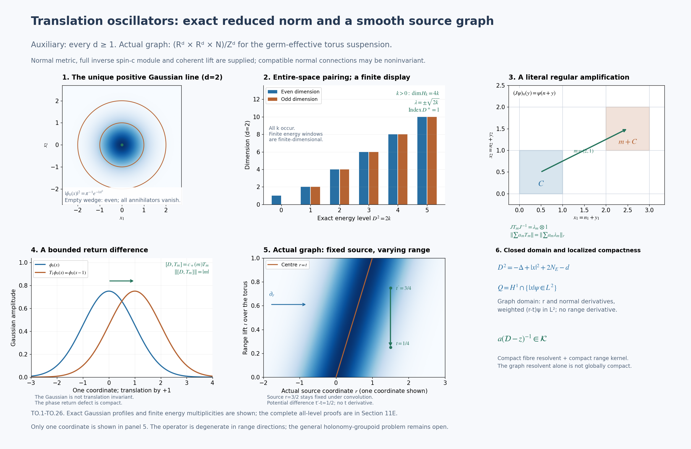

**Figure 11E.1.** Equations TO.1–TO.26 and Sections 11E.3–11E.8, 11E.14–11E.19. Panel 1 shows the exact two-dimensional ground-state squared amplitude \(\pi^{-1}e^{-|x|^2}\), with level circles \(|x|^2=1,4\); its empty-wedge line is even. Panel 2 displays the exact \(d=2\) multiplicities only for \(k=0,\ldots,5\), while the completeness and tail arguments cover every level. Panel 3 is the literal cube partition defining \(J\), with the selected translation \(m=(2,1)\); the completed \(H^1\) face matching remains in its domain. Panel 4 uses the exact one-dimensional Gaussian and its translate by +1, with the operator commutator sign and norm. Panel 5 uses the exact one-coordinate squared Gaussian profile, \(\pi^{-1/2}e^{-(r-t)^2}\), with the orange centre line \(r=t\). It suppresses the other leaf coordinates and the compact normal variable: at fixed actual source \(r=3/2\), convolution takes range \(t^\prime=3/4\) to \(t=1/4\), so \(y^\prime=3/4\) becomes \(y=5/4\) and the potential change is +1/2. Its horizontal derivative arrow is \(\partial_r\); no range derivative is introduced. Panel 6 separates the completed domains, compact fibre resolvents and convolution-produced scalar compactness in the undifferentiated range variable. No global graph compact resolvent or normal index is computed by these plots. The original local Bott normalization follows from the full module/connection/positivity and exact induced-class argument. Further reading is Emerson's Sections 11.4–11.5, cited above. [Editable SVG](../figures/kt-translation-oscillator-graph.svg) · [Reproducible generator](../reproduction/translation-oscillator-graph/draw_translation_oscillator.py) · [Component terms](../reproduction/translation-oscillator-graph/COMPONENT-TERMS.md).

Portable reproduction files and complete component notices:

- [kt-translation-oscillator-graph.svg](../figures/kt-translation-oscillator-graph.svg)
- [COMPONENT-TERMS.md](../reproduction/translation-oscillator-graph/COMPONENT-TERMS.md)
- [FIGURE-CHECKS.json](../reproduction/translation-oscillator-graph/FIGURE-CHECKS.json)
- [FONT-NOTICE.txt](../reproduction/translation-oscillator-graph/FONT-NOTICE.txt)
- [FORMULA-CHECKS.json](../reproduction/translation-oscillator-graph/FORMULA-CHECKS.json)
- [MATPLOTLIB-LICENSE.txt](../reproduction/translation-oscillator-graph/MATPLOTLIB-LICENSE.txt)
- [NUMPY-LICENSE.txt](../reproduction/translation-oscillator-graph/NUMPY-LICENSE.txt)
- [PILLOW-LICENSE.txt](../reproduction/translation-oscillator-graph/PILLOW-LICENSE.txt)
- [PYTHON-LICENSE.txt](../reproduction/translation-oscillator-graph/PYTHON-LICENSE.txt)
- [README.md](../reproduction/translation-oscillator-graph/README.md)
- [check_translation_oscillator_formulas.py](../reproduction/translation-oscillator-graph/check_translation_oscillator_formulas.py)
- [draw_translation_oscillator.py](../reproduction/translation-oscillator-graph/draw_translation_oscillator.py)
- [DejaVuSans-Bold.ttf](../reproduction/translation-oscillator-graph/fonts/DejaVuSans-Bold.ttf)
- [DejaVuSans-Oblique.ttf](../reproduction/translation-oscillator-graph/fonts/DejaVuSans-Oblique.ttf)
- [DejaVuSans.ttf](../reproduction/translation-oscillator-graph/fonts/DejaVuSans.ttf)
- [DejaVuSansDisplay.ttf](../reproduction/translation-oscillator-graph/fonts/DejaVuSansDisplay.ttf)
- [DejaVuSansMono.ttf](../reproduction/translation-oscillator-graph/fonts/DejaVuSansMono.ttf)
- [LICENSE_DEJAVU.txt](../reproduction/translation-oscillator-graph/fonts/LICENSE_DEJAVU.txt)
- [LICENSE_STIX.txt](../reproduction/translation-oscillator-graph/fonts/LICENSE_STIX.txt)
- [STIXGeneral.ttf](../reproduction/translation-oscillator-graph/fonts/STIXGeneral.ttf)
- [STIXGeneralItalic.ttf](../reproduction/translation-oscillator-graph/fonts/STIXGeneralItalic.ttf)
- [STIXNonUniIta.ttf](../reproduction/translation-oscillator-graph/fonts/STIXNonUniIta.ttf)
- [STIXSizFiveSymReg.ttf](../reproduction/translation-oscillator-graph/fonts/STIXSizFiveSymReg.ttf)
- [STIXSizFourSymReg.ttf](../reproduction/translation-oscillator-graph/fonts/STIXSizFourSymReg.ttf)
- [STIXSizOneSymReg.ttf](../reproduction/translation-oscillator-graph/fonts/STIXSizOneSymReg.ttf)
- [STIXSizThreeSymReg.ttf](../reproduction/translation-oscillator-graph/fonts/STIXSizThreeSymReg.ttf)
- [STIXSizTwoSymReg.ttf](../reproduction/translation-oscillator-graph/fonts/STIXSizTwoSymReg.ttf)
- [requirements.txt](../reproduction/translation-oscillator-graph/requirements.txt)
- [LICENSE.txt](../reproduction/translation-oscillator-graph/software-notices/numpy/LICENSE.txt)
- [LICENSE.txt](../reproduction/translation-oscillator-graph/software-notices/numpy/numpy/_core/include/numpy/libdivide/LICENSE.txt)
- [COPYING](../reproduction/translation-oscillator-graph/software-notices/numpy/numpy/_core/src/common/pythoncapi-compat/COPYING)
- [LICENSE](../reproduction/translation-oscillator-graph/software-notices/numpy/numpy/_core/src/highway/LICENSE)
- [dragon4_LICENSE.txt](../reproduction/translation-oscillator-graph/software-notices/numpy/numpy/_core/src/multiarray/dragon4_LICENSE.txt)
- [LICENSE.md](../reproduction/translation-oscillator-graph/software-notices/numpy/numpy/_core/src/npysort/x86-simd-sort/LICENSE.md)
- [LICENSE](../reproduction/translation-oscillator-graph/software-notices/numpy/numpy/_core/src/umath/svml/LICENSE)
- [LICENSE.md](../reproduction/translation-oscillator-graph/software-notices/numpy/numpy/fft/pocketfft/LICENSE.md)
- [LICENSE.txt](../reproduction/translation-oscillator-graph/software-notices/numpy/numpy/linalg/lapack_lite/LICENSE.txt)
- [LICENSE](../reproduction/translation-oscillator-graph/software-notices/numpy/numpy/ma/LICENSE)
- [LICENSE.md](../reproduction/translation-oscillator-graph/software-notices/numpy/numpy/random/LICENSE.md)
- [LICENSE.md](../reproduction/translation-oscillator-graph/software-notices/numpy/numpy/random/src/distributions/LICENSE.md)
- [LICENSE.md](../reproduction/translation-oscillator-graph/software-notices/numpy/numpy/random/src/mt19937/LICENSE.md)
- [LICENSE.md](../reproduction/translation-oscillator-graph/software-notices/numpy/numpy/random/src/pcg64/LICENSE.md)
- [LICENSE.md](../reproduction/translation-oscillator-graph/software-notices/numpy/numpy/random/src/philox/LICENSE.md)
- [LICENSE.md](../reproduction/translation-oscillator-graph/software-notices/numpy/numpy/random/src/sfc64/LICENSE.md)
- [LICENSE.md](../reproduction/translation-oscillator-graph/software-notices/numpy/numpy/random/src/splitmix64/LICENSE.md)
- [verify_translation_oscillator_reproduction.py](../reproduction/translation-oscillator-graph/verify_translation_oscillator_reproduction.py)

## 11F. Local differential operators and the finite tree coefficient

The tree cycle of Sections 11A and 11D has the required reduced representation and transverse normalization. Its auxiliary operator moves return labels. The translation oscillator of Section 11E instead admits an actual smooth source-column differential expression. We now prove two restrictions on converting the finite tree coefficient into such an expression. The first detects movement between disjoint plaques; the second detects the normal symbol at a single point. Neither assumes a spin-c structure on the leaf tangent bundle.

We use the full oriented normal spinor coefficient of Section 11A, including its specified spin-c line and the odd degree convention. All symbols below act on the physical odd scalar model. Adding a different Clifford factor or replacing this physical module is a different construction.

### 11F.1. Locality means preservation of support

Let \(X\to\Sigma\) be the connected regular cover in Section 11A, with deck group \(\Gamma=F_r\), positive generators \(a_1,\ldots,a_r\), and \(r\geq1\). Choose a covering disc \(U\subset\Sigma\), a lift \(z:U\to X\), and a smaller disc \(W\) with compact closure in \(U\). The sets

\[
 W_g=g^{-1}z(W),\qquad g\in F_r,                         \tag{LD.1}
\]

are pairwise disjoint. This is the return-label convention of the natural source-column identification in Section 11A.4. The group acts by deck transformations on \(X\); its action on the normal manifold and full spinor coefficient supplies the accompanying unitary transport.

**Lemma 11F.1 (support of a differential expression).** A smooth differential operator of any finite order between finite-rank bundles over a manifold \(Y\) satisfies

\[
 \operatorname{supp}(Lu)\subseteq\operatorname{supp}u
       \quad(u\in C_c^\infty(Y)).                       \tag{LD.2}
\]

The inclusion survives a pointwise smooth bundle isomorphism and a common smooth change of base coordinates on input and output.

**Proof.** Outside the closed support of \(u\), the section is identically zero on a neighbourhood. All its derivatives vanish there. In any bundle frame a finite-order differential expression is a finite sum of smooth coefficient matrices times these derivatives, so its value vanishes there as well. A pointwise invertible bundle map preserves the support. A common diffeomorphism transports both supports by that same map. These observations prove every assertion. In particular a choice of closed operator domain cannot change (LD.2) on the smooth compact core.

The unoriented Cayley-tree edges have the unique form

\[
 (h,j)\longleftrightarrow\{h,ha_j\},\qquad
 \ell^2(\mathcal E)=\bigoplus_{j=1}^r\ell^2(F_r).       \tag{LD.3}
\]

For uniqueness, reversing an edge with label \(a_j\) would require a positive generator to equal \(a_j^{-1}\), which does not occur in a free group with the chosen positive basis. Different positive labels cannot describe the same oriented edge. Thus the vertex module has one regular orbit and the edge module has \(r\) regular orbits.

Let \(Q\delta_e=0\), and, for \(g\neq e\), let \(Q\delta_g\) be the edge joining \(g\) to its parent in the tree rooted at \(e\). The parent deletes the last letter of the reduced word. For \(M\delta_g=|g|\delta_g\), the lower block of the tree operator is \(QM\). In particular,

\[
 QM\delta_{a_j}=\delta_{(e,j)}.                         \tag{LD.4}
\]

**Proposition 11F.2 (the literal tree expression is nonlocal).** Under the regular-orbit identifications (LD.1)–(LD.3), the tree term of Section 11A cannot equal a finite-order smooth differential operator on the natural source-column manifold \(X\times N\), even on its smooth compact core. This conclusion also holds after pointwise bundle isomorphisms and a common diffeomorphism of \(X\times N\).

**Proof.** In the vertex copy choose a nonzero smooth section supported in \(W_{a_j}\times N\), with compact support in the first factor. In return coordinates it is \(\phi(x)\delta_{a_j}\otimes v(n)\), where \(\phi\in C_c^\infty(W)\) is nonzero and \(v\) is a nonzero smooth normal section. Formula (LD.4) sends it to the \(j\)-th edge copy supported in \(W_e\times N\). The normal transport is unitary and cannot annihilate the section. The two leaf supports are disjoint. Thus (LD.2) fails.

The normal differential part \(D_N\otimes\gamma_T\) preserves the original leaf support and acts in the vertex copy. It cannot cancel the nonzero edge output in the different plaque. To see the same fact for the partition-projected realization, choose the partition with one plaque function equal to one on a neighbourhood of \(\operatorname{supp}\phi\) and the others zero there. On that neighbourhood the projection is the identity on the chosen coordinate component. The argument therefore concerns the actual column expression, rather than an artifact of overlapping charts. Lemma 11F.1 gives the invariance under the stated changes of description.

This assertion concerns the unbounded differential expression. The bounded transform of a local differential operator usually does not preserve supports. No locality assertion about that transform is used here. A unitary that moves the edge copy to a different base point is also outside the pointwise and common-coordinate identifications in this proposition.

### 11F.2. An odd normal Clifford module cannot accept an unbalanced leaf symbol

Let \(\nu\) be an oriented Euclidean normal space of odd dimension \(q=2m+1\). Let \(S\) be a physical normal spinor space, with Hermitian Clifford matrices satisfying

\[
 c_j^*=c_j,\qquad c_jc_k+c_kc_j=2\delta_{jk},\qquad
 (-i)^m c_1\cdots c_q=1_S.                             \tag{LD.5}
\]

The last equation fixes the positive normal volume convention. The opposite irreducible convention merely exchanges the two signs in the argument below. For the three-dimensional model, \(S=\mathbb C^2\) and \(c_j\) are the positive Pauli matrices of Section 11A.

Take a finite auxiliary coefficient

\[
 E=E^+\oplus E^-,\qquad \gamma_E=1\oplus(-1),\qquad
 r_\pm=\dim E^\pm,\qquad
 a_j=c_j\otimes\gamma_E.                              \tag{LD.6}
\]

The two auxiliary summands have physical dimensions \(\dim(S)r_+\) and \(\dim(S)r_-\). They are not the grading of the ordinary odd scalar cycle. In a bundle version the ranks are evaluated at one base point, and the matrices are evaluated in an oriented normal frame.

**Theorem 11F.3 (normal volume balance).** If an endomorphism \(B\) of \(S\otimes E\) is invertible and anticommutes with every \(a_j\), then \(r_+=r_-\). Consequently a first-order Dirac-type source-column symbol for an orthogonal leaf/normal splitting, which restricts to (LD.6) on normal covectors, cannot exist on this physical module when the auxiliary ranks differ and the leaf dimension is positive.

**Proof.** Define the normalized normal volume

\[
 \Omega=(-i)^m a_1\cdots a_q=1_S\otimes\gamma_E.       \tag{LD.7}
\]

The equality follows from (LD.5) and \(\gamma_E^q=\gamma_E\). Moving \(B\) through the \(q\) factors gives \(B\Omega=-\Omega B\), because \(q\) is odd. Hence \(B\) maps the positive volume eigenspace into the negative one and conversely. Invertibility makes these restrictions inverse isomorphisms. Their dimensions are therefore equal, proving the rank equality.

For the stated Dirac-type symbol write its normal restriction as \(a(\xi)=\sum_j\xi_j a_j\), and choose a nonzero leaf covector \(\eta\). Put \(B=\sigma(\eta,0)\). The squared symbol identity

\[
 \sigma(\eta,\xi)^2=(|\eta|^2+|\xi|^2)1              \tag{LD.8}
\]

and linearity imply \(B^2=|\eta|^2 1\). Comparing the coefficient of \(t\) in the same identity for \((\eta,t e_j)\) gives \(Ba_j+a_jB=0\). Thus \(B\) is the invertible anticommuting endomorphism already excluded.

The pointwise proof is unchanged by arbitrary smooth zeroth-order potentials or changes of connection: neither changes the principal symbol. A full spin-c transition conjugates the Clifford matrices by the actual spinor transport and preserves the oriented volume. A common line tensor factor multiplies both volume eigenspace ranks by the same nonzero rank. Adding the same finite number of positive and negative normal copies leaves \(r_+-r_-\) unchanged. None of these modifications removes the obstruction.

The argument makes no claim that an invariant normal spin-c structure supplies a leaf Clifford structure. It instead tests an additional candidate leaf symbol, if one is proposed.

### 11F.3. In normal dimension three, even a general Hermitian elliptic extension is impossible

For \(q=3\) the balance condition does not require the mixed Clifford relation (LD.8). Write

\[
 c(n)=\begin{pmatrix}
 n_3&n_1-i n_2\\n_1+i n_2&-n_3
 \end{pmatrix},\qquad n\in S^2.                       \tag{LD.9}
\]

The positive eigenspace is a complex line. On the northern and southern hemispheres use the unit vectors

\[
 v_N(n)=\frac{(1+n_3,n_1+i n_2)}{\sqrt{2(1+n_3)}},
 \qquad
 v_S(n)=\frac{(n_1-i n_2,1-n_3)}{\sqrt{2(1-n_3)}}.     \tag{LD.10}
\]

They are defined on neighbourhoods of their respective closed hemispheres. Direct multiplication by (LD.9) gives eigenvalue \(+1\). At \(n=(\cos\theta,\sin\theta,0)\),

\[
 v_S=e^{-i\theta}v_N.                                 \tag{LD.11}
\]

The negative eigenline has transition \(e^{i\theta}\). Indeed if \(v=(v_1,v_2)\), the vector \((-\overline{v_2},\overline{v_1})\) is its unit orthogonal complement, has eigenvalue \(-1\), and its phase transforms by the complex conjugate.

**Theorem 11F.4 (Hermitian elliptic extension test).** Let \(p\geq1\), and let

\[
 \sigma:\mathbb R^p\oplus\mathbb R^3
       \longrightarrow\operatorname{Herm}(\mathbb C^2\otimes E)
                                                               \tag{LD.12}
\]

be continuous away from zero, with \(\sigma(\eta,\xi)\) invertible for every \((\eta,\xi)\neq0\). Suppose its restriction to unit normal covectors is exactly \(c(\xi)\otimes\gamma_E\). Then \(r_+=r_-\). In particular no formally self-adjoint first-order elliptic differential operator in all source leaf and normal directions can have this prescribed normal principal symbol with unequal auxiliary ranks. No Clifford identity in the leaf direction is required.

**Proof.** Fix one unit leaf direction and restrict (LD.12) to the sphere

\[
 S^3=\{(t,\xi):t^2+|\xi|^2=1\},
 \qquad (t,\xi)\longmapsto\sigma(t\eta_0,\xi).        \tag{LD.13}
\]

Its matrices are Hermitian and invertible. Put \(A=\sigma(t\eta_0,\xi)\) on this sphere. Continuity of the inverse follows from its finite-matrix adjugate formula, so compactness gives constants \(M<\infty\) and \(g>0\) with \(\|A\|\leq M\) and \(\|A^{-1}\|\leq g^{-1}\). Thus every eigenvalue has absolute value at least \(g\). The positive spectral projection is continuous, as can be seen directly from

\[
 P=\frac{1+\operatorname{sgn}A}{2},\qquad
 \operatorname{sgn}A=\frac{2}{\pi}\int_0^\infty
            A(A^2+s^2 1)^{-1}\,ds.
\]

Indeed, a finite Hermitian matrix has an orthonormal eigenbasis by the following elementary induction. Maximize its real Rayleigh quotient on the unit sphere. Differentiating at a maximizing vector in each orthogonal direction and its multiple by \(i\) makes both real and imaginary components of the corresponding matrix coefficient vanish. That vector is therefore an eigenvector; its orthogonal complement is invariant by Hermitian symmetry, and induction applies to that complement. In this basis the elementary arctangent integral gives \((2/\pi)\int_0^\infty\lambda/(\lambda^2+s^2)\,ds=\operatorname{sgn}\lambda\) for every nonzero real \(\lambda\). For \(0\leq s\leq1\), the matrix integrand has norm at most \(M/g^2\); for \(s\geq1\), it has norm at most \(M/s^2\). Each integrand is continuous in the base point, by matrix inversion. These uniform bounds make the integral a uniform norm limit of continuous finite-interval integrals. Hence \(P\) is continuous. Its trace is its finite integer rank, and is constant on the connected sphere. Locally its range has continuous frames: if \(\|P(x)-P(x_0)\|<1\), projection of a basis of \(\operatorname{ran}P(x_0)\) into \(\operatorname{ran}P(x)\) is injective and therefore a basis of that equal-rank space. This proves that the ranges form a vector bundle.

We next construct a frame on the closed upper hemisphere, without an extension theorem or a smooth functional-calculus assumption. Identify that hemisphere with the closed unit ball in \(\mathbb R^3\) by the explicit smooth coordinates

\[
 b\longmapsto
 \left(\frac{1-|b|^2}{1+|b|^2},\frac{2b}{1+|b|^2}\right),
 \qquad |b|\leq1;
 \qquad b=\frac{\xi}{1+t}.
\]

Write \(P(b)\) for the projection in these coordinates. Extend it to all of \(\mathbb R^3\) by the direct radial formula \(P_{\mathrm{ext}}(b)=P(b/\max(1,|b|))\). This is a continuous bounded Hermitian projection everywhere, and agrees with \(P\) on the closed unit ball. Let \(\varphi\geq0\) be a real smooth function supported in the unit ball with integral one; for example normalize \(\exp(-1/(1-|h|^2))\) inside that ball and set it to zero outside. All its boundary derivatives vanish, because every power of \((1-|h|^2)^{-1}\) times that exponential tends to zero at the boundary. Define the Hermitian smooth matrix

\[
 A_\varepsilon(b)=\int\varphi(h)P_{\mathrm{ext}}(b-\varepsilon h)\,dh.
\]

Smoothness follows by rewriting this as convolution with \(\varphi_\varepsilon(b-y)\) and differentiating that smooth compactly supported kernel. Each derivative is a finite integral bounded by the corresponding kernel derivative's \(L^1\) norm, since \(\|P_{\mathrm{ext}}\|\leq1\). Uniform continuity of \(P_{\mathrm{ext}}\) on the ball of radius two gives \(\|A_\varepsilon(b)-P_{\mathrm{ext}}(b)\|<\delta=1/16\) for all \(|b|\leq3/2\), by taking \(\varepsilon<1/2\) sufficiently small. This estimate follows by bounding each integrand difference by the modulus of continuity at distance \(\varepsilon\); no smooth extension of \(P\) is needed.

Let \(\mathcal C\) be the counterclockwise circle \(|z-1|=1/2\), and put

\[
 P'(b)=\frac{1}{2\pi i}\int_{\mathcal C}
                   (z1-A_\varepsilon(b))^{-1}\,dz.
\]

Here all smoothness and approximation claims follow from finite-matrix estimates. For any projection \(R\), \((z1-R)^{-1}=z^{-1}(1-R)+(z-1)^{-1}R\), so its norm on \(\mathcal C\) is at most two. The Neumann series applied with \(R=P_{\mathrm{ext}}(b)\) shows that \((z1-A_\varepsilon(b))^{-1}\) exists on \(\mathcal C\), uniformly for \(|b|\leq3/2\), with norm at most \(2/(1-2\delta)\). More generally the same Neumann argument at real numbers outside the \(\delta\)-neighbourhood of \(\{0,1\}\) shows that the real spectrum of \(A_\varepsilon\) lies in the two intervals \([-\delta,\delta]\) and \([1-\delta,1+\delta]\). Hermitian diagonalization therefore makes the contour integral the orthogonal projection onto the second interval. To evaluate its scalar integral, expand \((z-\lambda)^{-1}\) in a geometric series on \(\mathcal C\): the integral is one for \(|\lambda-1|<1/2\) and zero for \(|\lambda-1|>1/2\), since integration selects its \((z-1)^{-1}\) coefficient.

The inverse matrix is smooth in \(b\), with first derivative \(R_z(\partial A_\varepsilon)R_z\), where \(R_z=(z1-A_\varepsilon)^{-1}\). Every higher derivative is a finite sum of products of such inverses and derivatives of \(A_\varepsilon\), by repeated differentiation of the inverse identity. On each compact subset of \(|b|<3/2\) these products are uniformly bounded in \(z\in\mathcal C\). Differentiation under the fixed finite-length contour is thus valid to every order. This proves that \(P'\) is smooth on a neighbourhood of the closed unit ball.

The resolvent identity also gives an explicit approximation estimate. On the unit ball compare the inverses for \(A_\varepsilon\) and \(P\). Their difference has norm at most \(4\delta/(1-2\delta)\). Since the contour length is \(\pi\), integration yields \(\|P'-P\|\leq2\delta/(1-2\delta)=1/7<1\). Projection of either range into the other is therefore injective: if, for example, \(P'v=0\) and \(Pv=v\), then \(\|v\|\leq\|P'-P\|\|v\|\), forcing \(v=0\). The two injections give equal finite ranks.

To trivialize the smooth projection \(P'\), use the paths \(P_s(b)=P'(sb)\), \(0\leq s\leq1\). In the following equation \(P\) denotes this smooth path:

\[
 \dot U=[\dot P,P]U,\qquad U(0)=1.                    \tag{LD.14}
\]

For completeness this equation has a unique bounded solution continuously depending on \(b\). Put \(K(s,b)=[\partial_sP_s(b),P_s(b)]\). This continuous matrix family is bounded, say \(\|K(s,b)\|\leq L\), on \([0,1]\) times the closed ball. The successive integral series

\[
 U(s,b)=1+\sum_{n\geq1}
 \int_{0\leq s_n\leq\cdots\leq s_1\leq s}
   K(s_1,b)\cdots K(s_n,b)\,ds_n\cdots ds_1
\]

converges uniformly: its \(n\)-th term has norm at most \(L^n s^n/n!\), and \(\|U(s,b)\|\leq e^L\). Each term is continuous in \((s,b)\), as the substitution \(s_j=s t_j\) makes its integration simplex fixed. Substitution into \(U=1+\int_0^sK(v,b)U(v,b)\,dv\), justified by that bound, shows that the sum is continuously differentiable in \(s\) and solves (LD.14). If two solutions existed, their difference would satisfy the homogeneous integral equation. For each fixed \(b\), iterating it bounds that difference by \(L^n/n!\) times its supremum over \(s\in[0,1]\) for every \(n\), hence makes it zero. Thus no ODE existence or uniqueness result is being assumed.

The coefficient \(K\) is skew-Hermitian, so differentiating \(U^*U\) gives zero and \(U\) is unitary. Differentiation of \(P_s^2=P_s\) gives \(P_s\dot P_sP_s=0\) and \([[\dot P_s,P_s],P_s]=\dot P_s\). Therefore \(\partial_s(U^*P_sU)=U^*(\dot P_s-[K,P_s])U=0\), which proves \(P_s=UP'_0U^*\). Transporting a fixed orthonormal basis of \(\operatorname{ran}P'(0)\) by \(U(1,b)\) gives a continuous global frame of \(\operatorname{ran}P'(b)\), including the boundary. Applying \(P(b)\) to that frame gives a continuous basis of \(\operatorname{ran}P(b)\), by the injectivity and equal ranks proved above. This supplies the required frame on the entire closed hemisphere.

On the equatorial normal sphere the positive eigenbundle is

\[
 (L_+\otimes E^+)\oplus(L_-\otimes E^-).              \tag{LD.15}
\]

Here \(E^\pm\) are fixed vector spaces at the one base point where the principal symbol is being tested. Taking its determinant, (LD.11) gives equatorial transition

\[
 g(\theta)=e^{-i(r_+-r_-)\theta}.                     \tag{LD.16}
\]

A trivial determinant line on \(S^2\) must have a transition of winding zero in these two hemisphere frames. We give the phase and homotopy argument explicitly. For a continuous nowhere-zero loop \(f:[0,2\pi]\to\mathbb C\), normalize \(u=f/|f|\). Uniform continuity permits a finite partition \(0=\theta_0<\cdots<\theta_k=2\pi\) such that \(\operatorname{Re}(u(\theta)/u(\theta_j))>0\) for every \(\theta\in[\theta_j,\theta_{j+1}]\). On the open right half-circle define the continuous angle \(\alpha(z)=\arctan(\operatorname{Im}z/\operatorname{Re}z)\in(-\pi/2,\pi/2)\). Choose any real \(\phi(0)\) with \(e^{i\phi(0)}=u(0)\), and recursively set

\[
 \phi(\theta)=\phi(\theta_j)
       +\alpha\bigl(u(\theta)/u(\theta_j)\bigr)
       \quad(\theta_j\leq\theta\leq\theta_{j+1}).
\]

This defines a continuous phase lift with \(e^{i\phi}=u\). Two lifts differ by a continuous function with values in \(2\pi\mathbb Z\), hence by a constant. Since the endpoints of the loop agree, \(\phi(2\pi)-\phi(0)\) is an integer multiple of \(2\pi\). Their quotient by \(2\pi\) is the winding, independent of the initial lift.

For a continuous homotopy of nowhere-zero loops, normalize it on the compact rectangle \([0,1]\times[0,2\pi]\). Uniform continuity supplies one partition in \(\theta\) with the same right-half-circle condition for every homotopy parameter. The initial-value path \(u(s,0)\) itself has a continuous real lift on \([0,1]\), constructed by the same finite-interval procedure. With those initial values, the displayed recursion now gives a phase \(\phi(s,\theta)\) continuous in both variables. Its endpoint difference divided by \(2\pi\) is a continuous integer-valued function of \(s\); the intermediate value property makes it constant. This proves homotopy invariance. Lifts also prove additivity for a quotient: the difference of two phase lifts is a lift of the normalized quotient loop, so \(\operatorname{wind}(f/h)=\operatorname{wind}(f)-\operatorname{wind}(h)\).

If a nowhere-zero function \(f\) is defined on the closed disc, the loops \(f((1-s)e^{i\theta})\), \(0\leq s\leq1\), give a continuous nowhere-zero homotopy from its boundary values to its constant centre value. Thus its boundary winding is zero. Now compare the two hemisphere determinant frames with a hypothetical global nonzero determinant section. Writing that section as each frame times a nowhere-zero coefficient \(a_N\) or \(a_S\), both coefficients extend over their respective closed discs. The frame relation gives \(g=a_N/a_S\) along their common boundary. The quotient rule and the disc contraction prove \(\operatorname{wind}(g)=0\).

The bundle on the upper hemisphere of (LD.13) is trivial, so its restriction to the equator, and its determinant, are trivial. Formula (LD.16) has winding \(-(r_+-r_-)\). Hence \(r_+=r_-\). This proves the theorem. The matrix-valued principal symbol of a formally self-adjoint operator is Hermitian; ellipticity supplies the invertibility in (LD.12), so the differential-operator conclusion follows at every base point.

The assertion also excludes arbitrary continuous Hermitian symbol extensions, not only linear ones. It does not exclude a nonelliptic or anisotropic expression, an operator whose normal symbol changes, or a different smooth physical coefficient.

### 11F.4. Application to the actual SU(2)/F2 coefficient

For \(F_2\), (LD.3) gives

\[
 E^+=\mathbb C,\qquad E^-=\mathbb C^2,
 \qquad r_+-r_-=-1.                                  \tag{LD.17}
\]

The physical normal module has rank two. Its normal-volume eigenspaces therefore have dimensions two and four. Theorem 11F.3 rules out adding a longitudinal Clifford symbol on this unchanged module. More strongly, Theorem 11F.4 rules out any Hermitian full-source elliptic principal symbol extending its three-dimensional normal Pauli symbol. The obstruction occurs at one point, so it is unaffected by the choice of leaf metric, compatible connection, smooth potential, or global topology of the coefficient line.

For the Cayley tree of \(F_r\), the difference is \(1-r\). The literal support obstruction of Proposition 11F.2 holds for every \(r\geq1\). The normal-symbol obstruction holds for \(r\neq1\). A free cocompact action on another tree with \(v\) vertex orbits and \(e\) edge orbits gives the same necessary balance \(v=e\), if its chosen physical column model really consists of those finite regular-orbit copies. No such finite-copy identification is asserted for infinite quotient graphs or nontrivial stabilizers.

These results explain a precise limitation of the tree route. Its already proved scalar index \(+1\) is compatible with an unbalanced pointwise normal coefficient because the tree operator is nonlocal. It cannot be replaced on that same module by a full-source elliptic local operator. They do not show that every local finite-order source-column completion has zero index or fails to exist.

### 11F.5. A balanced local coefficient can have index one

The rank obstruction has a genuine escape already present in Section 11E. In one translation dimension the auxiliary physical space has one positive and one negative copy. With \(\gamma_E=\sigma_3\), take

\[
 D_{
 \mathrm{osc}}=-i\sigma_2\partial_x+x\sigma_1
  =\begin{pmatrix}0&-\partial_x+x\\\partial_x+x&0\end{pmatrix}.
                                                               \tag{LD.18}
\]

The source leaf principal matrix \(\sigma_2\) anticommutes with \(c_j\otimes\sigma_3\) after the normal tensor factor is restored. At the auxiliary level the two volume eigenspaces have equal dimensions; in normal rank three their physical dimensions are both two. Thus both balance tests pass. Section 11E.3–5 proves the complete self-adjoint domain, Hermite completeness and compact resolvent of (LD.18), and Section 11E.14–19 proves its actual smooth graph realization, convolution-domain estimates and localized scalar compacts, including the undifferentiated range variable.

The index sign can also be read directly from its two equations. The positive-to-negative operator \(\partial_x+x\) kills \(\pi^{-1/4}e^{-x^2/2}\). Every distributional solution is a scalar multiple of that Gaussian, by multiplying the equation by \(e^{x^2/2}\). The adjoint equation \(-\partial_x+x=0\) instead gives a multiple of \(e^{x^2/2}\), which is not square integrable unless its coefficient is zero. The compact-resolvent result of Section 11E supplies Fredholmness, so the scalar index is \(+1\), despite the equal pointwise ranks.

Thus balanced ranks are necessary for the tested longitudinal extensions and are compatible with normalization one. They are not sufficient: the global representation, domain, convolution estimates, localized compacts and pairing still need their own proofs. The general graph construction under a holonomy-invariant transverse spin-c structure remains unproved beyond the geometries for which these interfaces have been established.

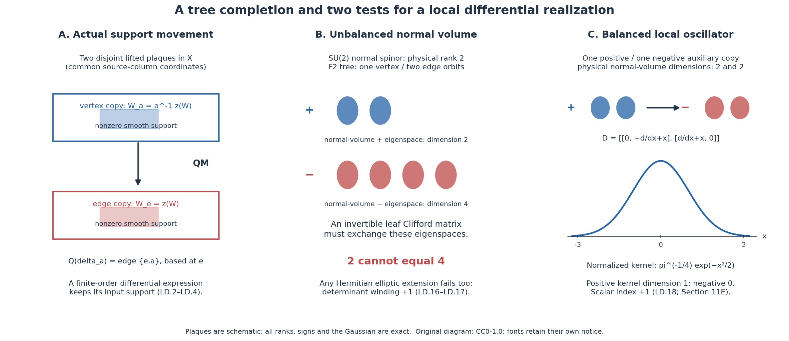

**Figure 11F.1.** Proposition 11F.2 and Theorems 11F.3–4, equations (LD.1)–(LD.18). The left panel is a schematic of two disjoint lifted plaques in the source cover; rectangles are not a metric drawing of the covering surface. The literal tree block sends the return label \(a\) to the edge orbit based at \(e\), and hence moves the displayed support. The middle panel shows the exact two-versus-four physical normal-volume dimensions for the SU(2)/F2 coefficient. The right panel shows the balanced two-versus-two dimensions and the normalized one-dimensional Gaussian of the translation oscillator. The dimension comparison is proved, and the Gaussian is its exact normalized kernel; no finite plot or word sample replaces the proof. [Editable SVG](../figures/kt-local-tree-differential-obstruction.svg) · [Reproducible figure source](../reproduction/local-tree-differential-obstruction/draw_local_tree.py) · [Component terms](../reproduction/local-tree-differential-obstruction/COMPONENT-TERMS.md).

Further reading: Heath Emerson, *An Introduction to C*-Algebras and Noncommutative Geometry*, Sections 7.8, 9.1 and 11.5, [DOI](https://doi.org/10.1007/978-3-031-59850-0). These sections discuss complex Clifford modules, local differential symbols and equivariant translation Bott cycles. The complete arguments above establish the support and symbol restrictions used here; the crossed-product discussion does not turn an arbitrary holonomy groupoid into a translation action.

## 11G. Affine source oscillators and hyperbolic return holonomy

An orthogonal linear part does not prevent an oscillator from providing the missing even factor in a graph class. We first extend the translation construction to free cocompact affine Euclidean actions. A nonabelian example has a Klein-bottle base, a compact oriented normal torus, the full normal spin-c transitions, and an actual local first-order graph expression with transverse Bott pairing one. We then prove a different restriction: a hyperbolic return prevents a specified finite-rank smooth graph expression from having bounded commutators with all smooth convolution kernels. The latter restriction needs careful interpretation of the invariant normal premise.

The historical question is Alain Connes's graph-Dirac problem in *A survey of foliations and operator algebras*, Section 8(2), [p. 29](https://alainconnes.org/wp-content/uploads/foliationsfine.pdf#page=29). Sections 11A–11F supply the earlier constructions and the precise distinctions between a discrete completion, a normal symbol, a full-tangent symbol and bounded unbounded-operator commutators.

### 11G.1. The affine auxiliary and its actual regular representation

Let a countable discrete group \(\Gamma\) act freely, properly and cocompactly on \(X=\mathbb R^d\), \(d\geq1\), by

\[
 g x=O_gx+b_g,\qquad O_g\in O(d),\qquad
 b_{gh}=b_g+O_gb_h.                                      \tag{NH.1}
\]

No orientation of \(X/\Gamma\) is required. Put \(E_d=\Lambda^*\mathbb C^d\), graded by degree parity \(\gamma\). In the standard orthonormal covector frame put \(C_j=\varepsilon_j-\iota_j\) and \(E_j=\varepsilon_j+\iota_j\). The symbol conventions and complete closure of

\[
 D_{\mathrm o}=\sum_j(C_j\partial_{x_j}+E_jx_j)
 \quad\hbox{on }H_{\mathrm o}=L^2(\mathbb R^d,E_d)          \tag{NH.2}
\]

are those of Section 11E.1–5. In particular its exact domain is \(\{u\mid \nabla u,|x|u\in L^2\}\), smooth compact sections form a core, its resolvent is scalar compact, and its positive kernel is the one-dimensional normalized Gaussian \(\pi^{-d/4}e^{-|x|^2/2}\); its negative kernel is zero. The complete Hermite proof there establishes index \(+1\), rather than an index inferred from a finite sample.

Let \(R_g=\Lambda^*(O_g)\) be the unitary covector transport, and set

\[
 (L_gu)(x)=R_g u(g^{-1}x),\qquad
 [D_{\mathrm o},L_g]=E(b_g)L_g,
 \quad E(v)=\sum_jv_jE_j.                                \tag{NH.3}
\]

These are even unitaries with \(L_gL_h=L_{gh}\). Orthogonality preserves Lebesgue measure and intertwines the exterior and contraction matrices. Thus \(d+d^*=\sum C_j\partial_j\) commutes with \(L_g\). Also \(L_g E(x)L_g^{-1}=E(x-b_g)\). This proves the displayed commutator and its bound \(\|[D_{\mathrm o},L_g]\|=|b_g|\). The equality uses \(E(v)^2=|v|^2\). Pullback preserves the derivative norm, while \(|gx|\leq |x|+|b_g|\) and the analogous inverse inequality preserve the weighted domain. The identity therefore holds on the full closed domain.

Here the reduced representation is proved literally. A measurable fundamental set \(Q\subset X\) exists: take finitely many evenly covered base charts, partition their images into Borel sets, and select one lift of each. Properness gives covering charts; freeness gives uniqueness of the selected translates. Chart boundaries can be selected measurably and have measure zero, or assigned once to a neighbouring piece. The sets \(gQ\) partition \(X\) modulo null sets. Define

\[
 (Ju)_g(x)=R_g^{-1}u(gx),\quad x\in Q,\qquad
 J:H_{\mathrm o}\longrightarrow
       \ell^2(\Gamma)\otimes L^2(Q,E_d).                  \tag{NH.4}
\]

Summing the integrals over \(gQ\) proves that \(J\) is an isometry. Its inverse assigns \(R_g\xi_g(x)\) to \(gx\), so it is onto. Substitution gives \((JL_hu)_g=(Ju)_{h^{-1}g}\). Thus the actual auxiliary representation is \(\lambda_\Gamma\otimes1\). Its infinite regular multiplicity is retained; compactness of the oscillator resolvent is a property of the operator on the whole \(X\), not a tensor compactness assertion about \(1\otimes D\).

### 11G.2. The complete normal product

Use the supplied compact normal data of Section 11E.9: a compact connected \(N\), its fixed metric, entire inverse spin-c module \(\mathcal D_N\), original grading and right \(C_q\) order, a compatible self-adjoint \(D_N\) with exact \(H^1\) domain, smooth core, scalar compact resolvent, and the original source-calibrated local class \(b_U\) with \(\langle b_U,[D_N]\rangle=1\). The transitions remain \(z^{-1}\rho_t(s)\), with the parity \(q(q-1)/2\), dual orientation line and last right \(C_1\) in odd rank; no minimal spinor replacement is made. Suppose \(\Gamma\) acts on \(N\) by isometries \(h_g\), with a coherent lift to this full structure, and let \(U_g\) be its even unitaries. Suppose the action is germ-effective and free. The example below verifies these action hypotheses.

**Theorem 11G.1 (affine graph oscillator).** Under (NH.1) and the complete normal hypotheses just stated, the actual compact suspension (NH.9) has the smooth finite-rank local first-order graph expression (NH.11). Its closure is self-adjoint on exactly (NH.12), its compact smooth convolution commutators are bounded and preserve that domain, and its bounded transform is a degree-\(q\) scalar reduced cycle with localized scalar compact defects. Its original local transverse Bott product is \(+1\), with the full normal inverse coefficient and determinant line retained. The operator differentiates the source and normal variables and leaves the range undifferentiated.

**Proof.** A compatible normal connection need not be invariant. The same-symbol comparison in Section 11E.9 proves that \(B_g=[D_N,U_g]\) is bounded and that \(U_gH^1=H^1\). On \(H_B=H_{\mathrm o}\widehat\otimes H_N\) define

\[
 D_B=D_{\mathrm o}\otimes1+\gamma\otimes D_N,
 \quad \Pi(f)=1\otimes M_f,
 \quad \Pi(u_g)=L_g\otimes U_g.                           \tag{NH.5}
\]

The two unbounded summands anticommute. The finite Hermite/normal spectral block proof of Section 11E.10 gives self-adjointness on the intersection of their domains, compact resolvent, and the complete smooth product core. It uses only these two operators, and therefore applies without a lattice assumption. Equation (NH.3) gives

\[
 [D_B,\Pi(u_g)]=E(b_g)L_g\otimes U_g
                    +\gamma L_g\otimes B_g.              \tag{NH.6}
\]

For smooth \(f\), the commutator is \(\gamma\otimes[D_N,M_f]\). The product domain is preserved by these coefficients and hence by every smooth finite crossed coefficient.

After \(J\otimes1\), apply \((W\xi)_g=U_g^{-1}\xi_g\), leaving the \(L^2(Q,E_d)\) factor untouched. Then

\[
 W(\lambda_h\otimes U_h)W^{-1}=\lambda_h\otimes1,
 \qquad W(1\otimes M_f)W^{-1}|_g=M_{f\circ h_g}.            \tag{NH.7}
\]

This is the regular induced representation of \(C(N)\rtimes_r\Gamma\). The point-regular reduced norm equals its direct-integral norm: a nearly norm-attaining finite-support vector at any normal point, in a local spin frame, has the same lower bound on a neighbourhood of positive normal volume, by continuity of the finitely many output coefficients. Thus essential supremum equals supremum. The reverse inequality is the defining regular bound. Amplification by \(L^2(Q,E_d)\) changes neither norm. Consequently \(\|\Pi(a)\|=\|a\|_r\); no K-amenability assertion or descent of \(U\) alone is used.

Compact resolvent and (NH.6) give the scalar phase defects by the integrable first-order resolvent argument of Section 11E.7. The restriction to \(C(N)\) is the full normal class. Indeed the positive Gaussian supplies its identical normal block; paired positive-energy Hermite blocks give exactly (TO.18), with compact creation errors, and the lifted oscillator phase has anticommutator \(2|D_{\mathrm o}|/\sqrt{1+D_{\mathrm o}^2+D_N^2}\geq0\). The complete connection and positivity proof of Section 11E.11 applies unchanged, including its right Clifford order. We have proved

\[
 [\Pi,F_B]|_{C(N)}=[D_N],\qquad
 \langle b_U,[\Pi,F_B]|_{C(N)}\rangle=1.                  \tag{NH.8}
\]

### 11G.3. A local operator on the actual affine suspension graph

Put \(M=X/\Gamma\), \(V=(X\times N)/\Gamma\), with diagonal action \((x,n)\mapsto(gx,h_gn)\), and horizontal foliation. These are compact smooth manifolds without boundary. Since \(X\) is simply connected, horizontal paths lift to \(X\). Their holonomy depends only on their return label. Germ effectivity removes exactly the possible kernel of this label. Hence the actual holonomy groupoid, not an auxiliary renamed space, is

\[
 G=(X_t\times X_r\times N)/\Gamma,\qquad
 g(t,r,n)=(gt,gr,h_gn),\quad
 r_G=[t,n],\quad s_G=[r,n].                             \tag{NH.9}
\]

The diagonal action is proper and free because its action on \(t\) is. Arrows multiply by \((t,t',n)(t',r,n)=(t,r,n)\), after making the common lift agree. The bundle on \(G\) is the quotient of \(E_d\otimes\mathcal D_N\) with the actual even transition \(R_g\otimes U_g\). Along left convolution, transport at common \((r,n)\) is the identity in lifted coordinates, and composes exactly. The ordinary graph density is the quotient of \(dt\,dr\,d\operatorname{vol}_N\), invariant under all these isometries.

Choose finitely many buffered charts of \(M\), smooth lifts \(z_i\), and real \(\chi_i\) with \(\sum\chi_i^2=1\). On the support of \(\chi_i\), the unique \(g_i(t)\) satisfying \(t=g_i(t)z_i([t])\) is locally constant. Put

\[
 b(t)=\sum_i\chi_i([t])^2g_i(t)0,
 \quad D_N(t)=\sum_i\chi_i([t])^2
                         U_{g_i(t)}D_NU_{g_i(t)}^{-1}.      \tag{NH.10}
\]

The compactly supported weighted terms extend smoothly across chart boundaries. The affine identity and the sum of the weights give \(b(gt)=gb(t)\), whereas \(D_N(gt)=U_gD_N(t)U_g^{-1}\). Thus \(|b(t)-t|\) is bounded on the whole cover: its norm descends to compact \(M\). The weighted connections in (NH.10) are compatible; transported Diracs have the same normal principal symbol. Their differences are smooth zeroth-order terms. On each compact range chart the family therefore differs from a fixed supplied normal operator by bounded terms, uniformly with its smooth parameters.

On equivariant smooth compact graph sections set

\[
 \mathscr D=\sum_j(C_j\partial_{r_j}+E_j(r_j-t_j))\otimes1
                         +\gamma\otimes D_N(t).           \tag{NH.11}
\]

Orthogonal covariance of the exterior matrices, covariance of \(D_N(t)\), and \(gr-gt=O_g(r-t)\) show that this is a global smooth finite-rank expression. It is odd and formally symmetric, with the full supplied normal Clifford symbol and the actual source-leaf Clifford symbol. There is no range derivative in \(t\). It is consequently an anisotropic graph operator, outside Section 11C's full-tangent ansatz. Explicitly, in the convention (NH.19), its principal symbol and square are

\[
 \sigma_{\mathscr D}(\xi_r,\eta_n)
   =iC(\xi_r)\otimes1+\gamma\otimes\sigma_{D_N}(\eta_n),
 \qquad \sigma_{\mathscr D}^2
   =\bigl(|\xi_r|^2+|\eta_n|_N^2\bigr)1.
\]

Here \(iC_j\) is Hermitian because \(C_j^*=-C_j\); its anticommutation with \(\gamma\) cancels the mixed term. The supplied normal symbol is unchanged, and the \(t\) covector has zero symbol.

Here are its complete analytic interfaces. With \(y=r-t\), the oscillator and normal summands anticommute, so the fibre identity is the one in (TO.24). Its exact closed domain is

\[
 \operatorname{Dom}\mathscr D=
 \{\psi:\nabla_r\psi,\ |r-t|\psi,\ \nabla_n\psi\in L^2(G)\}.
                                                               \tag{NH.12}
\]

Normal derivatives use local compatible connections; on the compact range charts all choices differ by bounded terms. Orthogonal and normal unitary transitions make the stated norms equivalent across overlaps. Each range fibre has the complete oscillator-plus-normal self-adjoint domain and compact resolvent. Its normal bounded perturbations have self-adjointness by the two large imaginary Neumann inverses. The fibre resolvents have norm at most \(1/|\operatorname{Im}z|\); their measurable direct integral proves self-adjointness on exactly (NH.12). Integrating the fibre square/graph estimate proves both inclusions in that domain, without requiring a \(t\) derivative.

Smooth compact graph sections are a core. Cut off in invariant \(|r-t|\); the derivative error in \(r\) is \(O(1/R)\), and all completed tails vanish. On the resulting compact region, use finitely many buffered charts. Finite smooth range profiles times smooth source/normal sections are dense in \(L^2(t;H^1(r,n))\), by simple-function approximation followed by ordinary convolution on the finite charts. Smooth coefficient multiplication maps \(H^1(r,n)\) continuously to \(L^2\), uniformly on those charts. Mollification in \(r,n\) and in \(t\) therefore converges in the full graph norm, including the bounded weight on that region. This is exactly the core argument of Section 11E.15; the additional fixed orthogonal transition matrices preserve every norm used.

For \(a\in C_c^\infty(G)\), convolution is

\[
 (\Pi_G(a)\psi)(t,r,n)=\int_Xa(t,t',n)\psi(t',r,n)\,dt'.    \tag{NH.13}
\]

In lifted coordinates the source \((r,n)\) is unchanged. The source derivative commutes with the kernel; the potential commutator is \(E(t'-t)a\). The normal derivative gives its derivative of \(a\), plus the zeroth-order difference \(a(D_N(t)-D_N(t'))\); the normal principal matrices cancel. Compact graph support bounds \(|t'-t|\). On finitely many compact range charts it meets only finitely many return labels: properness of the covering action makes the set of translates intersecting two chosen compact lifts finite. Smooth coefficients there have finite uniform Schur integrals. Thus the full commutator has a bounded Schur-kernel extension. Convolution maps the smooth compact core to itself, and closedness extends domain preservation and the commutator identity to (NH.12).

The representation is reduced: decomposition by source units is the direct integral of the actual source-fibre regular representations. A nearly norm-attaining compact source-fibre test continues on a source neighbourhood of positive volume, using kernel continuity and Schur estimates, so its essential supremum equals the defining supremum. This proves \(\|\Pi_G(a)\|=\|a\|_r\).

Localized compactness retains the undifferentiated range. On a buffered range chart use \(y=r-t\). The fibre resolvent \(Q_t(z)\) is scalar compact and norm-continuous: after that translation the oscillator is fixed and the normal differences are bounded zeroth-order terms, so the resolvent identity applies. Its compact range parameter set has a totally bounded compact-operator image. Holding \(r\) fixed under convolution gives

\[
 y'=r-t'=y+t-t',\qquad (T_\delta u)(y)=u(y-\delta),
 \quad\hbox{the operator factor is }T_{t'-t}.               \tag{NH.14}
\]

On overlaps, finitely many fixed affine/exterior/normal unitaries are inserted. Strong continuity of translations becomes norm continuity after composition with a compact operator, by finite-rank approximation. Multiplication coefficients are norm-continuous. Thus \(\Pi_G(a)Q(z)\) has a continuous compact-operator-valued kernel in two compact range coordinates. Uniform approximation of this kernel by separated continuous range functions times fixed finite-rank fibre operators gives finite-rank total operators; the two Schur bounds control the error. A finite partition proves both localized resolvents compact, the other by adjointness. The commutator kernel has the same form, so \(Q[D,\Pi_G(a)]Q\) is compact. The integrable phase bound \(\|[D,\Pi_G(a)]\|/(1+\tau^2)\) proves the compact phase commutator; the square defect follows from the localized resolvent. Density proves every scalar Kasparov defect on \(C_r^*(G)\).

### 11G.4. The class and the original transverse normalization

The affine changes do not leave an unidentified auxiliary factor. Equivariant \(H_B\)-valued functions on \(X_t\), with transition \(L_g\otimes U_g\), are exactly the ordinary graph sections \(\psi(t)(r,n)=\psi(t,r,n)\). Their equivariance and their quotient measures agree, including \(R_g\). This is an onto unitary with inverse defined on the same fundamental set.

The compact-base graph correspondence of Section 11D.5 is independent of its tree auxiliary. It identifies \(A=C_r^*(G)\) with \(\mathcal K_B(E)\), \(B=C(N)\rtimes_r\Gamma\), and \(E=P(K\otimes B)\), using finitely many flat charts and the normalized plaque bump. Its norm and counting correspondence are the ones proved there, with this same germ-effective suspension graph. Projection entries are the finite flat return unitaries times the partition weights. Equation (NH.6) makes \([1\otimes D_B,P]\) bounded.

For clarity the analytic induction still has its scalar compactness proof. Remove the bounded self-adjoint off-diagonal \(R=PD_0(1-P)+(1-P)D_0P\), \(D_0=1_K\otimes D_B\). Neumann resolvents make \(D_0-R\) self-adjoint on its unchanged domain and reduce \(P\). For \(J_0=\mathcal K(K)\otimes\mathcal B(H_B)\), separated tensors give \(j(D_0-z)^{-1}\) scalar compact; norm density handles all \(j\in J_0\). The projection and off-diagonal terms are multipliers of \(J_0\). Resolvent identities preserve those localized compacts. Smooth finite chart coefficients have bounded commutators in \(J_0\), giving the phase defects by the same integrable bound. A smooth finite-chart creation map satisfies \(D_GT_\eta-T_\eta D_B\) bounded. Its rectangular resolvent difference is compact, because the right resolvent of \(D_B\) is compact, with bound \(\|\mathrm{error}\|/(1+\tau^2)\). Integration gives both creation connection equations. Density extends them, and positivity for the zero Morita operator is zero. Therefore this induced cycle is \([{}_AE_B,0]\otimes_B[\Pi,F_B]\).

Conjugating its compression by the partition isometry gives, since the weights have no source or normal derivative,

\[
 D_{\mathrm{ind}}(t)=\sum_j(C_j\partial_{r_j}+E_j(r_j-b_j(t)))
                         +\gamma D_N(t),\qquad
 \mathscr D-D_{\mathrm{ind}}=E(b(t)-t).                    \tag{NH.15}
\]

This calculation uses \(L_gD_{\mathrm o}L_g^{-1}=\sum C_j\partial_j+E(r-g0)\), proved in (NH.3); the orthogonal part is carried by the exterior transition. The difference is a bounded self-adjoint covariant endomorphism. The Neumann/resolvent proof and localized compactness on its straight-line path give the same-domain norm-continuous phase homotopy, as in Section 11E.19. Hence the actual local graph expression represents exactly the induced class.

Finally the normalized plaque bump \(\xi\), \(\langle\xi,\xi\rangle_B=1\), gives \(p=\theta_{\xi,\xi}\) and \(i(b)=\theta_{\xi b,\xi}\). The map \(\overline\eta\mapsto\theta_{\xi,\eta}\) identifies the actual inverse counting correspondence with \(pA\), preserving both actions, inner product and onto rank-one span, as in (SG.18a). It is the original transversal correspondence. Thus (NH.8) proves

\[
 z_G=[\Pi_G,F_{\mathscr D}]\in KK^q(C_r^*(G),\mathbb C),
 \qquad (i_*b_U)\otimes_A z_G=1.                          \tag{NH.16}
\]

This completes the theorem. It covers the stated affine suspension data. It does not supply a proper Euclidean action for an arbitrary holonomy groupoid.

### 11G.5. A nonabelian example outside the tree condition

Consider the transformations of \(\mathbb R^2\)

\[
 a(x,y)=(x+1,y),\qquad b(x,y)=(-x,y+1).
 \quad ba b^{-1}=a^{-1}.                                 \tag{NH.17}
\]

Every word has form \(a^mb^n\), by the relation, and its action is \((x,y)\mapsto(m+(-1)^nx,y+n)\). Distinct pairs give distinct maps, so this is an exact presentation of the acting group. Nontrivial elements have no fixed point: \(n\neq0\) changes \(y\), while \(n=0,m\neq0\) translates \(x\). Only finitely many pairs can move one compact set to meet another, proving properness. The half-open square \([0,1)^2\), with boundary assignments of measure zero, is a fundamental set. Its horizontal edges are identified with opposite orientations and its vertical edges by translation; the quotient is the closed Klein bottle.

Take the flat oriented \(N=\mathbb T^3\), with its full framed spin-c structure, and set \(\alpha=\sqrt2\), \(\beta=\sqrt3\), read modulo one. Define

\[
 h_a(\theta)=(\theta_1+\alpha,\theta_2,\theta_3),\qquad
 h_b(\theta)=(-\theta_1,\theta_2+\beta,-\theta_3).            \tag{NH.18}
\]

The same relation holds. For \(a^mb^n\), the second coordinate changes by \(n\beta\); if \(n\neq0\) this is nonzero modulo one. If \(n=0,m\neq0\), the first changes by \(m\alpha\neq0\). Irrationality of these two square roots follows from unique prime factorization in a purported squared rational equality. Thus the action is free, faithful and germ-effective. Both maps are orientation-preserving normal isometries; the derivative of \(b\) is \(\operatorname{diag}(-1,1,-1)\).

In the original real Clifford convention \(e_j^2=-1\), let \(s_b=e_1e_3\in\operatorname{Spin}(3)\), projecting to this half-turn, and let \(s_a=1\). Its square is \(-1\). The assignments \(a^mb^n\mapsto s_b^n\) satisfy the relation and give a coherent lift. Take the nontrivial central character \(z_g=e^{in\pi/5}\) for \(g=a^mb^n\). The Spin-c lift is the class of \((s_b^n,z_g)\), and its determinant character is \(z_g^2=e^{2in\pi/5}\), since the determinant map on Spin-c is \([(s,z)]\mapsto z^2\). This is nontrivial already on \(b\). The full inverse normal module retains \(e^{-in\pi/5}\rho_t(s_b^n)\), and the inverse determinant line retains \(e^{-2in\pi/5}\); neither is replaced by a trivial line. At \(b^2\) the original spin factor is \(-1\), with original central phase \(e^{2i\pi/5}\); the inverse coefficient factor is \(e^{-2i\pi/5}\rho_t(-1)\). The identity derivative of \(b^2\) does not erase this factor. All are constant unitary transports on the flat normal bundle, so they preserve its compatible connection. They descend on the suspension to an actual holonomy-invariant metric Spin-c structure with the declared determinant line.

Use the flat source-calibrated full normal inverse from Theorem 7.17 and Section 11E.9. Its Fourier matrices square to the flat frequency norm times the identity; the Fourier decomposition gives its exact \(H^1\) self-adjoint domain and compact resolvent. The full lifted flat connection is invariant under (NH.18), so the induced normal operators agree. Its original local Bott sign is the supplied \(+1\), in the unchanged inverse coefficient order. All inputs of (NH.16) now hold, with \(d=2,q=3\). We obtain a compact five-dimensional foliated suspension, a seven-dimensional actual graph, and a finite-rank local first-order graph expression of degree three with original transverse pairing \(+1\).

This group is nonabelian: \(a\neq a^{-1}\) as translations, but conjugation by \(b\) sends one to the other. It contains the subgroup \(\langle a,b^2\rangle\cong\mathbb Z^2\), as the formula for \((m,2n)\) proves. It cannot act on a connected tree with finite vertex stabilizers: restriction would give such an action of this \(\mathbb Z^2\), ruled out by the complete spanning-tree/free-group argument in Section 11E.20. It is therefore outside Section 11D's finite-stabilizer-tree scope and outside Section 11E's acting group \(\mathbb Z^d\). It is virtually abelian and belongs to the explicitly wider affine-isometry family; no assertion about a non-virtually-abelian group follows.

### 11G.6. Oscillatory extraction of the source symbol

We now give the precise bounded-commutator consequence used for return holonomy. Let \(Y\) be either the entire smooth graph of a suspension, or its restriction to a smooth complete source transversal. Use the regular graph Hilbert completion with longitudinal Haar density and a smooth positive source density. Let \(\mathcal F\to Y\) be a smooth positive finite-rank Hermitian coefficient, with smooth unitary convolution transports composing exactly. Let \(D\) be a first-order differential expression on \(C_c^\infty(Y,\mathcal F)\), with symbol convention

\[
 D(e^{iL\Phi}\psi)=e^{iL\Phi}(D\psi+L\sigma_D(d\Phi)\psi).
                                                               \tag{NH.19}
\]

Assume convolution preserves this core and every \([D,\pi(k)]\), \(k\in C_c^\infty(G)\), has a bounded extension. No closure, compactness or Fredholm conclusion is assumed.

**Lemma 11G.2 (source-symbol covariance).** For a real smooth source function \(\phi\), multiplication by \(\sigma_D(d(\phi\circ s))\) commutes on compact sections with every such convolution. In local lifted coordinates \((u,v,z)\), where left convolution changes \(u\) and fixes \((v,z)\), this gives

\[
 B(u,v,z)W(u,u';v,z)=W(u,u';v,z)B(u',v,z),
 \quad B=\sigma_D(d(\phi\circ s)).                        \tag{NH.20}
\]

**Proof.** The unitary multiplication \(M_L=e^{iL\phi\circ s}\) commutes with \(\pi(k)\), because source is unchanged under left convolution. For a fixed compact smooth \(\psi\), both it and \(\pi(k)\psi\) lie in the core. Equation (NH.19) therefore gives the exact identity

\[
 [[D,\pi(k)],M_L]\psi
   =L M_L[\sigma_D(d(\phi\circ s)),\pi(k)]\psi.            \tag{NH.21}
\]

Its left side has norm at most \(2\|[D,\pi(k)]\|\,\|\psi\|\), uniformly for all positive integers \(L\). Division by \(L\) proves that the right commutator kills every compact smooth \(\psi\). This is a compactly supported oscillatory test with fixed input norm, rather than a formal comparison of orders.

The integral kernel of that zero operator is \(k(u,u',z)(B(u,v,z)W-WB(u',v,z))\). A nonzero continuous matrix entry at one triple would remain, after multiplying by a fixed scalar phase and testing a fixed pair of vectors in local frames, with positive real part on smaller product neighbourhoods. Nonnegative input and kernel bumps supported there would give a nonzero output on an open set of positive density. This contradicts the zero operator. Smooth kernels can be chosen nonzero at any prescribed composable pair. Their kernel entries therefore vanish pointwise, proving (NH.20). Smooth source functions whose differentials realize any local covector give the same assertion for every pulled-back source covector. \(\square\)

For a Hermitian Clifford symbol of a positive graph metric, squaring (NH.20) makes its source-covector norm independent of \(u\), for a fixed \((v,z)\). This is source-symbol covariance. By itself it is not equality with a norm at the range point or invariance of a metric already chosen on \(V\).

### 11G.7. A complete hyperbolic-return obstruction at that interface

Take \(S^1=\mathbb R/\mathbb Z\) and the smooth increasing lift

\[
 F(x)=x+\frac{1}{4\pi}\sin(2\pi x),\quad
 f=F\bmod1,\quad p=0,\quad f'(p)=\lambda=\frac32.           \tag{NH.22}
\]

Its derivative lies in \([1/2,3/2]\), so its strictly increasing inverse is smooth, and \(F(x+1)=F(x)+1\). On \((0,1/2)\) it moves every point forward, and on \((1/2,1)\) backward, retaining the two fixed endpoints. Hence no nonzero power is the identity on any open set. At the two fixed points its derivative is respectively \((3/2)^n\) and \((1/2)^n\), also nonidentity for \(n\neq0\). The action is germ-effective.

Define the compact suspension by \((t+1,x)\sim(t,f(x))\). Its graph is

\[
 G=(\mathbb R_u\times\mathbb R_v\times S^1_z)/\mathbb Z,
 \quad (u,v,z)\mapsto(u+1,v+1,f^{-1}z),\quad
 r=[u,z],\quad s=[v,z].                                  \tag{NH.23}
\]

Use the longitudinal Haar density \(du\), and any smooth positive density on the compact source suspension. A source chart \(v\in J\) near zero gives the graph norm \(\int|\psi(u,v,z)|^2\,du\,d\nu(v,z)\). For the source-transversal restriction set \(v=0\) and use any smooth positive density in \(z\). The same proof below covers both spaces.

**Theorem 11G.3 (hyperbolic-return obstruction).** In this regular physical graph completion, no expression satisfying the hypotheses of Lemma 11G.2 has a Hermitian symbol that is invertible on the source transverse covector \(dz\) near \((u,v,z)=(0,0,p)\). In particular this excludes every positive full-metric Clifford first-order symbol, with any positive finite coefficient rank and composing smooth unitary transports. Smooth zeroth-order potentials, arbitrary connections and leaf-derivative terms cannot repair that interface.

**Proof.** In a smaller source neighbourhood, choose a global smooth real source function equal to the coordinate \(z\), independent of \(v\). Lemma 11G.2 transports \(B(u,v,z)=\sigma_D(dz)\) unitarily along every fixed source column. Its least singular value equals that of \(B(0,v,z)\). Invertibility and continuity give a constant \(c>0\), uniform on a smaller compact source neighbourhood, such that

\[
 \|B(u,v,z)e\|\geq c\|e\|
 \quad\hbox{for every }u\hbox{ and those }(v,z).             \tag{NH.24}
\]

No assertion that the graph metric is a pulled-back normal metric was needed.

Choose a small range flow box at \([0,p]\) with coordinates \((t,x)\). Let \(\alpha\) be a real smooth longitudinal bump of \(L^2(dt)\) norm one and supported in that box, and let \(\chi(x)=1\) on a smaller normal interval. The one fixed compact graph kernel for the identity plaque arrows is \(k(t,t',x)=\alpha(t)\alpha(t')\chi(x)\). It is zero outside that buffered flow-box component. On the lifts with \(u=n+t,u'=n+t'\) it is exactly \(\alpha(u-n)\alpha(u'-n)\chi(f^nz)\). This is one compact kernel on the quotient; it is not a sequence of differently supported algebra elements.

Take a smooth real function \(h\) on \(V\), equal to \(x\) near the smaller box and independent of \(t\) throughout the support of \(\alpha\). Its range multiplication \(M_{h\circ r}\) is bounded. Since \(hk\) is again a compact smooth graph kernel, both commutators on the left of

\[
 [D,\pi(hk)]-M_{h\circ r}[D,\pi(k)]
       =[D,M_{h\circ r}]\pi(k)
       =-i\sigma_D(d(h\circ r))\pi(k)                     \tag{NH.25}
\]

are bounded. The harmless scalar \(-i\) here follows from the real-multiplication form of (NH.19); its modulus is one. Thus the last operator must be bounded. This identity removes every range derivative of the kernel and every zeroth-order or connection term simultaneously.

For each positive \(n\), the derivative of \(f^n\) at \(p\) is \(\lambda^n\). Choose a nonempty interval \(I_n\) about \(p\), within the fixed source chart, on which \((f^n)'\geq\lambda^n/2\), \(f^nI_n\) lies in the region \(\chi=1\), and \(h_x=1\). These follow from continuity for each fixed \(n\); no uniform interval is asserted. Choose a smooth unit coefficient vector in a source reference frame, and a smooth source amplitude \(\eta_n(v,z)\) supported in \(J\times I_n\) with \(L^2(d\nu)\) norm one. In the transversal case omit \(v\). Use the composing unitary transport to define the compact smooth input

\[
 \psi_n(u',v,z)=\alpha(u'-n)\eta_n(v,z)
                  W(u',n;v,z)e(v,z).
\]

Its norm is one. On its support the transported rank-one kernel gives exactly
\(\pi(k)\psi_n=\alpha(u-n)\eta_n(v,z)W(u,n;v,z)e(v,z)\), also of norm one. On this output, \(h\circ r=h(f^nz)=f^nz\) in the chosen local coordinate, so
\(\sigma_D(d(h\circ r))=(f^n)'(z)B(u,v,z)\). Equations (NH.24)–(NH.25) therefore give an output norm at least \(c\lambda^n/2\). This diverges on unit inputs, contradicting boundedness of the single fixed operator in (NH.25). The proof uses actual compact smooth tests; their supports move down the graph, and their transverse widths may shrink.

For a different positive fixed derivative \(0<\lambda<1\), repeat the argument with negative return labels, so \((f^{-n})'(p)=\lambda^{-n}\). The same conclusion holds whenever \(\lambda\neq1\). \(\square\)

The theorem does not assert that the source metric from (NH.24) equals a return-invariant metric. Exact covariance alone fixes its norm along a source column. The additional bounded range-multiplication identity and the unbounded return derivatives supply the contradiction. This distinction prevents an incorrect deduction of invariance from source covariance alone.

### 11G.8. The invariant spin-c premise and the remaining general problem

The hyperbolic suspension has an oriented topologically trivial normal line. Its positive frame holonomy cocycle even has an explicit coherent lift to \(\mathbb R_{>0}\times U(1)\): send a positive derivative \(a\) to \((a,1)\). Multiplicativity follows from the chain rule. Equivalently take the positive frame bundle times \(U(1)\), with holonomy acting by its actual derivative on the first factor. This describes a topological oriented-frame lifting, not a metric-preserving unitary Clifford transport.

The distinction is decisive. If a fixed positive normal metric and Hermitian Clifford module have unitaries \(U_h\) satisfying \(U_hc(\xi)U_h^{-1}=c((dh^{-1})^*\xi)\), squaring gives equality of the two inverse-metric norms. At a one-dimensional fixed point with derivative \(\lambda>0\), the transported covector is \(\lambda^{-1}\xi\); equality forces \(\lambda^{-2}|\xi|^2=|\xi|^2\), hence \(\lambda=1\). Thus (NH.22) admits no such invariant positive metric/full unitary Clifford lift. An orientation or a trivial determinant line cannot supply it.

The survey's invariant spin-c premise must therefore not be replaced silently by mere triviality of the normal line. Under the metric/unitary reading, the hyperbolic example is excluded and Theorem 11G.3 clarifies an attempted extension's boundary. Under a topological oriented-frame reading, the displayed lift exists, but the theorem still only excludes the specified regular finite-rank local expression with bounded unbounded-operator convolution commutators and a nondegenerate source transverse symbol. It does not exclude a different graph completion, an infinite-rank module, a degenerate source symbol, a nonlocal operator, or an expression whose unbounded commutators are unbounded but whose bounded phase has the required Kasparov defects. Sections 11C.7 and 11F preserve precisely these distinctions.

The affine theorem supplies a genuine additional eligible isometric family and a nonabelian actual local graph construction. It uses a free proper cocompact Euclidean cover and supplied complete normal inverse data. A general holonomy-invariant transverse spin-c groupoid need not supply that cover, its oscillator, its literal regular auxiliary or the same global source geometry. The general local graph-Dirac construction and original pairing under only the historical invariant normal premise remain unfinished.

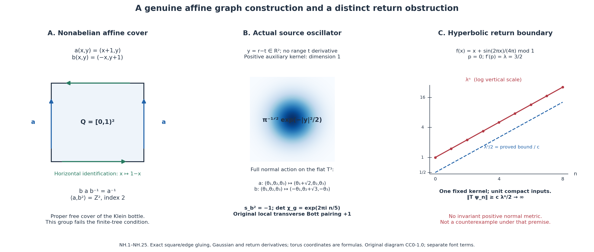

**Figure 11G.1.** Equations (NH.1)–(NH.25). The left square is an exact fundamental region for (NH.17), with translation on vertical edges and reversed horizontal-edge identification. The middle panel shows the exact two-dimensional auxiliary Gaussian \(\pi^{-1/2}e^{-|y|^2/2}\), \(y=r-t\), and the normal action (NH.18); the torus coordinates are a formula, not a metric drawing of \(\mathbb T^3\). The right panel samples the exact derivative \((f^n)'(p)=(3/2)^n\). The fixed kernel and normalized tests of Theorem 11G.3 give the proved bound \(c(3/2)^n/2\). The tests have shrinking transverse supports; the panel plots their analytic norm bound, not those supports. That suspension fails the invariant metric/unitary Clifford premise and is not a counterexample to that version of the historical problem. [Editable SVG](../figures/affine-oscillator-and-return-holonomy.svg) · [Figure source](../reproduction/normal-holonomy/draw_normal_holonomy.py) · [Component terms](../reproduction/normal-holonomy/COMPONENT-TERMS.md).

## 11H. A normal Dirac on one actual source column over each compact leaf

A source column can remove the second leaf coordinate without removing the prescribed normal inverse. The following result makes this precise for compact smooth bundles with a global transverse section. It includes twisted bundles and varying fibre densities. Its operator is a first-order differential expression on the actual source-column manifold. It is not an operator obtained solely by naming an abstract Morita product.

### 11H.1. The geometric data and the claim

Let \(p:V\to B\) be a smooth locally trivial bundle of connected compact manifolds without boundary, with \(V\) and \(B\) compact and without boundary, and let \(\sigma:B\to V\) be a smooth section. Fibres and their tangent bundles need not be orientable or spin-c. Give the fibres a smooth positive density \(\mu_b\), and \(B\) a Riemannian metric with density \(\nu\). The foliation is \(F=\ker dp\). Its normal bundle is \(p^*TB\).

On \(B\), supply exactly the full inverse normal module \(\mathcal D_B\), normal Dirac \(D_B\), grading and final right \(C_q\) coefficient of Section 11E.9, with \(q=\dim B\). In particular the original transition \(zs\) acts on this entire inverse module as \(z^{-1}\rho_t(s)\); the original determinant line becomes its dual, and an original even line twist becomes its dual. Retain the parity \(\Pi^{q(q-1)/2}\), the sign of the full inverse principal symbol, and the order of every right Clifford factor. Assume the supplied \(D_B\) is odd, compatible and formally symmetric, self-adjoint on \(H^1(B,\mathcal D_B)\) with smooth core and scalar compact resolvent. Assume its original positive local transverse Bott class \(b_U\) has pairing one. These are the supplied normal inverse and calibration hypotheses, rather than conclusions inferred from a chosen minimal spinor.

The transverse metric and this entire unitary spin-c structure on \(p^*TB\) are holonomy invariant: a leaf path leaves its base point fixed, and its normal germ and its pullback coefficient transport are the identity. Thus this family satisfies the positive-metric invariant premise. A chosen connection on \(B\) need not have any additional invariance along unrelated base loops.

**Theorem 11H.1.** For these data and any smooth horizontal complement to \(F\), there is an odd, formally symmetric first-order differential operator on the finite-rank full inverse normal bundle \(D_H\) on the actual smooth source-column manifold \(G|_{s\,\sigma(B)}\). Its closure has the maximal distributional domain, is self-adjoint, and has smooth core. Actual smooth convolution has bounded commutators with \(D_H\). The ordinary scalar localized resolvents and all scalar Kasparov defects are compact. Its reduced class is exactly the holonomy Morita transport of the supplied full normal inverse, and its original local transverse Bott pairing is \(+1\).

Changing the horizontal complement or fibre density does not require a leaf spin-c structure. The proof identifies the class of each resulting operator by the same specified correspondence. It does not claim a bounded difference between all such differential expressions.

### 11H.2. The actual graph and its reduced completion

In a bundle chart, the transverse coordinate of a path in one fibre is constant. All such paths induce the identity transverse germ. Two paths with the same endpoints are therefore identified by holonomy, including paths that differ by a nontrivial loop in a fibre. Connectedness of the fibre guarantees that any two fibre points can be joined. Consequently

\[
 G=V\times_B V,\qquad
 r(v,w)=v,\quad s(v,w)=w,\quad
 (v,w)(w,z)=(v,z).                                      \tag{SC.1}
\]

This proves that \(G\) is the actual holonomy groupoid, rather than a fundamental-path groupoid with an unremoved isotropy kernel. The section \(T=\sigma(B)\) is a compact embedded complete transversal: \(dp\,d\sigma=1\), it meets every leaf once, and \(G|_T\) is the unit groupoid \(B\). The map

\[
 \Phi:V\longrightarrow Y=G|_{sT},\qquad
 \Phi(v)=(v,\sigma(pv))                                  \tag{SC.2}
\]

is a smooth bijection with smooth inverse \(r\). Hence \(Y\) is genuinely this source-column manifold. There is no second independently integrated source endpoint in (SC.2).

Put \(E=L^2(V/B,\mu)\), the Hilbert \(C(B)\)-module completion of smooth scalar functions with
\(\langle\eta,\zeta\rangle(b)=\int_{V_b}\overline\eta\,\zeta\,d\mu_b\).
Put \(H_B=L^2(B,\mathcal D_B,\nu)\). The unitary from the balanced Hilbert-space tensor product to the physical column space is

\[
 E\otimes_{C(B)}H_B\longrightarrow
 H=L^2(V,p^*\mathcal D_B,\mu_b\nu(b)),\qquad
 \eta\otimes u\longmapsto \eta(v)u(pv).                  \tag{SC.3}
\]

Its inner products agree by the fibre integral. Its range is dense: on a finite bundle-and-coefficient trivializing cover, smooth sections are approximated by finite sums of separated smooth fibre profiles and smooth base-coefficient profiles. To see this without a separability assertion standing in for a proof, take a fine coordinate grid on each compact chart support, a product partition of unity, and freeze the coefficient of a smooth section on the fibre part of each cell. Uniform approximation follows from uniform continuity. The resulting finite sums have the displayed form after the base partition is included in one factor. Smooth sections are dense in \(L^2\), by finite-chart convolution. Thus the isometry is onto.

For \(k\in C^\infty(V\times_B V)\), actual convolution on \(H\) is

\[
 (K_k u)(b,x)=\int_{V_b}k(b,x,y)u(b,y)\,d\mu_b(y),
 \qquad \|K_k\|\le
 \sqrt{\sup_{b,x}\int|k|\,d\mu_b(y)\,
             \sup_{b,y}\int|k|\,d\mu_b(x)}.              \tag{SC.4}
\]

The coefficient fibres at \(x,y\) are the same full \((\mathcal D_B)_b\), so the coefficient transport is the identity and composes exactly. No determinant phase is omitted; it is in the common base coefficient, and both slots transform by the same base transition.

Here the reduced graph algebra is
\(A=C_r^*(G)=\mathcal K_{C(B)}(E)\).
Indeed each source-fibre regular representation is the scalar integral-kernel operator on \(L^2(V_b,\mu_b)\), independent of the selected source point in that fibre. Its defining reduced norm is \(\sup_b\|K_{k,b}\|\). In a bundle chart, multiplying by the square root of the density ratio identifies all these fibre spaces with one fixed \(L^2\) space. A smooth kernel then varies continuously in the two Schur norms, so its operator norm is continuous in \(b\). Hence the essential supremum for (SC.3) equals that supremum: a strict lower bound at a base point persists on a neighbourhood of positive \(\nu\)-measure. Tensoring by the nonzero finite normal coefficient does not change the norm. This proves literal reduced descent and faithfulness.

Every smooth rank-one kernel \(\eta(b,x)\overline{\zeta(b,y)}\) is convolution. Conversely, product partitions in compact fibre charts approximate any smooth \(k\) uniformly by finite sums of such kernels. One first partitions in \(b,x,y\), freezes the smooth coefficient on the fibre-coordinate grid, and puts the base partition into either profile. Finite chart volume makes uniform error small in both Schur norms. Smooth profiles approximate continuous \(E\)-profiles in the fibre supremum norm, by local smoothing and partitions. The two norm closures are thus equal. In particular the equality with \(\mathcal K(E)\) is not a maximal-to-reduced inference or an amenability assumption.

### 11H.3. A unitary fibre connection and the physical first-order expression

A smooth complement to \(\ker dp\) exists: choose a smooth metric on compact \(V\) and take its orthogonal complement. In a bundle coordinate chart \((u,x)\), its lift of \(\partial_{u^a}\) is
\(X_a=\partial_{u^a}+\sum_j A_a^j(u,x)\partial_{x^j}\).
Define the intrinsic density derivative \(\beta_a\) by the Lie derivative of the vertical density under this lift. In the chart it is

\[
 \beta_a=\partial_a\log\mu+
                   \operatorname{div}_{\mu_b} A_a,
 \qquad
 \nabla^E_a=X_a+\tfrac12\beta_a.                         \tag{SC.5}
\]

The expression \(\partial_a\log\mu\) uses the density coefficient in the chart. The sum is the coordinate-independent infinitesimal change of the vertical density under the horizontal flow. This also follows by changing variables in the defining fibre integrals, so (SC.5) patches under every fibre-coordinate transition.

Integration by parts on a compact boundaryless fibre gives

\[
 \partial_a\langle\eta,\zeta\rangle
   =\langle\nabla^E_a\eta,\zeta\rangle+
                         \langle\eta,\nabla^E_a\zeta\rangle.
                                                               \tag{SC.6}
\]

Explicitly the integral of \(A_a(\overline\eta\zeta)\) is
\(-\int(\operatorname{div}_{\mu_b} A_a)\overline\eta\zeta\);
the two halves of \(\beta_a\) then leave exactly the density derivative \(\partial_a\mu\). This proves unitarity of the fibre connection, including varying density. Compact fibres also give existence of the horizontal flow for each bounded base-curve interval: in finitely many bundle charts its smooth vertical vector fields have bounded coordinate coefficients; successive local ODE solutions extend until the interval ends because their images stay in compact \(V\).

Write the supplied normal expression in a coefficient frame as
\(D_B=-i\sum_a M^a(u)\partial_a+W(u)\), with the entire original normal connection, determinant connection and density terms in \(W\). The \(M^a\) are the prescribed Hermitian inverse Clifford matrices. Define

\[
 D_H=-i\sum_a M^a(u)
           \bigl(X_a+\tfrac12\beta_a\bigr)+W(u)
 \quad\hbox{on }C^\infty(V,p^*\mathcal D_B).             \tag{SC.7}
\]

Invariantly this is the same Clifford contraction of the tensor connection
\(\nabla^E\otimes1+1\otimes\nabla^{\mathcal D_B}\) used for \(D_B\).
The connection product rule proves (SC.7) on separated sections and shows it patches under both bundle coordinates and full coefficient transitions. The even fibre profile introduces no extra Clifford factor or block permutation. Equation (SC.6) and the supplied symmetry of \(D_B\) prove formal symmetry. Its grading and right \(C_q\) action are exactly those of the supplied normal inverse.

For a covector \(\zeta\in T_v^*V\), its symbol is the supplied normal Clifford action on the restriction of \(\zeta\) to the chosen horizontal lift. Its square is that horizontal covector's squared normal norm. In particular, on the normal covectors \(p^*T_b^*B\) it is the entire prescribed positive-metric normal symbol. It vanishes on covectors annihilating the horizontal complement. There is no claim of full ellipticity on \(V\), and no assumption of a spin-c structure on \(TV\).

### 11H.4. Self-adjoint closure with the exact anisotropic domain

The domain is

\[
 \operatorname{Dom}D_H=
 \{u\in H:\ D_Hu\text{ as a distribution is in }H\}.
                                                               \tag{SC.8}
\]

Here is a complete core and self-adjointness argument that does not replace this domain by \(H^1(V)\). Reduce a local coefficient frame and density to Euclidean \(L^2\) by their smooth positive square-root factors. For a compactly supported local first-order expression
\(L=\sum_j a_j(z)\partial_j+a_0(z)\), mollification \(J_\epsilon u=\rho_\epsilon*u\) satisfies a uniformly \(L^2\)-bounded commutator. Integration by parts in the convolution variable expresses its derivative part as kernels

\[
 (a_j(z)-a_j(w))\,\partial_j\rho_\epsilon(z-w)
       +(\partial_j a_j)(w)\rho_\epsilon(z-w).           \tag{SC.9}
\]

An immaterial overall sign depends on the chosen commutator order. Both Schur integrals of the first term are bounded independently of \(\epsilon\): the smooth coefficient is Lipschitz on the buffered chart and
\(\int|h|\,|\partial_j\rho_\epsilon(h)|\,dh\) is constant under scaling. The second term and the zeroth-order commutator have the same uniform bounds. The inequality (SC.4), applied in Euclidean coordinates, proves the \(L^2\) bound. For smooth functions the commutator tends to zero because \(LJ_\epsilon u\) and \(J_\epsilon Lu\) both tend to \(Lu\). Density and the uniform bound prove strong convergence to zero for every \(L^2\) input.

Take a finite partition \(\chi_j\) subordinate to buffered frames, with auxiliary cutoffs equal to one on their supports. Smooth each \(\chi_j u\) inside the larger chart and sum. For \(u\) in the maximal domain, \(L(\chi_j u)=\chi_j Lu+[L,\chi_j]u\) is in \(L^2\). Formula (SC.9) shows convergence of each smoothed term and its image to \(\chi_j u\) and \(L(\chi_j u)\). The auxiliary cutoffs have no additional limiting error because they are one on the original support and the mollifier supports shrink. Summing yields \(u_n\to u\) and \(D_Hu_n\to D_Hu\); the partition commutators sum to zero. Thus smooth sections are a core for the maximal domain.

For a formally symmetric smooth expression on a compact boundaryless manifold the adjoint of its smooth-core operator has exactly the maximal domain: the defining adjoint identity against every smooth test section is precisely the distributional identity \(D_Hu\in L^2\). The preceding graph approximation identifies maximal and minimal domains. Hence the closure equals its adjoint and is self-adjoint on (SC.8). This argument also proves closedness, without a prescribed boundary condition or a full elliptic estimate for \(D_H\).

### 11H.5. Principal cancellation in actual convolution

Let \(K_k\) be (SC.4). Differentiation of the fibre integral, followed by integration by parts in the input variable \(y\), gives

\[
 [\nabla^E_a,K_k]=K_{\delta_a k},\qquad
 \delta_a k=\partial_a k+
       A_a(x)\cdot\partial_x k+A_a(y)\cdot\partial_y k
                  +\tfrac12(\beta_a(x)+\beta_a(y))k.
                                                               \tag{SC.10}
\]

For clarity the input derivative initially contributes
\(-\int k A_a(y)\partial_yu\,d\mu_b(y)\).
Integration by parts replaces it by
\(\int(A_a(y)\partial_yk+\operatorname{div}_{\mu_b}A_a(y)\,k)u\,d\mu_b(y)\).
The differentiated density supplies \(\partial_a\log\mu\,k\), and subtraction of the input half-density connection leaves precisely \(\beta_a(y)k/2\). The output half is \(\beta_a(x)k/2\). This proves the signs in (SC.10).

At common \(b\), \(W\) and every \(M^a\) commute with the scalar kernel and with its fibre integration. Thus

\[
 [D_H,K_k]=-i\sum_a M^a K_{\delta_a k}=:C_k.             \tag{SC.11}
\]

These are smooth matrix kernels on the compact fibre product, with bounded Schur integrals. The commutator is bounded on \(H\). Convolution sends smooth sections to smooth sections. Approximating a maximal-domain section by the core in Section 11H.4 and using (SC.11) proves that it preserves (SC.8) and that the same commutator identity holds there. Coefficient-frame changes conjugate the entire matrix kernel, so the full determinant connection is retained in this argument, rather than set equal to zero.

### 11H.6. Scalar compactness after convolution

Although \(D_H\) need not have compact resolvent, smooth fibre convolution removes the undifferentiated fibre multiplicity. Here are the required global estimates.

Choose finitely many smooth vertical vector fields \(Z_j\) spanning \(\ker dp\) at every point, by local frames and a finite subordinate partition. There is a constant \(C\) such that

\[
 \|w\|_{H^1(V)}
 \le C\left(\|D_Hw\|+\sum_j\|Z_jw\|+\|w\|\right)
 \quad (w\in C^\infty(V,p^*\mathcal D_B)).               \tag{SC.12}
\]

To prove it, the squared norm of the joint principal symbol on \(w\) is the horizontal Clifford norm squared plus \(\sum_j|\zeta(Z_j)|^2\), times \(\|w\|^2\). If this vanishes, \(\zeta\) annihilates both horizontal and vertical tangent spaces and hence is zero. On the unit cotangent sphere, compactness gives a uniform positive lower bound. For frozen constant coefficients, Fourier transformation and Plancherel therefore bound the gradient norm by the norm of the joint first-order expression. In a sufficiently small chart the variation of each principal coefficient is as small as required to absorb its gradient error on the left. All zeroth-order terms are bounded there. A finite chart partition globalizes the estimate; commutators with its cutoffs are bounded zeroth-order terms. This proves (SC.12), including its coefficient-bundle version.

The estimate holds whenever the displayed derivatives are distributions in \(L^2\). Apply the same local mollification as in (SC.9) to the finite augmented list \(D_H,Z_j\). Their commutators are uniformly bounded and strongly tend to zero. The smoothed approximations converge in the joint graph norm and are uniformly bounded in \(H^1\) by (SC.12). A weakly convergent subsequence in \(H^1\) has the prescribed \(L^2\) limit, establishing the estimate for that limit. This step does not assert that \(D_H\) alone controls every derivative.

Put \(R=(D_H-i)^{-1}\). For \(w=K_kRu\), (SC.11) gives
\(D_Hw=K_kD_HRu+C_kRu\), bounded in \(L^2\) by a constant times \(\|u\|\). Each \(Z_jK_k\) is also a bounded smooth matrix fibre kernel, obtained by differentiating the output variable and its frame. Therefore (SC.12) gives

\[
 K_k(D_H-i)^{-1}:H\longrightarrow H^1(V,p^*\mathcal D_B)
       \quad\hbox{bounded, hence scalar compact into }H. \tag{SC.13}
\]

The last implication has an elementary local proof. After a finite chart partition, extend the compactly supported sections by zero to a fixed cube and periodically to a torus. A bounded \(H^1\) family has Fourier tail squared at frequencies \(|n|>R\) at most \(C/(1+R^2)\). Its finitely many retained Fourier coefficients lie in a bounded finite-dimensional set. These finite-rank approximations prove compactness into \(L^2\), and the finite partition proves the assertion on \(V\). Adjointness yields the other localized resolvent. The same argument works at every nonreal parameter and for every smooth matrix fibre kernel, including \(C_k\).

For \(F_H=D_H(1+D_H^2)^{-1/2}\), the square defect is a localized resolvent product. The phase commutator is a norm-convergent integral of compact operators: with \(a=\sqrt{1+t^2}\),
\([ (D_H\mp ia)^{-1},K_k]=-(D_H\mp ia)^{-1}C_k(D_H\mp ia)^{-1}\).
Its norm is at most \(\|C_k\|/(1+t^2)\), and it is compact by (SC.13). The strong formula
\(F_H=(2/\pi)\int_0^\infty D_H(D_H^2+1+t^2)^{-1}\,dt\)
then gives the actual compact commutator by integrating the differences in norm. No norm convergence of the uncommuted integral is asserted. Density of smooth kernels and boundedness of \(F_H\) give every defect for every \(a\in A\). The self-adjointness defect is zero. These are ordinary scalar compacts on \(H\), not just fibrewise or Hilbert-module compacts.

### 11H.7. Exact Morita class, full coefficient and the positive local pairing

Construct a smooth real nonnegative fibre profile \(\xi\) with fibre norm one. In each of finitely many section neighbourhoods choose a nonnegative vertical bump that is positive at \(\sigma(b)\); multiply by a base partition and sum. Its fibre squared norm is smooth and strictly positive. Dividing by its positive square root gives

\[
 \langle\xi,\xi\rangle=1,\quad
 p_\xi=\theta_{\xi,\xi}\in A,\quad
 i:C(B)\longrightarrow p_\xi A p_\xi,\quad
 i(f)=\theta_{\xi f,\xi}.                              \tag{SC.14}
\]

These are smooth kernels. The creation map \(T_\eta:H_B\to H\) for a smooth profile is \(T_\eta u=\eta u\), bounded in general and isometric for \(\xi\). The tensor product rule proves

\[
 D_HT_\eta-T_\eta D_B
       =-i\sum_a M^aT_{\nabla^E_a\eta}=:E_\eta,
 \qquad \|E_\eta\|<\infty.                             \tag{SC.15}
\]

The formula is first proved on the smooth normal core. It extends to the normal domain by closedness. The fibre norm of each differentiated smooth profile is bounded on compact \(B\).

The rectangular resolvent identity
\[
 (D_H-z)^{-1}T_\eta-T_\eta(D_B-z)^{-1}
       =-(D_H-z)^{-1}E_\eta(D_B-z)^{-1}                 \tag{SC.16}
\]
is compact, because the right resolvent is scalar compact on \(H_B\). At \(z=\pm i\sqrt{1+t^2}\) its norm is at most \(\|E_\eta\|/(1+t^2)\). Integrating the averaged identities gives
\(F_HT_\eta-T_\eta F_B\) compact; its adjoint is the other creation connection equation. Smooth profiles are dense in \(E\), and creation is continuous in the module norm, so the connection equations hold for every profile. The positivity condition for the Morita cycle with operator zero is identically zero. Hence, in the original coefficient order,

\[
 [H,K,F_H]=[{}_AE_{C(B)},0]\otimes_{C(B)}[H_B,M,F_B]
       \in KK^q(A,\mathbb C).                          \tag{SC.17}
\]

There is also an exact compressed unbounded expression. Since \(\xi\) is real and \(\nabla^E\) is real, \(\langle\xi,\nabla^E_a\xi\rangle\) is real. Differentiating its norm in (SC.6) makes twice this number zero. Thus

\[
 T_\xi^*D_HT_\xi=D_B,\qquad
 \{u:T_\xi u\in\operatorname{Dom}D_H\}
                     =H^1(B,\mathcal D_B).             \tag{SC.18}
\]

For the forward inclusion of domains use (SC.15). For the reverse, its distributional identity, followed by \(T_\xi^*\), gives \(D_Bu\in L^2\); the stipulated maximal normal domain is \(H^1\). The bounded commutator with \(p_\xi\) also allows removal of its off-diagonal blocks by a bounded self-adjoint perturbation, on the unchanged domain, and proves that the compressed operator is self-adjoint. The two sufficiently large imaginary Neumann inverses establish that perturbation statement. No equality of bounded transforms of compressions is presumed; the connection calculation above supplies their compact comparison.

The inverse holonomy correspondence is exactly \(E^*\), since the transversal has one intersection per leaf and no return isotropy. Its unitary onto the essential correspondence of \(i\) is
\(\overline\eta\mapsto\theta_{\xi,\eta}\in p_\xi A\).
The right inner product is preserved because
\((\theta_{\xi,\eta})^*\theta_{\xi,\zeta}=\theta_{\eta,\zeta}\);
the right action follows by adjointing the second slot; and the left \(f\) action is \(i(f)\). It is onto because \(p_\xi a=\theta_{\xi,a^*\xi}\). The actual transverse counting norm has one term in each fibre, while the normalized plaque integral is one. These are the same normalization, so this is the original counting correspondence, not a separately chosen \(K\)-class. Equations (SC.17)–(SC.18) give

\[
 i^*[H,K,F_H]=[D_B],\qquad
 (i_*b_U)\otimes_A[H,K,F_H]=1.                         \tag{SC.19}
\]

The full inverse determinant, even line twists, grading and final right \(C_q\) have been retained at every step. No second even/odd longitudinal index factor multiplies this one. This proves Theorem 11H.1.

### 11H.8. Open transversal chart ends and the exact gluing domain

Even in this compact family, taking an unrestricted sum of open transverse charts and closing each local operator separately is unsafe. On \((0,1)\), \(-i\,d/dt\) with compact smooth core has minimal domain \(H^1_0\), adjoint domain \(H^1\), and deficiency dimensions \((1,1)\): its two deficiency equations have solutions \(e^{-t}\) and \(e^t\), both in \(L^2\). Here are the endpoint details. The derivative graph norm is the \(H^1\) norm, and the integral representation bounds endpoint traces continuously by it, so limits of compact smooth functions have zero traces. Conversely, if \(u(0)=0\), then \(|u(t)|^2\le t\int_0^t|u'|^2\). A cutoff changing on \((\epsilon,2\epsilon)\) with derivative bounded by \(C/\epsilon\) has derivative-error squared at most \(C'\int_0^{2\epsilon}|u'|^2\), tending to zero. The same proof applies at the other zero endpoint; the ordinary tails also vanish. Mollifying the resulting interior functions proves density. Finally the adjoint identity is the distributional derivative in \(L^2\), which is exactly \(H^1\), with no trace restriction. Thus an incomplete chart does not acquire a self-adjoint domain merely from a normal symbol.

Here is the exact gluing in the present family. Choose buffered base charts \(U_j\), real smooth \(\chi_j\) compactly supported in them, with \(\sum_j\chi_j^2=1\). On the actual disjoint source-chart columns put
\[
 H_{\rm ch}=\bigoplus_j L^2(p^{-1}U_j,p^*\mathcal D_B),
 \quad Ju=(\chi_j u)_j,\quad P=JJ^*,\quad
 P_{jk}=\chi_j\chi_k.                                  \tag{SC.20}
\]
The entries identify the same \(v\) on an overlap, with its actual coefficient transition and density; multiplication outside the overlap is zero. \(J\) is an onto unitary from \(H\) to \(PH_{\rm ch}\), and \(P^2=P=P^*\) follows from the sum of squares. It commutes with chart convolution, since the \(\chi_j\) depend only on \(b\). The local differential expressions \(D_{\rm loc}\) are defined on compact smooth chart cores. The vector \(Ju\) lies in those cores for smooth global \(u\), even near chart ends, because each \(\chi_j\) has buffered support. Direct calculation gives
\[
 J^*D_{\rm loc}Ju
  =D_Hu-i\sum_a M^a
                      \Bigl(\sum_j\chi_j\partial_a\chi_j\Bigr)u
  =D_Hu.
\]
Therefore \(PD_{\rm loc}P\) on the specified core \(J C^\infty(V,p^*\mathcal D_B)\) closes to \(JD_HJ^*\), self-adjoint on exactly \(J\operatorname{Dom}D_H\). This proves its domain and compactness by the already proved onto unitary. It does not choose unrelated self-adjoint extensions of the separate charts. The projected chart completion is explicitly identified with the global physical source column; the unrestricted direct sum is not silently equated with it.

### 11H.9. A twisted compact-fibre example with a nontrivial determinant

Take
\[
 V=(\mathbb R\times S^2)/((t+1,x)\sim(t,-x)),
 \qquad B=\mathbb R/\mathbb Z,\quad p[t,x]=[t].
\]
The antipodal map reverses the orientation of \(S^2\). Thus the vertical tangent orientation is not preserved around the base; the construction genuinely needs no vertical spin-c orientation. A smooth section exists: choose a smooth path \(\gamma\) from the north pole to the south pole, constant near each endpoint, and extend by \(\gamma(t+1)=-\gamma(t)\). The flat complement \(X=\partial_t\) and round fibre density give \(\beta=0\).

Give the original rank-one oriented normal spin-c structure the central phase \(e^{i\kappa}\) around the base, with \(\kappa=\pi/5\). Its original determinant has phase \(e^{2i\kappa}\); the full inverse module has phase \(e^{-i\kappa}\), dual determinant phase \(e^{-2i\kappa}\), and retains the entire graded right \(C_1\). In the constant frame let \(J_N\) be its supplied Hermitian inverse normal symbol, \(J_N^2=1\), with its original grading and right action. Choose the flat compatible normal connection, represented on the interval by this seam condition rather than deleting its phase. Then
\[
 D_H=-iJ_N\partial_t,\qquad
 u(1,x)=e^{-i\kappa}u(0,-x).
                                                               \tag{SC.21}
\]
Its exact domain is \(H^1([0,1];L^2(S^2)\otimes\mathcal D_1)\) with the displayed trace condition. Indeed the distributional \(t\) derivative in \(L^2\) gives an absolutely continuous Hilbert-valued representative by integrating that derivative; the difference has zero weak derivative and is a constant. Its norm and trace are bounded by its derivative graph norm. Integration by parts across the seam gives exactly the stated condition for the maximal global domain. This identifies (SC.8) explicitly here.

The antipodal pullback \(A u(x)=u(-x)\) is a self-adjoint unitary. Its positive and negative eigenspaces are both infinite-dimensional: smooth disjoint pairs of small caps, with equal or opposite values on antipodes, give arbitrarily many independent functions. On these two subspaces the permitted frequencies are respectively \(2\pi n-\kappa\) and \(2\pi(n+\tfrac12)-\kappa\). The eigenvalues of (SC.21) are those frequencies times the finite eigenvalues of \(J_N\), with infinite fibre multiplicity. Completeness follows from the orthogonal \(A\)-splitting and the ordinary Fourier basis after multiplication by the corresponding scalar phase. The resolvent is therefore not scalar compact before localization. Nevertheless every smooth graph kernel localized resolvent is scalar compact by (SC.13), and (SC.19) is the original positive local pairing one.

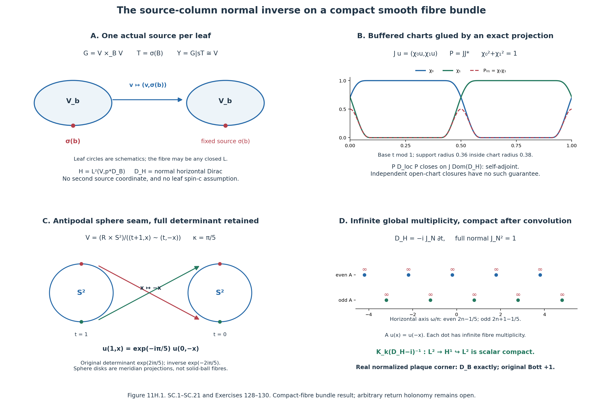

**Figure 11H.1.** Equations (SC.1)–(SC.21) and Exercises 128–130. Panel A is a leaf schematic: fixing the actual source \(\sigma(b)\) leaves the one manifold \(Y\cong V\). Panel B plots the exact smooth normalized bump weights with support radius \(0.36\) in base-circle charts of radius \(0.38\), and the overlap entry \(P_{01}=\chi_0\chi_1\); their projection implements the proven global domain. Panel C shows meridian projections of the actual \(S^2\) seam and both determinant phases. Panel D plots frequencies divided by \(\pi\) for the two antipodal sectors, each with infinite fibre multiplicity; smooth convolution nonetheless maps its localized resolvent to \(H^1\), compactly into \(L^2\). The supplied full normal inverse, rather than another leaf factor, has original local pairing \(+1\). [Editable SVG](../figures/source-column-normal.svg) · [Reproduction source](../reproduction/source-column-normal/draw_source_column.py) · [Reproduction instructions](../reproduction/source-column-normal/README.md) · [Font and software terms](../reproduction/source-column-normal/COMPONENT-TERMS.md).

### 11H.10. What remains for general holonomy

This result uses a compact smooth leaf space \(B\), compact fibres, no return isotropy, a global section, and a supplied normal Dirac on that entire closed base. These hypotheses produce the actual \(Y\cong V\), compact Schur bounds, global symmetric differential domain, and normalized one-term counting correspondence. They cannot be inferred from an invariant transverse metric or a unitary normal spin-c lift alone.

For a general complete transversal, its open components may be incomplete and its return groupoid may be infinite. Morita induction gives an abstract class only after a reduced scalar transverse cycle has been supplied; it does not prove that a bare normal Dirac with infinitely many regular return copies has localized scalar compacts. Section 11A's reduced tree completion and the local-potential obstruction retain their exact scopes. In that suspension the normalized plaque corner has infinitely many normal copies; local multiplication cannot replace its nonlocal return completion with positive local pairing. Our proof avoids that obstruction because its actual transversal has one point per leaf and no return labels, not because every acting group is K-amenable or because a compact-transversal implementing representation automatically descends.

The remaining general interface is a compatible global self-adjoint realization on actual complete-transversal columns, with ordinary scalar compactness after the *whole* reduced convolution and the original Morita counting normalization, in the presence of arbitrary eligible return holonomy. A proposed construction must provide those interfaces or compare a different induced/pseudodifferential representative to a physical finite-order differential expression. Theorem 11H.1 provides them on the stated compact-bundle family. It does not close the historical general graph-Dirac problem.

## 11I. Transverse fundamental classes and the reduced norm

The transverse fundamental-class question has a distinction between the algebra on which a class is defined and the operator used to represent it. Hilsum and Skandalis construct the general K-oriented projection class on the **maximal** foliation algebra. Their notation explicitly differs from Connes's reduced foliation algebra; see their original paper, pp. 326–327 and Section IV, pp. 350–355. Thus the general maximal construction is established. This statement does not give a reduced scalar graph representative with the prescribed local transverse Bott pairing.

Connes and Moscovici's metric-bundle construction gives a hypoelliptic spectral triple for a geometric crossed-product representation. Their 1995 paper, p. 12, distinguishes that metric-bundle algebra from the original transverse algebra; Theorem I.1 on p. 16 states bounded commutators and localized compact resolvents. A reduced-norm estimate is an additional requirement. The following proof shows that this requirement can fail even for invariant transverse metric and spin-c data.

### 11I.1. A general necessary condition for the geometric representation

Let a discrete group \(\Gamma\) act by homeomorphisms on a compact Hausdorff space \(N\), preserving a Borel probability measure \(\mu\). On \(H=L^2(N,\mu)\), put

\[
 (U_g\xi)(x)=\xi(g^{-1}x),\qquad
 \pi(fu_g)=M_fU_g,\qquad
 \alpha_g(f)(x)=f(g^{-1}x).
 \tag{RN.1}
\]

Here \(u_gfu_g^{-1}=\alpha_g(f)\). This is the geometric covariant representation of the algebraic crossed product. The reduced norm is the supremum of the regular point representations on \(\ell^2(\Gamma)\):

\[
 (\pi_x(f)\eta)(h)=f(hx)\eta(h),\qquad
 (\lambda_g\eta)(h)=\eta(g^{-1}h).
 \tag{RN.2}
\]

They have the covariance in (RN.1). Taking the supremum over all \(x\in N\) is faithful on \(C(N)\); equivalently one can use their direct sum. In particular the norm of \(\sum c_gu_g\) is exactly the norm of \(\sum c_g\lambda_g\) in \(C_r^*(\Gamma)\).

**Theorem 11I.1.** If the representation in (RN.1) extends to \(C(N)\rtimes_r\Gamma\), then \(\Gamma\) has a left-invariant mean on \(\ell^\infty(\Gamma)\). Consequently a nonamenable group with an invariant probability measure does not have this reduced geometric representation. This assertion concerns the displayed representation, not every scalar K-homology class.

**Proof.** The constant function \(\mathbf1\) is a unit vector fixed by all \(U_g\). Contractivity of the extended representation and (RN.2) imply

\[
 \left|\sum_g c_g\right|
 \leq \left\|\sum_g c_gU_g\right\|
 \leq \left\|\sum_g c_g\lambda_g\right\|.
 \tag{RN.3}
\]

The algebraic trivial character therefore extends continuously to a unital multiplicative functional \(\varepsilon:C_r^*(\Gamma)\to\mathbb C\). The extended map remains multiplicative and preserves the involution by approximating both factors by finite sums. It is positive because \(\varepsilon(v^*v)=|\varepsilon(v)|^2\); positive elements are squares by continuous functional calculus. Its norm is one.

Use the norm-preserving Hahn–Banach extension to extend \(\varepsilon\) to a functional \(\psi\) on \(B(\ell^2\Gamma)\) with \(\|\psi\|=\psi(1)=1\). Such an extension is positive. For completeness, if \(z=z^*\), the norm-convergent exponential satisfies
\(\psi(e^{itz})=1+it\psi(z)+O(t^2)\). Its modulus is at most one, for both signs of \(t\), so \(\operatorname{Im}\psi(z)=0\). If \(0\leq z\leq1\), then \(\|1-z\|\leq1\), giving \(|1-\psi(z)|\leq1\) and hence \(\psi(z)\geq0\). Scaling proves positivity on the whole cone. The required calculus and positive-functional inequalities are proved in Order, local units and quotients of C*-algebras, Sections 5, 8 and Lemma 13.1; the extension theorem is [Hahn–Banach, Baire and the basic theorems on Banach spaces](https://kokunoyumeto.github.io/open-math-courses-public/courses/foundations-of-von-neumann-algebras/hahn-banach-baire-and-the-basic-theorems-on-banach-spaces.html#oa-fnd-hb-02).

For \(u=\lambda_g\) we have \(\psi(u)=\psi(u^*)=1\), and therefore

\[
 \psi((u-1)^*(u-1))
 =\psi((u-1)(u-1)^*)=0.
 \tag{RN.4}
\]

The positive form \((a,b)\mapsto\psi(b^*a)\) satisfies Cauchy–Schwarz: expand \(\psi((a+tb)^*(a+tb))\geq0\) and minimize in the complex scalar \(t\); if a diagonal value is zero, first add a positive number and then let it decrease to zero. Applying this inequality with \(u-1\) and \(u^*-1\) shows, for every bounded \(T\),

\[
 \psi((u-1)T)=0,\qquad \psi(T(u^*-1))=0,
 \qquad \psi(uTu^*)=\psi(T).
 \tag{RN.5}
\]

For \(f\in\ell^\infty(\Gamma)\), let \(M_f\) be diagonal multiplication on \(\ell^2(\Gamma)\), and define \(m(f)=\psi(M_f)\). This is a positive linear functional with \(m(1)=1\). Since
\(\lambda_gM_f\lambda_g^*=M_{f(g^{-1}\,\cdot)}\), (RN.5) gives

\[
 m(f(g^{-1}\,\cdot))=m(f).
 \tag{RN.6}
\]

This is precisely a left-invariant mean, which is the amenability asserted in the theorem. No faithfulness of \(\mu\), freeness, ergodicity, elliptic estimate or Fredholm operator was used. \(\square\)

The theorem still applies if \(H\) is replaced by a geometric Hilbert space containing the trivial representation as an invariant subspace. It also applies after a central unitary character is removed from the group coefficients: the coefficient change \(u_g\mapsto\chi(g)u_g\) preserves both the full and reduced norms. The next calculation proves that claim and gives an exact numerical obstruction.

### 11I.2. An exact reduced-norm gap in eligible transverse geometry

Use the explicit free pair in [Section 11A](#section-11a):
\(\rho(a)=(1+2i)/\sqrt5\), \(\rho(b)=(1+2j)/\sqrt5\) in \(\operatorname{SU}(2)\). Lemma 11.9 supplies its all-word injectivity proof. Let
\(N=\operatorname{SU}(2)\times S^1\), with \(\Gamma=F_2=\langle a,b\rangle\) acting by \(\rho(g)\) on the first factor and by the identity on the second. The action is smooth, free and germ-effective: a nonidentity left translation has no fixed point. The product oriented left-invariant orthonormal frame is fixed, so the full rank-four metric spin structure is invariant.

A supplied character \(\chi:\Gamma\to U(1)\) gives the coherent spin-c lift \([1,\chi(g)]\) in this frame. Its determinant character is \(\chi(g)^2\). The inverse normal coefficient carries \(\chi(g)^{-1}\), rather than being determined just by that square. In the conventions of Theorem 7.17 its complete rank-four inverse is \(C_4\), with physical generators \(-L_{t_j}\), since \(4(4-1)/2=6\). None of those coefficient signs or phases is changed in the following norm calculation.

There is an actual compact foliation with this transversal: use the genus-two surface cover \(\Sigma_0\) and surjection onto \(F_2\) from (SG.1), and form
\(V=(\Sigma_0\times N)/F_2\). Properness and freeness follow from the deck action; compactness follows from the compact base surface and compact fibre. Kernel loops have identity holonomy, and the remaining germs are exactly the displayed translations. Thus the actual complete-transversal holonomy groupoid is \(N\rtimes F_2\). This example satisfies the invariant metric/spin-c premise; a hyperbolic transverse return is not being used.

Let \(\mathcal P\) be the manifold of positive-definite symmetric \(4\times4\) matrices. The bundle of transverse metrics is
\(P=N\times\mathcal P\) in the fixed frame. The lifted action is

\[
 g(n,Q)=(gn,Q).
 \tag{RN.7}
\]

Equip \(P\) with product measure \(d\mu_N\,d\nu\), where \(\mu_N\) is normalized Haar measure times normalized circle measure and \(\nu\) is any positive smooth locally finite measure on \(\mathcal P\). The natural metric-bundle density also has this form in the invariant frame. In the exterior coefficient used for the triangular signature construction, the degree-zero component is a trivial invariant line. Its geometric representation therefore contains \(L^2(P)\); adding finite exterior or spin coefficients cannot remove the norm of this subrepresentation. Tensoring this component with the inverse character line gives

\[
 (U_g^\chi\xi)(n,Q)
 =\chi(g)^{-1}\xi(g^{-1}n,Q).
 \tag{RN.8}
\]

Choose \(q\in C_c^\infty(\mathcal P)\), \(0\leq q\leq1\), equal to one on a nonempty relatively compact open ball, and extend it constantly on \(N\). Such a bump is supplied by Local tools for bundles and transport, Section 3. Choose a nonzero smooth \(\varphi\) supported in that ball and normalize its \(L^2(\nu)\)-norm to one. Define the actual compactly supported algebra element

\[
 v_\chi=\frac14\sum_{s\in\{a,a^{-1},b,b^{-1}\}}\chi(s)u_s,
 \qquad z=qv_\chi.
 \tag{RN.9}
\]

Since \(q\) is invariant and \(\chi(s^{-1})=\overline{\chi(s)}\), \(z=z^*\). Its geometric norm is one: the unit vector
\(\mathbf1_N\otimes\varphi\) is fixed by every \(\chi(s)U_s^\chi\), and \(q\varphi=\varphi\), so \(\pi(z)\) fixes it. The reverse bound follows from the triangle inequality for four unitaries and \(\|q\|_\infty=1\).

In a regular point representation at \((n,Q)\), \(q\) is the scalar \(q(Q)\). The diagonal unitary
\((W\eta)(h)=\chi(h)\eta(h)\) satisfies
\(W\lambda_sW^*=\chi(s)\lambda_s\). Taking the defining supremum over \((n,Q)\), rather than using a geometric norm, yields

\[
 \|z\|_r=\left\|\frac{\lambda_a+\lambda_{a^{-1}}
                         +\lambda_b+\lambda_{b^{-1}}}{4}\right\|
          =\frac{\sqrt3}{2}<1=\|\pi(z)\|.
 \tag{RN.10}
\]

Here is a full proof of the middle equality. Let \(A\) be the unnormalized adjacency operator on the Cayley tree and set \(h(g)=3^{-|g|/2}\). At a nonroot vertex there is one neighbour of length \(|g|-1\) and three of length \(|g|+1\), so \(Ah=2\sqrt3\,h\). At the root \(Ah=4/\sqrt3\leq2\sqrt3\,h\). For every finitely supported vector \(\eta\), the inequality

\[
 2|\eta(x)\eta(y)|
 \leq |\eta(x)|^2\frac{h(y)}{h(x)}
       +|\eta(y)|^2\frac{h(x)}{h(y)}
 \tag{RN.11}
\]

on each unoriented edge proves
\(|\langle A\eta,\eta\rangle|\leq2\sqrt3\|\eta\|^2\).
The operator \(A\) is bounded and self-adjoint (a sum of four unitaries). There is also a direct operator-norm bound, avoiding a spectral-radius shortcut. Cauchy–Schwarz at each vertex gives
\[
 |A\eta(x)|^2
 \leq\left(\sum_{y\sim x}\frac{h(y)}{h(x)}\right)
       \left(\sum_{y\sim x}\frac{h(x)}{h(y)}|\eta(y)|^2\right).
\]
The first factor is at most \(C=2\sqrt3\). Summing the second factor over \(x\) gives \(\sum_y|\eta(y)|^2(Ah)(y)/h(y)\leq C\|\eta\|^2\). Hence \(\|A\eta\|^2\leq C^2\|\eta\|^2\) on the dense finite-support space, proving \(\|A\|\leq2\sqrt3\).

Let \(h_R=h\,\mathbf1_{\{|g|\leq R\}}\). There are \(4\cdot3^{j-1}\) vertices at level \(j\geq1\). There are that many edges from level \(j-1\) to level \(j\), and each contributes \(3^{-j+1/2}\) to the product of endpoint weights. Hence, for every integer \(R\geq1\),

\[
 \|h_R\|^2=1+\frac{4R}{3},\qquad
 \langle Ah_R,h_R\rangle=\frac{8R}{\sqrt3},\qquad
 \frac{\langle (A/4)h_R,h_R\rangle}{\|h_R\|^2}
  =\frac{2R/\sqrt3}{1+4R/3}
  \longrightarrow\frac{\sqrt3}{2}.
 \tag{RN.12}
\]

This proves the matching lower bound, so (RN.10) is exact. In particular, reduced continuity would force the false inequality \(1\leq\sqrt3/2\). The full norm of \(z\) is exactly one: every covariant representation has norm at most one by (RN.9), and the displayed geometric representation attains it.

This obstruction persists before any Dirac operator is chosen. It therefore cannot be repaired by changing a compatible connection, a self-adjoint domain, a normalizing function, or a localized-resolvent proof while retaining this same geometric representation. It does not exclude the regular tree completion of Section 11A, which changes the representation and already has the prescribed local pairing. Nor does it identify the triangular signature coefficient with the calibrated inverse spin-c coefficient. The character-twisted calculation checks the full phase explicitly; the norm obstruction itself is independent of that calibration.

### 11I.3. A scalar index does not identify an equivariant unit

**Proposition 11I.2.** Forgetting an equivariant action can take two different equivariant Fredholm indices to the same scalar index \(+1\).

**Proof.** Let \(C_2=\{1,c\}\). Take the graded finite-dimensional Hilbert space \(H_+=\mathbb C\), \(H_-=0\), the scalar representation of \(\mathbb C\), and the odd operator \(F=0\). All Kasparov defects are compact because the space is finite-dimensional, and \(F\) is exactly equivariant. With \(c\) acting as \(+1\), the equivariant index is the trivial line. With \(c\) acting as \(-1\), it is the sign line. Both underlying ordinary Fredholm indices are one.

They are distinct equivariant indices. For any equivariant Fredholm operator, split source and target by the commuting projections
\[
 P_\pm=\frac{1\pm U_c}{2}.
 \tag{RN.13}
\]
The restricted operators are Fredholm: an equivariant parametrix is obtained by averaging an arbitrary parametrix over \(C_2\), and then restricting it to each summand.

The pair also distinguishes the full equivariant scalar KK classes, including Hilbert-module homotopies. First compress to the essential scalar summand and symmetrize \(F\), as in [Theorem 0.14](#scalar-classification-through-the-stable-corona). Equivariance makes \(U_cFU_c-F\) compact. Replace \(F\) by \((F+U_cFU_c)/2\); this is an odd self-adjoint compact perturbation and its straight-line path preserves every cycle defect. It commutes exactly with \(P_\pm\). Restriction gives two ordinary scalar KK cycles. On an equivariant homotopy module the same averaging gives two homotopy modules over \(C([0,1])\). Theorem 0.14 identifies their endpoint integer indices, so the pair is invariant under arbitrary such homotopies, as well as stabilization, unitary equivalence and addition of degenerate cycles. For the trivial line the pair is \((1,0)\); for the sign line it is \((0,1)\). Equivalently their characters at \(c\) are \(+1\) and \(-1\). Ordinary forgetting sums the two integers, giving one in each case. \(\square\)

This is a statement about equivariant indices, not a holonomy counterexample made by adding ineffective isotropy. Emerson's Theorem 11.5.10 uses more than a scalar oscillator index: for \(G=\mathbb R\), or a countable subgroup of \(\mathbb R\), it deforms the translation action by \(g:x\mapsto x+tg\) to the trivial action. That actual equivariant homotopy identifies the oscillator class with the unit before descent. Its hypotheses and homotopy cannot be inferred for an arbitrary holonomy groupoid from a single local Bott pairing.

### 11I.4. The exact remaining construction

The maximal projection class and the metric-bundle spectral construction are established results with the algebraic scopes stated above. A universal claim that the transverse fundamental-class construction is still historically open is therefore too broad.

The remaining construction here is specific: a suitable representative in
\(KK^q(C_r^*(G),\mathbb C)\) for every holonomy groupoid with the supplied full invariant transverse spin-c data, with the entire inverse coefficient, a proved closed domain and core, the required commutator interface, **ordinary scalar** localized compacts, and the original oriented local transverse Bott pairing \(+1\). Morita or source-column transport must use the actual normalized counting/plaque correspondence. A full graph tangent Dirac and a normal Dirac on source columns have different domains and multiplicities; neither name supplies these estimates.

The norm calculation above does not rule out such a class: it excludes one natural geometric representation, which the already constructed tree representative replaces successfully. Equally, a maximal class, a signature spectral triple on \(P\), or an ordinary scalar index one does not supply that general reduced graph representative. No universal nonexistence result or universal normalized reduced construction follows from these distinctions.

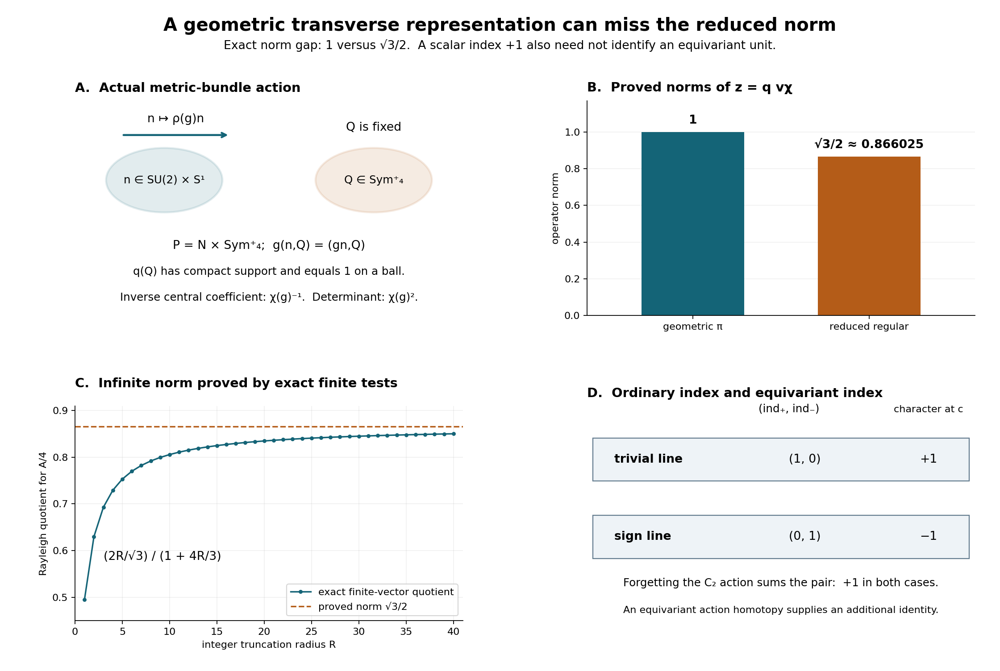

**Figure 11I.1.** Equations (RN.7)–(RN.13). The first panel is a coordinate schematic of the metric bundle: returns change \(n\) and fix the positive metric matrix \(Q\); the compact cutoff is in \(Q\). The second panel compares the proved norms \(1\) and \(\sqrt3/2\). The third plots the exact finite-vector Rayleigh quotients (RN.12), with their proved limiting line. The last panel shows two different \(C_2\)-equivariant indices whose ordinary indices are both \(+1\). No finite plot proves an infinite norm or an equivariant unit identity. [Reproducible figure source](../reproduction/transverse-reduced-norm/draw_norm.py) · [Editable SVG](../figures/transverse-reduced-norm.svg) · [Component terms](../reproduction/transverse-reduced-norm/COMPONENT-TERMS.md).

Further reading: [Hilsum–Skandalis, *Morphismes K-orientés d'espaces de feuilles et fonctorialité en théorie de Kasparov*](https://www.numdam.org/article/ASENS_1987_4_20_3_325_0.pdf), pp. 326–327 and 350–355; [Connes–Moscovici, *The local index formula in noncommutative geometry*](https://repo-archives.ihes.fr/FONDS_IHES/I_Prepublications/CONNES/1994-1998/M_95_19/M_95_19.pdf), preprint pp. 12–16; [Emerson, *An Introduction to C*-Algebras and Noncommutative Geometry*](https://doi.org/10.1007/978-3-031-59850-0), Section 11.5, pp. 524–529, especially Lemma 11.5.8 and Theorem 11.5.10.

## 11J. A scalar index-one class from a proper factorization

Original exposition and proofs in this reading are dedicated to the public domain under CC0. The group is discrete and countable, and all coefficient algebras are separable and graded. Hilbert-module inner products are linear in the second variable.

We use the construction, naturality and product law for full and reduced descent proved in Descent and the K-theory of crossed products, Sections 1–3, especially Theorems 2.2 and 3.2 and equation (3.9). The ordinary and equivariant products and their associativity are proved in Equivariant KK-theory and the Green–Julg theorem. The norm conventions are those of Reduced crossed products and Fell's absorption principle. These results are used with their coefficient algebras retained.

### 11J.1. A proper coefficient has only one crossed-product norm

A proper \(\Gamma\)-algebra means an algebra \(P\) with an equivariant nondegenerate central homomorphism
\[
 C_0(X)\longrightarrow ZM(P)
 \tag{AU.1}
\]
for a second-countable locally compact Hausdorff proper \(\Gamma\)-space \(X\). Properness means that \((g,x)\mapsto(gx,x)\) is proper. Finite stabilizers are allowed.

**Lemma 11J.1 (a square-normalized cutoff).** There is a nonnegative continuous function \(c:X\to[0,1]\) such that
\[
 \sum_{g\in\Gamma}c(g^{-1}x)^2=1.
 \tag{AU.2}
\]
For each compact \(K\subset X\), only finitely many \(g\) have \(c(g^{-1}x)\ne0\) at some \(x\in K\).

**Proof.** The quotient \(Q=X/\Gamma\) is locally compact Hausdorff and second countable. The closed orbit relation and openness of the quotient prove this, as in Lemma 9.1 of Proper actions, free actions and the orbit space. In particular \(Q\) is paracompact. For each orbit choose a nonnegative compactly supported bump \(\phi_i\) on \(X\), positive at a point of that orbit. The open sets
\(V_i=q(\{\phi_i>0\})\) cover \(Q\). Choose a locally finite partition of unity \(\rho_i\) subordinate to a locally finite refinement of these sets, relabeling the corresponding bumps. We may arrange \(\operatorname{supp}\rho_i\subset V_i\); the partition is obtained by a locally finite relatively compact shrinking and normalizing its nonnegative bumps.

Set
\[
 b(x)=\sum_i \rho_i(q(x))\phi_i(x),\qquad
 S(x)=\sum_g b(g^{-1}x)^2.
 \tag{AU.3}
\]
The first sum is locally finite. On a compact \(K\subset X\), only finitely many indices \(i\) can occur, because the partition is locally finite on the compact \(q(K)\). For each such \(i\), properness makes the transporter from \(\operatorname{supp}\phi_i\) to \(K\) finite. Thus the second sum is locally finite near every compact set. Every orbit has some point where \(b>0\), since an index with \(\rho_i(q(x))>0\) has \(q(x)\in V_i\). Consequently \(S\) is continuous and strictly positive. It is invariant by reindexing. The function \(c=b/S^{1/2}\) satisfies (AU.2), lies in \([0,1]\), and has the asserted local support property. No compactness of \(Q\) is assumed. \(\square\)

**Theorem 11J.2 (proper coefficient quotient).** The canonical surjection
\[
 q_P:P\rtimes_{\max}\Gamma\longrightarrow P\rtimes_r\Gamma
 \tag{AU.4}
\]
is an actual *-isomorphism.

**Proof.** Let \((\pi,U)\) be any nondegenerate covariant representation on \(H\). Central nondegeneracy in (AU.1) extends \(\pi\) to the bounded continuous central multipliers used below. Put \(c_g(x)=c(g^{-1}x)\). The finite partial sums of \(\sum c_g^2\) converge strictly to \(1\): they are bounded by \(1\), and are eventually exactly \(1\) on each compact set. Multiplication by a compactly supported \(C_0(X)\)-function therefore converges in norm; its products with \(P\) are dense by (AU.1). This proves strict convergence on \(P\). A nondegenerate representation carries bounded strict convergence to strong convergence. Hence
\[
 J:H\longrightarrow H\otimes\ell^2\Gamma,\qquad
 J\xi=\sum_g\pi(c_g)\xi\otimes\delta_g
 \tag{AU.5}
\]
is an isometry. There is no convergence claim for the unweighted sum of the multipliers themselves.

Centrality gives \(J\pi(a)=(\pi(a)\otimes1)J\). Our convention is \(\alpha_h(f)(x)=f(h^{-1}x)\). Thus
\(\alpha_h(c_{h^{-1}g})=c_g\), and covariance gives
\[
 JU_h=(U_h\otimes\lambda_h)J,\qquad
 \lambda_h\delta_g=\delta_{hg}.
 \tag{AU.6}
\]
Indeed the output coordinate \(g\) on the right is
\(U_h\pi(c_{h^{-1}g})\xi=\pi(c_g)U_h\xi\).
Every integrated polynomial in \((\pi,U)\) is therefore a compression of its diagonal amplification.

The unitary
\[
 W(\xi\otimes\delta_g)=U_g^{-1}\xi\otimes\delta_g
 \tag{AU.7}
\]
sends that diagonal amplification to the regular covariant representation:
the coefficient at coordinate \(g\) is \(\pi(\alpha_{g^{-1}}(a))\), and a group element acts by \(1\otimes\lambda_h\). The regular norm bounds the norm of this representation even when \(\pi\) is not faithful: this is the representation-independence assertion in the reduced-crossed-product reading. Thus every full covariant norm is at most the reduced norm. The reverse inequality holds because regular covariant representations are among the full ones. Equality on the dense finite convolution algebra proves injectivity of (AU.4), and its defining quotient is onto. Grading is preserved throughout. \(\square\)

### 11J.2. The forgetful unit is sufficient

Write \(M=C_{\max}^*\Gamma\), \(R=C_r^*\Gamma\), \(q:M\to R\). Write \(u_m:\mathbb C\to M\) and \(u_r:\mathbb C\to R\) for the unit inclusions. The trivial character \(\epsilon:M\to\mathbb C\) exists on the full algebra, with \(\epsilon(u_g)=1\).

**Theorem 11J.3 (the proper-factorization construction).** Suppose \(P\) is a proper algebra as above and
\[
 \eta\in KK^\Gamma(\mathbb C,P),\qquad
 d\in KK^\Gamma(P,\mathbb C),\qquad
 \operatorname{For}(\eta\otimes_Pd)=1_{\mathbb C}.
 \tag{AU.8}
\]
The classes here have even degree; \(P\) may have a nontrivial grading. There is an even class
\[
 \begin{aligned}
 \kappa={}&j_r(\eta)\otimes_{P\rtimes_r\Gamma}[q_P]^{-1}\\
 &\otimes_{P\rtimes_{\max}\Gamma}j_{\max}(d)
       \otimes_M[\epsilon]\ \in KK(R,\mathbb C)
 \end{aligned}
 \tag{AU.9}
\]
such that
\[
 [u_r]\otimes_R\kappa=1_{\mathbb C}.
 \tag{AU.10}
\]
Here \([q_P]^{-1}\) is the class of the inverse *-isomorphism from Theorem 11J.2. It is not an assumed inverse for \(q\).

**Proof.** The coefficient square (3.9) of the descent reading gives, with all intermediate algebras displayed,
\[
 [q]\otimes_R j_r(\eta)
   =j_{\max}(\eta)\otimes_{P\rtimes_{\max}\Gamma}[q_P].
 \tag{AU.11}
\]
After multiplying by the remaining factors in (AU.9), cancellation of the actual coefficient isomorphism and the product law for full descent give
\[
 [q]\otimes_R\kappa
   =j_{\max}(\gamma)\otimes_M[\epsilon],
 \qquad \gamma=\eta\otimes_Pd.
 \tag{AU.12}
\]
This is an identity from \(M\) to \(\mathbb C\).

We verify explicitly the scalar evaluation of its right side. Represent \(\gamma\) by an equivariant graded Hilbert-space cycle \((H,U,F)\), on its unital essential part, with \(F\) self-adjoint, odd and contractive. Full scalar descent has core \(C_c(\Gamma,H)\), right coefficient \(M\), and inner product
\[
 \langle\xi,\zeta\rangle(h)
     =\sum_g\langle\xi(g),\zeta(gh)\rangle_H.
 \tag{AU.13}
\]
After tensoring the right coefficient with \(\epsilon\), the map
\[
 \xi\otimes z\longmapsto z\sum_g\xi(g)
 \tag{AU.14}
\]
is isometric: applying \(\epsilon\) to (AU.13) sums over \(g,h\), giving the Hilbert-space inner product of the two finite vector sums. This map respects right balancing, since augmenting a convolution multiplies its vector sum by \(\epsilon\) of the coefficient. Vectors supported at the identity prove that it has dense range and hence is onto. The descended operator is pointwise \(F\), so (AU.14) carries it to \(F\). Left multiplication by a group element \(h\) sends \(\xi(g)\) to \(U_h\xi(h^{-1}g)\); its vector sum is \(U_h\sum_g\xi(g)\). Thus the balanced cycle retains the representation \(U\) of \(M\). Pulling its source back by \(u_m\) removes that representation and leaves precisely the ordinary graded cycle \((H,F)\). The same argument handles degenerate summands and homotopies. Consequently
\[
 [u_m]\otimes_Mj_{\max}(\gamma)\otimes_M[\epsilon]
       =\operatorname{For}(\gamma).
 \tag{AU.15}
\]
Finally \(q u_m=u_r\), and (AU.12), (AU.15) and (AU.8) prove (AU.10). No reduced trivial character was used. \(\square\)

**Corollary 11J.4 (an integral unit splitting).** The class \([1_R]\) generates a direct \(\mathbb Z\)-summand of \(K_0(R)\).

**Proof.** The index pairing \(\ell(x)=x\otimes_R\kappa\) is a homomorphism \(K_0(R)\to K_0(\mathbb C)=\mathbb Z\), and (AU.10) says \(\ell([1_R])=1\). For every \(x\),
\[
 x=\ell(x)[1_R]+\bigl(x-\ell(x)[1_R]\bigr),
 \qquad K_0(R)=\mathbb Z[1_R]\oplus\ker\ell.
 \tag{AU.16}
\]
The second summand lies in \(\ker\ell\), and a multiple of the unit in that kernel has coefficient zero. This is an integral splitting, without a universal-coefficient theorem. \(\square\)

An infinite-order unit, or a unit that is not a nontrivial integer multiple, is a weaker algebraic assertion than the splitting in (AU.16). A real trace with value \(1\) on the unit is not a substitute for the integral homomorphism \(\ell\), and an arbitrary homomorphism on \(K_0\) has not thereby been lifted to a KK-class.

### 11J.3. Ordinary identity and equivariant identity

The hypothesis (AU.8) concerns the ordinary forgetful class. It does not require \(\gamma=1\) in \(KK^\Gamma(\mathbb C,\mathbb C)\). If that stronger identity holds, (AU.12) becomes \([q]\otimes_R\kappa=[\epsilon]\). Together with the dual Green–Julg correspondence for discrete groups, that is a weakly regular representative of the equivariant unit and implies K-amenability. Neither this stronger identity nor invertibility of the group quotient follows from (AU.10).

For precision, suppose \(\Gamma\) is infinite and has property \(T\). Its full Kazhdan projection \(p\) satisfies \(q(p)=0\) and \(\epsilon(p)=1\). The full proof is Proposition 8.4 of Descent and the K-theory of crossed products: a finite Kazhdan gap gives a continuous spectral projection, and the regular representation has no invariant vector. For every class \(\kappa\in KK(R,\mathbb C)\), \(p\otimes_M[q]\otimes_R\kappa=0\). Therefore \([q]\otimes_R\kappa\ne[\epsilon]\). This obstruction addresses the equivariant identity, not the ordinary unit index. It does not contradict Theorem 11J.3 with only the forgetful hypothesis.

### 11J.4. The exact existence premise and diagram

Theorem 11J.3 proves the scalar consequence of a supplied proper factorization with forgetful product one. It does not construct that factorization for an arbitrary countable group or holonomy groupoid. The latter existence theorem is an additional prerequisite. For related geometric constructions see Guentner, Higson and Weinberger, [*The Novikov Conjecture for Linear Groups*](https://math.hawaii.edu/~erik/papers/linear.pdf), Theorem 4.1 and Section 6, and Tu, [*La conjecture de Baum–Connes pour les feuilletages moyennables*](https://citeseerx.ist.psu.edu/document?doi=486238991671dba031f9cb078eeba25443307a0a&repid=rep1&type=pdf), Sections 6–9. These reading references do not replace a proof of the required existence premise.

**Figure 11J.1.** Lemma 11J.1, Theorems 11J.2–11J.3 and Corollary 11J.4, equations (AU.1)–(AU.16). Panel A shows the exact square normalization, compression isometry and absorption unitary; all finite stabilizers are retained. Panel B shows the sources and targets of all four KK factors and the exact forgetful evaluation. The inverse is the proper coefficient quotient's actual inverse; no inverse of the group quotient is assumed. This is an algebraic diagram, not a claim that all such factorizations exist. Original mathematical expression is CC0 1.0; bundled glyphs retain their component terms.

[Editable SVG](../figures/proper-auxiliary.svg) · [Reproducible source](../reproduction/proper-regular-auxiliary/draw_proper.py).

## 11K. Regularization by a scalar index-one auxiliary

The regular representation supplies the reduced norm. It does not, by itself, supply the auxiliary Fredholm index or a Dirac operator on a holonomy graph. The following result separates these assertions. It applies to every countable discrete action satisfying its stated auxiliary premise, rather than to a selected family of groups.

The KK products, scalar classification and homotopy rules used below are proved in K-theory of the leaf space, Section 0, especially Scalar classification through the stable corona. The prescribed inverse coefficient is the one in Theorem 7.17, under The actual coefficient transfer of a Thom inverse. These are proof prerequisites, not replacements by literature citations.

### 11K.1. An exact norm-preserving map

Let \(\Gamma\) be a countable discrete group acting by automorphisms \(\alpha\) on a separable unital C*-algebra \(A\). Write

\[
 B_m=A\rtimes_{\max}\Gamma,\qquad B_r=A\rtimes_r\Gamma,
 \qquad R=C_r^*(\Gamma),\qquad q:B_m\longrightarrow B_r.
 \tag{RA.1}
\]

The convention is \(u_ga u_g^{-1}=\alpha_g(a)\), and \(\lambda_g\delta_h=\delta_{gh}\). Denote the coefficient inclusions by \(i_m:A\to B_m\) and \(i_r:A\to B_r\). All tensor products of algebras in this subsection are minimal spatial tensor products.

**Theorem 11K.1 (regular diagonal map).** The formula

\[
 \Delta_r\!\left(\sum_g a_gu_g\right)
       =\sum_g i_m(a_g)u_g\otimes\lambda_g
 \tag{RA.2}
\]

extends to an isometric *-homomorphism \(B_r\to B_m\otimes R\). In particular

\[
 \Delta_r i_r(a)=i_m(a)\otimes1_R.
 \tag{RA.3}
\]

No amenability, exactness, nuclearity, freeness or invariant measure is assumed.

**Proof.** Choose a faithful unital representation \(\rho\) of \(B_m\) on a Hilbert space \(H\). Set \(\pi=\rho i_m\) and \(U_g=\rho(u_g)\). The coefficient inclusion is faithful: a faithful representation of \(A\) has its regular covariant extension, whose restriction to the identity coordinate is that representation. Its norm is among the norms defining the maximal completion. Therefore \(\pi\) is faithful on \(A\).

On \(H\otimes\ell^2(\Gamma)\), define the onto unitary

\[
 W(\xi\otimes\delta_h)=U_h^{-1}\xi\otimes\delta_h,
 \qquad W^*(\xi\otimes\delta_h)=U_h\xi\otimes\delta_h.
 \tag{RA.4}
\]

Coordinate substitution gives

\[
 \begin{aligned}
  \bigl(W(\pi(a)\otimes1)W^*\eta\bigr)_h
       &=\pi(\alpha_{h^{-1}}(a))\eta_h,\\
  W(U_g\otimes\lambda_g)W^*&=1_H\otimes\lambda_g.
 \end{aligned}
 \tag{RA.5}
\]

For the second equation, the output at \(h\) before applying \(W\) is \(U_gU_{g^{-1}h}\eta_{g^{-1}h}=U_h\eta_{g^{-1}h}\). The factor \(U_h^{-1}\) cancels it. Thus the represented right-hand side of (RA.2) is unitarily the regular covariant representation associated to the faithful \(\pi\). Its norm is the defining reduced norm of the polynomial.

The representation \(\rho\otimes\lambda\) is faithful on the minimal tensor product, by its spatial-norm construction from faithful factor representations. Consequently (RA.2) has exactly that reduced norm in \(B_m\otimes R\). Covariance verifies multiplication and involution on polynomials: the term for \((a_gu_g)(b_hu_h)\) is \(a_g\alpha_g(b_h)u_{gh}\otimes\lambda_{gh}\). It agrees with multiplying their two images. Completion therefore gives an isometric *-homomorphism. Formula (RA.3) is its identity-coordinate term. \(\square\)

This proof is an explicit absorption argument. It does not assert that the original geometric representation \((\pi,U)\) is reduced. The representation being regularized acts on the larger tensor Hilbert space.

### 11K.2. Exactly which auxiliary index is sufficient

Let \(u:\mathbb C\to R\) be the unit homomorphism. An **ordinary scalar index-one auxiliary** means an even class \(\kappa\in KK(R,\mathbb C)\) satisfying

\[
 [u]\otimes_R\kappa=1_{\mathbb C}
       \quad\hbox{in }KK(\mathbb C,\mathbb C).
 \tag{RA.6}
\]

By scalar classification this is equivalent to \(\langle[1_R],\kappa\rangle=+1\). A representative is a graded scalar Fredholm module with a representation of \(R\); its group representation is thus weakly contained in the regular representation. Equation (RA.6) is a KK left inverse for the unit inclusion. Theorem 11J.3 supplies it from a proper factorization with forgetful product one. It is not a consequence of countability or the existence of \(\lambda\).

**Theorem 11K.2 (reduced replacement preserving the ordinary normal class).** Let \(d_m\in KK^q(B_m,\mathbb C)\), with its complete coefficient and grading, and suppose (RA.6). Then

\[
 d_r=[\Delta_r]\otimes_{B_m\otimes R}(d_m\boxtimes\kappa)
       \in KK^q(B_r,\mathbb C)
 \tag{RA.7}
\]

satisfies the entire ordinary restriction identity

\[
 [i_r]\otimes_{B_r}d_r=[i_m]\otimes_{B_m}d_m
       \quad\hbox{in }KK^q(A,\mathbb C).
 \tag{RA.8}
\]

If \(b\in KK^q(\mathbb C,A)\) has prescribed normal Bott product \(b\otimes_A[i_m]\otimes d_m=+1\), then

\[
 (b\otimes_A[i_r])\otimes_{B_r}d_r=+1.
 \tag{RA.9}
\]

**Proof.** Let \(j:B_m\to B_m\otimes R\), \(j(x)=x\otimes1\). Equation (RA.3) gives \(\Delta_r i_r=j i_m\). Naturality and associativity of the proved KK product imply

\[
 \begin{aligned}
 [i_r]\otimes d_r
   &=[i_m]\otimes[j]\otimes(d_m\boxtimes\kappa)\\
   &=[i_m]\otimes\bigl(d_m\boxtimes([u]\otimes_R\kappa)\bigr)\\
   &=[i_m]\otimes d_m.
 \end{aligned}
 \tag{RA.10}
\]

The second equality is the tensor functoriality on the second, scalar auxiliary factor. That factor is even and equals the scalar unit by (RA.6). No two odd factors were interchanged, and no orientation sign has been inserted. Compose this full equality with the original \(b\), in its original coordinate order, to obtain (RA.9). \(\square\)

The theorem preserves much more than a single integer: it preserves the ordinary \(A\)-K-homology restriction as a class. It does **not** assert \([q]\otimes d_r=d_m\), nor an equivariant restriction identity. The stronger claims require their own hypotheses.

For a compact transversal \(N\), take \(A=C(N)\). If the given restriction is the full inverse normal class, its right Clifford block and its spin-c line are retained in the first factor of (RA.7). With \(k_q=q(q-1)/2\), its local finite module remains

\[
 \Pi^{k_q}C_q,\qquad
 c_{\rm phys}(e_j)=(-1)^{k_q+1}L_{t_j},\qquad
 zs\longmapsto z^{-1}\rho_t(s).
 \tag{RA.11}
\]

These are Theorem 7.17's actual inverse, not a newly chosen positive spinor convention. The determinant of the inverse line has phase \(z^{-2}\); it cannot recover the full phase \(z^{-1}\). The even auxiliary changes neither the transverse degree nor that inverse order. Under a diagonal return its additional scalar representation acts as a separate tensor factor; it does not erase the normal factor's coherent transport. This observation does not make its equivariant KK class the identity.

### 11K.3. An analytic realization when the additional operator data are supplied

The abstract class (RA.7) is not a claimed finite-order graph differential operator. Here is a complete unbounded realization at the discrete-action level under precise extra premises.

Assume a full degree-\(q\) normal cycle \(d_m\) is represented in the usual graded Clifford picture by \((H_N,D_N,\pi_N,U)\). Retain the finite right \(C_q\) block until its prescribed parity encoding. Assume:

- \(D_N\) is odd and self-adjoint, with compact resolvent, and has a supplied core \(\mathcal C_N\). Its coefficient representation and grading are fixed.
- On a dense \(\Gamma\)-invariant smooth *-algebra \(A_0\subset A\), \(\pi_N(a)\) preserves its domain and \([D_N,\pi_N(a)]\) is bounded. Each \(U_g\) is even, preserves the domain, and \([D_N,U_g]\) is bounded.
- \(\kappa\) has a graded representative \((H_K,\gamma_K,D_K,V)\), where \(D_K\) is odd, self-adjoint with compact resolvent and core \(\mathcal C_K\), \(V\) factors through \(R\), each \(V_g\) is even, preserves the domain, and \([D_K,V_g]\) is bounded. Its scalar index is \(+1\).

For a compact metric spin-c manifold, the normal commutator hypotheses admit a noninvariant connection. The given coherent metric spin-c lift transports the first-order Clifford symbol. The difference of the transported Dirac and the original Dirac therefore has zero principal symbol, so is a smooth zeroth-order endomorphism. Compactness bounds it. This does not assume an invariant connection, and does not provide a uniform bound as \(g\) varies; a finite group polynomial needs only its finitely many bounds.

Theorem 11L.1 and Corollary 11L.2 supply the stated auxiliary operator, domain and core from any given even scalar class \(\kappa\). They preserve its exact unit pairing and reduced representation. Thus these auxiliary operator data do not impose a further existence premise once the class is supplied. The specified normal cycle and its graph transport still require their own construction.

Place the even auxiliary first and the old normal Clifford block second. Define

\[
 \begin{aligned}
  H&=H_K\widehat\otimes H_N,\\
  D&=D_K\widehat\otimes1+\gamma_K\widehat\otimes D_N,\\
  \Pi\!\left(\sum_g a_gu_g\right)
      &=\sum_g V_g\widehat\otimes\pi_N(a_g)U_g,\\
  \operatorname{Dom}D
      &=\operatorname{Dom}(D_K\otimes1)
           \cap\operatorname{Dom}(1\otimes D_N).
 \end{aligned}
 \tag{RA.12}
\]

All operators here use the displayed ordinary Hilbert-space action of the graded sum, including \(\gamma_K\) exactly once. The finite right Clifford action is unchanged.

**Proposition 11K.3.** The closure on \(\mathcal C_K\odot\mathcal C_N\) is self-adjoint on exactly (RA.12), has compact resolvent, and its bounded transform is a degree-\(q\) reduced scalar Kasparov cycle. It represents (RA.7) for the supplied \(d_m,\kappa\).

**Proof: closure, domain and compactness.** The two odd summands anticommute. On the algebraic core,

\[
 D^2=D_K^2\otimes1+1\otimes D_N^2,\qquad
 \|D\xi\|^2=\|(D_K\otimes1)\xi\|^2
                   +\|(1\otimes D_N)\xi\|^2.
 \tag{RA.13}
\]

Here are the compact spectral facts needed for the closure. For a nonzero positive compact operator \(T\), let \(\lambda=\|T\|\) and choose unit vectors \(v_n\) with \(\langle Tv_n,v_n\rangle\to\lambda\). Positivity and \(T^2\leq\lambda T\) give \(\|(T-\lambda)v_n\|^2\leq\lambda(\lambda-\langle Tv_n,v_n\rangle)\to0\). Compactness gives a convergent subsequence of \(Tv_n\); the displayed estimate then gives a unit limit of \(v_n\), which is a \(\lambda\)-eigenvector. Remove its whole eigenspace and repeat on the orthogonal complement. Every positive eigenspace is finite-dimensional: otherwise its orthonormal vectors have images a fixed distance apart. The successive positive eigenvalues tend to zero by the same compactness test. The residual orthogonal space is the kernel, because its restricted norm is bounded by all successive eigenvalues; if the procedure stops, a positive residual norm would yield another eigenvector by the first argument. This proves the needed compact positive spectral theorem.

Apply it to \(T=(1+D_K^2)^{-1}\) and \((1+D_N^2)^{-1}\). Their kernels are zero. A positive \(T\)-eigenvector belongs to \(\operatorname{Ran}T\subset\operatorname{Dom}D^2\) and satisfies \(D^2v=(\lambda^{-1}-1)v\). Thus each squared spectral window is finite-dimensional and invariant under \(D\) and its grading; finite-dimensional self-adjoint diagonalization supplies its \(D\)-eigenvectors. The scalar functional calculus and its product/domain rules are proved in Spectral products, transport and inverse domains, through its linked earlier ordinary calculus proofs.

On each joint window, the expression in (RA.12) is a finite-dimensional self-adjoint matrix and its square is (RA.13). The orthogonal direct sum of these matrices is self-adjoint: its two resolvents are the direct sums of the inverses of the blocks, each bounded by one at \(\pm i\), and their ranges give its full closed domain.

The square-norm identity says that this domain is exactly the intersection in (RA.12). Joint spectral truncations converge in its graph norm. The stated factor cores approximate each finite elementary tensor with both factor graph norms, so their algebraic tensor is a core for that closed operator. This establishes the claimed closure, rather than merely a formal square.

There are only finitely many joint eigenvectors satisfying \(\nu_K^2+\nu_N^2\leq L\), for each finite \(L\). Spectral truncation of \((1+D^2)^{-1/2}\) therefore gives finite-rank approximations with error at most \((1+L)^{-1/2}\). It is an ordinary scalar compact operator. Keeping a finite-dimensional Clifford coefficient does not turn this argument into compactness only relative to an infinite coefficient algebra. Consequently the resolvents and \(F^2-1=-(1+D^2)^{-1}\), for \(F=D(1+D^2)^{-1/2}\), are scalar compact.

**Proof: norm and domain-preserving commutators.** The representation is the tensor representation of (RA.2), with the two factors flipped to put the even auxiliary first. Theorem 11K.1 makes it contractive for the exact reduced crossed-product norm; faithfulness of this particular tensor representation is unnecessary. It remains a *-representation of every \(B_r\). For each coefficient term, direct substitution gives

\[
 \begin{aligned}
 [D,V_g\otimes\pi_N(a)U_g]
   ={}&[D_K,V_g]\otimes\pi_N(a)U_g\\
     &+\gamma_KV_g\otimes
       \bigl([D_N,\pi_N(a)]U_g+\pi_N(a)[D_N,U_g]\bigr).
 \end{aligned}
 \tag{RA.14}
\]

These are bounded operators. The factor domain assumptions preserve the intersection domain; (RA.13) extends the same assertion from elementary tensors to its graph closure. Thus every smooth finite polynomial preserves the actual domain and has a bounded commutator.

Put \(s=(1+t^2)^{1/2}\). The bounded transform is the strong limit of
\((2/\pi)\int_0^T D(D^2+s^2)^{-1}\,dt\). The resolvent identity gives a commutator integrand equal to

\
 -\frac1\pi\left((D-is)^{-1}[D,a^{-1}
                  +(D+is)^{-1}D,a^{-1}\right).
 \tag{RA.15}
\]

Its norm is at most \(2\|[D,a]\|/(\pi(1+t^2))\); it is compact, because either resolvent is scalar compact. Hence its integral converges in compact-operator norm, and the strong limit identifies it with \([F,a]\). Self-adjointness is exact. Polynomial density, boundedness of \(F\), and contractivity of \(\Pi\) extend all compact defects to every \(a\in B_r\). In particular every localized defect is an ordinary scalar compact, not merely a module or measured-trace defect.

**Proof: the represented product.** Before restricting along \(\Delta_r\), use the tensor representation of \(R\otimes B_m\). A homogeneous vector \(\xi\) in a bounded squared spectral window of \(D_K\) defines the graded creation map \(T_\xi\eta=\xi\otimes\eta\). In the normal spectral variable \(\nu\), the off-diagonal creation term from \(D_K\xi\) is divided by \((1+\nu_K^2+\nu^2)^{1/2}\), and tends to zero as \(|\nu|\to\infty\). The diagonal term differs from the signed normal phase by
\(\nu/(1+\nu_K^2+\nu^2)^{1/2}-\nu/(1+\nu^2)^{1/2}\), which also tends to zero. Each finite auxiliary window has only finitely many such columns. Normal compact resolvent therefore makes the creation difference and its adjoint compact. Density of these homogeneous windows, with \(\|T_\xi\|=\|\xi\|\), proves the connection equations for every creation vector.

For \(F_K=D_K(1+D_K^2)^{-1/2}\), the product positivity is the exact positive operator

\[
 \{F_K\otimes1,F\}
  =\frac{2D_K^2\otimes1}
       {(1+D_K^2\otimes1)^{1/2}
        (1+D_K^2\otimes1+1\otimes D_N^2)^{1/2}}\geq0.
 \tag{RA.16}
\]

The cross term cancels by oddness of \(D_K\). The two positive denominators commute by their joint spectral construction. For a creation vector \(\xi\otimes b\) in the first module \(H_K\otimes B_m\), its creation map is \(T_\xi\pi_N(b)\). The already proved connection error for \(T_\xi\), multiplied by \(\pi_N(b)\), is compact; the additional error is \(T_\xi[F_N,\pi_N(b)]\), up to its prescribed homogeneous sign, and is compact because the supplied \(d_m\) is a Kasparov cycle. Finite sums of these vectors are dense in that entire module. Thus the connection is for the full first module, not only its scalar columns. The connection and positivity criterion of Section 0 proves that this is the actual external product \(\kappa\boxtimes d_m\). Flipping the even auxiliary past the degree-\(q\) factor incurs no Koszul sign. Pullback along the flipped \(\Delta_r\) gives exactly (RA.7). This proves the proposition, including its degree, inverse coefficient and original local pairing. \(\square\)

For a compact-base suspension with its specified flat return charts, the complete graph-column induction proved in A general sufficient interface, and its precise limit applies to (RA.12). Its normalized counting and plaque-bump correspondence is still required. An arbitrary holonomy groupoid has not been replaced here by a globally acting discrete group, nor have arbitrary graph overlaps or a wholly local finite-order graph expression been constructed.

### 11K.4. Two automatic regular constructions that do not give index one

**Proposition 11K.4.** On an infinite group, neither the bare regular factor nor its elementary paired confining length operator supplies (RA.6).

**Proof.** If \(K\neq0\) is a compact operator, then \(K\otimes1_{\ell^2\Gamma}\) is not compact. Choose a unit vector \(v\) with \(Kv\neq0\) and distinct \(g_n\). The images \(Kv\otimes\delta_{g_n}\) are orthogonal with fixed positive norm, so have no convergent subsequence. Thus \(D_N\otimes1\) leaves infinite regular multiplicity in its localized normal resolvents whenever the localized normal factor is nonzero. Regular norm continuity alone does not prove scalar compactness.

For a finitely generated \(\Gamma\), take word length \(\ell\) and \(w(g)=1+\ell(g)\). On \(H_K^+=H_K^-=\ell^2(\Gamma)\), represent the group by \(\lambda\oplus\lambda\), grade by \(\operatorname{diag}(1,-1)\), and put

\[
 D_w=\begin{pmatrix}0&M_w\\M_w&0\end{pmatrix},\qquad
 \operatorname{Dom}D_w=
 \{(\xi,\eta):w\xi,w\eta\in\ell^2(\Gamma)\}.
 \tag{RA.17}
\]

It is the orthogonal sum of self-adjoint two-by-two matrices, with eigenvalues \(\pm w(g)\). Finite word balls prove compact resolvent. Its finite-support core is a graph core. Since \(|\ell(hg)-\ell(g)|\leq\ell(h)\), each group commutator is bounded and preserves this domain. It is therefore an actual reduced even scalar cycle by the same resolvent integral. But \(M_w\) is onto and has bounded inverse \(M_{1/w}\): its kernel and cokernel are zero. Its scalar index is zero, so (RA.6) fails. For a countable group, enumerate its nonidentity elements and their inverses with positive integer weights tending to infinity, assigning the same weight to an element and its inverse. Define \(\ell(g)\) to be the minimum total weight among finite words representing \(g\), with \(\ell(e)=0\). Every element has such a word, and the minimum exists among nonnegative integers. At a fixed total weight, only finitely many letters and finitely many words can occur. Thus the sublevels are finite. Concatenation and reversal prove \(\ell(gh)\leq\ell(g)+\ell(h)\) and \(\ell(g^{-1})=\ell(g)\); hence \( |\ell(hg)-\ell(g)|\leq\ell(h)\). This supplies the same example without finite generation.

Adding an unmatched positive **trivial** representation would change the scalar index to one, but also adds that representation to the group action. If it were weakly regular, the algebraic trivial character would extend to \(R\). The fully proved invariant-mean argument in A general necessary condition for the geometric representation would make \(\Gamma\) amenable. Thus this repair fails for a nonamenable group. A different unmatched construction inside a genuinely reduced Fredholm module requires a proof of its compact group commutators and unit index; an arbitrary enumeration and unilateral shift do not supply those assertions. \(\square\)

### 11K.5. Ordinary index one and the equivariant unit

An even Fredholm module for \(R\) also determines an equivariant Fredholm class \(e_\kappa\in KK^\Gamma(\mathbb C,\mathbb C)\): the group acts by its represented unitaries and its commutators with the phase are compact. Condition (RA.6) says only

\[
 \operatorname{Res}^{\Gamma}_{\{e\}}e_\kappa=1_{\mathbb C}.
 \tag{RA.18}
\]

Representing the equivariant unit \(e_\kappa=1_\Gamma\) by weakly regular representations is the stronger K-amenability premise. The scalar classification theorem proves (RA.18); it does not promote it to this equivariant identity. If a target prescribes an equivariant normal class \(d_N^\Gamma\), the diagonal external product has class \(d_N^\Gamma\otimes e_\kappa\). Equality with \(d_N^\Gamma\) requires this exact product identity. The full spin-c coefficient in its first factor and its inverse phase can be retained even when that global equivariant identity is absent.

Here is a complete conditional test that separates the two assertions without importing an arithmetic lattice theorem.

**Proposition 11K.5 (Kazhdan projection and a specified descent).** Suppose \(\Gamma\) is infinite, and a finite set \(S\subset\Gamma\) and \(c>0\) satisfy the following uniform spectral-gap hypothesis: in every unitary representation \(U\),

\[
 \sum_{s\in S}\|(1-U_s)\xi\|^2\geq c\|\xi\|^2
 \quad\text{for }\xi\perp H^\Gamma,
 \qquad \ker\sum_{s\in S}(1-U_s)^*(1-U_s)=H^\Gamma.
 \tag{RA.19}
\]

Then there is a projection \(p\in C^*_{\max}(\Gamma)\) whose image in every representation is the orthogonal projection onto its invariant vectors, and whose reduced image is zero. No weakly regular equivariant Fredholm class can equal \(1_\Gamma\). Nevertheless this argument does not exclude (RA.6), which pairs with the full unit rather than \(p\).

If \(d_m\in KK^0(B_m,\mathbb C)\) satisfies a nonzero pairing with the image of \(p\) in \(B_m\), then that specified \(d_m\) has no reduced descent. It can still have a reduced replacement of Theorem 11K.2 if its auxiliary premise holds.

**Proof.** Put \(L=\sum_{s\in S}(1-u_s)^*(1-u_s)\) in the full group algebra. In a faithful universal representation, (RA.19) splits it into zero on the invariant space and an operator at least \(c\) on its orthogonal complement. Its spectrum is contained in \(\{0\}\cup[c,4|S|]\). Choose a real continuous function \(h\) which is one at zero and zero on that interval. Functional calculus gives the projection \(p=h(L)\). Functional calculus commutes with every representation. Thus its represented projection is precisely onto invariants; the trivial representation sends it to one.

There is no nonzero invariant vector in \(\ell^2\Gamma\): an invariant vector is constant on \(\Gamma\), and a nonzero constant is not square-summable on an infinite group. The regular image of \(p\) is consequently zero. The same is true in every representation factoring through \(R\).

To see that this tests equivariant **classes**, integrate an equivariant scalar Fredholm cycle into a Fredholm cycle of \(C^*_{\max}(\Gamma)\). Compact group commutators imply compact commutators for finite polynomials; density extends them to the full algebra. An equivariant KK homotopy gives the same integration on its entire interval module, so the resulting ordinary maximal class is homotopy invariant. The equivariant unit integrates to the trivial character, whose \(p\)-pairing is one. A weakly regular cycle integrates to a class pulled back from \(R\), whose \(p\)-pairing is zero. They cannot be equal.

For a general quotient \(q:B_m\to B_r\), associativity gives, for every \(x\in K_*(B_m)\) and putative descent \(d_m=[q]\otimes d_r\),

\[
 x\otimes_{B_m}d_m=q_*x\otimes_{B_r}d_r.
 \tag{RA.20}
\]

The image of \(p\) is killed by this quotient, so a nonzero pairing contradicts (RA.20). If an invariant compact-resolvent even geometric Dirac represents \(d_m\), the pairing is the Fredholm index on its invariant subspace: its represented \(p\) is that subspace's projection and commutes with the Dirac and grading. This index must actually be calculated for the specified full inverse normal coefficient; a global index of some differently twisted Dirac is not a substitute.

By contrast, an ordinary unit-index auxiliary asks for \(\langle[1_R],\kappa\rangle=1\). Its maximal pullback pairs \(p\) as zero and the unit as one. There is no contradiction between these two integers. Theorem 11K.2 does not promise to reproduce the obstructed maximal class, so the obstruction to **that descent** does not invalidate its distinct reduced replacement. \(\square\)

In particular, a proposed arithmetic suspension needs complete providers for infinitude, the uniform gap, the faithful compact action and the exact invariant Dirac index. Even after these are supplied, the argument refutes only the specified maximal descent unless the target itself forces equality with that maximal class. The local Bott pairing in Connes's question does not state such an equality.

### 11K.6. A proper intermediate algebra and the exact local identity

There is a second useful formulation, independent of a globally acting group. Let \(q_A:A_m\to A_r\), \(q_P:P_m\to P_r\) be quotient maps, and suppose \([q_P]\) has a proved KK inverse \(v\in KK(P_r,P_m)\). Let

\[
 \eta_m\in KK^k(A_m,P_m),\quad
 \eta_r\in KK^k(A_r,P_r),\quad
 D_m\in KK^k(P_m,A_m),
 \qquad [q_A]\otimes\eta_r=\eta_m\otimes[q_P].
 \tag{RA.21}
\]

For \(d_m\in KK^q(A_m,\mathbb C)\), put

\[
 \gamma_m=\eta_m\otimes D_m,\qquad
 d_r=\eta_r\otimes v\otimes D_m\otimes d_m.
 \tag{RA.22}
\]

All tensor products are in this displayed typed order. Associativity, naturality and \([q_P]\otimes v=1_{P_m}\) prove

\[
 [q_A]\otimes d_r=\gamma_m\otimes d_m.
 \tag{RA.23}
\]

Consequently a specified local class \(b_m\in KK^q(\mathbb C,A_m)\) has reduced pairing one if

\[
 b_m\otimes\gamma_m=b_m,
 \qquad b_m\otimes d_m=+1.
 \tag{RA.24}
\]

Indeed its reduced image is \(b_m\otimes[q_A]\), and its product with (RA.22) is \(b_m\otimes\gamma_m\otimes d_m=+1\). These equalities require neither \(\gamma_m=1_{A_m}\) nor equality of the new maximal pullback with \(d_m\). They do require a proved intermediate quotient inverse and the **actual local** identity (RA.24), together with any extra full-class restriction required by the problem.

Calling an intermediate algebra proper does not prove these typed identities or construct an unbounded graph representative. Kasparov–Skandalis's primary paper constructs a proper intermediate algebra and Dirac/dual-Dirac elements under its proper bolic-action hypotheses; its Theorem 5.2 concerns reduced assembly injectivity, and Section 8 constructs its Dirac element. Those hypotheses are additional geometric inputs, not consequences stated for every holonomy-invariant transverse spin-c groupoid. This is a literature comparison, not an invocation of its unproved prerequisites as a proof of the present missing existence assertion. [Primary paper, pp. 165–167, 179–183 and 200–201](https://arxiv.org/pdf/math/0402374).

### 11K.7. The metric-bundle properness test

**Proposition 11K.6 (compact invariant metric section).** Let an infinite discrete \(\Gamma\) act smoothly on a nonempty compact manifold \(N\), preserving a Riemannian metric \(g\). Let \(P\to N\) be the bundle of positive-definite metrics with the transported action. Then the action on \(P\) is not proper, even if the action on \(N\) is free.

**Proof.** The invariant metric gives an equivariant section \(s(n)=g_n\). It is an embedding: the bundle projection composed with it is the identity. Its image is compact and closed because \(N\) is compact and \(P\) is Hausdorff. For the action map \(m(\gamma,p)=(\gamma p,p)\), the compact subset \(K=s(N)\times s(N)\subset P\times P\) has exact inverse image

\[
 m^{-1}(K)=\Gamma\times s(N).
 \tag{RA.25}
\]

Indeed the second coordinate forces \(p\in s(N)\), and equivariance puts \(\gamma p\) in the same section; the converse is immediate. This inverse image has the infinite discrete \(\Gamma\) as a continuous surjective image, so it cannot be compact. Properness would require that inverse image to be compact. No ergodicity, stabilizer assumption or freeness was used. \(\square\)

The eligible free \(F_2\) action on \(SU(2)\times S^1\) in Section 11I is an actual compact spin-c example of this lemma. The transverse linear cocycle has compact image, while the displayed metric-bundle action is nonproper. The different regular tree class in Section 11A remains valid.

Hilsum–Skandalis's Proposition 4.7, printed p. 355, compares its **maximal** constructions in the almost-isometric case. Its amenable group is the transverse vector bundle's structural subgroup of a linear group. The gamma class of that structural group pulls back to the identity. It is not an assertion that the holonomy groupoid is amenable, that its full-to-reduced quotient is a KK equivalence, or that its metric-bundle action is proper. The full-algebra convention is stated on pp. 326–327. Proposition 11K.6 explains the properness distinction by a complete geometric proof.

### 11K.8. Exact disposition for arbitrary eligible holonomy

The norm part of the regular-auxiliary proposal is proved by Theorem 11K.1. For a discrete action, an even scalar unit-index class suffices to preserve the entire ordinary normal restriction and its original Bott \(+1\), by Theorem 11K.2. Proposition 11K.3 supplies the exact self-adjoint domain, core, commutators and ordinary scalar compactness. Section 11L supplies its auxiliary operator data from the given scalar class; the specified normal data and subsequent graph realization remain necessary. Proposition 11K.4 proves why the most immediate regular/confining substitutes fail to supply its index. Proposition 11K.5 separates the obstruction to a prescribed maximal descent from a different normalized reduced class and from its equivariant unit requirement.

What remains for the arbitrary eligible holonomy question is a construction of the necessary auxiliary for that whole scope, with its exact normal restriction requirement; coherent groupoid field, overlap and domain data; the actual normalized counting/plaque correspondence; and an identification with a suitable operator on the actual graph. A compact-generated pseudogroup is not silently a global discrete action, and a regular Hilbert module over its coefficient algebra is not silently a scalar Fredholm cycle with ordinary compact defects. A measured or module index is not the scalar index in (RA.6).

The metric bundle is not an automatic proper substitute, by Proposition 11K.6. Hilsum–Skandalis's almost-isometric structural group is a subgroup of the transverse linear group. Its amenability does not identify it with the discrete holonomy group or furnish the missing proper action. Their Proposition 4.7 is a maximal construction and comparison.

Thus no full-scope reduced graph construction or counterexample to Connes's entire stated problem is proved here. The general maximal construction is established in Hilsum–Skandalis; an assertion that the whole historical transverse fundamental-class problem remains open in the current literature is not justified by this remaining analytic interface.

Original proof expression: CC0 1.0. Human reading references: [Connes, original question and local class, pp. 28–29](https://alainconnes.org/wp-content/uploads/foliationsfine.pdf); [Hilsum–Skandalis, full-algebra convention pp. 326–327, metric-bundle identities pp. 339–340 and Proposition 4.7 p. 355](https://www.numdam.org/article/ASENS_1987_4_20_3_325_0.pdf); [Kasparov–Skandalis, proper bolic-action construction](https://arxiv.org/pdf/math/0402374). Emerson's receipted book, Section 11.5, pp. 524–529, gives the translation oscillator's equivariant unit identity under its stated group-in-the-line hypothesis; that group has not been changed to an arbitrary return group here.

### 11K.9. Reproducible illustration

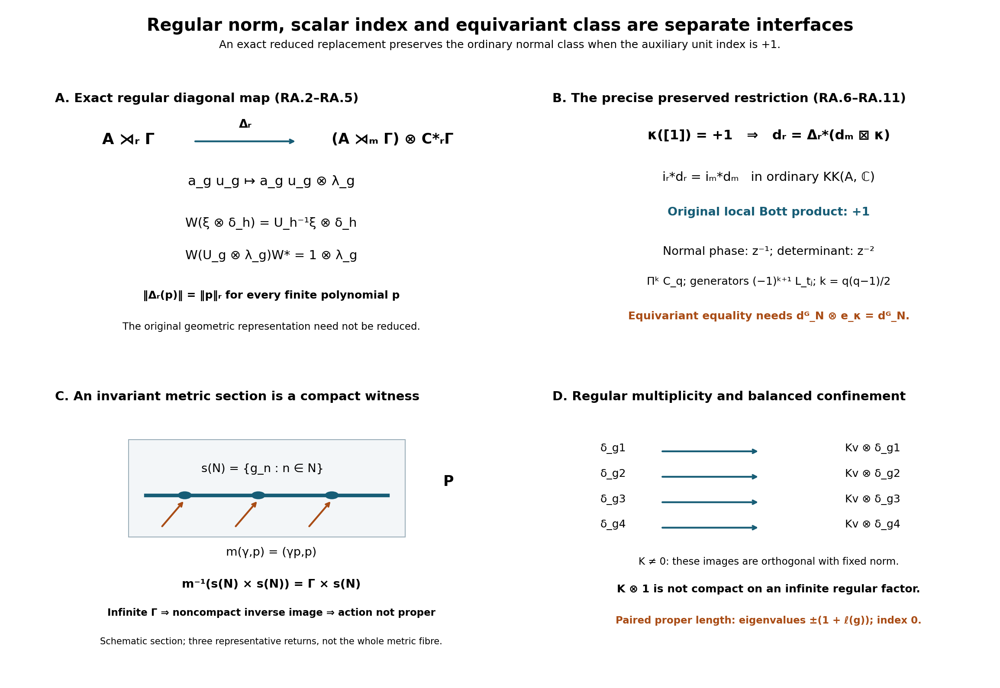

**Figure 11K.1.** Theorem 11K.1 and equations (RA.2)–(RA.11), Proposition 11K.4 and the invariant metric-section lemma. Panel A gives the actual absorption unitary and its exact norm equality. Panel B records equality of the whole ordinary normal restriction, the full inverse phase and grading, and the separate equivariant product premise. Panel C is a schematic of the compact metric section; the three arrows represent selected returns of an infinite group, rather than the whole positive-metric fibre or a finite group. Its displayed inverse image is exact. Panel D displays four members of an infinite orthogonal sequence with fixed positive norm, proving failure of bare tensor compactness, and the actual paired-length spectrum and zero index. No existence of an arbitrary unit-index auxiliary is inferred. The structural-group distinction is in Hilsum–Skandalis, Proposition 4.7, p. 355; the original local normalization is in Connes, pp. 28–29. Original diagram and generator, CC0 1.0; bundled glyphs retain their complete component notice.

[Editable SVG](../figures/regular-auxiliary.svg) · [Reproducible source](../reproduction/proper-regular-auxiliary/draw_auxiliary.py).

## 11L. Compact-resolvent representatives with prescribed group commutators

The existence of a scalar KK class and the choice of an unbounded operator representing it are separate questions. Once the class is given, a countable discrete group creates no additional obstruction to choosing compact resolvent and bounded commutators with every group element. The following construction also gives a unital reduced representation and an explicit invariant graph core.

The controlled inverse and bounded-transform arguments are proved in *Unbounded Kasparov modules and spectral triples*, Section 3, Lemma 3.1 and Theorem 3.2. Their inputs are the full convex and nested-cutoff proofs in *Kasparov's technical theorem*, Section 1, the compact-operator and countability proof in *Graded C*-algebras, Clifford algebras and graded Hilbert modules*, Lemma 2.0, and the parity-preserving normalization in *Kasparov modules and the groups KK(A,B)*, Theorem 3.2. We spell out the prescribed-family choice and the removal of the zero-representation summand. That removal is needed because an exact odd unitary obtained by doubling need not have a unital source representation.

### 11L.1. The complete auxiliary provider

Give a unital C*-algebra the trivial grading. A representation below is complex-linear and *-preserving. Compactness means ordinary Hilbert-space compactness.

**Theorem 11L.1 (a prescribed countable family).** Let \(A\) be a separable unital C*-algebra, let \(S\subset A\) be countable, and let \(\kappa\in KK(A,\mathbb C)\) be even. There are a separable graded Hilbert space \(H_K\), an even unital representation \(\pi_K:A\to\mathcal B(H_K)\), and a closed densely defined odd self-adjoint operator \(D_K\) such that

\[
 (D_K\pm i)^{-1}\in\mathcal K(H_K),\qquad
 [H_K,\pi_K,D_K(1+D_K^2)^{-1/2}]=\kappa.
 \tag{UP.1}
\]

Every member of the unital *-algebra generated by \(S\) preserves \(\operatorname{Dom}D_K\) and has a bounded commutator with \(D_K\). The family may be enlarged by any prescribed countable dense subset of \(A\). Consequently the operator is an unbounded Kasparov representative on a dense unital *-algebra. No finite summability, prescribed eigenvalue growth, differential order or uniform commutator bound over \(S\) is asserted. A finite-dimensional or zero representative is allowed.

**Proof: the prescribed countable tests.** Start with a countably generated graded scalar Kasparov cycle representing \(\kappa\). Such a scalar module is a separable Hilbert space. The normalization theorem just linked replaces it, without changing its class, by a cycle \((\widetilde H,\phi,F)\) with

\[
 F=F^*=F^{-1},\quad F\text{ odd},\quad
 [F,\phi(a)]\in\mathcal K(\widetilde H)\quad(a\in A).
 \tag{UP.2}
\]

The normalization can add an oppositely graded summand with zero representation. Thus \(P=\phi(1)\) is an even orthogonal projection, and need not be the identity.

Choose a countable family \((a_j)\) containing \(S\), its adjoints, \(1\), and a countable dense subset and its adjoints. In the controlled inverse proof, this is the family to be used from the outset. Nothing there requires choosing the family independently of \(S\). With an even positive injective compact \(h\) of dense range commuting with \(F\), its nested quasicentral cutoffs \(u_n\in C^*(h)\) can satisfy

\[
 \begin{split}
 u_{n+1}u_n&=u_n,\qquad u_n\longrightarrow1\text{ strongly},\\
 \|[u_n,\phi(a_j)]\|&\leq2^{-n},\\
 \|F,\phi(a_j)\|&\leq2^{-n}
                      \quad(j\leq n).
 \end{split}
 \tag{UP.3}
\]

Here the commutator tests derive the compact ideal, and the second test is a compact approximate-identity test. Both are covered by the linked nested-cutoff proof. Each cutoff vanishes on a neighborhood of zero in \(\sigma(h)\). The continuous inverse defined on the nonzero spectrum is

\[
 r=1+\sum_{n\geq1}(1-u_n),\qquad l=r^{-1},\qquad
 D=Fl^{-1},\qquad\operatorname{Dom}D=\operatorname{Ran}l.
 \tag{UP.4}
\]

The sum is locally finite away from zero. Nesting makes every later cutoff equal to one wherever a previous one is positive. Each finite group of cutoffs vanishes sufficiently near zero, so \(r\to\infty\) there. Accordingly \(l\) extends by zero at zero and is an even injective compact operator of dense range commuting with \(F\).

For clarity, the domain assertion follows from a convergent inverse equation, rather than a bounded-sequence test. Put \(R_N=1+\sum_{n=1}^N(1-u_n)\). Then \(lR_N\to1\) strongly and \(R_N\xi\to l^{-1}\xi\) for \(\xi\in\operatorname{Ran}l\). For fixed \(j\), (UP.3) makes \([R_N,\phi(a_j)]\) converge in norm. Thus

\[
 R_N\phi(a_j)\xi\longrightarrow
       \phi(a_j)l^{-1}\xi+C_j\xi.
 \tag{UP.5}
\]

Multiply this equation by \(l\). Its left side tends to \(\phi(a_j)\xi\), proving that this vector lies in \(\operatorname{Ran}l\), with the displayed inverse image. Similarly \([F,\phi(a_j)]R_N\) converges in norm. Therefore

\[
 [D,\phi(a_j)]
   =F[l^{-1},\phi(a_j)]+[F,\phi(a_j)]l^{-1}
 \tag{UP.6}
\]

extends boundedly. Products satisfy the domain Leibniz rule. Adjoints were included among the tests, so the whole generated *-algebra has the asserted domain and commutator properties.

The inverse resolvents and bounded transform are exactly

\[
 (D\pm i)^{-1}=l(F\mp il)(1+l^2)^{-1},\qquad
 F_D=F(1+l^2)^{-1/2}.
 \tag{UP.7}
\]

The two resolvent formulas prove self-adjointness on \(\operatorname{Ran}l\), as in the linked theorem; they are compact. The difference \(F_D-F\) is compact because its scalar coefficient \((1+l^2)^{-1/2}-1\) vanishes at zero. Hence \((\widetilde H,\phi,F_D)\) still represents \(\kappa\).

**Proof: bounded off-diagonal removal.** Since \(1\) was a controlled test, \(P\) preserves \(\operatorname{Dom}D\) and \(C=[D,P]\) extends boundedly. Put \(Q=1-P\). The domain decomposes as \(P\operatorname{Dom}D\oplus Q\operatorname{Dom}D\). On it define the off-diagonal part

\[
 B=PDQ+QDP=C(2P-1),\qquad D_0=D-B.
 \tag{UP.8}
\]

The right-hand formula gives an everywhere bounded extension of \(B\), of norm at most \(\|C\|\). Symmetry of \(D\) gives \(C^*=-C\), first by testing domain vectors and then by density. Its diagonal blocks vanish, so \(C(2P-1)=-(2P-1)C\). Consequently \(B^*=B\). Both \(C\) and \(B\) are odd because \(P\) is even. Moreover \([B,P]=C\), so \(D_0\) commutes with \(P\) on the full domain.

We include the perturbation and class checks. The operator \(D_0\), on \(\operatorname{Dom}D\), is symmetric and closed, since its graph norm is equivalent to that of \(D\). For \(\rho>\|B\|\),

\[
 (D_0\pm i\rho)^{-1}
  =(D\pm i\rho)^{-1}
       \bigl(1-B(D\pm i\rho)^{-1}\bigr)^{-1}.
 \tag{UP.9}
\]

The final inverse exists by its Neumann series. Surjectivity of both operators and the symmetric adjoint-domain argument prove self-adjointness of \(D_0\). Formula (UP.9) gives compact resolvents at these two points. The resolvent identity then gives compactness at every nonreal point. Every controlled \(a\) preserves the same domain, and

\[
 [D_0,\phi(a)]=[D,\phi(a)]-[B,\phi(a)]
 \tag{UP.10}
\]

is bounded.

For a self-adjoint operator \(T\), write
\(Q_\rho(T)=T(T^2+\rho^2)^{-1}
=\tfrac12((T-i\rho)^{-1}+(T+i\rho)^{-1})\).
The bounded-transform integral in the linked Theorem 2.2 is a strong integral. Its difference here converges in norm, since the resolvent identity gives

\[
 \|Q_\rho(D_0)-Q_\rho(D)\|\leq\|B\|\rho^{-2},
 \quad
 F_{D_0}-F_D=\frac2\pi\int_0^\infty
    \bigl(Q_{\sqrt{1+t^2}}(D_0)
          -Q_{\sqrt{1+t^2}}(D)\bigr)\,dt.
 \tag{UP.11}
\]

Each integrand is compact, and the bound is integrable. Thus the difference is compact. The compact perturbation proof in *Kasparov modules and the groups KK(A,B)*, Proposition 3.1 shows that \((\widetilde H,\phi,F_{D_0})\) represents the same class.

**Proof: the essential compression.** The domain commutation with \(P\) and the uniqueness of resolvent solutions show that both resolvents of \(D_0\) commute with \(P\). Therefore the two summands reduce \(D_0\). Define

\[
 \begin{split}
 H_K&=P\widetilde H,\qquad
 \pi_K(a)=\phi(a)|_{H_K},\\
 D_K&=D_0|_{H_K},\qquad
 \operatorname{Dom}D_K=P\operatorname{Dom}D.
 \end{split}
 \tag{UP.12}
\]

This operator is odd and self-adjoint, with compact resolvents obtained by restricting those of \(D_0\). Its representation is even and unital. Source operators commute with \(P\), so (UP.10) restricts to the required bounded commutators on \(H_K\), including domain preservation. Functional calculus is block diagonal. The other block has identically zero source representation, hence is a degenerate Kasparov cycle; Proposition 2.3 of the same lesson proves its class is zero. The remaining block therefore represents exactly \(\kappa\), proving (UP.1). \(\square\)

### 11L.2. All elements of a countable discrete group

**Corollary 11L.2 (the reduced scalar auxiliary).** Let \(\Gamma\) be any countable discrete group and \(R=C_r^*(\Gamma)\). For every even \(\kappa\in KK(R,\mathbb C)\) there is a representative as in (UP.1), with an even unitary representation

\[
 V_g=\pi_K(\lambda_g),\qquad
 V_g\operatorname{Dom}D_K=\operatorname{Dom}D_K,\qquad
 C_g=[D_K,V_g]\in\mathcal B(H_K)\quad(g\in\Gamma).
 \tag{UP.13}
\]

It factors through the reduced algebra. The dense algebra can be taken to contain the complete complex group algebra \(\mathbb C\Gamma\). There is a countably generated algebraic graded graph core invariant under every \(V_g\).

**Proof.** The linear span of the countable family \(\{\lambda_g:g\in\Gamma\}\) is norm dense in \(R\), so \(R\) is separable and unital. Apply Theorem 11L.1 with this entire family, rather than only a selected generating set. Unitality gives \(V_g^*V_g=V_gV_g^*=1\), and multiplication gives \(V_gV_h=V_{gh}\). Apply domain preservation to both \(g\) and \(g^{-1}\) to get the equality in (UP.13). For a finite group-algebra element,

\[
 [D_K,\pi_K(\textstyle\sum_g c_g\lambda_g)]
       =\sum_g c_g C_g,
 \qquad
 C_{gh}=C_gV_h+V_gC_h.
 \tag{UP.14}
\]

Both equations hold on the full domain and extend boundedly. Each fixed group element has a finite bound; these formulas impose no common bound as \(g\) varies. Reduced continuity is retained because \(\pi_K\) is a representation of \(R\) itself.

For the core, choose a countable dense set \((x_j)\) in \(H_K\), and put \(\xi_j=(D_K-i)^{-1}x_j\). The map \(D_K-i\) is an isometry from its domain with norm \((\|\xi\|^2+\|D_K\xi\|^2)^{1/2}\) onto \(H_K\). Hence the span of the \(\xi_j\) is graph dense. Let \(\gamma_K\) be the grading, and \(P_\pm=(1\pm\gamma_K)/2\). These two projections preserve the domain and are bounded for its graph norm because \(D_K\gamma_K=-\gamma_KD_K\). Now set

\[
 \mathcal C_K=\operatorname{span}_{\mathbb C}
       \{V_gP_\pm\xi_j:g\in\Gamma,\ j\geq1\}.
 \tag{UP.15}
\]

All these vectors lie in the domain. The core is graded, contains the graph-dense original span, and is invariant under all group elements. Countability makes its displayed generating family countable. Explicitly,

\[
 \|V_g\xi\|_{\operatorname{Dom}D_K}
       \leq(1+\|C_g\|)\|\xi\|_{\operatorname{Dom}D_K}.
 \tag{UP.16}
\]

This follows by applying the triangle inequality to the two-component vector \((V_gD_K\xi+C_g\xi,V_g\xi)\). Thus each group operator also acts continuously on the complete graph domain. The core is not asserted to be invariant under \(D_K\) itself or under higher powers of \(D_K\). Neither assertion is needed for a graph core. \(\square\)

### 11L.3. The scalar sign and the product premise

The construction preserves the whole class \(\kappa\), rather than merely its unit pairing. In particular, if the supplied class satisfies

\[
 \langle[1_R],\kappa\rangle=+1,
 \tag{UP.17}
\]

then the compressed representative has the same sign. One can also see the scalar Fredholm operator directly. Its bounded transform is odd, so write \(F_K^+:H_K^+\to H_K^-\) for the positive-to-negative block. It is Fredholm by the proved scalar classification in *K-theory of the leaf space*, Scalar classification through the stable corona. The even operator \((1+D_K^2)^{-1/2}\) maps \(H_K\) bijectively onto \(\operatorname{Dom}D_K\): it is \((D_K-i)^{-1}\) times the everywhere unitary continuous-calculus function \((D_K-i)(1+D_K^2)^{-1/2}\). Consequently

\[
 F_K^+=D_K^+(1+D_K^2)^{-1/2}|_{H_K^+},
 \qquad \operatorname{ind}D_K^+=\operatorname{ind}F_K^+=+1.
 \tag{UP.18}
\]

Here the domain of \(D_K^+\) carries its graph norm. The equality of indices follows from equality of ranges and the bijective domain change; its kernel and cokernel are the same finite-dimensional spaces. If (UP.17) is not assumed, the identical argument gives the actual integer \(\langle[1_R],\kappa\rangle\).

This supplies precisely the auxiliary-operator premise of the regular scalar product: compact resolvent, an odd self-adjoint operator, an even reduced group representation, full domain preservation, bounded commutators and a graph core. In the auxiliary-first product

\[
 D_K\widehat\otimes1+\gamma_K\widehat\otimes D_N,
 \tag{UP.19}
\]

the supplied even scalar class contributes no extra Clifford degree or exchange sign. The normal factor retains its actual inverse phase \(z^{-1}\), determinant coefficient, grading and local Bott value \(+1\). Existence of a class satisfying (UP.17), the full normal/holonomy field construction, and any prescribed equivariant restriction identity are separate premises. This theorem does not manufacture those premises or a finite-order differential operator on a holonomy graph.

### 11L.4. A finite model of the compression

The compression is not cosmetic. Consider \(\widetilde H^+=\mathbb C^2\), \(\widetilde H^-=\mathbb C^2\), with ordered coordinates \((e_1^+,e_2^+,e_1^-,e_2^-)\), and put

\[
 T=\begin{pmatrix}2&1\\1&3\end{pmatrix},\quad
 F=\begin{pmatrix}0&I_2\\I_2&0\end{pmatrix},\quad
 l=\begin{pmatrix}T^{-1}&0\\0&T^{-1}\end{pmatrix},\quad
 P=\operatorname{diag}(1,1,1,0),\quad \phi(a)=aP.
 \tag{UP.20}
\]

The positive matrix \(T\) has eigenvalues \((5\pm\sqrt5)/2\), so \(l\) is positive and invertible. Its scalar compactness is automatic in finite dimension. It commutes with \(F\), and \(D=Fl^{-1}\) has lower-left block \(T\). Equation (UP.8) removes only the couplings to \(e_2^-\). On \(P\widetilde H\) the compressed positive-to-negative block is

\[
 D_K^+=\begin{pmatrix}2&1\end{pmatrix}:\mathbb C^2\to\mathbb C.
 \tag{UP.21}
\]

Its kernel is the line spanned by \((1,-2)\), its range is all of \(\mathbb C\), and its index is \(+1\). Although \(F\) before compression is an exact odd unitary, its representation is not unital. After compression the representation is unital and the index-one kernel remains. This is an exact finite-dimensional illustration of the construction, not a model for the growth or summability of the general operator.

### 11L.5. The exact finite compression diagram

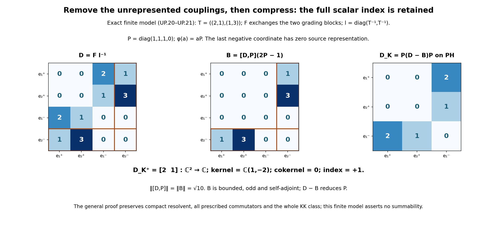

**Figure 11L.1.** Theorem 11L.1, equations (UP.8)–(UP.12), and the exact finite model (UP.20)–(UP.21). The panels show every entry of the doubled operator, its removed off-diagonal part and its three-dimensional essential compression, in the stated coordinate order. Orange outlines mark the fourth coordinate, whose source representation is zero. The represented positive and negative dimensions are two and one; the row (2,1) has the displayed kernel and no cokernel. The norm √10 is the exact norm of the removed coupling vector (1,3). The finite diagram illustrates the general class-preserving proof; it asserts no eigenvalue growth or summability. Original mathematical expression is CC0 1.0; bundled glyphs retain their component terms.

[Editable SVG](../figures/auxiliary-essential-compression.svg) · [Reproducible source](../reproduction/proper-regular-auxiliary/draw_proper.py).

## 11M. Regular fields, unit-space balancing and the graph Dirac interface

Sections 11J–11L prove the proper-factorization unit calculation and the scalar regular-auxiliary realization for a discrete action, with a single group algebra and an ordinary external KK product. An arbitrary holonomy groupoid has range
and source units. These cannot be replaced by one group without changing
the construction. We give the correct regular-field norm argument and two
precise limitations of a proposed groupoid transfer. They concern the tensor
and the operator, respectively; they do not exclude every normalized reduced
graph class.

### 11M.1. The original normalization and the stronger auxiliary premise

In Connes's survey, page 28 defines the transverse class using an
orientation-preserving disk and its positive Bott generator. Page 29 asks
for a graph Dirac K-homology class whose pairing with that class is one,
under the holonomy-invariant normal spin-c hypothesis. Thus the required
integer is the **original oriented local transverse Bott pairing**. The
normal inverse coefficient, its grading, determinant phase and final right
Clifford factor must be the prescribed ones of Section 11E.9.

Neither source passage separately requires an auxiliary to represent the
equivariant unit, or a fixed maximal class to descend, or a full restriction
to every function on a chosen closed transversal to equal one supplied
normal cycle. These can be sufficient comparison premises for a particular
route. They are stronger data than the original pairing requirement.
Proposition 11I.2 and Section 11K.5 distinguish ordinary scalar index from equivariant
index; it does not turn an equivariant-unit equality into a necessary
condition for every solution of the survey problem.

### 11M.2. Why ordinary balancing is the wrong algebra

**Proposition 11M.1 (the diagonal needs different unit-space typing).**
Let the pair groupoid on two units have algebra \(A=M_2(\mathbb C)\), and
let \(D=\mathbb C^2\subset A\) be its diagonal unit algebra. Quotienting
\(A\otimes A\) by the two-sided ideal generated by
\(d\otimes1-1\otimes d\), \(d\in D\), gives the zero algebra.
Nevertheless

\[
 \Delta(e_{ij})=e_{ij}\otimes e_{ij},\qquad
 P=e_{11}\otimes e_{11}+e_{22}\otimes e_{22}
 \tag{GR.1}
\]

defines an injective homomorphism into the corner
\(P(A\otimes A)P\), carrying the unit to \(P\).
This corner is not that balanced quotient.

There is also a continuous obstruction to treating the corner as an
ordinary scalar product-space diagonal. Let \(M\) be a nonempty compact
positive-dimensional smooth manifold with a smooth positive volume measure,
and put \(H=L^2(M)\). Any operator \(T\in B(H\otimes H)\) satisfying

\[
 (M_h\otimes1)T=(1\otimes M_h)T,
 \qquad h\in C(M),
 \tag{GR.2}
\]

is zero. In particular no nonzero homomorphism from the pair-groupoid
algebra \(K(H)\) into this ordinary product representation can have every
image satisfy (GR.2).

**Proof.** Identify \(A\otimes A\) with the matrices on the basis
\(v_{11},v_{12},v_{21},v_{22}\). For \(p=e_{11}\), the balancing generator
\(p\otimes1-1\otimes p\) has diagonal entries \(0,1,-1,0\).
Multiplying it on the left by \(E_{a,12}\) and on the right by
\(E_{12,b}\) gives every matrix unit \(E_{a,b}\). Its two-sided ideal is
therefore the entire algebra. This also explains the defect in regarding
\(A\) as a central \(D\)-algebra: the unit functions are not central
when arrows change the unit.

On the other hand,
\((e_{ij}\otimes e_{ij})(e_{kl}\otimes e_{kl})
=\delta_{jk}e_{il}\otimes e_{il}\), and involution reverses the two
indices. The four displayed matrices act as the matrix units on
\(\operatorname{span}\{v_{11},v_{22}\}\); hence their map is injective,
their unit is \(P\), and this is precisely the corner. The compressed
balancing generators vanish, while the uncompressed quotient is zero.

For the continuous assertion identify \(H\otimes H=L^2(M\times M)\)
using the product volume. Choose a countable collection \(h_j\in C(M)\)
separating points; for example a countable dense collection in \(C(M)\)
does so. For every vector \(v\), equation (GR.2) says
\((h_j(x)-h_j(y))(Tv)(x,y)=0\) almost everywhere for every \(j\).
Discard the countable union of these null sets. Outside it, \(Tv\) is
supported where all \(h_j(x)=h_j(y)\), namely on the diagonal.
That diagonal has product measure zero: every singleton has zero smooth
volume, so the nonnegative iterated integral of its indicator is zero.
Thus \(Tv=0\), for every \(v\), proving the claim. No theorem about all
homomorphisms \(K(H)\to B(H\otimes H)\) is asserted: the specific unit
compatibility (GR.2) is essential. \(\square\)

The pair groupoid of a compact manifold is already a holonomy groupoid
of the one-leaf foliation, with zero normal bundle and its invariant
spin-c structure. Its scalar K-homology is not obstructed by this
proposition. Passing to a point transversal gives its familiar rank-one
Morita corner. What fails is the proposed **ordinary** balanced tensor
or product-measure diagonal, not that Morita construction. For a
positive-dimensional transversal, a fibrewise Hilbert tensor uses a
measure over one unit variable, rather than product measure over two
independent copies. The next theorem uses that correct space explicitly.

### 11M.3. A genuine groupoid regular-field absorption

Let \(\mathcal G\rightrightarrows X\) be a second-countable Hausdorff
étale groupoid. Write
\(\mathcal G^x=r^{-1}(x)\),
\(\mathcal G_x=s^{-1}(x)\). Let \(\mu\) be a sigma-finite positive
Borel measure on \(X\) invariant under every partial bisection, and let
\(V_x\) be a measurable finite-dimensional Hermitian field with a
measurable unitary groupoid action

\[
 U_\gamma:V_{s\gamma}\longrightarrow V_{r\gamma},
 \qquad U_{\gamma\eta}=U_\gamma U_\eta.
 \tag{GR.3}
\]

This can be the **whole** normal inverse field, with its right Clifford
action and grading; it is not just its determinant or a minimal spinor.
The regular auxiliary is the field
\(\ell^2(\mathcal G^x)\), with
\(L_\gamma\delta_\eta=\delta_{\gamma\eta}\) for
\(r\eta=s\gamma\). Each \(L_\gamma\) maps between its specified
unit fibres. It is not a single representation of one global group.

Define the two counting measures on the arrow space by

\[
 \int b\,d\nu_r=\int_X\sum_{r g=x}b(g)\,d\mu(x),
 \qquad
 \int b\,d\nu_s=\int_X\sum_{s g=x}b(g)\,d\mu(x).
 \tag{GR.4}
\]

All sums retain the arrow labels, including distinct isotropy arrows.

**Theorem 11M.2 (typed regular-field norm).** On

\[
 \mathscr H_r=\int_X^\oplus
       V_x\otimes\ell^2(\mathcal G^x)\,d\mu(x)
       =L^2(\mathcal G,\nu_r;r^*V),
 \tag{GR.5}
\]

the convolution expression

\[
 (\Pi_U(f)\xi)(g)
    =\sum_{r\gamma=r g}f(\gamma)U_\gamma\xi(\gamma^{-1}g),
       \qquad f\in C_c(\mathcal G),
 \tag{GR.6}
\]

has the actual reduced norm bound
\(\|\Pi_U(f)\|\le\|f\|_r\). It extends to a representation of
\(C_r^*(\mathcal G)\). The onto unitary proving it is

\[
 (J\xi)(g)=U_g^{-1}\xi(g),\qquad
 J:\mathscr H_r\longrightarrow
    \int_X^\oplus\bigl(\ell^2(\mathcal G_x)\otimes V_x\bigr)\,d\mu(x).
 \tag{GR.7}
\]

This is a fibrewise absorption statement. It does not provide a
homomorphism into an ordinary spatial tensor of two groupoid algebras,
an auxiliary Fredholm operator, or a scalar Kasparov cycle.

**Proof.** A countable open bisection cover exists by second countability
and étaleness. Subtract preceding members to partition the arrows into
countably many Borel partial bisections, without duplicating a label.
On one such piece, the source-to-range map preserves \(\mu\) by
invariance. Integrating a nonnegative function over its range or over
its source therefore gives the same number. Summing the pieces by
monotone convergence proves \(\nu_r=\nu_s\), including infinite
integrals. This is the only measure interchange in (GR.7).

Each \(U_g\) is unitary and measurable. Hence (GR.7) preserves the
norm by (GR.4), carries the coefficient at \(r g\) to the coefficient
at \(s g\), and has the measurable onto inverse
\((J^{-1}\eta)(g)=U_g\eta(g)\). If the normal inverse transitions
are \(z^{-1}\rho_t(s)\), these entire transitions enter \(U_g\);
applying their inverse in \(J\) identifies the two pullbacks. It does
not trivialize the original line, replace its determinant phase, or
alter the grading or final right Clifford action.

The cocycle identity gives, with all maps typed,
\[
 U_g^{-1}U_\gamma U_{\gamma^{-1}g}=1_{V_{s g}}.
 \tag{GR.8}
\]
Consequently \(J\Pi_U(f)J^{-1}\) is
\[
 (\lambda(f)\eta)(g)
       =\sum_{r\gamma=r g}f(\gamma)\eta(\gamma^{-1}g).
 \tag{GR.9}
\]
The source of \(\gamma^{-1}g\) is \(s g\), so this decomposes over
the source unit \(x\) as \(\lambda_x(f)\otimes1_{V_x}\), the regular
source-column representation. On each fibre its norm is at most
\(\|\lambda_x(f)\|\): expand in an orthonormal basis of the finite
coefficient space and sum the squared component norms. The direct
integral norm is at most the supremum over \(x\), which is the
defining reduced norm. Compact support has a finite bisection cover,
so its convolution sums first define bounded operators on the dense
finite-section core; equivalently the regular bound just proved
extends that formula. Matrix multiplication of the sums proves the
convolution law. Taking the adjoint and using \(\nu_r=\nu_s\) gives
the groupoid involution, or follows from the regular form (GR.9).
Norm completion proves the representation assertion. \(\square\)

**Lemma 11M.5 (the eligible metric separates holonomy arrows).**
For a smooth foliation on a second-countable Hausdorff manifold with a holonomy-invariant
positive transverse metric, its holonomy groupoid is Hausdorff.
The holonomy groupoid of any countable complete transversal is also
second-countable, Hausdorff and étale. Its local Riemannian volume has the invariance
required in (GR.4).

**Proof.** A transversal obtains its metric from its tangent
identification with the normal bundle. Metric invariance says
that each transverse holonomy map is a local Riemannian isometry.
A local isometry's germ is determined by its value and first
derivative. Here is the needed local argument. The Koszul formula
determines the Levi-Civita connection from the metric, Lie brackets
and derivatives of the metric; a local metric isometry preserves
each of its terms and therefore the connection. It carries a
geodesic with initial velocity \(v\) to the geodesic with initial
velocity its derivative applied to \(v\).

For completeness these initial data give unique short geodesics.
In a relatively compact coordinate box the smooth Christoffel
coefficients and their first derivatives are bounded. The integral
equation for position and velocity on a sufficiently short interval
is a contraction on a closed uniform ball of continuous paths;
its coefficient Lipschitz constant times the interval length is
less than one. Successive substitution converges uniformly,
gives a solution, and gives uniqueness by the same contraction
estimate. For sufficiently small initial \(v\), the solution
exists up to time one and stays in the box: the velocity equation
has a bound \(C|\dot x|^2\), so integration keeps
\(|\dot x|\le2|v|\) and \(|x(t)-x(0)|\le2|v|\) after reducing
the velocity ball. Differencing the integral equation first bounds
the change of its solution by a constant times the change of \(v\).
Its derivative is the unique solution of the linear variational
integral equation with coefficient the derivative of the smooth
position/velocity vector field along the solution. On each short
interval this linear integral equation is a contraction too.
Subtracting that candidate linear change from the actual change
leaves a remainder bounded by the contraction constant times
itself, plus \(o(|\Delta v|)\), by the uniform first-order
remainder for the vector field on the compact box. Absorbing
the contraction factor proves differentiability. The same
estimate and continuity of the vector-field derivative prove
continuous dependence of this derivative on \(v\); concatenate
the finitely many short intervals up to time one. At the constant
zero-velocity solution the variational equation is explicit:
the linearized position is \(tv\), and the quadratic velocity
term has zero linearization. Thus the time-one position map has
derivative the identity at \(v=0\). On a smaller ball its remainder
in the time-one map \(v\mapsto x+v+R(v)\) thus has Lipschitz
constant at most \(1/2\). For \(w\) in a sufficiently small
ball, \(v=w-R(v)\) is again a contraction of the velocity
ball into itself. Hence these geodesic endpoints fill a
neighbourhood of \(x\).

Two local isometries with the same value and derivative at \(x\)
therefore agree on all of these endpoints, by uniqueness of the
transported geodesic. They have the same germ. A holonomy arrow
is determined by its source, range and transverse holonomy germ.
Consequently the continuous map sending an arrow to
its source, range and derivative between their normal fibres
is injective. Continuity follows in the defining smooth graph
charts: the transverse holonomy map and its derivative vary
smoothly there. The bundle of normal linear isometries over the
product of the unit manifold with itself is Hausdorff. Distinct
arrow images therefore have disjoint open neighbourhoods,
whose inverse images separate the arrows. This proves
Hausdorffness; an embedding or properness of that map is not
needed.

For an immersed disjoint union of transversal charts \(T\),
the restricted groupoid is the fibre product
\(T\times_r G\times_s T\). It is a subspace of a Hausdorff
product. Its local holonomy charts are bisections, making it
étale. A countable small foliation atlas generates its holonomy
charts by finite words of overlap maps. There are countably
many such words; restricting their domains to a countable
coordinate basis supplies a countable bisection basis. Thus
the transversal groupoid is second-countable, as required
in Theorem 11M.2. Its bisection maps are the local isometries already
proved, so change of variables preserves Riemannian volume.
A countable collection of relatively compact charts gives a
sigma-finite unit measure. This proves the lemma. \(\square\)

Thus Theorem 11M.2 supplies its regular-field norm calculation
for complete transversals throughout this eligible metric scope,
without an additional unproved Hausdorffness premise. The
full spin-c phases still enter the unitary \(U_g\); the lemma
only separates the underlying holonomy arrows by their metric
jets and does not erase central phases in the coefficient.
The smooth full holonomy graph has positive-dimensional source
fibres and is not being silently declared étale. Its comparison uses
the actual holonomy Morita correspondence, not a global-action
replacement.

### 11M.4. The canonical regular unit vector does not normalize an auxiliary

**Proposition 11M.4 (the canonical doubled family has index zero).**
In the continuous regular field \(E_x=\ell^2(\mathcal G^x)\) of a
Hausdorff étale groupoid, let \(e_x=\delta_{1_x}\) and

\[
 P_x=|e_x\rangle\langle e_x|,
 \qquad L_\gamma e_{s\gamma}=\delta_\gamma.
 \tag{GR.19}
\]

The unit vector is not invariant at a nonunit arrow. Its covariance
defect is nevertheless finite rank. On the identically acted-on
graded double \(E\oplus E\), the canonical self-adjoint odd family

\[
 T=\begin{pmatrix}0&2P-1\\2P-1&0\end{pmatrix}
 \tag{GR.20}
\]

has fibrewise chiral index zero and is homotopic to a degenerate
family through locally compact square and covariance defects.
It does not supply an ordinary scalar index-one auxiliary.

**Proof.** Left translation sends \(1_{s\gamma}\) to \(\gamma\).
Hence \(L_\gamma P_{s\gamma}L_\gamma^{-1}\) is the projection
onto \(\delta_\gamma\), whose difference from \(P_{r\gamma}\)
has rank at most two. The field \(e\) is continuous: the units are
open and closed in a Hausdorff étale groupoid, so multiplying the
unit indicator by any compactly supported continuous unit function
gives a continuous compactly supported regular section. Rank-one
operators made from these sections show that \(aP\) is compact
for \(a\in C_0(X)\). On a bisection the same description applies
to \(\delta_\gamma\), proving continuity and local compactness of
the translated defect. Noninvariance itself therefore does not
prohibit a permissible compact covariance defect.

The off-diagonal block \(2P-1\) is an invertible involution. Its
kernel and cokernel are both zero. More explicitly set

\[
 B_u=-1+2uP,
 \quad T_u=\begin{pmatrix}0&B_u\\B_u&0\end{pmatrix},
 \quad B_u^2-1=4u(u-1)P,
 \qquad 0\le u\le1.
 \tag{GR.21}
\]

This is norm continuous. Its square defect after unit localization
is compact, and its translated defect is \(2u\) times the
rank-at-most-two defect above. Unit multiplication commutes with
every \(B_u\). At \(u=0\) the off-diagonal block is \(-1\),
with zero square, adjoint, commutator and covariance defects. At
\(u=1/2\) its kernel and cokernel are each exactly the same unit
line, so its index remains zero there as well. This proves the
claimed homotopy and index. It does not exclude a different
index-one family or require that such a family be an equivariant
unit. \(\square\)

### 11M.5. A regular representation and bounded commutators still need compacts

**Theorem 11M.3 (the unconfined normal graph operator fails the scalar test).**
There is a compact connected suspension with holonomy-invariant positive
normal metric and a coherent full unitary spin-c lift for which the
unconfined normal Dirac on the entire smooth graph has:

- the actual reduced regular convolution representation;
- a self-adjoint maximal normal-derivative domain with a smooth compact core;
- bounded unbounded-operator commutators with every smooth compact graph kernel;
- but a fixed smooth compact convolution kernel for which
  \(\Pi(k)(1+D^2)^{-1}\) is not an ordinary scalar compact operator.

Therefore regular absorption and the normal symbol alone do not give
this graph Kasparov cycle or its prescribed Bott pairing.

**Proof: geometry and full coefficient.** Let
\(N=\mathbb R/2\pi\mathbb Z\), choose
\(\alpha=2\pi(\sqrt2-1)\), \(\beta=\pi/5\), and let
\(j\in\mathbb Z\) act by

\[
 (t,n)\longmapsto(t+j,n+j\alpha),\qquad
 V=(\mathbb R\times N)/\mathbb Z.
 \tag{GR.10}
\]

The leaf tangent is the \(t\) direction. The quotient is compact
because \([0,1]\times N\) meets every orbit, and it is a smooth
manifold because integer translations act freely and properly on
the first factor. The normal metric is \(dn^2\), the orientation
is increasing \(n\), and every return is an isometry with derivative
one. The lift \([1,e^{ij\beta}]\) is coherent; its determinant is
\(e^{2ij\beta}\). For this rank-one normal bundle, in its complete
inverse module use the full \(C_1\) coefficient and final right \(C_1\) action of
Section 11E.9, with inverse transition \(e^{-ij\beta}\rho_t(1)\)
and inverse determinant \(e^{-2ij\beta}\). We retain the prescribed
physical inverse Clifford generator, call it \(A\), with
\(A=A^*\), \(A^2=1\), and the existing grading/sign calibration.
No minimal-spinor substitution or determinant-only comparison is made.

The actual holonomy graph is
\[
 G=(\mathbb R_t\times\mathbb R_r\times N)/\mathbb Z,
 \qquad j(t,r,n)=(t+j,r+j,n+j\alpha).
 \tag{GR.11}
\]
The arrow represented by \((t,r,n)\) goes from \([r,n]\) to
\([t,n]\). There are no nonidentity leaf loops: irrationality makes
every leaf an injectively immersed copy of \(\mathbb R\). Distinct
returns have distinct transverse germs, so (GR.11) retains exactly
the holonomy arrows. The transversal at \(t=0\) has groupoid
\(N\rtimes\mathbb Z\); this is the actual suspension example,
not a model for every holonomy groupoid.

On the graph, coefficient functions obey the inverse transition
\[
 \psi(t+j,r+j,n+j\alpha)=e^{-ij\beta}\psi(t,r,n).
 \tag{GR.12}
\]
The invariant density is \(dt\,dr\,dn\), with the fixed finite
Clifford coefficient. A fundamental range strip identifies the scalar
Hilbert space with
\(L^2([0,1]_t\times\mathbb R_r\times N;C_1)\).
The graph action is
\[
 (\Pi(k)\psi)(t,r,n)=\int_{\mathbb R}
             k(t,t',n)\psi(t',r,n)\,dt'.
 \tag{GR.13}
\]
Here \(k(t,t',n)\) is the deck-invariant scalar kernel of the
arrow from \([t',n]\) to \([t,n]\), with the unitary inverse
coefficient transport in the chosen cover frame. In that frame the
transport along this lifted leaf is identity; the deck phases in
(GR.12) remain in the global coefficient.

**Proof: reduced norm and closed domain.** The same quotient volume
can instead be integrated in a fundamental **source** strip
\(0\le r<1\). This is verified by partitioning into integer strips
and applying the measure-preserving deck maps; nonnegative sums
justify the interchange. Fixing \([r,n]\), (GR.13) is precisely the
regular integral-kernel representation on its full source fibre
\(\mathbb R_t\), tensored with the fixed finite normal coefficient.
Thus
\(\|\Pi(k)\|\le\sup_{v\in V}\|\lambda_v(k)\|=\|k\|_r\).
No geometric representation on the compact transversal is substituted
for this regular representation.

In the range strip put
\[
 D=A(-i\partial_n),\qquad
 \operatorname{Dom}D=
 \{\psi\in L^2:G\text{-distributional }\partial_n\psi\in L^2\}.
 \tag{GR.14}
\]
The symbol is the prescribed inverse normal generator, with no
\(t\) or \(r\) derivative. The constant deck phase and rotation
in (GR.12) make this a globally defined physical first-order
normal expression. Fourier series on the closed normal circle
identify its domain with
\(\sum_{m\in\mathbb Z}(1+m^2)\|\psi_m\|_{L^2(t,r;C_1)}^2<\infty\).
The operator on coefficient \(m\) is the self-adjoint matrix
\(mA\). The bounded inverse matrices \((mA\pm i)^{-1}\) have
norm at most one and produce a domain vector for every \(L^2\)
right-hand side, because
\(\|mA u\|^2+\|u\|^2=\|(mA\pm i)u\|^2\).
Hence both ranges \(D\pm i\) are all of \(L^2\), proving
self-adjointness on exactly (GR.14).

For the core, first truncate Fourier modes and \(r\) tails.
In the range strip cut off a small neighbourhood of the endpoints
\(t=0,1\). This costs no derivative term, since \(D\) has no
\(t\) derivative; absolute continuity of the normal graph-norm
integral makes the removed tails small. Mollify \(t,r\) and use
finite Fourier normal sections. The resulting compact smooth
sections supported in the interior of the strip extend by
(GR.12) to globally smooth compact sections of the quotient.
They converge in the graph norm. This proves the core and does
not select arbitrary extensions at open transverse chart ends:
the normal variable here is a closed circle. A general open
transversal is not given this closed normal domain by the norm
absorption theorem.

On that core differentiation under (GR.13) gives
\[
 [D,\Pi(k)]=-iA\Pi(\partial_n k).
 \tag{GR.15}
\]
The phases are constant and \(A\) commutes with them. The differentiated
kernel is again smooth with compact quotient support. Its two
regular Schur bounds are finite, so (GR.15) extends to a bounded
scalar operator. The core identity and closure show that \(\Pi(k)\)
preserves (GR.14) and that the commutator identity holds there.

**Proof: one fixed localized defect.** Choose a real
\(\xi\in C_c^\infty(I)\), \(I=(1/4,3/4)\),
with \(\int\xi(t)^2dt=1\). Define
\[
 k(t,t',n)=\sum_{j\in\mathbb Z}
                \xi(t-j)\xi(t'-j).
 \tag{GR.16}
\]
The sum is locally finite, deck invariant, and independent of \(n\).
It descends to a smooth compact graph kernel: its quotient support
has representatives in \(\overline I\times\overline I\times N\).
It is self-adjoint and idempotent under convolution. To check
idempotence, the disjoint integer supports remove all mixed indices
and each surviving integral of \(\xi^2\) equals one. In the
fundamental range strip its action is exactly the rank-one plaque
projection in \(t\), tensored with identities on \(r,n\) and the
unchanged normal coefficient.

Take a constant normal section \(u\) of norm one in
\(L^2(N;C_1)\), and a real
\(\zeta\in C_c^\infty((-1/8,1/8))\) of norm one. For distinct
integers \(j\), prescribe in the fundamental range strip
\[
 \psi_j(t,r,n)=\xi(t)\zeta(r-j)u(n).
 \tag{GR.17}
\]
Extending by (GR.12) gives smooth compact graph sections. Their
supports in \(r\) are disjoint in this strip, so the \(\psi_j\)
are orthonormal. They satisfy
\(D\psi_j=0\) and \(\Pi(k)\psi_j=\psi_j\). Therefore
\[
 \Pi(k)(1+D^2)^{-1}\psi_j=\psi_j,
 \qquad \|\psi_j-\psi_l\|=\sqrt2\quad(j\ne l).
 \tag{GR.18}
\]
The image of this unit sequence has no convergent subsequence.
The fixed localized square defect is not compact. For the bounded
phase \(F=D(1+D^2)^{-1/2}\),
\(\Pi(k)(1-F^2)=\Pi(k)(1+D^2)^{-1}\), so a necessary scalar
Kasparov condition fails. No Bott pairing of this failed cycle
can be assigned. This proves every assertion. \(\square\)

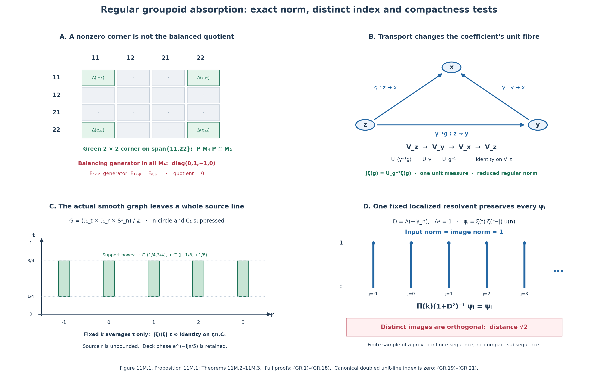

**Figure 11M.1.** Proposition 11M.1, Theorems 11M.2–11M.3 and
(GR.1)–(GR.21). The finite corner and zero balanced quotient are
different objects. The typed triangle retains the source of
\(\gamma^{-1}g\) and the full coefficient transport of (GR.8).
The graph panel uses the actual range strip \(0\le t<1\), displays
only finitely many supports of (GR.17) in the entire source line,
and suppresses the closed normal circle and finite Clifford factor.
The fixed kernel averages the range coordinate; it does not average
the source coordinate. Every displayed unit vector and image has
norm one, and every distinct pair of images has distance \(\sqrt2\).
These finite panels illustrate the fully proved infinite sequence;
they do not replace its proof. [Editable SVG](../figures/groupoid-regular-interface.svg)
· [Generator](../reproduction/groupoid-regular-interface/draw_interface.py)
· [Component terms](../reproduction/groupoid-regular-interface/COMPONENT-TERMS.md).

### 11M.6. What the regular auxiliary would still have to supply

Theorem 11M.2 settles the scalar reduced-norm calculation for its
correctly typed regular field. It supplies no odd auxiliary generator
with an even local index-one comparison, and no connection between
such a generator and the normal differential operator. Proposition
GR.4 proves that merely doubling the canonical regular unit line
does not supply that integer. Theorem 11M.3
proves that the zero auxiliary fails even on an eligible entire
smooth graph, despite its exact normal symbol, self-adjoint domain
and bounded convolution commutators. The translation oscillator
of Section 11E successfully replaces it for this particular
suspension; hence this example is not a counterexample to the
historical graph problem.

A proposed general transfer must specify the fibrewise/correspondence
tensor and its representation, not the zero quotient in Proposition
GR.1. It must construct a globally compatible auxiliary and a closed
physical graph operator, or prove an exact comparison to one. Open
transversal ends, determinant connections and all domain/core
conditions survive that requirement. The actual normalized
counting/plaque Morita correspondence then has to carry the
prescribed transverse Bott class to a cycle whose pairing is one.
Neither a measurable absorption unitary, nor a fibrewise compact
resolvent, nor an ordinary scalar auxiliary index establishes these
global operator and class comparisons by itself. Conversely, the
source does not authorize declaring a stronger equivariant-unit
identity necessary for every possible solution. The arbitrary
eligible reduced graph construction remains outside the results
proved here.

Human-source context: Connes, *A survey of foliations and operator
algebras*, [pages 28–29 in the author's text](https://alainconnes.org/wp-content/uploads/foliationsfine.pdf),
for the original transverse class, its pairing and graph problem.
The regular-field, tensor, metric-jet and localized-defect proofs
above are independently written. Existing exact comparison routes
are Checked Morita product, plaque restriction and local normalization,
the actual oscillator graph construction of Sections 11E.14–11E.19,
and Exact Morita class, full coefficient and the positive local pairing,
with their stated domains and hypotheses.

## 12. Exercises

**Exercise 1 (basic).** In the product foliation \(\mathbb R\times S^1\), choose a real compactly supported function \(\psi\) with \(\int|\psi|^2=1\). Compute the square of the kernel \(e(t,t',u)=\psi(t)\psi(t')\), and its trace for transverse measure \(a\,du\), where \(du\) has total mass one.

**Solution.** Convolution gives
\[
(e*e)(t,t',u)=\psi(t)\psi(t')\int|\psi(s)|^2\,ds=e(t,t',u).
\]
The kernel is self-adjoint. Its diagonal integral in \(t\) is one; integrating in \(u\) gives \(a\). Its represented projection has rank one on each leaf, although its algebra is nonunital.

**Exercise 2 (intermediate).** Let \(N\) be noncompact. Explain why Theorem 2.1 does not assert that the identity of \(\mathcal E_N(\mathbb C)\) is compact. Give a product example where it is not.

**Solution.** The identity of the Hilbert \(C_0(N)\)-module \(C_0(N)\) is multiplication by the constant one, which does not vanish at infinity and is not a compact module map. For \(V=\mathbb R\times N\), the induced module is a Morita module for \(C_0(N)\otimes\mathcal K\), and its compact endomorphism algebra is \(C_0(N)\). The identity belongs to its multiplier algebra, but not to \(C_0(N)\). Theorem 2.1 only applies to a compact map in its domain.

**Exercise 3 (intermediate).** Generalize Example 9.1 to a cyclic permutation of \(m\) points. Give its implementing unitary, and compute the trace of a point projection.

**Solution.** On \(\mathbb C^m\), let the unitary send the first basis vector to the second, and successively the \(j\)-th to the \((j+1)\)-st, while sending the last to \(z\) times the first. Its \(m\)-th power is \(zI\). Together with the diagonal point projections it generates \(M_m(C(S^1))\), giving the covariant isomorphism. The invariant probability measure assigns mass \(1/m\) to each point, so its crossed-product trace assigns \(1/m\) to each point projection. Integral \(H^1\) of the finite space is zero.

**Exercise 4 (advanced).** Prove directly from hyperbolic cosine law that endpoints at bounded distance have directions converging to each other as both go to infinity from a fixed base point. Why does this imply the commutator estimate, but not finite rank?

**Solution.** Rearranging the law gives
\[
1-\cos\theta
=\frac{\cosh d-\cosh(r-s)}{\sinh r\,\sinh s}
\le\frac{\cosh C-1}{\sinh r\,\sinh s}
\]
when \(d\le C\). Taking the square root gives (23). Clifford multiplication is linear and has norm equal to vector length, so it satisfies the same bound. Multiplying a kernel by this small difference bounds its two Schur integrals, giving a small operator-norm tail. The cutoff kernel is compact by finite-rank approximation, not generally finite rank itself. Its radial and angular variables still vary continuously.

**Exercise 5 (advanced).** Suppose \(T\in KK(B,A)\) and \(D\in KK(A,B)\) satisfy \(T\otimes_A D=1_B\). Prove that \(T_*:K_*(B)\to K_*(A)\) is injective. Give an elementary pair of group maps showing that this relation need not imply surjectivity.

**Solution.** Associativity gives \(D_*T_*(x)=x\). If \(T_*(x)=0\), then \(x=D_*(0)=0\). On abelian groups, the inclusion \(\mathbb Z\to\mathbb Z^2\), \(n\mapsto(n,0)\), has the left inverse \((a,b)\mapsto a\), and is not surjective. The second identity in (24), rather than the first alone, would give a two-sided inverse.

**Exercise 6 (advanced).** Check the parity of (16), and explain why a trace on \(K_0(A)\) uses the odd Chern character on \(V\) when a solvable action has odd-dimensional orbits.

**Solution.** The Thom map has degree \(n-\dim M+q\), the étale correspondence degree zero, and the inverse Bott map degree \(n\). Their sum is \(q-\dim M+2n\), equal to \(q-\dim M\) modulo two. For orbit dimension \(d\), the Connes–Thom map shifts parity by \(d\). If \(d\) is odd, classes mapping to \(K_0(A)\) come from \(K^1(V)\), whose Chern character has odd-degree components. The dimension-\(d\) current can pair with the component of degree \(d\).

**Exercise 7 (intermediate).** Check the double-dual action in Theorem 8.6. Why would \(\alpha_v\otimes\operatorname{Ad}\lambda_v\) have the wrong phase?

**Solution.** Conjugation by \(\lambda_{-v}\) sends \(M_{e^{iqt}}\) to \(M_{e^{iq(t+v)}}=e^{ivq}M_{e^{iqt}}\). It sends \(M_{\alpha_{-t}(b)}\) to \(M_{\alpha_{-(t+v)}(b)}\); applying \(\alpha_v\) to its coefficient returns \(M_{\alpha_{-t}(b)}\). The translations \(\lambda_s\) commute with \(\lambda_{-v}\). Thus all three generators have the required images. Replacing \(-v\) by \(v\) gives phase \(e^{-ivq}\), and the coefficient action no longer cancels.

**Exercise 8 (advanced).** For the affine group \(H=\mathbb R\rtimes\mathbb R\), with \(\theta_t(n)=e^tn\), compute the measures and unitary in Lemma 8.8. Then check one coefficient and both translation generators explicitly.

**Solution.** Here \(m_t=e^t\), so left Haar measure is \(e^{-t}\,dn\,dt\). In \(n=e^tk\) coordinates it becomes \(dk\,dt\), and \(Z\xi(t,k)=\xi(e^tk,t)\) is unitary. A coefficient becomes \(\rho(\alpha_{-k}\alpha_{(0,-t)}(b))\), where \(\alpha_{-k}\) is the normal-subgroup action. Translation by \((n,0)\) sends \(k\) to \(k-e^{-t}n\); translation by \((0,s)\) sends \(t\) to \(t-s\) with \(k\) fixed. The integrated normal-subgroup action is
\(\beta_tf(n)=e^{-t}\alpha_{(0,t)}(f(e^{-t}n))\).
Omitting this factor would fail to preserve convolution and its Haar normalization, even though the unitary \(Z\) itself has no extra square root.

**Exercise 9 (advanced).** Prove \(\|F\|=2\) for the scalar operator in (34), while \(S=1-F\) is an isometry of defect one. Explain why the endpoint estimates of Theorem 8.7 cannot be replaced by the assertion \(F_\varepsilon\to0\) in norm.

**Solution.** The kernel is convolution on the positive half-line by \(e^{-s/2}1_{s>0}\), preceded by the positive-half-line projection. Its \(L^1\) norm is two, so \(\|F\|\le2\). For \(v_T=T^{-1/2}1_{[0,T]}\) and \(0<t<T\),
\[
(Fv_T)(t)=2T^{-1/2}(1-e^{-t/2}).
\]
The integral of its squared norm on \([0,T]\) tends to four as \(T\to\infty\), proving the reverse inequality. Direct kernel composition gives (35), so \(S\) is an isometry with range complement the one-dimensional span of \(u(t)=e^{-t/2}1_{t>0}\). Dilation is unitary, hence every \(\|F_\varepsilon\|=2\). The small quantities are its commutator with a fixed coefficient and the difference between the rank-one corner maps, bounded by (36)–(37). The exponential mass concentrates near zero, where the coefficient action is norm continuous.

**Exercise 10 (intermediate).** In Theorem 9.3, suppose \(q\) is injective on \(C(X)\) and \(a\ge0\) lies in its kernel. Complete the argument from (39) to \(a=0\), and explain the role of minimality after the intersection property has been proved.

**Solution.** Letting \(\delta\downarrow0\) in (39) gives \(\mathsf E(a)=0\). Apply Proposition 9.2 to \(a^{1/2}\): its squared value has expectation zero, so \(a^{1/2}=0\) and \(a=0\). This part uses topological freeness and expectation faithfulness. Minimality is used afterwards: the common zero set of the nonzero invariant ideal \(J\cap C(X)\) cannot be a nonempty proper invariant closed set. Hence the intersection contains the unit, forcing \(J=B\). Faithful trace alone would not give that ideal-intersection argument.

**Exercise 11 (intermediate).** Check the unfolding in Lemma 9.4: derive the coefficient at \(r=t+j\), the translated vector, and the kernel \(K_a\). For \(g\in C_c^\infty(0,1)\) of norm one, compute the trace of its band projection. Where would a spurious circle-volume factor enter?

**Solution.** The regular discrete coefficient at \(j\) is \(\alpha_{-j}F(t)=F(t+j)\). The twisted extension says \(\eta(t+1,j)=\eta(t,j+1)\), so \(\zeta(t+j)=\eta(t,j)\) is well defined almost everywhere and translation sends \(\zeta(r)\) to \(\zeta(r-s)\). Writing \(t-s=u+m\) gives (44), including \(U^{-m}\). The rank-one kernel is \(g(t)\overline{g(u)}1_B\); its diagonal unit coefficient integrates to \(\int_0^1|g(t)|^2dt\,\nu(X)=1\). Time has period one and leaf density \(dt\); replacing it by a \(2\pi\)-period coordinate without also changing the vector and density normalization would introduce an erroneous volume factor.

**Exercise 12 (advanced).** Why does the integral defining \(D/\sqrt{1+D^2}\) in Proposition 9.5 converge strictly, whereas its commutator integral converges in norm? Show why the zero-action endpoint gives an isomorphism even before choosing a Bott sign.

**Solution.** Its truncation is
\[
\frac2\pi\frac{p}{\sqrt{1+p^2}}
\arctan\!\left(\frac{R}{\sqrt{1+p^2}}\right).
\]
It is bounded by one and converges uniformly on compact frequency sets, which gives strict convergence under nondegenerate \(C_0\)-functional calculus. Uniform convergence on the whole frequency line fails: at arbitrarily large \(p\), a fixed truncation is small while \(p/\sqrt{1+p^2}\) is near one. The commutator tail is instead bounded by \((2/\pi)\|\delta b\|\int_R^\infty(1+r^2)^{-1}dr\), which tends to zero in norm. At the zero action, six-term exactness for the two-endpoint interval has diagonal endpoint maps. Their cokernel is exactly the classes \((0,[w])\), and the next diagonal map is injective. The connecting map on that cokernel is therefore an isomorphism; its orientation fixes a sign but cannot change invertibility.

**Exercise 13 (intermediate).** In Theorem 9.6, remove connectedness from the logarithm argument. What changes, and how does the coefficient algebra already obstruct the original idempotent conclusion? Explain separately the connected zero-dimensional case.

**Solution.** The seam difference is only locally constant and integer valued; it can have different values on different components, so it need not be one integer multiple of the normalized time class. More directly, a proper clopen union of components gives a characteristic function \(e\in C(X)\) with \(e^2=e=e^*\), \(e\ne0,1\). Faithfulness of the coefficient inclusion retains that projection in the crossed product. Connectedness avoids this obstruction. A connected zero-dimensional compact manifold is a point, whose crossed product is \(C(S^1)\). Its continuous idempotents take values in \(\{0,1\}\) and are constant, but its proper ideals show that it is not simple. Thus the infinite-space hypothesis is needed for the combined source conclusion.

**Exercise 14 (intermediate).** A nonzero closed positive orbit current on a compact manifold is paired with the normalized leaf form \(\lambda(E)=1\). Derive its adjoint-trace obstruction. Then repeat the calculation for the affine group of Example 8.13 with a compactly supported function \(f\). Why does that calculation permit a nonzero transverse point measure?

**Solution.** Fundamental fields of a left action have negative Lie brackets, so \(\mathcal L_{X^\#}E=-\operatorname{tr}(\operatorname{ad}X)E\). Differentiation gives \((\mathcal L_{X^\#}\lambda)(E)=\operatorname{tr}(\operatorname{ad}X)\). Closedness and leafwise top degree therefore give (51), with finite strictly positive \(\mu(V)\), forcing every adjoint trace to vanish. For the affine field \(T^\#=n\partial_n+\partial_t\), integration by parts gives \(\int n\partial_nf\,dn\,dt=-\int f\,dn\,dt\) and \(\int\partial_tf\,dn\,dt=0\). Thus \(\int(T^\#f+f)=0\) for every compact test. The total measure is infinite, so the constant test needed to deduce \(0=\operatorname{tr}(\operatorname{ad}T)\mu(V)\) is unavailable. The one-leaf point measure is consistent with closedness.

**Exercise 15 (intermediate).** Compute the family \(H_v\), its Haar density, inverse, modular character, and the positive-parameter kernel change (58) for the affine group. Keep \(v\) distinct from the group coordinate \(t\).

**Solution.** The normal group is additive \(\mathbb R\), and \(\theta_t^v(n)=e^{vt}n\). Hence
\[
(n,t)*_v(n',t')=(n+e^{vt}n',t+t'),\qquad
(n,t)^{-1}=(-e^{-vt}n,-t).
\]
The outer modulus is \(e^{vt}\); left Haar is \(e^{-vt}\,dn\,dt\) and \(\Delta_v(n,t)=e^{-vt}\). At zero the product is additive and Haar is Lebesgue. The isomorphism to the original group is \(\Gamma_v(n,t)=(vn,vt)\), whose Jacobian is \(v^2\). Thus a kernel becomes \(v^{-2}f_v(n/v,t/v)\) in the original coordinates. Its involution has the modular factor \(\Delta_v((n,t)^{-1})=e^{vt}\), in addition to the coefficient action and adjoint. Omitting this factor or the \(v^{-2}\) kernel normalization would fail to preserve the integrated convolution representation.

**Exercise 16 (advanced).** In Lemma 8.15, explain why replacing source-fibre coordinates by orbit coordinates and dividing by \(v\) would not prove uniformity. Give the norm estimate for a localized operator matrix with at most \(N\) blocks in each row and column, each of norm at most \(C\). Which parameter derivatives are actually needed?

**Solution.** The anchor sends a tangent generator to \(vX^\#\); its rank vanishes at zero. An inverse orbit-coordinate derivative would therefore introduce \(v^{-1}\) and cease to exist at zero. Source-fibre coordinates remain \(d\)-dimensional with a smooth group law, so the Fourier–Schur proof uses no such inverse. For localized inputs \(u_j\),
\[
\sum_i\left\|\sum_jP_{ij}u_j\right\|^2
\le NC^2\sum_{i,j:P_{ij}\ne0}\|u_j\|^2
\le N^2C^2\sum_j\|u_j\|^2.
\]
Thus the matrix has norm at most \(NC\). The finite-seminorm bound uses source-coordinate derivatives uniform over \(v\). Smooth parameter derivatives for composition, quantization and Borel summation are taken in the original compact groupoid charts. No uniform derivative of \(h_0x\) with respect to \(v\), for arbitrary faraway \(h_0\), is required or asserted.

**Exercise 17 (advanced).** Explain how the zero-endpoint matrix in Theorem 8.16 identifies a relative symbol triple, even for nontrivial coefficient bundles. For the trivial foliation action \(H=\mathbb R\) on a compact manifold, which part of the parameter theorem remains true, and why must the orbit-foliation conclusion be typed differently?

**Solution.** Embed the two coefficient bundles in finite trivial bundles, use the index matrix \(W\), and add their fixed orthogonal complements. Its boundary value is \(\operatorname{diag}(a,a^{-1})\). The first range is therefore the source bundle, identified at the sphere with the target by \(a\); subtracting the target reference gives exactly the disk/sphere relative clutching class. These complements do not change the K-class, and rotation between two embeddings gives a homotopy. The construction does not assume that a coefficient bundle is trivial. For a trivial real action, Theorem 8.14 and Lemma 8.15 still apply: all fibres of the parameter algebra are \(C(V)\otimes C_0(\mathbb R)\), and the source calculus has dimension one. But the orbit foliation has rank zero and its holonomy groupoid is the unit groupoid, not \(V\rtimes\mathbb R\). Theorem 8.16 requires the graph identification; without it the one-dimensional source symbol cannot be called the zero-rank foliation symbol. This also explains the exact footnote's importance.

**Exercise 18 (intermediate).** In (65), omit \(a_t\) and call the resulting function \(\widetilde r_t\). Explain why \((1-\widetilde r_t(z))/z\) fails at zero even though the removed Gaussian tail is exponentially small. Give the correct smooth extension for \(q_t\).

**Solution.** Since the nonnegative Gaussian has positive mass outside \(\operatorname{supp}\chi\), \(\widetilde r_t(0)<1\) for every \(t>0\). Its numerator consequently has a nonzero value at zero, and division gives a genuine pole. Smallness does not make this a parametrix function. Normalization makes \(r_t(0)=1\); evenness makes \(r_t'(0)=0\), so \(q_t(0)=0\). Its first derivative is \(q_t'(0)=-r_t''(0)/2=(1/2)\int s^2\rho_t(s)\,ds\). The Fourier primitive is compactly supported because the normalized distribution \(\delta_{\{0\}}-\rho_t\) has integral zero. These exact facts are the ones used for finite propagation.

**Exercise 19 (advanced).** Verify (68) without assuming \(e\) or \(f\) self-adjoint, or that they commute. If \(e-f\) is trace integrable, compute the trace of the relative matrix difference.

**Solution.** Since \(f^2=f\), the products \(f(1-f)=(1-f)f=0\) give \(J_f^2=I\). Multiplying \(J_f\operatorname{diag}(f,1-f)J_f\) gives diagonal entries \(f+(1-f)=I\) and \(0\), and zero off-diagonal entries. Therefore
\[
\widetilde e-\operatorname{diag}(I,0)
=J_f\operatorname{diag}(e-f,0)J_f.
\]
It belongs to the algebra ideal whenever \(e-f\) does, and to the trace ideal whenever that difference does. Cyclicity with the two bounded multipliers gives trace \(\tau(e-f)\), because \(J_f^2=I\). No commutation with \(e\) was used. This is why a nonscalar exterior reference can be removed at the level of a relative K-class without integrating either reference separately.

**Exercise 20 (advanced).** For odd \(d\), check both signs in the circle reduction: the kernel parity in (74) and the fibre orientation sign in (78). Explain the role of the exterior inverse in (77).

**Solution.** The circle source kernel is zero and its adjoint kernel is the odd constant line, with trace one. Tensoring this line exchanges first-factor kernel parity, so the product trace index is minus the original. In the character calculation the positive circle base differential \(d\theta\) must cross the \(d\) first-factor vertical differentials before fibre integration in the ordered fibre \((\xi_1,\ldots,\xi_d,\eta)\). It contributes \((-1)^d\). The equality \(\epsilon_{d+1}=(-1)^{d+1}\epsilon_d\) makes the product characteristic value \(-\epsilon_d\) times the original pairing, agreeing with the kernel sign. On a noncompact base a parametrix may have a nonvanishing homogeneous defect at infinity. Adding the constant lift of \(T_\infty^{-1}-R_{0,\infty}\) makes both defects vanish in that quotient, placing them in \(A\otimes\mathcal K\). The lower bound \(\mathcal D_\infty^2\ge1\) is what makes this inverse available.

**Exercise 21 (advanced).** Apply (79) to the free left action of the affine group in Example 8.13 on itself, with transverse point mass one. Determine the full trace image and explain why it does not imply unimodularity.

**Solution.** This action has one leaf, holonomy graph the pair groupoid and algebra \(\mathcal K(L^2(H))\); its trace is the ordinary trace with a rank-one projection of value one. Thus the full K-theory trace image is \(\mathbb Z\). Independently \(H\cong\mathbb R^2\), so \(K_c^0(H)\cong\mathbb Z\). The two-plane Bott character has absolute integral one; choosing its sign to give integral \(+1\) makes the right side of (79) exactly \(\mathbb Z\). The current integrates the compactly supported character two-form against \(dn\wedge dt\). Its total mass is infinite, and the normalized volume form is not a compact test form. Hence the finite-mass Cartan argument of Proposition 8.12 cannot be applied. The modular character remains \(e^{-t}\), while both sides of the numerical theorem retain their stated values.

**Exercise 22 (intermediate).** Let \(u_+(p)=(p-i/2)/(p+i/2)\). Compute the effect of \(p\mapsto-p\) on its \(K_1(C_0(\mathbb R))\)-class, and on the ordered product of \(d\) such generators. Why does a positive determinant coordinate change give the same ordered analytic Thom map, rather than merely the same trace image?

**Solution.** Direct substitution gives \(u_+(-p)=u_+(p)^{-1}\). In stable unitary K-theory the inverse represents the negative class: rotation of the two blocks contracts \(\operatorname{diag}(u,u^{-1})\) to identity. Reflection of the first coordinate therefore multiplies the ordered external product by \(-1\), by bilinearity. Every negative determinant linear map is connected to that reflection; every positive determinant map is connected to identity. Along either path the least singular value has a positive lower bound, so pullback is point-norm continuous on \(C_0(\mathbb R^d)\). The induced K-map depends only on the component. More strongly, (82), its exact Haar transport and its kernel *-isomorphism identify the two whole deformation algebras. At one the identification is identity on \(B\rtimes H\); at zero it is identity on the intrinsic dual after the linear change. Equation (80) consequently identifies the maps on every K-class, before applying any trace. The statement concerns analytic decompositions; it does not prove geometric wrong-way factorization independence.

**Exercise 23 (intermediate).** Verify (84). If \(w\) is fixed by the upper unipotent, explain why the two large outer factors cause no convergence problem. Complete the passage from diagonal-fixed to lower-unipotent-fixed vectors.

**Solution.** With \(c=(\lambda-1)/n\), multiplication of the first two factors gives
\[
\begin{pmatrix}1+nc&n\\c&1\end{pmatrix}.
\]
Multiplying on the right by \(\overline U_{-n/\lambda}\) makes the upper-right entry \(n-(1+nc)n/\lambda=0\); the lower-right entry is \(1-cn/\lambda=\lambda^{-1}\). The other entries are \(\lambda,c\), proving the identity. For \(F(g)=\langle\pi(g)w,w\rangle\), upper-unipotent invariance of \(w\) on each side gives \(F(\overline U_nU_c\overline U_{-n/\lambda})=F(U_c)\). Only \(c\to0\) is used; no boundedness of the outer parameters is assumed. Continuity then gives \(F(D_\lambda)=\|w\|^2\), with \(D_\lambda=\operatorname{diag}(\lambda,\lambda^{-1})\). Since
\[
\|\pi(D_\lambda)w-w\|^2
=2\|w\|^2-2\operatorname{Re}F(D_\lambda)=0,
\]
\(w\) is diagonal-fixed. Now \(D_\lambda U_sD_\lambda^{-1}=U_{s/\lambda^2}\). Unitarity and diagonal invariance make the norm of \(\pi(U_s)w-w\) equal to that of \(\pi(U_{s/\lambda^2})w-w\), which tends to zero. Upper and lower elementary matrices generate \(L\), including its centre, so the vector is \(L\)-fixed.

**Exercise 24 (advanced).** In the proof of Theorem 8.26, justify uniform mixing on the moving family \(y=a_{-t}x\). Check the Haar density and the limiting order needed to replace the thickened averages by flat horocycle averages. What fails if one uses just ergodicity?

**Solution.** For fixed smooth compact group probability \(k_\varepsilon\), its pushforward densities \(h_y\) form a compact subset of \(L^2(X,m)\). Given \(\eta>0\), choose a finite \(\eta\)-net \(h_{y_i}\). Mixing controls each of their finitely many matrix coefficients. Cauchy–Schwarz bounds the discrepancy for an arbitrary \(h_y\) by \(\|f\|_2\eta\); all densities have integral one, so the constant term is the same. This estimate is uniform in \(y\), and therefore applies to every \(a_{-t}x\). In the ordered \((v,r,s)\) chart the determinant of the Maurer–Cartan columns is \(e^r\). Multiplication by \(e^{-r}\) in (87) leaves exactly the probability \(\phi_\varepsilon(v,r)h(s)\,dv\,dr\,ds\). Conjugation sends \((v,r,s)\) to \((v/T,r,Ts)\); its coordinate Jacobian is one and its \(e^r\) Haar factor is unchanged. For each fixed \(\varepsilon\), first let \(T\to\infty\) using uniform mixing. The difference from the weighted orbit average is at most \(\omega_f(\varepsilon)\); next let \(\varepsilon\to0\). Finally approximate \(1_{[0,1]}\) by smooth integral-one \(h\) in \(L^1\), using the bound \(\|f\|_\infty\|h-1_{[0,1]}\|_1\) independent of \(T,x\). An almost-everywhere ergodic theorem alone leaves exceptional orbits uncontrolled and does not exclude another singular invariant probability. Uniform convergence permits integration against every invariant probability, giving unique ergodicity and then uniqueness of the transverse measure up to scale.

**Exercise 25 (advanced).** For a closed one-form \(\omega\) on \(X\), calculate \(C_m(\omega)\) from the left fundamental-field bracket. Explain how zero trace can coexist with a nonzero \(K_0(C(X)\rtimes_U\mathbb R)\), and why “the only transverse measure” needs a normalization.

**Solution.** For left fundamental fields the bracket is the negative Lie bracket, so \([A^\#,N^\#]=-N^\#\). Closedness gives
\[
A^\#(\omega(N^\#))-N^\#(\omega(A^\#))+\omega(N^\#)=0.
\]
Invariance of Haar under both flows makes the integrals of the first two terms zero. Thus \(C_m(\omega)=0\). In dimension one the current pairs only with the closed degree-one component of an odd Chern character. The entire symbol-index/trace formula gives zero trace on all of \(K_0\). However the compact-support odd Bott class inserted in an oriented three-dimensional ball of \(X\) has nonzero top Chern integral; its extension by identity is a nonzero class in \(K^1(X)\). The actual analytic isomorphism sends it to a nonzero \(K_0\)-class. A trace pairing need not detect it. Multiplying \(C_m\) by any \(c>0\) gives another nonzero positive closed current and transverse measure. The unique probability normalization is \(m(X)=1\), using the density that makes \(N^\#\) unit; without it uniqueness means precisely positive scalar multiples.

**Exercise 26 (basic).** On \(\mathbb C^2\), graded by \(\operatorname{diag}(1,-1)\), take
\[
F=\begin{pmatrix}0&1\\1&0\end{pmatrix},\qquad
F'=\begin{pmatrix}0&-i\\i&0\end{pmatrix}.
\]
Compare the square of \((1-t)F+tF'\) with that of the bridge operator (97). Explain the reason for its normalization.

**Solution.** Both matrices are self-adjoint odd unitaries, and their anticommutator is zero. Thus the square of the straight segment is \(((1-t)^2+t^2)I\), which at \(t=1/2\) is \(I/2\). Here \(P=0\), so (97) gives \(F_\theta=\cos\theta F+\sin\theta F'\), whose square is \(I\) for every \(\theta\). More generally the anticommutator contributes \(\cos\theta\sin\theta H\); the outside fourth-root factors divide its square by \(1+\cos\theta\sin\theta P\) in the localized quotient. The endpoint factors are exactly one.

**Exercise 27 (intermediate).** Let \(J=\mathcal K(\ell^2(\mathbb N))\), \(u_n=v_n\) the projection onto the first \(n\) standard basis vectors, \(A_2=\mathbb C I\), and \(w=I\). The products \(u_jw\) lie in \(J\), and \((1-v_n)u_jw=0\) for every \(j\le n\). Show why this information alone does not give (92). Which extra term does the one-step lookahead control?

**Solution.** With \(b_n=(v_n-v_{n-1})^{1/2}\), we have \(b_n\) equal to the rank-one projection onto the \(n\)-th vector, and
\[
b_n^2u_nw=b_n,\qquad b_nu_nb_nw=b_n.
\]
Both norms are one; the latter terms have no summable norm bound. Indeed their strict sum is \(I\), so its product with \(A_2\) is not compact. The condition \(j\le n\) at the \(n\)-th step gives no smallness for \((1-v_{n-1})u_nw\). Requiring \(j\le n+1\) at that step gives its bound at step \(n-1\), namely \(4\epsilon_n^2\); the current-step bound is \(\epsilon_n^2\). Their sum gives the exact \(5\epsilon_n^2\) in the proof. This example concerns the omitted approximation condition; it does not refute the separator theorem.

**Exercise 28 (advanced).** Let \(p\) be a rank-one projection on an infinite-dimensional Hilbert space \(H_1\), and let \(H_2\) be infinite-dimensional. Prove that \(p\otimes I_{H_2}\) is not compact. Explain how the first positive term in (101) remains valid when a compact error on \(E_{12}\) is tensored with the last module.

**Solution.** Choose a unit vector \(\xi\) in the range of \(p\), and an orthonormal sequence \(\eta_n\) in \(H_2\). The images of \(\xi\otimes\eta_n\) under \(p\otimes I\) are the same orthonormal sequence, so no subsequence converges. This excludes compactness. In the product proof the equality \(C_a=P_a+K_a\) holds before the last tensor, with \(P_a\ge0\) and \(K_a\in\mathcal K(E_{12})\). The separator includes \(\mathcal K(E_{12})\widehat\otimes1\) in \(A_1\), so \(M^{1/4}(K_a\widehat\otimes1)\) is compact on the final module. Hence its sandwiched contribution is compact. The remaining \(M^{1/4}(P_a\widehat\otimes1)M^{1/4}\) is positive. One keeps this positive contribution; tensoring alone supplied no compactness.

**Exercise 29 (advanced).** Let \(B=C([0,1])\), \(D=\{f\in B:f(0)=0\}\), \(E=B\) with trivial grading, and \(\phi:D\to\mathcal L(E)\) multiplication. Show that \((E,\phi,0)\) is a Kasparov cycle, but \(E^{\rm ess}=D\) has no orthogonal complement. Explain why the essential-module homotopy does not require such a complement.

**Solution.** The zero operator is odd, its commutators and adjoint defect vanish, and its square defect is \(-\phi(d)\in B=\mathcal K(E)\). Also \(\overline{DE}=D\). An adjointable projection on \(E=B\) is multiplication by a continuous projection-valued scalar function \(p:[0,1]\to\{0,1\}\). Its range equals \(D\) only if \(p(0)=0\) and \(p(t)=1\) for all \(t>0\), contradicting continuity. In the homotopy the module consists of continuous \(E\)-sections whose final value lies in \(D\). At the initial parameter its fibre is \(E\); at the final parameter it is \(D\). The connection is built by stabilization on this module, and its defects are tested against constant elements of \(D\). No projection onto \(D\) inside \(E\) is used.

**Exercise 30 (introductory).** On \(H=\ell^2(\mathbb N)\), let \(P_n\) project onto the first \(n\) basis vectors. Prove that \(P_n\to1\) strictly in \(M(\mathcal K(H))\), although \(\|1-P_n\|=1\). Explain why the infinite diagonal sums used in the multiplier swindle need not converge in norm.

**Solution.** For a rank-one operator \(\theta_{\xi,\eta}\),
\[
\|(1-P_n)\theta_{\xi,\eta}\|\le\|(1-P_n)\xi\|\,\|\eta\|\to0,
\qquad
\|\theta_{\xi,\eta}(1-P_n)\|\le\|\xi\|\,\|(1-P_n)\eta\|\to0.
\]
Finite rank sums and their norm density in \(\mathcal K(H)\) prove the two strict convergence tests. The bound \(\|1-P_n\|\le1\) allows passage from finite ranks to every compact operator. A unit basis vector beyond the first \(n\) has unchanged norm under \(1-P_n\), so its norm is exactly one. The identity is the strict sum of its orthogonal rank-one diagonal terms; no norm sum has been asserted. The same compact tests define a multiplier diagonal on a countable Hilbert-module direct sum. This is the convergence used in Lemma 0.13 and Theorem 0.14.

**Exercise 31 (intermediate).** For \(a>0\), let \(S_a\) be the half-line operator in Lemma 0.16. For \(\lambda>0\), define \((Q_\lambda f)(t)=\sqrt\lambda f(\lambda t)\). Prove
\[
Q_\lambda S_aQ_\lambda^*=S_{a\lambda}.
\]
Find the normalized cokernel vector of \(S_a\), and compute the index of \(S_a^*\). Explain the role of this adjoint in the positive physical Wiener–Hopf boundary.

**Solution.** A change of variable shows that \(Q_\lambda\) is unitary, with adjoint \(Q_{1/\lambda}\). In the Volterra term, substitute \(r=\lambda u\). Its coefficient becomes \(2a\lambda\), its exponential becomes \(e^{-a\lambda(t-u)}\), and its upper limit becomes \(t\). This gives the claimed conjugacy. The defect projection of \(S_a\) has kernel \(2ae^{-a(t+r)}\), so its range is the line generated by
\[
e_a(t)=\sqrt{2a}\,e^{-at},\qquad
\|e_a\|_2^2=\int_0^\infty2ae^{-2at}\,dt=1.
\]
The identity \(S_a^*S_a=1\) gives zero kernel for \(S_a\); \(S_aS_a^*=1-\theta_{e_a,e_a}\) gives its one-dimensional cokernel. Thus its index is \(-1\). The adjoint is onto and has kernel this line, so its index is \(+1\). Under the positive physical half-line convention, the lift of \(u_+\) is the coisometry, hence its boundary is positive. The intermediate Fourier compression in Lemma 0.16 instead uses \(\eta=-t\), explaining its opposite index. No index is changed by the dilation.

**Exercise 32 (advanced).** Let \(B=C_0(\mathbb R)\), choose a nonzero real \(\theta\in C_c(\mathbb R)\), and put
\[
p(t)=\begin{pmatrix}
\cos^2\theta(t)&\cos\theta(t)\sin\theta(t)\\
\cos\theta(t)\sin\theta(t)&\sin^2\theta(t)
\end{pmatrix},\qquad p_0=\operatorname{diag}(1,0).
\]
Show that \(p-p_0\in M_2(B)\). Explain why \((pB^2,1,0)\) is not a scalar Kasparov cycle over \(B\), and why the relative two-representation cycle in Theorem 0.14 is legitimate. Compute its KK class.

**Solution.** The column \((\cos\theta,\sin\theta)\) has unit norm, so \(p\) is a projection. It equals \(p_0\) outside the compact support of \(\theta\), proving the compact-coefficient difference. However, the identity compact operator of \(pB^2\) would be \(p\in pM_2(B)p\). Its norm tends to one at infinity, so it does not belong to that compact algebra. The square defect for the zero operator is \(-p\); therefore the proposed individual cycle fails.

On \(B^2\oplus(B^2)^{\rm op}\), use representations \(p,p_0\) and the off-diagonal identity. Its square and adjoint defects vanish, and its commutator with a scalar representation has off-diagonal entries \(p-p_0\), which are compact. It is thus a legitimate relative cycle. Replace \(\theta\) by \(u\theta\), for \(0\le u\le1\). The resulting projection differences form a norm-continuous compact-coefficient homotopy. At zero both representations are \(p_0\), so the cycle is degenerate. Its KK class and its relative \(K_0(B)\)-class are zero. The general unitization argument in Theorem 0.19 uses legitimate projection cycles over \(B^+\), subtracts the scalar reference, and then restricts; this exercise explains why that order matters.

**Exercise 33 (advanced).** Put \(I=C([0,1],C_0(\mathbb R))\), with \((\beta_t f)(w,x)=f(w,x-wt)\), and let \(e_v\) be evaluation at \(v\). Prove that the constant coefficient inclusion \(c_v(b)(w,x)=b(x)\) is an ordinary KK inverse of \(e_v\), but need not be equivariant for \(\beta\) and \(\beta^v\). Explain why this does not prevent the formula \(d_C[c_v]t_I\) in Corollary 8.14a from being a crossed-evaluation inverse, and check both of its products.

**Solution.** Evaluation and the constant inclusion are *-homomorphisms, with \(e_vc_v=1\). The interval contraction \(f(w,x)\mapsto f((1-s)v+sw,x)\) gives \(c_ve_v\sim1_I\), uniformly in the \(C_0(\mathbb R)\)-norm. Thus their ordinary KK products are identities. On the other hand
\[
\beta_t(c_v b)(w,x)=b(x-wt),\qquad
c_v(\beta_t^v b)(w,x)=b(x-vt).
\]
For a nonzero compactly supported bump, choose \(w\ne v\) and \(t\ne0\) so these translations differ. Thus \(c_v\) is not equivariant in general and cannot simply be crossed as a coefficient homomorphism. The expression \(x=d_C[c_v]t_I\) is nevertheless a well-typed ordinary KK product: its successive algebras are \(C\rtimes\mathbb R,C,I,I\rtimes\mathbb R\). Naturality is used only for the equivariant map \(e_v\), giving \([e_{\mathbb R}]=d_I[e_v]t_C\). Associativity and the four real inverse identities yield \([e_{\mathbb R}]x=d_I[e_v][c_v]t_I=d_It_I=1\), and \(x[e_{\mathbb R}]=d_C[c_v][e_v]t_C=d_Ct_C=1\). No equivariance of \(c_v\) enters either calculation.

**Exercise 34 (intermediate).** In the conventions of Lemma 8.15a, derive the modular correction in (117) and the Lie bracket of the generators. Explain why setting the anchor to zero does not destroy ellipticity.

**Solution.** Let \(M\) be multiplication by \(\Delta_v^{-1/2}\). For a smooth compact function,

\[
M^{-1}(-iX_i^R)Mf=-iX_i^Rf+(i/2)(X_i^R\log\Delta_v)f.
\]
This is (117). Also \(dh_R=\Delta_v^{-1}dh_L\) and left translation preserves \(dh_L\), so \(\operatorname{div}_{dh_R}X_i^R=-\kappa_i(v)\). Consequently the displayed correction is exactly half the divergence correction for \(-iX_i^R\), with the required sign. Right-invariant fields obey \([X_i^R,X_j^R]=-v\sum_k c_{ij}^kX_k^R\). Hence
\[
[D_i,D_j]=iv\sum_kc_{ij}^kD_k,
\qquad D^2=\sum_iD_i^2+iv\sum_{i<j,k}c_{ij}^kD_k\varepsilon_i\varepsilon_j.
\]
The extra term is first order. At zero the source group is still \(\mathbb R^d\), the operator is \(-i\sum\partial_i\varepsilon_i\), and its principal square is \(|p|^2\). A zero anchor concerns the map to the base tangent bundle, whereas this ellipticity is along the nonzero-dimensional source fibres.

**Exercise 35 (advanced).** Complete two checks that cannot be replaced by fibrewise statements. First, show how a principal parametrix proves interval-algebra membership of \((D+i)^{-1}\). Second, check the two-coordinate Bott product explicitly. Explain why neither check by itself proves a general vector-bundle KK Thom theorem.

**Solution.** Quantization of \((p\cdot\varepsilon)/|p|^2\) with a low-frequency cutoff and compact physical support gives \(Q\) of order \(-1\). The uniform composition calculus gives \((D+i)Q=1-S\) with \(S\) also of negative order, so both \(Q,S\) belong to the interval algebra. On the graph core the identity proves that \(Q\) maps into \(\operatorname{Dom}D\); closedness and the bounded right side extend this to the whole module. The regular module inverse \(R=(D+i)^{-1}\) therefore satisfies \(R=Q+RS\). The right side is an algebra element, proving the assertion with joint norm approximation. Separate fibrewise compactness would not prove this identity in the parameter algebra.

For coordinates \(x,y\), take \(F_1=x\varepsilon_1/\sqrt{1+x^2}\) and \(F_2=(x\varepsilon_1+y\varepsilon_2)/\sqrt{1+x^2+y^2}\). Their graded anticommutator is
\(2x^2/(\sqrt{1+x^2}\sqrt{1+x^2+y^2})\), a nonnegative multiplier. For an old creation vector \(\xi(x)\), the connection errors are sums of \(x\varepsilon_1\xi(x)/\sqrt{1+x^2+y^2}\) and
\[
(-1)^{|\xi|}\xi(x)y\varepsilon_2((1+x^2+y^2)^{-1/2}-(1+y^2)^{-1/2}).
\]
 Their norms tend to zero on the joint complement of compact sets: use \(\xi(x)\to0\) for large \(|x|\), and the scalar limits for bounded \(x\) and large \(|y|\). Adjoint errors have the same bound. Definition 0.3 and Theorem 0.6 now give the old-first unreduced Clifford product class, with its product-operator homotopy. For the native odd–odd product, (104) instead puts the new coefficient first, so its full matrix numerator is \(x\sigma_y+y\sigma_x\), with grading \(\sigma_z\). The unitary \((\sigma_x+\sigma_y)/\sqrt2\) exchanges the two physical generators and reverses that grading; after this scalar coefficient contraction the native class is the negative of the positive geometric \(F_2\) class. This verifies \(s_2=-1\) by the actual finite module. Both arguments use a fixed global frame. The global bundle construction and both inverse products require the additional argument supplied in Lemmas 6.0a–b and Theorem 6.0c.

**Exercise 36 (intermediate).** For a metric real line, use the basis \(1,e\) of its exterior algebra. Write the matrices of \(a=e+\iota\), \(c=e-\iota\), \(D\) and \(Q\). Determine the kernel parity and spectral gap of \(Q^2\). Then check the rotation in (143), including which grading occurs in the second Clifford action. Explain why an orthogonal frame reversal does not twist the Gaussian kernel line.

**Solution.** In the indicated order,
\[
a=\begin{pmatrix}0&1\\1&0\end{pmatrix},\quad
c=\begin{pmatrix}0&-1\\1&0\end{pmatrix},\quad
\Gamma=\begin{pmatrix}1&0\\0&-1\end{pmatrix},\quad
Q=\begin{pmatrix}0&-\partial_v+v\\\partial_v+v&0\end{pmatrix}.
\]
Here \(D=c\partial_v\). If \(L=-\partial_v^2+v^2\), then \(Q^2=\operatorname{diag}(L-1,L+1)\). The Hermite eigenvalues are \(2n\) on even degree and \(2n+2\) on odd degree. Its unique zero vector is \(\pi^{-1/4}e^{-v^2/2}\) in even degree, and the positive square-spectrum starts at two.

On the underlying ordinary tensor product, \(A=a\otimes1\) and \(B=\Gamma\otimes L_\varepsilon\). Hence \(A^2=B^2=1\), \(AB=-BA\), \([AB,A]=-2B\) and \([AB,B]=2A\). Differentiation of \(e^{-\theta AB/2}Ae^{\theta AB/2}\) and the analogous expression for \(B\) gives \(A\cos\theta+B\sin\theta\) and \(-A\sin\theta+B\cos\theta\). At \(\pi/2\), \(D+Bz\) becomes \(D-Az\), while the left Clifford action becomes \(B\). The graded notation for this second action is \(1\widehat\otimes L_\varepsilon\): adding another \(\Gamma\) to that graded tensor would insert the sign twice and destroy the required anticommutation.

A frame reversal sends \(v\) to \(-v\) and \(e\) to \(-e\). The exterior vacuum \(1\) and the radial Gaussian are fixed. Thus the kernel line is trivial even for a nonorientable real line bundle. Its target still retains the Clifford bundle twist; this observation does not give a spin-c structure to that line bundle.

**Exercise 37 (advanced).** Supply three global checks in the reverse product proof. Show that localized resolvents in (133) vanish at \(z\)-infinity uniformly down to \(t=0\), prove their norm continuity from the strong wave construction, and explain why the later representation contraction remains a cycle at \(s=0\). Finally derive the inverse proper-pullback identity and the order of the direct-sum inverse in (148).

**Solution.** Let \(R=(T_{t,z}\pm i)^{-1}\) and let \(\chi\) have support in \(|v|\le R_0\). From \(\|R\|,\|T_{t,z}R\|\le1\) and the potential-independent cutoff commutator, \(h=\chi R\xi\) satisfies (135). For \(|z|>2R_0+1\), its potential obeys \(|tv-z|\ge |z|-R_0\), so
\[
\bigl((|z|-R_0)^2-r\bigr)\|h\|^2
\le C_\chi^2\|\xi\|^2.
\]
For the remaining bounded \(z\), use \(\|h\|\le\|\chi\|\|\xi\|\), enlarging the constant. This proves \(\|\chi R\|\le C/(1+|z|)\), with no lower bound on \(t\). The gradient part of (135) bounds the outputs in a fixed compact-support \(H^1\) ball, hence a relatively compact \(L^2\) set. At convergent parameters, both resolvents and their adjoints are strongly continuous by the Laplace wave formula. If \(K_n=\chi R_n\), then for any unit inputs \(\xi_n\) and any fixed \(\eta\),
\(\langle(K_n-K_0)\xi_n,\eta\rangle=\langle\xi_n,(K_n^*-K_0^*)\eta\rangle\to0\).
The differences of the output sets are relatively compact, so a norm-nonzero convergent output subsequence would contradict this weak limit. Thus \(\|K_n-K_0\|\to0\). Finite Clifford coefficients and compact base cutoffs give the stated module compactness.

For the representation \(u(z+sv)\), use a finite-rank spectral approximation of \(f(Q)\). On each of its finitely many fixed Hermite vectors, dominated convergence gives parameter continuity, and a compact \(v\)-cutoff makes vanishing at large \(z\) uniform in \(s\in[0,1]\). The omitted Hermite tails and spectral tail have arbitrarily small norms. Therefore \(u(z+sv)f(Q)\) is a compact operator field vanishing at target infinity on the whole interval. Its derivative commutator has \(s\partial_i u(z+sv)\); the same argument and the norm-integrable bound (132) apply. At \(s=0\) the derivative vanishes, and coefficients depend only on \(z\). The even Gaussian kernel then carries exactly the target identity action. Moving fibrewise centres alone would not prove these norm-continuity and compactness statements.

Write \(H=[h^*]\), \(J=[\widetilde h^*]\) and use (146). Multiplying \(Hb_{h^*E}=b_EJ\) first by \(d_E\) on the left and then by \(d_{h^*E}\) on the right gives \(d_EH=Jd_{h^*E}\), with all domains matched. If \(b_{E\oplus F}=b_Eb_F^{\mathrm{Cl}E}\), the inverse is \(d_F^{\mathrm{Cl}E}d_E\), because its two products cancel adjacent inverse pairs. Reversing that order is not even a composable pair of these KK morphisms. No interchange of odd Clifford blocks occurs.

**Exercise 38 (intermediate).** On the real line take the radius \(r=1\) compression in (152). For a function supported in \([-A,A]\), find one compact set containing the supports of its whole homotopy, and the smaller endpoint support. Check the derivative of \(q_1\) at zero and its inverse. Give a \(C_0(\mathbb R)\) function whose restriction to \((-1,1)\) is not in \(C_0((-1,1))\). Explain which map, and which actual cycle, prove that disk extension preserves the Thom class.

**Solution.** The function \(v\mapsto v/\sqrt{1+sv^2}\) is increasing, so the support at \(s\) is contained in
\[
\left[-\frac{A}{\sqrt{1+sA^2}},\frac{A}{\sqrt{1+sA^2}}\right]\subset[-A,A].
\]
At one this is the compact interval with radius \(A/\sqrt{1+A^2}<1\). The union of the supports over the parameter interval is therefore compact. The explicit inverse in (152), followed by the compact-level-set argument there, proves joint continuity across the moving boundary and uniform norm continuity; separate pointwise continuity would not suffice. Differentiation gives \(q_1'(v)=(1+v^2)^{-3/2}\), so \(q_1'(0)=1\). Its inverse on \((-1,1)\) is \(w/\sqrt{1-w^2}\).

The function \(f(x)=e^{-x^2}\) lies in \(C_0(\mathbb R)\), but its restriction tends to \(e^{-1}\) at both boundary ends of \((-1,1)\). For \(0<\epsilon<e^{-1}\), its \(\epsilon\)-level set is the whole open interval, which is not compact there. Thus restriction does not give the needed \(C_0\) homomorphism. Instead use the extension-by-zero homomorphism from the open interval to \(\mathbb R\). The full family \(\Phi\) of (152), tensored with the identity of \(C_1\), represents a homotopy on the standard interval module with operator zero: its square defect against a coefficient \(a\) is \(-\Phi(a)\), a compact endomorphism. Its zero endpoint is the identity and its one endpoint is compression followed by disk extension. Multiplication by the invertible Thom class proves (150); invertibility then permits the cancellation used for two nested disks. No improper restriction map or fibrewise-only homotopy is used.

**Exercise 39 (advanced).** Let \(i:\{1\}\hookrightarrow S^1\) be the point embedding and \(j:S^1\hookrightarrow S^1\times\mathbb R\) the zero-height embedding. Use the positive tangent to the circle for the first normal line and the increasing real coordinate for the second. Equip these trivial lines with their canonical spin-c structures. Construct normalized whole-bundle tubes and the composite tube. Write the actual ordered product multiplier and its positivity against the first factor. Explain why adding the two separately normalized multipliers does not give the required product cycle.

**Solution.** Identify the first normal coordinate with \(v\in\mathbb R\), measured in angle at \(1\), and put
\[
\tau(v)=\exp\bigl(2i\arctan(v/2)\bigr),\qquad
\sigma(y,w)=(y,w),\qquad
\Omega(v,w)=\bigl(\tau(v),w\bigr).
\]
The angle derivative is \((1+v^2/4)^{-1}\), equal to one at zero; \(\tau\) is a diffeomorphism onto \(S^1\setminus\{-1\}\). The second tube is the identity of the trivial normal bundle, and the product connection makes its radial transport the identity. Thus \(\Omega\) is a normalized open tube of the point into the cylinder; its ordered normal coordinates are circle tangent first and vertical direction second.

Retain the two positive Clifford blocks, with \(\varepsilon_1^2=\varepsilon_2^2=1\) and \(\varepsilon_1\varepsilon_2=-\varepsilon_2\varepsilon_1\). The product representative on the sum module is
\[
F(v,w)=\frac{v\varepsilon_1+w\varepsilon_2}{\sqrt{1+v^2+w^2}},\qquad
\left\{\frac{v\varepsilon_1}{\sqrt{1+v^2}},F\right\}
=\frac{2v^2}{\sqrt{1+v^2}\sqrt{1+v^2+w^2}}\ge0.
\]
For a compact old creation section, the old numerator divided by the joint normalizer and the difference from the new \(w\)-only normalization both tend to zero as \(|w|\to\infty\). Outside its compact old support, approximation makes the errors arbitrarily small. Their adjoints have the same property. These are the connection and positivity checks from (147), so this operator represents the actual product before extension along \(\Omega\). In an underlying ordinary tensor representation the second generator includes the old parity operator exactly once; that is what makes the two blocks anticommute.

The tempting sum \(G=v\varepsilon_1/\sqrt{1+v^2}+w\varepsilon_2/\sqrt{1+w^2}\) has
\(G^2=v^2/(1+v^2)+w^2/(1+w^2)\).
As both absolute coordinates tend to infinity, \(G^2-1\to1\). For the point's unit left coefficient this is a multiplier that does not vanish at infinity, hence is not compact on the finite spin-c section module. It fails the Kasparov square-defect condition. The joint normalization of \(F\) instead gives \(F^2-1=-1/(1+v^2+w^2)\), which vanishes at joint infinity. Finally (160) extends this checked product into the cylinder and proves the composition equality, preserving the chosen order and orientation.

**Exercise 40 (advanced).** On \(M=\mathbb RP^2\), put \(W=TM\), \(T=W\), and give \(L=W\oplus W\) its canonical complex spin-c structure. Choose a sufficiently large even-dimensional Euclidean embedding and construct its graph normal by Lemma6.0j. Determine the determinant line of that normal structure. Show that the orientation line \(\lambda=\det TM\) has nontrivial complexification \(H=\lambda_{\mathbb C}\), although \(H^{\otimes2}\) is trivial. What happens to the actual normal orientation module if the prescribed structure on \(L\) is twisted by \(H\)? Explain why its determinant line cannot detect this change.

**Solution.** Let \(Q=W\oplus W\). The given structure on \(L\) is exactly the canonical structure on \(Q\), so \(D_L=\det W_{\mathbb C}\). Lemma6.0j's full recovery gives
\[
D_{E_j}\otimes\det W_{\mathbb C}\cong D_L,
\qquad D_{E_j}\cong\underline{\mathbb C}.
\]
This conclusion uses the canonical double-bundle module; declaring its determinant contribution trivial in advance would give the wrong comparison.

To identify \(\lambda\), lift to the double cover \(S^2\to\mathbb RP^2\). Orient the tangent plane at \(x\in S^2\) by requiring its ordered basis together with the outward normal \(x\) to orient \(\mathbb R^3\). The antipodal map acts by \(-I\) in the ambient three-space, whose determinant is \(-1\). It carries the outward normal to the outward normal at \(-x\); hence it reverses the induced tangent orientation. Thus the orientation line is associated to the sign representation of this double cover. Its tensor square has transition \((-1)^2=1\) and is canonically trivial.

If \(H\) were trivial, a normalized nowhere-zero section would lift to a continuous map \(a:S^2\to S^1\) satisfying \(a(-x)=-a(x)\). Restrict to the equator parametrized by \(e^{it}\). Its continuous argument \(\theta(t)\) on an interval is obtained by subdividing into finitely many arcs on which a branch of argument exists and adjusting adjacent branches by integral multiples of \(2\pi\). The relation implies
\(\theta(t+\pi)-\theta(t)=(2m+1)\pi\)
with one integer \(m\), by continuity. Applying it twice gives equatorial winding \(2m+1\), which is odd. But this loop extends over the northern hemisphere through \(a\). Contracting the hemisphere radially gives a homotopy to a constant loop, whose winding is zero. Winding is invariant in this homotopy: at each sufficiently small parameter change a compact loop stays in argument neighbourhoods and its integer total change is continuous, hence constant; finitely many parameter neighbourhoods cover the interval. This contradicts the odd winding. Therefore \(H\) is nontrivial, while \(H^{\otimes2}\) is trivial.

Twisting the given structure replaces \(\mathscr M_{E_j}\) by \(\mathscr M_{E_j}\otimes H\). These modules are not isomorphic as graded Clifford bimodules. An isomorphism would tensor with the actual inverse Morita module and, by its two evaluation maps, give \(H\cong\underline{\mathbb C}\), contradicting what was just proved. Their determinant lines, however, differ by \(H^{\otimes2}\), which is trivial. They have the same determinant line and distinct full orientation data. The normal Thom multiplier remains the same local Clifford expression, but its transition module has changed. This is precisely the information the cancellation formula retains.

**Exercise 41 (intermediate).** Let \(i_s:S^1\hookrightarrow\mathbb R^2\), \(0\le s\le1\), be \(i_s(x)=x+(0,s)\). Use the outward radial normal, its trivial spin-c structure and a fixed \(0<\rho<1\). Write a normalized whole-bundle tube and the norm-continuous extension homomorphism of Lemma6.0g. For a function supported in \(S^1\times[-A,A]\), give one compact set containing all its image supports, separated from the moving tube boundary. Then stabilize by \(\mathbb R^2\), write the ordered product multiplier and explain the cancellation of the new Bott block.

**Solution.** Identify the normal bundle at every parameter with \(S^1\times\mathbb R\) by \(v\mapsto vx\). A normalized tube is
\[
\tau_s(x,v)=\bigl(1+q_\rho(v)\bigr)x+(0,s),
\qquad q_\rho(v)=\frac{v}{\sqrt{1+v^2/\rho^2}}.
\]
Its image is the annulus \(1-\rho<|z-(0,s)|<1+\rho\), because \(1+q_\rho(v)>0\). Its derivative in the normal coordinate at zero is \(x\), the specified unit normal. The map \((s,x,v)\mapsto(s,\tau_s(x,v))\) is an open embedding relative to the parameter interval: in the annulus, write \(r=|z-(0,s)|\), \(x=(z-(0,s))/r\), \(w=r-1\), and
\(v=w/\sqrt{1-w^2/\rho^2}\).
Thus the homomorphism is
\[
\Theta(f)(s,z)=
\begin{cases}
f\!\left(\dfrac{z-(0,s)}{|z-(0,s)|},
\dfrac{|z-(0,s)|-1}{\sqrt{1-(|z-(0,s)|-1)^2/\rho^2}}\right),
&\bigl||z-(0,s)|-1\bigr|<\rho,\\
0,&\text{otherwise}.
\end{cases}
\]
Let \(c=A/\sqrt{1+A^2/\rho^2}<\rho\). The supports for all parameters lie in the compact set
\[
K_A=\{(s,z):0\le s\le1,\ 1-c\le|z-(0,s)|\le1+c\}.
\]
It is closed and bounded and is separated radially from each moving boundary by \(\rho-c>0\). On its open tube image the displayed inverse proves continuity. Outside that image, a compact level set of \(f\) has compact image strictly inside it, so the zero extension is continuous at the boundary as well. Its support stays in \(K_A\), and uniform continuity on a compact neighbourhood gives norm continuity in \(s\). Density and the bound \(\|\Theta(f)\|\le\|f\|\) give the assertion for all \(C_0\) functions. Tensoring with \(1_{C_1}\) gives the actual homomorphism used in Lemma6.0g. The standard interval module with zero operator represents its class, because against any coefficient its square defect is minus that coefficient, a compact module map. Multiplication by the fixed normal Thom class proves equality of the two endpoint embedding classes.

For the new even block \(w=(w_1,w_2)\), use \(\Omega_s(x,v,w)=(\tau_s(x,v),w)\). Retaining the old normal generator before the two new generators, the multiplier is
\[
F(v,w)=\frac{v\varepsilon_0+w_1\varepsilon_1+w_2\varepsilon_2}
{\sqrt{1+v^2+w_1^2+w_2^2}}.
\]
The three positive generators anticommute. Its square defect is \(-1/(1+v^2+|w|^2)\), and its anticommutator with the old normalized multiplier is
\(2v^2/(\sqrt{1+v^2}\sqrt{1+v^2+|w|^2})\ge0\).
For a compact old creation section the connection errors vanish at new infinity; its old tail is controlled by approximation, as in (147). Hence this is the actual ordered sum Thom product. Contract the last \(C_2\) factor by its canonical positive spinor module to obtain \((i_s)_!B_2^{C_0(\mathbb R^2)\widehat\otimes C_1}\). Compose with the even inverse \(A_2\) on that same coefficient algebra. The adjacent product \(B_2A_2=1\) gives \((i_s)_!\), by Lemma6.0h. The old odd generator has never been moved past an odd inverse: the new Bott class and its inverse are even after the specified contraction.

**Exercise 42 (intermediate).** Write both circles as \(\mathbb R/\mathbb Z\). On \(V=S^1_\theta\times S^1_y\), foliate by the circles with \(y\) fixed. Let \(M=S^1_x\) and let the smooth leaf-space map have the global lift
\(f(x)=(0,mx)\), \(m\in\mathbb Z\). Use
\(j(x)=(\cos2\pi x,\sin2\pi x)\), its outward radial normal, and the specified trivial spin-c structure on \(TM\oplus f^*\tau\).
Give a global neighbourhood model for Lemma6.0l and an explicit étale replacement as in Lemma6.0m. Check its derivative, its ordered normal and its actual counting fibres. Finally replace \(mx\) by \(mx+c(s)\) for a smooth real function \(c\) on an interval. Explain precisely what proves equality of the two endpoint factorization classes.

**Solution.** Fix \(0<\epsilon<1/2\). The graph neighbourhood is
\(H=S^1_x\times(-\epsilon,\epsilon)_\delta\), with transverse circle coordinate \(y=mx+\delta\), projection \(p(x,\delta)=x\), and section \(\delta=0\). The interval condition makes the difference \(y-mx\) unique whenever it lies in that interval. Its foliation is
\(\ker(m\,dx+d\delta)\), where \(dx\) is the invariant circle one-form. In local real lifts this is exactly \(dy=0\); changing a lift adds an integer to \(y\) and preserves the one-form. Thus it is a genuine global foliated microbundle. Its normal quotient on the section is represented by \(\delta\), with the same trivial transverse line as \(f^*\tau\).

For \(0<\rho<1\) put
\(N=S^1\times(-\epsilon,\epsilon)\times(-\rho,\rho)\), using the outward normal coordinate \(\eta\). Its local lift to \(V\times\mathbb R^2\) is
\[
g(x,\delta,\eta)=
\bigl(0,mx+\delta,(1+\eta)(\cos2\pi x,\sin2\pi x)\bigr).
\tag{191}
\]
Its transverse map has coordinates \((y,z_1,z_2)\). In a local lift of \(x\), the determinant of its derivative, with columns ordered as \((x,\delta,\eta)\), is
\[
\det\begin{pmatrix}
m&1&0\\
-2\pi(1+\eta)\sin2\pi x&0&\cos2\pi x\\
2\pi(1+\eta)\cos2\pi x&0&\sin2\pi x
\end{pmatrix}=2\pi(1+\eta)>0.
\tag{192}
\]
It is therefore étale. In fact this transverse map is injective onto its open image: the direction of the nonzero \(z\) determines \(x\), its length determines \(\eta\), and the unique small circle difference determines \(\delta\). The section \(k(x)=(x,0,0)\) has the ordered normal \((\eta,\delta)\), namely \(\nu_j\oplus f^*\tau\). Its orientation is the full module of Lemma6.0j constructed from the specified structure; a positive determinant for a different coordinate order is not used as a replacement for that module.

The holonomy groupoid of this product foliation is \(V\times_{S^1_y}V\). Indeed every leaf is a circle with identity transverse holonomy, so paths with the same endpoints define the same holonomy arrow. For a source unit \((\theta,y,z)\) of the product groupoid, an element of the principal counting fibre first requires a point of \(N\) with that transverse coordinate \((y,z)\). There is at most one such point by the preceding reconstruction. If it exists, there is exactly one arrow from \((\theta,y)\) to \((0,y)\). Thus each counting fibre is empty or a singleton. This conclusion uses the actual trivial holonomy, rather than just the numerical leaf dimension.

For the parameter family use the same \((x,\delta,\eta)\) domains and put \(y=mx+c(s)+\delta\). The vertical derivative determinant is unchanged. The normal structure on \(TM\oplus f_s^*\tau\) is the fixed specified structure pulled back over the interval. Lemma6.0n constructs the whole interval Hilbert module and gives its exact surjective endpoint evaluations; Theorem6.0o composes it with the whole normal Thom/tube cycle and the fixed Euclidean inverse. Its endpoints are the two factorization classes. This actual Kasparov homotopy proves their equality. An endpoint coincidence of leaf images, by itself, would not prove this conclusion.

**Exercise 43 (advanced).** Form the suspension
\[
V=(\mathbb R_\theta\times\mathbb R_y)/
\bigl((\theta,y)\sim(\theta+1,2y)\bigr),
\tag{193}
\]
with the foliation induced by the horizontal lines, and take the small transverse lift
\(g:N=(-\epsilon,\epsilon)\to V\), \(g(y)=[0,y]\).
At \(x_0=[0,0]\), determine the counting fibre of \(P_g\) and the regular source fibre of the holonomy groupoid. Write the map \(W_{x_0}\) for one short-plaque core vector. Verify directly that a rank-one module operator can act as a nonzero multiple of the identity on an infinite-dimensional counting fibre. Explain why this does not contradict Lemma6.0n.

**Solution.** The integer action is free and proper: on a compact set of \(\theta\)-coordinates only finitely many shifts can meet that set. Its quotient is therefore a smooth Hausdorff mapping torus, with the usual two overlapping interval charts in the \(\theta\) direction. The horizontal distribution is invariant because its derivative sends \(\partial_\theta\) to \(\partial_\theta\). The leaf of \(x_0\) is a circle. A positive one-turn path, lifted from \((0,y)\) to \((1,y)\), ends at \([0,y/2]\). Its transverse holonomy germ is \(y\mapsto y/2\); the \(k\)-turn germ is \(2^{-k}y\). These germs are distinct for every \(k\in\mathbb Z\). Consequently this leaf's holonomy covering is the real line, and the regular source fibre \(G_{x_0}\) is \(\mathbb R_t\), with range \([t,0]\). This follows directly from the definition of holonomy arrows: two lifted paths with the same endpoint differ by an integer winding, whose germ is identity only when that integer is zero.

Only \(g(0)\) lies on this leaf. Every winding gives a distinct principal lift over \(x_0\), so
\(a^{-1}(x_0)=\{z_k:k\in\mathbb Z\}\), with \(z_k\) the \(k\)-turn arrow to \(g(0)\). The counting space is \(\ell^2(\mathbb Z)\), not the one-dimensional space obtained by forgetting the holonomy germs. Use the invariant positive longitudinal density \(dt\). Choose \(0<a<1/2\), \(b\in C_c^\infty((-a,a))\) with \(\int|b(t)|^2dt=1\), and a transverse cutoff \(\sigma\in C_c^\infty(N)\). Let \(\xi\) be the short-plaque source-anchor chart vector with coefficient \(b(-t)\sigma(y)\). Along this leaf, \(z_k\gamma_t^{-1}\) belongs to that chart precisely when \(|t-k|<a\); its short signed displacement is \(k-t\). The formula for \(W_x\) in Lemma6.0n therefore becomes
\[
(W_{x_0}(\xi\otimes u))_k
=\sigma(0)\int_{\mathbb R} b(k-t)u(t)\,dt.
\tag{194}
\]
The row functions are translates supported in disjoint intervals \((k-a,k+a)\). Their squared norms equal one. Hence their Gram matrix is the identity, and the tensor image of \(\theta_{\xi,\xi}\) is
\[
W_{x_0}(\theta_{\xi,\xi}\otimes1)W_{x_0}^{-1}
=|\sigma(0)|^2\,1_{\ell^2(\mathbb Z)}.
\tag{195}
\]
This is precisely the counting-fibre action of multiplication by \(|\sigma|^2\). For \(\sigma(0)\ne0\) it has infinite Hilbert-space rank and is not a Hilbert-space compact operator: the images of the orthonormal basis have fixed nonzero norm and no convergent subsequence.

The module operator is nonetheless the single rank-one operator \(\theta_{\xi,\xi}\), so is compact on \(\mathcal E_g\). Tensoring a Hilbert-module compact operator with an infinite-dimensional regular representation need not produce a Hilbert-space compact operator. Here the creation operator has infinitely many orthogonal rows, one for every genuine holonomy lift. The explicit calculation verifies both module compactness and the necessity of keeping those lifts; no finiteness of a holonomy counting fibre was assumed.

**Exercise 44 (intermediate).** On the cylinder \(X=S^1_\theta\times\mathbb R_s\), use the trivial Hermitian line with unitary connection
\(\nabla=d+i\sin\theta\,ds+i\lambda\,d\theta\), \(\lambda\in\mathbb R\). Embed \(L=S^1\) by \(i(\theta)=(\theta,0)\), prescribe a normal spin-c structure, and use the whole normalized tube
\[
\tau(\theta,v)=(\theta,q(v)),\qquad
q(v)=\frac{v}{\sqrt{1+v^2}}.
\tag{212}
\]
Compute the radial transport in Lemma6.0p. Show directly that it gives the onto even unitary between the two projection-formula modules, on the entire tube. Explain why neither a pullback homomorphism along the bundle projection nor a uniform bound on a connection derivative is needed. Retain an arbitrary full normal line twist in the calculation.

**Solution.** The path is \(t\mapsto(\theta,q(tv))\). Its angular coordinate is constant, so the \(i\lambda\,d\theta\) term does not enter its transport equation. With initial value one, that equation has solution
\[
T_{\theta,v}=\exp\bigl(-i\sin\theta\,q(v)\bigr).
\tag{213}
\]
Indeed its logarithmic derivative along the path is \(-i\sin\theta\,\partial_tq(tv)\), and integrating gives \(-i\sin\theta(q(v)-q(0))\). The formula is globally smooth and has norm one. The normal multiplier is \(F(v)=\varepsilon(v)/\sqrt{1+v^2}\) on the specified normal Thom module. Multiplication by \(T_{\theta,v}\) acts on the even coefficient line and commutes with that multiplier and all the coefficient actions.

The two completed modules have the same normal support space, with the coefficient fibre transported from \((\theta,0)\) to \((\theta,q(v))\). For compact core sections, pointwise multiplication by \(T\) preserves their inner product because \(\overline T T=1\). Its inverse is multiplication by \(\overline T\). Both maps preserve compact supports, so their images contain the opposite compact core; they extend to inverse onto isometries of the completed modules. The creation connections are exact, and the compact defects remain the localized Thom defects, tensored with a finite line. Both products therefore have precisely the operators in Lemma6.0p.

The tube is a diffeomorphism onto \(S^1\times(-1,1)\), so its essential open extension is legitimate. The base projection \(S^1\times\mathbb R\to S^1\) is nonproper: the pullback of the constant function one does not vanish at infinity. The calculation uses its bounded multiplier action, rather than that false \(C_0\) homomorphism. No derivative of \(T\) occurs in the bounded inner-product or operator-intertwining calculation. Smooth transport on finite compact parameter sets and the norm-one bound suffice. A normal twist stays in its separate module factor throughout, so its complete line, including phase transitions, survives the unitary.

**Exercise 45 (advanced).** Let \(M=S^1\), \(j(\theta)=(\cos\theta,\sin\theta)\), and let \(f:M\to\{\mathrm{pt}\}\) have the stable orientation whose graph normal \(\nu_j\) has its outward positive frame. Let \(h:\{\mathrm{pt}\}\to M\) select \(\theta=0\), use \(u:\{\mathrm{pt}\}\hookrightarrow\mathbb R^2\), \(u=0\), and orient its graph normal by the ordered frame \((a,b,t)\), where \(a,b\) are the two new Euclidean directions and \(t\) is the positive circle tangent. These full normal modules determine the corresponding stable orientations by Lemma6.0v's recovery.

Both maps have odd parity. Compute the composed normal map into \(\mathbb R^2\oplus\mathbb R^2\), with the \(j\)-block first. Determine the grading of its recovered virtual rank-zero orientation and the scalar class \(h_!\# f_!\). Repeat after reversing the normal orientation of \(f\). Do not replace the two odd factors by an ungraded tensor product.

**Solution.** At \(\theta=0\), the tangent is \(t=(0,1)\) and the outward normal is \(\nu=(1,0)\). The two normal ranks are \(k_h=2-0+1=3\) and \(k_f=2-1+0=1\). Their ordered product has rank four and ordered frame \((a,b,t,\nu)\). The product étale map is the ordinary normal map of the circle times \(1_{\mathbb R^2}\). Thus the normal quotient map sends these four basis vectors, respectively, to
\[
a\longmapsto(0,0,1,0),\quad
b\longmapsto(0,0,0,1),\quad
t\longmapsto(0,1,0,0),\quad
\nu\longmapsto(1,0,0,0).
\tag{214}
\]
Its matrix has determinant \(-1\): moving the new two-plane past the old two-plane has positive sign, whereas the old ordered frame \((t,\nu)\) reverses the standard \((x,y)\) orientation. This sign is the actual transported full normal orientation.

Here \(TL=0\) and \(T=0\), so there is no double-tangent factor. The cancellation in Lemma6.0v removes the canonical \(C_4\) Euclidean factor on both sides. A reversed real orientation gives the odd graded line. One can check the grading without a characteristic-class argument. An orientation-reversing orthogonal transformation is the product of a positive transformation and a reflection. The positive transformation has an even spin lift. Reflection is implemented in even Clifford rank by an odd Pin unit, up to that positive transformation. Multiplication by this odd unit identifies the resulting regular bimodule, by an even map, with the parity reversal of the canonical regular bimodule. The two finite Morita evaluations therefore leave the parity-reversed scalar line \(\Pi\mathbb C\), rather than \(\mathbb C\).

In the retained odd convention the two parity blocks are ordered \(C_1\widehat\otimes C_1=C_2\). The fixed \(\Lambda^*\mathbb C\) evaluation contracts them. The even triple cycles and wedge evaluations of Theorem6.0w identify this early contraction with contraction of the full ordered \(C_4\) normal module. The scalar Euclidean Thom/inverse identities then leave
\[
h_!\# f_!=[\Pi\mathbb C,1,0]=-1
\quad\text{in }KK(\mathbb C,\mathbb C)=\mathbb Z.
\tag{215}
\]
The last equality is the grading-inverse convention proved in Theorem0.7 and the scalar classification of Section0. This computation uses the two exact Euclidean inverse products; it assumes no Dirac-index comparison for the circle.

Reversing the one-dimensional normal orientation of \(f\) changes its positive frame to \(-\nu\). The composed determinant becomes \(+1\); the finite cancellation leaves the even scalar unit, and the product is \(+1\). Equivalently the two parity reversals cancel. Both cases have the same underlying virtual rank-zero bundle. Its stable orientation grading distinguishes the two classes, so the canonical even rank-zero unit cannot stand for both.

**Exercise 46 (intermediate).** On \(D=\mathbb R/2\pi\mathbb Z\),
take \(Q=\{|\theta|\le\pi/2\}\) and its two-point boundary \(M\).
Let \(0<\epsilon<\pi/4\), and give the two outward normals the
coordinates
\[
 \tau_+(v)=\pi/2+q_\epsilon(v),\qquad
 \tau_-(v)=-\pi/2-q_\epsilon(v),\qquad
 q_\epsilon(v)=\frac{v}{\sqrt{1+v^2/\epsilon^2}}.
\tag{236}
\]
Write the normal Thom unitary explicitly and construct its null-homotopy
on the circle. Explain why the same argument fails for a single
positively oriented point in this circle.

**Solution.** Put \(h(v)=v/\sqrt{1+v^2}\).
On either collar the unitary is
\(U(\tau_\pm(v))=\exp(\pi i(1+h(v)))\), and it is one elsewhere.
The plus collar traversed in increasing \(\theta\) has its phase
increase from zero to \(2\pi\). The minus collar traversed in that
same circle direction has its phase decrease from \(2\pi\) to zero.
The outgoing positive coordinate is \(v\), not increasing \(\theta\),
at the minus point.

Define \(\Theta=0\) on the middle part of \(Q\), take
\(\Theta=\pi(1+h(v))\) on each collar, and set \(\Theta=2\pi\)
on the remaining outside arc. Its limits match at all four collar
edges and at the circle identification. The bounded continuous
function therefore defines the norm-continuous homotopy
\(U_t=e^{it\Theta}\). Its norm modulus is at most
\(2\pi|t-t'|\). This is the actual null class of Lemma 6.0y.
Each of the two point classes separately has winding \(+1\) or
\(-1\), while their signed sum is zero.

For a single positive point, cut the circle at an exterior point
and follow a real phase continuously from zero. The collar
increases that phase by \(2\pi\), and the unitary is constant
on the rest of the circle. The ending phase is \(2\pi\), so
it cannot be a single-valued continuous real function on the
identified circle. The unitary has winding one. Winding is
invariant under a continuous homotopy: subdivide a compact
parameter square so each image lies in a circle arc with a
continuous phase; changes between phase choices are integral
multiples of \(2\pi\), locally constant in the parameter.
Hence this unitary cannot have a null-homotopy. The separating
hypothesis is exactly what allowed the two phase changes to
cancel. \(\square\)

**Exercise 47 (advanced).** Let \(L,H\) be Hermitian complex lines
over a compact smooth \(M\). Give \(W=L_{\mathbb R}\) its complex
spin-c structure twisted by \(H\). Determine its full north/south
spinor bundles, clutch bundle and sphere projection orientation.
Check the normalization without discarding a two-torsion \(H\).
Then perform the zero-rank calculation with the same line.

**Solution.** The exterior spin lift of a unitary line transition
is \(\operatorname{diag}(1,g_L)\), as computed in Lemma 6.0j.
The spinors are therefore
\(S_W^+=H\) and \(S_W^-=L\otimes H\). Clifford multiplication
from the positive to the negative part is \(1_H\otimes w\).
Thus \(b_{W,H}\) is obtained by gluing
\(\pi^*H\) in the north to \(\pi^*(L\otimes H)\) in the south
using this full line-valued isometry. If \(b_{W,1}\) is the
untwisted clutch bundle, the actual transition maps give
\[
 b_{W,H}\cong\pi^*H\otimes b_{W,1},\qquad
 n_!^H(1)=[b_{W,H}]-[\pi^*(L\otimes H)].
\tag{237}
\]
The inverse orientation of the projection has the tensor
\(\pi^*H^*\). The full coefficient-transport theorem therefore
gives \((\pi_!^H)_*(x)=(\pi_!^1)_*(x[\pi^*H^*])\).
Applying Theorem 6.0ad and the projection formula yields, for
every \(a\in K^0(M)\),
\[
 (\pi_!^H)_*(\pi^*a[b_{W,H}])=a,\qquad
 (\pi_!^H)_*(1)=0.
\tag{238}
\]
These equations use \(H\otimes H^*\cong\mathbf1\), not a
trivialization of \(H^{\otimes2}\). For example, the nontrivial
two-torsion line on \(\mathbb RP^2\) proved in Exercise 40 has
trivial square but is retained here: the north restriction of
\(b_{W,H}\) is \(H\), whereas that of \(b_{W,1}\) is the
trivial line. Their fibre restrictions alone would miss this
difference. The inverse orientation cancels the actual \(H\).

In rank zero the sphere consists of \(M_+\sqcup M_-\).
The Bott bundle is \((H,0)\), and the projection modules are
the even \(H^*\) and the odd \(\Pi H^*\), respectively.
Consequently
\[
 (\pi_!^H)_*(a_+,a_-)=H^*a_+-H^*a_-,
 \qquad(\pi_!^H)_*(H,0)=1.
\tag{239}
\]
In particular its image of \((1,1)\) is zero. Assigning an
even unit to both components would instead give the sum and
would violate the boundary relation already for the interval.
The retained zero-rank grading fixes that sign. \(\square\)

**Exercise 48 (intermediate: the rank-zero orientation line).** Give a compact manifold \(V\) its point foliation. Specify an arbitrary Hermitian line \(H\) as the rank-zero spin-c transition module. Determine the Dirac cycle, its coefficient action and the Thom map. For a vector bundle \(B\), check (246) on the symbol class \([B]\). Explain why replacing the Dirac module by the scalar identity while retaining this Thom map is generally incorrect.

**Solution.** The unit groupoid has algebra \(C(V)\). Its Dirac module is \(\Gamma(H)\), with even grading and operator zero. Every endomorphism of this finite bundle module is compact, so it is a cycle even though its square defect is minus the identity. Its class is \([H]\), and a coefficient bundle \(E\) gives \([E\otimes H]\). The chosen Thom map is multiplication by \([H]\), with inverse multiplication by \([H^*]\). Thus (246) gives

\[
\Theta_F^{-1}[B]\;\ell_!^{\mathrm{an}}
=[B\otimes H^*][H]=[B].
\tag{247}
\]

Replacing only the Dirac class by the scalar identity would instead give \([B\otimes H^*]\). For a concrete failure take \(V=S^2\), \(B=1\), and the line obtained by gluing two trivial lines over the hemispheres with equatorial transition \(e^{i\theta}\). The dual transition has winding minus one. Changing a frame over either disk changes that winding by zero: radial contraction of the disk gives a homotopy of its boundary frame function to a constant nonzero function. Winding is homotopy invariant, as proved in Exercise 46. Thus \(H^*\) is not trivial. If \(H^*\oplus\mathbb C^n\) were isomorphic to \(\mathbb C^{n+1}\), taking the top exterior power would trivialize \(H^*\), a contradiction. More generally an equality \([H^*]=[1]\) in the bundle Grothendieck group would give \(H^*\oplus E\cong1\oplus E\) for some bundle \(E\). Taking determinants and tensoring by \((\det E)^*\) gives the same contradiction. Hence \([H^*]\ne[1]\). The actual line and its dual must both be retained.

**Exercise 49 (intermediate: a compact module map with a noncompact regular operator).** On \(V=\mathbb T^2\), take the foliation generated by \(\partial_x+\alpha\partial_y\), with \(\alpha\) irrational. Let \(k\) be a nonzero nonnegative smooth function supported in \([-1,1]\), regarded as the arrow kernel independent of the unit. Show that left multiplication by this element of \(A\) is compact on the standard right module \(A\), while its operator on each holonomy-cover \(L^2(\mathbb R)\) is not compact. Give an explicit sequence witnessing the second assertion.

**Solution.** The action is free: if \((t,\alpha t)\in\mathbb Z^2\), then irrationality forces \(t=0\). Each leaf and its holonomy cover are therefore parametrized by \(\mathbb R\); the graph is \(V\times\mathbb R\). The kernel \(k\) is smooth with compact arrow support because \(V\) is compact. It belongs to the dense convolution algebra and hence to \(A\). On the standard module, \(\theta_{a,b}\) is left multiplication by \(ab^*\). An approximate identity shows these products span \(A\) densely, so \(\mathcal K_A(A)=A\), and left multiplication by \(k\) is compact.

On a cover it is convolution by \(k\). Choose a nonnegative smooth unit vector \(u\), supported in \([-1,1]\), which is not zero. Then \(v=k*u\) is nonzero, is supported in \([-2,2]\), and has norm \(c>0\). Put \(u_n(t)=u(t-6n)\). These unit vectors have disjoint supports, while their images are \(v(t-6n)\), also with disjoint supports. In particular,

\[
\|k*u_n-k*u_m\|_2=\sqrt2\,c
\qquad(n\ne m).
\tag{248}
\]

No subsequence of the images converges in norm, which disproves ordinary compactness. Tensoring the construction with a finite Clifford module preserves the distinction. Thus (243) must be justified in the module compact ideal, as its proof does; ordinary finite-rank reasoning on an infinite cover would be invalid.

**Exercise 50 (advanced).** On the flat two-torus, let \(\varepsilon_1,\varepsilon_2\) be the ordered positive generators of \(C_2\). Lift the vertical operator with Fourier multiplier
\(a(k)=k\varepsilon_1/\sqrt{1+k^2}\), and take the total multiplier
\(q(k,l)=(k\varepsilon_1+l\varepsilon_2)/\sqrt{1+k^2+l^2}\).
Show that the vertical lift is not compact, that its leading function does not extend continuously to the vertical zero-frequency axis, and that its anticommutator with the total operator is nevertheless nonnegative. Explain why the compactness step in Lemma 7.5 needs the vanishing-axis condition.

**Solution.** The exact anticommutator is
\[
 [a(k),q(k,l)]
 =\frac{2k^2}{\sqrt{1+k^2}\sqrt{1+k^2+l^2}}I\ge0.
\tag{255}
\]
The positive-Clifford mixed terms cancel. At a fixed nonzero integer \(k\), the normalized vectors \(e^{i(kx+lz)}\otimes v\), with \(l\) tending through distinct integers and \(v\) a unit coefficient vector, are orthogonal. The norms of their vertical images are the same positive number \(|k|/\sqrt{1+k^2}\). Their images remain orthogonal, so the vertical lift is not compact. Its leading function for \(\xi\ne0\) is \(\operatorname{sgn}(\xi)\varepsilon_1\). Approaching \((0,1)\) from positive and negative \(\xi\) gives different limits. The total anticommutator's leading function is instead \(2|\xi|/\sqrt{\xi^2+\eta^2}\), which is continuous and zero there.

For the last assertion, let \(K\) be the rank-one projection onto a constant first-coordinate Fourier vector, and take \(G=I\). Then \((K\widehat\otimes1)G=K\widehat\otimes1\) has infinitely many orthonormal eigenvectors of eigenvalue one, indexed by the second Fourier coordinate. It is not compact, although \(K\) is vertically compact. The symbol of \(G\) is identity on the axis and violates Lemma 7.5's hypothesis. With a vanishing-axis symbol, Lemma 7.4 instead makes its compositions with creation vectors compact; this is precisely the step used in that lemma. No claim that every lifted vertical compact is a total compact is valid.

**Exercise 51 (intermediate: the density correction).** Give \(f:\mathbb T_x\times\mathbb T_y\to\mathbb T_y\) the vertical density \(a(y)\,dx\), where \(a>0\) is smooth, and horizontal lift \(\partial_y\). For a trivial coefficient line with metric connection \(\partial_y\), calculate (258). Check its sign on sections constant in \(x\). Then use density \(dx\) and horizontal lift \(\partial_y+\sin x\,\partial_x\); verify its corrected connection is skew-adjoint in the scalar total \(L^2(dx\,dy)\) inner product.

**Solution.** Formula (260) gives \(k_{\partial_y}=a'/a\), hence
\[
 \nabla^{E_f}_{\partial_y}=\partial_y+\frac{a'}{2a},
 \qquad
 \partial_y\langle u,v\rangle
 =2\pi\bigl(a'\overline uv+a\overline{u'}v+a\overline uv'\bigr)
\tag{267}
\]
for \(x\)-constant sections, with circle length \(2\pi\). The sum of the two corrected connection inner products is precisely the right side. Omitting the correction loses \(2\pi a'\overline uv\); using its negative doubles that error. In the second example \(v=1\), \(B=\sin x\), so \(k=\cos x\) and the corrected operator is \(L=\partial_y+\sin x\,\partial_x+\tfrac12\cos x\). Periodic integration by parts gives \((\sin x\,\partial_x)^*=-\sin x\,\partial_x-\cos x\) and \(\partial_y^*=-\partial_y\). Multiplication by \(\cos x/2\) is self-adjoint. Therefore \(L^*=-L\) on the smooth core. These computations explain the positive half-density sign in (258).

**Exercise 52 (advanced: disconnected fibres and the compact ideal).** Let \(V=\mathbb T\) with its full tangent foliation, and let \(W=V\sqcup V\) map to \(V\) by identity on each component. Use the canonical rank-zero vertical orientation. Determine \(H,R,\mathscr P_f\) and the inclusion (262). Explain why the compact correspondence \(\varepsilon_f\) does not give a Morita equivalence between \(C_r^*(H)\) and \(C_r^*(G)\). Verify the module and operator form of (264).

**Solution.** The connected circle has trivial transverse holonomy, so \(G=V\times V\). Write \(L=L^2(V)\). Its reduced algebra is \(\mathcal K(L)\): a smooth pair kernel acts by its integral operator; separated smooth kernels are finite rank and dense, and every regular representation is that same integral representation. The leaves of \(W\) are its two components. Thus \(H\) consists of two pair groupoids, whereas \(R\) has an arrow between any two points lying over the endpoints of a \(G\) arrow, including the two off-diagonal component choices. Accordingly
\[
 \begin{aligned}
 C_r^*(H)&=\mathcal K(L)\oplus\mathcal K(L),& A&=\mathcal K(L),\\
 \mathscr P_f&=A\oplus A,&\mathcal K(\mathscr P_f)&=M_2(A).
 \end{aligned}
\tag{268}
\]
The middle identification follows from \(E_f^0=C(V)^2\) and Lemma 7.8. The inclusion \(j_*\) is the block-diagonal inclusion into \(M_2(A)\). It has compact left action but does not cover the off-diagonal compact operators. A Morita equivalence would identify the two compact algebras (and their K-groups); here \(K_0(C_r^*(H))=\mathbb Z^2\) whereas \(K_0(A)=\mathbb Z\), by compact stability and scalar K-theory. The correspondence sends the two rank-one generators to the same generator, so cannot be an equivalence. The first module in (264) is \(C(V)^2\), with zero vertical operator. Its product with the base cycle is the direct sum of two base regular spinor modules. On the right, the two \(H\) modules extended by the block-diagonal inclusion give those same two summands, with the same direct sum operator. This verifies the entire product, while displaying why replacing \(H\) by \(R\) would change the asserted left algebra.

**Exercise 53 (advanced: two rank-zero phase factors).** Let \(f:W\to V\) be a finite smooth covering of compact manifolds and give \(V\) the point foliation. Specify a vertical rank-zero orientation line \(L_K\to W\) and a base rank-zero orientation line \(L_F\to V\). Determine both sides of (264) as actual modules with their left \(C(W)\) actions. Does the fibre cardinality determine the answer?

**Solution.** Here \(F_W=0\), \(G\) and \(H\) are the unit groupoids, and \(R=W\times_VW\). The first module is the finite vector bundle \(f_*L_K\), with fibre \(\bigoplus_{w\in f^{-1}(y)}(L_K)_w\). Its operator is zero and a function on \(W\) acts diagonally by its value at each \(w\). Tensoring with the base line gives \(f_*(L_K\otimes f^*L_F)\). On the right the full spin-c orientation on the zero bundle \(F_W\) is that same tensor line. Its \(C(W)\) line module tensored with \(\mathscr P_f\) gives the same fibre direct sums and diagonal left action. Both sides have zero operator and compact identity because they are finite bundle modules over \(C(V)\). Covering charts supply the bundle transitions, including the permutations of sheets and the two line phases. The number of sheets gives only the fibre rank; it determines neither these transitions nor the represented \(C(W)\) action. This is the rank-zero part of the ordered orientation in (256).

**Exercise 54 (intermediate: infinitely many rank-zero sheets).** Let \(W=\mathbb Z\times\mathbb T\), \(V=\mathbb T\), and \(f(n,y)=y\). Give both manifolds the point foliation and canonical rank-zero orientation lines. Identify the vertical module, its compact left action and the correspondence in (272). Explain why the zero vertical operator is a Kasparov cycle although the identity of the vertical module is not compact. Verify (273).

**Solution.** Compact subsets of \(W\) meet finitely many components. The vertical integration module is the standard module
\(E_f^0=\ell^2(\mathbb Z)\widehat\otimes C(\mathbb T)\),
whose inner product is \(\sum_n\overline{u_n}v_n\). The left algebra is \(C_0(W)=c_0(\mathbb Z,C(\mathbb T))\), acting diagonally. For \(g\) in that algebra, the finite-sheet diagonal truncations converge in norm, since their error norm is \(\sup_{|n|>N}\|g_n\|\to0\). Each finite-sheet diagonal is a finite sum of module rank-one maps, with the standard coordinate vectors and coefficient functions. Thus multiplication by \(g\) is compact. The identity is not compact: after evaluation at any \(y\), it becomes the identity on the infinite-dimensional Hilbert space \(\ell^2(\mathbb Z)\), while every module compact becomes an ordinary compact operator. The square defect of the zero phase is nevertheless \(-g\), which is compact for every allowed left coefficient.

Here \(G\) and \(H\) are unit groupoids, whereas \(R=W\times_VW\) has every pair of sheet indices over one \(y\). Thus \(\mathscr P_f=E_f^0\), \(C_r^*(R)=\mathcal K(\ell^2\mathbb Z)\otimes C(\mathbb T)\), and \(C_r^*(H)=C_0(W)\) includes as the diagonal compact action just proved. The base analytical class is the identity zero cycle on \(C(\mathbb T)\); the source analytical class is the identity zero cycle on \(C_0(W)\). Both sides of (273) are therefore the entire module \(E_f^0\) with its diagonal left action and zero operator. An assertion that \(H=R\), or that the identity of \(E_f^0\) must be compact, would give the wrong conclusion.

**Exercise 55 (advanced: a smooth metric family need not be uniform at infinity).** On \(\mathbb R^2\), with its full tangent foliation and trivial spin-c structure, set
\(g_s=dx_1^2+e^{2s x_1^2}dx_2^2\), \(0\leq s\leq1\).
Transport the Clifford module by the positive metric isometry. Write its normalized cotangent Clifford symbol \(q_s\) in the fixed positive generators \(\varepsilon_1,\varepsilon_2\). Show that the pointwise smooth family does not converge to \(q_0\) in the supremum symbol norm as \(s\downarrow0\). Explain which homotopy assertion of Lemma 7.11 still applies.

**Solution.** A coordinate covector \(\xi_1dx_1+\xi_2dx_2\) has dual norm squared \(\xi_1^2+e^{-2s x_1^2}\xi_2^2\). Positive transport gives
\[
 q_s(x,\xi)=\frac{\xi_1\varepsilon_1+e^{-s x_1^2}\xi_2\varepsilon_2}
 {\sqrt{\xi_1^2+e^{-2s x_1^2}\xi_2^2}}.
\]
Fix any \(s>0\), let \(|x_1|\to\infty\), and choose \(\xi_1=1\), \(\xi_2=e^{s x_1^2/2}\). Then \(q_0\to\varepsilon_2\) and \(q_s\to\varepsilon_1\). The two positive generators are self-adjoint, square to one and anticommute, so
\((\varepsilon_1-\varepsilon_2)^2=2I\) and their difference has norm \(\sqrt2\). Consequently the supremum norm of \(q_s-q_0\) is at least \(\sqrt2\) for every positive \(s\). Pointwise smoothness has not supplied a global uniform symbol-norm path.

Lemma 7.11 instead constructs one adjointable bounded phase on the interval module, using compact parameter supports and a countable locally finite buffered atlas. Each compact left coefficient involves only finitely many charts, with uniform interval estimates and compact interval defects. Those are the assertions needed for a Kasparov homotopy. The equality of the endpoint classes follows; global operator-norm continuity of an arbitrarily chosen pointwise phase family was not its premise.

**Exercise 56 (advanced: a domain projection does not reduce the phase).** Take \(Y=\{\mathrm{pt}\}\), \(n=1\), \(U=(-1,1)\), and the full right \(C_1\)-module of Lemma 7.14. Show that \(PF(1-P)\ne0\). Explain why this does not obstruct (274), and verify the sign in both cutoff identities (278).

**Solution.** The one-dimensional off-diagonal kernel (279) is \(i\varepsilon_1 k(w)\), where

\[
 k(w)=\frac{w}{2\sqrt\pi}\int_0^\infty
 t^{-3/2}e^{-t}(4\pi t)^{-1/2}e^{-w^2/(4t)}\,dt.
\tag{283}
\]

For \(w\ne0\) the integral is finite and strictly positive. Hence \(k(w)\) has the sign of \(w\). Choose a nonzero nonnegative smooth function \(v\) supported in \((2,3)\), with Clifford value (1). For \(-1<x<1\), the integral \(\int k(x-z)v(z)\,dz\) is strictly negative. Multiplication by the invertible \(i\varepsilon_1\) does not make it zero. Thus the inside component of \(Fv\) is nonzero although \(Pv=0\). The domain is not a reducing summand for this bounded phase.

If \(a\in C_c(U)\) and \(\chi=1\) on its support, then \(a\chi=a\), \(\chi(1-P)=0\), and \((1-P)\chi=0\). Expanding \(a\chi,F\) gives \(aF(1-P)\). Expanding \((1-P)[F,\chi]a\) gives \((1-P)Fa\). The commutators have the two opposite orders shown in (278). Each is compact, because \(\chi\) is a compact interior coefficient of the ambient analytical cycle. These localized compact terms permit the block homotopy and subsequent interior-symbol comparison. The proof requires that compactness, not a zero unlocalized inside–outside block.

**Exercise 57 (intermediate: an exact whole tube and its Jacobian).** Let \(f:S^1\to\{\mathrm{pt}\}\), \(u(\theta)=(\cos\theta,\sin\theta)\), and let \(v\) denote the signed outward radial normal coordinate. Set \(\rho=1/4\). Compute the whole tube, its image, its vertical Jacobian with respect to \(d\theta\,dv\), and the image of \((\theta,v)=(0,1/(4\sqrt3))\). Explain why a flat phase on the image can be transported to the cylinder without a complete pulled-back metric assumption.

**Solution.** The bundle \(N\) is the radial real line bundle. Formula (281) becomes

\[
 w(v)=\frac{v}{\sqrt{1+16v^2}},\qquad
 \Phi(\theta,v)=(1+w(v))(\cos\theta,\sin\theta),
 \qquad U=\{z:3/4<|z|<5/4\}.
\tag{284}
\]

The strictly increasing function \(w\) has derivative \((1+16v^2)^{-3/2}\) and range \((-1/4,1/4)\). Thus \((\theta,v)\mapsto(\arg\Phi,|\Phi|)\) is a diffeomorphism onto that annulus. Its polar area density is

\[
 J(v)=(1+w(v))(1+16v^2)^{-3/2}>0.
\tag{285}
\]

For the separately chosen density \(d\theta\,dv\), the change-of-variables unitary sends \(h\) on the annulus to \(J(v)^{1/2}h(\Phi(\theta,v))\). This preserves the integral inner product and is onto by the inverse substitution. At the specified \(v\), \(w=1/8\), so the image is \((9/8,0)\). The pulled-back Euclidean metric is \(w'(v)^2dv^2+(1+w(v))^2d\theta^2\); a radial path to \(v=+\infty\) has finite length \(1/4-w(v_0)\), so this metric is incomplete. Lemma 7.11 constructs a bounded phase from interior charts with that principal symbol and locally compact defects. Lemma 7.14 then identifies it with the restriction of the flat ambient class. Neither completeness nor a self-adjoint boundary realization is needed for this bounded construction.

**Exercise 58 (10 points; the rank-two block sign).** In Lemma 7.16 take \(r=2\). Show that the normalized block volume is negative on \(\psi\), although \(\psi\) is even in the exterior/external module. Determine the grading and both physical generators after the contraction by \(\Sigma_2^*\). Give an even right-module unitary from that shifted module to the regular \(C_2\) module, and calculate the transported physical action. Explain why omission of the shift would change the full induced orientation.

**Solution.** Here \(k_2=1\). Moving \(B_1\) past \(A_2\) gives the single minus sign, so

\[
 \begin{aligned}
 (-i)^2A_1A_2B_1B_2\psi&=-\psi,\\
 \Sigma_2^*\widehat\otimes(T\widehat\otimes C_2)&\cong\Pi C_2,
 \qquad(C_1,C_2)^{\mathrm{contracted}}=(L_{t_1},L_{t_2}),\\
 U:\Pi C_2\to C_2,\quad U(c)&=t_1c,\qquad
 (UC_1U^{-1},UC_2U^{-1})=(L_{t_1},-L_{t_2}).
 \end{aligned}
\tag{296}
\]

The first line uses that every \(-iA_iB_i\) fixes \(\psi\). The corner vector is even, but its corresponding vector of \(\Sigma_2\) is odd; the remaining module must therefore be shifted. The uncontracted corner generators are negative. The Koszul sign of the odd corner in the Morita tensor reverses both signs, giving the second line. The map \(U\) preserves the right action and inner product because \(t_1^*=t_1=t_1^{-1}\). It is even from the shifted module: for a homogeneous \(c\), both its shifted source parity and the parity of \(t_1c\) are \(|c|+1\). Conjugation by \(t_1\) fixes \(t_1\) and negates \(t_2\), giving the last line. The induced real generator frame is thus reflected in its second coordinate. Keeping the regular grading together with two positive generators would instead retain the original orientation; it would lose the actual reflected orientation of this inverse transfer.

*Grading:* 2 points for the volume permutation and eigenvalue; 3 for the module shift and contracted Koszul signs; 3 for the even unitary and both conjugations; 2 for the full orientation conclusion.

**Exercise 59 (10 points; the full conjugate line).** An oriented rank-two bundle has a prescribed spin-c transition \(zs\) on an overlap, with \(s=\exp(-\theta t_1t_2/2)\). Tensor its prescribed module by an even line whose transition is \(h\in U(1)\). Compute the exact transition of \(\mathcal D_E\), including its grading. Suppose that line is nontrivial but its square is trivial. Explain what a determinant-only comparison would miss. Also give the transferred inverse in rank zero for a full orientation line of parity \(\epsilon\).

**Solution.** Formula (295) removes the \(a\) spin lift and retains the physical \(b\) spin lift. The finite contraction sends the even physical word \(b_1b_2\) to \(t_1t_2\), since its two contracted generator signs multiply to one. The inverse line phase is conjugated. Thus

\[
 \begin{aligned}
 \mathcal D_{E}^{\,H}&\cong\mathcal D_E\otimes H^*,
 \qquad
 g_{\mathcal D_E^{\,H}}
   =h^{-1}z^{-1}\exp(-\theta t_1t_2/2)
   \quad\text{on }\Pi C_2,\\
 r=0:\quad \mathcal T_0(\alpha_E)&=[H^*,\mathrm{multiplication},0],
 \qquad |H^*|=\epsilon.
 \end{aligned}
\tag{297}
\]

For example, a line transition \(h=i\) contributes \(-i\) on the inverse, while a transition \(h=-1\) remains \(-1\). A spin-c determinant transition squares the line phase. A nontrivial order-two line therefore leaves that determinant unchanged but remains in the full module as the nontrivial dual line. Formula (293) and its evaluations retain it; no determinant argument can remove it. In rank zero the conjugate line has the same parity as the original line. Its zero operator is a cycle because multiplication by every \(C_0(X)\) function is compact on this finite line section module. An odd line remains odd; the canonical even rank-zero unit cannot replace it.

*Grading:* 4 points for the spin word, full phase and shifted module; 3 for the two-torsion/determinant distinction; 3 for the rank-zero line, parity and compact defect.

**Exercise 60 (10 points; the horizontal-double rotation).** In one orthonormal horizontal pair take \((t,b_H)=(1,0)\). Compute its image under (301) at \(\theta=0,\pi/4,\pi/2\). Verify the spin unitary and explain why its formula glues when the horizontal bundle is nonorientable. At the endpoint, identify the two horizontal coordinates in \(L\) and the horizontal contribution to the ambient Euclidean vector.

**Solution.** The exact values and implementing unitary are

\[
 \begin{aligned}
 R_0(1,0)&=(1,0),&
 R_{\pi/4}(1,0)&=(2^{-1/2},-2^{-1/2}),&
 R_{\pi/2}(1,0)&=(0,-1),\\
 s_\theta&=\exp\bigl((\theta/2)\gamma_t\gamma_b\bigr),&
 s_\theta\gamma_t s_\theta^*
   &=\cos\theta\,\gamma_t-\sin\theta\,\gamma_b .
 \end{aligned}
\tag{311}
\]

The bivector is skew-adjoint because its two positive self-adjoint generators anticommute. Its commutators with \(\gamma_t,\gamma_b\) are \(-2\gamma_b,2\gamma_t\); the elementary two-dimensional exponential therefore implements both columns of (301), not a rotation with the opposite sign. For several pairs, the bivector sum is invariant under simultaneous orthogonal changes of both copies: the coefficient of the sum is the metric contraction. This includes a frame change of determinant \(-1\); no orientation of \(H\) is needed.

For general input the endpoint sends \((t,b_H)\) to \((b_H,-t)\). Formula (302) consequently gives the horizontal double \((a_H,b_H)\) in \(L\), while the Euclidean coordinate contains \(-du(t)\). With \(\eta\in\nu_u\), this is the normal vector \(\chi(\eta,t)=\eta-du(t)\). The two full \(H\)-double evaluations now cancel; their source and target exterior gradings are interleaved. Moving the two even-dimensional right blocks has the stated even exterior implementer, but flips of individual odd vectors still carry their Koszul signs.

*Grading:* 3 points for all exact coordinates and the rotation sign; 3 for both spin commutators and the unitary; 2 for orthogonal frame invariance; 2 for the full endpoint double and normal quotient.

**Exercise 61 (10 points; odd block volumes and even maps).** In Lemma 7.19 compare the cases \((r,q,n)=(3,1,4)\) and \((1,3,4)\). Compute the normal shift and generator factor, the product module and both physical blocks, and the unitary from the ambient inverse. Explain why the second map is even although its Clifford multiplier is odd. Track an arbitrary line transition \(z\).

**Solution.** Since \(k_1=0,k_3=1,k_4=0\), equations (305)–(308) give

\[
 \begin{array}{c|c|c|c|c|c}
 (r,q)&(a,\kappa)&h&\text{product module}&(c_K,c_N)&U\\ \hline
 (3,1)&(0,-1)&0&C_4&(L_{e_K},L_{e_N})&
              L_{\omega_K\omega_N}\\
 (1,3)&(0,1)&1&\Pi C_4&(-L_{e_K},L_{e_N})&
              L_{\omega_K}
 \end{array}
\tag{312}
\]

The ambient inverse is \(C_4\) with all physical generators negative. In the first row the multiplier has degree \(3+1=0\bmod2\); it is the unitary four-generator volume, up to its specified scalar, and conjugates every real generator to its negative. It therefore maps the ambient negative physical list to the positive product list. In the second row \(\omega_K\) has degree one. Conjugation fixes the single \(K\) generator and negates every normal generator, so it maps the ambient list to \((-e_K,+e_N)\). Its source has the regular grading and its target has the reversed grading; adding one to the underlying Clifford-word degree therefore preserves the full module parity. The map is even and preserves the right action and inner product.

The right target order is \(K,N\) after the specified graded transport. In both examples the two ranks are odd; the coefficient flip must include its odd-word minus sign. The normal structure retains the line transition \(z\); its inverse contains \(z^{-1}\), while the vertical module contains \(z\). Their exact Hermitian evaluation is \(z^{-1}z=1\). Spin transitions give the ambient lift as in (309). No determinant calculation or grading omission can replace these two evaluations.

*Grading:* 3 points for both exact rows; 3 for the generator conjugations and complete graded parity of the maps; 2 for the odd target-block transport; 2 for the full phase and spin evaluation.

**Exercise 62 (10 points; an even transport in six Clifford generators).** In the odd rank-three reduction of Lemma 7.20, label the old generators \(e_1,e_2,e_3\), and the new generators \(e_4,e_5,e_6\). Give a unitary even word implementing the move of the old odd generator past the two new even-block generators. Check all moved generators and the total chirality. Explain how the resulting full reducer identifies the reduced transferred inverse with \(\mathcal T_1(y')\).

**Solution.** Use the two adjacent unit reflections, in their required order:
\[
 \begin{aligned}
 w&=\frac{(e_4-e_5)(e_3-e_4)}2,\qquad ww^*=w^*w=1,\\
 we_3w^*&=e_5,\qquad we_4w^*=e_3,\qquad we_5w^*=e_4,\\
 we_jw^*&=e_j\quad(j=1,2,6),\qquad
 w\chi_6w^*=\chi_6 .
 \end{aligned}
\tag{322}
\]
Each numerator vector has square two, so division by \(\sqrt2\) gives an odd self-adjoint unitary. Its twisted adjoint exchanges its two generators and fixes the others. The composition has even degree, so its ordinary adjoint is the composition of the two reflections. This proves every displayed generator identity. The real permutation is a three-cycle, of positive sign; multiplying the entire ordered generator list proves the last identity for \(\chi_6=(-i)^3e_1\cdots e_6\).

After transport, the old even block occupies positions one and two, the new even block positions three and four, and the pair old odd/new odd positions five and six. The full canonical reducer is the even wedge tensor \(\Sigma_1^{\mathrm{old}}\widehat\otimes\Sigma_1^{\mathrm{new}}\widehat\otimes\Sigma_1^{\mathrm{odd,odd}}\). In the balanced tensor, evaluate the new even dual/pair exactly. What remains is the old even source inverse module and the ordered odd coevaluation, namely \(\mathcal T_1((\mu_3^B)^{-1}y)\). The maps preserve both actions, grading and inner products; the two full Morita evaluations prove onto range. No swap of the final odd pair has occurred.

*Grading:* 3 points for the correctly ordered normalized unitary; 3 for all generator and chirality checks; 2 for the complete reducer decomposition; 2 for the exact balanced evaluation and retained odd order.

**Exercise 63 (10 points; the geometric ambient inverse).** Compute (319) in dimensions \(n=2,4,6\). State its grading, physical generator factor, finite unitary and reduced sign relative to the canonical positive Dirac cycle. Explain how that sign enters and then cancels in the ordinary submersion proof, retaining a supplied line twist.

**Solution.** The complete values are
\[
 \begin{array}{c|c|c|c|c|c}
 n&k_n&\mathcal D_n&c_{\mathcal D_n}&W_n&
           A_n/a_n^{\mathrm{canonical}}\\ \hline
 2&1&\Pi C_2&L_e&1&-1\\
 4&0&C_4&-L_e&L_{\chi_4}&1\\
 6&1&\Pi C_6&L_e&1&-1
 \end{array}
\tag{323}
\]
The ratio in the last column denotes the additive sign of the reduced KK class, not division of operators. In dimensions two and six, the physical generators agree with the canonical positive list but the entire module grading is reversed. Section 0's explicit opposite cycle and conjugation by its grading operator give its negative class. In dimension four, \(\chi_4\) is even and conjugates every generator to its negative, giving the displayed unitary without changing the grading. Each map is right-linear and preserves its Clifford-valued inner product.

The actual product \(d_N\cdot a_f\) has ambient full module \(\mathcal D_n\), not an unshifted canonical one. Equation (320) therefore identifies it with \([e_\Phi]A_n\), including the last-column sign. Multiplication by \(b_N\), using both calibrated Thom inverse identities and native associativity, gives \(a_f=b_N[e_\Phi]A_n=f_!^{\mathrm{geom}}\). Dropping the ambient shift in both intermediate identifications is not justified by equality of physical generator matrices. A supplied normal phase \(z\) has inverse phase \(z^{-1}\), and the vertical phase is \(z\); their full line evaluation cancels in the ambient product. The remaining normal Thom factor on the right retains the supplied line, as does \(a_f\). This includes two-torsion lines and the separate complete graded-line treatment when the vertical rank is zero.

*Grading:* 4 points for all complete rows; 2 for the exact chirality/grade reasoning; 2 for the typed native cancellation; 2 for the full retained line twist.

**Exercise 64 (12 points; the full signed kernel and endpoint frame).** Take \(p=t=1\), \(n=4\), and embedding normal rank two. In the source tangent order \((h_F,h_H,\eta_1,\eta_2,t)\), write the transverse derivative and the full kernel map \(L_s\), using kernel coordinates \((k,\eta_1,\eta_2,t)\). Check all ranks and the Euclidean endpoint \(J\). Explain why \(E_s=L_sJ^{-1}\) has \(e_1E_1=1\) even when the coordinate determinant of \(J\) is negative. Finally state the complete normal/tangent coefficient order and the even full ambient intertwiner in this case.

**Solution.** The exact matrices are
\[
 \begin{gathered}
 d_{\rm trans}h_s=(0,\ 1,\ 0,\ 0,\ s),\qquad
 L_s=
 \begin{pmatrix}
 1&0&0&0\\0&0&0&-s\\0&1&0&0\\
 0&0&1&0\\0&0&0&1
 \end{pmatrix},\\
 J=
 \begin{pmatrix}
 1&0&0&0\\0&0&0&-1\\0&1&0&0\\0&0&1&0
 \end{pmatrix},\qquad
 d_{\rm trans}h_sL_s=0,\quad
 \operatorname{rank}L_s=4,\quad
 e_1L_1=J,\quad e_1L_1J^{-1}=1 .
 \end{gathered}
 \tag{355}
\]
The transverse row has rank one for every \(s\); the four columns of \(L_s\) are independent, so span its entire kernel. At \(s=0,1/2,1\) the horizontal/normal pair is exactly \((0,1),(-1/2,1),(-1,1)\). The endpoint Euclidean derivative keeps \((h_F,h_H,\eta_1,\eta_2)\), proving the displayed \(J\) with \(\det J=-1\) in these auxiliary coordinate lists. The reference uses that same \(J^{-1}\). Therefore their composition is the identity; no orientation conclusion is drawn from the sign of an unrelated coordinate list.

Here \(q=3\). The physical product is \(\mathcal D_N\widehat\otimes\mathscr M_F\), with initial right target \(C_3,C_1\), and the full graded \(\beta\) gives native \(C_1,C_3=C_4\). Lemma7.19 gives \(\mathcal D_N=\Pi C_3\) with positive physical normal generators. The tangent physical generator on the shifted tensor product is negative, so the resulting full module is \(\Pi C_4\), with negative physical \(F\) and positive physical \(N\) actions. The ambient inverse is \(\mathcal D_4=C_4\), with all physical generators negative. Left multiplication by the tangent generator \(e_F\) is an even unitary from \(C_4\) to \(\Pi C_4\); it commutes with \(e_F\) and anticommutes with each normal generator, proving every intertwining equation. It is right-linear and preserves the full inner product. The word is odd, but the map between these two gradings is even. The inverse/tangent scalar phase is the full evaluation \(z^{-1}z=1\).

*Grading:* 4 points for both full kernel matrices and ranks; 2 for the exact endpoint and reference cancellation; 2 for the full graded target order; 3 for the whole shifted-module unitary and all generator actions; 1 for the full phase evaluation.

**Exercise 65 (10 points; rectangular compactness without a unit).** Let \(A\) be nonunital and \(\mathscr H=A\widehat\otimes L^2(\mathbb R^n)\widehat\otimes\mathcal D_n\). For an integration-module vector \(\zeta\) and Euclidean vector \(w\), prove that \(u\mapsto\zeta\int w(t)^*u(t)\,dt\) is a rectangular module compact. Why would compactness of \(1_{M(A)}\otimes\theta_{v,w}\) on \(\mathscr H\) alone be an insufficient argument? For a compact étale creation vector with Euclidean output in the unit ball, derive a uniform bound for its Fourier input tail outside radius \(R>2\), and state exactly how the connection follows.

**Solution.** Choose a bounded approximate identity \(a_m\) of \(A\). The actual rank-one maps and their error bound are
\[
 \begin{aligned}
 \theta_{\zeta,a_m^*\otimes w}(u)
       &=\zeta a_m\int w(t)^*u(t)\,dt,\\
 \|T-\theta_{\zeta,a_m^*\otimes w}\|
       &\leq\|\zeta-\zeta a_m\|\,\|w\|_{L^2}\longrightarrow0,\\
 \|T_\xi F_n(1-\kappa_R)\|
       &\leq C_n\|\xi\|\,|B_1|^{1/2}
              \|1_{\{|z|\ge R-1\}}K_n(z)\|_{L^2}
              \longrightarrow0 .
 \end{aligned}
 \tag{356}
\]
Finite homogeneous Clifford columns give the full coefficient version. The first limit follows from the nondegenerate right module action. By contrast, \(\mathcal K(\mathscr H)=A\widehat\otimes\mathcal K(L^2\widehat\otimes\mathcal D_n)\); the multiplier identity need not belong to \(A\). For example, for \(A=C_0(\mathbb R)\), the constant nonzero fibre-rank-one family does not vanish at base infinity and is not a module compact.

For the tail, creation on each faithful regular representation is the entire decomposable counting-fibre operator \(V_{\xi,x}(t)\) of norm at most \(\|\xi\|\), zero outside \(B_1\). If \(|t|\le1\) and the input lies outside radius \(R\), the separation is at least \(R-1\). Cauchy–Schwarz in that input variable gives the last line. The heat-kernel estimate (280) proves the indicated \(L^2\) tail tends to zero. This is uniform in every regular \(x\), so it is a module-operator bound.

The confined creation difference has an order-minus-one mixed kernel and is compact by finite-frequency truncation and the first two lines. Its omitted part is exactly the Fourier tail, because \(Q_hT_\xi(1-\kappa_R)=0\). Thus the full connection is a norm limit of rectangular module compacts; its adjoint gives the other error. No ordinary compactness on a whole holonomy cover or boundary condition on an incomplete Euclidean sheet is needed.

*Grading:* 3 points for the actual rank-one approximation and error; 2 for the nonunital distinction and example; 3 for the uniform tail bound and its vanishing; 2 for the complete compact-connection conclusion.

**Exercise 66 (12 points; advanced: the weighted compact and its Fourier tail).** In the module model \(A=C_0(\mathbb R_x)\), \(E=A\), let \(H_1\) multiply by \(1+x^2\). This is a regular positive operator; this example tests the spectral compactness mechanism, without asserting that \(H_1\) is a foliation Laplacian. For a nonzero real smooth function a supported in \([-R,R]\), put \(\kappa_0=\theta_{a,a}\), and let W be the circle-diagonal weight (359). Show that \(\kappa_0\otimes1\) is not compact on \(E\otimes\ell^2(\mathbb Z)\), whereas \((\kappa_0\otimes1)W\) is compact. Give a uniform Fourier-tail bound. Verify both inequalities (363), including the scalar inequality behind the second, and give actual rectangular rank-one approximants for a creation map A to E when A is nonunital.

*Solution.* Here \(\kappa_0\) is multiplication by \(|a|^2\). At a point \(x_0\) with \(a(x_0)\) nonzero, evaluation sends module compacts to ordinary compact operators on \(\ell^2(\mathbb Z)\), because it sends each module rank one to an ordinary rank one and preserves norm limits. The evaluated bare lift is the nonzero scalar \(|a(x_0)|^2\) times the identity. Its images of the orthonormal Fourier basis have constant nonzero norm and no convergent subsequence; hence it is not compact. The bare lift is therefore not a module compact.

The kth weighted entry is the \(C_0(\mathbb R)\) function

\[
 f_k(x)=|a(x)|^2\frac{\sqrt{1+x^2}}{\sqrt{2+x^2+k^2}},\qquad
 \sup_{|k|>K}\|f_k\|\le
 \frac{\|a\|\,\|\sqrt{H_1}a\|}{\sqrt{1+(K+1)^2}}.
 \tag{380}
\]

Every finite Fourier truncation is a diagonal finite matrix over A, and is therefore a module compact. The displayed supremum makes those truncations converge in the actual module norm, proving compactness of the weighted lift. The constant is at most \(\sqrt{1+R^2}\|a\|^2\) and is independent of x and the discarded Fourier labels. No ordinary compactness of multiplication on \(L^2(\mathbb R)\) is used.

For any \(b=1+k^2\), \(W_k^2=H_1/(H_1+b)\le H_1/b\). Also \(1-(1+y)^{-1/2}=y/[\sqrt{1+y}(\sqrt{1+y}+1)]\) is at most \(\min(y/2,1)\), which is at most \(\sqrt y\) for \(y\ge0\). Squaring gives the second spectral inequality (363). Positive functional calculus and the module inner product give both vector bounds with \(\|H_1^{1/2}\xi\|\), first on the form domain and then exactly as used in the proof. Finally, for a positive contractive approximate identity \(a_m\) of A, the rank-one \(\theta_{\nu,a_m}\) maps c to \(\nu a_m c\). The module action is essential, so \(\|\nu-\nu a_m\|\) tends to 0. These rank ones converge in operator norm to the creation \(c\mapsto\nu c\). There is only one factor \(a_m\); putting an additional \(a_m\) into the output vector would give a different approximant and must be justified separately.

*Grading:* 3 points for the noncompact bare lift; 3 for the actual uniform weighted truncation; 3 for both spectral inequalities; 3 for the nonunital rank-one approximation.

**Exercise 67 (12 points; advanced: both odd signs and the positive exponential).** Use \(p=1\), physical ordered generators \(\sigma_x\),\(\sigma_y\) and chirality \(\sigma_z=-i\sigma_x\sigma_y\). Show that native block exchange reverses the reduced grading. Track both exchanges in (373)-(374). For the canonical circle foliation take \(a=[e^{it}]\), so \(s=\kappa\). Compute \(\operatorname{Ind}(\kappa)\) and the product index of \(\kappa\boxtimes\kappa\). Finally state the suspended-boundary identity for a quotient projection and explain why its minus sign does not change the two-degree index formula (379).

*Solution.* Write \(W=\sigma_x+\sigma_y\). Direct Clifford multiplication gives \(W^*=W\), \(W^2=2\), \(W\sigma_xW=2\sigma_y\), \(W\sigma_yW=2\sigma_x\) and \(W\sigma_z=-\sigma_zW\). Thus \(U=W/\sqrt2\) is an odd unitary. It is an even map from the grading-reversed physical spinor to the native spinor and intertwines both physical generators. For a full transition, its conjugation transports the spin part and retains the scalar phase. The reduction therefore gives minus the physical class for each of the Thom and Dirac ordered sums.

The first graded interchange moves the odd circle coefficient past the odd F Thom class and contributes minus. The native Thom block exchange contributes the second minus; their product is plus. For the analytical action the native Dirac block exchange and the odd coefficient/Dirac interchange again contribute two minuses. The remaining circle coefficient/Dirac pairing is the positive Hardy shift of index -1 by (371). Consequently

\[
 \operatorname{Ind}(\kappa)=-1,\qquad
 \operatorname{Ind}(\kappa\boxtimes\kappa)=1,\qquad
 \delta_{SE}\sigma_0[e]
   =-\sigma_1[\exp(2\pi i\widetilde e)].
 \tag{381}
\]

The first equality is the actual zero-kernel, constant-cokernel circle class; the second is the full circle-product theorem applied to that class. The last equality is the doubled-lift homotopy to the inverse unitary, not an unspecified suspension sign. It is applied once to the disk/sphere boundary of the odd relative symbol and once to its analytical symbol boundary. Those two negatives cancel before the same \(\sigma_1\) inverse is applied. The remaining degree-p interchange in (378) also occurs on both the Thom and Dirac sides. Discarding either one of the paired signs would give a false convention-dependent odd formula.

*Grading:* 3 points for the full odd Clifford intertwiner; 3 for both pairs of interchange signs; 2 for the two full circle indices; 4 for the typed suspension-boundary sign and both cancellations.

**Exercise 68 (12 points).** Strong continuity is not compact continuity

Let S={0}∪{1/n:n≥1}⊂R and H=C(S,ℓ²(N)). Let P\_n be projection onto the nth unit vector. Set T(0)=0 and T(1/n)=P\_n.

1. Prove that T defines an adjointable operator on H. (4points)
2. Prove that every fibre T(s) is compact, but T is not in K(H). (4points)
3. With F=1−T, show why this fibrewise essentially unitary field is not
   a unital C(S),C(S) Kasparov cycle. (4points)

*Solution.* For ξ∈ℓ², ||P\_nξ||=|ξ\_n|→0. Thus T and T\*=T are strongly continuous at0, and continuity at an isolated1/n is immediate. They are uniformly bounded by1. If ξ∈C(S,ℓ²), ||T(1/n)ξ(1/n)||≤||ξ(1/n)−ξ(0)||+||P\_nξ(0)||→0. Hence multiplication by T sends continuous sections to continuous sections and is contractive. The pointwise inner-product identity <Tξ,η>=<ξ,Tη> proves adjointability with adjoint T. (4points)

Each T(s) has rank at most one. A module rank-one θ\_{ξ,η} gives a norm-continuous compact field, since ξ and η are norm-continuous vectors. Finite sums and uniform limits retain that norm continuity. Every member of K(H) is such a uniform limit, whereas ||T(1/n)−T(0)||=1 for all n. Thus T is not module compact. This uses the actual compact ideal, not just a lack of a chosen norm trivialization; the field H is already trivial. (4points)

The self-adjoint contraction F satisfies F(0)=1 and F(1/n)=1−P\_n, so every fibre is unitary modulo its ordinary compact ideal. On the whole module, F²−1=−T. The unital source acts by the identity, so its Kasparov square condition would require this defect to be in K(H). The preceding result contradicts that condition. A graded version uses H⊕H, F\_gr=[[0,F],[F,0]] and its two identical defect blocks; the failure is unchanged. (4points)

**Exercise 69 (12 points).** The exact rank-one Clifford average

On K⊕K with the even/odd grading, let R=[[0,−1],[1,0]], and F=[[0,T\*],[T,0]], where T is a bounded operator on a Hilbert module K. Assume that F is a contraction and that F²−1 and [F,R]\_gr=FR+RF are compact.

1. Verify the negative Clifford involution and compute(F+RFR)/2.
   (4points)
2. Prove exact graded commutation and the compact perturbation.
   (4points)
3. Verify the self-adjoint Fredholm homotopy and explain its covariance
   when the normal frame is reversed. (4points)

*Solution.* R\* =−R and R²=−1. Multiplication gives RFR=[[0,T],[T\*,0]], so the average is [[0,S],[S,0]], where S=(T+T\*)/2 is self-adjoint. It equals(393) for q=1 because −RFR\*=RFR. Its norm is at most1, as the average of two self-adjoint contractions related by a signed unitary conjugation. (4points)

The average anticommutes with R directly. Also FR+RF=diag(T\*−T,T\*−T), so T−T\* is compact by taking its matrix corner. The difference between the displayed F and its average has compact off-diagonal entries. Thus it is an actual compact perturbation on the module. (4points)

For F\_t=(1−t)F+t a(F), self-adjointness and oddness are exact and the norm is at most1. Its difference from F is compact. Expanding F\_t²−1 and its source commutator therefore leaves only the original compact defects and products of bounded and compact operators. They vary in norm with t, giving a whole Kasparov homotopy. Reversing the orthonormal normal frame replaces R by−R. The two occurrences of R in RFR cancel that sign, leaving exactly the same average. This is the rank-one instance of the full frame covariance in C4; it does not trivialize the normal Clifford bundle. (4points)

**Exercise 70 (12 points).** A homotopy inverse need not select a height

Let W be the CW wedge of countably many circles, with their common vertex v and the CW weak topology. Let K\_n be its first n circles, X=Tel(K\_n→K\_(n+1)), and p:X→W the cylinder projection of B4.

1. Prove that W is not locally compact at v. (4points)
2. Prove that no continuous section s:W→X of p exists. (4points)
3. Explain why B4 nevertheless provides a full homotopy inverse of p,
   and why the construction(392) is performed on one whole X. (4points)

*Solution.* Every open neighbourhood U of v contains a point x\_n in the interior of each nth circle. The set {x\_n:n≥1}, and every subset of it, is closed in W: its intersection with each closed cell consists of at most one interior point and omits v, so the CW weak topology tests it as closed. It is consequently an infinite closed discrete subset of any closed neighbourhood containing U. Such a neighbourhood cannot be compact. Thus no compact neighbourhood of v exists. The ordinary planar picture of successively smaller circles has a different topology and is not this W. (4points)

The height h:X→[1,∞) is continuous. If a section existed, choose an integer M>h(s(v))+1. The set U={w:h(s(w))<M} would be an open neighbourhood of v. All points below height M project into K\_M. Hence p s=1\_W would imply U⊂K\_M. But every neighbourhood of v meets the interior of every circle beyond the Mth, a contradiction. No continuity convention for a least containing stage can repair this section argument. (4points)

Both X and W are CW complexes and p induces all homotopy-group isomorphisms by the finite-image and finite-cylinder argument of B4. Its relative cell fillings in the mapping cylinder give q:W→X and the two entire homotopies pq≃1\_W and qp≃1\_X. They impose no equation pq=1\_W; the preceding result shows that equation would be impossible. Since X is locally compact, Hausdorff and second countable, C4 can construct its module and operator on that entire space once an actual classifying cocycle on it has been provided. That whole field is the datum being compared under (394), including classes invisible on compact stages. Parts V and Q establish the required classifying comparison for the actual holonomy groupoid. (4points)

**Exercise 71 (12 points).** A numerable cutoff on an indexed arrow join

In U2 put m=max\_i t\_i, a\_i=(t\_i−m/2)\_+ and λ\_i=a\_i/Σ\_j a\_j.

1. Compute λ when the positive weights are (2/5,7/20,1/4). (4points)
2. Prove local finiteness of the closed supports at a point with
   finite support I\_0; pointwise finite support alone is insufficient.
   (4points)
3. Prove closed subordination to O\_i={t\_i>0} and explain why the
   weighted normal metric stays positive with the exact twist.
   (4points)

*Solution.* m=2/5 and m/2=1/5. The three positive differences are1/5,3/20,1/20, with sum2/5. Division gives λ=(1/2,3/8,1/8), whose sum is one. All other coordinates are zero. The cutoff did not remove an actual arrow from the join point; it only provides a new partition on its positive-coordinate cover. (4points)

At b\_0 write m\_0=m(b\_0)>0. The continuous function u=Σ\_(i∉I\_0)t\_i=1−Σ\_(i∈I\_0)t\_i vanishes there. On the open neighbourhood {m>m\_0/2,u<m\_0/8}, every outside coordinate satisfies t\_i≤u<m\_0/8<m/2. Its λ\_i is identically zero throughout this neighbourhood; therefore its closed support has no point in it. Only the finite indices of I\_0 remain. This proves local finiteness of closed supports, rather than merely finiteness at b\_0. (4points)

The positive λ\_i locus satisfies t\_i>m/2. Its closure lies in {t\_i≥m/2}; since m is continuous and positive everywhere, that set lies in O\_i. Take the local normal metric over O\_i and transport it by the exact derivative transition maps to any common fibre. The sum with λ\_i is continuous, since its supports are locally finite and closed-subordinate. For every nonzero vector at least one positive λ\_i contributes a strictly positive squared norm, so the sum is positive definite. On overlaps the same derivative products change all terms together, giving the same global metric on E\_M. It neither chooses a spin-c structure nor replaces the normal bundle by its numerical characteristic classes. Classification and the full model comparison are separate from this cutoff calculation; M1–M5, V1–V6 and Q1–Q6 supply them. (4points)

**Exercise 72 (12 points).** Local avoidance on an unbounded discrete base

Let X=N={0,1,…} be discrete. Give the old charts U\_i={i} the partition α\_i(n)=β\_i(n)=δ\_in. Use the pair groupoid on two objects a,b, with its actual arrow g:a→b. The first cocycle has anchor a on every U\_i; the second has anchor b and is equivalent by g.

1. Show that every numeric index is used by the old maps somewhere,
   while each compact subset of X involves only finitely many. (4points)
2. With W\_j={j} and ρ\_j(n)=δ\_jn, verify the finite-avoidance choice
   ν\_j=2j+1 and explain its use at n=2 and n=5. (4points)
3. Write both actual homotopies to the auxiliary map with anchor a
   at color ν\_j, checking their common final orbit. (4points)

*Solution.* Old index i has weight1 exactly at the point i. Thus there is no numeric color unused throughout X. A compact subset of this discrete space is finite, since its singleton open cover has a finite subcover. Its active old colors are consequently finite. The support families are locally finite even though their global index union is all of N. (4points)

I\_j={j}. The indices 2j+1 are strictly increasing, exceed j and exceed all earlier auxiliary indices, so they satisfy(406). At point2 the old color is2 and the auxiliary color is5. At point5 the old color5 reappears, but ρ\_2(5)=0 and the active auxiliary color there is11. Neither point has a collision. This is exactly the permitted local avoidance, without a global finite bound. (4points)

At point j the first homotopy has columns (color j, weight1−s, arrow1\_a) and (color2j+1, weight s, arrow1\_a), with common source a. The second has columns (color j, weight1−s, arrow1\_b) and (color2j+1, weight s, arrow g^−1:b→a), with common source b. At s=0 these are the two original maps. At s=1 their only positive column has color2j+1 and target a. The second is in the same final orbit as the first: right multiplication by g:a→b gives g^−1g=1\_a. Thus the middle maps agree literally in the orbit quotient. Every component {j}×I is continuous, and X×I is their open disjoint union, so these are whole continuous homotopies on the unbounded base. (4points)

**Exercise 73 (12 points).** Barycentric colors and the backward actual arrow

*Level: advanced.* In V2 take a chain x\_0→x\_1→x\_2 with initial products h\_0=1, h\_1=g\_1, h\_2=g\_2g\_1 and weights (7/20,2/5,1/4). Find its positive barycentric faces, their colors, coefficients and actual columns under d. Recover the old weights. Write v d, and write V3's homotopy at s=1/2, including its backward arrow. Explain why the same definition agrees with the original face t\_0=0.

*Solution.* The decreasing weight order is 1,0,2, with faces {1}⊂{0,1}⊂{0,1,2}. Their colors are0,1,2 and coefficients 1/20,1/5,3/4. The minima are1,0,0, so their columns from common source x\_0 are g\_1,1\_(x\_0),1\_(x\_0). They are actual arrows; the first column is not discarded merely because the last two coincide. The coefficients sum to one. (4points)

The original weight at vertex1 is 1/20+(1/5)/2+(3/4)/3=2/5; that at vertex0 is (1/5)/2+(3/4)/3=7/20; that at vertex2 is (3/4)/3=1/4. The v d chain is x\_1→x\_0→x\_0, with arrows g\_1^−1 and1\_(x\_0) and the same three new coefficients. At s=1/2 the concatenated chain is x\_0→x\_1→x\_2→x\_1→x\_0→x\_0, with weights (7/40,1/5,1/8,1/40,1/10,3/8). Its consecutive arrows are g\_1,g\_2,g\_2^−1,g\_1^−1,1\_(x\_0). They are exactly h\_bh\_a^−1 at each step. They sum to one and retain every original lift. The backward arrows are required by the actual groupoid chain. (4points)

On t\_0=0, equation(413) makes every positive face omit0. Deleting0 does not change their cardinalities. In the shorter chain its common source is x\_1; the old initial columns h\_a for the remaining vertices are replaced by h\_a g\_1^−1. This is one common right multiplication, so their Milnor orbits agree. Consecutive nerve products also agree after cancelling the deleted vertex. Thus both d and its whole fat homotopy descend to this face, including its corners. The calculation uses zero-weight faces, and does not identify nonzero unit vertices through thin degeneracies. (4points)

**Exercise 74 (12 points).** A full CW model of the punctured plane

**Level: intermediate. 12 points.** Cover O=R²\{0} by U\_0={x>0}, U\_1={y>0}, U\_2={x<0}, U\_3={y<0}. Determine its nerve and construct the two Q1 maps with a closed-subordinate partition. Use p\_0=(1,0),p\_1=(0,1), p\_2=(−1,0),p\_3=(0,−1) and p\_(01)=(1,1),p\_(12)=(−1,1), p\_(23)=(−1,−1),p\_(30)=(1,−1). Check the carrier and explain why the construction is an equivalence on the whole O.

*Solution.* Each single open is convex; adjacent pairs meet in their open quadrant. Opposite pairs are empty, and every triple contains an opposite pair. Thus the nerve is the four vertices and the cycle edges01,12,23,30, with no higher faces. It is a finite CW circle. (4points)

Let m=max(|x|,|y|)>0 and let s=(x,y,−x,−y). Put a\_i=(s\_i−m/2)\_+ and ρ\_i=a\_i/sum a\_j. At least one a\_i=m/2, so the denominator is positive. The closed support is contained in s\_i≥m/2>0, hence in U\_i. Four functions are locally finite and their sum is one. Their positive labels form an adjacent face, giving Φ. At (1,1) its weights are(1/2,1/2,0,0); at (2,1) they are(1,0,0,0). Ψ on a subdivided edge joins the stated endpoint p\_i to its quadrant p\_(ij) and then to p\_j. Every segment lies in the relevant half-plane and avoids the origin. This gives the indicated eight-vertex polygonal loop. (4points)

For a flag {i}⊂{i,j}, all its Ψ points lie in U\_i. Its positive partition labels together with i therefore form a nerve face, so ΦΨ lies in the closed star of i, just as the original flag does. On its face {i,j} the smaller carrier is the edge itself. The Q1 coning extension consequently gives the homotopy ΦΨ≃1 of the entire circle. The straight homotopy ΨΦ(x)→x stays in a common half-plane selected by the flag's least face, and is a whole continuous homotopy on O. It fixes no chosen compact exhaustion; both inverse homotopies hold on the full punctured plane. (4points)

**Exercise 75 (12 points).** A projector loop remembers its normal transport

*Level: advanced.* Set θ=πt and let P(t) be the real orthogonal projector onto v(t)=(cos θ,sin θ) in R². Compute [P',P] and solve the D1 transport equation. Compare P(0),P(1) and the induced endpoint isomorphism on their line. Why must a twisted comparison retain its specified bundle path?

*Solution.* With J=((0,−1),(1,0)), v'=πJv and P'=π(JP−PJ). At θ=0 direct multiplication gives [[J,P],P]=J; conjugation by the rotation gives the same identity for every θ. Hence [P',P]=πJ, and V'=πJV,V(0)=1 has solution V(t)=((cos πt,−sin πt),(sin πt,cos πt)). Its columns remain orthonormal, and V(t)P(0)V(t)\*=P(t). (4points)

Both endpoint projectors equal diag(1,0). But V(1)=−1\_(R²), so its transport on that common line is multiplication by−1. The endpoint equality of projections does not specify the same line isomorphism as the constant projector path. Gluing the ends of this line family gives a Möbius line on the parameter circle. Its sign is part of the normal bundle, even before choosing a Clifford representation. (4points)

On the rank-one negative Clifford generator r this transport induces r↦−r. That is the actual endpoint normal comparison; one cannot silently replace it by r↦r. D1 proves choice independence for transports of the same given bundle path: their ratio is a continuous orthogonal family starting at1. It does not identify this nontrivial loop with the constant bundle path while dropping endpoint comparisons. D2 and Q6 therefore retain the specified normal concordance and its relative comparison tracks when identifying twisted groups. (4points)

**Exercise 76 (12 points).** Both rank-one duality kernels, with their source actions

*Level: advanced.* In rank1 use L=((0,1),(1,0)), R=((0,−1),(1,0)), Γ=diag(1,−1) and r²=−1. Compute the two flat squares of G4–G5. Identify their entire Gaussian ground modules and show that the second source R acts by the target r on its kernel. Explain why kernel rank alone would not prove the Clifford-algebra triangle.

*Solution.* For T\_C=−i(L∂+Rv), the derivative/potential anticommutator contributes−LR. Since LR=diag(1,−1), T\_C²=−∂²+v²+diag(−1,1). The scalar oscillator has ground energy1 and successive energies1+2n, so the unique zero space is π^−1/4 exp(−v²/2)e\_0. It is the trivial even line; the next energy is2. After the source contraction f acts by its value at the remaining base point. (4points)

For T\_Q=−iL∂+iΓ⊗rv, its square is −∂²+v²+LΓ⊗r, and LΓ=R. The−1 eigenspace of S=R⊗r is ΩQ, where Ω=(e\_0⊗1−e\_1⊗r)/√2. Directly SΩ=(−e\_0⊗1+e\_1⊗r)/√2=−Ω and <Ω,Ω>=1, since r\*r=1. Solving S(a,b)=−(a,b) gives b=−ra, so that is the entire eigenspace. The Gaussian factor therefore gives the whole free rank-one right Q kernel. It is even, since the e\_1 and r are both odd. (4points)

The source action gives (R⊗1)Ω=(e\_0⊗r+e\_1⊗1)/√2. The target action gives Ωr=(e\_0⊗r−e\_1⊗r²)/√2, the same vector. Thus the entire left source action is the identity on that free Q module. The second odd target generator occurs as Γ⊗r in the potential, whereas the source occurs as R⊗1; interchanging them would lose this calculation. A free module of the same rank could carry a different Clifford automorphism, so rank alone does not prove its identity KK class. The full intertwining and grading are what prove the second triangle. (4points)

**Exercise 77 (12 points).** The reflected full dual cap in rank one

*Level: advanced.* Let W=ΛC have even e\_0 and odd e\_1, with L=((0,1),(1,0)), R=((0,−1),(1,0)). Let the positive target generator c satisfy c\*=c and c²=1. Compute the four values in H2 for rank1, check the full physical L action on them, and explain what omitting γ does to the point-source Thom sign. Does a determinant line determine this cap?

*Solution.* H2 gives U\_(00)=1/√2, U\_(01)=c/√2, U\_(10)=−c/√2 and U\_(11)=1/√2. The positive balance is U\_(1,J)=−(-1)^J U\_(0,J)c, which gives both last-row values. The negative balance −bar(Rw)⊗v=bar w⊗Rv gives the same equations, using R e\_0=e\_1 and R e\_1=−e\_0. Thus the table checks the entire two-generator balanced module, not just its vacuum. (4points)

The physical L acts on bar e\_I⊗e\_J by (-1)^I bar e\_I⊗L e\_J. For (I,J)=(0,0),(0,1),(1,0),(1,1), their images under U are respectively c/√2,1/√2, −1/√2,c/√2. These are exactly c times the four original table entries. The raw vacuum tensor has squared norm1/2, so ζ=√2(bar e\_0⊗e\_0) is the whole free even unit and the positive physical operator is c, with its entire right Clifford action retained. (4points)

Without γ the positive balance would have the opposite minus sign. Then U\_(10)=+c/√2 and the negative balance would force U\_(01)=−c/√2. The induced physical L would be −c, reversing the point-source rank-one Thom class in the native odd convention. In the corrected cap a line H passes through as H. Its determinant transition is H²; a nontrivial two-torsion line can therefore have the same determinant while changing the entire cap. The full module and its reflected source action, rather than its determinant, specify H1 and its line-sensitive pairing. (4points)

**Exercise 78 (12 points).** Localized Fredholm defects still give a projection

*Level: advanced.* Let (H,φ,F) be an odd Fredholm cycle for a possibly nonunital A, with F=F\*, ||F||≤1. Only assume the source-localized defects compact. Construct the E1 involution and its compression extension. For the scalar matrix sample F=3/5 compute s,F\_1,P and its +1 line. Finally, prove the key compact off-diagonal step in the inverse dilation.

*Solution.* Since q(F) commutes with qφ(a) and (1−q(F)²)qφ(a)=0, functional calculus gives q((1−F²)^(1/2))qφ(a)=0. Thus sφ(a),φ(a)s are compact. For π=diag(φ,0), the path F\_t=[[F,ts],[ts,−F]] has localized compact commutators and square defects. Its second source summand at t=0 is degenerate. At t=1 its square is1. P=(1+F\_1)/2 is consequently an actual projection, and q(Pπ(a)P) is a Busby homomorphism because its multiplicative defect Pπ(a)(1−P)π(b)P is compact. This does not require F²−1 itself to be globally compact. (4points)

The exact sample is s=4/5, F\_1=1/5[[3,4],[4,−3]] and P=1/5[[4,2],[2,1]]. Its +1 eigenvector for F\_1 is (2,1)/√5; its orthogonal −1 eigenvector is(−1,2)/√5. The displayed P is the orthogonal projection onto the first line. This finite algebra sample checks normalization, not the extension classification for an infinite algebra. (4points)

For a cpc lift σ with isometric dilation σ(a)=V\*π(a)V, P=VV\*, C\_a=(1−P)π(a)V satisfies C\_a\*C\_a=σ(a\*a)−σ(a\*)σ(a). Its image in the Calkin algebra is zero, since qσ is multiplicative. The positive operator C\_a\*C\_a is compact. Its finite spectral cuts give ||C\_a(1−1\_[δ,∞)(C\_a\*C\_a))||≤√δ, so C\_a is the norm limit of finite-rank maps. Using a\* gives the other off-diagonal compact block. Therefore [P,π(a)] is compact and 2P−1 defines the inverse odd cycle. The full dilation and both inverse identifications, including whole homotopies and the other parity, are E2–E4. (4points)

**Exercise 79 (12 points).** A changing transverse rank does not break the étale tube

*Level: advanced.* Take M=S¹, the unit foliation of S¹ as target, f(e^(iθ))=e^(i sin θ), and j(e^(iθ)) =(cos θ,sin θ)∈R². Use its unit tangent and radial normal, and the standard transverse frame. Compute (464)'s derivative at the zero section for every t∈[0,1], including f's critical points. In the Clifford list (u,e,v,η), verify the entire rank-one double cancellation and its remaining normal chirality. Explain what (465)–(466) retain beyond a calculation of determinant lines or scalar indices.

*Solution.* The transverse derivative is α=cos θ; its rank is0 at θ=π/2,3π/2 and1 elsewhere. With source (w,η,e) and output (transverse,tangent,normal), (464) is

\[
 \begin{pmatrix}t\cos\theta&0&1\\1&0&0\\0&1&0\end{pmatrix},
 \qquad \det=1.
 \tag{467}
\]

Its inverse sends (z,a,b) to(a,b,z−t cos θ·a). Thus it is invertible at every parameter and every point, including both critical points. The transverse e block supplies the missing direction. Compactness and the uniform small-disk estimate in I3 extend this zero-section calculation to one entire compressed étale tube; the determinant sample alone would not prove that extension. (4points)

Write the positive generators in the given order as g\_0,g\_1, g\_2,g\_3, and set A=g\_0,B=g\_2,C=(A−iB)/2, Π=(1−iAB)/2. Clifford relations give C²=0, C\*C=(1−iAB)/2=Π, CC\*=1−Π, CΠ=C and C\*Π=0. The two columns are Π,CΠ; their inner products are respectively Π,Π with mixed products0, and Π+CΠC\*=1. The actions are A on the columns with exterior L, B with exterior iR. Both g\_1,g\_3 commute with Π and anticommute with the creation operator, so act with the exact exterior grading sign on the normal coefficient. (4points)

The normal order is(η,e), so its volume is−i g\_3 g\_1. On Π, AB=i. The full volume −g\_0g\_1g\_2g\_3 consequently equals i g\_1g\_3=−i g\_3g\_1, exactly the normal volume. The actual source permutation (3,1,0,2) has four inversions, so introduces sign+1 in this example. An orientation line H is the same H in the cap and normal module and is retained by the whole recovery. Its square does not detect a two-torsion H. (465) proves equality of the full KK classes for this changing-rank map; (466) then gives every bundle-weighted integral test, in its prescribed degree and Clifford order. A single determinant or scalar index would lose that full class and its line information. (4points)

**Exercise 80 (12 points).** A nonzero inclusion with zero K-maps

*Level: intermediate.* Let \(U=]a,b[\), \(I=C_0(U\times \mathbb P^1(\mathbb R))\) and \(C=C([a,b]\times \mathbb P^1(\mathbb R))\). Show that extension by zero \(\iota :I\to C\) is a nonzero injective homomorphism and that its two K-maps are zero. Compute both K-groups of each algebra, and explain why those groups being isomorphic does not determine the inclusion's K-map.

*Solution.* A nonzero continuous compactly supported bump on \(U\), tensor the constant one on \(\mathbb P^1\), has a nonzero zero extension. Pointwise restriction shows injectivity. An element of \(I\) vanishes at both endpoints, so \(\operatorname{ev}_a \iota =0\). Endpoint evaluation is a homotopy equivalence by contracting the closed interval, leaving the second coordinate fixed. Its two K-maps are invertible; consequently \(\iota _*=0\) in both parities. The inclusion itself is nonzero. (4 points)

The real projective line is a circle. Contracting the interval gives \(K_0(C)=K_1(C)=\mathbb Z\); the generators are the rank-one unit bundle and the winding-one unitary. The open interval is homeomorphic to \(\mathbb R\), so \(I\) is the suspension of \(C(S^1)\). Suspension and Bott give \(K_0(I)=K_1(I)=\mathbb Z\), with the two circle generators exchanged in degree. These statements use the stable K-theory interfaces specified in the introduction. (4 points)

An abstract identification between source and target groups says nothing about a particular homomorphism between them. Here its composite with a proved target K-isomorphism is zero, so the particular inclusion map is zero. In the counterexample this is the left vertical map of Figure 11A; replacing it by an abstract identity of \(\mathbb Z\) would destroy the missed-class argument. (4 points)

**Exercise 81 (12 points).** The missed reduced unit needs no split exact sequence

*Level: intermediate.* Suppose \(0\to I\to B_m\to D_m\to 0\) is an exact C*-extension, \(B_r=D_r\oplus C\), and a quotient \(\lambda :B_m\to B_r\) commutes with restriction. Assume \(K_0(D_m)\to K_0(D_r)\) is injective and the induced map of the ideal into \(K_0(B_r)\) is \(y\mapsto (0,\iota _*y)\) with \(\iota _*=0\). Prove that every nonzero \((0,z)\) misses \(\operatorname{im} \lambda _*\). State precisely where exactness and injectivity enter, and whether a split full K-row or an exact reduced K-row is necessary.

*Solution.* If \((0,z)=\lambda _*(x)\), its \(D_r\) restriction is zero. The commuting restriction square gives zero as the image of the full restriction of \(x\). The assumed injectivity therefore makes that full restriction zero. This uses the right vertical map only. (4 points)

Exactness of the full K-sequence at \(K_0(B_m)\) puts \(x\) in the image of \(K_0(I)\). Its reduced image is then \((0,\iota _*y)=0\). Hence \(z=0\), a contradiction. Only exactness at this middle full group is used; no splitting and no exactness statement for a reduced restriction extension enters. (4 points)

In Proposition 11A.4 the full extension is the proved invariant-open extension, its right quotient is the canonical free-group K-isomorphism of Theorem 11A.2, and Lemma 11A.5 proves its left arrow zero. The chosen \(z=[1_C]\) is nonzero because point evaluation detects rank one. Thus \((0,[1_C])\) is the concrete missed class, not a formal unnamed element of a kernel. (4 points)

**Exercise 82 (12 points).** Why representative lifts obstruct the original assembly

*Level: advanced.* For one compact cycle \((M,E,f)\) of dimension \(d\), let \(q=\operatorname{rank}\tau\) and use the same tube in \(\mathbb R^n\) in the full and reduced completions. Write the typed normal Thom, étale graph and inverse Bott factors. Prove that the quotient carries their full product to the reduced wrong-way class. Deduce image containment for the descended geometric assembly without constructing a descended maximal assembly. Explain how a complete transversal transports a missed reduced class and which assertion about a kernel has not been proved.

*Solution.* The factors are \(t\in KK^{n-d+q}(C(M),C_0(N))\), \(e_m\in KK(C_0(N),C_0(\mathbb R^n)\widehat\otimes A_m)\), and \(b_n^m\in KK^n(C_0(\mathbb R^n)\otimes A_m,A_m)\). Their total degree is \(q-d\) modulo two. The same full spin-c module, source action, phase and Clifford order give \(t\) in both constructions. The graph quotient unitary sends \(\xi \widehat\otimes a\) to \(\xi a\) with inner product \(a^*\lambda(\langle\xi,\eta\rangle)b\), hence carries \(e_m\) to \(e_r\). (4 points)

The even coefficient quotient introduces no interchange sign. Tensor associativity gives \(b_n^m\widehat\otimes [\lambda _H]=[1\widehat\otimes \lambda _H]\widehat\otimes b_n^r\), and therefore \(f_!^m\widehat\otimes [\lambda _H]=f_!^r\). Multiplying by \([E]\) proves that each representative value lifts. The image of a homomorphism is a subgroup, so finite sums and differences of representative values still lie in that image. The reduced geometric relations have already descended in Theorem 6.1; this containment does not require a newly defined maximal geometric map to descend through them. (4 points)

For the complete transversal, the same-core full/reduced imprimitivity modules give K-isomorphisms \(\Phi _m,\Phi _r\) with \((\lambda _H)_* \Phi _m=\Phi _r(\lambda _T)_*\). A lift of \(\Phi _r(c)\) would pull back through \(\Phi _m^{-1}\) to a lift of \(c\), contradicting Exercise 81. Its nonzero reduced class therefore misses the original geometric assembly. This is a surjectivity obstruction. It supplies neither a nonzero geometric kernel class nor an identification of this domain with another assembly domain. (4 points)

**Exercise 83 (12 points).** Why the full inverse calibration is necessary

Use the conventions of Lemma 11.2: \(\varepsilon_1=\sigma_x\), \(\varepsilon_2=\sigma_y\), \(b_{W,1}=\sigma_y\), \(b_{W,2}=\sigma_x\), and \(\Gamma_S=\Gamma_W=\sigma_z\). (a) Compute both ordered physical chiralities and show that an even map intertwining \(\varepsilon_j\) with \(-b_{W,j}\), for both ordered generators, must be zero. (b) In the whole \(S\widehat\otimes W\) tensor, verify that the normalized coefficient \(\eta=(|00\rangle+|11\rangle)/\sqrt2\) is even and fixed by the full transitions \(\operatorname{diag}(h,h\ell)\otimes\operatorname{diag}(h^{-1},h^{-1}\ell^{-1})\). Explain what information a scalar Gaussian rank would lose.

**Solution.** (a) The positive physical chirality is \(-i\sigma_x\sigma_y=\sigma_z\). The calibrated inverse physical chirality is \(-i\sigma_y\sigma_x=-\sigma_z\); replacing both generators by their negatives leaves this chirality unchanged. An intertwiner \(J\) therefore satisfies \(J\Gamma_S=-\Gamma_WJ\), while evenness gives \(J\Gamma_S=\Gamma_WJ\). Subtracting gives \(2\Gamma_WJ=0\), hence \(J=0\). This excludes the proposed even intertwiner of the whole ordered rank-two representations. It does not exclude the even rank-four Morita evaluation of Lemma 11.2.

(b) Both \(|00\rangle\) and \(|11\rangle\) have total even parity. Their transition phases are respectively \(hh^{-1}=1\) and \((h\ell)(h^{-1}\ell^{-1})=1\), so the specified relative plus sign patches unchanged. Lemma 11.2's entire evaluation takes \(\eta\) to the exterior vacuum. The full oscillator square in (H.35) has eigenvalues \(2(|n|+k)\), so its complete kernel is the Gaussian times that even invariant coefficient and its square gap is two. A scalar rank does not retain parity, the transition line, the ordered physical generators or the Fourier phase. In the same-positive-spinor comparison the rank is also one, but its entire line is odd and has transition \(h^2\ell\), giving \(-[L\otimes H^2]\).

**Exercise 84 (12 points).** A first inverse and an onto evaluation do not finish the reverse identity

Suppose \(T\in KK(C,A)\) and \(d\in KK(A,C)\) satisfy \(T\otimes_A d=1_C\). (a) Show that \(p=d\otimes_C T\in KK(A,A)\) is idempotent and describe the range of \(p_*\) on both K-degrees. (b) Give an onto \(*\)-homomorphism \(q:B\to D\) and a nonzero \(X\in KK(D,D)\) for which \([q]\otimes_D X=0\). State precisely what this example prevents one from inferring from (H.37).

**Solution.** (a) Associativity gives \(p^2=d(Td)T=dT=p\). On K-theory the product acts in the order \(d_*T_*=1\), so \(T_*\) is injective and \(d_*\) is onto. Because \(p_*T_*=T_*\), the range of \(p_*\) contains \(\operatorname{im}T_*\), and the formula \(p_*=T_*d_*\) gives the reverse inclusion. Thus \(\operatorname{ran}p_*=\operatorname{im}T_*\), in each degree. This proves neither \(p=1_A\) in KK nor surjectivity of \(T_*\).

(b) Take \(B=C_0((0,1])\), \(D=\mathbb C\), and \(q(f)=f(1)\). Evaluation is onto. Extend \(f\) continuously by \(f(0)=0\); then \(H_t(f)(s)=f(ts)\), \(0\le t\le1\), is a norm-continuous homotopy of \(*\)-homomorphisms from zero to \(1_B\). Hence \(B\) is KK-contractible and \([q]=0\). Choose \(X=1_{\mathbb C}\), which is nonzero because its action on \(K_0(\mathbb C)=\mathbb Z\) is the identity. Then \([q]X=0\) although \(X\ne0\). Therefore onto evaluation alone does not allow cancellation of the factor \([q_1]\) in (H.37). A proved appropriate KK inverse, a parameter-preserving identity or a direct native reverse homotopy would be additional information; none is supplied by onto-ness itself.

**Exercise 85 (12 points).** Let \(H=\mathbb R\rtimes\mathbb R\) have multiplication \((n,t)(n',t')=(n+e^tn',t+t')\). On a numerable cover let \(h_{\beta\alpha}=(n_{\beta\alpha},t_{\beta\alpha})\) be an actual \(H\)-cocycle. (i) Derive the two coordinate cocycle equations. (ii) Using a subordinate partition \(\rho_\gamma\), construct \(t_\alpha\), the residual additive cocycle, and \(u_\alpha\). (iii) Give \(k_\alpha\) in these affine coordinates and verify \(h_{\beta\alpha}=k_\beta k_\alpha^{-1}\). (iv) Explain why a zero partition weight does not require an undefined transition function to be evaluated. (3 points each.)

**Solution.** Multiplication gives \(t_{\gamma\alpha}=t_{\gamma\beta}+t_{\beta\alpha}\) and \(n_{\gamma\alpha}=n_{\gamma\beta}+e^{t_{\gamma\beta}}n_{\beta\alpha}\). Define \(t_\alpha=\sum_\gamma\rho_\gamma t_{\alpha\gamma}\). Then \(t_\beta-t_\alpha=t_{\beta\alpha}\). With \(r(t)=(0,t)\), the residual cocycle is

\[
 r(-t_\beta)h_{\beta\alpha}r(t_\alpha)
       =(e^{-t_\beta}n_{\beta\alpha},0).
 \tag{B.s}
\]

Write its first coordinate as \(b_{\beta\alpha}\). The group cocycle and the already proved real-coordinate difference give \(b_{\gamma\beta}+b_{\beta\alpha}=b_{\gamma\alpha}\). Thus \(u_\alpha=\sum_\gamma\rho_\gamma b_{\alpha\gamma}\) satisfies \(u_\beta-u_\alpha=b_{\beta\alpha}\). The exact order from Lemma 8B.1 gives

\[
 k_\alpha=r(t_\alpha)(u_\alpha,0)
         =(e^{t_\alpha}u_\alpha,t_\alpha).
 \tag{B.t}
\]

The inverse of \((n,t)\) is \((-e^{-t}n,-t)\). Hence \(k_\beta k_\alpha^{-1}=(e^{t_\beta}(u_\beta-u_\alpha),t_\beta-t_\alpha)=(n_{\beta\alpha},t_{\beta\alpha})\). Replacing (B.t) by \((u_\alpha,t_\alpha)\) would generally fail. Each summand is defined on the intersection with \(U_\gamma\) and extended by zero outside its closed subordinate support. It is zero on a neighbourhood wherever that support is absent. Local finiteness makes the sum smooth or continuous on the whole chart. No expression \(0\cdot\text{undefined}\) is used. (12/12 points.)

**Exercise 86 (12 points).** The free action \(s\cdot(x,y)=(x+s,e^sy)\) of \(\mathbb R\) on \(V=\mathbb R^2\) has orbit field \(X=\partial_x+y\partial_y\). (i) Identify its leaf invariant and verify the actual graph condition. (ii) Compute the normal derivative in the quotient coordinate \(\omega=dy-y\,dx\). (iii) Reduce local anchors with real transitions \(t_{\beta\alpha}\) and show that the entire normal bundle map glues. (iv) Explain what this does and does not say about a prescribed spin-c line. (3 points each.)

**Solution.** The invariant is \(z=e^{-x}y\). The map \((x,y)\mapsto(x,z)\) is a global diffeomorphism and the action becomes translation of \(x\). Each leaf is a copy of \(\mathbb R\), and every arrow between two points with the same \(z\) has its unique parameter \(s=x'-x\). The simple-foliation pair groupoid along these fibres therefore is precisely \(V\rtimes\mathbb R\), with no extra stabilizer lifts.

The form \(\omega\) annihilates \(X\), and identifies the rank-one quotient \(TV/F\) with \(\mathbb R\). If \(\xi=(\xi_x,\xi_y)\), the action derivative is \((\xi_x,e^s\xi_y)\) at \((x+s,e^sy)\), so

\[
 \omega_{s\cdot(x,y)}(d(s)\xi)
   =e^s(\xi_y-y\xi_x)
   =e^s\omega_{(x,y)}(\xi).
 \tag{B.u}
\]

Choose \(t_\alpha\) with \(t_\beta-t_\alpha=t_{\beta\alpha}\). For \(f_\alpha=(x_\alpha,y_\alpha)\), the global anchor is \(a=(x_\alpha-t_\alpha,e^{-t_\alpha}y_\alpha)\). Its local normal comparison is multiplication by \(e^{t_\alpha}\). The target transition is multiplication by \(e^{t_{\beta\alpha}}\), and \(e^{t_{\beta\alpha}}e^{t_\alpha}=e^{t_\beta}\), which proves gluing on the whole bundle. One first transports its metric through this positive bundle map before comparing Clifford modules. If the full stable spin-c structure carries a line \(L\to M\), that same line, its transition phases and grading remain factors of the transported module. The positive scalar normal derivative is not a trivialization of \(L\), and determinant or rational-character agreement cannot discard a torsion line. (12/12 points.)

**Exercise 87 (12 points).** (i) For \(d=0,\ldots,7\), calculate the exact relation between the physical framed Dirac and the native chronological real Thom classes. (ii) Verify both KK inverse products for the compact leaf class. (iii) Consider the rotation action of \(\mathbb R\) on \(S^1=\mathbb R/2\pi\mathbb Z\). Does local freeness allow applying the native theorem with its transformation groupoid? (iv) Does the global-lift reduction prove assembly isomorphism? (3 points each.)

**Solution.** The sign list \(s_d=(-1)^{\lfloor d/2\rfloor}\) is \(+,+,-,-,+,+,-,-\). With the physical framed orientation, \(\ell_!^{\rm geom}=\ell_!^{\rm an}=s_d\Theta_H\) by (B.q), on both K-degrees. Its inverse is \(s_dD_H\); associativity with the fixed factor order gives \((s_d\Theta_H)(s_dD_H)=s_d^2\,1=1\) and \((s_dD_H)(s_d\Theta_H)=1\). A same-operator grading shortcut on an odd right-Clifford module is not needed for these products: the full finite calibration is already Lemma 8.15c and the independent comparison's (SB25a)–(SB25c).

For the rotation action, the transformation groupoid has stabilizer \(2\pi\mathbb Z\) at every point. The codimension-zero foliation on \(S^1\) has pair holonomy groupoid: all paths with the same endpoints have identical trivial transverse holonomy. It has trivial isotropy. These two groupoids are therefore different, even though the action is locally free. The graph condition fails; replacing the actual holonomy groupoid by the transformation groupoid would change the native target.

Finally (B.o) identifies the entire geometric domain with global **geometric cycles**, and (B.p) computes their actual wrong-way classes. Theorem 8C.8 now supplies the two-sided integral identification with \(K_c^{*+d}(V)\); Theorem 8D.7 below supplies the ordinary/geometric composition interface in full noncompact scope. Combining these geometric results with the calibrated two-sided Thom inverse proves both assembly inverse identities in Theorem 8D.8. The analytic inverse alone would not supply the required geometric interfaces. (12/12 points.)

**Exercise 88 (12 points).** The exact native parity and determinant line

 On the full source coefficient \(W\otimes LH^2\), verify (ND.4) of Proposition 11.8, including the transition equation. Show why \(J\) becomes even only after parity reversal. Then use Theorem 11.1 to compute the literal native first product and evaluate its action at a point. Explain why this refutes the first-identity assertion but does not refute the isomorphism question.

**Solution.** The source transitions are \((h\ell,h)\) and the target transitions are \((h,h\ell)\). Multiplication by \(J\) exchanges them with coefficients \(1,-i\); its columns are orthonormal. Direct multiplication gives \(J\Gamma_W=-\Gamma_SJ\), \(J(-\sigma_y)=\sigma_xJ\) and \(J(-\sigma_x)=\sigma_yJ\). Parity reversal changes the source grading to \(-\Gamma_W\), so exactly that graded map is even. The whole cycle is \(-\delta_{\rm inv}[LH^2]\), giving \(T\delta_S=-[LH^2]\). The point map sends its value on the trivial line to \(-1\), whereas the identity gives \(+1\). This distinguishes the KK classes. Since the negative line has inverse \(-[L^*H^{-2}]\), the same calculation still gives a left inverse on K-theory after correction. The opposite \(A,A\) identity and surjectivity remain separate obligations.

### Graded exercises for integral native manifold duality

The orientations and coordinate-block order are those of Lemmas 8C.1–7 and Theorem 8C.8. Each exercise is worth 12 points.

**Exercise 89 (12 points): a compactly supported class on the line.** Put \(V=\mathbb R\), \(H=\{e\}\), and \(\tau=T\mathbb R\). Let \(x\) be the positive generator of \(K_c^1(\mathbb R)\) obtained as the geometric Bott class of the oriented line. Construct the compact native representative prescribed by Theorem 8C.8. Explain why the noncompact identity manifold \(\mathbb R\) is unnecessary.

**Grading.** 4 points for the ordered Bott projection and compact double; 4 for the full orientation, degree and transfer; 4 for support, carrier independence and the compact-source explanation.

**Solution.** Here \(d=0\), \(q=n=1\), and \(p=1\). The class \(xB_1\) lies in \(K_c^0(\mathbb R^2)\); its orientation is the actual ordered product of the old positive line and the appended positive line, with the geometric finite Clifford contraction. Choose a closed disk \(W\subset\mathbb R^2\) large enough to contain a projection representative's compact support. A cutoff/spectral projection as in Lemma 8C.3 makes its reference projection constant near \(\partial W\). Its relative pair glues over the compact double \(D W\cong S^2\) to a bundle difference \(y_D\).

The map of this compact cycle is \(D W\xrightarrow{r}\mathbb R^2\xrightarrow{p_1}\mathbb R\). Its native orientation is the entire doubled-target cancellation of Lemma 8C.4, including the inverse orientation of the appended line. It has degree \(2-q=1\). Thus

\[
 \Gamma_1(x)=[D W,E_y,p_1r,\eta_{W,1}]
              -[D W,G_y,p_1r,\eta_{W,1}],
 \qquad
 \kappa\Gamma_1(x)=(xB_1)A_1=x.
 \tag{C.Ex.a}
\]

The displayed equality is the precise adjacent Bott inverse for this Clifford contraction. A physical plane spinor convention selected separately could change the intermediate generator's sign, so no such substitution is made. Both sources in this difference are closed compact two-manifolds. The lower-face coefficient difference and the collar coefficient difference vanish; the upper-face extension is the compactly supported class. Changing the disk produces the hollow-box bordism (C.f). This gives an actual compact native representative and its transfer, rather than treating the noncompact line as a cycle.

**Exercise 90 (12 points): full line cancellation.** Let \(c=[M,E,a,\eta]\) be any native cycle. Twist its full stable orientation by a Hermitian line \(L\), possibly a nontrivial torsion line. Track the line through the graph class \(j_!E\), the compact carrier and the embedding-transfer bordism. Determine whether checking determinant lines alone would prove the second inverse.

**Grading.** 4 points for the source and graph line; 4 for the full sphere and evaluation maps; 4 for torsion, grading and why determinant equality is insufficient.

**Solution.** Lemma 8C.1 tensors only the frame and finite cancellation factors, so its ordinary doubled module retains \(L\). Lemma 6.0j's graph construction tensors the same line onto its normal transition module. Consequently its normal Thom class is \(j_!(E\otimes L)\) with respect to the untwisted graph orientation. The bundle \(L\) here is on \(M\); it need not extend to \(V\) or to the carrier. There is therefore no justified formula replacing it by a line pulled back from \(V\).

The carrier orientation \(\eta_{W,N}\) is fixed by the target, the relative fold and \(A_N\). Its coefficient \(y_D\) retains the graph normal line through the full Thom projection. In Lemma 8C.5 the normal module has that line and the induced orientation of the sphere projection has its inverse. The two finite evaluations are

\[
 L\otimes L^*\longrightarrow\mathbb C,\quad
       \xi\otimes\bar\zeta\longmapsto\langle\zeta,\xi\rangle,
 \qquad
 \operatorname{End}(L)\longrightarrow\mathbb C.
 \tag{C.Ex.b}
\]

They are the actual onto even evaluation maps. Their cancellation returns exactly the original \(\eta\otimes L\) on the graph source, since the normal followed by the carrier orientation was chosen to induce that source orientation. An additional stable grading shift is carried through the same graded tensor maps. If \(L^{\otimes2}\) is trivial, the determinant could agree with the untwisted determinant although \(L\) is nontrivial. Determinant equality therefore cannot establish this recovery. The line must be carried and evaluated as above.

**Exercise 91 (12 points): the three relations and the two inverses.** A proposed proof defines \(\kappa\) and proves only \(\kappa\Gamma=1\). It then declares that \(\Gamma\kappa=1\) because \(\kappa\) respects bordism. Supply the missing geometric argument and list where all three native relations enter. Include the odd degree.

**Grading.** 4 points for graph normalization through the actual surgery bordism; 4 for identifying all three relations; 4 for the cofinal comparison and odd-degree contraction.

**Solution.** Bordism invariance makes \(\kappa\) a homomorphism but does not make it injective. For a cycle of source dimension \(m\), choose \(N\equiv m-n\pmod2\) sufficiently large and a compact-source embedding \(u:M\hookrightarrow\mathbb R^N\). The graph normal has even rank \(n+N-m\). Lemma 8C.6 gives an ordinary even compact coefficient \(y=j_!E\), with \(\kappa c=yA_N\).

The full twisted embedding bordism of Lemma 8C.5 proves \(\beta_N(y)=c\) in the native geometric group itself. Its two ends are even modifications along the trivial complex plane and along \(\nu_j\oplus\mathbb C\). The reduced-north correction is a compact disk bordism with the whole spinor coefficient, so it may be removed by the native relation. This supplies the geometric normalization absent from the proposed proof.

Sum/disjoint union makes virtual coefficient differences legitimate and gives additivity. Compact bordism proves projection-homotopy invariance, carrier independence, the disk correction and the surgery comparison. Even vector-bundle modification identifies the two surgery ends with the original cycles. None of these steps introduces another native relation. Lemma 8C.7 then compares the large even graph normal with the minimal \(p=0\) or \(1\) Bott presentation. With the actual ordered inverse,

\[
 \Gamma_p\kappa c
  =\beta_N((\kappa c)B_N)
  =\beta_N((yA_N)B_N)
  =\beta_N(y)=c .
 \tag{C.Ex.c}
\]

When \(p=1\), \(N\) is odd but its graph normal remains even. The carrier has dimension \(n+N\), and degree \(n+N-q=d+N\), which is exactly the required native degree. The odd coordinate factor is retained until its final finite contraction with the prescribed inverse. Thus the same geometric proof treats both degrees and integral torsion.

**Exercise 92 (the actual translation family and its principal anchor).** Let \(V=\mathbb R^2_{x,y}\), let \(H=\mathbb R\) translate \(x\), and use \(J(x,y)=(x,y,0,0)\in\mathbb R^4\). Thus \(d=1\), \(\tau=\mathbb R\partial_y\), and \(E=(dJF)^\perp\). Write the compressed disk coordinates as \((\eta_1,\eta_2,t)\), so that
\[
 \chi(\eta,t)=(0,-t,\eta_1,\eta_2),\qquad
 h_s(x,y,\eta,t)=(x,y+st),\qquad
 e(x,y,\eta,t)=(x,y,\eta_1,\eta_2).
 \tag{D.A.a}
\]
Calculate the full kernel distribution, its signed zero-section identification and the étale principal anchor. Explain which statements require compactness of the base.

**Grading (12 points).** Transverse differential and full kernel (3); signed zero-section map (3); principal anchor, inverse and Jacobian (3); precise compact-support and whole-module explanation (3).

**Solution.** The transverse differential is \(dy+s\,dt\), of rank one for every \(s\in[0,1]\). Its full rank-four kernel has the global frame
\[
 \partial_x,\quad\partial_{\eta_1},\quad\partial_{\eta_2},
                  \quad\partial_t-s\partial_y .
 \tag{D.A.b}
\]
This is the exact family in the disk coordinates, rather than an asserted constant frame in the uncompressed coordinates. The variable compression in (D.d) pulls it back by its invertible full differential. For \(v=(0,-t,\eta_1,\eta_2)\) and \(k=k_x\partial_x\), (D.g) gives
\(L_s(v,k)=(k_x\partial_x-st\partial_y,v)\).
At \(s=1\),
\(de\,L_1(v,k)=(k_x,-t,\eta_1,\eta_2)=dJk+v\).
Changing either of the signs in (D.A.a) would break this identity.

Choose the transformation-groupoid arrow with range \((x,y+t)\) and translation parameter \(h\); its source is \((x-h,y+t)\). The actual principal anchor of \(g=(h_1,e)\) is
\[
 (x,y,\eta_1,\eta_2,t,h)\longmapsto
            (x-h,y+t,\ x,y,\eta_1,\eta_2).
 \tag{D.A.c}
\]
Its inverse on its open image is
\(x=z_1,\ y=z_2,\ \eta_i=z_{i+2},\
t=Y-z_2,\ h=z_1-X\),
where \((X,Y,z_1,z_2,z_3,z_4)\) are the output coordinates. The determinant in the displayed input and output orders is \(+1\); in particular the map is a local diffeomorphism. Every allowed arrow parameter is retained. The disk condition merely cuts out an open image. None of the rank, kernel or anchor calculations uses compactness of \(V\).

For the interval Hilbert module, a left coefficient with compact support meets finitely many buffered charts in this whole noncompact principal space. The compact errors are proved on that single interval module and extended to \(C_0(E)\) by the uniform contraction bound. Restricting this calculation to compact base manifolds, or checking endpoint operators independently, would not prove the claimed whole KK equality.

**Exercise 93 (radius tending to zero and actual \(C_0\) continuity).** On \(X=\mathbb R\) take the trivial real normal bundle and
\(a(x)=(1+x^2)^{-1}\). Write the full compression and its inverse. For a continuous positive radius \(a\), prove that the extension by zero of the pullback of \(f\in C_0(X\times\mathbb R)\) belongs to \(C_0(X\times\mathbb R)\). Finally let \(a_0,a_1\) be smooth positive radii and \(a_s=(1-s)a_0+sa_1\). Prove norm continuity of the whole homomorphism on each fixed \(f\), although neither radius has a global lower bound.

**Grading (12 points).** Compression, inverse and derivatives (4); continuous extension and compact level sets (4); whole interval and norm-continuity argument without a global radius bound (4).

**Solution.** The compression and its inverse on the disk \(|w|<a(x)\) are
\[
 w=\frac{v}{\sqrt{1+v^2/a(x)^2}},\qquad
 v=\frac{w}{\sqrt{1-w^2/a(x)^2}} .
 \tag{D.B.a}
\]
Their fibre derivatives are respectively
\((1+v^2/a^2)^{-3/2}>0\) and
\((1-w^2/a^2)^{-3/2}>0\).
Both are smooth; the derivative at the zero section is one. For the chosen \(a\), the disk narrows to zero as \(|x|\to\infty\). This does not impair its openness or the whole fibre diffeomorphism.

Define
\[
 (\phi_s f)(x,w)=
 \begin{cases}
 f\bigl(x,w/\sqrt{1-w^2/a_s(x)^2}\bigr),& |w|<a_s(x),\\
 0,& |w|\ge a_s(x).
 \end{cases}
 \tag{D.B.b}
\]
Near a finite boundary point of the disk, the inverse coordinate tends to fibre infinity and \(f\) tends uniformly to zero. Hence the extension is continuous. More exactly, for every \(\epsilon>0\) the closed level set
\(K_\epsilon=\{(x,v):|f(x,v)|\ge\epsilon\}\) is compact. Its compression image is exactly
\(\{(x,w):|\phi_s f(x,w)|\ge\epsilon\}\), and is compact. Thus \(\phi_s f\in C_0\); pointwise multiplication, adjoint and norm show that \(\phi_s\) is an isometric homomorphism onto the open disk's ideal.

For the interval, compress the compact set \(I\times K_\epsilon\) by
\((s,x,v)\mapsto(s,x,q_{a_s}(v))\). It is compact and is the \(\epsilon\)-level set of the same extended function on \(I\times X\times\mathbb R\). The inverse formula proves continuity in the open disk; compactness of \(I\times K_\epsilon\) proves continuity at its boundary, since a sequence with value bounded below cannot escape this compressed compact set. Therefore the whole function belongs to \(C_0(I\times X\times\mathbb R)\).

For an explicit norm-continuity argument, first approximate \(f\) by a compactly supported \(f_0\). On the compact projection of its support the radii have a positive common minimum and finite maximum. Its compressed support remains in one compact subset of the interval disk. The above continuous extended function is uniformly continuous on a common compact neighborhood and zero off that neighborhood, so
\(\|\phi_s f_0-\phi_{s'}f_0\|_\infty\to0\).
The bound \(\|\phi_s\|=1\) extends this to \(f\). The minimum is taken only on the compact support under consideration, never on all of \(X\). This is the whole-module support mechanism of Lemmas 6.0t and 8D.2.

**Exercise 94 (both inverses, full leaf lines and the sign).** In the setting of Theorem 8D.8, write both native inverse calculations for \(j=0,1\). Repeat them after a full graded leaf line \(D\) is chosen. For \(H=\mathbb R^2\), determine what goes wrong if the literal chronological inverse \(D_H\) is used in place of the physical inverse.

**Grading (12 points).** Both integral inverse calculations in both degrees (4); full graded leaf-line evaluation and compensated carrier (4); exact dimension-two sign defect and its integral detection (4).

**Solution.** Put \(\delta=s_dD_H\), \(p=j+d\bmod2\). The carrier \(\Gamma_p\) has closed compact source and includes its full native orientation, not just a stable tangent rank. The correct inverse is \(I\Gamma_p(y\delta)\). The two exact calculations are
\[
 \mu I\Gamma_p(y\delta)
     =(\kappa\Gamma_p(y\delta))\ell
     =y\delta\ell=y,\qquad
 I\Gamma_p((\kappa Rc)\ell\delta)
     =I\Gamma_p(\kappa Rc)=IRc=c .
 \tag{D.C.a}
\]
The first uses \(\delta\ell=1_A\), and the second uses \(\ell\delta=1_{C_0(V)}\), together with the two different carrier identities. Both degrees have the same calculations; the carrier degree is \(p\).

For a graded line, use \(\ell_D=[D]\ell\),
\(\delta_D=\delta[D^*]\),
\(\kappa_D=\kappa[D^*]\) and
\(\Gamma_D(x)=\Gamma(x[D])\).
The evaluation \(D^*\widehat\otimes D\to\underline{\mathbb C}\) is even, isometric and onto, and also retains the odd line grading. Thus
\[
 \ell_D\delta_D=[D]\ell\delta[D^*]=1,\qquad
 \delta_D\ell_D=\delta[D^*][D]\ell=1,\qquad
 I\Gamma_D(y\delta_D)=I\Gamma(y\delta).
 \tag{D.C.b}
\]
The orientation composition includes the same actual line evaluation and leaves the original native orientation line untouched. An order-two line is not erased by squaring its determinant.

When \(d=2\), \(s_d=-1\); the physical leaf map is
\(\ell=-\Theta_H\), with inverse \(-D_H\). Using \(D_H\) yields
\[
 D_H\ell=-1_A,\qquad \ell D_H=-1_{C_0(V)} .
 \tag{D.C.c}
\]
The first purported inverse consequently sends \(y\) to \(-y\); the other composite sends the native cycle class \(c\) to \(-c\). These are not identities on integral K-theory in general. For the translation action on \(\mathbb R^2\), the group \(K_0(A)\cong\mathbb Z\) already detects the defect. The corrected \(-D_H\) gives both identities. The convention issue is therefore part of the exact comparison, rather than a dispensable caption sign.

The equations in this solution rely on the completed full R1 carrier proof and the whole noncompact KK and intermediate-composition proofs; the exercise is a check of their use, not an independent replacement for them.

### Coefficient and convention exercises

Exercises 95–100 use the AT locators in Section 8E and test the full module arguments.

**Exercise 95 (12 points): A suspension product on an infinite coefficient module.**

Let \(s=s^*\) be a contraction on \(H_A\) with \(a=1-s^2\in\mathcal K(H_A)\). Prove that (AT4) defines one Kasparov product over \(SA\). Explain why replacing \(\sqrt a\) by the identity in that formula would fail.

**Solution.** Continuous functional calculus gives the denominator and its inverse on every bounded parameter interval. The two numerators anticommute, so the square defect is \(-a/(1+\tau^2a)\); its norm is bounded by \(\min(\|a\|,\tau^{-2})\). It belongs to \(C_0(\mathbb R,\mathcal K(H_A))\). The difference from the lower operator is (AT6). Each coefficient at a finite parameter is a continuous function of \(a\) vanishing at zero, hence compact. Multiplication by a creation vector in \(C_0(\mathbb R)\widehat\otimes C_1\) gives a compact-valued section vanishing at infinity. Its adjoint does too. The first-generator anticommutator is the positive operator (AT7), so all sandwiches are positive. These are the actual connection and positivity conditions on the whole module.

For the proposed replacement take \(s=1\) and \(a=0\) on an infinite standard module. At \(\tau=1\), the difference of the proposed operator from \(\sigma_x\) includes \((1/\sqrt2-1)1\otimes\sigma_x\) and a nonzero \(1\otimes\sigma_y\). Multiplying by a nonzero scalar creation function supported near 1 does not make this an operator compact: evaluation at 1 leaves a nonzero matrix tensored with the infinite identity. The actual formula at \(a=0\) is exactly \(s\sigma_x\), so its connection error is zero. (4 points for the whole-module defect, 4 for connection and positivity, 4 for the counterexample.)

**Exercise 96 (12 points): Push the universal suspension homotopy through arbitrary coefficients.**

Prove that (AT15) induces a homotopy in \(S\otimes\mathcal K(H_A)\) for every cycle (AT3). Track its relative reference projection and both noncompact boundaries.

**Solution.** The imaginary terms in (AT15) have the same sign. Hence (AT16) gives a uniform lower bound for \(|z_v|\) whenever either \(|\tau|\to\infty\) or \(r\to\pm1\). In fact \(\|P(z)-e_{11}\|=(1+|z|^2)^{-1/2}\), obtained by the two eigenvalues of the self-adjoint trace-zero difference. Thus the difference from the single fixed reference vanishes jointly on both boundaries, uniformly in \(v\). All projections extend by that same reference.

Since \(q(s)^2=1\), every function \(f\) vanishing at \(\pm1\) has \(q(f(s))=0\). The map \(\vartheta_s\) in (AT17) therefore has range in the actual compact ideal. Tensor it with \(S\) and the interval, then apply it to the entire relative-projection homotopy. The reference is the identity multiplier corner and is not incorrectly claimed an algebra element. The result is a relative homotopy over \(C([0,1],S\otimes J)\). Even compact stability gives its class over \(SA\). This is valid for noncommutative and nonunital \(A\) and preserves any integral torsion class. (4 points for joint boundaries, 4 for the compact-ideal map, 4 for relative coefficients and stability.)

**Exercise 97 (12 points): Determine both historical Thom signs.**

Assume the same \(U_t\) is written in the two forms (AT1). Starting with compression on a smooth finite projection, prove both signs in (AT25), rather than guessing the odd sign from the scalar even class.

**Solution.** The bounded off-diagonal perturbation (AT19) makes the whole operator commute with the projection. The full two-pole resolvent estimate (AT20) gives a compact continuous bounded-transform perturbation; hence the actual finite-projection product is the compressed course cycle. Its positive exponential is homotopic to \(b_+(eDe)\). The historical compression is \(b_+(eHe)=b_+(eDe)^{-1}\), so it is the negative class. Unitization followed by reference subtraction treats a relative projection. This proves the even sign.

Native left suspension commutes with the native Thom product by associativity, as in (AT23). Historical suspension is positive native left suspension on even input and negative on odd input by the full homotopy of Exercise 96. Therefore it anticommutes with native Thom, equation (AT24). The historical defining square commutes. In degree one its two negatives cancel, and cancelling the suspension isomorphism gives \(\phi_\alpha^1=N_\alpha^1\). Thus the signs are \((-1,+1)\). (5 points for the compressed full module, 4 for the typed square, 3 for the odd cancellation.)

**Exercise 98 (12 points): Compute the iterated signs and both inverses.**

For an ordered solvable chain of length \(d\), calculate the historical map relative to the literal native Thom action and to the physical framed leaf action in each input degree. Prove both inverse identities in the translated presentation.

**Solution.** Each step has sign \((-1)^{j+k+1}\). Their product is \((-1)^{dj+d(d+1)/2}\), which is \((-1)^{d(j+1)}s_d\). The resulting table, with columns “relative to native \(\Phi\)” and “relative to physical \(\ell_{\rm fr}\)”, is

| \(d\bmod4\) | even / odd relative to native | even / odd relative to physical |
|---|---|---|
| 0 | \(+,+\) | \(+,+\) |
| 1 | \(-,+\) | \(-,+\) |
| 2 | \(-,-\) | \(+,+\) |
| 3 | \(+,-\) | \(-,+\) |

The encoded forward class is \(\widetilde\Theta=(-1)^d\ell_{\rm fr}\), and its translated inverse is \(\delta\). The product law introduces \((-1)^{d^2}=(-1)^d\), so both compositions are exactly the native identities in (AT34). On K-groups the inverse on degree \(k\) is \((-1)^{kd}\delta_*\); for \(k=j+d\) its sign cancels the forward \((-1)^{d(j+1)}\). The carrier parity remains \(j+d\), not a parity inferred from the scalar input. (4 points for iteration and table, 4 for both typed products, 4 for group degrees and carrier.)

**Exercise 99 (12 points): Reflect a whole odd leaf frame.**

Why is \(\Gamma\) an invalid right-module intertwiner before contracting a retained odd Clifford coefficient? Give the correct full reflection argument, keeping a graded Hermitian line.

**Solution.** For a homogeneous right odd coefficient \(\varepsilon\), \(\Gamma(\eta\varepsilon)=-\Gamma(\eta)\varepsilon\). Thus \(\Gamma\) is not right-linear there. Reflection pulls back the entire right action and inner product by \(r(\varepsilon_i)=-\varepsilon_i\); (AT31a) is a typed onto coefficient-extension map to that transported module. After pair reduction an odd rank retains one reflected right \(C_1\). Ordinary right multiplication by its central \(\varepsilon\) is right-linear and preserves inner products. Viewed from the grading-reversed source it is even, commutes with the represented left coefficients and with the operator, and sends \((\Pi E,-F)\) to \((E,-F)\). This proves the inverse class. Every line transition and the entire line module remain tensor factors; the same map commutes with the even left representation. In even rank the global even Clifford volume gives the intertwiner and the chirality is preserved. The normal spinor and its cancellation factors are pulled back at the same time, before the actual geometric product. (4 points for the failed shortcut, 4 for the typed odd map, 4 for full lines and normal orientation.)

**Exercise 100 (12 points): Extend the assertion to a nonseparable algebra.**

Explain how the historical K-group identities cover an arbitrary point-norm continuous real action without asserting a countably generated KK cycle over a non-sigma-unital algebra.

**Solution.** Finite representatives and compact parameter homotopies have countably many needed coefficient values. Generate a separable C*-subalgebra from these and their rational translates. Norm continuity makes it invariant under all real translates. Such invariant subalgebras are directed. For the amenable real group, the reduced regular crossed-product inclusion is faithful and full equals reduced; compactly supported coefficient kernels are approximated by kernels with finitely many such coefficient values. The full crossed product is their directed norm closure. Stable K-theory continuity, together with equivariant naturality on each separable stage, passes all historical suspension and Thom identities to the limit. No unsupported module-size assertion is used. (4 points for invariant stages, 4 for crossed-product inclusion and density, 4 for K-theory continuity and scope.)

### Scalar graph-cycle exercises

**Exercise 101 (basic; 12 points).** Does compactness of (D_B−i)⁻¹ imply compactness of (D_0−i)⁻¹ when K is infinite-dimensional? Explain exactly what the proof uses.

**Solution.** No. For a normalised eigenvector v of D_B, its images on an infinite orthonormal family e_j⊗v have equal nonzero norm and are orthogonal. Localization by k⊗b with k∈K(K) instead gives k⊗b(D_B−i)⁻¹, a tensor of two compact operators. Finite tensors and norm density prove the full J-localized statement. P and R only have to multiply J on both sides; J need not be an ideal of B(K⊗H_B).

*Grading:* 4 points for the infinite-multiplicity counterexample, 4 for the two compact factors, 4 for the complete localized algebra.

**Exercise 102 (intermediate; 12 points).** Prove SG.15 and its constant without applying D_G directly to C_a.

**Solution.** Write Q_±=(D_G∓i√s)⁻¹. For η in the Hilbert space, Q_±η is in Dom D_G and a preserves that domain. Applying D_G∓i√s to aQ_±η gives aη+C_aQ_±η. Thus [Q_±,a]=−Q_±C_aQ_±. Average the two equations and use Q_±=D_GR_t±i√s R_t. The mixed imaginary terms cancel and the result is sR_tC_aR_t−D_GR_tC_aD_GR_t. The two bounds are ||C_a||/s and ||C_a||/(4s), respectively. No expression D_GC_a is used.

*Grading:* 4 points for domain preservation and the first-order resolvents, 4 for the bounded identity, 4 for both norm estimates.

**Exercise 103 (advanced; 12 points).** Explain why the odd physical Pauli model in SG.4 still has degree three after the even tree product, including the final Clifford generator.

**Solution.** SG.2 contracts only the first two generators of the full ΠC₃ module. The remaining right algebra is C₁, with grading −σ_zΓ_{C₁}; on its even basis the physical operator followed by right ε is −iσ·X. Order the total graded module as H_T⊗̂(H_N⊗C₁), with total grading Γ_TΓ_{C₁} and odd operator D_T⊗1+Γ_T⊗D_N⊗L_ε. On its even subspace, follow the operator by right ε. The resulting ordinary odd operator is D_N⊗Γ_T+1⊗D_T. Thus the tree has degree zero, its kernel is positive, and the final C₁ remains accounted for. Full rank-three degree is retained by the ordered even-pair Morita contraction, not by a parity label alone.

*Grading:* 4 points for the full shifted rank-three module, 4 for the retained final Clifford factor, 4 for the even tree product and positive kernel.

**Exercise 104 (advanced; 12 points).** Why does a null represented induced operator force the original compact-module operator to vanish?

**Solution.** T_η*Pi_A(a)T_ξ=Pi_B(⟨η,aξ⟩). Faithfulness of Pi_B forces every inner product to be zero. Taking η=aξ yields the Hilbert-module norm of aξ equal to zero. Hence aξ=0 for every ξ and a=0. This proves exact faithfulness after graph induction, independently of an abstract Morita slogan.

*Grading:* 4 points for the creation-map identity, 4 for faithful transverse representation, 4 for the Hilbert-module norm argument.

**Exercise 105 (advanced; 12 points).** A maximal spin-c class has a nonzero Kazhdan-projection pairing and therefore cannot descend reduced. Has the general graph-Dirac problem been refuted?

**Solution.** Only that specified descent has been refuted. The source asks for a reduced normalized scalar graph class. A different reduced class could pull back to a different maximal class while having the same local Bott pairing. A refutation must exclude every admissible reduced normalized class, or show the local transverse K-class cannot pair as one. It must also exhibit a genuine holonomy groupoid satisfying all original hypotheses with every prerequisite proved. The conditional quotient lemma supplies neither missing step.

*Grading:* 4 points for the exact quotient obstruction, 4 for the distinction between specified descent and general existence, 4 for the remaining full-hypothesis construction.

**Exercise 106 (advanced; 10 points).** Whole Bergman tail. For a bounded \(h\) supported in \(|z|\le R<1\), compute a finite-rank approximation error for \(M_hB\), retaining both signs.

**Solution.** Each normalized \(b_n^\pm\) has local squared norm \(R^{2n}\). Summing the squared norms of both tails gives \(2\|h\|_\infty^2 R^{2N+2}/(1-R^2)\); its square root bounds the operator norm by the Hilbert–Schmidt norm. The head is finite rank. This proves full compactness by norm approximation.

*Grading:* 4 points for the exact integral, 4 for the two-sector geometric sum and2 for the operator-norm conclusion.

**Exercise 107 (advanced; 10 points).** Why the Stinespring complement is an ideal module. Prove the exact inner product in (HF.20) lies in \(I\) and explain the compact creation commutator.

**Solution.** Applying \(q\) to both \(s(a^*c)\) and \(s(a)^*s(c)\) gives \(a^*c\), so their difference lies in \(I\). Therefore \(u e_n\to u\) for an \(I\)-approximate identity. The commutator is \(T_u(F_1-G_1)\), approximated in operator norm by \(T_u\pi_I(e_n)(F_1-G_1)\); each approximant is compact.

*Grading:* 4 points for the quotient identity, 3 for ideal-module convergence and3 for the two-sided compact argument.

**Exercise 108 (advanced; 10 points).** Cancellation and the projector. Verify the parity and square of (HF.10), then prove \(z=0\) from \(z=q^*w\), (C.4), (C.5) and \(rz=0\).

**Solution.** Opposite exterior gradings make the whole-space exchange odd. It anticommutes with \(\operatorname{diag}(F_H,-F_H)\), so the mixed term vanishes and the square defect is the cosine-squared old defect. The boundary zero-\(I\) summand stays degenerate. Product interchange yields \(\gamma z=q^*(\sigma_Q(\gamma)\otimes_Qw)=q^*w=z\). Thus \(z=Lrz=0\).

*Grading:* 4 points for grading/anticommutation, 2 for the complete endpoint and4 for the correctly typed projector argument.

**Exercise 109 (advanced; 10 points).** Finite-center descent and literal sign. Describe why the central projection preserves a whole homotopy and compute the literal first product.

**Solution.** The center acts trivially on functions, so \((1+U(-1))/2\) commutes with the representation; central averaging makes it commute with the odd operator. Restriction to its complemented interval submodule preserves compact fields and endpoints. Separately \(T\delta_S=T(-\delta_{\mathrm{inv}}[D])=-(T\delta_{\mathrm{inv}})[D]=-[D]\), with the determinant factor on the prescribed side.

*Grading:* 6 points for the full module/endpoints and4 for the ordered sign/line calculation.

**Exercise 110 (advanced; 10 points).** Graded mixed-resolvent sign. For a homogeneous compact smooth Clifford section \(p\), put \(\epsilon=(-1)^{|p|}\) and \(K_p=Q\rho(p)-\epsilon\rho(p)D\). Derive the exact mixed resolvent identity and prove its integrable connection bound.

**Solution.** On the full graph domain,
\[
(Q-z)\rho(p)=\epsilon\rho(p)(D-\epsilon z)+K_p.
\]
Multiplication by the two resolvents gives
\[
R_Q(z)\rho(p)-\epsilon\rho(p)R_D(\epsilon z)
=-\epsilon R_Q(z)K_pR_D(\epsilon z).
\]
For \(z=\pm i\lambda\), its norm is at most \(\|K_p\|/\lambda^2\). The compact \(Q\)-resolvent makes each integrand compact, and \(\lambda=\sqrt{1+t^2}\) gives a norm-integrable tail. Sum both poles, exchanging them when \(\epsilon=-1\). This proves the full graded creation connection of WP.24–WP.27.

*Grading:* 4 points for parity and sign, 3 for the actual bounded graph-domain middle, and 3 for the norm-compact integral.

**Exercise 111 (advanced; 10 points).** Positive strong limit and compact correction. Explain how the positive strong integral in WP.34–WP.37 proves positivity modulo compacts when its integrand has only an \(O(\lambda^{-1})\) bound.

**Solution.** With \(a=-\eta\) and \(C=\{a,Q\}\ge-2\), replace \(C\) by \(C+2\). Both sandwiches \(R_+(C+2)R_-\) and \(R_-(C+2)R_+\) are positive on the actual graph domain. Their truncated integrals increase and are uniformly bounded by the anticommutator of bounded spectral truncations plus the correction \(2(Q^2+\lambda^2)^{-1}\). They therefore have a bounded positive strong limit. The correction is compact, has norm at most \(2/\lambda^2\), and its integral converges in norm to the compact operator \(2(1+Q^2)^{-1/2}\). Thus the exact bounded anticommutator is positive modulo the whole compact ideal.

*Grading:* 4 points for the positive sandwiches, 3 for the bounded monotone strong limit, and 3 for the distinct norm-compact correction argument.

**Exercise 112 (basic, 6 points).** On the single-circle-leaf graph, explain why taking only the normal Dirac on the entire graph fails scalar localized compactness, while the one-source-column cycle with zero operator is normalized.

**Solution.** The normal dimension is zero. On the full graph the zero operator has localized resolvent \(p\otimes1_{L^2(S^1_y)}\); the vectors \(1\otimes e^{iny}\) are orthonormal and their images remain orthonormal, so it is not compact (3 points). On the one column the reduced algebra acts as the compact operators on a purely positive Hilbert space; the square defect of the zero phase is the represented compact algebra itself, and all other defects vanish. The rank-one corner has one positive vector and no negative vector, hence pairing one (3 points). This is a scalar cycle in \(KK^0(A,\mathbb C)\), not a longitudinal coefficient-algebra cycle.

**Exercise 113 (advanced, 12 points).** In (GD.4), why do bounded commutators with every smooth convolution kernel force the source coefficient to be independent of the range variable? Why does the compressed first-order chiral index then equal zero?

**Solution.** Integrate the range derivative by parts; it leaves a bounded smooth integral kernel. The remaining differentiated input has coefficient \((B(x,y)-B(z,y))k(x,z)\). If this is nonzero, a smooth input multiplied by \(e^{iny}\) gives output norm at least \(|n|\delta-O(1)\), contradicting boundedness. Kernels supported near any prescribed pair imply \(B(x,y)=B(z,y)\) (6 points). The normalized constant range column compresses the operator to \(-iB(y)\partial_y+\overline C(y)\). Its odd invertible source Clifford block is \(-i\beta(y)\partial_y+c(y)\); multiplication by the invertible \(-i\beta\) reduces its index to that of the circle derivative plus a compact zero-order term \(H^1\to L^2\). The derivative has equal constant kernel and cokernel, so the index is zero (6 points). Compression represents the original K-pairing by the bounded off-diagonal removal and compact transform comparison of Section 11C.5.

**Exercise 114 (advanced, 12 points).** Show why the normal spin-c structure in Proposition 11C.3 does not supply a full graph determinant line. Does this settle nonexistence of every normalized reduced graph class?

**Solution.** A line on the conjugation mapping torus restricts to \(kh\) on a projective fibre. Interval transport and conjugation gluing force \(kh=-kh\), so \(k=0\) (4 points). The stable tangent identity \(T\mathbb{CP}^2\oplus\mathbb C\cong(H^*)^{\oplus3}\) gives tangent spin obstruction \(h\bmod2\); a determinant line would require odd \(k\), a contradiction. Restricting the graph tangent to one endpoint slice adds only a framed trivial factor and gives the same contradiction (4 points). The normal bundle is still trivial of rank zero. The proposition only rules out that full tangent spin-c lift and its minimal spinor proposal. Larger Clifford modules, other graph completions, and normal-symbol operators require separate analysis; Section 11C.7 explicitly supplies a normalized reduced column class in the circle test. No universal nonexistence conclusion follows (4 points).

**Exercise 115 (Finite stabilizers and the reduced representation, 10 points).**

Let a discrete group Gamma act on a locally finite tree with finite vertex stabilizers, allowing edge inversions. Prove that the edge stabilizers are finite. For an orbit Gamma/H construct an explicit equivariant isometry into the regular representation. Explain why this proves reduced covariance after tensoring with a compact normal implementing representation, even when that normal representation alone does not descend to the reduced crossed product. State precisely what fails for infinite H.

**Solution.** An unoriented edge stabilizer maps to its permutation group on the two endpoints. Its kernel fixes both endpoints and is contained in the finite stabilizer of either endpoint, while its image has at most two elements. Thus its order is at most twice the endpoint stabilizer order. For finite H use

\[
 J_H\delta_{gH}=|H|^{-1/2}\sum_{a\in H}\delta_{ga}.
\]

The definition is independent of representative because gH is unchanged. Distinct cosets have disjoint supports and every image vector has norm one; hence this is an isometry. Left translation takes the gH vector to the hgH vector, literally intertwining the two representations. Tensor with the full normal Hilbert space, whose coefficient multiplication is the identity on the tree variable. Both multiplication and U_h tensor L_h preserve the embedded subspace and agree there. On each regular copy the unitary (W psi)_g=U_g inverse psi_g turns the group action into the regular shift and coefficient multiplication into f(g n). These are the defining reduced representations integrated over normal points with the full finite spin coefficient. Consequently the embedded representation is contractive for the reduced norm. No assertion about the compact normal implementation alone is used. For infinite H the displayed constant coset vector is not in ell2 Gamma and there is no normalization by a finite nonzero |H|; this argument then supplies no embedding or reduced norm bound.

**Rubric.** Edge-stabilizer kernel and image: 2; well-defined exact isometry: 3; equivariance and coefficient embedding: 2; actual absorption/reduced inequality: 2; infinite-stabilizer limit: 1.

**Exercise 116 (The weighted rooted-tree operator, 12 points).**

Define the vertex-to-parent-edge map Q and the distance weight M on the entire tree. Prove its scalar even index and compact-resolvent property, and prove the estimate

\[
 \|QM L_h^V-L_h^E QM\|
 \le\ell(h)+2\ell(h)\sqrt{\ell(h)+1},\qquad
 \ell(h)=d(o,ho).
\]

Include domain preservation. Explain why a finite displayed tree is not itself a proof of the infinite index or compactness.

**Solution.** Every edge has exactly one endpoint farther from o. Thus Q maps every nonroot vertex bijectively to its parent edge, kills the root and is onto. Its kernel is the positive one-dimensional root and its adjoint kernel is zero, giving Index Q=1. The self-adjoint operator with off-diagonal blocks QM and \(MQ^*\) is the orthogonal sum of the root zero block and the matrices [[0,n],[n,0]] for every nonroot vertex of depth n. Its domain consists exactly of the vectors whose block images are square summable. Finite block sums form a core. Local finiteness makes every bounded radius ball finite, so only finitely many blocks occur below a fixed depth; the square-resolvent norm on the remaining blocks is at most 1/(1+(R+1)^2). This proves compactness on the whole tree.

For an input vertex v the lower commutator is n(hv) delta_c(hv) minus n(v) delta_hc(v), with a root term zero. Outside [o,ho], the first step of hv toward roots o and ho is the same, so its two edge labels agree. Their coefficient difference is at most ell(h), and the common edge map is injective. The norm of that partial weighted permutation is at most ell(h). The exceptional set has at most ell(h)+1 inputs; both depths are at most ell(h), giving column norm at most 2ell(h). Its Hilbert–Schmidt bound is the second term in the estimate. The upper block follows by adjointing the lower equation for h inverse and multiplying by unitaries. To prove domain preservation, approximate a domain vector by finite blocks. The commutator identity and its bound make L_h of the approximation Cauchy in the graph norm. Closedness gives L_h Dom D_T subset Dom D_T; applying h inverse gives equality. A finite displayed tree supplies only a picture or finite consistency check: the bijection, finite-ball tail bound, closed domain and all h commutators prove the infinite assertions.

**Rubric.** Whole bijection and index: 3; self-adjoint domain/core: 2; finite-ball compact tail: 2; segment and weighted estimate: 3; domain preservation: 1; scope of finite checks: 1.

**Exercise 117 (Noninvariant connections, full phases and local pairing, 14 points).**

Suppose the normal Gamma action preserves the full metric spin-c structure but not the chosen compatible connection. Prove the bounded normal return commutator and the total product commutator. For Gamma=F2 times C2 acting on S1 times SU(2) as in PT.27 with central lift (-1)^epsilon, determine the complete rank-four inverse sign and phase. Explain why the resulting graph class has the original transverse pairing one, and identify the two still missing general interfaces.

**Solution.** The full inverse lift intertwines Clifford multiplication, and the normal map is an isometry. The transported Dirac therefore has the same principal symbol as the chosen Dirac. Their difference has no derivative of the input; it is a smooth finite-matrix zeroth-order term on compact N. This proves B_h=[D_N,U_h] bounded. Smooth pullback with smooth inverse preserves H1. The graded total operator D_B=D_T tensor 1 plus Gamma_T tensor D_N has square D_T squared plus D_N squared. Its return commutator is [D_T,L_h] tensor U_h plus Gamma_T L_h tensor B_h, bounded by PT.8 and the preceding cancellation. No invariant averaging of connections is used.

In rank four k=4 times 3/2=6 is even. The full inverse module is C4, with its actual grading and physical generators (-1)^(6+1)t_j=-t_j. The original phase z=(-1)^epsilon becomes z inverse=z. Its determinant phase z squared is one; replacing the full phase by that determinant would lose the specified sign transport. The tree cycle is even, has index +1, and changes no transverse degree or inverse sign. Its restriction product with the normal class has compact creation errors from the fixed-depth matrices and positive anticommutator 2|D_T|/sqrt(1+D_T squared+D_N squared). Thus its restriction is the **full** normal inverse class. The normalized plaque correspondence is \(E^*\) to pA, overline eta mapped to theta_xi,eta; its counting and bump norms are both one. It therefore carries the original source Bott class to \(i_*b_U\), whose pairing is the calibrated normal pairing +1. A root count without these product and correspondence checks would not prove this assertion.

The general spin-c foliation premise still does not supply a proper locally finite tree action or another suitable index-one reduced auxiliary for an arbitrary return groupoid. The present weighted discrete operator has also not been identified with a local finite-order differential operator in smooth graph coordinates. These are separate unresolved interfaces, and neither is discharged by the finite-stabilizer example.

**Rubric.** Principal-symbol cancellation, bound and domain: 3; total square/commutator: 2; rank-four module, sign and retained phase: 3; full product/restriction: 2; actual plaque correspondence and pairing: 2; both exact remaining limits: 2.

**Exercise 118 (Proper weights at infinite valence, 8 points).**

Prove (CT.4), (CT.6) and the finite sublevel formula (CT.8). Explain why graph distance fails in the attached-leaf tree, and why changing the weight does not change the source Bott normalization.

**Solution.** For a minimum-cost a sending v_j to v, ha sends v_j to hv with cost at most ell(h)+ell(a). Apply h inverse for the reverse inequality. Parent edges disagree only at the d_h+1 preimages of the finite root displacement segment. Off it the coefficient difference is bounded by ell(h) and the output edge map is injective. On it every column has norm at most C_h, giving Hilbert–Schmidt bound C_h sqrt(d_h+1). These prove (CT.4) and (CT.6). In the exact attached-leaf tree, base vertices with weight at most R are counted by B(R); for each j between one and R, its attached leaves are counted by B(R-j). The displayed sum is therefore exact and finite. Distance one at infinitely many attached leaves creates infinitely many orthogonal blocks at the same finite eigenvalue, whereas the adapted weight assigns eigenvalues with magnitude j and finite sublevels. The phase Q and its positive unmatched root do not change with a positive proper weight. The full product creation and positivity calculation uses that same phase and retains the entire normal inverse, so the full restriction class and original Bott pairing remain +1.

**Rubric.** Two-sided cost estimate: 2; segment/injectivity and finite-column bound: 2; exact finite counting and failure of distance: 2; complete phase/product normalization distinction: 2.

### Translation oscillators and the actual graph class: Exercises 119–121 (50 points)

These original exercises use the exact notation and completed domains of TO.1-TO.26. Their solutions retain all analytic and reduced-norm interfaces; a finite matrix experiment alone earns no completeness or compactness points.

**Exercise 119 (The whole oscillator, including its completion, 16 points).**

On \(L^2(\mathbb R^d,\Lambda^*\mathbb C^d)\) define \(D=\sum_j\bigl(\epsilon_j(\partial_j+x_j)+\iota_j(-\partial_j+x_j)\bigr)\). Compute \(D^2\), prove its self-adjoint domain and compact resolvent, identify its kernel and scalar index, and compute both translation identities for \(T_m\psi(x)=\psi(x-m)\). Explain the adjoint in its dimension-one bounded transform.

**Solution.** The exterior canonical anticommutation relations give \(C_j=\epsilon_j-\iota_j\) skew-adjoint, \(E_j=\epsilon_j+\iota_j\) self-adjoint, their squares -1 and +1, and cross anticommutators zero. In coordinate \(j\), \(a_j^*a_j=-\partial_j^2+x_j^2-1\) and \(a_ja_j^*=-\partial_j^2+x_j^2+1\). Occupied wedges select the second and empty wedges the first. Thus \(D^2=-\Delta+|x|^2+2N_E-d\), with no mixed coordinate term. The empty Gaussian \(\phi_0=\pi^{-d/4}\exp(-|x|^2/2)\) is annihilated by every \(a_j\).

Normalized creation powers give \(\phi_\nu\) and \(a_j\phi_\nu=\sqrt{2\nu_j}\phi_{\nu-e_j}\), \(a_j^*\phi_\nu=\sqrt{2(\nu_j+1)}\phi_{\nu+e_j}\). Integration by parts proves orthonormality. Their polynomial factors span all polynomials. Orthogonality to them would make all Taylor coefficients of \(\int f(x)e^{-|x|^2/2}e^{z\cdot x}\,dx\) vanish. Gaussian Cauchy-Schwarz bounds make this entire, so its imaginary-axis Fourier values vanish. Convolution with a mass-one Gaussian is then zero by the elementary Gaussian Fourier identity and Fubini, and the Gaussian approximate identity gives \(fe^{-|x|^2/2}=0\). This proves completeness.

On the finite space with \(|\nu|+|I|=k\), \(D\) is Hermitian and \(D^2=2k\). Its direct-sum self-adjoint domain is \(\sum_k2k\|\psi_k\|^2<\infty\), and finite Hermite sums are a graph core. For compact smooth sections, integration by parts and Parseval give \(\|D\psi\|^2=\|\nabla\psi\|^2+\|x\psi\|^2+\langle\psi,(2N_E-d)\psi\rangle\). Cutoff followed by local \(H^1\) mollification makes compact smooth sections dense in \(Q=\{\psi\in H^1:|x|\psi\in L^2\}\). The same coefficient identity shows both that \(Q\) lies in the weighted domain and that its finite Hermite approximants converge in \(Q\); hence the domains are equal and compact smooth sections are a second core.

The square-resolvent tail above level \(K\) is at most \(1/(1+2(K+1))\), and each retained level is finite. Therefore the resolvent is compact on the full space. \(k=0\) is precisely the even Gaussian line; all other odd invertible blocks have equal positive and negative ranks. The normalized positive-to-negative block has kernel dimension one, cokernel zero and lower bound \(\sqrt{2/3}\) on its complement. Its index is +1.

Finally derivatives commute with \(T_m\) while \(x_jT_m-T_mx_j=m_jT_m\). Thus \([D,T_m]=c_+(m)T_m\), with norm \(|m|\), and \(T_mDT_m^{-1}=D-c_+(m)\). \(T_m\) preserves the completed \(H^1\)/weighted domain since \(\|xT_m\psi\|\le\|x\psi\|+|m|\|\psi\|\), with the inverse translation proving equality. In dimension one, \(D\) has lower block \(a=x+\partial\) and upper block \(a^*=x-\partial\). With \(H=-\partial^2+x^2\), \(D^2=\operatorname{diag}(H-1,H+1)\), so \(D(1+D^2)^{-1/2}\) has lower \(aH^{-1/2}\) and upper \(a^*(H+2)^{-1/2}\). The latter is the adjoint of the lower by the creation/annihilation commutation, and is not \(a(H+2)^{-1/2}\).

**Rubric.** Exterior signs and exact square: 3; normalized basis plus completeness: 4; closed domain and both cores: 4; entire-space compactness/kernel/index: 3; translation signs/domain and bounded-transform adjoint: 2. Total 16.

**Exercise 120 (Genuine reduced completion and full normal normalization, 14 points).**

Prove the auxiliary representation factors exactly through \(C_r^*(\mathbb Z^d)\). Then supply the full inverse normal Dirac of Section 11E.9 and show that its covariant product is a reduced scalar cycle of \(C(N)\rtimes_r\mathbb Z^d\) with full normal restriction and local Bott pairing +1. Do not assume the compact-normal implementing representation itself is reduced, or discard an inverse central phase.

**Solution.** Partition \(\mathbb R^d\) into \(n+[0,1)^d\). The map \((J\psi)_n(y)=\psi(n+y)\) is onto and isometric by the disjoint Lebesgue partition; it conjugates \(T_m\) to \(\lambda_m\otimes1\). For every finite scalar group coefficient, the amplified norm equals its regular norm: use a Hilbert basis of the cube multiplicity space for the upper bound and a regular nearly norm-attaining vector tensor a cube unit vector for the lower. This proves exact reduced extension. The glued image \(JQ\) retains neighbouring-face \(H^1\) compatibility, so this norm identification invents no boundary condition.

Retain the normal bundle \(\Pi^{q(q-1)/2}C_q\), physical generators \((-1)^{q(q-1)/2+1}L_{t_j}\) and actual transition \(z^{-1}\rho_t(s)\). On \(H_B\) put \(D_B=D\otimes1+\gamma\otimes D_N\), \(f\) as \(1\otimes M_f\), \(u_m\) as \(T_m\otimes U_m\). The two odd summands anticommute, so the square is \(D^2\otimes1+1\otimes D_N^2\). Its energy/normal spectral direct sum is self-adjoint on the intersection domain, with finite Hermite/smooth-normal core and compact resolvent. A noninvariant normal connection is allowed: metric and coherent full Clifford lift cancel the principal symbol of \(U_mD_NU_m^{-1}-D_N\), leaving a bounded smooth zeroth-order term \(B_m\) after multiplication by \(U_m\). Therefore \([D_B,u_m]=c_+(m)T_m\otimes U_m+\gamma T_m\otimes B_m\) is bounded, and smooth multiplication commutators are bounded too. The resolvent identity bounds their phase integrands by \(\|C\|/(1+t^2)\), with compact terms; its norm-convergent integral proves the full scalar phase defects and density extends them.

After \(J\), absorption \((W\xi)_n=U_n^{-1}\xi_n\) gives \(\lambda_m\) on the group coordinate and multiplication \(f(h_ny)\) at coordinate \(n\). This is the regular induced representation of the faithful multiplication representation of \(C(N)\). Pointwise finite-support regular tests vary continuously in \(y\); an almost-maximal test therefore persists on positive-volume neighbourhoods. Hence the essential supremum in the direct integral equals the defining reduced supremum. This proves exact norm factorization. \(U_n\) and its inverse carry the actual central phase; the phase cancellation in this unitary does not trivialize the original line or alter the normal operator.

For the restriction, the auxiliary phase \(S\) is the positive Gaussian identity summand plus a degenerate odd-unitary complement. At each nonzero auxiliary energy \(k\), the product transform has matrix \((1+2k+\nu^2)^{-1/2}\begin{pmatrix}\nu&\sqrt{2k}\\\sqrt{2k}&-\nu\end{pmatrix}\). Its homogeneous creation connection differs compactly from the signed normal transform, since the off-diagonal entry and the diagonal difference tend to zero in the normal spectral tail. The root column is exactly the normal transform. Coefficients and dense creation vectors follow from the normal phase compact commutators. The exact product positivity is \(\{S\otimes1,F_B\}=2|D|/\sqrt{1+D^2+D_N^2}\ge0\). The product criterion of Section 0 proves restriction \([D_N]\), retaining the full right \(C_q\) and its ordered reduction. The supplied original local Bott calibration then gives pairing +1, rather than an unrelated global normal index.

**Rubric.** Literal regular unitary and exact norm: 3; normal square/domain/core/compactness: 3; arbitrary compatible connection and phase defects: 2; absorption, faithful reduced point norm and full phases: 3; complete creation/positivity restriction and original pairing: 3. Total 14.

**Exercise 121 (Actual graph realization and its precise limits, 20 points).**

For the germ-effective lattice suspension \((\mathbb R^d\times N)/\mathbb Z^d\), identify the actual holonomy graph and construct its first-order source-column oscillator with potential \(r-t\). Prove the exact domain, convolution defects and scalar localized compactness. Derive its relation to partition-induced auxiliary rather than identifying coordinates without proof. Explain why \(d\ge2\) extends beyond finite-stabilizer tree actions, why a trivial normal action changes the graph, and why the stated theorem does not construct the required normalized reduced graph representative for arbitrary eligible holonomy.

**Solution.** A horizontal lifted path joins \((r,n)\) to \((t,n)\). Common deck changes give \((t+m,r+m,h_mn)\); germ effectivity excludes further identity-germ return identifications. Thus \(G=(\mathbb R_t^d\times\mathbb R_r^d\times N)/\mathbb Z^d_{\rm diagonal}\), with source [\((r,n)\)] and range [\((t,n)\)]. The coefficient is \(\Lambda^*\mathbb C^d\otimes\) the full inverse normal bundle at \(n\), transported identically along the common lifted normal point and by its coherent inverse lift on deck changes. Quotient density is \(dt\,dr\,d\operatorname{vol}_N\).

With buffered lifts \(z_i\) and \(\sum_i\chi_i^2=1\), write \(m_i(t)=t-z_i(t\bmod\mathbb Z^d)\). The smooth family \(D_N^{\rm ind}(t)=\sum_i\chi_i^2U_{m_i}D_NU_{m_i}^{-1}\) is compatible and covariant under \(t+m\). Put \(\mathscr D=\sum_j[C_j\partial_{r_j}+E_j(r_j-t_j)]+\gamma D_N^{\rm ind}(t)\). Both terms descend under the diagonal action. In \(y=r-t\) its square is \(-\Delta_y+|y|^2+2N_E-d+(D_N^{\rm ind}(t))^2\). Its self-adjoint domain requires exactly \(r\) derivatives, normal \(H^1\) and weighted \((r-t)\psi\in L^2\), with no \(t\) derivative. The fibre spectral completions give a self-adjoint direct integral. Invariant \(y\) cutoffs followed by buffered local approximation in \(L^2(t;H^1(r,n))\) give smooth compact graph sections as a core.

Left convolution integrates \(t^\prime\) with source \((r,n)\) fixed. The \(r\) derivative commutes with the kernel. The potential difference is \(t^\prime-t\). The normal principal Clifford coefficients agree at the common \(n\), leaving only the normal derivative of the kernel and compatible-connection zeroth-order differences. Compact graph support bounds \(|t^\prime-t|\) and meets finitely many return charts. Both Schur integrals are finite, so the entire commutator is bounded. The smooth core maps into itself; graph-norm approximation and closedness prove preservation of the whole domain. The ordinary graph representation is a source-regular direct integral; compact smooth tests show its essential supremum equals the defining reduced supremum.

The undifferentiated \(t\) direction prevents a global compact-resolvent claim. On compact buffered range charts, each fibre resolvent is compact and depends continuously in compact-operator norm on \(t\). A convolution coefficient times that resolvent is an integral kernel in \((t,t^\prime)\) valued in compact fibre operators. Its coordinate substitution is \(y^\prime=r-t^\prime=y+t-t^\prime\); with \(T_\delta f(y)=f(y-\delta)\), the corresponding operator factor is explicitly \(T_{t^\prime-t}\), not \(T_{t-t^\prime}\). At the illustrated fixed-source sample, \(y=5/4\) and \(\delta=1/2\) give \(y-\delta=3/4\), agreeing with \(y^\prime\) and with the potential commutator \(t^\prime-t=+1/2\). Strong translation continuity becomes norm continuity after a compact operator. Uniform approximation by separated range functions times finite-rank fibre operators gives scalar compactness of \(a(\mathscr D-z)^{-1}\). The adjoint gives the other side. The Schur commutator kernel has the same property after a resolvent; the integrable two-resolvent phase identity then proves all bounded-phase compact defects. This explicitly supplies compactness in \(t\) through the kernel rather than pretending the fibre resolvent alone is globally compact.

The graph Hilbert space is unitarily the flat induced \(H_B\) bundle: \(\xi(t)(r,n)=\psi(t,r,n)\) and \(\xi(t+m)=(T_m\otimes U_m)\xi(t)\). Its partition isometry is \(\chi_i(T_{-m_i}\otimes U_{-m_i})\xi\). Conjugation of \(PD_0P\) is exactly \(W_r-c_+(b(t))+\gamma D_N^{\rm ind}(t)\), \(b(t)=\sum_i\chi_i^2m_i(t)\). \(b(t+m)=b(t)+m\), so \(b(t)-t\) is periodic and bounded. The desired \(\mathscr D\) differs by \(c_+(b(t)-t)\), a bounded self-adjoint zeroth-order endomorphism. Every interpolating expression has the same domain, compact localized resolvents and Schur commutators. The resolvent difference divided by \(1+\tau^2\) gives a norm-continuous phase homotopy. Thus it is the Morita-induced class, with full normal restriction and original local Bott pairing +1. Its symbol is elliptic only in \((r,n)\), and it never differentiates in range \(t\).

If \(\mathbb Z^d\) acts on a tree with finite vertex stabilizers, torsion-freeness makes these stabilizers trivial; endpoint permutation makes edge stabilizers finite and hence trivial as well, excluding inversions. A quotient spanning tree and lifts of its paths express the deck group freely on its non-tree edges. A reduced relation would lift to a nontrivial reduced closed path in the tree, impossible by uniqueness of paths. An abelian free group is trivial or infinite cyclic, so \(d\ge2\) is impossible. This is genuinely a different auxiliary family. In contrast, a trivial normal action is not germ-effective: all lattice loops have identity holonomy germ, and the actual holonomy graph is the pair groupoid of \(\mathbb T^d\) (times \(N\)), not the displayed covering graph with retained \(\mathbb Z^d\) labels. The confining coordinate \(r\) cannot be imported into that changed graph. Finally the theorem assumes compact isometric normal data and this specific lattice cover. It supplies neither those hypotheses nor an index-one auxiliary for arbitrary holonomy groupoids; this argument does not construct the required normalized reduced graph representative for arbitrary eligible holonomy.

**Rubric.** Actual graph/coefficient/density and covariance: 3; exact anisotropic domain/self-adjointness/core: 4; convolution cancellation, Schur bounds and completed-domain preservation: 3; scalar localized compacts, reduced norm and phase defects: 4; exact partition/unitary/bounded homotopy/original pairing: 4; tree exclusion, trivial-germ exception and retained general scope: 2. Total 20.

Total available: **16+14+20=50 points**. The normal Dirac, local calibration and graph-correspondence hypotheses are exactly those stated in Section 11E.

**Exercise 122 (Normal volume and a stronger ellipticity test, 10 points).**

1. From (LD.5)–(LD.6), compute the normal volume and prove that an invertible matrix anticommuting with all normal generators forces equal auxiliary ranks. Explain why a common spin-c line twist and a balanced stabilization cannot repair unequal ranks. (4 points)
2. For (LD.9), compute the positive-line transition using (LD.10), and the determinant transition when there are \(r_+\) positive and \(r_-\) negative copies. (3 points)
3. Prove that extending the Hermitian invertible normal symbol over one closed leaf hemisphere forces that determinant transition to have winding zero. State the exact conclusion and one excluded scope. (3 points)

**Solution.** Since \(q=2m+1\) is odd, the product of the auxiliary gradings is \(\gamma_E\). Hence \(\Omega=(-i)^m\prod_j(c_j\otimes\gamma_E)=1\otimes\gamma_E\). Moving an anticommuting invertible matrix through these \(q\) factors changes its sign, so it is an isomorphism between the two volume eigenspaces. Their dimensions are \(\dim S\,r_+\) and \(\dim S\,r_-\), giving equality of the ranks. A common line tensor preserves both ranks; adjoining \(k\) copies to both signs preserves \(r_+-r_-\). This proves part 1.

At the normal equator, \(v_N=2^{-1/2}(1,e^{i\theta})\) and \(v_S=2^{-1/2}(e^{-i\theta},1)=e^{-i\theta}v_N\). The orthogonal complement transforms by \(e^{i\theta}\). The determinant of the direct sum of \(r_+\) positive lines and \(r_-\) negative lines consequently has transition \(e^{-i(r_+-r_-)\theta}\), whose winding is \(-(r_+-r_-)\). This proves part 2, including its sign.

An invertible Hermitian symbol has a continuous positive spectral projection by the uniform gap on the hemisphere. Its range bundle is trivial on that ball: parallel transport using (LD.14) constructs a frame in the smooth case, and smooth approximation with projection distance less than one gives a bundle isomorphism in the continuous case. Its boundary determinant line is therefore trivial. A transition of a trivial line bundle is the quotient of nowhere-zero functions extending over the two normal discs; each has boundary winding zero by radial contraction. Thus \(r_+-r_-=0\). This proves part 3. The conclusion concerns full-source Hermitian ellipticity with the prescribed physical normal symbol. It does not exclude a nonelliptic anisotropic operator or a changed coefficient module.

**Exercise 123 (A tree edge and disjoint smooth supports, 8 points).**

1. For the rooted Cayley tree of \(F_2=\langle a,b\rangle\), calculate \(Q\delta_a\), \(Q\delta_{ab}\), and \(Q\delta_{ab^{-1}}\) in the positive-generator edge coordinates (LD.3). (3 points)
2. Choose a nonzero smooth column supported in \(a^{-1}z(W)\times N\). Show that its tree output has support in a disjoint leaf plaque. Prove that no finite-order differential expression, nor its conjugation by a pointwise bundle map and common base diffeomorphism, has this action. (3 points)
3. Explain why this argument does not apply to the bounded transform of a local operator, or to a Hilbert-space unitary which moves the negative coefficient to another base point. (2 points)

**Solution.** The parent of \(a\) is \(e\), so \(Q\delta_a=\delta_{(e,a)}\). The parent of \(ab\) is \(a\), so its edge is \(\{a,ab\}\), and \(Q\delta_{ab}=\delta_{(a,b)}\). The parent of \(ab^{-1}\) is also \(a\), but its edge is \(\{ab^{-1},a\}=\{ab^{-1},(ab^{-1})b\}\). Consequently \(Q\delta_{ab^{-1}}=\delta_{(ab^{-1},b)}\). Multiplication by \(M\) multiplies these three outputs by \(1,2,2\), respectively. This proves part 1.

In plaque coordinates use \(\phi(x)\delta_a\otimes v(n)\), where \(\phi\) has compact support in \(W\) and \(v\neq0\) is a smooth normal spinor. Formula (LD.4) sends it to \(\phi(x)\delta_{(e,a)}\otimes v(n)\), with the prescribed unitary normal transport. Thus the output is nonzero on \(z(W)\times N\), disjoint from the original \(a^{-1}z(W)\times N\). Every finite-order differential expression vanishes wherever its input vanishes on a neighbourhood. Pointwise bundle maps preserve supports, and a common diffeomorphism sends disjoint sets to disjoint sets. This proves part 2.

Functional calculus can make the bounded transform nonlocal even when its starting expression is differential, so support preservation was asserted only for that expression on its smooth core. A base-moving unitary changes which output point is called the same point as the input. Such a unitary is not a pointwise bundle change over the common source-column manifold. Both exceptions are outside the proposition. This proves part 3.

**Exercise 124 (Balanced ranks and index one, 10 points).**

1. Verify that the one-dimensional oscillator (LD.18) has leaf principal matrix \(\sigma_2\), and that this matrix anticommutes with all normal matrices \(c_j\otimes\sigma_3\). Give the exact two physical normal-volume dimensions when \(\dim S=2\). (3 points)
2. Solve both off-diagonal kernel equations in distributions, impose square integrability, and determine the scalar index using the Fredholm completion proved in Section 11E. (4 points)
3. For the finite regular-orbit Cayley-tree coefficient of \(F_r\), state which of the two obstructions survives at \(r=1\), which survives at \(r=2\), and why neither closes the arbitrary-holonomy normal spin-c problem. (3 points)

**Solution.** With the principal-symbol convention \(-i\partial_x\mapsto\eta\), the matrix of the derivative in (LD.18) is \(\sigma_2\eta\). Since \(\sigma_2\sigma_3+\sigma_3\sigma_2=0\), the matrix \(1_S\otimes\sigma_2\) anticommutes with every \(c_j\otimes\sigma_3\). The positive and negative auxiliary dimensions are both one, so the physical normal-volume dimensions are both two. This proves part 1.

The positive-to-negative equation \(f'+xf=0\) becomes \((e^{x^2/2}f)'=0\); its distributional solutions are \(f=Ce^{-x^2/2}\), all of which are square integrable. The normalized solution is \(\pi^{-1/4}e^{-x^2/2}\). The adjoint equation \(-g'+xg=0\) becomes \((e^{-x^2/2}g)'=0\); its solutions are \(g=Ce^{x^2/2}\), and only zero is square integrable. To justify that a distribution with derivative zero is constant, test against any compactly supported smooth function of integral zero: it is the derivative of a compactly supported smooth primitive, so the distribution annihilates it. Its action therefore depends only on the integral. Section 11E proves the self-adjoint oscillator completion and compact resolvent. On the complement of its finite-dimensional kernel the squared eigenvalues are positive and bounded below, so the off-diagonal operator has closed range and is Fredholm. Its index is \(1-0=+1\). This proves part 2, rather than inferring Fredholmness from the two kernel dimensions alone.

For \(F_r\) there is one vertex regular orbit and \(r\) edge regular orbits. At \(r=1\) the ranks balance, so the normal-volume and Hermitian-extension tests give no contradiction, but (LD.4) still moves a support between different plaques. At \(r=2\) both the literal support obstruction and the unbalanced normal-symbol obstruction apply. An arbitrary holonomy groupoid need not admit any such tree model. A different balanced auxiliary, a nonelliptic local expression, or another graph completion is not covered by these obstructions. The general construction still needs its actual reduced representation, full normal coefficient transport, self-adjoint source-column domain, convolution estimates, localized scalar compacts and original Bott normalization. This proves part 3.

Total available in Exercises 122–124: **28 points**.

**Exercise 125 (A nonabelian affine oscillator, 10 points).**

(a) Prove the normal form, freeness, properness and compact quotient of the group (NH.17). Exhibit its index-two abelian subgroup. (4 points)

(b) Give the onto unitary (NH.4) for this group and calculate its action on every group coefficient. Why does adding its untouched fundamental-region factor not change the reduced crossed-product norm? (3 points)

(c) Verify the normal half-turn lift in (NH.18), including its square and the inverse central phase. Explain why this action meets the invariant metric premise. (3 points)

**Solution.** (a) Moving every occurrence of \(b\) past \(a\), using \(ba=a^{-1}b\) and the inverse relations, writes every word as \(a^mb^n\). Its actual map is \((x,y)\mapsto(m+(-1)^nx,y+n)\). Its second-coordinate displacement determines \(n\), and then its first-coordinate displacement determines \(m\), so no further word identifications exist. If it fixes a point, \(n=0\) and then \(m=0\). For compact sets bounded in both coordinates, an intersecting translate has bounded \(n\) and then bounded \(m\), proving properness. The translates of \([0,1)^2\) cover without interior overlap: for each horizontal strip choose \(n\), then choose the unique integer \(m\) that places \(x\) in the translated or reflected unit interval. Boundary assignments are harmless null sets for the Hilbert space. Edge gluing gives the compact Klein bottle. The subgroup of even \(n\) consists of the independent translations \((m,2k)\), is isomorphic to \(\mathbb Z^2\), and has index two. (4 points)

(b) Let \(Q=[0,1)^2\), with a null boundary assigned once, and \(R_{a^mb^n}=\Lambda^*(\operatorname{diag}((-1)^n,1))\). Set \((Ju)_g(x)=R_g^{-1}u(gx)\). The disjoint translate integral gives \(\|Ju\|^2=\|u\|^2\); prescribing \(u(gx)=R_g\xi_g(x)\) supplies an onto inverse. As \(R_{h^{-1}g}=R_h^{-1}R_g\), substitution in \(L_hu=R_hu(h^{-1}\cdot)\) gives \((JL_hu)_g=(Ju)_{h^{-1}g}\). Thus the representation is exactly left regular times the identity on \(L^2(Q,E_2)\). Tensoring a bounded operator with an identity has the same norm: the upper bound follows from sums of squared norms, and a tensor of a nearly norm-attaining vector with a unit vector supplies the lower bound. The normal absorption in (NH.7) then proves the actual reduced norm. Infinite multiplicity is retained, while compactness belongs to the confining oscillator on all of \(X\). (3 points)

(c) In \(e_j^2=-1\), anticommutation gives \((e_1e_3)^2=-1\). Conjugation by this spin element reverses \(e_1,e_3\) and fixes \(e_2\), exactly the derivative of \(h_b\). Taking \(s_a=1\) makes the relation \(bab^{-1}=a^{-1}\) hold for the lifts. Hence \(s_g=s_b^n\) is coherent for every actual normal form. The chosen central character \(e^{in\pi/5}\) has nontrivial determinant \(e^{2in\pi/5}\). Its inverse coefficient phase is \(e^{-in\pi/5}\), with full spin factor \(\rho_t(s_b^n)\); its inverse determinant is \(e^{-2in\pi/5}\). At \(b^2\), the inverse factor is \(e^{-2i\pi/5}\rho_t(-1)\), not erased by the identity derivative. The torus transformations are orientation-preserving flat isometries, so these are actual unitary Clifford-compatible lifts. In particular this example is not merely a topological oriented-frame lift. (3 points)

**Exercise 126 (Extracting the symbol and testing a return, 12 points).**

(a) Derive the exact compactly supported oscillatory identity (NH.21) and deduce the pointwise kernel covariance (NH.20), including why a zero integral operator has zero smooth kernel here. (4 points)

(b) For (NH.22), construct the one fixed kernel and unit inputs in Theorem 11G.3. Establish its divergent norm lower bound without allowing the operator or kernel to depend on the return label. (5 points)

(c) Which invariant metric assumption fails in this example, and which alternatives are not excluded? (3 points)

**Solution.** (a) Source multiplication \(M_L=e^{iL\phi\circ s}\) commutes with every left convolution and has norm one. On a compact smooth vector, the product rule (NH.19) is exact, both before and after convolution. Expanding the two compositions gives
\[
 [D,\pi(k)]M_L\psi-M_L[D,\pi(k)]\psi
   =L M_L(B\pi(k)-\pi(k)B)\psi,
 \qquad B=\sigma_D(d(\phi\circ s)).
\]
The left side is bounded by \(2\|[D,\pi(k)]\|\|\psi\|\) for every integer \(L\); dividing proves \([B,\pi(k)]\psi=0\). If a smooth matrix kernel entry were nonzero, choose local input/output frames and fixed vectors so that its scalar pairing is nonzero at that point. Multiply by a constant phase to make its real part positive. Continuity gives a smaller product patch with a uniformly positive real part; nonnegative test bumps in the input and output have a strictly positive integral because the smooth density is positive. This contradicts the zero operator. Thus the kernel vanishes and all locally realizable source covectors obey (NH.20). (4 points)

(b) Fix the buffered identity-plaque kernel \(k(t,t',x)=\alpha(t)\alpha(t')\chi(x)\), \(\int\alpha^2=1\), and fix the range function \(h=x\) on that buffered support. Source covariance gives \(\sigma_D(dz)\) least singular value at least \(c>0\) at every range lift, for sources close to \(p\). Since \((f^n)'(p)=(3/2)^n\), choose an interval \(I_n\) with \((f^n)'\geq(3/2)^n/2\) and \(f^nI_n\) inside \(\chi=1\), \(h_x=1\). Normalize any nonzero smooth source bump \(\eta_n\) supported there to norm one. Using one local unit coefficient vector, set \(\psi_n(u',v,z)=\alpha(u'-n)\eta_n(v,z)W(u',n;v,z)e(v,z)\). Its norm is one. Composition of \(W\) and the plaque integral make \(\pi(k)\psi_n=\alpha(u-n)\eta_nW(u,n)e\), also of norm one. The fixed operator
\[
 T=[D,\pi(hk)]-M_{h\circ r}[D,\pi(k)]
       =-i\sigma_D(d(h\circ r))\pi(k)
\]
therefore has \(\|T\psi_n\|\geq c(3/2)^n/2\), which diverges. The inputs vary, as an unboundedness test permits; \(T,k,h\) are fixed. For \(\lambda<1\), negative return labels instead give \(c\lambda^{-n}/2\). (5 points)

(c) A unitary Clifford-compatible normal lift would preserve the inverse-metric covector norm by squaring its covariance equation. At the fixed point it would require \(\lambda^{-2}|\xi|^2=|\xi|^2\), impossible for \(\lambda\neq1\). The positive oriented-frame cocycle nevertheless lifts to \(\mathbb R_{>0}\times U(1)\) by \(a\mapsto(a,1)\); that is a different structure. The theorem excludes the regular finite-rank local expression with bounded unbounded-operator commutators and invertible source transverse symbol. It leaves changed completions, infinite-rank or nonlocal operators, degenerate source symbols, and bounded-phase cycles with unbounded \([D,\pi(k)]\) outside its claim. It is not a counterexample under the invariant metric/unitary normal hypothesis. (3 points)

**Exercise 127 (Actual affine graph domain and Bott sign, 10 points).**

(a) Derive \([D_{\mathrm o},L_g]=E(b_g)L_g\), and show precisely where orthogonality is used. (3 points)

(b) Prove that (NH.11) is a global local expression and explain its closed anisotropic domain, the compactness mechanism in the undifferentiated range variable, and the sign in (NH.14). (4 points)

(c) Identify the class comparison that gives original Bott pairing \(+1\), and state the exact general scope still missing. (3 points)

**Solution.** (a) Covector exterior transport \(R_g\) intertwines \(C(v),E(v)\) with \(C(O_gv),E(O_gv)\). Differentiating \(u(g^{-1}x)\) produces \(O_g^{-1}\); orthogonality cancels it in \(d+d^*\). It also preserves Lebesgue measure and the exterior inner product, making \(L_g\) unitary. The transported multiplication is \(E(O_gg^{-1}x)=E(x-b_g)\); its difference from \(E(x)\) is \(E(b_g)\), whose square is \(|b_g|^2\). Pullback preserves \(\nabla u\in L^2\), and affine triangle inequalities preserve \(|x|u\in L^2\). Thus the commutator holds on the full domain, not just a formal expression. (3 points)

(b) The deck action sends \(r-t\) to \(O_g(r-t)\); together with the exterior and normal lifts this intertwines (NH.11) with itself. At fixed \(t\), the substitution \(y=r-t\) makes it exactly oscillator plus the compatible normal operator \(D_N(t)\). Its completed square controls precisely \(\nabla_r\), \(|r-t|\) and \(\nabla_n\), giving (NH.12); it controls no \(t\) derivative. Fibre Neumann resolvents and their uniformly bounded direct integral prove self-adjointness. Cutoff in invariant \(|r-t|\) and buffered-chart mollification give the smooth compact core. Holding \(r=y+t\) fixed gives input coordinate \(y'=r-t'=y+t-t'\); under \(T_\delta u(y)=u(y-\delta)\) this is the factor \(T_{t'-t}\). The fibre resolvent is compact and norm-continuous. Its composition with translations and the finitely many overlap unitaries is norm-continuous and compact. Convolution produces a continuous compact-operator-valued kernel in two compact range coordinates. Finite-rank fibre approximation and separated range-function approximation give finite-rank total operators, with Schur-controlled norm error. This proves localized scalar compactness in the range direction; a bare compact fibre resolvent would not prove it. (4 points)

(c) The partition-induced expression is \(D_{\mathrm{ind}}\) of (NH.15), on exactly the actual graph Hilbert space, and the physical expression differs by bounded \(E(b(t)-t)\). The same-domain phase homotopy therefore identifies its class with the Morita induction of the crossed normal/oscillator class. The actual normalized-bump counting correspondence gives the restriction to the full normal class, and the even oscillator factor is the positive identity by its Gaussian, complete connection equations and positivity. Hence the original transverse Bott product is \(+1\), in the supplied normal inverse order. An arbitrary holonomy-invariant normal spin-c groupoid need not possess the free proper cocompact affine Euclidean cover or this regular confining auxiliary. That missing construction and the general local graph normalization remain, even though this nonabelian family is now covered. (3 points)

### Exercise 128. A density-compatible horizontal derivative (12 points)

In a local chart of Theorem 11H.1, write \(X_a=\partial_a+A_a\cdot\partial_x\), with a smooth positive vertical density \(\mu(u,x)|dx|\).

1. Derive the unique real multiplication correction \(c_a\) for which \(X_a+c_a\) obeys the fibre inner-product differentiation rule (4 points).
2. Derive its commutator with a smooth fibre kernel, including the input-density terms (5 points).
3. Explain why the full inverse determinant connection commutes with scalar fibre convolution and is still present in the resulting Dirac (3 points).

**Solution.** For arbitrary smooth fibre profiles \(\eta,\zeta\), integration of \(A_a(\overline\eta\zeta)\) gives
\(-\int\operatorname{div}_{\mu}A_a\,\overline\eta\zeta\,d\mu\).
Adding the two real corrections gives \(2c_a\) times the same product. The derivative of the inner product has the extra density term
\(\partial_a\log\mu\). Therefore
\[
 2c_a=\partial_a\log\mu+\operatorname{div}_{\mu}A_a=\beta_a.
\]
Conversely this equality gives the required rule. Uniqueness follows by testing against profiles supported in arbitrarily small fibre neighbourhoods: the difference of two real corrections integrates to zero against every smooth product and hence vanishes. A purely imaginary addition would be an additional unitary connection term; the stated uniqueness is for real multiplication.

For \(K_k\), the derivative of its integral is
\[
 X_a(x)K_ku
 =\int\bigl(\partial_a k+A_a(x)\partial_xk+
                  \partial_a\log\mu\,k\bigr)u\,d\mu
       +\int k\,\partial_a u\,d\mu.
\]
Subtracting \(K_kX_au\) removes the last term and introduces
\(-\int k A_a(y)\partial_yu\,d\mu\).
Integration by parts replaces this with
\(\int(A_a(y)\partial_yk+\operatorname{div}_{\mu}A_a(y)\,k)u\,d\mu\).
Adding the output correction \(\beta_a(x)k/2\) and subtracting the input correction \(\beta_a(y)k/2\) leaves
\[
 \delta_a k=\partial_a k+A_a(x)\partial_xk+
                A_a(y)\partial_yk+
                      \tfrac12(\beta_a(x)+\beta_a(y))k.
\]
This is (SC.10), with both half-density signs positive.

The two kernel slots have the same base point \(b\). Every connection endomorphism of the full normal inverse at \(b\), including the dual determinant connection and any dual even line twist, therefore factors through the fibre integral and commutes with \(K_k\). This is why it contributes no commutator term of its own. It still contributes to \(W(b)\) in (SC.7) and to every coefficient-frame transition \(z^{-1}\rho_t(s)\). Vanishing of that particular commutator does not trivialize a line or delete its phase. The principal normal matrices are unchanged; thus the resulting commutator is exactly \(-i\sum_a M^aK_{\delta_a k}\).

### Exercise 129. Localized compactness and the original class (12 points)

Assume all hypotheses of Theorem 11H.1.

1. Explain why the normal horizontal operator need not have compact resolvent, and prove that \(K_k(D_H-i)^{-1}\) is scalar compact for a smooth graph kernel (6 points).
2. With a real normalized smooth fibre bump \(\xi\), prove the exact unbounded compression and its domain. Use the creation connection to identify the original Morita class and pairing (6 points).

**Solution.** On the trivial bundle \(V=B\times L\) with product horizontal complement and density,
\(D_H=D_B\otimes1_{L^2(L)}\).
If \(L\) has positive dimension, \(L^2(L)\) is infinite-dimensional. Fix a nonzero normal eigenvector \(v\), and an orthonormal fibre sequence \(e_n\). Their resolvent images are
\((\lambda-i)^{-1}v\otimes e_n\), with fixed nonzero norm and orthogonal to one another. Hence the unlocalized resolvent is not compact.

For a general bundle, select finitely many vertical fields \(Z_j\) spanning the vertical tangent. The joint symbol of \(D_H,Z_j\) has a positive lower bound on the unit cotangent sphere because its zero annihilates horizontal and vertical spaces. The Fourier freezing and finite-partition proof in Section 11H.6 gives
\[
 \|w\|_{H^1}\le C(\|D_Hw\|+\sum_j\|Z_jw\|+\|w\|).
\]
The proof there extends this estimate to distributional derivatives in \(L^2\), by uniformly bounded mollifier commutators. For \(R=(D_H-i)^{-1}\),
\[
 D_HK_kR=K_kD_HR+C_kR,\qquad
 Z_jK_kR=(Z_jK_k)R.
\]
Here \(D_HR\), \(R\), \(C_k\), and every differentiated smooth kernel \(Z_jK_k\) are bounded. Therefore \(K_kR\) maps the \(L^2\) unit ball to a bounded \(H^1\) set. Finite-chart Fourier tail truncation proves this set is relatively compact in \(L^2\), as explicitly shown in Section 11H.6. These are compacts on the entire scalar space; being compact separately in each fibre would not suffice.

The real connection and \(\langle\xi,\xi\rangle=1\) give
\(\langle\xi,\nabla^E_a\xi\rangle=0\).
Consequently the creation identity
\(D_HT_\xi=T_\xi D_B+E_\xi\) implies
\(T_\xi^*D_HT_\xi=D_B\).
If \(u\in H^1(B,\mathcal D_B)\), approximation by the normal smooth core and this bounded-error identity imply \(T_\xi u\in\operatorname{Dom}D_H\). Conversely, if \(T_\xi u\) has distributional \(D_H\)-image in \(L^2\), apply \(T_\xi^*\) to the identity to obtain \(D_Bu\in L^2\). The stipulated maximal normal domain gives \(u\in H^1\). Thus the compression includes its exact domain, rather than just its expression.

For any smooth \(\eta\), the bounded creation error \(E_\eta\) gives
\[
 (D_H-z)^{-1}T_\eta-T_\eta(D_B-z)^{-1}
  =-(D_H-z)^{-1}E_\eta(D_B-z)^{-1}.
\]
The right normal resolvent is compact, and at \(z=\pm i\sqrt{1+t^2}\) the norm is bounded by \(\|E_\eta\|/(1+t^2)\). Integrating proves the two phase-connection conditions. Density handles all \(E\), and the positivity condition for its zero Morita operator is zero. Hence the class is \([{}_AE_{C(B)},0]\otimes[D_B]\).
Finally \(\overline\eta\mapsto\theta_{\xi,\eta}\) is the onto inverse-counting-correspondence unitary: its inner product, both actions and surjectivity are checked in Section 11H.7. Pullback by the specified corner is therefore precisely \([D_B]\), with its full coefficient and original local calibration. The pairing is \(+1\). The proof does not assign a pairing to a new unrelated corner or multiply by a second leaf index.

### Exercise 130. Chart ends and the twisted sphere fibre (12 points)

1. Compute the deficiency dimensions of \(-i\,d/dt\) on \(C_c^\infty(0,1)\) (3 points).
2. Show exactly how the partition isometry of (SC.20) supplies a self-adjoint domain without choosing extensions on separate chart ends (4 points).
3. For (SC.21) with \(\kappa=\pi/5\), determine the two frequency sets, explain their infinite multiplicity, and identify the original and inverse determinant phases (5 points).

**Solution.** The derivative graph norm is the \(H^1\) norm. The minimal domain is \(H^1_0(0,1)\), obtained from compact smooth functions by cutoff and mollification; it has zero endpoint traces. Integration by parts shows that the adjoint has the full \(H^1\) domain. The equations
\(-iu'=iu\) and \(-iu'=-iu\) have respectively the solutions \(ce^{-t}\) and \(ce^t\). Both lie in \(L^2(0,1)\), and each solution space has dimension one. Thus the deficiency dimensions are \((1,1)\) and the compact core is not essentially self-adjoint.

For real buffered weights with \(\sum_j\chi_j^2=1\), \(J^*J=1\) and \(JJ^*=P\). The overlap entries use the same underlying point and its full coefficient; direct multiplication gives \(P^2=P\). On smooth global sections,
\[
 J^*D_{\rm loc}J
   =D_H-i\sum_a M^a\sum_j\chi_j\partial_a\chi_j=D_H,
\]
because the last sum is half the derivative of \(\sum_j\chi_j^2\). The projected core is \(J C^\infty(V,p^*\mathcal D_B)\). Its closure is exactly the onto unitary conjugate \(JD_HJ^*\), with domain \(J\operatorname{Dom}D_H\), and is self-adjoint. This proof does not assert that the unrestricted chart sum has that domain. A function that reaches one chart end is represented in another buffered chart; the overlap projection imposes the global agreement.

Antipodal pullback on \(S^2\) splits into its \(+1\) and \(-1\) eigenspaces. The endpoint equation for \(e^{i\omega t}v(x)\) is \(e^{i\omega}=e^{-i\kappa}\) in the even sector and \(e^{i\omega}=-e^{-i\kappa}\) in the odd sector. Therefore
\[
 \omega_{\mathrm{even}}=2\pi n-\pi/5,\qquad
 \omega_{\mathrm{odd}}=2\pi(n+\tfrac12)-\pi/5.
\]
Multiplication by these scalar phases reduces each sector to ordinary periodic Fourier expansion, proving completeness and the \(H^1\) trace-domain description. Infinitely many disjoint antipodal cap pairs give arbitrarily many independent even and odd fibre profiles; orthonormalizing proves both sectors infinite-dimensional. Each fixed frequency, with a fixed eigenvalue of the finite normal symbol \(J_N\), thus has infinite multiplicity. The ordinary resolvent is not compact. Smooth fibre-kernel localization restores scalar compactness by the proved estimate, so this fact does not contradict the local pairing.

The original spin-c central phase is \(e^{i\pi/5}\), and its determinant phase is \(e^{2i\pi/5}\). The full inverse module uses \(e^{-i\pi/5}\) and determinant \(e^{-2i\pi/5}\). Its final right \(C_1\) and grading remain in place. The antipodal fibre seam does not act as a transverse reflection: the transverse coordinate is the oriented base circle. Thus the normal metric and unitary spin-c premise hold, despite reversal of the fibre orientation.

### Exercises 131–133. Geometric representations and transverse normalization

**Exercise 131 (A compact invariant measure, 10 points).** Let \(\Gamma\) act on compact \(N\) preserving a probability measure, with geometric representation (RN.1). Suppose this representation is reduced-continuous. Construct a left-invariant mean. Does the proof require the measure to be ergodic or the action to be free? Does it exclude every reduced scalar cycle?

**Solution.** Constants are a unit invariant vector, so
\(\left|\sum c_g\right|\leq\|\sum c_g\lambda_g\|\).
The algebraic trivial character extends to a state on \(C_r^*(\Gamma)\). A norm-preserving Hahn–Banach extension to \(B(\ell^2\Gamma)\) is positive because its norm and value on \(1\) are one; the exponential and \(1-z\) argument in Theorem 11I.1 proves this explicitly. Its value on
\((\lambda_g-1)^*(\lambda_g-1)\), and on the reversed product, is zero. Cauchy–Schwarz kills both left and right mixed terms, giving
\(\psi(\lambda_gT\lambda_g^*)=\psi(T)\).
Then \(m(f)=\psi(M_f)\) is positive, unital and left invariant because conjugation implements \(f(h)\mapsto f(g^{-1}h)\). Neither ergodicity nor freeness occurred; an invariant unit vector suffices. The argument excludes only the displayed geometric representation. A cycle with a different weakly regular representation remains possible, as Section 11A demonstrates.

**Rubric.** Constant vector and exact reduced inequality: 2; continuous state and positive extension: 2; both zero mixed terms: 2; diagonal mean and action convention: 2; exact hypothesis and nonexistence limits: 2.

**Exercise 132 (The exact tree norm and inverse phase, 12 points).** For the degree-four Cayley tree, prove the equality in (RN.10), including the finite-vector lower bound. Let \(\chi:F_2\to U(1)\), and let the geometric action on a full inverse line be \(\chi(g)^{-1}U_g\). Which coefficient average tests the same gap? State the rank-four inverse physical sign and determinant character.

**Solution.** Put \(h(g)=3^{-|g|/2}\). At a nonroot vertex \(Ah/h=\sqrt3+3/\sqrt3=2\sqrt3\); at the root it is \(4/\sqrt3\). Summing (RN.11) gives
\(|\langle A\eta,\eta\rangle|\leq2\sqrt3\|\eta\|^2\). More directly, weighted Cauchy–Schwarz gives \(|A\eta(x)|^2\leq C\sum_{y\sim x}h(x)|\eta(y)|^2/h(y)\), where \(C=2\sqrt3\); summing in \(x\) bounds this by \(C^2\|\eta\|^2\). Thus \(\|A\|\leq2\sqrt3\). At level \(j\geq1\) there are \(4\cdot3^{j-1}\) vertices. For the truncation \(h_R\), each level contributes \(4/3\) to its squared norm. Each layer of edges contributes \(4/\sqrt3\) to the undoubled endpoint-product sum. Thus
\(\|h_R\|^2=1+4R/3\) and \(\langle Ah_R,h_R\rangle=8R/\sqrt3\). The Rayleigh quotient tends to \(2\sqrt3\), proving equality.

Use \(v_\chi=\frac14\sum_s\chi(s)u_s\), with \(s=a,a^{-1},b,b^{-1}\). The phase cancels in the geometric action on the inverse line, so constants in the normal variable and a vertical vector on which \(q=1\) give geometric norm one. On the regular representation \(W\eta(h)=\chi(h)\eta(h)\) gives \(W\lambda_sW^*=\chi(s)\lambda_s\). Therefore the reduced norm remains \(\sqrt3/2\). Rank four has \(k=6\), inverse module \(C_4\) and physical generators \(-L_{t_j}\). The supplied central lift has determinant character \(\chi^2\), while its full inverse coefficient carries \(\chi^{-1}\). Cancelling a phase in this particular average does not replace the actual coefficient by a trivial line.

**Rubric.** Weighted upper bound including root: 3; exact counts and lower limit: 3; opposite central coefficient and conjugation: 3; physical sign, determinant and inverse-phase distinction: 3.

**Exercise 133 (Index one and the equivariant unit, 8 points).** Compare the trivial and sign lines as even \(C_2\)-equivariant scalar cycles with zero operator. Prove that their ordinary indices agree and their equivariant indices differ. Explain the additional argument in Emerson's translation oscillator theorem, and why neither this example nor a hyperbolic normal return refutes the original invariant-spin-c graph problem.

**Solution.** Each positive line has zero negative space, hence scalar index one. Split an exactly equivariant Fredholm operator by \(P_\pm=(1\pm U_c)/2\); averaging a parametrix makes each restriction Fredholm. For a general equivariant scalar cycle, compress to its essential scalar summand, symmetrize and replace \(F\) by \((F+U_cFU_c)/2\). Its difference is compact, so the straight-line path is a cycle homotopy. It now commutes with the two projections. The same construction on a Hilbert-module homotopy produces two ordinary scalar homotopy modules; Theorem 0.14 makes their endpoint index pairs equal. Stabilization and degenerate cycles contribute equally or zero. The trivial and sign lines give \((1,0)\) and \((0,1)\), respectively; forgetting the action sums the entries. Equivalently the characters at \(c\) differ by their signs.

Emerson's specified group \(G\subseteq\mathbb R\) has an actual continuous deformation of its translation action, \(x\mapsto x+tg\), to the trivial action. The oscillator's scalar index identifies the equivariant unit only after that homotopy. An arbitrary groupoid has no such supplied action deformation. The finite-group comparison is an abstract equivariant-index example, not a germ-effective foliation counterexample. A hyperbolic transverse derivative cannot preserve a positive metric and a unitary spin-c lift, so that example misses the historical hypothesis. To refute the original problem one would have to exclude every eligible normalized reduced representative, rather than one phase, one representation, or one ineligible action.

**Rubric.** Two scalar indices: 1; invariant two-component index and different values: 3; actual translation homotopy and its group scope: 2; both exclusion limits: 2.

### Exercises 134–139. Proper coefficients and the regular diagonal (66 points)

**Exercise 134 (10 points).** For the cutoff in Lemma 11J.1, derive the coordinate identity (AU.6), prove that the isometry (AU.5) exists in an arbitrary nondegenerate covariant representation, and explain why a finite stabilizer causes no exception.

**Solution.** The functions \(c_g(x)=c(g^{-1}x)\) satisfy
\(\alpha_h(c_{h^{-1}g})(x)=c(g^{-1}hh^{-1}x)=c_g(x)\).
Thus the coordinate \(g\) of \((U_h\otimes\lambda_h)J\xi\) is
\(U_h\pi(c_{h^{-1}g})\xi=\pi(c_g)U_h\xi\), exactly that of \(JU_h\xi\) (3 points). Square normalization gives
\(\sum_g\|\pi(c_g)\xi\|^2=\|\xi\|^2\); the strict-to-strong argument following (AU.5) justifies this equality and norm convergence of the orthogonal coordinate sum (4 points). If a finite group \(F\) acts on a point, take \(c=|F|^{-1/2}\). The sum in (AU.2) has \(|F|\) terms and equals \(1\). Hence the same proof works with finite stabilizers; no free-action Morita equivalence is being asserted (3 points).

**Exercise 135 (10 points).** Track the source and coefficient of every factor in (AU.9). Prove the direct-summand assertion, and identify precisely where replacing \([q_P]^{-1}\) by a hypothetical \([q]^{-1}\) would change the assumptions.

**Solution.** The four factors run respectively
\[
 R\longrightarrow P\rtimes_r\Gamma
 \longrightarrow P\rtimes_{\max}\Gamma
 \longrightarrow M\longrightarrow\mathbb C
\]
in the KK category. All have even degree, so their product has even degree and no interchange sign is introduced (4 points). Multiplication by \([u_r]\) evaluates to \(1\); the resulting pairing \(\ell\) decomposes every \(K_0\)-class by (AU.16), and its restriction to \(\mathbb Z[1_R]\) is the identity (4 points). The coefficient quotient is an actual isomorphism proved from a proper action. An inverse of the group quotient would instead assert K-amenability for a discrete group; this is an extra premise, and can fail by the Kazhdan projection argument (2 points).

**Exercise 136 (10 points).** Suppose an infinite property-\(T\) group has a proper factorization satisfying (AU.8). Determine both the scalar unit pairing of \(\kappa\) and the pairing of \([q]^*\kappa\) with its Kazhdan projection. Explain why these values are compatible.

**Solution.** Theorem 11J.3 gives \([1_R]\otimes_R\kappa=1\) (3 points). Since \(q(p)=0\), the pullback class pairs with \([p]\) as
\([p]\otimes_M[q]\otimes_R\kappa=0\) (3 points). The trivial full character pairs with \([p]\) as \(1\), so the pullback cannot equal that character, and the equivariant product \(\gamma\) cannot have the stronger unit identity that would force equality (3 points). The unit \(1_M\) and the spectral projection \(p\) are different K-classes; no equality of their pairings was asserted. Thus ordinary normalization and failure of K-amenability coexist (1 point).

**Exercise 137 (12 points).** For the convention \(\alpha_g(a)=U_gaU_g^{-1}\), verify both conjugations in (RA.5), including the inverse on \(U_h\). Then prove the restriction identity (RA.8), and identify exactly which index assumption fixes the original Bott sign.

**Solution.** Applying \(W^*\), then \(\pi(a)\otimes1\), then \(W\), gives \(U_h^{-1}\pi(a)U_h=\pi(\alpha_{h^{-1}}a)\) in coordinate \(h\). For \(U_g\otimes\lambda_g\), the output before \(W\) is \(U_gU_{g^{-1}h}\eta_{g^{-1}h}=U_h\eta_{g^{-1}h}\), which \(W\) sends to \(\eta_{g^{-1}h}\). Thus the group action becomes \(1\otimes\lambda_g\); replacing \(U_h^{-1}\) by \(U_h\) would not make this cancellation. Faithful spatial factor representations make this the exact reduced norm. Since \(\Delta_r i_r(a)=i_m(a)\otimes1\), functoriality gives \(i_r^*d_r=(i_m^*d_m)\boxtimes u^*\kappa=i_m^*d_m\). The required auxiliary equality is \(u^*\kappa=1\), not merely that it is Fredholm or has a finite-dimensional kernel. It is even and has scalar index \(+1\); no odd factors are exchanged, so the original Bott pairing and sign remain \(+1\).

**Rubric.** 4 points for the two coordinate conjugations; 4 for the typed whole KK restriction calculation; 4 for the exact auxiliary unit, parity and sign.

**Exercise 138 (12 points).** Prove that the paired proper-length operator (RA.17) is an actual reduced even scalar cycle but cannot serve in Theorem 11K.2. Explain why adding an unmatched trivial positive line is not a valid general correction. State the exact full inverse phase that must remain in a normal product.

**Solution.** The finite-coordinate closure is the orthogonal sum of matrices with eigenvalues \(\pm(1+\ell(g))\); its graph domain is precisely the two weighted \(\ell^2\) spaces in (RA.17). Finite word balls make both resolvents compact. The word-length inequality bounds \([M_w,\lambda_h]\) by \(\ell(h)\), preserving the domain, and the two-resolvent integral gives compact phase commutators. The bounded transform thus has all scalar Kasparov defects on \(C_r^*\Gamma\). The off-diagonal map \(M_w\) is bijective with bounded inverse, so the index is zero. The desired restriction would be multiplied by zero rather than by one. An unmatched trivial positive line would add index one but forces the trivial group representation into the auxiliary. Reduced continuity of that line implies an invariant mean by Theorem 11I.1, so this fails on nonamenable groups. A genuine different reduced auxiliary needs its own proof. In the normal factor, \(zs\) becomes \(z^{-1}\rho_t(s)\), with grading \(\Pi^{q(q-1)/2}\) and physical generators \((-1)^{q(q-1)/2+1}L_{t_j}\). The inverse determinant \(z^{-2}\) cannot replace \(z^{-1}\).

**Rubric.** 4 points for closure/compactness/commutators; 4 for index zero and the trivial-line norm failure; 4 for the entire inverse coefficient, grading and generator sign.

**Exercise 139 (12 points).** Under (RA.19), construct the Kazhdan projection by functional calculus and determine its reduced image. If a fixed maximal normal class pairs it nontrivially, which assertion is refuted? Explain why an ordinary scalar unit-index auxiliary and the proper-intermediate formula (RA.22) are not automatically excluded.

**Solution.** The positive \(L=\sum_{s\in S}(1-u_s)^*(1-u_s)\) has spectrum in \(\{0\}\cup[c,4|S|]\). A continuous function equal to one at zero and zero on the latter interval gives \(p=h(L)\), a projection onto invariant vectors in every representation. An infinite regular representation has no nonzero invariant vector, so \(q(p)=0\). A descent of a maximal class would give \([p]\otimes d_m=q_*[p]\otimes d_r=0\), contradicting its nonzero pairing. This refutes descent of that specified class; it does not refute every reduced graph class with original local Bott pairing one. A reduced auxiliary has \(p\)-pairing zero and may still have full-unit pairing one; those conditions are different. In the proper-intermediate route the pullback is \(\gamma_m\otimes d_m\), not automatically \(d_m\). Its local normalization follows from the separately proved \(b_m\otimes\gamma_m=b_m\) and \(b_m\otimes d_m=1\). The needed quotient inverse, local identity, exact normal restriction and graph-operator data remain explicit premises. Neither formula turns an invariant metric bundle into a proper space.

**Rubric.** 4 points for construction and reduced image of \(p\); 4 for the exact specified-class scope; 4 for the two distinct auxiliary/proper-intermediate premises and their limitations.

### Exercises 140–142. Prescribed commutators and unital compression (36 points)

**Exercise 140 — removing the unrepresented block (12 points).**

Let \(D=D^*\) be odd, let \(P\) be an even projection preserving its domain, and suppose \([D,P]\) is bounded. Prove that \(B=D,P\) is the bounded odd self-adjoint off-diagonal part of \(D\). Show that \(D-B\) reduces \(P\), and explain why compact resolvent and the represented KK class survive the compression when the representation vanishes on \((1-P)H\).

**Solution.** Put \(Q=1-P\). On the full domain, \([D,P]=QDP-PDQ\). Multiplication by \(2P-1\) gives \(B=QDP+PDQ\). The two terms are mutual adjoints on domain vectors, and density gives self-adjointness of the bounded extension. Oddness follows because \(D\) is odd and \(P,Q\) are even. Direct block multiplication yields \([B,P]=[D,P]\), so \([D-B,P]=0\). The bounded symmetric perturbation proof (UP.9) gives self-adjointness on the same domain and compact resolvents. Their restrictions give compact resolvent on \(PH\). Formula (UP.11) makes the two bounded transforms differ compactly. The unrepresented block has zero source representation, hence is degenerate; removing it preserves the original KK class. Unitality on \(PH\) follows from restricting the source identity \(P\).

**Rubric.** Correct block and adjoint computation: 4 points; self-adjoint compact-resolvent perturbation and reduction: 4 points; bounded-transform class and zero-block argument: 4 points.

**Exercise 141 — the complete group core (12 points).**

Under Corollary 11L.2, construct a countably generated algebraic graded core invariant under every \(V_g\). Prove graph density and the bound (UP.16). Explain why bounded commutators for every fixed element do not assert a bound uniform in the group.

**Solution.** Choose dense \((x_j)\) in \(H_K\) and \(\xi_j=(D_K-i)^{-1}x_j\). The identity \(\|(D_K-i)\xi\|^2=\|\xi\|^2+\|D_K\xi\|^2\) and surjectivity of the resolvent equation make their span graph dense. Split them by the grading projections \(P_\pm\), and span all \(V_gP_\pm\xi_j\). Each lies in the domain by (UP.13); the grading projections preserve the graph norm because the grading anticommutes with \(D_K\). The span contains the original graph-dense family and is invariant under all \(V_h\) by the group multiplication law. Its family is countable. The two-component triangle inequality gives

\[
 \bigl\|(D_KV_g\xi,V_g\xi)\bigr\|
 \leq\bigl\|(V_gD_K\xi,V_g\xi)\bigr\|+\|C_g\xi\|
 \leq(1+\|C_g\|)\|\xi\|_{\operatorname{Dom}D_K}.
\]

The cutoff construction controls each enumerated element after a finite initial segment; its finite initial commutator contributions can depend on that element. It supplies no common bound as \(g\) varies, nor invariance under higher powers of \(D_K\).

**Rubric.** Resolvent graph-density argument: 4 points; graded countable invariant core: 4 points; precise graph bound and scope: 4 points.

**Exercise 142 — the index survives unital compression (12 points).**

Use the matrices in (UP.20). Compute \(D\), its removed block \(B\), and \(D_0=D-B\). Find the compressed kernel and cokernel, its index, and the exact norm of \([D,P]\). Explain why the exact odd unitary \(F\) on the doubled space does not force the compressed index to vanish.

**Solution.** In the displayed coordinate order,

\[
 D=\begin{pmatrix}0&0&2&1\\0&0&1&3\\2&1&0&0\\1&3&0&0\end{pmatrix},\quad
 B=\begin{pmatrix}0&0&0&1\\0&0&0&3\\0&0&0&0\\1&3&0&0\end{pmatrix},\quad
 D_0=\begin{pmatrix}0&0&2&0\\0&0&1&0\\2&1&0&0\\0&0&0&0\end{pmatrix}.
\]

The compressed map \(D_K^+\) is the row \((2,1)\), so its kernel is \(\mathbb C(1,-2)\), its cokernel is zero and its index is \(+1\). The off-diagonal vector linking the unrepresented coordinate to the positive coordinates is \((1,3)\), of norm \(\sqrt{10}\); therefore both \(\|[D,P]\|\) and \(\|B\|\) are \(\sqrt{10}\). The doubled \(F\) acts on equal-dimensional grading spaces, but the scalar representation there is \(aP\), not the identity representation. Compression retains two positive and one negative represented coordinate. The zero-representation coordinate carries no represented KK contribution, so removing it need not preserve equality of grading dimensions and does preserve the represented index.

**Rubric.** All three correct matrices: 4 points; kernel, cokernel and sign: 4 points; commutator norm and representation distinction: 4 points.

### Exercises 143–145. The regular groupoid interface (42 points)

**Exercise 143 — two distinct diagonals (10 points).**

(a) **5 points.** In \(M_2\otimes M_2\), calculate the ideal
generated by \(e_{11}\otimes1-1\otimes e_{11}\). Separately verify
the corner homomorphism \(e_{ij}\mapsto e_{ij}\otimes e_{ij}\),
its identity and injectivity.

(b) **5 points.** For a nonatomic smooth volume on a compact
positive-dimensional manifold \(M\), prove that (GR.2) forces
every bounded \(T\) on \(L^2(M^2)\) to vanish. Explain precisely
why this does not rule out the one-leaf groupoid's rank-one Morita
class.

**Solution.** (a) In the ordered tensor basis \(11,12,21,22\),
the generator is \(\operatorname{diag}(0,1,-1,0)\). Consequently
\(E_{a,12}(e_{11}\otimes1-1\otimes e_{11})E_{12,b}=E_{a,b}\)
for every \(a,b\). These are all matrix units, so the ideal is all
\(M_4\) and the quotient is zero. In contrast the four matrices
\(e_{ij}\otimes e_{ij}\) multiply with the matrix-unit rule,
have the required adjoints, and act faithfully on the span of
the tensor basis vectors \(11,22\). Their sum of diagonal units
is \(P\), not the full identity of \(M_4\). The range is exactly
\(PM_4P\). Compression to this corner and quotienting by the
uncompressed ideal are different operations. Award 3 points for
the full ideal calculation and 2 for all corner claims.

(b) Choose countably many continuous \(h_j\) separating points.
For a fixed input \(v\), (GR.2) makes its output \(Tv\) vanish
where any \(h_j(x)-h_j(y)\ne0\), after discarding a countable
union of null sets. Thus it is supported on the diagonal.
Fubini applied to its indicator gives diagonal product measure
zero, since every singleton has volume zero. Hence \(Tv=0\)
and \(T=0\). This uses product measure on two independent unit
variables and the specific equation (GR.2). The pair groupoid
is Morita equivalent to a point and admits its usual nonzero
rank-one corner; neither that corner nor its scalar class has
been required to act on this product-measure diagonal. Award
3 points for the complete null-set argument and 2 for the
precise limitation.

**Exercise 144 — typed absorption and the regular unit line (16 points).**

(a) **7 points.** Suppose \(\gamma:y\to x\) and \(g:z\to x\)
in the groupoid of Theorem 11M.2. Type every map in (GR.8), prove
\(\nu_r=\nu_s\) without erasing isotropy labels, and establish
the onto absorption unitary and its actual reduced norm bound.

(b) **5 points.** For the canonical unit line of Proposition
GR.4, calculate the covariance defect and the index of (GR.20).
Verify the entire homotopy (GR.21) and explain why its compact
covariance defect is compatible with the proof.

(c) **4 points.** Show that a holonomy-invariant positive
transverse metric makes the underlying holonomy groupoid
Hausdorff. Explain why this does not imply properness or remove
the full spin-c coefficient phases.

**Solution.** (a) The arrow \(\gamma^{-1}g:z\to y\) has
transport \(U_{\gamma^{-1}g}:V_z\to V_y\), followed by
\(U_\gamma:V_y\to V_x\), then \(U_g^{-1}:V_x\to V_z\).
The cocycle law makes their composition \(1_{V_z}\).
A countable open bisection cover can be made disjoint by
subtracting earlier pieces. Integrating a nonnegative arrow
function on one resulting Borel partial bisection over its
range or source gives equal values, by the invariant unit
measure. Summing proves \(\nu_r=\nu_s\) by monotone convergence.
Distinct isotropy arrows remain distinct pieces or distinct
labels in the sums; no orbit counting replaces arrow counting.
Thus \(J\xi(g)=U_g^{-1}\xi(g)\) preserves norms, is measurable
and has onto inverse \(J^{-1}\eta(g)=U_g\eta(g)\).
Conjugation gives precisely (GR.9), whose source \(z\) is
unchanged throughout convolution. Its source fibre is
\(\lambda_z(f)\otimes1_{V_z}\), bounded by
\(\sup_z\|\lambda_z(f)\|=\|f\|_r\). This uses the complete
coefficient, not merely its determinant character. Award 2
points for typing, 2 for the measure proof and 3 for the onto
unitary and actual reduced bound.

(b) The translated unit vector is \(\delta_\gamma\).
The covariance defect is the difference of its rank-one
projection and the rank-one projection onto \(1_{r\gamma}\),
so has rank at most two. The involution \(2P-1\) is invertible;
its chiral kernel and cokernel vanish and its index is zero.
For the stated path \(B_u\), direct multiplication gives
\(B_u^2-1=4u(u-1)P\). After \(C_0(X)\) localization this is
compact. The translated defect is \(2u\) times the already
computed finite-rank defect, with continuous coefficients on
each bisection. At \(u=0\), \(B_0=-1\) and all defects vanish;
at \(u=1/2\), the same unit line is both kernel and cokernel.
Thus the path supplies no index one. Noninvariance was not
mistaken for an obstruction to compact covariance; a different
Fredholm family remains possible. Award 2 points for the
projection/index calculation and 3 for every homotopy defect
and its limitation.

(c) On transversals, holonomy maps are local metric isometries.
They preserve the Levi-Civita connection by the Koszul formula,
so preserve short geodesics and their initial velocities.
Local geodesic existence and uniqueness follows from the
bounded-coefficient integral equation contraction, and the
time-one position map fills a neighbourhood of its starting
point by the \(v\mapsto v+R(v)\) contraction argument of
Lemma 11M.5. Hence two local isometries with the same value
and derivative have the same germ. Source, range and normal
derivative therefore give a continuous injection of the
holonomy arrows into a Hausdorff bundle of linear isometries.
Pullbacks of disjoint image neighbourhoods separate any
two arrows. This requires no properness of the injection
or groupoid. The derivative records the metric germ, whereas
the specified spin-c coefficient action also contains the
full inverse central phase; that coefficient is retained
by \(J\). Award 3 points for the germ/separation proof
and 1 for the two precise limitations.

**Exercise 145 — an eligible smooth graph with a localized failure (16 points).**

(a) **4 points.** Verify the actual holonomy graph (GR.11),
the invariant normal metric and the full inverse coefficient
phases (GR.12), including the determinant.

(b) **6 points.** Prove the stated reduced convolution bound,
the exact self-adjoint domain and smooth compact core of
(GR.14), and the bounded commutator (GR.15).

(c) **6 points.** Check that the fixed \(k\) of (GR.16) is
smooth, compact on the quotient, self-adjoint and a convolution
idempotent. Prove the infinite localized noncompactness test
(GR.17)–(GR.18) and identify the conclusion's exact scope.

**Solution.** (a) Irrationality makes the leaf through \([r,n]\)
an injectively immersed copy of \(\mathbb R\); equality after
a nonzero integer return would require \(j\alpha=0\) modulo
\(2\pi\). All leaf paths with the given lifted endpoints have
the same germ, and distinct returns have distinct rotational
germs. Thus the quotient of the triples in (GR.11) is exactly
the holonomy graph. Rotations preserve \(dn^2\) and increasing
\(n\). The coherent lift \([1,e^{ij\beta}]\) has determinant
\(e^{2ij\beta}\); the complete inverse \(C_1\) coefficient
has phase \(e^{-ij\beta}\rho_t(1)\) and inverse determinant
\(e^{-2ij\beta}\). Its final right Clifford factor and the
calibrated \(A\) are retained. Award 2 points for the graph
identification and 2 for all metric/coefficient claims.

(b) Partition the quotient integral into deck strips and use
the measure-preserving translations to integrate in the
source strip \(0\le r<1\). Each fixed physical source then
carries exactly its regular \(L^2(\mathbb R_t)\) convolution
operator with the finite coefficient. Taking the supremum of
the regular norms gives the reduced bound. In the range strip,
normal Fourier coefficients give matrices \(mA\) and exact
domain \(\sum_m(1+m^2)\|\psi_m\|^2<\infty\). Since
\(\|(mA\pm i)^{-1}\|\le1\) and
\(\|mAu\|^2+\|u\|^2=\|(mA\pm i)u\|^2\), both ranges
are all of \(L^2\); the maximal normal domain is self-adjoint.
Truncate Fourier and \(r\) tails, remove small \(t\)-endpoint
neighbourhoods at no \(t\)-derivative cost, then mollify
\(t,r\). Extend by the constant phase (GR.12). This gives
smooth compact graph sections converging in the normal graph
norm. Differentiation on this core gives \(-iA\Pi(\partial_nk)\).
The differentiated compact smooth kernel has finite regular
Schur bounds. Closing the core identity proves domain
preservation and the bounded commutator on the exact domain.
Award 2 points for each of the norm, domain/core and
commutator arguments.

(c) The integer translates of \(\xi\) have disjoint supports.
The sum (GR.16) is locally finite and deck invariant, and its
quotient support is contained in the compact image of
\(\overline I^2\times N\). Reality gives the adjoint. In the
convolution square, disjointness removes mixed translates;
each diagonal term integrates to \(\int\xi^2=1\). Thus
\(k*k=k\). For a constant normal \(u\), the sections \(\psi_j\)
have disjoint \(r\) supports, norm one, \(D\psi_j=0\), and
\(\Pi(k)\psi_j=\psi_j\). Hence their images under the fixed
localized resolvent are orthonormal, with pairwise distance
\(\sqrt2\), and cannot contain a convergent subsequence.
This proves failure of an ordinary scalar compactness condition
for this particular unconfined normal operator on the actual
eligible smooth graph. It does not refute the historical
problem: the Section 11E translation oscillator repairs this
same suspension. Award 3 points for all kernel properties,
2 for the infinite-sequence proof and 1 for the exact scope.

## References

- [Kaad–van Suijlekom 2020] Jens Kaad and Walter D. van Suijlekom, *Factorization of Dirac Operators on Almost-Regular Fibrations of Spin-c Manifolds*, Documenta Mathematica 25 (2020), 2049–2084. Sections 2 and 3.1–3.2: fibre-integrated modules, Proposition 15 tensor identification and Lemma 16 metric connection, adapted with expanded proofs in Lemma 7.7 above. Section 3.3: proper-submersion and curvature refinements. [Published article and CC BY 4.0 notice](https://ems.press/journals/dm/articles/8965724) · [Published PDF](https://ems.press/content/serial-article-files/26573?nt=1).
- [Kaad–van Suijlekom 2018] Jens Kaad and Walter D. van Suijlekom, *Riemannian submersions and factorization of Dirac operators*, Journal of Noncommutative Geometry 12 (2018), 1133–1159. Earlier compact-submersion construction; accessible reference context, distinct from the licensed adaptation above. [Author preprint, arXiv:1610.02873v1, 10 October 2016](https://arxiv.org/abs/1610.02873v1) · [Published record](https://ems.press/journals/jncg/articles/15822).

- [Liu] Bei Liu, *Twisted K-homology, Geometric cycles and T-duality*, arXiv:1411.1575v3, 14 November 2014. Section 2: geometric-cycle relations and the zero-section charge construction. [Open text](https://arxiv.org/html/1411.1575v3), licensed [CC BY 3.0](https://creativecommons.org/licenses/by/3.0/).

- [Connes] Alain Connes, *A survey of foliations and operator algebras*, in *Operator Algebras and Applications, Part I*, Proceedings of Symposia in Pure Mathematics 38, American Mathematical Society, 1982. [Author's text](https://alainconnes.org/wp-content/uploads/foliationsfine.pdf).
- [Connes–Skandalis] Alain Connes and Georges Skandalis, *The Longitudinal Index Theorem for Foliations*, Publications of the Research Institute for Mathematical Sciences 20 (1984), 1139–1183. Appendix A: the connection criterion for Kasparov products; Theorem 4.14: the longitudinal index equality. [Author-hosted text](https://alainconnes.org/wp-content/uploads/longitudinal.pdf) · [Published edition](https://doi.org/10.2977/PRIMS/1195180375).
- [Connes–Thom] Alain Connes, *An analogue of the Thom isomorphism for crossed products of a C*-algebra by an action of \(\mathbb R\)*, Advances in Mathematics 39 (1981), 31–55. [Author's preprint](https://repo-archives.ihes.fr/FONDS_IHES/I_Prepublications/CONNES/1976-1984/M_80_28/M_80_28.pdf).
- [Kasparov] Gennadi G. Kasparov, *The operator K-functor and extensions of C*-algebras*, Mathematics of the USSR-Izvestiya 16 (1981), 513–572.
- [Androulidakis–Skandalis] Iakovos Androulidakis and Georges Skandalis, *A Baum–Connes conjecture for singular foliations*, Annals of K-Theory 4 (2019), 559–610. [Author's text](https://arxiv.org/abs/1509.05862).

- [Blackadar] Bruce Blackadar, *K-Theory for Operator Algebras*, second edition, MSRI Publications 5, Cambridge University Press, 1998. Suspension, Bott periodicity, extension boundaries and the Wiener–Hopf proof of the Connes–Thom isomorphism. [Author's text](https://www.bruceblackadar.com/Mathematics/book6.pdf).

- [Gorokhovsky–Lott] Alexander Gorokhovsky and John Lott, *Local Index Theory over Foliation Groupoids*, Advances in Mathematics 204 (2006), 413–447. Appendix A: finite propagation background in a proper cocompact setting. The present compact-support relative extension is proved in Lemma8.18 through Theorem8.23. [Author's text](https://math.colorado.edu/~gorokhov/preprints/nonetale.pdf).

- [Connes—horocycle application] Alain Connes, *A survey of foliations and operator algebras*, Section 12. [Freely accessible author-hosted treatment](https://alainconnes.org/wp-content/uploads/foliationsfine.pdf#page=36). It describes the classical unique-ergodicity theorem due to Furstenberg and its measured-foliation application. The complete compact homogeneous proof used by this lesson is supplied in Lemma 8.25 and Theorem 8.26.

- [Emerson] Heath Emerson, *An Introduction to C*-Algebras and Noncommutative Geometry*, Birkhäuser Advanced Texts, 2024. Section 11.4, pp. 517–523: Definitions 11.4.1–2, Lemmas 11.4.3–7, Corollary 11.4.5 and Theorem 11.4.8 give the point-space oscillator products and both Bott–Dirac inverse identities. Lemmas 6.0a–b and Theorem 6.0c above supply the full bundle and parameter-module arguments. [Published edition](https://doi.org/10.1007/978-3-031-59850-0).

- [Carey–Wang] Alan L. Carey and Bai-Ling Wang, *Thom isomorphism and Push-forward map in twisted K-theory*, arXiv:math/0507414. Section 4.1 and the embedding-composition lemma in Section 4.3: the classical Thom/open-extension construction in twisted K-theory. Lemma 6.0e and Theorem 6.0f above supply the full algebra homotopies and actual KK comparison used here. [Author preprint](https://arxiv.org/abs/math/0507414).

- [van Suijlekom] Walter D. van Suijlekom, *Noncommutative Geometry and Particle Physics*, second edition, Mathematical Physics Studies, Springer, 2025. Chapter 4, Sections 4.1–4.2.1: Clifford algebras and spin-c algebra-bundle conventions. [Open chapter](https://doi.org/10.1007/978-3-031-59120-4_4).

- [Haefliger] André Haefliger, *Feuilletages sur les variétés ouvertes*, Topology9 (1970), 183–194. The foliated microbundle germ construction used in Connes, Section11, is cited there at p188. [Published record](https://doi.org/10.1016/0040-9383(70)90040-6). The complete finite-representative and Hausdorff construction used here is proved in Lemma6.0l.

- [Higson–Lafforgue–Skandalis] Nigel Higson, Vincent Lafforgue and Georges Skandalis, *Counterexamples to the Baum–Connes conjecture*, Geometric and Functional Analysis12 (2002), 330–354. Section 4, pp.341–344: the compact smooth foliation with non-Hausdorff holonomy and its full-to-reduced obstruction, reconstructed above in Proposition 11A.4 and Theorem 11A.6. [Author-hosted primary paper](https://webusers.imj-prg.fr/~georges.skandalis/Publications/Publi34.pdf#page=12). The paper is credited for the construction; no copyrighted proof text is imported.
- [Sims–Williams] Aidan Sims and Dana P. Williams, *Renault's Equivalence Theorem for Reduced Groupoid C*-Algebras*, Journal of Operator Theory68(1) (2012), 223–239. Section 1, Theorem 4.1, Proposition 5.1, Corollary 5.2 and Theorem 5.3: locally Hausdorff full/reduced equivalence and quotient compatibility. [Primary journal paper](https://jot.theta.ro/jot/archive/2012-068-001/2012-068-001-012.pdf). The full proof interfaces used in Theorem 11A.1 are the original CC0 programme proofs linked there.
- [Pimsner–Voiculescu] Mihai Pimsner and Dan Voiculescu, *K-groups of reduced crossed products by free groups*, Journal of Operator Theory8 (1982), 131–156. Sections 1–3: the one-defect Toeplitz and rotation method. [Primary journal paper](https://www.theta.ro/jot/archive/1982-008-001/1982-008-001-006.pdf). The reduced construction is proved in the linked programme Lesson 23; the universal maximal construction and canonical comparison are proved above in Lemmas 11A.2a–b and Theorem 11A.2.
