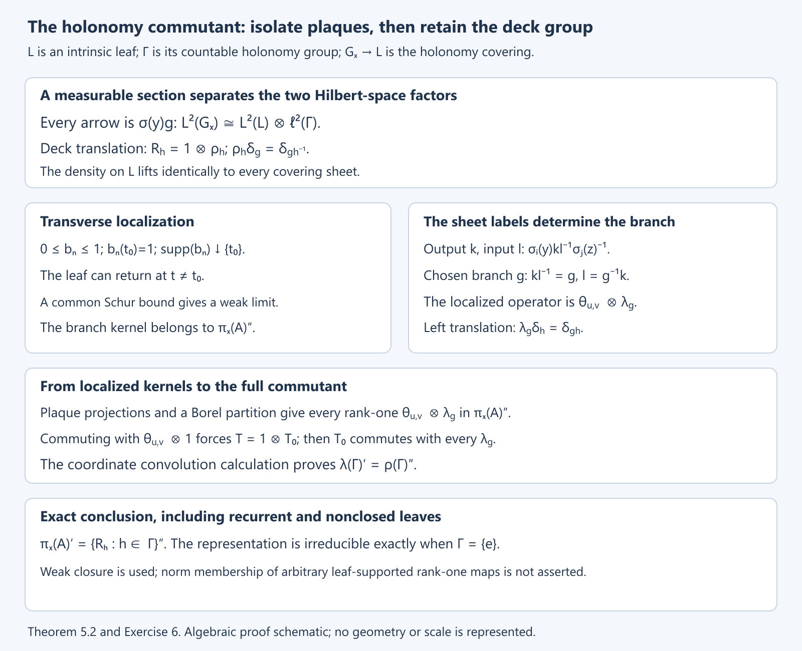

# The C*-algebra of a foliation

*Public domain (CC0).*

## Introduction

In a product foliation, an operator kernel is a matrix on each plaque, varying continuously across the plaques. Global holonomy tells us how these local matrices fit together. Keeping track of holonomy rather than only of pairs of points on the same leaf produces a groupoid with good local coordinates. Completing its convolution algebra gives the reduced foliation C*-algebra.

We begin with paths and local transport, then build kernels and their representations. Product charts and open subsets explain the local structure. Finally we handle non-Hausdorff arrow spaces, where chart-supported functions replace globally continuous compactly supported functions.

Prerequisites are foliation charts, covering spaces, bounded operators, compact operators, and C*-completion. [Transverse measures of foliations](transverse-measures-of-foliations.md) explains the measures that can later pair with this algebra. General groupoid convolution and regular representations are treated in Square-integrable representations and random operators. No transverse measure is needed for the construction here.

Basic references are [Winkelnkemper], [Connes 1979], and [Connes]. Our notation \(C_r^*(V,F)\) specifies the regular-representation completion throughout.

## 1. Remembering transport along a path

Let \(V\) be a second countable Hausdorff manifold with a foliation of rank \(p\) and codimension \(q\). We allow class \(C^{\infty,0}\): leaf coordinates are smooth with all derivatives continuous transversely, while transverse coordinate changes are homeomorphisms. When the foliation is smooth, every coordinate change below is smooth.

*Reference:* [Connes 1979], Section VII, develops the holonomy construction and regular C*-completion for this \(C^{\infty,0}\) class.

A leafwise path from \(x\) to \(y\), subdivided among plaque boxes, induces a germ of a map from a transversal at \(x\) to a transversal at \(y\). This is its holonomy. Two paths with the same endpoints are equivalent if these germs agree. The holonomy groupoid \(G\) consists of these equivalence classes. We write

\[
s(\gamma)=x,\quad r(\gamma)=y,\quad\gamma:x\to y.
\]

Products read from right to left: \(\gamma_1\gamma_2\) means first follow \(\gamma_2\), then \(\gamma_1\). Inversion reverses a path. A constant path is a unit.

**Lemma 1.1.** Holonomy is unchanged by leafwise homotopy fixing endpoints. Composition and inversion preserve the equivalence relation, so \(G\) is a groupoid. Its isotropy at \(x\) is the holonomy group of the leaf through \(x\), and its orbits are the leaves.

**Proof.** In a plaque box, transport between two small transverse slices is obtained by keeping the transverse coordinate fixed. Cover the image of a homotopy square by finitely many plaque boxes and subdivide the square sufficiently finely that every small square maps into one box. Transport around the boundary of such a square is the identity germ. Interior edges cancel in the product of all boundary transports. Thus the outer boundary has identity transport, proving homotopy invariance. Composing paths composes their germs, and reversing a path inverts the germ; the quotient operations are well defined. The two remaining assertions follow from the definitions of loops and connected leaves. \(\square\)

The quotient is by equality of holonomy, not by equality of homotopy classes. For example, on a compact leaf with trivial holonomy all paths between two fixed points give one arrow, even when the leaf has a nontrivial fundamental group.

## 2. Arrow charts and holonomy coverings

**Lemma 2.1 (a path neighbourhood).** A leafwise path has a neighbourhood made from a finite chain of plaque boxes whose transverse coordinate spaces are identified by its holonomy maps. After shrinking the common transverse domain, every neighbouring starting plaque has a corresponding ending plaque, and the prescribed chain determines one holonomy germ between them.

**Proof.** Cover the path by finitely many small plaque boxes. A subdivision of its parameter interval lies inside this cover, and each division point lies in an overlap. Shrink the overlap around that point to a box on which its plaque projection is injective in the transverse direction. The two transverse coordinates are related by a local homeomorphism there. Compose these maps successively. Their finitely many domains can be shrunk around the given transverse point so that every composition is defined. Relabel the transverse coordinates by these compositions. Consecutive plaques with the same new coordinate then meet in the chosen overlap. Within a plaque, paths have identity holonomy in its transverse coordinate, so the chain determines the asserted germ. \(\square\)

Choose coordinates \(x=(t,u)\) and \(y=(t',h(u))\) in the initial and final boxes of such a chain. The resulting arrows form a chart

\[
(t',t,u)\longmapsto[t,u\longrightarrow t',h(u)].
\]

For fixed endpoints and the specified germ there is only one arrow by definition. Varying the plaque endpoints therefore gives an injective chart map. Lemma 2.1 covers all arrows by charts of this form.

**Theorem 2.2.** These charts give \(G\) a locally Hausdorff manifold structure of dimension \(2p+q\). They give it a \(C^{\infty,0}\) foliation of codimension \(q\). The maps \(s,r\) are continuous open maps, smooth submersions for a smooth foliation, and the groupoid operations are continuous. In compatible coordinates multiplication is

\[
(t'',t',u)(t',t,u)=(t'',t,u).
\]

For each \(x\), the map \(r:G_x=s^{-1}(x)\to L_x\) is the covering of the leaf corresponding to the kernel of its holonomy homomorphism. In particular every \(G_x\) is Hausdorff.

**Proof.** Where two arrow charts meet, their initial transverse coordinates differ by a local homeomorphism \(u_1=k(u)\). Their initial and final leaf coordinates change independently:

\[
t_1=a(t,u),\qquad t'_1=b(t',u),\qquad u_1=k(u).
\]

The transverse changes at the two endpoints are compatible because both charts represent the same holonomy germ. Equality of germs persists on a neighbourhood, so the intersection is open in both chart domains. The transitions have class \(C^{\infty,0}\). This defines the atlas and its foliation by fixing \(u\). Local projection onto either endpoint proves the assertion about \(s,r\). Reversal interchanges the endpoints and inverts the transverse map. Aligning the transverse coordinates of two chains gives the displayed multiplication formula, proving continuity.

Fix \(x\). Over a small simply connected plaque in \(L_x\), continuation of any arrow from \(x\) gives one sheet of \(G_x\); two sheets agree precisely when their continued paths have the same holonomy. A loop at \(x\) returns to the same sheet exactly when its holonomy germ is the identity. This is the covering associated to the kernel of the holonomy homomorphism on \(\pi_1(L_x,x)\). A covering of a Hausdorff manifold is Hausdorff. The same statement for \(G^x=r^{-1}(x)\) follows by inversion. \(\square\)

A countable atlas suffices. Use a countable foliation atlas, countably many smaller boxes in each overlap, and their finite chains. Thus there are only countably many arrow-chart families, each with a countable base. The groupoid need not be globally Hausdorff: different germs at a limiting leaf can be approached by arrows whose germs coincide away from that leaf.

## 3. Kernels without a choice of volume

Let \(D_x^{1/2}=|\Lambda^pF_x^*|^{1/2}\) be the complex half-density line. At an arrow \(\gamma:x\to y\), put

\[
\Omega_\gamma^{1/2}=D_y^{1/2}\otimes D_x^{1/2}.
\]

The two factors give the output and input half-densities of a kernel. Initially suppose \(G\) is Hausdorff, and take compactly supported \(C^{\infty,0}\) sections \(f,g\) of this line bundle. Define

\[
(f*g)(\gamma)=\int_{\gamma_1\gamma_2=\gamma}f(\gamma_1)g(\gamma_2),
\qquad f^*(\gamma)=\overline{f(\gamma^{-1})}.
\]

At the intermediate endpoint the two half-densities multiply to a full density. It is this density that is integrated. The remaining factors lie at the fixed endpoints of \(\gamma\), so the formula has the correct type.

**Proposition 3.1.** Convolution and involution make \(C_c^{\infty,0}(G,\Omega^{1/2})\) a *-algebra. In a compatible triple of plaque boxes, convolution is ordinary kernel composition:

\[
(f*g)(t'',t,u)=\int f(t'',t',u)g(t',t,u)\,dt'.
\]

**Proof.** Decompose the two supports among finitely many arrow charts. Subdivide their possible intermediate endpoints using a partition of unity on the Hausdorff manifold \(V\). On each piece the transverse coordinates agree after a relabelling, so the displayed formula applies. The variable \(t'\) runs in a fixed compact set. Differentiation under that integral proves leafwise smoothness and transverse continuity of all derivatives. The support lies in the product of the two compact supports. The composability condition is closed because the unit manifold is Hausdorff; its intersection with that compact product is compact, and multiplication carries it to a compact set. Fubini proves associativity by integrating over two intermediate endpoints. Reversing their order and complex conjugating gives \((f*g)^*=g^**f^*\), and applying inversion twice gives \(f^{**}=f\). \(\square\)

For \(x\in V\), take the Hilbert space of square-integrable half-densities on \(G_x\). The regular representation is

\[
(\pi_x(f)\xi)(\gamma)
=\int_{\gamma_1\gamma_2=\gamma}f(\gamma_1)\xi(\gamma_2).
\]

Choose a positive leafwise density \(\alpha\) to write a scalar kernel. With \(d\nu_x\) its lift to \(G_x\) by \(r\), the formula becomes

\[
(\pi_x(f)\xi)(\gamma)=\int_{G_x} f(\gamma\eta^{-1})\xi(\eta)\,d\nu_x(\eta).
\]

Here and below scalar \(f\) denotes the coefficient after trivializing both endpoint half-densities by \(\alpha^{1/2}\).

**Lemma 3.2 (uniform bound).** Define

\[
A(f)=\sup_y\int_{G^y}|f(\gamma)|\,d\nu^y(\gamma),
\qquad B(f)=\sup_x\int_{G_x}|f(\gamma)|\,d\nu_x(\gamma).
\]

For chart-supported kernels these quantities are finite. For a finite sum they remain finite, and

\[
\|\pi_x(f)\|\le\sqrt{A(f)B(f)}
\]

uniformly in \(x\).

**Proof.** A compact support in one arrow chart bounds its coefficient and its leafwise volume uniformly over the transverse parameter. Finitely many charts give the first assertion. For the kernel \(K(\gamma,\eta)=f(\gamma\eta^{-1})\), the change from \(\eta\) to \(\gamma\eta^{-1}\) identifies its row integral with an integral on \(G^{r(\gamma)}\). The column integral is bounded by an integral on a source fibre. Thus the two bounds are \(A(f)\) and \(B(f)\). The Schur estimate follows directly from

\[
\left|\int K(\gamma,\eta)\xi(\eta)d\nu_x(\eta)\right|^2
\le\left(\int|K(\gamma,\eta)|d\nu_x(\eta)\right)
\left(\int|K(\gamma,\eta)||\xi(\eta)|^2d\nu_x(\eta)\right),
\]

followed by integration in \(\gamma\). \(\square\)

Kernel composition and the interchange of the two variables now show that \(\pi_x\) is a bounded *-representation. A local smoothing approximate identity along plaques shows it is nondegenerate: its action converges to the identity on compactly supported smooth half-densities in \(G_x\), which are dense. To see the approximation, convolve in a leaf coordinate with an integral-one bump \(\varepsilon^{-p}a((t'-t)/\varepsilon)\), cut off on a slightly larger plaque box, and sum finitely many such operators over the support of a test section.

## 4. Completion, charts, and open subsets

**Definition 4.1.** The reduced foliation algebra is the completion for

\[
\|f\|_r=\sup_{x\in V}\|\pi_x(f)\|.
\]

This is finite by Lemma 3.2. It is a C*-norm: the direct sum of all \(\pi_x\) is a *-representation. It separates nonzero kernels. Indeed, if \(f(\gamma)\ne0\), put \(x=s(\gamma)\). In the kernel of \(\pi_x(f)\), set the input variable near the unit \(x\) and the output variable near \(\gamma\); a sufficiently small smooth input bump detects this nonzero coefficient. The kernel is smooth on this fibre product, so a nonzero value gives a nonzero operator. Denote the completion by \(C_r^*(V,F)\).

**Proposition 4.2 (product chart).** For a product foliation \(P\times T\) with connected \(P\),

\[
C_r^*(P\times T,F)\simeq C_0\bigl(T,\mathcal K(L^2(P))\bigr)
\simeq C_0(T)\otimes\mathcal K(L^2(P)).
\]

**Proof.** Its arrows are \((t',t,u)\), and the regular operator at a point of transverse coordinate \(u\) is the integral operator of this kernel on \(L^2(P)\). Compactly supported smooth kernels are compact operators. Their dependence on \(u\) is norm-continuous: on a fixed compact support the Hilbert–Schmidt norm of the difference tends to zero by dominated convergence. The reduced norm is the supremum of these operator norms.

For surjectivity, functions \(b(u)\xi(t')\overline{\eta(t)}\), with compactly supported \(b\) and smooth compactly supported \(\xi,\eta\), give elementary tensors with rank-one operators. Smooth vectors are dense in \(L^2(P)\), so these rank-one operators span a norm-dense subset of the compact operators. Finite sums of elementary tensors are dense in continuous compact-operator fields vanishing at infinity: on a compact transverse support, uniform continuity and a finite partition of unity approximate the field by finitely many of its values, then approximate those values by finite-rank operators. \(\square\)

**Theorem 4.3 (open restriction).** If \(W\subset V\) is open, the holonomy groupoid \(H\) of the restricted foliation is an open subgroupoid of \(G\). Extension by zero on chart-supported sections induces an isometric *-homomorphism

\[
C_r^*(W,F|_W)\longrightarrow C_r^*(V,F).
\]

If \(W\) is saturated, its image is an ideal. For an arbitrary open \(W\), it need not be an ideal.

**Proof.** Paths contained in \(W\) give arrows of \(G\). Holonomy germs of those paths are computed in neighbourhoods already inside \(W\), so equality of their germs is the same in either foliation. This gives an injective groupoid map. The path neighbourhood of Lemma 2.1 can be chosen inside \(W\); hence its image is open. Multiplication and inversion preserve \(H\), so extension gives a *-homomorphism on kernels.

Fix \(x\in V\). On \(r^{-1}(W)\cap G_x\), put \(\gamma\sim\eta\) if \(\gamma\eta^{-1}\in H\). Its classes are open and pairwise disjoint. For a representative \(g:x\to y\), right multiplication by \(g\) identifies the class with \(H_y\). Convolution by a kernel supported in \(H\) acts on this class as the regular representation \(\pi_y^H\). It acts as zero on the complement of \(r^{-1}(W)\). Consequently \(\pi_x^G\) restricted to these kernels is a direct sum of regular representations of \(H\) and a zero representation, and its norm is at most the reduced norm in \(H\). For \(x\in W\), the class containing the unit gives exactly \(\pi_x^H\), so taking suprema gives equality of norms.

If \(W\) is saturated, \(H=G|_W\): every path on a leaf through \(W\) remains in \(W\). A product involving a kernel supported in \(G|_W\) is again supported there because both endpoints must stay on this leaf. The closure is therefore an ideal.

For the final claim, take one leaf \(V=\mathbb R\), so \(C_r^*(V,F)=\mathcal K(L^2(\mathbb R))\). A proper nonempty open interval \(W\) gives the operators supported on \(L^2(W)\). If \(\eta\) is supported in \(W\) and \(\xi\) outside its closure, multiplying an operator on \(L^2(W)\) by \(\xi\otimes\overline\eta\) can produce a nonzero output outside \(W\). Thus this subalgebra is not an ideal. \(\square\)

Changing \(\alpha\) does not change the algebra. If \(\alpha'=b\alpha\), the scalar kernel becomes

\[
f'(\gamma)=b(r(\gamma))^{-1/2}f(\gamma)b(s(\gamma))^{-1/2},
\]

and multiplication by \(b(r(\gamma))^{-1/2}\) identifies \(L^2(G_x,\nu_x)\) with \(L^2(G_x,\nu'_x)\). Substitution in the regular formula intertwines the two kernels. Thus the half-density formulation is independent of a chosen volume.

## 5. What holonomy does to a regular representation

Right translation by a holonomy arrow \(g:x\to y\) identifies the source fibres \(G_y\) and \(G_x\), and intertwines their regular representations. Deck transformations of the covering \(G_x\to L_x\) commute with \(\pi_x\). Theorem 5.2 proves their full commutant and the exact irreducibility criterion.

*Reference:* [Connes 1979], Section VII, Proposition 5, states the commutant and different-leaf disjointness assertions proved in this section.

**Proposition 5.1 (different leaves give disjoint representations).** If \(x,y\) lie on different leaves, there is no nonzero bounded intertwiner between \(\pi_x\) and \(\pi_y\).

**Proof.** Suppose \(T\ne0\) intertwines. Choose a smooth compactly supported \(\zeta\in L^2(G_x)\) with \(T\zeta\ne0\), and let \(K=r(\operatorname{supp}\zeta)\). It is compact in \(V\) and lies on the leaf of \(x\); it is disjoint from the leaf of \(y\). Choose smooth functions \(0\le a_n\le1\) vanishing near \(K\) and converging pointwise to one on \(V\setminus K\). Such functions follow by taking shrinking neighbourhoods of a compact set in a metrizable manifold. On \(G_y\), multiplication by \(a_n\circ r\) converges strongly to the identity by dominated convergence. Nondegeneracy gives a kernel \(f\) for which \(\pi_y(f)T\zeta\ne0\). For some \(n\), therefore,

\[
\pi_y(f)M_{a_n\circ r}T\zeta\ne0.
\]

The input multiplier is implemented by the kernel \(f(a_n\circ s)\). Its action on \(\zeta\) in \(G_x\) is zero, since \(a_n\circ r\) vanishes on its support. Intertwining gives

\[
\pi_y(f(a_n\circ s))T\zeta=T\pi_x(f(a_n\circ s))\zeta=0,
\]

a contradiction. \(\square\)

Together with transport along an arrow, this shows that two regular representations are unitarily equivalent when their base points lie on the same leaf, and disjoint otherwise. Their commutant within a leaf still remembers isotropy.

**Theorem 5.2 (the full holonomy commutant).** Fix a point \(x\), let \(L=L_x\) with its intrinsic leaf topology, and put \(\Gamma=G_x^x\). On \(H=L^2(G_x)\), let \(R_g\) be right deck translation by \(g\in\Gamma\). Then

\[
\pi_x(A)'=\{R_g:g\in\Gamma\}'',
\qquad A=C_r^*(G).
\]

In particular the regular representation is irreducible precisely when \(\Gamma\) is trivial. No closedness or embeddedness of the leaf is required.

**Proof.** The holonomy covering \(r:G_x\to L\) is a regular covering with countable deck group \(\Gamma\), by the covering construction in Section 2. Countability follows from a countable lifted plaque atlas. Choose a countable cover of \(L\) by relatively compact plaque patches \(U_i\), and a local section \(\sigma_i:U_i\to G_x\) on each patch. Assign overlaps to the first patch:

\[
P_i=U_i\setminus\bigcup_{j<i}U_j.
\]

These are disjoint Borel sets. The sections give one measurable section \(\sigma\) on \(L\), equal to \(\sigma_i\) on \(P_i\). Every arrow has a unique form \(\sigma(y)g\). A leafwise positive density lifts to the same density on every sheet. Hence the map

\[
H\longrightarrow L^2(L)\otimes\ell^2(\Gamma),
\qquad
\xi\longmapsto\bigl((y,g)\longmapsto\xi(\sigma(y)g)\bigr)
\]

is unitary. In these coordinates \(R_g=1\otimes\rho_g\), where
\(\rho_g\delta_h=\delta_{hg^{-1}}\). Left translation on the second factor is \(\lambda_g\delta_h=\delta_{gh}\).

We first justify exactly which local operators lie in \(\mathcal M=\pi_x(A)''\). Take two plaque patches, compactly supported smooth endpoint functions \(u,v\), and a path branch connecting them. A finite plaque chain gives an arrow chart for that branch. Extend \(u,v\) to its plaque coordinates, incorporating the density factors, and multiply their rank-one kernel by a transverse function \(b_n\), with \(0\le b_n\le1\), \(b_n(t_0)=1\), and support decreasing to the transverse parameter \(t_0\) of the chosen plaques. The chart construction supplies such continuous transverse functions, also for a \(C^{\infty,0}\) foliation. In the smooth case they can be smooth.

The leaf can return to this chart at other transverse parameters. Consequently the extended kernel need not act only on the chosen plaques. This is why we take a weak limit. For every fixed pair of lifted leaf points the represented kernel converges to zero unless its chart parameter is \(t_0\); at \(t_0\) it converges to the specified branch kernel. The kernels have common Schur bounds: their absolute values are bounded by the fixed compact chart kernel obtained by replacing \(b_n\) by a bump equal to one on the initial support. Section 3 bounds both of its row and column integrals uniformly. Its matrix coefficient against \(|\xi|,|\eta|\) is integrable, with bound \(C\|\xi\|\|\eta\|\). Dominated convergence therefore gives weak operator convergence for every \(\xi,\eta\in H\). Each term belongs to \(\pi_x(A)\), and the limit belongs to \(\mathcal M\), since commuting with a fixed bounded operator is preserved under weak convergence.

On one patch and the identity path branch, this limit is the rank-one operator \(u\langle v,\cdot\rangle\) on that patch, repeated identically on all covering sheets. Finite sums of such operators converge strongly to the multiplication projection \(1_{r^{-1}(U_i)}\): choose an orthonormal basis of \(L^2(U_i)\) from a countable dense span of smooth compactly supported functions and take its finite-rank projections. Thus these multiplication projections belong to \(\mathcal M\). Finite products and differences give \(1_{r^{-1}(P_i)}\in\mathcal M\) as well.

Now cut the two-endpoint branch operator on the left and right by these latter projections. On \(P_i\times P_j\) the global section is precisely \(\sigma_i,\sigma_j\). Any \(g\in\Gamma\) can be the connecting branch: append its holonomy loop to a path connecting the chosen lifts. The resulting groupoid arrow is

\[
\sigma_i(y)g\sigma_j(z)^{-1}.
\]

For output and input sheet labels \(k,l\), the kernel uses
\(\sigma_i(y)kl^{-1}\sigma_j(z)^{-1}\). Its chosen branch is therefore exactly \(kl^{-1}=g\). The cut-down operator is

\[
\bigl(u1_{P_i}\langle v1_{P_j},\cdot\rangle\bigr)
\otimes\lambda_g.
\]

Smooth compactly supported functions on \(U_i\), restricted to \(P_i\), are dense in \(L^2(P_i)\). Indeed extend a vector by zero to \(U_i\), approximate there in \(L^2\), and restrict again. Approximation in the two vector norms is operator-norm approximation of the rank-one maps. Decomposing vectors among finitely many \(P_i\), then increasing that finite set, consequently puts every rank-one map on \(L^2(L)\), tensored with every \(\lambda_g\), in \(\mathcal M\).

Let \(T\) commute with \(\pi_x(A)\). It commutes with \(\mathcal M\): for \(S\in\pi_x(A)''\), both \(T\) and \(T^*\) are in \(\pi_x(A)'\), so \(ST=TS\). Commutation with all rank-one maps on the first factor, tensored with identity, implies \(T=1\otimes T_0\). To check this directly, the diagonal matrix units in an orthonormal basis make \(T\) block diagonal, and the off-diagonal units make all blocks equal. Commutation with the operators just constructed then gives \(T_0\lambda_g=\lambda_gT_0\) for every \(g\).

Here is the group commutant calculation, without an additional density theorem. Left and right translations commute. Suppose \(T_0\in\lambda(\Gamma)'\) and \(S\in\rho(\Gamma)'\), and write \(c=T_0\delta_e\), \(d=S\delta_e\). For \(g,k\in\Gamma\), expansion in the orthonormal basis gives

\[
(ST_0\delta_g)_k
=\sum_h c_h d_{kh^{-1}g^{-1}}
=(T_0S\delta_g)_k.
\]

Both sums converge absolutely by Cauchy–Schwarz; the expansions themselves converge in \(\ell^2\) because \(S,T_0\) are bounded. Thus \(S\) commutes with \(T_0\) on every basis vector and hence everywhere. It follows that \(T_0\in\rho(\Gamma)''\). The converse inclusion in \(\lambda(\Gamma)'\) follows from the commuting translations. Finally every deck transformation commutes with the original convolution kernels, since
\((\gamma g)(\eta g)^{-1}=\gamma\eta^{-1}\). Its von Neumann algebra is therefore contained in \(\pi_x(A)'\). Together with the preceding inclusion this proves the asserted equality.

When \(\Gamma\) is trivial the commutant is scalar, so the representation is irreducible. Conversely \(g\ne e\) gives a nonscalar deck unitary, since it takes \(\delta_e\) to a different basis vector on the second factor. The proof applies also to a point leaf, where both the covering and its deck group are trivial. \(\square\)

The weak-limit construction is essential for a recurrent leaf. It proves membership in the von Neumann closure; it does not assert that every leaf-supported rank-one operator already belongs to the image of the C*-algebra.

Open full-size figure · Open editable SVG

**Figure 1.** The exact operator constructions in Theorem 5.2. The two factors are the intrinsic leaf and its countable deck group. A common Schur bound permits transverse weak localization even for a recurrent leaf. The branch condition \(kl^{-1}=g\) gives left translation on sheet labels; the coordinate calculation then identifies its commutant with right translation. This is an algebraic proof schematic. The commutant assertion is due to [Connes 1979] and is also presented in [Connes]; the proof and Exercise 6 give the localization step explicitly.

## 6. A non-Hausdorff arrow space

When \(G\) is not Hausdorff, a compactly supported smooth function in an open Hausdorff chart may fail to be continuous after extension by zero. We therefore define \(\mathcal A(G)\) to be the linear span of sections supported compactly inside individual arrow charts, each extended by zero. Compact support always refers to the support inside that chart before extension. It need not be closed as a subset of the whole arrow space.

**Proposition 6.1.** The convolution and involution of Section 3 preserve \(\mathcal A(G)\). Each regular representation is a bounded smoothing operator on the Hausdorff manifold \(G_x\), with the uniform bound of Lemma 3.2. Its completion is therefore defined by the same reduced norm.

**Proof.** It suffices to take one chart-supported section in each factor. The sets of their possible intermediate endpoints are compact subsets of the Hausdorff unit manifold. Cover their intersection by finitely many smaller boxes where the two transverse coordinate maps agree after a relabelling, and insert a partition of unity there. Every resulting product is given by the local integral in Proposition 3.1. Its integrand has support in a compact set of the three plaque variables and the transverse coordinate. Integration in the middle plaque variable gives a compactly supported section in the composite arrow chart. Summing gives an element of \(\mathcal A(G)\). Inversion sends a chart-supported section to another such section. Fubini in these local expressions proves the algebra identities.

On a fixed source fibre, each chart section restricts to a smooth compactly supported function on each relevant lifted plaque. Its regular kernel is a locally finite sum of smooth kernels on pairs of lifted plaque patches. For a single arrow chart these patches are matched by the prescribed holonomy chain; a row or column meets only the matching patch. The volume and coefficient bounds used in Lemma 3.2 are uniform over these patches and all base points. That lemma thus proves boundedness, even when the lifted covering has infinitely many sheets. Applying the kernel to a compactly supported test section and differentiating locally proves its smoothing property. Nondegeneracy and separation follow from the same fibrewise bump argument as in Sections 3 and 4. \(\square\)

Notice that the operator need not be compact on an entire holonomy cover. A locally finite family of smoothing kernels can repeat infinitely many times on disjoint sheets. The local bound controls its operator norm, rather than the Hilbert–Schmidt norm of this entire family.

**Example 6.2 (infinitely many origins).** Take the complete smooth vector field on \(\mathbb R\)

\[
b(u)\partial_u,\qquad b(u)=
\begin{cases}0,&u\le0,\\ e^{-1/u^2},&u>0.\end{cases}
\]

Let \(h\) be its time-one diffeomorphism, and consider the groupoid of germs of its integer powers. On \(u<0\), all powers have the identity germ. At \(u=0\), their germs are different, since \(h^n(u)>u\) for small positive \(u\) when \(n>0\). On \(u>0\), their values are different. Thus its arrow space is obtained from \(\mathbb R\times\mathbb Z\) by identifying all \((u,n)\) for each \(u<0\), and retaining all of them for \(u\ge0\). The distinct origins \((0,n)\) have the same negative neighbourhood. This is a non-Hausdorff one-dimensional étale groupoid.

One can realize the same holonomy locally in the suspension foliation of \(h\). It illustrates exactly why using only globally continuous functions would discard kernels.

**Lemma 6.3 (chart sections in this example).** A function \(f\) is a finite sum of compactly supported smooth chart functions if and only if the following hold:

1. Its values \(f_n(u)=f(u,n)\), \(u\ge0\), vanish for all but finitely many \(n\), and each is smooth up to zero and compactly supported on the half-line.
2. Its common value \(f_-(u)\) for \(u<0\) is smooth and compactly supported towards \(-\infty\).
3. The function equal to \(f_-\) on \(u<0\) and to \(\sum_nf_n\) on \(u\ge0\) is smooth and compactly supported on \(\mathbb R\).

**Proof.** A chart function in branch \(n\) contributes the same smooth function to the common negative half-line and to branch \(n\) on the nonnegative half-line. Finite sums have all three properties.

Conversely choose smooth compactly supported extensions \(g_n\) of the finitely many \(f_n\) across zero. Here smoothness up to zero means that such an extension exists; multiply it by a cutoff to retain compact support. The difference \(f_--\sum_ng_n\) on \(u<0\) has all derivatives tending to zero at zero by condition 3. Extend that difference by zero for \(u\ge0\). The result is a smooth compactly supported function and can be added to any one branch function. The finite sum of the resulting chart functions is exactly \(f\). \(\square\)

Pointwise multiplication can fail. Choose a compactly supported smooth function \(g\) equal to one near zero. Extend it by zero from branch 0 to get \(f\), and from branch 1 to get \(k\). On the common negative half-line their pointwise product is \(g^2\), while it is zero on every nonnegative branch. This violates condition 3. Convolution remains well defined by Proposition 6.1. In particular at the origins,

\[
(f*k)(0,n)=\sum_jf(0,n-j)k(0,j).
\]

The sum over \(n\) is the product of the sums of the two coefficient families. This accounts for the aggregate compatibility at zero.

## 7. The leaf space and bivariant notation

The analytic K-theory of the leaf space is, by definition,

\[
K^j(V/F)=K_j(C_r^*(V,F)),\qquad j\in\mathbb Z/2.
\]

The notation does not assert that the set-theoretic quotient has a Hausdorff topology. For two foliations put

\[
KK(V_1/F_1,V_2/F_2)
=KK(C_r^*(V_1,F_1),C_r^*(V_2,F_2)).
\]

The Kasparov group and its product require the Hilbert-module prerequisites developed in [Hilbert modules and fields on the leaf space](hilbert-modules-and-fields-on-the-leaf-space.md) and [K-theory of the leaf space](k-theory-of-the-leaf-space.md). These are definitions of the notation here, rather than a construction of Kasparov's product.

For a foliation coming from a locally trivial submersion with connected fibres, the holonomy groupoid is the fibre-pair groupoid. Its algebra is the compact endomorphism algebra of the continuous Hilbert field \(L^2\) of the fibres. The local calculation is Proposition 4.2. Identifying the global field with a trivial infinite-dimensional Hilbert field is an additional assertion about that field; the local calculation alone does not supply a global trivialization. Morita equivalence with \(C_0\) of the base is the appropriate statement without a chosen trivialization.

## 8. Exercises

**Exercise 1 (basic).** Compute the foliation algebra for the zero-dimensional foliation, and for the foliation of \(\mathbb R^2\) by horizontal lines.

**Solution.** In dimension zero every path is constant, so \(G=V\), convolution is pointwise multiplication, and the regular norm is the supremum norm. The completion is \(C_0(V)\). For horizontal lines, the groupoid is \(\mathbb R\times\mathbb R\times\mathbb R\), with the last coordinate transverse. Proposition 4.2 gives \(C_0(\mathbb R)\otimes\mathcal K(L^2(\mathbb R))\).

**Exercise 2 (intermediate).** In a product chart, prove directly that a kernel \(f(t',t,u)=a(u)\xi(t')\overline{\eta(t)}\) has reduced norm \(\|a\|_\infty\|\xi\|_2\|\eta\|_2\).

**Solution.** For fixed \(u\) the operator sends \(v\) to \(a(u)\xi\langle\eta,v\rangle\), with the Hilbert inner product linear in its second variable in this expression. Cauchy–Schwarz gives the upper bound \( |a(u)|\|\xi\|\|\eta\|\), and the unit vector \(\eta/\|\eta\|\) gives equality when \(\eta\ne0\). Take the supremum over \(u\). If either vector is zero the formula still holds.

**Exercise 3 (intermediate).** For the one-leaf foliation of \(\mathbb R\), choose disjoint intervals \(W,Z\). Construct compact operators \(A\in C_r^*(W)\) and \(B\in C_r^*(\mathbb R)\) with \(BA\notin C_r^*(W)\).

**Solution.** Choose unit vectors \(\eta\in C_c^\infty(W)\) and \(\xi\in C_c^\infty(Z)\). Put \(A=\eta\otimes\overline\eta\) and \(B=\xi\otimes\overline\eta\). Then \(BA=B\), whose range lies in \(L^2(Z)\) and is nonzero. Every operator in \(C_r^*(W)\), embedded by extension, has range in \(L^2(W)\). Hence \(B\) is outside that subalgebra.

**Exercise 4 (advanced).** Show that the groupoid of Example 6.2 is not the action groupoid \(\mathbb R\rtimes\mathbb Z\), although it comes from the same action. Explain the difference in isotropy for \(u<0\).

**Solution.** Every integer fixes \(u<0\), so the action groupoid has isotropy \(\mathbb Z\) there. All those transformations agree on a neighbourhood of \(u\), so their germs give only the identity arrow in the germ groupoid. At zero the action still fixes the point, but its different powers have different germs because they act differently on every positive neighbourhood. The holonomy groupoid records germs, not the acting group element alone.

**Exercise 5 (advanced).** In Example 6.2, take arbitrary compactly supported chart generators \(f,k\). Prove that their convolution satisfies the aggregate smoothness condition of Lemma 6.3.

**Solution.** It suffices by bilinearity to take \(f\) in branch \(a\) and \(k\) in branch \(b\), with scalar chart functions \(g,l\). For \(u\ge0\) the convolution is in branch \(a+b\) and has coefficient \(g(h^b(u))l(u)\). For \(u<0\) the groupoid has only the identity arrow and \(h^b(u)=u\), so its common coefficient is \(g(u)l(u)\). Both are restrictions of the single smooth function \(g(h^b(u))l(u)\) on \(\mathbb R\). Its support is compact, since \(l\) is compactly supported. Thus it obeys Lemma 6.3. Summing finitely many generators proves the claim.

**Exercise 6 (intermediate).** Let \(H=\ell^2(\mathbb N_0)\), \(t_0=0\), and \(t_j=1/j\) for \(j\ge1\). Choose a continuous bump \(b\), supported in \([-1,1]\), with \(0\le b\le1\) and \(b(0)=1\). Put \(D_n\delta_j=b(nt_j)\delta_j\). Prove that \(D_n\) converges strongly to the projection onto \(\mathbb C\delta_0\), whereas its difference from that projection has norm one for every \(n\). Explain the relevance to the transverse cutoffs in Theorem 5.2.

**Solution.** The zeroth entry is one, and every fixed other entry is eventually zero. For \(\xi\in H\), dominated convergence of \(\sum_{j\ge1}|b(n/j)\xi_j|^2\) proves strong convergence. For fixed \(n\), continuity at zero gives \(b(n/j)\to1\) as \(j\to\infty\); hence the supremum of the other diagonal entries is one. The operator-norm difference is exactly this supremum. A cutoff can therefore isolate a specified transverse parameter in a weak or strong limit while remaining large at recurrent parameters approaching it. The theorem uses weak convergence with a common Schur bound, which is sufficient for the commutant.

## References

- [Connes 1979] Alain Connes, *Sur la théorie non commutative de l'intégration*, in *Algèbres d'opérateurs*, Lecture Notes in Mathematics 725, Springer, 1979. [IHÉS preprint](https://omeka.ihes.fr/files/original/f1e66a7f4de4523e6937af152ff16092.pdf).
- [Connes] Alain Connes, *A survey of foliations and operator algebras*, in *Operator Algebras and Applications, Part I*, Proceedings of Symposia in Pure Mathematics 38, American Mathematical Society, 1982. [Author's text](https://alainconnes.org/wp-content/uploads/foliationsfine.pdf).
- [Winkelnkemper] H. E. Winkelnkemper, *The graph of a foliation*, Annals of Global Analysis and Geometry 1 \(1983\).
