# The index theorem for measured foliations

*Public domain (CC0).*

## Introduction

An elliptic operator on a compact manifold has a finite-dimensional kernel and cokernel. A leaf of a foliation can be noncompact even when the foliated manifold is compact. Its ordinary kernel dimension can therefore be infinite. A transverse measure supplies a trace that measures the kernel projection instead. The resulting difference is the measured index.

Holonomy affects both the Hilbert space and its dimension. We first make that effect explicit and prove the counting realization when holonomy is negligible, then develop the trace identity behind the heat equation method. We develop the Hilbert-complex arguments, uniform Sobolev estimates and heat expansion needed for finite measured Betti numbers, compute the Euler coefficient in every dimension, and extend these arguments to non-Hausdorff holonomy groupoids. We prove the characteristic formula for every differential symbol, remove the spin-c assumption by rational exterior-Clifford reduction, and extend the comparison to every pseudodifferential symbol by an analytic circle product with its cotangent sign.

Prerequisites are [Transverse measures of foliations](transverse-measures-of-foliations.md), [The C*-algebra of a foliation](the-c-star-algebra-of-a-foliation.md), and [Hilbert modules and fields on the leaf space](hilbert-modules-and-fields-on-the-leaf-space.md). The trace, its dimension function, and its Fredholm index are supplied by Weights on random operators and formal dimension, especially its sections on formal dimension and the index. The spectral calculus used for Laplacians, heat operators and Sobolev powers is proved in Self-adjoint spectral calculus with the original domain. Its bounded input is A spectral measure for a unitary operator. The multiplier-domain theorem, formula (8), and the final section supply the maximal multiplier, ordered-product and recursive-power domains; the final paragraph gives the lower-bound specialization. Spectral products, transport and inverse domains proves the change-of-variable, unitary and antiunitary transport, product-closure and inverse-range rules, with their exact unclosed domains. Stable K-theory enters only in the later symbol comparisons, with its exact prerequisites given in the proof of Theorem 6.29. Basic references are [Connes], [Atiyah], [Breuer], and [Atiyah–Bott–Patodi].

## 1. Holonomy covers and measured dimensions

Throughout, \(V\) is compact and has a smooth foliation \(F\). A locally finite invariant transverse measure is denoted \(\Lambda\). The associated unit measure is \(\mu\), after choosing a positive leafwise density. It is finite. All the Hilbert spaces below use the holonomy covering \(\widetilde L\) of a leaf, rather than the leaf itself, unless its holonomy is trivial.

For a longitudinal operator \(D\), equivariance of its lift gives equivariant kernel projections \(P_D\). The trace \(\tau_\Lambda\) on the random-operator algebra defines

\[
\dim_\Lambda\ker D=\tau_\Lambda(P_D).
\]

This definition includes isotropy. It does not assert that the kernel is the space of square-summable functions on a lifted Borel transversal.

**Example 1.1 (an atomic leaf with twofold holonomy).** Let

\[
V=(\mathbb T^2\times\mathbb T^1)/\langle g\rangle,
\qquad g(x,y,u)=(x+\tfrac12,y,-u).
\]

The action is free because translation by one half on the first circle has no fixed point. Thus \(V\) is a compact smooth manifold. Its foliation is induced by the horizontal tori, oriented by \(dx\wedge dy\). The leaf at \(u=0\) is

\[
L_0=\mathbb T^2/\langle(x,y)\mapsto(x+\tfrac12,y)\rangle.
\]

Its holonomy is the reflection \(u\mapsto-u\), of order two. Its holonomy covering is \(\mathbb T^2\). The harmonic zero-forms on that covering are the constants, a one-dimensional trivial representation of the deck group. If \(B\) has one point on \(L_0\), its inverse image in the covering has two points, and its square-summable functions form the two-dimensional regular representation. No equivariant unitary identifies these spaces. With any number of points, the lifted counting dimension is zero, a positive even integer, or infinity; it cannot be one.

Give the central leaf transverse atomic mass one, and give the covering torus its flat metric of area one. The leaf has area one half. The constant projection has kernel one on the covering, so its measured trace, obtained by integrating the diagonal over \(L_0\), is one half. Thus

\[
\beta_0=\tfrac12,\qquad\beta_1=1,\qquad\beta_2=\tfrac12.
\]

Their alternating sum is zero, as required by the Euler class of a torus. Every ordinary Borel transversal supported on this leaf has integer mass. This example therefore also distinguishes measured dimension from transversal cardinality.

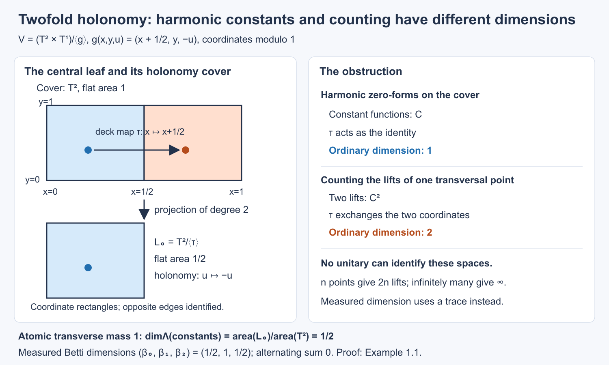

Open full-size figure · Open editable SVG

*Figure 1. Coordinate fundamental rectangles for Example 1.1. The covering metric is \(dx^2+dy^2\), the deck map is translation by \(1/2\) in \(x\), and the quotient leaf has half the covering area. The two coloured points project to one transversal point. The right panel shows the dimension obstruction; the bottom line gives the atomic measured trace and Euler check. The full argument is Example 1.1.*

*Reference:* [Connes, the remark following Theorem 1] asserts an equivariant counting realization after replacing leaves by their holonomy covers. The finite-holonomy example above prevents that realization for the harmonic constants. The measured projection dimension remains well defined.

More generally, on an atomic compact leaf with finite holonomy of order \(d\), the projection onto constants has measured dimension \(1/d\) when the transverse atom has mass one. Its kernel on the holonomy cover is \(1/\operatorname{vol}(\widetilde L)\), and \(\operatorname{vol}(\widetilde L)=d\operatorname{vol}(L)\). This computation does not change the normalization of the transverse atom.

**Proposition 1.2 (dimension of a counting bundle).** Let \(B,B'\) be Borel transversals. If the bundles over the leaf space
\(H_L=\ell^2(L\cap B)\) and \(H'_L=\ell^2(L\cap B')\)
are measurably unitarily isomorphic, then \(\Lambda(B)=\Lambda(B')\). Thus their counting dimension is independent of the presenting transversal. This assertion concerns ordinary intersections; it does not assert that every holonomy-equivariant harmonic field has such a presentation.

**Proof.** Write the unitary on a leaf as \(U_L\). Measurability means, in the canonical counting bases, that its matrix coefficients on the Borel leaf relation between \(B\) and \(B'\) are Borel. This is equivalent to the usual pulled-back measurable-field condition: Theorem 5.4 of the transverse-measure lesson provides countable local enumerations of the counting bases. Put

\[
a(x,y)=|\langle U_{L_x}e_x,e_y\rangle|^2.
\]

For every \(x\in B\), the sum over \(y\in B'\cap L_x\) is one, because the corresponding column of the unitary has norm one. For every \(y\in B'\), the sum over \(x\in B\cap L_y\) is likewise one, by applying the same statement to its adjoint. [Transverse measures of foliations, Theorem 5.7](transverse-measures-of-foliations.md#section-5) equates the integrals of these two sums. They are exactly \(\Lambda(B)\) and \(\Lambda(B')\), including the possibility of infinity. This proves the assertion without a trace normalization assumption on isotropy. \(\square\)

### From a kernel projection to a counting transversal

When holonomy is negligible, the source cover is the leaf itself on a set of full transverse measure. In that case a kernel field can be represented by a counting transversal. The construction concerns the whole measurable field, rather than separately choosing a basis on each leaf. On a first reading one may use Theorem 1.6 and Corollary 1.9 and continue to Section 2; the intervening lemmas prove the projection and measurability assertions.

We first prove the projection statement needed for this construction. Let \(N\) be a standard Borel space with a finite invariant measure \(m\), and let \(E\) be a countable Borel equivalence relation on \(N\). Invariance means that every Borel partial bijection whose graph is in \(E\) preserves \(m\). On the canonical fields \(\ell^2([x]_E)\), write \(M\) for the von Neumann algebra of bounded measurable equivariant operators, identifying operators that agree off a saturated null set. The counting specialization of the random-operator trace is
\[
\tau(T)=\int_N\langle T_xe_x,e_x\rangle\,dm(x),
\qquad T\ge0.
\tag{46}
\]
In particular \(\tau(1)=m(N)<\infty\). Its faithfulness, normality and traciality are Proposition 10.2 of the weights prerequisite; properness and square integrability follow from the countable graph partitions of \(E\) and its regular representation. For example the function supported on the unit graph normalizes the regular counting action. Null sets have null saturation, by the countable partial-bijection partitions of \(E\).

Diagonal multiplication by functions on \(N\) is denoted \(A=L^\infty(N,m)\subset M\). It is a maximal abelian subalgebra. Indeed a countable collection of Borel functions separates points of \(N\). Commutation with their diagonal multiplications forces every off-diagonal matrix coefficient of an operator to vanish. Equivariance then identifies its diagonal with one function on \(N\). The centre \(\mathcal Z\) of \(M\) consists exactly of the \(E\)-invariant functions in \(A\): the partial bijections of \(E\) act by partial permutation matrices, and commuting with them forces invariance. Conversely an invariant diagonal is scalar on each class and commutes with every operator.

For \(T\in M_+\), define \(\operatorname{tr}_{\mathcal Z}(T)\) by
\[
\tau(zT)=\tau\bigl(z\,\operatorname{tr}_{\mathcal Z}(T)\bigr)
\quad(z\in\mathcal Z_+).
\tag{47}
\]
To construct this function, restrict \(m\) to the invariant sigma-algebra \(\Sigma_{\mathrm{inv}}\), and on that same sigma-algebra set \(\nu_T(B)=\tau(1_BT)\). Centrality of \(1_B\), positivity of \(T\), and normality of the finite trace make \(\nu_T\) a finite positive measure with \(0\leq\nu_T(B)\leq\|T\|m(B)\). The finite positive-measure Radon–Nikodym proof in Measure and Hilbert space tools for Haar integration, Theorem 4.1 applies to these two measures on the same sigma-algebra. Its invariant measurable density is the required central function. It lies between zero and \(\|T\|\) almost everywhere: a set where it exceeds \(\|T\|+\varepsilon\) contradicts the displayed measure bound unless that set is null; take countably many positive rational \(\varepsilon\). This argument requires no countable generator for \(\Sigma_{\mathrm{inv}}\). Extension by linearity is well defined. Testing central indicators proves normality, positivity, the identity
\(\operatorname{tr}_{\mathcal Z}(UV)=\operatorname{tr}_{\mathcal Z}(VU)\),
and \(\operatorname{tr}_{\mathcal Z}(1)=1\). Faithfulness follows from that of \(\tau\). On \(A\) this map is ordinary conditional expectation onto the invariant sigma-algebra.

**Lemma 1.3 (the diagonal range).** For every projection \(p\in M\), there is a projection \(q\in A\) with
\(\operatorname{tr}_{\mathcal Z}(q)=\operatorname{tr}_{\mathcal Z}(p)\).

**Proof.** A countable separating Borel family \(C_n\) on a standard Borel space gives an injection into \([0,1]\) by the convergent code \(\sum_{n\ge0}2\,1_{C_n}/3^{n+1}\). Its image and inverse are Borel by the injective-image theorem. Fix such an embedding. The subsets where an \(E\)-class has finite size \(n\), and where it is infinite, are invariant Borel sets by the countable-section theorem. They give central decompositions.

On the size-\(n\) subset, order each finite class using a Borel embedding of \(N\) in \([0,1]\). The least point is a Borel selector, and all successive points are Borel functions of it: each comparison and its existential test is Borel by Theorem 5.4 of the transverse-measure lesson. In this enumeration \(p_x\) is an \(n\) by \(n\) projection; its rank \(k(x)\) is a Borel invariant integer. Let \(q\) select the first \(k(x)\) points of the class. For every bounded invariant \(z\), partition \(N\) into its enumerated class positions and use invariance to integrate on the selector. The sum of diagonal coefficients of \(p\) is \(k\), exactly the sum for \(q\). Thus \(\tau(zp)=\tau(zq)\), which is (47). Equivalently their central trace on a finite class is \(k/n\).

On the infinite-class part we need a conditional atomless probability, and we construct it explicitly. Normalize its nonzero finite measure to be a probability; if its measure is zero there is nothing to prove. The invariant subspace of \(L^2(N,m)\) is separable. Choose countably many bounded invariant functions dense in it, and include their rational level sets. Their indicators generate the invariant sigma-algebra modulo null sets: every invariant \(L^2\) function is an \(L^2\) limit and then an almost-everywhere subsequential limit of their linear combinations. Conversely all those generators are invariant. Choose Borel representatives and remove the saturated union of their exceptional null sets. They define an exactly invariant Borel map
\[
c:N\longrightarrow Z=\{0,1\}^{\mathbb N}
\]
whose generated sigma-algebra is the centre modulo null sets. Put \(\lambda=c_*m\). We use the full compact standard Borel space \(Z\); no claim that the set \(c(N)\) is Borel is needed.

Choose a Borel embedding \(j:N\to[0,1]\). For every rational polynomial \(g\) on \([0,1]\), conditional expectation of \(g\circ j\) onto \(\sigma(c)\) has a Borel version \(g^\flat(c(x))\). This factorization follows first for simple functions measurable for \(\sigma(c)\) and then by their pointwise approximation. There are only countably many such polynomials. Outside a single \(\lambda\)-null set their versions satisfy linearity over the rationals, the bound \(|g^\flat(z)|\le\|g\|_\infty\), positivity when \(g\ge0\), and \(1^\flat=1\). Hence uniform extension gives a positive unital functional on \(C([0,1])\), and Riesz gives a probability \(\rho_z\). Its integrals on a countable dense family are Borel in \(z\), so it is a Borel probability kernel: approximate continuous functions uniformly, then use monotone classes for Borel sets.

The conditional identity
\[
\int_{c^{-1}(D)} g(j(x))\,dm(x)
=\int_D\int g(s)\,d\rho_z(s)\,d\lambda(z)
\tag{48}
\]
holds first for polynomials and then for every bounded Borel \(g\). Injective Borel images are Borel, so \(j(N)\) is Borel. Equation (48) with its indicator shows \(\rho_z(j(N))=1\) almost everywhere. Pull \(\rho_z\) back to a kernel \(m_z\) on \(N\). The same identity applied to each binary coordinate of \(c\) gives
\[
m_z(c^{-1}\{z\})=1
\quad\text{for }\lambda\text{-almost every }z.
\]
There are only countably many coordinate tests; their simultaneous intersection is exactly that fibre.

The conditional probabilities are invariant under all the partial bijections of \(E\). To prove this, partition the countable relation into countably many Borel graphs injective in both coordinates, as in the mass-transport proof. For one such bijection \(\phi:D_\phi\to R_\phi\), invariance of \(m\) and \(c\circ\phi=c\) give, for every bounded Borel \(b\) on \(Z\),
\[
\int_{D_\phi} b(c(x))g(j(\phi(x)))\,dm(x)
=\int_{R_\phi}b(c(x))g(j(x))\,dm(x).
\]
Use (48), including its extension to bounded Borel functions on \(N\). Equality for all \(b\), and then for the countable dense polynomial tests \(g\), yields
\(\phi_*(m_z|_{D_\phi})=m_z|_{R_\phi}\)
almost everywhere. Intersect the full-measure sets for the countably many graph pieces. For each remaining \(z\), points in an \(E\)-class have equal \(m_z\)-atom mass. An atom in an infinite class would therefore give infinitely many distinct atoms of the same positive mass in a probability measure. This is impossible. Thus these conditional probabilities are atomless.

Set
\[
F(z,s)=m_z\{x:j(x)\le s\},\qquad
u(x)=F(c(x),j(x)).
\]
The kernel integral makes \(F\) jointly Borel. For each of the atomless conditional measures its distribution function is continuous, with values from zero to one. The variable \(F(z,j(x))\) is uniform on \([0,1]\). Here is a direct check that also handles flat intervals: for \(0<a<1\), let \(b\) be the last point of the closed level set \(F(z,s)\le a\). Continuity gives \(F(z,b)=a\), and the event \(F(z,j(x))\le a\) has mass \(F(z,b)=a\). Flat intervals carry zero mass. The endpoint events have masses zero and one by continuity and the total mass. This proves the assertion for every \(a\).

Write \(d(c(x))=\operatorname{tr}_{\mathcal Z}(p)(x)\), choosing \(0\le d\le1\). The diagonal projection
\[
q(x)=1_{\{u(x)\le d(c(x))\}}
\]
has conditional expectation \(d\), by the uniform identity on each conditional fibre. Equation (47) therefore gives its required central trace. Combine it with the finite-class constructions. All changes made on null sets may be removed with their \(E\)-saturations, preserving every almost-everywhere assertion. \(\square\)

**Proposition 1.4 (diagonalizing projections after stabilization).** Every projection \(P\in M\ \overline\otimes\ \mathcal B(\ell^2\mathbb N)\) is equivalent, by a partial isometry in that algebra, to a diagonal projection in
\(A\ \overline\otimes\ \ell^\infty(\mathbb N)\).

**Proof.** First, two projections \(p,q\in M\) with equal central trace are equivalent. Choose a maximal partial isometry \(v\) with \(v^*v\le p\) and \(vv^*\le q\), ordered by extension on its initial space. Chains have upper bounds by strong limits of their increasing initial and final projections, so Zorn applies. Put \(p_0=p-v^*v\), \(q_0=q-vv^*\). If \(q_0Mp_0\ne0\), the polar decomposition of a nonzero element in that corner adds an orthogonal partial isometry, contradicting maximality. Thus their central supports are disjoint. Indeed the central support of \(p_0\) projects onto the closure of \(Mp_0H\) in a faithful representation; if \(q_0Mp_0=0\), that subspace is annihilated by \(q_0\), so the two central supports are orthogonal. Traciality in (47) gives
\(\operatorname{tr}_{\mathcal Z}(p_0)=\operatorname{tr}_{\mathcal Z}(q_0)\).
These equal nonnegative central functions have disjoint supports. Both vanish, and faithfulness gives \(p_0=q_0=0\). Lemma 1.3 now shows that every \(M\)-projection is equivalent to a diagonal one.

For stabilization, let \(e_n=1\otimes e_{nn}\), and start with \(P_0=P\). Let \(r_n\) project onto the closed range of \(P_ne_n\), and put \(P_{n+1}=P_n-r_n\). The polar decomposition of \(P_ne_n\) identifies \(r_n\) with a projection \(f_n\le e_n\). This corner is a copy of \(M\), so the first part gives a diagonal \(q_n\le e_n\) equivalent to \(f_n\). Compose the two partial isometries to map \(q_n\) onto \(r_n\).

The \(r_n\)'s are mutually orthogonal. They exhaust \(P\): \(P_{n+1}e_n=0\) by the definition of the closed range, so the residual \(\bigwedge_nP_n\) annihilates every \(e_n\) and is zero. The countable sum of the composed partial isometries therefore converges strongly to a partial isometry with final projection \(P\) and initial projection \(\sum_nq_n\). This initial projection is diagonal. Its entries have Borel versions, so it is represented by a Borel subset of \(N\times\mathbb N\). Random-operator representatives and all their identities can be chosen off one saturated null set. \(\square\)

We apply this result to leaves using a frame whose trace normalization is explicit.

**Lemma 1.5 (a plaque frame preserving the measured trace).** Suppose holonomy is negligible. On a saturated Borel set of full transverse measure, the leaf \(L^2\)-field of any finite-rank Hermitian bundle \(B\to V\) has an equivariant isometric embedding \(J\) into a stabilized counting field
\[
\ell^2((L\cap N)\times\mathbb N),
\]
where \(N\subset V\) is an ordinary complete Borel transversal with \(\Lambda(N)<\infty\). For every positive bounded equivariant operator \(K\),
\[
\tau_{\rm count}(JKJ^*)=\tau_\Lambda(K).
\tag{49}
\]
Both sides may be infinite.

**Proof.** Choose finitely many plaque boxes whose smaller boxes cover compact \(V\), with compact central transversal disks \(N_i\) in the larger boxes. Their union \(N\), with duplicate points removed as a subset, is complete and has finite transverse measure. Choose real smooth cutoffs \(\chi_i\), supported in those boxes, such that \(\sum_i\chi_i^2=1\). Trivialize \(B\) by orthonormal frames there. In plaque coordinates \(t\), write the fixed positive leafwise density as \(\rho_i(t,u)\,dt\), and choose a fixed complete orthonormal basis \(e_n\) of \(L^2\) on the bounded Euclidean plaque box, including its finite bundle components.

For \(u\in N_i\), let \(\psi_{i,u,n}\) be the section on its plaque with coordinate expression
\(\chi_i\rho_i^{-1/2}e_n\), extended by zero on the rest of the leaf. Define
\[
(Jf)_{i,u,n}
=\int e_n(t)^*\chi_i(t,u)\rho_i(t,u)^{1/2}f(t,u)\,dt.
\]
There is one such coordinate for each plaque of the \(i\)-th box on \(L\). Parseval on that Euclidean box gives
\[
\sum_{i,u,n}|(Jf)_{i,u,n}|^2
=\sum_i\int_L\chi_i^2|f|^2\,d\alpha
=\|f\|_2^2.
\tag{50}
\]
The countable frame parameter space is the disjoint union of \(N_i\times\mathbb N\). The map \((i,u,n)\mapsto(u,\langle i,n\rangle)\), using any fixed injective integer coding, embeds it over the leaf space in \(N\times\mathbb N\); its image is Borel. Its coefficients are measurable by the fibre-integral lemma, and are defined from the same plaques on a leaf independently of its base point. Thus \(J\) is measurable and equivariant. Extend its target by zero on the unused coordinates.

To prove (49) for all positive \(K\), use Weights on random operators and formal dimension, Proposition 9.1, with \(T=1\). We check its normalization. On the proper leaf variable, a point is \((x,y)\) with \(y\in L_x\). Let \(\nu_i\) count the central points of \(N_i\) on a leaf, and define
\[
f_i(x,y)=
\begin{cases}
\chi_i(y)^2,&x\in N_i,\ y\text{ in the plaque centred at }x,\\
0,&\text{otherwise}.
\end{cases}
\]
Changing the base point along an arrow leaves \(y\) fixed. Consequently \((\nu_i*f_i)(x,y)\) sums over the central points of \(N_i\) on \(L_x\), and equals \(\chi_i(y)^2\): there is exactly one central point for the plaque containing \(y\). Thus \(\sum_i\nu_i*f_i=1\). The counting kernels are proper by their countable graph partitions; the leaf variable is the regular proper variable on the trivial-holonomy subset. The reduced unit measure \(\Lambda_{\nu_i}\) is exactly the transverse measure on \(N_i\), by the counting reduction in the first lesson.

Proposition 9.1 gives
\[
\tau_\Lambda(K)
=\sum_i\int_{N_i}
\operatorname{Tr}\bigl(K_L^{1/2}M(f_i)_L K_L^{1/2}\bigr)
\,d\Lambda(u).
\]
The ordinary positive trace is unchanged upon interchanging the two factors of \(M(f_i)^{1/2}K_L^{1/2}\), including infinite values. Its expression in the Euclidean plaque basis is
\(\sum_n\langle\psi_{i,u,n},K_L\psi_{i,u,n}\rangle\),
with the inner product linear in its second variable.
By (46) after stabilization this is precisely the counted diagonal of \(JKJ^*\). The embedding of the frame labels gives the same integral even where central disks overlap: each label occupies its own matrix coordinate. Tonelli and normality prove (49) without a smoothing assumption. In particular the proof does not infer trace equality from a pointwise Hilbert-space isomorphism. \(\square\)

**Theorem 1.6 (counting realization without holonomy).** Let \(V\) be compact, let the leaf dimension be positive, and suppose leaves with nontrivial holonomy are \(\Lambda\)-negligible. If \(P\) is a measurable equivariant orthogonal projection on a leaf \(L^2\)-field of a finite-rank bundle, there is an ordinary Borel transversal \(B_P\subset V\) and a measurable unitary, on a saturated set of full transverse measure,
\[
P_L L^2(L,B)\ \cong\ \ell^2(L\cap B_P),
\qquad
\Lambda(B_P)=\tau_\Lambda(P).
\tag{51}
\]

**Proof.** Apply Lemma 1.5 to \(P\). The projection \(JPJ^*\) belongs to the stabilized random-operator algebra of the countable principal relation on \(N\). Proposition 1.4 makes it equivalent to a diagonal projection represented by \(D\subset N\times\mathbb N\). The partial isometry, followed by \(J^*\), gives a measurable equivariant unitary from the counting subfield associated with \(D\) onto the range of \(P\). Trace invariance and (49) give
\[
\Lambda(D)=\tau_{\rm count}(1_D)=\tau_\Lambda(P).
\]
Here \(\Lambda(D)\) is the presentation measure of the first lesson. It remains to replace multiplicity labels by actual points of \(V\); positive leaf dimension is used exactly here.

The intersections \(L\cap N\) are locally discrete in the intrinsic leaf topology before removing the negligible leaves. To check this, near an intersection point each of the finitely many compact transversal disks that contains it meets its sufficiently small plaque in just that point; disks not containing it stay away by compactness. Their union therefore has an isolated intersection with that plaque. Any subset obtained by deleting negligible leaves retains this local discreteness.

The leafwise distance \(d_L(x,y)\) is Borel on the equal-leaf relation in \(N\times N\). On the trivial-holonomy subset the endpoint map of the restricted holonomy groupoid is an injective Borel bijection onto this relation, with Borel inverse by the injective-image theorem. Distance from the unit in a source cover is Borel: a sublevel set is open in the arrow charts, since a leafwise path of length strictly below the threshold can be varied through finitely many plaque charts with its endpoints and length varying continuously. Taking the infimum over paths gives exactly these open sublevel sets. The endpoint identification transfers this distance to the leaf relation.

Enumerate \(L_x\cap N\) by the countable-section theorem. Its infimum over points other than \(x\),
\[
d(x)=\inf\{d_{L_x}(x,y):y\in N\cap L_x,\ y\ne x\},
\]
is Borel, with infimum of the empty set interpreted as infinity. Local discreteness makes \(d(x)>0\). Choose a uniform \(\rho_0>0\) on which every leaf exponential at a point of \(V\) is injective; the finite protected plaque charts and compactness give such a radius. Put
\[
r(x)=\min\{\rho_0/2,d(x)/4\}>0.
\tag{52}
\]
The intrinsic balls of radii \(r(x)\) at distinct points of \(N\) on a leaf are disjoint, since their radii sum to at most half the distance between the centres.

Choose a Borel unit vector \(v(x)\in F_x\), by selecting the first local orthonormal frame in a finite cover. Then
\[
b(x,n)=\exp_x\bigl(r(x)2^{-n-1}v(x)\bigr),
\qquad n=0,1,2,\ldots
\tag{53}
\]
is a leaf-preserving Borel injection \(N\times\mathbb N\to V\). Within one ball the radii are distinct and below its injectivity radius; balls from different centres are disjoint, and points on different leaves cannot coincide. Thus \(B_P=b(D)\) is Borel by the injective-image theorem. It meets each leaf countably and hence is a Borel transversal. It can have accumulation points within a leaf; local finiteness is not required in the definition of a Borel transversal.

The map \(b|_D\) is a Borel isomorphism over the leaf space, so it identifies the two counting fields and preserves the presentation measure, by Proposition 5.9 of the transverse-measure lesson. This proves (51). All matrix and frame identities hold off a single \(m\)-null set in \(N\); saturate it using the countable relation, and then the Borel incidence relation with \(V\). Its transverse measure is still zero. Canonical identification with a point of \(N\) on each remaining leaf extends the field unitary measurably to \(V\); a Borel choice of that point is provided by Theorem 5.4. No basis choice on a nonstandard space of leaves has been made. \(\square\)

**Example 1.7 (point leaves require multiplicities).** If \(F=0\), a leaf is a single point. Its intersection with an ordinary subset of \(V\) has cardinality zero or one. The zero map on a rank-two bundle over a point has a two-dimensional kernel, so it cannot have an ordinary-transversal counting realization. The nonzero-covector condition for ellipticity is empty in this dimension.

The correct presentation is a standard Borel space with multiplicities. For a bundle map \(D\) on \(V\), its kernel rank \(k(x)\) is Borel, as seen from the matrix minors in local frames. Local measurable orthonormal bases, obtained by Gram–Schmidt on the first independent projected coordinate vectors, identify the kernel with the presentation
\[
\{(x,n):0\le n<k(x)\}\longrightarrow V.
\]
Here the base \(V\) is standard Borel, so this fibrewise construction is valid. Its measure is \(\int k(x)\,d\Lambda(x)\), precisely the trace dimension. Harmonic forms have rank one in degree zero and zero in other degrees, so their ordinary counting representatives in this case are \(V\) and the empty set.

**Example 1.8 (ordinary counts on holonomy covers can mismeasure the index).** Let \(\Sigma_3\to\Sigma_2\) be a connected double cover of an oriented genus-two surface, with deck involution \(g\). Such a cover is obtained by cutting along a nonseparating simple closed curve, taking two copies of the cut surface, and gluing crosswise. Its Euler characteristic is twice \(-2\), so its genus is three. Form
\[
V=(\Sigma_3\times S^1)/\bigl((z,u)\sim(gz,-u)\bigr).
\]
The involution is free because \(g\) is free. The horizontal oriented foliation has a central leaf \(\Sigma_2\) with holonomy of order two and holonomy cover \(\Sigma_3\). Give this leaf transverse atom mass one.

The cover's de Rham kernel ranks are \(1,6,1\). Indeed constants and their Hodge-star images give the two extreme ranks, and the ordinary compact case of the Euler pairing in Corollary 6.20 gives \(1-\dim\mathcal H^1+1=-4\). Its measured ranks are \(1/2,3,1/2\), by the compact-cover normalization in Section 5. Thus \(d+d^*\) from even to odd forms has measured index \(1-3=-2\), the Euler characteristic of the quotient leaf. Counting the ordinary dimensions of the cover kernels would instead give \(2-6=-4\). Any ordinary transversals whose fields are isomorphic to those cover kernels would have respectively two and six points on the atomic leaf and exactly that erroneous difference. Using lifted intersections with the required deck action does not repair the proposed universal realization: its harmonic constant line has no equivariant lifted-counting realization, exactly as in Example 1.1. The projection trace gives the correct theorem with holonomy present.

The measured compact-cover values follow by integrating a finite-rank projection's diagonal over the quotient leaf, one half its integral on the cover. In particular this obstruction affects the index value as well as the equivariant isomorphism.

**Corollary 1.9 (harmonic and elliptic counting dimensions).** When holonomy is negligible and \(p>0\), the harmonic fields and the kernel and adjoint-kernel fields of every longitudinal elliptic differential operator admit the ordinary-transversal realizations (51). Their transversal measures are finite, independent of the realization, and equal to their measured projection dimensions. The harmonic measures are metric independent and satisfy the Euler pairing. The difference of the two elliptic kernel measures is the characteristic expression (43).

**Proof.** These projections are measurable and equivariant by the spectral and domain constructions in Sections 4 and 6. They lie in finite-rank bundle \(L^2\)-fields, so Theorem 1.6 applies. Their traces are finite by Corollary 6.10 and Proposition 6.28. Independence follows either from trace invariance or Proposition 1.2. Metric independence was proved by the bounded reduced-cohomology isomorphism in Section 4. Corollary 6.20 gives the Euler pairing, and Theorem 6.37 gives the characteristic formula with its cotangent sign. For \(p=0\), Example 1.7 gives the ordinary harmonic representatives and the multiplicity presentation for arbitrary kernels. With holonomy present, the finite projection dimensions and the Euler and characteristic formulas continue to hold; Examples 1.1 and 1.8 prohibit their replacement by a universal lifted counting model. \(\square\)

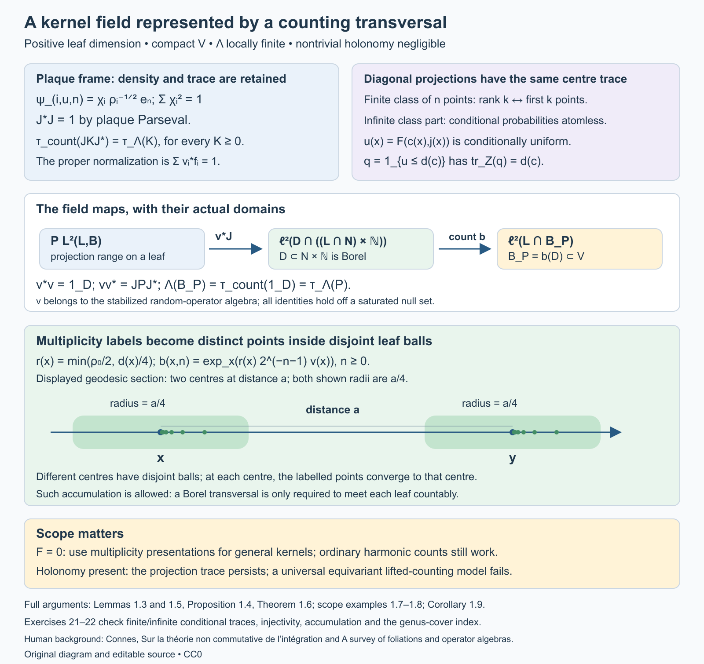

Open full-size figure · Open editable SVG

*Figure 1.2. The maps are those of Lemma 1.5, Proposition 1.4 and Theorem 1.6. The integer factor is \(\mathbb N\); \(N\) is the finite-measure complete transversal. The diagram retains the frame's density factor and the partial isometry's initial and final projections. Its geodesic section shows two centres at distance \(a\) with radii \(a/4\), illustrating the general bound (52). The points in (53) can accumulate at their centre. Lemma 1.3 proves the conditional CDF and finite-class mechanisms; Examples 1.7–1.8 and Exercises 21–22 state and check the scope.*

## 2. The heat trace identity

Let \(M\) be a von Neumann algebra with a faithful normal semifinite trace \(\tau\). Let \(D\) be a densely defined closed operator from a represented Hilbert space \(H_0\) to \(H_1\), affiliated with the appropriate corners of \(M\). Its polar decomposition is \(D=U|D|\), with

\[
U^*U=1-P_{\ker D},\qquad UU^*=1-P_{\ker D^*}.
\]

**Theorem 2.1 (heat identity).** If \(\tau(e^{-tD^*D})\) and \(\tau(e^{-tDD^*})\) are finite for some \(t>0\), then the two kernel projections have finite trace, and

\[
\tau(P_{\ker D})-\tau(P_{\ker D^*})
=\tau(e^{-tD^*D})-\tau(e^{-tDD^*}).
\]

The same equality holds for every positive time at which the two heat traces are finite.

**Proof.** The kernel projections lie below their respective heat operators, so their traces are finite. Spectral calculus on the complement of the kernels gives

\[
U\bigl(e^{-tD^*D}-P_{\ker D}\bigr)U^*
=e^{-tDD^*}-P_{\ker D^*}.
\]

The trace has equal values on these two positive operators: first use \(\tau(X^*X)=\tau(XX^*)\) with \(X=U(e^{-tD^*D}-P_{\ker D})^{1/2}\), then normality if an unbounded or extended-positive approximation is needed. Add the finite kernel traces and rearrange. All terms being subtracted are finite, so no infinity-minus-infinity occurs. \(\square\)

The index constancy comes from equality of the nonzero spectral parts. It does not require a spectral gap at zero, nor does it require the range of \(D\) to be closed on an individual leaf.

**Corollary 2.2.** Suppose the difference of the two heat traces has an asymptotic expansion at zero in powers of \(t\), with a remainder tending to zero after its constant term. Then every negative-power coefficient in the difference is zero, and its constant coefficient is the measured index.

**Proof.** The difference is the constant given by Theorem 2.1. Multiplication by the most singular power of \(t\) and passage to the limit forces its coefficient to vanish. Repeat for the remaining negative powers. Passing to the limit then gives the constant coefficient. \(\square\)

## 3. Why a diagonal kernel computes the trace

The convolution-kernel trace formula in Weights on random operators and formal dimension, Corollary 9.4 specializes, for an invariant transverse measure, to the integral of the squared Hilbert–Schmidt norm of a convolution kernel. For a positive smoothing operator \(K=S^*S\), that squared norm is its diagonal density. Thus, whenever the indicated integrals are finite,

\[
\tau_\Lambda(K)=\int_V\operatorname{tr}k_K(x,x)\,d\mu(x).
\]

To check the identity locally, the kernel of \(S^*S\) at a unit is the integral of \(k_S(\gamma)^*k_S(\gamma)\) over the corresponding fibre. Integrating over units gives precisely the stated convolution trace formula. Positive finite-rank smoothing approximations and normality extend it to positive operators with the relevant smoothing square root. For the heat operator use \(S=e^{-tD^*D/2}\).

Corollary 6.10 supplies these heat kernels and the required row bounds. In detail, let \(S=e^{-t\Delta/2}\). Its row at a point is an \(L^2\) vector, and the semigroup identity \(e^{-t\Delta}=S^*S\) identifies the trace of the unit diagonal with that row's squared Hilbert–Schmidt norm. Integrate and apply Corollary 9.4 to the measurable reduced kernel of \(S\); its absolute convergence on bounded sections of finite-measure support was proved in Corollary 6.10. This proves the heat diagonal formula with a finite integral in the Hausdorff calculus. For a nontrivial modulus the same positive heat formula follows by inversion: the squared norm of a self-adjoint reduced kernel is unchanged under inversion, which converts its weighted integral to its unweighted unit-diagonal integral. The trace identity of Section 2 still requires an invariant measure.

## 4. Reduced cohomology and the metric

A Hilbert complex has densely defined closed operators

\[
d_j:H_j\longrightarrow H_{j+1},\qquad d_{j+1}d_j=0.
\]

Its reduced cohomology is \(\ker d_j/\overline{\operatorname{ran}d_{j-1}}\). Its harmonic subspace is

\[
\mathcal H_j=\ker d_j\cap\ker d_{j-1}^*.
\]

**Proposition 4.1 (Hilbert-complex Hodge decomposition).** Orthogonal projection identifies the reduced cohomology isometrically with \(\mathcal H_j\). Moreover

\[
H_j=\overline{\operatorname{ran}d_{j-1}}
\oplus\mathcal H_j\oplus\overline{\operatorname{ran}d_j^*}.
\]

**Proof.** A closed operator has \((\operatorname{ran}d_j^*)^\perp=\ker d_j\). Within this closed kernel, the orthogonal complement of \(\overline{\operatorname{ran}d_{j-1}}\) is exactly \(\ker d_{j-1}^*\cap\ker d_j\). Orthogonal projection onto that complement gives the quotient isometry and the three summands. \(\square\)

For leafwise exterior differentiation on holonomy covers, use the closed maximal derivative in \(L^2\). It forms a complex because the distributional identity \(d_F^2=0\) holds. Two metrics on \(F\) and two positive densities on compact \(V\) give uniformly equivalent norms in every degree on every cover. The maximal derivative domains, their kernels, and the closures of their ranges therefore agree as topological vector spaces. Projection onto the harmonic representatives for the second metric gives a bounded invertible equivariant map between the two harmonic fields, by Proposition 4.1. The measured dimensions agree by the dimension invariance for an invertible equivariant map in the random-operator lesson.

Corollary 6.6 proves that these harmonic subspaces are exactly the kernels of the self-adjoint differential Hodge Laplacians. It also verifies measurability and square integrability of the fields. Corollary 6.10 proves finiteness of their measured dimensions in the Hausdorff calculus by a finite heat-trace bound. The Hilbert-complex decomposition alone does not imply this finiteness.

## 5. Constants, compactness, and curvature

The leafwise metric lifted from compact \(V\) is complete on each holonomy cover. One justification uses its geodesic flow: the unit leafwise tangent bundle over \(V\) is compact, and its smooth geodesic vector field has a complete flow. Lifting geodesics to a covering preserves their existence for all time. The leafwise coordinate charts also give a common positive radius and a positive lower bound for the volume of metric balls of that radius in every cover. Shrink finitely many charts and compare their metrics with Euclidean metrics on the remaining compact chart supports.

**Lemma 5.1.** A noncompact holonomy cover has infinite volume. A square-integrable function killed by the closed exterior derivative is constant, and hence is zero on a noncompact cover. On a compact connected cover its space is one-dimensional.

**Proof.** A complete Riemannian manifold has compact closed bounded balls. A noncompact such manifold therefore has infinitely many mutually separated points, by choosing each new point outside the finitely many fixed-radius balls around the previous ones. Balls of a sufficiently small common radius around these points are disjoint and each has the positive volume bound above. Their total volume is infinite. A function with distributional derivative zero is constant on every connected coordinate ball; overlapping balls and connectedness make the constant global. Its \(L^2\) norm is finite only if the constant is zero or the total volume is finite. \(\square\)

The cover is compact exactly when the leaf is compact with finite holonomy. One direction is immediate from a finite covering. For the other, the image of a compact cover is a compact leaf in its intrinsic topology, and its discrete covering fibres are compact, hence finite. This identifies precisely which leaves can contribute degree-zero harmonic forms. Orientation and the Hodge star give the same conclusion in the top degree.

Corollary 6.20 and Proposition 6.21 prove the measured Euler formula, including non-Hausdorff holonomy groupoids:

\[
\sum_{j=0}^p(-1)^j\beta_j
=\langle e(F),[C_\Lambda]\rangle,
\qquad\beta_j=\dim_\Lambda\mathcal H_j<\infty.
\tag{3}
\]

For oriented two-dimensional leaves, Chern–Weil normalization is

\[
\langle e(F),[C_\Lambda]\rangle
=\frac1{2\pi}\int_VK\,d\mu.
\]

If compact leaves with finite holonomy are negligible, Lemma 5.1 and the Hodge star give \(\beta_0=\beta_2=0\). Consequently \(3\) gives

\[
\frac1{2\pi}\int_VK\,d\mu=-\beta_1\le0.
\]

Corollary 6.16 computes the first Laplace-type coefficient for this surface instance of \(3\). Proposition 6.21 removes the Hausdorff restriction. Corollary 6.22 proves the stronger inequality when only sphere leaves are negligible, and Proposition 6.23 proves the nearby compact-leaf assertion for a compact leaf with finite holonomy.

## 6. The full index formula and its analytic requirements

For a longitudinal elliptic differential operator \(D:E_0\to E_1\), its principal symbol determines a compactly supported K-class on \(F^*\). The measured foliation index theorem expresses its measured index by the Chern character of that symbol, the Todd class of \(F\otimes\mathbb C\), and the Ruelle–Sullivan current. There are signs depending on the chosen orientation for cotangent-fibre integration; those must be fixed with the symbol convention before using a numerical formula. For a longitudinal spin-c Dirac operator twisted by \(E\), the Dirac normalization used here is

\[
\operatorname{Ind}_\Lambda(D_E^+)
=C_\Lambda\!\left(
\left[\widehat A(F)e^{c_1(\det S)/2}\operatorname{ch}(E)\right]_p
\right).
\tag{4}
\]

Here \(S\) is the spin-c structure and the subscript selects degree \(p\). For a connection \(\nabla=d+A\) we use \(\operatorname{ch}(E)=\operatorname{tr}\exp(iR^E/(2\pi))\), with the same convention for the determinant-line first Chern class. Lemma 6.24 fixes chirality, and Theorem 6.26 proves this precise sign convention. The expression makes sense through leafwise restriction of the characteristic forms.

### Uniform chart calculus

We first prove the analytic facts that do not require the local characteristic-class calculation. In this subsection \(V\) is compact, \(G\) is Hausdorff, the bundles have finite rank, and all coefficients are \(C^{\infty,0}\). The compactly supported kernel calculus is first constructed under the Hausdorff assumption. Proposition 6.21 then proves its extension using non-Hausdorff chart sums.

Take finitely many relatively compact plaque boxes and compactly supported cutoffs. In one box, a symbol of order \(m\) satisfies

\[
\|\partial_t^\alpha\partial_\xi^\beta a(t,\xi,u)\|
\le C_{\alpha\beta}\langle\xi\rangle^{m-|\beta|},
\qquad \langle\xi\rangle=(1+|\xi|^2)^{1/2},
\]

uniformly in \(u\) on the compact transverse support. The same derivatives are continuous in \(u\). Quantization, with a cutoff in the input variable, uses

\[
P_u v(t)=(2\pi)^{-p}\int e^{i(t-t')\cdot\xi}
a(t,\xi,u)v(t')\,dt'\,d\xi .
\]

These oscillatory integrals are defined by inserting frequency cutoffs and integrating by parts before removing them. Lift their kernels to the corresponding pair-plaque groupoid charts, and add smooth compact arrow kernels. Write \(\Psi_c^m(E_0,E_1)\) for the resulting class. Its support is compact in \(G\), and its lifts to the covers are equivariant.

**Lemma 6.1 (local estimates and coordinate invariance).** These chart operators are bounded \(H^{s+m}\to H^s\) for every real \(s\), with constants controlled by finitely many symbol seminorms on the fixed charts. The constants are uniform in \(u\). The symbol class and its order are unchanged under a \(C^{\infty,0}\) change of plaque coordinates or bundle trivialization.

**Proof.** For a left symbol compactly supported in \(t\), its Fourier transform in that variable satisfies

\[
\|\widehat a(\eta-\xi,\xi,u)\|
\le C_N\langle\eta-\xi\rangle^{-N}\langle\xi\rangle^m.
\]

This follows by integrating by parts \(N\) times in \(t\); compact support bounds the resulting \(L^1\) norms by the corresponding symbol seminorms. On Fourier transforms, the weighted operator has kernel
\(\langle\eta\rangle^s\widehat a(\eta-\xi,\xi,u)\langle\xi\rangle^{-s-m}\).
The inequality
\(\langle\eta\rangle^s/\langle\xi\rangle^s\le 2^{|s|/2}\langle\eta-\xi\rangle^{|s|}\)
reduces it to \(C\langle\eta-\xi\rangle^{-N+|s|}\). Choose \(N>|s|+p\). Its integrals in either variable are bounded by the same constant, so the Schur estimate proves boundedness. Input cutoffs are bounded on all these Sobolev spaces: for nonnegative integer order use the product rule, for negative order use duality, and for real order interpolate the Fourier weighted Hilbert spaces. The interpolation bound follows from the three-lines theorem applied to the conjugated operator with weights \(\langle D\rangle^z\).

For coordinate invariance, let \(\kappa\) be a plaque coordinate change. Near the diagonal put

\[
M(t,t')=\int_0^1 D\kappa(t'+r(t-t'))\,dr .
\]

After shrinking the coordinate neighbourhood, this matrix is invertible, and
\(\kappa(t)-\kappa(t')=M(t,t')(t-t')\).
The substitution \(\eta=M(t,t')^T\xi\) writes the transformed kernel with the usual phase \(e^{i(t-t')\cdot\eta}\). Its amplitude has order \(m\). Indeed the inverse matrix and its derivatives are bounded on the compact chart supports; an \(x\)-derivative of \(a(\kappa(t),M^{-T}\eta,u)\) produces factors of \(\eta\) together with frequency derivatives of \(a\), preserving the order, whereas an \(\eta\)-derivative lowers it by one. Jacobians, half-density changes, and bundle transition matrices have bounded leafwise derivatives there.

An amplitude depending on \(t'\) reduces to a left symbol by Taylor expansion in \(t'-t\). Each factor \((t'-t)^\alpha\) transfers to \(\partial_\eta^\alpha\) by integration by parts. The remainder after \(N\) terms has order \(m-N\); its estimates follow by applying \((1-\Delta_{t'})^L\) to make its frequency integral absolutely convergent, with \(L\) arbitrarily large. Away from the diagonal the phase has nonzero gradient, and repeated integration by parts makes the kernel smooth. This proves invariance. All arguments differentiate only along plaques, so their bounds retain transverse continuity without requiring transverse derivatives. \(\square\)

The coordinate changes on compactly supported plaque pieces are uniformly bounded on \(H^s\). For integer \(s\ge0\) this follows from the chain rule, change of variables and bounded derivatives of the coordinate map and its inverse; duality and the same interpolation argument give all real \(s\).

**Lemma 6.2 (composition, adjoints and compactness).** The compactly supported longitudinal classes satisfy

\[
\Psi_c^m\Psi_c^n\subset\Psi_c^{m+n},
\qquad(\Psi_c^m)^*=\Psi_c^m.
\]

Order-zero operators have uniformly bounded regular representations. Scalar negative-order operators belong to \(A\). If \(m<-p/2\), the kernel is a Borel function and has uniformly bounded row and column \(L^2\) norms on the holonomy covers. The same statement holds for finite-rank bundle kernels, using the Hilbert–Schmidt norm.

**Proof.** In one coordinate box the symbol of a composite has expansion

\[
a\# b\sim
\sum_\alpha\frac1{\alpha!}\,
(\partial_\xi^\alpha a)(D_t^\alpha b),
\qquad D_t=\frac1i\partial_t .
\]

To verify both the expansion and the order of its remainder, the exact oscillatory formula is

\[
(a\# b)(t,\xi)
=(2\pi)^{-p}\int e^{-iy\cdot\eta}
a(t,\xi+\eta)b(t+y,\xi)\,dy\,d\eta .
\]

Taylor-expand the second factor in \(y\) through degree \(N-1\). Transferring \(y^\alpha\) onto the first factor gives the displayed terms, including \(1/i\) and the factorial. In the integral remainder there are \(N\) frequency derivatives of \(a\), of order \(m-N\). Integrating by parts sufficiently many times in \(y\) gives decay in \(\eta\). The inequality
\(\langle\xi+\eta\rangle^r\le 2^{|r|/2}\langle\xi\rangle^r\langle\eta\rangle^{|r|}\)
shows that this decay makes the remainder and each of its derivatives bounded in order \(m+n-N\). This calculation is legitimate with frequency regularizers; these integrable bounds allow their removal. Smooth off-diagonal pieces compose to smooth pieces: differentiating their integral kernels and integrating a compactly supported distribution against a smooth test preserve all smooth seminorms. The adjoint calculation is the same Taylor argument applied to the conjugate transpose of the reversed kernel.

For different boxes, use a finite cover of the compact overlap by smaller compatible foliation boxes. Coordinate invariance from Lemma 6.1 gives the same local calculation. Outside a common neighbourhood of the units, a pseudodifferential kernel is smooth. Products have compact support: the composable part of the product of two compact supports is closed, since equality of their source and range is a closed condition in the Hausdorff unit manifold, and multiplication maps that compact set to a compact set. These facts establish the global composition assertion.

In a lifted chart a source or range cover splits into disjoint plaque sheets, and its localized operator is the direct sum of the corresponding plaque operator, with zero outside those sheets. Lemma 6.1 bounds this direct sum uniformly. A finite chart sum and the Schur bound for smooth compact arrow kernels give the order-zero assertion.

For \(m<0\), replace \(a\) by \(a(t,\xi,u)\chi(\xi/R)\), with \(\chi=1\) near zero. The difference has order-zero seminorms, involving the required \(t\)-derivatives, bounded by \(C R^m\). The Fourier-Schur proof of Lemma 6.1 therefore makes its operator norm tend to zero uniformly in the parameter and in every lifted sheet. The truncated kernel, with its input cutoff, is smooth and compactly supported. Thus its extension is an element of the smooth algebra and the limit belongs to \(A\).

For \(m<-p/2\), Parseval gives for a left-symbol kernel on one plaque

\[
\int|K(t,t',u)|_{HS}^2\,dt'
=(2\pi)^{-p}\int|a(t,\xi,u)|_{HS}^2\,d\xi
\le C\int\langle\xi\rangle^{2m}\,d\xi<\infty
\]

uniformly in \(t,u\). Cutoffs only improve this bound. Applying it to the adjoint symbol proves the column bound as well. A general localized kernel has the same assertion by its left-symbol reduction and the smooth remainder. Each compact arrow set is covered by finitely many smaller arrow charts; summing their fibre bounds proves the global result, including the inverse-kernel version
\(\sup_y\int\|k(\gamma^{-1})\|_{HS}^2\,d\nu^y(\gamma)<\infty\).
The estimates also construct its Borel kernel as the \(L^2\) limit of the frequency truncations, with the off-diagonal smooth values. No global Hilbert–Schmidt assertion on an entire infinite cover is made. \(\square\)

### Parametrices and differential domains

**Theorem 6.3 (uniform elliptic parametrix).** If \(P\in\Psi_c^m(E_0,E_1)\) has invertible principal symbol away from the zero section, there is \(Q\in\Psi_c^{-m}(E_1,E_0)\) such that \(PQ-1\) and \(QP-1\) are smooth compact arrow kernels.

**Proof.** On the compact unit cosphere bundle the inverse principal symbol and each of its leafwise derivatives are bounded. Homogeneity therefore gives inverse-symbol estimates of order \(-m\) for large \(|\xi|\). Cut off near zero, quantize in finitely many boxes, and use a partition of unity to obtain \(Q_0\) with the inverse principal symbol. Lemma 6.2 gives \(R=1-PQ_0\) of order \(-1\). Formally the right inverse is
\(Q_0(1+R+R^2+\cdots)\). Its \(j\)-th symbol term has order \(-m-j\), and the remainder after \(N\) terms in its product with \(P\) has order \(-N\).

We spell out the summation step so that parameter uniformity is retained. For symbol terms \(q_j\) of order \(-m-j\), choose radii \(R_j\to\infty\) and a frequency cutoff \(\chi\), zero near zero and one outside a larger ball. Increase \(R_j\) until the first \(j\) derivative seminorms of \(\chi(\xi/R_j)q_j\), measured in order \(-m-j/2\), are at most \(2^{-j}\) on every chart of the finite atlas. This is possible because the stronger order bound has the extra factor \(\langle\xi\rangle^{-j/2}\) on the support of that cutoff; its derivatives have the same gain there. The series

\[
q=q_0+\sum_{j\ge1}\chi(\xi/R_j)q_j
\]

then converges in every required symbol seminorm of order \(-m\). For a fixed \(N\), the tail with \(j\ge2N\) converges in order \(-m-N\); the finitely many differences between \(q_j\) and their cutoffs have bounded frequency support and are smoothing symbols. Thus \(q\sim\sum q_j\), with all estimates uniform in the transverse parameter. The uniform convergence of each leafwise derivative also preserves its transverse continuity.

Quantize this formal inverse with fixed small input cutoffs in the finitely many boxes. Coordinate invariance permits the symbols to be reconciled on overlaps to every order; changing a cutoff or the local representative changes the operator only by a smooth compact kernel. The product \(PQ-1\) is consequently smoothing. Its actual arrow support is compact, contained in the product of the supports of \(P,Q\), together with the compact unit manifold. The construction uses fixed chart supports; it does not sum the growing supports of the actual operators \(Q_0R^j\).

Construct a left inverse \(Q_L\) by the same argument. If \(PQ=1+S_R\) and \(Q_LP=1+S_L\), then
\(Q_L-Q=S_LQ-Q_LS_R\), which is smoothing by Lemma 6.2. Hence \(QP-1\) is smoothing as well. \(\square\)

**Corollary 6.4 (uniform elliptic estimate).** If \(P_1,P_2\in\Psi_c^m(E_0,E_1)\) and \(P_2\) is elliptic, then

\[
\|P_{1,x}v\|_2\le C\bigl(\|P_{2,x}v\|_2+\|v\|_2\bigr)
\quad(v\in C_c^\infty(G^x,s^*E_0)),
\]

with \(C\) independent of \(x\).

**Proof.** Choose \(Q_2P_2=1+R\). Then
\(P_1v=P_1Q_2P_2v-P_1Rv\).
The first coefficient \(P_1Q_2\) has order zero and the second \(P_1R\) is smoothing. Their uniform \(L^2\) bounds from Lemma 6.2 give the assertion. \(\square\)

For domains, fix finitely many cutoffs \(\phi_i\) in plaque boxes with \(\sum_i\phi_i^2=1\). Such cutoffs follow by normalizing finitely many nonnegative bumps whose positive sets cover \(V\). In a cover \(G^x\), each inverse image of a box is a disjoint union of plaque sheets. Define the coordinate Sobolev norm by

\[
\|v\|_{s,x}^2
=\sum_i\sum_{\text{plaque sheets }B}
\|(\phi_i\circ s)v|_B\|_{H^s(\mathbb R^p)}^2,
\]

after extending the compactly supported coordinate piece by zero and applying the coordinate half-density and bundle trivializations. For negative orders this defines the corresponding distribution space; its norm is equivalent to the dual norm for positive order.

Changing the finite chart data gives uniformly equivalent norms. To see this, refine each compact chart overlap by finitely many compatible smaller boxes. Each lifted smaller box belongs to one sheet of either chart; the number of these pieces is bounded independently of the cover. Multiplication and coordinate-change bounds after Lemma 6.1 therefore compare each localized norm to finitely many norms for the other atlas. Sum over sheets, using the bounded multiplicity of those overlap pieces. The reconstruction \(v=\sum_i(\phi_i\circ s)[(\phi_i\circ s)v]\) gives the reverse inequality. This also shows that \(\Psi_c^m\) acts uniformly \(H^{s+m}\to H^s\) on every cover; smooth compact kernels act \(H^s\to H^{s'}\) for every pair of real orders.

Compactly supported smooth sections are dense in these spaces. For each \(i\), truncate the square-summable family of localized sheets to a finite family. On those sheets, approximate the compactly supported coordinate distributions by smooth mollifications in \(H^s\), keeping the support inside the chart. Multiply again by \(\phi_i\) and sum. The reconstruction and overlap bounds just proved give convergence in the global norm. Each finite sum has compact support on the cover.

**Theorem 6.5 (minimal and maximal domains).** Let \(D\) be an elliptic longitudinal differential operator of positive order \(m\). On every cover the closure of
\(D_x:C_c^\infty(G^x,s^*E_0)\to L^2(G^x,s^*E_1)\)
has domain

\[
\{v\in L^2:D_xv\in L^2\text{ in distributions}\}=H^m(G^x,s^*E_0).
\]

Its graph norm is uniformly equivalent to the coordinate \(H^m\) norm. The adjoint of this closure is the closure of the formal adjoint. In particular a formally self-adjoint elliptic differential operator is essentially self-adjoint.

**Proof.** Let \(Q D=1+R\) be a parametrix. Its compact reduced arrow support makes its kernel properly supported on each cover: a compact set of output points, multiplied by that compact arrow support, gives a compact set of possible input points, and the same holds with input and output reversed. Thus the kernel identities act on distributions as well as on test sections. If \(v,D_xv\in L^2\), then

\[
v=Q_xD_xv-R_xv\in H^m,\qquad
\|v\|_{m,x}\le C(\|D_xv\|_2+\|v\|_2).
\]

Conversely \(D:H^m\to L^2\) is bounded by the chart estimate. The density construction just given approximates every \(v\in H^m\) by compact smooth sections in \(H^m\), hence also in the graph norm. This proves equality with the minimal closure and the graph-norm equivalence. It uses compact chart support and square summability on the sheets, without assuming that the cover itself is compact.

Distributional integration by parts says that the adjoint of the minimal \(D\) is the maximal formal adjoint: testing against every compact smooth section is exactly the definition that its distributional formal adjoint lie in \(L^2\). Apply the already proved equality of minimal and maximal domains to that elliptic formal adjoint. If it equals \(D\) on tests, the closure equals its adjoint and is self-adjoint. \(\square\)

For \(D^*D\), this also proves that the self-adjoint realization of the formal product equals the Hilbert-space product of the closed operators. The latter is a self-adjoint extension of the formal positive product on tests, and the formal product has a unique self-adjoint extension by Theorem 6.5.

**Corollary 6.6 (the harmonic fields).** The kernel of the self-adjoint differential Hodge Laplacian on a cover is exactly the harmonic subspace in Section 4. Its square-integrable forms are closed and co-closed. These fields are measurable square-integrable groupoid representations; their isomorphism class is independent of the leafwise metric. In degree zero their fibres have the description of Lemma 5.1.

**Proof.** The closed maximal exterior derivatives form the Hilbert complex of Section 4. Its closed nonnegative quadratic form
\(v\mapsto\|d v\|^2+\|d^*v\|^2\)
defines a self-adjoint Hilbert-complex Laplacian. On compact smooth sections it is the formal differential Hodge Laplacian, an elliptic operator of order two. Theorem 6.5 makes that differential operator essentially self-adjoint, so these two realizations agree. The zero space of the quadratic form is precisely \(\ker d\cap\ker d^*\), proving closedness and co-closedness.

The field is measurable as follows. Countably many chart test sections, with rational polynomial approximations and cutoffs, give dense graph families for the closed differential operators in each fibre by Theorem 6.5. Their inner products and the inner products of their images are Borel functions of the base point. Gram matrix orthogonalization consequently gives measurable graph projections and resolvents. Spectral calculus then makes
\(P_{\ker\Delta}=\operatorname{s\!-\!lim}_{n\to\infty}(1+n\Delta)^{-1}\)
a measurable equivariant projection. The regular field with its finite-rank coefficient bundle is square integrable, and its closed projected subrepresentation is square integrable by Proposition 4.6 of Square-integrable representations and random operators.

Uniform equivalence of the metric norms on compact \(V\) identifies the maximal derivative domains, kernels and closed ranges for the two metrics. Their reduced cohomology spaces are the same topological quotient. Proposition 4.1 gives a bounded invertible equivariant map between its two harmonic realizations. Taking the polar part makes it unitary if desired, without changing equivariance. This proves metric independence; the dimension invariance theorem cited in Section 4 applies. For functions, \(d v=0\) makes them constant, and Lemma 5.1 decides when the constant is square integrable. \(\square\)

For \(p=0\), the cover of a leaf is a point. The corresponding operators are finite-dimensional bundle maps, every order-zero domain is the whole fibre, and the smooth algebra is the algebra of continuous finite-rank bundle maps on the compact unit space. The domain, compactness, and harmonic assertions are immediate. Parametrix assertions modulo smoothing are vacuous there because that entire algebra is smoothing. The positive-order estimates above concern \(p\ge1\).

### Spectral Sobolev spaces and finite weights

The next step compares the coordinate spaces with the spaces defined by the differential operator itself. Fix an elliptic differential operator \(D:E\to E'\) of positive order \(m\), put \(\Delta=D^*D\), and write \(A=1+\Delta\). The notation \(A\) in this subsection denotes this positive unbounded operator, rather than the foliation C*-algebra. On each cover define

\[
W_x^s=\operatorname{dom}A_x^{s/(2m)},\qquad
\|v\|_{W_x^s}=\|A_x^{s/(2m)}v\|_2
\quad(s\ge0).
\]

For \(s<0\), complete \(L^2\) in this norm. The resulting elements are distributions, through the identification below. Spectral calculus makes these fields measurable and equivariant. The map \(A_x^{s/(2m)}:W_x^s\to L^2\), with its continuous interpretation for negative \(s\), is unitary.

**Lemma 6.7 (interpolation of Hilbert scales).** If \(B\ge1\) is a positive self-adjoint operator, its spaces with norms \(\|B^r v\|\) interpolate according to the affine exponent: between exponents \(r_0,r_1\), parameter \(0<\theta<1\) gives exponent \((1-\theta)r_0+\theta r_1\). The Fourier Sobolev spaces and their square-summable direct sums have the same property. A space obtained from such direct sums by bounded localization and reconstruction has this property up to equivalence of norms.

**Proof.** Here interpolation uses functions analytic in the strip \(0<\operatorname{Re}z<1\), with boundary norms bounded in the two endpoint spaces; the norm at \(\theta\) is the infimum of those bounds. In a spectral representation write \(b\ge1\) for the multiplier defining \(B\), and put \(r(z)=(1-z)r_0+zr_1\). For a vector with bounded spectral support, the function
\(F(z)=b^{r(\theta)-r(z)}v\)
has value \(v\) at \(\theta\) and has boundary norm \(\|b^{r(\theta)}v\|\) on both sides. If decay at the ends of the strip is required, multiply by \(e^{\varepsilon(z-\theta)^2}\) and let \(\varepsilon\downarrow0\). Spectral truncation gives the upper bound for every vector in that weighted space.

For the reverse bound, pair an admissible \(F(z)\) with a bounded-spectral-support unit vector after multiplying its spectral coordinate by \(b^{r(z)}\). This is an analytic scalar function. Cauchy–Schwarz bounds its modulus on each boundary by the corresponding endpoint norm, since \(b^{i\operatorname{Im}r(z)}\) is unitary. The three-lines inequality bounds its value at \(\theta\) by the larger boundary bound. Taking the supremum over such unit vectors proves the lower bound. The three-lines inequality itself follows by applying the maximum principle on finite rectangles to the function divided by the exponential of the affine interpolation of the logarithms of its boundary bounds, and then multiplying by \(e^{\varepsilon z^2}\) to control the horizontal sides. Let the rectangle height tend to infinity and then let \(\varepsilon\downarrow0\).

Fourier transformation identifies \(H^r(\mathbb R^p)\) with the spectral multiplier \(\langle\xi\rangle^r\); adding a counting measure for the sheet index proves the direct-sum assertion. Finally, suppose \(J\) localizes a space into a direct sum, \(R\) reconstructs it, and \(RJ=1\), with both maps bounded at the endpoints. Applying \(J\) or \(R\) to an admissible analytic function preserves analyticity and bounds its boundary norms. Thus both maps are bounded between the interpolated spaces. The identity \(RJ=1\) then gives equivalence with the intermediate direct-sum localization norm. \(\square\)

**Theorem 6.8 (all real orders).** The identity on compact smooth sections extends to an equivariant isomorphism

\[
W_x^s\cong H^s(G^x,s^*E)
\]

for every real \(s\). Its norm and inverse norm are bounded independently of \(x\). Consequently every \(P\in\Psi_c^q(E,E')\) acts uniformly \(W^{s+q}(E)\to W^s(E')\), where either bundle may use its own positive elliptic differential operator to define its scale.

**Proof.** For an integer \(k\ge1\), the formal differential operator \((1+D^*D)^k\) is elliptic, formally self-adjoint and positive on test sections, with order \(2mk\). Its spectral realization \(A_x^k\) is a self-adjoint extension of that formal operator: tests lie in every power domain because applying the differential expression preserves compact smooth support. Theorem 6.5 gives uniqueness of the self-adjoint extension. It therefore identifies
\(\operatorname{dom}A_x^k=H^{2mk}\), with uniform equivalence between \(\|A_x^k v\|\) and the coordinate norm. The term \(\|v\|\) in the graph norm is absorbed by \(A_x\ge1\). The zero-order endpoint is \(L^2\).

Use the localization \(J_x\) from the norm preceding Theorem 6.5. Reconstruction \(R_x\) multiplies each coordinate component again by its cutoff and sums over sheets, so \(R_xJ_x=1\). The chart-overlap estimates prove that both maps are bounded at every required coordinate order, with constants independent of the cover. Lemma 6.7 therefore identifies interpolation between two coordinate orders with the coordinate space at the intermediate order. Apply the same lemma to \(A_x\) and to the identity map at two successive endpoints \(2mk,2m(k+1)\). This proves the assertion for every \(s\ge0\), with uniform constants for each fixed \(s\).

Under the \(L^2\) pairing, the dual of the positive spectral space is the completed negative spectral space, by the weighted Cauchy–Schwarz inequality and its equality case in spectral coordinates. The coordinate negative space is likewise the dual of its positive space up to the uniform localization constants. Duality proves the assertion for every \(s<0\). All identifications extend the same identity on distributions, so they commute with groupoid translations. The last assertion follows from the coordinate operator bounds and these uniformly equivalent norms. \(\square\)

### Local bounds and boundary norms

A plaque operator has a compact kernel, but the compact set can vary with the operator. This distinction matters when a proposed constant is to work for every kernel in an open chart. There are also two different ways to measure a function near the boundary of a plaque.

For an open set \(T\subset\mathbb R^p\), let \(H^r(T)\) be the restriction space of \(H^r(\mathbb R^p)\), with its quotient norm. Let \(\widetilde H^r(T)\) be the closure of \(C_c^\infty(T)\) in \(H^r(\mathbb R^p)\). The latter norm measures zero extension, including interactions across the boundary. These are Hilbert spaces for every real \(r\); restriction is distributional when \(r<0\).

For a bundle, fix a finite isometric embedding into a trivial Hermitian bundle. It exists by taking finitely many local orthonormal frames and cutoffs \(\chi_j\) with \(\sum_j\chi_j^2=1\), and sending a vector to its coordinates in those frames multiplied by \(\chi_j\). This preserves its norm and has a smooth matrix projection as its range. Use this fixed embedding and its adjoint on the two sides of a kernel. In plaque coordinates also conjugate by the square root of the plaque density. Thus the extended kernel below is a matrix kernel on a full Euclidean space, even if the original bundle is not trivial on the entire chart. The embedding and density are part of the norm convention.

For a compactly supported plaque kernel, extend its input and output coordinates by zero. Write \(P_u^{\,0}\) for this operator on the full coordinate space and define

\[
N_{r,r'}(P)=
\sup_{u\in U}\|P_u^{\,0}\|_{H^r(\mathbb R^p),H^{r'}(\mathbb R^p)}.
\tag{54}
\]

This is also the norm of the extended matrix operator \(P_u:H^r(T)\to\widetilde H^{r'}(T)\), before taking the supremum. Indeed the full operator annihilates the closed subspace of distributions restricting to zero on \(T\). Every class in the quotient has its minimum-norm extension, the representative perpendicular to that closed subspace. The two operator norms therefore agree. Smooth compact full-space inputs are dense, and their outputs are smooth with compact support inside \(T\); bounded extension puts all outputs in the indicated closed space. If a given pair of orders does not give a bounded operator, the norm in (54) is infinite.

An intrinsic half-order norm on the interval is

\[
\|f\|_{\mathrm{int},1/2}^2
=\int_0^1|f(t)|^2\,dt+
\int_0^1\!\int_0^1
\frac{|f(t)-f(t')|^2}{|t-t'|^2}\,dt\,dt'.
\tag{55}
\]

Here (55) fixes its normalization. It is equivalent to the restriction norm \(H^{1/2}(0,1)\), although it is different from the zero-extension norm. The equivalence can be checked directly. Restriction decreases the full-line fractional integral, and (59) compares that integral with the Fourier norm, giving one inequality after taking the infimum over extensions.

For the other inequality, reflect \(f\) evenly into \((-1,0)\) and \((1,2)\), so that the reflected function \(F\) has three copies of \(f\). Its \(L^2\) norm squared is \(3\|f\|_2^2\). The fractional integral within each copy is the integral in (55). In a cross pair through one adjacent endpoint, the reflected denominator is respectively \(a+b\) or \(2-a-b\), both at least \(|a-b|\). Each such pair is bounded by the original fractional integral. The two outer copies are separated by distance at least one, so their cross pair is bounded by the \(L^2\) norm. These estimates bound the full integral on \((-1,2)^2\) by \(7\) times the integral in (55), plus \(8\|f\|_2^2\).

Multiply \(F\) by one fixed smooth cutoff supported in \((-1,2)\), equal to one on \([0,1]\), and extend by zero. In the integral within \((-1,2)^2\), the product difference is bounded by twice the original difference plus twice \(|F(y)|^2\) times the cutoff difference squared. The latter has finite integral bounded by the cutoff's Lipschitz constant squared times the interval length. The cross integral with the complement is bounded by a constant times \(\|F\|_2^2\), since the cutoff support has positive distance from the endpoints. Formula (59) and \((1+\xi^2)^{1/2}\le1+|\xi|\) give a full-line \(H^{1/2}\) extension with a fixed bound by (55). This proves the reverse inequality without invoking an extension theorem.

**Proposition 6.8a (the half-order boundary term).** On one circle leaf there are smooth rank-one kernels supported compactly in the plaque \(T=(0,1)\) whose norms \(L^2(T)\to H^{1/2}_{\mathrm{int}}(T)\) remain bounded, while the norms of their lifted operators \(W^0\to W^{1/2}\) tend to infinity. Thus an intrinsic output norm cannot be substituted for (54) in a uniform bound over all compact kernels.

**Proof.** Give \(V=\mathbb R/4\mathbb Z\) its metric \(dx^2\), take the whole circle as one leaf, and use its ordinary coordinate on \((0,1)\). Fix \(h\in C_c^\infty(0,1)\) with \(\|h\|_2=1\). Choose a smooth function \(\eta:\mathbb R\to[0,1]\) equal to zero on \((-\infty,1]\) and one on \([2,\infty)\), and put \(L=\sup|\eta'|<\infty\). For \(0<\varepsilon<1/8\), set

\[
f_\varepsilon(t)=
\eta(t/\varepsilon)\eta((1-t)/\varepsilon),
\qquad
P_\varepsilon v=f_\varepsilon\int_0^1\overline{h(t)}v(t)\,dt.
\tag{56}
\]

The kernel \(f_\varepsilon(t)\overline{h(t')}\) is smooth and compactly supported in \(T\times T\) for every \(\varepsilon\). Its support need not lie in one common compact subset as \(\varepsilon\) decreases. These are smoothing operators, so they belong to every pseudodifferential order class.

Write \(u=1-\eta\). On \((0,1)\) the supports of \(u(t/\varepsilon)\) and \(u((1-t)/\varepsilon)\) are disjoint. Consequently
\(f_\varepsilon=1-u(t/\varepsilon)-u((1-t)/\varepsilon)\).
Scaling both variables in the fractional seminorm of the first term gives

\[
\int_0^{1/\varepsilon}\!\int_0^{1/\varepsilon}
\frac{|u(a)-u(b)|^2}{|a-b|^2}\,da\,db.
\]

This is at most \(9L^2+4\). On \((0,3)^2\), Lipschitz continuity bounds the integrand by \(L^2\). In the remaining part, a nonzero difference requires one variable to be below \(2\) and the other above \(3\). Its integral is at most
\(2\int_0^2\int_3^\infty(b-a)^{-2}\,db\,da\le4\).
Reflection gives the same bound for the second term. The inequality \(|a+b|^2\le2|a|^2+2|b|^2\), together with \(\|f_\varepsilon\|_2^2\le1\), proves

\[
\|P_\varepsilon\|_{L^2,H^{1/2}_{\mathrm{int}}}
=\|f_\varepsilon\|_{\mathrm{int},1/2}
\le\sqrt{17+36L^2}.
\tag{57}
\]

Let \(\widetilde f_\varepsilon\) be the zero extension to \(\mathbb R\). It equals one for \(2\varepsilon\le x\le1/2\), and equals zero for \(-1\le y\le0\). Both orders of this cross-boundary pair occur in its full-line seminorm. Hence

\[
\begin{aligned}
\int_{\mathbb R^2}
\frac{|\widetilde f_\varepsilon(x)-\widetilde f_\varepsilon(y)|^2}
{|x-y|^2}\,dx\,dy
&\ge
2\int_{2\varepsilon}^{1/2}
\left(\frac1x-\frac1{x+1}\right)\,dx\\
&=
2\log\frac{1+2\varepsilon}{6\varepsilon}
\longrightarrow\infty.
\end{aligned}
\tag{58}
\]

For the unitary Fourier transform, the full-line seminorm of a smooth compact function \(g\) is

\[
\int_{\mathbb R^2}\frac{|g(x)-g(y)|^2}{|x-y|^2}\,dx\,dy
=2\pi\int_{\mathbb R}|\xi|\,|\widehat g(\xi)|^2\,d\xi.
\tag{59}
\]

The same identity, allowing infinite values, holds for every \(L^2\) function by Parseval and Tonelli. To verify the constant, apply Parseval to \(g(x+a)-g(x)\), integrate in \(a\) with weight \(a^{-2}\), and use
\(\int_{\mathbb R}(1-\cos b)b^{-2}\,db=\pi\).
The last integral follows by integration by parts and
\(\int_0^\infty e^{-c b}\sin(b)/b\,db=\arctan(1/c)\): differentiate with respect to the sine frequency, integrate back from frequency zero, and let \(c\downarrow0\). Dirichlet's bound on the tail justifies this Abel limit. All earlier interchanges have nonnegative integrands. Since \((1+\xi^2)^{1/2}\ge|\xi|\), (58) implies

\[
\|\widetilde f_\varepsilon\|_{H^{1/2}(\mathbb R)}^2
\ge\frac1\pi\log\frac{1+2\varepsilon}{6\varepsilon}.
\]

Choose one fixed larger circle coordinate interval containing \([0,1]\), and a fixed cutoff equal to one on that closed interval. The localization bound and Theorem 6.8 imply
\(\|\widetilde f_\varepsilon\|_{H^{1/2}(\mathbb R)}
\le C\|f_\varepsilon\|_{W^{1/2}(V)}\),
with \(C\) independent of \(\varepsilon\). The lifted operator has norm
\(\|f_\varepsilon\|_{W^{1/2}}\), because its input vector \(h\) has \(L^2\) norm one. This proves the divergence. \(\square\)

Even the full-coordinate norm needs controlled chart geometry when it is compared uniformly with a fixed global Sobolev scale.

**Proposition 6.8b (an unrestricted chart can distort the norm).** A distinguished open set may be the domain of a perfectly smooth chart whose derivatives are not controlled at its omitted boundary. For such a chart there need not be a constant \(C_\Omega\) satisfying
\(\|P'\|_{W^0,W^1}\le C_\Omega N_{0,1}(P)\)
for every smooth compact kernel in that chart.

**Proof.** Keep the same circle leaf and the open arc \(0<x<1\), but use the foliation coordinate \(t=x^{1/3}\). This is a smooth diffeomorphism between the open intervals; it is not a controlled extension across \(x=0\). In this coordinate the leaf density is
\(\rho(t)\,dt=3t^2\,dt\).
The unitary coordinate trivialization sends a section \(g(x)\) to
\(\sqrt{3}\,t\,g(t^3)\).

Choose \(\phi\in C_c^\infty(1,2)\) with \(\|\phi\|_2=1\), and choose \(h\in C_c^\infty(1/2,3/4)\) with \(\|h\|_2=1\). For \(0<\varepsilon<1/8\), the coordinate rank-one operator has output
\(f_\varepsilon(t)=\varepsilon^{-1/2}\phi(t/\varepsilon)\)
and input vector \(h\). Its full-coordinate norm is exactly

\[
N_{0,1}(P_\varepsilon)
=\left(1+\varepsilon^{-2}\|\phi'\|_2^2\right)^{1/2}.
\tag{60}
\]

The corresponding section in the circle is

\[
g_\varepsilon(x)=\varepsilon^{-3/2}F(x/\varepsilon^3),
\qquad
F(w)=\frac{\phi(w^{1/3})}{\sqrt3\,w^{1/3}}.
\tag{61}
\]

Here \(F\in C_c^\infty(1,8)\), extended by zero. Changing variables \(w=v^3\) shows \(\|F\|_2=1\). Its derivative has nonzero norm: a nonzero compact smooth function cannot be constant everywhere. The global input vector is the unitary image of \(h\), so it also has \(L^2\) norm one. With \(D=d/dx\), the global \(W^1\) norm is exactly
\(\|g\|_2^2+\|g'\|_2^2\) under its square root. Thus

\[
\|P_\varepsilon'\|_{W^0,W^1}
=\left(1+\varepsilon^{-6}\|F'\|_2^2\right)^{1/2},
\qquad
\frac{\|P_\varepsilon'\|_{W^0,W^1}}{N_{0,1}(P_\varepsilon)}
\sim\varepsilon^{-2}\frac{\|F'\|_2}{\|\phi'\|_2}
\longrightarrow\infty.
\tag{62}
\]

The physical kernel is \(g_\varepsilon(x)\overline{g_h(y)}\), where \(g_h\) is the unitary image of \(h\). It is smooth and compactly supported inside the open arc squared for each \(\varepsilon\), and extends smoothly by zero on the circle squared. It therefore satisfies the full compact-kernel hypothesis, with no boundary singularity in any individual operator. The failure concerns one constant for the whole family. \(\square\)

**Theorem 6.8c (the precise plaque lift estimate).** Fix real orders \(r,r'\) and use the full-coordinate norm (54).

1. In any distinguished open set, every prescribed compact kernel-support set \(K\subset T\times T\times U\) has a finite constant \(C_K\) such that
   \[
   \|P'\|_{W^r,W^{r'}}\le C_K N_{r,r'}(P)
   \tag{63}
   \]
   for every plaque kernel supported in \(K\).
2. Suppose the distinguished set is contained with compact closure in a larger compatible foliation chart, with the same plaque coordinates and bundle/density trivializations extending there. Then one constant \(C_\Omega\) works for every compactly supported plaque kernel in the entire smaller set. No common smaller kernel-support set is required.

The constants depend on the chart data, orders and indicated compact geometry; they do not depend on the kernel within the stated support scope. Finite-rank bundles and finite chart presentations of a non-Hausdorff holonomy groupoid have the same estimates.

**Proof.** For the first assertion, the input and output projections of \(K\) are compact subsets of the chart. Choose scalar cutoffs \(\chi,\psi\in C_c^{\infty,0}(\Omega)\), equal to one on neighbourhoods of those projections. The kernel identity is
\(P=\psi P\chi\).
On each holonomy cover, multiplication by \(\chi\), coordinate trivialization and zero extension define a map

\[
J_{\chi,x}:W_x^r
\longrightarrow
\bigoplus_{\ell}H^r(\mathbb R^p),
\]

where \(\ell\) runs over the lifted plaque sheets meeting the chart. Reconstruction of coordinate sections after multiplication by \(\psi\) defines

\[
R_{\psi,x}:
\bigoplus_{\ell}H^{r'}(\mathbb R^p)
\longrightarrow W_x^{r'}.
\]

Both maps have bounds independent of the cover \(x\). Here is why compact support suffices for every real order. Cover the compact cutoff supports by finitely many smaller boxes compatible with the fixed finite Sobolev atlas, and split each cutoff by a subordinate smooth partition. On each piece, multiplication and coordinate-change bounds compare its full Euclidean Sobolev norm with the corresponding localized atlas norm. The derivatives and inverse derivatives needed for that fixed order are bounded on these compact pieces. Each lifted smaller box is contained in a single sheet of either chart. There are only finitely many pieces, so their overlap multiplicities are bounded independently of the cover. Sum their squared estimates over all sheets. Reconstruction uses the same finite bound. Theorem 6.8 converts the coordinate atlas norms to the spectral norms. For negative orders the same multiplier and coordinate-change estimates follow by duality; no characteristic function of the open chart is used.

In finite-rank bundles, refine these compact pieces into local bundle frames. Frame changes, their inverses and the density factors are smooth matrices with the required bounded derivatives on the compact pieces. The same finite-sum estimate applies componentwise. Thus no global bundle triviality is needed beyond the local norm data.

The lifted operator factors exactly as

\[
P_x'=R_{\psi,x}
\left(\bigoplus_{\ell}P_{u(\ell)}^{\,0}\right)J_{\chi,x}.
\tag{64}
\]

The middle map has norm at most \(N_{r,r'}(P)\): it is a Hilbert direct sum, including repeated plaque parameters when the cover has several sheets. The outer maps have the fixed bounds just proved. Their product proves (63). Compact-support kernels define the equality first on tests; bounded extension proves it on the full spaces. If the middle norm is infinite, the assertion is vacuous.

For the second assertion, choose the input and output cutoffs in the larger chart, equal to one on the closure of the entire smaller chart. These are chosen once, independently of \(P\). A larger plaque sheet restricts to the smaller coordinate plaque; the compact kernel acts only in the smaller coordinates. Its zero-extended full-coordinate operator therefore acts on the larger localized input without changing its norm. Formula (64) now uses the fixed larger-chart localization and reconstruction maps. The same constants work even when the individual kernel supports approach the boundary of the smaller chart.

Finally, the factorization is on each holonomy cover and uses only finite compatible chart pieces, their compact cutoffs and the uniform Sobolev comparisons. It does not require the full arrow manifold to be Hausdorff. The finite chart-kernel convention of Proposition 6.21 supplies the same operator and sheet decomposition there. \(\square\)

The notation in [Connes 1979, Proposition 6(a)] does not specify the boundary Sobolev convention. Propositions 6.8a–b show why that datum and chart control cannot be omitted from a coordinate-norm interpretation. Theorem 6.8c gives the uniform statement for controlled charts and the support-dependent statement for an arbitrary distinguished open set. It does not assert which unstated convention was historically intended.

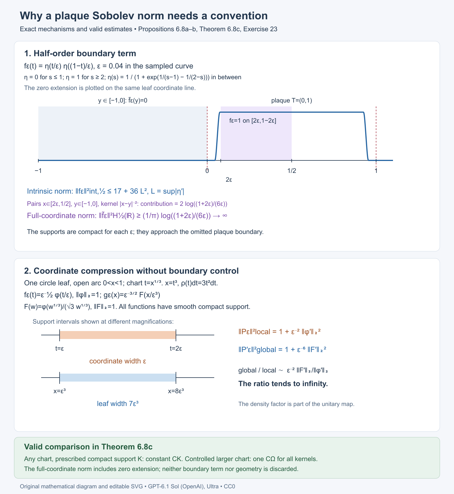

Open full-size figure · Open editable SVG

*Figure 6.8. The upper panel samples the exact smooth cutoff in Proposition 6.8a; its intrinsic seminorm is uniformly bounded, while the displayed cross-boundary integral diverges. The lower panel shows the exact change \(x=t^3\), density \(3t^2\,dt\), support scales and derivative norms in Proposition 6.8b. Theorem 6.8c states the corresponding valid lift estimates. Numerical curve samples illustrate the formula; the bounds and divergences are proved in the text.*

### Ambient restriction norms and repeated plaques

The coordinate norm (54) and an ambient physical Sobolev norm are different constructions. To compare them precisely, let \(M=\mathbb R/(4\mathbb Z)\) have metric \(dx^2\), take \(D=d/dx\), and write \(W^r(M)\) for the Hilbert scale of \(1+D^*D\), for every real \(r\). Thus

\[
\|v\|_{W^1(M)}^2=\int_M(|v|^2+|v'|^2)\,dx.
\]

For an open arc \(I\subset M\), define the ambient restriction and supported spaces by

\[
Q_M^r(I)=W^r(M)/\{v:v|_I=0\text{ as a distribution}\},
\qquad
S_M^r(I)=\overline{C_c^\infty(I)}^{\,W^r(M)}.
\]

The first has the Hilbert quotient norm and the second the inherited ambient norm. The kernel of restriction is closed: convergence in \(W^r(M)\) implies convergence in distributions, hence preserves vanishing against every test supported in \(I\). At order zero these two spaces are both isometric to \(L^2(I,dx)\). This is a specified possible local convention; it is not an attribution of that convention to the historical source.

**Lemma 6.8d (one plaque with ambient norms).** Let \(k\in C_c^\infty(I\times I)\), and extend its kernel by zero to define \(P^M\) on \(M\). For every \(r,r'\in\mathbb R\), its plaque operator is bounded \(Q_M^r(I)\to S_M^{r'}(I)\), and

\[
\|P^M\|_{W^r(M),W^{r'}(M)}
=\|P\|_{Q_M^r(I),S_M^{r'}(I)}.
\]

This equality holds for every compact kernel in the entire open arc; no common smaller support set is required.

**Proof.** In the orthonormal Fourier basis of the circle, the matrix coefficients of a smooth kernel decrease faster than every polynomial in the input and output indices, by repeated integration by parts in both variables. Multiplying the rows and columns by the fixed Sobolev weights leaves a Hilbert–Schmidt matrix. Thus \(P^M\) is bounded between every pair of orders. Its output is smooth and supported in the compact output projection of \(\operatorname{supp}k\), so belongs to \(S_M^{r'}(I)\). Each input pairing is against a test supported in \(I\); it annihilates distributions restricting to zero there. Consequently \(P^M=Pq\), where \(q:W^r(M)\to Q_M^r(I)\) is the quotient map. Since \(\|q\|\le1\), the global norm is at most the local norm. Conversely every quotient class has a representative perpendicular to \(\ker q\), of norm exactly its quotient norm. Applying \(P^M\) to that representative gives the reverse inequality. \(\square\)

In the cubic chart of Proposition 6.8b, the density unitary is \(Ug(t)=\sqrt3\,t\,g(t^3)\). Direct differentiation gives

\[
U\,\partial_x\,U^{-1}f
=\frac1{3t^2}\left(\partial_t-\frac1t\right)f.
\]

Thus the physical ambient norm involves this operator, whereas (54) uses the ordinary coordinate derivative \(\partial_t\). The cubic counterexample does not contradict Lemma 6.8d. The following example exhibits a separate obstruction: many distinct plaques of one fixed connected chart can lie on the same physical leaf.

**Proposition 6.8e (ambient restriction packing in a connected chart).** On the compact torus

\[
V=(\mathbb R/(4\mathbb Z))_x\times(\mathbb R/(4\mathbb Z))_y,
\qquad F=\operatorname{span}(\partial_x),
\]

use the leaf metric \(dx^2\), scalar coefficient bundles and \(D=\partial_x\). There is one fixed distinguished chart with \(T=U=(0,1)\) and smooth compactly supported plaque families \(P_N\), \(N\ge1\), such that

\[
\sup_{u\in U}
\|P_{N,u}\|_{Q_M^1(I_u),S_M^0(I_u)}
\le\frac{\sqrt3}{2},
\qquad
\|P_N'\|_{W^1,W^0}\ge\frac{\sqrt N}{2}.
\]

Here \(I_u\) is the physical arc of its plaque. The norm on the global family is the supremum of its holonomy-cover operator norms. In particular no finite constant depending only on this chart compares the two sides for every compactly supported smoothing family. The ratio is at least \(\sqrt{N/3}\).

**Proof.** Horizontal leaves have trivial holonomy, so each holonomy cover is the physical circle \(M\). Define the inverse chart

\[
\mathcal F(t,u)=
\bigl(u(1+t/16),-\log u\pmod4\bigr),
\qquad \Omega=\mathcal F((0,1)^2).
\]

The physical \(x\) coordinate lies in the ordinary coordinate arc \((0,17/16)\). In a local lift of \(y\), its Jacobian determinant is

\[
\det\begin{pmatrix}
u/16&1+t/16\\
0&-1/u
\end{pmatrix}=-1/16.
\]

Hence \(\mathcal F\) is a local diffeomorphism. If two parameters give the same physical \(y\), their \(u\) coordinates differ by a factor \(e^{-4k}\), \(k\in\mathbb Z\). For \(k\ne0\), the possible \(x\) intervals

\[
I_u=(u,17u/16),\qquad I_{e^{-4k}u}
\]

are disjoint: after exchanging them if necessary, use \(17/16<e^4\). Equality of both physical coordinates therefore forces \(u\) and then \(t\) to agree. An injective local diffeomorphism is a diffeomorphism onto its open image. That image is connected, and \(\partial_t\mathcal F=(u/16)\partial_x\). Its changes to ordinary product foliation charts have transverse coordinate depending locally only on \(y\), with nonzero derivative. It is a distinguished chart with both factors bounded and connected.

Set \(\delta(u)=u/16\). Fix \(\eta,\phi\in C_c^\infty(0,1)\) with \(\eta\ge0\), \(\int_0^1\eta=1\), and \(\|\phi\|_2=1\), and define physical functions on \(M\), extended by zero outside \(I_u\), by

\[
h_u(x)=\delta(u)^{-1}
\eta\!\left(\frac{x-u}{\delta(u)}\right),
\qquad
g_u(x)=\delta(u)^{-1/2}
\phi\!\left(\frac{x-u}{\delta(u)}\right).
\]

They satisfy \(\int_M h_u\,dx=1\) and \(\|g_u\|_{L^2(M)}=1\). At the leaf \(y=2\), the chart plaques have exactly the parameters

\[
u_j=e^{-(2+4j)},\qquad
I_j=(u_j,17u_j/16),\qquad j\ge0.
\]

Their intervals are pairwise disjoint. Choose \(\psi\in C_c^\infty(-1/4,1/4)\), \(0\le\psi\le1\), with \(\psi(0)=1\), and put

\[
\chi_N(u)=\sum_{j=0}^{N-1}
\psi\bigl(-\log u-(2+4j)\bigr),
\qquad
P_{N,u}v=\chi_N(u)g_u\int_{I_u}h_u(x')v(x')\,dx'.
\]

The supports of the summands are disjoint in \(-\log u\), so \(0\le\chi_N\le1\). For each finite \(N\), \(\chi_N\) is smooth and compactly supported in \((0,1)\); moreover \(\chi_N(u_j)=1\) for \(j<N\) and \(0\) for \(j\ge N\).

The physical kernel is \(\chi_N(u)g_u(x)h_u(x')\), relative to \(dx'\). In chart coordinates its coefficient and integration density are exactly

\[
k_N(t,t',u)
=\chi_N(u)\delta(u)^{-3/2}\phi(t)\eta(t'),
\qquad dx'=\delta(u)\,dt'.
\]

Equivalently its coefficient relative to bare \(dt'\) is \(\chi_N(u)\delta(u)^{-1/2}\phi(t)\eta(t')\). Its support is contained in

\[
\operatorname{supp}\phi\times\operatorname{supp}\eta
\times\operatorname{supp}\chi_N,
\]

a compact subset of \(T\times T\times U\) for every fixed \(N\). On that set \(u\) is bounded away from zero, so all coefficients are smooth. The chart injection \((t,t',u)\mapsto(\mathcal F(t,u),\mathcal F(t',u))\) is a diffeomorphism onto the corresponding open subset of the fibrewise pair groupoid. The kernel therefore extends smoothly by zero to a compactly supported groupoid kernel. Each \(P_N\) is smoothing, and belongs to every finite pseudodifferential order class. The support may vary with \(N\), as the arbitrary-chart assertion permits; the chart, bundles, elliptic operator and Sobolev orders remain fixed.

To bound the local input functional, use \(e_n(x)=\tfrac12 e^{i\pi nx/2}\). Fourier Cauchy–Schwarz gives

\[
|v(x)|\le
\frac12\left[
\sum_{n\in\mathbb Z}(1+(\pi n/2)^2)^{-1}
\right]^{1/2}\|v\|_{W^1(M)}.
\]

The positive summand decreases on the positive half-line, and

\[
\sum_{n\in\mathbb Z}(1+(\pi n/2)^2)^{-1}
\le1+2\int_0^\infty(1+(\pi t/2)^2)^{-1}\,dt
=3.
\]

Fourier truncations are dense in \(W^1(M)\); this bound makes them uniformly Cauchy, and supplies a continuous representative satisfying the same pointwise estimate. Since \(h_u\) is a nonnegative density of mass one,

\[
\left|\int h_uv\,dx\right|
\le\frac{\sqrt3}{2}\|v\|_{W^1(M)}.
\]

This functional annihilates every distribution restricting to zero on \(I_u\). Taking the infimum over all representatives proves its norm on \(Q_M^1(I_u)\) is at most \(\sqrt3/2\). The output has \(S_M^0(I_u)\) norm one, and \(|\chi_N|\le1\), proving the local estimate.

The source-defined extension acts separately on every chart plaque of a physical leaf. For a fixed \(y\), the possible parameters are \(u=e^{-(y+4k)}\in(0,1)\), with \(k\in\mathbb Z\). At most \(N\) of them meet \(\operatorname{supp}\chi_N\): each of its \(N\) logarithmic bump intervals has length less than \(1/2\), whereas this parameter list has spacing \(4\). Their physical output supports are disjoint. Consequently the global formula

\[
P'_{N,y}v
=\sum_{\substack{u\in(0,1)\\-\log u\equiv y\ (\mathrm{mod}\ 4)}}
\chi_N(u)g_u\int_{I_u}h_uv\,dx
\]

defines a bounded map \(W^1(M)\to L^2(M)\) with norm at most \(\sqrt{3N}/2\), uniformly in \(y\). Thus the lower estimate concerns a well-defined bounded global operator for every \(N\), not an unbounded formal sum.

At \(y=2\), the single global input \(v\equiv1\) has \(\|1\|_{W^1(M)}=2\), and every selected averaging functional has value one. Therefore

\[
P'_{N,2}1=\sum_{j=0}^{N-1}g_{u_j},
\qquad
\|P'_{N,2}1\|_2^2=N.
\]

This proves the global lower bound \(\sqrt N/2\) and hence the unbounded ratio. \(\square\)

The failed inference is visible even before applying the kernel. Each restriction \(W^1(M)\to Q_M^1(I_j)\) is contractive individually. But the averaging functional shows \(\|[1]\|_{Q_M^1(I_j)}\ge2/\sqrt3\), so the square sum of \(N\) restricted constants is at least \(4N/3\). Independently contractive ambient restrictions need not form a direct-sum map bounded uniformly in the number of plaques. This does not affect the cutoff localization maps in Theorem 6.8c, whose support and chart geometry are controlled.

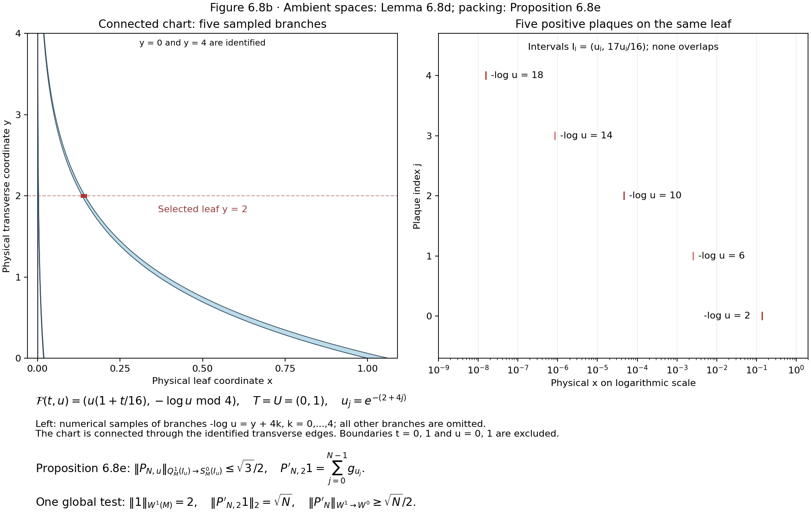

[Open full-size figure](https://raw.githubusercontent.com/KokunoYumeto/open-math-courses/main/docs/courses/NCG-FOLIATIONS/figures/plaque-connected-chart.png) · [Open editable SVG](https://raw.githubusercontent.com/KokunoYumeto/open-math-courses/main/docs/courses/NCG-FOLIATIONS/figures/plaque-connected-chart.svg)

*Figure 6.8b. The exact inverse chart is \(\mathcal F(t,u)=(u(1+t/16),-\log u\pmod4)\), \(T=U=(0,1)\). The left panel samples five branches in physical coordinates; the edges \(y=0,4\) are identified and the chart is connected through them. All chart boundaries are omitted. The right panel shows the same five exact arcs \(I_j=(u_j,17u_j/16)\), \(u_j=e^{-(2+4j)}\), on a logarithmic \(x\) axis. Numerical sampling displays the geometry; the full all-\(N\) construction, density factors and norm bounds are proved in Proposition 6.8e. The chart and kernel-support conventions being tested are those of [Connes 1979](https://omeka.ihes.fr/files/original/f1e66a7f4de4523e6937af152ff16092.pdf); the example and diagram are original to this course.*

The historical distinction remains exact. [Connes 1979](https://omeka.ihes.fr/files/original/f1e66a7f4de4523e6937af152ff16092.pdf), explicitly defines the global \(W^s\) scale on complete holonomy covers using the spectral power of \(1+D^*D\). Proposition 6(a) uses a separate plaque norm \(\|P_u\|_{s,s'}\) without defining the plaque domain, output realization or boundary convention in the cited passages. The later [1982 survey](https://alainconnes.org/wp-content/uploads/foliationsfine.pdf), page 26 of the author's electronic edition, describes the global metric-Laplacian spaces and their mapping properties; it does not select a finite-plaque norm for this assertion. Lemma 6.8d and Proposition 6.8e test one precisely specified ambient convention. Together with Propositions 6.8a–b they distinguish three conventions that cannot be silently substituted into the unrestricted assertion. They do not determine its unstated historical meaning. The historical local norm remains unspecified; its weighted estimate in part (b) is proved by Theorem 6.9 below.

### Dirichlet plaque inputs in a fixed chart

The local norm depends on the completed input space. The following fixed-chart example tests the completion of compactly supported plaque functions in the zero-extension physical \(H^1\) norm. It keeps the chart, metric and global Sobolev operator fixed. The intrinsic half-order output obstruction in Proposition 6.8a, the chart distortion in Proposition 6.8b and the ambient quotient analysis in Lemma 6.8d and Proposition 6.8e concern their separately stated conventions.

The historical estimate in Connes's *Sur la théorie non commutative de l'intégration*, IHÉS/P/79/301, printed p.8.10, Proposition 6(a), does not specify this local completion in the passage discussed above. This example tests an explicit convention; it does not attribute that convention to the historical statement. [IHÉS preprint](https://omeka.ihes.fr/files/original/f1e66a7f4de4523e6937af152ff16092.pdf).

#### The fixed leaf, chart and norms

Let \(M=\mathbb R/4\mathbb Z\) have the full rank-one foliation, physical metric \(dt^2\), and Haar measure \(dt\). Its holonomy groupoid is the pair groupoid. Fix the single distinguished open chart \(\Omega=(0,1)\subset M\); its transverse parameter set is a point. No chart, coordinate, metric or global Sobolev operator changes in the family below. Put

\[
 P=1-\partial_t^2,
 \qquad
 \|u\|_{H^1(M)}^2=\|P^{1/2}u\|_{L^2(M)}^2
     =\int_0^4(|u(t)|^2+|u'(t)|^2)\,dt.
 \tag{DD.1}
\]

Here \(H^1(M)\) is the periodic Sobolev space. The equality follows first for finite periodic Fourier sums: on \(e^{i\pi nt/2}\), P has eigenvalue \(1+(\pi n/2)^2\); Parseval gives the displayed form norm. Completion gives the whole domain. Define the Dirichlet plaque input space as the completion of \(C_c^\infty(0,1)\) for

\[
 \|v\|_{H_0^1(0,1)}^2
   =\int_0^1(|v(t)|^2+|v'(t)|^2)\,dt.
 \tag{DD.2}
\]

Zero extension of a compactly supported input is smooth on \(M\) and preserves this norm, so this is exactly the zero-extension completion convention at input order one. The local output norm is the ordinary physical \(L^2(0,1)\) norm.

Every input in this completion has a continuous representative vanishing at zero and satisfies

\[
 |v(t)|\le \sqrt t\,\|v'\|_{L^2(0,1)},
 \qquad 0\le t\le1.
 \tag{DD.3}
\]

For a test function, write \(v(t)=\int_0^t v'(s)\,ds\) and apply Cauchy–Schwarz. For a Cauchy sequence in (DD.2), the derivatives converge in \(L^2\); their indefinite integrals converge uniformly by this same bound. The limit is the continuous representative of the \(L^2\) limit and has the limiting derivative. This proves (DD.3) on the completed space without importing an unproved trace theorem. The same argument at the other endpoint gives the zero trace at one.

#### Compact smooth kernels

Choose a nonnegative \(\rho\in C_c^\infty(0,1)\) with integral one, and a nonnegative \(g\in C_c^\infty(1/3,2/3)\) with \(L^2\) norm one. For an explicit choice, take \(e^{-1/((r-1/4)(3/4-r))}\) on (1/4,3/4), extend it by zero and divide by its positive integral to obtain \(\rho\). Take \(g\) proportional to \(\rho(3t-1)\), with its positive \(L^2\) normalization. Their exact supports are \([1/4,3/4]\) and \([5/12,7/12]\), respectively. For \(0<\varepsilon<1/12\), set

\[
 h_\varepsilon(t)=\varepsilon^{-1}
          \rho\bigl((t-\varepsilon)/\varepsilon\bigr),
 \qquad
 k_\varepsilon(x,y)=g(x)h_\varepsilon(y).
 \tag{DD.4}
\]

Thus \(h_\varepsilon\) has integral one and exact support \([5\varepsilon/4,7\varepsilon/4]\), contained in \([\varepsilon,2\varepsilon]\), and the kernel belongs to \(C_c^\infty(\Omega\times\Omega)\). The flat endpoint extensions are smooth. Extend the kernel by zero to \(M\times M\). It is an actual globally smooth compact kernel on the pair groupoid; the input and output supports are disjoint. Its global and plaque operators are

\[
 A_\varepsilon u
       =g\int_M h_\varepsilon(t)u(t)\,dt,
 \qquad
 B_\varepsilon v
       =g\int_0^1h_\varepsilon(t)v(t)\,dt.
 \tag{DD.5}
\]

Each global operator is bounded from \(H^1(M)\) to \(L^2(M)\), since \(h_\varepsilon\) is in \(L^2\) and Cauchy–Schwarz bounds its coefficient. All its outputs are supported in the fixed middle subinterval. No distributional delta kernel, nonsmooth extension, changing foliation or repeated plaque is used.

#### Incompatible norm bounds

**Proposition 6.8f (Dirichlet plaque inputs).** The local Dirichlet-input operator norms tend to zero, whereas the lifted global operator norms stay bounded below:

\[
 \|B_\varepsilon\|_{H_0^1(0,1)\to L^2(0,1)}
      \le\sqrt{2\varepsilon},
 \qquad
 \|A_\varepsilon\|_{H^1(M)\to L^2(M)}\ge\frac12.
 \tag{DD.6}
\]

Consequently there is no finite constant \(c\), even for this one fixed distinguished chart and fixed physical Sobolev operator, for which all compactly supported smooth plaque kernels satisfy

\[
 \|A\|_{H^1(M)\to L^2(M)}
       \le c\,\|B\|_{H_0^1(0,1)\to L^2(0,1)}.
 \tag{DD.7}
\]

**Proof.** Nonnegativity and unit integral of \(h_\varepsilon\), (DD.3), and its support give

\[
 \left|\int h_\varepsilon(t)v(t)\,dt\right|
   \le\int h_\varepsilon(t)\sqrt t\,dt\,
              \|v'\|_{L^2(0,1)}
   \le\sqrt{2\varepsilon}\,\|v\|_{H_0^1(0,1)}.
 \tag{DD.8}
\]

Because \(g\) has output norm one, this is the local bound. For the global input \(u\equiv1\), (DD.1) gives norm two, whereas (DD.5) gives output \(g\) of norm one. This is the global lower bound. If (DD.7) held, (DD.6) would imply \(1/2\le c\sqrt{2\varepsilon}\) for every sufficiently small positive \(\varepsilon\), which is impossible. Equivalently the required comparison constants satisfy

\[
 c_\varepsilon\ge\frac{1}{2\sqrt{2\varepsilon}}
                \longrightarrow\infty.
 \tag{DD.9}
\]

All estimates are on the completed physical spaces. The failure is caused by the input trace imposed by the local completion: global constant inputs have no such trace restriction. It is not an output extension defect or coordinate distortion. \(\square\).

#### The ambient quotient input

The positive one-plaque factorization uses a different input space. Let \(R\) be the space of restrictions to (0,1) of \(H^1(M)\) functions, with its quotient norm

\[
 \|v\|_R=\inf\{\|u\|_{H^1(M)}:u|_{(0,1)}=v\}.
 \tag{DD.10}
\]

The kernel \(N\) of restriction is closed: convergence in \(H^1\) implies convergence in \(L^2\) on (0,1), so zero restrictions remain zero. To see the complete quotient directly, minimize the distance from an input \(u\) to \(N\). A sequence of points in \(N\) whose squared distances approach the infimum is Cauchy by the parallelogram identity, since each midpoint remains in \(N\). Its limit is in \(N\) and minimizes the distance. Varying that minimizer along both real and imaginary multiples of any vector in \(N\) shows that the residual is orthogonal to \(N\). The residual is unique and depends linearly on the input. Thus restriction identifies \(R\) isometrically with the closed Hilbert subspace \(N^\perp\), proving its completeness and Hilbert norm. Define \(\widetilde B_\varepsilon:R\to L^2(M)\) by the same integral and zero-extended output \(g\). It is well-defined because the integral depends only on the restriction. If \(q\) denotes the quotient map, then \(A_\varepsilon=\widetilde B_\varepsilon q\), and the definition of the quotient norm gives

\[
 \|A_\varepsilon\|_{H^1(M)\to L^2(M)}
      =\|\widetilde B_\varepsilon\|_{R\to L^2(M)}.
 \tag{DD.11}
\]

One inequality follows because \(q\) is contractive. Conversely, for \(v\in R\) and every positive \(\eta\), choose an extension with norm at most \(\|v\|_R+\eta\); applying \(A_\varepsilon\) and taking \(\eta\) to zero gives the other inequality and boundedness of the induced operator. In particular the restriction of the constant one has quotient norm at most two, so the quotient-input local norm is at least one half. It cannot be replaced by the vanishing Dirichlet-input norm in (DD.6).

This proves exact compatibility with Lemma 6.8d at input order one and output order zero; it supplies no arbitrary repeated-plaque estimate. It also does not decide which local norm the historical passage intended. An unspecified norm cannot be identified solely by requiring the estimate to hold.

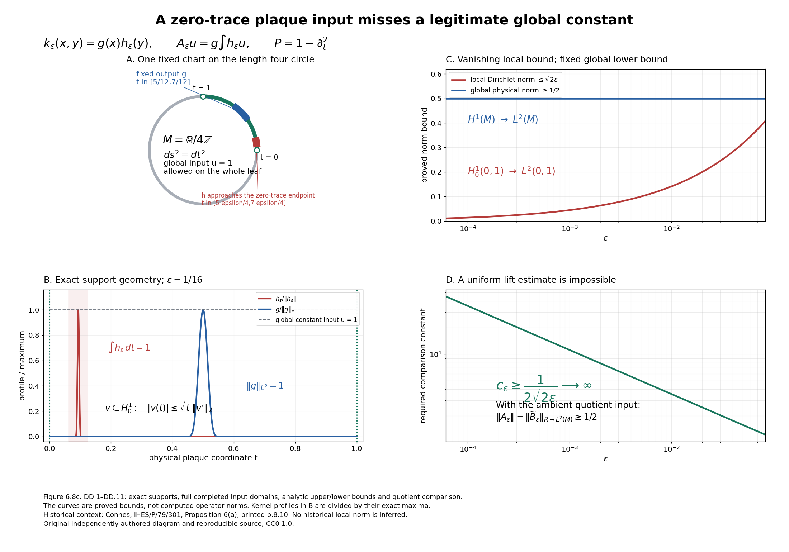

[Editable SVG](../figures/kt-plaque-dirichlet-input.svg). Reproducible source: `draw_plaque_dirichlet_input.py` in the accompanying figure source bundle.

**Figure 6.8c.** Proposition 6.8f and (DD.1)–(DD.11). A: the radius \(2/\pi\) circle has physical circumference four; the fixed chart is \((0,1)\), and the input support approaches its zero-trace endpoint while the output support stays in \([5/12,7/12]\). B: the explicit bump profiles at \(\varepsilon=1/16\) are divided by their exact maxima; the shaded \([\varepsilon,2\varepsilon]\) is a support enclosure. C and D: the curves are the proved upper and lower bounds, rather than computed operator norms. The parameter interval in the theorem is \(0<\varepsilon<1/12\); the curve endpoint \(1/12\) shows the continuous extension of those formulae. The quotient-input equality explains why Lemma 6.8d remains compatible with the Dirichlet counterexample. The fixed convention leaves the historical unspecified norm undecided. Original diagram and reproducible source, [CC0 1.0](https://creativecommons.org/publicdomain/zero/1.0/); historical context: Connes 1979, printed p.8.10, Proposition 6(a).

### Positive kernels and three negative-output plaque completions

**Proposition 6.8g (positive kernels and negative-output packing).** The following argument strengthens the winding-chart norm analysis. It fixes the physical input norm to ordinary \(L^2\), so there is no input trace or input extension convention. Three precise negative-output norms all give uniformly bounded plaque operators, while the actual lifted \(L^2\)-to-\(H^{-1}\) norm grows with the number of plaques on one leaf. The lifted kernels are positive in the reduced foliation \(C^*\)-algebra. The result concerns these specified local norms; it does not decide the historically unspecified plaque completion.

Proposition 6.8e supplies the connected chart and actual groupoid construction. The following proof gives the full physical negative-output spaces and bounds explicitly. The Dirichlet-input, fractional-output and coordinate-distortion arguments above remain available.

#### 6.8g.1. Full global dual scale

Let \(M=\mathbb R/(4\mathbb Z)\) have physical metric \(dx^2\) and measure \(dx\). Put \(P=1-\partial_x^2\). The orthonormal periodic Fourier basis is \(e_n(x)=\tfrac12e^{i\pi nx/2}\), with eigenvalues \(\lambda_n=1+(\pi n/2)^2\). Define \(H^{-1}(M)\) as the completion of \(L^2\) for the spectral norm

\[
 \|g\|_{H^{-1}(M)}^2
   =\sum_{n\in\mathbb Z}\lambda_n^{-1}
             |\langle e_n,g\rangle|^2,
 \qquad
 \|v\|_{H^1(M)}^2=\int_M(|v|^2+|v'|^2)\,dx.
 \tag{NP.1}
\]

For a smooth \(g\) the first norm is exactly its continuous functional norm on \(H^1\) under the integral pairing. Weighted Fourier Cauchy-Schwarz proves the upper bound. The Fourier coefficients of the extremizing vector are \(\lambda_n^{-1}\) times those of \(g\), with the conjugation prescribed by the pairing. Its \(H^1\) norm equals the \(H^{-1}\) norm of \(g\); finite Fourier approximations also prove the equality and extend it to the completion. Every compactly supported test function therefore has a continuous pairing with \(H^{-1}\). This identifies the completed space injectively with periodic distributions: a distribution with all zero Fourier coefficients is zero, since smooth periodic test functions have rapidly decaying coefficients.

If \(g\) is nonnegative, smooth and has integral one, then every Fourier coefficient has magnitude at most one-half. The positive decreasing summand has

\[
 \sum_{n\in\mathbb Z}\lambda_n^{-1}
 \le 1+2\int_0^\infty
          (1+(\pi t/2)^2)^{-1}\,dt=3,
 \qquad
 \|g\|_{H^{-1}(M)}\le\sqrt3/2.
 \tag{NP.2}
\]

The integral follows by substituting \(\pi t/2\) and using the arctangent endpoints. On the other hand the constant Fourier coefficient alone gives, for any smooth \(g\),

\[
 \|g\|_{H^{-1}(M)}\ge
          \tfrac12\left|\int_Mg\,dx\right|.
 \tag{NP.3}
\]

These are full completed-space norms, not a bound on a finite Fourier truncation.

#### 6.8g.2. Three exact local output realizations

For an open physical arc \(I\) of \(M\), the input is \(L^2(I,dx)\). The following three output spaces will be treated separately.

First, \(S^{-1}_M(I)\) is the closure of \(C_c^\infty(I)\), extended by zero, inside \(H^{-1}(M)\), with the inherited ambient norm. For a smooth compactly supported output \(g\) its norm is exactly its global \(H^{-1}\) norm.

Second, \(Q^{-1}_M(I)\) is the image of restriction of \(H^{-1}(M)\) to distributions on \(I\), with the Hilbert quotient norm. The kernel of restriction is closed: it is the intersection of the kernels of the continuous functionals given by all compact test functions in \(I\). Thus the quotient is complete. A compactly supported smooth \(g\) has a global extension equal to itself, so its quotient norm is at most its ambient \(H^{-1}\) norm.

Third, \(D^{-1}(I)\) is the continuous dual of \(H_0^1(I)\), where \(H_0^1\) is the completion of \(C_c^\infty(I)\) for the full physical norm \(\int_I(|v|^2+|v'|^2)\,dx\). Zero extension is isometric into \(H^1(M)\), first on test functions and then on the completion. Restricting the global functional of \(g\) to this closed input subspace proves

\[
 \|g\|_{S^{-1}_M(I)}=\|g\|_{H^{-1}(M)},\qquad
 \|g|_I\|_{Q^{-1}_M(I)}\le\|g\|_{H^{-1}(M)},\qquad
 \|g\|_{D^{-1}(I)}\le\|g\|_{H^{-1}(M)}.
 \tag{NP.4}
\]

The quotient realization and the Dirichlet-dual realization are not declared equal. No dual of unrestricted regional \(H^1\) is included in (NP.4).

#### 6.8g.3. One fixed connected product chart

Use \(V=(\mathbb R/(4\mathbb Z))_x\times(\mathbb R/(4\mathbb Z))_y\), with horizontal circle leaves. They have trivial holonomy, so their holonomy covers are the actual circles \(M\). The inverse chart is

\[
 \mathcal F(t,u)=
       (u(1+t/16),-\log u\pmod4),\qquad
 T=U=(0,1),\qquad\Omega=\mathcal F(T\times U),
 \quad I_u=(u,17u/16),\quad\delta(u)=u/16.
 \tag{NP.5}
\]

Its Jacobian determinant in a local \(y\) lift is \(-1/16\). If the \(y\) coordinates agree, the two \(u\) values differ by an integer power of \(e^4\). The corresponding \(x\) intervals are disjoint unless that power is zero, since \(17/16<e^4\). Thus the map is an injective local diffeomorphism and therefore a diffeomorphism onto its connected open image. Its \(t\) derivative is \(\delta(u)\) times \(\partial_x\). Its changes to ordinary foliation charts have transverse coordinate depending locally only on \(y\), with nonzero derivative. It is consequently a distinguished connected product chart, with the physical density \(dx=\delta(u)\,dt\).

At the leaf \(y=2\) its plaques have exactly

\[
 u_j=e^{-(2+4j)},\qquad
 I_j=(u_j,17u_j/16),\qquad j=0,1,2,\ldots.
 \tag{NP.6}
\]

These intervals are pairwise disjoint and accumulate at the omitted endpoint \(x=0\). This is a fixed chart on a fixed compact foliation, rather than a chart varying with \(N\).

Choose a real nonnegative \(\eta\) in \(C_c^\infty(0,1)\) with integral one; for example normalize the flat bump \(\exp(-1/((t-1/4)(3/4-t)))\) on \((1/4,3/4)\), extended by zero. Put \(c_\eta=\|\eta\|_{L^2(0,1)}\), positive and finite, and define physical smooth functions, extended by zero outside \(I_u\), by

\[
 g_u(x)=\delta(u)^{-1}\eta((x-u)/\delta(u)),\qquad
 h_u(x)=\delta(u)^{-1/2}c_\eta^{-1}
                          \eta((x-u)/\delta(u)).
 \tag{NP.7}
\]

Then \(\int_M g_u\,dx=1\), \(\|h_u\|_{L^2}=1\) and \(g_u=c_\eta\delta(u)^{-1/2}h_u\). The exact supports are inside the middle half of \(I_u\). Every local output norm in (NP.4) is at most \(\sqrt3/2\) by (NP.2).

Choose a nonnegative smooth \(\psi\) supported in \((-1/4,1/4)\), with \(\psi(0)=1\) and \(\psi\) at most one, and put

\[
 \zeta_N(u)=\sum_{j=0}^{N-1}
              \psi(-\log u-(2+4j)),\qquad
 \chi_N=\zeta_N^2,\qquad
 B_{N,u}v=\chi_N(u)g_u\int_{I_u}h_uv\,dx.
 \tag{NP.8}
\]

The summands have disjoint support, so \(\chi_N\) is at most one. For each finite \(N\) its support is a compact subset of \(U\), bounded away from zero, and \(\chi_N(u_j)\) is one for \(j<N\) and zero for \(j\ge N\). All variables, orders, bundles and the chart are fixed as \(N\) changes.

#### 6.8g.4. Compact smooth actual kernels and positivity

The kernel relative to physical \(dx'\) is \(\chi_Ng_u(x)h_u(x')\). Its coefficient in chart coordinates is

\[
 k_N(t,t',u)=\chi_N(u)c_\eta^{-1}
                \delta(u)^{-3/2}\eta(t)\eta(t'),
 \qquad dx'=\delta(u)\,dt'.
 \tag{NP.9}
\]

Its support is compact in \(T\times T\times U\). On that support \(\delta(u)\) is positive and bounded away from zero. Thus it is smooth and extends by zero to a compactly supported smooth kernel on the actual horizontal-leaf pair groupoid. The chart map on pairs is an injection onto the corresponding open arrow chart. No distributional point mass or singular zero extension is used. Every such kernel is smoothing, hence belongs to every finite pseudodifferential order class.

The lifted operators are positive as ordinary \(L^2\) operators, and the kernel defines a positive element in the reduced foliation algebra. This has an explicit smooth square root in the convolution sense. On each plaque let

\[
 C_{N,u}=\zeta_N(u)\sqrt{c_\eta}\,
       \delta(u)^{-1/4}|h_u\rangle\langle h_u|,
 \qquad C_{N,u}^*C_{N,u}=B_{N,u}.
 \tag{NP.10}
\]

The \(C\) kernel is also smooth and compactly supported in the same chart. On each physical leaf the plaque intervals are disjoint. All cross-plaque products vanish in convolution, while each local \(h_u\) has norm one. Consequently its globally lifted kernel \(Q_N\) has \(Q_N^*Q_N=A_N\), the lift of \(B_N\). This proves positivity in the actual reduced convolution completion and not merely pointwise nonnegativity of \(k_N\). Each finite \(N\) has a bounded ordinary \(L^2\) operator, since only finitely many selected plaque branches occur on each leaf and their parameters lie in a fixed compact subset of \(U\). No uniform \(L^2\) bound over \(N\) is asserted. Positivity is asserted for the underlying \(L^2\)/convolution realization; it does not define a positivity order on a map between unequal Sobolev spaces.

#### 6.8g.5. Uniform local bound and growing global bound

For every \(u\), the \(h_u\) functional on \(L^2(I_u)\) has norm one. Equations (NP.2), (NP.4) and \(\chi_N\) at most one therefore prove, separately for each \(Y_u\) among \(S^{-1}_M(I_u)\), \(Q^{-1}_M(I_u)\), \(D^{-1}(I_u)\),

\[
 \sup_u\|B_{N,u}\|_{L^2(I_u)\to Y_u}
             \le\sqrt3/2.
 \tag{NP.11}
\]

On the one leaf \(y=2\), define \(f_N=N^{-1/2}\sum_{j<N}h_{u_j}\). Disjoint support and unit \(L^2\) norm of each summand give \(\|f_N\|_{L^2}=1\) exactly. The lifted operator has

\[
 A_Nf_N=N^{-1/2}\sum_{j<N}g_{u_j},\qquad
 \int_M A_Nf_N\,dx=\sqrt N,\qquad
 \|A_N\|_{L^2(M)\to H^{-1}(M)}\ge\sqrt N/2.
 \tag{NP.12}
\]

The lower bound is (NP.3). The global family norm is the supremum over the genuine holonomy-cover operator norms, so it has this same lower bound. No finite constant depending only on the fixed chart compares that global norm with the supremum in (NP.11), in any of the three stated negative-output conventions. The ratio is at least \(\sqrt{N/3}\). All local input norms in this argument are the unambiguous physical \(L^2\) norm.

#### 6.8g.6. Precise limit of the result

The dual of the unrestricted regional \(H^1(I_u)\) behaves differently. The constant test function has norm \(\sqrt{\delta(u)}\), whereas the functional given by \(g_u\) takes value one. Its unrestricted-dual norm is therefore at least \(\delta(u)^{-1/2}\), which is unbounded as \(u\) tends to zero. That output convention does not satisfy (NP.11), and this construction does not refute a comparison using it.

Similarly, global \(L^2\) output retains orthogonality of the distinct plaque intervals. On any one leaf the \(L^2\) operator is a direct sum of the plaque rank-one operators; its norm is their supremum, not their sum. Here those individual norms are \(\chi_Nc_\eta\delta(u)^{-1/2}\). It is precisely the nonlocal global negative norm and its shared constant Fourier mode that collect the unit masses in (NP.12). The argument must not be described as an \(L^2\) direct-sum failure.

The product-chart hypotheses are specified, but the historical plaque Sobolev boundary convention remains unidentified. Thus the historical plaque norm interface remains open. The present proof provides a further complete, typed obstruction and a positive-kernel test, not a universal claim about every possible norm carrying the label \(H^{-1}\).

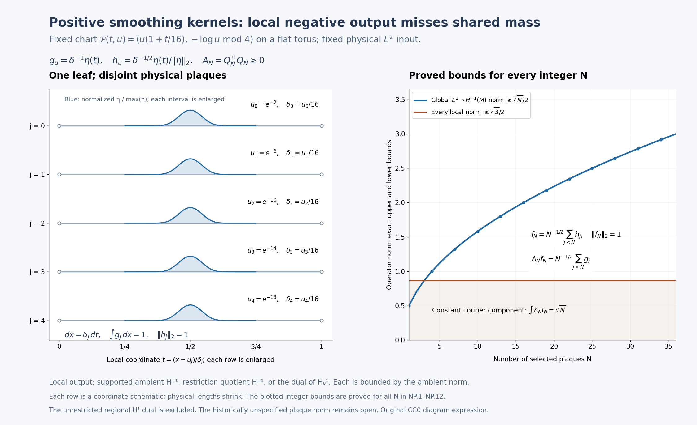

**Figure 6.8d.** NP.1–NP.12. Five plaques of the fixed winding chart on the leaf \(y=2\) are individually enlarged in their local coordinate \(t\). Their exact physical parameters are \(u_j=e^{-(2+4j)}\) and \(\delta_j=u_j/16\); equal displayed widths do not mean equal physical lengths. The blue profiles are \(\eta\) divided by its maximum; the displayed formulas give the actual \(g_j\) and \(h_j\) amplitudes and physical density. The right panel shows the proved local upper bound \(\sqrt3/2\) and global lower bound \(\sqrt N/2\) at integer \(N\), with the exact normalized input and shared constant Fourier component. The kernels are genuine convolution squares. The unrestricted regional \(H^1\) dual is excluded from this claim. [Complete reproducible source](../reproduction/negative-output-packing/draw_negative_output.py) and [editable SVG](../figures/kt-plaque-negative-output.svg).

The exposition, proofs, exercises, diagram expression and generator are dedicated under CC0 1.0. The actual DejaVu and STIX glyph terms remain in the [complete font notice](../reproduction/negative-output-packing/FONT-NOTICE.txt) and in the SVG; [component terms](../reproduction/negative-output-packing/COMPONENT-TERMS.md) distinguish the original expression and its glyph components. The finite displayed interval list and sampled integer bound values illustrate the all-\(N\) argument; neither supplies a proof in place of (NP.1)–(NP.12).

### Completed negative restriction duality and a positive boundary test

**Proposition 6.8h (completed restriction duality and a positive boundary test).** This supplement strengthens the typed negative-output analysis of Proposition 6.8g and equations (NP.1)–(NP.12). It proves that the ambient restriction quotient and the Dirichlet dual used there are exactly isometric. It then gives a positive smoothing-kernel obstruction on one fixed ordinary product chart and one plaque per leaf. The obstruction uses output boundary concentration, rather than accumulation of different plaques. It does not identify the historically unspecified local Sobolev norm or settle the historical plaque comparison.

#### 6.8h.1. Pairing conventions and the full global dual

Let \(M=\mathbb R/(4\mathbb Z)\) with physical measure \(dx\) and metric \(dx^2\). Write

\[
 e_n(x)=\tfrac12 e^{i\pi nx/2},\qquad
 \lambda_n=1+(\pi n/2)^2,\qquad
 \|v\|_{H^1(M)}^2=\sum_n\lambda_n|v_n|^2,
 \quad \|g\|_{H^{-1}(M)}^2=\sum_n\lambda_n^{-1}|g_n|^2.
 \tag{QB.1}
\]

The coefficients are \(v_n=\int_Mv\overline{e_n}\,dx\). The inner product is linear in its first argument. A distributional output \(g\) acts by the **anti-linear** continuous functional

\[
 F_g(v)=\sum_n g_n\overline{v_n};
 \qquad F_g(v)=\int_Mg\overline v\,dx
 \quad\hbox{for smooth }g,v.
 \tag{QB.2}
\]

Thus “dual” below means the continuous anti-dual, with its usual norm. Complex conjugation converts this convention to the continuous linear dual without changing any norm.

The spectral completion in (QB.1) is isometrically the complete anti-dual of \(H^1(M)\). Weighted Cauchy–Schwarz gives the upper norm bound. For finitely many coefficients choose \(v_n=\lambda_n^{-1}g_n\); normalized partial sums give the reverse bound, including infinite coefficient sequences. For surjectivity let \(F\) be any continuous anti-linear functional and put \(g_n=F(e_n)\). On every finite Fourier subspace the same extremizer proves

\[
 \sum_{|n|\le R}\lambda_n^{-1}|g_n|^2\le\|F\|^2.
 \tag{QB.3}
\]

The increasing sums converge. Their coefficients define an element of the completed \(H^{-1}(M)\), since finite partial sums are Cauchy in that norm. By density of finite Fourier sums, its functional equals \(F\) on all \(H^1(M)\). Equality of norms follows from the reverse bound. This proves the asserted completed-space identification and avoids any unproved extension of a finite truncation. It also shows that the output defines a distribution: smooth test functions have rapidly decaying Fourier coefficients, and (QB.2) converges continuously on those tests. If its distribution is zero, testing every \(e_n\) gives all zero coefficients.

#### 6.8h.2. Exact quotient–Dirichlet-dual isometry

Let \(I=(0,1)\subset M\) be a physical arc. The space \(H_0^1(I)\) is the completion of \(C_c^\infty(I)\) for

\[
 \|v\|_{0,1}^2=\int_0^1(|v|^2+|v'|^2)\,dx.
 \tag{QB.4}
\]

Zero extension on compact test functions is an isometry into \(H^1(M)\). It therefore extends to an isometric map \(J:H_0^1(I)\to H^1(M)\). Its range \(L\) is closed: a convergent sequence \(Jv_j\) makes \(v_j\) Cauchy by the isometry, and its limit has image equal to the ambient limit. Let \(P_L\) be the ambient Hilbert orthogonal projection onto \(L\).

Let \(K\subset H^{-1}(M)\) be the kernel of distributional restriction to \(I\). It is the intersection of the kernels \(F_g(J\varphi)=0\) for all \(\varphi\in C_c^\infty(I)\). Each such functional is continuous in \(g\), by (QB.1)–(QB.2). Hence \(K\) is closed. Density of the compact tests in \(H_0^1(I)\) proves

\[
 K=\{g:F_g|_L=0\}.
 \tag{QB.5}
\]

Define \(Q^{-1}_M(I)=H^{-1}(M)/K\), with its Hilbert quotient norm, and \(D^{-1}(I)=(H_0^1(I))^*_{\mathrm{anti}}\). Restriction of functionals gives a well-defined map

\[
 R:Q^{-1}_M(I)\longrightarrow D^{-1}(I),\qquad
 R[g](v)=F_g(Jv).
 \tag{QB.6}
\]

Its kernel is zero by (QB.5); its norm is at most one because \(J\) is isometric. To prove both surjectivity and equality of norms, take any \(f\in D^{-1}(I)\) and extend it by

\[
 \widetilde f(w)=f(J^{-1}P_Lw),\qquad w\in H^1(M).
 \tag{QB.7}
\]

Here \(J^{-1}\) is used only on its range \(L\). The projection and \(J^{-1}\) are contractions, so \(\|\widetilde f\|\le\|f\|\). Testing \(w=Jv\) gives the reverse bound, and hence equality. Section 6.8h.1 supplies a unique \(g\in H^{-1}(M)\) with \(F_g=\widetilde f\) and \(\|g\|_{H^{-1}(M)}=\|f\|\). Its restriction agrees with \(f\) on every compact test and on all \(H_0^1(I)\). Every other extension \(g'\) with the same restriction satisfies \(\|g'\|\ge\|f\|\), because its restriction along the isometry \(J\) has norm \(\|f\|\). Therefore this extension attains the quotient infimum:

\[
 \boxed{\ \|[g]\|_{Q^{-1}_M(I)}=\|R[g]\|_{D^{-1}(I)},
 \qquad R\text{ is onto and isometric}.\ }
 \tag{QB.8}
\]

It is the restriction quotient that is identified, not the inherited supported ambient norm. The distribution on \(I\) still distinguishes the quotient class injectively by compact tests; no stronger regional test convention has silently been imposed. In particular (QB.8) does not identify either side with the dual of unrestricted \(H^1(I)\).

#### 6.8h.3. The exact boundary bound on the completed input

For \(v\in C_c^\infty(I)\), the fundamental theorem of calculus and Cauchy–Schwarz give

\[
 |v(x)|=\left|\int_0^xv'(t)\,dt\right|
       \le\sqrt{x}\,\|v'\|_{L^2(I)}\le\sqrt{x}\,\|v\|_{0,1}.
 \tag{QB.9}
\]

The same inequality for differences shows that a Cauchy sequence in (QB.4) is uniformly Cauchy on \([0,1]\). Its continuous limit agrees with its \(L^2\) limit, is independent of the approximating sequence and vanishes at both endpoints. Its weak derivative is the \(L^2\) limit of the derivatives, as follows by integration against compact test functions. Passing to this limit proves (QB.9) for every element of the completed space. This supplies the exact trace property used here, rather than importing a trace value for an arbitrary regional input.

Choose a real nonnegative \(\eta\in C_c^\infty(0,1)\) with integral one and set \(c_\eta=\|\eta\|_2>0\). For \(0<\varepsilon<1/4\) put

\[
 g_\varepsilon(x)=\varepsilon^{-1}\eta((x-\varepsilon)/\varepsilon),\qquad
 h_\varepsilon(x)=\varepsilon^{-1/2}c_\eta^{-1}
                         \eta((x-\varepsilon)/\varepsilon),
 \qquad \operatorname{supp}g_\varepsilon\subset(\varepsilon,2\varepsilon).
 \tag{QB.10}
\]

Both functions are extended by zero. Their supports are strictly inside that open interval because \(\eta\) is compactly supported inside \((0,1)\). Thus the extensions are smooth. A change of variable gives mass \(\int_Mg_\varepsilon=1\), input norm \(\|h_\varepsilon\|_2=1\), and \(g_\varepsilon=c_\eta\varepsilon^{-1/2}h_\varepsilon\). By (QB.9), nonnegativity and unit mass,

\[
 \|g_\varepsilon\|_{D^{-1}(I)}
   =\|g_\varepsilon|_I\|_{Q^{-1}_M(I)}
   \le\sqrt{2\varepsilon}.
 \tag{QB.11}
\]

Indeed \(|\int g_\varepsilon\overline v|\le\int g_\varepsilon|v|
\le\sqrt{2\varepsilon}\|v\|_{0,1}\) for every completed input. On the whole circle the \(n=0\) coefficient equals one-half, so (QB.1) gives \(\|g_\varepsilon\|_{H^{-1}(M)}\ge1/2\). The global bound is independent of the position or shrinking width of the bump.

#### 6.8h.4. Actual positive kernels in a fixed ordinary chart

Take the flat torus \(V=M_x\times M_y\) with horizontal circle leaves. Use the **fixed ordinary chart** \(I_x\times U_y\), with \(I=U=(0,1)\) and chart map \((t,u)\mapsto(t,u)\). Every leaf meeting this chart has a single plaque \(I\times\{u\}\); physical input and output densities are \(dx\). Fix a real \(\zeta\in C_c^\infty(U)\) with \(0\le\zeta\le1\) and \(\zeta(1/2)=1\), and write \(\chi=\zeta^2\). Define

\[
 B_{\varepsilon,u}=\chi(u)c_\eta\varepsilon^{-1/2}
              |h_\varepsilon\rangle\langle h_\varepsilon|,
 \qquad
 C_{\varepsilon,u}=\zeta(u)\sqrt{c_\eta}\varepsilon^{-1/4}
              |h_\varepsilon\rangle\langle h_\varepsilon|.
 \tag{QB.12}
\]

The rank-one convention is \(|h\rangle\langle h|v=h\int_I\overline h v\,dx\), a linear operator. Since \(h_\varepsilon\) is real, \(B_{\varepsilon,u}v=\chi(u)g_\varepsilon\int_Ih_\varepsilon v\,dx\). The unit norm of \(h_\varepsilon\) makes its rank-one operator an orthogonal projection. It follows that \(C_{\varepsilon,u}^*C_{\varepsilon,u}=B_{\varepsilon,u}\).

For every fixed positive \(\varepsilon\), these kernels have compact support in \(I\times I\times U\), are smooth, and have smooth zero extensions to the actual horizontal pair groupoid \(M_x\times M_{x'}\times M_y\). Convolution integrates against the physical \(dx'\). The same calculation on each whole circle gives \(Q_\varepsilon^*Q_\varepsilon=A_\varepsilon\) for the lifted kernels. Thus \(A_\varepsilon\) is positive in the actual reduced convolution completion as well as in each \(L^2\) leaf representation. All kernels are smoothing and hence have every fixed finite pseudodifferential order. There is no point-mass kernel or merely pointwise positivity argument.

The \(h_\varepsilon\) input functional has norm one. Equations (QB.11)–(QB.12) prove

\[
 \sup_u\|B_{\varepsilon,u}\|_{L^2(I)\to Q^{-1}_M(I)}
 =\sup_u\|B_{\varepsilon,u}\|_{L^2(I)\to D^{-1}(I)}
 \le\sqrt{2\varepsilon}.
 \tag{QB.13}
\]

On the leaf \(u=1/2\), the zero extension of \(h_\varepsilon\) to \(M\) has norm one and \(A_\varepsilon h_\varepsilon=g_\varepsilon\). Therefore

\[
 \|A_\varepsilon\|_{L^2(M)\to H^{-1}(M)}\ge\tfrac12,
 \qquad
 \frac{\|A_\varepsilon\|_{L^2\to H^{-1}}}
      {\sup_u\|B_{\varepsilon,u}\|_{L^2\to Q^{-1}_M(I)}}
 \ge\frac{1}{2\sqrt{2\varepsilon}}\longrightarrow\infty.
 \tag{QB.14}
\]

The denominator is positive: a nonzero nonnegative compact test \(v\) overlapping the bump has nonzero pairing, so the output functional is nonzero. Replacing \(Q^{-1}\) by \(D^{-1}\) leaves the exact same ratio by (QB.8). The family supremum of actual holonomy-cover norms has this lower bound because the circle leaves have trivial holonomy and \(u=1/2\) is one such leaf. The manifold, chart, metric, orders, densities, bundles, transverse cutoff and number of plaques per leaf are fixed as \(\varepsilon\) varies. Only the compact kernel support moves toward the chart boundary.

#### 6.8h.5. Exact scope and the supported-norm contrast

For the supported ambient completion \(S^{-1}_M(I)\), a compactly supported \(g_\varepsilon\) retains its whole-circle \(H^{-1}\) norm. In this single-plaque example the lifted input functional is also the zero-extended unit vector \(h_\varepsilon\). Hence both family norms are exactly

\[
 \sup_u\|B_{\varepsilon,u}\|_{L^2(I)\to S^{-1}_M(I)}
 =\sup_y\|A_{\varepsilon,y}\|_{L^2(M)\to H^{-1}(M)}
 =\|g_\varepsilon\|_{H^{-1}(M)}.
 \tag{QB.15}
\]

The equality follows from the rank-one norm formula and \(\sup\chi=1\), not from a general local-to-global theorem. Thus the present boundary mechanism does not refute the supported-norm comparison. The different multi-plaque packing mechanism of Proposition 6.8g, (NP.1)–(NP.12), remains a proved obstruction for that convention on its winding chart.

The unrestricted regional \(H^1(I)\) dual also differs: its constant test one has norm one and gives value one on \(g_\varepsilon\). Its output norm is at least one, so it does not satisfy the vanishing local bound (QB.13). Positivity is a statement about the underlying convolution/\(L^2\) element, not an order on operators between unequal Sobolev spaces.

Each kernel support is compact inside the fixed chart, but there is no **single common compact subchart** containing all supports with a positive buffer from \(x=0\). Any proposed historical hypothesis imposing such a uniform buffer, or measuring the output on a prescribed larger chart, must be checked separately. This proof does not assert that the original source omits every such hypothesis; the exact historical source interface requires separate reconciliation. The historical plaque comparison remains unresolved until its actual local norm and admissible support/chart premises are established and reconciled.

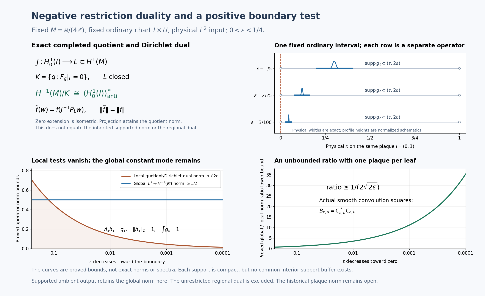

**Figure 6.8e.** Proposition 6.8h, Sections 6.8h.1–6.8h.5 and equations (QB.1)–(QB.15). The first panel shows the exact norm-preserving quotient restriction onto the anti-dual of the zero-extension subspace. The second marks one fixed interval and three actual shrinking support intervals; profiles are normalized coordinate schematics, not point masses or the true scaled amplitudes. The third panel plots the proved local upper \(\sqrt{2\varepsilon}\) and global lower \(1/2\); the fourth plots the ratio lower \(1/(2\sqrt{2\varepsilon})\). These are bounds, not computed operator spectra or exact norm equalities. The supported ambient output retains its global norm in this single-plaque test. The complete proof and Exercises 31–33 accompany the image. The [full-size SVG](../figures/kt-plaque-negative-output-boundary.svg), [complete generator](../reproduction/negative-output-boundary/draw_negative_output_boundary.py), [reproduction instructions](../reproduction/negative-output-boundary/README.md) and [exact figure bounds](../reproduction/negative-output-boundary/figure-and-bounds.json) are available.

Original exposition, proofs, exercises, generator and diagram expression are dedicated to [CC0 1.0](https://creativecommons.org/publicdomain/zero/1.0/). Actual DejaVu/STIX glyph terms retain their [complete separate notices](../reproduction/negative-output-boundary/FONT-NOTICE.txt); [component terms](../reproduction/negative-output-boundary/COMPONENT-TERMS.md) distinguish the original expression, bundled fonts and external software dependencies. The proof uses the physical spectral and negative-output constructions (NP.1)–(NP.12) of Proposition 6.8g. It does not identify the historical norm.

### Physical plaque norms with two boundary realizations

The unrestricted plaque lift has an all-orders estimate when its two local boundary realizations are specified. Positive inputs are allowed to have boundary values; positive outputs must permit zero extension. Duality reverses these roles at negative orders. This distinction also permits arbitrary chart coordinates: all derivatives and measures in the following norms are physical leafwise ones.

Fix the compact foliated manifold, leafwise metric and density, finite-rank Hermitian bundles, and leafwise Hermitian connections, with the \(C^{\infty,0}\) coefficient regularity used in Theorem 6.8. Lift this data to every holonomy cover. For each bundle fix an elliptic differential operator \(D\) of positive order \(m\), and use the powers of the positive operator \(1+D^*D\) to define its global spectral spaces as in Theorem 6.8. The input and output bundles may use different operators. Write \(T_u\) for the physical plaque corresponding to \(T\times\{u\}\) in a distinguished open set \(\Omega\). No extension of its coordinates through the omitted boundary is assumed.

For an integer \(k\ge0\), define the maximal weak jet space and its minimal subspace by

\[
\begin{aligned}
\mathsf M_u^k
&=\{v\in L^2(T_u):\nabla^jv\in L^2(T_u),\ 0\le j\le k\},\\
\|v\|_{\mathsf M_u^k}^2
&=\sum_{j=0}^k\int_{T_u}|\nabla^jv|^2\,d\nu_u,\\
\mathsf S_u^k
&=\overline{C_c^\infty(T_u)}^{\,\mathsf M_u^k}.
\end{aligned}
\tag{PJ.1}
\]

Derivatives in the first line are distributional on the open plaque. Tensor norms and the density are induced by the fixed metric. At order zero both spaces are exactly \(L^2(T_u)\). At integer orders their norms agree on their common elements, although their domains can differ. Completeness of \(\mathsf M_u^k\) follows directly: a Cauchy sequence has an \(L^2\) limit for every derivative, and testing against a compact smooth tensor identifies these limits with the weak derivatives of the zeroth limit. The test integration takes place strictly inside the plaque, so no boundary assumption is used. The subspace \(\mathsf S_u^k\) is closed by definition.

Use complex interpolation in the sense of Lemma 6.7. For \(s=k+\theta\), where \(k\ge0\) is an integer and \(0<\theta<1\), put

\[
\mathsf M_u^s=[\mathsf M_u^k,\mathsf M_u^{k+1}]_\theta,
\qquad
\mathsf S_u^s=[\mathsf S_u^k,\mathsf S_u^{k+1}]_\theta.
\tag{PJ.2}
\]

These are compatible Hilbert couples through their embeddings in \(L^2(T_u)\). This definition does not identify the two fractional spaces or their norms on compact tests. In particular, it does not replace the half-order supported norm by the intrinsic norm of Proposition 6.8a. The continuous inclusion \(\mathsf S_u^s\to\mathsf M_u^s\) has norm at most one, by interpolation of the integer inclusions. Compact smooth tests are dense in \(\mathsf S_u^s\): the upper integer endpoint is dense at the lower endpoint and in the interpolated space; approximation there by compact tests also converges in the intermediate norm.

For a Hilbert space \(H\), write \(H^\times\) for its continuous anti-dual, with norm \(\sup_{\|v\|_H\le1}|f(v)|\). The functional \(f\) is conjugate-linear in \(v\). The \(L^2\) pivot sends a section \(g\) to \(v\mapsto\int\langle g,v\rangle\), with the Hermitian pairing linear in its first argument. If \(B:H\to K\) is linear, \(B^\times:K^\times\to H^\times\) is composition with \(B\); its norm is \(\|B\|\).

The signed local input and output spaces are

\[
\begin{array}{c|cc}
 & r\ge0 & r=-s<0\\ \hline
\mathsf I_u^r & \mathsf M_u^r & (\mathsf S_u^s)^\times\\
\mathsf O_u^r & \mathsf S_u^r & (\mathsf M_u^s)^\times.
\end{array}
\tag{PJ.3}
\]

The negative input is an interior distribution, because compact tests are dense in \(\mathsf S_u^s\). The negative output can retain boundary functionals annihilating all compact tests; it must not be silently identified with a quotient in which those functionals are discarded. An actual compact interior kernel has a specified output functional, defined by its physical pairing and an interior cutoff, rather than by an arbitrary boundary extension.

**Theorem 6.8i (all-orders physical two-realization estimate).** Fix any real orders \(r,r'\). For every distinguished open set \(\Omega\), let \(P=(P_u)\) be a plaque kernel family whose full kernel is supported in a compact subset of \(T\times T\times U\), with the usual \(C^{\infty,0}\) parameter dependence and its natural bounded action
\(\mathsf I_u^r(E)\to\mathsf O_u^{r'}(F)\), and put

\[
M_{r,r'}(P)=\sup_{u\in U}
\|P_u\|_{\mathsf I_u^r(E),\mathsf O_u^{r'}(F)}.
\tag{PJ.4}
\]

Then its usual lifted operator satisfies

\[
\sup_{x\in V}\|P'_x\|_{W_x^r(E),W_x^{r'}(F)}
\le C_{r,r'}M_{r,r'}(P).
\tag{PJ.5}
\]

The constant depends only on the fixed global geometric and spectral data and the orders. It is independent of the distinguished chart, its coordinates, the individual compact kernel support, and the number of lifted plaques. Each kernel must have compact interior support; no common compact support set for the class of kernels is required. Smoothing kernels always have the indicated bounded action for each fixed compact support. Compact pseudodifferential kernels are included whenever (PJ.4) is finite; an infinite right-hand side imposes no boundedness claim. Finite chart sums satisfy the sum of their bounds. The estimate applies to the Hausdorff holonomy-cover fibres even when the full arrow space is non-Hausdorff.

**Proof.** We first establish the global norm comparison, the interpolation direct-sum rule and the exact restriction and extension maps. We then factor the actual kernel through those maps.

For a cover \(L=G^x\), let \(J_x^k\) be the completion of compact smooth sections in the physical jet norm from (PJ.1), integrated over \(L\). This norm is uniformly equivalent to the global coordinate \(H^k\) norm of Theorem 6.8. To check uniformity, choose the finite protected atlas and cutoffs used in that theorem. On the compact coordinate supports the metric, its inverse, densities, frames, connection coefficients and each required derivative have finite bounds independent of the cover. In a frame, \(\nabla^j\) is the ordinary derivative of order \(j\) plus a finite sum of derivatives of orders below \(j\), with bounded coefficients. The inverse triangular formulas express ordinary derivatives through covariant ones with the same kind of bounds. Differentiating a cutoff gives only finitely many lower-order terms. Localizing a section and summing these estimates gives the coordinate norm bounded by the jet norm. Reconstructing it from the localized sections and using the bounded overlap gives the reverse bound. Each lifted sheet uses the same coefficients; the overlap bound is that of the finite atlas, independent of \(x\). Completion extends both inequalities.

For noninteger \(s=k+\theta>0\) define \(J_x^s=[J_x^k,J_x^{k+1}]_\theta\), and define \(J_x^{-s}=(J_x^s)^\times\) through the physical \(L^2\) pivot. At zero use \(L^2(L)\). Theorem 6.8 and Lemma 6.7 now give constants \(a_r,b_r\), finite for every fixed real \(r\), such that

\[
\|v\|_{J_x^r}\le a_r\|v\|_{W_x^r},
\qquad
\|v\|_{W_x^r}\le b_r\|v\|_{J_x^r}
\quad\text{for every }x.
\tag{PJ.6}
\]

For negative orders these inequalities are the duals of the corresponding positive ones, with the constants interchanged. The identifications agree on distributions. Compact smooth sections are dense in every global space used here, by the positive interpolation construction and by the \(L^2\) pivot for its anti-duals.

We will use that complex interpolation commutes isometrically with Hilbert direct sums. Here is a verification for the particular nested Hilbert couples in question, including a possible failure of density in a maximal couple. If \(H_1\to H_0\) is its contractive injection \(i\), first replace \(H_0\) by \(\overline{iH_1}\) when interpolating at an interior parameter; the orthogonal complement has zero upper endpoint and contributes zero to the interpolated space. On this closure the positive contraction \(C=ii^*\) has zero kernel. This factorization can be constructed directly. On the range of \(i^*\), send \(i^*h\) to \(C^{1/2}h\). It is a well-defined isometry, since \(\|i^*h\|^2=\langle Ch,h\rangle=\|C^{1/2}h\|^2\). Its source is dense in \(H_1\), because a vector orthogonal to every \(i^*h\) lies in the zero kernel of \(i\); its target is dense in the chosen closure, because \(C^{1/2}\) has zero kernel. Thus it extends to a unitary \(U\). The identity \(Ui^*=C^{1/2}\), and its adjoint, give \(i=C^{1/2}U\). Thus the range of \(C^{1/2}\) is \(H_1\), and its norm there is exactly \(\|C^{-1/2}v\|_{H_0}\). Lemma 6.7 identifies the interpolated norm with \(\|C^{-\theta/2}v\|\). For a direct sum of couples the injection and \(C\) are the direct sums of the individual injections and contractions. Spectral integration is the sum of their spectral integrations, so the squared interpolated norm is the sum of the squared individual norms. Finite component vectors are dense, and completion gives the direct-sum equality. This also shows the asserted density of the upper endpoint at each interior parameter. Bounded operators interpolate with the geometric mean of their endpoint bounds: applying them to an admissible analytic function, with a scalar exponential if the two bounds differ, proves this directly from the strip definition in Lemma 6.7.

The inverse image of \(\Omega\) in \(L\) is a disjoint union of lifted plaque components \(\ell\). Each is isometric, with the lifted bundle and connection, to its physical plaque \(T_{u(\ell)}\). Restriction of weak derivatives and addition of integrals over disjoint open sets give a contraction

\[
R_{k,x}:J_x^k\longrightarrow
\bigoplus_\ell\mathsf M_{u(\ell)}^k.
\tag{PJ.7}
\]

For compact smooth vectors on finitely many plaques, zero extension has exactly the sum of their squared jet norms. Their supports are inside the plaque interiors, so weak differentiation of the extensions introduces no boundary distribution. Completion therefore gives an isometry

\[
E_{k,x}:\bigoplus_\ell\mathsf S_{u(\ell)}^k
\longrightarrow J_x^k.
\tag{PJ.8}
\]

For an infinite sum, its finite partial sums are Cauchy by that same norm identity. This proves (PJ.8) without a bound on the number of plaques and without a common support buffer. Interpolating (PJ.7) and (PJ.8), and using the direct-sum rule just proved, gives contractions \(R_{s,x}\) and \(E_{s,x}\) at every \(s\ge0\). They agree with restriction and zero extension respectively on compact tests. At fractional orders \(E_{s,x}\) need only be contractive; no isometry is asserted.

Define the maps at negative orders by the correctly typed adjoints:

\[
R_{-s,x}=E_{s,x}^\times:
J_x^{-s}\longrightarrow\bigoplus_\ell(\mathsf S_{u(\ell)}^s)^\times,
\qquad
E_{-s,x}=R_{s,x}^\times:
\bigoplus_\ell(\mathsf M_{u(\ell)}^s)^\times\longrightarrow J_x^{-s}.
\tag{PJ.9}
\]

Both are contractions. The anti-dual of a Hilbert direct sum is the direct sum of its anti-duals, by Cauchy–Schwarz and the equality case on finite vectors. On a local compact test \(v\), the first map evaluates a global functional on the zero extension of \(v\), so it is the usual distributional restriction. On a compact smooth local output, the second map is the usual zero extension, since its pairing with a global test is the local pairing with the restriction of that test. These identities determine the interior kernel action at negative orders.

For completeness, the natural kernel action in the statement is not an arbitrary bounded extension from compact tests when the positive input has boundary values. Choose an interior scalar cutoff \(\chi\) equal to one near the compact input projection of the kernel. At integer orders multiplication by \(\chi\) maps \(\mathsf M_u^k\) boundedly into \(\mathsf S_u^k\). The product has support a positive distance from the omitted boundary. A finite cover of that support by ordinary coordinate balls, followed by convolution approximation in each ball and a partition of unity, approximates it by compact smooth sections in the physical jet norm. The product rule supplies boundedness. Interpolation gives \(\chi:\mathsf M_u^s\to\mathsf S_u^s\) at every nonnegative order. Consequently \(\chi v\) is approximable by compact tests in the positive input norm, and the kernel acts on \(v\) by acting on \(\chi v\). The choice of \(\chi\) makes no difference because both cutoffs are one at every input kernel point. For a negative input, the density of compact tests in its anti-dual follows as follows: \(\mathsf S_u^s\) injects continuously and injectively into \(L^2\), so the pivot image of \(L^2\) is dense in its anti-dual; otherwise its annihilator would give a nonzero vector with zero \(L^2\) pairing against every \(L^2\) vector. Compact smooth functions are dense in \(L^2\), hence also have dense pivot image. Thus any bounded negative-input kernel extension is determined by its test action.

These observations also verify that smoothing kernels have finite local norms for each fixed compact support. For a nonnegative input, \(\mathsf M_u^r\to L^2\) is contractive: this holds at integer endpoints and hence at fractional orders. Cauchy–Schwarz bounds every output derivative of a smooth kernel by the \(L^2\) input norm times the \(L^2\) norm of the corresponding input kernel section. For a negative input \(f\in(\mathsf S_u^s)^\times\), evaluate \(f\) on that compact smooth input kernel section instead. Its \(\mathsf S_u^s\) norm, and the norms of each required output derivative of that section, are finite by the two adjacent integer norms and interpolation. Integrating the squared output bounds over the compact output projection gives a finite integer jet norm. The output is smooth with compact support, so it lies in the corresponding minimal space. Choosing an integer at least the required nonnegative output order and using interpolation bounds the fractional minimal norm. For a negative output the physical \(L^2\) pivot maps contractively to \((\mathsf M_u^s)^\times\), again because \(\mathsf M_u^s\to L^2\) is contractive. A finite partition into frames on the compact kernel support gives these same arguments for bundles. Continuity in the transverse parameter and compactness of its support make the bounds uniform over \(u\) for the individual smooth kernel. All constants in this verification may depend on that individual kernel and support; they are used only to establish that (PJ.4) is a defined finite norm, not to estimate the final lift.

On compact global tests the usual lifted kernel acts separately on every lifted plaque. Its complete factorization is therefore

\[
P'_x=E_{r',x}
\left(\bigoplus_\ell P_{u(\ell)}\right)R_{r,x}.
\tag{PJ.10}
\]

The source of the middle operator is the direct sum of the spaces \(\mathsf I^r\), and its target is the direct sum of the spaces \(\mathsf O^{r'}\). At positive output order, compact kernel outputs lie in the minimal realization, as ensured by its specified norm and approximation above. At negative order the adjoint extension in (PJ.9) has exactly the physical pairing of the kernel. The block operator has norm at most (PJ.4), including when one physical plaque appears as several lifted sheets. Equations (PJ.7)–(PJ.9) give
\(\|P'_x\|_{J_x^r,J_x^{r'}}\le M_{r,r'}(P)\).
Density extends the identity and bound to completed global spaces. Equation (PJ.6) proves (PJ.5) with \(C_{r,r'}=b_{r'}a_r\).

For a finite chart presentation, apply the triangle inequality to its finitely many lifted kernels. The proof takes place entirely in the Hausdorff cover fibres with their disjoint plaque components; it uses no globally Hausdorff arrow-space compactness. Equivariance and measurability of the actual kernel are those of its usual groupoid lift. No measurable field of auxiliary interpolation projections is needed for this fibrewise norm estimate. \(\square\)

**Corollary (one regional family at integer orders).** At signed integer orders the operator norm in (PJ.4) can also be computed using the same regional family on both sides:

\[
\mathsf X_u^k=\mathsf M_u^k\ (k\ge0),
\qquad
\mathsf X_u^{-k}=(\mathsf M_u^k)^\times\ (k>0),
\qquad
\|P_u\|_{\mathsf I_u^r,\mathsf O_u^{r'}}
=\|P_u\|_{\mathsf X_u^r,\mathsf X_u^{r'}}.
\tag{PJ.11}
\]

Here the action of a compact kernel on the regional negative input uses its interior test action, and therefore annihilates boundary functionals. The equality concerns bounded natural compact-kernel actions. It makes no assertion of equality between fractional minimal and maximal norms.

**Proof.** Positive minimal and maximal integer norms agree on \(\mathsf S_u^k\). If the natural kernel is bounded into \(\mathsf M_u^k\), its positive outputs lie in \(\mathsf S_u^k\): localizing a positive input by an input cutoff and then approximating it by compact tests gives this by boundedness and closedness; for a negative regional input use pivot density, proved by the same injective \(\mathsf M_u^k\to L^2\) argument as above. Each approximating output is compact smooth. Thus using a maximal positive output changes neither its norm nor the operator norm.

For a negative input let \(q:(\mathsf M_u^k)^\times\to(\mathsf S_u^k)^\times\) be restriction to the closed subspace. It is a contraction and a norm-one quotient map. Indeed if \(\Pi_u:\mathsf M_u^k\to\mathsf S_u^k\) is the orthogonal projection, \(\Pi_u^\times f\) extends every anti-functional \(f\) with exactly its norm: the upper bound is contractivity, and testing on \(\mathsf S_u^k\) gives the lower bound. The compact kernel depends only on \(qf\), since its input test sections belong to \(\mathsf S_u^k\). Surjectivity with this norm-preserving extension shows that its norm on the two negative input spaces is identical. The negative output is already the same space in (PJ.3) and (PJ.11). Combining these statements proves the equality. \(\square\)

On the ordinary interval \(I=(0,1)\), the integer output \((\mathsf M_I^1)^\times\) visibly retains boundary information. The endpoint functional \(b_0(v)=\overline{v(0)}\) is bounded, whereas its restriction to \(\mathsf S_I^1=H_0^1(I)\) is zero. For \(v\in H^1(I)\), the absolutely continuous representative satisfies

\[
v(0)=\int_0^1v(t)\,dt-\int_0^1(1-t)v'(t)\,dt,
\qquad
|v(0)|\le\frac{2}{\sqrt3}\|v\|_{H^1(I)}.
\tag{PJ.12}
\]

The representative follows directly by integrating the weak derivative and observing that a distribution with zero derivative is constant; the latter fact is obtained by testing against derivatives of compact functions with zero integral. The equality in (PJ.12) follows by integration in \(t\); Cauchy–Schwarz gives the bound, since \(\int_0^1(1-t)^2dt=1/3\). Approximation by compact tests and the endpoint bound show that every \(H_0^1\) element has zero endpoint value. The regional constant has endpoint value one, so \(b_0\ne0\).

Choose \(\eta\ge0\) smooth, supported in \((1,2)\), with integral one, and put \(h_\varepsilon(t)=\varepsilon^{-1}\eta(t/\varepsilon)\). Its physical pivot functional tends to \(b_0\) in the regional anti-dual, even though \(b_0\) is zero as an interior distribution:

\[
\left|\int_I h_\varepsilon(t)\overline{v(t)}\,dt-\overline{v(0)}\right|
\le\sqrt{2\varepsilon}\,\|v'\|_2
\le\sqrt{2\varepsilon}\,\|v\|_{H^1(I)}.
\tag{PJ.13}
\]

On the length-four circle its zero extension tends instead to the nonzero global point functional at zero in \(H^{-1}\), by the same bound on global \(H^1\) tests. The adjoint extension \(E_{-1}\) in (PJ.9) sends \(b_0\) to that global point functional. This explains why discarding boundary functionals would destroy the all-orders factorization.

### Why one compact-test completion cannot serve both positive roles

The two realizations above are not only one possible response to previously found counterexamples. A single compact-test-completed positive space cannot satisfy both directions of the unrestricted plaque estimate, regardless of which norm is placed on those tests.

**Proposition 6.8j (a norm-independent compact-core obstruction).** Give \(M=\mathbb R/4\mathbb Z\) the metric \(dx^2\) and use the fixed ordinary plaque \(I=(0,1)\). Let \(X\) be the completion of \(C_c^\infty(I)\) in any genuine norm, with the same completed space used as local order-one input and output, and let local order zero be physical \(L^2(I)\). There cannot be finite constants \(C_{01},C_{10}\) such that every smooth compact plaque kernel with the indicated bounded actions satisfies both

\[
\begin{aligned}
\|P'\|_{L^2(M),H^1(M)}
&\le C_{01}\|P\|_{L^2(I),X},\\
\|P'\|_{H^1(M),L^2(M)}
&\le C_{10}\|P\|_{X,L^2(I)}.
\end{aligned}
\tag{NC.1}
\]

Here \(\|v\|_{H^1(M)}^2=\int_M(|v|^2+|v'|^2)dx\), the spectral norm for \(D=d/dx\). No Hilbert or differential description of the norm on \(X\) is required.

**Proof.** Fix \(h\in C_c^\infty(I)\) of \(L^2\) norm one. For an arbitrary compact smooth \(f\), the rank-one kernel \(f(x)\overline{h(y)}\) gives

\[
P_fv=f\int_I\overline h\,v,
\qquad
\|P_f\|_{L^2(I),X}=\|f\|_X,
\qquad
\|P_f'\|_{L^2(M),H^1(M)}=\|\widetilde f\|_{H^1(M)}.
\tag{NC.2}
\]

Tildes denote physical zero extension. These exact norm formulas use Cauchy–Schwarz and equality on input \(h\), with its zero extension in the global formula. The first inequality in (NC.1) therefore forces
\(\|\widetilde f\|_{H^1(M)}\le C_{01}\|f\|_X\)
for every compact test \(f\). It extends to a continuous map from \(X\) into the zero-extension closure \(H_0^1(I)\). Injectivity of that extended map is not needed below.

For a compact test \(v\), integration from its zero endpoint and Cauchy–Schwarz imply

\[
|v(x)|\le\sqrt{x}\,\|v'\|_{L^2(I)}
\le C_{01}\sqrt{x}\,\|v\|_X.
\tag{NC.3}
\]

Take the nonnegative unit-mass \(\eta\) above and a fixed \(g\in C_c^\infty(1/3,2/3)\) with \(\|g\|_2=1\). For \(0<\varepsilon<1/6\) define the smooth compact kernel

\[
A_\varepsilon v=g\int_I h_\varepsilon(x)v(x)\,dx,
\qquad
\|A_\varepsilon\|_{X,L^2(I)}
\le C_{01}\sqrt{2\varepsilon},
\qquad
\|A_\varepsilon'\|_{H^1(M),L^2(M)}\ge\frac12.
\tag{NC.4}
\]

The local functional is bounded on compact tests by (NC.3), unit mass and the support \((\varepsilon,2\varepsilon)\). Density extends it to all of \(X\), giving the local operator bound. Thus these kernels have the bounded local actions required in the statement; none is being admitted with an undefined norm. Globally the constant one has \(H^1\) norm two and is sent to the unit vector \(g\). This proves the last inequality. Applying the second inequality in (NC.1) would give

\[
\frac12\le C_{10}C_{01}\sqrt{2\varepsilon},
\qquad
\varepsilon\ge\frac{1}{8C_{01}^2C_{10}^2},
\tag{NC.5}
\]

which is impossible for all sufficiently small positive \(\varepsilon\). Every individual kernel is smooth and compactly supported in this one ordinary chart; their input supports approach its boundary. Smoothing kernels belong to every pseudodifferential order class, so restricting to pseudodifferential kernels of a fixed order does not remove these test kernels. \(\square\)

The conclusion excludes every proposed order-one realization obtained by completing compact tests if that one realization is to be used in both inequalities (NC.1). It does not exclude unrestricted regional \(H^1(I)\), in which compact tests are not dense: the constant belongs to that space, and the endpoint estimate (NC.3) cannot extend from compact tests to it. It does not exclude the two realizations (PJ.3). Nor does it assert that the historically unspecified plaque norm is a compact-test completion.

Theorem 6.8i proves the unrestricted all-orders lift for an explicit physical input/output convention. Proposition 6.8j excludes an entire alternative class of conventions. Neither identifies the local norm denoted by \(\|P_u\|_{s,s'}\) in Proposition 6(a) of [Connes 1979]. Its global spectral definition is explicit in the source, but the separate plaque domain and boundary realization are not specified in the cited passage. The present results therefore do not turn that historical notation into an unqualified estimate with one silently chosen plaque space. The protected-chart full-coordinate estimate in Theorem 6.8c remains valid for its own stated hypotheses.

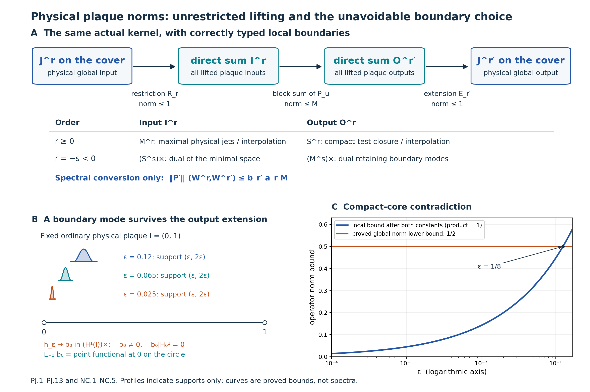

**Figure 6.8f.** Theorem 6.8i and Proposition 6.8j. Panel A shows the exact factorization (PJ.10), with contractive outer maps in the physical \(J\) norms; only the final conversion to the spectral \(W\) norms contributes \(b_{r'}a_r\). Its lower rows specify the positive and negative domains from (PJ.3) and (PJ.9). Panel B marks three actual support intervals \((\varepsilon,2\varepsilon)\), the regional boundary functional \(b_0\), and its nonzero global extension. Profiles are unit-height schematics of support, not the true \(\varepsilon^{-1}\) amplitudes. Panel C plots the proved upper bound \(C_{10}C_{01}\sqrt{2\varepsilon}\) for the displayed illustrative choice \(C_{10}C_{01}=1\), and the proved global lower bound \(1/2\); the crossing is at \(\varepsilon=1/8\). These are bounds, not computed spectra. The [full-size SVG](../figures/plaque-physical-two-realizations.svg), [complete generator](../reproduction/plaque-physical-two-realizations/draw_physical_plaque.py) and [reproduction instructions and component terms](../reproduction/plaque-physical-two-realizations/README.md) accompany the figure. Exercises 34–36 develop the completion, boundary and norm-class arguments.

### Why one interpolating plaque scale cannot serve both roles

A boundary convention can allow global inputs to restrict to a plaque, or allow plaque outputs to extend by zero. These requirements interact with fractional interpolation. The next result excludes one common Hilbert scale for both roles, even when compactly supported functions are not dense in its order-one space.

We use [Spectral Sobolev spaces and finite weights](#spectral-sobolev-spaces-and-finite-weights), particularly Lemma 6.7, and the complete reflection and boundary calculation in [Local bounds and boundary norms](#local-bounds-and-boundary-norms), Proposition 6.8a and equations (55)–(59). The argument concerns ordinary scalar Hilbert spaces. No Hilbert-module calculus, measurable-field decomposition or trace identity is needed.

Let \(M=\mathbb R/(4\mathbb Z)\), with metric \(dx^2\) and measure \(dx\), and let \(I=(0,1)\) be its ordinary coordinate arc. Put

\[
 B_M=(1-\partial_x^2)^{1/2},\qquad
 W^r(M)=\operatorname{Dom}B_M^r,\qquad
 \|u\|_{W^r(M)}=\|B_M^ru\|_2\quad(r\ge0).
 \tag{NI.1}
\]

At order one this is the physical norm \(\int_M(|u|^2+|u'|^2)\,dx\) under a square root. At negative order use its completed spectral anti-dual. The circle has the full rank-one foliation, trivial holonomy and the actual pair groupoid \(M\times M\).

Let \(X_1\) be a Hilbert space with a continuous injective linear map \(j:X_1\to L^2(I)\). Assume that every compact smooth function belongs to \(X_1\) and that \(j\) identifies it with that function. We identify \(X_1\) with its image when forming a compatible interpolation couple. No density of compact tests in \(X_1\) is assumed. Let \(Y\) be another Hilbert space continuously and injectively represented in \(L^2(I)\), containing the compact smooth functions, and assume that the identity on functions extends to a bounded map

\[
 [L^2(I),X_1]_{1/2}\longrightarrow Y,\qquad
 \|v\|_Y\le C_{\mathrm{int}}\|v\|_{[L^2(I),X_1]_{1/2}}.
 \tag{NI.2}
\]

In particular \(Y=[L^2(I),X_1]_{1/2}\) is allowed, as is an equivalent norm on that space.

For a smooth compact kernel \(k\in C_c^\infty(I\times I)\), write \(P_k\) for integration against \(k\) on the plaque, and \(P_k'\) for its kernel's physical zero extension to \(M\times M\). These are the source-defined plaque and lifted operators.

**Proposition 6.8k (the interpolation obstruction).** Under these hypotheses there cannot be two finite positive constants \(C_{10},C_{0h}\) such that every smooth compact kernel with the indicated bounded local actions satisfies both

\[
 \begin{aligned}
 \|P_k'\|_{W^1(M)\to L^2(M)}
 &\le C_{10}\|P_k\|_{X_1\to L^2(I)},\\
 \|P_k'\|_{L^2(M)\to W^{1/2}(M)}
 &\le C_{0h}\|P_k\|_{L^2(I)\to Y}.
 \end{aligned}
 \tag{NI.3}
\]

The conclusion uses one fixed ordinary chart and a compact foliated manifold. Each individual kernel is smooth and compactly supported in the chart. The compact set is allowed to vary with the kernel.

**Proof.** Write \(X^\times\) for the continuous anti-dual of a Hilbert space \(X\). Its elements are conjugate-linear functionals, and its norm is the supremum of their absolute values on the unit ball. For \(h\in C_c^\infty(I)\), let
\(f_h(v)=\int_Ih\,\overline{jv}\,dx\).
Fix \(g\in C_c^\infty(I)\) of \(L^2\) norm one, and take the rank-one kernel \(g(x)\overline{h(y)}\). Its local operator is \(v\mapsto g\,\overline{f_h(v)}\), so its norm is \(\|f_h\|_{X_1^\times}\). This is a defined finite norm because \(j\) is continuous. Globally the corresponding input functional is the physical zero extension \(\widetilde h\), regarded as an element of \(W^{-1}(M)=(W^1(M))^\times\). The rank-one norm formula therefore turns the first inequality in (NI.3) into

\[
 \|\widetilde h\|_{W^{-1}(M)}
 \le C_{10}\|f_h\|_{X_1^\times}
 \qquad(h\in C_c^\infty(I)).
 \tag{NI.4}
\]

We spell out the Hilbert duality used next. Every continuous anti-linear functional \(F\) on a Hilbert space is \(F(v)=\langle z,v\rangle\) for a unique \(z\), with \(\|F\|=\|z\|\), using an inner product linear in its first argument. Indeed its kernel is a closed subspace. Orthogonal projection onto a closed subspace is obtained by a minimum-distance sequence: the parallelogram identity makes that sequence Cauchy, and variation along real and imaginary multiples proves orthogonality of its limiting residual. If \(F\ne0\), take a nonzero residual \(w\) perpendicular to its kernel. Every vector is a multiple of \(w\) modulo that kernel, and \(z=F(w)w/\|w\|^2\) gives the asserted representation and norm. The zero functional is immediate. This also identifies the double anti-dual isometrically with the original space by \(v\mapsto(F\mapsto\overline{F(v)})\).

The pivot functionals \(f_h\), for compact smooth \(h\), are dense in \(X_1^\times\). To see this, give the anti-dual its Hilbert structure through the just-proved isometry. If its closed span were proper, a nonzero perpendicular vector would correspond to \(v\in X_1\) satisfying \(f_h(v)=0\) for every compact smooth \(h\). Such tests are dense in \(L^2(I)\): truncate an \(L^2\) function away from the endpoints, approximate it by step functions and mollify those functions inside the interval. Thus \(jv=0\). Injectivity of \(j\) implies \(v=0\), a contradiction. This density is a statement about pivot functionals in the anti-dual; it does not assert compact-test density in \(X_1\).

Consequently (NI.4) extends the well-defined rule \(f_h\mapsto\widetilde h\) to a bounded linear operator

\[
 K:X_1^\times\longrightarrow W^{-1}(M),
 \qquad \|K\|\le C_{10}.
 \tag{NI.5}
\]

Well-definedness follows already from (NI.4): a zero pivot functional has zero image. Take the anti-dual map of \(K\) and use the isometric double anti-dual identifications. We obtain \(R_1:W^1(M)\to X_1\), of norm at most \(C_{10}\), characterized by

\[
 f_h(R_1u)=Kf_h(u)=\int_Ih\,\overline{u|_I}\,dx,
 \qquad jR_1u=u|_I.
 \tag{NI.6}
\]

The last equality follows from the density of compact tests in \(L^2(I)\). Thus the input operator estimate forces actual physical restriction to be bounded into the proposed order-one space. There is no choice of an auxiliary boundary value or an arbitrary bidual extension in this conclusion.

Ordinary restriction \(R_0:L^2(M)\to L^2(I)\) has norm at most one. Equation (NI.6) says that \(R_0\) and \(R_1\) agree on their common domain after the continuous embeddings. They therefore form one compatible interpolation operator. Applying it to strip-analytic functions, and multiplying by \(C_{10}^{1/2-z}\) to equalize the two endpoint bounds, gives

\[
 R_{1/2}:W^{1/2}(M)\longrightarrow[L^2(I),X_1]_{1/2},
 \qquad
 \|R_{1/2}\|\le\sqrt{C_{10}}.
 \tag{NI.7}
\]

This uses the spectral interpolation identity of Lemma 6.7. If an endpoint bound is zero, the first inequality already contradicts a nonzero rank-one kernel; we may thus use the positive bound displayed here. The interpolation map agrees with restriction as an \(L^2\) function.

Keep the smooth cutoff from Proposition 6.8a: \(0\le\eta\le1\), \(\eta(t)=0\) for \(t\le1\), and \(\eta(t)=1\) for \(t\ge2\). For \(0<\varepsilon<1/8\), put

\[
 f_\varepsilon(t)=
 \eta(t/\varepsilon)\eta((1-t)/\varepsilon)
 \in C_c^\infty(I).
 \tag{NI.8}
\]

The same proposition proves that the intrinsic half-order norms of these functions are bounded uniformly in \(\varepsilon\), and supplies a uniformly bounded full-line extension. More explicitly, reflect \(f_\varepsilon\) evenly into \((-1,0)\) and \((1,2)\), multiply by one fixed compact smooth cutoff in \((-1,2)\) equal to one on \([0,1]\), and extend by zero. Its full-line \(H^{1/2}\) norm is uniformly bounded, by the complete reflection, cross-pair and cutoff estimates preceding Proposition 6.8a.

This extension also gives functions \(u_\varepsilon\in W^{1/2}(M)\) with

\[
 u_\varepsilon|_I=f_\varepsilon,\qquad
 \|u_\varepsilon\|_{W^{1/2}(M)}\le A_\eta<\infty,
 \tag{NI.9}
\]

where \(A_\eta\) is independent of \(\varepsilon\). Here is a direct check of the passage from the line to the circle. Choose a fixed smooth \(\psi\) equal to one on the extension cutoff's support, with support in an interval of length less than four. The periodization
\(\mathcal P_\psi v(x)=\sum_{k\in\mathbb Z}\psi(x+4k)v(x+4k)\)
has at most one nonzero summand at each point. Integration over a fundamental interval shows that it is bounded \(L^2(\mathbb R)\to L^2(M)\); the product rule shows that it is bounded \(H^1(\mathbb R)\to W^1(M)\). Lemma 6.7 and the same strip-analytic operator argument give boundedness at half order. Its bound is fixed by \(\psi\). Periodizing the reflected extension therefore proves (NI.9).

Equations (NI.2), (NI.7) and (NI.9) now imply

\[
 \|f_\varepsilon\|_Y
 \le C_{\mathrm{int}}\sqrt{C_{10}}A_\eta.
 \tag{NI.10}
\]

For the opposite direction use the kernel \(f_\varepsilon(x)\overline{g(y)}\), with the same unit \(L^2\) input \(g\). Its local \(L^2\)-to-\(Y\) norm is exactly \(\|f_\varepsilon\|_Y\). Its global norm is exactly the \(W^{1/2}(M)\) norm of the physical zero extension of \(f_\varepsilon\).

Let \(C_{\mathrm{loc}}\) be the norm of one fixed localization \(W^{1/2}(M)\to H^{1/2}(\mathbb R)\) equal to the ordinary coordinate identity on sections supported in \([0,1]\). Such a map is obtained by a fixed larger arc and cutoff, as in Proposition 6.8a. Equations (58)–(59) give the quantitative lower bound

\[
 \|\widetilde f_\varepsilon\|_{W^{1/2}(M)}
 \ge C_{\mathrm{loc}}^{-1}
 \left[\frac1\pi\log\frac{1+2\varepsilon}{6\varepsilon}\right]^{1/2}.
 \tag{NI.11}
\]

The norm on the left is on the circle; the localization map turns it into the full-line zero extension used in those equations. The logarithm diverges as \(\varepsilon\downarrow0\).

The second inequality in (NI.3), together with (NI.10)–(NI.11), would force

\[
 \left[\frac1\pi\log\frac{1+2\varepsilon}{6\varepsilon}\right]^{1/2}
 \le C_{\mathrm{loc}}C_{0h}C_{\mathrm{int}}\sqrt{C_{10}}A_\eta
 \qquad(0<\varepsilon<1/8),
 \tag{NI.12}
\]

which is impossible. Every rank-one kernel used in the proof has a bounded local action, so no estimate has been tested on an undefined operator norm. Each is smoothing and belongs to every finite pseudodifferential order class. This proves the proposition. \(\square\)

**Corollary (no single positive spectral plaque realization).** Let \(B\ge1\) be any positive self-adjoint operator on \(L^2(I)\), with \(C_c^\infty(I)\subset\operatorname{Dom}B\), and define the positive local scale by

\[
 X_r=\operatorname{Dom}B^r,\qquad
 \|v\|_{X_r}=\|B^rv\|_2\qquad(0\le r\le1).
 \tag{NI.13}
\]

Using this same scale for input and output cannot give the unrestricted plaque comparison for every pair of real orders. In fact the two pairs \((1,0)\) and \((0,1/2)\) already cannot both work.

**Proof.** The order-one embedding into \(L^2(I)\) is injective and contractive because \(B\ge1\). Lemma 6.7 gives \(X_{1/2}=[L^2(I),X_1]_{1/2}\) isometrically. Apply Proposition 6.8k with \(Y=X_{1/2}\) and \(C_{\mathrm{int}}=1\). The result does not assume that compact tests form a core for \(B\). Equivalent norms on these spaces give the same contradiction with altered finite constants. \(\square\)

**Example (the cosine scale and unrestricted inputs).** The complete orthonormal cosine system on \(I\) is \(e_0=1\), \(e_n=\sqrt2\cos(n\pi t)\), \(n\ge1\). Completeness follows by even reflection into the circle of length two and the ordinary Fourier basis. Give its coefficient space the norm

\[
 \|v\|_{X_r}^2
 =\sum_{n\ge0}(1+n^2\pi^2)^r|v_n|^2.
 \tag{NI.14}
\]

This is a positive spectral scale. At order one it is exactly unrestricted regional \(H^1(I)\). Indeed integration by parts against \(\sqrt2\sin(n\pi t)\), which vanishes at the endpoints, identifies its derivative coefficient with \(-n\pi v_n\). The complete sine basis then gives \(\|v'\|_2^2=\sum_{n\ge1}n^2\pi^2|v_n|^2\). Conversely weighted square-summability makes the cosine partial sums and their derivatives converge in \(L^2\), and testing against compact functions identifies the derivative of the limit. Thus the claimed domain and norm equality are exact.

Restriction \(W^1(M)\to X_1\) is contractive by integration over \(I\). For any bounded natural plaque kernel \(X_1\to L^2(I)\), its lifted operator factors through that restriction and isometric zero extension of the \(L^2\) output. Thus the first inequality in (NI.3) holds with \(C_{10}=1\). Nevertheless the second inequality fails for its spectral \(X_{1/2}\). Allowing nonzero boundary values at order one fixes the input endpoint; it does not also fix the fractional output endpoint in one interpolating scale.

The two local roles in [Physical plaque norms with two boundary realizations](#physical-plaque-norms-with-two-boundary-realizations), Theorem 6.8i, avoid this contradiction. Its positive input is the maximal realization, and its positive output is the minimal realization. At fractional orders their norms on compact functions need not agree. Its integer regional corollary does not assert an interpolating common scale at half order.

The global spectral definition in Connes's [*Sur la théorie non commutative de l'intégration*](https://omeka.ihes.fr/files/original/f1e66a7f4de4523e6937af152ff16092.pdf), IHÉS P/79/301, printed pp.8.9–8.10, is explicit. Proposition 6(a) uses a separate plaque operator norm without specifying its boundary realization in that passage. The later [*A survey of foliations and operator algebras*](https://alainconnes.org/wp-content/uploads/foliationsfine.pdf), p.26 of the author's electronic edition, describes the global metric-Laplacian spaces. Neither passage establishes that the plaque norm uses (NI.13). The corollary rigorously rules out that possible interpretation; it does not impute it to the source. An all-orders formulation must specify compatible input and output realizations or different hypotheses, such as the controlled-coordinate comparison of Theorem 6.8c. Theorem 6.8i supplies the complete unrestricted physical comparison with its two explicit roles.

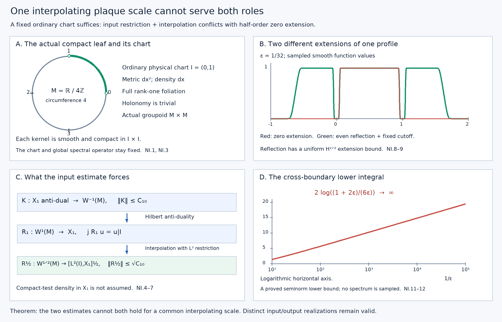

**Figure 6.8g.** Proposition 6.8k, equations (NI.4)–(NI.12). Panel A marks the fixed physical circle of circumference four and its ordinary chart \(I=(0,1)\); the two marked endpoints are omitted. Panel B numerically samples the exact smooth profile at \(\varepsilon=1/32\) and its even-reflected, fixed-cutoff extension; the displayed profiles are function values, not spectra. Panel C records the duality-forced restriction and its interpolation map, with their correct domains and bounds. Panel D plots the proved full-line cross-boundary lower integral \(2\log((1+2\varepsilon)/(6\varepsilon))\), against \(1/\varepsilon\). It is a lower bound for a seminorm integral, not a computed circle operator norm. The bounded local half-order norm follows from (NI.10); no numerical value for its unspecified finite constant is inferred. [Editable SVG](../figures/plaque-single-scale-obstruction.svg), [complete generator](../reproduction/plaque-single-scale-obstruction/reproduce.py) and [instructions and component terms](../reproduction/plaque-single-scale-obstruction/README.md) accompany the figure.

**Theorem 6.9 (weighted trace estimate).** Let \(\Lambda\) be locally finite with smooth positive modulus \(\delta\), and let \(\Phi\) be the normal random-operator weight associated to multiplication by \(\delta^{-1}\). For each \(s>p/2\), there is a finite constant \(C_s\) such that every measured equivariant bounded operator \(T\) extending boundedly from \(W^{-s}\) to \(W^s\) is in the linear domain of \(\Phi\), with

\[
|\Phi(T)|\le C_s\|T\|_{W^{-s},W^s}.
\]

In particular this proves the estimate with the stronger hypothesis \(s>p\). No invariance assumption \(\delta=1\) is needed for this estimate.

**Proof.** Put \(B_s=A^{-s/(2m)}\). First we show that \(\Phi(B_s^2)<\infty\), without assuming that this spectral operator is already in the foliation C*-algebra. Choose an elliptic compactly supported pseudodifferential operator \(P\) of order \(-s\), with principal symbol \(|\xi|^{-s}\) times the identity away from zero. A smooth positive metric on \(F\), a frequency cutoff near zero and the finite quantization atlas construct it. A parametrix \(Q\) of order \(s\) gives \(QP=1+R\), with \(R\) smoothing. For every \(v\in L^2\), the identity on distributions and the uniform Sobolev bounds give

\[
\|B_s v\|_2=\|v\|_{W^{-s}}
\le C\|v\|_{H^{-s}}
\le C'\bigl(\|Pv\|_2+\|Rv\|_2\bigr).
\]

Squaring this inequality gives an operator inequality
\(B_s^2\le C''(P^*P+R^*R)\).
The kernels of \(P,R\) have compact arrow support. Lemma 6.2 bounds their fibre squared Hilbert–Schmidt integrals because \(-s<-p/2\). The row bounds and Cauchy–Schwarz make their kernel integrals absolutely convergent on bounded sections of finite-measure support, as required for the convolution formula. The unit measure \(\mu=\Lambda_\nu\) is finite by transverse local finiteness, the smooth positive leafwise density and compactness of \(V\). On the compact kernel supports, \(\delta^{-1}\) is bounded. Corollary 9.4 of the random-operator weight lesson consequently gives

\[
\Phi(P^*P)+\Phi(R^*R)<\infty.
\]

Positivity and monotonicity of \(\Phi\) imply \(\Phi(B_s^2)<\infty\). For zero-dimensional leaves, the regular field has finite-rank fibres and the same conclusion follows directly by integrating its finite-dimensional identity over finite \(\mu\).

The spectral isometries of the two Sobolev spaces factor the given operator as
\(T=B_s S B_s\), where \(S\) is measured equivariant and
\(\|S\|=\|T\|_{W^{-s},W^s}\).
In particular \(B_s\) lies in the left square-integrable ideal \(\mathcal N_\Phi\), and so does \(SB_s\), since
\((SB_s)^*(SB_s)\le\|S\|^2B_s^2\).
Thus \(T\) lies in the linear domain \(\mathcal M_\Phi=\operatorname{span}\mathcal N_\Phi^*\mathcal N_\Phi\). The weight Cauchy–Schwarz inequality, obtained by applying positivity to \(\Phi((x+zy)^*(x+zy))\) and minimizing in \(z\in\mathbb C\), gives

\[
|\Phi(B_s S B_s)|
\le \Phi(B_s^2)^{1/2}
\Phi(B_s S^*S B_s)^{1/2}
\le\|S\|\Phi(B_s^2).
\]

Take \(C_s=\Phi(B_s^2)\). This argument uses positivity and Cauchy–Schwarz for the weight, rather than a trace interchange. \(\square\)

**Corollary 6.10 (finite heat weights and kernel dimensions).** For every \(t>0\),
\(\Phi(e^{-t\Delta})<\infty\).
The heat operator has a leafwise smooth measurable equivariant kernel. When \(\delta=1\), the kernel of each elliptic differential operator and every harmonic-form field have finite measured dimension under the Hausdorff standing assumptions of this subsection.

**Proof.** For any \(s>p/2\), spectral calculus gives

\[
\|e^{-t\Delta}\|_{W^{-s},W^s}
=\|A^{s/m}e^{-t\Delta}\|
\le\sup_{\lambda\ge0}(1+\lambda)^{s/m}e^{-t\lambda}<\infty.
\]

The same argument works for arbitrarily large Sobolev orders on either side. Theorem 6.9 proves finite heat weight. It also gives, for \(0<t\le1\), the bound \(\Phi(e^{-t\Delta})\le C'_s t^{-s/m}\), since \((1+\lambda)^r e^{-t\lambda}\le t^{-r}\sup_{q\ge0}(1+q)^r e^{-q}\) for \(r=s/m\).

Here is the kernel assertion in detail. Fourier inversion and Cauchy–Schwarz bound point evaluation of \(\partial^\alpha v\) on a fixed plaque by \(C\|v\|_{H^r}\) whenever \(r>p/2+|\alpha|\): the integral \(\int\langle\xi\rangle^{-2r}|\xi|^{2|\alpha|}\,d\xi\) is finite. Local cutoffs and Theorem 6.8 make these constants uniform on the covers. The point masses and all their derivatives are therefore continuous vectors in sufficiently negative Sobolev spaces. Apply the heat operator to these input point masses and evaluate at the output point. Its bounds between arbitrarily high negative and positive orders give a smooth kernel, with all leafwise derivatives uniformly bounded on smaller plaque boxes. Differentiation of the point masses in negative Sobolev norm follows by dominated convergence of their Fourier transforms, so this construction also proves joint smoothness in the two plaque variables.

Measurability follows by approximating the point masses in negative Sobolev norm by chart mollifiers. Their pairings with the measured heat field are measurable, and the just-proved bounds give pointwise limits for the kernel and each derivative. Equivariance follows from that of spectral calculus. For a fixed output point the kernel row is an \(L^2\) vector: evaluation after the bounded map \(e^{-t\Delta}:L^2\to H^r\), \(r>p/2\), is a bounded functional on \(L^2\), so its Riesz vector is that row. The analogous statement follows for columns by self-adjointness. Consequently the kernel formula is absolutely convergent on bounded sections with finite-measure support, by Cauchy–Schwarz. This verifies the kernel hypothesis of Corollary 9.4 rather than assuming it from formal smoothing notation.

Finally, \(P_{\ker\Delta}\le e^{-t\Delta}\). For \(\delta=1\), \(\Phi=\tau_\Lambda\), so this projection has finite trace. Apply this to \(D^*D\) and, separately, to the Hodge Laplacians. Their kernels are the fields already identified above. \(\square\)

Applying the same result to \(DD^*\) makes both heat traces in Theorem 2.1 finite for every positive time. Thus its measured-index identity now applies to all these elliptic differential operators in the Hausdorff calculus. A small-time asymptotic expansion and its local characteristic coefficient are additional assertions: the polynomial bound in Corollary 6.10 does not determine them.

### Constructing the small-time expansion

We now construct the expansion, while leaving the identification of its constant supertrace with a characteristic form for the next step. The hypotheses remain the compact Hausdorff longitudinal calculus, finite-rank bundles, and \(C^{\infty,0}\) coefficients. Write \(d=2m\) for the order of \(\Delta=D^*D\). In a unitary coordinate half-density frame its differential symbol is

\[
h(x,\xi,u)=\sum_{j=0}^d h_{d-j}(x,\xi,u),
\]

where each term is polynomial homogeneous of degree \(d-j\) in \(\xi\). Its leading term is Hermitian, with
\(h_d(x,\xi,u)\ge c|\xi|^d I\) on the fixed chart supports, for a common \(c>0\). This follows from \(h_d=\sigma_m(D)^*\sigma_m(D)\) and compactness of the unit cosphere bundle. Extend these coefficients to a larger Euclidean chart with bounded leafwise derivatives. The leading term can be extended with the same positivity by blending it, outside the smaller chart, with \(|\xi|^dI\); the local construction below uses only this positivity and agreement on the original chart.

**Lemma 6.11 (the local heat symbols).** There are symbols \(v_k(t,x,\xi,u)\), \(k\ge0\), for \(t>0\), such that

\[
v_k(t,x,\xi,u)=t^{k/d}v_k(1,x,t^{1/d}\xi,u).
\]

The profiles at time one are Schwartz functions of \(\xi\), uniformly with every leafwise derivative on compact chart supports, and continuous in \(u\). For \(v^{(N)}=\sum_{k=0}^N v_k\), the symbol of
\((\partial_t+\Delta)\operatorname{Op}(v^{(N)})\)
is a finite sum of terms scaling as
\(t^{-1+k/d}r_k(1,x,t^{1/d}\xi,u)\), with \(N+1\le k\le N+d\) and uniformly Schwartz profiles.

**Proof.** Set \(v_0=e^{-t h_d}\). For \(k>0\), solve the matrix equation

\[
\begin{split}
(\partial_t+h_d)v_k&=-g_k,\qquad v_k(0)=0,\\
g_k&=\sum_{\substack{j+|\alpha|+\ell=k\\j+|\alpha|>0}}
\frac1{\alpha!}
(\partial_\xi^\alpha h_{d-j})D_x^\alpha v_\ell,
\qquad D_x=\frac1i\partial_x,
\end{split}
\]

where \(0\le j\le d\), \(|\alpha|\le d-j\), and \(0\le\ell<k\). All sums are finite. Explicitly,

\[
v_k(t)=-\int_0^t e^{-(t-r)h_d}g_k(r)\,dr.
\]

This formula establishes existence by induction. Homogeneity of each \(h_{d-j}\) gives the asserted scaling: replacing \(\xi\) by \(\lambda\xi\) and time by \(\lambda^{-d}t\) gives the factor \(\lambda^{-k}\) in \(v_k\). The zero initial condition fixes the solution, so this scaling identity holds exactly.

For completeness the matrix exponentials need no commutativity assumption. Differentiating \(e^{-r h_d}\) in any coefficient variable inserts the derivative of \(h_d\) between two exponentials and integrates their time split; repeat this identity for higher derivatives. Positivity bounds each product by an exponential of \(-c r|\xi|^d\), times polynomial factors in \(|\xi|\) and the split times. In the displayed recursion, the exponential from the left factor supplies the remaining interval \(t-r\). Thus every term at \(t=1\), including its derivatives, is bounded by a polynomial in \(|\xi|\) times \(e^{-c'|\xi|^d}\), for a fixed \(c'>0\). At \(\xi=0\) these are smooth functions: the symbols of the differential operator are polynomials, the exponential is smooth, and the finite time integrals preserve smoothness. This proves the Schwartz assertion. The same bounds justify differentiation under the integrals and dominated convergence in the transverse parameter.

Finally the differential symbol product is exact, rather than only asymptotic:
\(h\# v=\sum_{j,\alpha}(\partial_\xi^\alpha h_{d-j})D_x^\alpha v/\alpha!\), with the ranges above. Each derivative beyond the polynomial degree is zero. The recursion cancels all terms of combined index \(k\le N\). The remaining indices are \(N+1\) through \(N+d\), and homogeneity gives their stated scaling. \(\square\)

**Theorem 6.12 (uniform heat and weighted expansion).** There are smooth leafwise endomorphism-valued diagonal densities \(b_k\), continuous transversely, such that for every integer \(K\ge0\) the heat kernel has the uniform diagonal expansion

\[
k_{e^{-t\Delta}}(x,x)
=\sum_{k=0}^K t^{(k-p)/d}b_k(x)
+O\bigl(t^{(K+1-p)/d}\bigr),
\qquad 0<t\le1.
\]

The error is uniform in \(x\) in the compact unit manifold, using the chosen density to express the kernel. For every locally finite transverse measure of smooth positive modulus \(\delta\),

\[
\Phi(e^{-t\Delta})
=\sum_{k=0}^K t^{(k-p)/d}\Lambda(\nu_{k-p})
+O\bigl(t^{(K+1-p)/d}\bigr),
\]

where \(\nu_{k-p}=s^*(\operatorname{tr}(b_k)\alpha)\), interpreted linearly for signed densities. Thus the expansion has all powers \(t^{j/(2m)}\) with \(j\ge-p\); coefficients that vanish are included.

**Proof.** Choose finitely many smaller coordinate boxes, a partition of unity \(\varphi_i\) subordinate to them, and larger boxes with cutoffs \(\psi_i=1\) on a neighbourhood of \(\operatorname{supp}\varphi_i\). Use Lemma 6.11 on the larger boxes, multiply the input by \(\varphi_i\) and the output by \(\psi_i\), lift the kernels, and sum. Denote the resulting compactly supported smoothing groupoid operator by \(R_N(t)\). For fixed \(t>0\), the Schwartz profiles make its kernel smooth with the required transverse continuity.

We first record bounds that justify the approximation on entire covers. A profile term of index \(k\) has, after frequency scaling, weighted symbol bound

\[
\sup_{x,\xi,u}\langle\xi\rangle^{2s}
\|\partial_x^\beta v_k(t,x,\xi,u)\|
\le C_{k,s,\beta}t^{(k-2s)/d}
\quad(s\ge0, 0<t\le1).
\]

Fourier transformation in the compact output coordinate and the Schur argument of Lemma 6.1 therefore bound this operator \(H^{-s}\to H^s\) by the same power, up to a fixed constant. Lifted sheet sums, cutoffs and Theorem 6.8 give the same bound for \(W^{-s}\to W^s\) on all covers.

Commutators with \(\psi_i\) contribute only off-diagonal kernels: their output is separated from the support of \(\varphi_i\) by a fixed coordinate distance. The inverse Fourier transform of a profile has the form
\(t^{(k-p)/d}\check v_k(1,x,(x-y)/t^{1/d},u)\), with the corresponding formula for derivatives, where \(\check v_k\) is the inverse Fourier transform of the profile. Schwartz decay and that fixed separation bound every such kernel derivative by \(C_L t^L\), for any prescribed \(L\). Their compact chart supports and Fourier-Schur estimates give the same rapid bound in every required Sobolev operator norm. Together with the residual indices in Lemma 6.11 this proves

\[
\|F_N(t)\|_{W^{-s},W^s}
\le C_{N,s}t^{-1+(N+1-2s)/d},
\qquad F_N=(\partial_t+\Delta)R_N.
\]

The constants are uniform in the unit and transverse parameters. No compactness of an individual cover is used.

Also \(R_N(t)\to1\) strongly on \(L^2\) as \(t\downarrow0\). For the principal term, \(e^{-t h_d}\to I\) on compactly supported smooth inputs by Fourier dominated convergence. Its order-zero symbol bounds give a uniform \(L^2\) bound. Each higher term has operator norm \(O(t^{k/d})\) and tends to zero. Finally \(\sum_i\psi_i\varphi_i=1\), so the local principal limits reconstruct the identity; density gives strong convergence on all of \(L^2\).

Differentiate \(e^{-(t-r)\Delta}R_N(r)v\) for a compact smooth input and integrate from \(\varepsilon\) to \(t\). These vectors are in the differential domain because the compact reduced support gives compact smooth output. Letting \(\varepsilon\downarrow0\), the strong initial limit and the integrable residual bound at \(s=0\) give the exact Duhamel identity

\[
R_N(t)-e^{-t\Delta}
=\int_0^t e^{-(t-r)\Delta}F_N(r)\,dr.
\]

Spectral calculus makes the heat operator contractive on \(W^s\). If \(N+1>2s\), the residual bound is integrable even between \(W^{-s}\) and \(W^s\). The same identity and density consequently give

\[
\|R_N(t)-e^{-t\Delta}\|_{W^{-s},W^s}
\le C'_{N,s}t^{(N+1-2s)/d}.
\]

Fix \(s>p/2\). The point-evaluation bound used in Corollary 6.10 turns this operator estimate into the same uniform diagonal-kernel bound, since input point masses have uniformly bounded \(W^{-s}\) norm and output evaluation has uniformly bounded norm on \(W^s\). Theorem 6.9 also turns it into the same bound for the difference of the weights. Both uses apply to a signed error because that theorem proves membership in the linear weight domain.

In coordinates the diagonal of the local approximation is exactly

\[
(2\pi)^{-p}\varphi_i(x)
\sum_{k=0}^N t^{(k-p)/d}
\int_{\mathbb R^p}v_{i,k}(1,x,\eta,u)\,d\eta,
\]

with the coordinate density and bundle-frame conversions understood. Here \(\psi_i=1\) on the input support. All profile integrals converge with their leafwise derivatives and depend continuously on \(u\). Sum them to define \(b_k\). To obtain the assertion through \(K\), choose \(N\ge K\) so large that \(N\ge K+2s-p\). The operator error has order at least \(t^{(K+1-p)/d}\); the finitely many approximation terms with \(k>K\) have this order or higher. This proves the uniform diagonal expansion. Its coefficients are independent of the atlas, cutoffs and extensions, since asymptotic coefficients with successively increasing powers are unique for the actual diagonal heat kernel. This also verifies their intrinsic density transformation and their Hermitian character.

For the weight, each \(R_N(t)\) is a compact smooth arrow kernel and
\(\Phi(R_N(t))=\int_V\operatorname{tr}k_{R_N(t)}(x,x)\,d\mu(x)\).
The factorization and polarization proof of Theorem 7.10 of [Transverse measures of foliations](transverse-measures-of-foliations.md#section-7) applies in finite bundle frames component by component: the Fourier factorization puts both factors in the square-integrable weight ideal; polarized Corollary 9.4 and the inversion identity convert their weighted product integral to its unit diagonal. A finite chart partition proves the formula for the entire bundle kernel. Thus it applies to these approximants without presuming a diagonal formula for the heat kernel without compact arrow support.

Integrating their explicit diagonals gives the stated coefficients, because \(\mu=\Lambda_{s^*\alpha}\). Each positive and negative part is integrable: \(b_k\) is bounded on compact \(V\), \(\alpha\) is smooth positive, and \(\Lambda\) is locally finite. The weight estimate for \(R_N-e^{-t\Delta}\) completes the expansion with the claimed remainder. This step remains valid for \(\delta\ne1\); only the kernel-squared formula, inversion, positivity and weight Cauchy–Schwarz have been used. \(\square\)

**Corollary 6.13 (the measured constant term).** If \(\delta=1\), the measured kernel-dimension index satisfies

\[
\operatorname{Ind}_\Lambda(D)
=\Lambda\bigl(\nu_0(D^*D)-\nu_0(DD^*)\bigr).
\]

**Proof.** Corollary 6.10 gives finite heat traces for both operators. Theorem 2.1 makes their difference equal to the difference of their finite kernel dimensions. Apply Theorem 6.12 through the constant term, which has index \(k=p\) in its nonnegative-index notation. The next term has positive exponent, so Corollary 2.2 cancels all negative powers and identifies the constant term. This proves the formula without identifying that local density with a characteristic class. \(\square\)

The leading coefficient is already explicit:
\(b_0(x)=(2\pi)^{-p}\int e^{-h_d(x,\eta)}\,d\eta\)
in the coordinate half-density frame. For a scalar Laplacian in orthonormal coordinates, \(h_2=|\eta|^2\), and it is \((4\pi)^{-p/2}\). The coefficient producing the index is a much more delicate cancellation between the two operators; its geometric identification remains to prove.

The analytic assertions needed for the general theorem are the following:

1. A parameter-continuous longitudinal pseudodifferential calculus with uniform support and uniform order estimates on the holonomy covers. Lemmas 6.1–6.2 establish this for the Hausdorff compact-support calculus above; Proposition 6.21 proves the non-Hausdorff extension.
2. Elliptic parametrices, all-real-order Sobolev realizations, and equality of minimal and maximal differential-operator domains. Theorems 6.3, 6.5 and 6.8 establish these assertions on covers. [The Hilbert-module lesson, Section 6](hilbert-modules-and-fields-on-the-leaf-space.md#section-6) constructs the continuous Sobolev modules, compact inclusions, elliptic module maps and the analytic symbol-class index.
3. Heat kernels with uniform local expansions and trace-integrable remainders for every locally finite transverse measure. Corollary 6.10 and Theorem 6.12 establish these assertions, including nontrivial smooth modulus; Proposition 6.21 extends them to the non-Hausdorff calculus. For an operator of order \(m\), the powers in the individual expansion are \(t^{j/(2m)}\), beginning with \(j=-p\). Corollary 6.13 identifies the constant difference with the measured index when the measure is invariant.
4. Identification of the constant supertrace density with the characteristic form of the symbol. Theorem 6.18 and Lemma 6.19 prove that for de Rham operators it is the Euler form. Theorem 6.26 proves the spin-c Dirac expression in \(4\), with its curvature sign fixed explicitly. Theorems 6.29–6.37 supply the Thom reduction, arbitrary-symbol comparison and exact cotangent sign.

The heat construction and Corollary 6.13 now identify the measured index with its constant local density. The de Rham calculation below identifies that density as the Euler form. Theorems 6.26 and 6.33 identify the more general differential-symbol coefficient and characteristic pairing. The current is closed by the first lesson, so changing characteristic representatives by exact forms does not change the answer. Proposition 6.28 supplies the analytic symbol-class map, and the Thom reductions below compute its characteristic pairing.

### The ideal of forms vanishing along leaves

There is a geometric simplification of the Todd class that can be proved independently of the local heat calculation. Assume here that the foliation is smooth transversely, so its ordinary de Rham classes on \(V\) are defined. Let \(\mathcal J\) be the ideal of differential forms whose restriction to \(F\) is zero, and let \(J\subset H^*(V;\mathbb R)\) consist of classes represented by closed forms in \(\mathcal J\). Involutivity of \(F\) makes \(d\mathcal J\subset\mathcal J\): in the formula for \(d\omega\) on leafwise vectors, both the coefficient derivatives and the bracket terms restrict to zero. Wedge multiplication likewise preserves the vanishing restriction. Thus \(J\) is an ideal.

**Proposition 6.14 (annihilation and the normal Todd factor).** For every \(\omega\in J\), its cap product with the Ruelle–Sullivan class is zero. Moreover

\[
\operatorname{Td}(TV\otimes\mathbb C)
-\operatorname{Td}(F\otimes\mathbb C)\in J.
\]

**Proof.** Choose a closed representative \(\omega_0\) restricting to zero on \(F\). Multiplication of the closed foliation current by this form represents the cap product: it evaluates a complementary test form \(\eta\) as \(C_\Lambda(\omega_0\wedge\eta)\). That expression is zero for every \(\eta\), since the entire wedge restricts to zero on each oriented plaque. The product current is therefore identically zero, proving the full cap-product assertion, including degrees below \(p\).

The normal bundle \(\tau=TV/F\) has the Bott connection along leaves:

\[
\nabla_X^{\rm Bott}[Y]=[X,Y]\bmod F.
\]

It is well defined because changing \(Y\) by a leafwise vector changes \([X,Y]\) by a leafwise vector. The bracket product rule makes it a partial connection. Jacobi's identity gives zero curvature on two leafwise vectors. Choose a splitting of \(TV\) and an arbitrary ordinary connection \(\nabla^0\) on \(\tau\). Add to it the difference between the Bott and \(\nabla^0\) connections on the leafwise projection of a tangent vector. This is an ordinary connection \(\nabla\) whose leafwise part is Bott, so its curvature \(R\) restricts to zero on \(F\times F\).

The Todd form of its complexification is
\(\det f(R/(2\pi i))\), where \(f(z)=z/(1-e^{-z})=1+z/2+\cdots\), truncated at the dimension of \(V\). Its constant term is one, and all its positive-degree terms restrict to zero on \(F\). These are closed forms: the Bianchi identity \(\nabla R=0\) gives \(d\operatorname{tr}(R^j)=0\), and invariant characteristic polynomials are polynomials in these traces. They represent the characteristic classes independently of the chosen connection. Indeed, along \(\nabla_t=\nabla_0+tB\), differentiation of \(\operatorname{tr}(R_t^j)\) gives
\(j\,d\operatorname{tr}(B R_t^{j-1})\); integration from zero to one proves independence, and the product rule gives the same conclusion for each characteristic polynomial. Thus \(\operatorname{Td}(\tau\otimes\mathbb C)-1\in J\).

A splitting identifies \(TV\) with \(F\oplus\tau\). Use a direct-sum connection, whose curvature is block diagonal. The determinant defining the Todd form factors, giving
\(\operatorname{Td}(TV\otimes\mathbb C)=\operatorname{Td}(F\otimes\mathbb C)\operatorname{Td}(\tau\otimes\mathbb C)\).
Subtract the first factor and use the ideal property of \(J\). This proves the assertion. It concerns leafwise restriction, without forcing the normal bundle's ordinary characteristic classes to vanish on \(V\). \(\square\)

### The surface coefficient

For surface leaves the first Laplace-type coefficient is enough to compute the Euler index. We derive it with its signs and density normalization. The curvature convention is
\(R(X,Y)Z=\nabla_X\nabla_Y Z-\nabla_Y\nabla_X Z-\nabla_{[X,Y]}Z\), so a round sphere has positive \(\langle R(X,Y)Y,X\rangle\).

**Lemma 6.15 (the first Laplace-type coefficient).** Let \(L=\nabla^*\nabla+Q\) be a nonnegative Laplace-type operator on a Hermitian bundle, using the Riemannian leafwise density. In the diagonal expansion of its heat kernel,

\[
k_{e^{-tL}}(x,x)
=(4\pi t)^{-p/2}
\left(I+t\left(\frac{\operatorname{Scal}(x)}6 I-Q(x)\right)+O(t^2)\right).
\]

The error is uniform under the compact \(C^{\infty,0}\) standing assumptions. Scalar curvature uses the stated convention.

**Proof.** The preceding Sobolev and heat arguments apply to any nonnegative elliptic differential operator with positive principal symbol, with \(1+L\) defining the scale; they used \(D^*D\) to guarantee these properties. Here the principal symbol is \(|\xi|^2I\). Essential self-adjointness follows from Theorem 6.5, and the same integer-power, interpolation and parametrix arguments apply.

Work in a common small normal-coordinate ball about \(y\). Such a radius can be chosen uniformly: shrink the finite plaque atlas, use the uniform smooth coefficient bounds and the inverse function theorem for the geodesic equations, and keep geodesics inside the larger boxes. The corresponding construction lifts to each cover. Write \(r=\operatorname{dist}(x,y)\) and \(j(x,y)\) for the volume density in normal coordinates centered at \(y\), so \(j(y,y)=1\). Consider the local ansatz

\[
(4\pi t)^{-p/2}e^{-r^2/(4t)}
\sum_{n=0}^N t^n U_n(x,y).
\]

In polar normal coordinates the scalar radial Laplacian is
\(\partial_r^2+((p-1)/r+\partial_r\log j)\partial_r\).
Apply \(\partial_t+L_x\) to the ansatz using the connection product rule. The terms of order \(t^{-2}\) cancel, and the remaining coefficient at order \(t^{n-1}\) is

\[
\left(n+r\nabla_{\partial_r}+
\frac r2\partial_r\log j\right)U_n+L_x U_{n-1},
\]

with the last term omitted when \(n=0\). Consequently
\(U_0=j^{-1/2}\tau_{y\to x}\), where \(\tau\) is parallel transport along the radial geodesic. For \(n\ge1\), the transport equations have the explicit smooth solution along a ray

\[
U_n(x,y)=-U_0(x,y)\int_0^1 \rho^{n-1}
U_0(\rho x,y)^{-1}(L U_{n-1})(\rho x,y)\,d\rho,
\]

where \(x\) denotes its normal-coordinate vector and the bundle compositions use radial transport. This integral proves smoothness at the origin and all uniform derivative bounds by induction. On the diagonal it gives
\(U_1(y,y)=-(L_x U_0)(y,y)\).

We justify that these transport coefficients belong to the actual heat kernel. Cut off the local ansatz inside the common normal neighbourhood and patch in the input variable with a finite partition of unity. Its initial limit is the identity, by the Gaussian approximate-identity calculation and \(U_0(y,y)=I\). The transport equations leave a residual equal, near the diagonal, to the Gaussian times \(t^N L U_N\). Derivatives of total order \(a\) bound its kernel by
\(C_a t^{N-p/2-a/2}e^{-r^2/(8t)}\); polynomial factors from differentiating the Gaussian have been absorbed by halving its decay exponent. Cutoff derivatives are supported at a fixed positive distance from the diagonal and have arbitrarily rapid small-time decay.

Integrating these bounds in either kernel variable gives \(C_a t^{N-a/2}\), because the Gaussian volume integral is \(O(t^{p/2})\). For an even integer \(s>p/2\), conjugating by the coordinate differential Sobolev weights of order \(s\) on both sides uses derivatives of total order at most \(2s\). Integration by parts in the input variable and the Schur estimate therefore bound the residual \(W^{-s}\to W^s\) by \(C t^{N-s}\). Localized charts and Theorem 6.8 compare these norms uniformly on the covers. Choose \(N\) large. The same Duhamel argument as in Theorem 6.12 bounds the approximation error by \(C t^{N+1-s}\) in that operator norm and hence on the diagonal. Choosing \(N+1-s\ge2-p/2\), and discarding the finite terms with \(n\ge2\), proves the asserted diagonal error. Thus \(U_1(y,y)\) is the actual first coefficient.

It remains to compute \(L U_0\) at the origin. The normal-coordinate density has expansion

\[
j(x,y)=1-\frac16\operatorname{Ric}_{ij}(y)x^ix^j+O(|x|^3).
\]

One derivation fixes a unit radial vector \(v\) and varies the geodesic direction. The variation fields obey \(J''+R(J,v)v=0\), by commuting the two covariant derivatives of the geodesic variation. Initial data \(J(0)=0\), \(J'(0)=e_i\) give
\(J(r)=r e_i-r^3R(e_i,v)v/6+O(r^4)\).
Taking the determinant of the differential of the exponential map gives
\(j(rv,y)=1-r^2\operatorname{Ric}(v,v)/6+O(r^3)\), which is exactly the displayed quadratic term for every direction.

Use the frame obtained by radial parallel transport from \(y\). Its connection matrices satisfy \(x^iA_i(x)=0\). The constant and quadratic terms of this identity imply \(A_i(0)=0\) and \(\sum_i\partial_i A_i(0)=0\). In this frame \(\tau_{y\to x}=I\), and
\(j^{-1/2}=1+\operatorname{Ric}_{ij}x^ix^j/12+O(|x|^3)\).
At the origin the positive connection Laplacian therefore gives
\(\nabla^*\nabla U_0=-\operatorname{Scal} I/6\): Christoffel symbols vanish there, and the connection-divergence term just computed is zero. The potential contributes \(Q\). Hence
\(U_1(y,y)=\operatorname{Scal} I/6-Q\), proving the formula. \(\square\)

**Corollary 6.16 (Euler and curvature for surface leaves).** For compact oriented surface foliations in the Hausdorff standing assumptions, with locally finite invariant transverse measure,

\[
\beta_0-\beta_1+\beta_2
=\frac1{2\pi}\int_V K\,d\mu
=\langle e(F),[C_\Lambda]\rangle.
\]

If compact leaves with finite holonomy are negligible, this number is nonpositive, and equals \(-\beta_1\).

**Proof.** In degree zero the Hodge Laplacian is the scalar positive Laplacian, so \(Q_0=0\). In degree two the Hodge star intertwines it with the degree-zero operator; the volume form is parallel, so \(Q_2=0\). In degree one the Weitzenböck expression is
\(\Delta_1=\nabla^*\nabla+\operatorname{Ric}\).
To check the sign, use \((d\omega)_{ji}=\nabla_j\omega_i-\nabla_i\omega_j\) and \(d^*\omega=-\nabla^j\omega_j\). Their sum gives the rough positive Laplacian plus
\(\nabla^j\nabla_i\omega_j-\nabla_i\nabla^j\omega_j\), which is \(\operatorname{Ric}_i{}^k\omega_k\) with our curvature convention.

Lemma 6.15 gives zero for the leading supertrace, since the ranks in degrees zero, one and two are \(1,2,1\). The common scalar-curvature part of the first coefficient cancels for the same reason. The remaining supertrace is

\[
(4\pi)^{-1}
\bigl(-\operatorname{tr}Q_0+
\operatorname{tr}Q_1-\operatorname{tr}Q_2\bigr)
=\frac{\operatorname{Scal}}{4\pi}
=\frac K{2\pi}.
\]

Apply Corollary 6.13 to \(d+d^*\) from even to odd forms. Its kernel dimensions are \(\beta_0+\beta_2\) and \(\beta_1\), and are finite by Corollary 6.10. This proves the first equality.

For the second, extend the leafwise Levi–Civita connection on \(F\) to a metric connection on \(F\) along all of \(TV\), using a splitting and the difference from any metric connection. The Euler form of this oriented rank-two bundle is its \(SO(2)\) curvature divided by \(2\pi\). Its leafwise restriction is \(K\alpha/(2\pi)\), with the sign fixed by positive curvature on an oriented round sphere. The foliation current integrates precisely this restriction. The Euler form is closed and its class is independent of the metric connection by the transgression argument, so this is the pairing with \(e(F)\). Finally Lemma 5.1 and Hodge star give \(\beta_0=\beta_2=0\) under the stated negligibility condition, leaving \(-\beta_1\le0\). \(\square\)

This proves the surface instance of (3). The following filtration argument proves its all-dimensional Euler version; the general symbol characteristic calculation is supplied by the subsequent Thom and circle-product arguments.

### The Euler coefficient in every dimension

The surface calculation extends through an algebraic cancellation on exterior forms. The heat transport construction above is used again; its filtration isolates the coefficient that survives supertrace.

**Lemma 6.17 (the two Clifford actions).** On the exterior algebra of an oriented Euclidean \(p\)-space, let \(\epsilon_i\) be exterior multiplication by \(e^i\), let \(\iota_i\) be contraction by \(e_i\), and put

\[
c_i=\epsilon_i-\iota_i,\qquad
\widehat c_i=\epsilon_i+\iota_i.
\]

They satisfy

\[
c_i c_j+c_j c_i=-2\delta_{ij},\qquad
\widehat c_i\widehat c_j+\widehat c_j\widehat c_i=2\delta_{ij},\qquad
c_i\widehat c_j+\widehat c_j c_i=0.
\]

The words \(c_I\widehat c_J\), with increasing index sets \(I,J\), form a basis of the full endomorphism algebra. Give such a word degree \(|I|+|J|\); the filtration by at most that degree is multiplicative. Its associated graded algebra is the exterior algebra on symbols \(\xi_1,\ldots,\xi_p,\eta_1,\ldots,\eta_p\). Supertrace vanishes on every basis word except the word containing all \(2p\) generators, and

\[
\operatorname{Str}(c_1\cdots c_p\widehat c_1\cdots\widehat c_p)
=(-1)^{p(p+1)/2}2^p.
\]

**Proof.** The exterior multiplication and contraction relations prove the displayed identities. Reordering any word with them leaves a linear combination of the stated increasing words, with contractions lowering degree by two. These words span the full endomorphism algebra: \(\epsilon_i,\iota_i\) are their linear combinations, and
\(\prod_i(1-\epsilon_i\iota_i)\) is the projection onto the scalar form. Composing this projection with exterior products and contractions produces all matrix units between the standard exterior basis vectors, with nonzero signs. There are \(2^{2p}\) stated words, equal to the dimension of the endomorphism algebra, so they are a basis. Replacing their contraction relations by zero gives the associated graded exterior algebra.

An odd word has zero supertrace because it exchanges the even and odd summands. If an even word omits a generator, conjugation by that invertible odd generator leaves the word unchanged: it anticommutes with each of the even number of generators present. But odd conjugation changes the sign of supertrace, so its supertrace is zero. For the full word, move each \(\widehat c_i\) next to \(c_i\); this gives the sign \((-1)^{p(p-1)/2}\). Now
\(c_i\widehat c_i=2\epsilon_i\iota_i-1\).
On a basis form with index set \(I\), the product of these \(p\) even operators has eigenvalue \((-1)^{p-|I|}\). Multiplication by the supertrace sign \((-1)^{|I|}\) and summation over all \(2^p\) forms gives \((-1)^p2^p\). Combining the signs proves the formula. \(\square\)

Let \(R_{ijab}=\langle R(e_i,e_j)e_b,e_a\rangle\), with the curvature convention of Lemma 6.15, and let

\[
\Omega_{ab}=\frac12\sum_{i,j}R_{ijab}e^i\wedge e^j
\]

be the real skew curvature matrix. For an even rank \(p=2\ell\), our Pfaffian convention is

\[
\operatorname{Pf}(\Omega)
=[\eta_1\cdots\eta_p]\,
\exp\left(\frac12\sum_{a,b}\Omega_{ab}\eta_a\eta_b\right).
\]

The auxiliary \(\eta\)'s anticommute; here they commute with the even-degree curvature forms. This convention gives \(\operatorname{Pf}(\Omega)=K\alpha\) for an oriented surface of Gaussian curvature \(K\).

**Theorem 6.18 (local Euler supertrace).** For the Hodge Laplacian on all exterior forms and \(p=2\ell\),

\[
\operatorname{Str}k_{e^{-t\Delta}}(x,x)\,\alpha(x)
=\operatorname{Pf}\left(\frac{\Omega(x)}{2\pi}\right)+O(t)\alpha(x).
\]

All negative powers in the local supertrace expansion vanish. The remainder is uniform under the compact Hausdorff standing assumptions, including coefficients smooth along leaves and continuous transversely. In odd dimension the supertrace is identically zero.

**Proof.** The de Rham operator is \(d+d^*=\sum_i c_i\nabla_{e_i}\). At a point choose an orthonormal frame with vanishing connection coefficients. Squaring this expression, pairing the symmetric derivatives with the Clifford relations and the antisymmetric derivatives with the curvature commutator, gives

\[
\Delta=\nabla^*\nabla+Q,\qquad
Q=\frac12\sum_{i,j}c_i c_j R^\Lambda_{ij}.
\]

This identity is tensorial, hence holds everywhere. Curvature on the exterior bundle is

\[
R^\Lambda_{ij}=\sum_{a,b}R_{ijab}\epsilon_a\iota_b
=\frac14\sum_{a,b}R_{ijab}
(\widehat c_a\widehat c_b-c_a c_b).
\]

The first formula follows by applying the curvature to covectors and then extending by the derivation rule to their exterior products. The second follows from the relations in Lemma 6.17 and skew symmetry in \(a,b\). Thus \(Q\) has Clifford degree at most four. Its degree-four symbol is

\[
q=\frac18\sum_{i,j,a,b}R_{ijab}\xi_i\xi_j\eta_a\eta_b
=\frac14\sum_{a,b}\Omega_{ab}(\xi)\eta_a\eta_b.
\]

The other possible term has four \(\xi\)'s. Its coefficient is the full alternation of the curvature tensor, which is zero by the first Bianchi identity. This is exactly where the Levi–Civita curvature symmetry is used.

Return to the transport coefficients \(U_n(x,y)\) of Lemma 6.15, in the exterior frame obtained by radial parallel transport from \(y\). The generators of Lemma 6.17 are constant matrices in this frame. The connection matrices have Clifford degree at most two, since they are induced by skew matrices on tangent vectors. The potential has degree at most four. Moreover \(U_0=j^{-1/2}I\) has degree zero. The transport integral therefore proves inductively that \(U_n\), and all its coefficient derivatives, have degree at most \(4n\): the connection Laplacian increases degree by at most four, the potential by at most four, and the scalar transport factors preserve degree.

At the diagonal the connection matrices themselves vanish. In \(L U_{n-1}\), ordinary second derivatives preserve degree, first connection terms and derivatives of a connection matrix increase it by at most two, and the product of two connection matrices is zero there. Consequently the degree-\(4n\) component at the diagonal comes solely from the degree-four potential acting on the top component of \(U_{n-1}\). The transport equation at the origin is \(nU_n(y,y)=-L U_{n-1}(y,y)\), so

\[
\sigma_{4n}(U_n(y,y))=\frac{(-q(y))^n}{n!}.
\]

Here the symbol is zero if that degree exceeds the exterior-algebra dimension. In particular for \(n<\ell\), its entire degree bound is below \(2p\), so Lemma 6.17 makes \(\operatorname{Str}U_n=0\) on the diagonal. For \(n=\ell\), only the displayed top symbol contributes. The full-word supertrace sign is \((-1)^\ell2^p\), and the minus sign in \((-q)^\ell\) cancels it. It follows that

\[
\begin{split}
\operatorname{Str}U_\ell(y,y)
&=2^p[\xi_1\cdots\xi_p\eta_1\cdots\eta_p]\frac{q^\ell}{\ell!}\\
&=2^{p-\ell}[\xi_1\cdots\xi_p]\operatorname{Pf}(\Omega(\xi))
=2^\ell\frac{\operatorname{Pf}(\Omega)}{\alpha}.
\end{split}
\]

The middle equality follows from the defining Pfaffian exponential: \(q\) is one half of its quadratic generator in the \(\eta\)'s. The Gaussian prefactor contributes \((4\pi)^{-\ell}\), and hence the constant density is \((2\pi)^{-\ell}\operatorname{Pf}(\Omega)\). The transport construction, with arbitrarily high truncation and the uniform Duhamel estimate already proved, leaves \(O(t)\) after this term. Thus the algebraic computation is a computation of the actual heat coefficient.

For odd \(p\), the Hodge star intertwines the Laplacians in degrees \(j\) and \(p-j\), whose parity signs are opposite. Their kernel traces cancel pointwise for every \(t>0\). This proves the odd assertion. \(\square\)

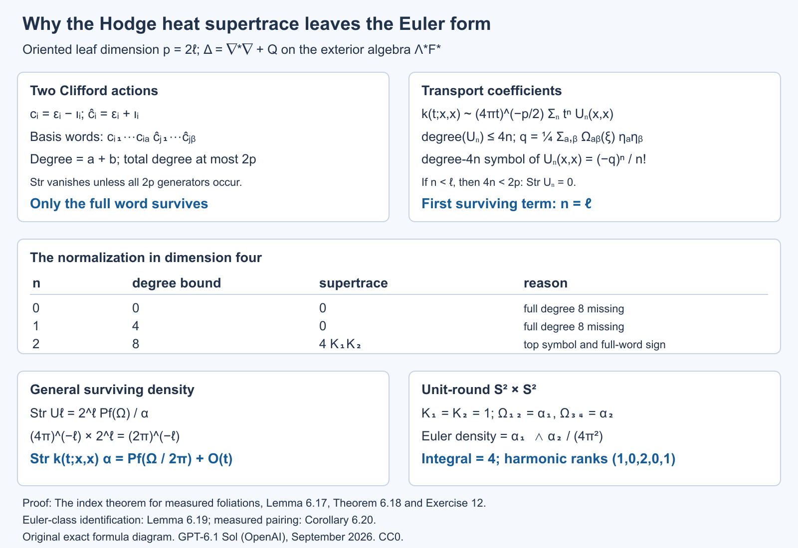

Open full-size figure · Open editable SVG

*Figure 2. The algebraic mechanism of Theorem 6.18. The degree is the number of Clifford generators in Lemma 6.17, not differential-form degree. The dimension-four table uses the product of two surfaces with curvatures \(K_1,K_2\), so \(\operatorname{Pf}(\Omega)=K_1K_2\alpha\). The unit-round product in Exercise 12 checks both the local density and its integral. Theorem 6.18 supplies the uniform \(O(t)\) remainder; Lemma 6.19 identifies the surviving form as the Euler class.*

We next verify that the Pfaffian used here represents the usual Euler class, with the orientation and normalization already fixed. This makes the geometric pairing an identified class, rather than a name assigned to the heat coefficient.

**Lemma 6.19 (the Pfaffian and the Euler class).** For an oriented real rank-\(2\ell\) metric bundle \(E\) with metric connection and curvature matrix \(\Omega\),
\(\operatorname{Pf}(\Omega/(2\pi))\) represents its real Euler class. For odd rank its real Euler class is zero.

**Proof.** Put \(p=2\ell\) and use fibre coordinates \(x_i\) in an oriented orthonormal frame. Write \(Dx_i\) for their covariant differentials on the total space. Introduce auxiliary odd variables \(\eta_i\) that anticommute both with one another and with odd ordinary forms. Let \(\mathcal B\) extract the coefficient with the ordered variables \(\eta_1\cdots\eta_p\) on the right. Define the rapidly decreasing \(p\)-form

\[
U=(-1)^\ell(2\pi)^{-\ell}e^{-|x|^2/2}
\mathcal B\exp\left(
\sum_i Dx_i\eta_i-
\frac12\sum_{i,j}\Omega_{ij}\eta_i\eta_j
\right).
\]

The expression is independent of the chosen oriented orthonormal frame: all its contractions are invariant, and the coefficient extraction changes by the determinant, which is one. Every term has total ordinary form degree \(p\).

We check closedness explicitly. Take the covariant exterior derivative, which agrees with ordinary differentiation after the invariant coefficient extraction. Curvature and Bianchi give \(D(Dx)=\Omega x\), \(D\Omega=0\). With \(S=\sum Dx_i\eta_i-\frac12\sum\Omega_{ij}\eta_i\eta_j\), the even total degree of its summands permits differentiation of its exponential. The ordinary differential of the Gaussian and this exponential is

\[
D(e^{-|x|^2/2}e^S)
=e^{-|x|^2/2}
\left(-\sum_i x_i Dx_i+\sum_i(\Omega x)_i\eta_i\right)e^S.
\]

The left odd derivative in \(\eta_i\) gives
\(\partial_{\eta_i}S=-Dx_i-\sum_j\Omega_{ij}\eta_j\): the first minus sign comes from passing the ordinary odd form \(Dx_i\). Skew symmetry of \(\Omega\) shows that the parenthesis in the previous display is \(\sum_i x_i\partial_{\eta_i}S\). Its coefficient extraction is zero, because an odd-variable derivative has no top auxiliary coefficient. Thus \(dU=0\).

On a fibre, \(Dx_i=dx_i\) and the curvature term is absent. The coefficient of all auxiliary variables in \(\exp(\sum dx_i\eta_i)\) is \((-1)^\ell dx_1\wedge\cdots\wedge dx_p\). The prefactor cancels this sign, and the Gaussian integral gives \(\int_{E_y}U=1\). Rapid decay can be converted to compact vertical support: pull back by the radial diffeomorphism from the open unit ball to the full fibre, \(x=y/\sqrt{1-|y|^2}\), and extend by zero outside the ball. The Gaussian beats every derivative of this diffeomorphism at the boundary, so the extension is smooth and closed, has fibre integral one, and has the same zero-section pullback.

This form represents the oriented Thom class. To see the uniqueness implicit in that statement, on one real fibre the compactly supported de Rham complex contracts to its integral in top degree. In one dimension, for a compactly supported one-form \(f(x)dx\), choose a smooth compact bump \(\rho\) of integral one and set
\(H(fdx)(x)=\int_{-\infty}^x(f(t)-\rho(t)\int f)\,dt\).
Then \(dH+Hd\) is the identity minus the projection onto \(\rho dx\) times the integral. Tensoring these contractions with the usual graded signs gives the corresponding result in \(\mathbb R^p\). Local bundle trivializations and a partition-of-unity Mayer–Vietoris argument consequently identify compact-vertical cohomology with base cohomology shifted by \(p\), through fibre integration. In degree \(p\), a closed form of fibre integral one is therefore the Thom class.

On the zero section, \(Dx=0\), and the auxiliary coefficient is \(\operatorname{Pf}(-\Omega)=(-1)^\ell\operatorname{Pf}(\Omega)\). The remaining sign cancels the prefactor sign. Thus its pullback is \(\operatorname{Pf}(\Omega/(2\pi))\). The Euler class is the zero-section pullback of the oriented Thom class, proving the even-rank assertion. In odd rank, the bundle automorphism \(-I\) reverses the fibre orientation and fixes the zero section. Naturality of the Thom class and its orientation sign give \(e(E)=-e(E)\); over the reals this forces \(e(E)=0\). \(\square\)

**Corollary 6.20 (the measured Euler theorem).** For compact smooth oriented foliations in the Hausdorff standing assumptions, with locally finite invariant transverse measure,

\[
\sum_{j=0}^p(-1)^j\beta_j
=\langle e(F),[C_\Lambda]\rangle,
\qquad \beta_j<\infty.
\]

The dimensions are independent of the metric and retain the holonomy-cover representation.

**Proof.** Finiteness and metric independence were proved in Corollaries 6.6 and 6.10. Apply the heat trace identity to \(d+d^*\) from even to odd forms. The local supertrace of Theorem 6.18 has a uniform remainder on compact \(V\), and \(\mu\) is finite, so its integral tends to the integral of the Euler density. The constant heat difference is the alternating measured kernel dimension, proving the equality for even \(p\).

Extend the leafwise Levi–Civita connection on \(F\) to a metric connection along \(TV\), using the splitting argument of Corollary 6.16. Its global Euler form restricts to the leafwise Pfaffian, and Lemma 6.19 identifies its class as \(e(F)\). The foliation current integrates this restriction, so the density integral is the stated pairing. Changing the extension or the metric changes the Euler form by an exact form; the closed current gives the same pairing.

For odd \(p\), Hodge star pairs the finite measured dimensions with opposite parity signs, and Lemma 6.19 makes the right side zero as well. For \(p=0\), the leaves are points, \(e(F)=1\), and both sides are the total transverse mass. This covers every dimension. \(\square\)

### Allowing a non-Hausdorff arrow space

The holonomy covers remain Hausdorff even when the full arrow space does not. The global kernels must then retain their finite chart presentations. Use the smooth chart-span algebra of [The C*-algebra of a foliation, Section 6](the-c-star-algebra-of-a-foliation.md#section-6), and finite-rank bundle versions of it. A smooth kernel has a finite sum of components, each compactly supported inside one Hausdorff arrow chart and extended by zero. Equal presentations are identified by their resulting fibre operators. The pseudodifferential class has the same finite smooth components, together with the local near-unit pseudodifferential components. It is a class of equivariant families on the covers; global continuity of an extended chart component is not required.

**Proposition 6.21 (extension of the longitudinal arguments).** The calculus, domain, Sobolev, weighted heat and measured Euler assertions of Section 6 remain valid for the possibly non-Hausdorff holonomy groupoid, using these finite chart presentations. Compact support in those assertions means compact support of each component before chart extension. The measure hypotheses and the holonomy-cover fibres are unchanged.

**Proof.** We verify the points where the previous arguments used global Hausdorffness.

First there is a Hausdorff open neighbourhood of the entire unit manifold suitable for the singular kernels. Choose a common small leafwise geodesic radius using the finite protected plaque atlas. The map sending \((x,v)\), \(v\in F_x\) of that radius, to the arrow of its short geodesic is a local diffeomorphism into \(G\). It is injective: two such arrows have the same source and endpoint; both geodesics remain in a protected plaque, where the common small exponential map is injective. Thus it is a homeomorphism onto an open subset, with Hausdorff domain a disk neighbourhood in \(F\). Shrink the radius once more so that products of the short arrows used in two singular kernel components stay in the larger such neighbourhood. Their concatenated paths lie in protected plaques and are homotopic there to the unique short path. The near-diagonal symbol calculations, coordinate changes, cutoffs and asymptotic summation therefore take place in ordinary Hausdorff charts exactly as before.

The remaining components are smooth chart kernels. Proposition 6.1 of the algebra lesson proves their closure under convolution and adjoint by a finite partition of the intermediate endpoint variables. The same local integrals handle a smooth component composed with a pseudodifferential component: apply its compactly supported plaque distribution to the smooth kernel in the intermediate variable, and differentiate under the resulting local integrals. Symbol continuity and compact supports give uniform bounds for every leafwise derivative. These products are finite sums of smooth chart components. Hence the full composition and parametrix arguments work, with their errors in that chart-span algebra. Fixed quantization cutoffs in the parametrix construction still prevent a growing-support sum.

Here is the required support argument on each cover. A compact component support is the image of a compact subset of its Hausdorff chart domain. Its subset with prescribed range \(x\) is closed in that compact domain, since the range map has values in Hausdorff \(V\). Its image in \(G^x\) is consequently compact. For a compact set of input or output points on the cover, possible paired points are images of a compact composable set: equality of endpoints is closed in \(V\), and multiplication into the Hausdorff cover is continuous. This proves proper support on that cover, and permits all the distributional parametrix identities used for minimal and maximal domains. It uses compact parameter domains, without assuming that their images are closed in all of \(G\).

The operator estimates also hold component by component. One arrow chart matches a given row or column to a single plaque patch on a prescribed branch. Fourier-Schur, coordinate Sobolev and squared Hilbert–Schmidt estimates have the same uniform chart bounds. For finitely many components, the operator norm is bounded by the sum of their bounds, and a squared kernel norm by their number times the sum of their squares. This proves every bound used in Lemmas 6.1–6.2. Frequency truncation produces finite smooth chart sums converging in the regular norm, so negative-order C*-membership is retained. The coordinate localization and reconstruction concern only the Hausdorff covers and the compact unit manifold; their interpolation, density and domain proofs are unaffected.

For measured fields, a countable atlas gives a standard Borel arrow space. Partition it into the first chart and the portions of each later chart outside the earlier ones. Each portion is a Borel subset of a Hausdorff chart, and the countable disjoint union is standard Borel. The groupoid operations are Borel in these charts. Lifted smooth positive leafwise measure is faithful and proper: exhaust by increasing finite unions of compact chart components; their uniformly bounded row masses give the properness bound after any left translation. Unit measures and transverse local finiteness are still checked on the Hausdorff foliation boxes. Thus the stated random-operator and weight prerequisites apply, with isotropy retained.

The heat approximants use the near-unit neighbourhood above, and their separated-cutoff errors are finite smooth components. All Duhamel estimates take place on the covers, with the same uniform constants. The weighted square-kernel formula applies to their Borel reduced kernels. On the finite compact component supports the smooth cocycle and its inverse have bounded values. The Fourier factorization of a smooth component uses the pair-plaque chart of its output box and retains its original input holonomy branch, as in the transverse-measure lesson; it gives the same linear weight domain and diagonal formula. Hence the trace estimates and the entire heat expansion hold. The Clifford cancellation and Euler coefficient depend only on the local geometry on \(V\), so they hold as well. This verifies every required change in the analytic and measure arguments. \(\square\)

**Corollary 6.22 (excluding only sphere leaves).** For compact smooth oriented surface foliations with locally finite invariant transverse measure, the inequality
\(\int_V K\,d\mu\le0\)
holds if the sphere leaves are negligible. It is not necessary to exclude all compact leaves. The sphere-leaf set is Borel and saturated.

**Proof.** Let \(v(x)=\nu^x(G^x)\) be the volume of the holonomy cover. It is a Borel function, constant along each leaf by left invariance. Lemma 5.1 shows that
\(C=\{x:v(x)<\infty\}\)
is precisely the saturated set of compact leaves with finite holonomy. On \(C\), put \(q(x)=1/v(x)\). This is finite, positive, Borel and leaf-constant.

For each degree let \(b_j(x)\) be the ordinary dimension of the harmonic space on the compact cover. This is Borel: the measurable harmonic projections admit countable measurable orthonormal frames, and their ranks are limits of finite frame counts. A normalized averaging kernel gives the following precise formula for the restricted measured trace:

\[
\beta_{j,C}=\int_C q(x)b_j(x)\,d\mu(x).
\]

To verify it, on the restricted measured groupoid use \(g(\gamma)=q(r(\gamma))\). Then \(\nu(g)=1\); its inverse \(f=\widetilde g\) satisfies \(\nu*f=1\). In each cover multiplication by \(f\) is the scalar \(q(x)\). The normalized local-trace formula of Weights on random operators and formal dimension, Proposition 9.1, applied to the harmonic projection, gives exactly the display. No uniform bound on \(q\) is assumed: that proposition defines an unbounded multiplier by the increasing truncations \(\min(q,n)\); monotone convergence gives the displayed integral. Square integrability, properness and finite measured trace were already proved; restriction to a saturated Borel set preserves the measured hypotheses.

On a compact oriented covering surface of genus \(g\), \(b_0=b_2=1\) and \(b_1=2g\). These are the usual de Rham dimensions for the classification of compact oriented surfaces. The covering Euler number is \(2-2g\). A compact cover of genus zero can cover an oriented leaf only if that leaf is itself a sphere: a finite covering of degree \(h\) multiplies Euler number by \(h\), by lifting a finite cell decomposition, and the only positive Euler number of an oriented closed surface is two. Thus \(2=h\chi(L)\) forces \(h=1\) and genus zero for \(L\).

It follows that the sphere-leaf set is exactly \(\{x\in C:b_1(x)=0\}\), proving its Borel character. Off its negligible portion in \(C\), every cover has genus at least one, so
\(q(x)(b_0-b_1+b_2)=q(x)(2-2g)\le0\).
The three integrals defining the \(\beta_{j,C}\) are finite, so their difference is well defined. On \(V\setminus C\), the cover is noncompact and the degree-zero and degree-two harmonic spaces vanish; its measured Euler number is \(-\beta_{1,V\setminus C}\le0\). Add the two saturated restrictions and apply Corollary 6.20, extended by Proposition 6.21. This proves the inequality and keeps the finite-holonomy normalization throughout. \(\square\)

**Proposition 6.23 (local stability of a compact finite-holonomy leaf).** If \(L\) is a compact leaf with finite holonomy group \(H\), it has an open saturated neighbourhood whose leaves are compact. Locally this neighbourhood is
\((\widetilde L\times T)/H\),
where \(\widetilde L\to L\) is its finite holonomy cover and \(H\) acts on the small transverse neighbourhood \(T\) by its holonomy, and freely on the covering factor by deck transformations.

**Proof.** We first treat trivial holonomy. A compact leaf is embedded: its injective immersion into Hausdorff \(V\) is an embedding because its intrinsic manifold is compact. Choose a finite good cover of the leaf by smaller plaque patches inside foliation boxes, with slightly larger patches giving a buffer around their closures. Such a cover is obtained from small strongly convex balls for an auxiliary metric on compact \(L\); nonempty intersections are connected. The boxes can be narrowed about these patches so that overlaps near \(L\) are the buffered overlap components just chosen. Fix paths from one base patch to the others and relabel their transverse coordinates by transport along these paths. On an overlap, the remaining transverse transition is holonomy around a loop in \(L\), so its germ is the identity. The transition depends only on the transverse coordinate and is constant along that connected overlap patch. There are finitely many pairs of patches; shrinking a common transverse neighbourhood makes each of these finitely many germ identities an actual identity there. The relabelled transverse coordinates therefore agree on overlaps. They define a smooth submersion \(f\) to that transverse neighbourhood on an open neighbourhood of \(L\), with \(L\) its zero fibre near \(L\).

Choose a relatively compact tube \(W\) about \(L\) inside this neighbourhood, with its boundary disjoint from the zero fibre. Such a tube exists because locally that fibre is precisely the embedded leaf and finitely many smaller boxes cover it. Compactness of the boundary gives a transverse neighbourhood \(T\) disjoint from \(f(\partial W)\). Thus \(f:f^{-1}(T)\cap W\to T\) is a proper submersion near the component containing \(L\): preimages of compact subsets of \(T\) are closed in compact \(\overline W\) and avoid its boundary. A product trivialization follows directly by lifting the radial paths in a smaller transverse ball through a smooth horizontal splitting of \(df\). Properness keeps these lifted paths in compact subsets, so their differential equations exist to the required time; reversing the paths gives the inverse map. The component is therefore \(L\times T\). Each fibre is a compact full leaf: it is open in the intrinsic connected leaf, and is also closed there by compactness, hence cannot be only a proper portion of it. The neighbourhood is saturated.

For finite holonomy, take a tubular neighbourhood of the embedded \(L\), retracting onto it. The finite cover corresponding to the kernel of \(\pi_1(L)\to H\) extends to a finite normal cover of this tube by the retraction. Its lifted compact leaf is \(\widetilde L\) and has trivial holonomy. Apply the preceding argument upstairs. The finite deck group \(H\) acts on this tube, preserves the lifted foliation, and fixes its central leaf as a set. Intersect finitely many translates of the stable neighbourhood and shrink near that leaf; its compact fibres still have an open product neighbourhood there. The deck transformations induce the original finite holonomy action on the transverse germ.

This finite germ action can be realized on an invariant small transverse neighbourhood. All finitely many multiplication identities hold on a common domain \(D\) after shrinking. Choose a smaller coordinate ball \(D_0\) with every \(h(D_0)\subset D\). A sufficiently small sublevel set of \(\sum_{h\in H}|h(u)|^2\) lies in \(D_0\). If \(u\) is in this sublevel set, the multiplication identities on \(D\) permute the summands at \(h(u)\); their sum is unchanged. Since the sum includes the identity summand, its small value also puts \(h(u)\) in \(D_0\). This proves invariance. Average a transverse metric over the group and use its exponential coordinates at the fixed central point to choose an invariant ball. In the stable product neighbourhood, a deck map sends each full leaf fibre to a full leaf fibre, so the proper submersion is equivariant for this transverse action. Average its horizontal splitting over \(H\); horizontal splittings form an affine space, so the average is still a splitting. Parallel transport along the radial geodesics of the averaged transverse metric is now equivariant. It gives the product trivialization with the diagonal action stated in the proposition. The covering-factor action is free because it is the deck action of a covering. The quotient therefore embeds as a neighbourhood in the original tube. Its leaves are quotients of the compact fibres by subgroups of the finite group, so they are compact. This proves the claimed stability and local model. \(\square\)

### The spin-c Dirac coefficient

For a unitary connection written \(\nabla=d+A\), write its curvature as
\(R^\nabla=dA+A\wedge A\). We use

\[
\operatorname{ch}(E,\nabla)=\operatorname{tr}\exp\left(\frac{iR^E}{2\pi}\right),
\qquad c_1(L,\nabla)=\frac{iR^L}{2\pi}.
\]

Thus these two normalized curvatures are \(-R^\nabla/(2\pi i)\). Fixing this sign along with the chirality prevents a sign ambiguity in the local formula. For the real tangent curvature matrix \(\Omega\) of Theorem 6.18 put

\[
\widehat A(F,\nabla)
=\det{}^{1/2}\left(
\frac{\Omega/(4\pi i)}{\sinh(\Omega/(4\pi i))}
\right).
\]

The quotient is defined by its power series with constant term one, and the square root is the one with constant term one. Only finitely many terms are used in any fixed differential-form degree. This is the usual real Pontryagin-series normalization; replacing \(\Omega\) by its negative gives the same expression.

Let the oriented even-rank \(F\) have a spin-c structure. Its spinor bundle \(S=S^+\oplus S^-\) carries Clifford multiplication with \(c(v)^2=-|v|^2\). In an oriented orthonormal frame of rank \(p=2\ell\), the grading is
\(\Gamma=i^\ell c_1\cdots c_p\).
Let \(L\) be the determinant line of the spin-c structure, with unitary connection. A Hermitian twisting bundle \(E\) has a unitary connection as well. The leafwise spin-c Dirac operator is
\(D_E=\sum_i c_i\nabla^{S\otimes E}_{e_i}\).

**Lemma 6.24 (spinor supertrace and the leading local model).** Filter the complex Clifford algebra by word length. On the irreducible spinor module in dimension \(2\ell\), every Clifford basis word except the full word has zero supertrace, and

\[
\operatorname{Str}_S(c_1\cdots c_p)=(-2i)^\ell.
\]

In radial parallel frames at a point, the leading weighted Taylor model for \(D_E^2\) is

\[
H=-\sum_i\left(\partial_i+\frac14\sum_j\Omega_{ij}(\xi)x^j\right)^2
+F(\xi),
\qquad
F=R^E+\tfrac12R^L I_E.
\tag{15}
\]

Here the \(\xi_i\) are exterior symbols for the Clifford generators; all curvature forms in the display are evaluated at the centre and expressed in these symbols. Give \(x^\alpha c_I\) weight \(|I|-|\alpha|\), and a derivative weight one. The model is the part of weight two. It is a formal operator with coefficients in the finite exterior algebra, tensor the matrix algebra of \(E\).

**Proof.** The increasing Clifford words span the algebra by the anticommutation relations and are independent: its spinor representation is the full matrix algebra, of dimension \(2^p\), equal to their number. Independence can also be checked by their Hilbert–Schmidt trace pairings. An odd word has zero supertrace. For an even word missing a generator, conjugation by that odd invertible generator leaves the word unchanged and reverses supertrace, giving zero. The full product has square \((-1)^\ell\), so its supertrace is
\(\operatorname{tr}(i^\ell(c_1\cdots c_p)^2)=(-i)^\ell2^\ell\), as asserted.

We give the curvature and Taylor calculation behind (15). With the convention
\(R_{ijab}=\langle R(e_i,e_j)e_b,e_a\rangle\), the spin curvature is

\[
R^S_{ij}=-\frac14\sum_{a,b}R_{ijab}c_a c_b
+\tfrac12R^L_{ij}I_S.
\]

Indeed the commutator of the first term with \(c_k\) is \(\sum_aR_{ijak}c_a\), the required tangent-curvature action; the spin-c scalar factor is half the determinant curvature. Squaring the Dirac operator at the centre gives

\[
D_E^2=\nabla^*\nabla+\frac12\sum_{i,j}c_i c_j
\bigl(R^S_{ij}+R^E_{ij}\bigr)
=\nabla^*\nabla+\frac{\operatorname{Scal}}4I
+\frac12\sum_{i,j}c_i c_jF_{ij}.
\tag{16}
\]

For the last equality, the four-Clifford part of the spin term vanishes by Bianchi. To check its scalar part, reorder
\(-\frac18\sum R_{ijab}c_i c_jc_a c_b\).
The terms with four distinct indices cancel by full alternation. Terms reducing to a two-generator word contract to the symmetric Ricci tensor and hence cancel against that word's skew part. The scalar terms, with \((a,b)=(i,j)\) or \((j,i)\), give
\(\frac14\sum_{i,j}R_{ijij}=\operatorname{Scal}/4\).
This proves (16) with its sign, rather than presupposing a Lichnerowicz convention.

In radial gauge, a connection matrix satisfies

\[
A_i(x)=\int_0^1 t x^jR^\nabla_{ji}(tx)\,dt.
\]

To verify this identity, contract the curvature equation with \(x^j\), use \(x^jA_j=0\), and integrate the resulting derivative of \(tA_i(tx)\). The linear spin term is consequently
\(\frac18\sum_{j,a,b}R_{ijab}x^j c_a c_b\).
Pair symmetry of Levi–Civita curvature identifies its exterior symbol with
\(\frac14\sum_j\Omega_{ij}(\xi)x^j\).
It has weight one. Every higher Taylor term has smaller weight. The scalar determinant-line and twisting connection matrices have degree zero and vanish at the centre, so their weights are at most minus one. The normal-coordinate metric is \(I+O(|x|^2)\); its corrections to the second-order part have weight at most zero. Christoffel drift terms are linear in \(x\) and likewise have weight at most zero. The scalar potential in (16) has weight zero, while the top part of its other potential is the degree-two form \(F(\xi)\). Combining these terms gives exactly (15). \(\square\)

**Lemma 6.25 (the formal model heat kernel).** The value at the origin of the fundamental solution for (15) is

\[
K_H(t;0,0)
=(4\pi t)^{-\ell}
\det{}^{1/2}\left(\frac{t\Omega/2}{\sinh(t\Omega/2)}\right)
\exp(-tF).
\tag{17}
\]

This identity is in the finite exterior algebra. It requires no interpretation of a harmonic oscillator with ordinary positive or negative numerical curvature eigenvalues.

**Proof.** The entries of \(\Omega\) are scalar even forms, so they commute with each other and with \(F\). Put

\[
B_t=\frac\Omega2\coth\left(\frac{t\Omega}2\right),
\qquad
C_t=(4\pi t)^{-\ell}
\det{}^{1/2}\left(\frac{t\Omega/2}{\sinh(t\Omega/2)}\right).
\]

The apparent inverse in the first expression means the series
\(B_t=t^{-1}I+t\Omega^2/12+\cdots\); it is well defined. Skew symmetry of \(\Omega\) makes \(B_t\) symmetric and commuting with \(\Omega\). Expanding the square in (15) gives

\[
H=-\Delta-\frac12\sum_{i,j}\Omega_{ij}x^j\partial_i
+\frac1{16}x^T\Omega^2x+F.
\]

For
\(K(t;x,0)=C_t\exp(-x^TB_tx/4)\exp(-tF)\),
the angular first-order term vanishes: \(x^T\Omega B_tx=0\). Direct differentiation shows that the heat equation is equivalent to

\[
B_t'=-B_t^2+\Omega^2/4,
\qquad C_t'/C_t=-\tfrac12\operatorname{tr}B_t.
\]

The stated power series satisfy these identities, by differentiation of coth and of the determinant's formal logarithm. Their initial terms are the Euclidean Gaussian. More precisely every positive-form-degree correction has an extra positive power of \(t\), times a polynomial in \(x\) divided by the Gaussian scale, and tends distributionally to zero against test functions. The degree-zero term tends to the identity delta distribution. Uniqueness follows successively in exterior degree: the degree-zero equation is the Euclidean heat equation, and each higher-degree equation is an inhomogeneous Euclidean heat equation determined by the lower degrees, with zero initial data. Duhamel integration gives its unique solution in this Gaussian-polynomial class. The finite matrix factor \(\exp(-tF)\) solves its constant matrix equation and commutes with the scalar curvature factor. Evaluating at \(x=0\) proves (17). \(\square\)

**Theorem 6.26 (local spin-c Dirac supertrace).** With the above curvature and chirality conventions,

\[
\operatorname{Str}_{S\otimes E}k_{e^{-tD_E^2}}(x,x)\,\alpha(x)
=\left[
\widehat A(F,\nabla)\,e^{c_1(L,\nabla)/2}
\operatorname{ch}(E,\nabla)
\right]_p(x)+O(t)\alpha(x).
\tag{18}
\]

All negative powers in this local supertrace vanish. The error is uniform on the compact foliated manifold. Proposition 6.21 permits a non-Hausdorff holonomy groupoid.

**Proof.** We explain why the formal model computes the coefficient of the actual heat operator. Use the radial transport coefficients \(U_n(x,0)\) of Lemma 6.15 on \(S\otimes E\). Radial parallel transport makes \(U_0=j^{-1/2}I\), whose Taylor terms have weight at most zero, with leading weighted term \(I\). Lemma 6.24 shows that the Taylor expansion of the operator has weight at most two and that its weight-two part is \(H\).

Differentiation raises weight by one, Clifford multiplication raises it by at most its word length, and products add weights or lower them by Clifford contractions. The radial transport equation is

\[
\left(n+x\cdot\partial+\tfrac12x\cdot\partial\log j\right)U_n
=-D_E^2U_{n-1}.
\]

Its solution integrates the right side along radial segments, with scalar factors \(j(x)^{-1/2}j(rx)^{1/2}\). Their constant terms are one and all other Taylor terms have negative weight, since \(j=1+O(|x|^2)\). The integral of a monomial of degree \(a\) divides it by the positive integer \(n+a\). It consequently preserves the top weight and can only lower the other weights. Induction gives weight at most \(2n\) for every Taylor term of \(U_n\). At weight \(2n\), the transport equation uses only the weight-two part \(H\) and the weight-\(2n-2\) part of \(U_{n-1}\); the volume-density corrections and all lower operator terms disappear. Thus the leading weighted terms satisfy exactly the Euclidean transport recursion for the formal model, with initial term \(I\). That recursion uniquely determines them. For a fixed Clifford degree and weight, the Taylor degree is fixed as well; only finitely many jets can enter the diagonal coefficient at a fixed \(n\). This argument uses no convergence of an infinite Taylor series.

At the diagonal, Taylor degree is zero. Hence \(U_n(0,0)\) has Clifford degree at most \(2n\). For \(n<\ell\), Lemma 6.24 gives zero supertrace. For \(n=\ell\), its only surviving term is Clifford degree \(p\); by the recursion just proved it is the exterior-degree-\(p\) part of the \(t^\ell\) coefficient in (17) after removing its Gaussian prefactor. Lemma 6.24 now gives the constant supertrace density

\[
(4\pi)^{-\ell}(-2i)^\ell
\left[
\det{}^{1/2}\left(\frac{\Omega/2}{\sinh(\Omega/2)}\right)
\operatorname{tr}_E e^{-F}
\right]_p.
\]

The scalar factor is \((-i/(2\pi))^\ell\). Every degree-\(p\) monomial contains \(\ell\) curvature two-forms, so absorb this factor by replacing each of those forms by \(-i/(2\pi)\) times itself. The determinant becomes \(\widehat A(F,\nabla)\), and the exponential becomes

\[
\operatorname{tr}_E\exp\left(\frac{iF}{2\pi}\right)
=e^{c_1(L,\nabla)/2}\operatorname{ch}(E,\nabla).
\]

This proves the constant coefficient in (18). Lemma 6.15's arbitrarily high radial truncation and uniform Duhamel comparison identify its transport expansion with the actual heat kernel, leaving the stated uniform \(O(t)\) after the constant term. The non-Hausdorff extension concerns chart supports and fibrewise estimates, while this local computation is on the compact unit manifold; Proposition 6.21 applies directly. \(\square\)

**Corollary 6.27 (the measured spin-c Dirac formula).** Under the invariant locally finite transverse measure hypotheses,

\[
\operatorname{Ind}_\Lambda(D_E^+)
=C_\Lambda\left(
\left[\widehat A(F)e^{c_1(L)/2}\operatorname{ch}(E)\right]_p
\right).
\]

The two kernel dimensions are finite. This is formula (4), with the sign convention fixed above.

**Proof.** Finiteness follows from Corollary 6.10 and Proposition 6.21. Apply the heat identity of Theorem 2.1 to the two parity summands of the Dirac operator. The trace formula integrates (18); the error tends to zero because it is uniform and the unit measure is finite. Its constant value is the measured kernel-dimension difference. Extend the leafwise metric and bundle connections to the ambient manifold using a splitting of \(TV\); the characteristic forms restrict to the computed leafwise forms. Their closedness follows from Bianchi and the trace of commutators being zero. Changing a connection gives an exact transgression: differentiate its curvature along a path of connections, use \(\dot R=\nabla\dot A\), and move \(\nabla\) through each invariant polynomial under the trace or determinant. The closed foliation current annihilates this exact difference. Thus the value is the characteristic-class pairing stated. \(\square\)

The spin-c local coefficient supplies one family of index values. We now prove dependence on the symbol K-class, construct the Thom comparison with its cotangent orientation, and use those families to compute the general index.

**Proposition 6.28 (measured specialization of the symbol index).** Keep the invariant locally finite transverse measure and compact foliated manifold. Let \(D:B_0\to B_1\) be a longitudinal elliptic differential operator of order \(n\). The finite number

\[
\dim_\Lambda\ker D-\dim_\Lambda\ker D^*
\]

depends only on \([\sigma_D]\in K_c^0(F^*)\). It is independent of the auxiliary Sobolev normalization. The same symbol-class homomorphism is obtained by applying the measured Fredholm index to an order-zero elliptic quantization. Holonomy is retained, and the groupoid may be non-Hausdorff.

**Proof.** We use the exact invariant-trace Fredholm results in Weights on random operators and formal dimension, Section 11: Lemma 11.1 characterizes the trace-compact ideal by its finite-trace spectral cuts; Definition 11.2 and Lemma 11.3 give finite kernel dimensions for an inverse modulo that ideal; Theorem 11.6 proves norm-homotopy invariance, compact-perturbation invariance and additivity. Their proofs allow isotropy. The regular bundle fields used here are square integrable, as finite bundle projections of finite sums of the proper regular field, so these results apply in the appropriate corners of the random-operator algebra.

First check the relation between the two compact ideals. For a compact smooth bundle arrow kernel \(f\), Corollary 9.4 of that prerequisite, with \(\delta=1\), gives

\[
\tau(f^*f)=\int_G\|f(\gamma)\|_{HS}^2\,d(\mu\circ\nu)(\gamma)<\infty.
\]

The compact support, uniform compact-arrow fibre bounds and finite unit measure prove finiteness. If \(e_a\) is the spectral projection of \(|f|\) for \([a,\infty)\), then \(a^2e_a\le f^*f\), hence \(\tau(e_a)\le a^{-2}\tau(f^*f)<\infty\). Thus \(f\) is trace compact. Norm closure puts every matrix over \(A\), and every bundle compact corner, in the measured trace-compact ideal. This proof does not require an ordinary compact operator on each cover.

Set \(A_0=1+\Delta_{B_0}\) and normalize at Sobolev order zero:

\[
T=D A_0^{-n/2}:L^2(G_x;r^*B_0)\longrightarrow
L^2(G_x;r^*B_1).
\]

The Hilbert-module lesson, Theorem 6.4, gives a uniformly bounded equivariant \(T\) and a two-sided parametrix with errors in the bundle corners of \(A\). The preceding ideal inclusion makes \(T\) measured Fredholm. Lemma 11.3 therefore gives finite measured kernel dimensions.

Its kernel identifies with the original differential kernel by \(u\mapsto A_0^{n/2}u\). The uniform elliptic estimate gives

\[
\|u\|_{W^n}\le C\|u\|_2\qquad(Du=0).
\]

Indeed apply the compact-support parametrix to \(Du=0\); its smoothing error maps \(L^2\) boundedly into \(W^n\). The reverse map \(A_0^{-n/2}\) is bounded. These maps are measurable and equivariant, so Proposition 10.2 of the prerequisite preserves their measured dimension. For the adjoint, \(D^*\) initially acts distributionally from \(L^2\) to \(W^{-n}\), and

\[
T^*=A_0^{-n/2}D^*.
\]

Here the spectral power extends to an injective isometry \(W^{-n}\to L^2\). Thus \(\ker T^*=\{v\in L^2:D^*v=0\text{ distributionally}\}\). Equality of minimal and maximal differential domains makes this the Hilbert-space kernel of \(D^*\). Consequently \(\operatorname{Ind}_\Lambda(T)\) is exactly the displayed differential-kernel difference.

By Lemmas 6.2 and 6.5 of the Hilbert-module lesson, \(T\) differs by a bundle compact map from an order-zero compact-support quantization of \(|\xi|^{-n}\sigma_D\). Theorem 11.6(c) therefore gives the same measured index. Smooth invertible symbol homotopies quantize to norm-continuous measured Fredholm paths, so Theorem 11.6(b) makes their indices constant. Direct sums add dimensions. Finally, a symbol isomorphism extending invertibly to the cotangent disk contracts radially to a bundle isomorphism on \(V\); the corresponding invertible multiplication operator has both kernels zero. These are exactly the direct-sum, homotopy and disk-extendable relations in the relative symbol group, as proved in Theorem 6.6 of the Hilbert-module lesson. Hence the measured index descends to \(K_c^0(F^*)\). This also proves its agreement for every Sobolev normalization, whose normalized principal symbol is the same. The zero-dimensional case is the integral of the two bundle-rank difference and satisfies the same relations. \(\square\)

This compatibility supplies the analytic step for Thom reduction: the measured index may be computed using any representative of the full symbol class. The next argument carries out that reduction for an even-dimensional spin-c leaf tangent bundle, including its cotangent sign.

### A Thom class with its Chern-character sign

The curvature convention in the preceding calculation fixes the sign of the cotangent Thom class. We now prove the topological reduction for an even-dimensional spin-c bundle. This covers every symbol class in that scope, rather than only a symbol already presented as a Dirac operator.

**Theorem 6.29 (spin-c Thom class).** Let \(E\to X\) be an oriented Euclidean bundle of rank \(2\ell\) on a compact smooth manifold, with a spin-c structure of determinant line \(L\). Give its spinors the chirality \(\Gamma=i^\ell c_1\cdots c_{2\ell}\) used above. On \(\pi:E\to X\), the triple

\[
u_E=[\pi^*S^+,\pi^*S^-,c(\xi)]
\in K_c^0(E)
\tag{21}
\]

is defined because \(c(\xi)^2=-|\xi|^2\), so its off-diagonal map is invertible away from the zero section. Tensoring (21) with bundles defines isomorphisms

\[
\mathcal T_E:K^j(X)\xrightarrow{\cong}K_c^j(E),
\qquad j=0,1.
\tag{22}
\]

Use \(\operatorname{ch}=\operatorname{tr}\exp(iR/(2\pi))\), and integrate along the fibre with the orientation of \(E\). Then

\[
\pi_!\operatorname{ch}(u_E)
=(-1)^\ell e^{c_1(L)/2}\widehat A(E)^{-1}.
\tag{23}
\]

In particular, for a virtual bundle \(W\),

\[
\pi_!\operatorname{ch}(\mathcal T_E[W])
=(-1)^\ell e^{c_1(L)/2}\widehat A(E)^{-1}
\operatorname{ch}(W).
\]

The inverse in (23) is a finite formal power series in positive-degree forms. Its constant term is one.

**Proof of the isomorphism.** We use stable Bott periodicity from Bott periodicity, Theorem 4.1 and Corollary 6.1; extension exactness, two-parity Mayer–Vietoris and relative excision from Six-term exact sequence and exponential map, Theorems 2.1, 4.1 and 6.1; and the bundle-triple identification from Topological K-theory of spaces, pairs and vector bundles, Theorem 2.1 and Section 3. These apply to the nonunital coefficient algebras \(C_0(U)\) of the trivializing open sets. Their positive loop, index and exponential conventions are the ones specified in the K-theory lesson. The vector-bundle reduction below is part of the proof; no KK product is invoked.

On an oriented two-plane, put \(z=x+iy\). A spinor basis with positive chirality first gives

\[
c(x,y)=
\begin{pmatrix}0&-\overline z\\z&0\end{pmatrix}.
\]

The triple in (21) is therefore \((\mathbb C,\mathbb C,z)\). It is the relative projection class \([q(z)]-[e_1]\), where

\[
q(z)=\frac1{1+|z|^2}
\begin{pmatrix}|z|^2&z\\\overline z&1\end{pmatrix},
\qquad e_1=\begin{pmatrix}1&0\\0&0\end{pmatrix}.
\]

Indeed \(q\) projects onto the line spanned by \((z,1)\); its first-coordinate map to the constant line is multiplication by \(z\), invertible off zero, and \(q\to e_1\) at infinity. This is the explicit Bott projection of [Blackadar], 9.2.10. In rank \(2\ell\), the graded tensor product of these two-plane complexes has differential \(c(\xi)\): the odd Clifford factors anticommute and their square is \(-\sum|\xi_j|^2\). Thus (21) is the iterated Bott class on a trivial spin-c bundle. Its multiplication map is the iterated Bott isomorphism for \(C_0(U)\), in both degrees, on every open set \(U\) where the bundle and spinor data are trivialized.

For completeness, the passage from these local isomorphisms to (22) uses only the Mayer–Vietoris sequence of stable K-theory. For ideals \(I=C_0(U)\), \(J=C_0(W)\) in \(C_0(U\cup W)\), compare the extensions with ideals \(I\cap J\) in \(J\) and \(I\) in \(I+J\); their quotients are both \((I+J)/I\). The two six-term sequences and an elementary diagram chase give the cyclic sequence

\[
\cdots\to K_j(U\cap W)\to K_j(U)\oplus K_j(W)
\to K_j(U\cup W)\to K_{j-1}(U\cap W)\to\cdots.
\]

Here \(K_j(U)\) means compactly supported K-theory. The first arrow has opposite inclusion signs and the second adds the inclusions. Tensoring the relative spinor complex gives a map of these sequences for the bundle projection. It commutes with restriction, extension by zero and boundaries: the lifted paths or idempotents in the boundary formulas can be tensored with the same complex, and the resulting relative clutching data are identical. Consequently the five lemma applies.

Take a finite cover of \(X\) trivializing the spin-c data. Induct on the number of its sets. When adding a new set \(U\), the intersection with the previous union is an open subset of \(U\), so the local Bott isomorphism already holds there as well. The Mayer–Vietoris comparison proves the isomorphism on the larger union. This proves (22). Rank zero is the identity map. \(\square\)

We give a differential-form proof of (23), including its normalization. A superconnection here is an odd operator on bundle-valued forms, with the usual graded multiplication: moving an odd endomorphism past an odd form changes the sign. If \(\kappa=i/(2\pi)\) and \(a^2=-2\pi i\), put

\[
\mathbb A_t=\pi^*\nabla^S+a t c(\xi),\qquad
\alpha_t=\operatorname{Str}\exp(\kappa\mathbb A_t^2),
\qquad t>0.
\]

The spin connection is compatible with the Clifford action. If \(D\xi\) denotes the covariant derivative of the tautological vector, then

\[
\kappa\mathbb A_t^2
=\kappa R^S+\kappa a t c(D\xi)-t^2|\xi|^2.
\tag{24}
\]

Thus every coefficient of \(\alpha_t\) is a Gaussian times a polynomial in the fibre coordinates. The series in positive-degree forms is finite. The graded Bianchi identity and the trace of a supercommutator give \(d\alpha_t=0\); cyclically differentiating the exponential gives

\[
\partial_t\alpha_t
=d\!\left(\kappa\operatorname{Str}
(\partial_t\mathbb A_t\,e^{\kappa\mathbb A_t^2})\right).
\tag{25}
\]

This is also a construction of the compact-support Chern character of the relative triple (21). At \(t=0\) it is the pullback of \(\operatorname{ch}(S^+)-\operatorname{ch}(S^-)\). Away from zero the integral of (25) from \(t\) to infinity converges, since \(|\xi|\) is bounded below on each compact subset there, and it supplies the trivialization transgression determined by \(c(\xi)\). To verify the trivialization, deform \(c(\xi)\) off zero to \(c(\xi)/|\xi|\), keeping it invertible. Use its isomorphism from \(S^+\) to \(S^-\) to put the transported connection on the latter. In this connection the normalized odd map is parallel, and the two curvature traces cancel. Deforming back changes the relative form only by the transgression (25). This is precisely the relative Chern-character construction for two bundles with a specified isomorphism off the support.

The Gaussian representative can be made compactly supported without changing that class: compress each fibre by \(\xi\mapsto \xi/\sqrt{1+|\xi|^2}\), transport \(\alpha_t\) to the open unit disk, and extend it by zero. Equation (24) makes it flat at the boundary: all coordinate derivatives are polynomially bounded factors times \(\exp(-t^2|y|^2/(1-|y|^2))\). The form stays closed and has the same oriented fibre integral. The compression preserves the relative clutching class by radial homotopy off zero. This justifies using \(\pi_!\alpha_t\) for the left side of (23).

Here is its explicit computation. At a base point choose a gauge in which the connection matrix vanishes. Then \(D\xi=d\xi\) in (24). The fibre integral is an invariant polynomial, degree by degree, in the skew curvature matrix \(\Omega\), times the scalar determinant-line factor \(e^{\kappa R^L/2}\). It suffices to calculate that polynomial on skew matrices with oriented two-plane blocks. This sufficiency does not assume that arbitrary curvature forms can be diagonalized simultaneously: each homogeneous invariant polynomial is determined by its values on ordinary real skew matrices, which are orthogonally block diagonalizable; polarization then gives the identity for matrices of commuting two-forms.

In one block write \(\Omega_{12}=\omega\), \(J=c_1c_2\), so \(J^2=-1\) and \(\Gamma=iJ\). The spin-curvature contribution is \(-\omega J/2\), by Lemma 6.24. Suppress the scalar determinant factor, and set

\[
Q=qJ,\quad q=-\kappa\omega/2,\qquad
M=b(c_1\,dx+c_2\,dy),\quad b=\kappa a t.
\]

Endomorphisms are interpreted with the graded multiplication of forms. In particular

\[
M^2=-2b^2\,dx\wedge dy\,J,\qquad
JM=-MJ,\qquad b^2=\kappa t^2.
\]

Only the term with two \(M\)'s contributes to the vertical top degree in \(e^{Q+M}\). The exponential expansion with two insertions is the simplex integral

\[
\int_{\substack{s_0,s_1,s_2\ge0\\s_0+s_1+s_2=1}}
e^{s_0Q}M e^{s_1Q}M e^{s_2Q}\,ds_1\,ds_2.
\]

Move \(M\) past \(e^{s_1Q}\). Its supertrace becomes

\[
4i b^2\,dx\wedge dy
\int_0^1(1-s)\cos((1-2s)q)\,ds
=2i b^2\,\frac{\sin q}{q}\,dx\wedge dy.
\]

The identity is valid as a formal power series, including \(q=0\). Multiplication by the scalar Gaussian and integration over the oriented plane give

\[
\frac{\pi}{t^2}\,2i b^2\,\frac{\sin q}{q}
=-\frac{\sinh(\omega/(4\pi))}{\omega/(4\pi)}.
\tag{26}
\]

The constant minus sign is the orientation normalization.

Different two-plane blocks commute as total even forms. Their graded spinor traces and vertical Gaussian integrals multiply in the ordered fibre orientation. Equation (26) therefore gives

\[
\pi_!\alpha_t
=(-1)^\ell e^{\kappa R^L/2}
\prod_{j=1}^\ell
\frac{\sinh(\omega_j/(4\pi))}{\omega_j/(4\pi)}.
\]

This product is exactly \( (-1)^\ell e^{c_1(L)/2}\widehat A(E)^{-1}\), by the determinant formula in Lemma 6.24. The invariant-polynomial argument proves it for arbitrary curvature forms. Tensoring a twisting connection supplies the factor \(\operatorname{ch}(W)\); differences give virtual bundles. This proves (23), including rank zero. \(\square\)

**Corollary 6.30 (all symbols when the leaf tangent bundle is spin-c).** Suppose \(F\) has oriented rank \(p=2\ell\) and a spin-c structure. Orient \(F^*\)'s fibres by the dual positive basis. For every longitudinal elliptic differential operator \(D\) between complex bundles, its measured index satisfies

\[
\operatorname{Ind}_\Lambda(D)
=(-1)^\ell C_\Lambda\!\left(
\pi_!\left(\operatorname{ch}[\sigma_D]\,
\pi^*\operatorname{Td}(TV\otimes\mathbb C)\right)\right).
\tag{27}
\]

The two measured kernel dimensions are finite. The groupoid may be non-Hausdorff.

**Proof.** The metric identifies \(F^*\) with \(F\) and preserves the chosen orientation. Theorem 6.29 writes the full symbol class as \(\mathcal T_F[W]\) for a virtual bundle \(W=W_0-W_1\). The Dirac principal symbol is \(ic(\xi)\); multiplication by this constant is homotopic to \(c(\xi)\) through nonzero scalar multiples, so it is the same Thom class. Proposition 6.28 and additivity identify the index of \(D\) with the difference of the twisted Dirac indices. Corollary 6.27 gives

\[
\operatorname{Ind}_\Lambda(D)
=C_\Lambda\bigl(\widehat A(F)e^{c_1(L)/2}
\operatorname{ch}(W)\bigr).
\]

For a real oriented curvature two-plane, the complexified Chern roots are \(x,-x\), and

\[
\frac{x}{1-e^{-x}}\frac{-x}{1-e^x}
=\left(\frac{x/2}{\sinh(x/2)}\right)^2.
\]

Thus \(\operatorname{Td}(F\otimes\mathbb C)=\widehat A(F)^2\). Theorem 6.29 now identifies the right side of (27), with its factor \((-1)^\ell\), with the displayed Dirac pairing. Proposition 6.14 allows replacement of this Todd factor by \(\operatorname{Td}(TV\otimes\mathbb C)\) in the foliation-current pairing. Finiteness and the non-Hausdorff scope are those of Proposition 6.28. \(\square\)

For even \(p\), the sign \((-1)^\ell\) equals \((-1)^{p(p+1)/2}\). Its origin is the fibre integral (26), rather than a choice of a positive Bott generator made without checking the Chern convention. The construction above does not assume that every oriented \(F\) admits a spin-c structure. The next reduction uses the globally defined exterior Clifford module and rational K-theory to remove that assumption.

### Removing the spin-c hypothesis

For a real-valued index we can use rational K-theory. The exterior algebra provides a global Clifford module even when a spinor bundle does not exist. Its local multiplicity is a fixed power of two, which becomes invertible over the rationals.

**Lemma 6.31 (two rational and cohomological tools).** For an oriented real bundle \(E\) of rank \(r\) on compact smooth \(X\), oriented fibre integration is an isomorphism

\[
\pi_!:H_c^q(E;\mathbb R)\xrightarrow{\cong}
H^{q-r}(X;\mathbb R).
\]

The relative Chern character is an isomorphism after tensoring with \(\mathbb Q\):

\[
K_c^j(E)\otimes\mathbb Q
\xrightarrow{\cong}
\bigoplus_k H_c^{j+2k}(E;\mathbb Q).
\tag{28}
\]

In particular, a class whose real Chern character is zero is torsion.

**Proof.** The compact-support de Rham calculation can be done explicitly in one fibre coordinate. Choose a smooth compactly supported \(\rho\) with \(\int\rho=1\). For a compactly supported one-form \(f(t)dt\), the function

\[
H(fdt)(t)=\int_{-\infty}^t
\left(f(s)-\rho(s)\int_{\mathbb R}f\right)ds
\]

is compactly supported, since the integrand has total integral zero. Its derivative is \(fdt-\rho(t)dt\int f\). For a compactly supported function \(g\), \(H(dg)=g\). These formulas give a chain homotopy between the identity and the normalized fibre-integral representative. Apply them successively to the \(r\) fibre coordinates, with the graded signs when passing base differentials. They preserve compact support and commute with differentiation of the smooth base coefficients. Thus fibre integration is an isomorphism over every trivializing open set, with compact support in the base as well. The compact-support Mayer–Vietoris sequences, a finite trivializing cover and the five lemma give the global assertion. Orientation-preserving transition maps give the same integration map.

We prove (28) by induction on cells, using stable Bott periodicity and extension exactness as stated in the K-theory lesson. A compact manifold and its disk and sphere bundles have finite CW models as a pair; use a finite triangulation of the compact disk bundle compatible with its boundary. Compact-support K-theory and cohomology of \(E\) are the relative groups of this pair.

On a cell pair \((D^m,S^{m-1})\), stable Bott periodicity says that the K-group in the parity of \(m\) is \(\mathbb Z\) and the other is zero. The corresponding compact-support cohomology is \(\mathbb Q\) in degree \(m\). The Chern character sends the K-generator to a nonzero generator: for \(m=0\) it is the rank; in dimension two the projection in Theorem 6.29 has character integral \(-1\), as computed in Exercise 17; ordered tensor products give the even cells. In odd cells use the suspension character. In dimension one its unitary winding representative \(e^{2\pi it}\) has nonzero integral of \((2\pi i)^{-1}u^{-1}du\); tensoring with the two-plane generator gives the remaining odd cells.

The Chern character is natural and commutes with the relative boundary maps. This compatibility follows from its clutching transgression: a path of connections has character derivative \(d\,\operatorname{tr}(\kappa\dot\nabla e^{\kappa R})\); identifying the endpoint bundles by the clutching isomorphism gives the relative form on the attached cell. The same path is the idempotent or unitary clutching path defining the K-boundary. Its transgression is the cohomological boundary, with the suspension orientation fixed consistently. This argument also proves compatibility for differences and matrix stabilizations.

Induct over the finite cells, comparing the exact sequences of a skeleton, its next cell layer and their relative pair. Tensoring with \(\mathbb Q\) preserves exactness, and the finite direct sum of cohomology degrees gives the matching two-periodic sequence. The relative-cell maps are isomorphisms by the preceding calculation; the five lemma proves the isomorphism on each skeleton and on the final pair. This proves (28). Rational cohomology of a finite pair injects into its real cohomology. If the real character vanishes, the rational class is therefore zero under (28). The definition of localization then gives an integer \(m>0\) annihilating the original K-class. \(\square\)

**Proposition 6.32 (the global exterior Clifford module).** Let \(F\) be oriented of even rank \(2\ell\), and put

\[
B=\Lambda^\bullet F^*\otimes\mathbb C,\qquad
c(v)=\varepsilon(v^*)-\iota_v,\qquad
\Gamma=i^\ell c_1\cdots c_{2\ell}.
\]

Use the \(\Gamma\)-grading, rather than exterior-degree parity. This is a globally defined graded Clifford module. Its relative Clifford symbol \(u_B\) gives a rational isomorphism

\[
\mathcal T_B:K^j(V)\otimes\mathbb Q
\xrightarrow{\cong}K_c^j(F^*)\otimes\mathbb Q.
\tag{29}
\]

Define the closed curvature form

\[
C_F=2^\ell\det\nolimits^{1/2}
\cosh\!\left(\frac{\Omega}{4\pi i}\right).
\]

Its constant term is \(2^\ell\). With the dual oriented fibres,

\[
\pi_!\operatorname{ch}(u_B)=
(-1)^\ell\widehat A(F)^{-1}C_F.
\tag{30}
\]

The Dirac operator on \(B\), with this grading and twisted by an ordinary bundle \(W\), has measured index

\[
\operatorname{Ind}_\Lambda(D_{B,W}^+)
=C_\Lambda\bigl(\widehat A(F)C_F\operatorname{ch}(W)\bigr).
\tag{31}
\]

No global spin-c structure is required.

**Proof.** The complex Clifford algebra in even dimension is a full matrix algebra on a \(2^\ell\)-dimensional spinor space, as the full-word matrix basis in Lemma 6.24 shows. The exterior algebra has dimension \(2^{2\ell}\), so locally it is that spinor representation with multiplicity \(2^\ell\). The grading \(\Gamma\) is the spinor grading on every copy. On a trivializing open set the relative class \(u_B\) is consequently \(2^\ell\) times the Bott class. Multiplication by it is an isomorphism after rationalization, in both K degrees. The same finite-cover Mayer–Vietoris proof as in Theorem 6.29 gives (29); tensoring with \(\mathbb Q\) is exact.

We check both characteristic formulas locally and obtain global invariant expressions. Put \(\widehat c(v)=\varepsilon(v^*)+\iota_v\). The curvature of the exterior connection is

\[
R^B_{ij}=\frac14\sum_{a,b}R_{ijab}
(\widehat c_a\widehat c_b-c_ac_b).
\]

Its spin part is \(R^{\mathrm{spin}}_{ij}=-\frac14\sum R_{ijab}c_ac_b\). The remainder

\[
R^0_{ij}=\frac14\sum_{a,b}R_{ijab}
\widehat c_a\widehat c_b
\]

commutes with all \(c(v)\). These are globally defined endomorphism-valued forms; their definitions do not depend on choosing a local spin lift. The normalized commutant trace is \(2^{-\ell}\operatorname{tr}_B\). In a local factorization \(B=S\otimes W_0\), it is exactly \(\operatorname{tr}_{W_0}\).

For a curvature block \(\Omega_{12}=\omega\), the remainder curvature on that multiplicity space is \(\omega\widehat c_1\widehat c_2/2\). Since \((\widehat c_1\widehat c_2)^2=-1\), its two character eigenvalues are \(e^{\omega/(4\pi)}\) and \(e^{-\omega/(4\pi)}\). The commutant character is therefore \(2\cosh(\omega/(4\pi))\) in that block. Blocks multiply, and the invariant-polynomial polarization argument of Theorem 6.29 gives

\[
2^{-\ell}\operatorname{tr}_B e^{\kappa R^0}=C_F
\]

for arbitrary curvature forms. This is a Chern–Weil invariant of \(F\), hence is closed.

For the compact-support symbol character, use \(\pi^*\nabla^B+a t c(\xi)\). Equation (24), its Gaussian decay, transgression and relative trivialization proof work on this globally defined module. The commutant curvature commutes with the Clifford and fibre-coordinate terms, so its exponential factors out. The normalized spinor trace gives the two-plane factor (26) in each block, while the commutant trace gives \(C_F\). Thus (30) holds. This proof retains the specified symbol isomorphism off zero and its compact-support class.

For (31), the local spinor heat calculation also uses only the factorization at the point. A Clifford-compatible connection has curvature equal to its spin curvature plus the commuting remainder. The calculation of Lemmas 6.24–6.25 and Theorem 6.26 therefore has the same formal model, with this remainder as twisting curvature. The full-word Clifford supertrace contributes \(\widehat A(F)\), and its commuting trace contributes \(C_F\operatorname{ch}(W)\). All lower supertrace coefficients vanish and the actual diagonal remainder is uniform \(O(t)\), by the already proved finite-jet and heat estimates for arbitrary finite-rank bundles. Thus the local coefficient is exactly the displayed closed form.

The operator is a genuine global longitudinal Dirac operator: the exterior connection is Clifford compatible, \(\Gamma\) is parallel, and \(c(v)\) reverses its grading. Its square has scalar positive principal symbol. The finite measured heat trace and polar identity prove (31) just as in Corollary 6.27, including non-Hausdorff arrows. For \(\ell=0\) this is the rank-difference map. \(\square\)

**Theorem 6.33 (general differential-symbol formula).** Let \(F\) be oriented of rank \(p\) on compact \(V\), and let \(\Lambda\) be invariant and locally finite. For every longitudinal elliptic differential operator \(D\) between complex bundles,

\[
\operatorname{Ind}_\Lambda(D)
=(-1)^{p(p+1)/2}
C_\Lambda\!\left(
\pi_!\left(\operatorname{ch}[\sigma_D]\,
\pi^*\operatorname{Td}(TV\otimes\mathbb C)\right)\right).
\tag{32}
\]

The two measured kernel dimensions are finite, and holonomy and non-Hausdorff arrows are allowed. No spin-c hypothesis is imposed.

**Proof in even rank.** Let \(p=2\ell\). Proposition 6.32 writes the rational symbol class as \(\mathcal T_B(\beta)\), for \(\beta\in K^0(V)\otimes\mathbb Q\). Clear denominators to find an integer \(n>0\) and a virtual bundle \(W\) such that \(n[\sigma_D]-\mathcal T_B[W]\) is torsion. Both the measured symbol index of Proposition 6.28 and its Chern-character current pairing annihilate torsion, since their target is \(\mathbb R\). It is therefore enough to compare their values on \(\mathcal T_B[W]\).

The Dirac symbol is \(ic(\xi)\), homotopic to \(c(\xi)\) through nonzero scalar multiples. Its measured index is (31), additively for a virtual \(W\). By (30) and \(\operatorname{Td}(F\otimes\mathbb C)=\widehat A(F)^2\), its characteristic expression with the prefactor \((-1)^\ell\) is the same number. Proposition 6.14 allows the ambient Todd replacement in the current pairing. Divide by \(n\). Since \((-1)^{p(p+1)/2}=(-1)^\ell\), this proves (32) in every even rank without a spin-c assumption.

**Proof in odd rank.** An order-\(n\) differential symbol is homogeneous, so \(\sigma_D(-\xi)=(-1)^n\sigma_D(\xi)\). Multiplying its off-zero isomorphism by a path of nonzero scalar constants identifies the two relative symbol classes. Thus, for the fibre antipodal map \(a\),

\[
a^*[\sigma_D]=[\sigma_D].
\]

The antipodal map reverses the oriented fibre when \(p\) is odd. Consequently

\[
\pi_!a^*\operatorname{ch}[\sigma_D]
=-\pi_!\operatorname{ch}[\sigma_D].
\]

Invariance of the class forces this fibre integral to be zero. The first assertion of Lemma 6.31 then gives \(\operatorname{ch}[\sigma_D]=0\). Its second assertion makes the symbol class torsion. Proposition 6.28 makes its real measured index zero as well. Both sides of (32) are therefore zero. Finiteness throughout was proved in Proposition 6.28. \(\square\)

The odd-rank argument uses the antipodal symmetry of a differential symbol. An arbitrary order-zero pseudodifferential symbol need not have that symmetry; this proof does not assert a zero index for that larger class. Finally, formula (32) uses measured projection dimensions. Theorem 1.6 and Corollary 1.9 supply ordinary Borel counting realizations when holonomy is negligible and the leaf dimension is positive; Example 1.7 gives the multiplicity convention in rank zero.

**Corollary 6.34 (every symbol in even rank).** For even \(p\), the same characteristic formula holds for the measured Fredholm index of any order-zero elliptic quantization of a relative symbol class in \(K_c^0(F^*)\).

**Proof.** Proposition 6.28 supplies this index as a homomorphism on the entire relative symbol group. The even-rank proof of Theorem 6.33 compares that homomorphism with the characteristic homomorphism on a rational spanning set. It uses no differential homogeneity for the input class. Thus the comparison holds on every class. \(\square\)

For odd rank, the circle product proved next supplies the comparison for arbitrary symbols. The differential-symbol torsion proof retains its more specific zero-index conclusion.

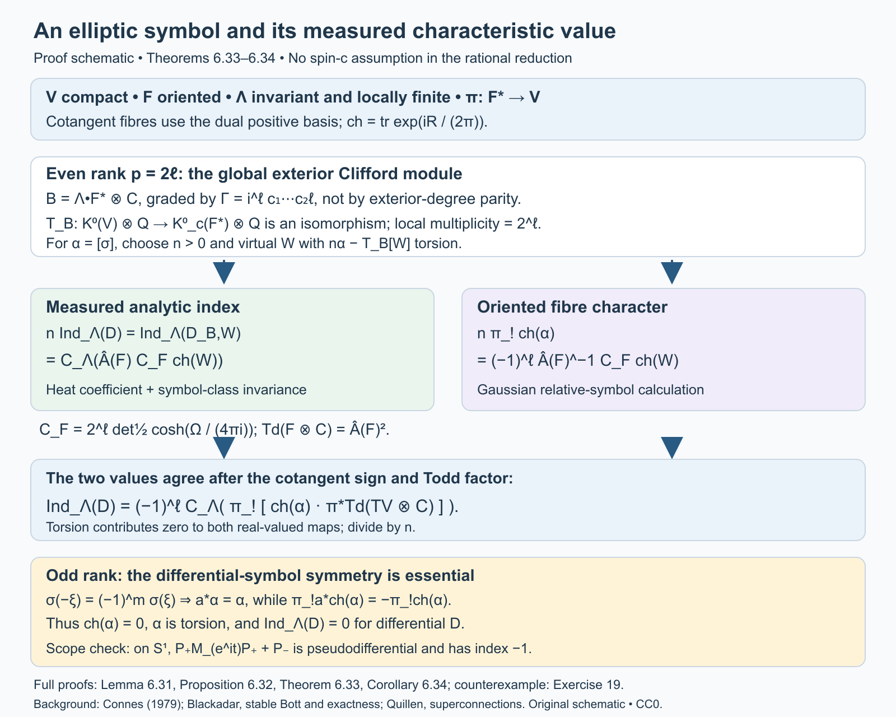

Open full-size figure · Open editable SVG

*Figure 3. Proof schematic for Lemma 6.31, Proposition 6.32, Theorem 6.33 and Corollary 6.34. The left and right branches are equalities of real-valued homomorphisms after clearing rational denominators; the orientation and Chern convention are displayed. The odd-rank row uses differential homogeneity of order \(m\). Exercise 19 supplies the contrasting pseudodifferential example. The complete arguments and the exact definition of \(C_F\) are in the text above.*

### A circle product for arbitrary symbols

The antipodal argument above is specific to differential symbols. For an arbitrary symbol we instead increase the leaf dimension by one. The extra circle contributes index \(-1\), and its cotangent character has a positive winding integral. We prove both the analytic product and the resulting orientation sign.

Put \(H_1=1+\Delta\) on a graded longitudinal bundle and \(H_2=1-\partial_t^2\) on each of two trivial circle lines, where \(t\in\mathbb R/(2\pi\mathbb Z)\). On the product foliation let

\[
H=H_1\otimes1+1\otimes H_2,\qquad
Z=(H_1\otimes1)H^{-1}.
\tag{33}
\]

These positive operators commute before applying the separate pseudodifferential factors. Thus \(0\le Z\le1\). The product calculus and the Sobolev-module construction in the preceding lesson put \(Z\) in the norm closure of order-zero longitudinal operators. Its principal symbol is

\[
z(\xi,\eta)=\frac{|\xi|^2}{|\xi|^2+\eta^2},
\qquad (\xi,\eta)\ne0.
\]

Here \(\eta\) is dual to \(dt\). The two summands \(1\) in \(H\) have no effect on this principal symbol.

**Lemma 6.35 (separate factors with joint frequency weights).** If \(B_1\) is an order-zero operator on the first foliation, allowing an algebra-compact remainder, then

\[
(B_1\otimes1)\sqrt Z
\]

belongs to the norm closure of the product's order-zero calculus. Its continuous principal symbol is
\(\sigma(B_1)(\xi/|\xi|)\,|\xi|/(|\xi|^2+\eta^2)^{1/2}\), extended by zero at \(\xi=0\). The analogous assertion holds for
\((1\otimes B_2)\sqrt{1-Z}\), with the circle factor and \(|\eta|\).

**Proof.** First, a separate order-zero operator is a multiplier of the product compact ideal. Indeed it preserves smooth compact arrow kernels in its own factor by the proper-support composition formula; multiplying an elementary tensor kernel gives a compact kernel in the product. The same is true of its adjoint. Density and its uniform operator bound extend this assertion to the full ideal.

Fix \(0<\delta<1/4\). Choose a smooth function \(\chi_\delta\) on \([0,1]\), with values in \([0,1]\), equal to zero on \([0,\delta]\) and to one on \([2\delta,1]\). Continuous functional calculus, and the exact symbol quotient in Lemma 6.5 of the Hilbert-module lesson, identify \(\chi_\delta(Z)\), modulo the product compact ideal, with a smooth joint quantization of \(\chi_\delta(z)\). We can arrange that this quantization has symbol supported, outside a bounded frequency set, where
\[
|\xi|\ge c_\delta(|\xi|^2+\eta^2)^{1/2}.
\tag{34}
\]

Composing it on the left with \(B_1\otimes1\) gives a joint order-zero operator. We check the point that makes this assertion possible. In a product coordinate chart a symbol of \(B_1\) satisfies
\[
|\partial_x^\alpha\partial_\xi^\beta b_1(x,\xi)|
\le C_{\alpha\beta}(1+|\xi|)^{-|\beta|}.
\]
On (34) these are joint estimates with
\((1+|\xi|^2+\eta^2)^{1/2}\) in place of \(1+|\xi|\). The derivatives of the cutoff have the corresponding homogeneous estimates. In the composition integral split the first-factor input frequency \(\zeta\) into a slightly larger version of (34), and its complement. In the first region the usual Taylor expansion in the first-factor variables has a remainder of any prescribed negative joint order. In the complement, \(|\zeta-\xi|\) is bounded below by a positive multiple of the joint output frequency; integration by parts in the first-factor intermediate coordinate gives that same negative joint order. Taking more integrations than the dimensions and the requested derivative order makes the bounds integrable. Separated coordinate supports are handled by the same integrations. The bounded-frequency contribution is smoothing in both factors. This proves the claimed composition and all its derivative estimates. An algebra-compact first-factor remainder can be approximated by smooth compact kernels; on (34) these give arbitrary negative joint order. Hence their products are product compact.

Multiplication by a separate multiplier also preserves the compact difference between the chosen quantization and \(\chi_\delta(Z)\). Therefore
\[
(B_1\otimes1)\chi_\delta(Z)\in
\overline{\Psi^0}_{\rm product}.
\]
The square root \(\sqrt Z\) is itself in this algebra by continuous functional calculus. Finally,
\[
\big\|(B_1\otimes1)(1-\chi_\delta(Z))\sqrt Z\big\|
\le\|B_1\|\sqrt{2\delta}.
\tag{35}
\]
This proves norm convergence to the asserted operator. Its symbols converge uniformly to the stated continuous symbol; the factor \(|\xi|\) makes its extension at the first cotangent axis continuous. Interchange the factors and replace \(Z\) by \(1-Z\) for the other assertion.

The argument uses finitely many proper coordinate kernels and uniform estimates. On a non-Hausdorff holonomy groupoid these are the finite chart presentations of Proposition 6.21; every source cover and every estimate is unchanged. No smoothness of the separate homogeneous symbols at the cotangent axes was assumed. \(\square\)

We next fix the circle operator. On \(L^2(S^1)\), let \(P_+\) project onto Fourier modes \(n\ge0\), let \(P_-=1-P_+\), and set

\[
Q_0=P_+M_{e^{it}}P_++P_-,
\qquad Q=Q_0H_2^{1/2}.
\tag{36}
\]

As in Exercise 19, \(\ker Q_0=0\) and \(\ker Q_0^*\) is the constant line. The same holds for \(Q\): its source kernel is carried to that of \(Q_0\) by \(H_2^{1/2}\), and \(Q^*=H_2^{1/2}Q_0^*\). Its order-one symbol is \(|\eta|e^{it}\) for \(\eta>0\) and \(|\eta|\) for \(\eta<0\). In particular it is elliptic, with index \(-1\). Denote its relative symbol class by
\(\kappa\in K_c^0(T^*S^1)\).

**Proposition 6.36 (analytic circle product).** For any relative longitudinal symbol class \(\alpha\in K_c^0(F^*)\), and the product foliation
\((V\times S^1,F\oplus TS^1)\) with its product orientation and the same transverse measure, one has

\[
\operatorname{Ind}_{\Lambda,\mathrm{product}}(\alpha\boxtimes\kappa)
=-\operatorname{Ind}_\Lambda(\alpha).
\tag{37}
\]

The indices are the measured symbol homomorphisms of Proposition 6.28. This statement permits holonomy and non-Hausdorff arrows.

**Proof.** In rank zero the class is a virtual bundle on \(V\), and tensoring its two rank projections with the circle's odd constant projection gives (37) directly. Assume now \(p>0\). Represent \(\alpha\) by bundles \(E_0,E_1\) and an invertible symbol on their cotangent sphere. Its polar homotopy makes this symbol unitary. Quantize it to an order-zero \(P_0\), and put \(P=P_0(1+\Delta_{E_0})^{1/2}\). Elliptic estimates give the closed realization of \(P\) on \(W^1\), with graph norm equivalent to that Sobolev norm. Its adjoint has the same assertion on \(E_1\). To see the domain assertion directly, a parametrix of order \(-1\) sends a distributional solution \(Pu\in L^2\) to \(W^1\), with a smoothing remainder; conversely the order-one bounds give \(P:W^1\to L^2\). Smooth compact sections are dense in \(W^1\). These arguments identify the minimal and maximal domains and prove closedness. All constants are uniform on the source covers.

The measured kernel dimensions of \(P\) and \(P_0\) agree, and so do their adjoint kernel dimensions. On \(\ker P_0\) the order-zero parametrix gives uniform bounds in every Sobolev order, so the two spectral-power maps identifying the source kernels are bounded inverses there. For the adjoint, the distributional equality \(P^*=H_{1,0}^{1/2}P_0^*\), and injectivity of the spectral power on \(W^{-1}\), give the same kernel. Equivariant bounded isomorphisms preserve measured dimension. Thus \(\operatorname{Ind}_\Lambda(P)=\operatorname{Ind}_\Lambda(\alpha)\).

Use the self-adjoint odd operators and gradings

\[
A_1=\begin{pmatrix}0&P^*\\P&0\end{pmatrix},
\qquad
A_2=\begin{pmatrix}0&Q^*\\Q&0\end{pmatrix},
\qquad
\Gamma_j=\begin{pmatrix}1&0\\0&-1\end{pmatrix}.
\]

Here \(H_1\) is the direct sum of the connection Laplacians on \(E_0,E_1\). It commutes with \(\Gamma_1\), though it need not commute with \(A_1\). On the graded tensor product define

\[
A=A_1\otimes1+\Gamma_1\otimes A_2.
\tag{38}
\]

The independent product spectral measure, exact tensor-lift domains, joint graph core and graded resolvent construction are proved in Joint spectral cutoffs and graded tensor sums, Lemmas 1–3 and Proposition 4; Corollary 5 gives the normalization and kernel rules used below. Its domain is the intersection of the two first-order domains. We justify self-adjointness and the square identity, rather than assuming them for a formal sum. The positive operators \(A_1^2\otimes1\) and \(1\otimes A_2^2\) strongly commute; their spectral cuts commute also with the relevant gradings. On the algebraic core the two odd summands anticommute, so

\[
A^2=A_1^2\otimes1+1\otimes A_2^2,\qquad
\|Au\|^2=\|(A_1\otimes1)u\|^2+\|(1\otimes A_2)u\|^2.
\tag{39}
\]

Joint bounded spectral cuts approximate the domain in this graph norm. They prove that the algebraic core closes to the intersection domain. The formula
\[
(A\pm i)^{-1}
=(A\mp i)(1+A_1^2\otimes1+1\otimes A_2^2)^{-1}
\]
is bounded, has range in that domain, and is a two-sided inverse there: the spectral inequalities bound each first-order summand, and (39) bounds the full expression by one. This proves self-adjointness and extends (39). The separate elliptic graph estimates show that its graph norm is uniformly equivalent to the product \(W^1\) norm, namely the form norm of \(H^{1/2}\) in (33).

Consider \(T=AH^{-1/2}\). With
\(B_j=A_jH_j^{-1/2}\), the Sobolev calculus gives \(B_j\) in the norm closure of the separate order-zero calculus, with the unitary principal symbols described above. Algebraically on the core, and then by bounded extension,

\[
T=(B_1\otimes1)\sqrt Z+
(\Gamma_1\otimes B_2)\sqrt{1-Z}.
\tag{40}
\]

Lemma 6.35 puts \(T\) in the product calculus closure. Its continuous principal symbol is the odd map

\[
s(\xi,\eta)=
\frac{a_1(\xi)\otimes1+\Gamma_1\otimes a_2(\eta)}
{(|\xi|^2+\eta^2)^{1/2}},
\tag{41}
\]
where \(a_1(\xi)\) is \(|\xi|\) times the self-adjoint matrix of the unitary symbol of \(P_0\), and \(a_2(\eta)\) is \(|\eta|\) times the corresponding circle matrix. Both are extended by zero at their own origins. Their square identity makes \(s^2=1\) for every nonzero joint covector. The symbol is continuous at both axes. A smooth uniformly close approximation on the joint cotangent sphere stays invertible and represents the same relative K-class. The exact symbol quotient therefore makes \(T^+\) Fredholm modulo the product compact ideal and gives it the same measured index as that smooth quantization.

The relative class of (41) is \(\alpha\boxtimes\kappa\). Explicitly, the external product of two relative two-term complexes is their graded tensor complex; its odd map is \(a_1\otimes1+\Gamma_1\otimes a_2\). The mixed terms cancel in its square, so it is invertible wherever either factor is invertible. Multiplication by a positive radial normalization does not change the relative class. Extending the individual maps by \(|\xi|\) and \(|\eta|\) at their origins gives exactly this tensor representative. Smoothing its sphere representative through invertible maps preserves the class as well.

We can calculate the measured index of \(T^+\) using \(A^+\). The map \(H^{1/2}\) identifies their kernels, with bounded inverse on those kernels by the graph estimate. The adjoint identity is
\((T^+)^*=H^{-1/2}A^-\), distributionally. The power \(H^{-1/2}:W^{-1}\to L^2\) is injective. If its value on \(A^-v\) is zero, the maximal-domain assertion for the self-adjoint \(A\) puts \(v\) in \(W^1\) and in \(\ker A^-\). Thus these adjoint kernels agree too.

By (39), the kernel projection of \(A\) is the tensor product of the two separate kernel projections: the nonnegative sum can vanish only where both terms vanish. The circle kernel is entirely odd and is its constant line. Consequently
\[
\ker A^+=(\ker P^*)\otimes\mathbb C1,\qquad
\ker A^-=(\ker P)\otimes\mathbb C1.
\tag{42}
\]

Finally the product holonomy groupoid is \(G\times(S^1\times S^1)\). A circuit around the added circle has trivial holonomy, so its source fibre here is the circle itself. Smooth finite-rank circle kernels give
\[
C^*_r\bigl(G\times(S^1\times S^1)\bigr)
\cong C^*_r(G)\otimes\mathcal K(L^2(S^1)).
\]
For completeness, finite matrix circle kernels reduce their regular norms to matrix norms over \(C^*_r(G)\); these kernels are dense in the circle compact algebra and in the product kernel algebra, proving the asserted completion. The measured trace is \(\tau_\Lambda\otimes\operatorname{Tr}\). On squared elementary kernels this follows from the weighted Hilbert–Schmidt formula and Fubini. Polarization gives the formula on finite-rank smooth kernels; increasing finite-rank circle projections and normality give it on positive operators. Equivalently the constant projection has kernel \(1/(2\pi)\) and diagonal integral one. This fixes the normalization without an extra circle-volume factor. Applying this trace to (42) proves (37). All kernel maps, spectral constructions and traces are measurable and equivariant, so isotropy remains present throughout. \(\square\)

**Theorem 6.37 (measured characteristic formula for every symbol).** For an oriented foliation of rank \(p\) on compact \(V\), with an invariant locally finite transverse measure, every class \(\alpha\in K_c^0(F^*)\) satisfies

\[
\operatorname{Ind}_\Lambda(\alpha)
=(-1)^{p(p+1)/2}
\left\langle
\pi_!\operatorname{ch}(\alpha)\,
\operatorname{Td}(F\otimes\mathbb C),[C_\Lambda]
\right\rangle.
\tag{43}
\]

The fibres of \(F^*\) have the dual positive orientation. The formula applies to arbitrary elliptic pseudodifferential quantizations and permits non-Hausdorff holonomy arrows. The normal Todd factor may be inserted as in Proposition 6.14 when the ambient smooth characteristic classes are defined.

**Proof.** Even rank was proved in Corollary 6.34; rank zero is included there. Suppose \(p\) is odd. On the circle choose a smooth \(\chi(\eta)\), equal to zero for sufficiently negative \(\eta\) and one for sufficiently positive \(\eta\). The circle symbol is the isomorphism \(1\) on the negative end and \(e^{it}\) on the positive end. Give its source line the trivial connection and its target line the connection
\[
\nabla_1=d-i\chi(\eta)\,dt.
\]
At the positive end this is the connection transported by \(e^{it}\), and at the negative end it is trivial. Thus their character difference is a compact-support relative representative. With our convention \(\operatorname{ch}=\operatorname{tr}\exp(iR/(2\pi))\), its two-form is
\[
\operatorname{ch}(\kappa)
=-\frac{i}{2\pi}R_1
=\frac{\chi'(\eta)}{2\pi}\,dt\wedge d\eta,
\qquad
\pi_{S^1!}\operatorname{ch}(\kappa)=\frac{dt}{2\pi}.
\tag{44}
\]
Higher-degree terms vanish on this two-dimensional cotangent space.

The character of an external relative tensor product is the wedge product of the characters. This follows directly from tensor-product curvature, whose two summands commute as even operators, or from the corresponding relative transgressions outside the support. With the joint fibre orientation \((\xi_1,\ldots,\xi_p,\eta)\), moving \(dt\) past the \(p\) first-factor vertical differentials gives
\[
\pi_{\mathrm{product}!}\operatorname{ch}(\alpha\boxtimes\kappa)
=(-1)^p\,\pi_!\operatorname{ch}(\alpha)\wedge\frac{dt}{2\pi}.
\tag{45}
\]
Only terms with all \(p\) first-factor vertical differentials contribute to fibre integration; (44) supplies the last one. This proves the sign for every component, not just a top-degree test form.

The Todd factor of the product is the pullback of
\(\operatorname{Td}(F\otimes\mathbb C)\), since the circle tangent line is trivial. Its foliation current is \([C_\Lambda]\times[S^1]\), oriented by the first leaf followed by the positive circle. Pairing (45) and using \(\int_{S^1}dt/(2\pi)=1\) therefore gives \((-1)^p\) times the characteristic pairing in (43).

Write \(\epsilon_r=(-1)^{r(r+1)/2}\). The even-rank formula on the product, together with Proposition 6.36, gives
\[
-\operatorname{Ind}_\Lambda(\alpha)
=\epsilon_{p+1}(-1)^p
\left\langle\pi_!\operatorname{ch}(\alpha)
\operatorname{Td}(F\otimes\mathbb C),[C_\Lambda]\right\rangle.
\]
Since \(\epsilon_{p+1}=(-1)^{p+1}\epsilon_p\), its right side is minus the right side of (43). This proves (43) in odd rank too. Finiteness and equality with every Sobolev-normalized elliptic index follow from Proposition 6.28 and the Hilbert-module calculus. The argument has retained arbitrary symbols throughout. \(\square\)

The numerical characteristic formula is now proved in the full oriented symbol scope. Corollary 1.9 identifies its kernel dimensions with ordinary counting measures when holonomy is negligible and the leaf dimension is positive. With holonomy present the projection trace supplies the formula, and Example 1.8 shows why ordinary counts of cover kernels cannot replace it.

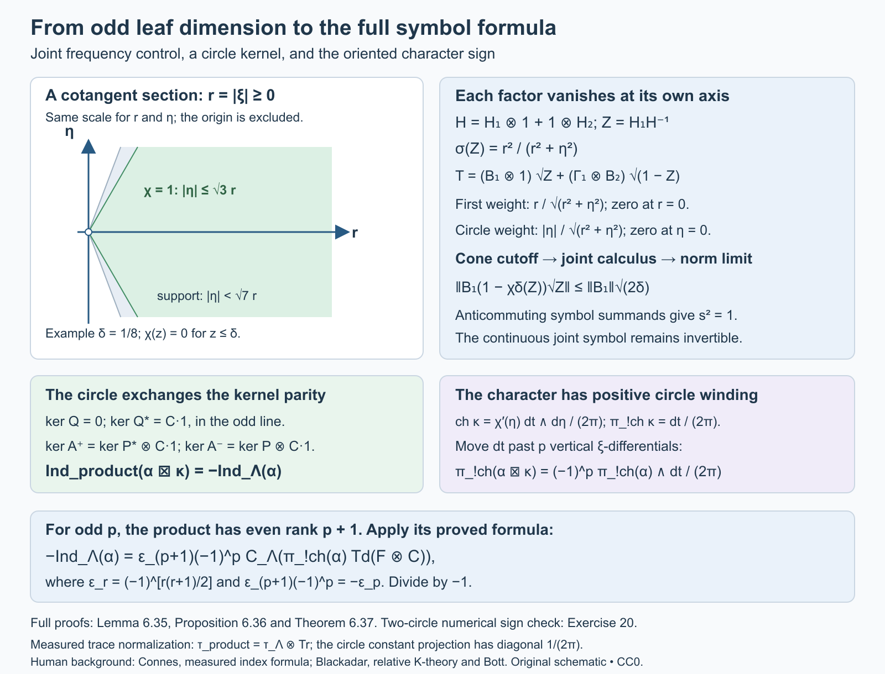

Open full-size figure · Open editable SVG

*Figure 4. The mechanism of Lemma 6.35 and Proposition 6.36. The displayed frequency plane is a section with \(r=|\xi|\ge0\), not a full \(p\)-dimensional cotangent fibre. The separate operators are cut off on joint cones before their limits are taken in norm; (35) gives the exact error bound. The kernel and fibre-character signs prove Theorem 6.37. The numerical two-circle check is Exercise 20.*

## 7. A lattice interpolation theorem

There is a concrete analytic consequence of the index formula whose existence assertion can also be proved directly. This second route makes its density threshold and growth condition visible.

For a lattice \(\Gamma\subset\mathbb C\), let \(A_\Gamma\) be its Euclidean covolume and \(d_\Gamma=1/A_\Gamma\) its density. Write \(\operatorname{dist}(z,\Gamma)\) for Euclidean distance to the lattice, and \(dA\) for Euclidean area measure.

**Lemma 7.1 (a Gaussian-normalized lattice function).** There is an entire function \(F_\Gamma\), with simple zeros precisely at \(\Gamma\), and constants \(0<m_\Gamma\le M_\Gamma<\infty\), such that

\[
m_\Gamma\operatorname{dist}(z,\Gamma)
\le |F_\Gamma(z)|e^{-\pi d_\Gamma|z|^2/2}
\le M_\Gamma\operatorname{dist}(z,\Gamma)
\quad(z\in\mathbb C).
\tag{5}
\]

**Proof.** Choose generators \(\omega_1,\omega_2\) with
\(A_\Gamma=\operatorname{Im}(\overline{\omega_1}\omega_2)>0\).
Start with the Weierstrass product

\[
\sigma(z)=z\prod_{\omega\in\Gamma\setminus\{0\}}
\left(1-\frac z\omega\right)
\exp\left(\frac z\omega+\frac{z^2}{2\omega^2}\right).
\]

The logarithm of each factor is \(O(|z/\omega|^3)\) on a fixed compact set for sufficiently large \(|\omega|\). Since \(\sum_{\omega\ne0}|\omega|^{-3}<\infty\), the product converges normally, has simple zeros precisely at the lattice, and can be differentiated away from them. Pairing \(\omega\) and \(-\omega\) shows that \(\sigma\) is odd. Its logarithmic derivative and its negative derivative are

\[
\begin{aligned}
\zeta(z)&=\frac1z+
\sum_{\omega\ne0}\left(
\frac1{z-\omega}+\frac1\omega+\frac z{\omega^2}\right),\\
\wp(z)&=-\zeta'(z)=\frac1{z^2}
+\sum_{\omega\ne0}\left(
\frac1{(z-\omega)^2}-\frac1{\omega^2}\right).
\end{aligned}
\]

The function \(\wp\) is even, and
\(\wp'(z)=-2\sum_{\omega\in\Gamma}(z-\omega)^{-3}\)
is periodic by absolute convergence and reindexing. Consequently
\(\wp(z+\omega_j)-\wp(z)\) is constant. Evaluate at
\(z=-\omega_j/2\), which is not a lattice point for a basis generator. Evenness makes that constant zero. Thus \(\wp\) is periodic, and
\(\zeta(z+\omega_j)-\zeta(z)=\eta_j\) is constant.

Integrate \(\zeta\) counterclockwise around a translated fundamental parallelogram with no zero on its boundary. Its one enclosed simple pole has residue one. Comparing opposite edges gives

\[
\eta_1\omega_2-\eta_2\omega_1=2\pi i.
\tag{6}
\]

Integrating the logarithmic-derivative identity gives

\[
\sigma(z+\omega_j)=
-\exp\left(\eta_j(z+\omega_j/2)\right)\sigma(z).
\]

The sign follows by evaluating the ratio at \(-\omega_j/2\) and using oddness. These elementary identities also fix our full-period convention; the generators here are full periods. A reference for the Weierstrass functions is [NIST, Definitions and periodic properties](https://dlmf.nist.gov/23.2).

Put \(c=\pi/A_\Gamma\). Equation (6), and
\(\overline{\omega_1}\omega_2-\overline{\omega_2}\omega_1=2iA_\Gamma\),
show that a single complex number \(a\) satisfies

\[
\eta_j-a\omega_j=c\overline{\omega_j},
\qquad j=1,2.
\]

Define \(F_\Gamma(z)=e^{-az^2/2}\sigma(z)\). The exponential has no zeros. The preceding identities give

\[
|F_\Gamma(z+\omega_j)|
=e^{c\operatorname{Re}(z\overline{\omega_j})+c|\omega_j|^2/2}
|F_\Gamma(z)|.
\]

It follows that \(Q(z)=|F_\Gamma(z)|e^{-c|z|^2/2}\) is periodic on \(\Gamma\). Away from its zeros, the ratio \(Q(z)/\operatorname{dist}(z,\Gamma)\) is positive and continuous. At each lattice point it has a positive limit, since that zero is simple and distance agrees with \(|z-\omega|\) in a small neighbourhood of \(\omega\). Thus the ratio extends to a strictly positive continuous function on the compact torus \(\mathbb C/\Gamma\). Its minimum and maximum give (5). \(\square\)

**Theorem 7.2 (weighted lattice interpolation and the sharp threshold).** Suppose \(d_{\Gamma_1}>d_{\Gamma_2}\). For every
\[
p\notin\Gamma_2-\Gamma_1
\]
there is a nonzero meromorphic function \(\varphi_p\) with simple poles precisely at \(p+\Gamma_1\), simple zeros precisely at \(\Gamma_2\), and

\[
\int_{\mathbb C}
\left(\frac{\operatorname{dist}(z-p,\Gamma_1)}
{\operatorname{dist}(z,\Gamma_2)}\right)^2
|\varphi_p(z)|^2\,dA(z)<\infty.
\tag{7}
\]

The exceptional set is countable, so this holds for almost every \(p\). If \(d_{\Gamma_1}\le d_{\Gamma_2}\), no nonzero meromorphic function with at most simple poles on \(p+\Gamma_1\), zeros at every point of \(\Gamma_2\), and (7) exists, for any \(p\).

**Proof.** Let \(c_j=\pi d_{\Gamma_j}\), and use the functions of Lemma 7.1. For a nonexceptional \(p\), the two lattices do not intersect. Set

\[
\varphi_p(z)=
e^{-c_1\overline p\,z}
\frac{F_{\Gamma_2}(z)}{F_{\Gamma_1}(z-p)}.
\tag{8}
\]

The zeros and poles have the asserted locations and orders. The exponential has neither zeros nor poles. By the two bounds (5), the weighted absolute value in (7) is bounded above by a constant times

\[
\exp\left(
\frac{c_2|z|^2-c_1|z-p|^2}{2}
-c_1\operatorname{Re}(\overline p\,z)\right)
=e^{-c_1|p|^2/2}e^{-(c_1-c_2)|z|^2/2}.
\tag{9}
\]

At a zero or pole the weighted expression has a finite limit, so the omitted points do not affect integration. The square of (9) is integrable because \(c_1-c_2>0\); its area integral is
\(e^{-c_1|p|^2}\pi/(c_1-c_2)\). This proves existence and its growth estimate.

For the converse, suppose \(\varphi\) has the asserted poles and zeros. Then

\[
u(z)=\varphi(z)\frac{F_{\Gamma_1}(z-p)}{F_{\Gamma_2}(z)}
\]

is entire. The numerator cancels each allowed pole, and the zeros of \(\varphi\) cancel the denominator. If the lattices intersect, the same order count still proves regularity. Let \(v(z)=e^{c_1\overline p\,z}u(z)\), also entire. The lower bounds as well as the upper bounds in (5) show that (7) is equivalent, up to fixed positive comparison constants, to

\[
\int_{\mathbb C}|v(z)|^2e^{(c_2-c_1)|z|^2}\,dA(z)<\infty.
\tag{10}
\]

If \(c_2\ge c_1\), the weight in (10) is at least one. Therefore \(v\) is an entire \(L^2(\mathbb C,dA)\) function. The mean-value inequality on every disk about \(w\) gives

\[
|v(w)|^2\le\frac1{\pi R^2}\int_{|z-w|<R}|v(z)|^2\,dA(z)
\le\frac{\|v\|_2^2}{\pi R^2}.
\]

Letting \(R\to\infty\) proves \(v(w)=0\). Since \(w\) is arbitrary, \(\varphi=0\). This proves the sharp threshold, including equality. \(\square\)

The construction explains why the pole lattice must have the larger density. The quadratic growth of its entire lattice function appears in the denominator of (8). Its excess cancels all but a decaying Gaussian. For a nonexceptional \(p\), the full weighted meromorphic space is obtained by replacing the constant one in (8) by an arbitrary entire function \(v\) with
\(\int|v(z)|^2e^{-(c_1-c_2)|z|^2}\,dA<\infty\).

The existence theorem is proved directly. The following construction proves the measured-dimension assertion with its groupoid and trace normalization explicit.

### The measured dimension of the meromorphic field

The ordinary dimension found in Exercise 6 is infinite. A measured dimension requires a specified equivariant field and trace. We now construct the natural lattice field and compute its trace directly, including lattices with nontrivial common periods.

Put \(T_j=\mathbb C/\Gamma_j\), \(V=T_1\times T_2\), \(c_j=\pi d_j\), and \(a=c_1-c_2>0\). The additive group \(\mathbb C\) acts diagonally by
\(([z_1],[z_2])+t=([z_1+t],[z_2+t])\).
Use the action groupoid with

\[
r(v,t)=v,\qquad s(v,t)=v+t,
\qquad (v,t)(v+t,t')=(v,t+t').
\]

Its range fibre is \(\mathbb C\) with Euclidean area measure. Stabilizers \(\Gamma_1\cap\Gamma_2\) are retained; the range fibres remain \(\mathbb C\) when these stabilizers are nontrivial. Give \(V\) normalized product Haar measure \(\mu(V)=1\). Inversion \((v,t)\mapsto(v+t,-t)\) preserves \(d\mu(v)dA(t)\), so the unit-measure theorem defines an invariant transverse measure \(\Lambda\).

The Haar transverse function is faithful and proper: \(V\times\{|t|\le n\}\) exhausts the groupoid, and its fibre mass after any left translation is \(\pi n^2\). All the standard Borel and \(\sigma\)-finite hypotheses hold. This specifies the measured groupoid whose formal dimension is used below.

The normalization also agrees with the counting densities. On the transversal \(N_1=\{0\}\times T_2\), use coordinates \(t=z_1,u=z_2-z_1\) near \(z_1=0\). The real Jacobian is one, and
\(d\mu=(A_{\Gamma_1}A_{\Gamma_2})^{-1}dA(t)dA(u)\).
Thus \(\Lambda(N_1)=1/A_{\Gamma_1}=d_1\). Similarly the transversal \(N_2=T_1\times\{0\}\) has mass \(d_2\).

**Lemma 7.3 (the lattice line bundles).** Each \(F_{\Gamma_j}\) in Lemma 7.1 is a holomorphic section of a Hermitian line bundle \(L_j\) on \(T_j\), with one simple zero at the lattice point. In its lifted coordinate frame the squared metric is \(e^{-c_j|z|^2}\).

**Proof.** For \(\omega\in\Gamma_j\), the ratio
\(J_\omega(z)=F_{\Gamma_j}(z+\omega)/F_{\Gamma_j}(z)\)
extends to a nonvanishing entire function: both numerator and denominator have the same simple zero set. Periodicity of the normalized absolute value, proved in Lemma 7.1, gives

\[
|J_\omega(z)|
=\exp\bigl(c_j\operatorname{Re}(\overline\omega z)+c_j|\omega|^2/2\bigr).
\]

The entire function obtained by dividing \(J_\omega\) by
\(\exp(c_j\overline\omega z+c_j|\omega|^2/2)\)
has constant absolute value one and is constant by the open mapping theorem. Hence
\(J_\omega(z)=\epsilon_\omega\exp(c_j\overline\omega z+c_j|\omega|^2/2)\), with \(|\epsilon_\omega|=1\).
The ratio definition gives the cocycle identity
\(J_{\omega+\omega'}(z)=J_\omega(z+\omega')J_{\omega'}(z)\).
These are the bundle transition functions. Moreover

\[
e^{-c_j|z+\omega|^2}|J_\omega(z)|^2=e^{-c_j|z|^2},
\]

so the stated metric descends. The transformation law for \(F_{\Gamma_j}\) makes it a section, and its simple lattice zeros descend to the single zero at \(0\in T_j\). \(\square\)

Let \(E=\operatorname{pr}_1^*L_1\otimes(\operatorname{pr}_2^*L_2)^*\) on \(V\). For \(v=([z_1],[z_2])\), pull it back to the action fibre \(t\mapsto v+t\). Let \(H_v\) be its square-integrable holomorphic sections. Choice of lifts \(z_1,z_2\) gives an entire coefficient \(u(t)\) with norm

\[
\int_{\mathbb C}|u(t)|^2
\exp\bigl(-c_1|z_1+t|^2+c_2|z_2+t|^2\bigr)\,dA(t).
\tag{11}
\]

Changes of lifts use precisely the transition functions in Lemma 7.3, so this norm and Hilbert space are intrinsic.

For almost every \(v\), the two translated lattices
\(-z_1+\Gamma_1\) and \(-z_2+\Gamma_2\) are disjoint. The exceptional set is saturated and Haar-null: in local lifts the coincidence equations are \(z_1-z_2=\omega_1-\omega_2\), a countable union of real codimension-two affine subsets. Let \(W_v\) be the meromorphic space with the pole, zero and weighted norm conditions for these two translated lattices. On this full-measure set, the map

\[
\varphi(t)\longmapsto
u(t)=\varphi(t)\frac{F_{\Gamma_1}(z_1+t)}{F_{\Gamma_2}(z_2+t)}
\tag{12}
\]

is a bounded invertible map onto \(H_v\). Indeed the simple zeros cancel precisely the allowed poles and prescribed zeros; its inverse is \(uF_{\Gamma_2}/F_{\Gamma_1}\). The two sides of Lemma 7.1 bound the norm in (11) above and below by fixed positive multiples of

\[
\int_{\mathbb C}|\varphi(t)|^2
\frac{\operatorname{dist}(z_1+t,\Gamma_1)^2}
{\operatorname{dist}(z_2+t,\Gamma_2)^2}\,dA(t).
\]

The constants are independent of \(v\). Changing \(dA\) to \(2dA=|dz\wedge d\bar z|\) merely changes this Hilbert norm by a fixed positive factor and gives an equivalent unitary field after rescaling.

The maps (12) are equivariant. An arrow \((v,b)\) sends a section in the fibre at \(v+b\) to the fibre at \(v\) by \(t\mapsto t-b\); the lifted bundle point and the two lattice-function arguments are unchanged. For \(W\) this is exactly translation of the meromorphic function, which preserves its weighted norm. The bundle transition functions make this statement independent of the chosen lifts. Set \(W\) to zero on the negligible exceptional set if a field defined everywhere is desired. Its measurable structure can be transported from \(H\) through (12), and its square integrability follows from the bounded equivariant isomorphism and the projected regular realization of \(H\) below.

**Theorem 7.4 (the density difference as formal dimension).** For this measured action groupoid and normalization,

\[
\dim_\Lambda W=d_1-d_2.
\tag{13}
\]

In particular the complete transverse family over \(N_2\), parameterized by \(p=-z_1\) with \(z_2=0\), gives the meromorphic spaces of Theorem 7.2. Their measured dimension means (13), and their ordinary Hilbert-space dimension is infinite.

**Proof.** Put \(\ell=c_1\overline{z_1}-c_2\overline{z_2}\). Multiplication of the entire coefficient \(u(t)\) by \(e^{-\ell t}\), and by the constant
\(e^{(-c_1|z_1|^2+c_2|z_2|^2)/2}\),
turns (11) into the Gaussian holomorphic norm
\(\int|h(t)|^2e^{-a|t|^2}\,dA(t)\).
The Gaussian holomorphic space is closed: on every bounded disk the mean-value inequality bounds evaluation on a smaller disk by its weighted \(L^2\) norm; a Cauchy sequence therefore converges uniformly on compact sets to an entire function, with its \(L^2\) limit the same function.

If \(h(t)=\sum_{n\ge0}h_nt^n\), Parseval on circles and Tonelli in the radius give

\[
\|h\|^2=\sum_{n\ge0}|h_n|^2\frac{\pi n!}{a^{n+1}}.
\]

Thus the normalized monomials
\((a^{n+1}/(\pi n!))^{1/2}t^n\)
are a complete orthonormal basis. Summing their coefficient kernels gives
\(K_a(t,t')=(a/\pi)e^{a t\overline{t'}}\).
In the unitary, unweighted \(L^2(dA)\) frame, the orthogonal projection kernel is consequently

\[
P_a(t,t')=\frac a\pi
\exp\bigl(-a(|t|^2+|t'|^2)/2+a t\overline{t'}\bigr),
\qquad
|P_a(t,t')|=\frac a\pi e^{-a|t-t'|^2/2}.
\tag{14}
\]

For the bundle frame in (11), the additional factor is the unit phase
\(\exp(i\operatorname{Im}(\ell(t-t')))\), which changes no norm in (14). These local formulas define measurable fibre projections compatible with the transition functions, and translation preserves the intrinsic holomorphic subspaces. Hence \(H\) is an equivariant closed subfield of the regular field \(L^2(\mathbb C;s^*E)\), with projection \(P\) in its measured endomorphism algebra. The regular field and its projected subfield are square integrable by the random-operator prerequisite, including when the action has stabilizers.

In unitary local bundle frames, the reduced convolution kernel is obtained by setting the output coordinate to zero in (14). It therefore has magnitude
\((a/\pi)e^{-a|t|^2/2}\).
Its absolute value is integrable on each fibre, so it satisfies the bounded finite-support test condition of Corollary 9.4 of Weights on random operators and formal dimension. With \(\delta=1\) and \(P^*P=P\), that corollary gives

\[
\tau(P)
=\int_V\int_{\mathbb C}
\left(\frac a\pi\right)^2e^{-a|t|^2}\,dA(t)\,d\mu(v)
=\left(\frac a\pi\right)^2\frac\pi a
=\frac a\pi=d_1-d_2.
\]

The factor \(\mu(V)=1\) is part of the specified normalization. By Definition 10.1 and Proposition 10.2 of that lesson, this trace is \(\dim_\Lambda H\), and the bounded equivariant isomorphism (12) preserves dimension. It is therefore \(\dim_\Lambda W\), proving (13). Countably many orthogonal monomials at each nonexceptional parameter prove the ordinary infinite dimension. \(\square\)

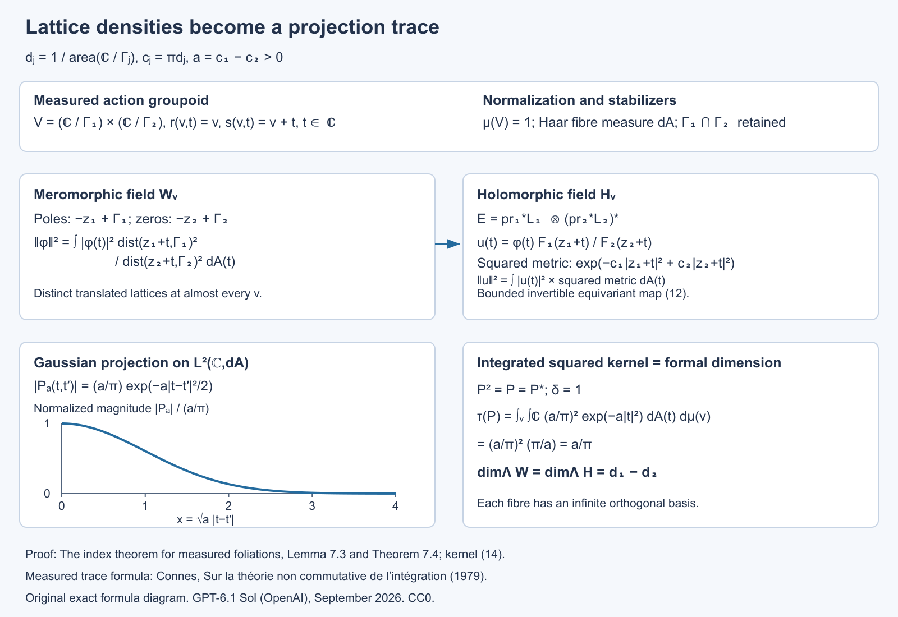

Open full-size figure · Open editable SVG

*Figure 7.1. The domains, bundle metric, equivariant map and trace normalization are those of Lemma 7.3 and Theorem 7.4. The curve is the exact normalized magnitude \(e^{-x^2/2}\), with dimensionless horizontal coordinate \(x=\sqrt a\,|t-t'|\). The action fibres are \(\mathbb C\), retaining stabilizers \(\Gamma_1\cap\Gamma_2\). The trace is the integrated squared kernel, rather than a count of the ordinary infinite basis.*

Reference for the measured-dimension assertion: [Connes], the lattice corollary and its density-difference discussion. The direct Gaussian projection computation above also specifies the groupoid and measure normalization.

## 8. Examples and exercises

**Example 8.1 (a product of spheres).** For \(V=S^2\times S^1\), with spherical leaves and transverse measure of total mass \(a\), the harmonic fields have measured dimensions \(\beta_0=\beta_2=a\), \(\beta_1=0\). Hence their alternating sum is \(2a\). With unit-round leaf metrics, \((2\pi)^{-1}\int Kd\mu=(2\pi)^{-1}4\pi a=2a\). This checks the normalization in Corollaries 6.16 and 6.20.

**Exercise 1 (basic).** For a linear map \(D:\mathbb C^3\to\mathbb C^2\) of rank two, verify Theorem 2.1 for every \(t>0\).

**Solution.** There is one zero eigenvalue in \(D^*D\) and none in \(DD^*\). The two nonzero eigenvalues agree with multiplicity by polar decomposition. Thus the heat traces differ by one, equal to the difference of the kernel dimensions. Their actual nonzero eigenvalues need not be calculated.

**Exercise 2 (intermediate).** In Example 1.1, show directly that no Borel transversal can realize the harmonic constants as the square-summable functions on its full inverse image in the holonomy cover.

**Solution.** A transversal meets the central leaf in zero, a positive finite number \(n\), or countably infinitely many points. Its full inverse image has respectively zero, \(2n\), or infinitely many points. The square-summable space has those dimensions, while the harmonic constants have dimension one. Thus even a nonequivariant unitary is impossible. Equivariance would impose a further obstruction through the regular permutation action.

**Exercise 3 (intermediate).** Prove that metric equivalence preserves the closure of an exact-form space even if that space is not closed.

**Solution.** Uniformly equivalent norms have the same convergent and Cauchy sequences and the same topology. A vector is in the closure of a subspace precisely when every norm ball about it meets that subspace. Equivalent norms give mutually containing balls, so the closures agree. This is why reduced cohomology, with closure of the exact forms, is used in Proposition 4.1.

**Exercise 4 (advanced).** Under the Hausdorff hypotheses of Corollary 6.16, let the oriented surface leaves with compact finite-holonomy leaves be negligible. Prove the integrated curvature inequality and determine when equality holds.

**Solution.** The calculation of Section 5 gives the integrated curvature as \(-2\pi\beta_1\). It is nonpositive because the trace of a projection is nonnegative. Equality holds exactly when the harmonic one-form projection has measured trace zero. Faithfulness of the measured trace makes that projection zero in the random-operator algebra, meaning that the harmonic space vanishes off a transverse-null saturated set.

**Exercise 5 (advanced).** Explain why a KMS weight for a nontrivial cocycle cannot simply replace the trace in the proof of Theorem 2.1.

**Solution.** The proof uses equality of the weight on \(X^*X\) and \(XX^*\) for the operator transporting the two nonzero spectral parts. A general KMS weight does not satisfy this trace identity. Its modular automorphisms enter instead. Hence the invariant-measure condition is substantive for this measured index proof, even though individual weighted heat expansions can be considered for a nontrivial cocycle.

**Exercise 6 (advanced).** In Theorem 7.2, replace the constant numerator in (8) by a polynomial in \(z\). Prove that this still satisfies (7), and compute the squared Gaussian norm of \(z^n\).

**Solution.** Put \(a=c_1-c_2>0\). The bounds (5) reduce the norm to a constant comparison with \(\int_{\mathbb C}|z|^{2n}e^{-a|z|^2}\,dA\). Polar coordinates give
\[
2\pi\int_0^\infty r^{2n+1}e^{-ar^2}\,dr
=\frac{\pi n!}{a^{n+1}}.
\]
Every polynomial consequently gives a finite norm. The monomials are orthogonal by angular integration, so the resulting weighted meromorphic space has infinitely many linearly independent elements. This ordinary Hilbert-space dimension is different from the measured dimension in a foliation.

**Exercise 7 (intermediate).** On the flat \(p\)-torus, \(p\ge1\), let \(B_m=(1+\Delta)^{m/2}\), with the positive Laplacian \(\Delta\). Prove that \(B_m\) is Hilbert–Schmidt exactly when \(m<-p/2\), including the failure at equality.

**Solution.** The Fourier eigenvalues are \((1+4\pi^2|n|^2)^{m/2}\), \(n\in\mathbb Z^p\). Their squares sum to \(\sum_n(1+4\pi^2|n|^2)^m\). In a dyadic annulus of radius \(R\), there are upper and lower bounds proportional to \(R^p\) for the lattice count, obtained by enclosing and inscribing unions of unit cubes. Its contribution is therefore bounded above and below by positive constants times \(R^{p+2m}\), for all sufficiently large dyadic \(R\). The geometric series converges exactly when \(p+2m<0\). At equality every annulus contributes a fixed positive lower bound, so the sum diverges. The square root of the convergent sum is the Hilbert–Schmidt norm; it is an ordinary torus norm, not a measured dimension of an infinite-cover field.

**Exercise 8 (advanced).** Show that the threshold \(s>p/2\) in Theorem 6.9 is sharp among uniform assertions of this form. Use the flat \(p\)-torus, \(p\ge1\), as one compact leaf, with \(\delta=1\) and transverse atomic mass one. The counterexample must be bounded on \(L^2\) as well as between the specified Sobolev spaces.

**Solution.** Take the positive Laplacian with eigenvalues \(4\pi^2|n|^2\). For \(0\le s\le p/2\), set \(T=(1+\Delta)^{-s}\). This is a positive contraction on \(L^2\). It maps the Fourier space \(H^{-s}\) to \(H^s\) with norm one: multiplying its output coefficients by \(\langle2\pi n\rangle^s\) gives exactly the input norm with multiplier \(\langle2\pi n\rangle^{-s}\). Its trace is \(\sum_{n\in\mathbb Z^p}(1+4\pi^2|n|^2)^{-s}\). The dyadic annulus calculation of Exercise 7 makes this infinite throughout this range, including equality.

For \(s<0\), use \(T=I\). It is bounded on \(L^2\), and the Fourier weights satisfy \(\langle2\pi n\rangle^{2s}\le\langle2\pi n\rangle^{-2s}\). Summing this inequality against the squared Fourier coefficients gives \(\|If\|_{H^s}\le\|f\|_{H^{-s}}\). The constant Fourier mode attains equality, so this Sobolev operator norm is one. Its trace is \(\sum_{n\in\mathbb Z^p}1=\infty\), since \(p\ge1\).

In this single compact leaf with trivial holonomy and transverse atomic mass one, the measured trace is the ordinary trace. Thus an operator bounded on \(L^2\) and from \(H^{-s}\) to \(H^s\) need not be in the weight domain when \(s\le p/2\).

**Exercise 9 (intermediate).** In Theorem 6.8, explain why knowing the domain of \(A\) alone does not immediately prove the domain formula for every real power. Identify the two additional steps used in the proof.

**Solution.** The domain of one closed operator does not determine how its powers compare to a coordinate scale. First, each integer power \(A^k\) extends the formal elliptic differential expression of order \(2mk\), whose essential self-adjointness identifies its domain and gives uniform graph estimates. Second, localization and reconstruction make the coordinate spaces an interpolation retract of Fourier spaces. Spectral interpolation then compares both scales at intermediate positive exponents, and duality gives negative exponents. These steps also preserve constants uniformly across the covers.

**Exercise 10 (advanced).** For the flat torus \(\mathbb R^p/\mathbb Z^p\), compute the entire local diagonal expansion of the positive Laplacian plus a constant potential \(q\ge0\). Check the powers and the normalization in Theorem 6.12.

**Solution.** On \(\mathbb R^p\), Fourier inversion of \(e^{-t|\xi|^2}\) gives \((4\pi t)^{-p/2}e^{-|x-y|^2/(4t)}\); the one-variable Gaussian integral and its product establish the factor. The constant potential multiplies this by \(e^{-qt}\). Periodizing in \(y\) gives the torus kernel: its differentiated series converges for each \(t>0\), it solves the heat equation, and its Fourier coefficient at \(n\) is \(e^{-t(4\pi^2|n|^2+q)}\), so spectral calculus identifies it with the heat operator. On the diagonal it equals

\[
(4\pi t)^{-p/2}e^{-qt}
\sum_{\ell\in\mathbb Z^p}e^{-|\ell|^2/(4t)}.
\]

The sum over \(\ell\ne0\) is \(O(e^{-1/(8t)})\) for \(0<t\le1\): split each exponential into two equal factors, bound one by \(e^{-1/(8t)}\), and sum the other using \(t\le1\). Thus only the \(\ell=0\) term contributes to any power expansion. Taylor's formula gives
\(b_{2n}=(4\pi)^{-p/2}(-q)^n/n!\) and \(b_{2n+1}=0\). The powers are \(t^{n-p/2}=t^{(2n-p)/2}\), as asserted for order two. The local symbol recursion gives the same answer, since its only lower coefficient is \(h_0=q\), and its terms are \(v_{2n}=(-qt)^n e^{-t|\xi|^2}/n!\). This example checks both the factor \((4\pi)^{-p/2}\) and the negative sign of the first potential coefficient.

**Exercise 11 (intermediate).** For a unit-round oriented two-sphere, check every rank and sign in the supertrace calculation of Corollary 6.16.

**Solution.** Here \(K=1\), \(\operatorname{Scal}=2\), and the bundle ranks are \(1,2,1\). The endomorphism in the first coefficient of Lemma 6.15 is \(1/3\) in degree zero and degree two. In degree one, \(\operatorname{Ric}=I\), so it is \(-2I/3\). Its alternating fibre trace is \(1/3-2(-2/3)+1/3=2\). The common factor \((4\pi)^{-1}\) gives \(1/(2\pi)\), and integration over area \(4\pi\) gives two. This agrees with the dimensions of harmonic constants and volume forms, while the harmonic one-form space is zero. The negative potential term in Lemma 6.15 is essential to this check.

**Exercise 12 (advanced).** For the product of two oriented unit-round two-spheres, compute the constant local supertrace in Theorem 6.18 and its integral. Check it against the harmonic dimensions.

**Solution.** The product curvature has two skew blocks, \(\Omega_{12}=\alpha_1\) and \(\Omega_{34}=\alpha_2\), with all mixed blocks zero. Hence \(\operatorname{Pf}(\Omega/(2\pi))=\alpha_1\wedge\alpha_2/(4\pi^2)\). Each sphere has area \(4\pi\), so the integral is four. In dimension four the relevant Clifford degree is eight; the top symbol of \(U_2\) gives supertrace four, while \(U_0,U_1\) have zero supertrace. Multiplication by \((4\pi)^{-2}\) gives the density \(1/(4\pi^2)\), agreeing with the Pfaffian.

Each two-sphere has one harmonic constant and one harmonic volume form. Its degree-one harmonic space is zero, since the surface formula gives Euler number two and these two other dimensions already contribute two. On the product the Hodge Laplacian is the sum of the two nonnegative factor Laplacians on the tensor exterior algebra. Its zero space is the tensor product of their zero spaces: the sum's quadratic form can vanish only if both factor terms vanish. The harmonic dimensions are therefore \((1,0,2,0,1)\), whose alternating sum is four.

**Exercise 13 (intermediate).** Expand the Thom form in Lemma 6.19 for rank two. Verify directly its vertical integral and zero-section pullback, keeping the auxiliary-variable sign.

**Solution.** Because the auxiliary variables anticommute with the ordinary one-forms, the coefficient of \(\eta_1\eta_2\) in \(\exp(Dx_1\eta_1+Dx_2\eta_2-\Omega_{12}\eta_1\eta_2)\) is \(-Dx_1\wedge Dx_2-\Omega_{12}\). The prefactor sign is also minus. Thus
\[
U=(2\pi)^{-1}e^{-(x_1^2+x_2^2)/2}
(Dx_1\wedge Dx_2+\Omega_{12}).
\]
On a fibre this is the normalized two-dimensional Gaussian volume form and has integral one. On the zero section the covariant coordinate differentials vanish, leaving \(\Omega_{12}/(2\pi)\). This checks the sign and normalization of the Euler representative. Closedness follows directly as well: \(D(Dx_1\wedge Dx_2)=\Omega_{12}(x_1Dx_1+x_2Dx_2)\), which cancels the Gaussian derivative wedged with the curvature term.

**Exercise 14 (advanced).** A compact oriented leaf \(L\) has genus \(g\), finite holonomy of order \(h\), and transverse atomic mass one. Find its measured harmonic dimensions. Check that its Euler contribution agrees with the leaf's Euler number, and explain why its degree-zero measured dimension is \(1/h\).

**Solution.** The holonomy cover has genus \(\widetilde g\), with \(2-2\widetilde g=h(2-2g)\); lift a finite cell decomposition to prove the covering formula. Its harmonic dimensions are \((1,2\widetilde g,1)\). In Corollary 6.22, \(q=1/\operatorname{vol}(\widetilde L)\), while the unit measure of the atomic leaf is \(\operatorname{vol}(L)\). The multiplier therefore contributes \(1/h\), giving \((\beta_0,\beta_1,\beta_2)=(1/h,2\widetilde g/h,1/h)\). Their alternating sum is \((2-2\widetilde g)/h=2-2g\). Degree zero illustrates why measured dimension must retain the covering normalization even when the ordinary harmonic space has dimension one.

**Exercise 15 (advanced).** In the neighbourhood \((\widetilde L\times T)/H\) of Proposition 6.23, describe the leaf through a transverse point \(u\), its holonomy, and its covering degree over the central leaf in the transverse projection model.

**Solution.** Put \(H_u=\{h:h(u)=u\}\). The leaf is \(\widetilde L/H_u\): the components \(\widetilde L\times\{h(u)\}\) are identified by the diagonal action, and equivalence within the component at \(u\) is exactly the deck action of \(H_u\). It is compact and covers \(L=\widetilde L/H\) with degree \(|H|/|H_u|\), since the cover's fibre is the finite coset set \(H/H_u\). Its holonomy is the image of \(H_u\) in germs at \(u\); elements acting identically on a neighbourhood contribute the identity germ, so it can be a quotient of \(H_u\). Thus both covering multiplicity and finite holonomy are accounted for, and the statement does not assume every nearby leaf has the same holonomy as the central one.

**Exercise 16 (advanced).** On a flat oriented surface, let the twisting line have constant curvature \(R^E=iB\alpha\), and give the spin structure the trivial determinant line. Verify the local sign in Theorem 6.26 directly from the curvature potential, using \(\Gamma=i c_1c_2\).

**Solution.** The product \(c_1c_2\) has eigenvalues \(-i,i\) in the positive and negative grading spaces, respectively. The potential in (16) is \(c_1c_2 iB\), so these two eigenvalues are \(B,-B\). The first nonzero supertrace coefficient is therefore \(-B-B=-2B\). Multiplication by \((4\pi)^{-1}\) gives \(-B/(2\pi)\). The characteristic expression is \(iR^E/(2\pi)=-B\alpha/(2\pi)\), agreeing with that density. The determinant factor contributes no degree-two term because the tangent curvature is zero. This check concerns the local coefficient; on a compact torus a line bundle and constant curvature connection must also satisfy the integral quantization condition on \(iR^E/(2\pi)\).

**Exercise 17 (advanced).** For the projection \(q(z)\) in Theorem 6.29, use its unit frame \(s=(z,1)/\sqrt{1+|z|^2}\) to compute the induced connection and curvature on its line. Integrate the compact-support first Chern character and compare it with the flat two-plane Gaussian in (26).

**Solution.** In the frame \(s\), the connection form is

\[
A=s^*ds=\frac{\overline z\,dz-z\,d\overline z}{2(1+|z|^2)}.
\]

Its curvature is

\[
\begin{aligned}
R=dA
&=\frac{d\overline z\wedge dz}{(1+|z|^2)^2}\\
&=\frac{2i\,dx\wedge dy}{(1+|z|^2)^2}.
\end{aligned}
\]

Thus the positive-degree character of \([q]-[e_1]\) is

\[
\frac{iR}{2\pi}
=-\frac{dx\wedge dy}{\pi(1+|z|^2)^2}.
\]

Its oriented integral is \(-2\int_0^\infty r(1+r^2)^{-2}dr=-1\), using the primitive \(-1/(2(1+r^2))\) for the unsigned radial integral. The trivial reference line has zero curvature and cancels the degree-zero rank. On the flat plane, (26) also gives \(-1\). In \(2\ell\) dimensions the ordered tensor product gives \((-1)^\ell\). Changing from \(iR/(2\pi)\) to \(R/(2\pi i)\) would change the two-dimensional Chern value's sign, so that change cannot be made inside the index formula without reconciling the conventions.

**Exercise 18 (advanced).** Compute \(\widehat A(F)C_F\) through degree four for an oriented rank-four bundle with formal curvature roots \(x_1,x_2\). Explain why the exterior Clifford grading in Proposition 6.32 differs from the Euler grading on \(S^2\times S^2\).

**Solution.** In each block the product is \(x\coth(x/2)=2+x^2/6+O(x^4)\). Hence

\[
\widehat A(F)C_F
=4+\frac{x_1^2+x_2^2}{3}+\text{terms of degree at least eight}.
\]

Each \(x_j\) is a two-form, so \(x_j^2\) has degree four. On the product of the two round spheres, \(x_j\) is pulled back from the corresponding two-dimensional factor, so \(x_j^2=0\). The untwisted index in this grading is zero. On harmonic middle forms the chirality exchanges the two factor area forms up to the common convention sign; its two eigenvalues are opposite. It likewise pairs the harmonic constant and total volume form into opposite eigenspaces. Thus the kernel's two chirality dimensions agree. Exterior-degree parity instead places all four of these harmonic forms in the positive grading and gives Euler index four, as in Exercise 12. The operator \(d+d^*\) is the same; its grading and hence its index problem differ.

**Exercise 19 (intermediate).** On the circle let \(P_+\) project onto Fourier modes \(n\ge0\), put \(P_-=1-P_+\), and let \(u(t)=e^{it}\). Compute the Fredholm index of

\[
T=P_+M_uP_++P_-:L^2(S^1)\to L^2(S^1).
\]

Explain why this does not contradict the odd-rank part of Theorem 6.33.

**Solution.** On the nonnegative modes \(T\) is the unilateral shift \(e^{int}\mapsto e^{i(n+1)t}\); on the negative modes it is identity. Its kernel is zero, and its cokernel is the constant mode. Therefore its index is \(-1\). It is an order-zero pseudodifferential operator: a smooth Fourier multiplier equal to one at all nonnegative integer frequencies and zero at negative ones has the projection's classical symbol for large frequency, with only a finite-frequency smoothing adjustment needed. Its principal symbol is \(u(t)\) on the positive cotangent component and one on the negative component, so it is elliptic. These two components are not related by a constant scalar factor. A homogeneous differential symbol has precisely that scalar antipodal relation, used in Theorem 6.33. The example shows why the latter proof cannot be applied to an arbitrary odd-rank pseudodifferential symbol.

**Exercise 20 (advanced).** Take the circle class \(\kappa\) of (36) in both factors of the two-torus, foliated by its full tangent bundle and given transverse mass one. Calculate the index of the graded tensor sum (38). Then compute its compact-support character integral, using cotangent coordinates \((\eta,\zeta)\) dual to the positive base coordinates \((t,s)\), and check (43).

**Solution.** Each separate self-adjoint odd operator has a one-dimensional kernel in its odd summand and zero kernel in its even summand. Their tensor product is therefore a one-dimensional even kernel. Equation (39) leaves no other kernel. Thus the tensor-sum index is \(1\).

For cutoff functions \(\chi(\eta),\psi(\zeta)\) increasing from zero to one, equation (44) gives the product character
\[
\frac{\chi'(\eta)\psi'(\zeta)}{4\pi^2}
\,dt\wedge d\eta\wedge ds\wedge d\zeta
=-\frac{\chi'(\eta)\psi'(\zeta)}{4\pi^2}
\,dt\wedge ds\wedge d\eta\wedge d\zeta.
\]
Its fibre integral is \(-dt\wedge ds/(4\pi^2)\), and its base integral is \(-1\). The tangent bundle of the torus is trivial, so its Todd factor is one. In rank two the cotangent prefactor is \((-1)^3=-1\), giving index \(1\) as required. The negative sign in the character integral comes from moving the second base differential past the first vertical differential; reversing it would contradict the directly computed kernel.

**Exercise 21 (advanced).** On an \(n\)-point equivalence class with uniform conditional probability, let \(p\) be a projection of rank \(k\). Compute its centre-valued trace and construct its diagonal equivalent. On the infinite-class part of Lemma 1.3, explain how the conditional CDF supplies a diagonal projection with prescribed central trace \(d\in[0,1]\). Does this construction select one point from every infinite class?

**Solution.** The conditional trace is the normalized matrix trace, so \(\operatorname{tr}_{\mathcal Z}(p)=k/n\). The diagonal projection onto the first \(k\) enumerated class points has the same trace, and the comparison proof of Proposition 1.4 gives a partial isometry between them.

On the infinite part, the conditional measure has no atoms. The variable \(u(x)=F(c(x),j(x))\) is uniform on each conditional probability fibre. Therefore \(q=1_{\{u\le d(c(x))\}}\) has conditional expectation \(d\), hence the required central trace. This selects a measurable subset with a prescribed conditional mass; its intersection with an equivalence class can be infinite, empty, or otherwise variable. It is not a one-point-per-class selector. The distinction permits the construction on nonsmooth relations, such as an irrational rotation.

**Exercise 22 (intermediate).** Verify that (53) is injective, and determine its accumulation point for fixed \(x\). In Example 1.8 compute the ordinary and measured dimensions of the even and odd kernels, and explain which one agrees with the foliation current.

**Solution.** For distinct centres \(x,y\) on the same leaf, (52) gives \(r(x)+r(y)\le d_L(x,y)/2\), so their balls are disjoint. Distinct labels at one centre give distinct tangent vectors in the injective exponential ball. Points on different leaves cannot agree. Thus (53) is injective. For fixed \(x\) the images converge to \(x\), which is not one of those labelled images. Such accumulation is allowed for a Borel transversal.

On the genus-three cover the even kernel has rank \(1+1=2\) and the odd kernel rank \(6\). Their ordinary difference is \(-4\). Each measured dimension is divided by the holonomy order two, giving \(1\) and \(3\), and difference \(-2\). The foliation current is the oriented integration current of the quotient genus-two leaf with transverse atom one; its Euler pairing is \(-2\). The measured difference agrees, while the ordinary cover difference does not.

**Exercise 23 (advanced).** Keep \(f_\varepsilon\) from Proposition 6.8a. For \(0<r<1\), define the intrinsic norm by replacing the denominator in (55) with \(|t-t'|^{1+2r}\). Show that, with constants depending on \(r,\eta\) but not on \(\varepsilon\),

\[
\|f_\varepsilon\|_{\mathrm{int},r}\asymp
\begin{cases}
1,&0<r\le1/2,\\
\varepsilon^{1/2-r},&1/2<r<1,
\end{cases}
\qquad
\|\widetilde f_\varepsilon\|_{H^r(\mathbb R)}\asymp
\begin{cases}
1,&0<r<1/2,\\
\sqrt{\log(1/\varepsilon)},&r=1/2,\\
\varepsilon^{1/2-r},&1/2<r<1.
\end{cases}
\tag{65}
\]

Explain why the logarithmic failure at the middle order is not visible from the scaling of the intrinsic norm alone.

**Solution.** Write \(u=1-\eta\). Its fractional integral on \((0,\infty)^2\) is finite for every \(0<r<1\): near the diagonal, its Lipschitz bound gives the integrable power \(|a-b|^{1-2r}\), and away from the compact transition region the only nonzero cross term has one variable below \(2\) and the other large, with integrable tail \(|a-b|^{-1-2r}\). Denote the finite integral by \(A_r\).

Scaling the integral of \(u(t/\varepsilon)\) on \((0,1)^2\) bounds it by \(A_r\varepsilon^{1-2r}\). Reflection and \(|a+b|^2\le2|a|^2+2|b|^2\) give the intrinsic upper bound for \(f_\varepsilon\). For \(r>1/2\), restrict its integral to \(t=\varepsilon a\) with \(0<a<1\) and \(t'=\varepsilon b\) with \(2<b<3\). The reflected right-end cutoff is absent there, and the values of \(f_\varepsilon\) are respectively zero and one. This gives a fixed positive constant times \(\varepsilon^{1-2r}\). For \(r\le1/2\), the \(L^2\) norm is bounded below by the length of the interval \([2\varepsilon,1-2\varepsilon]\), where the function equals one. These estimates give the first formula.

The full-line fractional integral separates into the intrinsic integral and the two boundary terms:

\[
\frac1r\int_0^1 |f_\varepsilon(t)|^2
\left(t^{-2r}+(1-t)^{-2r}\right)\,dt.
\tag{66}
\]

This identity follows by integrating \(|t-y|^{-1-2r}\) over \(y<0\) and \(y>1\), and counting the two orders of each cross pair. The function vanishes for \(t\le\varepsilon\) and \(t\ge1-\varepsilon\), and is one on \([2\varepsilon,1-2\varepsilon]\). Thus (66) is comparable, up to fixed additive bounds, with \(\int_\varepsilon^{1/2}t^{-2r}\,dt\). This is bounded for \(r<1/2\), logarithmic for \(r=1/2\), and comparable with \(\varepsilon^{1-2r}\) for \(r>1/2\).

The general version of (59) has constant
\(c_r=\int_{\mathbb R}(2-2\cos a)|a|^{-1-2r}\,da\), finite and strictly positive for \(0<r<1\). Parseval and the change of variable \(a=\xi h\) prove it. The weights \(1+|\xi|^{2r}\) and \((1+\xi^2)^r\) are comparable by fixed positive constants. Combining the \(L^2\) bounds, the intrinsic bounds and (66) proves the second formula. At \(r=1/2\), intrinsic scaling contributes a bounded quantity, while the cross-boundary term accumulates equally over logarithmically many distance scales. That missing term causes the divergence.

**Exercise 24 (advanced).** Keep \(\eta,\phi\), \(u_j=e^{-(2+4j)}\), \(\delta_j=u_j/16\), and \(h_j,g_j\) from Proposition 6.8e, and let

\[
P_jv=g_j\int_{I_j}h_jv\,dx,
\qquad I_j=(u_j,u_j+\delta_j).
\]

1. Prove \(1/2\le\|P_j\|_{Q_M^1(I_j),L^2(I_j)}\le\sqrt3/2\).
2. Give the norm of the constant function \(1\) in the regional physical \(H^1(I_j)\), whose norm squared is \(\int_{I_j}(|v|^2+|v'|^2)\,dx\). Deduce a lower bound for the norm of \(P_j\) with that input space.
3. Conjugate \(P_j\) by \(U_jv(t)=\sqrt{\delta_j}\,v(u_j+\delta_jt)\). After zero extending its compact coordinate kernel, compute its exact \(H^1(\mathbb R)\to L^2(\mathbb R)\) norm.
4. Explain why these computations distinguish ambient restriction, regional physical and full-coordinate input norms despite their common order label. Then recover the global obstruction in Proposition 6.8e from one input vector, without combining different local inputs.

**Solution.** The upper bound in (1) is the averaging estimate in Proposition 6.8e. The class \([1]\) has quotient norm at most \(\|1\|_{W^1(M)}=2\), while \(P_j[1]=g_j\) has norm one. This gives the lower bound \(1/2\). The same averaging estimate also gives \(\|[1]\|_{Q_M^1(I_j)}\ge2/\sqrt3\), independently of the physical arc length.

For (2), the derivative of the constant is zero, so its regional norm is \(\sqrt{\delta_j}\). Its output has norm one. Thus

\[
\|P_j\|_{H^1(I_j),L^2(I_j)}
\ge\delta_j^{-1/2}.
\]

For (3), changing variables with the actual density gives

\[
U_jP_jU_j^{-1}f
=\delta_j^{-1/2}\phi(t)
\int_0^1\eta(t')f(t')\,dt'.
\]

The output vector \(\phi\), extended by zero, has \(L^2(\mathbb R)\) norm one. In the unitary Fourier convention, Cauchy–Schwarz and its equality case give the exact dual norm of the input functional as

\[
\|\eta\|_{H^{-1}(\mathbb R)}
=\left(\int_{\mathbb R}
(1+\xi^2)^{-1}|\widehat\eta(\xi)|^2\,d\xi\right)^{1/2}.
\]

For completeness, equality is attained by taking the Fourier transform of the input proportional to \((1+\xi^2)^{-1}\widehat\eta(\xi)\); this is an \(H^1(\mathbb R)\) vector. A rank-one operator norm is the product of its vector norm and functional norm. Consequently

\[
\|U_jP_jU_j^{-1}\|_{H^1(\mathbb R),L^2(\mathbb R)}
=\delta_j^{-1/2}\|\eta\|_{H^{-1}(\mathbb R)}.
\]

For (4), both (2) and (3) diverge as \(\delta_j\to0\), whereas (1) stays between two fixed positive constants. Ambient restriction minimizes the physical norm of a whole-circle extension. Regional physical \(H^1\) only integrates over the shrinking arc. The full-coordinate norm uses the standard derivative in the rescaled coordinate \(t\). The density unitary identifies the \(L^2\) spaces; it does not identify these different Sobolev domains or their norms. On the leaf \(y=2\), use the single global constant \(1\): all \(N\) averaging functionals equal one and the normalized output functions have disjoint supports. Thus \(\|P'_{N,2}1\|_2=\sqrt N\) while \(\|1\|_{W^1}=2\). This proves the global lower bound directly, with the same input for every plaque. \(\square\)

**Exercise 25 (intermediate; 10 points).** Prove the endpoint estimate on the completed Dirichlet plaque space, then calculate the norms of the global constant input and its output for (DD.5). Derive the impossibility of one fixed comparison constant.

**Solution.** For a compact test function, integrate its derivative from zero and use Cauchy–Schwarz (3 points). For a Cauchy sequence, its derivatives converge in \(L^2\) and their indefinite integrals converge uniformly by that same estimate; this gives the completed-space representative and bound (2 points). The constant one on the length-four circle has derivative zero and \(H^1(M)\) norm two, whereas its output \(g\) has \(L^2\) norm one (2 points). Unit mass and support of \(h_\varepsilon\) give the local upper bound \(\sqrt{2\varepsilon}\), so any comparison constant is at least \(1/(2\sqrt{2\varepsilon})\) and diverges (3 points).

**Exercise 26 (intermediate; 10 points).** Show directly that the restriction quotient is well-defined and complete. Prove both inequalities in (DD.11), including boundedness of the induced local operator, and show why the constant restriction defeats the Dirichlet comparison.

**Solution.** The restriction kernel is closed because \(H^1(M)\) convergence implies local \(L^2\) convergence; the quotient by this closed subspace is a complete Hilbert space (3 points). The coefficient integral depends only on the restriction, so \(A_\varepsilon=\widetilde B_\varepsilon q\) (2 points). Taking extensions with norms approaching the quotient infimum proves boundedness of the induced operator with norm at most that of \(A_\varepsilon\); contractivity of \(q\) proves the opposite inequality (3 points). The constant restriction has quotient norm at most two and output norm one, so the quotient-input operator norm is at least one half. The Dirichlet-input upper bound tends to zero and belongs to a different input space (2 points).

**Exercise 27 (intermediate; 8 points).** The kernel in (DD.4) is pointwise nonnegative. Does this make its regular operator on \(L^2(M)\) positive? Prove the exact square and explain the distinction between a kernel sign and positivity in the C*-algebra.

**Solution.** Here positivity is evaluated on the single Hilbert space \(L^2(M)\), not on the mixed input-output Sobolev norm. The regular operator is bounded because \(g,h_\varepsilon\in L^2(M)\) and Cauchy–Schwarz bounds the rank-one functional. The source support \([\varepsilon,2\varepsilon]\) and output support \([1/3,2/3]\) are disjoint, so the scalar \(\int h_\varepsilon g\) is zero. Rank-one multiplication gives \(A_\varepsilon^2=(\int h_\varepsilon g)A_\varepsilon=0\), although \(A_\varepsilon\) is nonzero because it sends the constant one to \(g\) (3 points). A positive operator is self-adjoint and satisfies its norm squared equal to the norm of its square; thus a positive operator with square zero is zero. The present nonzero \(A_\varepsilon\) is consequently not positive (3 points). Its nonnegative kernel only preserves pointwise nonnegative functions; it is not an assertion of self-adjointness or C*-positivity (2 points).

**Exercise 28 (intermediate; 10 points). Three negative output realizations.**

For an open physical interval \(I\) in the length-four circle, define the ambient supported completion, the ambient restriction quotient and the dual of \(H_0^1\). Prove all three bounds (NP.4). Why is the quotient a complete Hilbert space, and why does this not identify it with the dual of unrestricted \(H^1(I)\)?

**Solution.** The supported completion inherits the global \(H^{-1}\) norm, so a compactly supported smooth \(g\) has exactly that norm (2 points). The quotient takes the infimum over global extensions, and \(g\) itself is an extension, giving its upper bound (2 points). Its kernel is the intersection of the kernels of all compact test functionals on \(I\); those functionals are bounded in global \(H^{-1}\) by Fourier duality. The kernel is therefore closed, and its orthogonal complement realizes a complete Hilbert quotient (2 points). Zero extension on \(C_c^\infty(I)\) is isometric for the full physical \(H^1\) norm. Completion preserves that isometry, so the global functional restricted to \(H_0^1\) has norm no larger than its global norm (2 points). The unrestricted \(H^1\) dual also tests constants, whose norm is \(\sqrt{\operatorname{length}(I)}\); a unit-mass output thus has norm at least \(\operatorname{length}(I)^{-1/2}\). There is no such test in \(H_0^1\), and no equality or uniform comparison of these two dual conventions follows (2 points).

**Exercise 29 (advanced; 12 points). Density, positivity and growing norm.**

Verify the chart-coordinate density in (NP.9), construct the convolution square root (NP.10), and derive the exact normalized input and lower bound (NP.12). Explain why the finite-\(N\) kernels are actual smooth compact groupoid kernels.

**Solution.** Each physical variable \(x=u+\delta t\) has density \(dx=\delta\,dt\). The output \(g\) has coefficient \(\delta^{-1}\) \(\eta(t)\); the input \(h\) has coefficient \(\delta^{-1/2}\) \(\eta(t')\)/\(c_\eta\). Their product is \(\chi_N\delta^{-3/2}\eta(t)\eta(t')/c_\eta\), still integrated against \(\delta\,dt'\) (3 points). Since \(h\) has norm one, its rank-one projection squares to itself. The operator with coefficient \(\zeta_N\sqrt{c_\eta}\delta^{-1/4}\) therefore squares to \(\chi_Nc_\eta\delta^{-1/2}\) times that projection, which is precisely \(g\) times the \(h\) functional. Distinct plaque intervals on the same leaf are disjoint, so all cross terms vanish. Thus the lifted convolution square is the stated global operator and proves genuine positivity (3 points). The \(h_j\) have unit norm and disjoint supports, so the input sum divided by \(\sqrt N\) has norm one. Its output is the corresponding \(g_j\) sum divided by \(\sqrt N\); each \(g_j\) has mass one, giving output mass \(\sqrt N\). The normalized constant Fourier coefficient is mass/2, so the \(H^{-1}\) norm is at least \(\sqrt N/2\) (4 points). Each finite transverse support is compact and bounded away from \(u=0\), while both \(t\) supports are inside the middle half. All coefficients and densities are consequently smooth and the zero extension across the omitted chart boundaries is smooth (2 points).

**Exercise 30 (intermediate; 8 points). The convention and the shared Fourier mode.**

Does the example contradict an \(L^2\)-to-\(L^2\) plaque lift comparison? Does it have a uniformly bounded plaque output norm when \(H^{-1}(I)\) is defined as the dual of unrestricted regional \(H^1(I)\)? Identify exactly which global component grows in the proved example.

**Solution.** It does not contradict an \(L^2\)-to-\(L^2\) comparison. On one leaf the pairwise disjoint intervals give an orthogonal direct sum, with norm equal to the maximum of its block norms. Those block norms are \(\chi_Nc_\eta\delta^{-1/2}\) (3 points). In the unrestricted regional dual, testing the constant one on \(I\) gives a unit-mass functional value one divided by norm \(\sqrt\delta\). Thus the \(g\) norm is at least \(\delta^{-1/2}\), and the required uniform local upper bound is absent (3 points). In the actual global \(H^{-1}\) norm the constant Fourier vector is a shared component of all \(g_j\); their masses add to \(\sqrt N\) on the normalized input. This yields the lower bound \(\sqrt N/2\). The shared mode, rather than a loss of input \(L^2\) orthogonality, is the exact mechanism (2 points).

Original programme expression is CC0 1.0. These solutions preserve the three distinct output norms, full physical densities and the completed-space scope of the proof.

**Exercise 31 (advanced; 12 points). The completed quotient and its minimum-norm extension.**

For \(I=(0,1)\) in the length-four circle, prove that the restriction quotient of \(H^{-1}(M)\) is isometrically the continuous anti-dual of physical \(H_0^1(I)\). Give a norm-preserving extension and explain why this proves an equality on the completed spaces rather than merely on smooth outputs.

**Solution.** Zero extension is isometric on compact tests for \(\int(|v|^2+|v'|^2)\), and therefore extends isometrically to the completion. Its range \(L\) is closed, by completeness and the isometry (2 points). The kernel of distributional restriction is the compact-test annihilator. Continuity and density make this exactly the annihilator of \(L\); it is closed (2 points). For an anti-linear functional \(f\) on \(H_0^1(I)\), define its extension on ambient \(H^1(M)\) by \(f(J^{-1}P_Lw)\). This is well-defined and has norm at most \(\|f\|\); testing \(w=Jv\) proves equality (3 points). For a continuous anti-linear functional \(F\) on the ambient space, its coefficients \(g_n=F(e_n)\) satisfy \(\sum_{|n|\le R}\lambda_n^{-1}|g_n|^2\le\|F\|^2\). Hence they define an element of the spectral completion whose pairing equals \(F\) by Fourier density (3 points). Every global extension of \(f\) has norm at least \(\|f\|\), since restriction along the isometry is contractive. The constructed extension attains that minimum, so the quotient norm equals the full anti-dual norm, with every quotient class and every completed functional covered (2 points).

**Exercise 32 (advanced; 12 points). A positive kernel with one plaque per leaf.**

Construct the ordinary-chart kernel of QB.12. Prove its convolution-square positivity, its local output upper bound and its global lower bound. Does the same single-plaque construction refute a comparison with supported ambient output?

**Solution.** Put \(g_\varepsilon=\varepsilon^{-1}\eta((x-\varepsilon)/\varepsilon)\), \(h_\varepsilon=\varepsilon^{-1/2}\eta((x-\varepsilon)/\varepsilon)/c_\eta\), with nonnegative unit-mass compact smooth \(\eta\). Their physical norms give \(\int g_\varepsilon=1\), \(\|h_\varepsilon\|_2=1\), \(g_\varepsilon=c_\eta\varepsilon^{-1/2}h_\varepsilon\) (2 points). Choose a fixed transverse \(\zeta\), and use the rank-one projection \(P_h=|h_\varepsilon\rangle\langle h_\varepsilon|\). Then \(B=\zeta^2c_\eta\varepsilon^{-1/2}P_h=C^*C\), with \(C=\zeta\sqrt{c_\eta}\varepsilon^{-1/4}P_h\). Their compact smooth physical kernels extend by zero and have the same identity in actual leaf convolution, proving reduced positivity (3 points). Completed Dirichlet inputs satisfy \(|v(x)|\le\sqrt{x}\|v\|_{0,1}\); unit mass supported below \(2\varepsilon\) therefore gives output norm at most \(\sqrt{2\varepsilon}\). The exact quotient–dual isometry gives the same bound for the restriction quotient, while the input functional has norm one (3 points). On the leaf with \(\zeta=1\), \(Ah_\varepsilon=g_\varepsilon\). Its constant Fourier coefficient is one-half, so the global norm is at least \(1/2\) and the ratio grows at least as \(1/(2\sqrt{2\varepsilon})\) (2 points). Supported ambient output inherits the global norm. The rank-one norm formula gives equality of local supported and lifted global norms in this example, so this boundary test does not refute that comparison (2 points).

**Exercise 33 (intermediate; 8 points). Distinguishing support and boundary conventions.**

Why does the proof not identify the historical local Sobolev convention? Does it apply unchanged if all kernels must be supported inside one prescribed common compact subchart? Why is the unrestricted regional \(H^1\) dual not included in the vanishing bound?

**Solution.** The proof establishes two explicitly defined completed outputs and their equality; it neither proves that the historical notation denotes either of them nor determines every historical chart/support premise. The historical norm and chart/support premises therefore remain undetermined (3 points). Although every individual kernel has compact interior support, the supports move toward zero as \(\varepsilon\to0\). No compact subset of \((0,1)\) contains the entire family, so a prescribed common interior support buffer would exclude this family and the argument cannot simply be reused under that hypothesis (3 points). The unrestricted regional dual tests the constant one, whose physical \(H^1(0,1)\) norm is one. Unit-mass outputs therefore have that dual norm at least one, contradicting the vanishing upper bound required by QB.13 (2 points).

All 32 rubric points accompany complete solutions. Original expression is CC0 1.0.

**Exercise 34 (advanced; 14 points). The four signed maps without a support buffer.**

Use the physical spaces in (PJ.1)–(PJ.3). Prove the restriction contraction and zero-extension isometry at nonnegative integer orders, including an infinite family of disjoint lifted plaques. Obtain the fractional maps by interpolation and the negative maps by anti-duality. Give the complete domains and codomains of the factorization of a compact plaque kernel, and explain precisely why its constant is independent of the number of sheets and the location of its individual support. Must fractional zero extension be an isometry?

**Solution.** For a compact global test, restriction preserves each covariant derivative on each open plaque. The plaques are disjoint, so the sum of the integrals of its squared derivatives is at most their integral on the cover. The inequality extends to the completion \(J_x^k\), with restriction into the maximal weak space; convergence in the global jet norm identifies the local weak derivatives. This gives \(\|R_{k,x}\|\le1\) (2 points).

For finitely many local compact tests, all supports lie strictly inside their respective plaques. Differentiating their zero extensions gives their extended derivatives and no boundary terms. Disjointness gives equality of the squared global norm and the sum of the squared local minimal norms. Completion extends this to each local \(\mathsf S^k\) and to the finite direct sum. For an arbitrary square-summable family, finite partial sums are Cauchy with exactly the square of the tail norm. Their limit gives an isometry \(E_{k,x}:\bigoplus\mathsf S^k\to J_x^k\) (3 points). There is no finite-sheet assumption and no common compact set in this construction.

At \(s=k+\theta\), interpolate the two endpoint restrictions and extensions. The Hilbert direct-sum interpolation identity proved in Theorem 6.8i identifies the targets and sources with the direct sums of the local spaces in (PJ.2). Both endpoint bounds are one, so both interpolated bounds are at most one. Compact tests determine the same physical restriction and zero extension. An interpolation upper bound does not assert an isometry; the theorem claims an isometry only at integer orders (2 points).

For \(s>0\), taking continuous anti-duals gives

\[
\begin{aligned}
R_{-s,x}=E_{s,x}^\times &:J_x^{-s}\longrightarrow
\bigoplus_\ell(\mathsf S_{u(\ell)}^s)^\times,\\
E_{-s,x}=R_{s,x}^\times &:
\bigoplus_\ell(\mathsf M_{u(\ell)}^s)^\times\longrightarrow J_x^{-s}.
\end{aligned}
\]

These directions are fixed by the definition of an adjoint, not by a notation for a negative Sobolev order. On a compact local test the first map evaluates the global functional on zero extension, and on a compact smooth local output the second pairs it against the restriction of a global test. Hence they give the actual distributional restriction and kernel-output extension, with norms at most one (3 points).

The complete factorization is

\[
J_x^r(E)\xrightarrow{R_{r,x}}
\bigoplus_\ell\mathsf I_{u(\ell)}^r(E)
\xrightarrow{\,\oplus P_{u(\ell)}\,}
\bigoplus_\ell\mathsf O_{u(\ell)}^{r'}(F)
\xrightarrow{E_{r',x}}J_x^{r'}(F).
\]

The block norm is the supremum of its local norms, so repeating a plaque as several sheets does not multiply it. The outer bounds came from disjoint physical integrals and adjoints, with no derivative of a chart coordinate and no derivative of a support-dependent cutoff. Input cutoffs in the proof identify the natural action of each compact kernel; their bounds do not enter this factorization estimate. Finally (PJ.6) contributes only \(b_{r'}a_r\), fixed by the compact global geometry and spectral operators. This proves the independence claimed, while retaining compact interior support for every individual kernel (4 points). The total is 14 points.

**Exercise 35 (advanced; 12 points). A boundary functional that is zero as an interior distribution.**

On \(I=(0,1)\), with \(\|v\|_{H^1(I)}^2=\int_I(|v|^2+|v'|^2)\), prove (PJ.12) and (PJ.13), including the passage to weak \(H^1\) representatives. Prove that \(b_0(v)=\overline{v(0)}\) is nonzero in \((H^1(I))^\times\) but zero on \(H_0^1(I)\). Compute its adjoint extension to the length-four circle and its adjoint restriction back into \((H_0^1(I))^\times\). Explain why the same interior distribution cannot determine both local negative realizations.

**Solution.** If \(v'\in L^2(I)\) is the weak derivative, define \(w(t)=\int_0^t v'(a)\,da\). The distribution \(v-w\) has derivative zero. Every compact test of integral zero is the derivative of a compact test, so pairing against it vanishes. Thus \(v-w\) is a constant distribution and \(v\) has an absolutely continuous representative. Integrating \(v(t)=v(0)+\int_0^t v'(a)\,da\) in \(t\) gives (PJ.12). Weighted Cauchy–Schwarz gives

\[
|v(0)|\le\|v\|_2+\frac1{\sqrt3}\|v'\|_2
\le\sqrt{1+\frac13}\,(\|v\|_2^2+\|v'\|_2^2)^{1/2}.
\]

This proves continuity of the endpoint functional on the completed weak space (3 points).

All compact tests vanish at zero. By its continuity the functional vanishes on their closure \(H_0^1(I)\). It is nonzero on regional \(H^1(I)\) because the constant one has endpoint value one and norm one. It consequently represents a nonzero regional anti-dual element which annihilates every compact interior test, hence is the zero interior distribution (2 points).

Let \(h_\varepsilon=\varepsilon^{-1}\eta(t/\varepsilon)\), where \(\eta\ge0\), \(\operatorname{supp}\eta\subset(1,2)\) and \(\int\eta=1\). The representative formula and Cauchy–Schwarz give
\(|v(t)-v(0)|\le\sqrt t\|v'\|_2\).
Average this inequality against \(h_\varepsilon\) and use \(t<2\varepsilon\) on its support. The regional anti-dual norm of the difference between its pivot functional and \(b_0\) is at most \(\sqrt{2\varepsilon}\), proving norm convergence, not just testwise convergence (3 points).

By (PJ.9), \(E_{-1}=R_1^\times\), with \(R_1:H^1(M)\to H^1(I)\) ordinary restriction. Therefore

\[
(E_{-1}b_0)(w)=\overline{w(0)}.
\]

This is the nonzero global point functional, bounded by the local endpoint inequality and the restriction contraction. Its next negative restriction is \(R_{-1}=E_1^\times\), where \(E_1:H_0^1(I)\to H^1(M)\) is zero extension. For every \(v\in H_0^1(I)\), the value of that extension at zero is zero, so
\((R_{-1}E_{-1}b_0)(v)=0\).
The output realization retains the boundary functional; the negative input realization forgets it under this restriction. This proves the two typed identities (3 points).

Their different answers for \(b_0\), although it is zero on all interior compact tests, show why an unspecified interior-distribution symbol cannot select the regional negative output. Compact-kernel inputs annihilate this boundary ambiguity, while outputs require their specified physical extension. The total is 12 points (the final explanation is included in the last 3 points).

**Exercise 36 (advanced; 10 points). No norm choice with a compact core can repair both estimates.**

Prove Proposition 6.8j for an arbitrary norm completion \(X\), without assuming it is a Hilbert space, a Sobolev space or embedded injectively in distributions. Obtain the quantitative lower restriction on \(\varepsilon\) in (NC.5). Explain why unrestricted regional \(H^1(I)\) and the physical two-realization convention do not satisfy the excluded premise, and why this result does not identify the historical plaque norm.

**Solution.** The compact rank-one kernel \(P_f=f\langle h,\cdot\rangle\), with \(\|h\|_2=1\), has local \(L^2\)-to-\(X\) norm exactly \(\|f\|_X\) and global norm exactly \(\|\widetilde f\|_{H^1(M)}\). The equality cases use \(h\) itself. Thus the assumed first lift estimate forces the continuous test-space inequality \(\|\widetilde f\|_{H^1}\le C_{01}\|f\|_X\) (2 points).

Compact tests have zero left endpoint. Integrating their derivative from zero gives
\(|v(x)|\le\sqrt x\|v'\|_2\le C_{01}\sqrt x\|v\|_X\).
The unit-mass \(h_\varepsilon\) is supported in \((\varepsilon,2\varepsilon)\). Therefore \(v\mapsto\int h_\varepsilon v\) has norm at most \(C_{01}\sqrt{2\varepsilon}\) on the test space and extends uniquely to its completion. The kernel \(g\otimes h_\varepsilon\), with \(\|g\|_2=1\), consequently has a defined bounded action \(X\to L^2(I)\) with the same upper bound. No injection of \(X\) into distributions is needed for this extension (3 points).

The global constant has \(H^1(M)\) norm two and is sent to \(g\), so the global norm is at least one-half. The second estimate would imply \(1/2\le C_{10}C_{01}\sqrt{2\varepsilon}\), hence \(\varepsilon\ge(8C_{01}^2C_{10}^2)^{-1}\). Choosing a smaller \(\varepsilon\), still below \(1/6\), contradicts the premise. All kernels remain individually compact inside the same chart, although their input supports have no common interior buffer (3 points).

Regional \(H^1(I)\) contains the constant one; compact tests cannot approximate it because the endpoint functional is continuous and zero on every such test. It therefore fails the compact-core premise. The two-realization convention uses distinct input and output domains, and fractional norms need not even agree on compact outputs. Finally, the argument conditionally excludes a whole class of local conventions but does not prove that the historical symbol denotes a member of this class, or that every other convention is impossible (2 points). The total is 10 points.

Total available in Exercises 34–36: **36 points**.

**Exercise 37 (advanced; 12 points). The cosine realization.** Prove completeness of the cosine system in (NI.14), identify \(X_1\) with unrestricted regional \(H^1(0,1)\) with its exact norm, and prove the input estimate in (NI.3) with constant one. Explain why the half-order output estimate fails although compact tests are not dense at order one.

**Solution.** For \(v\in L^2(0,1)\), reflect it evenly into \((-1,1)\) and view the result periodically. If every cosine coefficient of \(v\), including its constant coefficient, is zero, every Fourier coefficient of the even reflection is zero. Fourier completeness gives \(v=0\). Orthogonality and the displayed normalizations follow by integrating cosine products. Odd reflection proves completeness and orthonormality of the normalized sine system as well (3 points).

An unrestricted \(H^1\) function has the absolutely continuous representative obtained by integrating its \(L^2\) weak derivative; the difference has zero distributional derivative and is a constant. This is the elementary representative argument in (PJ.12). Integration by parts against \(\sqrt2\sin(n\pi t)\) therefore gives
\[
 \int_0^1v'(t)\sqrt2\sin(n\pi t)\,dt=-n\pi v_n .
\]
Parseval for the sine basis identifies the derivative norm exactly. Adding Parseval for the cosine basis gives \(\|v\|_{X_1}^2=\int_0^1(|v|^2+|v'|^2)\,dt\). Conversely, if the weighted coefficient sum is finite, the cosine partial sums converge in \(L^2\), and their derivatives converge in \(L^2\) by the sine Parseval identity. Testing those derivatives against compact smooth functions and passing to the limit gives the weak derivative of \(v\). This proves both the domain equality and the norm equality (4 points).

Restriction of a periodic \(H^1\) function to \(I\) decreases both physical integrals. Zero extension of an \(L^2(I)\) output is isometric into \(L^2(M)\). For a compact smooth kernel its lift is exactly \(E_0P_kR_1\), first by the integral formula and then on the completed spaces. Thus
\[
 \|P_k'\|_{W^1(M)\to L^2(M)}
 \le\|P_k\|_{X_1\to L^2(I)}
\]
whenever its natural local action is bounded (2 points).

The endpoint functional is bounded on regional \(H^1\) by (PJ.12), is zero on every compact test, and takes value one on the constant function. Hence compact tests are not dense in \(X_1\). This does not remove the interpolation obstruction: weighted spectral interpolation gives \(X_{1/2}=[L^2(I),X_1]_{1/2}\), while the just-proved input estimate supplies the forced restriction map. Equations (NI.8)–(NI.12) then give compact rank-one kernels with bounded local half-order output norms and divergent global half-order norms (3 points). The total is 12 points.

**Exercise 38 (advanced; 10 points). Density in the correct dual.** In Proposition 6.8k prove carefully that the pivot functionals are dense in \(X_1^\times\), that the first kernel estimate forces actual restriction into \(X_1\), and that injectivity of \(j\) is necessary for this argument. Give a Hilbert-space example showing the distinction.

**Solution.** Riesz representation identifies the anti-dual with \(X_1\), including its Hilbert norm. If the closed span of compact-test pivot functionals were proper, orthogonal projection would give a nonzero vector perpendicular to it. In the double anti-dual representation this is a nonzero \(v\in X_1\) with \(\int_Ih\,\overline{jv}=0\) for all compact smooth \(h\). Those tests are dense in \(L^2(I)\), so \(jv=0\). The injectivity assumption makes this impossible. This proves dual density without assuming density of compact tests in \(X_1\) (3 points).

For a unit \(L^2\) output \(g\), the rank-one input norm is \(\|f_h\|_{X_1^\times}\), and its lifted input norm is \(\|\widetilde h\|_{W^{-1}(M)}\). Thus (NI.4) extends the map \(f_h\mapsto\widetilde h\) continuously to the whole anti-dual. Its anti-dual map, with the canonical double anti-dual identifications, is \(R_1:W^1(M)\to X_1\). For every compact test \(h\),
\[
 \int_Ih\,\overline{jR_1u}
 =f_h(R_1u)
 =(Kf_h)(u)
 =\int_Ih\,\overline{u|_I}.
\]
Both compared functions are in \(L^2(I)\), so density proves \(jR_1u=u|_I\). Its norm is at most \(C_{10}\) (4 points).

Take instead \(X_1=H^1(I)\oplus\mathbb C\), with \(j(v,c)=v\) and compact tests identified with \((h,0)\). This map is continuous but not injective. Every pivot functional vanishes on \((0,c)\); their closed span in the anti-dual misses a one-dimensional summand. For the natural compact kernels the input estimate still holds by restriction into \((u|_I,0)\), but dual density and the unique-extension deduction fail. The example is an extra invisible component, rather than a faithful Hilbert space of physical \(L^2\) functions. Proposition 6.8k explicitly excludes that situation. It demonstrates why the density proof needs the stated hypothesis; it is not a counterexample to the proposition (3 points). The total is 10 points.

**Exercise 39 (intermediate; 8 points). Quantifiers and the logarithmic obstruction.** Set \(K=C_{\mathrm{loc}}C_{0h}C_{\mathrm{int}}\sqrt{C_{10}}A_\eta\). Find the exact restriction on \(\varepsilon\) imposed by (NI.12). Explain which supports vary, why all kernels remain in every finite pseudodifferential order class, and why a prescribed common support buffer or the two-realization theorem avoids the contradictory inference.

**Solution.** Squaring (NI.12) and exponentiating gives
\[
 \frac{1+2\varepsilon}{6\varepsilon}\le e^{\pi K^2},
 \qquad
 \varepsilon\ge\frac{1}{6e^{\pi K^2}-2}.
\]
The denominator is positive. For any finite \(K\), the right side is positive, whereas the theorem permits arbitrarily small positive \(\varepsilon\). This is the exact contradiction; no computed eigenvalue is involved (3 points).

The fixed input \(g\) has compact support in the middle of \(I\). The output \(f_\varepsilon\) is supported in \([\varepsilon,1-\varepsilon]\), and is identically one on \([2\varepsilon,1-2\varepsilon]\). Its flat endpoint behavior makes it smooth after zero extension for each \(\varepsilon\). The resulting rank-one kernel is compactly supported and smooth on the actual pair groupoid. Smoothing kernels belong to every finite pseudodifferential order class. The closure of the union of these output supports meets the omitted endpoints of \(I\), so they are not confined to any prescribed compact interior subchart (3 points).

A common positive buffer prevents the sequence \(\varepsilon\downarrow0\) used here and permits support-dependent cutoff bounds. Theorem 6.8i instead retains all individual compact supports but uses distinct positive input and output realizations. The forced interpolation restriction goes into its maximal half-order input; it does not bound the different minimal half-order output norm. Replacing that latter norm by the former would be precisely the invalid common-scale step (2 points). The total is 8 points.

## References

- [Connes] Alain Connes, *A survey of foliations and operator algebras*, in *Operator Algebras and Applications, Part I*, Proceedings of Symposia in Pure Mathematics 38, American Mathematical Society, 1982. [Author's text](https://alainconnes.org/wp-content/uploads/foliationsfine.pdf).
- [Connes 1979] Alain Connes, *Sur la théorie non commutative de l'intégration*, in *Algèbres d'opérateurs*, Lecture Notes in Mathematics 725, Springer, 1979. [IHÉS preprint](https://omeka.ihes.fr/files/original/f1e66a7f4de4523e6937af152ff16092.pdf).
- [NIST] Frank W. J. Olver and collaborators, editors, *NIST Digital Library of Mathematical Functions*, Chapter 23, Weierstrass elliptic and modular functions. [Definitions and periodic properties](https://dlmf.nist.gov/23.2).
- [Atiyah] Michael F. Atiyah, *Elliptic operators, discrete groups and von Neumann algebras*, Astérisque 32–33 \(1976\). [Numdam record](https://www.numdam.org/item/AST_1976__32-33__43_0/).
- [Breuer] Manfred Breuer, *Fredholm theories in von Neumann algebras I*, Mathematische Annalen 178 \(1968\), and *II*, Mathematische Annalen 180 \(1969\). [Full text of I](https://gdz.sub.uni-goettingen.de/download/pdf/PPN235181684_0178/LOG_0053.pdf); [full text of II](https://gdz.sub.uni-goettingen.de/download/pdf/PPN235181684_0180/LOG_0056.pdf).
- [Atiyah–Bott–Patodi] Michael F. Atiyah, Raoul Bott, and Vijay K. Patodi, *On the heat equation and the index theorem*, Inventiones Mathematicae 19 \(1973\). [Full text](https://gdz.sub.uni-goettingen.de/download/pdf/PPN356556735_0019/LOG_0022.pdf).

- [Blackadar] Bruce Blackadar, *K-Theory for Operator Algebras*, second edition, MSRI Publications 5, Cambridge University Press, 1998. Stable Bott periodicity and extension exactness. [Author's text](https://www.bruceblackadar.com/Mathematics/book6.pdf).

- [Quillen] Daniel Quillen, *Superconnections and the Chern character*, Topology 24 (1985), 89–95. The superconnection method; the normalization and relative spinor calculation used here are proved in Theorem 6.29. [Publisher's record](https://www.sciencedirect.com/science/article/pii/0040938385900473).
