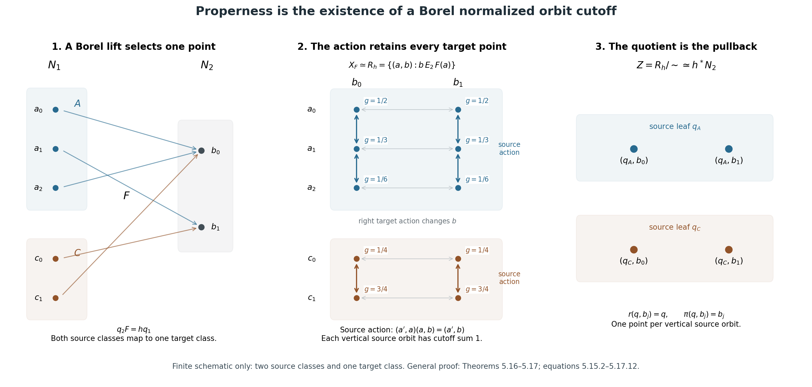
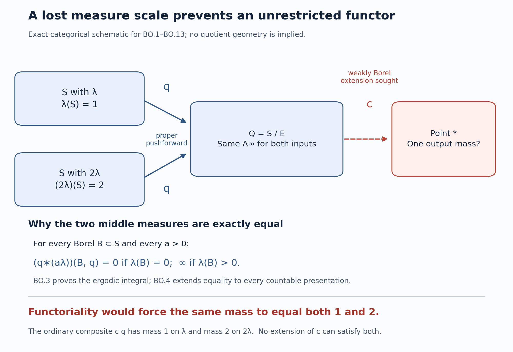
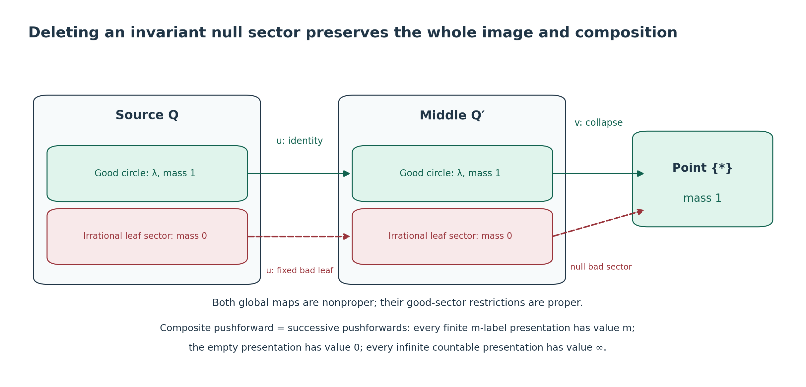
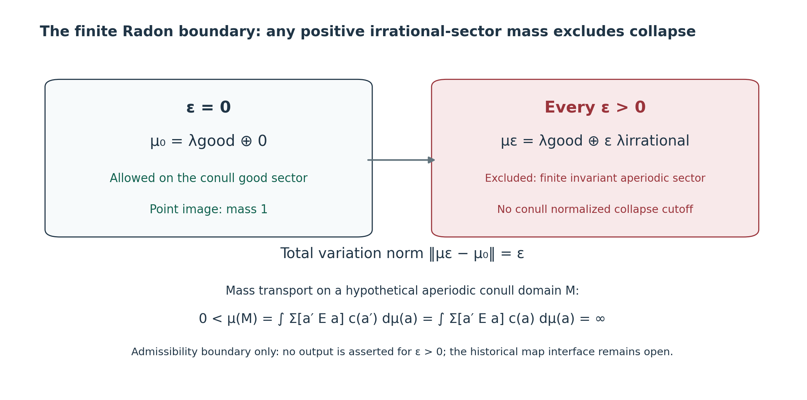
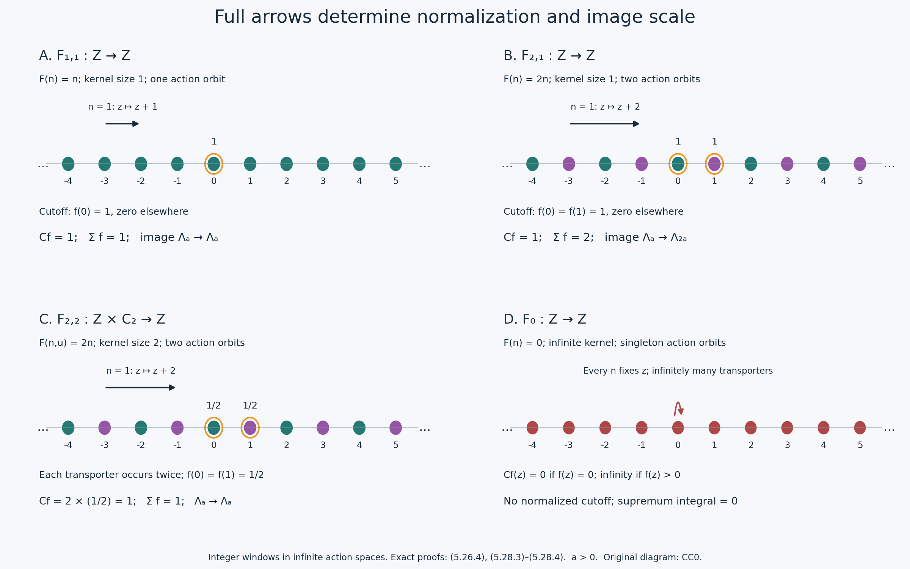
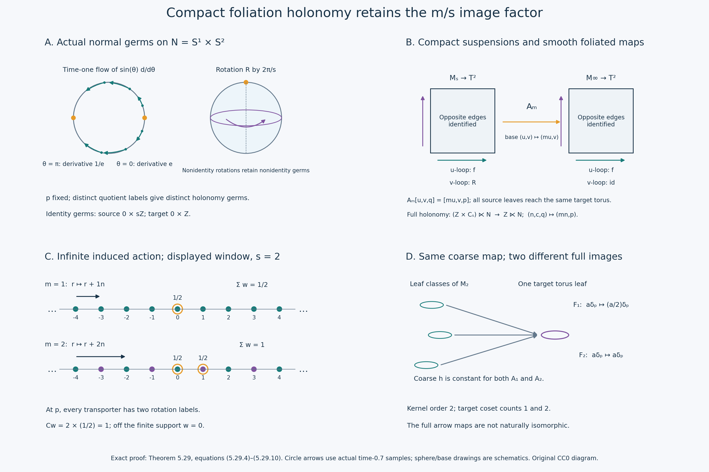
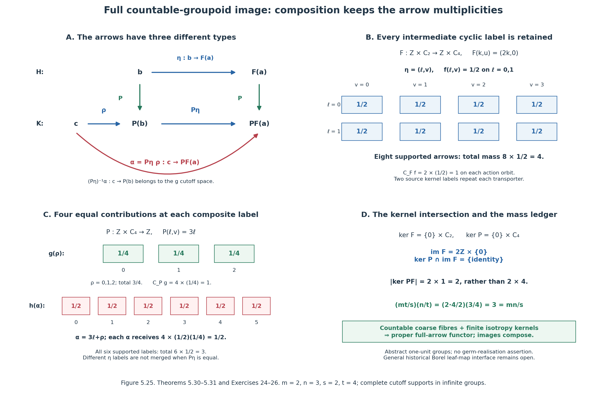
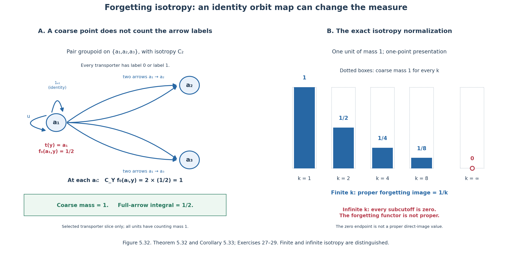
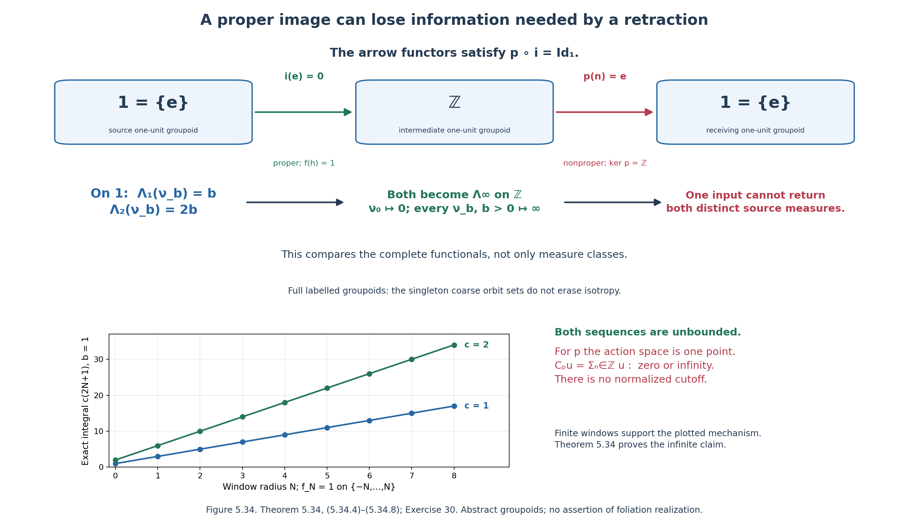
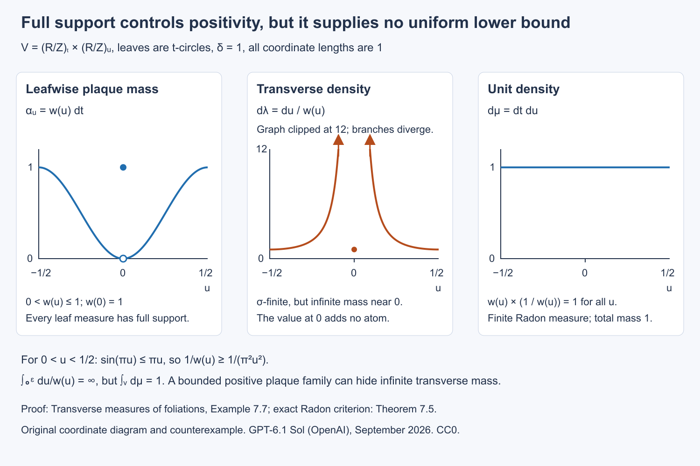

# Transverse measures of foliations

*Public domain (CC0).*

## Introduction

A foliation partitions a manifold into connected immersed manifolds called leaves. A dense leaf shows why the quotient by this partition need not be a useful topological space. There is nevertheless a geometric way to measure the leaves: put measures on small slices across them, and require transport along a leaf to preserve those measures. Integration along a plaque then turns a transverse measure into a current on the original manifold. Closedness of the current expresses the conservation law behind that transport.

This lesson proves the correspondence in both directions. It also treats a positive cocycle, for which transport changes mass by a specified factor, and explains the associated measure on the manifold. The distinction between leafwise integration and counting intersections with a transversal will matter in the index theorem.

We assume foliation charts, integration of differential forms and positive Radon measures. The positive-functional representation on \(C_c(X)\), for any locally compact Hausdorff \(X\), is proved in Haar measure on locally compact groups, Theorem 2.2; its proof does not require \(X\) to be a group. This supplies the representation theorem used for transverse test functions. The groupoid prerequisites are [Measured groupoids and transverse measures](https://kokunoyumeto.github.io/open-math-courses-public/courses/noncommutative-integration/measured-groupoids-and-transverse-measures.html). For operator-valued dimensions, use [Square-integrable representations and random operators](https://kokunoyumeto.github.io/open-math-courses-public/courses/noncommutative-integration/square-integrable-representations-and-random-operators.html) and [Weights on random operators and formal dimension](https://kokunoyumeto.github.io/open-math-courses-public/courses/noncommutative-integration/weights-on-random-operators-and-formal-dimension.html). The construction of the holonomy groupoid is developed in [The C*-algebra of a foliation](the-c-star-algebra-of-a-foliation.md).

Basic references are [Ruelle–Sullivan], [Connes], and [Winkelnkemper]. The proofs below use local test functions to identify the transverse measure.

## 1. Plaques and transport

Let \(V\) be a second countable Hausdorff smooth manifold without boundary. Let \(F\subset TV\) be an integrable subbundle of rank \(p\), and put \(q=\dim V-p\). A foliation chart is an open set identified with \(P\times T\), where \(P\subset\mathbb R^p\) is a ball and \(T\subset\mathbb R^q\) is open. Its plaques are \(P\times\{u\}\). Small connected components of overlaps induce local diffeomorphisms between the spaces \(T\). Finite compositions are the holonomy maps.

The arguments involving leafwise densities also apply to a foliation of class \(C^{\infty,0}\): all leafwise derivatives are continuous in the transverse variable, and transverse coordinate changes are local homeomorphisms. Statements about ambient differential forms and ordinary de Rham homology require the smooth ambient structure specified above.

Fix a countable atlas of relatively compact charts, after subdividing overlaps into countably many smaller boxes. Its finite chains give countably many local holonomy maps. Every leafwise path is covered by such a finite chain: compactness of its parameter interval gives a finite subdivision, and adjacent subdivisions can be chosen to overlap in a small plaque box. Thus any two points on a leaf can be related by a finite chain. Countability here concerns the available maps, and does not say that a leaf contains countably many points.

**Definition 1.1.** A locally finite holonomy-invariant transverse measure is a family of positive Radon measures \(\lambda_T\) on the transverse coordinate spaces, compatible with restriction and satisfying

\[
\lambda_{T'}(h(A))=\lambda_T(A)
\]

for every holonomy map \(h:T\supset D\to D'\subset T'\) and every Borel \(A\subset D\). The same rule defines a measure on each smooth transversal by using its local projection onto \(T\).

There is no probability normalization in this definition. On compact \(V\), local finiteness makes the measure obtained by integrating any continuous leafwise density over \(V\) finite.

**Lemma 1.2 (Borel transport on ordinary transversals).** Let \(N_1,N_2\) be smooth transversals. If \(A_i\subset N_i\) are Borel and \(\psi:A_1\to A_2\) is a Borel bijection such that \(x\) and \(\psi(x)\) lie on the same leaf, then

\[
\lambda_{N_1}(A_1)=\lambda_{N_2}(A_2).
\]

**Proof.** Cover the two transversals by countably many chart pieces. On any chosen pair of pieces, enumerate the holonomy maps arising from finite chart chains as \(h_1,h_2,\ldots\). Their graphs contain every pair of points on the same leaf. The sets

\[
A_n=\{x\in A_1:x\in\operatorname{dom}h_n, \psi(x)=h_n(x)\}
\setminus\bigcup_{j<n}A_j
\]

are Borel: equality is a Borel condition in the Hausdorff target. They partition the portion under consideration. Each \(h_n\) is a homeomorphism on its domain, so \(h_n(A_n)\) is Borel. Since \(\psi\) is injective, these images are disjoint. Apply Definition 1.1 and countable additivity. A countable subdivision over the chart pieces finishes the proof. \(\square\)

## 2. A local conservation lemma

Orient \(F\). A leafwise top form is a section of \(\Lambda^pF^*\). Write \(d_F\) for the exterior derivative along leaves. Compactly supported leafwise forms have class \(C^{\infty,0}\). When \(p=0\), a top form is a function and the conservation condition below is empty.

**Lemma 2.1.** Suppose \(P=I_1\times\cdots\times I_p\) is a rectangular plaque box. Every compactly supported \(C^{\infty,0}\) function \(f(t,u)\) whose plaque integral is zero,

\[
\int_P f(t,u)\,dt=0\qquad(u\in T),
\]

has a decomposition

\[
f=\sum_{j=1}^p\partial_{t_j}g_j,
\qquad g_j\in C_c^{\infty,0}(P\times T).
\]

**Proof.** Choose \(a_j\in C_c^\infty(I_j)\), \(a_j\ge0\), with integral one. Let \(P_j\) replace the dependence on \(t_j\) by \(a_j(t_j)\) times its integral in that variable. The identity

\[
f-P_1\cdots P_pf
=\sum_{j=1}^pP_1\cdots P_{j-1}(f-P_jf)
\]

follows by telescoping. The operators \(P_j\) commute, and \(P_1\cdots P_pf=0\) by the hypothesis. Each summand has zero integral in \(t_j\). Its integral from the left end of \(I_j\) to \(t_j\) defines \(g_j\). This primitive vanishes both before and after the compact support in that variable, since the total integral is zero. Its support in the other variables lies in a fixed compact set: projections of the support of \(f\), together with the supports of the \(a_i\). Differentiation under a bounded integral shows the required smoothness and transverse continuity. \(\square\)

**Proposition 2.2 (local product form).** Let \(C\) be a positive linear functional on compactly supported leafwise top forms in \(P\times T\). Suppose

\[
C(d_F\beta)=0
\qquad\bigl(\beta\in C_c^{\infty,0}(\Lambda^{p-1}F^*)\bigr).
\]

Then there is a unique positive Radon measure \(\lambda\) on \(T\) such that

\[
C(f\,dt_1\wedge\cdots\wedge dt_p)
=\int_T\int_P f(t,u)\,dt\,d\lambda(u).
\]

**Proof.** Put \(a=\prod_j a_j\), with the bumps of Lemma 2.1. Define a positive functional on transverse test functions by \(\ell(b)=C(a(t)b(u)\,dt)\). Positivity bounds \(\ell\) on each compact set: choose a nonnegative bump \(b_0\) equal to one there; then

\[
|\ell(b)|\le\|b\|_\infty\ell(b_0)
\]

for real \(b\) supported there. Smooth transverse tests extend to continuous ones by this bound and uniform approximation. In the \(C^{\infty,0}\) case the transverse tests are already continuous. The Riesz representation theorem gives a Radon measure \(\lambda\).

For \(f\), put \(b(u)=\int_Pf(t,u)dt\). The function \(f-ab\) has zero plaque integral. Lemma 2.1 makes its top form a sum of \(d_F\)-exact compactly supported forms. Hence \(C(f\,dt)=C(ab\,dt)=\ell(b)\). This proves the formula. Testing \(ab\,dt\) proves uniqueness. For a general ball \(P\), cover compact supports by rectangular boxes; uniqueness on overlaps gives the same conclusion. For \(p=0\), use Riesz directly. \(\square\)

This proof identifies an often useful analytic point: closedness imposes a differential equation on the plaque variable, while positivity rules out distributional transverse coefficients.

## 3. The Ruelle–Sullivan correspondence

A \(p\)-current on \(V\) is a continuous linear functional on compactly supported smooth \(p\)-forms. Its boundary is defined here by \(\partial C(\beta)=C(d\beta)\). We call it positive along \(F\) if \(C(\alpha)\ge0\) whenever the restriction \(\alpha|_F\) is a nonnegative oriented top form. This positivity condition also forces \(C(\alpha)=0\) when \(\alpha|_F=0\), by applying it to both \(\alpha\) and \(-\alpha\).

**Theorem 3.1 (Ruelle–Sullivan).** For an oriented smooth foliation, locally finite holonomy-invariant transverse measures correspond bijectively to closed \(p\)-currents positive along \(F\). In a foliation chart the correspondence is

\[
C_\lambda(\alpha)=\int_T\left(\int_{P\times\{u\}}\alpha\right)d\lambda_T(u)
\]

for \(\alpha\) supported inside that chart.

**Proof.** Start with \(\lambda\). The displayed formula is finite on compact supports and defines a current of order zero: on a fixed compact set it is bounded by a constant times the supremum of the leafwise coefficient of \(\alpha\). Coordinate changes preserve the oriented plaque integral, and transverse changes preserve \(\lambda\). Consequently the local formulas agree on overlaps. A locally finite partition of unity combines them into a current on \(V\). This current is positive along \(F\).

For a form \(\beta\) compactly supported inside a chart, Stokes's theorem on each plaque gives \(C_\lambda(d\beta)=0\). For arbitrary compactly supported \(\beta\), choose a partition \(\chi_i\) subordinate to charts near its support. Then

\[
\sum_i d(\chi_i\beta)=d\beta,
\]

since \(\sum_i\chi_i=1\) and \(\sum_i d\chi_i=0\) there. Apply the local calculation to every summand. Thus \(C_\lambda\) is closed.

Conversely let \(C\) be closed and positive along \(F\). As noted above, it depends only on \(\alpha|_F\). In a chart, extend a compactly supported leafwise \((p-1)\)-form to an ambient form. Since restriction commutes with exterior differentiation, closedness gives \(C(d_F\beta)=0\). Proposition 2.2 produces a unique transverse measure \(\lambda_T\). On a smaller overlap, choose a compactly supported leafwise top form with plaque integral equal to an arbitrary transverse test function. Computing its value in both coordinate systems gives \(h^*\lambda_{T'}=\lambda_T\). Such tests exist by taking an integral-one bump on each small plaque box and applying the coordinate change. Equality on the small overlaps gives equality along every finite holonomy chain. We have obtained Definition 1.1.

The two constructions are inverse by the uniqueness in Proposition 2.2. \(\square\)

*Reference:* [Ruelle–Sullivan] introduced the associated geometric currents. [Connes] develops the measure/current correspondence for foliations.

**Corollary 3.2.** If \(V\) is compact, \(C_\lambda\) determines a real homology class \( [C_\lambda]\in H_p(V;\mathbb R)\). If a differential form \(\eta\) vanishes on \(F\), then

\[
C_\lambda(\eta\wedge\zeta)=0
\]

whenever the product has degree \(p\).

**Proof.** A closed current pairs with de Rham cohomology because it vanishes on exact forms; de Rham's theorem identifies the dual pairing with real homology on compact \(V\). The restriction of the displayed product to \(F\) is zero, so positivity along \(F\) makes its value zero. \(\square\)

The same local proof gives a statement that needs no ambient smoothness: positive functionals on compactly supported leafwise densities for a \(C^{\infty,0}\) foliation, annihilating leafwise divergences, correspond to invariant transverse Radon measures. Use densities in Proposition 2.2. A change of orientation is then unnecessary. Ordinary homology is an additional conclusion for smooth oriented foliations, rather than part of this density formulation.

## 4. Changing the speed of a flow

Suppose \(p=1\) and \(F\) is oriented. Choose a nowhere-zero positive vector field \(X\), and let \(\theta\in F^*\) satisfy \(\theta(X)=1\). Define a measure on \(V\) by

\[
\mu_X(f)=C_\lambda(f\theta).
\]

In a flow box with \(X=\partial_t\), this measure is \(dt\,d\lambda(u)\). Thus it is invariant under the flow of \(X\) wherever the flow is defined. If the flow is complete, local invariance gives invariance for every time by subdividing a compact time interval into flow boxes. Conversely, a Radon measure invariant under this flow satisfies \(\int X(f)d\mu_X=0\) for compactly supported smooth \(f\). In a flow box, Proposition 2.2 in dimension one gives the product expression and hence a transverse measure.

**Proposition 4.1.** If \(X'=aX\) with (a>0) smooth, the same transverse measure is represented by

\[
\mu_{X'}=a^{-1}\mu_X.
\]

**Proof.** The dual form is \(\theta'=a^{-1}\theta\). The defining formula for \(\mu_{X'}\) gives the result. Local invariance follows also from

\[
\int X'(f)\,d\mu_{X'}=\int X(f)\,d\mu_X=0.
\]

Thus multiplying the speed multiplies the time-volume by the reciprocal factor. \(\square\)

**Example 4.2.** On \(\mathbb T^2=\mathbb R^2/\mathbb Z^2\), let \(X=\partial_x+\alpha\partial_y\), with \(\alpha\) irrational. Normalized Haar measure \(\mu\) is invariant. The current is

\[
C(a\,dx+b\,dy)=\int_{\mathbb T^2}(a+\alpha b)\,d\mu.
\]

It has homology class \((1,\alpha)\) in the basis given by the two coordinate circles. On the transversal \(x=0\), the transverse measure is \(dy\), and the return map \(y\mapsto y+\alpha\) preserves it. For a smooth speed \(a_0(x,y)>0\), the invariant measure representing this same current is \(a_0^{-1}\mu\). Normalizing that measure to mass one would also rescale the transverse measure and the current.

## 5. Borel sets meeting leaves countably

A Borel transversal means a Borel subset \(B\subset V\) meeting every leaf in at most countably many points. This is broader than a smooth transversal.

The descriptive-set-theoretic statement needed here is the Lusin–Novikov theorem: a Borel map between standard Borel spaces with countable fibres admits a countable Borel partition of its domain on each piece of which it is injective; the images of these pieces are Borel. We first use it in the geometric construction, then prove it in Theorem 5.4 below. [Moschovakis] and [Tserunyan] give its general descriptive-set-theoretic context.

**Proposition 5.1.** Definition 1.1 extends uniquely to a countably additive function \(B\mapsto\Lambda(B)\in[0,\infty]\) on Borel transversals, invariant under leaf-preserving Borel bijections. In one chart it is

\[
\Lambda(B)=\int_T\#\bigl(B\cap(P\times\{u\})\bigr)\,d\lambda_T(u).
\]

**Proof.** The plaque projection of \(B\) is Borel and countable-to-one. Lusin–Novikov partitions \(B\) into Borel pieces \(B_n\) projecting injectively onto Borel subsets of \(T\). Define the value to be the sum of the measures of those subsets. This is the displayed integral, since the number of pieces over \(u\) is the fibre cardinality, including the value infinity.

Partition a general \(B\) into disjoint pieces lying in countably many charts and apply the local formula. To check independence, refine two such partitions simultaneously into Borel pieces projecting injectively in both charts. The induced maps between transverse coordinate spaces have graphs in the leaf relation. Lemma 1.2 applies, so the two sums agree. Countable additivity follows by refining partitions again.

For a Borel leaf-preserving bijection between \(B\) and \(B'\), partition its graph into pieces on which both endpoints project injectively in charts. Each induced transverse bijection is Borel, and Lemma 1.2 preserves its measure. Sum over disjoint pieces. Uniqueness follows because each injective piece can be transported to the smooth central transversal of its chart. \(\square\)

Readers following the geometry first may continue to the Borel-transversal theorem and mass transport in Theorems 5.6–5.7, using the stated countable-section theorem. Lemmas 5.2–5.3 and Theorem 5.4 provide its full technical proof; return to this ordinal argument when studying why the measurable selections exist. The proof remains part of the prerequisite chain.

### A proof of the countable-section theorem

We need three exact standard-Borel facts from the public prerequisites: Polish topology refinement preserving the Borel sets, including its countable-join construction, in The Effros Borel structure, Theorem 2.2; continuous parametrization of a nonempty Polish space by Baire space in [Polish spaces and standard Borel spaces, Theorem 1.1](https://kokunoyumeto.github.io/open-math-courses-public/courses/foundations-of-von-neumann-algebras/polish-spaces-and-standard-borel-spaces.html#oa-fnd-pb-01); and the injective Borel image theorem in its [Theorem 4.3](https://kokunoyumeto.github.io/open-math-courses-public/courses/foundations-of-von-neumann-algebras/polish-spaces-and-standard-borel-spaces.html#oa-fnd-pb-06). These facts do not include the countable-section theorem. We prove the additional assertion here.

Write \(\mathcal N=\mathbb N^{\mathbb N}\), with \(\mathbb N=\{0,1,\ldots\}\). A tree is a subset of the countable set \(\mathbb N^{<\mathbb N}\) closed under prefixes; the empty tree is allowed. Its branches are the sequences all of whose prefixes are in the tree. A tree is well founded if it has no branch. On a well-founded tree the ordinal rank is

\[
\rho_T(s)=\sup\{\rho_T(sn)+1:sn\in T\},
\qquad\sup\varnothing=0.
\]

All these ranks are countable: recursion takes place on a countable well-founded set, and each supremum is countable. We may add a common root when comparing trees.

**Lemma 5.2 (a uniform bound for Borel families of well-founded trees).** If \(x\mapsto T_x\) is Borel from a standard Borel space into the space of trees and every \(T_x\) is well founded, their root ranks have a common countable ordinal bound.

**Proof.** The space of trees is a closed subspace of \(\{0,1\}^{\mathbb N^{<\mathbb N}}\). Refine a Polish topology on the parameter space, without changing its Borel sets, to make the preimages of its countable cylinder base clopen. The countable-join theorem cited above makes the map to trees continuous. If the parameter space is nonempty, compose it with a continuous surjection from \(\mathcal N\). We obtain a continuous family \(f(z)\) of well-founded trees, containing every tree of the original family.

Form a single tree \(U\) of pairs \((u,s)\) of words of equal length by putting
\((u,s)\in U\) exactly when there is some \(z\) extending \(u\) with \(s\in f(z)\). It is a tree on the countable alphabet \(\mathbb N\times\mathbb N\). It is well founded. Indeed, a branch would give infinite sequences \(z,y\) such that for every \(n\) there is \(z_n\) extending \(z|n\) with \(y|n\in f(z_n)\). Since \(z_n\to z\), continuity and the clopen condition of containing a fixed node imply \(y|k\in f(z)\) for every fixed \(k\), contradicting well-foundedness of \(f(z)\).

For fixed \(z\), the prefix-preserving map \(s\mapsto(z|\lvert s\rvert,s)\) embeds \(f(z)\) into \(U\). Induction on node rank bounds every rank in \(f(z)\) by the corresponding rank in \(U\). The countable rank of the root of \(U\), or that rank plus one if a root was added, is the desired common bound. The empty parameter space is immediate. \(\square\)

**Lemma 5.3 (continuous maps and closed branch coding).** A Borel map \(p:Y\to X\) between standard Borel spaces admits Polish topologies with the same Borel sets such that \(p\) is continuous and \(Y\) is homeomorphic to a closed subspace of \(\mathcal N\). For the resulting closed graph \(R\subset X\times\mathcal N\), there is a Borel family of trees \(T_x\) whose branches are exactly \(R_x\).

**Proof.** Choose a Polish topology on \(X\). Refine a Polish topology on \(Y\) to make the inverse images of a countable base of \(X\) clopen. This makes \(p\) continuous. To obtain a zero-dimensional Polish refinement as well, iterate the following operation: make every member of a countable base of the current topology clopen, using countably many admissible refinements and their join. Take the join over all iterations. It is Polish with the same Borel sets by the countable-join result cited above. The union of the bases, with finite intersections, is a clopen base for this final topology, and \(p\) remains continuous.

With a complete compatible metric on this zero-dimensional \(Y\), take countable clopen partitions refining each other, with diameters at most \(2^{-n}\) at level \(n\ge1\). To construct a partition, cover each previous cell by countably many sufficiently small clopen sets and subtract the finitely many preceding sets from each successive one. Remove empty cells. Coding the unique cell containing a point at every level embeds \(Y\) in \(\mathcal N\). The allowed codes are precisely the sequences of nonempty cells satisfying the refinement condition. This condition is closed in \(\mathcal N\), and every allowed sequence has one point in the intersection of its nested closed cells by completeness and the diameter bound. The coding and its inverse are continuous. Thus its image is closed.

The graph of the continuous map \(p\) is now closed in \(X\times\mathcal N\). Choose a compatible metric \(d\) on \(X\). For a word \(s\), let

\[
U_s=\bigcup\{B_d(x',2^{-\lvert s\rvert}):(x',y)\in R,
\ y\text{ extends }s\},
\qquad T_x=\{s:x\in U_s\}.
\]

Every \(U_s\) is open, even though the unthickened projection in this formula need not be Borel. The decreasing radii make \(T_x\) a tree, and its node-membership tests are Borel. If \((x,y)\in R\), all prefixes of \(y\) belong to \(T_x\). Conversely, for a branch \(y\), choose \((x_n,y_n)\in R\) with \(d(x_n,x)<2^{-n}\) and \(y_n|n=y|n\). Then \((x_n,y_n)\to(x,y)\), and closedness of \(R\) gives \((x,y)\in R\). This proves the coding assertion. \(\square\)

**Theorem 5.4 (Lusin–Novikov).** A Borel map \(p:Y\to X\) between standard Borel spaces with countable fibres admits a countable Borel partition \(Y=\bigsqcup_iY_i\) on whose pieces it is injective. Each image \(p(Y_i)\) is Borel, and the inverse on that image is Borel. More generally a Borel relation \(A\subset X\times Z\) with countable vertical sections is a countable union of graphs of Borel partial maps with Borel domains. Its projection is Borel, and it has a Borel section over that projection when the sections are nonempty.

**Proof.** Use Lemma 5.3. Every tree \(T_x\) has countably many branches. For a tree \(T\), remove nodes that cannot split, by the transfinite recursion

\[
T^0=T,\qquad
T^{\alpha+1}=\{s\in T^\alpha:
\text{two incomparable extensions of }s\text{ belong to }T^\alpha\},
\qquad T^\lambda=\bigcap_{\alpha<\lambda}T^\alpha.
\]

The sets remain trees. At each fixed countable ordinal, all node-membership conditions in \(T_x^\alpha\) are Borel: successor conditions are countable unions of finite intersections, and countable limit stages are countable intersections.

There is one countable ordinal \(\theta\) with \(T_x^\theta=\varnothing\) for every \(x\). Here is the full boundedness argument. Form the tree \(S(T)\) of finite full binary splitting systems in \(T\): the first level chooses one node, and each later level chooses two proper incomparable extensions of each previous leaf. Codes for a level are natural numbers, since each level is finite and the node set is countable. A branch in \(S(T)\) supplies a full infinite binary splitting system, hence injects \(\{0,1\}^{\mathbb N}\) into the branches of \(T\): take the union of nodes along each binary path. Distinct paths disagree at an incomparable pair. Thus \(S(T_x)\) is well founded, since \(T_x\) has countably many branches. Its node tests use finitely many node tests of \(T_x\), so \(x\mapsto S(T_x)\) is Borel. Lemma 5.2 supplies \(\theta\) strictly above all its root ranks.

If the leaves of a finite splitting system lie in \(T^\alpha\), the rank of that node in \(S(T)\) is at least \(\alpha\). Prove this by induction: at a successor stage split every leaf into two extensions in \(T^\beta\), giving a child of rank at least \(\beta\); at a limit stage use the bounds for every smaller ordinal. If \(T_x^\theta\) contained a node, the one-node splitting system would therefore have rank at least \(\theta\), contradicting the root bound. This proves uniform emptiness without assuming a bound on the ranks in advance.

For \(\alpha<\theta\) and a word \(s\), consider the Borel set of parameters satisfying both

\[
s\in T_x^\alpha\setminus T_x^{\alpha+1},\qquad
(\forall n\ge\lvert s\rvert)(\exists t\in T_x^\alpha)
\quad s\preceq t,\quad\lvert t\rvert=n.
\]

Because \(s\) cannot split in \(T_x^\alpha\), all its descendants there form one chain. The second condition makes that chain infinite, so it determines a unique branch \(y_{\alpha,s}(x)\). The branch is a Borel function on this Borel domain: at any length the unique descendant is determined by countably many Borel node tests.

These partial branches cover every branch of every \(T_x\). For a branch \(y\), give each prefix its first removal ordinal. Such an ordinal exists by uniform emptiness, and it is a successor, because a node absent at a limit stage was already absent earlier. The removal ordinals are nonincreasing along the prefixes. Their minimum is attained at some prefix \(s\), say at ordinal \(\alpha+1\). Every longer prefix still belongs to \(T_x^\alpha\), while \(s\) is removed at its next stage. Thus \(y=y_{\alpha,s}(x)\).

There are only countably many pairs \((\alpha,s)\). Enumerate them, and discard from each partial graph the points already in preceding graphs; equality of two Borel partial branches is Borel. The resulting graphs partition \(R\). Transfer them back to \(Y\). Each partial inverse is injective, since it selects a point of the fibre of \(p\) over its parameter. The injective Borel image theorem cited above makes its range a Borel subset of \(Y\), and \(p\) maps that range bijectively and Borelly onto the partial inverse's Borel domain. These ranges give the required partition.

For a relation \(A\), apply the map assertion to \(A\to X\). The space \(A\) is standard Borel by the Borel-subspace theorem cited above. Composing each partial inverse with the second projection gives the stated graphs. The projection is the countable union of their Borel domains. On it choose the first partial map whose domain contains the point; the choice is Borel. This proves the final assertions. \(\square\)

**Corollary 5.5 (enumeration and fibre cardinality).** In Theorem 5.4 the function
\(F(x)=\#p^{-1}(x)\in\{0,1,\ldots,\infty\}\)
is Borel, and there is a Borel bijection over \(X\)

\[
Y\simeq\{(x,n):0\le n<F(x)\}.
\]

Two such pairs over standard Borel \(X\) are isomorphic over \(X\) exactly when their cardinality functions agree.

**Proof.** Use the disjoint partial inverses just constructed, with domains \(D_i\). Then \(F=\sum_i1_{D_i}\) is Borel. For \(n<F(x)\), use the \(n\)-th index \(i\) with \(x\in D_i\); its index is Borel, since deciding any value of it uses finitely many domain tests. Send \((x,n)\) to that partial inverse. On each of countably many Borel pieces this is Borel and injective, and it enumerates each fibre without repetition. Its inverse is Borel by the injective Borel image theorem, or directly by the same finite domain count. Matching the \(n\)-th point in two enumerations proves the last statement; necessity follows from a fibrewise bijection. \(\square\)

**Theorem 5.6 (the Borel-transversal definition).** Definition 1.1 is equivalent to the following definition: a nonnegative countably additive function on Borel transversals, invariant under leaf-preserving Borel bijections, and finite on every compact subset of a smooth transversal. Its current is the one in Theorem 3.1.

**Proof.** Theorem 5.4 discharges the prerequisite in Proposition 5.1, which constructs the extension, its invariance, countable additivity and uniqueness. A compact subset of a smooth transversal has finite value by the original Radon condition and a finite cover by transverse chart pieces.

Conversely, restrict the given function to the Borel subsets of each smooth central transversal. Its countable additivity gives a Borel measure there; compact finiteness makes it locally finite and Radon on this locally compact second countable space. The invariance axiom applied to each holonomy map gives Definition 1.1. Partition any Borel transversal in a box into the injective pieces of Theorem 5.4 and transport each piece to the central transversal. Its value is forced to be the counting integral in Proposition 5.1. This also proves that the two constructions are inverse. The local plaque integral against these Radon measures is the local formula of Theorem 3.1. Its overlap compatibility and closedness were proved there, so the resulting current is exactly the same closed positive foliation current. \(\square\)

**Theorem 5.7 (mass transport between Borel transversals).** Let \(B,B'\) be Borel transversals and

\[
R=\{(x,y)\in B\times B':x,y\text{ lie on the same leaf}\}.
\]

For every nonnegative Borel function \(a\) on \(R\),

\[
\int_B\sum_{y\in B'\cap L_x}a(x,y)\,d\Lambda(x)
=\int_{B'}\sum_{x\in B\cap L_y}a(x,y)\,d\Lambda(y).
\]

The two values may be infinite.

**Proof.** The leaf relation is Borel. Indeed the image of one arrow chart under its endpoint map is a Borel subset of \(V\times V\): that map is injective on the chart, by its fixed holonomy branch and endpoint coordinates, and its image is Borel by the injective Borel image theorem. Countably many chart images cover the relation. In \(R\), each projection has countable fibres, because both transversals meet a leaf countably.

Apply Theorem 5.4 to the first projection. This expresses \(R\) as a countable union of graphs of Borel partial maps \(\psi:B\to B'\). Each such map is countable-to-one: all its inverse images at a given point lie on that point's leaf. Apply Theorem 5.4 to it once more, partitioning its domain into Borel pieces on which it is injective. Its images are Borel, so these graph pieces are Borel bijections between Borel subsets of the two transversals. Enumerate and disjointize all graph pieces. Removing preceding graph pieces only restricts their Borel domains, leaving a countable partition of \(R\) by such graphs.

On one graph \(y=\psi(x)\), the invariance in Theorem 5.6 makes \(\psi\) measure preserving on all Borel subsets of its domain. First for indicator functions, then simple functions and increasing limits, it gives
\(\int a(x,\psi(x))d\Lambda(x)=\int a(\psi^{-1}(y),y)d\Lambda(y)\).
Sum over the graph partition and use monotone convergence. The fibre sums are Borel by the same partial-map enumeration, so the two integrals in the statement are defined. This proves the identity without subtracting infinite values. \(\square\)

For a quotient that is not standard Borel, numerical fibre cardinalities do not provide this classification. Isomorphism means existence of a Borel bijection of the presenting spaces over the quotient. For arbitrary set \(Q\), two presentations \(p_i:Y_i\to Q\) are compatible when each relation \(p_i(y)=p_j(z)\) is Borel in \(Y_i\times Y_j\), including the two self-relations. If the quotient Borel structure on \(Q\) is standard and the projections are Borel for it, Corollary 5.5 applies. The next construction keeps compatibility and Borel isomorphism information when this standard-quotient hypothesis is unavailable.

**Example 5.8 (equal infinite cardinalities, different transverse masses).** For the irrational linear flow of Example 4.2, take \(B=\{x=0\}\) and \(B'=\{x=0,\ 0<y<a\}\), with \(0<a<1\). Every leaf meets both in infinitely many points: its returns to the first transversal are an irrational-rotation orbit, and that orbit visits the open interval infinitely often. To verify density, the pigeonhole principle gives nonzero integer multiples of the rotation angle modulo one arbitrarily close to zero; successive multiples of such a small step approximate every circle point. Removing finitely many orbit points does not change its closure. Thus both fibre cardinalities are infinity on every leaf. Nevertheless \(\Lambda(B)=1\) and \(\Lambda(B')=a\). Invariance forbids a Borel bijection over the leaf quotient. Proposition 1.2 of the index lesson similarly forbids a measurable unitary isomorphism of their counting bundles. The numerical cardinalities have discarded information measured by the transverse mass.

### Countable presentations of the leaf space

Put \(Q=V/F\). A pair \((Y,p)\) consists of a standard Borel space and a map \(p:Y\to Q\) with countable fibres. Call it Borel when

\[
I_Y=\{(y,x)\in Y\times V:x\in p(y)\}
\]

is Borel. A complete Borel transversal \(N\subset V\) exists: take the union of central slices in a countable plaque atlas. This union is Borel, meets each leaf, and meets it countably. We use the ordinary subset union, so overlapping slices do not duplicate a point.

**Proposition 5.9 (compatibility and the measure on presentations).** The Borel pairs form exactly the maximal compatible collection containing the complete transversal pair. Explicitly a pair is in this collection if and only if its relation of equal projected leaves with every pair in the collection is Borel. A transverse measure determines a unique nonnegative function \(\Lambda(Y,p)\) on this collection, additive on countable disjoint sums and invariant under Borel bijections over \(Q\). Conversely such a function, finite on compact subsets of smooth transversals, determines the original transverse measure.

**Proof.** For two Borel pairs, equality \(p(y)=q(z)\) is equivalent to the existence of \(n\in N\) with both \((y,n)\in I_Y\) and \((z,n)\in I_Z\). This is a projection of a Borel relation whose sections in \(n\) are countable. Theorem 5.4 makes it Borel. Thus all the pairs are compatible, including each pair with itself.

Conversely, if the equal-leaf relation between \(Y\) and \(N\) is Borel, then \(I_Y\) is Borel. Indeed \(x\in p(y)\) means that some \(n\in N\) is related to \(y\) and lies on the leaf of \(x\). The latter relation is Borel by Theorem 5.7's endpoint-chart argument. Again the possible \(n\)'s are countable, so Theorem 5.4 makes this projection Borel. Compatibility with all pairs therefore characterizes membership, since it in particular implies compatibility with \(N\). This proves the collection axiom.

The relation between \(Y\) and \(N\) has nonempty countable sections at every \(y\). Theorem 5.4 selects a Borel map \(\psi:Y\to N\) assigning a point of the specified leaf. Its fibres are countable, since every fibre is contained in a fibre of \(p\). Apply the same theorem to partition \(Y=\bigsqcup_iY_i\) so that the restrictions \(\psi_i\) are injective and have Borel images. Define

\[
\Lambda(Y,p)=\sum_i\Lambda(\psi_i(Y_i)).
\]

For two such choices refine their domain partitions simultaneously. On every resulting piece the two images are related by a Borel leaf-preserving bijection. Theorem 5.6 equates their measures; summing proves independence, also when the total is infinite. The same refinement argument proves invariance under a Borel bijection of presenting spaces over \(Q\). Countable disjoint unions remain standard Borel, have countable fibres and satisfy the incidence condition; using their component partitions proves additivity. Conversely an additive invariant function on these pairs restricts to the Borel-transversal definition of Theorem 5.6. A partition as above forces the displayed formula by additivity and invariance, proving uniqueness and the converse.

For a standard Borel base \(X\), the same argument reduces to the usual integral \(\int_XF(x)d\lambda(x)\) on its countable presentations, by Corollary 5.5. Thus ordinary standard-Borel measure theory is included, while the leaf-space construction retains the stronger presentation information of Example 5.8. \(\square\)

### Maps and pullback presentations

The pairs in Proposition 5.9 contain more information than the numerical set of leaves. Their maps must respect that information. Here is a precise category in which pushforward is defined. It also explains what must be checked before interpreting an assertion about a “Borel map of leaf spaces.”

**Definition 5.10 (a presentation Borel map).** Let \((Q_i,\mathcal B_i)\) be spaces with the collection axiom of Proposition 5.9. A set map \(h:Q_1\to Q_2\) is presentation Borel if, for every \((Y,p)\in\mathcal B_2\), the set

\[
h^*Y=\{(q,y)\in Q_1\times Y:h(q)=p(y)\}
\]

admits a standard Borel structure for which

\[
r_h(q,y)=q,\qquad \pi_h(q,y)=y
\]

make \((h^*Y,r_h)\) a pair in \(\mathcal B_1\) and \(\pi_h\) a Borel map. The countability of \(r_h\)'s fibres follows from that of \(p\)'s fibres. Existence of the Borel structure is a requirement; it is not implied by writing down this set.

This structure, when it exists, is unique up to the identity Borel isomorphism. Indeed take two such structures \(Z,Z'\) on the same set. Compatibility makes \(\{(z,z'):r_h(z)=r_h(z')\}\) Borel. Intersect it with the Borel condition \(\pi_h(z)=\pi_h(z')\). The intersection is exactly the graph of the identity bijection: a point of the pullback is determined by its two coordinates. Theorem 5.4 makes both directions of this bijection Borel.

**Theorem 5.11 (functorial pushforward).** If \(h\) is presentation Borel and \(\Lambda_1\) is an additive invariant measure on \((Q_1,\mathcal B_1)\), then

\[
(h_*\Lambda_1)(Y,p)=\Lambda_1(h^*Y,r_h)
\tag{4}
\]

is an additive invariant measure on \((Q_2,\mathcal B_2)\). Identity maps and composites are presentation Borel, and

\[
(\operatorname{id}_{Q})_*\Lambda=\Lambda,\qquad
(k\circ h)_*\Lambda=k_*(h_*\Lambda).
\]

On standard Borel spaces this is exactly ordinary Borel pushforward. No local-finiteness conclusion is part of the theorem.

**Proof.** First consider a Borel map \(\phi:Y\to Y'\) over \(Q_2\). The induced set map \(h^*\phi:(q,y)\mapsto(q,\phi(y))\) is Borel. Its graph is the intersection of the compatibility relation over \(Q_1\) with the condition \(\pi_h'(z')=\phi(\pi_h(z))\). This is Borel and has one point in each section over its source; Theorem 5.4 makes the induced map Borel. If \(\phi\) is a Borel isomorphism, the same argument for its inverse proves that \(h^*\phi\) is a Borel isomorphism over \(Q_1\). Invariance of \(\Lambda_1\) therefore proves invariance of (4).

For a disjoint union \(Y=\bigsqcup_nY_n\), its pullback is the set disjoint union of the \(h^*Y_n\). Its summands are Borel, because \(\pi_h\) is Borel. The standard Borel structure supplied by their disjoint union satisfies the two requirements in Definition 5.10; the collection is closed under such unions, as in Proposition 5.9. Uniqueness identifies it with the structure on \(h^*Y\). Additivity of \(\Lambda_1\) gives additivity of (4), including infinite values.

For the identity map, \(q=p(y)\) identifies its pullback with \(Y\), with projection \(p\). For composition, first form \(k^*Y\), then \(h^*(k^*Y)\). The bijection

\[
(q,(h(q),y))\longmapsto(q,y)
\]

makes this iterated pullback a standard Borel structure on \((k\circ h)^*Y\). Its map to \(Y\) is the composite of the two Borel projections, and its map to \(Q_1\) is already an admissible presentation. Uniqueness identifies the structures. Applying (4) twice gives the displayed composition identity.

If both \(Q_i\) are standard Borel with their ordinary collections, presentation Borel maps are precisely ordinary Borel maps. One direction follows by pulling back \((Q_2,\operatorname{id})\): the resulting presenting space is \(Q_1\), and its projection to \(Q_2\) is \(h\). Conversely, for an ordinary Borel \(h\), the equation \(h(q)=p(y)\) defines a Borel subset of \(Q_1\times Y\); its first projection is countable to one, and its second projection is Borel. This is the required pullback.

Write \(F_Y(q_2)=\#p^{-1}(q_2)\). Corollary 5.5 gives \(F_Y\) Borel, and the counting function of \(h^*Y\) is \(F_Y\circ h\). Thus the ordinary integral formula is

\[
(h_*\Lambda_1)(Y,p)
=\int_{Q_1}F_Y(h(q))\,d\lambda_1(q)
=\int_{Q_2}F_Y(q')\,d(h_*\lambda_1)(q').
\]

This verifies the full presentation measure, not only its values on injective subsets. Finally, local finiteness can fail even in the ordinary case: push Lebesgue measure on \(\mathbb R\) to a point. The target's compact singleton has infinite mass. The abstract measure is nevertheless well defined. \(\square\)

The criterion can be checked on complete transversals. This is useful because the set of leaves itself may have no standard Borel structure.

**Proposition 5.12 (the pullback criterion for leaf spaces).** Choose complete Borel transversals \(N_i\) for two foliations and write \(q_i:N_i\to Q_i\), \(E_i\) for their equal-leaf relations. Suppose the graph relation

\[
R_h=\{(n_1,n_2):h(q_1(n_1))=q_2(n_2)\}
\]

is Borel. On this standard Borel subset of \(N_1\times N_2\), define the countable Borel equivalence relation

\[
(n_1,n_2)\sim(n_1',n_2')
\quad\Longleftrightarrow\quad
n_2=n_2'\ \text{and}\ n_1E_1n_1'.
\tag{5}
\]

Then \(h\) is presentation Borel exactly when (5) is smooth, meaning that its classes are distinguished by a Borel map into a standard Borel space.

**Proof.** Suppose first that \(h\) is presentation Borel and pull back the pair \((N_2,q_2)\). For \((n_1,n_2)\in R_h\), there is exactly one point \(z\) of this pullback with \(r_h(z)=q_1(n_1)\) and \(\pi_h(z)=n_2\). The graph of \((n_1,n_2)\mapsto z\) is Borel: use compatibility between the source presentation and \(N_1\), then intersect with the second-coordinate condition. Theorem 5.4 makes the map Borel. Its fibres are precisely the classes of (5), which proves smoothness.

Conversely, a countable smooth Borel equivalence relation has a standard Borel quotient \(Z\) with a Borel choice \(t:Z\to R_h\) of one representative per class. To see this here, take a class-distinguishing Borel map \(b\). Its fibres are countable. Theorem 5.4 makes its image Borel and gives a Borel section on that image, which supplies \(Z\) and \(t\). Put \(t(z)=(a(z),b_2(z))\), and set

\[
r(z)=q_1(a(z)),\qquad \pi(z)=b_2(z).
\]

These maps identify \(Z\), as a set, with \(h^*N_2\). Its fibres over \(Q_1\) are indexed by the countable sets \(N_2\cap h(q)\). Its incidence relation with \(N_1\) is \(n_1E_1a(z)\), which is Borel. Proposition 5.9 therefore makes \((Z,r)\) an admissible source presentation. The map \(\pi:Z\to N_2\) is Borel.

It remains to pull back an arbitrary target presentation \((Y,p)\). In the standard Borel product \(Z\times Y\), take the Borel subset where \(q_2(\pi(z))=p(y)\). The equal-leaf relation between \(Y\) and \(N_2\) has countable nonempty sections, so Theorem 5.4 selects a Borel \(s:Y\to N_2\) with \(q_2s=p\). Retain the Borel subset where \(\pi(z)=s(y)\). It contains exactly one pair for each \((q,y)\) with \(h(q)=p(y)\): the set identification \(Z=h^*N_2\) supplies that unique \(z\). This subset is therefore a standard Borel space representing \(h^*Y\). Its fibres over \(Q_1\) are countable, and its incidence relation with \(N_1\) is \(n_1E_1a(z)\), which is Borel. Proposition 5.9 makes its projection to \(Q_1\) admissible; its projection to \(Y\) is Borel. Thus Definition 5.10 holds for every target pair. \(\square\)

**Example 5.13 (a Borel graph without a standard pullback).** Let \(Q_1\) be the irrational-flow leaf space of Example 4.2, with complete transversal \(N_1=\mathbb T^1\), and let \(Q_2\) be a point. The constant set map has Borel graph relation \(R_h=N_1\times\{*\}\). Its relation (5) is irrational-rotation orbit equivalence, which is not smooth. If it were smooth, the argument in Proposition 5.12 would give a Borel set \(B\) containing exactly one point in each orbit. The sets \(B+n\alpha\), \(n\in\mathbb Z\), would be pairwise disjoint and cover the circle. Invariant probability measure gives every one the same mass. A positive mass makes their sum infinite, and zero mass makes it zero; neither equals one. This contradiction proves nonsmoothness.

Consequently a Borel graph on complete transversals does not by itself justify (4). Definition 5.10 fixes the meaning used here. Example 5.13 shows that a Borel graph alone does not give a standard Borel pullback.

**Corollary 5.14 (a cutoff test).** The smoothness condition in Proposition 5.12 is equivalent to the existence of a Borel \(g:R_h\to[0,\infty)\) satisfying

\[
\sum_{w'\sim w}g(w')=1
\quad\text{for every }w\in R_h.
\]

**Proof.** A Borel selector gives \(g\) equal to its indicator, so the sum is one. Conversely a summable nonnegative function of total one on a countable class has a positive attained maximum, with finitely many maximizers. Theorem 5.4 enumerates each class by Borel partial maps. The supremum of their \(g\)-values is Borel. Embed \(R_h\) Borel injectively into \(\mathbb R\) and choose the maximizer with least image; it exists since there are finitely many. Its defining graph is Borel: the class relation and equality with the maximum are Borel, and the condition that no other maximizer has smaller image is a countable-section projection, hence Borel by Theorem 5.4. The chosen point depends only on the class. Its graph has singleton sections, so the selector is Borel and class distinguishing. This proves smoothness. \(\square\)

This test is a concrete way to check the pullback requirement. Neither a Borel graph nor a rule assigning numerical cardinalities supplies such a cutoff automatically.

### The bridge to proper measurable homomorphisms

The presentation category of Definition 5.10 has an exact relation to the proper measurable homomorphisms in [Connes 1979], Section III, Definitions 3 and 6 and Proposition 9. The following arguments establish that relation and compare the entire measures. They concern the principal countable equal-leaf relations on complete transversals, with module one. They do not identify arbitrary homomorphisms of the full holonomy groupoids with these principal relations.

The only descriptive-set prerequisites are the proved Theorem 5.4 and Corollary 5.5, together with the Borel image and Borel-subspace results already used in their proof. For clarity, their exact programme providers are The Effros Borel structure, Theorem 2.2, including its countable joins, and [Polish spaces and standard Borel spaces, Theorem 1.1](https://kokunoyumeto.github.io/open-math-courses-public/courses/foundations-of-von-neumann-algebras/polish-spaces-and-standard-borel-spaces.html#oa-fnd-pb-01) and [Theorem 4.3](https://kokunoyumeto.github.io/open-math-courses-public/courses/foundations-of-von-neumann-algebras/polish-spaces-and-standard-borel-spaces.html#oa-fnd-pb-06). Theorem 5.4, rather than an external reference to countable sections, supplies every selection and projection below. The measure arguments use Theorems 5.6–5.7 and Proposition 5.9. No unproved proper-groupoid pushforward theorem is imported.

Let \((V_i,\mathcal F_i)\) be second countable foliated manifolds, \(Q_i=V_i/\mathcal F_i\) their sets of leaves, and \(\mathcal B_i\) the countable-presentation collections of Proposition 5.9. Choose complete Borel transversals \(N_i\subset V_i\). Write

\[
q_i:N_i\longrightarrow Q_i,\qquad
E_i=\{(a',a)\in N_i^2:q_i(a')=q_i(a)\}.
\]

The \(E_i\) are countable Borel equivalence relations. We use them as **principal relation groupoids**, not as holonomy groupoids retaining isotropy. The arrow \((a',a)\) has source \(a\), range \(a'\), inverse \((a,a')\), and multiplication \((a'',a')(a',a)=(a'',a)\). All groupoid, action, and measure statements below have this exact scope. The invariant transverse measure has module \(\delta=1\).

Let \(h:Q_1\to Q_2\) be a set map. Assume the **weak graph condition**

\[
R_h=\{(a,b)\in N_1\times N_2:h(q_1(a))=q_2(b)\}
\quad\text{is Borel}.
\tag{5.15.1}
\]

Each section over \(a\) is nonempty and countable. Sections over \(b\) need not be countable: \(h\) may collapse uncountably many distinct source leaves. No standard Borel structure is assumed on either \(Q_i\).

### The induced principal action

**Lemma 5.15 (the principal action and its kernels).** Under (5.15.1), the induced action has the orbit relation (5.15.5). The source principal groupoid's proper transverse kernels are exactly (5.15.7), with the stated faithfulness criterion. There is a Borel \(F:N_1\to N_2\) with \(q_2F=hq_1\). It induces the Borel groupoid homomorphism

\[
\Phi_F:E_1\longrightarrow E_2,\qquad
\Phi_F(a',a)=(F(a'),F(a)).
\tag{5.15.2}
\]

**Proof.** Theorem 5.4 selects \(F(a)\) in the nonempty countable section \((R_h)_a\). If \(a'E_1a\), then \(hq_1(a')=hq_1(a)\), so \(F(a')E_2F(a)\). The formula is Borel, preserves sources, ranges, identities, inverses, and the displayed multiplication. No assertion that \(F\) is countable-to-one is required or generally true.

Connes's action space for a homomorphism is the **disjoint** union of target range fibres indexed by source units. Here it is

\[
X_F=\{(a,\eta):a\in N_1,\ \eta\in E_2^{F(a)}\}
=\{(a,(F(a),b)):bE_2F(a)\}.
\]

Its anchor is \(a\). The Borel bijection

\[
\iota_F:X_F\longrightarrow R_h,
\qquad (a,(F(a),b))\longmapsto(a,b)
\tag{5.15.3}
\]

has a Borel inverse. A source arrow \(\gamma=(a',a)\) acts by left multiplication:

\[
\gamma\cdot(a,(F(a),b))
=(a',\Phi_F(\gamma)(F(a),b))
=(a',(F(a'),b)).
\]

Under (5.15.3), this becomes

\[
(a',a)\cdot(a,b)=(a',b).
\tag{5.15.4}
\]

Consequently its orbit relation is exactly

\[
(a,b)\sim(a',b')
\quad\Longleftrightarrow\quad aE_1a'\ \text{and}\ b=b'.
\tag{5.15.5}
\]

It is a countable Borel equivalence relation even when the projection \(R_h\to N_2\) has uncountable fibres. The right \(E_2\)-action changes \(b\) by composing \((F(a),b)\) with an arrow \((b,b')\). It is free and transitive on each fibre over \(a\); hence \(X_F\) is a principal right \(E_2\)-bundle over \(N_1\). This fact does not imply properness of the left action.

### Properness and the presentation category

For the source groupoid, the counting transverse kernel is

\[
\nu_1^a=\sum_{a'E_1a}\delta_{(a,a')}.
\]

The inverse in Connes's convolution convention gives, for Borel \(c:R_h\to[0,\infty)\),

\[
(\nu_1*c)(a,b)
=\sum_{a'E_1a}c(a',b).
\tag{5.15.6}
\]

The counting kernel is faithful and proper. Indeed, apply Theorem 5.4 to the range projection of \(E_1\), partitioning \(E_1=\bigsqcup_jD_j\) into Borel sets with at most one arrow per range fibre. The finite unions \(A_n=\bigcup_{j\le n}D_j\) exhaust \(E_1\), and \(\nu_1^a(A_n)\le n+1\). Left invariance gives the same bound for every left translate in the proper-kernel definition.

More generally every proper left-invariant kernel on a principal countable relation groupoid has the form

\[
\nu_v^a=\sum_{a'E_1a}v(a')\delta_{(a,a')},
\qquad v:N_1\to[0,\infty)\ \text{Borel and finite-valued}.
\tag{5.15.7}
\]

To see this, evaluate the kernel at the diagonal singleton \((a',a')\) and use left translation. The resulting function \(v\) is Borel: integration of a Borel function of the parameter and arrow is Borel, first for rectangles and then by the monotone class theorem, so this applies to the diagonal indicator. Properness makes each atom finite. Conversely partition by the \(D_j\) above and impose \(v(s(\gamma))\le n\); their increasing finite unions give uniformly bounded fibre masses and exhaust the arrows. Thus every finite-valued \(v\) gives a proper kernel. Such a kernel is **faithful** exactly when every \(E_1\)-class contains a point with \(v>0\). Faithfulness does not require \(v(a)>0\) at every individual unit. \(\square\)

**Theorem 5.16 (properness and presentation pullback).** Under (5.15.1), the following conditions are equivalent:

1. A Borel \(c:R_h\to[0,\infty)\) satisfies
   \[
   \sum_{a'E_1a}c(a',b)=1\qquad((a,b)\in R_h).
   \tag{5.16.1}
   \]
2. The action-orbit relation (5.15.5) is smooth.
3. The orbit set \(R_h/{\sim}\), canonically the set \(h^*N_2\), has a standard Borel structure with an admissible projection to \(Q_1\) and a Borel projection to \(N_2\).
4. Every target countable presentation has the standard Borel pullback of Definition 5.10; thus \(h\) is presentation Borel.
5. \(\Phi_F\) is proper in the action-cutoff sense of Connes 1979, Definitions 3 and 6.

For a map satisfying Definition 5.10, the weak graph condition is automatic. Indeed, put \(Z=h^*N_2\). The relation \(r(z)=q_1(a)\), \(\pi(z)=b\) is Borel in \(N_1\times N_2\times Z\), by compatibility and the Borel second projection; its sections in \(z\) are singletons or empty. Theorem 5.4 makes its projection \(R_h\) Borel. In particular, condition 1 is precisely Corollary 5.14. These conditions are independent of the lift and the complete transversals.

**Proof of 1 \(\Leftrightarrow\) 2.** A smooth countable Borel relation has a Borel selector: if a Borel map \(d\) distinguishes classes, its fibres are the countable classes. Theorem 5.4 gives a Borel image and a section on it. The image of this section is a Borel set \(T\) meeting each class once. Then \(c=1_T\) satisfies (5.16.1).

Conversely assume (5.16.1). On every class, \(c\) has a positive attained maximum and finitely many maximizers. Indeed its supremum \(M\) is positive, the set with value at least \(M/2\) is finite by summability, and a sequence approaching \(M\) therefore attains its supremum in that finite set. The classwise maximum is Borel by countable Borel enumeration of (5.15.5). Fix a Borel injection \(\kappa:R_h\to\mathbb R\). Choose the maximizer with least \(\kappa\)-value. Its graph is Borel: class membership and equality with the maximum are Borel, and excluding a smaller maximizer is the complement of a countable-section Borel projection. The graph has one point in each source section, so Theorem 5.4 makes this selector Borel. It is constant exactly on classes, and so distinguishes them.

**Proof of 2 \(\Leftrightarrow\) 3.** Smoothness supplies a standard Borel quotient \(Z\) and a Borel representative \(t(z)=(a(z),b(z))\in R_h\). Identify

\[
z\longleftrightarrow(q_1(a(z)),b(z))\in h^*N_2.
\tag{5.16.2}
\]

The projection to \(N_2\) is \(b(z)\), hence Borel. The fibres over \(Q_1\) are the countable sets \(N_2\cap h(q)\). The incidence relation with \(N_1\) is \(a' E_1a(z)\), hence Borel; Proposition 5.9 makes this an admissible source presentation.

Conversely suppose a pullback structure as in 3 exists. The quotient map \(R_h\to h^*N_2\) has Borel graph: intersect compatibility with \(N_1\) with equality of the \(N_2\)-coordinate. Each section over \(R_h\) is a singleton. Theorem 5.4 therefore makes the map Borel. Its fibres are exactly (5.15.5), proving smoothness.

**Proof of 3 \(\Leftrightarrow\) 4.** Only sufficiency needs proof. Let \((Y,p)\in\mathcal B_2\). The relation \(\{(y,b):p(y)=q_2(b)\}\) is Borel, with nonempty countable sections over \(y\). Choose a Borel \(s:Y\to N_2\) with \(q_2s=p\). In the standard Borel product \(Z\times Y\), take

\[
Z_Y=\{(z,y):b(z)=s(y)\}.
\tag{5.16.3}
\]

It is a Borel subset, and \((z,y)\mapsto(q_1(a(z)),y)\) identifies it bijectively with the set \(h^*Y\). Its incidence relation with \(N_1\) is \(a' E_1a(z)\), hence Borel; its fibres over \(Q_1\) are countable; its projection to \(Y\) is Borel. This is exactly Definition 5.10. Its uniqueness is the identity-graph argument in that definition, which uses only compatibility and Theorem 5.4.

**Proof of 1 \(\Leftrightarrow\) 5, including all faithful kernels.** For counting, the normalized action equation is exactly (5.16.1), by (5.15.6). If a normalized cutoff exists for any kernel \(\nu_v\), then \(c(a,b)=v(a)f(a,b)\) is a counting cutoff. Conversely a counting cutoff gives a selector \(T\) by the proof above. Corollary 5.5 enumerates the members of each action orbit, with the enumeration based on its unique representative in \(T\). Let \(n(w)\) be the Borel index of \(w=(a,b)\) in that enumeration. For a faithful \(\nu_v\), set

\[
d_0(a,b)=\frac{2^{-n(a,b)-1}}{1+v(a)},\qquad
S(a,b)=\sum_{a'E_1a}v(a')d_0(a',b).
\]

Then \(S\) is invariant and Borel, and \(0<S\le1\): the upper bound follows by comparison with the geometric series, and positivity follows from orbitwise faithfulness. The strictly positive finite Borel function \(d=d_0/S\) satisfies \(\nu_v*d=1\). Thus the existence condition, the condition for every faithful kernel, and the counting-cutoff condition agree, independently of the historical Lemma 2 proof.

For completeness they also agree with properness of the action kernel. For a strictly positive normalized \(d\), the increasing sets \(A_n=\{d\ge1/n\}\) exhaust the action space and have action-kernel mass at most \(n\). Conversely, if an action kernel has an increasing Borel exhaustion with uniform finite masses \(C_n\), take \(f_0=\sum_{n\ge1}2^{-n}(1+C_n)^{-1}1_{A_n}\). Its orbit integral is Borel, invariant, finite, and strictly positive; dividing \(f_0\) by it gives a normalized cutoff. These are the actual proper-kernel and cutoff conditions in Definitions 3 and 6, not a topological properness assertion.

**Independence of the lift.** Two lifts \(F,F'\) satisfy \(F(a)E_2F'(a)\). Their action spaces identify with the same \(R_h\), and the map \((a,(F(a),b))\mapsto(a,(F'(a),b))\) is a Borel equivariant bijection. Their homomorphisms are also related by the Borel natural transformation \(\theta(a)=(F'(a),F(a))\). Therefore cutoffs and all the conditions coincide.

**Independence of transversals.** If \(M_i\) are other complete Borel transversals, Theorem 5.4 gives Borel leaf-preserving maps \(u_i:M_i\to N_i\). Their weak graph is the inverse image of \(R_h\) under \(u_1\times u_2\), hence Borel. The preceding proof applies to \(M_i\). Condition 4 uses the intrinsic collections of Proposition 5.9, which do not depend on the chosen complete transversal; hence its equivalence with the cutoff test proves independence of properness. This reasoning neither multiplies cutoffs by a possibly infinite fibre cardinality nor assumes the \(u_i\) are injective. \(\square\)

**Figure 5.1.** This finite schematic uses two source classes, \(A=\{a_0,a_1,a_2\}\) and \(C=\{c_0,c_1\}\), mapped to one target class \(\{b_0,b_1\}\). A lift selects one target point in each row; the action space retains both. Source action moves vertically inside a source class and keeps \(b\) fixed (5.15.4). Right target action moves horizontally. Each vertical source orbit contributes one point \((q,b)\) to the pullback quotient (5.16.2). Displayed cutoff values are exact: \((1/2,1/3,1/6)\) on \(A\), \((1/4,3/4)\) on \(C\), in each column; each sum is one. The diagram does not claim that an infinite Borel relation has a selector. Reproducible source: `borel-proper-bridge.py`; proof locators: 5.15.2–5.16.3. Geometry is a task-specific finite schematic, not a foliation chart or an approximation to the irrational example.

[Full-size action PNG](https://kokunoyumeto.github.io/open-math-courses-public/courses/NCG-FOLIATIONS/figures/borel-proper-bridge.png) · [Editable action SVG](https://kokunoyumeto.github.io/open-math-courses-public/courses/NCG-FOLIATIONS/figures/borel-proper-bridge.svg) · [Reproducible figure source](https://kokunoyumeto.github.io/open-math-courses-public/courses/NCG-FOLIATIONS/figures/borel-proper-bridge.py)

### The full presentation integral

Let \(\Lambda_1\) be an additive invariant presentation measure on \((Q_1,\mathcal B_1)\), and let

\[
\lambda_1(A)=\Lambda_1(A,q_1|_A)\qquad(A\subset N_1\ \text{Borel}).
\]

This is a Borel measure, invariant under partial Borel bijections whose graphs lie in \(E_1\). Theorem 5.7's graph-decomposition proof gives

\[
\int_{N_1}\sum_{a'E_1a}H(a,a')\,d\lambda_1(a)
=\int_{N_1}\sum_{aE_1a'}H(a,a')\,d\lambda_1(a')
\tag{5.17.1}
\]

for every nonnegative Borel \(H:E_1\to[0,\infty]\). It needs no subtraction, probability normalization, or \(\sigma\)-finiteness assumption. Every countable sum is Borel by Theorem 5.4.

Fix an arbitrary \((Y,p)\in\mathcal B_2\), and put

\[
U_Y=\{(a,y)\in N_1\times Y:h(q_1(a))=p(y)\}.
\tag{5.17.2}
\]

It is Borel, because the condition is \(q_2(F(a))=p(y)\), an admissible compatibility relation pulled back by a Borel map. Its fibres over \(a\) are countable. Its source action is \((a',a)(a,y)=(a',y)\).

Choose the \(s:Y\to N_2\) of (5.16.3) and a counting cutoff \(c\) from (5.16.1). Then

\[
c_Y(a,y)=c(a,s(y))
\tag{5.17.3}
\]

is Borel and satisfies \(\sum_{a'E_1a}c_Y(a',y)=1\) throughout \(U_Y\). The quotient of this action is precisely the standard Borel pullback \(Z_Y=h^*Y\). Denote its two coordinates by \(r:Z_Y\to Q_1\) and \(\pi:Z_Y\to Y\).

**Theorem 5.17 (the full integral and the proper image).** If the equivalent properness conditions of Theorem 5.16 hold, then

\[
\boxed{\quad
(h_*\Lambda_1)(Y,p)
=\Lambda_1(Z_Y,r)
=\int_{N_1}\sum_{\substack{y\in Y\\p(y)=h(q_1(a))}}
c_Y(a,y)\,d\lambda_1(a).
\quad}
\tag{5.17.4}
\]

Moreover, the proper-homomorphism image of the source transverse functional induces exactly this full measure on all target presentations. The formula holds for every countable presentation, regardless of whether the fibres are finite or infinite. It retains every infinite value and is independent of every chosen lift, selector, enumeration, transversal, and cutoff.

**Proof by the definition of the presentation measure.** Choose a Borel representative map for the action quotient,

\[
t:Z_Y\to U_Y,\qquad t(z)=(\tau(z),\pi(z)).
\]

Then \(q_1\tau=r\). The fibres of \(\tau\) are countable, because they are contained in fibres of \(r\). Partition \(Z_Y=\bigsqcup_jZ_j\) with \(\tau_j=\tau|_{Z_j}\) injective, and write \(A_j=\tau_j(Z_j)\). Proposition 5.9 defines

\[
\Lambda_1(Z_Y,r)=\sum_j\lambda_1(A_j).
\tag{5.17.5}
\]

For \(a_0\in A_j\), put \(y_j(a_0)=\pi(\tau_j^{-1}(a_0))\). Each label \(y\) occurring over a given \(a\) corresponds to exactly one \(z=(q_1(a),y)\), hence to exactly one index \(j\) and one \(a_0\in A_j\cap[a]_{E_1}\). Thus the last integral in (5.17.4) is

\[
\sum_j\int_{N_1}\sum_{a_0\in A_j\cap[a]_{E_1}}
c_Y(a,y_j(a_0))\,d\lambda_1(a).
\]

Apply (5.17.1) separately for each \(j\), with
\(H_j(a,a_0)=1_{A_j}(a_0)c_Y(a,y_j(a_0))\), extending it by zero outside its indicated domain. The result is

\[
\sum_j\int_{A_j}\sum_{aE_1a_0}c_Y(a,y_j(a_0))\,d\lambda_1(a_0)
=\sum_j\lambda_1(A_j),
\]

which is (5.17.5). All sums and integrals are nonnegative. Monotone convergence justifies every exchange, including when the result is infinity. Applying the argument to \(\pi^{-1}(D)\), for every Borel \(D\subset Y\), also proves equality of the induced measures on the entire presenting space \(Y\).

**Direct cutoff independence and the supremum integral.** On \(U_Y\), write

\[
J(f)=\int_{N_1}\sum_y f(a,y)\,d\lambda_1(a).
\]

For any normalized cutoff \(c_Y\) and any nonnegative Borel \(f\) with \(\sum_{a'E_1a}f(a',y)\le1\), use (5.17.1) to obtain

\[
\begin{aligned}
J(f)
&=\int_{N_1}\sum_y f(a,y)\sum_{a'E_1a}c_Y(a',y)\,d\lambda_1(a)\\
&=\int_{N_1}\sum_y c_Y(a,y)\sum_{a'E_1a}f(a',y)\,d\lambda_1(a)
\le J(c_Y).
\end{aligned}
\tag{5.17.6}
\]

If \(f\) is another normalized cutoff, equality holds. Since \(c_Y\) itself is admissible, (5.17.6) proves

\[
\sup_{\nu_1*f\le1}J(f)=J(c_Y)=\Lambda_1(Z_Y,r).
\tag{5.17.7}
\]

This is the actual cutoff/supremum definition of the positive random-variable integral specialized to the counting functor. It is proved here by mass transport, not invoked from Connes's Lemma 1. For a general faithful \(\nu_v\), the associated unit measure is \(v\lambda_1\); a weighted cutoff \(d\) gives a counting cutoff \(f(a,y)=v(a)d(a,y)\). Hence the same calculation yields

\[
\int_{N_1}\sum_y v(a)d(a,y)\,d\lambda_1(a)
=\Lambda_1(Z_Y,r).
\tag{5.17.8}
\]

Each summand at \(v(a)=0\) is zero. The formula places the finite weight inside the label sum: the sum of cutoffs may be infinite, so factoring that weight outside would require a convention for \(0\cdot\infty\). The construction in Theorem 5.16 supplies weighted cutoffs even when \(v\) vanishes at individual units. This proves the faithful-kernel independence relevant to the 1979 definition. The identity with Definition 5.10 makes all the other choices irrelevant.

### Matching the proper-homomorphism image

For each principal groupoid \(E_i\), a proper transverse kernel \(\nu_v\) as in (5.15.7) has transverse-functional value

\[
\mathcal L_i(\nu_v)=\int_{N_i}v\,d\lambda_i.
\tag{5.17.9}
\]

Its associated unit measure is \((\mathcal L_i)_{\nu_v}=v\lambda_i\), directly because
\(\mathcal L_i((f\circ s)\nu_v)=\int fv\,d\lambda_i\).
For clarity, this is a genuine transverse functional. Monotone continuity follows from monotone convergence. If a proper kernel \(\kappa\) has total mass one in every range fibre, and \(\nu_w=\nu_v*\kappa\), the weight formula is

\[
w(b)=\sum_{aE_ib}v(a)\kappa^a(\{(a,b)\}).
\]

Mass transport gives
\(\int w(b)d\lambda_i(b)=\int v(a)\sum_{bE_ia}\kappa^a(\{(a,b)\})d\lambda_i(a)=\int v\,d\lambda_i\).
This verifies the module-one invariance axiom whenever the convolution remains proper, as the historical definition requires. A range-fibre probability kernel is automatically proper: the whole arrow space already has translated fibre mass at most one.

Take a target proper kernel
\(\nu_w^b=\sum_{b'E_2b}w(b')\delta_{(b,b')}\).
Its pulled-back measured functor has fibre over \(a\) equal to \(E_2^{F(a)}\), with atom \((F(a),b)\) of mass \(w(b)\). By Theorem 5.17 and (5.17.7), its integral is

\[
\mathcal L'_2(\nu_w)
=\int_{N_1}\sum_{bE_2F(a)}w(b)c(a,b)\,d\lambda_1(a).
\tag{5.17.10}
\]

This is precisely the defining expression
\(\mathcal L'_2(\nu_w)=\int\Phi_F^*(L^{\nu_w})d\mathcal L_1\)
in Connes 1979's proper-homomorphism pushforward, with \(\delta=\delta'=1\). The equality between its supremum integral and the cutoff expression follows from (5.17.6), also with the invariant factor \(w(b)\), so it does not import a missing convergence argument.

Define the Borel measure on the complete target transversal by

\[
\lambda_2(D)=\int_{N_1}\sum_{bE_2F(a)}1_D(b)c(a,b)\,d\lambda_1(a).
\tag{5.17.11}
\]

Countable additivity follows by nonnegative monotone convergence. It is \(E_2\)-invariant. Indeed, if \(\beta:D\to D'\) is a Borel bijection with \(bE_2\beta(b)\), change the target labels \(b\mapsto\beta(b)\) in (5.17.11). On labels \(D\), the resulting cutoff \(c(a,\beta(b))\) is normalized over the same source orbit as \(c(a,b)\); (5.17.6) equates their integrals. Therefore \(\lambda_2(D)=\lambda_2(D')\).

By monotone approximation of \(w\), (5.17.10) is \(\int w\,d\lambda_2\). Now partition the arbitrary target presentation \(Y=\bigsqcup_jY_j\) so that \(s|_{Y_j}\) is injective; this is possible because \(s\) is countable-to-one. Proposition 5.9 and (5.17.11) give

\[
\begin{aligned}
\Lambda_2(Y,p)
&=\sum_j\lambda_2(s(Y_j))\\
&=\int_{N_1}\sum_{p(y)=h(q_1(a))}c(a,s(y))\,d\lambda_1(a)\\
&=\Lambda_1(h^*Y,r_h).
\end{aligned}
\tag{5.17.12}
\]

Thus the **actual proper-homomorphism formula agrees with the full presentation pushforward of Theorem 5.11 on every countable presentation**, not only on smooth transversals or on numerical fibre-cardinality functions.

An infinite multiplicity must not be hidden by claiming that \(\sum_j\nu_{1_{s(Y_j)}}\) is necessarily a proper kernel. It can have an infinite atom. Equation (5.17.12) instead evaluates each proper counting kernel and sums the resulting values; countable-presentation additivity retains infinity. No local finiteness, semifiniteness, or probability normalization of the pushforward is asserted. For source measures satisfying the historical hypotheses (in particular geometric transverse Radon measures, which give a \(\sigma\)-finite measure on a countably covered complete transversal), these are the literal historical integrals. The same mass-transport formulas extend directly to arbitrary additive invariant source presentation measures without adding such hypotheses to Theorem 5.11.

Identity and composition agree with the full theorem as well: the canonical Borel identification \(h^*(k^*Y)\simeq(kh)^*Y\) gives the same presentation measure, and (5.17.12) therefore gives \((kh)_*=k_*h_*\). This also proves choice independence and transversal independence of the resulting full measure. \(\square\)

### The undefined native map interface

In [Connes], Section 2, page 9, the definition specifies when a countable-fibre map from a standard Borel space to the leaf set is Borel. The following abstract theory specifies compatible presentations and additive invariant measures. The last sentence asserts pushforward for a Borel map between leaf spaces, but gives neither a criterion for that map nor a formula for the image. Its earlier definition cannot be applied directly: a leaf quotient need not be standard Borel, and a leaf map need not have countable fibres.

Theorem 5.16 supplies a precise map category, and Theorem 5.17 identifies its full image with the proper construction in [Connes 1979]. The latter source's introduction mentions measurable-functor images without stating a properness hypothesis. Its operative construction in Section III is explicitly for proper homomorphisms. These facts support the precise interpretation proved here; they do not identify the undefined phrase in the survey with that interpretation.

Example 5.13 disproves the inference from a weak Borel graph to the standard-pullback formula. It does not prove that no target measure whatsoever can be assigned to that map: the abstract axioms permit the zero measure. The next calculation makes that distinction concrete.

**Proposition 5.18 (the nonproper supremum for irrational collapse).** Let \(N=\mathbb R/\mathbb Z\), let \(E\) be orbit equivalence for an irrational rotation \(T(a)=a+\alpha\), and let \(\lambda\) be probability Lebesgue measure. For the constant homomorphism from \(E\) to the point groupoid, the supremum expression for the pullback of the target singleton is

\[
\sup\left\{\int_N f\,d\lambda:
f:N\to[0,\infty)\text{ Borel},\quad
\sum_{n\in\mathbb Z}f(T^n a)\le1\ \text{for every }a\right\}=0.
\tag{5.18.1}
\]

Yet the source presentation \((N,q)\) has measure one. Thus simply applying this expression beyond proper homomorphisms loses nonzero measures in this example; it cannot be substituted into Proposition 9 of [Connes 1979] while retaining that proposition's nonzero-preservation assertion.

**Proof.** If \(f\) is admissible, then \(0\le f\le1\), and rotation invariance gives, for each integer \(m\ge0\),

\[
(2m+1)\int_N f\,d\lambda
=\int_N\sum_{n=-m}^{m}f(T^na)\,d\lambda(a)
\le1.
\]

Letting \(m\) tend to infinity proves \(\int f\,d\lambda=0\). The zero function is admissible, so the supremum is zero. The source value is \(\Lambda(N,q)=\lambda(N)=1\). For any countable target presentation \(Y\) over the point, the same argument applied to each label \(y\) shows that every orbit-subnormalized integrand on \(N\times Y\) has integral zero. Summing the nonnegative label integrals still gives zero. These values constitute the zero additive invariant measure on the point's presentations. Consequently this calculation refutes extending the *nonzero-preserving proper formula* without its hypothesis; it does not refute the survey's bare existence assertion. \(\square\)

The source-faithful conclusion is therefore an unspecified native map and pushforward interface, alongside a complete theorem for the exact category of Definition 5.10. A stronger favourable category must be stated explicitly. A full original-scope theorem or a literal refutation of the survey sentence would require the missing map criterion and image rule.

### A proper quotient can erase the scale of a measure

Theorem 5.11 constructs pushforward on presentation Borel maps. This restriction cannot be removed by inventing a different rule on the extra maps. An irrational quotient sends the distinct ordinary measures \(\lambda\) and \(2\lambda\) to the same abstract presentation measure. The ordinary composite to a point still detects their two different masses.

**Proposition 5.19 (loss of scale on the whole presentation collection).** Let \(S=\mathbb R/\mathbb Z\), let \(\lambda\) be probability Lebesgue measure, and let \(q:S\to Q\) be the irrational-rotation quotient. The map \(q\) is presentation Borel. For every \(a>0\), the measures \(q_*\Lambda_{a\lambda}\) are identical on every compatible countable presentation of \(Q\). They are zero on null transversal subsets and infinite on every positive-mass transversal subset. The proof below gives the required Borel pullbacks, the complete ergodic calculation and the extension to every presentation.

### 5.19.1. Objects, measures and the extension question (BO.1)

For a leaf set Q, use exactly the collection of compatible countable standard Borel presentations (Y,p) of Proposition 5.9 in the current transverse-measure lesson. A measure is a function on this entire collection with values in [0,infinity], invariant under Borel isomorphisms over Q and additive on countable disjoint unions. No local finiteness or sigma finiteness restriction is imposed. For a standard Borel Q, such a measure associated to an ordinary measure mu is

\[
 \Lambda_\mu(Y,p)=\int_Q\#p^{-1}(x)\,d\mu(x).
 \tag{BO.1}
\]

The existing presentation pushforward is Theorem 5.11: for every presentation Borel h, its value on a target pair is the source measure of the standard Borel pullback, projected onto the source leaf set. Theorem 5.16 identifies this category with the proper action-cutoff category for principal countable equal-leaf relation groupoids. These are already proved programme arguments, not imported external proof substitutions.

Call a leaf map **weakly Borel** if its incidence relation on complete transversals is Borel. Consider a proposed extension that assigns h_*Lambda to every weakly Borel map and every additive invariant presentation measure. Require only:

1. It agrees with the proved presentation pushforward whenever h is presentation Borel.
2. It agrees with ordinary Borel pushforward between standard Borel leaf sets.
3. For composable weakly Borel h,k, (k composed with h)_*=k_* h_*.

The first condition already entails the second on the standard Borel subcategory, but the second is stated to make the final observable explicit. The theorem below says these conditions are inconsistent. It does not say that the target point admits no measure, nor merely that one particular formula is unavailable.

### 5.19.2. The actual foliations and maps (BO.2)

Fix an irrational number alpha. Let S=R/Z with its Borel sets and normalized Lebesgue probability lambda. Let R_alpha(t)=t+alpha modulo one. Its orbit relation

\[
 E=\bigcup_{n\in\mathbb Z}\{(t,t+n\alpha):t\in S\}
 \tag{BO.2}
\]

is Borel, countable, and free: n alpha is an integer only for n=0. Let Q=S/E and let q:S->Q be the quotient map. This is the leaf set of the actual irrational linear foliation on the torus, with complete transversal x=0. The source S is also an actual foliated manifold, with the zero-dimensional foliation; its leaves are the points. Let * be a one-point manifold and c:Q->* the constant map.

The weak graph of q, using S as the complete transversal on both sides, is E. The weak graph of c is S times {*}. The composite c q is the ordinary constant Borel map S->*. Thus all three maps are weakly Borel.

In fact q is presentation Borel. For an arbitrary target presentation (Y,p), its set pullback is

\[
 Z_Y=\{(t,y)\in S\times Y:q(t)=p(y)\}.
 \tag{BO.3}
\]

Compatibility of (S,q) with (Y,p) says precisely that Z_Y is Borel. It is therefore standard Borel. Its first projection has countable fibres, because p has countable fibres; its second projection is Borel. On the ordinary standard Borel source S, every Borel countable-to-one projection is an admissible presentation. Thus this is exactly the pullback required by Definition 5.10. No choice of a representative for every orbit is needed.

### 5.19.3. The ergodic calculation, including its proof (BO.3)

For Borel B subset S put

\[
 F_B(t)=\sum_{n\in\mathbb Z}1_B(t+n\alpha).
 \tag{BO.4}
\]

This is a nonnegative Borel extended-valued function, and F_B(R_alpha t)=F_B(t) by reindexing. If lambda(B)=0, every rotated copy has zero measure; their countable union has zero measure, so F_B=0 almost everywhere.

We prove that irrational rotation is ergodic rather than assuming a dynamical theorem. If A is invariant and Borel, let f=1_A. Invariance and change of variables give for its nth Fourier coefficient

\[
 \widehat f(n)=e^{2\pi i n\alpha}\widehat f(n).
 \tag{BO.5}
\]

For n nonzero the phase is not one, so every nonconstant coefficient vanishes. Consequently f is constant almost everywhere. Here is the completeness step: the Fejer kernels

\[
 K_N(t)=\frac1N\left|\sum_{j=0}^{N-1}e^{2\pi ijt}\right|^2
 \tag{BO.6}
\]

are nonnegative, integrate to one by orthogonality of the exponentials, and have integral tending to zero outside every neighbourhood of zero. The last fact follows from
K_N(t)=sin^2(pi N t)/(N sin^2(pi t)), whose denominator has a positive lower bound away from zero modulo one. Thus K_N*g->g uniformly for continuous g, by uniform continuity and the displayed tail bound. Continuous functions are dense in L^2(S,lambda): for an indicator of a Borel set, regularity supplies compact K subset B subset open U with lambda(U minus K) arbitrarily small; the continuous distance-ratio function equal to one on K and zero outside U approximates that indicator in L^2. Finite linear combinations approximate bounded functions, and truncation approximates every L^2 function. Convolution by K_N is contractive on L^2, since Jensen followed by invariance gives its squared norm at most that of the input. The density and uniform approximation therefore give K_N*f->f in L^2. But all Fourier coefficients except zero vanish, so each K_N*f is the constant integral of f. This proves f is constant almost everywhere, hence lambda(A) is zero or one.

Every invariant Borel extended-valued nonnegative function is constant almost everywhere: apply the preceding zero-or-one result to its upper level sets at the countably many nonnegative rational levels. The transition level determines its constant, allowing infinity. In particular F_B is such a constant. If lambda(B)>0, monotone convergence applied to finite partial sums in (BO.4) gives

\[
 \int_S F_B\,d\lambda
 =\sum_{n\in\mathbb Z}\lambda(B)=\infty.
 \tag{BO.7}
\]

A finite constant on a probability space would have finite integral. Thus F_B=infinity almost everywhere when lambda(B)>0. We have proved the exact dichotomy

\[
 \int_S F_B\,d(a\lambda)=
 \begin{cases}0,&\lambda(B)=0,\\
 \infty,&\lambda(B)>0,
 \end{cases}
 \qquad a>0.
 \tag{BO.8}
\]

There is no inference from one selected orbit, no unsupported pointwise infinite-recurrence assertion, and no subtraction of infinite masses. Almost-everywhere statements suffice for the integral.

### 5.19.4. Equality on every presentation, not merely one transversal (BO.4)

Let Lambda_a=q_*Lambda_{a lambda}, using the already proved presentation pushforward. On a Borel subset B of the target complete transversal S, the first-projection fibre of q^*B has exactly F_B(t) points, since the irrational action is free. Formula (BO.1) on the source and Theorem 5.11 give

\[
 \Lambda_a(B,q|_B)=\int_S F_B(t)\,d(a\lambda)(t).
 \tag{BO.9}
\]

By (BO.8) this is independent of a>0, and is either zero or infinity.

For any target presentation (Y,p), Proposition 5.9 supplies a countable Borel partition Y=disjoint union Y_j and Borel injections psi_j:Y_j->S with q psi_j=p on Y_j. Their images B_j are Borel. Its uniqueness formula is

\[
 \Lambda_a(Y,p)=\sum_j\Lambda_a(B_j,q|_{B_j}).
 \tag{BO.10}
\]

The partition depends on (Y,p), not on a. Every summand in (BO.10) is independent of a by (BO.9). Hence all Lambda_a are the **same measure on the entire collection**, denoted Lambda_infinity. This is a well-defined additive invariant abstract measure, because it is already the proper pushforward along q. It is generally not locally finite: any positive-Lebesgue-mass transverse interval has infinite value.

The argument does not try to recover a lost density from a countable union, choose a measurable transversal, or treat equality on one generating pair as sufficient by itself. The full uniqueness argument in (BO.10) supplies equality on every pair.

### 5.19.5. The impossibility theorem (BO.5)

**Theorem 5.20 (no unrestricted functorial extension).** No extension satisfying the three conditions of BO.1 exists on all weakly Borel leaf maps and all additive invariant presentation measures. This already fails for the three compact foliated objects S, the irrationally foliated torus, and the point.

**Proof.** Take a=1 and a=2. Agreement on q forces

\[
 q_*\Lambda_\lambda=\Lambda_\infty=q_*\Lambda_{2\lambda}.
 \tag{BO.11}
\]

Functoriality and agreement on the ordinary constant composite give, on the singleton target presentation,

\[
 (c_*\Lambda_\infty)(\{*\},\operatorname{id})
 =((cq)_*\Lambda_\lambda)(\{*\},\operatorname{id})=1,
 \tag{BO.12}
\]

and using exactly the same input measure Lambda_infinity,

\[
 (c_*\Lambda_\infty)(\{*\},\operatorname{id})
 =((cq)_*\Lambda_{2\lambda})(\{*\},\operatorname{id})=2.
 \tag{BO.13}
\]

The left sides are the value of the same output measure on the same pair. They cannot be both one and two. This contradicts the proposed extension. The target point's ability to carry a zero, finite or infinite measure does not avoid the contradiction. QED.

### 5.19.6. Properness and the historical terminology (BO.6)

The impossibility theorem strengthens Example 5.13: could some alternative measure assignment extend the full proved functor to weakly Borel maps? It cannot. Thus weak graph measurability is insufficient even if one abandons the literal pullback formula for the extra maps.

The positive proper/presentation theorem remains valid. The map c is not presentation Borel, as Example 5.13 already proves; excluding it is mathematically substantive. Requiring local finiteness of intermediate measures would also change the proposed functor's domain: Lambda_infinity is an allowed abstract measure in the explicit source context [0,infinity], although not a locally finite transverse measure. That restriction is not part of the extension theorem being disproved.

The historical survey does not define its term “Borel map” between leaf spaces in the stated passage. The complete proper category is supplied by Theorem 5.16 and the 1979 integration treatment. The proved proper theorem and the impossibility of extending it to all weakly Borel maps are distinct conclusions; the latter does not assign an unprinted definition to the historical author.

**Figure 5.19.** The proper quotient pushforward sends both \(\lambda\) and \(2\lambda\) to the same measure \(\Lambda_\infty\) on the entire presentation collection. A pushforward along the weakly Borel constant map would have to send this one input to both masses 1 and 2. This is an exact categorical schematic, not a drawing of the nonsmooth quotient. The zero/infinite values, scales and map types are those proved in (BO.1)–(BO.13). [Editable vector source](../figures/borel-functor-obstruction.svg) and [standalone Python source](../figures/borel-functor-obstruction.py). Historical human context: [Connes, the freely accessible survey](https://alainconnes.org/wp-content/uploads/foliationsfine.pdf), transverse-measure section, and [Connes 1979, accessible IHÉS preprint](https://omeka.ihes.fr/files/original/f1e66a7f4de4523e6937af152ff16092.pdf), proper morphisms. The scale-loss argument and its complete proof are original CC0 material.

### Pushforward after deleting invariant null sectors

This supplement supplies a measure-dependent enlargement of the existing presentation pushforward, and a finite-measure obstruction to enlarging its domain further by the same method. It concerns principal countable equal-leaf relations and module one. It does not identify the unspecified historical Borel-map interface, include holonomy isotropy, or settle the historical map assertion. Historical sources supply context; the prerequisites established above are Theorems 5.4, 5.6–5.7, Proposition 5.9 and Theorems 5.11, 5.16–5.17.

#### 5.21.1. Objects, sectors and nullity

An object is a standard Borel complete transversal \(N\), its countable Borel equal-leaf equivalence relation \(E\), and a nonnegative Borel measure \(\mu\) invariant under every partial Borel bijection with graph in \(E\). Initially \(\mu\) may take infinite values and need not be sigma finite. Write \(Q=N/E\) and \(q:N\to Q\). We use its entire compatible countable-presentation collection, not a sigma algebra on \(Q\). A presentation \((Y,p)\) has \(Y\) standard Borel, \(p:Y\to Q\) countable-fibre, and Borel relation \(\{ (y,a):p(y)=q(a) \}\). The associated measure \(\Lambda_\mu\) on all presentations is defined by a countable Borel partition \(Y=\bigsqcup_{j}Y_{j}\) and leaf-preserving Borel injections \(s_{j}:Y_{j}\to N\):

\[
 \Lambda_\mu(Y,p)=\sum_j\mu(s_j(Y_j)). \tag{BP.1}
\]

Proposition 5.9 proves independence, additivity and invariance of this formula. A Borel \(E\)-saturated \(M\subseteq N\) specifies a leaf sector \(Q_{M}=q(M)\). For any presentation, \(Y_{M}=p^{-1}(Q_{M})\) is Borel: it is the projection of the Borel incidence relation restricted to \(Y\times M\), with countable sections in \(M\). Thus the restricted collection on \(Q_{M}\) is well defined. If \(\mu(N\setminus M)=0\), then every presentation supported on the complement has measure zero, since each injection image in (BP.1) is in \(N\setminus M\). Consequently

\[
 \Lambda_\mu(Y,p)=\Lambda_\mu(Y_M,p|_{Y_M})
 \quad\text{when }\mu(N\setminus M)=0. \tag{BP.2}
\]

This is a statement about all presentations, including those of infinite mass. It uses addition with a zero summand, never subtraction of infinite values. Saturation is necessary: deleting a null set of individual units without deleting its leaf sector is a different operation.

The invariant mass-transport identity used below holds for every object just defined, not only geometric foliations. Both projections of \(E\) have countable fibres. Countable selection first decomposes \(E\) into graphs of partial Borel maps; partition each such map into injections using its countable fibres, then disjointize the countably many graphs. Each remaining graph is a partial Borel bijection whose graph lies in \(E\). Invariance of \(\mu\) gives equality of integrals on its domain and image, first for indicators, then simple functions and nonnegative increasing limits. Summing those graph identities proves that integrating the sum of \(H(a,a')\) over \(a' E a\) equals integrating the sum of \(H(a,a')\) over \(a E a'\), for every nonnegative Borel \(H\) on \(E\). The class sums are Borel by the same enumeration. No sigma finiteness or cancellation is used. The proof of (BP.1) likewise extends from the geometric case of Proposition 5.9 to this collection: choose a representative in \(N\) for each presentation point by countable selection, partition into injections, and refine two such choices into pieces where their image maps are partial \(E\)-bijections. Invariance equates the two sums. This supplies the full measure for general principal countable relation objects with exactly the stated hypotheses.

Sector Borelness and nullity are intrinsic to the presentation object. For a different complete transversal \(N'\), the equal-leaf incidence with \(M\) has countable sections, so \(M'=\{a'\in N':q'(a')\in Q_{M}\}\) is Borel. If the complementary sector is null on \(N\), a leaf-preserving Borel map from its part of \(N'\) to \(N\) exists by countable selection; partitioning that map into injections proves it is null on \(N'\). This proves the same assertion with the transversals interchanged. The restricted presentation object and measure are unchanged by this operation.

#### 5.21.2. The measure-dependent morphism criterion

Let \(h:Q_{1}\to Q_{2}\) be a set map. Assume its weak graph

\[
 R_h=\{(a,b)\in N_1\times N_2:h(q_1(a))=q_2(b)\}
 \quad\text{is Borel}. \tag{BP.3}
\]

Its sections over \(a\) are nonempty and countable; its sections over \(b\) can be uncountable. Countable selection gives a Borel lift \(F:N_{1}\to N_{2}\), \(q_{2}F=hq_{1}\). The induced principal source action on \(R_{h}\) is \((a',a)\cdot (a,b)=(a',b)\); its action orbits have \(a E_{1} a'\) and fixed \(b\).

Call \(h\) **\(\mu_{1}\)-essentially presentation Borel** if there is a Borel \(E_{1}\)-saturated \(M\subseteq N_{1}\) with \(\mu_{1}(N_{1}\setminus M)=0\) such that \(h|_{Q_{M}}:Q_{M}\to Q_{2}\) is presentation Borel. This allows a nonproper action on a whole invariant null sector. It is a definition depending on the input measure, not a reinterpretation of the historical word Borel.

**Theorem 5.21 (exact almost-everywhere test).** Under (BP.3), this condition is equivalent to the existence of a finite-valued nonnegative Borel \(c:R_{h}\to [0,\infty)\) such that, for \(\mu_{1}\)-almost every \(a\), simultaneously for every \(b\in (R_{h})_{a}\),

\[
 S_c(a,b):=\sum_{a'E_1a}c(a',b)=1. \tag{BP.4}
\]

When these conditions hold, \(M\) may be chosen so that \(c\) is strictly positive on \(R_{h}\cap (M\times N_{2})\), zero on its complement, and (BP.4) holds everywhere on that restriction. The quantifier over every target label is essential; a separately chosen exceptional set for each uncountably many labels is not assumed sufficient.

**Proof.** Countable Borel enumeration makes \(S_{c}\) Borel. The bad set \(\{ (a,b)\in R_{h}:S_{c}(a,b)\ne 1 \}\) has countable sections over \(a\), so its projection \(B\subseteq N_{1}\) is Borel. \(S_{c}\) is constant under \(a E_{1} a'\) at fixed \(b\), and \((R_{h})_{a}=(R_{h})_{a'}\), so \(B\) is saturated. The stated simultaneous almost-everywhere condition says \(\mu_{1}(B)=0\). On \(M=N_{1}\setminus B\), \(c\) is normalized on every action orbit. Here is the underlying smoothness argument in full. On a countable orbit with sum one, the positive supremum of \(c\) is attained: only finitely many values are at least half its supremum. There are finitely many maximizers. The maximum is Borel by countable enumeration. Use a Borel injection of \(R_{h}\) into the real line and select the maximizer with smallest image. Its graph is Borel, because excluding a smaller maximizer is a countable-section Borel projection. It has one point per action orbit and distinguishes those orbits. This gives a Borel selector \(T\) and a standard Borel quotient. Its quotient points are exactly \((q_{1}(a),b)\), with \(q_{1}(a)\in Q_{M}\) and \(h(q_{1}(a))=q_{2}(b)\).

For completeness, every target presentation then pulls back. Select \(s:Y\to N_{2}\) with \(q_{2}s=p\). In the standard action quotient \(Z\) for \(N_{2}\), let \(b(z)\) be the Borel target coordinate and let \(a(z)\) be a Borel source representative. The Borel subset \(\{ (z,y):b(z)=s(y) \}\) of \(Z\times Y\) is in bijection with the set pullback of \(Y\). Its projection to \(Y\) is Borel; its source incidence is \(a' E_{1} a(z)\), Borel; its source fibres are countable. This is the required presentation on \(Q_{M}\). Its Borel structure is unique: compatibility and equality of the target coordinate define the identity graph between any two such structures, with singleton sections in both directions. Thus \(h|_{Q_{M}}\) is presentation Borel.

Conversely such a restricted map gives a smooth countable action relation by the programme criterion, hence a Borel selector \(T\) as above. Enumerate the distinct members \(w_{j}\) of each action orbit relative to its representative in \(T\), using partial Borel maps, with no repetitions and \(j\ge 0\). Define \(d(w_{j})=2^{-j-1}\). The classwise sum \(D\) is Borel and satisfies \(0<D\le 1\), also on finite classes. Then \(c=d/D\) is strictly positive, finite and has sum one on each orbit. Extend it by zero outside \(M\). This proves (BP.4) and all assertions. Empty \(M\) is allowed when \(\mu_{1}\) is zero. Lift independence follows because \(R_{h}\) and its action relation are independent of \(F\); transversal independence follows from BP.1 and the intrinsic restricted presentation criterion. QED.

#### 5.21.3. The full image and its cutoff independence

For an essentially presentation Borel \(h\), choose \(M\) as above. Define its image by applying the ordinary presentation pushforward only to the conull sector:

\[
 (h_*^{\rm ess}\Lambda_{\mu_1})(Y,p)
 :=\Lambda_{\mu_1}\big((h|_{Q_M})^*Y,r\big). \tag{BP.5}
\]

The measure on the right is the restriction to \(Q_{M}\) described in Section 5.21.1. This defines a nonnegative additive invariant measure on every target presentation. Here is a formula which also proves that neither the deleted sector nor any cutoff choice changes it. Choose \(s:Y\to N_{2}\) as in Section 5.21.2 and a normalized cutoff \(c\) on \(M\), extended by zero. Put \(U_{Y}=\{ (a,y):h(q_{1}(a))=p(y) \}\) and \(c_{Y}(a,y)=c(a,s(y))\). Then

\[
 (h_*^{\rm ess}\Lambda_{\mu_1})(Y,p)
 =\int_M\sum_{p(y)=h(q_1(a))}c_Y(a,y)\,d\mu_1(a).
 \tag{BP.6}
\]

**Proof of the formula on the whole collection.** The standard pullback \(Z_{Y}\) in (BP.5) has a Borel representative \(t(z)=(\tau(z),\pi(z))\) in \(U_{Y}|_{M}\). Its source projection is \(q_1\tau\); the fibres of \(\tau\) are countable. Partition \(Z_{Y}=\bigsqcup_{j}Z_{j}\) so \(\tau_{j}\) is injective, put \(A_{j}=\tau_{j}(Z_{j})\), and \(y_{j}(a_{0})=\pi(\tau_{j}^{-1}(a_{0}))\) for \(a_{0}\in A_{j}\). For fixed \(a\), its target labels \(y\) correspond bijectively to the pairs \((j,a_{0})\) with \(a_{0}\in A_{j}\cap [a]_{E_{1}}\): a label determines exactly the pullback point \((q_{1}(a),y)\) and its unique chosen representative. Thus the right side of (BP.6) is

\[
 \sum_j\int_M\sum_{a_0\in A_j\cap[a]_{E_1}}
 c_Y(a,y_j(a_0))\,d\mu_1(a). \tag{BP.7}
\]

Mass transport for \(E_{1}\), restricted to saturated \(M\), exchanges \(a\) and \(a_{0}\) in each summand. The result is \(\sum_{j} \int_{A_{j}} \sum_{a E_{1} a_{0}} c_{Y}(a,y_{j}(a_{0})) d\mu_{1}(a_{0})=\sum_{j} \mu_{1}(A_{j})\), by normalization. This is precisely (BP.1) for \(Z_{Y}\), proving (BP.6). All quantities are nonnegative; monotone convergence justifies the exchanges, with infinite values retained. Applying this proof to every Borel subset of \(Y\) proves equality of the induced measures on \(Y\), not only their total masses.

Direct cutoff independence can also be checked without a representative choice. For two normalized cutoffs \(c_{Y}\),\(d_{Y}\) on the same \(M\), insert \(\sum_{a' E_{1} a}d_{Y}(a',y)=1\) into \(J(c_{Y})=\int_{M} \sum_{y} c_{Y}(a,y)d\mu_{1}(a)\). Mass transport swaps \(a,a'\), giving \(J(c_{Y})=\int_{M} \sum_{y} d_{Y}(a,y) \sum_{a' E_{1} a}c_{Y}(a',y)d\mu_{1}(a)=J(d_{Y})\). This argument works with any invariant nonnegative factor depending on \(y\), including indicators of Borel subsets, and involves no infinite subtraction.

If \(M\) and \(M'\) are two permissible conull sectors, their intersection \(M_{0}\) is conull and saturated. Restriction of a presentation Borel map to a Borel source sector remains presentation Borel: restrict each pullback to the Borel set whose source is in that sector, using Section 5.21.1. Formula (BP.6) for \(M\) can be restricted to \(M_{0}\) without change, since \(M\setminus M_{0}\) is null. This and the same argument for \(M'\) show equality on every target presentation. It is irrelevant that the full undeleted set \(h^*Y\) might have no standard Borel structure. We never assert that it has one. QED.

On a Borel \(D\subseteq N_{2}\) the target transversal measure is

\[
 \nu(D)=\int_M\sum_{b\in D\cap[F(a)]_{E_2}}c(a,b)\,d\mu_1(a).
 \tag{BP.8}
\]

It is countably additive by monotone convergence. It is \(E_{2}\)-invariant: for a partial leaf-preserving Borel bijection \(\beta:D\to D'\), replace \(b\) by \(\beta(b)\) in (BP.8); the resulting cutoff \(c(a,\beta(b))\) is normalized on the same source orbits, and cutoff independence proves equal values. Partitioning each target presentation into injections \(s_{j}\) then recovers (BP.6) from \(\nu\), hence \(\nu\) determines the entire image. This also proves compatibility with every presentation Borel bijection and countable disjoint sum. For globally presentation Borel \(h\), \(M=N_{1}\) is permissible, so this image agrees with Theorem 5.11.

#### 5.21.4. Exact null covariance and composition

**Theorem 5.22 (null sectors are reflected and pulled back).** For every Borel \(E_{2}\)-saturated \(D\subseteq N_{2}\), let

\[
 A_D=\{a\in N_1:F(a)\in D\}.
 \qquad \nu(D)=0\ \Longleftrightarrow\ \mu_1(A_D)=0. \tag{BP.9}
\]

\(A_{D}\) is Borel and saturated, independent of the lift. The equivalence concerns saturated null sectors; it is not asserted for nonsaturated arbitrary transversal subsets.

**Proof.** Choose the strictly positive cutoff on \(M\) given by Theorem 5.21. If \(A_{D}\) is null, the integrand of (BP.8) vanishes outside \(A_{D}\) and its integral is zero, even if it is infinite on that null set. Conversely, on \(A_{D}\cap M\) the sum in (BP.8) is at least \(c(a,F(a))>0\). This is a positive Borel function of \(a\). If its integral is zero, each set where its value exceeds \(1/n\) has measure zero; their union is \(A_{D}\cap M\). Conullity of \(M\) gives \(\mu_{1}(A_{D})=0\). Lift independence and saturation follow from \(E_{2}\)-saturation of \(D\) and \(q_{2}F=hq_{1}\). QED.

**Theorem 5.23 (a measured category, including null-sector changes of maps).** Let \(h:(Q_{1},\Lambda_{1})\to (Q_{2},\Lambda_{2})\) be essentially presentation Borel with \(\Lambda_{2}=h_*^{\rm ess} \Lambda_{1}\), and \(k:(Q_{2},\Lambda_{2})\to (Q_{3},\Lambda_{3})\) likewise. Then \(kh\) is essentially presentation Borel and

\[
 (kh)_*^{\rm ess}\Lambda_1=k_*^{\rm ess}(h_*^{\rm ess}\Lambda_1).
 \tag{BP.10}
\]

Identities have the ordinary image. Two weakly Borel maps agreeing on a saturated conull source sector have the same image whenever either is essentially presentation Borel; both are then essentially presentation Borel. These equivalences are preserved by composition. Thus objects with their specified measure and arrows of the stated type form a category, also after identifying such almost-everywhere equal arrows.

**Proof.** Choose conull saturated \(M\) for \(h\) and conull saturated \(N\) for \(k\) on \(N_{2}\). By (BP.9), \(F^{-1}(N)\) is conull and saturated. Put \(M_{0}=M\cap F^{-1}(N)\). The restriction \(h:Q_{M_{0}}\to Q_{N}\) is presentation Borel: every presentation supported on \(Q_{N}\) is also a presentation on \(Q_{2}\), and its pullback restricted to \(M_{0}\) has the required structure. The restriction \(k:Q_{N}\to Q_{3}\) is presentation Borel. Their composite is presentation Borel by the standard iterated-pullback argument: \((q,(h(q),y))\mapsto (q,y)\) gives the Borel structure and source presentation, with the composite Borel target projection. Its weak graph on all \(N_{1}\times N_{3}\) is Borel: if \(G\) is a Borel lift of \(k\), \(G F\) is a Borel lift and the graph is \(\{ (a,d):G(F(a)) E_{3} d \}\). Therefore \(kh\) satisfies Theorem 5.21 on \(M_{0}\).

For each target \((Y,p)\), the iterated restricted pullbacks are Borel-isomorphic to the restricted composite pullback. The \(h\)-image restricted to \(Q_{N}\) is exactly the image of its source restricted to \(Q_{M_{0}}\): in (BP.6), labels in \(Q_{N}\) have no preimage outside \(F^{-1}(N)\), and deleting \(M\setminus M_{0}\) changes no mass. Applying the two definitions (BP.5) now proves (BP.10) on every presentation, including each Borel subset of \(Y\). Identity uses \(M=N\) and its usual pullback \(Y\). If \(h\) and \(h'\) agree on a saturated conull \(L\), intersect \(L\) with a permissible \(M\); their restrictions and images coincide by Section 5.21.3. For two stages of equivalent arrows, pull back the target agreement sector using Theorem 5.22 and intersect the two source agreement sectors; this is conull and the composites agree there. No completed sigma algebra or unproved measurability of an arbitrary quotient is used. QED.

#### 5.21.5. Sigma finiteness and geometric local finiteness

The category just proved has arbitrary nonnegative invariant measures. A category with sigma-finite transversal measures is obtained by taking only such objects and arrows whose constructed output \(\nu\) in (BP.8) is sigma finite. This is an explicit additional check, not automatic. Composition holds because each intermediate output is the specified measure of the next object and the last output is sigma finite. The same reasoning gives a category with geometric transverse Radon objects and arrows whose outputs satisfy compact smooth-transversal finiteness. Local finiteness in the foliation setting is exactly the condition

\[
 \int_M\sum_{b\in K\cap[F(a)]_{E_2}}c(a,b)\,d\mu_1(a)<\infty
 \quad\text{for every compact smooth transversal }K,
 \tag{BP.11}
\]

where for a transversal other than \(N_{2}\) one uses its presentation and (BP.6). The formula does not assume that \(K\subseteq N_{2}\). Cutoff and presentation independence make this test intrinsic. Local finite Borel measures on smooth transversals are Radon by the usual second-countable manifold measure setting of the lesson. If Radon regularity is instead required on a more general non-geometric standard Borel object with a chosen topology, it must be checked separately.

Even ordinary globally proper collapse of \((\mathbb R,\mathrm{Lebesgue})\) to a point violates this condition and sigma finiteness of the output: its singleton has infinite mass and there are no nonempty finite-mass subsets. More sharply, the preceding (BO.1)–(BO.13) result proves that a globally presentation Borel irrational quotient sends finite Lebesgue input to a zero/infinity output on the whole collection, which is not semifinite: no positive-mass target transversal subset has positive finite mass. Its output cannot be admitted automatically to the sigma-finite or Radon object category. This is a previously proved obstruction cited within its exact scope.

#### 5.21.6. A finite aperiodic obstruction and actual foliation examples

**Theorem 5.24 (finite invariant aperiodic collapse is excluded).** Suppose \(0<\mu(N)<\infty\) and every \(E\)-class is infinite on a Borel saturated conull subset. The constant leaf map \(Q\to \{*\}\) is weakly Borel but is not \(\mu\)-essentially presentation Borel.

**Proof.** Suppose \(M\) is a saturated conull domain of a normalized cutoff for this collapse. Intersect it with the aperiodic conull sector and choose a strictly positive cutoff \(c(a)\) on \(M\) as in Theorem 5.21. Mass transport with \(H(a,a')=c(a')\) gives

\[
 0<\mu(M)=\int_M\sum_{a'Ea}c(a')\,d\mu(a)
 =\int_M\sum_{a'Ea}c(a)\,d\mu(a)=\infty. \tag{BP.12}
\]

The last sum has infinitely many copies of a strictly positive number at every \(a\in M\). Its integral is infinite because \(\mu(M)>0\). This contradicts finite \(\mu(M)\). Saturation keeps every orbit inside \(M\). This proof requires no ergodicity, no finite total target-label multiplicity, and no pointwise recurrence assertion. It excludes the essential normalized-cutoff construction; it does not exclude every conceivable rule assigning a measure to a point. QED.

Here is a strictly larger concrete map domain, with geometric finite transverse measures. Take two disjoint compact two-tori with one-dimensional foliations. On \(V_{g}\) the leaves are the vertical circles of coordinates \((x,t)\in \mathbb T^2\), and complete transversal \(N_{g}=\{t=0\}\cong \mathbb T^1\) has equality relation. On \(V_{b}\) use the suspension of \(t\mapsto t+\alpha\) with \(\alpha\) irrational; \(N_{b}\cong \mathbb T^1\) has relation \(x E_{b} x'\) iff \(x'-x\in \mathbb Z\alpha\) modulo one. Let \(V=V_{g} \sqcup V_{b}\), \(N=N_{g} \sqcup N_{b}\). Both components have the same manifold and leaf dimensions. Put \(\mu=\lambda\) on \(N_{g}\) and zero on \(N_{b}\), with normalized circle Lebesgue \(\lambda\). This is a finite geometric transverse Radon measure. \(Q=Q_{g} \sqcup Q_{b}\), with \(Q_{g}\cong \mathbb T^1\).

The constant \(h:Q\to \{*\}\) has Borel weak graph. It is not globally presentation Borel: on the bad component a Borel selector would partition \(N_{b}\) into the pairwise disjoint translates of that selector. Auxiliary invariant probability Lebesgue measure on \(N_{b}\) gives each translate the same mass; their sum is either zero or infinite, never one. But \(h\) is \(\mu\)-essentially presentation Borel with \(M=N_{g}\) and cutoff \(c=1\) there, zero on \(N_{b}\). Its full image on an arbitrary countable target set \(Y\) is

\[
 (h_*^{\rm ess}\Lambda_\mu)(Y,*)=\#Y,
 \quad\#\varnothing=0,\quad\#Y=\infty\text{ if }Y\text{ is infinite}.
 \tag{BP.13}
\]

Indeed each source orbit on \(M\) is a singleton, and the label sum in (BP.6) is the constant \(\#Y\). The target singleton measure is one, locally finite and sigma finite; infinite presentations still have infinite mass. This is a genuine nonproper global weak map with a fully determined image on all presentations.

Two such nonproper stages can be composed. Take another copy \(V'\) of \(V\), with measure \(\mu'\) supported on its good component. Define \(u:Q\to Q'\) to be the identity circle map on good leaves and to send every bad leaf to one fixed bad leaf \(q'_{b}(b_{0})\). Its weak graph is the equality graph on the good components and \(N_{b}\times [b_{0}]_{E'_{b}}\) on the bad components, with no cross-component pairs; it is Borel. Restriction to any fixed \(b\) in that bad target class has the nonsmooth \(E_{b}\) action, so \(u\) is globally nonproper. On \(M=N_{g}\) it is ordinary identity, giving \(u_*^{\rm ess} \Lambda_\mu=\Lambda_\mu'\) on every presentation by (BP.6) and (BP.1), with zero on every bad-sector presentation. Let \(v:Q'\to \{*\}\) be constant. It is also globally nonproper, but \(\mu'\)-essentially presentation Borel. Thus \(v_*^{\rm ess} u_*^{\rm ess} \Lambda_\mu=(vu)_*^{\rm ess} \Lambda_\mu\) is the same counting measure of (BP.13). This is the exact composition illustrated in Figure 5.21; the bad-sector arrows are actual leaf maps, not a claimed Borel parametrization of the irrational quotient.

The boundary is sharp for adding finite mass on the bad component. For \(\epsilon>0\) put \(\mu_\epsilon=\lambda\) on \(N_{g}\) plus \(\epsilon \lambda\) on \(N_{b}\). These remain finite geometric transverse Radon measures, with total \(1+\epsilon\). If the constant \(h\) were \(\mu_\epsilon\)-essentially presentation Borel, its permissible sector would be Lebesgue conull on \(N_{b}\). Restrict its normalized cutoff to that saturated sector and apply Theorem 5.24 to the finite measure \(\epsilon \lambda\) there. This is impossible. For \(u\), fix the target label \(b_{0}\) in its specified bad leaf: \((a,b_{0})\) belongs to \(R_{u}\) for every bad source \(a\). A hypothetical normalized cutoff restricts to the scalar function \(c(a,b_{0})\) on that same conull aperiodic source sector, giving precisely the impossible sum-one equation in Theorem 5.24. Both \(h\) and \(u\) therefore leave the essentially proper domain as soon as any positive invariant probability mass is added on \(N_{b}\). The total variation norm of \(\mu_\epsilon-\mu\) is exactly \(\epsilon\), since this difference is the positive measure \(\epsilon \lambda\) supported on \(N_{b}\). This is discontinuity of admissibility, not a numerical plot of an undefined output. At \(\epsilon=0\) the domain is allowed; at every \(\epsilon>0\) it is excluded. It is not an obstruction to every alternative extension on finite Radon objects.

**Figure 5.21.** Green blocks are full conull circle leaf sectors with equality transversal relation and normalized Lebesgue measure; red blocks are full irrational suspension leaf sectors of measure zero. The map \(u\) is identity on good leaves and constant to one fixed bad leaf on the bad sector; \(v\) is constant to the point. Both global maps are nonproper, while (BP.9)–(BP.10) give essentially proper composition. The final full presentation values are exactly (BP.13). Rectangles specify sectors, not charts or a Borel model of an irrational quotient. [Editable SVG](../figures/borel-null-sector-composition.svg); reproducible source [draw_boundary.py](../reproduction/borel-null-sector-boundary/draw_boundary.py). Human context: Connes 1982, Section 2 page 9, and Connes 1979, printed III.3.7 and III.3.10–11, cited in Section 5.21.7.

**Figure 5.22.** All source measures shown are finite geometric transverse Radon measures on the same compact disjoint union of foliated tori. The positive measure difference has total variation norm \(\epsilon\). At \(\epsilon=0\) collapse is essentially presentation Borel and has point image mass one. At every \(\epsilon>0\) the finite invariant aperiodic bad component violates the normalized-cutoff criterion by the exact mass-transport identity (BP.12). No output for \(\epsilon>0\) or universal finite-Radon impossibility is asserted. [Editable SVG](../figures/borel-finite-radon-boundary.svg); reproducible source [draw_boundary.py](../reproduction/borel-null-sector-boundary/draw_boundary.py). Human historical context is the same as Figure 5.21. Original explanatory geometry/captions are CC0; DejaVu glyphs retain the complete notice in [component terms](../reproduction/borel-null-sector-boundary/COMPONENT-TERMS.md) and [complete DejaVu notice](../reproduction/borel-null-sector-boundary/FONT-NOTICE.txt).

#### 5.21.7. Exact advance and historical residual

The new interface is a measured principal leaf object, a weak Borel graph, a simultaneous almost-everywhere normalized action cutoff, and the full image (BP.5)–(BP.8). Theorem 5.21 makes the null-sector restriction exact; Theorem 5.22 is the needed covariance preventing composition from silently reintroducing a deleted positive sector; Theorem 5.23 gives actual identities, composition and equality of arrows off invariant null sectors. The compact disjoint-torus example proves that this domain strictly contains globally presentation Borel maps. Theorem 5.24 and the \(\epsilon\) example supply a finite geometric obstruction within that domain, without the nonsemifinite intermediate measure of BO.5. They do not reproduce BO.5's stronger universal-extension contradiction on a different domain.

The original 1982 Section 2 specifies presentations and abstract measure axioms but leaves the inter-leaf-space Borel map and its determining image rule unspecified. The 1979 Section III proper-homomorphism construction has explicit properness, module and measure conditions. Neither source passage identifies its historical map criterion with this new measure-dependent null-sector category. In particular the survey says a map gives an image for every measure; our arrow criterion depends on the measure. An irrational bad sector can be ignored by one measure and obstruct another finite Radon measure on the same compact foliation. Accordingly the historical map assertion remains unresolved. The remaining gap is a historically identified map class, its output rule and permitted measure/composition domain, including holonomy isotropy if the original interface requires it. This supplement does not identify that historical interface.

Human historical context: Alain Connes, *A survey of foliations and operator algebras*, Section 2, author-hosted edition https://alainconnes.org/wp-content/uploads/foliationsfine.pdf; Alain Connes, *Sur la théorie non commutative de l'intégration*, IHÉS \(P\)/79/301, printed III.3.7 Definition 6 and III.3.10–11 image/Proposition 9, https://omeka.ihes.fr/files/original/f1e66a7f4de4523e6937af152ff16092.pdf. The [reproduction instructions](../reproduction/borel-null-sector-boundary/README.md) and [component terms](../reproduction/borel-null-sector-boundary/COMPONENT-TERMS.md) accompany both figures.

### Full countable groupoids and the information in a map

A principal relation has at most one arrow between two units. A holonomy groupoid can have many: distinct loops can induce distinct transverse germs at the same point. Replacing it by the equal-leaf relation discards these arrows. We now determine the proper-action criterion with all isotropy retained.

A **countable standard Borel groupoid** has standard Borel arrow and unit spaces, Borel source, range, identity, inverse and composition, and countable source and range fibres. We write an arrow as \(\gamma:a'\to a\), so \(s(\gamma)=a'\) and \(r(\gamma)=a\). Its isotropy group is \(G_a^a=\{\gamma:s(\gamma)=r(\gamma)=a\}\). A **strict Borel functor** \(F:G\to H\) includes Borel maps on units and arrows preserving all these operations. Such a functor is additional data; a map of orbit sets does not supply it.

**Lemma 5.25 (the full germ model).** A pseudogroup generated by countably many local homeomorphisms between open subsets of a second countable transversal has a countable standard Borel groupoid of germs. The construction retains every distinct isotropy germ. In particular this applies to the holonomy pseudogroup obtained from a countable foliation atlas on a second countable manifold.

**Proof.** List the identity charts, generators, inverses and all finite composable words as \(\phi_0,\phi_1,\ldots\), including their open domains. Arbitrary restrictions add no new germs. For two fixed words, the set of points where their germs agree is open in their common domain: germ equality means equality of the two maps on some neighbourhood of the point, and is therefore the union of all such neighbourhoods. Represent the germ \([\phi_n]_x\) by the least word index giving that germ at \(x\). Its representative domain is the domain of \(\phi_n\) minus the finitely many earlier germ-equality sets. It is Borel. The arrow space is consequently a countable disjoint union of Borel subspaces of the transversal, hence standard Borel.

Source is \(x\) and range is \(\phi_n(x)\) on each representative domain. There are countably many germs with a fixed source. There are also countably many with a fixed range, because each local homeomorphism is injective. Inversion replaces a word by its inverse and then takes its least representative. Composition concatenates two composable words and takes its least representative. Testing each possible least index uses the Borel germ-equality sets just described, so both operations are Borel. Identity has the same property. Each germ chart has a countable base from its open domain; all these bases together give a countable base for the germ topology. Thus its Borel structure is also the one just constructed, even when the germ topology is not Hausdorff. No identification based merely on equal endpoints was made.

For a countable foliation atlas, take the disjoint union of its local transversals and the countably many transverse changes on sufficiently small connected overlaps. A compact leafwise path is covered by finitely many successive boxes, so its holonomy germ is a finite word in these changes. Conversely each such word is realised by successive plaque paths. This gives the full holonomy germ groupoid on this complete transversal. The claim concerns this countable reduction, rather than asserting countable fibres for the unreduced leafwise holonomy groupoid. \(\square\)

Fix a strict Borel functor \(F:G\to H\) between countable standard Borel groupoids. Its induced action space and left action are

\[
X_F=\{(a,\eta):r(\eta)=F(a)\},\qquad
\gamma\cdot(a',\eta)=(a,F(\gamma)\eta)
\quad(\gamma:a'\to a).
\tag{5.26.1}
\]

Let \(E_F\) be this action's orbit relation, and put

\[
K_a=\ker\big(F:G_a^a\longrightarrow H_{F(a)}^{F(a)}\big),
\qquad k(a)=|K_a|\in\{1,2,\ldots,\infty\}.
\tag{5.26.2}
\]

For a finite-valued nonnegative Borel function \(v\) on \(G^{(0)}\), define the weighted action kernel by

\[
(C_v f)(a,\eta)=
\sum_{r(\gamma)=a}v(s(\gamma))
 f\big(s(\gamma),F(\gamma)^{-1}\eta\big).
\tag{5.26.3}
\]

All sums are sums of nonnegative terms; a zero coefficient contributes zero even if a later positive sum is infinite. Write \(C=C_1\). A **normalized cutoff** is a finite-valued nonnegative Borel \(f\) with \(C_vf=1\) everywhere. The action kernel is **proper** if there are increasing Borel sets \(A_n\) exhausting \(X_F\) and finite constants \(M_n\) with \(C_v1_{A_n}\le M_n\) everywhere. A weight is **faithful** if every unit orbit of \(G\) contains a unit with positive weight. It may be zero at other units.

**Theorem 5.26 (the full isotropy criterion).** The following conditions are equivalent:

1. \(C f=1\) has a normalized Borel cutoff.
2. Every \(k(a)\) is finite and \(E_F\) is smooth.
3. For every faithful weight \(v\), \(C_v f=1\) has a strictly positive finite-valued Borel solution.
4. For some faithful weight \(v\), the action kernel is proper.

They are also equivalent to properness of the action kernel for every faithful weight. The weights in (5.26.3) describe all proper left-invariant transverse kernels on \(G\). Thus this is the complete action-cutoff criterion for this countable groupoid, including nonprincipal groupoids and kernels vanishing at individual units.

**Proof: Borel structure and multiplicity.** The action space is a Borel subspace of the product of the unit and arrow spaces. Its action relation is Borel: the relation that an arrow carries one point to another is Borel, and its sections in the arrow variable are countable. Theorem 5.4 makes its projection Borel. Each orbit is countable by the countable range fibres. The same theorem, or Corollary 5.5, makes every sum below Borel by enumerating each countable section without repetitions. The sets \(\{a:k(a)\ge n\}\) are Borel by projecting the relation of \(n\) distinct arrows in \(K_a\); these sections are countable. Hence \(k\) is Borel. Conjugation by \(\gamma:a'\to a\) bijects \(K_{a'}\) with \(K_a\), because its image under \(F\) conjugates the identity to the identity. Thus \(k\) is constant on unit orbits.

For \(w=(a,\eta)\), its stabilizer consists exactly of \(K_a\). Indeed \(F(\gamma)\eta=\eta\) is equivalent, by multiplication by \(\eta^{-1}\), to \(F(\gamma)=1_{F(a)}\). For any \(w'\in[w]_{E_F}\), choose one transporter \(\gamma_0\) with \(\gamma_0 w'=w\). All such transporters, and only those, are \(\kappa\gamma_0\) with \(\kappa\in K_a\). Therefore, when \(k(a)<\infty\),

\[
(C_vf)(w)=k(a)\sum_{w'\,E_F\,w}v(\pi(w'))f(w'),
\qquad \pi(a',\eta')=a'.
\tag{5.26.4}
\]

When \(k(a)=\infty\), the left side is zero if every orbit term \(v(\pi(w'))f(w')\) is zero, and is infinity if at least one is positive. In particular it cannot equal one. This statement uses a case split, without an undefined product of zero and infinity.

**Proof: kernels on the arrows.** A proper left-invariant transverse kernel \(\nu^a\) is a Borel family of measures on \(G^a=r^{-1}(a)\), invariant under left multiplication, with a Borel exhaustion of the arrow space having uniformly finite fibre masses. At the identity arrow put \(v(a)=\nu^a(\{1_a\})\). This is Borel by parameter-dependent integration of the Borel identity graph; the assertion follows first for rectangles and then by the monotone class theorem. Properness makes it finite. Left multiplication by \(\gamma:a'\to a\) gives

\[
\nu^a(\{\gamma\})=v(a'),\qquad
\nu^a=\sum_{r(\gamma)=a}v(s(\gamma))\delta_\gamma.
\tag{5.26.5}
\]

A measure on a countable fibre is the sum of its singleton masses, proving this classification. Conversely partition the arrows into Borel sets \(D_j\) with at most one arrow per range fibre, using Theorem 5.4. The increasing sets \(\bigcup_{j\le n}(D_j\cap\{v\circ s\le n\})\) exhaust all arrows and have fibre masses at most \(n(n+1)\). Formula (5.26.5) is left invariant, so the same bounds hold after left translation. It defines a proper kernel. Its fibre mass is positive exactly when some source unit in the range unit's orbit has positive weight, proving the faithfulness assertion. No infinite atom is permitted.

**Proof: 1 implies 2.** A normalized counting cutoff excludes infinite \(k(a)\) by the multiplicity argument. Then \(g(w)=k(\pi(w))f(w)\) satisfies

\[
\sum_{w'\,E_F\,w}g(w')=1.
\tag{5.26.6}
\]

On a class a summable positive sequence has a positive attained maximum with finitely many maximizers: only finitely many terms can be at least half the supremum, and a sequence approaching the supremum eventually lies in this finite set. The classwise maximum is Borel by enumeration. Fix a Borel injection of \(X_F\) into the real line and select the maximizer with the least code. Its graph is Borel: excluding a smaller maximizer is the complement of a countable-section Borel projection. Theorem 5.4 makes the selector Borel. It is constant exactly on classes, proving smoothness.

**Proof: 2 implies 3.** A smooth countable Borel relation has a Borel transversal: if a Borel map distinguishes classes, Theorem 5.4 gives a section on its Borel image because its fibres are countable. Enumerate each class without repetitions relative to its representative; Corollary 5.5 gives a Borel index \(j(w)\in\mathbb N\) for each point. For a faithful \(v\), set

\[
d_0(w)=\frac{2^{-j(w)-1}}{1+v(\pi(w))},\quad
S(w)=\sum_{w'\,E_F\,w}v(\pi(w'))d_0(w'),\quad
d(w)=\frac{d_0(w)}{k(\pi(w))S(w)}.
\tag{5.26.7}
\]

The sum \(S\) is Borel and class invariant. It is at most one and is positive: the action orbit reaches every source unit in the same unit orbit, so faithfulness supplies a positive term. Thus \(d\) is finite and strictly positive. Equation (5.26.4) gives \(C_vd=1\). Taking \(v=1\) also proves 1.

**Proof: properness.** A strictly positive normalized cutoff gives \(A_n=\{d\ge1/n\}\), which exhaust \(X_F\), and \(C_v1_{A_n}\le n\). Conversely a proper action kernel gives

\[
f_0=\sum_{n\ge1}\frac{2^{-n}}{1+M_n}1_{A_n},\qquad
q=C_vf_0,\qquad f=f_0/q.
\tag{5.26.8}
\]

Here \(f_0\) is finite, Borel and strictly positive, and \(q\le1\). It is positive by faithfulness: some transporter has a positive weight and its translated point lies in one \(A_n\). Reindexing arrows under left multiplication makes \(q\) invariant on action orbits. Thus \(C_vf=1\). Its existence again excludes infinite \(k\), and \(g=k(v\circ\pi)f\) satisfies (5.26.6), proving smoothness. This proves 4 implies 2 and all the remaining equivalences. \(\square\)

### When the action quotient is the presentation pullback

Let \(E_G\) and \(E_H\) be the unit-orbit relations, let \(h:G^{(0)}/E_G\to H^{(0)}/E_H\) be the orbit map induced by \(F\), and form

\[
R=\{(a,b):F(a)\,E_H\,b\},\qquad
(a,b)\,E_R\,(a',b')\iff a\,E_G\,a'\ \hbox{and }b=b'.
\tag{5.27.1}
\]

Both are countable Borel relations in the relevant source sections; the fibres of \(R\to H^{(0)}\) need not be countable. The map

\[
p:X_F\to R,\qquad p(a,\eta)=(a,s(\eta))
\tag{5.27.2}
\]

is a countable-to-one Borel surjection. It maps action orbits onto \(E_R\)-classes.

**Proposition 5.27 (the missing isotropy condition).** The induced map of orbit sets \(X_F/E_F\to R/E_R\) is bijective if and only if

\[
F(G_a^a)=H_{F(a)}^{F(a)}\quad\hbox{for every }a.
\tag{5.27.3}
\]

Under this condition, \(E_F\) is smooth if and only if \(E_R\) is smooth. In general, over the class of \((a,b)\), the action-orbit fibre is in bijection with the left coset set \(F(G_a^a)\backslash H_{F(a)}^{F(a)}\). This is a setwise fibre description; it does not assert a Borel choice of coset representatives over all units.

**Proof.** The relations are Borel by projecting countable arrow sections. The fibres of \(p\) are sets of target arrows with fixed endpoints and hence countable; Theorem 5.4 supplies a Borel section \(\sigma:R\to X_F\). Fix an arrow \(\eta_0:b\to F(a)\). Every other arrow with these endpoints is uniquely \(u\eta_0\) for \(u\in H_{F(a)}^{F(a)}\). Two points \((a,u\eta_0)\) and \((a,u'\eta_0)\) are in the same action orbit exactly when \(u'=F(\gamma)u\) for some \(\gamma\in G_a^a\). This gives the stated left cosets. Every point above the same \(E_R\)-class can be transported to anchor \(a\) by an arrow of \(G\), so there are no further classes. Changing the chosen transport or \(\eta_0\) changes the coset parametrisation bijectively, rather than changing its cardinality. The fibre is a singleton exactly when (5.27.3) holds. Taking \(b=F(a)\) proves its necessity for every unit.

Under (5.27.3), points of \(X_F\) are action equivalent exactly when their projections are \(E_R\)-equivalent. A class-distinguishing Borel map on \(R\) can therefore be composed with \(p\). Conversely a class-distinguishing Borel map on \(X_F\) can be composed with \(\sigma\); the equivalence just proved makes it distinguish precisely the \(E_R\)-classes. This proves both smoothness implications. \(\square\)

The quotient \(R/E_R\) is setwise the pullback \(h^*H^{(0)}\). The proof of Proposition 5.12 applies verbatim to the countable Borel unit relations: it is an admissible standard Borel presentation with a Borel target projection precisely when \(E_R\) is smooth. Theorem 5.26 and Proposition 5.27 therefore give, under (5.27.3), the exact criterion: the presentation pullback must be standard Borel **and** every isotropy kernel must be finite. Without (5.27.3), properness instead tests the coset-decorated action quotient \(X_F/E_F\). The leaf-set pullback alone does not capture it.

Here is also the exact cutoff comparison. Assume (5.27.3), finite \(k\), and a normalized counting cutoff \(f\) on \(X_F\). Put

\[
g(a,b)=k(a)\sum_{\substack{r(\eta)=F(a)\\s(\eta)=b}}f(a,\eta).
\qquad
\sum_{a'\,E_G\,a}g(a',b)=1\quad((a,b)\in R).
\tag{5.27.4}
\]

Indeed an action orbit now consists of all points \((a',\eta')\) with \(a' E_G a\) and \(s(\eta')=b\). Equation (5.26.4) gives (5.27.4); each \(g\) is finite since its classwise nonnegative sum is one. Conversely, for a presentation cutoff \(g\), choose a Borel arrow \(\eta(a,b):b\to F(a)\) by Theorem 5.4 and define \(f(a,\eta(a,b))=g(a,b)/k(a)\), zero on the other arrows. The section image is Borel, and (5.26.4) shows \(Cf=1\). This proves both directions without erasing an isotropy multiplicity.

For a unit-orbit invariant measure \(\lambda\) and a nonnegative finite target-unit weight \(w\), the elementary counting-cutoff expression is

\[
\int\!\sum_{r(\eta)=F(a)}f(a,\eta)w(s(\eta))\,d\lambda(a)
=\int\!\sum_{b:(a,b)\in R}g(a,b)w(b)\,\frac{d\lambda(a)}{k(a)}.
\tag{5.27.5}
\]

This follows by regrouping a nonnegative countable sum and (5.27.4). The notation on the right means integration against \(k^{-1}\lambda\); \(k^{-1}\) is a positive finite Borel invariant function. Theorem 5.7 supplies independence of this presentation-cutoff expression whenever the presentation is smooth. When isotropy maps are isomorphisms, \(k=1\) and the principal presentation formula is recovered. With a nontrivial finite isotropy kernel, the factor \(k^{-1}\) remains. Formula (5.27.5) compares these explicitly defined counting expressions; it does not import a theorem about arbitrary uncountable groupoid measures or nontrivial modules.

### One orbit map, different proper images

**Proposition 5.28 (a full-arrow ambiguity).** Proper module-one functor images on countable groupoids cannot, in general, be determined by the induced map of orbit sets alone. This already occurs for the infinite discrete group \(\mathbb Z\).

**Proof.** A discrete group \(\Gamma\), regarded as a one-unit groupoid, has proper left-invariant kernels exactly \(c\,\mathrm{count}_\Gamma\), \(0\le c<\infty\): left invariance makes every singleton mass equal, and a finite exhaustion proves properness. For \(a>0\),

\[
\Lambda_a(c\,\mathrm{count}_\Gamma)=ac
\tag{5.28.1}
\]

is a normal additive module-one transverse functional. Additivity and monotone continuity are scalar additivity and monotone continuity. Its invariance under a normalized convolution kernel follows because translating counting measure by a probability measure gives counting measure: the mass of each singleton is the sum of all probability weights, namely one.

Let \(C_s\) be the cyclic group of order \(s\ge1\), and take

\[
F_{m,s}:\mathbb Z\times C_s\longrightarrow\mathbb Z,
\qquad F_{m,s}(n,u)=mn,\qquad m\ge1.
\tag{5.28.2}
\]

The induced action space is \(\mathbb Z\), with action \((n,u)\cdot z=z+mn\). Its isotropy kernel has order \(s\); its action orbits are the \(m\) residue classes. The function

\[
f_{m,s}(z)=\frac1s1_{\{0,\ldots,m-1\}}(z),\qquad
\sum_{n\in\mathbb Z,\ u\in C_s}f_{m,s}(z-mn)=1
\tag{5.28.3}
\]

is a normalized cutoff, so the functor is proper. The pullback of the target measured counting functor has total space \(\mathbb Z\) with counting measure. Its supremum integral, using the faithful source counting kernel, is

\[
a\sup_{f\ge0,\ Cf\le1}\ \sum_{z\in\mathbb Z}cf(z)
=ac\,\frac{m}{s}.
\tag{5.28.4}
\]

To prove the equality, the constraint says \(s\sum_{z\equiv j\ (m)}f(z)\le1\) for each of the \(m\) residue classes. Adding gives \(\sum_z f(z)\le m/s\). The cutoff (5.28.3) attains this bound. For \(c=0\) the integral is zero; for positive finite \(c\) the displayed scalar multiplication is valid. Thus the entire target functional is \(\Lambda_{am/s}\), not merely a value of a partially specified measure. This is exactly the measured-functor integral used in the proper image construction of [Connes 1979], Section III, Proposition 9, evaluated directly here rather than by assuming that proposition.

With \(s=1\), the functors \(F_{1,1}\) and \(F_{2,1}\) have the same source and target group \(\mathbb Z\). Both induce the identity on the singleton orbit set. Their images of the same \(\Lambda_a\) are \(\Lambda_a\) and \(\Lambda_{2a}\). They are not similar: a natural transformation between one-object group functors conjugates their homomorphisms by one target group element, and conjugation in \(\mathbb Z\) is trivial. Consequently no rule depending only on that singleton orbit map agrees with every proper functor image. This proves the assertion.

For comparison, the zero homomorphism \(F_0:\mathbb Z\to\mathbb Z\) induces the same orbit-set identity but has infinite kernel. Its action is trivial, and \(Cf(z)=\sum_{n\in\mathbb Z}f(z)\) is zero or infinity. No normalized cutoff exists; the supremum in (5.28.4), now without its right-hand formula, is zero since its admissible function is only zero. Properness and the normalization of an image are therefore different information, both lost by forgetting the arrow map. \(\square\)

The infinite isotropy is geometrically possible. Consider the smooth suspension \((\mathbb R_t\times\mathbb R_x)/\mathbb Z\) where \(n\) acts by \((t,x)\mapsto(t+n,2^n x)\). This action is free and properly discontinuous because the first coordinate is translated by integers. Horizontal plaques descend to a foliation. On the complete transversal at \(t=0\), the loop from \(t=0\) to \(t=1\) induces \(x\mapsto x/2\), since \((1,x)\) is identified with \((0,x/2)\). All loops give the germs \(x\mapsto2^n x\) as \(n\) ranges over \(\mathbb Z\). Distinct integers give distinct germs, so restriction of the full holonomy groupoid to the invariant point \(\{0\}\) is the one-object group \(\mathbb Z\). The invariant transverse point mass is finite Radon. This realises the isotropy sector used above. It does not assert that both restricted functors extend to maps of the entire suspension, or that a one-point transversal with its trivial germ groupoid has nontrivial isotropy.

**Figure 5.23.** Each integer row is a labelled window in the entire action space \(\mathbb Z\), not a finite replacement. The first two rows show the exact cutoffs for \(F_{1,1}\) and \(F_{2,1}\): one representative per residue class, giving image factors one and two. The third row shows \(F_{2,2}\), whose two source isotropy elements give multiplicity two at each transporter and cutoff value \(1/2\); its image factor is one. The fourth panel shows why the zero homomorphism's infinite kernel makes every positive term repeat infinitely, so normalization fails. All four coarse orbit maps are maps between singleton sets; the first, second and fourth have the same source and target group. The full proofs are (5.26.4), (5.28.3) and (5.28.4). [Editable SVG](../figures/borel-full-isotropy.svg); [reproducible generator](../reproduction/borel-full-isotropy/draw_isotropy.py); [font and software terms](../reproduction/borel-full-isotropy/COMPONENT-TERMS.md).

Compatible countable presentations and full groupoid functors carry different data. Definition 5.10 requires admissible standard Borel pullbacks. Theorem 5.26 tests the full induced action; Proposition 5.27 identifies its coset decorations and isotropy-kernel denominator. Proposition 5.28 shows that an arbitrary proper arrow lift cannot give an image determined only by the orbit map. To define that image one must specify a presentation morphism, or supply arrow data and an equivalence under which the image is independent. Weak graph measurability alone does not provide either interface.

Further reading: [Connes], *A survey of foliations and operator algebras*, Section 2, pages 8–9, for compatible presentations and their measures; [Connes 1979], *Sur la théorie non commutative de l'intégration*, printed III.3.4–5, III.3.7 and III.3.10–12, for proper measured functors, homomorphisms and their images.

### Compact foliations with one leaf map and different full images

The ambiguity in Proposition 5.28 occurs on full complete-transversal holonomy groupoids of compact smooth foliations. The arrow maps can even be induced by smooth maps of the compact foliated manifolds. The extra data are genuine holonomy germs.

**Theorem 5.29.** Fix an integer \(s\ge1\). There are compact smooth five-dimensional manifolds \(M_s\) and \(M_\infty\), each foliated by two-dimensional leaves, with common complete transversal \(N=S^1\times S^2\). Write \(p=(0,\mathrm{north})\in N\). Their full holonomy groupoids restricted to this transversal are respectively

\[
G_s=(\mathbb Z\times C_s)\ltimes N,
\qquad H=\mathbb Z\ltimes N.
\tag{5.29.1}
\]

For every integer \(m\ge1\) a smooth foliated map \(A_m:M_s\to M_\infty\) induces a strict smooth functor between these **full** germ groupoids. Its unit map is the constant map to \(p\), and its arrow map is

\[
F_m(q)=p,\qquad F_m(n,c,q)=(mn,p).
\tag{5.29.2}
\]

All \(A_m\) induce the same constant map on leaf sets. Nevertheless their proper, module-one, full-arrow counting images of the same finite invariant transverse measure \(a\delta_p\), \(a>0\), are

\[
(F_m)_*(a\delta_p)=\frac{am}{s}\delta_p.
\tag{5.29.3}
\]

Here the image is the specified counting-cutoff, equivalently counting-supremum, construction proved below. Distinct \(m\) give functors that are not related by a natural transformation. “Full germ groupoids” means that no distinct holonomy germs are discarded; it does not mean that these functors are categorically full on every arrow set.

**Proof: an explicit circle flow.** Regard \(S^1\) as \(\mathbb R/(2\pi\mathbb Z)\) with coordinate \(\theta\). In the stereographic coordinate \(y=\tan(\theta/2)\), define \(f_t\) by \(y\mapsto e^t y\). At the omitted point \(\theta=\pi\), use \(x=\cot(\theta/2)=1/y\); the same map is \(x\mapsto e^{-t}x\). These formulas agree where both coordinates exist, are smooth at their respective zero coordinates, and have inverse \(f_{-t}\). They define a smooth flow for every real \(t\). The chain rule gives

\[
\frac{d\theta}{dt}
=\frac{2y}{1+y^2}=\sin\theta,
\qquad f_t\circ f_u=f_{t+u},
\qquad f_t'(0)=e^t,\quad f_t'(\pi)=e^{-t}.
\tag{5.29.4}
\]

Put \(f=f_1\). For \(n\ne0\), the only fixed points of \(f^n\) are \(0\) and \(\pi\): in a finite stereographic coordinate the equation \(e^ny=y\) forces \(y=0\), and the omitted point is fixed. At either fixed point its derivative is different from one. Thus \(f^n\) has the identity germ at no circle point when \(n\ne0\). This proves the required assertion at the fixed points as well as away from them; merely counting fixed points would not prove germ-effectiveness.

Let \(R\) be rotation of \(S^2\subset\mathbb R^3\) about the north–south axis through angle \(2\pi/s\), with \(R=\mathrm{id}\) when \(s=1\). The maps \(R^k\) give a faithful action of \(C_s\). If \(k\notin s\mathbb Z\), \(R^k\) moves every point other than the two poles. At either pole its derivative on the tangent plane is rotation through the same nonzero angle modulo \(2\pi\); it is not the identity. Consequently \(R^k\) has an identity germ at a sphere point precisely when \(k\in s\mathbb Z\).

On \(N\), consider the two actions of \(\Gamma=\mathbb Z^2\), written

\[
\rho_s(n,k)(\theta,z)=(f^n\theta,R^kz),
\qquad
\rho_\infty(n,k)(\theta,z)=(f^n\theta,z).
\tag{5.29.5}
\]

The identity-germ kernel at **every** normal point is \(\{0\}\times s\mathbb Z\) for the first action and \(\{0\}\times\mathbb Z\) for the second. Indeed an identity product germ restricts to identity germs in both factors, to which the preceding calculations apply. Conversely the stated elements act identically everywhere. More generally, two action labels have the same germ at a point exactly when their difference belongs to the corresponding kernel: compose one local germ with the inverse of the other. Thus factoring by these kernels removes exactly the genuinely identical germs, and nothing else. The resulting actions in (5.29.1) are germ-effective.

**Proof: compact suspensions and their full holonomy.** Use coordinates \((u,v)\in\mathbb R^2\), and define

\[
M_s=(\mathbb R^2\times N)/\Gamma,
\qquad (n,k)\cdot(u,v,q)
=(u+n,v+k,\rho_s(-n,-k)q).
\tag{5.29.6}
\]

Define \(M_\infty\) by the same formula with \(\rho_\infty\). The actions are free because an element fixing a point must fix its first two coordinates, so \(n=k=0\). They are properly discontinuous: if two compact subsets of \(\mathbb R^2\times N\) meet after translation, the integer translations of their bounded first-coordinate projections belong to a finite set. Every point has a base-coordinate ball of radius less than \(1/3\) whose distinct integer translates are disjoint. Its quotient is therefore a smooth chart. The transition maps are the displayed smooth deck transformations; this constructs a Hausdorff smooth quotient without singular points. The images of \([0,1]^2\times N\) cover each quotient, so the quotients are compact. Projection to \(\mathbb T^2=\mathbb R^2/\mathbb Z^2\) exhibits smooth bundles with fibre \(N\).

The horizontal distribution spanned by \(\partial_u,\partial_v\) is invariant under every deck transformation. Local product charts show that it descends to an integrable rank-two distribution. Its leaves are the images of \(\mathbb R^2\times\{q\}\). The embedded fibre at base \((0,0)\) is a complete transversal: every such horizontal leaf meets it, and its tangent space is complementary to the horizontal distribution.

A horizontal path from \((0,0,q)\) to \((n,k,q)\) gives, in the transversal, the holonomy map \(q\mapsto\rho_s(n,k)q\). The sign follows from (5.29.6): applying deck element \((-n,-k)\) to the endpoint gives \((0,0,\rho_s(n,k)q)\). Every path between two points of this transversal lifts horizontally, and its endpoint has an integer base coordinate, so its holonomy germ is one of these action germs. Conversely a straight horizontal segment realises each integer label. The exact germ comparison just proved identifies the full transversal holonomy with \(G_s\), and with \(H\) in the target. Distinct powers of the flow and distinct nontrivial rotations remain distinct holonomy germs, including at \(p\).

Both actions fix \(p\). The two distinguished leaves through \(p\) are embedded tori: their entire horizontal planes have stabilizer \(\Gamma\) in the suspension construction. Their holonomy groups are nonetheless \(\mathbb Z\times C_s\) and \(\mathbb Z\), respectively. The compact leaves carry real, possibly infinite, holonomy; compactness of a leaf does not make its holonomy trivial.

**Proof: actual foliated maps.** On the covering spaces set

\[
\widetilde A_m(u,v,q)=(mu,v,p).
\tag{5.29.7}
\]

The source deck element \((n,k)\) changes this value to \((mu+mn,v+k,p)\). This is the target deck element \((mn,k)\) applied to \(\widetilde A_m(u,v,q)\), because the target normal action fixes \(p\). Thus (5.29.7) descends to a smooth map \(A_m\). Its horizontal derivative is \(\mathrm{diag}(m,1)\), so it maps horizontal plaques smoothly into horizontal plaques. Each source leaf maps onto the target torus leaf through \(p\): the linear map \((u,v)\mapsto(mu,v)\) is onto \(\mathbb R^2\), and quotienting gives that whole torus. Consequently the induced leaf-set map is constant and independent of \(m\).

This constant map is continuous for the quotient topologies on leaf sets. Its incidence graph in the manifolds is \(M_s\times L_p\), where \(L_p\subset M_\infty\) is the distinguished target torus. That torus is the embedded section of the bundle supplied by the fixed normal point \(p\); it is compact and therefore closed in the Hausdorff manifold. The incidence graph is consequently closed, hence Borel. The ambiguity here survives this strong elementary incidence measurability as well as compactness.

On the complete transversals the unit map is \(q\mapsto p\). A source path labelled \((n,k)\) maps to a target path labelled \((mn,k)\); its target germ has label \(mn\). Changing \(k\) by a multiple of \(s\) changes no source germ and no target germ. Formula (5.29.2) is therefore a well-defined map of actual holonomy germs. It preserves source, range, identities and composition: \(m(n+n')=mn+mn'\). On each discrete-label chart its unit map is smooth and its arrow label is constant. It is a strict smooth functor on the full groupoids, with no artificially attached isotropy.

**Proof: properness, cutoff and quotient.** Since the target orbit of \(p\) is the singleton \(\{p\}\), all target arrows with range \(p\) also have source \(p\) and are labelled by an integer \(r\). The entire space (5.26.1), including units outside \(p\), is consequently

\[
X_{F_m}=N\times\mathbb Z,\qquad
(n,c)\cdot(q,r)=(\rho_s(n,c)q,r+mn),
\qquad
w_{m,s}(q,r)=\frac1s1_{\{0,\ldots,m-1\}}(r).
\tag{5.29.8}
\]

The action is topologically proper. In the proper-action map
\((n,c,q,r)\mapsto((\rho_s(n,c)q,r+mn),(q,r))\), the inverse image of a compact subset of \(X_{F_m}\times X_{F_m}\) has both integer labels in finite sets. Hence \(mn\), and therefore \(n\), ranges over a finite set; \(c\) also ranges over a finite set. The inverse image is closed in a finite union of copies of the compact manifold \(N\), with finitely many integer labels, so it is compact.

There is also a direct verification of the precise Borel-kernel properness in Theorem 5.26. For an integer \(J\ge0\), let \(B_J=N\times\{-J,\ldots,J\}\). These Borel compact sets increase to the entire action space, and

\[
\begin{aligned}
(Cw_{m,s})(q,r)
&=\sum_{n\in\mathbb Z}\sum_{c\in C_s}
w_{m,s}(\rho_s(-n,-c)q,r-mn)=1,\\
(C1_{B_J})(q,r)
&\le s\big(\lfloor2J/m\rfloor+1\big).
\end{aligned}
\tag{5.29.9}
\]

For the first equality there is exactly one integer \(n\) for which \(0\le r-mn<m\), and each of the \(s\) rotation labels contributes \(1/s\). For the bound, an interval of length \(2J/m\) contains at most \(\lfloor2J/m\rfloor+1\) integers. The cutoff is smooth on each discrete-label component and compactly supported, since \(N\) is compact. The uniform bounds prove kernel properness on all units, not just on the measure's support.

For completeness, the induced action relation has an explicit standard Borel quotient. Write uniquely \(r=m\ell+j\), with \(0\le j<m\). Replace \(q=(\theta,z)\) by \((f^{-\ell}\theta,z)\), and then replace \(z\) by the lexicographically least vector among \(z,Rz,\ldots,R^{s-1}z\subset\mathbb R^3\). The least-vector rule is Borel, since each lexicographic comparison is a finite union of coordinate equality/inequality conditions. Its image is the Borel subset of the sphere where that vector is already least. Thus
\(I(q,r)=(j,f^{-\ell}\theta,\min_{\mathrm{lex}}\{R^cz:0\le c<s\})\)
is a Borel map into a standard Borel space. Applying \((n,c)\) changes \(\ell\) to \(\ell+n\), cancels the flow power and only rotates \(z\); hence \(I\) is invariant. Conversely equal \(I\)-values give the same \(j\) and a rotation \(c\) carrying the corrected normal points to each other. With \(n=\ell'-\ell\), that same \((n,c)\) carries \((q,r)\) to \((q',r')\). Its fibres are exactly action orbits.

The stabilizer of \((q,r)\) has \(n=0\), because \(mn=0\), and consists of those \(c\) fixing \(z\). It has order \(s\) at the poles and order one elsewhere. This is exactly the isotropy kernel of \(F_m\) at \(q\), as (5.26.2) requires. On the support point \(p\), its order is \(s\), and the target isotropy image is \(m\mathbb Z\subset\mathbb Z\). The fibre in Proposition 5.27 is therefore the set of \(m\) residue classes. At units with nonfixed circle coordinate, the source isotropy image is instead \(\{0\}\), so the surjectivity condition (5.27.3) fails there even when \(m=1\). Properness of this full action must not be confused with that additional global condition.

**Proof: a finite geometric measure and its full image.** The measure \(a\delta_p\) on the compact complete transversal is finite Radon. Each generator fixes \(p\), so it preserves this measure. Every holonomy change is a restriction of a finite composition of generators; restricting the measure to the domains and transporting gives equality, including domains which omit \(p\). This proves holonomy invariance. Product foliation boxes extend this family to local transverse measures: transport from a base-fibre chart to a nearby transversal, and use the same equality on overlaps. Such local measures are supported on the intersections with the distinguished compact torus leaf and are finite on compact subtransversals. The full germ groups at those intersections remain the ones just computed.

Target range-fibre counting measures have integer fibres. Left translation adds an integer and preserves counting measure, so their module is one. Pulling them back through \(F_m\) gives the fibres \(\{q\}\times\mathbb Z\) in (5.29.8), and the source action translates each such fibre by \(mn\), also preserving counting. For a nonnegative finite-valued Borel target-unit function \(b\), its weight on a target arrow of range \(p\) is \(b(p)\). The full-arrow cutoff expression is consequently

\[
\int_N\sum_{r\in\mathbb Z}
w_{m,s}(q,r)b(p)\,d(a\delta_p)(q)
=a\,b(p)\sum_{r=0}^{m-1}\frac1s
=\frac{am}{s}b(p).
\tag{5.29.10}
\]

This value is independent of the choice of normalized cutoff, not merely a computation with one selected test. If \(w\ge0\) is any normalized counting cutoff, then at \(p\), which all source arrows fix,
\(s\sum_{n\in\mathbb Z}w(p,r-mn)=1\).
Summing over the \(m\) residue classes gives \(\sum_r w(p,r)=m/s\). The same finite value follows.

It is also the exact supremum construction: for any nonnegative Borel test \(u\) satisfying \(Cu\le1\) everywhere, its restriction to \(\{p\}\times\mathbb Z\) has
\(s\sum_{r\equiv j\ (m)}u(p,r)\le1\) for each \(j\). Thus \(\sum_r u(p,r)\le m/s\); the global test \(w_{m,s}\) attains this bound. Multiplication by \(a b(p)\ge0\) proves that the supremum equals (5.29.10), including \(b(p)=0\). In particular testing all Borel indicators determines the entire measure \((am/s)\delta_p\); monotone truncation gives the same integral for arbitrary nonnegative Borel \(b\). This proves (5.29.3) with the actual kernel order and coset multiplicity. Counting and the point measure, rather than a Riemannian transverse volume, supply the covariance; no invariance of a chosen normal metric is assumed.

Finally, a natural transformation from \(F_m\) to \(F_{m'}\) would have a component at \(p\) labelled by some integer \(d\). Naturality for a source isotropy arrow \((n,c,p)\) says \(d+mn=m'n+d\), since the target isotropy group is abelian. Taking \(n=1\) forces \(m=m'\). Hence for distinct \(m\) there is no natural transformation, even without a Borel or smooth requirement on its components. With \(s=2\), \(m=1\) and \(m=2\) give the same source foliation, target foliation, unit map and coarse leaf map, but images \((a/2)\delta_p\) and \(a\delta_p\). For \(s=1\), the factors are \(a\) and \(2a\), so finite-kernel collapse is not the only source of the ambiguity. \(\square\)

**Figure 5.24.** The circle flow is shown at actual sampled positions, with arrows pointing toward \(\pi\); its fixed-point derivatives are \(e\) and \(e^{-1}\). The sphere is an orthographic schematic of the rotation, with the north pole fixed; each nonidentity rotation retains a nonidentity tangent germ. The base squares represent \(\mathbb T^2\) with opposite edges identified; the labels give the exact suspension holonomy, rather than a global product trivialization. The lower integer rows use \(s=2\) and show finite windows in the entire space \(\{p\}\times\mathbb Z\). Cutoff values are \(1/2\), with respectively one and two supported labels for \(m=1,2\); every transporter repeats twice because the source kernel has order two. Both maps send every source leaf to the same target torus leaf, while their full images of \(a\delta_p\) are \((a/2)\delta_p\) and \(a\delta_p\). The proof and sign conventions are (5.29.4)–(5.29.10). [Editable SVG](../figures/compact-holonomy-map.svg); [reproducible generator](../reproduction/compact-holonomy-map/draw_compact_map.py); [font and software terms](../reproduction/compact-holonomy-map/COMPONENT-TERMS.md).

Thus remembering that the two leaf spaces arise from compact smooth foliations does not recover the missing arrow data. Even a smooth map inducing a constant leaf map can retain a different integer degree on the compact leaf, producing a different full-arrow image. The calculation concerns the specified proper module-one functors. It does not assert that any unspecified meaning of a Borel leaf-space map must include all these lifts or use their counting image.

Further reading: Connes, *Sur la théorie non commutative de l'intégration*, Section III, Proposition 9 and its discrete-subgroup example, for the full-arrow image construction; Connes, *A survey of foliations and operator algebras*, Section 2, pages 8–9, for compatible presentations and the leaf-space functoriality statement.

### Full-arrow images compose without discarding isotropy

We continue with the countable standard Borel groupoids, strict Borel functors and counting cutoff of (5.26.1)–(5.26.3). An invariant unit measure on \(G\) means a positive measure \(\lambda\) on \(G^{(0)}\) preserved by every Borel partial bisection: if \(D\subset G\) is Borel and both source and range are injective on \(D\), its unit bijection \(s(D)\to r(D)\) carries the restricted measure to the restricted measure. Infinite values are allowed. No sigma-finiteness, local finiteness, Radon property or invariant Riemannian density is assumed in this section.

For a strict Borel functor \(F:G\to H\), write \(\pi(a,\eta)=a\) and \(q_F(a,\eta)=s(\eta)\) on its action space \(X_F\). The measure used for its full-arrow image is

\[
 M_F(A)=\int_{G^{(0)}}\sum_{r(\eta)=F(a)}
                  1_A(a,\eta)\,d\lambda(a),\qquad
 \mu_F(B)=\int_{X_F}f(w)1_B(q_Fw)\,dM_F(w),
 \quad C_Ff=1.                                      \tag{5.30.1}
\]

Here \(f\) is a normalized finite-valued nonnegative Borel counting cutoff, and \(C_F\) is exactly (5.26.3) with weight one. A functor is called proper here precisely when that action kernel is proper in Theorem 5.26. That theorem supplies such a cutoff. Because the identity source arrow contributes \(f(w)\) to \(C_Ff(w)\), every normalized cutoff satisfies \(0\le f\le1\). The image is a unit measure on the entire target unit space, with zero outside the reachable sectors; it is not a measure only on a numerical set of leaves.

**Theorem 5.30 (functorial full-arrow measure image).** Formula (5.30.1) defines an invariant positive unit measure on \(H\), independent of the chosen normalized cutoff. Identity functors give identity images, and Borel naturally isomorphic proper functors give the same image. Proper strict Borel functors compose. For proper \(F:G\to H\) and \(P:H\to K\),

\[
 (P\circ F)_*\lambda=P_*(F_*\lambda).                 \tag{5.30.2}
\]

The assertion applies to arbitrary invariant positive unit measures, including nonsigma-finite measures. It retains all source and target isotropy arrows with their actual multiplicities. Its conventions are counting, hence module one; it makes no claim about arbitrary modular weights or unspecified maps of orbit sets.

**Proof: Borel sums and action mass transport.** Theorem 5.4 and Corollary 5.5 enumerate every countable arrow section without repetitions. Every nonnegative sum below is consequently Borel. Countable additivity and monotone convergence show directly that \(M_F\) is a measure: for disjoint \(A_j\), the fibre sum of \(1_{\bigcup A_j}\) is the nonnegative double sum of the indicators, whose integral is the sum of their integrals. This needs no product-measure Tonelli theorem or sigma-finite disintegration.

Partition the whole arrow space of \(G\) into countably many Borel partial bisections \(D_i\), without duplicating or omitting arrows. First use Theorem 5.4 for the range map to obtain disjoint range-injective pieces. On each piece use it again for source. These disjoint refinements have both maps injective; their domains, ranges and inverse maps are Borel by the same theorem. A bisection determines \(\gamma_i(a):a\to b_i(a)\) for \(a\in s(D_i)\), and a Borel partial bijection of action spaces

\[
 L_i(a,\eta)=\bigl(b_i(a),F(\gamma_i(a))\eta\bigr).
                                                               \tag{5.30.3}
\]

Its domain and image are respectively \(\pi^{-1}s(D_i)\) and \(\pi^{-1}r(D_i)\). For each fixed \(a\), left multiplication by \(F(\gamma_i(a))\) bijects all target arrows with range \(F(a)\) onto those with range \(F(b_i(a))\); the inverse is left multiplication by its inverse. It preserves their counting sums, including distinct arrows with equal endpoints. Changing the unit variable through \(b_i\) then preserves \(\lambda\) by its assumed invariance. Thus \(L_i\) preserves \(M_F\) on these two sectors. This equality follows for indicators from the fibre sums, then for every nonnegative Borel function by simple approximation.

For a nonnegative Borel function \(\Psi(\gamma,w)\) on the pairs with \(r(\gamma)=\pi(w)\), change variables by each \(L_i\) and add. The resulting exact arrow mass transport is

\[
 \int_{X_F}\sum_{r(\gamma)=\pi(w)}
                \Psi(\gamma,w)\,dM_F(w)
 =
 \int_{X_F}\sum_{s(\gamma)=\pi(w)}
                \Psi(\gamma,\gamma\cdot w)\,dM_F(w).
                                                               \tag{5.30.4}
\]

Every arrow lies in exactly one \(D_i\). In particular different isotropy arrows that induce the same action-space motion are still different summands. No replacement by the action equivalence relation, division by a guessed orbit size, or lost stabilizer factor occurs.

**Proof: cutoff independence.** For another normalized cutoff \(f'\) and a Borel target set \(B\), set \(Q(w)=1_B(q_Fw)\). The left action leaves \(q_F\) fixed, so \(Q(\gamma w)=Q(w)\). Insert \(C_Ff'=1\) and apply (5.30.4) to
\(\Psi(\gamma,w)=f(w)f'(\gamma^{-1}w)Q(w)\).
All factors are finite nonnegative, and the calculation is

\[
 \begin{aligned}
 \int fQ\,dM_F
 &=\int\sum_{r(\gamma)=\pi(w)}
             f(w)f'(\gamma^{-1}w)Q(w)\,dM_F(w)\\
 &=\int f'(w)Q(w)
               \sum_{s(\gamma)=\pi(w)}f(\gamma w)\,dM_F(w)\\
 &=\int f'Q\,dM_F.
 \end{aligned}                                         \tag{5.30.5}
\]

The last sum is \(C_Ff(w)=1\) after inversion of \(\gamma\). These are equalities of nonnegative integrals, not subtraction of possibly infinite quantities. Countable additivity of \(\mu_F\) now follows by the same indicator/MCT argument. More generally the defining formula holds for every nonnegative Borel target function \(v\):
\(\int v\,d\mu_F=\int f(w)v(q_Fw)\,dM_F(w)\).
Prove this first for indicators, then finite nonnegative simple functions and their increasing limits. A zero coefficient gives zero even if a subsequent sum is infinite; all such expansions are interpreted through their increasing finite sums.

**Proof: target invariance.** Let \(D\subset H\) be a Borel partial bisection with unit bijection \(d:U\to V\), represented by \(\delta_b:b\to d(b)\). Its right action between target-source sectors is

\[
 R_D(a,\eta)=\bigl(a,\eta\delta_{s(\eta)}^{-1}\bigr),
 \qquad q_F(a,\eta)\in U.                             \tag{5.30.6}
\]

The new arrow has source \(d(s\eta)\) and range \(F(a)\). For fixed \(a\), (5.30.6) is a bijection between the indicated sets of actual arrows; its inverse uses \(\delta_b\). Consequently it preserves \(M_F\) between \(q_F^{-1}U\) and \(q_F^{-1}V\), solely by counting in each fibre. It also commutes with the left \(G\) action by associativity.

Define \(f_D(w)=f(R_D^{-1}w)\) on \(q_F^{-1}V\), and \(f_D(w)=f(w)\) elsewhere. The sectors are invariant under the left action. On the first sector, equivariance gives \(C_Ff_D=1\); on the other sector this is the original identity. Thus \(f_D\) is another normalized cutoff even when \(U\) and \(V\) overlap. For \(A\subset U\), cutoff independence and this right change of variables give

\[
 \mu_F(d(A))
  =\int_{q_F^{-1}d(A)}f_D\,dM_F
  =\int_{q_F^{-1}A}f\,dM_F
  =\mu_F(A).                                         \tag{5.30.7}
\]

This proves target unit invariance on all Borel partial bisections.

**Proof: identity and natural isomorphism.** For the identity functor on \(G\), put \(f_{\mathrm{id}}(a,\eta)=1_{\{\eta=1_a\}}\). In its cutoff sum a term is nonzero precisely when \(\gamma^{-1}\eta=1_{s(\gamma)}\), hence when \(\gamma=\eta\). There is exactly one such arrow, so the cutoff is normalized. The image integral contains just that identity arrow and equals \(\lambda(B)\) for every Borel \(B\).

Let \(\tau_a:F(a)\to F'(a)\) be the Borel components of a natural isomorphism \(F\Rightarrow F'\). Its naturality means
\(F'(\gamma)\tau_{a'}=\tau_aF(\gamma)\) for \(\gamma:a'\to a\).
The map

\[
 \Theta:X_F\longrightarrow X_{F'},\qquad
                 \Theta(a,\eta)=(a,\tau_a\eta)          \tag{5.30.8}
\]

is an onto Borel bijection with the displayed inverse using \(\tau_a^{-1}\), preserves the target source, and intertwines the left \(G\) actions by this naturality equation. Left multiplication by \(\tau_a\) bijects the full counted fibre, so \(\Theta_*M_F=M_{F'}\). Transporting \(f\) by \(\Theta\) gives a normalized cutoff for \(F'\) and the same image measure. This also proves that properness is preserved by the natural isomorphism.

**Proof: the complete composition cutoff.** Choose normalized cutoffs \(f\) for \(F\) and \(g\) for \(P\). For \(r(\alpha)=PF(a)\), define initially as a nonnegative extended Borel sum

\[
 h(a,\alpha)=
 \sum_{r(\eta)=F(a)}
       f(a,\eta)\,
       g\bigl(s(\eta),(P\eta)^{-1}\alpha\bigr).          \tag{5.30.9}
\]

The types are essential: if \(\eta:b\to F(a)\) and \(\alpha:c\to PF(a)\), then \(P\eta:P(b)\to PF(a)\) and \((P\eta)^{-1}\alpha:c\to P(b)\), so the argument belongs to \(X_P\). No inverse of \(F\) or \(P\) as a functor is used.

Expand the composite cutoff sum. For each \(\gamma:a'\to a\), reindex its target arrow \(\eta':b\to F(a')\) by \(\zeta=F(\gamma)\eta':b\to F(a)\). Left multiplication is a bijection of these full arrow sets. Functoriality and inversion give
\((P\eta')^{-1}PF(\gamma)^{-1}\alpha=(P\zeta)^{-1}\alpha\).
Reordering only nonnegative countable sums yields

\[
 \begin{aligned}
 (C_{PF}h)(a,\alpha)
 &=\sum_{r(\zeta)=F(a)}
       g\bigl(s(\zeta),(P\zeta)^{-1}\alpha\bigr)
       \sum_{r(\gamma)=a}
               f\bigl(s(\gamma),F(\gamma)^{-1}\zeta\bigr)\\
 &=\sum_{r(\zeta)=F(a)}
       g\bigl(s(\zeta),(P\zeta)^{-1}\alpha\bigr)
   =(C_Pg)(F(a),\alpha)=1.
 \end{aligned}                                         \tag{5.30.10}
\]

The inner sum is exactly \(C_Ff(a,\zeta)\), including all kernel arrows and their multiplicity. Since the identity \(\gamma=1_a\) contributes \(h(a,\alpha)\) to the left side, (5.30.10) proves \(h\le1\) everywhere. Thus the initially extended sum is in fact finite, is a normalized Borel cutoff, and proves composite properness by Theorem 5.26. No finiteness of the number of target arrows was assumed.

Finally, for a Borel \(C\subset K^{(0)}\), expand the iterated image using the nonnegative-function version of (5.30.1):

\[
 \begin{aligned}
 P_*(F_*\lambda)(C)
 &=\int d\lambda(a)\sum_{r(\eta)=F(a)} f(a,\eta)
          \sum_{r(\rho)=P(s\eta)}
                   g(s\eta,\rho)1_C(s\rho)\\
 &=\int d\lambda(a)\sum_{r(\alpha)=PF(a)}
                   h(a,\alpha)1_C(s\alpha).
 \end{aligned}                                         \tag{5.30.11}
\]

For each fixed \(\eta\), the bijection is \(\rho\mapsto\alpha=P\eta\,\rho\), with inverse \((P\eta)^{-1}\alpha\). It preserves the source unit. It does not identify distinct \(\eta\)'s with the same image \(P\eta\); all such labels remain summands in \(h\). The last expression is \((PF)_*\lambda(C)\). This proves (5.30.2). Every expansion used countable nonnegative sums and monotone convergence for the given measure, so no sigma-finite-unit-measure premise is hidden. \(\square\)

### Countable coarse fibres supply proper full-arrow lifts

The unit-orbit sets need not themselves be standard Borel. The induced coarse map of a strict functor is the set map
\(\overline F:G^{(0)}/E_G\to H^{(0)}/E_H\).
Saying that it has countable fibres means that the inverse image of each target orbit consists of at most countably many source orbits. This is an additional setwise hypothesis on the already Borel full functor, not a definition of a Borel map between unspecified quotient spaces.

**Theorem 5.31 (automatic properness from countable coarse fibres).** If \(\overline F\) has countable fibres and every isotropy kernel
\(\ker(F:G_a^a\to H_{F(a)}^{F(a)})\) is finite, then \(F\) is proper in the precise counting-action sense of Theorem 5.26. Such strict Borel functors are closed under identities, composition and Borel natural isomorphism. Their image operation on arbitrary invariant positive unit measures is the operation of Theorem 5.30.

**Proof: a smooth action code.** Fix \(b\in H^{(0)}\). Points in the fibre of \(q_F:X_F\to H^{(0)}\) are \((a,\eta)\) with \(\eta:b\to F(a)\). The possible \(a\)'s lie in the source unit orbits whose coarse images equal the orbit of \(b\). By hypothesis there are countably many such source orbits. Each has countably many units because a countable source fibre of \(G\) maps by range onto that orbit. Therefore there are countably many such \(a\). For each, the set of target arrows with these endpoints is countable, so \(q_F^{-1}(b)\) is countable.

Corollary 5.5 now gives a no-duplicate Borel enumeration \(w_j(b)\), defined for \(0\le j<N(b)\), of each such fibre. Some fibres may be empty, but every point \(w\in X_F\) belongs to a nonempty one. The action relation \(E_F\) is Borel by the proof of Theorem 5.26 and preserves \(q_F\). Define

\[
 j_*(w)=\min\{j<N(q_Fw):w_j(q_Fw)\ E_F\ w\},
 \qquad I(w)=(q_Fw,j_*(w)).                            \tag{5.31.1}
\]

The minimum exists because the enumeration includes \(w\) itself. Each test in braces is Borel on its Borel domain. The condition \(j_*(w)=j\) is that test together with the failure of the finitely many earlier tests, so \(j_*\) and \(I\) are Borel. Equivalent points have the same target source and the same set of qualifying indices. Conversely, equal \(I\) means that the same enumerated \(w_j(b)\) is equivalent to both points, which are therefore equivalent to each other. Thus \(I\) distinguishes exactly the action classes into the standard Borel space \(H^{(0)}\times\mathbb N\). This proves smoothness without taking a Borel structure on either numerical orbit set. Finite isotropy kernels and Theorem 5.26 prove properness.

**Proof: the composite kernel and closure.** At a fixed source unit \(a\), the group homomorphism \(F\) restricted to the kernel of \(PF\) has image
\(\ker P_{F(a)}\cap\operatorname{im}F_a\) and kernel \(\ker F_a\). Surjectivity onto that intersection holds because any element there has a preimage in \(G_a^a\), whose \(PF\) image is the identity. Each fibre of this restriction is exactly one coset of \(\ker F_a\). Hence

\[
 |\ker(PF)_a|
   =|\ker F_a|\,
                |\ker P_{F(a)}\cap\operatorname{im}F_a|. \tag{5.31.2}
\]

For finite kernels this is an ordinary equality of positive integers and gives a bound by their product. In general it is an equality of countable cardinalities, with nonempty kernel groups; no zero-times-infinity convention is involved. In particular it is the intersection, not all of \(\ker P\), that contributes to the composite kernel.

Countable fibres of the two coarse maps give countable fibres of their composite: over one target orbit there are countably many intermediate orbits, each with countably many source orbits. Formula (5.31.2) proves finiteness of the composite kernels, so the first part applies. Identity has singleton coarse fibres and trivial kernels. A natural isomorphism leaves coarse images unchanged and conjugates the target arrow images; its kernels have the same cardinalities. This proves all closure assertions. The image functoriality is then Theorem 5.30. \(\square\)

Countable coarse fibres are sufficient, not necessary. For example equality groupoids on an uncountable standard Borel unit space and on a singleton admit the collapse functor. Its action space is the source unit space, every source action class is a singleton, its cutoff is one, and its isotropy kernel is trivial. It is proper, although the singleton coarse fibre is uncountable. The theorem adds an automatic sufficient domain; it does not redefine the whole proper domain.

### A full-arrow numerical model with two different kernel factors

Let \(m,n,s,t\) be positive integers and regard the following discrete groups as abstract one-unit groupoids:

\[
 G=\mathbb Z\times C_s,\quad H=\mathbb Z\times C_t,\quad
 K=\mathbb Z,\qquad
 F(k,u)=(mk,0),\quad P(\ell,v)=n\ell.                 \tag{5.31.3}
\]

Their unit measures are arbitrary masses. For a unit mass one, normalized cutoffs are

\[
 f(\ell,v)=\frac1s1_{\{0,\ldots,m-1\}}(\ell),
 \qquad
 g(z)=\frac1t1_{\{0,\ldots,n-1\}}(z).                 \tag{5.31.4}
\]

For \(C_Ff\), exactly one source integer shifts a given \(\ell\) into that interval, and all \(s\) source cyclic labels repeat the term \(1/s\). For \(C_Pg\), exactly one integer shifts \(z\) into its interval, and all \(t\) intermediate cyclic labels repeat \(1/t\). Thus both cutoff equations equal one. Their image factors are respectively \(mt/s\) and \(n/t\).

The composition formula keeps the \(\eta=(\ell,v)\) label, even though \(P\eta=n\ell\) forgets \(v\). It gives

\[
 \begin{aligned}
 h(z)
 &=\frac1{st}\sum_{\ell=0}^{m-1}\sum_{v\in C_t}
                         1_{\{0,\ldots,n-1\}}(z-n\ell)\\
 &=\frac1s1_{\{0,\ldots,mn-1\}}(z),\qquad
 \frac{mt}{s}\frac nt=\frac{mn}{s}.
 \end{aligned}                                         \tag{5.31.5}
\]

The intervals \(n\ell+\{0,\ldots,n-1\}\) partition \(\{0,\ldots,mn-1\}\). The \(t\) equal intermediate labels therefore cancel the \(1/t\) in \(g\), rather than introduce a \(1/t\) into the composite. Indeed \(\ker F=\{0\}\times C_s\), while \(\ker P=\{0\}\times C_t\) has trivial intersection with \(\operatorname{im}F=m\mathbb Z\times\{0\}\). Formula (5.31.2) gives composite kernel order \(s\), not \(st\).

For \(m=2,n=3,s=2,t=4\), the factors are \(4\), \(3/4\) and \(3\). There are eight \(f\)-supported intermediate arrows with weight \(1/2\); the three \(g\)-supported arrows have weight \(1/4\); each of the six composite labels receives four contributions \(1/8\), giving \(1/2\) and total mass three.

**Figure 5.25.** The upper diagram types \(\eta:b\to F(a)\), \(P\eta:P(b)\to PF(a)\), \(\rho:c\to P(b)\), and their actual composite \(\alpha=P\eta\,\rho\). The numerical panels use \(m=2,n=3,s=2,t=4\) from (5.31.3)–(5.31.5). All displayed supports are complete supports of those cutoffs, although the groups themselves remain infinite. The four intermediate cyclic labels are retained at each composite integer; each contributes \(1/8\). Their sum is \(1/2\), and six labels give mass three. These are abstract one-unit groupoids; no automatic holonomy-germ realisation is asserted. The mass-transport and functoriality proofs are (5.30.3)–(5.30.11). [Editable SVG](../figures/full-groupoid-composition.svg) · [Reproduction source](../reproduction/full-groupoid-composition/draw_composition.py) · [Reproduction instructions](../reproduction/full-groupoid-composition/README.md) · [Font and software terms](../reproduction/full-groupoid-composition/COMPONENT-TERMS.md).

This supplies a full-countable-groupoid counting-image theorem, including identities, natural isomorphisms, composition, covariance and an automatic properness domain. The proper functor and unit measure are specified objects with actual arrow data. It does not identify the historical undefined category of arbitrary Borel leaf-space maps, nor extend every such coarse map to this category. In particular the ambiguity of Theorems 5.28–5.29 remains: equal coarse maps can have different full-arrow images. The historical unrestricted map statement remains unfinished.

### Forgetting arrows changes the integration theory

The Borel presentations in [Countable presentations of the leaf space](transverse-measures-of-foliations.md#section-5) remember a standard Borel space over the set of leaves. They do not label holonomy arrows. The proper homomorphisms used in Connes's noncommutative integration theory retain those arrows. The distinction can be measured exactly, even when the map of underlying orbit sets is the identity.

Here is a complete comparison for countable standard Borel groupoids, with module one. It concerns integration of the presentation objects themselves, rather than another sufficient condition on a map. It uses [Lusin–Novikov](transverse-measures-of-foliations.md#section-5), [Enumeration and fibre cardinality](transverse-measures-of-foliations.md#section-5), and [Compatibility and the measure on presentations](transverse-measures-of-foliations.md#section-5), as proved in Theorem 5.4, Corollary 5.5 and Proposition 5.9.

Let \(G\) be a standard Borel groupoid whose range fibres are countable, and put \(A=G^{(0)}\). Its source fibres are countable by inversion. Let

\[
E=\{(a,b)\in A^2:\text{an arrow }b\longrightarrow a\text{ exists in }G\},
\qquad Q=A/E.
\tag{5.32.1}
\]

The relation \(E\) is Borel and countable. Let \(\lambda\) be an invariant measure on \(A\): every Borel partial bisection of \(G\) induces a measure-preserving bijection between its source and range subsets. No finiteness or sigma-finiteness of \(\lambda\) is assumed. Write

\[
k(a)=|G_a^a|\in\{1,2,\ldots,\infty\},\qquad
\kappa(a)=
\begin{cases}
1/k(a),&k(a)<\infty,\\
0,&k(a)=\infty.
\end{cases}
\tag{5.32.2}
\]

Both functions are Borel and constant on \(E\)-classes. The notation \(\kappa\lambda\) means the measure \(B\mapsto\int_B\kappa\,d\lambda\), including on the set where \(k=\infty\).

An admissible presentation is a standard Borel space \(Y\), with a set map \(p:Y\to Q\) whose fibres are countable and whose incidence relation

\[
W_Y=\{(a,y)\in A\times Y:q(a)=p(y)\}
\tag{5.32.3}
\]

is Borel. The associated \(G\)-action fixes \(y\) and carries \((b,y)\) to \((a,y)\) along any arrow \(\gamma:b\to a\). Its fibres over \(A\) carry counting measure. For a nonnegative Borel function \(f\) on \(W_Y\), define

\[
(C_Yf)(a,y)=
\sum_{r(\gamma)=a}f(s(\gamma),y).
\tag{5.32.4}
\]

Define its subcutoff integral by

\[
J_{G,\lambda}(Y)=
\sup_{\substack{f:W_Y\to[0,\infty)\ {\rm Borel}\\ C_Yf\le1}}
\int_A\sum_{\substack{y\in Y\\p(y)=q(a)}}f(a,y)\,d\lambda(a).
\tag{5.32.5}
\]

The zero function is allowed. Every admissible \(f\) is finite valued and at most one, because the identity arrow is one summand in (5.32.4). All sums and integrals are nonnegative; products involving infinity use \(0\cdot\infty=0\). This is a concrete countable, module-one version of the normalized/subnormalized action integral. Its definition and the proof below also make sense for measures beyond the semifinite setting of Connes's operative source theorem. That extension is proved here; it is not attributed to the source.

**Theorem 5.32 (the complete presentation comparison).** For every admissible presentation \(Y\),

\[
J_{G,\lambda}(Y)=\Lambda_{\kappa\lambda}(Y).
\tag{5.32.6}
\]

Here \(\Lambda_\mu\) is the presentation measure of Proposition 5.9 for the invariant unit measure \(\mu\) on the principal relation \(E\). More explicitly, any Borel choice \(t:Y\to A\) with \(q(t(y))=p(y)\) gives

\[
J_{G,\lambda}(Y)=
\int_A\kappa(a)\,\#\{y\in Y:t(y)=a\}\,d\lambda(a).
\tag{5.32.7}
\]

This value is independent of the choice. On the finite-isotropy part it is attained by a normalized cutoff. On the infinite-isotropy part every subcutoff is zero. A normalized cutoff exists on all of \(W_Y\) exactly when every orbit represented by \(Y\) has finite isotropy.

**Proof.** First justify the Borel and measure assertions. The endpoint map from the arrows of \(G\) to \(A^2\) has countable fibres. Theorem 5.4 therefore makes its image \(E\) Borel. The same theorem and Corollary 5.5, applied to the isotropy arrows, make \(k\) Borel. Conjugation by any arrow \(b\to a\) bijects \(G_b^b\) with \(G_a^a\), proving orbit invariance. Hence \(\kappa\) is Borel and invariant.

Every Borel partial bijection \(\phi:B\to B'\) whose graph lies in \(E\) lifts to a Borel partial bisection of \(G\). Indeed the arrows with \(s(\gamma)=b\) and \(r(\gamma)=\phi(b)\) form a Borel relation with nonempty countable sections over \(b\). Theorem 5.4 chooses one arrow in each section. Its image is Borel, since its source coordinate is injective; its range coordinate is injective because \(\phi\) is. The assumed invariance of \(\lambda\) therefore gives invariance under \(\phi\). Multiplication by the invariant function \(\kappa\) gives the same property for \(\kappa\lambda\). Proposition 5.9 consequently applies to both measures on \(E\).

The incidence relation \(W_Y\), projected to \(Y\), has nonempty countable sections: these are the unit orbits corresponding to \(p(y)\). Theorem 5.4 supplies the stated Borel choice \(t\). For any \(a,b\) in the same orbit, the set of arrows \(b\to a\) is in bijection with \(G_a^a\): choose one transporter \(\gamma_0:b\to a\) and use \(\xi\mapsto\xi\gamma_0\). This is a cardinality statement; no global choice of such transporters is needed. In particular,

\[
C_Y f(a,y)=k(a)\sum_{bEa}f(b,y)
\quad\text{if }k(a)<\infty.
\tag{5.32.8}
\]

If \(k(a)=\infty\) and \(f(b,y)>0\) for one \(bEa\), infinitely many identical positive summands occur in (5.32.4), so \(C_Yf(a,y)=\infty\). Thus any subcutoff is zero on every infinite-isotropy orbit represented in \(W_Y\).

Put

\[
f_0(a,y)=\kappa(a)\,1_{\{a=t(y)\}}.
\tag{5.32.9}
\]

It is Borel, finite valued and nonnegative. Formula (5.32.8) gives \(C_Yf_0=1\) on the finite-isotropy part of \(W_Y\); on the infinite part both \(f_0\) and \(C_Yf_0\) are zero. Thus \(f_0\) is a subcutoff. If all represented orbits have finite isotropy, it is normalized. Conversely a normalized cutoff cannot exist on a represented infinite-isotropy orbit, by the preceding paragraph.

We next prove the mass transport needed to maximize (5.32.5). Set
\[
\int_{W_Y}u\,dM_Y
=\int_A\sum_{p(y)=q(a)}u(a,y)\,d\lambda(a).
\]
For nonnegative Borel \(u,v\) on \(W_Y\),

\[
\int_{W_Y}u\,C_Yv\,dM_Y
=\int_{W_Y}v\,C_Yu\,dM_Y.
\tag{5.32.10}
\]

To prove this, apply Theorem 5.4 first to the range and then to the source map, obtaining a countable Borel partition of the arrows into partial bisections. On one such piece write its arrow as \(\gamma_b:b\to\phi(b)\). The contribution on the left is the integral over \(\phi(B)\) of
\[
\sum_{p(y)=q(a)}
u(a,y)v(\phi^{-1}(a),y).
\]
Its summand as a function of \(a\) is Borel: the incidence fibres in \(Y\) are countable, so their nonnegative sum is Borel by Theorem 5.4. Invariance under \(\phi\) changes this integral to
\[
\int_B\sum_{p(y)=q(b)}
u(\phi(b),y)v(b,y)\,d\lambda(b).
\]
This is the contribution of the inverse bisection to the right side. Sum over the disjoint arrow partition and use monotone convergence for nonnegative functions. No subtraction of infinite quantities, disintegration, product-measure Fubini theorem, or sigma-finiteness hypothesis is used.

For an arbitrary subcutoff \(f\), both sides vanish on the infinite-isotropy part, while \(C_Yf_0=1\) on the finite part. Consequently (5.32.10) gives
\[
\int_{W_Y}f\,dM_Y
=\int_{W_Y}f\,C_Yf_0\,dM_Y
=\int_{W_Y}f_0\,C_Yf\,dM_Y
\le\int_{W_Y}f_0\,dM_Y.
\]
The last value is exactly the right side of (5.32.7). Taking \(f=f_0\) attains it, even if it is infinite. Partition \(Y\) into the Borel pieces on which \(t\) is injective. The same integral is the sum of the \(\kappa\lambda\)-measures of their images, which is precisely the construction of \(\Lambda_{\kappa\lambda}(Y)\) in Proposition 5.9. That proposition proves independence of \(t\). This proves every assertion. \(\square\)

**Corollary 5.33 (when canonical arrow forgetting preserves the measure).** Regard \(E\) itself as a principal groupoid, with the unique arrow \((a,b):b\to a\), and define the Borel functor

\[
\varepsilon:G\longrightarrow E,\qquad
\varepsilon(\gamma)=(r(\gamma),s(\gamma)).
\tag{5.33.1}
\]

It induces the identity on \(Q\). It is proper in the sense of Theorem 5.26 exactly when all isotropy groups of \(G\) are finite. In that case its full-arrow image, with the normalization of Theorem 5.30, is

\[
\varepsilon_*\lambda=\kappa\lambda.
\tag{5.33.2}
\]

Whether or not \(\varepsilon\) is proper, the subcutoff integral of every coarse presentation agrees with its original presentation measure \(\Lambda_\lambda\) exactly when \(\kappa\lambda=\lambda\) as measures on \(A\). If \(\lambda\) is semifinite, this is equivalent to \(k=1\) outside a \(\lambda\)-null set. Without semifiniteness that almost-everywhere criterion need not hold. Equality for every invariant unit measure holds exactly when \(G\) is principal.

**Proof.** The action space for \(\varepsilon\) is
\[
X_\varepsilon=\{(a,(a,b)):aEb\},
\]
which identifies with \(E\) by \((a,(a,b))\mapsto(a,b)\). Left \(G\)-action changes \(a\) within its orbit and fixes \(b\). Its action classes are therefore exactly the fibres of the Borel coordinate \(b\). The action relation is smooth, regardless of whether \(E\) on \(A\) is smooth. The isotropy kernel of \(\varepsilon\) at \(a\) is all of \(G_a^a\). Theorem 5.26 now proves the properness assertion.

When all \(k\) are finite, \(f_0(a,(a,b))=1_{\{a=b\}}/k(a)\) is the normalized cutoff from the proof of Theorem 5.32, with \(Y=A\) and \(t(b)=b\). Apply the definition of the full-arrow image in Theorem 5.30: for Borel \(B\subset A\),
\[
(\varepsilon_*\lambda)(B)
=\int_A\sum_{bEa}
\frac{1_{\{a=b\}}}{k(a)}\,1_B(b)\,d\lambda(a)
=\int_B\kappa\,d\lambda.
\]
This proves (5.33.2). An infinite-isotropy sector gives no proper functor image by this route; its zero subcutoff integral in Theorem 5.32 is a different assertion.

Theorem 5.32 proves sufficiency of \(\kappa\lambda=\lambda\) for equality on every presentation. For necessity, take the presentation \(Y=B\subset A\), \(p=q|_B\), for each Borel \(B\). Its original value is \(\lambda(B)\), using the identity choice \(t(b)=b\), and its subcutoff value is \(\int_B\kappa\,d\lambda\). These equalities for all Borel \(B\) are exactly \(\lambda=\kappa\lambda\).

Suppose now that \(\lambda\) is semifinite. On the Borel invariant set \(S=\{a:k(a)\ne1\}\), one has \(0\le\kappa\le1/2\). If \(\lambda(S)>0\), semifiniteness supplies a Borel \(B\subset S\) with \(0<\lambda(B)<\infty\). Then \(\int_B\kappa\,d\lambda\le\lambda(B)/2<\lambda(B)\), a contradiction. Hence \(\lambda(S)=0\). Conversely this null-set condition plainly implies equality of the two measures. For a nonsemifinite counterexample, take the one-unit group \(C_2\) and the unit measure giving its singleton mass infinity. Both \(\lambda\) and \(\lambda/2\) give that same mass infinity, although \(k=2\) on the whole unit space.

Finally, if \(G\) is principal then \(k=1\) and equality holds for every \(\lambda\). If it has nontrivial isotropy at \(a_0\), let \(O=[a_0]_E\). This is a countable Borel subset of \(A\). Counting measure on \(O\), extended by zero to \(A\setminus O\), is an invariant semifinite unit measure: every partial bisection bijects its domain and range intersections with \(O\). Its mass on \(\{a_0\}\) is one, while the rescaled mass is \(1/k(a_0)<1\) for finite nontrivial isotropy, and zero for infinite isotropy. Equality fails. This proves the universal assertion. \(\square\)

**Figure 5.32.** Left: a displayed slice of the pair groupoid on three units, with isotropy \(C_2\). There are two arrows from the selected unit \(a_1\) to each \(a_i\). A one-point coarse presentation has value one for unit counting measure. Its cutoff puts mass \(1/2\) at \((a_1,y)\); two arrow labels make every normalization sum one, and the integral is \(1/2\). Only this transporter slice is drawn, not the whole groupoid. Right: one-unit examples with coarse singleton mass one. Finite isotropy orders \(1,2,4,8\) give \(1,1/2,1/4,1/8\). Infinite isotropy gives subcutoff integral zero; the hollow marker records that the corresponding arrow-forgetting functor is not proper, so this endpoint is not a proper direct-image value. Theorem 5.32 and Corollary 5.33 prove these values. [Editable SVG](../figures/arrow-forgetting-normalization.svg) · [Complete generator](../reproduction/arrow-forgetting-normalization/draw_arrow_forgetting.py) · [Component terms](../reproduction/arrow-forgetting-normalization/COMPONENT-TERMS.md).

**What the historical reference supplies.** Connes's author-hosted version of *Sur la théorie non commutative de l'intégration* develops measurable groupoids and their functors. Section 4, Definition 6 (author PDF page 24), defines properness by the action on target range-arrow fibres. Proposition 7 (pages 25–26) proves composition and invariance under a measurable natural isomorphism. Proposition 9 (pages 26–27) constructs the direct image for a proper homomorphism with compatible modules; its similarity assertion additionally requires the target module to be one along the isomorphism arrows. Those are arrow-level data. In module one, Theorems 5.26 and 5.30 provide the countable operative statements with their complete proofs here.

Further reading: Connes, [*Sur la théorie non commutative de l'intégration* (author-hosted edition)](https://alainconnes.org/wp-content/uploads/ThNonComm.pdf), Section 4, Definition 6 and Propositions 7 and 9, pp. 24–27; [IHÉS P/79/301](https://omeka.ihes.fr/files/original/f1e66a7f4de4523e6937af152ff16092.pdf), III.3, Definition 6 and Proposition 9, printed pp. III.3.7 and III.3.10–11.

The 1982 survey defines countable Borel presentations over the leaf set, then states functoriality for a Borel map of leaf spaces without giving a map criterion in that paragraph. The earlier source's proper functors do not silently identify that criterion: \(\varepsilon\) above induces the identity leaf map but changes the measure when finite nontrivial isotropy is retained, and may not be proper at all when isotropy is infinite. Principalization is a groupoid equivalence only when \(G\) is principal, since then every transporter is unique; nontrivial isotropy already prevents faithfulness. Thus the missing historical map category cannot be supplied merely by calling full holonomy groupoids desingularizations of the same underlying set.

The remaining question is which intrinsic class of coarse leaf maps, and which compatibility with these presentation objects, the unqualified survey sentence intends. Definition 5.10 and Proposition 5.12 specify the representable-pullback category; Theorems 5.19–5.20 rule out the weak graph interpretation; Theorems 5.25–5.31 supply the full-arrow proper category. The complete comparison above proves why the last category does not automatically answer the first question. It establishes neither an unrestricted coarse pushforward nor local finiteness of such an image. The historical statement therefore remains unresolved at its original map-category interface.

### Why the cited image rule does not extend to all measurable functors

There is a further distinction in the historical map question. The operative
image construction in [Connes 1979], Section III, Definition 6 and Proposition
9, uses proper measurable groupoid homomorphisms and compatible modules.
Its introductory reference to measurable functors cannot be used to remove
properness. The following obstruction tests the full functor category, retains
every arrow and compares complete target functionals. It does not impose a
definition on the survey's unspecified Borel map between leaf spaces.

**Theorem 5.34 (no image extension to all measurable functors).** Regard
countable discrete groups as standard Borel groupoids with one unit and module
one. Let the permitted transverse measures include all normal additive
module-one transverse functionals, with values in \([0,\infty]\). There is no
assignment

\[
F:G\longrightarrow H
\quad\longmapsto\quad
T_F:\mathcal M(G)\longrightarrow\mathcal M(H)
\tag{5.34.1}
\]

for every strict Borel groupoid functor that has all three properties:

1. \(T_{\mathrm{Id}_G}\) is the identity on measures.
2. \(T_{P\circ F}=T_P\circ T_F\) whenever the functors compose.
3. On proper functors \(T_F\) agrees with the measured-functor image
   construction of Section 5; in particular, it agrees with the cited
   proper image rule for the inclusion \(i:\mathbf1\to\mathbb Z\) at
   finite semifinite source functionals.

Only the particular agreement specified in the last clause is needed.
The failure occurs already on the two one-unit groupoids
\(\mathbf 1=\{e\}\) and \(\mathbb Z\). It persists without requiring additivity,
continuity or any other regularity of the unknown maps \(T_F\).
Restricting the measure objects to semifinite measures instead does not make
every proper functor into a morphism of that restricted category.

**Proof.** We first specify the entire transverse cone and its normalization.
On a one-unit countable discrete group \(\Gamma\), a left-invariant proper
transverse kernel is exactly

\[
\nu_b=b\,\mathrm{count}_\Gamma,\qquad 0\le b<\infty.
\tag{5.34.2}
\]

Indeed, left translation makes the mass of every singleton equal to the mass
of the identity. This mass must be finite: a countable exhaustion by sets of
bounded kernel mass cannot cover a singleton of infinite mass. Conversely,
enumerating \(\Gamma\) gives a finite-set exhaustion, which proves properness
for finite \(b\). Countable additivity determines every set from its
singletons. This also includes the zero kernel.

For \(c\in(0,\infty)\), define the full transverse functional
\(\Lambda^\Gamma_c(\nu_b)=cb\). Also define

\[
\Lambda^\Gamma_\infty(\nu_b)=
\begin{cases}
0,&b=0,\\
\infty,&b>0.
\end{cases}
\tag{5.34.3}
\]

These are normal additive module-one functionals. Additivity is addition of
the nonnegative coefficients, including the extended values in (5.34.3).
If \(b_j\uparrow b<\infty\), the values increase to the corresponding value:
when \(b>0\), some \(b_j\) is positive; when \(b=0\), all are zero. For the
module condition, convolution with any probability kernel preserves counting
measure. Its mass at a point \(h\) is
\(\sum_g q(g^{-1}h)=1\), by reindexing the probability weights. Thus it preserves
\(\nu_b\) and all the functionals just defined. This verifies the complete
functional, not only one scalar or a measure class. In particular
\(\Lambda^{\mathbf1}_1\ne\Lambda^{\mathbf1}_2\), since their values at
\(\mathrm{count}_{\mathbf1}\) are one and two.

Let

\[
i:\mathbf1\longrightarrow\mathbb Z,\quad i(e)=0,
\qquad
p:\mathbb Z\longrightarrow\mathbf1,\quad p(n)=e.
\qquad p\circ i=\mathrm{Id}_{\mathbf1}.
\tag{5.34.4}
\]

These are strict Borel functors; all unit spaces are singleton standard Borel
spaces and all arrow spaces are countable discrete. Both modules are one, so
the module-compatibility equation is exactly satisfied.

The actual action space for \(i\) is \(X_i=\mathbb Z\). The source group is
trivial, so its action is trivial and its counting action operator is
\(C_i f(h)=f(h)\). The normalized cutoff is therefore \(f(h)=1\) for every
integer \(h\); a subcutoff is exactly a function with \(0\le f\le1\).
Thus \(i\) is proper. The pullback of the target measured kernel
\(\nu_b=b\,\mathrm{count}_{\mathbb Z}\) is the measured space
\((\mathbb Z,b\,\mathrm{count}_{\mathbb Z})\) with that trivial source action.
For \(c>0\), the actual proper image is

\[
(i_*\Lambda^{\mathbf1}_c)(\nu_b)
=
\sup_{0\le f\le1}
c\sum_{h\in\mathbb Z} b f(h)
=
\begin{cases}
0,&b=0,\\
\infty,&b>0.
\end{cases}
=\Lambda^{\mathbb Z}_\infty(\nu_b).
\tag{5.34.5}
\]

For \(b=0\), every summand and every integral is zero. For \(b>0\), the
subcutoffs \(1_{\{-N,\ldots,N\}}\) give \(cb(2N+1)\to\infty\). No
uninterpreted product \(0\cdot\infty\) is used. Formula (5.34.5) determines
the value at every proper target transverse kernel (5.34.2). Consequently

\[
T_i(\Lambda^{\mathbf1}_1)
=T_i(\Lambda^{\mathbf1}_2)
=\Lambda^{\mathbb Z}_\infty .
\tag{5.34.6}
\]

Functoriality for (5.34.4) would now require the single measure
\(T_p(\Lambda^{\mathbb Z}_\infty)\) to be both
\(\Lambda^{\mathbf1}_1\) and \(\Lambda^{\mathbf1}_2\):

\[
T_pT_i(\Lambda^{\mathbf1}_c)
=T_{p\circ i}(\Lambda^{\mathbf1}_c)
=\Lambda^{\mathbf1}_c,\qquad c=1,2.
\tag{5.34.7}
\]

This is impossible. In particular the obstruction cannot be repaired by
choosing a different image formula for the nonproper map \(p\).

The precise missing properness is also visible on the physical action space.
For \(p\), \(X_p=\{e\}\), every source integer acts trivially, and
\[
(C_p u)(e)=\sum_{n\in\mathbb Z}u(e)=
\begin{cases}
0,&u(e)=0,\\
\infty,&u(e)>0.
\end{cases}
\tag{5.34.8}
\]
No normalized cutoff exists. The naive subcutoff extension would force
only \(u=0\) and give the zero target functional, already contradicting
(5.34.7); the stronger contradiction above excludes every possible
alternative \(T_p\).

Finally, \(\Lambda^{\mathbb Z}_\infty\) is not semifinite. Its only
subkernel having finite functional value is the zero kernel. At
\(\mathrm{count}_{\mathbb Z}\) the supremum of these finite values is zero,
while its value is infinity. But (5.34.5) is the proper image of each finite,
hence semifinite, source measure \(\Lambda^{\mathbf1}_c\).
Therefore a semifinite-only object category is not closed under all the
proper functors either. It must also restrict its morphisms by a
measure-dependent finiteness requirement. This proves every assertion.
\(\square\)

[Editable SVG](../figures/borel-functor-retraction.svg)

**Figure 5.34.** The objects are the one-unit groupoids \(\mathbf1\) and
\(\mathbb Z\), not three foliated manifolds. The arrow functors satisfy
\(pi=\mathrm{Id}_{\mathbf1}\). For each \(b>0\), both source masses \(c=1,2\)
give the same complete intermediate functional \(\Lambda^\mathbb Z_\infty\);
the lower panel shows the exact finite subcutoff values \(cb(2N+1)\), with
\(b=1\), whose unbounded growth proves (5.34.5). The plotted windows are
finite samples of the full integer action space. Any single receiving
measure under \(p\) cannot recover both distinct source masses, as
(5.34.6)–(5.34.7) prove. The nonproper \(p\) has the infinite isotropy
kernel displayed in (5.34.8). [Reproducible generator](../reproduction/borel-functor-retraction/draw_retraction.py);
[component terms](../reproduction/borel-functor-retraction/COMPONENT-TERMS.md).

Theorem 5.34 answers an exact category question: the proper groupoid image
rule cannot be made functorial for all measurable functors, even at module
one. It is different from the weak coarse-graph obstruction of
Theorem 5.20 and the proper-arrow lift ambiguity of Proposition 5.28.
Here the receiving morphism is the specified arrow functor \(p\), and the
failure compares its one input with two required outputs.

This does not by itself settle the survey's Borel leaf-map category.
In the author-hosted 1994 book, Appendix B, pages 78–79, the
presentation definition and the same functorial sentence reappear, referring
to the same 1979 work through reference [95]. That passage still supplies
no general map criterion or image formula. The proper homomorphism category
of the cited 1979 construction is explicit; the identification of that
category, a module/correspondence category, or a specified principal
presentation category with the survey's term remains to be justified.
One cannot resolve it merely by calling every coarse quotient map a
measurable functor, or by forgetting isotropy, or by retaining only
semifinite measures without changing the morphisms.

Further reading: [Connes 1979], *Sur la théorie non commutative de
l'intégration*, Section III, Definition 6 and Proposition 9; the author-hosted typeset version has these in Section 4, pages 24 and 26–28.
[Connes 1994], *Noncommutative Geometry*, Appendix B, pages 78–79 and
reference [95], for the repeated abstract presentation formulation.

## 6. A cocycle and a twisted conservation law

Let \(G\) be the holonomy groupoid, and let \(\delta:G\to(0,\infty)\) be a continuous positive multiplicative cocycle. An arrow \(\gamma:x\to y\) has source \(x\) and range \(y\). On a local holonomy map \(h:N\to N'\), use the convention

\[
h^*\lambda_{N'}=\delta(h_x)\lambda_N.
\]

Here the left side is the pullback measure: its value on \(A\) is \(\lambda_{N'}(h(A))\). This convention makes the reciprocal in inversion formulas unambiguous.

Suppose \(\omega\) is a leafwise closed real one-form of class \(C^{\infty,0}\), and

\[
\log\delta(\gamma)=\int_\gamma\omega.
\]

This is a hypothesis on \(\omega\), not a consequence of leafwise closedness alone. The integral must be unchanged when two paths have the same holonomy germ. In particular its periods on loops with trivial holonomy must vanish.

**Theorem 6.1 (twisted correspondence).** Locally finite transverse measures with this cocycle correspond to positive functionals \(C\) on compactly supported leafwise top densities satisfying

\[
C(\mathcal L_X\alpha)=-C(\omega(X)\alpha)
\]

for every compactly supported leafwise vector field \(X\). In an oriented chart their expression is

\[
C(\alpha)=\int_T\int_P e^{L(t,u)}\alpha(t,u)\,d\rho(u),
\qquad d_FL=\omega.
\]

Equivalently, in each oriented plaque chart, identify top forms with top densities using the chart orientation. For every compactly supported leafwise \((p-1)\)-form \(\beta\) in that chart,

\[
C\bigl(d_F\beta+\omega\wedge\beta\bigr)=0.
\]

This ordinary-form identity is global when \(F\) is oriented. The density correspondence and Lie derivative identity require no global orientation; when \(p=0\), the form condition is empty.

*Reference:* [Connes 1979], Section VII, Proposition 13, formulates the correspondence on densities and distinguishes the oriented ordinary-form version.

**Proof.** Shrink to a plaque ball. The leafwise Poincaré lemma gives \(L\); it can be chosen with transverse continuity by integrating \(\omega\) on straight radial paths. If \(C\) has the local expression, integration of

\[
e^L(d_F\beta+\omega\wedge\beta)=d_F(e^L\beta)
\]

over a plaque proves the last identity. For a top form \(\alpha\), \(\mathcal L_X\alpha=d_F(i_X\alpha)\), and \(\omega\wedge i_X\alpha=\omega(X)\alpha\). This gives the stated Lie derivative identity.

Conversely, the Lie derivative identities give the form identity locally: every compactly supported \((p-1)\)-form in the oriented plaque chart is a finite sum of forms \(i_X\alpha\), using a positive top form on a neighbourhood of its support and a finite decomposition into chart pieces. Define \(C_0(\eta)=C(e^{-L}\eta)\). Then

\[
C_0(d_F\beta)
=C\bigl(d_F(e^{-L}\beta)+\omega\wedge e^{-L}\beta\bigr)=0.
\]

Proposition 2.2 gives \(C_0(\eta)=\int_T\int_P\eta\,d\rho\), proving the local expression and uniqueness of \(\rho\) once \(L\) is chosen.

On an overlap, two primitives differ by a function constant on plaques. Normalize each primitive to vanish on the central transversal of its chart. If \(h\) transports one such transversal to another, comparing the two local expressions along a chain gives

\[
h^*\rho'=\exp\!\left(\int_\gamma\omega\right)\rho
=\delta(h_x)\rho.
\]

Indeed, at an intermediate point \(z\) of an overlap, the exponent is \(L_i(z)-L_j(z)\): transport goes from the first zero of \(L_i\) to \(z\), then from \(z\) to the second zero of \(L_j\). Changes of variables in plaque integrals therefore give the indicated factor. Multiplicativity handles a finite chain. Independence of the path follows from the assumed descent to \(G\). Conversely these transformation rules make the weighted local functionals agree, so they glue globally. Densities remove the orientation restriction. \(\square\)

**Example 6.2.** In a box \(P\times T\), take \(L(t,u)=ct_1\) and any Radon measure \(\rho\) on \(T\). Then \(\omega=c\,dt_1\) and \(C(fdt)=\int e^{ct_1}fdt\,d\rho\). Integration by parts gives \(C(\partial_{t_1}fdt)=-cC(fdt)\). This verifies the sign in Theorem 6.1. On a circle leaf, a nonzero constant multiple of its angular form does not define this holonomy cocycle when the holonomy is trivial: its nonzero period prevents descent.

## 7. Measures on the manifold and on the groupoid

The measurable groupoid theory distinguishes properness from local finiteness in the geometry of a foliation. We make that distinction explicit. A transverse function is a left-invariant measurable family \(\nu^y\) on \(G^y=r^{-1}(y)\), with the properness required in [Measured groupoids and transverse measures](https://kokunoyumeto.github.io/open-math-courses-public/courses/noncommutative-integration/measured-groupoids-and-transverse-measures.html).

**Definition 7.1.** Call such a function geometrically locally bounded when

\[
\sup_{y\in V}\nu^y(K)<\infty
\]

for every compact subset \(K\) of the arrow manifold. It has compact source support when its measures are carried by \(s^{-1}(K_0)\) for some compact \(K_0\subset V\). A transverse measure is geometrically locally finite when \(\Lambda(\nu)<\infty\) for every transverse function having both properties.

The source support concerns points of \(V\), whereas the bound concerns compact sets of arrows. Arrows with endpoints in a compact set need not form a compact set.

**Lemma 7.2 (measurable Radon families).** Leafwise Radon measures \(\alpha\) correspond, by lifting under \(s:G^y\to L_y\), to geometrically locally bounded transverse functions. The precise transverse condition on \(\alpha\) is this: in each box \(P\times T\), \(u\mapsto\alpha_u(a)\) is Borel for every \(a\in C_c(P)\), and

\[
\sup_{u\in K_T}\alpha_u(K_P)<\infty
\qquad(K_P\Subset P,\ K_T\Subset T).
\]

Neither continuity in \(u\) nor an absolutely continuous leafwise density is required.

**Proof.** The holonomy covering is regular. Lift a Radon measure by giving each evenly covered sheet the measure of its image; overlap consistency defines a unique Radon measure upstairs. Left translation preserves the source point and identifies sheets over the same leaf, so the lifts are invariant.

In an arrow chart the source and range lie in two plaque boxes related by a fixed holonomy map. The fibre integral of a Borel test is therefore an integral against the source plaque measure, with its transverse parameter given by that map. Vague Borel measurability gives measurability for all Borel tests: first approximate indicators of open subsets of a plaque by increasing continuous tests, then use the monotone class theorem, including products with transverse Borel sets. A countable disjoint partition subordinate to the arrow charts gives the assertion on \(G\).

A compact arrow set has a finite cover by smaller charts whose closures are compact inside arrow charts. In each, a fixed range fibre has its source plaque coordinates in a fixed compact set, and its transverse coordinate in a fixed compact set. The displayed bound controls its measure. Summing the finitely many bounds proves geometric local boundedness. A countable exhaustion by finite unions of these compact chart closures proves properness: left invariance gives

\[
\nu^{s(\gamma)}(\gamma^{-1}K)=\nu^{r(\gamma)}(K),
\]

so the same uniform bounds control every left translate used in the definition of a proper kernel. The resulting kernel is s-finite.

Conversely, the restriction of \(\nu^y\) to \(G^y\) is locally finite. The fibre is a second countable Hausdorff manifold, hence that Borel measure is Radon. Left translation by the isotropy group \(G_y^y\) leaves it invariant. This is the deck group of the regular covering \(s:G^y\to L_y\); any two sheets over one small plaque differ by a deck transformation. Pushing down from one sheet thus gives a measure independent of the sheet. These local measures glue on the leaf. Translation by an arrow between two base points gives the same measure when \(y\) is changed.

To verify transverse measurability, choose a central point \(t_0\) in a box. Evaluate the kernel at \(y=(t_0,u)\) on the arrows within that box, using a continuous source plaque test. This is exactly \(\alpha_u(a)\) and is Borel by kernel measurability. For compact \(K_P,K_T\), the arrows \((t_0,t,u)\), \(t\in K_P,u\in K_T\), form a compact set; the geometric bound gives the displayed plaque bound. Lifting the descended measures recovers \(\nu\), which proves bijectivity. \(\square\)

For a Borel subset \(B\) of a smooth transversal define

\[
\nu_B^y=\sum_{\substack{\gamma\in G^y\\s(\gamma)\in B}}\varepsilon_\gamma .
\]

The sum counts arrows, including isotropy. Its sections are countable because the holonomy covering is second countable and the transversal is discrete within a leaf. Measurability follows directly from a countable arrow atlas: on each smaller chart, imposing that the source lie in the transversal makes \(r\) injective; partition these charts disjointly and sum their Borel partial sections. This also proves that \(\nu_K\) is geometrically locally bounded when \(K\) is a compact transversal piece: each of finitely many arrow charts over a compact arrow set contributes at most one point to a range fibre.

**Lemma 7.3 (counting and transport).** Let \(h\) be a local holonomy map, \(K_1\) a compact subset of its domain and \(K_2=h(K_1)\). Write \(\eta_z:h^{-1}(z)\to z\) for its holonomy arrow, and set \(\kappa^z=\varepsilon_{\eta_z}\) for \(z\in K_2\), and zero elsewhere. Then

\[
\nu_{K_2}*\kappa=\nu_{K_1}.
\]

Consequently, for \(\lambda_N(B)=\Lambda(\nu_B)\),

\[
\lambda_{N_1}(K_1)
=\int_{K_2}\delta(\eta_z)^{-1}\,d\lambda_{N_2}(z).
\]

**Proof.** On each range fibre, \(\gamma\mapsto\gamma\eta_{s(\gamma)}\) is a bijection from the arrows whose source lies in \(K_2\) to those whose source lies in \(K_1\). Its inverse uses \(\eta^{-1}\). This proves the convolution identity, with multiplicities intact. The kernel transformation identity of the groupoid prerequisite gives

\[
\Lambda(\nu*\kappa)
=\Lambda\bigl((\kappa(\delta^{-1})\circ s)\nu\bigr).
\]

Here \(\kappa(\delta^{-1})(z)=1_{K_2}(z)\delta(\eta_z)^{-1}\). The definition of the unit measure for \(\nu_{K_2}\) gives the asserted integral. Applying the identity with Borel subsets in place of the compacts, or using uniqueness of Radon measures, gives
\(h^*\lambda_{N_2}=\delta(h_x)\lambda_{N_1}\). \(\square\)

**Theorem 7.4 (the geometric local finiteness criterion).** Geometrically locally finite transverse measures of modulus \(\delta\) correspond exactly to compatible Radon measures on smooth transversals with the rule in Section 6. In a box with central transversal \(N\), put

\[
L(t,u)=\log\delta\bigl((t,u)\leftarrow(t_0,u)\bigr).
\]

For every measurable leafwise Radon family from Lemma 7.2 and every nonnegative Borel \(f\) supported in that box,

\[
\Lambda\bigl((f\circ s)s^*\alpha\bigr)
=\int_T\int_P f(t,u)e^{L(t,u)}\,d\alpha_u(t)\,d\lambda_N(u).
\tag{1}
\]

**Proof.** Starting with an abstract transverse measure, normality and additivity give a Borel measure \(B\mapsto\Lambda(\nu_B)\) on every smooth transversal. For compact \(B\), the counting function has compact source support and the bound just proved, so this value is finite. A locally finite Borel measure on a second countable locally compact manifold is Radon. Lemma 7.3 proves compatibility.

Conversely choose countably many central chart slices meeting every leaf. Their union \(N_*\) is Borel and has countable intersection with each leaf. Assign overlaps to the earliest slice, so that the compatible slice measures define one measure on \(N_*\). The restricted groupoid has countably many Borel arrow bisections, obtained from the holonomy charts. The transverse transformation rule implies the counting-measure cocycle identity on each bisection and then on every nonnegative Borel test by a disjoint partition and monotone convergence. [Corollaries 4.1–4.2 of Measured groupoids and transverse measures](https://kokunoyumeto.github.io/open-math-courses-public/courses/noncommutative-integration/measured-groupoids-and-transverse-measures.html#section-4) give a unique transverse measure on \(G\). The counting kernel on \(N_*\) is proper: partition \(s^{-1}(N_*)\) into countably many chart pieces on which \(r\) is injective. Let \(A_n\) be the union of the first \(n\) pieces and \(G\setminus s^{-1}(N_*)\). Then \(\nu_{N_*}^y(A_n)\le n\), and left invariance gives the same bound on every left translate. No selection theorem for an arbitrary Borel relation is used here; the sections come from explicit holonomy charts.

For the local formula, first restrict \(f\) to a compact subbox and make it bounded. For \(z=(t_0,u)\in N\), let \(\kappa^z\) be the measure of the local arrows \(x\to z\), with source measure \(f(x)\alpha_u(x)\); let it be zero off \(N\). This is a bounded kernel by Lemma 7.2. Unique factorization through the central point gives

\[
\nu_N*\kappa=(f\circ s)s^*\alpha.
\]

The kernel transformation identity evaluates the right side by integrating \(\kappa(\delta^{-1})\) against \(\lambda_N\). Since
\(\delta(z\leftarrow x)^{-1}=e^{L(x)}\), this is (1). Exhaustion and truncation give the formula for all nonnegative \(f\).

It remains to check geometric local finiteness of the constructed measure. Let \(\nu=s^*\alpha\) have compact source support \(K_0\). Use a finite partition of unity near \(K_0\) in relatively compact boxes. In each box the local source mass of \(\alpha\) is uniformly bounded, \(e^L\) is bounded on the relevant compact set, and the transverse measure is finite on its compact projection. Formula (1) therefore gives a finite value for each partition piece. Their sum is \(\Lambda(\nu)\). This proves both directions and uniqueness. \(\square\)

Taking a continuous leafwise density in (1) identifies the abstract functional with the current of Theorem 6.1. Thus that theorem retains the full geometric local finiteness condition, rather than defining a new measure notion just for smooth tests.

**Theorem 7.5 (unit measures for an arbitrary full-support family).** Fix any family \(\alpha\) in Lemma 7.2 whose support on every leaf is the whole leaf. Set \(\nu=s^*\alpha\). A Radon unit measure \(\mu\) corresponds to a unique transverse measure exactly when

\[
\widetilde{\mu\circ\nu}=\delta^{-1}(\mu\circ\nu).
\tag{2}
\]

Equivalently, in every plaque box the conditional measures of \(\mu\) are proportional to \(e^L\alpha_u\), with the primitive \(L\) specified in Theorem 7.4. The resulting transverse measure is geometrically locally finite exactly when its reconstructed measures \(\lambda_N\) on smooth transversals are Radon. In each box the reconstruction has the form

\[
d\mu(t,u)=e^{L(t,u)}\,d\alpha_u(t)\,d\lambda_N(u).
\tag{3}
\]

This condition on \(\lambda_N\) cannot in general be dropped merely because \(\mu\) is Radon.

**Proof.** Full support makes \(\nu\) faithful; its properness was proved in Lemma 7.2. [Theorem 3.8 of Measured groupoids and transverse measures](https://kokunoyumeto.github.io/open-math-courses-public/courses/noncommutative-integration/measured-groupoids-and-transverse-measures.html#section-3) gives the existence and uniqueness assertion from (2), without assuming geometric local finiteness. Since \(\mu\) is \(\sigma\)-finite, Proposition 3.9 there makes the resulting transverse measure \(\sigma\)-finite.

Here is also an explicit local reconstruction. Disintegrate \(\mu\) over \(u\) on a relatively compact subbox, using finite conditional measures and a finite base measure \(\rho\). The plaque-pair part of (2), tested on products from a countable generating family, says almost everywhere that

\[
e^{-L}\mu_u\otimes\alpha_u
=\alpha_u\otimes e^{-L}\mu_u.
\]

Choose a nonnegative plaque bump \(a\) with nonempty positive set. Full support gives \(0<\alpha_u(a)<\infty\) for every \(u\). Testing with \(a\otimes b\) shows that \(e^{-L}\mu_u=c(u)\alpha_u\), where
\(c(u)=(e^{-L}\mu_u)(a)/\alpha_u(a)\) is finite and Borel. Put \(d\lambda_N=c\,d\rho\). Countably many subboxes give (3). This reconstruction is independent of the bump and of disintegration normalization by the same product identity.

Conversely suppose the indicated conditional property holds in every box and reconstruct the measures in (3). On a smaller connected overlap of two boxes, their primitives differ by a function constant on the common plaques, after changing transverse coordinates. Integrate the two expressions for \(\mu\) against a common nonnegative plaque bump. Its integral against \(\alpha\) is strictly positive by full support. Cancelling this Borel positive factor shows that the transverse measures transform by \(e^{L_i-L_j}\). This is exactly the cocycle of transport from the first central slice through the overlap to the second, because the reverse part of the path contributes \(-L_j\). Thus every finite chain of boxes gives the required holonomy rule, including loops. Countable bisection partition and the reduction corollary used in Theorem 7.4 construct a transverse measure. Formula (1), which was established without a Radon assumption on the transverse measures, identifies its unit measure with \(\mu\). Theorem 3.8 now gives (2).

The abstract measure from (2) restricts to these reconstructed transversal measures by the same local factorization. Thus Theorem 7.4 gives precisely the asserted Radon criterion. Formula (1) gives (3) in the forward direction as well. \(\square\)

**Corollary 7.6 (a useful uniform lower bound).** The extra Radon condition follows from (3) if, on every compact transverse set \(K\) inside a box, there is a nonnegative plaque bump \(a\) such that

\[
\inf_{u\in K}\int_P a(t)e^{L(t,u)}\,d\alpha_u(t)>0.
\tag{4}
\]

In particular the familiar correspondence with Radon unit measures holds for a strictly positive continuous leafwise density.

**Proof.** If the infimum is \(c_K>0\), then
\(c_K\lambda_N(K)\le\mu(a(t)1_K(u))<\infty\), since this bounded test has compact support. Hence \(\lambda_N\) is locally finite and Radon. For a positive continuous density, the integral in (4) is a continuous positive function of \(u\); its minimum on \(K\) is positive. Conversely geometric local finiteness makes \(\mu\) Radon by (1), local boundedness of \(\alpha\), and a finite chart cover of each compact subset of \(V\). \(\square\)

**Example 7.7 (full support without a lower bound).** Let \(V=(\mathbb R/\mathbb Z)_t\times(\mathbb R/\mathbb Z)_u\), foliated by the \(t\)-circles, and take \(\delta=1\). Define the Borel function

\[
w(u)=
\begin{cases}
\sin^2(\pi u),&u\ne0\pmod1,\\
1,&u=0\pmod1.
\end{cases}
\qquad
\alpha_u=w(u)\,dt.
\]

Every \(\alpha_u\) has full support; their total masses are at most one. Thus Lemma 7.2 applies, with no failure of its uniform upper bound. The unit measure \(\mu=dt\,du\) is a finite Radon measure. On the pair groupoid of a circle leaf,

\[
d(\mu\circ\nu)=w(u)\,dt'\,dt\,du,
\]

which is unchanged by swapping \(t\) and \(t'\). Therefore (2) holds. The ordinary conditional measure \(dt\) equals \(e^{L(u)}\alpha_u\) with \(L(u)=-\log w(u)\), and \(L\) is constant along each leaf.

The uniquely reconstructed transverse measure is

\[
d\lambda(u)=\frac{du}{w(u)}.
\]

It is \(\sigma\)-finite: use \(\{w\ge1/n\}\), together with the point \(0\), whose measure is zero. But it is not locally finite near \(0\), because \(\sin(\pi u)\le\pi u\) for \(0<u<1/2\) gives

\[
\int_0^\varepsilon\frac{du}{w(u)}
\ge\frac1{\pi^2}\int_0^\varepsilon u^{-2}\,du=\infty.
\]

For the smooth reference density \(dt\), formula (1) gives
\(\Lambda(s^*dt)=\infty\), although \(V\) is compact and \(s^*dt\) has every property in Definition 7.1. Hence this transverse measure fails geometric local finiteness. The pointwise positivity of a merely measurable family supplies no uniform lower bound. This proves why Theorem 7.5 needs its Radon criterion.

Open full-size figure · Open editable SVG

*Figure 7.1. The horizontal coordinate is \(u\in[-1/2,1/2]\), with endpoints identified. The open point is the omitted value \(w(0)=0\); the filled point is the assigned value \(w(0)=1\). For \(u\ne0\), transverse density is \(1/w(u)\), while unit density is exactly \(w(u)/w(u)=1\). Its divergence near \(0\) is proved in Example 7.7. The diagram shows densities in these coordinates, not the numerical mass of an individual leaf.*

Reference for the claim corrected by this example: [Connes 1979], the unit-measure correspondence for full-support transversely measurable leafwise Radon measures.

**Proposition 7.8 (the transverse density class).** For a smooth foliation let \(\tau=TV/F\), and choose a strictly positive continuous density \(\rho\) on \(\tau\). Holonomy acts by \(J(\gamma):\tau_x\to\tau_y\). Define

\[
\rho_y(J(\gamma)v)=\delta(\gamma)\rho_x(v)
\]

for a nonzero transverse \(q\)-vector \(v\). Then \(\delta\) is a positive continuous cocycle. There is a unique transverse measure such that

\[
\Lambda(s^*\alpha)=\int_V\alpha\otimes\rho
\]

for compactly supported leafwise densities \(\alpha\). Its null saturated Borel sets are exactly the ambient Lebesgue-null saturated sets. Replacing \(\rho\) by another positive continuous density leaves this null-set class unchanged.

**Proof.** Densities form a real line at each point, so the ratio is independent of \(v\). The chain rule for holonomy makes it multiplicative. In a foliation chart write \(\rho=b(t,u)|du|\). With a central point \(t_0\), \(L=\log(b(t,u)/b(t_0,u))\), and \(d\lambda(u)=b(t_0,u)\,du\), the measure \(\alpha\otimes\rho\) has the form of Corollary 7.6. Transverse changes satisfy its cocycle rule. The resulting transverse measure has the claimed integral for every \(\alpha\), and these integrals determine it by Corollary 7.6. A strictly positive continuous full density has the same null sets as Lebesgue measure in charts. Countably many charts give the global assertion. The unit-measure correspondence identifies null saturated sets with transverse-null saturated sets. \(\square\)

When \(\rho\) is leafwise smooth, its logarithmic covariant derivative for the Bott connection on \(\tau\) is the one-form \(\omega\) in Section 6. It is closed along leaves because that connection is flat along leaves. With this convention its path integral is \(\log\delta\).

Finally, locally finite transverse measures on a second countable foliation are \(\sigma\)-finite: use countably many compact pieces of chart transversals, or countably many compact pieces of the associated unit measure in Corollary 7.6. The lift of a strictly positive continuous leafwise density is faithful and proper by Lemma 7.2. Chartwise compactly supported tests give a countable measurable dense family in its \(L^2\) fibres, and left translation is the regular square-integrable representation from the random-operator prerequisite. Together with the standard Borel condition checked below, this verifies its standing hypotheses (S), (F), and \(\sigma\)-finiteness. The regular holonomy representation therefore defines

\[
W(V,F,\Lambda)=\operatorname{End}_\Lambda\bigl(L^2(G^y,\nu^y)\bigr).
\]

[Square-integrable representations and random operators, Theorem 7.2](https://kokunoyumeto.github.io/open-math-courses-public/courses/noncommutative-integration/square-integrable-representations-and-random-operators.html#section-7) proves that it is a von Neumann algebra with separable predual. For a smooth foliation the Borel groupoid is standard: cover its locally Hausdorff arrow charts countably, partition them into disjoint Borel pieces, and transport the Borel structure from these pieces. Each piece is Borel in a Euclidean chart, so the disjoint union is standard Borel. The cocycle and the measures are Borel in these charts. This is the measured algebra of the foliation. Statements about its centre or about a fibre commutant require the additional isotropy hypotheses of the particular random-operator theorem being used.

### The weight on the foliation algebra

Assume now that \(\delta\) is of class \(C^{\infty,0}\), and choose a positive \(C^{\infty,0}\) leafwise density to write convolution kernels as scalar functions. Let \(\mu=\Lambda_\nu\), \(m_\nu=\mu\circ\nu\), and \(A=C_r^*(V,F)\). The choice of density is a trivialization of the half-density algebra; it does not change \(A\).

For the finite-weight domains of a general von Neumann algebra, a reference is [Daws], Section 2. Here the smooth kernel factorization also establishes norm density in the foliation C*-algebra, as required in Theorem 7.10.

**Lemma 7.9 (a smooth kernel factorization).** Every compactly supported smooth chart kernel \(f\) is a convolution product \(b*c\), where \(b,b^*,c,c^*\in A\) have Borel kernels, compact arrow supports, and

\[
\int_G |k(\gamma)|^2\delta(\gamma)^{-1}\,dm_\nu(\gamma)<\infty
\]

for each of those four kernels. A finite sum of such factorizations treats every element of the chart-span smooth algebra.

**Proof.** Write the chart kernel as \(f(t,t',u)\), using its output plaque coordinate \(t\). The input plaque can lie in a different box related by a fixed holonomy map. Absorb the coordinate densities into the two half-density factors so that integration in the output box uses \(dt\). Choose compactly supported plaque cutoffs \(\chi_0,\chi_1\), both equal to one on a neighbourhood of the \(t\)-support of \(f\). Enclose their supports in the interior of a larger coordinate cube, and identify its opposite faces to form an auxiliary flat torus. Extend \(f\) by zero outside its plaque coordinate domain and periodically in that cube. It is smooth because it vanishes near those boundaries.

On this auxiliary torus put

\[
B=(1-\Delta_t)^{-k},\qquad k\in\mathbb N,\quad 4k>p.
\]

In the Fourier basis its eigenvalues are \((1+|\xi_n|^2)^{-k}\). Their squares are summable: lattice shells of radius \(R\) contain \(O(R^p)\) points, and a dyadic shell contributes \(O(R^{p-4k})\). The convolution kernel \(K_B(t,z)\) is therefore in \(L^2\); its row and column \(L^2\) norms are the same finite constant, by translation invariance and Parseval.

Define

\[
\begin{aligned}
b(t,z,u)&=\chi_0(t)K_B(t,z)\chi_1(z),\\
c(z,t',u)&=(1-\Delta_z)^k f(z,t',u).
\end{aligned}
\]

Include transverse cutoffs equal to one on the transverse support of \(f\) in \(b\), and retain that support in \(c\). The first kernel lies in the pair-plaque chart of the output box; the second retains the holonomy branch of \(f\). Since differentiation does not enlarge support, \(\chi_1 c=c\). The Fourier identity \(B(1-\Delta)^k f=f\) and \(\chi_0 f=f\) give \(b*c=f\) exactly. Composition of the two local arrow charts is the specified branch; no additional holonomy arrows are inserted.

Fourier truncations of \(B\) converge in operator norm and have smooth kernels. After the cutoffs they give smooth compact chart kernels converging uniformly in the transverse operator norm to \(b\). The isometric chart inclusion from the algebra lesson gives \(b\in A\). The kernel \(c\) is itself smooth and compactly supported. Adjoints belong to \(A\) as well.

The row and column estimates for \(b\), and the elementary compact-chart estimates for \(c\), give uniformly bounded fibre integrals of \(|k|^2\) for each kernel and its adjoint. Coordinate density changes are bounded above and below on these compact chart supports. The factor \(\delta^{-1}\) is bounded there, and \(\mu\) is finite on the compact projection of the support. This proves the displayed integrability. Finally a general smooth element is a finite sum of chart kernels, by the definition of the non-Hausdorff chart-span algebra or by a finite partition in the Hausdorff case. \(\square\)

The auxiliary torus is a Fourier device for the chart coordinates; the cutoffs restrict both actual kernels to the plaque. It does not impose periodicity on the actual leaf or any compactness hypothesis on its holonomy cover. For leaf dimension zero the factorization is simply multiplication by compact transverse cutoffs, so no Fourier construction is necessary.

**Theorem 7.10 (C*-weight and diagonal formula).** A geometrically locally finite transverse measure defines a lower semicontinuous densely defined weight \(\varphi\) on \(A\). Its linear domain contains the whole smooth chart-span algebra, and on that algebra

\[
\varphi(f)=\int_V f(1_x)\,d\mu(x).
\tag{5}
\]

The weight satisfies the modular, or KMS, condition for the strongly continuous automorphism group

\[
\sigma_t(f)(\gamma)=\delta(\gamma)^{it}f(\gamma).
\tag{6}
\]

The value \(f(1_x)\) in (5) includes the chosen density trivialization; intrinsically the restriction to the units is a leafwise density integrated against the transverse measure.

**Proof.** The regular field \(R:A\to W(V,F,\Lambda)\) is a *-homomorphism. Multiplication by \(\delta^{-1}\) on \(L^2(G^x,\nu^x)\) is a nonsingular positive random operator of degree one: left translation multiplies its value by the reciprocal cocycle. [Weights on random operators and formal dimension, Theorem 5.3](https://kokunoyumeto.github.io/open-math-courses-public/courses/noncommutative-integration/weights-on-random-operators-and-formal-dimension.html#section-5) gives its normal semifinite weight \(\Phi\) on the measured algebra. Put \(\varphi(a)=\Phi(R(a))\) for \(a\ge0\). A normal weight is lower semicontinuous on the positive cone in the ultraweak topology, hence in norm; composition with \(R\) proves lower semicontinuity here.

Write \(\mathfrak n_\varphi=\{a:\varphi(a^*a)<\infty\}\) and \(\mathfrak m_\varphi=\operatorname{span}\{h^*g:h,g\in\mathfrak n_\varphi\}\), its linear domain. [Corollary 9.4 of that lesson](https://kokunoyumeto.github.io/open-math-courses-public/courses/noncommutative-integration/weights-on-random-operators-and-formal-dimension.html#section-9), with scalar coefficient bundle, says

\[
\varphi(a^*a)=\int_G|k_a|^2\delta^{-1}\,dm_\nu .
\tag{7}
\]

It applies to the bounded operators and Borel kernels of Lemma 7.9: their kernels integrate absolutely against bounded finite-support tests by the fibre \(L^2\) bound and Cauchy–Schwarz. Thus \(b^*,c\in\mathfrak n_\varphi\), and \(f=b*c=(b^*)^**c\) belongs to \(\mathfrak m_\varphi\). Every smooth chart kernel also lies in \(\mathfrak n_\varphi\) by its direct \(L^2\) estimate. Their norm density in \(A\) proves that the weight is densely defined. In particular positive finite-weight elements are norm dense in \(A_+\): approximate \(a^{1/2}\) by smooth kernels and use their products with their adjoints. This is the semifiniteness required for a C*-weight.

Polarizing (7) gives

\[
\varphi(h^**g)=\int_G\overline{k_h(\gamma)}k_g(\gamma)
\delta(\gamma)^{-1}\,dm_\nu(\gamma)
\quad(h,g\in\mathfrak n_\varphi)
\]

whenever these operators have the indicated integrable kernels. For \(h=b^*,g=c\), the integrand is \(b(\gamma^{-1})c(\gamma)\delta(\gamma)^{-1}\). Equation (2), namely \(\widetilde m_\nu=\delta^{-1}m_\nu\), changes its integral to

\[
\int_G b(\gamma)c(\gamma^{-1})\,dm_\nu(\gamma)
=\int_V (b*c)(1_x)\,d\mu(x).
\]

Cauchy–Schwarz gives absolute integrability, so the change of variables and the unit convolution integral are justified. Finite summation proves (5) for every smooth element. This proof uses measured integrability and does not assert that its regular operator on an infinite holonomy cover is ordinarily trace class.

Finally multiplication by \(\delta_x^{-it}\) implements (6) in each regular fibre: its conjugation factor on the kernel at \(\gamma^{-1}\gamma'\) is
\(\delta(\gamma)^{-it}\delta(\gamma')^{it}=\delta(\gamma^{-1}\gamma')^{it}\).
It preserves the regular C*-norm. The cocycle identities preserve convolution and involution. Compact supports and the uniform Schur estimate give norm continuity in \(t\) on the dense smooth algebra, hence strong continuity on \(A\). Corollary 5.4 of the weight lesson identifies this implementation with the modular group of \(\Phi\). Its KMS identity therefore restricts to \(\varphi\). More concretely the smooth algebra consists of entire analytic elements: replace \(t\) by a complex parameter in \(\delta^{it}f\); compactness bounds \(\log\delta\) and its derivatives on each chart support. The modular identity on these integrable analytic elements is the C*-weight KMS identity, and density gives the full condition. \(\square\)

**Example 7.11 (the product box).** With \(\delta=1\), a plaque kernel \(f(t,t',u)\) and a Radon transverse measure \(\lambda\) have
\(\varphi(f)=\int_T\int_P f(t,t,u)\,dt\,d\lambda(u)\).
For \(f(t,t',u)=a(u)v(t)\overline{v(t')}\), with \(a\ge0\) compactly supported and \(v\in C_c^\infty(P)\), the value is \(\|v\|_2^2\int a\,d\lambda\). In this case the modular group is trivial and the weight is a trace. A nontrivial cocycle retains (5) but generally does not give a trace.

## 8. Examples and exercises

**Example 8.1 (compact fibres).** Let \(V=S^2\times S^1\), foliated by \(S^2\times\{u\}\). Every positive Radon measure \(\lambda\) on \(S^1\) is transverse. For a two-form \(\eta\),

\[
C_\lambda(\eta)=\int_{S^1}\int_{S^2}\eta|_{S^2\times\{u\}}\,d\lambda(u).
\]

Taking \(\lambda\) to be an atom of mass \(a\) gives \(a\) times the integration current of one fibre. Taking a diffuse measure gives a current spread among leaves. Both constructions obey the same theorem.

**Exercise 1 (basic).** For the irrational flow of Example 4.2, compute \(C(dx)\) and \(C(dy)\). If the speed is changed by \(a_0=2+\sin(2\pi x)\), determine the representing measure before probability normalization.

**Solution.** The values are \(1\) and \(\alpha\). Proposition 4.1 gives \(d\mu_{X'}=(2+\sin(2\pi x))^{-1}dx\,dy\). The integral of \(dx(X')\) against it is still one, and that of \(dy(X')\) is still \(\alpha\). The mass of this measure need not be one.

**Exercise 2 (intermediate).** Prove that a closed positive leafwise current depends on the plaque integral of a test form, rather than on its pointwise values, in a rectangular chart.

**Solution.** Let \(fdt\) and \(gdt\) have the same plaque integrals. Their difference has zero integral. Lemma 2.1 writes \((f-g)dt=d_F\beta\) for a compactly supported \((p-1)\)-form. Closedness gives \(C((f-g)dt)=0\). This is the exact mechanism in Proposition 2.2; no disintegration of an a priori measure is needed.

**Exercise 3 (intermediate).** Let \(P=(-1,1)\), \(T=(-1,1)\), \(L(t,u)=t^2u\), and \(d\rho(u)=du\). Compute \(C(d_Ff+\omega f)\) for a compactly supported function \(f\), and verify the Lie derivative formula for \(X=b(t,u)\partial_t\) and \(\alpha=a(t,u)dt\).

**Solution.** Here \(\omega=2tu\,dt\). Thus \(e^L(\partial_tf+2tuf)=\partial_t(e^Lf)\), whose integral is zero. Also \(\mathcal L_X\alpha=\partial_t(ab)dt\). Integration by parts gives \(C(\mathcal L_X\alpha)=-\int e^{t^2u}2tuab\,dtdu=-C(\omega(X)\alpha)\). Compact support removes boundary terms.

**Exercise 4 (advanced).** Let \(V\) be compact and let \(\lambda\) be a transverse measure. Suppose \(\eta\) is a closed \(p\)-form and \(\eta|_F=d_F\beta\) for a globally defined leafwise \((p-1)\)-form \(\beta\). Show \(\langle[\eta],[C_\lambda]\rangle=0\).

**Solution.** Extend \(\beta\) to an ambient \((p-1)\)-form using a bundle splitting and a partition of unity. The difference \(\eta-d\widetilde\beta\) restricts to zero on \(F\). The current annihilates that difference, and its closedness annihilates \(d\widetilde\beta\). Therefore \(C_\lambda(\eta)=0\). The conclusion uses a globally defined leafwise primitive; local primitives alone would not suffice.

**Exercise 5 (advanced).** Using Theorem 5.4, show that the extension of a transverse measure to a Borel transversal \(B\) can have finite nonzero value even when every leaf meets \(B\) infinitely often.

**Solution.** Use the transversal \(B=\{x=0\}\) for the irrational flow on \(\mathbb T^2\). It has transverse mass one. The orbit of every point of \(B\) under irrational rotation is countably infinite, and is exactly the intersection of its leaf with \(B\). The numerical fibre cardinality is therefore infinity on every leaf. The value one belongs to the Borel set over the leaf quotient, as in Section 5; it is not obtained by multiplying infinity by a measure on an assumed regular quotient.

**Exercise 6 (advanced).** In Example 7.7 replace the plaque density by \(\alpha_u=w_\beta(u)\,dt\), where \(w_\beta(u)=|\sin(\pi u)|^\beta\) off \(0\), \(w_\beta(0)=1\), and \(\beta>0\). For the same unit measure \(dt\,du\), determine exactly when the reconstructed transverse measure is Radon.

**Solution.** The reconstructed density is \(1/w_\beta\). Away from \(0\) it is continuous and bounded on compact sets. Near \(0\), \(2|u|\le|\sin(\pi u)|\le\pi|u|\) for \(|u|\le1/2\); its density is therefore between \(\pi^{-\beta}|u|^{-\beta}\) and \(2^{-\beta}|u|^{-\beta}\). The integral is finite exactly when \(0<\beta<1\), since \(\int_0^\varepsilon u^{-\beta}\,du=\varepsilon^{1-\beta}/(1-\beta)\) then, and diverges for \(\beta\ge1\). The isolated assigned value at \(0\) changes none of these integrals. All the leafwise measures still have full support and a uniform upper bound.

**Exercise 7 (intermediate).** In a product box let \(\delta(y\leftarrow x)=e^{c(y-x)}\), \(\alpha=dt\), and \(d\mu(t)=e^{ct}dt\), with any finite transverse factor suppressed. For a compact smooth kernel \(f(y,x)\), verify
\(\varphi(f^**f)=\varphi(\sigma_{i/2}(f)*\sigma_{i/2}(f)^*)\).

**Solution.** The first side is \(\int e^{cx}|f(y,x)|^2\,dy\,dx\). Equation (6) gives \(\sigma_{i/2}(f)(y,x)=e^{-c(y-x)/2}f(y,x)\). The second side is therefore \(\int e^{cy}e^{-c(y-x)}|f(y,x)|^2\,dx\,dy\), equal to the first. The identity checks the reciprocal and the sign of the imaginary time. Without the modular factor, exchanging the two factors generally changes the weight.

**Exercise 8 (advanced).** In the tree recursion of Theorem 5.4, let \(T\) consist of the empty word and words \((n,w)\), where \(n\in\mathbb N\) and \(w\) is a binary word of length at most \(n\). Show that \(T\) has no branch but that no finite derivative is empty. Calculate \(T^\omega\) and \(T^{\omega+1}\).

**Solution.** An infinite branch would fix its first entry \(n\) and then have arbitrarily many binary entries, exceeding the permitted length \(n\). Thus there is no branch. In the component beginning with \(n\), the \(k\)-th derivative retains exactly the binary nodes of depth at most \(n-k\), when \(n\ge k\); prove this by induction, since a node splits exactly when it has at least one level left below it. The empty root survives every finite stage, as infinitely many nonempty components still supply incomparable descendants. At the limit, each fixed nonempty node is gone, so \(T^\omega\) contains just the empty root. This root cannot split, giving \(T^{\omega+1}=\varnothing\). The example explains why the ordinal argument cannot be replaced by a fixed number of finite pruning steps, even for empty fibres.

**Exercise 9 (intermediate).** Prove the mass-transport identity for the indicator of the graph of a leaf-preserving Borel bijection \(\psi:A\to A'\), and explain why no quotient measure on the numerical set of leaves is needed.

**Solution.** Each fibre sum on the two sides is respectively \(1_A\) and \(1_{A'}\). The identity is \(\Lambda(A)=\Lambda(A')\), exactly the invariance axiom of Theorem 5.6. The general proof partitions a Borel relation into these graph pieces and adds their integrals. Every measure and graph is on a standard Borel presenting space; the argument never assigns an ordinary measure to an assumed standard leaf quotient.

**Exercise 10 (intermediate).** Push probability Lebesgue measure on the standard Borel interval \([0,1]\) to a point. Compute the resulting presentation measure on a countable set \(Y\) over that point. Explain why the source's uncountably many points cause no defect in Definition 5.10.

**Solution.** The pullback is the standard Borel product \([0,1]\times Y\), whose projection to \([0,1]\) has the countable fibre \(Y\). Its presentation measure is \(\#Y\), with value infinity if \(Y\) is infinite, by Corollary 5.5. Thus the pushforward is the measure of mass one on the point, together with its full counting-presentation values. Countability is required over each source point, not for the total pullback set. The interval is already a standard Borel quotient, whereas the irrational-flow quotient of Example 5.13 has no Borel one-point-per-leaf presentation.

**Exercise 11 (advanced: weighted cutoffs and repeated presentation labels).** Let the source equal-leaf relation have classes \(A=\{a_0,a_1,a_2\}\) and \(C=\{c_0,c_1\}\). Give each point in \(A\) mass two and each point in \(C\) mass five. Map both source leaves to one target leaf with complete transversal \(\{b_0,b_1\}\). Let a three-point target presentation \(Y=\{u,v,w\}\) select target labels \(s(u)=s(v)=b_0\), \(s(w)=b_1\).

(a) Using the cutoff values in Figure 5.1, compute the target point masses and the full presentation value of \(Y\). Explain why the two labels selecting \(b_0\) must both be retained.

(b) Let the source transverse-kernel weights be \(v=(0,3,1,0,2)\) in the displayed source order. Show that the kernel is faithful, despite its zeros. Enumerate each source class by \(n=0,1,\ldots\) and normalize \(d_0(a,b)=2^{-n(a)-1}/(1+v(a))\) to a strictly positive cutoff for this weighted kernel. Compute its values and verify the full integral.

(c) Evaluate the target transverse kernel with weights \(w(b_0)=3\), \(w(b_1)=0\), before and after pushforward. Then replace \(Y\) by countably many disjoint copies of itself. Compute its presentation measure and explain why its infinite multiplicity is not a proper kernel with an infinite atom.

**Solution.** (a) Each source class contributes its representative point mass to each target point, so \(\lambda_2(\{b_j\})=2+5=7\). The complete presentation value is \(7+7+7=21\). Collapsing \(u\) and \(v\) to their chosen target point would instead give fourteen and would discard a presentation label.

(b) Each source class has a positive weight, which is exactly faithfulness by Lemma 5.15. On \(A\), \(d_0=(1/2,1/16,1/16)\); its weighted sum is \(3/16+1/16=1/4\), so \(d=(2,1/4,1/4)\). On \(C\), \(d_0=(1/2,1/12)\); its weighted sum is \(2/12=1/6\), so \(d=(3,1/2)\). These values are the same in each target column. Both sums \(\sum_a v(a)d(a,b)\) equal one, and the weighted presentation integral is therefore \(3(2+5)=21\). The positive values at zero-weight units cause no divergence; those units contribute zero to the weighted integral.

(c) The image-kernel value is \(3\lambda_2(\{b_0\})=21\). Its pulled-back cutoff integral is \(3(2+5)=21\), as in (5.17.10). Countably many copies of \(Y\) have value \(\sum_{k\ge0}21=\infty\). Evaluate them by presentation additivity. Combining all their kernels into an infinite atom would violate the finite-atom condition for a proper transverse kernel in Lemma 5.15.

**Exercise 12 (advanced: what the irrational obstruction actually proves).** Compare collapse of the standard Borel interval \([0,1]\), with equality relation and probability Lebesgue measure, with collapse of the irrational-rotation leaf quotient, with its invariant transverse probability measure. (a) Determine properness and the supremum integral of the target singleton in both cases. (b) State exactly which putative interpretation of the survey's map assertion is refuted, and explain why existence of some additive invariant target measure is not refuted.

**Solution.** (a) Equality has singleton source orbits. The cutoff one is normalized, its integral is one, and collapse is proper even though the unit lift has an uncountable fibre. For irrational rotation, Example 5.13 and Theorem 5.16 rule out a normalized Borel cutoff, and Proposition 5.18 gives supremum integral zero. (b) Weak graph measurability does not imply admissible standard Borel pullback presentations and does not support Definition 5.10's formula on all maps. Extending the nonzero-preserving proper formula by its supremum alone also fails. The bare source sentence does not specify either rule; zero is an additive invariant measure on the point's presentations. Consequently those calculations cannot be presented as a literal refutation of that unspecified existence sentence.

### Graded exercises on the loss of measure scale

**Exercise 13 (10 points).** Verify that q is presentation Borel for arbitrary (Y,p), and explain why this does not make c presentation Borel.

*Solution.* Compatibility gives the Borel subset Z_Y of S times Y in (BO.3) (3 points). Its first projection has countable fibres by countability of p, and its second projection is Borel (3 points). The first is therefore an admissible ordinary-source presentation, giving every required pullback (2 points). Presentation Borel maps need not make every map out of their target presentation Borel; pulling a singleton back along c would require a standard Borel model of the nonsmooth irrational quotient, excluded by Example 5.13 (2 points).

**Exercise 14 (12 points).** For a positive-mass Borel B, show F_B=infinity almost everywhere without assuming every individual orbit meets B infinitely often. What changes when B is null?

*Solution.* F_B is Borel and invariant by reindexing (2 points). Irrational rotation is ergodic by the nonconstant Fourier-coefficient vanishing and Fejer completeness argument BO.3 (4 points). Its rational upper level sets therefore make F_B an extended constant almost everywhere (2 points). The integral is infinity by monotone convergence and the positive mass, excluding a finite constant (2 points). For null B, the countable union of its rotated copies is null, so F_B=0 almost everywhere (2 points). Neither conclusion needs every orbit to satisfy the almost-everywhere property.

**Exercise 15 (12 points).** Identify the exact lost information in q_*(a lambda), prove equality on every target pair, and explain why assigning infinity to c_*Lambda_infinity fails.

*Solution.* Each transversal subset has the zero/infinity value (BO.8), so the positive scale a has disappeared (3 points). A single countable injection partition of any target presentation, supplied by Proposition 5.9, expresses its value as the sum of those subset values; therefore equality holds on all pairs (4 points). The two ordinary constant composites require respectively one and two at the singleton, while functoriality uses the same intermediate measure; infinity satisfies neither requirement (4 points). This proves an obstruction to extending the already proved functor, not nonexistence of measures on a point (1 point).

### Graded exercises on invariant null sectors

**Exercise 16 (10 points).** Explain why the quantifier in (BP.4) permits one conull saturated Borel domain, and why removing a null set of units without saturation is insufficient. Derive the restricted full-presentation equality (BP.2).

**Complete solution.** Enumerate the \(E_{1}\)-class of \(a\) at fixed \(b\) to see that \(S_{c}\) is a Borel function (2 points). The bad normalization set has countable sections in \(b\); its projection \(B\) to \(N_{1}\) is Borel by Theorem 5.4, and it is saturated because both the class sum and target-label set are unchanged along \(E_{1}\) (3 points). The simultaneous almost-everywhere hypothesis is precisely \(\mu_{1}(B)=0\), so \(M=N_{1}\setminus B\) is the required domain (2 points). A nonsaturated deletion could leave some units of a leaf while removing others, invalidating its restricted orbit sums and its claimed leaf sector (1 point). For any presentation, its part over the deleted sector is Borel by countable-section projection and has injection images in the null complement. Formula (BP.1) gives zero there; additivity proves (BP.2), including infinite values (2 points).

**Exercise 17 (12 points).** Starting with a normalized cutoff on a conull sector, construct a strictly positive one and prove (BP.9). State exactly why (BP.9) is the step needed in the composition theorem.

**Complete solution.** A sum-one sequence has a positive attained maximum with finitely many maximizers. Borel enumeration and the smallest real-code tie-break select one point in each action orbit (3 points). Enumerate distinct orbit members relative to this representative and assign \(2^{-j-1}\); dividing by their positive finite sum gives a strictly positive normalized Borel cutoff (3 points). For saturated \(D\), the integrand in (BP.8) vanishes outside \(A_{D}\). A null \(A_{D}\) therefore gives zero target measure. Conversely it is at least the positive Borel \(c(a,F(a))\) on \(A_{D}\cap M\); a zero integral makes all its level sets \(\{c(a,F(a))>1/n\}\) null, hence \(A_{D}\) is null after adjoining \(N_{1}\setminus M\) (4 points). The conull target sector of the next morphism must pull back to a conull source sector; (BP.9) supplies precisely this fact, allowing restriction and composition of the two proper maps (2 points).

**Exercise 18 (12 points).** For the two-stage disjoint-torus example, determine the whole image on a target presentation supported in the bad component, on a presentation over the final point with exactly \(m\) labels, and with infinitely many labels. Prove that the two globally nonproper stages are admissible for the specified measures.

**Complete solution.** Both weak graphs are Borel: on the good component the first is equality; on the bad component it is the product with a fixed countable irrational orbit; the second is the full product with a singleton (3 points). The first restriction to \(N_{g}\) is ordinary identity; the second restriction is ordinary collapse of its equality leaf relation. Their cutoffs are one on these singleton source orbits, and the excluded entire bad sectors have zero specified measure, proving essential admissibility (3 points). Their bad restrictions admit no Borel selector, since auxiliary invariant probability measure of the disjoint orbit translates would sum to zero or infinity, so both are globally nonproper (2 points). Every bad target presentation receives zero because its labels have no source in \(M\). At the final point the input has total mass one; (BP.6) gives \(m\) for finite \(m\), zero for \(m=0\), and infinity for countably infinitely many labels. These are all presentations over a point, not merely a singleton computation (4 points).

**Exercise 19 (10 points).** Prove the finite aperiodic obstruction without ergodicity. Apply it to \(\mu_\epsilon\) and compute its total variation distance from \(\mu\). Explain why this does not settle an arbitrary finite-Radon pushforward rule or the historical map assertion.

**Complete solution.** On a hypothetical conull saturated domain choose a strictly positive normalized cutoff. Mass transport equates the integral of its orbit sum one, namely \(0<\mu(M)<\infty\), with the integral of infinitely many copies of \(c(a)>0\) at each \(a\), which is infinity (4 points). On the bad component \(\mu_\epsilon\) has positive finite invariant mass \(\epsilon\) and infinite irrational orbits, so every permissible domain would contradict that result for every \(\epsilon>0\); \(\epsilon=0\) instead has the known good-sector construction (3 points). The difference \(\mu_\epsilon-\mu\) is the positive measure \(\epsilon \lambda\) on the bad component, and its total variation norm is \(\epsilon\) (1 point). The contradiction concerns essential normalized-cutoff admissibility, not all possible output rules. The original source still lacks a specified inter-leaf map criterion and image rule, while this criterion depends on the input measure, so it cannot close the unqualified historical statement (2 points).

### Graded exercises on full isotropy and presentation maps

**Exercise 20 (12 points).** Let \(\mathbb Z\) act on \(\mathbb Z\) by \(n\cdot z=z-3n\), the action induced by the homomorphism \(n\mapsto-3n\). (a) Compute the stabilizer kernel and action quotient, and give a normalized nonnegative cutoff. (b) Compute the whole image of \(\Lambda_a\), \(a>0\), by the supremum integral for each target kernel \(c\,\mathrm{count}\). (c) Explain why the sign of the homomorphism does not give a negative measure, and why this is not the principal presentation pushforward of an unspecified orbit map.

**Complete solution.** (a) The homomorphism is injective, so the stabilizer has order one. Its image is \(3\mathbb Z\); the action quotient is the three residue classes. The cutoff \(f=1_{\{0,1,2\}}\) satisfies \(\sum_n f(z+3n)=1\), since exactly one argument is the representative of the residue class of \(z\). This proves smoothness and properness (4 points).

(b) The inequality \(Cf\le1\) says that the nonnegative sum of \(f\) in each residue class is at most one. Thus its total sum is at most three, and this cutoff attains three. For every finite \(c\ge0\), the supremum integral is \(3ac\), with zero at \(c=0\). All proper target kernels have this form, so the entire image is \(\Lambda_{3a}\) (4 points).

(c) Replacing \(n\) by \(-n\) reindexes a nonnegative counting sum and preserves its value; no orientation sign occurs. The full functor remembers an index-three arrow image, whereas its coarse orbit map is just the map of a singleton to itself. The isotropy image is not surjective, so (5.27.3) fails and the action quotient has three classes instead of the single class in the leaf-set presentation pullback. A claim that it is an unspecified principal presentation pushforward would discard precisely this difference (4 points).

**Exercise 21 (14 points).** Let \(F:G\to H\) be a strict Borel functor with smooth \(E_F\), finite isotropy kernels, and a faithful finite-valued weight \(v\). (a) Prove the transporter multiplicity formula, including the infinite-kernel exclusion if the finite-kernel assumption is removed. (b) Construct a strictly positive weighted cutoff when some individual units have weight zero, and show that the action kernel is proper. (c) For one action orbit consisting of two points \(w_0,w_1\), with kernel order three and weights \(v(\pi(w_0))=0\), \(v(\pi(w_1))=2\), compute the cutoff obtained from indices zero and one in (5.26.7).

**Complete solution.** (a) Fix a transporter \(\gamma_0:w'\to w\) for the action. Every other transporter is uniquely \(\kappa\gamma_0\) with \(\kappa\in K_{\pi(w)}\), because its product with \(\gamma_0^{-1}\) fixes \(w\); conversely every such product transports \(w'\) to \(w\). Each transporter has the same source weight. Summing gives (5.26.4) for finite kernel order. With infinite kernel, any positive orbit term is repeated infinitely and gives infinity; if every term is zero the sum is zero. Neither case is one (4 points).

(b) Choose a Borel representative per action orbit and enumerate its points without repetitions. Set \(d_0(w)=2^{-j(w)-1}/(1+v(\pi(w)))\). Then \(S=\sum_{w' E_F w}v(\pi(w'))d_0(w')\) is Borel, invariant and at most one. An action orbit reaches every unit in its source unit orbit, so faithfulness gives \(S>0\), including when the representative has zero weight. The finite strictly positive function \(d=d_0/(kS)\) has \(C_vd=k\sum v d=1\). The Borel sets \(A_n=\{d\ge1/n\}\) increase to the whole action space and have \(C_v1_{A_n}\le n\), proving properness (6 points).

(c) The two values of \(d_0\) are \(1/2\) and \(1/12\). Thus \(S=0(1/2)+2(1/12)=1/6\), and \(kS=1/2\). The normalized cutoff values are \(d(w_0)=1\) and \(d(w_1)=1/6\). Its weighted transporter sum is \(3(0\cdot1+2\cdot1/6)=1\). A zero weight does not require a zero cutoff and does not spoil positivity or normalization (4 points).

**Exercise 22 (14 points).** Let \(F_{m,s}:\mathbb Z\times C_s\to\mathbb Z\) be (5.28.2). (a) Derive both the finite-kernel factor and the target coset factor in its full image. (b) Explain exactly when the induced action quotient agrees with the leaf-set presentation pullback, and exactly when both isotropy maps and the integral factor agree with the principal formula. (c) Give two proper functors with the same source, target and coarse map but different full images, and prove that no natural transformation identifies them. State exactly which orbit-map image rule is excluded.

**Complete solution.** (a) The kernel is \(\{0\}\times C_s\), of order \(s\). The image is \(m\mathbb Z\), with \(m\) left cosets in \(\mathbb Z\). Therefore \(Cf(z)=s\sum_{z'\equiv z\ (m)}f(z')\). The constraint \(Cf\le1\) bounds each residue-class sum by \(1/s\). Their total is at most \(m/s\), attained by \(f=s^{-1}1_{\{0,\ldots,m-1\}}\). Every target kernel \(c\,\mathrm{count}\) thus has image value \(acm/s\). The factor \(m\) counts distinct target cosets and the factor \(1/s\) corrects repeated source transporters (5 points).

(b) The unit-orbit sets and their presentation pullback are singletons. The action quotient has \(m\) points, so it agrees with that pullback exactly when \(m=1\), the isotropy-surjectivity condition. When \(m=1\) but \(s>1\), its quotient agrees but its image factor remains \(1/s\). The isotropy map is an isomorphism exactly when \(m=s=1\), and then both the quotient and the factor agree with the principal formula. Numerical cancellation \(m=s>1\) gives factor one but does not make the action quotient a singleton or its isotropy map an isomorphism (4 points).

(c) Take \(s=1\) and \(m=1,2\). Both are functors \(\mathbb Z\to\mathbb Z\), both proper, and both give the identity on the singleton coarse quotient. They send \(\Lambda_a\) to \(\Lambda_a\) and \(\Lambda_{2a}\), distinct for \(a>0\). A natural transformation would provide \(q\in\mathbb Z\) with \(q+mn=m'n+q\) for every \(n\); setting \(n=1\) forces \(m=m'\). No such transformation exists. Hence a rule determined solely by the leaf-set map cannot agree with every proper full-groupoid lift. This does not exclude a different specified category of presentation morphisms, or assert that the two restricted holonomy functors extend to the entire suspension. Those would be different assertions (5 points).

Total available in Exercises 20–22: **40 points**.

### Graded exercise on compact holonomy maps

**Exercise 23 (20 points; compact holonomy and the image factor).** Use the compact foliations in Theorem 5.29, with \(s=3\). (a) Prove that an identity holonomy germ has source label \((n,k)\in\{0\}\times3\mathbb Z\), including the two circle fixed points and the sphere poles. (b) For \(m=2\), prove directly that the smooth map \([u,v,q]\mapsto[2u,v,p]\) descends to the compact suspensions, and compute the induced target holonomy label. (c) Compute the isotropy kernel at \(p\), the number of cosets in Proposition 5.27, a global normalized counting cutoff and the full image of \(6\delta_p\). Explain what happens to isotropy-surjectivity at a normal point whose circle coordinate is not fixed. (d) Compare \(m=1\) and \(m=2\) with the same source and target. Prove that their coarse leaf maps agree and that no natural transformation identifies the full functors. State precisely what this excludes about assigning an image solely from the coarse map.

**Complete solution.** (a) If \(n\ne0\), \(f^n\) moves every nonfixed circle point, while at \(0\) and \(\pi\) its derivatives are \(e^n\) and \(e^{-n}\), respectively, neither equal to one. Therefore an identity product germ forces \(n=0\). A rotation by \(2\pi k/3\) moves every sphere point other than the poles unless \(3\mid k\); at a pole its tangent derivative is the nonidentity planar rotation when \(3\nmid k\). Hence the product identity-germ labels are exactly \(\{0\}\times3\mathbb Z\). Conversely such labels act identically, so no further label is lost or introduced. This proves the assertion using germs rather than only fixed-point sets (5 points).

(b) The source deck transformation \((n,k)\) sends \((u,v,q)\) to \((u+n,v+k,\rho_3(-n,-k)q)\). Applying the covering map gives \((2u+2n,v+k,p)\), which equals target deck element \((2n,k)\) applied to \((2u,v,p)\). The map therefore descends; in local quotient charts it is smooth, and its horizontal derivative \(\mathrm{diag}(2,1)\) maps plaques into plaques. A source transversal path of holonomy label \((n,k\bmod3)\) maps to target germ label \(2n\), because the second target loop has identity holonomy. The positive sign follows from the inverse normal action in the suspension deck convention (5 points).

(c) At \(p\), source isotropy is \(\mathbb Z\times C_3\), and the arrow map is \((n,c)\mapsto2n\). Its kernel is \(\{0\}\times C_3\), of order three; its image is \(2\mathbb Z\), of index two in target isotropy \(\mathbb Z\). Put \(w(q,r)=\frac13 1_{\{0,1\}}(r)\) on the entire \(N\times\mathbb Z\). For each integer \(r\), exactly one integer \(n\) has \(r-2n\in\{0,1\}\); each of three rotation labels gives \(1/3\), so \(Cw=1\). Summing at \(p\) gives \(\sum_r w(p,r)=2/3\), and the full target measure is \(6(2/3)\delta_p=4\delta_p\). The same value follows for every normalized cutoff or from the sharp supremum bound in (5.29.10). If the circle coordinate is not fixed, a stabilizing source arrow has \(n=0\); the source isotropy image is then \(\{0\}\), so it is not surjective onto the target \(\mathbb Z\). Properness of the global induced action nonetheless holds by (5.29.9). Thus one must not apply the surjectivity-dependent presentation comparison globally (6 points).

(d) Every source leaf is the image of a horizontal plane. Under either covering map its plane maps onto the target plane at \(p\), and thence onto the same compact target torus leaf. The two leaf-set maps are therefore equal constant maps. Their full images of \(6\delta_p\) are, respectively, \(2\delta_p\) and \(4\delta_p\). For a hypothetical natural transformation, its component at \(p\) is an integer \(d\). Naturality for the source arrow \((1,0,p)\) requires \(d+1=2+d\), an impossibility. No regularity assumption on the component can remove this algebraic obstruction. Consequently an image rule depending only on this coarse leaf map cannot agree with the full proper counting image of **both** functors. This excludes forgetting the arrow lift while demanding agreement with every such lift. It does not define an otherwise unspecified historical Borel-map category, prove that its image rule equals either full functor image, or exclude a category which expressly specifies or identifies the relevant arrow data (4 points).

### Graded exercises on full-arrow composition

**Exercise 24 (12 points; mass transport with isotropy retained).** Let \(F:G\to H\) be a proper strict Borel functor between countable standard Borel groupoids, and \(\lambda\) an invariant positive unit measure, not assumed sigma-finite. (a) Construct the countable partial-bisection partition and prove the full-arrow action mass transport (5.30.4) (5 points). (b) Prove independence of the image from the normalized cutoff, and explain exactly why isotropy arrows cannot be replaced by orbit points in this calculation (4 points). (c) Prove target invariance by the typed right action, including overlapping domain and range sectors (3 points).

**Complete solution.** (a) Partition the arrow space first into range-injective Borel pieces using Theorem 5.4, then partition each of those into source-injective Borel pieces. Their disjoint refinements are a countable partition \(D_i\) into partial bisections. Theorem 5.4 also gives their Borel unit images and inverses. On the sector with anchor \(a\in s(D_i)\), the partial action map is
\((a,\eta)\mapsto(b_i(a),F(\gamma_i(a))\eta)\).
It bijects the actual target arrows by left multiplication, and the unit map \(b_i\) preserves \(\lambda\). Thus it preserves \(M_F\), first on indicators from the fibre-sum definition and then on nonnegative Borel functions. Apply this change of variables to the contribution with \(\gamma\in D_i\) and sum the contributions. The left expression sums over arrows with range anchor, and the right over those with source anchor; it is exactly (5.30.4). Countable additivity and monotone convergence hold for the given arbitrary measure, so sigma-finiteness is unnecessary.

(b) For \(Q=1_B\circ q_F\), the source \(q_F\) is unchanged by the left action. Insert \(C_Ff'=1\) into \(\int fQ\,dM_F\) and apply mass transport to
\(f(w)f'(\gamma^{-1}w)Q(w)\).
The result is
\[
 \int f'(w)Q(w)\sum_{s(\gamma)=\pi(w)}f(\gamma w)\,dM_F(w)
   =\int f'Q\,dM_F,
\]
because inversion turns the inner sum into \(C_Ff=1\). Distinct stabilizer arrows may give the same \(\gamma w\), yet are distinct terms. Replacing this sum by distinct orbit points divides it by the stabilizer multiplicity; for kernel order \(s\) the normalized orbit-point sum is \(1/s\), not one. The disjoint bisection partition retains the labels and proves the correct identity.

(c) For \(\delta_b:b\to d(b)\) in a target bisection, right transport is
\((a,\eta)\mapsto(a,\eta\delta_{s\eta}^{-1})\).
Its new source is \(d(s\eta)\), and its range is still \(F(a)\). It preserves each counted fibre and commutes with the left action. Put \(f_D=f\circ R_D^{-1}\) on the entire target-source range sector and use \(f\) outside it. Each sector is left invariant, so this is normalized there separately, even if the domain and range unit sets overlap. Cutoff independence and the right change of variables then give \(\mu_F(d(A))=\mu_F(A)\) for every Borel \(A\) in the unit domain. No target measure invariance was assumed to prove this; it is the conclusion.

**Exercise 25 (14 points; typed composition, identities and natural isomorphisms).** For proper \(F:G\to H\) and \(P:H\to K\), with normalized cutoffs \(f,g\), (a) type every factor in (5.30.9), prove \(C_{PF}h=1\), and justify the finiteness of \(h\) without assuming that its sum has finitely many terms (6 points). (b) Prove equality of the iterated and composite image for every Borel target set, retaining intermediate arrows with equal images under \(P\) (4 points). (c) Give the identity cutoff and the natural-isomorphism action-space bijection, and prove their image conclusions (4 points).

**Complete solution.** (a) If \(\eta:b\to F(a)\) and \(\alpha:c\to PF(a)\), then \(P\eta:P(b)\to PF(a)\); hence \((P\eta)^{-1}\alpha:c\to P(b)\), and \(g(b,(P\eta)^{-1}\alpha)\) belongs to \(X_P\). After expanding \(C_{PF}h\), a source arrow \(\gamma:a'\to a\) has inner target label \(\eta':b\to F(a')\). Its exact reindexing is \(\zeta=F\gamma\,\eta':b\to F(a)\), a bijection in \(\eta'\) for each fixed \(\gamma\). The argument of \(g\) becomes \((P\zeta)^{-1}\alpha\), independent of \(\gamma\). The remaining inner sum is
\(\sum_{r\gamma=a}f(s\gamma,F\gamma^{-1}\zeta)=C_Ff(a,\zeta)=1\).
The outer sum is \(C_Pg(F(a),\alpha)=1\). Initially all sums may have value infinity, but this nonnegative computation proves their value is one. The identity source arrow is one of the terms of \(C_{PF}h\), so \(0\le h(a,\alpha)\le1\). Thus \(h\) is finite and normalized and proves properness.

(b) The nonnegative-function image formula gives
\[
 \int d\lambda(a)\sum_{r\eta=F(a)} f(a,\eta)
       \sum_{r\rho=P(s\eta)}g(s\eta,\rho)1_C(s\rho).
\]
For each fixed actual \(\eta\), multiplication \(\rho\mapsto\alpha=P\eta\,\rho\) is a bijection preserving source. Reindex, then reorder the nonnegative sums; the coefficient of \(1_C(s\alpha)\) is exactly \(h(a,\alpha)\). No two \(\eta\)'s are merged when \(P\eta\) is the same. This is the composite image. Indicator approximation and countable MCT prove all displayed expansions for arbitrary \(\lambda\); an infinite intermediate value is not subtracted or multiplied ambiguously.

(c) For identity, \(f(a,\eta)=1_{\eta=1_a}\). The condition \(\gamma^{-1}\eta=1_{s\gamma}\) selects exactly \(\gamma=\eta\), proving normalization. Its image sum contains exactly \(1_a\) and gives \(\lambda\). For a Borel natural isomorphism \(\tau:F\Rightarrow F'\), the onto action-space map is \((a,\eta)\mapsto(a,\tau_a\eta)\). Naturality \(F'\gamma\,\tau_{a'}=\tau_aF\gamma\) makes it equivariant, and its inverse uses \(\tau_a^{-1}\). Left multiplication preserves the complete counted fibre and its source, so the transported cutoff is normalized and its image is unchanged.

**Exercise 26 (14 points; automatic properness and the exact finite factors).** (a) Prove that countable fibres of the induced coarse orbit map imply countable fibres of \(q_F:X_F\to H^{(0)}\), and give the Borel action-class code of Theorem 5.31 (5 points). (b) Prove the kernel formula (5.31.2), explaining the intersection term (3 points). (c) For \(m=2,n=3,s=2,t=4\) in (5.31.3), compute both cutoffs, the composite cutoff and all three image factors. State what the one-unit example does not assert geometrically (6 points).

**Complete solution.** (a) At a target unit \(b\), the possible source units lie in countably many source orbits, each countable because it is the range image of a countable source-arrow fibre. Each such \(a\) contributes at most countably many actual arrows \(b\to F(a)\). Thus the entire fibre of \(q_F\) is countable. Corollary 5.5 gives no-duplicate Borel enumerations \(w_j(b)\). For \(w\), choose the least index of an enumerated point action equivalent to \(w\); it exists because \(w\) is itself enumerated. Its tests and finite earlier exclusions are Borel. The pair of target unit and this least index distinguishes exactly the action classes. This is a Borel code into \(H^{(0)}\times\mathbb N\), proving smoothness without a Borel quotient on the numerical orbit set. Finite isotropy kernels then give properness by Theorem 5.26.

(b) Restrict \(F:G_a^a\to H_{F(a)}^{F(a)}\) to \(\ker(PF)_a\). Its image is exactly \(\ker P_{F(a)}\cap\operatorname{im}F_a\): membership is necessary, and a preimage of any element in that intersection lies in the composite kernel. Its kernel is \(\ker F_a\); each fibre is one coset thereof. Counting those cosets gives the stated formula, finite when both functor kernels are finite. Target-kernel elements absent from \(\operatorname{im}F_a\) have no source preimages and cannot contribute.

(c) The first cutoff is \(f(\ell,v)=1/2\) for \(\ell=0,1\), for all four \(v\in C_4\), and zero otherwise. For any target label exactly one integer source translation puts \(\ell\) in the support, and the two source cyclic labels give total \(2(1/2)=1\). Its eight supported labels have total mass four. The second cutoff is \(g(z)=1/4\) for \(z=0,1,2\), zero otherwise. The four intermediate cyclic labels give \(4(1/4)=1\) in its action cutoff sum. Its total mass is \(3/4\).

For a composite integer \(z\), exactly one \(\ell\in\{0,1\}\) has \(z-3\ell\in\{0,1,2\}\) if \(0\le z<6\); no such \(\ell\) exists otherwise. That \(\ell\) has four distinct intermediate \(v\)'s, each contributing \((1/2)(1/4)=1/8\). Thus \(h(z)=1/2\) on \(0,\ldots,5\) and zero elsewhere. Its total is three, equal to \(4\cdot(3/4)\). The composite kernel has order two because \(\ker P=\{0\}\times C_4\) intersects \(\operatorname{im}F=2\mathbb Z\times\{0\}\) only at the identity. The abstract one-unit groupoids have singleton coarse orbit sets and actual infinite arrow groups. They are not being asserted to arise automatically as complete germ groupoids or as specified maps between entire compact foliations. Such a realization requires its own construction.

### Exercise 27 — finite isotropy and an infinite unit measure (12 points)

Let \(G\) be the pair groupoid on \(A=\{1,2,3\}\), with a copy of \(C_2\) on each transporter: its arrows are \((i,u,j):j\to i\), \(u\in C_2\), with
\[
(i,u,j)(j,v,l)=(i,u+v,l).
\]
Use counting measure \(\lambda\) on \(A\).

(a) For the one-point presentation \(Y=\{y\}\) over the single orbit, choose \(t(y)=1\), write the maximizing subcutoff, and compute its normalization and integral. (4 points)

(b) Do the same for the presentation \(Y=A\), \(p=q\), with \(t\) the identity. Compute the image under canonical arrow forgetting. Explain why the orbit-set map is still the identity. (4 points)

(c) Replace \(\lambda\) by the measure that is zero on the empty set and infinity on every nonempty subset of \(A\). Decide whether \(\lambda=\lambda/2\), whether this measure is semifinite, and which assertion of Corollary 5.33 would become false if its semifiniteness qualification were omitted. (4 points)

**Complete solution.**

(a) Every isotropy group has two elements, so \(\kappa=1/2\). Formula (5.32.9) gives \(f_0(i,y)=1/2\) for \(i=1\) and zero for \(i=2,3\). At each \((i,y)\), there are exactly two arrows from unit 1 to unit \(i\). Therefore \(C_Yf_0(i,y)=2(1/2)=1\). Its integral is \(1/2\), whereas the original coarse presentation measure is \(\lambda(\{1\})=1\). Theorem 5.32 proves maximality over every subcutoff, not only over cutoffs supported at unit 1.

(b) Now \(f_0(i,j)=\frac12 1_{\{i=j\}}\). For a fixed target label \(j\), the two arrows \(j\to i\) give \(C_Yf_0(i,j)=1\). Summing over \(j\) and integrating over \(i\) gives \(3/2\), whereas the coarse presentation has value 3. The functor sends \((i,u,j)\) to \((i,j)\); for any subset \(B\subset A\), the image measure is \(|B|/2\). All units belong to one orbit both before and after forgetting, so the induced map between the two singleton orbit sets is the identity. Identity of orbit sets has not made the arrow functor an identity or an equivalence.

(c) Countable additivity holds: a countable union is nonempty exactly when at least one summand is nonempty, and then both total measures are infinity. Multiplication by \(1/2\) leaves this measure unchanged. It is not semifinite, because a set of positive measure contains no subset with positive finite measure. Isotropy still has order 2 everywhere. Thus equality \(\kappa\lambda=\lambda\) does not force \(k=1\) almost everywhere for an arbitrary nonsemifinite measure. The unconditional criterion is equality of measures; the almost-everywhere criterion needs semifiniteness.

### Exercise 28 — infinite isotropy without a proper image (12 points)

Let \(G\) be the one-unit group \(\mathbb Z\), regarded as a countable Borel groupoid, with unit mass one. Let \(Y=\{y\}\) be its singleton orbit presentation.

(a) Write the operator \(C_Y\), determine all subcutoffs, and compute \(J_{G,\lambda}(Y)\) and \(\Lambda_\lambda(Y)\). (4 points)

(b) Identify the kernel and the action relation for \(\varepsilon:\mathbb Z\to\{1\}\). Decide properness using Theorem 5.26, and explain why the zero value in (a) is not a proper-functor image supplied by Theorem 5.30. (4 points)

(c) Repeat for a pair groupoid on a countable nonempty set \(A\), with isotropy \(\mathbb Z\) on every transporter, and an arbitrary admissible presentation. Show that no nonempty represented sector admits a normalized cutoff. (4 points)

**Complete solution.**

(a) The action space has one point \((a,y)\). Every integer arrow fixes it, so \(C_Yf(a,y)=\sum_{n\in\mathbb Z}f(a,y)\). A positive value of \(f\) makes this sum infinite. Thus \(C_Yf\le1\) forces \(f=0\). The supremum of the integrals is zero. The coarse singleton presentation has value one: the identity selection lands at the one unit of mass one.

(b) The functor kills all integer arrows, so its isotropy kernel is \(\mathbb Z\), which is infinite. Its action space and action quotient each have one point, hence the action relation is smooth. The finite-kernel condition of Theorem 5.26 fails. Thus \(\varepsilon\) is not proper despite smoothness, and Theorem 5.30's proper direct-image construction cannot be applied. The value zero is the separately defined subcutoff integral (5.32.5); calling it that theorem's image would omit a hypothesis.

(c) The action fixes the presentation label \(y\). If \(f(b,y)>0\), each unit \(a\) in that orbit receives infinitely many arrows from \(b\). All contribute the same positive number to \(C_Yf(a,y)\), so the sum is infinite. A subcutoff must vanish at every such \((b,y)\), giving \(f=0\) on the entire action space. Its integral is zero for every unit measure, while a normalized cutoff would have to produce one. It cannot do so on a nonempty sector. This argument does not depend on the number of units, total measure or a choice of orbit representatives.

### Exercise 29 — the universal preservation criterion (14 points)

Let \(G\) be any countable standard Borel groupoid with invariant unit measure \(\lambda\), and use \(k,\kappa\) from (5.32.2).

(a) Prove directly that the action relation of canonical arrow forgetting is smooth even if the unit orbit relation is nonsmooth. Identify a Borel class code. (4 points)

(b) Show that equality of subcutoff and coarse presentation integrals for every admissible presentation forces \(\kappa\lambda=\lambda\) on every Borel subset of the unit space. (4 points)

(c) If preservation is required for every invariant unit measure, construct one measure detecting any specified nontrivial isotropy group. Treat finite and infinite isotropy, and conclude the exact criterion. (6 points)

**Complete solution.**

(a) Identify \(X_\varepsilon\) with \(E\subset A^2\) as in the proof of Corollary 5.33. Its points are \((a,b)\), and an arrow changes \(a\) while leaving \(b\) fixed. Two such points with the same second coordinate have first coordinates in the orbit of that coordinate, so an arrow between the first coordinates exists and carries one point to the other. Points with different second coordinates cannot be related. The Borel map \((a,b)\mapsto b\in A\) therefore distinguishes precisely the action classes. It proves smoothness without selecting one point in each orbit of \(E\) on \(A\).

(b) For any Borel \(B\subset A\), take \(Y=B\), \(p=q|_B\). Its fibres over \(Q\) are countable, and its incidence is the Borel restriction of \(E\), so it is admissible. The identity selection gives \(\Lambda_\lambda(B)=\lambda(B)\). Theorem 5.32 gives \(J_{G,\lambda}(B)=\int_B\kappa\,d\lambda\). Equality on all these presentations is exactly equality of the two measures.

(c) Fix a unit \(a_0\) with nontrivial isotropy, and let \(O=[a_0]_E\). The orbit is countable and Borel: it is the endpoint image of the countable range fibre at \(a_0\), or a countable union of Borel singletons in the standard Borel unit space. Define \(\lambda_O(B)=|B\cap O|\). Any partial bisection preserves the orbit and bijects its domain intersection with \(O\) onto its range intersection, so \(\lambda_O\) is invariant. It is semifinite, since any set of positive measure contains a singleton of mass one. On \(B=\{a_0\}\), the coarse presentation value is one. If \(2\le k(a_0)<\infty\), the subcutoff value is \(1/k(a_0)<1\); if \(k(a_0)=\infty\), it is zero. Hence universal preservation excludes every nontrivial isotropy group. Conversely trivial isotropy gives \(\kappa=1\) identically, and Theorem 5.32 gives preservation for every measure and presentation. Exactly the principal groupoids satisfy the universal condition.

**Exercise 30 (full functor retraction and finite normalization, 14 points).**
Regard all groups as one-unit standard Borel groupoids, with module one.

(a) For \(C_s\), the cyclic group of order \(s\ge1\), let
\(i_s:\mathbf1\to C_s\) be the inclusion and \(p_s:C_s\to\mathbf1\)
the projection. Prove both are proper and compute their complete images
on \(\Lambda_c(\nu_b)=cb\), \(c>0\), \(0\le b<\infty\). Verify
\((p_si_s)_*\Lambda_c=\Lambda_c\). (6 points)

(b) Replace \(C_s\) by \(\mathbb Z\). Compute the complete proper image
under \(i\), prove \(p\) is nonproper, and show why no assignment to \(p\)
can satisfy composition for both \(c=1\) and \(c=2\). (5 points)

(c) Explain exactly why requiring semifinite measure objects changes
the permitted proper morphisms, and why this groupoid example does not
by itself identify the Borel-map category of the leaf-space survey.
(3 points)

**Complete solution.** (a) The action space for \(i_s\) is the full
labelled group \(C_s\), with trivial action of the one-element source
group. Its action operator is \(C_{i_s}f(u)=f(u)\). Thus \(f=1\) is a
normalized cutoff, and the pullback of
\(b\,\mathrm{count}_{C_s}\) has total measure \(bs\).
For \(0\le f\le1\) its integral is at most \(cbs\), attained by \(f=1\).
Hence
\[
(i_s)_*\Lambda_c(\nu_b)=scb,\qquad
(i_s)_*\Lambda_c=\Lambda_{sc}.
\]
For \(p_s\) the action space is a singleton; its operator is
\(C_{p_s}v(e)=s\,v(e)\). The normalized cutoff is \(v(e)=1/s\),
and every subcutoff satisfies \(0\le v(e)\le1/s\). For a source
functional \(\Lambda_d\) and target kernel
\(b\,\mathrm{count}_{\mathbf1}\), the pullback measured space is
that singleton with mass \(b\), and the supremum integral is \(db/s\).
Thus \((p_s)_*\Lambda_d=\Lambda_{d/s}\). Taking \(d=sc\) proves
the composite image is \(\Lambda_c\). The equality includes \(b=0\)
by a zero integral, with no infinite arithmetic.

(b) The inclusion into \(\mathbb Z\) still has \(f=1\) as its normalized
cutoff. Finite-window subcutoffs
\(f_N=1_{\{-N,\ldots,N\}}\) give \(cb(2N+1)\). Their supremum is zero
for \(b=0\) and infinity for every \(b>0\). Therefore its entire
image is \(\Lambda_\infty^{\mathbb Z}\), independent of \(c>0\).
For the projection, \(C_pv(e)=\sum_{n\in\mathbb Z}v(e)\), which is
zero or infinity. It cannot equal one; \(p\) is not proper.
Because \(pi=\mathrm{Id}_{\mathbf1}\), functoriality would require
the same input \(\Lambda_\infty^\mathbb Z\) to be sent by \(p\)
to \(\Lambda_1^{\mathbf1}\) and to
\(\Lambda_2^{\mathbf1}\). These have different values at the kernel
\(\mathrm{count}_{\mathbf1}\), so no rule for \(p\) works, regardless
of any regularity assumptions on that rule.

(c) The finite source functionals in (b) are semifinite. Their forced
image is not: every nonzero proper kernel has infinite value, so all
finite-valued subkernels are zero and cannot approximate that value.
Thus admitting the proper inclusion while keeping only semifinite
objects fails closure. Restricting the objects alone is not an
extension of the same functorial image theorem.
The objects here are full one-unit groupoids with all their isotropy
arrows. Their coarse orbit sets are singleton sets, but
\(\mathbb Z\) and \(\mathbf1\) are not equivalent groupoids and their
full transverse cones have the specified normalization. The survey
does not explicitly identify its leaf-space maps with all these
functors. The counterexample rules out that proposed interpretation,
not every possible historically intended stronger map definition.
\(\square\)

## References

- [Daws] Matthew Daws, *Some notes on weights*, September 2024, Section 2: finite-weight domains and semifiniteness for von Neumann algebras. [Version consulted](https://github.com/MatthewDaws/Mathematics/blob/a2d54776c75fc99f12d8e317e3e3c3fd34c813f9/Weights/weights.tex). The notes are licensed under [CC BY-NC-SA 4.0](https://creativecommons.org/licenses/by-nc-sa/4.0/); they are cited here as further reading.

- [Connes 1979] Alain Connes, *Sur la théorie non commutative de l'intégration*, in *Algèbres d'opérateurs*, Lecture Notes in Mathematics 725, Springer, 1979. [IHÉS preprint](https://omeka.ihes.fr/files/original/f1e66a7f4de4523e6937af152ff16092.pdf).
- [Connes] Alain Connes, *A survey of foliations and operator algebras*, in *Operator Algebras and Applications, Part I*, Proceedings of Symposia in Pure Mathematics 38, American Mathematical Society, 1982. [Author's text](https://alainconnes.org/wp-content/uploads/foliationsfine.pdf).
- [Ruelle–Sullivan] David Ruelle and Dennis Sullivan, *Currents, flows and diffeomorphisms*, Topology 14 \(1975\). [Text](https://www.math.stonybrook.edu/~ebedford/PapersForM655/RS.pdf).
- [Winkelnkemper] H. E. Winkelnkemper, *The graph of a foliation*, Annals of Global Analysis and Geometry 1 \(1983\).
- [Moschovakis] Yiannis N. Moschovakis, *Descriptive Set Theory*, second edition, American Mathematical Society, 2009. Countable sections and uniformization. [Author's book page](https://www.math.ucla.edu/~ynm/books.htm).
- [Tserunyan] Anush Tserunyan, *Introduction to Descriptive Set Theory*, lecture notes dated 26 November 2025. [Author’s notes](https://www.math.mcgill.ca/atserunyan/Teaching_notes/dst_lectures.pdf).
- [Connes 1994] Alain Connes, *Noncommutative Geometry* (1994), Appendix B, pages 78–79, and reference [95]. [Author-hosted full book](https://alainconnes.org/wp-content/uploads/book94bigpdf.pdf).
