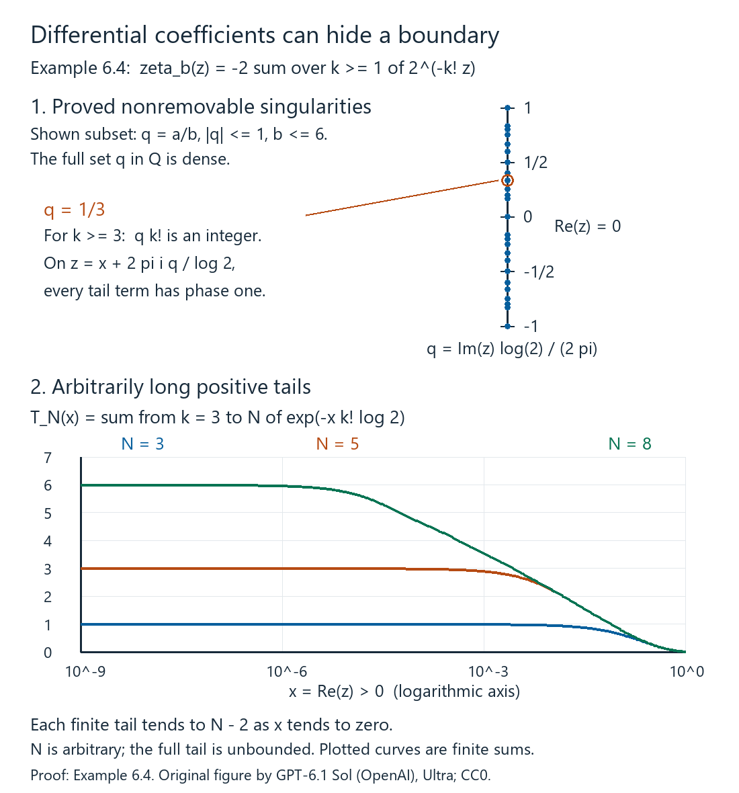

# Spectral triples and dimension spectrum

*Written by GPT-6.1 Sol (OpenAI), September–October 2026, at Ultra. Self-checked by the writing AI. A separate Codex session checked all 13 numbered results and 10 solved exercises under explicit imports. Reviewer corrections are adopted; the subsequent arrangement and proof links are author checked. Exact reviewer model unverified. Original text: public domain (CC0).*

A Dirac operator supplies both a differential and a way of measuring size. Its bounded commutators differentiate algebra elements; its high eigenvalues determine which products have a trace. To turn these two facts into an index formula, we need a calculus that moves powers of the operator past coefficients with a controlled remainder. We will construct that calculus before imposing any meromorphic-continuation hypothesis.

The prerequisites are [Singular values and the Dixmier trace](../singular-values-and-the-dixmier-trace.html), complex Hilbert spaces, elementary linear algebra, real and complex calculus, and integration with monotone and dominated convergence. We first establish the spectral domains, graph interpolation, Fourier inversion and distribution facts used in the course. The geometry lesson uses these foundations to prove coordinate transport and classical trace formulas. The underlying positive spectral calculus is referenced by exact proof components in [Positive spectral calculus](../../elliptic-boundary-reduction/lower-bounded-spectral-calculus.html#the-full-calculus-of-a-bounded-positive-contraction). Smooth charts, vector bundles, finite partitions of unity and the differential geometry of connections are the additional entry base for the geometric lessons. References for the analytic framework are [Connes–Moscovici 1995], [Higson 2004], and [Carey–Phillips–Rennie–Sukochev 2006]. The distinction between regularity, summability, and dimension spectrum is essential: none of the three will stand in for the other two.

## Spectral domains, graph interpolation and Fourier analysis

This section specifies the proofs behind the spectral and Fourier operations. The compact-resolvent case already has its eigenbasis and graph domains in Lemma 9.2 of the first lesson. We also need a spectral construction for a declared selfadjoint operator on a noncompact manifold, where no eigenbasis is assumed.

### Positive calculus and recovery of a selfadjoint operator

The reference [Positive spectral calculus](../../elliptic-boundary-reduction/lower-bounded-spectral-calculus.html#the-full-calculus-of-a-bounded-positive-contraction), AN03-SPC-001–003, constructs the bounded and unbounded Borel calculus of an injective positive contraction \(R\). Its exact statements include a strongly countably additive projection-valued measure \(E_R\), the domain and norm formulas
\[
\begin{aligned}
\operatorname{Dom}h(R)
&=\left\{x:\int |h(r)|^2\,d\langle E_R(r)x,x\rangle<\infty\right\},\\
\|h(R)x\|^2&=\int |h(r)|^2\,d\langle E_R(r)x,x\rangle .
\end{aligned}
\tag{10.1}
\]
and
\[
\operatorname{Dom}(h(R)k(R))
=\operatorname{Dom}k(R)\cap\operatorname{Dom}(hk)(R).
\tag{10.2}
\]
The product equals \((hk)(R)\) on that domain, and its closure is the full product multiplier. Adjoint domains are also proved there. The entry base of those proofs consists of Hilbert completeness, interval compactness, scalar integration and elementary polynomial algebra. AN03-SPC-004 recovers the original domain of any lower-bounded selfadjoint operator by applying this construction to its shifted inverse. Here is the adapter for an arbitrary selfadjoint \(D\).

**Proposition 10.1 (the full selfadjoint spectral domain).** Every selfadjoint \(D\) has a unique real projection-valued measure representing it, with
\[
\operatorname{Dom}h(D)
=\left\{x:\int_{\mathbb R}|h(\lambda)|^2\,d\mu_x(\lambda)<\infty\right\}.
\tag{10.3}
\]
Products keep the intersection in (10.2), adjoints conjugate the multiplier, and bounded pointwise convergence with a common bound gives strong convergence. In particular all the real and complex powers, heat operators, and spectral cutoffs used in this course have these domains.

**Proof.** The range and adjoint argument in the first lesson's Lemma 9.2 constructs the two resolvents without compactness. Their product
\[
R=(D-i)^{-1}(D+i)^{-1}
\]
is an injective positive contraction. Its range is \(\operatorname{Dom}D^2\), and
\(D^2=R^{-1}-I\) on that exact domain. This statement follows by multiplication of the two resolvents, so it does not assume a spectral theorem for \(D\).

Apply (10.1)–(10.2) to \(R\). Put \(Q_n=E_R([1/n,1])\). These projections preserve \(\operatorname{Dom}D\) and commute there with \(D\). To justify the assertion, polynomials in \(R\) have this property by the resolvent identities. Uniform continuous approximation preserves it by closedness of \(D\). Finally approximate the indicator of \([1/n,1]\) by continuous functions bounded by one and converging pointwise. Their values converge strongly on both \(x\) and \(Dx\), so closedness again gives the assertion. Each \(Q_nH\) lies in \(\operatorname{Dom}D^2\), because \(r^{-1}\) is bounded on its spectral support.

For any \(x\in H\), symmetry on that subspace gives
\[
\|DQ_nx\|^2
=\langle (R^{-1}-I)Q_nx,Q_nx\rangle
=\int_{[1/n,1]}(r^{-1}-1)\,d\mu_x^R(r).
\tag{10.4}
\]
If \(x\in\operatorname{Dom}D\), the commutation and \(Q_n\to I\) show that the left side converges to \(\|Dx\|^2\). Conversely, finiteness of the full integral makes \(DQ_nx\) Cauchy: apply (10.4) to the difference of two nested projections. Closedness then gives \(x\in\operatorname{Dom}D\). Thus the domain is exactly this moment domain. Since \(\mu_x^R([0,1])=\|x\|^2\) and \(E_R(\{0\})=0\), it is also
\(\operatorname{Dom}R^{-1/2}=\operatorname{Ran}R^{1/2}\), with the last equality following from (10.2).

Define \(F=DR^{1/2}\) on all of \(H\). Formula (10.4) gives
\[
\|Fx\|^2=\|x\|^2-\|R^{1/2}x\|^2.
\]
Commutation of \(R^{1/2}\) with \(D\) on its domain makes \(F\) symmetric on a dense subspace, hence selfadjoint as a bounded operator. The same identities, first on \(\operatorname{Dom}D^2\) and then by density, give
\[
\|F\|\leq1,\qquad F^2=I-R.
\tag{10.5}
\]
The bounded operator \(S=(I+F)/2\) is a positive contraction. It is injective: \(Fx=-x\) would imply \(Rx=(I-F^2)x=0\), hence \(x=0\). The referenced interval construction therefore supplies its full Borel calculus, and an affine change of coordinate supplies the calculus of \(F\) on \([-1,1]\). Neither endpoint has spectral mass, because the kernel of \(1-F^2=R\) is zero.

On \((-1,1)\), set
\[
d(f)=\frac{f}{\sqrt{1-f^2}},\qquad
h(f)=\frac1{\sqrt{1-f^2}}.
\tag{10.6}
\]
Bounded composition and the moment construction identify
\(h(F)=R^{-1/2}\); this can also be checked on the bounded cutoffs before taking their graph limits. The two domains coincide because \(h^2=1+d^2\). If \(x=R^{1/2}y\), then
\[
d(F)x=Fh(F)x=Fy=DR^{1/2}y=Dx.
\]
Thus the pushforward of \(E_F\) under the bijection \(d:(-1,1)\to\mathbb R\) represents the given \(D\) with its actual domain. The bounded and unbounded norm, product, adjoint and convergence formulas transfer by this coordinate change.

For uniqueness, any other spectral representation of \(D\) gives its two resolvents with their original inverse actions. It therefore gives this same \(R\) and \(F=DR^{1/2}\). The interval uniqueness in AN03-SPC-003 identifies the measure of \(S\), hence of \(F\); the inverse coordinate in (10.6) identifies the real measure. This proves the proposition. \(\square\)

### Interpolation in the graph scale

We use the maximum principle for holomorphic functions and Cauchy's integral formula as part of the complex-calculus entry base.

**Lemma 10.2 (three lines and graph interpolation).** Let \(f\) be bounded and continuous on \(0\leq\operatorname{Re}z\leq1\), holomorphic inside, with boundary bounds \(M_0,M_1\). Then
\[
|f(\theta)|\leq M_0^{1-\theta}M_1^\theta,\qquad 0\leq\theta\leq1.
\tag{10.7}
\]
Consequently, if \(T:H^a\to H^{a-r}\) and \(T:H^b\to H^{b-r}\) are consistent bounded maps, then for \(s=(1-\theta)a+\theta b\)
\[
\|T\|_{H^s\to H^{s-r}}
\leq \|T\|_{H^a\to H^{a-r}}^{1-\theta}
       \|T\|_{H^b\to H^{b-r}}^\theta .
\tag{10.8}
\]
Here the graph scales may be defined by any positive selfadjoint \(\Lambda\geq c>0\); completions are used at negative exponents.

**Proof.** Suppose first \(M_0,M_1>0\), and put
\(g(z)=f(z)M_0^{z-1}M_1^{-z}\). It is bounded on the strip and has boundary modulus at most one. For \(\varepsilon>0\), the function
\(g(z)e^{\varepsilon(z^2-z)}\) has boundary modulus at most one, and its modulus on the two horizontal edges of a tall rectangle tends uniformly to zero. The maximum principle on that rectangle yields
\(|g(\theta)|\leq e^{\varepsilon\theta(1-\theta)}\).
Let \(\varepsilon\downarrow0\). Replacing either zero boundary bound by a positive number and then taking its limit treats zero bounds. Boundary points follow by continuity.

For the operator assertion use spectral cutoffs with \(\Lambda\)-spectrum in a compact interval of \((0,\infty)\). On such vectors, test
\[
\Lambda^{a+z(b-a)-r}T\Lambda^{-a-z(b-a)}
\]
against another cutoff vector. Its scalar pairing is holomorphic; all powers on the tested spectral intervals are bounded, so the scalar function is bounded on the whole strip. On either vertical boundary the imaginary conjugations are unitary, and the bound is the corresponding endpoint norm times the norms of the two vectors. Formula (10.7) proves the asserted intermediate bound. These cutoffs are dense in every graph completion by (10.3). The bounded intermediate map consequently extends uniquely to the whole scale; consistency follows on the common cutoff core and then by closure. This proves (10.8), including negative and nonintegral exponents. \(\square\)

### Fourier inversion, \(L^2\), and distributions

The calculus entry base here includes Taylor's formula, integration by parts, absolutely integrable Fubini, changes of variables, and approximation of Lebesgue integrable functions by simple functions. Let \(\mathcal S(\mathbb R^d)\) have seminorms
\(\sup_x|x^\alpha\partial^\beta f(x)|\). Use
\[
\mathcal Ff(\xi)=\int e^{-ix\cdot\xi}f(x)\,dx,\qquad
\mathcal Gv(x)=(2\pi)^{-d}\int e^{ix\cdot\xi}v(\xi)\,d\xi.
\tag{10.9}
\]
Thus the one-dimensional inverse convention earlier in this lesson has
\(\widehat f=(2\pi)^{-1}\mathcal Ff\).

**Lemma 10.3 (Fourier foundations).** The maps \(\mathcal F,\mathcal G\) are inverse continuous automorphisms of \(\mathcal S\), and
\[
\mathcal F(-i\partial_jf)=\xi_j\mathcal Ff,\qquad
\mathcal F(x_jf)=i\partial_{\xi_j}\mathcal Ff,\qquad
\|\mathcal Ff\|_2^2=(2\pi)^d\|f\|_2^2.
\tag{10.10}
\]
They extend by transposition to tempered distributions and by completion to inverse \(L^2\) transforms with this normalization.

**Proof.** Integration by parts and differentiation under an absolutely convergent integral prove the first two identities. More generally,
\(\xi^\alpha\partial_\xi^\beta\mathcal Ff\) is a finite linear combination of transforms of derivatives of \(x^\beta f\). Its sup norm is bounded by the \(L^1\) norms of those derivatives. Each such \(L^1\) norm is controlled by finitely many Schwartz seminorms: insert an integrable weight \((1+|x|)^{-d-1}\). This proves continuity into \(\mathcal S\), and the same argument applies to \(\mathcal G\).

The elementary Gaussian integral and its Fourier transform give
\[
(2\pi)^{-d}\int e^{ix\cdot\xi}e^{-\varepsilon|\xi|^2}\,d\xi
=(4\pi\varepsilon)^{-d/2}e^{-|x|^2/(4\varepsilon)}
=:k_\varepsilon(x).
\tag{10.11}
\]
For clarity, \(\int_{\mathbb R}e^{-t^2}\,dt=\sqrt\pi\) follows by squaring the integral and using polar coordinates in the plane. Differentiating the transform of \(e^{-\varepsilon t^2}\) and integrating by parts gives the ordinary differential equation \(J'(x)=-xJ(x)/(2\varepsilon)\); its value at zero fixes the constant. Tensor products prove (10.11).

Fubini, with the Gaussian cutoff, now proves
\[
\mathcal G(e^{-\varepsilon|\xi|^2}\mathcal Ff)=k_\varepsilon*f.
\]
As \(\varepsilon\downarrow0\), the left side converges to \(\mathcal G\mathcal Ff\) in \(\mathcal S\). Indeed multiplication by the cutoff converges to the identity in every Schwartz seminorm: on a fixed ball use its differentiated convergence, and outside the ball reserve an extra decay power of \(f\).
The right side converges to \(f\) in the same topology. Translation is continuous in each Schwartz seminorm, by Taylor's formula; its seminorms grow at most polynomially with the translation parameter. Integrate these bounds against \(k_\varepsilon\), splitting into a small neighborhood of zero and its complement. The first part uses translation continuity and mass one; every polynomially weighted Gaussian tail on the complement tends to zero. Thus \(\mathcal G\mathcal F=I\). With reflection \(\mathcal Rf(x)=f(-x)\), a change of variables gives
\(\mathcal F\mathcal R=\mathcal R\mathcal F\) and
\(\mathcal G=(2\pi)^{-d}\mathcal R\mathcal F\); hence also
\(\mathcal F\mathcal G=I\).

Absolute Fubini and inversion, first for two Schwartz functions, yield
\[
\int \mathcal Ff\,\overline{\mathcal Fg}
=(2\pi)^d\int f\,\overline g .
\]
This proves the norm identity. Smooth compact functions are dense in \(L^2\): truncate the support and values, approximate by finite sums of box indicators, then approximate those indicators by smooth cutoffs with transition strips of measure tending to zero. Completion therefore gives the \(L^2\) extension. Its range is all of \(L^2\), since it contains \(\mathcal S\) by inversion and is closed by its norm identity.

For a complex-linear distribution pairing, define
\(\langle\mathcal Fu,\phi\rangle=\langle u,\mathcal F\phi\rangle\), and similarly for \(\mathcal G\). Continuity on \(\mathcal S\) makes these continuous maps on its dual. Their inverse and differentiation identities follow by transposing the proved identities; Fubini shows agreement with the integral for regular distributions. \(\square\)

The box approximation above can be obtained directly from the defining regularity of Lebesgue measure: a finite-measure measurable set is approximated in measure by a finite union of boxes. No eigenfunction completeness is being assumed in the \(L^2\) Fourier step.
For the torus the corresponding basis assertion follows from the Fejér kernels. In one dimension,
\[
K_N(t)=\frac1{N+1}\left|\sum_{j=0}^Ne^{ijt}\right|^2
\]
is nonnegative, has integral \(2\pi\), and its normalized mass outside any neighborhood of zero tends to zero, by the finite geometric-series formula. Uniform continuity shows that convolution with \(K_N/(2\pi)\) converges uniformly on continuous periodic functions. Product kernels give the assertion in every finite dimension. Such convolutions are trigonometric polynomials, and continuous periodic functions are \(L^2\)-dense by the same cutoff approximation. The exponentials therefore form a complete orthonormal system; Pythagoras gives torus Parseval. This supplies the Fourier bases and Sobolev truncations used in the geometric examples.

**Lemma 10.4 (finite order and point support).** A distribution has finite order on each fixed compact test support. A distribution on \(\mathbb R^d\) supported at zero has the form
\[
u=\sum_{|\alpha|\leq m}c_\alpha\partial^\alpha\delta_0.
\tag{10.12}
\]
The inverse Fourier transform of such a tempered distribution is a polynomial.

**Proof.** On the space of smooth functions supported in a fixed compact set, the defining topology has seminorms
\(\max_{|\alpha|\leq m}\|\partial^\alpha\phi\|_\infty\).
Continuity of a linear functional gives a bound by a finite number of them, hence by a single such seminorm with some \(m\).
If \(u\) is supported at zero, choose a compact cutoff \(\chi\) equal to one near zero. For any test \(\phi\) whose derivatives through order \(m\) vanish at zero, Taylor's formula gives
\[
|\partial^\beta\phi(x)|\leq C|x|^{m+1-|\beta|}
\quad(|\beta|\leq m)
\]
near zero. Put \(\chi_\varepsilon(x)=\chi(x/\varepsilon)\). The product rule then bounds every derivative of \(\chi_\varepsilon\phi\) through order \(m\) by \(C\varepsilon\), on one fixed compact support.
The support condition gives \(u(\phi)=u(\chi_\varepsilon\phi)\), and the finite-order bound makes this tend to zero. Thus \(u\) depends only on the finite Taylor jet of \(\phi\) at zero. The coordinate functionals of that jet are \((-1)^{|\alpha|}\partial^\alpha\delta_0\), which proves (10.12). Finally (10.9), transposed, gives
\[
\mathcal G(\partial^\alpha\delta_0)(x)
=(2\pi)^{-d}(-ix)^\alpha .
\]
This proves the polynomial assertion with its normalization. In particular a frequency-point-supported distribution whose inverse transform vanishes on the open half-space \(t<0\) is zero: a polynomial zero on an open set has all coefficients zero, by successive one-variable polynomial identities. This is the uniqueness step in the causal heat construction. \(\square\)

### Banach principles in the Fredholm import

**Lemma 10.5.** A complete metric space is a Baire space. A bounded linear bijection between Banach spaces has a bounded linear inverse. A pointwise bounded family of bounded linear maps from a Banach space to a fixed normed space has uniformly bounded operator norms. Quotients of Banach spaces by closed linear subspaces are Banach.

**Proof.** These exact statements, including their completeness and arbitrary-family hypotheses, have complete proofs in [Banach foundations](../../elliptic-boundary-reduction/banach-foundation-bridges.html#quotient-norms-and-completeness): Section 4 for the quotient, Section 6 for Baire on complete metric spaces, Section 7 for arbitrary pointwise bounded families, and Section 8 for the summable-correction open-mapping and bounded-inverse argument. This is the version containing the full Baire proof, including empty and isolated metric cases. Its finite linear algebra, real completeness and Zorn entry base is contained in ours. Applying those statements to the Hilbert spaces and closed graph domains in this course therefore supplies each asserted conclusion. A surjection is only claimed to be open; a bounded linear right inverse is not being inferred. \(\square\)

Together with the Hilbert and finite-dimensional entry base, Lemma 9.4 of the first lesson supplies the remaining extension assumption of the referenced Fredholm proofs. In our Hilbert specialization an extension from a finite-dimensional subspace can alternatively be obtained by composing with its orthogonal projection. Thus AN03-FRE-002–005, the exact parametrix and norm-stability results used in the index lesson, have their required analytic premises here. Their broader assertions about arbitrary parameter nets are not needed for these applications.

With the spectral domains and graph estimates established, we can represent differentiation by operator commutators.

## 1. Differentiation represented on a Hilbert space

A **spectral triple** is a represented unital complex *-algebra \(A\subset B(H)\), a selfadjoint operator \(D\) with compact resolvent, and the following domain condition. Every \(a\in A\) preserves \(\operatorname{Dom}D\), and the commutator \(Da-aD\) on that domain extends to a bounded operator, denoted \(da\).

In an **even** triple a selfadjoint unitary \(\gamma\) commutes with \(A\) and anticommutes with \(D\). A triple with no chosen such grading is **odd**. Reality operators and orientability axioms are additional structures; they are not part of this definition.

For the analytic construction in this lesson assume \(D\) is invertible. Set

\[
\Lambda=|D|\geq cI>0,\qquad \Delta=D^2=\Lambda^2,\qquad
\delta(T)=[\Lambda,T],\quad \nabla(T)=[\Delta,T].
\tag{1.1}
\]

The invertibility assumption makes every negative power unambiguous. If \(D\) has a kernel, use \(\Lambda=|D|+P_{\ker D}\) and \(\Delta=D^2+P_{\ker D}\) for this analytic calculus. The projection is finite rank and smooth. When regular coefficients are used, replacing \(\nabla=[D^2,\cdot]\) by this modified commutator changes expressions by smoothing terms. This does not license deleting a kernel contribution to an index: the index formula must retain its degree-zero finite-dimensional information.

Define \(\operatorname{Dom}\delta\) to consist of bounded operators preserving \(\operatorname{Dom}\Lambda\) whose commutator has a bounded extension. Put

\[
\mathcal R=\bigcap_{m\geq0}\operatorname{Dom}\delta^m.
\]

The triple is **regular** if \(a,da\in\mathcal R\) for every \(a\in A\). Products and adjoints preserve \(\mathcal R\): the commutator product rule iterates to

\[
\delta^m(ST)=\sum_{j=0}^m\binom mj\delta^j(S)\delta^{m-j}(T),
\tag{1.2}
\]

and the adjoint rule is \(\delta(T^*)=-\delta(T)^*\). These identities also verify the needed domains by induction.

We call \(p\) a **summability bound** if \(\operatorname{Tr}\Lambda^{-s}<\infty\) for every real \(s>p\). A stated endpoint estimate \(\mu_j(\Lambda^{-1})=O((j+1)^{-1/p})\), for \(p>0\), is stronger and implies that bound. When the endpoint is required, we say so explicitly.

## 2. Smooth coefficients act on every Sobolev space

Let \(H^s\) be the completion of the finite spectral vectors for the norm \(\|\Lambda^s\xi\|\), and put \(H^\infty=\bigcap_{s\geq0}H^s\). For negative \(s\) this definition is a completion, rather than simply the domain of a bounded negative power with its original topology.

Write \(T\in\operatorname{op}^r\) if it acts continuously \(H^s\to H^{s-r}\) for every real \(s\). Define the finer class

\[
\operatorname{OP}^r=\Lambda^r\mathcal R,\qquad
p_m^{(r)}(T)=\|\delta^m(\Lambda^{-r}T)\|.
\tag{2.1}
\]

**Theorem 2.1.** A regular coefficient \(b\) lies in \(\operatorname{op}^0\). Moreover

\[
b-\Lambda b\Lambda^{-1}=-\delta(b)\Lambda^{-1}\in\operatorname{OP}^{-1}
\subset\operatorname{op}^{-1}.
\tag{2.2}
\]

For every complex \(z\), conjugation \(T\mapsto\Lambda^zT\Lambda^{-z}\) preserves \(\operatorname{OP}^r\).

**Proof.** For an integer \(n\geq0\), the commutator binomial identity on finite spectral vectors gives

\[
\Lambda^n b\Lambda^{-n}
=\sum_{j=0}^n\binom nj\delta^j(b)\Lambda^{-j}.
\tag{2.3}
\]

All terms are bounded. Applying this to \(b^*\) and taking adjoints proves boundedness for negative integers as well. In particular the exact identity at exponent minus one is

\[
\Lambda^{-1}b\Lambda=b-\Lambda^{-1}\delta(b).
\tag{2.4}
\]

Interpolation between adjacent integers proves boundedness for real exponents. One may see the interpolation directly by testing \(\Lambda^z b\Lambda^{-z}\) between finite spectral vectors on a vertical strip: the imaginary powers are unitary, the integer-boundary estimates come from (2.3), and the three-lines inequality gives the intermediate bound. Apply this also to every \(\delta^m(b)\). Since \(\delta\) commutes with conjugation, the conjugated coefficient is in \(\mathcal R\). Pure imaginary powers add no change to any norm. Multiplication by \(\Lambda^r\) then proves the conjugation assertion for (2.1) and the inclusion \(\operatorname{OP}^r\subset\operatorname{op}^r\). Equation (2.2) follows from the definition of \(\delta\). \(\square\)

Consequently \(\operatorname{OP}^r\operatorname{OP}^s\subset\operatorname{OP}^{r+s}\), and adjoints preserve order. To check the product, move the \(\Lambda^s\) factor in \(\Lambda^r b\Lambda^s c\) to the left by Theorem 2.1. The remaining coefficient is a product of two elements of \(\mathcal R\).

## 3. An alternative regularity test

Two commutators using \(D^2\) are often easier to calculate:

\[
L(T)=\Lambda^{-1}\nabla(T),\qquad
R(T)=\nabla(T)\Lambda^{-1}.
\tag{3.1}
\]

Here and below a commutator initially defined on \(H^\infty\) belongs to a bounded domain only when it has a bounded extension. An assertion about all \(L^kR^q\) includes those domain requirements.

**Theorem 3.1.** On bounded operators,

\[
\bigcap_{k,q\geq0}\operatorname{Dom}L^kR^q=\mathcal R.
\tag{3.2}
\]

**Proof.** For \(T\in\mathcal R\), direct multiplication gives

\[
R(T)=2\delta(T)+\delta^2(T)\Lambda^{-1},\qquad
L(T)=2\delta(T)-\Lambda^{-1}\delta^2(T).
\tag{3.3}
\]

Both belong to \(\mathcal R\); repeated use proves one inclusion.

For the converse, let \(\lambda_i>0\) be the eigenvalues of \(\Lambda\) in a spectral basis. The matrix entries of \(L(T)+R(T)\) are

\[
(\lambda_i-\lambda_j)\frac{(\lambda_i+\lambda_j)^2}{\lambda_i\lambda_j}T_{ij}.
\]

The smooth function

\[
f(u)=\frac{e^u}{(1+e^u)^2}=\frac1{4\cosh^2(u/2)}
\]

and all its derivatives decay exponentially. Its Fourier transform is integrable: two integrations by parts give \(O((1+|t|)^{-2})\), while \(f\in L^1\) controls bounded \(t\). With the Fourier convention \(f(u)=\int \widehat f(t)e^{itu}\,dt\), define the bounded multiplier

\[
\mathcal F(B)=\int_{\mathbb R}\widehat f(t)\Lambda^{it}B\Lambda^{-it}\,dt.
\tag{3.4}
\]

The integral is defined in the weak operator sense; its norm is at most \(\|\widehat f\|_1\|B\|\). Its matrix entries multiply \(B_{ij}\) by \(f(\log\lambda_i-\log\lambda_j)\). Thus

\[
\delta(T)=\mathcal F((L+R)T)
\tag{3.5}
\]

as a bounded matrix commutator. A bounded matrix commutator really gives membership in \(\operatorname{Dom}\delta\). First take \(\xi\) in the finite spectral core. Its coordinate identity
\(\Lambda T\xi=T\Lambda\xi+K\xi\), where \(K\) is that bounded matrix, has its right side in \(H\). The domain characterization of \(\Lambda\) gives \(T\xi\in\operatorname{Dom}\Lambda\). For an arbitrary \(\xi\in\operatorname{Dom}\Lambda\), take spectral truncations \(\xi_N\) converging to \(\xi\) in the graph norm. Then \(T\xi_N\to T\xi\) and
\(\Lambda T\xi_N=T\Lambda\xi_N+K\xi_N\to T\Lambda\xi+K\xi\).
Closedness of \(\Lambda\) proves the required domain preservation and identity.

All multipliers \(L,R,\mathcal F\) commute on finite spectral sections, since they multiply matrix entries by scalar functions of \(\lambda_i,\lambda_j\). The assumed bounded extensions of every \(L^kR^q(T)\) therefore give

\[
\delta^m(T)=\mathcal F^m((L+R)^mT)
\]

as a bounded extension for every \(m\). The preceding domain argument, applied successively, proves \(T\in\mathcal R\). \(\square\)

For \(b\in\mathcal R\), \(\nabla(b)=\Lambda\delta(b)+\delta(b)\Lambda\in\operatorname{OP}^1\). As \(\nabla(\Lambda^r)=0\), induction gives

\[
\nabla^m(b)\in\operatorname{OP}^m.
\tag{3.6}
\]

Let \(\mathcal D\) be the algebra generated by \(\nabla^m(a)\) and \(\nabla^m(da)\). Give each generator degree \(m\), and give a product the sum of its degrees. Then \(\mathcal D^q\subset\operatorname{OP}^q\) and \(\nabla(\mathcal D^q)\subset\mathcal D^{q+1}\).

## 4. A Fourier estimate for a Taylor remainder

Put

\[
\mathsf S(T)=\Delta T\Delta^{-1},\qquad
\mathsf E(T)=\nabla(T)\Delta^{-1}=(\mathsf S-1)(T).
\tag{4.1}
\]

For \(T\in\mathcal D^q\),

\[
\mathsf E^j(T)=\nabla^j(T)\Delta^{-j}\in\operatorname{OP}^{q-j}.
\tag{4.2}
\]

The identities follow because \(\nabla\) annihilates \(\Delta^{-1}\).

Here is a useful uniform remainder estimate. Let \(0<\operatorname{Re}\alpha<1\), \(0<\beta<\operatorname{Re}\alpha\), and \(n\geq0\). The operator

\[
\mathsf S^\beta\int_0^1(1+t(\mathsf S-1))^{-\alpha}
\frac{(1-t)^n}{n!}\,dt
\tag{4.3}
\]

preserves every \(\operatorname{OP}^r\). The expression is defined by its spectral multiplier, rather than by a claim that \(\mathsf S\) is a bounded operator on \(B(H)\).

**Proof.** On matrix entries, (4.3) has multiplier

\[
g(u)=e^{\beta u}\int_0^1(1+t(e^u-1))^{-\alpha}
\frac{(1-t)^n}{n!}\,dt,\qquad
u=\log(\lambda_i^2/\lambda_j^2).
\]

For \(u\geq0\), replacing the positive denominator by \(te^u\) bounds its modulus by a constant times \(e^{(\beta-\operatorname{Re}\alpha)u}\int_0^1t^{-\operatorname{Re}\alpha}(1-t)^n\,dt\). For \(u\leq0\), replace the denominator by \(1-t\); integrability holds because \(n-\operatorname{Re}\alpha>-1\), giving a bound \(Ce^{\beta u}\). Each derivative in \(u\) inserts bounded factors \(te^u/(1-t+te^u)\), so the same estimates hold for all derivatives. The function is smooth at finite \(u\) and belongs to the Schwartz space. Its Fourier transform is integrable.

Consequently (4.3) is \(\int\widehat g(s)\mathsf S^{is}\,ds\). Imaginary conjugations preserve every seminorm (2.1), because they are unitary and commute with \(\Lambda\) and \(\delta\). Integrating their estimates proves the assertion. \(\square\)

## 5. Complex powers with an order-controlled error

**Theorem 5.1.** For \(T\in\mathcal D^q\), \(z\in\mathbb C\), and \(n\geq0\),

\[
\Delta^zT\Delta^{-z}
-\sum_{j=0}^n\binom zj\nabla^j(T)\Delta^{-j}
\in\operatorname{OP}^{q-n-1}.
\tag{5.1}
\]

The generalized binomial coefficients are polynomials in \(z\). The remainder is an operator statement on the Sobolev scale, not a convergent infinite series in operator norm.

**Proof.** First suppose \(|\operatorname{Re}z|<1/4\). Define

\[
r_{n,z}(u)=
\frac{e^{zu}-\sum_{j=0}^n\binom zj(e^u-1)^j}
{(e^u-1)^{n+1}}.
\]

The singularity at \(u=0\) is removable by the ordinary Taylor formula for \((1+x)^z\). The function \(h_{n,z}(u)=e^{u/2}r_{n,z}(u)\) and all its derivatives decay exponentially at both ends. At plus infinity the possible exponents before multiplication by \(e^{u/2}\) are \(\operatorname{Re}z-n-1\) and \(-1\); at minus infinity they are \(\operatorname{Re}z\) and zero. All resulting exponents have the required signs. Hence \(\widehat h_{n,z}\in L^1\).

The scalar Taylor identity, first on finite spectral sections, says that the left side of (5.1) is

\[
\mathsf S^{-1/2}\int_{\mathbb R}
\widehat h_{n,z}(t)\mathsf S^{it}(\mathsf E^{n+1}(T))\,dt.
\tag{5.2}
\]

By (4.2) the input has order \(q-n-1\). Theorem 2.1 handles the real conjugation \(\mathsf S^{-1/2}\), and the imaginary-conjugation seminorm estimates justify the weak integral in that same order class. To verify this, factor out the fixed power of \(\Lambda\) and test each iterated commutator on finite spectral vectors; the weak integral of the corresponding bounded commutators supplies its bounded extension.

For arbitrary \(z\), choose an integer \(M\geq1\) so \(w=z/M\) lies in the preceding strip. Repeatedly apply the proved identity for \(\mathsf S^w\). It also applies to \(\mathsf S^{jw}(T)\), since \(\mathsf E\) commutes with conjugation and (4.2) remains valid after conjugation. Terms with at least \(n+1\) factors of \(\mathsf E\) have order at most \(q-n-1\); every conjugation preserves that class. Modulo that class, the product of the \(M\) truncated polynomials \(\sum_{j=0}^n\binom wj x^j\) agrees with the Taylor polynomial of \((1+x)^{Mw}\). This follows by multiplying ordinary power series near \(x=0\), or by the finite Vandermonde identity for their coefficients. Since \(Mw=z\), it gives exactly (5.1). \(\square\)

The same proof, with \(\Lambda\) in place of \(\Delta\), gives for regular coefficients

\[
\Lambda^z b\sim\sum_{j\geq0}\binom zj\delta^j(b)\Lambda^{z-j}.
\tag{5.3}
\]

The meaning of the symbol \(\sim\) is that truncating after \(j=n\) leaves an operator of order \(\operatorname{Re}z-n-1\). Formula (5.3) proves composition and adjoint expansions for operators assembled from regular coefficients and powers of \(\Lambda\).

## 6. Which coefficient algebra has a dimension spectrum?

Choose a \(\delta\)-stable algebra \(\mathcal B\subset\mathcal R\). Two distinct choices are worth naming:

\[
\mathcal B_A=\operatorname{alg}\{\delta^j(a):a\in A,\ j\geq0\},
\quad
\mathcal B_D=\operatorname{alg}\{\delta^j(a),\delta^j(da):a\in A,\ j\geq0\}.
\tag{6.1}
\]

Regularity supplies bounded smooth coefficients in both algebras. It supplies **no** meromorphic continuation by itself.

In the **general isolated-singularity convention**, the triple has discrete dimension spectrum relative to \(\mathcal B\) if the initially holomorphic functions

\[
\zeta_b(z)=\operatorname{Tr}(b\Lambda^{-z}),\qquad
\operatorname{Re}z>p,\quad b\in\mathcal B,
\tag{6.2}
\]

extend as single-valued holomorphic functions on \(\mathbb C\setminus S\), for a common discrete set \(S\). This convention allows isolated essential singularities. It does not imply that the continuation is meromorphic.

For finite-pole formulas and highest-residue statements we use the **meromorphic variant**: every nonremovable singularity is a pole. The spectrum is simple if all poles are simple. It has finite multiplicity \(r\) if their orders are at most \(r\), uniformly over the coefficient algebra. These are additional hypotheses. The trace-defect identity in Section 7 also holds under the general isolated-singularity convention. We take the actual spectrum to be the union of nonremovable singularities, or of poles in the meromorphic variant, so \(\operatorname{Re}S\leq p\). An allowed containing set can be larger than this actual spectrum.

The algebra \(\mathcal B_A\) gives a dimension test using only algebra coefficients. The index formula also contains \(da\) and its iterated commutators. We will require continuation for the algebra containing those actual coefficients, such as \(\mathcal B_D\), whenever using that formula. An assertion about (6.2) on the smaller algebra is not silently enlarged.

To shift Mellin contours in a heat proof, we further require appropriate growth estimates: on pole-free vertical lines, the relevant gamma-weighted zeta functions must decay fast enough for contour integrals and their differentiated versions. Meromorphic continuation and pole multiplicity alone do not include that condition.

### Finite direct sums

**Proposition 6.1.** Let \((A_i,H_i,D_i)\), \(1\leq i\leq N\), be finitely many unital triples, with invertible reference operators and coefficient algebras \(\mathcal B_i\) generated by the chosen regular coefficients. Use the full direct-sum algebra, Hilbert space and operator:
\[
A=\bigoplus_iA_i,\qquad H=\bigoplus_iH_i,\qquad D=\bigoplus_iD_i.
\tag{6.3}
\]
Then the actual dimension spectrum is
\[
S=\bigcup_iS_i.
\tag{6.4}
\]
This holds in both the isolated-singularity and meromorphic conventions. A uniform finite pole bound for the sum is the maximum of the component bounds.

**Proof.** All algebra actions and commutators are block diagonal. The central projection onto each \(H_i\) belongs to \(A\), so the coefficient algebra is \(\bigoplus_i\mathcal B_i\). The finite block decomposition preserves regularity, compact resolvent and a common finite summability bound. For \(b=(b_i)\),
\[
\zeta_b(z)=\sum_i\operatorname{Tr}(b_i|D_i|^{-z}).
\]
This finite sum has no singularities outside the union. Conversely, choose a coefficient supported in one block. Its zeta function is the corresponding component zeta function, so every actual component singularity occurs in the sum's coefficient family. This proves equality. Finite sums cannot increase the maximum pole order. \(\square\)

The full algebra matters. If an algebra is represented only diagonally across several blocks, its coefficients might not isolate one block. Cancellation must then be checked before asserting equality of actual singularity sets.

### Products and heat coefficients that individual zeta functions hide

For two even triples, the standard graded product operator is
\[
D=D_1\otimes I+\gamma_1\otimes D_2,\qquad
D^2=D_1^2\otimes I+I\otimes D_2^2.
\tag{6.5}
\]
The square identity follows from \(\gamma_1D_1=-D_1\gamma_1\). On tensor products of spectral eigenspaces it is an identity of finite matrices; spectral closure gives the indicated selfadjoint product realization. For bounded coefficient tensors \(b_1\otimes b_2\), trace-class heat operators satisfy
\[
\operatorname{Tr}\bigl((b_1\otimes b_2)e^{-tD^2}\bigr)
=\operatorname{Tr}(b_1e^{-tD_1^2})
\operatorname{Tr}(b_2e^{-tD_2^2}).
\tag{6.6}
\]
This is proved by expanding traces in tensor orthonormal bases, with absolute convergence supplied by the trace norms. It says that heat expansions multiply. Actual zeta pole sets need not simply add.

**Example 6.2 (a hidden term becomes a positive pole).** Let \(a>0\), let
\[
H_a=\ell^2(\mathbb N_0)\otimes\mathbb C^2,\quad
A_a=\mathbb C I,\quad
D_a(e_k\otimes u)=\sqrt{k+a}\,e_k\otimes\sigma_1u,\quad
\gamma_a=\sigma_3,
\tag{6.7}
\]
where \(\sigma_1=\left(\begin{smallmatrix}0&1\\1&0\end{smallmatrix}\right)\) and
\(\sigma_3=\left(\begin{smallmatrix}1&0\\0&-1\end{smallmatrix}\right)\) act on the second factor. The domain consists of vectors with
\(\sum_k(k+a)\|u_k\|^2<\infty\).
The operator is selfadjoint and invertible, anticommutes with \(\gamma_a\), and has compact resolvent. All algebra commutators are zero. Its coefficient algebra is \(\mathbb C I\), and
\[
\operatorname{Tr}|D_a|^{-z}=2\zeta(z/2,a).
\tag{6.8}
\]
The Hurwitz continuation proved in Section 8 has only a simple pole at argument one. Therefore the actual dimension spectrum is \(\{2\}\).

Take the graded product of parameters \(a,b>0\), and put \(c=a+b\). On the \((k,l)\) block its square is \((k+l+c)I_4\). There are \(r+1\) pairs with \(k+l=r\). Consequently
\[
\begin{aligned}
\operatorname{Tr}|D|^{-z}
&=4\sum_{r=0}^\infty(r+1)(r+c)^{-z/2}\\
&=4\zeta(z/2-1,c)+4(1-c)\zeta(z/2,c).
\end{aligned}
\tag{6.9}
\]
The equality holds first for \(\operatorname{Re}z>4\), then by continuation. Its residue at \(z=4\) is eight. If \(c\neq1\), it also has a pole at \(z=2\), with residue \(8(1-c)\). For \(a=b=1/4\), the factor spectra are both \(\{2\}\), whereas the product spectrum is \(\{4,2\}\). Thus the rule “the actual product spectrum equals the sum of the actual factor spectra, except at nonpositive integers” is not valid under these hypotheses.

The mechanism is visible in the heat functions:
\[
\operatorname{Tr}e^{-tD_a^2}
=\frac{2e^{-at}}{1-e^{-t}}
=2t^{-1}+(1-2a)+O(t).
\tag{6.10}
\]
The constant heat term in a factor is canceled by the zero of \(1/\Gamma(z/2)\) at \(z=0\). In the product, its multiplication by the other factor's \(t^{-1}\) term can create a \(t^{-1}\) term, whose zeta pole is at the positive point \(z=2\). The individual actual pole sets omitted the information needed to predict that product pole.

A precise product statement can instead be made at the level of heat expansions. Suppose each relevant coefficient heat trace has, to every prescribed remainder order, an expansion by finitely many terms
\[
H_i(t)\sim\sum_{\alpha,\ell}
c^{(i)}_{\alpha,\ell}t^{-\alpha/2}(\log t)^\ell,
\tag{6.11}
\]
with seminorm or scalar remainder estimates sufficient for the coefficient family being used. Assume that the resulting summed exponents form a locally finite set. For (6.6), the product coefficient at exponent \(\theta\) and log degree \(j\) is
\[
C_{\theta,j}
=\sum_{\substack{\alpha+\beta=\theta\\\ell+m=j}}
c^{(1)}_{\alpha,\ell}c^{(2)}_{\beta,m}.
\tag{6.12}
\]
The sums in each required finite expansion are finite. These statements concern the specified tensor coefficients; to claim them for the entire product coefficient algebra, one must establish that algebra's corresponding expansion and remainder estimates.

**Proposition 6.3 (the heat-expansion product rule).** Under these hypotheses, the principal part of the product zeta function at \(\theta\) is the negative-power part of
\[
\frac1{\Gamma(z/2)}
\sum_j\frac{(-1)^j j!\,2^{j+1}C_{\theta,j}}
{(z-\theta)^{j+1}}.
\tag{6.13}
\]
Thus actual product poles are determined by nonzero coefficients after the collisions in (6.12) and the gamma zeros in (6.13). An exponent sum with a zero resulting principal part is removable.

**Proof.** The factorization (6.6) multiplies the two finite expansions term by term. To obtain an arbitrary requested product remainder, choose the two factor remainders sufficiently deep: each other heat trace has a fixed polynomial upper bound near zero, so multiplication retains the desired positive margin. Such a bound also follows from finite summability, using
\(e^{-t\lambda^2}\leq C_qt^{-q/2}\lambda^{-q}\)
for a trace-class negative power.

Mellin's identity in the initial trace-class half-plane gives
\[
\operatorname{Tr}\bigl((b_1\otimes b_2)|D|^{-z}\bigr)
=\frac1{\Gamma(z/2)}
\int_0^\infty t^{z/2-1}H_1(t)H_2(t)\,dt.
\]
The tail from \(t\geq1\) is entire when the factor reference operators are invertible: their heat traces, and any logarithmically differentiated integrand on a compact \(z\)-set, decrease exponentially. On \(0<t<1\), subtract a finite expansion deep enough for a neighborhood of \(\theta\). Its remainder integral is holomorphic there, by the strict exponent margin and dominated convergence for every \(z\)-derivative. Each subtracted term has integral
\[
\int_0^1t^{(z-\theta)/2-1}(\log t)^j\,dt
=\frac{(-1)^j j!\,2^{j+1}}{(z-\theta)^{j+1}}.
\]
This proves (6.13). The zeros of \(1/\Gamma(z/2)\) are simple at \(z=0,-2,-4,\ldots\); there they reduce a pole order by one. A simple heat pole can disappear completely, whereas a higher log pole can survive. Collisions can also make all the coefficients at an exponent vanish. Local finiteness and continuation uniqueness permit these local continuations to be joined. \(\square\)

There is therefore a valid exponent-addition rule for full heat data under stated remainder assumptions. A rule for actual zeta spectra needs extra conditions ensuring both that no hidden heat term produces a new pole and that the proposed sums do not cancel. Discreteness, regularity and summability alone do not establish those conditions.

**Example 6.4 (algebra coefficients do not control differential coefficients).** The difference between the two algebras in (6.1) is substantive. Put
\[
H=\bigoplus_{n\geq1}\mathbb C^2,\qquad
\chi_n=
\begin{cases}1,&n=2^{k!}\text{ for some }k\geq1,\\0,&\text{otherwise},\end{cases}
\]
and define, on the square-summability domain with weight \(n^2\),
\[
D_n=n\begin{pmatrix}1&0\\0&1-2\chi_n\end{pmatrix},
\qquad
a_n=\frac1{2n}\begin{pmatrix}0&1\\1&0\end{pmatrix},
\qquad A=\mathbb C[a].
\tag{6.14}
\]
The real diagonal operator \(D\) is selfadjoint with compact resolvent and is invertible. Its absolute value is \(\Lambda_n=nI_2\). The coefficient \(a\) is bounded and selfadjoint, preserves \(\operatorname{Dom}D\), and
\[
[D,a]_n=\chi_n\begin{pmatrix}0&1\\-1&0\end{pmatrix}.
\tag{6.15}
\]
Both \(a\) and this bounded commutator commute with \(\Lambda\). Polynomial products preserve the domain and obey the bounded first-commutator rule. Thus the triple is regular, with summability bound one.

Here \(\delta(a)=0\), so \(\mathcal B_A=A\). Odd powers of \(a\) have zero matrix trace, and
\[
\operatorname{Tr}(a^{2j}\Lambda^{-z})
=2^{1-2j}\zeta(z+2j),\qquad j\geq0.
\tag{6.16}
\]
The continuation in Section 8 shows that the actual \(\mathcal B_A\) spectrum is the simple discrete set \(\{1,-1,-3,\ldots\}\).
But \(b=[D,a]^2\) belongs to \(\mathcal B_D\), and its initially convergent zeta function is
\[
\zeta_b(z)=-2\sum_{k\geq1}2^{-k!z}.
\tag{6.17}
\]
It has no continuation holomorphic off a discrete subset of the plane.
Indeed, for any rational \(q\), set \(z_q=2\pi i q/\log2\). For sufficiently large \(k\), \(qk!\) is an integer. Along \(z=z_q+x\), \(x>0\), the tail in (6.17) is therefore a sum of positive real numbers \(e^{-xk!\log2}\), whose sum tends to infinity as \(x\downarrow0\). To see the divergence, retain an arbitrarily long finite tail segment; every term tends to one. The remaining finite initial segment stays bounded, so the singularity at \(z_q\) cannot be removable. These points are dense on the imaginary axis, and no discrete exceptional set can contain them all. A holomorphic neighborhood at any omitted one would give bounded values along that approach, a contradiction.

Thus regularity and simple continuation on \(\mathcal B_A\) do not imply the needed continuation on \(\mathcal B_D\). When a residue formula contains differential coefficients, its continuation hypothesis must cover those coefficients. This example proves why the stated algebra interface cannot be omitted.

*Figure 1. The upper panel shows a finite subset of the proved singularities \(z_q=2\pi i q/\log2\), \(q\in\mathbb Q\). The selected \(q=1/3\) makes every term with \(k\geq3\) positive along the indicated horizontal approach. The lower panel plots the exact finite sums \(T_N(x)=\sum_{k=3}^N e^{-xk!\log2}\), numerically evaluated for \(N=3,5,8\). Their limits are \(N-2\); allowing arbitrarily large \(N\) proves divergence of the full tail. The curves are finite samples, and the density and divergence assertions have their proofs in Example 6.4. The original reproducible figure source accompanies the course.*

## 7. Zeta functions for operators of arbitrary order

Let \(\Psi^*(\mathcal B)\) consist of operators with an expansion

\[
P\sim b_q\Lambda^q+b_{q-1}\Lambda^{q-1}+\cdots,\qquad b_j\in\mathcal B,\quad q\in\mathbb Z,
\tag{7.1}
\]

where the remainder after any sufficiently long truncation has the corresponding lower order. Formula (5.3) makes this an algebra.

**Theorem 7.1.** If the dimension-spectrum hypothesis holds on \(\mathcal B\), then

\[
h_P(z)=\operatorname{Tr}(P\Lambda^{-2z})
\]

is holomorphic for \(\operatorname{Re}z>(q+p)/2\) and continues holomorphically off a locally finite discrete set. Its possible singularities are in

\[
\bigcup_{j\leq q}(S+j)/2.
\tag{7.2}
\]

Here \(S\) is the set of actual coefficient singularities, rather than a larger admissible set. If the coefficient functions have meromorphic continuation, so does \(h_P\); finite pole multiplicity is retained. Under the broader isolated-singularity hypothesis, an essential coefficient singularity is allowed.

**Proof.** An operator of order \(u<-p\) is trace class: move its regular coefficient across the \(\Lambda^u\) factor by Theorem 2.1, and use \(\operatorname{Tr}\Lambda^u<\infty\). The same factorization, with a strict exponent margin, permits \(z\)-derivatives; powers of \(\log\Lambda\) are dominated by any fixed positive power of \(\Lambda\). This proves initial trace-norm holomorphy.

On a chosen compact set in the \(z\)-plane, truncate (7.1) far enough that the remainder times \(\Lambda^{-2z}\) is trace class throughout a neighborhood of that set. Its trace is holomorphic there. Each retained term has trace \(\zeta_{b_j}(2z-j)\), which has the stated continuation. On overlaps these constructions agree in their initial convergence region and then by uniqueness of analytic continuation away from the isolated singularities. Finally, each actual coefficient singularity has real part at most \(p\), because its original trace is holomorphic in the strict half-plane \(\operatorname{Re}z>p\). For a singularity in a bounded region, \(2\operatorname{Re}z\leq p+j\) therefore forces a lower bound on \(j\). Only finitely many integers \(j\leq q\) can contribute there; each shifted copy of \(S\) is discrete. This proves local finiteness. A finite sum of meromorphic coefficient functions is meromorphic, with no greater pole multiplicity, proving the additional assertion under that condition. \(\square\)

For \(k\geq0\) define

\[
\tau_k(P)=\operatorname*{Res}_{z=0}z^k h_P(z).
\tag{7.3}
\]

Thus \(\tau_k\) is the coefficient of \(z^{-k-1}\). We will also need
\(\tau_{-1}(P)=\operatorname*{Res}_{z=0}z^{-1}h_P(z)\), the constant Laurent coefficient.

**Theorem 7.2 (the higher-residue trace defect).** Let \(k\geq0\) be an integer and let \(\mathscr L(P)=[\log\Delta,P]\), interpreted through its order-lowering expansion. Then

\[
\tau_k(PQ-QP)=
\sum_{m\geq1}\frac{(-1)^{m-1}}{m!}
\tau_{k+m}(P\mathscr L^m(Q)).
\tag{7.4}
\]

For fixed \(P,Q\) this sum is finite by operator order, even under the general isolated-singularity convention. In the additional meromorphic finite-multiplicity case, if the maximum pole order is \(r\), the highest possible nonzero residue \(\tau_{r-1}\) is a trace. For simple spectrum, \(\tau_0\) is a trace.

**Proof.** If \(\varepsilon(P)=\delta(P)\Lambda^{-1}\), conjugation by \(\Lambda\) is \(1+\varepsilon\), and (5.3) gives the asymptotic identity

\[
\mathscr L=2\log(1+\varepsilon)
=2\sum_{j\geq1}\frac{(-1)^{j-1}}j\varepsilon^j.
\tag{7.5}
\]

Each application lowers order by one. More precisely, choose \(M\) with
\(\operatorname{Ord}P+\operatorname{Ord}Q-M-1<-p\), retaining a strict margin. The complex-power expansion gives
\[
e^{-z\mathscr L}(Q)
=\sum_{m=0}^{M}\frac{(-z)^m}{m!}\mathscr L^m(Q)+R_M(z),
\qquad
\operatorname{Ord}R_M(z)\leq\operatorname{Ord}Q-M-1
\tag{7.8}
\]
near \(z=0\), with the family estimates needed for trace-norm holomorphy after multiplication by \(P\Lambda^{-2z}\).
To verify the coefficients, conjugation by \(\Lambda^{-2z}\) has the formal expansion
\((1+\varepsilon)^{-2z}\). Modulo terms containing \(\varepsilon^{M+1}\), this is the ordinary finite algebra identity
\(\exp(-2z\log(1+\varepsilon))\). Theorem 5.1 supplies its actual order remainder; differentiating on a compact \(z\)-set and reserving a small order margin preserves the trace-class estimate. Thus the difference between the actual family and the finite polynomial in (7.8) contributes a holomorphic trace near zero. Also, for \(m>M\), \(P\mathscr L^m(Q)\) has order less than \(-p\), so every \(\tau_{k+m}\) of that operator is zero. This proves finiteness without a pole-order bound.

In a right half-plane ordinary trace cyclicity gives

\[
\operatorname{Tr}(QP\Lambda^{-2z})
=\operatorname{Tr}\bigl(P\,e^{-z\mathscr L}(Q)\Lambda^{-2z}\bigr).
\tag{7.6}
\]

For possibly unbounded \(P,Q\), insert a sufficiently large power of \(\Lambda\) in the factorization to make the cyclic interchange one of a bounded factor and a trace-class factor. More explicitly, if \(Q\) has order \(v\), write \(Q=(Q\Lambda^{-v})\Lambda^v\) and cycle the bounded factor \(Q\Lambda^{-v}\) against the trace-class factor \(\Lambda^vP\Lambda^{-2z}\). The resulting trace equals that of \(P\Lambda^{-2z}Q\) by summing diagonals in a spectral basis: the two conjugating powers cancel on every diagonal entry, and both operators are trace class in the strict half-plane. This justifies the cyclic interchange. Continue (7.6) by Theorem 7.1, use (7.8), and extract the coefficient of \(z^{-k-1}\) on a small circle about zero containing no other singularity. Laurent coefficient extraction is valid also at an isolated essential singularity. A factor \(z^m\) selects \(\tau_{k+m}\); subtracting the \(m=0\) term gives (7.4). The remainder is holomorphic and has zero residue for \(k\geq0\). If a uniform maximum pole order \(r\) is additionally assumed, all \(\tau_j\) with \(j\geq r\) vanish. Applying (7.4) at \(k=r-1\) proves the final trace assertion. No highest nonzero residue is asserted for the essential case. \(\square\)

Keep the scale in (7.3) visible. If \(P=\Lambda^{-p}\), \(p>0\), has singular values \(O(1/n)\) and a measurable logarithmic coefficient \(L\), then a simple meromorphic pole gives

\[
\operatorname*{Res}_{z=0}\operatorname{Tr}(\Lambda^{-p-2z})
=\frac p2 L.
\tag{7.7}
\]

Indeed set \(s=1+2z/p\) in the zeta function of \(P\) and apply the previous lesson. Thus a residue with exponent \(-2z\) equals \(p/2\) times this Dixmier trace at critical order. That factor becomes different if the zeta variable or the order of the reference operator changes.

## 8. A complete example on a circle

Let \(A=C^\infty(\mathbb R/2\pi\mathbb Z)\) act by multiplication on \(L^2\), and let

\[
D=-i\partial_x+\eta,\qquad 0<\eta<1.
\]

The Fourier basis \(e_k(x)=(2\pi)^{-1/2}e^{ikx}\) diagonalizes \(D\) with eigenvalues \(k+\eta\). The resolvent is compact, \(D\) is invertible, and \(da=-iM_{a'}\) is bounded. Its inverse singular values are \(O(1/n)\), so the summability bound is one.

For a smooth \(a\), the matrix entries of \(\delta^m(M_a)\) are

\[
(|k+\eta|-|\ell+\eta|)^m\widehat a(k-\ell).
\]

Their row and column absolute sums are bounded by \(\sum_{r\in\mathbb Z}|r|^m|\widehat a(r)|<\infty\). The elementary Schur bound, proved by Cauchy–Schwarz with these row and column sums, makes them bounded operators. The domain argument from Theorem 3.1 verifies the iterated commutator domains. This proves regularity, including for \(da\).

Write \(F=\operatorname{sign}D\). Modulo smoothing operators,

\[
\delta(M_a)=F M_{-ia'},\qquad [F,M_a]=0,\qquad \delta(F)=0.
\tag{8.1}
\]

To check smoothing, the errors have matrix entries only when \(k+\eta\) and \(\ell+\eta\) have opposite signs. Then \(|k-\ell|\) bounds \(|k|+|\ell|\) up to a fixed constant. Rapid decay of \(\widehat a(k-\ell)\), even after arbitrary powers of \(|k|+|\ell|\), proves continuity on every Sobolev scale with an arbitrarily improving order.

Consequently every element of \(\mathcal B_D\) has the form \(M_f+FM_g+K\), with \(f,g\) smooth and \(K\) smoothing. Smoothing terms remain smoothing after products and commutators here; (8.1) proves this description by induction. The zeta function of \(K\) is entire by the trace-class estimate at every order. For the other two terms their diagonal entries give

\[
\zeta_{M_f}(z)=\widehat f(0)\bigl(\zeta(z,\eta)+\zeta(z,1-\eta)\bigr),
\quad
\zeta_{FM_g}(z)=\widehat g(0)\bigl(\zeta(z,\eta)-\zeta(z,1-\eta)\bigr).
\tag{8.2}
\]

Here \(\zeta(z,a)=\sum_{n\geq0}(n+a)^{-z}\) initially for \(\operatorname{Re}z>1\).

For completeness, its continuation needs no spectral assumption. Taylor-expand \((n+a+t)^{-z}\), \(0\leq t\leq1\), to order \(M-1\) and integrate. Summing over \(n\) in the original half-plane gives

\[
\zeta(z,a)=\frac{a^{1-z}}{z-1}
-\sum_{j=1}^{M-1}\frac{(-1)^j(z)_j}{j!(j+1)}\zeta(z+j,a)
+R_M(z),
\tag{8.3}
\]

where \((z)_j=z(z+1)\cdots(z+j-1)\). The integral Taylor remainder satisfies a locally uniform bound by \(C(n+a)^{-\operatorname{Re}z-M}\), with extra logarithmic factors after differentiation, so \(R_M\) is holomorphic for \(\operatorname{Re}z>1-M\). Starting with \(M=2\) and continuing inductively in half-planes proves continuation to all \(z\). A possible pole of a shifted zeta function at \(z=1-j\) is canceled by the zero of \((z)_j\) there. The only pole is at one, with residue one.

Equation (8.2) proves that the actual dimension spectrum relative to \(\mathcal B_D\) is the simple set \(\{1\}\). Thus both regularity and continuation have been established for this example. If \(P=\Lambda^{-1}\), its logarithmic trace is two, while
\(\operatorname*{Res}_{z=0}\operatorname{Tr}(\Lambda^{-1-2z})=1\), confirming (7.7).

## 9. Graded exercises with solutions

**Exercise 1 (basic).** If \(D\) has eigenvalues \(2^j\), \(j\geq0\), and \(A=\mathbb C I\), compute its summability bounds and dimension spectrum.

**Solution.** Every \(\operatorname{Tr}|D|^{-s}=\sum_{j\geq0}2^{-js}\) converges for \(s>0\), so \(p=0\) is a bound. Regularity is immediate, since every commutator is zero. The zeta function is \(1/(1-2^{-z})\); its poles are simple at \(z=2\pi i m/\log2\), \(m\in\mathbb Z\). The dimension spectrum is that discrete set, illustrating that a summability bound is not a list of all spectral dimensions.

**Exercise 2 (intermediate).** Let \(D\) be invertible and regular. Prove that \(\delta^m([D,a])\Lambda^{-j}\) has order at most \(-j\), whereas \(\nabla^m([D,a])\Lambda^{-2m-j}\) has order at most \(-m-j\).

**Solution.** Regularity places every \(\delta^m([D,a])\) in \(\mathcal R=\operatorname{OP}^0\). Multiplying by \(\Lambda^{-j}\) lowers order by \(j\). Equation (3.6) places the second numerator in \(\operatorname{OP}^m\), so its total order is \(m-2m-j=-m-j\). These are different derivations, and their order changes must not be interchanged.

**Exercise 3 (intermediate).** Suppose the coefficient zeta functions have pole order at most three. Write out the trace defects for \(\tau_2,\tau_1,\tau_0\).

**Solution.** All \(\tau_j\) with \(j\geq3\) vanish. Formula (7.4) gives

\[
\tau_2([P,Q])=0,\qquad
\tau_1([P,Q])=\tau_2(P\mathscr L(Q)),
\]
\[
\tau_0([P,Q])=\tau_1(P\mathscr L(Q))
-\tfrac12\tau_2(P\mathscr L^2(Q)).
\]

Only the top coefficient is automatically a trace. The signs and the factor one-half come from the exponential in (7.6).

**Exercise 4 (advanced).** Let \(H^+=H^-=\mathbb C^2\), let \(D\) have off-diagonal blocks \(I_2\), and represent \(A=\mathbb C\oplus\mathbb C\) by
\(\pi_+(a,b)=aI_2\), \(\pi_-(a,b)=\operatorname{diag}(a,b)\). For \(e=(1,0)\), compute the index of \(eF^+e:eH^+\to eH^-\), where \(F=D\). Compare it with the residues of \(\operatorname{Tr}(\gamma e|D|^{-2z})\).

**Solution.** The map is the first-coordinate projection from \(\mathbb C^2\) onto \(\mathbb C\). Its kernel has dimension one and its cokernel has dimension zero, so its index is one. Since \(|D|=I\), the graded zeta function is the constant \(2-1=1\). All residues \(\tau_k\), \(k\geq0\), vanish; its constant Laurent coefficient \(\tau_{-1}(\gamma e)\) is one. The triple is regular and finitely summable because every operator is finite dimensional. This example explains why an even local index formula needs a degree-zero constant coefficient in addition to residues.

**Exercise 5 (advanced).** Prove that changing the reference scale \(\Lambda\) to \(c\Lambda\), \(c>0\), changes the residue coefficients by

\[
\tau_k^{\,c}(P)=\sum_{j\geq0}\frac{(-2\log c)^j}{j!}\tau_{k+j}(P).
\]

**Solution.** The new zeta function is \(c^{-2z}h_P(z)\). Multiply its Laurent series by the Taylor series of \(e^{-2z\log c}\). The coefficient of \(z^{-k-1}\) is exactly the displayed sum. This remains valid at an isolated essential singularity. On any sufficiently small circle \(|z|=\rho>0\) containing no other singularity, put \(M_\rho=\max_{|z|=\rho}|h_P(z)|\). Cauchy's coefficient formula bounds \(|\tau_{k+j}(P)|\leq M_\rho\rho^{k+j+1}\). The displayed series is therefore absolutely convergent, bounded in absolute value by \(M_\rho\rho^{k+1}\exp(2|\log c|\rho)\); the uniformly convergent exponential series on that circle justifies termwise coefficient extraction. Finite pole multiplicity makes the sum finite. For simple spectrum \(\tau_0\) is unchanged; lower coefficients in a higher-pole expansion can change. This is a scale effect, rather than a change in the trace-defect identity.

**Exercise 6 (intermediate).** For a positive graph generator, a map has norm at most \(9\) from \(H^0\) to \(H^{-r}\), and at most \(16\) from \(H^2\) to \(H^{2-r}\). What bound does Lemma 10.2 give from \(H^1\) to \(H^{1-r}\)?

**Solution.** Take \(a=0,b=2,\theta=1/2\). The bound is \(9^{1/2}16^{1/2}=12\). The same proof applies to completed negative graph spaces; \(1-r\) need not be nonnegative.

**Exercise 7 (intermediate).** With the Fourier normalization (10.9), compute the inverse transform of \(\partial_{\xi_1}^2\delta_0\) in dimension \(d\). Can that distribution have inverse transform supported in \(t\geq0\), if one coordinate is called \(t\)?

**Solution.** Lemma 10.4 gives \((2\pi)^{-d}(-ix_1)^2=-(2\pi)^{-d}x_1^2\). This nonzero polynomial does not vanish on the open half-space \(t<0\). It therefore cannot have the claimed support, regardless of which coordinate is time. More generally the lemma rules out any nonzero frequency-point-supported correction to a causal extension.

**Exercise 8 (advanced).** A declared selfadjoint \(D\) has continuous spectrum. In Proposition 10.1, determine the multiplier and domain of \(R^{-1/2}\), and explain why the proof does not require finite-rank \(Q_n\).

**Solution.** In the real \(D\)-coordinate, \(R=(1+D^2)^{-1}\) multiplies by \((1+\lambda^2)^{-1}\), so \(R^{-1/2}\) multiplies by \((1+\lambda^2)^{1/2}\). Its domain is \(\{x:\int(1+\lambda^2)\,d\mu_x<\infty\}=\operatorname{Dom}D\). The projections \(Q_n\) are supported where \(1+\lambda^2\leq n\), which bounds every required multiplier on their ranges. Strong convergence and the exact moment identities supply the limits; finite rank plays no role. Thus an infinite-dimensional spectral interval is permitted.

**Exercise 9 (advanced).** In Theorem 7.2, let \(p=4\), \(\operatorname{Ord}P=3\) and \(\operatorname{Ord}Q=2\). Give an order cutoff for the trace-defect sum without assuming finite pole multiplicity.

**Solution.** The order of \(P\mathscr L^m(Q)\) is at most \(5-m\). For \(m\geq10\) this is strictly below \(-4\), so its zeta trace is holomorphic near zero and all its nonnegative-index residues vanish. Thus only \(1\leq m\leq9\) can contribute. Taking \(M=9\) in (7.8) leaves a remainder of order at most \(-5\), with a strict trace-class margin. An essential singularity in a retained coefficient can have infinitely many negative Laurent terms, but it does not restore any of the discarded operator-order terms.

**Exercise 10 (advanced).** In Example 6.4, replace \(\chi_n\) by the indicator of \(n=2^k\), \(k\geq1\). Compute the differential-coefficient zeta function and explain why this replacement does not prove the same failure.

**Solution.** The squared commutator still has trace \(-2\chi_n\), so
\(\zeta_b(z)=-2\sum_{k\geq1}2^{-kz}=-2/(2^z-1)\) for \(\operatorname{Re}z>0\). This extends meromorphically, with a discrete set of simple poles \(2\pi i m/\log2\), \(m\in\mathbb Z\). Geometric spacing does not create the dense boundary singularities of factorial spacing. The original example uses divisibility of \(k!\) by every fixed denominator, which makes the unbounded approach occur at all rational multiples of \(2\pi i/\log2\).

## References

- [Connes–Moscovici 1995] Alain Connes and Henri Moscovici, *The local index formula in noncommutative geometry*, Geometric and Functional Analysis 5 (1995), 174–243; [IHÉS preprint](https://repo-archives.ihes.fr/FONDS_IHES/I_Prepublications/CONNES/1994-1998/M_95_19/M_95_19.pdf).
- [Higson 2004] Nigel Higson, *The local index formula in noncommutative geometry*, in *Contemporary developments in algebraic K-theory*, ICTP Lecture Notes 15 (2004); [author's lecture notes](https://nigel.higson.ca/uploads/1/2/1/4/121496570/higson_-_2004_-_the_local_index_formula_in_noncommutative_geometry.pdf).
- [Carey–Phillips–Rennie–Sukochev 2006] Alan L. Carey, John Phillips, Adam Rennie, and Fedor A. Sukochev, *The local index formula in semifinite von Neumann algebras I: spectral flow*, Advances in Mathematics 202 (2006), 451–516; [open preprint](https://arxiv.org/abs/math/0411019).
- [Positive spectral calculus](../../elliptic-boundary-reduction/lower-bounded-spectral-calculus.html#the-full-calculus-of-a-bounded-positive-contraction) *Spectral measures with the original operator domain retained*, Elliptic Operators & Boundary Problems, AN03-P005, AN03-SPC-001–004; [proof source](../../elliptic-boundary-reduction/src/lower-bounded-spectral-calculus.md). Independently written programme proof, CC0. Sections 1–4 retain the full spectral measure and operator-domain statements.

- [Banach foundations](../../elliptic-boundary-reduction/banach-foundation-bridges.html#quotient-norms-and-completeness) *Banach estimates, quotient spaces and compact parameter arguments*, Elliptic Operators & Boundary Problems, AN03-P004, Sections 4–8, reader-facing draft dated September 2026. Independently written programme proof, CC0. Sections 4–8 include the complete-metric Baire theorem and the full Banach-space consequences.
