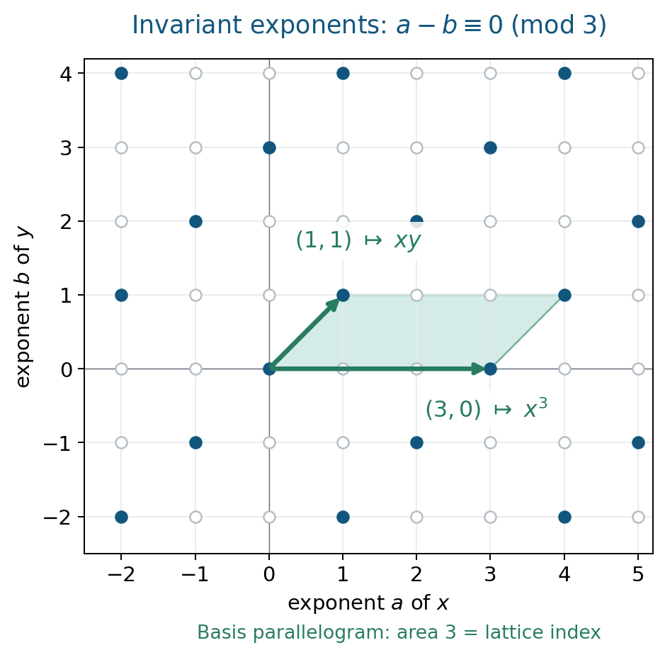

# Noether's problem and generic polynomials

*Written by GPT-6.1 Sol (OpenAI) in Codex, Ultra setting, October 2026. Writer mathematical self-check completed, 2 October 2026; no independent review claimed. Original text and diagrams: public domain (CC0).*

**Downloads:** PDF · LaTeX source · Complete editable sources

To prescribe a Galois group, one can begin with variables on which that group already acts. The extension over the fixed field is automatically Galois. The difficult step is to describe the fixed field by independent parameters. When that succeeds over the rational numbers, Hilbert's irreducibility theorem turns the parameters into numbers without losing the group.

In the introduction and §1 of [Noether, Prescribed group], Noether distinguishes two approaches: begin with roots and a prescribed action, then seek rational invariant parameters; or begin with polynomial coefficients and specialize them arithmetically. Her parameter argument excludes singular parameter values, where formulas or the group can change. Sections 2–3 make that exclusion explicit through discriminants and denominators, while §5 proves that every extension with the prescribed group arises from the generic polynomial under its stated hypotheses.

We use the field and symmetric-function results of [Subfields and subrings of rational function fields](NOE-RAT-01.md), finite Galois theory, primitive elements and trace-dual bases. Basic references are [Noether, Prescribed group], [Milne] and [Jensen–Ledet–Yui]. The abelian criterion uses the written cyclotomic-integer and Dedekind-module lessons linked in §6.4. The Brauer obstruction uses the written algebra, Tsen and continuous-cohomology lessons linked in §6.5; its valuation bridge is supplied there. Galois descent is available in [Hilbert 90 in Noether's form and Galois descent](course:NOE-HYP/NOE-HYP-06); we recall precisely the consequence needed below. The simultaneous Hilbert theorem over number fields is proved below: its arithmetic argument is supplied here, and the geometric cut uses the exact open Stacks Bertini proof.

## 1. A group already present in a function field

Let a finite group \(G\) act faithfully by linear transformations on a finite-dimensional \(k\)-space \(V\). Choose coordinates and write \(k(V)\) for its rational function field. **Noether's problem for this representation** asks whether \(k(V)^G\) is rational over \(k\).

The regular version uses independent variables \(x_g\), one for each \(g\in G\), and the action \(h(x_g)=x_{hg}\). Its fixed field is denoted \(k(G)\). One must specify the base field: adjoining roots of unity can change the answer.

Artin's fixed-field theorem says that a faithful finite group of field automorphisms gives a finite Galois extension

\[
k(V)/k(V)^G,
\qquad [k(V):k(V)^G]=|G|,
\]

with Galois group exactly \(G\). Thus a positive rationality answer supplies a \(G\)-extension of \(k(t_1,\ldots,t_r)\). It does not yet supply one of \(k\).

For \(S_n\) acting by permutations, the preceding lesson proves

\[
k(x_1,\ldots,x_n)^{S_n}=k(e_1,\ldots,e_n).
\]

The polynomial \(X^n-e_1X^{n-1}+\cdots+(-1)^ne_n\) has splitting field \(k(x_1,\ldots,x_n)\) and group \(S_n\), in every characteristic. Notice that its degree is \(n\), whereas the minimal polynomial of a primitive element of this **whole splitting field** has degree \(n!\). The distinction matters in specialization.

## 2. What specialization preserves

Write \(A=\mathbb Q[t_1,\ldots,t_r]\) and \(F=\operatorname{Frac}(A)\). Let \(E/F\) be finite Galois with group \(G\), and let \(\theta\) be a primitive element integral over \(A\). Its monic minimal polynomial \(P\) lies in \(A[X]\), because \(A\) is integrally closed. Such an integral primitive element always exists: multiply any primitive element by a common polynomial denominator in its algebraic equation.

### Lemma 2.1. A monogenic model after inverting the discriminant

Let \(\Delta=\operatorname{disc}(P)\), which is a nonzero element of \(A\), and put \(R=A[1/\Delta]\), \(B=R[\theta]\). Then \(G\) preserves \(B\), and

\[
B\otimes_R B\longrightarrow\prod_{g\in G}B,
\qquad b\otimes c\longmapsto(b\,g(c))_{g\in G}
\tag{1}
\]

is an isomorphism.

**Proof.** Put \(N=|G|\). The powers \(1,\theta,\ldots,\theta^{N-1}\) form an \(R\)-basis of \(B\). If \(z\in E\) is integral over \(R\), write \(z=\sum_j c_j\theta^j\), initially with \(c_j\in F\). Each \(\operatorname{Tr}_{E/F}(z\theta^i)\) is integral over \(R\) and lies in \(F\), hence lies in \(R\). The matrix

\[
\bigl(\operatorname{Tr}_{E/F}(\theta^{i+j})\bigr)_{0\leq i,j<N}
\]

has determinant \(\Delta\), a unit of \(R\). Solving this linear system yields \(c_j\in R\). Hence every integral element lies in \(B\); in particular \(g(\theta)\in B\).

The polynomial \(P\) splits in \(B[X]\) as \(\prod_g(X-g(\theta))\). Its discriminant is the product, up to sign, of the squared differences of these roots. As this product is a unit, every difference is a unit. The Chinese remainder theorem gives

\[
B[X]/(P)\cong\prod_g B.
\]

The left side is \(B\otimes_R B\), with its second copy of \(\theta\) represented by \(X\), and the resulting map is (1). \(\square\)

### Theorem 2.2. Specialization gives a subgroup

If \(a=(a_1,\ldots,a_r)\in\mathbb Q^r\) and \(P(a,X)\) is separable, its splitting field over \(\mathbb Q\) has Galois group isomorphic to a subgroup of \(G\). If \(P(a,X)\) is also irreducible, that group is \(G\).

**Proof.** Separability says \(\Delta(a)\neq0\), so evaluation defines \(R\to\mathbb Q\). Put

\[
C=B\otimes_R\mathbb Q=\mathbb Q[X]/(P(a,X)).
\]

This is a product of finite separable fields. Base-changing (1) shows that, over \(\overline{\mathbb Q}\), its \(N\) algebra maps to \(\overline{\mathbb Q}\) form a set on which \(G\) acts simply transitively. This also follows directly from the distinct specialized conjugates of \(\theta\) in (1).

The absolute Galois group \(\Gamma=\operatorname{Gal}(\overline{\mathbb Q}/\mathbb Q)\) acts on the same set by acting on values. This action commutes with \(G\). After choosing one point and identifying the set with \(G\), a permutation commuting with the regular left action is right multiplication by one group element. Thus the image of \(\Gamma\) is a subgroup of the right regular group, which is isomorphic to \(G\). The kernel fixes every root of \(P(a,X)\), so this image is exactly the Galois group of its splitting field.

If \(P(a,X)\) is irreducible, \(\Gamma\) acts transitively on its \(N\) roots. A subgroup of a regular group acting transitively on all \(N=|G|\) points must have order \(N\). It is therefore the whole group. \(\square\)

Equivalently, choose a field factor \(L\) of \(C\) and its stabilizer \(D\subseteq G\). The factors are permuted transitively, and the regular description gives \([L:\mathbb Q]=|D|\); the factor is Galois with group \(D\). This is the decomposition-group description of the same result.

Irreducibility of a polynomial of smaller degree that merely generates the original splitting field is insufficient. For example \(X^3-T\) has splitting group \(S_3\) over \(\mathbb Q(T)\), but the irreducible separable polynomial \(X^3-2\) illustrates only transitivity on three roots. In other families an irreducible specialization can have a proper transitive subgroup. Theorem 2.2 uses a primitive element of the entire Galois extension, so its \(|G|\) roots carry the regular action.

## 3. From parameters to rational numbers

### 3.1. Hilbert's argument in one parameter

We first prove the simultaneous theorem for one parameter over a number field. This supplies the arithmetic step rather than importing it from a book. The proof uses Hilbert's finite-difference idea [Hilbert, Irreducibility]; the modern account [Villarino–Gasarch–Regan, §§3–11] was consulted for that argument. We use holomorphic functions only to label the finitely many possible factors near infinity. The local-field input is the written construction of unramified extensions in [Unramified and totally ramified extensions, Corollary 3.1](course:NT-LOC/NT-LOC-07).

**Lemma 2.3a (repeated monochromatic cubes).** Given a finite colouring of the positive integers and an integer \(h\geq1\), there are positive integers \(d_1,\ldots,d_h\), a colour, and arbitrarily large integers \(b\) such that all the numbers

\[
b+\epsilon_1d_1+\cdots+\epsilon_hd_h,\qquad
\epsilon_i\in\{0,1\},
\]

have that colour.

**Proof.** For \(c\) colours define \(H_1=c+1\) and, recursively, \(H_h=H_{h-1}(c^{H_{h-1}}+1)\). Every interval of length \(H_h\) contains such a cube. For \(h=1\), two entries have the same colour. For the induction, partition the interval into \(c^{H_{h-1}}+1\) consecutive blocks of length \(H_{h-1}\). Two blocks have the same colour sequence. A monochromatic \((h-1)\)-cube in the first block has its translate in the second; their positive displacement is the last increment. This proves the finite assertion. Apply it in disjoint intervals tending to infinity. Only finitely many colours and increment tuples bounded by \(H_h\) occur, so one tuple and colour occur in infinitely many intervals. \(\square\)

**Lemma 2.3b (analytic labels for the factors).** Let \(g(T,Y)\) be monic in \(Y\), of degree \(n\), with coefficients in \(\mathbb C[T]\), and with nonzero discriminant. For some positive integer \(e\), its roots, after \(T=z^e\), are holomorphic functions on \(|z|>R\) and have convergent Laurent expansions with only finitely many positive powers. Consequently the coefficients of every product of a subset of the factors \(Y-y_i(z)\) have the same kind of expansion.

**Proof.** Outside a disk the discriminant does not vanish. Each simple root has a holomorphic local continuation, by the holomorphic implicit-function theorem. Continuation around one circle permutes the \(n\) roots. Every loop in the exterior disk is classified by its winding number, so taking \(e\) divisible by the order of that permutation makes all continuations single valued after \(T=z^e\). This produces the asserted holomorphic root functions.

The elementary root bound

\[
|y|\leq1+\max_{j<n}|a_j(T)|
\]

for a root of \(Y^n+\sum_{j<n}a_j(T)Y^j\) gives polynomial growth in \(|z|\). To check the bound, if \(|y|>1+M\), then \(M\sum_{j<n}|y|^j<|y|^n\), so the equation cannot vanish. A holomorphic function on \(|z|>R\) of polynomial growth has a pole or a removable singularity at infinity: multiply its expression in \(w=1/z\) by a sufficiently large power of \(w\), and apply the removable-singularity theorem to the bounded resulting function. Its Laurent expansion therefore has only finitely many positive powers. Finite sums and products preserve this property. \(\square\)

For a finite list of polynomials and all embeddings of a number field into \(\mathbb C\), one common \(e\), one common \(R\), and one bound on these positive exponents suffice. The analytic facts just used are the local implicit-function theorem, continuation around a puncture, Laurent expansion and the removable-singularity theorem; no Diophantine approximation theorem is hidden in the argument.

**Lemma 2.3c (two elementary facts about number fields).** Let \(k\) be a number field.

1. If a sequence \(\alpha_j\) of algebraic integers in \(k\) tends to zero under every embedding \(k\hookrightarrow\mathbb C\), then it is eventually zero.
2. Outside a finite set of rational primes, \(k\) has a nonarchimedean valuation taking integral values and normalized by \(v(p)=1\).

**Proof.** For (1), a nonzero algebraic integer has a nonzero rational-integer norm. Hence

\[
1\leq|N_{k/\mathbb Q}(\alpha_j)|
=\prod_{\sigma:k\hookrightarrow\mathbb C}|\sigma(\alpha_j)|,
\]

which is impossible once all factors are smaller than one.

For (2), choose a primitive integral element \(u\) of \(k/\mathbb Q\), with monic minimal polynomial \(m\in\mathbb Z[X]\). Such an element is obtained by multiplying a primitive element by an integer. Exclude the finitely many primes dividing \(\operatorname{disc}(m)\). For a remaining \(p\), choose an irreducible factor of \(\bar m\) over \(\mathbb F_p\), of degree \(f\), and one of its roots in \(\mathbb F_{p^f}\). The unramified degree-\(f\) extension \(U_f/\mathbb Q_p\), supplied by the stated local prerequisite, has that residue field and value group \(\mathbb Z\) with \(v(p)=1\). Lift the root to \(z_0\) in its valuation ring. Its derivative is a unit. Newton iteration

\[
z_{j+1}=z_j-\frac{m(z_j)}{m'(z_j)}
\]

stays in the valuation ring, retains a unit derivative, and at least doubles the positive valuation of the error at each step, by Taylor expansion. Completeness gives a root \(z\in U_f\) of \(m\). The map \(u\mapsto z\) embeds \(k\) in \(U_f\), since \(m\) is irreducible over \(\mathbb Q\). Restrict the valuation. Its values are integers and it still takes value one on \(p\). \(\square\)

**Theorem 2.3d (simultaneous one-parameter Hilbert irreducibility).** Let \(k\) be a number field and let \(P_1,\ldots,P_s\in k(T)[X]\) be irreducible polynomials of positive degree, separable in \(X\). Infinitely many positive integers \(a\) give defined specializations of the same degrees for which all \(P_i(a,X)\) are irreducible over \(k\). These integers can avoid any specified nonzero polynomial in \(T\).

**Proof.** Clearing denominators and scaling the variable reduces each polynomial to a monic polynomial \(g_i(T,Y)\in\mathcal O_k[T,Y]\). More explicitly, clear all denominators to obtain \(F_i=A_i(T)X^{n_i}+\cdots\) with coefficients in \(\mathcal O_k[T]\), and put

\[
g_i(T,Y)=A_i(T)^{n_i-1}F_i(T,Y/A_i(T)).
\]

For \(A_i(a)\neq0\) this substitution preserves irreducibility and degree. It also preserves irreducibility over \(k(T)\). Polynomials of degree one require no further argument. The denominator, leading-coefficient and discriminant zeros, and the specified extra zeros, exclude only finitely many integers.

Suppose, for contradiction, that every sufficiently large positive integer makes at least one \(g_i\) reducible. A monic factor over \(k\) has coefficients in \(\mathcal O_k\): its coefficients are symmetric expressions in roots integral over \(\mathcal O_k\), hence are algebraic integers lying in \(k\).

Apply Lemma 2.3b to every \(g_i\) under every embedding \(\sigma:k\hookrightarrow\mathbb C\), with a common exponent \(e\). Label the analytic roots once for each embedding. For a sufficiently large positive integer \(a\), a chosen nontrivial monic factor determines a polynomial index \(i\) and, for each embedding, a nonempty proper subset of those root labels. These tuples form a finite set of possible colours; write \(c\) for its size. Choose \(h\) larger than every nonnegative exponent appearing in any coefficient of any possible subset product.

Fix a positive rational prime \(p\). For every sufficiently large positive integer \(q\), the specialization at \(T=pq^e\) has a chosen factor. Colour \(q\) by its tuple. For a fixed colour, the coefficient functions at the embeddings have convergent expansions

\[
B_\sigma(q)=\sum_{j=0}^{h-1}b_{\sigma,j}q^j+
\sum_{\nu\geq1}c_{\sigma,\nu}q^{-\nu}.
\tag{H1}
\]

Here \(B_\sigma(q)\) means the coefficient of the subset product selected by that colour, with \(z=p^{1/e}q\). On an integer with that colour, the collection of values \(B_\sigma(q)\) is the collection of embeddings of a single algebraic-integer coefficient of the chosen factor.

Lemma 2.3a gives a colour and fixed increments \(d_1,\ldots,d_h\) for infinitely many monochromatic cubes. Apply

\[
\Delta_{d_1}\cdots\Delta_{d_h},\qquad
\Delta_dB(q)=B(q+d)-B(q),
\]

to each coefficient function. At the bases of those cubes its values are all embeddings of an algebraic integer. The polynomial part of (H1) disappears; the remainder tends to zero at every embedding. Lemma 2.3c(1) makes the differences zero at all sufficiently large such bases.

If the negative-power part at any embedding were nonzero, let \(c_\nu q^{-\nu}\) be its first nonzero term. Its \(h\)-fold difference has first term

\[
(-1)^h c_\nu\,\nu(\nu+1)\cdots(\nu+h-1)
d_1\cdots d_h\,q^{-\nu-h},
\]

with nonzero coefficient. A convergent expansion with that first term cannot vanish at arbitrarily large positive \(q\). Thus every negative-power part is zero. Each coefficient function for this colour is now a polynomial in \(q\).

Interpolate from \(h\) distinct cube bases. The factor coefficients there belong to \(k\); the Vandermonde matrix has rational entries and nonzero determinant. Consequently there are elements \(b_j\in k\) whose embeddings are exactly the coefficients \(b_{\sigma,j}\). This conclusion is simultaneous at all embeddings, not a claim that one complex embedding by itself is discrete.

We have proved: for each prime \(p\), some colour gives a formal factor whose coefficients have no negative powers, and for that colour their polynomial coefficients after \(z=p^{1/e}q\) lie in \(k\). Choose \(c+1\) distinct primes outside the finite exceptional set in Lemma 2.3c(2). Two primes \(p,p'\) give the same colour. For any nonzero coefficient \(C_jz^j\) of that common formal factor, interpolation at \(p\) and \(p'\) gives

\[
C_jp^{j/e}\in k,\qquad C_j(p')^{j/e}\in k
\]

at a fixed embedding of \(k\). Their ratio \(\beta=(p/p')^{j/e}\) therefore belongs to that embedded field. Since \(\beta^e=(p/p')^j\), the valuation supplied at \(p\) gives

\[
e\,v(\beta)=j.
\]

The value \(v(\beta)\) is an integer, so \(e\mid j\). It follows also that \(C_j\in k\). Every coefficient of this nontrivial formal factor is thus in \(k[z^e]=k[T]\).

The complementary subset product gives a factorization analytically, hence identically, of \(g_i(T,Y)\). Polynomial division over \(k(T)\) shows that its quotient is also in \(k(T)[Y]\). This contradicts the assumed irreducibility of \(g_i\). The contradiction proves infinitely many simultaneous good integers, and the finite excluded set gives the final assertion. \(\square\)

The proof also works after an affine change \(T=b+cS\), with \(b,c\in k\) and \(c\neq0\): the transformed polynomials remain irreducible over \(k(S)\). This lets the good specializations meet any prescribed arithmetic progression in \(\mathbb Q\), and proves Zariski density for the one-parameter conclusion.

### 3.2. Cutting the parameter space down to a line

The geometric input is the openly licensed [Bertini irreducibility lemma, Stacks Tag 0G4F, full proof](https://kokunoyumeto.github.io/stacks-zh-hans-cn/en/more-morphisms.html#more-morphisms-lemma-bertini-irreducible), consulted in the AI Integrated Stacks Project edition; the [official tagged proof](https://stacks.math.columbia.edu/tag/0G4F) is also available. It applies to a finite-type geometrically irreducible scheme and a finite-dimensional linear system whose base locus has codimension at least two, provided two sections meet in a codimension-two component outside the zero set of a third. Its conclusion is geometric irreducibility of the general member. The source and proof are distributed under [GFDL 1.2](https://github.com/KokunoYumeto/unofficial-stacks-project-ai-drafts/blob/565b10e987aba5969b21145a0833f42d69f96790/COPYING).

We apply it to affine linear functions of the parameters on a finite cover. The constant section \(1\) makes the base locus empty. Two coordinate sections supply the required codimension-two intersection. The proof below checks these conditions and the arithmetic descent; a bare invocation of irreducibility over an algebraic closure would lose the constant-field information.

**Lemma 2.3e (one fewer parameter).** Suppose \(r\geq2\), \(k\) has characteristic zero, and \(P_1,\ldots,P_s\in k(t_1,\ldots,t_r)[X]\) are irreducible separable polynomials. Given a nonzero \(h\in k[\mathbf t]\), there is an affine hyperplane defined over \(k\), with \(t_r\) expressible in the other coordinates, on which every \(P_i\) retains its \(X\)-degree and is irreducible over the remaining rational function field, and on which \(h\) is not identically zero.

**Proof.** Replace each \(P_i\) by its monic associate. After enlarging a finite Galois extension \(C/k\), factor it into the monic factors

\[
P_i=Q_{i1}\cdots Q_{im_i}
\quad\text{in }C(\mathbf t)[X]
\]

that are irreducible over \(\bar k(\mathbf t)\). Their coefficients lie in such a finite extension because a polynomial has finitely many factors and each has finitely many coefficients. The group \(\operatorname{Gal}(C/k)\) acts transitively on the factors of each \(P_i\). Otherwise a proper orbit product would be a monic factor over \(k(\mathbf t)\), contradicting irreducibility.

Invert one nonzero polynomial in the parameters so that every factor has coefficients in \(C[\mathbf t,1/D]\), all its discriminants are units, distinct factors of each \(P_i\) have unit resultants, and all the original denominators and leading coefficients remain units. Each

\[
X_{ij}=\operatorname{Spec}
C[\mathbf t,1/D,X]/(Q_{ij})
\]

is geometrically integral of dimension \(r\), and finite étale and surjective over the parameter open \(U=\operatorname{Spec}C[\mathbf t,1/D]\). Geometric integrality follows from absolute irreducibility and separability; monicity and the inverted discriminant give the finite étale assertion. In particular every nonempty fibre of its map to a coordinate linear subspace has the same dimension as that subspace.

On \(X_{ij}\), take the linear system spanned by \(1,t_1,\ldots,t_r\). Its base locus is empty. Choose \(b_1,b_2\in C\) so that the subspace \(t_1=b_1,t_2=b_2\) meets \(U\). Such a choice exists because \(C\) is infinite and \(D\neq0\). Its inverse image is nonempty and has pure dimension \(r-2\), since the cover is finite étale. Thus the sections \(t_1-b_1,t_2-b_2\) have a codimension-two intersection component, and the constant section does not vanish there. These are exactly the Bertini conditions stated above.

Consequently there is a nonempty open set of affine-hyperplane coefficients over \(C\) for which each \(X_{ij}\) has geometrically irreducible hyperplane section. Intersect these finitely many opens. Intersect further with the conditions that the coefficient of \(t_r\) is nonzero, that the hyperplane meets \(U\), and that \(h\) is not identically zero on it. These last conditions are nonempty opens: on the chart where that coefficient is nonzero, substitute the affine expression for \(t_r\) and require that at least one coefficient of the resulting polynomial \(D\), or respectively \(h\), be nonzero. A generic affine hyperplane cannot be contained in either proper hypersurface.

An infinite subfield \(k\subset C\) has Zariski-dense \(k\)-points in affine space over \(C\). Indeed a nonzero polynomial with coefficients in \(C\) cannot vanish on all \(k\)-tuples, by induction on the number of variables and the one-variable bound on the number of roots. Therefore the intersected open contains hyperplane coefficients in \(k\).

Choose them. The sections of the \(X_{ij}\) are reduced, because they remain finite étale over the open part of that hyperplane; geometric irreducibility therefore makes them geometrically integral. The specialized \(Q_{ij}\) are consequently irreducible over \(C(t_1,\ldots,t_{r-1})\). They remain distinct because the resultants remain units. Since the hyperplane is defined over \(k\), the Galois action on this distinct list of factors is still the original transitive action. A proper factor of the specialized \(P_i\) over \(k(t_1,\ldots,t_{r-1})\) would select a nonempty proper Galois-stable subset of that list. Transitivity excludes it. Monicity and the inverted leading coefficients preserve degrees. This proves all the assertions. \(\square\)

**Theorem 2.3f (simultaneous Hilbert irreducibility over number fields).** Let \(k\) be a number field. For finitely many irreducible separable polynomials in \(k(t_1,\ldots,t_r)[X]\) of positive \(X\)-degree, there are Zariski-densely many \(a\in k^r\) where their defined specializations retain their degrees and are irreducible. They can avoid any specified nonzero polynomial in the parameters.

**Proof.** Include all denominators and leading coefficients in the polynomial to be avoided. Repeatedly apply Lemma 2.3e until only one parameter remains. At each step retain the nonzero restriction of that polynomial. Theorem 2.3d then gives a specialization outside its finite zero set at which all the resulting polynomials are irreducible. The successive affine substitutions give the desired point of \(k^r\). Since the same argument works with any extra nonzero polynomial to be avoided, the good points meet every nonempty Zariski open and are Zariski dense. \(\square\)

This establishes precisely the simultaneous multivariable form needed for Noether's reduction. The arithmetic cube argument is proved in this lesson; the geometric cut uses the exact accessible open Bertini proof, with its hypotheses verified above.

### Theorem 2.3. Noether's reduction, with disjoint realizations

Let \(G\neq1\) act faithfully on \(V\) over \(\mathbb Q\). If \(\mathbb Q(V)^G\) is rational, there are infinitely many \(G\)-Galois extensions of \(\mathbb Q\) that are jointly linearly disjoint: every new extension is linearly disjoint from the compositum of the previous ones.

**Proof.** Identify the fixed field with \(F=\mathbb Q(t_1,\ldots,t_r)\), and put \(E=\mathbb Q(V)\). Choose an integral primitive element as above. Hilbert irreducibility gives an irreducible specialization away from \(\Delta=0\), and Theorem 2.2 gives a \(G\)-extension of \(\mathbb Q\).

For disjointness, suppose finitely many extensions have already been chosen, and let \(M/\mathbb Q\) be their finite Galois compositum, with group \(H\). The field \(E=\mathbb Q(V)\) is purely transcendental over \(\mathbb Q\), so it is linearly disjoint from \(M\). Explicitly a \(\mathbb Q\)-basis of \(M\) stays independent after adjoining the independent coordinates of \(V\), by clearing denominators and comparing coefficients. Thus

\[
\operatorname{Gal}(EM/F)\cong G\times H.
\]

Here \(G\) acts on \(E\), \(H\) acts on the constants \(M\), and these commuting actions account for the full degree. Take an integral primitive element of \(EM/F\), apply Hilbert irreducibility and Theorem 2.2, and obtain a Galois specialization \(N/\mathbb Q\) with group \(G\times H\).

The integral model in Lemma 2.1 contains \(M\), since each element of \(M\) is integral over the polynomial base. Its specialization embeds \(M\) into the field \(N\). The actions on these constants identify \(N^{G\times\{1\}}\) with this copy of \(M\). Set \(L=N^{\{1\}\times H}\). Then \(L/\mathbb Q\) is \(G\)-Galois, \(LM=N\), and

\[
[LM:\mathbb Q]=|G||H|=[L:\mathbb Q][M:\mathbb Q].
\]

Thus \(L\) is linearly disjoint from \(M\). Repeat inductively. Since \(G\neq1\), no extension in this sequence can repeat. \(\square\)

For the trivial group there is only the single extension \(\mathbb Q/\mathbb Q\). It is realized by the same argument, but the assertion of infinitely many distinct realizations necessarily excludes it.

Over \(\mathbb C\), no analogous conclusion holds: every finite extension is trivial. Rationality of a function field alone is therefore not a replacement for Hilbert irreducibility.

## 4. Abelian actions become lattices

### Theorem 2.4. Fischer's theorem

Let \(G\) be finite abelian of exponent \(e\), let \(\operatorname{char}k\nmid e\), and suppose \(k\) contains a primitive \(e\)-th root of unity. For every finite-dimensional representation \(V\), including a nonfaithful one, \(k(V)^G\) is rational over \(k\).

**Proof.** Each group element satisfies \(T^e-1=0\) on \(V^*\). This polynomial splits over \(k\) with distinct roots, so the operators are diagonalizable. Commuting diagonalizable operators can be simultaneously diagonalized: decompose into eigenspaces of one operator, note that every other operator preserves them, and continue on each space. Thus choose coordinate functions \(z_i\) with

\[
g(z_i)=\chi_i(g)z_i
\]

for characters \(\chi_i:G\to k^\times\). Consider the homomorphism

\[
\mathbb Z^m\longrightarrow\operatorname{Hom}(G,k^\times),
\qquad(a_i)\longmapsto\prod_i\chi_i^{a_i},
\]

and its kernel \(\Lambda\). Since \(e\mathbb Z^m\subseteq\Lambda\), this is a full-rank free abelian group. Choose a \(\mathbb Z\)-basis \(b_1,\ldots,b_m\) of \(\Lambda\).

The invariant Laurent polynomials are exactly the linear combinations of monomials \(z^a\) with \(a\in\Lambda\): monomials are independent eigenvectors, so a coefficient of nontrivial weight must be zero. Therefore

\[
k[z_1^{\pm1},\ldots,z_m^{\pm1}]^G
=k[\Lambda]
=k[(z^{b_1})^{\pm1},\ldots,(z^{b_m})^{\pm1}].
\]

Every invariant rational function is a quotient of invariant Laurent polynomials, by the denominator-product argument of the preceding lesson. Hence the fixed field is \(k(z^{b_1},\ldots,z^{b_m})\). These generators are algebraically independent: distinct exponent combinations give distinct monomials because the \(b_i\) are independent over \(\mathbb Z\). This proves rationality. \(\square\)

### Example 2.5. Opposite weights

For a cyclic group of order \(n\), let \(x\mapsto\zeta x\), \(y\mapsto\zeta^{-1}y\). Then

\[
\Lambda=\{(a,b)\in\mathbb Z^2:a-b\equiv0\pmod n\}
=\mathbb Z(n,0)+\mathbb Z(1,1),
\]

and \(k(x,y)^G=k(x^n,xy)\). Negative exponents are allowed in the lattice; this is a field calculation, not a proposed set of polynomial generators.

*Figure 2.1.* Filled points are exponents satisfying \(a-b\equiv0\pmod3\); open points have nontrivial weight. The shaded parallelogram of the basis \((3,0),(1,1)\) has area three, equal to the lattice index. The figure depicts the Laurent-monomial mechanism in Theorem 2.4 and Example 2.5. [Editable diagram](assets/invariant-lattice.svg).

For a cyclic permutation of three coordinates over a field containing a primitive cube root \(\zeta\), set

\[
z_0=x_1+x_2+x_3,\quad
z_1=x_1+\zeta^2x_2+\zeta x_3,\quad
z_2=x_1+\zeta x_2+\zeta^2x_3.
\]

When the cyclic action sends \(x_1\mapsto x_2\mapsto x_3\mapsto x_1\), their weights are \(1,\zeta,\zeta^2\). The invertible Fourier matrix changes coordinates, and the fixed field is \(k(z_0,z_1^3,z_1z_2)\). For a single coordinate of weight \(\zeta\), the answer is simply \(k(x^n)\).

## 5. Genericity and a change of representation

A monic separable polynomial \(P(\mathbf t,X)\in k(\mathbf t)[X]\) is **generic for \(G\) over \(k\)** if its splitting field over \(k(\mathbf t)\) has group \(G\), and for every extension field \(K/k\) and every \(G\)-Galois extension \(L/K\), some defined specialization \(\mathbf t\mapsto\mathbf a\in K^r\) has splitting field \(L\). This definition ranges over extension fields of \(k\), not just over \(k\) itself. The specializing polynomial need not be irreducible.

### Theorem 2.6. A rational invariant field gives a generic polynomial

Let \(k\) be infinite and \(V\) a faithful finite-dimensional representation of \(G\). If \(k(V)^G=k(t_1,\ldots,t_r)\) is rational, there is a generic polynomial for \(G\) over \(k\), with these \(r=\dim V\) parameters. In particular a positive answer to the regular Noether problem gives a generic polynomial. The regular formulation is Kuyk's theorem; the representation formulation appears in [Jensen–Ledet–Yui, Proposition 1.1.3], with credit to Kemper and Mattig.

The descent theorem needed in the proof is precise: for a finite Galois extension \(L/K\) with group \(G\), and a semilinear \(L\)-space \(W\), the map \(L\otimes_K W^G\to W\) is an isomorphism. It holds in every characteristic and is proved in [Hilbert 90 in Noether's form and Galois descent, Theorem 2.1](course:NOE-HYP/NOE-HYP-06).

**Proof.** Put \(E=k(V)\), \(F=E^G=k(\mathbf t)\). Choose a primitive element \(\theta\) of the finite Galois extension \(E/F\), and let

\[
P(\mathbf t,X)=\prod_{g\in G}(X-g(\theta))\in k(\mathbf t)[X].
\]

It is monic, separable, and its splitting field is \(E\), with group \(G\). We show that it specializes to every prescribed \(G\)-extension over every extension field of \(k\).

Let \(K/k\) be any extension and \(L/K\) a \(G\)-Galois extension; fix an identification of its Galois group with \(G\). Let \(V^*\) be the space of linear coordinate functions. On

\[
W=\operatorname{Hom}_k(V^*,L)
\]

define the semilinear action

\[
(\rho_g v)(\ell)=g\bigl(v(g^{-1}\ell)\bigr).
\]

Thus \(v\in W^G\) means \(v(g\ell)=g(v(\ell))\). Descent gives a \(K\)-basis \(v_1,\ldots,v_r\) of \(W^G\) that is also an \(L\)-basis of \(W\). An invariant vector \(v=\sum_i b_iv_i\), \(b_i\in K\), assigns values in \(L\) to the coordinates and defines a \(G\)-equivariant evaluation of every rational function whose denominator does not vanish there.

Only finitely many exclusions are necessary. Express the \(t_i\), all \(g(\theta)\), and the coefficients of \(P\) as rational functions in the coordinates of \(V\). Exclude their denominators; also exclude the nonzero numerators of \(g(\theta)-h(\theta)\) for \(g\ne h\), and the denominators in the coefficient identities expressing \(P\) in \(k(\mathbf t)[X]\). Their product is a nonzero polynomial in the coordinates over \(k\). Substitution of the \(L\)-basis \(v_i\) is an invertible linear change of variables over \(L\), so the product remains a nonzero polynomial in \(b_1,\ldots,b_r\) over \(L\).

A nonzero polynomial over an extension of an infinite field \(K\) cannot vanish on every point of \(K^r\). For one variable this follows from the root bound, and induction on \(r\), viewing the polynomial in its last variable, proves the general assertion. We can therefore choose the \(b_i\in K\) outside every exclusion.

Let \(\mathbf a\) be the evaluated values of \(\mathbf t\) and \(c\) the evaluated value of \(\theta\). Equivariance puts \(\mathbf a\) in \(L^G=K\), and it gives

\[
P(\mathbf a,X)=\prod_{g\in G}(X-g(c)).
\]

All these roots are distinct by construction. Consequently \(c\) has trivial stabilizer in \(G\), so \([K(c):K]=|G|\) and \(K(c)=L\). The displayed specialization has splitting field \(L\). The polynomial \(P\) was chosen before \(K\) and \(L\), which proves genericity with the full extension-field quantifier. \(\square\)

The proof explains the infinitude hypothesis: it lets a rational point of the descended vector space avoid finitely many nonzero polynomial conditions. Rationality is a sufficient condition for genericity; no converse is asserted.

For \(G=C_2\) in characteristic different from two, \(X^2-T\) is generic: every quadratic Galois extension \(L/K\) is \(K(\sqrt a)\) for some nonsquare \(a\in K\). Equivalently the symmetric quadratic \(X^2-SX+P\) has discriminant \(S^2-4P\); specializing \((S,P)=(0,-a)\) gives \(X^2-a\). Over \(\mathbb Q\), choosing distinct positive primes yields distinct quadratic extensions.

The **no-name lemma** says that, for a faithful representation \(V\) and any representation \(W\),

\[
k(V\oplus W)^G\cong k(V)^G(u_1,\ldots,u_{\dim W}).
\tag{2}
\]

This is an isomorphism over \(k(V)^G\). Its descent input is the following exact theorem: if \(E/F\) is finite Galois and \(M\) is a finite-dimensional semilinear \(E\)-space, the natural map \(E\otimes_F M^G\to M\) is an isomorphism. It is proved in [Hilbert 90 in Noether's form and Galois descent, Theorem 2.1](course:NOE-HYP/NOE-HYP-06).

To apply it, take \(E=k(V)\), \(F=E^G\), and the semilinear space of the coordinate functions of \(W\) over \(E\). An invariant \(E\)-basis \(u_i\) makes \(E(W)=E(u_1,\ldots,u_m)\), with \(G\) acting only on \(E\). Comparing coefficients, or using Artin's theorem and degrees, gives its fixed field \(F(u_1,\ldots,u_m)\). This derives (2) from the stated descent theorem. Faithfulness of \(V\) is essential for this use of descent.

An extension is **stably rational** if adjoining finitely many independent variables makes it rational. If both \(V,W\) are faithful, (2) applied in both orders identifies

\[
k(V)^G(u_1,\ldots,u_{\dim W})
\cong k(W)^G(v_1,\ldots,v_{\dim V}).
\]

Consequently stable rationality does not depend on the faithful representation. This comparison proves a statement about stable rationality; it does not permit cancellation of the added variables to prove rationality.

## 6. Negative answers and their meaning

### 6.1. What rationality forces on an exponent lattice

Diagonalization over a larger field solves only half the problem. The Galois group of that field also acts on the exponent lattice, and that integral action can obstruct descent to a rational field.

Let \(l/k\) be finite Galois with group \(\pi\), and let \(M\) be a free abelian group of finite rank with a \(\pi\)-action. Write \(l[M]\) for its Laurent group algebra, \(l(M)\) for its fraction field, and let \(\pi\) act on both coefficients and exponents. A **permutation lattice** has a basis permuted by \(\pi\).

**Lemma 2.7 (units and stable rationality).** If \(l(M)^\pi\) is stably rational over \(k\), there is an exact sequence of \(\pi\)-lattices

\[
0\longrightarrow M\longrightarrow P_2\longrightarrow P_1\longrightarrow0
\tag{3}
\]

with \(P_1,P_2\) permutation lattices.

**Proof.** Adjoin independent invariant variables \(x_1,\ldots,x_s\) so that

\[
l(M)^\pi(\mathbf x)=k(y_1,\ldots,y_{r+s}),
\qquad r=\operatorname{rank}M.
\]

Extension of constants gives the equality

\[
l(M)(\mathbf x)=l(\mathbf y).
\]

To justify extension of constants here, the \(|\pi|\) automorphisms of \(l(M)\) restrict to the distinct automorphisms of \(l\). Artin's theorem gives degree \(|\pi|\) over the fixed field; adjoining \(l\) already supplies that degree, so \(l(M)=l\cdot l(M)^\pi\). The \(y_j\) are fixed by \(\pi\).

Inside the common field compare

\[
R_1=l[M][\mathbf x],\qquad R_2=l[\mathbf y].
\]

Both are unique factorization domains. There is a common localization \(R=R_1[f_1^{-1}]=R_2[f_2^{-1}]\) with nonzero \(f_i\in R_i\), chosen so that \(R\) is \(\pi\)-stable. Here is the finite denominator argument. First choose \(f\in R_1\) and \(g\in R_2\) with \(R_2\subset R_1[f^{-1}]\) and \(R_1\subset R_2[g^{-1}]\), by clearing the denominators of finite sets of algebra generators. Replace each by the product of its \(\pi\)-conjugates. Then \(R_1[f^{-1},g^{-1}]=R_2[f^{-1},g^{-1}]\). Since \(g\in R_1[f^{-1}]\) and \(f\in R_2[g^{-1}]\), clearing these two denominators expresses this ring as a single principal localization of each \(R_i\). The invariant choices of \(f,g\) make the common ring stable.

In a unique factorization domain, localization adds to the unit group a free abelian group on the irreducible factors that become units. The group action permutes those factors up to units. Therefore

\[
0\to R_1^\times/l^\times\to R^\times/l^\times\to P_1\to0
\]

has a permutation lattice \(P_1\) on the factors of \(f_1\). The units of \(R_1\) are exactly \(l^\times\) times the monomials of \(M\), so \(R_1^\times/l^\times=M\). On the other hand \(R_2^\times=l^\times\), and the irreducible factors of \(f_2\) identify \(R^\times/l^\times\) with a permutation lattice \(P_2\). This proves (3). Notice that factors in the Laurent polynomial ring can differ by a monomial; quotienting by all its original units is precisely what makes the final quotient \(P_1\) a permutation lattice. \(\square\)

For the next step recall additive cocycles: \(c_{hg}=c_h+h(c_g)\). If \(P\) is a permutation lattice for a finite group \(H\), every cocycle in \(P\) is a coboundary. Indeed put \(v=|H|^{-1}\sum_hc_h\in P\otimes\mathbb Q\). Summing the cocycle identity gives \(c_h=v-hv\). The coefficients of \(v\) have the same fractional part along each permutation orbit, since their differences are integers. Subtract an orbit-constant rational vector to obtain \(w\in P\) with \(c_h=w-hw\).

**Lemma 2.8 (splitting a permutation quotient).** If every cocycle of every subgroup \(H\subseteq\pi\) in \(M\) is a coboundary, then (3) splits. Hence

\[
M\oplus P_1\simeq P_2.
\tag{4}
\]

**Proof.** For each orbit in a permutation basis of \(P_1\), let \(b\) be a representative and \(H\) its stabilizer. Lift \(b\) to \(u\in P_2\). The differences \(h(u)-u\in M\) form an \(H\)-cocycle. Subtracting a suitable element of \(M\) makes \(u\) fixed by \(H\). Sending the orbit of \(b\) to the orbit of this adjusted lift defines an equivariant section, and doing this on all basis orbits gives a section of (3). \(\square\)

These lemmas are the part of the integral-lattice method needed for the following counterexample. The method and its rationality applications are due to Swan, Endo–Miyata, Voskresenskii and Lenstra; compare [Lenstra, §§1 and 5]. The arguments above supply the required implications.

### 6.2. Swan's cyclic counterexample

**Theorem 2.9.** The regular fixed field \(\mathbb Q(C_{47})\) is not rational; it is not even stably rational.

**Proof.** We first derive a necessary condition for an odd prime \(p\). Put \(l=\mathbb Q(\zeta_p)\), and let \(\pi=\operatorname{Gal}(l/\mathbb Q)\) have order \(m=p-1\). Choose a generator \(\tau\) with \(\tau(\zeta_p)=\zeta_p^a\), where \(a\) generates \(\mathbb F_p^\times\).

For the regular cyclic action on \(p\) variables, a Fourier change of coordinates over \(l\) gives one invariant coordinate \(z_0\) and coordinates \(z_j\), \(j\in\mathbb F_p^\times\), of weights \(j\). For example, if \(\sigma(x_i)=x_{i+1}\), use \(z_j=\sum_{i=0}^{p-1}\zeta_p^{-ij}x_i\); then \(\sigma(z_j)=\zeta_p^jz_j\) and \(\tau(z_j)=z_{aj}\). The Fourier matrix is invertible in characteristic zero. Thus

\[
l(x_0,\ldots,x_{p-1})^{C_p}=l(M)(z_0),
\]

where

\[
M=\ker\!\left(\mathbb Z[\pi]\to\mathbb F_p\right),
\qquad \tau^i\longmapsto a^i.
\tag{5}
\]

This is the weight-zero exponent lattice. The commuting actions of \(C_p\) and \(\pi\) give

\[
\mathbb Q(C_p)=l(M)^\pi(z_0).
\]

Consequently stable rationality of \(\mathbb Q(C_p)\) would imply stable rationality of \(l(M)^\pi\).

For every nontrivial subgroup \(H\subseteq\pi\), its action on \(\mathbb F_p\) by multiplication is nontrivial, so \(\mathbb F_p^H=0\). An \(H\)-cocycle in \(M\), regarded as a cocycle in the permutation lattice \(\mathbb Z[\pi]\), has the form \(w-hw\) with \(w\in\mathbb Z[\pi]\), by the cocycle calculation above. Reducing modulo (5) shows that the image of \(w\) is \(H\)-invariant, hence zero. Thus \(w\in M\). The trivial subgroup has no nonzero cocycles. Lemmas 2.7–2.8 therefore imply (4).

Let

\[
R=\mathbb Z[T]/(\Phi_m(T))=\mathbb Z[\zeta_m],
\qquad I=(p,\zeta_m-a)\subset R.
\]

Apply to (4) the functor taking a lattice \(N\) to \(N/\Phi_m(\tau)N\), and then quotient by its abelian torsion. For a transitive permutation lattice \(\mathbb Z[\pi/H]\), the result is \(R\) if \(H=1\), and zero otherwise: when \(H\ne1\), \(\tau^{m/|H|}-1\) annihilates the quotient, and is nonzero in the domain \(R\), so that quotient has rank zero over \(\mathbb Z\).

For \(M\), the result is \(I\). Indeed (5) says that \(M\) is the ideal \((p,T-a)\) in \(\mathbb Z[T]/(T^m-1)\); its image in \(R\) is \(I\). The map \(M/\Phi_m(\tau)M\to I\) is onto. Its kernel is torsion, because \(M\) has finite index \(p\) in \(\mathbb Z[\pi]\), so after tensoring with \(\mathbb Q\) this map is the standard cyclotomic quotient isomorphism. Since \(I\) is torsion-free, it is exactly the quotient by torsion. We obtain

\[
I\oplus R^u\simeq R^{u+1}
\]

for some \(u\). Taking the highest exterior power and quotienting its torsion identifies the left determinant module with \(I\), and the right one with \(R\). One can see the first identification inside the exterior power over \(\operatorname{Frac}(R)\): its integral image is precisely the ideal \(I\). Thus \(I\simeq R\) and \(I\) must be principal.

Since \(a\) has order \(m\) modulo \(p\), reduction \(\zeta_m\mapsto a\) identifies \(R/I\) with \(\mathbb F_p\). We have proved the following necessary condition: \(R=\mathbb Z[\zeta_{p-1}]\) must contain a principal ideal of index \(p\).

Now take \(p=47\), \(m=46\). The rings \(\mathbb Z[\zeta_{46}]\) and \(\mathbb Z[\zeta_{23}]\) are equal. The field \(F=\mathbb Q(\zeta_{23})\) contains \(\mathbb Q(\sqrt{-23})\). For completeness, with \(\chi\) the quadratic character modulo \(23\), the Gauss sum \(\delta=\sum_{j=1}^{22}\chi(j)\zeta_{23}^j\) satisfies \(\bar\delta=-\delta\) and

\[
\delta\bar\delta
=\sum_{t=1}^{22}\chi(t)\sum_{b=1}^{22}\zeta_{23}^{(t-1)b}
=22-\sum_{t\ne1}\chi(t)=23.
\]

Hence \(\delta^2=-23\), proving the subfield assertion.

If \(I=\alpha R\) had index \(47\), the determinant of multiplication by \(\alpha\) on the integral basis of \(R\) would give \(|N_{F/\mathbb Q}(\alpha)|=47\). The norm is positive, since \(F\) is totally imaginary. The element \(\beta=N_{F/\mathbb Q(\sqrt{-23})}(\alpha)\) is an algebraic integer of the quadratic subfield and would satisfy \(N(\beta)=47\).

Its ring of integers is \(\mathbb Z[(1+\sqrt{-23})/2]\). Indeed, if \(\beta=u+v\sqrt{-23}\) is integral, its trace gives \(b=2u\in\mathbb Z\), and its discriminant gives \(23(2v)^2\in\mathbb Z\). A reduced denominator of the rational number \(2v\) would have its square divide the square-free integer \(23\), so \(c=2v\in\mathbb Z\). Integral norm forces \(b,c\) to have the same parity; conversely those parity conditions give integral trace and norm. Thus write \(\beta=(b+c\sqrt{-23})/2\), with integers \(b,c\) of the same parity. Its norm equation is

\[
b^2+23c^2=188.
\]

This forces \(|c|\le2\). For \(|c|=0,1,2\), the required values of \(b^2\) are \(188,165,96\), none a square. No such \(\beta\) exists. The necessary principal-ideal condition fails, proving the theorem. \(\square\)

This argument proves the obstruction needed for Swan's example. The converse to the prime-order principal-ideal condition belongs to the full abelian classification below; it has not been used here.

### 6.3. A local obstruction for the cyclic group of order eight

The counterexample of order eight has a different explanation: a generic polynomial would allow a local cyclic extension that cannot be the completion of a global cyclic extension of the same degree.

We use two written local-field results. [Extensions of complete valued fields, Corollary 4.2](course:NT-LOC/NT-LOC-04) proves that sufficiently small coefficient changes in a monic irreducible separable polynomial over a complete nonarchimedean field preserve the generated field. [Unramified and totally ramified extensions, Corollary 3.1](course:NT-LOC/NT-LOC-07) constructs the unique unramified degree-\(n\) extension of \(\mathbb Q_p\), with cyclic Galois group generated by Frobenius. The global prerequisite is Kronecker–Weber: every finite abelian extension of \(\mathbb Q\) is contained in a cyclotomic field. It is Theorem 20.2 of **The Kronecker–Weber theorem and the maximal abelian extension of the rational numbers**, lesson 20 of **Class field theory**. That lesson is planned; the argument below depends on its stated theorem, and does not claim that the planned proof is already written.

**Proposition 2.10.** Assuming this precise Kronecker–Weber prerequisite, \(\mathbb Q(C_8)\) is not rational.

**Proof.** Suppose it were rational. Theorem 2.6 supplies a generic polynomial \(P(\mathbf t,X)\) of degree eight, constructed from a primitive element of the whole regular extension. Let \(U/\mathbb Q_2\) be the unramified degree-eight extension. It is \(C_8\)-Galois, so the proof of Theorem 2.6 gives parameters \(\mathbf a\in\mathbb Q_2^8\) for which \(P(\mathbf a,X)\) is irreducible with a root generating \(U\).

The coefficients of \(P\) are rational functions of the parameters, continuous away from their denominators. By local polynomial stability, a sufficiently small parameter neighborhood preserves the generated local field. Density of \(\mathbb Q\) in \(\mathbb Q_2\), applied in each coordinate, gives \(\mathbf b\in\mathbb Q^8\) in that neighborhood. Then \(P(\mathbf b,X)\) is irreducible over \(\mathbb Q_2\), and hence over \(\mathbb Q\).

The specialization argument of Theorem 2.2 applies after excluding the same denominator and discriminant conditions: clear the finitely many denominators and use the monogenic model. Its global splitting field \(N/\mathbb Q\) is \(C_8\)-Galois of degree eight. Its completion at \(2\) is \(U\), because its local splitting polynomial is irreducible and \(U\) is already Galois. Thus \(2\) is unramified and its Frobenius in \(\operatorname{Gal}(N/\mathbb Q)\) has order eight.

Kronecker–Weber puts \(N\) in \(\mathbb Q(\zeta_m)\). Write \(m=2^a m_0\), with \(m_0\) odd. The \(2\)-power cyclotomic factor is totally ramified at \(2\): for \(a\ge2\), \(\Phi_{2^a}(X+1)\) is Eisenstein. The odd-order roots of unity lie in an unramified local extension by simple-root Hensel lifting over a finite residue extension. Consequently inertia at \(2\) in this cyclotomic field is its entire \(2\)-power factor. Since \(N\) is unramified there, that factor acts trivially on \(N\). We may therefore represent its quotient by a surjective character

\[
\chi:(\mathbb Z/m_0\mathbb Z)^\times\longrightarrow\mu_8.
\]

Frobenius at \(2\) has character value \(\chi(2)\). We show \(\chi(2)^4=1\), contradicting its order eight.

Decompose the character into its factors modulo odd prime powers \(\ell^s\mid m_0\). The kernel of reduction to \((\mathbb Z/\ell\mathbb Z)^\times\) has odd order \(\ell^{s-1}\), so every factor with values in \(\mu_8\) kills that kernel. If \(8\nmid\ell-1\), its image has order at most four. If \(8\mid\ell-1\), then \(2\) is a square modulo \(\ell\), so its value under any such character again has order at most four.

Here is the required square assertion without a reciprocity assumption. Gauss's lemma gives

\[
\left(\frac2\ell\right)=(-1)^{(\ell^2-1)/8}.
\]

To verify this instance, the residues \(2,4,\ldots,\ell-1\) have
\((\ell-1)/2-\lfloor\ell/4\rfloor\) representatives above \(\ell/2\). Replacing each such representative by its negative gives, up to permutation, \(1,\ldots,(\ell-1)/2\); multiplying proves Gauss's sign formula. Counting its parity in the four odd residue classes modulo eight gives the displayed exponent. It is even when \(\ell\equiv1\pmod8\). Thus every prime-power factor sends \(2\) to \(\mu_4\), so their product does too. This contradiction proves the proposition. \(\square\)

The proof concerns rationality. Cyclic extensions of degree eight over \(\mathbb Q\) do exist; what fails is the particular unramified local behavior forced by genericity.

### 6.4. The full abelian criterion

Lenstra's theorem treats every finite abelian group over every field. Its condition involves integral ideals; roots of unity alone are sufficient in Fischer's situation but do not describe the general answer.

Let \(A\) be a finite abelian group, written additively, and let \(k_{\mathrm{cycl}}\) be the extension of \(k\) generated by all roots of unity in an algebraic closure. For a finite cyclic extension \(K/k\) inside \(k_{\mathrm{cycl}}\), choose a generator \(\tau_K\) of \(\pi_K=\operatorname{Gal}(K/k)\), of order \(m\), and set

\[
R_K=\mathbb Z[\pi_K]/(\Phi_m(\tau_K))\simeq\mathbb Z[\zeta_m].
\]

For an odd prime \(p\ne\operatorname{char}k\) and \(s\ge1\), define an ideal of \(R_K\) by

\[
\mathfrak a_K(p^s)=
\begin{cases}
R_K,&K\ne k(\zeta_{p^s}),\\
(p,\tau_K-t),&K=k(\zeta_{p^s}),\
 \tau_K(\zeta_p)=\zeta_p^t.
\end{cases}
\]

Only cyclic extensions \(K/k\) occur in this definition; the second case is used only when the indicated cyclotomic extension is cyclic. Put

\[
m(A,p,s)=\dim_{\mathbb F_p}(p^{s-1}A/p^sA),\qquad
\mathfrak a_K(A)=\prod_{\substack{p\ \mathrm{odd},\ p\ne\operatorname{char}k\\s\ge1}}
\mathfrak a_K(p^s)^{m(A,p,s)}.
\]

Only finitely many factors are nontrivial. Let \(r(A)\) be the largest power of two dividing the exponent of \(A\), with \(r(A)=1\) when the exponent is odd.

**Lenstra's abelian rationality theorem.** The regular fixed field \(k(A)\) is rational over \(k\) if and only if both conditions hold:

1. For every finite cyclic \(K/k\) inside \(k_{\mathrm{cycl}}\), the ideal \(\mathfrak a_K(A)\) is principal.
2. If \(\operatorname{char}k\ne2\), the extension \(k(\zeta_{r(A)})/k\) is cyclic.

This is the **Main Theorem** on printed page 300 of [Lenstra]. The following proof explains both the ideal condition and the extra two-primary obstruction.

#### Removing the characteristic-primary part

We now prove the criterion. The principal source is [Lenstra, §§1–5]; the proofs below include the modular and norm-kernel computations needed in its reductions. Our arithmetic prerequisites are the written [Cyclotomic fields, Theorem 12.2 and the prime-power integral-basis argument](https://kokunoyumeto.github.io/open-math-courses-public/courses/NT-ANT/cyclotomic-fields.html), [Discrete valuation rings and Dedekind domains, Proposition 3.1 and Theorem 3.2](https://kokunoyumeto.github.io/open-math-courses-public/courses/NT-ANT/discrete-valuation-rings-and-dedekind-domains.html), and [Ideal norms and modules over Dedekind domains, Proposition 4.1 and Theorem 4.3](https://kokunoyumeto.github.io/open-math-courses-public/courses/NT-ANT/norms-class-groups-and-modules-over-dedekind-domains.html). They prove that \(\mathbb Z[\zeta_m]\) is the full Dedekind integer ring, that its ideals factor, and that a direct sum of ideals is free exactly when their product is principal. In particular, a stably free module over this ring is free.

Suppose first that \(\operatorname{char}k=p>0\), and write \(A=P\oplus B\), with \(P\) a \(p\)-group and \(p\nmid|B|\). We shall prove that \(k(A)\) is a rational extension of \(k(B)\).

We need a translation lemma. If a finite group \(H\) acts on \(E(t)\), preserves \(E\), and has
\(\sigma(t)=t+b_\sigma\), \(b_\sigma\in E\), then \(E(t)^H\) is rational over \(E^H\). Replace \(H\) by its image on \(E(t)\), and let \(N\) be the kernel of its action on \(E\). The \(b_\nu\), \(\nu\in N\), form a finite additive subgroup \(V\subset E\), and \(N\) acts faithfully by translations. In characteristic zero \(V=0\). In characteristic \(p\), the polynomial

\[
P_V(T)=\prod_{v\in V}(T-v)
\]

is additive. Indeed, induct on an \(\mathbb F_p\)-basis of \(V\): if \(V=W+\mathbb F_p v\), then
\[
P_V(T)=P_W(T)^p-P_W(v)^{p-1}P_W(T),
\]
and the assertion starts with \(P_{\{0\}}(T)=T\). Thus \(u=P_V(t)\) is \(N\)-invariant, and the degree formula for a rational function gives
\(E(t)^N=E(u)\).

Conjugation by \(H\) preserves \(V\), so the coefficients of \(P_V\) are \(H\)-invariant. The quotient \(H/N\), acting faithfully on \(E\), sends \(u\) to \(u+c_\sigma\), with \(c_\sigma=P_V(b_\sigma)\). These \(c_\sigma\) form an additive cocycle. Choose \(a\in E\) with \(\operatorname{Tr}_{E/E^H}(a)=1\), and put \(b=\sum_\sigma c_\sigma\sigma(a)\). Reindexing gives \(\sigma(b)=b-c_\sigma\). Consequently \(u+b\) is invariant and
\[
E(t)^H=E^H(u+b).
\]
The trace-one element exists by the nondegenerate trace pairing for a finite Galois extension; no division by \(|H|\) is used. Iterating this lemma proves the same assertion for a triangular action on independent variables \(u_i\), where \(\sigma(u_i)-u_i\in E(u_1,\ldots,u_{i-1})\).

Let \(V_0\) be the space of the regular coordinates \(x_a\), and \(W=V_0^P\). The orbit sums indexed by \(B\) show that \(W\) is the regular \(k[B]\)-module. Put \(E=k(W)\), \(F=E^B=k(B)\), and let \(U\) be the \(E\)-span of \(V_0\) inside \(k(V_0)\). If \(d=|A|-|B|\), then \(\dim_EU=d+1\), and \(1\in U\). The descent theorem already used in §5 makes \(T=U^B\) an \(F\)-space of dimension \(d+1\), containing \(1\), with \(E\otimes_FT=U\).

Every nonzero module for a finite \(p\)-group over a field of characteristic \(p\) has a fixed vector. To prove this, choose a central element \(z\) of order \(p\). The operator \(z-1\) has \(p\)-th power zero, so its kernel is nonzero and is a module for the smaller group \(P/\langle z\rangle\). Induction gives a vector fixed by all of \(P\). Applying this fact successively to \(T/F1\) and its quotients supplies a \(P\)-invariant flag, with trivial one-dimensional quotients.

Choose a basis \(1,u_1,\ldots,u_d\) along that flag. It gives independent affine coordinates over \(E\), and
\[
k(V_0)^B=F(u_1,\ldots,u_d).
\]
For equality, the right side is invariant and adjoining \(E\) gives all of \(k(V_0)\); its extension degree is at most \([E:F]=|B|\), whereas Artin's theorem gives degree \(|B|\) over \(k(V_0)^B\). The flag makes the \(P\)-action triangular by translations. The lemma therefore proves that \(k(A)=k(V_0)^A\) is rational over \(k(B)\). In characteristic zero take \(B=A\). This reduction preserves the odd ideals in the criterion; in characteristic two its even condition is absent.

#### Splitting lattices without adding parameters

Continue to write \(l/k\) for a finite Galois extension with group \(\pi\). A lattice is **permutation-projective** if it is a direct summand of a permutation lattice. Projective modules over \(\mathbb Z[\rho]\), inflated from a quotient \(\rho\) of \(\pi\), have this property: they are summands of finite sums of \(\mathbb Z[\rho]\), whose bases are permuted by \(\pi\).

For a finite subgroup \(H\), define
\[
\widehat H^{-1}(H,M)=
\frac{\ker(\sum_{h\in H}h:M\to M)}
{\langle hm-m:h\in H,\ m\in M\rangle}.
\tag{L1}
\]
This group is zero for a permutation lattice. On each permutation orbit the norm is the stabilizer order times the sum of the coefficients, so its kernel consists of vectors with coefficient sum zero. Differences of basis vectors generate precisely that kernel. The same vanishing holds for direct summands. The earlier cocycle calculation likewise gives \(H^1(H,M)=0\) for every permutation-projective \(M\).

There is a useful field form of this splitting. Suppose
\[
0\to M_1\to M_2\to N\to0
\tag{L2}
\]
is an exact sequence of lattices and \(N\) is permutation-projective. Then
\[
l(M_2)\simeq l(M_1\oplus N)
\tag{L3}
\]
as \(l\)-fields with \(\pi\)-action. Inside \(l(M_2)^\times\), the group generated by \(l(M_1)^\times\) and the monomials of \(M_2\) fits into an exact sequence with kernel \(l(M_1)^\times\) and quotient \(N\). Hilbert 90 makes every subgroup's cocycle in that kernel a coboundary: its action on \(l(M_1)\) is faithful because its action on \(l\) is faithful.

To see the resulting splitting explicitly, first let \(N\) be a permutation lattice. Lift a representative of each basis orbit to the multiplicative group. For its stabilizer the discrepancies are a cocycle; Hilbert 90 adjusts the lift to a fixed one. The conjugates then define a section on that orbit. For a direct summand, add its complementary lattice, split the permutation quotient in this way, and restrict the section to \(N\). A basis of the section gives monomials times nonzero elements of \(l(M_1)\), hence independent rational coordinates and (L3).

If \(N\) is itself permutation, semilinear descent on its coordinate space shows that \(l(M_2)^\pi\) is rational over \(l(M_1)^\pi\). In particular \(l(N)^\pi\) is rational over \(k\). Together with Lemmas 2.7–2.8, this proves that an \(H^1\)-vanishing lattice whose fixed field is stably rational must be stably permutation.

#### Separating the cyclotomic components

Now assume \(\pi\) abelian. For a cyclic quotient \(\rho=\pi/H\) of order \(m\), set \(R_\rho=\mathbb Z[\zeta_m]\), with \(\pi\) acting through the chosen generator, and define
\[
F_\rho(M)=(M\otimes_{\mathbb Z[\pi]}R_\rho)/\text{additive torsion}.
\tag{L4}
\]
If a module is inflated from a quotient \(\rho'\), then \(F_\rho(M)=0\) unless \(\rho\) is a quotient of \(\rho'\). Indeed, otherwise some element of \(\ker(\pi\to\rho')\) maps nontrivially to \(\rho\). Its difference from \(1\) is a nonzero element of \(R_\rho\) annihilating the tensor product, and it divides a nonzero integer, so that product is torsion. If \(\rho\) is such a quotient, the tensor construction is the corresponding one over \(\mathbb Z[\rho']\). In particular \(F_\rho\) takes every permutation lattice to a free \(R_\rho\)-module: a transitive orbit is \(\mathbb Z[\rho']\).

The following fact is what turns the ideal condition into rationality. Let \(\rho'\) be cyclic, and let \(Q\) be a finite projective \(\mathbb Z[\rho']\)-module whose rationalization is free of rank \(r\). Then, with the given faithful action on the coefficient field,
\[
l(Q)^\pi\simeq
l\left(\bigoplus_{\rho\text{ quotient of }\rho'}F_\rho(Q)\right)^\pi.
\tag{L5}
\]
The direct sum uses distinct kernels, hence distinct cyclic quotients, rather than just their orders.

Here is the complete decomposition argument. Write \(\rho'=C_m=\langle\tau\rangle\), \(E(m)=\{d:d\mid m\}\), and
\[
\Phi_C=\prod_{d\in C}\Phi_d,\qquad Q_C=Q/\Phi_C(\tau)Q
\]
for a nonempty subset \(C\subset E(m)\). These are free abelian groups: for a free \(\mathbb Z[C_m]\)-module their quotients are sums of the free groups \(\mathbb Z[T]/(\Phi_C)\), and projective summands retain that property. For disjoint \(C,C'\) there is an exact sequence
\[
0\to Q_C\xrightarrow{\ \Phi_{C'}(\tau)\ }Q_{C\cup C'}\to Q_{C'}\to0.
\tag{L6}
\]
For the free module this is cancellation of monic polynomials in \(\mathbb Z[T]\); passing to a projective summand proves the general case. If \(C'=E(d)\), then \(Q_{C'}\) is projective over \(\mathbb Z[C_d]\), so is permutation-projective for \(C_m\). Formula (L3) therefore permits the replacement of \(Q_{C\cup E(d)}\) by \(Q_C\oplus Q_{E(d)}\).

These permitted cuts connect the one-block partition of \(E(m)\) to the singleton partition. More generally every partition can be reduced to singletons. Induct on \(m\), and on its excess, the sum of \(|D|-1\) over its blocks. Choose the smallest \(e\) in a nonsingleton block \(D\). Then \(e<m\), every proper divisor of \(e\) is a singleton, and \(D\cap E(e)=\{e\}\). By induction on \(e\), within \(E(e)\) there is a path from singletons to its one-block partition using permitted cuts and their reverses. Lift that path by attaching \(D\setminus\{e\}\) to the block containing \(e\). Each move still cuts or merges a full set \(E(d)\); attaching the extra elements to the other side preserves its validity. At the end cut \(E(e)\) off the block \(D\cup E(e)\), and reverse the internal path. This isolates \(e\), leaves \(D\setminus\{e\}\) as a block, restores all proper divisors to singletons, and reduces the excess by one. This proves termination.

Apply (L6) and (L3) along these paths. The one-block lattice is \(Q\), while the singleton lattices are \(Q/\Phi_d(\tau)Q=F_{C_d}(Q)\), with no torsion because \(Q\) is projective. This proves (L5) for the cyclic group. If \(Q\) is inflated to \(\pi\), first take invariants of its kernel, which acts only on the coefficient field, and apply the cyclic result. Extending the resulting isomorphism back to \(l\) gives an equivariant isomorphism, so the constructions also combine for direct sums.

Consequently, if
\[
M=\bigoplus_{\rho'}Q_{\rho'}
\]
with these projective cyclic-quotient modules, its fixed field is rational exactly when every \(F_\rho(M)\) is free; stable rationality gives the same criterion. Necessity follows from Lemmas 2.7–2.8 and the fact that \(F_\rho\) takes permutation lattices to free modules: \(F_\rho(M)\) is stably free, hence free by the Dedekind classification. For sufficiency put \(N=\bigoplus_{\rho'}\mathbb Z[\rho']^{r_{\rho'}}\). The components \(F_\rho(N)\) and \(F_\rho(M)\) are free of the same rank, the sum of \(r_{\rho'}\) over quotients through which \(\rho\) factors. Two applications of (L5) identify their fixed fields. The lattice \(N\) is permutation, so its fixed field is rational.

#### The prime-power kernels and their ideals

Let \(q=p^s\) be prime to the characteristic, put
\(\rho(q)=\operatorname{Gal}(k(\zeta_q)/k)\), and let this group act on \(\mathbb Z/q\mathbb Z\) by its cyclotomic character. If \(\rho(q)\) is cyclic, define
\[
0\to J_q\to\mathbb Z[\rho(q)]\to\mathbb Z/q\mathbb Z\to0,
\tag{L7}
\]
where a group element maps to its cyclotomic-character value. For odd \(p\) the group is always cyclic. For even \(q\) it can be cyclic or noncyclic.

The elementary unit-group facts used here follow from binomial expansion. For odd \(p\), \(\mathbb F_p^\times\) is cyclic; lift a generator to an integer \(t\) with \(v_p(t^{p-1}-1)=1\), adjusting it by \(p\) if necessary. The binomial formula shows that its order modulo \(p^s\) is \((p-1)p^{s-1}\), proving cyclicity. For \(2^s\), \(s\ge3\), the formula
\(v_2(5^{2^j}-1)=j+2\), obtained by successive squaring, gives
\[
(\mathbb Z/2^s\mathbb Z)^\times=\langle-1\rangle\times\langle5\rangle
\simeq C_2\times C_{2^{s-2}}.
\tag{L8}
\]
The second factor consists of exactly the units congruent to \(1\) modulo four; negation accounts for the rest. The cases \(s=1,2\) are immediate.

Except when \(q\) is divisible by four and the character image is \(\{1,-1\}\), \(J_q\) is projective of rational rank one over \(\mathbb Z[\rho(q)]\). To prove this, let \(n=|\rho(q)|\). The inverse image of its character image in \((\mathbb Z/pq\mathbb Z)^\times\) is cyclic of order \(pn\). For odd \(p\) this follows from cyclicity. For \(p=2\), a noncyclic inverse image would contain all four elements of order dividing two in (L8), and its reduction would contain \(-1\). A cyclic subgroup of (L8) containing \(-1\) is just \(\{1,-1\}\): any unit of order at least four has its unique order-two power in the \(5\)-factor. This gives exactly the excluded case.

Choose a positive integer \(t>1\) generating that inverse image, and a generator \(\tau\) of \(\rho(q)\) acting by \(t\) modulo \(q\). Write \(t^n-1=aq\). The order modulo \(pq\) is \(pn\), so \(\gcd(a,q)=1\). In \(R=\mathbb Z[\rho(q)]\),
\[
J_q=(q,\tau-t),\qquad D=(a,\tau-t).
\]
These ideals are comaximal, and \(J_qD=(\tau-t)\): the product's generators all lie in the principal ideal, since \(aq=t^n-\tau^n\), while a Bézout combination of \(a,q\) gives its generator back. Multiplication by \(\tau-t\) is injective on \(R\), because over \(\mathbb Q\) its eigenvalues are differences of roots of unity and \(t>1\). The split sequence
\[
0\to J_qD\to J_q\oplus D\xrightarrow{(j,d)\mapsto j-d}R\to0
\]
therefore gives \(J_q\oplus D\simeq R^2\). This proves projectivity. Its rational rank is one because its index in \(R\) is \(q\).

For odd \(q\), we compute its cyclotomic components. Choose the integer \(t\) just used, let \(f\) be its order modulo \(p\), and put \(c=v_p(t^f-1)\), \(r=\min(c,s)\). For positive \(m\),
\[
v_p(t^m-1)=
\begin{cases}
0,&f\nmid m,\\
c+v_p(m/f),&f\mid m.
\end{cases}
\tag{L9}
\]
For the second case, write \(t^f=1+p^c w\), \(p\nmid w\). Raising to a power prime to \(p\) keeps valuation \(c\), since the first binomial term has that valuation and the others have larger valuation. Raising to the \(p\)-th power increases it by one; all other terms have valuation at least \(c+2\). Iteration proves (L9). The divisor identity \(\prod_{d\mid m}\Phi_d(t)=t^m-1\) now gives
\[
v_p(\Phi_d(t))=
\begin{cases}
c,&d=f,\\
1,&d=fp^j,\ j\ge1,\\
0,&\text{otherwise}.
\end{cases}
\tag{L10}
\]
Indeed summing these proposed values over divisors of \(m\) gives precisely (L9), and divisor recursion uniquely determines the values.

It follows that \(k(\zeta_{p^i})/k\) has degree \(f\) for \(1\le i\le r\), and degree \(fp^{i-r}\) for \(r<i\le s\). A cyclic subfield \(K\subseteq k(\zeta_q)\) is determined by its degree \(d\). Tensor (L7) with \(R_K=\mathbb Z[\zeta_d]\). Since \(J_q\) is projective, its tensor is torsion-free. Its map into \(R_K\) is injective: after rationalization it is an isomorphism, so its kernel would be torsion. Hence
\[
0\to F_K(J_q)\to R_K\to
\mathbb Z/(q,\Phi_d(t))\mathbb Z\to0,
\tag{L11}
\]
with the last map sending \(\zeta_d\) to \(t\).

For \(d=f\) the cokernel is \(\mathbb Z/p^r\mathbb Z\). Its unique prime has preimage \(\mathfrak p=(p,\zeta_d-t)\), of norm \(p\); ideal factorization and the index \(p^r\) give \(F_K(J_q)=\mathfrak p^r\). For \(d=fp^j\), \(j>0\), the cokernel is \(\mathbb F_p\), so the component is \(\mathfrak p\). For every other \(d\) the component is \(R_K\). Components for \(K\not\subseteq k(\zeta_q)\) are zero by (L4).

This is exactly the ideal prescription in the theorem:
\[
F_K(J_q)\simeq\mathfrak a_K(C_q).
\tag{L12}
\]
Here the right side is relevant when \(K\subseteq k(\zeta_q)\). In the degree-\(f\) case, \(K=k(\zeta_{p^i})\) occurs for \(r\) different values of \(i\), giving the \(r\)-th power; each higher field occurs once. Thus the formula uses all \(p^i\) dividing \(q\), even though the kernel's quotient in (L7) is \(\mathbb Z/p^s\mathbb Z\).

The computation may choose the generator of \(\operatorname{Gal}(K/k)\) obtained by restricting \(\tau\). Changing it to a coprime power does not change the abstract ideal: modulo \(p\), the equations \(\tau_K^a=t^a\) and \(\tau_K=t\) are equivalent because \(a\) is invertible modulo the group order and \(t\) has order dividing it.

For a cyclic even \(q\), the field \(l(J_q)^\pi\) is always rational over \(k\). In the projective case every component is an ideal of \(2\)-power index in \(\mathbb Z[\zeta_{2^j}]\), or in \(\mathbb Z\). There is just one prime over two in that cyclotomic integer ring, generated by \(1-\zeta_{2^j}\), as proved in the cited prime-power integral-basis argument. All these ideals are principal. The cyclic-component criterion proves rationality.

In the exceptional case \(\rho(q)=C_2\), \(\tau\) acts by \(-1\) modulo \(q\), and \(J_q\) has basis
\[
1+\tau,\qquad (q/2)(1-\tau).
\]
Both belong to \(J_q\); their determinant has absolute value \(q\), its index in \(\mathbb Z[C_2]\), so they are a basis. They are respectively fixed and negated by \(\tau\). After taking the kernel's invariants in the coefficient field, write the resulting quadratic coefficient field as \(E\), with fixed field \(F\). Then \(E(J_q)=E(X,Y)\), with \(\tau(X)=X\), \(\tau(Y)=Y^{-1}\). Choose \(a\in E\) with \(a\ne\tau(a)\). The invariant
\[
Z=\frac{aY+\tau(a)}{Y+1}
\]
is a fractional-linear coordinate, since \(Y=(\tau(a)-Z)/(Z-a)\). Thus the fixed field is \(F(X,Z)\), proving rationality here too. These arguments also work with an additional lattice in the coefficient field, so adding any such cyclic-even \(J_q\) gives a rational extension of the previous fixed field.

#### The noncyclic two-primary obstruction

If \(\rho(q)\) is noncyclic, then \(q=2^s\), \(s\ge3\). Define \(C(q)=(\mathbb Z/q\mathbb Z)\setminus\{0\}\), and
\[
0\to I_q\to\mathbb Z^{C(q)}\xrightarrow{e_c\mapsto c}\mathbb Z/q\mathbb Z\to0.
\tag{L13}
\]
Every subgroup has \(H^1(-,I_q)=0\). For its fixed element \(c\ne0\) in the quotient, the basis element \(e_c\) is fixed and lifts \(c\); zero lifts to zero. Invariant elements therefore lift. To express the cocycle consequence without a cohomology black box, a cocycle in \(I_q\), viewed in the permutation lattice, is \(hv-v\). Its image in the quotient is invariant. Subtract an invariant lift of that image; the resulting \(v\) belongs to \(I_q\). Hence the original cocycle is a coboundary in \(I_q\).

Nevertheless (L1) is nonzero for a suitable subgroup. By (L8) a noncyclic subgroup contains the Klein four group
\[
H=\{1,-1,1+u,u-1\},\qquad u=q/2.
\]
Let \(a=-1\), \(b=1+u\), so \(ab=u-1\). The set of four odd elements in \(H\) is one regular \(H\)-orbit, while \(u\) is fixed. In
\[
M=\ker\left(\mathbb Z[H]\oplus\mathbb Ze_u\to\mathbb Z/q\mathbb Z\right)
\]
the four basis elements map to their residues, and \(e_u\) maps to \(u\).

This \(M\) is an \(H\)-equivariant direct summand of \(I_q\). First, its \(H^1\) vanishes for every subgroup of \(H\), by the same invariant-lifting test. For the subgroups generated by \(a\) or \(ab\), the fixed residue subgroup is \(\{0,u\}\), lifted by \(e_u\). For \(\langle b\rangle\), it is the even residues; the orbit sums have images \(u+2,u-2\), and \(e_u\) has image \(u\). These generate all even residues since \(\gcd(q,u,u+2,u-2)=2\). For all of \(H\) the fixed residues are again \(\{0,u\}\), and for the trivial subgroup the map is surjective. The quotient \(I_q/M\) is the permutation lattice on the remaining elements of \(C(q)\): a proposed lift can be adjusted using \(e_1\), so the map onto that quotient is surjective. Lemma 2.8 splits this permutation quotient.

Here is an explicit nonzero norm-kernel class in \(M\). Put
\[
v=-(u/2+1)e_1+(u/2)e_a+e_b.
\tag{L14}
\]
Its coefficients sum to zero and its weighted residue is
\(-(u/2+1)-(u/2)+(1+u)=0\), so \(v\in M\) and its norm is zero. For any norm-zero element write its regular-orbit part as
\(r_1e_1+r_ae_a+r_be_b+r_{ab}e_{ab}\). Its \(e_u\)-coefficient is zero, since the norm multiplies that coefficient by four. Define
\[
\lambda(r)=r_b+r_{ab}\pmod2.
\]
For an arbitrary \(m\in M\), the sum of its four regular-orbit coefficients is even: all their residue weights are odd and \(u\) is even. Therefore \(\lambda((b-1)m)=0\); the two indicated coefficients in this difference have sum congruent to that regular coefficient sum. Also \(\lambda((a-1)m)=0\), since \(a\) swaps \(b,ab\). The augmentation differences for \(a,b\) generate all differences for \(H\), so \(\lambda\) vanishes on their span. But \(\lambda(v)=1\). This proves
\(\widehat H^{-1}(H,M)\ne0\), hence the same nonvanishing for \(I_q\).

For example \(q=8\) gives \(v=-3e_1+2e_{-1}+e_5\). Its residue is zero, its norm is zero, and the parity of the \(e_5,e_3\) coefficients distinguishes it from every augmentation difference.

If \(I_q\) is inflated from \(\rho(q)\) to \(\pi\), use the inverse image of \(H\) in \(\pi\). Its kernel acts trivially, so the norm is multiplied by the kernel's order and the augmentation subgroup is unchanged. As \(I_q\) is torsion-free, the norm kernel is unchanged as well. The nonzero class therefore still obstructs being stably permutation as a \(\pi\)-lattice.

#### Completing the abelian criterion

We have removed the characteristic-primary part, so let \(e\) be the exponent of \(B\), \(l=k(\zeta_e)\), \(\pi=\operatorname{Gal}(l/k)\), and \(D=\operatorname{Hom}(B,l^\times)\). The Fourier coordinates
\[
y_d=\sum_{g\in B}d(g)^{-1}x_g,\qquad d\in D,
\]
form an invertible linear change of coordinates: character orthogonality gives its inverse, with division by \(|B|\), which is invertible in \(k\). Each \(g\in B\) multiplies \(y_d\) by \(d(g)\), and \(\sigma(y_d)=y_{\sigma d}\) for \(\sigma\in\pi\). Thus for
\[
J=\ker(\mathbb Z^D\to D),\qquad e_d\mapsto d,
\]
we have
\[
k(B)\simeq l(J)^\pi.
\tag{L15}
\]
For completeness, the invariant monomials give \(l(J)\subseteq l(\mathbf y)^B\). Their exponent lattice has index \(|D|=|B|\); successively adjoining monomials for a basis of the quotient gives degree at most that index. Artin's theorem gives degree exactly \(|B|\) over the fixed field, forcing equality. The equivariance of the Fourier change then permits the \(\pi\)-invariants in (L15).

Write \(D\simeq\bigoplus_q(\mathbb Z/q\mathbb Z)^{n(q)}\), where the summands have the cyclotomic-character action. This decomposition is equivariant: the Galois action multiplies each cyclic character coordinate by the same root-of-unity exponent. In each summand select the character-image orbit of \(1\) if \(\rho(q)\) is cyclic; if noncyclic select all its nonzero elements. These are disjoint nonzero subsets of \(D\), so their union \(E_0\) is a \(\pi\)-subset. The induced map \(\mathbb Z^{E_0}\to D\) is surjective, and its kernel is
\[
I_{\mathrm{odd}}\oplus I_{\mathrm{bad}}\oplus I_{\mathrm{even}},
\]
where the three terms are respectively the sums of the odd \(J_q\), the noncyclic-even \(I_q\), and the cyclic-even \(J_q\), with multiplicities \(n(q)\). Comparing kernels for \(\mathbb Z^{E_0}\subseteq\mathbb Z^D\) gives the exact sequence with permutation quotient
\[
0\to I_{\mathrm{odd}}\oplus I_{\mathrm{bad}}\oplus I_{\mathrm{even}}
\to J\to\mathbb Z^{D\setminus E_0}\to0.
\tag{L16}
\]
Surjectivity on the right follows by adjusting the image in \(D\) with an element of \(\mathbb Z^{E_0}\).

The field splitting (L3), semilinear descent on the permutation quotient, and the cyclic-even calculation prove that \(k(A)\) is a rational extension of
\[
l(I)^\pi,\qquad I=I_{\mathrm{odd}}\oplus I_{\mathrm{bad}}.
\tag{L17}
\]
Every subgroup's \(H^1\) in \(I\) vanishes: for odd \(J_q\) this follows from projectivity, and for \(I_q\) from (L13).

Suppose \(k(A)\) is rational, or even stably rational. Then (L17), Lemmas 2.7–2.8 give \(I\oplus P_1\simeq P_2\) for permutation lattices. The groups (L1) must therefore vanish for every subgroup. The computation (L14) rules out every noncyclic-even summand. This is precisely condition 2: the largest two-power cyclotomic extension must be cyclic, and then all the lower ones are its cyclic quotients.

We now have \(I=I_{\mathrm{odd}}\), a sum of projective cyclic-quotient modules of rational rank one. Formula (L12) computes its component for \(K\subseteq l\) as a sum of ideals whose product is \(\mathfrak a_K(A)\). The identity behind the multiplicities is
\[
m(A,p,i)=\sum_{s\ge i}n(p^s).
\]
Thus the Dedekind classification says that \(F_K(I)\) is free exactly when \(\mathfrak a_K(A)\) is principal. Stable permutation implies this freeness, proving condition 1. Fields \(K\not\subseteq l\) have no nontrivial ideal factors in that condition and contribute no new obstruction.

Conversely assume conditions 1 and 2. There are no bad-even summands, and every \(F_K(I_{\mathrm{odd}})\) is free by its computed ideal product. The cyclic-component criterion (L5) makes \(l(I_{\mathrm{odd}})^\pi\) rational. Formula (L17) then makes \(k(A)\) rational. This proves the Main Theorem, over every field, and also proves that for the regular action of a finite abelian group stable rationality and rationality are equivalent. \(\square\)

*Source credit.* The structural argument, cyclic-component decomposition, and ideal criterion are Lenstra's, with the earlier lattice contributions cited in §6.1. The exposition here gives the actual reductions and computations, including a translation proof for the modular case, the binomial valuations, the partition cuts in (L5), and the explicit parity witness (L14). The protected 1974 paper is a cited source and was consulted in full through §§1–5; its PDF and expression are not republished.

In the prime-order case, Corollary 7.1 of [Lenstra] gives the following consequence. If \(l\) is the splitting field of \(X^p-1\) and \(d=[l:k]\), then \(k(C_p)\) is rational if and only if \(\mathbb Z[\zeta_d]\) has a principal ideal of index \(p\). For \(p\) odd and prime to the characteristic, the computed ideal has index \(p\), and all ideals of that index are its cyclotomic conjugates. The cases \(p=2\) or \(p=\operatorname{char}k\) are rational by the even or modular reductions; then \(d=1\) and the index-\(p\) ideal in \(\mathbb Z\) is principal.

For the rational base field, Corollary 7.2 specializes the full criterion to

\[
\mathbb Q(C_n)\text{ rational}
\quad\Longleftrightarrow\quad
8\nmid n
\ \text{and}\ 
\mathbb Z[\zeta_{p^{s-1}(p-1)}]
\text{ has a principal ideal of index }p
\]

for every odd prime power \(p^s\mid n\). The condition \(8\nmid n\) follows because \(\operatorname{Gal}(\mathbb Q(\zeta_{2^a})/\mathbb Q)\) is cyclic exactly when \(a\le2\): for \(a\ge3\), the independent elements \(-1\) and \(1+2^{a-1}\) already generate a subgroup \(C_2\times C_2\). Proposition 2.10 gives a separate rationality obstruction for \(n=8\).

The ideal calculation gives sufficiency as well as necessity. It also explains why the cyclicity condition at the prime two cannot be replaced by an odd-prime ideal test.

### 6.5. Unramified Brauer classes and nonrational quotients

A finite extension of a rational field need not have a rational fixed field. Over an algebraically closed field, the obstruction below is visible in a group of classes of central simple algebras. We first construct its residue maps and prove its invariance under adjoining variables. The resulting group calculation will then produce an explicit counterexample.

Throughout this subsection \(k\) is algebraically closed of characteristic zero. For a field \(K/k\), the **Brauer group** \(\operatorname{Br}(K)\) consists of central simple \(K\)-algebras modulo matrix factors, with tensor product as addition. We use the full algebra and cohomology proofs in [Central simple algebras and the Brauer group](course:NOE-HYP/NOE-HYP-04), [Crossed products and factor systems](course:NOE-HYP/NOE-HYP-05), Theorem 3.2, and [Brauer groups and Tsen's theorem](course:ag-etale-cohomology/brauer-groups-and-tsen-s-theorem), Theorems 3.1, 4.4 and 5.1. In particular, Brauer groups are torsion, \(\operatorname{Br}(K)=H^2(G_K,(K^s)^\times)\), and a finite Galois extension \(E/K\) with group \(Q\) identifies its relative Brauer group with \(H^2(Q,E^\times)\), compatibly with restriction. Tsen's theorem gives \(\operatorname{Br}(\overline K(t))=0\).

The continuous cohomology tools used here have full proofs in [Galois cohomology and the étale cohomology of a field](course:ag-etale-cohomology/galois-cohomology-and-the-etale-cohomology-of-a-field): Proposition 3.1 gives finite-quotient and filtered-union comparison, Corollary 3.2 gives vanishing for rational vector-space coefficients, Lemma 5.1 is Shapiro's lemma, and Theorem 6.1 proves that \(\widehat{\mathbb Z}\) has cohomological dimension one. These are written prerequisites, including their continuity conditions.

#### Residues of central simple algebras

Let \(R\) be a discrete valuation ring containing \(k\), with fraction field \(K\), residue field \(\kappa\), and normalized valuation \(v_R\). Its completion has fraction field isomorphic to \(\kappa((t))\). The required coefficient field exists by the full open proof of [the Cohen structure theorem, Tag 032A](https://stacks.math.columbia.edu/tag/032A), applied in residue characteristic zero. Once a coefficient field and uniformizer are chosen, successive subtraction of residues gives the unique expansion \(\sum_{j\geq0}a_jt^j\) of each element of the complete ring; allowing finitely many negative powers gives its fraction field. The expansion uses completeness and the fact that the maximal ideal is generated by \(t\).

We also use the precise finite-extension statement in [Stacks, Tag 09E8](https://stacks.math.columbia.edu/tag/09E8): the integral closure of a discrete valuation ring in a finite separable extension is finite and semilocal Dedekind, with

\[
[L:K]=\sum e_if_i.
\tag{B1}
\]

Over a henselian ring there is one prime. Over a complete ring the finite extension is complete, because its finite module is complete and the uniformizer topologies agree. These statements allow arbitrary residue fields. The linked Stacks proofs retain the GNU Free Documentation License; they are exact open proof providers for these valuation facts.

Put \(E=\kappa((t))\) and

\[
E^{\mathrm{nr}}=\bigcup_{\kappa'/\kappa\text{ finite separable}}\kappa'((t)),
\qquad \Gamma=\operatorname{Gal}(\kappa^s/\kappa).
\]

The union is taken inside a chosen algebraic closure with compatible constant-field embeddings. It is the maximal unramified extension. For a finite residue extension \(\kappa'/\kappa\), a primitive-element polynomial and simple-root lifting produce the unique corresponding unramified extension \(\kappa'((t))\). Simple-root lifting follows by Newton iteration: an approximation \(a\) with \(f(a)\in(t)\) and \(f'(a)\) a unit is replaced by \(a-f(a)/f'(a)\); the valuation of the error at least doubles, so completeness gives the root, uniquely with that residue.

We claim that \(\operatorname{Br}(E^{\mathrm{nr}})=0\). Here is the finite-extension argument needed for that claim. Any finite extension of \(E^{\mathrm{nr}}\) is generated by a root of a polynomial over some complete field \(\kappa'((t))\). Let \(L_0\) be the extension generated over that complete field. Its residue field \(\kappa''\) is finite separable over \(\kappa'\). Lifting a primitive element by Newton iteration embeds \(\kappa''\) in \(L_0\) over \(\kappa'\). Expanding in a uniformizer \(\pi\) gives \(L_0=\kappa''((\pi))\), with \(t=u\pi^e\). By (B1), its degree over \(\kappa''((t))\) is \(e\). Moreover \(\pi\) generates this finite extension: the subfield \(\kappa''((t))(\pi)\) is complete, so contains the limits of every Laurent series in \(\pi\) with coefficients in \(\kappa''\).

Adjoin a finite extension of \(\kappa''\) containing an \(e\)-th root of the residue of \(u\) and all \(e\)-th roots of unity. This constant extension preserves the ramification index. Explicitly, the minimal polynomial of \(\pi\) over \(\kappa''((t))\) has degree \(e\) and is Eisenstein: its conjugates have valuation \(1/e\), so all its nonleading coefficients have positive integral valuation and its constant coefficient has valuation one. It remains Eisenstein after any constant extension. In the enlarged field Newton iteration gives \(u^{1/e}\); hence \(s=\pi u^{1/e}\) satisfies \(s^e=t\), and uniformizer expansion gives the enlarged field \(\kappa'''((s))\). Thus every finite extension of \(E^{\mathrm{nr}}\) is contained in \(E^{\mathrm{nr}}(t^{1/e})\) for some \(e\).

Conversely \(X^e-t\) is Eisenstein in every finite constant extension, so these extensions have degree \(e\), are cyclic, and have all their roots. Their union is therefore an algebraic closure of \(E^{\mathrm{nr}}\), and its Galois group is \(\varprojlim_e\mu_e\simeq\widehat{\mathbb Z}\). The cited procyclic cohomology theorem makes \(H^2(G_{E^{\mathrm{nr}}},\mu_m)=0\) for every \(m\). Kummer and Hilbert 90 identify this with the \(m\)-torsion of its Brauer group. Since the Brauer group is torsion, the claim follows.

Every class in \(\operatorname{Br}(E)\) is consequently split by a finite unramified extension: a splitting matrix over the union has only finitely many entries. The relative Brauer theorem and finite-quotient comparison now give

\[
\operatorname{Br}(E)=H^2(\Gamma,(E^{\mathrm{nr}})^\times).
\tag{B2}
\]

Let \(U\) be its unit group and \(U_1\) its principal-unit group. Reduction and valuation give

\[
1\longrightarrow U_1\longrightarrow U\longrightarrow(\kappa^s)^\times\longrightarrow1,
\qquad
1\longrightarrow U\longrightarrow(E^{\mathrm{nr}})^\times\xrightarrow{v}\mathbb Z\longrightarrow0.
\tag{B3}
\]

Each principal unit has a unique \(m\)-th root with residue one, by Newton iteration, for every positive integer \(m\). Thus \(U_1\), written additively, is a rational vector space, with continuous \(\Gamma\)-action. Its positive cohomology vanishes. The second sequence splits by \(n\mapsto t^n\). Since \(H^2(\Gamma,\mathbb Z)=H^1(\Gamma,\mathbb Q/\mathbb Z)\), obtained from \(0\to\mathbb Z\to\mathbb Q\to\mathbb Q/\mathbb Z\to0\), equations (B2)–(B3) give

\[
0\longrightarrow\operatorname{Br}(\kappa)\longrightarrow\operatorname{Br}(\kappa((t)))\xrightarrow{\partial_t}
H^1(\kappa,\mathbb Q/\mathbb Z)\longrightarrow0.
\tag{B4}
\]

The last group is the group of continuous characters of \(G_\kappa\). The map \(\partial_t\) is induced by valuation on the factor-system cocycle; it is independent of the coefficient field and uniformizer. Indeed the maximal unramified extension is characterized by its unramified finite subextensions, and valuation is intrinsic. Changing \(t\) changes the splitting of (B3), not its valuation map. Define

\[
\partial_R:\operatorname{Br}(K)\longrightarrow\operatorname{Br}(\operatorname{Frac}\widehat R)\xrightarrow{\partial_t}H^1(\kappa,\mathbb Q/\mathbb Z).
\]

For an extension of discrete valuation rings \(R\subset S\), with ramification index \(e\) and residue embedding \(\kappa_R\subset\kappa_S\), its functoriality is

\[
\partial_S(\alpha_S)=e\,\operatorname{res}_{\kappa_S/\kappa_R}\partial_R(\alpha).
\tag{B5}
\]

To verify it, complete the rings, extend finite unramified splitting fields using the corresponding residue extensions, and use the same factor-system cocycle. On their multiplicative groups the normalized valuations satisfy \(v_S=e\,v_R\). Applying \(H^2\), followed by the natural identification \(H^2(\mathbb Z)=H^1(\mathbb Q/\mathbb Z)\), gives (B5). The construction applies also when the fraction-field extension is transcendental: each cocycle and each unramified residue extension is finite, so the same finite diagram proves the formula. If the valuation of \(S\) is trivial on \(K\), a class from \(\operatorname{Br}(K)\) has residue zero. Indeed, every nonzero element of \(K\) is a unit of \(S\). A finite Galois splitting extension \(L/K\) therefore extends to an étale constant algebra over \(S\), since its nonzero discriminant is a unit; every element of \(L^\times\) and its inverse remain integral in its components. The factor-system coefficients are consequently units and have valuation zero.

The **unramified Brauer group** is

\[
\operatorname{Br}_{\mathrm{nr}}(K/k)=\bigcap_{R}\ker\partial_R,
\tag{B6}
\]

where \(R\) runs through all discrete valuation rings of \(K\) containing \(k\). Formula (B5), including the case of a trivial restricted valuation, proves that extension of fields maps unramified classes to unramified classes. A nontrivial restriction of a discrete valuation has value group a nonzero subgroup of \(\mathbb Z\), so, after normalization, it is again a discrete valuation. Definition (B6) also makes invariance under \(k\)-isomorphism of fields immediate.

#### Why adjoining variables preserves the obstruction

For every field \(K/k\),

\[
\operatorname{Br}_{\mathrm{nr}}(K/k)\xrightarrow{\sim}\operatorname{Br}_{\mathrm{nr}}(K(t)/k).
\tag{B7}
\]

We prove the rational-function residue statement that supplies this assertion. Write \(\Omega=K^s\) and \(G=G_K\). Tsen gives \(\operatorname{Br}(\Omega(t))=0\). A splitting matrix is defined over a finite constant extension, so the relative Brauer theorem gives

\[
\operatorname{Br}(K(t))=H^2(G,\Omega(t)^\times).
\]

Let \(D=\operatorname{Div}(\mathbb P^1_\Omega)\) and let \(D_0\) be its degree-zero subgroup. Every degree-zero divisor on the projective line is principal: a divisor supported at its finite points and infinity is the divisor of the product of the corresponding powers of \(t-a\). Therefore

\[
1\longrightarrow\Omega^\times\longrightarrow\Omega(t)^\times\longrightarrow D_0\longrightarrow0.
\tag{B8}
\]

The degree map on \(D\) splits by the \(G\)-fixed point at infinity. Thus \(D=D_0\oplus\mathbb Z\). Moreover \(D\) is a direct sum of permutation modules on the finite Galois orbits of points. Shapiro gives

\[
H^1(G,D)=0,\qquad
H^2(G,D)=\bigoplus_{P\in(\mathbb P^1_K)^{(1)}}H^1(\kappa(P),\mathbb Q/\mathbb Z).
\tag{B9}
\]

Here \(H^1(G_P,\mathbb Z)=0\), and \(H^2(G_P,\mathbb Z)=H^1(G_P,\mathbb Q/\mathbb Z)\); the stabilizer is the absolute Galois group of the finite residue field extension. Cohomology commutes with this direct sum because a continuous cocycle has finite image and hence uses finitely many divisor coordinates. Consequently \(H^1(G,D_0)=0\), and the map \(H^2(G,D_0)\to H^2(G,D)\) is injective. The long exact sequence of (B8) now proves that \(\operatorname{Br}(K)\to\operatorname{Br}(K(t))\) is injective and

\[
\ker\!\left(\operatorname{Br}(K(t))\xrightarrow{(\partial_P)_P}\bigoplus_P H^1(\kappa(P),\mathbb Q/\mathbb Z)\right)=\operatorname{Br}(K).
\tag{B10}
\]

The displayed maps really are the residues already defined: on a finite constant splitting extension, the divisor coordinate at a point is its normalized valuation applied to the same factor-system cocycle. Constant extensions are unramified at these points; separability in characteristic zero ensures that a defining irreducible polynomial has no repeated geometric root. Shapiro's map is restriction to the point stabilizer and evaluation at that point. This identifies each component of (B9) with (B4), including infinity. Thus (B10) is the required kernel part of Faddeev's residue theorem, with its maps proved here.

An unramified class of \(K(t)/k\) has zero residues at all the points of \(\mathbb P^1_K\), so (B10) puts it in \(\operatorname{Br}(K)\). For a discrete valuation \(v\) of \(K/k\), extend it to the Gauss valuation on \(K(t)\), by

\[
w\!\left(\sum a_it^i\right)=\min_i v(a_i),
\qquad w(f/g)=w(f)-w(g).
\]

Multiplicativity follows by reducing the polynomials after dividing by coefficients of smallest valuation: their nonzero reductions have nonzero product in \(\kappa(v)[t]\). The extension has ramification index one and residue field \(\kappa(v)(t)\). Formula (B5) shows that the restriction of \(\partial_v(\alpha)\) to this residue field is zero. Restriction on \(H^1(-,\mathbb Q/\mathbb Z)\) is injective under a purely transcendental extension: every finite cyclic extension retains its degree after adjoining \(t\), by linear independence of its constant basis. Hence \(\partial_v(\alpha)=0\), proving surjectivity in (B7). Its injectivity is the injectivity in (B10), and its forward direction was the field-extension property. This proves (B7) in full.

Since \(\operatorname{Br}(k)=0\), induction gives

\[
\operatorname{Br}_{\mathrm{nr}}(k(t_1,\ldots,t_m)/k)=0.
\tag{B11}
\]

Equations (B6)–(B7) show that the unramified Brauer group is a stable birational invariant. In particular, a nonzero class obstructs stable rationality as well as rationality. Vanishing alone is not asserted to imply either property.

#### Bogomolov's group formula

Let \(G\) act faithfully and linearly on \(V\), put \(F=k(V)\), and write \(\mathcal B\) for the abelian subgroups of \(G\) generated by at most two elements, including cyclic and trivial subgroups. Then

\[
\operatorname{Br}_{\mathrm{nr}}(F^G/k)\simeq
B_0(G):=\ker\!\left[H^2(G,k^\times)\longrightarrow\prod_{A\in\mathcal B}H^2(A,k^\times)\right].
\tag{B12}
\]

The action on \(k^\times\) is trivial, and the arrows are restriction. For \(k=\mathbb C\), this is the stated Bogomolov formula.

First we prove a field version:

\[
\operatorname{Br}_{\mathrm{nr}}(F^G/k)=\ker\!\left[\operatorname{Br}(F^G)\longrightarrow\prod_{A\in\mathcal B}\operatorname{Br}(F^A)\right].
\tag{B13}
\]

The forward inclusion follows from functoriality, Fischer's theorem for each \(A\), and (B11).

For the reverse inclusion, suppose \(\alpha\) has a nonzero residue at a discrete valuation ring \(R\) of \(F^G/k\). Choose an extension \(S\) of that valuation to \(F\), and let \(D\) and \(I\) be its decomposition and inertia groups. The exact open proofs [Stacks, Tags 09ED](https://stacks.math.columbia.edu/tag/09ED), [09EE](https://stacks.math.columbia.edu/tag/09EE), [0BU5](https://stacks.math.columbia.edu/tag/0BU5), [09EH](https://stacks.math.columbia.edu/tag/09EH) and [0BU6](https://stacks.math.columbia.edu/tag/0BU6) give the following precise facts. The residue extension is Galois with group \(D/I\); in residue characteristic zero \(I\) is cyclic, of order the ramification index. Its inertia character \(I\hookrightarrow\mu_e(\kappa_S)\) satisfies \(\theta(did^{-1})=d\theta(i)\). All these roots of unity belong to \(k\), so \(I\) is central in \(D\). The valuation ring in \(F^D\) is unramified over \(R\) with the same residue field, while \(F^I/F^D\) is unramified with residue extension \(\kappa_S/\kappa_R\) and group \(D/I\). These are statements at the chosen valuation, and do not assume \(I\) or \(D\) normal in \(G\).

Pass first to \(F^D\); by (B5), its residue character is the original nonzero character \(\chi\) of \(G_{\kappa_R}\). If \(\alpha\) is in the right side of (B13), its restriction to \(F^I\) is zero because \(I\) is cyclic. Hence \(\chi\) restricts to zero over \(\kappa_S\). A character trivial on \(G_{\kappa_S}\) factors through \(\operatorname{Gal}(\kappa_S/\kappa_R)=D/I\). Choose \(g\in D\) with \(\chi(gI)\neq0\) and put \(H=\langle I,g\rangle\). Centrality and cyclicity of \(I\) make \(H\) abelian and generated by at most two elements. At the corresponding valuation of \(F^H\), the ramification index over \(F^D\) is one, and its residue field is \(\kappa_S^{H/I}\). Formula (B5) makes the residue of \(\alpha_H\) the restriction of \(\chi\) to \(H/I\), which is nonzero. This contradicts \(\alpha_H=0\). Thus every residue vanishes, proving (B13).

The trivial subgroup occurs in (B13), so its right side is in the relative Brauer group for \(F/F^G\), namely \(H^2(G,F^\times)\). To replace the coefficient group by constants, use the UFD of polynomial functions on \(V\):

\[
1\longrightarrow k^\times\longrightarrow F^\times\longrightarrow\operatorname{Div}(V)\longrightarrow0.
\tag{B14}
\]

Every affine divisor is principal, and the units of the polynomial ring are constants, so the sequence is exact. The divisor group is a permutation module on irreducible hypersurfaces. Shapiro gives \(H^1(G,\operatorname{Div}(V))=0\), hence an injection \(H^2(G,k^\times)\hookrightarrow H^2(G,F^\times)\). This also holds for every subgroup of \(G\).

If \(\alpha\in H^2(G,F^\times)\) restricts to zero on every bicyclic subgroup, its image in \(H^2(G,\operatorname{Div}(V))\) is zero. To see this coordinate by coordinate, an orbit of a divisor \(P\), with stabilizer \(G_P\), contributes

\[
H^2(G_P,\mathbb Z)=\operatorname{Hom}(G_P,\mathbb Q/\mathbb Z).
\]

For each \(g\in G_P\), restrict the cocycle to \(\langle g\rangle\) and take its \(P\)-coefficient. Under Shapiro this is exactly restriction of the displayed character to \(\langle g\rangle\): both maps restrict cochains to the stabilizer and evaluate at its distinguished divisor. It is zero by the cyclic-subgroup hypothesis. Thus the character vanishes on every \(g\), as required. The long exact sequence of (B14) now lifts \(\alpha\) uniquely to \(H^2(G,k^\times)\). Its restriction to a subgroup vanishes exactly when the restriction of its image in \(H^2(A,F^\times)\) vanishes, by the same injection for \(A\). Combining this with (B13) proves (B12).

One can equivalently use coefficients \(\mathbb Q/\mathbb Z\): the roots of unity \(\mu(k)\subset k^\times\) identify with that group after a compatible choice, and \(k^\times/\mu(k)\) is a rational vector space. Its positive cohomology vanishes, giving \(H^2(G,\mu(k))\simeq H^2(G,k^\times)\) and the corresponding restriction maps.

#### An explicit finite \(p\)-group counterexample

For a trivial multiplicative coefficient group \(C\), a normalized 2-cocycle \(c(g,h)\) gives the central extension with product \((a,g)(b,h)=(ab\,c(g,h),gh)\) on \(C\times G\). The cocycle equation is exactly associativity. Conversely a set-theoretic section of a central extension gives \(c(g,h)=s(g)s(h)s(gh)^{-1}\); changing the section multiplies \(c\) by a coboundary. These constructions are inverse up to extension isomorphism. A homomorphic section makes \(c=1\), and a coboundary changes the section to a homomorphic one. Thus the extension class in \(H^2(G,C)\) is zero exactly when the extension splits. Pushing out the kernel applies the corresponding map to its cocycle, and restricting to a subgroup takes its inverse-image extension.

Fix an odd prime \(p\), let \(W=\mathbb F_p^4\), and put \(Z=\bigwedge^2W\). On \(E=W\oplus Z\) define

\[
(v,z)(w,u)=(v+w,z+u+\tfrac12v\wedge w).
\tag{B15}
\]

Bilinearity shows associativity: the central terms in either association of three elements are \(\tfrac12(v\wedge w+v\wedge a+w\wedge a)\). The identity is \((0,0)\), the inverse of \((v,z)\) is \((-v,-z)\), and

\[
[(v,z),(w,u)]=(0,v\wedge w).
\]

Every element has order dividing \(p\). The subgroup \(0\oplus Z\) is the center and the commutator subgroup: the basic wedges span \(Z\), and a nonzero \(v\) has nonzero wedge with some \(w\). For a basis \(e_1,\ldots,e_4\), set

\[
r=e_1\wedge e_2+e_3\wedge e_4,\qquad \ell=\mathbb F_pr,\qquad G=E/(0\oplus\ell).
\tag{B16}
\]

No nonzero element of \(\ell\) is decomposable. Indeed \((ar)\wedge(ar)=2a^2e_1\wedge e_2\wedge e_3\wedge e_4\neq0\) for \(a\neq0\), whereas \((v\wedge w)\wedge(v\wedge w)=0\). Thus \(G\) is a class-two group of exponent \(p\) and order \(p^{4+6-1}=p^9\).

Choose a primitive \(p\)-th root \(\zeta\in k\). Push the central extension

\[
1\longrightarrow\ell\longrightarrow E\longrightarrow G\longrightarrow1
\tag{B17}
\]

out along \(ar\mapsto\zeta^a\). It gives a class \(\beta\in H^2(G,k^\times)\). In concrete group terms the pushout is \(\widehat E=(E\times k^\times)/\{((0,ar),\zeta^{-a}):a\in\mathbb F_p\}\), a central extension of \(G\) by \(k^\times\).

The class is nonzero. If \(\widehat E\to G\) split, centrality would identify \(\widehat E\) with \(k^\times\times G\). Projection to its first factor, composed with \(E\to\widehat E\), would be a homomorphism \(E\to k^\times\) whose restriction to \(\ell\) is \(ar\mapsto\zeta^a\). Every homomorphism to an abelian group kills the commutator subgroup, which here contains \(\ell\). This is a contradiction. This argument also verifies that pushing the nonsplit extension to the divisible group \(k^\times\) does not destroy its class.

On the other hand, restrict (B17) to an abelian subgroup \(A\subset G\). For any two elements of its inverse image \(\widetilde A\subset E\), their commutator is a decomposable wedge lying in \(\ell\). The preceding calculation forces it to be zero. Thus \(\widetilde A\) is abelian of exponent \(p\), hence an \(\mathbb F_p\)-vector space. The exact sequence \(0\to\ell\to\widetilde A\to A\to0\) splits by choosing a linear complement. Its pushout therefore splits, so \(\beta|_A=0\). In particular \(\beta\in B_0(G)\setminus\{0\}\).

Apply (B12) to the faithful regular representation of \(G\). It gives a nonzero unramified Brauer class of \(k(G)\); by (B7)–(B11), that field is not stably rational and hence not rational. For example \(p=3\) gives a group of order \(3^9=19683\). The same conclusion holds for every faithful linear representation of this group, either by (B12) or by the no-name lemma. This proves the existence asserted by Saltman's counterexamples over \(\mathbb C\), with an explicit group and obstruction. The construction requires odd \(p\); it makes no claim about this presentation at \(p=2\).

*Source credit.* Saltman introduced the unramified-Brauer obstruction to Noether's problem; Bogomolov proved the group formula. The class-two construction is Saltman's \(n=4\) example, based on an idea of Shafarevich. The arguments above include the residue kernel, stable invariance, detection, constant-coefficient reduction and pushout nonvanishing; these sources give the historical and cohomological context for the proofs. The listed open valuation proofs retain their original licence.

These obstructions concern rationality, not the existence of a Galois realization over \(\mathbb Q\). For the cyclic example discussed earlier, \(283\) is prime: trial division by \(2,3,5,7,11,13\), all primes below \(\sqrt{283}<17\), gives no divisor. The cyclotomic extension \(\mathbb Q(\zeta_{283})/\mathbb Q\) has cyclic group of order \(282=6\cdot47\); the fixed field of its subgroup of order six has group \(C_{47}\). Swan's negative rationality result and that realization are perfectly compatible.

## 7. Exercises

1. **Easy.** Obtain the generic quadratic from symmetric functions. Produce infinitely many quadratic extensions of \(\mathbb Q\), and prove that your choices are distinct.
2. **Medium.** In Theorem 2.2, identify the roots with a regular \(G\)-set. Prove that a subgroup transitive on those roots equals \(G\). Explain why an arbitrary transitive action cannot replace the regular one.
3. **Medium.** For opposite cyclic weights \((\zeta,\zeta^{-1})\), exhibit a basis of the invariant exponent lattice and the corresponding rational coordinates. Compute the field degree.
4. **Medium.** Assuming Dirichlet's theorem on primes in arithmetic progressions, realize every nontrivial finite cyclic group over \(\mathbb Q\). Treat the trivial group separately.
5. **Hard.** Using (2), prove that stable rationality of a fixed field does not depend on the faithful representation. Identify exactly where faithfulness enters.

## 8. Solutions

1. With \(S=x_1+x_2,P=x_1x_2\), the generic polynomial is \(X^2-SX+P\). Specialize \(S=0,P=-p\) for a positive prime \(p\). The polynomial \(X^2-p\) is irreducible by Eisenstein and defines a quadratic Galois extension. If \(\mathbb Q(\sqrt p)=\mathbb Q(\sqrt q)\), write \(\sqrt p=a+b\sqrt q\), square and compare rational and irrational parts. Since \(p\) is nonsquare, \(b\neq0\), and the comparison gives \(a=0\) and \(p/q=b^2\). Its prime valuations are odd when \(p\neq q\), impossible for a rational square. Thus distinct primes give distinct fields. This assertion is distinctness; Theorem 2.3 gives the stronger compositum-disjoint construction.
2. On a regular \(G\)-set, every stabilizer is trivial. Thus an orbit under a subgroup \(D\) has \(|D|\) elements. If the orbit is the full set of size \(|G|\), then \(|D|=|G|\) and \(D=G\). In a nonregular transitive action, a proper subgroup can still be transitive: \(C_3\subset S_3\) acts transitively on three letters. This is why the primitive element must generate the entire Galois extension.
3. The condition is \(a-b\equiv0\pmod n\), so \((a,b)=((a-b)/n)(n,0)+b(1,1)\). The basis is \((n,0),(1,1)\), giving \(k(x^n,xy)\). The action is faithful, so Artin's theorem gives degree \(n\); alternatively adjoining \(x\), with \(x^n\) prescribed, recovers \(y=(xy)/x\), and the \(n\) distinct automorphisms show equality of the degree.
4. Dirichlet's theorem gives a prime \(\ell\equiv1\pmod n\). The cyclotomic Galois group \((\mathbb Z/\ell\mathbb Z)^\times\) is cyclic of order \(\ell-1\). Its subgroup of order \((\ell-1)/n\) has a fixed field with cyclic group of order \(n\). For \(n=1\), take \(\mathbb Q\) itself. The exact analytic prerequisite is the infinitude of primes in every coprime residue class, owned by the planned lesson **Dirichlet's theorem on primes in arithmetic progressions** in **Dirichlet L-functions and primes in progressions** (lesson 2). That programme lesson is planned; its proof is not supplied by this solution. The example with \(n=47,\ell=283\) requires only the explicit primality check.
5. Set \(F_V=k(V)^G,F_W=k(W)^G\). The no-name lemma gives \(F_V(\mathbf u)\cong F_W(\mathbf v)\). If \(F_V(\mathbf a)\) is rational, adjoining \(\mathbf u\) keeps it rational; the isomorphism then shows that \(F_W(\mathbf v,\mathbf a)\) is rational, so \(F_W\) is stably rational. Reverse the argument for the converse. Faithfulness ensures that \(k(V)/F_V\) and \(k(W)/F_W\) have the full group \(G\), allowing descent for all the extra coordinates. A nonfaithful base representation would discard group elements still acting on the added coordinates.

## Prerequisites and scope

Lenstra's full abelian criterion is proved in §6.4, using the exact written cyclotomic-integer and Dedekind-module prerequisites linked there. Section 6.5 constructs the Brauer residues, proves stable invariance and Bogomolov's formula, and gives an explicit Saltman-type counterexample. The local cyclic-order-eight proof uses the exact planned Kronecker–Weber theorem identified in §6.3. Solution 4 uses the analytic Dirichlet theorem and identifies the planned lesson for its proof. These two arithmetic proofs belong to their named programme lessons and are not claimed written here. Galois descent is a written linked prerequisite. The specialization theorem, simultaneous Hilbert irreducibility over number fields, the disjoint-realization form of Noether's reduction, Fischer's theorem and the genericity theorem have proofs above, with their stated prerequisites and exact open Bertini provider.

## References

- **[Noether, Prescribed group]** Emmy Noether, *Gleichungen mit vorgeschriebener Gruppe*, Mathematische Annalen 78 (1918), 221–229, introduction and §1. [German and English editions](https://github.com/KokunoYumeto/emmy-noether-en).
- **[Milne]** J. S. Milne, [Fields and Galois Theory](https://www.jmilne.org/math/CourseNotes/FT.pdf), Chapters 4–5, especially the general polynomial and Artin's fixed-field theorem.
- **[Jensen–Ledet–Yui]** Christian U. Jensen, Arne Ledet and Noriko Yui, *Generic Polynomials: Constructive Aspects of the Inverse Galois Problem*, MSRI Publications 45, Cambridge University Press, 2002. [Public reading edition](https://library.slmath.org/books/Book45/), §0.3, Proposition 1.1.3, and §§3.2–3.3.
- **[Hilbert, Irreducibility]** David Hilbert, [*Über die Irreducibilität ganzer rationaler Functionen mit ganzzahligen Coefficienten*](https://gdz.sub.uni-goettingen.de/download/pdf/PPN243919689_0110/LOG_0009.pdf), Journal für die reine und angewandte Mathematik 110 (1892), 104–129. Original attribution for the cube and finite-difference method.
- **[Villarino–Gasarch–Regan]** Mark B. Villarino, William Gasarch and Kenneth W. Regan, [Hilbert's Proof of His Irreducibility Theorem](https://arxiv.org/abs/1611.06303), arXiv:1611.06303v3, §§3–11. Consulted as a modern proof reference; its arXiv distribution licence is not treated as an open reproduction licence. The number-field argument above is independently written.
- The Hilbert irreducibility theorem over number fields is also proved in [Jensen–Ledet–Yui], Chapter 3, §3.2.
- **[Swan]** Richard G. Swan, [*Invariant rational functions and a problem of Steenrod*](https://gdz.sub.uni-goettingen.de/download/pdf/PPN356556735_0007/LOG_0017.pdf), Inventiones Mathematicae 7 (1969), 148–158.
- **[Lenstra]** Hendrik W. Lenstra Jr., [Rational functions invariant under a finite abelian group](https://pub.math.leidenuniv.nl/~lenstrahw/PUBLICATIONS/1974c/art.pdf), Inventiones Mathematicae 25 (1974), 299–325, Main Theorem (p. 300), §§1–5, and Corollaries 7.1–7.2.
- **[Saltman, Algebraically closed field]** David J. Saltman, [*Noether's problem over an algebraically closed field*](https://gdz.sub.uni-goettingen.de/download/pdf/PPN356556735_0077/LOG_0009.pdf), Inventiones Mathematicae 77 (1984), 71–84.
- **[Bogomolov]** Fedor A. Bogomolov, *The Brauer group of quotient spaces of linear representations*, Izvestiya Akademii Nauk SSSR, Seriya Matematicheskaya 51 (1987), 485–516; English translation, Mathematics of the USSR-Izvestiya 30 (1988), 455–485. [Russian original and English translation](https://www.mathnet.ru/eng/im1306).
