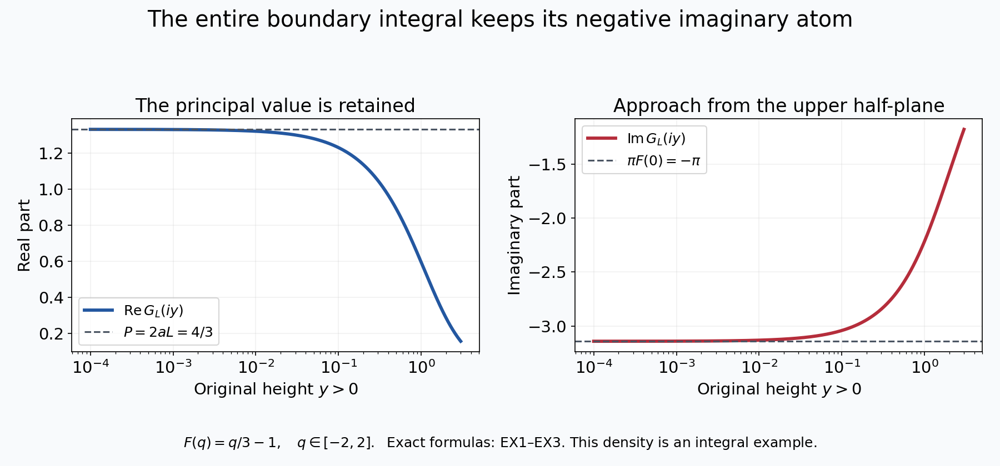
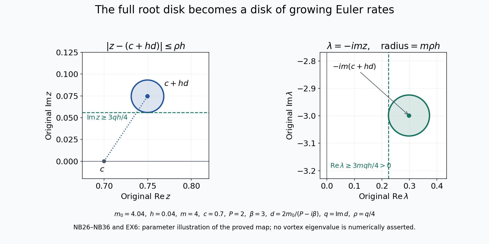

# An unstable Euler vortex with an integer mode

[Lesson 29](radial-vortices-and-the-original-spectral-construction.md)
constructed a smooth radial Euler background, its exact radial
inverse and a simple negative eigenvalue of the associated
self-adjoint operator. Here we construct an actual growing
Euler mode whose angular frequency is an integer.

The proof has three parts. First we calculate the exact
boundary value of the original singular integral, including
the sign from the decreasing coordinate. Next we solve the
full equation near a neutral mode and prove that its scalar
equation has a zero in the upper half-plane. Finally we make
the bounds uniform over the constructed family and select an
integer angular frequency. The original Euler generator,
physical velocity, vorticity, pressure and time remain explicit.

Keep the original smooth profiles \(\Xi,A,g,\bar\alpha\)
from lesson 29, where \(A=\Xi''+2\Xi'\),
\(0<\bar\alpha<1\), \(a=0\) and \(c=\Xi(a)\).
Set \(m_0=\sqrt{\lambda_a}>1\), and let
\(\varphi_0>0\) be the actual unit-\(L^2(dt)\) ground state
constructed in VA28. Put \(K=A/(\Xi-c)\), including its
proved smooth value at the removable point.
No unstable mode is assumed in these starting data.

The human source is Dallas Albritton, Elia Brué, Maria Colombo,
Camillo De Lellis, Vikram Giri, Maximilian Janisch and Hyunju Kwon,
[*Instability and nonuniqueness for the 2d Euler equations in
vorticity form, after M. Vishik*,
arXiv:2112.04943v4](https://arxiv.org/abs/2112.04943v4),
original linear-2.tex 303–428, 515–668, 978–1387 and 1471–1556.
Vishik's original construction is credited through this
seven-author TeX treatment.
The receiving forced-fluid argument is Dallas Albritton,
Elia Brué and Maria Colombo,
[*Non-uniqueness of Leray solutions of the forced Navier–Stokes
equations*, arXiv:2112.03116v1](https://arxiv.org/abs/2112.03116v1),
original main.tex 755–989.

The family selection in NB7 supplies an alternative argument
for the integer mode needed here. Every local estimate and
the entire selection are proved below. The source's stronger
global continuation statement for every intermediate real
angular parameter is not used as an assumption.
Visible source corrections concern the boundary atom, endpoint
signs and the compactness argument for the free inverse.
The final five exercises give exact integral and kernel
examples, the complete physical disk map, origin coefficients
and sharp ranges for higher spatial moments.
This exposition has an author self-check; no independent
review or novelty claim is asserted.

## NL1. The exact free inverse, its sign and both endpoint amplitudes

For every original \(m>0\), the kernel
\[
 \Gamma_m(t)=\frac{e^{-m|t|}}{2m}
 \tag{NL1}
\]
has continuous value at zero and derivative jump \(-1\).
Thus \(-\Gamma_m''+m^2\Gamma_m=\delta_0\) in distributions.
Its \(L^1\) norm is \(m^{-2}\); its squared \(L^2\) norm is
\(1/(4m^3)\). Hence for \(f\in L^2(dt)\) its convolution
belongs to \(L^2\), is bounded, and solves the original
inhomogeneous equation. Its second derivative belongs to
\(L^2\), so Fourier transformation gives \(H^2\).
Any other \(L^2\) solution differs by
\(C_1e^{mt}+C_2e^{-mt}\), forcing both coefficients zero.

Apply this to the actual ground-state equation
\(-\varphi_0''+m_0^2\varphi_0=-K\varphi_0\).
The complete identity is
\[
 \begin{aligned}
 \varphi_0(t)=-\frac1{2m_0}\Big[
 e^{m_0t}\int_t^\infty e^{-m_0s}K(s)\varphi_0(s)\,ds
 +e^{-m_0t}\int_{-\infty}^t
                e^{m_0s}K(s)\varphi_0(s)\,ds\Big].
 \end{aligned}
 \tag{NL2}
\]
Both terms have the same negative sign.

VA20–VA21 and the removable-point construction show
\(K(t)=O(e^{2t})\) as \(t\to-\infty\), and
\(K(t)=O(e^{-\bar\alpha t})\) as \(t\to+\infty\).
The Volterra proof VA7–VA9 applied to \(K(t)\) on the right
and to \(K(-t)\) on the reflected left gives a decaying and
a growing basis at each endpoint. The bounded \(H^2\)
ground state has zero growing coefficient at both endpoints.
Its decaying coefficient at either end cannot vanish, since
that would make it zero on an entire tail and then everywhere
by ODE uniqueness. Positivity makes both remaining coefficients
strictly positive. In particular
\[
 \begin{aligned}
 \varphi_0(t)&=C_-e^{m_0t}(1+o(1))\quad(t\to-\infty),\\
 \varphi_0(t)&=C_+e^{-m_0t}(1+o(1))\quad(t\to+\infty),\\
 C_-&=-\frac1{2m_0}\int_{\mathbb R}
                      e^{-m_0s}K(s)\varphi_0(s)\,ds>0,\\
 C_+&=-\frac1{2m_0}\int_{\mathbb R}
                      e^{m_0s}K(s)\varphi_0(s)\,ds>0.
 \end{aligned}
 \tag{NL3}
\]
To obtain these integrals from NL2, use the just-proved
decay. Both full integrands are absolutely integrable.
At the left endpoint the other term, after multiplication
by \(e^{-m_0t}\), is \(O(e^{2t})\); at the right endpoint
the corresponding term is \(O(e^{-\bar\alpha t})\).
Thus both limits retain every contribution with its actual sign.

## NL2. Keep the orientation in the boundary-value integral

The function \(\Xi\) decreases smoothly from
\(X_-=\Xi(-\infty)\) to zero, with \(\Xi'<0\).
The original change of variable
\[
 q=\Xi(t)-c,\qquad
 t=\tau(q),\qquad
 I=(-c,X_--c),\qquad
 |dt|=\frac{dq}{|\Xi'(\tau(q))|}
 \tag{NL4}
\]
is a bijection with reversed orientation.
The positive measure in the transformed integral therefore
uses the absolute value of the derivative.
Set
\[
 W(t)=K(t)\varphi_0(t)^2,\qquad
 F(q)=\frac{W(\tau(q))}{|\Xi'(\tau(q))|}.
 \tag{NL5}
\]
This \(F\) is smooth in the interior of \(I\), including zero.
It is integrable: its \(L^1(dq)\) norm is exactly
\(\int_{\mathbb R}|W(t)|dt<\infty\).
At zero its exact value is
\[
 F(0)=\frac{A'(a)\varphi_0(a)^2}
                  {\Xi'(a)|\Xi'(a)|}
      =-\frac{A'(a)\varphi_0(a)^2}{\Xi'(a)^2}<0 .
 \tag{NL6}
\]
No sign of the decreasing coordinate map has been absorbed.

For \(\varepsilon>0\), changing variables in the original
upper-half-plane integral gives
\[
 \begin{aligned}
 G(c+i\varepsilon)
  &:=\int_{\mathbb R}\frac{W(t)}{\Xi(t)-c-i\varepsilon}\,dt\\
  &=\int_I\frac{F(q)}{q-i\varepsilon}\,dq\\
  &=\int_I\frac{qF(q)}{q^2+\varepsilon^2}\,dq
       +i\int_I\frac{\varepsilon F(q)}{q^2+\varepsilon^2}\,dq .
 \end{aligned}
 \tag{NL7}
\]
These are absolutely convergent for every positive
\(\varepsilon\).

Choose
\(\delta=\frac12\min\{c,X_--c\}>0\).
On \([-\delta,\delta]\) let \(L_F\) be any finite
one-half Hölder constant for \(F\); for example
\(\sqrt{2\delta}\sup|F'|\).
For \(j=2,3\) put
\(I_j=\int_{I\setminus[-\delta,\delta]}|F(q)|\,|q|^{-j}dq\).
Both are finite by integrability and the excluded neighborhood.

The principal value
\(P=\operatorname{PV}\int_I F(q)/q\,dq\) exists:
on the symmetric middle interval the constant cancels
and the remaining quotient is bounded by \(L_F|q|^{-1/2}\).
For \(0<\varepsilon\leq\delta\), direct estimates give
\[
 \begin{aligned}
 |\operatorname{Re}G(c+i\varepsilon)-P|
      &\leq\frac{16L_F}{3}\sqrt\varepsilon
                         +\varepsilon^2 I_3,\\
 |\operatorname{Im}G(c+i\varepsilon)-\pi F(0)|
      &\leq\frac{16L_F}{3}\sqrt\varepsilon
                  +\frac{2|F(0)|\varepsilon}{\delta}
                  +\varepsilon I_2.
 \end{aligned}
 \tag{NL8}
\]
Here are the full middle-interval estimates.
In the real part the difference kernel is
\(-\varepsilon^2/[q(q^2+\varepsilon^2)]\).
The constant \(F(0)\) cancels by oddness. The remainder
is bounded by
\(2L_F\varepsilon^2\int_0^\delta
q^{-1/2}(q^2+\varepsilon^2)^{-1}dq\).
After \(q=\varepsilon s\), its dimensionless integral is
at most
\(\int_0^1s^{-1/2}ds+\int_1^\infty s^{-5/2}ds=8/3\).
For the imaginary remainder the bound is
\(2L_F\varepsilon\int_0^\delta
q^{1/2}(q^2+\varepsilon^2)^{-1}dq\).
Its dimensionless integral is at most
\(\int_0^1s^{1/2}ds+\int_1^\infty s^{-3/2}ds=8/3\).
The constant term integrates exactly to
\(2F(0)\arctan(\delta/\varepsilon)\), whose difference
from \(\pi F(0)\) is at most \(2|F(0)|\varepsilon/\delta\).
On the remaining set the real and imaginary kernel differences
are bounded by \(\varepsilon^2/|q|^3\) and
\(\varepsilon/q^2\). This proves both full inequalities.

## NL3. Permit every approach from the upper half-plane

The same boundary value holds as \(z=c+x+iy\to c\) with
\(y>0\), without restricting the ratio \(x/y\).
To prove this, choose a smooth cutoff \(\rho\) supported
strictly inside \(I\), equal to one near zero.
The contribution from \((1-\rho)F\) converges by dominated
convergence, since its support stays away from the limiting
singularity. Extend \(F_0=\rho F\) by zero to \(\mathbb R\);
it is a smooth compactly supported function.

In the local integral substitute \(q=x+u\).
The proof of NL8 now applies to \(F_0(x+u)\), with constants
bounded uniformly for sufficiently small \(x\), using a fixed
symmetric middle interval in \(u\).
Thus its imaginary part differs from \(\pi F_0(x)\)
by a quantity tending to zero uniformly as \(y\downarrow0\).
Its real part differs uniformly from
\(\operatorname{PV}\int F_0(x+u)/u\,du\) by a quantity
tending to zero. The latter principal value is continuous
in \(x\): on \(|u|\leq\delta\) subtract \(F_0(x)\)
and dominate the divided difference by \(\sup|F_0'|\);
on \(|u|>\delta\) use compact support and a fixed integrable
majorant. Dominated convergence proves continuity of both
pieces. Restoring the far contribution gives the exact limit
\[
 \begin{aligned}
 \lim_{\substack{z\to c\\\operatorname{Im}z>0}}G(z)
   &=P+i\pi F(0)=P-i\beta,\\
 \beta&=\frac{\pi A'(a)\varphi_0(a)^2}{\Xi'(a)^2}>0 .
 \end{aligned}
 \tag{NL9}
\]
The principal value can equivalently be computed with
symmetric exclusions in \(t-a\).
Indeed \(\Xi(a+s)-c=\Xi'(a)s+O(s^2)\);
the ratio of the two induced positive cutoff magnitudes
tends to one. The constant singular term changes by a
constant times the logarithm of that ratio, tending to zero.
The remainder is locally integrable. This proves the
comparison of the two actual principal-value definitions.

## NL4. Compute the exact tested residual and its first direction

For the actual ground state keep the full original Rayleigh
operator
\[
 \mathcal R_{m,z}\varphi
      =-\varphi''+m^2\varphi+\frac{A}{\Xi-z}\varphi .
 \tag{NL10}
\]
This notation is local to this calculation and does not identify
it with the source's later integral remainder operator.
The exact pointwise difference of the potentials is
\[
 \frac{A}{\Xi-z}-\frac{A}{\Xi-c}
       =(z-c)\frac{K}{\Xi-z}.
 \tag{NL11}
\]
Since the original ground state has squared norm one,
integration against \(\varphi_0\), using its actual equation,
gives for every \(m>0\) and \(\operatorname{Im}z>0\)
\[
 \begin{aligned}
 \int_{\mathbb R}
        (\mathcal R_{m,z}\varphi_0)\varphi_0\,dt
       &=m^2-m_0^2+(z-c)G(z),\\
 m=m_0-h:\qquad
       &=-2m_0h+h^2+(z-c)G(z).
 \end{aligned}
 \tag{NL12}
\]
The full derivative \(2m_0\), the \(h^2\) term and the
original spectral parameter have all been retained.

By NL9 the first-degree part of this exact scalar residual
has its zero in the direction
\[
 d_*=\frac{2m_0}{P-i\beta}
       =\frac{2m_0(P+i\beta)}{P^2+\beta^2},
 \qquad
 \operatorname{Im}d_*=\frac{2m_0\beta}{P^2+\beta^2}>0 .
 \tag{NL13}
\]
The full source coefficient in linear-2.tex1314 is
\(c(a)=-(P-i\beta)\), whose imaginary part is positive.
Its convention \(m=m_0+h_{\rm src}\) has
\(h_{\rm src}=-h\). Substitution gives exactly the same
direction \(z-c=h d_*+o(h)\) at first degree.

This is a proved residual coefficient for the constructed
original ground state. It is not yet a solution of the full
nonreal eigenvalue equation. The next operation is to solve
the complementary equation with the actual singular
coefficient, establish its operator bounds, and apply the
complex root argument with explicit disk geometry.

## NL5. Source corrections already forced by the calculation

Original linear-2.tex378–394 prints the boundary atom with
\(\Xi'(a)^{-1}\). The positive-measure Jacobian is instead
\(|\Xi'(a)|^{-1}\), as proved in NL4–NL9. The later rigorous
calculation at source1350 uses the latter correctly.
Thus this is a correction of the informal expansion, not
an inferred failure of the later instability argument.

Source595–600 prints the two endpoint integrals with positive
signs, although its equation has right-hand side \(-K\varphi\).
NL1–NL3 supply the full negative signs and both exact nonzero
endpoint constants. The value of the negative-side \(A\)
in source572 is also inconsistent with the actual class:
VA20 gives \(A(t)=-8c_0e^{2t}\).
In source625 the intermediate double integral has an extra
minus sign; direct integration of source621 gives a positive
double integral and the positive Volterra kernel stated
thereafter. VA7–VA9 and NL1–NL3 already use the correctly
differentiated kernels. These source fixes must be carried
through the next full complementary-equation construction.

## NB1. The original family and its actual ground states

Keep the family from VA31:
\[
 \Xi_\sigma=(1-\sigma)\Xi_0+\sigma\Xi_1,\quad
 A_\sigma=\Xi_\sigma''+2\Xi_\sigma',\quad
 c_\sigma=\Xi_\sigma(0),\quad
 K_\sigma=\frac{A_\sigma}{\Xi_\sigma-c_\sigma}.
 \tag{NB1}
\]
The quotient uses its proved smooth value at zero.
The original exponent \(0<\bar\alpha<1\), the zeros \(0,1/2\),
both original tails and the complete circulation coefficient
remain those of VA12–VA21. In particular
\(\Xi_\sigma'(0)=-1\) for this family.

Let \(M\geq3\) and \(\sigma_0\in(0,1)\) be the integer and
last level crossing in VA31–VA34. Thus the bottom eigenvalue
of \(-d^2/dt^2+K_\sigma\) obeys
\[
 \lambda_a(\sigma_0)=M^2,\qquad
 \lambda_a(\sigma)>M^2\quad(\sigma_0<\sigma\leq1).
 \tag{NB2}
\]
There is no assertion here that its derivative at the crossing
is nonzero. The following construction needs only the proved
strict inequality and continuity.

On a closed interval \(\Sigma\) about \(\sigma_0\), small
enough to lie in \((0,1)\), let
\[
 m_\sigma=\sqrt{\lambda_a(\sigma)},\qquad
 -\varphi_\sigma''+(m_\sigma^2+K_\sigma)\varphi_\sigma=0,\qquad
 \varphi_\sigma>0,\quad \|\varphi_\sigma\|_2=1 .
 \tag{NB3}
\]
These are the actual simple minimizing eigenfunctions from
VA28, with the source's original unit-norm choice retained.
VA33 first permits \(\Sigma\) to be chosen with
\(M/2\leq m_\sigma\leq2M\). For example an initial radius
less than
\[
 \min\left\{\frac{\sigma_0}{2},\frac{1-\sigma_0}{2},
                     \frac{M^2}{4(1+C_a)}\right\}
 \tag{NB4}
\]
suffices; it may subsequently be reduced.

We prove the continuity needed below. If \(\sigma_n\to\sigma\),
the unit minimizers are bounded in \(H^1\).
The local compactness and vanishing-potential-tail argument
in VA28 gives convergence of the potential integrals along
every weakly convergent subsequence. The limiting variational
value is strictly negative and the potentials converge in
the supremum norm by VA33. The same negative-energy argument
therefore prevents loss of \(L^2\) norm. The weak limit is
the unique positive unit ground state, so the whole family
converges strongly in \(L^2\). Its equation then gives
\[
 \varphi_{\sigma_n}''=
       (m_{\sigma_n}^2+K_{\sigma_n})\varphi_{\sigma_n}
       \longrightarrow
       (m_\sigma^2+K_\sigma)\varphi_\sigma
                 \quad\hbox{in }L^2.
 \tag{NB5}
\]
Fourier transformation gives convergence in \(H^2\), hence
uniform convergence of both the function and its first
derivative. Locally the equation and the smooth quotient
formulas bootstrap this to convergence with any fixed
number of derivatives.

The two endpoint constructions NL1–NL3 are uniform on this
closed parameter interval. Indeed the original exponential
tails of \(K_\sigma\) have common bounds, and
\(m_\sigma\geq M/2>1\).
Choose one tail endpoint where all Volterra norms are less
than \(1/4\). The decaying factors there are bounded away
from zero, and the uniformly bounded \(H^2\) values bound
their coefficients. Thus the eigenfunctions and their
first derivatives have a common exponentially decreasing
bound at both ends. Their actual individual endpoint
powers remain \(e^{-m_\sigma|t|}\); a smaller common
exponent is used only in a displayed integrable majorant.

## NB2. Invert the full projected neutral operator

Use the complex inner product linear in its first argument.
Put
\[
 \begin{aligned}
 P_\sigma f&=\langle f,\varphi_\sigma\rangle\varphi_\sigma,\\
 A_\sigma^0&=-d^2/dt^2+m_\sigma^2,\qquad
 \Gamma_\sigma f=\frac{e^{-m_\sigma|\cdot|}}{2m_\sigma}*f,\\
 S_\sigma&=A_\sigma^0+K_\sigma+P_\sigma,\qquad
 T_\sigma=I+\Gamma_\sigma(K_\sigma+P_\sigma).
 \end{aligned}
 \tag{NB6}
\]
Here \(A_\sigma^0\) is a new explicitly named free operator;
it is not the profile \(A_\sigma\) in NB1.
All unbounded operators in this section have domain
\(H^2(\mathbb R)\subset L^2(\mathbb R)\).

First take \(\sigma=\sigma_0\). On the orthogonal complement
of \(\varphi_{\sigma_0}\), the nonnegative quadratic form of
\(A_{\sigma_0}^0+K_{\sigma_0}\) has a strictly positive
infimum on unit vectors.
Otherwise a unit orthogonal sequence with form tending
to zero is bounded in \(H^1\). A weak limit has form at
most zero, and is therefore in the ground-state kernel.
It is also orthogonal to that kernel, so is zero.
The local compactness and small potential tails then give
\(\int K_{\sigma_0}|u_n|^2\to0\), whereas
\(\|u_n'\|_2^2+M^2\|u_n\|_2^2\geq M^2\), a contradiction.
Call the resulting positive infimum \(\kappa_0\).
Projection onto the original unit state gives
\[
 \langle S_{\sigma_0}u,u\rangle
       \geq \min\{1,\kappa_0\}\|u\|_2^2 .
 \tag{NB7}
\]
The operator is self-adjoint by the domain argument in VA28.
Its range is closed by NB7 and dense because its adjoint
has zero kernel. Thus it is onto, and
\(B_0=S_{\sigma_0}^{-1}:L^2\to H^2\) is bounded.
The \(H^2\) bound follows from
\(u''=(M^2+K_{\sigma_0}+P_{\sigma_0})u-f\).
The usual one-dimensional supremum bound follows directly
from integrating \((|u|^2)'\) and Cauchy–Schwarz.

The exact bounded inverse of the original integral operator is
\[
 T_{\sigma_0}^{-1}=I-B_0(K_{\sigma_0}+P_{\sigma_0}),\qquad
 T_{\sigma_0}^{-1}\Gamma_{\sigma_0}=B_0 .
 \tag{NB8}
\]
Multiplication on both sides verifies the first identity:
the two resolvent identities are
\[
 \begin{aligned}
 \Gamma_{\sigma_0}-B_0
 &=\Gamma_{\sigma_0}(K_{\sigma_0}+P_{\sigma_0})B_0\\
 &=B_0(K_{\sigma_0}+P_{\sigma_0})\Gamma_{\sigma_0}.
 \end{aligned}
\]
They follow by applying the two invertible differential
operators to vectors in their stated domains.

We will also use the Banach space
\[
 X=L^2(\mathbb R)\cap C_0(\mathbb R),\qquad
 \|f\|_X=\|f\|_2+\|f\|_\infty .
 \tag{NB9}
\]
A sequence converging in this norm has a continuous
uniform limit and an \(L^2\) limit which agree almost
everywhere, so \(X\) is complete.
NB8 maps \(X\) boundedly to itself, since its correction
belongs to \(H^2\subset X\).
Both \(T_\sigma\) and \(T_{\sigma_0}\) are bounded on \(X\)
and on \(L^2\).
NB5, VA33 and the \(L^1\) continuity of the actual kernels
\(\Gamma_\sigma\) imply
\[
 \|T_\sigma-T_{\sigma_0}\|_{X\to X}
       +\|T_\sigma-T_{\sigma_0}\|_{2\to2}\longrightarrow0 .
 \tag{NB10}
\]
For the projections this follows by expanding
\(\langle f,\varphi_\sigma\rangle\varphi_\sigma
-\langle f,\varphi_{\sigma_0}\rangle\varphi_{\sigma_0}\)
into its two differences and using NB5.
For the kernels it follows by dominated convergence with
\(m_\sigma\) in the fixed positive compact interval.
Every multiplication term uses the supremum norm
convergence of \(K_\sigma\).

Reduce \(\Sigma\) so that the Neumann norms in both spaces
are below \(1/2\). All \(T_\sigma\) then have bounded
inverses, with one common bound \(C_T\), on both spaces.
The two inverses agree on \(X\) by \(L^2\) uniqueness.
The identities
\[
 T_\sigma^{-1}\Gamma_\sigma=S_\sigma^{-1},\qquad
 S_\sigma^{-1}\varphi_\sigma=\varphi_\sigma
 \tag{NB11}
\]
hold on \(L^2\), since \(P_\sigma\varphi_\sigma=\varphi_\sigma\).
These exact identities will determine the scalar coefficient;
no unidentified projection factor is introduced.

## NB3. The full localized perturbation, with quantitative norms

Write the actual complex parameter as \(z=c_\sigma+w\),
where \(w=x+iy\), \(y>0\), and define
\[
 \begin{aligned}
 \Delta_{\sigma,w}(t)
   &=\frac{A_\sigma(t)}{\Xi_\sigma(t)-c_\sigma-w}
                    -K_\sigma(t)
     =\frac{wK_\sigma(t)}
                    {\Xi_\sigma(t)-c_\sigma-w},\\
 R_{\sigma,m,w}
   &=\Gamma_\sigma\big(\Delta_{\sigma,w}
                               +(m^2-m_\sigma^2)I\big).
 \end{aligned}
 \tag{NB12}
\]
All three original factors in the quotient remain present.

Fix any cone \(y\geq\mu|x|\), \(\mu>0\), and set
\(\nu_\mu=\mu/\sqrt{1+\mu^2}\), so
\(y\geq\nu_\mu|w|\).
Choose \(\ell>0\).
On \(\Sigma\times[-\ell,\ell]\) define the actual finite constants
\[
 \begin{aligned}
 d_*&=\min|\Xi_\sigma'(t)|>0,&
 K_*&=\max|K_\sigma(t)|,\\
 Q_*&=\max|\Xi_\sigma(t)-c_\sigma|,&
 d_\ell&=\min_{\sigma\in\Sigma}
     \min\{|\Xi_\sigma(-\ell)-c_\sigma|,
                        |\Xi_\sigma(\ell)-c_\sigma|\}>0,\\
 K_1&=\max_{\sigma\in\Sigma}\|K_\sigma\|_1,&
 K_2&=\max_{\sigma\in\Sigma}\|K_\sigma\|_2 .
 \end{aligned}
 \tag{NB13}
\]
The first two extrema are over the displayed product interval.
The common exponential tails prove finiteness of the last
two constants. Take \(0<r_0\leq\min\{1,d_\ell/2\}\).

For \(0<r=|w|\leq r_0\), the full multiplier obeys
\[
 \begin{aligned}
 \|\Delta_{\sigma,w}\|_1&\leq E_1(r),\\
 E_1(r)&=r\left[
 \frac{2K_*}{d_*}
       \log\left(1+\frac{2(Q_*+r_0)}{\nu_\mu r}\right)
                  +\frac{2K_1}{d_\ell}\right],\\
 \|\Delta_{\sigma,w}\|_2^2&\leq E_2(r)^2,\\
 E_2(r)^2&=\frac{\pi K_*^2}{d_*\nu_\mu}r
                           +\frac{4K_2^2}{d_\ell^2}r^2 .
 \end{aligned}
 \tag{NB14}
\]
To prove the middle-interval bounds use the original
decreasing variable \(q=\Xi_\sigma(t)-c_\sigma\), with
\(|dt|\leq dq/d_*\) and \(|q|\leq Q_*\).
The first integral is at most
\[
 \frac{rK_*}{d_*}
 \int_{-Q_*}^{Q_*}\frac{dq}{\sqrt{(q-x)^2+y^2}}
 \leq\frac{2rK_*}{d_*}
          \log\left(1+\frac{2(Q_*+r_0)}{\nu_\mu r}\right).
 \tag{NB15}
\]
Here the enclosing symmetric interval after translation
has radius \(Q_*+|x|\), and
\(\operatorname{arsinh}s\leq\log(1+2s)\).
The squared integral uses
\(\int_{\mathbb R}[(q-x)^2+y^2]^{-1}dq=\pi/y\).
On \(|t|\geq\ell\), strict monotonicity and \(r\leq d_\ell/2\)
give denominator at least \(d_\ell/2\).
Integrating the full \(K_\sigma\) on those tails proves
the remaining terms in NB14.

Let \(m_{\rm lo}=\min_\Sigma m_\sigma>1\) and
\(m_{\rm hi}=\max_\Sigma m_\sigma\), and put
\[
 b_*=\frac1{2m_{\rm lo}}+\frac1{2m_{\rm lo}^{3/2}},
 \qquad g_*=\frac1{2m_{\rm lo}^{3/2}} .
 \tag{NB16}
\]
For \(f\in L^1\), direct convolution estimates give
\(\|\Gamma_\sigma f\|_X\leq b_*\|f\|_1\).
For \(f\in X\), \(\|\Gamma_\sigma f\|_X
\leq m_{\rm lo}^{-2}\|f\|_X\).
The localized \(L^2\) kernel has the exact square integral
\[
 \int_{\mathbb R^2}
  |\Gamma_\sigma(t-s)\Delta_{\sigma,w}(s)|^2\,dt\,ds
       =\frac{\|\Delta_{\sigma,w}\|_2^2}{4m_\sigma^3}.
 \tag{NB17}
\]
Consequently the complete perturbation satisfies
\[
 \begin{aligned}
 \|R_{\sigma,m,w}\|_{X\to X}
   &\leq b_*E_1(|w|)
                 +m_{\rm lo}^{-2}|m^2-m_\sigma^2|,\\
 \|R_{\sigma,m,w}\|_{2\to2}
   &\leq g_*E_2(|w|)
                 +m_{\rm lo}^{-2}|m^2-m_\sigma^2|.
 \end{aligned}
 \tag{NB18}
\]
Both bounds tend to zero uniformly in \(\sigma\).
The first has order \(r\log(1/r)\) in the complex displacement;
its square is \(o(r)\), which will suffice for the scalar root.

The free \(\Gamma_\sigma:L^2(\mathbb R)\to L^2(\mathbb R)\)
itself is not compact. Choose a nonzero compactly supported
input. Its nonzero output and all its translates have the
same \(L^2\) norm. Inner products between outputs with
translations separating to infinity tend to zero: first
approximate the output in \(L^2\) by a compactly supported
function, whose distant translates have disjoint supports.
An infinite sufficiently separated subsequence therefore
has pairwise distance bounded below, so has no convergent
subsequence. NB17 proves compactness and smallness of the
actual localized product. This repairs the finite-rank
approximation of the free resolvent used in source1077.

## NB4. Solve the full projected equation and compute its scalar part

When the two Neumann norms supplied by NB18 are below one,
define the actual function
\[
 \psi_{\sigma,m,w}
     =(I+T_\sigma^{-1}R_{\sigma,m,w})^{-1}\varphi_\sigma .
 \tag{NB19}
\]
The series converges in both \(X\) and \(L^2\), and the
limits agree. Applying the original free differential
operator yields
\[
 -\psi''+m^2\psi+
       \frac{A_\sigma}{\Xi_\sigma-c_\sigma-w}\psi
                  +P_\sigma\psi=\varphi_\sigma .
 \tag{NB20}
\]
The coefficient is bounded for every \(y>0\);
therefore \(\psi\in H^2\).
Set \(H_\sigma(m,w)=\langle\psi_{\sigma,m,w},
\varphi_\sigma\rangle\).
Exactly when \(H_\sigma(m,w)=1\), NB20 becomes the
homogeneous original Rayleigh equation, with a nonzero
solution. Conversely, any nonzero homogeneous solution
must have nonzero projection on \(\varphi_\sigma\):
a zero projection would give a zero right-hand side in the
invertible projected equation. Dividing by that nonzero
scalar recovers NB19. Thus this is an exact equivalence
and its eigenspace is one-dimensional.

For fixed \(\sigma,m\), \(H_\sigma\) is holomorphic in the
upper-half-plane region where the series is defined.
Indeed the quotient multiplier and all its difference
quotients converge in the \(L^1,L^2\) and supremum norms
on every neighborhood with positive lower bound for \(y\).
The common integrable \(K_\sigma\) supplies the majorants.
The series then converges locally uniformly in operator
norm; its differentiated scalar Cauchy integrals prove
holomorphy.

Use NB11 to compute the exact first series term:
\[
 \begin{aligned}
 \langle T_\sigma^{-1}R_{\sigma,m,w}
                    \varphi_\sigma,\varphi_\sigma\rangle
 &=m^2-m_\sigma^2+wG_\sigma(c_\sigma+w),\\
 G_\sigma(z)&=\int_{\mathbb R}
     \frac{K_\sigma(t)\varphi_\sigma(t)^2}
                         {\Xi_\sigma(t)-z}\,dt .
 \end{aligned}
 \tag{NB21}
\]
For example the receiving identity is
\(\langle S_\sigma^{-1}f,\varphi_\sigma\rangle
=\langle f,\varphi_\sigma\rangle\), by self-adjointness and
\(S_\sigma^{-1}\varphi_\sigma=\varphi_\sigma\).
Every input in NB21 belongs to \(L^2\) for \(y>0\), so the
identity has its stated domain.

If \(q_X=C_T\|R_{\sigma,m,w}\|_{X\to X}<1\) and
\(\Phi=\max_\Sigma\|\varphi_\sigma\|_X\), the remaining
series terms give
\[
 \begin{aligned}
 H_\sigma(m,w)-1
   &=-(m^2-m_\sigma^2)-wG_\sigma(c_\sigma+w)
                                     +\mathcal E_\sigma(m,w),\\
 |\mathcal E_\sigma(m,w)|
   &\leq\frac{\Phi q_X^2}{1-q_X}.
 \end{aligned}
 \tag{NB22}
\]
The scalar pairing has norm at most one on \(X\) because
\(\|\varphi_\sigma\|_2=1\). No stronger operator estimate
or unproved differentiability at the real boundary is used.

## NB5. Make the boundary coefficient uniform in the original family

NL4–NL9 applied to each actual ground state give
\[
 C_\sigma=P_\sigma^{\rm pv}-i\beta_\sigma,\qquad
 \beta_\sigma=
 \frac{\pi A_\sigma'(0)\varphi_\sigma(0)^2}
                         {\Xi_\sigma'(0)^2}>0,
 \qquad
 G_\sigma(c_\sigma+w)\longrightarrow C_\sigma .
 \tag{NB23}
\]
The scalar \(P_\sigma^{\rm pv}\) is the entire principal-value
integral from NL9; its superscript distinguishes it from the
rank-one projection in NB6. For the present family
\(\Xi_\sigma'(0)=-1\), but the complete derivative factor
has been retained in the formula.

We justify uniformity and continuity, including the tails.
Choose one symmetric \(q\)-interval about zero contained
in all the intervals
\((-c_\sigma,\Xi_\sigma(-\infty)-c_\sigma)\).
This is possible because their two endpoint distances have
positive minima on the compact parameter interval.
On a slightly larger compact interval the inverse maps
\(t=\Xi_\sigma^{-1}(c_\sigma+q)\) have derivatives bounded
uniformly and vary continuously with \(\sigma\).
The integral derivative formula and strict lower derivative
bound prove this directly. NB5 and the local differential
equation imply that the functions \(F_\sigma\) defined
as in NL5 have uniformly bounded first two derivatives
there and depend continuously on \(\sigma\) with those
derivatives.

Choose one smooth cutoff inside that common interval.
For its local part the two explicit estimates NL8 are
uniform, also after the small real translation \(q=x+u\)
used in NL3.
The resulting principal-value integral is continuous
jointly in \((\sigma,x)\). To see this, on a fixed symmetric
middle interval write the quotient as
\((F_\sigma(x+u)-F_\sigma(x))/u\).
Its value and its \(x\)-derivative are dominated respectively
by the common first- and second-derivative bounds.
On the rest of the cutoff support the denominator is
separated from zero. Dominated convergence proves the
claim and uniform continuity on the compact parameter set.
For the far part, \(\Xi_\sigma-c_\sigma\) is uniformly
separated from zero on its support. The original exponential
bounds for \(K_\sigma\), together with NB5's uniform bound
on \(\varphi_\sigma\), supply a common integrable majorant.
Its difference from the boundary integral is bounded by
a constant times \(|w|\), retaining that complete far
integral. This proves uniformity of NB23 for every upper
approach and continuity of \(C_\sigma\).

It follows that the following actual extrema and modulus
are finite, with \(\beta_*>0\):
\[
 \begin{aligned}
 \beta_*&=\min_{\sigma\in\Sigma}\beta_\sigma,&
 d_\sigma&=\frac{2m_\sigma}{C_\sigma},\\
 q_*&=\min_{\sigma\in\Sigma}\operatorname{Im}d_\sigma>0,&
 D_*&=\max_{\sigma\in\Sigma}|d_\sigma|<\infty,\\
 \omega_G(r)&=\sup_{\substack{\sigma\in\Sigma,\ \operatorname{Im}w>0\\
                             0<|w|\leq r}}
       |G_\sigma(c_\sigma+w)-C_\sigma|\longrightarrow0 .
 \end{aligned}
 \tag{NB24}
\]
The strict imaginary sign is the exact identity
\[
 \operatorname{Im}d_\sigma
       =\frac{2m_\sigma\beta_\sigma}
                    {(P_\sigma^{\rm pv})^2+\beta_\sigma^2}.
 \tag{NB25}
\]
In NB24 take \(r\) below the uniform neighborhood just
constructed. This is a modulus of the actual proved
boundary values, not an assumed error term.

## NB6. Construct the nonreal root with a complete disk estimate

Use the definite choices
\[
 \rho=\frac{q_*}{4},\qquad K_d=D_*+\rho,\qquad
 \mu=\frac{q_*}{4(D_*+q_*)}>0 .
 \tag{NB26}
\]
For \(h>0\), let \(m=m_\sigma-h\), and consider the closed disk
\[
 \mathcal D_{\sigma,h}
       =\{w:|w-hd_\sigma|\leq\rho h\}.
 \tag{NB27}
\]
Every point in this disk obeys
\[
 \operatorname{Im}w\geq\frac{3q_*h}{4}>0,\qquad
 |w|\leq K_dh,\qquad
 \operatorname{Im}w>\mu|\operatorname{Re}w| .
 \tag{NB28}
\]
The last bound follows from
\(|\operatorname{Re}w|\leq K_dh\) and the choice in NB26.
This leaves a strict cone margin on a neighborhood of the
whole disk.

The functions \(E_1,E_2\) in NB14 are increasing for
positive \(r\). For the logarithmic term, differentiating
\(r\log(1+c/r)\) gives
\(\log(1+c/r)-c/(r+c)>0\); its derivative as a function
of \(c/r\) is positive from zero. Define
\[
 \begin{aligned}
 Q_X(h)&=C_T\big[
     b_*E_1(K_dh)+m_{\rm lo}^{-2}(2m_{\rm hi}h+h^2)\big],\\
 Q_2(h)&=C_T\big[
     g_*E_2(K_dh)+m_{\rm lo}^{-2}(2m_{\rm hi}h+h^2)\big],\\
 E_{\rm root}(h)&=h^2+
       K_dh\,\omega_G(K_dh)+\frac{\Phi Q_X(h)^2}{1-Q_X(h)}.
 \end{aligned}
 \tag{NB29}
\]
For sufficiently small \(h>0\), both \(Q\)'s are less
than \(1/2\) and
\(E_{\rm root}(h)/h\to0\).
Indeed \(E_1(K_dh)=O(h\log(1/h))\), whose square divided
by \(h\) tends to zero, and NB24 treats the middle term.
Thus there is a definite \(h_*>0\) such that, for
\(0<h\leq h_*\),
\[
 \begin{gathered}
 K_dh\leq r_0,\qquad
 h<\min\{m_{\rm lo}/2,(m_{\rm lo}-1)/2\},\qquad
 Q_X(h)<1/2,\quad Q_2(h)<1/2,\\
 E_{\rm root}(h)<\frac12\beta_*\rho h .
 \end{gathered}
 \tag{NB30}
\]
One precise choice is half the supremum of all radii
\(r\leq\min\{r_0/K_d,m_{\rm lo}/4,(m_{\rm lo}-1)/4,1\}\) for which
these strict inequalities hold for every \(0<h\leq r\).
The limiting estimates prove this set contains a positive
interval. Its downward closure proves that the stated half
supremum lies in it. Thus NB30 specifies an actual parameter.

On the disk, NB22 with the original square
\(m^2-m_\sigma^2=-2m_\sigma h+h^2\) gives
\[
 H_\sigma(m_\sigma-h,w)-1
   =2m_\sigma h-C_\sigma w+\mathcal R_\sigma(h,w),
 \qquad
 |\mathcal R_\sigma(h,w)|\leq E_{\rm root}(h).
 \tag{NB31}
\]
On its boundary the linear part has absolute value
\[
 |2m_\sigma h-C_\sigma w|
     =|C_\sigma|\rho h\geq\beta_*\rho h
                         >|\mathcal R_\sigma(h,w)|.
 \tag{NB32}
\]
Both functions are holomorphic on a neighborhood of the disk.
Rouché's theorem gives exactly one zero, counted with
multiplicity, of \(H_\sigma-1\) inside it.
For completeness the zero count follows by the homotopy
between the linear part and the full function: NB32 excludes
boundary zeros at every homotopy parameter. The integral
of \(f'/f\) over the boundary is continuous in that parameter
and is an integer, hence constant. Its value counts the
zeros by factoring out their finite local orders and applying
Cauchy's theorem to the remaining nonvanishing factor.
The initial linear function has exactly one simple zero.
This also proves that the final zero is simple.

Denote it by \(w_\sigma(h)\).
Equations NB19–NB20 provide its actual nonzero eigenfunction,
and NB28 proves
\[
 \operatorname{Im}w_\sigma(h)\geq3q_*h/4,\qquad
 m=m_\sigma-h>1 .
 \tag{NB33}
\]
The eigenspace is one-dimensional by NB20's exact inverse
argument. The construction has not inferred a full eigenmode
from only a scalar formal expansion.

## NB7. Select the actual integer angular mode

All bounds above hold on the same closed interval \(\Sigma\)
about the already constructed \(\sigma_0\).
By NB2, for every \(\sigma>\sigma_0\) in this interval,
\[
 h(\sigma)=m_\sigma-M>0,\qquad
 \lim_{\sigma\downarrow\sigma_0}h(\sigma)=0 .
 \tag{NB34}
\]
Choose \(\eta>0\) so small that
\([\sigma_0,\sigma_0+\eta]\subset\Sigma\) and
\(0<h(\sigma)<h_*\) for every
\(\sigma_0<\sigma\leq\sigma_0+\eta\).
Existence follows from the proved continuity and strict
inequality, even if the level crossing has zero derivative.
As in NB30, half the supremum of the radii with this
whole-interval property gives a definite positive choice.

Take \(\sigma_*=\sigma_0+\eta/2\) and define
\[
 \begin{aligned}
 h_{\rm int}&=m_{\sigma_*}-M>0,\qquad
 z_*=c_{\sigma_*}+w_{\sigma_*}(h_{\rm int}),\\
 m_{\sigma_*}-h_{\rm int}&=M\in\mathbb N,\quad M\geq3,\\
 \operatorname{Im}z_*&\geq3q_*h_{\rm int}/4>0 .
 \end{aligned}
 \tag{NB35}
\]
The bound parameter \(h_*\) of NB30 is not redefined:
\(h_{\rm int}<h_*\).
This is an actual choice of a smooth original background
with an unstable integer angular mode. No classification of
all neutral limiting modes or global curve continuation
has been assumed.

## NB8. Return to the original physical Euler eigenmode and pressure

Let \(\varphi=\psi_{\sigma_*,M,w_{\sigma_*}(h_{\rm int})}\)
be the actual nonzero solution just constructed.
Use the exact maps VA5–VA6 with the unchanged \(r=e^t\):
\[
 \begin{aligned}
 \psi(r)&=\varphi(\log r),\qquad
 \gamma(r)=\frac{g_{\sigma_*}'(r)}
                   {r(\zeta_{\sigma_*}(r)-z_*)}\psi(r),\\
 \omega_*(r,\theta)&=\gamma(r)e^{iM\theta},\\
 u_*(r,\theta)&=e^{iM\theta}
       \left[-\frac{iM}{r}\psi(r)e_r+\psi'(r)e_\theta\right],\\
 \lambda_*&=-iMz_*,\qquad
 \operatorname{Re}\lambda_*
       =M\operatorname{Im}z_*
       \geq\frac{3Mq_*h_{\rm int}}4>0 .
 \end{aligned}
 \tag{NB36}
\]
The complete physical norm is
\(\|\omega_*\|_2^2=2\pi\int_0^\infty|\gamma|^2r\,dr\).
VA2 proves the original generator identity
\(\mathcal A_M\gamma=\lambda_*\gamma\), with its exact
sign and angular multiplier.

We verify regularity at the original origin rather than
inferring it from a punctured radial equation.
For sufficiently small \(r\), VA20 gives
\(\zeta_{\sigma_*}(r)=X-c_0r^2\) and
\(g_{\sigma_*}'(r)=-8c_0r\), with \(c_0=1/128\).
Put \(D=X-z_*\ne0\).
A regular solution has the explicit convergent form
\[
 \begin{aligned}
 \psi_{\rm reg}(r)&=r^M H(r^2),\qquad
 H(s)=\sum_{n\geq0}a_ns^n,\quad a_0=1,\\
 (n+1)(n+M+1)a_{n+1}
      &=-2c_0\sum_{k=0}^n
            \frac{c_0^k}{D^{k+1}}a_{n-k}.
 \end{aligned}
 \tag{NB37}
\]
This recurrence is obtained from the full radial equation
\(sH''+(M+1)H'=-2c_0(D-c_0s)^{-1}H\).
Let \(L_0=2c_0/|D|>0\).
Induction gives \(|a_n|\leq L_0^n\):
the geometric sum in the right side is at most
\(2L_0^n/|D|\), and
\(4c_0/[|D|(n+1)(n+M+1)]\leq L_0\) for \(M\geq1\).
Thus the series and its derivatives converge for
\(|s|<L_0^{-1}\) and solve the original equation.
The one-dimensional decaying endpoint space from
VA7–VA9, applied also at the reflected left endpoint,
shows that the actual \(\psi\) is a scalar multiple of
this regular solution. Therefore
\[
 \psi(r)e^{iM\theta}
       =C(x_1+ix_2)^M H(x_1^2+x_2^2)
 \tag{NB38}
\]
is smooth at the original origin, with no missing angular
or radial factor. Its velocity and vorticity are smooth there.

At infinity the same endpoint construction gives
\(\psi=O(r^{-M})\), \(\psi'=O(r^{-M-1})\).
The full radial equation and its differentiated forms,
using VA21's two tail terms, inductively give
\(\psi^{(j)}=O(r^{-M-j})\) for every fixed \(j\).
The coefficient in the vorticity formula NB36 has
derivatives \(O(r^{-\bar\alpha-2-j})\).
Hence
\[
 \gamma^{(j)}=O(r^{-M-\bar\alpha-2-j}),\qquad
 \omega_*\in L^1\cap H^k(\mathbb R^2),\qquad
 u_*\in H^k(\mathbb R^2)
              \quad\hbox{for every integer }k\geq0 .
 \tag{NB39}
\]
To justify the derivative induction, write
\(\psi''=-r^{-1}\psi'
 +(M^2r^{-2}+g_{\sigma_*}'/[r(\zeta_{\sigma_*}-z_*)])\psi\).
All derivatives of its first two coefficients have their
displayed inverse-radius powers; the last coefficient and
its derivatives have the additional \(\bar\alpha\) decay.
Leibniz's rule then proves each next derivative bound.
Cartesian derivatives of the angular factor contribute
their full inverse powers of \(r\); near zero NB38 supplies
smoothness, so no singular Cartesian term is ignored.
The stated integrability follows by the original radial
measure \(2\pi r\,dr\).

The original linearized velocity equation also has an
explicit pressure. Let \(\bar V=\bar V_{\sigma_*}\), and set
\[
 F_*(x)=\lambda_*u_*(x)
         +(\bar V\cdot\nabla)u_*(x)
         +(u_*\cdot\nabla)\bar V(x),\qquad
 \pi_*(x)=\pi_*(0)-\int_0^1 F_*(sx)\cdot x\,ds .
 \tag{NB40}
\]
The full original linearized vorticity identity and
divergence-free fields give \(\operatorname{curl}F_*=0\).
Differentiating the line integral then gives
\[
 \begin{aligned}
 \partial_i\int_0^1x_jF_{*,j}(sx)ds
 &=\int_0^1[F_{*,i}(sx)+s x_j\partial_jF_{*,i}(sx)]ds\\
 &=F_{*,i}(x).
 \end{aligned}
\]
Thus \(\nabla\pi_*=-F_*\), with every original velocity
term retained.

In the original Euler time \(\tau_{\rm E}\), the real fields
\[
 \begin{aligned}
 \omega_{\rm lin}(\tau_{\rm E},x)
      &=\operatorname{Re}\big(e^{\lambda_*\tau_{\rm E}}
                                                   \omega_*(x)\big),\\
 u_{\rm lin}(\tau_{\rm E},x)
      &=\operatorname{Re}\big(e^{\lambda_*\tau_{\rm E}}u_*(x)\big),\\
 p_{\rm lin}(\tau_{\rm E},x)
      &=\operatorname{Re}\big(e^{\lambda_*\tau_{\rm E}}\pi_*(x)\big)
                                                    +q(\tau_{\rm E})
 \end{aligned}
 \tag{NB41}
\]
solve the complete linearized incompressible Euler equations;
\(q\) is the arbitrary pressure function of time.
No time rescaling has been made. Orthogonality of the
positive and negative angular modes gives the exact identity
\[
 \|\omega_{\rm lin}(\tau_{\rm E})\|_2^2
   =\frac12 e^{2\operatorname{Re}\lambda_*\tau_{\rm E}}
                                      \|\omega_*\|_2^2>0 .
 \tag{NB42}
\]
Indeed the cross integral contains \(e^{2iM\theta}\)
and vanishes over the full original angular period.
This proves physical exponential growth, including its
norm factor, rather than only a formal spectral sign.

The background and mode are now actual smooth objects.
The next construction is the compact-velocity truncation
with spectral persistence, followed by the full
three-dimensional ring and viscous/nonlinear comparisons.
No nonlinear Euler, Navier–Stokes or Leray conclusion is
asserted merely from this linear mode.

## Two pictures of the original boundary and growth maps

Exercise 1 evaluates the entire integral for
\(F(q)=q/3-1\) on \([-2,2]\).
The curves use the exact formulas EX1–EX3, with the original
positive height \(y\). Their limiting values are
\(P=4/3\) and \(\pi F(0)=-\pi\).
The density is an explicit integral example; it is not
claimed to be the density of the constructed ground state.
NL4–NL9 prove the same orientation and boundary mechanism
for the actual original profile.

NB26–NB36 and Exercise 3 prove the entire disk map
\(\lambda=-imz\). The displayed numerical parameters are
an illustration of that exact geometry, with
\(m_0=4.04\), \(h=0.04\), \(m=4\), \(c=0.7\),
\(P=2\), \(\beta=3\), \(d=2m_0/(P-i\beta)\),
\(q=\operatorname{Im}d\) and \(\rho=q/4\).
No assertion is made that these example parameters come
from the constructed vortex or satisfy its threshold \(h_*\).
For the actual constructed family the proof gives the
corresponding disk and a zero inside it.
Both the original real speed \(c\) and angular factor \(m\)
remain in the physical spectral map.

The [complete reproducible figure source](../assets/original-integer-vortex-maps.py)
contains both plots.
Human comparison: the original boundary and bifurcation
calculation in the seven-author Vishik treatment cited above.

## Five solved exercises

### Exercise 1. Compute a full boundary integral with its orientation

Let \(L>0\), \(b>0\), \(a\in\mathbb R\), and use the signed
density \(F(q)=aq-b\) on the original interval \([-L,L]\).
Compute
\[
 G_L(iy)=\int_{-L}^L\frac{aq-b}{q-iy}\,dq,\qquad y>0,
 \tag{EX1}
\]
including both real and imaginary parts. Find its boundary
value and the associated direction \(2m_0/G_L(i0)\),
where \(m_0>1\). This is an explicit integral example;
it is not an asserted ground-state density for the vortex.

**Solution.** Multiplication by \(q+iy\) gives the numerator
\(a q^2-bq+iayq-iby\). The odd terms integrate to zero.
The two even integrals are
\[
 \begin{aligned}
 \int_{-L}^L\frac{q^2}{q^2+y^2}\,dq
     &=2L-2y\arctan(L/y),\\
 \int_{-L}^L\frac{y}{q^2+y^2}\,dq
     &=2\arctan(L/y).
 \end{aligned}
 \tag{EX2}
\]
Consequently
\[
 \begin{aligned}
 G_L(iy)&=2a[L-y\arctan(L/y)]-2ib\arctan(L/y),\\
 G_L(i0)&=2aL-i\pi b,\\
 d_L&=\frac{2m_0(2aL+i\pi b)}
                   {4a^2L^2+\pi^2b^2},\\
 \operatorname{Im}d_L
     &=\frac{2m_0\pi b}{4a^2L^2+\pi^2b^2}>0.
 \end{aligned}
 \tag{EX3}
\]
Here \(\operatorname{PV}\int_{-L}^L F(q)/q\,dq=2aL\)
and \(F(0)=-b\), giving exactly \(P+i\pi F(0)\).
If \(q\) is obtained from a decreasing coordinate, its
positive integration measure still runs from \(-L\) to \(L\).
Replacing the absolute Jacobian by the signed derivative
would reverse the atom and the resulting growth direction.
This explicit example tests the sign in NL9 and NB25.

### Exercise 2. Distinguish the free inverse from its localized product

For the original \(\Gamma_m(t)=e^{-m|t|}/(2m)\), \(m>0\),
compute \(\Gamma_m*\Gamma_m\) and its full squared norm.
Use translates to prove that the free inverse is not compact.
Then compute the exact Hilbert–Schmidt norm of
\(\Gamma_m M_\Delta\), where
\(\Delta(t)=A\,\mathbf1_{[-L,L]}(t)\),
\(L>0\), \(A\in\mathbb C\), and \(M_\Delta\) denotes
multiplication by \(\Delta\).

**Solution.** For \(t\geq0\), divide the convolution integral
at \(s=0,t\). The three integrals of
\(e^{-m|t-s|}e^{-m|s|}\) are respectively
\(e^{-mt}/(2m)\), \(t e^{-mt}\), \(e^{-mt}/(2m)\).
The convolution is even, hence
\[
 \begin{aligned}
 h_m(t):=(\Gamma_m*\Gamma_m)(t)
     &=\frac{(1+m|t|)e^{-m|t|}}{4m^3},\\
 \|\Gamma_m\|_2^2&=\frac1{4m^3},\\
 \|h_m\|_2^2
     &=\frac1{8m^6}\int_0^\infty
                    (1+mt)^2e^{-2mt}\,dt
       =\frac5{32m^7}.
 \end{aligned}
 \tag{EX4}
\]
For any \(L^2\) function \(h\), the inner product of \(h\)
with its translate by a distance tending to infinity
tends to zero. Indeed choose a compactly supported
approximation in \(L^2\); the inner product of sufficiently
distant translates of the approximation is zero, and
Cauchy–Schwarz bounds the two approximation errors.
Choose inductively shifts \(s_n\) so that
\(|\langle h_m(\cdot-s_n),h_m(\cdot-s_j)\rangle|
\leq\|h_m\|_2^2/2\) for every \(j<n\).
The inputs \(\Gamma_m(\cdot-s_n)\) have a common bounded norm,
whereas their images have pairwise squared distances at least
\(\|h_m\|_2^2>0\). This contradicts compactness.

The localized integral kernel is
\(\Gamma_m(t-s)A\mathbf1_{[-L,L]}(s)\), so Tonelli's theorem gives
\[
 \|\Gamma_m M_\Delta\|_{\rm HS}^2
     =\int_{-L}^L |A|^2\,ds\int_{\mathbb R}|\Gamma_m(t-s)|^2dt
     =\frac{|A|^2L}{2m^3}.
 \tag{EX5}
\]
An \(L^2\) kernel is compact: finite sums of rectangle
indicator functions approximate the kernel in \(L^2\);
their operators have finite-dimensional range, and the
operator-norm error is at most the kernel's \(L^2\) error
by Cauchy–Schwarz. This proves compactness for the actual
localized product and also supplies the missing argument
behind NB17.

### Exercise 3. Transport the entire root disk to physical time

Use a disk from NB27 at fixed \(\sigma\) and \(h\),
with \(m=m_\sigma-h>1\), and retain
\(c=c_\sigma\), \(d=d_\sigma\), \(\rho=q_*/4\).
Map the disk by the original spectral relation
\(\lambda=-im(c+w)\). Give its center, radius and
lower growth bound. Then compute the amplification of
the squared norm of the real vorticity mode over an
original time increment \(T>0\).

**Solution.** Translation by \(c\), multiplication by
\(-i\), and multiplication by the original positive \(m\)
give exactly the disk
\[
 \begin{aligned}
 \lambda_{\rm center}&=-im(c+hd),\\
 |\lambda-\lambda_{\rm center}|&\leq m\rho h,\\
 \operatorname{Re}\lambda
    &\geq mh(\operatorname{Im}d-\rho)
      \geq\frac{3mq_*h}{4}>0.
 \end{aligned}
 \tag{EX6}
\]
The real boundary speed \(c\) contributes the entire
imaginary translation \(-imc\); it has not disappeared.
At the integer selection \(m=M\), NB42 gives
\[
 \begin{aligned}
 \frac{\|\omega_{\rm lin}(\tau_{\rm E}+T)\|_2^2}
      {\|\omega_{\rm lin}(\tau_{\rm E})\|_2^2}
      &=e^{2\operatorname{Re}\lambda_*T}
        \geq e^{3Mq_*h_{\rm int}T/2},\\
 \|\omega_{\rm lin}(\tau_{\rm E})\|_2^2
      &=\pi e^{2\operatorname{Re}\lambda_*\tau_{\rm E}}
                  \int_0^\infty|\gamma(r)|^2r\,dr .
 \end{aligned}
 \tag{EX7}
\]
Both the real-part factor \(1/2\) and the full angular
factor \(2\pi\) are retained before they multiply to \(\pi\).
The lower bound concerns the linearized Euler solution.
It does not establish nonlinear growth or a viscous solution.

### Exercise 4. Recover the origin coefficients in Cartesian coordinates

For the actual eigenmode of NB36, use
\(D=X-z_*\ne0\), \(c_0=1/128\) and \(M\geq3\).
Compute the first three coefficients of \(H\) in NB37,
and the leading Cartesian vorticity term.
Keep the complex amplitude \(C\) from NB38.

**Solution.** The recurrence with \(a_0=1\), first at \(n=0\)
and then at \(n=1\), gives
\[
 a_1=-\frac{2c_0}{D(M+1)},\qquad
 a_2=-\frac{c_0^2(M-1)}
                    {D^2(M+1)(M+2)} .
 \tag{EX8}
\]
Indeed \(a_1+c_0/D=c_0(M-1)/[D(M+1)]\);
the recurrence at \(n=1\) divides its multiple
\(-2c_0/D\) by \(2(M+2)\).

Put \(z_x=x_1+ix_2\) and \(s=x_1^2+x_2^2\).
The original stream function and vorticity are
\[
 \begin{aligned}
 \Psi_*(x)&=Cz_x^M[1+a_1s+a_2s^2+O(s^3)],\\
 \omega_*(x)&=-\frac{8c_0 C}{D-c_0s}\,z_x^M H(s)\\
   &=-\frac{8c_0 C}{D}z_x^M
         \left[1+\frac{c_0(M-1)}{D(M+1)}s+O(s^2)\right].
 \end{aligned}
 \tag{EX9}
\]
These are convergent series near the actual origin,
not only formal expansions: NB37 bounds the coefficients
by \((2c_0/|D|)^n\).
Direct Cartesian differentiation gives
\[
 \Delta\big[z_x^M H(s)\big]
     =4z_x^M\big[sH''(s)+(M+1)H'(s)\big]
     =-\frac{8c_0}{D-c_0s}z_x^M H(s).
 \tag{EX10}
\]
For the first identity use
\(\Delta z_x^M=0\), \(\nabla s=2x\), \(\Delta s=4\),
and \(x\cdot\nabla z_x^M=Mz_x^M\);
the product rule keeps the full cross contribution
\(4M z_x^M H'(s)\), which is regular also at \(s=0\).
The second identity is precisely the original ODE.
With \(u_*=\nabla^\perp\Psi_*\) and the convention
\(\nabla^\perp=(-\partial_2,\partial_1)\), its curl is
\(\Delta\Psi_*\), agreeing with EX9.
All velocity derivatives through total order \(M-2\)
vanish at the origin, and all vorticity derivatives through
order \(M-1\) vanish there; their first possible homogeneous
degrees are \(M-1\) and \(M\), respectively.

### Exercise 5. Find when higher spatial moments of the actual mode are finite

For \(s\geq0\), determine exactly when
\[
 \int_{|x|\geq1}|x|^{2s}|u_*(x)|^2\,dx,\qquad
 \int_{|x|\geq1}|x|^{2s}|\omega_*(x)|^2\,dx
 \tag{EX11}
\]
are finite. Use the full actual tail
\(\zeta(r)=c_1r^{-2}+(2-\bar\alpha)^{-1}r^{-\bar\alpha}\),
\(g'(r)=-\bar\alpha r^{-\bar\alpha-1}\).
Do not discard either term in \(\zeta\) in the comparison.

**Solution.** The decaying endpoint basis gives a nonzero
complex constant \(C_\infty\) with
\(\psi(r)=C_\infty r^{-M}(1+o(1))\) and
\(\psi'(r)=-MC_\infty r^{-M-1}(1+o(1))\).
The constant cannot be zero: the decaying space is
one-dimensional, and a zero coefficient would give
the zero solution by uniqueness.
The exact vorticity formula is
\[
 \gamma(r)
  =\frac{-\bar\alpha r^{-\bar\alpha-2}}
      {c_1r^{-2}+(2-\bar\alpha)^{-1}r^{-\bar\alpha}-z_*}
         \,\psi(r).
 \tag{EX12}
\]
Both displayed background terms tend to zero.
Since \(\operatorname{Im}z_*>0\), \(z_*\ne0\), and the
entire denominator divided by \(-z_*\) tends to one.
Thus
\[
 \begin{aligned}
 |u_*(r,\theta)|^2
     &=2M^2|C_\infty|^2r^{-2M-2}(1+o(1)),\\
 |\gamma(r)|^2
     &=\frac{\bar\alpha^2|C_\infty|^2}{|z_*|^2}
                       r^{-2M-2\bar\alpha-4}(1+o(1)).
 \end{aligned}
 \tag{EX13}
\]
The velocity formula retains the sum of its orthogonal
radial and tangential squares. The actual physical measure
is \(r\,dr\,d\theta\). Comparison with positive multiples
of these powers therefore gives the exact conditions
\[
 \begin{aligned}
 \int_{|x|\geq1}|x|^{2s}|u_*|^2dx<\infty
         &\quad\Longleftrightarrow\quad s<M,\\
 \int_{|x|\geq1}|x|^{2s}|\omega_*|^2dx<\infty
         &\quad\Longleftrightarrow\quad s<M+\bar\alpha+1.
 \end{aligned}
 \tag{EX14}
\]
At either equality the radial integral is a positive
multiple of \(\int^\infty dr/r\), so diverges logarithmically;
above equality it diverges by a power.
Smoothness at the origin imposes no additional obstruction
if \(1+|x|\) replaces \(|x|\) in a whole-space weighted norm.
These are additional precise decay consequences of the
constructed original eigenmode.

## Continue to compact velocity and the three-dimensional ring

We now have an actual smooth original Euler background and
a nonzero smooth physical eigenmode with an integer angular
frequency \(M\geq3\) and positive real growth rate.
The full pressure and real-field norm identity are proved.
The last exercise gives the exact weighted moment thresholds,
including their divergent endpoints.

The next construction truncates the background velocity
while proving persistence of an unstable spectral point.
The full slow-tail operator comparison in lesson 29 is
already available. After that come the three-dimensional
ring, viscous spectral comparison and nonlinear forced
Leray solution. These feed the later model, smooth-forcing,
Alpöge–Buckmaster, OpenAI and workbench lessons in the series.
