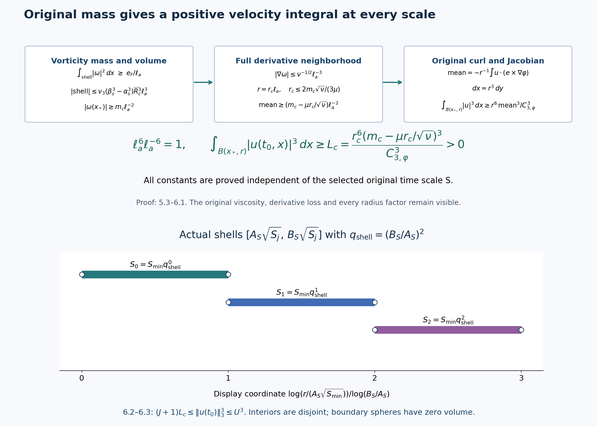

# An annulus and velocity mass uniform across scales

A single frequency event has consequences at many earlier time scales.
To add those consequences, their constants must work at every scale
being counted. This lesson constructs that uniform family from the
original energy, heat and Newton estimates. The final velocity mass
is independent of the selected time scale. Disjoint spatial shells
then bound the original frequency event.

We use the complete providers in
[lesson 11](moving-annuli-and-localized-vorticity-energy.md),
[lesson 12](global-nonlinear-energy-and-total-speed.md),
[lesson 13](selecting-an-annulus-and-controlling-local-velocity.md),
[lesson 14](interior-vorticity-bounds-on-an-actual-annulus.md),
[lesson 16](iterated-backpropagation-and-total-speed.md), and
[lesson 18](outward-vorticity-mass-and-the-final-time-transfer.md).
Their kernels, viscosity, pressure, support and time intervals stay
explicit. Every field in this lesson is the original field.
The figures show proved bounds and regions, with reproducible sources.

The human comparison is Terence Tao,
[*Quantitative bounds for critically bounded solutions to the
Navier–Stokes equations*, arXiv:1908.04958v2](https://arxiv.org/abs/1908.04958v2),
original author article.tex 660–892 and 1322–1418.
This is independently written course exposition with complete
receiving calculations and visible further consequences.
No novelty or independent review is claimed.

## 1. Actual times and all global coefficients

Keep the smooth unforced energy class, original frequency event and
all previously constructed constants of lesson 18 (8.1)–(9.3):
\[
 \partial_tu+(u\cdot\nabla)u+\nabla p=\nu\Delta u,\quad
 \operatorname{div}u=0,\quad \omega=\nabla\times u,\quad
 \nu>0,\quad \sup_t\|u(t)\|_3=U>0 .
 \tag{1.1}
\]
The time domain is \([t_0-T_{\rm orig},t_0]\).
In particular its bounded higher \(L^2\) derivative norms justify
the integrations, but will not enter the constants. The actual event
has amplitude at least \(bN_0\) in the original projection \(P_{N_0}\)
at \((t_0,x_0)\), where \(b>0\). All the iteration constants,
including \(\Lambda_{\rm it},\rho_{\rm it}\), and the finite constants
\(K,M,c_F,D_F,D_*\) of lesson 18 are already constructed from
the original inputs, independently of the next scale.

For every
\[
 \frac{\Lambda_{\rm it}}{N_0^2}\leq S
      \leq\frac{\rho_{\rm it}T_{\rm orig}}K,\qquad
 T_a=4KS,\quad \ell_a=\sqrt{T_a},\quad
 t_b=t_0-8T_a,\quad L=8T_a,\quad\delta=T_a,
 \tag{1.2}
\]
use the original heat field
\[
 v(t,x)=\int_{\mathbb R^3}(4\pi\nu(t-t_b))^{-3/2}
     e^{-|x-y|^2/(4\nu(t-t_b))}u(t_b,y)\,dy,\qquad
 w=u-v,\quad z=\nabla\times w .
 \tag{1.3}
\]
lesson 18 (9.1) proves that the entire interval is inside the original domain,
using \(\rho_{\rm it}\leq1/32\). The spatial shells below are centered
at the original point \(x_0\); writing \(|x-x_0|\) changes no field.

Keep every kernel constant of lesson 12 and \(C_{j,p}\) of lesson
13 (1.4). Define the following positive numbers independent of \(S\):
\[
 \begin{gathered}
 \mathsf W=4\kappa_0\nu^{-3/4}U^2\,8^{1/4},\\
 \mathsf M=\mathsf W^2/\nu+
       18C_{0,6}^2U^4\nu^{-5/2}(\sqrt8-1),\\
 \mathsf V=\frac{2U}{3\sqrt{\pi\nu}}(\sqrt8-1),\qquad
 \mathsf H=\frac{U}{3\sqrt{\pi\nu}}\sqrt{\log8},\\
 \mathsf S=\mathsf V+7c_\phi U+\frac{4U\mathcal B_0}{\nu}
 +\frac{\mathcal K_0}\nu
 \left[2d_1\mathsf H^2+
 2d_{6/5}S_3g_*\mathsf H\sqrt{\mathsf M}
 +\frac4{\pi^2}\big((d_1+d_2)v_3g_*^2+d_\infty+d_2\big)
       \mathsf M\right].
 \end{gathered}
 \tag{1.4}
\]
Here \(\mathcal B_0,\mathcal K_0,c_\phi\) are exactly the complete
kernel constants of lesson 12, written \(B_0,K_0,c_\varphi\) in the
receiving display of lesson 13. The speed constant \(\mathcal K_0\)
is distinct from the later Gaussian \(K_0\).
Also \(S_3=4\sqrt3\), \(g_*=(1-2^{-1/2})^{-1}\),
\(v_3=4\pi/3\). All other displayed kernel constants have their
complete integrals in that provider.

The original bounds of lesson 13 (1.4)–(1.8), with the actual
choice \(N_*=1/\ell_a\), give
\[
 \begin{gathered}
 W_0=\mathsf W\ell_a^{1/2},\qquad
 M_\delta\leq\mathsf M\ell_a,\qquad
 V_\delta=\mathsf V\ell_a,\qquad H_\delta=\mathsf H,\\
 \int_{t_b+\delta}^{t_0}\|u(t)\|_\infty\,dt
       \leq\mathsf S\ell_a,\qquad
 \int_{t_b+\delta}^{t_0}\|v(t)\|_\infty\,dt
       \leq\mathsf V\ell_a .
 \end{gathered}
 \tag{1.5}
\]
Indeed the actual initial nonlinear norm in \(M_\delta\) is
bounded by \(W_0\), leaving its full contribution
\(\mathsf W^2\ell_a/\nu\). The original heat energy integral
retains both endpoints
\(\sqrt L-\sqrt\delta=(\sqrt8-1)\ell_a\).
In the total-speed formula its six nonzero groups respectively
contain \(V_\delta\), \(N_*UT_\delta\),
\(N_*^{-1}U\), \(N_*^{-1}H_\delta^2\),
\(N_*^{-1/2}H_\delta\sqrt{M_\delta}\), and \(M_\delta\).
Each has precisely one factor \(\ell_a\), with
\(T_\delta=7\ell_a^2\). The force term and the two global force
energy terms are exactly zero because the original force is zero.

Select the actual time \(t_1\in[t_b+\delta,t_b+2\delta]\)
by the integral of \(\|\nabla w\|_2^2\), exactly as in lesson 13.
Then
\[
 \|\nabla w(t_1)\|_2^2\leq\mathsf M/\ell_a,\qquad
 T=t_0-t_1=\vartheta_a\ell_a^2,\quad 6\leq\vartheta_a\leq7.
 \tag{1.6}
\]
The time exists by continuity and the mean inequality; no
uncontrolled instantaneous gradient norm is introduced.

## 2. Separate heat tolerances and a uniform shell count

Write the physical tent height as \(h_{\rm ann}=\mathfrak h\ell_a\),
where the number \(\mathfrak h\geq1\) will be chosen below from
known constants. For the full original energy inequality choose
\[
 \lambda_5=\lambda_8=\lambda_9=\ell_a^{-2},\quad
 \gamma=\ell_a^{-1},\quad c=8(C_3+1),\quad
 E_*=(\nu/(4C_1))^2,
 \tag{2.1}
\]
retaining the original positive \(C_1,C_2,C_3\) of lesson 11.
Set
\[
 \begin{gathered}
 \mathcal A(\mathfrak h)=40+8C_2\mathsf W\mathfrak h^{-5/2}
                                  +4\nu\mathfrak h^{-2},\qquad
 e(\mathfrak h)=\tfrac18E_*e^{-\mathcal A(\mathfrak h)},\\
 c_5(\mathfrak h)=\frac{\mathfrak h C_{2,3}U^3}{\nu}\log8,\quad
 c_8(\mathfrak h)=\mathfrak h\mathsf M,\quad
 c_9(\mathfrak h)=\frac{2\mathfrak h C_{1,3}^3U^3}{\nu^{3/2}}
                                      (1-8^{-1/2}),\\
 \alpha_{\mathfrak h}=
 \min\left\{1,\mathfrak h^{-2},
       \frac{e(\mathfrak h)}{c_5(\mathfrak h)},
       \sqrt{\frac{e(\mathfrak h)}{c_8(\mathfrak h)}},
       \frac{e(\mathfrak h)}{c_9(\mathfrak h)}\right\}>0 .
 \end{gathered}
 \tag{2.2}
\]
The event gives \(U>0\), hence these denominators are positive.
The three original targets are different physical quantities:
\[
 V_j^*\leq \alpha_{\mathfrak h}\ell_a^{-(j+1)}
                 \quad(j=0,1,2).
 \tag{2.3}
\]
We construct them, rather than assume them.

Use the full nonnegative density of the original fields
\[
 \begin{gathered}
 \mathcal F_a(x)=
 \ell_a|\nabla w(t_1,x)|^2+
       \sum_{j=0}^4\ell_a^{3j}|\nabla^jv(t_1,x)|^3,\\
 \int_{\mathbb R^3}\mathcal F_a\,dx\leq
 \mathsf B:=\mathsf M+
        U^3\sum_{j=0}^4C_{j,3}^3\nu^{-3j/2}.
 \end{gathered}
 \tag{2.4}
\]
Every original term is retained with its displayed positive weight.
The bound follows term by term from 1.6 and the exact heat derivative
bound at \(t_1-t_b\geq\ell_a^2\).

Take the physical evaluation radius \(\rho=\ell_a\). Define
\[
 \begin{gathered}
 \mathsf K=\frac{(8v_3)^{1/6}}{\sqrt{8\pi}}
  \left[1+2(1+\beta_1/2)^2+
              (\sqrt3+\beta_1+\beta_\Delta)^2\right]^{1/2},
 \quad\beta_\Delta=\beta_2/4+\beta_1,\\
 \epsilon_a=\min\left\{\frac{e(\mathfrak h)}{\mathfrak h},
                 \left(\frac{\alpha_{\mathfrak h}}{2\mathsf K}\right)^3
                  \right\},\qquad
 \mathsf V_{\rm in}=\max_{0\leq j\leq2}C_{j,3}U\nu^{-j/2},\\
 d_c^2=\max\left\{32\nu,\ 
     64\nu\log_+\frac{4\mathsf V_{\rm in}}
              {3\sqrt\pi\,\alpha_{\mathfrak h}\sqrt{8\nu}}\right\},
 \qquad \mathsf D=c(8+\mathsf S+\mathsf V).
 \end{gathered}
 \tag{2.5}
\]
Here \(\epsilon_a\) is an initial-density tolerance, not a force
tolerance or the ball margin used later. The actual heat distance is
\(d_{\rm heat}=\ell_a d_c\).

Fix \(m=4\) and \(\Lambda=(100M)^{1/4}\), exactly as in lesson 18 (9.4).
Thus \(\Lambda\geq2\) and \(\Lambda^4=100M\).
The radius needed by the outward receiver has coefficient
\[
 \begin{gathered}
 r_{0c}=\frac{\Lambda^2}{10}
      \max\left\{2\sqrt\nu,\frac{D_*}{20\sqrt{4K}}\right\},\\
 R_c=\max\left\{r_{0c},
  \Lambda^2\max\left(\mathfrak h,\mathsf D,
                                  \frac{2\nu\mathsf M}{e(\mathfrak h)}\right),
  \frac{2\Lambda^4}{\Lambda-1},
  \frac{d_c\Lambda^3}{\Lambda-1}\right\},\\
 N_a=1+\left\lceil\frac{\mathsf B}{\epsilon_a}\right\rceil,\quad
 \overline R_c=R_c\Lambda^{8(N_a-1)},\qquad
 R_k=\ell_a R_c\Lambda^{8k}\quad(0\leq k<N_a).
 \end{gathered}
 \tag{2.6}
\]
All these numbers, apart from the explicitly displayed \(\ell_a\),
are independent of \(S\). The closed shells
\(\{\Lambda^{-4}R_k\leq|x-x_0|\leq\Lambda^4R_k\}\)
have disjoint interiors. Their boundary spheres have zero volume.
The number with density integral greater than \(\epsilon_a\)
is at most \(\mathsf B/\epsilon_a<N_a\), by summing the
nonnegative density. Choose an actual good shell and write its
radius as \(R\). We have
\[
 \begin{gathered}
 \ell_a R_c\leq R\leq\ell_a\overline R_c,\qquad
 \int_{S_0}|\nabla w(t_1)|^2\leq\epsilon_a/\ell_a,\\
 a_j:=\|\nabla^jv(t_1)\|_{L^3(S_0)}
            \leq\epsilon_a^{1/3}\ell_a^{-j}\quad(0\leq j\leq4).
 \end{gathered}
 \tag{2.7}
\]
The full two-extra-derivative evaluation formula in lesson 13 (2.7)
has the three expressions \(a_j\),
\(\rho a_{j+1}+\beta_1a_j/2\), and
\(\sqrt3\rho^2a_{j+2}+\beta_1\rho a_{j+1}+\beta_\Delta a_j\).
At \(\rho=\ell_a\), each has its common factor
\(\epsilon_a^{1/3}\ell_a^{-j}\). Its exterior factor is
\((8v_3)^{1/6}/(\sqrt{8\pi}\ell_a)\). Hence
\[
 B_j\leq\mathsf K\epsilon_a^{1/3}\ell_a^{-(j+1)}
       \leq\tfrac12\alpha_{\mathfrak h}\ell_a^{-(j+1)}.
 \tag{2.8}
\]
The evaluation balls lie inside \(S_0\), since 2.6 gives the
original distance \((\Lambda-1)\Lambda^{-4}R\geq2\ell_a\).
The next distance is at least \(\ell_a d_c\).
For the heat-tail function of lesson 13 (2.8), direct substitution
in its complete Gaussian formula gives
\(\mathcal T(\ell_a d_c,8\nu\ell_a^2)=
\ell_a^{-1}\mathcal T(d_c,8\nu)\).
The positive logarithm choice in 2.5 therefore bounds the
original incoming \(j\)-th derivative by
\(\alpha_{\mathfrak h}\ell_a^{-(j+1)}/2\).
This retains the full global input
\(C_{j,3}U\nu^{-j/2}\ell_a^{-j}\) for each \(j\).
Monotonicity in the upper heat time covers the actual time
\(\nu(t_0-t_1)\leq8\nu\ell_a^2\).
Together with 2.8 this proves 2.3 on
\(S_2=\{A\leq|x-x_0|\leq B\}\), where
\(A=\Lambda^{-2}R\) and \(B=\Lambda^2R\), throughout \([t_1,t_0]\).

## 3. The complete original energy and local velocity

Use the actual speed and tent of lesson 13 (5.1)–(5.2), now with
\(h_{\rm ann}\) and the choices 2.1. Its full recession is at most
\[
 q(t)\leq c(\gamma L+\mathsf S\ell_a+\mathsf V\ell_a)
            =\mathsf D\ell_a\leq A,\qquad h_{\rm ann}\leq A.
 \tag{3.1}
\]
Retain the actual sphere and curvature term
\(Y_3=(\nu/2)\int|z|^2\Delta\eta\).
The absolute-flux averaging proof chooses the two original radii
\(a_0\in[A,2A]\), \(b_0\in[B/2,B]\) so that
\[
 \int_{t_1}^{t_0}|Y_3|\,dt
       \leq\frac{2\nu M_\delta}{A}\leq e(\mathfrak h),\qquad
 E(t_1)\leq h_{\rm ann}\epsilon_a/\ell_a
       =\mathfrak h\epsilon_a\leq e(\mathfrak h).
 \tag{3.2}
\]
The heat cross terms have the exact original upper bounds
\[
 \begin{aligned}
 \int\frac{h_{\rm ann}U_3^2L_6^2}{2\lambda_5}
 &\leq\frac{h_{\rm ann}C_{2,3}U^3V_2^*}{\lambda_5\nu}
           \log\frac{t_0-t_b}{t_1-t_b}
 \leq c_5(\mathfrak h)\alpha_{\mathfrak h},\\
 \int\frac{h_{\rm ann}L_0^2G^2}{2\lambda_8}
 &\leq\frac{h_{\rm ann}(V_1^*)^2M_\delta}{\lambda_8}
 \leq c_8(\mathfrak h)\alpha_{\mathfrak h}^2,\\
 \int\frac{h_{\rm ann}L_3^2V_6^2}{2\lambda_9}
 &\leq\frac{2h_{\rm ann}C_{1,3}^3U^3V_1^*}
                      {\lambda_9\nu^{3/2}}
   \big((t_1-t_b)^{-1/2}-(t_0-t_b)^{-1/2}\big)
 \leq c_9(\mathfrak h)\alpha_{\mathfrak h}.
 \end{aligned}
 \tag{3.3}
\]
All time integrals here are over \([t_1,t_0]\); the local
norms are exactly lesson 13 (5.4). The powers of \(\ell_a\)
in the three right sides are respectively
\(1-3+2=0\), \(1-4+1+2=0\), and \(1-2+2-1=0\).
Each is at most \(e(\mathfrak h)\) by 2.2.
The two original force contributions are exactly zero.

The complete original coefficient is
\[
\mathfrak a=\lambda_5+\lambda_8+\lambda_9+2V_1+
C_2Wh_{\rm ann}^{-5/2}+\nu/(2h_{\rm ann}^2)+0.
\]
Its integral obeys
\[
 \int\mathfrak a
 \leq24+16\alpha_{\mathfrak h}
          +8C_2\mathsf W\mathfrak h^{-5/2}
          +4\nu\mathfrak h^{-2}
 \leq\mathcal A(\mathfrak h).
 \tag{3.4}
\]
In particular the earlier coarse \(2L\) estimate has been
recalculated from the actual \(V_1^*\), not omitted.
The full differential inequality remains
\(E'+(\nu/2)D+(1/4)Y_2\leq\mathfrak aE+|Y_3|+\mathfrak d\).
There are five nonzero budget terms and two zero force terms.
Thus its original seven-term bound is still valid:
\(E\leq7e(\mathfrak h)e^{\mathcal A(\mathfrak h)}=7E_*/8<E_*\).
The integrating-factor argument and continuity exclude a first
crossing, exactly as in the provider. Keeping this common bound
preserves every later estimate.

Put
\[
 \begin{gathered}
 \overline{\mathcal A}=40+8C_2\mathsf W+4\nu,\quad
 E_c=7E_*/4,\quad D_c=\frac{7E_*}{4\nu}(1+\overline{\mathcal A}),\\
 g_1=8b_1,\quad g_2=64b_2+8b_1,\quad
 P_c=2E_c+2g_1^2\mathsf W^2,\quad
 P_{1c}=4E_c+6g_1^2\mathsf W^2,\\
 Q_c=6D_c+84g_1^2P_{1c}+21g_2^2\mathsf W^2,\quad
 \mathsf V_4=(4P_cQ_c/\pi^4)^{1/4}+7^{1/4},\\
 \mathsf X_0=\sqrt{E_c}+\sqrt{2v_3}/32^{3/2}.
 \end{gathered}
 \tag{3.5}
\]
Here \(b_1,b_2\) are the original cutoff derivative maxima.
Integration of the energy inequality, retaining its nonnegative
final energy, gives \(Z_0^2\leq E_c/(\mathfrak h\ell_a)\) and
\(Z_1^2\leq D_c/(\mathfrak h\ell_a)\).
The exact local cutoffs have
\(G_1\leq g_1/(\mathfrak h\ell_a)\),
\(G_2\leq g_2/(\mathfrak h^2\ell_a^2)\).
Consequently the original three terms of \(Q_0^2\) are bounded by
\[
 \ell_a^{-1}\left(
 \frac{6D_c}{\mathfrak h}
 +\frac{12g_1^2\vartheta_aP_{1c}}{\mathfrak h^3}
 +\frac{3g_2^2\vartheta_a\mathsf W^2}{\mathfrak h^4}\right)
 \leq\frac{Q_c}{\mathfrak h\ell_a}.
\]
Similarly \(P_0^2\leq P_c/(\mathfrak h\ell_a)\) and
\(P_1^2\leq P_{1c}/(\mathfrak h\ell_a)\).
The complete Fourier interpolation bound, including the added
heat field, and the actual local \(L^2\) vorticity input give
\[
 \mathcal V\leq\mathsf V_4\mathfrak h^{-1/2}\ell_a^{-1/2},
 \qquad X_0\leq\mathsf X_0\mathfrak h^{-1/2}\ell_a^{-1/2}.
 \tag{3.6}
\]
Indeed the heat terms before comparison are
\(\vartheta_a^{1/4}\alpha_{\mathfrak h}\ell_a^{-1/2}\)
and \(\sqrt{2v_3}\mathfrak h^{3/2}
\alpha_{\mathfrak h}\ell_a^{-1/2}/32^{3/2}\).
Using \(\alpha_{\mathfrak h}\leq\mathfrak h^{-2}\),
\(\mathfrak h\geq1\), \(6\leq\vartheta_a\leq7\)
gives precisely 3.6.

## 4. Four pointwise bounds with their original powers

Use the exact balls and time cutoffs of lesson 14:
\[
 \rho_b=h_{\rm ann}/32,\quad
 \epsilon=h_{\rm ann}/1024,\quad \tau=T/16,\quad
 L_1=\frac{k_1}{\mathfrak h\ell_a},\quad
 L_2=\frac{k_2}{\mathfrak h^2\ell_a^2},\quad
 L_t=\frac{16b_1}{\vartheta_a\ell_a^2},
 \tag{4.1}
\]
where \(k_1=1024b_1\),
\(k_2=1024^2b_2+(524288/3)b_1\).
For any positive Gaussian pair \(Q_0,Q_1\) define the full expression
\[
 \begin{aligned}
 \mathcal C(Q_0,Q_1)={}&
 6^{3/4}Q_1\nu^{-5/8}7^{1/8}\mathsf V_4
 +\frac{16}3Q_1\nu^{3/8}k_1\,7^{3/8}\\
 &+\frac87Q_0\nu^{-1/8}(16b_1/6+\nu k_2)7^{7/8}\\
 &+(6/5)^{3/4}Q_0\nu^{-1/8}k_1\,7^{5/8}\mathsf V_4 .
 \end{aligned}
 \tag{4.2}
\]
Take \(K_0=\|H_1\|_{12/11}\),
\(K_1=\sum_j\|\partial_jH_1\|_{12/11}\), and the exact
\(J_0,J_1,J_{2,\alpha},J_\nabla\) of lesson 14 (3.2), (5.3),
with \(\alpha=1/4\). Set
\[
 \overline C=\mathcal C(K_0,K_1),\quad
 \overline C_H=\mathcal C(J_0,J_1),\quad
 \mathsf X=\overline C^6\mathsf X_0,\quad
 \mathsf H_7=\overline C_H\mathsf X,\quad
 \mathsf Z=\mathsf X+\sqrt2 .
 \tag{4.3}
\]
Substitute 3.6–4.1 in each of the four terms of lesson 14
(2.7). Their \(\ell_a\) powers are
\(1/4-1/2=-1/4\),
\(-1+3/4=-1/4\),
\(-2+7/4=-1/4\), and
\(-1+5/4-1/2=-1/4\).
Their remaining positive factors are bounded by 4.2 using
\(\mathfrak h\geq1\) and \(6\leq\vartheta_a\leq7\).
The same argument applies to the full Hölder expression (3.3).
The original six steps and the seventh Hölder step therefore give
\[
 \begin{gathered}
 X_6\leq\mathsf X\mathfrak h^{-1/2}\ell_a^{-2},\qquad
 H_7\leq\mathsf H_7\mathfrak h^{-1/2}\ell_a^{-9/4},\\
 Z_\infty\leq\mathsf Z\mathfrak h^{-1/2}\ell_a^{-2},\qquad
 Z_2\leq\sqrt{E_c}\mathfrak h^{-1/2}\ell_a^{-1/2}.
 \end{gathered}
 \tag{4.4}
\]
All force heat potentials are exactly zero for 1.1.

The exact Newton formula retains its main curl field, both boundary
fields, the principal value Hessian and its point mass
\(-\delta_{ij}\delta_0/3\). Its complete bounds in lesson 14
(4.4)–(4.8) yield the following constants:
\[
 \begin{aligned}
 \mathsf U={}&
 \frac3{(4\sqrt\pi)^{2/3}}\mathsf Z^{1/3}E_c^{1/3}
                  +\frac{32k_1\mathsf W}{\sqrt\pi}+1,\\
 \mathsf G={}&
 \frac{\sqrt6}{\alpha}1024^{-\alpha}\mathsf H_7
 +\frac{\sqrt{12}}{1024\alpha}
 +\left(\sqrt6\log64+\frac{\sqrt2}3\right)\mathsf Z\\
 &+\sqrt{2/\pi}\,k_1\mathsf W\,1024^{3/2}+1,\\
 U_{\rm loc}&\leq\mathsf U\mathfrak h^{-1/2}\ell_a^{-1},
 \qquad G_u\leq\mathsf G\mathfrak h^{-1/4}\ell_a^{-2}.
 \end{aligned}
 \tag{4.5}
\]
For the velocity, the full optimized main term has factors
\(Z_\infty^{1/3}Z_2^{2/3}\);
the two boundary terms together have
\(L_1W_0/\sqrt{\pi\epsilon}\).
Their height powers are \(\mathfrak h^{-1/2}\) and
\(\mathfrak h^{-3/2}\); the added heat field has
\(\mathfrak h^{-2}\). All have physical power \(\ell_a^{-1}\).
For the gradient the five original terms have height powers
\(-1/4,-1,-1/2,-5/2,-2\), respectively, and all have
physical power \(\ell_a^{-2}\).
The logarithm is exactly \(\log(2\rho_b/\epsilon)=\log64\).
These substitutions prove every summand of 4.5, including the
heat contribution to \(Z_\alpha=H_7+\sqrt2V_2^*\epsilon^{1-\alpha}\).

To keep every term in the differentiated vorticity equation, put
\[
 \begin{gathered}
 \mathsf B_{\rm nl}=\mathsf U\mathsf H_7+
      (2\mathsf U)^{3/4}(k_1\mathsf U+\mathsf G)^{1/4}\mathsf X,\\
 \mathsf B_{\rm cut}=k_1\mathsf H_7+
                    (2k_1)^{3/4}k_2^{1/4}\mathsf X,\qquad
 \mathsf B_{\rm rem}=(16b_1/6+\nu k_2+k_1\mathsf U)\mathsf X,\\
 \mathsf G_\omega=
 \frac2\alpha J_{2,\alpha}\nu^{-1+\alpha/2}7^{\alpha/2}
            (\mathsf B_{\rm nl}+2\nu\mathsf B_{\rm cut})
       +2J_\nabla\nu^{-1/2}\sqrt7\,\mathsf B_{\rm rem}.
 \end{gathered}
 \tag{4.6}
\]
Indeed the exact products of lesson 14 (5.2) obey
\[
 \begin{gathered}
 A_{\rm nl}\leq\mathsf B_{\rm nl}
                   \mathfrak h^{-15/16}\ell_a^{-13/4},\qquad
 A_{\rm cut}\leq\mathsf B_{\rm cut}
                   \mathfrak h^{-3/2}\ell_a^{-13/4},\\
 (L_t+\nu L_2+L_1U_{\rm loc})X_6
      \leq\mathsf B_{\rm rem}\mathfrak h^{-1/2}\ell_a^{-4},\\
 G_\omega\leq\mathsf G_\omega\mathfrak h^{-1/2}\ell_a^{-3}.
 \end{gathered}
 \tag{4.7}
\]
The mixed nonlinear height exponent is
\(3/8+1/16+1/2=15/16\); its physical exponent is
\(3/4+1/2+2=13/4\). The other nonlinear term has height
exponent \(1\), and the second cutoff term has exponent \(7/4\);
both are retained in 4.6 before comparison by \(\mathfrak h\geq1\).
The differentiated heat integral contributes \(\ell_a^{1/4}\)
to the first two products and \(\ell_a\) to the remainder.
Thus all have final physical power \(\ell_a^{-3}\).
This proves the last line from the full original derivative formula.

Every constant in 3.5–4.6 was fixed using only
\(\mathfrak h\geq1\). We can now make the noncircular choice
\[
 \mathfrak h=\max\{1,\mathsf U^2/\nu,\mathsf G^4,
                                  \mathsf X^2,\nu\mathsf G_\omega^2\}.
 \tag{4.8}
\]
Use this actual number in 2.2–2.7 and in all the physical
cutoffs above. They supply, on the original shell \(\mathcal K\),
\[
 |u|\leq\frac{\sqrt\nu}{\sqrt{T_a}},\quad
 |\nabla u|\leq T_a^{-1},\quad
 |\omega|\leq T_a^{-1},\quad
 |\nabla\omega|\leq(\sqrt\nu T_a^{3/2})^{-1}.
\]
The interval is \([t_1+9T/16,t_0]\).
Its left endpoint is \(t_0-7T/16\leq t_0-42T_a/16<t_0-T_a\).
Therefore it contains the entire interval required by FT.

## 5. Original final-time mass and fixed enclosing shells

The actual inner and outer radii remain
\[
 A=\Lambda^{-2}R,\quad B=\Lambda^2R,\quad
 r_-=10A,\quad r_+=B/10=Mr_-,\qquad
 a=\frac{r_-^2}{\nu T_a}.
 \tag{5.1}
\]
The choice \(r_{0c}\) proves
\(r_-\geq2\sqrt{\nu T_a}\) and \(20r_-\geq D_*\sqrt S\).
All complete time, recession and local cutoff margins of lesson 18 (9.5)–(9.10)
hold because \(h_{\rm ann}\leq A\), \(q\leq A\), and \(B/A=100M\).
In particular the regular shell endpoints obey
\(k_-\leq141A/32\) and \(k_+\geq B/2-77A/32\).
Thus the two weighted estimates are applied to the same original
equation and the same actual common space-time region as in lesson 18.
The replacement annulus selection has proved every one of their
inputs, including the four bounds just obtained, without assuming
uniform radius or mass.

Use the complete positive coefficients of lesson 18 (12.9):
\[
 \begin{gathered}
 c_F=\min\{z_0/(6K^2),c_Y\},\quad
 D_F=\max\{D+2M^2,D_YM^2\},\\
 z_0=c_O\sqrt K/2,\quad D=1600C_O\nu K,\quad
 c_Y=(2^{5/2}A_GC_IC_J)^{-1},\\
 D_Y=21/2+(3/2)C_t+H/80 .
 \end{gathered}
 \tag{5.2}
\]
Here \(H,K,C_I,C_t,C_J,M\) are their full terminating choices in lesson 18;
the height number \(\mathfrak h\) is a different constant.
The enhanced Gaussian covering coefficient of lesson 18 Exercise 3
can replace \(c_Y\) by \(6^{3/2}e^{-5/4}c_Y\); the proof below
already holds for the original \(c_Y\).

Let \(\sigma_G=1/\sqrt{32}\) and define
\[
 \begin{gathered}
 \alpha_s=(1-\sigma_G)10\Lambda^{-2},\qquad
 \beta_s=(1+\sigma_G)\Lambda^2/10,\qquad
 a_\sharp=\alpha_sR,\quad b_\sharp=\beta_sR,\quad
 \delta_F=\Lambda^{-2}R/4,\\
 \overline a=\frac{100\Lambda^{-4}\overline R_c^2}{\nu},
 \qquad e_F=c_F e^{-D_F\overline a}>0.
 \end{gathered}
 \tag{5.3}
\]
The complete finite proof in lesson 18 gives
\[
 \int_{a_\sharp\leq|x-x_0|\leq b_\sharp}|\omega(t_0,x)|^2\,dx
 \geq\frac{c_F}{\ell_a}e^{-D_Fa}
 \geq\frac{e_F}{\ell_a}.
 \tag{5.4}
\]
The last comparison follows from the actual radius upper bound
in 2.7: \(a\leq\overline a\).
The exact shell volume remains
\(v_3(\beta_s^3-\alpha_s^3)R^3\).
Since \(M\geq128\), its endpoints are strictly ordered.
Consequently there is an actual point \(x_*\) of the closed
mass shell with
\[
 \begin{gathered}
 |\omega(t_0,x_*)|\geq m_c\ell_a^{-2},\\
 m_c=\left(\frac{e_F}
           {v_3(\beta_s^3-\alpha_s^3)\overline R_c^3}\right)^{1/2}>0,
 \qquad d_c^{\rm curl}=\Lambda^{-2}R_c/4>0 .
 \end{gathered}
 \tag{5.5}
\]
This follows by taking the continuous maximum and comparing
its square times the full shell volume with 5.4.
No assertion about the location of its maximum outside this shell
is needed. The derivative neighborhood of radius \(\delta_F\)
is inside \(\mathcal K\), by lesson 18 (14.2); 2.7 gives
\(\delta_F\geq d_c^{\rm curl}\ell_a\).

Keep the actual radial smooth bump \(\varphi\) of lesson 18 (13.1)–(13.3):
it is nonnegative, supported in the unit ball, has integral one,
\(\mu=\int|y|\varphi(y)\,dy\in(0,1)\), and
\(C_{3,\varphi}=\|\nabla\varphi\times e\|_{3/2}>0\)
for every unit \(e\); radial symmetry makes the latter independent
of \(e\). Choose
\[
 r_c=\min\left\{d_c^{\rm curl},
                       \frac{2m_c\sqrt\nu}{3\mu}\right\},\quad
 r=r_c\ell_a,\quad
 L_c=\frac{r_c^6(m_c-\mu r_c/\sqrt\nu)^3}{C_{3,\varphi}^3}>0.
 \tag{5.6}
\]
The positive remainder is at least \(m_c/3\). The chosen ball
of radius \(r\) lies in the actual derivative neighborhood, so the
original gradient bound gives
\[
 \int\varphi(y)e\cdot\omega(t_0,x_*+ry)\,dy
 \geq\ell_a^{-2}(m_c-\mu r_c/\sqrt\nu),
 \qquad e=\omega(t_0,x_*)/|\omega(t_0,x_*)|.
\]
The exact curl integration by parts is
\[
 \int\varphi(y)e\cdot\omega(t_0,x_*+ry)\,dy
 =-r^{-1}\int u(t_0,x_*+ry)\cdot(e\times\nabla\varphi(y))\,dy.
\]
The compact support removes the boundary term.
Hölder and the original Jacobian \(dx=r^3dy\) bound the absolute
right side by
\(r^{-2}C_{3,\varphi}(\int_{B(x_*,r)}|u(t_0,x)|^3dx)^{1/3}\).
Cubing, and retaining \(r^6=r_c^6\ell_a^6\) and the mean cube
\(\ell_a^{-6}(m_c-\mu r_c/\sqrt\nu)^3\), proves a lower
bound \(L_c\), independent of \(S\), for the original velocity
integral on that ball.

## 6. Disjoint shells and the frequency bound

The ball just constructed lies in the original annulus
\([a_\sharp-\delta_F,b_\sharp+\delta_F]\).
Both its endpoints have explicit fixed envelopes:
\[
 \begin{gathered}
 A_c=(\alpha_s-\Lambda^{-2}/4)R_c>0,\qquad
 B_c=(\beta_s+\Lambda^{-2}/4)\overline R_c>A_c,\\
 A_S=2\sqrt K A_c,\qquad B_S=2\sqrt K B_c,\\
 \int_{A_S\sqrt S\leq|x-x_0|\leq B_S\sqrt S}
                      |u(t_0,x)|^3\,dx\geq L_c .
 \end{gathered}
 \tag{6.1}
\]
For the inner endpoint, positivity follows from
\(\alpha_s-\Lambda^{-2}/4
=\Lambda^{-2}(10(1-1/\sqrt{32})-1/4)>0\);
use \(1/\sqrt{32}<1/4\).
The original radius lower bound gives that inner envelope.
The original upper bound gives the outer envelope.
Finally \(\ell_a=2\sqrt K\sqrt S\), which proves the displayed
physical endpoints without changing the integration variable.

Set
\[
 S_{\min}=\Lambda_{\rm it}/N_0^2,\qquad
 S_{\max}=\rho_{\rm it}T_{\rm orig}/K,\qquad
 q_{\rm shell}=(B_S/A_S)^2>1 .
 \tag{6.2}
\]
If the scale interval is nonempty, take
\(J=\lfloor\log(S_{\max}/S_{\min})/\log q_{\rm shell}\rfloor\)
and the actual scales \(S_j=S_{\min}q_{\rm shell}^j\),
\(0\leq j\leq J\).
Each lies in 1.2. The outer radius of the \(j\)-th envelope equals
the inner radius of the next, because
\(A_S\sqrt{q_{\rm shell}}=B_S\).
Their interiors are disjoint; their shared boundary spheres
have zero volume. Summing 6.1 thus gives
\((J+1)L_c\leq\|u(t_0)\|_3^3\leq U^3\).
The floor inequality
\(\log(S_{\max}/S_{\min})/\log q_{\rm shell}<J+1\)
implies
\[
 T_{\rm orig}N_0^2
  <\frac{K\Lambda_{\rm it}}{\rho_{\rm it}}\,
                    q_{\rm shell}^{\,U^3/L_c}.
 \tag{6.3}
\]
If the scale interval is empty, it gives directly
\(T_{\rm orig}N_0^2<K\Lambda_{\rm it}/\rho_{\rm it}\),
which is stronger than 6.3. The equality
\(S_{\max}=S_{\min}\) is included in the nonempty case,
with one annulus. All constants in 6.3 are finite functions
of the original already specified \(\nu,U,b\) and fixed kernel
choices; none uses \(S,t_1,R\), \(N_0\), or an auxiliary
higher-derivative norm.

## 7. Propagating the stronger covering coefficient

The stronger coefficient from lesson 18 Exercise 3 has an exact
receiver here. Keeping every annular, time and geometric constant
just constructed, define
\[
 \begin{gathered}
 \rho_I=6^{3/2}e^{-5/4}>1,\quad
 c_F^*=\min\{z_0/(6K^2),\rho_Ic_Y\},\quad
 e_F^*=c_F^*e^{-D_F\overline a},\\
 m_c^*=\left(\frac{e_F^*}
   {v_3(\beta_s^3-\alpha_s^3)\overline R_c^3}\right)^{1/2},\quad
 r_c^*=\min\left\{d_c^{\rm curl},
                      \frac{2m_c^*\sqrt\nu}{3\mu}\right\},\\
 L_c^*=\frac{(r_c^*)^6(m_c^*-\mu r_c^*/\sqrt\nu)^3}
                             {C_{3,\varphi}^3}\geq L_c,\\
 T_{\rm orig}N_0^2<
 \frac{K\Lambda_{\rm it}}{\rho_{\rm it}}\,
                          q_{\rm shell}^{\,U^3/L_c^*}.
 \end{gathered}
 \tag{7.1}
\]
The original choice of \(H\) still absorbs the Gaussian error
because its full error coefficient decreases, as proved in that
exercise. All the annular constants chosen before the endpoint
mass are therefore unchanged. The same complete mass, curl and
disjoint-shell proofs apply with the displayed starred values.

For clarity, the inequality in the velocity constant is not inferred
just from an enlarged radius. Put \(g=\mu/\sqrt\nu>0\).
The derivative of \(r^6(m-gr)^3\), where its mean is positive, is
\(3r^5(m-gr)^2(2m-3gr)\). Thus the maximum on
\(0<r\leq d_c^{\rm curl}\) with positive mean occurs at
\(\min(d_c^{\rm curl},2m/(3g))\).
At any fixed positive old radius the expression is strictly
increasing in \(m\). Hence \(L_c^*\geq L_c\), with strict
inequality whenever \(c_F^*>c_F\); equality holds if
\(c_F^*=c_F\). Since \(q_{\rm shell}>1\) and \(U>0\),
the frequency-event upper bound decreases strictly in the former
case. The other exercise's enlarged derivative neighborhood changes
both its integration region and later shell spacing, so no automatic
improvement of this last bound is asserted from that enlargement.

*Figure.* The upper panel retains the original mass, shell volume,
derivative bound, radius and Jacobian in 5.3–6.1. The lower panel
uses the displayed logarithmic radial coordinate only to draw the
exact original annuli in 6.1–6.3. The first three shells are
shown when \(J\geq2\); truncate at \(J\) otherwise. Shared boundary
spheres have zero three-dimensional volume. This is a diagram of
proved bounds and supports, not a sampled fluid solution.
[Reproducible figure](../assets/uniform-original-scale-annulus.py).

This proves a uniform bound for every original frequency event in
the stated smooth unforced energy class. It is the needed annulus
and shell-sum consequence. Passing from this event bound to the
full continuation assertion requires the original frequency
reconstruction and the relevant local existence/continuation
argument. That final implication is not claimed merely from the
word “uniform.”

The separate heat tolerances, weighted original initial density,
recalculated energy coefficients, all six heat steps, both Newton
boundary fields and the differentiated vorticity terms above give
the full comparison missing from a bare scaling assertion.
No novelty or independent review is claimed.

## 8. Five exercises with complete solutions

### Exercise 1: count overlapping shells exactly

Keep \(A_S,B_S,L_c\) from Section 6. Choose any \(q>1\),
rather than the disjoint choice, and use all scales
\(S_j=S_{\min}q^j\) that lie at most \(S_{\max}\).
Determine the largest possible overlap away from boundary spheres.
Prove the resulting event bound and compare the exponent cost.

**Solution.** Write
\[
 R_s=B_S/A_S>1,\quad
 h_q=\frac{2\log R_s}{\log q},\quad
 m_q=\lceil h_q\rceil,\quad
 J_q=\left\lfloor\frac{\log(S_{\max}/S_{\min})}{\log q}\right\rfloor.
 \tag{8.1}
\]
For a radius \(r>0\) not on a shell boundary, membership in shell
\(j\) is exactly
\[
 \frac{2\log(r/(B_S\sqrt{S_{\min}}))}{\log q}
 <j<
 \frac{2\log(r/(A_S\sqrt{S_{\min}}))}{\log q},
 \qquad 0\leq j\leq J_q.
 \tag{8.2}
\]
This open interval has length \(h_q\). If \(k\) integers lie
inside it, their largest minus smallest is at least \(k-1\)
and strictly less than \(h_q\). For nonintegral \(h_q\) this gives
\(k\leq\lfloor h_q\rfloor+1=\lceil h_q\rceil\); for integral
\(h_q\) it gives \(k\leq h_q\). The finite index range gives the
additional bound \(k\leq J_q+1\).
These bounds are attained on an open interval of radii: choose
a consecutive block of \(\min(m_q,J_q+1)\) indices and place
the endpoints of the open interval just outside that block.
Its length is greater than the block's span. Varying \(r\)
translates both endpoints continuously without changing their
difference. Thus the exact essential maximum multiplicity is
\(\min(m_q,J_q+1)\). Boundary spheres have zero volume.

Sum the original integrals, retaining their actual center:
\[
 (J_q+1)L_c
 \leq\int\sum_{j=0}^{J_q}
 {\bf1}_{\{A_S\sqrt{S_j}\leq|x-x_0|\leq B_S\sqrt{S_j}\}}
                  |u(t_0,x)|^3\,dx
 \leq m_qU^3.
 \tag{8.3}
\]
The same strict floor inequality used in Section 6 gives
\[
 T_{\rm orig}N_0^2<
 \frac{K\Lambda_{\rm it}}{\rho_{\rm it}}\,
                 q^{m_qU^3/L_c}.
 \tag{8.4}
\]
The empty scale interval has the earlier stronger bound.
Since \(m_q\log q\geq2\log R_s\), no \(q\) improves this
exponent cost. Equality holds exactly when
\(h_q\) is an integer, that is,
\(q=R_s^{2/m}\) for some positive integer \(m\).
The disjoint choice is \(m=1\).
The statement concerns this uniform mass-and-multiplicity
estimate; it does not forbid stronger information about the
actual velocity distribution.

### Exercise 2: retain a general velocity exponent

Replace the final \(L^3\) Hölder step by \(L^p\), with
\(1<p<\infty\). Keep the same original mass point, actual
derivative neighborhood and bump. Find the best radius in
the resulting bound. Show exactly why \(p=3\) removes the
physical scale factor.

**Solution.** Put \(p'=p/(p-1)\) and
\[
 C_{p,\varphi}=\|\nabla\varphi\times e\|_{p'}>0,\quad
 g=\mu/\sqrt\nu,\quad d=d_c^{\rm curl},\quad m=m_c.
 \tag{8.5}
\]
The bump is the same radial compact smooth function, so its
constant is finite and invariant under rotation of the unit
vector \(e\). It is positive since a nonconstant radial bump
has a nonzero tangential cross product on a set of positive volume.
At \(r=s\ell_a\), \(0<s\leq d\), the unchanged mean and
signed integration by parts give
\[
 \begin{aligned}
 \ell_a^{-2}(m-gs)
 &\leq-r^{-1}\int
        u(t_0,x_*+ry)\cdot(e\times\nabla\varphi(y))\,dy\\
 &\leq r^{-1-3/p}C_{p,\varphi}
                 \left(\int_{B(x_*,r)}|u(t_0,x)|^p\,dx\right)^{1/p}.
 \end{aligned}
 \tag{8.6}
\]
We use this only while \(m-gs>0\). Hölder and the full
Jacobian \(dx=r^3dy\) prove the last inequality; the first
mean is positive, so taking its absolute upper bound is valid.
Consequently
\[
 \int_{B(x_*,s\ell_a)}|u(t_0,x)|^p\,dx
 \geq \ell_a^{\,3-p}
           \frac{s^{p+3}(m-gs)^p}{C_{p,\varphi}^p}.
 \tag{8.7}
\]
The derivative of the numerator, on its positive interval, is
\[
 s^{p+2}(m-gs)^{p-1}\big[(p+3)m-(2p+3)gs\big].
 \tag{8.8}
\]
It is positive and then negative on opposite sides of the
single zero. The actual maximizing radius is therefore
\[
 s_p=\min\left\{d,\frac{p+3}{2p+3}\frac m g\right\},\qquad
 m-gs_p\geq\frac p{2p+3}m>0.
 \tag{8.9}
\]
For \(p=3\), these are precisely \(r_c\) and the lower bound
\(L_c\) of (5.6). For general \(p\), the full scale factor
is \(\ell_a^{3-p}=(2\sqrt K)^{3-p}S^{(3-p)/2}\).
It is constant over all \(S>0\) exactly when \(p=3\).
No constant-scale \(L^p\) mass is inferred at another exponent.

### Exercise 3: propagate a stronger vorticity mass quantitatively

Suppose the final vorticity mass coefficient is multiplied by
\(\eta\geq1\), with every selected geometric and derivative
constant unchanged. Determine the exact new optimized velocity
coefficient and its relation to the old one, including the
transition at the derivative-neighborhood radius.

**Solution.** Use \(d,m,g\) of (8.5) and
\(C=C_{3,\varphi}\). The full shell volume is unchanged, so the
new vorticity point bound is \(m_\eta=\sqrt\eta\,m\).
The exact formula is
\[
 s_\eta=\min\left\{d,\frac{2\sqrt\eta\,m}{3g}\right\},\qquad
 L(\eta)=\frac{s_\eta^6(\sqrt\eta\,m-gs_\eta)^3}{C^3}.
 \tag{8.10}
\]
If \(2\sqrt\eta\,m/(3g)\leq d\), substitution retains all
factors and gives
\[
 L(\eta)
 =\frac{2^6\eta^{9/2}m^9}{3^9g^6C^3}.
 \tag{8.11}
\]
If that inequality is reversed, the exact value is instead
\[
 L(\eta)=d^6(\sqrt\eta\,m-gd)^3/C^3.
 \tag{8.12}
\]
The two formulas coincide when
\(\eta=(3gd/(2m))^2\).
When the original optimizer is strictly inside its permitted
neighborhood, this transition value exceeds one; otherwise
the capped formula applies for all \(\eta\geq1\).
Equality of the original two radii gives transition at one.

At the old positive optimizer \(s_1\),
\[
 \sqrt\eta\,m-gs_1
 =\sqrt\eta\,(m-gs_1)+(\sqrt\eta-1)gs_1.
 \tag{8.13}
\]
Its final summand is positive when \(\eta>1\).
Evaluating the new objective at that old admissible radius and
then maximizing therefore proves
\(L(\eta)>\eta^{3/2}L(1)\) for \(\eta>1\), with equality
\(L(1)=L(1)\) at \(\eta=1\).
If both optimizers are uncapped, the exact ratio is
\(\eta^{9/2}\). If both are capped, the ratio is
\([(\sqrt\eta\,m-gd)/(m-gd)]^3\). Formula (8.10) covers the
crossing case without removing either branch.
For Section 7 take the actual
\(\eta=c_F^*/c_F\). The event exponent is rebuilt with
\(L(\eta)\); it is never estimated from a radius increase alone.

### Exercise 4: use the actual bump radius in the enclosing shells

The envelope in Section 6 uses the full available derivative
neighborhood even when the actual bump ball is smaller.
Keep its proved mass \(L_c\), and construct the exact uniform
envelope using its actual radius. Compare the event bound.

**Solution.** Set
\[
 A_0=\alpha_sR_c,\qquad B_0=\beta_s\overline R_c,\qquad
 d=\Lambda^{-2}R_c/4,\qquad r_c=\min(d,2m_c/(3g)).
 \tag{8.14}
\]
For every actual scale, the mass point lies between
\(\alpha_sR\) and \(\beta_sR\), and the ball radius is
\(r_c\ell_a\). Both triangle inequalities and both actual
bounds for \(R\) prove containment in
\[
 (A_0-r_c)\ell_a\leq|x-x_0|\leq(B_0+r_c)\ell_a.
 \tag{8.15}
\]
The inner endpoint is positive because
\(r_c\leq d<A_0\). In original time-scale coordinates define
\[
 \widetilde A_S=2\sqrt K(A_0-r_c),\qquad
 \widetilde B_S=2\sqrt K(B_0+r_c),\qquad
 \widetilde q=\left(\frac{B_0+r_c}{A_0-r_c}\right)^2.
 \tag{8.16}
\]
The same original velocity integral is at least \(L_c\).
The original Section 6 inner endpoint before multiplication
by \(2\sqrt K\) is \(A_0-d\), at most \(A_0-r_c\).
Its outer endpoint is
\(B_0+\Lambda^{-2}\overline R_c/4\), at least \(B_0+r_c\).
Thus \(\widetilde q\leq q_{\rm shell}\), strictly if
\(r_c<d\) or \(\overline R_c>R_c\).
Repeating the complete disjoint-shell sum gives
\[
 T_{\rm orig}N_0^2<
 \frac{K\Lambda_{\rm it}}{\rho_{\rm it}}\,
                      \widetilde q^{\,U^3/L_c}.
 \tag{8.17}
\]
It is strictly stronger under exactly the preceding sufficient
conditions. When both are false, both endpoints agree.
In the actual construction, \(\mathsf B>0\) and \(\epsilon_a>0\),
so \(N_a=1+\lceil\mathsf B/\epsilon_a\rceil\geq2\).
Since \(\Lambda>1\), (2.7) gives \(\overline R_c>R_c\).
The improvement is therefore strict for every nonzero instance
of the constructed family.
All statements hold with the starred \(m_c^*,r_c^*,L_c^*\)
as well, since their neighborhood and annulus are unchanged.

### Exercise 5: optimize shell width together with the bump mass

Use the smaller envelopes of Exercise 4, but allow the actual
bump radius to vary. Prove that the best mass radius need not
give the best frequency bound. Give an exact one-variable
minimization with a proved attained minimum.

**Solution.** Keep \(A_0,B_0,d,m,g,C\) from the preceding
exercises, and let \(s_0=\min(d,2m/(3g))\).
For \(0<s\leq s_0\), the full earlier proof applies to the
actual radius \(s\ell_a\) and gives
\[
 \begin{gathered}
 L_s=\frac{s^6(m-gs)^3}{C^3}>0,\qquad
 q_s=\left(\frac{B_0+s}{A_0-s}\right)^2>1,\\
 \Phi(s)=\frac{\log q_s}{L_s}
 =\frac{2C^3\log((B_0+s)/(A_0-s))}
             {s^6(m-gs)^3},\\
 T_{\rm orig}N_0^2<
 \frac{K\Lambda_{\rm it}}{\rho_{\rm it}}\,
                         \exp\big(U^3\Phi(s)\big).
 \end{gathered}
 \tag{8.18}
\]
The original shell sum proves this for every admissible \(s\);
its empty and singleton cases are unchanged.
Because \(d<A_0<B_0\), all displayed factors are finite and
positive on this interval. As \(s\downarrow0\), its logarithm
tends to \(\log(B_0/A_0)>0\), while its denominator tends to
zero. Thus \(\Phi(s)\to+\infty\).
Choose \(\epsilon\in(0,s_0)\) so that
\(\Phi(s)>\Phi(s_0)\) for \(0<s<\epsilon\).
Continuity on the compact interval \([\epsilon,s_0]\)
gives an attained minimum \(s_*\in(0,s_0]\).

The exact logarithmic derivative is
\[
 \frac{\Phi'(s)}{\Phi(s)}
 =\frac{(B_0+s)^{-1}+(A_0-s)^{-1}}
             {\log((B_0+s)/(A_0-s))}
       -\frac6s+\frac{3g}{m-gs}.
 \tag{8.19}
\]
An interior minimizer satisfies this equation with right side
zero. If \(s_0=2m/(3g)\leq d\), the last two terms cancel
at \(s_0\), leaving a strictly positive derivative.
There is then a smaller radius with a strictly smaller
frequency-bound exponent, so the minimizer is interior.
This proves that maximizing mass alone is insufficient
in this case. No uniqueness of the minimizer is assumed.
If the neighborhood caps the radius earlier, a minimizer
can instead occur at its endpoint.

For any admissible radius above \(2m/(3g)\) with positive
mean, its mass objective decreases and its shell ratio
increases; it therefore has larger \(\Phi\) than at
\(2m/(3g)\). Radii at or beyond \(m/g\) have no positive
mean estimate. The minimization already covers every
potential improvement obtained by this bump argument.
Using \(s=s_*\) in (8.18) gives the proved best bound within
this exact family. All constants remain functions of the
original \(\nu,U,b\) and specified kernels, independent
of the selected scale \(S\).
The same construction applies to the actual strengthened
mass of Section 7 by replacing \(m\) with \(m_c^*\).

## 9. What the calculation supplies

The original scale family now has a definite annulus at every
admissible scale, a uniform radius upper bound, and positive
final-time velocity mass independent of that scale.
The original frequency-event bound follows with all physical
constants retained. The source's scale comparison is therefore
an actual map between the original estimates and the receiving
shell sum.

The five exercises prove the exact overlap count, the full
\(L^p\) curl receiver and its critical exponent, quantitative
propagation of stronger vorticity mass, a smaller uniform
envelope and a joint radius-and-shell optimization.
They retain the preceding argument and identify each stronger
consequence separately.

The next lesson uses the frequency bound in the full original
enstrophy identity, including every heat cross term, and
supplies positive-time smoothing and continuation.
The later forced-flow constructions and their terminal
regularity requirements still have their own arguments.
