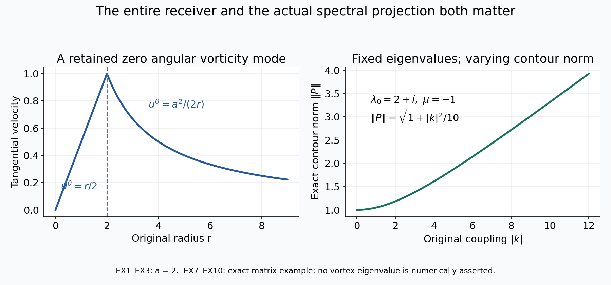
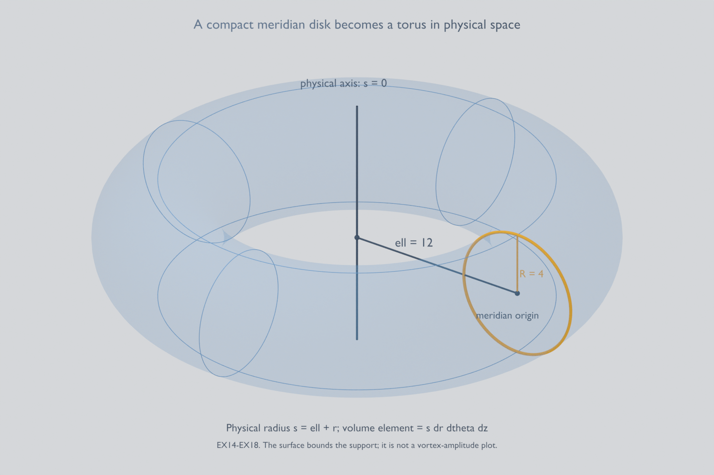

# Compact vortices and the full weighted Euler generator

[Lesson 30](an-unstable-euler-vortex-with-an-integer-mode.md)
constructed an actual smooth Euler vortex with an unstable
integer angular mode. Here we cut off its background velocity
and prove that an unstable eigenvalue survives. We then
construct the full weighted Euler generator, including its
zero angular mode, exact domain and finite-dimensional
unstable spectral spaces.

The first proof retains every term in the original slow tail,
circulation and cutoff. A finite-dimensional determinant
and the full contour resolvent give a definite finite
cutoff radius. The perturbation vorticity becomes smooth
and compactly supported, while its velocity keeps an
explicit nonzero exterior tail and its original pressure.

The second proof supplies the receiving operator used
by the three-dimensional argument. Keep the actual
compact background \(\bar V_R\), vorticity \(g_R\),
integer \(M\) and mode \(\omega_R\) constructed in CP1–CP32
below, with the definite radius \(R=R_*\geq4\).
We construct its weight and full Biot–Savart map before
proving the domain and spectral statements. Every angular
mode remains present.

The human source is Dallas Albritton, Elia Brué and Maria Colombo,
[*Non-uniqueness of Leray solutions of the forced Navier–Stokes
equations*, arXiv:2112.03116v1](https://arxiv.org/abs/2112.03116v1),
original main.tex 755–1169: velocity truncation, the weighted
operator and the beginning of the axisymmetric construction.
The unstable input is supplied by the complete original
Vishik-family construction in lessons 29–30, following
[Albritton, Brué, Colombo, De Lellis, Giri, Janisch and Kwon,
arXiv:2112.04943v4](https://arxiv.org/abs/2112.04943v4).
No assumed unstable profile replaces that construction.

Five solved exercises retain a nonzero zero-mode circulation,
prove a sharper reciprocal-weight threshold, evaluate a
nonorthogonal spectral projection, track the source amplitude
prefactor and construct the ring's divergence correction
explicitly. The last calculation preserves the corrected
vorticity and the full three-dimensional volume element.
This exposition has an author self-check; no independent
review or novelty claim is asserted.

## CP1. Keep the actual original mode operator

Let \(M\geq3\), \(g,\zeta,\lambda_*,\gamma_*\) be the actual
constructed original objects, with
\(a_*=\operatorname{Re}\lambda_*>0\).
Keep the original radial Hilbert space and physical map
\[
 \mathcal H=L^2((0,\infty),r\,dr),\qquad
 \mathcal J_M\gamma=\gamma(r)e^{iM\theta},\qquad
 \|\mathcal J_M\gamma\|_{L^2(\mathbb R^2)}^2
                  =2\pi\|\gamma\|_{\mathcal H}^2 .
 \tag{CP1}
\]
The original stream receiver is
\[
 \mathcal G_M\gamma(r)=-\frac1{2M}
 \left[r^{-M}\int_0^r s^{M+1}\gamma(s)\,ds
       +r^M\int_r^\infty s^{1-M}\gamma(s)\,ds\right].
 \tag{CP2}
\]
Define the actual bounded operator
\[
 \mathcal A\gamma=\mathcal D\gamma+\mathcal K\gamma,\qquad
 \mathcal D\gamma=-iM\zeta\gamma,\qquad
 \mathcal K\gamma=iM\frac{g'}r\mathcal G_M\gamma .
 \tag{CP3}
\]
There is no change of time or angular frequency.
Lesson30 proves \(\mathcal A\gamma_*=\lambda_*\gamma_*\).

The multiplication operator is bounded because the actual
\(\zeta\) is bounded. Its values are purely imaginary.
The full nonlocal kernel has exact squared integral
\[
 \|\mathcal K\|_{\rm HS}^2
    =\frac{M}{4(M^2-1)}
                      \int_0^\infty |g'(r)|^2r\,dr<\infty .
 \tag{CP4}
\]
Indeed, with the original input measure \(s\,ds\), its kernel is
\[
 -\frac i2\frac{g'(r)}r
       \left[(s/r)^M\mathbf1_{s<r}
                    +(r/s)^M\mathbf1_{s>r}\right].
 \tag{CP5}
\]
The two inner square integrals are \(r^2/[2(M+1)]\)
and \(r^2/[2(M-1)]\); multiplying by \(|g'|^2/(4r^2)\)
and then integrating in \(r\,dr\) proves CP4.
At zero \(g'=-8c_0r\), \(c_0=1/128\); at infinity
\(g'=-\bar\alpha r^{-\bar\alpha-1}\), \(0<\bar\alpha<1\).
These exact tails prove finiteness without dropping either end.
Finite rectangle-kernel approximations, as in lesson30 EX5,
prove compactness of \(\mathcal K\).

For every \(\operatorname{Re}\lambda>0\),
\[
 (\lambda-\mathcal D)^{-1}f(r)
       =\frac{f(r)}{\lambda+iM\zeta(r)},\qquad
 \|(\lambda-\mathcal D)^{-1}\|
       \leq(\operatorname{Re}\lambda)^{-1}.
 \tag{CP6}
\]
The denominator cannot vanish because \(\zeta\) is real.
This is the original multiplier, including \(M\zeta\).

## CP2. Prove discreteness off the imaginary axis

We supply the compact-perturbation argument needed for the
actual bounded operator, rather than assume spectral persistence.
For \(\operatorname{Re}\lambda>0\), put
\[
 B(\lambda)=(\lambda-\mathcal D)^{-1}\mathcal K,\qquad
 \lambda-\mathcal A=(\lambda-\mathcal D)[I-B(\lambda)].
 \tag{CP7}
\]
The first operator is compact and holomorphic in operator norm.
Holomorphy follows by expanding CP6 in a norm-convergent
geometric series on any disk smaller than the positive real
part of its center.

Fix a point \(\lambda_0\) in this half-plane.
Approximate \(B(\lambda_0)\) by a finite-rank operator \(F=JL\)
with error less than \(1/4\), where
\(L:\mathcal H\to\mathbb C^n\) and \(J:\mathbb C^n\to\mathcal H\)
are bounded. Such a factorization follows by choosing a basis
of the finite-dimensional range and its coordinate functionals.
On a neighborhood of \(\lambda_0\),
\[
 \begin{aligned}
 E(\lambda)&=B(\lambda)-JL,\qquad \|E(\lambda)\|<1/2,\\
 V(\lambda)&=[I-E(\lambda)]^{-1}J,\\
 C(\lambda)&=I_n-LV(\lambda),\\
 I-B(\lambda)&=[I-E(\lambda)][I-V(\lambda)L].
 \end{aligned}
 \tag{CP8}
\]
Every term is holomorphic there. The exact finite-dimensional
inverse identity is
\[
 [I-VL]^{-1}=I+V[I_n-LV]^{-1}L .
 \tag{CP9}
\]
Multiplication verifies both inverse products.
If \(C(\lambda)a=0\) with \(a\ne0\), then
\(v=V(\lambda)a\ne0\), since otherwise
\(a=LVa=0\), and \([I-VL]v=0\).
Conversely, every nonzero vector in the latter kernel has
nonzero \(a=Lv\) and obeys \(Ca=0\).
Thus noninvertibility of \(\lambda-\mathcal A\) on this
neighborhood is exactly a zero of the finite determinant
\(\det C(\lambda)\), and every such point is an eigenvalue.

We prove that none of the local determinants used here
vanishes identically. Let \(U\) be the set of points of the
right half-plane having a neighborhood on which the inverse
exists outside a discrete set and is meromorphic with finite
pole order. The preceding factorization shows that this
holds whenever its local determinant is not identically zero.
The set \(U\) is open. It is nonempty: for a positive real
\(\lambda>\|\mathcal A\|\), the original full resolvent has
its convergent Neumann series.

If \(\lambda_0\) is a limit point of \(U\) in the right
half-plane, take its factorization CP8 on a disk.
This disk meets \(U\), and a neighborhood of such an
intersection point contains an invertible point in the disk,
because the exceptional points in that neighborhood are
discrete. Therefore \(\det C\) is not identically zero on
the disk. Its zeros are isolated, and the adjugate formula
for \(C^{-1}\), followed by CP9 and CP7, makes the full
resolvent meromorphic there. Hence \(\lambda_0\in U\).
The set \(U\) is also closed relative to the connected
right half-plane, so equals that half-plane.
This proves that all its spectral points are isolated
eigenvalues. Their eigenspaces are finite-dimensional
by the kernel correspondence in CP8.
No assertion about a continuous-spectrum point on the
imaginary axis is used.

In particular choose an actual radius \(\rho>0\) such that
\[
 0<\rho<a_*/2,\qquad
 \overline{D(\lambda_*,\rho)}
         \cap\operatorname{spec}(\mathcal A)=\{\lambda_*\}.
 \tag{CP10}
\]
Existence follows from the just-proved isolation. One definite
choice is half the supremum of those radii
\(r\leq a_*/2\) for which the closed punctured disk has no
spectral point; the set is nonempty and downward closed.
That half-supremum has CP10.
Let the positively oriented circle be \(\mathcal C\), and define
\[
 L_*=\max_{\lambda\in\mathcal C}
                    \|(\lambda-\mathcal A)^{-1}\|<\infty .
 \tag{CP11}
\]
The inverse is continuous on this compact circle, so the
maximum exists. Both \(\rho\) and \(L_*\) belong to the actual
constructed operator; they are not numerical guesses.

## CP3. Receive every original cutoff contribution

Use the original smooth cutoff
\(\phi_R(r)=\phi_0(r/R)\), with \(\phi_0=1\) on \([0,1/2]\)
and \(\phi_0=0\) on \([1,\infty)\).
Retain its constants
\[
 c_\Delta=\|\phi_0-1\|_\infty,\qquad
 c_1^{\rm cut}=\|\phi_0'\|_\infty,\qquad
 c_2^{\rm cut}=\|\phi_0''\|_\infty .
 \tag{CP12}
\]
The exact physical background, angular velocity, vorticity
and derivative are
\[
 \begin{aligned}
 \bar V_R&=\phi_R\bar V,\qquad \zeta_R=\phi_R\zeta,\\
 g_R&=\phi_Rg+r\zeta\phi_R',\\
 g_R'-g'&=(\phi_R-1)g'
                  +\phi_R'(2g-\zeta)+r\zeta\phi_R'' .
 \end{aligned}
 \tag{CP13}
\]
The last identity uses \(r\zeta'=g-2\zeta\) and keeps
every term. The fields are smooth at zero because the
cutoff is exactly one there. They vanish smoothly for
\(r\geq R\). Their original steady Euler pressure is
\[
 \bar p_R(r)=\bar p_R(0)+\int_0^r s\zeta_R(s)^2\,ds .
 \tag{CP14}
\]
Indeed \((\bar V_R\cdot\nabla)\bar V_R=-r\zeta_R^2e_r\).
The background remains divergence-free and steady.

Retain the full original slow tail, for \(r\geq2\),
\(\zeta(r)=c_1^{\rm circ}r^{-2}
 +(2-\bar\alpha)^{-1}r^{-\bar\alpha}\).
For \(R\geq4\), set
\[
 \begin{aligned}
 Z_R&=4|c_1^{\rm circ}|R^{-2}
          +\frac{2^{\bar\alpha}}{2-\bar\alpha}R^{-\bar\alpha},\\
 D_R&=c_\Delta\sqrt{\bar\alpha/2}\,
                               2^{\bar\alpha}R^{-\bar\alpha}\\
 &\quad+\sqrt{3/8}\left[
       2^{\bar\alpha+1}c_1^{\rm cut}R^{-\bar\alpha}
                +(c_1^{\rm cut}+c_2^{\rm cut})Z_R\right],\\
 c_M&=\frac1{2\sqrt{M(M^2-1)}} .
 \end{aligned}
 \tag{CP15}
\]
The complete calculation VA36–VA39 then proves, in the
unchanged original Hilbert space,
\[
 \begin{aligned}
 \mathcal A_R\gamma
      &=-iM\zeta_R\gamma+iM\frac{g_R'}r\mathcal G_M\gamma,\\
 \|\mathcal A_R-\mathcal A\|
      &\leq\varepsilon_R
        :=M(c_\Delta Z_R+c_M D_R)\longrightarrow0 .
 \end{aligned}
 \tag{CP16}
\]
The same inequality holds in the physical mode subspace
because CP1 multiplies both input and output norms by the
same \(\sqrt{2\pi}\).
The new nonlocal operator is compact by CP4 applied to
the smooth compactly supported \(g_R'\).
The new diagonal multiplier is still purely imaginary.
Thus CP7–CP9 and the connectedness argument also apply
to \(\mathcal A_R\) on the right half-plane.

## CP4. Prove spectral persistence with a definite cutoff radius

Set
\[
 \varepsilon_0=\min\left\{\frac1{2L_*},
                         \frac1{4\rho L_*^2}\right\}>0 .
 \tag{CP17}
\]
When \(\varepsilon_R<\varepsilon_0\), the exact factorization
\[
 \lambda-\mathcal A_R
  =(\lambda-\mathcal A)
       [I-(\lambda-\mathcal A)^{-1}(\mathcal A_R-\mathcal A)]
 \tag{CP18}
\]
has an invertible second factor on all of \(\mathcal C\).
Its Neumann norm is less than \(1/2\). Consequently
\[
 \begin{aligned}
 \|(\lambda-\mathcal A_R)^{-1}\|&\leq2L_*,\\
 (\lambda-\mathcal A_R)^{-1}-(\lambda-\mathcal A)^{-1}
  &=(\lambda-\mathcal A_R)^{-1}
             (\mathcal A_R-\mathcal A)(\lambda-\mathcal A)^{-1},\\
 \|(\lambda-\mathcal A_R)^{-1}-(\lambda-\mathcal A)^{-1}\|
  &\leq2L_*^2\varepsilon_R .
 \end{aligned}
 \tag{CP19}
\]
All signs and operator orders follow by multiplying the two
original inverses; no commutativity is assumed.

Define the actual bounded contour maps
\[
 Q=\frac1{2\pi i}\int_{\mathcal C}
                         (\lambda-\mathcal A)^{-1}\,d\lambda,\qquad
 Q_R=\frac1{2\pi i}\int_{\mathcal C}
                         (\lambda-\mathcal A_R)^{-1}\,d\lambda .
 \tag{CP20}
\]
On the nonzero original eigenvector,
\((\lambda-\mathcal A)^{-1}\gamma_*
 =(\lambda-\lambda_*)^{-1}\gamma_*\);
hence \(Q\gamma_*=\gamma_*\).
The original circle length is \(2\pi\rho\).
Using CP19 therefore gives
\[
 \|Q_R-Q\|\leq2\rho L_*^2\varepsilon_R<\frac12,\qquad
 \|Q_R\gamma_*\|_{\mathcal H}>
                         \frac12\|\gamma_*\|_{\mathcal H}>0 .
 \tag{CP21}
\]
If \(\mathcal A_R\) had no spectral point in the disk,
its resolvent would be holomorphic on a neighborhood
of the whole closed disk, and Cauchy's theorem would
give \(Q_R=0\). This contradicts CP21.
The finite-dimensional reduction already proved that
every right-half-plane spectral point is an eigenvalue.
Thus an actual eigenvalue and nonzero radial mode exist:
\[
 \mathcal A_R\gamma_R=\lambda_R\gamma_R,\qquad
 |\lambda_R-\lambda_*|<\rho,\qquad
 \operatorname{Re}\lambda_R>a_*-\rho>a_*/2>0 .
 \tag{CP22}
\]
This argument needs neither a supposition of eigenvalue
simplicity nor a claim about the operator's algebraic multiplicity.

There is an explicit finite cutoff radius meeting CP17.
Keep both original powers in CP15 and define their coefficients:
\[
 \begin{aligned}
 z_2&=4|c_1^{\rm circ}|,&
 z_\alpha&=\frac{2^{\bar\alpha}}{2-\bar\alpha},\\
 d_2&=\sqrt{3/8}(c_1^{\rm cut}+c_2^{\rm cut})z_2,\\
 d_\alpha&=c_\Delta\sqrt{\bar\alpha/2}\,2^{\bar\alpha}\\
 &\quad+\sqrt{3/8}\left[
       2^{\bar\alpha+1}c_1^{\rm cut}
                     +(c_1^{\rm cut}+c_2^{\rm cut})z_\alpha\right],\\
 E_2&=M(c_\Delta z_2+c_Md_2),&
 E_\alpha&=M(c_\Delta z_\alpha+c_Md_\alpha).
 \end{aligned}
 \tag{CP23}
\]
Here \(E_2,E_\alpha\geq0\) and
\(\varepsilon_R=E_2R^{-2}+E_\alpha R^{-\bar\alpha}\).
Choose
\[
 R_*=\max\left\{4,\left(\frac{4E_2}{\varepsilon_0}\right)^{1/2},
                    \left(\frac{4E_\alpha}{\varepsilon_0}\right)^{1/\bar\alpha}\right\}.
 \tag{CP24}
\]
For every \(R\geq R_*\), each of the two terms is at most
\(\varepsilon_0/4\), so \(\varepsilon_R\leq\varepsilon_0/2
<\varepsilon_0\). A zero coefficient simply contributes
zero. This is a definite finite radius in the actual original
constants. We now take \(R=R_*\).

## CP5. Prove support, smoothness and the exact physical pressure

Since \(\zeta_R\) and \(g_R'\) vanish for \(r\geq R\),
CP16 and the nonzero eigenvalue give
\(\gamma_R=0\) almost everywhere there.
Set
\[
 z_R=\frac{i\lambda_R}{M},\qquad
 \operatorname{Im}z_R=\frac{\operatorname{Re}\lambda_R}{M}>0,
 \qquad
 \psi_R=\mathcal G_M\gamma_R .
 \tag{CP25}
\]
The original eigenfunction equation is precisely
\[
 \gamma_R=\frac{g_R'}{r(\zeta_R-z_R)}\psi_R,\qquad
 \psi_R''+r^{-1}\psi_R'-M^2r^{-2}\psi_R=\gamma_R .
 \tag{CP26}
\]
The denominator never vanishes. On every closed interval
inside \(r>0\), CP2 first gives the local distributional
equation and the continuous first derivative; CP26
then bootstraps to a smooth solution.

Near the original origin the background is unchanged,
so the convergent series proof NB37–NB38 applies with
\(D_R^{\rm origin}=X-z_R\ne0\), retaining \(c_0=1/128\).
To identify the actual endpoint, the logarithmic ODE has
the decaying and growing basis from VA7–VA9.
The exact Green bound \(|\psi_R(r)|\leq c_Mr\|\gamma_R\|_{\mathcal H}\)
excludes the \(r^{-M}\) growing left solution.
Thus \(\psi_R(r)e^{iM\theta}\) is smooth in the original
Cartesian variables at zero.
For \(r\geq R\), the full homogeneous radial equation gives
\[
 \psi_R(r)=b_Rr^{-M},\qquad b_R\ne0 .
 \tag{CP27}
\]
The \(r^M\) term is excluded by the same Green bound and
\(M>1\). If \(b_R=0\), the function and its first derivative
vanish at \(R\); uniqueness of the smooth ODE through
\(R>0\) makes the entire solution zero, contradicting
\(\gamma_R\ne0\).
Smoothness of \(g_R'\), flat at \(R\), and the nonzero
denominator in CP26 make \(\gamma_R\) flat at \(R\).
Therefore the actual physical mode satisfies
\[
 \begin{aligned}
 \omega_R(r,\theta)&=\gamma_R(r)e^{iM\theta}
                         \in C_c^\infty(\mathbb R^2),\\
 u_R(r,\theta)&=e^{iM\theta}
         \left[-\frac{iM}{r}\psi_R(r)e_r+\psi_R'(r)e_\theta\right]
                         \in\bigcap_{k\geq0}H^k(\mathbb R^2).
 \end{aligned}
 \tag{CP28}
\]
The velocity is not compactly supported: CP27 gives its
nonzero complete exterior tail. Its exact exterior energy is
\[
 \int_{|x|\geq R}|u_R(x)|^2dx
   =2\pi\int_R^\infty 2M^2|b_R|^2r^{-2M-2}r\,dr
   =2\pi M|b_R|^2R^{-2M}.
 \tag{CP29}
\]

Define the original velocity residual and pressure by
\[
 \begin{aligned}
 F_R&=\lambda_Ru_R+(\bar V_R\cdot\nabla)u_R
                         +(u_R\cdot\nabla)\bar V_R,\\
 \pi_R(x)&=\pi_R(0)-\int_0^1 F_R(sx)\cdot x\,ds .
 \end{aligned}
 \tag{CP30}
\]
The exact original vorticity equation
\(\lambda_R\omega_R+\bar V_R\cdot\nabla\omega_R
 +u_R\cdot\nabla g_R=0\) makes \(F_R\) curl-free.
The full line-integral differentiation in NB40 then proves
\(\nabla\pi_R=-F_R\). The real fields
\(\operatorname{Re}(e^{\lambda_R\tau_{\rm E}}u_R)\)
and the corresponding vorticity and pressure solve the
linearized Euler system about the compact background.
The arbitrary time-only pressure may again be added.
The exact real-vorticity norm is
\[
 \|\operatorname{Re}(e^{\lambda_R\tau_{\rm E}}\omega_R)\|_2^2
       =\frac12e^{2\operatorname{Re}\lambda_R\tau_{\rm E}}
                                     \|\omega_R\|_2^2 .
 \tag{CP31}
\]

For any smooth positive spatial weight \(\varpi\) equal to
one on \(B_R\), the same actual vorticity satisfies
\[
 \omega_R\in L^2(\mathbb R^2,\varpi\,dx),\qquad
 \|\omega_R\|_{L^2(\varpi\,dx)}=\|\omega_R\|_2,\qquad
 -\bar V_R\cdot\nabla\omega_R-u_R\cdot\nabla g_R
                         =\lambda_R\omega_R .
 \tag{CP32}
\]
All terms on the last line are smooth and supported in
\(B_R\), so it is an equality in that weighted space also.
This is the exact receiving map for the constructed mode.
The closed operator and compactness on the full weighted
space, needed for the subsequent ring comparison, are
separate next calculations.

The full background circulation remains zero:
\(\int_0^\infty r g_R(r)dr=[r^2\zeta_R(r)]_0^\infty=0\).
Its positive unchanged core therefore has a compensating
negative collar, as proved in lesson29 Exercise5.
No positivity hypothesis on the truncated vorticity was
inserted in the spectral proof.
Original source main.tex966 writes a plus sign between
\(\lambda\eta\) and the generator applied to \(\eta\).
With the generator defined in CP3 and CP16, the exact
identity is \(\mathcal A_R\gamma_R=\lambda_R\gamma_R\),
and the full weighted identity is CP32.
The compact support argument and positive growth retain
these original generator signs.

The actual compact smooth Euler background and its growing
mode are now constructed. The next operation constructs the
full weighted generator and compares it with the original
three-dimensional ring, retaining every cylindrical
coefficient, sign and volume factor.

## WG1. Construct the original weighted space without removing any mode

Use the smooth step \(H\) from lesson29 VA11, equal to zero
on the negative half-line and one on \([1,\infty)\), and define
\[
 \begin{aligned}
 \chi_w(x)&=H\!\left(\frac{|x|^2-R^2}{3R^2}\right),\\
 \varpi(x)&=1+\chi_w(x)[(1+|x|^2)^{50}-1],\\
 \mathcal H_\varpi&=L^2(\mathbb R^2,\varpi(x)\,dx),\\
 J_\varpi&=\int_{\mathbb R^2}\varpi(x)^{-1}\,dx .
 \end{aligned}
 \tag{WG1}
\]
This is an actual smooth radial weight. It equals one on
\(B_R\), equals \((1+|x|^2)^{50}\) outside \(B_{2R}\), and satisfies
\[
 \begin{aligned}
 (1+4R^2)^{-50}(1+|x|^2)^{50}
       &\leq\varpi(x)\leq(1+|x|^2)^{50},\\
 0<J_\varpi
       &\leq4\pi R^2+\frac{\pi}{49}(1+4R^2)^{-49}<\infty,\\
 \|f\|_2&\leq\|f\|_{\mathcal H_\varpi},\qquad
 \|f\|_1\leq J_\varpi^{1/2}\|f\|_{\mathcal H_\varpi}.
 \end{aligned}
 \tag{WG2}
\]
On \(B_{2R}\) the first lower bound follows from
\(\varpi\geq1\); outside that ball equality with the stated
power proves it. The integral bound keeps the entire
interior area and evaluates the exterior radial integral
\(2\pi\int_{2R}^\infty r(1+r^2)^{-50}dr\).
The last inequality is Cauchy–Schwarz with the full weight.
No mean-zero constraint or rotational-symmetry restriction
is imposed on this space.

## WG2. Construct the full Biot–Savart receiver with its contact term

Let
\[
 J=\begin{pmatrix}0&-1\\1&0\end{pmatrix},\qquad
 K_2(x)=\frac{Jx}{2\pi|x|^2},\qquad
 u_f(x)=\int_{\mathbb R^2}K_2(x-y)f(y)\,dy .
 \tag{WG3}
\]
For \(f\in\mathcal H_\varpi\), this integral is defined almost
everywhere. For any original length \(a>0\), the part of
\(K_2\) in \(|x|<a\) has \(L^1\) norm exactly \(a\);
the other part has supremum at most \(1/(2\pi a)\).
Convolution of the first part with \(f\in L^2\) is in \(L^2\),
and the second is bounded using \(f\in L^1\).
Young's inequality and the full area of \(B_s\) give, for \(s>0\),
\[
 \begin{aligned}
 \|u_f\|_{L^2(B_s)}
   &\leq a\|f\|_2+\frac{s}{2\sqrt\pi\,a}\|f\|_1\\
   &\leq C_{s,a}\|f\|_{\mathcal H_\varpi},\qquad
 C_{s,a}=a+\frac{sJ_\varpi^{1/2}}{2\sqrt\pi\,a}.
 \end{aligned}
 \tag{WG4}
\]
There has been no rescaling of the physical coordinates.

For completeness the full distributional kernel derivative is
\[
 \partial_jK_{2,i}
  =\frac1{2\pi}\operatorname{PV}
       \left[\frac{J_{ij}}{|x|^2}
              -\frac{2(Jx)_i x_j}{|x|^4}\right]
                 +\frac12J_{ij}\delta_0 .
 \tag{WG5}
\]
Its principal-value angular mean is zero:
\(\int_0^{2\pi}(J_{ij}-2(Je)_i e_j)d\theta=0\).
Integration by parts outside \(|x|=\varepsilon\) gives the
remaining boundary coefficient
\((2\pi)^{-1}\int(Je)_i e_jd\theta=J_{ij}/2\).
Thus the contact contribution in WG5 is part of the operator.
It has not been omitted in the derivative bound.

Use the exact Fourier convention
\(\widehat f(\xi)=\int e^{-ix\cdot\xi}f(x)dx\),
with inverse factor \((2\pi)^{-2}\).
The fundamental solution \((2\pi)^{-1}\log|x|\) has
Laplacian \(\delta_0\): its outward flux on a circle is one,
and integration by parts proves the distributional identity.
Differentiating it gives WG3 and hence
\[
 \begin{aligned}
 \widehat{u_f}(\xi)&=-\frac{iJ\xi}{|\xi|^2}\widehat f(\xi),\\
 \widehat{\partial_j u_{f,i}}(\xi)
       &=\frac{\xi_j(J\xi)_i}{|\xi|^2}\widehat f(\xi)
                                  \quad(\xi\ne0),\\
 \|\nabla u_f\|_2^2
       &=(2\pi)^{-2}\int_{\mathbb R^2}
          \frac{|\xi|^2|J\xi|^2}{|\xi|^4}
                              |\widehat f(\xi)|^2\,d\xi
         =\|f\|_2^2 .
 \end{aligned}
 \tag{WG6}
\]
The multiplier for \(u_f\) is locally integrable at zero
because \(f\in L^1\), so \(\widehat f\) is bounded there.
The derivative multiplier is bounded and includes the
contact term from WG5. Approximation by smooth compact
inputs in both \(L^1\) and \(L^2\), using WG4 for the
undifferentiated fields, proves these formulas for the
entire weighted space. The same multipliers give
\(\operatorname{div}u_f=0\) and
\(\partial_1u_{f,2}-\partial_2u_{f,1}=f\) in distributions.

The global weak-\(L^2\) bound is also explicit:
\[
 \sup_{t>0}t\,|\{x:|u_f(x)|>t\}|^{1/2}
                    \leq\sqrt{2/\pi}\,\|f\|_1 .
 \tag{WG7}
\]
If \(f=0\) this is immediate. Otherwise, for a given \(t>0\)
split WG3 at \(a=\|f\|_1/(\pi t)\).
The far part is at most \(t/2\), while the near part has
\(L^1\) norm at most \(a\|f\|_1\).
The inequality
\(|\{|v|>t/2\}|\leq2\|v\|_1/t\) proves WG7.
In particular a nonzero constant velocity is excluded.
If two such receivers have the same curl and divergence
and have \(L^2\) gradients, the gradient of their difference
is an \(L^2\) harmonic field. Its Fourier transform vanishes
away from zero and hence vanishes almost everywhere.
Their difference is constant; WG7's class excludes a
nonzero constant. This identifies the original receiver
without discarding the zero angular vorticity mode.

## WG3. Prove compactness of the full localized coupling

Define
\[
 \mathcal C f=-u_f\cdot\nabla g_R .
 \tag{WG8}
\]
The derivative of the actual smooth background is supported
in \(B_R\), where \(\varpi=1\). Therefore
\[
 \|\mathcal C f\|_{\mathcal H_\varpi}
  \leq\|\nabla g_R\|_\infty C_{R,a}
                          \|f\|_{\mathcal H_\varpi}.
 \tag{WG9}
\]
For a bounded input sequence the corresponding velocities
are bounded in \(H^1(B_{R+1})\) by WG4 and WG6.
They have a subsequence converging strongly in \(L^2(B_R)\).

Here is a complete compactness argument for this last step.
Multiply the velocities by a fixed smooth function equal
to one on \(B_R\) and supported in \(B_{R+1}\).
The resulting fields have a common \(H^1\) bound and compact
support in the interior of a square of side \(L>2(R+1)\).
Extend them periodically from that square.
Their exact Fourier series, including the zero mode, has
frequencies \(2\pi k/L\). If \(P_N\) retains \(|k|\leq N\), then
\[
 \|v-P_Nv\|_2^2
       \leq\left(\frac{L}{2\pi N}\right)^2\|\nabla v\|_2^2 .
 \tag{WG10}
\]
For each fixed \(N\) its finite coefficient vectors have a
convergent subsequence. Diagonal selection and the uniform
tail bound make that subsequence Cauchy in the original
\(L^2\) norm. Restriction to \(B_R\) proves the assertion.
Multiplication by the fixed \(\nabla g_R\) then gives
strong convergence of \(\mathcal C f\) in
\(\mathcal H_\varpi\). Thus \(\mathcal C\) is compact
on the full space.

## WG4. Construct the exact transport group and its closed domain

The original compact background is
\(\bar V_R(x)=\zeta_R(|x|)Jx\).
Its flow is the exact rotation
\[
 \Phi_t(r,\theta)=(r,\theta+t\zeta_R(r)),\qquad
 \mathcal T(t)f=f\circ\Phi_{-t}.
 \tag{WG11}
\]
The radius and the full polar measure \(r\,dr\,d\theta\)
are preserved. So is the radial weight \(\varpi(r)\).
Consequently \(\mathcal T(t)\) is unitary on
\(\mathcal H_\varpi\), with inverse \(\mathcal T(-t)\).
For smooth compact inputs continuity as \(t\to0\) follows
by dominated convergence. Their density and unitarity
extend this to every input.

Define all angular coefficients, including \(n=0\), by
\[
 f_n(r)=\frac1{2\pi}\int_0^{2\pi}f(r,\theta)e^{-in\theta}d\theta,
 \qquad
 \|f\|_{\mathcal H_\varpi}^2
       =2\pi\sum_{n\in\mathbb Z}
                   \int_0^\infty|f_n(r)|^2\varpi(r)r\,dr .
 \tag{WG12}
\]
The original transport generator and its domain are
\[
 \begin{aligned}
 \mathcal Bf&=-\bar V_R\cdot\nabla f=-\zeta_R\partial_\theta f,\\
 D(\mathcal B)
   &=\left\{f\in\mathcal H_\varpi:
        2\pi\sum_{n\in\mathbb Z}n^2
           \int_0^\infty\zeta_R(r)^2|f_n(r)|^2
                                  \varpi(r)r\,dr<\infty\right\},\\
 (\mathcal Bf)_n(r)&=-in\zeta_R(r)f_n(r).
 \end{aligned}
 \tag{WG13}
\]
The displayed domain is also exactly the distributional
condition \(\bar V_R\cdot\nabla f\in\mathcal H_\varpi\).
To verify it, test on smooth functions supported in annuli
and take their angular Fourier coefficients.
Because \(\zeta_R\) is radial, angular differentiation
produces precisely \(in\zeta_R f_n\), with no radial
derivative term. Parseval gives both implications.
The vector field is smooth at the origin. Radial cutoffs
commute exactly with its tangential derivative:
\(\bar V_R\cdot\nabla\chi(|x|)=0\).
Annular localization therefore introduces no boundary
distribution. Letting the inner radius tend to zero and
the outer radius to infinity in the locally integrable
pairings gives the same global identity.

Each coefficient multiplier is closed on its maximal
domain. If \(f_j\to f\) and \(\mathcal Bf_j\to h\) in the
full space, this coefficientwise property identifies
\(h_n=-in\zeta_R f_n\), and WG12 proves that \(f\) belongs
to WG13. Thus \(\mathcal B\) is closed.
Its domain is dense: finite angular sums with smooth
radial coefficients compactly supported in \(0<r<\infty\)
are dense in WG12.
These functions are smooth compact Cartesian fields,
since they vanish near the origin.
They are also dense in the graph norm. First truncate
the angular sum in both terms of WG13; then approximate
its finitely many radial coefficients by smooth annular
ones. Each remaining multiplier \(n\zeta_R\) is bounded,
so both parts of the graph norm converge.

The operator is skew-adjoint. Integration in each
coefficient shows \(\mathcal B^*=-\mathcal B\) on WG13.
Conversely, testing an adjoint-domain element against
one annular coefficient forces its adjoint coefficients
to be \(+in\zeta_R f_n\). Their square summability
is exactly WG13, so the adjoint domain has no extra vectors.
Also the derivative of WG11 in this domain is \(\mathcal B\):
the bound
\(|(e^{-in\zeta_Rt}-1)/t|\leq|n\zeta_R|\)
and WG13 justify convergence in the full norm.

For every \(\operatorname{Re}\lambda\ne0\), the exact resolvent is
\[
 \begin{aligned}
 [(\lambda-\mathcal B)^{-1}f]_n(r)
       &=\frac{f_n(r)}{\lambda+in\zeta_R(r)},\\
 \|(\lambda-\mathcal B)^{-1}\|
       &\leq|\operatorname{Re}\lambda|^{-1}.
 \end{aligned}
 \tag{WG14}
\]
The inverse lands in the domain because
\(\mathcal B(\lambda-\mathcal B)^{-1}
 =\lambda(\lambda-\mathcal B)^{-1}-I\).
Every original angular coefficient and the \(n=0\)
resolvent \(f_0/\lambda\) are retained.

## WG5. Construct the full Euler generator and its isolated spectral spaces

Define
\[
 \mathcal L_\infty=\mathcal B+\mathcal C,\qquad
 D(\mathcal L_\infty)=D(\mathcal B).
 \tag{WG15}
\]
It is closed: if \(f_j\to f\) and
\(\mathcal L_\infty f_j\to h\), boundedness of \(\mathcal C\)
gives \(\mathcal Bf_j\to h-\mathcal C f\), and closedness
of \(\mathcal B\) applies. Its domain is dense by WG13.
It is exactly the original linearized Euler vorticity operator,
\[
 \mathcal L_\infty f
       =-\bar V_R\cdot\nabla f-u_f\cdot\nabla g_R .
 \tag{WG16}
\]
For the actual smooth compact mode from CP28,
\[
 \omega_R\in D(\mathcal L_\infty),\qquad
 \mathcal L_\infty\omega_R=\lambda_R\omega_R,\qquad
 \operatorname{Re}\lambda_R>0 .
 \tag{WG17}
\]
Indeed its original Biot–Savart receiver equals \(u_R\)
by the uniqueness proved after WG7, and CP32 gives the
full equation in the weighted norm. No inference from
a merely formal differential expression is needed.

For \(\operatorname{Re}\lambda\ne0\),
\[
 \lambda-\mathcal L_\infty
    =(\lambda-\mathcal B)
           [I-(\lambda-\mathcal B)^{-1}\mathcal C].
 \tag{WG18}
\]
The bounded second factor preserves \(D(\mathcal B)\).
When it is invertible on the full Hilbert space its inverse
also preserves that domain: the equation
\(x=y+(\lambda-\mathcal B)^{-1}\mathcal Cx\)
has both terms on the right in \(D(\mathcal B)\) whenever
\(y\) is in that domain. Thus WG18 respects the unbounded
operator's exact domain in both directions.
The second term is identity minus a compact holomorphic
operator. The full finite-dimensional reduction CP8–CP9
applies in this space, with the same proof.
Each of the two half-planes contains an invertible point:
WG14 gives a convergent Neumann series whenever
\(|\operatorname{Re}\lambda|>\|\mathcal C\|\).
The open-and-closed continuation argument of CP2 then
proves that every off-axis spectral point is an isolated
eigenvalue with finite-dimensional eigenspace, and the
resolvent is meromorphic there with finite-order poles.
This argument does not use a bounded norm of the
unbounded operator \(\mathcal L_\infty\).

We prove the stronger finite algebraic multiplicity as well.
For an isolated point \(\lambda_0\) off the imaginary axis,
choose a positively oriented circle containing it alone
and staying in its half-plane, and define
\[
 \mathcal P=\frac1{2\pi i}\int_{\mathcal C_0}
                       (\lambda-\mathcal L_\infty)^{-1}\,d\lambda .
 \tag{WG19}
\]
The full resolvent identity is
\[
 (\lambda-\mathcal L_\infty)^{-1}
       -(\lambda-\mathcal B)^{-1}
  =(\lambda-\mathcal L_\infty)^{-1}
              \mathcal C(\lambda-\mathcal B)^{-1}.
 \tag{WG20}
\]
Its right side is compact. The integral of the second
resolvent on the left is zero, since it is holomorphic
throughout the disk. The contour integral is the
operator-norm limit of finite sums of compact operators,
so \(\mathcal P\) is compact.

It is a projection. Take two nested circles enclosing
the same isolated spectral point. Their contour integrals
coincide by holomorphy in the intervening annulus.
For the outer variable \(\lambda\) and inner variable \(\mu\),
the exact identity
\[
 R(\lambda)R(\mu)
       =\frac{R(\mu)-R(\lambda)}{\lambda-\mu},
 \qquad R(\lambda)=(\lambda-\mathcal L_\infty)^{-1},
 \tag{WG21}
\]
computes the product of their integrals.
Integrating the first numerator term in \(\lambda\)
gives \(R(\mu)\); integrating the second in \(\mu\)
gives zero. Fubini is valid for the continuous bounded
operator-valued integrands on the disjoint circles.
Thus \(\mathcal P^2=\mathcal P\).
A compact projection has finite-dimensional range:
an infinite orthonormal sequence in its range would
be fixed by the projection and have no convergent subsequence.

The projection maps into \(D(\mathcal L_\infty)\).
Indeed
\(\mathcal L_\infty R(\lambda)=\lambda R(\lambda)-I\)
is uniformly bounded on the contour; integrate in the
complete graph norm of the closed operator.
The range is invariant under \(\mathcal L_\infty\),
because the resolvent commutes with the operator on its domain.
Every eigenvalue \(\mu\) of its finite-dimensional
restriction lies inside the circle: on the corresponding
eigenvector the contour acts by the winding number about
\(\mu\), whereas it must act as the identity.
Such a \(\mu\) is also an eigenvalue of the full operator,
so must equal \(\lambda_0\).
The characteristic polynomial and Cayley–Hamilton identity
make \(\mathcal L_\infty-\lambda_0\) nilpotent on this range.

Conversely, if
\((\mathcal L_\infty-\lambda_0)^k f=0\), with its full
iterated domain understood, the exact finite identity is
\[
 R(\lambda)f
   =\sum_{j=0}^{k-1}
       \frac{(\mathcal L_\infty-\lambda_0)^j f}
                         {(\lambda-\lambda_0)^{j+1}} .
 \tag{WG22}
\]
Multiplication by \(\lambda-\mathcal L_\infty\) makes
the sum telescope to \(f\), so the resolvent proves it.
Integration gives \(\mathcal P f=f\).
The range is therefore precisely the generalized
eigenspace. Its finite dimension proves finite
algebraic multiplicity, including for the actual
unstable point \(\lambda_R\).

## WG6. Keep the exact incoming maps for the ring construction

The full space is not the one-mode radial space.
For the original integer \(M\), the actual map
\[
 \mathcal J_M f=f(r)e^{iM\theta},\qquad
 \|\mathcal J_M f\|_{\mathcal H_\varpi}^2
                 =2\pi\int_0^\infty|f(r)|^2\varpi(r)r\,dr
 \tag{WG23}
\]
intertwines the weighted full operator with the original
radial expression whenever both sides have their stated
domains. The transport part is the \(n=M\) coefficient
in WG13. The Biot–Savart part is CP2 and CP28, first for
smooth annular inputs. Both receivers have the stated curl
and divergence and an \(L^2\) gradient. Their difference is
therefore constant by the Fourier argument following WG7.
Their Cartesian angular frequencies are \(M-1,M+1\),
both nonzero, so their averages on centered disks vanish;
this fixes that constant to zero as in lesson29 VG10.
Approximation in the weighted radial norm, followed by
WG4, WG6 and the radial Green bounds, proves the same
identity on the entire stated radial domain.
Its radial term is exactly
\(-iM\zeta_R f+iM(g_R'/r)\mathcal G_M f\).
For the actual compact \(\gamma_R\), the weight is one on
its support and CP1 gives the original physical norm.
This proves the receiving map rather than identifying
two different Hilbert spaces without their weight.

The constructed full generator, its closed domain,
compact coupling and nonzero finite-dimensional unstable
spectral space are now available for the original
three-dimensional ring comparison.
The next calculation must retain the shifted cylindrical
radius, the physical three-dimensional measure, the
divergence correction, the vorticity sign and every
stretching term.

## Two pictures of the complete receivers and physical geometry

Exercises 1 and 3 give every formula shown.
The left panel uses \(a=2\), including the full nonzero
circulation and inverse-radius exterior velocity.
The right panel uses the explicit matrix with
\(\lambda_0=2+i\), \(\mu=-1\) and real \(k\).
Its eigenvalues stay fixed while its contour projection
has norm \(\sqrt{1+|k|^2/10}\).
It is a matrix example, not a computed vortex spectrum.
The [complete formula-plot source](../assets/original-zero-mode-and-contour-norm.py)
retains both examples.

Exercise 5 proves the original map from meridional coordinates
\((r,z)\) to physical cylindrical radius \(s=\ell+r\),
with the complete measure \(s\,dr\,d\theta\,dz\).
This Blender rendering uses \(R=4\) and \(\ell=12\).
The gold circle bounds the meridian disk; its rotation
about the physical axis bounds the possible support.
The surface is a support geometry, not a velocity or
vorticity amplitude. The stream correction and exact
physical norm are EX14–EX18.
Both the [complete Blender source](../assets/original-compact-ring-geometry.py)
and [saved scene](../assets/original-compact-ring-geometry.blend)
are retained.
Human comparison: the original divergence correction and
cylindrical coordinate map in main.tex991–1045 of the
Albritton–Brué–Colombo source cited above.

## Five solved exercises

### Exercise 1. Keep the zero angular mode and its entire velocity tail

Let \(0<a<R\) and \(f(x)=\mathbf1_{|x|<a}\).
Find its original Biot–Savart velocity, its full gradient
norm and its weak-\(L^2\) norm. Determine the action of
\(\mathcal L_\infty\) on this radial vorticity.

**Solution.** Radial integration of the exact curl equation gives
\[
 u_f(r,\theta)=
 \begin{cases}
 (r/2)e_\theta,&0\leq r\leq a,\\
 (a^2/(2r))e_\theta,&r\geq a.
 \end{cases}
 \tag{EX1}
\]
The two values match at \(a\), so there is no circle-supported
curl contribution. The original circulation at infinity is
\(2\pi r u_f^\theta=\pi a^2=\int f\,dx\).
The velocity is not in global \(L^2\), since its exterior
energy contains \((\pi a^4/2)\int_a^\infty dr/r\).
Its full gradient has squared magnitude \(1/2\) inside
the disk and \(a^4/(2r^4)\) outside. Thus
\[
 \|\nabla u_f\|_2^2
      =\frac{\pi a^2}{2}
             +\pi a^4\int_a^\infty r^{-3}dr
      =\pi a^2=\|f\|_2^2 .
 \tag{EX2}
\]
For \(0<t<a/2\), the set where \(|u_f|>t\) is precisely
\(2t<r<a^2/(2t)\); for \(t\geq a/2\) it is empty.
Consequently
\[
 \begin{aligned}
 |\{|u_f|>t\}|&=\pi\left(\frac{a^4}{4t^2}-4t^2\right)
                         \quad(0<t<a/2),\\
 \sup_{t>0}t|\{|u_f|>t\}|^{1/2}
             &=\frac{\sqrt\pi\,a^2}{2}
               =\frac{\|f\|_1}{2\sqrt\pi}.
 \end{aligned}
 \tag{EX3}
\]
This checks the weak space with a nonzero circulation,
rather than imposing a hidden zero-mean condition.
Both \(\bar V_R\) and \(u_f\) are tangential while \(f\)
and \(g_R\) are radial. Their angular derivatives vanish,
also distributionally at \(r=a\). Hence
\(f\in D(\mathcal L_\infty)\) and \(\mathcal L_\infty f=0\).
The full space contains this neutral zero angular mode
as well as the constructed unstable nonzero mode.

### Exercise 2. Determine the exact reciprocal-weight threshold

Keep the actual weight with exponent \(50\) in WG1.
As an additional comparison, replace that exponent by a
parameter \(q\geq0\) to define the entire family
\[
 \varpi_q(x)=1+\chi_w(x)[(1+|x|^2)^q-1].
 \tag{EX4}
\]
Determine exactly when its weighted \(L^2\) space embeds
continuously into \(L^1\). Do not replace the weight on
its transition annulus by a different function.

**Solution.** For \(q>1\) the original middle region is
bounded by its full area, and the exterior integral is exact:
\[
 \int\varpi_q^{-1}dx
   \leq4\pi R^2+\frac{\pi}{q-1}
                         (1+4R^2)^{1-q}<\infty .
 \tag{EX5}
\]
Cauchy–Schwarz gives the embedding, with the square root
of this actual integral as its norm bound.
For \(0\leq q<1\), put
\(p=(q+3)/2\) and
\(f_q(r)=\mathbf1_{r>2R}r^{-p}\).
The full weighted norm integrates
\(2\pi r^{-2p}(1+r^2)^q r\,dr\).
For \(r>2R>1\), the bounds
\(r^{2q}\leq(1+r^2)^q\leq2^q r^{2q}\)
compare it with positive multiples of \(r^{q-2}dr\),
whose integral converges. But its \(L^1\) radial
power is \(r^{-(q+1)/2}\), whose integral diverges.

At \(q=1\), take
\(f_1(r)=\mathbf1_{r>\max(2R,e)}/(r^2\log r)\).
Its full weighted squared norm is
\[
 2\pi\int_{\max(2R,e)}^\infty
             \frac{r^{-3}+r^{-1}}{(\log r)^2}\,dr<\infty,
 \qquad
 \|f_1\|_1
   =2\pi\int_{\max(2R,e)}^\infty\frac{dr}{r\log r}=\infty .
 \tag{EX6}
\]
Both original summands in the weighted norm are retained.
Thus the exact embedding threshold in this family is
\(q>1\). The exponent \(50\) used for the receiving source
remains unchanged; the stronger range is an additional
proved comparison.

### Exercise 3. Compute a nonorthogonal spectral projection exactly

Let
\[
 A=\begin{pmatrix}\lambda_0&k\\0&\mu\end{pmatrix},
 \qquad
 \operatorname{Re}\lambda_0>0,\quad
 \operatorname{Re}\mu<0,\quad k\in\mathbb C.
 \tag{EX7}
\]
Compute the resolvent and the contour map around
\(\lambda_0\). Explain why its norm must be retained in
a perturbation estimate.

**Solution.** Direct multiplication gives
\[
 (\lambda-A)^{-1}
  =\begin{pmatrix}
    (\lambda-\lambda_0)^{-1}
       &k[(\lambda-\lambda_0)(\lambda-\mu)]^{-1}\\
    0&(\lambda-\mu)^{-1}
   \end{pmatrix}.
 \tag{EX8}
\]
For a positively oriented circle with center \(\lambda_0\)
and radius \(0<\rho<|\lambda_0-\mu|\), integrating every entry gives
\[
 P=\begin{pmatrix}1&k/(\lambda_0-\mu)\\0&0\end{pmatrix},
 \qquad
 P^2=P,\qquad
 \|P\|=\sqrt{1+\frac{|k|^2}{|\lambda_0-\mu|^2}} .
 \tag{EX9}
\]
The norm follows by Cauchy–Schwarz on the first row, with
equality for a vector proportional to its conjugate row.
The spectral projection is generally not orthogonal.

On that circle, put \(d=|\lambda_0-\mu|-\rho>0\).
The full matrix Hilbert–Schmidt norm bounds the operator norm:
\[
 \|(\lambda-A)^{-1}\|
       \leq\left[
         \rho^{-2}+d^{-2}
                  +\frac{|k|^2}{\rho^2d^2}\right]^{1/2}.
 \tag{EX10}
\]
Thus fixed eigenvalues do not give a uniform resolvent
bound as \(|k|\to\infty\). CP11 and CP17 retain the actual
resolvent norm, which is exactly the quantity the contour
comparison requires. This matrix is an explicit operator
example, not a numerical model of the vortex spectrum.

### Exercise 4. Retain the full effect of the source amplitude prefactor

For \(\beta>0\), multiply the actual original vortex and
its compact truncation by \(\beta\). Determine the effects
on pressure, eigenvalues, contour bounds and CP24's cutoff
radius, keeping the original spatial and time coordinates.

**Solution.** The original fields and steady pressure become
\[
 \bar V^\beta=\beta\bar V,\quad
 g^\beta=\beta g,\quad
 \zeta^\beta=\beta\zeta,\quad
 \bar p^\beta-\bar p^\beta(0)
                   =\beta^2[\bar p-\bar p(0)].
 \tag{EX11}
\]
Both transport and coupling contain exactly one background
factor. Therefore, on their original domains,
\[
 \mathcal A^\beta=\beta\mathcal A,\quad
 \mathcal A_R^\beta=\beta\mathcal A_R,\quad
 \mathcal L_\infty^\beta=\beta\mathcal L_\infty,\quad
 \lambda_*^\beta=\beta\lambda_* .
 \tag{EX12}
\]
The weighted full domain is unchanged because multiplication
of its transport condition by a fixed positive \(\beta\)
does not change finiteness. The perturbation eigenvector
can be retained with its original amplitude.
For \(\lambda=\beta z\), the exact resolvent relation is
\[
 (\beta z-\beta\mathcal A)^{-1}
       =\beta^{-1}(z-\mathcal A)^{-1}.
 \tag{EX13}
\]
Thus \(\rho^\beta=\beta\rho\),
\(L_*^\beta=\beta^{-1}L_*\) and
\(\varepsilon_0^\beta=\beta\varepsilon_0\).
Every original cutoff term contains one background factor,
so \(E_2^\beta=\beta E_2\) and
\(E_\alpha^\beta=\beta E_\alpha\).
Both ratios in CP24 are unchanged, and its same finite
radius \(R_*\) works. The full growth in the original
time is \(e^{\beta\lambda_*\tau_{\rm E}}\);
no change of clock has been made.
For the fixed perturbation velocity the pressure residual
also gains one factor \(\beta\), whereas the steady
background pressure has the two factors in EX11.
These different pressure scalings follow from their
full defining equations.

### Exercise 5. Write the ring's divergence correction explicitly

Use the actual compact radial velocity in the original
two-dimensional coordinates, now denoted \((r,z)\).
Its compact stream function is
\[
 \Psi(r,z)=-\int_{\sqrt{r^2+z^2}}^R
                                     t\zeta_R(t)\,dt
                  \quad(\sqrt{r^2+z^2}<R),\qquad
 \Psi=0\quad\hbox{outside }B_R .
 \tag{EX14}
\]
For \(\ell\geq2R\), the physical cylindrical radius is
\(s=\ell+r>0\). Construct a compact correction to
\(U=(-\partial_z\Psi,\partial_r\Psi)\) that makes the
axisymmetric field divergence-free. Compute its scalar
vorticity and its full three-dimensional kinetic norm.

**Solution.** The stream function is smooth and compact:
its derivatives match zero at the boundary because the
original cutoff is smooth there, and its radial primitive
is a smooth function of \(r^2+z^2\) near zero.
Define
\[
 v_\ell^r=0,\qquad v_\ell^z=\frac{\Psi}{s},\qquad
 U_\ell=(-\partial_z\Psi,\partial_r\Psi+\Psi/s).
 \tag{EX15}
\]
This is exactly the original axisymmetric stream receiver
with stream component \(\Psi\). Direct differentiation gives
\[
 \begin{aligned}
 (\partial_r+s^{-1})U_\ell^r+\partial_zU_\ell^z&=0,\\
 \omega_\ell
   :=-\partial_zU_\ell^r+\partial_rU_\ell^z
      &=g_R+\frac{\partial_r\Psi}{s}-\frac{\Psi}{s^2},\\
 \operatorname{curl}_{3d}U_\ell&=-\omega_\ell e_\theta .
 \end{aligned}
 \tag{EX16}
\]
Both mixed derivatives cancel in the divergence, while
\(-\partial_z\Psi/s+\partial_z\Psi/s=0\) cancels the
cylindrical term. Differentiating the second component
gives both displayed vorticity corrections with their signs.
The support is a torus away from the physical axis.
Extension by zero near that axis gives a smooth
three-dimensional field.

For every pair \(j,k\geq0\), the complete meridional
derivative is
\[
 \partial_r^j\partial_z^k v_\ell^z
  =\sum_{a=0}^j\binom ja
        \frac{(-1)^a a!}{s^{a+1}}
             \partial_r^{j-a}\partial_z^k\Psi .
 \tag{EX17}
\]
Since \(s\geq\ell-R\) on the support, this supplies an
explicit bound by the same sum of supremum norms with
\(s^{-(a+1)}\) replaced by \((\ell-R)^{-(a+1)}\).
Every fixed meridional derivative tends to zero as
\(\ell\to\infty\).

The original physical volume element is
\(s\,dr\,d\theta\,dz\), so the complete squared norm is
\[
 \begin{aligned}
 \|U_\ell\|_{L^2(\mathbb R^3)}^2
  &=2\pi\int_{\mathbb R^2}
      \left[s|U|^2+2(\partial_r\Psi)\Psi+\frac{\Psi^2}{s}\right]dr\,dz\\
  &=2\pi\ell\|U\|_{L^2(\mathbb R^2)}^2
                         +2\pi\int_{B_R}\frac{\Psi^2}{\ell+r}\,dr\,dz .
 \end{aligned}
 \tag{EX18}
\]
The cross integral is the integral of \(\partial_r(\Psi^2)\)
and is zero by compact support. The other discarded-looking
term is also evaluated, not suppressed:
\(\int r|U|^2dr\,dz=0\), since \(|U|^2\) is radial
about the original meridional origin.
The final correction lies between
\(2\pi\|\Psi\|_2^2/(\ell+R)\) and
\(2\pi\|\Psi\|_2^2/(\ell-R)\).
This is a complete geometric construction; spectral
persistence in three dimensions is the next argument.

## Continue to the full three-dimensional spectral comparison

The original compact background now has a proved growing
mode in the full weighted Euler space.
The closed domain, complete Biot–Savart kernel,
compact coupling and finite-dimensional unstable spectral
space are all constructed. The ring's actual divergence
correction and physical volume are also explicit.

The next argument constructs the full three-dimensional
Biot–Savart receiver with its correct axis behavior,
retains every cylindrical stretching term, and proves
spectral persistence for the ring. Viscous instability
and the nonlinear forced Leray construction follow.
These remain steps toward the later smooth-forcing,
Alpöge–Buckmaster, OpenAI and workbench lessons.
