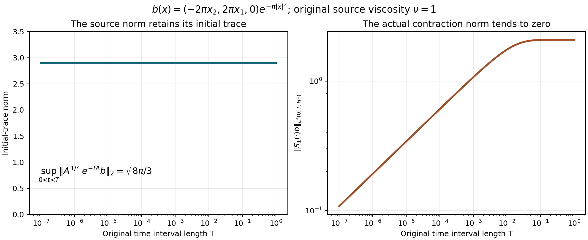

# Critical mild solutions

A small time interval need not make the initial velocity small. It can,
however, make a time integral of its heat evolution small. That distinction
allows a contraction argument at the half-derivative threshold.

We work with the original equation
\[
 u_t+\operatorname{div}(u\otimes u)+\nabla p=\nu\Delta u+f,
 \qquad\operatorname{div}u=0,\qquad\nu>0.
 \tag{1.0}
\]
The domain is \(\mathbb R^3\) or the rectangular periodic box
\(Q=\prod_j(\mathbb R/L_j\mathbb Z)\), with every \(L_j>0\).
The original Fourier factors, physical measure and Leray projection are
those in [Pressure and the divergence-free projection](pressure-and-the-divergence-free-projection.md).
In particular \(P(0)=I\) on the box. All Sobolev norms below include
all vector components; matrix norms use the Frobenius norm.

**Local theorem.** For each divergence-free \(u_0\in H^{1/2}\) and
original force \(f=f_a+f_b\), with
\(f_a\in L^1_{\rm loc}H^{1/2}\) and
\(f_b\in L^2_{\rm loc}H^{-1/2}\), there is a unique local solution
in \(CH^{1/2}\cap L^2H^{3/2}\). It solves the full equation with
the pressure constructed in Section 6, has the energy equality, and
agrees with every energy weak solution with the same data and force.
Section 7 gives stability and the exact maximal continuation criterion.

Section 8 also constructs solutions for all whole-space homogeneous
\(\dot H^{1/2}\) data with the stated homogeneous force classes,
including a quantitative small-data global theorem. These fields need
not have finite kinetic energy; the finite-energy intersection and its
receiving map are proved explicitly. Section 9 proves the periodic
global result while retaining arbitrary velocity and force means.
Five solved exercises include a source correction, an exact original
forced flow, and the full scaling calculation.

## 1. Exact full-weight convolution on the whole space

Write
\[
 W(\xi)=1+4\pi^2|\xi|^2,\qquad
 J(\xi)=\int_{\mathbb R^3}
       \frac{d\eta}{W(\eta)W(\xi-\eta)}.
 \tag{C1}
\]
For positive numbers \(A,B\), direct integration proves
\[
 \frac1{AB}=\int_0^1\frac{dt}{((1-t)A+tB)^2}.
 \tag{C2}
\]
For \(A=B\) both sides equal \(A^{-2}\); otherwise evaluate the elementary
antiderivative. Tonelli applies to the nonnegative integrand. Completing
the square without changing the original Fourier weights gives
\[
 (1-t)W(\eta)+tW(\xi-\eta)
 =1+4\pi^2|\eta-t\xi|^2
                   +4\pi^2t(1-t)|\xi|^2.
 \tag{C3}
\]
The substitution \(z=2\pi(\eta-t\xi)\) retains Jacobian \((2\pi)^{-3}\).
For \(M>0\), polar coordinates and \(r=M\tan\theta\) give
\[
 \int_{\mathbb R^3}\frac{dz}{(M^2+|z|^2)^2}
 =4\pi\int_0^\infty\frac{r^2\,dr}{(M^2+r^2)^2}
 =\frac{4\pi}{M}\int_0^{\pi/2}\sin^2\theta\,d\theta
 =\frac{\pi^2}{M}.
 \tag{C4}
\]
Consequently, with \(a=2\pi|\xi|\),
\[
 J(\xi)=\frac1{8\pi}\int_0^1
       \frac{dt}{\sqrt{1+a^2t(1-t)}}
 =\begin{cases}
 \displaystyle\frac{\arctan(a/2)}{4\pi a},&a>0,\\
 \displaystyle\frac1{8\pi},&a=0.
 \end{cases}
 \tag{C5}
\]
To evaluate the last integral set \(t=(1+s)/2\). The even integral is
\(\int_0^1(1+a^2/4-a^2s^2/4)^{-1/2}ds\), which equals
\(2a^{-1}\arcsin(a/\sqrt{4+a^2})=2a^{-1}\arctan(a/2)\).
This also gives the value at zero by its limit. Every low-frequency
contribution remains present in C5.

A convenient nonsharp bound is
\[
 \sup_\xi\sqrt{W(\xi)}J(\xi)\leq\frac14.
 \tag{C6}
\]
Indeed when \(0\leq a\leq1\), C5's integral is at most one, so the
product is at most \(\sqrt2/(8\pi)<1/4\). When \(a\geq1\),
\(\arctan(a/2)\leq\pi/2\), and the product is at most
\(\sqrt{1+a^2}/(8a)\leq\sqrt2/8<1/4\). The exact kernel C5 is
retained; C6 makes no claim about an optimal product constant.

For Schwartz \(f,g\), weighted Cauchy–Schwarz in the convolution gives
\[
 |\widehat{fg}(\xi)|^2\leq J(\xi)
 \int W(\eta)W(\xi-\eta)
          |\widehat f(\eta)|^2|\widehat g(\xi-\eta)|^2d\eta.
 \tag{C7}
\]
Multiply by \(\sqrt W\), use C6, integrate and apply Tonelli. The
resulting two integrals separate under
\((\eta,\xi)\mapsto(\eta,\xi-\eta)\), with Jacobian one:
\[
 \|fg\|_{H^{1/2}(\mathbb R^3)}
       \leq\frac12\|f\|_{H^1}\|g\|_{H^1}.
 \tag{C8}
\]
The extension to \(H^1\) is the actual product. Smooth approximations converge
in \(H^1\) and hence in \(L^4\) by the already proved \(H^1\) interpolation. Their
products converge in \(L^2\) by Hölder, while C8 makes them Cauchy in \(H^{1/2}\).
The two limits therefore agree as distributions. Summing componentwise
proves the identical bound for the Frobenius norm of \(u\otimes v\), with
the full vector \(H^1\) norms and no extra dimension factor.

For comparison, the original homogeneous weights give the exact kernel
\[
 \int\frac{d\eta}{|\eta|^2|\xi-\eta|^2}
       =\frac{\pi^3}{|\xi|}\quad(\xi\ne0).
 \tag{C9}
\]
Use C2, complete the same square without the constant term, apply C4
with \(M=\sqrt{t(1-t)}|\xi|\), and integrate
\(\int_0^1(t(1-t))^{-1/2}dt=\pi\) by \(t=\sin^2\theta\).
The exceptional frequency \(0\) has Lebesgue measure zero. The corresponding
Schwartz estimate, retaining all Fourier factors, is
\[
 \|fg\|_{\dot H^{1/2}}^2
 \leq\frac{(2\pi)\pi^3}{(2\pi)^4}
             \|f\|_{\dot H^1}^2\|g\|_{\dot H^1}^2
 =\frac18\|f\|_{\dot H^1}^2\|g\|_{\dot H^1}^2.
 \tag{C10}
\]
This is a separate exact comparison; it does not replace C1–C8 or discard
the \(L^2\) part of the original fields. Section 8 specifies the complete homogeneous data class and its
distributional realization before constructing its solutions.

## 2. Arbitrary periodic lengths, including the constant mode

Let \(Q\) have lengths \(L_1,L_2,L_3\), volume \(V=L_1L_2L_3\), frequencies
\(\kappa_k=(k_j/L_j)_j\), and weights \(W_k=1+4\pi^2|\kappa_k|^2\).
Put
\[
 d^2=\sum_{j=1}^3\frac1{4L_j^2},\qquad
 A=2(1+4\pi^2d^2),\qquad
 S_k=\sum_{\ell\in\mathbb Z^3}\frac1{W_\ell W_{k-\ell}}.
 \tag{C11}
\]
Tile frequency space by the cells centered at \(\kappa_\ell\) with side
lengths \(1/L_j\). Each has volume \(1/V\). At
\(\eta=\kappa_\ell+r\) in that cell, \(|r|\leq d\) and
\[
 W(\eta)\leq A W_\ell,\qquad
 W(\kappa_k-\eta)\leq A W_{k-\ell}.
 \tag{C12}
\]
For example the first follows from
\(|\kappa_\ell+r|^2\leq2|\kappa_\ell|^2+2d^2\)
and expanding \(AW_\ell\). All additional terms in that expansion are
nonnegative. Therefore integration on every cell and summation yield
\[
 \frac{S_k}{V}\leq A^2J(\kappa_k),\qquad
 \sup_k\frac{\sqrt{W_k}S_k}{V}\leq\frac{A^2}{4}.
 \tag{C13}
\]
This proves convergence of the lattice convolution at every \(k\), including
\(k=0\). Weighted Cauchy–Schwarz in the product coefficient, followed by
Parseval with its actual factor \(V\), now gives
\[
 \|fg\|_{H^{1/2}(Q)}
 \leq M_Q\|f\|_{H^1(Q)}\|g\|_{H^1(Q)},\qquad
 M_Q=A/2=1+\pi^2\sum_jL_j^{-2}.
 \tag{C14}
\]
Indeed the squared output is bounded by
\(V\sup_k(\sqrt{W_k}S_k)\) times the product of the two coefficient sums;
each input norm squared is \(V\) times its sum. C13 supplies exactly the
coefficient \(M_Q^2\). Smooth approximation identifies the product as above.
No periodic mean is subtracted, and all terms \(\ell=0\) or \(k-\ell=0\) are included.

## 3. The receiving nonlinear operator

Set \(M_{\mathbb R^3}=1/2\) and \(M_Q\) as in C14. The original matrix divergence has
symbol \(2\pi i\xi_j\), or \(2\pi i(\kappa_k)_j\). Because \(P\) is an
orthogonal projection and \(4\pi^2|\xi|^2\leq W(\xi)\),
\[
 \|P\operatorname{div}(u\otimes v)\|_{H^{-1/2}}
 \leq\|u\otimes v\|_{H^{1/2}}
 \leq M_\Omega\|u\|_{H^1}\|v\|_{H^1}.
 \tag{C15}
\]
The tensor convention is \((u\otimes v)_{ij}=u_i v_j\). Cauchy–Schwarz over \(j\)
proves the first multiplier bound, and \(P\) cannot increase it. At periodic
frequency \(0\) the divergence coefficient is zero; \(P(0)=I\) is still retained.
In time, Hölder gives the complete bilinear map
\[
 \|P\operatorname{div}(u\otimes v)\|_{L^2(0,T;H^{-1/2})}
 \leq M_\Omega\|u\|_{L^4(0,T;H^1)}
                       \|v\|_{L^4(0,T;H^1)}.
 \tag{C16}
\]

## 4. Exact heat estimates at the half derivative

Let \(s=1/2\), \(\nu>0\), and
\[
 \begin{gathered}
 X_T=C([0,T];H^s)\cap L^2(0,T;H^{s+1}),
 \qquad Z_T=L^4(0,T;H^1),\\
 \|v\|_{X_T}^2=\sup_t\|v(t)\|_{H^s}^2
                       +\int_0^T\|v\|_{H^{s+1}}^2dt.
 \end{gathered}
 \tag{C17}
\]
The full weights obey \(W^{s+1}=W^s+4\pi^2|\xi|^2W^s\), including
frequency \(0\). The same identity holds termwise on \(Q\). Spectral
Cauchy–Schwarz and then time integration give
\[
 \|v\|_{Z_T}^4\leq
       \sup_t\|v(t)\|_{H^{1/2}}^2
                       \int_0^T\|v\|_{H^{3/2}}^2dt,
 \qquad\|v\|_{Z_T}\leq\|v\|_{X_T}/\sqrt2.
 \tag{C18}
\]
The last step uses \(AB\leq(A^2+B^2)/2\) for the two nonnegative norm components.

The unforced heat orbit satisfies
\[
 \|S_\nu(\cdot)a\|_{X_T}
 \leq C_0(T,\nu)\|a\|_{H^s},\qquad
 C_0(T,\nu)=\sqrt{1+T+(2\nu)^{-1}}.
 \tag{C19}
\]
The supremum is a contraction. In the time integral separate the exact
multiplier \((1+4\pi^2r^2)e^{-8\pi^2\nu r^2t}\) into its constant and derivative
terms. Their integrals are bounded respectively by \(T\) and
\(1/(2\nu)\), with the derivative term zero at \(r=0\). This proves C19 without removing that
constant mode. Dominated convergence proves the strong initial trace.

For zero data and forcing \(h\in L^2(0,T;H^{s-1})\), Fourier truncation and the
weighted energy identity give, with \(E=\|v\|_{H^s}^2\), \(D=\|\nabla v\|_{H^s}^2\),
\[
 E'+2\nu D\leq2\|h\|_{H^{s-1}}\sqrt{E+D}
 \leq\nu(E+D)+\nu^{-1}\|h\|_{H^{s-1}}^2.
 \tag{C20}
\]
Thus \(E_{\rm sup}\leq e^{\nu T}\nu^{-1}\|h\|_{L^2H^{s-1}}^2\).
Integrating C20 yields
\(\int D\leq T E_{\rm sup}+\nu^{-2}\|h\|_{L^2H^{s-1}}^2\).
Adding the retained integral of \(E\) proves
\[
 \left\|\int_0^tS_\nu(t-r)h(r)dr\right\|_{X_T}
 \leq C_f(T,\nu)\|h\|_{L^2H^{s-1}},\qquad
 C_f(T,\nu)^2=\frac{(1+2T)e^{\nu T}}{\nu}+\frac1{\nu^2}.
 \tag{C21}
\]
Construct first by bounded Fourier cutoffs. Applying C21 to differences
makes them Cauchy in \(X_T\); hence their limit has the claimed continuous
trace and satisfies the original Fourier integral equation. The bound
passes to that limit. This also proves uniqueness of the linear solution.

For \(g\in L^1H^s\), the corresponding bound is
\(C_0(T,\nu)\|g\|_{L^1H^s}\).
To prove it, first take smooth time functions, apply Minkowski to the
time-shifted heat orbits, and use C19 uniformly for intervals of length
at most \(T\). Approximation in \(L^1H^s\) and the same estimate give the general
continuous \(X_T\) solution. All occurrences of \(P\) may be inserted because
it is a contraction on every original weighted space.

## 5. Local construction in the full inhomogeneous data class

Take divergence-free \(a\in H^{1/2}\) and the actual original force
\(f=f_a+f_b\), with \(f_a\in L^1_{\rm loc}H^{1/2}\) and
\(f_b\in L^2_{\rm loc}H^{-1/2}\). It need
not be divergence free. Put
\[
 w(t)=S_\nu(t)a+\int_0^tS_\nu(t-r)Pf(r)dr,\qquad
 B(u,v)(t)=-\int_0^tS_\nu(t-r)P\operatorname{div}(u\otimes v)(r)dr.
 \tag{C22}
\]
C16–C21 give
\[
 \begin{gathered}
 \|B(u,v)\|_{X_T}\leq C_f(T,\nu)M_\Omega\|u\|_{Z_T}\|v\|_{Z_T},\\
 \|B(u,v)\|_{Z_T}\leq K_T\|u\|_{Z_T}\|v\|_{Z_T},
 \qquad K_T=C_f(T,\nu)M_\Omega/\sqrt2.
 \end{gathered}
 \tag{C23}
\]
Fix a compact force interval \([0,T_c]\). Its constants bound those for
all \(T\leq T_c\). The initial heat orbit is in \(Z_{T_c}\), by
C18–C19, so its \(Z_T\) norm tends to zero by absolute continuity of
its fourth-power integral. The two original force contributions tend
to zero in \(X_T\), hence \(Z_T\), by C19 and C21 with constants
bounded at \(T_c\). Consequently a positive \(T\) exists with
\(\lambda=\|w\|_{Z_T}\leq1/(8K_{T_c})\).

On the closed ball \(\|u\|_{Z_T}\leq2\lambda\), the map
\(u\mapsto w+B(u,u)\) maps the ball into itself: its norm is at most
\(\lambda+4K_{T_c}\lambda^2\leq3\lambda/2\).
Its difference bound is at most \(4K_{T_c}\lambda\leq1/2\) times
the input difference. Iteration is Cauchy by the geometric series of
consecutive differences; completeness of \(Z_T\) gives a fixed point.
If \(\lambda=0\), the zero ball already gives the fixed point.
By C22–C23 that point belongs to \(X_T\), with initial value \(a\)
and the original projected equation.

Uniqueness holds in \(X_T\), beyond the contraction ball. Two \(X_T\) solutions
belong to \(Z_T\) by C18. Partition the finite interval so that the sum of
their two \(Z\) norms on each piece is less than \(1/(2K_{T_c})\); such a finite
partition exists by absolute continuity of the sum of their fourth-power
integrals. On the first piece their initial difference is zero, and
C23 forces equality. At each endpoint continuity gives equal next
initial values. The semigroup law splits C22 exactly at that endpoint,
so induction gives equality on every piece.

## 6. Original pressure, energy and comparison

The force has not been replaced by its projection. The missing component
is exactly the pressure gradient. Put \(M=u\otimes u\).
By C8, C14 and C18, \(M\in L^2H^{1/2}\). On the whole space define
\[
 \widehat p_N(\xi)=-\sum_{i,j}\frac{\xi_i\xi_j}{|\xi|^2}
                              \widehat M_{ij}(\xi),\qquad \xi\ne0,
 \quad
 \widehat p_f(\xi)=-\frac{i\xi\cdot\widehat f(\xi)}{2\pi|\xi|^2}.
 \tag{6.1}
\]
The value assigned to the first multiplier at zero does not change its
Lebesgue integral. Its matrix contraction has norm at most one, so
\(p_N\in L^2H^{1/2}\). For the force term, use any original cutoff
radius \(\Lambda>0\). Its Fourier expression on \(0<|\xi|\leq\Lambda\)
is integrable by Cauchy–Schwarz against the \(H^{-1}\) norm:
\[
 \int_{|\xi|\leq\Lambda}
 \frac{|\widehat f(\xi)|}{2\pi|\xi|}\,d\xi
 \leq \|f\|_{H^{-1}}
 \left[\int_{|\xi|\leq\Lambda}
       \frac{1+4\pi^2|\xi|^2}{4\pi^2|\xi|^2}\,d\xi\right]^{1/2}.
 \tag{6.2}
\]
The integral in brackets is \(\Lambda/\pi+4\pi\Lambda^3/3\). On the remaining region, the
multiplier squared divided by the \(H^{-1}\) input weight is bounded
by \(1+(4\pi^2\Lambda^2)^{-1}\). Thus the high part is in \(L^2\).
Both force summands belong locally in time to \(L^1H^{-1}\), so
these formulas define a space-time distribution. They are the full
force-pressure construction of the whole-space weak-solution chapter.

On the box take \(p_0=0\), and at every \(k\ne0\) take
\[
 (p_N)_k=-\sum_{i,j}\frac{(\kappa_k)_i(\kappa_k)_j}{|\kappa_k|^2}
                          (u_i u_j)_k,\qquad
 (p_f)_k=-\frac{i\kappa_k\cdot f_k}{2\pi|\kappa_k|^2}.
 \tag{6.3}
\]
These are distributions by the spectral gap and the original Sobolev
weights. Direct multiplication proves
\(\nabla(p_N+p_f)=(I-P)(f-\operatorname{div}M)\) on both domains.
Consequently C22 solves (1.0) with \(p=p_N+p_f\). On the box the
zero coefficient of the equation is exactly
\[
 u_0(t)=u_0(0)+\int_0^t f_0(r)\,dr.
 \tag{6.4}
\]
Here subscripts zero denote Fourier coefficients, not the initial datum.
No force mean has been transferred into a nonperiodic pressure.

The velocity lies in \(CL^2\cap L^2H^1\). Also
\(u\in L^4H^1\subset L^4L^4\), by the previously proved
\(H^1\)-to-\(L^4\) interpolation. Hence \(M\in L^2L^2\).
Test the projected equation with the bounded Fourier cutoff \(E_Ku\),
or equivalently test the cutoff equation with itself. The resulting
curves are absolutely continuous in \(L^2\). All limits in their
integrated norm identity are explicit: endpoints converge in \(CL^2\),
gradients in \(L^2L^2\), the nonlinear pairing by
\(M\in L^2L^2\) and gradient convergence, the \(f_a\) pairing by
\(L^1L^2\) against \(CL^2\), and the \(f_b\) pairing by
\(L^2H^{-1}\) against \(L^2H^1\).

At almost every time \(u\in H^1\). The nonlinear energy integral
vanishes there. On the box integrate the divergence of
\(u|u|^2/2\). On the whole space first use smooth divergence-free
Fourier approximations and a cutoff \(\chi(x/R)\); the boundary
error is bounded by \(C R^{-1}\|u\|_3^3\), which tends to zero.
The integral \(\int u_i u_j\partial_j u_i\) passes through the
\(H^1\) approximation by \(L^4,L^4,L^2\) Hölder. Therefore
\[
 \frac12\|u(t)\|_2^2+\nu\int_s^t\|\nabla u\|_2^2dr
 =\frac12\|u(s)\|_2^2+\int_s^t\langle f,u\rangle dr
 \quad(0\leq s\leq t).
 \tag{6.5}
\]
This gives the full energy weak class, with equality at all starts and
endings, for the constructed finite-energy solution.

We also prove comparison with every energy weak solution \(U\), whose
force \(F\) may lie in \(L^1L^2+L^2H^{-1}\). The cutoff cross-test
argument of the preceding chapter applies with the following exact
convergence estimates at the present lower regularity. The reference
derivative has the decomposition
\[
 u_t=Pf_a+b,\qquad
 b=\nu\Delta u+Pf_b-P\operatorname{div}(u\otimes u)
                         \in L^2H^{-1/2}.
 \tag{6.6}
\]
The weak velocity is absolutely continuous in \(H^{-m}\), \(m>5/2\),
as proved there. Thus it can be paired by the dual product rule with
\(E_Ku\). The derivative errors tend to zero by \(U\in L^\infty L^2\)
against \(E_KPf_a-Pf_a\in L^1L^2\), and
\(U\in L^2H^{1/2}\) against \(E_Kb-b\in L^2H^{-1/2}\).
The weak quadratic tensor lies in \(L^{4/3}L^2\); the reference cutoff
error tends to zero in \(L^4H^1\). These are dual time exponents.
Diffusion errors use \(L^2H^1\). Force errors use \(CL^2\) and
\(L^2H^1\). Endpoints use the all-time \(L^2\) bound on \(U\) and
the reference's \(CL^2\) convergence. We obtain at every \(s,t\)
\[
 \begin{aligned}
 &(U(t),u(t))-(U(s),u(s))\\
 &=\int_s^t\left[\langle u_r,U\rangle
       +\int U_iU_j\partial_j u_i
       -\nu\int\nabla U : \nabla u+\langle F,u\rangle\right]dr.
 \end{aligned}
 \tag{6.7}
\]
The derivative pairing uses exactly the two summands in (6.6).

Put \(z=U-u\). At almost every time both fields are in \(H^1\).
The cancellation \(\int z\cdot\nabla|u|^2=0\) is justified by
\(z\in L^3\) and \(u\nabla u\in L^{3/2}\). Smooth \(H^1\)
approximation passes these products; the whole-space cutoff error is
at most \(C R^{-1}\|z\|_3\|u\|_3^2\). All time integrals exist:
\(z\otimes z\in L^{4/3}L^2\), \(\nabla u\in L^4L^2\), and
\(u\in L^4L^6,z\in L^4L^3,\nabla z\in L^2L^2\).
Subtracting (6.7) from the two energy relations, with the full force
terms kept, therefore gives
\[
 \frac12\|z(t)\|_2^2+\nu\int_s^t\|\nabla z\|_2^2
 \leq\frac12\|z(s)\|_2^2
       +\int_s^t\int u_i z_j\partial_jz_i
       +\int_s^t\langle F-f,z\rangle.
 \tag{6.8}
\]
Its starting times are zero and the weak solution's permitted energy
starts; every later ending time is allowed. The exact estimates (4.6)–(4.12)
of [Velocity bounds and uniqueness](velocity-bounds-and-uniqueness.md)
now apply with \(q=6,p=4\): their coefficient is integrable because
\(u\in L^4H^1\subset L^4L^6\). Those estimates were proved solely
from this relative-energy inequality. In particular equal original data
and forces give \(U=u\) at every time. This proves uniqueness against
the full energy class for the force class of the local theorem.

## 7. Stability and maximal continuation

Write \(L_T=M_\Omega C_f(T,\nu)\), so \(K_T=L_T/\sqrt2\).
For two constructed solutions \(u,v\), let \(w_u,w_v\) denote their
full linear inputs in C22, including both original force summands.
Set \(R=\|u\|_{Z_T}+\|v\|_{Z_T}\). If \(K_TR<1\), subtraction
of the integral equations and C23 prove
\[
 \|u-v\|_{Z_T}\leq
       \frac{\|w_u-w_v\|_{Z_T}}{1-K_TR},\qquad
 \|u-v\|_{X_T}\leq
       \frac{\|w_u-w_v\|_{X_T}}{1-K_TR}.
 \tag{7.1}
\]
For the second estimate use
\(\|u-v\|_X\leq\|w_u-w_v\|_X+L_TR\|u-v\|_Z\)
and C18. The entire linear-input difference is bounded by
\[
 C_0(T,\nu)\bigl(\|u(0)-v(0)\|_{H^{1/2}}
                 +\|f_a-g_a\|_{L^1H^{1/2}}\bigr)
       +C_f(T,\nu)\|f_b-g_b\|_{L^2H^{-1/2}}.
 \tag{7.2}
\]
No initial trace has been discarded. Finite partitions as in Section 5
extend stability along every existing compact interval. More explicitly,
choose pieces on which \(K_TR\leq1/2\), using a common larger-interval
constant. If \(e_j\) bounds the difference in \(X\) on piece \(j\),
then (7.1)–(7.2) give
\(e_j\leq2C_0e_{j-1}+2C_0A_j+2C_fB_j\), with the initial-data
norm in place of \(e_0\). Here \(A_j,B_j\) are the actual force
difference norms on that piece. Iterating this finite recurrence proves
continuous dependence. Such a common partition can be chosen before
constructing the perturbed solution. Require the reference solution's
\(Z\) norm on each piece to be at most \(1/(32K_T)\). Its linear
input there is \(w=u-B(u,u)\), so
\(\|w\|_Z\leq(1/32+1/1024)/K_T<1/(16K_T)\).
For nearby data, this puts the base linear input below \(1/(16K_T)\); small perturbations in (7.2) leave it below
\(1/(8K_T)\), so the same contraction interval works. The constructed perturbed norm
is at most \(1/(4K_T)\), and the sum with the reference norm is
at most \(9/(32K_T)<1/(2K_T)\), as required in (7.1).
The finite recurrence controls the next initial discrepancy; choosing
the original data and force discrepancies sufficiently small keeps
every one of the finitely many linear perturbations below
\(1/(16K_T)\). Repeating over
the finite partition proves existence on each prescribed compact
subinterval for sufficiently nearby data as well.

Local solutions glue uniquely because their initial traces agree and
the integral splits exactly by the heat semigroup law. Let \(T_*\)
be the supremum of their intervals, and suppose the original force is
given on \([0,T_0)\). If \(T_*<T_0\) and
\(\int_0^{T_*}\|u\|_{H^1}^4dt<\infty\), then C16 places the
entire nonlinear force in \(L^2(0,T_*;H^{-1/2})\).
C19–C22 extend its Duhamel expression continuously to \(T_*\) in
\(H^{1/2}\), and in \(L^2H^{3/2}\), with the unchanged force.
Starting the local construction at this actual terminal value extends
the solution past \(T_*\), a contradiction. Thus an interior finite
maximal endpoint must satisfy
\[
 \int_0^{T_*}\|u(t)\|_{H^1}^4dt=\infty.
 \tag{7.3}
\]
This proof does not assert that an arbitrary bounded critical norm
alone supplies a uniform lifespan.

If the actual force belongs to the stronger class
\(L^1_{\rm loc}H^1+L^2_{\rm loc}L^2\), then this critical solution
is an \(H^1\) strong solution after each positive time. To prove it,
choose an almost-everywhere time \(a\) with \(u(a)\in H^{3/2}\subset H^1\).
Start the \(H^1\) solution constructed in [Strong solutions and continuation](strong-solutions-and-continuation.md) there. It also lies in
the current critical class on its compact intervals, so uniqueness makes
it equal to \(u\). The latter has finite \(L^4L^6\) norm on each
compact critical interval. The already proved nonendpoint criterion
therefore continues the \(H^1\) solution across every earlier proposed
endpoint. Choosing \(a\) below any given positive time proves the claim.
This extra regularity has been stated with its actual force hypothesis.

## 8. The full homogeneous whole-space construction

We now specify the homogeneous spaces without hiding a polynomial or
constant ambiguity. Put \(a(\xi)=2\pi|\xi|\). For
\(s=-1/2,1/2,1\), an element of \(\dot H^s(\mathbb R^3)\) is the
tempered distribution whose Fourier transform is a measurable function
\(F\) with
\[
 \|F\|_{\dot H^s}^2=\int a(\xi)^{2s}|F(\xi)|^2d\xi<\infty.
 \tag{8.1}
\]
This realization is well defined: for every Schwartz test \(\phi\),
Cauchy–Schwarz bounds its pairing by the norm in (8.1) times
\((\int a^{-2s}|\phi|^2)^{1/2}\). Near zero this last integral is
finite precisely for \(s<3/2\); at infinity Schwartz decay applies.
It also proves continuous inclusion into tempered distributions and
uniqueness of the realization. In particular no delta mass at frequency
zero, and hence no nonzero polynomial velocity, is added to this space.

These spaces are complete because their Fourier weighted \(L^2\)
spaces are complete. Smooth Fourier functions supported in compact
annuli are dense: truncate the two frequency tails in the weighted
integral, then approximate on the remaining annulus by smooth functions.
Their inverse transforms are Schwartz and vanish in frequency near zero.
Thus (8.1) also proves the exact identification with the source's
completion of that test class. The divergence-free subspace is the
closed condition \(\xi\cdot F(\xi)=0\) almost everywhere.

For \(\dot H^1\), this realization is an actual \(L^6\) function.
Indeed the homogeneous Sobolev inequality already proved in the
strong-solution chapter makes the annular approximations Cauchy in
\(L^6\). Their \(L^6\) distributional limit agrees with the Fourier
limit, and
\(\|v\|_6\leq(4/\sqrt3)\|v\|_{\dot H^1}\).
Consequently C10 extends to the actual product of any two
\(\dot H^1\) fields: their products converge in \(L^3\), while C10
makes them converge in \(\dot H^{1/2}\), and the two distributional
limits coincide. The tensor version follows by summing components.
The original divergence and projection therefore satisfy
\[
 \|P\operatorname{div}(u\otimes v)\|_{\dot H^{-1/2}}
 \leq\|u\otimes v\|_{\dot H^{1/2}}
 \leq M_*\|u\|_{\dot H^1}\|v\|_{\dot H^1},
 \qquad M_*=\frac1{2\sqrt2}.
 \tag{8.2}
\]
The first bound retains the exact multiplier \(a^{-1}\) in the squared
output norm and the factor \(a^2\) from the original divergence.

Define the solution space by requiring both
\(u\in C([0,T];\dot H^{1/2})\) and
\(\int_0^T\int a^3|\widehat u|^2<\infty\). The latter measures
the same distribution already specified by the former; it introduces
no separate quotient at the exponent \(3/2\). Write
\[
 \|u\|_{\dot X_T}^2=
 \sup_t\int a|\widehat u(t)|^2+
              \int_0^T\int a^3|\widehat u|^2,
 \qquad \dot Z_T=L^4(0,T;\dot H^1).
 \tag{8.3}
\]
Completeness follows from completeness of the two weighted integrals:
the limits agree on every compact frequency annulus, where their
weights are bounded above and below, and these annuli cover all
nonzero frequencies. The first component fixes the distribution at
zero. Spectral and time Cauchy–Schwarz again give
\(\|u\|_{\dot Z_T}\leq\|u\|_{\dot X_T}/\sqrt2\).

Retaining \(\nu>0\), the heat estimates now have constants independent
of the time interval, including \(T=\infty\), where continuity is required at every finite time:
\[
 \begin{split}
 \|S_\nu(\cdot)b\|_{\dot X_T}&\leq A_\nu\|b\|_{\dot H^{1/2}},
       &A_\nu&=\sqrt{1+(2\nu)^{-1}},\\
 \left\|\int_0^t S_\nu(t-r)h(r)dr\right\|_{\dot X_T}
       &\leq B_\nu\|h\|_{L^2\dot H^{-1/2}},
       &B_\nu&=\sqrt{\nu^{-1}+\nu^{-2}}.
 \end{split}
 \tag{8.4}
\]
For the first, integrate the original multiplier:
\(\int_0^T a^3e^{-2\nu a^2t}dt
 =a(1-e^{-2\nu a^2T})/(2\nu)\).
For the second, set \(E=\|v\|_{\dot H^{1/2}}^2\) and
\(D=\int a^3|\widehat v|^2\). The exact energy pairing gives
\[
 E'+2\nu D\leq2\|h\|_{\dot H^{-1/2}}\sqrt D
                  \leq\nu D+\nu^{-1}\|h\|_{\dot H^{-1/2}}^2.
 \tag{8.5}
\]
With zero data, the supremum of \(E\) is at most \(\nu^{-1}\|h\|^2\)
and the integral of \(D\) at most \(\nu^{-2}\|h\|^2\). Approximate
by compact frequency annuli and integrable smooth time functions;
these same estimates on differences give convergence in \(\dot X_T\)
and the exact continuous trace. The Fourier equation passes on every
annulus and then as a tempered distribution by (8.1). This constructs
the linear operator rather than assuming its existence.
The \(L^1\dot H^{1/2}\) force bound is \(A_\nu\) times that norm,
by time-shifted (8.4), Minkowski and approximation as in Section 4.

The local theorem therefore holds for every divergence-free
\(b\in\dot H^{1/2}\) and actual force
\[
 f=f_a+f_b,\qquad f_a\in L^1_{\rm loc}\dot H^{1/2},\quad
 f_b\in L^2_{\rm loc}\dot H^{-1/2}.
 \tag{8.6}
\]
Here is the complete contraction bound. Define \(w\) and \(B\) by C22 on these
spaces. Then
\[
 \|B(u,v)\|_{\dot X_T}\leq B_\nu M_*\|u\|_{\dot Z_T}\|v\|_{\dot Z_T},
 \qquad
 \|B(u,v)\|_{\dot Z_T}\leq K_*\|u\|_{\dot Z_T}\|v\|_{\dot Z_T},
 \quad K_*=B_\nu/4.
 \tag{8.7}
\]
The free heat orbit has an integrable fourth power in \(\dot Z\)
on any fixed interval by (8.4), so its restricted norm tends to zero
as the interval shrinks. Both force contributions tend to zero by
their actual norms in (8.6). Choose \(\|w\|_{\dot Z_T}\leq1/(8K_*)\).
Exactly the ball, geometric iteration and finite-partition uniqueness
proof of Section 5, with the constants in (8.7), now apply. They prove
existence and uniqueness in the entire \(\dot X_T\) class. Repeating
the explicit subtraction in (7.1) proves stability there. The terminal
Duhamel argument proves that an interior finite maximal endpoint must
have \(\int_0^{T_*}\|u\|_{\dot H^1}^4=\infty\).

There is also a quantitative global theorem. If the original force
summands in (8.6) have finite norms on \((0,\infty)\), put
\[
 \Lambda_*=
 \frac{A_\nu}{\sqrt2}
       \bigl(\|b\|_{\dot H^{1/2}}+\|f_a\|_{L^1\dot H^{1/2}}\bigr)
       +\frac{B_\nu}{\sqrt2}\|f_b\|_{L^2\dot H^{-1/2}}.
 \tag{8.8}
\]
If \(\Lambda_*\leq1/(8K_*)\), the same contraction is on
\(\dot Z_\infty\), giving one solution on the entire half-line with
\[
 \|u\|_{\dot Z_\infty}\leq2\Lambda_*,\qquad
 \|u\|_{\dot X_\infty}
 \leq\sqrt2\Lambda_*+4B_\nu M_*\Lambda_*^2.
 \tag{8.9}
\]
The norm bound for \(w\) used here is exactly \(\sqrt2\Lambda_*\).
Uniqueness on every finite interval proves global uniqueness among
solutions locally in the stated class, even if a comparison solution
was not assumed small or globally bounded. These thresholds are
explicit sufficient bounds, with no optimality claim.

The pressure for (8.6) needs an additional low-frequency step because
these forces need not belong to the inhomogeneous force class.
The nonlinear pressure in (6.1) still belongs to
\(L^2\dot H^{1/2}\), by (8.2). For each force summand with Fourier
function \(F\), put \(m_F(\xi)=-i\xi\cdot F/(2\pi|\xi|^2)\).
Choose an even real smooth \(\chi_\Lambda\) equal to one near zero
and supported in \(|\xi|<2\Lambda\), with \(\Lambda>0\). Define
\[
 \langle\widehat p_F,\phi\rangle
 =\int m_F(\xi)
         [\phi(\xi)-\chi_\Lambda(\xi)\phi(0)]\,d\xi.
 \tag{8.10}
\]
Near zero the bracket is bounded by a test-dependent constant times
\(|\xi|\), so its product with \(m_F\) is bounded by a constant times
\(|F|\). This is integrable for both \(s=1/2\) and \(s=-1/2\)
by (8.1). Away from zero, weighted Cauchy–Schwarz and Schwartz decay
prove convergence and continuity in the test topology. The same bounds
are continuous in the two force norms, so their time integrals define
the pressure distribution. This is a specified potential, not an
omission of its low-frequency part.

Testing its derivative replaces \(\phi\) by \(2\pi i\xi_j\phi\),
whose value at zero is zero. It follows exactly that
\(2\pi i\xi_j\widehat p_F=\xi_j(\xi\cdot F)/|\xi|^2\).
Thus \(\nabla p_F=(I-P)f\), and the constructed solution solves the
original full equation. Replacing \(\chi_\Lambda\) by another
permitted cutoff changes (8.10) by
\(-\phi(0)\int m_F(\chi_\Lambda-\widetilde\chi)\); this integral
is finite because the difference vanishes near zero. The change is
exactly a multiple of \(\delta_0\), hence a spatially constant pressure,
whose gradient is zero. This proves the entire gauge comparison.

Finally retain the finite-energy intersection. Suppose the same data
and force also satisfy the inhomogeneous local theorem. Its solution
lies in \(\dot X\), since \(a\leq\sqrt{1+a^2}\) and
\(a^3\leq(1+a^2)^{3/2}\). The Fourier equation identifies it with
the homogeneous solution by uniqueness. Both pressure formulas have
the same gradient; where (6.1) is integrable at zero their difference
is the explicit spatial constant just computed.

If the homogeneous solution is global, the finite-energy one is also
global. To prove this without losing its \(L^2\) norm, write the actual
finite-energy force as \(F_a+F_b\in L^1_{\rm loc}L^2+L^2_{\rm loc}H^{-1}\).
For any \(\eta>0\), (6.5) gives, with \(Y=\|u\|_2^2\),
\[
 Y'+\nu\|\nabla u\|_2^2
 \leq(\nu+\|F_a\|_2/\eta)Y
             +\eta\|F_a\|_2+\nu^{-1}\|F_b\|_{H^{-1}}^2.
 \tag{8.11}
\]
This follows from \(2\|F_a\|_2\sqrt Y\leq\|F_a\|_2(Y/\eta+\eta)\)
and
\[
 \begin{split}
 2\|F_b\|_{H^{-1}}\sqrt{Y+\|\nabla u\|_2^2}
 &\leq\nu(Y+\|\nabla u\|_2^2)\\
 &\quad+\nu^{-1}\|F_b\|_{H^{-1}}^2.
 \end{split}
\]
The integrating factor bounds \(Y\) uniformly before any proposed finite
endpoint. Moreover
\(\|u\|_{H^1}^4\leq2Y^2+2\|u\|_{\dot H^1}^4\).
The second term is integrable on that interval by the global homogeneous
solution. This contradicts (7.3). The full \(L^2\) contribution and all
original forces therefore persist globally. The homogeneous theorem
also remains valid for data outside this intersection; no finite-energy
assertion has been added for those data.

## 9. Periodic global solutions with arbitrary means

The periodic mean can be arbitrarily large, and can change under its
original force. Denote actual spatial averages by bars and define
\[
 \begin{gathered}
 m(t)=\overline{u_0}+\int_0^t\overline f(r)dr,
 \qquad c(t)=\int_0^t m(r)dr,\\
 w(y,t)=u(y+c(t),t)-m(t),\\
 g(y,t)=f(y+c(t),t)-\overline f(t).
 \end{gathered}
 \tag{9.1}
\]
The mean force is locally integrable for the inhomogeneous force class:
its coefficient is bounded by \(V^{-1/2}\) times either force norm,
and an \(L^2\) time function is \(L^1\) on compact intervals. Thus \(m\) is absolutely
continuous and \(c\) is continuously differentiable there.

With \(q(y,t)=p(y+c(t),t)\), the exact transformed equation is
\[
 w_t+\operatorname{div}(w\otimes w)+\nabla q=\nu\Delta w+g,
 \qquad \overline w=\overline g=0.
 \tag{9.2}
\]
Indeed the inverse is \(u(x,t)=m(t)+w(x-c(t),t)\): its time
derivative contributes \(m'+w_t-m\cdot\nabla w\), while its
nonlinear derivative contributes \(m\cdot\nabla w+(w\cdot\nabla)w\).
The transport terms cancel and \(m'=\overline f\) restores the full
force. The inverse pressure is \(p(x,t)=q(x-c(t),t)\).
These identities also hold for the solution classes here: change
variables in smooth periodic space-time tests, use \(c'=m\), and
integrate the locally integrable \(m'\) term. Approximation of the
time tests proves the distributional chain rule at exactly this
regularity. The construction has an explicit inverse and retains the
actual mean equation; it does not replace the original velocity.

For \(k\ne0\),
\[
 w_k(t)=e^{2\pi i\kappa_k\cdot c(t)}u_k(t),\qquad
 g_k(t)=e^{2\pi i\kappa_k\cdot c(t)}f_k(t).
 \tag{9.3}
\]
The zero coefficients in (9.1) are retained separately as \(m\) and
\(\overline f\). All weights, periods and \(V\) remain unchanged.
On mean-zero fields put
\(\|h\|_{\dot H^s(Q)}^2=V\sum_{k\ne0}(2\pi|\kappa_k|)^{2s}|h_k|^2\).
Let \(a_*=2\pi/\max_jL_j>0\). Then
\[
 \|h\|_{H^1}\leq\sqrt{1+a_*^{-2}}\|h\|_{\dot H^1},\qquad
 \|P\operatorname{div}(h\otimes v)\|_{\dot H^{-1/2}}
 \leq M_Q^*\|h\|_{\dot H^1}\|v\|_{\dot H^1},
 \quad M_Q^*=M_Q(1+a_*^{-2}).
 \tag{9.4}
\]
The first follows term by term. For the second, sum the squared
divergence multiplier over \(k\ne0\); it is bounded by
\(\|h\otimes v\|_{H^{1/2}}^2\). Use C14 and the first bound
for each input. The tensor may have a nonzero constant coefficient;
its original divergence has zero coefficient there, exactly as used
in this calculation.

The homogeneous heat estimates (8.4) hold for this lattice sum with
the same \(A_\nu,B_\nu\), including the original V. Define
\(K_Q^*=B_\nu M_Q^*/\sqrt2\). Decompose the actual force into
its original two summands and set
\(g_a(y,t)=f_a(y+c(t),t)-\overline{f_a}(t)\), and likewise \(g_b\).
Translations preserve every displayed norm by (9.3). If
\[
 \Lambda_Q=
 \frac{A_\nu}{\sqrt2}
    (\|u_0-\overline{u_0}\|_{\dot H^{1/2}(Q)}
                      +\|g_a\|_{L^1(0,\infty;\dot H^{1/2}(Q))})
 +\frac{B_\nu}{\sqrt2}
                      \|g_b\|_{L^2(0,\infty;\dot H^{-1/2}(Q))}
 \leq\frac1{8K_Q^*},
 \tag{9.5}
\]
the same complete contraction and partition proof gives a global \(w\)
in the homogeneous class, with \(\|w\|_{\dot Z_\infty}\leq2\Lambda_Q\).
Formula (9.1) then gives a global solution of the original full equation.
The spectral gap converts the fluctuation's homogeneous norms into
the full inhomogeneous norms on each compact time interval, since
\(1+a_k^2\leq(1+a_*^{-2})a_k^2\) for \(k\ne0\).
The remaining constant field \(m\) contributes its actual
\(V|m(t)|^2\) to each squared spatial Sobolev norm and is bounded
on every such interval. Consequently the original \(u\) lies locally in
\(CH^{1/2}\cap L^2H^{3/2}\), with the full energy and comparison
properties already proved. No smallness or boundedness at infinite
time is required of \(m\); only the stated local integrability of its
original force is used. This proves the periodic small-fluctuation
global theorem with all original mean data restored.

## 10. Five exercises with solutions

### Exercise 1: critical scaling and the full inhomogeneous norm

For the original scaling
\(u_R(x,t)=R^{-1}u(x/R,t/R^2)\), \(R>0\), compute both
half-derivative norms and the two homogeneous force norms.

**Solution.** The spatial Fourier transform is
\(\widehat u_R(\xi,t)=R^2\widehat u(R\xi,t/R^2)\). Hence
\[
 \|u_R(t)\|_{\dot H^s}^2
        =R^{1-2s}\|u(t/R^2)\|_{\dot H^s}^2,
 \qquad
 \|u_R(t)\|_{H^{1/2}}^2
 =\int\sqrt{R^2+4\pi^2|\eta|^2}
                   |\widehat u(\eta,t/R^2)|^2d\eta.
 \tag{10.1}
\]
The homogeneous half-derivative norm is invariant. The full norm has
the displayed retained low-frequency contribution, and is not invariant.
The \(L^2\) norm squared is multiplied by \(R\).
Changing time as well shows that both
\(\sup_t\|u\|_{\dot H^{1/2}}\) and
\(\|u\|_{L^2\dot H^{3/2}}\), and also \(\|u\|_{\dot Z}\),
are invariant on the corresponding intervals \([0,T]\) and \([0,R^2T]\).

The full pressure and force are
\(p_R=R^{-2}p(x/R,t/R^2)\) and
\(f_R=R^{-3}f(x/R,t/R^2)\). Their factors follow by differentiating
each term of the original equation, as in the preceding chapter;
the original viscosity remains \(\nu\). The force Fourier transform
is \(\widehat f_R(\xi,t)=\widehat f(R\xi,t/R^2)\), so
\[
 \|f_R(t)\|_{\dot H^s}^2
       =R^{-3-2s}\|f(t/R^2)\|_{\dot H^s}^2.
 \tag{10.2}
\]
For \(s=1/2\) the norm factor is \(R^{-2}\), cancelled by the
\(R^2\) time factor in \(L^1\). For \(s=-1/2\) it is \(R^{-1}\),
cancelled by the factor \(R\) in \(L^2\) time. Thus both force norms in (8.8)
are invariant. The map has the inverse with factor \(1/R\), so
none of these computations replaces the original fields.

### Exercise 2: a pressure whose raw Fourier formula is not integrable

Show why the low-frequency subtraction in (8.10) can actually be needed.

**Solution.** With \(r=|\xi|\), define the original force transform
\[
 F(\xi)=i\frac{\xi}{r}\,
        \frac{\mathbf1_{0<r<1/2}}{r^2[\log(e/r)]^{3/4}}.
 \tag{10.3}
\]
It has the conjugate symmetry of a real distribution. Direct polar
integration gives
\[
 \|F\|_{\dot H^{1/2}}^2
 =8\pi^2\int_0^{1/2}\frac{dr}{r[\log(e/r)]^{3/2}}
 =\frac{16\pi^2}{\sqrt{\log(2e)}}<\infty.
 \tag{10.4}
\]
Here the change of variable is \(s=\log(e/r)\), with
\(ds=-dr/r\). The raw pressure expression is
\[
 m_F(\xi)=\frac{\mathbf1_{0<r<1/2}}
                     {2\pi r^3[\log(e/r)]^{3/4}}.
 \tag{10.5}
\]
Its integral near zero diverges because
\(\int_{\log(2e)}^\infty s^{-3/4}ds=\infty\).
Formula (8.10) nevertheless defines its potential: its test subtraction
contributes the precise factor \(O(r)\), making the integral finite as
proved there. The force is longitudinal, so \(PF=0\). If
\(f(x,t)=\gamma(t)\mathcal F^{-1}F(x)\), with a smooth compactly
supported time function \(\gamma\), then \(u=0\) and
\(p=\gamma p_F\) solve the original equation exactly:
\(\nabla p=f\). This is an actual nonzero original force and pressure,
even though its projected velocity equation has zero right side.
The construction retains the missing potential explicitly.

### Exercise 3: an invariant shear family with arbitrary mean acceleration

Construct a periodic global flow with an arbitrary mean acceleration,
and determine whether its shear amplitude must be small.

**Solution.** Let \(m\) be any locally absolutely continuous vector function,
\(c(t)=\int_0^t m(s)ds\), and let \(H\) and \(G\) be periodic scalar
functions of \(y_2\) with period \(L_2\), zero spatial mean, satisfying
\(H_t=\nu H_{22}+G\). Define
\[
 \begin{split}
 u(x,t)&=m(t)+e_1H(x_2-c_2(t),t),\qquad p=0,\\
 f(x,t)&=m'(t)+e_1G(x_2-c_2(t),t).
 \end{split}
 \tag{10.6}
\]
The field is divergence free. Its nonlinear term is exactly
\(m_2 e_1H_2\); the time derivative contributes \(-m_2e_1H_2\),
and the remaining equation is the stated scalar heat equation together
with the original mean force. For initial Fourier coefficients \(h_n\),
the full solution of that scalar equation is
\[
 H_n(t)=e^{-\nu b_n^2t}h_n+
             \int_0^t e^{-\nu b_n^2(t-r)}G_n(r)dr,
 \qquad b_n=2\pi n/L_2,
 \quad n\ne0,
 \tag{10.7}
\]
with \(H_0=G_0=0\). The original three-dimensional norms use \(V\)
times these coefficient sums. Thus the linear estimates already proved
give global solutions on every compact interval for all data and
forcing in the stated critical spaces; no smallness is needed within
this invariant family. The result is a consequence of its exact
nonlinear cancellation, not an assertion for general large data.

In particular, for arbitrary \(\alpha\in\mathbb R\),
\(b=2\pi/L_2\), and constant vectors \(m_0,F_0\), take
\[
 m(t)=m_0+tF_0,\quad c(t)=tm_0+\tfrac12t^2F_0,
 \quad H(y_2,t)=\alpha e^{-\nu b^2t}\sin(by_2),\quad G=0.
 \tag{10.8}
\]
The exact full force is \(F_0\). Its energy and dissipation are
\[
 \frac12\int_Q|u|^2=\frac V2|m(t)|^2
                       +\frac{V\alpha^2}{4}e^{-2\nu b^2t},
 \qquad
 \int_Q|\nabla u|^2=\frac{V\alpha^2b^2}{2}e^{-2\nu b^2t}.
 \tag{10.9}
\]
Their balance is exactly (6.5), since the force work is
\(V F_0\cdot m(t)\). The initial fluctuation has squared
\(\dot H^{1/2}\) norm \(Vb\alpha^2/2\). All lengths, mean
components, force factors and viscosity remain in the formulas.

### Exercise 4: the initial trace in an original source estimate

Monniaux's original author TeX, arXiv:math/0511213v1, defines a norm
\(\mathcal E_T\) whose first term is
\(\sup_{0<t<T}\|A^{1/4}u(t)\|_2\), where \(A\) is the Stokes operator.
In the proof of Theorem `mildsolutions`, line 232, it then bounds the
heat orbit of a smooth datum by
\(cT^{3/4}\|Au_{0,\varepsilon}\|_2\) in that entire norm and sends
\(T\downarrow0\). Test this precise estimate.

**Solution.** Work on the source's allowed domain \(\mathbb R^3\),
with its original viscosity one. Its Stokes form is
\(\int\nabla u : \nabla v\) on divergence-free \(H^1\).
Fourier transformation shows that its operator is \(A=-\Delta\)
on \(H^2_\sigma\): membership in its operator domain is precisely
\(4\pi^2|\xi|^2\widehat u\in L^2\), besides the original \(H^1\)
condition, and these together are equivalent to \(H^2\). Conversely any
such \(H^2\) field represents the form by integration and Parseval.
Its spectral quarter power therefore has multiplier
\((4\pi^2|\xi|^2)^{1/4}\).

The exact domain comparison is
\(D(A^{1/4})=H^{1/2}_\sigma\). The graph norm squared has weight
\(1+2\pi|\xi|\), whereas our full norm has weight
\(\sqrt{1+4\pi^2|\xi|^2}\). The inequalities
\[
 \sqrt{1+a^2}\leq1+a\leq\sqrt2\sqrt{1+a^2}\quad(a\geq0)
 \tag{10.10}
\]
prove the exact identity map and its norm bounds, with both original
weights retained.

Take the real Schwartz datum
\[
 b(x)=\nabla\times(0,0,e^{-\pi|x|^2})
      =(-2\pi x_2,2\pi x_1,0)e^{-\pi|x|^2},\qquad
 \widehat b(\xi)=2\pi i(\xi_2,-\xi_1,0)e^{-\pi|\xi|^2}.
 \tag{10.11}
\]
It is nonzero, divergence free and in \(D(A)\). With
\(\beta(t)=e^{-tA}b\), polar integration gives
\[
 \|A^{1/4}\beta(t)\|_2^2
 =\frac{64\pi^4}{3(2\pi+8\pi^2t)^3}
 =\frac{8\pi}{3}(1+4\pi t)^{-3},\qquad
 \|Ab\|_2^2=\frac{35\pi^3}{\sqrt2}.
 \tag{10.12}
\]
For the first integral, the angular integral of
\((\xi_1^2+\xi_2^2)/|\xi|^2\) is \(8\pi/3\), and
\(\int_0^\infty r^5e^{-Br^2}dr=B^{-3}\).
For the second use
\(\int_0^\infty r^8e^{-Br^2}dr=105\sqrt\pi/(32B^{9/2})\)
at \(B=2\pi\), obtained by four integrations by parts from the
Gaussian integral. These steps retain every derivative factor.
Consequently, for every \(T>0\),
\[
 \|\beta\|_{\mathcal E_T}
 \geq\sup_{0<t<T}\|A^{1/4}\beta(t)\|_2=\sqrt{8\pi/3}>0.
 \tag{10.13}
\]
The source heat curve does belong to \(\mathcal E_T\): its Schwartz
data make \(A^{1/2}\beta\) and \(A^{5/4}\beta\) bounded up to
zero, while the extra factors \(t^{1/4}\) and \(t\) in that norm are
bounded on every finite interval. It is continuous in the graph
domain and differentiable for positive times, directly by its Fourier
formula. Thus this is an example in the source's actual class.
No finite constant \(c\) independent of \(T\) makes its printed bound valid.
Sections 4–5 and 8 give the replacement small-time contraction in \(Z\)
and \(\dot Z\), retaining the trace in \(X\) and \(\dot X\).
This corrects that displayed step; it does not reject the source's
general existence theorem on arbitrary domains.

There is a further defect in the literal source space on this domain:
its displayed norm omits the \(L^2\) part of \(D(A^{1/4})\), and is not
complete on that stated set. Here is a full Cauchy-sequence test.
Choose \(\rho>0\) and a smooth \(0\leq\chi\leq1\), equal to
one on \([0,1]\) and zero on \([2,\infty)\), and set
\[
 F(\xi)=|\xi|^{-7/4}\chi(|\xi|/\rho)P(\xi)e_1,\qquad
 F_n(\xi)=[1-\chi(n|\xi|/\rho)]F(\xi).
 \tag{10.14}
\]
Each \(F_n\) is a smooth compactly supported annular function, with
real even conjugate symmetry and zero divergence. Its inverse \(b_n\)
is therefore real, Schwartz and in \(D(A)\). The angular integral
\(\int_{S^2}|P(\theta)e_1|^2d\theta=8\pi/3\) follows from
\(|P(\theta)e_1|^2=1-\theta_1^2\).
Near zero the radial integral for \(F\)'s \(L^2\) norm is a positive
multiple of \(\int_0^\rho r^{-3/2}dr\), which diverges, whereas
its \(\dot H^{1/2}\) norm uses \(\int_0^\rho r^{-1/2}dr\),
which converges. Dominated convergence proves
\(F_n\to F\) in the latter weighted space.

For every datum \(d\) in that homogeneous space, the three heat-orbit
terms of the displayed source norm obey
\[
 \|e^{-tA}d\|_{\mathcal E_T}
 \leq\bigl[1+(4e)^{-1/4}+e^{-1}\bigr]\|d\|_{\dot H^{1/2}},
 \tag{10.15}
\]
where the expression on the left means precisely the three seminorm
expressions, without asserting membership in the source's smaller set.
The first multiplier is at most one; the second is bounded by
\(\sup_{z\geq0}z^{1/4}e^{-z}=(4e)^{-1/4}\); the third by
\(\sup_{z\geq0}ze^{-z}=e^{-1}\). These follow by differentiating
the two scalar functions. Thus \(e^{-tA}b_n\) is Cauchy in the
source norm, and every term of the sequence is in its stated space.

If it converged to an element of that space, the first seminorm and
continuity at zero would make \(b_n\) converge in \(\dot H^{1/2}\)
to its initial value. Uniqueness of the distributional limit in (8.1)
forces that value to have Fourier transform \(F\). But \(F\) is not \(L^2\), whereas
the source requires an initial value in \(D(A^{1/4})\subset L^2\).
This is a contradiction. Our inhomogeneous \(X\) space retains the \(L^2\)
weight explicitly; the separate homogeneous construction specifies its
larger distributional data space before proving completeness. Neither
construction silently identifies these two data classes.

### Exercise 5: the exact norm that does become small

For the same \(b\), now retaining any original \(\nu>0\), compute
\(\|S_\nu(\cdot)b\|_{Z_T}\) exactly.

**Solution.** Write \(s(t)=1+4\pi\nu t\). The same angular integral
as above and the Gaussian radial integrals yield
\[
 \|S_\nu(t)b\|_2^2=\frac\pi{\sqrt2}s(t)^{-5/2},\qquad
 \|\nabla S_\nu(t)b\|_2^2=\frac{5\pi^2}{\sqrt2}s(t)^{-7/2}.
 \tag{10.16}
\]
The radial identities used are
\(\int_0^\infty r^4e^{-Br^2}dr=3\sqrt\pi/(8B^{5/2})\)
and \(\int_0^\infty r^6e^{-Br^2}dr=15\sqrt\pi/(16B^{7/2})\).
Squaring the sum of the two original squared norms retains its cross
term. Integrating with \(ds=4\pi\nu dt\) gives
\[
 \begin{split}
 \|S_\nu(\cdot)b\|_{Z_T}^4
 ={}&\frac{\pi}{32\nu}(1-s(T)^{-4})
       +\frac{\pi^2}{4\nu}(1-s(T)^{-5})\\
    &+\frac{25\pi^3}{48\nu}(1-s(T)^{-6}).
 \end{split}
 \tag{10.17}
\]
Every term tends to zero as \(T\) decreases to zero. More precisely,
division by \(T\) tends to
\(\|b\|_{H^1}^4=(\pi+5\pi^2)^2/2\), by continuity of
the integrand. The homogeneous \(\dot Z_T\) fourth power is the
last term alone, because it measures only the original derivative
norm. Formula (10.17) keeps the full \(L^2\) term and its cross contribution
when the inhomogeneous norm is used.

Both panels use the exact datum in (10.11) and the source's original
viscosity \(\nu=1\). The left panel is the exact supremum in (10.13),
which is a lower bound for the source's entire norm. The right panel is
the fourth root of the complete three-term expression (10.17), including
the \(L^2\) term and its cross contribution. The curves are exact formulas
sampled for display; they are not numerical evidence for the existence
theorem. [Reproduce the figure](../assets/critical-heat-trace.py).

## 11. Sources and scope

H. Fujita and T. Kato, *On the Navier–Stokes initial value problem I*,
*Archive for Rational Mechanics and Analysis* 16 (1964), 269–315,
is the historical reference identified in the original author sources
below. Its original author text was not read here. The proofs in this
chapter are supplied independently and with their complete constants.

Sylvie Monniaux, [*Navier–Stokes equations in arbitrary domains:
the Fujita–Kato scheme*, arXiv:math/0511213v1](https://arxiv.org/abs/math/0511213v1),
was read in its complete original TeX. Section 3 defines the source
\(\mathcal E_T\) space and gives the estimate corrected in Exercise 4.
The source operator and domain are compared exactly on \(\mathbb R^3\)
there. Our whole-space and rectangular-periodic constructions do not
claim the general arbitrary-domain theorem as a consequence.

D. Q. Khai and N. M. Tri, [*On the initial value problem for the
Navier–Stokes equations with the initial datum in critical Sobolev and
Besov spaces*, arXiv:1601.01726v1](https://arxiv.org/abs/1601.01726v1),
was read in the original TeX at lines 73–98 and 210–483. That reading
covers the original unforced viscosity-one equation, the definition by
completion away from frequency zero, heat and fixed-point preliminaries,
and the first product arguments. Section 8 above proves the exact
Hilbert-space realization of the relevant source definition. We do not
import its general Besov or non-Hilbert theorems, nor claim to have read
their later proofs. Our product bound is proved directly from its full
Fourier convolution integral.

The forced and mean-retaining statements here are stated in their actual
spaces. A small-data global theorem and the exact large shear family
do not give a global theorem for arbitrary three-dimensional data.
The vorticity criterion and general large \(L^\infty_tL^3_x\)
endpoint remain separate parts of the series. The later lessons then
develop the human, Alpöge–Buckmaster, OpenAI and workbench constructions.

