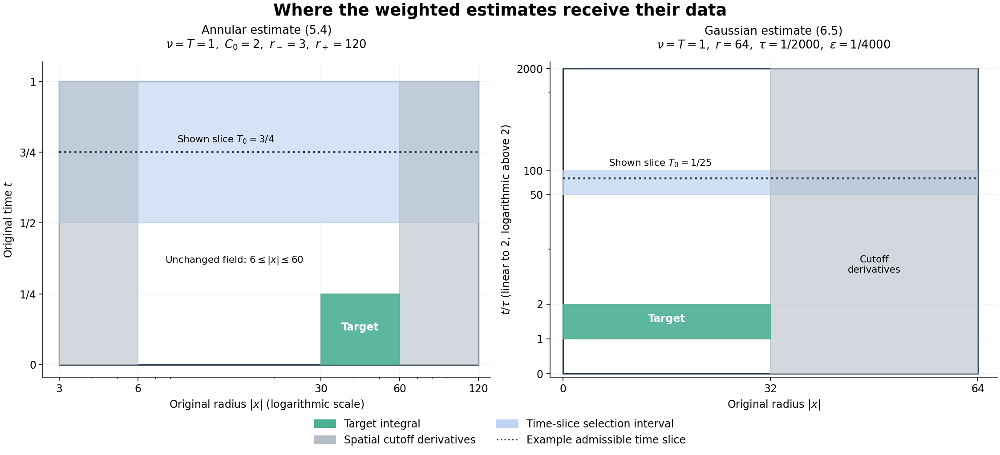

# Critical velocity tails and weighted heat estimates

The velocity criterion in Chapter 6 includes a small \(L^3\) bound. What
changes when that norm is large? First we prove that the large values of
the actual velocity, rather than its entire norm, are what matter in the
energy estimate. A bounded family in \(L^3\) can nevertheless concentrate
on smaller regions. An exact example shows why the energy argument stops
there.

We then develop two weighted heat estimates used to study this
concentration. Their proofs retain the original viscosity, the complete
heat kernel, the spatial cutoff errors and both time endpoints. An
additive residual remains visible, so an application to a forced equation
must account for its actual force. These are finite estimates. The
dynamical concentration argument needed for the general large-\(L^3\)
Navier–Stokes criterion is a subsequent part of the course.

## 1. Continuation from the actual velocity tail

Let \(\Omega=\mathbb R^3\) or the original rectangular periodic box
\(Q=\prod_{j=1}^3(\mathbb R/L_j\mathbb Z)\), with \(L_j>0\).
Keep ordinary Lebesgue measure, the original viscosity \(\nu>0\), and
\[
 u_t+(u\cdot\nabla)u+\nabla p=\nu\Delta u+f_a+f_b,
 \qquad \operatorname{div}u=0.
 \tag{1.1}
\]
The force is prescribed on an interval containing a finite candidate
endpoint \(T_*\), with \(f_a\in L^1H^1\), \(f_b\in L^2L^2\).
Take the maximal \(H^1\) strong solution constructed in Chapter 5.
On each compact part of its existence interval put
\[
 \begin{gathered}
 E=\|u\|_{H^1}^2,\quad D=\|\nabla u\|_{H^1}^2,
 \quad X=E+D,\\
 A=\|f_a\|_{H^1},\qquad B=\|f_b\|_2.
 \end{gathered}
 \tag{1.2}
\]
All these are the full inhomogeneous norms, including the constant
periodic mode. Chapter 6 proves the absolutely continuous identity
\[
 E'+2\nu D
 =2((u\cdot\nabla)u,\Delta u)
       +2(f_a,u)_{H^1}+2(f_b,(I-\Delta)u).
 \tag{1.3}
\]
In particular no pressure contribution or force pairing is being
replaced by an estimate for a different equation.

Choose a measurable \(K(t)\geq0\), and split the original velocity as
\[
 z=u\,1_{\{|u|>K(t)\}},\qquad
 v=u\,1_{\{|u|\leq K(t)\}},\qquad u=z+v.
 \tag{1.4}
\]
We never differentiate these pieces and do not require them to be
divergence-free. The Sobolev inequality from Chapter 5 supplies a fixed
\(C_\Omega\) with \(\|\nabla u\|_6\leq C_\Omega\sqrt X\).
Also \(\|\Delta u\|_2\leq\sqrt X\) and
\(\|\nabla u\|_2\leq\sqrt E\). Hölder therefore gives
\[
 2|((u\cdot\nabla)u,\Delta u)|
 \leq2C_\Omega\|z\|_3X+2K\sqrt E\sqrt X.
 \tag{1.5}
\]
Assume, for almost every time before \(T_*\),
\[
 \|u(t)1_{\{|u(t)|>K(t)\}}\|_3
          \leq\frac{\nu}{4C_\Omega},\qquad K\in L^2(0,T_*).
 \tag{1.6}
\]
For any fixed \(\eta>0\), the completed-square inequalities are
\[
 \begin{aligned}
 2K\sqrt E\sqrt X&\leq\frac\nu4X+\frac{4K^2}{\nu}E,\\
 2B\sqrt X&\leq\frac\nu4X+\frac{4B^2}{\nu},\\
 2A\sqrt E&\leq\frac A\eta E+\eta A.
 \end{aligned}
 \tag{1.7}
\]
The exact equality \(\|(I-\Delta)u\|_2^2=X\) follows from
\[
 \begin{aligned}
 (1+4\pi^2|\xi|^2)^2={}&(1+4\pi^2|\xi|^2)\\
                 &+4\pi^2|\xi|^2(1+4\pi^2|\xi|^2),
 \end{aligned}
 \tag{1.7a}
\]
and also holds at every periodic Fourier mode. Substitution in (1.3) yields
\[
 E'+\nu D\leq aE+b,\qquad
 a=\nu+\frac{4K^2}{\nu}+\frac A\eta,
 \quad b=\eta A+\frac{4B^2}{\nu}.
 \tag{1.8}
\]
Both coefficients are integrable. Multiplication by
\(\exp(-\int_{t_0}^t a)\) and integration proves
\[
 E(t)\leq e^{\int_{t_0}^t a(r)\,dr}
 \left[E(t_0)+\int_{t_0}^t
          e^{-\int_{t_0}^r a(q)\,dq}b(r)\,dr\right].
 \tag{1.9}
\]
Integrating (1.8) also bounds \(\int D\). The continuation theorem
of Chapter 5 now extends this same solution across \(T_*\).
This proves continuation under (1.6), with its original pressure,
force, viscosity and periodic mean. The full \(L^3\) norm can be large.

## 2. Compactness, concentration and the endpoint distinction

For vectors \(U,V\) and \(K>0\),
\[
 |U|1_{\{|U|>K\}}
 \leq2|U-V|+2|V|1_{\{|V|>K/2\}}.
 \tag{2.1}
\]
On the part where \(|V|\leq K/2<|U|/2\), the triangle inequality
gives \(|U-V|\geq|U|/2\). On the remaining part use
\(|U|\leq|U-V|+|V|\). This proves (2.1) at every point, hence
\[
 \|U1_{\{|U|>K\}}\|_3
 \leq2\|U-V\|_3+2\|V1_{\{|V|>K/2\}}\|_3.
 \tag{2.2}
\]
Suppose \(\mathcal C\) is relatively compact in \(L^3(\Omega)\).
For \(\varepsilon>0\), cover its closure by finitely many balls
of radius \(\varepsilon/4\). Dominated convergence makes the tail
of every center smaller than \(\varepsilon/4\) for a common large
threshold \(K/2\). Applying (2.2) in each ball proves
\[
 \lim_{K\to\infty}\sup_{U\in\mathcal C}
                \|U1_{\{|U|>K\}}\|_3=0.
 \tag{2.3}
\]
In particular, if the strong trajectory has an actual strong \(L^3\)
trace at \(T_*\), its extension as an \(L^3\)-valued map to the
closed interval is continuous. Its image is compact: from any sequence
of times choose a convergent subsequence, then use continuity. Equation
(2.3) supplies a constant \(K\) for (1.6), and the solution continues.

Boundedness alone does not supply (2.3). Take the nonzero compact smooth
divergence-free field \(w\) in Chapter 9, Exercise 5, and define
\[
 w_\lambda(x)=\lambda w(\lambda x),\qquad \lambda>0.
 \tag{2.4}
\]
Its support is exactly \(\lambda^{-1}\operatorname{supp}w\), its
divergence is zero, and the change of variables \(y=\lambda x\) gives
\[
 \begin{aligned}
 \|w_\lambda\|_3^3&=\int_{\mathbb R^3}|w(y)|^3\,dy,\\
 \|w_\lambda1_{\{|w_\lambda|>K\}}\|_3^3
       &=\int_{\{|w(y)|>K/\lambda\}}|w(y)|^3\,dy.
 \end{aligned}
 \tag{2.5}
\]
For every fixed \(K\), the second integral tends to the first as
\(\lambda\to\infty\). Thus the bounded family (2.4) has no uniformly
small amplitude tail. This is a spatial example, not a Navier–Stokes
trajectory violating an endpoint theorem. The next argument must use
the dynamics to control this sort of concentration. The weighted
estimates below are tools for that task.

## 3. The weighted heat identity

Let \(U:[a,b]\times\mathbb R^d\to\mathbb R^m\) be smooth, with
support in a fixed compact spatial set. There is no vanishing condition
at either time endpoint. Let \(g\) be real and smooth near the support.
Define
\[
 \begin{gathered}
 L_\nu=\partial_t+\nu\Delta,\qquad
 F=g_t-\nu\Delta g-\nu|\nabla g|^2,\\
 \mathcal S_\nu=\nu\Delta+\nu\nabla g\cdot\nabla-\tfrac12F,
 \qquad \langle U,V\rangle_g=\int U\cdot V e^g\,dx.
 \end{gathered}
 \tag{3.1}
\]
The plus sign in \(L_\nu\) is intentional: reversal of physical time
turns the forward heat equation into this equation. All vector components
remain in the pairing. Spatial integration by parts gives
\[
 \langle\mathcal S_\nu U,V\rangle_g
 =-\int(\nu\nabla U : \nabla V+\tfrac12F U\cdot V)e^g\,dx.
 \tag{3.2}
\]
Thus \(\mathcal S_\nu\) is symmetric for the instantaneous pairing.
Integration by parts in the two Laplacians also proves
\[
 \frac d{dt}\langle U,V\rangle_g
 =\langle L_\nu U,V\rangle_g+\langle U,L_\nu V\rangle_g
                         -2\langle\mathcal S_\nu U,V\rangle_g.
 \tag{3.3}
\]
Indeed the remaining scalar coefficient is
\(\nu\Delta g+\nu|\nabla g|^2+F=g_t\).
Apply (3.3) to \(\mathcal S_\nu U,U\), commute the first operator,
and complete the square. The result is the exact identity
\[
 \frac d{dt}\langle\mathcal S_\nu U,U\rangle_g
 =\langle[L_\nu,\mathcal S_\nu]U,U\rangle_g
  +\tfrac12\|L_\nu U\|_g^2
  -\tfrac12\|(L_\nu-2\mathcal S_\nu)U\|_g^2.
 \tag{3.4}
\]
The commutator includes the time derivative of the operator. With
repeated spatial indices summed, direct differentiation yields
\[
 [L_\nu,\mathcal S_\nu]U
 =2\nu^2e^{-g}\partial_i(e^g g_{ij}\partial_jU)
                                      -\tfrac12(L_\nu F)U.
 \tag{3.5}
\]
For completeness, its second-order coefficient is \(2\nu^2g_{ij}\).
Before differentiating \(F\), the first-order coefficient is
\(\nu g_{it}+\nu^2\partial_i\Delta g-\nu\partial_iF\).
Equation (3.1) makes this exactly
\(2\nu^2(\partial_i\Delta g+g_jg_{ij})\), the first-order
coefficient on the right of (3.5). The only multiplication term is
\(-L_\nu F/2\). These account for every derivative.

Set
\[
 E_g(t)=\int(\nu|\nabla U|^2+\tfrac12F|U|^2)e^g\,dx.
 \tag{3.6}
\]
Substitute (3.5) in (3.4) and integrate its divergence once. We obtain
\[
 E_g'=\int\left[
 2\nu^2g_{ij}\partial_iU\cdot\partial_jU
 +\tfrac12(L_\nu F)|U|^2-\tfrac12|L_\nu U|^2
 +\tfrac12|(L_\nu-2\mathcal S_\nu)U|^2\right]e^g\,dx.
 \tag{3.7}
\]
Dropping the last nonnegative square gives an inequality; integrating
it retains \(E_g(b)-E_g(a)\). Neither endpoint is zero by convention.

The identity also holds on the original periodic box when both \(U\)
and \(g\) are periodic. A radial weight is not periodic. To use one
locally, choose a ball of radius less than \(\frac12\min_jL_j\),
multiply the lifted field by a cutoff supported there, and apply (3.7)
on \(\mathbb R^3\). The projection of that ball to \(Q\) is injective:
two of its points differ by a vector of length less than \(\min L_j\),
whereas every nonzero period vector has at least that length. The
lift and integral therefore preserve the actual coordinates and measure.
Section 4 retains all derivatives of the cutoff. This construction
does not impose a new boundary condition on the physical velocity.

## 4. Cutoffs and the actual equation error

Hereafter the spatial dimension is three. Fix the same smooth function
used in Chapter 9:
\[
 b(s)=\begin{cases}e^{-1/s},&s>0,\\0,&s\leq0,\end{cases}
 \quad \chi(s)=\frac{b(1-s)}{b(1-s)+b(s-1/4)},
 \quad \theta(s)=\chi(s^2)\quad(s\geq0).
 \tag{4.1}
\]
Every derivative of \(b\) tends to zero at zero, since it is a
polynomial in \(1/s\) times \(e^{-1/s}\). The denominator in
\(\chi\) is positive for every real argument. Consequently
\(\theta\) is smooth, takes values in \([0,1]\), is one on
\([0,1/2]\), and is zero on \([1,\infty)\). Define the fixed finite
constants
\[
 \beta_1=\sup_{s\geq0}|\theta'(s)|,\quad
 \beta_2=\sup_{s\geq0}|\theta''(s)|,\quad
 d_A=\beta_2+2\beta_1,\quad d_B=\beta_2+4\beta_1.
 \tag{4.2}
\]
For \(r_+\geq20r_->0\), set
\[
 \psi_A(x)=(1-\theta(|x|/(2r_-)))\theta(|x|/r_+).
 \tag{4.3}
\]
Its derivative supports are the disjoint bands
\([r_-,2r_-]\) and \([r_+/2,r_+]\). It is one between them.
For a radial function \(q(\rho)\),
\(\Delta q=q''+2q'/\rho\). On either band its scale denominator
is at least \(\rho=|x|\), so
\[
 |\nabla\psi_A|\leq\frac{\beta_1}{\rho},\qquad
 |\Delta\psi_A|\leq\frac{d_A}{\rho^2}.
 \tag{4.4}
\]
For the ball cutoff \(\psi_B(x)=\theta(|x|/r)\), the derivative
support is \(r/2\leq|x|\leq r\); the same radial formula gives
\[
 |\nabla\psi_B|\leq\frac{\beta_1}{r},\qquad
 |\Delta\psi_B|\leq\frac{d_B}{r^2}.
 \tag{4.5}
\]
For either cutoff, the product equation is exactly
\[
 L_\nu(\psi U)=\psi L_\nu U
            +2\nu\nabla\psi\cdot\nabla U+\nu(\Delta\psi)U.
 \tag{4.6}
\]
The estimates below assume the following actual differential inequality
on the specified closed cylinder or annulus:
\[
 |L_\nu U|\leq(C_0T)^{-1}|U|
          +\sqrt{\nu/(C_0T)}|\nabla U|+h,
 \qquad C_0\geq2,
 \tag{4.7}
\]
where \(h\geq0\) is a given measurable residual with the displayed
weighted integrals finite. The field \(U\) is smooth on a neighborhood
of the region. Thus no trace regularity is hidden in the estimates.
Exercise 1 identifies \(h\) for a smooth forced vorticity equation.

## 5. The annular estimate

Assume (4.7) for \(0\leq t\leq T\), \(r_-\leq|x|\leq r_+\),
where
\[
 r_-^2\geq4C_0\nu T,\qquad r_+\geq20r_-.
 \tag{5.1}
\]
Define the actual space-time and initial quantities
\[
 \begin{aligned}
 X&=\int_0^T\int_{r_-\leq|x|\leq r_+}
 e^{2|x|^2/(C_0\nu T)}(T^{-1}|U|^2+\nu|\nabla U|^2)\,dx\,dt,\\
 Y&=\int_{r_-\leq|x|\leq r_+}|U(0,x)|^2\,dx.
 \end{aligned}
 \tag{5.2}
\]
Averaging over \([T/2,T]\) selects a \(T_0\) in that interval
whose weighted spatial energy is at most \(2X/T\). Fix it, and put
\[
 \begin{gathered}
 \alpha=\frac{r_+}{2C_0\nu T^2},\quad
 g=\alpha(T_0-t)|x|+\frac{|x|^2}{C_0\nu T},\\
 A_*=\alpha Tr_-,\quad R_*=\frac{r_+^2}{C_0\nu T},\quad
 H_A=\int_0^{T_0}\int_{r_-\leq|x|\leq r_+}h^2e^g\,dx\,dt,\\
 K_A=\max(9+3d_A^2/16,\,9+3\beta_1^2),
 \qquad J_A=2+\beta_1^2/2.
 \end{gathered}
 \tag{5.3}
\]
We will prove
\[
 \begin{aligned}
 &\int_0^{T/4}\int_{10r_-\leq|x|\leq r_+/2}
                  (T^{-1}|U|^2+\nu|\nabla U|^2)\,dx\,dt\\
 &\quad\leq C_0^2e^{-A_*/2}
 \left[(K_A/2+2J_A)X+3e^{2R_*}Y
                          +\tfrac92T e^{-2A_*}H_A\right].
 \end{aligned}
 \tag{5.4}
\]
In particular the decay exponent is
\(A_*/2=r_-r_+/(4C_0\nu T)\), with the original viscosity.

Write \(\rho=|x|\), \(s=T_0-t\). The Hessian of \(\rho\)
is positive semidefinite away from zero. Thus
\(2\nu^2D^2g\geq4\nu(C_0T)^{-1}I\). Differentiating the full
radial expression gives
\[
 \begin{aligned}
 F&=-\alpha\rho-\frac{2\nu\alpha s}{\rho}-\frac6{C_0T}
                 -\nu\left(\alpha s+\frac{2\rho}{C_0\nu T}\right)^2<0,\\
 L_\nu F&=2\nu\alpha^2s+\frac{4\alpha\rho}{C_0T}
                    -\frac{8\nu\alpha s}{C_0T\rho}
                    -\frac{24}{C_0^2T^2}.
 \end{aligned}
 \tag{5.5}
\]
By (5.1), \(\alpha r_-\geq40/T\) and
\(\nu s/\rho\leq\rho/(4C_0)\leq\rho/4\). Hence
\[
 L_\nu F\geq\frac{2\alpha\rho}{C_0T}
                    -\frac{24}{C_0^2T^2}
             \geq\frac{56}{C_0^2T^2}.
 \tag{5.6}
\]
Apply (3.7) to \(\psi_AU\) on \([0,T_0]\). The singularity of
the formula for \(g\) at zero causes no issue: the field vanishes on
a neighborhood of zero, and the weight can be extended smoothly there.
On the unchanged region \(2r_-\leq\rho\leq r_+/2\), half the
squared residual is at most
\[
 \tfrac32\left[C_0^{-2}T^{-2}|U|^2
                  +\frac\nu{C_0T}|\nabla U|^2+h^2\right].
 \tag{5.7}
\]
After subtracting these terms, (5.6) and the Hessian bound leave at
least \(C_0^{-2}T^{-2}|U|^2+\nu(C_0T)^{-1}|\nabla U|^2\).

On each cutoff band, apply \(|a+b+c|^2\leq3(|a|^2+|b|^2+|c|^2)\)
first in (4.6), then in (4.7). Equations (4.4) and (5.1) give
\[
 |L_\nu(\psi_AU)|^2
 \leq K_A\left[C_0^{-2}T^{-2}|U|^2
                   +\frac\nu{C_0T}|\nabla U|^2\right]+9h^2.
 \tag{5.8}
\]
Indeed the extra coefficients are \(3\nu^2d_A^2/\rho^4\) and
\(12\nu^2\beta_1^2/\rho^2\); use
\(\nu^2/\rho^4\leq1/(16C_0^2T^2)\) and
\(\nu^2/\rho^2\leq\nu/(4C_0T)\). No derivative error is omitted.

At \(T_0\), the sign \(F<0\) permits an upper bound on the boundary
energy by its gradient part. The product rule gives
\[
 \nu|\nabla(\psi_AU)|^2
 \leq2\nu|\nabla U|^2+\frac{2\nu\beta_1^2}{\rho^2}|U|^2
 \leq J_A(T^{-1}|U|^2+\nu|\nabla U|^2).
 \tag{5.9}
\]
Because \(g(T_0,x)=\rho^2/(C_0\nu T)\), the selected time slice
bounds this terminal energy by \(2J_AX/T\).
At zero, the negative of the boundary energy is at most
\(\frac12\int|F(0,x)||U(0,x)|^2e^{g(0,x)}dx\).
The four terms in (5.5) are bounded respectively by
\[
 \frac{R_*}{2T},\qquad \frac{R_*}{4C_0T},\qquad
 \frac6{C_0T},\qquad \frac{25R_*}{4C_0T}.
 \tag{5.10}
\]
For the second bound, use \(r_-r_+\geq4C_0\nu T\).
Also \(R_*\geq1600\), so their sum is at most \(8R_*/T\).
Since \(g(0,x)\leq3R_*/2\) and
\(\sup_{R\geq0}Re^{-R/2}=2/e\), this initial contribution is
at most \(3T^{-1}e^{2R_*}Y\).

On the outer band,
\(g\leq2\rho^2/(C_0\nu T)\), because
\(\alpha T\rho\leq\rho^2/(C_0\nu T)\) when \(\rho\geq r_+/2\).
On the inner band,
\(g\leq2A_*+2\rho^2/(C_0\nu T)\).
On the target in (5.4), \(s\geq T/4\), \(\rho\geq10r_-\), and
therefore \(g\geq5A_*/2\). Insert these three comparisons in the
integrated identity. Multiply by \(C_0^2T\) and divide by
\(e^{5A_*/2}\). The gradient coefficient on the left becomes
\(C_0\nu\geq\nu\); the shell term is bounded by
\((K_A/2)e^{2A_*}X\) before this division, and the total residual
cost is at most \((9/2)H_A\). Together with both boundary estimates
this proves (5.4). If \(r_+<20r_-\), its target is empty; no
annular estimate for a nonempty target is asserted in that case.

## 6. The Gaussian estimate

Assume (4.7) for \(0\leq t\leq T\), \(|x|\leq r\), where
\[
 r^2\geq4000\nu T,\qquad 0<\varepsilon\leq\tau<T/1000.
 \tag{6.1}
\]
Set
\[
 X=\int_0^T\int_{|x|\leq r}
                    (T^{-1}|U|^2+\nu|\nabla U|^2)\,dx\,dt.
 \tag{6.2}
\]
Averaging now selects \(T_0\in[T/40,T/20]\) whose spatial energy
is at most \(40X/T\). Put
\[
 \begin{gathered}
 s=t+\varepsilon,\quad S=T_0+\varepsilon,
 \quad\alpha=\frac{r^2}{400\nu\tau},\\
 g=-\frac{|x|^2}{4\nu s}-\frac32\log(4\pi\nu s)
                           -\alpha\log(s/S)+\alpha s/S,\\
 H_B=\int_0^{T_0}\int_{|x|\leq r}s h^2e^g\,dx\,dt,\\
 Y=\int_{|x|\leq r}|U(0,x)|^2(4\pi\nu\varepsilon)^{-3/2}
                            e^{-|x|^2/(4\nu\varepsilon)}\,dx,\\
 K_B=\max(9+3d_B^2/4000^2,\,9+12\beta_1^2/4000),
 \qquad J_B=\max(2,\beta_1^2/2000).
 \end{gathered}
 \tag{6.3}
\]
The initial quantity contains the complete heat kernel.
Let
\[
 I=\int_\tau^{2\tau}\int_{|x|\leq r/2}
       (T^{-1}|U|^2+\nu|\nabla U|^2)e^{-|x|^2/(4\nu t)}\,dx\,dt.
 \tag{6.4}
\]
We will prove the following explicit inequality, including its residual:
\[
 \begin{aligned}
 I\leq{}&20\,3^{3/2}\left[
 \frac5e(K_B+40J_B)e^{-r^2/(500\nu\tau)}X
 +(4\pi\nu\tau)^{3/2}
            (e\tau/\varepsilon)^{r^2/(80\nu\tau)}Y\right]\\
 &+100\,3^{3/2}\frac S\tau(4\pi\nu\tau)^{3/2}
                                      (3\tau/S)^\alpha H_B.
 \end{aligned}
 \tag{6.5}
\]

### 6.1. The integrating factor and absorption

The choices above imply \(\alpha>10000\),
\(25\tau+\varepsilon\leq S\leq51T/1000\), and
\(0<s\leq S\) for \(0\leq t\leq T_0\). Differentiate the actual
weight to obtain
\[
 F=\alpha/S-\alpha/s,\quad L_\nu F=\alpha/s^2,
 \quad D^2g=-I/(2\nu s).
 \tag{6.6}
\]
In particular the two quadratic spatial terms in \(F\) cancel with
opposite signs. Apply (3.7) to \(v=\psi_BU\), and use
\[
 k(s)=s+s^2/(10S).
 \tag{6.7}
\]
The product rule gives the exact identity
\[
 \begin{aligned}
 (kE_g)'=\int\bigg[
  &\frac{\nu s}{10S}|\nabla v|^2
   +\frac{\alpha(9S+2s)}{20S^2}|v|^2
   -\tfrac12 k|L_\nu v|^2\\
  &+\tfrac12 k|(L_\nu-2\mathcal S_\nu)v|^2\bigg]e^g\,dx.
 \end{aligned}
 \tag{6.8}
\]
To check both coefficients directly,
\(k'-k/s=s/(10S)\), and
\(k'F/2+k\alpha/(2s^2)=\alpha(9S+2s)/(20S^2)\).

In the core \(|x|\leq r/2\), half the residual square is at most
\(\frac32 k[C_0^{-2}T^{-2}|U|^2+
\nu(C_0T)^{-1}|\nabla U|^2+h^2]\).
Since \(k\leq11s/10\) and \(C_0\geq2\geq33S/T\), its gradient
part absorbs at most half of the positive gradient coefficient.
The scalar loss is at most \(\alpha/(20S)\), because
\(33S^2\leq\alpha C_0^2T^2\). Thus at least
\[
 \frac1{20}\left[\frac{\nu s}{S}|\nabla U|^2
                              +\frac\alpha S|U|^2\right]e^g
 \tag{6.9}
\]
remains in the core. On the shell, (4.5)–(4.7) and (6.1) give
\[
 |L_\nu(\psi_BU)|^2
 \leq K_B(T^{-2}|U|^2+\nu T^{-1}|\nabla U|^2)+9h^2.
 \tag{6.10}
\]
Here the two cutoff coefficients are
\(3\nu^2d_B^2/r^4\leq3d_B^2/(4000^2T^2)\) and
\(12\nu^2\beta_1^2/r^2\leq12\beta_1^2\nu/(4000T)\).
Because \(k/(2T)\leq1\) and \((9/2)k\leq5s\), the shell
cost is bounded by its energy with coefficient \(K_B\), and the
combined core and shell residual cost is at most \(5H_B\).

### 6.2. Both boundary energies and the weight comparison

At \(T_0\), \(F=0\) and \(k(S)=11S/10\leq T\). The gradient
product estimate gives
\(\nu|\nabla(\psi_BU)|^2\leq J_B(T^{-1}|U|^2+
\nu|\nabla U|^2)\). Also \(e^{g(T_0,x)}\leq
(4\pi\nu\tau)^{-3/2}e^\alpha\). The terminal contribution is
therefore at most
\[
 40J_B(4\pi\nu\tau)^{-3/2}e^\alpha X.
 \tag{6.11}
\]
At zero, discard the negative gradient contribution to \(-kE_g\).
Its scalar coefficient is exactly
\[
 -\tfrac12 k(\varepsilon)F(0)
 =\tfrac\alpha2(1+\varepsilon/(10S))(1-\varepsilon/S)
 \leq\alpha.
 \tag{6.12}
\]
Since \(e^{g(0,x)}\leq(eS/\varepsilon)^\alpha
(4\pi\nu\varepsilon)^{-3/2}e^{-|x|^2/(4\nu\varepsilon)}\),
the initial contribution is at most
\(\alpha(eS/\varepsilon)^\alpha Y\).

For \(a,b,s>0\), elementary differentiation proves
\[
 -a/s-b\log s\leq b\log(b/(ae)).
 \tag{6.13}
\]
The maximum is attained at \(s=a/b\); the expression tends to
minus infinity at both ends. On the shell take
\(a=|x|^2/(4\nu)\geq r^2/(16\nu)\) and
\(b=\alpha+3/2\leq2\alpha\). Equation (6.13) gives
\[
 \begin{aligned}
 e^g&\leq(4\pi\nu)^{-3/2}e^\alpha S^\alpha
                          (32\nu\alpha/(er^2))^{\alpha+3/2}\\
 &\leq(4\pi\nu\tau)^{-3/2}
                           (32\nu\alpha S/r^2)^\alpha.
 \end{aligned}
 \tag{6.14}
\]
The additional factor dropped in the second upper bound is exactly
\((32/(400e))^{3/2}\leq1\).
On the target of (6.4), \(t\leq s\leq3\tau\) and \(s\leq S\).
Each factor in the original weight therefore gives
\[
 e^g\geq3^{-3/2}(4\pi\nu\tau)^{-3/2}
                 (S/(3\tau))^\alpha e^{-|x|^2/(4\nu t)}.
 \tag{6.15}
\]
The Gaussian on the right stays in the target integral.
Furthermore \(\nu s/S\geq\nu\tau/S\), and
\(\alpha/S\geq(\tau/S)T^{-1}\). Integrating (6.8), using (6.9)
and all the preceding bounds, proves
\[
 \begin{aligned}
 I\leq20\,3^{3/2}\frac S\tau\bigg[
 &K_B(96\nu\alpha\tau/r^2)^\alpha X
       +40J_B(3e\tau/S)^\alpha X\\
 &+\alpha(4\pi\nu\tau)^{3/2}(3e\tau/\varepsilon)^\alpha Y\\
 &+5(4\pi\nu\tau)^{3/2}(3\tau/S)^\alpha H_B\bigg].
 \end{aligned}
 \tag{6.16}
\]
Now \(96\nu\alpha\tau/r^2=96/400<e^{-1}\) and
\(3e\tau/S\leq3e/25<e^{-1}\). These numerical comparisons
follow, for example, from \(e<11/4\), obtained by summing the first
five terms of \(\sum1/n!\) and bounding the remaining terms by a
geometric series. Also \(S/\tau\leq\alpha\). Since
\(\sup_{a\geq0}ae^{-a/5}=5/e\),
\[
 \alpha e^{-\alpha}\leq(5/e)e^{-4\alpha/5}.
 \tag{6.17}
\]
Finally \(\alpha\geq1\), \(\varepsilon\leq\tau\),
\(\alpha^2\leq e^{2\alpha}\), and \(3^\alpha\leq e^{2\alpha}\),
so
\[
 \alpha^2(3e\tau/\varepsilon)^\alpha
                     \leq(e\tau/\varepsilon)^{5\alpha}.
 \tag{6.18}
\]
Apply (6.17)–(6.18) in (6.16), retain its residual term, and insert
the exact \(\alpha\) from (6.3). This proves (6.5).

## 7. Source comparison and exact scope

The human source for the two weighted arguments is Terence Tao,
*Quantitative bounds for critically bounded solutions to the Navier–Stokes
equations*, [arXiv:1908.04958v2](https://arxiv.org/abs/1908.04958v2),
Lemma `carl` and Propositions `carl-first` and `carl-second`. The original
author TeX was used. The source works at unit viscosity; our formulas
retain \(\nu\) and an additive residual. No novelty claim is made.

Several intermediate source displays need correction. In the first
proof, the last displayed initial exponent loses \(C_0\), although the
proposition retains it. Equations (5.5)–(5.10) prove the stated dependence
with this parameter intact. In the second proof, the intermediate
calculation of \(F\) prints a plus sign before the squared spatial
gradient. Its final value is correct; (6.6) proves the cancellation with
the required minus sign. The next energy display uses \(L_\nu U\)
where the cutoff requires \(L_\nu(\psi_BU)\). Equation (4.6) gives
their complete difference.

The source integrating-factor displays mix \(T_0\) and
\(T_0+\varepsilon\), change a gradient sign, and give a different
scalar coefficient. Equation (6.8) is the exact replacement with every
coefficient derived. The source's selected interval
\([T/200,T/100]\) also does not ensure its asserted logarithmic
comparison. Our actual selection \([T/40,T/20]\) proves the two
separate decays used in (6.16), while preserving the stated ranges of
\(T,r,\tau,\varepsilon\). Exercise 3 tests the original numerical
comparison explicitly. The proof's last two displays omit the Gaussian
on the left, although the proposition includes it. Equations (6.4),
(6.15) and (6.16) retain it. Finally the displayed linear cutoff estimate
uses \(T^{-1}|U|\) in place of the dimensionally appropriate
\(T^{-1/2}|U|\) at unit viscosity; the full squared calculation is
given in (6.10)–(6.11).

Two introductory time-domain displays also need correction. If
\(u^\lambda(t,x)=\lambda u(\lambda^2t,\lambda x)\) and the original
time interval is \([0,T]\), then \(0\leq\lambda^2t\leq T\) gives
\([0,T/\lambda^2]\). Exercise 2 proves the full invertible map,
including pressure and force. The qualitative endpoint statement prints
approach from above to a maximal time whose trajectory is defined only
on \([0,T_*)\). Its approach must be from below; the later quantitative
statement already uses that direction. These domain repairs do not
assert the remaining endpoint proof.

These are corrections to precise steps and their receiving maps. The
corrected proofs above establish the finite estimates. They do not
establish that the source endpoint theorem is false. Conversely, naming
that theorem does not prove its remaining concentration argument for the
original forced equation or for a periodic domain. The residual terms,
the coordinate chart, the finite radii and the time endpoints remain
part of every application. Taking a radius to infinity or a time to zero
requires the corresponding integrability and limiting argument.

The figure shows the regions in (5.1)–(5.4) and (6.1)–(6.5) at the
specified parameters. Gray bands carry spatial cutoff derivatives; green
regions are the target integrals. Blue bands show the intervals from
which averaging selects a time slice. The dotted slices are admissible
examples for the geometry, not measurements of a solution's energy.
The annular radius uses a logarithmic axis; the Gaussian time axis uses
the indicated piecewise logarithmic scale, with zero retained. Every
radius and time displayed is an original coordinate value. The figure's
reproducible source accompanies the reader.

## 8. Exercises with complete solutions

### Exercise 1: reversing the forced vorticity equation

For a smooth solution of (1.1), derive the actual equation for
\(U(t,x)=\omega(t_*-t,x)\), where \(\omega=\nabla\times u\).
Give sufficient coefficient bounds for (4.7), including its residual.
Then give the exact map to an original periodic coordinate ball.

**Solution.** Taking curl, with the original force \(f=f_a+f_b\), gives
\[
 \omega_s-\nu\Delta\omega
    =-(u\cdot\nabla)\omega+(\omega\cdot\nabla)u+\nabla\times f.
 \tag{8.1}
\]
The chain rule reverses the time derivative but not the Laplacian.
Writing all right-hand fields at \(s=t_*-t\), we obtain
\[
 L_\nu U=(u\cdot\nabla)U-(U\cdot\nabla)u-\nabla\times f.
 \tag{8.2}
\]
Thus (4.7) holds on the region if
\[
 |u|\leq\sqrt{\nu/(C_0T)},\quad
 |\nabla u|\leq(C_0T)^{-1},\quad h=|\nabla\times f|.
 \tag{8.3}
\]
These are actual coefficient inequalities, not consequences of a bare
\(L^\infty_tL^3_x\) bound. More generally keep
\[
 \begin{aligned}
 h={}&|\nabla\times f|\\
    &+(|u|-\sqrt{\nu/(C_0T)})_+|\nabla U|\\
    &+(|\nabla u|-(C_0T)^{-1})_+|U|.
 \end{aligned}
 \tag{8.3a}
\]
The triangle inequality proves
(4.7) exactly, but the resulting residual still has to be controlled.
For \(f_a\in L^1H^1\), its curl need not lie in a weighted
space-time \(L^2\) space. No such improvement follows from (8.2).

For the box, choose \(r<\frac12\min L_j\) and the chart
\(x\mapsto x_0+x\pmod{(L_1,L_2,L_3)}\) on \(B_r(0)\).
Its derivative is the identity; it preserves the Euclidean volume,
curl and Laplacian. Pull back each field in (8.2) by this map and
multiply \(U\) by (4.3) or (4.5). Equation (4.6) supplies the entire
equation error. The lift has compact support and zero extension is
smooth because the cutoff is flat at its boundary. This proves the
precise local map to (3.7), without removing the original periodic mean.

### Exercise 2: physical zoom and every force factor

Find the exact zoom of (1.1) about \((x_0,t_0)\) that leaves its
viscosity unchanged. Track both force norms \(L^1L^6\) and \(L^2L^2\),
the vorticity, periods and time domain. Also compare to unit viscosity.

**Solution.** For \(r>0\), define
\[
 \begin{gathered}
 u_r(y,\tau)=r u(x_0+ry,t_0+r^2\tau),\quad
 p_r(y,\tau)=r^2p(x_0+ry,t_0+r^2\tau),\\
 f_r(y,\tau)=r^3f(x_0+ry,t_0+r^2\tau),\quad
 \omega_r(y,\tau)=r^2\omega(x_0+ry,t_0+r^2\tau).
 \end{gathered}
 \tag{8.4}
\]
Every momentum term has factor \(r^3\); every curl equation term
has factor \(r^4\). Thus these fields satisfy the same equation with
the original \(\nu\). The inverse uses
\(y=(x-x_0)/r\), \(\tau=(t-t_0)/r^2\), with the reciprocal field
factors. An original interval \([a,b]\) becomes
\([(a-t_0)/r^2,(b-t_0)/r^2]\), not an interval multiplied by \(r^2\).
The box periods become \(L_j/r\), its full volume becomes
\(V/r^3\), and the mean becomes \(r\overline u(t_0+r^2\tau)\).

For a mapped interval \(J\) in the new time variable and its original
image \(I=t_0+r^2J\), substitution of both measures gives
\[
 \begin{aligned}
 \|(f_a)_r\|_{L^1(J;L^6)}&=r^{3-2-3/6}
                  \|f_a\|_{L^1(I;L^6)}=r^{1/2}\|f_a\|_{L^1(I;L^6)},\\
 \|(f_b)_r\|_{L^2(J;L^2)}&=r^{3-2/2-3/2}
                  \|f_b\|_{L^2(I;L^2)}=r^{1/2}\|f_b\|_{L^2(I;L^2)}.
 \end{aligned}
 \tag{8.5}
\]
These equalities use the actual rescaled box when periodic. The original
\(H^1\) embedding controls the first original spatial norm. On any
fixed bounded spatial subset, its \(L^2\) norm is at most the
\(L^6\) norm times the subset's volume to the power \(1/3\), by
Hölder. Hence finite original force norms tend to zero in these zoomed
spaces as \(r\to0\). This is a statement about the force, not an
unproved compactness theorem for the zoomed velocities.

For unit viscosity, use the separate exact comparison
\[
 v(x,\sigma)=\nu^{-1}u(x,\sigma/\nu),\quad
 q(x,\sigma)=\nu^{-2}p(x,\sigma/\nu),\quad
 g(x,\sigma)=\nu^{-2}f(x,\sigma/\nu).
 \tag{8.6}
\]
Each original momentum term is \(\nu^2\) times the corresponding
term in \(v_\sigma+v\cdot\nabla v+\nabla q=\Delta v+g\).
The inverse is \(u(x,t)=\nu v(x,\nu t)\), with pressure and force
multiplied by \(\nu^2\). All original periods are unchanged and
\(\|v\|_{L^\infty L^3}=\nu^{-1}\|u\|_{L^\infty L^3}\) on the
corresponding intervals. In particular this map does not erase a force.

### Exercise 3: testing the source time slice and Gaussian

Test the numerical comparison in Section 7 using admissible parameters.
Show why a lower bound for a weight containing a Gaussian cannot justify
removing that Gaussian from the target integral. Verify the repaired
comparisons in the proof of (6.5).

**Solution.** Take \(T=\nu=1\), \(r^2=4000\),
\(\tau=1/1001\), \(T_0=1/100\). These satisfy the source ranges.
With \(\alpha=r^2/(400\tau)\), the logarithm asserted there to be
at least one has argument
\[
 \frac{32\alpha(T_0+\tau)}{r^2}
 =\frac{2}{25}\left(\frac{1001}{100}+1\right)
 =\frac{1101}{1250}<1.
 \tag{8.7}
\]
Its logarithm is negative. This exact calculation disproves that
numerical implication, not the source proposition. Our later slice
gives \(S/\tau\geq25\), so the terminal factor in (6.16) is
\((3e\tau/S)^\alpha\leq(3e/25)^\alpha<e^{-\alpha}\).
The shell factor independently equals \((6/25)^\alpha<e^{-\alpha}\).
No comparison of one error term to the other is needed.

For a nonnegative density \(q\), an inequality with
\(\int q e^{-|x|^2/(4\nu t)}\) on the left cannot imply the same
upper bound for \(\int q\) just by deleting the factor. To see the
direction exactly, put any nonzero smooth nonnegative \(q\) inside
\(\{\tau<t<2\tau,\ r/4<|x|<r/2\}\). On this support,
\[
 e^{-|x|^2/(4\nu t)}\leq e^{-r^2/(128\nu\tau)}<1.
 \tag{8.8}
\]
The unweighted integral is strictly larger, with this explicit ratio
bound. This tests the inference about weights, not a differential
equation counterexample. Equation (6.15) proves exactly the weighted
quantity (6.4). It is that quantity which appears in (6.5).

### Exercise 4: repairing the dyadic frequency sum

In the same source's bounded-total-speed proof, a Cauchy–Schwarz display
has \(N^{1/2}\sum_{M\leq N}M^2a_M^2\) after the square of
\(\sum_{M\leq N}M^{3/2}a_M\). Test this implication, prove a
correct replacement, and calculate both receiving dyadic sums. Frequencies
are all \(2^j\), \(j\in\mathbb Z\), and \(a_M\geq0\).

**Solution.** A single nonzero \(a_N=1\) would require
\(N^3\leq C N^{5/2}\) uniformly in dyadic \(N\); this fails as
\(N\to\infty\). The correct Cauchy–Schwarz split is
\(M^{3/2}a_M=M^{1/4}(M^{5/4}a_M)\). Thus
\[
 \left(\sum_{M\leq N}M^{3/2}a_M\right)^2
 \leq\frac{N^{1/2}}{1-2^{-1/2}}
                         \sum_{M\leq N}M^{5/2}a_M^2.
 \tag{8.9}
\]
The first squared factor sums to
\(\sum_{j\geq0}(2^{-j}N)^{1/2}=N^{1/2}/(1-2^{-1/2})\).
For infinite sums apply the finite inequality and monotone convergence.
Multiply (8.9) by \(N^{-1}\) and sum over \(N\geq1\). Interchanging
nonnegative sums gives an outer geometric sum equal to
\(M^{-1/2}/(1-2^{-1/2})\) for \(M\geq1\), and equal to
\(1/(1-2^{-1/2})\) for \(M<1\). Since \(M^{5/2}\leq M^2\)
in the latter case, every low frequency is retained and
\[
 \sum_{N\geq1}N^{-1}
       \left(\sum_{M\leq N}M^{3/2}a_M\right)^2
 \leq(1-2^{-1/2})^{-2}\sum_M M^2a_M^2.
 \tag{8.10}
\]
The second receiving sum is exactly
\[
 \sum_{N\geq1}N^2\sum_{M>N}a_M^2
   =\sum_{M>1}\frac{M^2-1}{3}a_M^2
   \leq\frac13\sum_M M^2a_M^2,
 \tag{8.11}
\]
because for \(M=2^j>1\),
\(\sum_{k=0}^{j-1}2^{2k}=(M^2-1)/3\).
This repairs the summation step. It is not a substitute for the other
estimates in the source's full dynamical argument.

### Exercise 5: exact Fourier maps and an actual field test

Specify the annular Fourier operators needed in Exercise 4 using the
cutoff (4.1), prove their telescoping and companion identities, and
construct smooth divergence-free fields that also disprove the incorrect
frequency inequality. Keep the Fourier kernel \(e^{-2\pi i x\cdot\xi}\).

**Solution.** Define
\[
 \begin{gathered}
 \phi(\xi)=\chi(|\xi|^2),\quad
 P_{\leq N}=\phi(\xi/N)(D),\quad
 P_N=P_{\leq N}-P_{\leq N/2},\\
 \widetilde P_N=P_{\leq2N}-P_{\leq N/4}.
 \end{gathered}
 \tag{8.12}
\]
The symbol \(\phi\) is one for \(|\xi|\leq1/2\) and zero for
\(|\xi|\geq1\). It decreases with radius: where both terms in
\(\chi\)'s denominator are positive, its numerator decreases and
the other term increases; differentiating their quotient makes the sign
nonpositive. Therefore the symbols \(p_N\) of \(P_N\) are nonnegative.
They are supported on \(N/4\leq|\xi|\leq N\). On this support,
the companion symbol is exactly one, so
\(P_N\widetilde P_N=P_N\). Finite telescoping gives
\[
 \sum_{j=-J}^{K}P_{2^j}
       =P_{\leq2^K}-P_{\leq2^{-J-1}}.
 \tag{8.13}
\]
At every \(\xi\ne0\) its multiplier tends to one as \(J,K\to\infty\),
and its absolute value is at most one. Parseval and dominated convergence
therefore prove convergence to the identity on \(L^2(\mathbb R^3)\).
There is no nonzero constant in that space. On a periodic box the same
calculation converges instead to the identity minus the constant-mode
projection; the original mean must be retained separately.

Here is an actual field test. Put
\[
 \eta(\xi)=b(|\xi|^2-1/64)b(1/16-|\xi|^2),
 \qquad \widehat w(\xi)=i\eta(\xi)(\xi\times e_3).
 \tag{8.14}
\]
This smooth compact Fourier function is nonzero and supported in
\(1/8\leq|\xi|\leq1/4\). Its Hermitian symmetry makes its inverse
Fourier transform real; \(\xi\cdot\widehat w=0\) proves zero
divergence. Repeated integration by parts proves that \(w\) and
every derivative decay faster than any reciprocal polynomial, so \(w\)
is a real nonzero Schwartz field. Set \(w_N(x)=N^{3/2}w(Nx)\).
Then
\[
 P_{\leq N}w_N=w_N,\quad
 \|w_N\|_\infty^2=N^3\|w\|_\infty^2,\quad
 \|w_N\|_2^2=\|w\|_2^2.
 \tag{8.15}
\]
Because the nonnegative symbols \(p_M\) sum to one off zero,
\(\sum_Mp_M(\xi)^2\leq1\). Parseval consequently gives
\[
 \sum_{M\leq N}M^2\|P_Mw_N\|_2^2
                 \leq N^2\|w\|_2^2.
 \tag{8.16}
\]
The incorrect source bound for \(\|P_{\leq N}w_N\|_\infty^2\)
would now imply \(N^3\|w\|_\infty^2\leq
CN^{5/2}\|w\|_2^2\) with a uniform constant, which is impossible.
This supplies fields in addition to the numerical sequence test. They
are not claimed to be unforced Navier–Stokes solutions. To test exactly
the displayed time-space norms, choose any smooth nonzero
\(\zeta\) supported in \((-1/2,1)\) and divide it by its actual
\(L^2\) norm. For \(W_N(t,x)=\zeta(t)w_N(x)\), every spatial norm
in (8.15)–(8.16) equals the corresponding \(L^2_t\) norm on
\([-1/2,1]\). Thus the same contradiction holds in the source's
displayed analytic norm inequality.
The source definition of \(P_N\) is self-referential as printed;
(8.12) is its exact annular replacement, with the receiving identities
(8.13) and \(P_N\widetilde P_N=P_N\) now proved.

## 9. Reading and proof connections

The preceding proofs use the full \(H^1\) existence and continuation
theory in [Chapter 5](strong-solutions-and-continuation.md), the exact
energy identity in [Chapter 6](velocity-bounds-and-uniqueness.md), and
the compact field in [Chapter 9](euler-solutions-and-vorticity-continuation.md).
Each of those chapters supplies its own constructions and proofs.

Tao's original [2020 author-source edition](https://arxiv.org/abs/1908.04958v2)
provides the human arguments compared here: `carl`, `carl-first`,
`carl-second`, the Littlewood–Paley definitions and the bounded-total-speed
summation. The article attributes earlier backward uniqueness work to
Luis Escauriaza, Gregory Seregin and Vladimír Šverák; this chapter does not
claim to have read their original sources. The proof here covers the
finite weighted estimates and the tail criterion explicitly stated,
including the visible source corrections. The general endpoint theorem
requires additional dynamical and limiting arguments.
