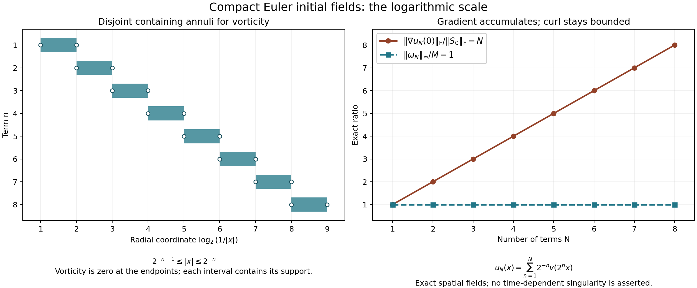

# Euler solutions and vorticity continuation

The viscous equation gains spatial derivatives from its heat operator. The
Euler equation has no such term. Its local construction instead depends on
an energy cancellation: the highest derivative is transported by a
divergence-free velocity and contributes no change to the energy. We will
prove the estimate that makes this cancellation usable, construct the
solution, and prove the Beale–Kato–Majda continuation criterion with the
original force retained.

The logarithm in that criterion has a specific source. Each intermediate
frequency band of the velocity gradient is controlled by the vorticity.
The number of bands needed is logarithmic in the higher Sobolev norm.
Exercise 5 constructs smooth compact fields that show why dependence on
that higher norm cannot simply be removed.

## 1. Original data, equation and full norms

Let \(\Omega=\mathbb R^3\) or
\[
 Q=\prod_{j=1}^3(\mathbb R/L_j\mathbb Z),\qquad
 L_j>0,\qquad V=L_1L_2L_3.
 \tag{1.1}
\]
We use ordinary Lebesgue measure. Fix any real \(s>5/2\), and prescribe
\[
 \begin{gathered}
 u^0\in H^s_\sigma(\Omega),\qquad
 f\in L^1_{\rm loc}([0,T_f);H^s(\Omega)),\\
 u_t+(u\cdot\nabla)u+\nabla p=f,\qquad
 \operatorname{div}u=0,\qquad u(0)=u^0.
 \end{gathered}
 \tag{1.2}
\]
The subscript \(\sigma\) means zero distributional divergence. The force
itself need not be divergence-free. The pressure and its force component
will be reconstructed, together with the original periodic mean.

Our Fourier transform has kernel \(e^{-2\pi i x\cdot\xi}\). Set
\[
 w(\xi)=(1+4\pi^2|\xi|^2)^{1/2},\qquad
 a_r(\xi)=w(\xi)^r,\qquad J^r=a_r(D).
 \tag{1.3}
\]
Here \(m(D)\) denotes the Fourier multiplier with symbol \(m\), so it
does not add an unmentioned derivative convention. The full norm is
\[
 \|h\|_{H^r}^2=\int_{\mathbb R^3}a_r(\xi)^2|\widehat h(\xi)|^2\,d\xi.
 \tag{1.4}
\]
On the box, \(\kappa_k=(k_j/L_j)_j\),
\(h_k=V^{-1}\int_Qh(x)e^{-2\pi i\kappa_k\cdot x}\,dx\), and
the norm is \(V\sum_k a_r(\kappa_k)^2|h_k|^2\). Vector and tensor
norms use all components with their Euclidean or Frobenius norm.

We will prove that (1.2) has a unique maximal solution
\[
 u\in C([0,T_*);H^s_\sigma),\qquad
 u_t\in L^1_{\rm loc}([0,T_*);H^{s-1}),\qquad T_*\leq T_f.
 \tag{1.5}
\]
It depends continuously on the data in \(H^s\) and on the force in
\(L^1H^s\), on every compact interval of the reference solution.
A finite \(T_*<T_f\) requires both
\[
 \sup_{t<T_*}\|u(t)\|_{H^s}=\infty,
 \qquad \int_0^{T_*}\|\nabla\times u(t)\|_\infty\,dt=\infty.
 \tag{1.6}
\]
More precisely, finiteness of the second integral before an endpoint
inside the prescribed force interval gives an extension across that
endpoint. The proofs below establish the solution map and every estimate
used in this assertion.

## 2. Fourier blocks and elementary kernel bounds

We need a smooth cutoff with fixed, reproducible constants. Define
\[
 \begin{gathered}
 b(t)=\begin{cases}e^{-1/t},&t>0,\\0,&t\leq0,\end{cases}
 \qquad \chi(t)=\frac{b(1-t)}{b(1-t)+b(t-1/4)},\\
 c(\xi)=\chi(|\xi|^2/4),\qquad
 \psi(\xi)=c(\xi)-c(2\xi),\\
 d_0=c,\qquad d_k(\xi)=\psi(2^{-k}\xi)\ (k\geq1),
 \qquad \Delta_k=d_k(D).
 \end{gathered}
 \tag{2.1}
\]
The denominator defining \(\chi\) is always positive. Every one-sided
derivative of \(b\) at zero vanishes because it is a polynomial in
\(1/t\) times \(e^{-1/t}\). Thus \(\chi\) is smooth. Its numerator
decreases and the other denominator summand increases, so quotient
differentiation gives \(\chi'\leq0\). It equals one for \(t\leq1/4\)
and zero for \(t\geq1\). Consequently \(c=1\) for \(|\xi|\leq1\),
\(c=0\) for \(|\xi|\geq2\), and \(\psi\geq0\) is supported
in \(1/2\leq|\xi|\leq2\).

The exact telescoping identity is
\[
 \sum_{k=0}^N d_k(\xi)=c(2^{-N}\xi),\qquad
 \sum_{k\geq0}d_k(\xi)=1.
 \tag{2.2}
\]
At most four summands are nonzero at any frequency, including zero.
Therefore, with \(D(\xi)=\sum_kd_k(\xi)^2\),
\[
 \begin{gathered}
 \frac14\leq D(\xi)\leq1,\\
 \|h\|_{H^r}^2=
 \sum_k\int a_r(\xi)^2\frac{d_k(\xi)^2}{D(\xi)}
                           |\widehat h(\xi)|^2\,d\xi,\\
 \sum_k\|J^r\Delta_kh\|_2^2\leq\|h\|_{H^r}^2,
 \qquad
 \|h\|_2\leq2\left(\sum_k\|\Delta_kh\|_2^2\right)^{1/2}.
 \end{gathered}
 \tag{2.3}
\]
The first inequality follows from Cauchy–Schwarz applied to (2.2);
the upper bound uses nonnegativity. On \(Q\) each integral is the
original \(V\)-weighted sum. In particular (2.3) retains the complete
inhomogeneous norm rather than replacing it with a derivative seminorm.

For a smooth compactly supported multiplier \(m\) define
\[
 \begin{aligned}
 \mathcal K_1(m)&=\pi^2
       \left\|\left(1-\frac{\Delta_\xi}{4\pi^2}\right)^2m\right\|_1,\\
 \mathcal K_2(m)&=\pi^4
       \left\|\left(1-\frac{\Delta_\eta}{4\pi^2}\right)^2
                 \left(1-\frac{\Delta_\zeta}{4\pi^2}\right)^2m
       \right\|_1.
 \end{aligned}
 \tag{2.4}
\]
The second formula is for a multiplier of two three-dimensional variables.
Fourier integration by parts gives
\[
 \|\mathcal F^{-1}m\|_1\leq\mathcal K_1(m),\qquad
 \|\mathcal F^{-1}_{\eta,\zeta}m\|_1\leq\mathcal K_2(m).
 \tag{2.5}
\]
Indeed \((1+|x|^2)^2\mathcal F^{-1}m\) is the inverse transform
of the differentiated multiplier in (2.4), hence is bounded by its
\(L^1\) norm. The radial integral
\(4\pi\int_0^\infty r^2(1+r^2)^{-2}\,dr=\pi^2\) proves the
first assertion; applying it in both variables proves the second.
Higher powers of the same operator prove finiteness of every required
kernel moment.

If \(K\) is the second inverse transform, its bilinear operator is
\(\int K(y,z)F(x-y)G(x-z)\,dy\,dz\). Minkowski and the product
bound in \(L^2\) show its norm from \(L^\infty\times L^2\)
to \(L^2\) is at most \(\|K\|_1\); the input roles may be reversed.
On \(Q\), periodize each kernel over \((n_jL_j)_j\). Its norm on
the box is at most the original \(L^1\) norm by tiling. Its Fourier
coefficient is \(1/V\) times the original multiplier, while each
convolution with physical measure contributes \(V\). Thus all of
these bounds hold on the original box with exactly the same constants.

Here are the constants needed later. Let
\[
 C_c=\max(\|\mathcal F^{-1}c\|_1,\|\mathcal F^{-1}\psi\|_1),
 \qquad A_{r,e}(z)=(e^2+4\pi^2|z|^2)^{r/2}.
 \tag{2.6}
\]
Define \(U_r\) as the maximum of
\(\mathcal K_1(a_rc)\) and
\(\max_{0\leq e\leq1}\mathcal K_1(A_{r,e}\psi)\).
Define \(\Gamma_r\) the same way, inserting \(2\pi i\xi_j\)
or \(2\pi iz_j\), respectively, and summing the three bounds.
The annular multipliers are smooth uniformly for \(0\leq e\leq1\),
since their support avoids zero. These are finite explicitly defined
constants. Scaling \(\xi=2^kz\), with \(e=2^{-k}\), proves
\[
 \begin{aligned}
 \|\mathcal F^{-1}(a_rd_k)\|_1&\leq U_r2^{rk},\\
 \sum_j\|\mathcal F^{-1}(2\pi i\xi_j a_rd_k)\|_1
                                      &\leq\Gamma_r2^{(r+1)k}.
 \end{aligned}
 \tag{2.7}
\]
For \(k=0\) the low-frequency definition gives the same formulas.
We also use \(\Gamma_0\), defined in this way with \(r=0\).

Finally put
\[
 I=\sum_l\left\|\mathcal F^{-1}
       \left(\frac{\psi(z)z_l}{2\pi i|z|^2}\right)\right\|_1.
 \tag{2.8}
\]
These kernels are smooth annular kernels, so (2.5) makes \(I\) finite.
Multiplying their symbols by \(2\pi iz_l\) and summing gives
\(\psi\). Therefore
\[
 \|\Delta_kh\|_\infty\leq I2^{-k}\|\nabla h\|_\infty,
 \qquad k\geq1.
 \tag{2.9}
\]
This bound uses the actual derivative of the field, including its original
coordinates and all Fourier factors.

## 3. The full transport estimate

We prove, for \(r>0\) and smooth solenoidal \(v\),
\[
 \|[J^r,v\cdot\nabla]h\|_2
 \leq C_r\big(\|\nabla v\|_\infty\|h\|_{H^r}
                    +\|v\|_{H^r}\|\nabla h\|_\infty\big).
 \tag{3.1}
\]
The bracket is the exact difference
\(J^r(v\cdot\nabla h)-v\cdot\nabla J^rh\).
The proof below gives a finite constant in terms of the kernels above.
For the Euler application \(r=s>5/2\), Fourier approximation converges
in \(H^s\) and in the norm of bounded first derivatives, so the resulting
bilinear estimate extends to every field in the solution class.

Expand \(v=\sum_pv_p\), \(h=\sum_qh_q\), where
\(v_p=\Delta_pv\), \(h_q=\Delta_qh\). Split the exact double sum
into \(p\leq q-4\), \(q\leq p-4\), and \(|p-q|\leq3\).
In the last set separate \(\max(p,q)\leq6\); all remaining pairs
have both indices at least four. We estimate all four parts, including
the outputs much lower than their two input frequencies.

### 3.1. A low velocity frequency and a high transported frequency

For \(q=k\geq4\), the low velocity sum is exactly
\(S_{k-4}v=c(2^{-(k-4)}D)v\). In the variables
\(\eta=2^kE\), \(\zeta=2^kZ\), its support has \(|E|\leq1/8\),
whereas \(h_k\) has \(1/2\leq|Z|\leq2\). Let
\(t(Z)=c(Z/4)-c(4Z)\); it equals one on that latter annulus and is
supported in \(1/4\leq|Z|\leq8\). Define
\[
 M_{lj,e}(E,Z)=c(16E)t(Z)
 \frac{Z_j\int_0^1\partial_l A_{r,e}(Z+\tau E)\,d\tau}
      {A_{r,e}(Z)},\qquad 0\leq e\leq1.
 \tag{3.2}
\]
On this support \(|Z+\tau E|\geq1/8\). Thus the symbols and the
derivatives in (2.4) are uniformly smooth and compactly supported.
Set \(M_L=\max_{l,j,e}\mathcal K_2(M_{lj,e})\).

The identity
\(a_r(\eta+\zeta)-a_r(\zeta)
=\sum_l\eta_l\int_0^1\partial_la_r(\zeta+\tau\eta)\,d\tau\)
shows that the commutator is the sum of the operators (3.2) applied to
\(\partial_lv_j\) and \(J^rh_k\). The factors \(2\pi i\eta_l\)
and \(2\pi i\zeta_j\) leave exactly the factor \(Z_j\) displayed
in (3.2). Summing the nine pairs \(l,j\) gives the bound
\(9M_L\|\nabla v\|_\infty\|J^rh_k\|_2\).

The output frequencies lie between \(2^{k-2}\) and \(2^{k+2}\).
At any frequency at most five such output bands overlap. Parseval,
Cauchy–Schwarz over those five summands, and (2.3) therefore bound this
entire part by
\[
 9\sqrt5 M_L\|\nabla v\|_\infty\|h\|_{H^r}.
 \tag{3.3}
\]

### 3.2. A high velocity frequency and a low transported frequency

For the \(J^r(v_k\cdot\nabla S_{k-4}h)\) term use
\[
 M_{H,e}(E,Z)=t(E)c(16Z)
                    \frac{A_{r,e}(E+Z)}{A_{r,e}(E)},
 \qquad M_H=\max_{0\leq e\leq1}\mathcal K_2(M_{H,e}).
 \tag{3.4}
\]
The denominator and the shifted frequency are away from zero, as before.
Its bound applied to \(J^rv_k\) and \(\nabla h\), followed by the
three component contractions, is
\(3M_H\|J^rv_k\|_2\|\nabla h\|_\infty\).
For \(v_k\cdot\nabla J^r S_{k-4}h\), (2.7) and a geometric sum give
\[
 \|J^rS_{k-4}\nabla h\|_\infty
 \leq\frac{U_r2^{r(k-4)}}{1-2^{-r}}\|\nabla h\|_\infty.
 \tag{3.5}
\]
On the \(v_k\) annulus, \(a_r\geq\pi^r2^{rk}\). Hence the
second term is bounded by
\(3U_r\pi^{-r}(1-2^{-r})^{-1}\|J^rv_k\|_2\|\nabla h\|_\infty\);
the additional factor \(2^{-4r}\leq1\) has only enlarged this upper
bound. The output bands again overlap at most five times. Their total
is therefore at most
\[
 \sqrt5\left(3M_H+\frac{3U_r\pi^{-r}}{1-2^{-r}}\right)
                    \|v\|_{H^r}\|\nabla h\|_\infty.
 \tag{3.6}
\]

### 3.3. Comparable high frequencies and their low outputs

Write \(p=k\), \(q=k+l\), \(-3\leq l\leq3\), for the remaining
high pairs. Since \(\operatorname{div}v_k=0\), the exact expression is
\[
 [J^r,v_k\cdot\nabla]h_q
 =J^r\operatorname{div}(h_q\otimes v_k)
       -\operatorname{div}((J^rh_q)\otimes v_k).
 \tag{3.7}
\]
Our divergence convention is \((\operatorname{div}T)_i
=\sum_j\partial_jT_{ij}\), which fixes the displayed tensor order.
The output radius is at most \(18\cdot2^k\). Its \(n\)-th block
is therefore zero when \(n>k+6\). Let \(b_q=\|J^rh_q\|_2\).
Equations (2.7), (2.9), and
\(\|h_q\|_2\leq\pi^{-r}2^{-rq}b_q\) give respectively
\[
 \begin{aligned}
 \|\Delta_nJ^r\operatorname{div}(h_q\otimes v_k)\|_2
 &\leq\Gamma_r I\pi^{-r}2^{(r+1)(n-k)}2^{-rl}
                           \|\nabla v\|_\infty b_{k+l},\\
 \|\Delta_n\operatorname{div}((J^rh_q)\otimes v_k)\|_2
 &\leq\Gamma_0 I2^{n-k}\|\nabla v\|_\infty b_{k+l}.
 \end{aligned}
 \tag{3.8}
\]
For \(\sigma>0\), the sequence
\(2^{-\sigma j}1_{j\geq-6}\) has sum
\(2^{6\sigma}/(1-2^{-\sigma})\). The inequality
\(\|a*b\|_{\ell^2}\leq\|a\|_{\ell^1}\|b\|_{\ell^2}\)
follows by applying the triangle inequality in \(\ell^2\) to its
shifted summands. Apply it to (3.8), then use (2.3). This part is bounded
by \(D_r\|\nabla v\|_\infty\|h\|_{H^r}\), where
\[
 D_r=2I\left[
 \Gamma_r\pi^{-r}\left(\sum_{l=-3}^3 2^{-rl}\right)
           \frac{2^{6(r+1)}}{1-2^{-(r+1)}}
       +7\Gamma_0\frac{2^6}{1-2^{-1}}\right].
 \tag{3.9}
\]
Thus the low outputs have been summed with their actual decay factors;
they have not been discarded through a frequency separation assertion.

### 3.4. The finite low-frequency part

In these pairs \(p,q\leq6\). Both input radii are at most 128 and
the product radius is at most 256. Let
\[
 K_r=\mathcal F^{-1}(a_rc(\cdot/256)),\qquad
 L_r=\int|y|\,|K_r(y)|\,dy<\infty.
 \tag{3.10}
\]
The cutoff is one on both required supports. The commutator equals
\[
 \int K_r(y)\big(v_p(x-y)-v_p(x)\big)
                            \cdot\nabla h_q(x-y)\,dy.
 \tag{3.11}
\]
Its \(L^2\) norm is at most
\(L_r C_c\|\nabla v\|_\infty\,256\pi\|h_q\|_2\).
There are at most 49 pairs, and each \(\|h_q\|_2\leq\|h\|_{H^r}\).
On \(Q\) unfold the periodized kernel: the periodic extension has the
same Lipschitz difference bound, so the same first moment controls (3.11).

Combining all four parts proves (3.1), for example with
\[
 C_r=\sqrt5\left(9M_L+3M_H+
                         \frac{3U_r\pi^{-r}}{1-2^{-r}}\right)
          +D_r+49\cdot256\pi C_c L_r.
 \tag{3.12}
\]
All constants are finite integrals or maxima of the explicit multipliers
above. The original full weight \(a_r\), physical measure, zero mode,
and all frequency interactions remain present.

## 4. Product estimates and the lower difference norm

For \(r>3/2\), put
\[
 E_{r,\mathbb R^3}^2=\int w(\xi)^{-2r}\,d\xi,
 \qquad E_{r,Q}^2=V^{-1}\sum_k w(\kappa_k)^{-2r}.
 \tag{4.1}
\]
These are finite by radial integration or rectangular lattice counting.
Fourier Cauchy–Schwarz gives the corresponding \(L^1\) transform or
coefficient-sum bound. Since
\(w(\eta+\zeta)\leq w(\eta)+w(\zeta)\), convolution and Young's
inequality prove
\[
 \|gh\|_{H^r}\leq A_{r,\Omega}\|g\|_{H^r}\|h\|_{H^r},
 \qquad A_{r,\Omega}=2^{\max(r-1,0)+1}E_{r,\Omega}.
 \tag{4.2}
\]
Here \((a+b)^r\leq2^{\max(r-1,0)}(a^r+b^r)\) supplies the factor,
and either transform can receive the \(L^1\) bound. Applying convolution
to Euclidean or Frobenius magnitudes proves the vector and tensor versions
without losing a component contribution.

We also need, for \(r>0\),
\[
 \|gh\|_{H^r}\leq P_r
       (\|g\|_\infty\|h\|_{H^r}+\|g\|_{H^r}\|h\|_\infty).
 \tag{4.3}
\]
For low-high and high-low pairs in the decomposition of Section 3, use
(3.4), with the variables interchanged when required. The constants are
\(\sqrt5M_H\) for each of the two displayed products. For comparable
pairs \(p=k\), \(q=k+l\), project \(J^r(g_ph_q)\) to
\(n\leq p+6\). Equation (2.7),
\(\|g_p\|_\infty\leq C_c\|g\|_\infty\), and
\[
 \|h_q\|_2\leq\max(1,\pi^{-r})2^{-rq}\|J^rh_q\|_2
 \tag{4.4}
\]
give a coefficient
\(U_rC_c\max(1,\pi^{-r})2^{r(n-p)}2^{-rl}\).
Formula (4.4) includes \(q=0\). Sum the geometric sequence as in
Section 3.3 and apply (2.3); missing negative indices are zero. This proves
(4.3), with the sufficient constant
\[
 P_r=\sqrt5M_H+
 2U_rC_c\max(1,\pi^{-r})
       \left(\sum_{l=-3}^3 2^{-rl}\right)
                     \frac{2^{6r}}{1-2^{-r}}.
 \tag{4.5}
\]

The exact gradient embedding constant for \(s>5/2\) is
\[
 S_{s,\mathbb R^3}^2=\int4\pi^2|\xi|^2w(\xi)^{-2s}\,d\xi,
 \qquad
 S_{s,Q}^2=V^{-1}\sum_k4\pi^2|\kappa_k|^2w(\kappa_k)^{-2s}.
 \tag{4.6}
\]
Fourier inversion and Cauchy–Schwarz give
\(\|\nabla h\|_\infty\leq S_{s,\Omega}\|h\|_{H^s}\).
The same argument gives a continuous gradient by absolute convergence.

Set \(r=s-1>3/2\). A difference estimate uses
\[
 \|[J^r,v\cdot\nabla]h\|_2
 \leq T_{s,\Omega}\|v\|_{H^s}\|h\|_{H^{s-1}},
 \quad
 T_{s,\Omega}=2r2^{\max(r-2,0)}(S_{s,\Omega}+E_{r,\Omega}).
 \tag{4.7}
\]
To prove it without assuming that \(\nabla h\) is bounded, differentiate
\(a_r\): \(|\nabla a_r|\leq2\pi r a_{r-1}\). The mean-value
formula and the weight triangle inequality give
\[
 |a_r(\eta+\zeta)-a_r(\zeta)|
 \leq2\pi r2^{\max(r-2,0)}|\eta|
                   (a_{r-1}(\zeta)+a_{r-1}(\eta)).
 \tag{4.8}
\]
Multiply by \(2\pi|\zeta|\). When \(|\eta|\leq|\zeta|\),
the second summand is at most the first; in the other case use
\(4\pi^2|\eta||\zeta|a_{r-1}(\eta)\leq a_{r+1}(\eta)\).
The resulting symbol is at most
\[
 2r2^{\max(r-2,0)}
       \big(2\pi|\eta|a_r(\zeta)+a_{r+1}(\eta)\big).
 \tag{4.9}
\]
Young's inequality now uses \(\|2\pi|\xi|\widehat v\|_1
\leq S_{s,\Omega}\|v\|_{H^s}\) for the first term and
\(\|\widehat h\|_1\leq E_{r,\Omega}\|h\|_{H^r}\) for the
second, with the original coefficient convention on \(Q\). This proves
(4.7), including the vector contraction by its Euclidean Fourier magnitude.

## 5. Constructing the original Euler solution

Let \(E_N\) be the orthogonal projection to the actual frequencies
\(|\xi|\leq N\), or \(|\kappa_k|\leq N\) on \(Q\). The Leray
projection from Lesson 2 has symbol
\[
 P(\xi)=I_3-\frac{\xi\otimes\xi}{|\xi|^2}\quad(\xi\ne0),
 \qquad P(0)=I_3\text{ on }Q.
 \tag{5.1}
\]
Solve, on the divergence-free range of \(E_N\),
\[
 u_N'=-E_NP(u_N\cdot\nabla u_N)+E_NPf,
 \qquad u_N(0)=E_Nu^0.
 \tag{5.2}
\]
On \(Q\) this range is finite dimensional. On \(\mathbb R^3\)
it is a closed, generally infinite-dimensional Hilbert space. The latter
causes no existence problem: on this range a derivative has operator norm
at most \(2\pi N\), and (4.2) bounds the product in \(H^s\).
In a ball of radius \(R\), the difference of the two quadratic terms
is bounded in \(H^s\) by
\(4\pi N A_{s,\Omega}R\) times the difference of the fields.
Thus the integral of (5.2) maps a sufficiently small closed ball in
\(C([0,T];H^s)\) to itself and is a contraction when
\(4\pi N A_{s,\Omega}RT<1\). The integrated force is continuous
because it is a Bochner integral. The contraction iterates converge by
the geometric difference bound, yielding a unique solution. Repeating
this argument continues the solution until its norm is unbounded.

Since \(E_Nu_N=u_N\), both orthogonal projections disappear in the
energy pairing. They commute with \(J^s\). Consequently
\[
 \frac12\frac d{dt}\|u_N\|_{H^s}^2
 =-([J^s,u_N\cdot\nabla]u_N,J^su_N)
                       +(J^sf,J^su_N).
 \tag{5.3}
\]
The transported term \((u_N\cdot\nabla J^su_N,J^su_N)\) is zero.
On the whole space, integrate first with a cutoff of radius \(R_0\).
Its error is at most a fixed cutoff constant times
\(R_0^{-1}\|u_N\|_\infty\|J^su_N\|_2^2\), which tends to zero.
The truncated field has all spatial Sobolev orders, so this calculation
is justified before taking the limit in \(N\).

Write
\[
 X_N=\|u_N\|_{H^s},\quad F(t)=\|f(t)\|_{H^s},\quad
 C_E=2C_s,\quad K=C_ES_{s,\Omega}.
 \tag{5.4}
\]
Here and below a norm with subscript \(H^s\) means the full norm (1.4).
Equations (3.1) and (4.6) give \(X_N'\leq KX_N^2+F\).
Division at zero is justified by first differentiating
\((X_N^2+\varepsilon^2)^{1/2}\). Fix \(\eta>0\), put
\(R=2(\|u^0\|_{H^s}+\eta)\), and choose \(0<T<T_f\) such that
\[
 \int_0^T F(t)\,dt\leq\eta,\qquad KR^2T\leq R/4.
 \tag{5.5}
\]
If the norm first reached \(R\) in this interval, integration up to
that time would instead give
\(X_N\leq\|u^0\|_{H^s}+\eta+KR^2T\leq3R/4\).
This contradiction proves a common interval and the uniform bound
\(X_N\leq R\), independent of the projection radius.

For convergence, keep the complete residual in the projected original
equation:
\[
 \begin{gathered}
 u_N'+P(u_N\cdot\nabla u_N)=Pf+r_N,\\
 r_N=(I-E_N)P(u_N\cdot\nabla u_N)-(I-E_N)Pf.
 \end{gathered}
 \tag{5.6}
\]
By (4.2) at order \(s-1\), the nonlinear term has
\(H^{s-1}\) norm at most \(A_{s-1,\Omega}R^2\). Thus
\[
 \|r_N\|_{L^1(0,T;L^2)}
 \leq TA_{s-1,\Omega}R^2w(N)^{-(s-1)}
                      +w(N)^{-s}\|f\|_{L^1(0,T;H^s)}\longrightarrow0,
 \quad w(N)=(1+4\pi^2N^2)^{1/2}.
 \tag{5.7}
\]
The difference \(z=u_N-u_M\) has transport
\(u_N\cdot\nabla z+z\cdot\nabla u_M\). The first term cancels
in its \(L^2\) energy. The second is bounded by
\(\|\nabla u_M\|_\infty\|z\|_2^2\), and the residual difference
is retained. Multiplying the resulting scalar inequality by its integrating
factor proves
\[
 \|u_N-u_M\|_{C([0,T];L^2)}
 \leq e^{S_{s,\Omega}RT}
 \left(\|(E_N-E_M)u^0\|_2+\|r_N\|_{L^1L^2}+\|r_M\|_{L^1L^2}\right).
 \tag{5.8}
\]
It tends to zero on either domain. This avoids any compactness assumption
at spatial infinity.

Let \(u\) be the limit. Fourier Hölder gives, for \(0<r<s\),
\(\|h\|_{H^r}\leq\|h\|_2^{1-r/s}\|h\|_{H^s}^{r/s}\).
Hence the convergence is in \(CH^r\) for every \(r<s\), and
\(u(t)\in H^s\) with norm at most \(R\) at every time by weak
lower semicontinuity. Testing against frequency-truncated \(H^s\)
vectors, then approximating an arbitrary such vector, proves weak
continuity into \(H^s\). Choose \(5/2<r<s\); (4.2) and (4.6)
give convergence of the nonlinear terms in \(CH^{r-1}\).
Passing to (5.6) proves
\[
 u_t+P(u\cdot\nabla u)=Pf,
 \qquad u_t\in L^1(0,T;H^{s-1}).
 \tag{5.9}
\]
The latter assertion follows directly from the uniform \(H^s\) bound
and (4.2), now applied to the limit. Strong measurability follows from
its continuous lower-order representative and frequency approximation.

The same \(L^2\) difference calculation, with zero residuals, gives
uniqueness among \(L^\infty H^s\) solutions with continuous \(L^2\)
trace. At the initial time, (5.3) and the common bound imply
\[
 \limsup_{t\downarrow0}\|u(t)\|_{H^s}\leq\|u^0\|_{H^s}.
 \tag{5.10}
\]
Indeed integrate the norm inequality before taking \(N\to\infty\);
the additional terms are \(KR^2t+\int_0^tF\). Weak continuity and
(5.10) imply strong continuity at zero by the Hilbert norm identity.
Restart the construction at any time \(t_0\) using \(u(t_0)\) and
the shifted force. Uniqueness identifies that solution with the existing
one, giving right continuity in \(H^s\). For left continuity use the
exact reversed equation:
\[
 v(\tau)=-u(t_0-\tau),\quad q(\tau)=p(t_0-\tau),
 \quad g(\tau)=f(t_0-\tau).
 \tag{5.11}
\]
Both \(v_\tau\) and \(v\cdot\nabla v\) have the original positive
signs. The same construction from \(-u(t_0)\), followed by uniqueness,
gives left continuity. We have proved \(u\in C([0,T];H^s)\).

Finally restore the original pressure. With all indices summed, set
\[
 \widehat {p_{\rm nl}}(\xi)
 =-\sum_{i,j}\frac{\xi_i\xi_j}{|\xi|^2}
                      \widehat{u_i u_j}(\xi),\qquad
 \nabla p_F=(I-P)f,\qquad p=p_{\rm nl}+p_F.
 \tag{5.12}
\]
The nonlinear multiplier sends \(u\otimes u\in H^s\) to \(H^s\),
because the Frobenius norm of \(\xi\otimes\xi/|\xi|^2\) is one.
Lesson 2 constructs the full distributional force potential on
\(\mathbb R^3\), including the low-frequency term; its gradient
is exactly the one displayed here. On \(Q\) take zero pressure mean.
Then \(\nabla p\in L^1H^{s-1}\) and (5.9) becomes (1.2).
The original velocity mean satisfies
\[
 u_0(t)=u_0(0)+\int_0^t f_0(r)\,dr.
 \tag{5.13}
\]
No mean restriction on the initial velocity or force has entered the proof.

## 6. Energy, stability and maximal continuation

### 6.1. Energy at the actual solution regularity

Let \(v=J^su\in CL^2\). Its equation has transported term
\(u\cdot\nabla v\), commutator \([J^s,u\cdot\nabla]u\), and
the projected original force. More precisely its distributional equation is
\(v_t+P(u\cdot\nabla v)=-P[J^s,u\cdot\nabla]u+PJ^sf\).
The projections commute with spatial smoothing and disappear when paired
with the smoothed divergence-free \(v\). Smooth in space with a convolution
\(J_\varepsilon\) whose kernel is \(k_\varepsilon\). The additional
commutator is exactly
\[
 [J_\varepsilon,u\cdot\nabla]v(x)
 =\int\nabla k_\varepsilon(y)\cdot
                  [u(x-y)-u(x)]v(x-y)\,dy.
 \tag{6.1}
\]
Integration by parts proves this formula using \(\operatorname{div}u=0\).
Its \(L^2\) norm is at most
\(\|\nabla u\|_\infty\|v\|_2\int|y||\nabla k_\varepsilon(y)|\,dy\).
The last integral is independent of \(\varepsilon\). For a smooth
\(H^1\) vector \(v\), both original products converge in \(L^2\),
so the commutator tends to zero. Approximation in \(L^2\) and the
uniform bound give the same conclusion for every \(v\in L^2\).
Periodization and unfolding prove it on \(Q\) as well.

On any compact time interval, (3.1) puts the other commutator in
\(L^1L^2\). Dominated convergence applies to (6.1), since the velocity
is bounded in \(H^s\). The smoothed energy equation therefore passes
to every pair of time endpoints. It gives the exact identity (5.3) with
\(u\) in place of \(u_N\), and
\[
 X'\leq C_E\|\nabla u\|_\infty X+F,
 \qquad X(t)=\|u(t)\|_{H^s}.
 \tag{6.2}
\]
The norm is absolutely continuous locally: apply the identity to
\((X^2+\varepsilon^2)^{1/2}\); its absolute derivative is bounded
by \(C_E\|\nabla u\|_\infty X+F\), an integrable function
independent of \(\varepsilon\), and pass to the limit. At order zero
the transport cancels completely, so
\[
 \frac12\|u(t)\|_2^2-\frac12\|u(a)\|_2^2
   =\int_a^t(f,u)\,dr,\qquad
 \|u(t)\|_2\leq\|u^0\|_2+\int_0^t\|f(r)\|_2\,dr.
 \tag{6.3}
\]
These statements include the complete force and require no time derivative
of that force.

### 6.2. Dependence in the full top norm

Let \(u,v\) have forces \(f,g\), and let \(z=u-v\). Its nonlinear
term is \(u\cdot\nabla z+z\cdot\nabla v\). Set \(r=s-1\).
The energy justification above, (4.7), and the algebra bound (4.2) give
\[
 \frac d{dt}\|z\|_{H^{s-1}}
 \leq (T_{s,\Omega}+A_{s-1,\Omega})
       (\|u\|_{H^s}+\|v\|_{H^s})\|z\|_{H^{s-1}}
                           +\|f-g\|_{H^{s-1}}.
 \tag{6.4}
\]
For the top norm, temporarily suppose \(v\in H^{s+1}\). The transport
commutator (3.1) contributes both
\(C_s\|\nabla u\|_\infty\|z\|_{H^s}\) and
\(C_s\|u\|_{H^s}\|\nabla z\|_\infty\).
The tame product (4.3) treats \(z\cdot\nabla v\). Using
\(\|z\|_\infty\leq E_{s-1,\Omega}\|z\|_{H^{s-1}}\), we obtain
\[
 \begin{aligned}
 \frac d{dt}\|z\|_{H^s}
 \leq{}&D_{s,\Omega}(\|u\|_{H^s}+\|v\|_{H^s})\|z\|_{H^s}\\
 &+P_sE_{s-1,\Omega}\|v\|_{H^{s+1}}\|z\|_{H^{s-1}}
                         +\|f-g\|_{H^s},\\
 D_{s,\Omega}={}&(2C_s+P_s)S_{s,\Omega}.
 \end{aligned}
 \tag{6.5}
\]
The letter \(D_{s,\Omega}\) here includes the domain and differs from
the frequency constant \(D_r\) in (3.9). The high derivative on the
reference solution in (6.5) is essential; we will control its exact cost.

Smooth both data and force with \(c(D/N)\), and denote the resulting
solution by \(v_N\). On a common interval where the original and
smoothed solutions have \(H^s\) norm at most \(R\), the estimate
(6.2) at order \(s+1\) gives
\[
 \|v_N\|_{L^\infty H^{s+1}}
 \leq e^{2C_{s+1}S_{s,\Omega}RT}w(2N)
                  \left(\|u^0\|_{H^s}+\|f\|_{L^1H^s}\right).
 \tag{6.6}
\]
To justify this higher regularity, first construct at order \(s+1\).
Uniqueness identifies it with the \(H^s\) solution while both exist.
The bound (6.6) and the local construction at order \(s+1\) extend
it across any earlier endpoint. Thus it exists throughout the common
\(H^s\) interval.

The actual discarded tail is
\[
 \epsilon_N=\|(I-c(D/N))u^0\|_{H^s}
           +\|(I-c(D/N))f\|_{L^1H^s}\longrightarrow0.
 \tag{6.7}
\]
This follows from dominated convergence in the original full norm and
then in time. Since the tail vanishes on \(|\xi|\leq N\), (6.4)
gives, with \(H=(T_{s,\Omega}+A_{s-1,\Omega})\),
\[
 \|u-v_N\|_{CH^{s-1}}\leq e^{2HRT}\epsilon_N/w(N).
 \tag{6.8}
\]
Integrate (6.5), insert (6.6)–(6.8), and use \(w(2N)/w(N)\leq2\).
For example the resulting bound is
\[
 \|u-v_N\|_{CH^s}\leq
 e^{2D_{s,\Omega}RT}
 \left[1+2TP_sE_{s-1,\Omega}
   e^{2(C_{s+1}S_{s,\Omega}+H)RT}
       (\|u^0\|_{H^s}+\|f\|_{L^1H^s})\right]\epsilon_N.
 \tag{6.9}
\]
Every constant is independent of the smoothing radius.

Now take a sequence of original data and forces converging in
\(H^s\times L^1H^s\). Their norms and short-time force integrals
give a common local interval by (5.5). Their tails (6.7) are uniform for
all sufficiently large sequence indices: the multiplier \(1-c(D/N)\)
has norm at most one, so each tail is bounded by the limiting tail plus
the data and force differences. For fixed \(N\), (6.4)–(6.6) applied
to the smoothed solutions imply convergence in \(CH^s\). The triangle
inequality and (6.9), first taking the data index to infinity and then
\(N\to\infty\), give convergence of the original solutions in
\(CH^s\). On a compact interval of the reference solution, use its
bounded norm and the absolute continuity of the force integral to choose
finitely many intervals of the form (5.5). The just-proved continuity
at each endpoint permits induction over this finite cover. This proves
the claimed continuous dependence on every reference compact interval.
It does not assert a Lipschitz solution map in the top norm.

### 6.3. The maximal alternative

Uniqueness joins the local solutions to the maximal interval in (1.5).
If \(T_*<T_f\) and \(\sup_{t<T_*}\|u(t)\|_{H^s}\leq M<\infty\),
choose \(\eta=1\), \(R=2(M+1)\) in (5.5). Absolute continuity of
\(\int F\) on an interval containing \(T_*\) supplies the same
positive restart length from every sufficiently late time. Choose one
of those times less than that length from \(T_*\). Its solution extends
across \(T_*\) and agrees with the previous one by uniqueness. This
contradicts maximality. The first assertion in (1.6) is proved.

## 7. The logarithmic estimate on the original domain

Put \(\omega=\nabla\times u\). The exact inverse curl from Lesson 8
gives, for \(\xi\ne0\),
\[
 \widehat{\partial_j u_i}(\xi)
 =\sum_b m_{ijb}(\xi)\widehat\omega_b(\xi),\qquad
 m_{ijb}(\xi)=-\frac{\xi_j\sum_a\varepsilon_{iab}\xi_a}{|\xi|^2}.
 \tag{7.1}
\]
The alternating tensor has the original positive orientation. In (7.1)
the derivative \(2\pi i\xi_j\) multiplies the inverse-curl factor
\(i/(2\pi)\), which accounts for its minus sign and all Fourier factors.
Define the finite annular constant
\[
 B=\sum_{i,j,b}\mathcal K_1(m_{ijb}\psi).
 \tag{7.2}
\]
The multipliers are smooth away from zero. Their kernels have total
\(L^1\) norm at most \(B\) by (2.5). Since \(m\) has degree zero,
the kernel for its \(k\)-th band is \(2^{3k}K(2^kx)\), with the
same \(L^1\) norm. Convolution and the sum over all tensor entries give
\[
 \|\nabla\Delta_k u\|_\infty\leq B\|\omega\|_\infty,
 \qquad k\geq1.
 \tag{7.3}
\]
Periodization in Section 2 proves the identical bound on every original
box. Its zero mode is zero; the original mean still evolves by (5.13).

The low frequency has the constants
\[
 C_{0,\mathbb R^3}^2=\int4\pi^2|\xi|^2|c(\xi)|^2\,d\xi,
 \qquad C_{0,Q}^2=V^{-1}\sum_k4\pi^2|\kappa_k|^2|c(\kappa_k)|^2.
 \tag{7.4}
\]
They are finite by compact support. Fourier Cauchy–Schwarz gives
\(\|\nabla\Delta_0u\|_\infty\leq C_{0,\Omega}\|u\|_2\).
The mean is included in the original norm; its derivative coefficient
in (7.4) is exactly zero.

Let \(\delta=s-5/2>0\), and write \(X=\|u\|_{H^s}\). The
high frequencies satisfy
\[
 \|\nabla\Delta_k u\|_\infty
 \leq A_{s,\Omega}^{\rm hi}2^{-\delta k}X,\qquad k\geq1,
 \tag{7.5}
\]
where the superscript distinguishes this constant from (4.2), and
\[
 \begin{aligned}
 (A_{s,\mathbb R^3}^{\rm hi})^2
   &=(2\pi)^{2-2s}\int |z|^{2-2s}|\psi(z)|^2\,dz,\\
 A_{s,Q}^{\rm hi}
   &=(2\pi)^{1-s}2^{s-1}\|\psi\|_\infty
       \left[V^{-1}\prod_{j=1}^3(4L_j+1)\right]^{1/2}.
 \end{aligned}
 \tag{7.6}
\]
Indeed the squared Cauchy–Schwarz coefficient on the whole space is
\(\int4\pi^2|\xi|^2|\psi(2^{-k}\xi)|^2w(\xi)^{-2s}\,d\xi\).
For an upper bound on this coefficient use
\(w(\xi)^{2s}\geq(4\pi^2|\xi|^2)^s\), and change
\(\xi=2^kz\). The power is \(2^{(5-2s)k}\), proving (7.5).
The norm \(X\) remains the full original norm. On \(Q\) use the
corresponding \(V^{-1}\) sum. The shell has
\(2^{k-1}\leq|\kappa|\leq2^{k+1}\), and contains at most
\(2^{3k}\prod_j(4L_j+1)\) points, since each coordinate has at most
\(4L_j2^k+1\leq2^k(4L_j+1)\) choices. Bounding the decreasing
power \(|\kappa|^{2-2s}\) at the inner radius gives precisely (7.6).

The gradient tails now converge uniformly by a geometric sum. The
telescoping identity (2.2) identifies their limit with the actual
gradient. For every integer \(N\geq1\) we have
\[
 \|\nabla u\|_\infty
 \leq C_{0,\Omega}\|u\|_2+NB\|\omega\|_\infty
       +\frac{A_{s,\Omega}^{\rm hi}2^{-\delta(N+1)}}{1-2^{-\delta}}X.
 \tag{7.7}
\]
Choose \(N=\lceil\log(e+X)/(\delta\log2)\rceil\). It is at least
one, and \(2^{-\delta N}X\leq1\). Thus
\[
 \begin{aligned}
 \|\nabla u\|_\infty\leq{}&C_{0,\Omega}\|u\|_2+A_\Omega^{\rm tail}\\
 &+B\|\omega\|_\infty
          \left(1+\frac{\log(e+X)}{\delta\log2}\right),\\
 A_\Omega^{\rm tail}={}&
          \frac{A_{s,\Omega}^{\rm hi}2^{-\delta}}{1-2^{-\delta}}.
 \end{aligned}
 \tag{7.8}
\]
Every low frequency, original period and full Sobolev weight has been
retained. In particular the terms outside the logarithmic product cannot
be dropped without a further argument; Exercise 3 tests such an omission.

## 8. Beale–Kato–Majda continuation with the full force

Consider a finite candidate endpoint \(T<T_f\), and suppose
\(\int_0^T\|\omega(t)\|_\infty\,dt<\infty\). By (6.3),
\[
 L=\|u^0\|_2+\int_0^T\|f(t)\|_2\,dt.
 \tag{8.1}
\]
This bounds \(\|u(t)\|_2\). Put \(Z=\log(e+X)\geq1\).
Substituting (7.8) into (6.2),
and keeping the force term, gives
\[
 \begin{gathered}
 Z'\leq a(t)Z+b(t),\\
 a(t)=C_EB\left(1+\frac1{\delta\log2}\right)\|\omega(t)\|_\infty,\\
 b(t)=C_E(C_{0,\Omega}L+A_\Omega^{\rm tail})+F(t)/e.
 \end{gathered}
 \tag{8.2}
\]
We used \(X/(e+X)\leq1\), \(1/(e+X)\leq1/e\), and
\(1+Z/(\delta\log2)\leq(1+1/(\delta\log2))Z\).
The two coefficient functions are integrable. Multiplication by
\(\exp(-\int_0^t a)\) gives the explicit bound
\[
 Z(t)\leq e^{\int_0^ta(r)\,dr}
 \left[Z(0)+\int_0^t e^{-\int_0^r a(q)\,dq}b(r)\,dr\right],
 \qquad X(t)\leq e^{Z(t)}-e.
 \tag{8.3}
\]
Hence \(X\) remains bounded before \(T\), and Section 6.3 extends
the original solution across \(T\). Conversely a \(CH^s\) extension
has bounded gradient by (4.6), and therefore a finite vorticity integral
on that finite interval. This proves (1.6) and the claimed continuation
equivalence at endpoints inside the prescribed force interval.

The argument constructed Euler directly from (5.2). It neither presumes
an inviscid limit nor transfers a positive-viscosity smoothing estimate
to an equation without diffusion.

## 9. Five exercises with complete solutions

### Exercise 1: two physical scales and the full Sobolev weight

For \(a,b>0\), define
\[
 \widetilde u(x,t)=a u(bx,ab t),\quad
 \widetilde p(x,t)=a^2p(bx,ab t),\quad
 \widetilde f(x,t)=a^2b f(bx,ab t).
 \tag{9.1}
\]
Find the exact equation, domain, time interval, full norm and continuation
integral after this map.

**Solution.** Each of the time derivative, convection, pressure gradient
and force has factor \(a^2b\). The divergence has factor \(ab\).
Thus (1.2) holds on the mapped domain and \(0\leq t<T/(ab)\).
The whole space maps to itself. On \(Q\) the new lengths are \(L_j/b\)
and the volume is \(V/b^3\); the new Fourier coefficient is
\(a u_k(ab t)\) at frequency \(b\kappa_k\). On the whole space
\(\widehat{\widetilde u}(\xi,t)=ab^{-3}\widehat u(\xi/b,ab t)\).
Consequently
\[
 \begin{aligned}
 \|\widetilde u(t)\|_{H^s(\mathbb R^3)}^2
 &=a^2b^{-3}\int(1+4\pi^2b^2|\xi|^2)^s
                              |\widehat u(\xi,ab t)|^2\,d\xi,\\
 \|\widetilde u(t)\|_{H^s(Q/b)}^2
 &=a^2b^{-3}V\sum_k(1+4\pi^2b^2|\kappa_k|^2)^s|u_k(ab t)|^2.
 \end{aligned}
 \tag{9.2}
\]
These are the complete inhomogeneous weights, including the constant
term. The original mean maps to \(a u_0(ab t)\), whose derivative
is \(a^2b f_0(ab t)\), as required. The vorticity has factor \(ab\):
\[
 \widetilde\omega(x,t)=ab\,\omega(bx,ab t),\qquad
 \int_0^{T/(ab)}\|\widetilde\omega(t)\|_\infty\,dt
       =\int_0^T\|\omega(\tau)\|_\infty\,d\tau.
 \tag{9.3}
\]
The last equality uses the exact time Jacobian, not a change of the
physical Sobolev norm. It verifies the invariance of the continuation
integral under both independent positive scales.

### Exercise 2: an accelerated mean and a travelling helix

On \(Q\), let \(n\geq1\), \(k=2\pi n/L_3\), and
\(e(z)=(\cos(kz),-\sin(kz),0)\). Let \(m(t)\in\mathbb R^3\)
and \(A(t)\in\mathbb R\) be continuously differentiable on each compact
time interval. Put \(b(t)=b(0)+\int_0^tm_3(r)\,dr\).
Determine the complete force for
\[
 u(x,t)=m(t)+A(t)e(x_3-b(t)),\qquad p=0.
 \tag{9.4}
\]
Explain why vorticity control alone cannot extend past an endpoint at which
the prescribed force has no required extension.

**Solution.** The field is divergence-free, since its only spatial
dependence is on \(x_3\) and its third component is spatially constant.
The derivative and convection are
\[
 u_t=m'+A'e-Ab'e',\qquad
 (u\cdot\nabla)u=m_3Ae'.
 \tag{9.5}
\]
Since \(b'=m_3\), their phase terms cancel exactly. Therefore
\[
 f=m'+A'e,\quad u_0=m,\quad
 \omega=kAe,\quad
 \|u\|_2^2=V(|m|^2+A^2),\quad
 (f,u)=V(m'\cdot m+A'A).
 \tag{9.6}
\]
The spatial average of \(e\) vanishes, \(|e|=1\), and its curl is
\(ke\), proving all the formulas. Differentiating the energy verifies
(6.3). Its squared full higher norm is
\(V(|m|^2+(1+k^2)^sA^2)\), and
\(\|\omega\|_\infty=k|A|\). Thus the construction retains the
arbitrary accelerated mean as well as the oscillatory velocity.

For \(A=0\) and \(m(t)=(T-t)^{-1}e_1\), the exact solution has
\(\omega=0\), whereas
\[
 f(t)=(T-t)^{-2}e_1,\quad
 \|u(t)\|_{H^s}=\sqrt V(T-t)^{-1},\quad
 \|f(t)\|_{H^s}=\sqrt V(T-t)^{-2}.
 \tag{9.7}
\]
The force belongs to \(L^1_{\rm loc}([0,T);H^s)\) but has no
\(L^1H^s\) extension to an interval containing \(T\). Here \(T_f=T\),
so the hypothesis \(T<T_f\) of Section 8 is absent. The example explains
that hypothesis rather than contradicting the proved criterion.

### Exercise 3: testing the source logarithm and reconstruction

The “loglip” display in the Bardos–Titi survey cited below prints a bound
of the form
\[
 \|\nabla u\|_\infty
       \leq C\|\nabla\times u\|_\infty\log(1+\|u\|_{H^s}^2).
 \tag{9.8}
\]
Test it as a uniform bound on the original periodic box. Also determine
which data a periodic curl reconstruction must retain.

**Solution.** Take the exact stationary unforced shear
\[
 u(x)=\varepsilon\sin(kx_2)e_1,\quad p=0,\quad f=0,\qquad
 k=2\pi n/L_2,\quad n\geq1,\quad\varepsilon>0.
 \tag{9.9}
\]
Its divergence is zero and \(u\cdot\nabla u=u_1\partial_1u=0\).
The only nonzero gradient entry is
\(\partial_2u_1=\varepsilon k\cos(kx_2)\); its vorticity is
\(-\varepsilon k\cos(kx_2)e_3\). Hence
\[
 \|\nabla u\|_\infty=\|\omega\|_\infty=\varepsilon k,\qquad
 \|u\|_{H^s}^2=\frac{\varepsilon^2V(1+k^2)^s}{2}.
 \tag{9.10}
\]
For any fixed uniform \(C\), division of (9.8) by \(\varepsilon k\)
would give
\(1\leq C\log(1+\varepsilon^2V(1+k^2)^s/2)\).
Its right side tends to zero as \(\varepsilon\downarrow0\), a
contradiction. Section 7 proves a complete replacement, (7.8), on the
stated domains. This tests that printed uniform inequality; it does not
disprove the continuation theorem or assert that every logarithmic
estimate has the same defect.

The same survey's “ell2” reconstruction display must be supplemented
on a periodic domain by its constant mode. For every nonzero original
frequency the exact formula is
\[
 u_k=\frac{i}{2\pi|\kappa_k|^2}\kappa_k\times\omega_k,
 \qquad k\ne0,\qquad
 u_0(t)=u_0(0)+\int_0^tf_0(r)\,dr.
 \tag{9.11}
\]
Curl and divergence determine the first expression because
\(\kappa\times(\kappa\times u)=-|\kappa|^2u\) for
\(\kappa\cdot u=0\). Their kernel consists exactly of constant
fields: all nonzero coefficients of a curl-free solenoidal field vanish.
Thus adjoining the original mean gives both an injective reconstruction
and its exact inverse. The correction supplies the missing map, not just
a claim that curl and velocity are different data.

There is also a printed exponent comparison to keep explicit. The source
discussion uses \(s>5/2\) for classical existence, while its subsequent
theorem display prints \(s>5/3\). The gradient embedding used in that
argument cannot cover \(5/3<s<5/2\). To see this exactly, take any
nonzero compact smooth solenoidal \(v\) with nonzero gradient, for example
the field in Exercise 5, and set
\[
 v_N(x)=N^{3/2-s}v(Nx),\qquad N\geq1.
 \tag{9.12}
\]
Then
\[
 \|v_N\|_{H^s}^2
 =N^{-2s}\int(1+4\pi^2N^2|\xi|^2)^s|\widehat v(\xi)|^2\,d\xi
 \leq\|v\|_{H^s}^2,\qquad
 \|\nabla v_N\|_\infty=N^{5/2-s}\|\nabla v\|_\infty.
 \tag{9.13}
\]
The first inequality uses \(s>0\) and \(N\geq1\), retaining the full
weight in the equality. The latter norm diverges in the displayed range.
This identifies the failure of the needed embedding at those exponents;
it is not a counterexample to a differently formulated lower-regularity
theorem. Sections 1–8 prove the full result for every real \(s>5/2\).

### Exercise 4: continuation from the strain or its largest eigenvalue

Let \(S=(\nabla u+\nabla u^{\mathsf T})/2\), and order its eigenvalues
as \(\lambda_1\leq\lambda_2\leq\lambda_3\).
Prove an Euler continuation criterion using \(S\), with the force and
original periodic mean still present.

**Solution.** From the exact inverse strain map of Lesson 8,
\[
 \widehat u_i=-\frac{i}{\pi|\xi|^2}
             \sum_{a,b}P_{ia}(\xi)\widehat S_{ab}\xi_b,\qquad
 \widehat{\partial_j u_i}=\sum_{a,b}H_{ijab}(\xi)\widehat S_{ab},
 \quad H_{ijab}=\frac{2\xi_jP_{ia}(\xi)\xi_b}{|\xi|^2}.
 \tag{9.14}
\]
To verify it directly, write
\(\widehat S_{ab}=\pi i(\xi_b\widehat u_a+\xi_a\widehat u_b)\).
Then \(\widehat S\xi=\pi i|\xi|^2\widehat u\), since the
velocity is solenoidal, and \(P\widehat u=\widehat u\). This gives
both displayed expressions, including the factor two.

Put \(B_S=\sum_{i,j,a,b}\mathcal K_1(H_{ijab}\psi)\). These are
smooth compact annular multipliers of degree-zero symbols, so the proof
of (7.3) gives
\(\|\nabla\Delta_k u\|_\infty\leq B_S\|S\|_\infty\).
The low- and high-frequency calculations (7.4)–(7.6) are unchanged.
Therefore
\[
 \|\nabla u\|_\infty\leq C_{0,\Omega}\|u\|_2+A_\Omega^{\rm tail}
       +B_S\|S\|_\infty
                    \left(1+\frac{\log(e+X)}{\delta\log2}\right).
 \tag{9.15}
\]
The original mean is retained by (5.13). Substituting this estimate in
(6.2) gives (8.2) with
\(a=C_EB_S(1+1/(\delta\log2))\|S\|_\infty\) and the same \(b\).
The explicit integrating factor (8.3) proves continuation whenever
\(\int_0^T\|S\|_\infty\,dt<\infty\), for \(T<T_f\).

Since \(\operatorname{tr}S=0\), \(m=\lambda_3\geq0\). If \(m=0\),
all eigenvalues are zero. If \(m>0\), set \(q=\lambda_2\). Ordering
and the trace give
\(-m/2\leq q\leq m\), \(\lambda_1=-m-q\). Thus
\[
 |S|^2=(m+q)^2+q^2+m^2\leq6m^2.
 \tag{9.16}
\]
The quadratic is convex, so its maximum on that closed interval occurs
at an endpoint; the values are \(3m^2/2\) and \(6m^2\), respectively.
This proves the bound including its sharp factor. Consequently
\(\int_0^T\|\lambda_3(t)\|_\infty\,dt<\infty\) also suffices.
The largest-eigenvalue statement follows from an exact pointwise
inequality. It does not transfer the viscous middle-eigenvalue argument
of Lesson 8 to Euler.

### Exercise 5: why the higher norm enters logarithmically

Construct smooth compact solenoidal fields with uniformly bounded
\(L^2\) norm and vorticity, but with an unbounded velocity gradient.
Track their full \(H^s\) norm and the exact supports.

**Solution.** Let \(S_0=\operatorname{diag}(1,-1,0)\), and use the
cutoff \(\chi\) from (2.1). Define
\[
 {\cal A}(x)=-\tfrac13\chi(|x|^2)x\times(S_0x),\qquad
 v=\nabla\times{\cal A}.
 \tag{9.17}
\]
The curl construction gives zero divergence. The trace-free identity
\(\nabla\times(x\times S_0x)=-3S_0x\) follows from
\[
 \begin{aligned}
 \nabla\times(a\times b)={}&a\,\operatorname{div}b-b\,\operatorname{div}a\\
                         &+(b\cdot\nabla)a-(a\cdot\nabla)b.
 \end{aligned}
\]
Therefore \(v=S_0x\) on \(|x|\leq1/2\), and \(v=0\) on
\(|x|\geq1\). Smooth flat matching at both spheres follows from (2.1).

For completeness, retain every transition derivative. Write
\(q=x\cdot S_0x\), \(B_x=|x|^2S_0x-qx\); primes below mean
derivatives of \(\chi\) at \(|x|^2\). The exact formulas are
\[
 \begin{aligned}
 v&=\chi S_0x+\tfrac23\chi' B_x,\\
 \partial_jB_x&=2x_jS_0x+|x|^2S_0e_j-2(S_0x)_jx-qe_j,\\
 (\nabla v)e_j&=\chi S_0e_j+2\chi'x_jS_0x
            +\tfrac43\chi''x_jB_x+\tfrac23\chi'\partial_jB_x.
 \end{aligned}
 \tag{9.18}
\]
They follow by differentiating (9.17) with the product and triple-product
identities. The original vorticity components are exactly
\((\nabla\times v)_i=\sum_{j,l}\varepsilon_{ijl}(\nabla v)_{lj}\)
with the matrix in (9.18); no transition contribution is omitted.
The inner matrix \(S_0\) is symmetric, so its curl is zero. Thus
\(\omega_v\) is supported in \(1/2\leq|x|\leq1\), with zero values
on the boundary spheres. Its maximum \(M=\|\omega_v\|_\infty\)
is positive: otherwise the compact divergence-free field would have
\(\|\nabla v\|_2^2=\|\nabla\times v\|_2^2=0\), by integration
by parts, contradicting its nonzero inner gradient.

Now set
\[
 u_N(x)=\sum_{n=1}^N2^{-n}v(2^nx),\qquad
 \omega_N(x)=\sum_{n=1}^N\omega_v(2^nx).
 \tag{9.19}
\]
Each term is smooth, compact and solenoidal. The \(n\)-th vorticity
support lies in \(2^{-n-1}\leq|x|\leq2^{-n}\). These annuli have
disjoint interiors and zero vorticity on their shared spheres. A point
where \(|\omega_v|\) attains its positive maximum lies in the open
annulus, and its scaled copy receives no other contribution. Therefore
\[
 \|\omega_N\|_\infty=M,\qquad
 \nabla u_N(0)=NS_0,\qquad \|\nabla u_N(0)\|_{\rm F}=\sqrt2\,N.
 \tag{9.20}
\]
The velocity support lies in \(|x|\leq1/2\); vorticity need not occupy
the entire displayed containing annuli. Its \(L^2\) bound is
\[
 \|u_N\|_2\leq\|v\|_2\sum_{n=1}^N2^{-5n/2}
       \leq\|v\|_2\frac{2^{-5/2}}{1-2^{-5/2}}.
 \tag{9.21}
\]
For the full higher norm, the exact change of variables gives
\[
 \begin{aligned}
 \|2^{-n}v(2^n\cdot)\|_{H^s}^2
   &=2^{-5n}\int(1+4\pi^2\,2^{2n}|\xi|^2)^s
                                    |\widehat v(\xi)|^2\,d\xi\\
   &\leq2^{(2s-5)n}\|v\|_{H^s}^2,\\
 X_N=\|u_N\|_{H^s}
   &\leq\|v\|_{H^s}\sum_{n=1}^N2^{\delta n}
     \leq\frac{\|v\|_{H^s}}{1-2^{-\delta}}\,2^{\delta N},
 \qquad\delta=s-5/2.
 \end{aligned}
 \tag{9.22}
\]
The inequality uses \(s>0\) and \(1\leq2^{2n}\) only to bound
the exact full weight; it does not replace that norm.
Equation (4.6) and (9.20) also give
\(X_N\geq\sqrt2\,N/S_{s,\mathbb R^3}\), so \(X_N\to\infty\).
Writing \(C_v=\|v\|_{H^s}/(1-2^{-\delta})\), (9.22) gives
\[
 \log(e+X_N)\leq\log(e+C_v)+\delta N\log2.
 \tag{9.23}
\]
Thus uniformly bounded low norm and vorticity do not bound the gradient.
More precisely, for any nonnegative function
\(g(X)=o(\log(e+X))\) as \(X\to\infty\), (9.23) implies
\(g(X_N)/N\to0\). Hence an estimate of the form
\(\|\nabla u\|_\infty\leq C_1+C_2g(\|u\|_{H^s})\) cannot hold
uniformly on this family for fixed \(C_1,C_2\). This includes estimates
whose constants depend only on the fixed upper bounds in (9.20)–(9.21).
It establishes the logarithmic scale of the spatial estimate, not a
time-dependent Euler singularity.

The left panel displays the containing annuli in the exact radial
coordinate \(\log_2(1/|x|)\), not as equal-width annuli in physical space.
The right panel plots the exact ratios
\(\|\nabla u_N(0)\|_{\rm F}/\|S_0\|_{\rm F}=N\) and
\(\|\omega_N\|_\infty/M=1\). Equations (9.17)–(9.23) supply the full
fields and proof. The reproducible figure source is included in the download.

## 10. Sources and the next part of the course

The classical result is due to J. T. Beale, T. Kato and A. Majda,
“Remarks on the breakdown of smooth solutions for the 3-D Euler equations,”
*Communications in Mathematical Physics* **94** (1984), 61–66.
The original 1984 article is a historical reference here; its author TeX
has not been available for a direct proof reading. Sections 2–8 give
complete independent proofs of the transport estimates, original-force
solution map and continuation assertion used in this lesson.

Claude Bardos and Edriss S. Titi's
[Euler survey, arXiv:math/0703406v1](https://arxiv.org/abs/math/0703406v1),
in its section on classical solutions, supplies the source comparison.
The precise author-TeX locators are “Euler1”, “ell2”, “scalarprod”,
“loglip” and the intervening Beale–Kato–Majda theorem display.
The source describes its local-existence discussion as the essence of
the argument rather than a complete proof. Exercise 3 identifies the
printed logarithmic, exponent and periodic-reconstruction issues without
silently attributing the corrections to the authors. The strain discussion
following “loglip2” is the historical comparison for Exercise 4.

John D. Gibbon, Anupam Gupta, Nairita Pal and Rahul Pandit's
[BKM-type theorem survey, arXiv:1706.10099v2](https://arxiv.org/abs/1706.10099v2),
in its opening BKM theorem and accompanying discussion, supplies a second
primary-source account of the criterion and its higher-derivative meaning.
Those bounded source readings are not claims to have read every result
in either survey. No novelty is claimed for the standard continuation
criteria or the elementary consequences derived here.

Together with the preceding viscous chapters, this lesson supplies the
Euler portion of the strong-solution foundation. The general large
\(L^\infty_tL^3_x\) velocity endpoint for Navier–Stokes still needs
its own argument. The course then proceeds to residual stresses,
convex integration and the human forced-flow constructions, before the
Alpöge–Buckmaster, OpenAI and workbench calculations. Neither these local
theorems nor the compact spatial example certify any later proposed
singularity construction.
