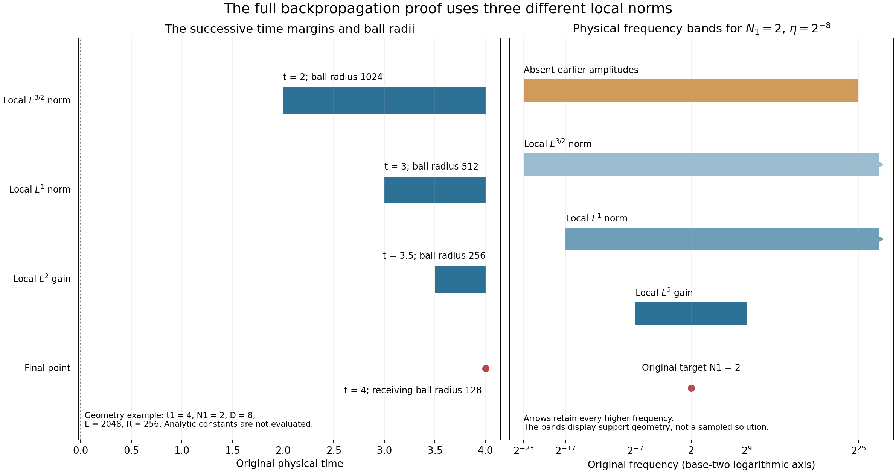

# Frequency backpropagation with the original parameters

A large frequency component at one point forces an earlier component
of the same relative size. We prove that statement with the original
viscosity, center, frequency and time interval. The earlier component
lies in an explicitly bounded frequency range and spatial ball, and
its time is separated from the target by an explicit positive gap.

The proof uses three different local spatial norms. First the heat
equation gives an \(L^{3/2}\) estimate. A complete product decomposition
then gives \(L^1\), followed by \(L^2\). Finally we return to the
original point and obtain a contradiction if every permitted earlier
component were too small. Every kernel tail and low-frequency term
remains in the calculation.

Read [Global nonlinear energy and total speed](global-nonlinear-energy-and-total-speed.md)
for the exact Fourier cutoffs and projected integral equation.
[Interior vorticity bounds on an actual annulus](interior-vorticity-bounds-on-an-actual-annulus.md)
supplies the other local ingredient used later in the endpoint argument.
The human comparison is Terence Tao,
[*Quantitative bounds for critically bounded solutions to the
Navier–Stokes equations*, version 2](https://arxiv.org/abs/1908.04958v2),
original author article.tex lines 514–612. Section 7 proves the exact
map to that source's hierarchy of constants. The complete iterated
and weighted heat arguments are still needed for the general endpoint.

Figure 1. The left panel illustrates only the exact geometric nesting
in 3.1–6.5, for the displayed physical values \(t_1=4,N_1=2,D=8\),
\(L=2048,R=256\). These numbers satisfy the nesting relations but
are not evaluations of the analytical constants in 2.1–2.5.
The right panel shows the exact physical frequency regions for
\(N_1=2,\eta=2^{-8}\), on an explicitly logarithmic axis.
The arrows retain all higher frequencies. The diagram represents
supports and receiving norms, with no sampled fluid solution.
Human comparison: Tao, arXiv:1908.04958v2, article.tex 523–612.
[Reproducible figure source](../assets/original-frequency-backpropagation.py).

## 1. The original equation and full kernel bounds

Let \(u,p\) be a smooth solution on
\([t_0-T,t_0]\times\mathbb R^3\) of the original unforced equation

\[
 \partial_tu+(u\cdot\nabla)u+\nabla p=\nu\Delta u,\qquad
 \operatorname{div}u=0,\qquad \nu>0,\qquad
 \sup_{[t_0-T,t_0]}\|u(t)\|_3\leq U<\infty. \tag{1.1}
\]

The regularity class is the original smooth whole-space class used in
NS-FLUID-12, so the displayed Duhamel identities and Fourier limits
are justified. The force is actually zero in this theorem. A forced
solution has an additional projected force potential and is not
asserted to obey the same conclusion.

Use exactly [Global nonlinear energy and total speed](global-nonlinear-energy-and-total-speed.md), equation (3.1): its explicit radial \(\phi\), the
symbols \(p(\xi)=\phi(\xi)-\phi(2\xi)\) and
\(\widetilde p(\xi)=\phi(\xi/2)-\phi(4\xi)\), and Fourier convention
\(\widehat f(\xi)=\int f(x)e^{-2\pi i\xi\cdot x}\,dx\).
Thus \(p\) is supported in \(1/4\leq|\xi|\leq1\),
\(P_N\widetilde P_N=P_N\), and the actual tensor-to-vector symbols are

\[
 m_{ijk}(\xi)=2\pi i\xi_kp(\xi)
       \left(\delta_{ij}-\frac{\xi_i\xi_j}{|\xi|^2}\right).
 \tag{1.2}
\]

The companion identity permits composition into the single full
heat/Leray kernel; it does not remove the projection or a component.
Set \(\Phi=\mathcal F^{-1}\phi\),
\(C_\phi=\|\Phi\|_1\), \(c_\phi=\|\Phi\|_{3/2}\), and
\(c=\pi^2/8\). Define one finite constant \(K\geq1\) as follows.
For each of the 28 symbols \(m=p,m_{ijk}\), expand the exact identity

\[
 e^{4\pi^2s|\xi|^2}
 (1-\Delta_\xi/(4\pi^2))^{22}
          (e^{-4\pi^2s|\xi|^2}m(\xi))
       =\sum_{n=0}^{44}s^n m_n^\sharp(\xi).
 \tag{1.3}
\]

Put \(a_0=1\), \(a_n=(n/(ec))^n\) for \(n\geq1\), and

\[
 K=1+2^{20}\pi^2
     \sum_{m\in\{p,m_{ijk}:1\leq i,j,k\leq3\}}
          \sum_{n=0}^{44}a_n\|m_n^\sharp\|_1. \tag{1.4}
\]

The coefficients are uniquely determined smooth compactly supported
functions; every term is specified and finite. Repeated integration
by parts, exactly as in the preceding lesson but with exponent 22,
gives kernel bound
\((1+|x|^2)^{-22}e^{-2cs}\sum_ns^n\|m_n^\sharp\|_1\).
Since \(s^ne^{-cs}\leq a_n\), and
\((1+|x|)^{40}\leq2^{20}(1+|x|^2)^{20}\), the weighted kernel is
bounded by the stated coefficient times
\(e^{-cs}(1+|x|^2)^{-2}\). The latter has \(L^1\) norm \(\pi^2\),
maximum one, and hence every \(L^r\) norm at most \(\pi^2\),
\(1\leq r\leq\infty\), by integrating its \(r\)-th power or by
the inequality \(\|g\|_r\leq\|g\|_\infty^{1-1/r}\|g\|_1^{1/r}\).
Consequently the original physical kernels satisfy

\[
 \begin{split}
 \|{\bf1}_{|x|\geq d}e^{\nu\tau\Delta}P_N(x)\|_r
 &\leq K e^{-c\nu\tau N^2}N^{3-3/r}(1+Nd)^{-40},\\
 \sum_{i,j,k}\|{\bf1}_{|x|\geq d}
       (e^{\nu\tau\Delta}P_N\mathbb P\operatorname{div})_{ijk}(x)\|_r
 &\leq K e^{-c\nu\tau N^2}N^{4-3/r}(1+Nd)^{-40}.
 \end{split} \tag{1.5}
\]

These also hold with \(d=0\). The sum bounds the full Euclidean
tensor-to-vector convolution by the triangle inequality. Whenever
the output region is a distance \(d\) from an excluded input region,
the latter contribution is estimated by the restricted kernels in
(1.5), Young's inequality, and, when needed, the exact volume factor
for restriction to a smaller Lebesgue exponent. Thus all the local
kernel estimates used below have now been proved, including tails.

## 2. Choosing all parameters before the proof

The case \(U=0\) has \(u=0\) by continuity, so no nonzero target
amplitude occurs. Assume \(U>0\), and define the original constants

\[
 \begin{gathered}
 v_3=4\pi/3,\qquad A_K=K/(c\nu),\\
 A=U+A_KU^2,\qquad
 Q=(1+C_\phi)^2U^2,\qquad C_R=(1+C_\phi)AU,\\
 B_1=U+A_K\{128C_R+v_3^{1/3}Q\},\\
 B_2=1+A_K(3237B_1+1),\qquad
 B_L=9\sqrt{v_3}+(\sqrt2+1)B_2,\qquad
 Q_*=41C_\phi^2U^2+Q. 
 \end{gathered} \tag{2.1}
\]

Choose the definite positive number

\[
 H=\max\{256,\ 1+72c_\phi U,\ 1+C_R/B_1,\
                  8A_KC_R,\ 8A_KQ_*\}. \tag{2.2}
\]

All entries are finite, and \(B_1>0\). Define

\[
 b_0=\min\left\{1,\
       (432A_KB_2B_L\sqrt H)^{-2},\
       (6400A_KB_2^2)^{-1}\right\}. \tag{2.3}
\]

Fix an actual amplitude \(0<b\leq b_0\). Choose the unique dyadic
\(\eta=2^{-J}\) for which
\(b^2/(2H)<\eta\leq b^2/H\); an equality at a dyadic upper endpoint
uses that endpoint. Set

\[
 \begin{gathered}
 R=H/b,\qquad
 L_3=2+\left\lceil\log_2(40\eta^{-4})\right\rceil,\qquad
 Q_3=(36+20L_3)C_\phi^2U^2+Q,\\
 L=\max\{4R,\ 4\eta^{-1}(Q_3/b)^{1/40}\},\\
 D_u=\nu U\|\mathcal F^{-1}(-4\pi^2|\xi|^2p)\|_{3/2}
                 +U^2\sum_{i,j,k}\|\mathcal F^{-1}m_{ijk}\|_3,\\
 d=b\eta^6/D_u .
 \end{gathered} \tag{2.4}
\]

Here \(D_u>0\), because \(U,\nu>0\) and the nonzero annular Laplacian
symbol has a positive kernel norm. Finally put

\[
 \begin{gathered}
 M=\max\{1,\ Kv_3^{1/3}L\eta^3,\
       Kv_3^{2/3}L^2\eta^6/4,\
       KUv_3^{1/6}\sqrt L\,\eta^{3/2}/(2b),\
       8KU/b\},\\
 D=\max\{4d,\ 4(1+\log M)/(c\nu\eta^6)\}.
 \end{gathered} \tag{2.5}
\]

These choices are sequential; none uses a not-yet-selected radius
or time. Suppose \(t_1\in[t_0-T/2,t_0]\), \(x_1\in\mathbb R^3\),
and an actual frequency \(N_1>0\) obey
\(N_1^2\geq4D/T\) and \(|P_{N_1}u(t_1,x_1)|\geq bN_1\).
We prove the existence of a dyadic frequency \(N_2\in N_1\,2^{\mathbb Z}\)
and an actual earlier point with

\[
 \begin{gathered}
 \eta^3N_1\leq N_2\leq\eta^{-3}N_1,\qquad
 dN_1^{-2}\leq t_1-t_2\leq DN_1^{-2},\\
 |x_2-x_1|\leq L/N_1,\qquad
 |P_{N_2}u(t_2,x_2)|\geq bN_2 .
 \end{gathered} \tag{2.6}
\]

The amplitude is unchanged. No physical frequency, viscosity, center
or time has been set to one. The preceding \(2DN_1^{-2}\) time slab
lies in the original equation interval by the displayed threshold.

## 3. The first local norm and the original lowest frequencies

Suppose no point (2.6) exists. Directly applying the projected
equation and its actual kernels gives
\(|\partial_tP_Nu|\leq D_uN^3\) everywhere in the original interval.
The diffusion contribution has the \(L^{3/2}\) kernel in (2.4);
the full nonlinear tensor has \(L^{3/2}\) norm at most \(U^2\) and
uses its displayed \(L^3\) kernel. Thus, from the absence hypothesis
and the fundamental theorem of calculus across the final gap,

\[
 |P_Nu(t,x)|\leq2bN
 \quad\begin{cases}
 t_1-DN_1^{-2}\leq t\leq t_1,\\
 |x-x_1|\leq L/N_1,\\
 N\in N_1\,2^{\mathbb Z},\quad\eta^3N_1\leq N\leq\eta^{-3}N_1.
 \end{cases} \tag{3.1}
\]

Indeed \(dD_u(N/N_1)^2\leq b\). Equality cases cause no problem
since this is an upper bound.

Let \(\mathcal B_j=B(x_1,L/(2^jN_1))\). Duhamel from
\(t_1-2DN_1^{-2}\), using (1.5) with its full projection, yields
for \(t\geq t_1-DN_1^{-2}\) and \(N\geq\eta^3N_1\)

\[
 \|P_Nu(t)\|_{L^{3/2}(\mathcal B_0)}
 \leq Kv_3^{1/3}(L/N_1)Ue^{-c\nu D(N/N_1)^2}
                         +A_KU^2/N
 \leq A/N . \tag{3.2}
\]

For the last inequality write \(n=N/N_1=\eta^3y\), \(y\geq1\),
and \(a=c\nu D\eta^6/4\geq1+\log M\).
The initial factor after comparison with \(U/N\) is at most
\(Kv_3^{1/3}L\eta^3\, y e^{-4ay^2}\leq Me^{-a}\leq1\).
The nonlinear integral uses
\(\int_0^\infty Ne^{-c\nu N^2s}ds=1/(c\nu N)\);
its full upper time endpoint only decreases this bound.

The dyadic telescoping decomposition converges also in \(L^3\).
Here is the needed justification beyond the earlier \(L^2\) proof.
For a smooth compactly supported function, \(P_{\leq M}f\to f\)
as \(M\to\infty\) by the convolution approximate identity with
\(\int\Phi=\phi(0)=1\), and translation continuity. As \(M\to0\),
Young gives \(\|P_{\leq M}f\|_3\leq
M^2\|\Phi\|_3\|f\|_1\to0\).
Uniform \(L^3\) operator norm \(C_\phi\) and density extend both
limits to every \(L^3\) function. Therefore, for a dyadic \(S\)
with \(2S\geq\eta^3N_1\), summing (3.2) gives

\[
 \|P_{>S}u(t)\|_{L^{3/2}(\mathcal B_0)}
 \leq A\sum_{j=1}^\infty(2^jS)^{-1}=A/S . \tag{3.3}
\]

The same series converges absolutely in the indicated local norm,
and its \(L^3\) limit identifies it with the actual high pass.
Globally retain all three bounds

\[
 \|u\|_3\leq U,\quad
 \|P_{\leq S}u\|_3\leq C_\phi U,\quad
 \|P_{>S}u\|_3\leq(1+C_\phi)U. \tag{3.4}
\]

## 4. The complete local integral estimate

Let \(N\) be dyadic and \(N\geq64\eta^3N_1\). Take \(S=N/128\).
The tensor \(P_{\leq S}u\otimes P_{\leq S}u\) has Fourier support
in \(|\xi|\leq N/64\), so its image under the original \(P_N\)
vanishes exactly. The remaining complete tensor is

\[
 F_N=P_{>S}u\otimes u+P_{\leq S}u\otimes P_{>S}u . \tag{4.1}
\]

Its local \(L^1(\mathcal B_0)\) norm is at most \(128C_R/N\),
by (3.3), (3.4) and Hölder; its global \(L^{3/2}\) norm is at
most \(Q\). Duhamel from \(t_1-DN_1^{-2}\) to any
\(t\geq t_1-(D/2)N_1^{-2}\), now on \(\mathcal B_1\), gives

\[
 \begin{split}
 \|P_Nu(t)\|_{L^1(\mathcal B_1)}
 \leq{}&Kv_3^{2/3}\frac{L^2}{4N_1^2}U
                          e^{-c\nu Dn^2/2}\\
 &+\frac{128A_KC_R}{N^2}
 +\frac{A_KQ}{N}\frac{v_3^{1/3}L}{2N_1}
                          (1+nL/2)^{-40}
 \leq B_1N^{-2}. 
 \end{split} \tag{4.2}
\]

The exterior source is separated by \(L/(2N_1)\); its local
\(L^1\) norm is bounded from global \(L^{3/2}\) with the exact
volume factor shown. For \(z\geq0\), \(z(1+z)^{-40}\leq1\),
which proves its last bound. The initial heat term is at most
\(U/N^2\): its dimensionless coefficient is the second entry of
\(M\), times \(y^2e^{-2ay^2}\), where \(y\geq1\). For \(a\geq1\),
this is at most \(Me^{-a}\leq1\).

For later use, (3.1) and exact telescoping also give, whenever
\(\eta^3N_1\leq S\leq\eta^{-3}N_1\) is dyadic,

\[
 \|P_{\leq S}u\|_{L^\infty(\mathcal B_0)}
 \leq c_\phi U\eta^3N_1+4bS . \tag{4.3}
\]

This is the low-frequency maximum that the product estimate needs.
It follows from the actual low pass at \(\eta^3N_1\) and the finite
sum of the dyadic maxima. It is not the low-frequency \(L^{3/2}\)
bound printed at source line 585.

## 5. All frequency interactions and the local square-integral gain

Use \(P_{\leq F}u\) with the physical frequency
\(F=\eta^{-3}N_1\); the letter \(H\) remains the constant in (2.2).
Decompose the original tensor exactly into its low-pass square
and the remaining two products as in (4.1), with \(S=F\).
Those remaining products have local \(L^1(\mathcal B_1)\) norm
at most \(C_R\eta^3/N_1\) and global \(L^{3/2}\) norm at most \(Q\).
They are estimated collectively, so no infinite sum of equal
exterior errors is introduced.

Expand the low-pass square by the common dyadic lattice. Partition
all ordered pairs \((M,K')\), \(M,K'\leq F\), into
\(K'\leq M/8\), \(M\leq K'/8\), and
\(K'/M\in\{1/4,1/2,1,2,4\}\). This is disjoint and exhaustive.
The first class sums to \(P_Mu\otimes P_{\leq M/8}u\);
the second has the reverse order. After the original \(P_N\),
the first two classes have only frequencies

\[
 N/9\leq M\leq16N. \tag{5.1}
\]

Indeed their actual Fourier support lies between \(M/8\) and
\(9M/8\), while \(P_N\) lies between \(N/4\) and \(N\);
(5.1) is a stated larger containing range. There are at most
nine dyadic \(M\)'s in it. In the comparable class it is enough
to retain \(M\geq N/40\), because the product is supported in
\(|\xi|\leq M+K'\leq5M\); all smaller terms vanish.
The resulting sum is finite. The decomposition follows first from
finite telescoping sums, then from their \(L^3\) convergence and
continuity of multiplication into \(L^{3/2}\).

Suppose \(\eta N_1\leq N\leq\eta^{-1}N_1\).
The choices imply \(\eta^2\leq1/2560\) and
\(72c_\phi U\eta^2\leq b\).
Thus every high factor in (5.1) or its comparable class satisfies
the lower-frequency requirement in (4.2), and every factor whose
maximum is used is inside the band of (3.1).
Equation (4.3) gives
\(\|P_{\leq M/8}u\|_{\infty,\mathcal B_0}\leq bM\).
Consequently both low/high orientations together have local
\(L^1(\mathcal B_1)\) norm at most
\(36B_1b/N\): each summand is at most \(B_1b/M\), and
\(\sum_{M\geq N/9}M^{-1}\leq18/N\).
For comparable pairs use (4.2) on \(P_Mu\) and (3.1) on
\(P_{K'}u\). Each is at most \(8B_1b/M\); there are at most five
\(K'\)'s, and \(\sum_{M\geq N/40}M^{-1}\leq80/N\).
Including the collectively retained remainder, the entire surviving
tensor has local norm at most

\[
 \frac{3236B_1b}{N}+\frac{C_R\eta^3}{N_1}
 \leq\frac{3237B_1b}{N}. \tag{5.2}
\]

For the last step \(C_R\eta^2\leq B_1b\), directly from (2.2)
and \(\eta\leq b^2/H\), \(b\leq1\).
Its global norm is at most \(Q_3\): the two low/high sums contribute
at most \(36C_\phi^2U^2\), since each high pass has \(L^3\) norm
at most \(2C_\phi U\); the comparable class has at most \(L_3\)
values of \(M\), five partners each, and contributes
\(20L_3C_\phi^2U^2\). Every exterior contribution is thus finite.

Duhamel from \(t_1-(D/2)N_1^{-2}\), with
\(t\geq t_1-(D/4)N_1^{-2}\) and output \(\mathcal B_2\), now gives

\[
 \begin{split}
 \|P_Nu(t)\|_{L^2(\mathcal B_2)}
 \leq{}&KUv_3^{1/6}\sqrt{\frac{L}{4N_1}}
                         e^{-c\nu Dn^2/4}\\
 &+A_K3237B_1b\,N^{-1/2}
 +A_KQ_3N^{-1/2}(1+nL/4)^{-40}\\
 \leq{}&bB_2N^{-1/2}.
 \end{split} \tag{5.3}
\]

The local input uses the \(L^2\) heat-divergence kernel, of norm
\(KN^{5/2}e^{-c\nu sN^2}\), applied to \(L^1\).
The exterior input uses its \(L^{6/5}\) norm
\(KN^{3/2}e^{-c\nu sN^2}\), applied to \(L^{3/2}\).
Time integration gives exactly the two displayed powers of \(N\).
The choice of \(L\) ensures

\[
 Q_3(1+nL/4)^{-40}\leq b \quad(n\geq\eta). \tag{5.4}
\]

The initial term is at most \(bN^{-1/2}\): comparison uses the
third heat entry of \(M\) and \(y^{1/2}e^{-ay^2}\leq e^{-a}\).
This deliberately uses \(n\geq\eta^3\), which is weaker than the
present \(n\geq\eta\), so all three heat bounds follow from the
same explicit \(D\).

For completeness the remaining algebraic choices used here are

\[
 \eta\leq1/256,\quad \eta^2\leq1/2560,\quad
 72c_\phi U\eta^2\leq b,\quad
 C_R\eta^2\leq B_1b,\quad
 c_\phi U\eta^3R\leq b,\quad \eta\leq1/R. \tag{5.5}
\]

Each follows by inserting \(\eta\leq b^2/H\), \(R=H/b\),
\(b\leq1\), and the corresponding entry of (2.2).
For example the fifth left side is at most
\(c_\phi U b^5/H^2\leq b\).
No later choice feeds back into these inequalities.

## 6. Returning to the original point

Take the actual smaller ball
\(\mathcal B_R=B(x_1,R/N_1)\subset\mathcal B_2\).
Choose the dyadic \(S\) with \(N_1/R\leq S<2N_1/R\).
Then \(S\geq\eta N_1\), and for every \(M\) in (5.1) with
\(N=N_1\), \(S\leq M/8\), because \(R\geq256\).
From (4.3), (5.5), and the complete ball volume,

\[
 \|P_{\leq S}u\|_{L^2(\mathcal B_R)}
 \leq9\sqrt{v_3}\,b\sqrt R\,N_1^{-1/2}. \tag{6.1}
\]

For \(S<K'\leq M/8\), sum (5.3). The geometric series obeys
\(\sum_{j\geq1}(2^jS)^{-1/2}
=(\sqrt2+1)S^{-1/2}\).
Consequently the complete low pass, including its original
arbitrarily low frequencies, satisfies

\[
 \|P_{\leq M/8}u\|_{L^2(\mathcal B_R)}
 \leq bB_L\sqrt R\,N_1^{-1/2}. \tag{6.2}
\]

This keeps the spatial-volume cost. Summing \(N^{-1/2}\) down
to zero would diverge, and the bound printed at source line 609
does not follow by that summation. The maximum estimate handles
the actual lowest frequencies instead.

Repeat the finite product decomposition for the physical high
cutoff \(F=\eta^{-1}N_1\). All surviving moderate-frequency pairs
fall in the range of (5.3): \(M\geq N_1/40\),
\(K'\geq N_1/160\), and \(\eta\leq1/256\).
For a low/high term use (6.2) and
\(\|P_Mu\|_2\leq3bB_2N_1^{-1/2}\).
Nine frequencies and two orders contribute at most
\(54b^2B_2B_L\sqrt R/N_1\).
For comparable pairs, the product is at most
\(2b^2B_2^2/M\); five partners and the same geometric sum give
\(800b^2B_2^2/N_1\).
The complete two-product remainder uses (3.3), rather than
separately summing infinitely many exterior errors, and has local
norm at most \(C_R\eta/N_1\). Thus

\[
 \|F_{\mathrm{surv}}\|_{L^1(\mathcal B_R)}
 \leq\frac{
 54b^2B_2B_L\sqrt R+800b^2B_2^2+C_R\eta}{N_1}. \tag{6.3}
\]

Its full global norm is bounded by

\[
 Q_f=(36+20L_f)C_\phi^2U^2+Q,\qquad
 L_f=2+\lceil\log_2(40\eta^{-1})\rceil
 \leq2H/b,\qquad Q_f\leq HQ_*/b. \tag{6.4}
\]

To verify the middle inequality, \(1/\eta<2H/b^2\) gives
\(L_f\leq3+\log_2(80H)+2\log_2(1/b)\).
For \(H\geq256\), \(\log_2(80H)\leq H\):
the function \(H\log2-\log(80H)\) is increasing there and
positive at 256. Also \(\log(1/b)\leq1/b\) and
\(\log2\geq1/2\). Hence
\(L_f\leq(H+7)/b\leq2H/b\).
Using \(36\leq H\), the last inequality follows from (2.1).

Finally, Duhamel at the original \((t_1,x_1)\), starting at
\(t_1-(D/4)N_1^{-2}\), and (1.5) give

\[
 \begin{split}
 \frac{|P_{N_1}u(t_1,x_1)|}{N_1}
 \leq{}&KUe^{-c\nu D/4}\\
 &+A_K\{54b^2B_2B_L\sqrt R+800b^2B_2^2+C_R\eta\}\\
 &+A_KQ_f(1+R)^{-40}
 \leq5b/8<b. 
 \end{split} \tag{6.5}
\]

The initial term is at most \(b/8\) by the last entry of \(M\).
The first nonlinear term is at most \(b/8\) because
\(\sqrt R=\sqrt H/\sqrt b\) and the first smallness entry of
(2.3) applies. The second is at most \(b/8\) by its second
entry. The collective remainder is at most \(b/8\) from
\(\eta\leq b^2/H\) and \(H\geq8A_KC_R\).
Finally
\[
 A_KQ_f(1+R)^{-40}
 \leq A_KQ_*H^{-39}b^{39}\leq b/8,
\]
using \(H\geq1\), \(H\geq8A_KQ_*\), and \(b\leq1\).
Every tail has been kept through this comparison.

This contradicts the actual target amplitude and proves (2.6).
All cutoffs, support intervals, constants, viscosity factors and
the unchanged threshold \(b\) are specified. The full original
force was zero throughout this proved source-class theorem.
No general forced theorem or general endpoint is inferred.

## 7. The exact map to the source hierarchy

We now prove the comparison to the source's original unit-viscosity
class without replacing the general-\(\nu\) calculation above.
In this comparison only, put \(\nu=1\) because that is the source
equation, use its actual bound \(U=A_{\rm src}\geq2\), and write
\(C\) for the fixed hierarchy exponent to be selected. This
\(A_{\rm src}\) is distinct from the local constant \(A\) in (2.1).
All constants below depend only on the fixed, fully defined cutoff.
Set \(a_K=K/c\),
\(a_\Delta=\|\mathcal F^{-1}(-4\pi^2|\xi|^2p)\|_{3/2}>0\),
and \(a_{\rm nl}=\sum_{ijk}\|\mathcal F^{-1}m_{ijk}\|_3\).
Define the complete finite constants

\[
 \begin{gathered}
 \alpha=1+a_K,\quad r_0=(1+C_\phi)\alpha,\quad q_0=(1+C_\phi)^2,\\
 \beta_1=1+a_K(128r_0+v_3^{1/3}q_0),\quad
 \beta_2=1+a_K(3237\beta_1+1),\\
 \beta_L=9\sqrt{v_3}+(\sqrt2+1)\beta_2,\quad
 q_*=41C_\phi^2+q_0,\\
 h_0=\max\{256,1+72c_\phi,1+(128a_K)^{-1},
                         8a_Kr_0,8a_Kq_*\},\quad \zeta=2h_0,\\
 c_0=\min\{1,(432a_K\beta_2\beta_L\sqrt{h_0})^{-2},
                         (6400a_K\beta_2^2)^{-1}\},\\
 e_0=\{\zeta^6(a_\Delta+a_{\rm nl})\}^{-1}.
 \end{gathered} \tag{7.1}
\]

Inserting \(U=A_{\rm src}\geq1\) into (2.1)–(2.3), term by term,
gives \(A\leq\alpha A_{\rm src}^2\),
\(C_R\leq r_0A_{\rm src}^3\),
\(B_1\leq\beta_1A_{\rm src}^3\),
\(B_2\leq\beta_2A_{\rm src}^3\),
\(B_L\leq\beta_LA_{\rm src}^3\),
\(H\leq h_0A_{\rm src}^3\), and
\(b_0\geq c_0A_{\rm src}^{-15}\).
For the ratio in \(H\), use the complete positive term
\(B_1\geq128a_KC_R\). The exponent 15 is exactly twice
\(3+3+3/2\); the other amplitude restriction has exponent 6
and is retained in the minimum defining \(c_0\).

For \(C\geq1\), define

\[
 \begin{gathered}
 \ell(C)=15+\log_2 40+4\log_2\zeta+8C,\\
 \mathcal Q(C)=(36+20\ell(C))C_\phi^2+q_0,\\
 \mathcal L(C)=\max\{4h_0,4\zeta\,\mathcal Q(C)^{1/40}\},\\
 \mathcal M(C)=\max\{1,Kv_3^{1/3}\mathcal L(C),
       Kv_3^{2/3}\mathcal L(C)^2/4,
       Kv_3^{1/6}\sqrt{\mathcal L(C)}/2,8K\},\\
 \mathcal D(C)=\max\{4/a_\Delta,\,
                 (4\zeta^6/c)(9+\log\mathcal M(C)+6C)\}.
 \end{gathered} \tag{7.2}
\]

Take \(b=A_{\rm src}^{-C}\), once its smallness condition is met.
The dyadic choice gives
\(\eta^{-1}<\zeta A_{\rm src}^{2C+3}\).
The exact ceiling estimate and
\(\log_2 A_{\rm src}\leq A_{\rm src}\) imply
\(L_3\leq\ell(C)A_{\rm src}\) and
\(Q_3\leq\mathcal Q(C)A_{\rm src}^3\).
Then each term in the original maximum defining \(L\) is retained:
\(4R\leq4h_0A_{\rm src}^{C+3}\), and the other term is at most
\(4\zeta\mathcal Q(C)^{1/40}
 A_{\rm src}^{2C+3+(C+3)/40}\).
Both powers are at most \(3C+4\). Hence

\[
 \begin{gathered}
 L\leq\mathcal L(C)A_{\rm src}^{3C+4},\qquad
 M\leq\mathcal M(C)A_{\rm src}^{6C+8},\\
 D\leq\mathcal D(C)A_{\rm src}^{12C+19},\qquad
 d\geq e_0A_{\rm src}^{-13C-20}.
 \end{gathered} \tag{7.3}
\]

For \(M\), its two intermediate exponents are \(3C+4\) and
\(5C/2+3\), both below \(6C+8\); the omitted dyadic factors in
this upper comparison are at most one, and remain in its original
definition (2.5). The time bound uses
\(1+\log M\leq(9+\log\mathcal M(C)+6C)A_{\rm src}\).
Also \(d\leq1/a_\Delta\), since its numerator is at most one
and \(D_u\geq a_\Delta A_{\rm src}\).
For the lower bound on \(d\), retain
\(\eta^6>\zeta^{-6}A_{\rm src}^{-12C-18}\) and
\(D_u\leq(a_\Delta+a_{\rm nl})A_{\rm src}^2\).

Choose \(C_0\) to be the smallest integer \(C\geq16\) satisfying
the following explicit numerical inequalities:

\[
 \begin{gathered}
 C-15\geq\log_2(1/c_0),\\
 C^2\geq6C+9+3\log_2\zeta,\\
 C^3\geq12C+19+\log_2^+\mathcal D(C),\\
 C^3\geq13C+20+\log_2^+(1/e_0),\\
 C^4\geq3C+4+\log_2^+\mathcal L(C).
 \end{gathered} \tag{7.4}
\]

Here \(\log_2^+x=\max(0,\log_2x)\). This set is nonempty,
so the choice is actual. To prove it, \(\mathcal Q(C)\) is a
positive affine function and
\(\mathcal Q(C)\leq C\mathcal Q(1)\) for \(C\geq1\).
Consequently
\(\mathcal L(C)\leq\mathcal L(1)C^{1/40}\) and
\(\mathcal M(C)\leq\mathcal M(1)C^{1/20}\).
The definition of \(\mathcal D(C)\) and \(\log C\leq C\)
give
\[
 \mathcal D(C)\leq
 C\max\{4/a_\Delta,(4\zeta^6/c)(301/20+\log\mathcal M(1))\}.
\]
Thus every right side of (7.4) is bounded by an explicit affine
function of \(C\), using \(\log_2 C\leq2C\).
The square, cube and fourth power on the left exceed those affine
functions for sufficiently large integers; the first condition is
itself an eventual affine inequality. This proves termination of
the stated finite integer selection without assuming a hierarchy.

With the source's actual \(A_j=A_{\rm src}^{C_0^j}\), (7.1)–(7.4)
now give

\[
 b=A_1^{-1}\leq b_0,\qquad
 \eta^{-3}\leq A_2,\qquad
 d\geq A_3^{-1},\qquad D\leq A_3,\qquad L\leq A_4. \tag{7.5}
\]

For example a constant \(C_*\geq1\) is bounded by
\(A_{\rm src}^{\log_2 C_*}\) because \(A_{\rm src}\geq2\);
this proves each coefficient comparison in (7.5) with its retained
constant. Since \(A_3\geq4\), the source frequency threshold
\(N_1\geq A_3T^{-1/2}\) implies \(N_1^2\geq4D/T\).
Applying the already proved operation (2.6) therefore gives exactly

\[
 \begin{gathered}
 A_2^{-1}N_1\leq N_2\leq A_2N_1,\qquad
 A_3^{-1}N_1^{-2}\leq t_1-t_2\leq A_3N_1^{-2},\\
 |x_2-x_1|\leq A_4/N_1,\qquad
 |P_{N_2}u(t_2,x_2)|\geq A_1^{-1}N_2.
 \end{gathered} \tag{7.6}
\]

This proves the exact comparison to source Proposition (iv), including
its original amplitude, time, spatial and frequency bounds, after an
explicit sufficiently large fixed choice of its \(C_0\).
The general positive-viscosity proof remains (1.1)–(6.5); no
unit-viscosity flow was substituted into that calculation.

## 8. Five solved exercises

### Exercise 1: account for every ordered frequency pair

For a common dyadic lattice, prove that the partition used in
Section 5 is disjoint and exhaustive. Verify both support
exclusions and the coefficients \(36\) and \(3200\) in (5.2).
Explain why there are only finitely many surviving pairs after
the upper cutoff is fixed.

**Solution.** Write the two dyadic frequencies as \(M\) and
\(K'=2^jM\). If \(j\leq-3\), then \(K'\leq M/8\).
If \(j\geq3\), then \(M\leq K'/8\). The five remaining integers
\(j=-2,-1,0,1,2\) give precisely
\(K'/M\in\{1/4,1/2,1,2,4\}\). No pair belongs to two classes.

The first class sums the actual lower factors to
\(P_{\leq M/8}u\); the reverse class retains the other tensor
order. The high factor has support \(M/4\leq|\xi|\leq M\),
and the lower factor has support \(|\xi|\leq M/8\).
The two triangle inequalities for their Fourier sum therefore
give the support \(M/8\leq|\xi|\leq9M/8\).
For this to meet \(N/4\leq|\xi|\leq N\), one needs
\(2N/9\leq M\leq8N\), which lies in the stated containing
range \(N/9\leq M\leq16N\).
That larger range has at most nine dyadic members, since
its endpoint ratio is \(144<2^8\).

For a comparable pair, the product has support
\(|\xi|\leq M+K'\leq5M\). All \(M<N/20\) give zero after
the original \(P_N\), so retaining the larger range
\(M\geq N/40\) is valid. Together with \(M,K'\leq F\),
this leaves a finite set. The actual tensor outside this
physical upper cutoff remains in the two collective products.

For any dyadic lattice and any \(a>0\),
\[
 \sum_{\substack{M\ {\rm dyadic}\\M\geq a}}M^{-1}\leq2/a.
 \tag{8.1}
\]
Indeed its first included member \(M_0\) is at least \(a\),
and the sum is \(M_0^{-1}\sum_{j\geq0}2^{-j}=2/M_0\).
Each low/high product is bounded by \(B_1b/M\).
Two orders and (8.1) with \(a=N/9\) give \(36B_1b/N\).
Each comparable product is bounded by \(8B_1b/M\).
Five partners and (8.1) with \(a=N/40\) give
\(8\cdot5\cdot80B_1b/N=3200B_1b/N\).
These are the coefficients actually used in the proof;
the complete containing ranges remain explicit.

### Exercise 2: a low pass cannot inherit a reciprocal high-frequency bound

Construct nonzero real divergence-free Schwartz fields \(v_\kappa\)
whose global \(L^3\) norm is fixed, for which
\(P_{\leq N/100}v_\kappa=v_\kappa\), but whose local
\(L^{3/2}\) norm on an explicitly specified ball grows like
\(\kappa^{-1}\). State exactly which inference this tests.

**Solution.** Choose a nonzero real even smooth Fourier function
\(\psi\) supported in \(B(0,1/2)\), positive on a smaller ball.
Let \(g=\mathcal F^{-1}\psi\) and
\(w=\nabla\times(ge_3)=(\partial_2g,-\partial_1g,0)\).
The Fourier formula shows that \(w\) is real, Schwartz and
divergence free, with support of its transform inside \(B(0,1/2)\).
It is nonzero because
\(2\pi i(\xi_2,-\xi_1,0)\psi(\xi)\) is not identically zero.
Choose a fixed \(\rho>0\) with
\(c_\rho=\|w\|_{L^{3/2}(B(0,\rho))}>0\).

For every actual \(\kappa>0\), define
\(v_\kappa(x)=\kappa w(\kappa x)\).
Substitution into the full original integrals gives
\[
 \|v_\kappa\|_3=\|w\|_3,\qquad
 \|v_\kappa\|_{L^{3/2}(B(0,\rho/\kappa))}
                   =\kappa^{-1}c_\rho.
 \tag{8.2}
\]
If \(\kappa\leq N/200\), its Fourier support lies within
the plateau \(|\xi|\leq N/200\) of \(P_{\leq N/100}\),
so the asserted low-pass equality holds exactly.
For fixed \(N\), the second norm is unbounded as
\(\kappa\downarrow0\), while the critical norm is unchanged.
Consequently the global critical norm alone gives no
radius-independent bound of the form \(C/N\) for that low pass
on these balls. The ball and its physical radius are part of
the example; they are not suppressed.

This tests the proposed spatial inference, not an unforced
solution on the source's entire time interval. The correct
receiving estimate (4.3) bounds the low-frequency maximum
using the actual lowest pass and the finite amplitude sum.
No inverse frequency sum is applied to arbitrarily low modes.

### Exercise 3: retain the entire high-frequency remainder

For a physical dyadic \(F>0\), derive the complete remainder
after the square of \(P_{\leq F}u\). Prove its global
\(L^{3/2}\) and local \(L^1\) bounds from (3.3)–(3.4),
and show exactly which factor enters the final estimate.

**Solution.** Put \(a=P_{\leq F}u\), \(h=P_{>F}u=u-a\).
Multiplication gives the exact ordered-tensor identity
\[
 u\otimes u-a\otimes a=h\otimes u+a\otimes h.
 \tag{8.3}
\]
The right side contains \(h\otimes a\), \(a\otimes h\)
and \(h\otimes h\) exactly once. Globally, Hölder gives
\[
 \|h\otimes u+a\otimes h\|_{3/2}
 \leq (1+C_\phi)U^2+
        C_\phi(1+C_\phi)U^2=Q.
 \tag{8.4}
\]
When \(2F\geq\eta^3N_1\), the already proved local estimate
\(\|h\|_{3/2,\mathcal B_0}\leq A/F\) and the global
\(L^3\) bounds give
\[
 \|h\otimes u+a\otimes h\|_{1,\mathcal B_0}
 \leq(1+C_\phi)AU/F=C_R/F.
 \tag{8.5}
\]
The same bound holds on every smaller ball. At the final
physical choice \(F=\eta^{-1}N_1\), it is
\(C_R\eta/N_1\). The local point-evaluation heat kernel
has norm \(KN_1^4e^{-c\nu sN_1^2}\); its full time integral
is at most \(A_KN_1^2\). Thus this remainder contributes
at most \(A_KC_R\eta N_1\), the term retained in (6.5).
Its exterior contribution remains part of the separate
global \(Q_f\) term. Summing a fixed exterior bound over
infinitely many individual frequency pairs would diverge;
(8.3)–(8.5) prove the actual finite receiving map.

### Exercise 4: compare every original physical scale

Under \(u^\lambda(t,x)=\lambda u(\lambda^2t,\lambda x)\),
derive the map of the theorem, including the three local
norm bounds, the allowed earlier point, the positive time
gap and the full kernel tails.

**Solution.** Put
\(p^\lambda(t,x)=\lambda^2p(\lambda^2t,\lambda x)\).
Direct differentiation gives factor \(\lambda^3\)
in each term of the unforced original equation, so \(\nu\)
is unchanged. The complete Fourier substitution gives
\[
 P_{\lambda N}u^\lambda(t,x)
       =\lambda(P_Nu)(\lambda^2t,\lambda x).
 \tag{8.6}
\]
Also \(\|u^\lambda(t)\|_3=\|u(\lambda^2t)\|_3\).
Thus \(U,\nu,b\), the fixed kernel constants, and every
number \(A,B_1,B_2,B_L,H,\eta,R,L,D,d\) are unchanged.
The physical data transform as
\[
 T^\lambda=T/\lambda^2,\quad
 t_i^\lambda=t_i/\lambda^2,\quad
 x_i^\lambda=x_i/\lambda,\quad N_i^\lambda=\lambda N_i.
 \tag{8.7}
\]
In particular \(N_1^2\geq4D/T\) is exactly equivalent
to its transformed inequality, and all three intervals
and the displacement in (2.6) have the required factors.
The amplitude inequality on either point has factor
\(\lambda\) on both sides.

An original \(L^p\) spatial norm has factor
\(\lambda^{1-3/p}\) on the mapped ball. Therefore
the first bound \(A/N\) has factor \(\lambda^{-1}\),
the second \(B_1N^{-2}\) has factor \(\lambda^{-2}\),
and the third \(bB_2N^{-1/2}\) has factor
\(\lambda^{-1/2}\), exactly their respective
\(p=3/2,1,2\) degrees. The product \(\nu\tau N^2\)
and the kernel-tail distance \(N\,\mathrm{distance}\)
are invariant. Every heat exponential and exterior
factor is consequently preserved. This proves the
full comparison while the lesson's working equation
keeps its original coordinates and viscosity.

### Exercise 5: construct a finite backward chain

Start at \(t_0,x_0,N_0\) with
\(N_0\geq2\sqrt{D/T}\) and
\(|P_{N_0}u(t_0,x_0)|\geq bN_0\).
Apply the proved operation while the current time
is at least \(t_0-T/2\) and its frequency is at
least \(2\sqrt{D/T}\). Prove that this process
stops after finitely many steps. Retain explicit
bounds for its time and total displacement.

**Solution.** The source smooth class gives the finite
actual quantity \(V=\sup_{[t_0-T,t_0]}\|u(t)\|_\infty\).
Put \(C_P=\|\mathcal F^{-1}p\|_1>0\).
The initial nonzero amplitude implies \(V>0\).
Whenever the two stated input conditions hold,
the already proved theorem produces the next
point, so this recursion uses an established operation.
Every selected point satisfies
\[
 |P_{N_i}u(t_i,x_i)|\geq bN_i,\quad
 N_i\leq C_PV/b,\quad
 dN_{i-1}^{-2}\leq t_{i-1}-t_i
                       \leq DN_{i-1}^{-2}.
 \tag{8.8}
\]
The frequency upper bound follows from the exact
scaled \(L^1\) norm \(C_P\) of the projection kernel.
Hence each step loses at least
\(\delta_{\min}=d(b/(C_PV))^2>0\) in time.
Each step is taken from a time at least \(t_0-T/2\);
its frequency condition makes its length at most
\(T/4\). Thus every selected time, including the
last one, is at least \(t_0-3T/4\).
An infinite recursion would lose more than this
finite interval because of \(\delta_{\min}\),
which is impossible. If \(n\) is the number of steps,
\[
 n\leq\frac{3T}{4d}\left(\frac{C_PV}{b}\right)^2.
 \tag{8.9}
\]
At its actual stopping point either the time is
below \(t_0-T/2\) or the frequency is below
\(2\sqrt{D/T}\); otherwise the theorem supplies
one more step. The initial assumptions ensure
that at least one step is taken.

Every spatial step obeys
\(|x_i-x_{i-1}|\leq L/N_{i-1}\).
The lower time-gap bound in (8.8) gives
\(\sum_{i=0}^{n-1}N_i^{-2}\leq3T/(4d)\).
The full triangle inequality and finite
Cauchy–Schwarz inequality therefore give
\[
 |x_n-x_0|
 \leq L\sum_{i=0}^{n-1}N_i^{-1}
 \leq L\sqrt{\frac{3nT}{4d}}
 \leq\frac{3LT}{4d}\frac{C_PV}{b}.
 \tag{8.10}
\]
This proves actual finite termination and retains
all time and spatial costs. The auxiliary smooth
maximum \(V\) is used here only for this finite-chain
bound. The quantitative endpoint needs the later
total-speed argument to replace that dependence;
no such replacement has been assumed in this exercise.

## 9. Source comparison and the next argument

The original comparison is Tao, arXiv:1908.04958v2,
article.tex 272–282 and 514–612. The complete projected
kernels restore the Leray terms in the integral equation.
The correct low-frequency input is the maximum (4.3).
The comparable-frequency products use an actual maximum
or two actual square-integral norms as specified, rather
than an incompatible pair of spatial exponents.
The final low-frequency sum retains its ball-volume cost
and its separate lowest pass. All Gaussian factors use the
actual physical squared frequency times elapsed heat time.
Section 7 proves the exact original hierarchy after an
explicit sufficiently large fixed choice of its exponent.

Exercise 5 supplies finite iteration and its auxiliary
smooth bound. The next argument must prove the sharper
iteration using the complete total-speed estimate, then
connect the resulting original vorticity mass to the
weighted heat estimates and the actual annulus. Those
remaining steps are required before claiming the general
large critical-velocity endpoint. No novelty is asserted.

The mathematical text and original figure are dedicated
to CC0 1.0. Cited author sources retain their respective terms.
