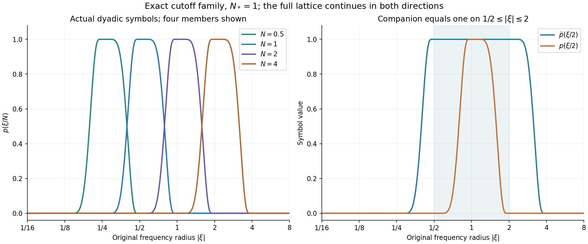

# Global nonlinear energy and total speed

A moving annulus must move far enough to keep ahead of the flow.
The preceding lesson expressed that requirement as an integral of
the maximum velocity. We now bound that integral from the actual
\(L^3\) velocity bound and the original force.

The proof has two parts. First, subtract the actual earlier heat
evolution and bound the energy of what remains. Then sum its
frequency components, keeping the low frequencies, all four tensor
interactions and the Leray projection. The final estimate retains
the viscosity and the original time interval.

This develops the bounded-total-speed argument in Terence Tao's
[quantitative Navier–Stokes paper](https://arxiv.org/abs/1908.04958v2).
The full-force calculation and the source corrections are proved
here. They supply inputs for annular regularity; the general
large-\(L^3\) endpoint theorem is still a further argument.

## 1. The actual heat field and the nonlinear part

Let \(t_b<t_0<t_2\), \(I=[t_0,t_2]\), and \(T=t_2-t_0>0\).
On \([t_b,t_2]\times\mathbb R^3\), keep the original equation

\[
 \partial_tu+(u\cdot\nabla)u+\nabla p=\nu\Delta u+f,\qquad
 \operatorname{div}u=0,\qquad \nu>0 .
 \tag{1.1}
\]

We work with the smooth source class: \(u\) and its spatial
derivatives belong to \(L^\infty_tL^2_x\). These hypotheses
justify the integrations and Fourier limits below. The resulting
bounds do not depend on those auxiliary derivative norms.
Let

\[
 \begin{gathered}
 U=\sup_{t_b\leq t\leq t_2}\|u(t)\|_3<\infty,\qquad
 L=t_2-t_b,\\
 f=f_a+f_b,\qquad f_a\in L^1([t_b,t_2];H^1),\qquad
 f_b\in L^2([t_b,t_2];L^2),\\
 F_1=\int_{t_b}^{t_2}\|f(t)\|_2\,dt
 \leq\|f_a\|_{L^1L^2}+\sqrt L\,\|f_b\|_{L^2L^2}.
 \end{gathered}
 \tag{1.2}
\]

No force is removed from the equation. Define

\[
 v(t)=e^{\nu(t-t_b)\Delta}u(t_b),\qquad w=u-v .
 \tag{1.3}
\]

Then \(w(t_b)=0\), and the pressure projection from the earlier
lessons gives its complete integral equation:

\[
 \begin{aligned}
 w(t)={}&-\int_{t_b}^t e^{\nu(t-s)\Delta}
            \mathbb P\operatorname{div}(u\otimes u)(s)\,ds\\
       &+\int_{t_b}^t e^{\nu(t-s)\Delta}\mathbb P f(s)\,ds .
 \end{aligned}
 \tag{1.4}
\]

Here \(\mathbb P\) is the original whole-space Leray projection,
with symbol \(\delta_{ij}-\xi_i\xi_j/|\xi|^2\) off zero.
The Fourier convention remains \(e^{-2\pi i x\cdot\xi}\).
The heat kernel and the full tensor-to-vector kernel are

\[
 \begin{gathered}
 H_s(x)=(4\pi s)^{-3/2}e^{-|x|^2/(4s)},\\
 K_{ijk,s}(x)=\delta_{ij}\partial_kH_s(x)
             +\int_s^\infty\partial_i\partial_j\partial_kH_\tau(x)\,d\tau .
 \end{gathered}
 \tag{1.5}
\]

Fourier transformation of the second line gives exactly

\[
 e^{-4\pi^2s|\xi|^2}
 \left(\delta_{ij}-\frac{\xi_i\xi_j}{|\xi|^2}\right)
                                  2\pi i\xi_k .
 \tag{1.6}
\]

For example, the three derivatives inside the integral contribute
\((2\pi i)^3\xi_i\xi_j\xi_k\), and time integration divides
by \(4\pi^2|\xi|^2\). This proves both the sign and the full
projection factor.

The integral in (1.5) converges in \(L^{6/5}\). The exact Gaussian
change of variables shows that one derivative has that norm
proportional to \(s^{-3/4}\), and three derivatives to \(s^{-7/4}\).
Thus define the finite constant

\[
 \kappa_0=\sum_{i,j,k=1}^3
 \left[
 \delta_{ij}\|\partial_kH_1\|_{6/5}
       +\frac43\|\partial_i\partial_j\partial_kH_1\|_{6/5}
 \right].
 \tag{1.7}
\]

Young's inequality bounds the \(L^{3/2}\)-to-\(L^2\) operator
norm of (1.5) by \(\kappa_0s^{-3/4}\), with tensor Euclidean
norms. The sum over all three indices is a safe component bound.
Since \(\|u\otimes u\|_{3/2}=\|u\|_3^2\), (1.4) implies

\[
 \sup_{t_b\leq t\leq t_2}\|w(t)\|_2
 \leq W_0:=4\kappa_0\nu^{-3/4}U^2L^{1/4}+F_1 .
 \tag{1.8}
\]

Indeed \(\int_{t_b}^t(t-s)^{-3/4}\,ds=4(t-t_b)^{1/4}\).
For the force term, both the heat operator and \(\mathbb P\)
are \(L^2\) contractions. Also positivity and mass one of the
heat kernel give

\[
 \|v(t)\|_3\leq U,\qquad \|w(t)\|_3\leq2U .
 \tag{1.9}
\]

The bound (1.8) does not require the value of \(\|u(t_b)\|_2\).
It bounds the actual difference \(u-v\), including its forced part.

## 2. The full nonlinear energy estimate

For an integer \(m\geq0\) and \(3\leq p\leq\infty\), define

\[
 \frac1{r_p}=\frac23+\frac1p,\qquad
 C_{m,p}=\|\nabla^mH_1\|_{r_p}.
 \tag{2.1}
\]

The derivative tensor contains every ordered spatial derivative.
Gaussian differentiation and Young give

\[
 \|\nabla^mv(t)\|_p
 \leq C_{m,p}U
       [\nu(t-t_b)]^{-m/2-1/2+3/(2p)} .
 \tag{2.2}
\]

All constants are specified integrals of Gaussian derivatives.
In particular \(C_{0,3}=1\) and
\(C_{0,\infty}=1/(3\sqrt\pi)\); Exercise 1 verifies the latter.

Since \(w\) is solenoidal, its energy identity is

\[
 \frac12\frac{d}{dt}\|w\|_2^2+\nu\|\nabla w\|_2^2
 =\int\nabla w : (u\otimes u-w\otimes w)\,dx
                         +\int w\cdot f\,dx .
 \tag{2.3}
\]

The pressure pairs to zero. The omitted pure \(w\) tensor has
zero pairing because integration of
\((w\cdot\nabla)|w|^2/2\) is zero. The exact remaining tensor is
\(v\otimes u+w\otimes v\); by (1.9) its \(L^2\) norm is
at most \(3U\|v\|_6\). Therefore

\[
 \frac12\frac{d}{dt}\|w\|_2^2+\frac\nu2\|\nabla w\|_2^2
 \leq\frac{9U^2}{2\nu}\|v\|_6^2+W_0\|f\|_2 .
 \tag{2.4}
\]

This uses the nonnegative square with factors
\(\sqrt\nu\|\nabla w\|_2\) and \(3U\|v\|_6/\sqrt\nu\).
For any \(t_a>t_b\), integration retains both endpoint norms
before discarding the nonnegative final norm in the upper-bound
direction. Substituting (2.2) yields

\[
 \begin{aligned}
 \int_{t_a}^{t_2}\|\nabla w\|_2^2\,dt\leq{}&
 \frac{\|w(t_a)\|_2^2}{\nu}\\
 &+\frac{18C_{0,6}^2U^4}{\nu^{5/2}}
       \left(\sqrt{t_2-t_b}-\sqrt{t_a-t_b}\right)
 +\frac{2W_0}{\nu}\int_{t_a}^{t_2}\|f\|_2\,dt .
 \end{aligned}
 \tag{2.5}
\]

The factor \(18\) includes the integral of
\((t-t_b)^{-1/2}\). The initial \(L^2\) norm is squared.
In particular, its upper bound from (1.8) must also be squared.
Spatial cutoff limits justify (2.3) in the stated source class:
all velocity factors and their needed derivatives are integrable,
and the annular errors tend to zero by their \(L^2\) tails.
The force pairing is integrable by (1.8) and (1.2).

For the total-speed estimate, set

\[
 \begin{gathered}
 \mathcal M=\int_I\|\nabla w\|_2^2\,dt,\qquad
 H=\|v\|_{L^2(I;L^\infty)},\qquad
 F_I=\int_I\|f(t)\|_2\,dt,\\
 V=\frac{2U}{3\sqrt{\pi\nu}}
       \left(\sqrt{t_2-t_b}-\sqrt{t_0-t_b}\right).
 \end{gathered}
 \tag{2.6}
\]

Equation (2.5) bounds \(\mathcal M\). The actual earlier heat
time also gives

\[
 \int_I\|v\|_\infty\,dt\leq V,\qquad
 H\leq\frac{U}{3\sqrt{\pi\nu}}
           \left(\log\frac{t_2-t_b}{t_0-t_b}\right)^{1/2}.
 \tag{2.7}
\]

The strictly positive gap \(t_0-t_b\) is retained in the logarithm.
No bound at the initial heat time is inferred from it.

## 3. The original frequency operators and their kernels

Fix any physical frequency \(N_*>0\). All frequencies \(M,N\)
below belong to \(\{2^jN_*:j\in\mathbb Z\}\). The sum includes
arbitrarily small positive frequencies. Use the explicit functions

\[
 \begin{gathered}
 b(s)=
 \begin{cases}e^{-1/s},&s>0,\\0,&s\leq0,\end{cases}
 \qquad
 \chi(s)=\frac{b(1-s)}{b(1-s)+b(s-1/4)},\qquad
 \phi(\xi)=\chi(|\xi|^2),\\
 p(\xi)=\phi(\xi)-\phi(2\xi),\qquad
 \widetilde p(\xi)=\phi(\xi/2)-\phi(4\xi),\\
 P_{\leq N}=\phi(\xi/N)(D),\quad P_N=p(\xi/N)(D),\quad
 \widetilde P_N=\widetilde p(\xi/N)(D),\quad
 P_{>N}=1-P_{\leq N}.
 \end{gathered}
 \tag{3.1}
\]

The denominator in \(\chi\) is positive everywhere. Its radial
profile decreases: where both denominator terms are positive the
numerator decreases and the second term increases, so differentiating
the quotient gives a nonpositive derivative. It follows that \(p\)
is nonnegative and supported in \(1/4\leq|\xi|\leq1\).
At any nonzero frequency at most three of its dyadic supports meet.
Finite telescoping gives

\[
 \sum_{j=-J}^{K}P_{2^jN_*}
       =P_{\leq2^KN_*}-P_{\leq2^{-J-1}N_*}.
 \tag{3.2}
\]

The multiplier tends to one at every \(\xi\ne0\) and is bounded
by one. Parseval and dominated convergence prove the corresponding
strong \(L^2(\mathbb R^3)\) limit. Moreover, \(\widetilde p=1\)
on the support of \(p\), directly from the plateau and support of
\(\phi\). Hence

\[
 P_N\widetilde P_N=P_N .
 \tag{3.3}
\]

The whole-space theorem here has no nonzero constant in \(L^2\).
A periodic version must retain its constant velocity mode separately;
it is not obtained by discarding that mode from (3.2).

Put \(\Phi=\mathcal F^{-1}\phi\) and
\(\widetilde\Phi=\mathcal F^{-1}\widetilde p\). Retain these
finite kernel constants:

\[
 \begin{gathered}
 c_\phi=\|\Phi\|_{3/2},\qquad
 d_1=\|\widetilde\Phi\|_1,\quad
 d_{6/5}=\|\widetilde\Phi\|_{6/5},\quad
 d_2=\|\widetilde\Phi\|_2,\quad
 d_\infty=\|\widetilde\Phi\|_\infty,\\
 c_p=\|p\|_2,\qquad c_*=\frac{\pi^2}{4}.
 \end{gathered}
 \tag{3.4}
\]

Smooth compact Fourier support and integration by parts make
\(\Phi,\widetilde\Phi\) Schwartz functions. In particular all
these integrals exist. Young's inequality applied to the exact
kernel \(N^3\widetilde\Phi(Nx)\) gives

\[
 \|\widetilde P_NF\|_\infty
 \leq d_r N^{3(1-1/r)}\|F\|_{r'},
 \qquad r\in\{1,6/5,2,\infty\},\qquad \frac1r+\frac1{r'}=1 .
 \tag{3.5}
\]

This holds for the Euclidean norm of a scalar, vector or tensor
field \(F\), by the pointwise norm bound in the convolution integral.

### 3.1. The full heat and Leray kernels on an annulus

For \(s\geq0\), define the fixed symbols and their actual kernels:

\[
 \begin{gathered}
 m_0(\xi)=p(\xi),\qquad
 m_{ijk}(\xi)=2\pi i\xi_k p(\xi)
       \left(\delta_{ij}-\frac{\xi_i\xi_j}{|\xi|^2}\right),\\
 k_{0,s}=\mathcal F^{-1}(e^{-4\pi^2s|\xi|^2}m_0),\qquad
 k_{ijk,s}=\mathcal F^{-1}(e^{-4\pi^2s|\xi|^2}m_{ijk}),\\
 B(s)=\|k_{0,s}\|_{3/2},\qquad
 A(s)=\sum_{i,j,k=1}^3\|k_{ijk,s}\|_1,\\
 \mathcal B_0=\int_0^\infty B(s)\,ds,\qquad
 \mathcal K_0=\int_0^\infty A(s)\,ds .
 \end{gathered}
 \tag{3.6}
\]

We now prove that both time integrals are finite. Let
\(\mathcal D_\xi=(1-\Delta_\xi/(4\pi^2))^2\).
Twice integrating by parts in the inverse Fourier transform gives

\[
 |\mathcal F^{-1}m(x)|
 \leq(1+|x|^2)^{-2}\|\mathcal D_\xi m\|_1 .
 \tag{3.7}
\]

Each fixed symbol in (3.6) is smooth and compactly supported
away from zero. Leibniz's rule gives uniquely specified coefficients
\(m_0^\sharp,\ldots,m_4^\sharp\) through the identity

\[
 e^{4\pi^2s|\xi|^2}
 \mathcal D_\xi(e^{-4\pi^2s|\xi|^2}m(\xi))
                 =\sum_{n=0}^4s^n m_n^\sharp(\xi).
 \tag{3.8}
\]

There are at most four derivatives, each producing at most one
power of \(s\). The coefficients remain smooth and supported in
the same annulus. On that support \(4\pi^2|\xi|^2\geq c_*\).
Thus, for \(r=1\) or \(3/2\),

\[
 \begin{aligned}
 \|\mathcal F^{-1}(e^{-4\pi^2s|\xi|^2}m)\|_r
 &\leq J_r^{1/r}e^{-c_*s}
                          \sum_{n=0}^4s^n\|m_n^\sharp\|_1,\\
 J_r&=\int_{\mathbb R^3}(1+|x|^2)^{-2r}\,dx,\qquad
 J_1=\pi^2,\quad J_{3/2}=\pi^2/4 .
 \end{aligned}
 \tag{3.9}
\]

The radial integrals follow by polar coordinates and the substitution
\(r=\tan\theta\). Integrating (3.9) in \(s\) gives the explicit
finite upper bound

\[
 J_r^{1/r}\sum_{n=0}^4
                \frac{n!\,\|m_n^\sharp\|_1}{c_*^{n+1}}.
 \tag{3.10}
\]

For \(\mathcal B_0\) use \(m=m_0,r=3/2\); for
\(\mathcal K_0\), sum the bound with \(m=m_{ijk},r=1\).
This proves the constants used below without leaving a multiplier
estimate unproved.

At physical frequency \(N\) and physical time lag \(\tau\),
the kernels are \(N^3k_{0,\nu\tau N^2}(Nx)\) and
\(N^4k_{ijk,\nu\tau N^2}(Nx)\). Consequently

\[
 \begin{aligned}
 \|e^{\nu\tau\Delta}P_Ng\|_\infty
 &\leq NB(\nu\tau N^2)\|g\|_3,\\
 \|e^{\nu\tau\Delta}P_N\mathbb P\operatorname{div}F\|_\infty
 &\leq NA(\nu\tau N^2)\|F\|_\infty .
 \end{aligned}
 \tag{3.11}
\]

For the force, a different bound is useful. Cauchy–Schwarz in
Fourier space, the full projection's norm at most one, and
\(|\xi|\geq N/4\) give

\[
 \|e^{\nu\tau\Delta}P_N\mathbb P f\|_\infty
 \leq c_p N^{3/2}e^{-c_*\nu\tau N^2}\|f\|_2 .
 \tag{3.12}
\]

The kernels and these bounds retain every Leray component and
the derivative factor \(2\pi\). The value of the projection
at zero does not enter an annular operator.

## 4. The two receiving frequency sums

Define the actual time-space norms

\[
 \begin{gathered}
 a_M=\|P_Mw\|_{L^2(I;L^2)},\qquad
 L_N=\|P_{\leq N}w\|_{L^2(I;L^\infty)},\qquad
 H_N=\|P_{>N}w\|_{L^2(I;L^2)},\\
 v_3=4\pi/3,\qquad g_*=(1-2^{-1/2})^{-1}.
 \end{gathered}
 \tag{4.1}
\]

Fourier Cauchy–Schwarz on \(|\xi|\leq M\) gives

\[
 \|P_Mw(t)\|_\infty
 \leq\sqrt{v_3}\,M^{3/2}\|P_Mw(t)\|_2 .
 \tag{4.2}
\]

Minkowski, telescoping and the exact weighted Cauchy split then give

\[
 \begin{aligned}
 L_N^2
 &\leq v_3\left(\sum_{M\leq N}M^{3/2}a_M\right)^2\\
 &\leq v_3g_*N^{1/2}\sum_{M\leq N}M^{5/2}a_M^2 .
 \end{aligned}
 \tag{4.3}
\]

The two Cauchy factors are \(M^{1/4}\) and \(M^{5/4}a_M\).
The first squared sum is exactly \(g_*N^{1/2}\).
For infinite sums first apply the finite inequality and then
monotone convergence. Its finite right side, bounded below in
(4.6), also proves that the low-frequency series converges in
the stated time-space norm and agrees with its \(L^2\) limit.

Multiply (4.3) by \(N^{-1}\), sum over \(N\geq N_*\), and
interchange nonnegative sums. For \(M\geq N_*\) the outer
sum equals \(g_*M^{-1/2}\); for \(M<N_*\) it equals
\(g_*N_*^{-1/2}\). Since \(M^{5/2}N_*^{-1/2}\leq M^2\)
in the latter case, every low frequency is retained and

\[
 \sum_{N\geq N_*}N^{-1}L_N^2
             \leq v_3g_*^2\sum_M M^2a_M^2 .
 \tag{4.4}
\]

For the high-frequency part, at most three \(p_M\) overlap at
a nonzero frequency. Therefore
\((\sum_{M>N}p_M)^2\leq3\sum_{M>N}p_M^2\), and Parseval
gives \(H_N^2\leq3\sum_{M>N}a_M^2\).
For \(M=2^jN_*>N_*\) the exact finite geometric sum is
\(\sum_{N_*\leq N<M}N^2=(M^2-N_*^2)/3\). Thus

\[
 \sum_{N\geq N_*}N^2H_N^2
 \leq\sum_{M>N_*}(M^2-N_*^2)a_M^2
 \leq\sum_M M^2a_M^2 .
 \tag{4.5}
\]

Finally \(M\leq4|\xi|\) on the support of \(p_M\), and
\(\sum_Mp_M^2\leq\sum_Mp_M=1\). Keeping the full gradient
multiplier \(2\pi i\xi\), Parseval gives

\[
 \sum_M M^2a_M^2
 \leq16\int_I\int|\xi|^2|\widehat w(t,\xi)|^2\,d\xi\,dt
 =\frac4{\pi^2}\mathcal M .
 \tag{4.6}
\]

Equations (4.4)–(4.6) close both receiving sums with the original
nonlinear gradient energy. No frequency contribution has been
replaced by an assumed summability property.

## 5. All four tensor interactions

The complete tensor is

\[
 u\otimes u=v\otimes v+v\otimes w+w\otimes v+w\otimes w .
 \tag{5.1}
\]

Let \(S_3=4\sqrt3\), the proved Sobolev constant from the
preceding lesson. Its estimate gives
\(\|w\|_{L^2(I;L^6)}\leq S_3\sqrt{\mathcal M}\).
The first three terms of (5.1), by (3.5) and Hölder, obey

\[
 \begin{aligned}
 \|\widetilde P_N(v\otimes v)\|_{L^1(I;L^\infty)}
 &\leq d_1H^2,\\
 \|\widetilde P_N(v\otimes w)\|_{L^1(I;L^\infty)}
 +\|\widetilde P_N(w\otimes v)\|_{L^1(I;L^\infty)}
 &\leq2d_{6/5}N^{1/2}HS_3\sqrt{\mathcal M}.
 \end{aligned}
 \tag{5.2}
\]

The mixed input is in \(L^1_tL^6_x\), since it is bounded by
the product of the actual \(L^2_tL^\infty_x\) norm of \(v\)
and \(L^2_tL^6_x\) norm of \(w\).

For \(w\otimes w\), use the exact decomposition
\(w=P_{\leq N}w+P_{>N}w\). The low-low term, the two mixed
terms and the high-high term have respective bounds

\[
 d_1L_N^2,\qquad
 2d_2N^{3/2}L_NH_N,\qquad
 d_\infty N^3H_N^2
 \tag{5.3}
\]

after applying \(\widetilde P_N\) and taking \(L^1_tL^\infty_x\).
Their input spaces are \(L^\infty_x,L^2_x,L^1_x\), respectively.
The nonnegative square
\((L_N-N^{3/2}H_N)^2\) therefore proves

\[
 \|\widetilde P_N(w\otimes w)\|_{L^1(I;L^\infty)}
 \leq(d_1+d_2)L_N^2+(d_\infty+d_2)N^3H_N^2 .
 \tag{5.4}
\]

The full tensor is controlled by adding (5.2) and (5.4).
In particular, the terms involving \(v\) remain when the left
side is \(\widetilde P_N(u\otimes u)\).

## 6. The complete total-speed estimate

At the actual initial time \(t_0\), the projected nonlinear field
satisfies

\[
 \begin{aligned}
 P_Nw(t)={}&e^{\nu(t-t_0)\Delta}P_Nw(t_0)\\
 &-\int_{t_0}^t e^{\nu(t-s)\Delta}P_N\mathbb P
          \operatorname{div}\widetilde P_N(u\otimes u)(s)\,ds\\
 &+\int_{t_0}^t e^{\nu(t-s)\Delta}P_N\mathbb P f(s)\,ds .
 \end{aligned}
 \tag{6.1}
\]

The companion appears by (3.3). Apply (3.11)–(3.12), use
Tonelli, and extend only nonnegative kernel integrals to infinity.
Since \(\|w(t_0)\|_3\leq2U\), this proves

\[
 \begin{aligned}
 \|P_Nw\|_{L^1(I;L^\infty)}
 \leq{}&\frac{2U\mathcal B_0}{\nu N}
 +\frac{\mathcal K_0}{\nu N}
       \|\widetilde P_N(u\otimes u)\|_{L^1(I;L^\infty)}\\
 &+\frac{c_p}{c_*\nu}N^{-1/2}F_I .
 \end{aligned}
 \tag{6.2}
\]

For each term the physical change in the kernel parameter is
\(ds_{\rm physical}=ds_{\rm kernel}/(\nu N^2)\).
This accounts for the original viscosity and both frequency powers.

The remaining low-frequency part is \(P_{\leq N_*/2}w\).
Its integrated maximum is at most \(c_\phi N_*UT\), by
(1.9) and its exact convolution kernel. The full heat field
contributes \(V\). Sum (6.2) over \(N\geq N_*\), insert
(5.2) and (5.4), and use (4.4)–(4.6) together with
\(\sum_{N\geq N_*}N^{-1}=2/N_*\) and
\(\sum_{N\geq N_*}N^{-1/2}=g_*N_*^{-1/2}\). The result is

\[
 \begin{aligned}
 \int_I\|u(t)\|_\infty\,dt\leq{}&
 V+c_\phi N_*UT+\frac{4U\mathcal B_0}{\nu N_*}\\
 &+\frac{\mathcal K_0}{\nu}
 \left[\frac{2d_1H^2}{N_*}
 +2d_{6/5}S_3g_*N_*^{-1/2}H\sqrt{\mathcal M}\right.\\
 &\left.\hspace{10mm}
 +\frac4{\pi^2}
   \bigl((d_1+d_2)v_3g_*^2+d_\infty+d_2\bigr)\mathcal M
 \right]\\
 &+\frac{c_pg_*}{c_*\nu}N_*^{-1/2}F_I .
 \end{aligned}
 \tag{6.3}
\]

Every quantity on the right is bounded by (1.8), (2.5) and
(2.7) in terms of the actual data. The full force remains in
both the global energy and the last term.

The infinite sum is justified as follows. Apply these estimates
first to finite frequency sums. Equations (4.4)–(4.6) and the
explicit geometric series give summable
\(L^1(I;L^\infty)\) bounds for all high-frequency components.
Their series converges in that Banach space. Finite telescoping
also converges to \(w-P_{\leq N_*/2}w\) in \(L^2(I;L^2)\),
by Parseval and dominated convergence, since \(w\) is bounded
in \(L^2\). Both limits agree as distributions and hence almost
everywhere. The resulting field is the original \(u\), proving
(6.3) for its actual maximum norm.

## 7. What the source comparison establishes

The human source is Terence Tao,
*Quantitative bounds for critically bounded solutions to the
Navier–Stokes equations*,
[arXiv:1908.04958v2](https://arxiv.org/abs/1908.04958v2),
original author file *article.tex*, lines 310–420.
Its bounded-total-speed assertion is for the unforced equation
with unit viscosity. Its linear and nonlinear velocity fields
are the actual \(v,w\) in (1.3).

The following corrections enter the proof visibly:

- The intermediate energy bounds at lines 357 and 359 use
  \(A^2\) after an \(O(A^2)\) bound for the \(L^2\) norm.
  Equation (2.5) retains the squared norm. The source's final
  \(A^4\) energy bound is consistent with this correction.
- The display at lines 399–400 has the full \(u\otimes u\)
  on its left but only the nonlinear terms on its right.
  Equations (5.1)–(5.4) retain all four terms. The source's
  subsequent estimate also includes a term for the linear interactions.
- The Cauchy–Schwarz display at lines 407–410 has a frequency
  power that fails even for a single nonzero dyadic term.
  Equations (4.3)–(4.6) supply the corrected powers and both
  complete receiving sums. The preceding weighted-heat lesson
  also constructs actual smooth solenoidal field tests.

These are corrections of particular steps, with their receiving
arguments proved. Exercise 2 recovers the stated \(U^4\sqrt T\)
conclusion in the source case while retaining every original
viscosity factor in the general calculation. No claim that the
source's endpoint theorem is false follows from these local repairs.

## 8. Exercises with complete solutions

### Exercise 1: all Gaussian powers and the full projection kernel

Compute \(\|H_s\|_{3/2}\), the derivative scaling used in (1.7),
and the sign of the integral term in (1.5).

**Solution.** Gaussian integration gives

\[
 \begin{aligned}
 \|H_s\|_{3/2}
 &=(4\pi s)^{-3/2}
    \left(\int_{\mathbb R^3}e^{-3|x|^2/(8s)}\,dx\right)^{2/3}\\
 &=(4\pi s)^{-3/2}\frac{8\pi s}{3}
   =\frac1{3\sqrt\pi}\,s^{-1/2}.
 \end{aligned}
 \tag{8.1}
\]

For a full ordered derivative tensor, the exact change of variables
\(x=\sqrt{s}\,y\) gives

\[
 \|\nabla^mH_s\|_r
 =s^{-m/2-(3/2)(1-1/r)}\|\nabla^mH_1\|_r .
 \tag{8.2}
\]

At \(r=6/5\), the exponents for \(m=1,3\) are
\(-3/4,-7/4\). Integrating the latter power from \(s\) to
infinity gives \((4/3)s^{-3/4}\), exactly the factor in (1.7).
For the projection term, Fourier transformation gives

\[
 (2\pi i)^3\xi_i\xi_j\xi_k
 \int_s^\infty e^{-4\pi^2\tau|\xi|^2}\,d\tau
 =-2\pi i\,\frac{\xi_i\xi_j\xi_k}{|\xi|^2}
                         e^{-4\pi^2s|\xi|^2}.
 \tag{8.3}
\]

Adding the first derivative term yields (1.6). The positive sign
before the integral in physical space thus produces the negative
projection component in Fourier space. Both descriptions specify
the same full map.

### Exercise 2: recover the source estimate with every viscosity factor

Take \(t_b=t_0-T\), \(t_2=t_0+T\), and \(f=0\). Use the
actual frequency \(N_*=(\nu T)^{-1/2}\) in (6.3). Derive the
complete bound before setting \(\nu=1\).

**Solution.** The full original interval has length \(2T\).
From (1.8) and (2.5), a safe constant is

\[
 C_M=16\sqrt2\,\kappa_0^2
                  +18C_{0,6}^2(\sqrt2-1),
 \qquad
 \mathcal M\leq C_M U^4\nu^{-5/2}\sqrt T .
 \tag{8.4}
\]

The first term uses \(W_0^2/\nu\), including its factor
\((2T)^{1/2}\). The heat bounds are

\[
 H\leq\frac{U\sqrt{\log2}}{3\sqrt{\pi\nu}},\qquad
 V\leq\frac{2U(\sqrt2-1)\sqrt T}{3\sqrt{\pi\nu}} .
 \tag{8.5}
\]

Substituting every term into (6.3) gives

\[
 \begin{aligned}
 \int_I\|u\|_\infty\,dt\leq\sqrt T\bigg[&
 \left(\frac{2(\sqrt2-1)}{3\sqrt\pi}
                    +c_\phi+4\mathcal B_0\right)\frac U{\sqrt\nu}\\
 &+\frac{2\mathcal K_0d_1\log2}{9\pi}
                                      \frac{U^2}{\nu^{3/2}}\\
 &+\frac{2\mathcal K_0d_{6/5}S_3g_*\sqrt{C_M\log2}}
                      {3\sqrt\pi}\frac{U^3}{\nu^{5/2}}\\
 &+\frac{4\mathcal K_0C_M}{\pi^2}
       \bigl((d_1+d_2)v_3g_*^2+d_\infty+d_2\bigr)
                                      \frac{U^4}{\nu^{7/2}}\bigg].
 \end{aligned}
 \tag{8.6}
\]

For example, the mixed term contains
\(\nu^{-1}(\nu T)^{1/4}\nu^{-1/2}
 \nu^{-5/4}T^{1/4}=\nu^{-5/2}\sqrt T\).
This checks the third line without suppressing a physical parameter.
When \(\nu=1\) and \(U\geq1\), the sum is at most
\(C U^4\sqrt T\), with \(C\) equal to the sum of the four
displayed coefficients. That proves the source-scale conclusion.
For nonzero force, use (6.3) and the complete (1.8), (2.5);
its force terms remain.

### Exercise 3: frequency supports and the exact summation correction

Verify that the companion symbol in (3.1) equals one on the
support of \(p\). Show that replacing \(M^{5/2}\) by \(M^2\)
in the second line of (4.3), with its other powers unchanged,
cannot give a uniform bound. Explain why the corrected sum includes
frequencies below \(N_*\).

**Solution.** If \(1/4\leq|\xi|\leq1\), then
\(\phi(\xi/2)=1\) and \(\phi(4\xi)=0\), including the
endpoints by continuity. Thus \(\widetilde p=1\) there.
For the incorrect numerical Cauchy assertion, take the single
nonzero entry \(a_N=1\). It would require

\[
 N^3\leq C N^{5/2}
 \tag{8.7}
\]

for arbitrarily large dyadic \(N\), which is impossible with
fixed \(C\). The correct split is
\(M^{3/2}a_M=M^{1/4}(M^{5/4}a_M)\); both receiving
geometric sums were evaluated in Section 4.

In particular the low-frequency part of the outer sum gives
\(M^{5/2}N_*^{-1/2}\). It obeys

\[
 M^{5/2}N_*^{-1/2}\leq M^2\qquad(0<M<N_*).
 \tag{8.8}
\]

It is bounded and retained, rather than set to zero. The following
figure shows the exact radial symbols for one physical example.

Here \(N_*=1\), and the colored curves show \(p(\xi/N)\) for
\(N=1/2,1,2,4\). The second panel shows \(p(\xi/2)\) and
\(\widetilde p(\xi/2)\); the latter is exactly one on the former's
support. The horizontal variable is the original \(|\xi|\).
These are sampled values of the specified smooth functions in
(3.1), with no solution field simulated. Equations (3.2)–(3.3)
prove the identities independently of the plot.

### Exercise 4: the actual boundary displacement

For the preceding lesson's annulus, retain the speed law
\(q'=c(\gamma+\|u\|_\infty+\|v\|_\infty)\), with
\(c\geq8(C_3+1)\) and \(\gamma>0\). Give a sufficient
condition for its original displacement restriction \(q\leq A\)
on \(I\).

**Solution.** Let \(\mathcal S\) denote the entire right side
of (6.3), with (1.8), (2.5) and (2.7) supplying its actual
input bounds. Global maxima bound the maxima on the fixed
enclosing annulus used in the preceding lesson. Integrating gives

\[
 q(t_2)-q(t_0)\leq c(\gamma T+\mathcal S+V).
 \tag{8.9}
\]

Thus the explicit condition

\[
 0\leq q(t_0),\qquad
 q(t_0)+c(\gamma T+\mathcal S+V)\leq A
 \tag{8.10}
\]

proves \(0\leq q(t)\leq A\) for every \(t\in I\), by
monotonicity. If the annulus has yet to be chosen, compute this
bound before its radius selection. The number is independent
of those radii, so one may choose the minimum inner-radius
parameter to exceed it. The original height and outer-radius
inequalities still have to be satisfied. This is an actual
input to the annular estimate, with its force contributions retained.

### Exercise 5: the full physical zoom of the speed estimate

Let \(\lambda>0\) and change coordinates by
\(x=x_*+\lambda y\), \(t=t_*+\lambda^2\tau\), with
\(u_\lambda=\lambda u\), \(p_\lambda=\lambda^2p\),
\(f_\lambda=\lambda^3f\). Keep \(\nu_\lambda=\nu\).
Verify the transformation of every term in (6.3).

**Solution.** The actual earlier heat time follows the same time
map, so \(v_\lambda=\lambda v\) and \(w_\lambda=\lambda w\).
All quantities on the right below refer to corresponding original
intervals. Direct changes of variables give

\[
 \begin{gathered}
 U_\lambda=U,\qquad T_\lambda=T/\lambda^2,\qquad
 (N_*)_\lambda=\lambda N_*,\\
 (F_I)_\lambda=\lambda^{-1/2}F_I,\qquad
 H_\lambda=H,\qquad
 \mathcal M_\lambda=\lambda^{-1}\mathcal M,\qquad
 V_\lambda=\lambda^{-1}V,\\
 \int_{I_\lambda}\|u_\lambda\|_\infty\,d\tau
       =\lambda^{-1}\int_I\|u\|_\infty\,dt .
 \end{gathered}
 \tag{8.11}
\]

The force has spatial \(L^2\) factor \(\lambda^{3/2}\) and
time factor \(\lambda^{-2}\), proving its displayed exponent.
For \(H\), the maximum velocity contributes \(\lambda\) and
the \(L^2\) time norm contributes \(\lambda^{-1}\).
For \(\mathcal M\), the gradient has factor \(\lambda^2\),
the squared spatial integral has factor \(\lambda\), and time
integration contributes \(\lambda^{-2}\).

The low term \(N_*UT\), the initial term \(U/(\nu N_*)\),
and the linear tensor term \(H^2/(\nu N_*)\) all acquire
\(\lambda^{-1}\). The mixed term and the force term have
respectively the factors

\[
 \lambda^{-1/2}\lambda^{-1/2}=\lambda^{-1},
 \qquad
 \lambda^{-1/2}\lambda^{-1/2}=\lambda^{-1}.
 \tag{8.12}
\]

The remaining energy term acquires the factor from
\(\mathcal M_\lambda\). Kernel constants are unchanged because
the fixed symbol is evaluated at the corresponding ratio \(\xi/N\);
the physical kernel itself retains its exact factors from (3.11).
Every term in (6.3) therefore transforms in the same way as its
left side. This proves the full map while preserving the original
viscosity and force.

## 9. Reading and proof connections

The pressure and Fourier conventions are proved in
[Pressure and the divergence-free projection](pressure-and-the-divergence-free-projection.md).
The complete force classes and energy justifications connect to
[Strong solutions and continuation](strong-solutions-and-continuation.md).
The frequency corrections and actual field tests are in
[Critical velocity tails and weighted heat estimates](critical-velocity-tails-and-weighted-heat-estimates.md),
Exercises 4–5. The receiving geometry, harmonic terms and energy
budget are proved in
[Moving annuli and localized vorticity energy](moving-annuli-and-localized-vorticity-energy.md).

The original human argument is
[Tao, arXiv:1908.04958v2](https://arxiv.org/abs/1908.04958v2),
the bounded-total-speed proof in the basic estimates section,
*article.tex* lines 310–420. This lesson contains the complete
proof of its stated full-force estimate, with the visible repairs
in Section 7. It does not claim novelty for the energy or
frequency-decomposition strategy.
