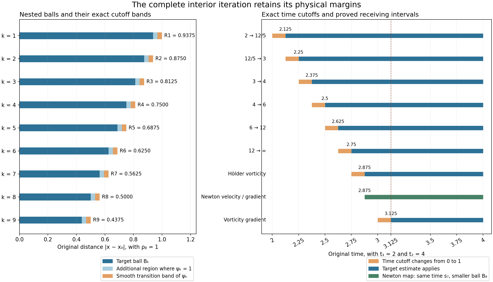

# Interior vorticity bounds on an actual annulus

We now turn the annular energy and local velocity estimates into
pointwise bounds for the original velocity, vorticity and their
first derivatives. Six explicit heat estimates give the vorticity
maximum. A spatial continuity estimate and the complete local
Newton formula then control the velocity gradient. Finally we
differentiate the localized heat equation.

The construction retains a positive physical time margin. We also
prove how to choose an actual annulus on which all four maxima
are as small as prescribed, for unforced flow or an annulus beyond
the support of an actual compact force. The full global force
costs remain in that construction.

Read [Selecting an annulus and controlling local velocity](selecting-an-annulus-and-controlling-local-velocity.md)
first. Its complete initial-data selection, heat propagation and
energy estimates are the inputs here. The human comparison is
Terence Tao, [*Quantitative bounds for critically bounded solutions
to the Navier–Stokes equations*, version 2](https://arxiv.org/abs/1908.04958v2),
the end of the annuli-of-regularity proof. We supply the full
receiving argument with original viscosity and force, including
the local Newton boundary fields and point mass. The general
large critical-velocity endpoint and its backpropagation argument
remain unfinished.

## 1. The original fields, domains and physical margins

Keep the smooth original solution on \(\mathbb R^3\):

\[
 \partial_tu+(u\cdot\nabla)u+\nabla p=\nu\Delta u+f,\qquad
 \operatorname{div}u=0,\qquad \nu>0.
 \tag{1.1}
\]

Use the actual earlier heat flow \(v(t)=H_{\nu(t-t_b)}*u(t_b)\),
where
\(H_s(x)=(4\pi s)^{-3/2}e^{-|x|^2/(4s)}\), and retain
\(w=u-v\), \(\ell=\nabla\times v\), \(z=\nabla\times w\),
and \(\omega=\nabla\times u=z+\ell\). The preceding lesson
specifies the original smooth class, force decomposition and all
global constants. Its actual selected interval is \(J=[t_1,t_2]\);
write \(T=t_2-t_1>0\).

In particular its equations (6.1)–(6.12) give the fixed domain
and full velocity bound

\[
 \begin{gathered}
 b_-=r_-+3d,\qquad b_+=r_+-3d,\qquad
 D_{\rm out}=\Omega_2=\{b_-\leq|x|\leq b_+\},\\
 \mathcal V=\left(\frac4{\pi^4}P_0^2Q_0^2\right)^{1/4}
                       +T^{1/4}V_0^*,\qquad
 \|u\|_{L^4(J;L^\infty(D_{\rm out}))}\leq\mathcal V .
 \end{gathered}
 \tag{1.2}
\]

Here \(P_0,Q_0\) are precisely the complete cutoff quantities
of that lesson, including the original velocity terms.
The other actual inputs are

\[
 \begin{gathered}
 \sup_J\|w(t)\|_2\leq W_0,\qquad
 \sup_J\int_{\Omega_0}|z(t)|^2\leq\frac{7E_*}{4h},\\
 \sup_{J\times\{A\leq|x|\leq B\}}|\nabla^jv|\leq V_j^*
          \quad(j=0,1,2),\\
 d=A/8,\qquad h\leq A,\qquad
 b_+-b_-\geq5A/4\geq5h/4 .
 \end{gathered}
 \tag{1.3}
\]

All derivatives use the Euclidean norm of the full ordered
tensor. The constants \(h,A,B,r_-,r_+,E_*,W_0\) remain those
of the selected original annulus. No equation has been rescaled.

Choose the physical ball radius \(\rho_b=h/32\), spatial step
\(\epsilon=\rho_b/32=h/1024\), and time step \(\tau=T/16\).
For every center \(x_0\) in the nonempty shell
\(\mathcal K=\{b_-+\rho_b\leq|x_0|\leq b_+-\rho_b\}\), set

\[
 R_k=\rho_b-2k\epsilon,\qquad B_k=B(x_0,R_k),\qquad
 s_k=t_1+k\tau,\qquad 0\leq k\leq10 .
 \tag{1.4}
\]

The closed ball of radius \(\rho_b\) about \(x_0\) is in
\(D_{\rm out}\), by the triangle inequality. Also
\(R_{10}=3\rho_b/8>0\). Estimates uniform in this center
will therefore give estimates on the whole shell \(\mathcal K\).
This use of fixed-radius balls avoids introducing the volume
of the potentially very large selected annulus.

Let \(j\) be the exact smooth transition in equation (6.2) of
the preceding lesson, with \(j=0\) on \((-\infty,0]\),
\(j=1\) on \([1,\infty)\), and \(0\leq j\leq1\).
Put \(b_1=\|j'\|_\infty\), \(b_2=\|j''\|_\infty\). Define,
for \(1\leq k\leq9\),

\[
 \begin{gathered}
 \psi_k(x)=j\!\left(\frac{R_{k-1}-|x-x_0|}{\epsilon}\right),
 \qquad
 \chi_k(t)=j\!\left(\frac{t-s_{k-1}}{\tau}\right),
 \qquad \Psi_k=\chi_k\psi_k,\\
 L_1=\frac{b_1}{\epsilon},\qquad
 L_2=\frac{b_2}{\epsilon^2}+\frac{2b_1}{\epsilon R_{10}},
 \qquad L_t=\frac{b_1}{\tau}.
 \end{gathered}
 \tag{1.5}
\]

The spatial cutoff is supported in the closure of \(B_{k-1}\),
equals one on \(B_k\), and has its derivative band at distance
at least \(\epsilon\) from \(B_k\). It is constant near the
center. On its derivative band the radius is greater than
\(R_{10}\), so the complete radial gradient, Laplacian and
Hessian bounds are

\[
 |\nabla\psi_k|\leq L_1,\qquad
 |\Delta\psi_k|\leq L_2,\qquad
 |\nabla^2\psi_k|\leq L_2,\qquad |\chi'_k|\leq L_t.
 \tag{1.6}
\]

For the Hessian, its three eigenvalues are the radial second
derivative and twice the radial first derivative divided by
the radius. Its Euclidean norm is at most the sum of the
absolute second derivative and \(\sqrt2\) times that latter
quantity; this is bounded by \(L_2\). Thus the curvature
contribution has been retained. Moreover
\(\chi_k(s_{k-1})=0\) and \(\Psi_k=1\) on
\([s_k,t_2]\times B_k\).

*Figure 1.* Exact spatial radii and time margins for the displayed
example \(\rho_b=1\), \(t_1=2\), \(t_2=4\). The first panel
shows the physical radial sections of the nested balls. The second
shows the six proved spatial exponent gains and their actual
time cutoffs. The last time margin used for the derivative bound
is also shown. These are cutoff geometry and exponent values;
they are not sampled fluid trajectories. Equations (1.4)–(1.6)
and (2.1) specify the objects.
[Reproducible figure source](../assets/interior-heat-iteration.py).

The initial local vorticity estimate is

\[
 \sup_{t\in J}\|\omega(t)\|_{L^2(B_0)}\leq
 X_0:=\sqrt{\frac{7E_*}{4h}}+
                   \sqrt{2v_3\rho_b^3}\,V_1^*,\qquad v_3=4\pi/3.
 \tag{1.7}
\]

Indeed the first term bounds \(z\), and
\(|\ell|\leq\sqrt2|\nabla v|\) gives the second using the
actual ball volume.

For a smooth original force retain its actual local datum
\[
 F_{\rm curl}=\sup_{J\times D_{\rm out}}|\nabla\times f| .
 \tag{1.8}
\]
It is finite when \(f\) is smooth on this closed compact
region, and is exactly zero for the unforced source equation.
The earlier \(L^1H^1+L^2L^2\) force bounds alone do not
bound (1.8). We will keep their exact heat-potential map
visible, and Exercise 4 tests this distinction with complete
original forced solutions.

## 2. Six explicit heat estimates

Set \(1/p_k=1/2-k/12\) for \(0\leq k\leq6\). Thus

\[
 (p_0,p_1,p_2,p_3,p_4,p_5,p_6)
                    =(2,12/5,3,4,6,12,\infty).
 \tag{2.1}
\]

Every adjacent pair loses exactly \(1/12\) in reciprocal
spatial exponent. Young's convolution formula uses
\(r=12/11\), since
\(1+1/p_k=1/r+1/p_{k-1}\). Define the full Gaussian
kernel constants

\[
 K_0=\|H_1\|_{12/11},\qquad
 K_1=\sum_{j=1}^3\|\partial_jH_1\|_{12/11}.
 \tag{2.2}
\]

Scaling the original Gaussian gives
\(\|H_{\nu a}\|_{12/11}=K_0(\nu a)^{-1/8}\) and
\(\sum_j\|\partial_jH_{\nu a}\|_{12/11}
=K_1(\nu a)^{-5/8}\).
For a vector field \(G\),
\(\nabla\times(H*G)=\sum_je_j\times(\partial_jH*G)\).
Since \(|e_j\times v|\leq|v|\), these same constants bound
the full vector curl. Every component is retained.

The precise time integrals needed below are

\[
 \begin{gathered}
 \left(\int_0^T a^{-5/6}\,da\right)^{3/4}
       =6^{3/4}T^{1/8},\qquad
 \left(\int_0^T a^{-1/6}\,da\right)^{3/4}
       =(6/5)^{3/4}T^{5/8},\\
 \int_0^Ta^{-5/8}\,da=\frac83T^{3/8},\qquad
 \int_0^Ta^{-1/8}\,da=\frac87T^{7/8}.
 \end{gathered}
 \tag{2.3}
\]

They are all finite at zero. The first two are the
\(L^{4/3}\) norms of the respective kernels, for pairing
with the actual \(L^4\)-time velocity.

### 2.1. One full step, including every cutoff and force term

Suppose the preceding step has already proved
\(\sup_{[s_{k-1},t_2]}\|\omega(t)\|_{L^{p_{k-1}}(B_{k-1})}
\leq X_{k-1}\). For \(k=1\), (1.7) proves exactly this
statement. Set \(\Omega_k=\Psi_k\omega\). The complete
localized equation from the preceding lesson is

\[
 \begin{aligned}
 (\partial_t-\nu\Delta)\Omega_k={}&
 \nabla\times\big(\Psi_k(u\times\omega+f)\big)
 -2\nu\sum_j\partial_j((\partial_j\Psi_k)\omega)\\
 &+(\partial_t\Psi_k+\nu\Delta\Psi_k)\omega
            -\nabla\Psi_k\times(u\times\omega+f).
 \end{aligned}
 \tag{2.4}
\]

Its initial value at \(s_{k-1}\) is zero because the actual
time cutoff vanishes there. Duhamel therefore contains four
non-force contributions: the curl flux, the cutoff
divergence, the scalar cutoff source, and the nonlinear
boundary cross product. Their bounds in
\(L^\infty([s_{k-1},t_2];L^{p_k}(\mathbb R^3))\) are,
in that order,

\[
 \begin{gathered}
 6^{3/4}K_1\nu^{-5/8}T^{1/8}\mathcal V X_{k-1},\\
 \frac{16}3K_1\nu^{3/8}L_1T^{3/8}X_{k-1},\\
 \frac87K_0\nu^{-1/8}(L_t+\nu L_2)T^{7/8}X_{k-1},\\
 (6/5)^{3/4}K_0\nu^{-1/8}L_1T^{5/8}\mathcal V X_{k-1}.
 \end{gathered}
 \tag{2.5}
\]

For example the first follows by Young's spatial inequality
with (2.2), followed by Hölder in time with the first norm
in (2.3). The second uses the factor \(2\nu\), the bound
\(|\partial_j\Psi_k|\leq L_1\), and the third integral of
(2.3). The third uses
\(|\partial_t\Psi_k+\nu\Delta\Psi_k|\leq L_t+\nu L_2\)
and the fourth integral. The last pairs the \(L^4\)-time
velocity with the second norm of (2.3). Every spatial product
is supported in \(B_{k-1}\), and every time is at least
\(s_{k-1}\). Thus only the already proved previous norm
occurs on the right side.

The two force terms have the exact combined potential

\[
 \begin{aligned}
 \mathcal H_{\Psi_k,f}(t)
 ={}&\int_{s_{k-1}}^t\nabla\times H_{\nu(t-s)}*
                                      (\Psi_k f)(s)\,ds\\
 &-\int_{s_{k-1}}^tH_{\nu(t-s)}*
                                      (\nabla\Psi_k\times f)(s)\,ds\\
 ={}&\int_{s_{k-1}}^tH_{\nu(t-s)}*
                                      (\Psi_k\nabla\times f)(s)\,ds .
 \end{aligned}
 \tag{2.6}
\]

The equality is the product rule and spatial integration by
parts, including the full boundary term. It holds
distributionally for the original rough force classes.
For the actual smooth force in (1.8), positivity and mass
one make the heat semigroup an \(L^{p_k}\) contraction.
The input is bounded by \(F_{\rm curl}\) on a ball of
volume at most \(v_3\rho_b^3\). Hence its norm is at most
\(T(v_3\rho_b^3)^{1/p_k}F_{\rm curl}\), including
\(p_k=\infty\).

### 2.2. Completing all six steps

Define the full coefficient

\[
 \begin{aligned}
 C={}&6^{3/4}K_1\nu^{-5/8}T^{1/8}\mathcal V
       +\frac{16}3K_1\nu^{3/8}L_1T^{3/8}\\
 &+\frac87K_0\nu^{-1/8}(L_t+\nu L_2)T^{7/8}
       +(6/5)^{3/4}K_0\nu^{-1/8}L_1T^{5/8}\mathcal V .
 \end{aligned}
 \tag{2.7}
\]

For \(1\leq k\leq6\), put
\[
 X_k=CX_{k-1}+T(v_3\rho_b^3)^{1/p_k}F_{\rm curl}.
 \tag{2.8}
\]
All quantities are finite in the smooth-force class.
Since \(\Psi_k=1\) on \([s_k,t_2]\times B_k\), the
proved one-step estimate supplies the induction. It gives
in particular

\[
 \sup_{[s_6,t_2]\times B_6}|\omega|\leq X_6
 =C^6X_0+
 TF_{\rm curl}\sum_{j=1}^6C^{6-j}(v_3\rho_b^3)^{1/p_j}.
 \tag{2.9}
\]

The last \(L^{12}\)-to-\(L^\infty\) step uses exactly the
same integrable exponent \(5/8\). Thus there is no missing
endpoint convolution or unspecified repetition. When
\(f=0\), the full force contribution is zero and
\(X_k=C^kX_0\).

For a rough force, retain instead the actual norm
\(F_k=\|\mathcal H_{\Psi_k,f}\|_{L^\infty_tL^{p_k}_x}\)
on \([s_{k-1},t_2]\times\mathbb R^3\). The same proof
gives \(X_k=CX_{k-1}+F_k\), interpreted in the extended
nonnegative reals. It does not assert that the earlier
coarse force norms make all these quantities finite.
The subsequent finite estimates use the unforced or the
stated smooth-force input for which finiteness was proved.

## 3. Spatial continuity of the vorticity

Fix \(\alpha=1/4\). For an integrable differentiable scalar
kernel \(K\), integration along a line and the triangle
inequality give

\[
 \begin{aligned}
 \|K(\cdot+y)-K\|_1
 &\leq\min(2\|K\|_1,\ |y|\|\nabla K\|_1)\\
 &\leq(2\|K\|_1)^{1-\alpha}\|\nabla K\|_1^\alpha|y|^\alpha .
 \end{aligned}
 \tag{3.1}
\]

The second inequality follows by considering which of the
two positive quantities is smaller; it also holds if one
is zero. The spatial Hölder seminorm
\([g]_{C^\alpha}=\sup_{x\ne y}|g(x)-g(y)|/|x-y|^\alpha\)
therefore obeys convolution bounds with the complete
Gaussian constants

\[
 \begin{gathered}
 J_0=2^{1-\alpha}\|H_1\|_1^{1-\alpha}\|\nabla H_1\|_1^\alpha,\\
 J_1=\sum_{j=1}^3
 2^{1-\alpha}\|\partial_jH_1\|_1^{1-\alpha}
                            \|\nabla\partial_jH_1\|_1^\alpha .
 \end{gathered}
 \tag{3.2}
\]

Their original heat-time factors are
\((\nu a)^{-\alpha/2}\) and
\((\nu a)^{-1/2-\alpha/2}\). For \(\alpha=1/4\) these
are again the powers \(1/8\) and \(5/8\).

Apply the full equation (2.4) with \(k=7\), starting at
\(s_6\). Its vorticity input is now the proved maximum
\(X_6\); its velocity input remains the actual time norm
\(\mathcal V\). Using (3.1) in each of the four non-force
terms gives exactly (2.7) with \(K_0,K_1\) replaced by
\(J_0,J_1\). Denote that complete expression by \(C_H\):

\[
 \begin{aligned}
 C_H={}&6^{3/4}J_1\nu^{-5/8}T^{1/8}\mathcal V
       +\frac{16}3J_1\nu^{3/8}L_1T^{3/8}\\
 &+\frac87J_0\nu^{-1/8}(L_t+\nu L_2)T^{7/8}
       +(6/5)^{3/4}J_0\nu^{-1/8}L_1T^{5/8}\mathcal V .
 \end{aligned}
 \tag{3.3}
\]

The force potential (2.6) has seminorm at most
\((8/7)J_0\nu^{-1/8}T^{7/8}F_{\rm curl}\), using its
bounded curl input and the last integral of (2.3).
Thus the globally defined compact field
\(\Omega_7=\Psi_7\omega\) satisfies

\[
 \begin{gathered}
 \|\Omega_7(t)\|_\infty\leq X_6,\qquad
 [\Omega_7(t)]_{C^\alpha(\mathbb R^3)}\leq H_7,\\
 H_7=C_HX_6+\frac87J_0\nu^{-1/8}T^{7/8}F_{\rm curl}
                  \qquad(s_6\leq t\leq t_2).
 \end{gathered}
 \tag{3.4}
\]

The maximum bound uses the actual support in \(B_6\)
and \(|\Psi_7|\leq1\). It is not inferred from a
seminorm. For \(t\geq s_7\), \(\Omega_7=\omega\) on
\(B_7\), giving the stated spatial continuity of the
original vorticity there.

## 4. The complete local Newton map

### 4.1. Recovering the velocity with its boundary fields

Use the original nonlinear velocity \(w\), whose global
\(L^2\) norm is at most \(W_0\). Put \(X=\psi_8w\) and
\(N(x)=1/(4\pi|x|)\). The exact compact-field identity is

\[
 \begin{aligned}
 X={}&\nabla\times N*(\psi_8z)
       +\nabla\times N*(\nabla\psi_8\times w)
       -\nabla N*(\nabla\psi_8\cdot w).
 \end{aligned}
 \tag{4.1}
\]

Indeed \(-\Delta N=\delta_0\) and
\(\nabla\times\nabla\times X-\nabla\operatorname{div}X
=-\Delta X\) give
\(X=\nabla\times N*(\nabla\times X)
-\nabla N*(\operatorname{div}X)\). Fourier transformation
verifies it off the origin. The compact \(L^2\) field has
no additional constant or point-supported Fourier part.
Substitute the full product curl and divergence,
\(\nabla\times X=\psi_8z+\nabla\psi_8\times w\) and
\(\operatorname{div}X=\nabla\psi_8\cdot w\), to obtain
(4.1). This is a map for the actual cutoff field; a local
curl has not been given a false global inverse.

For \(t\geq s_7\), set

\[
 Z_\infty=X_6+\sqrt2V_1^*,\qquad
 Z_2=\sqrt{\frac{7E_*}{4h}},\qquad
 Z_\alpha=H_7+\sqrt2V_2^*\epsilon^{1-\alpha}.
 \tag{4.2}
\]

The first bounds \(|z|\) on \(B_7\), and the second
bounds \(\|\psi_8z(t)\|_2\) uniformly in every center.
If \(x\in B_8\) and \(|y|<\epsilon\), the segment from
\(x\) to \(x-y\) is in \(B_7\). The heat derivative bound
there gives
\(|\ell(x-y)-\ell(x)|\leq\sqrt2V_2^*|y|\).
Together with (3.4) this proves
\(|z(x-y)-z(x)|\leq Z_\alpha|y|^\alpha\) for these exact
local increments.

The main kernel in (4.1) has magnitude
\(|\nabla N(y)|=1/(4\pi|y|^2)\). Its integral over
\(|y|\leq2\rho_b\) is \(2\rho_b\), which gives the
bound \(2\rho_bZ_\infty\) for the main field on \(B_8\).
A stronger estimate retains \(Z_2\). Split the same
complete convolution at any radius \(a>0\). Its near
part is at most \(aZ_\infty\), and Cauchy–Schwarz bounds
the far part by \(Z_2/(2\sqrt{\pi a})\), since

\[
 \|\mathbf1_{\{|y|\geq a\}}\nabla N\|_2^2=\frac1{4\pi a}.
 \tag{4.3}
\]

If both norms are positive, choose
\(a=(Z_2/(4\sqrt\pi Z_\infty))^{2/3}\). The sum is
\(3(4\sqrt\pi)^{-2/3}Z_\infty^{1/3}Z_2^{2/3}\).
If either norm vanishes, the actual main field is zero.
The split is valid for every \(a>0\), so no restriction
relative to the support radius is required.

Both boundary fields in (4.1) have their source separated
from \(B_8\) by at least \(\epsilon\). Each is at most
\(L_1W_0/(2\sqrt{\pi\epsilon})\), by (4.3). Keeping
both and both main-field bounds gives

\[
 \begin{aligned}
 |w(t,x)|\leq W_{\rm loc}:={}&
 \min\left(2\rho_bZ_\infty,\
       \frac3{(4\sqrt\pi)^{2/3}}Z_\infty^{1/3}Z_2^{2/3}\right)
                 +\frac{L_1W_0}{\sqrt{\pi\epsilon}}
 \end{aligned}
 \tag{4.4}
\]

on \([s_7,t_2]\times B_8\).

### 4.2. The gradient and the Newton point mass

The full distributional Hessian is

\[
 \partial_i\partial_jN
 =\operatorname{pv}
       \frac{3y_iy_j-\delta_{ij}|y|^2}{4\pi|y|^5}
                              -\frac13\delta_{ij}\delta_0 .
 \tag{4.5}
\]

Away from zero this is direct differentiation. To obtain
the point mass, integrate by parts outside a ball of
radius \(a\) against a smooth test function. The leading
inner boundary term tends to its value at zero times
\(-(4\pi)^{-1}\int_{\mathbb S^2}\vartheta_i\vartheta_j\,dS
=-\delta_{ij}/3\).
The remaining singular integral converges in principal
value: its angular average is zero because that same
spherical integral equals \(4\pi\delta_{ij}/3\).
Taylor's first-order bound makes the subtraction of
the test value integrable near zero. This proves (4.5),
including its sign and point mass.

The ordinary Hessian kernel has eigenvalues proportional
to \(2,-1,-1\), and its full tensor magnitude is
\(\sqrt6/(4\pi|y|^3)\). For the derivative of the main
curl term in (4.1), split its principal value at
\(\epsilon\). On the inner ball, \(\psi_8=1\) at both
evaluation points and the zero angular average permits
the increment in (4.2). Its bound is
\(\sqrt6 Z_\alpha\epsilon^\alpha/\alpha\).
On \(\epsilon\leq|y|\leq2\rho_b\), the bound is
\(\sqrt6Z_\infty\log(2\rho_b/\epsilon)\). Beyond
\(2\rho_b\) the actual source vanishes for \(x\in B_8\).
The point mass in (4.5) gives a cross-product matrix
whose Euclidean norm is at most \(\sqrt2Z_\infty/3\).

The differentiated boundary fields have no point source
at \(x\), because their supports are separated. The
full far Hessian norm is

\[
 \left\|\mathbf1_{\{|y|\geq\epsilon\}}
      \frac{3y\otimes y-|y|^2I}{4\pi|y|^5}\right\|_2^2
                            =\frac1{2\pi\epsilon^3}.
 \tag{4.6}
\]

Thus their sum is at most
\(\sqrt{2/\pi}L_1W_0\epsilon^{-3/2}\). For the curl
term, each row of the Hessian acts by a cross product,
bounded by its row norm times the vector norm; summing
the row squares introduces no further factor.
Consequently

\[
 \begin{aligned}
 |\nabla w(t,x)|\leq G_{\rm loc}:={}&
 \frac{\sqrt6}{\alpha}\epsilon^\alpha Z_\alpha
 +\left(\sqrt6\log\frac{2\rho_b}{\epsilon}
                          +\frac{\sqrt2}3\right)Z_\infty\\
 &+\sqrt{\frac2\pi}L_1W_0\epsilon^{-3/2}.
 \end{aligned}
 \tag{4.7}
\]

Adding the actual heat field proves

\[
 |u|\leq U_{\rm loc}:=W_{\rm loc}+V_0^*,\qquad
 |\nabla u|\leq G_u:=G_{\rm loc}+V_1^*
          \quad\hbox{on }[s_7,t_2]\times B_8 .
 \tag{4.8}
\]

The complete local map retains the original nonlinear
velocity at the boundary, the Newton point mass and the
original heat field.

## 5. The first vorticity derivative

Use (2.4) with \(k=9\), starting at \(s_8\).
The compact field \(V=\psi_9u\) is defined on the full
space and satisfies
\(\|V\|_\infty\leq U_{\rm loc}\) and
\(\|\nabla V\|_\infty\leq L_1U_{\rm loc}+G_u\).
Its smooth zero extension has that same global derivative
bound. Integrating along line segments, as in (3.1), gives
\[
 [V]_{C^\alpha}\leq
       (2U_{\rm loc})^{1-\alpha}(L_1U_{\rm loc}+G_u)^\alpha .
 \tag{5.1}
\]

For times at least \(s_8\), \(\Omega_7=\omega\) on the
support of \(\psi_9\). Hence
\(\psi_9(u\times\omega)=V\times\Omega_7\) globally.
Both terms of the product difference must be included.
They give

\[
 \begin{gathered}
 {}[\Psi_9(u\times\omega)]_{C^\alpha}\leq
 A_{\rm nl}:=U_{\rm loc}H_7+
 (2U_{\rm loc})^{1-\alpha}(L_1U_{\rm loc}+G_u)^\alpha X_6,\\
 [(\partial_j\Psi_9)\omega]_{C^\alpha}\leq
 A_{\rm cut}:=L_1H_7+(2L_1)^{1-\alpha}L_2^\alpha X_6 .
 \end{gathered}
 \tag{5.2}
\]

For the second line, the compact field \(\partial_j\psi_9\)
has maximum at most \(L_1\) and derivative maximum at most
\(L_2\); multiply its full difference bound by that of
\(\Omega_7\). The time factors are at most one.

Every second Gaussian derivative has integral zero. Thus
its convolution with a bounded Hölder field \(g\) is
exactly its integral against \(g(x-y)-g(x)\).
Define the finite complete moments

\[
 J_{2,\alpha}=\sum_{j=1}^3
       \||x|^\alpha\nabla\partial_jH_1(x)\|_1,\qquad
 J_\nabla=\|\nabla H_1\|_1 .
 \tag{5.3}
\]

Their original heat-time factors are
\((\nu a)^{-1+\alpha/2}\) and \((\nu a)^{-1/2}\).
Differentiate the curl-flux and cutoff-divergence
potentials in (2.4), use (5.2) and their cancellation,
and integrate
\(\int_0^Ta^{-1+\alpha/2}\,da=2T^{\alpha/2}/\alpha\).
Their sum is bounded by
\((2/\alpha)J_{2,\alpha}\nu^{-1+\alpha/2}T^{\alpha/2}
(A_{\rm nl}+2\nu A_{\rm cut})\).

The remaining non-force source has maximum at most
\((L_t+\nu L_2+L_1U_{\rm loc})X_6\). One Gaussian
gradient integrates to \(2J_\nabla\nu^{-1/2}\sqrt T\).
The full force potential (2.6) obeys the same gradient
bound with input \(F_{\rm curl}\). We obtain

\[
 \begin{aligned}
 G_\omega={}&
 \frac2\alpha J_{2,\alpha}\nu^{-1+\alpha/2}T^{\alpha/2}
                           (A_{\rm nl}+2\nu A_{\rm cut})\\
 &+2J_\nabla\nu^{-1/2}\sqrt T
       \big[(L_t+\nu L_2+L_1U_{\rm loc})X_6+F_{\rm curl}\big],\\
 |\nabla\omega(t,x)|&\leq G_\omega
                         \quad(t\geq s_9,\ x\in B_9).
 \end{aligned}
 \tag{5.4}
\]

The differentiated integrals are justified first with
a positive upper time gap, then by the displayed
integrable moments and dominated convergence.
On this final region the cutoff is identically one, so
its derivative does not alter \(\nabla\omega\).
The initial term at \(s_8\) was exactly zero.

All constants are uniform in the center \(x_0\).
Taking the value at each such center gives the full
original-annulus bounds

\[
 \begin{gathered}
 |u|\leq U_{\rm loc},\qquad |\nabla u|\leq G_u,\qquad
 |\omega|\leq X_6,\qquad |\nabla\omega|\leq G_\omega,\\
 \hbox{on }[t_1+9T/16,t_2]\times\mathcal K .
 \end{gathered}
 \tag{5.5}
\]

No hidden higher-derivative norm of \(u\) occurs on the
right side. All full force and boundary terms have
explicit receiving bounds.

## 6. Choosing an annulus with arbitrarily small maxima

Boundedness alone is insufficient when a later weighted
estimate requires small coefficients. We now choose them
from the actual construction. Fix the original solution,
\(\nu\), interval, selected time \(t_1\), and global
input bounds before varying \(h\). Fix \(h_0,a_0>0\)
and take \(h\geq h_0\). In the preceding lesson's
selection formulas choose the smaller heat target

\[
 \alpha_h=\min\{\alpha_{\rm previous}(h),\ a_0(h_0/h)^2\}.
 \tag{6.1}
\]

The symbol \(\alpha_h\) is the numerical heat target;
the Hölder exponent stays exactly \(\alpha=1/4\).
Use (6.1) everywhere that target enters the earlier
formulas, including the initial tolerance and Gaussian
distance. Every energy inequality remains valid:
decreasing the target decreases its three heat-budget
terms, and the shell-count and radius proofs allow the
smaller tolerances and larger radius. In particular
\(V_j^*\leq a_0h_0^2h^{-2}\) for \(j=0,1,2\).

This section applies to \(f=0\), and to an actual
smooth force supported in \(\{|x|\leq R_f\}\) throughout
\(J\). In the latter case add
\(\Lambda^{m-2}(R_f+h_0)\) to the maximum defining
the original \(R_{\min}\). Then \(A\geq R_f+h_0\),
so the whole receiving annulus has actual
\(\nabla\times f=0\). Thus \(F_{\rm curl}=0\) here.
All earlier global contributions of the force to
\(W_0,M_\delta\), total speed and shell selection stay
unchanged. The original PDE still contains its force.

### 6.1. Full constants fixed before the height is chosen

Keep the preceding lesson's constants
\(\lambda_5,\lambda_8,\lambda_9,C_2,L=t_2-t_b\).
Define

\[
 \begin{gathered}
 \overline A=(\lambda_5+\lambda_8+\lambda_9)L+2L+
          C_2W_0Lh_0^{-5/2}+\frac{\nu L}{2h_0^2}+1,\\
 E_c=\frac{7E_*}4,\qquad D_c=\frac{7E_*}{4\nu}(1+\overline A),
 \qquad g_1=8b_1,\qquad g_2=64b_2+8b_1,\\
 P_c=2E_c+2g_1^2W_0^2/h_0,\qquad
 P_{1c}=4E_c+6g_1^2W_0^2/h_0,\\
 Q_c=6D_c+12g_1^2TP_{1c}/h_0^2+3g_2^2TW_0^2/h_0^3,\\
 \overline V=(4P_cQ_c/\pi^4)^{1/4}+T^{1/4}a_0\sqrt{h_0},
 \qquad
 \overline X_0=\sqrt{E_c}+\sqrt{2v_3}\,a_0h_0^2/32^{3/2}.
 \end{gathered}
 \tag{6.2}
\]

To verify these constants, the earlier energy coefficient
satisfies \(\mathcal A_0(h)\leq\overline A\), and its
budget \(e_0(h)\leq E_*/8\). Hence its actual local
energies obey \(Z_0^2\leq E_c/h\) and
\(Z_1^2\leq D_c/h\).
The earlier annular cutoff length is \(d=A/8\geq h/8\),
and its lower radius is at least \(2A\). Its gradient
and Laplacian bounds are consequently at most
\(g_1/h\) and \(g_2/h^2\).

Insert these full bounds in the earlier formulas for
\(P_0^2,P_1^2,Q_0^2\), giving
\[
 P_0^2\leq P_c/h,\qquad P_1^2\leq P_{1c}/h,\qquad
 Q_0^2\leq Q_c/h.
 \tag{6.3}
\]
For example the gradient-cutoff term of \(Q_0^2\)
is at most \(12g_1^2TP_{1c}h^{-3}\), bounded by
\(12g_1^2TP_{1c}h_0^{-2}h^{-1}\); its zeroth-order
term is treated with \(h^{-4}\leq h_0^{-3}h^{-1}\).
Every contribution appears in (6.2) before this
comparison. Equations (1.2) and (1.7) now give
\(\mathcal V\leq\overline Vh^{-1/2}\) and
\(X_0\leq\overline X_0h^{-1/2}\).

The physical ball cutoffs (1.5) have exactly

\[
 L_1=k_1/h,\qquad L_2=k_2/h^2,\qquad L_t=16b_1/T,
 \qquad
 k_1=1024b_1,\quad
 k_2=1024^2b_2+\frac{524288}3b_1.
 \tag{6.4}
\]

Define \(\overline C\) by the complete expression (2.7)
with \(\mathcal V,L_1,L_2\) replaced by
\(\overline Vh_0^{-1/2},k_1/h_0,k_2/h_0^2\).
Define \(\overline C_H\) by the same substitutions in
(3.3). These are explicit finite expressions retaining
every displayed summand, kernel constant and viscosity
power. Put
\[
 \overline X=\overline C^6\overline X_0,\qquad
 \overline H=\overline C_H\overline X,\qquad
 \overline Z=\overline X+\sqrt2a_0\sqrt{h_0}.
 \tag{6.5}
\]
Because every coefficient is nonnegative, (2.9) and (3.4)
give \(X_6\leq\overline Xh^{-1/2}\) and
\(H_7\leq\overline Hh^{-1/2}\).
Also \(Z_\infty\leq\overline Zh^{-1/2}\) and
\(Z_2=\sqrt{E_c}h^{-1/2}\).

### 6.2. The actual velocity and derivative powers

The retained \(L^2\) term of (4.4) gives
\[
 \overline U=
 \frac3{(4\sqrt\pi)^{2/3}}\overline Z^{1/3}E_c^{1/3}
 +\frac{32k_1W_0}{\sqrt\pi h_0}+a_0\sqrt{h_0},
 \qquad U_{\rm loc}\leq\overline Uh^{-1/2}.
 \tag{6.6}
\]
The first term is the complete optimized Newton estimate.
The second retains its boundary term of order \(h^{-3/2}\),
and the third retains the original heat field of order
\(h^{-2}\). Their stated bounds use \(h\geq h_0\).
Using only the other main-field bound
\(2\rho_bZ_\infty\) would lose this decay.

In (4.7) the logarithm is exactly \(\log64\).
With \(\alpha=1/4\), let

\[
 \begin{aligned}
 \overline G={}&
 \frac{\sqrt6}{\alpha}1024^{-\alpha}\overline H
       +\frac{\sqrt{12}}{1024\alpha}a_0h_0^{5/4}\\
 &+\left(\sqrt6\log64+\frac{\sqrt2}3\right)
                             \overline Zh_0^{-1/4}\\
 &+\sqrt{2/\pi}\,k_1W_0\,1024^{3/2}h_0^{-9/4}
                             +a_0h_0^{1/4}.
 \end{aligned}
 \tag{6.7}
\]

Substituting \(Z_\alpha=H_7+\sqrt2V_2^*\epsilon^{1-\alpha}\)
in (4.7)–(4.8) proves \(G_u\leq\overline Gh^{-1/4}\).
The five displayed terms receive, respectively, the
vorticity Hölder increment, the original heat derivative
increment, the Newton far integral and point mass, both
boundary fields, and the added heat gradient.
Before comparison their height powers are
\(h^{-1/4}\), \(h^{-1}\), \(h^{-1/2}\), \(h^{-5/2}\),
and \(h^{-2}\). Thus (6.7) gives every required
\(h_0\) factor explicitly.

For the full products in (5.2), define

\[
 \begin{gathered}
 B_{\rm nl}=\overline U\overline Hh_0^{-1/16}
 +(2\overline U)^{3/4}
       (k_1\overline Uh_0^{-5/4}+\overline G)^{1/4}\overline X,\\
 B_{\rm cut}=k_1\overline H+
                  (2k_1)^{3/4}k_2^{1/4}\overline Xh_0^{-1/4},\\
 B_{\rm rem}=(L_t+\nu k_2/h_0^2+
                           k_1\overline Uh_0^{-3/2})\overline X .
 \end{gathered}
 \tag{6.8}
\]

Then \(A_{\rm nl}\leq B_{\rm nl}h^{-15/16}\),
\(A_{\rm cut}\leq B_{\rm cut}h^{-3/2}\), and
\((L_t+\nu L_2+L_1U_{\rm loc})X_6
\leq B_{\rm rem}h^{-1/2}\).
For example the mixed nonlinear term has exponents
\(3/8+1/16+1/2=15/16\): these come from its velocity,
gradient and vorticity factors. The faster-decaying
partners are retained with their \(h_0\) factors in
(6.8). Consequently define

\[
 \begin{aligned}
 \overline G_\omega={}&
 \frac2\alpha J_{2,\alpha}\nu^{-1+\alpha/2}T^{\alpha/2}
       (B_{\rm nl}h_0^{-7/16}+2\nu B_{\rm cut}h_0^{-1})\\
 &+2J_\nabla\nu^{-1/2}\sqrt T\,B_{\rm rem},
 \qquad G_\omega\leq\overline G_\omega h^{-1/2}.
 \end{aligned}
 \tag{6.9}
\]

All these constants are fixed before \(h\) is selected.
For a prescribed positive tolerance \(\varepsilon_*\),
take the actual finite height

\[
 h=\max\left\{h_0,\
  (\overline U/\varepsilon_*)^2,\
  (\overline G/\varepsilon_*)^4,\
  (\overline X/\varepsilon_*)^2,\
  (\overline G_\omega/\varepsilon_*)^2\right\}.
 \tag{6.10}
\]

Run the original annulus selection with this \(h\), the
smaller target (6.1), and the additional force-support
entry when needed. It produces a finite \(R\) with the
explicit upper radius of the preceding lesson. The
estimates just proved give

\[
 \max\{\|u\|_\infty,\|\nabla u\|_\infty,
                   \|\omega\|_\infty,\|\nabla\omega\|_\infty\}
 \leq\varepsilon_*
 \quad\hbox{on }[t_1+9T/16,t_2]\times\mathcal K.
 \tag{6.11}
\]

This is actual smallness derived from the original
solution, with the full receiving geometry and time
margin. Different tolerances for the four quantities
can be used in the four respective entries of (6.10).
Nothing in this construction changes the original
viscosity, coordinates or force.

## 7. Source comparison and five solved exercises

The comparison passage is Tao, arXiv:1908.04958v2,
original author `article.tex` lines 859–892. It lists
local gradient-energy estimates and successive
regularity gains in its unforced, unit-viscosity
setting. Here every gain, cutoff, Newton boundary
field, point mass and time margin is proved with the
original parameters. The additional force receiver
is identified explicitly. The source's displayed
closed initial-time bounds are not imported as
estimates from an initial spatial norm.

The original argument and the preceding lessons guide
this construction; no novelty is asserted. These finite
annular estimates still need their complete receiving
maps into the weighted heat estimates and frequency
backpropagation argument. The general endpoint theorem
is not proved by local annular regularity alone.

### Exercise 1: verify the exponent gains and their time condition

Check all six spatial steps in (2.1), including the last
one. More generally, determine an explicit finite
number of equal steps from \(L^2\) to \(L^\infty\)
when the local velocity is in \(L^q_tL^\infty_x\)
with \(q>2\), and prove the time integrability of
each differentiated heat convolution.

**Solution.** For our sequence,
\(1/p_{k-1}-1/p_k=1/12\) for every \(1\leq k\leq6\).
Thus the kernel space is \(L^{12/11}\), and its
derivative exponent is \(1/2+(3/2)(1/12)=5/8\).
Hölder pairs the velocity in time with exponent
\(q'=4/3\); the resulting power is \(5/6<1\).
This includes \(p_5=12,p_6=\infty\) without change.

For general \(q>2\), choose any integer
\(n>3q/(2(q-2))\), set \(1/p_k=1/2-k/(2n)\),
and let \(r^{-1}=1-1/(2n)\).
Each derivative kernel has exponent
\[
 a=\frac12+\frac3{4n}<1-\frac1q=\frac1{q'}.
 \tag{7.1}
\]
It has time norm
\[
 \left(\int_0^Tt^{-aq'}\,dt\right)^{1/q'}
       =\left(\frac{T^{1-aq'}}{1-aq'}\right)^{1/q'}<\infty .
 \tag{7.2}
\]
Young's exact spatial relation and Hölder therefore
give each step as in Section 2, with its actual
Gaussian \(L^r\) derivative constant, viscosity
factor \(\nu^{-a}\), and the full norm (7.2).
The zeroth derivative kernel has the smaller
exponent \(3/(4n)\); it and the ordinary time
integrals for cutoff terms are also finite.
This proves the stated finite exponent mechanism.
The other hypotheses, initial local vorticity norm
and actual force potentials remain required exactly
as in the full argument; they have not been
manufactured by changing \(q\).

### Exercise 2: why the boundary fields cannot be omitted

Construct a smooth compact divergence-free field that
is a nonzero constant on a ball. Apply (4.1) with
its cutoff supported within that ball. Identify
which exact terms recover the velocity even though
the local curl is zero.

**Solution.** Fix a nonzero vector \(a\), a radius
\(R>0\), and a smooth radial cutoff \(\eta\) that is
one on \(B(0,2R)\) and zero outside \(B(0,3R)\).
It is smooth at the origin because it is constant
there. Define the compact vector potential
\(A(x)=\tfrac12\eta(x)(a\times x)\) and
\[
 w=\nabla\times A
   =\eta a+\tfrac12\nabla\eta\times(a\times x).
 \tag{7.3}
\]
The component product rule gives the equality, since
\(\nabla\times(a\times x)=2a\).
As a curl, \(w\) has zero divergence. It is
identically \(a\) on \(B(0,2R)\), hence
\(z=\nabla\times w=0\) there.

Choose a smooth cutoff \(\psi\) supported in
\(B(0,R)\), equal to one on \(B(0,R/2)\).
The full identity (4.1), applied to this actual
compact field, has zero main source \(\psi z\).
For \(x\in B(0,R/2)\) it gives exactly
\[
 a=\nabla\times N*(\nabla\psi\times a)(x)
                      -\nabla N*(\nabla\psi\cdot a)(x).
 \tag{7.4}
\]
The Fourier/Poisson proof of (4.1) establishes this
identity including both boundary fields. Omitting
them would assert \(a=0\), contrary to its choice.
The example demonstrates the actual map from
boundary data to the locally curl-free velocity;
it does not assert that such a field has zero
global curl.

### Exercise 3: independent tolerances and the full Newton split

Prove the optimized main-field constant in (4.4),
including zero inputs. Then give the exact height
choice when the four desired tolerances are
\(\varepsilon_u,\varepsilon_{\nabla u},
\varepsilon_\omega,\varepsilon_{\nabla\omega}>0\).

**Solution.** The complete split at \(a>0\) bounds
the main field by
\(aZ_\infty+Z_2/(2\sqrt{\pi a})\).
Its derivative with respect to \(a\) is
\(Z_\infty-Z_2/(4\sqrt\pi a^{3/2})\).
For positive norms it vanishes at the radius
stated after (4.3); the second term there is
twice the first. Their sum is
\(3(4\sqrt\pi)^{-2/3}Z_\infty^{1/3}Z_2^{2/3}\).
If either bounding norm is zero, the actual
main source is zero almost everywhere and the
field is zero; the same bound holds.

All constants in Section 6 were fixed before
selecting \(h\). Thus choose
\[
 h=\max\left\{h_0,\
  (\overline U/\varepsilon_u)^2,\
  (\overline G/\varepsilon_{\nabla u})^4,\
  (\overline X/\varepsilon_\omega)^2,\
  (\overline G_\omega/\varepsilon_{\nabla\omega})^2\right\}.
 \tag{7.5}
\]
Each of the four proved height bounds is then
at most its own tolerance. Repeat the actual
shell selection with that height and target
(6.1). The entire construction still has a
finite explicit radius. Independent physical
tolerances change neither the original
objects nor their equations.

### Exercise 4: the original force classes do not supply a curl maximum

Construct smooth compactly forced solutions from rest
whose velocities have bounded \(L^\infty_tL^3_x\)
norm and whose \(L^2_tL^2_x\) forces tend to zero,
but whose vorticity derivatives are unbounded.
Compute the actual force and its curl at a chosen
time. Explain precisely what this tests.

**Solution.** Choose a nonzero smooth compact
divergence-free vector field \(b\). For example
take \(b=\nabla\times(\phi e_3)\), where
\(\phi(x)=\beta(x_1)\beta(x_2)\beta(x_3)\),
and \(\beta(r)=e^{-1/(1-r^2)}\) for \(|r|<1\),
zero otherwise. This gives a nonzero smooth
compact field. Its curl is
nonzero: otherwise the full Fourier div-curl
identity would give \(\nabla b=0\), forcing
the compact field to vanish. Similarly
\(\nabla\nabla\times b\) is nonzero, since a
compact constant curl would be zero.

Let \(t_c\) lie strictly inside a fixed time
interval \(I\), and set
\(\eta(s)=s e^{-1/(1-s^2)}\) for \(|s|<1\),
zero otherwise. It is smooth,
\(\eta(0)=0\), and \(\eta'(0)=e^{-1}\).
For sufficiently large positive integers \(N\),
define in the original coordinates
\[
 \begin{gathered}
 u_N(t,x)=\eta(N^2(t-t_c))b(Nx),\qquad p_N=0,\\
 f_N(t,x)=N^2\eta'(N^2(t-t_c))b(Nx)
       -\nu N^2\eta(N^2(t-t_c))\Delta b(Nx)\\
 \hspace{37mm}
       +N\eta(N^2(t-t_c))^2(b\cdot\nabla b)(Nx).
 \end{gathered}
 \tag{7.6}
\]
Direct differentiation verifies (1.1) with
this complete force and the original \(\nu\).
The velocity is divergence free. Its time
support is strictly inside \(I\), so it starts
from rest and returns to rest; every field is
smooth and compact in space and time.
Use \(f_a=0\), \(f_b=f_N\).

The original substitutions in the integrals
give exactly
\(\|u_N\|_{L^\infty_tL^3_x}
=N^{-1}\|\eta\|_\infty\|b\|_3\).
For the force, retain all three terms and use
the triangle inequality:
\[
 \begin{aligned}
 \|f_N\|_{L^2_tL^2_x}
 \leq{}&N^{-1/2}
  \big(\|\eta'\|_2\|b\|_2+
                         \nu\|\eta\|_2\|\Delta b\|_2\big)\\
 &+N^{-3/2}\|\eta^2\|_2\|b\cdot\nabla b\|_2 .
 \end{aligned}
 \tag{7.7}
\]
Indeed the space-time norm contributes
\(N^{-5/2}\), while the three differential
terms carry \(N^2,N^2,N\). Thus the displayed
force norm tends to zero.
But
\(\|\nabla\omega_N\|_\infty
=N^2\|\eta\|_\infty\|\nabla\nabla\times b\|_\infty\)
diverges. At \(t=t_c\), both terms carrying
\(\eta\) vanish exactly, so
\[
 \nabla\times f_N(t_c,x)
                    =e^{-1}N^3(\nabla\times b)(Nx).
 \tag{7.8}
\]
This tests the proposed uniform bound of a
pointwise derivative or force curl by the
stated coarse norms; that bound is false.
It does not give a finite-time singularity
or a counterexample for one fixed force.
The actual curl datum in (1.8) records the
growing contribution exactly, and an annulus
beyond these compact force supports remains
covered by Section 6.

### Exercise 5: every physical scaling factor in the receiver

For \(\lambda>0\), compare the original solution
with \(u^\lambda(t,x)=\lambda u(\lambda^2t,\lambda x)\)
on the correspondingly mapped interval. Derive
the original force, vorticity and derivative
factors. Check the scaling of the full recurrence
(2.8), the Newton receiver and the final derivative
bound while keeping \(\nu\).

**Solution.** Set
\(p^\lambda(t,x)=\lambda^2p(\lambda^2t,\lambda x)\)
and \(f^\lambda(t,x)=\lambda^3f(\lambda^2t,\lambda x)\).
Every term of (1.1) has factor \(\lambda^3\), so the
viscosity remains exactly \(\nu\). Direct derivatives give
\[
 \omega^\lambda=\lambda^2\omega(\lambda^2t,\lambda x),
 \quad \nabla u^\lambda=\lambda^2\nabla u(\lambda^2t,\lambda x),
 \quad \nabla\omega^\lambda=\lambda^3\nabla\omega(\lambda^2t,\lambda x).
 \tag{7.9}
\]
The actual heat flow and its remainder have the same
velocity factor. All spatial radii and lengths become
their original values divided by \(\lambda\), and all
time margins become their original values divided by
\(\lambda^2\). Thus
\[
 \begin{gathered}
 \mathcal V^\lambda=\lambda^{1/2}\mathcal V,\quad
 W_0^\lambda=\lambda^{-1/2}W_0,\quad
 L_1^\lambda=\lambda L_1,\quad
 L_2^\lambda=\lambda^2L_2,\quad L_t^\lambda=\lambda^2L_t,\\
 F_{\rm curl}^\lambda=\lambda^4F_{\rm curl},\qquad
 X_k^\lambda=\lambda^{2-3/p_k}X_k,\qquad
 C^\lambda=\lambda^{1/4}C.
 \end{gathered}
 \tag{7.10}
\]
The norm identities follow by substitution in the
original integrals. For \(W_0\), both its nonlinear
heat term and its full force integral have the stated
factor. Every summand of (2.7) has factor
\(\lambda^{1/4}\). Since
\(3/p_{k-1}-3/p_k=1/4\), its product with the
preceding norm has exactly the new factor.
The complete force term in (2.8) has factor
\(\lambda^{-2}\lambda^{-3/p_k}\lambda^4
=\lambda^{2-3/p_k}\) as well.

The Hölder input has factor
\(\lambda^{2+\alpha}\), while \(Z_2\) has factor
\(\lambda^{1/2}\). Both main terms of (4.4)
therefore have factor \(\lambda\); so does its
boundary term. Each term of (4.7) has factor
\(\lambda^2\), including the point mass.
In (5.2), \(A_{\rm nl}\) has factor
\(\lambda^{3+\alpha}\), and \(A_{\rm cut}\)
the same factor. The first coefficient of
(5.4) has factor \(\lambda^{-\alpha}\).
The remaining bracket has factor \(\lambda^4\)
and its time coefficient \(\lambda^{-1}\).
Thus every term of \(G_\omega\) has exactly
factor \(\lambda^3\), agreeing with (7.9).
This verifies the full map while retaining all
force, boundary, time and viscosity factors.
The original calculation remains the one used
in the lesson; this is its proved comparison.

The mathematical text and original figure are dedicated
to CC0 1.0. Cited author sources retain their respective terms.
