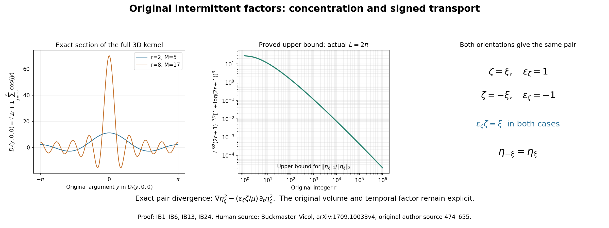
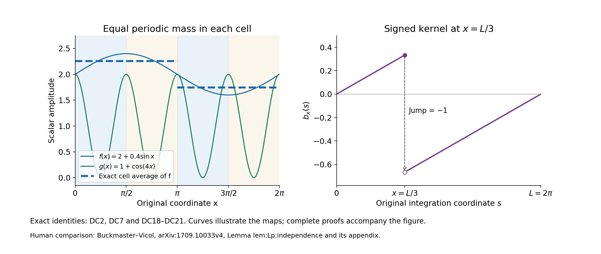

# Intermittent fields and exact periodic product estimates

The waves of [lesson 21](residual-stresses-and-exact-beltrami-fields.md)
have an exact average tensor, but their viscous cost grows with
frequency. This chapter constructs the source's intermittent
amplitudes: large values on small regions with an exactly fixed
second norm. It proves their original-period covering map, all
derivative bounds and the product estimates needed when their
coefficients vary in space and time.

The original pressure and projection conventions remain those of
[lesson 2](pressure-and-the-divergence-free-projection.md).
The labels IB, LD and DC identify the three connected parts of the
proof. References to RS and BG mean the complete maps and rational
frames of lesson 21. Every original factor in the kernel and physical
frequency is retained, including the period, integer covering degree
and temporal parameter.

The human source is Tristan Buckmaster and Vlad Vicol,
[*Nonuniqueness of weak solutions to the Navier–Stokes equation*,
arXiv:1709.10033v4](https://arxiv.org/abs/1709.10033v4).
The original author source was read at lines 474–672 and 1533–1592
for these kernels and product estimates, and at 776–836 and
1341–1387 for the temporal correction and its receiving pair.
The exposition and proofs here are independently written.

The source's product lemma omits control of the zeroth-order
amplitude. A constant amplitude gives a counterexample to that
printed statement. DC13–DC17 retain the missing term; DC18–DC22
prove a stronger estimate using only three derivative orders in
three dimensions, for all exponents from one to infinity. This is
a local source correction and proved strengthening; it does not
assert failure or completion of the source's whole iteration.
No novelty or independent review is claimed.

The left panel is the exact one-dimensional section \(D_r(y,0,0)\)
of the three-dimensional source kernel, not its spatial average.
The middle panel plots the proved upper bound IB13 with the actual
source period \(L=2\pi\); it does not plot sampled field norms.
The last panel displays the pair-invariant signed vector in IB24.
Proof: IB1–IB6, IB13 and IB24.
[Reproducible figure source](../assets/original-intermittent-factors.py).

## IB1. The complete original finite sums

Let \(r\geq1\) be an integer and keep \(M=2r+1\).
The one-dimensional and three-dimensional source kernels are
\[
 d_r(y)=\sum_{j=-r}^r e^{ijy},\qquad
 D_r(y_1,y_2,y_3)
   =M^{-3/2}\sum_{j,k,\ell=-r}^r e^{i(jy_1+ky_2+\ell y_3)}
   =M^{-3/2}d_r(y_1)d_r(y_2)d_r(y_3).
 \tag{IB1}
\]
For \(y\notin2\pi\mathbb Z\), multiplying the finite geometric
sum by \(1-e^{iy}\) and using
\(1-e^{iz}=-2ie^{iz/2}\sin(z/2)\) gives
\[
 d_r(y)=\frac{\sin((r+1/2)y)}{\sin(y/2)},\qquad
 d_r(2\pi m)=M\quad(m\in\mathbb Z).
 \tag{IB2}
\]
The second formula is the actual finite sum at each removable
point. Opposite indices prove reality. On \([-\pi,\pi]\),
the triangle inequality and the concavity bound
\(\sin(|y|/2)\geq |y|/\pi\) give
\[
 |d_r(y)|\leq\min\{M,\pi/|y|\}\quad(y\ne0),\qquad
 |d_r(y)|\geq M\cos(1/2)\quad(|y|\leq M^{-1}).
 \tag{IB3}
\]
For the lower bound, every real summand \(\cos(jy)\) is at least
\(\cos(1/2)\), because \(|jy|\leq r/M<1/2\), and the imaginary
summands cancel. The upper value \(M\) is attained at zero.

For \(1<p<\infty\), split the upper integral at \(\pi/M\)
and the lower integral at \(M^{-1}\). Direct integration gives
\[
 \begin{aligned}
 2\cos(1/2)^p M^{p-1}
 &\leq\int_{-\pi}^{\pi}|d_r(y)|^p\,dy\\
 &\leq
 2\pi\left[M^{p-1}+\frac{M^{p-1}-1}{p-1}\right]
 \leq 2\pi\frac{p}{p-1}M^{p-1}.
 \end{aligned}
 \tag{IB4}
\]
At \(p=1\), the same split instead gives
\[
 \int_{-\pi}^{\pi}|d_r(y)|\,dy\leq2\pi(1+\log M).
 \tag{IB5}
\]
Orthogonality of the original exponentials gives the exact,
unweighted integral \(\int|d_r|^2=2\pi M\).
Thus Fubini with the full prefactor in IB1 proves
\[
 \int_{[-\pi,\pi]^3}|D_r|^2\,dy=(2\pi)^3,\qquad
 \|D_r\|_\infty=M^{3/2},\qquad
 \int|D_r|^p\,dy
   =M^{-3p/2}\left(\int_{-\pi}^{\pi}|d_r|^p\,dy\right)^3 .
 \tag{IB6}
\]
These are the original source kernels and their actual measures.

## IB2. The integer map on the original torus

Keep the original cube \(\mathbb T_L^3\), \(L>0\), a constructed
BG family, its common integer \(N_\Lambda\), a positive integer
\(\lambda\) divisible by \(N_\Lambda\), and
\[
 \varkappa=\frac{2\pi\lambda}{L},\qquad
 m=\lambda\sigma\in\mathbb N,\qquad
 \beta=\frac{2\pi}{L}mN_\Lambda
       =\varkappa\sigma N_\Lambda,\qquad \mu>0.
 \tag{IB7}
\]
These requirements and the later smallness condition have actual
simultaneous choices. With the same \(r,N_\Lambda,c_\Lambda\), take
\[
 \lambda=N_\Lambda\left\lceil\frac{10r}{c_\Lambda}\right\rceil,
 \qquad \sigma=\lambda^{-1},\qquad
 \mu=\frac{\lambda+\lambda^2}{2}.
 \tag{IB7a}
\]
Then \(m=1\), \(\lambda\) is the required positive multiple,
\(\sigma r\leq c_\Lambda/(10N_\Lambda)\), and
\(\lambda<\mu<\lambda^2\), since \(\lambda>1\).
Thus the source's later temporal interval is available.
The finite formulas below in fact hold for every \(\mu>0\).
Choose one representative from each opposite pair and call that
set \(\Lambda^+\); let \(\Lambda^-=-\Lambda^+\).
For a representative \(\xi\), keep its original polarization
\(A_\xi\) and \(C_\xi=\xi\times A_\xi\). Define
\[
\begin{gathered}
 O_\xi=
 \begin{pmatrix}\xi^T\\ A_\xi^T\\ C_\xi^T\end{pmatrix},\qquad
 \mathsf M_\xi=mN_\Lambda O_\xi\in\mathbb Z^{3\times3},\\
 \eta_\xi(x,t)=D_r\big(\beta(\xi\cdot x+\mu t),
                         \beta A_\xi\cdot x,\beta C_\xi\cdot x\big),
 \qquad \eta_{-\xi}=\eta_\xi .
 \end{gathered}
\tag{IB8}
\]
The rows of \(O_\xi\) are an oriented orthonormal basis because
\(\xi\times A_\xi=C_\xi\). Therefore
\(\det O_\xi=1\), \(\det \mathsf M_\xi=(mN_\Lambda)^3\ne0\).
Each matrix entry is integer by BG16 and BG18.
The actual angular map is
\[
 F_t:\mathbb T_L^3\longrightarrow(\mathbb R/2\pi\mathbb Z)^3,
 \qquad
 F_t(x)=\mathsf M_\xi\frac{2\pi x}{L}+\beta\mu t\,e_1
                         \pmod{2\pi\mathbb Z^3}.
 \tag{IB9}
\]
Its integer matrix makes it well-defined. It is onto: given any
real representative of a target angle, apply the actual inverse
matrix \(\mathsf M_\xi^{-1}\) and multiply by \(L/(2\pi)\).
The different preimages are exactly indexed by
\(\mathbb Z^3/\mathsf M_\xi\mathbb Z^3\).
This lattice quotient has \(|\det \mathsf M_\xi|\) elements:
unit lattice cells, one for each coset, form a fundamental region
for \(\mathsf M_\xi\mathbb Z^3\), while its parallelepiped has volume
\(|\det \mathsf M_\xi|\); both regions tile by the same lattice, hence
have equal volume. In particular, the map has multiplicity
\((mN_\Lambda)^3\), and its local Jacobian is
\(\beta^3\). It is generally not a one-to-one rotation of the torus.

The exact integral relation for every continuous periodic \(H\) is
\[
 \frac1{L^3}\int_{\mathbb T_L^3}H(F_t(x))\,dx
     =\frac1{(2\pi)^3}\int_{[-\pi,\pi]^3}H(y)\,dy .
 \tag{IB10}
\]
Here is a direct proof that also avoids assuming a rational
rotation separately descends to the torus. For
\(H(y)=e^{ik\cdot y}\), the left side is zero unless
\(\mathsf M_\xi^Tk=0\), because it is an original integer Fourier mode
in \(x\). The matrix is invertible, so only \(k=0\) survives.
Both sides agree on every trigonometric polynomial.
Such polynomials approximate each continuous periodic \(H\)
uniformly: convolve with the product of the three finite kernels
\[
 F_q(z)=\frac1{q+1}\left|\sum_{j=0}^q e^{ijz}\right|^2 .
 \tag{IB11}
\]
Each is nonnegative, has integral \(2\pi\), and is a finite
trigonometric polynomial. At distance at least \(\delta>0\)
from \(2\pi\mathbb Z\), the geometric sum gives
\(F_q(z)\leq[(q+1)\sin^2(\delta/2)]^{-1}\).
The mass outside a three-dimensional \(\delta\) box therefore
tends to zero, by the union bound and the integrals of the
other two factors. Inside that box uniform continuity bounds
the convolution error by the modulus of continuity of \(H\).
This proves uniform convergence and then IB10 by integration.

The original kernel has spatial period \(L/m\) in each coordinate:
that translation changes its arguments by
\(2\pi N_\Lambda O_\xi e_j\), an integer multiple of \(2\pi\).
Minimality of this period is not asserted.
At \(L=2\pi\), the source period is \(2\pi/(\lambda\sigma)\);
the source's displayed quotient by \(2\pi\lambda\sigma\mathbb Z\)
reverses that reciprocal.
The equality of averages in IB10 comes from this integer covering,
with its full multiplicity and Jacobian. The individual rational
rotation and dilation need not separately preserve the same torus.

## IB3. Original-volume norm bounds and exact derivative integrals

Apply IB10 to \(H=|D_r|^p\), then use IB4–IB6.
For \(1<p<\infty\),
\[
 \begin{aligned}
 L^{3/p}\pi^{-3/p}\cos(1/2)^3 M^{3/2-3/p}
 &\leq \|\eta_\xi(t)\|_{L^p(\mathbb T_L^3)}\\
 &\leq L^{3/p}
 \left[1+\frac{1-M^{1-p}}{p-1}\right]^{3/p}
                       M^{3/2-3/p}\\
 &\leq L^{3/p}\left(\frac p{p-1}\right)^{3/p}
                       M^{3/2-3/p}.
 \end{aligned}
 \tag{IB12}
\]
The original-volume endpoint statements are
\[
 \|\eta_\xi(t)\|_2^2=L^3,\qquad
 \|\eta_\xi(t)\|_\infty=M^{3/2},\qquad
 \|\eta_\xi(t)\|_1\leq L^3M^{-3/2}(1+\log M)^3 .
 \tag{IB13}
\]
Surjectivity of IB9 proves the exact maximum.
These assertions hold at every actual time; the translating
angle does not change the average. For fixed \(L\), the ratio
of the last upper bound to the exact \(L^2\) norm tends to zero
as \(r\) tends to infinity. For example,
\((1+\log M)^3/M^{3/2}\to0\) by three applications of the
elementary derivative rule to \((1+\log x)^3/x^{3/2}\).

The complete expansion is
\[
 \eta_\xi(x,t)=M^{-3/2}
 \sum_{j,k,\ell=-r}^r
 e^{i\beta[(j\xi+kA_\xi+\ell C_\xi)\cdot x+j\mu t]} .
 \tag{IB14}
\]
The original lattice vectors are distinct because the frame
is a basis. Parseval therefore retains every summand separately.
For nonnegative integers \(a,b\), define \(\nabla^a\) to contain
all ordered spatial partial derivatives of length \(a\), with
their Euclidean square sum. Direct differentiation gives
\[
 \|\nabla^a\partial_t^b\eta_\xi\|_2^2
 =\frac{L^3}{M^3}\beta^{2(a+b)}\mu^{2b}
   \sum_{j,k,\ell=-r}^r
       (j^2+k^2+\ell^2)^a j^{2b}.
 \tag{IB15}
\]
For \(a=0\) or \(b=0\), the corresponding zeroth power in this
finite sum is one, including at the zero index.
The finite identity
\(\sum_{j=-r}^r j^2=r(r+1)(2r+1)/3\) follows by summing
\((j+1)^3-j^3=3j^2+3j+1\) from \(j=0\) to \(r\).
Thus
\[
 \|\nabla\eta_\xi\|_2^2=L^3\beta^2r(r+1),\qquad
 \|(\xi\cdot\nabla)\eta_\xi\|_2^2
      =\frac{L^3\beta^2r(r+1)}3,\qquad
 \|\partial_t\eta_\xi\|_2^2
      =\frac{L^3\beta^2\mu^2r(r+1)}3 .
 \tag{IB16}
\]
The \(A_\xi\) and \(C_\xi\) directional derivatives have the
same squared integral as the \(\xi\) derivative.

## IB4. The actual carriers and both signed directions

For \(\zeta\in\Lambda^+\cup\Lambda^-\), retain
\[
 W_\zeta=B_\zeta e^{i\varkappa\zeta\cdot x},\qquad
 \mathbb W_\zeta=\eta_\zeta W_\zeta,\qquad
 \varepsilon_\zeta=
   \begin{cases}1,&\zeta\in\Lambda^+,\\-1,&\zeta\in\Lambda^-.\end{cases}
 \tag{IB17}
\]
The complete product is the source intermittent field; its
prefactor is the one in IB1. It is not assumed divergence-free.
Since \(|B_\zeta|=1\), every norm of \(\mathbb W_\zeta\)
equals the corresponding norm of \(\eta_\zeta\).
For \(\zeta=\varepsilon\xi\), \(\xi\in\Lambda^+\), its full
spatial frequencies are
\[
 \varepsilon\varkappa\xi+
             \beta(j\xi+kA_\xi+\ell C_\xi),\qquad -r\leq j,k,\ell\leq r .
 \tag{IB18}
\]
If the original parameter inequality
\(\sigma r\leq c_\Lambda/(10N_\Lambda)\) holds, put
\(\delta_r=\sqrt3\,\sigma N_\Lambda r\).
Then every frequency in IB18 has length between
\(\varkappa(1-\delta_r)\) and \(\varkappa(1+\delta_r)\),
with \(\delta_r\leq\sqrt3c_\Lambda/10<1/2\).
For two nonopposite directions their product has carriers at
\(\varkappa(\zeta+\zeta')\) and perturbation of length at most
\(2\delta_r\varkappa\), so its full support lies in
\[
 2(c_\Lambda-\delta_r)\varkappa
       \leq |k_{\rm physical}|
       \leq2(1+\delta_r)\varkappa .
 \tag{IB19}
\]
This proves, in particular, the source intervals
\([\varkappa/2,2\varkappa]\) and
\([c_\Lambda\varkappa,4\varkappa]\), retaining the tighter
actual margins. The argument uses only finite Minkowski sums,
so no projection cutoff convention is silently assumed.

Differentiating IB8, and using its definition at the negative
direction, gives the full signed identity
\[
 \mu^{-1}\partial_t\eta_\zeta
       =\varepsilon_\zeta(\zeta\cdot\nabla)\eta_\zeta .
 \tag{IB20}
\]
The product rule and the original complex polarization give
\[
 \operatorname{div}\mathbb W_\zeta
       =e^{i\varkappa\zeta\cdot x}B_\zeta\cdot\nabla\eta_\zeta,\qquad
 \operatorname{curl}\mathbb W_\zeta-\varkappa\mathbb W_\zeta
       =e^{i\varkappa\zeta\cdot x}\nabla\eta_\zeta\times B_\zeta .
 \tag{IB21}
\]
As \(\eta_\zeta\) is real, the squared first magnitude is one
half the sum of the squared derivatives in the two transverse
directions. The squared second magnitude is the full gradient
square minus that half sum. Applying IB16 yields the exact defects
\[
 \begin{aligned}
 \|\varkappa^{-1}\operatorname{div}\mathbb W_\zeta\|_2^2
       &=\frac{L^3(\sigma N_\Lambda)^2r(r+1)}3,\\
 \|\varkappa^{-1}\operatorname{curl}\mathbb W_\zeta
                         -\mathbb W_\zeta\|_2^2
       &=\frac{2L^3(\sigma N_\Lambda)^2r(r+1)}3 .
 \end{aligned}
 \tag{IB22}
\]
For every \(a,b\geq0\), the corresponding full derivative identity is
\[
 \|\nabla^a\partial_t^b\mathbb W_{\varepsilon\xi}\|_2^2
 =\frac{L^3}{M^3}(\beta\mu)^{2b}
 \sum_{j,k,\ell=-r}^r j^{2b}
       [(\varepsilon\varkappa+\beta j)^2+\beta^2(k^2+\ell^2)]^a .
 \tag{IB23}
\]
It follows directly from the distinct original frequencies IB18.
No original \(N_\Lambda\), volume or physical frequency is omitted.

## IB5. The exact opposite pair and its sign

Opposite coefficients still give a real full field because
\(\eta_{-\zeta}=\eta_\zeta\) and \(B_{-\zeta}=\overline{B_\zeta}\).
BG23 proves the pointwise tensor and its divergence:
\[
 \begin{aligned}
 \mathbb W_\zeta\otimes\mathbb W_{-\zeta}
  +\mathbb W_{-\zeta}\otimes\mathbb W_\zeta
       &=\eta_\zeta^2(I_3-\zeta\otimes\zeta),\\
 \operatorname{div}\big(
 \mathbb W_\zeta\otimes\mathbb W_{-\zeta}
  +\mathbb W_{-\zeta}\otimes\mathbb W_\zeta\big)
       &=\nabla\eta_\zeta^2
          -\frac{\varepsilon_\zeta\zeta}{\mu}\partial_t\eta_\zeta^2 .
 \end{aligned}
 \tag{IB24}
\]
Indeed the constant tensor on the first line gives
\(\nabla\eta_\zeta^2-\zeta(\zeta\cdot\nabla)\eta_\zeta^2\);
IB20 then gives the second line. Replacing \(\zeta\) by
\(-\zeta\) leaves both sides unchanged, since
\(\varepsilon_{-\zeta}(-\zeta)=\varepsilon_\zeta\zeta\).
The source equation eq:useful:2 has the second line without
\(\varepsilon_\zeta\). It is correct for the chosen positive
representatives, and the formula for the whole opposite-closed
family is IB24.

This is not a vacuous sign difference. In the finite expansion
of \(\eta_\xi^2\), the frequency with indices \((2r,2r,2r)\)
has exactly one contributing ordered pair of index triples.
Its coefficient is \(M^{-3}e^{i2r\beta\mu t}\).
Its time derivative is nonzero because \(r,\beta,\mu>0\).
Thus omitting the sign fails at the negative direction.

The complete average follows from IB13:
\[
 L^{-3}\int\mathbb W_\zeta\otimes\mathbb W_{-\zeta}\,dx
       =B_\zeta\otimes B_{-\zeta},\qquad
 \sum_{\zeta\in\Lambda_\alpha}
       \gamma_\zeta^{(\alpha)}(R)^2
       L^{-3}\int\mathbb W_\zeta\otimes\mathbb W_{-\zeta}\,dx
       =R .
 \tag{IB25}
\]
Grouping the two orientations and using the complete BG15
identity proves the final equality. Here \(R\) is any actual
matrix in the proved positive domain, including the enlarged
trace slice of lesson 21 Exercise 2.
The nonopposite products have no zero frequency by IB19,
so the full constant-coefficient sum has this same average tensor.

## LD1. A finite kernel that reproduces the original Fourier modes

For a positive integer \(m\), keep the full finite kernel
\[
 T_m(y)=\frac1m\left|\sum_{j=0}^{m-1}e^{ijy}\right|^2
       =\sum_{|j|<m}\left(1-\frac{|j|}{m}\right)e^{ijy},
 \qquad
 \int_{-\pi}^{\pi}T_m(y)\,dy=2\pi,\qquad T_m\geq0 .
 \tag{LD1}
\]
Expansion of the square proves the coefficient at \(j\):
there are exactly \(m-|j|\) ordered index pairs with that
difference. Integration leaves its constant coefficient one.
The geometric-sum identity gives
\[
 T_m(y)=\frac{\sin^2(my/2)}{m\sin^2(y/2)}
       \quad(y\notin2\pi\mathbb Z),\qquad
 T_m(2\pi j)=m .
 \tag{LD2}
\]
No singularity is introduced at a removable point.

For the actual positive integer \(r\), put
\[
 V_r=2T_{2r}-T_r,\qquad
 \widehat V_r(j)=1\quad(|j|\leq r),\qquad
 \widehat V_r(j)=0\quad(|j|\geq2r).
 \tag{LD3}
\]
For \(|j|<r\), the complete coefficient is
\(2(1-|j|/(2r))-(1-|j|/r)=1\).
At \(|j|=r\) the second term is zero and the first is one.
Outside \(2r\), both are zero. Hence every original polynomial
\(f(y)=\sum_{|j|\leq r}a_je^{ijy}\) satisfies
\[
 f(y)=\frac1{2\pi}\int_{-\pi}^{\pi}V_r(z)f(y-z)\,dz,\qquad
 f^{(a)}(y)=\frac1{2\pi}\int_{-\pi}^{\pi}V_r^{(a)}(z)f(y-z)\,dz
 \quad(a\geq0).
 \tag{LD4}
\]
This follows by multiplying the finite Fourier coefficients.
It is an exact map on these original modes, with the full
convolution factor retained.

## LD2. Every derivative of the kernel, with explicit constants

On \(0<|y|\leq\pi\), set \(h(y)=\sin(y/2)^{-2}\).
Define the finite constants
\[
\begin{gathered}
 c_1=\frac12,\qquad
 c_j=\frac{\pi^{j-2}}2\ (j\geq2),\\
 H_0=\pi^2,\qquad
 H_a=\pi^2\sum_{j=1}^a\binom aj c_jH_{a-j}\ (a\geq1),\qquad
 J_a=\sum_{\ell=0}^a\binom a\ell H_{a-\ell}.
 \end{gathered}
\tag{LD5}
\]
Every one is a specified positive real number depending only
on the nonnegative integer order.
We claim
\[
 |h^{(a)}(y)|\leq H_a|y|^{-2-a}.
 \tag{LD6}
\]
For order zero this is the original sine lower bound of IB3.
To prove the higher orders, set
\(g(y)=\sin^2(y/2)=(1-\cos y)/2\), so \(gh=1\).
The full derivatives satisfy
\[
 |g'(y)|\leq |y|/2,\qquad
 |g^{(j)}(y)|\leq \frac12
          \leq c_j|y|^{2-j}\quad(j\geq2).
 \tag{LD7}
\]
Differentiate \(gh=1\) exactly \(a\) times, solve for the
term with \(h^{(a)}\), and apply induction:
\[
 \begin{aligned}
 h^{(a)}
   &=-g^{-1}\sum_{j=1}^a\binom aj g^{(j)}h^{(a-j)},\\
 |h^{(a)}|
   &\leq \pi^2|y|^{-2}
       \sum_{j=1}^a\binom aj
         c_j|y|^{2-j}H_{a-j}|y|^{-2-a+j}
    =H_a|y|^{-2-a}.
 \end{aligned}
 \tag{LD8}
\]
This proves LD6 for every order without dropping any derivative
from the reciprocal.

The numerator \(n_m(y)=\sin^2(my/2)\) has
\(|n_m^{(\ell)}(y)|\leq m^\ell\) for all \(\ell\geq0\):
at order zero it is at most one; at positive order its exact
trigonometric derivative is at most \(m^\ell/2\).
Using the larger displayed bound for all orders, Leibniz in LD2
gives, whenever \(|y|\geq m^{-1}\),
\[
 |T_m^{(a)}(y)|
 \leq m^{-1}\sum_{\ell=0}^a\binom a\ell
            m^\ell H_{a-\ell}|y|^{-2-a+\ell}
 \leq J_a m^{a-1}|y|^{-2}.
 \tag{LD9}
\]
On the complementary interval the full Fourier formula LD1
has nonnegative coefficients with sum \(m\). Therefore
\[
 |T_m^{(a)}(y)|
 \leq\sum_{|j|<m}|j|^a\left(1-\frac{|j|}{m}\right)
 \leq m^{a+1}.
 \tag{LD10}
\]
For \(a=0\), the zero-frequency zeroth power is one.
Since \(m^{-1}\leq\pi\), direct integration of both regions yields
\[
 \begin{aligned}
 \|T_m^{(a)}\|_{L^1(-\pi,\pi)}
 &\leq2m^a+2J_am^{a-1}(m-\pi^{-1})\\
 &\leq2(1+J_a)m^a,\\
 \|V_r^{(a)}\|_1
 &\leq 2(1+J_a)(2^{a+1}+1)r^a .
 \end{aligned}
 \tag{LD11}
\]
The last line retains both kernels and their coefficients:
it is \(2\|T_{2r}^{(a)}\|_1+\|T_r^{(a)}\|_1\).
These constants are finite for every order and independent
of the original frequency parameter.

## LD3. All \(L^p\) derivatives of the original three-dimensional kernel

For every \(1\leq p\leq\infty\), convolution with an integrable
kernel \(K\) on the original \(2\pi\)-periodic circle obeys
\[
 \left\|\int_{-\pi}^{\pi}K(z)f(\,\cdot-z)\,dz\right\|_p
       \leq\|K\|_1\|f\|_p .
 \tag{LD12}
\]
If \(\|K\|_1=0\) this is immediate. Otherwise, for finite
\(p\geq1\), the triangle inequality followed by Jensen for
the probability measure \(|K|/\|K\|_1\) gives the pointwise
\(p\)-th power bound by
\(\|K\|_1^{p-1}\int|K(z)||f(y-z)|^p\,dz\).
Integrating and translating the full periodic integral proves
LD12. At \(p=\infty\), use the pointwise supremum in that same
integral. The argument also covers complex-valued \(f\).

Define
\[
 B_0=1,\qquad
 B_a=\frac{(1+J_a)(2^{a+1}+1)}{\pi}\quad(a\geq1).
 \tag{LD13}
\]
LD4 and LD11–LD12 prove for every original polynomial of degree
at most \(r\),
\[
 \|f^{(a)}\|_p\leq B_ar^a\|f\|_p .
 \tag{LD14}
\]
For \(a=0\) this is the exact identity. For positive order,
the factor \(1/(2\pi)\) in LD4 gives exactly LD13.

Retain the full \(D_r=M^{-3/2}d_r(y_1)d_r(y_2)d_r(y_3)\)
of IB1. For a multi-index \(\alpha=(\alpha_1,\alpha_2,\alpha_3)\),
Fubini and the independent variable derivatives give
\[
 \|\partial^\alpha D_r\|_{L^p([-\pi,\pi]^3)}
 \leq B_{\alpha_1}B_{\alpha_2}B_{\alpha_3}
                       r^{|\alpha|}\|D_r\|_p .
 \tag{LD15}
\]
At finite \(p\), take the product of the three integrals before
the \(p\)-th root. At \(p=\infty\), take the product of their
suprema. The original prefactor is on both sides throughout.

For nonnegative integers \(N,K\), put
\[
 C_{N,K}=
 \sum_{\substack{\alpha_1,\alpha_2,\alpha_3\geq0\\|\alpha|=N}}
 \sqrt{\frac{N!}{\alpha_1!\alpha_2!\alpha_3!}}\,
 B_{\alpha_1+K}B_{\alpha_2}B_{\alpha_3}.
 \tag{LD16}
\]
The ordered derivative tensor of IB15 contains
\(N!/(\alpha_1!\alpha_2!\alpha_3!)\) copies of
\(\partial^{\alpha+(K,0,0)}D_r\).
Its pointwise Euclidean norm is bounded by the sum of the
norms of those multi-index blocks. Applying LD15 and the
triangle inequality in \(L^p\), including its endpoints, gives
\[
 \|\nabla_y^N\partial_{y_1}^KD_r\|_p
       \leq C_{N,K}r^{N+K}\|D_r\|_p .
 \tag{LD17}
\]
Thus all tensor multiplicities are accounted for explicitly.

## LD4. The actual original fields and their complete Leibniz terms

Use the actual \(L,\varkappa,\beta,\mu\) and original covering
of IB7–IB10. Each spatial derivative of \(\eta_\zeta\)
is \(\beta\) times the corresponding row transformation
of a derivative in its original kernel arguments.
The complete ordered derivative tensor transforms by
the \(N\)-fold tensor product of the orthogonal frame matrix.
That tensor product is an isometry: expanding its Euclidean
square norm contracts each pair of matrix factors to an
identity. Each time derivative contributes
\(\beta\mu\,\partial_{y_1}\) for the common representative.
Applying the full covering integral therefore gives the exact
norm map
\[
 \|\nabla_x^N\partial_t^K\eta_\zeta\|_{L^p(\mathbb T_L^3)}
 =\beta^{N+K}\mu^K
    \left(\frac{L}{2\pi}\right)^{3/p}
       \|\nabla_y^N\partial_{y_1}^KD_r\|_{L^p([-\pi,\pi]^3)} .
 \tag{LD18}
\]
At \(p=\infty\), the volume factor is one and surjectivity
proves equality of the suprema.

For concise display of the full proved original bounds define
the explicit scalar
\[
 \mathcal H_{p,r,L}=
 \begin{cases}
 L^3M^{-3/2}(1+\log M)^3,&p=1,\\
 L^{3/p}\left[1+\dfrac{1-M^{1-p}}{p-1}\right]^{3/p}
                 M^{3/2-3/p},&1<p<\infty,\\
 M^{3/2},&p=\infty,
 \end{cases}
 \qquad M=2r+1 .
 \tag{LD19}
\]
This is exactly the earlier IB12–IB13 upper bound, with all
volume factors and finite-\(r\) contributions displayed.
Equations LD17–LD18 now prove
\[
 \|\nabla^N\partial_t^K\eta_\zeta\|_p
 \leq C_{N,K}(\beta r)^N(\beta r\mu)^K\mathcal H_{p,r,L}.
 \tag{LD20}
\]

For the complete field
\(\mathbb W_\zeta=\eta_\zeta B_\zeta e^{i\varkappa\zeta\cdot x}\),
every original ordered derivative has the exact expansion
\[
 \partial_{i_1}\cdots\partial_{i_N}\partial_t^K\mathbb W_\zeta
 =B_\zeta e^{i\varkappa\zeta\cdot x}
 \sum_{E\subseteq\{1,\ldots,N\}}
 \left(\prod_{\ell\notin E}i\varkappa\zeta_{i_\ell}\right)
 \left(\prod_{\ell\in E}\partial_{i_\ell}\right)
                      \partial_t^K\eta_\zeta .
 \tag{LD21}
\]
The empty derivative product is the identity; the empty scalar
product is one. No cross term has been omitted.
For fixed \(|E|=a\), its full derivative array is a permutation
of the tensor product of \(a\) amplitude derivatives with
\(N-a\) copies of \(i\varkappa\zeta\) and the fixed vector
\(B_\zeta\). The Euclidean norm of a tensor product is the
product of the norms; both \(|\zeta|\) and \(|B_\zeta|\) are one.
There are exactly \(\binom Na\) subsets of that size. The
triangle inequality with LD20 proves
\[
 \begin{aligned}
 \|\nabla^N\partial_t^K\mathbb W_\zeta\|_p
 &\leq\sum_{a=0}^N\binom Na
       \varkappa^{N-a}C_{a,K}
                    (\beta r)^{a+K}\mu^K\mathcal H_{p,r,L}\\
 &=\varkappa^N(\beta r\mu)^K\mathcal H_{p,r,L}
       \sum_{a=0}^N\binom Na C_{a,K}(\sigma N_\Lambda r)^a .
 \end{aligned}
 \tag{LD22}
\]
The second line substitutes the actual equality
\(\beta=\varkappa\sigma N_\Lambda\); the first line retains
every contributing derivative order.
Under the proved original support constraint, its final
finite sum is at most
\[
 \sum_{a=0}^N\binom Na C_{a,K}(c_\Lambda/10)^a .
 \tag{LD23}
\]
This recovers the source derivative powers, including the
full \(N_\Lambda\), physical period and temporal factors,
with an explicit constant independent of a later iteration.
The \(p=1\) case has the full logarithmic factor in LD19.
For \(p=2\), the sharper exact sums IB15 and IB23 remain
available; this upper bound does not replace those identities.

## DC1. Original cubes and the exact periodic mass

Keep dimension \(n\geq1\), original cube period \(L>0\),
a positive integer \(m\), and the actual length and diameter
\[
 h=L/m,\qquad d=\sqrt n\,h,\qquad
 Q_\ell=\prod_{i=1}^n[\ell_i h,(\ell_i+1)h),
 \quad\ell\in\{0,\ldots,m-1\}^n .
 \tag{DC1}
\]
Their interiors are disjoint and they cover the original cube,
apart from their measure-zero faces.
Let \(g\in L^p(\mathbb T_L^n)\) have period \(h\) in every
coordinate. Translation by \(h\ell\) gives for finite \(p\)
\[
 \int_{Q_\ell}|g|^p=m^{-n}\|g\|_{L^p(\mathbb T_L^n)}^p .
 \tag{DC2}
\]
At \(p=\infty\), every cell has the same essential supremum.
These assertions also hold for a vector-valued \(g\), with
its Euclidean magnitude.

For any smooth finite-dimensional tensor field \(H\) on one
closed cell, integration of the line segment from \(y\) to
\(x\) gives the exact formula
\[
 H(x)-\langle H\rangle_{Q_\ell}
 =h^{-n}\int_{Q_\ell}\int_0^1
      DH(y+t(x-y))[x-y]\,dt\,dy .
 \tag{DC3}
\]
The segment remains in the closed cell. The Hilbert–Schmidt
norm bounds the contraction by
\(|DH|\,|x-y|\), and \(|x-y|\leq d\). Hence
\[
 \sup_{Q_\ell}|H|
 \leq|\langle H\rangle_{Q_\ell}|+
                         d\sup_{Q_\ell}|DH|.
 \tag{DC4}
\]
For a smooth scalar or vector amplitude \(f\), let \(\nabla^j f\)
be the full ordered derivative tensor, with its Euclidean
norm. Applying DC4 successively to those actual tensors
gives, for every positive integer \(M\),
\[
 \sup_{Q_\ell}|f|
 \leq\sum_{j=0}^{M-1}d^j
            |\langle\nabla^j f\rangle_{Q_\ell}|
       +d^M\sup_{Q_\ell}|\nabla^Mf| .
 \tag{DC5}
\]
This follows by finite substitution, retaining each term;
it does not require a convergent infinite expansion.
The full zeroth-order average remains present.

## DC2. A direct \(L^p\) product map

For finite \(1\leq p<\infty\), multiply DC5 by \(|g|\),
integrate its \(p\)-th power over the cells, and use DC2.
The triangle inequality for the resulting finite
\(\ell^p\) norm gives
\[
 \begin{aligned}
 \|fg\|_p
 &\leq m^{-n/p}\|g\|_p
       \sum_{j=0}^{M-1}d^j
       \left(\sum_\ell
          |\langle\nabla^jf\rangle_{Q_\ell}|^p\right)^{1/p}\\
 &\quad+d^M\|g\|_p\|\nabla^Mf\|_\infty\\
 &\leq\|g\|_p\left[
       L^{-n/p}\sum_{j=0}^{M-1}d^j\|\nabla^jf\|_p
       +d^M\|\nabla^Mf\|_\infty\right].
 \end{aligned}
 \tag{DC6}
\]
The second inequality is Jensen on each cell:
the sum of the averaged tensor \(p\)-th powers is at most
\(h^{-n}\|\nabla^jf\|_p^p\).
The exact product \(m^{-n/p}h^{-n/p}=L^{-n/p}\)
retains the original volume.
For vector \(f\) and vector \(g\), interpret \(fg\) as their
tensor product, whose Euclidean magnitude is \(|f||g|\);
the same proof then applies componentwise through that norm.

At \(p=\infty\), DC6 also holds, with every volume exponent
zero: its \(j=0\) term is already the exact product
supremum bound, and all remaining terms are nonnegative.
No squaring of the amplitude is needed at \(p=2\), or at
any other exponent.

## DC3. An explicit original-period bound for the remainder

For a smooth one-dimensional periodic tensor function \(H\),
the fundamental theorem of calculus, averaged over \(y\),
gives at every \(x\in[0,L]\)
\[
 H(x)=\frac1L\int_0^L H(s)\,ds+
                \int_0^L b_x(s)H'(s)\,ds,\qquad
 b_x(s)=\frac{s}{L}-\mathbf1_{\{s>x\}},\qquad |b_x(s)|\leq1 .
 \tag{DC7}
\]
To verify the kernel, write
\(H(x)-L^{-1}\int H(y)\,dy=L^{-1}\int\int_y^xH'(s)\,ds\,dy\).
For \(s<x\), the allowed \(y\) occupy length \(s\);
for \(s>x\), the integral orientation is negative and the
allowed \(y\) occupy length \(L-s\).
This proves precisely the displayed \(b_x\), including its sign.

Apply DC7 in each of the \(n\) original coordinates.
The operators in different coordinates commute by Fubini.
Expanding all \(2^n\) choices gives the full representation
\[
 H(x)=\sum_{\epsilon\in\{0,1\}^n}
 L^{-n+|\epsilon|}
 \int_{[0,L]^n}
     \left(\prod_{i:\epsilon_i=1}b_{x_i}(s_i)\right)
                         \partial^\epsilon H(s)\,ds .
 \tag{DC8}
\]
An empty product is one.
There are no omitted boundary terms: DC7 is an identity on
the whole closed interval and was applied before integration.
The factor \(L^{-1}\) is used exactly once for each
coordinate in which the derivative choice was not taken.

The triangle inequality, \(|b_x|\leq1\), and Hölder on
the original volume \(L^n\) now give, for all
\(1\leq p\leq\infty\),
\[
 \|H\|_\infty
 \leq\sum_{\epsilon\in\{0,1\}^n}
       L^{|\epsilon|-n/p}\|\partial^\epsilon H\|_p .
 \tag{DC9}
\]
For \(p=\infty\), the integral is bounded by volume times
the supremum; for \(p=1\), no volume factor comes from Hölder.
This proves the needed embedding directly, with its full
period dependence and zero-order contribution.

For \(H=\nabla^Mf\), every component of
\(\partial^\epsilon\nabla^Mf\) occurs in the full ordered
tensor \(\nabla^{M+|\epsilon|}f\).
Fixing the first \(|\epsilon|\) derivative indices gives an
injective inclusion of arrays; hence its Euclidean norm
is bounded by that of the full higher tensor.
Grouping the \(\binom ns\) subsets with size \(s\) proves
\[
 \|\nabla^Mf\|_\infty
 \leq\sum_{s=0}^n\binom ns
             L^{s-n/p}\|\nabla^{M+s}f\|_p .
 \tag{DC10}
\]

## DC4. The complete finite bound and the source comparison

Substitute DC10 into the unchanged original DC6:
\[
 \boxed{\;
 \|fg\|_p\leq L^{-n/p}\|g\|_p
 \left[
   \sum_{j=0}^{M-1}d^j\|\nabla^jf\|_p
    +d^M\sum_{s=0}^n\binom ns
                   L^s\|\nabla^{M+s}f\|_p
 \right].\;}
 \tag{DC11}
\]
This holds for each smooth periodic amplitude \(f\), every
actual small-period \(g\), all positive integers \(M,m\),
and every \(1\leq p\leq\infty\).
In particular, it is already a complete product estimate
without an assumed frequency hierarchy.

If the actual finite amplitude costs satisfy
\(\|\nabla^jf\|_p\leq C_f\Lambda^j\) for
\(0\leq j\leq M+n\), put \(q=d\Lambda\).
The full right side is then bounded by
\[
 C_fL^{-n/p}\|g\|_p
       \left[\sum_{j=0}^{M-1}q^j+
                        q^M(1+L\Lambda)^n\right].
 \tag{DC12}
\]
The polynomial in the second term is exactly the binomial
sum in DC11. For \(0\leq q<1\), the finite geometric sum
is \((1-q^M)/(1-q)\); its infinite upper bound is
\(1/(1-q)\). Both keep the actual remainder.

If only the source's positive-order costs are available,
retain the missing zeroth-order norm explicitly instead:
\[
 \|fg\|_p\leq L^{-n/p}\|g\|_p
 \left[
   \|f\|_p+
   C_f\left\{\sum_{j=1}^{M-1}q^j+
                       q^M(1+L\Lambda)^n\right\}
 \right].
 \tag{DC13}
\]
The sum is empty when \(M=1\).
This proves the exact repair with the source's existing
derivative information rather than assuming away the missing
amplitude.

For the source choices \(n=3\), \(L=2\pi\),
\(\Lambda=\lambda\geq1\), \(m=\kappa\),
\[
 q=\frac{2\pi\sqrt3\,\lambda}{\kappa}\leq\frac13,\qquad
 \lambda^4q^M\leq1 ,
 \tag{DC14}
\]
the actual positive-order contribution obeys
\[
 \sum_{j=1}^{M-1}q^j\leq\frac12,\qquad
 q^M(1+2\pi\lambda)^3
       \leq\lambda^{-4}(1+2\pi\lambda)^3
       \leq(1+2\pi)^3 .
 \tag{DC15}
\]
Thus DC13 gives the complete source-domain bound
\[
 \|fg\|_p\leq(2\pi)^{-3/p}\|g\|_p
       \left[\|f\|_p+
                 C_f\left\{\frac12+(1+2\pi)^3\right\}\right].
 \tag{DC16}
\]
If the missing zeroth-order estimate is also given, replace
\(\|f\|_p\) by \(C_f\), obtaining the source type of conclusion
with explicit constant
\((2\pi)^{-3/p}[3/2+(1+2\pi)^3]\).
Only derivatives through order \(M+3\) were used, one fewer
than the source's stated \(M+4\), and the estimate holds
for the entire interval of \(p\), including infinity.

The omitted amplitude cannot be inferred from the original
positive-order assumptions. For example, take
\(\lambda=1\), \(M=1\), and any integer
\(\kappa\geq6\pi\sqrt3\); then DC14 holds.
Let \(C_f=1\), \(f(x)=A\) with arbitrary \(A>0\), and \(g=1\).
Every positive derivative of \(f\) is zero, satisfying all
stated bounds, while
\[
 \|fg\|_p=A\|g\|_p
 \tag{DC17}
\]
has no bound by a universal multiple of \(C_f\|g\|_p\)
as \(A\) increases. The complete estimate DC16 keeps
\(\|f\|_p=A(2\pi)^{3/p}\) and remains valid.
This local statement and its repair do not determine the
validity of an iteration that also controls its actual
amplitudes; those receiving costs must be checked separately.

## DC5. A stronger cellwise bound with only mixed first derivatives

The same exact averaging map gives a stronger finite estimate.
Keep each original cell, with lower corner \(a=h\ell\). On its
\(i\)-th interval replace the kernel of DC7 by
\[
 b_{x_i,a_i,h}(s_i)=\frac{s_i-a_i}{h}-\mathbf1_{\{s_i>x_i\}},
 \qquad |b_{x_i,a_i,h}|\leq1 .
 \tag{DC18}
\]
The proof of DC7 uses only the fundamental theorem of calculus,
so it applies on this interval without a periodicity assumption
on the restricted amplitude. Applying it in every coordinate
and expanding all choices gives, for \(x\) in the closed cell,
\[
 f(x)=\sum_{\epsilon\in\{0,1\}^n}h^{-n+|\epsilon|}
 \int_{Q_\ell}\left(\prod_{i:\epsilon_i=1}
 b_{x_i,a_i,h}(s_i)\right)\partial^\epsilon f(s)\,ds .
 \tag{DC19}
\]
The empty product is one and all boundary contributions are
already in the signed kernels. Hölder on the actual cell yields
\[
 \sup_{Q_\ell}|f|
 \leq\sum_{\epsilon\in\{0,1\}^n}
 h^{|\epsilon|-n/p}\|\partial^\epsilon f\|_{L^p(Q_\ell)}.
 \tag{DC20}
\]
For finite \(p\), multiply this bound by the common cell mass
of \(|g|^p\), sum, and take the \(p\)-th root. Minkowski on
the finite cell index set, followed by disjointness, proves
\[
 \boxed{\;
 \|fg\|_p\leq L^{-n/p}\|g\|_p
 \sum_{\epsilon\in\{0,1\}^n}
 h^{|\epsilon|}\|\partial^\epsilon f\|_p
 \leq L^{-n/p}\|g\|_p
 \sum_{s=0}^n\binom ns h^s\|\nabla^sf\|_p .\;}
 \tag{DC21}
\]
The volume factor is again exactly
\(m^{-n/p}h^{-n/p}=L^{-n/p}\). The final inequality includes
each mixed derivative in the full ordered tensor of its order.
For \(p=\infty\), the zeroth term alone gives the required
product bound, so both inequalities remain true. The same tensor
product interpretation as DC6 covers vector amplitudes and factors.

Thus no derivative order beyond \(n\) is needed. No parameter
hierarchy is required for DC21 itself. In the source's three
dimensions, positive derivative bounds through order three give
\[
 \begin{aligned}
 \|fg\|_p
 &\leq (2\pi)^{-3/p}\|g\|_p
 \left[\|f\|_p+C_f\{(1+2\pi\lambda/\kappa)^3-1\}\right]\\
 &\leq (2\pi)^{-3/p}\|g\|_p
 \left[\|f\|_p+C_f\{(1+1/(3\sqrt3))^3-1\}\right]
 \quad\text{when }2\pi\sqrt3\lambda/\kappa\leq1/3 .
 \end{aligned}
 \tag{DC22}
\]
The additional source condition involving \(M\) is unnecessary
for this estimate. DC11–DC16 remain proved, with all of their
terms retained; DC21 supplies a shorter-derivative receiver.
The counterexample DC17 still requires the zeroth-order term.

The left panel displays the actual functions \(f(x)=2+0.4\sin x\)
and \(g(x)=1+\cos(4x)\) on \([0,2\pi]\), with cell length
\(h=\pi/2\). Every cell has the same integral of \(g\); the
horizontal segments are the exact cell averages of \(f\).
These are example amplitudes, not fluid velocities. The right
panel displays the signed kernel DC7 at \(x=L/3\), including
its downward jump of one. DC18–DC21 apply the same identity
on each original small cell. The plots illustrate the proved
maps; sampled curves do not establish the estimates.
[Reproducible figure source](../assets/original-periodic-cell-map.py).
Human comparison: Buckmaster–Vicol, arXiv:1709.10033v4,
Lemma lem:Lp:independence and Appendix app:Lp:product.

## Five solved exercises

### Exercise 1: compute the exact fourth norm and the squared factor

Compute the fourth norm of the original field, retaining the
finite parameter \(M=2r+1\) and original volume \(L^3\).

**Solution.** Every coefficient of \(d_r^2\) counts ordered
pairs with a fixed sum. Thus
\[
 d_r(y)^2=\sum_{j=-2r}^{2r}(M-|j|)e^{ijy},\qquad
 \int_{-\pi}^{\pi}|d_r|^4
 =2\pi\left[M^2+2\sum_{j=1}^{M-1}j^2\right]
 =2\pi\frac{M(2M^2+1)}3 .
 \tag{EX1}
\]
The sum formula \(\sum_{j=1}^{k}j^2=k(k+1)(2k+1)/6\)
follows by induction: subtract its value at \(k-1\) and obtain
\(k^2\), with the value zero at \(k=0\). Parseval gives the
middle equality, with the full original circle measure.
Taking the three independent integrals and the fourth power
of \(M^{-3/2}\), then applying the exact covering IB10, gives
\[
 \|D_r\|_4^4=(2\pi)^3
       \left(\frac{2M^2+1}{3M}\right)^3,\qquad
 \|\eta_\xi\|_4^4=L^3
       \left(\frac{2M^2+1}{3M}\right)^3 .
 \tag{EX2}
\]
Consequently the actual squared factor \(\theta=\eta_\xi^2\)
has
\[
 \langle\theta\rangle=1,\qquad
 \|\theta\|_2=L^{3/2}
       \left(\frac{2M^2+1}{3M}\right)^{3/2},\qquad
 \|\theta-1\|_2^2=L^3
       \left[\left(\frac{2M^2+1}{3M}\right)^3-1\right].
 \tag{EX3}
\]
The last identity expands the complete square and uses
\(\int\theta=L^3\). This is the exact cost received by
the temporal correction in Exercise 5.

### Exercise 2: retain every fourth-order spatial and time contribution

Compute the norms of the full ordered second spatial derivative,
the second time derivative, and the mixed space–time derivative.

**Solution.** Define the exact one-index moments
\[
 s_2=\frac1M\sum_{j=-r}^r j^2=\frac{r(r+1)}3,\qquad
 s_4=\frac1M\sum_{j=-r}^r j^4
       =\frac{r(r+1)(3r^2+3r-1)}{15}.
 \tag{EX4}
\]
For the fourth power, the polynomial
\(P(k)=k(k+1)(2k+1)(3k^2+3k-1)/30\)
has \(P(0)=0\) and \(P(k)-P(k-1)=k^4\), as expansion
of the five factors verifies. Hence the positive-index sum is
\(P(r)\); symmetry and division by \(M\) give EX4.
The same argument with the square-sum polynomial gives \(s_2\).

In the exact finite sum IB15 expand every factor:
\[
\begin{aligned}
(j^2+k^2+\ell^2)^2&=j^4+k^4+\ell^4\\
&\quad+2j^2k^2+2j^2\ell^2+2k^2\ell^2 .
\end{aligned}
\]
The three indices range independently, so
\[
 \begin{aligned}
 \|\nabla_x^2\eta_\xi\|_2^2
     &=L^3\beta^4(3s_4+6s_2^2),\\
 \|\partial_t^2\eta_\xi\|_2^2
     &=L^3(\beta\mu)^4s_4,\\
 \|\nabla_x\partial_t\eta_\xi\|_2^2
     &=L^3\beta^4\mu^2(s_4+2s_2^2).
 \end{aligned}
 \tag{EX5}
\]
The factors six and two retain all mixed-index contributions.
For example, the last sum is the average of
\((j^2+k^2+\ell^2)j^2\), with one fourth-power term
and two independent square products. Substitution of EX4
gives every coefficient as an explicit polynomial in the
original \(r\); neither time frequency nor volume is removed.

### Exercise 3: find an exact energy map and its boundary resonance

Show that an amplitude whose Fourier frequencies have magnitude
strictly below \(\beta/2\) has an exact product-energy identity.
Test the boundary with an actual periodic amplitude.

**Solution.** The complete square of the original finite kernel
has the expansion
\[
 \theta(x,t)=M^{-3}
 \sum_{j,k,\ell=-2r}^{2r}
 (M-|j|)(M-|k|)(M-|\ell|)
 e^{i\beta[(j\xi+kA_\xi+\ell C_\xi)\cdot x+j\mu t]}.
 \tag{EX6}
\]
It follows by multiplying the three exact one-dimensional sums
of EX1. Its constant coefficient is one. Orthogonality of the
frame proves that every nonzero frequency has magnitude at
least \(\beta\), with equality on the six coordinate indices.

Let \(a\) be any real trigonometric polynomial on the original
torus whose physical frequencies \(k\in(2\pi/L)\mathbb Z^3\)
satisfy \(|k|<\beta/2\). Every frequency of \(a^2\) is a sum
of two such frequencies and has magnitude strictly below
\(\beta\). In the integral of \(a^2\theta\), a nonzero
frequency from EX6 therefore cannot cancel any frequency of
\(a^2\). Integration leaves exactly
\[
 \|a\eta_\xi\|_2^2=\int_{\mathbb T_L^3}a^2\theta
                  =\int_{\mathbb T_L^3}a^2=\|a\|_2^2 .
 \tag{EX7}
\]
This proves an equality, stronger than the product bound for
this precisely specified class of original amplitudes.

To test its boundary, choose the integer \(m=\lambda\sigma\)
even. Since \(N_\Lambda\xi\in\mathbb Z^3\),
\(a(x)=\cos((\beta/2)\xi\cdot x)\) is genuinely periodic
on \(\mathbb T_L^3\). Such parameters satisfy IB7 by taking
\(\lambda\) a sufficiently large multiple of \(N_\Lambda\)
and \(\sigma=m/\lambda\), so the example is within the
original support restrictions. The coefficients at the
two indices \((\pm1,0,0)\) in EX6 are
\((M-1)M^{-1}e^{\pm i\beta\mu t}\). Since
\(a^2=(1+\cos(\beta\xi\cdot x))/2\), exact integration gives
\[
 \|a\eta_\xi\|_2^2
 =\frac{L^3}{2}\left[1+\frac{M-1}{M}\cos(\beta\mu t)\right],
 \qquad \|a\|_2^2=\frac{L^3}{2}.
 \tag{EX8}
\]
The equality EX7 fails at this boundary, for example at
\(t=0\). Thus the strict radius \(\beta/2\) cannot be enlarged
uniformly over the permitted periods and parameters.

### Exercise 4: keep different original periods and cell lengths

Extend the stronger cell estimate to an original rectangular
torus without replacing its periods by a common length.

**Solution.** Keep \(L_i>0\), positive integers \(m_i\),
\(h_i=L_i/m_i\), volume \(V=\prod_i L_i\), and cell volume
\(v=\prod_i h_i\). Suppose \(g\) has period \(h_i\) in
coordinate \(i\). Every one of the \(\prod_i m_i\) cells
has the same \(|g|^p\) integral, equal to
\((v/V)\|g\|_p^p\). In coordinate \(i\), DC18 now has its
own denominator \(h_i\). Expanding all coordinate choices
and applying Hölder on the original cell gives
\[
 \sup_Q|f|\leq v^{-1/p}
 \sum_{\epsilon\in\{0,1\}^n}
 \left(\prod_{i=1}^nh_i^{\epsilon_i}\right)
                    \|\partial^\epsilon f\|_{L^p(Q)}.
 \tag{EX9}
\]
Minkowski on the cell index set and the full mass factor
\((v/V)^{1/p}\) yield
\[
 \|fg\|_p\leq V^{-1/p}\|g\|_p
 \sum_{\epsilon\in\{0,1\}^n}
 \left(\prod_{i=1}^nh_i^{\epsilon_i}\right)
                    \|\partial^\epsilon f\|_p .
 \tag{EX10}
\]
This includes \(p=1\); at \(p=\infty\) the zeroth term
already proves the product estimate. Every original period
and mixed derivative is present, with no replacement by a
largest or smallest length. The proof also applies to vector
fields with the tensor product convention of DC6.

### Exercise 5: construct the temporal correction and its whole pair residual

For one positive representative \(\xi\), take a smooth real
amplitude \(a(x,t)\), put \(A=a^2\) and \(\theta=\eta_\xi^2\).
Construct its temporal correction, pressure and exact residual,
including all amplitude derivatives and constant modes.

**Solution.** Let \(P\) be the original Leray projection from
lesson 2, and let \(P_0v=v-\langle v\rangle\). On the original
torus these commute. The inverse Laplacian has its zero mode
set to zero. Define
\[
 K=A\theta(I-\xi\otimes\xi),\qquad
 z=\mu^{-1}PP_0(A\theta\xi),\qquad
 V_1=\partial_t(A\theta\xi),\qquad
 b=\mu^{-1}\partial_tA-\xi\cdot\nabla A .
 \tag{EX11}
\]
The exact Fourier multipliers of the projections prove
\(\operatorname{div}z=0\) and \(\langle z\rangle=0\),
and commute with time differentiation of these smooth fields.
By the positive-representative transport IB20,
\(\xi\cdot\nabla\theta=\mu^{-1}\partial_t\theta\).
Expanding the divergence and time derivative gives
\[
 \begin{aligned}
 \operatorname{div}K
  &=\nabla(A\theta)-\theta\xi(\xi\cdot\nabla A)
                          -\mu^{-1}A\partial_t\theta\,\xi,\\
 \partial_tz&=\mu^{-1}PP_0V_1,\\
 \partial_tz+\operatorname{div}K
  &=\nabla\left[A\theta-\mu^{-1}\Delta^{-1}
                              \operatorname{div}V_1\right]
    +\theta\xi b-\mu^{-1}\langle V_1\rangle .
 \end{aligned}
 \tag{EX12}
\]
Here the exact identity
\(I-PP_0=\nabla\Delta^{-1}\operatorname{div}+\langle\cdot\rangle\)
accounts for both the pressure part and the constant mode.
There is no assumed vanishing mean of a product. Instead,
periodic integration by parts proves
\[
 \langle\theta\xi b\rangle-\mu^{-1}\langle V_1\rangle
 =-\xi\langle\theta\xi\cdot\nabla A
                         +A\xi\cdot\nabla\theta\rangle
 =-\xi\langle\xi\cdot\nabla(A\theta)\rangle=0 .
 \tag{EX13}
\]
Set the actual pressure and symmetric trace-free stress to
\[
 q=-A\theta+\mu^{-1}\Delta^{-1}\operatorname{div}V_1,
 \qquad S=\mathcal R(\theta\xi b).
 \tag{EX14}
\]
The complete inverse divergence in lesson 21 has
\(\operatorname{div}\mathcal Rv=P_0v\). Equations EX12–EX14
therefore establish the exact pair equation
\[
 \partial_tz+\operatorname{div}K+\nabla q
       =P_0(\theta\xi b)=\operatorname{div}S .
 \tag{EX15}
\]
In particular, if \(A\) is constant, \(b=0\) and this entire
pair residual vanishes. The sign of \(z\) in EX11 is positive.
This agrees with Buckmaster–Vicol's temporal corrector
e:temporal_corrector, original source lines 805–809, whose
sum is explicitly over positive representatives.

The stronger product estimate gives concrete receiving bounds.
Write \(h=L/(\lambda\sigma)\) and
\(E_M=((2M^2+1)/(3M))^{3/2}\), keeping its whole expression.
Orthogonality makes \(PP_0\) an \(L^2\) contraction; the
sharp original-period inverse bound RS13 is
\(C_L=\sqrt{2(1+(L/(2\pi))^2)}\) from \(L^2\) to \(H^1\).
Using DC21 and EX3 gives
\[
 \begin{aligned}
 \|z\|_2
 &\leq\frac{E_M}{\mu}
    \sum_{\epsilon\in\{0,1\}^3}h^{|\epsilon|}
                                  \|\partial^\epsilon A\|_2,\\
 \|S\|_{H^1}
 &\leq C_LE_M
    \sum_{\epsilon\in\{0,1\}^3}h^{|\epsilon|}
       \|\partial^\epsilon(\mu^{-1}\partial_tA
                                      -\xi\cdot\nabla A)\|_2 .
 \end{aligned}
 \tag{EX16}
\]
The factors \(L^{-3/2}\) in DC21 and \(L^{3/2}\) in EX3
cancel exactly, while the physical period remains in \(h\)
and \(C_L\). These are bounds for the explicit fields EX11
and EX14, with their actual amplitude costs.

Equation EX15 is a complete map for the paired quadratic
tensor. To turn it into a fluid velocity correction, the
principal field, its incompressibility correction, the
original viscosity term, transport by the old velocity and
all quadratic cross terms must also enter the stress equation.
Those terms are the next calculation; EX15 alone makes no
claim of an infinite construction or a new fluid solution.

## What the next correction must contain

The complete finite kernels, exact fourth norms and temporal pair
map are now available. Exercise 5 inserts the stronger product
estimate into its actual velocity and stress bounds, including
the original mean and pressure. The finite results are proved
for the periods, indices and fields stated here.

The next lesson must add the full incompressibility correction,
transport by the old velocity, the original positive viscosity,
all cross terms, and the true varying-amplitude oscillation stress.
The remaining frequency estimates must apply to those actual
terms before any infinite iteration is concluded. The later
Albritton–Brué–Colombo, Alpöge–Buckmaster, OpenAI and workbench
constructions keep their own equations and precise hypotheses.
