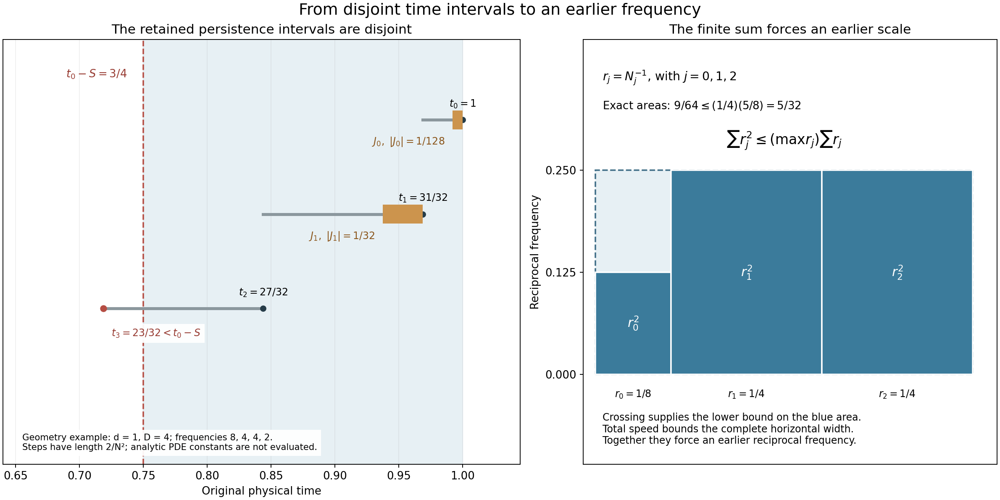

# Iterated backpropagation and total speed

The preceding lesson found one earlier frequency component.
We now repeat that operation and prove quantitative bounds
for an earlier point at a prescribed physical time scale.
The proof keeps the original viscosity, pressure, spatial
center, frequency, time interval and amplitude.

The central step adds short, disjoint intervals on which
the actual velocity must remain large. Their total contribution
is bounded by the full total-speed estimate. This controls
the sum of the spatial steps and forces an earlier frequency
in an explicit range. The final estimates depend on the
critical velocity bound and the original parameters.

Read [Frequency backpropagation with the original parameters](frequency-backpropagation-with-the-original-parameters.md)
for the one-step operation and
[Global nonlinear energy and total speed](global-nonlinear-energy-and-total-speed.md)
for the complete total-speed coefficient.
The human comparison is Terence Tao,
[*Quantitative bounds for critically bounded solutions to
the Navier–Stokes equations*, version 2](https://arxiv.org/abs/1908.04958v2),
original author article.tex 284–294 and 614–658.
Section 6 proves the exact map to its stated time separation,
including an explicit finite choice of the hierarchy exponent.
The subsequent weighted heat argument is still needed for
the general large critical-velocity endpoint.

## 1. The original inputs and complete total speed

Retain the original smooth source-class solution
\[
 \partial_tu+(u\cdot\nabla)u+\nabla p=\nu\Delta u,\qquad
 \operatorname{div}u=0,\qquad \nu>0,\qquad
 \sup_{[t_0-T,t_0]}\|u(t)\|_3\leq U<\infty
 \tag{1.1}
\]
on \([t_0-T,t_0]\times\mathbb R^3\), with \(T>0\).
The smooth source class is that of NS-FLUID-12: \(u\) and its
spatial derivatives lie in \(L^\infty_tL^2_x\). Sobolev embedding
therefore gives a finite uniform spatial maximum, used below only
to prove termination. The force is zero, as required by the
one-step operation; the forced total-speed estimate alone does
not supply a forced backpropagation theorem.

Keep the Fourier convention, \(\phi,p(\xi),P_N\), and all original
positive constants of NS-FLUID-15. The pressure \(p(t,x)\) and
the Fourier symbol \(p(\xi)\) are distinguished by their domains.
In particular \(C_P=\|\mathcal F^{-1}p(\xi)\|_1>0\),
\(0<b\leq b_0\), \(0<\eta\leq1/256\), \(d=b\eta^6/D_u>0\),
\(D\geq4d\), and \(L>0\). Those constants retain their full
dependence on the original \(U,\nu\) and the fixed cutoff.

Define the four actual coefficients from NS-FLUID-12 (8.4)–(8.6):
\[
 \begin{gathered}
 C_M=16\sqrt2\,\kappa_0^2+
                 18C_{0,6}^2(\sqrt2-1),\\
 s_1=\frac{2(\sqrt2-1)}{3\sqrt\pi}
                         +c_\phi+4\mathcal B_0,\qquad
 s_2=\frac{2\mathcal K_0d_1\log2}{9\pi},\\
 s_3=\frac{2\mathcal K_0d_{6/5}S_3g_*\sqrt{C_M\log2}}
                         {3\sqrt\pi},\\
 s_4=\frac{4\mathcal K_0C_M}{\pi^2}
       \bigl((d_1+d_2)v_3g_*^2+d_\infty+d_2\bigr),\\
 \mathscr S(U,\nu)=s_1\frac U{\sqrt\nu}
       +s_2\frac{U^2}{\nu^{3/2}}
       +s_3\frac{U^3}{\nu^{5/2}}
       +s_4\frac{U^4}{\nu^{7/2}} .
 \end{gathered} \tag{1.2}
\]
All symbols on the right are the complete finite kernel and
Sobolev constants defined and proved in NS-FLUID-12. In particular
the subscripted \(d_r\) are its companion-kernel constants; the
unsubscripted \(d\) is the positive time-gap constant of NS-FLUID-15.
There is no discarded viscosity factor or unspecified new constant.

For every actual \(0<S\leq T/2\), apply that proved estimate on
the earlier interval \([t_0-2S,t_0]\), with heat starting time
\(t_0-2S\) and receiving interval \([t_0-S,t_0]\). This is a
restriction of the original solution, not a change of coordinates.
Its critical norm is at most the original \(U\). The proof of
NS-FLUID-12 uses only that upper bound; each coefficient is
nonnegative. It gives
\[
 \int_{t_0-S}^{t_0}\|u(t)\|_\infty\,dt
                  \leq\mathscr S(U,\nu)\sqrt S .
 \tag{1.3}
\]
Thus the complete total speed is available on every receiving
interval below, with the required preceding heat interval inside
the original domain.

## 2. An earlier point with explicit bounds

If \(U=0\), then \(u=0\) and no positive target amplitude occurs.
Assume \(U>0\), retain any \(0<b\leq b_0\), and set
\[
 \begin{gathered}
 B=\frac{4C_P(1+\eta^{-3})\mathscr S(U,\nu)}{bd},\\
 \beta=\max\{DB,\sqrt{2d}\,\eta^3\},\qquad
 \Lambda=\max\{2D,4\beta^2\},\\
 \rho=\frac{d\eta^6}{8D},\qquad
 \gamma=\frac{d\eta^6}{\beta^2}.
 \end{gathered} \tag{2.1}
\]
Every constant is finite and positive, and the choices are
sequential. Directly \(0<\rho\leq1/32\) because \(D\geq4d\)
and \(\eta\leq1\). Also \(0<\gamma\leq1/2\), by the second
entry in the maximum defining \(\beta\).

Suppose
\[
 |P_{N_0}u(t_0,x_0)|\geq bN_0,\qquad
 \Lambda N_0^{-2}\leq S\leq\rho T .
\]
We prove that an actual dyadic frequency \(N_i\in N_0\,2^{\mathbb Z}\)
and an earlier point satisfy
\[
 \begin{gathered}
 t_0-S\leq t_i\leq t_0-\gamma S,\qquad
 \sqrt d\,\eta^3 S^{-1/2}\leq N_i\leq\beta S^{-1/2},\\
 |x_i-x_0|\leq LB\sqrt S,\qquad
 |P_{N_i}u(t_i,x_i)|\geq bN_i .
 \end{gathered} \tag{2.2}
\]
All bounds depend only on the original \(U,\nu,b\) and the fixed
cutoff. The auxiliary smooth maximum is absent from (2.1)–(2.2).
The original amplitude is retained.

## 3. Crossing the actual receiving time

The nonempty interval for \(S\) implies
\[
 N_0^2\geq\frac{\Lambda}{\rho T}
       \geq\frac{2D}{\rho T}\geq\frac{64D}{T}.
\]
In particular the initial point satisfies the one-step threshold.
Iterate NS-FLUID-15 (2.6) while \(t_j\geq t_0-T/2\) and
\(N_j\geq2\sqrt{D/T}\). The already proved operation supplies
each next point. For every step,
\[
 \begin{gathered}
 |P_{N_j}u(t_j,x_j)|\geq bN_j,\qquad
 \eta^3N_{j-1}\leq N_j\leq\eta^{-3}N_{j-1},\\
 dN_{j-1}^{-2}\leq t_{j-1}-t_j\leq DN_{j-1}^{-2},
 \qquad |x_j-x_{j-1}|\leq L/N_{j-1}.
 \end{gathered} \tag{3.1}
\]
Here all frequencies remain in the single original dyadic lattice.

For completeness, let \(V=\sup_{[t_0-T,t_0]}\|u(t)\|_\infty\).
Every selected frequency obeys \(N_j\leq C_PV/b\).
The positive amplitude gives \(V>0\), and hence every step
decreases time by at least \(d(b/(C_PV))^2>0\).
Each step begins at time at least \(t_0-T/2\) and lasts at most
\(T/4\). Thus every selected time is at least \(t_0-3T/4\).
An infinite chain would contradict these two facts, so it stops
at some finite \(n\geq1\). At that point either
\(t_n<t_0-T/2\) or \(N_n<2\sqrt{D/T}\).

In the latter case the incoming frequency comparison gives
\(N_{n-1}\leq\eta^{-3}N_n<2\eta^{-3}\sqrt{D/T}\). Consequently
\[
 t_0-t_n\geq t_{n-1}-t_n
       \geq dN_{n-1}^{-2}
       >\frac{d\eta^6T}{4D}=2\rho T .
 \tag{3.2}
\]
In the former case \(t_0-t_n>T/2\geq2\rho T\).
Both cases therefore put the stopping point strictly before
\(t_0-S\). This is the exact dimensional and ordered inequality
needed for the crossing; no reversed comparison is used.

The first step has
\(t_0-t_1\leq DN_0^{-2}\leq S/2\).
Let \(m\) be the largest index with \(t_m\geq t_0-S\).
Strictly decreasing times now give
\[
 1\leq m\leq n-1,\qquad
 t_m\geq t_0-S>t_{m+1},\qquad
 D\sum_{j=0}^mN_j^{-2}
       \geq t_0-t_{m+1}>S .
 \tag{3.3}
\]
This proves the complete crossing and the lower sum of squared
inverse frequencies in the original time variable.

## 4. Disjoint intervals control the total displacement

For each \(j=0,\ldots,m-1\), keep the actual fixed point \(x_j\)
and define
\[
 J_j=[t_j-\tfrac d2N_j^{-2},t_j].
\]
The derivative estimate proved in NS-FLUID-15 is
\(|\partial_tP_{N_j}u|\leq D_uN_j^3\).
The fundamental theorem of calculus on \(J_j\) gives
\[
 |P_{N_j}u(t,x_j)|
 \geq bN_j-\frac{D_ud}{2}N_j
 =b(1-\eta^6/2)N_j\geq\frac b2N_j .
 \tag{4.1}
\]
The lower step bound in (3.1) puts each \(J_j\) strictly inside
\([t_{j+1},t_j]\) except possibly at its top endpoint. Their
interiors are pairwise disjoint, and all are contained in
\([t_m,t_0]\subset[t_0-S,t_0]\). In particular the argument
uses only intervals where both the derivative estimate and
(1.3) have already been proved.

The original projection kernel has scaled \(L^1\) norm \(C_P\).
Hence \(\|u(t)\|_\infty\geq bN_j/(2C_P)\) on \(J_j\).
Adding the integrals over the disjoint intervals and using
(1.3) gives
\[
 \frac{bd}{4C_P}\sum_{j=0}^{m-1}N_j^{-1}
 \leq\int_{t_0-S}^{t_0}\|u(t)\|_\infty\,dt
 \leq\mathscr S(U,\nu)\sqrt S .
 \tag{4.2}
\]
The last frequency satisfies
\(N_m^{-1}\leq\eta^{-3}N_{m-1}^{-1}\).
Since \(m\geq1\), it follows that
\[
 \sum_{j=0}^mN_j^{-1}\leq B\sqrt S,\qquad
 |x_i-x_0|\leq L\sum_{j=0}^{i-1}N_j^{-1}
                         \leq LB\sqrt S\quad(1\leq i\leq m).
 \tag{4.3}
\]
This replaces the auxiliary smooth-maximum displacement estimate
by a bound in the original critical norm, viscosity and amplitude.
Every spatial step and every persistence interval has been kept.

Figure 1. The left panel displays a geometric example with
\(t_0=1,S=1/4,d=1,D=4\), frequencies \(8,4,4,2\), and steps
of length \(2/N_j^2\). The crossing is
\(t_2=27/32\geq3/4>23/32=t_3\), so \(m=2\).
The two retained persistence intervals have lengths \(1/128\)
and \(1/32\) and satisfy exactly the containment in (4.1)–(4.2).
Only the three steps up to the crossing are shown.
These values illustrate interval geometry; they are not evaluations
of the PDE constants in NS-FLUID-15 or (2.1), and are not claimed
to meet the theorem's scale-selection hypotheses.
The right panel uses the same original frequencies:
\(r_0=1/8,r_1=r_2=1/4\). The three exact blue areas total
\(9/64\), and the surrounding rectangle has area
\((1/4)(5/8)=5/32\). This depicts the complete finite inequality
used in (5.1), with no sampled fluid solution.
Human source comparison: Tao, article.tex 632–647.
[Reproducible figure source](../assets/iterated-frequency-backpropagation.py).

## 5. Selecting an earlier physical frequency

Put \(r_j=N_j^{-1}\). Combining (3.3) and (4.3),
\[
 \frac S D<\sum_{j=0}^m r_j^2
       \leq\left(\max_{0\leq j\leq m}r_j\right)
                          \sum_{j=0}^m r_j
       \leq\left(\max_{0\leq j\leq m}r_j\right)B\sqrt S.
\]
Thus some index \(i\) has
\(r_i>\sqrt S/(DB)\geq\sqrt S/\beta\).
The original scale condition gives
\(r_0\leq\sqrt S/(2\beta)\), so this index cannot be zero.
Take \(1\leq i\leq m\). Then \(N_i<\beta S^{-1/2}\).
The incoming step gives the other two bounds:
\[
 S\geq t_0-t_i\geq t_{i-1}-t_i
       \geq dN_{i-1}^{-2}
       \geq d\eta^6N_i^{-2}
       >\frac{d\eta^6}{\beta^2}S=\gamma S .
 \tag{5.1}
\]
The non-strict version yields
\(N_i\geq\sqrt d\,\eta^3S^{-1/2}\); the strict final comparison
implies the required non-strict time separation.
Equations (3.1) and (4.3) supply the amplitude and displacement.
This proves every assertion of (2.2), with no auxiliary
solution-dependent maximum in its constants.

## 6. Recovering the exact source time separation

We next prove the map to the source's unit-viscosity equation and
its actual \(A_{\rm src}\geq2\). This comparison does not replace
(1.1)–(5.1). Use exactly the constants
\(a_\Delta,\zeta,e_0,c_0,\mathcal L(C),\mathcal D(C)\)
of NS-FLUID-15 (7.1)–(7.4). For \(C\geq16\) obeying those
selection inequalities, set \(b=A_{\rm src}^{-C}\).
Their proved bounds are
\[
 \begin{gathered}
 \eta^{-1}<\zeta A_{\rm src}^{2C+3},\qquad
 e_0A_{\rm src}^{-13C-20}\leq d\leq1/a_\Delta,\\
 D\leq\mathcal D(C)A_{\rm src}^{12C+19},\qquad
 L\leq\mathcal L(C)A_{\rm src}^{3C+4}.
 \end{gathered} \tag{6.1}
\]
All comparisons retain the actual definitions before estimating them.
Put \(s_0=s_1+s_2+s_3+s_4>0\); (1.2) gives
\(\mathscr S(A_{\rm src},1)\leq s_0A_{\rm src}^4\).
Define
\[
 \begin{gathered}
 b_*=\frac{8C_Ps_0\zeta^3}{e_0},\qquad
 j_*=\sqrt{e_0}\,\zeta^{-3},\\
 \mathcal B(C)=\max\{\mathcal D(C)b_*,\sqrt{2/a_\Delta}\},\\
 \mathcal A(C)=\max\{2\mathcal D(C),4\mathcal B(C)^2\},\\
 \mathcal R(C)=\frac{e_0}{8\zeta^6\mathcal D(C)},\qquad
 \mathcal G(C)=\frac{e_0}{\zeta^6\mathcal B(C)^2}.
 \end{gathered} \tag{6.2}
\]
These are new comparison constants; \(\mathcal B(C)\) is not
the physical \(B\) in (2.1), and \(\mathcal A(C)\) is not
the source bound \(A_{\rm src}\).

Since \(1+\eta^{-3}\leq2\eta^{-3}\), substitution of every
factor into (2.1) gives
\[
 \begin{gathered}
 B\leq b_*A_{\rm src}^{20C+33},\qquad
 \beta\leq\mathcal B(C)A_{\rm src}^{32C+52},\\
 \Lambda\leq\mathcal A(C)A_{\rm src}^{64C+104},\qquad
 \rho\geq\mathcal R(C)A_{\rm src}^{-37C-57},\\
 \gamma\geq\mathcal G(C)A_{\rm src}^{-89C-142},\qquad
 \sqrt d\,\eta^3\geq j_*A_{\rm src}^{-25C/2-19},\\
 LB\leq\mathcal L(C)b_*A_{\rm src}^{23C+37}.
 \end{gathered} \tag{6.3}
\]
For the first exponent, the four contributions are \(6C+9\)
from \(\eta^{-3}\), \(4\) from total speed, \(C\) from \(b^{-1}\),
and \(13C+20\) from \(d^{-1}\). They sum to \(20C+33\).
The second entry of \(\beta\) is bounded by \(\sqrt{2/a_\Delta}\).
The lower product \(d\eta^6\) has coefficient \(e_0\zeta^{-6}\)
and exponent \(-25C-38\). Division by \(8D\) gives the stated
\(\rho\) bound; division by \(\beta^2\) gives the stated
\(\gamma\) bound. This accounts for all original factors.

Choose the smallest integer \(C_\dagger\geq16\) satisfying
NS-FLUID-15 (7.4) and all six inequalities
\[
 \begin{gathered}
 C^3\geq89C+142+\log_2^+(1/\mathcal G(C)),\\
 C^3\geq32C+52+\log_2^+\mathcal B(C),\\
 C^3\geq25C/2+19+\log_2^+(1/j_*),\\
 C^4\geq64C+104+\log_2^+\mathcal A(C),\\
 C^4\geq37C+57+\log_2^+(1/\mathcal R(C)),\\
 C^4\geq23C+37+\log_2^+(\mathcal L(C)b_*).
 \end{gathered} \tag{6.4}
\]
As before \(\log_2^+x=\max\{0,\log_2x\}\).
This is a terminating integer selection, not an assumption.
Here is a complete growth bound. The proof in NS-FLUID-15 gives
\(\mathcal L(C)\leq\mathcal L(1)C^{1/40}\) and
\(\mathcal D(C)\leq D_*C\), where
\[
 D_*=\max\{4/a_\Delta,\,
             (4\zeta^6/c)(301/20+\log\mathcal M(1))\}.
\]
Therefore, with
\(B_*=\max\{D_*b_*,\sqrt{2/a_\Delta}\}\) and
\(A_*=\max\{2D_*,4B_*^2\}\), we have
\[
 \begin{gathered}
 \mathcal B(C)\leq B_*C,\quad
 \mathcal A(C)\leq A_*C^2,\quad
 1/\mathcal R(C)\leq(8\zeta^6D_*/e_0)C,\\
 1/\mathcal G(C)\leq(\zeta^6B_*^2/e_0)C^2,\quad
 \mathcal L(C)b_*\leq\mathcal L(1)b_*C^{1/40}.
 \end{gathered} \tag{6.5}
\]
The positive logarithm of each right side is at most its constant
positive logarithm plus a fixed multiple of \(\log_2 C\).
For \(C\geq1\), \(\log_2C\leq2C\).
Thus all right sides of (6.4), and those of the prior selection,
are bounded by explicit affine functions of \(C\). Their cubes
and fourth powers dominate for all sufficiently large integers;
the earlier first affine condition is itself eventually true.
This proves nonemptiness and finite termination of the selection.
One may enlarge the source's unspecified sufficiently large
hierarchy exponent to this actual integer.

Use the original source notation \(A_j=A_{\rm src}^{C_\dagger^j}\).
For \(A_{\rm src}\geq2\), every fixed positive coefficient \(q\)
is bounded above by \(A_{\rm src}^{\log_2^+q}\).
Its reciprocal version gives the corresponding lower bounds.
Equations (6.3)–(6.4) therefore prove
\[
 \begin{gathered}
 \Lambda\leq A_4,\qquad \rho\geq A_4^{-1},\qquad
 \gamma\geq A_3^{-1},\\
 \beta\leq A_3,\qquad
 \sqrt d\,\eta^3\geq A_3^{-1},\qquad LB\leq A_4.
 \end{gathered} \tag{6.6}
\]
Suppose the source interval \(A_4N_0^{-2}\leq S\leq A_4^{-1}T\)
is nonempty and its original amplitude is
\(|P_{N_0}u(t_0,x_0)|\geq A_1^{-1}N_0\).
The prior selection ensures \(b=A_1^{-1}\leq b_0\).
By (6.6) this is an input to the already proved theorem (2.2).
Its actual output satisfies
\[
 \begin{gathered}
 t_0-S\leq t_i\leq t_0-A_3^{-1}S,\qquad
 A_3^{-1}S^{-1/2}\leq N_i\leq A_3S^{-1/2},\\
 |x_i-x_0|\leq A_4\sqrt S,\qquad
 |P_{N_i}u(t_i,x_i)|\geq A_1^{-1}N_i .
 \end{gathered} \tag{6.7}
\]
This proves the original stated time separation, with explicit
frequency and displacement bounds. It also proves that the
coarser printed \(A_3^{-6}S\) calculation is not a reason to
stop at a weaker time conclusion: the preceding full one-step
constants have polynomial dependence on \(A_{\rm src}\) with
exponents affine in the selected \(C_\dagger\), which fits
inside the actual cubic hierarchy. The exact map is (6.1)–(6.7).

## 7. Every original physical scale

For \(\lambda>0\), keep
\(u^\lambda(t,x)=\lambda u(\lambda^2t,\lambda x)\) and
\(p^\lambda(t,x)=\lambda^2p(\lambda^2t,\lambda x)\).
Direct differentiation retains the same viscosity \(\nu\).
The critical bound \(U\) and every constant in (1.2), (2.1)
are unchanged. The original physical data map as
\[
 T^\lambda=T/\lambda^2,\quad S^\lambda=S/\lambda^2,\quad
 t_j^\lambda=t_j/\lambda^2,\quad
 x_j^\lambda=x_j/\lambda,\quad N_j^\lambda=\lambda N_j.
 \tag{7.1}
\]
The full Fourier substitution gives
\(P_{\lambda N}u^\lambda(t,x)
=\lambda(P_Nu)(\lambda^2t,\lambda x)\).
Every target and earlier amplitude thus has factor \(\lambda\).
The receiving time bounds have factor \(\lambda^{-2}\),
frequency bounds factor \(\lambda\), and displacement bound
factor \(\lambda^{-1}\). Each persistence interval maps with
its exact endpoints. Substitution in the total-speed integral
gives factor \(\lambda^{-1}\), exactly the factor of \(\sqrt S\).
The one-step kernels retain both invariants \(\nu\tau N^2\)
and \(N\,\mathrm{distance}\). This proves the full physical
comparison without changing the working coordinates of (1.1).

## 8. Five solved exercises

### Exercise 1: use the full persistence interval

For the same actual chain, replace the half-length interval
in Section 4 by
\[
 J_j^\theta=[t_j-\theta dN_j^{-2},t_j],\qquad 0<\theta\leq1.
\]
Prove the exact amplitude and total-speed bounds. Choose the
best permitted \(\theta\), and propagate the resulting constant
through every conclusion of the theorem.

**Solution.** The complete original derivative estimate gives
\[
 |P_{N_j}u(t,x_j)|\geq
 b(1-\theta\eta^6)N_j\quad(t\in J_j^\theta).
 \tag{8.1}
\]
Since the actual next gap is at least \(dN_j^{-2}\),
these intervals remain contained in their separate time steps.
They may share endpoints when \(\theta=1\), but those have
zero Lebesgue measure. The projection-kernel bound and
their exact lengths give
\[
 \frac{bd}{C_P}\theta(1-\theta\eta^6)
       \sum_{j=0}^{m-1}N_j^{-1}
 \leq \mathscr S(U,\nu)\sqrt S.
 \tag{8.2}
\]
The derivative of \(\theta(1-\theta\eta^6)\) is
\(1-2\theta\eta^6>0\) for \(0<\theta\leq1\), since
\(\eta\leq1/256\). Thus \(\theta=1\) gives the largest
coefficient among these permitted intervals.

Define the actual improved constants
\[
 \begin{gathered}
 B_{\rm full}=
 \frac{C_P(1+\eta^{-3})\mathscr S(U,\nu)}
                      {bd(1-\eta^6)}
           =\frac{B}{4(1-\eta^6)},\\
 \beta_{\rm full}=\max\{DB_{\rm full},\sqrt{2d}\eta^3\},
 \quad\Lambda_{\rm full}=\max\{2D,4\beta_{\rm full}^2\},\\
 \gamma_{\rm full}=d\eta^6/\beta_{\rm full}^2 .
 \end{gathered} \tag{8.3}
\]
Retain the original \(\rho=d\eta^6/(8D)\). The finite-chain
crossing uses only \(\Lambda_{\rm full}\geq2D\) and
\(S\leq\rho T\), so Section 3 applies unchanged.
Equation (8.2) with \(\theta=1\), followed by the same final
frequency comparison, gives the complete sum bound
\(\sum_{j=0}^mN_j^{-1}\leq B_{\rm full}\sqrt S\).
The full finite sum argument of Section 5 then yields
\[
 \begin{gathered}
 t_0-S\leq t_i\leq t_0-\gamma_{\rm full}S,\qquad
 \sqrt d\,\eta^3S^{-1/2}\leq N_i
                              \leq\beta_{\rm full}S^{-1/2},\\
 |x_i-x_0|\leq LB_{\rm full}\sqrt S,\qquad
 |P_{N_i}u(t_i,x_i)|\geq bN_i
 \end{gathered} \tag{8.4}
\]
whenever \(\Lambda_{\rm full}N_0^{-2}\leq S\leq\rho T\).
This proves the entire receiving theorem with the new constants.
Moreover \(B_{\rm full}<B\), \(\beta_{\rm full}\leq\beta\),
\(\Lambda_{\rm full}\leq\Lambda\), and
\(\gamma_{\rm full}\geq\gamma\). The lower frequency bound,
original amplitude, viscosity and terminal time allowance
remain exactly the same. The source comparisons in Section 6
therefore continue to hold, and their full original bounds
are retained.

### Exercise 2: retain all earlier frequencies selected by the sum

Prove a quantitative statement about the entire set of indices
with sufficiently large reciprocal frequency, rather than
choosing only one maximum. Keep its actual time, spatial and
amplitude information.

**Solution.** Use the original constants of Section 2 and put
\[
 r_j=N_j^{-1},\quad
 a=\frac{\sqrt S}{2DB},\qquad
 \mathcal G=\{j\in\{0,\ldots,m\}:r_j>a\}.
\]
For the complementary indices,
\(\sum_{j\notin\mathcal G}r_j^2
\leq a\sum_{j=0}^mr_j\leq S/(2D)\).
Subtract this from the complete strict lower bound
\(\sum_{j=0}^mr_j^2>S/D\). It gives
\[
 \sum_{j\in\mathcal G}N_j^{-2}>\frac{S}{2D}.
 \tag{8.5}
\]
Thus \(\mathcal G\) is nonempty. The original scale condition
implies \(r_0\leq\sqrt S/(2\beta)\leq a\), so
every index in \(\mathcal G\) is at least one.
For each of them the incoming gap and frequency comparison give
\[
 \begin{gathered}
 t_0-S\leq t_j<
      t_0-\frac{d\eta^6}{4D^2B^2}S,\qquad
 \sqrt d\,\eta^3S^{-1/2}\leq N_j<2DBS^{-1/2},\\
 |x_j-x_0|\leq LB\sqrt S,\qquad
 |P_{N_j}u(t_j,x_j)|\geq bN_j .
 \end{gathered} \tag{8.6}
\]
Indeed \(r_j>a\) makes the actual time gap exceed
\(d\eta^6a^2\); all the other conclusions were proved for
every \(1\leq j\leq m\). This preserves a positive lower
sum of reciprocal-frequency squares over a set of actual
earlier points, with all their receiving data.
It asserts no lower bound on the number of distinct spatial
points: selected points may share a spatial coordinate.

### Exercise 3: when does the receiving time interval exist?

Give an exact condition for the interval of permitted \(S\)'s
to be nonempty. Deduce the original one-step threshold without
assuming it separately. Compare the result for the improved
constant in Exercise 1.

**Solution.** All quantities are positive. The exact equivalence is
\[
 [\Lambda N_0^{-2},\rho T]\ne\varnothing
 \quad\Longleftrightarrow\quad
 N_0^2\geq\frac{\Lambda}{\rho T}
      =\frac{8D\Lambda}{d\eta^6T}.
 \tag{8.7}
\]
No change in the physical \(N_0,T\) is involved.
Since \(\Lambda\geq2D\) and \(\rho\leq1/32\),
this implies \(N_0^2\geq64D/T\), hence in particular
\(N_0\geq2\sqrt{D/T}\), the already proved operation's
input condition. The factor 64 is not discarded.
When the interval is empty the iterated assertion has no
receiving time; it does not imply that the initial amplitude
is impossible.

For Exercise 1 the exact condition is
\(N_0^2\geq8D\Lambda_{\rm full}/(d\eta^6T)\).
It is no stronger than (8.7), and the same initial
one-step threshold follows because
\(\Lambda_{\rm full}\geq2D\).
This proves precisely how the stronger persistence estimate
enlarges the admissible range of original frequencies and times.

### Exercise 4: reconstruct the source's positive time separation

Starting from the actual original constants, recover the
exponent \(89C+142\) and its coefficient in the lower bound
for \(\gamma\). Prove why an estimate with that affine
exponent can imply the source's cubic-hierarchy separation.

**Solution.** The full earlier comparison gives
\[
 d\eta^6\geq e_0\zeta^{-6}
                    A_{\rm src}^{-25C-38},\qquad
 \beta^2\leq\mathcal B(C)^2
                    A_{\rm src}^{64C+104}.
\]
Divide the first expression by the second, retaining both
coefficients and all powers:
\[
 \gamma\geq
 \frac{e_0}{\zeta^6\mathcal B(C)^2}
       A_{\rm src}^{-(25C+38)-(64C+104)}
 =\mathcal G(C)A_{\rm src}^{-89C-142}.
 \tag{8.8}
\]
For \(q>0\) and \(A_{\rm src}\geq2\),
\(q\geq A_{\rm src}^{-\log_2^+(1/q)}\).
If \(q\geq1\) this follows from \(q\geq1\);
if \(0<q<1\), raising \(A_{\rm src}\geq2\) to the
negative exponent gives
\(A_{\rm src}^{-\log_2(1/q)}\leq q\).
Thus the first numerical inequality in (6.4) implies
\(\gamma\geq A_{\rm src}^{-C_\dagger^3}=A_3^{-1}\).

This is an actual finite choice: (6.5) gives
\(1/\mathcal G(C)\leq K C^2\), with the complete
\(K=\zeta^6B_*^2/e_0>0\).
Therefore
\(\log_2^+(1/\mathcal G(C))
\leq\log_2^+K+2\log_2C\leq\log_2^+K+4C\).
The cubic dominates the resulting affine expression
\(93C+142+\log_2^+K\).
The other simultaneous conditions are proved to be eventual
in Section 6, so the finite integer selection satisfies all
of them. No unproved replacement of one hierarchy level by
another is used.

### Exercise 5: a moving frame and the critical class

For a constant vector \(v\in\mathbb R^3\), prove the exact
Galilean map of the original equation and the earlier points.
Determine whether a nonzero moving frame preserves the
whole-space \(L^3\) hypothesis, and retain the displacement
term that the moving frame introduces.

**Solution.** Define the actual fields
\[
 u^v(t,x)=u(t,x-vt)+v,\qquad
 p^v(t,x)=p(t,x-vt).
 \tag{8.9}
\]
The time derivative contributes
\(\partial_tu(t,x-vt)-v\cdot\nabla u(t,x-vt)\).
The transport term is
\((u(t,x-vt)+v)\cdot\nabla u(t,x-vt)\).
Their two \(v\)-terms cancel exactly. Pressure gradient,
Laplacian and divergence are translated unchanged, so the
original unforced equation holds with the same viscosity.

Since the annular symbol vanishes at zero, its projection
annihilates the constant vector. Translation commutes with
the convolution kernel. Hence
\[
 P_Nu^v(t,x)=(P_Nu)(t,x-vt).
 \tag{8.10}
\]
Every selected point maps to
\((t_j,x_j^v)=(t_j,x_j+vt_j)\), with unchanged frequency,
time and projected amplitude. Its full displacement is
\[
 x_j^v-x_0^v=(x_j-x_0)+v(t_j-t_0),\qquad
 |x_j^v-x_0^v|\leq LB\sqrt S+|v|S .
 \tag{8.11}
\]
The advective contribution is retained.

If \(v\ne0\), then for each time
\[
 |\{x:|u(t,x-vt)|>|v|/2\}|
                   \leq(2U/|v|)^3<\infty .
 \tag{8.12}
\]
Its complement has infinite measure, and there
\(|u(t,x-vt)+v|\geq|v|/2\).
Consequently \(\|u^v(t)\|_3=\infty\).
The transformed solution therefore does not satisfy the
original whole-space critical-norm hypothesis.
Its fluctuation \(u^v-v\) has the unchanged \(L^3\) norm;
in moving coordinates it is exactly the original field.
Equations (8.9)–(8.12) prove the relation completely,
including the class restriction and actual point map.
They do not silently apply the theorem to an infinite
critical norm.

## 9. Source comparison and the next argument

The original proof at article.tex 624 uses \(A_2\) in the first
time interval although its preceding step bound uses \(A_3\).
Equation (3.1) retains the actual \(d,D\) time constants.
At 627 the displayed chain has an ill-ordered comparison and
does not imply its stated stopping-time conclusion; (3.2)
proves the complete positive bound with its physical \(T\).
At 629–630 the receiving center is the original \(t_0\),
and the crossing after the largest admissible index has
\(t_{m+1}<t_0-S\), as proved in (3.3).
Equations (4.1)–(4.3) prove the disjoint interval and
total-speed map with all constants. Equation (5.1) uses the
actual incoming frequency comparison for the lower time bound.
Finally (6.1)–(6.7) prove the stronger source-stated time
separation after an explicit fixed hierarchy choice.

These corrections preserve and establish the original iterated
conclusion; they do not disprove it. The next argument connects the original vorticity mass,
the full Gaussian factors, actual annular supports and shell
multiplicities to the finite weighted heat estimates and the
small annulus constructed earlier. Those receiving arguments
are needed before claiming the general large critical-velocity
endpoint. No novelty is asserted here.

The mathematical text and original figure are dedicated
to CC0 1.0. Cited author sources retain their respective terms.
