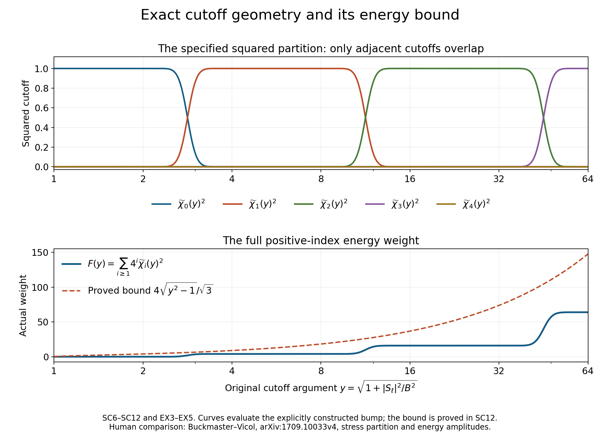
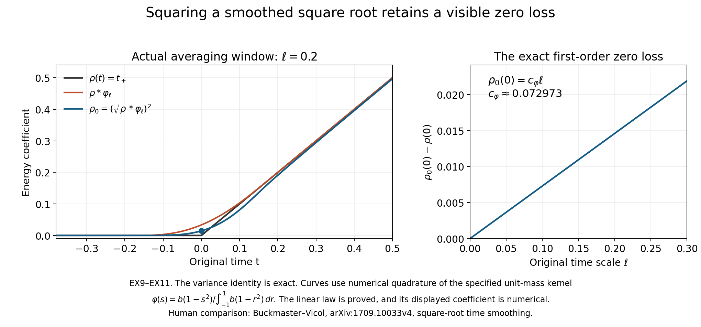

# Mollification, stress cutoffs and the energy coefficient

[Lesson 23](the-full-intermittent-correction-and-residual.md)
gave the complete finite velocity and stress correction.
This chapter constructs the amplitudes used by that correction.
It keeps the original mollified equation, builds every stress
cutoff, and proves the energy coefficient's smoothness,
positivity and full derivative bounds, including at zero.

The original force, viscosity, volume, energy integrals and
amplitude prefactor stay explicit. The rational coefficient
functionals and their exact constant are from
[lesson 21](residual-stresses-and-exact-beltrami-fields.md),
BG1–BG32. The intermittent fields are from
[lesson 22](intermittent-fields-and-periodic-product-estimates.md).
IC and IK labels refer to the full residual and kernel proofs
of lesson 23. SC labels below identify the mollification and
stress partition; AB labels identify the complete amplitudes.

The human source is Tristan Buckmaster and Vlad Vicol,
[*Nonuniqueness of weak solutions to the Navier–Stokes equation*,
arXiv:1709.10033v4](https://arxiv.org/abs/1709.10033v4).
Its original author TeX was read at 1–286, 674–785,
833–1103 and 1398–1531 for the parameter definitions,
induction, mollification, cutoffs and energy comparison.
This is independently written exposition. Source formula
corrections are identified explicitly and proved by exact
comparison; they do not imply a verdict on the entire paper.

Five solved exercises compute an actual shear commutator,
the geometry of every cutoff overlap, a construction for
every original volume, the exact smoothing loss at zero,
and the complete resulting physical energy error. The
infinite iteration requires further velocity and residual
estimates; the finite results here do not assume them.

## SC1. Complete mollified equation and original viscosity

Let the original smooth periodic fields on the cubic torus
of period \(L\) solve IC1 with the same \(\nu>0\).
Use nonnegative, even, smooth compactly supported original
Friedrichs kernels \(\phi\) in space and \(\varphi\) in
time, each with integral one, and retain
\[
 K_\ell(y,s)=\ell^{-4}\phi(y/\ell)\varphi(s/\ell),
 \qquad \mathcal M_\ell h(x,t)
 =\int_{\mathbb R^3\times\mathbb R}
        K_\ell(y,s)h(x-y,t-s)\,dy\,ds.
 \tag{SC1}
\]
The spatial field in the integrand is its original periodic
extension. Times are restricted to those for which the entire
kernel support lies in the interval on which the original
equation is known. This imposes no unproved extension across
a time endpoint. Put
\[
 u_\ell=\mathcal M_\ell u,\quad
 S_\ell=\mathcal M_\ell S,\quad f_\ell=\mathcal M_\ell f,
 \quad D=u_\ell\otimes u_\ell-\mathcal M_\ell(u\otimes u),
 \quad D^\circ=D-\tfrac13\operatorname{tr}D\,I .
 \tag{SC2}
\]
Differentiating the actual compactly supported integral
commutes with each derivative. Linearity preserves divergence,
symmetry and trace. The complete resulting equation is
\[
 \begin{aligned}
 \partial_tu_\ell+\operatorname{div}(u_\ell\otimes u_\ell)
  +\nabla p_\ell-\nu\Delta u_\ell
    &=f_\ell+\operatorname{div}(S_\ell+D^\circ),\\
 p_\ell&=\mathcal M_\ell p-\tfrac13\operatorname{tr}D,
 \qquad\operatorname{div}u_\ell=0 .
 \end{aligned}
 \tag{SC3}
\]
Indeed the equation with pressure \(\mathcal M_\ell p\)
has the full tensor \(D\) on its right side. Removing its
trace subtracts exactly \(\nabla\operatorname{tr}D/3\)
from both sides, proving SC3 and its sign. For the source's
unforced equation \(f=f_\ell=0\). For a general force the
receiver is the actual \(f_\ell\), which is not silently
identified with the original \(f\).

The source's displayed equation at line 690 replaces \(\nu\)
by one, whereas its original equations at 174 and 248 retain
\(\nu\). Its pressure at 697 subtracts the full
\(\operatorname{tr}D\), rather than one third. With the
same displayed trace-free tensor, the exact residual of
those two printed choices is
\[
 -(1-\nu)\Delta u_\ell
                 -\frac23\nabla\operatorname{tr}D .
 \tag{SC4}
\]
This follows by subtracting SC3 term by term. The corrected
equation SC3 retains both contributions and the original
viscosity. It is a local formula correction; no conclusion
about the whole source construction follows from the typo.

There is also a stronger complete commutator bound. Let
\(h=(y,s)\), write \(u_h=u(x-y,t-s)\), and keep the
full four-variable gradient \(D_{x,t}u\). Direct expansion
of both copies of the probability integral gives
\[
 \begin{aligned}
 D&=-\frac12\int\!\int K_\ell(h)K_\ell(h')
               (u_h-u_{h'})\otimes(u_h-u_{h'})\,dh\,dh',\\
 \|D^\circ\|_\infty&\leq\|D\|_\infty
 \leq\ell^2 \mathfrak m_2\|D_{x,t}u\|_\infty^2,\\
 \mathfrak m_2&=\int_{\mathbb R^3}|y|^2\phi(y)\,dy
                   +\int_{\mathbb R}s^2\varphi(s)\,ds .
 \end{aligned}
 \tag{SC5}
\]
The fundamental theorem along the full original space-time
segment bounds the increment by
\(\|D_{x,t}u\|_\infty|h-h'|\).
The Frobenius norm of its tensor square is its vector norm
squared. Evenness makes both kernel first moments zero, so
the complete double second moment is \(2\ell^2\mathfrak m_2\).
This cancels the one half in SC5. Trace removal is an
orthogonal contraction. All time and spatial derivative
contributions remain in the four-variable gradient.

## SC2. A specified smooth squared partition with only adjacent overlap

The source permits choosing its auxiliary cutoff functions.
Here is one explicit choice satisfying its required supports.
Use the smooth function \(b\) already proved in IK2 and set
\[
 \vartheta(t)=b((t+\tfrac12)(1-t)),\qquad
 A(t)=\sum_{j\in\mathbb Z}\vartheta(t-j)^2,
 \qquad
 \widetilde\chi(y)=
   \frac{\vartheta(\log_4y)}{\sqrt{A(\log_4y)}}
                  \quad(y>0).
 \tag{SC6}
\]
The summands are nonzero only when \(-1/2<t-j<1\),
so the sum is locally finite and smooth. It is positive:
for noninteger \(t\), take \(j=\lfloor t\rfloor\);
for integer \(t\), take \(j=t\). In either case the
argument lies strictly in the indicated interval.
Reindexing gives \(A(t+1)=A(t)\). On a compact period
this continuous positive function has a positive minimum.
Thus its reciprocal square root is smooth with every
finite derivative bounded.

Extend \(\widetilde\chi\) by zero outside
\((1/2,4)\), and define on \([0,\infty)\)
\[
 \widetilde\chi_0(y)=
 \begin{cases}1,&0\leq y\leq2,\\
               \widetilde\chi(y),&y>2,
 \end{cases}
 \qquad \widetilde\chi_i(y)=\widetilde\chi(4^{-i}y)
                         \quad(i\geq1).
 \tag{SC7}
\]
The zero extensions at \(1/2\) and \(4\) are smooth
because \(b\) and every derivative vanish at the support
boundary. To check the junction at two, put \(t=\log_4y\).
For \(t\leq1/2\) near \(1/2\), the only nonzero
summand of \(A(t)\) is \(\vartheta(t)^2\).
For \(t>1/2\) near it, the additional term
\(\vartheta(t-1)^2\) is flat at \(1/2\), while
\(\vartheta(t)\) stays positive. Hence
\(\widetilde\chi(y)\) agrees to every derivative with
one at \(y=2\). SC7 is therefore smooth, with
\(0\leq\widetilde\chi_i\leq1\).

For all \(y>0\), periodicity of \(A\) gives
\(\sum_{j\in\mathbb Z}\widetilde\chi(4^{-j}y)^2=1\).
If \(y\leq2\), all terms \(j\geq1\) vanish.
If \(y>2\), all terms \(j\leq-1\) vanish. Replacing
the nonpositive-index sum by the actual SC7 function proves
\[
 \widetilde\chi_0(y)^2+
           \sum_{i\geq1}\widetilde\chi_i(y)^2=1,
 \quad
 \operatorname{supp}\widetilde\chi_i
       \subseteq[4^i/2,4^{i+1}] (i\geq1),
 \quad
 \widetilde\chi_i\widetilde\chi_j=0\quad(|i-j|\geq2).
 \tag{SC8}
\]
The last assertion follows from disjoint interval interiors;
the boundary values vanish as well. For index zero its
support ends at four, while the support of index two begins
at eight. This explicit choice satisfies the source's looser
allowed intervals \([0,4]\) and \([1/4,4]\).

## SC3. Exact support, norm and high-index energy costs

Retain the original source parameters without deleting its
amplitude prefactor:
\[
 \begin{gathered}
 \lambda_q=a^{b^q},\quad
 \delta_{q+1}=\lambda_1^{3\beta_{\rm reg}}
                       \lambda_{q+1}^{-2\beta_{\rm reg}},\quad
 d=\lambda_q^{-\varepsilon_R}\delta_{q+1},\quad B=100d,
 \\ y(x,t)=\sqrt{1+|S_\ell(x,t)|^2/B^2},
 \quad\chi_i=\widetilde\chi_i(y).
 \end{gathered}
 \tag{SC9}
\]
The subscript on \(\beta_{\rm reg}\) distinguishes this
source regularity exponent from the physical frequency
\(\beta=\varkappa\sigma N_\Lambda\) retained in lesson23.
Their exact roles and original values are preserved.

Let \(V=L^3\), \(J(t)=\|S_\ell(\cdot,t)\|_1\),
and \(Y=\sqrt{1+\|S_\ell\|_\infty^2/B^2}\).
For \(i\geq1\), nonzero \(\chi_i\) requires
\(y>4^i/2\), hence
\[
 |S_\ell|>B\sqrt{4^{2i}/4-1}
              \geq\frac{\sqrt3}{4}B4^i,
 \qquad
 \|\chi_i\|_p\leq
 \left(\frac{4J(t)}{\sqrt3 B}\right)^{1/p}4^{-i/p}
                  \quad(1\leq p<\infty).
 \tag{SC10}
\]
The second square-root bound uses \(4^{-2i}\leq1/16\).
Chebyshev bounds the support measure by the displayed
quantity. Since \(|\chi_i|^p\leq1\) on that support,
integration proves every finite \(p\); at infinity the
bound is one. The exact finite upper index
\[
 i_* =\left\lceil\log_4(2Y)\right\rceil,
 \qquad\chi_i=0\quad(i\geq i_*),
 \qquad4^{i_*}<8Y
 \tag{SC11}
\]
follows from the same support lower endpoint and its zero
boundary value. The ceiling is at least one because \(Y\geq1\).
The finite family \(0\leq i\leq i_*\) therefore includes
every contribution, even though its last member is zero.

Whenever a positive-index cutoff is nonzero, \(y>2\).
On its support \(4^i<2y\), and
\(y\leq(2/\sqrt3)|S_\ell|/B\).
Multiplying by every actual squared cutoff and using SC8 gives
the pointwise and integrated bounds
\[
 \begin{aligned}
 \sum_{i\geq1}4^i\chi_i^2
     &\leq\frac4{\sqrt3 B}|S_\ell|,\\
 \sum_{i\geq1}\rho_i\int\chi_i^2
     &\leq\frac{4^{c_0}}{25\sqrt3}J(t),
 \qquad\rho_i=d4^{i+c_0},\\
 I_0(t):=\int\chi_0^2
     &\geq V-\frac{J(t)}{\sqrt3 B}.
 \end{aligned}
 \tag{SC12}
\]
The second line substitutes the full source \(\rho_i\).
For the last, \(\chi_0=1\) whenever
\(|S_\ell|\leq\sqrt3 B\); Chebyshev bounds the
complement's measure. In the source's actual induction,
convolution contraction gives \(J(t)\leq d\). Thus
\(I_0\geq V-1/(100\sqrt3)\); in particular the original
\(V=(2\pi)^3\) satisfies \(I_0\geq V/2>0\).
For a smaller original volume the displayed full bound is
retained, and the latter half-volume conclusion is used only
when \(V\geq1/(50\sqrt3)\).

## SC4. Globally defined positive-index amplitudes

For either of the two rotated rational families of BG30,
retain its actual trace-free linear coefficient functionals
\(\mathcal L_\zeta\), of norm \(D_0\), so that
\(c_\zeta(\rho I-S)=\rho/4-\mathcal L_\zeta(S)\).
Choose the concrete integer
\[
 c_0=\max\{1,\lceil\log_4(3200D_0)\rceil\}.
 \tag{SC13}
\]
On the closure of the support of \(\chi_i\), \(i\geq1\),
SC8 and SC9 give \(|S_\ell|<400d4^i\).
Consequently \(D_0|S_\ell|\leq\rho_i/8\), and
\[
 c_{\zeta,i}=\rho_i/4-\mathcal L_\zeta(S_\ell),\qquad
 \rho_i/8\leq c_{\zeta,i}\leq3\rho_i/8
                  \quad\hbox{on that support}.
 \tag{SC14}
\]
Define the actual function on the whole original torus by
\[
 a_{\zeta,i}=
 \begin{cases}
 \chi_i\sqrt{c_{\zeta,i}},&c_{\zeta,i}>\rho_i/16,\\
 0,&c_{\zeta,i}\leq\rho_i/16.
 \end{cases}
 \tag{SC15}
\]
This definition has no square root of a negative quantity.
Near the boundary \(c_{\zeta,i}=\rho_i/16\), the
strict margin in SC14 makes \(\chi_i\) identically
zero in a neighborhood. The two pieces therefore join
smoothly, including all derivatives. On the actual cutoff
support it is exactly the source's
\(\rho_i^{1/2}\chi_i\gamma_\zeta(I-S_\ell/\rho_i)\),
by the original linear coefficient and its positive square
root. Opposite amplitudes agree. BG7 gives the complete map
\[
 \begin{aligned}
 \sum_{\xi\in\Lambda_i^+}a_{\xi,i}^2(I-\xi\otimes\xi)
          &=\chi_i^2(\rho_i I-S_\ell),\\
 \|a_{\zeta,i}\|_\infty&\leq\sqrt{3\rho_i/8},\\
 \|a_{\zeta,i}\|_2&\leq\sqrt{3\rho_i/8}
            \left(\frac{4J(t)}{\sqrt3 B}\right)^{1/2}2^{-i}.
 \end{aligned}
 \tag{SC16}
\]
All original factors in \(\rho_i\) and \(B\) are
retained. At every point only adjacent cutoff indices can
interact, so the two distinct rational families may be
assigned by index parity without identifying their directions.
This supplies positive-index amplitudes. The low-index
energy amplitude is the next separate construction.

## SC5. The exact energy-volume comparison

Keep the source's actual integrals and define its full
excess before time smoothing by
\[
 \mathfrak e(t)=e(t)-\int|u_q|^2
          -3\sum_{i\geq1}\rho_i\int\chi_i^2
          -\frac{\delta_{q+2}}2,
 \qquad E(t)=\max\{\mathfrak e(t),0\}.
 \tag{SC17}
\]
The source coefficient at 844 and the coefficient that
solves the original average-energy equation have the exact
relationship
\[
 \rho_{\rm src}=\frac{E}{3VI_0},\qquad
 3I_0\rho_{\rm src}=\frac EV,\qquad
 \rho_{\rm energy}=\frac{E}{3I_0}=V\rho_{\rm src},
 \qquad3I_0\rho_{\rm energy}=E .
 \tag{SC18}
\]
Here \(I_0>0\) is proved in SC12 on the original source
torus. Multiplication proves every equality, and uniqueness
of \(\rho_{\rm energy}\) follows by division by the
positive \(3I_0\). This is the original energy integral
equation, without replacing the volume measure by an average.
The source identity at 1454 uses \(E\), whereas its
definition at 844 produces \(E/V\). Their exact difference
is \((V^{-1}-1)E\).

For example, take \(S_\ell=u_q=0\) and constant positive
\(E\). Then \(\chi_0=1\), \(I_0=V\), and the
printed coefficient is \(E/(3V^2)\). Its actual prescribed
principal energy is \(E/V\). Since the source's torus
has \(V=(2\pi)^3\ne1\), this is an explicit nonzero
discrepancy. The comparison does not change the original
source statement or attribute the correction to its authors.

The source time smoothing has an exact corresponding map:
\[
 \rho_{{\rm energy},0}
 :=\bigl(\sqrt{\rho_{\rm energy}}*_t\varphi_\ell\bigr)^2
 =V\bigl(\sqrt{\rho_{\rm src}}*_t\varphi_\ell\bigr)^2
 =V\rho_{{\rm src},0}.
 \tag{SC19}
\]
Positivity and the constant original volume allow
\(\sqrt V\) to pass through the actual time integral;
squaring retains its complete factor \(V\). Every
subsequent amplitude ratio, derivative and energy estimate
must receive this full correction. The required low-index
smoothness, support and quantitative bounds must still be
derived from the original induction before the full iteration
is concluded.

## SC6. Every original cutoff derivative and its full stress scale

The derivatives below are full ordered tensors; no repeated
index multiplicity is omitted. Write \(\mathcal P_m\) for
the set of partitions of \(\{1,\ldots,m\}\) into nonempty
blocks, and \(\mathcal P_m^{\leq2}\) for those with block
sizes one or two. Define the finite constants
\[
 \begin{aligned}
 q_j&=\left|\prod_{a=0}^{j-1}(\tfrac12-a)\right|,
 \qquad
 T_j=\max\{\|\widetilde\chi^{(j)}\|_\infty,
                    \|\widetilde\chi_0^{(j)}\|_\infty\},\\
 H_k&=\sum_{\sigma\in\mathcal P_k}
       4^{|\sigma|}T_{|\sigma|}\prod_{C\in\sigma}q_{|C|},\\
 C_m&=\sum_{\pi\in\mathcal P_m^{\leq2}}2^{|\pi|}H_{|\pi|}
                       \quad(m,k,j\geq1).
 \end{aligned}
 \tag{SC20}
\]
The supremum norms are of the explicitly constructed compact
cutoffs SC6–SC7. They are finite by the proved smoothness.
These constants retain every finite partition contribution.

For a matrix \(Z\) in its original nine real coordinates
put \(r=1+|Z|^2\) and
\(h_i(r)=\widetilde\chi_i(\sqrt r)\). The complete
one-variable chain rule gives
\[
 h_i^{(k)}(r)=\sum_{\sigma\in\mathcal P_k}
       \widetilde\chi_i^{(|\sigma|)}(\sqrt r)
       \prod_{C\in\sigma}
       \left[\prod_{a=0}^{|C|-1}(\tfrac12-a)
                              r^{1/2-|C|}\right].
 \tag{SC21}
\]
To prove this rule, differentiate the partition expression:
a derivative hitting the outer factor inserts the new index
as a singleton block, while a derivative hitting one of the
inner factors inserts it into that block. Every partition
of the enlarged index set appears exactly once, according
to the unique block containing the new index. The order-one
case is the ordinary chain rule, so induction proves SC21.

For \(i\geq1\) its outer derivative is exactly
\(4^{-i|\sigma|}\widetilde\chi^{(|\sigma|)}
(4^{-i}\sqrt r)\). When it is nonzero,
\(4^{-i}\sqrt r\leq4\). For \(i=0\), every positive
derivative is supported on \(2\leq\sqrt r\leq4\).
SC21 consequently gives
\(|h_i^{(k)}(r)|\leq H_k r^{-k}\) for every index,
including outside its derivative support where the terms
are zero.

For original matrix directions \(U_1,\ldots,U_m\),
the only nonzero derivatives of \(1+|Z|^2\) are
\(2Z\cdot U_j\) and \(2U_j\cdot U_l\).
The same partition proof gives the exact complete expression
\[
 \begin{aligned}
 D_Z^m[h_i(1+|Z|^2)](U_1,\ldots,U_m)
 =\sum_{\pi\in\mathcal P_m^{\leq2}}
 h_i^{(|\pi|)}(r)
 &\prod_{\{j\}\in\pi}(2Z\cdot U_j)\\
 {}
 &\prod_{\{j,l\}\in\pi}(2U_j\cdot U_l).
 \end{aligned}
 \tag{SC22}
\]
All dot products here are the original Frobenius products.
If a partition has \(n_1\) singleton and \(n_2\)
doubleton blocks, then \(m=n_1+2n_2\).
Cauchy–Schwarz and \(|Z|\leq\sqrt r\) bound its
power by \(r^{-n_1-n_2}r^{n_1/2}=r^{-m/2}\).
Substituting the actual \(Z=S/B\) thus proves
\[
 \|D_S^m[\widetilde\chi_i(\sqrt{1+|S|^2/B^2})]\|_{\rm op}
 \leq\frac{C_m}{(B^2+|S|^2)^{m/2}}
 \leq C_m B^{-m} .
 \tag{SC23}
\]
The first bound retains the full original stress dependence;
the second supplies a uniform estimate where the stress
may vanish. Restricting these exact formulas to symmetric
trace-free matrices preserves them.

Now let \(\mathcal K(y,s)=\phi(y)\varphi(s)\) and
\(M_j=\|D^{j-1}\mathcal K\|_1\), with \(M_1=1\).
Move the first \(j-1\) derivatives in SC1 onto its kernel
and leave the last on the original \(S\). The complete
tensor convolution and its original scaling give
\(\|D_{x,t}^j S_\ell\|_\infty
\leq M_j\ell^{1-j}\|D_{x,t}S\|_\infty\).
Applying the proved partition chain rule to the composed
cutoff and SC23 therefore yields the full derivative cost
\[
 \begin{aligned}
 \|D_{x,t}^N\chi_i\|_\infty
 &\leq\sum_{\pi\in\mathcal P_N}
      C_{|\pi|}B^{-|\pi|}
           \prod_{C\in\pi}\|D_{x,t}^{|C|}S_\ell\|_\infty\\
 &\leq\ell^{-N}\sum_{\pi\in\mathcal P_N}
      C_{|\pi|}\left(\frac{\ell\|D_{x,t}S\|_\infty}{B}
               \right)^{|\pi|}\prod_{C\in\pi}M_{|C|} .
 \end{aligned}
 \tag{SC24}
\]
For each partition, the input tensor indices occupy disjoint
blocks. Squaring and summing their full componentwise bound
factors into the product of their squared tensor norms.
The triangle inequality over partitions proves the displayed
full tensor norm, rather than merely its value on a repeated
direction.

In the original induction \(\ell=\lambda_q^{-20}\)
and \(\|D_{x,t}S\|_\infty\leq\lambda_q^{10}\).
The actual ratio in SC24 obeys
\[
 \frac{\ell\|D_{x,t}S\|_\infty}{B}
 \leq\frac1{100}\lambda_1^{-3\beta_{\rm reg}}
      \lambda_q^{-10+\varepsilon_R+2\beta_{\rm reg}b}
 \leq\frac1{100}\lambda_1^{-3\beta_{\rm reg}}
                           \lambda_q^{-97/10}
 \leq\frac1{100}.
 \tag{SC25}
\]
The middle step uses the original restrictions
\(0<\varepsilon_R\leq1/4\) and
\(\beta_{\rm reg}b\leq1/40\); the last uses
\(a\geq1\). Thus SC24 proves the source's final
\(\ell^{-N}\) cutoff scale, with the fully specified
coefficient \(\sum_{\pi}C_{|\pi|}100^{-|\pi|}
\prod_C M_{|C|}\), while its stronger preceding expression
retains the actual ratio and the original prefactor
\(\lambda_1^{3\beta_{\rm reg}}\).
The source intermediate lines 977–984 do not retain these
inverse stress scales. SC21–SC25 supply their complete
receiving calculation; they do not presume the corresponding
amplitude or low-index estimates, which require the next
product and energy arguments.

## AB1. All high-index derivatives with their actual amplitude

Use the constructed positive-index coefficient SC15,
the constants \(C_m,M_j,q_j\) of SC20–SC25, and let
\(\mathcal P_0=\{\varnothing\}\).
For \(j\geq1\) define the finite polynomials
\[
 \begin{aligned}
 W&=4^{c_0}/50,\qquad
 V_j(z)=\sum_{\pi\in\mathcal P_j}
                  C_{|\pi|}(Wz)^{|\pi|}\prod_{E\in\pi}M_{|E|},
 \quad V_0(z)=1,\\
 U_j(z)&=\sum_{\pi\in\mathcal P_j}
          q_{|\pi|}8^{|\pi|-1/2}(D_0z)^{|\pi|}
                                      \prod_{E\in\pi}M_{|E|},
 \quad U_0(z)=\sqrt{3/8},\\
 P_N(z)&=\sum_{j=0}^N\binom Nj V_j(z)U_{N-j}(z),
 \qquad z_i=\frac{\ell\|D_{x,t}S_q\|_\infty}{\rho_i}.
 \end{aligned}
 \tag{AB1}
\]
All coefficients are nonnegative and specified by the earlier
finite kernel integrals and partition sums.

On the support of every derivative of \(\chi_i\),
\(\sqrt{B^2+|S_\ell|^2}\geq B4^i/2\).
Thus SC23 bounds its order-\(m\) matrix derivative by
\(C_m(W/\rho_i)^m\), since
\(2/(B4^i)=4^{c_0}/(50\rho_i)\).
Repeating the complete space-time chain rule SC24, with
these factors retained, proves
\(\|D_{x,t}^j\chi_i\|_\infty\leq\ell^{-j}V_j(z_i)\).
The estimate applies on the full closed support; all its
derivatives vanish outside that support.

In the positive region the original affine coefficient
\(c_{\zeta,i}=\rho_i/4-\mathcal L_\zeta(S_\ell)\)
has, for every nonempty ordered index list \(J\), the exact
derivative \(-\mathcal L_\zeta(\partial_JS_\ell)\).
The full chain and product rules are
\[
 \begin{aligned}
 \partial_J a_{\zeta,i}
 =\sum_{E\subseteq J}(\partial_E\chi_i)
 \sum_{\pi\in\mathcal P(J\setminus E)}
  \left[\prod_{r=0}^{|\pi|-1}(\tfrac12-r)\right]
  c_{\zeta,i}^{1/2-|\pi|}
  \prod_{F\in\pi}\bigl[-\mathcal L_\zeta(\partial_FS_\ell)\bigr].
 \end{aligned}
 \tag{AB2}
\]
Here a subset means a subset of the positions in the ordered
list, even when coordinate indices repeat. The empty partition
has empty product one and gives \(\sqrt{c_{\zeta,i}}\).
The partition induction in SC21 proves the inner formula,
and the product rule proves every subset contribution.
Outside the positive region the amplitude is identically
zero near its piecewise boundary, by SC14–SC15, so the
formula supplies the global derivative with the zero extension.

The actual bounds \(\rho_i/8\leq c_{\zeta,i}\leq3\rho_i/8\)
and the complete mollifier derivative estimate in SC24 give
\[
 \|D_{x,t}^N a_{\zeta,i}\|_\infty
       \leq\sqrt{\rho_i}\,\ell^{-N}P_N(z_i).
 \tag{AB3}
\]
For a nonempty partition, its original \(|\pi|\) factors
of \(\|D S_q\|_\infty\) multiply
\(\ell^{|\pi|-N}\); the derivative of the square root
contributes \(\rho_i^{1/2-|\pi|}8^{|\pi|-1/2}\).
This gives exactly \(U_j\). The empty case uses the upper
bound \(\sqrt{3\rho_i/8}\), not the lower bound.
The full tensor triangle inequality and the number
\(\binom Nj\) of derivative subsets give AB3.

For \(N\geq1\), every monomial in \(P_N\) has positive
degree. In the original source parameters,
\[
 \begin{aligned}
 0\leq z_i
 &\leq4^{-i-c_0}\lambda_1^{-3\beta_{\rm reg}}
           \lambda_q^{-10+\varepsilon_R+2\beta_{\rm reg}b}
 \leq1,\\
 P_N(z_i)&\leq z_iP_N(1),\\
 \|D_{x,t}^Na_{\zeta,i}\|_\infty
 &\leq P_N(1)\frac{\ell^{1-N}\|D_{x,t}S_q\|_\infty}
                                      {\sqrt{\rho_i}}\\
 &\leq P_N(1)\ell^{-N}\,2^{-i-c_0}
       \lambda_1^{-3\beta_{\rm reg}/2}
       \lambda_q^{-10+\varepsilon_R/2+\beta_{\rm reg}b}
 \leq P_N(1)\ell^{-N}.
 \end{aligned}
 \tag{AB4}
\]
The exponent in the penultimate line is at most
\(-197/20\). Thus the original source's high-index
\(\ell^{-N}\) derivative bound follows from the full
formula, while AB3–AB4 retain its stronger index and source
amplitude factors. The zeroth derivative is the separate
actual bound SC16; it is not obtained by deleting those factors.

## AB2. Actual energy excess and its time variation

Keep the source's smooth nonnegative \(e\), the original
\(u_q,S_q\), and its induction
\[
 \begin{gathered}
 0\leq D(t):=e(t)-\int|u_q|^2\leq\delta,
 \qquad\delta=\delta_{q+1},\quad\delta'=\delta_{q+2},\\
 D(t)\leq\delta/100\ \Longrightarrow\
                u_q(\cdot,t)=S_q(\cdot,t)=0,\\
 \|u_q\|_{C^1_{x,t}}\leq\lambda_q^4,
 \quad\|S_q\|_{C^1_{x,t}}\leq\lambda_q^{10},
 \quad\|S_q\|_{L^\infty_tL^1_x}\leq d.
 \end{gathered}
 \tag{AB5}
\]
All integrals use the actual \(V=L^3\). Let
\(M_e\) bound both \(\|e\|_\infty\) and
\(\|e'\|_\infty\). Work on times whose full mollifier
windows and the windows used to define the following energy
coefficients lie inside the interval of this induction.
In particular distance at least \(2R_t\ell\) from its
endpoints suffices, where
\(R_t=\sup\{|s|:s\in\operatorname{supp}\varphi\}\).
No values outside that interval are invented.

Define the complete high-index contribution and constants
\[
 H(t)=3\sum_{i\geq1}\rho_i\int\chi_i^2,
 \qquad C_H=\frac{3\,4^{c_0}}{25\sqrt3},
 \qquad C_T=\frac{3\,4^{c_0}T_1}{25}.
 \tag{AB6}
\]
SC12 gives \(0\leq H\leq C_Hd\).
There is an exact pointwise derivative estimate without a
factor counting all cutoffs. Set
\(F(y)=\sum_{i\geq1}4^i\widetilde\chi_i(y)^2\).
At each point at most two positive indices can contribute,
by the support intervals SC8. Each differentiated term is
exactly \(2\widetilde\chi(4^{-i}y)
\widetilde\chi'(4^{-i}y)\), so \(|F'(y)|\leq4T_1\).
Also \(|\partial_ty|\leq|\partial_tS_\ell|/B\).
Differentiating the actual finite sum proves
\[
 \begin{aligned}
 |D'|&\leq L_D:=M_e+2V\lambda_q^8,\\
 |H'|&\leq C_T V\lambda_q^{10},\\
 |I_0'|&\leq\frac{2T_1 V\lambda_q^{10}}B,
 \qquad V/2\leq I_0\leq V.
 \end{aligned}
 \tag{AB7}
\]
The last lower bound uses the original source volume, or
the explicit volume range in SC12. The first line is the
complete derivative of the velocity square, and the second
uses \(3d4^{c_0}\cdot4T_1/B=C_T\).
For the third, differentiate \(\int\chi_0^2\), retaining
both factors and the full stress denominator.

Use the corrected, actually constructed energy coefficient
\[
 E=(D-H-\delta'/2)_+,\qquad
 \rho=\frac{E}{3I_0},\qquad
 b_0=\sqrt\rho*_t\varphi_\ell,
 \qquad\rho_0=b_0^2 .
 \tag{AB8}
\]
The notation \(s_+=\max\{s,0\}\) defines the positive
part. It is 1-Lipschitz, since considering the signs of two
real numbers gives \(|s_+-t_+|\leq|s-t|\).
In particular \(0\leq E\leq D\leq\delta\),
\(0\leq\rho\leq2\delta/(3V)\), and the quotient
identity with AB7 proves the Lipschitz constant
\[
 L_\rho=
 \frac{2}{3V}(M_e+2V\lambda_q^8+C_TV\lambda_q^{10})
                +\frac{8T_1\delta}{3VB}\lambda_q^{10} .
 \tag{AB9}
\]
Indeed for two times, subtract the quotients, use
\(I_0^{-1}\leq2/V\) for the numerator difference, and
\((I_0(t)I_0(s))^{-1}\leq4/V^2\) with \(E\leq\delta\)
for the denominator difference. This proves AB9 even where
the positive part is not differentiable.

Convolution of the bounded continuous \(\sqrt\rho\)
with the specified smooth compactly supported kernel is
smooth: each derivative is the absolutely integrable
derivative of that kernel. For
\(\sigma_N=\|\varphi^{(N)}\|_1\), \(\sigma_0=1\),
the full bounds are
\[
 \begin{aligned}
 0\leq b_0&\leq\sqrt{2\delta/(3V)},\qquad
 \|b_0^{(N)}\|_\infty
          \leq\sigma_N\ell^{-N}\sqrt{2\delta/(3V)},\\
 |\rho_0(t)-\rho(t)|&\leq R_t\ell L_\rho,\\
 \|\rho_0^{(N)}\|_\infty
   &\leq\frac{2\delta}{3V}\ell^{-N}R_N,
 \qquad R_N=\sum_{j=0}^N\binom Nj\sigma_j\sigma_{N-j}.
 \end{aligned}
 \tag{AB10}
\]
For the middle line, every value of \(\rho\) in the
actual averaging window lies between
\(\max\{\rho(t)-R_t\ell L_\rho,0\}\) and
\(\rho(t)+R_t\ell L_\rho\).
Their square roots bound the average defining \(b_0\);
squaring the nonnegative inequalities gives the result.
This avoids losing a square root of the time scale.
The final line is the full differentiated product \(b_0b_0\).

Every inverse stress factor remains in AB9. For comparison
with the original source scale, its full formula implies
\[
 \begin{aligned}
 R_t\ell L_\rho
 &\leq R_t\left[
 \frac{2M_e}{3V}\lambda_q^{-20}
 +\frac43\lambda_q^{-12}
 +\frac{2C_T}{3}\lambda_q^{-10}
 +\frac{2T_1}{75V}\lambda_q^{-10+\varepsilon_R}
 \right]\\
 &\leq C_\rho\lambda_q^{-39/4},\qquad
 C_\rho=R_t\left[\frac{2M_e}{3V}+\frac43
                  +\frac{2C_T}{3}+\frac{2T_1}{75V}\right],\\
 \frac{R_t\ell L_\rho}{\delta'}
 &\leq C_\rho\lambda_1^{-3\beta_{\rm reg}}
           \lambda_q^{-39/4+2\beta_{\rm reg}b^2}
 \leq C_\rho\lambda_1^{-3\beta_{\rm reg}}
                                      \lambda_q^{-7/4}.
 \end{aligned}
 \tag{AB11}
\]
Here \(\delta/B=\lambda_q^{\varepsilon_R}/100\)
is substituted exactly. The last step uses the original
\(\beta_{\rm reg}b^2\leq4\), and the previous one
uses \(\varepsilon_R\leq1/4\). Thus the actual corrected
error is quantitatively smaller than the next energy level
as \(\lambda_q\) grows, with every original prefactor
still displayed. An unsupported sharper time exponent is
not needed for this comparison.

## AB3. Constructed thresholds, positivity and the zero set

All constants in this section are those already specified.
Choose the original base integer \(a\), still a multiple
of the actual \(N_\Lambda\), at least
\[
 \max\left\{
 2,
 (800C_H)^{1/\varepsilon_R},
 400^{1/(2\beta_{\rm reg}b(b-1))},
 [400R_t(M_e+2V)]^{20/239},
 [960000D_0V\sqrt{15}]^{1/\varepsilon_R}
 \right\}.
 \tag{AB12}
\]
Such an integer is explicitly obtained by rounding this
finite maximum upward to a multiple of \(N_\Lambda\).
The original source has \(b>1\) and
\(\beta_{\rm reg},\varepsilon_R>0\), so each power
is defined. Because \(\lambda_q\geq a\), these choices give
\[
 H\leq\delta/800,\qquad\delta'/2\leq\delta/800,
 \qquad2R_t\ell L_D\leq\delta/200,
 \qquad120000V\sqrt{15}\lambda_q^{-\varepsilon_R}
                                      \leq1/(8D_0).
 \tag{AB13}
\]
The second follows from the exact quotient
\(\delta'/\delta=\lambda_q^{-2\beta_{\rm reg}b(b-1)}\).
For the third, \(\delta\geq\lambda_q^{-2\beta_{\rm reg}b}\)
and \(2\beta_{\rm reg}b\leq1/20\) bound its left
side divided by \(\delta\) by
\(2R_t(M_e+2V)\lambda_q^{-239/20}\).
The other two statements substitute SC12 and the corresponding
terms of AB12 directly.

If either \(u_\ell\) or \(S_\ell\) is nonzero anywhere at time \(t\), then
the original convolution has a time \(\tau\) with
\(|\tau-t|\leq R_t\ell\) at which at least one of \(u_q(\cdot,\tau),S_q(\cdot,\tau)\)
is not identically zero. Otherwise its entire integrand is
zero. The original implication AB5 gives
\(D(\tau)>\delta/100\). For every \(s\) in the
time-averaging window of \(t\), AB7 and AB13 therefore give
\(D(s)>\delta/200\), then
\(E(s)>\delta/400\). Since \(I_0(s)\leq V\),
averaging the positive square roots proves the actual lower
bound and coefficient-domain estimate
\[
 \begin{gathered}
 (u_\ell,S_\ell)(\cdot,t)\not\equiv(0,0)\quad\Longrightarrow\quad
               \rho_0(t)\geq\delta/(1200V),\\
 \frac{|S_\ell(x,t)|}{\rho_0(t)}
 \leq120000V\sqrt{15}\lambda_q^{-\varepsilon_R}
 \leq\frac1{8D_0}\qquad(x\in\operatorname{supp}\chi_0).
 \end{gathered}
 \tag{AB14}
\]
In the second line the nonzero-stress case uses
\(y\leq4\), hence \(|S_\ell|\leq B\sqrt{15}\).
If the stress is identically zero and \(\rho_0>0\),
the ratio is zero. When both vanish, the ratio is assigned
zero only as the explicitly justified extension used below.

Specify the original allowed time mollifier by
\(\varphi(s)=b(1-s^2)/\int_{-1}^1 b(1-r^2)\,dr\),
using the already proved bump IK2. Its support has the source's
width two, it is even, has integral one, and is positive on
\((-1,1)\); thus \(R_t=1\) for this actual choice.
The displayed formulas retain \(R_t\) so their window
contributions remain identifiable. If \(\rho_0(t)=0\),
then the integral defining \(b_0(t)\) is zero. Positivity
and continuity imply \(\rho(s)=E(s)=0\) at every interior
time in that window. AB13 gives
\(D(s)\leq H(s)+\delta'/2\leq\delta/400\).
AB5 then gives \(u_q=S_q=0\) throughout the open window.
Consequently \(u_\ell(\cdot,t)=S_\ell(\cdot,t)=0\).
Moreover every kernel derivative is supported in that same
closed window and vanishes at its boundary, so convolution
against the zero interior proves that every space-time
derivative of these two mollified fields vanishes at \(t\).
The same argument applied to \(b_0\) shows
\[
 \rho_0(t)=0\quad\Longrightarrow\quad
 D_{x,t}^{J}u_\ell(\cdot,t)=D_{x,t}^{J}S_\ell(\cdot,t)=0,
 \qquad b_0^{(N)}(t)=0
 \quad\hbox{for all }J,N\geq0.
 \tag{AB15}
\]
Here \(J\) ranges over finite ordered derivative lists.
No division by \(\rho_0\) occurs in this zero-set proof.

## AB4. Smooth low-index amplitudes and the complete tensor map

On the open set \(\rho_0<\delta/(1200V)\), the
contrapositive of AB14 gives \(u_\ell=S_\ell=0\) and hence
\(\chi_0=1\). The coefficient on this set is the explicit
smooth function \(b_0/2\). On
\(\rho_0>\delta/(2400V)\), use
\(c_{\zeta,0}=\rho_0/4-\mathcal L_\zeta(S_\ell)\)
and the smooth zero extension
\[
 a_{\zeta,0}=
 \begin{cases}
 \chi_0\sqrt{c_{\zeta,0}},&c_{\zeta,0}>\rho_0/16,\\
 0,&c_{\zeta,0}\leq\rho_0/16.
 \end{cases}
 \tag{AB16}
\]
On the actual cutoff support AB14 gives
\(\rho_0/8\leq c_{\zeta,0}\leq3\rho_0/8\),
so the piecewise boundary has a neighborhood where
\(\chi_0=0\), exactly as in SC15. On the overlap of the
two time regions, \(S_\ell=0\) and \(\chi_0=1\),
so AB16 is exactly \(\sqrt{\rho_0}/2=b_0/2\).
These explicit matching functions define a globally smooth
amplitude in space and time, including every zero of the
energy coefficient. They are the source's intended formula
with the corrected full-volume \(\rho_0\), rather than
an assumed smooth quotient at zero.

The original linear tensor decomposition proves, including
the zero set, the exact identities
\[
 \begin{aligned}
 \sum_{\xi\in\Lambda_0^+}a_{\xi,0}^2(I-\xi\otimes\xi)
        &=\chi_0^2(\rho_0 I-S_\ell),\\
 \sum_{i\geq0}\sum_{\xi\in\Lambda_i^+}
       a_{\xi,i}^2(I-\xi\otimes\xi)
        &=\left(\sum_{i\geq0}\rho_i\chi_i^2\right)I-S_\ell .
 \end{aligned}
 \tag{AB17}
\]
The second line sums SC16 and the first line, then uses
the full squared partition SC8. No high-index term or
stress contribution is absorbed into the low coefficient.

## AB5. Full low-index derivative costs

The zeroth-order amplitude bound is
\(\|a_{\zeta,0}\|_\infty\leq\sqrt{\delta/(4V)}\)
on the high time region and
\(\|b_0/2\|_\infty\leq\sqrt{\delta/(6V)}\)
on the low time region. The former larger bound therefore
holds globally. For \(N\geq1\) set
\[
 \begin{aligned}
 K_0&=1,\qquad
 K_j=\sum_{\pi\in\mathcal P_j}C_{|\pi|}100^{-|\pi|}
                              \prod_{E\in\pi}M_{|E|},\\
 Z_j&=R_j/(6V)+D_0M_j\ell\lambda_q^{10}/\delta,\\
 G_0&=1/(2\sqrt V),\qquad
 G_j=\sum_{\pi\in\mathcal P_j}
       q_{|\pi|}(19200V)^{|\pi|-1/2}
                                  \prod_{E\in\pi}Z_{|E|},\\
 A_N&=\max\left\{
       \tfrac12\sigma_N\sqrt{2/(3V)},
       \sum_{j=0}^N\binom Nj K_jG_{N-j}\right\}.
 \end{aligned}
 \tag{AB18}
\]
All symbols here have been explicitly defined. In the high
time region on the cutoff support,
\(c_{\zeta,0}\geq\delta/(19200V)\), and the complete
time-space derivative obeys
\[
 D_{x,t}^j c_{\zeta,0}
   =\tfrac14D_{x,t}^j\rho_0-\mathcal L_\zeta(D_{x,t}^jS_\ell),
 \qquad
 \|D_{x,t}^j c_{\zeta,0}\|_\infty
                     \leq\delta\ell^{-j}Z_j .
 \tag{AB19}
\]
In its first term only the component with all indices equal
to time can be nonzero, and AB10 gives its full value bound.
Apply the entire square-root partition formula AB2 with
this original derivative, including both contributions in
each block. The lower bound for nonempty partitions gives
\(\sqrt\delta\ell^{-j}G_j\); the empty partition uses
the actual upper bound and gives \(\sqrt\delta G_0\).
SC24–SC25 give \(\|D^j\chi_0\|_\infty\leq K_j\ell^{-j}\).
Leibniz then proves
\[
 \|D_{x,t}^Na_{\zeta,0}\|_\infty
                    \leq A_N\sqrt\delta\,\ell^{-N}.
 \tag{AB20}
\]
In the low time region, the first term of the maximum
follows directly from \(a_{\zeta,0}=b_0/2\) and AB10.
The two formulas agree on their overlap, so these bounds
cover every point without differentiating a time indicator.

The actual ratio in \(Z_j\) is at most
\(\lambda_1^{-3\beta_{\rm reg}}
\lambda_q^{-10+2\beta_{\rm reg}b}\leq1\).
Replacing that ratio by its proved bound one gives constants
\(\overline Z_j,\overline G_j,\overline A_N\)
independent of \(q,a,\delta\), without changing AB18–AB20.
There is no global assumption \(\delta\leq1\): the original
prefactor can make its initial value larger. Instead, if
\(\delta<100M_e\), AB20 gives
\(\|D^Na_{\zeta,0}\|_\infty
\leq10\overline A_N\sqrt{M_e}\ell^{-N}\).
If \(\delta\geq100M_e\), then
\(D\leq e\leq M_e\leq\delta/100\), so AB5 forces
\(u_q=S_q=0\) throughout the original interval. In this
case \(I_0=V,H=0\), and
\(\rho=(e-\delta'/2)_+/(3V)\leq M_e/(3V)\).
The direct convolution and \(a_{\zeta,0}=b_0/2\) give
\[
 \|D_{x,t}^Na_{\zeta,0}\|_\infty
 \leq\sqrt{M_e}\ell^{-N}
       \max\{10\overline A_N,\sigma_N/(2\sqrt{3V})\}.
 \tag{AB21}
\]
This proves the uniform low-index derivative scale from the
actual energy and stress hypotheses, while AB18–AB20 retain
the stronger original amplitude-dependent version. Together
with AB3–AB4 and SC16, the full source amplitudes now have
constructed definitions, precise zero sets and complete
derivative costs. Their substitution into the entire velocity,
pressure, energy and residual estimates is the next calculation.

## AB6. The zeroth term and the source's full norm

The source defines its \(C^N_{x,t}\) norm as the sum of the
supremum norms of all multiindex derivatives of order at most
\(N\). The preceding bounds concern each full ordered tensor.
The omitted zeroth term must also be bounded before receiving
that norm. For \(q\geq0\), the exact original parameters give
\(\lambda_1\leq\lambda_q^b\), so
\[
 \delta=\lambda_1^{3\beta_{\rm reg}}
              \lambda_q^{-2\beta_{\rm reg}b}
       \leq\lambda_q^{\beta_{\rm reg}b}
       \leq\lambda_q^{1/40},\qquad
 B\leq100\lambda_q^{1/40}.
 \tag{AB22}
\]
This keeps the prefactor and proves a bound for it; it does
not replace the original \(\delta\) by a new definition.
For a nonzero high-index amplitude, \(4^i<2y\), hence
\[
 \begin{aligned}
 \rho_i&<\frac{4^{c_0}}{50}\sqrt{B^2+|S_\ell|^2}
       \leq\frac{4^{c_0}\sqrt{10001}}{50}\lambda_q^{10},\\
 \|a_{\zeta,i}\|_\infty&\leq C_*\lambda_q^5,
 \qquad C_*=
       \left(\frac{3\,4^{c_0}\sqrt{10001}}{400}\right)^{1/2},\\
 \|a_{\zeta,i}\|_{C^N_{x,t}}
 &\leq\ell^{-N}\left[C_*+
       \sum_{j=1}^N\binom{j+3}{3}P_j(1)\right]
                    \quad(i\geq1,\ N\geq1).
 \end{aligned}
 \tag{AB23}
\]
If the amplitude is zero everywhere the same bound holds.
The stress estimate is the original convolution bound
\(\|S_\ell\|_\infty\leq\lambda_q^{10}\).
There are \(\binom{j+3}{3}\) four-variable multiindices
of order \(j\): their exponents are exactly the ways to
place three dividers among \(j+3\) positions. Every component supremum is bounded by the supremum of
the full ordered tensor norm. Summing these separate suprema
therefore costs this full number of multiindices. Their
maxima may occur at different points, so a square-root count
is not asserted. Apply AB4 to each order. Finally
\(\lambda_q^5\leq\ell^{-N}\) and
\(\ell^{-j}\leq\ell^{-N}\) for \(1\leq j\leq N\).
This proves the complete last line.

At index zero, AB20 and the two cases leading to AB21 also
give \(\|a_{\zeta,0}\|_\infty\leq5\sqrt{M_e/V}\).
Indeed the first case uses \(\delta<100M_e\) in the
global bound \(\sqrt{\delta/(4V)}\), and the other
uses \(b_0/2\leq\sqrt{M_e/(12V)}\). Therefore
\[
 \begin{aligned}
 \|a_{\zeta,0}\|_{C^N_{x,t}}
 \leq\sqrt{M_e}\,\ell^{-N}\left[
 \frac5{\sqrt V}+\sum_{j=1}^N\binom{j+3}{3}
       \max\{10\overline A_j,\sigma_j/(2\sqrt{3V})\}
 \right] \quad(N\geq1).
 \end{aligned}
 \tag{AB24}
\]
If \(M_e=0\), AB5 forces \(u_q=S_q=0\), and every
amplitude vanishes, including the high indices. Thus the
displayed conclusion covers that endpoint as well. AB23–AB24
receive the source's actual norm definition at line 267;
they do not omit its zeroth derivative or use an unproved
uniform upper bound of one for \(\delta\).

## The actual cutoffs and their smoothing

The top curves evaluate the exact functions SC6–SC8, with
the original cutoff argument on a logarithmic axis. Their
squares sum to one. The lower plot shows the complete
positive-index energy weight and the proved bound SC12.
EX3–EX5 compute each transition's angle and full derivative.
The plotted curves are numerical samples of those explicit
functions; the proofs do not depend on the samples.

The left plot uses the actual coefficient and kernel of
EX9–EX11, at the stated time scale. The variance identity
places the squared smoothed square root below the smoothed
coefficient. At zero, EX11 gives the exact linear law shown
on the right. Its displayed coefficient is computed by
numerical quadrature. Both figures can be regenerated from
the [complete figure source](../assets/original-stress-cutoff-maps.py).

Human comparison for both figures: Buckmaster–Vicol,
arXiv:1709.10033v4, stress cutoffs and energy-amplitude
smoothing. The stated definitions and proofs are complete
in this chapter. No novelty or independent review is claimed.

## Five exercises with complete solutions

### Exercise 1. Compute the full mollified shear stress and pressure

On the original torus of period \(L\), take
\(u(x)=\sin(kx_2)e_1\), \(k=2\pi n/L\), where
\(n\) is a positive integer. Let \(S=0,p=0\) and
\(f=\nu k^2u\). Compute the actual SC2 commutator and
check its complete pressure map, without replacing the
spatial integral by an average.

**Solution.** The divergence and convective term of this
shear vanish, and \(-\nu\Delta u=\nu k^2u=f\), so
it satisfies the original equation. Define the actual real
kernel multipliers
\[
 m_j=\int_{\mathbb R^3}\phi(y)\cos(jk\ell y_2)\,dy
 \quad(j=1,2),\qquad
 d(x_2)=\frac{m_1^2-1}{2}
           +\frac{m_2-m_1^2}{2}\cos(2kx_2).
 \tag{EX1}
\]
Evenness of the kernel makes the sine multiplier vanish.
The time integral is one because the field is stationary.
Thus \(u_\ell=m_1\sin(kx_2)e_1\), while
\(\mathcal M_\ell(u\otimes u)
=\tfrac12(1-m_2\cos(2kx_2))e_1\otimes e_1\).
Subtracting proves every term in
\[
 \begin{aligned}
 D&=d\,e_1\otimes e_1,&
 D^\circ&=d(e_1\otimes e_1-I/3),& p_\ell&=-d/3,\\
 \operatorname{div}D^\circ&=-\nabla d/3,&
 \int_{\mathbb T_L^3}d&=V(m_1^2-1)/2,&
 f_\ell&=\nu k^2u_\ell.
 \end{aligned}
 \tag{EX2}
\]
The first tensor part has zero divergence because \(d\)
depends on \(x_2\), while its tensor direction is \(e_1\).
The viscous and force terms cancel exactly, leaving
\(\nabla p_\ell=\operatorname{div}D^\circ\).
This verifies the original SC3 sign and the factor one third
for a nonconstant explicit tensor. SC5 also gives
\(d(x_2)\leq0\) pointwise. In particular the exact
multiplier inequality
\(m_1^2-1+|m_2-m_1^2|\leq0\) follows by taking the
maximum of EX1 over the original periodic coordinate; all
phases are attained because \(n\geq1\). The covariance
identity proves this inequality for the actual mollifier,
without an additional hypothesis on its Fourier transform.

### Exercise 2. Resolve every cutoff overlap by its exact angle

Show that each two-cutoff transition has a smooth angle,
and compute its full derivative cost and the derivative of
the actual energy tensor coefficient.

**Solution.** Put \(t=\log_4y\). For
\(j+1/2<t<j+1\), where \(j\geq0\), the only
nonzero cutoffs are those with indices \(j,j+1\).
For \(j=0\), this is exactly the portion \(2<y<4\)
of the exceptional cutoff definition SC7. Set
\[
 A_j(t)=\vartheta(t-j),\quad B_j(t)=\vartheta(t-j-1),
 \quad\alpha_j(t)=\arctan\frac{B_j(t)}{A_j(t)},\qquad
 \alpha_j'(t)=\frac{A_jB_j'-B_jA_j'}{A_j^2+B_j^2}.
 \tag{EX3}
\]
Both functions are positive on the open transition interval,
so the displayed angle is smooth. At its left endpoint
\(B_j\) is flat and \(A_j\) positive, giving the
smooth extension \(\alpha_j=0\). At the right endpoint
\(A_j\) is flat and \(B_j\) positive; the identity
\(\alpha_j=\pi/2-\arctan(A_j/B_j)\) gives the
smooth extension \(\alpha_j=\pi/2\). SC6 then gives
\(\widetilde\chi_j=\cos\alpha_j\) and
\(\widetilde\chi_{j+1}=\sin\alpha_j\) throughout
this interval, with all derivatives agreeing at its ends.

For a physical coordinate \(z_a\), spatial or temporal,
the original stress map gives
\[
 \begin{aligned}
 \partial_a t&=
  \frac{S_\ell: \partial_aS_\ell}
       {(B^2+|S_\ell|^2)\log4},\\
 \sum_i\chi_i\partial_a\chi_i&=0,\qquad
 \sum_i(\partial_a\chi_i)(\partial_b\chi_i)
   =(\alpha_j'(t))^2(\partial_a t)(\partial_b t).
 \end{aligned}
 \tag{EX4}
\]
The first formula differentiates
\(t=\tfrac12\log(1+|S_\ell|^2/B^2)/\log4\),
retaining its full denominator. Differentiating sine and
cosine proves both sums. Where a single cutoff is active it
is identically one, and both sums of derivatives vanish.
The flat endpoint extensions make these statements global.

Let \(R(x,t)=\sum_i\rho_i(t)\chi_i(x,t)^2\), with
the original constant high coefficients and the constructed
low coefficient. On each transition its exact derivative is
\[
 \partial_a R=
  \cos^2\alpha_j\,\partial_a\rho_j
 +\sin^2\alpha_j\,\partial_a\rho_{j+1}
 +(\rho_{j+1}-\rho_j)\sin(2\alpha_j)
                      \alpha_j'(t)\partial_a t.
 \tag{EX5}
\]
Here the symbol \(t\) within \(\alpha_j(t)\) is the
logarithmic cutoff coordinate just defined; physical time
is one of the \(z_a\). Only \(\partial_a\rho_0\)
can be nonzero, and only when \(z_a\) is physical time.
The product rule applied to
\(R=\rho_j\cos^2\alpha_j+\rho_{j+1}\sin^2\alpha_j\)
proves EX5. This computes the exact relation between the
partition cancellation and the derivative of the actual
coefficient; the nonconstant low-energy term remains.

### Exercise 3. Retain an arbitrary original volume

SC12 gives the half-volume bound directly on the source
torus. Construct a specified cutoff scale that proves it
for any fixed \(V=L^3>0\), and determine all changed
energy and positivity constants.

**Solution.** This is a new permitted choice of auxiliary
cutoff scale, with the original physical volume retained.
Set
\[
 \begin{gathered}
 C=\max\{100,2/(\sqrt3 V)\},\quad B_C=Cd,\quad
\\ c_C=\max\{1,\lceil\log_4(32CD_0)\rceil\},\quad
 \rho_{i,C}=d4^{i+c_C}\quad(i\geq1).
 \end{gathered}
 \tag{EX6}
\]
Use exactly SC6–SC8 with
\(y_C=\sqrt{1+|S_\ell|^2/B_C^2}\). The proofs of
SC10–SC12, with the complete original factor now \(B_C\),
give
\[
 \begin{aligned}
 I_{0,C}&\geq V-1/(\sqrt3 C)\geq V/2,\\
 H_C&=3\sum_{i\geq1}\rho_{i,C}\int\chi_{i,C}^2
       \leq C_{H,C}d,& C_{H,C}&=\frac{12\,4^{c_C}}{\sqrt3 C},\\
 |H_C'|&\leq C_{T,C}V\lambda_q^{10},&
 C_{T,C}&=\frac{12\,4^{c_C}T_1}{C},\\
 \rho_C&=\frac{(D-H_C-\delta'/2)_+}{3I_{0,C}}.
 \end{aligned}
 \tag{EX7}
\]
In detail \(\sum_{i\geq1}4^i\chi_{i,C}^2
\leq4|S_\ell|/(\sqrt3 B_C)\), and multiplication by
\(3d4^{c_C}\), then integration, gives the second line.
The derivative of the complete sum \(F\) still has norm
at most \(4T_1\); multiplication by
\(3d4^{c_C}/B_C\) gives the third. The high-index
support bound is \(|S_\ell|<4Cd4^i\), so EX6 gives
\(D_0|S_\ell|\leq\rho_{i,C}/8\). The full square-root
construction and tensor identity therefore hold unchanged
with these stated coefficients.

For the low coefficient, the exact counterpart of AB9 and
the last parameter threshold are
\[
 \begin{aligned}
 L_{\rho,C}&=\frac2{3V}
  (M_e+2V\lambda_q^8+C_{T,C}V\lambda_q^{10})
       +\frac{8T_1\delta}{3VCd}\lambda_q^{10},\\
 a&\geq(9600CD_0V\sqrt{15})^{1/\varepsilon_R}.
 \end{aligned}
 \tag{EX8}
\]
The other thresholds in AB12 are retained with \(C_H\)
replaced by \(C_{H,C}\). Its positivity argument still
gives \(\rho_{0,C}\geq\delta/(1200V)\) when either
mollified field is nonzero. On the low cutoff support
\(|S_\ell|\leq Cd\sqrt{15}\), hence
\(|S_\ell|/\rho_{0,C}\leq1200VC\sqrt{15}
\lambda_q^{-\varepsilon_R}\leq1/(8D_0)\), exactly
by EX8. The quotient-difference proof of AB9 gives the first
line of EX8 with every denominator retained. All thresholds
are finite for every fixed positive original volume. At the
source volume \((2\pi)^3\), \(C=100,c_C=c_0\), and
every formula reduces to its original earlier counterpart.

### Exercise 4. Find the precise smoothing loss at and away from zero

Compute the difference between smoothing the energy
coefficient and squaring its smoothed square root. Prove
a second-order bound on intervals of strict positivity,
and test whether that order holds at an actual zero.

**Solution.** Write \(M_t\rho=\rho*_t\varphi_\ell\).
Expanding the full double integral gives the exact identity
\[
 M_t\rho(t)-\rho_0(t)
  =\frac12\int\!\int\varphi_\ell(s)\varphi_\ell(r)
    \bigl(\sqrt{\rho(t-s)}-\sqrt{\rho(t-r)}\bigr)^2\,ds\,dr.
 \tag{EX9}
\]
Each square term integrates to \(M_t\rho\); the cross
term is \(\rho_0\). The original kernel has mass one,
so no volume or time-scale factor is missing. In particular
the difference is nonnegative.

On an entire averaging window where \(\rho\geq m>0\)
and \(\rho\) is \(C^2\), put
\(\mu_2=\int s^2\varphi(s)\,ds\),
\(L_1=\sup|\rho'|\), \(L_2=\sup|\rho''|\),
with the suprema on that same interval. Taylor's formula
with integral remainder, followed by evenness, gives
\(|M_t\rho(t)-\rho(t)|\leq\ell^2\mu_2 L_2/2\).
The derivative of the square root has norm at most
\(L_1/(2\sqrt m)\). The double second moment is
\(2\ell^2\mu_2\). Substituting its full value in EX9
therefore proves
\[
 0\leq M_t\rho-\rho_0\leq
        \frac{\ell^2\mu_2L_1^2}{4m},\qquad
 |\rho_0(t)-\rho(t)|\leq
        \ell^2\mu_2\left(\frac{L_2}{2}+\frac{L_1^2}{4m}\right).
 \tag{EX10}
\]
No lower bound at a zero was used or asserted.

For the actual Lipschitz coefficient \(\rho(t)=t_+\)
on the averaging window about zero, the same prescribed
positive kernel yields
\[
 \rho_0(0)=\ell\left(\int_0^1\sqrt{s}\,\varphi(s)\,ds\right)^2>0.
 \tag{EX11}
\]
This follows by substituting \(r=\ell s\) in
\(\int\sqrt{(-r)_+}\varphi_\ell(r)\,dr\) and using
evenness. The displayed positive coefficient is independent
of \(\ell\), so there can be no uniform second-order
bound over such Lipschitz coefficients. This local example
is precisely the positive-part form of AB8: with \(u_q=S_q=0\)
and \(e(t)=\delta'/2+3Vt\) on a sufficiently small
interval about zero, its original formula gives
\(I_0=V,H=0,\rho=t_+\). The interval can be chosen so
that \(0<e<\delta/100\), since AB13 implies
\(\delta'/2\leq\delta/800\); hence all zero-field
energy and implication conditions hold there. Smooth
nonnegative extensions outside a smaller closed interval
can be obtained with the explicitly constructed bump, but
the averaging here uses only that stated interior interval.
Thus AB10's first-order bound addresses an actual feature
of the coefficient, rather than a deficiency in its proof.

### Exercise 5. Receive the coefficient in the full physical energy

Use all the constructed amplitudes in the complete
correction \(w=w^{(p)}+w^{(c)}+z\) of lesson 23, with
old velocity \(u_\ell\). Derive the exact difference
between \(e\) and the resulting velocity-square integral,
including every mollification, mean and cross term.

**Solution.** Index a positive pair by \((i,\xi)\),
put \(A_{i,\xi}=a_{i,\xi}^2\) and
\(\phi_{i,\xi}=\eta_{i,\xi}^2-1\). Use the full
ordered nonopposite tensor and scalar \(Q_O\) from
OS1–OS3. If the same family direction recurs at distinct
nonadjacent indices, its two amplitudes have zero product
by SC8. Adjacent indices have distinct rational families.
Thus only the actual same-index opposite pairs contribute
to the principal tensor; its trace and AB17 give
\[
 \int|w^{(p)}|^2
 =3\sum_{i\geq0}\rho_i\int\chi_i^2
      +2\sum_{i,\xi\in\Lambda_i^+}\int A_{i,\xi}\phi_{i,\xi}
      +2\int Q_O.
 \tag{EX12}
\]
All sums are finite by SC11. Taking the trace of
\(\sum_\xi A_{i,\xi}(I-\xi\otimes\xi)
=\chi_i^2(\rho_iI-S_\ell)\) proves
\(2\sum_\xi A_{i,\xi}=3\rho_i\chi_i^2\), since
\(S_\ell\) is trace-free. The centered terms retain the
same factor two; the full nonopposite trace is \(2Q_O\).
This proves EX12 with the original physical integral.

Set \(X=D-H-\delta'/2\) and
\(\Delta_{\rm moll}=\int|u_q|^2-\int|u_\ell|^2\).
The positive-part identity \(X-X_+=\min\{X,0\}\)
and \(3I_0\rho=X_+\) first give
\(D-H-3I_0\rho_0=\delta'/2+\min\{X,0\}
                         +3I_0(\rho-\rho_0)\).
Expanding the complete square now proves
\[
 \begin{aligned}
 e-\int|u_\ell+w|^2
 ={}&\delta'/2+\min\{X,0\}+3I_0(\rho-\rho_0)
           +\Delta_{\rm moll}\\
 &-2\sum_{i,\xi\in\Lambda_i^+}\int A_{i,\xi}\phi_{i,\xi}
       -2\int Q_O-2\int u_\ell\cdot w\\
 &-2\int w^{(p)}\cdot w^{(c)}-2\int w^{(p)}\cdot z
       -\int|w^{(c)}|^2-2\int w^{(c)}\cdot z-\int|z|^2.
 \end{aligned}
 \tag{EX13}
\]
For a complete quantitative receiver, define the actual
first moment \(\mathfrak m_1=\int|(y,s)|\mathcal K(y,s)\,dy\,ds\).
The fundamental theorem on the original space-time segment
gives \(\|u_q-u_\ell\|_\infty
\leq\ell\mathfrak m_1\|D_{x,t}u_q\|_\infty\).
Both velocity suprema are at most \(\lambda_q^4\).
Factoring the difference of squares proves
\( |\Delta_{\rm moll}|\leq2V\ell\mathfrak m_1\lambda_q^8\).
Together with AB10, Cauchy–Schwarz and EX13 this yields
\[
 \begin{gathered}
 \left|e-\int|u_\ell+w|^2-\delta'/2-\min\{X,0\}\right|
 \\ \begin{aligned}\leq{}&3VR_t\ell L_\rho+2V\ell\mathfrak m_1\lambda_q^8\\
 &+2\sum_{i,\xi\in\Lambda_i^+}\left|\int A_{i,\xi}\phi_{i,\xi}\right|
       +2\left|\int Q_O\right|+2\|u_\ell\|_2\|w\|_2\\
 &+2\|w^{(p)}\|_2\|w^{(c)}\|_2+2\|w^{(p)}\|_2\|z\|_2
       \\ &+\|w^{(c)}\|_2^2+2\|w^{(c)}\|_2\|z\|_2+\|z\|_2^2.
 \end{aligned}\end{gathered}
 \tag{EX14}
\]
The centered and nonopposite integrals have the complete
frequency-gap bounds of lesson 23, EX14–EX15, applied to
these very amplitudes; AB2–AB24 provide all their derivatives.
EX14 is a full finite estimate, not an assertion that its
right side already closes the infinite iteration. In
particular the old-velocity cross term and the case
\(X<0\) have not been discarded. The next velocity and
residual calculation must receive each displayed term.

## Receiving the full iteration

The actual amplitudes now have complete support, tensor,
smoothness and derivative proofs. EX13–EX14 receive them
in the full energy identity. The next calculation must
bound every actual velocity, corrector and original stress
term, then prove the parameter inequalities and the complete
infinite construction. In particular the old-velocity cross
term and the low-energy case remain visible.

The separate Albritton–Brué–Colombo, Alpöge–Buckmaster,
OpenAI and workbench constructions retain their own original
equations, domains, forcing and regularity requirements.
