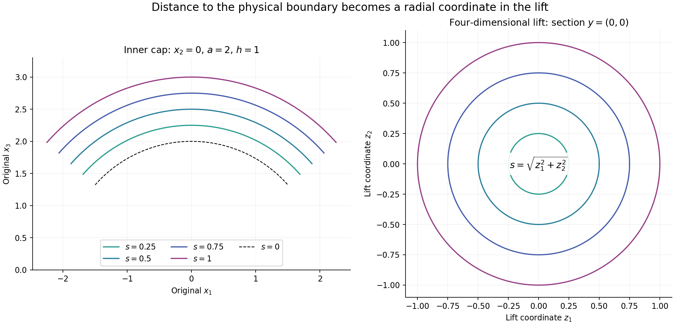
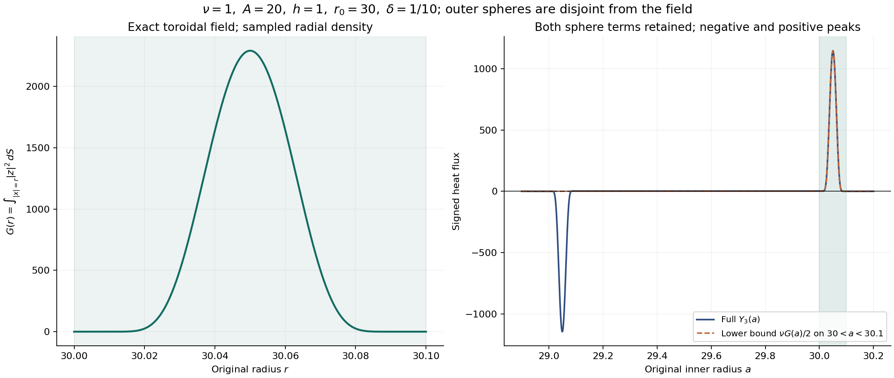

# Moving annuli and localized vorticity energy

Vorticity can enter a region through transport, diffusion and stretching.
A local energy estimate must account for all three. This lesson follows
an annulus whose boundaries move inward, computes every boundary term,
and proves an estimate for the vorticity left inside it.

The setting comes from Terence Tao's quantitative study of critically
bounded Navier–Stokes solutions. We give a complete finite energy
calculation, including the weighted Sobolev inequality and the local
curl inverse it needs. The force and the original viscosity remain
explicit. This calculation supplies part of an annular regularity
argument; pointwise regularity and the general large-\(L^3\) endpoint
require further arguments.

Read the earlier lessons on strong solutions, the curl inverse and
weighted heat estimates first. We use Hölder's inequality, Fubini,
Parseval and approximation in Sobolev spaces. The less familiar
weighted inequality is proved below.

## 1. The original flow and the moving region

On a finite interval \(J=[t_1,t_2]\), consider a smooth solution
on \(\mathbb R^3\), in the original coordinates:

\[
 \partial_tu+(u\cdot\nabla)u+\nabla p=\nu\Delta u+f,
 \qquad \operatorname{div}u=0,\qquad \nu>0.
 \tag{1.1}
\]

Let the solution also be defined at an earlier time \(t_b<t_1\),
with \(u(t_b)\in H^1\), and keep its actual heat evolution:

\[
 \begin{gathered}
 v(t)=e^{\nu(t-t_b)\Delta}u(t_b),\qquad
 w=u-v,\qquad \ell=\nabla\times v,\qquad z=\nabla\times w,\\
 \nabla\times u=\ell+z,\qquad
 \partial_tv=\nu\Delta v,\qquad \operatorname{div}v
 =\operatorname{div}w=0 .
 \end{gathered}
 \tag{1.2}
\]

When a global norm or time integral is used below, it is required
to be finite. In particular (3.3) uses \(w\in L^2(J;H^1)\);
Section 6 states the complete additional energy budget. The local
identities themselves only need smoothness near the moving support.

The pressure disappears on taking the curl because the curl of its
gradient is zero. Subtracting the heat equation for \(\ell\) gives
every term of the equation for \(z\):

\[
 \begin{aligned}
 \partial_tz-\nu\Delta z={}&-(u\cdot\nabla)z-(u\cdot\nabla)\ell
 +(z\cdot\nabla)w+(z\cdot\nabla)v\\
 &+(\ell\cdot\nabla)w+(\ell\cdot\nabla)v+\nabla\times f .
 \end{aligned}
 \tag{1.3}
\]

Let \(A,h,B\) be positive with \(h\leq A\) and \(B\geq16A\).
Choose \(a_0\in[A,2A]\), \(b_0\in[B/2,B]\), and an absolutely
continuous, nondecreasing function \(q:J\to[0,A]\). Put

\[
 \begin{gathered}
 a(t)=a_0+q(t),\qquad b(t)=b_0-q(t),\qquad r=|x|,\\
 \eta(t,x)=\max\{\min\{h,r-a(t),b(t)-r\},0\},\\
 I_a=\mathbf1_{\{a<r<a+h\}},\qquad
 I_b=\mathbf1_{\{b-h<r<b\}} .
 \end{gathered}
 \tag{1.4}
\]

The two ramps are disjoint: \(a\geq h\) and
\(b-a\geq B/2-4A\geq4h\). The function \(\eta\) rises linearly
from zero to \(h\), stays equal to \(h\), then falls linearly to zero.
Neither its height nor the width of a ramp is rescaled to one.

## 2. Every volume and sphere contribution

At almost every time and away from the four corner spheres,

\[
 \eta_r=I_a-I_b,\qquad
 \eta_t=-q'(I_a+I_b),\qquad
 |\nabla\eta|=I_a+I_b .
 \tag{2.1}
\]

The radial representation

\[
 \eta=(r-a)_+-(r-a-h)_+-(r-b+h)_++(r-b)_+
 \tag{2.2}
\]

also gives the complete distributional Laplacian:

\[
 \begin{aligned}
 \Delta\eta={}&\frac2r(I_a-I_b)
 +\delta(r-a)-\delta(r-a-h)\\
 &-\delta(r-b+h)+\delta(r-b).
 \end{aligned}
 \tag{2.3}
\]

Here the measure \(\delta(r-c)\,dx\) is exactly surface measure
on the sphere of radius \(c\):

\[
 \langle\delta(r-c),\phi\rangle
 =c^2\int_{\mathbb S^2}\phi(c\vartheta)\,d\vartheta
 =\int_{|x|=c}\phi(x)\,dS(x).
 \tag{2.4}
\]

There is no contribution at the origin, since \(\eta\) vanishes
on a neighborhood of it. Define

\[
 \begin{gathered}
 E=\frac12\int\eta|z|^2\,dx,\qquad
 D=\int\eta|\nabla z|^2\,dx,\qquad
 R=\int_{\{0<\eta<h\}}|z|^2\,dx,\\
 Y_2=\frac{q'}2R,\qquad
 S_c(z)=\int_{|x|=c}|z|^2\,dS,\\
 Y_3=\nu\int\frac{|z|^2}{r}(I_a-I_b)\,dx
 +\frac\nu2\bigl[S_a-S_{a+h}-S_{b-h}+S_b\bigr],\\
 Y_4=\frac12\int |z|^2u\cdot\nabla\eta\,dx .
 \end{gathered}
 \tag{2.5}
\]

All unmarked spatial integrals in this lesson use the original
volume measure \(dx\). Pairing (1.3) with \(\eta z\) yields

\[
 E'+\nu D+Y_2=Y_3+Y_4+T_5+T_6+T_7+T_8+T_9+F_\eta,
 \tag{2.6}
\]

where the remaining terms are exactly

\[
 \begin{aligned}
 T_5&=-\int\eta z\cdot(u\cdot\nabla)\ell,&
 T_6&=\int\eta z\cdot(z\cdot\nabla)w,\\
 T_7&=\int\eta z\cdot(z\cdot\nabla)v,&
 T_8&=\int\eta z\cdot(\ell\cdot\nabla)w,\\
 T_9&=\int\eta z\cdot(\ell\cdot\nabla)v,&
 F_\eta&=\int\eta z\cdot(\nabla\times f).
 \end{aligned}
 \tag{2.7}
\]

For completeness, the diffusion calculation is

\[
 \nu\int\eta z\cdot\Delta z
 =-\nu\int\eta|\nabla z|^2
 -\frac\nu2\int\nabla\eta\cdot\nabla|z|^2
 =-\nu D+\frac\nu2\langle\Delta\eta,|z|^2\rangle .
 \tag{2.8}
\]

Solenoidal transport contributes \(Y_4\). Differentiating the cutoff
in the energy contributes \(-Y_2\). The other six pairings are
precisely (2.7). One can first convolve the spatial tent with a
smooth compact kernel. Its gradients converge boundedly almost
everywhere, and its second derivatives converge as measures.
Pairing against the smooth field and taking the limit proves
(2.6). Absolute continuity of \(q\) proves the time chain rule
almost everywhere and then its integrated form. In particular,
both endpoint energies are present in the integrated identity.

## 3. One choice of radii for the whole interval

Temporarily choose \(a_0,b_0\) independently and uniformly from their
specified intervals, while keeping \(q,u,v,z\) fixed. Set

\[
 \begin{aligned}
 \mathcal S_a(t)&=[A+q,2A+q+h]\subset[A,4A],\\
 \mathcal S_b(t)&=[B/2-q-h,B-q]\subset[3B/8,B].
 \end{aligned}
 \tag{3.1}
\]

These intervals are disjoint. At a fixed radius, the probabilities
of belonging to the inner and outer ramps are at most \(h/A\)
and \(2h/B\), respectively. Integration of a sphere's radius
recovers volume integration by (2.4). Thus the triangle inequality
in the complete expression (2.5) gives

\[
 \begin{aligned}
 \mathbb E|Y_3(t)|\leq{}&
 \nu\left(\frac1A+\frac h{A^2}\right)
          \int_{|x|\in\mathcal S_a(t)}|z|^2\,dx\\
 &+\nu\left(\frac2B+\frac{16h}{3B^2}\right)
          \int_{|x|\in\mathcal S_b(t)}|z|^2\,dx\\
 \leq{}&\frac{2\nu}{A}\|z(t)\|_2^2.
 \end{aligned}
 \tag{3.2}
\]

Indeed each inner sphere has density \(1/A\) and coefficient
\(\nu/2\), and each outer sphere has density \(2/B\).
For the volume terms use \(r\geq A\) or \(r\geq3B/8\) on the
corresponding ramp. Both coefficients are at most \(2\nu/A\);
the disjoint supports give the last line without an extra factor two.

Tonelli's theorem now chooses one pair \(a_0,b_0\), fixed throughout
\(J\), for which

\[
 \int_J|Y_3(t)|\,dt\leq\frac{2\nu}{A}\mathcal M,\qquad
 \mathcal M=\int_J\|z(t)\|_2^2\,dt.
 \tag{3.3}
\]

To see that a pair exists, otherwise the nonnegative integrated
quantity would be strictly larger than its stated upper bound
almost everywhere, and its expectation would also be larger.
For solenoidal \(w\in H^1\), Parseval and
\(\xi\cdot\widehat w=0\) give

\[
 \|\nabla\times w\|_2^2=\|\nabla w\|_2^2 .
 \tag{3.4}
\]

The same equality holds on the original rectangular periodic box,
where the zero mode contributes zero to both sides. The mean of
\(w\) remains part of its undifferentiated norms below.

The rate \(A^{-1}\) in (3.3) suffices for a flux budget
\(\varepsilon\) whenever \(A\geq2\nu\mathcal M/\varepsilon\),
provided the original geometry and total displacement also meet
(1.4). Exercise 1 proves why the stronger generic rate \(hA^{-2}\)
cannot be substituted into the absolute average.

## 4. The weighted Sobolev inequality

Fix \(t\), hence \(a,b\), and let \(Z\) be any smooth vector field
on the closed annulus. We will prove

\[
 \left(\int\eta|Z|^4\,dx\right)^{1/2}
 \leq C_\eta\left[
       \int\eta|\nabla Z|^2\,dx
       +h^{-2}\int\eta|Z|^2\,dx\right].
 \tag{4.1}
\]

The constant specified below is independent of \(a,b,h\) and the
number of components. Write \(D_Z=\int\eta|\nabla Z|^2\) and
\(H_Z=\int\eta|Z|^2\).

### 4.1. The unweighted inequalities used in the proof

For nonnegative functions \(G_j\) omitting coordinate \(j\),
repeated Hölder gives

\[
 \int_{\mathbb R^n}\prod_{j=1}^n
       G_j(x_1,\ldots,\widehat{x_j},\ldots,x_n)^{1/(n-1)}\,dx
 \leq\prod_{j=1}^n
       \left(\int_{\mathbb R^{n-1}}G_j\right)^{1/(n-1)} .
 \tag{4.2}
\]

Here is the full induction. For \(n=2\), (4.2) is Fubini.
Integrate \(x_n\) first and apply Hölder with \(n-1\) equal
exponents to the factors with \(j<n\). Put
\(H_j=\int G_j\,dx_n\). In the remaining \(n-1\) variables,
separate \(G_n^{1/(n-1)}\) by Hölder with exponents \(n-1\)
and \((n-1)/(n-2)\). Apply the induction hypothesis to the
product of \(H_j^{1/(n-2)}\). Raising that result to
\((n-2)/(n-1)\) gives each exponent in (4.2). Truncation and
monotone convergence cover infinite integrals.

For compact \(C^1\) scalar \(g\), the fundamental theorem of
calculus gives
\(|g(x)|\leq\int_{\mathbb R}|\partial_jg|\,dx_j\) in each
coordinate. Substituting these functions into (4.2) gives

\[
 \|g\|_{n/(n-1)}
 \leq\prod_{j=1}^n\|\partial_jg\|_1^{1/n}
 \leq\sum_{j=1}^n\|\partial_jg\|_1
 \leq\sqrt n\,\|\nabla g\|_1 .
 \tag{4.3}
\]

Apply (4.3) to the power of the norm of a compact smooth vector
field \(F\), with

\[
 \alpha=\frac{2(n-1)}{n-2},\qquad p=\frac{2n}{n-2}.
 \tag{4.4}
\]

Smooth approximations to the norm and dominated convergence justify
the chain rule, giving

\[
 \|F\|_p^\alpha
 \leq\sqrt n\,\alpha
    \int|F|^{n/(n-2)}|\nabla F|
 \leq\sqrt n\,\alpha\,
       \|F\|_p^{n/(n-2)}\|\nabla F\|_2.
 \tag{4.5}
\]

If the norm vanishes the conclusion is immediate; otherwise divide
by its positive power. Approximation extends the result to compact
\(H^1\) fields. In the two dimensions we need, safe constants are

\[
 \|F\|_{L^6(\mathbb R^3)}\leq S_3\|\nabla F\|_2,
 \quad S_3=4\sqrt3;\qquad
 \|F\|_{L^4(\mathbb R^4)}\leq S_4\|\nabla F\|_2,
 \quad S_4=6 .
 \tag{4.6}
\]

### 4.2. Lifting each boundary layer to four dimensions

Use the following fixed smooth functions:

\[
 \begin{gathered}
 \mathfrak b(s)=
 \begin{cases}e^{-1/s},&s>0,\\0,&s\leq0,\end{cases}\\
 \chi(s)=\frac{\mathfrak b(1-s)}
                 {\mathfrak b(1-s)+\mathfrak b(s-1/4)},\qquad
 \theta(s)=\chi(s^2),\qquad
 \beta_1=\|\theta'\|_\infty .
 \end{gathered}
 \tag{4.7}
\]

Thus \(\theta=1\) on \([-1/2,1/2]\) and vanishes outside
\((-1,1)\). On the annulus let

\[
 \theta_i=\theta((r-a)/h),\qquad
 \theta_o=\theta((b-r)/h),\qquad
 \theta_m=1-\theta_i-\theta_o,\qquad Z_e=\theta_e Z .
 \tag{4.8}
\]

The edge supports are disjoint. The middle field vanishes near both
boundaries and has \(h/2\leq\eta\leq h\) on its support.
Partition the sphere into six smooth pieces:

\[
 \psi_{j,\sigma}(\vartheta)=
 \frac{\mathfrak b(\sigma\vartheta_j-1/2)}
 {\displaystyle\sum_{k=1}^3\sum_{\tau=\pm1}
                 \mathfrak b(\tau\vartheta_k-1/2)},
 \quad j=1,2,3,\quad \sigma=\pm1,\qquad
 M_\theta=\max_{j,\sigma}\|\nabla_{\mathbb S^2}\psi_{j,\sigma}\|_\infty .
 \tag{4.9}
\]

Their sum is one. The denominator is positive because some
\(|\vartheta_j|\geq1/\sqrt3>1/2\), so \(M_\theta\) is finite
by compactness. Each function is flat where its cap ends.

For an inner cap use two original tangent coordinates \(y\) and
the distance \(s\) from the inner boundary:

\[
 \begin{gathered}
 x=(a+s)\vartheta(y),\qquad 0<s<h,\\
 \vartheta_{\text{other coordinates}}=y/a,\qquad
 \vartheta_j=\sigma\sqrt{1-|y|^2/a^2},\qquad
 |\vartheta_j|>1/2 .
 \end{gathered}
 \tag{4.10}
\]

Direct differentiation gives the exact Jacobian and metric:

\[
 J_i=\frac{(a+s)^2}{a^2|\vartheta_j|},\qquad
 |dx|^2=ds^2+\frac{(a+s)^2}{a^2}
       \left(|dy|^2+\frac{(y\cdot dy)^2}{a^2-|y|^2}\right).
 \tag{4.11}
\]

The outer chart uses \(x=(b-s)\vartheta(y)\), with \(b\) in place
of \(a\) in the angular coordinates. In both charts,
\(1/4\leq J\leq8\), and the operator norm of the coordinate
derivative is at most \(4\): use \(a\geq h\), \(b\geq5h\),
and \(|\vartheta_j|\geq1/2\). Also \(\eta=s\) on each edge.

Pull a cap field \(V=\psi_{j,\sigma}Z_i\) or
\(\psi_{j,\sigma}Z_o\) back to \(F(y,s)\), extend it by zero
across its flat cap and \(s=h\) boundaries, and set

\[
 \begin{gathered}
 G(y,z_1,z_2)=F(y,\sqrt{z_1^2+z_2^2}),\\
 \int_{\mathbb R^4}|G|^4=2\pi\int s|F|^4\,dy\,ds,\\
 \int_{\mathbb R^4}|\nabla G|^2
       =2\pi\int s\bigl(|\nabla_yF|^2+|F_s|^2\bigr)\,dy\,ds .
 \end{gathered}
 \tag{4.12}
\]

These identities are polar integration in the last two coordinates.
The lift is locally Lipschitz even if \(F_s(y,0)\ne0\). It is a
compact \(H^1\) field; the formulas follow off the axis and then
by monotone limits. Convolution approximation permits (4.6).
The Jacobian and derivative bounds therefore prove

\[
 \left(\int\eta|V|^4\right)^{1/2}
 \leq C_{\rm chart}\int\eta|\nabla V|^2,\qquad
 C_{\rm chart}=256\sqrt\pi\,S_4^2 .
 \tag{4.13}
\]

Every factor can be checked directly: the comparison on the left
costs \(\sqrt{8/(2\pi)}\); the four-dimensional inequality costs
\(S_4^2\); (4.12) contributes \(2\pi\); and the gradient comparison
costs at most \(16/(1/4)=64\). Their product is the stated constant.

The left panel is the exact \(x_2=0\) section of (4.10) for the
positive third-coordinate cap, \(a=2,h=1\), and
\(-1.5\leq y_1\leq1.5\). The right panel is the \(y=(0,0)\)
section of the four-dimensional domain in (4.12). Equal colors
mean equal distance \(s\); a physical distance becomes a radius
in the last two lift coordinates. Polar integration supplies the
factor \(2\pi s\). These are coordinate sections, not solution plots.

### 4.3. Joining the edges and the middle

The sum of the cap gradient energies for both edges is bounded by

\[
 \sum_{e=i,o}\sum_{j,\sigma}
       \int\eta|\nabla(\psi_{j,\sigma}Z_e)|^2
 \leq3D_Z+3(6M_\theta^2+\beta_1^2)h^{-2}H_Z .
 \tag{4.14}
\]

To prove this, expand the derivative into its three terms and use
the three-term square inequality. The sums of the squared partition
functions are at most one, their squared gradients sum to at most
\(6M_\theta^2/h^2\), and the edge cutoff derivatives have disjoint
supports and are bounded by \(\beta_1/h\). This proves every term
on the right.

For each edge, the inequality
\(|\sum_{j=1}^6V_j|^4\leq6^3\sum_j|V_j|^4\), followed by the
square-root triangle inequality, bounds its weighted \(L^4\) norm
squared by \(6^{3/2}C_{\rm chart}\) times its cap gradient sum.

Extend \(Z_m\) by zero into \(\mathbb R^3\). Interpolation and (4.6)
give

\[
 \|Z_m\|_4^2
 \leq S_3^{3/2}\|Z_m\|_2^{1/2}\|\nabla Z_m\|_2^{3/2}.
 \tag{4.15}
\]

Using \(h/2\leq\eta\leq h\) on the support and the weighted
arithmetic–geometric mean inequality yields

\[
 \begin{aligned}
 \left(\int\eta|Z_m|^4\right)^{1/2}
 &\leq2S_3^{3/2}\left[
      \int\eta|\nabla Z_m|^2+h^{-2}\int\eta|Z_m|^2\right],\\
 \int\eta|\nabla Z_m|^2
 &\leq2D_Z+2\beta_1^2h^{-2}H_Z .
 \end{aligned}
 \tag{4.16}
\]

For example, the first line before arithmetic–geometric mean is
\(2S_3^{3/2}(h^{-2}H_{Z_m})^{1/4}D_{Z_m}^{3/4}\).
The derivative of \(\theta_m\) has the same bound as one edge
derivative because their supports are disjoint. This proves the
second line.

Finally apply Minkowski to \(Z_i+Z_o+Z_m\), and Cauchy–Schwarz
to the resulting sum of three norms. Equations (4.13)–(4.16) prove
(4.1) with the explicit choice

\[
 C_\eta=3\left[
 6^{3/2}C_{\rm chart}\,3(1+6M_\theta^2+\beta_1^2)
 +2S_3^{3/2}(3+2\beta_1^2)\right].
 \tag{4.17}
\]

The proof retains both boundary layers, the plateau and every vector
component. It does not impose a zero boundary value on the original
field \(Z\).

## 5. Estimating stretching without losing the harmonic part

The difficult term in (2.7) is \(T_6\). The curl \(z\) determines
a local part of \(w\); a harmonic remainder still contributes to
its gradient. We estimate both.

### 5.1. The exact local curl inverse

Let \(B_*=B(x_*,r_*)\) with \(10B_*\) inside the annulus, where
\(kB_*\) means the concentric ball with radius \(kr_*\). Set

\[
 \psi(x)=\theta\!\left(\frac{|x-x_*|}{4r_*}\right),\qquad
 A_*=-\Delta^{-1}\nabla\times(\psi z),\qquad H=w-A_* .
 \tag{5.1}
\]

The cutoff equals one on \(2B_*\) and is supported in \(4B_*\).
For the Fourier convention of the preceding lessons, its full symbol is

\[
 \widehat A_*(\xi)
 =\frac{i\,\xi\times\widehat{\psi z}(\xi)}
              {2\pi|\xi|^2},\qquad \xi\ne0 .
 \tag{5.2}
\]

Parseval gives the following two bounds:

\[
 \|\nabla A_*\|_2\leq\|\psi z\|_2,\qquad
 \|A_*\|_6\leq S_3\|\psi z\|_2 .
 \tag{5.3}
\]

Indeed the square of the full gradient symbol is
\(|\xi\times\widehat{\psi z}|^2/|\xi|^2\), bounded by
\(|\widehat{\psi z}|^2\). For smooth compact input, (5.2) is
square integrable near zero and at infinity. Thus \(A_*\in H^1\),
and cutoff approximation followed by (4.6) proves the second bound.
This also specifies the inverse without an arbitrary additive constant.

Since \(\Delta w=-\nabla\times z\), the field \(H\) is harmonic
on \(2B_*\). Define a radial probability kernel and its constant:

\[
 \mu(x)=\frac{\theta(|x|)}{\int_{\mathbb R^3}\theta(|y|)\,dy},
 \qquad \kappa=\|\nabla\mu\|_2,\qquad v_3=\frac{4\pi}3 .
 \tag{5.4}
\]

The mean-value property gives \(H=\mu_{r_*}*H\) on \(B_*\),
where \(\mu_{r_*}(y)=r_*^{-3}\mu(y/r_*)\). To prove the property,
differentiate the spherical mean in its radius and apply the
divergence theorem to \(\Delta H=0\). The mean is constant and
equals the center value as the radius tends to zero. Integration
against the radial probability kernel then proves the convolution
identity. Differentiating that identity and applying Cauchy–Schwarz
proves

\[
 \begin{aligned}
 \|\nabla H\|_{L^\infty(B_*)}
 &\leq\kappa r_*^{-5/2}\|H\|_{L^2(2B_*)}\\
 &\leq\kappa r_*^{-5/2}\|w\|_{L^2(2B_*)}
   +2\kappa v_3^{1/3}S_3r_*^{-3/2}\|z\|_{L^2(4B_*)}.
 \end{aligned}
 \tag{5.5}
\]

The second term uses (5.3) and
\(|2B_*|^{1/3}=2v_3^{1/3}r_*\). Put
\(a_*=\|z\|_{L^2(4B_*)}\), \(b_*=\|z\|_{L^4(4B_*)}\) and
\(W_*=\|w\|_{L^2(2B_*)}\). Hölder for \(A_*\) and (5.5)
for \(H\) give the complete local estimate

\[
 \int_{B_*}|z|^2|\nabla w|
 \leq C_La_*b_*^2+\kappa r_*^{-5/2}a_*^2W_*,
 \qquad C_L=1+16\kappa v_3^{5/6}S_3 .
 \tag{5.6}
\]

For the last part of (5.5), use
\(a_*^2\leq|4B_*|^{1/2}b_*^2
=8v_3^{1/2}r_*^{3/2}b_*^2\).
Multiplication by \(2\kappa v_3^{1/3}S_3r_*^{-3/2}a_*\)
gives the additional constant in (5.6). No harmonic term is discarded.

### 5.2. A cover with a proved overlap bound

Set \(K=1000\) and \(\rho(x)=\eta(x)/K\). This function is
\(1/K\)-Lipschitz. Choose a maximal disjoint family

\[
 b_j=B(x_j,\rho(x_j)/5),\qquad
 B_j=5b_j,\qquad r_j=\rho(x_j).
 \tag{5.7}
\]

The maximal principle gives such a family. It is countable because
each disjoint open ball contains a distinct rational point.
If two candidate small balls intersect, the Lipschitz inequality gives

\[
 |\rho(x)-\rho(y)|\leq\frac{\rho(x)+\rho(y)}{5K}.
 \tag{5.8}
\]

Their radii therefore have ratio at most
\((5K+1)/(5K-1)<2\). Any candidate not in the maximal family
meets a selected one; (5.8) places its center in that selected
\(B_j\). The \(B_j\) thus cover the annulus.

On \(10B_j\), Lipschitz continuity gives

\[
 (K-10)r_j\leq\eta(x)\leq(K+10)r_j .
 \tag{5.9}
\]

Consequently these balls stay inside the annulus. If a point \(x\)
lies in \(10B_j\), the corresponding disjoint \(b_j\) has radius
at least \(\eta(x)/(5(K+10))\). Every such \(b_j\) is contained
in the ball about \(x\) of radius
\((10+1/5)\eta(x)/(K-10)\). Comparing volumes gives the uniform
overlap bound

\[
 M=\left\lceil\left(51\frac{K+10}{K-10}\right)^3\right\rceil .
 \tag{5.10}
\]

In particular, the sharper comparison on \(4B_j\) yields

\[
 \sum_jr_j\int_{4B_j}|z|^p
 \leq\frac{M}{K-4}\int\eta|z|^p,\qquad p=2,4.
 \tag{5.11}
\]

This proves the cover and all overlap information used below.

### 5.3. Summing both parts of the local estimate

Since \(\eta\leq(K+1)r_j\) on \(B_j\), use (5.6) and the cover
to bound \(|T_6|\) by \((K+1)\) times the sum of \(r_j\) times
its right side. For the principal part, Cauchy–Schwarz in \(j\)
and (5.11) give

\[
 \begin{aligned}
 \sum_jr_j\alpha_j\beta_j^2
 &\leq\left(\sum_jr_j\alpha_j^2\right)^{1/2}
       \left(\sum_jr_j\beta_j^4\right)^{1/2}\\
 &\leq\frac{M}{K-4}(2E)^{1/2}
                     \left(\int\eta|z|^4\right)^{1/2}.
 \end{aligned}
 \tag{5.12}
\]

Here \(\alpha_j=\|z\|_{L^2(4B_j)}\) and
\(\beta_j=\|z\|_{L^4(4B_j)}\) are the two norms in (5.6).
Apply (4.1) to the last factor.

For the harmonic part, write \(W_j=\|w\|_{L^2(2B_j)}\) and
split the balls at \(r_j=h/(2K)\).
On larger balls use \(W_j\leq W=\|w\|_2\), with the norm over
the whole original domain, and

\[
 r_j^{-3/2}\alpha_j^2W_j
 \leq W(2K/h)^{5/2}r_j\alpha_j^2 .
 \tag{5.13}
\]

On smaller balls, (5.9) with \(4\) in place of \(10\) gives
\(\eta\leq(K+4)r_j<h\) throughout \(4B_j\). These balls lie
in the ramps. The bound

\[
 W_j\leq\sqrt{8v_3}\,r_j^{3/2}\|w\|_\infty
 \tag{5.14}
\]

and the overlap estimate control their sum by \(R\).
We have proved the full stretching estimate

\[
 |T_6|\leq C_1\sqrt E\,D+2C_1h^{-2}E^{3/2}
              +C_2Wh^{-5/2}E+C_3\|w\|_\infty R,
 \tag{5.15}
\]

with all constants specified:

\[
 \begin{gathered}
 C_1=\frac{\sqrt2M(K+1)}{K-4}C_LC_\eta,\qquad
 C_2=\frac{2\kappa M(K+1)}{K-4}(2K)^{5/2},\\
 C_3=\kappa M(K+1)\sqrt{8v_3}.
 \end{gathered}
 \tag{5.16}
\]

The maximum in (5.14)–(5.15) may be taken on the fixed enclosing
annulus \(A\leq|x|\leq B\): every ball used is inside it.

## 6. The full force and the energy budget

Let all the following norms be taken on the support of \(\eta\),
or on the fixed enclosing annulus if a bound independent of the
radii is needed:

\[
 \begin{gathered}
 U_3=\|u\|_3,\quad L_6=\|\nabla\ell\|_6,\quad
 L_0=\|\ell\|_\infty,\quad L_3=\|\ell\|_3,\\
 V_6=\|\nabla v\|_6,\quad V_1=\|\nabla v\|_\infty,\quad
 G=\|\nabla w\|_2 .
 \end{gathered}
 \tag{6.1}
\]

For positive constants \(\lambda_5,\lambda_8,\lambda_9\), all the
remaining cross terms obey

\[
 \begin{aligned}
 |T_5|&\leq\lambda_5E+\frac{h}{2\lambda_5}U_3^2L_6^2,&
 |T_7|&\leq2V_1E,\\
 |T_8|&\leq\lambda_8E+\frac{h}{2\lambda_8}L_0^2G^2,&
 |T_9|&\leq\lambda_9E+\frac{h}{2\lambda_9}L_3^2V_6^2 .
 \end{aligned}
 \tag{6.2}
\]

For instance Cauchy–Schwarz, \(\eta\leq h\), and Hölder give
\(|T_5|\leq\sqrt{2hE}\,U_3L_6\).
The nonnegative square
\((\sqrt{\lambda_5E}-\sqrt{h/(2\lambda_5)}U_3L_6)^2\)
proves its bound. The same calculation with \(L_0G\) or \(L_3V_6\)
proves the other mixed bounds; \(T_7\) uses the gradient maximum.

Keep the original admissible force as a sum

\[
 f=f_a+f_b,\qquad
 f_a\in L^1(J;H^1),\qquad f_b\in L^2(J;L^2),\qquad
 A_f=\|\nabla\times f_a\|_2,\quad B_f=\|f_b\|_2 .
 \tag{6.3}
\]

For \(f_b\), the exact distributional pairing is

\[
 \int\eta z\cdot(\nabla\times f_b)
 =\int f_b\cdot\bigl[\eta\nabla\times z+\nabla\eta\times z\bigr].
 \tag{6.4}
\]

There is no boundary term because \(\eta z\) is compactly supported.
The first term is at most \(\sqrt{2h}\,B_f\sqrt D\), using
\(|\nabla\times z|^2\leq2|\nabla z|^2\) and \(\eta^2\leq h\eta\).
The second is at most \(B_f\sqrt R\). For \(f_a\), direct pairing
gives \(\sqrt{2h}\,A_f\sqrt E\). Approximation in \(L^2\)
justifies (6.4) for the stated \(f_b\); the bounded cutoff gradient
keeps its two terms continuous. No square integrability in time
of either force curl has been assumed.

Choose \(\gamma>0\) and \(c\geq8(C_3+1)\), and use the actual speed

\[
 q'=c\bigl(\gamma+\|u\|_\infty+\|v\|_\infty\bigr),
 \tag{6.5}
\]

with both maxima on the fixed enclosing annulus. Integrate this
equation with a specified \(q(t_1)\geq0\), and check that the
result stays at most \(A\). This is a geometric constraint on the
actual interval. The constants and time interval may not be altered
silently to make it hold.

Since \(\|w\|_\infty\leq\|u\|_\infty+\|v\|_\infty\), (6.5)
gives

\[
 |Y_4|+C_3\|w\|_\infty R\leq\frac12Y_2 .
 \tag{6.6}
\]

The force contributions are controlled by the following exact
Young inequalities, with any fixed \(\sigma>0\):

\[
 \begin{aligned}
 \sqrt{2h}\,B_f\sqrt D
 &\leq\frac\nu4D+\frac{2h}{\nu}B_f^2,\\
 B_f\sqrt R&\leq\frac14Y_2+\frac2{q'}B_f^2,\\
 \sqrt{2h}\,A_f\sqrt E
 &\leq\frac{A_f}{\sigma}E+\frac{h\sigma}2A_f .
 \end{aligned}
 \tag{6.7}
\]

Completing a square proves each line. The last line uses only
the prescribed \(L^1\) time norm of \(A_f\).

Set

\[
 E_*=\left(\frac{\nu}{4C_1}\right)^2.
 \tag{6.8}
\]

As long as \(E\leq E_*\), the first term of (5.15) costs at most
\(\nu D/4\), and its second costs at most \(\nu E/(2h^2)\).
Insert every bound into (2.6). The result is

\[
 E'+\frac\nu2D+\frac14Y_2
 \leq\mathfrak a(t)E+|Y_3(t)|+\mathfrak d(t),
 \tag{6.9}
\]

where no coefficient is suppressed:

\[
 \begin{aligned}
 \mathfrak a={}&\lambda_5+\lambda_8+\lambda_9+2V_1
        +C_2Wh^{-5/2}+\frac\nu{2h^2}+\frac{A_f}{\sigma},\\
 \mathfrak d={}&\frac{hU_3^2L_6^2}{2\lambda_5}
        +\frac{hL_0^2G^2}{2\lambda_8}
        +\frac{hL_3^2V_6^2}{2\lambda_9}\\
       &+\left(\frac{2h}{\nu}+\frac2{q'}\right)B_f^2
        +\frac{h\sigma}2A_f .
 \end{aligned}
 \tag{6.10}
\]

For integrable coefficients, multiplication by the integrating
factor proves, up to a possible first crossing of \(E_*\),

\[
 E(t)\leq
 e^{\int_{t_1}^t\mathfrak a}
 \left[
 E(t_1)+\int_{t_1}^t e^{-\int_{t_1}^s\mathfrak a}
                (|Y_3(s)|+\mathfrak d(s))\,ds
 \right].
 \tag{6.11}
\]

If the calculated right side is strictly below \(E_*\) throughout
the interval, continuity rules out a first crossing: at that time
(6.11) would give a strict smaller value than \(E_*\).
Exercise 4 supplies a single, radius-independent numerical test,
selects the pair in (3.3), and proves the integrated dissipation
and surviving-annulus bounds.

On a rectangular periodic box the proof applies inside an injective
ball with outer radius \(B\) smaller than half the shortest period.
Use its Euclidean coordinates in the charts and local curl inverse.
The source field is the actual lifted periodic field on that ball;
the cutoff product in (5.1) extends by zero to \(\mathbb R^3\).
The global \(W\) and force norms in (6.3) remain the original
periodic norms, including the velocity mean. No global Euclidean
cutoff is imposed on the periodic flow.

## 7. Comparison with the original argument

The source is Terence Tao, *Quantitative bounds for critically
bounded solutions to the Navier–Stokes equations*,
[arXiv:1908.04958v2](https://arxiv.org/abs/1908.04958v2),
original author file *article.tex*, the annular regularity argument
at lines 660–894. The source uses unforced flow with unit viscosity.
Our \(v,w,\ell,z\) correspond respectively to its linear velocity,
nonlinear velocity, linear vorticity and nonlinear vorticity.

Several local steps need visible correction when used in this lesson:

- The displayed dissipation \(Y_1\) at line 712 omits its cutoff.
  Equation (2.8) proves that the term is \(\int\eta|\nabla z|^2\).
- The sphere contributions at line 737 display \(|z|\), whereas
  the energy calculation gives \(|z|^2\). Equations (2.3)–(2.5)
  retain the full measures and their four signs.
- Lines 739–743 use an absolute average at the scale \(h/r^2\).
  Exercise 1 disproves this as a generic analytic estimate.
  Equations (3.2)–(3.3) prove a weaker sufficient absolute bound;
  Exercise 2 proves the exact signed smooth-average map separately.
- The stretching calculation at lines 773–845 uses a local curl
  inverse and a weighted cover. Sections 4–5 supply full independent
  proofs, including the harmonic remainder, explicit cover and
  all summation constants. An absolute upper bound, rather than
  a positive comparability assertion for signed stretching, is used.

These are corrections of particular displayed or analytic steps.
The counterexample in Exercise 1 is not asserted to be the nonlinear
vorticity of an unforced source trajectory. It does not disprove the
source's endpoint theorem.

The energy estimate just proved also does not establish pointwise
regularity at the initial time from an \(H^1\) bound. A later heat
iteration must keep its positive time margin and all forcing terms.
The actual total speed in (6.5), the initial energy and the heat
field norms in (6.10) must be estimated for the intended trajectory.
No bound on them is inferred solely from a bounded \(L^3\) norm here.

## 8. Exercises with complete solutions

### Exercise 1: the absolute average cannot cancel signed peaks

Take \(q=0\), \(0<h<A/10\), \(B\geq16A\),
\(r_0=3A/2\), and \(0<\delta<h/4\). Let \(c\) be nonzero
and smooth with compact support in \((r_0,r_0+\delta)\).
Show that the smooth solenoidal field

\[
 z(x)=c(|x|)(e_3\times x),\qquad
 \mathcal G(r)=\int_{|x|=r}|z|^2\,dS
                  =\frac{8\pi}3c(r)^2r^4
 \tag{8.1}
\]

prevents a uniform bound of \(\mathbb E|Y_3|\) by a constant
times \(\nu h\int |z|^2/r^2\).

**Solution.** The radial gradient of \(c\) is perpendicular to
\(e_3\times x\), and this linear vector field has zero divergence.
The support avoids the origin, so the extended field is smooth and
solenoidal everywhere. Integrating
\(1-\vartheta_3^2\) over the unit sphere gives \(8\pi/3\);
including the vector's factor \(r^2\) and the surface factor \(r^2\)
proves (8.1).

For \(a_0\in(r_0,r_0+\delta)\), the sphere at \(a_0+h\)
misses the field, as do both outer spheres. The inner volume
contribution is nonnegative. Thus (2.5) gives
\(Y_3\geq\nu\mathcal G(a_0)/2\). Average over this subset of
the uniform inner-radius law to obtain

\[
 \begin{aligned}
 \mathbb E|Y_3|
 &\geq\frac{\nu}{2A}\int\mathcal G(r)\,dr
       =\frac{\nu}{2A}\|z\|_2^2,\\
 \nu h\int\frac{|z|^2}{r^2}
 &\leq\frac{4\nu h}{9A^2}\|z\|_2^2 .
 \end{aligned}
 \tag{8.2}
\]

The ratio is at least \(9A/(8h)\), which is unbounded. This is
an exact analytic test of the averaging assertion.
It uses a smooth solenoidal field, with no claim about its occurrence
in the source's unforced dynamics.

The figure samples (2.5) and (8.1) with
\(\nu=1,A=20,h=1,r_0=30,\delta=1/10\).
Here \(c(r)=\exp[-\delta^2/((r-r_0)(r_0+\delta-r))]\) in
the displayed open shell and is zero elsewhere. Both signed peaks
are retained. Numerical quadrature draws only the volume contribution;
the proof of (8.2) does not depend on the plot.

### Exercise 2: the exact signed averaging map

Average the same original tents against a smooth probability density.
Derive all derivatives of the average and prove a bound at the scale
\(h/r^2\) for its signed heat term.

**Solution.** Use \(\mathfrak b\) from (4.7), and define

\[
 \begin{gathered}
 \varrho(s)=Z_\varrho^{-1}\mathfrak b(s-1)\mathfrak b(2-s),
 \qquad Z_\varrho=\int_1^2\mathfrak b(s-1)\mathfrak b(2-s)\,ds>0,\\
 P_\varrho=\|\varrho\|_\infty,\qquad
 D_\varrho=\|\varrho'\|_\infty,\\
 p_a(s)=A^{-1}\varrho(s/A),\qquad
 p_b(s)=2B^{-1}\varrho(2s/B),\\
 \bar\eta(t,x)=\iint\eta_{a_0,b_0}(t,x)
                          p_a(a_0)p_b(b_0)\,da_0\,db_0 .
 \end{gathered}
 \tag{8.3}
\]

Both parameter densities integrate to one and have the required
supports. Fubini gives the exact linear map
\(E_{\bar\eta}=\mathbb E E_\eta\), as well as the same averaging
identity for every signed term of (2.6). Define

\[
 d_a(t,r)=\int_{r-q-h}^{r-q}p_a(s)\,ds,\qquad
 d_b(t,r)=\int_{r+q}^{r+q+h}p_b(s)\,ds .
 \tag{8.4}
\]

These nonnegative functions are supported in the disjoint intervals
\(\mathcal S_a,\mathcal S_b\) of (3.1). Differentiation gives
all first derivatives and the full Laplacian:

\[
 \begin{gathered}
 \bar\eta_r=d_a-d_b,\qquad
 \bar\eta_t=-q'(d_a+d_b),\qquad
 |\nabla\bar\eta|=d_a+d_b,\\
 \Delta\bar\eta=
 p_a(r-q)-p_a(r-q-h)-p_b(r+q+h)+p_b(r+q)
                    +\frac2r(d_a-d_b).
 \end{gathered}
 \tag{8.5}
\]

The density differences are bounded by \(hD_\varrho/A^2\)
and \(4hD_\varrho/B^2\). The two \(d\)'s are bounded by
\(hP_\varrho/A\) and \(2hP_\varrho/B\). Since \(r\leq4A\)
on the first support and \(r\leq B\) on the second, it follows that

\[
 |\Delta\bar\eta|
 \leq C_\varrho\frac h{r^2}
      \mathbf1_{\mathcal S_a(t)\cup\mathcal S_b(t)}(r),
 \qquad C_\varrho=16D_\varrho+8P_\varrho .
 \tag{8.6}
\]

The inner coefficient is at most \(16D_\varrho+8P_\varrho\);
the outer one is at most \(4D_\varrho+4P_\varrho\).
Equation (8.6) controls \(|\mathbb E Y_3|\), with this smooth
law. It does not control \(\mathbb E|Y_3|\).

For the full energy map, suppose \(q'\geq V+v_0\), where \(V\)
bounds \(|u|\) on these supports and \(v_0\geq0\).
With \(e_r=x/|x|\), transport and recession combine as

\[
 \begin{aligned}
 &-\frac12\int|z|^2
       [(q'-u\cdot e_r)d_a+(q'+u\cdot e_r)d_b]\\
 &\hspace{25mm}\leq-\frac{v_0}2\int|z|^2|\nabla\bar\eta|.
 \end{aligned}
 \tag{8.7}
\]

Let \(Q_{\bar\eta}\) be the sum of all six pairings in (2.7)
with \(\bar\eta\) replacing \(\eta\). Equations (2.6) and
(8.6)–(8.7) prove

\[
 \begin{aligned}
 E_{\bar\eta}'
 +\nu\int\bar\eta|\nabla z|^2
 +\frac{v_0}2\int|z|^2|\nabla\bar\eta|
 \leq{}&\frac{\nu C_\varrho h}2
   \int_{|x|\in\mathcal S_a\cup\mathcal S_b}
                      \frac{|z|^2}{|x|^2}\,dx+Q_{\bar\eta}.
 \end{aligned}
 \tag{8.8}
\]

This exact map retains the six pairings. The weighted inequality
of Section 4 was proved for the original tent and is not asserted
for \(\bar\eta\). Our closed finite energy estimate in Section 6
uses the original tent and the weaker absolute average (3.3).
Both maps preserve the common plateau used in Exercise 4.

### Exercise 3: checking the radius budget in the source variables

In the source's unit-viscosity notation let
\(h=A_6\), \(A=A_6^{-8}R_{\rm src}\), and
\(R_{\rm src}\geq A_6^{100}R_0\), with \(A_6\geq1\) and
\(R_0\geq1\). Suppose the actual global integral obeys
\(\mathcal M\leq C_M A_{\rm vel}^4\).
Determine the exact comparison needed for (3.3) to be at most
\(A_6^{-10}\).

**Solution.** Substitute all powers without replacing the actual
radius:

\[
 \frac{2\mathcal M}{A}
 =\frac{2A_6^8\mathcal M}{R_{\rm src}}
 \leq\frac{2C_M A_{\rm vel}^4}{A_6^{92}R_0}.
 \tag{8.9}
\]

This is at most \(A_6^{-10}\) whenever
\(2C_M A_{\rm vel}^4\leq A_6^{82}R_0\).
Also \(A\geq A_6^{92}R_0\geq h\), so the inner geometric
requirement is preserved. The outer radius and integrated speed
must still meet their original requirements. The exercise proves
this numerical implication; it does not assert the input estimate
for a trajectory without its own proof.

### Exercise 4: a radius-independent test and its surviving region

Give a finite test that uses (3.3) to select one radius pair and then
controls its weighted energy on the whole interval.

**Solution.** Take nonnegative integrable bounds
\(\bar{\mathfrak a}\geq\mathfrak a\) and
\(\bar{\mathfrak d}\geq\mathfrak d\), using the fixed enclosing
annulus in (6.1). Let the speed (6.5) have total displacement
compatible with (1.4), and put

\[
 \begin{gathered}
 \mathcal A=\int_J\bar{\mathfrak a},\qquad
 \mathcal D=\int_J\bar{\mathfrak d},\qquad
 H_0=\frac h2\int_{\{A\leq|x|\leq B\}}|z(t_1,x)|^2\,dx,\\
 \mathcal Q=e^{\mathcal A}
       \left(H_0+\frac{2\nu\mathcal M}{A}+\mathcal D\right).
 \end{gathered}
 \tag{8.10}
\]

When the calculated number satisfies \(\mathcal Q<E_*\),
choose the single pair provided by (3.3). Every initial weighted
energy is at most \(H_0\). The right side of (6.11) is then at
most \(\mathcal Q\), since \(\mathfrak a\geq0\).
In particular the initial energy is below \(E_*\). The first
crossing argument after (6.11) proves \(E(t)\leq\mathcal Q\)
for all \(t\in J\).

Integrate (6.9), use the nonnegativity of \(E(t_2)\), and bound
the coefficient term by \(\mathcal Q\mathcal A\). For the same
pair this gives

\[
 \begin{gathered}
 \frac\nu2\int_JD+\frac14\int_JY_2
 \leq H_0+\mathcal Q\mathcal A+\frac{2\nu\mathcal M}{A}
                                      +\mathcal D,\\
 \int_{\{2A+q+h\leq|x|\leq B/2-q-h\}}|z(t,x)|^2\,dx
 \leq\frac{2\mathcal Q}{h}.
 \end{gathered}
 \tag{8.11}
\]

For the second line, every allowed original tent is exactly \(h\)
on the displayed shell, so its enstrophy there is bounded by \(2E/h\).
The shell is nonempty: its width is at least
\(B/2-2A-2q-2h\geq2A>0\).
The smooth average in Exercise 2 also equals \(h\) there.
This proves both the finite budget and its exact receiving region.

### Exercise 5: the complete physical zoom

Fix a spatial factor \(\lambda>0\) and change coordinates by
\(x=x_*+\lambda y\), \(t=t_*+\lambda^2\tau\).
State the maps of all energy, ramp and flux quantities, keeping the
original viscosity. The annulus is centered at \(x_*\) before the
change of coordinates.

**Solution.** Every field on the right below is evaluated at the
displayed original coordinates. The exact flow map is

\[
 \begin{gathered}
 u_\lambda=\lambda u,\quad v_\lambda=\lambda v,\quad
 w_\lambda=\lambda w,\quad z_\lambda=\lambda^2z,\quad
 \ell_\lambda=\lambda^2\ell,\\
 p_\lambda=\lambda^2p,\quad f_\lambda=\lambda^3f,\quad
 \nu_\lambda=\nu,\\
 a_\lambda=a/\lambda,\quad b_\lambda=b/\lambda,\quad
 h_\lambda=h/\lambda,\quad A_\lambda=A/\lambda,\quad
 B_\lambda=B/\lambda,\\
 q_\lambda(\tau)=q(t_*+\lambda^2\tau)/\lambda,\qquad
 q_\lambda'=\lambda q',\qquad \eta_\lambda=\eta/\lambda .
 \end{gathered}
 \tag{8.12}
\]

The original earlier heat time transforms by the same time map,
so \(v_\lambda\) remains the actual corresponding heat evolution.
Substituting (8.12) into (1.1)–(1.3) multiplies each term by
\(\lambda^3\) or, in the curl equation, by \(\lambda^4\).
The volume and surface measures give

\[
 \begin{gathered}
 E_\lambda=E,\qquad
 D_\lambda=\lambda^2D,\qquad R_\lambda=\lambda R,\qquad
 (Y_2)_\lambda=\lambda^2Y_2,\qquad
 (Y_3)_\lambda=\lambda^2Y_3,\\
 (\Delta_y\eta_\lambda)=\lambda(\Delta_x\eta),\qquad
 dS_y=\lambda^{-2}dS_x,\qquad
 \mathcal M_\lambda=\lambda^{-1}\mathcal M,\\
 \frac{2\nu\mathcal M_\lambda}{A_\lambda}
       =\frac{2\nu\mathcal M}{A},\qquad (E_*)_\lambda=E_* .
 \end{gathered}
 \tag{8.13}
\]

For instance the three factors in the weighted energy scale as
\(\lambda^{-1}\), \(\lambda^4\), and \(\lambda^{-3}\);
their product is one. The gradient of \(z_\lambda\) has factor
\(\lambda^3\), proving the dissipation factor. Each sphere
contribution has factor \(\lambda^4\lambda^{-2}=\lambda^2\),
matching the radial volume contribution to \(Y_3\).
The Laplacian statement is an equality of pulled-back distributions;
it includes the delta measures, since
\(\delta(\lambda r-c)=\lambda^{-1}\delta(r-c/\lambda)\).
Multiplication by \(d\tau=\lambda^{-2}dt\) leaves the integrated
dissipation, recession and flux unchanged. The speed law retains
its coefficient \(c\) with \(\gamma_\lambda=\lambda\gamma\).
No viscosity, force or endpoint factor has been removed.

## 9. Reading and proof connections

The preceding proof uses the physical curl and Fourier conventions of
[Pressure and the divergence-free projection](pressure-and-the-divergence-free-projection.md),
the full force classes from
[Strong solutions and continuation](strong-solutions-and-continuation.md),
and the explicit cutoff and physical heat scaling in
[Critical velocity tails and weighted heat estimates](critical-velocity-tails-and-weighted-heat-estimates.md).

The human source for the annular strategy is
[Terence Tao, arXiv:1908.04958v2](https://arxiv.org/abs/1908.04958v2),
annular regularity proof, original author TeX lines 660–894.
Sections 2–6 and Exercises 1–5 contain the complete arguments
asserted here, including the specified corrections and connecting
maps. This exposition does not claim novelty for the general
localization strategy, Sobolev inequalities or curl inversion.
