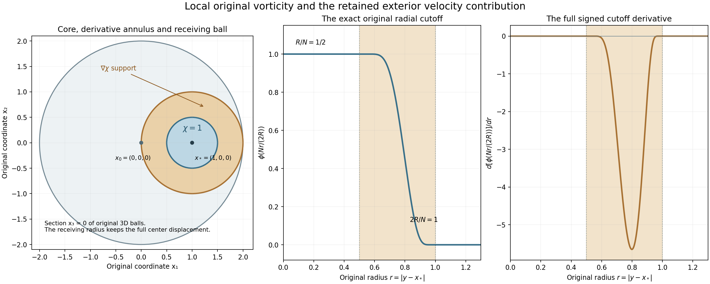
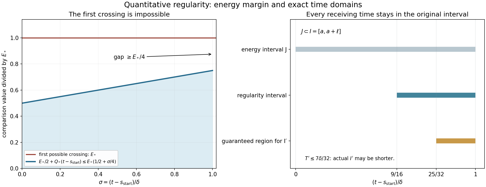

# Original vorticity mass and a regularity interval

The preceding lesson found an earlier frequency component
whose velocity amplitude is large. We now recover an integral
of the original vorticity on a physical ball and preserve it
through a definite interval on which the velocity and its
derivatives have quantitative bounds.

First, the complete inverse-curl kernel controls the exterior
contribution using the original velocity norm. Then a time
selected from the nonlinear gradient energy starts an explicit
regularity interval. Every heat cutoff term, Newton boundary
field and point mass remains in the proof. A smaller actual
interval supplies the coefficients needed by the finite
Gaussian estimate, while keeping the same original mass.

Read [Iterated backpropagation and total speed](iterated-backpropagation-and-total-speed.md)
for the earlier frequency operation,
[Global nonlinear energy and total speed](global-nonlinear-energy-and-total-speed.md)
for the energy inputs, and
[Interior vorticity bounds on an actual annulus](interior-vorticity-bounds-on-an-actual-annulus.md)
for the complete local heat and Newton maps.
The precise Gaussian receiving hypothesis is in
[Critical velocity tails and weighted heat estimates](critical-velocity-tails-and-weighted-heat-estimates.md),
equation (4.7) and Section 6.

The human comparison is Terence Tao,
[*Quantitative bounds for critically bounded solutions to the
Navier–Stokes equations*, version 2](https://arxiv.org/abs/1908.04958v2),
original author article.tex 423–512 and 1254–1290.
The argument below retains the original viscosity and
coordinates. It proves the mass and regularity inputs;
the full weighted error absorption and general large
critical-velocity endpoint remain further arguments.

## 1. The original curl-to-frequency kernel

Use the original smooth source-class, unforced solution on
\([t_0-T,t_0]\times\mathbb R^3\), with original viscosity
\(\nu>0\), pressure \(p(t,x)\), and bound
\(\sup_t\|u(t)\|_3\leq U\), with the full equation
\[
 \partial_tu+(u\cdot\nabla)u+\nabla p=\nu\Delta u,\qquad
 \operatorname{div}u=0
\]
throughout the calculation. Keep the exact cutoff
\(\phi\) and symbol \(p(\xi)=\phi(\xi)-\phi(2\xi)\)
of NS-FLUID-12. The Fourier convention remains
\(\widehat f(\xi)=\int f(x)e^{-2\pi i\xi\cdot x}\,dx\).
The symbol is supported in \(1/4\leq|\xi|\leq1\);
\(\phi=1\) on the ball of radius \(1/2\) and vanishes
outside the ball of radius one. Define the original
\(\omega=\nabla\times u\).

For \(1\leq i,\ell\leq3\), define the complete multiplier
and its inverse transform
\[
 k_{i\ell}(\xi)=
 \frac{p(\xi)}{4\pi^2|\xi|^2}
       \sum_{j=1}^3 2\pi i\,\varepsilon_{ij\ell}\xi_j,
 \qquad K_{i\ell}=\mathcal F^{-1}k_{i\ell}.
 \tag{1.1}
\]
The value at zero is defined to be zero. This is a smooth
compactly supported multiplier, since it vanishes throughout
a neighborhood of zero. Every \(K_{i\ell}\) is Schwartz,
by repeated integration by parts in its actual compact
Fourier support. All nine entries, including zero diagonal
entries, are retained.

The exact identity \(\nabla\times\omega
=\nabla\operatorname{div}u-\Delta u=-\Delta u\) gives
\[
 P_Nu_i(x)=\sum_{\ell=1}^3
       \int_{\mathbb R^3}K_{i\ell,N}(x-y)\omega_\ell(y)\,dy,
 \qquad K_{i\ell,N}(z)=N^2K_{i\ell}(Nz).
 \tag{1.2}
\]
Indeed on nonzero frequencies the two curls contribute
\(-(2\pi)^2\xi\times(\xi\times\widehat u)
=4\pi^2|\xi|^2\widehat u\), because
\(\xi\cdot\widehat u=0\). Multiplication by the complete
symbol in (1.1) therefore gives exactly \(p(\xi/N)\widehat u\).
At zero both sides are zero after that symbol. The
source-class \(L^2\) hypotheses justify the identity by
Parseval and convolution; no harmonic field is lost.

Write \(w(z)=(1+|z|)^{20}\), and define finite constants
\[
 \begin{gathered}
 C_K=\left(\sum_{i,\ell}\|K_{i\ell}\|_2^2\right)^{1/2},
 \qquad C_\nabla=\|\nabla\phi\|_\infty,\\
 T_K=\sum_{i,\ell,j}\|w\,\partial_jK_{i\ell}\|_{3/2}
       +\frac32C_\nabla\sum_{i,\ell}\|wK_{i\ell}\|_{3/2}.
 \end{gathered} \tag{1.3}
\]
The sums and integrals are part of the definitions; their
values are not absorbed into an unspecified factor.
Finiteness follows from the proved Schwartz decay.
The original Fourier matrix has squared Frobenius norm
\(|p(\xi)|^2/(2\pi^2|\xi|^2)\), because the full
cross-product matrix has squared norm \(2|\xi|^2\).
Thus Parseval proves the exact positive identity
\[
 C_K^2=\frac1{2\pi^2}
       \int_{\mathbb R^3}\frac{|p(\xi)|^2}{|\xi|^2}\,d\xi>0.
 \tag{1.4}
\]
The multiplier is nonzero, so at least one derivative
kernel also is nonzero and \(T_K>0\).

## 2. Local vorticity and the full exterior term

Fix an actual center \(x_*\), a physical frequency \(N>0\),
and a dimensionless radius \(R\geq1\). Use exactly
\[
 \chi(y)=\phi\!\left(\frac{N(y-x_*)}{2R}\right).
 \tag{2.1}
\]
It equals one on \(B(x_*,R/N)\), is supported in
\(\overline B(x_*,2R/N)\), and
\(|\nabla\chi|\leq NC_\nabla/(2R)\).
Its derivative support lies in the actual intervening annulus.
No domain is recentered in the working formula.

Split (1.2) into its \(\chi\omega\) and
\((1-\chi)\omega\) contributions. For the first part,
the vector Cauchy–Schwarz inequality and the full Jacobian
give
\[
 \left|\int K_N(x_*-y)\chi(y)\omega(y)\,dy\right|
 \leq C_K N^{1/2}
             \|\omega\|_{L^2(B(x_*,2R/N))}.
 \tag{2.2}
\]
Here the Frobenius \(L^2\) norm of the original matrix
kernel is exactly \(N^{1/2}C_K\). The cutoff obeys
\(0\leq\chi\leq1\), as does the original \(\phi\).

For each row let
\(A_i(y)=(1-\chi(y))K_{i\cdot,N}(x_*-y)\).
The complete integration by parts is
\[
 \begin{split}
 \sum_\ell\int (1-\chi)K_{i\ell,N}(x_*-y)\omega_\ell(y)\,dy
 &=\int(\nabla_y\times A_i)(y)\cdot u(y)\,dy,\\
 \nabla_y\times A_i
 &=(1-\chi)\nabla_y\times
                [K_{i\cdot,N}(x_*-y)]
       -\nabla\chi\times K_{i\cdot,N}(x_*-y).
 \end{split} \tag{2.3}
\]
The sign from differentiation of \(x_*-y\) remains
inside \(\nabla_y\); the second displayed term has its
negative sign. Both terms are present. To justify the
identity with its noncompact row, multiply it first by
a compact cutoff tending to one. The additional derivative
of that cutoff is paired with \(u\in L^3\) and a Schwartz
kernel in \(L^{3/2}\); its norm tends to zero on the
escaping annulus. The other terms converge by Hölder
or the source-class \(L^2\) pairing. This proves (2.3)
without a boundary term at infinity.

Every derivative term in the first curl is supported
where \(N|x_*-y|\geq R\). Changing only the integration
variable in its norm gives
\[
 \|{\bf1}_{N|x_*-y|\geq R}
        \partial_jK_{i\ell,N}(x_*-y)\|_{3/2}
 \leq N(1+R)^{-20}\|w\,\partial_jK_{i\ell}\|_{3/2}.
\]
The undifferentiated kernel has \(L^{3/2}\) scale \(N^0\).
Its cutoff-gradient term is at most
\(N C_\nabla(2R)^{-1}(1+R)^{-20}\|wK_{i\ell}\|_{3/2}\).
For each row and entry at most three derivative indices
occur in the curl bound. Summing all indices and using
\(R^{-1}\leq1\) proves, with precisely (1.3),
\[
 |P_Nu(x_*)|
 \leq C_KN^{1/2}\|\omega\|_{L^2(B(x_*,2R/N))}
                  +T_KUN(1+R)^{-20}.
 \tag{2.4}
\]
This is the exact needed comparison with the original
local vorticity. Its exterior estimate uses the original
velocity bound after a complete integration by parts;
it assumes no unproved global vorticity maximum.

Figure 1. Left: the exact section \(x_3=0\) of three-dimensional
balls for \(x_0=(0,0,0)\), \(x_*=(1,0,0)\), \(R=2,N=4\).
The cutoff equals one through radius \(R/N=1/2\) and vanishes
at and beyond radius \(2R/N=1\). Its derivative is supported
in the intervening annulus. The outer ball about \(x_0\)
has radius \(2=|x_*-x_0|+2R/N\), showing the full triangle
inclusion. Right panels: the original radial cutoff
\(\phi(Nr/(2R))\) and its signed radial derivative, evaluated
from the exact smooth bump formula in NS-FLUID-12 (3.1).
The numbers illustrate the exact cutoff and support geometry;
they are not evaluations of the analytic radius selected in
(3.1), and no fluid solution is sampled.
Complete proof: (2.1)–(2.4), (3.3). Human comparison:
Tao, article.tex 1254–1290.
[Reproducible figure source](../assets/original-vorticity-mass-cutoff.py).

## 3. Vorticity mass on an actual time interval

Retain the original one-step constants \(b,D_u,d,\eta,D,L\)
and the quantitative iteration constants \(B,\beta,\gamma,\rho,\Lambda\)
from NS-FLUID-16. Suppose its input at \((t_0,x_0,N_0)\)
and scale \(S\) is satisfied. Take its actual earlier
output \((t_*,x_*,N)\). Set
\[
 \begin{gathered}
 q=\sqrt d\,\eta^3,\qquad
 R=\max\{1,(4T_KU/b)^{1/20}\},\\
 h=\min\{b/(4D_u),\gamma q^2/2\}>0,\qquad
 I=[t_*,t_*+hN^{-2}].
 \end{gathered} \tag{3.1}
\]
The notation \(q\) records the complete lower frequency
coefficient; it does not discard its original factors.
All constants are chosen from quantities already proved
finite and positive. The original derivative bound
\(|\partial_tP_Nu|\leq D_uN^3\) and the unchanged
target amplitude at \(t_*\) give
\[
 |P_Nu(t,x_*)|\geq bN-D_uhN
                         \geq 3bN/4\qquad(t\in I).
\]
The interval lies in the original equation domain:
\(N\geq qS^{-1/2}\) implies
\(hN^{-2}\leq hS/q^2\leq\gamma S/2\), while
\(t_*\leq t_0-\gamma S\). Its other endpoint is
\(t_*\geq t_0-S\). Also \(N\leq\beta S^{-1/2}\),
so its actual length obeys
\[
 I\subset[t_0-S,t_0-\gamma S/2],\qquad
 |I|=hN^{-2}\geq hS/\beta^2 .
 \tag{3.2}
\]

By the chosen \(R\),
\(T_KU(1+R)^{-20}\leq b/4\).
Inserting the persisted amplitude into (2.4) leaves
\(C_KN^{1/2}\|\omega(t)\|_{2,B(x_*,2R/N)}
\geq bN/2\). Consequently
\[
 \begin{gathered}
 \int_{B(x_*,2R/N)}|\omega(t,y)|^2\,dy
                    \geq\frac{b^2}{4C_K^2}N,\\
 \int_{B(x_0,(LB+2R/q)\sqrt S)}|\omega(t,y)|^2\,dy
                    \geq\frac{b^2q}{4C_K^2}S^{-1/2}
                    \qquad(t\in I).
 \end{gathered} \tag{3.3}
\]
For the second statement use the original displacement
\(|x_*-x_0|\leq LB\sqrt S\), the lower frequency
\(N\geq qS^{-1/2}\), and the triangle inequality.
These give the complete inclusion of the first physical
ball in the second. Every center and radius remains explicit.
The lower bound concerns the original vorticity, at every
time in the actual positive-length interval \(I\).

## 4. Integrated mass and physical scales

Integrating the second inequality in (3.3), and retaining
the original time-length bound, gives
\[
 \int_I\int_{B(x_0,(LB+2R/q)\sqrt S)}
                       |\omega(t,y)|^2\,dy\,dt
       \geq\frac{b^2qh}{4C_K^2\beta^2}\sqrt S .
 \tag{4.1}
\]
Any restriction to a smaller closed subinterval preserves
the pointwise-in-time bound (3.3); its integrated version
retains that subinterval's actual length. No regularity
interval with additional coefficient bounds is assumed.

Under the full original parabolic map
\(u^\lambda(t,x)=\lambda u(\lambda^2t,\lambda x)\),
\(p^\lambda(t,x)=\lambda^2p(\lambda^2t,\lambda x)\),
the viscosity, \(U,b\), and all the constants above remain
unchanged. The original curl is
\(\omega^\lambda(t,x)=\lambda^2\omega(\lambda^2t,\lambda x)\).
Every original center and radius is divided by \(\lambda\),
every time by \(\lambda^2\), and \(N\) is multiplied by
\(\lambda\). The local original curl integral has factor
\(\lambda^4\lambda^{-3}=\lambda\), matching \(N\) and
\(S^{-1/2}\). The integrated original space-time mass has
factor \(\lambda^4\lambda^{-3}\lambda^{-2}=\lambda^{-1}\),
matching \(\sqrt S\). The explicit cutoff (2.1), both
terms of (2.3), and the exterior factor \(NR/N=R\)
transform with exactly these original factors.

### 4.1. Stronger persistence constants

NS-FLUID-16 Exercise 1 proves the entire iterated theorem
with \(B_{\rm full},\beta_{\rm full},\gamma_{\rm full},
\Lambda_{\rm full}\), and the same \(d,\eta,\rho,b\).
The proof above therefore applies by direct insertion of
these established constants into (3.1)–(4.1).
Keep \(q,R,C_K,T_K\) unchanged and set
\(h_{\rm full}=\min\{b/(4D_u),\gamma_{\rm full}q^2/2\}\).
It is at least \(h\), since
\(\gamma_{\rm full}\geq\gamma\).
The uniform receiving radius coefficient is
\(LB_{\rm full}+2R/q\leq LB+2R/q\).
The actual interval-length lower coefficient is
\(h_{\rm full}/\beta_{\rm full}^2\geq h/\beta^2\).
The pointwise original-mass coefficient is unchanged,
and the integrated lower coefficient in (4.1) can only
increase. Each statement follows from the proved formulas,
with no assertion that two independently selected earlier
points or actual time intervals coincide.

## 5. The original equation and earlier heat field

Keep the smooth source-class solution
\[
 \partial_tu+(u\cdot\nabla)u+\nabla p=\nu\Delta u,\qquad
 \operatorname{div}u=0,\qquad \nu>0
 \tag{5.1}
\]
on \([t_0-T,t_0]\times\mathbb R^3\), with
\(\sup_t\|u(t)\|_3\leq U\). Spatial derivatives of the solution
belong to \(L^\infty_tL^2_x\), as in the source class used in the
preceding proofs. Their auxiliary norms justify differentiation
and integrations; their values do not enter the constants below.
This receiving theorem concerns this unforced equation. The
original force in a different equation would have to enter its
energy and curl identities.

Use the actual interval from 3.1,
\[
 I=[a,a+\ell],\qquad a=t_*,\qquad \ell=hN^{-2}>0.
 \tag{5.2}
\]
3.2 proves \(a\geq t_0-S\), \(a+\ell\leq t_0-\gamma S/2\),
\(\ell\leq\gamma S/2\leq S/4\), and
\(S\leq T/32\). Consequently \(t_b=a-\ell\) satisfies
\[
 t_b\geq t_0-5S/4\geq t_0-5T/128>t_0-T.
 \tag{5.3}
\]
The whole earlier heat interval \([a-\ell,a+\ell]\) lies in
the original equation domain. Define the actual fields
\[
 \begin{gathered}
 H_s(x)=(4\pi s)^{-3/2}e^{-|x|^2/(4s)},\qquad
 v(t)=H_{\nu(t-t_b)}*u(t_b),\\
 \qquad w=u-v,\qquad
 z=\nabla\times w,\quad \omega=\nabla\times u.
 \end{gathered}
 \tag{5.4}
\]
There is no change of viscosity, coordinates, pressure or unknown.
If \(U=0\), the original velocity vanishes everywhere by smoothness,
so its vorticity is zero. The positive frequency amplitude used
in 3.1 therefore ensures \(U>0\) in this application.

## 6. Energy constants and the selected time

Use full ordered derivative tensors with Euclidean magnitude.
For \(p\geq3\), set
\[
 \frac1{r_p}=\frac23+\frac1p,\qquad
 C_{m,p}=\|\nabla^mH_1\|_{r_p},\qquad
 S_3=4\sqrt3.
 \tag{6.1}
\]
The vector and tensor Sobolev bound
\(\|g\|_6\leq S_3\|\nabla g\|_2\) is proved in the earlier
strong-solution foundation. It applies to full derivative tensors
by applying the scalar inequality to their magnitude, using
\(|\nabla|g||\leq|\nabla g|\), and approximation at zeros.
Young's inequality for convolution gives, throughout \(I\),
\[
 \begin{gathered}
 \|v\|_6\leq V_6:=C_{0,6}U(\nu\ell)^{-1/4},\qquad
 \|\nabla v\|_3\leq V_{13}:=C_{1,3}U(\nu\ell)^{-1/2},\\
 |\nabla^jv|\leq V_j:=C_{j,\infty}U(\nu\ell)^{-(j+1)/2}
 \quad(j=0,1,2).
 \end{gathered}
 \tag{6.2}
\]
The elapsed heat time is at least \(\ell\); this is the entire
reason these bounds are uniform down to the left end of \(I\).

For clarity, the full projected heat-kernel constant in
NS-FLUID-12 is
\[
 \kappa_0=\sum_{i,j,k=1}^3
 \left(\delta_{ij}\|\partial_kH_1\|_{6/5}
                 +\frac43\|\partial_i\partial_j\partial_kH_1\|_{6/5}\right).
 \tag{6.3}
\]
It comes from the exact projected divergence kernel
\(\delta_{ij}\partial_kH_s+
\int_s^\infty\partial_i\partial_j\partial_kH_\sigma\,d\sigma\);
the latter integral contributes \(4s^{-3/4}/3\) after taking
its \(L^{6/5}\) norm. No projection or low frequency is omitted.
The proved nonlinear energy and gradient bounds give
\[
 \begin{gathered}
 \sup_I\|w(t)\|_2\leq W_0:=
       4\kappa_0\nu^{-3/4}U^2(2\ell)^{1/4},\\
 M:=C_MU^4\nu^{-5/2}\sqrt\ell,\qquad
 C_M=16\sqrt2\,\kappa_0^2+
                        18C_{0,6}^2(\sqrt2-1),\\
 \int_a^{a+\ell}\|\nabla w(t)\|_2^2\,dt\leq M.
 \end{gathered}
 \tag{6.4}
\]
In particular the earlier heat time and its factor \(2\ell\)
are retained in the \(W_0\) term. One can also read 6.4 directly
from the complete inequality
\[
 \int_a^{a+\ell}\|\nabla w\|_2^2
 \leq \frac{\|w(a)\|_2^2}{\nu}
  +18C_{0,6}^2U^4\nu^{-5/2}
                 \big(\sqrt{2\ell}-\sqrt\ell\big).
 \tag{6.5}
\]

Put \(E(t)=\|\nabla w(t)\|_2^2/2\), and define
\[
 E_*=\frac{4M}{\ell}>0.
 \tag{6.6}
\]
Integration over \([a,a+\ell/4]\) gives a time
\(s_{\rm start}\in[a,a+\ell/4]\) with
\[
 E(s_{\rm start})\leq\frac{2M}{\ell}=\frac{E_*}{2}.
 \tag{6.7}
\]
Indeed the average of \(E\) over that interval is at most
\(2M/\ell\). Continuity supplies a point at or below the
average, including the case of equality. The initial norm of
the full velocity has not been bounded in \(H^1\) using only
its \(L^3\) norm; it is the actual nonlinear part whose
gradient energy has been averaged.

## 7. The gradient-energy inequality

Write \(D(t)=\|\nabla^2w(t)\|_2\). The complete equation for
the actual nonlinear part is
\[
 w_t-\nu\Delta w=-\operatorname{div}(u\otimes u)-\nabla p.
 \tag{7.1}
\]
Pair it with \(-\Delta w\). Solenoidality makes the pressure
pairing zero: \(\langle\nabla p,\Delta w\rangle
=-\langle p,\Delta\operatorname{div}w\rangle=0\).
This is also the exact orthogonal Leray pairing on the
source \(L^2\) class. Integration by parts or its Fourier
version gives \(\|\Delta w\|_2=\|\nabla^2w\|_2\).
Thus
\[
 E'(t)+\nu D(t)^2
 =\int_{\mathbb R^3}\Delta w\cdot
                 \operatorname{div}(u\otimes u)\,dx.
 \tag{7.2}
\]
All derivatives in the convective term remain:
\(\operatorname{div}(u\otimes u)=(u\cdot\nabla)u\),
because its additional \(u\,\operatorname{div}u\) is
exactly zero. Pointwise tensor Cauchy–Schwarz and Hölder give
\[
 \|\operatorname{div}(u\otimes u)\|_2
 \leq \|u\|_6\|\nabla u\|_3
 \leq A(E)\left(V_{13}+\sqrt{S_3}(2E)^{1/4}D^{1/2}\right),
 \quad A(E)=V_6+S_3\sqrt{2E}.
 \tag{7.3}
\]
Here \(\|\nabla w\|_3^2\leq
\|\nabla w\|_2\|\nabla w\|_6
\leq \sqrt{2E}S_3D\); the bound for \(\|w\|_6\) uses
the same original Sobolev inequality.

For any nonnegative \(A,E,D\), two separate exact Young
bounds are
\[
 \begin{aligned}
 AV_{13}D&\leq\frac{\nu}{4}D^2+\frac{A^2V_{13}^2}{\nu},\\
 A\sqrt{S_3}(2E)^{1/4}D^{3/2}
 &\leq\frac{\nu}{4}D^2+\frac{27S_3^2A^4E}{2\nu^3}.
 \end{aligned}
 \tag{7.4}
\]
For the second, write \(c=A\sqrt{S_3}(2E)^{1/4}\) and
maximize \(c y^3-\nu y^4/4\) over \(y=\sqrt D\geq0\).
Its positive maximum is at \(y=3c/\nu\) and equals
\(27c^4/(4\nu^3)\); substituting \(c^4=2ES_3^2A^4\)
proves every coefficient. Therefore
\[
 E'+\frac{\nu}{2}D^2\leq Q(E),\qquad
 Q(E)=\frac{(V_6+S_3\sqrt{2E})^2V_{13}^2}{\nu}
       +\frac{27S_3^2(V_6+S_3\sqrt{2E})^4E}{2\nu^3}.
 \tag{7.5}
\]
This full increasing function retains its linear heat term,
all mixed heat/nonlinear contributions, and all powers of
the original viscosity. We do not replace it by an unspecified
polynomial or discard its mixed summands.

## 8. A definite interval and its velocity norm

Define, from the established inputs,
\[
 Q_*=Q(E_*),\qquad
 \delta=\min\left\{\frac{\ell}{2},\frac{E_*}{4Q_*}\right\}>0,
 \qquad J=[s_{\rm start},s_{\rm start}+\delta].
 \tag{8.1}
\]
Since \(s_{\rm start}\leq a+\ell/4\), the right endpoint of \(J\)
is at most \(a+3\ell/4\). In particular \(J\subset I\).
Suppose there were a first time in \(J\) with \(E=E_*\).
Before that time \(Q(E)\leq Q_*\); integration of 7.5
and 6.7 would give
\[
 E(t)\leq E_*/2+Q_*(t-s_{\rm start})\leq3E_*/4<E_*,
 \tag{8.2}
\]
a contradiction. Continuity proves 8.2 throughout \(J\).
Integrating the same inequality with its dissipation retained
then gives
\[
 \sup_J\|\nabla w\|_2^2\leq P^2:=2E_*,
 \qquad
 \int_J\|\nabla^2w\|_2^2\,dt\leq
 D_2^2:=\frac{3E_*}{2\nu}.
 \tag{8.3}
\]
For the second bound, \(E(s_{\rm start})+\delta Q_*\leq3E_*/4\)
and the final \(E\) is nonnegative.

The exact Fourier splitting estimate used here is
\[
 \|w\|_\infty^4\leq
 \frac4{\pi^4}\|\nabla w\|_2^2\|\nabla^2w\|_2^2.
 \tag{8.4}
\]
To verify the constant, keep the convention
\(\widehat w(\xi)=\int w(x)e^{-2\pi i x\cdot\xi}\,dx\).
For any frequency radius \(R>0\), Cauchy–Schwarz on the
inside and outside gives
\[
 \int|\widehat w|
 \leq\sqrt{\frac R\pi}\|\nabla w\|_2
       +\frac1{2\pi^{3/2}\sqrt R}\|\nabla^2w\|_2.
 \tag{8.5}
\]
The two squared kernel integrals are respectively
\(\int_{|\xi|\leq R}(2\pi|\xi|)^{-2}d\xi=R/\pi\)
and
\(\int_{|\xi|>R}(2\pi|\xi|)^{-4}d\xi
=1/(4\pi^3R)\).
Taking \(R=\|\nabla^2w\|_2/(2\pi\|\nabla w\|_2)\)
gives 8.4. If either derivative norm is zero, the
source \(L^2\) field is zero, which supplies the same
bound without division by zero. Fourier inversion follows
from the resulting \(L^1\) Fourier norm and approximation.
Consequently
\[
 \|u\|_{L^4(J;L^\infty(\mathbb R^3))}
 \leq {\cal V}:=
 \left(\frac{4P^2D_2^2}{\pi^4}\right)^{1/4}
                             +\delta^{1/4}V_0.
 \tag{8.6}
\]
Also \(\|z(t)\|_2\leq P\). To check the exact curl norm,
Parseval gives
\(\|\nabla w\|_2^2=\|\nabla\times w\|_2^2+
\|\operatorname{div}w\|_2^2\); the last term is zero.

## 9. The complete local heat iteration

For each actual spatial center \(x\in\mathbb R^3\), independently
choose the following physical balls and times:
\[
 \begin{gathered}
 \rho=\sqrt{\nu\delta},\quad \epsilon=\rho/32,\quad
 \tau=\delta/16,\quad R_k=\rho-2k\epsilon,\quad
 B_k=B(x,R_k),\\
 s_k=s_{\rm start}+k\tau\quad(0\leq k\leq10).
 \end{gathered}
 \tag{9.1}
\]
Keep exactly the transition \(j\) of NS-FLUID-13 (6.2):
it is zero on \((-\infty,0]\), one on \([1,\infty)\),
and \(1-\theta((r+1)/2)\) for \(0<r<1\), with
the original even cutoff \(\theta\) from NS-FLUID-11 (4.7).
Write \(b_1=\|j'\|_\infty\), \(b_2=\|j''\|_\infty\).
No new cutoff is substituted for these source-defined
functions. For \(1\leq k\leq9\), put
\[
 \begin{gathered}
 \psi_k(y)=j((R_{k-1}-|y-x|)/\epsilon),\quad
 \chi_k(t)=j((t-s_{k-1})/\tau),\quad \Psi_k=\chi_k\psi_k,\\
 L_1=b_1/\epsilon,\quad
 L_2=b_2/\epsilon^2+2b_1/(\epsilon R_{10}),\quad
 L_t=b_1/\tau,\qquad R_{10}=3\rho/8.
 \end{gathered}
 \tag{9.2}
\]
These bounds retain the radial curvature term.
The full spatial Hessian norm and Laplacian are at most
\(L_2\), and the gradient is at most \(L_1\).
The derivative support lies at distance at least
\(\epsilon\) from \(B_k\), since the cutoff is already
one on the larger ball of radius \(R_k+\epsilon\).
Time derivatives are at most \(L_t\), and
\(\Psi_k=1\) on \([s_k,s_{\rm start}+\delta]\times B_k\).

Every ball is in the original space. 6.2, 8.3 and 8.6
are global, so they supply the following bound with the
same constant for every center:
\[
 \sup_J\|\omega(t)\|_{L^2(B_0)}
 \leq X_0:=P+\sqrt{2v_3\rho^3}\,V_1,\qquad v_3=4\pi/3.
 \tag{9.3}
\]
Here \(\omega=z+\nabla\times v\) and
\(|\nabla\times v|\leq\sqrt2|\nabla v|\).
This proves the required input without an annulus,
a global \(L^2\) norm for the heat vorticity depending on
initial energy, or an assumed maximum of \(\omega\).

For completeness the full localized original equation is
\[
 \begin{aligned}
 (\partial_t-\nu\Delta)(\Psi_k\omega)
 ={}&\nabla\times(\Psi_k(u\times\omega))
 -2\nu\sum_j\partial_j((\partial_j\Psi_k)\omega)\\
 &+(\partial_t\Psi_k+\nu\Delta\Psi_k)\omega
                    -\nabla\Psi_k\times(u\times\omega).
 \end{aligned}
 \tag{9.4}
\]
It follows by the curl equation and the full product rule;
the negative cutoff-gradient cross term is retained.
The initial field at \(s_{k-1}\) is zero. Its heat
representation is therefore the integral of all four
right-hand terms, with the spatial derivatives acting
on the full original Gaussian.

Use exponents
\[
 (p_0,p_1,p_2,p_3,p_4,p_5,p_6)
       =(2,12/5,3,4,6,12,\infty),\quad
 K_0=\|H_1\|_{12/11},\quad
 K_1=\sum_j\|\partial_jH_1\|_{12/11}.
 \tag{9.5}
\]
Every reciprocal step is \(1/12\). Young's spatial
inequality uses \(12/11\), giving time factors
\((\nu r)^{-1/8}\) and \((\nu r)^{-5/8}\).
Pairing the velocity with Hölder exponent \(4/3\) in
time uses exactly
\[
 \begin{gathered}
 \|r^{-5/8}\|_{L^{4/3}(0,\delta)}
       =6^{3/4}\delta^{1/8},\qquad
 \|r^{-1/8}\|_{L^{4/3}(0,\delta)}
       =(6/5)^{3/4}\delta^{5/8},\\
 \int_0^\delta r^{-5/8}\,dr=\frac83\delta^{3/8},\qquad
 \int_0^\delta r^{-1/8}\,dr=\frac87\delta^{7/8}.
 \end{gathered}
 \tag{9.6}
\]
For the full vector curl,
\(\nabla\times(H*F)=\sum_je_j\times(\partial_jH*F)\),
whose norm is bounded by the defined sum of derivative
kernel norms, without dropping any component.
Thus each of the four terms of 9.4 is bounded in
\(L^\infty_tL^{p_k}_x\) by its respective summand in
\[
 \begin{aligned}
 C={}&6^{3/4}K_1\nu^{-5/8}\delta^{1/8}{\cal V}
       +\frac{16}3K_1\nu^{3/8}L_1\delta^{3/8}\\
 &+\frac87K_0\nu^{-1/8}(L_t+\nu L_2)\delta^{7/8}
       +(6/5)^{3/4}K_0\nu^{-1/8}L_1\delta^{5/8}{\cal V}.
 \end{aligned}
 \tag{9.7}
\]
The preceding norm of \(\omega\) on \(B_{k-1}\) is the
only vorticity input. Induction from 9.3 proves
\[
 X_k=C^kX_0,\qquad
 \sup_{[s_k,s_{\rm start}+\delta]}
          \|\omega(t)\|_{L^{p_k}(B_k)}\leq X_k
       \quad(1\leq k\leq6).
 \tag{9.8}
\]
All six spatial gains and all time integrals are explicit.
In particular \(X_6\) bounds the original vorticity maximum
on the sixth ball and time interval.

## 10. Continuity and the full Newton map

Set \(\alpha=1/4\), and define the Gaussian constants
\[
 \begin{gathered}
 J_0=2^{1-\alpha}\|H_1\|_1^{1-\alpha}\|\nabla H_1\|_1^\alpha,\\
 J_1=\sum_j2^{1-\alpha}\|\partial_jH_1\|_1^{1-\alpha}
                                      \|\nabla\partial_jH_1\|_1^\alpha.
 \end{gathered}
 \tag{10.1}
\]
For any integrable differentiable kernel \(K\),
\[
 \|K(\cdot+y)-K\|_1
 \leq \min(2\|K\|_1,|y|\|\nabla K\|_1)
 \leq(2\|K\|_1)^{1-\alpha}\|\nabla K\|_1^\alpha|y|^\alpha.
 \tag{10.2}
\]
The first inequality follows from the triangle inequality
and the fundamental theorem along a segment. The second
follows by considering the smaller of its two arguments.
The powers of original heat time for 10.1 are again
\((\nu r)^{-1/8}\) and \((\nu r)^{-5/8}\).
Define the full coefficient
\[
 \begin{aligned}
 C_H={}&6^{3/4}J_1\nu^{-5/8}\delta^{1/8}{\cal V}
       +\frac{16}3J_1\nu^{3/8}L_1\delta^{3/8}\\
 &+\frac87J_0\nu^{-1/8}(L_t+\nu L_2)\delta^{7/8}
       +(6/5)^{3/4}J_0\nu^{-1/8}L_1\delta^{5/8}{\cal V},
 \qquad H_7=C_HX_6.
 \end{aligned}
 \tag{10.3}
\]
Apply 9.4 for \(k=7\), now using the proved \(X_6\).
10.2 and the four integrals 9.6 prove
\[
 \|\Psi_7\omega(t)\|_\infty\leq X_6,\qquad
 [\Psi_7\omega(t)]_{C^\alpha(\mathbb R^3)}\leq H_7
       \quad(s_6\leq t\leq s_{\rm start}+\delta).
 \tag{10.4}
\]
The maximum uses the actual support inside \(B_6\);
it is not inferred from a seminorm. For \(t\geq s_7\),
this compact field is the original vorticity on \(B_7\).

Let \(N_{\rm Newt}(y)=1/(4\pi|y|)\).
The actual compact field \(\psi_8w\) satisfies
\[
 \begin{aligned}
 \psi_8w={}&\nabla\times N_{\rm Newt}*(\psi_8z)
  +\nabla\times N_{\rm Newt}*(\nabla\psi_8\times w)\\
 &-\nabla N_{\rm Newt}*(\nabla\psi_8\cdot w).
 \end{aligned}
 \tag{10.5}
\]
This follows from
\(\nabla\times\nabla\times X-\nabla\operatorname{div}X
=-\Delta X\) and \(-\Delta N_{\rm Newt}=\delta_0\),
with both product derivatives included. Fourier verification
away from zero, together with the compact \(L^2\) field,
rules out an additional polynomial field.
For \(t\geq s_7\), put
\[
 Z_\infty=X_6+\sqrt2V_1,\qquad Z_2=P,\qquad
 Z_\alpha=H_7+\sqrt2V_2\epsilon^{1-\alpha}.
 \tag{10.6}
\]
These bound \(z\), \(\psi_8z\) in \(L^2\), and its
local increments from points in \(B_8\) by distances
less than \(\epsilon\). The entire segment is inside
\(B_7\), and \(\psi_8=1\) at both such points, because
its plateau extends to radius \(R_8+\epsilon\).

The full kernel magnitude is \(1/(4\pi|y|^2)\).
Its integral inside radius \(2\rho\) is \(2\rho\),
and its exterior squared integral from radius \(r>0\)
is \(1/(4\pi r)\). Hence the first term in 10.5
is bounded both by \(2\rho Z_\infty\) and by
\[
 \inf_{r>0}\left(rZ_\infty+
                    \frac{Z_2}{2\sqrt{\pi r}}\right)
 =\frac3{(4\sqrt\pi)^{2/3}}Z_\infty^{1/3}Z_2^{2/3}.
 \tag{10.7}
\]
The positive minimizer is
\((Z_2/(4\sqrt\pi Z_\infty))^{2/3}\); if either
norm vanishes the convolution is zero. Each of the
two boundary terms is bounded by
\(L_1W_0/(2\sqrt{\pi\epsilon})\), since its support
is at distance at least \(\epsilon\). Thus on \(B_8\)
\[
 W_{\rm loc}=
 \min\left\{2\rho Z_\infty,
      \frac3{(4\sqrt\pi)^{2/3}}Z_\infty^{1/3}Z_2^{2/3}\right\}
                  +\frac{L_1W_0}{\sqrt{\pi\epsilon}}
 \tag{10.8}
\]
bounds \(|w|\).

For its gradient, keep the entire Newton distribution
\[
 \partial_i\partial_jN_{\rm Newt}
 =\operatorname{pv}\frac{3y_iy_j-\delta_{ij}|y|^2}{4\pi|y|^5}
                      -\frac{\delta_{ij}}3\delta_0.
 \tag{10.9}
\]
The point mass follows by integrating outside a small
ball; its inner boundary integral is
\(-(4\pi)^{-1}\int_{\mathbb S^2}\vartheta_i\vartheta_j\,dS
=-\delta_{ij}/3\). The same angular identity gives
zero average for the principal-value kernel. Its full
Euclidean tensor norm is \(\sqrt6/(4\pi|y|^3)\).
Subtract \(z(x)\) in the inner ball of radius \(\epsilon\)
and use 10.6; integrate its radial factor to obtain
\(\sqrt6 Z_\alpha\epsilon^\alpha/\alpha\).
Between radii \(\epsilon\) and \(2\rho\) the contribution
is \(\sqrt6Z_\infty\log(2\rho/\epsilon)\).
The point mass contributes at most \(\sqrt2Z_\infty/3\)
to the full derivative of the curl.
Finally the exterior squared Hessian integral equals
\(1/(2\pi\epsilon^3)\); the two boundary fields
together therefore cost
\(\sqrt{2/\pi}L_1W_0\epsilon^{-3/2}\).
All terms give
\[
 \begin{gathered}
 G_{\rm loc}=
 \frac{\sqrt6}{\alpha}\epsilon^\alpha Z_\alpha
 +\left(\sqrt6\log\frac{2\rho}{\epsilon}+\frac{\sqrt2}3\right)Z_\infty
 +\sqrt{\frac2\pi}L_1W_0\epsilon^{-3/2},\\
 U_\infty=W_{\rm loc}+V_0,\qquad G_u=G_{\rm loc}+V_1.
 \end{gathered}
 \tag{10.10}
\]
They bound \(|u|\) and \(|\nabla u|\) on
\([s_7,s_{\rm start}+\delta]\times B_8\).
Every actual center has the same constants. Evaluating
at its center proves these bounds on all of \(\mathbb R^3\).
This establishes the precise whole-space receiving map
from the earlier local result, with its boundary fields
and point mass retained.

## 11. The original vorticity gradient

The ninth cutoff has support in \(B_8\), where 10.10 is
proved. The full compact velocity \(V=\psi_9u\) has
maximum \(U_\infty\) and derivative maximum
\(L_1U_\infty+G_u\). The segment and minimum argument
of 10.2 proves
\([V]_{C^\alpha}\leq
(2U_\infty)^{1-\alpha}(L_1U_\infty+G_u)^\alpha\).
For \(t\geq s_8\), \(\Psi_7\omega=\omega\) on this
support, so the complete product differences give
\[
 \begin{gathered}
 A_{\rm nl}=U_\infty H_7+
 (2U_\infty)^{1-\alpha}(L_1U_\infty+G_u)^\alpha X_6,\\
 A_{\rm cut}=L_1H_7+(2L_1)^{1-\alpha}L_2^\alpha X_6,\\
 J_{2,\alpha}=\sum_j\||x|^\alpha\nabla\partial_jH_1\|_1,
 \qquad J_\nabla=\|\nabla H_1\|_1.
 \end{gathered}
 \tag{11.1}
\]
The first two quantities bound respectively the global
Hölder seminorms of \(\Psi_9(u\times\omega)\) and
\((\partial_j\Psi_9)\omega\). Both factors in each
product difference have been included.

Differentiate the full 9.4 for \(k=9\).
Every second Gaussian derivative integrates to zero;
subtracting the evaluation value of its input therefore
bounds it by its full \(\alpha\)-moment. Its time
factor \((\nu r)^{-1+\alpha/2}\) integrates to
\((2/\alpha)\nu^{-1+\alpha/2}\delta^{\alpha/2}\).
The two remaining source terms use one Gaussian
gradient, whose time integral is
\(2J_\nabla\nu^{-1/2}\sqrt\delta\).
The resulting bound is
\[
 \begin{aligned}
 G_\omega={}&\frac2\alpha J_{2,\alpha}
        \nu^{-1+\alpha/2}\delta^{\alpha/2}
                           (A_{\rm nl}+2\nu A_{\rm cut})\\
 &+2J_\nabla\nu^{-1/2}\sqrt\delta
                       (L_t+\nu L_2+L_1U_\infty)X_6.
 \end{aligned}
 \tag{11.2}
\]
One can justify differentiation by first cutting off
a positive upper time gap and then applying dominated
convergence with the displayed integrable powers.
The initial cutoff field is zero. On \(B_9\) at times
at least \(s_9\), the cutoff is identically one, so
the estimated derivative is the original derivative
\(\nabla\omega\), not a cutoff replacement.
Taking all actual centers proves
\[
 \begin{gathered}
 |u|\leq U_\infty,\quad|\nabla u|\leq G_u,\quad
 |\omega|\leq X_6,\quad|\nabla\omega|\leq G_\omega\\
 \text{on }\ 
 J_{\rm reg}\times\mathbb R^3,\qquad
 J_{\rm reg}=[s_{\rm start}+9\delta/16,s_{\rm start}+\delta].
 \end{gathered}
 \tag{11.3}
\]
The length is exactly \(7\delta/16>0\). All displayed
constants depend only on \(U,\nu,\ell\), the fixed
Gaussian norms and the fixed cutoff, not on auxiliary
high derivatives or the selected time and center.

## 12. A cylinder for the finite Gaussian estimate

Let \(C_0\geq2\) be the desired finite weighted-estimate
parameter, and define
\[
 T'=\min\left\{\frac{7\delta}{32},
                  \frac{\nu}{4C_0U_\infty^2},
                  \frac1{2C_0G_u}\right\}>0,\qquad
 t'=s_{\rm start}+\delta,\qquad I'=[t'-T',t'].
 \tag{12.1}
\]
Here \(U_\infty,G_u>0\), since 6.2 includes positive
Gaussian norm bounds and \(U>0\). The left endpoint
of \(I'\) is at least \(s_{\rm start}+25\delta/32\),
which is later than the start of \(J_{\rm reg}\).
Consequently all 11.3 bounds hold throughout \(I'\).
The choices retain an explicit margin:
\[
 |u|\leq\frac12\sqrt{\frac{\nu}{C_0T'}},\qquad
 |\nabla u|\leq\frac1{2C_0T'}.
 \tag{12.2}
\]

For any actual spatial center \(x_c\), define the
time-reversed original vorticity
\[
 {\cal U}(s,y)=\omega(t'-s,x_c+y),\qquad 0\leq s\leq T'.
 \tag{12.3}
\]
The original vorticity equation gives exactly
\[
 (\partial_s+\nu\Delta_y){\cal U}
 =u(t'-s,x_c+y)\cdot\nabla_y{\cal U}
       -{\cal U}\cdot\nabla u(t'-s,x_c+y).
 \tag{12.4}
\]
Both signs follow by reversing the original time derivative.
Hence 12.2 proves
\[
 |(\partial_s+\nu\Delta_y){\cal U}|
 \leq \frac1{2C_0T'}|{\cal U}|
       +\frac12\sqrt{\frac{\nu}{C_0T'}}|\nabla_y{\cal U}|.
 \tag{12.5}
\]
This is stronger than the zero-residual coefficient
hypothesis in NS-FLUID-10 (4.7) and Exercise 1, with
its original viscosity. It holds on every finite
spatial ball. For example the finite Gaussian estimate
can take \(r=\sqrt{4000\nu T'}\), or any larger
physical radius; its auxiliary parameters may be
\(\tau_G=T'/2000\), \(\varepsilon_G=T'/4000\).
They obey \(0<\varepsilon_G\leq\tau_G<T'/1000\)
and the required radius inequality. This proves
admissibility of the original cylinder; a later
off-center mass application must still retain the
actual Gaussian and all its boundary costs.

## 13. The same original mass and its time scale

No new frequency point, ball or vorticity has been
selected during 5.1–12.5. 3.3 therefore applies at
every time of \(I'\):
\[
 \begin{gathered}
 \int_{B(x_*,2R/N)}|\omega(t,x)|^2\,dx
                           \geq\frac{b^2N}{4C_K^2},\\
 \int_{B(x_0,(LB+2R/q)\sqrt S)}|\omega(t,x)|^2\,dx
                           \geq\frac{b^2q}{4C_K^2}S^{-1/2},\\
 \int_{I'}\int_{B(x_0,(LB+2R/q)\sqrt S)}
                |\omega|^2\,dx\,dt
                  \geq\frac{b^2qT'}{4C_K^2}S^{-1/2}.
 \end{gathered}
 \tag{13.1}
\]
All letters \(b,C_K,R,q,L,B,S,N,x_*,x_0\) are exactly
the constants and points of 3.1–4.1. The pointwise
mass survives restriction unchanged; the time integral
uses the new actual length \(T'\).

This length is quantitatively proportional to the
original \(\ell\), not just positive for an individual
solution. To prove that fact without replacing the
original fields, set the following scalar coefficients:
\[
 \begin{gathered}
 e=4C_MU^4\nu^{-5/2},\quad
 a_6=C_{0,6}U\nu^{-1/4}+S_3\sqrt{2e},\quad
 b_{13}=C_{1,3}U\nu^{-1/2},\\
 q_E=a_6^2b_{13}^2/\nu+
                      27S_3^2a_6^4e/(2\nu^3),\qquad
 d_E=\min\{1/2,e/(4q_E)\}.
 \end{gathered}
 \tag{13.2}
\]
Direct substitution in the complete 6.2–8.1 gives
\[
 E_*=e\ell^{-1/2},\quad Q_*=q_E\ell^{-3/2},
                         \quad\delta=d_E\ell.
 \tag{13.3}
\]
Every mixed term in \(a_6^2\) and \(a_6^4\) remains
in these formulas.

The remaining constants have the following exact
powers of the original interval length; the factors
left after removing these powers depend only on \(U,\nu\)
and the fixed kernels and cutoff:
\[
 \begin{array}{c|c}
 \text{quantity}&\text{power of }\ell\\ \hline
 W_0&1/4\\
 P,\ D_2&-1/4\\
 V_j&-(j+1)/2\\
 {\cal V}&-1/4\\
 \rho,\epsilon&1/2\\
 L_1&-1/2\\
 L_2,L_t&-1\\
 X_0&-1/4\\
 C,C_H&-1/8\\
 X_6&-1\\
 H_7&-9/8\\
 Z_\infty,Z_2,Z_\alpha&-1,\ -1/4,\ -9/8\\
 U_\infty,G_u,G_\omega&-1/2,\ -1,\ -3/2 .
 \end{array}
 \tag{13.4}
\]
Each sum is homogeneous: for example the four
terms of \(C\) have powers
\(1/8-1/4=-1/8\),
\(-1/2+3/8=-1/8\),
\(-1+7/8=-1/8\), and
\(-1/2+5/8-1/4=-1/8\).
In the Newton minimum, the first term has power
\(1/2-1=-1/2\) and the second has
\(-1/3-1/6=-1/2\); its boundary term has
\(-1/2+1/4-1/4=-1/2\).
The logarithm is exactly \(\log64\), independent of
\(\ell\). 11.1 gives powers \(-13/8\) for
\(A_{\rm nl}\) and \(A_{\rm cut}\); the first
term of 11.2 then has \(-13/8+1/8=-3/2\),
and the second has \(1/2-1-1=-3/2\).
These computations verify all dependent sums and
the sole minimum in the table.

In particular \(u_c=\sqrt\ell U_\infty\) and
\(g_c=\ell G_u\) are the exact positive coefficients
obtained by 9.1–10.10 and are independent of \(\ell\).
Define
\[
 \vartheta(U,\nu,C_0)=
 \min\left\{\frac{7d_E}{32},\frac{\nu}{4C_0u_c^2},
                                  \frac1{2C_0g_c}\right\}>0.
 \tag{13.5}
\]
Then the exact length and its comparison with the
original frequency scale are
\[
 T'=\vartheta\ell=\vartheta hN^{-2}
       \geq\frac{\vartheta h}{\beta^2}S,\qquad
 \int_{I'}\int_{B(x_0,(LB+2R/q)\sqrt S)}|\omega|^2
       \geq\frac{b^2q\vartheta h}{4C_K^2\beta^2}\sqrt S.
 \tag{13.6}
\]
Thus the later mass argument has both a genuine
regularity cylinder and an explicit surviving mass
at the original scale.

The regularity construction has a further scope that does
not require the frequency event. For any actual
\([a-\ell,a+\ell]\) contained in the original smooth
equation domain, with \(\ell>0\) and the same bound \(U>0\),
5.4–12.5 construct
\[
 I'\subset[a,a+\ell],\qquad
 |I'|=\vartheta(U,\nu,C_0)\ell,
 \tag{13.7}
\]
with all four regularity bounds and the Gaussian
coefficient inequality. The proof is exact: 5.3 was
used only to verify the inclusion of that earlier
heat interval; once inclusion is given by its actual
endpoints, every line 5.4–12.5 applies to the same
fields and constants. The frequency hypothesis was
used subsequently only for the mass bounds 13.1
and 13.6. Thus 13.7 is a proved general receiving
statement for time intervals of the original
critically bounded solution. It neither supplies
positive vorticity mass without an amplitude input
nor extends a solution beyond its given domain.

**Figure 2.** The left panel shows the proved upper comparison
\(E_*(1/2+\sigma/4)\), with
\(\sigma=(t-s_{\rm start})/\delta\), and the strict gap to
the proposed first crossing at \(E_*\) (8.1–8.2).
It is a comparison function, not a sampled solution energy.
The right panel shows the exact nested time regions in
11.3–12.1. The orange segment is the largest possible
receiving interval permitted by \(7\delta/32\); the actual
interval can be shorter because 12.1 retains both
coefficient constraints. These plotted ratios describe
the original intervals and do not replace the equation
or its physical parameters. Reproducible sources:
[Python figure source](../assets/quantitative-regularity-interval.py) and SVG supplied with the course.

## 14. Five solved exercises

### Exercise 1: divide the amplitude budget and choose the duration

Instead of assigning a quarter of the original amplitude
to both the exterior term and its time variation, choose
\(0<\varepsilon<1\) and \(0<\theta<1-\varepsilon\).
Give the exact radius, duration and surviving mass.
For fixed \(\varepsilon\), maximize the resulting
coefficient in the integrated mass bound.

**Solution.** Keep every original frequency and physical
constant from Sections 1–4, and put
\[
 R_\varepsilon=\max\left\{1,
       \left(\frac{T_KU}{\varepsilon b}\right)^{1/20}\right\},
 \qquad
 h_\theta=\min\left\{\frac{\theta b}{D_u},
                                      \frac{\gamma q^2}{2}\right\}.
 \tag{14.1}
\]
The complete exterior term is at most
\(\varepsilon bN\), since
\((1+R_\varepsilon)^{20}\geq T_KU/(\varepsilon b)\).
The actual derivative bound gives
\[
 |P_Nu(t,x_*)|\geq(1-\theta)bN
       \quad(t_*\leq t\leq t_*+h_\theta N^{-2}).
 \tag{14.2}
\]
The time interval is inside the same original domain,
because \(h_\theta\leq\gamma q^2/2\). Subtracting the
entire exterior contribution in (2.4), and squaring
the resulting nonnegative inequality, proves
\[
 \begin{gathered}
 \int_{B(x_*,2R_\varepsilon/N)}|\omega(t,x)|^2\,dx
 \geq \frac{(1-\theta-\varepsilon)^2b^2}{C_K^2}N,\\
 \int_{B(x_0,(LB+2R_\varepsilon/q)\sqrt S)}|\omega(t,x)|^2\,dx
 \geq \frac{(1-\theta-\varepsilon)^2b^2q}{C_K^2}S^{-1/2}.
 \end{gathered}
 \tag{14.3}
\]
Sections 5–13 apply on this actual interval of length
\(\ell_\theta=h_\theta N^{-2}\). Their coefficient
\(\vartheta(U,\nu,C_0)\) is independent of that length.
The integrated mass on its regular receiving interval
therefore has the full lower bound
\[
 \frac{b^2q\vartheta}{C_K^2\beta^2}
                 h_\theta(1-\theta-\varepsilon)^2\sqrt S.
 \tag{14.4}
\]
The receiving spatial radius is independent of \(\theta\).
Write \(a_\varepsilon=1-\varepsilon\) and
\(\theta_c=D_u\gamma q^2/(2b)>0\). The factor to maximize
is
\[
 \frac b{D_u}\min(\theta,\theta_c)(a_\varepsilon-\theta)^2,
 \qquad 0<\theta<a_\varepsilon.
 \tag{14.5}
\]
On the uncapped part its derivative, without the
positive factor \(b/D_u\), is
\((a_\varepsilon-\theta)(a_\varepsilon-3\theta)\).
It is positive up to \(a_\varepsilon/3\), and negative
after that point. On the capped part the derivative
is \(-2\theta_c(a_\varepsilon-\theta)<0\).
The two expressions agree at \(\theta_c\), when that
point lies in the allowed interval. Thus an actual
maximizer in the allowed open interval is
\[
 \theta_{\rm opt}=\min\{(1-\varepsilon)/3,\theta_c\}.
 \tag{14.6}
\]
This proves optimality within the specified allocation
family, with its original time cap retained. It makes
no claim about other cutoff functions or receiving
arguments. Inserting \(\varepsilon=\theta=1/4\)
recovers every original quarter-budget formula.

### Exercise 2: vary the energy threshold without assuming regularity

Let \(K=2M/\ell\), the proved upper bound for the
selected initial energy, and choose any \(\kappa>1\).
Construct a positive interval using the cap \(\kappa K\).
Propagate its energy and dissipation bounds through
the full regularity argument.

**Solution.** Use the same increasing function \(Q\)
from (7.5), with the same actual earlier heat field.
Define
\[
 E_\kappa=\kappa K,\qquad
 \delta_\kappa=\min\left\{\frac\ell2,
                 \frac{(\kappa-1)K}{2Q(E_\kappa)}\right\}>0.
 \tag{14.7}
\]
Before a first cap crossing, integration of the
complete gradient-energy inequality gives
\[
 E(t)\leq K+Q(E_\kappa)(t-s_{\rm start})
       \leq\frac{\kappa+1}{2}K<\kappa K.
 \tag{14.8}
\]
Continuity excludes that crossing, so the bound holds
throughout \([s_{\rm start},s_{\rm start}+\delta_\kappa]\).
Keeping dissipation in the same integral gives
\[
 \sup\|\nabla w\|_2^2\leq P_\kappa^2:=2\kappa K,\qquad
 \int\|\nabla^2w\|_2^2\,dt
           \leq D_{2,\kappa}^2:=\frac{(\kappa+1)K}{\nu}.
 \tag{14.9}
\]
The earlier time selection is unchanged, so this
interval is still inside \([a,a+\ell]\).
Use exactly
\[
 {\cal V}_\kappa=
   \left(\frac{4P_\kappa^2D_{2,\kappa}^2}{\pi^4}\right)^{1/4}
                       +\delta_\kappa^{1/4}V_0,\qquad
 \rho_\kappa=\sqrt{\nu\delta_\kappa}.
 \tag{14.10}
\]
Now substitute \(\delta_\kappa,P_\kappa,D_{2,\kappa},
{\cal V}_\kappa,\rho_\kappa\) into every formula of
Sections 9–12, retaining \(W_0,V_j,\nu,b_1,b_2\).
This is an exact application of those proved estimates:
their inputs are precisely the energy, velocity-time
norm, global \(L^2\) nonlinear norm and original heat
bounds just established. It supplies all six heat
steps, Hölder constants, both Newton boundary terms,
the point mass, \(U_{\infty,\kappa},G_{u,\kappa}\) and
\(G_{\omega,\kappa}\).
The final actual duration is
\[
 T'_\kappa=\min\left\{\frac{7\delta_\kappa}{32},
       \frac{\nu}{4C_0U_{\infty,\kappa}^2},
       \frac1{2C_0G_{u,\kappa}}\right\}>0.
 \tag{14.11}
\]
Every original mass bound survives on this subinterval.
For \(\kappa=2\), \(E_\kappa=E_*\),
\(\delta_\kappa=\delta\), \(P_\kappa=P\) and
\(D_{2,\kappa}=D_2\), so this is the complete original
construction as one member of a proved family.
No particular \(\kappa\) is asserted to maximize
the final duration; its complete dependence is retained.

### Exercise 3: use a shorter earlier heat interval

Suppose the actual equation domain contains
\([a-c\ell,a+\ell]\), where \(c>0\). Redo the heat
and energy inputs with \(t_b=a-c\ell\), without
replacing the original solution or viscosity.

**Solution.** The actual heat elapsed time ranges
from \(c\ell\) to \((c+1)\ell\). Therefore the full
original Gaussian estimates are
\[
 \begin{gathered}
 W_{0,c}=4\kappa_0\nu^{-3/4}U^2((c+1)\ell)^{1/4},\\
 V_{6,c}=C_{0,6}U(\nu c\ell)^{-1/4},\quad
 V_{13,c}=C_{1,3}U(\nu c\ell)^{-1/2},\\
 V_{j,c}=C_{j,\infty}U(\nu c\ell)^{-(j+1)/2}
                 \quad(j=0,1,2).
 \end{gathered}
 \tag{14.12}
\]
The complete energy estimate, including both actual
time endpoints, is
\[
 \begin{aligned}
 \int_a^{a+\ell}\|\nabla w\|_2^2\,dt
 &\leq \frac{W_{0,c}^2}{\nu}
 +18C_{0,6}^2U^4\nu^{-5/2}
                  \big(\sqrt{(c+1)\ell}-\sqrt{c\ell}\big)\\
 &=M_c:=\left[
 16\kappa_0^2\sqrt{c+1}
 +18C_{0,6}^2(\sqrt{c+1}-\sqrt c)\right]
                   U^4\nu^{-5/2}\sqrt\ell.
 \end{aligned}
 \tag{14.13}
\]
The right side is positive and finite for every
fixed \(c>0\). Average it over the same first quarter,
set \(E_{*,c}=4M_c/\ell\), and use the complete
\[
 \begin{gathered}
 Q_c(E)=
 \frac{(V_{6,c}+S_3\sqrt{2E})^2V_{13,c}^2}{\nu}
 +\frac{27S_3^2(V_{6,c}+S_3\sqrt{2E})^4E}{2\nu^3},\\
 \quad
 \delta_c=\min\{\ell/2,E_{*,c}/(4Q_c(E_{*,c}))\}.
 \end{gathered}
 \tag{14.14}
\]
The same strict crossing proof supplies the actual
energy and dissipation inputs. Sections 9–12 receive
them with \(W_{0,c},V_{j,c}\), including every
boundary and heat term. Each length degree in (13.4)
is unchanged because \(c\) is fixed and dimensionless;
the actual final length is
\(\vartheta_c(U,\nu,C_0)\ell>0\).
For \(c=1\), (14.12)–(14.14) recover every constant
in Section 6. No bound uniform as \(c\) tends to zero
is claimed: the displayed original heat factors
retain that dependence.

### Exercise 4: transport the original frequency grid and all physical bounds

For \(\lambda>0\), give the exact parabolic map for
the proof, including its frequency grid, nonlinear
energy and final receiving interval.

**Solution.** Keep
\[
 u^\lambda(t,x)=\lambda u(\lambda^2t,\lambda x),\qquad
 p^\lambda(t,x)=\lambda^2p(\lambda^2t,\lambda x).
 \tag{14.15}
\]
Every term in the original momentum equation acquires
\(\lambda^3\); divergence acquires \(\lambda^2\),
so the viscosity remains exactly \(\nu\).
The global \(L^3\) norm remains \(U\), and the original
vorticity is \(\omega^\lambda=\lambda^2
\omega(\lambda^2t,\lambda x)\).
The heat kernel identity
\(H_{\nu t}(x)=\lambda^3H_{\nu\lambda^2t}(\lambda x)\)
and a spatial change of variables give
\[
 v^\lambda(t,x)=\lambda v(\lambda^2t,\lambda x),
 \qquad w^\lambda(t,x)=\lambda w(\lambda^2t,\lambda x).
 \tag{14.16}
\]
The earlier heat start is divided by \(\lambda^2\).
Parseval or a direct spatial substitution then gives
\[
 E^\lambda(t)=\lambda E(\lambda^2t),\qquad
 \|\nabla^2w^\lambda(t)\|_2^2
                    =\lambda^3\|\nabla^2w(\lambda^2t)\|_2^2.
 \tag{14.17}
\]
Every term of the complete gradient-energy
inequality has factor \(\lambda^3\).
In particular \(E_*^\lambda=\lambda E_*\),
\(Q_*^\lambda=\lambda^3Q_*\),
\(\delta^\lambda=\lambda^{-2}\delta\), and the
selected starting time is divided by \(\lambda^2\).
The exact powers in (13.4) give
\[
 U_\infty^\lambda=\lambda U_\infty,\quad
 G_u^\lambda=\lambda^2G_u,\quad
 X_6^\lambda=\lambda^2X_6,\quad
 G_\omega^\lambda=\lambda^3G_\omega,\quad
 (T')^\lambda=\lambda^{-2}T'.
 \tag{14.18}
\]
Both coefficient margins in (12.2) transform with
their respective original velocity and gradient powers.

The Fourier transform of the scaled velocity is
\(\widehat{u^\lambda}(t,\xi)=
\lambda^{-2}\widehat u(\lambda^2t,\xi/\lambda)\).
Consequently the exact projection identity is
\[
 P_{\lambda N}u^\lambda(t,x)
             =\lambda(P_Nu)(\lambda^2t,\lambda x).
 \tag{14.19}
\]
The grid \(2^{\mathbb Z}\) therefore transports to
\(\lambda2^{\mathbb Z}\), whose neighboring ratio
remains two. It equals the original grid precisely
when \(\lambda\in2^{\mathbb Z}\): equality implies
\(\lambda\), the image of \(1\), belongs to the
original grid, and a dyadic \(\lambda\) shifts its
integer index. For arbitrary positive \(\lambda\)
one must keep the transported grid in any statement
requiring a dyadic frequency. The kernel identities
themselves hold at every positive \(N\).
Finally the original local vorticity mass scales by
\(\lambda\), and its time integral by \(\lambda^{-1}\),
which are exactly the factors on both sides of
(3.3), (4.1) and (13.6).

### Exercise 5: retain the receiving center and the entire Gaussian

On the actual interval \(I'=[t'-T',t']\), suppose the
original mass bound is written on its proved ball as
\[
 \int_{B(x_0,L_0)}|\omega(t,y)|^2\,dy\geq E_0>0.
 \tag{14.20}
\]
Take any receiving center \(x_c\), and set
\(D=|x_c-x_0|\). Determine the smallest allowed
finite Gaussian radius, and give a lower bound for
the weighted mass integral over the later half of
the reversed time interval.

**Solution.** For open Euclidean balls with positive
\(L_0\), the exact containment condition is
\[
 B(x_0,L_0)\subset B(x_c,r/2)
 \quad\Longleftrightarrow\quad r/2\geq D+L_0.
 \tag{14.21}
\]
Sufficiency follows from the triangle inequality,
with strict inequality for points inside the first
ball even when its radii meet at equality.
For necessity, if \(D>0\) take points approaching
the boundary along the ray from \(x_c\) through
\(x_0\); their distances from \(x_c\) approach
\(D+L_0\). If \(D=0\), any radial ray has that
property. If \(r/2<D+L_0\), some interior point
is outside the receiving ball.
Together with the actual finite Gaussian radius
condition this gives
\[
 r_{\min}=\max\{\sqrt{4000\nu T'},\,2(D+L_0)\}.
 \tag{14.22}
\]
Keep the original reversed field
\({\cal U}(s,x)=\omega(t'-s,x_c+x)\) and define
\[
 Z=\frac1{T'}\int_{T'/2}^{T'}\int_{|x|<r/2}
       |{\cal U}(s,x)|^2e^{-|x|^2/(4\nu s)}\,dx\,ds.
 \tag{14.23}
\]
For \(y\in B(x_0,L_0)\), the receiving coordinate is
\(x=y-x_c\) and has magnitude less than \(D+L_0\).
The original mass bound holds at \(t'-s\).
Restrict the spatial integral to this actual ball,
then integrate its Gaussian lower bound:
\[
 \begin{aligned}
 Z&\geq\frac{E_0}{T'}\int_{T'/2}^{T'}
                    e^{-(D+L_0)^2/(4\nu s)}\,ds\\
  &\geq\frac{E_0}{2}
                    e^{-(D^2+2DL_0+L_0^2)/(2\nu T')}.
 \end{aligned}
 \tag{14.24}
\]
The last step uses \(s\geq T'/2\) and keeps the
entire square, including the mixed term and core radius.
For the proved receiver of Section 13 take exactly
\(L_0=(LB+2R/q)\sqrt S\) and
\(E_0=b^2qS^{-1/2}/(4C_K^2)\).
This positive Gaussian mass and (14.22) meet two
actual receiving requirements. Absorption of the
finite estimate's full exterior error is a further
calculation; no smaller negative exponent is
inferred from the mass bound alone.

## 15. Sources and the next receiving argument

The author-source comparison is Terence Tao,
[*Quantitative bounds for critically bounded solutions to the
Navier–Stokes equations*, arXiv:1908.04958v2](https://arxiv.org/abs/1908.04958v2),
original article.tex 423–512 and 1254–1290.
The first passage selects an epoch of regularity;
the second connects an earlier frequency to vorticity mass.
Sections 1–13 give full proofs of the original-viscosity
receiving maps used here. In the source's two Duhamel
norm displays at lines 484 and 488, the velocity
inside integration over \(t'\) must be evaluated
at \(t'\). The full localized heat equation in
Section 9 retains that integration time.

The regularity construction also applies to every
actual interval with its preceding equal-length
heat interval inside the equation domain. Positive
mass retains its separate proved frequency input.
Exercise 3 extends the regularity construction to
each positive earlier heat-length ratio, with all
original constants displayed.

The next argument must insert the actual Gaussian
mass, radius and time interval into the complete
finite weighted estimate and absorb its full exterior
error. The later annular propagation, original
vorticity-to-velocity conversion and shell sum must
then be proved on their exact domains. These are
needed before the general large critical-velocity
endpoint can be concluded.
