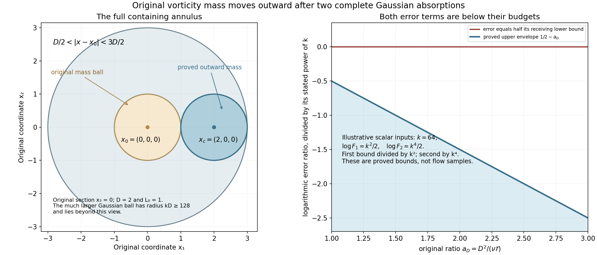
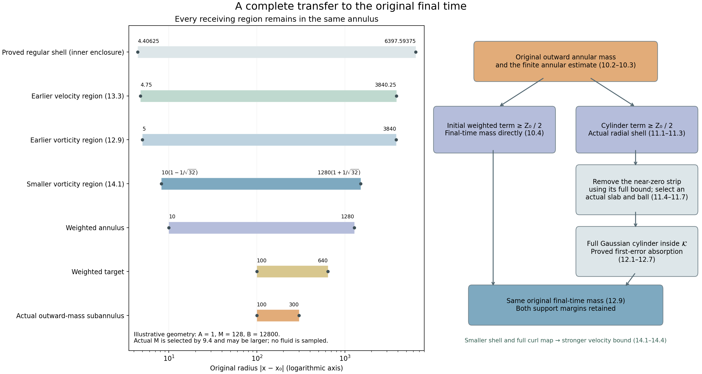

# Outward vorticity mass and the final-time transfer

The preceding lesson supplied original vorticity mass on an
actual regularity interval. We now move that mass to a distant
annulus and then to the original final time. Every use of a
weighted heat estimate includes its actual time interval,
spatial support, coefficients and complete error terms.

The first Gaussian argument has two errors to control: the
finite cylinder error and the Gaussian mass outside the
receiving ball. Both are explicitly absorbed. The resulting
outward mass enters a constructed small annulus. A second
weighted estimate gives two cases; we prove the final-time
transfer in both, including the complete time-slab and spatial
ball selection needed by the second Gaussian argument.

The final curl integration by parts gives a positive integral
of the original velocity. Its exact spatial enclosure also
gives a smaller mass shell and a strictly stronger velocity
bound. Five solved exercises retain variable error budgets,
change the longer Gaussian duration, optimize the covering
radius and initial Gaussian time, and enlarge the derivative
neighborhood to its actual available margins.

Read [Original vorticity mass and a regularity interval](original-vorticity-mass-and-a-regularity-interval.md),
[Critical velocity tails and weighted heat estimates](critical-velocity-tails-and-weighted-heat-estimates.md),
[Selecting an annulus and controlling local velocity](selecting-an-annulus-and-controlling-local-velocity.md),
and [Interior vorticity bounds on an actual annulus](interior-vorticity-bounds-on-an-actual-annulus.md)
for the complete receiving inputs.
The human comparison is Terence Tao,
[*Quantitative bounds for critically bounded solutions to the
Navier–Stokes equations*, version 2](https://arxiv.org/abs/1908.04958v2),
original author article.tex 1290–1418.

This lesson proves the complete finite transfer. The general
large critical-velocity endpoint still requires the original
annulus selection to be evaluated uniformly over its scale
family before summing the velocity integrals.

## 1. Actual intervals and the full Gaussian

Keep the original unforced equation
\[
 \partial_tu+(u\cdot\nabla)u+\nabla p=\nu\Delta u,\qquad
 \operatorname{div}u=0,\quad \omega=\nabla\times u,\quad\nu>0.
 \tag{1.1}
\]
All fields and constants are the ones constructed in
NS-FLUID-17. In particular its actual interval
\(I'=[t'-T',t']\) has \(T'>0\), and throughout that
interval and the entire original space,
\[
 \begin{gathered}
 |u|\leq \frac12\sqrt{\frac{\nu}{C_0T'}},\qquad
 |\nabla u|\leq\frac1{2C_0T'},\qquad C_0\geq2,\\
 |\omega|\leq\Omega:=X_6,\qquad
 |\nabla\omega|\leq G:=G_\omega,\qquad
 \int_{B(x_0,L_0)}|\omega(t,x)|^2\,dx\geq E_0>0 .
 \end{gathered}
 \tag{1.2}
\]
Here \(L_0=(LB+2R/q)\sqrt S\) and
\(E_0=b^2q/(4C_K^2\sqrt S)\) are the actual
original-center mass data, not a newly postulated
regularity or concentration assumption.

Fix once and for all the physical duration
\(\mathcal T=T'/2\). For every actual endpoint
\(t_e\in[t'-T'/4,t']\), the interval
\([t_e-\mathcal T,t_e]\) lies inside \(I'\):
its earliest possible time is \(t'-3T'/4\).
For any spatial center \(x_c\), set
\[
 D=|x_c-x_0|,\qquad
 {\cal U}(s,y)=\omega(t_e-s,x_c+y),\quad0\leq s\leq\mathcal T.
 \tag{1.3}
\]
The complete reversed vorticity equation is

\[
(\partial_s+\nu\Delta_y){\cal U}
=u(t_e-s,x_c+y)\cdot\nabla_y{\cal U}
-{\cal U}\cdot\nabla u(t_e-s,x_c+y)
\]

1.2 consequently gives the finite Gaussian
differential inequality with zero residual on
every finite spatial ball, at the unchanged
viscosity \(\nu\) and duration \(\mathcal T\).
For example
\(|u|\leq\sqrt{\nu/(C_0\mathcal T)}\) and
\(|\nabla u|\leq(C_0\mathcal T)^{-1}\), since
\(\mathcal T=T'/2\). All constants are uniform
in \(t_e\) and \(x_c\).

## 2. Constants for the two error bounds

Use exactly the smooth cutoff of NS-FLUID-10 (4.1):
\[
 \begin{gathered}
 b_{\rm cut}(s)=
 \begin{cases}e^{-1/s},&s>0,\\0,&s\leq0,\end{cases}\quad
 \chi_{\rm cut}(s)=
 \frac{b_{\rm cut}(1-s)}
 {b_{\rm cut}(1-s)+b_{\rm cut}(s-1/4)},\quad
 \theta_{\rm cut}(s)=\chi_{\rm cut}(s^2)\ (s\geq0),\\
 \beta_1=\|\theta_{\rm cut}'\|_\infty,\quad
 \beta_2=\|\theta_{\rm cut}''\|_\infty,\quad
 d_B=\beta_2+4\beta_1,\\
 K_B=\max\{9+3d_B^2/4000^2,\ 9+12\beta_1^2/4000\},
 \qquad J_B=\max\{2,\beta_1^2/2000\},\\
 A_G=20\,3^{3/2},\qquad
 B_G=\frac5{\mathrm e}(K_B+40J_B),\qquad v_3=4\pi/3.
 \end{gathered}
 \tag{2.1}
\]
The subscripts on the cutoff avoid confusing it
with the earlier frequency amplitude. Its full
definition and all derivative contributions are
retained. Define positive dimensionless quantities
\[
 \begin{gathered}
 Q=\Omega^2+\nu\mathcal T G^2,\\
 F_1=\frac{4000A_GB_Gv_3(\nu\mathcal T)^{3/2}Q}{E_0},
 \qquad
 F_2=\frac{8000A_G\,2^{3/2}\Omega^2
                    (4\pi\nu\mathcal T/2000)^{3/2}}{E_0},\\
 \log_+z=\max\{0,\log z\}\quad(z>0),\\
 k=\max\{64,\sqrt{\log_+F_1},(\log_+F_2)^{1/4}\},\\
 B_k=2000+25k^2(1+4\log k).
 \end{gathered}
 \tag{2.2}
\]
Both mass and the original smooth bounds make
\(\Omega>0\), \(Q>0\), so all logarithms have
positive arguments. Any larger value of \(k\)
also satisfies the two inequalities used below.

Assume \(D\geq\max\{L_0,\sqrt{\nu\mathcal T}\}\)
and choose actual finite parameters
\[
 r=kD,\qquad \tau=\mathcal T/2000,\qquad
 \varepsilon=\tau/k^4,\qquad
 a_D=\frac{D^2}{\nu\mathcal T}\geq1.
 \tag{2.3}
\]
These choices obey
\(r^2\geq4096\nu\mathcal T\geq4000\nu\mathcal T\)
and \(0<\varepsilon\leq\tau<\mathcal T/1000\).
Also \(D+L_0\leq2D\leq r/2\), so the complete
original mass ball lies in \(B(x_c,r/2)\).
The scalar ratio \(a_D\) is used only to compare
the following original exponents; no field or
coordinate has been replaced.

## 3. The finite Gaussian estimate

Its full quantities, including the original
gradient term and Gaussian normalization, are
\[
 \begin{aligned}
 X&=\int_0^{\mathcal T}\int_{|y|\leq r}
       (\mathcal T^{-1}|{\cal U}|^2+
                         \nu|\nabla_y{\cal U}|^2)\,dy\,ds,\\
 Y&=\int_{|y|\leq r}|{\cal U}(0,y)|^2
      (4\pi\nu\varepsilon)^{-3/2}
                         e^{-|y|^2/(4\nu\varepsilon)}\,dy,\\
 I_G&=\int_\tau^{2\tau}\int_{|y|\leq r/2}
       (\mathcal T^{-1}|{\cal U}|^2+
                    \nu|\nabla_y{\cal U}|^2)
                             e^{-|y|^2/(4\nu s)}\,dy\,ds .
 \end{aligned}
 \tag{3.1}
\]
The finite theorem, with its residual exactly zero,
is
\[
 I_G\leq A_GB_G e^{-r^2/(500\nu\tau)}X
       +A_G(4\pi\nu\tau)^{3/2}
              (\mathrm e\tau/\varepsilon)^{r^2/(80\nu\tau)}Y.
 \tag{3.2}
\]
Its input has been verified above on the whole
actual cylinder. In particular no target integral
over \([\mathcal T/2,\mathcal T]\) is substituted
for its proved target \([\tau,2\tau]\).

Every time \(t_e-s\) in 3.1 lies in the mass
interval. Restrict the spatial integral to the
actual original ball and retain its full distance
from \(x_c\). Positivity of the gradient term
and \(s\geq\tau\) give
\[
 \begin{aligned}
 I_G&\geq\frac{\tau}{\mathcal T}E_0
                     e^{-(D+L_0)^2/(4\nu\tau)}\\
    &\geq \frac{E_0}{2000}e^{-2000a_D}
                       =:I_{\rm low}.
 \end{aligned}
 \tag{3.3}
\]
The second inequality uses the stated hypothesis
\(L_0\leq D\), after keeping the complete
\(D^2+2DL_0+L_0^2\) in the first line.
The original uniform maxima give
\[
 X\leq v_3r^3(\Omega^2+\nu\mathcal T G^2)
     =v_3 k^3(\nu\mathcal T)^{3/2}a_D^{3/2}Q .
 \tag{3.4}
\]
Both the vorticity and its gradient contribution
remain in \(Q\).

## 4. The finite cylinder error

Since \(r^2/(500\nu\tau)=4k^2a_D\), the ratio
of the first term of 3.2 to \(I_{\rm low}/2\)
is at most
\[
 F_1k^3a_D^{3/2}
                   e^{-(4k^2-2000)a_D}.
 \tag{4.1}
\]
Here are complete elementary comparisons for
the actual parameter range. For \(k\geq64\),
\(\log k\leq k/8\): at \(64\) this follows
from \(\mathrm e^8>2^8>64\), and the derivative
of \(k/8-\log k\) is \(1/8-1/k>0\).
It follows that \(3\log k\leq k^2/2\).
For \(a_D\geq1\), \(\log a_D\leq a_D\).
Because \(a_D\geq1\), 4.1 is therefore at most
\[
 F_1e^{-((7/2)k^2-4003/2)a_D}
       \leq F_1e^{-k^2a_D}\leq1 .
 \tag{4.2}
\]
The middle inequality uses \(5k^2\geq4003\),
which holds at \(k=64\) and thereafter.
For the last, \(k^2\geq\log_+F_1\) and
\(a_D\geq1\). Thus the first term of 3.2 is
at most half the actual proved lower bound.

Subtract that term in 3.2 and keep the full
second coefficient. Since
\(r^2/(80\nu\tau)=25k^2a_D\) and
\(\mathrm e\tau/\varepsilon=\mathrm e k^4\),
we obtain
\[
 Y\geq
 \frac{E_0}{4000A_G(4\pi\nu\tau)^{3/2}}
        e^{-[2000+25k^2(1+4\log k)]a_D}
 =:Y_{\rm low}.
 \tag{4.3}
\]
All powers of \(k\), time and viscosity from
the original Gaussian coefficient are explicit.

## 5. The Gaussian exterior at the endpoint

Split the original \(Y\) integral at the actual
radius \(D/2\) about \(x_c\). Its exterior
part is at most
\[
 \begin{aligned}
 Y_{\rm out}
 &\leq \Omega^2\int_{|y|\geq D/2}
       (4\pi\nu\varepsilon)^{-3/2}
                           e^{-|y|^2/(4\nu\varepsilon)}\,dy\\
 &\leq 2^{3/2}\Omega^2
                           e^{-D^2/(32\nu\varepsilon)}
  =2^{3/2}\Omega^2e^{-(125/2)k^4a_D}.
 \end{aligned}
 \tag{5.1}
\]
For the second line split the exponential into
two identical factors with denominator
\(8\nu\varepsilon\). On this exterior set one
factor is at most \(e^{-D^2/(32\nu\varepsilon)}\);
the integral of the other, with the original
prefactor, is exactly \(2^{3/2}\).

The retained exponent \(B_k\) is bounded for
our actual \(k\) by
\[
 B_k
 \leq2000+25k^2+\frac{25}{2}k^3
 \leq\frac34 k^4 .
 \tag{5.2}
\]
The first inequality uses \(\log k\leq k/8\).
For the second, each of its three summands is
at most \(k^4/4\): respectively \(k^4\geq8000\),
\(k^2\geq100\), and \(k\geq50\). All hold
for \(k\geq64\). Thus
\((125/2)k^4-B_k\geq(247/4)k^4\geq k^4\).
Dividing 5.1 by \(Y_{\rm low}/2\), using
the exact \(F_2\) in 2.2, now gives
\[
 \frac{Y_{\rm out}}{Y_{\rm low}/2}
 \leq F_2e^{-[(125/2)k^4-B_k]a_D}
 \leq F_2e^{-k^4a_D}\leq1.
 \tag{5.3}
\]
The last step uses \(k^4\geq\log_+F_2\).
Hence the Gaussian mass inside \(B(x_c,D/2)\)
is at least \(Y_{\rm low}/2\).
Its actual heat kernel is at most
\((4\pi\nu\varepsilon)^{-3/2}\), so
\[
 \begin{aligned}
 \int_{B(x_c,D/2)}|\omega(t_e,x)|^2\,dx
 &\geq (4\pi\nu\varepsilon)^{3/2}Y_{\rm low}/2\\
 &=\frac{E_0}{8000A_G k^6}
                   e^{-B_kD^2/(\nu\mathcal T)}.
 \end{aligned}
 \tag{5.4}
\]
The factor \(k^{-6}\) is the full ratio
\((\varepsilon/\tau)^{3/2}\). No Gaussian
prefactor, outer integration contribution,
velocity-gradient input or mixed center term
has been lost.

## 6. Original annular mass on a time slab

The proof is uniform for every
\(t_e\in[t'-T'/4,t']\). Fix an actual
radius \(\mathcal R\geq
\max\{L_0,\sqrt{\nu T'/2}\}\), and choose
\(x_c=x_0+\mathcal R e_1\), where \(e_1\)
is the first original coordinate unit vector.
The triangle inequality in both directions
gives the exact inclusion
\[
 B(x_c,\mathcal R/2)
 \subset\{x:\mathcal R/2<|x-x_0|<3\mathcal R/2\}.
 \tag{6.1}
\]
In particular the outer annulus radius is
\(3\mathcal R/2\). Integrating 5.4 over
the same actual quarter-length endpoint slab
proves
\[
 \int_{t'-T'/4}^{t'}\int_{\mathcal R/2<|x-x_0|<3\mathcal R/2}
       |\omega(t,x)|^2\,dx\,dt
 \geq\frac{E_0T'}{32000A_G k^6}
                    e^{-2B_k\mathcal R^2/(\nu T')}.
 \tag{6.2}
\]
This is the original vorticity on an actual
space-time region. It is not mass of a projected
field or a comparison heat flow.

## 7. Constants uniform in the selected scale

For later scale sums we now make the constants
independent of the selected frequency and its
scale. Retain all original iteration constants
\(b,q,\beta,h,L,B,R,C_K\), and write
\[
 E_c=\frac{b^2q}{4C_K^2},\quad
 \ell=hN^{-2},\quad
 T'=\vartheta\ell,\quad
 \Omega_c=\ell X_6,\quad G_c=\ell^{3/2}G_\omega.
 \tag{7.1}
\]
NS-FLUID-17 (13.2)–(13.5) proves that
\(\vartheta=\vartheta(U,\nu,C_0)>0\),
\(\Omega_c\) and \(G_c\) are independent
of \(\ell\). They are their exact full
expressions from the heat and Newton maps,
including every original contribution.
In the present application \(E_0=E_c/\sqrt S\)
and \(\mathcal T=\vartheta\ell/2\).
Substitution into both original \(F_i\) gives
\[
 \begin{gathered}
 F_1=F_{1,c}\sqrt{S/\ell},\quad
 F_{1,c}=\frac{4000A_GB_Gv_3(\nu\vartheta/2)^{3/2}
                 (\Omega_c^2+\nu\vartheta G_c^2/2)}{E_c},\\
 F_2=F_{2,c}\sqrt{S/\ell},\quad
 F_{2,c}=
 \frac{8000A_G\,2^{3/2}\Omega_c^2
                  (4\pi\nu\vartheta/4000)^{3/2}}{E_c}.
 \end{gathered}
 \tag{7.2}
\]
The original frequency bounds imply
\(\sqrt{S/\ell}=N\sqrt S/\sqrt h\leq\beta/\sqrt h\).
We may therefore use uniformly
\[
 \begin{gathered}
 k_*=\max\left\{64,
       \sqrt{\log_+(F_{1,c}\beta/\sqrt h)},
       [\log_+(F_{2,c}\beta/\sqrt h)]^{1/4}\right\},\\
 B_*=2000+25k_*^2(1+4\log k_*),\\
 D_*=\max\left\{LB+\frac{2R}{q},
                  \sqrt{\frac{\nu\vartheta h}{2q^2}}\right\}.
 \end{gathered}
 \tag{7.3}
\]
These satisfy both absorption inequalities for
every actual selected \(N\). If
\(\mathcal R\geq D_*\sqrt S\), then
\(\mathcal R\geq L_0\). Also
\(N\geq q/\sqrt S\) implies
\(\nu T'/2=\nu\vartheta h/(2N^2)
\leq\nu\vartheta hS/(2q^2)\), giving the
other required radius condition.

The entire endpoint slab used in 6.2 is
inside the actual mass interval, hence inside
\([t_0-S,t_0-\gamma S/2]\), by
NS-FLUID-17 (3.2). Extend only the integral
of the nonnegative original density to that
larger time interval. Since
\(T'\geq\vartheta hS/\beta^2\), 6.2 gives
the fully uniform original estimate
\[
 \begin{aligned}
 &\int_{t_0-S}^{t_0-\gamma S/2}
       \int_{\mathcal R/2<|x-x_0|<3\mathcal R/2}
                    |\omega(t,x)|^2\,dx\,dt\\
 &\qquad\geq
 \frac{b^2q\vartheta h}
      {128000A_G C_K^2\beta^2k_*^6}
       \sqrt S\,
       \exp\left(-\frac{2B_*\beta^2}{\nu\vartheta h}
                              \frac{\mathcal R^2}{S}\right)
       \quad(\mathcal R\geq D_*\sqrt S).
 \end{aligned}
 \tag{7.4}
\]
For the exponential comparison, the reciprocal
duration inequality has the correct direction:
\(1/T'\leq\beta^2/(\vartheta hS)\).
Every original radius, interval, viscosity,
frequency and amplitude factor remains explicit.

**Figure 1.** Left: the exact original-coordinate
section at \(x_3=0\), with \(D=2,L_0=1\), showing
the mass ball and the containing annulus of 6.1.
The full finite Gaussian ball has radius \(kD\geq128\)
in these geometric coordinates and extends beyond
the displayed view. Right: both proved logarithmic
error bounds 4.2 and 5.3, for illustrative
scalar choices \(\log F_1=k^2/2\) and
\(\log F_2=k^4/2\), divided by their respective
powers \(k^2,k^4\). Both upper envelopes are
\(1/2-a_D<0\) on the entire required range
\(a_D\geq1\). These are original geometric
and inequality diagrams, not a sampled fluid
solution. Reproducible sources are
[Python figure source](../assets/outward-gaussian-mass.py) and SVG supplied with the course.

## 8. Constants for the final-time transfer

Keep the original smooth unforced solution on
\([t_0-T_{\rm orig},t_0]\times\mathbb R^3\):
\[
 \partial_tu+(u\cdot\nabla)u+\nabla p=\nu\Delta u,\qquad
 \operatorname{div}u=0,\quad \omega=\nabla\times u,\quad
 \nu>0,\qquad \sup_t\|u(t)\|_3=U<\infty .
 \tag{8.1}
\]
Use the same smooth energy class as the receiving lessons, including
their original bounded \(L^2\) derivative norms. Those auxiliary
higher-derivative norms do not enter any constant below. There is an
actual frequency event at \((t_0,x_0,N_0)\), with the amplitude and all
iteration parameters of NS-FLUID-15–17. Its positive amplitude gives
\(U>0\). In Sections 1–7 use the regularity parameter \(C_0=2\), and retain
\[
 c_O=\frac{b^2q\vartheta h}
 {128000A_GC_K^2\beta^2k_*^6},\qquad
 C_O=\frac{2B_*\beta^2}{\nu\vartheta h},\qquad D_*,
 \quad A_G=20\,3^{3/2},\quad
 B_G=\frac5{\mathrm e}(K_B+40J_B).
 \tag{8.2}
\]
Here \(D_*,k_*,B_*,K_B,J_B\) are their complete expressions in
2.1 and 7.1–7.3. In particular \(c_O,C_O,D_*>0\) are independent
of the later scale \(S\). None is an assumed concentration bound.

Put \(v_3=4\pi/3\), and fix
\[
 \begin{gathered}
 C_I=250000\,\mathrm e^{1/4},\qquad K(H)=16H,\\
 C_t(H)=10+\log_+\!\big(32v_3\nu^{3/2}(K(H)+1)\big)
                         +\log(4K(H)),\\
 C_J(H)=1+C_t(H)/\log2,\qquad
 F(H)=4A_GB_Gv_3C_I\nu^{3/2}C_J(H).
 \end{gathered}
 \tag{8.3}
\]
As before \(\log_+z=\max(0,\log z)\) for \(z>0\). Let \(n_*\)
be the least integer \(n\geq27\) satisfying
\[
 \frac{2^n}{500}\geq13+\log_+F(2^n)+\frac32 n\log2,
 \qquad H=2^{n_*},\quad K=16H .
 \tag{8.4}
\]
This is a terminating finite choice. Indeed, for \(H\geq1\),
\(K(H)+1\leq17H\), so, with
\[
 c_t=10+\log_+(544v_3\nu^{3/2})+\log64,\quad
 j_0=1+c_t/\log2,\quad
 F_0=4A_GB_Gv_3C_I\nu^{3/2}(j_0+2),
 \tag{8.5}
\]
we have \(C_J(2^n)\leq j_0+2n\leq(j_0+2)(n+1)\).
Consequently the right side of 8.4 is at most
\(A_0+(5/2)n\), where \(A_0=13+\log_+F_0\); we used
\(\log(n+1)\leq n\) and \(\log2<1\).
For any integer \(n\geq\max(27,\lceil4000(A_0+3)\rceil)\),
the binomial expansion gives \(2^n\geq n(n-1)/2\), and
\[
 \frac{2^n}{500}\geq\frac{n(n-1)}{1000}
                    \geq n(A_0+3)\geq A_0+\frac52n .
\]
This proves existence and hence the least-integer choice.
No unknown annular radius occurs in this choice.

## 9. The actual common annulus and time region

Choose any actual scale in the nonempty range
\[
 \frac{\Lambda_{\rm it}}{N_0^2}\leq S
          \leq \frac{\rho_{\rm it}T_{\rm orig}}K,\qquad
 T_a=4KS,\qquad T_A=T_a/K=4S .
 \tag{9.1}
\]
Here \(\Lambda_{\rm it},\rho_{\rm it}\) are the unchanged iteration
constants of NS-FLUID-16; \(\rho_{\rm it}\leq1/32\).
If this range is empty, then already
\(T_{\rm orig}N_0^2<K\Lambda_{\rm it}/\rho_{\rm it}\).
For a scale in the range, \(8T_a=32KS\leq T_{\rm orig}\).
Thus the following entire earlier heat interval lies in 8.1:
\[
 t_b=t_0-8T_a,\qquad t_2=t_0,\qquad L=8T_a,\qquad
 \delta=T_a .
 \tag{9.2}
\]
NS-FLUID-13 selects an actual
\(t_1\in[t_0-7T_a,t_0-6T_a]\). Write \(T_J=t_0-t_1\).
Then \(6T_a\leq T_J\leq7T_a\). The small-annulus interval of
NS-FLUID-14 begins at \(t_0-7T_J/16\), which is at most
\(t_0-42T_a/16<t_0-T_a\).

Use the exact cutoff constants from NS-FLUID-10:
\[
 d_A=\beta_2+2\beta_1,\quad
 K_A=\max(9+3d_A^2/16,9+3\beta_1^2),\quad
 J_A=2+\beta_1^2/2,\quad C_A=K_A/2+2J_A .
 \tag{9.3}
\]
Define the numerical width before selecting the annulus:
\[
 \begin{gathered}
 z_0=c_O\sqrt K/2,\qquad D=1600C_O\nu K,\\
 M=\max\{128,8D,16\log_+(2K^2C_A/z_0)\},\\
 m_{\rm ann}=4,\qquad \Lambda_{\rm ann}=(100M)^{1/4}\geq2.
 \end{gathered}
 \tag{9.4}
\]
In the complete selection of NS-FLUID-13 use these actual
\(m_{\rm ann},\Lambda_{\rm ann}\), original center \(x_0\),
and \(f_a=f_b=0\). Translation of the center only replaces
\(|x|\) in its cutoffs by the actual distance \(|x-x_0|\);
Lebesgue measure, every derivative and the original equation are
unchanged. Keep all its global constants and the actual
\(t_1,W_0,M_\delta,\mathcal S,V_\delta\). Its free positive
parameters may be fixed at any finite values before the construction;
use \(c\geq8(C_3+1)\), exactly as required there.

Fix \(h_0,a_0>0\). Use the smaller heat target of NS-FLUID-14
(6.1), its full constants
\(\overline U,\overline G,\overline X,\overline G_\omega\),
and choose the tent height, here named \(h_{\rm ann}\), by
\[
 h_{\rm ann}=\max\left\{h_0,\
 \frac{\overline U^2T_a}{\nu},\
 (\overline G T_a)^4,\
 (\overline X T_a)^2,\
 \nu T_a^3\overline G_\omega^2\right\}.
 \tag{9.5}
\]
This is the independent-tolerance version of its proved (6.10).
All overlined constants are fixed before this height is chosen.
In the original minimum-radius formula include
\[
 r_{\min}=\max\{2\sqrt{\nu T_a},D_*\sqrt S/20\},\qquad
 R_0=\Lambda_{\rm ann}^2r_{\min}/10 .
 \tag{9.6}
\]
The complete finite shell selection now gives an actual \(R\),
with its unchanged bound
\(R_{\min}\leq R\leq R_{\min}\Lambda_{\rm ann}^{8(N_{\rm ann}-1)}\).
Here \(R_{\min}\) and \(N_{\rm ann}\) are the full formulas
(3.6) and (4.1) of NS-FLUID-13, evaluated at 9.2–9.6.
No assertion of smallness is substituted for that selection.

Write its actual inner and outer radii as
\[
 A=\Lambda_{\rm ann}^{-2}R,\quad B=\Lambda_{\rm ann}^2R=100MA,
 \qquad r_-=10A,\quad r_+=B/10=Mr_- .
 \tag{9.7}
\]
The selected construction gives \(D_0\leq A\), \(h_{\rm ann}\leq A\).
Its shell \(\mathcal K=\{k_-\leq|x-x_0|\leq k_+\}\) has
\[
 \begin{aligned}
 k_-&=2A+D_0+h_{\rm ann}+3A/8+h_{\rm ann}/32
                                            \leq141A/32,\\
 k_+&=B/2-D_0-h_{\rm ann}-3A/8-h_{\rm ann}/32
                                            \geq B/2-77A/32.
 \end{aligned}
 \tag{9.8}
\]
In particular
\[
 \{r_-/2\leq|x-x_0|\leq3r_+\}\subset\mathcal K .
 \tag{9.9}
\]
For the inner endpoint, \(r_-/2=5A>141A/32\).
For the outer one, \(3r_+=3B/10\leq B/2-77A/32\)
because \(B/A=100M\) and \(M\geq128\).
On \([t_0-T_a,t_0]\times\mathcal K\), the actual bounds are
\[
 |u|\leq\sqrt{\nu/T_a},\quad |\nabla u|\leq T_a^{-1},
 \quad|\omega|\leq T_a^{-1},\quad
 |\nabla\omega|\leq(\sqrt\nu\,T_a^{3/2})^{-1}.
 \tag{9.10}
\]
Each follows directly from its separate entry in 9.5 and the proved
height powers of lesson 14. The original viscosity is unchanged.

## 10. The annular estimate and its two cases

Set \({\cal U}(s,y)=\omega(t_0-s,x_0+y)\).
The full reversed equation is
\((\partial_s+\nu\Delta){\cal U}=u\cdot\nabla{\cal U}
-{\cal U}\cdot\nabla u\), with both coefficient fields evaluated
at \((t_0-s,x_0+y)\).
Apply the annular estimate of NS-FLUID-10 with duration \(T_A\),
coefficient parameter \(K\), radii \(r_-,r_+\), and zero residual.
Indeed \(KT_A=T_a\), 9.10 gives both required coefficients,
\(r_-^2\geq4\nu T_a\), and \(M\geq20\).
Retain
\[
 \begin{gathered}
 a=\frac{r_-^2}{\nu T_a}\geq4,\\
 X=\int_0^{T_A}\int_{r_-\leq|y|\leq r_+}
 e^{2|y|^2/(\nu T_a)}
       (T_A^{-1}|{\cal U}|^2+\nu|\nabla{\cal U}|^2)\,dy\,ds,\\
 Y=\int_{r_-\leq|y|\leq r_+}|\omega(t_0,x_0+y)|^2\,dy .
 \end{gathered}
 \tag{10.1}
\]
For the left side of that estimate apply 7.4 at the same original
scale \(S\) and actual outward radius \(20r_-\).
9.6 gives its required radius condition. Its spatial annulus is
\([10r_-,30r_-]\), contained in \([10r_-,r_+/2]\) because
\(M\geq60\). Its time interval
\([t_0-S,t_0-\gamma S/2]\) is contained in
\([t_0-T_A/4,t_0]\). Discarding only the nonnegative gradient
part of the target, its lower bound is
\[
 Z_0=\frac{c_O}{4\sqrt S}
             e^{-400C_Or_-^2/S}
       =\frac{z_0}{\sqrt{T_a}}e^{-Da}.
 \tag{10.2}
\]
The exact receiving inequality is therefore
\[
 Z_0\leq K^2e^{-Ma/4}\big(C_AX+3e^{2M^2a}Y\big).
 \tag{10.3}
\]
At least one of the following two conclusions holds:
\[
 \begin{aligned}
 Y&\geq\frac{z_0}{6K^2\sqrt{T_a}}
                           e^{-(D-M/4+2M^2)a},\qquad\text{or}\\
 X&\geq\frac{z_0}{2K^2C_A\sqrt{T_a}}
                           e^{(M/4-D)a}.
 \end{aligned}
 \tag{10.4}
\]
These follow by testing whether the respective two nonnegative
terms on the right of 10.3 reach \(Z_0/2\).

## 11. Selecting an actual shell, slab and ball

Suppose the second case holds. Put
\(N_r=\lceil\log_2M\rceil\), and partition \([r_-,r_+]\)
into the \(N_r\) shells with lower radii \(r_j=2^jr_-\),
\(0\leq j<N_r\), and upper radii \(\min(2r_j,r_+)\).
Boundary spheres have measure zero. For at least one shell the
weighted integral is at least \(X/N_r\). Fix it and put
\[
 r'=r_j,\qquad a'=\frac{(r')^2}{\nu T_a},\qquad
 \mathcal D=\{r'\leq|y|\leq\min(2r',r_+)\}.
 \tag{11.1}
\]
We have \(a\leq a'<M^2a\). On this shell the weight is at most
\(e^{8a'}\).
For \(M\geq128\), \(\log M\leq M/16\): at 128 use
\(\log128=7\log2<7<8\), then differentiate \(M/16-\log M\).
Also \(N_r\leq M\), \(D\leq M/8\), and
\(\log(2K^2C_A/z_0)\leq M/16\).
Consequently
\[
 \frac{z_0}{2K^2C_AN_r}e^{(M/4-D)a}
 \geq e^{(M/8)a-M/8}\geq1 .
 \tag{11.2}
\]
The original, unweighted density
\(q_A=T_A^{-1}|{\cal U}|^2+\nu|\nabla{\cal U}|^2\) thus obeys
\[
 \int_0^{T_A}\int_{\mathcal D}q_A\geq
          E'=\frac1{\sqrt{T_a}}e^{-8a'} .
 \tag{11.3}
\]

By 9.10, \(q_A\leq Q_A=(K+1)/T_a^3\). The volume of
\(\mathcal D\) is at most \(8v_3(r')^3\).
Choose the positive time
\[
 t_{\min}=\min\left\{\frac{T_A}{4},
                    \frac{E'}{32v_3(r')^3Q_A}\right\}
 =T_a\min\left\{\frac1{4K},
 \frac{e^{-8a'}}{32v_3\nu^{3/2}(K+1)(a')^{3/2}}\right\}.
 \tag{11.4}
\]
The contribution from \(0\leq s\leq t_{\min}\) is at most
\(E'/4\), leaving at least \(3E'/4\).
For the fixed values \(C_t=C_t(H)\), \(C_J=C_J(H)\) in 8.3,
\[
 t_{\min}\geq T_ae^{-C_ta'},\qquad
 J=\left\lceil\log_2(T_A/t_{\min})\right\rceil\geq2,
 \quad J\leq C_Ja' .
 \tag{11.5}
\]
To check the first inequality, use \(a'\geq1\),
\(\log a'\leq a'\), and
\(\log(32v_3\nu^{3/2}(K+1))\leq\log_+\) of that quantity.
The second entry in 11.4 is at least
\(\exp[-(19/2+\log_+(32v_3\nu^{3/2}(K+1)))a']\).
The first is at least \(\exp[-\log(4K)a']\);
both are at least \(e^{-C_ta'}\).
For \(J\), use \(\lceil x\rceil\leq x+1\) and
\(\log(T_A/t_{\min})\leq C_ta'\).

The \(J\) slabs with
\(\tau_j=T_A/2^{j+1}\), \(0\leq j<J\), cover
\([T_A/2^J,T_A]\), hence \([t_{\min},T_A]\).
One actual \(\tau=\tau_j\) satisfies
\[
 \frac{t_{\min}}2\leq\tau\leq\frac{T_A}2,\qquad
 \int_\tau^{2\tau}\int_{\mathcal D}q_A
                          \geq\frac{E'}{2J}.
 \tag{11.6}
\]
The factor \(1/2\) is weaker than the proved \(3/4\); the exact
removed part has been retained in the preceding calculation.

Let \(d=\sqrt{\nu\tau}\). A finite maximal family of points
\(y_\ell\) in the compact shell \(\mathcal D\), separated by at
least \(d\), has balls \(B(y_\ell,d)\) covering \(\mathcal D\).
Existence and finiteness follow by successively adding a point
outside the current balls: the disjoint open balls of radius
\(d/2\) lie in \(B(0,2r'+d/2)\), so this process has at most
the following finite number of steps. Since \(r'/d\geq1\),
\[
 N_b\leq(1+4r'/d)^3\leq125(r'/d)^3 .
 \tag{11.7}
\]
Summing the integrals over this cover, then using 11.6, selects
one actual center \(y_c\in\mathcal D\) with integral over
\([\tau,2\tau]\times B(y_c,d)\) at least \(E'/(2JN_b)\).
No disjointness of the covering balls is required for this last
sum; their union contains the entire original shell.

## 12. The complete second Gaussian application

Set
\[
 T_G=2000\tau,\qquad r_G=\sqrt{H\tau/T_a}\,r',
 \qquad \varepsilon=\tau,\qquad
 {\cal V}(s,z)=\omega(t_0-s,x_0+y_c+z).
 \tag{12.1}
\]
All these are actual original times and radii. The finite Gaussian
theorem is applied with coefficient parameter \(2\).
We now check all its inputs.

First \(T_G\leq1000T_a/K\leq T_a/2\).
Thus 9.10 supplies
\(|u|\leq\sqrt{\nu/(2T_G)}\) and
\(|\nabla u|\leq(2T_G)^{-1}\).
Next \(r_G^2/(\nu T_G)=Ha'/2000\geq4000\), since
\(H\geq2^{27}>8\,000\,000\) and \(a'\geq1\).
Also \(0<\varepsilon=\tau<T_G/1000=2\tau\).
Finally
\[
 r_G\leq r'/\sqrt{32}<r'/4,\qquad
 r_G/d=\sqrt{Ha'}\geq2 .
 \tag{12.2}
\]
Here \(1/\sqrt{32}<1/4\), because \(32>16\).
The center lies between radii \(r'\) and \(\min(2r',r_+)\).
The whole Gaussian ball therefore has original radial coordinates
between \(3r'/4\) and \(2r'+r'/4\), and, more sharply at the
outer boundary, at most \(r_++r'/4\leq5r_+/4\).
It lies inside the larger shell 9.9. Every coefficient bound used
above holds on the entire cylinder, including all cutoff regions.

On \(B(y_c,d)\), the target Gaussian is at least \(e^{-1/4}\)
for \(\tau\leq s\leq2\tau\). Moreover
\[
 T_G^{-1}|{\cal V}|^2+\nu|\nabla{\cal V}|^2
 \geq\frac1{1000}
       (T_A^{-1}|{\cal V}|^2+\nu|\nabla{\cal V}|^2).
 \tag{12.3}
\]
Indeed \(T_G\leq1000T_A\), and the gradient coefficient is
unchanged. Since \(d\leq r_G/2\), 11.6–11.7 give for the
actual short Gaussian target
\[
 I_G\geq I_0:=
 \frac{(\nu\tau)^{3/2}}{C_IJ(r')^3\sqrt{T_a}}e^{-8a'} .
 \tag{12.4}
\]
The full cylinder quantity in the Gaussian theorem obeys
\[
 \begin{aligned}
 X_G&=\int_0^{T_G}\int_{|z|\leq r_G}
       (T_G^{-1}|{\cal V}|^2+\nu|\nabla{\cal V}|^2)\,dz\,ds\\
 &\leq\frac{v_3r_G^3}{T_a^2}(1+T_G/T_a)
 \leq\frac{2v_3r_G^3}{T_a^2}.
 \end{aligned}
 \tag{12.5}
\]
The first error in the finite estimate is
\(A_GB_Ge^{-Ha'/500}X_G\).
Divide it by \(I_0/2\), retain all factors, and use 11.5:
\[
 \begin{aligned}
 \frac{A_GB_Ge^{-Ha'/500}X_G}{I_0/2}
 &\leq4A_GB_Gv_3C_I H^{3/2}\nu^{3/2}J(a')^3
                    e^{-(H/500-8)a'}\\
 &\leq F(H)H^{3/2}(a')^4 e^{-(H/500-8)a'}
 \leq e^{-a'}\leq1 .
 \end{aligned}
 \tag{12.6}
\]
The final comparison uses \(\log a'\leq a'\), \(a'\geq1\),
and the exact defining inequality 8.4. In particular the powers
of \(\tau\) from the cylinder volume and covering count cancel
exactly; no lower time bound was silently substituted into this
error. Every gradient and original viscosity contribution remains.

Subtracting this error leaves \(I_0/2\) for the initial Gaussian
term. With \(\varepsilon=\tau\), its full coefficient and original
heat prefactor cancel exactly:
\[
 \begin{aligned}
 A_G(4\pi\nu\tau)^{3/2}
 e^{Ha'/80}
 \int_{|z|\leq r_G}|{\cal V}(0,z)|^2
             (4\pi\nu\tau)^{-3/2}e^{-|z|^2/(4\nu\tau)}\,dz\\
 \leq A_Ge^{Ha'/80}
          \int_{B(x_0+y_c,r_G)}|\omega(t_0,x)|^2\,dx .
 \end{aligned}
 \tag{12.7}
\]
Thus that original ball mass is at least
\(I_0e^{-Ha'/80}/(2A_G)\).
For a bound independent of the selected slab and center, use
\(\tau/T_a\geq e^{-C_ta'}/2\), \(J\leq C_Ja'\), and
\((a')^{-5/2}\geq e^{-5a'/2}\). Define
\[
 \begin{gathered}
 c_Y=\frac1{2^{5/2}A_GC_IC_J},\qquad
 D_Y=\frac{21}2+\frac32C_t+\frac H{80},\qquad
 \\
 c_F=\min\{z_0/(6K^2),c_Y\},\quad
 D_F=\max\{D+2M^2,D_YM^2\}.
 
 \end{gathered}
 \tag{12.8}
\]
The second case of 10.4 therefore gives a ball mass at least
\(c_YT_a^{-1/2}e^{-D_Ya'}\), which is at least
\(c_YT_a^{-1/2}e^{-D_YM^2a}\).
The first case gives the mass on its full original annulus.
Retaining its full exponent first as in 10.4, then discarding the
favorable term \(-M/4\), proves in both cases
\[
 \boxed{\displaystyle
 \int_{r_-/2\leq|x-x_0|\leq3r_+}|\omega(t_0,x)|^2\,dx
 \geq \frac{c_F}{\sqrt{T_a}}
              \exp\!\left(-D_F\frac{r_-^2}{\nu T_a}\right)>0 .}
 \tag{12.9}
\]
This is an actual final-time conclusion from the constructed
annulus and the original frequency event.

## 13. Original velocity mass at the final time

The compact-support curl-to-velocity calculation below
now has all its actual inputs. To state the receiving value
explicitly, let
\[
 \begin{gathered}
 a_F=r_-/2=5A,\quad b_F=3r_+=3B/10,\quad
 \\
 \delta_F=A/4,\quad V_F=v_3(b_F^3-a_F^3),\quad
 \\
 E_F=\frac{c_F}{\sqrt{T_a}}e^{-D_Fa},\quad
 m_F=\sqrt{E_F/V_F},\quad
 \\
 G_F=(\sqrt\nu\,T_a^{3/2})^{-1}.
 
 \end{gathered}
 \tag{13.1}
\]
The complete \(\delta_F\)-neighborhood of
\(\{a_F\leq|x-x_0|\leq b_F\}\) lies in \(\mathcal K\).
For the inner margin,
\(a_F-\delta_F=19A/4>141A/32\).
For the outer one,
\(b_F+\delta_F=3B/10+A/4\leq B/2-77A/32\),
since \(B/A=100M\).
Hence the full first-vorticity-derivative bound \(G_F\) applies
on that neighborhood, including at the final time.

Use the fixed smooth radial nonnegative unit-mass bump
\(\varphi(y)=c_{\rm bump} e^{-1/(1-|y|^2)}\) for \(|y|<1\),
zero otherwise, used below. Retain its complete constants
\[
 \begin{gathered}
 \mu=\int|y|\varphi(y)\,dy\in(0,1),\qquad
 C_{3,\varphi}=\|\nabla\varphi\times e\|_{3/2}>0
 \quad(|e|=1),\qquad
 \\
 r_F=\min\{\delta_F,2m_F/(3G_F\mu)\}.
 
 \end{gathered}
 \tag{13.2}
\]
The added subscript distinguishes this \(C_3\)
from the earlier stretching constant.
Radial symmetry makes \(C_{3,\varphi}\) independent of the unit direction.
Continuity and 12.9 give an actual point \(x_*\) in the closed
annulus with \(|\omega(t_0,x_*)|\geq m_F\).
Take \(e\) in that actual vorticity direction. The mean-value
estimate gives

\[
\int\omega(t_0,x_*-r_Fy)\cdot e\,\varphi(y)\,dy
\geq m_F-G_F\mu r_F\geq m_F/3>0
\]

The complete compact-support curl integration by parts is
\[
 \begin{aligned}
 &\int\omega(t_0,x_*-r_Fy)\cdot e\,\varphi(y)\,dy\\
 &\qquad=-r_F^{-1}\int
 u(t_0,x_*-r_Fy)\cdot(\nabla\varphi(y)\times e)\,dy .
 \end{aligned}
\]
Hölder's inequality and the exact Jacobian \(r_F^3\) give
\[
 \boxed{\displaystyle
 \int_{a_F-\delta_F\leq|x-x_0|\leq b_F+\delta_F}
                   |u(t_0,x)|^3\,dx
 \geq \frac{r_F^6(m_F-G_F\mu r_F)^3}{C_{3,\varphi}^3}>0 .}
 \tag{13.3}
\]
Every factor, both support margins, the actual derivative bound
and the original time are retained.

## 14. A smaller shell and a stronger bound

The exact radius margin in 12.2 proves more than the coarse enclosure
used in 12.9. Keep both earlier formulas as proved comparisons and set
\[
 \sigma_G=\frac1{\sqrt{32}},\qquad
 a_\sharp=(1-\sigma_G)r_-,\qquad
 b_\sharp=(1+\sigma_G)r_+ .
 \tag{14.1}
\]
Every selected center has radius at least \(r'\) and at most \(r_+\),
and its actual Gaussian radius is at most \(\sigma_G r'\).
Thus its entire ball lies between \(a_\sharp\) and \(b_\sharp\).
The first-case annulus \([r_-,r_+]\) also lies there. Consequently
the identical lower bound \(E_F\) in 12.9 holds on this smaller
original shell, with no change to its proof, prefactor or exponent.

Its \(\delta_F=A/4\) neighborhood is still in \(\mathcal K\).
Indeed \(\sigma_G<1/4\) gives
\(a_\sharp-\delta_F>29A/4>141A/32\), and
\(b_\sharp+\delta_F<B/8+A/4\leq B/2-77A/32\);
the latter follows from \(B/A\geq85/12\), well below the actual
\(100M\). Retain the exact quantities
\[
 V_\sharp=v_3(b_\sharp^3-a_\sharp^3)<V_F,\qquad
 m_\sharp=\sqrt{E_F/V_\sharp}>m_F,\qquad
 r_\sharp=\min\{\delta_F,2m_\sharp/(3G_F\mu)\}.
 \tag{14.2}
\]
The same full compact-support curl calculation gives
\[
 \boxed{\displaystyle
 \int_{a_\sharp-\delta_F\leq|x-x_0|\leq b_\sharp+\delta_F}
                  |u(t_0,x)|^3\,dx
 \geq \frac{r_\sharp^6(m_\sharp-G_F\mu r_\sharp)^3}{C_{3,\varphi}^3}.}
 \tag{14.3}
\]
This numerical lower bound is strictly larger than the one in 13.3.
To prove that assertion, rather than inferring it merely from the
smaller volume, fix \(g=G_F\mu>0\). For each \(m>0\), the positive
part \(r^6(m-gr)_+^3\) on \(0\leq r\leq\delta_F\) has its maximum
at \(\min(\delta_F,2m/(3g))\). On \(0<r<m/g\) its derivative is
\[
 \frac{d}{dr}\big[r^6(m-gr)^3\big]
               =3r^5(m-gr)^2(2m-3gr).
 \tag{14.4}
\]
It increases up to \(2m/(3g)\) and decreases thereafter until
zero at \(m/g\); the positive part is zero beyond. At the old
maximizing radius \(r_F>0\), replacing \(m_F\) by
\(m_\sharp>m_F\) strictly increases the positive expression.
Its new maximum is at least that value. This proves the claimed
strict strengthening and identifies its exact receiving map.

**Figure 2.** The left panel evaluates the exact radial enclosures
at the illustrative geometric values \(A=1,M=128\), so \(B=12800\).
It shows the full permitted shell, final mass region, weighted annulus
and original outward-mass subannulus; the logarithmic radius axis
does not change any original coordinate. The actual \(M\) is chosen
by 9.4 and may be larger. These are geometric bounds, not a fluid
sample or a replacement for the parameter selection. The right panel
shows both complete implications 10.3–12.9 and their common original
velocity consequence 13.1–14.4. The smaller shell retains its exact
square-root endpoints; the displayed decimal labels for the earlier
rational endpoints are exact. Reproducible sources are
[Python figure source](../assets/final-time-annular-transfer.py) and SVG supplied with the course.

## 15. Five solved exercises

### Exercise 1: keep independent budgets for both outward errors

In Sections 4–5 each error received half of its available
lower bound. Let \(0<a_{\rm err},b_{\rm err}<1\). Assign the
first error at most \(a_{\rm err}I_{\rm low}\), and the second
at most \(b_{\rm err}\) times the lower bound left for \(Y\).
Derive complete finite choices and the resulting actual
ball and annulus mass. Recover the earlier half-budget result.

**Solution.** Retain the full \(F_1,F_2\), cylinder, core ball
and Gaussian from Sections 1–5. Choose
\[
 \begin{gathered}
 k_{a,b}=\max\left\{64,\
 \sqrt{\log_+\!\frac{F_1}{2a_{\rm err}}},\
 \left[\log_+\!\frac{F_2}{4b_{\rm err}(1-a_{\rm err})}
                                           \right]^{1/4}\right\},\\
 B_{a,b}=2000+25k_{a,b}^2(1+4\log k_{a,b}),\quad
 r=k_{a,b}D,\quad \tau=\mathcal T/2000,\quad
 \varepsilon=\tau/k_{a,b}^4 .
 \end{gathered}
 \tag{15.1}
\]
Every original radius and time hypothesis remains valid,
because \(k_{a,b}\geq64\). The first-error ratio to its new
budget is the expression in (4.1) multiplied by
\((2a_{\rm err})^{-1}\). The complete elementary comparisons
of (4.2) therefore make this ratio at most one.
Subtracting only that error leaves the exact lower bound
\[
 Y\geq Y_{a,b}:=
 \frac{(1-a_{\rm err})E_0}
      {2000A_G(4\pi\nu\tau)^{3/2}}
                       e^{-B_{a,b}a_D}.
 \tag{15.2}
\]
Dividing the full exterior bound (5.1) by
\(b_{\rm err}Y_{a,b}\) gives
\[
 \frac{Y_{\rm out}}{b_{\rm err}Y_{a,b}}
 \leq\frac{F_2}{4b_{\rm err}(1-a_{\rm err})}
 e^{-[(125/2)k_{a,b}^4-B_{a,b}]a_D}\leq1 .
 \tag{15.3}
\]
The final comparison uses exactly (5.2), now at \(k_{a,b}\).
Thus the complete original heat-kernel maximum yields
\[
 \int_{B(x_c,D/2)}|\omega(t_e,x)|^2\,dx
 \geq
 \frac{(1-a_{\rm err})(1-b_{\rm err})E_0}
           {2000A_Gk_{a,b}^6}e^{-B_{a,b}a_D}.
 \tag{15.4}
\]
Both losses and the full Gaussian time ratio are present.

For a constant uniform in the original scale selection,
replace \(F_i\) in (15.1) by \(F_{i,c}\beta/\sqrt h\), and
call the resulting values \(k_{a,b,*},B_{a,b,*}\).
The complete frequency comparison of Section 7 proves that
these dominate the two required logarithmic inputs for every
selected \(N\). The original radius threshold \(D_*\)
is unchanged. Integrating over the same quarter-length
endpoint slab, then the larger original time interval, gives
\[
 \begin{aligned}
 &\int_{t_0-S}^{t_0-\gamma S/2}
 \int_{\mathcal R/2<|x-x_0|<3\mathcal R/2}|\omega(t,x)|^2\,dx\,dt\\
 &\quad\geq
 \frac{(1-a_{\rm err})(1-b_{\rm err})b^2q\vartheta h}
      {32000A_GC_K^2\beta^2k_{a,b,*}^6}
       \sqrt S\,
 \exp\!\left(-\frac{2B_{a,b,*}\beta^2}{\nu\vartheta h}
                         \frac{\mathcal R^2}{S}\right),
 \quad \mathcal R\geq D_*\sqrt S .
 \end{aligned}
 \tag{15.5}
\]
Putting \(a_{\rm err}=b_{\rm err}=1/2\) recovers the
original \(k_*,B_*\), ball coefficient \(1/8000\) and
annular coefficient \(1/128000\). This parameter family
does not assert that equal budgets optimize the final bound:
the same two budgets also enter its radius and exponent.

### Exercise 2: vary the longer Gaussian duration

In Section 12 replace \(T_G=2000\tau\) by \(T_G=c\tau\).
For which \(c\) does the strict auxiliary-time requirement
hold? Give a terminating parameter choice and propagate
every changed constant through the final-time argument.

**Solution.** Keep \(\varepsilon=\tau\). The exact condition
\(\tau<T_G/1000\) is equivalent to \(c>1000\).
At \(c=1000\) equality does not meet that condition.
Fix any \(c>1000\), and replace the covering coefficient by
\[
 C_I(c)=125c\,\mathrm e^{1/4}.
 \tag{15.6}
\]
For \(H=2^n\) still set \(K=16H\), and use exactly
\(C_t(H),C_J(H)\) from (8.3). Put
\[
 \begin{gathered}
 F_c(H)=4A_GB_Gv_3 C_I(c)\nu^{3/2}C_J(H),\\
 n_c=\min\left\{n\in\mathbb Z:\ 
 n\geq\max\!\left(27,\left\lceil\log_2(4000c)\right\rceil\right),\
 \frac{2^n}{500}\geq13+\log_+F_c(2^n)+\frac32n\log2
                                  \right\},\\
 H_c=2^{n_c},\qquad K_c=16H_c .
 \end{gathered}
 \tag{15.7}
\]
This set is nonempty. The proof of (8.5) applies with
\(C_I(c)\) in place of \(C_I\); its finite \(F_0\) is
changed by that same substitution. The explicit integer
bound following (8.5), enlarged to the lower integer bound
in (15.7), still proves the defining inequality.

Reconstruct Sections 9–11 with \(H_c,K_c\), including
\(T_a=4K_cS\), the scale upper bound
\(\rho_{\rm it}T_{\rm orig}/K_c\), the actual earlier
heat start, \(z_0,D,M\), all four smallness targets,
the full shell selection, \(t_{\min}\) and \(J\).
Every one of those constants has its same complete
formula; this construction precedes the selected radius
and time slab.
Now use
\[
 T_G=c\tau,\qquad r_G=\sqrt{H_c\tau/T_a}\,r',
 \qquad \varepsilon=\tau .
 \tag{15.8}
\]
Since \(H_c\geq4000c\) and \(a'\geq1\),
\(r_G^2/(\nu T_G)=H_ca'/c\geq4000\).
Also \(K_c\geq c\), so
\(T_G\leq cT_a/(2K_c)\leq T_a/2\).
The two original coefficient inequalities follow as
before. The entire ball remains in the same original
shell, since \(r_G/r'\leq1/\sqrt{32}\); its covering
ball still lies in \(B(y_c,r_G/2)\).

The full target-density comparison is now
\[
 T_G^{-1}|{\cal V}|^2+\nu|\nabla{\cal V}|^2
 \geq\frac2c
       (T_A^{-1}|{\cal V}|^2+\nu|\nabla{\cal V}|^2),
 \tag{15.9}
\]
because \(T_G\leq(c/2)T_A\) and \(2/c<1\).
Together with the unchanged half-budget time selection
and the count 125, this gives exactly (15.6), not a
new unspecified multiplicative constant.
The full cylinder bound is
\[
 X_G\leq\frac{v_3r_G^3}{T_a^2}
                      (1+c\tau/T_a)
             \leq\frac{2v_3r_G^3}{T_a^2}.
 \tag{15.10}
\]
The error exponent \(r_G^2/(500\nu\tau)=H_ca'/500\)
and the initial exponent \(r_G^2/(80\nu\tau)=H_ca'/80\)
are unchanged in form. Consequently (12.6) and its full
time-power cancellation apply with \(F_c(H_c)\).
The final formulas (12.8)–(14.3) hold with
\[
 c_Y(c)=\frac1{2^{5/2}A_GC_I(c)C_J(H_c)},\qquad
 D_Y(c)=\frac{21}2+\frac32C_t(H_c)+\frac{H_c}{80},
 \tag{15.11}
\]
and every previously specified \(K_c,M,z_0,D,T_a\).
At \(c=2000\), the lower integer bound in (15.7)
reduces to 27 and every original constant is recovered.

### Exercise 3: optimize the covering radius with its Gaussian penalty

Keep the actual parameters and selected time slab of Sections
8–12. Replace the covering balls of radius \(\sqrt{\nu\tau}\)
by balls of radius \(\eta\sqrt{\nu\tau}\). Retain both the
changed packing count and Gaussian lower bound, and optimize
their combined effect. Does the already selected \(H\)
remain sufficient?

**Solution.** For
\[
 0<\eta\leq\sqrt H/2,\qquad d_\eta=\eta\sqrt{\nu\tau},
 \tag{15.12}
\]
we have \(d_\eta\leq r_G/2\), because \(r_G^2/(\nu\tau)=Ha'\)
and \(a'\geq1\).
Furthermore
\[
 \frac{d_\eta^2}{(r')^2}
       =\frac{\eta^2\tau}{a'T_a}
       \leq\frac{H/4}{2K}=\frac1{128}<1 .
 \tag{15.13}
\]
Thus the full packing proof applies at this radius and gives
\(N_b(\eta)\leq125(r'/d_\eta)^3\).
On its actual target ball the Gaussian is at least
\(\exp(-\eta^2/4)\). Combining these two factors with
the unchanged density and time-slab factors proves
\[
 I_G\geq I_0(\eta)=
 \frac{\eta^3e^{-\eta^2/4}(\nu\tau)^{3/2}}
                  {250000J(r')^3\sqrt{T_a}}e^{-8a'} .
 \tag{15.14}
\]
For \(f(\eta)=\eta^3e^{-\eta^2/4}\),
\[
 f'(\eta)=\eta^2e^{-\eta^2/4}(3-\eta^2/2).
 \tag{15.15}
\]
It increases up to \(\sqrt6\) and decreases thereafter;
its limit at both zero and infinity is zero.
The upper allowed radius exceeds \(\sqrt6\), since
\(H\geq2^{27}>24\). Hence the optimum is
\[
 \eta_*=\sqrt6,\qquad
 C_I^*=\frac{250000e^{3/2}}{6^{3/2}}<C_I,\qquad
 \frac{I_0(\eta_*)}{I_0(1)}
                     =6^{3/2}e^{-5/4}>1 .
 \tag{15.16}
\]
The strict inequality follows directly from \(f'>0\)
on \([1,\sqrt6)\). No rounded numerical comparison is used.

At this radius \(C_I\) decreases, so the first-error
ratio \(F(H)\) decreases. The original \(H,K\), annulus
and time selection therefore still meet the full absorption
inequality. Repeating (12.7)–(12.9) gives
\[
 c_Y^*=6^{3/2}e^{-5/4}c_Y,\qquad
 c_F^*=\min\{z_0/(6K^2),c_Y^*\}\geq c_F .
 \tag{15.17}
\]
The exponent \(D_Y\) and hence \(D_F\) are unchanged.
Use \(c_F^*\) in the identical full mass and curl formulas
to propagate the improvement. The Gaussian branch improves
strictly; the combined two-case coefficient can remain equal
when the first branch is the limiting one. A poorer arbitrary
choice of \(\eta\) need not preserve the old \(H\); the
conclusion about unchanged parameters uses the proved
inequality \(C_I^*<C_I\).

### Exercise 4: keep the initial Gaussian time variable

In Section 12 fix the same actual cylinder, target interval
and first-error bound, but take
\(\varepsilon=\zeta\tau\), \(0<\zeta\leq1\).
Derive the full resulting original mass bound and find the
best \(\zeta\) for this uniform estimate.

**Solution.** The auxiliary-time hypotheses remain valid.
The cylinder error is unchanged: its exponent involves
\(r_G^2/(500\nu\tau)\), and its constant \(B_G\) is fixed.
Set \(\chi_G=Ha'/80>0\). The complete initial term is
\[
 \begin{aligned}
 A_G(4\pi\nu\tau)^{3/2}(\mathrm e/\zeta)^{\chi_G}
 \int_{|z|\leq r_G}|{\cal V}(0,z)|^2
 (4\pi\nu\zeta\tau)^{-3/2}
                  e^{-|z|^2/(4\nu\zeta\tau)}\,dz .
 \end{aligned}
 \tag{15.18}
\]
Bounding its remaining Gaussian by one, and retaining its
complete prefactor, gives the upper bound
\[
 A_G\zeta^{-3/2}(\mathrm e/\zeta)^{\chi_G}
       \int_{B(x_0+y_c,r_G)}|\omega(t_0,x)|^2\,dx .
 \tag{15.19}
\]
The initial term is at least \(I_0/2\) after the already
proved first-error subtraction. Thus
\[
 \int_{B(x_0+y_c,r_G)}|\omega(t_0,x)|^2\,dx
 \geq\frac{I_0}{2A_G}e^{-\chi_G}
                                  \zeta^{3/2+\chi_G}.
 \tag{15.20}
\]
Its logarithmic derivative with respect to \(\zeta\) is
\((3/2+\chi_G)/\zeta>0\); the best value on the allowed
interval is \(\zeta=1\). This recovers the exact cancellation
in (12.7). This optimization concerns the proved uniform
estimate which uses the Gaussian maximum. It does not assert
an optimum for data-dependent estimates retaining the actual
weighted endpoint integral.

### Exercise 5: use the full available derivative neighborhood

Section 14 used \(\delta_F=A/4\) around the smaller mass shell.
Find a larger radius justified by the actual regular annulus,
then prove precisely when it improves the velocity lower bound.

**Solution.** Keep the exact actual endpoints \(k_-,k_+\)
of \(\mathcal K\), the smaller mass-shell endpoints
\(a_\sharp,b_\sharp\), its original mass \(E_F\), and
the derivative bound \(G_F>0\). Put
\[
 \delta_{\rm avail}
 =\min\{a_\sharp/2,\ a_\sharp-k_-,\ k_+-b_\sharp\}.
 \tag{15.21}
\]
This radius is strictly larger than \(\delta_F\).
Indeed \(a_\sharp>(3/4)10A\) and (9.8) give
\[
 \begin{gathered}
 a_\sharp/2>15A/4>A/4,\qquad
 a_\sharp-k_->99A/32>A/4,\\
 k_+-b_\sharp>
                3B/8-77A/32>A/4 ,
 \end{gathered}
 \tag{15.22}
\]
where the last inequality uses \(B/A=100M\geq12800\).
Every point within distance \(\delta_{\rm avail}\) of the
closed mass annulus has original radial coordinate between
\(k_-\) and \(k_+\), by the triangle inequality.
Also \(\delta_{\rm avail}\leq a_\sharp/2<a_\sharp\).
Thus the full derivative bound is valid on the entire
required neighborhood, including the equality cases at
its two permitted outer boundaries.

The exact receiving radius and velocity consequence are
\[
 \begin{gathered}
 \widehat r=\min\{\delta_{\rm avail},
                      2m_\sharp/(3G_F\mu)\},\\
 \int_{a_\sharp-\delta_{\rm avail}\leq|x-x_0|
                       \leq b_\sharp+\delta_{\rm avail}}
                   |u(t_0,x)|^3\,dx
 \geq\frac{\widehat r^6
                (m_\sharp-G_F\mu\widehat r)^3}{C_{3,\varphi}^3}.
 \end{gathered}
 \tag{15.23}
\]
The complete compact-support curl proof is unchanged; only
its now-proved permissible radius has increased.
For fixed \(m_\sharp\), derivative (14.4) proves that its
positive radius expression is increasing up to
\[
 r_{\rm crit}=\frac{2m_\sharp}{3G_F\mu}.
 \tag{15.24}
\]
If \(r_{\rm crit}\leq\delta_F\), both old and new radii
are \(r_{\rm crit}\), and the numerical bounds agree.
If \(r_{\rm crit}>\delta_F\), then
\(\widehat r>\delta_F=r_\sharp\); strict increase up to
the critical radius proves a strict improvement.
The larger integration region and both of its original
support margins are displayed in (15.23); no comparison
of integrals on different regions is hidden.

## 16. Sources, receiving corrections and the remaining scale calculation

The human source is Terence Tao,
[*Quantitative bounds for critically bounded solutions to the
Navier–Stokes equations*, arXiv:1908.04958v2](https://arxiv.org/abs/1908.04958v2),
original author article.tex 1290–1418.
Sections 1–7 use the actually proved short target interval of
the finite Gaussian estimate, retain the complete off-center
core weight, and prove both errors small enough for subtraction.
The original containing annulus includes the full outer
radius from the triangle inequality.

Sections 8–14 construct the entire common annulus and longer
time domain. In the source's later Gaussian passage at
1378–1397, its duration, coefficient input, Gaussian center
and spatial enclosure require explicit receiving checks.
Section 12 supplies those checks from the actual small-annulus
construction. Its endpoint Gaussian is centered at the same
selected center as its cylinder. The entire receiving ball
lies in the displayed enclosing annulus. The final conversion
uses a vector curl test and its complete integration by parts.

The exact radius margin yields the smaller shell in Section
14. Exercise 3 strengthens the Gaussian branch by optimizing
the full covering-volume and Gaussian-weight product.
Exercise 5 uses the complete available derivative neighborhood
and proves exactly when the optimized radius increases the
velocity bound. These consequences retain the original
arguments and give their precise comparison maps; no novelty
claim is made.

The finite original transfer is now complete. For the general
endpoint, the initial annulus selection must next retain
separate original scale factors for every heat derivative
and energy coefficient. Its outer radius divided by
\(\sqrt S\) and the surviving velocity mass must be proved
uniform over the full original scale family. The geometric
shell sum can only use those bounds after they have been
established. The original viscosity, pressure, support and
time intervals remain part of that calculation.
