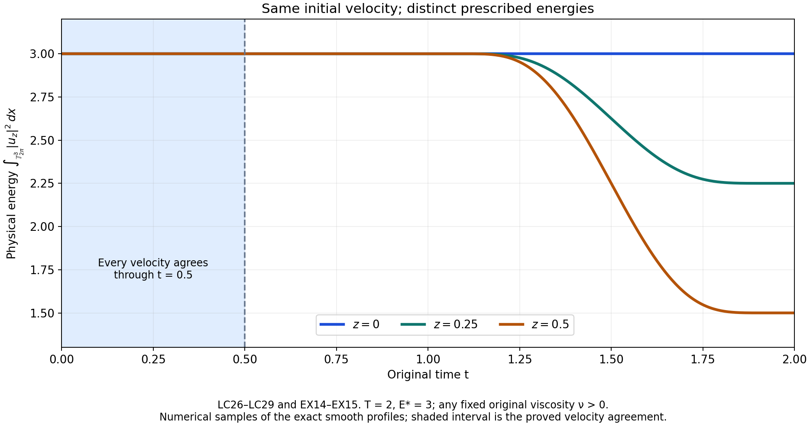
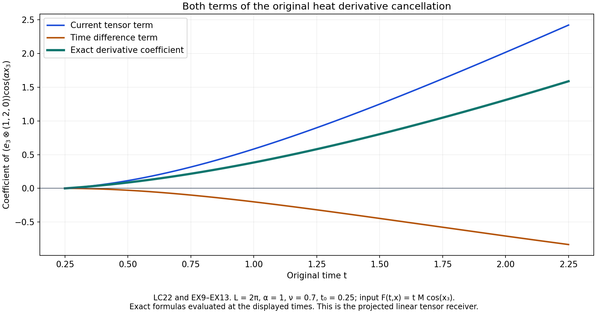

# Prescribed energy and the complete infinite weak solution

[Lesson 26](the-complete-stress-step.md) proved every finite stress
estimate. We can now finish the physical energy induction and
construct an actual infinite weak Navier–Stokes solution.

The proof starts by retaining every signed energy contribution,
then handles vanishing amplitudes and both original time endpoints.
It proves convergence, prescribed energy and the full equation
with its original pressure comparison. Explicit heat kernels
give continuous integrable vorticity. A locality calculation
then constructs different solutions with the same initial velocity.
The five solved exercises strengthen the energy threshold,
include Lipschitz energy profiles, test all pressure means and
heat signs, and construct an entire continuum of solutions.

The human source is Tristan Buckmaster and Vlad Vicol,
[*Nonuniqueness of weak solutions to the Navier–Stokes equation*,
arXiv:1709.10033v4](https://arxiv.org/abs/1709.10033v4),
original author TeX178–226,286–345 and1398–1531.
This chapter supplies the complete argument for that weak-solution
construction using the preceding lessons. Its separate
vanishing-viscosity theorem remains the next source comparison.
No smooth unforced blowup or Leray–Hopf nonuniqueness is claimed.

The physical torus has period \(L\), volume \(V=L^3\) and
frequency unit \(\alpha=2\pi/L\). We retain the original condition
\(V\geq1/(50\sqrt3)\) from SC12, which includes the source
period \(L=2\pi\), and the complete fixed positive viscosity
\(\nu>0\). The force is zero. Every norm uses the physical,
unaveraged Lebesgue integral. All constants below are defined
in the complete proofs of the preceding chapters.

IC, IK and OS refer to
[lesson 23](the-full-intermittent-correction-and-residual.md);
SC and AB to
[lesson 24](mollification-stress-cutoffs-and-energy.md);
VC, PL and VD to
[lesson 25](the-complete-velocity-step.md);
SM, SP and ST to lesson 26. EE and LC are the two successive
parts of the present proof.
The source's half-strength interpolation exponent and printed
mild-form sign are compared explicitly in LC1 and LC6.
The original author's statements remain identifiable.
This is author self-checked exposition; no independent review
or novelty is asserted.

## EE1. Exact parameters, energy and all receiving constants

Use the actual finite construction of lessons 24–26 on its original
time interval, with no force, original viscosity \(\nu>0\), period
\(L\), volume \(V=L^3\) and physical frequency \(\alpha=2\pi/L\).
Keep all previous base thresholds and the parameters
\[
 \begin{gathered}
 X=\lambda_q=a^{b^q},\quad \Lambda=X^b,\quad
 \ell=X^{-20},\quad r=\Lambda^{3/4},\quad
 \sigma=\Lambda^{-15/16},\quad\mu=\Lambda^{5/4},\\
 b\in16\mathbb N,\quad b\geq976,\quad
 \theta=\frac1{64b^2},\quad\varepsilon_R=\frac1{64b},\quad
 p=\frac{128b}{128b-1},\\
 \delta=\delta_{q+1}=\lambda_1^{3\theta}X^{-2\theta b},
 \qquad
 \delta'=\delta_{q+2}=\lambda_1^{3\theta}X^{-2\theta b^2}.
 \end{gathered}
 \tag{EE1}
\]
For \(976\leq b<1024\), the stress threshold is the proved lesson 26
EX10, or its stronger EX15–EX18, rather than the convenient
exponent-three threshold ST26. ST30 and every earlier requirement
remain on the same base. The old fields satisfy AB5.

Use the original energy quantities \(D,H,I_0,\rho,b_0,\rho_0\)
from AB5–AB11, and write
\[
 Z=D-H-\delta'/2,\quad
 \rho=\frac{Z_+}{3I_0},\quad
 b_0=\sqrt{\rho}*_t\varphi_\ell,\quad
 \rho_0=b_0^2,\quad
 C_Z=M_e+2V+C_TV .
 \tag{EE2}
\]
Here \(C_T,C_\rho\) are exactly AB6 and AB11. The actual
nonnegative time kernel in AB15 has support \([-1,1]\), is strictly
positive on \((-1,1)\), and has mass one. Thus its actual \(R_t=1\).
AB7 gives the full Lipschitz estimate
\[
 |Z(t)-Z(s)|
 \leq |t-s|(M_e+2VX^8+C_TVX^{10}),\qquad
 \ell\,\operatorname{Lip}(Z)\leq C_ZX^{-10}.
 \tag{EE3}
\]
The last inequality keeps the three terms before using \(X\geq1\).
AB10–AB11 also give
\[
 |\rho_0-\rho|\leq C_\rho X^{-39/4},\qquad
 I_0\leq V .
 \tag{EE4}
\]
All time windows in this section remain within the interval where
the old induction holds. EE8 below constructs a common whole-line
domain for every iterate, so this condition does not leave an
endpoint operation undefined.

## EE2. The negative excess when the smoothed amplitude is positive

Suppose \(\rho_0(t)>0\). Then \(b_0(t)>0\), so the nonnegative
integral defining \(b_0\) contains a point \(s\) with
\(|s-t|<\ell\) and \(\rho(s)>0\). Indeed if \(\rho\) vanished at
every such point the whole integral would be zero. By EE2,
\(Z(s)>0\). If \(Z(t)<0\), subtracting these two values and using
EE3 gives \(-Z(t)\leq C_ZX^{-10}\); if \(Z(t)\geq0\), its negative
part is zero. Consequently
\[
 |\min\{Z(t),0\}|\leq C_ZX^{-10}
              \quad\hbox{whenever }\rho_0(t)>0.
 \tag{EE5}
\]
This uses the actual positive-part coefficient and its actual
smoothing window, including the case \(\rho(t)=0<\rho_0(t)\).

## EE3. The complete principal transport cross term

Write \(U=u_\ell+w\), \(w=w^{(p)}+c\), \(c=w^{(c)}+z\), as in ST3.
For one signed label the integrand in
\(\int u_\ell\cdot w^{(p)}\) is
\[
 (a_I\,u_\ell\cdot B_I)\,
          \eta_Ie^{i\varkappa\zeta_I\cdot x},\qquad
 \varkappa=\alpha\Lambda .
 \tag{EE6}
\]
The original carrier gap in IB15 is
\(\varkappa(1-\sqrt3\sigma N_\Lambda r)\).
The actual separation threshold VC8 makes
\(\sqrt3\sigma N_\Lambda r<c_\Lambda/2\leq1/2\).
Thus that gap is at least \(\varkappa/2\).
The exact physical norms are \(|B_I|=1\) and
\(\|\eta_I\|_1\leq\sqrt V\|\eta_I\|_2=V\).
The complete amplitude product derivative satisfies
\[
 \|D_x(a_I\,u_\ell\cdot B_I)\|_\infty
 \leq K_1X^{24}+K_0X^9 .
 \tag{EE7}
\]
Here the two terms respectively differentiate \(a_I\) and \(u_\ell\);
their original bounds are \(K_1X^{20},K_0X^5\) and
\(\|u_\ell\|_{C^1}\leq X^4\).
Let \(T^{\rm IK}_1=C^{\rm IK}_1/(1-2^{-1})\), with the full
amplitude-tail integral specified in IK13–IK16.
The exact oscillatory mean lemma, lesson 23 EX14, applied with
this gap and with \(N=1\), then summed over all \(12C_IX\) signed
labels, gives
\[
 \begin{aligned}
 \left|\int u_\ell\cdot w^{(p)}\right|
 &\leq\frac{48C_IVT^{\rm IK}_1}{\alpha}
                      (K_1X^{25}+K_0X^{10})\Lambda^{-1}\\
 &\leq C_PX^{-6},\qquad
 C_P=\frac{48C_IVT^{\rm IK}_1}{\alpha}(K_1+K_0).
 \end{aligned}
 \tag{EE8}
\]
Both powers in the first line are bounded by \(X^{-6}\) already
for \(b\geq512\). This applies to the full actual mean; it does not
assume that the variable-amplitude principal correction is mean zero.

## EE4. Both corrections and every quadratic energy contribution

Retain the stronger actual correction bound VC19 before replacing
its source prefactor. Substitution of the full \(\sqrt\delta\) gives
\[
 \begin{aligned}
 \|c\|_2
 &\leq C_{\rm corr}r^{3/2}\ell^{-1}\mu^{-1}
       \sqrt\delta\,\lambda_1^{-3\theta/2}X^{-359/40}\\
 &=C_{\rm corr}X^{441/40-b/8-\theta b}
 \leq C_{\rm corr}X^{-2119/40},\\
 \left|\int u_\ell\cdot c\right|
 &\leq\sqrt V C_{\rm corr}X^{-1959/40}.
 \end{aligned}
 \tag{EE9}
\]
The equality retains \(r^{3/2}\); it uses
\(\sqrt\delta=\lambda_1^{3\theta/2}X^{-\theta b}\),
rather than assuming \(\delta\leq1\).
The last line uses the original \(\|u_\ell\|_2\leq\sqrt VX^4\).

With \(C_c=C_{\rm corr}(98/\sqrt{800}+1/2)\), exactly as in ST11,
Cauchy–Schwarz and the full difference of squares give
\[
 \begin{aligned}
 \left|\int|w|^2-\int|w^{(p)}|^2\right|
 &\leq\|c\|_2(\|w\|_2+\|w^{(p)}\|_2)\\
 &\leq C_c r^{3/2}\ell^{-1}\mu^{-1}
       \delta\lambda_1^{-3\theta/2}X^{-359/40}\\
 &\leq C_cX^{-2119/40}.
 \end{aligned}
 \tag{EE10}
\]
For the last line, ST11 proves
\(\delta\lambda_1^{-3\theta/2}\leq X^{-\theta b/2}\leq1\).
Before this bound the complete scalar is
\[
 2\int w^{(p)}\cdot w^{(c)}
 +2\int w^{(p)}\cdot z+\int|w^{(c)}|^2
 +2\int w^{(c)}\cdot z+\int|z|^2 .
 \tag{EE11}
\]
Thus no mixed correction or square, and no factor \(r^{3/2}\),
has been removed from the calculation. In particular this supplies
the full receiving proof needed for the source's displayed
eq:chianti, where its intermediate line no longer shows that factor.

## EE5. The complete energy error with its original prefactor

The actual principal energy identity VC4–VC9 gives
\[
 \int|w^{(p)}|^2=3\rho_0 I_0+H+\mathcal E_{\rm osc},\quad
 \mathcal E_{\rm osc}
     =2\sum_{I\ {\rm positive}}\int a_I^2(\eta_I^2-1)+2\int Q_O,
 \quad
 |\mathcal E_{\rm osc}|\leq C_{\rm vel}X^{-6}.
 \tag{EE12}
\]
Both opposite and nonopposite means remain in this expression,
with the full constant \(C_{\rm vel}\) specified in VC9.
The actual mollification error, with the original first kernel
moment \(\mathfrak m_1\), is
\[
 \Delta_{\rm moll}=\int|u_q|^2-\int|u_\ell|^2,\qquad
 |\Delta_{\rm moll}|\leq2V\mathfrak m_1X^{-12}.
 \tag{EE13}
\]
This follows by factoring the difference of squares,
using both velocity suprema at most \(X^4\), and the exact
first-moment bound \(\|u_q-u_\ell\|_\infty
\leq\mathfrak m_1\ell X^4\).
The full physical identity from lesson 24 EX13 is, without
discarding any contribution,
\[
 \begin{aligned}
 e-\int|U|^2-\delta'/2
 ={}&\min\{Z,0\}+3I_0(\rho-\rho_0)+\Delta_{\rm moll}
                      -\mathcal E_{\rm osc}\\
 &-2\int u_\ell\cdot w^{(p)}
  -2\int u_\ell\cdot c
  -\left(\int|w|^2-\int|w^{(p)}|^2\right).
 \end{aligned}
 \tag{EE14}
\]
The final parenthesis is exactly EE11. Define the complete constant
\[
 C_E=C_Z+3VC_\rho+2V\mathfrak m_1+C_{\rm vel}
                     +2C_P+2\sqrt VC_{\rm corr}+C_c .
 \tag{EE15}
\]
Every exponent on the right of EE5, EE4 and EE8–EE13 is at most
\(-6\). Therefore at every time with \(\rho_0>0\),
\[
 \left|e-\int|U|^2-\delta'/2\right|\leq C_EX^{-6},\qquad
 \frac{C_EX^{-6}}{\delta'}
   =C_E\lambda_1^{-3\theta}X^{-191/32}.
 \tag{EE16}
\]
The last equality uses the actual \(2\theta b^2=1/32\).
Add the explicit finite threshold
\[
 a\geq(4C_E)^{32/191}
 \tag{EE17}
\]
to the same original maximum and round up to a multiple of
\(N_\Lambda\). Since \(X\geq a\) and \(\lambda_1^{-3\theta}\leq1\),
this proves the complete positive-amplitude conclusion
\[
 \frac{\delta'}4\leq e(t)-\int|U(x,t)|^2\,dx
                         \leq\frac{3\delta'}4
                   \quad\hbox{if }\rho_0(t)>0.
 \tag{EE18}
\]

## EE6. Vanishing amplitude gives exact vanishing jets and a stronger energy bound

If \(\rho_0(t)=0\), then \(b_0(t)=0\). Strict positivity of the
actual averaging kernel and continuity of \(\rho\) imply
\(\rho(s)=0\) for every \(|s-t|<\ell\).
Consequently \(D(s)\leq H(s)+\delta'/2\).
The retained thresholds AB12–AB13 give
\[
 D(s)\leq\delta/800+\delta/800
       =\delta/400<\delta/100\qquad(|s-t|<\ell).
 \tag{EE19}
\]
The old vanishing induction AB5 proves
\(u_q(\cdot,s)=S_q(\cdot,s)=0\) on that full open interval.
The original convolution kernels and all their derivatives
are supported in its closure and flat at its endpoints.
Differentiating their integrals therefore proves that every
space-time derivative of \(u_\ell,S_\ell\) is zero at time \(t\).
The same argument applies to \(b_0\): each derivative is the
integral of \(\sqrt\rho\), zero on the open averaging window,
against a compactly supported derivative of its kernel.
Thus \(b_0^{(N)}(t)=0\) for every \(N\geq0\).

At the zero stress, every high cutoff vanishes on a neighborhood
by its explicit support. The low coefficient agrees there with
the original \(b_0/2\), by AB14–AB17. All amplitude jets at time
\(t\) therefore vanish, so the full principal, curl and temporal
fields and all their jets vanish there as well. The projection
operators act only in space and commute with these derivatives.
In particular \(U,\partial_tU,\Delta U\) are zero at time \(t\).
The exact stress identity ST28 then proves \(S_{q+1}(\cdot,t)=0\).

There is a stronger energy conclusion than a time-error bound.
At the same time \(t\), the already proved facts give
\(u_q=0\), \(S_\ell=0\), and all high cutoffs zero; hence
\(D(t)=e(t)\) and \(H(t)=0\). Since \(\rho(t)=0\), EE2 now gives
\[
 U(\cdot,t)=S_{q+1}(\cdot,t)=0,\qquad
 0\leq e(t)-\int|U(x,t)|^2\,dx=e(t)\leq\delta'/2
                   \quad\hbox{if }\rho_0(t)=0 .
 \tag{EE20}
\]
This uses the exact original coefficient at \(t\). No comparison
with a shifted energy value is required.

## EE7. The entire new induction and exact support consequence

Combining EE18 and EE20 proves, for every constructed time,
\[
 \begin{gathered}
 0\leq e(t)-\int|U(x,t)|^2\,dx\leq3\delta'/4\leq\delta',\\
 e(t)-\int|U(x,t)|^2\,dx\leq\delta'/100
       \quad\Longrightarrow\quad U(\cdot,t)=S_{q+1}(\cdot,t)=0 .
 \end{gathered}
 \tag{EE21}
\]
For the second line, its premise contradicts the lower bound
in EE18 unless \(\rho_0=0\), when EE20 applies.
These are exactly the next-index energy and vanishing induction.
The source sentence immediately after its positive-amplitude
lemma instead prints the previous velocity and previous energy
scale; EE18–EE21 retain the actual next index throughout.
In particular if \(e(t)=0\), then EE21 and the nonnegativity
of \(\int|U|^2\) imply \(U(\cdot,t)=0\); its vanishing conclusion
also gives \(S_{q+1}(\cdot,t)=0\).
Thus both time supports lie in the original closed support of \(e\).

## EE8. Construct one common time domain before any infinite limit

The source theorem allows every smooth nonnegative profile
\(e:[0,T]\to[0,\infty)\); it does not require compact support
in the interior. Preserve all its values by the explicit extension
\[
 e_{\rm ext}(t)=
 \begin{cases}
 e(0),&t<0,\\
 e(t),&0\leq t\leq T,\\
 e(T),&t>T.
 \end{cases}
 \tag{EE22}
\]
This function is nonnegative and bounded by the same
\(\|e\|_\infty\). It is globally Lipschitz with constant
\(\|e'\|_{L^\infty([0,T])}\): the assertion follows from the
mean-value inequality within \([0,T]\), from constancy outside,
and for an interval crossing an endpoint by subdividing there
and adding the original time lengths. No smooth nonnegative
extension is assumed. Such an assumption would exclude, for
example, the permitted original profile \(e(t)=t\) at its left
endpoint.

All preceding finite construction proofs apply to this actual
bounded nonnegative Lipschitz extension. Here is the full
regularity check. In AB7 and EE3, the energy derivative is used
only to prove a Lipschitz bound for its differences; the same
bound follows directly from EE22. The positive-part map is
one-Lipschitz. The denominator \(I_0\) is smooth and bounded below
by \(V/2\), so the exact quotient proof AB9 gives the same
Lipschitz \(\rho\). Its nonnegative square root is bounded and
continuous. Every derivative of \(b_0\) is convolution against
the corresponding integrable derivative of the actual smooth
kernel, as in AB10 and AB15. Thus \(b_0\) is smooth on the whole
line, with all the same higher derivative bounds. The smooth
low-amplitude gluing AB14–AB17 uses only \(b_0,S_\ell,\chi_0\);
the high amplitudes use only the smooth mollified stress. All
fields, residuals, pressures and their spatial/time derivatives
therefore remain smooth. No unsmoothed higher derivative of
\(e_{\rm ext}\) enters any construction or estimate. This proves
the finite step for the extension while preserving the exact
original energy profile on the closed interval.

Let \(M_e=\max\{\|e\|_\infty,\|e'\|_\infty\}\), which bounds the
same two quantities for EE22 in this Lipschitz sense, and use
\(e_{\rm ext}\) in every time convolution. Begin with the actual
fields \(u_0=S_0=p_0=0\) on \(\mathbb T_L^3\times\mathbb R\).
They satisfy the original unforced viscous equation exactly.
Since
\[
 \delta_1=\lambda_1^{3\theta}\lambda_1^{-2\theta}
         =a^{\theta b},
 \tag{EE23}
\]
the additional finite condition \(a\geq M_e^{1/(\theta b)}\)
ensures \(0\leq e_{\rm ext}\leq\delta_1\). The old vanishing implication
holds because both initial fields are identically zero.
All original velocity and stress derivative bounds hold as well.

At each finite step, all convolutions now use fields already
defined on the whole line. Lessons 24–26 and EE1–EE21 construct
the next smooth fields and prove every next-index estimate on
that same whole line. EE21 preserves time support inside the
closed support of the actual extension; the pressure can be specified by
its exact original formula with any spatial constant fixed.
The induction therefore never invents boundary values, shortens
the common time domain or invokes an unavailable convolution.
All constants and all base thresholds are independent of \(q\).
For the important compact-support case, if the original \(e\)
vanishes near both endpoints, EE22 is exactly its smooth zero
extension, and EE21 preserves its original compact support with
no enlargement. For general source profiles, restriction back to
\([0,T]\) retains both endpoint values and the complete
finite-step estimates.
This completes the actual finite-step energy and time-domain
construction. Convergence, the limiting pressure and nonlinear
equation, the precise limiting regularity and the nonuniqueness
conclusion still require the following argument.

## LC1. Construct the sequence and retain every amplitude factor

Use the common time domain and original parameters constructed in
EE1–EE23. At every finite step the actual fields satisfy the exact
unforced equation, the full stress bounds ST27 and ST30, the
velocity derivative bound VD25, the energy induction EE21 and the
increment bound VC21 with \(M=4\). Thus this is an already constructed
sequence, starting at \(u_0=S_0=0\), rather than an assumed family
with missing estimates. Write \(d_q=u_{q+1}-u_q\). Its complete bounds are
\[
 \begin{gathered}
 \|d_q\|_{L^\infty_tL^2_x}\leq A\lambda_{q+1}^{-\theta},
 \qquad A=4\lambda_1^{3\theta/2},\\
 \|d_q\|_{L^\infty_tH^1_x}\leq B\lambda_{q+1}^{4},
 \qquad
 \|\partial_t d_q\|_{L^\infty_tL^2_x}
                  \leq B\lambda_{q+1}^{4},
 \qquad B=2\sqrt V,\\
 s_*=\frac{\theta}{4+\theta}>0 .
 \end{gathered}
 \tag{LC1}
\]
Indeed \(\sqrt{\delta_{q+1}}
=\lambda_1^{3\theta/2}\lambda_{q+1}^{-\theta}\) exactly.
For the last two norms, the full \(C^1_{x,t}\) norms of the two
velocities sum to at most \(2\lambda_{q+1}^4\). The sum of the
spatial zeroth and first suprema bounds their \(H^1\) norm after
multiplication by \(\sqrt V\), and the time derivative is one
of the same full \(C^1\) summands.

Our original Fourier coefficients and Sobolev norms are
\[
 \begin{gathered}
 \widehat f(n)=\frac1V\int_{\mathbb T_L^3}
                  f(x)e^{-i\alpha n\cdot x}\,dx,\\
 \|f\|_{H^s}^2=V\sum_{n\in\mathbb Z^3}
                 (1+|\alpha n|^2)^s|\widehat f(n)|^2,
 \\
 \|f\|_{H^s}\leq\|f\|_2^{1-s}\|f\|_{H^1}^{s}
 \quad(0<s<1).
 \end{gathered}
 \tag{LC2}
\]
To prove the inequality, write each summand as
\((V|\widehat f|^2)^{1-s}
[V(1+|\alpha n|^2)|\widehat f|^2]^s\),
then apply the sequence Hölder inequality with exponents
\(1/(1-s),1/s\), and take square roots. Finite truncations and
monotone convergence justify the same formula for infinite sums.
Consequently, for each \(0<s<s_*\),
\[
 \|d_q\|_{L^\infty_tH^s_x}
   \leq A^{1-s}B^s\lambda_{q+1}^{-\eta_s},\qquad
 \eta_s=\theta(1-s)-4s>0 .
 \tag{LC3}
\]
The original square-root amplitude gives \(-\theta(1-s)\).
The source display eq:H:beta' uses only
\(-\theta(1-s)/2\) and concludes \(s<\theta/(8+\theta)\).
LC3 retains the full original exponent and proves the larger range.

## LC2. Uniform convergence with the exact numerical tail

For any \(\eta>0\), consecutive original terms have ratio
\(\lambda_{q+2}^{-\eta}/\lambda_{q+1}^{-\eta}
=a^{-\eta b^{q+1}(b-1)}\).
This ratio decreases with \(q\). Summing the actual geometric
majorant starting at the stated index gives
\[
 \sum_{q=m}^{\infty}\lambda_{q+1}^{-\eta}
 \leq\frac{a^{-\eta b^{m+1}}}
                  {1-a^{-\eta b^{m+1}(b-1)}}\qquad(m\geq0).
 \tag{LC4}
\]
The denominator is strictly positive because the original \(a>1\)
and \(b>1\). LC3–LC4 prove uniform convergence in \(H^s\) on the
whole time line. In particular the actual limit and its full tail obey
\[
 \begin{aligned}
 u&=\sum_{q=0}^{\infty}d_q
      =\lim_{m\to\infty}u_m\quad\hbox{in }C_b(\mathbb R;H^s),\\
 \|u-u_m\|_{L^\infty_tH^s_x}
 &\leq A^{1-s}B^s
       \frac{a^{-\eta_s b^{m+1}}}
            {1-a^{-\eta_s b^{m+1}(b-1)}},\\
 \sup_m\|u_m\|_{L^\infty_tH^s_x},\ \|u\|_{L^\infty_tH^s_x}
 &\leq M_s:=
 A^{1-s}B^s\frac{a^{-\eta_s b}}{1-a^{-\eta_s b(b-1)}}.
 \end{aligned}
 \tag{LC5}
\]
Here \(C_b\) denotes bounded continuous functions with the supremum
norm. Completeness follows by taking each pointwise \(H^s\) limit
and using the uniform Cauchy estimate; a uniform limit of continuous
functions is continuous by the triangle inequality at any time.
No further loss from \(s\) to a smaller spatial exponent is needed.
The limits obtained for different \(s<s_*\) agree by their common
uniform \(L^2\) limit.

The same original increments give a complete time estimate.
For \(0<\gamma<s_*\) and every real \(h\),
\[
 \begin{aligned}
 \|d_q(t+h)-d_q(t)\|_2
 &\leq\min\{2A\lambda_{q+1}^{-\theta},
                     B|h|\lambda_{q+1}^4\}\\
 &\leq(2A)^{1-\gamma}B^\gamma |h|^\gamma
                              \lambda_{q+1}^{-\eta_\gamma}.
 \end{aligned}
 \tag{LC6}
\]
The first bound uses either both zeroth norms or the integral of
the time derivative. The elementary inequality
\(\min\{x,y\}\leq x^{1-\gamma}y^\gamma\) follows by considering
which of the two positive numbers is smaller; zero cases follow
directly. Summing LC6 with LC4 proves
\[
 \|u(t+h)-u(t)\|_2\leq C_\gamma|h|^\gamma,\qquad
 C_\gamma=(2A)^{1-\gamma}B^\gamma
              \frac{a^{-\eta_\gamma b}}
                   {1-a^{-\eta_\gamma b(b-1)}} .
 \tag{LC7}
\]
Every original source prefactor is retained in \(A\), and the
physical volume remains in \(B\).

## LC3. Pass to the exact energy and original nonlinear equation

EE21 gives \(\|u_m(t)\|_2\leq\sqrt{M_e}\) at all times.
Uniform \(L^2\) convergence and
\(\big|\|v\|_2^2-\|w\|_2^2\big|
\leq(\|v\|_2+\|w\|_2)\|v-w\|_2\)
pass that bound and the full energy defect to the limit:
\[
 \begin{gathered}
 \int_{\mathbb T_L^3}|u(x,t)|^2\,dx=e_{\rm ext}(t),\\
 \|u_m\otimes u_m-u\otimes u\|_1
      \leq2\sqrt{M_e}\|u_m-u\|_2\longrightarrow0
                      \quad\hbox{uniformly in }t,\\
 \|S_m\|_{L^\infty_tL^1_x}
      \leq\lambda_m^{-\varepsilon_R}\delta_{m+1}
                   \longrightarrow0\qquad(m\geq1).
 \end{gathered}
 \tag{LC8}
\]
Here \(\delta_{m+1}=\lambda_1^{3\theta}\lambda_{m+1}^{-2\theta}\)
tends to zero with the original fixed base. The tensor difference
is exactly \((u_m-u)\otimes u_m+u\otimes(u_m-u)\).
Both divergence and spatial mean pass to the \(L^2\) limit by
testing with a smooth scalar gradient and with constant vectors,
respectively. The constructed velocity thus remains real,
divergence free and of zero spatial mean.

For every smooth compactly time-supported divergence-free test
vector \(\varphi\), the complete finite equation gives
\[
 \int_{\mathbb R}\int_{\mathbb T_L^3}
 \left[u_m\cdot\partial_t\varphi
       +(u_m\otimes u_m):\nabla\varphi
       +\nu u_m\cdot\Delta\varphi
       -S_m:\nabla\varphi\right]\,dx\,dt=0 .
 \tag{LC9}
\]
The derivative convention is \((\nabla\varphi)_{ij}=\partial_j\varphi_i\),
matching the original row divergence. Each difference in LC9 tends
to zero by LC8 or uniform \(L^2\) convergence, multiplied by the
finite time-support length and the corresponding bounded test
derivative. This proves the exact projected weak equation for \(u\),
with the same positive \(\nu\) and no force.

## LC4. Supply the full pressure space with an explicit original-period embedding

Fix \(0<s<s_*\), and put \(p_s=3/(3-s)>1\).
For a mean-zero Fourier field let \(f_j\) contain precisely
the integer modes \(2^j\leq|n|<2^{j+1}\), \(j\geq0\).
There are at most \(125\,2^{3j}\) such modes: each integer
coordinate is between \(-2^{j+1}\) and \(2^{j+1}\), and the
number of possible coordinates is at most \(5\,2^j\).
Cauchy–Schwarz with the full Parseval factor gives
\[
 \|f_j\|_\infty
       \leq(125/V)^{1/2}2^{3j/2}\|f_j\|_2,\qquad
 \|f_j\|_{2p_s}
       \leq(125/V)^{s/6}2^{sj/2}\|f_j\|_2 .
 \tag{LC10}
\]
The second inequality is the integral estimate between \(L^2\)
and the supremum norm; its exponent
\(1-1/p_s=s/3\) is exact.
On the same shell the Sobolev weight is at least
\(\alpha^s2^{sj}\). The triangle inequality followed by
Cauchy–Schwarz over all shells proves
\[
 \|f\|_{2p_s}\leq E_s\|f\|_{H^s},\qquad
 E_s=\frac{(125/V)^{s/6}\alpha^{-s}}
                       {\sqrt{1-2^{-s}}}.
 \tag{LC11}
\]
For general mean-zero \(H^s\) input, the same estimate makes its
shell sums Cauchy in \(L^{2p_s}\); their \(L^2\) limit is the
original \(f\), proving LC11 without a different representative
or a change of physical coordinates.
In particular, writing \(F_m=u_m\otimes u_m\), \(F=u\otimes u\),
\[
 \|F\|_{p_s}\leq E_s^2M_s^2,\qquad
 \|F_m-F\|_{p_s}
 \leq E_s^2(\|u_m\|_{H^s}+\|u\|_{H^s})\|u_m-u\|_{H^s}
                    \longrightarrow0 .
 \tag{LC12}
\]
Both convergence and bounds are uniform in time.

The original stress exponent is \(p_*=128b/(128b-1)\).
We have \(p_s<p_*\), because
\(s/3<\theta/12=1/(768b^2)<1/(128b)=1-1/p_*\).
ST27 and the actual SM3 projection therefore give
\[
 \|S_m\|_{L^\infty_tL^{p_s}_x}
 \leq V^{1/p_s-1/p_*}D_{p_*}
           \lambda_m^{-2\varepsilon_R}\delta_{m+1}
                 \longrightarrow0\qquad(m\geq1).
 \tag{LC13}
\]
The physical Hölder factor and full stress-projection constant
are retained.

Take the divergence of the actual finite equation.
The time and viscosity terms vanish by the proved incompressibility,
so its full original pressure, including its mean, is exactly
\[
 p_m=\chi_{S_m-F_m}+\overline{p_m},\qquad
 \chi_M=\Delta^{-1}\operatorname{div}\operatorname{div}M .
 \tag{LC14}
\]
Indeed the difference between these two sides has zero Laplacian;
its nonzero Fourier coefficients vanish, and its spatial mean is
zero by the displayed formula. Thus no pressure mode is omitted.
SM3 proves \(\|\chi_M\|_{p_s}\leq\sqrt3C_{p_s}\|M\|_{p_s}\).
LC12–LC14 show that the actual pressure gradients converge as
distributions to the gradient of the explicitly constructed field
\[
 p^c=-\chi_F+c(t),\qquad
 p_m^c=p_m+c(t)-\overline{p_m}
       =\chi_{S_m-F_m}+c(t),\qquad
 p_m^c\longrightarrow p^c\quad\hbox{in }C_b(\mathbb R;L^{p_s})
 \tag{LC15}
\]
for every fixed bounded continuous scalar \(c(t)\).
The entire original mean \(\overline{p_m}\) is recorded in LC14,
and LC15 gives the exact invertible comparison once that mean
is retained as separate scalar data. The equation changes by the
gradient of \(c-\overline{p_m}\), which is exactly zero.
No convergence of the original mean sequence is asserted.
Using the full finite weak equation with arbitrary smooth vector
tests, LC8 and LC15 now prove
\(\partial_tu+\operatorname{div}(u\otimes u)+\nabla p^c-\nu\Delta u=0\)
in distributions. This constructs a pressure with every allowed
specified mean and proves its exact relation to all finite pressures.

## LC5. Construct the heat kernels needed for actual integrable vorticity

We next prove the vorticity assertion without an unproved endpoint
maximal-regularity estimate. For \(r>0\), define the original
periodic heat kernel and full derivative constants by
\[
 \begin{gathered}
 G_r(y)=(4\pi r)^{-3/2}e^{-|y|^2/(4r)},\qquad
 H_r(x)=\sum_{z\in\mathbb Z^3}G_r(x+Lz),\\
 P_{\varnothing}(y)=1,\qquad
 P_{Jj}(y)=\partial_jP_J(y)-\tfrac12y_jP_J(y),\\
 D_m=(4\pi)^{-3/2}
       \int_{\mathbb R^3}
       \left(\sum_{J\in\{1,2,3\}^m}|P_J(y)|^2\right)^{1/2}
                        e^{-|y|^2/4}\,dy .
 \end{gathered}
 \tag{LC16}
\]
The recurrence is exactly the derivative of each Gaussian,
so it retains every coefficient and every ordered derivative.
Its polynomials make each \(D_m\) finite by Gaussian integrability.
Changing variables \(y=\sqrt r\,z\) in the actual whole-space
integral proves \(\|D^mG_r\|_1=D_mr^{-m/2}\).
Periodizing and summing over the disjoint original cells gives
\(\|D^mH_r\|_{L^1(\mathbb T_L^3)}\leq D_mr^{-m/2}\).
All derivatives converge on compact \(r>0\) intervals by the
Gaussian tail. Its integral is one, and its original Fourier
coefficient is \(V^{-1}e^{-r|\alpha n|^2}\), by unfolding the
cells and evaluating the Gaussian transform coordinate by coordinate.
Thus convolution by \(H_r\) is the original heat semigroup,
a contraction on every physical \(L^p\), and converges to the
identity in \(L^p\), \(1\leq p<\infty\), by continuous-function
density and the Gaussian approximate-identity estimate.

For a tensor \(F=(F_{bj})\) define the actual kernels
of \(H_rP\operatorname{div}\) and
\(\nabla H_rP\operatorname{div}\) by
\[
 \begin{aligned}
 (K^{(1)}_r)_{a,bj}
 &=\delta_{ab}\partial_jH_r+
                 \int_r^\infty\partial_a\partial_b\partial_jH_v\,dv,\\
 (K^{(2)}_r)_{ia,bj}
 &=\delta_{ab}\partial_i\partial_jH_r+
       \int_r^\infty\partial_i\partial_a\partial_b\partial_jH_v\,dv .
 \end{aligned}
 \tag{LC17}
\]
These improper integrals converge in \(L^1\), by LC16 with
orders three and four. At \(k=\alpha n\ne0\), their Fourier
multipliers are respectively \(ik_jP_{ab}(k)\) and
\(-k_i k_jP_{ab}(k)\), times \(e^{-r|k|^2}\);
the constant mode is zero. This follows by integrating
\(e^{-v|k|^2}\) exactly, which supplies \(1/|k|^2\).
The signs of the third and fourth derivatives give both original
terms of \(P=I-k\otimes k/|k|^2\).
In the full Hilbert norm the identity tensor in the first terms
costs \(\sqrt3\), while the remaining tensor is the full derivative
array already used in \(D_3,D_4\). Therefore
\[
 \begin{gathered}
 \|K^{(1)}_r\|_1\leq J_1r^{-1/2},
 \qquad J_1=\sqrt3D_1+2D_3,\\
 \|K^{(2)}_r\|_1\leq J_2r^{-1},
 \qquad J_2=\sqrt3D_2+D_4 .
 \end{gathered}
 \tag{LC18}
\]
The constants two and one are the exact integrals of
\(v^{-3/2}\) and \(v^{-2}\) from \(r\) to infinity.
No \(L^1\) or supremum boundedness of the isolated Leray projector
has been assumed.

## LC6. The original mild formula and its exact derivative cancellation

For any fixed original frequency \(k\ne0\), the distributional
equation just proved gives
\[
 \partial_t\widehat u(k,t)+\nu|k|^2\widehat u(k,t)
     =-iP(k)\widehat F(k,t)k .
 \tag{LC19}
\]
The right side is continuous because \(F\in C_tL^1_x\).
Multiplication by the integrating factor, followed by integration,
therefore gives the ordinary variation-of-constants formula:
distributional differentiation with continuous derivative implies
the same classical formula by subtracting its integral.
At \(k=0\) both sides are zero by the original zero mean.
For \(t>t_0\), set \(\tau=t-t_0\).
LC18 makes the corresponding physical integral converge in \(L^1\),
so equality of all Fourier coefficients proves
\[
 u(t)=H_{\nu\tau}*u(t_0)
          -\int_0^\tau K^{(1)}_{\nu r}*F(t-r)\,dr
                         \quad\hbox{in }L^1(\mathbb T_L^3).
 \tag{LC20}
\]
Equality of Fourier coefficients implies equality in \(L^1\):
convolving their difference with the heat kernel gives the
identically zero smooth Fourier series, and its \(L^1\) limit
is the original difference. The minus sign in LC20 is fixed by
LC19. The original source display eq:mild prints a plus sign
for the same row-divergence and Leray conventions.

Retain the full order-zero map, with its actual pressure part,
\[
 \begin{gathered}
 \mathcal AF=\nabla\Delta^{-1}P\operatorname{div}F
            =B_F-(Q_{ia}\chi_F)_{ia},\\
 (B_F)_{ia}=\sum_jQ_{ij}F_{aj},\\
 \|\mathcal AF\|_p\leq(C_p+3C_p^2)\|F\|_p
                      \quad(1<p<\infty).
 \end{gathered}
 \tag{LC21}
\]
This is the same full array calculation as SM1–SM3:
the first term costs \(C_p\), the trace costs \(\sqrt3C_p\),
and the Hessian applied to the scalar costs another
\(\sqrt3C_p\). Its zero mode is zero.

Subtract the exact current tensor \(F(t)\) inside the derivative
of LC20, and integrate its constant-in-time part using the original
heat multiplier. This gives, as an identity of distributions,
\[
 \begin{aligned}
 \nabla u(t)={}&\nabla H_{\nu\tau}*u(t_0)
          +\nu^{-1}\mathcal A(I-H_{\nu\tau}*)F(t)\\
 &-\int_0^\tau K^{(2)}_{\nu r}*
                            [F(t-r)-F(t)]\,dr .
 \end{aligned}
 \tag{LC22}
\]
For precision one can first integrate over \(\epsilon<r<\tau\).
The exact constant part is
\(\nu^{-1}\mathcal A(H_{\nu\tau}*-H_{\nu\epsilon}*)F(t)\);
it tends in \(L^{p_s}\) to
\(\nu^{-1}\mathcal A(H_{\nu\tau}*-I)F(t)\).
The omitted interval in LC20 tends to zero in \(L^1\) by
the \(r^{-1/2}\) bound, so its derivatives tend to zero as
distributions. These observations justify every passage to LC22.

## LC7. Complete \(L^1\) gradient and continuous vorticity

The already proved physical energy and time regularity give
\[
 \|F(t-r)-F(t)\|_1
 \leq2\sqrt{M_e}\,C_\gamma |r|^\gamma
       =:C_F|r|^\gamma,\qquad 0<\gamma<s_* .
 \tag{LC23}
\]
This uses the two original velocity norms in the exact tensor
difference, just as in LC8. LC18, LC21–LC23 and physical Hölder
now prove the full integrable derivative bound
\[
 \begin{aligned}
 \|\nabla u(t)\|_1\leq{}&
 \frac{D_1}{\sqrt{\nu\tau}}\|u(t_0)\|_1\\
 &+\frac{2V^{1-1/p_s}}{\nu}
            (C_{p_s}+3C_{p_s}^2)\|F(t)\|_{p_s}
   +\frac{J_2C_F}{\nu\gamma}\tau^\gamma .
 \end{aligned}
 \tag{LC24}
\]
The final integral is exactly
\(\int_0^\tau r^{\gamma-1}\,dr=\tau^\gamma/\gamma\).
The first term uses the scalar heat derivative acting on the
actual vector, so its product norm costs \(D_1\); it does not
require the larger general array bound in LC18.
The constant tensor part uses \(F(t)\in L^{p_s}\), proved in LC12.
This is why time cancellation and the finite-exponent projection
are both needed.

Fix a compact time interval and choose \(t_0\) strictly to its
left, available from the whole-line construction EE22.
The first term of LC22 is continuous in \(L^1\) by positive-time
heat smoothing. The second is continuous in \(L^{p_s}\) by LC12,
the bounded map LC21 and the strongly continuous heat semigroup.
For the last term, the portion \(0<r<\epsilon\) has \(L^1\) norm
at most \(J_2C_F\epsilon^\gamma/(\nu\gamma)\), uniformly in \(t\).
On the remaining compact \(r\)-range the input is continuous in
\(L^1\), the kernels have integrable bounds, and changes in the
upper endpoint contribute an integral over an interval whose
length tends to zero. Dominated convergence there and then
\(\epsilon\downarrow0\) prove \(L^1\) continuity of the full term.
Thus
\[
 \nabla u\in C(\mathbb R;L^1(\mathbb T_L^3)),\qquad
 \omega=\operatorname{curl}u\in C(\mathbb R;L^1),\qquad
 \|\omega(t)\|_1\leq\sqrt2\,\|\nabla u(t)\|_1 .
 \tag{LC25}
\]
The last pointwise bound follows by expanding each difference
\(\partial_i u_j-\partial_j u_i\) and using
\(|a-b|^2\leq2|a|^2+2|b|^2\) for its three pairs.
The derivatives in LC22 are the distributional derivatives of
the actual limiting velocity. Hence LC25 constructs its actual
vorticity, rather than a separate vector field with a norm bound.

## LC8. Prove locality in the prescribed energy before asserting nonuniqueness

Use the same original base, kernels, cutoff formulas, geometric
families and all deterministic coefficients for two prescribed
energy profiles. If their old \(u_q,S_q,e\) agree on an open time
interval \(I\), the actual spatial/time mollification makes
\(u_\ell,S_\ell\) agree at every point whose distance from the
complement of \(I\) exceeds \(\ell_q\). The high cutoffs and \(H,I_0\)
then agree there. The exact coefficient \(\rho\) uses those fields
and the old energy at the same time, so it agrees there as well.
The extra convolution defining \(b_0\) needs one further
\(\ell_q\). Thus all actual amplitudes and their derivatives,
the three corrections and \(U\) agree after a loss of
\(2\ell_q\). All spatial projections preserve equality at a
fixed time, and ST28 gives equality of the full new stress.
Pressure means cannot affect this construction, since neither
the amplitudes nor ST28 use them.
The cutoff sum is the same locally finite sum over all nonnegative
indices in both constructions. SC11 merely bounds where its terms
vanish; its upper index is not used to choose different coefficients.
The two fixed geometric families depend only on index parity.
Consequently a different stress supremum outside the interval
cannot change an amplitude or a choice of direction inside it.

Starting with the identical zero fields, induction proves
\[
 e^{(1)}=e^{(2)}\ \hbox{on }(-\infty,t_*)
 \quad\Longrightarrow\quad
 u_q^{(1)}=u_q^{(2)},\ S_q^{(1)}=S_q^{(2)}
 \ \hbox{on }\left(-\infty,t_*-2\sum_{j=0}^{q-1}\ell_j\right).
 \tag{LC26}
\]
This proves the actual relation between the two constructions,
including all time convolutions; equality of energy profiles
alone was not substituted for equality of velocities.
The same exact numerical-ratio argument as LC4 gives
\[
 2\sum_{j=0}^{\infty}\ell_j
 \leq\frac{2a^{-20}}{1-a^{-20(b-1)}}\leq4a^{-20}.
 \tag{LC27}
\]
The second inequality follows from \(a\geq2,b\geq976\).
Uniform convergence passes LC26 to the limiting velocities on
the corresponding strict interval, and continuity includes its
finite endpoint.

To obtain two solutions with nonincreasing energies and the same
initial velocity, fix the original \(T>0,E_*>0\) and use the actual
smooth bump \(b(z)=e^{-1/z}\) for \(z>0\), zero for \(z\leq0\).
Define on the whole time line
\[
 \begin{gathered}
 \psi_T(t)=b((t-T/2)(T-t)),\qquad
 h_T(t)=\frac{\int_{-\infty}^t\psi_T(s)\,ds}
                  {\int_{T/2}^T\psi_T(s)\,ds},\\
 e^{(1)}(t)=E_*,\qquad
 e^{(2)}(t)=E_*(1-h_T(t)/2).
 \end{gathered}
 \tag{LC28}
\]
The denominator is strictly positive. The full bump proof in IK2
shows smoothness and flat endpoint derivatives. We have
\(h_T=0\) up to \(T/2\), \(h_T=1\) from \(T\) onward, and
\(h_T'=\psi_T/\int\psi_T\geq0\). Thus both original energy
profiles are positive, bounded and nonincreasing, and agree
through \(T/2\). Choose a common \(M_e\) and a common base satisfying
all finite thresholds for both constructions, and additionally
\(a\geq(16/T)^{1/20}\). Then LC26–LC27 prove
\[
 u^{(1)}(t)=u^{(2)}(t)\quad(0\leq t\leq T/4),\qquad
 \int|u^{(1)}(T)|^2=E_*,\quad
 \int|u^{(2)}(T)|^2=E_*/2 .
 \tag{LC29}
\]
In particular they have exactly the same original initial
velocity and differ later. The proved energy statement here is
nonincrease of kinetic energy; it does not assert the additional
viscous dissipation inequality required of a Leray–Hopf solution.

## LC9. Complete compact-support nonuniqueness and the source conclusion

For an explicit solution with zero original initial data, set
\[
 e(t)=E_*b(t)b(T-t),\qquad E_*>0 .
 \tag{LC30}
\]
This is a smooth nonnegative function on \(\mathbb R\), positive
exactly on \((0,T)\), and flat at both endpoints. Its values and
first derivative have finite suprema. The entire construction
therefore applies. EE21 and LC8 give \(u(t)=0\) for \(t\leq0\)
and \(t\geq T\), and \(\|u(t)\|_2^2=e(t)>0\) in between.
This solution and the identically zero solution have the same
initial data and original viscosity. The nonzero one cannot
satisfy the Leray–Hopf energy inequality from time zero: that
inequality would bound its nonnegative kinetic energy plus
nonnegative viscous dissipation by the zero initial energy.

We have constructed the complete source weak solution for every
smooth nonnegative prescribed \(e\) on its original closed
interval, including arbitrary endpoint values:
\[
 \begin{gathered}
 u\in C([0,T];H^s(\mathbb T_L^3))
          \cap C^\gamma([0,T];L^2(\mathbb T_L^3)),
 \quad 0<s,\gamma<\frac{\theta}{4+\theta},\\
 \operatorname{curl}u\in C([0,T];L^1),\qquad
 \operatorname{div}u=0,\quad\overline u=0,\quad
 \int|u(x,t)|^2\,dx=e(t),\\
 \partial_tu+\operatorname{div}(u\otimes u)+\nabla p^c-\nu\Delta u=0
                 \quad\hbox{in distributions}.
 \end{gathered}
 \tag{LC31}
\]
Every statement follows from the actual finite construction and
the explicit receiving maps above. LC15 records the full pressure
comparison with all original scalar means; LC24 keeps every
viscosity and physical-period factor in the vorticity bound.
LC29 and LC30 give two exact nonuniqueness conclusions.
The original source's separate vanishing-viscosity approximation,
and the distinct forced Leray, Alpöge–Buckmaster, OpenAI and
workbench constructions, still require their own full arguments.

## Two physical examples of the proved maps

LC26–LC29 and Exercise 5 prove equality of the actual velocities
through the shaded time interval. The curves are numerical samples
of the exact energy profiles, with original \(T=2,E_*=3,L=2\pi\)
and one fixed positive \(\nu\). They do not depict velocity fields.
Every value and every support endpoint comes from EX14–EX15.

LC22 and Exercise 4 prove the exact derivative coefficient and
both contributions, with original \(L=2\pi,\alpha=1,\nu=0.7,t_0=0.25\).
This is the specified projected linear tensor receiver.
The complete tensor \(M\), pressure and input are written in
EX9–EX13; no nonlinear solution is inferred from this example.
The [reproducible figure source](../assets/original-energy-and-heat-cancellation.py)
retains the exact formulas and all original values.

Human comparison for both maps: Buckmaster–Vicol,
arXiv:1709.10033v4, original weak-solution theorem and its proof.

## Five solved exercises

### Exercise 1. Use the original prefactor in the final energy threshold

In EE16 retain every power of the original base. Find the largest
energy-error ratio over all iteration indices and the least
positive real base threshold supplied by that bound. Keep all
other construction thresholds.

**Solution.** The actual fixed first frequency is
\(\lambda_1=a^b\). Thus, with \(d_E=191/32\),
\[
 \frac{C_EX^{-6}}{\delta'}
   =C_Ea^{-3\theta b-d_Eb^q},\qquad
 \sup_{q\geq0}\frac{C_EX^{-6}}{\delta'}
   =C_Ea^{-3\theta b-d_E}.
 \tag{EX1}
\]
The equality for the supremum uses \(a>1,b>1,d_E>0\):
the sequence strictly decreases unless \(C_E=0\), when all its
terms are zero. Hence the bound is at most \(1/4\) exactly when
\[
 a\geq (4C_E)^{1/(191/32+3\theta b)}
 \tag{EX2}
\]
for a positive \(C_E\). If \(C_E=0\), it imposes no extra condition.
This improves the sufficient EE17 threshold while preserving the
same original amplitude. It does not assert optimality of the
actual energy error, whose signed terms can cancel.

Let \(A_{\rm earlier}\) be the maximum of every already proved
finite construction threshold, including the original energy
initialization \(M_e^{1/(\theta b)}\). An admissible original integer
base is exactly the following explicit choice:
\[
 a=N_\Lambda\left\lceil
 \frac{\max\{2,A_{\rm earlier},
               (4C_E)^{1/(191/32+3\theta b)}\}}{N_\Lambda}
 \right\rceil .
 \tag{EX3}
\]
Every entry is finite and independent of the iteration index.
Rounding upward preserves every earlier inequality. The new
integer remains a multiple of the actual direction denominator,
so every original carrier stays periodic.

### Exercise 2. Keep an endpoint where the prescribed energy starts linearly

For \(T>0\), take the original energy \(e(t)=t\) on \([0,T]\).
Prove that no differentiable nonnegative extension can preserve it
across zero. Construct the extension the iteration actually needs,
and determine the limiting velocity at both endpoints. Does the
same proof cover a nonnegative Lipschitz profile?

**Solution.** A differentiable nonnegative extension with value
zero at zero has a local minimum there. Its difference quotients
are nonnegative from the right and nonpositive from the left;
if the derivative exists, it must be zero. Preserving \(e(t)=t\)
would instead require right derivative one. This is a contradiction.

The exact permitted extension is
\[
 e_{\rm ext}(t)=
 \begin{cases}0,&t<0,\\t,&0\leq t\leq T,\\T,&t>T.\end{cases}
 \qquad
 \|e_{\rm ext}\|_\infty=T,\quad
 \operatorname{Lip}(e_{\rm ext})=1,\quad M_e=\max\{T,1\}.
 \tag{EX4}
\]
Its nonnegative square-root coefficient is smoothed only after
the positive part and the original denominator are formed.
EE22 proves that this produces smooth finite fields and all
required derivative bounds. LC8 then gives
\[
 u(t)=0\ (t\leq0),\qquad
 \|u(t)\|_2^2=t\ (0\leq t\leq T),\qquad
 \|u(T)\|_2^2=T .
 \tag{EX5}
\]
The equality at zero is in the actual \(L^2\) space, hence is zero
as a velocity field. No endpoint value has been replaced by a
nearby interior value.

More generally, start with any nonnegative Lipschitz function
on the original closed interval. Constant extension preserves
nonnegativity, its supremum and its Lipschitz constant, by the
subdivision argument of EE22. In AB7 and EE3 that constant supplies
the only required differences of the unsmoothed energy. The quotient
estimate for \(\rho\), every convolution derivative of \(b_0\), the
low-amplitude gluing and all high amplitudes then have the same
bounds, as proved in EE22. All remaining finite proofs and LC1–LC25
use these bounds and continuity alone. They therefore construct
the same complete solution for this larger class, with
\[
 M_e=\max\{\|e\|_\infty,\operatorname{Lip}(e)\},\qquad
 \int|u(x,t)|^2\,dx=e(t),\qquad 0\leq t\leq T .
 \tag{EX6}
\]
This is a proved extension of the exposition, not a change to
the original author's smooth-profile statement.

### Exercise 3. Recover a pressure whose original means do not converge

Give an exact smooth periodic Navier–Stokes solution for which
adding the time functions \(m\sin t\) produces a nonconvergent
pressure sequence with identical velocity. Prove the complete
mean comparison, including physical volume.

**Solution.** Fix the original \(\alpha=2\pi/L,\nu>0\), a real
constant \(A_*\), and the original interval \([0,T]\). Put
\[
 u(x,t)=A_*e^{-\nu\alpha^2t}\cos(\alpha x_3)e_1,\qquad
 S_m=0,\qquad p_m(x,t)=m\sin t .
 \tag{EX7}
\]
The velocity is divergence free and has zero spatial mean.
Its transport term is \(u_1\partial_1u=0\), and
\(\partial_tu=-\nu\alpha^2u=\nu\Delta u\).
The pressure gradient is zero. Therefore these are exact solutions
with the same positive viscosity and zero force for every integer
\(m\geq1\). The tensor \(F=u\otimes u\) has only its \(11\) entry;
it depends only on \(x_3\). Thus
\(\operatorname{div}F=0\) and \(\chi_F=0\), including its actual
constant Fourier coefficient under the specified inverse Laplacian.
For \(1\leq p<\infty\),
\[
 \overline{p_m}=m\sin t,\qquad
 \|p_m(t)\|_p=V^{1/p}m|\sin t|,\qquad
 p_m^c=p_m+c-\overline{p_m}=c(t).
 \tag{EX8}
\]
At any \(t\in(0,T)\) with \(\sin t\ne0\), the original norms
diverge. Their gradients are still identically zero.
The comparison loses no original data when the scalar mean is
retained: from \((p_m^c,\overline{p_m})\) one recovers exactly
\(p_m=p_m^c-c+\overline{p_m}\).
This explicit example demonstrates why LC15 proves convergence
after its stated mean comparison instead of asserting convergence
of every possible original pressure representative.

### Exercise 4. Check the heat cancellation on an original tensor mode

Let \(k=\alpha e_3\), \(v=(1,2,0)\) and
\[
 M=\begin{pmatrix}0&0&1\\0&0&2\\1&2&3\end{pmatrix},\qquad
 F(t,x)=tM\cos(\alpha x_3),\qquad t_0\geq0 .
 \tag{EX9}
\]
Use this tensor as input to the projected linear equation
\(\partial_t u-\nu\Delta u=-P\operatorname{div}F\),
with \(u(t_0)=0\). Compute its full solution and derivative,
and verify the sign and original viscosity in LC22.
This exercise tests the linear tensor receiver; it does not
assert that this chosen \(F\) equals \(u\otimes u\).

**Solution.** Row divergence, pressure and the degree-zero map give
\[
 \begin{gathered}
 \operatorname{div}F=-\alpha t(1,2,3)\sin(\alpha x_3),\\
 \chi_F=3t\cos(\alpha x_3),\qquad
 P\operatorname{div}F=-\alpha t v\sin(\alpha x_3),\\
 \mathcal AF=t(e_3\otimes v)\cos(\alpha x_3).
 \end{gathered}
 \tag{EX10}
\]
Here the gradient convention in the last line is
\((\nabla u)_{ia}=\partial_i u_a\), the same one as LC17–LC22.
Set \(\tau=t-t_0\) and \(c_\nu=\nu\alpha^2>0\).
The exact elementary integrals are
\[
 \int_0^\tau e^{-c_\nu r}\,dr
       =\frac{1-e^{-c_\nu\tau}}{c_\nu},\qquad
 \int_0^\tau re^{-c_\nu r}\,dr
       =\frac{1-(1+c_\nu\tau)e^{-c_\nu\tau}}{c_\nu^2}.
 \tag{EX11}
\]
They follow by differentiating the displayed antiderivatives,
or integrating the second integral by parts with its actual
endpoint terms. Consequently, with
\[
 \begin{gathered}
 J(t,\tau)=
  t\frac{1-e^{-c_\nu\tau}}{c_\nu}
       -\frac{1-(1+c_\nu\tau)e^{-c_\nu\tau}}{c_\nu^2},\\

 u=\alpha J(t,\tau)v\sin(\alpha x_3),\\
 \nabla u=\alpha^2J(t,\tau)(e_3\otimes v)\cos(\alpha x_3),
 \end{gathered}
 \tag{EX12}
\]
the initial value is zero and
\((\partial_t+c_\nu)J=t\). Thus the full linear equation is
satisfied. In LC22 its current-tensor term is
\[
 \frac{t}{\nu}(1-e^{-\nu\alpha^2\tau})
                   (e_3\otimes v)\cos(\alpha x_3).
 \tag{EX13}
\]
The remaining tensor difference is exactly
\(F(t-r)-F(t)=-rM\cos(\alpha x_3)\).
The multiplier of \(K^{(2)}_{\nu r}\) on the original \(M\) mode
is \(-\alpha^2e^{-\nu\alpha^2r}(e_3\otimes v)\).
The minus integral in LC22 therefore subtracts
\(\alpha^2\int_0^\tau re^{-\nu\alpha^2r}dr\) times the same
spatial tensor. Combining it with EX13 gives exactly EX12.
This checks both signs, both original powers of \(\alpha\), the
viscosity factor and the lower time endpoint.

### Exercise 5. Construct a continuum with the same initial velocity

Strengthen LC28–LC29 to a continuum of distinct solutions with
the same initial velocity and nonincreasing kinetic energies.
Prove that the constant positive-energy member cannot satisfy
the unforced Leray–Hopf energy inequality.

**Solution.** Use the same exact \(h_T\) as LC28 and, for
each parameter \(z\in[0,1/2]\), put
\[
 e_z(t)=E_*(1-zh_T(t)),\qquad
 M_*=\max\{E_*,(E_*/2)\|h_T'\|_\infty\}.
 \tag{EX14}
\]
Every profile is positive, smooth, nonincreasing, agrees with
\(E_*\) up to \(T/2\), and has both required bounds at most \(M_*\).
Choose one original integer base satisfying every finite
threshold for \(M_*\) and \(a\geq(16/T)^{1/20}\). Use the same
deterministic kernels, cutoff formulas and parity families for
all \(z\). At every finite stage the construction is an explicit
map of these fixed data, so it defines a field for every parameter;
no independent choice of an unspecified solution is required.
LC26–LC27 compare each of them with the \(z=0\) construction.
Uniform convergence and continuity give
\[
 u_z(t)=u_0(t)\quad(0\leq t\leq T/4),\qquad
 \|u_z(T)\|_2^2=E_*(1-z).
 \tag{EX15}
\]
If \(z\ne z'\), these terminal energies differ, so the two
velocities cannot coincide. The parameter interval is uncountable.
All members have the same original initial velocity of squared
norm \(E_*\), the same spatial mean zero and the same \(\nu>0\).
Every member has the pressure, space/time and vorticity regularity
proved in LC1–LC25.

For the member \(z=0\), assume it satisfied the Leray–Hopf
energy inequality from time zero, with its required spatial
gradient integrability. Its exact constant energy would imply
\[
 E_*+2\nu\int_0^t\|\nabla u_0(s)\|_2^2\,ds\leq E_* .
 \tag{EX16}
\]
The integral is nonnegative and \(\nu>0\), so the gradient
vanishes for almost every time. At each such time, the nonzero
Fourier coefficients of the velocity vanish, since their
derivatives are zero. Its original mean is zero as well.
Hence its energy is zero at almost every time, contradicting
the proved value \(E_*>0\).
This proves the claimed distinction using the actual constructed
member. It makes no assertion of Leray–Hopf nonuniqueness.

## Continue to the original vanishing-viscosity and forced-flow problems

The finite construction, energy induction and complete weak
limit are now proved. The pressure means have an exact comparison,
the vorticity is the actual distributional curl, and the
same-initial-velocity examples follow from proved time locality.
Exercise 2 extends the construction to nonnegative Lipschitz
energy profiles; Exercise 5 proves the continuum statement
without changing the original equation or viscosity.

The separate vanishing-viscosity theorem must next be reconstructed
with its full starting residual and actual viscosity sequence.
The Albritton–Brué–Colombo forced Leray construction,
Alpöge–Buckmaster line, OpenAI construction and workbench results
retain their own force, domain, regularity and proof requirements.
