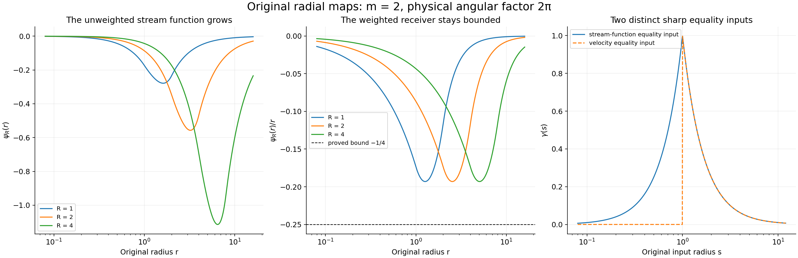
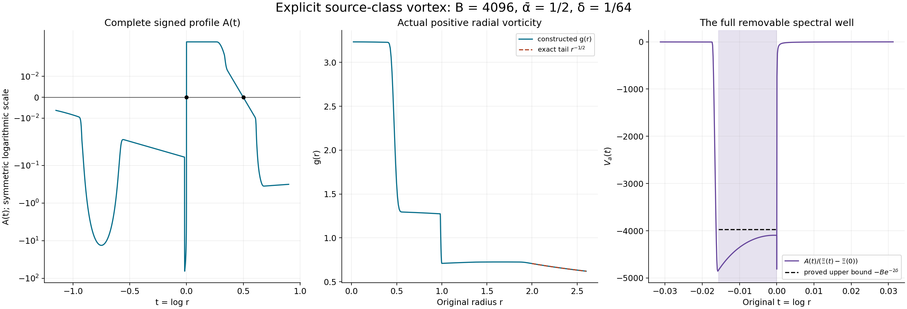

# Radial vortices and the original spectral construction

The next route to nonuniqueness starts with an unstable Euler
vortex and transfers its growth to a forced Navier–Stokes flow.
Here we construct the original radial operations and the smooth
background used in that route. We prove the exact eigenfunction
map, an arbitrarily deep self-adjoint spectral well, an integer
between its two thresholds, and quantitative cutoff estimates.
The nonreal eigenvalue itself is the next step of the argument.

[Lesson 28](the-original-vanishing-viscosity-limit.md) completed
the Buckmaster–Vicol vanishing-viscosity construction.
The present route uses different solutions and its own complete
proof. [Lesson 1](forces-energy-and-vorticity.md) supplies the original
vorticity convention; all radial inverse and spectral operations
needed in this chapter are proved below.

The human sources are Dallas Albritton, Elia Brué and Maria Colombo,
[*Non-uniqueness of Leray solutions of the forced Navier–Stokes
equations*, arXiv:2112.03116v1](https://arxiv.org/abs/2112.03116v1),
original main.tex 755–932; and Dallas Albritton, Elia Brué,
Maria Colombo, Camillo De Lellis, Vikram Giri, Maximilian Janisch
and Hyunju Kwon, [*Instability and nonuniqueness for the 2d Euler
equations in vorticity form, after M. Vishik*,
arXiv:2112.04943v4](https://arxiv.org/abs/2112.04943v4),
original general.tex 15–63 and linear-2.tex 184–294, 429–513,
1471–1556. Vishik's construction is credited through that
seven-author original TeX treatment.

The source's unweighted stream-function estimate requires a
radial weight. We give a counterexample and the complete
replacement estimate, including its sharp constant.
The original vortex has a slow tail and a circulation term;
both remain in the eigenfunction map, pressure and cutoff.
The final spectral test requires corrected inequalities and
coefficients, which are identified in VA8. Five solved exercises
give explicit equation tests, equality inputs, complete physical
tails and the sign cost of compact velocity.
This exposition has an author self-check; no independent review
or novelty claim is asserted.

## VG1. Retain the physical angular mode and its exact norm

Use the original polar coordinates
\((x_1,x_2)=(r\cos\varphi,r\sin\varphi)\) on \(\mathbb R^2\).
Fix the source integer \(m\geq2\), a nonzero integer \(k\),
the signed angular index \(j=mk\), and \(n=|j|\geq2\).
Let \(\mathcal H=L^2((0,\infty),r\,dr)\), with its actual
unaveraged radial measure, and put
\[
 \omega(r,\varphi)=g(r)e^{ij\varphi},\qquad
 \|\omega\|_{L^2(\mathbb R^2)}^2
       =2\pi\int_0^\infty|g(r)|^2r\,dr.
 \tag{VG1}
\]
This linear map is a bijection onto the corresponding closed
angular subspace. Its norm factor is exactly \(\sqrt{2\pi}\).
For \(\psi=f(r)e^{ij\varphi}\), the original equation
\(\Delta\psi=\omega\) is
\[
 f''+\frac1r f'-\frac{j^2}{r^2}f=g.
 \tag{VG2}
\]

## VG2. Construct the inverse with both radial boundary contributions

For every \(g\in\mathcal H\) and \(r>0\), define
\[
 \begin{aligned}
 A(r)&=\int_0^r s^{n+1}g(s)\,ds,\qquad
 B(r)=\int_r^\infty s^{1-n}g(s)\,ds,\\
 f(r)&=-\frac1{2n}\big[r^{-n}A(r)+r^nB(r)\big],\\
 f'(r)&=\frac12\big[r^{-n-1}A(r)-r^{n-1}B(r)\big].
 \end{aligned}
 \tag{VG3}
\]
Both integrals converge absolutely by Cauchy–Schwarz with measure
\(s\,ds\): their squared kernel integrals are
\(r^{2n+2}/(2n+2)\) and \(r^{2-2n}/(2n-2)\).
They are locally absolutely continuous, with
\(A'=r^{n+1}g\) and \(B'=-r^{1-n}g\) almost everywhere.
Differentiation cancels the two local terms and gives the stated
\(f'\). A second derivative inserted into all three terms of VG2
gives exactly \(g\), almost everywhere and distributionally on
\((0,\infty)\). Neither endpoint contribution has been discarded.

At a fixed \(r\), the kernel of \(g\mapsto f(r)/r\), relative
to \(s\,ds\), is
\[
 -\frac1{2n}\left[
 r^{-n-1}s^n\mathbf1_{s<r}
       +r^{n-1}s^{-n}\mathbf1_{s>r}\right].
 \tag{VG4}
\]
Its two summands have disjoint supports. Its complete squared
\(L^2(s\,ds)\) norm is
\[
 \frac1{4n^2}\left[\frac1{2n+2}+\frac1{2n-2}\right]
      =\frac1{4n(n^2-1)}.
 \tag{VG5}
\]
Consequently
\[
 \left\|\frac f r\right\|_\infty
       \leq c_n\|g\|_{\mathcal H},\qquad
 c_n=\frac1{2\sqrt{n(n^2-1)}}.
 \tag{VG6}
\]
This constant is sharp: at any fixed radius take \(g\)
proportional to the conjugate kernel VG4. It belongs to
\(\mathcal H\) and gives equality. Smooth compactly supported
radial data approximate that kernel in \(\mathcal H\);
the functional values converge, so the same constant is optimal
also as a supremum over that class.

The solution is unique among distributional solutions of VG2
with \(\sup_{r>0}|f(r)|/r<\infty\).
A difference solves the homogeneous equation. The exact
substitution \(r=e^t\) gives \(F''-n^2F=0\), whose distributional
solutions are \(a e^{nt}+b e^{-nt}\): factor the constant
coefficient operator and solve its first-order factors by
integrating factors. Thus the difference is \(a r^n+b r^{-n}\).
Its quotient by \(r\) is bounded at both endpoints only when
\(a=b=0\), since \(n>1\). VG3 therefore specifies the inverse,
its domain and its range condition.

## VG3. Recover the full physical velocity and its derivative norm

Keep the original convention \(\nabla^\perp=(-\partial_2,\partial_1)\).
The physical velocity is
\[
 u=\nabla^\perp\psi
    =e^{ij\varphi}\left[-\frac{ij}{r}f(r)e_r+f'(r)e_\varphi\right].
 \tag{VG7}
\]
It is divergence free and has curl \(\omega\), by VG2.
Write \(a_r=r^{-n-1}A(r)\), \(b_r=r^{n-1}B(r)\).
Since \(j/n\) is exactly \(+1\) or \(-1\), its full norm is
\[
 |u(r,\varphi)|^2
   =\frac14\big(|a_r+b_r|^2+|a_r-b_r|^2\big)
   =\frac12\big(|a_r|^2+|b_r|^2\big).
 \tag{VG8}
\]
The two functionals have disjoint supports with squared norms
\(1/(2n+2)\) and \(1/(2n-2)\).
Apply Cauchy–Schwarz on each support and retain the larger
coefficient to obtain
\[
 \|u\|_\infty\leq\frac1{2\sqrt{n-1}}\|g\|_{\mathcal H}
     =\frac1{2\sqrt{2\pi(n-1)}}\|\omega\|_2.
 \tag{VG9}
\]
This bound is sharp for a fixed angular mode: choose \(g\)
proportional to the second functional's conjugate kernel,
supported on \(s>r\). The \(a_r\) term then vanishes and the
\(b_r\) term attains its norm.

For smooth \(g\) compactly supported away from zero, \(\psi\)
is a multiple of \(r^n e^{ij\varphi}\) near zero and of
\(r^{-n}e^{ij\varphi}\) near infinity. It is smooth at the origin;
twice integrating by parts has no boundary contribution at infinity.
For each Cartesian pair,
\(\int|\partial_{ab}\psi|^2
=\int\partial_{aa}\psi\,\overline{\partial_{bb}\psi}\).
Summing all ordered pairs proves the full identity
\[
 \|\nabla u\|_2^2=\|D^2\psi\|_2^2
     =\|\Delta\psi\|_2^2
     =2\pi\|g\|_{\mathcal H}^2=\|\omega\|_2^2.
 \tag{VG10}
\]
For a general input, approximate by the preceding smooth data.
Cutting off the two radial tails and then convolving on compact
intervals proves density, since the weight there is positive
and bounded above and below. VG9 gives uniform velocity
convergence; VG10 gives convergence of gradients in \(L^2\).
Testing against compactly supported functions identifies the
limit gradient with that of VG7. Thus VG10 and both original
divergence and curl equations hold on all of \(\mathcal H\).

The angular mode also fixes the constant velocity.
The Cartesian component frequencies are \(j-1,j+1\), both
nonzero. Therefore the mean on every centered disk is zero.
If two velocities have the same curl and divergence and
gradients in \(L^2\), their gradient difference is harmonic
in distributions. Its Fourier transform is an \(L^2\) function
supported at zero, and hence vanishes. The velocity difference
is constant; the disk means force that constant to be zero.
VG7 is therefore the original Biot–Savart receiver on this
subspace, with its constant mode specified.

## VG4. An exact counterexample to the printed bound

Source main.tex 875 asserts a bound of \(\|f\|_\infty\)
by \(\|g\|_{\mathcal H}\) with a constant depending on the
angular index. The factor \(r^{-1}\) in VG6 is essential.
Choose any nonzero nonnegative \(g\in C_c^\infty((1,2))\)
and use the same original signed mode \(j\). For \(R>0\), set
\[
 g_R(r)=R^{-1}g(r/R),\qquad f_R(r)=R f(r/R).
 \tag{VG11}
\]
Changing variables in both VG3 integrals proves that the
displayed \(f_R\) is the exact inverse of \(g_R\). Moreover
\[
 \|g_R\|_{\mathcal H}=\|g\|_{\mathcal H},\qquad
 \|f_R\|_\infty=R\|f\|_\infty\longrightarrow\infty,\qquad
 \|f_R/r\|_\infty=\|f/r\|_\infty.
 \tag{VG12}
\]
Both positive integrals in VG3 have the same negative coefficient,
so the original \(f\) is nonzero. It is bounded because its
endpoint powers are \(r^n,r^{-n}\).
This smooth source-class family refutes the printed bound,
retaining its angular index and radial measure.
The following full calculation nevertheless proves the actual
truncation conclusion using the correct receiver.

## VG5. Retain every term of the original radial truncation

Let the original smooth radial background satisfy
\[
 |\bar\omega(r)|+r|\bar\omega'(r)|
       \leq\frac C{1+r^2},\qquad
 \zeta(r)=\frac1{r^2}\int_0^r s\bar\omega(s)\,ds,\qquad
 \bar u=\zeta(r)x^\perp.
 \tag{VG13}
\]
Regularity at zero selects this exact integral and gives
\(\zeta(0)=\bar\omega(0)/2\).
Differentiation gives \(2\zeta+r\zeta'=\bar\omega\),
so the curl is the original \(\bar\omega\). The complete bound is
\[
 |\zeta(r)|\leq\frac{C\log(1+r^2)}{2r^2}\leq C/2.
 \tag{VG14}
\]
The last step uses \(\log(1+x)\leq x\).
Also \(\log(1+x)/x\) decreases: its derivative has numerator
\(x/(1+x)-\log(1+x)<0\), since the derivative of the
negative numerator is \(x/(1+x)^2>0\) and it vanishes at zero.

Keep the source smooth radial cutoff \(\phi\), supported in
the unit disk and equal to one on the disk of radius \(1/2\).
Write its radial function \(\phi_0\), put
\(\phi_R(r)=\phi_0(r/R)\), and keep the actual constants
\(c_\Delta=\|\phi_0-1\|_\infty\),
\(c_1=\|\phi_0'\|_\infty\), \(c_2=\|\phi_0''\|_\infty\).
The first norm includes the exterior where \(\phi_0=0\);
no special numerical cutoff values are assumed.
Every term of the truncated velocity and curl is
\[
 \begin{aligned}
 \bar u_R&=\phi_R\bar u,\\
 \bar\omega_R&=\phi_R\bar\omega+r\zeta\phi_R',\\
 \bar\omega_R'-\bar\omega'
   &=(\phi_R-1)\bar\omega'
        +\phi_R'(2\bar\omega-\zeta)+r\zeta\phi_R''.
 \end{aligned}
 \tag{VG15}
\]
Differentiate the second line and use
\((r\zeta)'=\bar\omega-\zeta\) to prove the last.
Both derivatives of the cutoff and the full tail are present.
The velocity remains divergence free because the radial cutoff
gradient is perpendicular to \(\bar u\).

For \(R\geq2\), VG13 gives
\(\|\bar\omega'\mathbf1_{r\geq R/2}\|_{\mathcal H}\leq2C/R^2\).
On \(R/2\leq r\leq R\), retain
\(|\bar\omega|\leq4C/R^2\),
\(|\zeta|\leq2C\log(1+R^2)/R^2\), and
\(|r\zeta|\leq C\log(1+R^2)/R\).
The square root of this annulus's radial measure is exactly
\(R\sqrt{3/8}\). Consequently all terms of VG15 give
\[
 \begin{aligned}
 \|\bar\omega_R'-\bar\omega'\|_{\mathcal H}
 &\leq\frac C{R^2}\left[
 2c_\Delta+\sqrt{3/8}\{8c_1+(2c_1+c_2)\log(1+R^2)\}\right],\\
 \|\zeta(\phi_R-1)\|_\infty
 &\leq\frac{2c_\Delta C}{R^2}\log(1+R^2/4).
 \end{aligned}
 \tag{VG16}
\]
The second line uses the proved monotonicity over the entire
exterior \(r\geq R/2\), rather than only the transition annulus.

## VG6. Prove the bounded operators and the compact receiver

In the original signed mode the linearized operators are
\[
 \begin{aligned}
 \mathcal A^{(k)}g&=-ij\zeta g+ij(f/r)\bar\omega',\\
 \mathcal A_R^{(k)}g&=-ij\phi_R\zeta g+ij(f/r)\bar\omega_R',\\
 (\mathcal A_R^{(k)}-\mathcal A^{(k)})g
    &=-ij(\phi_R-1)\zeta g
               +ij(f/r)(\bar\omega_R'-\bar\omega').
 \end{aligned}
 \tag{VG17}
\]
The signs follow from the source
\(-\mathcal A\omega=\bar u\cdot\nabla\omega
+u\cdot\nabla\bar\omega\) and the negative radial component
of VG7. Each formula acts on the entire \(\mathcal H\).

Indeed \(G=\|\bar\omega'\|_{\mathcal H}<\infty\).
Smooth radial regularity gives \(\bar\omega'(0)=0\).
With \(M_2=\sup_{[0,1]}|\bar\omega''|\), integration of
\(M_2r\) on the inner interval and \(Cr^{-3}\) outside gives
\(G^2\leq M_2^2/4+C^2/4\).
Thus \(\|\mathcal A^{(k)}\|\leq n(C/2+c_nG)\).
VG16 gives the corresponding boundedness for the truncation.

The nonlocal map \(g\mapsto ij(f/r)\bar\omega'\) is compact
on this fixed mode. Its kernel is VG4 multiplied by
\(ij\bar\omega'(r)\). Integrating its exact square with VG5 gives
\[
 \|\mathcal K^{(k)}\|_{\rm HS}^2
       =\frac{n}{4(n^2-1)}
                     \int_0^\infty|\bar\omega'(r)|^2r\,dr.
 \tag{VG18}
\]
For completeness, approximate this square-integrable kernel
by finite sums of products of one-variable simple functions.
Truncate to finite-measure rectangles and use simple-function
approximation there to prove this density.
Each approximating kernel gives a finite-rank operator;
Cauchy–Schwarz bounds the operator norm of its difference
by the kernel's \(L^2\) norm. Hence the map is a norm limit
of finite-rank operators and is compact.
This proves compactness on the specified mode and does not
infer it for an unexamined infinite angular sum.

Finally VG6, VG16 and the complete difference VG17 prove
\[
 \begin{aligned}
 &\|\mathcal A_R^{(k)}-\mathcal A^{(k)}\|_{\mathcal H\to\mathcal H}\\
 &\leq\frac{nC}{R^2}\Big[
 2c_\Delta\log(1+R^2/4)\\
 &\qquad+c_n\big[2c_\Delta+\sqrt{3/8}
       \{8c_1+(2c_1+c_2)\log(1+R^2)\}\big]\Big]
 \longrightarrow0.
 \end{aligned}
 \tag{VG19}
\]
The exact physical norm factors \(\sqrt{2\pi}\) from VG1
cancel between input and output. This is therefore the
operator norm on the original physical angular subspace.
Both logarithms divided by \(R^2\) tend to zero, as follows
from their elementary derivatives.
This proves the source truncation estimate without the false
unweighted stream-function bound.

## VA1. Keep the two source notations and every spectral factor

In VG, the background was \(\bar\omega\), the perturbation was \(g\),
and its stream function was \(f\). In this source the same roles
are named \(g,\gamma,\psi\). Thus the exact dictionary is
\[
 \bar\omega_{\rm VG}=g,\qquad
 g_{\rm VG}=\gamma,\qquad f_{\rm VG}=\psi,\qquad
 j=m>1,\qquad n=m.
 \tag{VA1}
\]
For integer \(m\geq2\), the physical angular mode is \(e^{im\theta}\).
For real \(m>1\), only the radial operators are extended; no
single-valued physical angular field is asserted.
Every integral calculation VG2–VG6 remains valid for this real
parameter. The original radial measure is still \(r\,dr\).
Write
\[
 \begin{aligned}
 \zeta(r)&=r^{-2}\int_0^r s g(s)\,ds,\qquad
 \bar V(x)=\zeta(|x|)x^\perp,\\
 \mathcal A_m\gamma&=-im\zeta\gamma+im\,g'\psi/r,\\
 \mathcal L_m&=i\mathcal A_m,\qquad
 \mathcal L_m\gamma=m\zeta\gamma-m\,g'\psi/r .
 \end{aligned}
 \tag{VA2}
\]
The signs follow from VG7 and the original linearized vorticity
equation. Use three distinct spectral variables:
\[
 \mathcal A_m\gamma=\lambda\gamma,\qquad
 \mathcal L_m\gamma=Z\gamma,\qquad
 Z=mz=i\lambda,\qquad
 \lambda=-imz,\qquad \operatorname{Re}\lambda=m\operatorname{Im}z.
 \tag{VA3}
\]
In particular, the source's change from \(Z\) to \(z\) does not
remove the original angular multiplier \(m\).

For the backgrounds constructed below, retain the original
\(0<\bar\alpha<1\) and the exact tail \(g(r)=r^{-\bar\alpha}\)
for \(r\geq2\). Near zero \(g\) is a polynomial in \(r^2\).
Consequently \(\zeta\) is bounded and \(g'\in L^2(r\,dr)\).
VG6 proves boundedness of both operators in VA2. VG18 proves
compactness of their nonlocal term, with the exact squared
Hilbert–Schmidt norm
\[
 \frac{m}{4(m^2-1)}\int_0^\infty|g'(r)|^2r\,dr.
 \tag{VA4}
\]

## VA2. Prove the radial-to-logarithmic eigenfunction map

Keep \(Z=mz\), \(\operatorname{Im}z\ne0\). The original eigenvalue
equation is equivalent to
\[
 \begin{aligned}
 \gamma(r)&=\frac{g'(r)}{r(\zeta(r)-z)}\psi(r),\\
 -\psi''-\frac1r\psi'+\frac{m^2}{r^2}\psi
       +\frac{g'}{r(\zeta-z)}\psi&=0.
 \end{aligned}
 \tag{VA5}
\]
Set \(t=\log r\), \(\varphi(t)=\psi(e^t)\). Direct differentiation,
without dropping a coefficient, gives
\[
 \begin{gathered}
 \psi'=r^{-1}\varphi',\qquad
 \psi''=r^{-2}(\varphi''-\varphi'),\qquad
 r\,g'(r)=A(t),\\
 \Xi(t)=\zeta(e^t)
     =\int_{-\infty}^t e^{-2(t-s)}g(e^s)\,ds,\qquad
 A(t)=\frac{d}{dt}g(e^t),\\
 -\varphi''+m^2\varphi+\frac{A}{\Xi-z}\varphi=0,\\
 \int_0^\infty|\psi|^2\frac{dr}{r}
      =\int_{\mathbb R}|\varphi|^2dt .
 \end{gathered}
 \tag{VA6}
\]
The maps and their inverse are specified on the whole positive
radial interval; the logarithmic map is exactly isometric for
the displayed measures.

We prove both directions of the eigenfunction correspondence.
Starting with \(\gamma\in\mathcal H\) in VA2, VG6 gives
\(|\psi(r)|\leq c_m r\|\gamma\|_{\mathcal H}\).
This proves square integrability in \(dr/r\) near zero.
For the other endpoint put \(V_z=A/(\Xi-z)\).
The tail of the actual background gives
\(|V_z(t)|\leq \bar\alpha|\operatorname{Im}z|^{-1}
e^{-\bar\alpha t}\) for \(t\geq\log2\).

Here is a complete decaying-solution construction at that endpoint.
Choose \(T\) so that
\(q=(2m)^{-1}\int_T^\infty|V_z(s)|ds<1/4\).
On the Banach space of bounded continuous functions on
\([T,\infty)\), solve by its convergent Neumann series
\[
 h(t)=1+\frac1{2m}\int_t^\infty
          (1-e^{-2m(s-t)})V_z(s)h(s)\,ds .
 \tag{VA7}
\]
The integral operator has norm at most \(q\), so
\(\|h-1\|_\infty\leq q/(1-q)<1/3\).
Its tail bound gives \(h(t)=1+O(e^{-\bar\alpha t})\);
differentiating the absolutely convergent integral gives
\[
 h'(t)=-\int_t^\infty e^{-2m(s-t)}V_z(s)h(s)\,ds,\qquad
 h''-2mh'=V_zh .
 \tag{VA8}
\]
The derivatives are continuous, and \(h'=O(e^{-\bar\alpha t})\).
Thus \(y_-(t)=e^{-mt}h(t)\) solves
\(y_-''-m^2y_-=V_zy_-\), and never vanishes on this tail.
Reduction of order supplies the second solution
\[
 y_+(t)=y_-(t)\int_T^t y_-(s)^{-2}ds,\qquad
 W(y_-,y_+)=1,\qquad
 y_+(t)=\frac{e^{mt}}{2m}(1+o(1)).
 \tag{VA9}
\]
To check the last limit, use
\(y_-^{-2}=e^{2ms}(1+O(e^{-\bar\alpha s}))\);
since \(2m>\bar\alpha\), its integral is
\(e^{2mt}(1+o(1))/(2m)\). Differentiating verifies the
Wronskian and equation. Uniqueness for a continuous-coefficient
second-order ODE, obtained by integrating the associated
first-order system and applying Gronwall's inequality, shows
that every solution is a fixed linear combination of this pair.
The bound \(|\varphi(t)|\leq C e^t\) excludes its \(y_+\)
coefficient because \(m>1\). Hence
\(|\varphi(t)|\leq C e^{-mt}\) at infinity. This proves
\(\varphi\in L^2(\mathbb R)\), without suppressing a resonant
logarithm in a power bootstrap.

Conversely let a nonzero \(L^2\) solution of VA6 be given.
The coefficient \(V_z\) is bounded, so its distributional
second derivative belongs to \(L^2\). Fourier transformation
then gives \(\varphi\in H^2(\mathbb R)\).
In particular it has a bounded continuous representative:
Cauchy–Schwarz applied to its Fourier inversion with weight
\(1+\xi^2\) proves this assertion.
Define \(\gamma\) by VA5. Then
\[
 \|\gamma\|_{\mathcal H}
 \leq \frac{\|g'\|_\infty}{|\operatorname{Im}z|}
                 \|\varphi\|_{L^2(dt)} .
 \tag{VA10}
\]
Let \(\psi_G\) be its VG3 inverse. VA5 gives
\(\Delta_m(\psi-\psi_G)=0\), so
\(\psi-\psi_G=a r^m+b r^{-m}\).
The boundedness of \(\psi=\varphi(\log r)\) and
\(|\psi_G|\leq Cr\) at both endpoints forces \(a=b=0\).
If \(\gamma=0\), the same homogeneous equation and
\(\psi\in L^2(dr/r)\) force \(\psi=0\), a contradiction.
Thus this is a nonzero original eigenfunction, and the two
constructions are inverse linear maps. The complete physical
growth factor is VA3.

## VA3. Define a completely explicit smooth family

We now construct the background rather than assuming it.
Fix \(0<\bar\alpha<1\) and any real \(B\geq64\).
Use the smooth functions
\[
 \vartheta(s)=
 \begin{cases}e^{-1/s},&s>0,\\0,&s\leq0,\end{cases}
 \qquad
 H(s)=\frac{\vartheta(s)}
             {\vartheta(s)+\vartheta(1-s)} .
 \tag{VA11}
\]
The denominator is positive everywhere.
Every one-sided derivative of \(\vartheta\) at zero is zero:
each derivative for \(s>0\) is a polynomial in \(1/s\)
times \(e^{-1/s}\), and this product tends to zero.
It follows that \(H\) is smooth, equals zero for \(s\leq0\),
equals one for \(s\geq1\), and lies strictly between them
for \(0<s<1\). No particular derivative bound is needed.

Put \(\delta=B^{-1/2}\), \(\kappa=1/16\), and
\[
 \begin{aligned}
 \chi_\delta(t)&=1-H\!\left(\frac{t+9\delta/8}{\delta/8}\right),\\
 A_*(t)&=-\kappa e^{2t}\chi_\delta(t)
                   +Bt(1-\chi_\delta(t))\quad(t\leq0),\\
 b_*(t)&=\vartheta(t+1)\vartheta(-1/2-t),\\
 Q&=\int_{\mathbb R}e^{2t}b_*(t)\,dt,\qquad
 b(t)=b_*(t)/Q,\\
 J&=-\int_{-\infty}^0e^{2t}A_*(t)\,dt,\qquad
 A_B(t)=A_*(t)-(1-J)b(t)\quad(t\leq0).
 \end{aligned}
 \tag{VA12}
\]
The bump is positive precisely on \((-1,-1/2)\), so \(Q>0\).
The tail and its support show
\[
 0<J\leq\frac{\kappa}{4}
            +B\int_{-9\delta/8}^0(-t)\,dt
       =\frac1{64}+\frac{81}{128}
       =\frac{83}{128}<1,\qquad
 \int_{-\infty}^0e^{2t}A_B(t)\,dt=-1.
 \tag{VA13}
\]
In this estimate the factor \(e^{2t}\leq1\) was used only as
an explicit upper bound on the finite interval; it remains in
the defining integral. Thus \(A_B<0\) for \(t<0\),
\(A_B(t)=Bt\) on \([-\delta,0]\), and
\(A_B(t)=-\kappa e^{2t}\) for \(t\leq-1\).
The two supports are disjoint because \(\delta\leq1/8\).

For the nonnegative half-line keep
\[
 \epsilon=\frac1{16eB},\qquad
 p_*=\frac1{8e},\qquad c_*=\frac1{4e},\qquad
 L=\log2,\qquad d=\frac{L-1/2}{2}>0 .
 \tag{VA14}
\]
Define, for \(t\geq0\),
\[
 \begin{aligned}
 P(t)&=\big[1-H((t-\epsilon)/\epsilon)\big]Bt
                        +H((t-\epsilon)/\epsilon)p_*,\\
 R(t)&=\big[1-H(8(t-1/4))\big]P(t)
                        +H(8(t-1/4))c_*(1/2-t),\\
 w(t)&=H((t-1/2-d)/d),\\
 A_B(t)&=(1-w(t))R(t)-w(t)\bar\alpha e^{-\bar\alpha t}.
 \end{aligned}
 \tag{VA15}
\]
For \(0\leq t\leq\epsilon\) this is \(Bt\), matching VA12
with all derivatives. On the first transition \(Bt\leq p_*\);
after it, \(P=p_*\). The second transition occurs in
\([1/4,3/8]\), where both its entries are positive and at most
\(p_*\). Thereafter \(R=c_*(1/2-t)\).
The final transition starts strictly after \(1/2\), where
both its entries are negative, and ends at \(L\).
It follows directly that the complete smooth \(A_B\) has
\[
 \begin{gathered}
 A_B^{-1}(0)=\{0,1/2\},\qquad
 A_B'(0)=B,\qquad A_B'(1/2)=-c_*,\\
 0<A_B(t)\leq p_*\quad(0<t<1/2),\\
 A_B(t)=-\bar\alpha e^{-\bar\alpha t}\quad(t\geq L).
 \end{gathered}
 \tag{VA16}
\]
These formulas establish all joins, signs, slopes and original
tails. The narrow interval \(\epsilon\) retains the arbitrarily
large slope \(B\) while respecting the uniform positive cap.

## VA4. Recover the original vorticity and angular velocity

Set
\[
 \begin{aligned}
 D_B(t)&=e^{-2t}\int_{-\infty}^t e^{2s}A_B(s)\,ds,\\
 \Xi_B(t)&=-\int_t^\infty D_B(s)\,ds,\\
 G_B(t)&=-\int_t^\infty A_B(s)\,ds,\qquad
 g_B(r)=G_B(\log r)\quad(r>0).
 \end{aligned}
 \tag{VA17}
\]
The tails in VA12 and VA16 make all these integrals converge.
For \(t<0\) the weighted integral defining \(D_B\) is negative.
On \([0,1/2]\) it is at most
\[
 -1+p_*\int_0^{1/2}e^{2s}ds
     =-1+\frac{e-1}{16e}<-\frac{15}{16}.
 \tag{VA18}
\]
For \(t>1/2\) it decreases further. Hence \(D_B<0\)
everywhere and \(\Xi_B>0\), with \(\Xi_B'=D_B\).
Differentiating the first formula of VA17 and then using the
zero limits at infinity proves the full identities
\[
 \begin{gathered}
 D_B'+2D_B=A_B,\qquad
 \Xi_B''+2\Xi_B'=A_B,\qquad
 G_B=\Xi_B'+2\Xi_B,\\
 \Xi_B(t)=\int_{-\infty}^t e^{-2(t-s)}G_B(s)\,ds,\\
 \Xi_B(-\infty)=-\frac12\int_{\mathbb R}A_B(s)\,ds .
 \end{gathered}
 \tag{VA19}
\]
For the convolution formula multiply \(G_B=\Xi_B'+2\Xi_B\)
by \(e^{2t}\) and integrate from \(-\infty\); the boundary
term there is zero because \(\Xi_B\) is bounded.
The last identity follows by Fubini; absolute integrability
is supplied by the two exponential tails and the finite middle
interval. In particular no free circulation term was removed.

Let \(c_0=\kappa/8=1/128\). For \(t\leq-1\), direct evaluation gives
\[
 D_B(t)=-\frac{\kappa}{4}e^{2t},\qquad
 \Xi_B(t)=\Xi_B(-\infty)-c_0e^{2t},\qquad
 G_B(t)=2\Xi_B(-\infty)-4c_0e^{2t}.
 \tag{VA20}
\]
The corresponding \(g_B\) extends smoothly at \(r=0\), as does
\(g_B(|x|)\) in Cartesian coordinates. For \(r\geq2\), VA16–VA17 give
\[
 \begin{aligned}
 g_B(r)&=r^{-\bar\alpha},\\
 \zeta_B(r)=\Xi_B(\log r)
    &=c_1r^{-2}+\frac1{2-\bar\alpha}r^{-\bar\alpha},\\
 c_1&=\int_0^2 s\,g_B(s)\,ds
                     -\frac{2^{2-\bar\alpha}}{2-\bar\alpha},\\
 \zeta_B(r)&=r^{-2}\int_0^r s\,g_B(s)\,ds .
 \end{aligned}
 \tag{VA21}
\]
This retains the complete \(r^{-2}\) contribution and its actual
coefficient, including either possible sign.
The field \(\bar V_B=\zeta_B(r)x^\perp\) is smooth,
divergence free, has curl \(g_B(r)\), and is a steady Euler
vorticity field because its tangential velocity differentiates
a radial vorticity to zero. The velocity equation also holds:
\[
 (\bar V_B\cdot\nabla)\bar V_B=-r\zeta_B(r)^2e_r,\qquad
 p_B(r)=p_B(0)+\int_0^r s\zeta_B(s)^2ds .
 \tag{VA22}
\]
The pressure constant is arbitrary and retained; the derivative
of this full pressure cancels the centripetal acceleration.
The constructed vorticity is strictly positive everywhere.
For \(t\geq1/2\), this follows from the negative remaining
tail of \(A_B\). For \(0\leq t\leq1/2\), retain that tail
and bound only the positive interval to obtain
\(G_B(t)\geq2^{-\bar\alpha}-p_*/2 >1/2-1/(16e)>0\). For \(t<0\), the negative integral
from \(t\) to zero makes \(G_B(t)>G_B(0)\).
There is no asserted finite total kinetic energy for this
uncut background. Its exact tail is the original one.

## VA5. An arbitrarily deep spectral well with corrected constants

For \(a=0\), \(b=1/2\), define the real continuous potentials
\[
 V_a(t)=\frac{A_B(t)}{\Xi_B(t)-\Xi_B(a)},\qquad
 V_b(t)=\frac{A_B(t)}{\Xi_B(t)-\Xi_B(b)} .
 \tag{VA23}
\]
At their respective apparent singularities use the limits
\(A_B'(a)/D_B(a)\) and \(A_B'(b)/D_B(b)\).
They are smooth there: divide numerator and denominator by
\(t-a\) or \(t-b\) using their integral derivative formulas.
They are bounded, and both tend to zero at both infinite
endpoints, by VA20–VA21 and strict monotonicity of \(\Xi_B\).

On \([-\delta,0]\), the exact weighted moment in VA13 gives
\[
 -1\leq\int_{-\infty}^t e^{2s}A_B(s)\,ds\leq-\frac12,
 \qquad
 -e^{2\delta}\leq D_B(t)\leq-\frac12 .
 \tag{VA24}
\]
Indeed the removed integral from \(t\) to zero lies in
\([-B t^2/2,0]\). Integrating the derivative, with the
orientation of the interval retained, gives for \(-\delta<t<0\)
\[
 \frac{-t}{2}\leq\Xi_B(t)-\Xi_B(0)
                      \leq e^{2\delta}(-t),\qquad
 -2B\leq V_a(t)\leq-B e^{-2\delta}\leq-\frac B2 .
 \tag{VA25}
\]
For the final inequality use \(2\delta\leq1/4\) and
\(e^{1/4}\leq\sum_{k\geq0}(1/4)^k=4/3<2\).
This proves the correct order of the positive denominator bounds.

Let \(\phi(t)=\sqrt2\cos(\pi t)\) on \([-1/2,1/2]\),
zero elsewhere. It is in \(H^1(\mathbb R)\), with
\(\|\phi\|_2=1\) and \(\|\phi'\|_2^2=\pi^2\).
The potential \(V_a\) is negative on \((-\infty,1/2)\);
at \(1/2\) it vanishes. Therefore its full Rayleigh quotient satisfies
\[
 \begin{aligned}
 \int_{\mathbb R}(|\phi'|^2+V_a|\phi|^2)\,dt
 &\leq \pi^2-2B e^{-2\delta}\int_{-\delta}^0\cos^2(\pi t)\,dt\\
 &=\pi^2-B e^{-2\delta}
                \left(\delta+\frac{\sin(2\pi\delta)}{2\pi}\right)\\
 &\leq\pi^2-\frac{\sqrt B}{2}.
 \end{aligned}
 \tag{VA26}
\]
Here \(0<\delta\leq1/8\), so the sine is nonnegative and
\(e^{-2\delta}>1/2\). Every factor from the squared test
function is present. For any prescribed \(M\geq0\), the
definite choice
\[
 B_M=4(M^2+\pi^2+1)^2\geq64
 \tag{VA27}
\]
makes this quotient at most \(-M^2-1\).

We also prove attainment, rather than treating a negative test
value as an eigenfunction. For a bounded real \(V\) tending
to zero at both ends, define
\(E=\inf_{\|u\|_2=1,u\in H^1}\int(|u'|^2+V|u|^2)\).
Suppose the displayed test above gives \(E<0\).
A minimizing sequence is bounded in \(H^1\), since
\(\|u'\|_2^2\leq Q(u)+\|V\|_\infty\).
Take a weakly convergent subsequence with limit \(u\).
On a bounded interval the estimate
\(|u_n(t)-u_n(s)|\leq\|u_n'\|_2|t-s|^{1/2}\)
and an \(L^2\) bound at one point give uniform boundedness
and equicontinuity. Finite meshes followed by a diagonal
subsequence prove uniform convergence on smaller compact
intervals. Hence the potential integrals converge locally.
Their tails are uniformly at most \(\sup_{|t|>R}|V(t)|\);
thus they converge globally.

Weak lower semicontinuity gives
\(Q(u)\leq E<0\), while the defining infimum gives
\(Q(u)\geq E\|u\|_2^2\) and \(\|u\|_2\leq1\).
Because \(E<0\), these inequalities force \(\|u\|_2=1\)
and \(Q(u)=E\).
Variations in \(H^1\) give \(-u''+Vu=Eu\).
Boundedness of \(V\) gives \(u\in H^2\).
Replacing \(u\) by \(|u|\) preserves its norm and does not
increase its derivative energy, so a nonnegative minimizer
exists. It is \(C^2\), and cannot vanish: at any zero its
derivative would vanish, and ODE uniqueness would force it
identically zero. Thus it is strictly positive.

The real operator \(-d^2/dt^2+V\) on \(H^2\subset L^2\)
is self-adjoint: the Fourier multiplier \(\xi^2\) is
self-adjoint, bounded real multiplication is symmetric,
and the adjoint domain is still \(H^2\), since
\(-u''+Vu\in L^2\) implies \(u''\in L^2\).
For any real \(s<E\), its quadratic form has lower bound
\((E-s)\|u\|_2^2\). Its range is closed by the corresponding
norm bound and closedness of the operator; its orthogonal
complement is the kernel of its adjoint, which is zero.
Thus it is onto with bounded inverse. This proves that \(E\)
is the bottom of its spectrum, not merely of the variational
formula. Nonreal spectral points are excluded by the same
range argument and the inequality
\(\|(L-z)u\|_2\geq|\operatorname{Im}z|\|u\|_2\),
obtained from the imaginary part of the inner product.
The eigenvalue is simple: any two \(L^2\) eigenfunctions
are \(H^2\), and both their values and first derivatives tend
to zero at infinity. This follows from their uniform continuity
and integrability; disjoint intervals around a nonvanishing
sequence would contradict \(L^2\).
Their constant Wronskian is therefore zero. Dividing by the
strictly positive minimizer proves proportionality.

Applied to \(V_a\), these arguments construct the actual simple
ground-state eigenvalue
\[
 \inf\operatorname{spec}(-d^2/dt^2+V_a)
       =-\lambda_a\leq-M^2-1<-M^2
 \tag{VA28}
\]
for the explicit smooth vortex with parameter \(B_M\).

## VA6. Put an integer strictly between the two spectral thresholds

We supply the full comparison needed for the source's final
choice of background. For any constructed profile, direct
subtraction gives, away from the two removable points,
\[
 V_a-V_b=
 \frac{A_B(t)(\Xi_B(a)-\Xi_B(b))}
      {(\Xi_B(t)-\Xi_B(a))(\Xi_B(t)-\Xi_B(b))}<0.
 \tag{VA29}
\]
For \(t<a\) both denominators are positive and \(A_B<0\);
for \(a<t<b\) their product is negative and \(A_B>0\);
for \(t>b\) both are negative and \(A_B<0\).
At \(a\), \(V_a=A'_B(a)/D_B(a)<0=V_b\);
at \(b\), \(V_a=0<V_b=A'_B(b)/D_B(b)\).
Thus the strict comparison holds everywhere.

Write \(E_a=-\lambda_a\), \(E_b=-\lambda_b\) for the
two variational infima. They are at most zero: translate
a slowly dilated unit \(L^2\) bump far into a tail where
the potential tends uniformly to zero, making both its
derivative energy and potential integral arbitrarily small.
If \(E_b<0\), its preceding positive ground state tested
in \(V_a\), with VA29, gives \(E_a<E_b\).
If \(E_b=0\) and \(E_a<0\), that conclusion already holds.
Consequently
\[
 \lambda_a>\lambda_b\geq0\quad\hbox{whenever }\lambda_a>0 .
 \tag{VA30}
\]
There is no unconditional claim of strict spectral-bottom
inequality when both infima are zero.

Fix the explicit baseline \(\Xi_0\) obtained from VA27 with
\(M=0\). Set
\[
 M=3+\left\lceil\sqrt{\|(V_{a,0})_-\|_\infty}\right\rceil,
 \qquad \Xi_1=\Xi_{B_M},\qquad
 \Xi_\sigma=(1-\sigma)\Xi_0+\sigma\Xi_1
       \quad(0\leq\sigma\leq1).
 \tag{VA31}
\]
Here \(v_-=\max\{-v,0\}\), and every quantity comes from the
already explicit functions. The baseline eigenvalue obeys
\(\lambda_a(0)\leq\|(V_{a,0})_-\|_\infty<M^2\),
whereas VA28 gives \(\lambda_a(1)>M^2\).
The profiles have the same two zeros of \(A\), the same
negative far tail and the same original exponent.
Convex combination preserves their strict sign patterns,
strictly negative \(\Xi_\sigma'\), all endpoint formulas
and the two nonzero slopes. In particular it stays in the
source's class throughout.

For completeness the potential, rather than only \(\Xi\),
is continuous in the norm required here.
Near \(a\), use the exact factorization
\[
 V_{a,\sigma}(t)=
 \frac{\int_0^1 A_\sigma'(a+s(t-a))\,ds}
      {\int_0^1 \Xi_\sigma'(a+s(t-a))\,ds}.
 \tag{VA32}
\]
On a fixed compact neighborhood, the denominator is uniformly
negative for \(0\leq\sigma\leq1\), because it is a convex
combination of two continuous strictly negative functions.
The numerator and denominator depend affinely on \(\sigma\).
The quotient rule therefore gives a uniform Lipschitz bound.
The same argument applies near \(b\). On the remaining compact
interval, the original denominators are uniformly separated
from zero. In the two far tails, their limits are respectively
\(\Xi_\sigma(-\infty)-\Xi_\sigma(a)>0\) and
\(-\Xi_\sigma(a)<0\), bounded away from zero uniformly in
\(\sigma\); the same is true with \(b\).
The explicit common tails control all numerator differences.
The quotient rule again gives a finite uniform bound there.
Together these arguments prove
\[
 \|V_{a,\sigma}-V_{a,\tau}\|_\infty\leq C_a|\sigma-\tau|,
 \qquad
 \|V_{b,\sigma}-V_{b,\tau}\|_\infty\leq C_b|\sigma-\tau|
 \tag{VA33}
\]
for definite finite constants, for example the suprema of
the just-described quotient derivatives over their closed
parameter and spatial domains.
The variational formula now gives the same bounds for
\(|\lambda_a(\sigma)-\lambda_a(\tau)|\) and
\(|\lambda_b(\sigma)-\lambda_b(\tau)|\).

Let \(\sigma_0\) be the largest solution of
\(\lambda_a(\sigma)=M^2\). It exists by continuity, its
level set is compact, and \(0<\sigma_0<1\).
After its last crossing, \(\lambda_a(\sigma)>M^2\):
any contrary value together with the endpoint at one would
give a later crossing. VA30 gives
\(d_0=M^2-\lambda_b(\sigma_0)>0\). Choose
\[
 h=\min\left\{\frac{1-\sigma_0}{2},
                  \frac{d_0}{2(1+C_b)}\right\}>0,\qquad
 \Xi=\Xi_{\sigma_0+h}.
 \tag{VA34}
\]
VA33 yields
\(\lambda_b(\sigma_0+h)<M^2<\lambda_a(\sigma_0+h)\).
Since \(M\geq3\), the constructed original smooth vortex satisfies
\[
 \sqrt{\max\{1,\lambda_b\}}<M<\sqrt{\lambda_a},
 \qquad M\in\mathbb N,\quad M\geq3 .
 \tag{VA35}
\]
This constructs the required integer spectral window.
To obtain an exponentially growing Euler mode in that window
one must still prove the nonreal Rayleigh eigenvalue by the
source's neutral-mode and bifurcation argument; VA35 alone
does not assert that additional conclusion.

## VA7. Truncate the actual slow tail without changing it in advance

The source background just constructed has
\(g(r)=r^{-\bar\alpha}\), not the faster decay used in VG13.
We therefore prove the required comparison for this actual
background. Keep the original cutoff and all its derivative
constants \(c_\Delta,c_1^{\rm cut},c_2^{\rm cut}\).
For \(R\geq4\) define \(\bar V_R=\phi_R\bar V\) and its
exact vorticity \(g_R=\phi_Rg+r\zeta\phi_R'\).
To avoid confusing the circulation coefficient in VA21 with
the cutoff derivative, write it as \(c_1^{\rm circ}=c_1\) here.
Put
\[
 \begin{aligned}
 Z_R&=4|c_1^{\rm circ}|R^{-2}
            +\frac{2^{\bar\alpha}}{2-\bar\alpha}R^{-\bar\alpha},\\
 D_R&=c_\Delta\sqrt{\bar\alpha/2}\,
                    2^{\bar\alpha}R^{-\bar\alpha}\\
 &\quad+\sqrt{3/8}\left[
       2^{\bar\alpha+1}c_1^{\rm cut}R^{-\bar\alpha}
              +(c_1^{\rm cut}+c_2^{\rm cut})Z_R\right].
 \end{aligned}
 \tag{VA36}
\]
The complete derivative remains
\[
 g_R'-g'=(\phi_R-1)g'
                   +\phi_R'(2g-\zeta)+r\zeta\phi_R'' .
 \tag{VA37}
\]
For \(r\geq R/2\geq2\), VA21 gives \(|\zeta|\leq Z_R\);
on the cutoff annulus \(|g|\leq2^{\bar\alpha}R^{-\bar\alpha}\).
Moreover
\[
 \left(\int_{R/2}^\infty
           \bar\alpha^2r^{-2\bar\alpha-2}r\,dr\right)^{1/2}
       =\sqrt{\bar\alpha/2}\,2^{\bar\alpha}R^{-\bar\alpha},
 \qquad
 \left(\int_{R/2}^Rr\,dr\right)^{1/2}=\sqrt{3/8}\,R .
 \tag{VA38}
\]
Apply these to all three terms of VA37, using
\(|\phi_R'|\leq c_1^{\rm cut}/R\),
\(|\phi_R''|\leq c_2^{\rm cut}/R^2\), and \(r\leq R\)
on their supports. They give
\[
 \begin{gathered}
 \|g_R'-g'\|_{\mathcal H}\leq D_R,\qquad
 \|(\phi_R-1)\zeta\|_\infty\leq c_\Delta Z_R,\\
 \|\mathcal A_{m,R}-\mathcal A_m\|
       \leq m(c_\Delta Z_R+c_mD_R)\longrightarrow0 .
 \end{gathered}
 \tag{VA39}
\]
The last inequality is the exact operator difference VA2
received by VG6. It holds for the physical \(L^2\) mode as
well, because its input and output have the same
\(\sqrt{2\pi}\) norm factor. The slow original tail, circulation
term and every cutoff derivative have all been retained.

## VA8. Exact source corrections and the next calculation

In linear-2.tex 1478 the identity needed is
\(A=\Xi''+2\Xi'\), as correctly stated at line 250;
the exponential in \(\Xi'\) is \(e^{2t}\).
Line 1505's maximum statement must be confined to \(t\geq0\):
the weighted integral approaches zero at \(-\infty\).
VA18 proves negativity on the middle interval, and the
negative tails prove it elsewhere.

The denominator inequalities at line 1542 are reversed for
negative \(t\); VA25 supplies the ordered bounds.
The test function has derivative energy \(\pi^2\).
Using \(2\pi^2\) as an upper bound is harmless, but the
factor in line 1550 does not follow from its preceding
\(-B/2\) estimate. VA26–VA28 supply a complete replacement
estimate and preserve the intended arbitrarily deep well.
No failure of that intended conclusion is inferred.

Lines 448–450 require the strict-comparison qualification
proved in VA30. For the interpolation at line 512, uniform
convergence of \(\Xi\) alone is not the stated norm control
on its quotient potential. VA32–VA33 prove that control for
the actual chosen path, including the removable points.

These corrections have been propagated into the explicit
vortex, the two ground-state comparisons and the original
slow-tail cutoff estimate. The next concrete calculation is
to derive the boundary values of \(A/(\Xi-z)\) as
\(\operatorname{Im}z\downarrow0\), prove the neutral-mode
classification, and construct the nonreal root near the
simple ground state. Its exact receiving growth rate must
remain \(\lambda=-imz\). None of those later conclusions is
replaced by a hypothesis in the present proof.

## Two pictures of the proved original maps

VG1–VG12 and Exercises 1–2 prove these formulas with the original
mode \(m=2\). The first two panels use the exact annular input
\(\mathbf1_{[1,2]}\) and \(R=1,2,4\). Its physical squared norm is
\(3\pi\). The horizontal radius is logarithmic.
The last panel shows the two distinct sharp equality inputs
from EX4. These are formula plots, not simulated Euler solutions.

VA11–VA28 specify every function shown here.
The example uses \(B=4096,\bar\alpha=1/2,\delta=1/64\).
The first panel samples the complete signed \(A(t)\), with a
symmetric logarithmic vertical scale; its two zeros are \(0,1/2\).
The second samples the original vorticity in the original radius.
The third samples the entire quotient potential around its
removable point at \(t=0\). The shaded interval is
\([-\delta,0]\), and the dashed line is the proved upper bound
\(-B e^{-2\delta}\). Numerical quadrature evaluates the displayed
integrals; the proofs and spectral bounds are VA17–VA28.
No computed unstable eigenvalue is represented.

The [complete reproducible figure source](../assets/original-radial-vortex-maps.py)
retains both examples and all parameters.
Human comparison: Albritton–Brué–Colombo, original radial
truncation; and the seven-author treatment of Vishik,
original class construction and spectral test.

## Five solved exercises

### Exercise 1. Compute an annular source and retain both boundary terms

Take the original mode \(m=2\) and
\(\gamma(r)=\mathbf1_{[1,2]}(r)\).
Find its full radial stream function, physical norm and the
effect of \(\gamma_R(r)=R^{-1}\gamma(r/R)\).

**Solution.** Substituting this particular input into the two
actual integrals VG3 gives
\[
 \psi(r)=
 \begin{cases}
 -\dfrac{r^2\log2}{4},&0<r\leq1,\\[3pt]
 -\dfrac14\left[\dfrac{r^2-r^{-2}}4
                       +r^2\log(2/r)\right],&1\leq r\leq2,\\[3pt]
 -\dfrac{15}{16r^2},&r\geq2 .
 \end{cases}
 \tag{EX1}
\]
The middle logarithm comes from the upper endpoint integral
\(\int_r^2s^{-1}ds\); it cannot be removed.
The inner and outer formulas agree with the middle one in
both value and first derivative at \(1\) and \(2\).
Hence there is no point-mass term in
\(\psi''+r^{-1}\psi'-4r^{-2}\psi\).
Differentiating each open interval gives exactly the stated
indicator input. Its unaveraged norms are
\[
 \|\gamma\|_{\mathcal H}^2=\frac32,\qquad
 \|\gamma e^{2i\theta}\|_{L^2(\mathbb R^2)}^2=3\pi,\qquad
 \|\nabla u\|_{L^2(\mathbb R^2)}^2=3\pi .
 \tag{EX2}
\]
The last equality is VG10 for this \(L^2\) input.

Changing variables in each integral, including its endpoint,
gives \(\psi_R(r)=R\psi(r/R)\). In particular
\[
 \|\gamma_R\|_{\mathcal H}^2=\frac32,\qquad
 |\psi_R(R)|=\frac{R\log2}{4},\qquad
 \|\psi_R/r\|_\infty=\|\psi/r\|_\infty\leq\frac14 .
 \tag{EX3}
\]
This is a fully explicit annular counterexample to the
unweighted bound. VG4 supplies the additional smooth-input
version, so the failure is not caused by the indicator's jumps.

### Exercise 2. Find inputs attaining the two different sharp constants

At radius \(r=1\), find equality inputs for the weighted
stream-function bound and the full velocity bound in a fixed
positive angular mode \(m>1\). Compute all radial norms.
Use integer \(m\geq2\) for the physical velocity statement.

**Solution.** Define
\[
 \gamma_{\rm str}(s)=
     s^m\mathbf1_{s<1}+s^{-m}\mathbf1_{s>1},\qquad
 \gamma_{\rm vel}(s)=s^{-m}\mathbf1_{s>1}.
 \tag{EX4}
\]
These belong to \(\mathcal H\), and direct integration gives
\[
 \begin{aligned}
 \|\gamma_{\rm str}\|_{\mathcal H}^2
      &=\frac1{2m+2}+\frac1{2m-2}
        =\frac{m}{m^2-1},\\
 \psi_{\rm str}(1)&=-\frac1{2(m^2-1)},\\
 \frac{|\psi_{\rm str}(1)|}
      {\|\gamma_{\rm str}\|_{\mathcal H}}
      &=\frac1{2\sqrt{m(m^2-1)}}=c_m .
 \end{aligned}
 \tag{EX5}
\]
All signs agree with the negative Green kernel; equality
does not require changing the original vorticity convention.

For the second input the lower endpoint integral vanishes
at radius one, and the upper integral is \(1/(2m-2)\).
Therefore VG7 gives
\[
 \begin{aligned}
 \|\gamma_{\rm vel}\|_{\mathcal H}^2&=\frac1{2m-2},\\
 \psi_{\rm vel}(1)&=-\frac1{4m(m-1)},\qquad
 \psi_{\rm vel}'(1)=-\frac1{4(m-1)},\\
 |u_{\rm vel}(1,\theta)|^2&=\frac1{8(m-1)^2},\qquad
 \frac{|u_{\rm vel}(1,\theta)|}
      {\|\gamma_{\rm vel}\|_{\mathcal H}}
       =\frac1{2\sqrt{m-1}} .
 \end{aligned}
 \tag{EX6}
\]
The physical-input norm introduces exactly \(\sqrt{2\pi}\)
as in VG9. Thus the two sharp maps are attained by different
data. Keeping the full radial and tangential velocity components
is necessary to obtain the second constant.

### Exercise 3. Recover the entire pressure and kinetic-energy tails

For the actual constructed vortex, compute the pressure near
zero and on \(r\geq2\), and compute its physical kinetic-energy
integral on \(2\leq|x|\leq R\).
Retain the circulation coefficient \(c_1\), its sign and its
mixed terms.

**Solution.** Put \(X=\Xi_B(-\infty)\) and \(c_0=1/128\).
Near zero VA20 gives \(\zeta=X-c_0r^2\).
Integrating the exact centripetal balance VA22 yields
\[
 p_B(r)=p_B(0)+\frac{X^2r^2}{2}
                  -\frac{Xc_0r^4}{2}+\frac{c_0^2r^6}{6}.
 \tag{EX7}
\]
All three terms come from the original squared velocity.

On the outer region put \(c_2=(2-\bar\alpha)^{-1}\).
This is a displayed coefficient, not an absorbed factor.
Using \(\zeta=c_1r^{-2}+c_2r^{-\bar\alpha}\), one obtains
\[
 \begin{aligned}
 p_B(r)-p_B(2)
 &=\frac{c_1^2}{2}(2^{-2}-r^{-2})\\
 &\quad+\frac{2c_1c_2}{\bar\alpha}
                   (2^{-\bar\alpha}-r^{-\bar\alpha})\\
 &\quad+\frac{c_2^2}{2-2\bar\alpha}
                   (r^{2-2\bar\alpha}-2^{2-2\bar\alpha}).
 \end{aligned}
 \tag{EX8}
\]
Differentiating produces \(r\zeta(r)^2\), including the
mixed term of either sign. The range \(0<\bar\alpha<1\)
keeps both denominators nonzero; no endpoint formula has
been silently included.

The physical measure is \(2\pi r\,dr\), and
\(|\bar V_B|^2=r^2\zeta^2\). Consequently
\[
 \begin{aligned}
 \int_{2\leq|x|\leq R}|\bar V_B(x)|^2dx
 =2\pi\Big[&
 c_1^2\log(R/2)\\
 &+\frac{2c_1c_2}{2-\bar\alpha}
               (R^{2-\bar\alpha}-2^{2-\bar\alpha})\\
 &+\frac{c_2^2}{4-2\bar\alpha}
               (R^{4-2\bar\alpha}-2^{4-2\bar\alpha})\Big].
 \end{aligned}
 \tag{EX9}
\]
The largest power has a strictly positive coefficient and
dominates both lower powers. Thus the original background
has infinite total kinetic energy. The later compact velocity
cutoff is a substantive map whose curl must be computed;
one cannot simply regard this original vortex as an
energy-class velocity.

### Exercise 4. Check a definite deep well and its exact test energy

Take \(B=4096\) in VA12–VA17.
Give numerical-free bounds on the spectral bottom, and
identify exactly which conclusion about angular modes follows.

**Solution.** Here
\[
 \begin{gathered}
 \delta=\frac1{64},\qquad
 \epsilon=\frac1{65536e},\qquad
 A'_B(0)=4096,\\
 -e^{1/32}\leq D_B(t)\leq-\frac12
        \quad(-1/64\leq t\leq0).
 \end{gathered}
 \tag{EX10}
\]
The unit-norm test function has the exact derivative energy
\[
 2\pi^2\int_{-1/2}^{1/2}\sin^2(\pi t)\,dt=\pi^2.
 \tag{EX11}
\]
Its potential term gives the sharper explicit upper bound
\[
 -\lambda_a\leq
 \pi^2-4096e^{-1/32}
       \left(\frac1{64}+\frac{\sin(\pi/32)}{2\pi}\right)
 \leq\pi^2-32<-16.
 \tag{EX12}
\]
The last strict inequality follows already from \(\pi<4\).
In particular \(\sqrt{\lambda_a}>4\).
This single test does not locate \(\lambda_b\) and does not
produce a nonreal Rayleigh root.
VA31–VA35 give the separate complete construction that places
an integer between the two thresholds. The subsequent
nonreal-root calculation is still required to obtain growth
of the original Euler evolution.

### Exercise 5. Prove the circulation and sign cost of compact velocity

For the explicit positive vorticity \(g_B\), truncate its
velocity with the original radial \(\phi_R\), \(R\geq4\).
Compute the full radial vorticity integral, and prove that
the compact vorticity takes a negative value in the cutoff
annulus even though the original vorticity is positive.

**Solution.** Its vorticity is
\(g_R=\phi_Rg_B+r\zeta_B\phi_R'\).
The original identity \(g_B=2\zeta_B+r\zeta_B'\) gives
\[
 r g_R(r)=\frac{d}{dr}\big(r^2\phi_R(r)\zeta_B(r)\big),
 \qquad
 \int_0^\infty r g_R(r)\,dr=0 .
 \tag{EX13}
\]
The endpoint at infinity vanishes by compact support, while
the endpoint at zero vanishes because \(\zeta_B\) is bounded.
Hence the physical total vorticity is exactly zero as well.

On \(r\leq R/2\), the cutoff is one, and therefore
\[
 \begin{aligned}
 \int_{R/2}^R r g_R(r)\,dr
 &=-\int_0^{R/2}r g_B(r)\,dr\\
 &=-(R/2)^2\zeta_B(R/2)\\
 &=-c_1-\frac{(R/2)^{2-\bar\alpha}}{2-\bar\alpha}<0 .
 \end{aligned}
 \tag{EX14}
\]
Its strict sign follows from the positive integrand in the
first line, not from an assumed sign of \(c_1\).
Continuity then forces a negative value in \((R/2,R)\).
This conclusion needs no monotonicity or nonnegativity
assumption on the cutoff.

By contrast, simply cutting off the original positive
vorticity with a nonnegative cutoff gives a strictly positive
total radial integral \(C\). Its original radial velocity
outside the support is \(C r^{-1}e_\theta\).
Its exterior kinetic energy is
\(2\pi C^2\int_R^\infty r^{-1}dr=\infty\).
The derivative term in the velocity cutoff changes exactly
this circulation and energy behavior. VA37–VA39 retain its
full derivative cost in the operator comparison.

## Continue to the nonreal Rayleigh eigenvalue

The radial inverse, physical velocity, sharp bounds and complete
cutoff maps are now proved. The source's smooth vortex has been
constructed with every join and integral constraint, and its
two self-adjoint thresholds enclose an integer angular mode.

The next calculation takes boundary values of the full Rayleigh
coefficient at the real axis, classifies neutral modes and
constructs the nonreal eigenvalue by bifurcation and continuation.
The original Euler growth rate remains \(\lambda=-imz\).
After that come the three-dimensional ring, viscous spectral
comparison and nonlinear Leray solution. These lead onward to
the assigned model constructions, the Alpöge–Buckmaster
programme, OpenAI and workbench lessons.
