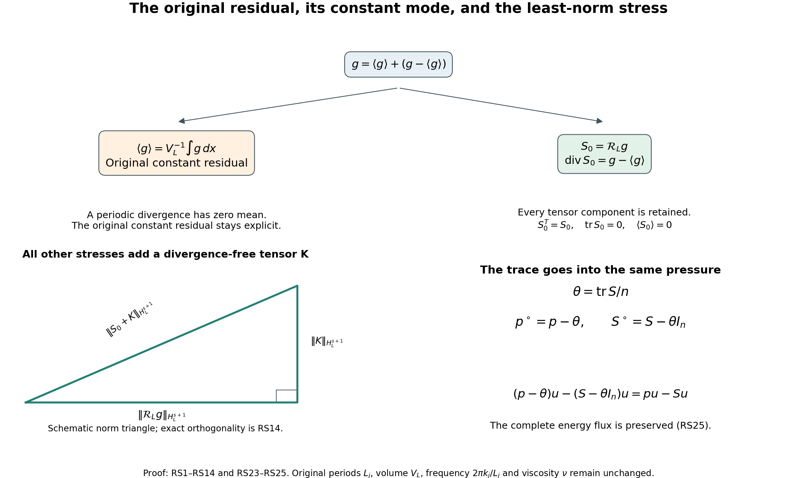
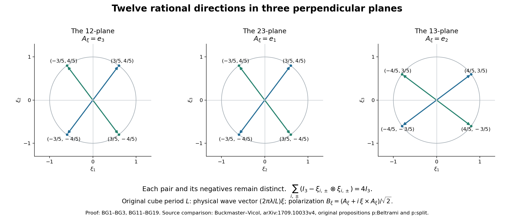

# Residual stresses and exact Beltrami fields

A residual stress records the remaining vector error in the fluid
equation as the divergence of a tensor. This chapter constructs
that tensor exactly, proves how pressure and constant modes enter,
and then builds explicit periodic waves whose average quadratic
tensor is a prescribed matrix.

The pressure and Fourier conventions come from
[lesson 2](pressure-and-the-divergence-free-projection.md);
the original energy identity comes from
[lesson 1](forces-energy-and-vorticity.md).
Sections RS1–RS8 apply to arbitrary rectangular tori in dimension
at least two. Sections BG1–BG6 construct the three-dimensional
waves on the original cube with period \(L>0\).
Equation labels RS and BG distinguish the two connected calculations.
Every finite correction is substituted into the original equation
before a bound is claimed.

The human sources are Tristan Buckmaster and Vlad Vicol,
[*Nonuniqueness of weak solutions to the Navier–Stokes equation*,
arXiv:1709.10033v4](https://arxiv.org/abs/1709.10033v4),
original author source lines 142–303, 407–474 and 1204–1221;
and their [*Convex integration and phenomenologies in turbulence*,
arXiv:1901.09023v2](https://arxiv.org/abs/1901.09023v2),
original EMS21_arxiv_2.tex lines 160–195, 629–734 and 1185–1200.
The comparisons below give complete local corrections of the cited
sign, mean and repeated-filter formulas. The explicit geometric
construction supplies the finite provider in their propositions
p:Beltrami and p:split. No novelty or independent review is claimed.

## RS1. The equation and every constant mode

Let \(n\geq2\), \(L_1,\ldots,L_n>0\), and
\[
 \mathbb T_L^n=\prod_{j=1}^n\mathbb R/L_j\mathbb Z,\qquad
 V_L=\prod_{j=1}^nL_j,\qquad
 \langle h\rangle=V_L^{-1}\int_{\mathbb T_L^n}h(x)\,dx .
 \tag{RS1}
\]
No period or viscosity is set to one.
For smooth real periodic velocity \(u\), pressure \(p\), force \(f\),
and symmetric tensor \(S\), use the convention
\[
 \begin{gathered}
 \mathcal E_\nu(u,p;f):=
 \partial_tu+\operatorname{div}(u\otimes u)+\nabla p
                  -\nu\Delta u-f=\operatorname{div}S,\qquad
 \operatorname{div}u=0,\quad \nu>0,\\
 (u\otimes u)_{ij}=u_i u_j,\qquad
 (\operatorname{div}S)_i=\sum_{j=1}^n\partial_jS_{ij}.
 \end{gathered}
 \tag{RS2}
\]
Integrating each derivative over its full original period gives
\[
 \frac{d}{dt}\langle u\rangle=\langle f\rangle .
 \tag{RS3}
\]
The integral of a derivative is zero because the values at the two
identified endpoints agree. Thus a tensor divergence cannot change
the original momentum equation. In particular, subtracting the
integral instead of its average is incorrect when \(V_L\ne1\).

## RS2. Exact pressure and trace maps

Set \(\theta=\operatorname{tr}S/n\). The maps
\[
 (p,S)\longmapsto(p^\circ,S^\circ)
       =(p-\theta,S-\theta I_n),\qquad
 (p^\circ,S^\circ,\theta)\longmapsto
       (p^\circ+\theta,S^\circ+\theta I_n)
 \tag{RS4}
\]
are inverse maps between the full tensor formulation and the
trace-free formulation together with its retained trace.
Indeed \(\operatorname{tr}S^\circ=0\) and
\(\operatorname{div}(\theta I_n)=\nabla\theta\), so subtracting
that same gradient from both sides of RS2 proves the transformed
equation. The velocity, force and viscosity have not changed.
Keeping \(\theta\) makes the map invertible; deleting it would lose
part of the original tensor and pressure.

There is also an exact sign-convention map:
\[
 \mathcal E_\nu(u,p;f)=\operatorname{div}S
 \quad\Longleftrightarrow\quad
 \mathcal E_\nu(u,p;f)=-\operatorname{div}C,\qquad C=-S .
 \tag{RS5}
\]
This changes both the tensor and the sign in the equation.
Changing only one of them does not preserve the equation.

## RS3. The full periodic inverse divergence

Use the original frequencies and Fourier coefficients
\[
 \kappa(k)=\left(\frac{2\pi k_1}{L_1},\ldots,
                   \frac{2\pi k_n}{L_n}\right),\qquad
 \widehat h(k)=V_L^{-1}\int_{\mathbb T_L^n}
                   h(x)e^{-i\kappa(k)\cdot x}\,dx,\quad k\in\mathbb Z^n.
 \tag{RS6}
\]
Thus \(\widehat{\partial_jh}=i\kappa_j\widehat h\).
On mean-zero functions define \(\Delta^{-1}\) by the multiplier
\(-|\kappa|^{-2}\) at \(k\ne0\) and zero at \(k=0\).
Its square has multiplier \(|\kappa|^{-4}\).
For any smooth vector field \(g\), write
\(g^\circ=g-\langle g\rangle\) and define
\[
 \begin{aligned}
 (\mathcal R_Lg)_{ij}={}&
 \partial_j\Delta^{-1}g_i^\circ+
 \partial_i\Delta^{-1}g_j^\circ\\
 &-\frac{\delta_{ij}}{n-1}\Delta^{-1}\operatorname{div}g^\circ
 -\frac{n-2}{n-1}\partial_i\partial_j
                     \Delta^{-2}\operatorname{div}g^\circ .
 \end{aligned}
 \tag{RS7}
\]
All four original terms are retained. At \(n=2\) the last
coefficient is exactly zero. At \(n=3\) both displayed fractional
coefficients are \(1/2\), giving the precise operator in the
Buckmaster–Vicol survey, equation eq:RSZ, with its original
periods \(L_j=2\pi\).

Commuting the Fourier multipliers proves symmetry and
\[
 \begin{aligned}
 \operatorname{tr}\mathcal R_Lg
 &=\left(2-\frac n{n-1}-\frac{n-2}{n-1}\right)
                    \Delta^{-1}\operatorname{div}g^\circ=0,\\
 \operatorname{div}\mathcal R_Lg
 &=g^\circ+
 \left(1-\frac1{n-1}-\frac{n-2}{n-1}\right)
                    \nabla\Delta^{-1}\operatorname{div}g^\circ
 =g^\circ,\\
 \langle\mathcal R_Lg\rangle&=0 .
 \end{aligned}
 \tag{RS8}
\]
The inverse divergence equation in the space of periodic symmetric
trace-free tensors is therefore solvable exactly when
\(\langle g\rangle=0\). Necessity is periodic integration.
Sufficiency is the explicit RS7–RS8 construction, including
smoothness: Fourier coefficients of a smooth periodic input
decay faster than every power, and these multipliers have only
polynomial growth away from the removed zero mode.

The survey's sentence immediately after eq:RSZ subtracts
\(\int_{\mathbb T^3}g\,dx\). On its stated \(2\pi\)-periodic torus,
that must be \((2\pi)^{-3}\int g\,dx\).
For a nonzero constant vector \(c\), its written subtraction gives
\((1-(2\pi)^3)c\), whose divergence-inverse equation is impossible
by RS3. Formula RS8 proves the corrected map.
The original research paper, lines 1207–1209, uses the average.

## RS4. Exact norm, sharp Sobolev bound and the whole solution space

For \(k\ne0\), keep \(\kappa=\kappa(k)\) and set
\[
 e=\kappa/|\kappa|,\quad
 g_\parallel=(\widehat g(k)\cdot e)e,\quad
 g_\perp=\widehat g(k)-g_\parallel,\quad
 \alpha=\widehat g(k)\cdot e .
 \tag{RS9}
\]
These are the longitudinal and transverse components of the
same original Fourier vector. No physical coordinate is rescaled.
Direct substitution in RS7 gives
\[
 \widehat{\mathcal R_Lg}(k)=
 -\frac{i}{|\kappa|}
 \left[g_\perp\otimes e+e\otimes g_\perp+
       \alpha\left(e\otimes e-\frac{I_n-e\otimes e}{n-1}\right)\right].
 \tag{RS10}
\]
This equality retains the identity on the full orthogonal
complement; it includes every diagonal component.
The transverse tensor has squared Frobenius norm
\(2|g_\perp|^2\). The longitudinal tensor has squared norm
\(n|\alpha|^2/(n-1)\). Their Frobenius inner product vanishes:
each contraction contains \(g_\perp\cdot e=0\).
The same calculation uses complex conjugates for complex Fourier
coefficients. Consequently
\[
 |\widehat{\mathcal R_Lg}(k)|_{\rm F}^2
 =\frac{2|g_\perp|^2+\frac n{n-1}|g_\parallel|^2}{|\kappa(k)|^2}.
 \tag{RS11}
\]

For any real \(s\), define the full inhomogeneous norm by
\[
 \|h\|_{H_L^s}^2
 =V_L\sum_{k\in\mathbb Z^n}
                 (1+|\kappa(k)|^2)^s|\widehat h(k)|^2,\qquad
 \kappa_{\min}=\frac{2\pi}{\max_j L_j}.
 \tag{RS12}
\]
Since \(n/(n-1)\leq2\), RS11 gives the bounded linear map
\[
 \mathcal R_L:H_L^s(\mathbb T_L^n;\mathbb R^n)
       \longrightarrow H_L^{s+1}(\mathbb T_L^n;\operatorname{Sym}_0^2),
 \qquad
 \|\mathcal R_Lg\|_{H_L^{s+1}}
 \leq\sqrt{2(1+\kappa_{\min}^{-2})}
                       \|g-\langle g\rangle\|_{H_L^s}.
 \tag{RS13}
\]
Indeed the squared ratio of the two weights at any nonzero mode is
bounded by \(2(1+|\kappa|^{-2})\), and the smallest nonzero
original frequency is exactly \(\kappa_{\min}\).
This constant is attained by a real single-frequency vector field
whose frequency has that length and whose amplitude is perpendicular
to that frequency. Such an amplitude exists since \(n\geq2\).
Both opposite Fourier modes have the same ratio, so reality
does not alter equality. Density extends RS7 to the stated spaces.

The map also chooses the unique tensor of least \(H_L^{s+1}\)
norm among all solutions of its divergence equation.
To prove this rather than infer it from a right inverse, let \(K\)
be symmetric trace-free with \(\operatorname{div}K=0\).
For each nonzero mode \(\widehat K\kappa=0\). Symmetry also gives
\(e^T\widehat K=0\). Hence its Frobenius contraction with both
transverse summands of RS10 is zero. Its contraction with
\(e\otimes e\) is zero, and its contraction with
\(I_n-e\otimes e\) is zero by its trace and previous contraction.
The mean mode of \(\mathcal R_Lg\) vanishes as well.
Parseval with every weight in RS12 gives
\[
 \|\mathcal R_Lg+K\|_{H_L^{s+1}}^2
 =\|\mathcal R_Lg\|_{H_L^{s+1}}^2+\|K\|_{H_L^{s+1}}^2 .
 \tag{RS14}
\]
Every solution is of this form: subtract RS8 from its divergence
equation. Conversely each such \(K\) gives another solution.
This proves both the full affine solution space and uniqueness
of its least-norm member, including arbitrary constant
trace-free tensors in the kernel.

## RS5. The exact new stress for a velocity correction

Keep a smooth solution of RS2. Let \(w\) be a smooth
divergence-free velocity correction, with \(\partial_t\langle
w\rangle=0\), and define the symmetric tensor and vector
\[
 Q=u\otimes w+w\otimes u+w\otimes w,\qquad
 h=\partial_tw-\nu\Delta w .
 \tag{RS15}
\]
The vector \(h\) has zero mean by the stated constant-mean
condition. Its exact inverse divergence therefore exists.
Set
\[
 T=S+Q+\mathcal R_Lh,\qquad
 \theta_T=\operatorname{tr}T/n,\qquad
 u_+=u+w,\quad p_+=p-\theta_T,\quad S_+=T-\theta_T I_n .
 \tag{RS16}
\]
Expansion of the original quadratic expression gives
\[
 \mathcal E_\nu(u+w,p;f)
 =\operatorname{div}S+h+\operatorname{div}Q
 =\operatorname{div}T .
 \tag{RS17}
\]
Applying RS4 now proves
\(\mathcal E_\nu(u_+,p_+;f)=\operatorname{div}S_+\),
\(\operatorname{div}u_+=0\), and \(\operatorname{tr}S_+=0\).
There is no unproved cancellation of viscosity, transport,
quadratic error, trace or pressure. The original body force
is exactly the same.
The constant-mean condition is necessary for keeping that force:
subtracting the two RS3 identities gives it.
If an actual correction has mean derivative \(a(t)\ne0\),
the complete residual is instead
\[
 \mathcal E_\nu(u+w,p;f)
 =a(t)+\operatorname{div}
    \big[S+Q+\mathcal R_L(\partial_tw-\nu\Delta w)\big].
 \tag{RS18}
\]
This displays the unrepresented constant vector; it does not
silently include it in a different force.

In the survey, lines 665–670 have
\(\operatorname{div}(w\otimes w-\mathring R_q)\) while the
equation just above has the plus-divergence convention RS2.
Under that convention the old stress has a plus sign, as RS17
proves by full substitution. The same source's later average
cancellation, eq:low_freq_R_cancellation, uses
the negative of the old stress and is consistent with the
corrected sum \(S+w\otimes w\).
This checks the actual connecting formula without claiming
that the entire infinite iteration has been checked.

## RS6. Filtering, covariance and the missing terms

Let \(\mathscr F\) be convolution on the original torus by a
nonnegative smooth kernel \(K\) of integral one. It commutes
with spatial and time derivatives. Write
\(\bar u=\mathscr Fu\), \(\bar p=\mathscr Fp\),
\(\bar f=\mathscr Ff\). For an exact smooth solution with \(S=0\),
filtering every term and subtracting the full quadratic
expression proves
\[
 \begin{gathered}
 C=\mathscr F(u\otimes u)-\bar u\otimes\bar u,\qquad
 \mathcal E_\nu(\bar u,\bar p;\bar f)
                    =-\operatorname{div}C,\\
 C(x)=\int_{\mathbb T_L^n}K(y)
     [u(x-y)-\bar u(x)]\otimes[u(x-y)-\bar u(x)]\,dy .
 \end{gathered}
 \tag{RS19}
\]
To prove the second line, expand all four terms.
The two mixed integrals each equal \(\bar u(x)\otimes\bar u(x)\);
the last integral equals that same tensor because \(\int K=1\).
Thus \(C\) is positive semidefinite: its quadratic form at any
real vector \(a\) is the integral of
\([a\cdot(u(x-y)-\bar u(x))]^2\) against \(K\).
The stress in the plus convention is \(S=-C\).
Its trace-free pressure is
\(\bar p+\operatorname{tr}C/n\), by RS4.

The center inside this integral is \(\bar u(x)\), not
\(\bar u(x-y)\). For the latter, full expansion gives instead
\[
 \begin{aligned}
 C={}&\mathscr F[(u-\bar u)\otimes(u-\bar u)]\\
 &+\mathscr F(u\otimes\bar u+\bar u\otimes u-\bar u\otimes\bar u)
                          -\bar u\otimes\bar u .
 \end{aligned}
 \tag{RS20}
\]
Every omitted mixed or repeated-filter term is now visible.
Commutation with derivatives alone does not make the second
line vanish.

Here is an exact smooth divergence-free counterexample to
dropping that line. Choose any nonzero original lattice frequency
\(\kappa=\kappa(k)\), a real unit vector \(a\perp\kappa\),
and \(A\ne0\). The steady field
\[
 u(x)=A a\cos(\kappa\cdot x),\quad p=0,\quad
 f(x)=\nu|\kappa|^2u(x)
 \tag{RS21}
\]
solves the full original forced equation: its divergence and
convective term vanish and \(-\nu\Delta u=f\).
Use the periodic heat filter \(\mathscr F=e^{\epsilon\Delta}\),
\(\epsilon>0\), and retain
\(b=e^{-\epsilon|\kappa|^2}\in(0,1)\).
The exact zero and second Fourier modes give
\[
 \begin{aligned}
 C(x)&=\frac{A^2}{2}
       [(1-b^2)+(b^4-b^2)\cos(2\kappa\cdot x)]\,a\otimes a,\\
 \mathscr F[(u-\bar u)\otimes(u-\bar u)](x)
 &=\frac{A^2}{2}(1-b)^2
       [1+b^4\cos(2\kappa\cdot x)]\,a\otimes a,\\
 \left\langle C-\mathscr F[(u-\bar u)\otimes(u-\bar u)]\right\rangle
 &=A^2b(1-b)\,a\otimes a\ne0 .
 \end{aligned}
 \tag{RS22}
\]
Thus the equality asserted in the survey at line 652 fails for
this actual derivative-commuting filter and exact smooth flow.
The corrected identities are RS19–RS20; the comparison preserves
the actual field and its original force.

## RS7. Energy transfer and the full pressure flux

Put \(e_u=|u|^2/2\). Pair RS2 with \(u\) pointwise and expand
every product. Divergence freedom gives
\[
 \partial_te_u+
 \operatorname{div}\big[(e_u+p)u-\nu\nabla e_u-Su\big]
 =f\cdot u-\nu|\nabla u|^2-S: \nabla u .
 \tag{RS23}
\]
Indeed \(u_i\partial_jS_{ij}
=\partial_j(u_iS_{ij})-S_{ij}\partial_ju_i\);
symmetry identifies the flux with \(Su\).
Also \(u\cdot\Delta u=\Delta e_u-|\nabla u|^2\).
Periodic integration retains the full work and dissipation:
\[
 \frac{d}{dt}\frac12\int_{\mathbb T_L^n}|u|^2\,dx+
 \nu\int_{\mathbb T_L^n}|\nabla u|^2\,dx
 =\int_{\mathbb T_L^n}f\cdot u\,dx-
                \int_{\mathbb T_L^n}S: \nabla u\,dx .
 \tag{RS24}
\]
The pressure/trace map RS4 preserves this identity pointwise:
\[
 (p-\theta)u-(S-\theta I_n)u=pu-Su,\qquad
 (S-\theta I_n):\nabla u=S: \nabla u
 \tag{RS25}
\]
because \(\operatorname{div}u=0\).
The trace is transferred exactly into the pressure flux.
It is not an omitted contribution.

## RS8. The original Duhamel sign

For the exact original equation with \(S=0\), apply the original
Leray projection \(\mathbb P_L\), retaining the zero mode as the
identity. The equation is
\[
 \partial_tu-\nu\Delta u=
 -\mathbb P_L\operatorname{div}(u\otimes u)+\mathbb P_Lf .
 \tag{RS26}
\]
At each Fourier mode solve this scalar linear ordinary
differential equation with its actual exponential factor.
For any earlier time \(a\leq t\) it yields
\[
 u(t)=e^{\nu(t-a)\Delta}u(a)
 -\int_a^t e^{\nu(t-s)\Delta}
       \mathbb P_L\operatorname{div}(u\otimes u)(s)\,ds
 +\int_a^t e^{\nu(t-s)\Delta}\mathbb P_Lf(s)\,ds .
 \tag{RS27}
\]
Smoothness justifies summing the modes and differentiating.
At the zero mode this is exactly RS3, since the quadratic
divergence is zero. The original research paper's equation
eq:mild at lines 190–192 has a plus sign before its unforced
nonlinear integral. Its preceding differential equation has the
convention RS26, so that integral requires the minus in RS27.
The earlier course pressure and mild-solution lessons already
use this negative sign.

Figure: RS1–RS14 and RS23–RS25. The split keeps the constant
residual visible; the norm triangle shows the proved orthogonality,
with schematic side lengths. The pressure panel displays the exact
unchanged energy flux. Source comparisons are the Buckmaster–Vicol
equations identified above.
[Reproducible figure source](../assets/original-reynolds-stress-maps.py).

## BG1. Rational directions and the full geometric coefficients

Keep these six distinct unit vectors:
\[
 \begin{array}{ll}
 \xi_{1,+}=(3,4,0)/5,&\xi_{1,-}=(3,-4,0)/5,\\
 \xi_{2,+}=(0,3,4)/5,&\xi_{2,-}=(0,3,-4)/5,\\
 \xi_{3,+}=(4,0,3)/5,&\xi_{3,-}=(-4,0,3)/5.
 \end{array}
 \tag{BG1}
\]
The signs after the comma name the two directions in each pair;
they do not mean antipodal vectors. Let \(\Lambda_0\) contain all
six and their six negatives. Every vector has length one since
\(3^2+4^2=5^2\); the displayed zero coordinate and the signs show
that all twelve are distinct.
For every direction put \(P_\xi=I_3-\xi\otimes\xi\).
It is the full orthogonal projection onto its perpendicular plane.

For a real symmetric matrix \(R\), write \(r=(R_{11},R_{22},R_{33})^T\)
and define the full pair totals and differences by
\[
 \begin{gathered}
 M=\frac1{25}
 \begin{pmatrix}16&25&9\\9&16&25\\25&9&16\end{pmatrix},
 \qquad \det M=\frac{386}{625},\\
 M^{-1}=\frac1{386}
 \begin{pmatrix}31&-319&481\\481&31&-319\\-319&481&31\end{pmatrix},\\
 s=M^{-1}r,\qquad
 d=-\frac{25}{12}(R_{12},R_{23},R_{13})^T,\qquad
 c_{i,\pm}(R)=\frac{s_i\pm d_i}{2}.
 \end{gathered}
 \tag{BG2}
\]
Multiplication verifies both the inverse and the determinant.
The diagonal part of
\(\sum_{i,\pm}c_{i,\pm}P_{\xi_{i,\pm}}\) is \(Ms=r\).
Its \(12,23,13\) components are respectively
\(-12d_1/25,-12d_2/25,-12d_3/25\), equal to those of \(R\).
Symmetry gives the remaining entries. Thus
\[
 R=\sum_{i=1}^3\sum_{\epsilon\in\{+,-\}}
          c_{i,\epsilon}(R)P_{\xi_{i,\epsilon}},
 \qquad
 \sum_{i,\epsilon}P_{\xi_{i,\epsilon}}=4I_3,\qquad
 c_{i,\epsilon}(I_3)=\frac14 .
 \tag{BG3}
\]
This is an identity on the complete six-dimensional space of
symmetric matrices. Its coefficients are unique: zero off-diagonal
entries force \(d=0\), and zero diagonal entries force \(s=0\)
by the nonzero determinant. In particular, the six projections
are a basis, not only a spanning collection on trace-free inputs.

The three panels show the actual directions of BG1 and their negatives,
with the polarization perpendicular to each displayed plane. Each pair
is retained separately. BG2–BG3 prove the full tensor identity; BG11–BG19
give the rotations and physical wave frequencies. Human comparison:
Buckmaster–Vicol, original propositions p:Beltrami and p:split cited above.
[Reproducible figure source](../assets/original-rational-beltrami-directions.py).

## BG2. The exact positive domain and its inscribed balls

Use the Frobenius norm and inner product, with both off-diagonal
entries included. Put
\[
 C_{\rm diag}=\frac{\sqrt{31^2+319^2+481^2}}{386},\qquad
 D_{\rm coeff}=\frac12
       \sqrt{C_{\rm diag}^2+\frac{25^2}{12^2\,2}} .
 \tag{BG4}
\]
The linear functional \(c_{i,\epsilon}\) has exactly this
operator norm. To see every coefficient, its symmetric Riesz
matrix \(A_{i,\epsilon}\), defined by
\(c_{i,\epsilon}(R)=A_{i,\epsilon}:R\), has diagonal entries
one half of row \(i\) of \(M^{-1}\).
At its relevant off-diagonal pair, both entries are
\(-25/48\) for \(\epsilon=+\) and \(25/48\) for \(\epsilon=-\);
all other off-diagonal entries vanish.
Its squared norm is
\[
 |A_{i,\epsilon}|_{\rm F}^2
 =\frac14 C_{\rm diag}^2+
                 2\left(\frac{25}{48}\right)^2
 =D_{\rm coeff}^2,\qquad
 \operatorname{tr}A_{i,\epsilon}=\frac14 .
 \tag{BG5}
\]
Cauchy–Schwarz proves the bound, and a scalar multiple of
\(A_{i,\epsilon}\) gives equality. The rows are cyclic
permutations, so every one of the six norms is the same.

For each actual \(\rho>0\), the largest open Frobenius ball
centered at \(\rho I_3\) on which all six coefficients are
positive has radius
\[
 r_{\rm pos}(\rho)=\frac{\rho}{4D_{\rm coeff}} .
 \tag{BG6}
\]
Indeed \(c_{i,\epsilon}(\rho I_3+H)
=\rho/4+A_{i,\epsilon}:H\), so \(|H|_{\rm F}<r_{\rm pos}\)
makes all coefficients positive. The particular matrix
\[
 R=\rho I_3-\frac{\rho}{4D_{\rm coeff}^2}A_{i,\epsilon}
 \tag{BG7}
\]
has distance \(r_{\rm pos}\) from the center and that coefficient
equal to zero. Every larger open ball therefore fails the
strict-positivity requirement. The exact entire positive domain
is the open polyhedral cone given by all six inequalities
\(c_{i,\epsilon}(R)>0\); the ball is its stated centered subset.

For uniform derivative estimates use the smaller actual ball
\[
 |R-\rho I_3|_{\rm F}<\frac{\rho}{8D_{\rm coeff}},
 \qquad
 \frac{\rho}{8}<c_{i,\epsilon}(R)<\frac{3\rho}{8}.
 \tag{BG8}
\]
Define \(\gamma_\xi(R)=\sqrt{c_{i,\epsilon}(R)}\) for
\(\xi=\xi_{i,\epsilon}\), and give its negative the same value.
Then the original paired formula is
\[
 R=\frac12\sum_{\xi\in\Lambda_0}
           \gamma_\xi(R)^2(I_3-\xi\otimes\xi),
 \qquad \gamma_{-\xi}=\gamma_\xi>0 .
 \tag{BG9}
\]
No trace or positive scalar has been absorbed into a replacement
matrix. In particular, the original \(\rho I_3\) remains in
the domain and every bound.
For \(m\geq1\) and symmetric directions \(H_1,\ldots,H_m\),
repeated differentiation of the square root gives
\[
 \begin{aligned}
 D^m\gamma_\xi(R)[H_1,\ldots,H_m]
 &=\left[\prod_{j=0}^{m-1}\left(\frac12-j\right)\right]
   c_\xi(R)^{1/2-m}\prod_{\ell=1}^m c_\xi(H_\ell),\\
 |D^m\gamma_\xi(R)[H_1,\ldots,H_m]|
 &\leq
 \left|\prod_{j=0}^{m-1}\left(\frac12-j\right)\right|
 \left(\frac{\rho}{8}\right)^{1/2-m}
 D_{\rm coeff}^m\prod_{\ell=1}^m|H_\ell|_{\rm F}.
 \end{aligned}
 \tag{BG10}
\]
The zeroth derivative is bounded by \(\sqrt{3\rho/8}\).
These statements also prove smoothness and every finite
derivative bound, without appealing to an unspecified
geometric decomposition.

## BG3. Any prescribed finite number of disjoint rational families

Fix the actual positive integer \(N\), put \(D_N=10N\), and
for \(\alpha=0,\ldots,N-1\) set
\[
 t_\alpha=\frac{\alpha}{D_N},\qquad
 Q(t)=\frac1{1+t^2}
 \begin{pmatrix}
 1-t^2&-2t&0\\2t&1-t^2&0\\0&0&1+t^2
 \end{pmatrix},\qquad
 \Lambda_\alpha=Q(t_\alpha)\Lambda_0 .
 \tag{BG11}
\]
Direct multiplication proves \(Q(t)^TQ(t)=I_3\) and
\(\det Q(t)=1\). Its entries are rational at every chosen
parameter. It fixes the third coordinate.
For any real vector \(z\), an exact subtraction of these
matrices gives
\[
 |Q(t)z-Q(s)z|^2
 =\frac{4(t-s)^2}{(1+t^2)(1+s^2)}(z_1^2+z_2^2).
 \tag{BG12}
\]
All base directions have a nonzero horizontal component.
Two different base directions with the same third coordinate
are separated by at least \(6/5\): the possible third coordinates
are \(0,\pm3/5,\pm4/5\), and inspection of BG1 and its negatives
gives that exact lower bound.

Suppose \(Q(t_\alpha)\xi=Q(t_\beta)\eta\).
Then \(\xi_3=\eta_3\). Orthogonality and BG12 imply
\[
 |\xi-\eta|
 =|Q(t_\alpha)\xi-Q(t_\alpha)\eta|
 =|Q(t_\beta)\eta-Q(t_\alpha)\eta|
 \leq2|t_\alpha-t_\beta|<\frac15 .
 \tag{BG13}
\]
Hence \(\xi=\eta\). Applying BG12 again, with its nonzero
horizontal component, forces \(t_\alpha=t_\beta\) and
\(\alpha=\beta\). The families are pairwise disjoint.
Within each family the twelve vectors remain distinct
and closed under negation.

For \(\xi=Q(t_\alpha)\eta\), set
\[
 \gamma_\xi^{(\alpha)}(R)
   =\gamma_\eta(Q(t_\alpha)^TRQ(t_\alpha)).
 \tag{BG14}
\]
Conjugation is an explicit invertible map on symmetric tensors
with inverse \(H\mapsto Q(t_\alpha)H Q(t_\alpha)^T\).
It fixes \(\rho I_3\), preserves the full Frobenius norm and
each trace, and maps \(P_\eta\) to \(P_\xi\).
Applying it to BG9 proves
\[
 R=\frac12\sum_{\xi\in\Lambda_\alpha}
       \big(\gamma_\xi^{(\alpha)}(R)\big)^2P_\xi
 \tag{BG15}
\]
on exactly the same balls BG6 and BG8.
All derivative bounds BG10 hold unchanged because conjugation
is an isometry on each direction \(H_\ell\).
No constant in those bounds depends on a later oscillation
frequency or on the number of families.

An explicit common integer denominator is
\[
 N_\Lambda=
 5\,\operatorname{lcm}_{0\leq\alpha<N}
                    (D_N^2+\alpha^2).
 \tag{BG16}
\]
The matrix entries of \(Q(t_\alpha)\) have the displayed
integer denominator \(D_N^2+\alpha^2\), and each original
direction has denominator five. Thus \(N_\Lambda\xi\)
is an integer vector. This is a valid chosen denominator,
without a claim of minimality.
For any two directions in the entire union with
\(\xi+\eta\ne0\), the vector \(N_\Lambda(\xi+\eta)\)
is a nonzero integer vector. Therefore
\[
 |\xi+\eta|\geq N_\Lambda^{-1}=2c_\Lambda,
 \qquad c_\Lambda=(2N_\Lambda)^{-1}\in(0,1).
 \tag{BG17}
\]
This gives the complete nonresonant carrier separation,
including directions from different families.

## BG4. The original real Beltrami fields

On the original cube \(\mathbb T_L^3=(\mathbb R/L\mathbb Z)^3\)
keep a positive integer \(\lambda\) divisible by \(N_\Lambda\) and set
\[
 \varkappa=\frac{2\pi\lambda}{L}.
 \tag{BG18}
\]
For base directions in the \(12\), \(23\), \(13\) planes
choose respectively the rational polarization \(e_3,e_1,e_2\).
Give each negative the same polarization.
Rotate each polarization by the same \(Q(t_\alpha)\)
as its direction; call it \(A_\xi\). All these vectors are
rational, unit length, perpendicular to \(\xi\), and
\(A_{-\xi}=A_\xi\). Since proper rotations preserve cross
products, BG16 also makes
\(N_\Lambda A_\xi\) and \(N_\Lambda(\xi\times A_\xi)\)
integer vectors: the base polarizations have denominator one,
and their cross products with the base directions have denominator five.

Set \(C_\xi=\xi\times A_\xi\) and retain the full complex vector
\[
 B_\xi=\frac{A_\xi+iC_\xi}{\sqrt2},\qquad
 B_{-\xi}=\overline{B_\xi},\qquad
 i\xi\times B_\xi=B_\xi,\quad
 \xi\cdot B_\xi=0,\quad |B_\xi|^2=1 .
 \tag{BG19}
\]
The ordered frame \(A_\xi,C_\xi,\xi\) is orthonormal:
the cross product is perpendicular to both inputs, has length one,
and \(\xi\times C_\xi=-A_\xi\).
These identities prove every assertion in BG19 directly.

Choose complex coefficients with \(a_{-\xi}=\overline{a_\xi}\)
on any one family, or on any finite union of them. The field
\[
 W(x)=\sum_\xi a_\xi B_\xi e^{i\varkappa\xi\cdot x}
 \tag{BG20}
\]
is periodic on the original cube since \(\lambda\xi\in\mathbb Z^3\).
Opposite modes are conjugates, so \(W\) is real. Each mode has
zero divergence and nonzero frequency; hence its mean is zero.
Differentiation with the actual physical frequency gives
\[
 \operatorname{curl}W=\varkappa W,\qquad
 \Delta W=-\varkappa^2 W,\qquad
 \operatorname{div}(W\otimes W)
                       =\nabla\frac{|W|^2}{2}.
 \tag{BG21}
\]
For completeness, the last identity follows componentwise from
\[
 \partial_i\frac{|W|^2}{2}
       -\sum_jW_j\partial_jW_i
       =(W\times\operatorname{curl}W)_i=0 .
 \tag{BG22}
\]
The equality before zero is obtained by expanding the two
Levi-Civita symbols in the curl. Divergence freedom identifies
the convective term with the tensor divergence.
Thus this equality holds for all cross interactions in BG20,
not only one mode at a time.

Integrating each exponential over the cube annihilates every
mode except pairs with \(\xi+\eta=0\).
The exact polarization relation is
\[
 B_\xi\otimes\overline{B_\xi}
 +\overline{B_\xi}\otimes B_\xi
 =A_\xi\otimes A_\xi+C_\xi\otimes C_\xi
 =I_3-\xi\otimes\xi .
 \tag{BG23}
\]
Grouping opposite pairs therefore gives
\[
 \frac1{L^3}\int_{\mathbb T_L^3}W\otimes W\,dx
   =\frac12\sum_\xi |a_\xi|^2 P_\xi,\qquad
 \frac1{L^3}\int_{\mathbb T_L^3}|W|^2\,dx
   =\sum_\xi |a_\xi|^2 .
 \tag{BG24}
\]
Both the factor one half and the full original volume are retained.
In particular, using one family and
\(a_\xi=\gamma_\xi^{(\alpha)}(R)\) realizes the full target
matrix \(R\) as the average tensor, with total energy integral
\(L^3\operatorname{tr}R\).
The matrix domain and positivity are the proved ones in BG8;
the coefficients have not been assumed to exist.

## BG5. A spatially varying tensor and its exact divergence correction

Now keep a smooth symmetric trace-free stress \(S(t,x)\)
and any fixed \(\delta>0\) with the same units as a stress.
The explicit smooth positive function
\[
 \rho(t,x)=8D_{\rm coeff}
                  \sqrt{\delta^2+|S(t,x)|_{\rm F}^2},\qquad
 R(t,x)=\rho(t,x)I_3-S(t,x)
 \tag{BG25}
\]
satisfies \(|R-\rho I_3|_{\rm F}<\rho/(8D_{\rm coeff})\).
Use one fixed family and the now constructed smooth positive
coefficients
\(a_\xi(t,x)=\gamma_\xi^{(\alpha)}(R(t,x))\).
This is a concrete choice for every such stress.
Other positive \(\rho\) with the same proved inequality also
receive the following exact calculation, but their existence
is not needed here.

Define the principal field, full correction and total field by
\[
 \begin{aligned}
 w^{\rm p}&=\sum_\xi a_\xi B_\xi e^{i\varkappa\xi\cdot x},\\
 w^{\rm c}&=\varkappa^{-1}
          \sum_\xi\nabla a_\xi\times B_\xi
                                  e^{i\varkappa\xi\cdot x},\\
 w&=w^{\rm p}+w^{\rm c}
                =\varkappa^{-1}\operatorname{curl}w^{\rm p}.
 \end{aligned}
 \tag{BG26}
\]
The product rule and BG19 prove the last equality.
Opposite-mode conjugation proves that both fields are real.
The divergence of a curl is zero because mixed derivatives
commute and the alternating coefficients cancel in pairs.
The integral of each derivative of a periodic function is zero.
Thus
\[
 \operatorname{div}w=0,\qquad
 \langle w\rangle=0,\qquad
 \partial_t\langle w\rangle=0 .
 \tag{BG27}
\]
These statements do not require the principal field to have
zero mean. Its coefficient functions may themselves carry
frequencies that interact with the carriers.
The correction removes the entire resulting mean.

At each original point \(t,x\), the opposite-mode terms in
\(w^{\rm p}\otimes w^{\rm p}\) give exactly BG15.
Therefore the complete oscillatory tensor is
\[
 \begin{aligned}
 O&=w^{\rm p}\otimes w^{\rm p}-(\rho I_3-S)\\
  &=\sum_{\xi+\eta\ne0}
        a_\xi a_\eta B_\xi\otimes B_\eta
                              e^{i\varkappa(\xi+\eta)\cdot x}.
 \end{aligned}
 \tag{BG28}
\]
The sum is over ordered pairs. Reversing the order proves
symmetry, and conjugating both directions proves reality.
Every carrier has physical length at least
\(\varkappa/N_\Lambda\) by BG17.
This statement concerns carriers; unrestricted coefficient
functions can broaden the full Fourier support, so no
unsupported high-frequency support claim is made for \(O\).

For an actual original solution of the stress equation RS2,
with this same trace-free \(S\), put
\[
 \begin{aligned}
 K={}&O+u\otimes w+w\otimes u\\
    &+w^{\rm p}\otimes w^{\rm c}
       +w^{\rm c}\otimes w^{\rm p}
       +w^{\rm c}\otimes w^{\rm c}
       +\mathcal R_L(\partial_tw-\nu\Delta w),\\
 u_+&=u+w,\qquad
 S_+=K-\frac{\operatorname{tr}K}{3}I_3,\qquad
 p_+=p-\rho-\frac{\operatorname{tr}K}{3}.
 \end{aligned}
 \tag{BG29}
\]
Here \(\mathcal R_L\) is exactly RS7 on the original cube,
with all its components and zero mode.
Indeed \(S+w^{\rm p}\otimes w^{\rm p}=\rho I_3+O\);
expanding the other quadratic terms gives exactly
the tensor \(T=\rho I_3+K\) in RS16.
The mean-zero condition follows from BG27.
Thus RS17 and the full trace map prove
\[
 \partial_tu_++\operatorname{div}(u_+\otimes u_+)
        +\nabla p_+-\nu\Delta u_+
       =f+\operatorname{div}S_+,\qquad
 \operatorname{div}u_+=0 .
 \tag{BG30}
\]
Every original force, transport term, viscosity contribution,
quadratic cross term, mean and pressure trace appears in this
finite identity. It is not yet an estimate that the new stress
is smaller.

## BG6. The full viscous cost of these ordinary fields

For constant coefficients, BG21 makes
\[
 u=W,\qquad p=-|W|^2/2,\qquad f=\nu\varkappa^2W
 \tag{BG31}
\]
an exact stationary solution of the original forced equation.
All frequencies of \(W\) have length \(\varkappa\), and its
Fourier vectors are transverse. The exact RS11 identity gives
\[
 \|\mathcal R_L(\nu\varkappa^2W)\|_2^2
          =2\nu^2\varkappa^2\|W\|_2^2 .
 \tag{BG32}
\]
By RS14 this is the smallest squared \(L^2\) norm of a
symmetric trace-free tensor representing this particular
viscous force. It is not a statement that unrelated nonlinear
terms can never cancel; its exact range is the stated force map.
With a fixed nonzero target tensor, increasing the original
frequency increases this minimum. No viscosity or period has
been changed to suppress it.

## 15. Five exercises with complete solutions

### Exercise 1: allow the pressure to vary in the least-stress problem

On the original rectangular torus of RS1, let \(n\geq2\),
\(s\in\mathbb R\), and \(g\in H_L^s\) have zero mean.
Among all mean-zero scalar \(q\in H_L^{s+1}\) and symmetric
trace-free \(S\in H_L^{s+1}\) satisfying
\(\operatorname{div}S=g+\nabla q\), find the smallest tensor norm.
Describe the entire solution space and the equality case.
Also determine what happens if the original mean of \(g\) is nonzero.

**Solution.** Keep the original scalar and vector
\[
 \psi=\Delta^{-1}\operatorname{div}g,\qquad
 \mathbb P_Lg=g-\nabla\psi,\qquad \langle\psi\rangle=0 .
 \tag{EX1}
\]
At every nonzero original frequency, \(\nabla\psi\) is the
longitudinal component of \(g\), and \(\mathbb P_Lg\) is its
transverse component. The inverse multiplier and RS12 give
\(\psi\in H_L^{s+1}\). For every admissible pressure the full
affine solution space from RS14 is
\[
 S=\mathcal R_L(\mathbb P_Lg)
       +\mathcal R_L\nabla(\psi+q)+K,\qquad
 K\in H_L^{s+1}(\operatorname{Sym}_0^2),\quad
 \operatorname{div}K=0 .
 \tag{EX2}
\]
The first two terms are orthogonal mode by mode: the first has
the transverse tensor of RS10 and the second has its longitudinal
tensor. Each is orthogonal to \(K\), by the complete proof of RS14.
All zero modes of both inverse terms vanish, while \(K\) retains
its possible constant tensor. With the full original weights,
\[
 \|S\|_{H_L^{s+1}}^2
 =\|\mathcal R_L\mathbb P_Lg\|_{H_L^{s+1}}^2
  +\|\mathcal R_L\nabla(\psi+q)\|_{H_L^{s+1}}^2
  +\|K\|_{H_L^{s+1}}^2 .
 \tag{EX3}
\]
Thus the unique least tensor and the unique mean-zero pressure are
\[
 S_*=\mathcal R_L\mathbb P_Lg,\qquad q_*=-\psi,\qquad
 \|S_*\|_{H_L^{s+1}}^2
 =2V_L\sum_{k\ne0}
       \frac{(1+|\kappa(k)|^2)^{s+1}}{|\kappa(k)|^2}
       |\widehat{\mathbb P_Lg}(k)|^2 .
 \tag{EX4}
\]
Indeed equality in EX3 forces \(K=0\) and
\(\mathcal R_L\nabla(\psi+q)=0\); applying divergence gives
\(\nabla(\psi+q)=0\), whose mean-zero solution is \(q=-\psi\).
If the scalar mean is unrestricted, add an arbitrary spatial
constant to \(q_*\). The full equation and its sign are unchanged.
If \(\langle g\rangle\ne0\), integration of the original equation
gives \(0=\langle g\rangle\), which is impossible. Pressure cannot
remove that constant vector.

### Exercise 2: find the sharp ball for trace-free inputs

For the actual matrices \(R=\rho I_3-S\), where \(\rho>0\) and
\(\operatorname{tr}S=0\), determine the largest Frobenius ball in
the space of such \(S\) on which every BG2 coefficient stays positive.
Compare its radius with BG6 and propagate the result into BG25.

**Solution.** Retain every coefficient matrix \(A_{i,\epsilon}\)
of BG5 and define
\[
 A_{i,\epsilon}^{\,0}
   =A_{i,\epsilon}-\frac1{12}I_3,\qquad
 D_0^2=D_{\rm coeff}^2-\frac1{48}.
 \tag{EX5}
\]
The trace is \(1/4\), so \(A^0\) is trace-free.
For a trace-free \(S\), \(A:S=A^0:S\).
The full norm calculation is
\[
 |A^0|_{\rm F}^2
 =|A|_{\rm F}^2-\frac{2}{12}\operatorname{tr}A
                      +\frac{3}{12^2}
 =D_{\rm coeff}^2-\frac1{48}=D_0^2>0 .
 \tag{EX6}
\]
Positivity follows also from either retained nonzero off-diagonal
entry of \(A^0\). The trace-free functional has exactly norm \(D_0\),
since \(S=A^0\) attains its Cauchy–Schwarz bound. Therefore
\[
 c_{i,\epsilon}(\rho I_3-S)=\frac{\rho}{4}-A_{i,\epsilon}^{\,0}:S>0
 \quad\text{if}\quad |S|_{\rm F}<\frac{\rho}{4D_0}.
 \tag{EX7}
\]
For any one coefficient, the actual trace-free boundary matrix
\[
 S=\frac{\rho}{4D_0^2}A_{i,\epsilon}^{\,0}
 \tag{EX8}
\]
has that exact norm and makes that coefficient zero.
This proves sharpness in the stated affine trace slice.
Since \(0<D_0<D_{\rm coeff}\), its radius is strictly larger
than the full-space radius BG6.

On the smaller ball \(|S|_{\rm F}<\rho/(8D_0)\), every original
coefficient lies strictly between \(\rho/8\) and \(3\rho/8\).
The smooth explicit choice
\[
 \rho_0(t,x)=8D_0\sqrt{\delta^2+|S(t,x)|_{\rm F}^2},\qquad
 R_0(t,x)=\rho_0(t,x)I_3-S(t,x),\qquad \delta>0
 \tag{EX9}
\]
lies in this proved domain. Conjugating \(A^0\) by any BG11
rotation preserves its trace and Frobenius norm, so the same
assertion holds for each constructed family.
Use its actual positive coefficients in BG26.
Every identity BG26–BG30 still follows from the full tensor
identity BG15 and the product rule, with \(\rho_0\) in both the
target and the pressure \(p_+=p-\rho_0-\operatorname{tr}K/3\).
These matrices need not lie in the smaller full-space ball BG8;
their positivity has just been proved directly.
The derivative formula BG10 remains valid on the entire positive
cone. On this new half ball its full-direction estimate still uses
\(D_{\rm coeff}\), while restricting every direction to trace-free
tensors gives the sharper factor \(D_0^m\).
Thus the improvement changes the actual scalar and pressure
without discarding any tensor component.

### Exercise 3: combine the disjoint families and keep every interaction

For each of finitely many disjoint families \(\Lambda_\alpha\),
construct the constant-coefficient field \(W_\alpha\) of BG20
with average tensor \(R_\alpha\) in its proved positive domain.
Use the same original positive frequency \(\varkappa=2\pi\lambda/L\).
For real differentiable functions \(h_\alpha(t)\), determine
the exact equation, pressure, average tensor, energy and force norm
of \(u=\sum_\alpha h_\alpha W_\alpha\).

**Solution.** Disjointness and closure under negatives imply that
no frequency of \(W_\alpha\) cancels a frequency of \(W_\beta\)
when \(\alpha\ne\beta\). Integration of each original exponential
therefore gives
\[
 \frac1{L^3}\int W_\alpha\otimes W_\beta\,dx=0
       \quad(\alpha\ne\beta),\qquad
 \int |W_\alpha|^2\,dx=L^3\operatorname{tr}R_\alpha .
 \tag{EX10}
\]
At each fixed time every summand has the same curl eigenvalue.
Consequently \(\operatorname{curl}u=\varkappa u\),
\(\Delta u=-\varkappa^2u\), and BG22 gives the full nonlinear
term \(\operatorname{div}(u\otimes u)=\nabla(|u|^2/2)\).
This includes all cross interactions. With
\[
 a=\nu\varkappa^2,\qquad
 p=-\frac12\left|\sum_\alpha h_\alpha W_\alpha\right|^2,\qquad
 f=\sum_\alpha(h_\alpha'+a h_\alpha)W_\alpha ,
 \tag{EX11}
\]
the original forced Navier–Stokes equation holds exactly.
The pressure contains all terms
\(-h_\alpha h_\beta W_\alpha\cdot W_\beta\) for \(\alpha<\beta\);
their pointwise values are retained although their spatial integrals
vanish. The exact averages and norms are
\[
 \begin{aligned}
 L^{-3}\int u\otimes u\,dx&=\sum_\alpha h_\alpha^2R_\alpha,\\
 \|u\|_2^2&=L^3\sum_\alpha h_\alpha^2\operatorname{tr}R_\alpha,\\
 \|f\|_2^2&=L^3\sum_\alpha(h_\alpha'+a h_\alpha)^2
                                      \operatorname{tr}R_\alpha,\\
 \nu\|\nabla u\|_2^2&=a L^3\sum_\alpha h_\alpha^2
                                      \operatorname{tr}R_\alpha .
 \end{aligned}
 \tag{EX12}
\]
The last equality follows by periodic integration of
\(-u\cdot\Delta u=\varkappa^2|u|^2\).
Finally, differentiating the energy and using EX12 yields
\[
 \frac{d}{dt}\frac{L^3}{2}
       \sum_\alpha h_\alpha^2\operatorname{tr}R_\alpha
 +a L^3\sum_\alpha h_\alpha^2\operatorname{tr}R_\alpha
 =L^3\sum_\alpha(h_\alpha'+a h_\alpha)h_\alpha
                                      \operatorname{tr}R_\alpha
 =\int f\cdot u\,dx .
 \tag{EX13}
\]
This realizes every chosen smooth time path of these coefficients
with its exact required force.

### Exercise 4: calculate a resonant amplitude and its full mean correction

Fix one actual opposite pair with real unit polarization \(A\),
\(C=\xi\times A\), and \(\theta=\varkappa\xi\cdot x\).
For positive integers \(m\), put
\[
 W_m=\sqrt2\,[A\cos(m\theta)-C\sin(m\theta)],\qquad
 b(x)=b_0+\epsilon\cos\theta,\quad b_0>|\epsilon|,\quad \epsilon\ne0 .
 \tag{EX14}
\]
Take \(w^{\rm p}=bW_1\) and \(w=\varkappa^{-1}\operatorname{curl}w^{\rm p}\).
Find the principal field, its full correction, both means and
both average quadratic tensors. Decide whether increasing the
carrier frequency makes this correction small.

**Solution.** The original frequency is periodic and nonzero.
Direct cross products, or BG19 applied to \(m\xi\) in the phase,
give \(\operatorname{curl}W_m=m\varkappa W_m\).
The two product identities
\(\cos^2\theta=(1+\cos2\theta)/2\) and
\(\sin\theta\cos\theta=\sin2\theta/2\) give
\[
 \begin{aligned}
 w^{\rm p}&=b_0W_1+\frac{\epsilon}{2}W_2
                                    +\frac{\epsilon}{\sqrt2}A,\\
 w&=b_0W_1+\epsilon W_2,\\
 w^{\rm c}=w-w^{\rm p}
       &=\frac{\epsilon}{2}W_2-\frac{\epsilon}{\sqrt2}A .
 \end{aligned}
 \tag{EX15}
\]
The constant has zero curl; the doubled carrier has eigenvalue
\(2\varkappa\). All nonzero original lattice modes integrate to zero,
so
\[
 \langle w^{\rm p}\rangle=\frac{\epsilon}{\sqrt2}A,\qquad
 \langle w^{\rm c}\rangle=-\frac{\epsilon}{\sqrt2}A,\qquad
 \langle w\rangle=0 .
 \tag{EX16}
\]
Set \(P=A\otimes A+C\otimes C=I_3-\xi\otimes\xi\).
The exact averages of each \(W_m\otimes W_m\) equal \(P\).
Every mixed first/second-frequency or constant/nonconstant average
vanishes by integration of its nonzero exponential. Hence
\[
 \begin{aligned}
 \langle w^{\rm p}\otimes w^{\rm p}\rangle
     &=(b_0^2+\epsilon^2/4)P+\frac{\epsilon^2}{2}A\otimes A,\\
 \langle w\otimes w\rangle&=(b_0^2+\epsilon^2)P,\\
 L^{-3}\|w^{\rm p}\|_2^2&=2b_0^2+\epsilon^2,\\
 L^{-3}\|w\|_2^2&=2(b_0^2+\epsilon^2),\qquad
 L^{-3}\|w^{\rm c}\|_2^2=\epsilon^2 .
 \end{aligned}
 \tag{EX17}
\]
The correction norm is independent of \(\varkappa\) when \(b_0\)
and \(\epsilon\) are fixed. Its amplitude gradient grows with
\(\varkappa\) and cancels the prefactor \(\varkappa^{-1}\) in BG26.
This is an exact family of smooth examples showing why a carrier
frequency alone gives no small-correction estimate for unrestricted
amplitude functions.

### Exercise 5: find the exact least force for a prescribed terminal flow

Keep the fields of Exercise 3, \(\nu>0\), an actual duration \(T>0\),
and terminal real coefficients \(b_\alpha\). Among absolutely
continuous functions with
\[
 h_\alpha(0)=0,\qquad h_\alpha(T)=b_\alpha,\qquad
 h_\alpha'+a h_\alpha\in L^2(0,T),\qquad
 a=\nu(2\pi\lambda/L)^2>0 ,
 \tag{EX18}
\]
minimize the original total force cost
\(\int_0^T\|f(t)\|_2^2\,dt\), where \(f\) is EX11.
Determine the unique minimizing path and retain all physical
period, viscosity and volume factors.

**Solution.** Put \(q_\alpha=h_\alpha'+a h_\alpha\).
The integrating factor for this exact scalar equation gives
\[
 \begin{gathered}
 h_\alpha(t)=\int_0^t e^{-a(t-s)}q_\alpha(s)\,ds,\qquad
 b_\alpha=\int_0^T e^{-a(T-s)}q_\alpha(s)\,ds,\\
 J=\int_0^T e^{-2a(T-s)}\,ds=\frac{1-e^{-2aT}}{2a}>0 .
 \end{gathered}
 \tag{EX19}
\]
Cauchy–Schwarz gives \(\int_0^T q_\alpha^2\geq b_\alpha^2/J\).
For an exact equality and uniqueness proof, subtract its candidate:
\[
 \int_0^T q_\alpha(s)^2\,ds
 =\frac{b_\alpha^2}{J}
  +\int_0^T\left[q_\alpha(s)-
                  \frac{b_\alpha e^{-a(T-s)}}{J}\right]^2ds .
 \tag{EX20}
\]
Expansion uses the terminal equality in EX19 and the full integral
\(J\). All target traces are strictly positive by their positive
geometric representations. Summing EX20 with the actual weights
in EX12 therefore yields
\[
 \min\int_0^T\|f(t)\|_2^2\,dt
 =\frac{2\nu(2\pi\lambda/L)^2L^3}
          {1-e^{-2\nu(2\pi\lambda/L)^2T}}
       \sum_\alpha b_\alpha^2\operatorname{tr}R_\alpha .
 \tag{EX21}
\]
Equality holds exactly for
\[
 q_\alpha^*(t)=\frac{b_\alpha e^{-a(T-t)}}{J},\qquad
 h_\alpha^*(t)=b_\alpha\frac{\sinh(at)}{\sinh(aT)} .
 \tag{EX22}
\]
Substitution in the original convolution EX19 proves the second
formula, and its endpoints and derivative verify all requirements.
The minimizing fields are smooth, so EX11 and the original energy
identity EX13 hold classically. If a different periodic pressure
is allowed for the same velocity path, the required force changes
by its gradient. The force EX11 is divergence-free; periodic
integration gives its \(L^2\) orthogonality to that gradient.
Thus pressure variation cannot decrease EX21.
This optimum is over the displayed finite profile class and its
pressure choices. It is not a lower bound over every possible
Navier–Stokes trajectory with the same terminal velocity.

## 16. What the construction supplies

The chapter proves the full finite stress and pressure maps,
an explicit positive tensor decomposition, and every wave identity
used in its actual velocity correction. The five exercises keep the
pressure freedom, trace-free improvement, mixed families, resonant
mean and exact force cost visible.

The ordinary-wave viscous cost BG32 grows with the original
frequency for a fixed nonzero target. The next construction must
improve the relevant integrability while retaining that viscosity.
The next lesson derives the source's intermittent Dirichlet factors,
their transport identity, norms and frequency support, and their
contributions to the complete residual BG29.

The finite identities here do not assert a completed infinite
iteration. The separate forced Leray construction of Dallas Albritton,
Elia Brué and Maria Colombo,
[*Non-uniqueness of Leray solutions of the forced Navier–Stokes
equations*, arXiv:2112.03116v1](https://arxiv.org/abs/2112.03116v1),
requires its actual unstable profile and second solution.
Its original main.tex lines 295–494 and 544–599 supply the compared
equation and theorem statements; its full instability proof is later
work in this series. The subsequent Alpöge–Buckmaster, OpenAI and
workbench constructions retain their own exact hypotheses and
required proofs.
