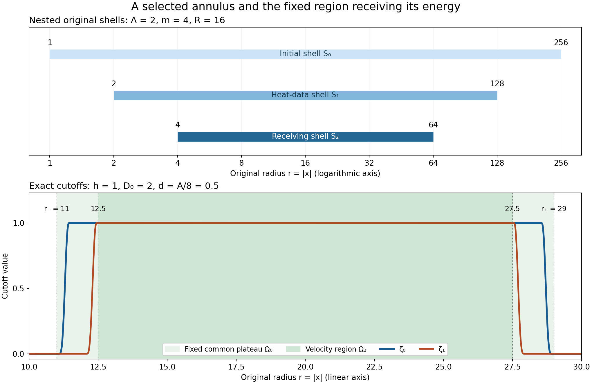

# Selecting an annulus and controlling local velocity

The preceding two lessons give a moving-annulus energy estimate and
a bound for the total distance its boundaries can travel. We now
choose an actual annulus from an actual solution. Its initial
vorticity, incoming heat field and two force contributions will
satisfy the required energy budget because of the choices we make.

The result also gives a local velocity bound in the fourth power of
time. We prove the cutoff div-curl and Fourier estimates that give
this bound, then derive the complete localized vorticity heat
equation. These are finite estimates on the stated interval. The
general large critical-velocity endpoint and the later nonlinear
pointwise iteration remain to be proved.

Read [Moving annuli and localized vorticity energy](moving-annuli-and-localized-vorticity-energy.md)
and [Global nonlinear energy and total speed](global-nonlinear-energy-and-total-speed.md)
first. The strategy is compared with Terence Tao's
[*Quantitative bounds for critically bounded solutions to the
Navier–Stokes equations*, version 2](https://arxiv.org/abs/1908.04958v2),
the annuli-of-regularity argument. Sections 1–7 below supply the
complete receiving argument with the original viscosity and force.
Section 8 gives precise source locators and five solved exercises.

## 1. The original solution and its actual global bounds

Work in the original coordinates on \(\mathbb R^3\). Let
\(t_b<t_2\), \(L=t_2-t_b\), and \(\nu>0\). Suppose the smooth
solenoidal velocity and pressure solve

\[
 \partial_tu+(u\cdot\nabla)u+\nabla p=\nu\Delta u+f,
 \qquad \operatorname{div}u=0,
 \qquad f=f_a+f_b,
 \tag{1.1}
\]

on \([t_b,t_2]\), with \(u\) and its spatial derivatives bounded
in \(L^2(\mathbb R^3)\) on this interval. This smooth class
justifies the identities below. None of the resulting constants
uses its auxiliary higher-derivative bounds. The actual force
decomposition satisfies

\[
 \begin{gathered}
 f_a\in L^1([t_b,t_2];H^1(\mathbb R^3)),\qquad
 f_b\in L^2([t_b,t_2];L^2(\mathbb R^3)),\\
 U=\sup_{t_b\leq t\leq t_2}\|u(t)\|_3<\infty,\qquad
 F_1=\int_{t_b}^{t_2}\|f(t)\|_2\,dt.
 \end{gathered}
 \tag{1.2}
\]

In particular
\(F_1\leq\|f_a\|_{L^1L^2}+\sqrt L\|f_b\|_{L^2L^2}\).
The force in (1.1) stays unchanged throughout the construction.

Retain the actual earlier heat flow and its nonlinear remainder:

\[
 \begin{gathered}
 H_s(x)=(4\pi s)^{-3/2}e^{-|x|^2/(4s)},\qquad
 v(t)=H_{\nu(t-t_b)}*u(t_b),\qquad w=u-v,\\
 \ell=\nabla\times v,\qquad z=\nabla\times w,
 \qquad \omega=\nabla\times u=z+\ell.
 \end{gathered}
 \tag{1.3}
\]

Here \(v(t_b)=u(t_b)\) and \(w(t_b)=0\). Ordered derivative
tensors carry the Euclidean norm over all their indices. Define
the finite Gaussian constants

\[
 \begin{gathered}
 C_{j,p}=\|\nabla^jH_1\|_{r_p},\qquad
 \frac1{r_p}=\frac23+\frac1p,\qquad 3\leq p\leq\infty,\\
 \kappa_0=\sum_{i,j,k=1}^3\left(
 \delta_{ij}\|\partial_kH_1\|_{6/5}
 +\frac43\|\partial_i\partial_j\partial_kH_1\|_{6/5}\right),\\
 W_0=4\kappa_0\nu^{-3/4}U^2L^{1/4}+F_1.
 \end{gathered}
 \tag{1.4}
\]

Sections 1–2 of the preceding lesson prove, from the full
heat/Leray kernel and the original energy identity,

\[
 \begin{gathered}
 \|w(t)\|_2\leq W_0,\qquad \|v(t)\|_3\leq U,
 \qquad \|w(t)\|_3\leq2U,\\
 \|\nabla^jv(t)\|_p\leq C_{j,p}U
 [\nu(t-t_b)]^{-j/2-1/2+3/(2p)}\quad(t>t_b).
 \end{gathered}
 \tag{1.5}
\]

Fix \(0<2\delta<L\), put \(t_0=t_b+\delta\), and let
\(J_\delta=[t_0,t_2]\), \(T_\delta=L-\delta\). The explicit
nonlinear-energy bound is

\[
 \begin{aligned}
 M_\delta={}&\frac{\|w(t_0)\|_2^2}{\nu}
 +18C_{0,6}^2U^4\nu^{-5/2}(\sqrt L-\sqrt\delta)
 +\frac{2W_0}{\nu}\int_{t_0}^{t_2}\|f(t)\|_2\,dt,\\
 &\int_{J_\delta}\|\nabla w(t)\|_2^2\,dt\leq M_\delta.
 \end{aligned}
 \tag{1.6}
\]

The first term retains the actual squared norm; it is also at
most \(W_0^2/\nu\). The global Fourier identity for the
solenoidal field \(w\) gives
\(\|z\|_2^2=\|\nabla w\|_2^2\). This equality is global.
It will not be applied to a restricted shell.

We will also use the complete total-speed bound (6.3) of the
preceding lesson. Here is its exact receiving value. Choose any
\(N_*>0\) and put

\[
 \begin{gathered}
 V_\delta=\frac{2U}{3\sqrt{\pi\nu}}(\sqrt L-\sqrt\delta),\qquad
 H_\delta=\frac{U}{3\sqrt{\pi\nu}}
                    \sqrt{\log(L/\delta)},\\
 F_\delta=\int_{J_\delta}\|f(t)\|_2\,dt,\qquad
 v_3=\frac{4\pi}3,\qquad g_*=(1-2^{-1/2})^{-1},
 \qquad S_3=4\sqrt3,\qquad c_*=\frac{\pi^2}4.
 \end{gathered}
 \tag{1.7}
\]

Use exactly the Fourier symbols and kernel integrals
\(c_\varphi,d_1,d_{6/5},d_2,d_\infty,c_p,B_0,K_0\)
defined and proved finite in that lesson, equations (3.1)–(3.12).
There is no new choice or replacement of those constants. Define

\[
 \begin{aligned}
 \mathcal S={}&V_\delta+c_\varphi N_*UT_\delta
                    +\frac{4UB_0}{\nu N_*}\\
 &+\frac{K_0}{\nu}\left[
 \frac{2d_1H_\delta^2}{N_*}
 +2d_{6/5}S_3g_*N_*^{-1/2}H_\delta\sqrt{M_\delta}\right.\\
 &\hspace{31mm}\left.
 +\frac4{\pi^2}\big((d_1+d_2)v_3g_*^2+d_\infty+d_2\big)
                      M_\delta\right]\\
 &+\frac{c_pg_*}{c_*\nu}N_*^{-1/2}F_\delta.
 \end{aligned}
 \tag{1.8}
\]

The proved estimate says
\(\int_{J_\delta}\|u(t)\|_\infty\,dt\leq\mathcal S\).
Similarly \(\int_{J_\delta}\|v(t)\|_\infty\,dt\leq V_\delta\).
Every coefficient in (1.8) is independent of the annulus that
we will select. In particular, selecting a larger annulus cannot
invalidate the speed bound.

## 2. An actual time and the full initial heat data

The integral of \(\|\nabla w(t)\|_2^2\) over
\([t_b+\delta,t_b+2\delta]\) is at most \(M_\delta\).
Consequently there is a time \(t_1\) in that interval for which
\(\|\nabla w(t_1)\|_2^2\leq M_\delta/\delta\). Otherwise
the integral would exceed \(M_\delta\). Continuity in the
stated smooth class permits the pointwise choice. Fix this actual
time and define

\[
 \begin{gathered}
 \mathcal F(x)=|\nabla w(t_1,x)|^2+
                       \sum_{j=0}^4|\nabla^jv(t_1,x)|^3,\\
 \int_{\mathbb R^3}\mathcal F\,dx\leq
 \mathcal B:=\frac{M_\delta}{\delta}
 +U^3\sum_{j=0}^4 C_{j,3}^3(\nu\delta)^{-3j/2}.
 \end{gathered}
 \tag{2.1}
\]

The four heat-derivative orders beyond the field itself will give
pointwise control of its first two derivatives. All are included
before the annulus is chosen.

### 2.1. The exact local evaluation estimate

Keep the smooth even function \(\theta\) of equation (4.7) in
the moving-annulus lesson: it is one on \([-1/2,1/2]\), zero
outside \((-1,1)\), and nonincreasing for positive arguments.
Write

\[
 \beta_1=\|\theta'\|_\infty,\qquad
 \beta_2=\|\theta''\|_\infty,\qquad
 \beta_\Delta=\frac{\beta_2}4+\beta_1.
 \tag{2.2}
\]

For a compactly supported vector or tensor field \(g\in H^2\)
and any physical length \(\rho>0\), Fourier inversion and
Cauchy–Schwarz give

\[
 |g(x)|\leq(8\pi\rho^3)^{-1/2}
 \left(\|g\|_2^2+2\rho^2\|\nabla g\|_2^2
                         +\rho^4\|\Delta g\|_2^2\right)^{1/2}.
 \tag{2.3}
\]

Here the Fourier convention is \(e^{-2\pi i x\cdot\xi}\).
Indeed

\[
 \int_{\mathbb R^3}(1+4\pi^2\rho^2|\xi|^2)^{-2}\,d\xi
 =\frac1{8\pi\rho^3}.
 \tag{2.4}
\]

Polar coordinates, the substitution \(s=2\pi\rho|\xi|\),
and then \(s=\tan\alpha\) reduce the integral to
\(\int_0^\infty s^2(1+s^2)^{-2}\,ds=\pi/4\).
The other Cauchy factor is the square root of
\(\int(1+4\pi^2\rho^2|\xi|^2)^2|\widehat g(\xi)|^2\,d\xi\).
Parseval expands it into the three terms in (2.3), including
the middle gradient term. The argument uses the Euclidean tensor
norm before Cauchy–Schwarz. Approximation in \(H^2\) proves the
formula in that space; its integrable Fourier transform supplies
the continuous representative used for evaluation.

Consider a shell
\(S_0=\{\Lambda^{-m}R\leq|x|\leq\Lambda^mR\}\), where
\(\Lambda\geq2\), \(m\geq4\) is an integer, and \(R>0\).
Set

\[
 \begin{gathered}
 S_1=\{\Lambda^{-m+1}R\leq|x|\leq\Lambda^{m-1}R\},\\
 S_2=\{\Lambda^{-m+2}R\leq|x|\leq\Lambda^{m-2}R\},\\
 d_0=(\Lambda-1)\Lambda^{-m}R,\qquad
 d_1^{\rm dist}=(\Lambda-1)\Lambda^{-m+1}R.
 \end{gathered}
 \tag{2.5}
\]

The first distance is a lower bound for the distance from
\(S_1\) to the complement of \(S_0\). The second has the
same role for \(S_2\) inside \(S_1\). The superscript
distinguishes it from the Fourier-kernel constant \(d_1\)
in (1.8).

Suppose \(2\rho\leq d_0\). For \(x\in S_1\) the cutoff
\(\chi_x(y)=\theta(|y-x|/(2\rho))\) is one near \(x\)
and supported in \(S_0\). Its derivatives obey
\(|\nabla\chi_x|\leq\beta_1/(2\rho)\) and
\(|\Delta\chi_x|\leq\beta_\Delta/\rho^2\).
The radial derivative is supported where
\(\rho\leq|y-x|\leq2\rho\), so the full curvature term
\(2\partial_r\chi_x/r\) satisfies the latter bound.

Put \(a_j=\|\nabla^jv(t_1)\|_{L^3(S_0)}\). Apply (2.3)
to \(g=\chi_x\nabla^jv(t_1)\), \(j=0,1,2\).
The cutoff ball has volume \(8v_3\rho^3\); Hölder converts
each local \(L^3\) norm into \(L^2\) with factor
\((8v_3\rho^3)^{1/6}\). The exact product gradient and
Laplacian give the respective bounds

\[
 \begin{gathered}
 a_j,\qquad a_{j+1}+\frac{\beta_1}{2\rho}a_j,\\
 \sqrt3a_{j+2}+\frac{\beta_1}{\rho}a_{j+1}
                         +\frac{\beta_\Delta}{\rho^2}a_j
 \end{gathered}
 \tag{2.6}
\]

after removing that common volume factor. The \(\sqrt3\)
comes from retaining all three diagonal terms of the Laplacian
inside the complete second-derivative tensor. Thus

\[
 \begin{aligned}
 \sup_{S_1}|\nabla^jv(t_1)|\leq B_j:={}&
 \frac{(8v_3)^{1/6}}{\sqrt{8\pi}\rho}
 \left[a_j^2+2(\rho a_{j+1}+\beta_1a_j/2)^2\right.\\
 &\left.\quad+
 (\sqrt3\rho^2a_{j+2}+\beta_1\rho a_{j+1}
                           +\beta_\Delta a_j)^2\right]^{1/2}.
 \end{aligned}
 \tag{2.7}
\]

This is a proved evaluation estimate with two extra derivative
orders. No critical first-derivative embedding is used.

### 2.2. Forward heat propagation across the actual distance

For \(d,S>0\), define

\[
 s_*=\min(S,d^2/4),\qquad
 \mathcal T(d,S)=\frac2{3\sqrt\pi}s_*^{-1/2}e^{-d^2/(8s_*)}.
 \tag{2.8}
\]

For \(s>0\), splitting the Gaussian exponent into equal
halves gives

\[
 \|H_s\mathbf1_{\{|y|\geq d\}}\|_{3/2}
 \leq\frac2{3\sqrt\pi}s^{-1/2}e^{-d^2/(8s)}.
 \tag{2.9}
\]

One half provides the exponential factor at distance \(d\).
The remaining kernel is \(2^{3/2}H_{2s}\), whose
\(L^{3/2}\) norm is \(2s^{-1/2}/(3\sqrt\pi)\) by the
full Gaussian integral. The logarithmic derivative of the
time factor is \(-1/(2s)+d^2/(8s^2)\), so its maximum over
\(0<s\leq S\) occurs at \(s_*\). Its limit at zero is zero.

Split the heat convolution for \(\nabla^jv(t)\) into its data
in \(S_1\) and outside \(S_1\). The first part is bounded
by \(B_j\), using positivity and total Gaussian mass one.
Hölder and (2.9) bound the second. For all
\(t\in[t_1,t_2]\) and \(x\in S_2\), including \(t=t_1\),

\[
 \begin{gathered}
 |\nabla^jv(t,x)|\leq V_j^*,\qquad j=0,1,2,\\
 V_j^*=B_j+\mathcal T(d_1^{\rm dist},\nu(t_2-t_1))
                                  \|\nabla^jv(t_1)\|_3.
 \end{gathered}
 \tag{2.10}
\]

The full original field enters the second term. Heat entering from
outside the annulus has been estimated explicitly.

## 3. Choosing all targets before choosing the annulus

Let \(C_1,C_2,C_3\) be exactly the positive stretching
constants of equation (5.16) in the moving-annulus lesson.
Fix arbitrary \(h,\gamma,\sigma,\lambda_5,\lambda_8,
\lambda_9,\rho,R_0>0\) and \(c\geq8(C_3+1)\).
Keep \(\Lambda\geq2\), integer \(m\geq4\), and \(N_*>0\)
as above. All of these are choices in the original equation.

Let

\[
 \begin{gathered}
 F_a=\int_{J_\delta}\|\nabla\times f_a(t)\|_2\,dt,\qquad
 F_b^2=\int_{J_\delta}\|f_b(t)\|_2^2\,dt,\\
 E_*=(\nu/(4C_1))^2,\\
 \mathcal A_0=(\lambda_5+\lambda_8+\lambda_9)L+2L
           +C_2W_0Lh^{-5/2}+\frac{\nu L}{2h^2}+1,\qquad
 e_0=\frac18E_*e^{-\mathcal A_0},\\
 c_5=\frac{hC_{2,3}U^3}{\lambda_5\nu}\log\frac L\delta,
 \qquad c_8=\frac{hM_\delta}{\lambda_8},\\
 c_9=\frac{2hC_{1,3}^3U^3}{\lambda_9\nu^{3/2}}
                          (\delta^{-1/2}-L^{-1/2}).
 \end{gathered}
 \tag{3.1}
\]

Choose \(\alpha\) to be the minimum of one and the values
\(e_0/c_5\), \(\sqrt{e_0/c_8}\), \(e_0/c_9\) whose
denominators are positive. A zero coefficient supplies no
restriction. This rule always gives \(\alpha>0\), with

\[
 \alpha\leq1,\qquad c_5\alpha\leq e_0,\qquad
 c_8\alpha^2\leq e_0,\qquad c_9\alpha\leq e_0.
 \tag{3.2}
\]

Use \(\alpha\) for this target; the moving tent below is
denoted \(\eta\). They are different, fully specified objects.
Define

\[
 \begin{gathered}
 K_\rho=\frac{(8v_3)^{1/6}}{\sqrt{8\pi}\rho}
 \left[1+2(\rho+\beta_1/2)^2+
          (\sqrt3\rho^2+\beta_1\rho+\beta_\Delta)^2\right]^{1/2},\\
 \varepsilon_0=\min\left(\frac{e_0}{h},
                      \left(\frac{\alpha}{2K_\rho}\right)^3\right),
 \qquad
 \varepsilon_a=\min\left(\sigma,\frac{2e_0}{h\sigma}\right),\\
 \varepsilon_b^2=\frac{e_0}{2h/\nu+2/(c\gamma)},\qquad
 D_0=c(\gamma L+\mathcal S+V_\delta).
 \end{gathered}
 \tag{3.3}
\]

These positive tolerances control the initial density, the
time-integrated curl of \(f_a\), and the time-integrated square
of \(f_b\), respectively. The number \(D_0\) bounds the
full boundary recession computed from the actual speed.

To fix the incoming heat contribution, put

\[
 V_{\rm in}=\max_{0\leq j\leq2}C_{j,3}U(\nu\delta)^{-j/2},
 \qquad S_{\rm heat}=\nu L.
 \tag{3.4}
\]

If \(V_{\rm in}=0\), set \(d_{\rm heat}=2\sqrt{S_{\rm heat}}\).
If \(V_{\rm in}>0\), define its positive square by

\[
 d_{\rm heat}^2=
 \max\left\{4S_{\rm heat},\;
 8S_{\rm heat}\max\left(0,
 \log\frac{4V_{\rm in}}{3\sqrt\pi\,\alpha\sqrt{S_{\rm heat}}}
 \right)\right\}.
 \tag{3.5}
\]

For every \(d\geq d_{\rm heat}\),
\(\mathcal T(d,S_{\rm heat})V_{\rm in}\leq\alpha/2\).
Indeed \(d^2\geq4S_{\rm heat}\) places the maximum in (2.8)
at \(S_{\rm heat}\). If the displayed logarithm is positive,
substitution of its lower bound for \(d^2\) proves the claim.
If it is nonpositive, the prefactor is already at most
\(\alpha/2\). The zero case gives a zero product directly.

Finally choose the actual minimum radius

\[
 R_{\min}=\max\left\{
 R_0,\;
 \Lambda^{m-2}\max\left(h,D_0,\frac{2\nu M_\delta}{e_0}\right),\;
 \frac{2\rho\Lambda^m}{\Lambda-1},\;
 \frac{d_{\rm heat}\Lambda^{m-1}}{\Lambda-1}
 \right\}.
 \tag{3.6}
\]

Each entry has an explicit role: the requested lower radius;
the tent height, boundary recession and sphere-flux budget;
the initial evaluation-ball margin; and the forward heat margin.
These choices precede the shell selection and do not depend
on its outcome.

## 4. One annulus for the initial data and both forces

Take the finite integer and radii

\[
 \begin{gathered}
 N=1+\left\lceil
 \frac{\mathcal B}{\varepsilon_0}
 +\frac{F_a^2}{\varepsilon_a^2}
 +\frac{F_b^2}{\varepsilon_b^2}\right\rceil,\qquad
 R_k=R_{\min}\Lambda^{2mk},\quad 0\leq k<N,\\
 S_k=\{\Lambda^{-m}R_k\leq|x|\leq\Lambda^mR_k\}.
 \end{gathered}
 \tag{4.1}
\]

Adjacent shells meet at one sphere and have disjoint interiors.
Their boundary spheres have zero three-dimensional measure.
The number whose initial density integral is larger than
\(\varepsilon_0\) is at most \(\mathcal B/\varepsilon_0\).
The number whose \(\int_{J_\delta}\int_{S_k}|f_b|^2\) is
larger than \(\varepsilon_b^2\) is at most
\(F_b^2/\varepsilon_b^2\). Both assertions follow by summing
the nonnegative integrals over the disjoint interiors.

For the other force, set
\(a_k^f(t)=\|\nabla\times f_a(t)\|_{L^2(S_k)}\) and
\(A_k^f=\int_{J_\delta}a_k^f(t)\,dt\). The needed sum is

\[
 \sum_{k=0}^{N-1}(A_k^f)^2\leq F_a^2.
 \tag{4.2}
\]

To prove it without exchanging an \(L^1\) norm for an
\(L^2\) norm, regard \((a_k^f(t))_{k=0}^{N-1}\) as a vector
in Euclidean \(N\)-space. For every unit vector \(b\),
\(b\cdot\int a^f\leq\int|a^f|\) by pointwise
Cauchy–Schwarz. Taking the supremum over \(b\) gives
\(|\int a^f|\leq\int|a^f|\). Disjointness gives
\(|a^f(t)|^2\leq\|\nabla\times f_a(t)\|_2^2\).
Together these prove (4.2). The number with
\(A_k^f>\varepsilon_a\) is therefore at most
\(F_a^2/\varepsilon_a^2\).

The integer \(N\) exceeds the sum of these three upper
bounds for bad shells. At least one index is good for all
three tests. Fix it, write its radius as \(R\), and call its
shell \(S_0\) in the notation of Section 2. We have proved

\[
 \begin{gathered}
 R_{\min}\leq R\leq R_{\min}\Lambda^{2m(N-1)},\qquad
 \int_{S_0}\mathcal F\leq\varepsilon_0,\\
 \int_{J_\delta}\|\nabla\times f_a(t)\|_{L^2(S_0)}\,dt
       \leq\varepsilon_a,\qquad
 \int_{J_\delta}\|f_b(t)\|_{L^2(S_0)}^2\,dt
       \leq\varepsilon_b^2.
 \end{gathered}
 \tag{4.3}
\]

One spatial shell works on the whole time interval. No force
has been restricted in the equation; (4.3) only estimates its
values on that shell.

Set \(A=\Lambda^{-m+2}R\), \(B=\Lambda^{m-2}R\), and
\(J=[t_1,t_2]\). The inner shell \(S_2\) is
\(\{A\leq|x|\leq B\}\). All its heat maxima in (2.10)
now satisfy

\[
 V_j^*\leq\alpha\quad(j=0,1,2).
 \tag{4.4}
\]

Indeed each \(a_j\leq\varepsilon_0^{1/3}\), so (2.7)
is at most \(K_\rho\varepsilon_0^{1/3}\leq\alpha/2\).
Equations (3.5)–(3.6) make the heat term at most
\(\alpha/2\), using \(\nu(t_2-t_1)\leq\nu L\) and
\(\|\nabla^jv(t_1)\|_3\leq V_{\rm in}\).
The two distance conditions of Section 2 follow directly
from the last two entries of (3.6).

## 5. The complete seven-term energy budget

On the fixed enclosing shell \(S_2\), use the original speed
law

\[
 q(t_1)=0,\qquad
 q'(t)=c\left(\gamma+\|u(t)\|_{L^\infty(S_2)}
                         +\|v(t)\|_{L^\infty(S_2)}\right).
 \tag{5.1}
\]

Equations (1.7)–(1.8) give \(0\leq q(t)\leq D_0\leq A\).
Also \(h\leq A\) and \(B/A=\Lambda^{2m-4}\geq16\).
For \(a_0\in[A,2A]\), \(b_0\in[B/2,B]\), define

\[
 \begin{gathered}
 a(t)=a_0+q(t),\qquad b(t)=b_0-q(t),\qquad r=|x|,\\
 \eta(t,x)=\min\{h,r-a(t),b(t)-r\}_+,\\
 E(t)=\frac12\int\eta|z|^2,\qquad
 D(t)=\int\eta|\nabla z|^2,\\
 Y_2(t)=\frac{q'(t)}2
 \int_{\{a<r<a+h\}\cup\{b-h<r<b\}}|z|^2.
 \end{gathered}
 \tag{5.2}
\]

The positive part in this tent means the maximum of zero
and the displayed minimum. All tents are admissible by the
preceding geometric bounds. The curvature and all four sphere
contributions to its distributional Laplacian stay in
\(Y_3=(\nu/2)\int|z|^2\Delta\eta\), as proved in
Section 2 of the moving-annulus lesson. Its absolute averaging
argument, equation (3.3), selects one pair \((a_0,b_0)\)
such that

\[
 \int_J|Y_3(t)|\,dt
 \leq\frac{2\nu M_\delta}{A}\leq e_0.
 \tag{5.3}
\]

This selection is compatible with the earlier shell selection:
the shell is already fixed, and (5.1) is independent of the two
radii being averaged. Moreover the initial tent energy obeys
\(E(t_1)\leq h\varepsilon_0\leq e_0\), since pointwise
\(|\nabla\times w|^2\leq2|\nabla w|^2\).

For completeness specify every receiving coefficient. All local
norms in the next display are on \(S_2\):

\[
 \begin{gathered}
 U_3=\|u\|_{L^3(S_2)},\quad V_1=\|\nabla v\|_{L^\infty(S_2)},
 \quad V_6=\|\nabla v\|_{L^6(S_2)},\\
 L_0=\|\ell\|_{L^\infty(S_2)},\quad L_3=\|\ell\|_{L^3(S_2)},
 \quad L_6=\|\nabla\ell\|_{L^6(S_2)},\quad
 G=\|\nabla w\|_{L^2(S_2)},\\
 A_f=\|\nabla\times f_a\|_{L^2(S_2)},\qquad
 B_f=\|f_b\|_{L^2(S_2)},\qquad W=\|w\|_{L^2(\mathbb R^3)}.
 \end{gathered}
 \tag{5.4}
\]

In equation (6.10) of the moving-annulus lesson they give

\[
 \begin{aligned}
 \mathfrak a={}&\lambda_5+\lambda_8+\lambda_9+2V_1
       +C_2Wh^{-5/2}+\frac{\nu}{2h^2}+\frac{A_f}{\sigma},\\
 \mathfrak d={}&\frac{hU_3^2L_6^2}{2\lambda_5}
       +\frac{hL_0^2G^2}{2\lambda_8}
       +\frac{hL_3^2V_6^2}{2\lambda_9}\\
 &+\left(\frac{2h}{\nu}+\frac2{q'}\right)B_f^2
       +\frac{h\sigma}2A_f.
 \end{aligned}
 \tag{5.5}
\]

The original force pairings localize to these norms exactly:
their factors \(\eta\) and \(\nabla\eta\) vanish outside
\(S_2\). In particular this does not replace \(f\) by a
cutoff force in (1.1). The inequalities already proved there
give, while \(E\leq E_*\),

\[
 E'+\frac\nu2D+\frac14Y_2
       \leq\mathfrak a E+|Y_3|+\mathfrak d.
 \tag{5.6}
\]

We now calculate its full budget rather than assume it is small.
First (4.4), \(W\leq W_0\), and (4.3) give

\[
 \int_J\mathfrak a\leq
 (\lambda_5+\lambda_8+\lambda_9)L+2L
       +C_2W_0Lh^{-5/2}+\frac{\nu L}{2h^2}
       +\frac{\varepsilon_a}{\sigma}
 \leq\mathcal A_0.
 \tag{5.7}
\]

Next the actual heat field obeys

\[
 \begin{gathered}
 L_0\leq\sqrt2V_1^*,\qquad
 L_3\leq\sqrt2C_{1,3}U[\nu(t-t_b)]^{-1/2},\\
 V_6^2\leq V_1^*C_{1,3}U[\nu(t-t_b)]^{-1/2},\qquad
 L_6^2\leq2V_2^*C_{2,3}U[\nu(t-t_b)]^{-1}.
 \end{gathered}
 \tag{5.8}
\]

The curl and differentiated-curl pointwise inequalities give
the \(\sqrt2\) factors. The other step is the direct estimate
\(\|g\|_6^2\leq\|g\|_\infty\|g\|_3\), obtained by
integrating \(|g|^6\leq\|g\|_\infty^3|g|^3\).
Combining (5.8) with (1.5)–(1.6), and integrating the original
physical time powers, gives

\[
 \begin{aligned}
 \int_J\frac{hU_3^2L_6^2}{2\lambda_5}
 &\leq\frac{hC_{2,3}U^3V_2^*}{\lambda_5\nu}
            \log\frac{t_2-t_b}{t_1-t_b}
 \leq c_5\alpha\leq e_0,\\
 \int_J\frac{hL_0^2G^2}{2\lambda_8}
 &\leq\frac{h(V_1^*)^2M_\delta}{\lambda_8}
 \leq c_8\alpha^2\leq e_0,\\
 \int_J\frac{hL_3^2V_6^2}{2\lambda_9}
 &\leq\frac{2hC_{1,3}^3U^3V_1^*}{\lambda_9\nu^{3/2}}
       \big((t_1-t_b)^{-1/2}-(t_2-t_b)^{-1/2}\big)\\
 &\leq c_9\alpha\leq e_0.
 \end{aligned}
 \tag{5.9}
\]

Both endpoints remain in the first inequalities; only then is
\(t_1-t_b\geq\delta\) used. The two force terms satisfy

\[
 \begin{aligned}
 \int_J\left(\frac{2h}{\nu}+\frac2{q'}\right)B_f^2
 &\leq\left(\frac{2h}{\nu}+\frac2{c\gamma}\right)
                         \varepsilon_b^2=e_0,\\
 \frac{h\sigma}2\int_JA_f&\leq\frac{h\sigma}2\varepsilon_a
                         \leq e_0.
 \end{aligned}
 \tag{5.10}
\]

There are seven contributions: the initial energy, the absolute
sphere/curvature heat flux, the three terms of (5.9), and the two
terms of (5.10). Each is at most \(e_0\). Gronwall applied
to (5.6) therefore bounds the energy by
\(7e_0e^{\mathcal A_0}=7E_*/8<E_*\) until a putative first
crossing of \(E_*\). Continuity excludes that crossing:
at its time the same strict bound would hold. This proves on
the whole actual interval \(J\) that

\[
 \begin{gathered}
 E(t)\leq\frac78E_*,\\
 \frac\nu2\int_JD+\frac14\int_JY_2
       \leq7e_0+\frac78E_*\mathcal A_0,\\
 \int_{\{2A+q(t)+h\leq|x|\leq B/2-q(t)-h\}}|z(t,x)|^2\,dx
       \leq\frac{7E_*}{4h}.
 \end{gathered}
 \tag{5.11}
\]

For the second line, integrate (5.6), use the same seven terms
and \(\int\mathfrak aE\leq(7E_*/8)\mathcal A_0\), and
retain the nonnegative final energy before bounding it below
by zero. The last line follows because every point in the
displayed common plateau has \(\eta=h\). Its width is at
least \(2A\), as also checked in the next section.

We have now derived every smallness input of the finite annular
energy argument from the actual solution and force. Formula
(4.3) gives a finite explicit upper radius as well as a lower
one; no unspecified radius choice remains.

## 6. Exact local velocity bounds on the selected annulus

Take the fixed open shell

\[
 \Omega_0=\{r_-<|x|<r_+\},\qquad
 r_-=2A+D_0+h,\qquad r_+=B/2-D_0-h.
 \tag{6.1}
\]

It lies in the common plateau at every time. Moreover
\(r_+-r_-=B/2-2A-2D_0-2h\geq2A\), using
\(B\geq16A\), \(D_0\leq A\), \(h\leq A\).
We may choose the explicit physical length \(d=A/8\);
then \(6d<r_+-r_-\). No extra enlargement of \(R\) is
needed.

Define a smooth one-sided transition by

\[
 j(s)=\begin{cases}
 0,&s\leq0,\\
 1-\theta((s+1)/2),&0<s<1,\\
 1,&s\geq1.
 \end{cases}
 \qquad b_1=\|j'\|_\infty\leq\beta_1/2,\quad
 b_2=\|j''\|_\infty\leq\beta_2/4.
 \tag{6.2}
\]

Flatness of \(\theta\) at \(1/2\) and \(1\) proves
smoothness at both junctions. Set, for \(k=0,1\),

\[
 \begin{gathered}
 \zeta_k(x)=
 j\left(\frac{|x|-r_--2kd}{d}\right)
 j\left(\frac{r_+-2kd-|x|}{d}\right),\\
 G_1=b_1/d,\qquad
 G_2=b_2/d^2+2b_1/(dr_-),\qquad
 \Omega_2=\{r_-+3d\leq|x|\leq r_+-3d\}.
 \end{gathered}
 \tag{6.3}
\]

The cutoff \(\zeta_0\) vanishes outside the closure of
\(\Omega_0\), equals one on
\(r_-+d\leq r\leq r_+-d\), and all its nonzero values
lie in \(\Omega_0\). The support of \(\zeta_1\) is in
that plateau, and \(\zeta_1=1\) on \(\Omega_2\).
The two transition bands in each product are disjoint, so
there is no product of two nonzero radial derivatives.
The complete radial Laplacian gives
\(|\nabla\zeta_k|\leq G_1\) and
\(|\Delta\zeta_k|\leq G_2\). In particular its curvature
term retains the original lower radius \(r_->0\).

*Figure 1.* Original radial coordinates for one admissible geometry,
\(\Lambda=2\), \(m=4\), \(R=16\), \(A=4\), \(B=64\),
\(h=1\), \(D_0=2\).
The first panel shows the three heat shells on a logarithmic radial
axis. The second shows the common plateau \([11,29]\) and the
exact two cutoffs with \(d=1/2\) on a linear radial axis.
These are specified geometry and cutoff functions, not sampled
solution energies. Equations (2.5) and (6.1)–(6.3) prove the
inclusions. [Reproducible figure source](../assets/annulus-selection-and-local-cutoffs.py).

Let

\[
 \begin{gathered}
 Z_0^2=\sup_{t\in J}\int_{\Omega_0}|z(t)|^2
                         \leq\frac{7E_*}{4h},\\
 Z_1^2=\int_J\int_{\Omega_0}|\nabla z|^2
             \leq\frac2{\nu h}\left(7e_0+\frac78E_*\mathcal A_0\right),
 \qquad \overline W=\sup_J\|w(t)\|_2\leq W_0.
 \end{gathered}
 \tag{6.4}
\]

The first two follow directly from (5.11) because the tent is
identically \(h\) on this fixed shell.

### 6.1. The cutoff div-curl identities

For every compactly supported \(H^1\) vector field \(X\),
the full Fourier identity gives

\[
 \|\nabla X\|_2^2=\|\nabla\times X\|_2^2+
                                      \|\operatorname{div}X\|_2^2.
 \tag{6.5}
\]

Indeed
\(|\xi\times\widehat X|^2+|\xi\cdot\widehat X|^2
=|\xi|^2|\widehat X|^2\); all three differentiated
quantities have the same \(2\pi\) multiplier. Apply (6.5)
to \(X=\zeta w\), using
\(\nabla\times X=\zeta z+\nabla\zeta\times w\) and
\(\operatorname{div}X=\nabla\zeta\cdot w\).
The two-term square inequality and
\(|a\times w|^2+|a\cdot w|^2=|a|^2|w|^2\) yield

\[
 \begin{aligned}
 \|\nabla(\zeta w)\|_2^2
   &\leq2\|\zeta z\|_2^2+2\|\,|\nabla\zeta|\,|w|\,\|_2^2,\\
 \|\zeta\nabla w\|_2^2
   &\leq4\|\zeta z\|_2^2+6\|\,|\nabla\zeta|\,|w|\,\|_2^2.
 \end{aligned}
 \tag{6.6}
\]

For the second inequality substitute
\(\zeta\nabla w=\nabla(\zeta w)-w\otimes\nabla\zeta\)
and apply the same square inequality. The velocity term is
essential to this local estimate.

Use \(\zeta_0\) in its second line. It bounds the gradient
on the support of \(\zeta_1\), uniformly in time, by
\(P_1^2=4Z_0^2+6G_1^2\overline W^2\). Next apply that
same line with \(\zeta_1\) to each field \(\partial_kw\).
Its divergence is zero and its curl is \(\partial_kz\).
Summing the three inequalities and integrating gives

\[
 \int_J\|\zeta_1\nabla^2w\|_2^2
       \leq4Z_1^2+6G_1^2|J|P_1^2.
 \tag{6.7}
\]

Every derivative of \(\zeta_1\) is supported where
\(\zeta_0=1\), so the stated \(P_1\) controls all
the receiving gradient terms.

### 6.2. A full Fourier interpolation calculation

For a compact \(H^2\) vector field \(F\), set
\(P=\|\nabla F\|_2\), \(Q=\|\Delta F\|_2\).
Split its full Fourier integral at any radius \(R_f>0\).
The two Cauchy–Schwarz estimates give

\[
 |F(x)|\leq\sqrt{\frac{R_f}\pi}\,P
              +\frac{1}{2\pi^{3/2}\sqrt{R_f}}\,Q.
 \tag{6.8}
\]

For the low-frequency term,
\(\int_{|\xi|\leq R_f}|\xi|^{-2}\,d\xi=4\pi R_f\)
and the gradient multiplier is \(2\pi|\xi|\).
For the high-frequency term,
\(\int_{|\xi|>R_f}|\xi|^{-4}\,d\xi=4\pi/R_f\)
and the Laplacian multiplier is \(4\pi^2|\xi|^2\).
These retain both parts of the original Fourier integral.
If \(P,Q>0\), choose \(R_f=Q/(2\pi P)\); the two
terms are equal and therefore

\[
 \|F\|_\infty^2\leq\frac2{\pi^2}PQ,
 \qquad \|F\|_\infty^4\leq\frac4{\pi^4}P^2Q^2.
 \tag{6.9}
\]

If \(P=0\), the \(L^2\) field is a constant and hence zero.
If \(Q=0\), its Fourier transform vanishes off the origin
and is an \(L^2\) function, hence zero. Thus both exceptional
cases satisfy (6.9). Approximation and (6.8) give the same
continuous representative and inequality for every such
\(H^2\) field.

Apply this to \(F=\zeta_1w\). The first line of (6.6)
gives \(P^2\leq P_0^2:=2Z_0^2+2G_1^2\overline W^2\).
The complete product Laplacian is

\[
 \Delta(\zeta_1w)=-\zeta_1\nabla\times z
           +2\nabla\zeta_1\cdot\nabla w+(\Delta\zeta_1)w.
 \tag{6.10}
\]

Here \(\Delta w=-\nabla\times z\) uses the original
divergence-free condition. The three-term square inequality
and \(|\nabla\times z|^2\leq2|\nabla z|^2\) prove

\[
 \int_JQ(t)^2\,dt\leq
 Q_0^2:=6Z_1^2+12G_1^2|J|P_1^2+3G_2^2|J|\overline W^2.
 \tag{6.11}
\]

Finally \(\zeta_1=1\) on \(\Omega_2\). Integrating
(6.9), and adding back the actual heat field bounded in
(2.10), proves

\[
 \begin{aligned}
 \|w\|_{L^4(J;L^\infty(\Omega_2))}
 &\leq\left(\frac4{\pi^4}P_0^2Q_0^2\right)^{1/4},\\
 \|u\|_{L^4(J;L^\infty(\Omega_2))}
 &\leq\left(\frac4{\pi^4}P_0^2Q_0^2\right)^{1/4}
                           +|J|^{1/4}V_0^*.
 \end{aligned}
 \tag{6.12}
\]

This is the original local velocity, with all cutoff and heat
terms. In particular the fourth root has been taken explicitly.
A bound on squared gradient norms cannot be read as the same
power bound on this velocity norm.

## 7. The complete localized vorticity heat equation

The vorticity of (1.1) satisfies
\((\partial_t-\nu\Delta)\omega=\nabla\times(u\times\omega+f)\).
Choose a smooth spatial cutoff \(\psi\) with support inside
\(\Omega_2\) and a smooth time cutoff \(\chi\). Keep
\(\Psi(t,x)=\chi(t)\psi(x)\),
\(\Omega=\Psi\omega\), and \(\mathcal F_v=u\times\omega+f\).
The product rules give exactly

\[
 \begin{aligned}
 (\partial_t-\nu\Delta)\Omega={}&
       \nabla\times(\Psi\mathcal F_v)
       -2\nu\sum_{j=1}^3\partial_j((\partial_j\Psi)\omega)\\
 &+(\partial_t\Psi+\nu\Delta\Psi)\omega
       -\nabla\Psi\times\mathcal F_v.
 \end{aligned}
 \tag{7.1}
\]

To verify all signs, use
\(\nabla\times(\Psi\mathcal F_v)
=\Psi\nabla\times\mathcal F_v+\nabla\Psi\times\mathcal F_v\).
Also
\(-2\nu\nabla\Psi\cdot\nabla\omega
=-2\nu\sum_j\partial_j((\partial_j\Psi)\omega)
 +2\nu(\Delta\Psi)\omega\).
The original product Laplacian contributes
\(-\nu(\Delta\Psi)\omega\), leaving the positive
\(\nu\Delta\Psi\) in (7.1).

At an original starting time \(s_0\in J\), the full
Duhamel formula is

\[
 \begin{aligned}
 \Omega(t)={}&H_{\nu(t-s_0)}*\Omega(s_0)\\
 &+\int_{s_0}^t\nabla\times H_{\nu(t-s)}*
                                    (\Psi\mathcal F_v)(s)\,ds\\
 &-2\nu\sum_j\int_{s_0}^t\partial_jH_{\nu(t-s)}*
                                    ((\partial_j\Psi)\omega)(s)\,ds\\
 &+\int_{s_0}^t H_{\nu(t-s)}*
       [ (\partial_s\Psi+\nu\Delta\Psi)\omega
                         -\nabla\Psi\times\mathcal F_v ](s)\,ds .
 \end{aligned}
 \tag{7.2}
\]

The curl on the second line acts on the vector convolution;
in components its kernel is the corresponding signed
Levi-Civita sum of first Gaussian derivatives. All terms are
classical for the stated smooth fields, with the displayed
integrals also defining their distributional versions.

If \(\chi(s_0)=0\), the initial term is exactly zero.
Otherwise it remains. Any estimate of its derivatives from
an initial spatial norm retains the positive physical time
\(t-s_0\). In particular the original rough force spaces in
(1.2) do not authorize replacing their convolution terms by
unstated pointwise bounds on \(\nabla\times f\).

Formula (7.2), with (6.12), is the next exact equation to
estimate on a smaller region and a later time interval. It
retains the direct force flux and the force in the boundary
cross product. Exercise 5 proves the precise heat-potential
map between these two terms and the original localized curl
force.

## 8. Source comparison and solved exercises

The human comparison is Tao, arXiv:1908.04958v2, original author
file `article.tex`: lines 660–699 select the initial time and
annulus and propagate the linear heat data; lines 700–858
develop annular energy; lines 859–892 pass toward pointwise
regularity. The source equation is unforced and has unit
viscosity. The earlier two lessons retain visible corrections
at their exact source locations. The present lesson supplies
the receiving original-force annulus construction and complete
local velocity proofs; it does not attribute this expanded
argument verbatim to the source.

The initial time and all root powers are explicit here. The
pointwise bounds printed on a closed time interval in the last
source passage require a positive margin when proved by heat
smoothing from initial spatial norms. We have proved the
time-integrated velocity estimate (6.12) on the stated interval
and the exact heat equation (7.2); a subsequent pointwise
iteration is still required. No general endpoint conclusion
or novelty claim is inferred from these finite steps.

### Exercise 1: why the first force is counted in squares

Prove the square-sum bound (4.2) from finite-dimensional
duality. Explain why a linear bound
\(\sum_k A_k^f\leq F_a\) cannot be substituted. Check the
shell count when all three global quantities vanish.

**Solution.** For a unit vector \(b\in\mathbb R^N\),

\[
 b\cdot(A_k^f)_k
 =\int_{J_\delta}\sum_k b_ka_k^f(t)\,dt
 \leq\int_{J_\delta}\left(\sum_k(a_k^f(t))^2\right)^{1/2}\,dt
 \leq F_a.
 \tag{8.1}
\]

The supremum over unit \(b\) is the Euclidean norm of
\((A_k^f)_k\), proving (4.2). The linear substitute is
false already for two disjoint shells carrying equal
nonzero fields at the same times. For example choose two
smooth compact vector fields \(g_1,g_2\), one in each
shell, with \(\|\nabla\times g_i\|_2=1\), and a
nonnegative nonzero smooth time function \(a(t)\).
Such fields exist by taking the curl of a nonconstant
compact vector potential and dividing by its nonzero curl
norm. Put \(f_a(t,x)=a(t)(g_1(x)+g_2(x))\).
Then \(A_1^f=A_2^f=\int a\) while
\(F_a=\sqrt2\int a\). Their sum is strictly larger than
\(F_a\), whereas their squared sum is exactly \(F_a^2\).
If \(\mathcal B=F_a=F_b=0\), (4.1) gives \(N=1\).
All three nonnegative shell integrals vanish, so this one
shell is good. No division by a zero global quantity occurs.

### Exercise 2: verify the Gaussian margin, including zero data

Prove that (3.5) gives
\(\mathcal T(d,S_{\rm heat})V_{\rm in}\leq\alpha/2\)
for all \(d\geq d_{\rm heat}\). Why is it valid to use
the larger time \(S_{\rm heat}\) for the actual heat interval?

**Solution.** Set
\(Q=4V_{\rm in}/(3\sqrt\pi\alpha\sqrt{S_{\rm heat}})\).
If \(V_{\rm in}>0\), the distance choice gives
\(d^2\geq4S_{\rm heat}\), so (2.8) uses
\(s_*=S_{\rm heat}\), and

\[
 \mathcal T(d,S_{\rm heat})V_{\rm in}
 =\frac\alpha2 Qe^{-d^2/(8S_{\rm heat})}.
 \tag{8.2}
\]

When \(Q\leq1\), this is at most \(\alpha/2\).
When \(Q>1\), (3.5) gives
\(d^2/(8S_{\rm heat})\geq\log Q\), with the same
conclusion. If \(V_{\rm in}=0\), the left side is zero
and the separate definition avoids \(\log0\).
The expression \(\mathcal T(d,S)\) is the maximum of a
fixed nonnegative function over \(0<s\leq S\), so it is
nondecreasing in \(S\). The actual interval has
\(\nu(t_2-t_1)\leq S_{\rm heat}\). Thus the same bound
holds on the full actual interval, including its initial
time where the tail factor tends to zero.

### Exercise 3: the full common plateau and the cutoff terms

Verify the width bound in Section 6. Show that every cutoff
derivative used for the local velocity lies inside the
original common plateau, and derive \(G_2\) without
removing the curvature term.

**Solution.** Since \(B\geq16A\), \(D_0\leq A\),
and \(h\leq A\),

\[
 r_+-r_-=B/2-2A-2D_0-2h\geq2A>6(A/8).
 \tag{8.3}
\]

For any time \(q(t)\leq D_0\) and any selected
\(a_0\leq2A\), \(b_0\geq B/2\), the plateau
\([a_0+q+h,b_0-q-h]\) contains \([r_-,r_+]\).
The transition bands of \(\zeta_0\) are
\((r_-,r_-+d)\) and \((r_+-d,r_+)\); those of
\(\zeta_1\) are
\((r_-+2d,r_-+3d)\) and
\((r_+-3d,r_+-2d)\). The width bound makes each pair
disjoint. The latter two are within the region where
\(\zeta_0=1\). On any one band the other factor in
(6.3) is one, so the complete radial formula gives

\[
 |\Delta\zeta_k|
 =|\partial_r^2\zeta_k+2\partial_r\zeta_k/r|
 \leq b_2/d^2+2b_1/(dr_-)=G_2.
 \tag{8.4}
\]

Both terms of \(G_2\) are used in (6.11). They also show
explicitly why a smaller local shell does not remove the
velocity contributions from derivatives of the cutoff.

### Exercise 4: the local norm and a genuine time margin

Derive the exponent of time and the fourth root in (6.12).
Then give an explicit smooth-field example showing that an
\(L^4\)-time maximum bound alone does not control the
supremum at every time.

**Solution.** At each time (6.9) gives
\(\|\zeta_1w(t)\|_\infty^4
\leq(4/\pi^4)P_0^2Q(t)^2\). Integrating, using (6.11),
and taking the fourth root proves its first line. Minkowski
in \(L^4(J)\) and the uniform heat bound give the second,
with precisely \(|J|^{1/4}V_0^*\).

For the time-norm assertion, choose a nonzero smooth compact
solenoidal field \(b(x)\) supported in the interior of
\(\Omega_2\), scaled so \(\|b\|_\infty=1\).
Choose a nonzero smooth function \(a\) supported in
\((-1,1)\) and an interior time \(t_c\in J\).
For sufficiently large integers \(n\), set

\[
 g_n(t,x)=n^{1/4}a(n(t-t_c))b(x).
 \tag{8.5}
\]

The time supports lie in \(J\), and direct substitution gives
\(\|g_n\|_{L^4_tL^\infty_x}^4=\int_{-1}^1|a(s)|^4\,ds\),
independent of \(n\). Their time suprema are
\(n^{1/4}\|a\|_\infty\), which diverge. This example
tests the implication between norms; it does not assert a
Navier–Stokes solution with fixed force. The equation (7.2)
and its actual force terms provide the extra information
needed for the next pointwise argument.

### Exercise 5: the exact force heat potential

Show how the two force contributions in (7.2) combine into
the heat potential of the original localized curl force.
Give its derivative bound when that curl has the stated
actual derivative norms, retaining the original viscosity.

**Solution.** Define the full force contribution

\[
 \begin{aligned}
 \mathcal H_{\Psi,f}(t)={}&
 \int_{s_0}^t\nabla\times H_{\nu(t-s)}*(\Psi f)(s)\,ds\\
 &-\int_{s_0}^tH_{\nu(t-s)}*(\nabla\Psi\times f)(s)\,ds.
 \end{aligned}
 \tag{8.6}
\]

The product identity
\(\nabla\times(\Psi f)=\Psi\nabla\times f+\nabla\Psi\times f\)
and spatial integration by parts in the convolution prove
the exact map

\[
 \mathcal H_{\Psi,f}(t)
 =\int_{s_0}^tH_{\nu(t-s)}*(\Psi\nabla\times f)(s)\,ds.
 \tag{8.7}
\]

For smooth data this is direct. For the force in (1.2),
approximation or testing against compact smooth functions
proves it as a distributional identity; the derivative on
\(f_b\) is not silently made into an \(L^2\) function.
The two terms in (8.6) retain exactly that distributional
meaning and every boundary contribution.

More quantitatively, suppose for a specified integer
\(m\geq0\) that the actual tensor
\(g_m(s)=\nabla^m(\Psi\nabla\times f)(s)\) is in
\(L^1([s_0,t];L^\infty)\). Commuting derivatives with
the exact Gaussian and using its positivity and unit mass
gives

\[
 \|\nabla^m\mathcal H_{\Psi,f}(t)\|_\infty
 \leq\int_{s_0}^t\|g_m(s)\|_\infty\,ds.
 \tag{8.8}
\]

This estimate makes no change of viscosity: it uses
\(\|H_{\nu(t-s)}\|_1=1\) for the original \(\nu\).
An alternative with only a specified spatial \(L^p\) norm
retains the complete heat factor. For \(1\leq p\leq\infty\)
and its conjugate \(p'\), Gaussian scaling gives

\[
 \|\nabla^m\mathcal H_{\Psi,f}(t)\|_\infty
 \leq\|H_1\|_{p'}
 \int_{s_0}^t[\nu(t-s)]^{-3/(2p)}\|g_m(s)\|_p\,ds
 \tag{8.9}
\]

whenever the right side is finite. All these statements are
proved operator bounds for the indicated actual inputs.
The pointwise force data in (8.8) or (8.9) have not been
inferred from (1.2). This exact receiving object is what
must be estimated when the nonlinear interior argument
continues.

The mathematical text and original figure are dedicated to
CC0 1.0. Cited author sources retain their respective terms.
