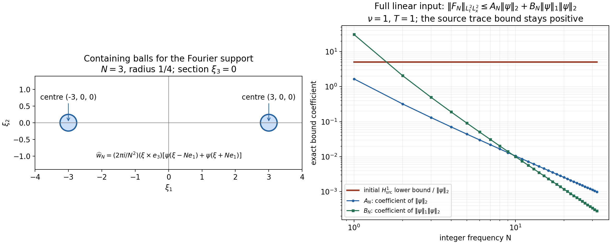

# Strong solutions and continuation

The preceding two chapters constructed weak solutions for every time.
Here we ask for one more spatial derivative. That extra control gives
uniqueness and continuous dependence on the data, but our existence
argument initially gives only a short time interval. We will prove
exactly what prevents repeated continuation of that solution.

We keep the equation
\[
 \partial_tu+(u\cdot\nabla)u+\nabla p=\nu\Delta u+f,\qquad
 \operatorname{div}u=0,\qquad u(0)=u_0,\quad \nu>0.
 \tag{1.1}
\]
The domain \(\Omega\) is either \(\mathbb R^3\), or the rectangular
periodic box
\[
 Q=\prod_{j=1}^3(\mathbb R/L_j\mathbb Z),\qquad L_j>0.
 \tag{1.2}
\]
All integrals use ordinary Lebesgue measure, including on \(Q\).
We impose no zero-mean condition on velocity or force.

We use [the projection and heat operators](pressure-and-the-divergence-free-projection.md)
and [the whole-space Sobolev inequality](weak-solutions-in-three-dimensional-space.md).
The Fourier convention on \(\mathbb R^3\) is
\(\widehat h(\xi)=\int h(x)e^{-2\pi i x\cdot\xi}\,dx\).
On \(Q\), put \(\kappa_k=(k_1/L_1,k_2/L_2,k_3/L_3)\),
\(V=L_1L_2L_3\), and
\(h_k=V^{-1}\int_Q h(x)e^{-2\pi i\kappa_k\cdot x}\,dx\).
The norms, with every Fourier factor retained, are
\[
 \|h\|_{H^s(\mathbb R^3)}^2
   =\int(1+4\pi^2|\xi|^2)^s|\widehat h(\xi)|^2\,d\xi,\qquad
 \|h\|_{H^s(Q)}^2
   =V\sum_k(1+4\pi^2|\kappa_k|^2)^s|h_k|^2.
 \tag{1.3}
\]
The subscript \(\sigma\) means divergence free. The projection \(P\)
acts on every nonzero frequency by \(I-\xi\otimes\xi/|\xi|^2\),
or its periodic counterpart; on the periodic constant mode it is
the identity. It is a contraction in every norm in (1.3).
The heat operator \(S_\nu(t)\) multiplies those same frequencies by
\(e^{-4\pi^2\nu t|\xi|^2}\) or
\(e^{-4\pi^2\nu t|\kappa_k|^2}\). The constant mode is unchanged.

Fix a force on \([0,T_0)\), where \(0<T_0\leq\infty\), with an
actual decomposition
\[
 u_0\in H^1_\sigma(\Omega),\qquad f=f_a+f_b,\qquad
 f_a\in L^1_{\rm loc}([0,T_0);H^1),\quad
 f_b\in L^2_{\rm loc}([0,T_0);L^2).
 \tag{1.4}
\]
Neither summand must be divergence free. These assumptions hold
for the original force itself, before applying \(P\). All time
functions are strongly measurable.

For a compact interval \(I=[a,b]\), define
\[
 X_I=C(I;H^1_\sigma)\cap L^2(I;H^2_\sigma),\qquad
 \|u\|_{X_I}
 =\max\left\{\sup_{t\in I}\|u(t)\|_{H^1},
                    \left(\int_I\|u(t)\|_{H^2}^2\,dt\right)^{1/2}\right\}.
 \tag{1.5}
\]
The same notation without the divergence restriction will be used
for a linear force trajectory, explicitly identified when needed.
A mild solution satisfies
\[
 u(t)=S_\nu(t-a)u(a)+
   \int_a^t S_\nu(t-r)P\{f(r)-(u(r)\cdot\nabla)u(r)\}\,dr
 \tag{1.6}
\]
on each compact interval of existence. We will show that all terms
are defined, that the original pressure can be recovered, and that
the resulting fields satisfy (1.1).

**Theorem.** The data (1.4) have a unique maximal mild velocity
\(u\) on an interval \([0,T_*)\), with \(0<T_*\leq T_0\).
Its restriction to every compact subinterval belongs to \(X_I\).
It has a locally integrable pressure with the gradient specified
in Section 5 and satisfies the original equation (1.1).
If \(T_*<T_0\), then
\[
 \lim_{t\uparrow T_*}\|u(t)\|_{H^1}=+\infty.
 \tag{1.7}
\]
The velocity obeys the energy equality on every compact interval.
Section 7 gives an explicit stability bound between solutions.
This theorem concerns \(H^1\) strong solutions; critical-space
theory and the Prodi–Serrin and Beale–Kato–Majda criteria require
further arguments.

## 2. The product estimate on both domains

The whole-space inequality already proved is
\[
 \|h\|_{L^6(\mathbb R^3)}
       \leq S\|\nabla h\|_2,\qquad S=\frac4{\sqrt3}.
 \tag{2.1}
\]
Its proof applies to vectors of any finite number of components:
the derivative bound for \(|h|\) is
\(|\partial_j|h||\leq|\partial_jh|\), by Cauchy–Schwarz,
and the scalar proof then has exactly the same constants.
The gradient of a vector field can therefore be treated as a
nine-component vector, without introducing an extra dimension factor.

We first supply an explicit periodic version that retains \(L_j\).
Define a Lipschitz function \(\theta:\mathbb R\to[0,1]\) by
\[
 \theta(s)=
 \begin{cases}
 0,&s\leq-1,\\
 s+1,&-1<s<0,\\
 1,&0\leq s\leq1,\\
 2-s,&1<s<2,\\
 0,&s\geq2.
 \end{cases}
 \qquad \chi(x)=\prod_{j=1}^3\theta(x_j/L_j).
 \tag{2.2}
\]
For a periodic \(h\in H^1(Q)\), let \(h_{\rm per}\) be its periodic
extension and \(v=\chi h_{\rm per}\). This is an \(H^1(\mathbb R^3)\)
function: the weak product rule for a Lipschitz multiplier follows
by smoothing the multiplier and the periodic Fourier sums, whose
products and first derivatives converge locally in \(L^2\).
It equals \(h\) on the original box and has support in its 27
adjacent copies. Almost everywhere,
\[
 |\nabla\chi|^2\leq\sum_{j=1}^3L_j^{-2},\qquad
 \|\nabla v\|_2
 \leq\sqrt{27}\left(\|\nabla h\|_{L^2(Q)}
                 +\Big(\sum_jL_j^{-2}\Big)^{1/2}\|h\|_{L^2(Q)}\right).
 \tag{2.3}
\]
The second inequality is the product rule and triangle inequality,
followed by periodicity in each of those 27 copies. Using (2.1)
and Cauchy–Schwarz on the two terms gives
\[
 \|h\|_{L^6(Q)}\leq C_Q\|h\|_{H^1(Q)},\qquad
 C_Q=S\sqrt{27}\sqrt{1+\sum_jL_j^{-2}}.
 \tag{2.4}
\]
In particular this includes constant functions. The same proof
works for the nine-component gradient.

Put \(C_\Omega=S\) on \(\mathbb R^3\), and use (2.4) on \(Q\).
For \(a\in H^1\) and \(b\in H^2\), pointwise Cauchy–Schwarz,
Hölder and interpolation give
\[
 \begin{aligned}
 \|(a\cdot\nabla)b\|_2
 &\leq\|a\|_6\|\nabla b\|_3\\
 &\leq C_\Omega\|a\|_{H^1}
               \|\nabla b\|_2^{1/2}\|\nabla b\|_6^{1/2}\\
 &\leq C_\Omega^{3/2}
               \|a\|_{H^1}\|b\|_{H^1}^{1/2}\|b\|_{H^2}^{1/2}.
 \end{aligned}
 \tag{2.5}
\]
For the last step on the box,
\(\|\nabla b\|_{H^1}^2\leq\|b\|_{H^2}^2\);
on the whole space use \(\|\nabla^2b\|_2\leq\|b\|_{H^2}\).
Both follow by comparing, frequency by frequency,
\(4\pi^2r^2(1+4\pi^2r^2)\) or \((4\pi^2r^2)^2\)
with \((1+4\pi^2r^2)^2\).
The interpolation step itself is
\(\int|g|^3\leq(\int|g|^2)^{3/4}(\int|g|^6)^{1/4}\).

For \(|I|=\tau\), square (2.5), bound the \(H^1\) factors by
their suprema and apply Cauchy–Schwarz to \(\int_I\|b\|_{H^2}\).
Taking the square root yields
\[
 \|(a\cdot\nabla)b\|_{L^2(I;L^2)}
 \leq C_\Omega^{3/2}\tau^{1/4}\|a\|_{X_I}\|b\|_{X_I}.
 \tag{2.6}
\]
This is an ordered bilinear map: the derivative falls on \(b\).
For divergence-free \(a\) it equals
\(\operatorname{div}(b\otimes a)\), with
\((b\otimes a)_{ij}=b_i a_j\).

## 3. The linear heat problem, including its time trace

Let \(w_0\in H^1\), \(F\in L^2(0,\tau;L^2)\), with no
divergence condition. We prove that
\[
 w(t)=S_\nu(t)w_0+\int_0^tS_\nu(t-r)F(r)\,dr
 \tag{3.1}
\]
belongs to \(C H^1\cap L^2H^2\).
For a bounded-frequency version of the data, set
\[
 E(t)=\|w(t)\|_{H^1}^2,\qquad
 D(t)=\|\nabla w(t)\|_{H^1}^2.
\]
Each truncated curve is absolutely continuous in every fixed
Sobolev space, so differentiating its Fourier norm is legitimate.
The Fourier weights give the exact identity
\[
 \frac12E'(t)+\nu D(t)=(F(t),(I-\Delta)w(t)),\qquad
 \|(I-\Delta)w\|_2^2=E+D=\|w\|_{H^2}^2.
 \tag{3.2}
\]
The real inner product is used throughout. The elementary bound
\(2AB\leq\nu A^2+\nu^{-1}B^2\), applied to the right side,
implies
\[
 E'+\nu D\leq\nu E+\nu^{-1}\|F\|_2^2.
 \tag{3.3}
\]
After multiplication by \(e^{-\nu t}\) and integration,
\[
 e^{-\nu t}E(t)+\nu\int_0^te^{-\nu r}D(r)\,dr
 \leq E(0)+\nu^{-1}\int_0^te^{-\nu r}\|F(r)\|_2^2\,dr.
 \tag{3.4}
\]
In particular, with
\[
 A=e^{\nu\tau}\left(\|w_0\|_{H^1}^2+
                         \nu^{-1}\|F\|_{L^2L^2}^2\right),
 \tag{3.5}
\]
we have \(\sup E\leq A\), \(\int D\leq A/\nu\) and
\(\int\|w\|_{H^2}^2\leq(\tau+\nu^{-1})A\).
Define
\[
 L_{\nu,\tau}=e^{\nu\tau/2}
                       \max\{1,\sqrt{\tau+\nu^{-1}}\}.
 \tag{3.6}
\]
Then, for the norm in (1.5),
\[
 \|w\|_{X_{[0,\tau]}}
 \leq L_{\nu,\tau}
       \left(\|w_0\|_{H^1}^2+\nu^{-1}\|F\|_{L^2L^2}^2\right)^{1/2}.
 \tag{3.7}
\]
The notation here allows non-divergence-free fields.

To remove the frequency restriction, truncate \(w_0\) and \(F\)
to \(|\xi|\leq n\), or \(|\kappa_k|\leq n\).
Dominated convergence in their respective weighted \(L^2\) spaces
gives convergence of the truncated data. Apply (3.7) to differences:
the solutions are Cauchy both in \(C H^1\) and in \(L^2H^2\).
Their two limits agree in \(L^2L^2\), so they define one curve \(w\).
For each time, heat contraction and
\(\|F_n-F\|_{L^1L^2}\leq\sqrt\tau\|F_n-F\|_{L^2L^2}\)
identify this limit with (3.1) in \(L^2\).
Thus (3.7) holds for (3.1), and its \(H^1\) continuity has been
proved, not assumed. Passing to the distributional equation shows
\(w_t=\nu\Delta w+F\in L^2L^2\). Its integral is the same continuous
curve, which proves absolute continuity into \(L^2\).

We also need a force \(F_a\in L^1(0,\tau;H^1)\).
With \(F=0\), (3.7) bounds the heat trajectory of any datum \(h\)
inserted at time \(r\) by \(L_{\nu,\tau}\|h\|_{H^1}\) on the
remaining interval. Applying the integral triangle inequality in
the supremum norm and in the time \(L^2H^2\) norm separately gives
\[
 \left\|\int_0^tS_\nu(t-r)F_a(r)\,dr\right\|_{X_{[0,\tau]}}
       \leq L_{\nu,\tau}\|F_a\|_{L^1H^1}.
 \tag{3.8}
\]
For completeness, continuity follows first for step functions
with \(H^1\) values: heat is strongly continuous in \(H^1\) by
dominated convergence of its multiplier, and the integral over
the changing endpoint has norm bounded by its interval length
times the step height. General \(L^1H^1\) functions are limits of
such step functions in \(L^1H^1\); (3.8) makes the resulting curves
converge uniformly in \(H^1\). The \(L^2H^2\) bound passes as well.
Their derivatives satisfy \(\nu\Delta w+F_a\in L^1L^2\), so
absolute continuity into \(L^2\) follows as above.

Combining (3.7) and (3.8), the exact free forced trajectory
\[
 z(t)=S_\nu(t)u_0+
             \int_0^tS_\nu(t-r)P(f_a(r)+f_b(r))\,dr
 \tag{3.9}
\]
satisfies
\[
 \|z\|_{X_{[0,\tau]}}
 \leq L_{\nu,\tau}
       \left(\|u_0\|_{H^1}
           +\|f_a\|_{L^1H^1}+\nu^{-1/2}\|f_b\|_{L^2L^2}\right).
 \tag{3.10}
\]
All force terms in this bound are norms of the original summands.

## 4. Constructing the solution by successive approximations

The space \(X_I\) is complete. Indeed a Cauchy sequence converges
in the complete spaces \(C(I;H^1_\sigma)\) and \(L^2(I;H^2_\sigma)\).
Both convergences imply convergence in \(L^2(I;L^2)\), so the limits
are equal almost everywhere and define one element of \(X_I\).
The divergence condition is closed because it is tested against
fixed smooth functions.

Define the ordered heat integral
\[
 \mathcal B_I(a,b)(t)=
          \int_{\inf I}^tS_\nu(t-r)P((a(r)\cdot\nabla)b(r))\,dr.
 \tag{4.1}
\]
Estimates (2.6) and (3.7), with zero initial value, prove
\[
 \|\mathcal B_I(a,b)\|_{X_I}\leq K_{\nu,\tau,\Omega}
                \|a\|_{X_I}\|b\|_{X_I},\qquad
 K_{\nu,\tau,\Omega}
 =L_{\nu,\tau}\nu^{-1/2}C_\Omega^{3/2}\tau^{1/4}.
 \tag{4.2}
\]
Here \(\tau=|I|\). In particular \(K_{\nu,\tau,\Omega}\to0\)
as \(\tau\downarrow0\) for every fixed original domain and viscosity.

Let \(d=\|z\|_{X_{[0,\tau]}}\). Choose \(\tau>0\), within the
force's interval, so that
\[
 4K_{\nu,\tau,\Omega}d<1.
 \tag{4.3}
\]
Such a choice is possible: (3.10) bounds \(d\) for all sufficiently
small \(\tau\), and (4.2) tends to zero. If \(d=0\), \(u=0\)
is a solution. Otherwise consider
\(\Phi(u)=z-\mathcal B(u,u)\) on the closed ball of radius \(2d\).
For every point of that ball,
\[
 \|\Phi(u)\|_X\leq d+4Kd^2\leq2d.
 \tag{4.4}
\]
For two points \(u,v\) in it, the exact bilinear expansion gives
\[
 \mathcal B(u,u)-\mathcal B(v,v)
       =\mathcal B(u-v,u)+\mathcal B(v,u-v),
\qquad
 \|\Phi(u)-\Phi(v)\|_X\leq4Kd\|u-v\|_X.
 \tag{4.5}
\]
Start with zero and iterate \(\Phi\). Consecutive differences are
bounded by a geometric sequence with ratio \(4Kd<1\).
Their sum converges in \(X\), by completeness, to a fixed point.
The same inequality makes that fixed point unique in the ball.
It obeys (1.6) and \(\|u\|_X\leq2d\).
Uniqueness among all \(X\) solutions is proved in Section 7.

## 5. Recovering the full equation and energy

The product estimate shows \(N=(u\cdot\nabla)u\in L^2L^2\).
The linear construction applied to the mild equation therefore gives
\[
 u_t=\nu\Delta u+Pf_a+Pf_b-PN\in L^1L^2
 \tag{5.1}
\]
on each compact interval, with \(u\) absolutely continuous into
\(L^2\). More precisely the right side is a sum of an \(L^1H^1\)
term and an \(L^2L^2\) term.

Let \(Q_{\rm grad}=I-P\). Define the pressure gradient by
\[
 \nabla p=Q_{\rm grad}(f-N).
 \tag{5.2}
\]
This is the original force's gradient component; it has not been
discarded. Equation (5.1) and (5.2) give (1.1) term by term.
The pressure itself is the potential proved in the earlier chapters.
On \(\mathbb R^3\), its Fourier formula away from zero is
\[
 \widehat p(\xi)
 =-\frac{\sum_{i,j}\xi_i\xi_j\widehat{u_i u_j}(\xi)}{|\xi|^2}
       -\frac{i\,\xi\cdot\widehat f(\xi)}{2\pi|\xi|^2}.
 \tag{5.3}
\]
This formula defines a distribution also at zero by the low/high
frequency construction of the previous chapter. To check its
hypotheses here, \(u\in L^\infty H^1\) implies
\(u\in L^\infty L^4\) by interpolation between \(L^2,L^6\).
Thus \(u\otimes u\in L^\infty L^2\), so its pressure contribution
is \(L^\infty L^2\). The force belongs to \(L^1L^2+L^2H^{-1}\)
by (1.4). The low-frequency part of its potential is locally
integrable in time with values in \(L^\infty\), and the
high-frequency part is locally integrable in time with values in
\(L^2\), exactly as proved there. No value of \(\widehat f/|\xi|\)
at the single point zero is imposed or needed.

On \(Q\), formula (5.3) uses \(\kappa_k\) for every \(k\ne0\).
Set the pressure constant mode to zero as a specified choice.
Its gradient is independent of that choice. The nonzero-frequency
lower bound \(2\pi|\kappa_k|\geq2\pi/\max_jL_j\) makes this a
locally integrable pressure. The original velocity mean remains
\[
 \frac1V\int_Q u(t,x)\,dx
 =\frac1V\int_Q u_0(x)\,dx+
       \int_0^t\frac1V\int_Q f(r,x)\,dx\,dr.
 \tag{5.4}
\]
To verify (5.4), the integral of
\(\operatorname{div}(u\otimes u)\) is zero by periodicity,
and the heat and projection operators fix the constant mode.

The energy identity is
\[
 \frac12\|u(t)\|_2^2+\nu\int_s^t\|\nabla u(r)\|_2^2\,dr
 =\frac12\|u(s)\|_2^2+\int_s^t(f(r),u(r))\,dr
 \quad(0\leq s\leq t<T_*).
 \tag{5.5}
\]
Here all terms are integrable: \(u\) is bounded in \(L^2\),
\(f_a\in L^1L^2\), \(f_b\in L^2L^2\), and
\(u\in L^2H^2\). Absolute continuity into \(L^2\) gives
\((\|u\|_2^2)'=2(u_t,u)\) almost everywhere. One proof is to apply
the scalar product identity to difference quotients of the
Bochner integral \(u(t)=u(s)+\int_s^tu_t\), using continuity
of \(u\) and Lebesgue differentiation of \(u_t\).
Integration by parts gives \((\Delta u,u)=-\|\nabla u\|_2^2\).
Since \(Pu=u\), projection can be moved onto \(u\) in the force
and product pairings.

For the nonlinear cancellation, at almost every time \(u\in H^2\).
Approximate it by divergence-free smooth Fourier truncations.
The product bound (2.5) passes the nonlinear pairing to the limit.
For the smooth fields on a box, periodic integration gives
\(\int u\cdot\nabla(|u|^2/2)=0\).
On the whole space, insert a cutoff equal to one on \(B_R\),
zero outside \(B_{2R}\), with gradient bounded by \(C/R\).
The error is bounded by
\(C(2R)^{-1}\int_{R<|x|<2R}|u|^3\), which tends to zero
because \(H^1\subset L^3\) by \(L^2,L^6\) interpolation.
This proves \((N,u)=0\), and integrating (5.1) proves (5.5).

## 6. The maximal interval and its endpoint

The construction can be started at any time \(a<T_0\), with
initial datum \(u(a)\) and the original force restricted to a
later interval. All estimates use elapsed time \(\tau=t-a\)
and retain the original \(\nu,L_j\). By Section 7, any two such
solutions with the same data agree on their common interval.
Consequently the union of all intervals reached by finite
continuation defines one solution on \([0,T_*)\).
Every compact subinterval is contained in one of these intervals,
so the stated \(X\) regularity holds. The definition makes this
interval maximal.

Suppose \(T_*<T_0\), and choose \(T'\) strictly between them.
If (1.7) failed, there would be \(R<\infty\) and times
\(a_n\uparrow T_*\) with \(\|u(a_n)\|_{H^1}\leq R\).
Set
\[
 D_R=L_{\nu,1}\left(R+\|f_a\|_{L^1(0,T';H^1)}
                   +\nu^{-1/2}\|f_b\|_{L^2(0,T';L^2)}\right).
 \tag{6.1}
\]
This is finite. Choose
\[
 0<\delta<\min\{1,T'-T_*\},\qquad
                    4K_{\nu,\delta,\Omega}D_R<1.
 \tag{6.2}
\]
On each interval \([a_n,a_n+\delta]\), (3.10) bounds its
linear trajectory by \(D_R\), since \(L_{\nu,\tau}\) is
nondecreasing in \(\tau\) and all force integrals are bounded
by those over \([0,T']\). Thus (4.3) constructs a solution
for the same length \(\delta\), independently of \(n\).
For sufficiently large \(n\), \(a_n+\delta>T_*\).
Uniqueness on the overlap glues this solution to the earlier one
and extends it past \(T_*\), a contradiction. This proves the
full limit in (1.7), not merely an unbounded supremum.

## 7. Stability with the initial trace retained

Let \(u,u'\) be two solutions on \([0,T]\), with their original
data \(u_0,f\) and \(u'_0,f'\), and
\(\|u\|_{X_{[0,T]}},\|u'\|_{X_{[0,T]}}\leq M\).
Define the full, possibly non-divergence-free linear difference
trajectory
\[
 F(t)=S_\nu(t)(u'_0-u_0)+
               \int_0^tS_\nu(t-r)(f'(r)-f(r))\,dr.
 \tag{7.1}
\]
It lies in \(C H^1\cap L^2H^2\) by Section 3. Write
\(D=\|F\|_{X_{[0,T]}}\), allowing general vector fields in this
particular norm. Its value at zero is exactly \(u'_0-u_0\).

Choose \(0<\delta\leq T\) such that
\(2M K_{\nu,\delta,\Omega}\leq1/2\), and partition \([0,T]\)
into \(m=\lceil T/\delta\rceil\) successive intervals \(I_j\)
of lengths at most \(\delta\). Define
\[
 L=L_{\nu,\delta},\qquad R=2L,\qquad Q_0=2(1+L),\qquad
 G_j=R^j+Q_0\sum_{k=0}^{j-1}R^k,\quad G_0=1.
 \tag{7.2}
\]
For \(w=u'-u\) and \(a=\inf I_j\), splitting the force integral
at \(a\) gives the exact restarted identity
\[
 \begin{aligned}
 w(t)={}&S_\nu(t-a)w(a)+PF(t)-S_\nu(t-a)PF(a)\\
        &-\mathcal B_{I_j}(w,u')(t)-\mathcal B_{I_j}(u,w)(t).
 \end{aligned}
 \tag{7.3}
\]
The nonlinear difference uses
\((u'\cdot\nabla)u'-(u\cdot\nabla)u
 =(w\cdot\nabla)u'+(u\cdot\nabla)w\); both ordered terms remain.
Equations (3.7), (4.2) and the restriction of the global norms
give
\[
 W_j:=\|w\|_{X_{I_j}}
 \leq L\|w(a)\|_{H^1}+(1+L)D+\frac12W_j,
 \qquad W_j\leq R\|w(a)\|_{H^1}+Q_0D.
 \tag{7.4}
\]
Initially \(\|w(0)\|_{H^1}\leq D\). If the bound at the left
endpoint is \(G_{j-1}D\), (7.4) bounds the entire interval,
including its right endpoint, by
\((RG_{j-1}+Q_0)D=G_jD\). This proves the bound by induction.
Since \(R\geq2\), the \(G_j\) are increasing. The global
supremum component is at most \(G_mD\); the square of the
integrated component is a sum of \(m\) terms each at most
\(G_m^2D^2\). Therefore
\[
 \boxed{\ \|u'-u\|_{X_{[0,T]}}
             \leq\sqrt m\,G_m\,\|F\|_{X_{[0,T]}}.\ }
 \tag{7.5}
\]
This proves stability for existing solutions with the stated bound.
It requires no further smallness assumption on \(F\).
For identical data, \(F=0\), so it also proves uniqueness among
all \(X\) solutions, including those outside the contraction ball.

The input topology matters: replacing its norm by the space-time
\(L^2\) norm loses the initial \(H^1\) trace. The next section gives actual forced solutions that demonstrate
this loss and an exact comparison with the source statement.

## 8. A source stability estimate and exact counterexample

Terence Tao’s arXiv:1108.1165v4, Theorem with source label lwp-h1-r3(v), author TeX lines 821–826, defines
\[
 F(t)=e^{t\Delta}(u'_0-u_0)
       +\int_0^t e^{(t-r)\Delta}(f'(r)-f(r))\,dr
\]
and prints an estimate
\[
 \|u-u'\|_{X^1([0,T]\times\mathbb R^3)}
 \lesssim_{T,M}\|F\|_{L^2_tL^2_x},
\]
for solutions bounded by \(M\) in \(X^1\), when the right side is sufficiently small. The periodic counterpart earlier in the source instead uses an X1 control of F. The whole-space display as printed is false. Here is a sequence satisfying even smooth-data hypotheses with a fixed \(T>0\); the construction retains general \(\nu>0\), and setting \(\nu=1\) gives an exact counterexample to the source's equation.

Fix a nonzero real even function \(\psi\in C_c^\infty(B_{1/4}(0))\). For integers \(N\geq1\), define the original initial vector field through its Fourier transform
\[
 \widehat w_N(\xi)=\frac{2\pi i}{N^2}
       (\xi\times e_3)\,[\psi(\xi-Ne_1)+\psi(\xi+Ne_1)].
\]
Its transform is smooth and compactly supported away from zero, with conjugate symmetry. Therefore \(w_N\) is a real Schwartz divergence-free vector field: divergence is zero by \(\xi\cdot(\xi\times e_3)=0\); Schwartz decay follows by integration by parts on the compact smooth Fourier transform. The two support balls are disjoint. Write
\[
 r_-=N-\tfrac14,\quad r_+=N+\tfrac14,\quad
 d_N=4\pi^2\nu r_-^2,\quad
 U_N=\frac{2\pi\sqrt2\,r_+}{N^2}\|\psi\|_2,\quad
 V_N=\frac{4\pi r_+}{N^2}\|\psi\|_1.
\]
On the support both \(|\xi|\) and \(|\xi\times e_3|\) lie between \(r_-\) and \(r_+\). Thus
\[
 \|w_N\|_2\leq U_N,\quad
 \|\widehat w_N\|_1\leq V_N,\quad
 \|w_N\|_{H^1}\geq
       \frac{4\pi^2\sqrt2\,r_-^2}{N^2}\|\psi\|_2
       \geq\frac{9\pi^2\sqrt2}{4}\|\psi\|_2>0.
\]
The last bound uses \(r_-/N\geq3/4\).

Set
\[
 u_N(t)=S_\nu(t)w_N,\qquad p_N=0,\qquad
 f_N(t)=(u_N(t)\cdot\nabla)u_N(t).
\]
Then the full forced Navier–Stokes equation holds exactly, since
\(u_{N,t}=\nu\Delta u_N\); no nonlinear remainder or hypothetical solution is used. For each fixed N these data are smooth and Schwartz in space on the compact interval, with bounded derivatives of every order. They belong to the source's H1 data class. The comparison solution is \(u=0,p=0,f=0,u_0=0\).

Heat decay on the actual Fourier support gives
\[
 \|u_N(t)\|_2\leq U_Ne^{-d_Nt},\quad
 \|u_N(t)\|_\infty\leq V_Ne^{-d_Nt},\quad
 \|\nabla u_N(t)\|_2\leq2\pi r_+U_Ne^{-d_Nt}.
\]
Consequently
\[
 \|f_N\|_{L^1(0,T;L^2)}
 \leq\frac{2\pi r_+U_NV_N}{2d_N}=O_{\nu,\psi}(N^{-3}).
\]
Here the displayed fraction is an explicit bound for every N; the order notation records its limit and does not replace it.
Also
\[
 \sup_{t\leq T}\|u_N(t)\|_{H^1}
 \leq\sqrt{1+4\pi^2r_+^2}\,U_N,
\quad
 \|u_N\|_{L^2(0,T;H^2)}
 \leq\frac{(1+4\pi^2r_+^2)U_N}{\sqrt{2d_N}}.
\]
Both right sides are bounded independently of \(N\), because \(r_+\leq5N/4\), \(r_-\geq3N/4\). Thus the source solution norms, in either the source sum or the course maximum convention, as compared below, have one common bound \(M<\infty\) at the fixed interval T.

The exact source linear difference trajectory for these two solutions is
\[
 F_N(t)=S_\nu(t)w_N+
              \int_0^t S_\nu(t-r)f_N(r)\,dr.
\]
It uses the full force in the displayed source definition. The heat contraction and the preceding estimates give
\[
 \|F_N\|_{L^2(0,T;L^2)}
 \leq\frac{U_N}{\sqrt{2d_N}}
       +\sqrt T\,\frac{2\pi r_+U_NV_N}{2d_N}
 \longrightarrow0.
\]
The first term is of order \(N^{-2}\) and the second \(N^{-3}\), with the full original constants displayed. If the source definition had included P before the force, the same bound would hold by its L2 contraction. In contrast the X1 difference norm is bounded below by the fixed positive initial H1 lower bound above. For fixed \(\nu=1,T,M\), the printed estimate is therefore impossible even when its smallness premise holds. This contradicts precisely the stated norm estimate, not the local existence theorem or its stability counterpart in its solution norm.

### Keeping the source norms and pressure prescription

The relevant source definitions are in author TeX lines 63–89,
138–146, 218–225, 328–344 and 363–369.
The source's real-order Fourier Sobolev norm has weight
\((1+|\xi|^2)^s\). The course norm has weight
\((1+4\pi^2|\xi|^2)^s\). Denote the former by \(H^s_{\rm src}\)
and retain both:
\[
 \|h\|_{H^s_{\rm src}}\leq\|h\|_{H^s}
       \leq(2\pi)^s\|h\|_{H^s_{\rm src}}\qquad(s\geq0).
 \tag{S.1}
\]
Indeed \(1+r^2\leq1+4\pi^2r^2\leq4\pi^2(1+r^2)\);
raising to \(s\), integrating against the same \(|\widehat h|^2\),
and taking a square root proves every factor in (S.1). The identity
map between the two weighted Fourier spaces is bijective with these
bounds; it does not change the vector field, force, viscosity or time.

The source intersection norm is the sum of its two component norms.
Its line 367 has \(L^2_xH^{s+1}_x\) as printed. The mild-solution
definition at lines 218–225 explicitly has \(L^2_tH^2_x\), which is
the time-integrated component used in the theorem and its proof.
The counterexample uses that actual mild-solution class. Write
\[
 \|u\|_{X^1_{\rm src}}
 =\|u\|_{L^\infty_tH^1_{\rm src}}
       +\|u\|_{L^2_tH^2_{\rm src}}.
 \tag{S.2}
\]
For continuous \(H^1\) curves the essential supremum includes the
initial value by continuity. The exact counterexample bounds in the
source's own weights are
\[
 \|w_N\|_{H^1_{\rm src}}
 \geq\frac{2\pi\sqrt2\,r_-^2}{N^2}\|\psi\|_2
 \geq\frac{9\pi\sqrt2}{8}\|\psi\|_2>0,
 \tag{S.3}
\]
\[
 \|u_N\|_{X^1_{\rm src}}
 \leq\sqrt{1+r_+^2}\,U_N
      +\frac{(1+r_+^2)U_N}{\sqrt{2d_N}}.
 \tag{S.4}
\]
For an explicit bound independent of \(N\), put
\[
 C_U=\frac{5\pi\sqrt2}{2}\|\psi\|_2,\quad
 C_V=5\pi\|\psi\|_1,\quad c_d=\frac{9\pi^2\nu}{4}.
 \tag{S.5}
\]
Then \(U_N\leq C_U/N\), \(V_N\leq C_V/N\), and
\(d_N\geq c_dN^2\), so
\[
 \|u_N\|_{X^1_{\rm src}}
 \leq \frac{\sqrt{41}}4 C_U
       +\frac{41C_U}{16\sqrt{2c_d}}=:M_\nu,
 \tag{S.6}
\]
\[
 \|F_N\|_{L^2_tL^2_x}
 \leq\frac{C_U}{\sqrt{2c_d}\,N^2}
       +\frac{5\pi C_UC_V\sqrt T}{4c_d\,N^3}.
 \tag{S.7}
\]
The zero comparison and all \(u_N\) therefore meet the same source
bound \(M=M_\nu+1\); choose \(\nu=1\) for its original equation.
For any proposed finite constant \(C(T,M)\), (S.7) eventually makes
\(C(T,M)\|F_N\|_{L^2L^2}\) smaller than the positive number in
(S.3), and also meets any positive smallness threshold. This proves
the contradiction in the source norms themselves.

The source also prescribes pressure by its displayed inverse-Laplacian
formula, rather than allowing an arbitrary pressure. Our \(p_N=0\)
meets that prescription exactly:
\[
 f_{N,i}=\partial_j(u_{N,i}u_{N,j}),\qquad
 \partial_i f_{N,i}=\partial_i\partial_j(u_{N,i}u_{N,j}),
\]
\[
 -\Delta^{-1}\partial_i\partial_j(u_{N,i}u_{N,j})
       +\Delta^{-1}\partial_i f_{N,i}=0.
 \tag{S.8}
\]
Both terms have the same Fourier multiplier acting on the same
Schwartz tensor; their distributional cancellation includes the
low-frequency prescription. The source requires divergence-free
initial velocity, not divergence-free force. Since the compact
Fourier support and all its derivatives stay bounded for each fixed
\(N\) and \(0\leq t\leq T\), Fourier integration by parts shows that
every spatially weighted space/time derivative of \(u_N\), and hence
of \(f_N\), is uniformly bounded on that slab. In particular the
source's full Schwartz-data and \(L^\infty_tH^1_x\) force hypotheses
hold. Finally the integrand
\(-(u_N\cdot\nabla)u_N-\nabla p_N+f_N\) is identically zero,
so its unprojected mild identity holds exactly, not only its PDE.

The replacement estimate (7.5) also gives an exact comparison with
the source's solution topology. On the same original vector fields,
(S.1) and the sum versus maximum definitions imply
\[
 \|h\|_{X_{[0,T]}}\leq4\pi^2\|h\|_{X^1_{\rm src}},\qquad
 \|h\|_{X^1_{\rm src}}\leq2\|h\|_{X_{[0,T]}}.
 \tag{8.1}
\]
If the source solution bounds are \(M_{\rm src}\), use
\(M=4\pi^2M_{\rm src}\) in the choice of \(\delta\) for (7.2).
Then apply (8.1) to both \(w\) and \(F\) in (7.5):
\[
 \|u'-u\|_{X^1_{\rm src}}
 \leq8\pi^2\sqrt m\,G_m\,\|F\|_{X^1_{\rm src}}.
 \tag{8.2}
\]
This proves a replacement in the source norms while keeping the
original fields, full force, viscosity and time. It corrects the
displayed stability estimate. It makes no claim about the paper's
later global equivalences or the novelty of this correction.

*Figure 1.* Left: the section \(\xi_3=0\) through the two balls
containing the Fourier support, for \(N=3\); the drawing does not
assert that the support of \(\psi\) fills those balls. Right: at
the specified values \(\nu=1,T=1\), the coefficients
\[
 A_N=\frac{2\pi\sqrt2\,r_+/N^2}{\sqrt{2d_N}},\qquad
 B_N=\sqrt T\,
       \frac{2\pi r_+(2\pi\sqrt2\,r_+/N^2)(4\pi r_+/N^2)}{2d_N}
 \tag{8.3}
\]
in the proved bound
\(\|F_N\|_{L^2L^2}\leq A_N\|\psi\|_2+
B_N\|\psi\|_1\|\psi\|_2\) decay while the source \(H^1\)
trace lower bound (S.3) stays positive. These are sampled values
of the explicit bounds, not measured solution norms. The full
proof and all hypotheses are in Section 8. The compared source
is Tao's theorem identified there. The
[reproducible figure source](../assets/strong-solution-stability.py)
retains the original coefficients.

## 9. Five exercises with solutions

### Exercise 1: an arbitrary constant mode

Let \(\Omega=Q\), \(c\in\mathbb R^3\), and
\(G\in L^1(0,T;\mathbb R^3)\). Find the solution for
\(u_0(x)=c\), \(f(t,x)=G(t)\), and check its full \(X\) norm.

**Solution.** Put \(a(t)=c+\int_0^tG(r)\,dr\),
\(u(t,x)=a(t)\), \(p=0\). Spatial derivatives and the nonlinear
term vanish, while \(u_t=G\), so the full equation holds.
The force belongs to \(L^1H^1\). Every Sobolev norm of this
constant vector is \(\sqrt V|a(t)|\), by the constant Fourier
coefficient in (1.3). Consequently
\[
 \|u\|_{X_{[0,T]}}
 =\sqrt V\max\left\{\sup_{t\leq T}|a(t)|,
                        \left(\int_0^T|a(t)|^2\,dt\right)^{1/2}\right\}.
 \tag{9.1}
\]
This is finite, and uniqueness follows from (7.5).
Setting the mean to zero would remove these actual solutions.
Their energy equality is precisely
\(\tfrac V2|a(t)|^2-\tfrac V2|a(s)|^2
 =V\int_s^tG(r)\cdot a(r)\,dr\).

### Exercise 2: the two ordered product terms

On the original rectangular box, let
\[
 a(x)=\sin(2\pi x_2/L_2)e_1,\qquad
 b(x)=\sin(2\pi x_1/L_1)e_2.
\]
Compute \((a\cdot\nabla)b\) and \((b\cdot\nabla)a\), and
verify the difference identity used in (7.3).

**Solution.** Both fields are divergence free because their
nonzero components are independent of the corresponding
differentiation variable. Direct differentiation gives
\[
 (a\cdot\nabla)b=
 \frac{2\pi}{L_1}\sin(2\pi x_2/L_2)\cos(2\pi x_1/L_1)e_2,
 \tag{9.2}
\]
\[
 (b\cdot\nabla)a=
 \frac{2\pi}{L_2}\sin(2\pi x_1/L_1)\cos(2\pi x_2/L_2)e_1.
 \tag{9.3}
\]
They need not coincide. For \(u'=u+w\), expansion of all four
terms gives
\[
 (u'\cdot\nabla)u'-(u\cdot\nabla)u
 =(w\cdot\nabla)u+(u\cdot\nabla)w+(w\cdot\nabla)w
 =(w\cdot\nabla)u'+(u\cdot\nabla)w.
 \tag{9.4}
\]
Thus the ordered form retains the quadratic difference term
inside \((w\cdot\nabla)u'\); it has not been omitted.

### Exercise 3: a gradient force still appears in the pressure

Take \(u_0=0\) and \(f=\nabla q\), where \(q\) is a smooth
compactly supported space/time function on the whole space,
or a smooth periodic function on a finite time interval.
Find \(u\) and \(\nabla p\).

**Solution.** At every nonzero frequency the projection
annihilates \(2\pi i\xi\widehat q\), and the periodic gradient
has zero constant mode. Thus \(Pf=0\) and the unique mild
velocity is \(u=0\), by (7.5). Formula (5.2) gives
\(\nabla p=f=\nabla q\). On the whole space choose \(p=q\);
on the box the specified zero-mean choice is
\[
 p(t,x)=q(t,x)-V^{-1}\int_Qq(t,y)\,dy.
 \tag{9.5}
\]
The original equation reads \(\nabla p=f\).
The vanishing velocity does not remove the original force
from that equation.

### Exercise 4: an endpoint of the force interval

Let \(0<T_0<\infty\), and on \(Q\) put
\[
 u(t,x)=\frac{e_1}{T_0-t},\qquad
 p=0,\qquad f(t,x)=\frac{e_1}{(T_0-t)^2},
 \quad 0\leq t<T_0.
 \tag{9.6}
\]
Check the equation and the hypothesis about the force interval
in the continuation theorem.

**Solution.** All spatial terms vanish, while
\(u_t=e_1/(T_0-t)^2=f\). The initial datum is \(e_1/T_0\).
The force is in \(L^1(0,T;H^1)\) for each \(T<T_0\), since
\[
 \int_0^T\|f(t)\|_{H^1}\,dt
 =\sqrt V\left(\frac1{T_0-T}-\frac1{T_0}\right).
 \tag{9.7}
\]
The right side diverges as \(T\uparrow T_0\).
There is no larger force interval satisfying (1.4).
The solution norm is \(\sqrt V/(T_0-t)\), so it diverges
at that endpoint. This example verifies why an extension
argument at \(T_*<T_0\) uses force norms on an actual larger
interval. It makes no inference about a force remaining in
the stipulated class past the endpoint.

### Exercise 5: loss of the initial trace even without a force

Fix \(T>0\) and the original \(Q,\nu\). For integers \(N\geq1\)
let \(q_N=2\pi N/L_2\) and
\[
 v_N(t,x)=\frac1N e^{-\nu q_N^2t}\sin(q_Nx_2)e_1.
 \tag{9.8}
\]
Prove that these are exact unforced solutions with uniformly
bounded \(X_{[0,T]}\) norms, whose space-time \(L^2\) norms
tend to zero while their initial \(H^1\) norms stay positive.

**Solution.** Divergence is zero and
\((v_N\cdot\nabla)v_N=v_{N,1}\partial_1v_N=0\).
Also \(\partial_tv_N=\nu\Delta v_N\).
Thus \(p_N=0,f_N=0\) give the exact equation at the fixed
positive viscosity. There are two Fourier modes, of modulus
\(1/(2N)\), at \(k=\pm Ne_2\). Retaining their volume and
time factors gives
\[
 \|v_N(0)\|_{H^1}
 =\frac{\sqrt V}{\sqrt2\,N}\sqrt{1+q_N^2}
 \geq\frac{\sqrt V}{\sqrt2}\frac{2\pi}{L_2}>0,
 \tag{9.9}
\]
\[
 \|v_N\|_{L^2(0,T;L^2)}
 =\frac{\sqrt V}{\sqrt2\,N}
       \left(\frac{1-e^{-2\nu q_N^2T}}{2\nu q_N^2}\right)^{1/2},
 \tag{9.10}
\]
\[
 \|v_N\|_{L^2(0,T;H^2)}
 =\frac{\sqrt V(1+q_N^2)}{\sqrt2\,N}
       \left(\frac{1-e^{-2\nu q_N^2T}}{2\nu q_N^2}\right)^{1/2}.
 \tag{9.11}
\]
The \(H^1\) supremum is its initial value.
Since \(q_N=(2\pi/L_2)N\), (9.9) is bounded above uniformly
in \(N\), (9.11) is also bounded above uniformly, and (9.10)
tends to zero. The comparison solution is zero. Its full
linear difference trajectory is exactly \(F_N=v_N\).
Thus a space-time \(L^2\) input cannot control the \(H^1\)
solution trace even in this explicit periodic unforced family.
This supplements the whole-space forced counterexample in
Section 8; it does not change that example's domain or force.

## 10. Sources and the next questions

Terence Tao, [*Localisation and compactness properties of the
Navier–Stokes global regularity problem*, arXiv:1108.1165v4](https://arxiv.org/abs/1108.1165v4),
is the source compared here. The original author TeX definitions
and bounded portions of its linear estimates and local \(H^1\)
theory were read directly. The relevant theorem labels are
lwp-h1, lwp-h1-r3 and max-cauchy. The argument above supplies
its own linear, product, fixed-point and continuation proofs;
it does not import the paper's later global regularity implications.
The editorial counterexample identifies precisely the printed
stability norm at lwp-h1-r3(v), author TeX lines 821–826, and
(8.2) supplies the corrected comparison.

The weak-solution foundations in the preceding chapters allow
the full force \(L^1L^2+L^2H^{-1}\). The strong construction here
uses the explicitly stronger class \(L^1H^1+L^2L^2\).
Its \(H^1\) continuation criterion does not yet characterize
singularity by critical velocity or vorticity norms. Those are
the next mathematical questions in the series, before using
the human, Alpöge–Buckmaster, OpenAI and workbench constructions.

