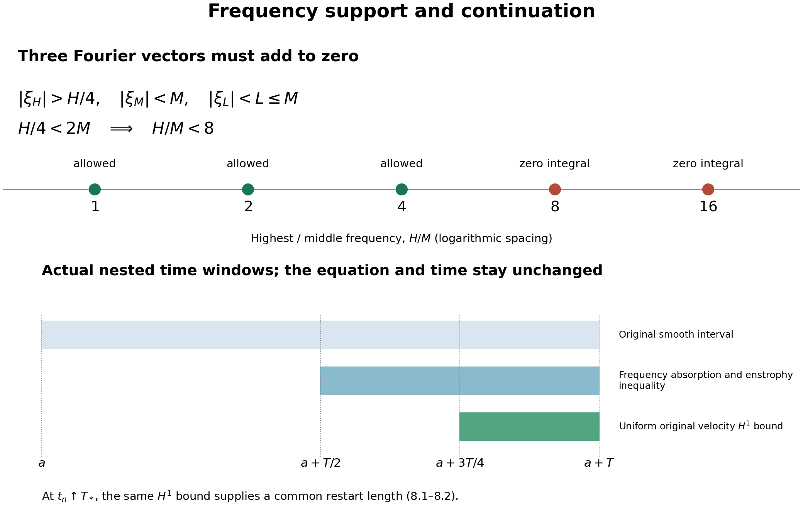
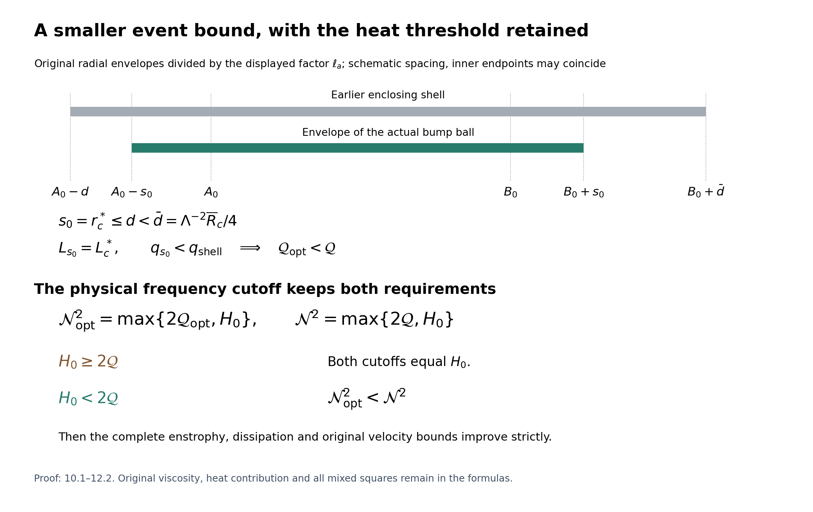
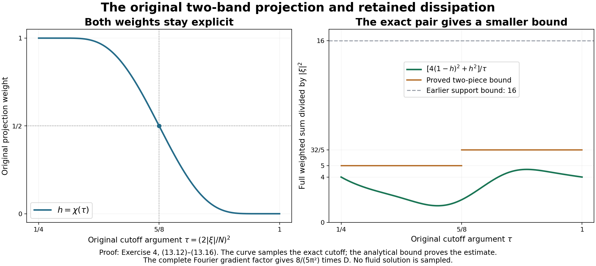

# The bounded critical-velocity endpoint

A bounded \(L^3\) velocity norm prevents a finite singular endpoint
for the unforced Navier–Stokes equation on three-dimensional space,
in the energy classes defined in the earlier lessons.
This chapter proves that statement from the frequency estimate,
then transfers it from smooth solutions to the actual strong
and energy weak solutions.

The original viscosity stays positive and explicit. We keep the
full heat field and every cross term in the nonlinear vorticity
identity. The smoothing argument uses the exact time norm of
[lesson 5](strong-solutions-and-continuation.md), and the final
identification uses the full energy comparison of
[lesson 6](velocity-bounds-and-uniqueness.md).
The frequency and mass providers are
[lesson 12](global-nonlinear-energy-and-total-speed.md),
[lesson 15](frequency-backpropagation-with-the-original-parameters.md),
and [lesson 19](annuli-and-velocity-mass-uniform-across-scales.md).
No additional regularity is assumed in the weak-solution conclusion.

The human source is Terence Tao,
[*Quantitative bounds for critically bounded solutions to the
Navier–Stokes equations*, arXiv:1908.04958v2](https://arxiv.org/abs/1908.04958v2),
original author article.tex, Applications, lines 1422–1490.
Its displayed enstrophy identity lists five terms, although its
following definitions and estimates include a sixth.
Section 2 derives the full identity and keeps that term visibly.
This is independent course exposition and author self-check;
no novelty or independent review is claimed.

## 1. The full identity in the original equation

Keep a smooth unforced solution of the original equation
\[
 u_t+(u\cdot\nabla)u+\nabla p=\nu\Delta u,\qquad
 \operatorname{div}u=0,\qquad \nu>0 .
 \tag{1.1}
\]
The original velocity and its derivatives have bounded \(L^2\)
norms on each compact time interval under consideration, and
\(\sup_t\|u(t)\|_3\leq U\).
For an actual earlier time \(t_b\), let
\[
 \begin{gathered}
 v(t)=H_{\nu(t-t_b)}*u(t_b),\quad w=u-v,\quad
 \ell=\nabla\times v,\quad z=\nabla\times w,\quad \omega=z+\ell,\\
 E(t)=\frac12\int_{\mathbb R^3}|z(t,x)|^2\,dx,\qquad
 D(t)=\int_{\mathbb R^3}|\nabla z(t,x)|^2\,dx .
 \end{gathered}
 \tag{1.2}
\]
The Gaussian is exactly
\(H_s(x)=(4\pi s)^{-3/2}e^{-|x|^2/(4s)}\).
Since \(\ell_t=\nu\Delta\ell\), taking the original curl gives
\[
 z_t-\nu\Delta z
 =-(u\cdot\nabla)(z+\ell)+(z+\ell)\cdot\nabla(w+v).
 \tag{1.3}
\]
Every sign follows from
\(\omega_t-\nu\Delta\omega=-(u\cdot\nabla)\omega+
(\omega\cdot\nabla)u\); pressure has zero curl because it is
the original scalar pressure. No replacement pressure is introduced.

## 2. All six contributions and the global curl map

Multiplying 1.3 by \(z\) and integrating proves
\[
 E'(t)=-\nu D(t)+Y_2(t)+Y_3(t)+Y_4(t)+Y_5(t)+Y_6(t),
 \tag{2.1}
\]
where
\[
 \begin{aligned}
 Y_2&=-\int z\cdot(u\cdot\nabla)\ell\,dx,&
 Y_3&=\int z\cdot(z\cdot\nabla)w\,dx,\\
 Y_4&=\int z\cdot(z\cdot\nabla)v\,dx,&
 Y_5&=\int z\cdot(\ell\cdot\nabla)w\,dx,\\
 Y_6&=\int z\cdot(\ell\cdot\nabla)v\,dx .
 \end{aligned}
 \tag{2.2}
\]
The label \(Y_1\) in the source is its unit-viscosity dissipation;
here it is retained as \(\nu D\).
To justify the sole transport cancellation, use compact spatial
cutoffs \(\chi_R\) equal to one on the radius-\(R\) ball,
with \(|\nabla\chi_R|\leq C/R\). Divergence freedom gives
\(-\int\chi_R z\cdot(u\cdot\nabla)z=
(1/2)\int(u\cdot\nabla\chi_R)|z|^2\).
Its absolute value is at most
\(C\|u\|_\infty\|z\|_2^2/(2R)\), which tends to zero.
The diffusion term converges to \(-\nu D\) by its \(H^1\)
integrability and the same cutoff limit. All remaining products
are integrable in the stated smooth class and by the bounds below.
This proves 2.1 with the missing \(Y_6\) present.

The global Fourier identity for the solenoidal \(w\) is
\[
 \|\nabla w\|_2^2=\|z\|_2^2=2E .
 \tag{2.3}
\]
Indeed the original Fourier multiplier is \(2\pi i\xi\):
\[
 |2\pi\xi|^2|\widehat w|^2
 =|2\pi\xi\times\widehat w|^2+
                     |2\pi\xi\cdot\widehat w|^2 .
 \tag{2.4}
\]
The last summand is zero by the actual divergence condition.
Parseval gives 2.3. This identity is used on the whole space,
not on an unproved restricted curl inverse.

## 3. Bounds for all four heat cross terms

Write \(s=t-t_b>0\). The original Gaussian bounds from lesson 13
(1.5) retain
\[
 \|\nabla^jv(t)\|_p\leq
 C_{j,p}U(\nu s)^{-j/2-1/2+3/(2p)},\qquad
 C_{j,p}=\|\nabla^jH_1\|_{r_p},\quad
 1/r_p=2/3+1/p .
 \tag{3.1}
\]
All tensors carry their full Euclidean norms.
The curl inequalities give
\(\|\ell\|_p\leq\sqrt2\|\nabla v\|_p\) and
\(\|\nabla\ell\|_p\leq\sqrt2\|\nabla^2v\|_p\).
Hölder, 2.3 and 3.1 therefore prove separately
\[
 \begin{aligned}
 |Y_2|&\leq\|z\|_2\|u\|_3\|\nabla\ell\|_6
       \leq2C_{2,6}U^2(\nu s)^{-5/4}\sqrt E,\\
 |Y_6|&\leq\|z\|_2\|\ell\|_3\|\nabla v\|_6
       \leq2C_{1,3}C_{1,6}U^2(\nu s)^{-5/4}\sqrt E,\\
 |Y_4|&\leq\|\nabla v\|_\infty\|z\|_2^2
       \leq2C_{1,\infty}U(\nu s)^{-1}E,\\
 |Y_5|&\leq\|\ell\|_\infty\|z\|_2\|\nabla w\|_2
       \leq2\sqrt2C_{1,\infty}U(\nu s)^{-1}E .
 \end{aligned}
 \tag{3.2}
\]
For \(Y_6\), the two original heat powers are
\(-1/2\) and \(-3/4\), totaling \(-5/4\).
For \(Y_2\), the second derivative in \(L^6\) has that
same power. Their two constants remain distinct.

For every \(A\geq0,E\geq0,s>0\), the square
\((s^{-1/2}\sqrt E-s^{1/2}A)^2\geq0\) proves
\(2A\sqrt E\leq s^{-1}E+sA^2\).
Use
\(A=(C_{2,6}+C_{1,3}C_{1,6})U^2(\nu s)^{-5/4}\)
in the sum of the first two estimates. The complete differential
consequence is
\[
 \begin{aligned}
 E'+\nu D\leq{}&
 Y_3+\frac{1+2(1+\sqrt2)C_{1,\infty}U/\nu}{s}E\\
 &+(C_{2,6}+C_{1,3}C_{1,6})^2
                          U^4\nu^{-5/2}s^{-3/2}.
 \end{aligned}
 \tag{3.3}
\]
Both source heat terms, both mixed-gradient terms, the original
viscosity and the actual positive time gap are present. 3.3 is
a proved estimate; its nonlinear term \(Y_3\) has not been assumed
small or omitted.

## 4. Original projections and the high-frequency bound

First let \(u,p\) be a smooth unforced solution on
\([a,a+T]\times\mathbb R^3\), \(T>0\), of
\[
 u_t+(u\cdot\nabla)u+\nabla p=\nu\Delta u,\quad
 \operatorname{div}u=0,\quad \nu>0,\quad
 \sup_{a\leq t\leq a+T}\|u(t)\|_3\leq U .
 \tag{4.1}
\]
Use the smooth energy class of lesson 19, with bounded spatial \(L^2\)
derivative norms on this closed interval. Their sizes will not enter
the estimates. If \(U=0\), the velocity is zero by continuity and
all assertions below follow directly. Hence assume \(U>0\).
Keep the actual heat field and nonlinear remainder
\(v(t)=H_{\nu(t-a)}*u(a)\), \(w=u-v\),
\(\ell=\nabla\times v\), \(z=\nabla\times w\), and
\(E=\|z\|_2^2/2\), \(D=\|\nabla z\|_2^2\).

The original radial functions are
\[
 \begin{gathered}
 b_{\rm cut}(s)=
 \begin{cases}e^{-1/s},&s>0,\\0,&s\leq0,\end{cases}\qquad
 \chi(s)=\frac{b_{\rm cut}(1-s)}
              {b_{\rm cut}(1-s)+b_{\rm cut}(s-1/4)},\\
 \phi(\xi)=\chi(|\xi|^2),\quad
 p(\xi)=\phi(\xi)-\phi(2\xi),\quad
 \widetilde p(\xi)=\phi(\xi/2)-\phi(4\xi),\\
 P_N=p(\xi/N)(D),\qquad
 \widehat f(\xi)=\int f(x)e^{-2\pi ix\cdot\xi}\,dx .
 \end{gathered}
 \tag{4.2}
\]
The denominator is positive. Its two summands are oppositely
monotone where both are nonzero, so \(\chi\) is nonincreasing.
Consequently \(0\leq p\leq1\). It vanishes for
\(|\xi|\leq1/4\) and \(|\xi|\geq1\), including the two boundary
spheres, and \(\widetilde p=1\) on its support.
For any fixed original frequency \(N_{\rm ref}>0\), the grid
\(\mathcal D=N_{\rm ref}2^{\mathbb Z}\) therefore has
\(\sum_{N\in\mathcal D}p(\xi/N)=1\) for every \(\xi\ne0\),
by the complete telescoping identity. We do not set \(N_{\rm ref}\)
or any physical frequency to one.

Define the finite positive constants
\[
 \kappa_p=\|\mathcal F^{-1}p\|_{3/2},\qquad
 \kappa_\partial=\sum_{j=1}^3
       \|\mathcal F^{-1}(2\pi i\xi_j\widetilde p(\xi))\|_1 .
 \tag{4.3}
\]
Smooth compact Fourier support makes these kernels Schwartz:
repeated integration by parts gives arbitrarily high polynomial
decay. Nonconstancy of the companion makes
\(\kappa_\partial>0\). This \(\kappa_p\) is distinct from
the quantity \(c_p=\|p\|_2\) in lesson 12.

Retain the exact \(b_0>0\) of lesson 15 (2.3), and choose
\[
 \begin{gathered}
 b=\min\{b_0,\pi^2\nu/(224\kappa_\partial)\},\\
 \mathcal Q=\frac{K\Lambda_{\rm it}}{\rho_{\rm it}}\,
                         q_{\rm shell}^{\,U^3/L_c^*},\\
 \mathcal N^2=\max\left\{2\mathcal Q,\
       \frac2{c_{\rm heat}\nu}
                       \log_+(K_{\rm heat}U/b)\right\},\qquad
 N_c=\mathcal N/\sqrt T .
 \end{gathered}
 \tag{4.4}
\]
In \(\mathcal Q\), all symbols are the complete lesson 19 (7.1) constants
constructed at this chosen \(b\). In particular the \(K\) there is
the longer-time receiver constant. Here \(K_{\rm heat}\) is
exactly the full kernel constant of lesson 15 (1.4), and
\(c_{\rm heat}=\pi^2/8\); those are distinct constants.
No later frequency or time occurs in any of these choices.

For every \(t\in[a+T/2,a+T]\), the lesson 19 (7.1) result applies on
the original interval \([a,t]\). Its length is at least \(T/2\).
Thus \(N\geq N_c\) cannot have a point with
\(|P_Nu(t,x)|\geq bN\): such an event would imply
\((t-a)N^2<\mathcal Q\), contradicting 4.4.
The original heat-kernel estimate also gives
\[
 \begin{gathered}
 \|P_Nu(t)\|_\infty\leq bN,\qquad
 \|P_Nv(t)\|_\infty
 \leq K_{\rm heat}UN e^{-c_{\rm heat}\nu(t-a)N^2}
 \leq bN\quad(N\geq N_c),\\
 \|P_Nw(t)\|_\infty\leq
 \begin{cases}
 2\kappa_p UN,&N<N_c,\\
 2bN,&N\geq N_c.
 \end{cases}
 \end{gathered}
 \tag{4.5}
\]
If \(K_{\rm heat}U/b\leq1\), the second estimate follows
without a positive logarithm. Otherwise 4.4 supplies exactly
the needed exponential factor. The low-frequency bound follows
from the full convolution kernel
\(N^3\mathcal F^{-1}p(Nx)\), whose \(L^{3/2}\) norm is
\(\kappa_p N\), and
\(\|w\|_3\leq\|u\|_3+\|v\|_3\leq2U\).
This explicitly includes the heat part of the high-frequency
nonlinear field, which cannot be removed from \(P_Nw\).

## 5. The full trilinear term and its frequency count

At any of those times set \(z_N=P_Nz\), \(W_N=\nabla P_Nw\),
and \(a_N=\|z_N\|_2\). The global curl identity gives
\[
 \|W_N\|_2=a_N,\qquad
 B_N:=\max\{\|z_N\|_\infty,\|W_N\|_\infty\}
          \leq\kappa_\partial N\|P_Nw\|_\infty .
 \tag{5.1}
\]
Indeed \(P_N\widetilde P_N=P_N\). Each original derivative
therefore has kernel
\(N^4\mathcal F^{-1}(2\pi i\xi_j\widetilde p)(Nx)\),
of \(L^1\) norm equal to \(N\) times the stated one.
For the gradient tensor its Euclidean norm is bounded by
the sum of the three derivative-vector norms. For the curl,
\(\nabla\times f=\sum_j e_j\times\partial_jf\), and each cross
product has operator norm one. This proves both bounds without
losing a tensor component.

The actual term is
\[
 Y_3=\int_{\mathbb R^3}z\cdot(z\cdot\nabla)w\,dx
 =\sum_{N_1,N_2,N_3\in\mathcal D}
        \int z_{N_1}\cdot(z_{N_2}\cdot\nabla)P_{N_3}w\,dx .
 \tag{5.2}
\]
Here is the exact support test. Put
\(H=\max(N_1,N_2,N_3)\), let \(M\) be the middle frequency,
and \(L\) the least. Where the three Fourier factors can be
nonzero, their vectors have sum zero and the highest vector
has magnitude strictly greater than \(H/4\), while the other
two have magnitudes strictly less than \(M\) and \(L\leq M\).
Hence \(H/4<2M\), or \(H<8M\).
On the original dyadic grid this leaves only
\[
 M\in\{H,H/2,H/4\},\qquad L\leq M .
 \tag{5.3}
\]
In particular the putative ratio \(H/M=8\) does not contribute.
One may prove the vanishing integral first for compact Fourier
approximants and then by \(L^2\) convergence and the bounded third
factor; the supports never meet zero in the convolution when
\(H\geq8M\). This also handles boundary spheres.

The pointwise contraction in 5.2 is bounded by the product of
the two vorticity-vector norms and the full gradient-tensor norm.
For each of at most six orderings, place the two larger-frequency
factors in \(L^2\), and the smaller in \(L^\infty\).
Whichever original role occupies each position, 5.1 gives
the same bounds. Ties may be counted more than once, which only
increases this nonnegative upper bound. From 4.5–5.1 and the
complete geometric sums,
\[
 \begin{aligned}
 \sum_{L\leq M}B_L
 &\leq2\kappa_\partial\left(
    \kappa_p U\sum_{\substack{L<N_c\\L\leq M}}L^2
               +b\sum_{\substack{L\geq N_c\\L\leq M}}L^2\right)\\
 &\leq\frac{8\kappa_\partial}3
                          (\kappa_p UN_c^2+bM^2),\\
 |Y_3|&\leq16\kappa_\partial
   \sum_{H\in\mathcal D}\sum_{j=0}^2
        a_Ha_{2^{-j}H}(\kappa_p UN_c^2+b\,2^{-2j}H^2).
 \end{aligned}
 \tag{5.4}
\]
For every positive upper endpoint \(R\), the sum of \(L^2\)
over grid frequencies at most \(R\) is at most \(4R^2/3\):
take the largest such grid frequency and sum
\(\sum_{k\geq0}4^{-k}=4/3\).
This proof does not require \(N_c\) to belong to the grid.

Cauchy–Schwarz and the bijection \(H\mapsto2^{-j}H\) give
\[
 \begin{gathered}
 \sum_Ha_Ha_{2^{-j}H}\leq\sum_Na_N^2,\\
 \sum_H(2^{-j}H)^2a_Ha_{2^{-j}H}
 \leq2^{-j}\sum_NN^2a_N^2,\qquad
 \sum_{j=0}^22^{-j}=7/4.
 \end{gathered}
 \tag{5.5}
\]
The second line applies Cauchy to
\((Ha_H)((2^{-j}H)a_{2^{-j}H})\), retaining the extra
factor \(2^{-j}\). Furthermore Parseval and \(0\leq p\leq1\)
give
\[
 \begin{gathered}
 \sum_Na_N^2
 =\int\sum_Np(\xi/N)^2|\widehat z(\xi)|^2\,d\xi
 \leq\|z\|_2^2=2E,\\
 \sum_NN^2a_N^2
 \leq16\int|\xi|^2|\widehat z(\xi)|^2\,d\xi
 =\frac4{\pi^2}D,\\
 |Y_3|\leq\frac{112\kappa_\partial}{\pi^2}\,bD
                  +96\kappa_\partial\kappa_p UN_c^2E
 \leq\frac\nu2D+96\kappa_\partial\kappa_p UN_c^2E .
 \end{gathered}
 \tag{5.6}
\]
The first two inequalities use
\(\sum p^2\leq\sum p=1\) and the original support relation
\(N\leq4|\xi|\) wherever \(p(\xi/N)\ne0\).
Thus the factor \(4/\pi^2\) includes the full gradient multiplier
\(2\pi i\xi\). 4.4 proves the final absorption.

To justify the infinite expansion, truncate the same dyadic
decomposition in all three original fields. The telescoping
multipliers converge in each of their finite Sobolev norms.
In the stated smooth class this gives \(L^2\) convergence of
both differentiated fields and \(L^\infty\) convergence of
the factor needed in the integral; Fourier Cauchy–Schwarz
proves the latter from \(H^2\).
The trilinear integrals therefore converge to \(Y_3\).
The sum of their absolute values is finite by 5.4–5.6:
\(E,D<\infty\), and both discrete Cauchy estimates are valid
for finite sets before their monotone limit.
This proves 5.2 and 5.6 with all low and high frequencies present.

## 6. Original enstrophy and gradient bounds

Insert 5.6 into the complete 3.3 inequality. Define
\[
 \begin{gathered}
 A_c=96\kappa_\partial\kappa_p U\mathcal N^2
       +2\left[1+\frac{2(1+\sqrt2)C_{1,\infty}U}{\nu}\right],\\
 B_c=2^{3/2}(C_{2,6}+C_{1,3}C_{1,6})^2U^4\nu^{-5/2}.
 \end{gathered}
 \tag{6.1}
\]
Since \(s=t-a\geq T/2\), the original equation gives on
\(I=[a+T/2,a+T]\)
\[
 E'+\frac\nu2D\leq\frac{A_c}{T}E+\frac{B_c}{T^{3/2}}.
 \tag{6.2}
\]
Both terms containing the source \(Y_6\) remain in \(B_c\).
The heat-gradient contributions and the Young-square coefficient
remain in \(A_c\).

For the actual earlier interval take \(\delta=T/4\).
The complete nonlinear energy estimate of lesson 12 gives
\[
 \begin{gathered}
 W_0=4\kappa_0\nu^{-3/4}U^2T^{1/4},\\
 M_\delta\leq \frac{W_0^2}{\nu}
 +18C_{0,6}^2U^4\nu^{-5/2}(\sqrt T-\sqrt{T/4})
       =M_c\sqrt T,\\
 M_c=(16\kappa_0^2+9C_{0,6}^2)U^4\nu^{-5/2},\qquad
 \int_I E(t)\,dt\leq M_c\sqrt T/2 .
 \end{gathered}
 \tag{6.3}
\]
The initial nonlinear energy term is bounded by \(W_0^2\)
before evaluation; both original square-root endpoints are shown.
There is no force contribution in the original unforced equation.
The final integral uses the global identity
\(\|z\|_2^2=\|\nabla w\|_2^2\).

For each \(t\in[a+3T/4,a+T]\), the actual preceding interval
\([t-T/4,t]\) lies in \(I\). Its integral bound gives a time
\(r\) in that interval with \(E(r)\leq2M_c/\sqrt T\).
Continuity justifies the pointwise choice. Integrating 6.2
with its exact integrating factor gives
\[
 \begin{gathered}
 E(t)\leq E(r)e^{A_c(t-r)/T}
    +\frac{B_c}{A_c\sqrt T}(e^{A_c(t-r)/T}-1)
       \leq \frac{E_c}{\sqrt T},\\
 E_c=2M_ce^{A_c/4}
          +\frac{B_c}{A_c}(e^{A_c/4}-1),\\
 \int_{a+3T/4}^{a+T}D(t)\,dt\leq\frac{D_c}{\sqrt T},\qquad
 D_c=\frac2\nu\left[E_c+\frac14(A_cE_c+B_c)\right].
 \end{gathered}
 \tag{6.4}
\]
The last estimate integrates 6.2, uses the already proved
initial and maximum energies on that quarter interval, and
keeps the nonnegative final energy before bounding it below by
zero. In particular every constant here is independent of the
auxiliary higher norms.

For the whole original velocity retain the original \(L^2\)
energy as well. Put \(J_\nabla=\|\nabla H_1\|_1\).
The exact unforced energy identity and the Gaussian convolution
give, on that last quarter,
\[
 \begin{gathered}
 \|u(t)\|_2\leq\|u(a)\|_2,\qquad
 \|\nabla v(t)\|_2
       \leq J_\nabla[\nu(t-a)]^{-1/2}\|u(a)\|_2,\\
 \|u(t)\|_{H^1}^2
 \leq\|u(a)\|_2^2+
 \left[\sqrt{2E_c}\,T^{-1/4}
          +\frac{J_\nabla\|u(a)\|_2}{\sqrt{3\nu T/4}}\right]^2 .
 \end{gathered}
 \tag{6.5}
\]
This adds back the full heat field, rather than identifying the
nonlinear gradient with the full velocity gradient. The square
retains its mixed term. The original \(H^1\) norm is
\(\|u\|_2^2+\|\nabla u\|_2^2\).

## 7. Positive-time smoothness of the H1 solution

To apply the preceding calculation to the solution constructed in
lesson 5, we supply its actual positive-time smoothing.
For an integer \(m\geq1\) define
\[
 \|f\|_{H^m}^2
 =\int(1+4\pi^2|\xi|^2)^m|\widehat f(\xi)|^2\,d\xi
 =\sum_{j=0}^m\binom mj\|\nabla^jf\|_2^2,\qquad
 X_m=C_tH^m\cap L^2_tH^{m+1}.
 \tag{7.1}
\]
The ordered derivative tensors give the second equality.
For \(m=1,2\) these are precisely the original norms of lesson 5;
no lower-order contribution is removed.
On an interval \(I\) give \(X_m\) the actual norm
\(\max\{\sup_I\|u(t)\|_{H^m},
(\int_I\|u(t)\|_{H^{m+1}}^2\,dt)^{1/2}\}\).
This is the exact time norm of lesson 5 at \(m=1\).
The viscosity remains in the original equation and estimates.
Let \(S_6=4/\sqrt3\), so the proved whole-space Sobolev inequality
is \(\|f\|_6\leq S_6\|\nabla f\|_2\).

For an integer \(s\geq2\) put
\[
 \kappa_s=\left(\int_{\mathbb R^3}
                  (1+4\pi^2|\xi|^2)^{-s}\,d\xi\right)^{1/2}<\infty,
 \qquad \kappa_2=(8\pi)^{-1/2}.
 \tag{7.2}
\]
The integral is finite by polar coordinates at zero and infinity.
The \(s=2\) value follows from the full evaluation integral
in lesson 13 (2.4). Fourier Cauchy–Schwarz gives
\(\|\widehat f\|_1\leq\kappa_s\|f\|_{H^s}\) and hence
\(\|f\|_\infty\leq\kappa_s\|f\|_{H^s}\).
The weight inequality
\(\langle\xi\rangle^s\leq
2^{s-1}(\langle\eta\rangle^s+\langle\xi-\eta\rangle^s)\),
where \(\langle\xi\rangle=(1+4\pi^2|\xi|^2)^{1/2}\),
and Young's convolution inequality prove
\[
 \|fg\|_{H^s}\leq2^s\kappa_s\|f\|_{H^s}\|g\|_{H^s}.
 \tag{7.3}
\]
The weight inequality follows from the Euclidean triangle
inequality followed by the convex power inequality. Apply it
to the full Fourier product convolution, estimate each of its
two terms by \(L^2*L^1\), and use 7.2. Approximation proves
the formula for all indicated Sobolev inputs.

At the lower product order needed for \(m=2\), the exact product
gradient and the original embeddings give
\[
 \begin{gathered}
 \|fg\|_{H^1}
 \leq\|f\|_\infty\|g\|_{H^1}
               +\|\nabla f\|_3\|g\|_6
 \leq(\kappa_2+S_6\sqrt{S_6/2})\|f\|_{H^2}\|g\|_{H^1},\\
 \|\nabla f\|_3^2
       \leq S_6\|\nabla f\|_2\|\nabla^2f\|_2
       \leq(S_6/2)\|f\|_{H^2}^2 .
 \end{gathered}
 \tag{7.4}
\]
The first inequality uses the triangle inequality in the combined
value-and-gradient \(L^2\) norm. It also holds for scalar-vector
products with their Euclidean norms.

Thus for \(m\geq2\)
\[
 \begin{gathered}
 \|(a\cdot\nabla)b\|_{H^{m-1}}
          \leq C_m\|a\|_{H^m}\|b\|_{H^m},\\
 C_2=3(\kappa_2+S_6\sqrt{S_6/2}),\qquad
 C_m=3\,2^{m-1}\kappa_{m-1}\quad(m\geq3).
 \end{gathered}
 \tag{7.5}
\]
Here \(C_m\) is a product constant local to this section;
it is not the stretching constant in the earlier annulus.
The factor three comes from summing the three original ordered
velocity components. For \(m\geq3\), the sharper first factor
\(\|a\|_{H^{m-1}}\) also follows from 7.3.
Here is the complete map to the earlier linear estimate. The
Fourier multiplier \(T_m=(1-\Delta)^{(m-1)/2}\) maps
\(C H^m\cap L^2H^{m+1}\) isometrically onto
\(C H^1\cap L^2H^2\), with the actual time norms above.
Its inverse has multiplier
\((1+4\pi^2|\xi|^2)^{-(m-1)/2}\).
Both commute with the original heat semigroup and Leray projection,
and \(T_m\) maps the force \(L^2H^{m-1}\) isometrically to
\(L^2L^2\). Applying lesson 5 to the transformed linear equation
and pulling it back therefore proves
\[
 \|u\|_{X_m([0,\tau])}
 \leq L_{\nu,\tau}
  \left(\|u(0)\|_{H^m}^2+
             \nu^{-1}\|F\|_{L^2([0,\tau];H^{m-1})}^2\right)^{1/2},
 \quad
 L_{\nu,\tau}=e^{\nu\tau/2}
                   \max\{1,\sqrt{\tau+\nu^{-1}}\}.
\]
Every original viscosity factor is retained in this bound.
Its nonlinear map consequently has norm at most
\(L_{\nu,\tau}\nu^{-1/2}C_m\sqrt\tau\) times the two \(X_m\)
norms. This tends to zero with \(\tau\).
The complete successive-approximation argument of lesson 5
therefore constructs an \(X_m\) solution from each \(H^m\) datum.
Its uniqueness is the already proved \(H^1\) uniqueness. The
same restart argument yields a blowup alternative in \(H^m\).

Now take an existing unforced \(X_1\) solution on a compact
interval strictly inside its maximal interval. Almost every
positive time has \(H^2\) data. Start the \(X_2\) construction
at any such time. It agrees with the \(X_1\) solution on the overlap.
Twice differentiating the original equation and pairing with its
complete ordered second derivative gives
\[
 \begin{gathered}
 \frac12\frac{d}{dt}\|\nabla^2u\|_2^2
      +\nu\|\nabla^3u\|_2^2
 \leq3\int|\nabla u|\,|\nabla^2u|^2\\
 \leq3S_6\|\nabla u\|_3
                 \|\nabla^2u\|_2\|\nabla^3u\|_2,\\
 \frac{d}{dt}\|\nabla^2u\|_2^2+\nu\|\nabla^3u\|_2^2
 \leq\frac{9S_6^2}{\nu}\|\nabla u\|_3^2\|\nabla^2u\|_2^2,\qquad
 \|\nabla u\|_3^2
 \leq S_6\|\nabla u\|_2\|\nabla^2u\|_2 .
 \end{gathered}
 \tag{7.6}
\]
The differentiated nonlinearity has the three remaining products
\((\partial_a u_j)\partial_j\partial_bu_i\),
\((\partial_b u_j)\partial_j\partial_au_i\), and
\((\partial_a\partial_bu_j)\partial_ju_i\);
the original \(u\cdot\nabla\partial_a\partial_bu_i\)
cancels by divergence freedom. Tensor Cauchy–Schwarz bounds
each remaining contraction by
\(|\nabla u|\,|\nabla^2u|^2\), giving exactly the three.
The pressure pairing vanishes by the differentiated divergence
condition. The original force is zero.
Sobolev and Young give the displayed coefficients.
Fourier truncation and the same integrable product bounds justify
the energy inequality for the \(X_2\) solution.
More explicitly, 7.5 gives \(u_t\in L^2H^1\) on a bounded
\(X_2\) interval, since \(\Delta u\in L^2H^1\) and the
projected nonlinearity belongs to \(L^2H^1\).
Thus \(\nabla^2u\in L^2H^1\) has time derivative in \(L^2H^{-1}\).
Apply the time-and-Fourier smoothing argument of the linear
energy identity, pair these two spaces, and pass to the limit.
The cancellation and three products above are legitimate in that
pairing: their absolute integral is bounded by the right side of
7.6, integrable on every \(X_2\) interval.
The coefficient in the last line is integrable on the entire
compact interval, because the existing \(X_1\) solution has
bounded \(H^1\) norm and square-integrable \(H^2\) norm.
Gronwall therefore prevents an \(H^2\) endpoint there and
gives the stated \(L^2H^3\) bound as well.

For \(m\geq3\), suppose the \(X_{m-1}\) conclusion is known.
Choose an actual later time with \(H^m\) datum. The \(X_m\)
solution again agrees with \(u\). Pairing the equation with its
full Bessel weight gives
\[
 \frac{d}{dt}\|u\|_{H^m}^2+\nu\|\nabla u\|_{H^m}^2
 \leq\left[\nu+\frac{C_m^2}{\nu}\|u\|_{H^{m-1}}^2\right]
                                      \|u\|_{H^m}^2 .
 \tag{7.7}
\]
Indeed the force-free nonlinear pairing is at most
\(\|(u\cdot\nabla)u\|_{H^{m-1}}\|u\|_{H^{m+1}}\).
Use the sharper 7.5 bound and Young. The exact identity
\(\|u\|_{H^{m+1}}^2=\|u\|_{H^m}^2+\|\nabla u\|_{H^m}^2\)
explains the retained \(+\nu\) term.
Gronwall on every compact interval gives persistence and the
next integrated derivative. Induction proves the result for all
finite \(m\). The starting times may be chosen in successive
subintervals below any prescribed positive time; their lengths
can be a geometric sequence with finite sum. Thus each compact
interval separated from the original initial time has bounded
norms of every spatial order.
The original projected equation and its pressure Fourier formula
then give successive time derivatives; Sobolev embedding at
arbitrarily high orders makes them continuous. This proves actual
positive-time smoothness of the original \(X_1\) solution,
not an additional regularity assumption in the application below.

## 8. Continuation of the original H1 solution

Let the unforced original whole-space \(H^1\) solution have a
finite maximal time \(T_*\), and suppose
\(\sup_{0\leq t<T_*}\|u(t)\|_3\leq U<\infty\).
For \(U=0\) it is the zero solution. Otherwise fix an actual
\(a\in(0,T_*)\), and set \(L_*=T_*-a>0\).
For every \(t_n\uparrow T_*\) with \(t_n-a\geq L_*/2\),
positive-time smoothing proves all the smooth-class hypotheses
on \([a,t_n]\). Use 6.5 with the original duration
\(T_n=t_n-a\). All constants \(E_c\) were constructed from
the same fixed upper bound \(U\), original \(\nu\) and kernels,
so they are independent of \(n\). Thus
\[
 \|u(t_n)\|_{H^1}^2\leq R_*^2:=
 \|u(a)\|_2^2+
 \left[\sqrt{2E_c}(L_*/2)^{-1/4}
     +\frac{J_\nabla\|u(a)\|_2}{\sqrt{3\nu L_*/8}}\right]^2<\infty .
 \tag{8.1}
\]
The complete \(H^1\) restart theorem of lesson 5 now constructs
solutions for one common positive time length from every
\(u(t_n)\). Its construction uses the original \(\nu\) and
zero force; its contraction constant tends to zero with that
length and its linear trajectory is bounded by \(L_{\nu,1}R_*\).
For large \(n\), the restarted interval crosses \(T_*\).
Uniqueness glues it to the original solution, contradicting
maximality. We have proved
\[
 T_*<\infty\quad\Longrightarrow\quad
        \sup_{0\leq t<T_*}\|u(t)\|_3=\infty .
 \tag{8.2}
\]
The proof also applies to a bounded \(L^3\) norm on a final
subinterval, since \(a\) can be chosen inside that subinterval.
It does not assert that the norm tends to infinity at every time.
No periodic or forced endpoint theorem is inferred by removing
their additional terms.

## 9. The actual energy weak solution

Let \(u\) be an unforced whole-space energy weak solution on
\([0,T]\), with the exact class and all-ending-time energy
inequality of lesson 6, and assume
\[
 u\in L^\infty(0,T;L^3(\mathbb R^3)).
 \tag{9.1}
\]
For any \(\varepsilon>0\), choose \(a\in(0,\varepsilon)\)
in the common full-measure set of permissible energy starts and
times with \(u(a)\in H^1_\sigma\). Such times exist because
the energy class has \(u\in L^2(0,T;H^1)\).
Start the original \(H^1\) solution \(v\) at this actual datum.
The complete weak–strong comparison in lesson 6 gives
\(u=v\) at every time of their common interval.
The essential \(L^3\) upper bound of \(u\) transfers to \(v\)
at almost every time. Its \(H^1\) continuity, interpolation
and the original whole-space Sobolev embedding give continuity
in \(L^3\), so the same upper bound holds at every time of
that interval. 8.2 prevents its maximal endpoint at or before
\(T\). The strong solution therefore continues through \(T\),
and the comparison remains valid up to that original endpoint.
We obtain
\[
 u\in C([\varepsilon,T];H^1_\sigma)
           \cap L^2(\varepsilon,T;H^2_\sigma)
 \quad\hbox{for every }\varepsilon>0,
 \qquad u\ \hbox{is smooth for }0<t\leq T .
 \tag{9.2}
\]
For \(H^1\) initial data the conclusion includes the initial
strong interval and continuation through \(T\).
The pressure is recovered by the same original Leray/Fourier
map; on overlaps its gradient agrees with that of the weak
equation. No new choice of force, viscosity or initial trace is
used. These statements establish the bounded-\(L^3\) endpoint
in the unforced whole-space energy class.

Figure: Sections 5–8. The vanishing support endpoints leave three
possible ratios between the two largest frequencies. The lower
panel shows the actual nested physical time intervals used in the
enstrophy bound and restart. The original equation is unchanged.
[Reproducible figure source](../assets/endpoint-frequency-and-continuation.py).

## 10. A smaller frequency-event constant

Keep exactly the amplitude \(b\) chosen in 4.4. Evaluate the
complete annulus and the stronger covering coefficient at that
amplitude, before making any radius choice. Set
\[
 \begin{gathered}
 A_0=\alpha_sR_c,\qquad B_0=\beta_s\overline R_c,\qquad
 d=\Lambda^{-2}R_c/4,\qquad m=m_c^*,\\
 g=\mu/\sqrt\nu,\qquad C=C_{3,\varphi},\qquad
 s_0=\min\{d,2m/(3g)\},\\
 L_s=\frac{s^6(m-gs)^3}{C^3},\quad
 q_s=\left(\frac{B_0+s}{A_0-s}\right)^2,\quad
 \Phi(s)=\frac{\log q_s}{L_s}\quad(0<s\leq s_0).
 \end{gathered}
 \tag{10.1}
\]
All constants are the original ones. In particular \(0<d<A_0<B_0\)
and \(m-gs\geq m/3>0\). Lesson 19 (8.18)–(8.19) proves that
\(\Phi\) has an attained minimum on this interval. Let \(s_*\)
be any minimizer and define
\[
 \begin{gathered}
 \mathcal Q_{\rm opt}
 =\frac{K\Lambda_{\rm it}}{\rho_{\rm it}}
                         \exp\big(U^3\Phi(s_*)\big),\\
 T_{\rm orig}N_0^2<\mathcal Q_{\rm opt}<\mathcal Q,\qquad
 \mathcal Q=\frac{K\Lambda_{\rm it}}{\rho_{\rm it}}
                         q_{\rm shell}^{\,U^3/L_c^*}.
 \end{gathered}
 \tag{10.2}
\]
Here is the strict comparison, including its geometric reason.
At \(s=s_0=r_c^*\), the original optimized mass is
\(L_{s_0}=L_c^*\).
The old shell endpoints, before multiplication by \(2\sqrt K\),
were \(A_0-d\) and \(B_0+\Lambda^{-2}\overline R_c/4\).
The actual bump endpoints are \(A_0-s_0\) and \(B_0+s_0\).
The inner one is at least the old one. The outer one is strictly
less than the old one, because \(s_0\leq d\) and
\[
 N_a=1+\lceil\mathsf B/\epsilon_a\rceil\geq2,\qquad
 \overline R_c=R_c\Lambda^{8(N_a-1)}>R_c .
\]
Both \(\mathsf B\) and \(\epsilon_a\) are positive and \(\Lambda>1\).
Thus \(q_{s_0}<q_{\rm shell}\), and
\(\Phi(s_*)\leq\Phi(s_0)<\log(q_{\rm shell})/L_c^*\).
Since \(U>0\), exponentiation proves the strict comparison in 10.2.
The original disjoint-shell proof applies to each radius and gives
its first inequality, including empty and singleton scale intervals.
No uniqueness of \(s_*\) is needed, since the minimum value is unique.

## 11. The complete heat threshold and enstrophy estimate

Retain the original frequency kernels and heat field of 4.1–4.5.
Write the full heat threshold separately:
\[
 \begin{gathered}
 H_0=\frac{2}{c_{\rm heat}\nu}\log_+(K_{\rm heat}U/b)\geq0,\quad
 c_{\rm heat}=\pi^2/8,\\
 \mathcal N_{\rm opt}^2=\max\{2\mathcal Q_{\rm opt},H_0\},
 \qquad N_{c,{\rm opt}}=\mathcal N_{\rm opt}/\sqrt T,\\
 \mathcal N_{\rm opt}^2\leq\mathcal N^2=\max\{2\mathcal Q,H_0\}.
 \end{gathered}
 \tag{11.1}
\]
The inequality is strict exactly when \(H_0<2\mathcal Q\).
Indeed, if \(H_0\geq2\mathcal Q\), both maxima equal \(H_0\).
Otherwise both \(2\mathcal Q_{\rm opt}\) and \(H_0\) are strictly
less than \(2\mathcal Q\), which is the old maximum.
This checks the actual heat contribution instead of assuming
that an improved frequency-event constant must improve every
later coefficient.

For \(t-a\geq T/2\), the new event bound excludes
\(|P_Nu(t,x)|\geq bN\) at \(N\geq N_{c,{\rm opt}}\).
The unchanged full exponential heat bound excludes a heat
contribution larger than \(bN\) at the same frequencies.
Consequently the complete trilinear calculation 5.1–5.6 gives
\[
 \begin{gathered}
 |Y_3|\leq\frac{112\kappa_\partial b}{\pi^2}D
       +96\kappa_\partial\kappa_p U
                         N_{c,{\rm opt}}^2E
 \leq\frac\nu2D+
       96\kappa_\partial\kappa_p U N_{c,{\rm opt}}^2E,\\
 A_{\rm opt}=96\kappa_\partial\kappa_p U\mathcal N_{\rm opt}^2
     +2\left[1+\frac{2(1+\sqrt2)C_{1,\infty}U}{\nu}\right],\\
 B_c=2^{3/2}(C_{2,6}+C_{1,3}C_{1,6})^2U^4\nu^{-5/2},\\
 E'+\frac\nu2D\leq\frac{A_{\rm opt}}T E+\frac{B_c}{T^{3/2}}.
 \end{gathered}
 \tag{11.2}
\]
No coefficient of the source sixth term has been removed.
The original nonlinear energy coefficient is still
\(M_c=(16\kappa_0^2+9C_{0,6}^2)U^4\nu^{-5/2}>0\).
The actual preceding-quarter selection and full integrating
factor therefore give
\[
 \begin{gathered}
 E_{\rm opt}=2M_ce^{A_{\rm opt}/4}
      +\frac{B_c}{A_{\rm opt}}(e^{A_{\rm opt}/4}-1),\\
 D_{\rm opt}=\frac2\nu
      \left[E_{\rm opt}+\frac14(A_{\rm opt}E_{\rm opt}+B_c)\right],\\
 E(t)\leq\frac{E_{\rm opt}}{\sqrt T}
       \quad(a+3T/4\leq t\leq a+T),\qquad
 \int_{a+3T/4}^{a+T}D(t)\,dt\leq\frac{D_{\rm opt}}{\sqrt T}.
 \end{gathered}
 \tag{11.3}
\]

## 12. Exact monotonicity and the original velocity

For every \(A>0\),
\[
 \begin{gathered}
 \frac{e^{A/4}-1}{A}=\int_0^{1/4}e^{Ar}\,dr,\\
 \frac{d}{dA}\left[
   2M_ce^{A/4}+B_c\int_0^{1/4}e^{Ar}\,dr\right]
 =\frac{M_c}{2}e^{A/4}
          +B_c\int_0^{1/4}r e^{Ar}\,dr>0.
 \end{gathered}
 \tag{12.1}
\]
The identity follows by integrating the exponential; differentiating
on this finite interval is justified by its continuous derivative.
Thus \(E_{\rm opt}\leq E_c\), strictly precisely when
\(\mathcal N_{\rm opt}^2<\mathcal N^2\).
The dissipation coefficient is also strictly increasing in \(A\):
its derivative is
\((2/\nu)[(1+A/4)E'(A)+E(A)/4]>0\).
It follows that \(D_{\rm opt}\leq D_c\), with the same exact
strictness condition.

Add back the complete original heat field and \(L^2\) energy:
\[
 \begin{gathered}
 \|u(t)\|_{H^1}^2
 \leq\|u(a)\|_2^2+
 \left[\sqrt{2E_{\rm opt}}\,T^{-1/4}
      +\frac{J_\nabla\|u(a)\|_2}{\sqrt{3\nu T/4}}\right]^2,
 \quad a+3T/4\leq t\leq a+T,\\
 R_{*,{\rm opt}}^2=\|u(a)\|_2^2+
 \left[\sqrt{2E_{\rm opt}}(L_*/2)^{-1/4}
      +\frac{J_\nabla\|u(a)\|_2}{\sqrt{3\nu L_*/8}}\right]^2
 \leq R_*^2 .
 \end{gathered}
 \tag{12.2}
\]
Here \(J_\nabla=\|\nabla H_1\|_1\) and \(L_*=T_*-a\) are
exactly 6.5 and 8.1. Both mixed squares are retained.
The endpoint restart uses \(R_{*,{\rm opt}}\) in the same
proved local existence theorem. Every smoothing and weak-solution
comparison remains the original 7.1–9.2 argument.
The smaller shell therefore gives a strictly smaller event
constant in every nonzero case, and a strictly smaller enstrophy,
dissipation and velocity bound exactly when the old threshold
was not already set by the original heat field.

The argument retains the precise unforced whole-space hypotheses.
It extends no forced or periodic theorem and makes no novelty claim.
Human comparison remains Terence Tao, arXiv:1908.04958v2,
original author article.tex 1422–1490; the improved radius
and envelope arguments are explicitly the course consequences
in lesson 19, Exercises 4–5.

Figure: 10.1–12.2. The upper panel displays both original envelopes
with their common physical length factor shown. Spacing is schematic;
the two inner endpoints may coincide. The lower panel gives both
exact heat-threshold cases. The original velocity, equation and
time coordinates remain unchanged.
[Reproducible figure source](../assets/endpoint-smaller-envelope.py).

## 13. Five exercises with complete solutions

### Exercise 1: optimize the heat cross-term weight

In Section 3, replace the Young weight \(1/s\) by
\(\lambda/s\), where \(\lambda>0\).
Keep the original amplitude, improved frequency cutoff and all
heat constants. Prove that the last-quarter energy coefficient
has a unique best value of \(\lambda\).

**Solution.** The complete nonnegative square is
\[
 \left(\sqrt{\lambda/s}\sqrt E-\sqrt{s/\lambda}\,A\right)^2
 =\frac\lambda sE+\frac s\lambda A^2-2A\sqrt E\geq0.
 \tag{13.1}
\]
Use the same actual
\(A=(C_{2,6}+C_{1,3}C_{1,6})U^2(\nu s)^{-5/4}\).
Both original heat terms and both mixed-gradient terms remain.
On the later half interval put
\[
 \begin{gathered}
 A_0=96\kappa_\partial\kappa_p U\mathcal N_{\rm opt}^2
       +\frac{4(1+\sqrt2)C_{1,\infty}U}{\nu}>0,\\
 B_0=2^{3/2}(C_{2,6}+C_{1,3}C_{1,6})^2U^4\nu^{-5/2}>0,\\
 A_\lambda=A_0+2\lambda,\qquad B_\lambda=B_0/\lambda,\\
 E'+\frac\nu2D\leq\frac{A_\lambda}{T}E+
                              \frac{B_\lambda}{T^{3/2}}.
 \end{gathered}
 \tag{13.2}
\]
These \(A_0,B_0\) name the coefficients in this exercise; they
are distinct from the radial endpoints used in Sections 10–12.
The earlier integrated energy remains \(M_c\sqrt T/2\).
Thus on the final quarter the complete coefficient is
\[
 F(\lambda)=2M_ce^{A_\lambda/4}
       +\frac{B_0}{\lambda}\int_0^{1/4}e^{A_\lambda r}\,dr.
 \tag{13.3}
\]
The first term tends to infinity as \(\lambda\to\infty\).
As \(\lambda\downarrow0\), the integral is at least \(1/4\),
so the second term tends to infinity. Continuity gives an
attained minimum on a compact subinterval of \((0,\infty)\).

To prove uniqueness, differentiate every retained term:
\[
 \begin{aligned}
 F'(\lambda)&=
 M_ce^{A_\lambda/4}
 +\frac{B_0}{\lambda^2}
       \int_0^{1/4}(2\lambda r-1)e^{A_\lambda r}\,dr,\\
 F''(\lambda)&=
 \frac{M_c}{2}e^{A_\lambda/4}
 +\frac{B_0}{\lambda^3}
       \int_0^{1/4}\big[(2\lambda r-1)^2+1\big]
                                   e^{A_\lambda r}\,dr>0.
 \end{aligned}
 \tag{13.4}
\]
The integrands and their derivatives are continuous on each
compact positive \(\lambda\) interval, which justifies these
differentiations. Strict convexity makes the minimizer unique.
It is the unique zero of the complete first line of (13.4).
Taking \(\lambda=1\) recovers every coefficient in Section 11.
The optimized \(F\) is therefore no larger than its proved
energy coefficient there. No heat summand is discarded in
choosing the weight.

### Exercise 2: optimize the actual preceding time window

Suppose \(A,B,M_c>0\) and the actual estimates on
\([a+T/2,a+T]\) are
\[
 E'+c_\nu D\leq(A/T)E+B/T^{3/2},\qquad
 \int_{a+T/2}^{a+T}E(t)\,dt\leq M_c\sqrt T/2,
 \quad c_\nu>0.
 \tag{13.5}
\]
For a fixed \(\rho\in(1/2,1)\), find the best uniform bound
on \([a+\rho T,a+T]\) obtainable by choosing a preceding
window of length \(\sigma T\).

**Solution.** Every \(0<\sigma\leq\rho-1/2\) keeps the
actual interval \([t-\sigma T,t]\) in the known domain.
Its integral supplies an actual time \(r\) there with
\(E(r)\leq M_c/(2\sigma\sqrt T)\). The original integrating
factor gives
\[
 \begin{gathered}
 E(t)\leq\frac{F_\sigma}{\sqrt T},\qquad
 F_\sigma=\frac{M_c}{2\sigma}e^{A\sigma}
                    +\frac BA(e^{A\sigma}-1),\\
 \frac{dF_\sigma}{d\sigma}
 =\frac{e^{A\sigma}}{2\sigma^2}
                  \big(2B\sigma^2+AM_c\sigma-M_c\big).
 \end{gathered}
 \tag{13.6}
\]
The quadratic in parentheses is strictly increasing for
\(\sigma>0\), starts negative and tends to infinity.
Its unique positive root, retaining all coefficients, is
\[
 \begin{gathered}
 \sigma_{\rm free}
 =\frac{\sqrt{A^2M_c^2+8BM_c}-AM_c}{4B}
 =\frac{2M_c}{\sqrt{A^2M_c^2+8BM_c}+AM_c},
 \\
 \sigma_{\rm best}=\min\{\rho-1/2,\sigma_{\rm free}\}.
 \end{gathered}
 \tag{13.7}
\]
Both displayed forms follow by multiplication by the full
conjugate; no coefficient is absorbed into a changed parameter.
The derivative changes from negative to positive, proving
the exact optimum on the permitted original time windows.

Integration of (13.5), retaining its final nonnegative energy
until the last inequality, gives
\[
 \int_{a+\rho T}^{a+T}D(t)\,dt
 \leq\frac{F_{\sigma_{\rm best}}
       +(1-\rho)(AF_{\sigma_{\rm best}}+B)}
             {c_\nu\sqrt T}.
 \tag{13.8}
\]
The original heat field is bounded at the actual time gap
\(\rho T\). The full velocity consequently satisfies
\[
 \|u(t)\|_{H^1}^2\leq\|u(a)\|_2^2+
 \left[\sqrt{2F_{\sigma_{\rm best}}}\,T^{-1/4}
       +\frac{J_\nabla\|u(a)\|_2}{\sqrt{\nu\rho T}}\right]^2.
 \tag{13.9}
\]
The original choice \(\rho=3/4,\sigma=1/4\) recovers Section 6.
Its coefficient improves strictly when the free root is below
\(1/4\); otherwise that original window is already optimal
within this family.

### Exercise 3: give a common restart length explicitly

Let the original unforced whole-space \(H^1\) data have norm
at most \(R>0\), with viscosity \(\nu>0\).
Give a positive local existence time common to all such data,
and use it in the actual endpoint contradiction.

**Solution.** Use exactly the time norm and linear constant
of lesson 5. Put
\[
 S_6=4/\sqrt3,\quad
 L_{\nu,1}=e^{\nu/2}\max\{1,\sqrt{1+\nu^{-1}}\},\qquad
 \tau_R=\min\left\{1,
   \left(\frac{\sqrt\nu}{8L_{\nu,1}^2S_6^{3/2}R}\right)^4\right\}>0.
 \tag{13.10}
\]
The original free heat trajectory has norm at most
\(d_R=L_{\nu,1}R\) on this interval, since
\(L_{\nu,\tau_R}\leq L_{\nu,1}\).
The exact ordered bilinear estimate of lesson 5 gives
\[
 K_{\nu,\tau_R}
 \leq L_{\nu,1}\nu^{-1/2}S_6^{3/2}\tau_R^{1/4},
 \qquad 4K_{\nu,\tau_R}d_R\leq1/2 .
 \tag{13.11}
\]
The fixed-point map on the actual ball of radius \(2d_R\)
therefore maps that ball into itself and has contraction
constant at most \(1/2\). Its convergent iteration, original
equation recovery and uniqueness are the complete construction
of lesson 5. There is no change of viscosity, data or force.
If \(R=0\), the data are zero and the unforced zero solution
exists for every positive time.

Apply (13.10) to \(R=R_{*,{\rm opt}}\) from Section 12.
Every selected endpoint datum \(u(t_n)\) has at least this
same existence time. For \(t_n>T_*-\tau_R\), its solution
crosses \(T_*\); uniqueness on the actual overlap gives the
contradiction. This supplies a numerical formula for the
previously constructed common length, with all its original
parameter dependence.

### Exercise 4: use both actual projection bands

The bound in Section 5 used the support inequality
\(N\leq4|\xi|\) separately at every frequency.
Retain the actual smooth projection and compute its two
possibly nonzero weights at each nonzero Fourier point.
Prove a stronger dissipation estimate without changing the
amplitude or any preceding event constant.

**Solution.** Let \(r=|\xi|>0\) and choose the unique grid
frequency \(N\) with \(2r\leq N<4r\).
Only \(N\) and \(N/2\) can have nonzero projection weight:
a nonzero weight requires \(r<N'<4r\), and the boundary
weights vanish. Put
\[
 \tau=(2r/N)^2\in(1/4,1],\qquad h=\chi(\tau).
 \tag{13.12}
\]
Here \(\tau\) is a Fourier-radius variable in this exercise,
distinct from the local existence time in Exercise 3.
Since \(\phi(\xi/N)=1\) and \(\phi(4\xi/N)=0\), the exact
two weights are
\[
 p(\xi/N)=1-h,\qquad p(2\xi/N)=h,\qquad
 \sum_{N'\in\mathcal D}(N')^2p(\xi/N')^2
 =r^2\,\frac{4(1-h)^2+h^2}{\tau}.
 \tag{13.13}
\]
This includes the grid-boundary case \(\tau=1\), where
\(h=0\). The cutoff is the original one of Section 4;
in particular it is nonincreasing and
\(\chi(5/8)=1/2\), since the two exponential arguments
\(1-5/8\) and \(5/8-1/4\) both equal \(3/8\).

For \(1/4<\tau\leq5/8\), we have \(1/2\leq h\leq1\).
The convex quadratic \(4(1-h)^2+h^2\) is at most the
larger endpoint value \(5/4\). Its quotient by \(\tau\)
is therefore at most \(5\).
For \(5/8\leq\tau\leq1\), we have \(0\leq h\leq1/2\);
the same endpoint comparison bounds the numerator by \(4\)
and its quotient by \(32/5\). Hence, retaining the full
Fourier gradient multiplier,
\[
 \sum_{N'\in\mathcal D}(N')^2a_{N'}^2
 \leq\frac{32}{5}\int|\xi|^2|\widehat z(\xi)|^2\,d\xi
 =\frac8{5\pi^2}D.
 \tag{13.14}
\]
We assert this proved bound, not sharpness of its constant.
The complete trilinear sum of Section 5 now gives
\[
 \begin{gathered}
 |Y_3|\leq\frac{224\kappa_\partial b}{5\pi^2}D
       +96\kappa_\partial\kappa_p U N_{c,{\rm opt}}^2E\\
 \leq\frac\nu5D+
       96\kappa_\partial\kappa_p U N_{c,{\rm opt}}^2E,\\
 E'+\frac{4\nu}{5}D
 \leq\frac{A_{\rm opt}}T E+\frac{B_c}{T^{3/2}} .
 \end{gathered}
 \tag{13.15}
\]
The second line uses the unchanged original
\(b\leq\pi^2\nu/(224\kappa_\partial)\).
Thus every event constant, heat cutoff and energy coefficient
in Sections 10–12 remains valid.
The complete integrated dissipation coefficient becomes
\[
 D_{\rm two}=\frac5{4\nu}
 \left[E_{\rm opt}+\frac14(A_{\rm opt}E_{\rm opt}+B_c)\right]
 =\frac58D_{\rm opt}.
 \tag{13.16}
\]
All original projection weights are retained throughout;
their exact pairing improves the estimate.

Figure: Exercise 4, equations (13.12)–(13.16). The first panel
keeps the exact original smooth cutoff; the second retains
both weights in their complete squared-frequency sum.
The sampled curve illustrates the formula. The two-piece
analytical estimate proves its bound, including every
Fourier gradient factor.
[Reproducible figure source](../assets/endpoint-two-band-projection.py).

### Exercise 5: combine the improved weights and time windows

Use the optimized spatial radius of Section 10, the Young
weight of Exercise 1, the actual window of Exercise 2, and
the full two-band dissipation of Exercise 4.
For fixed \(\rho\in(1/2,1)\), prove that the joint energy
coefficient has a unique attained minimum. Give its receiving
dissipation and original velocity bounds.

**Solution.** Keep the complete \(A_0,B_0,M_c\) of
(13.2) and the original nonlinear energy estimate.
For \(\lambda>0\) and \(0<\sigma\leq\sigma_{\max}:=\rho-1/2\),
define the full expression
\[
 \begin{gathered}
 A_\lambda=A_0+2\lambda,\qquad B_\lambda=B_0/\lambda,\\
 \mathcal F(\lambda,\sigma)=
 \frac{M_c}{2\sigma}e^{A_\lambda\sigma}
       +\frac{B_0}{\lambda}\int_0^\sigma e^{A_\lambda r}\,dr .
 \end{gathered}
 \tag{13.17}
\]
The preceding proofs use the same original fields, so they
give \(E(t)\leq\mathcal F(\lambda,\sigma)/\sqrt T\)
on the entire interval \([a+\rho T,a+T]\).

Here is a complete attainment argument. Set
\(C_*=\mathcal F(1,\sigma_{\max})>0\).
On the nonempty sublevel set \(\mathcal F\leq C_*\),
the first positive summand gives
\(\sigma\geq\sigma_0:=M_c/(2C_*)>0\).
The second summand is at least \(B_0\sigma/\lambda\),
so \(\lambda\geq B_0\sigma_0/C_*>0\).
The first summand is also at least
\([M_c/(2\sigma_{\max})]e^{2\lambda\sigma_0}\), whence
\[
 \lambda\leq
 \frac{\log(2\sigma_{\max}C_*/M_c)}{2\sigma_0}<\infty .
 \tag{13.18}
\]
The logarithm is positive because the sublevel contains
the point \((1,\sigma_{\max})\).
These are closed finite bounds separated from both zero
endpoints. Continuity makes the sublevel compact.
The minimum is therefore attained at some
\((\lambda_*,\sigma_*)\), with value
\(F_*=\mathcal F(\lambda_*,\sigma_*)>0\).

For each fixed \(\lambda\), (13.7) gives the unique best
\(\sigma\), with \(A=A_\lambda,B=B_\lambda\).
For fixed \(\sigma\), the second \(\lambda\)-derivative is
\[
 2M_c\sigma e^{A_\lambda\sigma}
 +\frac{B_0}{\lambda^3}\int_0^\sigma
       \big[(2\lambda r-1)^2+1\big]e^{A_\lambda r}\,dr>0.
 \tag{13.19}
\]
Thus its best \(\lambda\) is the unique root
\[
 M_ce^{A_\lambda\sigma}
 +\frac{B_0}{\lambda^2}\int_0^\sigma
          (2\lambda r-1)e^{A_\lambda r}\,dr=0.
 \tag{13.20}
\]
In fact the joint minimizer is unique. Here is the complete
comparison that proves this stronger conclusion.
The map
\[
 \Psi:\mathbb R\times(-\infty,\log\sigma_{\max}]
       \longrightarrow(0,\infty)\times(0,\sigma_{\max}],
 \qquad \Psi(x,y)=(e^x,e^y)
 \tag{13.20a}
\]
is a bijection with inverse \((\log\lambda,\log\sigma)\).
It changes only the coordinates of the optimization parameters;
the original equation, fields, time windows and full objective
(13.17) remain fixed. In its original heat integral put
\(r=e^yq\), retaining \(dr=e^y\,dq\) and both endpoints.
The exact pullback is
\[
 \begin{gathered}
 G(x,y):=\mathcal F(e^x,e^y)
       =e^{g_0(x,y)}+\int_0^1e^{g_q(x,y)}\,dq,\\
 g_0(x,y)=\log(M_c/2)-y+A_0e^y+2e^{x+y},\\
 g_q(x,y)=\log B_0+y-x+qA_0e^y+2qe^{x+y}.
 \end{gathered}
 \tag{13.20b}
\]
Every original coefficient and Jacobian appears in this identity.
For a direction \(v=(\alpha,\beta)\), differentiation gives
\[
 \begin{aligned}
 D^2g_0[v,v]&=A_0e^y\beta^2
                    +2e^{x+y}(\alpha+\beta)^2,\\
 D^2g_q[v,v]&=qA_0e^y\beta^2
                    +2qe^{x+y}(\alpha+\beta)^2 .
 \end{aligned}
 \tag{13.20c}
\]
Since \(A_0>0\), the first line is positive for every
nonzero \(v\): vanishing would force first \(\beta=0\)
and then \(\alpha=0\). The second line is nonnegative
for every \(q\in[0,1]\). The full Hessian is consequently
\[
 \begin{aligned}
 D^2G[v,v]={}&e^{g_0}
       \big((Dg_0[v])^2+D^2g_0[v,v]\big)\\
 &+\int_0^1e^{g_q}
       \big((Dg_q[v])^2+D^2g_q[v,v]\big)\,dq>0
       \quad(v\ne0).
 \end{aligned}
 \tag{13.20d}
\]
On every compact parameter set the integrand and its first
two derivatives are continuous and bounded on the entire
integration interval, which justifies the differentiation.
The domain in (13.20a) is convex. Restricting \(G\) to
the segment between any two distinct points gives a function
with positive second derivative. Integrating that derivative
proves strict convexity, so two different minimum points
cannot exist. The already proved attainment and the bijection
\(\Psi\) therefore give exactly one original pair
\((\lambda_*,\sigma_*)\).

The two one-variable conditions are now also sufficient.
Equation (13.20) gives \(\partial_xG=\lambda\partial_\lambda
\mathcal F=0\). At the best window in (13.7),
\(\partial_yG=\sigma\partial_\sigma\mathcal F\) is zero
in the interior and is nonpositive at the upper boundary.
Thus its inner product with every feasible displacement
is nonnegative. Integrating the nonnegative second
derivative along that displacement proves the convex
supporting inequality and hence global minimality.
Strict convexity makes this the unique pair.
This proves the characterization without replacing joint
minimization by two unproved separate choices.

Put \(A_*=A_{\lambda_*}\), \(B_*=B_{\lambda_*}\).
With the complete remaining dissipation \(4\nu/5\),
integration on the actual final interval gives
\[
 \begin{gathered}
 E(t)\leq F_*/\sqrt T,\qquad
 \int_{a+\rho T}^{a+T}D(t)\,dt
 \leq\frac5{4\nu\sqrt T}
                  [F_*+(1-\rho)(A_*F_*+B_*)],\\
 \|u(t)\|_{H^1}^2\leq\|u(a)\|_2^2+
 \left[\sqrt{2F_*}\,T^{-1/4}
       +\frac{J_\nabla\|u(a)\|_2}{\sqrt{\nu\rho T}}\right]^2 .
 \end{gathered}
 \tag{13.21}
\]
Both original heat and energy contributions remain in the square.
At \(\rho=3/4\), the admissible pair \((1,1/4)\) recovers
the energy coefficient of Section 11, so \(F_*\leq E_{\rm opt}\).
The displayed dissipation estimate is the bound at this
energy-minimizing pair; no separate minimum of that coefficient
is assumed.

Finally the endpoint sequence of Section 8 has
\(T_n\geq L_*/2\), so the actual common bound is
\[
 R_{*,{\rm joint}}^2=\|u(a)\|_2^2+
 \left[\sqrt{2F_*}(L_*/2)^{-1/4}
       +\frac{J_\nabla\|u(a)\|_2}{\sqrt{\nu\rho L_*/2}}\right]^2 .
 \tag{13.22}
\]
Use this exact number in Exercise 3 and in the unchanged
weak–strong comparison. This propagates all the proved
improvements through the endpoint conclusion while preserving
the original equation, solution, pressure and viscosity.

## 14. Scope and source comparison

The complete endpoint theorem applies to the unforced
whole-space energy classes stated in Sections 8–9.
The original source sixth term remains visible, and the
higher-order smoothing uses the actual earlier time norm
with its complete isometry and inverse.
The two exact frequency counts, smaller envelopes and
optimized weights are proved additions to the receiving
calculation.

A finite maximal strong endpoint therefore requires an
unbounded critical velocity supremum on every final interval.
The theorem here does not claim a pointwise limit of that
norm along every approaching time.
The periodic endpoint and the later forced constructions
retain their own domains, forces and required arguments.
The remaining series develops those assigned constructions
and compares the human, OpenAI and workbench proofs in their
actual scope.
