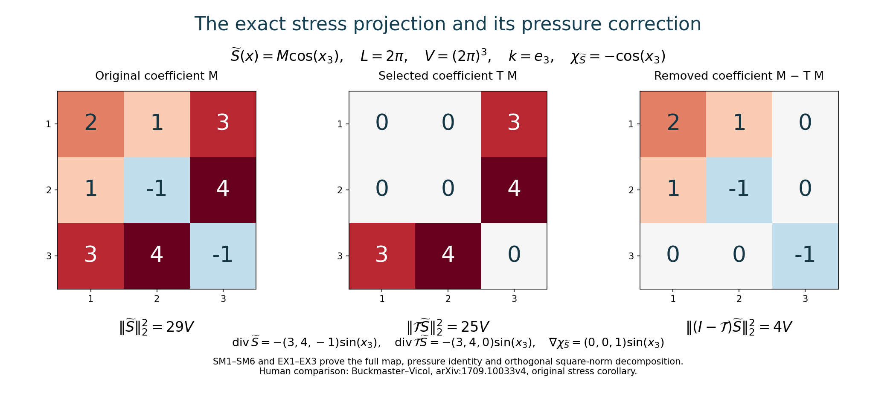
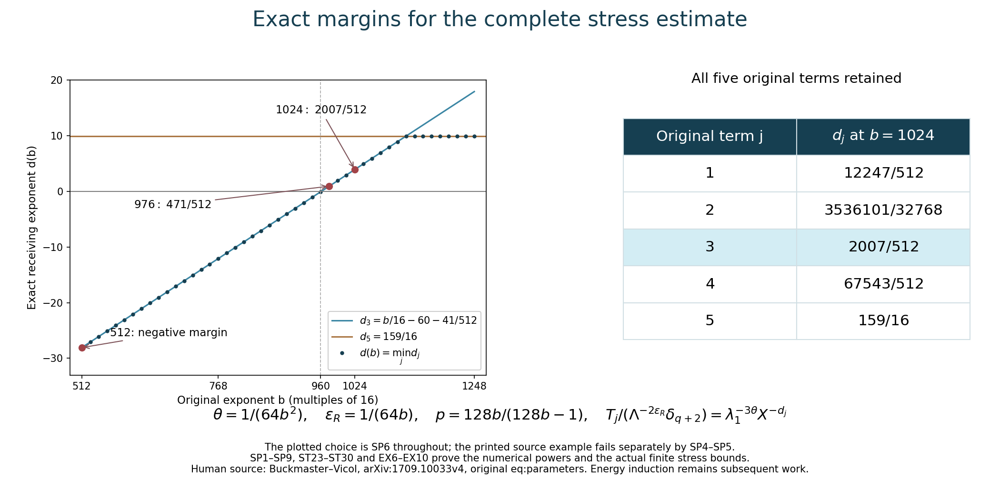

# The complete stress step and admissible parameters

[Lesson 25](the-complete-velocity-step.md) proved the complete
velocity estimates. This chapter uses those estimates to control
every term of the actual new stress, with its original pressure,
positive viscosity, mean and amplitude prefactor.

First we construct the full stress projection and its exact
pressure correction, prove its square-norm geometry, and construct
the integrable composed kernel needed for the first derivatives.
We then calculate the five original source powers, estimate all
actual residual terms, and choose one finite base that proves
both stress bounds. Five solved exercises give exact Fourier maps,
the full admissible parameter region, an explicit changing-mean
force example, and a sharper base threshold.

The human source is Tristan Buckmaster and Vlad Vicol,
[*Nonuniqueness of weak solutions to the Navier–Stokes equation*,
arXiv:1709.10033v4](https://arxiv.org/abs/1709.10033v4).
The immediate comparison is its original author TeX 255 and 1180–1407.
The printed example \(b=512\) fails its displayed five-term
numerical envelope; SP4–SP5 prove that precise statement.
SP6–SP9 give an explicit replacement, and Exercise 3 identifies
the full admissible region and proves the actual finite stress
step already at \(b=976\). This correction concerns the printed
parameter example; it does not refute the nonuniqueness theorem.

The original unforced construction has \(f=0\). SM13–SM15 retain
the complete mean and mean-zero force maps when comparing a
mollified equation with a nonzero original force. All stress
estimates below keep \(\nu>0\) in their coefficients. The fields
are defined on the interior time interval of the actual convolution.
The energy and time-support induction still need their proofs
before an infinite solution is constructed.

Labels IC, IK, OS refer to
[lesson 23](the-full-intermittent-correction-and-residual.md);
SC and AB refer to
[lesson 24](mollification-stress-cutoffs-and-energy.md);
VC, PL and VD refer to lesson 25. The original inverse divergence
is RS7 in [lesson 21](residual-stresses-and-exact-beltrami-fields.md).
Every constant used below is defined in these complete proofs.
This is author self-checked exposition; no independent review or
novelty is claimed.

## SM1. Original differential symbols

Define the scalar operators
\(Q_{ij}=\partial_i\Delta^{-1}\partial_j\), with multiplier
\(k_i k_j/|k|^2\) at \(k\ne0\), and zero at the constant mode.
For a smooth matrix field \(M\), set
\[
 B_{ij}=\sum_lQ_{il}M_{jl},\qquad
 \chi_M=\operatorname{tr}B=\Delta^{-1}\operatorname{div}\operatorname{div}M,
 \qquad
 (\mathcal TM)_{ij}=B_{ij}+B_{ji}-2Q_{ij}\chi_M.
 \tag{SM1}
\]
Every divergence uses the original row convention
\((\operatorname{div}M)_i=\sum_j\partial_jM_{ij}\).
Substitution of the full IK7 symbol, including its two trace terms,
gives
\[
 \mathcal T=\mathcal RP\operatorname{div},\qquad
 \operatorname{div}\mathcal TM
       =P\operatorname{div}M
       =\operatorname{div}M-\nabla\chi_M .
 \tag{SM2}
\]
Indeed \(P\operatorname{div}M\) has zero divergence and zero mean, so
the two terms of IK7 containing its scalar divergence vanish exactly.
The remaining symbol is
\(-i(k_i(P\widehat h)_j+k_j(P\widehat h)_i)/|k|^2\), with
\(\widehat h_i=i\sum_lk_l\widehat M_{il}\).
Multiplication gives the three terms in SM1. This also proves that
\(\mathcal TM\) is symmetric. Its trace is
\(2\chi_M-2P_0\chi_M=0\), since \(\chi_M\) has zero mean.
The entire constant matrix mode maps to zero.

Apply the lesson 25 Hilbert-array estimate for \(Q\) to the three
columns of \(M^T\). It gives \(\|B\|_p\leq C_p\|M\|_p\).
Pointwise \(|\operatorname{tr}B|\leq\sqrt3|B|\).
The matrix \((Q_{ij}s)\) is obtained by applying that same array
operator to \(sI\), whose Hilbert–Schmidt norm is \(\sqrt3|s|\).
Therefore, for every \(1<p<\infty\),
\[
 \|\chi_M\|_p\leq\sqrt3C_p\|M\|_p,\qquad
 \|\mathcal TM\|_p\leq D_p\|M\|_p,\qquad
 D_p=2C_p+6C_p^2 .
 \tag{SM3}
\]
These are physical Lebesgue norms, without division by \(V\).
Every spatial and time derivative commutes with the operators on
smooth fields, by their exact symbols.

## SM2. The exact square-norm geometry and pressure map

For \(k\ne0\), write \(\omega=k/|k|\).
On a symmetric Fourier coefficient \(M\), SM1 is precisely
\[
 \mathcal T_kM=\omega\otimes v+v\otimes\omega,\qquad
 v=(I-\omega\otimes\omega)M\omega,\qquad v\cdot\omega=0 .
 \tag{SM4}
\]
For complex coefficients the last product is the complex bilinear
extension with real \(\omega\); Hilbert norms use conjugation.
For every \(z\perp\omega\), the Hilbert–Schmidt pairing gives
\(\langle M,\omega\otimes z+z\otimes\omega\rangle
=2\langle M\omega,z\rangle\).
The squared norm of \(\omega\otimes z+z\otimes\omega\) is \(2|z|^2\).
Thus SM4 is the orthogonal projection onto that two-dimensional
complex subspace of symmetric tensors. It follows, with the original
Parseval factor \(V\), that
\[
 \mathcal T^2M=\mathcal TM,\qquad
 \|\mathcal TM\|_2\leq\|M\|_2
 \quad\hbox{for symmetric }M .
 \tag{SM5}
\]
The constant is sharp by any nonzero single mode in the displayed
range, or its real conjugate pair. This identifies the precise stress
gauge selected by \(\mathcal T\), not merely its divergence.

If the actual original equation is
\[
 \partial_tU+\operatorname{div}(U\otimes U)+\nabla\widetilde p
     -\nu\Delta U=f+\operatorname{div}\widetilde S,\qquad
 \operatorname{div}U=0,
\]
the directly constructed new fields
\[
 S=\mathcal T\widetilde S,\qquad
 p=\widetilde p-\chi_{\widetilde S}
 \tag{SM6}
\]
satisfy exactly the same equation with the same \(U,f,\nu\).
Subtracting \(\nabla\chi_{\widetilde S}\) from its two sides and
using SM2 proves this statement. It retains the original mean of
the velocity and the zero mean of the specified pressure correction.
No assumption that \(\operatorname{div}\widetilde S\) is itself
divergence free is made.

## SM3. The curl map without an unproved order-zero estimate

Let \(\epsilon_{jab}\) be the original oriented Levi-Civita tensor.
Since the curl is divergence free and has zero mean, direct
substitution in the original inverse divergence gives
\[
 (\mathcal R\operatorname{curl}F)_{ij}
    =\sum_{a,b}\epsilon_{jab}Q_{ia}F_b
       +\sum_{a,b}\epsilon_{iab}Q_{ja}F_b .
 \tag{SM7}
\]
The matrix \(E_{aj}=\sum_b\epsilon_{jab}F_b\) has
\(|E|_{\rm HS}^2=2|F|^2\), including for complex vectors, because each
coordinate occurs twice with signs of modulus one. Applying the full
Hilbert-array projection estimate and then adding the transpose gives
\[
 \|\mathcal R\operatorname{curl}F\|_p
       \leq2\sqrt2C_p\|F\|_p,\qquad1<p<\infty .
 \tag{SM8}
\]
At \(p=2\), lesson 23 EX4 proves the stronger exact identity
\(\|\mathcal R\operatorname{curl}F\|_2^2
=2\|PP_0F\|_2^2\). Both expressions retain the constant mode.

## SM4. The original integrable operator for supremum derivatives

For \(k\ne0\), let
\[
 (m_{RP}(k)v)_{ij}
   =-\frac{i}{|k|^2}
       [k_i(P(k)v)_j+k_j(P(k)v)_i],\qquad m_{RP}(0)=0.
 \tag{SM9}
\]
This is exactly \(m_R(k)P(k)\), is homogeneous of degree minus one
away from zero, and is smooth there. Use the actual cutoff \(\psi\)
of lesson 23 IK2 and its explicitly proved kernel constant
\[
 C_{RP}=\frac1{8\pi}\int_{\mathbb R^3}
              |(1-\Delta_\xi)^2[m_{RP}(\xi)\psi(\xi)]|_{\rm HS}\,d\xi,
 \qquad J_{RP}=2C_{RP}/\alpha .
 \tag{SM10}
\]
The same periodization proof IK9–IK10 applies to this specified
matrix symbol. Its kernel at scale \(\alpha2^j\) has \(L^1\) norm
at most \(C_{RP}/(\alpha2^j)\); the full sum is \(J_{RP}\).
It has the multiplier SM9 at every original nonzero frequency and
zero at the mean, by the same exact telescoping sum. Therefore
\[
 \|\mathcal RPF\|_p\leq J_{RP}\|F\|_p
       \quad(1\leq p\leq\infty),\qquad
 \|\mathcal RPF\|_{C^1_{x,t}}\leq J_{RP}\|F\|_{C^1_{x,t}} .
 \tag{SM11}
\]
The second inequality follows by commuting each of the four original
first derivatives and summing their suprema. This is the full
composed order-minus-one operator, not a supremum estimate for \(P\).

For the equation in SM6 define
\(F=\partial_tU+\operatorname{div}(U\otimes U)-\nu\Delta U-f\).
The equation gives \(F=\operatorname{div}\widetilde S-\nabla\widetilde p\).
Since \(P\nabla\widetilde p=0\), the very same stress is
\[
 S=\mathcal RPF .
 \tag{SM12}
\]
All original force and viscosity terms in \(F\) remain. In particular
its mean is zero by the averaged original equation.

## SM5. Exact restoration of an original force after mollification

To make the force comparison explicit, suppose the actual constructed
field \(U_0=u_\ell+w\) obeys the equation with force \(f_\ell\), stress
\(S_0\) and pressure \(p_0\). Here \(f_\ell\) is exactly the original
space-time convolution, and \(w\) has zero spatial mean.
The original smooth velocity \(u_q\) has force \(f\).
Define the actual mean difference and full constant-field tensor by
\[
 m(t)=\overline{u_q}(t)-\overline{u_\ell}(t),\qquad
 \Delta f=f-f_\ell,\qquad
 H=m\otimes U_0+U_0\otimes m+m\otimes m .
 \tag{SM13}
\]
Averaging both original equations, and commuting the actual convolution
on its interior time interval, gives \(m'=\overline{\Delta f}\).
Set
\[
 U=U_0+m,\quad
 S=S_0+H-\frac{\operatorname{tr}H}{3}I-\mathcal R\Delta f,\quad
 p=p_0-\frac{\operatorname{tr}H}{3}.
 \tag{SM14}
\]
The new velocity is divergence free and has exactly
\(\overline U=\overline{u_q}\). Its full equation follows by expansion:
\[
 \begin{aligned}
 E_\nu(U,p)
 &=f_\ell+\operatorname{div}S_0+m'
                   +\operatorname{div}H-\nabla(\operatorname{tr}H/3)\\
 &=f+\operatorname{div}
       [S_0+H-(\operatorname{tr}H/3)I-\mathcal R\Delta f].
 \end{aligned}
 \tag{SM15}
\]
The second equality is exactly
\(f_\ell-f+m'=-P_0\Delta f=-\operatorname{div}\mathcal R\Delta f\).
Thus the complete mean and mean-zero force differences have separate
proved receiving maps; neither is dropped. The original constant
tensor \(m\otimes m\) is retained, although its spatial divergence
vanishes. In the unforced source construction the original mean
velocity is constant, hence \(m=0\), \(\Delta f=0\), and these added
terms all vanish by their definitions.

## SP. The five original powers and an admissible choice

Keep the original \(\lambda_q=a^{b^q}\), \(X=\lambda_q\),
\(\Lambda=\lambda_{q+1}=X^b\), and
\[
 \begin{gathered}
 \ell=X^{-20}=\Lambda^{-20/b},\quad
 r=\Lambda^{3/4},\quad \sigma=\Lambda^{-15/16},\quad
 \mu=\Lambda^{5/4},\\
 \delta_{q+2}=\lambda_1^{3\theta}\Lambda^{-2\theta b},
 \qquad \theta=\beta_{\rm reg}>0.
 \end{gathered}
 \tag{SP1}
\]
Define exactly the five positive quantities in the original display:
\[
 \begin{aligned}
 T_1&=\ell^{-2}\sigma\mu r^{5/2-3/p},\\
 T_2&=(r^{3/2}\ell^{-1}\mu^{-1})^{1/p}\Lambda^{3(1-1/p)},\\
 T_3&=r^{3-3/p}/(\ell^3\Lambda\sigma),\\
 T_4&=\sigma r^{4-3/p}/\ell^3,\qquad T_5=X^{-10}.
 \end{aligned}
 \tag{SP2}
\]
For \(\tau=1-1/p\), direct multiplication of every power in SP1 yields
\[
 \begin{aligned}
 T_j&=\Lambda^{E_j},\\
 E_1&=40/b-1/16+(9/4)\tau,\\
 E_2&=20/b-1/8+(25/8-20/b)\tau,\\
 E_3&=60/b-1/16+(9/4)\tau,\\
 E_4&=60/b-3/16+(9/4)\tau,\qquad E_5=-10/b.
 \end{aligned}
 \tag{SP3}
\]
For example, before collecting terms the first exponent is
\(40/b-15/16+5/4+(3/4)(5/2-3/p)\). The third is
\((3/4)(3-3/p)+60/b-1+15/16\). These give the first and third lines
of SP3 on substituting \(1/p=1-\tau\). The second uses
\((9/8+20/b-5/4)(1-\tau)+3\tau\); the fourth uses
\(-15/16+(3/4)(4-3/p)+60/b\). The fifth follows from \(X=\Lambda^{1/b}\).
Thus no factor in the printed five-term expression has been discarded.

## The printed numerical example does not satisfy this envelope

At the stated source example \(b=512,\theta=2^{-16}\), every \(p>1\)
has \(\tau>0\), and
\[
 E_1=1/64+(9/4)\tau>0,\qquad
 E_3=7/128+(9/4)\tau>0.
 \tag{SP4}
\]
For any fixed \(a>1\) and any fixed \(\varepsilon_R>0\), the original
target is
\(\Lambda^{-2\varepsilon_R}\delta_{q+2}
=\lambda_1^{3\theta}\Lambda^{-2\varepsilon_R-2\theta b}\).
The ratio of \(T_3\) to that target is exactly
\[
 \lambda_1^{-3\theta}
   \Lambda^{\,7/128+(9/4)\tau+2\varepsilon_R+2\theta b}
   \longrightarrow\infty\qquad(q\to\infty).
 \tag{SP5}
\]
Indeed \(\lambda_1=a^b\) is fixed in \(q\), the displayed exponent is
strictly positive, and \(\Lambda=a^{b^{q+1}}\to\infty\). Therefore no
constant independent of \(q\) can make the printed five-term estimate
hold for that numerical example. This is an obstruction to that
specific displayed envelope, not a proof that the constructed stress
must have a large norm. The complete finite velocity estimates in
lesson 25 remain valid at \(b=512\); they did not assert stress closure.

## Construct an explicit parameter choice that does satisfy it

Choose any \(b\in16\mathbb N\) with \(b\geq1024\), and set
\[
 \theta=\frac1{64b^2},\qquad
 \varepsilon_R=\frac1{64b},\qquad
 \tau=\frac1{128b},\qquad
 p=\frac{128b}{128b-1}>1.
 \tag{SP6}
\]
These satisfy all earlier numerical restrictions:
\(\theta b^2=1/64\leq4\),
\(\theta b=1/(64b)\leq1/40\), and
\(0<\varepsilon_R\leq1/4\).
The original covering requirements are unchanged: \(b\in16\mathbb N\)
and \(a\) is rounded to a multiple of \(N_\Lambda\), retaining every
earlier amplitude, separation and velocity threshold.
For this explicit choice
\(2\varepsilon_R+2\theta b=1/(16b)\).
The five margins against the full target, multiplied by \(b\), are
\[
 \begin{aligned}
 b(E_1+1/(16b))&=40-b/16+9/512+1/16,\\
 b(E_2+1/(16b))&=20-b/8+25/1024-5/(32b)+1/16,\\
 b(E_3+1/(16b))&=60-b/16+9/512+1/16,\\
 b(E_4+1/(16b))&=60-3b/16+9/512+1/16,\\
 b(E_5+1/(16b))&=-10+1/16.
 \end{aligned}
 \tag{SP7}
\]
At every \(b\geq1024\), each is less than \(-3\). For the first,
third and fourth this follows directly by replacing \(b\) by 1024
in their negative linear terms. The largest of those three is the
third, \(-4+41/512=-2007/512<-3\).
For the second, discard its negative term \(-5/(32b)\) to bound it by
\(20-128+25/1024+1/16<-3\).
The fifth is \(-159/16<-3\).
Thus, retaining the complete original prefactor, for every \(j\),
\[
 \frac{T_j}{\Lambda^{-2\varepsilon_R}\delta_{q+2}}
  =\lambda_1^{-3\theta}
      \Lambda^{E_j+2\varepsilon_R+2\theta b}
  \leq\lambda_1^{-3\theta}\Lambda^{-3/b}
  =\lambda_1^{-3\theta}X^{-3}.
 \tag{SP8}
\]
In particular the entire original positive sum satisfies, for all
permitted \(a\geq2\) and all \(q\geq0\),
\[
 \sum_{j=1}^5T_j
 \leq5\lambda_1^{-3\theta}X^{-3}
                   \Lambda^{-2\varepsilon_R}\delta_{q+2}
 \leq\frac58\Lambda^{-2\varepsilon_R}\delta_{q+2}.
 \tag{SP9}
\]
This constructs a full admissible numerical choice and a strict
receiving margin. Every original source scale and amplitude factor is
present. The next task is to substitute the actual corrected residual
from lesson 23 into the full norms, including all force, viscosity,
commutator, oscillation and corrector terms, and to construct the exact
constant needed to receive that stress. SP9 alone does not establish
that analytic bound or the infinite iteration.

## ST1. Restore the actual mollification remainder in the residual

Retain the complete original second-moment constant \(\mathfrak m_2\)
of the space-time kernel and the actual tensor
\[
 D=u_\ell\otimes u_\ell-\mathcal M_\ell(u_q\otimes u_q),
 \quad D^\circ=D-\frac{\operatorname{tr}D}{3}I,\qquad
 p_\ell=\mathcal M_\ell p_q-\frac{\operatorname{tr}D}{3}.
 \tag{ST1}
\]
The exact mollified equation from SC1–SC5 is
\[
 E_\nu(u_\ell,p_\ell)
 =\operatorname{div}(S_\ell+D^\circ),\qquad
 E_\nu(v,p)=\partial_tv+\operatorname{div}(v\otimes v)
                  +\nabla p-\nu\Delta v .
 \tag{ST2}
\]
The amplitudes cancel \(S_\ell\), as constructed in AB17.
The tensor \(D^\circ\) therefore remains in the new stress.
With the exact fields of lesson 23 write
\[
 \begin{gathered}
 w=w^{(p)}+w^{(c)}+z,\quad v=w^{(p)}+w^{(c)}
                          =\varkappa^{-1}\operatorname{curl}w^{(p)},\\
 c=w^{(c)}+z,\qquad
 H_*=u_\ell\otimes w+w\otimes u_\ell+c\otimes w+w^{(p)}\otimes c,\\
 G=\partial_tv-\nu\Delta w+P_0r_*,\qquad
 T_*=H_*+\mathcal R(G+E_O).
 \end{gathered}
 \tag{ST3}
\]
The tensor \(H_*\) is the full tensor OS15:
expanding \(c\otimes w+w^{(p)}\otimes c\) gives both orientations of
each principal/corrector pair, both mixed corrections, and both
correction squares. None of these terms is removed.
The complete new fields before the final stress projection are
\[
 \begin{gathered}
 U=u_\ell+w,\qquad
 \widetilde S=D^\circ+T_*-\frac{\operatorname{tr}T_*}{3}I,\\
 \widetilde p=p_\ell-\rho-\Phi-Q_O-\frac{\operatorname{tr}T_*}{3}.
 \end{gathered}
 \tag{ST4}
\]
Here \(\rho,\Phi,Q_O,r_*,E_O\) retain their entire definitions in
IC4–IC10 and OS3. Substitution of the proved identity OS6 into ST2,
leaving the additional divergence of \(D^\circ\) in place, proves
\(E_\nu(U,\widetilde p)=\operatorname{div}\widetilde S\).
All fields are real, \(U\) is divergence free, and
\(\widetilde S\) is symmetric and trace free. The actual mean of
\(w\) is zero. Periodic averaging of the unforced equation makes the
mean of \(u_q\) constant, so this step preserves it.

## ST2. Fixed constants and the five exact source quantities

Use all original parameters of SP1 and VD1; let
\[
 \begin{gathered}
 1<p<\infty,\quad \tau=1-1/p,\quad e_p=3/2-3/p,\\
 \mathcal D_p=D_p^{(p)}+D_p^{(c)}+D_p^{(z)},\qquad
 \mathcal E_p=E_p^{(p)},\qquad
 J_p=h_{2p}^2+V^{1/p},\\
 I_2=\frac{32C_2^{\rm IK}}{\alpha(1-2^{-2})}.
 \end{gathered}
 \tag{ST5}
\]
The constants \(\mathcal D_p,\mathcal E_p,h_{2p}\) are fully defined
in VD4 and VD8. The kernel constants \(C_R,C_\chi,C_2^{\rm IK}\)
are precisely those of IK8 and IK13–IK18 for the original inverse
divergence and the specified high-amplitude tail. The symbol
\(C_2^{\rm IK}\) is distinct from the projection constant \(C_p\)
and the amplitude constants \(K_j,B_j\).
With this notation the actual \(N=2\) product bound IK18 is
\[
 \|\mathcal R(ag)\|_p\leq
 C_R\|g\|_p\left[
       \frac{8C_\chi}{K}\|a\|_\infty
                  +\frac{I_2}{K^2}\|D_x^2a\|_\infty\right]
 \tag{ST6}
\]
whenever the original finite Fourier field \(g\) has no frequencies
of magnitude below \(K>0\). This includes vector amplitudes or
vector oscillatory factors, by the same tensor-norm proof.
The full mean of their product is treated by the zero symbol of
\(\mathcal R\); it is not assumed to vanish.

The five numerical quantities \(T_1,\ldots,T_5\) below are exactly
SP2. We estimate every actual residual contribution in these
specified quantities and give every coefficient.

## ST3. Full linear, transport and commutator costs

The original viscous identity OS13, the entire velocity bound VD9,
and \(\|u_\ell\|_\infty\leq X^4\) give
\[
 \begin{aligned}
 2\|u_\ell\|_\infty\|w\|_p+
           \|\mathcal R(-\nu\Delta w)\|_p
 &\leq(2X^4+2\nu)\mathcal D_p
                          \ell^{-2}\Lambda r^{e_p}\\
 &\leq(2+2\nu)\mathcal D_pT_1 .
 \end{aligned}
 \tag{ST7}
\]
For the transport term its ratio to the displayed \(T_1\) is
\(X^4\Lambda/(\sigma\mu r)=X^4\Lambda^{-1/16}\leq1\)
when \(b\geq512\). The viscosity ratio is
\(\Lambda/(\sigma\mu r)=\Lambda^{-1/16}\leq1\).
Both original viscosity terms are retained in OS13 before this bound.

The exact curl identity in ST3 and the proved SM8 imply
\[
 \begin{aligned}
 \|\mathcal R\partial_tv\|_p
 &\leq\frac{2\sqrt2C_p}{\varkappa}
                              \|\partial_tw^{(p)}\|_p\\
 &\leq\frac{2\sqrt2C_p}{\alpha}\mathcal E_pT_1 .
 \end{aligned}
 \tag{ST8}
\]
The time-derivative bound used here is VD9 for the actual principal
field; the factor \(\varkappa=\alpha\Lambda\) is the original physical
curl frequency. No supremum bound for a degree-zero multiplier is used.

The exact covariance argument SC5 gives
\[
 \|D^\circ\|_p\leq V^{1/p}\mathfrak m_2\ell^2X^8
   =V^{1/p}\mathfrak m_2 X^{-32}
   \leq V^{1/p}\mathfrak m_2T_5 .
 \tag{ST9}
\]
This preserves the original space-time kernel moment and includes
the full trace removal, which is a pointwise orthogonal contraction.

## ST4. All quadratic correction terms and the initial prefactor

Let \(H_c=c\otimes w+w^{(p)}\otimes c\). From VC10 and VC21,
\[
 \|H_c\|_1
 \leq\|c\|_2(\|w\|_2+\|w^{(p)}\|_2).
 \tag{ST10}
\]
Use the stronger original bound in VC19, before suppressing its
prefactor. With
\(C_c=C_{\rm corr}(98/\sqrt{800}+1/2)\), this yields
\[
 \|H_c\|_1\leq
 C_c\,r^{3/2}\ell^{-1}\mu^{-1}
   \delta_{q+1}\lambda_1^{-3\theta/2}X^{-359/40}.
 \tag{ST11}
\]
The amplitude term has the exact original expression
\(\delta_{q+1}\lambda_1^{-3\theta/2}
=\lambda_1^{3\theta/2}X^{-2\theta b}\).
Since \(\lambda_1\leq X^b\), it is at most \(X^{-\theta b/2}\leq1\).
This proves
\(\|H_c\|_1\leq C_c r^{3/2}\ell^{-1}\mu^{-1}X^{-359/40}\)
without an assertion that \(\delta_{q+1}\leq1\).

The five separate thresholds in VD22 at \(N=0\) give
\(\|w^{(p)}\|_\infty\leq\Lambda^{3/2}/10\),
\(\|c\|_\infty\leq2\Lambda^{3/2}/5\), and
\(\|w\|_\infty\leq\Lambda^{3/2}/2\).
Consequently
\[
 \|H_c\|_\infty\leq\frac6{25}\Lambda^3,\qquad
 \|H_c\|_p\leq
 C_c^{1/p}(6/25)^\tau T_2X^{-359/(40p)}
 \leq C_c^{1/p}(6/25)^\tau T_2 .
 \tag{ST12}
\]
The interpolation is the elementary integral inequality
\(\int|H_c|^p\leq\|H_c\|_\infty^{p-1}\|H_c\|_1\).
It is applied to the complete tensor, and so retains every
quadratic orientation in ST3.

## ST5. The full opposite-pair amplitude residual

For each positive original label let \(A_I=a_I^2\),
\(\phi_I=\eta_I^2-1\), and
\[
 b_I=\mu^{-1}\partial_tA_I-\zeta_I\cdot\nabla A_I,\qquad
 r_*=\sum_{I\ {\rm positive}}
              [\phi_I\zeta_I b_I+\mu^{-1}\partial_tA_I\zeta_I].
 \tag{ST13}
\]
This is exactly IC6, including the nonoscillatory coefficient term.
The original frame map is injective and the zero Fourier coefficient
of \(\eta_I^2\) is one. Therefore \(\phi_I\) has frequency gap
\(K=\beta=\alpha N_\Lambda\Lambda^{1/16}\).
The complete finite-\(r\) bound and then VD4 give
\[
 \|\phi_I\|_p\leq H_{2p}^2+V^{1/p}
       \leq J_pr^{3-3/p}.
 \tag{ST14}
\]
For \(j=0,2\), the full amplitude derivatives from VD2 give
\[
 \|D_x^jb_I\|_\infty
    \leq(1+\mu^{-1})B_{j+1}X^{25+20j}.
 \tag{ST15}
\]
The spatial contraction has norm at most one because \(|\zeta_I|=1\).
The mixed time derivative and all spatial derivatives are subarrays
of the full original derivative tensor of order \(j+1\).

Apply ST6 with this actual gap and sum the \(6C_IX\) positive labels.
After retaining \(1+\mu^{-1}\) in ST15, use its bound by two.
The result is
\[
 \begin{aligned}
 \left\|\mathcal R\sum_I\phi_I\zeta_Ib_I\right\|_p
 \leq6C_IC_RJ_pr^{3-3/p}\bigg[
 &\frac{16C_\chi B_1}{\alpha N_\Lambda}
                              X^{26}\Lambda^{-1/16}\\
 &+\frac{2I_2B_3}{(\alpha N_\Lambda)^2}
                              X^{66}\Lambda^{-1/8}\bigg].
 \end{aligned}
 \tag{ST16}
\]
Their ratios to \(T_3=X^{60}\Lambda^{-1/16}r^{3-3/p}\)
are respectively \(X^{-34}\) and \(X^6\Lambda^{-1/16}\).
Both are at most one for \(b\geq512\).
The remaining term in ST13 uses the full integrable inverse bound
IK10, and \(\|\eta\|_p\) is not needed for its constant coefficient:
\[
 \begin{aligned}
 \left\|\mathcal R\sum_I\mu^{-1}\partial_tA_I\zeta_I\right\|_p
 &\leq\frac{12C_IC_RB_1}{\alpha}
                  V^{1/p}X^{26}\mu^{-1}\\
 &\leq\frac{12C_IC_RB_1}{\alpha}h_{2p}^2 T_3 .
 \end{aligned}
 \tag{ST17}
\]
The first line uses the exact constant spatial factor one; replacing
its norm \(V^{1/p}\) by \(h_{2p}^2r^{3-3/p}\) in the second line is a
valid upper bound from VD4. The remaining parameter ratio is
\(X^{-34}\Lambda^{-19/16}\leq1\).
Thus the complete opposite-pair cost is received, including the
nonoscillatory coefficient that would be lost by centering only
the intermittent square.

## ST6. Every ordered nonopposite interaction

For each nonopposite pair retain the exact original
\(A=a_Ia_J\), \(F=\eta_I\eta_J\), and the matrix \(M_{IJ}\)
from OS8. Lesson 23 EX3 proves
\[
 \|M_{IJ}\|_{\rm op}=(3+\zeta_I\cdot\zeta_J)/2\leq2.
 \tag{ST18}
\]
This includes equal directions. The original gap is
\(K_{IJ}=\varkappa|\zeta_I+\zeta_J|-2\sqrt3\beta r\).
VC8 gives \(K_{IJ}>\alpha c_\Lambda\Lambda\).
Only adjacent index cutoffs have nonzero products, so VC4 bounds the
full ordered count by \(432C_IX\). Products at nonadjacent indices
are identically zero, and so are all their derivatives.

The complete residual is the half-ordered sum
\[
 E_O=\frac12\sum_{I,J}
  e^{i\varkappa(\zeta_I+\zeta_J)\cdot x}
                  M_{IJ}(F\nabla A+A\nabla F).
 \tag{ST19}
\]
For the first term use vector amplitude \(M_{IJ}\nabla A\) and scalar
oscillation \(Fe^{i\varkappa(\zeta_I+\zeta_J)\cdot x}\).
The amplitude costs are \(2B_1X^{25}\) and \(2B_3X^{65}\);
the oscillatory norm is at most \(H_{2p}^2\).
ST6 and the full half-ordered count give
\[
 \begin{aligned}
 \|(\mathcal RE_O)_{\rm first}\|_p
 \leq432C_IC_Rh_{2p}^2r^{3-3/p}\bigg[
 &\frac{8C_\chi B_1}{\alpha c_\Lambda}X^{26}\Lambda^{-1}\\
 &+\frac{I_2B_3}{(\alpha c_\Lambda)^2}X^{66}\Lambda^{-2}
                                                        \bigg].
 \end{aligned}
 \tag{ST20}
\]
These are the sums of those actual first terms, not an independent
choice of stress. Their ratios to \(T_3\) are
\(X^{-34}\Lambda^{-15/16}\) and \(X^6\Lambda^{-31/16}\), both at most
one.

For the second term use amplitude \(A\), with costs
\(K_0^2X^{10}\) and \(B_2X^{45}\), and the actual vector oscillation
\(e^{i\varkappa(\zeta_I+\zeta_J)\cdot x}M_{IJ}\nabla F\).
Differentiating both factors of \(F\) gives its full norm bound
\(4c_{1,0}G_\eta H_{2p}^2\); its Fourier support has the same gap.
Since \(G_\eta=\beta r=\alpha N_\Lambda\Lambda^{13/16}\), the complete result is
\[
 \begin{aligned}
 \|(\mathcal RE_O)_{\rm second}\|_p
 \leq864C_IC_Rc_{1,0}h_{2p}^2r^{3-3/p}\bigg[
 &\frac{8C_\chi N_\Lambda K_0^2}{c_\Lambda}
                              X^{11}\Lambda^{-3/16}\\
 &+\frac{I_2N_\Lambda B_2}{\alpha c_\Lambda^2}
                              X^{46}\Lambda^{-19/16}\bigg].
 \end{aligned}
 \tag{ST21}
\]
The ratios to the original
\(T_4=X^{60}\Lambda^{-3/16}r^{3-3/p}\) are
\(X^{-49}\) and \(X^{-14}\Lambda^{-1}\), respectively.
Thus both original parts of each ordered interaction, including
the entire second-derivative amplitude tail, are received.

## ST7. The complete five coefficients and stress induction

Define the following finite constants with all physical factors:
\[
 \begin{aligned}
 \mathcal A_1={}&(2+2\nu)\mathcal D_p
                     +(2\sqrt2C_p/\alpha)\mathcal E_p,\\
 \mathcal A_2={}&C_c^{1/p}(6/25)^\tau,\\
 \mathcal A_3={}&6C_IC_RJ_p
       \left[\frac{16C_\chi B_1}{\alpha N_\Lambda}
                          +\frac{2I_2B_3}{(\alpha N_\Lambda)^2}\right]
       +\frac{12C_IC_RB_1h_{2p}^2}{\alpha}\\
 &+432C_IC_Rh_{2p}^2
       \left[\frac{8C_\chi B_1}{\alpha c_\Lambda}
                          +\frac{I_2B_3}{(\alpha c_\Lambda)^2}\right],\\
 \mathcal A_4={}&864C_IC_Rc_{1,0}h_{2p}^2
       \left[\frac{8C_\chi N_\Lambda K_0^2}{c_\Lambda}
                           +\frac{I_2N_\Lambda B_2}{\alpha c_\Lambda^2}\right],
 \qquad
 \mathcal A_5=V^{1/p}\mathfrak m_2 .
 \end{aligned}
 \tag{ST22}
\]
The trace-free projection in ST4 is a pointwise orthogonal contraction.
Use it on the full tensor and then apply ST7–ST21. This proves
\[
 \|\widetilde S\|_p\leq\sum_{j=1}^5\mathcal A_jT_j.
 \tag{ST23}
\]
Each term of the exact equation ST4 has now been accounted for.
Choose the explicit parameters SP6, retain every earlier threshold on
the same base, and write \(\mathcal A=\sum_j\mathcal A_j\).
These constants are fixed once the energy profile, physical period,
families, kernels, \(b,p,\theta,\varepsilon_R,\nu\) are fixed; none
depends on \(a,q\). The full original-prefactor estimate SP8 gives
\[
 \|\widetilde S\|_p
 \leq\mathcal A\lambda_1^{-3\theta}X^{-3}
                          \Lambda^{-2\varepsilon_R}\delta_{q+2}.
 \tag{ST24}
\]
Now apply the actual stress and pressure map SM6, defining
\(S_{q+1}=\mathcal T\widetilde S\),
\(p_{q+1}=\widetilde p-\chi_{\widetilde S}\).
The exact Hölder factor converting physical \(L^p\) to \(L^1\) is
\(V^{1-1/p}\). Thus
\[
 \|S_{q+1}\|_1
 \leq V^{1-1/p}D_p\mathcal A\lambda_1^{-3\theta}X^{-3}
                          \Lambda^{-2\varepsilon_R}\delta_{q+2}.
 \tag{ST25}
\]
Add the single explicit requirement
\[
 a\geq\left[\mathcal A\max\{1,V^{1-1/p}D_p\}\right]^{1/3}
 \tag{ST26}
\]
to the existing finite maximum and round upward to a multiple of
\(N_\Lambda\). Since \(X\geq a\) and \(\lambda_1^{-3\theta}\leq1\),
we obtain, for every original index \(q\geq0\),
\[
 \|\widetilde S\|_p\leq\Lambda^{-2\varepsilon_R}\delta_{q+2},\qquad
 \|S_{q+1}\|_1\leq\Lambda^{-2\varepsilon_R}\delta_{q+2}
                     \leq\Lambda^{-\varepsilon_R}\delta_{q+2}.
 \tag{ST27}
\]
The original pressure, viscosity, mean and full stress equation hold
by ST4 and SM6. The smallness assertion is now an estimate of the
actual constructed stress, rather than only the numerical envelope.

## ST8. The complete first derivative of the actual stress

Use precisely the full \(C^N_{x,t}\) norms of VD25 and put
\(U_N=\|U\|_{C^N_{x,t}}\leq\Lambda^{(3+5N)/2}\), \(0\leq N\leq3\).
The smooth unforced equation and SM12 identify
\[
 S_{q+1}=\mathcal RP[
       \partial_tU+\operatorname{div}(U\otimes U)-\nu\Delta U].
 \tag{ST28}
\]
There is no pressure on the right because the exact operator kills
its gradient; the original viscous term remains.
The time derivative contributes at most \(U_2\) in the full \(C^1\)
norm. The Laplacian contributes at most \(U_3\): expand its three
spatial second derivatives, then all four first derivatives, and
note that these are distinct multiindices already in that full norm.

Since \(\operatorname{div}U=0\), the nonlinear term is exactly
\((U\cdot\nabla)U\). Its zeroth derivative is bounded by \(U_0U_1\).
For each of the four first derivatives, the full product rule is
\((\partial_\gamma U)\cdot\nabla U
+U\cdot\nabla\partial_\gamma U\).
Its norm is at most \(U_1^2+U_0U_2\): the gradient sums involved are
subsets of the corresponding full \(C^1\) or \(C^2\) norm. Summing
gives
\[
 \begin{aligned}
 \|\partial_tU+\operatorname{div}(U\otimes U)-\nu\Delta U\|_{C^1}
 &\leq U_2+U_0U_1+4U_1^2+4U_0U_2+\nu U_3\\
 &\leq\Lambda^{13/2}+\Lambda^{11/2}
                           +8\Lambda^8+\nu\Lambda^9\\
 &\leq(10+\nu)\Lambda^9 .
 \end{aligned}
 \tag{ST29}
\]
The actual integrable operator bound SM11 then yields
\(\|S_{q+1}\|_{C^1}\leq J_{RP}(10+\nu)\Lambda^9\).
Add \(a\geq[J_{RP}(10+\nu)]^{1/b}\) to the same maximum.
Because \(\Lambda\geq a^b\), the full original induction follows:
\[
 \|S_{q+1}\|_{C^1_{x,t}}\leq\Lambda^{10}.
 \tag{ST30}
\]
All parameters and thresholds are explicit and finite. This completes
the actual stress step on the constructed time interval. The
physical energy inequalities, their zero-energy case and the
complete global-in-time iteration still require their own proofs.

## The exact projection and all five receiving margins

The matrices give a full trace-free original Fourier example.
SM1–SM6 and EX1–EX3 prove every displayed coefficient, divergence,
pressure correction and physical square norm. The removed tensor
is retained explicitly in the orthogonal decomposition.

The curve evaluates the exact formulas SP6 and EX8–EX9 on the
permitted multiples of sixteen. It retains the original amplitude
prefactor; the table gives all five exact margins at \(b=1024\).
The smallest admissible integer \(b=976\) has positive margin
\(471/512\). ST23–ST30 and EX10 give the actual stress bounds.
The [complete reproducible figure source](../assets/original-stress-projection-and-margins.py)
includes the original matrices and parameter formulas.

Human comparison: Buckmaster–Vicol, arXiv:1709.10033v4, the original
stress corollary and the display labelled eq:parameters.

## Five solved exercises

### Exercise 1. Compute the selected stress and its exact gauge

On the original torus, take a real symmetric constant matrix
\(M=(M_{ij})\), a nonzero integer \(n\), \(k=\alpha n e_3\), and
\(\widetilde S(x)=M\cos(k\cdot x)\). Compute \(\mathcal T\widetilde S\),
its pressure correction, its full square norm and all tensors removed
by the map at this frequency.

**Solution.** Substitution in SM1 gives
\[
 \mathcal T\widetilde S=
 \begin{pmatrix}0&0&M_{13}\\0&0&M_{23}\\M_{13}&M_{23}&0\end{pmatrix}
                         \cos(k\cdot x),\qquad
 \chi_{\widetilde S}=M_{33}\cos(k\cdot x).
 \tag{EX1}
\]
Indeed \(\operatorname{div}\widetilde S
=-\alpha n(M_{13},M_{23},M_{33})\sin(k\cdot x)\).
The gradient of \(\chi_{\widetilde S}\) is exactly its third
component; the divergence of the displayed selected stress is
the remaining pair. Thus SM6 retains the full original equation.

The original integral of \(\cos^2(k\cdot x)\) is \(V/2\). Therefore
\[
 \|\mathcal T\widetilde S\|_2^2
       =V(M_{13}^2+M_{23}^2),\qquad
 \|\widetilde S\|_2^2=\frac V2\sum_{i,j=1}^3M_{ij}^2 .
 \tag{EX2}
\]
The four-dimensional kernel in the six-dimensional symmetric
matrix space is \(M_{13}=M_{23}=0\). The range has exactly the two
off-diagonal entries shown in EX1. These subspaces are orthogonal
for the full Hilbert–Schmidt pairing, so equality in the norm
contraction holds precisely when the kernel part vanishes.
Restricted to trace-free matrices, the kernel has dimension three
and the range still has dimension two. Every spatially constant
symmetric matrix is separately killed by the zero Fourier symbol.

For a general smooth symmetric field the same argument applies
mode by mode with the actual \(\omega=k/|k|\). In particular
\[
 M=\mathcal TM+(I-\mathcal T)M,\qquad
 \|M\|_2^2=\|\mathcal TM\|_2^2+\|(I-\mathcal T)M\|_2^2 .
 \tag{EX3}
\]
This is a decomposition of the full original tensor, including
its constant mode. A removed part may have nonzero divergence:
that divergence is the exact pressure gradient specified by SM2.

### Exercise 2. Recover the precise curl norm and its nullspace

Find the complete \(L^2\) norm of \(\mathcal R\operatorname{curl}F\)
for any smooth real periodic vector field \(F\), retaining the mean
and all factors of the original physical frequency.

**Solution.** At \(k\ne0\), let
\(h=i k\times\widehat F(k)\). Then \(h\cdot k=0\), and the original
inverse symbol gives
\[
 \widehat{\mathcal R\operatorname{curl}F}(k)
   =-\frac{i}{|k|^2}(k\otimes h+h\otimes k),\qquad
 |\widehat{\mathcal R\operatorname{curl}F}(k)|_{\rm HS}^2
   =\frac{2|h|^2}{|k|^2}=2|P(k)\widehat F(k)|^2 .
 \tag{EX4}
\]
The middle equality uses \(k\) real and \(h\) complex orthogonal to
it, so the two cross pairings vanish under conjugation.
The last equality follows by completing \(k/|k|\) to a real
orthonormal frame and computing its cross product in that frame.
The constant mode of the curl is zero. Parseval with its original
factor \(V\) now proves
\[
 \|\mathcal R\operatorname{curl}F\|_2^2
   =2V\sum_{k\ne0}|P(k)\widehat F(k)|^2
   =2\|PP_0F\|_2^2 .
 \tag{EX5}
\]
The exact operator norm on \(L^2\) is \(\sqrt2\), attained by a
nonzero divergence-free mean-zero field. Its nullspace consists
of the full constant vector together with all mean-zero gradient
fields. To prove the converse as well, zero in EX5 makes every
nonzero \(\widehat F(k)\) parallel to \(k\); the smooth scalar
with coefficients \(\widehat g(k)=(k\cdot\widehat F(k))/(i|k|^2)\)
then satisfies \(F=\overline F+\nabla g\). Its coefficients and all
their polynomially weighted sequences are summable because \(F\)
is smooth. Thus this description constructs the actual potential.
SM8 is a finite-\(p\) bound; EX5 is its stronger exact \(p=2\) value.

### Exercise 3. Find the entire admissible region of the five powers

For the full source envelope, determine exactly which positive
\(\theta,\varepsilon_R,\tau\), with \(0<\tau<1\), admit a constant
independent of \(q\). Then determine the smallest permitted integer
\(b\in16\mathbb N\) for which such parameters exist. Retain the
original prefactor and prove the resulting stress bound.

**Solution.** Write \(s=2\varepsilon_R+2\theta b>0\). For fixed
\(a>1\), SP1–SP3 give exactly
\[
 \frac{\sum_jT_j}{\Lambda^{-2\varepsilon_R}\delta_{q+2}}
   =\lambda_1^{-3\theta}\sum_{j=1}^5\Lambda^{E_j+s}.
 \tag{EX6}
\]
All summands are positive. Since \(\Lambda\to\infty\), boundedness
is equivalent to \(E_j+s\leq0\) for every \(j\); each such inequality
also suffices because \(\Lambda>1\). In full original constants
the admissible region is
\[
 \begin{gathered}
 s+\frac94\tau\leq\frac1{16}-\frac{40}{b},\qquad
 s+\left(\frac{25}{8}-\frac{20}{b}\right)\tau
                                      \leq\frac18-\frac{20}{b},\\
 s+\frac94\tau\leq\frac1{16}-\frac{60}{b},\qquad
 s+\frac94\tau\leq\frac3{16}-\frac{60}{b},\qquad
 s\leq\frac{10}{b}.
 \end{gathered}
 \tag{EX7}
\]
The third inequality forces \(b>960\). Conversely, take any
\(b\in16\mathbb N\), \(b\geq976\), and the very same formulas SP6.
Define the exact positive margins \(d_j=-b(E_j+s)\). They are
\[
 \begin{aligned}
 d_1&=b/16-40-41/512,&
 d_2&=b/8-20-89/1024+5/(32b),\\
 d_3&=b/16-60-41/512,&
 d_4&=3b/16-60-41/512,& d_5&=159/16 .
 \end{aligned}
 \tag{EX8}
\]
Here \(d_1=d_3+20\), \(d_4=d_3+b/8\), and
\(d_2-d_3=b/16+40-7/1024+5/(32b)>0\).
Consequently
\[
 d(b)=\min\{b/16-60-41/512,\ 159/16\}>0,\qquad
 \frac{T_j}{\Lambda^{-2\varepsilon_R}\delta_{q+2}}
       \leq\lambda_1^{-3\theta}X^{-d(b)} .
 \tag{EX9}
\]
At \(b=976\), \(d(b)=471/512\). At \(b=1024\), it is \(2007/512\),
which also proves the more convenient margin \(3\) used in SP8.
All restrictions from the earlier velocity and amplitude
construction require only \(b\geq512\), besides the displayed
conditions on \(\theta,\varepsilon_R\) and the original finite base
thresholds; those conditions still hold for SP6.

Every analytic estimate ST7–ST23 therefore applies at \(b=976\)
as well. Let \(c_p=\max\{1,V^{1-1/p}D_p\}\), with the unchanged
actual coefficients \(\mathcal A_j\) of ST22, and retain all prior
thresholds on the same original base. The additional finite choice
\[
 a\geq(c_p\mathcal A)^{1/d(b)}
 \tag{EX10}
\]
proves both stress smallness inequalities ST27 by EX9.
The separate first-derivative threshold ST30 is also retained.
This proves a stronger permitted parameter range for the exact
finite stress step. It does not yet supply the energy induction.
Thus the smallest multiple of sixteen admitting this numerical
envelope with positive parameters is \(976\), with a complete
analytic receiver for the constructed stress.

### Exercise 4. Restore a changing mean without losing the quadratic terms

Take arbitrary smooth real \(A(t),M(t)\) on a common time interval,
and retain the original \(L,V,\alpha,\nu\). Let
\[
 U_0=A(t)e_1\cos(\alpha x_3),\quad
 f_0=(A'+\nu\alpha^2A)e_1\cos(\alpha x_3),\quad
 S_0=0,\quad p_0=0,\quad m=M(t)e_3 .
 \tag{EX11}
\]
Apply the exact force-restoration algebra to \(f=f_0+M'e_3\).
Compute the full new stress, pressure and physical energy.

**Solution.** The original field \(U_0\) is divergence free,
\((U_0\cdot\nabla)U_0=0\), and
\(\Delta U_0=-\alpha^2U_0\), so its equation with force \(f_0\) holds
exactly. The restoration algebra SM14–SM15 requires the relation
\(m'=\overline{f-f_0}\), which is satisfied here. It does not
require that arbitrary data satisfying that relation were obtained
by convolution. Here \(\mathcal R(f-f_0)=0\), and direct substitution
gives the complete fields
\[
 \begin{aligned}
 U&=A e_1\cos(\alpha x_3)+M e_3,\\
 H&=MA(e_3\otimes e_1+e_1\otimes e_3)\cos(\alpha x_3)
                                      +M^2 e_3\otimes e_3,\\
 S&=H-\frac{M^2}{3}I,\qquad p=-\frac{M^2}{3}.
 \end{aligned}
 \tag{EX12}
\]
The full nonlinear term is
\(-\alpha MA e_1\sin(\alpha x_3)\), exactly \(\operatorname{div}S\).
The mean is \(M e_3\), its derivative is the mean force, and the
pressure is a spatial constant depending on time.
The complete constant tensor \(M^2(e_3\otimes e_3-I/3)\) is retained
in EX12. Applying the separately proved map \(\mathcal T\) removes
that tensor by its zero symbol and leaves the cosine shear unchanged;
its pressure correction is zero in this example.

The full original energy, force work and dissipation are
\[
 \begin{aligned}
 \int|U|^2&=V(A^2/2+M^2),\\
 \int f\cdot U&=\tfrac V2 A(A'+\nu\alpha^2A)+VM M',\\
 \nu\int|\nabla U|^2&=\tfrac{\nu V}{2}\alpha^2 A^2,\qquad
 \int S: \nabla U=0 .
 \end{aligned}
 \tag{EX13}
\]
The last identity is the integral of
\(-\alpha MA^2\cos(\alpha x_3)\sin(\alpha x_3)\).
Hence
\(\tfrac12\partial_t\int|U|^2
=\int f\cdot U-\nu\int|\nabla U|^2-\int S: \nabla U\)
holds term by term. A changed mean contributes its full kinetic
energy and its full force work even when part of its stress is
spatially constant.

### Exercise 5. Use the exact initial prefactor to sharpen the base threshold

At any \(b\geq976\) from Exercise 3, determine the exact uniform
base condition obtained from the five-coefficient majorant ST23,
including the full original \(\lambda_1^{3\theta}\). Compare it
with the simpler threshold EX10.

**Solution.** The margins \(d_j\) are all positive and the
coefficients \(\mathcal A_j\) in ST22 are fixed independently of
\(a,q\). Since \(X=a^{b^q}\), the simultaneous bounds for the
unprojected \(L^p\) stress and the projected \(L^1\) stress follow
from the exact majorant
\[
 c_p\lambda_1^{-3\theta}\sum_j\mathcal A_jX^{-d_j}
   =c_p\sum_j\mathcal A_j
                         a^{-3\theta b-d_jb^q}.
 \tag{EX14}
\]
For each fixed \(a>1\) it decreases with \(q\). Its maximum is
therefore attained at \(q=0\), rather than at a limiting index.
The exact sufficient condition supplied by this majorant is
\[
 F(a):=c_p\sum_j\mathcal A_j a^{-3\theta b-d_j}\leq1.
 \tag{EX15}
\]
Each coefficient is positive, so \(F\) is continuous and strictly
decreasing on \(a>0\), with limits infinity at zero and zero at
infinity. Indeed
\[
 F'(a)=-c_p\sum_j(3\theta b+d_j)\mathcal A_j
                                  a^{-3\theta b-d_j-1}<0 .
 \tag{EX16}
\]
The intermediate value theorem gives a unique positive \(a_*\)
with \(F(a_*)=1\). Thus \(a\geq a_*\) is equivalent to EX15.
This identifies the exact optimum for the proved majorant,
without claiming that it is the smallest possible base for the
actual stress norm.

An explicit sufficient bound follows without solving that equation:
\[
 a\geq\max\left\{1,\ (c_p\mathcal A)^{1/(d(b)+3\theta b)}\right\}.
 \tag{EX17}
\]
For \(a\geq1\), each exponent \(3\theta b+d_j\) is at least
\(3\theta b+d(b)\); this proves EX17 by direct summation.
If \(A_{\rm old}\) is the actual finite maximum of all previous
amplitude, separation, velocity and stress-derivative thresholds,
the least allowed original multiple above these proved thresholds is
\[
 a=N_\Lambda
       \left\lceil\frac{\max\{2,A_{\rm old},a_*\}}{N_\Lambda}\right\rceil .
 \tag{EX18}
\]
This is an exact specification in terms of fixed kernel integrals
and the given energy profile, not an assumption of a new estimate.
It retains every earlier condition and uses the original parameter
prefactor to improve EX10.

## The physical energy step comes next

ST27 and ST30 prove the complete finite stress bounds; EX6–EX10
prove their stronger permitted parameter range. The velocity
correction still has the original bounds of lesson 25.

The remaining physical energy calculation must use every term
of EX13–EX14 in lesson 24, including the mollification energy
change, both oscillatory means, transport cross term and all
corrector products. Its small-energy case must prove the actual
vanishing conclusion, and the time-domain construction must
justify every convolution before passing to an infinite limit.

The separate Albritton–Brué–Colombo, Alpöge–Buckmaster, OpenAI
and workbench constructions retain their own equations, domains,
force and regularity requirements.
