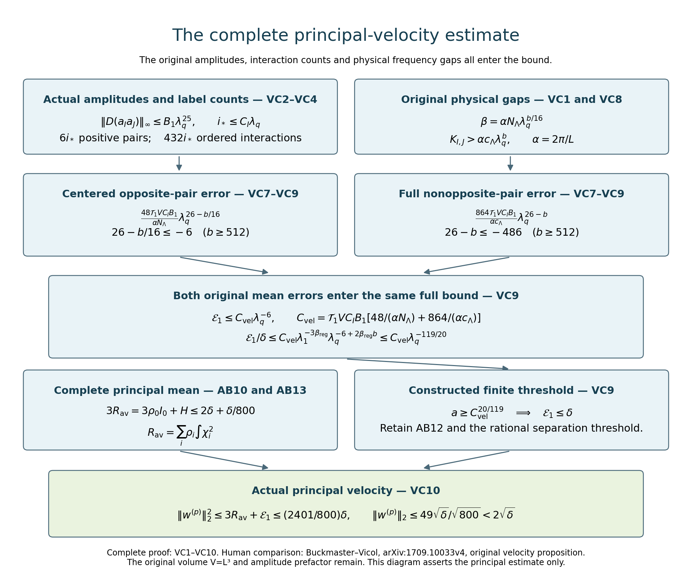
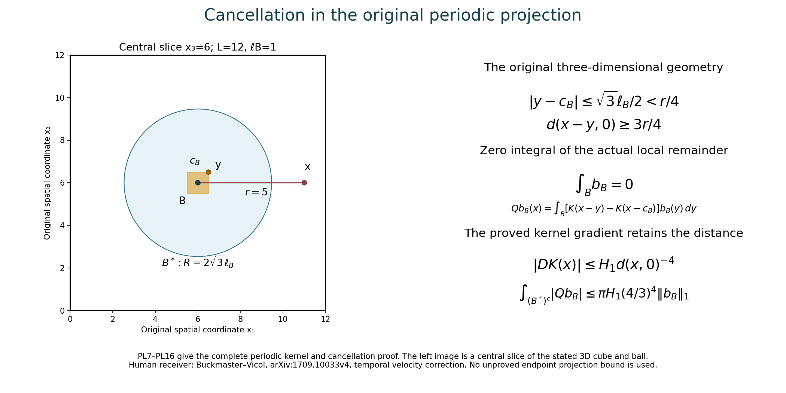
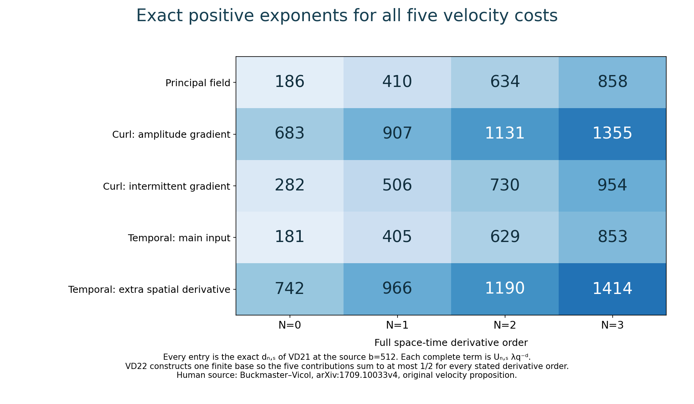

# The complete velocity step and periodic projection bounds

[Lesson 24](mollification-stress-cutoffs-and-energy.md) constructed the
actual stress cutoffs and smooth energy amplitudes. This chapter proves
the complete velocity estimates for those amplitudes: the principal
energy, both small corrections, the full increment, spatial and time
derivatives, and every source bound through three space-time derivatives.

The proof retains the original physical period, every mean, the
amplitude prefactor and all terms in each product derivative. It also
constructs the periodic projection kernel, proves its complete
finite-exponent bounds, and gives the smooth-input supremum estimate
needed for the temporal correction.

The original fields and their norms are in
[lesson 22](intermittent-fields-and-periodic-product-estimates.md).
The full residual and oscillatory kernel estimates are in
[lesson 23](the-full-intermittent-correction-and-residual.md).
SC and AB labels refer to lesson 24; IK labels refer to lesson 23.
VC labels below give the complete square-norm estimates; PL labels
give the projection proof; VD labels give every derivative estimate.

The human source is Tristan Buckmaster and Vlad Vicol,
[*Nonuniqueness of weak solutions to the Navier–Stokes equation*,
arXiv:1709.10033v4](https://arxiv.org/abs/1709.10033v4).
Its original author TeX at 1041–1174 is the immediate comparison,
with the parameter, field and amplitude definitions read in the preceding
chapters. The exposition supplies the full calculations, including
the original amplitude factor at the first step. This is author
self-checked exposition; no independent review or novelty is claimed.

Five solved exercises compute exact physical Fourier projections,
optimize the kernel cancellation and smooth-input bounds, evaluate
the actual projected fourth moment of one temporal pair, and retain
the complete initial amplitude and its numerical tail. The stress
and energy induction remain necessary for the infinite construction.

## VC1. All original parameters and coefficient costs

Keep the original \(L>0\), \(V=L^3\), the rational
families, their common integer \(N_\Lambda\), and their
positive angular separation \(c_\Lambda\). In this proof
use the source's allowed \(b\in16\mathbb N\), \(b\geq512\),
and its original restrictions
\(\beta_{\rm reg}b^2\leq4\),
\(\beta_{\rm reg}b\leq1/40\). In particular its
explicit choice \(b=512,\beta_{\rm reg}=2^{-16}\)
satisfies these restrictions. Retain
\[
 \begin{gathered}
 \lambda_q=a^{b^q},\quad \Lambda=\lambda_{q+1}=\lambda_q^b,
 \quad\delta=\lambda_1^{3\beta_{\rm reg}}
                         \lambda_q^{-2\beta_{\rm reg}b},\quad
 \ell=\lambda_q^{-20},\\
 r=\Lambda^{3/4},\quad \sigma=\Lambda^{-15/16},\quad
 \mu=\Lambda^{5/4},\quad m=\Lambda\sigma=\Lambda^{1/16},\\
 \alpha=2\pi/L,\quad\varkappa=\alpha\Lambda,
 \quad\beta=\varkappa\sigma N_\Lambda
            =\alpha N_\Lambda\lambda_q^{b/16},
 \quad h=L/m.
 \end{gathered}
 \tag{VC1}
\]
The letter \(\beta\) in the last line is the physical
intermittent frequency; it is distinct from the original
regularity exponent. Since \(a\) is an integer multiple
of \(N_\Lambda\) and \(b\in16\mathbb N\), both
\(r\) and \(m\) are positive integers for every
\(q\geq0\); the exact period and covering conditions
of lesson22 hold. Also \(1<\mu<\Lambda^2\).

Take the already constructed cutoffs and amplitudes of
lesson24, on its actual interior time interval. For the
source volume use its original \(B=100d,c_0\) and AB12.
The arbitrary-volume extension EX6–EX8 has its stated
changed constants; the following proof is given with the
original source constants, hence uses the volume range of
SC12. For \(j\geq1\), define
\[
 \begin{aligned}
 K_0&=\max\{C_*,5\sqrt{M_e/V}\},\\
 K_j&=\max\left\{P_j(1),
      \sqrt{M_e}\max\{10\overline A_j,\sigma_j/(2\sqrt{3V})\}
                                                   \right\},\\
 B_N&=2K_0K_N+
       \sum_{j=1}^{N-1}\binom Nj K_jK_{N-j}\qquad(N\geq1).
 \end{aligned}
 \tag{VC2}
\]
Here \(C_*,P_j,\overline A_j,\sigma_j\) have the
complete definitions AB1, AB18–AB23. These new \(K_j\)
are local constants of VC2, not the earlier cutoff constants
in AB18. Their values are independent of \(a,q\).
The actual full ordered derivative bounds are
\[
 \begin{aligned}
 \|a_{i,\zeta}\|_\infty&\leq K_0\lambda_q^5,\qquad
 \|D_{x,t}^j a_{i,\zeta}\|_\infty\leq K_j\ell^{-j}
                                     \quad(j\geq1),\\
 \|D_{x,t}^N(a_{i,\zeta}a_{j,\zeta'})\|_\infty
              &\leq B_N\lambda_q^5\ell^{-N}\quad(N\geq1).
 \end{aligned}
 \tag{VC3}
\]
The first line follows from AB4, AB21 and AB23. For the
second, apply the complete ordered product rule. The two
terms with an undifferentiated factor contribute
\(2K_0K_N\lambda_q^5\ell^{-N}\). Every other term
has cost \(K_jK_{N-j}\ell^{-N}\), with its full
binomial multiplicity; use \(1\leq\lambda_q^5\) only
to give the common displayed bound. This proves VC3 for
all indices, including identical ones and amplitudes that
vanish. The actual unsummed derivative formula remains AB2.

## VC2. The number of actual nonzero indices and interacting pairs

SC11 gives the finite cutoff limit. Since
\(\delta\geq\lambda_q^{-2\beta_{\rm reg}b}\),
the original stress bound and all original constants give
\[
 \begin{aligned}
 Y&=\sqrt{1+\|S_\ell\|_\infty^2/(100d)^2}
 \leq1+\frac1{100}\lambda_1^{-3\beta_{\rm reg}}
               \lambda_q^{10+\varepsilon_R+2\beta_{\rm reg}b}
 \leq\frac{101}{100}\lambda_q^{103/10},\\
 i_*&=\lceil\log_4(2Y)\rceil
       <2+\frac{11}{\log4}\log\lambda_q
       \leq C_I\lambda_q,\qquad C_I=2+11/\log4.
 \end{aligned}
 \tag{VC4}
\]
The first inequality uses \(\sqrt{1+x^2}\leq1+x\)
for \(x\geq0\). The source bounds give
\(\varepsilon_R+2\beta_{\rm reg}b\leq3/10\).
Next \(2Y<4\lambda_q^{11}\); the ceiling is strictly
less than its argument plus one. Finally
\(\log\lambda_q\leq\lambda_q\), and
\(2\leq2\lambda_q\). This proves every step of VC4.

Each index has six positive directions and twelve signed
directions in the explicit family. There are at most
\(6i_*\) positive pairs. In an ordered nonopposite
interaction the two indices differ by at most one: all
other amplitude products are identically zero by SC8,
including their derivatives. Thus the number of ordered
interactions is at most \(3\cdot12^2 i_*=432i_*\).
An absent index at an endpoint only decreases this count.
Repeated physical directions in nonadjacent indices create
no additional contribution because their actual products
vanish identically.

## VC3. The complete principal energy and its oscillatory error

Let \(I=(i,\zeta)\), and let \(\mathcal J^+\)
be the actual positive-pair labels and \(\mathcal O\)
the ordered signed nonopposite interactions just specified.
Use \(A_I=a_I^2\), \(\phi_I=\eta_I^2-1\), and
the complete nonopposite scalar \(Q_O\) of lesson23.
Define
\[
 R_{\rm av}(t)=\sum_{i\geq0}\rho_i(t)\int\chi_i^2,
 \qquad K_{I,J}=\varkappa|\zeta+\zeta'|-2\sqrt3\,\beta r,
 \qquad s_{I,J}^2=(1-\zeta\cdot\zeta')/2.
 \tag{VC5}
\]
These are the original physical integrals and frequencies.
The full trace identity EX12 of lesson24 states
\(\|w^{(p)}\|_2^2=3R_{\rm av}
+2\sum_{I\in\mathcal J^+}\int A_I\phi_I+2\int Q_O\).
Every signed pair and both oscillatory mean types remain.

To avoid confusing the inverse-kernel constant with the
stress-cutoff constant SC20, write \(C_N^{\rm IK}\)
for the actual constant in IK15 and put
\[
 \begin{gathered}
 C_N^{\rm IK}=\frac1{8\pi}\int_{\mathbb R^3}
                 |(1-\Delta_\xi)^2\mathcal A_N(\xi)|\,d\xi,
 \quad
 (\mathcal A_N)_J(\xi)=
   (-\mathrm i)^N\frac{\xi_J}{|\xi|^{2N}}
                      [\chi(\xi/2)-\chi(\xi)],\\
 \mathcal T_N=C_N^{\rm IK}/(1-2^{-N}),
 \qquad \Psi_1=\|\eta_I^2-1\|_1\leq2V.
 \end{gathered}
 \tag{VC6}
\]
Here \(J\) is a full ordered spatial list of length
\(N\), \(\xi_J\) is its coordinate product, and the
norm is the full tensor Hilbert norm. The cutoff \(\chi\)
is the explicitly defined frequency cutoff IK2, distinct
from the stress partition. Its support makes this entire
integral finite. The last norm is independent of \(I,t\)
by the original integer torus covering and translation;
the inequality uses \(\|\eta_I\|_2^2=V\), retaining
the original volume.

The full gap estimate EX14 of lesson23 and its nonopposite
receiver EX15 give the complete bound
\[
 \begin{aligned}
 \big|\|w^{(p)}\|_2^2-3R_{\rm av}\big|
 \leq{}&2\mathcal T_N(2/\beta)^N\Psi_1
                 \sum_{I\in\mathcal J^+}\|D_x^N(a_I^2)\|_\infty\\
 &+\mathcal T_N V\sum_{(I,J)\in\mathcal O}
         s_{I,J}^2(2/K_{I,J})^N
                            \|D_x^N(a_Ia_J)\|_\infty
 =:{}&\mathcal E_N(t).
 \end{aligned}
 \tag{VC7}
\]
For completeness, the centered factor has its actual
frequency gap at least \(\beta\). In the nonopposite
scalar term the original dot magnitude is exactly
\(s_{I,J}^2\), not an unspecified constant. The product
of its two intermittent factors has \(L^1\) norm at
most \(V\), by their exact \(L^2\) norms and
Cauchy–Schwarz. Its scalar has the half ordered sum from
OS3; multiplication by the factor two in the energy identity
removes only that half. Thus both constants in VC7 are
exact consequences of the earlier proved gap estimate.
Pure spatial derivative norms are bounded by the complete
space-time norms VC3.

## VC4. An explicit universal principal-velocity bound

Enlarge the already specified integer base \(a\), retaining
all AB12 thresholds, so that also
\(a\geq(10N_\Lambda/c_\Lambda)^{16/(3b)}\).
Then the full original separation condition is
\(\sigma N_\Lambda r=N_\Lambda\Lambda^{-3/16}
\leq c_\Lambda/10\). Every actual nonopposite pair
therefore has
\[
 K_{I,J}\geq2\varkappa c_\Lambda(1-\sqrt3/10)
                         >\varkappa c_\Lambda.
 \tag{VC8}
\]
Indeed the rational-family separation gives
\(|\zeta+\zeta'|\geq2c_\Lambda\), and
\(\beta r=\varkappa\sigma N_\Lambda r\).
The last strict inequality follows from \(\sqrt3<5\).

Use the actual first-order case of VC7, then VC3–VC4,
\(s_{I,J}^2\leq1\) and \(\Psi_1\leq2V\).
The full resulting estimate is
\[
 \begin{aligned}
 \mathcal E_1
 &\leq\mathcal T_1 V C_I B_1\left[
       \frac{48}{\alpha N_\Lambda}\lambda_q^{26-b/16}
        +\frac{864}{\alpha c_\Lambda}\lambda_q^{26-b}
                                      \right]\\
 &\leq C_{\rm vel}\lambda_q^{-6},\qquad
 C_{\rm vel}=\mathcal T_1 V C_I B_1
       \left[\frac{48}{\alpha N_\Lambda}
                         +\frac{864}{\alpha c_\Lambda}\right],\\
 \frac{\mathcal E_1}{\delta}
 &\leq C_{\rm vel}\lambda_1^{-3\beta_{\rm reg}}
                    \lambda_q^{-6+2\beta_{\rm reg}b}
       \leq C_{\rm vel}\lambda_q^{-119/20}.
 \end{aligned}
 \tag{VC9}
\]
In the first centered term, the factors are
\(2\cdot2\cdot2\cdot6=48\): the energy coefficient,
the gap split, the bound for \(\Psi_1/V\), and the
six positive directions. The nonopposite term has
\(2\cdot432=864\). The power \(26\) is precisely
\(1+5+20\), from the index count, actual product amplitude
and original derivative scale. Since \(b\geq512\),
the two exponents are at most \(-6\) and \(-486\).
The final comparison keeps the complete original \(\delta\)
before using the proved bounds for its factors.

All constants in \(C_{\rm vel}\) are already specified
and independent of \(a,q\). Add the finite threshold
\(a\geq C_{\rm vel}^{20/119}\) to the preceding
maximum and round upward to a multiple of \(N_\Lambda\).
This actually constructs parameters with
\(\mathcal E_1\leq\delta\) for every \(q\geq0\).
AB10 and AB13 also give
\(3R_{\rm av}=3\rho_0I_0+H\leq2\delta+\delta/800\).
The actual full principal velocity consequently obeys
\[
 \|w^{(p)}\|_2^2\leq\frac{2401}{800}\delta,
 \qquad
 \|w^{(p)}\|_2\leq\frac{49}{\sqrt{800}}\sqrt\delta
                                <2\sqrt\delta.
 \tag{VC10}
\]
Thus the first original velocity estimate holds with the
explicit universal choice \(M=4\) for these constructed
families and parameters. No hidden dependence on the source
energy profile is put into \(M\); the finite lower
threshold for \(a\) retains that dependence explicitly.
This proves only the principal estimate at this point.

## VC5. The full actual curl and temporal square-norm costs

For a scalar or finite tensor field \(g\), define its
actual mixed-derivative cell cost
\[
 \mathcal D_h(g)=\sum_{\epsilon\in\{0,1\}^3}
                       h^{|\epsilon|}\|\partial^\epsilon g\|_2,
 \quad M_r=2r+1,\qquad
 Q_r=\left(\frac{2M^2+1}{3M}\right)^{3/2}.
 \tag{VC11}
\]
The mixed-cell inequality DC21 of lesson22 applies to these
finite tensor fields as well: the fundamental theorem uses
their Euclidean norm, and its triangle and integral
inequalities hold for that norm. The periodic multiplier
can likewise be vector-valued by using its pointwise norm
in each cell integral. The multiplier's \(L^2\) factor
still has the exact prefactor \(V^{-1/2}\).

The actual fields \(\eta_I,\nabla\eta_I,\eta_I^2\)
all have period \(h\) in each coordinate. Their exact
norms from IB18 and lesson22's fourth-moment exercise are
\(\sqrt V\), \(\sqrt V\beta\sqrt{r(r+1)}\),
and \(\sqrt V Q_r\), respectively. Expand the entire
gradient in the curl correction and use the actual
\(\varkappa^{-1}\), not \(\Lambda^{-1}\).
Since the amplitude and \(\eta_I\) are real and
\(|B_\zeta|=1\),
\(|v\times B_\zeta|\leq|v|\) for every real \(v\).
The full original correction bounds are therefore
\[
 \begin{aligned}
 \|w^{(c)}\|_2
 &\leq\varkappa^{-1}\sum_{I\ {\rm signed}}
       \left[\mathcal D_h(\nabla a_I)
                  +\beta\sqrt{r(r+1)}\mathcal D_h(a_I)\right],\\
 \|z\|_2
 &\leq\mu^{-1}Q_r\sum_{I\in\mathcal J^+}\mathcal D_h(a_I^2).
 \end{aligned}
 \tag{VC12}
\]
The first follows by applying DC21 separately to
\(\eta_I\nabla a_I\) and \(a_I\nabla\eta_I\).
For the second, the full operator \(\mathbb P\mathbb P_0\)
is an orthogonal contraction on the actual periodic
\(L^2\) space by lesson2. Apply it first to the complete
sum defining \(z\), then the triangle inequality and
DC21 with \(a_I^2\) and \(\eta_I^2\). The original
positive-pair coefficient is \(1/\mu\), and is not
halved again. No projection claim at an unrestricted
\(L^1\) or \(L^\infty\) endpoint has been used.

There is also a complete finite moment formula for every
spatial and time derivative of the squared field. For
nonnegative integers \(u,v\), set
\[
 \begin{aligned}
 T_{u,v}^2={}&\frac{V\beta^{2(u+v)}\mu^{2v}}{M_r^6}
 \sum_{j,k,l=-(M_r-1)}^{M_r-1}
 (j^2+k^2+l^2)^u j^{2v}
             (M_r-|j|)^2(M_r-|k|)^2(M_r-|l|)^2,\\
 \|D_x^N\partial_t^Kz\|_2
 \leq{}&\mu^{-1}\sum_{I\in\mathcal J^+}
      \sum_{u=0}^N\sum_{v=0}^K\binom Nu\binom Kv
       \|D_x^{N-u}\partial_t^{K-v}(a_I^2)\|_\infty T_{u,v}.
 \end{aligned}
 \tag{VC13}
\]
Powers with exponent zero have value one, including the
zero mode. The actual Fourier coefficient of \(\eta_I^2\)
at its frame index \((j,k,l)\) is
\(M_r^{-3}(M_r-|j|)(M_r-|k|)(M_r-|l|)\), with its original
time phase. The frame map is injective, has physical spatial
length \(\beta\sqrt{j^2+k^2+l^2}\), and time frequency
\(\beta\mu j\). Parseval, including the original volume,
therefore proves
\(\|D_x^u\partial_t^v(\eta_I^2)\|_2=T_{u,v}\).
The complete ordered product rule supplies both binomial
counts in VC13, and the projection commutes with every
derivative and contracts each tensor component in the
summed \(L^2\) norm. In particular \(T_{0,0}=\sqrt VQ_r\),
exactly matching VC12. No cross-family orthogonality has
been assumed.

Finally the original mollification difference from lesson24
and the full increment identity give
\[
 \begin{aligned}
 \|u_\ell+w-u_q\|_2
 \leq{}&2\sqrt\delta+\sqrt V\ell\mathfrak m_1\lambda_q^4\\
 &+\varkappa^{-1}\sum_{I\ {\rm signed}}
       [\mathcal D_h(\nabla a_I)
            +\beta\sqrt{r(r+1)}\mathcal D_h(a_I)]
       +\mu^{-1}Q_r\sum_{I\in\mathcal J^+}\mathcal D_h(a_I^2).
 \end{aligned}
 \tag{VC14}
\]
Every quantity in this finite bound is constructed and has
the explicit derivative bounds of lesson24. The next
calculation is to sum their actual index costs and prove
the complete small correction scale, then the original
\(W^{1,p}\), time, stress and iteration estimates.

## VC6. Sum every mixed-cell cost at its original scale

All constants in VC2 are retained. Define the following
finite polynomials with their complete binomial counts:
\[
 \begin{aligned}
 \tau_h&=h/\ell=L\lambda_q^{20-b/16},\\
 U_0(z)&=K_0+\sum_{j=1}^3\binom3j K_jz^j,\qquad
 U_1(z)=\sum_{j=0}^3\binom3j K_{j+1}z^j,\\
 U_2(z)&=K_0^2+\sum_{j=1}^3\binom3j B_jz^j.
 \end{aligned}
 \tag{VC15}
\]
There are exactly \(\binom3j\) spatial multiindices
in \(\{0,1\}^3\) of order \(j\). Each of their
derivatives is a subarray of the corresponding full ordered
tensor. VC3, including its original zeroth term, gives
\[
 \begin{aligned}
 \mathcal D_h(\nabla a_I)&\leq\sqrt V\ell^{-1}U_1(\tau_h),\\
 \mathcal D_h(a_I)&\leq\sqrt V
   \left[K_0\lambda_q^5+\sum_{j=1}^3\binom3j K_j\tau_h^j\right]
       \leq\sqrt V\lambda_q^5 U_0(\tau_h),\\
 \mathcal D_h(a_I^2)&\leq\sqrt V
   \left[K_0^2\lambda_q^{10}
        +\lambda_q^5\sum_{j=1}^3\binom3j B_j\tau_h^j\right]
       \leq\sqrt V\lambda_q^{10}U_2(\tau_h).
 \end{aligned}
 \tag{VC16}
\]
The factor \(\sqrt V\) is the exact conversion of
the actual supremum norm to a physical \(L^2\) bound.
The first line uses \(K_{j+1}\), because the gradient
in its argument is an additional full derivative. No term
with a repeated derivative is lost: each \(\partial^\epsilon
\nabla a_I\) is bounded by the full derivative tensor
of order \(|\epsilon|+1\). The last line uses the
entire derivative of the original square, not the square
of a derivative. This proves every displayed summand.

Since \(b\geq512\),
\(0<\tau_h\leq L\lambda_q^{-12}\leq L\).
All polynomial coefficients are nonnegative, so each
\(U_j(\tau_h)\leq U_j(L)\). Keeping first the
actual argument and then substituting VC4 into VC12 gives
\[
 \begin{aligned}
 \|w^{(c)}\|_2
 &\leq\frac{12C_I\sqrt V\lambda_q}{\varkappa}
   [\ell^{-1}U_1(\tau_h)
       +\beta\sqrt{r(r+1)}\lambda_q^5 U_0(\tau_h)]\\
 &\leq12C_I\sqrt V\left[
     \frac{U_1(L)}\alpha\lambda_q^{21-b}
       +\sqrt2 N_\Lambda U_0(L)\lambda_q^{6-3b/16}\right],\\
 \|z\|_2
 &\leq6C_I\sqrt V\mu^{-1}Q_r\lambda_q^{11}U_2(\tau_h)\\
 &\leq6\cdot3^{3/2}C_I\sqrt V U_2(L)\lambda_q^{11-b/8}.
 \end{aligned}
 \tag{VC17}
\]
The first count is the actual twelve signed labels per
index and the second the six positive labels. For the
curl term \(\sqrt{r(r+1)}\leq\sqrt2r\), because
the original integer \(r\geq1\), and
\(\beta/\varkappa=\sigma N_\Lambda\).
For the temporal term, \(M_r=2r+1\leq3r\) and
\((2M_r^2+1)/(3M_r)\leq M_r\), hence
\(Q_r\leq3^{3/2}r^{3/2}\). Substituting the original
values of \(\sigma,r,\mu\) proves all three exponents
in VC17. The earlier lines retain the exact square-root
and fourth-moment factors before those bounds are used.

## VC7. The source correction scale and the complete velocity increment

Let the source's full correction scale and the specified
constant be
\[
 \begin{aligned}
 F_q&=r^{3/2}\ell^{-1}\mu^{-1}\sqrt\delta
     =\lambda_1^{3\beta_{\rm reg}/2}
          \lambda_q^{20-b/8-\beta_{\rm reg}b},\\
 C_{\rm corr}&=12C_I\sqrt V
       [U_1(L)/\alpha+\sqrt2N_\Lambda U_0(L)]
          +6\cdot3^{3/2}C_I\sqrt V U_2(L).
 \end{aligned}
 \tag{VC18}
\]
Divide each of the three original VC17 terms by the full
first line of VC18. Their respective factors, before any
bound for the regularity exponent, are
\[
 \begin{gathered}
 \lambda_1^{-3\beta_{\rm reg}/2}
       \lambda_q^{1-7b/8+\beta_{\rm reg}b},\qquad
 \lambda_1^{-3\beta_{\rm reg}/2}
       \lambda_q^{-14-b/16+\beta_{\rm reg}b},\qquad
 \lambda_1^{-3\beta_{\rm reg}/2}
       \lambda_q^{-9+\beta_{\rm reg}b},\\
 \|w^{(c)}\|_2+\|z\|_2
   \leq C_{\rm corr}F_q
       \lambda_1^{-3\beta_{\rm reg}/2}\lambda_q^{-359/40}
   \leq C_{\rm corr}r^{3/2}\ell^{-1}\mu^{-1}\sqrt\delta.
 \end{gathered}
 \tag{VC19}
\]
The three exponents are at most \(-17879/40\),
\(-1839/40\) and \(-359/40\), respectively, using
\(b\geq512\) and \(\beta_{\rm reg}b\leq1/40\).
Each is therefore at most the last one. The original
factor \(\lambda_1^{-3\beta_{\rm reg}/2}\) is at
most one and is retained in the stronger bound. This
proves the source's full correction estimate at 1048–1049,
with an explicit stronger power and a finite constant whose
entire definition is in VC2 and VC15–VC18. It does not use
the source's unjustified replacement of the initial
\(\delta\) by a uniform upper bound of one.

The original comparison with the increment scale and the
mollification cost are
\[
 \begin{aligned}
 \frac{\|w^{(c)}\|_2+\|z\|_2}{\sqrt\delta}
 &\leq C_{\rm corr}\lambda_1^{-3\beta_{\rm reg}/2}
            \lambda_q^{20-b/8-359/40}
       \leq C_{\rm corr}\lambda_q^{-2119/40},\\
 \frac{\|u_\ell-u_q\|_2}{\sqrt\delta}
 &\leq\sqrt V\mathfrak m_1\lambda_1^{-3\beta_{\rm reg}/2}
                    \lambda_q^{-16+\beta_{\rm reg}b}
       \leq\sqrt V\mathfrak m_1\lambda_q^{-639/40}.
 \end{aligned}
 \tag{VC20}
\]
For the first line, substitute \(F_q/\sqrt\delta
=\lambda_q^{20-b/8}\) in VC19. The second is the
full space-time mollification bound already proved in
lesson24, with its actual first moment. The two comparisons
are exact before using the parameter inequalities.

All constants are finite and independent of \(a,q\).
Enlarge the same original integer base, retaining every
previous threshold, by requiring
\(a\geq(2C_{\rm corr})^{40/2119}\) and
\(a\geq(2\sqrt V\mathfrak m_1)^{40/639}\), then
round the full finite maximum upward to a multiple of
\(N_\Lambda\). VC20 proves that each displayed ratio
is at most one half for every \(q\geq0\). With the
actual original new velocity \(u_{q+1}=u_\ell+w\),
the entire perturbation and increment satisfy
\[
 \begin{aligned}
 \|w\|_2&\leq
       \left(\frac{49}{\sqrt{800}}+\frac12\right)\sqrt\delta
             <\frac52\sqrt\delta
             \leq\frac{3M}{4}\sqrt\delta,\\
 \|u_{q+1}-u_q\|_2&\leq
       \left(\frac{49}{\sqrt{800}}+1\right)\sqrt\delta
             <3\sqrt\delta\leq M\sqrt\delta,
 \qquad M=4.
 \end{aligned}
 \tag{VC21}
\]
The first uses all three actual parts of \(w\); the
second adds the retained original mollification difference.
The strict inequalities use \(49/\sqrt{800}<2\),
proved in VC10. Thus the principal, correction and full
increment square-norm estimates at author TeX1046–1049 and
1165–1166 all have complete receiving proofs. No conclusion
about the remaining \(W^{1,p}\), time, stress or
infinite-iteration estimates is inferred from these
square-norm estimates.

## PL1. The actual operator, frequencies and tensor norms

Let \(L>0\), \(V=L^3\), \(\alpha=2\pi/L\), and
\(\mathbb T_L^3=\mathbb R^3/(L\mathbb Z)^3\).
The distance \(d(x,0)\) is the shortest Euclidean distance of a representative
of \(x\) to \(L\mathbb Z^3\). For \(k=\alpha n\), \(n\in\mathbb Z^3\), use
\[
 \widehat f(k)=V^{-1}\int_{\mathbb T_L^3}f(x)e^{-ik\cdot x}\,dx,
 \qquad
 m(k)=\frac{k\otimes k}{|k|^2}\ (k\ne0),\qquad m(0)=0.
 \tag{PL1}
\]
The gradient projection \(Q\), the divergence-free projection \(P\), and
the removal of the mean \(P_0\) are
\[
 \widehat{Qf}(k)=m(k)\widehat f(k),\quad
 P=I-Q,\quad P_0f=f-\overline f,\quad
 \overline f=V^{-1}\int f,\quad Q=\nabla\Delta^{-1}\operatorname{div}.
 \tag{PL2}
\]
The inverse Laplacian is zero on the constant mode and has multiplier
\(-|k|^{-2}\) otherwise. The two factors of \(i\) give the positive symbol
in PL1. These definitions are first made on smooth vector fields and then
on \(L^2\). Parseval, with its factor \(V\), gives
\[
 \|Qf\|_2\leq\|f\|_2,\qquad
 \|Pf\|_2\leq\|f\|_2,\qquad
 \|PP_0f\|_2\leq\|f\|_2.
 \tag{PL3}
\]
Indeed, at every nonzero frequency \(m(k)\) and \(I-m(k)\) are orthogonal
projections, and the constant modes of these three operators are,
respectively, zero, identity and zero.

The same proof holds for fields in \(\mathbb C^3\otimes E\), where \(E\) is
any finite-dimensional Hilbert space: the multipliers act on the first
factor and as the identity on \(E\). All norms are the full Hilbert norm,
integrated in the original spatial variables. The estimates below have
constants independent of the dimension of \(E\). This includes the full
ordered derivative arrays used in the velocity construction.

## PL2. Construct the kernels without changing the torus

Set \(b(s)=e^{-1/s}\) for \(s>0\), and \(b(s)=0\) for \(s\leq0\). Use the
actual cutoff and matrix function
\[
 \begin{aligned}
 \chi(\xi)&=\frac{b(4-|\xi|^2)}
                  {b(4-|\xi|^2)+b(|\xi|^2-1)},\\
 \psi(\xi)&=\chi(\xi)-\chi(2\xi),\qquad
 F(\xi)=\frac{\xi\otimes\xi}{|\xi|^2}\psi(\xi),\\
 \check F(y)&=(2\pi)^{-3}\int_{\mathbb R^3}F(\xi)e^{i\xi\cdot y}\,d\xi .
 \end{aligned}
 \tag{PL4}
\]
The denominator is positive everywhere. The function \(\chi\) is smooth,
equals one on \(|\xi|\leq1\), vanishes on \(|\xi|\geq2\), and lies in
\([0,1]\). The support of \(\psi\) lies in \(1/2\leq|\xi|\leq2\).
Thus \(F\), extended as zero near zero, is a smooth compactly supported
matrix. Define the finite constants, with the full matrix and derivative
tensor Hilbert–Schmidt norm,
\[
 A_s=(2\pi)^{-3}\int_{\mathbb R^3}
  \left|(1-\Delta_\xi)^3\big[(i\xi)^{\otimes s}F(\xi)\big]\right|_{\mathrm{HS}}
  \,d\xi,\quad s=0,1.
 \tag{PL5}
\]
Integrating by parts three times, with no boundary term because the
integrand is smooth and compactly supported, proves
\[
 |D_y^s\check F(y)|_{\mathrm{HS}}\leq A_s(1+|y|^2)^{-3}.
 \tag{PL6}
\]
For \(j=0,1,\ldots\), let \(R_j=\alpha2^j\), and periodize at the actual
period:
\[
 K_j(x)=\sum_{n\in\mathbb Z^3}R_j^3\check F(R_j(x+Ln)).
 \tag{PL7}
\]
The series and its derivatives converge uniformly, since repeated
integration by parts gives arbitrary polynomial decay. Substitution in
the Fourier coefficient integral gives
\(\widehat K_j(k)=V^{-1}F(k/R_j)\). With convolution
\((K_j*f)(x)=\int_{\mathbb T_L^3}K_j(x-y)f(y)\,dy\), the multiplier is
therefore exactly \(F(k/R_j)\): the factor \(V\) in the convolution rule
cancels the displayed \(V^{-1}\). In particular, \(\int K_j=0\).

Let \(Q_J f=\sum_{j=0}^J K_j*f\). For a nonzero lattice frequency,
\(|k|\geq\alpha\), so \(\chi(2k/\alpha)=0\). The sum telescopes:
\[
 \widehat{Q_Jf}(k)
  =m(k)\big[\chi(k/R_J)-\chi(2k/\alpha)\big]\widehat f(k)
  =m(k)\chi(k/R_J)\widehat f(k),\qquad k\ne0.
 \tag{PL8}
\]
It is zero at \(k=0\). Hence \(\|Q_J\|_{2\to2}\leq1\), and dominated
convergence in the original Parseval series proves \(Q_Jf\to Qf\) in
\(L^2\). No change of measure or rescaling of \(f\) has been made.

## PL3. The full periodic kernel bounds

Write \(c=1-\sqrt3/2>0\). The integer shell
\(\{n:|n|_\infty=m\}\) has \(24m^2+2\) points, and \(|n|\geq m\) there.
Consequently
\[
 \begin{aligned}
 Z_6:=\sum_{n\ne0}|n|^{-6}
 &\leq24\sum_{m=1}^\infty m^{-4}+2\sum_{m=1}^\infty m^{-6}
 \leq\frac{172}{5},\\
 D_s&=\frac1{1-2^{-(3+s)}}+\frac1{1-2^{-(3-s)}},\\
 H_s&=A_s\left[
 D_s+\frac{(2\pi)^{s-3}c^{-6}(172/5)(\sqrt3/2)^{3+s}}
                    {1-2^{s-3}}\right],\qquad s=0,1.
 \end{aligned}
 \tag{PL9}
\]
For the numerical bound in the first line, compare the tails of the
decreasing functions \(x^{-4}\) and \(x^{-6}\) with their integrals on
\([1,\infty)\). This gives \(24(1+1/3)+2(1+1/5)=172/5\).

Choose the nearest representative \(x\in[-L/2,L/2]^3\), and put
\(d=|x|>0\). For the \(n=0\) terms of PL7, enlarge the \(j\)-sum to all
integers. Split at the last \(j\) with \(R_jd\leq1\). The lower sum is at
most \(d^{-3-s}/(1-2^{-(3+s)})\); the upper sum, using
\((1+(R_jd)^2)^{-3}\leq(R_jd)^{-6}\), is at most
\(d^{-3-s}/(1-2^{-(3-s)})\). These are the two terms in \(D_s\).

For \(n\ne0\),
\(|x+Ln|\geq L(|n|-\sqrt3/2)\geq cL|n|\). Apply the same high-frequency
bound for every \(j\geq0\), and sum
\(\sum_{j\geq0}R_j^{s-3}=\alpha^{s-3}/(1-2^{s-3})\).
The remaining lattice sum is at most \(c^{-6}L^{-6}Z_6\).
Since \(d\leq\sqrt3 L/2\), its full physical factor satisfies
\[
 L^{-6}\alpha^{s-3}=(2\pi)^{s-3}L^{-3-s}
 \leq(2\pi)^{s-3}(\sqrt3/2)^{3+s}d^{-3-s}.
 \tag{PL10}
\]
This proves absolute convergence away from zero of
\(K(x)=\sum_{j\geq0}K_j(x)\), including its first derivative, and proves
\[
 |K(x)|_{\mathrm{HS}}\leq H_0d(x,0)^{-3},\qquad
 |D K(x)|_{\mathrm{HS}}\leq H_1d(x,0)^{-4}.
 \tag{PL11}
\]
The same bounds hold for the corresponding finite sums. If an \(L^2\)
field \(f\) is supported a positive distance from an open set, dominated
convergence in PL7–PL11 gives \(Q_Jf(x)\to\int K(x-y)f(y)\,dy\) on that
set. The \(L^2\) convergence in PL8 identifies this integral with \(Qf\)
almost everywhere there. Exhaustion by sets at positive distance proves
this representation at almost every point outside the support. The
kernel is being used only away from its singularity.

## PL4. Decompose an actual integrable field

Take \(f\in L^1\cap L^2\) with values in \(\mathbb C^3\otimes E\), and a
number \(t>0\). If \(t\leq V^{-1}\|f\|_1\), then any level set has measure
at most \(V\leq\|f\|_1/t\). It remains to treat \(t>V^{-1}\|f\|_1\).

Subdivide \([0,L)^3\) into its half-open dyadic cubes. Select all maximal
cubes \(B\) whose average of \(|f|\) exceeds \(t\). They are disjoint.
Their parents have averages at most \(t\), so
\[
 t<|B|^{-1}\int_B|f|\leq8t,\qquad
 \sum_B|B|\leq\|f\|_1/t.
 \tag{PL12}
\]
We record why the pointwise conclusion outside these cubes is valid.
For an integrable scalar function \(h\), disjoint maximal cubes in each
finite subdivision show
\[
 |\{\sup_n |B_n(x)|^{-1}\textstyle\int_{B_n(x)}|h|>s\}|
 \leq\|h\|_1/s,\qquad s>0.
\]
Passing through increasing finite subdivisions proves the same assertion
for all levels. For a continuous periodic function, the dyadic averages
converge to its value, by uniform continuity. Continuous periodic functions
are dense in \(L^1\): simple functions reduce this to measurable sets;
inner and outer regularity give a compact subset and an open superset
with arbitrarily small difference in volume; the continuous function
\(d(x,\mathbb T_L^3\setminus U)/(d(x,\mathbb T_L^3\setminus U)+d(x,C))\)
approximates the indicator of a nonempty compact \(C\subset U\).
An empty compact set uses the zero function; if \(U\) is the whole torus,
use the constant one. The torus distances in the displayed formula
are continuous, and the denominator is positive. Finite linear combinations
finish the density proof.

For continuous \(h_0\) approximating \(h\), the limsup of the difference
between a dyadic average of \(h\) and \(h(x)\) is at most the dyadic maximal
average of \(|h-h_0|\) plus \(|h-h_0|(x)\). The two level-set estimates are
each at most \(2\|h-h_0\|_1/\varepsilon\) for threshold \(\varepsilon/2\).
Letting the approximation error tend to zero proves dyadic
differentiation almost everywhere. Apply it to \(|f|\). Outside the
selected cubes, \(|f|\leq t\) almost everywhere.

Set \(f_B=|B|^{-1}\int_B f\), put \(g=f\) outside their union and \(g=f_B\)
on each \(B\), and put \(b_B=(f-f_B)\mathbf1_B\), \(b=f-g\).
Jensen's inequality and disjointness give
\[
 \begin{gathered}
 |g|\leq8t,\quad \|g\|_1\leq\|f\|_1,\quad
 \|g\|_2^2\leq8t\|f\|_1,\\
 \int b_B=0,\quad \sum_B\|b_B\|_1\leq2\|f\|_1,\qquad
 b=\sum_Bb_B\quad\hbox{in }L^2.
 \end{gathered}
 \tag{PL13}
\]
For the last assertion, \(g\in L^2\) by the preceding bound, so \(b\in L^2\).
The summands have disjoint supports and agree with \(b\) there; the
squared norm of a tail tends to zero by integrability of \(|b|^2\).

## PL5. Cancellation gives the weak estimate

If \(B\) has side length \(\ell_B\) and center \(c_B\), enlarge it to the
geodesic ball \(B^*=\{x:d(x,c_B)<2\sqrt3\ell_B\}\). The image of an
ordinary Euclidean ball covers \(B^*\), hence
\[
 |B^*|\leq C_{\mathrm B}|B|,\qquad C_{\mathrm B}=32\pi\sqrt3.
 \tag{PL14}
\]
This remains valid when the ball wraps around or covers the torus.
For \(x\notin B^*\), write \(r=d(x,c_B)>2\sqrt3\ell_B\), ignoring the
boundary of this ball, which has measure zero. For \(y\in B\), the
straight segment from \(c_B\) to \(y\) in the original cube has length at
most \(\sqrt3\ell_B/2<r/4\). Along it the kernel argument has distance at
least \(3r/4\) from zero. PL11 and the zero integral in PL13 give
\[
 |Qb_B(x)|\leq H_1(4/3)^4r^{-4}
                \int_B|y-c_B|\,|b_B(y)|\,dy.
 \tag{PL15}
\]
The integral representation follows from PL11, since these points are
separated from \(B\). In nearest representatives centered at \(c_B\),
the integral of \(r^{-4}\) over \(r>R\) on the torus is at most the
Euclidean integral \(4\pi\int_R^\infty r^{-2}\,dr=4\pi/R\).
Use \(R=2\sqrt3\ell_B\) and
\(|y-c_B|/R\leq1/4\). With
\(B_*=\pi H_1(4/3)^4\), this proves
\(\int_{\mathbb T_L^3\setminus B^*}|Qb_B|\leq B_*\|b_B\|_1\).

For finite sums this estimate can be summed outside the union of all
\(B^*\). The \(L^2\) convergence in PL13 and the contraction PL3 give
an almost everywhere convergent subsequence of their projections.
Fatou's lemma and PL13 then give
\(\int_{(\cup B^*)^c}|Qb|\leq2B_*\|f\|_1\).
On that complement, if \(|Qf|>t\), then either \(|Qg|>t/2\) or
\(|Qb|>t/2\). The first set has measure at most
\(4t^{-2}\|g\|_2^2\leq32\|f\|_1/t\); the second at most
\(4B_*\|f\|_1/t\). Including the enlarged cubes proves the actual
weak estimate
\[
 |\{|Qf|>t\}|\leq A_{\mathrm w}\frac{\|f\|_1}{t},
 \qquad A_{\mathrm w}=32\pi\sqrt3+32+4\pi H_1(4/3)^4.
 \tag{PL16}
\]
This constant exceeds one and therefore includes the earlier case
\(t\leq V^{-1}\|f\|_1\). The reasoning used only Hilbert norms and
matrix operator norms bounded by the three-dimensional Hilbert–Schmidt
norms in PL5. It is uniform in \(E\).

## PL6. Prove the full range of finite exponents

Let \(1<p<2\) and first take \(f\in L^p\cap L^2\).
For each \(t>0\) split \(f\) into its parts on \(|f|>\eta t\) and
\(|f|\leq\eta t\), where \(\eta>0\). The high part is in \(L^1\cap L^2\);
the low part is in \(L^2\). PL16 for the first and PL3 for the second
yield
\[
 |\{|Qf|>t\}|
 \leq\frac{2A_{\mathrm w}}t\int_{|f|>\eta t}|f|
       +\frac4{t^2}\int_{|f|\leq\eta t}|f|^2.
\]
Multiply by \(pt^{p-1}\), integrate in \(t\), and interchange the
nonnegative integrals. The first inner integral runs from zero to
\(|f(x)|/\eta\), and the second from that value to infinity. They give
\[
 \|Qf\|_p^p\leq
 \left[\frac{2pA_{\mathrm w}\eta^{1-p}}{p-1}
       +\frac{4p\eta^{2-p}}{2-p}\right]\|f\|_p^p.
\]
Both are finite for precisely the stated range. The derivative of the
bracket is \(2p\eta^{-p}(-A_{\mathrm w}+2\eta)\), so its unique minimum
is at \(\eta=A_{\mathrm w}/2\). Define
\[
 C_p=
 \begin{cases}
 2\left[\dfrac{pA_{\mathrm w}^{\,2-p}}{(p-1)(2-p)}\right]^{1/p},
                                          &1<p<2,\\[2mm]
 1,                                       &p=2,\\
 C_{p/(p-1)},                             &2<p<\infty.
 \end{cases}
 \qquad \|Qf\|_p\leq C_p\|f\|_p .
 \tag{PL17}
\]
For \(p>2\), first take smooth \(f\), so \(Qf\) is smooth by the rapid
decay of its Fourier coefficients. In the ordinary physical integral
pairing take \(g=|Qf|^{p-2}Qf\). This bounded field is in \(L^2\) and
\(L^{p'}\), where \(p'=p/(p-1)<2\). The symbol in PL1 is self-adjoint,
so Parseval and the already proved estimate give
\[
 \|Qf\|_p^p=|\langle Qf,g\rangle|
   =|\langle f,Qg\rangle|
   \leq\|f\|_p C_{p'}\|g\|_{p'}
   =C_{p'}\|f\|_p\|Qf\|_p^{p-1}.
\]
The result is immediate if the last norm is zero; otherwise division
proves PL17. Smooth periodic fields are dense in every finite \(L^p\):
the continuous approximation argument in PL4 applies to \(|f|^p\) after
truncation, and convolution of a continuous periodic field with a smooth
nonnegative approximate identity converges uniformly. Thus PL17 extends
\(Q\) uniquely to \(L^p\). Fourier coefficients are continuous functionals
on \(L^p\) on this finite-volume torus, so the extension retains exactly
PL1, including the zero mode, and agrees with the \(L^2\) definition.

Jensen gives \(\|\overline f\|_p\leq\|f\|_p\).
Since \(Q\overline f=0\) and \(\overline{Qf}=0\), the exact maps and bounds
are
\[
 PP_0f=f-Qf-\overline f,\qquad
 \|Pf\|_p\leq(1+C_p)\|f\|_p,\qquad
 \|PP_0f\|_p\leq(2+C_p)\|f\|_p .
 \tag{PL18}
\]
At \(p=2\) retain the sharper constants one in PL3. On a zero-mean input
the last constant improves to \(1+C_p\). The Fourier symbols also prove
commutation with each spatial derivative and each time derivative of a
smooth time-dependent field. Apply the dimension-independent proof to
the entire ordered derivative array, not just to its individual entries.
These assertions extend to distributional derivatives whenever both
sides belong to the indicated \(L^p\) space.

## PL7. A smooth-input supremum estimate with every frequency retained

The elementary radial integrals are
\[
 \int_{\mathbb R^3}(1+|y|^2)^{-3}\,dy=\pi^2/4,\qquad
 \int_{\mathbb R^3}|y|(1+|y|^2)^{-3}\,dy=\pi.
 \tag{PL19}
\]
For the first, substitute \(r=\tan\theta\) in
\(4\pi\int_0^\infty r^2(1+r^2)^{-3}\,dr\), obtaining
\(4\pi\int_0^{\pi/2}\sin^2\theta\cos^2\theta\,d\theta=\pi^2/4\).
For the second put \(u=r^2\), obtaining
\(2\pi\int_0^\infty u(1+u)^{-3}\,du=\pi\).
Periodization in PL7, followed by substitution on the entire original
lattice tiling, now gives for a \(C^1\) periodic field
\[
 \|K_j*f\|_\infty\leq
 \min\left\{\frac{\pi^2 A_0}{4}\|f\|_\infty,\
              \frac{\pi A_0}{R_j}\|D_xf\|_\infty\right\}.
 \tag{PL20}
\]
The second estimate uses \(\int K_j=0\): subtract \(f(x)\) inside the
integral. The shortest torus distance between \(x-y\) and \(x\) is at
most \(|y+Ln|\) in each term of PL7. The mean value bound along a shortest
segment and PL19 then give exactly the second constant, with no missing
power of \(L\).

The high-frequency series therefore converges uniformly for \(C^1\)
inputs. Its sum agrees with \(Qf\) by PL8. For every integer \(J\geq0\),
sum the first estimate over \(0\leq j\leq J\) and the second over \(j>J\).
The exact latter sum is
\(\sum_{j>J}R_j^{-1}=R_J^{-1}\). Writing \(C_{\mathrm k}=\pi^2A_0/4\),
we obtain
\[
 \begin{aligned}
 \|Qf\|_\infty
 &\leq C_{\mathrm k}(J+1)\|f\|_\infty
                  +\frac{\pi A_0}{R_J}\|D_xf\|_\infty,\\
 \|PP_0f\|_\infty
 &\leq[2+C_{\mathrm k}(J+1)]\|f\|_\infty
                  +\frac{\pi A_0}{R_J}\|D_xf\|_\infty .
 \end{aligned}
 \tag{PL21}
\]
The complete mean term in PL18 accounts for the two in the second line.
These are estimates for the stated smooth inputs; no unrestricted
\(L^\infty\) projection estimate is asserted. The same formulas apply
to each full ordered mixed space-time derivative array by using its
finite Hilbert space as \(E\). Thus only one further spatial derivative,
with its displayed reciprocal physical frequency, is required.

The receiving velocity estimates retain \(\Pi_p=2+C_p\) for finite
\(p\), the sharper orthogonal constant for \(p=2\), and the full PL21
expression for smooth supremum norms. These proved maps can now be
applied to the actual \(a_I^2\eta_I^2\xi_I\) in the temporal correction.

## VD1. Full physical scales and derivative constants

Write \(X=\lambda_q\), retaining the original variables through
\[
 \begin{gathered}
 \Lambda=X^b,\quad \ell=X^{-20},\quad
 r=\Lambda^{3/4},\quad \sigma=\Lambda^{-15/16},\quad
 \mu=\Lambda^{5/4},\quad M_r=2r+1,\\
 \alpha=2\pi/L,\quad \varkappa=\alpha\Lambda,\quad
 \beta=\alpha N_\Lambda\Lambda^{1/16},\quad
 G=\beta r=\alpha N_\Lambda\Lambda^{13/16},\quad
 T=\beta r\mu=\alpha N_\Lambda\Lambda^{33/16}.
 \end{gathered}
 \tag{VD1}
\]
The amplitude prefactor
\(\delta=\lambda_1^{3\beta_{\rm reg}}X^{-2\beta_{\rm reg}b}\)
is retained in VC. Here use precisely its already proved consequences
VC2–VC4:
\[
 \begin{gathered}
 \|a_I\|_\infty\leq K_0X^5,\qquad
 \|D^j_{x,t}a_I\|_\infty\leq K_jX^{20j}\quad(j\geq1),\\
 \|a_I^2\|_\infty\leq K_0^2X^{10},\qquad
 \|D^j_{x,t}(a_I^2)\|_\infty\leq B_jX^{5+20j}\quad(j\geq1),\\
 \#\{I\text{ signed}\}\leq12C_IX,\qquad
 \#\{I\text{ positive}\}\leq6C_IX .
 \end{gathered}
 \tag{VD2}
\]
All \(K_j,B_j,C_I\) have the explicit definitions in VC2–VC4.
Let \(c_{n,k}\) denote exactly the finite derivative constants \(C_{n,k}\)
in lesson 22, LD13–LD16. In particular \(c_{0,0}=1\). Their full formula
is
\[
 c_{n,k}=\sum_{\substack{\gamma_1,\gamma_2,\gamma_3\geq0\\|\gamma|=n}}
 \sqrt{\frac{n!}{\gamma_1!\gamma_2!\gamma_3!}}\,
 \mathcal B_{\gamma_1+k}\mathcal B_{\gamma_2}\mathcal B_{\gamma_3},
 \quad
 \mathcal B_0=1,\quad
 \mathcal B_j=\frac{(1+J_j)(2^{j+1}+1)}{\pi}\ (j\geq1).
 \tag{VD3}
\]
Here \(J_j\) is the finite one-dimensional kernel integral explicitly
constructed in LD5–LD11. The letter \(\mathcal B_j\) denotes that
derivative constant; it is distinct from the amplitude-square constant
\(B_j\) in VD2.

For \(1<p<\infty\), put \(e_p=3/2-3/p\), and retain the full original
norm bound before taking a parameter-independent upper bound:
\[
 \begin{aligned}
 H_p&=L^{3/p}
 \left[1+\frac{1-M_r^{1-p}}{p-1}\right]^{3/p}M_r^{e_p},\\
 h_p&=L^{3/p}\left(\frac p{p-1}\right)^{3/p}
                    \max\{2^{e_p},3^{e_p}\},\qquad H_p\leq h_pr^{e_p},\\
 \|D_x^n\partial_t^k\eta_I\|_p&\leq c_{n,k}G^nT^kH_p .
 \end{aligned}
 \tag{VD4}
\]
The last line is the proved covering map and finite Fourier kernel
estimate LD18–LD20. The middle line uses
\(2r\leq M_r\leq3r\), with both signs of \(e_p\) covered by the maximum.
The finite-\(r\) numerator in the first line has not been removed from
the definition of \(H_p\).

## VD2. Expand the actual finite-exponent derivatives

Use \(\|v\|_{W^{1,p}}=\|v\|_p+\|D_xv\|_p\), with the full ordered
gradient norm. The actual fields are
\[
 \begin{aligned}
 w^{(p)}&=\sum_{I\text{ signed}}a_I\eta_IB_Ie^{i\varkappa\zeta_I\cdot x},\\
 w^{(c)}&=\varkappa^{-1}\sum_{I\text{ signed}}
                    \nabla(a_I\eta_I)\times B_Ie^{i\varkappa\zeta_I\cdot x},\\
 z&=\mu^{-1}\sum_{I\text{ positive}}PP_0(a_I^2\eta_I^2\zeta_I).
 \end{aligned}
 \tag{VD5}
\]
The opposite labels share the real amplitude and intermittent factor.
Every spatial or time derivative of those factors is real. For a real
vector \(v\), \(|v\times B_I|\leq|v|\), since
\(B_I=(A_I+iC_I)/\sqrt2\), with \(A_I,C_I\) orthonormal:
the squared norm is
\((|v\times A_I|^2+|v\times C_I|^2)/2\leq|v|^2\).
The same inequality holds after summing all derivative-array entries.

For an individual label abbreviate
\(a_0=K_0X^5\), \(a_1=K_1X^{20}\), \(a_2=K_2X^{40}\).
The entire product rule in VD5 and VD4 gives the following per-label
bounds:
\[
 \begin{aligned}
 \|a_I\eta_IB_Ie^{i\varkappa\zeta_I\cdot x}\|_{W^{1,p}}
 &\leq H_p[a_0+a_1+a_0c_{1,0}G+\varkappa a_0],\\
 \|\varkappa^{-1}\nabla(a_I\eta_I)\times
               B_Ie^{i\varkappa\zeta_I\cdot x}\|_{W^{1,p}}
 &\leq \varkappa^{-1}H_p[
   a_1+a_0c_{1,0}G+a_2+2a_1c_{1,0}G+a_0c_{2,0}G^2\\
 &\hspace{43mm}+\varkappa a_1+\varkappa a_0c_{1,0}G],\\
 \|\mu^{-1}PP_0(a_I^2\eta_I^2\zeta_I)\|_{W^{1,p}}
 &\leq\mu^{-1}\Pi_p H_{2p}^2[
           K_0^2X^{10}+B_1X^{25}+2K_0^2X^{10}c_{1,0}G],\\
 &\qquad \Pi_p=2+C_p .
 \end{aligned}
 \tag{VD6}
\]
Here \(C_p\) is the actual constant PL17. PL18 is applied to the full
spatial derivative array and commutes with the projection. Hölder uses
the original \(L^{2p}\) norms of both \(\eta_I\) and \(\nabla\eta_I\).
The three terms in the last bracket come respectively from the
zeroth derivative, the derivative of \(a_I^2\), and the two identical
product-rule terms from \(\nabla(\eta_I^2)\).
In the middle bracket, its first two terms are the zeroth derivative;
the next three differentiate \(\nabla(a_I\eta_I)\); the last two
differentiate the physical carrier. Thus no derivative term is omitted.

The carrier has no time dependence. The full time derivatives are
bounded, per signed label, by
\[
 \begin{aligned}
 \|\partial_t(a_I\eta_IB_Ie^{i\varkappa\zeta_I\cdot x})\|_p
 &\leq H_p[a_1+a_0c_{0,1}T],\\
 \|\partial_t(\varkappa^{-1}\nabla(a_I\eta_I)\times
                  B_Ie^{i\varkappa\zeta_I\cdot x})\|_p
 &\leq\varkappa^{-1}H_p[
       a_2+a_1c_{0,1}T+a_1c_{1,0}G+a_0c_{1,1}GT].
 \end{aligned}
 \tag{VD7}
\]
The four terms in the second line differentiate the two original
factors and the original gradient in every possible way.

## VD3. Receive every term in the source scales

To give fully specified constants, define
\[
 \begin{aligned}
 D_{p}^{(p)}&=12C_Ih_p
       [K_0+K_1+\alpha N_\Lambda c_{1,0}K_0+\alpha K_0],\\
 D_{p}^{(c)}&=\frac{12C_Ih_p}{\alpha}
       [K_1+\alpha N_\Lambda c_{1,0}K_0+K_2
        +2\alpha N_\Lambda c_{1,0}K_1\\
 &\hspace{30mm}+(\alpha N_\Lambda)^2c_{2,0}K_0
                 +\alpha K_1+\alpha^2N_\Lambda c_{1,0}K_0],\\
 D_p^{(z)}&=6C_I\Pi_ph_{2p}^2
             [K_0^2+B_1+2\alpha N_\Lambda c_{1,0}K_0^2],\\
 E_p^{(p)}&=12C_Ih_p[K_1+\alpha N_\Lambda c_{0,1}K_0],\\
 E_p^{(c)}&=\frac{12C_Ih_p}{\alpha}
        [K_2+\alpha N_\Lambda(c_{0,1}+c_{1,0})K_1
                     +(\alpha N_\Lambda)^2c_{1,1}K_0].
 \end{aligned}
 \tag{VD8}
\]
They are finite and independent of \(a,q\). To check the receiving
powers without hiding a product, divide the four principal terms of
VD6, after their label count, by \(X^{40}\Lambda r^{e_p}\).
After their displayed coefficients are removed the ratios are, in
their original order,
\[
 X^{-34}\Lambda^{-1},\quad X^{-19}\Lambda^{-1},\quad
 X^{-34}\Lambda^{-3/16},\quad X^{-34}.
\]
For the seven curl terms, in order, they are
\[
 \begin{gathered}
 X^{-19}\Lambda^{-2},\quad X^{-34}\Lambda^{-19/16},\quad
 X\Lambda^{-2},\quad X^{-14}\Lambda^{-19/16},\\
 X^{-34}\Lambda^{-3/8},\quad X^{-19}\Lambda^{-1},\quad
 X^{-34}\Lambda^{-3/16}.
 \end{gathered}
\]
For the three temporal terms,
\(H_{2p}^2/r^{e_p}\leq h_{2p}^2r^{3/2}\). Thus the full ratios are
\[
 X^{-29}\Lambda^{-9/8},\quad
 X^{-14}\Lambda^{-9/8},\quad
 X^{-29}\Lambda^{-5/16}.
\]
For VD7 divide by \(X^{40}\Lambda^{33/16}r^{e_p}\).
The principal ratios are \(X^{-19}\Lambda^{-33/16},X^{-34}\);
the curl ratios are
\[
 X\Lambda^{-49/16},\quad X^{-19}\Lambda^{-1},\quad
 X^{-19}\Lambda^{-9/4},\quad X^{-34}\Lambda^{-3/16}.
\]
Since \(X\geq2\), \(\Lambda=X^b\) and \(b\geq512\), every one of these
ratios is at most one. Multiplying back their complete coefficients
in VD8 proves
\[
 \begin{aligned}
 \|w^{(p)}+w^{(c)}+z\|_{W^{1,p}}
 &\leq(D_p^{(p)}+D_p^{(c)}+D_p^{(z)})
                  \ell^{-2}\Lambda r^{3/2-3/p},\\
 \|\partial_tw^{(p)}\|_p+\|\partial_tw^{(c)}\|_p
 &\leq(E_p^{(p)}+E_p^{(c)})
                  \ell^{-2}\Lambda\sigma\mu r^{5/2-3/p}.
 \end{aligned}
 \tag{VD9}
\]
The second original scale is exactly
\(X^{40}\Lambda^{33/16}r^{e_p}\), by VD1. These are the full
finite-exponent estimates in the source, with the original periods,
all derivative terms and the actual temporal projection accounted for.

## VD4. Supremum derivatives from the original finite Fourier sums

Let \(D^N=D_{x,t}^N\) denote the full ordered tensor of derivatives in
the four original coordinates. For the positive frame
\((\zeta,A,C)\), a term of \(\eta\) with \(J=(j,k,l)\in\{-r,\ldots,r\}^3\)
has four-frequency
\[
 \Omega_J=(\beta(j\zeta+kA+lC),\beta\mu j),\qquad
 |\Omega_J|^2=\beta^2(j^2+k^2+l^2+\mu^2j^2).
 \tag{VD10}
\]
Every coefficient is \(M_r^{-3/2}\). Thus the triangle inequality
for the entire derivative tensor gives the exact finite-sum bounds
\[
 \begin{aligned}
 \|D^N\eta\|_\infty
 &\leq M_r^{-3/2}\sum_J|\Omega_J|^N
                  \leq M_r^{3/2}(2T)^N,\\
 \|D^N(\eta B_\zeta e^{i\varkappa\zeta\cdot x})\|_\infty
 &\leq M_r^{-3/2}\sum_J|(\varkappa\zeta,0)+\Omega_J|^N
                  \leq M_r^{3/2}d_0^N\Lambda^{33N/16},\\
 \|D^N((\nabla\eta\times B_\zeta)e^{i\varkappa\zeta\cdot x})\|_\infty
 &\leq\sqrt3\,G M_r^{3/2}d_0^N\Lambda^{33N/16},
 \qquad d_0=\alpha(1+2N_\Lambda).
 \end{aligned}
 \tag{VD11}
\]
Here \(|\Omega_J|\leq\beta r\sqrt{3+\mu^2}\leq2T\), since \(\mu\geq1\).
The spatial coefficient of \(\nabla\eta\) has norm at most \(\sqrt3 G\).
The carrier adds its original \(\varkappa\), and
\(\varkappa+2T\leq d_0\Lambda^{33/16}\).
Negative labels have the same norms. The equalities for the frequencies
in VD10 and the finite sums in VD11 precede all upper bounds.

Set
\[
 P_N=\sum_{j=0}^N\binom NjK_jd_0^{N-j},\qquad
 F_N=\sum_{j=0}^N\binom NjK_{j+1}d_0^{N-j}.
 \tag{VD12}
\]
For this section these are the polynomials evaluated at the displayed
physical constant \(d_0\), distinct from the earlier amplitude
polynomials of AB. The full product rule, VD2 and VD11 imply
\[
 \begin{aligned}
 \|D^Nw^{(p)}\|_\infty
 &\leq12\,3^{3/2}C_IP_N X^6\Lambda^{9/8+33N/16},\\
 \|D^Nw^{(c)}\|_\infty
 &\leq12\,3^{3/2}C_I
   \left[\frac{F_N}{\alpha}X^{21}\Lambda^{1/8+33N/16}
       +\sqrt3N_\Lambda P_NX^6\Lambda^{15/16+33N/16}\right].
 \end{aligned}
 \tag{VD13}
\]
For the first line use
\(\|D^ja\|_\infty\leq K_jX^5X^{20j}\) for all \(j\geq0\), then
\(X^{20j}\leq\Lambda^{33j/16}\). For the first curl term retain the
stronger original \(\|D^j\nabla a\|_\infty\leq K_{j+1}X^{20(j+1)}\).
For the second use the last line of VD11. Summing over all labels
and using \(M_r^{3/2}\leq3^{3/2}\Lambda^{9/8}\) gives exactly VD13.
In particular the extra gradient in the curl term remains spatial;
it has not been replaced by a larger time derivative.

## VD5. The actual temporal correction in the supremum norm

The square \(\eta^2\) has Fourier coefficients
\[
 M_r^{-3}(M_r-|j|)(M_r-|k|)(M_r-|l|),
 \quad |j|,|k|,|l|\leq M_r-1=2r .
 \tag{VD14}
\]
They are nonnegative and sum to \(M_r^3\); their four-frequencies have
the same formula VD10 on this enlarged index range. Each has length at
most \(4T\) and spatial length at most \(2\sqrt3G\). Define
\[
 \begin{gathered}
 \widetilde B_0=K_0^2,\qquad \widetilde B_j=B_j\quad(j\geq1),\\
 Z_N=\sum_{j=0}^N\binom Nj\widetilde B_j(4\alpha N_\Lambda)^{N-j},
 \qquad
 Z'_N=\sum_{j=0}^N\binom Nj B_{j+1}(4\alpha N_\Lambda)^{N-j}.
 \end{gathered}
 \tag{VD15}
\]
For \(f_I=a_I^2\eta_I^2\zeta_I\), the original product rule now gives
\[
 \begin{aligned}
 \|D^Nf_I\|_\infty
 &\leq M_r^3 X^{10}\Lambda^{33N/16}Z_N,\\
 \|D_xD^Nf_I\|_\infty
 &\leq M_r^3\Lambda^{33N/16}
               [X^{25}Z'_N+2\sqrt3G X^{10}Z_N].
 \end{aligned}
 \tag{VD16}
\]
Indeed the extra derivative on \(a_I^2\) uses
\(B_{j+1}X^{5+20(j+1)}\), and the extra derivative on the Fourier
square uses its stated spatial length. This accounts for both terms
of the second line.

Choose \(J=\lceil\log_2\Lambda\rceil\) in PL21. Then
\(R_J=\alpha2^J\geq\varkappa\) and \(J+1\leq2+\log_2\Lambda\).
Apply PL21 to the full derivative array in VD16, sum the positive
labels and retain \(\mu^{-1}\). With \(C_{\mathrm k}=\pi^2A_0/4\),
the result before any logarithmic upper bound is
\[
 \begin{aligned}
 \|D^Nz\|_\infty\leq162C_I\Lambda^{1+33N/16}
 \bigg\{&
 X^{11}Z_N\left[2+C_{\mathrm k}(2+\log_2\Lambda)
                  +2\sqrt3\pi A_0N_\Lambda\Lambda^{-3/16}\right]\\
 &+\frac{\pi A_0}{\alpha}X^{26}\Lambda^{-1}Z'_N\bigg\}.
 \end{aligned}
 \tag{VD17}
\]
The factor \(162=6\cdot27\) comes from the original positive-label
count and \(M_r^3\leq27r^3\). The leading \(\Lambda\) is precisely
\(r^3/\mu=\Lambda^{9/4-5/4}\). In the gradient term, the division by
the original \(\varkappa\) has been retained.

For \(s\geq1\), differentiation of \(s^{-1/8}\log s\) shows its maximum
is \(8/e\), attained at \(s=e^8\). Therefore
\(\log_2\Lambda\leq8\Lambda^{1/8}/(e\log2)\).
Put
\[
 D_Z=2+2C_{\mathrm k}+2\sqrt3\pi A_0N_\Lambda
                       +\frac{8C_{\mathrm k}}{e\log2}.
 \tag{VD18}
\]
Since \(\Lambda\geq1\), every term of VD17 is received in the explicit
bound
\[
 \|D^Nz\|_\infty\leq162C_I\left[
 D_ZZ_NX^{11}\Lambda^{9/8+33N/16}
       +\frac{\pi A_0}{\alpha}Z'_NX^{26}\Lambda^{33N/16}\right].
 \tag{VD19}
\]
This uses the proved smooth-input estimate, with its additional spatial
derivative and reciprocal physical frequency. It does not apply a
nonexistent unrestricted supremum projection bound.

## VD6. Construct the base threshold for the full source derivative bound

Use the full norm
\(\|v\|_{C^N_{x,t}}=\sum_{|\gamma|\leq N}\|\partial^\gamma_{x,t}v\|_\infty\).
There are \(n_j=\binom{j+3}{3}\) multiindices of order \(j\) in four
coordinates. Each component derivative is bounded by the full ordered
tensor norm, so the sum of their suprema is bounded by \(n_j\) times
that norm. No square root is applied to this number of suprema.

For \(N=0,1,2,3\), define five finite constants
\[
 \begin{aligned}
 U_{N,1}&=12\,3^{3/2}C_I\sum_{j=0}^N n_jP_j,&
 U_{N,2}&=\frac{12\,3^{3/2}C_I}{\alpha}\sum_{j=0}^N n_jF_j,\\
 U_{N,3}&=12\,3^{3/2}\sqrt3C_IN_\Lambda\sum_{j=0}^N n_jP_j,&
 U_{N,4}&=162C_ID_Z\sum_{j=0}^N n_jZ_j,\\
 U_{N,5}&=\frac{162C_I\pi A_0}{\alpha}\sum_{j=0}^N n_jZ'_j .
 \end{aligned}
 \tag{VD20}
\]
In each of VD13 and VD19 the frequency exponent increases with
derivative order. Bounding its \(j\leq N\) value by its \(N\) value
and summing proves
\[
 \begin{aligned}
 \frac{\|w^{(p)}+w^{(c)}+z\|_{C^N_{x,t}}}
              {\Lambda^{(3+5N)/2}}
 &\leq\sum_{s=1}^5U_{N,s}X^{-d_{N,s}},\\
 d_{N,1}&=b(3/8+7N/16)-6,&
 d_{N,2}&=b(11/8+7N/16)-21,\\
 d_{N,3}&=b(9/16+7N/16)-6,&
 d_{N,4}&=b(3/8+7N/16)-11,\\
 d_{N,5}&=b(3/2+7N/16)-26 .
 \end{aligned}
 \tag{VD21}
\]
All five numbers are positive: they increase with \(N,b\), and at
\(N=0,b=512\) they are respectively \(186,683,282,181,742\).
Retain every preceding threshold on the same integer base \(a\) and
add the finite twenty requirements
\[
 a\geq(10U_{N,s})^{1/d_{N,s}},
 \qquad N\in\{0,1,2,3\},\quad s\in\{1,2,3,4,5\}.
 \tag{VD22}
\]
Round their full maximum upward to a multiple of \(N_\Lambda\).
Because \(X=\lambda_q\geq a\), each summand in VD21 is at most \(1/10\),
for every \(q\geq0\). Thus their sum is at most \(1/2\).

For completeness also retain the original mollified old velocity.
The source hypothesis \(\|u_q\|_{C^1_{x,t}}\leq X^4\) and the original
kernel derivative constants \(\mathfrak M_j\) from SC24 give
\[
 \|u_\ell\|_\infty\leq X^4,\qquad
 \|D^ju_\ell\|_\infty\leq\mathfrak M_j\ell^{1-j}X^4
 \quad(j\geq1).
 \tag{VD23}
\]
One derivative is put on the original \(u_q\), and all remaining
derivatives on the actual space-time kernel; its \(L^1\) tensor norm
is \(\mathfrak M_j\ell^{1-j}\). Consequently, for these four orders,
let
\[
 U_N^{\rm old}=1+\sum_{j=1}^N n_j\mathfrak M_j,\qquad
 d_N^{\rm old}=\frac{b(3+5N)}2-4-20\max\{N-1,0\}>0.
 \tag{VD24}
\]
The full old norm divided by \(\Lambda^{(3+5N)/2}\) is at most
\(U_N^{\rm old}X^{-d_N^{\rm old}}\). Add the four finite thresholds
\(a\geq(2U_N^{\rm old})^{1/d_N^{\rm old}}\) to the same maximum.
The actual constructed velocities then satisfy
\[
 \|w\|_{C^N_{x,t}}\leq\frac12\Lambda^{(3+5N)/2},\qquad
 \|u_{q+1}\|_{C^N_{x,t}}\leq\Lambda^{(3+5N)/2},
 \quad u_{q+1}=u_\ell+w,\quad 0\leq N\leq3.
 \tag{VD25}
\]
The complete \(C^1\) induction follows at \(N=1\), with precisely the
source power \(\Lambda^4\). Together, VC21, VD9 and VD25 establish all
the original finite velocity estimates used at this stage. The
original stress and energy induction, convergence and nonuniqueness
theorem still require their own complete calculations.

## The actual kernel geometry and velocity thresholds

VC1–VC10 prove every arrow in this diagram. Both oscillatory means,
the original volume and the full parameter prefactor enter the
principal bound. The [figure source](../assets/original-principal-velocity-bound.py)
retains its exact formulas.

This is a central slice of the three-dimensional cube and enlarged
ball in PL14–PL15, with the stated original period and coordinates.
The kernel difference uses the actual zero integral of the local
remainder. PL7–PL16 prove the full bound; EX4–EX6 optimize its
enlargement without changing the underlying operator.

The twenty entries are the exact values in VD21 at the source choice
\(b=512\). Each controls its complete coefficient \(U_{N,s}\).
VD22 constructs one finite original base that receives all five
terms for all four derivative orders. The
[complete reproducible source](../assets/original-projection-and-velocity.py)
generates the cancellation slice and this exact table.

Human comparison for all three figures: Buckmaster–Vicol,
arXiv:1709.10033v4, original velocity proposition. The complete
receiving proofs are given in this chapter.

## Five solved exercises

### Exercise 1. The exact projection of an original Fourier field

**Problem.** On the original \(\mathbb T_L^3\), take
\(k=2\pi n/L\ne0\), \(n\in\mathbb Z^3\), and real vectors \(c,v,w\).
Compute \(Q,P,PP_0\) on
\(f(x)=c+v\cos(k\cdot x)+w\sin(k\cdot x)\).
Keep its constant mode and all physical \(L^2\) factors.

**Solution.** Define
\(v_\parallel=k(k\cdot v)/|k|^2\),
\(w_\parallel=k(k\cdot w)/|k|^2\),
\(v_\perp=v-v_\parallel\), \(w_\perp=w-w_\parallel\).
The original Fourier coefficients are \(c\) at zero,
\((v-iw)/2\) at \(k\), and \((v+iw)/2\) at \(-k\).
Applying PL1–PL2 to each gives
\[
 \begin{aligned}
 Qf&=v_\parallel\cos(k\cdot x)+w_\parallel\sin(k\cdot x),\\
 Pf&=c+v_\perp\cos(k\cdot x)+w_\perp\sin(k\cdot x),\\
 PP_0f&=v_\perp\cos(k\cdot x)+w_\perp\sin(k\cdot x).
 \end{aligned}
 \tag{EX1}
\]
Each nonconstant phase has zero mean. Its squared sine and cosine
integrals are both \(V/2\), and the mixed integral is zero, by integrating
the corresponding nonzero lattice exponentials. Consequently
\[
 \begin{aligned}
 \|Qf\|_2^2&=\frac V2(|v_\parallel|^2+|w_\parallel|^2),\\
 \|Pf\|_2^2&=V|c|^2+\frac V2(|v_\perp|^2+|w_\perp|^2),\\
 \|PP_0f\|_2^2&=\frac V2(|v_\perp|^2+|w_\perp|^2).
 \end{aligned}
 \tag{EX2}
\]
At each frequency the parallel and perpendicular parts are orthogonal;
the constant phase is orthogonal to both nonconstant phases. Thus
\(\|f\|_2^2=\|Qf\|_2^2+\|Pf\|_2^2\), with exactly the original
volume factor. The mean removal costs exactly \(V|c|^2\) in this
orthogonal identity.

The actual scalar whose gradient equals \(Qf\) is
\[
 \Delta^{-1}\operatorname{div}f
   =\frac{k\cdot v}{|k|^2}\sin(k\cdot x)
       -\frac{k\cdot w}{|k|^2}\cos(k\cdot x).
 \tag{EX3}
\]
Differentiation proves EX1 directly and checks both signs in PL2.

### Exercise 2. Optimize the enlargement in the weak estimate

**Problem.** In PL5, replace the ball radius \(2\sqrt3\ell_B\) by
\(\gamma\ell_B\), where \(\gamma>\sqrt3/2\). Derive the resulting
complete weak constant, and prove which enlargement minimizes it.

**Solution.** Put \(h=\sqrt3/2\). Every point of \(B\) is within
\(h\ell_B\) of its center. Outside the enlarged ball, the segment
in the cancellation argument has kernel distance at least
\((1-h/\gamma)r\). The enlarged volume is at most
\((4\pi/3)\gamma^3|B|\), including when it wraps around the torus.
The same radial integral as in PL5 gives
\[
 B(\gamma)=4\pi H_1\frac h\gamma(1-h/\gamma)^{-4}
           =\frac{4\pi H_1h\gamma^3}{(\gamma-h)^4},
 \qquad
 A(\gamma)=\frac{4\pi}3\gamma^3+32+4B(\gamma).
 \tag{EX4}
\]
The factor four multiplying \(B(\gamma)\) retains both
\(\sum\|b_B\|_1\leq2\|f\|_1\) and the threshold \(t/2\).
At \(\gamma=4h=2\sqrt3\), this is precisely \(A_{\mathrm w}\) in PL16.

Here \(H_1>0\). Indeed \(F\) in PL4 is nonzero. If its inverse transform
had zero first derivative everywhere, it would be constant, and its
decay would make it zero, contradicting Fourier inversion. Therefore
PL5–PL6 imply \(A_1>0\), and PL9 implies \(H_1>0\).
Direct differentiation of the full constant gives
\[
 A'(\gamma)=4\pi\gamma^2
    \left[1-\frac{4H_1h(\gamma+3h)}{(\gamma-h)^5}\right].
 \tag{EX5}
\]
The function \(F_h(\gamma)=(\gamma-h)^5/(\gamma+3h)\) increases strictly
from zero to infinity on \((h,\infty)\), since
\[
 F_h'(\gamma)=
  \frac{4(\gamma+4h)(\gamma-h)^4}{(\gamma+3h)^2}>0.
 \tag{EX6}
\]
There is therefore one and only one \(\gamma_*>h\) satisfying
\((\gamma_*-h)^5=4H_1h(\gamma_*+3h)\).
EX5 is negative below it and positive above it. The exact minimum
of this full bound is \(A(\gamma_*)\). Substituting this constant for
\(A_{\mathrm w}\) in the already proved layer-cake argument gives the
corresponding stronger PL17 constant. This optimizes the displayed
estimate, without claiming that it is the sharp operator norm.

### Exercise 3. Choose the best dyadic split for a smooth input

**Problem.** For a nonzero \(C^1\) input \(f\), minimize the upper bound
for \(Qf\) in PL21 over all integers \(J\geq0\).
Include constant inputs and all cases of equality between choices.

**Solution.** Write \(u=\|f\|_\infty>0\), \(v=\|D_xf\|_\infty\),
\(c=C_{\mathrm k}=\pi^2A_0/4>0\), and \(d=\pi A_0\).
The bound is
\[
 F(J)=cu(J+1)+\frac{dv}{\alpha}2^{-J},\qquad
 q=\frac{dv}{\alpha cu}=\frac{4v}{\pi\alpha u},
 \quad
 F(J+1)-F(J)=cu(1-q2^{-J-1}).
 \tag{EX7}
\]
If \(v=0\), the field is constant on the connected torus, so \(Qf=0\)
exactly by PL2. The displayed positive upper bound itself is minimized
at \(J=0\). If \(q>0\), the first nonnegative difference occurs at
\[
 J_*=\max\{0,\lceil\log_2q\rceil-1\}.
 \tag{EX8}
\]
All earlier differences are negative and all later differences are
nonnegative, proving the minimum. If \(q=2^{J_*+1}\), the minimum is
attained at exactly \(J_*\) and \(J_*+1\); otherwise it is attained only
at \(J_*\). This includes the boundary value \(q=2\). When \(0<q<2\)
the unique minimizer is zero. A zero input has zero output and every
choice gives zero. For \(PP_0f\), PL21 adds the \(J\)-independent
term \(2u\), so the same choices minimize that upper bound.
The period remains in \(\alpha=2\pi/L\).

### Exercise 4. The exact projected fourth moment of one temporal pair

**Problem.** Keep one original positive intermittent frame and a
constant real amplitude \(a=A\). Compute the exact squared \(L^2\)
norm of \(z_A=\mu^{-1}PP_0(A^2\eta^2\zeta)\), and the exact squared
norm of its spatial gradient. Retain the zero mode and all multiplicities.
This is a calculation of one actual field, without asserting that a
single pair realizes the whole stress decomposition.

**Solution.** For the integer triple \(J=(j,k,l)\) in VD14, write
\[
 W_J=(M_r-|j|)^2(M_r-|k|)^2(M_r-|l|)^2,\qquad
 s_J=j^2+k^2+l^2.
\]
The physical nonzero frequency is
\(\beta(j\zeta+kA_{\rm frame}+lC_{\rm frame})\), where
\(A_{\rm frame}\) is the frame vector and is distinct from the scalar
amplitude \(A\). The original frame map is injective.
For \(J\ne0\), the squared norm of the projection of \(\zeta\) is
\((k^2+l^2)/s_J\). The zero mode is removed by \(P_0\), and its
unprojected coefficient in \(\eta^2\) is exactly one. Parseval gives
\[
 \|z_A\|_2^2
 =\frac{VA^4}{\mu^2M_r^6}
       \sum_{J\ne0}W_J\frac{k^2+l^2}{s_J}
 =\frac{2VA^4}{3\mu^2}(Q_r^2-1),
 \qquad Q_r^2=\left(\frac{2M_r^2+1}{3M_r}\right)^3.
 \tag{EX9}
\]
To prove the second equality, symmetry under the three coordinate
permutations makes the three sums with numerators \(j^2,k^2,l^2\)
equal. Their sum is \(\sum_{J\ne0}W_J\). The numerator \(k^2+l^2\)
therefore contributes exactly two thirds. The full sum divided by
\(M_r^6\) is \(Q_r^2\), by VC13, and the removed zero term is one.
No orthogonality between distinct frames has been used.

For the gradient, multiply each term of the first sum by its original
physical squared frequency \(\beta^2s_J\). This cancels only its
displayed denominator. The exact one-dimensional sums are
\[
 \sum_{j=-(M_r-1)}^{M_r-1}(M_r-|j|)^2
       =\frac{M_r(2M_r^2+1)}3,\qquad
 \sum_jj^2(M_r-|j|)^2=\frac{M_r(M_r^4-1)}{15}.
 \tag{EX10}
\]
They follow by expanding \(2\sum_{j=1}^{M_r-1}(M_r-j)^2\) and
\(2\sum_{j=1}^{M_r-1}j^2(M_r-j)^2\), retaining the zero term
\(M_r^2\) in the first. Substituting the elementary power sums, or
induction on \(M_r\) after taking consecutive differences, gives
the displayed polynomials. Fubini in the two remaining indices yields
\[
 \|D_xz_A\|_2^2
 =\frac{2VA^4\beta^2}{135\mu^2M_r^3}
                 (M_r^4-1)(2M_r^2+1)^2.
 \tag{EX11}
\]
Thus the actual projection and the removed mean improve the unprojected
contraction estimate in a fully quantified case.

### Exercise 5. The initial amplitude and its entire numerical tail

**Problem.** For the source values \(b=512\),
\(\beta_{\rm reg}=2^{-16}\), retain
\(\lambda_q=a^{b^q}\) and
\(\delta_{q+1}=\lambda_1^{3\beta_{\rm reg}}
\lambda_{q+1}^{-2\beta_{\rm reg}}\).
Compute the initial value, each consecutive ratio, and an upper bound
for the entire series of square roots. What happens to its tail as
\(a\) grows?

**Solution.** With \(\theta=\beta_{\rm reg}>0\), the full formulas are
\[
 \begin{aligned}
 \delta_{q+1}&=a^{\theta(3b-2b^{q+1})},&
 \sqrt{\delta_1}&=a^{\theta b/2}=a^{1/256},\\
 \frac{\sqrt{\delta_{q+2}}}{\sqrt{\delta_{q+1}}}
 &=a^{-\theta b^{q+1}(b-1)}
 \leq R:=a^{-\theta b(b-1)}=a^{-511/128}<1 .
 \end{aligned}
 \tag{EX12}
\]
In particular \(\delta_1=a^{1/128}>1\). The original prefactor therefore
prevents a uniform assertion \(\delta_{q+1}\leq1\) starting at \(q=0\).
The exact ratio proves the convergent numerical-series bounds
\[
 \sum_{q=0}^\infty\sqrt{\delta_{q+1}}
 \leq\frac{a^{1/256}}{1-a^{-511/128}},\qquad
 \sum_{q=1}^\infty\sqrt{\delta_{q+1}}
 \leq\frac{a^{-1021/256}}{1-a^{-511/128}}.
 \tag{EX13}
\]
For the tail, use its actual first term
\(\sqrt{\delta_2}=a^{1/256}R=a^{-1021/256}\), and the same bound
on each subsequent ratio. This tail tends to zero as \(a\to\infty\),
although the first term tends to infinity. These are statements about
the fully specified numerical sequence. Constructing a sequence of
solutions realizing the entire iteration still requires the stress
and energy induction; the calculation does not assume those steps.

## The next equations in the construction

VC21 gives the full square-norm increment. VD9 gives the original
spatial and time bounds, and VD25 proves the full velocity induction
through three derivatives. The original stress and physical energy
must now be estimated using every term of lesson 23 and the energy
identity of lesson 24. Those estimates must precede the convergence
and nonuniqueness argument.

The separate Albritton–Brué–Colombo, Alpöge–Buckmaster, OpenAI and
workbench constructions retain their original equations, domains,
force and regularity requirements.
