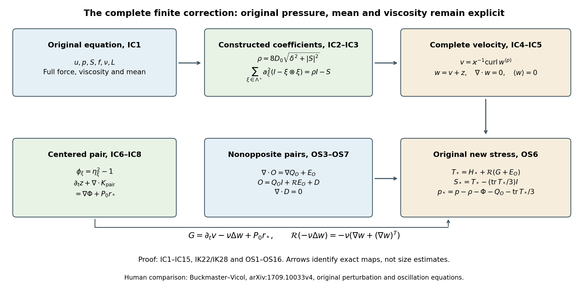
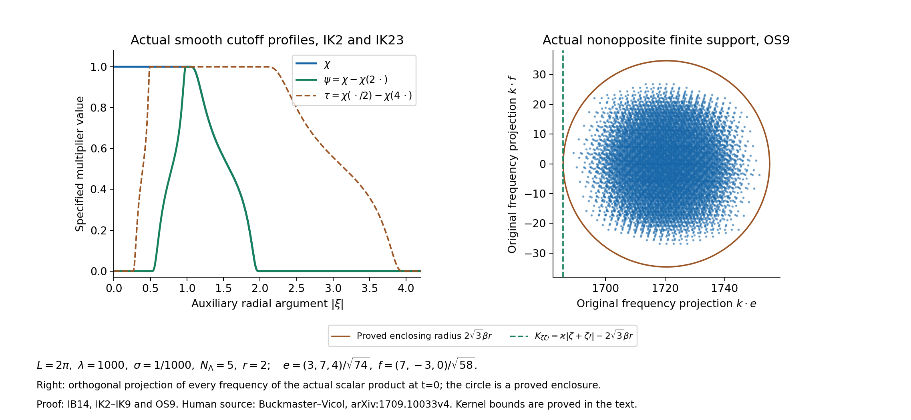

# The full intermittent correction and its original residual

[Lesson 22](intermittent-fields-and-periodic-product-estimates.md)
constructed the actual intermittent fields and the temporal
pair correction. This chapter inserts every velocity correction
into the original equation. It gives the complete new pressure
and stress, then proves the inverse-operator estimates used to
measure their oscillatory terms. The viscosity, force, period,
constant modes and every quadratic cross term remain explicit.

The inverse divergence and rational coefficient family are those
proved in [lesson 21](residual-stresses-and-exact-beltrami-fields.md).
The original projection and zero-mode convention are from
[lesson 2](pressure-and-the-divergence-free-projection.md).
Labels IC identify the complete finite correction, IK its
frequency kernels and receiving estimates, and OS its full
nonopposite and linear stress terms. References to IB, LD and
DC mean the complete proofs in lesson 22; RS and BG mean
the maps and rational frames in lesson 21.

The human source is Tristan Buckmaster and Vlad Vicol,
[*Nonuniqueness of weak solutions to the Navier–Stokes equation*,
arXiv:1709.10033v4](https://arxiv.org/abs/1709.10033v4).
The original author source was read at lines 742–836,
1200–1410 and 1585–1677 for the relevant amplitude definitions,
perturbation, residual and commutator arguments. The actual
bounded reading is recorded separately; this chapter does not
claim that every remaining iteration argument has been checked.
The exposition and proofs here are independently written.

The first construction uses the explicit positive family of
lesson 21. Its finite identity is exact. The later source
iteration uses additional cutoffs and coefficient estimates;
those cannot be inferred from the finite identity. The exercises
prove stronger matrix and square-norm bounds, an optimized
frequency split, and the full physical energy increment. No
novelty or independent review is claimed.

## IC1. Actual fields and positive coefficients

Keep the original cubic torus with period \(L>0\), positive
viscosity \(\nu\), and smooth periodic fields satisfying
\[
 \partial_tu+\operatorname{div}(u\otimes u)+\nabla p
       -\nu\Delta u=f+\operatorname{div}S,
 \qquad \operatorname{div}u=0,\qquad S=S^T,\quad\operatorname{tr}S=0.
 \tag{IC1}
\]
The original force is \(f\); its mean and the mean of \(u\)
are not reset. Use one complete rational opposite-closed
family of lesson 21. Let \(D_0>0\) be the exact trace-free
coefficient norm of its Exercise 2. For any fixed \(\delta>0\)
the smooth fields
\[
 \rho=8D_0\sqrt{\delta^2+|S|^2},\qquad R=\rho I-S,\qquad
 a_\zeta=\gamma_\zeta(R),\qquad a_{-\zeta}=a_\zeta
 \tag{IC2}
\]
are well-defined by the explicit coefficient formulas BG2–BG7.
Indeed \(|S|<\rho/(8D_0)\), so each coefficient lies strictly
between \(\rho/8\) and \(3\rho/8\). Its positive square root
is smooth. The proved full tensor identity is
\[
 \sum_{\xi\in\Lambda^+}a_\xi^2(I-\xi\otimes\xi)=\rho I-S.
 \tag{IC3}
\]
Thus the coefficient map required here is constructed, rather
than assumed as an unresolved tensor equation.

Keep all original integer and physical parameters of IB7,
with the simultaneous choices IB7a available. In particular
\(\varkappa=2\pi\lambda/L\),
\(\beta=\varkappa\sigma N_\Lambda\), and \(\mu>0\).
Use the actual amplitudes \(\eta_\zeta\) of IB8 and carriers
\(B_\zeta e^{i\varkappa\zeta\cdot x}\) of BG18.

## IC2. Complete velocity and every mean

Let \(P\) be the original Leray projection,
\(P_0h=h-\langle h\rangle\), and put
\[
 \begin{aligned}
 w^{(p)}&=\sum_{\zeta\in\Lambda}
        a_\zeta\eta_\zeta B_\zeta e^{i\varkappa\zeta\cdot x},\\
 w^{(c)}&=\varkappa^{-1}\sum_{\zeta\in\Lambda}
     \nabla(a_\zeta\eta_\zeta)\times B_\zeta
                                      e^{i\varkappa\zeta\cdot x},\\
 v&=w^{(p)}+w^{(c)}=\varkappa^{-1}\operatorname{curl}w^{(p)},\\
 z&=\mu^{-1}\sum_{\xi\in\Lambda^+}PP_0(a_\xi^2\eta_\xi^2\xi),
 \qquad w=v+z .
 \end{aligned}
 \tag{IC4}
\]
The product rule for curl and the exact carrier eigenvalue
\(\operatorname{curl}(B_\zeta e^{i\varkappa\zeta\cdot x})
=\varkappa B_\zeta e^{i\varkappa\zeta\cdot x}\)
prove the displayed equality for \(v\). Opposite terms are
complex conjugates, so every field is real. Curl and periodic
integration prove \(\operatorname{div}v=0\) and
\(\langle v\rangle=0\). The projections give the same two
identities for \(z\). Therefore
\[
 \operatorname{div}w=0,\qquad\langle w\rangle=0,
 \qquad\langle w^{(c)}\rangle=-\langle w^{(p)}\rangle .
 \tag{IC5}
\]
The principal mean need not vanish; no mean of a product is
discarded. This is why the time derivative below retains
\(\partial_tv\) as a complete pair.

## IC3. The centered paired tensor and actual temporal receiver

For each positive representative write
\[
 A_\xi=a_\xi^2,\quad\theta_\xi=\eta_\xi^2,\quad
 \phi_\xi=\theta_\xi-1,\quad
 b_\xi=\mu^{-1}\partial_tA_\xi-\xi\cdot\nabla A_\xi,
 \quad V_\xi=\partial_t(A_\xi\theta_\xi\xi).
 \tag{IC6}
\]
Both \(\theta_\xi\) and \(\phi_\xi\) satisfy the exact
positive-representative transport identity. Define the full
scalar and vector fields
\[
 \begin{aligned}
 \Phi&=\sum_{\xi\in\Lambda^+}
       \left[A_\xi\phi_\xi-
         \mu^{-1}\Delta^{-1}\operatorname{div}V_\xi\right],\\
 r_*&=\sum_{\xi\in\Lambda^+}
       \left[\phi_\xi\xi b_\xi+
                        \mu^{-1}\partial_tA_\xi\,\xi\right]\\
 &=\sum_{\xi\in\Lambda^+}
       \left[\mu^{-1}\theta_\xi\partial_tA_\xi\,\xi
                    -\phi_\xi\xi(\xi\cdot\nabla A_\xi)\right].
 \end{aligned}
 \tag{IC7}
\]
Here \(\Delta^{-1}\) has its original zero Fourier mode set
to zero. Apply the fully proved temporal pair of lesson 22, EX12–EX15 first to the factor
\(\phi_\xi\). This gives the time correction
\(\mu^{-1}PP_0(A_\xi\phi_\xi\xi)\), pressure potential
\(A_\xi\phi_\xi-\mu^{-1}\Delta^{-1}\operatorname{div}
\partial_t(A_\xi\phi_\xi\xi)\), and residual
\(P_0(\phi_\xi\xi b_\xi)\).

The actual correction IC4 also includes
\(\mu^{-1}PP_0(A_\xi\xi)\). Its derivative is exactly
\(\mu^{-1}P_0(\partial_tA_\xi\xi)
-\mu^{-1}\nabla\Delta^{-1}\operatorname{div}
(\partial_tA_\xi\xi)\). Adding these terms and summing
proves, with all constant modes retained,
\[
 \partial_tz+\operatorname{div}
 \sum_{\xi\in\Lambda^+}A_\xi\phi_\xi(I-\xi\otimes\xi)
          =\nabla\Phi+P_0r_* .
 \tag{IC8}
\]
The full equality uses no smallness estimate and no missing
amplitude hypothesis.

## IC4. All nonopposite and quadratic cross terms

Retain the complete ordered nonopposite sum
\[
 O=\sum_{\substack{\zeta,\zeta'\in\Lambda\\\zeta+\zeta'\ne0}}
 a_\zeta a_{\zeta'}\eta_\zeta\eta_{\zeta'}
 (B_\zeta\otimes B_{\zeta'})
                     e^{i\varkappa(\zeta+\zeta')\cdot x}.
 \tag{IC9}
\]
It contains the equal-direction terms as well as different
directions. Conjugate pairing and ordered-index exchange
prove that \(O\) is real and symmetric. The exact opposite
pair tensor from IB24 gives
\[
 w^{(p)}\otimes w^{(p)}
   =O+\sum_{\xi\in\Lambda^+}A_\xi\theta_\xi(I-\xi\otimes\xi).
 \tag{IC10}
\]
For the actual correction \(w=w^{(p)}+w^{(c)}+z\), define
the entire remaining quadratic tensor
\[
 \begin{aligned}
 H={}&O+u\otimes w+w\otimes u\\
 &+w^{(p)}\otimes w^{(c)}+w^{(c)}\otimes w^{(p)}\\
 &+w^{(p)}\otimes z+z\otimes w^{(p)}
                  +w^{(c)}\otimes w^{(c)}\\
 &+w^{(c)}\otimes z+z\otimes w^{(c)}+z\otimes z .
 \end{aligned}
 \tag{IC11}
\]
Each term is the literal expansion of the original quadratic
equation. No carrier-support assertion for a varying amplitude
is inferred from the carrier frequencies alone.

## IC5. Exact original force, viscosity, pressure and stress

The vector
\[
 G=\partial_tv-\nu\Delta w+P_0r_*
 \tag{IC12}
\]
has mean zero: \(v\) has zero mean at every time, the periodic
Laplacian integrates to zero, and the last term is explicitly
projected. Apply the full inverse divergence RS7–RS8 and put
\[
 T=H+\mathcal RG,\qquad
 S_+=T-\frac{\operatorname{tr}T}{3}I,\qquad
 p_+=p-\rho-\Phi-\frac{\operatorname{tr}T}{3},\qquad
 u_+=u+w .
 \tag{IC13}
\]
All fields are smooth and real, \(T\) is symmetric and
\(S_+\) is trace-free. The complete original equation is
\[
 \partial_tu_++\operatorname{div}(u_+\otimes u_+)
       +\nabla p_+-\nu\Delta u_+
       =f+\operatorname{div}S_+,
 \qquad\operatorname{div}u_+=0,
 \qquad\langle u_+\rangle=\langle u\rangle .
 \tag{IC14}
\]
To verify every sign, first keep the old pressure. Subtract IC1
from the new left side and expand its full square. Equations
IC3, IC10 and IC11 show that the stress plus all quadratic
terms equal
\(\rho I+\sum_{\xi\in\Lambda^+}A_\xi\phi_\xi
(I-\xi\otimes\xi)+H\).
The time derivative splits as \(\partial_tv+\partial_tz\).
Using IC8 and the unchanged viscous term therefore gives
\[
 \begin{aligned}
 & \partial_t(u+w)+\operatorname{div}((u+w)\otimes(u+w))
       +\nabla p-\nu\Delta(u+w)-f\\
 &=\nabla(\rho+\Phi)+\operatorname{div}H+G\\
 &=\nabla(\rho+\Phi)+\operatorname{div}T .
 \end{aligned}
 \tag{IC15}
\]
The pressure change IC13 subtracts the first gradient and
the gradient of \(\operatorname{tr}T/3\), proving exactly
IC14. In particular, \(\nu\) has never been replaced by one,
the force is the same original \(f\), and all pressure and
constant-mode contributions remain visible.

The diagram identifies the constructed coefficient map, the
mean-preserving velocity correction, and the paired and
nonopposite contributions to the new stress. Here
\(K_{\rm pair}=\sum_{\xi\in\Lambda^+}
A_\xi\phi_\xi(I-\xi\otimes\xi)\) is the exact tensor in IC8.
The nonopposite map is proved in OS1–OS7 below, and the
viscous identity is proved in OS13. Every other symbol is
defined in IC1–IC13. Arrows show how the exact contributions
enter the new equation, not an inequality or a contraction.
[Reproducible figure source](../assets/original-intermittent-residual-maps.py).
Human comparison: Buckmaster–Vicol, arXiv:1709.10033v4,
the original perturbation and oscillation equations.

## IK1. Original Fourier variables and a specified smooth cutoff

Keep \(\mathbb T_L^3=\mathbb R^3/(L\mathbb Z^3)\),
\(L>0\), and the full Fourier convention
\[
 k_j=\frac{2\pi}{L}j,\qquad
 \widehat f(j)=L^{-3}\int_{[0,L]^3}f(x)e^{-ik_j\cdot x}\,dx,
 \qquad f(x)=\sum_{j\in\mathbb Z^3}\widehat f(j)e^{ik_j\cdot x},
 \qquad \alpha=2\pi/L .
 \tag{IK1}
\]
Fourier calculations first apply to smooth functions. The
integrable kernels constructed below then define the stated
operators for every \(L^p\) space, including its endpoints.
These are the original physical frequencies; no field is
replaced by a rescaled or averaged field.

For a completely specified auxiliary cutoff set
\[
 b(s)=\begin{cases}e^{-1/s},&s>0,\\0,&s\leq0,\end{cases}
 \qquad
 \chi(\xi)=\frac{b(4-|\xi|^2)}
                   {b(4-|\xi|^2)+b(|\xi|^2-1)},
 \qquad \psi(\xi)=\chi(\xi)-\chi(2\xi).
 \tag{IK2}
\]
The denominator is positive for every \(\xi\): at least one
of its arguments is positive. Every derivative of \(b\) on
the positive axis is \(e^{-1/s}\) times a polynomial in
\(s^{-1}\). Each tends to zero at the origin, since
\(e^t\geq t^m/m!\) for every integer \(m\geq0\); choosing
\(m\) larger than a polynomial's degree proves the limit.
Induction therefore extends all derivatives continuously by
zero. Thus \(\chi\) is smooth, equals one for \(|\xi|\leq1\),
vanishes for \(|\xi|\geq2\), and lies between zero and one.
The function \(\psi\) is supported where
\(1/2\leq|\xi|\leq2\).

The exact finite telescoping identity is
\[
 \sum_{q=0}^{Q}\psi\left(\frac{k}{2^q\alpha}\right)
 =\chi\left(\frac{k}{2^Q\alpha}\right)
                         -\chi\left(\frac{2k}{\alpha}\right).
 \tag{IK3}
\]
For every nonzero original frequency \(|k|\geq\alpha\), the
second term is zero, and the first is eventually one.
For \(k=0\), every summand is zero. This retains the exact
mean subtraction in the decomposition.

## IK2. An explicit integrable-kernel constant

For a smooth compactly supported scalar, vector or matrix
symbol \(A\), use the angular inverse transform and constant
\[
 \check A(y)=(2\pi)^{-3}\int_{\mathbb R^3}e^{iy\cdot\xi}A(\xi)\,d\xi,
 \qquad
 \mathcal C(A)=\frac1{8\pi}\int_{\mathbb R^3}
                   |(1-\Delta_\xi)^2A(\xi)|\,d\xi .
 \tag{IK4}
\]
All finite-dimensional tensor norms here are Euclidean norms
of the complete arrays. In particular the matrix norm in the
integral is its Hilbert–Schmidt norm and bounds its action
on an input vector. Integration by parts has no boundary term
because the symbol is smooth and compactly supported. It gives
\[
 (1+|y|^2)^2\check A(y)=\big((1-\Delta_\xi)^2A\big)^{\vee}(y),
 \qquad \|\check A\|_{L^1(\mathbb R^3)}\leq\mathcal C(A).
 \tag{IK5}
\]
Indeed the first identity bounds the norm by
\((2\pi)^{-3}(1+|y|^2)^{-2}\int|(1-\Delta)^2A|\).
The full radial integral is
\(4\pi\int_0^\infty r^2(1+r^2)^{-2}dr=\pi^2\),
obtained by \(r=\tan\theta\) and
\(\int_0^{\pi/2}\sin^2\theta\,d\theta=\pi/4\).
This gives exactly \(1/(8\pi)\) in IK4.
The constant is a finite, specified integral of the given
symbol; it contains every component and derivative term.

If \(K\) is an integrable rapidly decreasing kernel, its
periodization on the original torus obeys
\[
 K_L(x)=\sum_{\ell\in\mathbb Z^3}K(x+L\ell),\qquad
 \|K_L\|_{L^1([0,L]^3)}\leq\|K\|_{L^1(\mathbb R^3)},\qquad
 \widehat K_L(j)=L^{-3}\widehat K(k_j).
 \tag{IK6}
\]
The norm bound follows from the triangle inequality and the
disjoint translated cells. Unfolding that absolutely integrable
sum gives the Fourier coefficient, because
\(e^{ik_j\cdot L\ell}=1\). Hence convolution means the
actual integral \(\int_{[0,L]^3}K_L(x-y)f(y)dy\); its
multiplier is \(\widehat K(k_j)\), with the factor \(L^3\)
canceling the coefficient \(L^{-3}\) in IK6.
Jensen and translation prove the convolution bound from LD12
on this original volume for every \(1\leq p\leq\infty\).

## IK3. The complete inverse symbols

For nonzero \(k\), the two actual inverse symbols are
\[
 m_I(k)=|k|^{-1},\qquad
 (m_R(k)v)_{ij}=-\frac{i}{|k|^2}
 \left[v_i k_j+k_i v_j-\frac12\delta_{ij}(k\cdot v)
          -\frac12\frac{k_i k_j(k\cdot v)}{|k|^2}\right].
 \tag{IK7}
\]
Both have degree minus one: \(m(ak)=a^{-1}m(k)\) for
\(a>0\). At zero set both multipliers to zero. The first
is the original operator \(|\nabla|^{-1}P_0\); the second
is exactly the three-dimensional inverse divergence RS7,
as follows by substituting \(\partial_j\mapsto ik_j\)
and \(\Delta^{-1}\mapsto-|k|^{-2}\) in every term.
In particular, its trace is zero and
\(i\sum_j k_j(m_R(k)v)_{ij}=v_i\). At zero the output
vanishes, so its divergence is \(P_0v\), not \(v\)
unless the original mean is zero.

For either symbol define
\[
 C_m=\mathcal C(m\psi),\qquad C_\chi=\mathcal C(\chi).
 \tag{IK8}
\]
The symbols inside these constants are smooth and compactly
supported: \(\psi\) vanishes near the only singularity of
\(m\). They specify the constants for \(m_I\) and \(m_R\)
separately and without invoking an unproved singular-integral
bound.

Let \(a_q=2^q\alpha\). The full-space inverse kernel of
\(m(k)\psi(k/a_q)\) is exactly
\[
 K_q(x)=a_q^2(m\psi)^{\vee}(a_qx),\qquad
 \|(K_q)_L\|_1\leq C_m/a_q .
 \tag{IK9}
\]
The factor is \(a_q^3a_q^{-1}\); its original convolution
measure contributes \(a_q^{-3}\) to the norm integral.
Thus the sum of the periodized kernels converges in \(L^1\),
with norm at most \(2C_m/\alpha\). IK3 shows that the
resulting Fourier multiplier is exactly \(m(k)\) at every
nonzero mode and zero at the original mean. Consequently
\[
 \|T_m f\|_p\leq\frac{2C_m}{\alpha}\|f\|_p,
 \qquad 1\leq p\leq\infty,
 \qquad T_m=m(D)P_0.
 \tag{IK10}
\]
The definition makes sense directly on all these spaces by
the convergent integrable kernel. Fourier uniqueness, for
example through the finite positive kernels of IB10, identifies
it with the original operator on smooth inputs.

## IK4. A frequency gap with its complete original norm

Suppose the actual periodic field \(g\) has no Fourier
coefficients at \(|k|<K\), where \(K>0\). In particular
its original mean is zero. Put
\[
 J=\max\left\{0,\left\lceil\log_2\frac{K}{2\alpha}\right\rceil\right\}.
 \tag{IK11}
\]
Every summand IK9 with \(q<J\) vanishes on \(g\), because
its symbol is zero for \(|k|\geq2a_q\) and \(2a_q<K\).
The remaining integrable kernels have total norm at most
\(2C_m/(2^J\alpha)\). If \(J>0\), then
\(2^J\alpha\geq K/2\); if \(J=0\), then \(K\leq2\alpha\).
Both cases prove the complete bound
\[
 \|T_m g\|_p\leq\frac{4C_m}{K}\|g\|_p,
 \qquad1\leq p\leq\infty .
 \tag{IK12}
\]
For a general \(L^p\) input with that Fourier support, the
omitted finite number of multipliers still vanish exactly.
The convergent kernel sum proves the bound without treating
a discontinuous frequency truncation as a bounded operator.

## IK5. Every derivative in the high-amplitude tail

Fix an integer \(N\geq1\) and write
\(\widetilde\psi(\xi)=\chi(\xi/2)-\chi(\xi)\).
For each ordered index list \(I=(i_1,\ldots,i_N)\) in
\(\{1,2,3\}^N\), define the complete array of symbols
\[
 A_{N,I}(\xi)=(-i)^N
       \frac{\xi_{i_1}\cdots\xi_{i_N}}{|\xi|^{2N}}
                                  \widetilde\psi(\xi),
 \qquad C_N=\mathcal C\big((A_{N,I})_I\big).
 \tag{IK13}
\]
All entries are supported on \(1\leq|\xi|\leq4\), so
the constant is finite. The exact tensor contraction is
\[
 \sum_I A_{N,I}(\xi)(i\xi_{i_1})\cdots(i\xi_{i_N})
 =\frac{(\xi_1^2+\xi_2^2+\xi_3^2)^N}{|\xi|^{2N}}
                          \widetilde\psi(\xi)
 =\widetilde\psi(\xi).
 \tag{IK14}
\]
The sum is over every ordered list, so all tensor multiplicities
are retained.

For \(s>0\) let \(\chi(D/s)\) mean the explicitly defined
periodic multiplier \(\chi(k_j/s)\). Periodization of
\(s^3\check\chi(sx)\) and IK5 give
\(\|\chi(D/s)a\|_\infty\leq C_\chi\|a\|_\infty\).
The finite telescoping identity for \(\widetilde\psi\)
and IK14 give the exact derivative representation
\[
 \begin{aligned}
 (1-\chi(D/s))a
 &=\sum_{q=0}^\infty\widetilde\psi(D/(2^qs))a,\\
 \widetilde\psi(D/t)a
 &=t^{-N}\sum_I A_{N,I}(D/t)\,\partial_Ia .
 \end{aligned}
 \tag{IK15}
\]
Each term in the second line has the actual multiplier
\(t^{-N}A_{N,I}(k/t)(ik)_I\); summing it gives
\(\widetilde\psi(k/t)\) by IK14. No derivative has been
absorbed into the amplitude. The inverse array kernel acts
by the Euclidean contraction with the full ordered tensor.
Its integrable norm is at most \(C_N\), by IK5–IK6.
The geometric sum therefore proves
\[
 \|(1-\chi(D/s))a\|_\infty
 \leq\frac{C_N}{1-2^{-N}}s^{-N}\|\nabla^Na\|_\infty .
 \tag{IK16}
\]
For a \(C^N\) amplitude the kernel series converges uniformly
by this bound. Its Fourier coefficients telescope to those
of the stated tail at every original mode, so Fourier
uniqueness proves IK15 in that class as well. This does not
require an infinite derivative bound. The same contraction
argument works for a finite-dimensional vector amplitude.

## IK6. The original amplitude–oscillation product map

Let \(a\in C^N(\mathbb T_L^3)\) be a scalar amplitude and
let the actual scalar or vector field \(g\in L^p\) have
the gap of IK11. The same proof also allows a vector amplitude
and a scalar factor; every norm then uses the full Euclidean
array. Set \(s=K/4\), and retain both exact parts
\[
 a_{\rm low}=\chi(D/s)a,\qquad a_{\rm high}=a-a_{\rm low}.
 \tag{IK17}
\]
The low part is a finite Fourier polynomial, with frequencies
of magnitude at most \(K/2\). Every coefficient of its product
with \(g\) is a finite frequency sum, so that product has no
frequencies of magnitude less than \(K/2\). Apply IK12 to
it and IK10 to the complete high-part product. Equations
IK16–IK17 give
\[
 \boxed{\;
 \|T_m(ag)\|_p
 \leq C_m\|g\|_p\left[
   \frac{8C_\chi}{K}\|a\|_\infty
   +\frac{2C_N}{\alpha(1-2^{-N})}
       \left(\frac4K\right)^N\|\nabla^Na\|_\infty
 \right].\;}
 \tag{IK18}
\]
Every original mean of \(ag\) is treated by the zero mode
in \(T_m\); it need not vanish. The estimate holds for the
whole range \(1\leq p\leq\infty\), for either complete
inverse symbol IK7. In particular it directly estimates the
original inverse divergence of an amplitude times an actual
oscillatory field, without a separate bound for a degree-zero
Riesz multiplier.

If the actual two amplitude costs are bounded by
\(\|a\|_\infty\leq C_a\) and
\(\|\nabla^Na\|_\infty\leq C_a\Lambda^N\), IK18 reads
\[
 \|T_m(ag)\|_p\leq
 \frac{C_mC_a}{K}\|g\|_p
 \left[8C_\chi+
   \frac{2\,4^NC_N}{\alpha(1-2^{-N})}
                         \frac{\Lambda^N}{K^{N-1}}\right].
 \tag{IK19}
\]
This is a consequence for the specified actual costs, not
an assumption that a required amplitude estimate has already
been proved. It uses only orders zero and \(N\). On the
source torus \(L=2\pi\), the original \(\alpha\) is one;
for \(K\geq1\), its remainder has one additional inverse
power of \(K\) compared with the source's displayed
\(\Lambda^N/K^{N-2}\) bound. This comparison keeps both
full formulas and their constants.

For a concrete smooth high-frequency operator define
\(H_K=1-\chi(D/K)\). It satisfies
\[
 \begin{gathered}
 \operatorname{supp}\widehat{H_Kf}\subseteq\{|k|\geq K\},
 \qquad \|H_Kf\|_p\leq(1+C_\chi)\|f\|_p,
 \\
 H_{K/2}g=g
 \quad\text{when }\operatorname{supp}\widehat g\subseteq\{|k|\geq K\}.
 \end{gathered}
 \tag{IK20}
\]
The first two assertions follow directly from the specified
symbol and its integrable kernel. For the last, every original
nonzero coefficient of \(g\) has \(|k|/(K/2)\geq2\), where
\(\chi\) is zero. Thus IK18 applies to \(H_Kf\) with its
displayed operator constant, and to the source's actual
finite oscillatory fields without changing those fields.
No unspecified sharp projection is used as an endpoint
bounded operator.

The left panel plots the actual auxiliary functions IK2 and
IK23. The right panel projects every original frequency of
\(\eta_\zeta\eta_{\zeta'}e^{i\varkappa(\zeta+\zeta')\cdot x}\)
at time zero, for the stated original parameters and rational
directions \(\zeta=(3,4,0)/5\), \(\zeta'=(0,3,4)/5\).
The orthogonal projection is exactly
\(k\mapsto(k\cdot e,k\cdot f)\), with both vectors displayed
under the plot. The circle is the proved enclosing radius,
not an assertion that every point of a disk is a frequency.
The frequency bound is proved in OS9; the kernel estimates
are proved in IK4–IK12 and IK23–IK26.
[Reproducible figure source](../assets/original-intermittent-residual-maps.py).
Human comparison: Buckmaster–Vicol, arXiv:1709.10033v4,
the intermittent support estimates and commutator appendix.

## IK7. The actual centered temporal pair residual

In IC6–IC7 keep \(\theta_\xi=\eta_\xi^2\),
\(\phi_\xi=\theta_\xi-1\), \(A_\xi=a_\xi^2\),
and \(h=L/(\lambda\sigma)\). The exact expansion of lesson 22, EX6
shows that \(\phi_\xi\) has physical gap \(\beta\).
Write its actual norms as
\(\Theta_{p,\xi}=\|\theta_\xi\|_p\) and
\(\Psi_{p,\xi}=\|\phi_\xi\|_p\).
All are determined by the original finite kernel and covering.
For example,
\[
 \begin{aligned}
 \Theta_{1,\xi}&=L^3,\qquad
 \Theta_{2,\xi}=L^{3/2}
               \left(\frac{2M^2+1}{3M}\right)^{3/2},\\
 \Psi_{2,\xi}^2&=L^3
       \left[\left(\frac{2M^2+1}{3M}\right)^3-1\right],\\
 \Theta_{p,\xi}&=\|\eta_\xi\|_{2p}^2
             \leq\mathcal H_{2p,r,L}^2,\qquad
 \Psi_{p,\xi}\leq\Theta_{p,\xi}+L^{3/p}.
 \end{aligned}
 \tag{IK21}
\]
At infinity the usual volume exponent is zero; the displayed
upper bounds are still valid. The exact squared-factor norms
are from lesson 22 EX1–EX3, and \(\mathcal H\) is the full
original bound LD19, not a replacement field.

Use IK18 with \(m_R\), \(K=\beta\),
\(a=\xi\cdot\nabla A_\xi\) and
\(g=\phi_\xi\xi\). Since \(|\xi|=1\), the actual zeroth
and order-\(N\) amplitude norms are bounded by
\(\|\nabla A_\xi\|_\infty\) and
\(\|\nabla^{N+1}A_\xi\|_\infty\), respectively.
This is a contraction of a full ordered tensor by a unit
vector, proved by Cauchy–Schwarz in that index.
For the remaining term in IC7 use IK10, then DC21 with
the actual small-period factor \(\theta_\xi\).
Linearity and the triangle inequality prove
\[
 \begin{aligned}
 \|\mathcal Rr_*\|_p
 \leq\sum_{\xi\in\Lambda^+} C_R\Psi_{p,\xi}
 &\left[\frac{8C_\chi}{\beta}\|\nabla A_\xi\|_\infty
 +\frac{2C_N}{\alpha(1-2^{-N})}
    \left(\frac4\beta\right)^N
                 \|\nabla^{N+1}A_\xi\|_\infty\right]\\
 +\frac{2C_R}{\alpha\mu}L^{-3/p}
 &\sum_{\xi\in\Lambda^+}\Theta_{p,\xi}
       \sum_{\epsilon\in\{0,1\}^3}h^{|\epsilon|}
                    \|\partial^\epsilon\partial_tA_\xi\|_p .
 \end{aligned}
 \tag{IK22}
\]
The notation \(C_R\) means \(C_m\) for the complete
symbol \(m_R\) in IK7. Its zero mode already removes the
mean of \(r_*\), so \(\mathcal RP_0r_*=\mathcal Rr_*\).
This supplies an actual bound on the centered temporal pair
in the full original stress, retaining \(\mu\), \(\beta\),
\(\alpha=2\pi/L\), every amplitude derivative and every
member of the positive family.

## IK8. The actual curl receiver for the time derivative

The original intermittent carrier has its full frequency band
\(\varkappa(1-\delta_r)\leq|k|\leq\varkappa(1+\delta_r)\),
where \(\delta_r=\sqrt3\sigma N_\Lambda r\leq
\sqrt3c_\Lambda/10<1/4\). The same support contains every
time derivative, since the original time dependence changes
coefficients and does not introduce spatial frequencies.
Define the complete symbols and constants
\[
 \begin{gathered}
 \tau(\xi)=\chi(\xi/2)-\chi(4\xi),\\
 m_C(k)v=ik\times v,\qquad m_B(k)=m_R(k)m_C(k),\\
 C_B=\mathcal C(m_B\tau),\quad C_C=\mathcal C(m_C\tau).
 \end{gathered}
 \tag{IK23}
\]
Here \(\tau=1\) on \(1/2\leq|\xi|\leq2\), and it is
supported on \(1/4\leq|\xi|\leq4\). The symbol \(m_B\)
has degree zero, while \(m_C\) has degree one. Applying
IK5–IK6 with the exact scaling factors gives
\[
 \|m_B(D)\tau(D/\varkappa)f\|_p\leq C_B\|f\|_p,
 \qquad
 \|\operatorname{curl}g\|_p\leq\varkappa C_C\|g\|_p
 \tag{IK24}
\]
for the actual band-limited \(g\). In the second bound
\(\tau(D/\varkappa)g=g\) at every original frequency.

For a scalar amplitude \(a\in C^N\), \(N\geq2\), split
it with \(s=\varkappa/8\) as in IK17. The low product has
support between \(\varkappa/2\) and \(3\varkappa/2\),
because the amplitude cutoff has radius \(\varkappa/4\).
Thus \(\tau(D/\varkappa)\) is exactly the identity on this
product, and IK24 bounds its \(\mathcal R\operatorname{curl}\)
image by \(C_BC_\chi\|a\|_\infty\|g\|_p\).

For the complete high product retain the actual curl product
rule. Since the cutoff commutes with all derivatives, IK16
applies to both its amplitude and its gradient:
\[
 \begin{aligned}
 \operatorname{curl}(a_{\rm high}g)
   &=\nabla a_{\rm high}\times g
                              +a_{\rm high}\operatorname{curl}g,\\
 \|\nabla a_{\rm high}\|_\infty
   &\leq\frac{C_{N-1}}{1-2^{-(N-1)}}
          \left(\frac8\varkappa\right)^{N-1}
                                     \|\nabla^Na\|_\infty,\\
 \|a_{\rm high}\|_\infty
   &\leq\frac{C_N}{1-2^{-N}}
          \left(\frac8\varkappa\right)^N
                                     \|\nabla^Na\|_\infty .
 \end{aligned}
 \tag{IK25}
\]
The gradient is a vector amplitude in the middle line; its
complete derivative tensor is exactly the ordered tensor
of order \(N\) of the original scalar amplitude.
The cross-product norm is bounded by the product of the
Euclidean norms, including complex vectors, by the full
Gram identity for the bilinear cross product.
Apply IK10 for \(m_R\) and then IK24 to the two terms.
Together with the low product this yields
\[
 \begin{aligned}
 \|\mathcal R\operatorname{curl}(ag)\|_p
 \leq\|g\|_p\Bigg[ C_BC_\chi\|a\|_\infty
 +\frac{2C_R}{\alpha}\varkappa^{1-N}
 \Bigg\{&\frac{8^{N-1}C_{N-1}}{1-2^{-(N-1)}}\\
 &+\frac{8^NC_NC_C}{1-2^{-N}}\Bigg\}
                              \|\nabla^Na\|_\infty\Bigg].
 \end{aligned}
 \tag{IK26}
\]
This is an endpoint-inclusive estimate for the actual product,
not a claim that the unrestricted degree-zero multiplier is
bounded at both endpoints.

Denote the entire finite brace in IK26 by \(D_N\). The full
original time derivative in IC4 is
\[
 \mathcal R\partial_tv
 =\varkappa^{-1}\sum_{\zeta\in\Lambda}
 \mathcal R\operatorname{curl}
 \left[(\partial_ta_\zeta)\mathbb W_\zeta
                         +a_\zeta\partial_t\mathbb W_\zeta\right].
 \tag{IK27}
\]
The two fields have the required original support. Their
norms are bounded by \(\mathcal H_{p,r,L}\) and
\(C_{0,1}\beta r\mu\mathcal H_{p,r,L}\), respectively,
by LD19–LD22. Applying IK26 separately to both terms gives
\[
 \begin{aligned}
 \|\mathcal R\partial_tv\|_p
 \leq\frac{\mathcal H_{p,r,L}}\varkappa
 \sum_{\zeta\in\Lambda}\Bigg[
 &C_BC_\chi\|\partial_ta_\zeta\|_\infty
 +\frac{2C_R D_N}{\alpha}\varkappa^{1-N}
                      \|\nabla^N\partial_ta_\zeta\|_\infty\\
 +C_{0,1}\beta r\mu\Bigg\{
 &C_BC_\chi\|a_\zeta\|_\infty
 +\frac{2C_RD_N}{\alpha}\varkappa^{1-N}
                              \|\nabla^Na_\zeta\|_\infty
 \Bigg\}\Bigg].
 \end{aligned}
 \tag{IK28}
\]
Every original spatial frequency, temporal frequency and
amplitude derivative remains. The full finite coefficient
\(D_N\) is the brace displayed in IK26. Together with IK22,
the nonopposite bound OS11 and the exact viscous identity
OS13, this supplies each inverse operator required by OS16.

## OS1. The complete polarized carrier identity

For each ordered pair \((\zeta,\zeta')\) with
\(\zeta+\zeta'\ne0\), retain
\[
 \begin{gathered}
 X=B_\zeta e^{i\varkappa\zeta\cdot x},\quad
 Y=B_{\zeta'}e^{i\varkappa\zeta'\cdot x},\\
 A=a_\zeta a_{\zeta'},\quad F=\eta_\zeta\eta_{\zeta'},\quad
 T_c=X\otimes Y+Y\otimes X,\quad q_c=X\cdot Y .
 \end{gathered}
 \tag{OS1}
\]
The dot and tensor products here are complex bilinear products;
the norms used in estimates are the full Hermitian Euclidean
norms. Both carriers have zero divergence and curl eigenvalue
\(\varkappa\). Componentwise expansion gives
\[
 \begin{aligned}
 \nabla(X\cdot Y)={}&(X\cdot\nabla)Y+(Y\cdot\nabla)X\\
 &+X\times\operatorname{curl}Y+Y\times\operatorname{curl}X.
 \end{aligned}
\]
The last two terms cancel exactly. Hence
\[
 \operatorname{div}T_c=\nabla q_c,\qquad
 \operatorname{div}(AFT_c)
  =\nabla(AFq_c)+(T_c-q_cI)(F\nabla A+A\nabla F).
 \tag{OS2}
\]
The second equality is the full product rule: its first
expansion is \(AF\nabla q_c+T_c(F\nabla A+A\nabla F)\).
Subtracting the displayed gradient retains precisely the
remaining two terms. It also holds when \(\zeta=\zeta'\);
in that case \(T_c=2X\otimes X\) and \(q_c=0\).

## OS2. Actual pressure, mean and inverse divergence

Sum OS2 over all ordered nonopposite pairs, including equal
directions, with the factor one half:
\[
 Q_O=\frac12\sum_{\zeta+\zeta'\ne0}AFq_c,\qquad
 E_O=\frac12\sum_{\zeta+\zeta'\ne0}
                (T_c-q_cI)(F\nabla A+A\nabla F).
 \tag{OS3}
\]
Index exchange shows that the one-half sum of \(AFT_c\)
is exactly the original ordered tensor \(O\) in IC9.
Conjugate pairing proves that \(Q_O\) and \(E_O\) are real.
Thus
\[
 \operatorname{div}O=\nabla Q_O+E_O,\qquad
 \langle E_O\rangle=0,\qquad
 \operatorname{div}\mathcal RE_O=E_O .
 \tag{OS4}
\]
The mean follows by integrating the full divergence and
gradient, not by assigning zero mean to each separate product
in OS3. Each complete summand of OS2 has the same property.

The exact relationship with the earlier tensor is
\[
 D=O-Q_OI-\mathcal RE_O,\qquad
 \operatorname{div}D=0,\qquad
 \operatorname{tr}D=-Q_O .
 \tag{OS5}
\]
Indeed \(\operatorname{tr}O=\sum AFq_c=2Q_O\), while
\(\mathcal RE_O\) is trace-free. Consequently this step
retains the old tensor as \(O=Q_OI+\mathcal RE_O+D\),
including its full divergence-free tensor contribution.

Write \(H_*=H-O\), where every term of \(H\) is the literal
expansion IC11. Define
\[
 \begin{aligned}
 T_*&=H_*+\mathcal R(G+E_O),\qquad
 S_*=T_*-\frac{\operatorname{tr}T_*}{3}I,\\
 p_*&=p-\rho-\Phi-Q_O-\frac{\operatorname{tr}T_*}{3}.
 \end{aligned}
 \tag{OS6}
\]
Substituting OS4 in IC15 proves the exact original equation
for the same velocity \(u+w\), same force \(f\) and same
viscosity \(\nu\), with stress \(S_*\) and pressure \(p_*\).
The complete map to IC13 is
\[
 T-T_*=Q_OI+D,\qquad
 S_+-S_*=D-\frac{\operatorname{tr}D}{3}I,\qquad
 p_*-p_+=\frac{\operatorname{tr}D}{3}=-\frac{Q_O}{3}.
 \tag{OS7}
\]
Subtracting pressure times the identity from stress shows
that their difference is the tensor \(D\), whose divergence
was proved zero. Thus the relation preserves the complete
original equation and identifies exactly what moved to
pressure and what remains in its tensor kernel.

## OS3. Every actual nonopposite frequency and derivative cost

Write
\[
 M_{\zeta\zeta'}=B_\zeta\otimes B_{\zeta'}
       +B_{\zeta'}\otimes B_\zeta
       -(B_\zeta\cdot B_{\zeta'})I,
 \qquad T_c-q_cI=e^{i\varkappa(\zeta+\zeta')\cdot x}M_{\zeta\zeta'}.
 \tag{OS8}
\]
The operator norm of this full matrix is at most three:
each rank-one summand has norm one, and the bilinear dot
product has magnitude at most one by Cauchy–Schwarz.
No tensor component has been discarded in this bound.

The full support of \(F\), or of any spatial derivative of
\(F\), lies within radius \(2\sqrt3\beta r\) about zero,
by the two original finite Fourier cubes of IB14. Therefore
both oscillatory fields
\(Fe^{i\varkappa(\zeta+\zeta')\cdot x}\) and
\(e^{i\varkappa(\zeta+\zeta')\cdot x}M_{\zeta\zeta'}\nabla F\)
have the exact lower bound on their nonzero frequencies
\[
 K_{\zeta\zeta'}=\varkappa|\zeta+\zeta'|-2\sqrt3\beta r
 \geq2\varkappa(c_\Lambda-\sqrt3\sigma N_\Lambda r)>0 .
 \tag{OS9}
\]
The last strict inequality is the actual IB7 smallness
\(\sigma N_\Lambda r\leq c_\Lambda/10\).
We keep each original angular separation in the first
expression; the lower bound does not replace it.

Let \(H_p=\mathcal H_{2p,r,L}^2\), with the full formula
LD19 and the usual endpoint interpretation. Hölder and LD20
give
\[
 \|F\|_p\leq H_p,\qquad
 \|\nabla F\|_p\leq2C_{1,0}\beta rH_p .
 \tag{OS10}
\]
The second bound keeps both differentiated factors before
using their common bound. For \(p=\infty\) it is the same
pointwise product estimate; for \(p=1\) it uses the exact
available second norms and first derivative estimates.

In the first term of OS3 use IK18 with vector amplitude
\(M_{\zeta\zeta'}\nabla A\) and scalar oscillatory factor
\(Fe^{i\varkappa(\zeta+\zeta')\cdot x}\). In the second,
use scalar amplitude \(A\) and vector oscillatory factor
\(e^{i\varkappa(\zeta+\zeta')\cdot x}M_{\zeta\zeta'}\nabla F\).
For every integer \(N\geq1\) this proves the actual bound
\[
 \begin{aligned}
 \|\mathcal RE_O\|_p\leq\frac{C_RH_p}{2}
 \sum_{\zeta+\zeta'\ne0}\Bigg\{
 3\Bigg[&\frac{8C_\chi}{K_{\zeta\zeta'}}\|\nabla A\|_\infty\\
 &+\frac{2C_N}{\alpha(1-2^{-N})}
 \left(\frac4{K_{\zeta\zeta'}}\right)^N
                       \|\nabla^{N+1}A\|_\infty\Bigg]\\
 +6C_{1,0}\beta r\Bigg[&\frac{8C_\chi}{K_{\zeta\zeta'}}\|A\|_\infty\\
 &+\frac{2C_N}{\alpha(1-2^{-N})}
 \left(\frac4{K_{\zeta\zeta'}}\right)^N
                       \|\nabla^NA\|_\infty\Bigg]\Bigg\} .
 \end{aligned}
 \tag{OS11}
\]
Here \(A=a_\zeta a_{\zeta'}\) for the indicated pair; all
its derivatives are those of the original coefficient product.
Explicitly, for every ordered list \((i_1,\ldots,i_j)\),
\[
 \partial_{i_1}\cdots\partial_{i_j}(a_\zeta a_{\zeta'})
 =\sum_{E\subseteq\{1,\ldots,j\}}
 \left(\prod_{\ell\in E}\partial_{i_\ell}\right)a_\zeta
 \left(\prod_{\ell\notin E}\partial_{i_\ell}\right)a_{\zeta'} .
 \tag{OS12}
\]
Grouping the full tensor products by subset size gives
\(\|\nabla^jA\|_\infty\leq
\sum_{b=0}^j\binom jb\|\nabla^ba_\zeta\|_\infty
\|\nabla^{j-b}a_{\zeta'}\|_\infty\).
Thus the finite receiving bound keeps every amplitude
derivative; no unproved scale estimate is substituted for it.

## OS4. Original viscosity and every remaining quadratic term

Because the actual \(w\) is divergence-free, the full RS7
operator gives the exact identity
\[
 \mathcal R(-\nu\Delta w)_{ij}
       =-\nu(\partial_jw_i+\partial_iw_j),\qquad
 \|\mathcal R(-\nu\Delta w)\|_p
       \leq2\nu\|\nabla w\|_p .
 \tag{OS13}
\]
The two terms involving \(\operatorname{div}\Delta w\)
vanish because that divergence is exactly zero. In the first
two terms, \(\Delta^{-1}\Delta w=w-\langle w\rangle\)
and differentiation removes the original constant mode.
No bound on \(\nu\) by one has been used. For \(p=2\),
the exact stronger identity is
\[
 \|\mathcal R(-\nu\Delta w)\|_2^2
                   =2\nu^2\|\nabla w\|_2^2 .
 \tag{OS14}
\]
Expanding the complete square gives the two equal gradient
norms and the cross integral
\(2\nu^2\int\sum_{ij}\partial_jw_i\partial_iw_j\).
Two periodic integrations by parts identify the latter
integrand's integral with \(\int(\operatorname{div}w)^2=0\).
This proves the exact original-volume identity.

The tensor \(H_*\) in OS6 retains every term listed in IC11
except the still-explicit original \(O\), whose precise map
is OS5–OS7. Hölder gives, for all \(1\leq p\leq\infty\),
\[
 \begin{aligned}
 \|H_*\|_p\leq{}&2\|u\|_\infty\|w\|_p
 +2\|w^{(p)}\|_{2p}\|w^{(c)}\|_{2p}
 +2\|w^{(p)}\|_{2p}\|z\|_{2p}\\
 &+\|w^{(c)}\|_{2p}^2
 +2\|w^{(c)}\|_{2p}\|z\|_{2p}+\|z\|_{2p}^2 .
 \end{aligned}
 \tag{OS15}
\]
Each coefficient two represents both original tensor
orientations. The complete cost can also be written with
the last three terms as
\((\|w^{(c)}\|_{2p}+\|z\|_{2p})^2\); OS15 retains
their individual contributions.

The map removing the trace is an orthogonal projection
of real symmetric tensors in the Frobenius norm:
\(|T_*-(\operatorname{tr}T_*/3)I|^2
=|T_*|^2-(\operatorname{tr}T_*)^2/3\leq|T_*|^2\).
Thus the actual new stress has
\[
 \|S_*\|_p\leq\|H_*\|_p
     +\|\mathcal R\partial_tv\|_p
     +2\nu\|\nabla w\|_p
     +\|\mathcal Rr_*\|_p+\|\mathcal RE_O\|_p .
 \tag{OS16}
\]
The time derivative and final two inverse quantities have
the complete estimates IK28, IK22 and OS11. The velocity and
correction costs are still the actual original quantities;
deriving their source parameter bounds is necessary before
any contraction claim. The next calculation must supply the
full coefficient and projection estimates for the source
iteration.

## Five solved exercises

### Exercise 1: find the exact matrix in every nonopposite pair

OS8 bounds the matrix \(M_{\zeta\zeta'}\) by three.
Determine its exact rank and operator norm in the original
coordinates. Propagate the result to OS11.

**Solution.** Fix the original ordered pair and write
\[
 c=\frac{|\zeta+\zeta'|}{2}>0,\qquad
 s=\frac{|\zeta-\zeta'|}{2},\qquad
 n=\frac{\zeta+\zeta'}{2c},\qquad c^2+s^2=1.
 \tag{EX1}
\]
When \(s>0\), put \(e_1=(\zeta-\zeta')/(2s)\);
when \(s=0\), choose any original real unit vector
perpendicular to \(n\) as \(e_1\). In either case
\(e_2=n\times e_1\) completes an oriented orthonormal
basis, and the original directions are exactly
\(\zeta=se_1+cn\), \(\zeta'=-se_1+cn\).
No carrier or amplitude is replaced. Define the auxiliary
vectors in these same original coordinates by
\[
 \begin{gathered}
 b_+=2^{-1/2}(e_2-ic e_1+is n),\qquad
 b_-=2^{-1/2}(e_2-ic e_1-is n),\\
 \omega_+=\overline{b_+}\cdot B_\zeta,
 \quad\omega_-=\overline{b_-}\cdot B_{\zeta'}.
 \end{gathered}
 \tag{EX2}
\]
Each \(b_\pm\) has norm one, is perpendicular to its
direction, and satisfies \(i\zeta\times b_+=b_+\) or
\(i\zeta'\times b_-=b_-\), by expanding the three basis
cross products. The eigenspace is a complex line: in any
real oriented tangent basis \((A,\zeta\times A)\), the
equation \(i\zeta\times(xA+y\zeta\times A)
=xA+y\zeta\times A\) gives \(y=ix\).
The original unit vectors \(B_\zeta,B_{\zeta'}\) lie in
these lines. Therefore \(B_\zeta=\omega_+b_+\),
\(B_{\zeta'}=\omega_-b_-\), and \(|\omega_\pm|=1\).
These are the exact phase maps to the original polarizations.

Retaining all nine tensor entries in EX2 gives
\[
 \begin{aligned}
 B_\zeta\cdot B_{\zeta'}&=\omega_+\omega_-s^2,\\
 M_{\zeta\zeta'}&=-\omega_+\omega_-
                (e_1+ic e_2)\otimes(e_1+ic e_2),\\
 d_{\zeta\zeta'}:=\|M_{\zeta\zeta'}\|_{\rm op}
 &=\|M_{\zeta\zeta'}\|_{\rm HS}
 =1+c^2=\frac{3+\zeta\cdot\zeta'}2,\qquad
 |B_\zeta\cdot B_{\zeta'}|=s^2
                         =\frac{1-\zeta\cdot\zeta'}2 .
 \end{aligned}
 \tag{EX3}
\]
For example, the full matrix before multiplication by
\(\omega_+\omega_-\), in the displayed real basis, is
\(\left(\begin{smallmatrix}-1&-ic&0\\-ic&c^2&0\\0&0&0
\end{smallmatrix}\right)\); its nine entries are the
original tensor formula evaluated on that basis. A bilinear
rank-one tensor \(r\otimes r\) has operator norm
\(|r|^2\): Cauchy–Schwarz gives the upper bound and the
unit input \(\overline r/|r|\) attains it. Its
Hilbert–Schmidt norm has the same value. Thus the rank is
exactly one. Equal directions remain included: then \(c=1\),
the dot product is zero and the norm is two.

There is a further gain for the actual real amplitudes. For
an original real vector \(h\), EX3 gives the exact formula
\[
 \begin{aligned}
 |M_{\zeta\zeta'}h|^2
 &=d_{\zeta\zeta'}\bigl((e_1\cdot h)^2+c^2(e_2\cdot h)^2\bigr)\\
 &\leq d_{\zeta\zeta'}|h|^2.
 \end{aligned}
\]
The real unit input \(h=e_1\) attains the bound, so the
exact norm on real inputs is \(\sqrt{d_{\zeta\zeta'}}\).
Every derivative of the original real amplitude product
\(A\), and every derivative of the original real factor
\(F\), is real. Applying this equality to each vector slice
of a full derivative tensor retains the same constant.

In OS11 the coefficient three can therefore be replaced
by the individual \(\sqrt{d_{\zeta\zeta'}}\), and the
coefficient \(6C_{1,0}\beta r\) by
\(2\sqrt{d_{\zeta\zeta'}}C_{1,0}\beta r\).
All sums, angle-dependent gaps and amplitude derivatives
remain unchanged. Each matrix constant strictly decreases
because \(1<\sqrt{d_{\zeta\zeta'}}\leq\sqrt2<3\).
Exercise 4 writes the resulting full receiving estimate.

### Exercise 2: prove the exact square norm of the curl receiver

Find the complete \(L^2\) norm of
\(\mathcal R\operatorname{curl}U\) for an arbitrary smooth
periodic vector field \(U\), including its mean. Apply it
to \(\partial_tv\) in IC4 without assuming any Fourier
support for the varying amplitudes.

**Solution.** At every nonzero original frequency write
\(P_k=I-k\otimes k/|k|^2\). The full inverse symbol IK7
on a vector \(h\) perpendicular to \(k\) has squared norm
\(2|h|^2/|k|^2\): the two complete rank-one
terms have that sum of squared norms and their cross inner
product is zero. The remaining two terms contain \(k\cdot h\)
and vanish for this exact input. With \(h=ik\times\widehat U\),
the complete cross-product identity gives
\(|h|^2=|k|^2|P_k\widehat U|^2\). At zero the curl is
zero. Parseval with the original factor \(L^3\) proves
\[
 \begin{aligned}
 \|\mathcal R\operatorname{curl}U\|_2^2
 &=2L^3\sum_{j\ne0}|P_{k_j}\widehat U(j)|^2\\
 &=2\|PP_0U\|_2^2
 =2\bigl(\|PU\|_2^2-L^3|\langle U\rangle|^2\bigr).
 \end{aligned}
 \tag{EX4}
\]
The last equality retains the constant vector on which the
original Leray projection acts as the identity. The formula
extends to every \(L^2\) vector field by the Fourier sum;
its curl may be a distribution, while this composite image
has the proved square-integrable representative.

The exact curl expression for \(v\) now yields
\[
 \begin{aligned}
 \|\mathcal R\partial_tv\|_2
 &=\frac{\sqrt2}{\varkappa}
                   \|PP_0\partial_tw^{(p)}\|_2\\
 &\leq\frac{\sqrt2\,L^{3/2}}{\varkappa}
   \sum_{\zeta\in\Lambda}
       \left[\|\partial_ta_\zeta\|_\infty
           +C_{0,1}\beta r\mu\|a_\zeta\|_\infty\right].
 \end{aligned}
 \tag{EX5}
\]
Here \(\partial_tw^{(p)}\) is the complete two-term sum
in IK27. Projection is an orthogonal contraction, the
original carrier norm is exactly \(L^{3/2}\), and the
reproducing-kernel bound LD17 with the exact norm map LD18
bounds its time derivative by
\(C_{0,1}\beta r\mu L^{3/2}\). This proves the estimate
with no derivative of an amplitude hidden in a multiplier
constant. At \(p=2\), EX5 may replace IK28 in OS16;
OS14 also replaces the viscous coefficient \(2\nu\) there
by the exact \(\sqrt2\nu\). These statements concern the
complete original fields, including their varying means.

### Exercise 3: compute one temporal correction exactly

For one positive representative keep a positive amplitude
\(A\) constant in space and time. Compute both
\(\|z_\xi\|_2\) and \(\|\nabla z_\xi\|_2\), where
\(z_\xi=\mu^{-1}A PP_0(\eta_\xi^2\xi)\).
Do not replace the projection by its upper bound one.

**Solution.** Let \(M=2r+1\). For
\(J=(j,k,l)\in\{-(M-1),\ldots,M-1\}^3\), the actual
coefficient of \(\theta_\xi\) is
\[
 t_J=M^{-3}(M-|j|)(M-|k|)(M-|l|)
                     e^{i\beta\mu jt},\qquad
 k_J=\beta(j\xi+kA_\xi^{\rm frame}+lC_\xi^{\rm frame}).
 \tag{EX6}
\]
The superscript distinguishes the original frame vectors
from the constant amplitude. The orthogonal frame makes
the frequency map injective. The projection kills the
original \(J=0\) term and for \(J\ne0\) gives
\(|P_{k_J}\xi|^2=1-j^2/(j^2+k^2+l^2)\).
The weights \(|t_J|^2\) are invariant under permutations
of the three indices. Consequently each of the three
weighted sums with numerator \(j^2,k^2,l^2\) is one third
of the sum with numerator \(j^2+k^2+l^2\). Parseval and
the exact fourth norm of lesson 22 give
\[
 \|z_\xi\|_2^2
 =\frac{2A^2L^3}{3\mu^2}
       \left[\left(\frac{2M^2+1}{3M}\right)^3-1\right].
 \tag{EX7}
\]
This argument retains all original modes and their phases;
the phases cancel only in their squared magnitudes.

For the derivative the full weight is instead
\(|k_J|^2|P_{k_J}\xi|^2=\beta^2(k^2+l^2)\).
Define the actual finite sums
\[
 \begin{aligned}
 S_0&=\sum_{j=-(M-1)}^{M-1}(M-|j|)^2
                   =\frac{M(2M^2+1)}3,\\
 S_2&=\sum_{j=-(M-1)}^{M-1}j^2(M-|j|)^2
                   =\frac{M(M^4-1)}{15},\\
 \|\nabla z_\xi\|_2^2
   &=\frac{2A^2\beta^2L^3}{\mu^2M^6}S_2S_0^2 .
 \end{aligned}
 \tag{EX8}
\]
For completeness, the first sum is
\(M^2+2(M-1)M(2M-1)/6\). The second is
\(2[M^2P_2(M-1)-2MP_3(M-1)+P_4(M-1)]\), where
\(P_2(n)=n(n+1)(2n+1)/6\),
\(P_3(n)=n^2(n+1)^2/4\), and
\(P_4(n)=n(n+1)(2n+1)(3n^2+3n-1)/30\).
Direct subtraction gives \(P_j(n)-P_j(n-1)=n^j\),
and each polynomial vanishes at zero, proving the finite
sum formulas by telescoping. Expansion gives EX8 with all
finite terms retained. The two differentiated transverse
indices account for its factor two.

For this single constant pair, IC7 has \(r_*=0\);
its time derivative and paired divergence are exactly the
pressure gradient in IC8. Nevertheless EX7 is positive
when \(r\geq1\), so its velocity and viscous cost are
not zero. These are single-pair identities. The square norm
of the full family also contains cross terms; no orthogonality
between different pairs is asserted.

### Exercise 4: choose the actual frequency split optimally

Replace the fixed split \(K/4\) in IK17 by \(\vartheta K\),
where \(0<\vartheta<1/2\). Prove the resulting bound,
find its best split, and combine it with Exercise 1.

**Solution.** The low amplitude now has frequencies at most
\(2\vartheta K\), so the low product has gap
\((1-2\vartheta)K\). Its high-amplitude tail has the
complete IK16 bound with \(s=\vartheta K\).
For the actual scalar or vector amplitude define
\[
 \begin{aligned}
 X(a,K)&=\frac{4C_\chi}{K}\|a\|_\infty,\qquad
 Y_N(a,K)=\frac{2C_N}{\alpha(1-2^{-N})K^N}
                                      \|\nabla^Na\|_\infty,\\
 F_N(a,K;\vartheta)&=
          \frac{X(a,K)}{1-2\vartheta}
                      +\frac{Y_N(a,K)}{\vartheta^N},\\
 \|T_m(ag)\|_p&\leq C_m\|g\|_p F_N(a,K;\vartheta).
 \end{aligned}
 \tag{EX9}
\]
This is exactly IK12 for the low product and IK10 for
the high product, with their original kernel constants.
The choice \(\vartheta=1/4\) returns IK18 term by term.

If \(X,Y_N>0\), the cost tends to infinity at both
ends of the interval. Differentiation gives
\[
 F_N'=\frac{2X}{(1-2\vartheta)^2}
             -\frac{NY_N}{\vartheta^{N+1}},\qquad
 F_N''=\frac{8X}{(1-2\vartheta)^3}
             +\frac{N(N+1)Y_N}{\vartheta^{N+2}}>0.
 \tag{EX10}
\]
Thus there is a unique minimum, at the unique root
\(2X\vartheta^{N+1}=NY_N(1-2\vartheta)^2\).
For \(N=1\) the complete answer is
\[
 \vartheta_*=
       \frac{\sqrt{2Y_1}}{2(\sqrt X+\sqrt{2Y_1})},\qquad
 F_1(a,K;\vartheta_*)=(\sqrt X+\sqrt{2Y_1})^2 .
 \tag{EX11}
\]
Substitution in EX9 verifies both coefficients directly.
For \(Y_N=0\), the infimum is \(X\), approached as
\(\vartheta\downarrow0\). In this case the actual
amplitude is constant: its order-\(N\) Fourier derivatives
vanish, so every nonzero coefficient vanishes. The more
direct constant-amplitude estimate IK12 is also available.
If \(X=0\), the actual amplitude and all its derivatives
are zero, so the result is zero. These cover every case.
Let \(F_N^{\min}(a,K)\) denote the attained minimum or
the stated infimum. Taking the infimum of the valid inequalities
EX9 preserves the bound even when the endpoint is not attained.

Apply EX9 first to the vector amplitude
\(M_{\zeta\zeta'}\nabla A\) and then to the scalar
amplitude \(A\) as in OS11. The exact constant matrix
in Exercise 1 bounds all ordered derivatives of the actual
real amplitude gradient by \(\sqrt{d_{\zeta\zeta'}}\)
times the full original tensor norm. Its same real-input bound
applies to the original \(\nabla F\).
The resulting receiving inequality is
\[
 \begin{aligned}
 \|\mathcal RE_O\|_p\leq\frac{C_RH_p}{2}
 \sum_{\zeta+\zeta'\ne0}\sqrt{d_{\zeta\zeta'}}
 \Big[&F_N^{\min}(\nabla A,K_{\zeta\zeta'})\\
       &+2C_{1,0}\beta r
                   F_N^{\min}(A,K_{\zeta\zeta'})\Big].
 \end{aligned}
 \tag{EX12}
\]
Here \(A=a_\zeta a_{\zeta'}\) is still the original
product, with all derivatives given by OS12. The full centered
bound IK22 is strengthened by replacing its first square
bracket by \(F_N^{\min}(\nabla A_\xi,\beta)\);
the entire second, temporal term remains unchanged.
The unit-vector contraction used there is bounded by the
full gradient tensor, exactly as in IK22. Substitution in
OS16 propagates both improvements through the complete
new-stress estimate. No coefficient cost or term is suppressed.

### Exercise 5: retain the full energy increment and its means

Find the exact change of kinetic energy under IC4, and
bound the two oscillatory integrals using their actual gaps.
Keep all correction cross terms.

**Solution.** All integrals in this exercise are over
\([0,L]^3\), with its original volume measure. Set
\(\mathscr E(U)=\frac12\int|U|^2\).
Tracing IC3 gives \(2\sum_\xi A_\xi=3\rho\).
Tracing IC10 gives
\(\frac12|w^{(p)}|^2=Q_O+\sum_\xi A_\xi\theta_\xi\).
Expansion of the entire velocity square therefore proves
\[
 \begin{aligned}
 \mathscr E(u+w)-\mathscr E(u)
 ={}&\frac32\int\rho
       +\sum_{\xi\in\Lambda^+}\int A_\xi\phi_\xi
       +\int Q_O+\int u\cdot w\\
    &+\int w^{(p)}\cdot w^{(c)}+\int w^{(p)}\cdot z
       +\frac12\int|w^{(c)}|^2
       +\int w^{(c)}\cdot z+\frac12\int|z|^2 .
 \end{aligned}
 \tag{EX13}
\]
In particular the trace contribution moved to pressure in
OS6 has not disappeared from the physical velocity energy.

For any scalar amplitude \(a\) and actual scalar field
\(g\) with gap \(K\), use \(\chi(D/(K/2))a\).
Its nonzero Fourier coefficients have magnitude strictly
less than \(K\), since \(\chi=0\) at and beyond two.
The integral of this finite polynomial times \(g\) is
therefore exactly zero. Applying IK16 to the remaining
amplitude gives the complete mean estimate
\[
 \left|\int ag\right|
 \leq\frac{C_N}{1-2^{-N}}
           \left(\frac2K\right)^N
              \|\nabla^Na\|_\infty\|g\|_1 .
 \tag{EX14}
\]
The complex bilinear integral has the same bound by its
absolute value; no conjugate is inserted into the original
product. This proof removes only the exactly orthogonal
finite part and retains every coefficient in the tail.

Thus, using the exact second norm in place of the larger
upper envelope \(\mathcal H_{2,r,L}\),
\[
 \begin{aligned}
 \left|\sum_{\xi\in\Lambda^+}\int A_\xi\phi_\xi\right|
 &\leq\frac{C_N}{1-2^{-N}}
        \left(\frac2\beta\right)^N
        \sum_{\xi\in\Lambda^+}\Psi_{1,\xi}
                                    \|\nabla^NA_\xi\|_\infty,\\
 \left|\int Q_O\right|
 &\leq\frac{C_N L^3}{2(1-2^{-N})}
   \sum_{\zeta+\zeta'\ne0}
       \frac{1-\zeta\cdot\zeta'}2
       \left(\frac2{K_{\zeta\zeta'}}\right)^N
                    \|\nabla^N(a_\zeta a_{\zeta'})\|_\infty .
 \end{aligned}
 \tag{EX15}
\]
The second line uses the actual carrier gap OS9, the full
one-half ordered sum OS3, the exact dot-product magnitude
EX3, and \(\|\eta_\zeta\eta_{\zeta'}\|_1\leq L^3\)
from the exact second norms and Cauchy–Schwarz. In the first
line \(\Psi_{1,\xi}\leq2L^3\) follows from IK21;
the actual norm remains displayed.

Subtracting the first term in EX13 and taking absolute
values gives the sum of the two bounds EX15 plus
\[
 \|u\|_2\|w\|_2
 +\|w^{(p)}\|_2\|w^{(c)}\|_2
 +\|w^{(p)}\|_2\|z\|_2
 +\tfrac12\|w^{(c)}\|_2^2
 +\|w^{(c)}\|_2\|z\|_2
 +\tfrac12\|z\|_2^2 .
 \tag{EX16}
\]
Each term follows from its corresponding original integral
by Cauchy–Schwarz. The original mean velocity remains in
\(u\); its constant part has zero integral against \(w\)
by IC5, but no such cancellation is assumed for its variable
part. These exact finite estimates supply an energy receiver.
They do not assert that the remaining amplitude and correction
costs meet an infinite-iteration energy prescription.

## The next estimates

The complete finite correction, original inverse kernels and
all oscillatory receiving bounds are now proved. The source's
actual cutoff amplitudes and complete velocity and correction
costs must next be derived and substituted in these estimates.
The energy receiver EX13–EX16 retains the means and all cross
terms needed for that calculation. A finite residual identity
does not by itself establish an infinite contraction or a
nonuniqueness construction.

The separate Albritton–Brué–Colombo, Alpöge–Buckmaster,
OpenAI and workbench constructions retain their own original
equations, domains, force classes and precise hypotheses.
